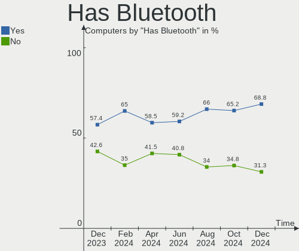
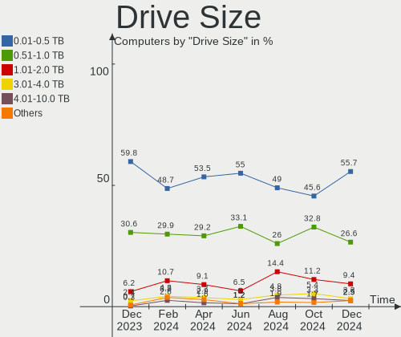
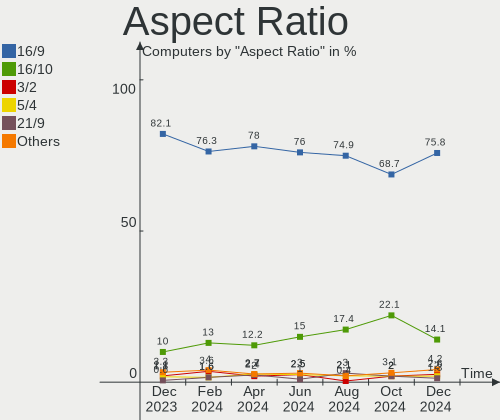
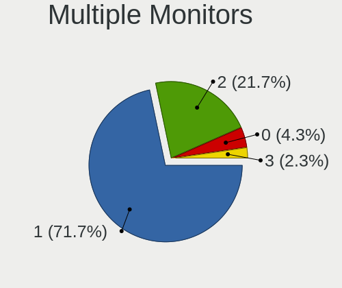
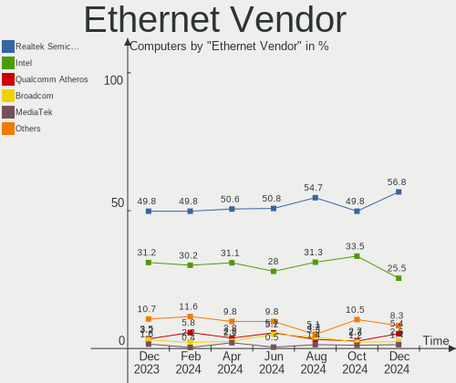
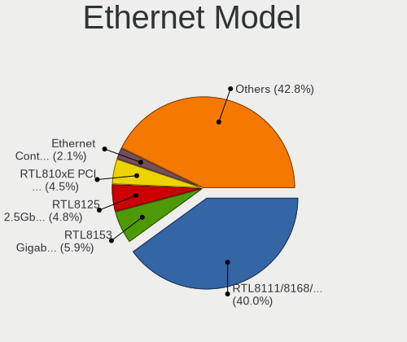

Linux in France - Hardware Trends
---------------------------------

A project to identify most popular hardware characteristics and track their change
over time based on data collected by Linux users at https://Linux-Hardware.org.

Anyone can contribute to this report by the [hw-probe](https://github.com/linuxhw/hw-probe) tool:

    sudo -E hw-probe -all -upload

This is a report for all computer types. See also reports for [desktops](/Location/France/Desktop/README.md) and [notebooks](/Location/France/Notebook/README.md).

Period: Dec, 2022.

Contents
--------

* [ System ](#system)
  - [ OS                       ](#os)
  - [ OS Family                ](#os-family)
  - [ Kernel                   ](#kernel)
  - [ Kernel Family            ](#kernel-family)
  - [ Kernel Major Ver.        ](#kernel-major-ver)
  - [ Arch                     ](#arch)
  - [ DE                       ](#de)
  - [ Display Server           ](#display-server)
  - [ Display Manager          ](#display-manager)
  - [ OS Lang                  ](#os-lang)
  - [ Boot Mode                ](#boot-mode)
  - [ Filesystem               ](#filesystem)
  - [ Part. scheme             ](#part-scheme)
  - [ Dual Boot with Linux/BSD ](#dual-boot-with-linuxbsd)
  - [ Dual Boot (Win)          ](#dual-boot-win)

* [ Board ](#board)
  - [ Vendor                   ](#vendor)
  - [ Model                    ](#model)
  - [ Model Family             ](#model-family)
  - [ MFG Year                 ](#mfg-year)
  - [ Form Factor              ](#form-factor)
  - [ Secure Boot              ](#secure-boot)
  - [ Coreboot                 ](#coreboot)
  - [ RAM Size                 ](#ram-size)
  - [ RAM Used                 ](#ram-used)
  - [ Total Drives             ](#total-drives)
  - [ Has CD-ROM               ](#has-cd-rom)
  - [ Has Ethernet             ](#has-ethernet)
  - [ Has WiFi                 ](#has-wifi)
  - [ Has Bluetooth            ](#has-bluetooth)

* [ Location ](#location)
  - [ Country                  ](#country)
  - [ City                     ](#city)

* [ Drives ](#drives)
  - [ Drive Vendor             ](#drive-vendor)
  - [ Drive Model              ](#drive-model)
  - [ HDD Vendor               ](#hdd-vendor)
  - [ SSD Vendor               ](#ssd-vendor)
  - [ Drive Kind               ](#drive-kind)
  - [ Drive Connector          ](#drive-connector)
  - [ Drive Size               ](#drive-size)
  - [ Space Total              ](#space-total)
  - [ Space Used               ](#space-used)
  - [ Malfunc. Drives          ](#malfunc-drives)
  - [ Malfunc. Drive Vendor    ](#malfunc-drive-vendor)
  - [ Malfunc. HDD Vendor      ](#malfunc-hdd-vendor)
  - [ Malfunc. Drive Kind      ](#malfunc-drive-kind)
  - [ Failed Drives            ](#failed-drives)
  - [ Failed Drive Vendor      ](#failed-drive-vendor)
  - [ Drive Status             ](#drive-status)

* [ Storage controller ](#storage-controller)
  - [ Storage Vendor           ](#storage-vendor)
  - [ Storage Model            ](#storage-model)
  - [ Storage Kind             ](#storage-kind)

* [ Processor ](#processor)
  - [ CPU Vendor               ](#cpu-vendor)
  - [ CPU Model                ](#cpu-model)
  - [ CPU Model Family         ](#cpu-model-family)
  - [ CPU Cores                ](#cpu-cores)
  - [ CPU Sockets              ](#cpu-sockets)
  - [ CPU Threads              ](#cpu-threads)
  - [ CPU Op-Modes             ](#cpu-op-modes)
  - [ CPU Microcode            ](#cpu-microcode)
  - [ CPU Microarch            ](#cpu-microarch)

* [ Graphics ](#graphics)
  - [ GPU Vendor               ](#gpu-vendor)
  - [ GPU Model                ](#gpu-model)
  - [ GPU Combo                ](#gpu-combo)
  - [ GPU Driver               ](#gpu-driver)
  - [ GPU Memory               ](#gpu-memory)

* [ Monitor ](#monitor)
  - [ Monitor Vendor           ](#monitor-vendor)
  - [ Monitor Model            ](#monitor-model)
  - [ Monitor Resolution       ](#monitor-resolution)
  - [ Monitor Diagonal         ](#monitor-diagonal)
  - [ Monitor Width            ](#monitor-width)
  - [ Aspect Ratio             ](#aspect-ratio)
  - [ Monitor Area             ](#monitor-area)
  - [ Pixel Density            ](#pixel-density)
  - [ Multiple Monitors        ](#multiple-monitors)

* [ Network ](#network)
  - [ Net Controller Vendor    ](#net-controller-vendor)
  - [ Net Controller Model     ](#net-controller-model)
  - [ Wireless Vendor          ](#wireless-vendor)
  - [ Wireless Model           ](#wireless-model)
  - [ Ethernet Vendor          ](#ethernet-vendor)
  - [ Ethernet Model           ](#ethernet-model)
  - [ Net Controller Kind      ](#net-controller-kind)
  - [ Used Controller          ](#used-controller)
  - [ NICs                     ](#nics)
  - [ IPv6                     ](#ipv6)

* [ Bluetooth ](#bluetooth)
  - [ Bluetooth Vendor         ](#bluetooth-vendor)
  - [ Bluetooth Model          ](#bluetooth-model)

* [ Sound ](#sound)
  - [ Sound Vendor             ](#sound-vendor)
  - [ Sound Model              ](#sound-model)

* [ Memory ](#memory)
  - [ Memory Vendor            ](#memory-vendor)
  - [ Memory Model             ](#memory-model)
  - [ Memory Kind              ](#memory-kind)
  - [ Memory Form Factor       ](#memory-form-factor)
  - [ Memory Size              ](#memory-size)
  - [ Memory Speed             ](#memory-speed)

* [ Printers & scanners ](#printers--scanners)
  - [ Printer Vendor           ](#printer-vendor)
  - [ Printer Model            ](#printer-model)
  - [ Scanner Vendor           ](#scanner-vendor)
  - [ Scanner Model            ](#scanner-model)

* [ Camera ](#camera)
  - [ Camera Vendor            ](#camera-vendor)
  - [ Camera Model             ](#camera-model)

* [ Security ](#security)
  - [ Fingerprint Vendor       ](#fingerprint-vendor)
  - [ Fingerprint Model        ](#fingerprint-model)
  - [ Chipcard Vendor          ](#chipcard-vendor)
  - [ Chipcard Model           ](#chipcard-model)

* [ Unsupported ](#unsupported)
  - [ Unsupported Devices      ](#unsupported-devices)
  - [ Unsupported Device Types ](#unsupported-device-types)

System
------

OS
--

Installed operating systems

| Name                      | Computers | Percent |
|---------------------------|-----------|---------|
| Ubuntu 22.04              | 63        | 21%     |
| Debian 11                 | 26        | 8.67%   |
| OpenMandriva 4.3          | 20        | 6.67%   |
| Fedora 37                 | 16        | 5.33%   |
| Linux Mint 21             | 15        | 5%      |
| Ubuntu 20.04              | 13        | 4.33%   |
| Ubuntu 22.10              | 12        | 4%      |
| Xubuntu 22.04             | 10        | 3.33%   |
| Kubuntu 22.04             | 8         | 2.67%   |
| Arch Rolling              | 8         | 2.67%   |
| Linux Mint 20.3           | 7         | 2.33%   |
| Kali 2022.4               | 7         | 2.33%   |
| Zorin 16                  | 6         | 2%      |
| Manjaro 22.0.0            | 6         | 2%      |
| OpenMandriva 4.50         | 5         | 1.67%   |
| Debian                    | 5         | 1.67%   |
| Pop!_OS 22.04             | 4         | 1.33%   |
| Manjaro                   | 4         | 1.33%   |
| Fedora 36                 | 4         | 1.33%   |
| Xubuntu 20.04             | 3         | 1%      |
| SteamOS 3.3.2             | 3         | 1%      |
| Parrot 5.1                | 3         | 1%      |
| Linux Mint 21.1           | 3         | 1%      |
| Kubuntu 22.10             | 3         | 1%      |
| Gentoo 2.9                | 3         | 1%      |
| openSUSE Microos-XXXXXXXX | 2         | 0.67%   |
| Lubuntu 22.04             | 2         | 0.67%   |
| ArcoLinux Rolling         | 2         | 0.67%   |
| Zorin 15                  | 1         | 0.33%   |
| Xubuntu 22.10             | 1         | 0.33%   |
| Ubuntu Unity 22.04        | 1         | 0.33%   |
| Ubuntu Unity 18.04        | 1         | 0.33%   |
| Ubuntu Studio 22.04       | 1         | 0.33%   |
| Ubuntu Studio 20.04       | 1         | 0.33%   |
| Ubuntu MATE 22.04         | 1         | 0.33%   |
| Ubuntu MATE 20.04         | 1         | 0.33%   |
| Ubuntu 18.04              | 1         | 0.33%   |
| SteamOS 3.4               | 1         | 0.33%   |
| Sparky 6.5                | 1         | 0.33%   |
| ROSA R11.1                | 1         | 0.33%   |

OS Family
---------

OS without a version

| Name          | Computers | Percent |
|---------------|-----------|---------|
| Ubuntu        | 89        | 29.67%  |
| Debian        | 31        | 10.33%  |
| OpenMandriva  | 28        | 9.33%   |
| Linux Mint    | 27        | 9%      |
| Fedora        | 20        | 6.67%   |
| Xubuntu       | 14        | 4.67%   |
| Kubuntu       | 12        | 4%      |
| Manjaro       | 10        | 3.33%   |
| Kali          | 8         | 2.67%   |
| Arch          | 8         | 2.67%   |
| Zorin         | 7         | 2.33%   |
| SteamOS       | 4         | 1.33%   |
| Pop!_OS       | 4         | 1.33%   |
| openSUSE      | 4         | 1.33%   |
| Lubuntu       | 4         | 1.33%   |
| Parrot        | 3         | 1%      |
| Gentoo        | 3         | 1%      |
| Ubuntu Unity  | 2         | 0.67%   |
| Ubuntu Studio | 2         | 0.67%   |
| Ubuntu MATE   | 2         | 0.67%   |
| ROSA          | 2         | 0.67%   |
| Elementary    | 2         | 0.67%   |
| ArcoLinux     | 2         | 0.67%   |
| Sparky        | 1         | 0.33%   |
| Nobara        | 1         | 0.33%   |
| MX            | 1         | 0.33%   |
| Mageia        | 1         | 0.33%   |
| KDE neon      | 1         | 0.33%   |
| Garuda Linux  | 1         | 0.33%   |
| Endless       | 1         | 0.33%   |
| EndeavourOS   | 1         | 0.33%   |
| Devuan        | 1         | 0.33%   |
| CentOS        | 1         | 0.33%   |
| BlackPanther  | 1         | 0.33%   |
| AlmaLinux     | 1         | 0.33%   |

Kernel
------

Version of the Linux kernel

| Version                    | Computers | Percent |
|----------------------------|-----------|---------|
| 5.15.0-56-generic          | 92        | 30.67%  |
| 5.16.7-desktop-1omv4003    | 18        | 6%      |
| 5.19.0-26-generic          | 14        | 4.67%   |
| 5.15.0-53-generic          | 12        | 4%      |
| 5.10.0-19-amd64            | 11        | 3.67%   |
| 5.4.0-135-generic          | 10        | 3.33%   |
| 5.15.0-57-generic          | 6         | 2%      |
| 5.19.12-desktop-2omv4090   | 5         | 1.67%   |
| 5.10.0-20-amd64            | 5         | 1.67%   |
| 6.0.6-76060006-generic     | 4         | 1.33%   |
| 6.0.0-kali3-amd64          | 4         | 1.33%   |
| 6.0.0-5-amd64              | 4         | 1.33%   |
| 6.0.0-0.deb11.2-amd64      | 4         | 1.33%   |
| 5.15.81-1-MANJARO          | 4         | 1.33%   |
| 5.15.0-56-lowlatency       | 4         | 1.33%   |
| 5.13.0-valve21.3-1-neptune | 4         | 1.33%   |
| 6.1.1-arch1-1              | 3         | 1%      |
| 6.0.12-300.fc37.x86_64     | 3         | 1%      |
| 6.0.11-300.fc37.x86_64     | 3         | 1%      |
| 6.0.10-300.fc37.x86_64     | 3         | 1%      |
| 6.0.0-2parrot1-amd64       | 3         | 1%      |
| 5.15.0-52-generic          | 3         | 1%      |
| 6.1.1-1-MANJARO            | 2         | 0.67%   |
| 6.1.0-1-MANJARO            | 2         | 0.67%   |
| 6.0.9-arch1-1              | 2         | 0.67%   |
| 6.0.14-300.fc37.x86_64     | 2         | 0.67%   |
| 6.0.12-arch1-1             | 2         | 0.67%   |
| 6.0.10-200.fc36.x86_64     | 2         | 0.67%   |
| 5.4.0-52-generic           | 2         | 0.67%   |
| 5.18.0-kali5-amd64         | 2         | 0.67%   |
| 5.16.13-desktop-1omv4003   | 2         | 0.67%   |
| 5.15.80-gentoo-x86_64      | 2         | 0.67%   |
| 5.15.0-43-generic          | 2         | 0.67%   |
| 5.10.0-18-amd64            | 2         | 0.67%   |
| 4.15.0-200-generic         | 2         | 0.67%   |
| 6.1.1-zen1-1-zen           | 1         | 0.33%   |
| 6.1.0-1-default            | 1         | 0.33%   |
| 6.0.9-desktop-1omv22090    | 1         | 0.33%   |
| 6.0.9-300.fc37.x86_64      | 1         | 0.33%   |
| 6.0.9-060009-generic       | 1         | 0.33%   |

Kernel Family
-------------

Linux kernel without a distro release

| Version | Computers | Percent |
|---------|-----------|---------|
| 5.15.0  | 121       | 40.33%  |
| 5.10.0  | 21        | 7%      |
| 6.0.0   | 19        | 6.33%   |
| 5.19.0  | 18        | 6%      |
| 5.16.7  | 18        | 6%      |
| 5.4.0   | 17        | 5.67%   |
| 6.0.10  | 9         | 3%      |
| 6.0.12  | 7         | 2.33%   |
| 6.1.1   | 6         | 2%      |
| 6.0.9   | 5         | 1.67%   |
| 6.0.11  | 5         | 1.67%   |
| 5.19.12 | 5         | 1.67%   |
| 5.13.0  | 5         | 1.67%   |
| 6.0.6   | 4         | 1.33%   |
| 5.15.81 | 4         | 1.33%   |
| 6.1.0   | 3         | 1%      |
| 5.15.80 | 3         | 1%      |
| 4.15.0  | 3         | 1%      |
| 6.0.8   | 2         | 0.67%   |
| 6.0.14  | 2         | 0.67%   |
| 5.18.0  | 2         | 0.67%   |
| 5.16.13 | 2         | 0.67%   |
| 6.0.7   | 1         | 0.33%   |
| 6.0.5   | 1         | 0.33%   |
| 6.0.15  | 1         | 0.33%   |
| 6.0.13  | 1         | 0.33%   |
| 5.3.18  | 1         | 0.33%   |
| 5.19.16 | 1         | 0.33%   |
| 5.17.0  | 1         | 0.33%   |
| 5.15.79 | 1         | 0.33%   |
| 5.15.78 | 1         | 0.33%   |
| 5.15.76 | 1         | 0.33%   |
| 5.15.75 | 1         | 0.33%   |
| 5.15.52 | 1         | 0.33%   |
| 5.14.0  | 1         | 0.33%   |
| 5.11.0  | 1         | 0.33%   |
| 5.10.14 | 1         | 0.33%   |
| 4.9.155 | 1         | 0.33%   |
| 4.18.16 | 1         | 0.33%   |
| 4.18.0  | 1         | 0.33%   |

Kernel Major Ver.
-----------------

Linux kernel major version

| Version | Computers | Percent |
|---------|-----------|---------|
| 5.15    | 133       | 44.33%  |
| 6.0     | 57        | 19%     |
| 5.19    | 24        | 8%      |
| 5.10    | 22        | 7.33%   |
| 5.16    | 20        | 6.67%   |
| 5.4     | 17        | 5.67%   |
| 6.1     | 9         | 3%      |
| 5.13    | 5         | 1.67%   |
| 4.15    | 3         | 1%      |
| 5.18    | 2         | 0.67%   |
| 4.18    | 2         | 0.67%   |
| 5.3     | 1         | 0.33%   |
| 5.17    | 1         | 0.33%   |
| 5.14    | 1         | 0.33%   |
| 5.11    | 1         | 0.33%   |
| 4.9     | 1         | 0.33%   |
| 3.10    | 1         | 0.33%   |

Arch
----

OS architecture (x86_64, i586, etc.)

| Name    | Computers | Percent |
|---------|-----------|---------|
| x86_64  | 296       | 98.67%  |
| i686    | 3         | 1%      |
| aarch64 | 1         | 0.33%   |

DE
--

Desktop Environment

| Name            | Computers | Percent |
|-----------------|-----------|---------|
| GNOME           | 127       | 42.33%  |
| KDE5            | 70        | 23.33%  |
| XFCE            | 36        | 12%     |
| X-Cinnamon      | 23        | 7.67%   |
| Unknown         | 10        | 3.33%   |
| MATE            | 9         | 3%      |
| LXQt            | 5         | 1.67%   |
| i3              | 5         | 1.67%   |
| GNOME Classic   | 4         | 1.33%   |
| Cinnamon        | 3         | 1%      |
| Unity           | 2         | 0.67%   |
| Pantheon        | 2         | 0.67%   |
| sway            | 1         | 0.33%   |
| LXDE            | 1         | 0.33%   |
| KDE4            | 1         | 0.33%   |
| GNOME Flashback | 1         | 0.33%   |

Display Server
--------------

X11 or Wayland

| Name    | Computers | Percent |
|---------|-----------|---------|
| X11     | 202       | 67.33%  |
| Wayland | 84        | 28%     |
| Tty     | 10        | 3.33%   |
| Unknown | 4         | 1.33%   |

Display Manager
---------------

SDDM, LightDM, etc.

| Name    | Computers | Percent |
|---------|-----------|---------|
| GDM3    | 74        | 24.67%  |
| LightDM | 68        | 22.67%  |
| Unknown | 64        | 21.33%  |
| SDDM    | 62        | 20.67%  |
| GDM     | 29        | 9.67%   |
| XDM     | 1         | 0.33%   |
| Ly      | 1         | 0.33%   |
| KDM     | 1         | 0.33%   |

OS Lang
-------

Language

| Lang       | Computers | Percent |
|------------|-----------|---------|
| fr_FR      | 222       | 74%     |
| en_US      | 59        | 19.67%  |
| en_GB      | 8         | 2.67%   |
| Unknown    | 2         | 0.67%   |
| tr_TR      | 1         | 0.33%   |
| POSIX      | 1         | 0.33%   |
| it_IT      | 1         | 0.33%   |
| fr_CH      | 1         | 0.33%   |
| es_ES@euro | 1         | 0.33%   |
| es_ES      | 1         | 0.33%   |
| es_BO      | 1         | 0.33%   |
| en_DE      | 1         | 0.33%   |
| de_DE      | 1         | 0.33%   |

Boot Mode
---------

EFI or BIOS

| Mode | Computers | Percent |
|------|-----------|---------|
| EFI  | 157       | 52.33%  |
| BIOS | 143       | 47.67%  |

Filesystem
----------

Type of filesystem

| Type    | Computers | Percent |
|---------|-----------|---------|
| Ext4    | 233       | 77.67%  |
| Btrfs   | 33        | 11%     |
| Overlay | 27        | 9%      |
| Xfs     | 3         | 1%      |
| Zfs     | 1         | 0.33%   |
| Tmpfs   | 1         | 0.33%   |
| F2fs    | 1         | 0.33%   |
| Ext2    | 1         | 0.33%   |

Part. scheme
------------

Scheme of partitioning

| Type    | Computers | Percent |
|---------|-----------|---------|
| GPT     | 192       | 64%     |
| Unknown | 56        | 18.67%  |
| MBR     | 52        | 17.33%  |

Dual Boot with Linux/BSD
------------------------

Hosting more than one Linux/BSD

| Dual boot | Computers | Percent |
|-----------|-----------|---------|
| No        | 248       | 82.67%  |
| Yes       | 52        | 17.33%  |

Dual Boot (Win)
---------------

Hosting Linux and Windows

| Dual boot | Computers | Percent |
|-----------|-----------|---------|
| No        | 213       | 71%     |
| Yes       | 87        | 29%     |

Board
-----

Vendor
------

Motherboard manufacturer

| Name                        | Computers | Percent |
|-----------------------------|-----------|---------|
| ASUSTek Computer            | 56        | 18.67%  |
| Hewlett-Packard             | 43        | 14.33%  |
| Lenovo                      | 40        | 13.33%  |
| Dell                        | 35        | 11.67%  |
| Acer                        | 22        | 7.33%   |
| MSI                         | 21        | 7%      |
| Gigabyte Technology         | 18        | 6%      |
| ASRock                      | 11        | 3.67%   |
| Toshiba                     | 8         | 2.67%   |
| HUAWEI                      | 5         | 1.67%   |
| Intel                       | 4         | 1.33%   |
| Valve                       | 3         | 1%      |
| Samsung Electronics         | 3         | 1%      |
| Fujitsu                     | 3         | 1%      |
| AZW                         | 3         | 1%      |
| Apple                       | 3         | 1%      |
| Notebook                    | 2         | 0.67%   |
| Unknown                     | 2         | 0.67%   |
| ZOTAC                       | 1         | 0.33%   |
| TUXEDO                      | 1         | 0.33%   |
| Timi                        | 1         | 0.33%   |
| Sony                        | 1         | 0.33%   |
| Shenzhen Wangang Technology | 1         | 0.33%   |
| Raspberry Pi Foundation     | 1         | 0.33%   |
| Packard Bell                | 1         | 0.33%   |
| Optimized Hosting           | 1         | 0.33%   |
| Microsoft                   | 1         | 0.33%   |
| Medion                      | 1         | 0.33%   |
| LG Electronics              | 1         | 0.33%   |
| HONOR                       | 1         | 0.33%   |
| Framework                   | 1         | 0.33%   |
| Foxconn                     | 1         | 0.33%   |
| eMachines                   | 1         | 0.33%   |
| Danew                       | 1         | 0.33%   |
| BESSTAR Tech                | 1         | 0.33%   |
| Alienware                   | 1         | 0.33%   |

Model
-----

Motherboard model

| Name                               | Computers | Percent |
|------------------------------------|-----------|---------|
| Valve Jupiter                      | 3         | 1%      |
| HP Pavilion 17                     | 3         | 1%      |
| Gigabyte B450M DS3H                | 3         | 1%      |
| Dell OptiPlex 3010                 | 3         | 1%      |
| MSI MS-7B17                        | 2         | 0.67%   |
| MSI MS-7924                        | 2         | 0.67%   |
| HUAWEI BOD-WXX9                    | 2         | 0.67%   |
| HP Notebook                        | 2         | 0.67%   |
| HP Compaq Pro 6300 SFF             | 2         | 0.67%   |
| Dell XPS 13 9380                   | 2         | 0.67%   |
| Dell OptiPlex 7010                 | 2         | 0.67%   |
| Dell Inspiron 7720                 | 2         | 0.67%   |
| Dell G3 3500                       | 2         | 0.67%   |
| ASUS S551LN                        | 2         | 0.67%   |
| ASUS P8Z77-V LX                    | 2         | 0.67%   |
| ASUS A88XM-A                       | 2         | 0.67%   |
| Acer Nitro AN515-57                | 2         | 0.67%   |
| Unknown                            | 2         | 0.67%   |
| ZOTAC ION                          | 1         | 0.33%   |
| TUXEDO Pulse 15 Gen1               | 1         | 0.33%   |
| Toshiba Satellite Pro L300         | 1         | 0.33%   |
| Toshiba Satellite L500             | 1         | 0.33%   |
| Toshiba Satellite C870-13V         | 1         | 0.33%   |
| Toshiba Satellite C650             | 1         | 0.33%   |
| Toshiba Satellite C55-C            | 1         | 0.33%   |
| Toshiba Satellite C50D-A-12M       | 1         | 0.33%   |
| Toshiba PORTEGE Z30T-A             | 1         | 0.33%   |
| Toshiba PORTEGE R830               | 1         | 0.33%   |
| Timi TM1701                        | 1         | 0.33%   |
| Sony VPCEL2S1E                     | 1         | 0.33%   |
| Shenzhen Wangang TANK56            | 1         | 0.33%   |
| Samsung RV410/RV510/S3510/E3510    | 1         | 0.33%   |
| Samsung R540/R538/SA41/E452        | 1         | 0.33%   |
| Samsung 930XED                     | 1         | 0.33%   |
| RPi Raspberry Pi 4 Model B Rev 1.1 | 1         | 0.33%   |
| Packard Bell IMEDIA X9305          | 1         | 0.33%   |
| Optimized Hosting KVM              | 1         | 0.33%   |
| Notebook W65_67SZ                  | 1         | 0.33%   |
| Notebook L14xMU                    | 1         | 0.33%   |
| MSI MS-7D41                        | 1         | 0.33%   |

Model Family
------------

Motherboard model prefix

| Name               | Computers | Percent |
|--------------------|-----------|---------|
| Lenovo ThinkPad    | 23        | 7.67%   |
| Acer Aspire        | 13        | 4.33%   |
| Dell OptiPlex      | 10        | 3.33%   |
| HP EliteBook       | 9         | 3%      |
| ASUS PRIME         | 9         | 3%      |
| HP Pavilion        | 7         | 2.33%   |
| Dell Inspiron      | 7         | 2.33%   |
| ASUS ROG           | 7         | 2.33%   |
| Toshiba Satellite  | 6         | 2%      |
| Lenovo IdeaPad     | 5         | 1.67%   |
| Dell XPS           | 5         | 1.67%   |
| Dell Latitude      | 5         | 1.67%   |
| ASUS VivoBook      | 5         | 1.67%   |
| HP ProBook         | 4         | 1.33%   |
| HP Laptop          | 4         | 1.33%   |
| HP Compaq          | 4         | 1.33%   |
| Dell Precision     | 4         | 1.33%   |
| Valve Jupiter      | 3         | 1%      |
| Lenovo Yoga        | 3         | 1%      |
| Lenovo ThinkCentre | 3         | 1%      |
| Gigabyte B450M     | 3         | 1%      |
| ASUS ZenBook       | 3         | 1%      |
| Acer Nitro         | 3         | 1%      |
| Toshiba PORTEGE    | 2         | 0.67%   |
| MSI MS-7B17        | 2         | 0.67%   |
| MSI MS-7924        | 2         | 0.67%   |
| Lenovo Legion      | 2         | 0.67%   |
| HUAWEI BOD-WXX9    | 2         | 0.67%   |
| HP ZBook           | 2         | 0.67%   |
| HP Notebook        | 2         | 0.67%   |
| HP ENVY            | 2         | 0.67%   |
| HP 250             | 2         | 0.67%   |
| Fujitsu CELSIUS    | 2         | 0.67%   |
| Dell PowerEdge     | 2         | 0.67%   |
| Dell G3            | 2         | 0.67%   |
| ASUS TUF           | 2         | 0.67%   |
| ASUS S551LN        | 2         | 0.67%   |
| ASUS P8Z77-V       | 2         | 0.67%   |
| ASUS ASUS          | 2         | 0.67%   |
| ASUS A88XM-A       | 2         | 0.67%   |

MFG Year
--------

Motherboard manufacture year

| Year    | Computers | Percent |
|---------|-----------|---------|
| 2020    | 35        | 11.67%  |
| 2021    | 31        | 10.33%  |
| 2013    | 26        | 8.67%   |
| 2012    | 26        | 8.67%   |
| 2017    | 25        | 8.33%   |
| 2018    | 22        | 7.33%   |
| 2022    | 21        | 7%      |
| 2019    | 19        | 6.33%   |
| 2015    | 19        | 6.33%   |
| 2014    | 17        | 5.67%   |
| 2010    | 16        | 5.33%   |
| 2011    | 13        | 4.33%   |
| 2016    | 10        | 3.33%   |
| 2009    | 7         | 2.33%   |
| 2008    | 5         | 1.67%   |
| 2007    | 4         | 1.33%   |
| 2006    | 2         | 0.67%   |
| 2005    | 1         | 0.33%   |
| Unknown | 1         | 0.33%   |

Form Factor
-----------

Physical design of the computer

| Name           | Computers | Percent |
|----------------|-----------|---------|
| Notebook       | 177       | 59%     |
| Desktop        | 107       | 35.67%  |
| Convertible    | 6         | 2%      |
| Mini pc        | 4         | 1.33%   |
| Tablet         | 2         | 0.67%   |
| Server         | 2         | 0.67%   |
| System on chip | 1         | 0.33%   |
| All in one     | 1         | 0.33%   |

Secure Boot
-----------

Enabled or disabled

| State    | Computers | Percent |
|----------|-----------|---------|
| Disabled | 277       | 92.33%  |
| Enabled  | 23        | 7.67%   |

Coreboot
--------

Have coreboot on board

| Used | Computers | Percent |
|------|-----------|---------|
| No   | 300       | 100%    |

RAM Size
--------

Total RAM memory

| Size in GB      | Computers | Percent |
|-----------------|-----------|---------|
| 4.01-8.0        | 66        | 22%     |
| 3.01-4.0        | 60        | 20%     |
| 16.01-24.0      | 59        | 19.67%  |
| 8.01-16.0       | 58        | 19.33%  |
| 32.01-64.0      | 29        | 9.67%   |
| 2.01-3.0        | 8         | 2.67%   |
| 64.01-256.0     | 6         | 2%      |
| 1.01-2.0        | 6         | 2%      |
| 24.01-32.0      | 4         | 1.33%   |
| 0.51-1.0        | 3         | 1%      |
| More than 256.0 | 1         | 0.33%   |

RAM Used
--------

Used RAM memory

| Used GB    | Computers | Percent |
|------------|-----------|---------|
| 1.01-2.0   | 86        | 28.67%  |
| 2.01-3.0   | 83        | 27.67%  |
| 4.01-8.0   | 46        | 15.33%  |
| 3.01-4.0   | 45        | 15%     |
| 8.01-16.0  | 18        | 6%      |
| 0.51-1.0   | 16        | 5.33%   |
| 0.01-0.5   | 5         | 1.67%   |
| 16.01-24.0 | 1         | 0.33%   |

Total Drives
------------

Number of drives on board

| Drives | Computers | Percent |
|--------|-----------|---------|
| 1      | 184       | 61.33%  |
| 2      | 78        | 26%     |
| 4      | 16        | 5.33%   |
| 3      | 13        | 4.33%   |
| 5      | 3         | 1%      |
| 8      | 2         | 0.67%   |
| 6      | 2         | 0.67%   |
| 7      | 1         | 0.33%   |
| 0      | 1         | 0.33%   |

Has CD-ROM
----------

Has CD-ROM on board

| Presented | Computers | Percent |
|-----------|-----------|---------|
| No        | 179       | 59.67%  |
| Yes       | 121       | 40.33%  |

Has Ethernet
------------

Has Ethernet on board

| Presented | Computers | Percent |
|-----------|-----------|---------|
| Yes       | 252       | 84%     |
| No        | 48        | 16%     |

Has WiFi
--------

Has WiFi module

| Presented | Computers | Percent |
|-----------|-----------|---------|
| Yes       | 236       | 78.67%  |
| No        | 64        | 21.33%  |

Has Bluetooth
-------------

Has Bluetooth module

| Presented | Computers | Percent |
|-----------|-----------|---------|
| Yes       | 199       | 66.33%  |
| No        | 101       | 33.67%  |

Location
--------

Country
-------

Geographic location (country)

| Country | Computers | Percent |
|---------|-----------|---------|
| France  | 300       | 100%    |

City
----

Geographic location (city)

| City                     | Computers | Percent |
|--------------------------|-----------|---------|
| Paris                    | 43        | 14.33%  |
| Lyon                     | 8         | 2.67%   |
| Marseille                | 7         | 2.33%   |
| Ambazac                  | 6         | 2%      |
| Roubaix                  | 4         | 1.33%   |
| Rouen                    | 3         | 1%      |
| Nice                     | 3         | 1%      |
| Neauphle-le-Chateau      | 3         | 1%      |
| La Rochelle              | 3         | 1%      |
| Bordeaux                 | 3         | 1%      |
| Aubusson                 | 3         | 1%      |
| Strasbourg               | 2         | 0.67%   |
| Sigean                   | 2         | 0.67%   |
| Saint-Herblain           | 2         | 0.67%   |
| Saint-Germain-en-Laye    | 2         | 0.67%   |
| Rennes                   | 2         | 0.67%   |
| Quimper                  | 2         | 0.67%   |
| Poitiers                 | 2         | 0.67%   |
| Nîmes                   | 2         | 0.67%   |
| Montpellier              | 2         | 0.67%   |
| Martignas-sur-Jalle      | 2         | 0.67%   |
| Limoges                  | 2         | 0.67%   |
| Grenoble                 | 2         | 0.67%   |
| Évry                    | 2         | 0.67%   |
| Créteil                 | 2         | 0.67%   |
| Compiègne               | 2         | 0.67%   |
| Clichy-sous-Bois         | 2         | 0.67%   |
| Champigny-sur-Marne      | 2         | 0.67%   |
| Bussy-Saint-Georges      | 2         | 0.67%   |
| Argenteuil               | 2         | 0.67%   |
| Angoulême               | 2         | 0.67%   |
| Yenne                    | 1         | 0.33%   |
| Wingles                  | 1         | 0.33%   |
| Vouneuil-sous-Biard      | 1         | 0.33%   |
| Vouille                  | 1         | 0.33%   |
| Volvic                   | 1         | 0.33%   |
| Vitrolles                | 1         | 0.33%   |
| Viroflay                 | 1         | 0.33%   |
| Villeurbanne             | 1         | 0.33%   |
| Villeneuve-Saint-Germain | 1         | 0.33%   |

Drives
------

Drive Vendor
------------

Hard drive vendors

| Vendor                      | Computers | Drives | Percent |
|-----------------------------|-----------|--------|---------|
| Samsung Electronics         | 79        | 87     | 17.79%  |
| WDC                         | 69        | 83     | 15.54%  |
| Seagate                     | 65        | 73     | 14.64%  |
| Crucial                     | 32        | 34     | 7.21%   |
| Toshiba                     | 27        | 31     | 6.08%   |
| Sandisk                     | 22        | 24     | 4.95%   |
| Kingston                    | 18        | 18     | 4.05%   |
| Unknown                     | 15        | 18     | 3.38%   |
| Micron Technology           | 13        | 13     | 2.93%   |
| SK hynix                    | 11        | 11     | 2.48%   |
| Hitachi                     | 10        | 10     | 2.25%   |
| Intel                       | 9         | 10     | 2.03%   |
| HGST                        | 7         | 7      | 1.58%   |
| PNY                         | 5         | 6      | 1.13%   |
| Micron/Crucial Technology   | 5         | 5      | 1.13%   |
| JMicron Technology          | 5         | 5      | 1.13%   |
| LDLC                        | 4         | 4      | 0.9%    |
| Kingston Technology Company | 4         | 4      | 0.9%    |
| Phison Electronics          | 3         | 3      | 0.68%   |
| Phison                      | 3         | 3      | 0.68%   |
| Corsair                     | 3         | 3      | 0.68%   |
| SPCC                        | 2         | 2      | 0.45%   |
| Maxtor                      | 2         | 2      | 0.45%   |
| KIOXIA                      | 2         | 2      | 0.45%   |
| Dogfish                     | 2         | 2      | 0.45%   |
| China                       | 2         | 2      | 0.45%   |
| Unknown                     | 2         | 2      | 0.45%   |
| YMTC                        | 1         | 1      | 0.23%   |
| UMIS                        | 1         | 1      | 0.23%   |
| Transcend                   | 1         | 1      | 0.23%   |
| Team                        | 1         | 1      | 0.23%   |
| Solid                       | 1         | 1      | 0.23%   |
| sobetter                    | 1         | 2      | 0.23%   |
| SMI                         | 1         | 2      | 0.23%   |
| SABRENT                     | 1         | 1      | 0.23%   |
| QEMU                        | 1         | 1      | 0.23%   |
| OCZ                         | 1         | 1      | 0.23%   |
| O2 Micro                    | 1         | 1      | 0.23%   |
| LITEONIT                    | 1         | 1      | 0.23%   |
| LITEON                      | 1         | 1      | 0.23%   |

Drive Model
-----------

Hard drive models

| Model                                               | Computers | Percent |
|-----------------------------------------------------|-----------|---------|
| Samsung NVMe SSD Controller SM981/PM981/PM983 500GB | 6         | 1.27%   |
| Samsung NVMe SSD Controller PM9A1/PM9A3/980PRO 2TB  | 6         | 1.27%   |
| Toshiba MQ01ABD100 1TB                              | 5         | 1.05%   |
| WDC WD10EZEX-08WN4A0 1TB                            | 4         | 0.84%   |
| Samsung SSD 980 500GB                               | 4         | 0.84%   |
| Samsung NVMe SSD Controller SM961/PM961/SM963 256GB | 4         | 0.84%   |
| Kingston Company OM3PDP3 NVMe SSD 512GB             | 4         | 0.84%   |
| HGST HTS541010A9E680 1TB                            | 4         | 0.84%   |
| Crucial CT2000MX500SSD1 2TB                         | 4         | 0.84%   |
| Crucial CT1000BX500SSD1 1TB                         | 4         | 0.84%   |
| WDC WD10JPVX-22JC3T0 1TB                            | 3         | 0.63%   |
| Unknown SD/MMC/MS PRO 64GB                          | 3         | 0.63%   |
| Unknown MMC Card  32GB                              | 3         | 0.63%   |
| Seagate ST31000524AS 1TB                            | 3         | 0.63%   |
| Seagate Expansion 4TB                               | 3         | 0.63%   |
| Samsung SSD 980 1TB                                 | 3         | 0.63%   |
| Samsung SSD 860 QVO 1TB                             | 3         | 0.63%   |
| Samsung SSD 860 EVO 500GB                           | 3         | 0.63%   |
| Samsung SSD 850 EVO 250GB                           | 3         | 0.63%   |
| Samsung MZVLQ512HBLU-00BTW 512GB                    | 3         | 0.63%   |
| Kingston SA400S37480G 480GB SSD                     | 3         | 0.63%   |
| Crucial CT240BX500SSD1 240GB                        | 3         | 0.63%   |
| WDC WDS250G2B0A-00SM50 250GB SSD                    | 2         | 0.42%   |
| WDC WDS120G2G0A-00JH30 120GB SSD                    | 2         | 0.42%   |
| WDC WD5000AAKX-75U6AA0 500GB                        | 2         | 0.42%   |
| WDC WD40EZRZ-00GXCB0 4TB                            | 2         | 0.42%   |
| WDC WD20EZRX-00D8PB0 2TB                            | 2         | 0.42%   |
| WDC WD10SPZX-24Z10T0 1TB                            | 2         | 0.42%   |
| WDC WD10SPZX-21Z10T0 1TB                            | 2         | 0.42%   |
| WDC WD10JPVX-60JC3T1 1TB                            | 2         | 0.42%   |
| Toshiba MQ01ABF050 500GB                            | 2         | 0.42%   |
| Toshiba HDWD110 1TB                                 | 2         | 0.42%   |
| Toshiba DT01ACA050 500GB                            | 2         | 0.42%   |
| SPCC Solid State Disk 512GB                         | 2         | 0.42%   |
| SK hynix SKHynix_HFS001TD9TNI-L2B0B 1TB             | 2         | 0.42%   |
| Seagate ST9320423AS 320GB                           | 2         | 0.42%   |
| Seagate ST500LM012 HN-M500MBB 500GB                 | 2         | 0.42%   |
| Seagate ST4000DM004-2CV104 4TB                      | 2         | 0.42%   |
| Seagate ST250DM000-1BD141 250GB                     | 2         | 0.42%   |
| Seagate ST2000DM006-2DM164 2TB                      | 2         | 0.42%   |

HDD Vendor
----------

Hard disk drive vendors

| Vendor              | Computers | Drives | Percent |
|---------------------|-----------|--------|---------|
| Seagate             | 62        | 70     | 36.05%  |
| WDC                 | 56        | 67     | 32.56%  |
| Toshiba             | 21        | 25     | 12.21%  |
| Hitachi             | 10        | 10     | 5.81%   |
| HGST                | 7         | 7      | 4.07%   |
| Samsung Electronics | 6         | 6      | 3.49%   |
| Unknown             | 3         | 3      | 1.74%   |
| Maxtor              | 2         | 2      | 1.16%   |
| QEMU                | 1         | 1      | 0.58%   |
| Intenso             | 1         | 1      | 0.58%   |
| HGST HTS            | 1         | 1      | 0.58%   |
| ASMT                | 1         | 1      | 0.58%   |
| Apple               | 1         | 1      | 0.58%   |

SSD Vendor
----------

Solid state drive vendors

| Vendor              | Computers | Drives | Percent |
|---------------------|-----------|--------|---------|
| Samsung Electronics | 32        | 35     | 23.53%  |
| Crucial             | 28        | 29     | 20.59%  |
| Kingston            | 13        | 13     | 9.56%   |
| SanDisk             | 11        | 11     | 8.09%   |
| WDC                 | 9         | 10     | 6.62%   |
| Toshiba             | 5         | 5      | 3.68%   |
| PNY                 | 5         | 6      | 3.68%   |
| LDLC                | 4         | 4      | 2.94%   |
| Micron Technology   | 3         | 3      | 2.21%   |
| JMicron Technology  | 3         | 3      | 2.21%   |
| SPCC                | 2         | 2      | 1.47%   |
| Seagate             | 2         | 2      | 1.47%   |
| Dogfish             | 2         | 2      | 1.47%   |
| China               | 2         | 2      | 1.47%   |
| Transcend           | 1         | 1      | 0.74%   |
| Team                | 1         | 1      | 0.74%   |
| Solid               | 1         | 1      | 0.74%   |
| SMI                 | 1         | 1      | 0.74%   |
| SK hynix            | 1         | 1      | 0.74%   |
| OCZ                 | 1         | 1      | 0.74%   |
| LITEONIT            | 1         | 1      | 0.74%   |
| LITEON              | 1         | 1      | 0.74%   |
| KingDian            | 1         | 1      | 0.74%   |
| Emtec               | 1         | 1      | 0.74%   |
| Corsair             | 1         | 1      | 0.74%   |
| BAITITON            | 1         | 1      | 0.74%   |
| ASMedia             | 1         | 1      | 0.74%   |
| A-DATA Technology   | 1         | 1      | 0.74%   |
| Unknown             | 1         | 1      | 0.74%   |

Drive Kind
----------

HDD or SSD

| Kind    | Computers | Drives | Percent |
|---------|-----------|--------|---------|
| HDD     | 140       | 195    | 35.9%   |
| SSD     | 117       | 142    | 30%     |
| NVMe    | 115       | 129    | 29.49%  |
| MMC     | 12        | 15     | 3.08%   |
| Unknown | 6         | 8      | 1.54%   |

Drive Connector
---------------

SATA, SAS, NVMe, etc.

| Type | Computers | Drives | Percent |
|------|-----------|--------|---------|
| SATA | 210       | 322    | 59.32%  |
| NVMe | 115       | 128    | 32.49%  |
| SAS  | 17        | 24     | 4.8%    |
| MMC  | 12        | 15     | 3.39%   |

Drive Size
----------

Size of hard drive

| Size in TB | Computers | Drives | Percent |
|------------|-----------|--------|---------|
| 0.01-0.5   | 143       | 173    | 51.62%  |
| 0.51-1.0   | 86        | 106    | 31.05%  |
| 1.01-2.0   | 24        | 26     | 8.66%   |
| 3.01-4.0   | 10        | 10     | 3.61%   |
| 2.01-3.0   | 6         | 9      | 2.17%   |
| 4.01-10.0  | 6         | 6      | 2.17%   |
| 10.01-20.0 | 2         | 7      | 0.72%   |

Space Total
-----------

Amount of disk space available on the file system

| Size in GB     | Computers | Percent |
|----------------|-----------|---------|
| 101-250        | 69        | 23%     |
| 251-500        | 66        | 22%     |
| 501-1000       | 53        | 17.67%  |
| 1001-2000      | 27        | 9%      |
| More than 3000 | 20        | 6.67%   |
| 1-20           | 20        | 6.67%   |
| 51-100         | 16        | 5.33%   |
| 21-50          | 12        | 4%      |
| Unknown        | 9         | 3%      |
| 2001-3000      | 8         | 2.67%   |

Space Used
----------

Amount of used disk space

| Used GB        | Computers | Percent |
|----------------|-----------|---------|
| 1-20           | 99        | 33%     |
| 21-50          | 41        | 13.67%  |
| 101-250        | 39        | 13%     |
| 51-100         | 37        | 12.33%  |
| 251-500        | 32        | 10.67%  |
| 501-1000       | 19        | 6.33%   |
| 1001-2000      | 14        | 4.67%   |
| Unknown        | 9         | 3%      |
| More than 3000 | 7         | 2.33%   |
| 2001-3000      | 3         | 1%      |

Malfunc. Drives
---------------

Drive models with a malfunction

| Model                                | Computers | Drives | Percent |
|--------------------------------------|-----------|--------|---------|
| SanDisk SSD PLUS 480GB               | 2         | 2      | 6.45%   |
| WDC WDS120G2G0A-00JH30 120GB SSD     | 1         | 1      | 3.23%   |
| WDC WD5000AAKX-001CA0 500GB          | 1         | 1      | 3.23%   |
| WDC WD3200LPCX-22VHAT0 320GB         | 1         | 1      | 3.23%   |
| WDC WD3200BPVT-80JJ5T0 320GB         | 1         | 1      | 3.23%   |
| WDC WD30EZRX-00D8PB0 3TB             | 1         | 1      | 3.23%   |
| WDC WD2500AAKX-001CA0 250GB          | 1         | 1      | 3.23%   |
| WDC WD2500AAJS-75M0A0 249GB          | 1         | 1      | 3.23%   |
| WDC WD1600AAJS-75M0A0 160GB          | 1         | 1      | 3.23%   |
| WDC WD10EADS-22M2B0 1TB              | 1         | 1      | 3.23%   |
| Toshiba THNSNK256GCS8 SATA 256GB SSD | 1         | 1      | 3.23%   |
| Toshiba MK3275GSX 320GB              | 1         | 1      | 3.23%   |
| Toshiba DT01ACA100 1TB               | 1         | 1      | 3.23%   |
| SK hynix PC711 HFS512GDE9X073N 512GB | 1         | 1      | 3.23%   |
| Seagate ST750LM000-1EJ16G 752GB      | 1         | 1      | 3.23%   |
| Seagate ST500LM021-1KJ152 500GB      | 1         | 1      | 3.23%   |
| Seagate ST3250823AS 250GB            | 1         | 1      | 3.23%   |
| Seagate ST3250318AS 250GB            | 1         | 1      | 3.23%   |
| Seagate ST3250310AS 250GB            | 1         | 1      | 3.23%   |
| Seagate ST2000DM001-1CH164 2TB       | 1         | 1      | 3.23%   |
| Seagate ST1000LX015-1U7172 1TB       | 1         | 1      | 3.23%   |
| Samsung Electronics SSD 970 EVO 2TB  | 1         | 1      | 3.23%   |
| Samsung Electronics HD103SI 1TB      | 1         | 1      | 3.23%   |
| Maxtor 6V160E0 160GB                 | 1         | 1      | 3.23%   |
| Hitachi HTS542516K9SA00 160GB        | 1         | 1      | 3.23%   |
| Hitachi HDS722540VLAT20 40GB         | 1         | 1      | 3.23%   |
| HGST HTS541010A9E680 1TB             | 1         | 1      | 3.23%   |
| Crucial CT240M500SSD1 240GB          | 1         | 1      | 3.23%   |
| Crucial CT128MX100SSD1 128GB         | 1         | 1      | 3.23%   |
| Crucial CT1000P1SSD8 1TB             | 1         | 1      | 3.23%   |

Malfunc. Drive Vendor
---------------------

Vendors of faulty drives

| Vendor              | Computers | Drives | Percent |
|---------------------|-----------|--------|---------|
| WDC                 | 8         | 9      | 26.67%  |
| Seagate             | 7         | 7      | 23.33%  |
| Toshiba             | 3         | 3      | 10%     |
| Crucial             | 3         | 3      | 10%     |
| SanDisk             | 2         | 2      | 6.67%   |
| Samsung Electronics | 2         | 2      | 6.67%   |
| Hitachi             | 2         | 2      | 6.67%   |
| SK hynix            | 1         | 1      | 3.33%   |
| Maxtor              | 1         | 1      | 3.33%   |
| HGST                | 1         | 1      | 3.33%   |

Malfunc. HDD Vendor
-------------------

Vendors of faulty HDD drives

| Vendor              | Computers | Drives | Percent |
|---------------------|-----------|--------|---------|
| WDC                 | 7         | 8      | 33.33%  |
| Seagate             | 7         | 7      | 33.33%  |
| Toshiba             | 2         | 2      | 9.52%   |
| Hitachi             | 2         | 2      | 9.52%   |
| Samsung Electronics | 1         | 1      | 4.76%   |
| Maxtor              | 1         | 1      | 4.76%   |
| HGST                | 1         | 1      | 4.76%   |

Malfunc. Drive Kind
-------------------

Kinds of faulty drives

| Kind | Computers | Drives | Percent |
|------|-----------|--------|---------|
| HDD  | 20        | 22     | 68.97%  |
| SSD  | 6         | 6      | 20.69%  |
| NVMe | 3         | 3      | 10.34%  |

Failed Drives
-------------

Failed drive models

| Model                        | Computers | Drives | Percent |
|------------------------------|-----------|--------|---------|
| WDC WD7500BPVT-22HXZT1 752GB | 1         | 1      | 50%     |
| WDC WD20EARS-00J99B0 2TB     | 1         | 1      | 50%     |

Failed Drive Vendor
-------------------

Failed drive vendors

| Vendor | Computers | Drives | Percent |
|--------|-----------|--------|---------|
| WDC    | 2         | 2      | 100%    |

Drive Status
------------

Number of failed and malfunc. drives

| Status   | Computers | Drives | Percent |
|----------|-----------|--------|---------|
| Works    | 174       | 236    | 52.89%  |
| Detected | 125       | 220    | 37.99%  |
| Malfunc  | 28        | 31     | 8.51%   |
| Failed   | 2         | 2      | 0.61%   |

Storage controller
------------------

Storage Vendor
--------------

Storage controller vendors

| Vendor                                  | Computers | Percent |
|-----------------------------------------|-----------|---------|
| Intel                                   | 196       | 52.13%  |
| AMD                                     | 54        | 14.36%  |
| Samsung Electronics                     | 44        | 11.7%   |
| SanDisk                                 | 17        | 4.52%   |
| SK hynix                                | 10        | 2.66%   |
| Micron/Crucial Technology               | 10        | 2.66%   |
| Micron Technology                       | 10        | 2.66%   |
| Kingston Technology Company             | 9         | 2.39%   |
| Phison Electronics                      | 8         | 2.13%   |
| Nvidia                                  | 5         | 1.33%   |
| KIOXIA                                  | 2         | 0.53%   |
| ASMedia Technology                      | 2         | 0.53%   |
| Yangtze Memory Technologies             | 1         | 0.27%   |
| VIA Technologies                        | 1         | 0.27%   |
| ULi Electronics                         | 1         | 0.27%   |
| Toshiba America Info Systems            | 1         | 0.27%   |
| Shenzhen Unionmemory Information System | 1         | 0.27%   |
| Red Hat                                 | 1         | 0.27%   |
| O2 Micro                                | 1         | 0.27%   |
| Lenovo                                  | 1         | 0.27%   |
| Adaptec                                 | 1         | 0.27%   |

Storage Model
-------------

Storage controller models

| Model                                                                          | Computers | Percent |
|--------------------------------------------------------------------------------|-----------|---------|
| AMD FCH SATA Controller [AHCI mode]                                            | 34        | 7.93%   |
| Intel Volume Management Device NVMe RAID Controller                            | 21        | 4.9%    |
| Samsung NVMe SSD Controller SM981/PM981/PM983                                  | 16        | 3.73%   |
| Samsung NVMe SSD Controller 980                                                | 15        | 3.5%    |
| Intel 8 Series/C220 Series Chipset Family 6-port SATA Controller 1 [AHCI mode] | 14        | 3.26%   |
| Intel 6 Series/C200 Series Chipset Family 6 port Desktop SATA AHCI Controller  | 12        | 2.8%    |
| Intel Sunrise Point-LP SATA Controller [AHCI mode]                             | 11        | 2.56%   |
| Intel 8 Series SATA Controller 1 [AHCI mode]                                   | 11        | 2.56%   |
| Micron Non-Volatile memory controller                                          | 10        | 2.33%   |
| Samsung NVMe SSD Controller PM9A1/PM9A3/980PRO                                 | 9         | 2.1%    |
| Intel 82801 Mobile SATA Controller [RAID mode]                                 | 9         | 2.1%    |
| Intel Tiger Lake-LP SATA Controller                                            | 8         | 1.86%   |
| Intel 7 Series/C210 Series Chipset Family 6-port SATA Controller [AHCI mode]   | 8         | 1.86%   |
| Intel 7 Series Chipset Family 6-port SATA Controller [AHCI mode]               | 8         | 1.86%   |
| AMD 500 Series Chipset SATA Controller                                         | 8         | 1.86%   |
| AMD 400 Series Chipset SATA Controller                                         | 8         | 1.86%   |
| SK hynix Gold P31/PC711 NVMe Solid State Drive                                 | 7         | 1.63%   |
| Kingston Company OM3PDP3 NVMe SSD                                              | 6         | 1.4%    |
| Intel Wildcat Point-LP SATA Controller [AHCI Mode]                             | 6         | 1.4%    |
| Intel Q170/Q150/B150/H170/H110/Z170/CM236 Chipset SATA Controller [AHCI Mode]  | 6         | 1.4%    |
| Intel Atom Processor E3800 Series SATA AHCI Controller                         | 6         | 1.4%    |
| Intel 82801IBM/IEM (ICH9M/ICH9M-E) 4 port SATA Controller [AHCI mode]          | 6         | 1.4%    |
| Intel 200 Series PCH SATA controller [AHCI mode]                               | 6         | 1.4%    |
| AMD SB7x0/SB8x0/SB9x0 SATA Controller [AHCI mode]                              | 6         | 1.4%    |
| Intel HM170/QM170 Chipset SATA Controller [AHCI Mode]                          | 5         | 1.17%   |
| Intel Cannon Lake PCH SATA AHCI Controller                                     | 5         | 1.17%   |
| Intel 6 Series/C200 Series Chipset Family 6 port Mobile SATA AHCI Controller   | 5         | 1.17%   |
| AMD SB7x0/SB8x0/SB9x0 SATA Controller [IDE mode]                               | 5         | 1.17%   |
| AMD SB7x0/SB8x0/SB9x0 IDE Controller                                           | 5         | 1.17%   |
| Sandisk Non-Volatile memory controller                                         | 4         | 0.93%   |
| Samsung NVMe SSD Controller SM961/PM961/SM963                                  | 4         | 0.93%   |
| Nvidia MCP79 AHCI Controller                                                   | 4         | 0.93%   |
| Micron/Crucial P2 NVMe PCIe SSD                                                | 4         | 0.93%   |
| Micron/Crucial P1 NVMe PCIe SSD                                                | 4         | 0.93%   |
| Intel Non-Volatile memory controller                                           | 4         | 0.93%   |
| Intel Cannon Point-LP SATA Controller [AHCI Mode]                              | 4         | 0.93%   |
| Intel Cannon Lake Mobile PCH SATA AHCI Controller                              | 4         | 0.93%   |
| Intel 500 Series Chipset Family SATA AHCI Controller                           | 4         | 0.93%   |
| Intel 5 Series/3400 Series Chipset 4 port SATA AHCI Controller                 | 4         | 0.93%   |
| SanDisk WD Blue SN550 NVMe SSD                                                 | 3         | 0.7%    |

Storage Kind
------------

Kind of storage controller (IDE, SATA, NVMe, SAS, ...)

| Kind | Computers | Percent |
|------|-----------|---------|
| SATA | 218       | 55.75%  |
| NVMe | 114       | 29.16%  |
| RAID | 32        | 8.18%   |
| IDE  | 25        | 6.39%   |
| SCSI | 2         | 0.51%   |

Processor
---------

CPU Vendor
----------

Processor vendors

| Vendor | Computers | Percent |
|--------|-----------|---------|
| Intel  | 224       | 74.67%  |
| AMD    | 75        | 25%     |
| ARM    | 1         | 0.33%   |

CPU Model
---------

Processor models

| Model                                        | Computers | Percent |
|----------------------------------------------|-----------|---------|
| Intel 11th Gen Core i5-1135G7 @ 2.40GHz      | 12        | 4%      |
| Intel Core i7-3770 CPU @ 3.40GHz             | 4         | 1.33%   |
| Intel Core i5-3320M CPU @ 2.60GHz            | 4         | 1.33%   |
| Intel 11th Gen Core i7-1165G7 @ 2.80GHz      | 4         | 1.33%   |
| Intel Core i7-7700HQ CPU @ 2.80GHz           | 3         | 1%      |
| Intel Core i5-9400F CPU @ 2.90GHz            | 3         | 1%      |
| Intel Core i5-6200U CPU @ 2.30GHz            | 3         | 1%      |
| Intel Core i3-2120 CPU @ 3.30GHz             | 3         | 1%      |
| Intel 11th Gen Core i7-1185G7 @ 3.00GHz      | 3         | 1%      |
| Intel 11th Gen Core i5-11400H @ 2.70GHz      | 3         | 1%      |
| AMD Ryzen 9 3900X 12-Core Processor          | 3         | 1%      |
| AMD Ryzen 7 PRO 4750U with Radeon Graphics   | 3         | 1%      |
| AMD Ryzen 5 5600G with Radeon Graphics       | 3         | 1%      |
| AMD Ryzen 3 3200G with Radeon Vega Graphics  | 3         | 1%      |
| AMD Custom APU 0405                          | 3         | 1%      |
| AMD A9-9420 RADEON R5, 5 COMPUTE CORES 2C+3G | 3         | 1%      |
| Intel Pentium Dual-Core CPU T4500 @ 2.30GHz  | 2         | 0.67%   |
| Intel Pentium CPU N3540 @ 2.16GHz            | 2         | 0.67%   |
| Intel Core i7-9750H CPU @ 2.60GHz            | 2         | 0.67%   |
| Intel Core i7-8565U CPU @ 1.80GHz            | 2         | 0.67%   |
| Intel Core i7-6600U CPU @ 2.60GHz            | 2         | 0.67%   |
| Intel Core i7-5500U CPU @ 2.40GHz            | 2         | 0.67%   |
| Intel Core i7-3630QM CPU @ 2.40GHz           | 2         | 0.67%   |
| Intel Core i7-10750H CPU @ 2.60GHz           | 2         | 0.67%   |
| Intel Core i5-9600K CPU @ 3.70GHz            | 2         | 0.67%   |
| Intel Core i5-8279U CPU @ 2.40GHz            | 2         | 0.67%   |
| Intel Core i5-8250U CPU @ 1.60GHz            | 2         | 0.67%   |
| Intel Core i5-7300U CPU @ 2.60GHz            | 2         | 0.67%   |
| Intel Core i5-7300HQ CPU @ 2.50GHz           | 2         | 0.67%   |
| Intel Core i5-7200U CPU @ 2.50GHz            | 2         | 0.67%   |
| Intel Core i5-4690 CPU @ 3.50GHz             | 2         | 0.67%   |
| Intel Core i5-4460 CPU @ 3.20GHz             | 2         | 0.67%   |
| Intel Core i5-4310U CPU @ 2.00GHz            | 2         | 0.67%   |
| Intel Core i5-4210U CPU @ 1.70GHz            | 2         | 0.67%   |
| Intel Core i5-3470 CPU @ 3.20GHz             | 2         | 0.67%   |
| Intel Core i5-2520M CPU @ 2.50GHz            | 2         | 0.67%   |
| Intel Core i5-2400 CPU @ 3.10GHz             | 2         | 0.67%   |
| Intel Core i3-5010U CPU @ 2.10GHz            | 2         | 0.67%   |
| Intel Core i3-4030U CPU @ 1.90GHz            | 2         | 0.67%   |
| Intel Core i3 CPU M 380 @ 2.53GHz            | 2         | 0.67%   |

CPU Model Family
----------------

Processor model prefix

| Model                   | Computers | Percent |
|-------------------------|-----------|---------|
| Intel Core i5           | 64        | 21.33%  |
| Other                   | 43        | 14.33%  |
| Intel Core i7           | 41        | 13.67%  |
| Intel Core i3           | 27        | 9%      |
| AMD Ryzen 5             | 17        | 5.67%   |
| Intel Celeron           | 14        | 4.67%   |
| AMD Ryzen 7             | 14        | 4.67%   |
| Intel Pentium           | 11        | 3.67%   |
| Intel Pentium Dual-Core | 5         | 1.67%   |
| Intel Core 2 Duo        | 5         | 1.67%   |
| Intel Atom              | 5         | 1.67%   |
| AMD Ryzen 7 PRO         | 5         | 1.67%   |
| AMD Ryzen 3             | 5         | 1.67%   |
| AMD FX                  | 5         | 1.67%   |
| Intel Xeon              | 4         | 1.33%   |
| AMD Ryzen 9             | 4         | 1.33%   |
| AMD Ryzen 5 PRO         | 3         | 1%      |
| AMD A8                  | 3         | 1%      |
| Intel Pentium Dual      | 2         | 0.67%   |
| Intel Core i9           | 2         | 0.67%   |
| Intel Core 2 Quad       | 2         | 0.67%   |
| AMD Athlon II X4        | 2         | 0.67%   |
| AMD A6                  | 2         | 0.67%   |
| Intel Pentium Gold      | 1         | 0.33%   |
| Intel Pentium D         | 1         | 0.33%   |
| Intel Pentium 4         | 1         | 0.33%   |
| Intel Genuine           | 1         | 0.33%   |
| Intel Core 2            | 1         | 0.33%   |
| Intel Celeron Dual-Core | 1         | 0.33%   |
| AMD Turion II Dual-Core | 1         | 0.33%   |
| AMD Ryzen Threadripper  | 1         | 0.33%   |
| AMD EPYC                | 1         | 0.33%   |
| AMD Embedded            | 1         | 0.33%   |
| AMD E1                  | 1         | 0.33%   |
| AMD E                   | 1         | 0.33%   |
| AMD C-60                | 1         | 0.33%   |
| AMD Athlon X2           | 1         | 0.33%   |
| AMD A10                 | 1         | 0.33%   |

CPU Cores
---------

Number of processor cores

| Number | Computers | Percent |
|--------|-----------|---------|
| 2      | 111       | 37%     |
| 4      | 106       | 35.33%  |
| 6      | 32        | 10.67%  |
| 8      | 25        | 8.33%   |
| 12     | 7         | 2.33%   |
| 1      | 7         | 2.33%   |
| 3      | 4         | 1.33%   |
| 10     | 3         | 1%      |
| 14     | 2         | 0.67%   |
| 24     | 1         | 0.33%   |
| 20     | 1         | 0.33%   |
| 16     | 1         | 0.33%   |

CPU Sockets
-----------

Number of sockets

| Number | Computers | Percent |
|--------|-----------|---------|
| 1      | 298       | 99.33%  |
| 4      | 1         | 0.33%   |
| 2      | 1         | 0.33%   |

CPU Threads
-----------

Threads per core (Hyper-Threading)

| Number | Computers | Percent |
|--------|-----------|---------|
| 2      | 205       | 68.33%  |
| 1      | 95        | 31.67%  |

CPU Op-Modes
------------

CPU Operation Modes (32-bit, 64-bit)

| Op mode        | Computers | Percent |
|----------------|-----------|---------|
| 32-bit, 64-bit | 299       | 99.67%  |
| 32-bit         | 1         | 0.33%   |

CPU Microcode
-------------

Microcode number

| Number     | Computers | Percent |
|------------|-----------|---------|
| Unknown    | 79        | 26.33%  |
| 0x306a9    | 20        | 6.67%   |
| 0x806c1    | 16        | 5.33%   |
| 0x206a7    | 14        | 4.67%   |
| 0x306c3    | 13        | 4.33%   |
| 0x40651    | 11        | 3.67%   |
| 0x1067a    | 8         | 2.67%   |
| 0x08600106 | 8         | 2.67%   |
| 0x0a50000c | 7         | 2.33%   |
| 0x906ea    | 6         | 2%      |
| 0x906ed    | 5         | 1.67%   |
| 0x406e3    | 5         | 1.67%   |
| 0x30678    | 5         | 1.67%   |
| 0x20655    | 5         | 1.67%   |
| 0x906e9    | 4         | 1.33%   |
| 0x906a3    | 4         | 1.33%   |
| 0x506e3    | 4         | 1.33%   |
| 0x306d4    | 4         | 1.33%   |
| 0x08108109 | 4         | 1.33%   |
| 0x06006705 | 4         | 1.33%   |
| 0xa0652    | 3         | 1%      |
| 0x90672    | 3         | 1%      |
| 0x806ea    | 3         | 1%      |
| 0x806e9    | 3         | 1%      |
| 0x806d1    | 3         | 1%      |
| 0x6fd      | 3         | 1%      |
| 0x0a404101 | 3         | 1%      |
| 0x06001119 | 3         | 1%      |
| 0x806ec    | 2         | 0.67%   |
| 0x706a8    | 2         | 0.67%   |
| 0x6fb      | 2         | 0.67%   |
| 0x506c9    | 2         | 0.67%   |
| 0x406c4    | 2         | 0.67%   |
| 0x106ca    | 2         | 0.67%   |
| 0x0a404102 | 2         | 0.67%   |
| 0x08701021 | 2         | 0.67%   |
| 0x0810100b | 2         | 0.67%   |
| 0x0800820d | 2         | 0.67%   |
| 0x05000119 | 2         | 0.67%   |
| 0x010000c8 | 2         | 0.67%   |

CPU Microarch
-------------

Microarchitecture

| Name             | Computers | Percent |
|------------------|-----------|---------|
| KabyLake         | 38        | 12.67%  |
| Haswell          | 30        | 10%     |
| TigerLake        | 22        | 7.33%   |
| IvyBridge        | 22        | 7.33%   |
| Zen 2            | 18        | 6%      |
| SandyBridge      | 18        | 6%      |
| Skylake          | 15        | 5%      |
| Unknown          | 14        | 4.67%   |
| Zen 3            | 12        | 4%      |
| Silvermont       | 11        | 3.67%   |
| Penryn           | 9         | 3%      |
| Core             | 9         | 3%      |
| Zen+             | 8         | 2.67%   |
| Westmere         | 8         | 2.67%   |
| Piledriver       | 8         | 2.67%   |
| Broadwell        | 8         | 2.67%   |
| Alderlake Hybrid | 8         | 2.67%   |
| CometLake        | 7         | 2.33%   |
| Zen              | 6         | 2%      |
| Icelake          | 5         | 1.67%   |
| Excavator        | 5         | 1.67%   |
| NetBurst         | 3         | 1%      |
| K10              | 3         | 1%      |
| Bonnell          | 3         | 1%      |
| Bobcat           | 3         | 1%      |
| Goldmont plus    | 2         | 0.67%   |
| Goldmont         | 2         | 0.67%   |
| Steamroller      | 1         | 0.33%   |
| K8 & K10 hybrid  | 1         | 0.33%   |
| Bulldozer        | 1         | 0.33%   |

Graphics
--------

GPU Vendor
----------

Vendors of graphics cards

| Vendor                     | Computers | Percent |
|----------------------------|-----------|---------|
| Intel                      | 185       | 50.68%  |
| Nvidia                     | 107       | 29.32%  |
| AMD                        | 69        | 18.9%   |
| Matrox Electronics Systems | 3         | 0.82%   |
| Red Hat                    | 1         | 0.27%   |

GPU Model
---------

Graphics card models

| Model                                                                                    | Computers | Percent |
|------------------------------------------------------------------------------------------|-----------|---------|
| Intel TigerLake-LP GT2 [Iris Xe Graphics]                                                | 21        | 5.66%   |
| Intel 2nd Generation Core Processor Family Integrated Graphics Controller                | 14        | 3.77%   |
| Intel Haswell-ULT Integrated Graphics Controller                                         | 11        | 2.96%   |
| AMD Renoir                                                                               | 10        | 2.7%    |
| Intel 3rd Gen Core processor Graphics Controller                                         | 9         | 2.43%   |
| Intel Atom Processor Z36xxx/Z37xxx Series Graphics & Display                             | 8         | 2.16%   |
| Intel Skylake GT2 [HD Graphics 520]                                                      | 7         | 1.89%   |
| Intel HD Graphics 630                                                                    | 7         | 1.89%   |
| Intel HD Graphics 5500                                                                   | 7         | 1.89%   |
| AMD Cezanne [Radeon Vega Series / Radeon Vega Mobile Series]                             | 7         | 1.89%   |
| Nvidia GK208B [GeForce GT 710]                                                           | 6         | 1.62%   |
| Intel Xeon E3-1200 v2/3rd Gen Core processor Graphics Controller                         | 6         | 1.62%   |
| Intel Mobile 4 Series Chipset Integrated Graphics Controller                             | 6         | 1.62%   |
| Intel HD Graphics 620                                                                    | 6         | 1.62%   |
| Intel 4th Gen Core Processor Integrated Graphics Controller                              | 6         | 1.62%   |
| AMD Picasso/Raven 2 [Radeon Vega Series / Radeon Vega Mobile Series]                     | 6         | 1.62%   |
| Nvidia GP107M [GeForce GTX 1050 Mobile]                                                  | 5         | 1.35%   |
| Nvidia GA106M [GeForce RTX 3060 Mobile / Max-Q]                                          | 5         | 1.35%   |
| Intel TigerLake-H GT1 [UHD Graphics]                                                     | 5         | 1.35%   |
| Intel Core Processor Integrated Graphics Controller                                      | 5         | 1.35%   |
| Intel CometLake-H GT2 [UHD Graphics]                                                     | 5         | 1.35%   |
| Intel CoffeeLake-H GT2 [UHD Graphics 630]                                                | 5         | 1.35%   |
| Intel Alder Lake-P Integrated Graphics Controller                                        | 5         | 1.35%   |
| AMD Stoney [Radeon R2/R3/R4/R5 Graphics]                                                 | 5         | 1.35%   |
| AMD Rembrandt [Radeon 680M]                                                              | 5         | 1.35%   |
| Nvidia GM108M [GeForce 840M]                                                             | 4         | 1.08%   |
| Intel Xeon E3-1200 v3/4th Gen Core Processor Integrated Graphics Controller              | 4         | 1.08%   |
| Intel UHD Graphics 620                                                                   | 4         | 1.08%   |
| Intel IvyBridge GT2 [HD Graphics 4000]                                                   | 4         | 1.08%   |
| Intel HD Graphics 530                                                                    | 4         | 1.08%   |
| Nvidia GM107M [GeForce GTX 950M]                                                         | 3         | 0.81%   |
| Nvidia GF119M [GeForce 610M]                                                             | 3         | 0.81%   |
| Intel WhiskeyLake-U GT2 [UHD Graphics 620]                                               | 3         | 0.81%   |
| Intel CoffeeLake-U GT3e [Iris Plus Graphics 655]                                         | 3         | 0.81%   |
| Intel Atom/Celeron/Pentium Processor x5-E8000/J3xxx/N3xxx Integrated Graphics Controller | 3         | 0.81%   |
| AMD VanGogh [AMD Custom GPU 0405]                                                        | 3         | 0.81%   |
| Nvidia TU117GLM [Quadro T1000 Mobile]                                                    | 2         | 0.54%   |
| Nvidia GT218 [GeForce 210]                                                               | 2         | 0.54%   |
| Nvidia GP108 [GeForce GT 1030]                                                           | 2         | 0.54%   |
| Nvidia GP104 [GeForce GTX 1070 Ti]                                                       | 2         | 0.54%   |

GPU Combo
---------

Combinations of graphics cards

| Name               | Computers | Percent |
|--------------------|-----------|---------|
| 1 x Intel          | 122       | 40.67%  |
| 1 x AMD            | 56        | 18.67%  |
| 1 x Nvidia         | 50        | 16.67%  |
| Intel + Nvidia     | 50        | 16.67%  |
| Intel + AMD        | 5         | 1.67%   |
| AMD + Nvidia       | 5         | 1.67%   |
| 2 x Intel          | 3         | 1%      |
| 2 x AMD            | 3         | 1%      |
| 1 x Matrox         | 3         | 1%      |
| Other              | 1         | 0.33%   |
| 1 x Red Hat        | 1         | 0.33%   |
| Intel + 2 x Nvidia | 1         | 0.33%   |

GPU Driver
----------

Free vs proprietary

| Driver      | Computers | Percent |
|-------------|-----------|---------|
| Free        | 247       | 82.33%  |
| Proprietary | 46        | 15.33%  |
| Unknown     | 7         | 2.33%   |

GPU Memory
----------

Total video memory

| Size in GB | Computers | Percent |
|------------|-----------|---------|
| Unknown    | 195       | 65%     |
| 1.01-2.0   | 33        | 11%     |
| 0.01-0.5   | 32        | 10.67%  |
| 0.51-1.0   | 20        | 6.67%   |
| 3.01-4.0   | 10        | 3.33%   |
| 7.01-8.0   | 5         | 1.67%   |
| 5.01-6.0   | 2         | 0.67%   |
| 8.01-16.0  | 2         | 0.67%   |
| 2.01-3.0   | 1         | 0.33%   |

Monitor
-------

Monitor Vendor
--------------

Monitor vendors

| Vendor                  | Computers | Percent |
|-------------------------|-----------|---------|
| AU Optronics            | 45        | 13.85%  |
| Samsung Electronics     | 42        | 12.92%  |
| Chimei Innolux          | 33        | 10.15%  |
| LG Display              | 30        | 9.23%   |
| BOE                     | 21        | 6.46%   |
| Iiyama                  | 20        | 6.15%   |
| Goldstar                | 15        | 4.62%   |
| Hewlett-Packard         | 12        | 3.69%   |
| Dell                    | 10        | 3.08%   |
| ViewSonic               | 9         | 2.77%   |
| Philips                 | 9         | 2.77%   |
| Acer                    | 9         | 2.77%   |
| BenQ                    | 8         | 2.46%   |
| Sharp                   | 7         | 2.15%   |
| InfoVision              | 5         | 1.54%   |
| Chi Mei Optoelectronics | 5         | 1.54%   |
| Ancor Communications    | 5         | 1.54%   |
| AOC                     | 4         | 1.23%   |
| PANDA                   | 3         | 0.92%   |
| LG Philips              | 3         | 0.92%   |
| Lenovo                  | 3         | 0.92%   |
| Analogix                | 3         | 0.92%   |
| Sony                    | 2         | 0.62%   |
| Apple                   | 2         | 0.62%   |
| Vestel Elektronik       | 1         | 0.31%   |
| Vestel                  | 1         | 0.31%   |
| Unknown                 | 1         | 0.31%   |
| RS                      | 1         | 0.31%   |
| OEM                     | 1         | 0.31%   |
| NECCI                   | 1         | 0.31%   |
| NEC Computers           | 1         | 0.31%   |
| MStar                   | 1         | 0.31%   |
| MSI                     | 1         | 0.31%   |
| LGD                     | 1         | 0.31%   |
| IBM                     | 1         | 0.31%   |
| Hyundai ImageQuest      | 1         | 0.31%   |
| HUAWEI                  | 1         | 0.31%   |
| HKC                     | 1         | 0.31%   |
| Gigabyte Technology     | 1         | 0.31%   |
| Fujitsu Siemens         | 1         | 0.31%   |

Monitor Model
-------------

Monitor models

| Model                                                                | Computers | Percent |
|----------------------------------------------------------------------|-----------|---------|
| Samsung Electronics S24D330 SAM0D92 1920x1080 531x299mm 24.0-inch    | 3         | 0.9%    |
| Chimei Innolux LCD Monitor CMN1521 1920x1080 344x193mm 15.5-inch     | 3         | 0.9%    |
| BenQ GW2270 BNQ78DB 1920x1080 480x270mm 21.7-inch                    | 3         | 0.9%    |
| AU Optronics LCD Monitor AUO36ED 1920x1080 344x193mm 15.5-inch       | 3         | 0.9%    |
| Analogix ANX7530 U ANX7539 800x1280                                  | 3         | 0.9%    |
| ViewSonic VX2410 SERIES VSCEF2D 1920x1080 521x293mm 23.5-inch        | 2         | 0.6%    |
| Samsung Electronics S24F350 SAM0D20 1920x1080 520x290mm 23.4-inch    | 2         | 0.6%    |
| Samsung Electronics S24D340 SAM0BBB 1920x1080 530x300mm 24.0-inch    | 2         | 0.6%    |
| Samsung Electronics LCD Monitor SEC5441 1366x768 344x194mm 15.5-inch | 2         | 0.6%    |
| Samsung Electronics LCD Monitor SAM07D0 1360x768 700x390mm 31.5-inch | 2         | 0.6%    |
| PANDA LCD Monitor NCP0040 1920x1080 344x194mm 15.5-inch              | 2         | 0.6%    |
| LG Display LCD Monitor LGD0456 1366x768 344x194mm 15.5-inch          | 2         | 0.6%    |
| Iiyama PLE2483H-DP IVM611E 1920x1080 531x299mm 24.0-inch             | 2         | 0.6%    |
| Iiyama PL2474H IVM6146 1920x1080 521x293mm 23.5-inch                 | 2         | 0.6%    |
| Hewlett-Packard S2331 HWP2908 1920x1080 509x286mm 23.0-inch          | 2         | 0.6%    |
| Chimei Innolux LCD Monitor CMN1733 1600x900 382x215mm 17.3-inch      | 2         | 0.6%    |
| Chimei Innolux LCD Monitor CMN15F5 1920x1080 344x193mm 15.5-inch     | 2         | 0.6%    |
| Chimei Innolux LCD Monitor CMN15D2 1920x1080 344x193mm 15.5-inch     | 2         | 0.6%    |
| Chimei Innolux LCD Monitor CMN14D4 1920x1080 309x173mm 13.9-inch     | 2         | 0.6%    |
| Chimei Innolux LCD Monitor CMN1409 1920x1080 309x173mm 13.9-inch     | 2         | 0.6%    |
| BOE LCD Monitor BOE0872 1920x1080 344x194mm 15.5-inch                | 2         | 0.6%    |
| AU Optronics LCD Monitor AUO61ED 1920x1080 344x194mm 15.5-inch       | 2         | 0.6%    |
| AU Optronics LCD Monitor AUO26EC 1366x768 344x193mm 15.5-inch        | 2         | 0.6%    |
| AU Optronics LCD Monitor AUO229E 1600x900 382x214mm 17.2-inch        | 2         | 0.6%    |
| AU Optronics LCD Monitor AUO159E 1600x900 382x214mm 17.2-inch        | 2         | 0.6%    |
| AU Optronics LCD Monitor AUO109D 1920x1080 381x214mm 17.2-inch       | 2         | 0.6%    |
| ViewSonic XG2401 SERIES VSCBB31 1920x1080 531x299mm 24.0-inch        | 1         | 0.3%    |
| ViewSonic VX2758 Series VSCDD35 1920x1080 597x336mm 27.0-inch        | 1         | 0.3%    |
| ViewSonic VX2758 Series VSC35DD 1920x1080 597x336mm 27.0-inch        | 1         | 0.3%    |
| ViewSonic VX2453 Series VSC0C28 1920x1080 520x290mm 23.4-inch        | 1         | 0.3%    |
| ViewSonic VX2255wm-2 VSC9B1F 1680x1050 474x296mm 22.0-inch           | 1         | 0.3%    |
| ViewSonic VA2432-FHD VSCB639 1920x1080 530x300mm 24.0-inch           | 1         | 0.3%    |
| ViewSonic LCD Monitor VSC1B35 1920x1080 530x300mm 24.0-inch          | 1         | 0.3%    |
| Vestel LCD Monitor 43UHD_LCD_TV 3840x2160                            | 1         | 0.3%    |
| Vestel Elektronik 40UHD_LCD_TV VES3700 3840x2160 890x500mm 40.2-inch | 1         | 0.3%    |
| Unknown LCD Monitor FFFF 2288x1287 2550x2550mm 142.0-inch            | 1         | 0.3%    |
| Sony TV *01 SNYD902 1920x1080 930x523mm 42.0-inch                    | 1         | 0.3%    |
| Sony SDM-X93 SNY1290 1280x1024 359x287mm 18.1-inch                   | 1         | 0.3%    |
| Sharp LQ156M1JW26 SHP1532 1920x1080 344x194mm 15.5-inch              | 1         | 0.3%    |
| Sharp LQ156M1JW01 SHP14C3 1920x1080 344x194mm 15.5-inch              | 1         | 0.3%    |

Monitor Resolution
------------------

Monitor screen resolution

| Resolution         | Computers | Percent |
|--------------------|-----------|---------|
| 1920x1080 (FHD)    | 155       | 50.65%  |
| 1366x768 (WXGA)    | 32        | 10.46%  |
| 1600x900 (HD+)     | 23        | 7.52%   |
| 3840x2160 (4K)     | 13        | 4.25%   |
| 1680x1050 (WSXGA+) | 13        | 4.25%   |
| 1920x1200 (WUXGA)  | 9         | 2.94%   |
| 1440x900 (WXGA+)   | 9         | 2.94%   |
| 1280x1024 (SXGA)   | 9         | 2.94%   |
| 2560x1440 (QHD)    | 7         | 2.29%   |
| 3440x1440          | 5         | 1.63%   |
| 800x1280           | 3         | 0.98%   |
| 3840x2400          | 3         | 0.98%   |
| 2560x1600          | 3         | 0.98%   |
| 3840x1080          | 2         | 0.65%   |
| 2880x1800          | 2         | 0.65%   |
| 2560x1080          | 2         | 0.65%   |
| 2288x1287          | 2         | 0.65%   |
| 2160x1440          | 2         | 0.65%   |
| 1360x768           | 2         | 0.65%   |
| 1280x800 (WXGA)    | 2         | 0.65%   |
| Unknown            | 2         | 0.65%   |
| 2520x1680          | 1         | 0.33%   |
| 2256x1504          | 1         | 0.33%   |
| 2048x1152          | 1         | 0.33%   |
| 1920x540           | 1         | 0.33%   |
| 1600x1200          | 1         | 0.33%   |
| 1024x600           | 1         | 0.33%   |

Monitor Diagonal
----------------

Diagonal size in inches

| Inches  | Computers | Percent |
|---------|-----------|---------|
| 15      | 80        | 24.54%  |
| 17      | 33        | 10.12%  |
| 24      | 30        | 9.2%    |
| 23      | 29        | 8.9%    |
| 14      | 26        | 7.98%   |
| 27      | 22        | 6.75%   |
| 21      | 21        | 6.44%   |
| 13      | 19        | 5.83%   |
| 19      | 11        | 3.37%   |
| 22      | 8         | 2.45%   |
| 34      | 6         | 1.84%   |
| Unknown | 6         | 1.84%   |
| 20      | 5         | 1.53%   |
| 16      | 5         | 1.53%   |
| 12      | 5         | 1.53%   |
| 18      | 4         | 1.23%   |
| 31      | 3         | 0.92%   |
| 84      | 2         | 0.61%   |
| 11      | 2         | 0.61%   |
| 142     | 1         | 0.31%   |
| 54      | 1         | 0.31%   |
| 52      | 1         | 0.31%   |
| 50      | 1         | 0.31%   |
| 41      | 1         | 0.31%   |
| 33      | 1         | 0.31%   |
| 32      | 1         | 0.31%   |
| 28      | 1         | 0.31%   |
| 10      | 1         | 0.31%   |

Monitor Width
-------------

Physical width

| Width in mm    | Computers | Percent |
|----------------|-----------|---------|
| 301-350        | 118       | 36.76%  |
| 501-600        | 72        | 22.43%  |
| 351-400        | 43        | 13.4%   |
| 401-500        | 41        | 12.77%  |
| 201-300        | 19        | 5.92%   |
| 701-800        | 8         | 2.49%   |
| 601-700        | 7         | 2.18%   |
| Unknown        | 6         | 1.87%   |
| 1001-1500      | 3         | 0.93%   |
| 1501-2000      | 2         | 0.62%   |
| More than 2000 | 1         | 0.31%   |
| 901-1000       | 1         | 0.31%   |

Aspect Ratio
------------

Proportional relationship between the width and the height

| Ratio   | Computers | Percent |
|---------|-----------|---------|
| 16/9    | 226       | 76.35%  |
| 16/10   | 41        | 13.85%  |
| 5/4     | 9         | 3.04%   |
| 21/9    | 7         | 2.36%   |
| 3/2     | 5         | 1.69%   |
| 0.62    | 3         | 1.01%   |
| Unknown | 3         | 1.01%   |
| 6/5     | 1         | 0.34%   |
| 1.00    | 1         | 0.34%   |

Monitor Area
------------

Area in inch²

| Area in inch² | Computers | Percent |
|----------------|-----------|---------|
| 101-110        | 80        | 24.84%  |
| 201-250        | 73        | 22.67%  |
| 81-90          | 37        | 11.49%  |
| 121-130        | 25        | 7.76%   |
| 301-350        | 22        | 6.83%   |
| 151-200        | 21        | 6.52%   |
| 351-500        | 11        | 3.42%   |
| 251-300        | 9         | 2.8%    |
| 71-80          | 8         | 2.48%   |
| More than 1000 | 6         | 1.86%   |
| 131-140        | 6         | 1.86%   |
| Unknown        | 6         | 1.86%   |
| 61-70          | 5         | 1.55%   |
| 111-120        | 5         | 1.55%   |
| 141-150        | 4         | 1.24%   |
| 51-60          | 2         | 0.62%   |
| 41-50          | 1         | 0.31%   |
| 501-1000       | 1         | 0.31%   |

Pixel Density
-------------

Pixels per inch

| Density       | Computers | Percent |
|---------------|-----------|---------|
| 51-100        | 108       | 34.5%   |
| 121-160       | 98        | 31.31%  |
| 101-120       | 67        | 21.41%  |
| 161-240       | 20        | 6.39%   |
| More than 240 | 7         | 2.24%   |
| 1-50          | 7         | 2.24%   |
| Unknown       | 6         | 1.92%   |

Multiple Monitors
-----------------

Total monitors connected

| Total | Computers | Percent |
|-------|-----------|---------|
| 1     | 238       | 79.33%  |
| 2     | 44        | 14.67%  |
| 0     | 11        | 3.67%   |
| 3     | 7         | 2.33%   |

Network
-------

Net Controller Vendor
---------------------

Controller vendors

| Vendor                            | Computers | Percent |
|-----------------------------------|-----------|---------|
| Realtek Semiconductor             | 176       | 39.02%  |
| Intel                             | 133       | 29.49%  |
| Qualcomm Atheros                  | 47        | 10.42%  |
| Broadcom                          | 21        | 4.66%   |
| MediaTek                          | 16        | 3.55%   |
| Broadcom Limited                  | 7         | 1.55%   |
| Samsung Electronics               | 5         | 1.11%   |
| Marvell Technology Group          | 5         | 1.11%   |
| Xiaomi                            | 4         | 0.89%   |
| Nvidia                            | 3         | 0.67%   |
| Lenovo                            | 3         | 0.67%   |
| D-Link System                     | 3         | 0.67%   |
| ASIX Electronics                  | 3         | 0.67%   |
| Sierra Wireless                   | 2         | 0.44%   |
| Ralink Technology                 | 2         | 0.44%   |
| Ralink                            | 2         | 0.44%   |
| OPPO Electronics                  | 2         | 0.44%   |
| DisplayLink                       | 2         | 0.44%   |
| Aquantia                          | 2         | 0.44%   |
| TP-Link                           | 1         | 0.22%   |
| Toshiba                           | 1         | 0.22%   |
| Spreadtrum Communications         | 1         | 0.22%   |
| Sigma Designs                     | 1         | 0.22%   |
| Qualcomm                          | 1         | 0.22%   |
| NetGear                           | 1         | 0.22%   |
| Manta                             | 1         | 0.22%   |
| JMicron Technology                | 1         | 0.22%   |
| Huawei Technologies               | 1         | 0.22%   |
| Hewlett-Packard                   | 1         | 0.22%   |
| Ericsson Business Mobile Networks | 1         | 0.22%   |
| Belkin Components                 | 1         | 0.22%   |
| Attansic Technology               | 1         | 0.22%   |

Net Controller Model
--------------------

Controller models

| Model                                                             | Computers | Percent |
|-------------------------------------------------------------------|-----------|---------|
| Realtek RTL8111/8168/8411 PCI Express Gigabit Ethernet Controller | 115       | 21.95%  |
| Realtek RTL810xE PCI Express Fast Ethernet controller             | 21        | 4.01%   |
| Intel Wi-Fi 6 AX201                                               | 15        | 2.86%   |
| Qualcomm Atheros AR9285 Wireless Network Adapter (PCI-Express)    | 11        | 2.1%    |
| Intel 82579LM Gigabit Network Connection (Lewisville)             | 11        | 2.1%    |
| MediaTek MT7921 802.11ax PCI Express Wireless Network Adapter     | 10        | 1.91%   |
| Intel Wireless 8265 / 8275                                        | 9         | 1.72%   |
| Intel Wi-Fi 6 AX200                                               | 9         | 1.72%   |
| Realtek RTL8822CE 802.11ac PCIe Wireless Network Adapter          | 8         | 1.53%   |
| Realtek RTL8821CE 802.11ac PCIe Wireless Network Adapter          | 8         | 1.53%   |
| Intel Wireless 7260                                               | 8         | 1.53%   |
| Realtek RTL8153 Gigabit Ethernet Adapter                          | 7         | 1.34%   |
| Qualcomm Atheros QCA9377 802.11ac Wireless Network Adapter        | 7         | 1.34%   |
| Intel Wireless 8260                                               | 7         | 1.34%   |
| Intel Wireless 7265                                               | 7         | 1.34%   |
| Broadcom BCM43142 802.11b/g/n                                     | 7         | 1.34%   |
| Realtek RTL8125 2.5GbE Controller                                 | 6         | 1.15%   |
| Intel Ethernet Controller I225-V                                  | 6         | 1.15%   |
| Qualcomm Atheros QCA6174 802.11ac Wireless Network Adapter        | 5         | 0.95%   |
| Intel Comet Lake PCH CNVi WiFi                                    | 5         | 0.95%   |
| Intel Cannon Lake PCH CNVi WiFi                                   | 5         | 0.95%   |
| Intel Alder Lake-P PCH CNVi WiFi                                  | 5         | 0.95%   |
| Xiaomi Mi/Redmi series (RNDIS)                                    | 4         | 0.76%   |
| Samsung Galaxy series, misc. (tethering mode)                     | 4         | 0.76%   |
| Realtek RTL8723BE PCIe Wireless Network Adapter                   | 4         | 0.76%   |
| Qualcomm Atheros QCA9565 / AR9565 Wireless Network Adapter        | 4         | 0.76%   |
| Qualcomm Atheros Killer E220x Gigabit Ethernet Controller         | 4         | 0.76%   |
| Intel Wi-Fi 6 AX210/AX211/AX411 160MHz                            | 4         | 0.76%   |
| Intel Tiger Lake PCH CNVi WiFi                                    | 4         | 0.76%   |
| Intel Ethernet Connection I217-LM                                 | 4         | 0.76%   |
| Intel Centrino Wireless-N 2230                                    | 4         | 0.76%   |
| Intel Centrino Advanced-N 6205 [Taylor Peak]                      | 4         | 0.76%   |
| Realtek RTL88x2bu [AC1200 Techkey]                                | 3         | 0.57%   |
| Realtek RTL8821AE 802.11ac PCIe Wireless Network Adapter          | 3         | 0.57%   |
| Realtek Killer E2600 Gigabit Ethernet Controller                  | 3         | 0.57%   |
| Qualcomm Atheros AR9485 Wireless Network Adapter                  | 3         | 0.57%   |
| Nvidia MCP79 Ethernet                                             | 3         | 0.57%   |
| MediaTek MT7922 802.11ax PCI Express Wireless Network Adapter     | 3         | 0.57%   |
| Intel Wireless-AC 9260                                            | 3         | 0.57%   |
| Intel Wireless 3165                                               | 3         | 0.57%   |

Wireless Vendor
---------------

Wireless vendors

| Vendor                   | Computers | Percent |
|--------------------------|-----------|---------|
| Intel                    | 113       | 46.31%  |
| Realtek Semiconductor    | 46        | 18.85%  |
| Qualcomm Atheros         | 38        | 15.57%  |
| MediaTek                 | 16        | 6.56%   |
| Broadcom                 | 14        | 5.74%   |
| Broadcom Limited         | 5         | 2.05%   |
| Sierra Wireless          | 2         | 0.82%   |
| Ralink Technology        | 2         | 0.82%   |
| Ralink                   | 2         | 0.82%   |
| D-Link System            | 2         | 0.82%   |
| Qualcomm                 | 1         | 0.41%   |
| NetGear                  | 1         | 0.41%   |
| Marvell Technology Group | 1         | 0.41%   |
| Belkin Components        | 1         | 0.41%   |

Wireless Model
--------------

Wireless models

| Model                                                          | Computers | Percent |
|----------------------------------------------------------------|-----------|---------|
| Intel Wi-Fi 6 AX201                                            | 15        | 6.15%   |
| Qualcomm Atheros AR9285 Wireless Network Adapter (PCI-Express) | 11        | 4.51%   |
| MediaTek MT7921 802.11ax PCI Express Wireless Network Adapter  | 10        | 4.1%    |
| Intel Wireless 8265 / 8275                                     | 9         | 3.69%   |
| Intel Wi-Fi 6 AX200                                            | 9         | 3.69%   |
| Realtek RTL8822CE 802.11ac PCIe Wireless Network Adapter       | 8         | 3.28%   |
| Realtek RTL8821CE 802.11ac PCIe Wireless Network Adapter       | 8         | 3.28%   |
| Intel Wireless 7260                                            | 8         | 3.28%   |
| Qualcomm Atheros QCA9377 802.11ac Wireless Network Adapter     | 7         | 2.87%   |
| Intel Wireless 8260                                            | 7         | 2.87%   |
| Intel Wireless 7265                                            | 7         | 2.87%   |
| Broadcom BCM43142 802.11b/g/n                                  | 7         | 2.87%   |
| Qualcomm Atheros QCA6174 802.11ac Wireless Network Adapter     | 5         | 2.05%   |
| Intel Comet Lake PCH CNVi WiFi                                 | 5         | 2.05%   |
| Intel Cannon Lake PCH CNVi WiFi                                | 5         | 2.05%   |
| Intel Alder Lake-P PCH CNVi WiFi                               | 5         | 2.05%   |
| Realtek RTL8723BE PCIe Wireless Network Adapter                | 4         | 1.64%   |
| Qualcomm Atheros QCA9565 / AR9565 Wireless Network Adapter     | 4         | 1.64%   |
| Intel Wi-Fi 6 AX210/AX211/AX411 160MHz                         | 4         | 1.64%   |
| Intel Tiger Lake PCH CNVi WiFi                                 | 4         | 1.64%   |
| Intel Centrino Wireless-N 2230                                 | 4         | 1.64%   |
| Intel Centrino Advanced-N 6205 [Taylor Peak]                   | 4         | 1.64%   |
| Realtek RTL88x2bu [AC1200 Techkey]                             | 3         | 1.23%   |
| Realtek RTL8821AE 802.11ac PCIe Wireless Network Adapter       | 3         | 1.23%   |
| Qualcomm Atheros AR9485 Wireless Network Adapter               | 3         | 1.23%   |
| MediaTek MT7922 802.11ax PCI Express Wireless Network Adapter  | 3         | 1.23%   |
| Intel Wireless-AC 9260                                         | 3         | 1.23%   |
| Intel Wireless 3165                                            | 3         | 1.23%   |
| Intel Dual Band Wireless-AC 3168NGW [Stone Peak]               | 3         | 1.23%   |
| Broadcom Limited BCM4312 802.11b/g LP-PHY                      | 3         | 1.23%   |
| Realtek RTL8192EE PCIe Wireless Network Adapter                | 2         | 0.82%   |
| Realtek RTL8192CE PCIe Wireless Network Adapter                | 2         | 0.82%   |
| Realtek RTL8188EUS 802.11n Wireless Network Adapter            | 2         | 0.82%   |
| Realtek RTL8188EE Wireless Network Adapter                     | 2         | 0.82%   |
| Realtek RTL8188CE 802.11b/g/n WiFi Adapter                     | 2         | 0.82%   |
| Ralink MT7601U Wireless Adapter                                | 2         | 0.82%   |
| Qualcomm Atheros AR9462 Wireless Network Adapter               | 2         | 0.82%   |
| Qualcomm Atheros AR9287 Wireless Network Adapter (PCI-Express) | 2         | 0.82%   |
| MediaTek MT7630e 802.11bgn Wireless Network Adapter            | 2         | 0.82%   |
| Intel Wireless 3160                                            | 2         | 0.82%   |

Ethernet Vendor
---------------

Ethernet vendors

| Vendor                    | Computers | Percent |
|---------------------------|-----------|---------|
| Realtek Semiconductor     | 156       | 56.93%  |
| Intel                     | 61        | 22.26%  |
| Qualcomm Atheros          | 13        | 4.74%   |
| Broadcom                  | 8         | 2.92%   |
| Samsung Electronics       | 5         | 1.82%   |
| Xiaomi                    | 4         | 1.46%   |
| Marvell Technology Group  | 4         | 1.46%   |
| Nvidia                    | 3         | 1.09%   |
| Lenovo                    | 3         | 1.09%   |
| ASIX Electronics          | 3         | 1.09%   |
| OPPO Electronics          | 2         | 0.73%   |
| DisplayLink               | 2         | 0.73%   |
| Broadcom Limited          | 2         | 0.73%   |
| Aquantia                  | 2         | 0.73%   |
| TP-Link                   | 1         | 0.36%   |
| Spreadtrum Communications | 1         | 0.36%   |
| JMicron Technology        | 1         | 0.36%   |
| Huawei Technologies       | 1         | 0.36%   |
| D-Link System             | 1         | 0.36%   |
| Attansic Technology       | 1         | 0.36%   |

Ethernet Model
--------------

Ethernet models

| Model                                                             | Computers | Percent |
|-------------------------------------------------------------------|-----------|---------|
| Realtek RTL8111/8168/8411 PCI Express Gigabit Ethernet Controller | 115       | 41.82%  |
| Realtek RTL810xE PCI Express Fast Ethernet controller             | 21        | 7.64%   |
| Intel 82579LM Gigabit Network Connection (Lewisville)             | 11        | 4%      |
| Realtek RTL8153 Gigabit Ethernet Adapter                          | 7         | 2.55%   |
| Realtek RTL8125 2.5GbE Controller                                 | 6         | 2.18%   |
| Intel Ethernet Controller I225-V                                  | 6         | 2.18%   |
| Xiaomi Mi/Redmi series (RNDIS)                                    | 4         | 1.45%   |
| Samsung Galaxy series, misc. (tethering mode)                     | 4         | 1.45%   |
| Qualcomm Atheros Killer E220x Gigabit Ethernet Controller         | 4         | 1.45%   |
| Intel Ethernet Connection I217-LM                                 | 4         | 1.45%   |
| Realtek Killer E2600 Gigabit Ethernet Controller                  | 3         | 1.09%   |
| Nvidia MCP79 Ethernet                                             | 3         | 1.09%   |
| Intel I211 Gigabit Network Connection                             | 3         | 1.09%   |
| Intel Ethernet Connection I219-LM                                 | 3         | 1.09%   |
| Intel Ethernet Connection I218-LM                                 | 3         | 1.09%   |
| Intel Ethernet Connection (7) I219-V                              | 3         | 1.09%   |
| Intel Ethernet Connection (4) I219-LM                             | 3         | 1.09%   |
| Intel 82579V Gigabit Network Connection                           | 3         | 1.09%   |
| ASIX AX88179 Gigabit Ethernet                                     | 3         | 1.09%   |
| Qualcomm Atheros Killer E2500 Gigabit Ethernet Controller         | 2         | 0.73%   |
| Qualcomm Atheros AR8161 Gigabit Ethernet                          | 2         | 0.73%   |
| Qualcomm Atheros AR8151 v2.0 Gigabit Ethernet                     | 2         | 0.73%   |
| OPPO RMX3263                                                      | 2         | 0.73%   |
| Marvell Group 88E8040 PCI-E Fast Ethernet Controller              | 2         | 0.73%   |
| Intel Ethernet Controller I225-LM                                 | 2         | 0.73%   |
| Intel Ethernet Connection I219-V                                  | 2         | 0.73%   |
| Intel Ethernet Connection (5) I219-LM                             | 2         | 0.73%   |
| Intel Ethernet Connection (3) I218-LM                             | 2         | 0.73%   |
| Intel Ethernet Connection (2) I219-V                              | 2         | 0.73%   |
| Intel 82566MM Gigabit Network Connection                          | 2         | 0.73%   |
| Broadcom NetXtreme BCM5764M Gigabit Ethernet PCIe                 | 2         | 0.73%   |
| Broadcom NetXtreme BCM5720 Gigabit Ethernet PCIe                  | 2         | 0.73%   |
| Aquantia Ethernet controller                                      | 2         | 0.73%   |
| TP-Link UE300 10/100/1000 LAN (ethernet mode) [Realtek RTL8153]   | 1         | 0.36%   |
| Spreadtrum Nokia G21                                              | 1         | 0.36%   |
| Samsung GT-I9070 (network tethering, USB debugging enabled)       | 1         | 0.36%   |
| Realtek RTL8152 Fast Ethernet Adapter                             | 1         | 0.36%   |
| Realtek RTL-8100/8101L/8139 PCI Fast Ethernet Adapter             | 1         | 0.36%   |
| Realtek Killer E3000 2.5GbE Controller                            | 1         | 0.36%   |
| Realtek Killer E2500 Gigabit Ethernet Controller                  | 1         | 0.36%   |

Net Controller Kind
-------------------

Ethernet, WiFi or modem

| Kind     | Computers | Percent |
|----------|-----------|---------|
| Ethernet | 252       | 51.12%  |
| WiFi     | 236       | 47.87%  |
| Modem    | 4         | 0.81%   |
| Unknown  | 1         | 0.2%    |

Used Controller
---------------

Currently used network controller

| Kind     | Computers | Percent |
|----------|-----------|---------|
| WiFi     | 171       | 56.07%  |
| Ethernet | 134       | 43.93%  |

NICs
----

Total network controllers on board

| Total | Computers | Percent |
|-------|-----------|---------|
| 2     | 170       | 56.67%  |
| 1     | 117       | 39%     |
| 3     | 7         | 2.33%   |
| 0     | 5         | 1.67%   |
| 4     | 1         | 0.33%   |

IPv6
----

IPv6 vs IPv4

| Used | Computers | Percent |
|------|-----------|---------|
| Yes  | 178       | 59.33%  |
| No   | 122       | 40.67%  |

Bluetooth
---------

Bluetooth Vendor
----------------

Controller vendors

| Vendor                          | Computers | Percent |
|---------------------------------|-----------|---------|
| Intel                           | 98        | 48.76%  |
| Realtek Semiconductor           | 16        | 7.96%   |
| IMC Networks                    | 16        | 7.96%   |
| Foxconn / Hon Hai               | 15        | 7.46%   |
| Broadcom                        | 12        | 5.97%   |
| Cambridge Silicon Radio         | 9         | 4.48%   |
| Lite-On Technology              | 8         | 3.98%   |
| Qualcomm Atheros Communications | 6         | 2.99%   |
| Apple                           | 4         | 1.99%   |
| Realtek                         | 3         | 1.49%   |
| ASUSTek Computer                | 3         | 1.49%   |
| Toshiba                         | 2         | 1%      |
| TP-Link                         | 1         | 0.5%    |
| MediaTek                        | 1         | 0.5%    |
| Marvell Semiconductor           | 1         | 0.5%    |
| Integrated System Solution      | 1         | 0.5%    |
| Hewlett-Packard                 | 1         | 0.5%    |
| Fujitsu                         | 1         | 0.5%    |
| Dell                            | 1         | 0.5%    |
| Corsair                         | 1         | 0.5%    |
| Belkin Components               | 1         | 0.5%    |

Bluetooth Model
---------------

Controller models

| Model                                               | Computers | Percent |
|-----------------------------------------------------|-----------|---------|
| Intel Bluetooth wireless interface                  | 36        | 17.91%  |
| Intel AX201 Bluetooth                               | 27        | 13.43%  |
| Realtek Bluetooth Radio                             | 11        | 5.47%   |
| Intel Bluetooth 9460/9560 Jefferson Peak (JfP)      | 9         | 4.48%   |
| Cambridge Silicon Radio Bluetooth Dongle (HCI mode) | 9         | 4.48%   |
| IMC Networks Bluetooth Radio                        | 8         | 3.98%   |
| Foxconn / Hon Hai Wireless_Device                   | 8         | 3.98%   |
| Intel Centrino Bluetooth Wireless Transceiver       | 6         | 2.99%   |
| Intel AX200 Bluetooth                               | 6         | 2.99%   |
| Intel Bluetooth Device                              | 5         | 2.49%   |
| Lite-On Qualcomm Atheros QCA9377 Bluetooth          | 4         | 1.99%   |
| Intel AX210 Bluetooth                               | 4         | 1.99%   |
| IMC Networks Bluetooth Device                       | 4         | 1.99%   |
| Foxconn / Hon Hai Bluetooth Device                  | 4         | 1.99%   |
| Broadcom BCM43142A0 Bluetooth Device                | 4         | 1.99%   |
| Realtek  Bluetooth 4.2 Adapter                      | 3         | 1.49%   |
| Realtek Bluetooth Radio                             | 3         | 1.49%   |
| Lite-On Wireless_Device                             | 3         | 1.49%   |
| Intel Wireless-AC 3168 Bluetooth                    | 3         | 1.49%   |
| IMC Networks Wireless_Device                        | 3         | 1.49%   |
| Realtek RTL8821A Bluetooth                          | 2         | 1%      |
| Qualcomm Atheros  Bluetooth Device                  | 2         | 1%      |
| Qualcomm Atheros AR3011 Bluetooth                   | 2         | 1%      |
| Intel Wireless-AC 9260 Bluetooth Adapter            | 2         | 1%      |
| Broadcom BCM2045B (BDC-2.1)                         | 2         | 1%      |
| Apple Bluetooth USB Host Controller                 | 2         | 1%      |
| Apple Bluetooth Host Controller                     | 2         | 1%      |
| TP-Link UB500 Adapter                               | 1         | 0.5%    |
| Toshiba BCM43142A0                                  | 1         | 0.5%    |
| Toshiba Atheros AR3012 Bluetooth                    | 1         | 0.5%    |
| Qualcomm Atheros QCA61x4 Bluetooth 4.0              | 1         | 0.5%    |
| Qualcomm Atheros Bluetooth USB Host Controller      | 1         | 0.5%    |
| MediaTek MT7630e Bluetooth Adapter                  | 1         | 0.5%    |
| Marvell Bluetooth and Wireless LAN Composite Device | 1         | 0.5%    |
| Lite-On Broadcom BCM43142A0 Bluetooth Device        | 1         | 0.5%    |
| Integrated System Solution Bluetooth Device         | 1         | 0.5%    |
| IMC Networks Atheros AR3012 Bluetooth 4.0 Adapter   | 1         | 0.5%    |
| HP Bluetooth 2.0 Interface [Broadcom BCM2045]       | 1         | 0.5%    |
| Fujitsu Bluetooth Device                            | 1         | 0.5%    |
| Foxconn / Hon Hai BT                                | 1         | 0.5%    |

Sound
-----

Sound Vendor
------------

Sound card vendors

| Vendor                      | Computers | Percent |
|-----------------------------|-----------|---------|
| Intel                       | 212       | 51.58%  |
| AMD                         | 83        | 20.19%  |
| Nvidia                      | 72        | 17.52%  |
| C-Media Electronics         | 7         | 1.7%    |
| Corsair                     | 4         | 0.97%   |
| Logitech                    | 3         | 0.73%   |
| Creative Labs               | 3         | 0.73%   |
| VIA Technologies            | 2         | 0.49%   |
| Trust                       | 2         | 0.49%   |
| Plantronics                 | 2         | 0.49%   |
| Lenovo                      | 2         | 0.49%   |
| Hewlett-Packard             | 2         | 0.49%   |
| XMOS                        | 1         | 0.24%   |
| Veho                        | 1         | 0.24%   |
| ULi Electronics             | 1         | 0.24%   |
| Sony                        | 1         | 0.24%   |
| Sennheiser Communications   | 1         | 0.24%   |
| PreSonus Audio Electronics  | 1         | 0.24%   |
| OPPO Electronics            | 1         | 0.24%   |
| Nam Tai E&E Products        | 1         | 0.24%   |
| M-Audio                     | 1         | 0.24%   |
| Kingston Technology         | 1         | 0.24%   |
| JMTek                       | 1         | 0.24%   |
| JKY Technology              | 1         | 0.24%   |
| Griffin Technology          | 1         | 0.24%   |
| FiiO Electronics Technology | 1         | 0.24%   |
| BR25                        | 1         | 0.24%   |
| BEHRINGER International     | 1         | 0.24%   |
| Alesis                      | 1         | 0.24%   |

Sound Model
-----------

Sound card models

| Model                                                                      | Computers | Percent |
|----------------------------------------------------------------------------|-----------|---------|
| AMD Family 17h/19h HD Audio Controller                                     | 32        | 6.49%   |
| Intel Tiger Lake-LP Smart Sound Technology Audio Controller                | 22        | 4.46%   |
| AMD Renoir Radeon High Definition Audio Controller                         | 20        | 4.06%   |
| Intel 7 Series/C216 Chipset Family High Definition Audio Controller        | 19        | 3.85%   |
| Intel 6 Series/C200 Series Chipset Family High Definition Audio Controller | 19        | 3.85%   |
| Intel Sunrise Point-LP HD Audio                                            | 18        | 3.65%   |
| Intel 8 Series/C220 Series Chipset High Definition Audio Controller        | 16        | 3.25%   |
| Intel Xeon E3-1200 v3/4th Gen Core Processor HD Audio Controller           | 12        | 2.43%   |
| Intel Haswell-ULT HD Audio Controller                                      | 11        | 2.23%   |
| Intel 8 Series HD Audio Controller                                         | 11        | 2.23%   |
| AMD SBx00 Azalia (Intel HDA)                                               | 11        | 2.23%   |
| Nvidia GK208 HDMI/DP Audio Controller                                      | 10        | 2.03%   |
| Intel Cannon Lake PCH cAVS                                                 | 10        | 2.03%   |
| AMD Starship/Matisse HD Audio Controller                                   | 9         | 1.83%   |
| Intel Broadwell-U Audio Controller                                         | 8         | 1.62%   |
| AMD Raven/Raven2/Fenghuang HDMI/DP Audio Controller                        | 8         | 1.62%   |
| Intel Wildcat Point-LP High Definition Audio Controller                    | 7         | 1.42%   |
| Intel Atom Processor Z36xxx/Z37xxx Series High Definition Audio Controller | 7         | 1.42%   |
| Intel 82801I (ICH9 Family) HD Audio Controller                             | 7         | 1.42%   |
| Intel 5 Series/3400 Series Chipset High Definition Audio                   | 7         | 1.42%   |
| AMD Rembrandt Radeon High Definition Audio Controller                      | 7         | 1.42%   |
| Nvidia GA106 High Definition Audio Controller                              | 6         | 1.22%   |
| Nvidia GA104 High Definition Audio Controller                              | 6         | 1.22%   |
| Intel NM10/ICH7 Family High Definition Audio Controller                    | 6         | 1.22%   |
| Intel Comet Lake PCH cAVS                                                  | 6         | 1.22%   |
| Intel CM238 HD Audio Controller                                            | 6         | 1.22%   |
| Intel Cannon Point-LP High Definition Audio Controller                     | 6         | 1.22%   |
| Intel Alder Lake PCH-P High Definition Audio Controller                    | 6         | 1.22%   |
| Intel 200 Series PCH HD Audio                                              | 6         | 1.22%   |
| AMD Family 17h (Models 00h-0fh) HD Audio Controller                        | 6         | 1.22%   |
| Nvidia TU106 High Definition Audio Controller                              | 5         | 1.01%   |
| Nvidia MCP79 High Definition Audio                                         | 5         | 1.01%   |
| Intel Tiger Lake-H HD Audio Controller                                     | 5         | 1.01%   |
| Intel 100 Series/C230 Series Chipset Family HD Audio Controller            | 5         | 1.01%   |
| AMD High Definition Audio Controller                                       | 5         | 1.01%   |
| AMD FCH Azalia Controller                                                  | 5         | 1.01%   |
| AMD Family 15h (Models 60h-6fh) Audio Controller                           | 5         | 1.01%   |
| Nvidia GP107GL High Definition Audio Controller                            | 4         | 0.81%   |
| Nvidia GK107 HDMI Audio Controller                                         | 4         | 0.81%   |
| AMD Navi 21/23 HDMI/DP Audio Controller                                    | 4         | 0.81%   |

Memory
------

Memory Vendor
-------------

Memory module vendors

| Vendor              | Computers | Percent |
|---------------------|-----------|---------|
| Samsung Electronics | 63        | 26.58%  |
| SK hynix            | 38        | 16.03%  |
| Kingston            | 30        | 12.66%  |
| Micron Technology   | 29        | 12.24%  |
| Unknown             | 19        | 8.02%   |
| Corsair             | 14        | 5.91%   |
| Crucial             | 13        | 5.49%   |
| Ramaxel Technology  | 5         | 2.11%   |
| G.Skill             | 5         | 2.11%   |
| Unknown (ABCD)      | 3         | 1.27%   |
| Nanya Technology    | 2         | 0.84%   |
| Unknown             | 2         | 0.84%   |
| Unknown (F301)      | 1         | 0.42%   |
| Unknown (0x0C97)    | 1         | 0.42%   |
| Unifosa             | 1         | 0.42%   |
| Transcend           | 1         | 0.42%   |
| Timetec             | 1         | 0.42%   |
| Thermaltake         | 1         | 0.42%   |
| QEMU                | 1         | 0.42%   |
| Patriot             | 1         | 0.42%   |
| Lexar Co Limited    | 1         | 0.42%   |
| Hewlett-Packard     | 1         | 0.42%   |
| Elpida              | 1         | 0.42%   |
| ChangXin Memory     | 1         | 0.42%   |
| Apacer              | 1         | 0.42%   |
| A-DATA Technology   | 1         | 0.42%   |

Memory Model
------------

Memory module models

| Model                                                            | Computers | Percent |
|------------------------------------------------------------------|-----------|---------|
| Samsung RAM M471A1G44AB0-CWE 8GB SODIMM DDR4 3200MT/s            | 5         | 1.94%   |
| Samsung RAM M471A1K43EB1-CWE 8GB SODIMM DDR4 3200MT/s            | 4         | 1.55%   |
| SK hynix RAM HMT451S6BFR8A-PB 4GB SODIMM DDR3 1600MT/s           | 3         | 1.16%   |
| Samsung RAM M471B5173QH0-YK0 4GB SODIMM DDR3 1600MT/s            | 3         | 1.16%   |
| Samsung RAM M471B5173EB0-YK0 4GB SODIMM DDR3 1600MT/s            | 3         | 1.16%   |
| Samsung RAM M471B1G73DB0-YK0 8GB SODIMM DDR3 1600MT/s            | 3         | 1.16%   |
| Samsung RAM M425R2GA3BB0-CQKOL 16GB SODIMM 4800MT/s              | 3         | 1.16%   |
| Micron RAM 4ATF51264HZ-3G2J1 4GB SODIMM DDR4 3200MT/s            | 3         | 1.16%   |
| Unknown RAM Module 4GB SODIMM DDR3 1600MT/s                      | 2         | 0.78%   |
| Unknown RAM Module 2GB SODIMM DDR2 667MT/s                       | 2         | 0.78%   |
| Unknown (ABCD) RAM 123456789012345678 4GB DIMM DDR4 2400MT/s     | 2         | 0.78%   |
| SK hynix RAM HMT425S6CFR6A-PB 2GB SODIMM DDR3 1600MT/s           | 2         | 0.78%   |
| SK hynix RAM HMT425S6AFR6A-PB 2GB SODIMM DDR3 3200MT/s           | 2         | 0.78%   |
| SK hynix RAM HMAA4GS6AJR8N-XN 32GB SODIMM DDR4 3200MT/s          | 2         | 0.78%   |
| SK hynix RAM HMA851S6DJR6N-XN 4GB SODIMM DDR4 3200MT/s           | 2         | 0.78%   |
| SK hynix RAM HMA81GS6JJR8N-VK 8GB SODIMM DDR4 2667MT/s           | 2         | 0.78%   |
| SK hynix RAM H9CCNNNCLGALAR-NVD 8GB Row Of Chips LPDDR3 2133MT/s | 2         | 0.78%   |
| Samsung RAM M471B5273CH0-CH9 4GB SODIMM DDR3 1334MT/s            | 2         | 0.78%   |
| Samsung RAM M471A5244CB0-CWE 4GB SODIMM DDR4 3200MT/s            | 2         | 0.78%   |
| Samsung RAM M471A5244CB0-CTD 4GB Row Of Chips DDR4 2667MT/s      | 2         | 0.78%   |
| Samsung RAM M471A1K43CB1-CRC 8GB SODIMM DDR4 2667MT/s            | 2         | 0.78%   |
| Samsung RAM M471A1G44AB0-CWE 8GB Row Of Chips DDR4 3200MT/s      | 2         | 0.78%   |
| Samsung RAM M378B5173QH0-CK0 4GB DIMM DDR3 1600MT/s              | 2         | 0.78%   |
| Samsung RAM K3LKBKB@BM-MGCP 2GB Row Of Chips 6400MT/s            | 2         | 0.78%   |
| Micron RAM Module 4GB SODIMM DDR3 1600MT/s                       | 2         | 0.78%   |
| Micron RAM 8JTF51264AZ-1G6E1 4GB DIMM DDR3 1600MT/s              | 2         | 0.78%   |
| Micron RAM 4ATS2G64HZ-3G2B1 16GB SODIMM DDR4 3200MT/s            | 2         | 0.78%   |
| Corsair RAM CMK16GX4M2B3200C16 8GB DIMM DDR4 3600MT/s            | 2         | 0.78%   |
| Unknown                                                          | 2         | 0.78%   |
| Unknown RAM Module 8GB DIMM DDR3 1333MT/s                        | 1         | 0.39%   |
| Unknown RAM Module 4GB DIMM SDRAM                                | 1         | 0.39%   |
| Unknown RAM Module 4096MB SODIMM DDR3 1333MT/s                   | 1         | 0.39%   |
| Unknown RAM Module 4096MB DIMM DDR3 1600MT/s                     | 1         | 0.39%   |
| Unknown RAM Module 2GB SODIMM SDRAM                              | 1         | 0.39%   |
| Unknown RAM Module 2GB SODIMM DDR3 1600MT/s                      | 1         | 0.39%   |
| Unknown RAM Module 2GB SODIMM DDR2 800MT/s                       | 1         | 0.39%   |
| Unknown RAM Module 2GB DIMM DDR2 667MT/s                         | 1         | 0.39%   |
| Unknown RAM Module 2GB DIMM DDR2                                 | 1         | 0.39%   |
| Unknown RAM Module 2GB DIMM DDR                                  | 1         | 0.39%   |
| Unknown RAM Module 2048MB DIMM 1600MT/s                          | 1         | 0.39%   |

Memory Kind
-----------

Memory module kinds

| Kind    | Computers | Percent |
|---------|-----------|---------|
| DDR4    | 91        | 43.75%  |
| DDR3    | 77        | 37.02%  |
| SDRAM   | 9         | 4.33%   |
| DDR2    | 9         | 4.33%   |
| LPDDR4  | 7         | 3.37%   |
| DDR5    | 4         | 1.92%   |
| LPDDR5  | 3         | 1.44%   |
| LPDDR3  | 3         | 1.44%   |
| Unknown | 3         | 1.44%   |
| RAM     | 1         | 0.48%   |
| DDR     | 1         | 0.48%   |

Memory Form Factor
------------------

Physical design of the memory module

| Name         | Computers | Percent |
|--------------|-----------|---------|
| SODIMM       | 121       | 58.17%  |
| DIMM         | 71        | 34.13%  |
| Row Of Chips | 15        | 7.21%   |
| Chip         | 1         | 0.48%   |

Memory Size
-----------

Memory module size

| Size  | Computers | Percent |
|-------|-----------|---------|
| 8192  | 83        | 35.78%  |
| 4096  | 76        | 32.76%  |
| 16384 | 29        | 12.5%   |
| 2048  | 28        | 12.07%  |
| 1024  | 11        | 4.74%   |
| 32768 | 5         | 2.16%   |

Memory Speed
------------

Memory module speed

| Speed   | Computers | Percent |
|---------|-----------|---------|
| 1600    | 54        | 24%     |
| 3200    | 41        | 18.22%  |
| 2667    | 23        | 10.22%  |
| 2133    | 12        | 5.33%   |
| 2400    | 11        | 4.89%   |
| 1333    | 11        | 4.89%   |
| 3600    | 9         | 4%      |
| 1334    | 7         | 3.11%   |
| 1866    | 6         | 2.67%   |
| 667     | 6         | 2.67%   |
| 4800    | 5         | 2.22%   |
| Unknown | 5         | 2.22%   |
| 6400    | 4         | 1.78%   |
| 2666    | 4         | 1.78%   |
| 2048    | 3         | 1.33%   |
| 1867    | 3         | 1.33%   |
| 4267    | 2         | 0.89%   |
| 2000    | 2         | 0.89%   |
| 1067    | 2         | 0.89%   |
| 800     | 2         | 0.89%   |
| 4266    | 1         | 0.44%   |
| 3800    | 1         | 0.44%   |
| 3733    | 1         | 0.44%   |
| 3466    | 1         | 0.44%   |
| 3400    | 1         | 0.44%   |
| 3334    | 1         | 0.44%   |
| 3266    | 1         | 0.44%   |
| 3000    | 1         | 0.44%   |
| 1639    | 1         | 0.44%   |
| 1400    | 1         | 0.44%   |
| 1066    | 1         | 0.44%   |
| 975     | 1         | 0.44%   |
| 533     | 1         | 0.44%   |

Printers & scanners
-------------------

Printer Vendor
--------------

Printer device vendors

| Vendor              | Computers | Percent |
|---------------------|-----------|---------|
| Brother Industries  | 3         | 33.33%  |
| Samsung Electronics | 2         | 22.22%  |
| Hewlett-Packard     | 2         | 22.22%  |
| Canon               | 2         | 22.22%  |

Printer Model
-------------

Printer device models

| Model                     | Computers | Percent |
|---------------------------|-----------|---------|
| Samsung M2070 Series      | 2         | 22.22%  |
| Canon TS5100 series       | 2         | 22.22%  |
| HP Officejet 4620 series  | 1         | 11.11%  |
| HP ENVY 4520 series       | 1         | 11.11%  |
| Brother MFC-7460DN        | 1         | 11.11%  |
| Brother HL-L2375DW series | 1         | 11.11%  |
| Brother DCP-9020CDW       | 1         | 11.11%  |

Scanner Vendor
--------------

Scanner device vendors

| Vendor      | Computers | Percent |
|-------------|-----------|---------|
| Seiko Epson | 1         | 50%     |
| Canon       | 1         | 50%     |

Scanner Model
-------------

Scanner device models

| Model                                 | Computers | Percent |
|---------------------------------------|-----------|---------|
| Seiko Epson GT-6600U [Perfection 610] | 1         | 50%     |
| Canon CanoScan LIDE 25                | 1         | 50%     |

Camera
------

Camera Vendor
-------------

Camera device vendors

| Vendor                                 | Computers | Percent |
|----------------------------------------|-----------|---------|
| Chicony Electronics                    | 45        | 23.44%  |
| IMC Networks                           | 17        | 8.85%   |
| Microdia                               | 16        | 8.33%   |
| Quanta                                 | 15        | 7.81%   |
| Logitech                               | 15        | 7.81%   |
| Realtek Semiconductor                  | 13        | 6.77%   |
| Acer                                   | 13        | 6.77%   |
| Cheng Uei Precision Industry (Foxlink) | 8         | 4.17%   |
| Sunplus Innovation Technology          | 7         | 3.65%   |
| Luxvisions Innotech Limited            | 6         | 3.13%   |
| Suyin                                  | 4         | 2.08%   |
| Microsoft                              | 4         | 2.08%   |
| Apple                                  | 4         | 2.08%   |
| Syntek                                 | 3         | 1.56%   |
| Sonix Technology                       | 3         | 1.56%   |
| Guillemot                              | 3         | 1.56%   |
| Creative Technology                    | 2         | 1.04%   |
| Xiongmai                               | 1         | 0.52%   |
| SunplusIT                              | 1         | 0.52%   |
| Smartronix                             | 1         | 0.52%   |
| Silicon Motion                         | 1         | 0.52%   |
| ShineTech                              | 1         | 0.52%   |
| Samsung Electronics                    | 1         | 0.52%   |
| Primax Electronics                     | 1         | 0.52%   |
| Lite-On Technology                     | 1         | 0.52%   |
| KYE Systems (Mouse Systems)            | 1         | 0.52%   |
| Importek                               | 1         | 0.52%   |
| DigiTech                               | 1         | 0.52%   |
| ALi                                    | 1         | 0.52%   |
| Alcor Micro                            | 1         | 0.52%   |
| Unknown                                | 1         | 0.52%   |

Camera Model
------------

Camera device models

| Model                                         | Computers | Percent |
|-----------------------------------------------|-----------|---------|
| Chicony Integrated Camera                     | 9         | 4.66%   |
| Acer Integrated Camera                        | 9         | 4.66%   |
| Realtek USB Camera                            | 5         | 2.59%   |
| Microdia Integrated_Webcam_HD                 | 5         | 2.59%   |
| IMC Networks Integrated Camera                | 5         | 2.59%   |
| Chicony HP TrueVision HD Camera               | 5         | 2.59%   |
| IMC Networks USB2.0 HD UVC WebCam             | 4         | 2.07%   |
| Cheng Uei Precision Industry (Foxlink) Webcam | 4         | 2.07%   |
| Suyin Acer/HP Integrated Webcam [CN0314]      | 3         | 1.55%   |
| Sunplus Asus Webcam                           | 3         | 1.55%   |
| Realtek Integrated_Webcam_HD                  | 3         | 1.55%   |
| Quanta HP HD Camera                           | 3         | 1.55%   |
| Quanta HD User Facing                         | 3         | 1.55%   |
| Quanta HD Camera                              | 3         | 1.55%   |
| Logitech Webcam C310                          | 3         | 1.55%   |
| Logitech Webcam C270                          | 3         | 1.55%   |
| Chicony TOSHIBA Web Camera - HD               | 3         | 1.55%   |
| Chicony HP Truevision HD                      | 3         | 1.55%   |
| Chicony HD User Facing                        | 3         | 1.55%   |
| Sunplus HD WebCam                             | 2         | 1.04%   |
| Sonix USB2.0 HD UVC WebCam                    | 2         | 1.04%   |
| Realtek HD Webcam - Realtek                   | 2         | 1.04%   |
| Quanta HP TrueVision HD Camera                | 2         | 1.04%   |
| Microsoft LifeCam HD-3000                     | 2         | 1.04%   |
| Microdia USB 2.0 Camera                       | 2         | 1.04%   |
| Microdia Integrated Webcam                    | 2         | 1.04%   |
| Luxvisions Innotech Limited HP HD Camera      | 2         | 1.04%   |
| Logitech C922 Pro Stream Webcam               | 2         | 1.04%   |
| IMC Networks USB2.0 VGA UVC WebCam            | 2         | 1.04%   |
| Creative Live! Cam Chat HD [VF0700]           | 2         | 1.04%   |
| Chicony HP HD Webcam                          | 2         | 1.04%   |
| Chicony HP HD Camera                          | 2         | 1.04%   |
| Chicony FJ Camera                             | 2         | 1.04%   |
| Chicony 2.0M UVC Webcam / CNF7129             | 2         | 1.04%   |
| Apple iPhone5/5C/5S/6                         | 2         | 1.04%   |
| Xiongmai web camera                           | 1         | 0.52%   |
| Syntek Lenovo EasyCamera                      | 1         | 0.52%   |
| Syntek Integrated Camera                      | 1         | 0.52%   |
| Syntek EasyCamera                             | 1         | 0.52%   |
| Suyin HP TrueVision FHD RGB-IR                | 1         | 0.52%   |

Security
--------

Fingerprint Vendor
------------------

Fingerprint sensor vendors

| Vendor                     | Computers | Percent |
|----------------------------|-----------|---------|
| Validity Sensors           | 10        | 28.57%  |
| Shenzhen Goodix Technology | 9         | 25.71%  |
| Synaptics                  | 8         | 22.86%  |
| AuthenTec                  | 4         | 11.43%  |
| Elan Microelectronics      | 2         | 5.71%   |
| Upek                       | 1         | 2.86%   |
| STMicroelectronics         | 1         | 2.86%   |

Fingerprint Model
-----------------

Fingerprint sensor models

| Model                                                     | Computers | Percent |
|-----------------------------------------------------------|-----------|---------|
| Shenzhen Goodix  Fingerprint Device                       | 6         | 17.14%  |
| Synaptics Prometheus MIS Touch Fingerprint Reader         | 5         | 14.29%  |
| Validity Sensors VFS495 Fingerprint Reader                | 2         | 5.71%   |
| Validity Sensors Synaptics WBDI                           | 2         | 5.71%   |
| Shenzhen Goodix FingerPrint                               | 2         | 5.71%   |
| AuthenTec Fingerprint Sensor                              | 2         | 5.71%   |
| Validity Sensors VFS7500 Touch Fingerprint Sensor         | 1         | 2.86%   |
| Validity Sensors VFS491                                   | 1         | 2.86%   |
| Validity Sensors VFS451 Fingerprint Reader                | 1         | 2.86%   |
| Validity Sensors VFS Fingerprint sensor                   | 1         | 2.86%   |
| Validity Sensors VFS 5011 fingerprint sensor              | 1         | 2.86%   |
| Validity Sensors Swipe Fingerprint Sensor                 | 1         | 2.86%   |
| Upek Biometric Touchchip/Touchstrip Fingerprint Sensor    | 1         | 2.86%   |
| Synaptics  FS7604 Touch Fingerprint Sensor with PurePrint | 1         | 2.86%   |
| Synaptics Metallica MIS Touch Fingerprint Reader          | 1         | 2.86%   |
| STMicroelectronics Fingerprint Reader                     | 1         | 2.86%   |
| Shenzhen Goodix Fingerprint Reader                        | 1         | 2.86%   |
| Elan ELAN:Fingerprint                                     | 1         | 2.86%   |
| Elan ELAN:ARM-M4                                          | 1         | 2.86%   |
| AuthenTec AES2501 Fingerprint Sensor                      | 1         | 2.86%   |
| AuthenTec AES1600                                         | 1         | 2.86%   |
| Unknown                                                   | 1         | 2.86%   |

Chipcard Vendor
---------------

Chipcard module vendors

| Vendor              | Computers | Percent |
|---------------------|-----------|---------|
| Broadcom            | 5         | 41.67%  |
| Alcor Micro         | 4         | 33.33%  |
| O2 Micro            | 2         | 16.67%  |
| Chicony Electronics | 1         | 8.33%   |

Chipcard Model
--------------

Chipcard module models

| Model                                                                        | Computers | Percent |
|------------------------------------------------------------------------------|-----------|---------|
| Alcor Micro AU9540 Smartcard Reader                                          | 4         | 33.33%  |
| Broadcom BCM5880 Secure Applications Processor with fingerprint swipe sensor | 3         | 25%     |
| O2 Micro OZ776 CCID Smartcard Reader                                         | 2         | 16.67%  |
| Chicony Electronics HP Skylab USB Smartcard Keyboard                         | 1         | 8.33%   |
| Broadcom BCM5880 Secure Applications Processor                               | 1         | 8.33%   |
| Broadcom 5880                                                                | 1         | 8.33%   |

Unsupported
-----------

Unsupported Devices
-------------------

Total unsupported devices on board

| Total | Computers | Percent |
|-------|-----------|---------|
| 0     | 222       | 74%     |
| 1     | 63        | 21%     |
| 2     | 12        | 4%      |
| 3     | 2         | 0.67%   |
| 4     | 1         | 0.33%   |

Unsupported Device Types
------------------------

Types of unsupported devices

| Type                     | Computers | Percent |
|--------------------------|-----------|---------|
| Fingerprint reader       | 35        | 35.71%  |
| Graphics card            | 24        | 24.49%  |
| Chipcard                 | 11        | 11.22%  |
| Net/wireless             | 8         | 8.16%   |
| Camera                   | 7         | 7.14%   |
| Communication controller | 4         | 4.08%   |
| Bluetooth                | 4         | 4.08%   |
| Unassigned class         | 1         | 1.02%   |
| Tv card                  | 1         | 1.02%   |
| Net/ethernet             | 1         | 1.02%   |
| Multimedia controller    | 1         | 1.02%   |
| Card reader              | 1         | 1.02%   |

