Linux in France - Hardware Trends
---------------------------------

A project to identify most popular hardware characteristics and track their change
over time based on data collected by Linux users at https://Linux-Hardware.org.

Anyone can contribute to this report by the [hw-probe](https://github.com/linuxhw/hw-probe) tool:

    sudo -E hw-probe -all -upload

This is a report for all computer types. See also reports for [desktops](/Location/France/Desktop/README.md) and [notebooks](/Location/France/Notebook/README.md).

Period: Apr, 2023.

Contents
--------

* [ System ](#system)
  - [ OS                       ](#os)
  - [ OS Family                ](#os-family)
  - [ Kernel                   ](#kernel)
  - [ Kernel Family            ](#kernel-family)
  - [ Kernel Major Ver.        ](#kernel-major-ver)
  - [ Arch                     ](#arch)
  - [ DE                       ](#de)
  - [ Display Server           ](#display-server)
  - [ Display Manager          ](#display-manager)
  - [ OS Lang                  ](#os-lang)
  - [ Boot Mode                ](#boot-mode)
  - [ Filesystem               ](#filesystem)
  - [ Part. scheme             ](#part-scheme)
  - [ Dual Boot with Linux/BSD ](#dual-boot-with-linuxbsd)
  - [ Dual Boot (Win)          ](#dual-boot-win)

* [ Board ](#board)
  - [ Vendor                   ](#vendor)
  - [ Model                    ](#model)
  - [ Model Family             ](#model-family)
  - [ MFG Year                 ](#mfg-year)
  - [ Form Factor              ](#form-factor)
  - [ Secure Boot              ](#secure-boot)
  - [ Coreboot                 ](#coreboot)
  - [ RAM Size                 ](#ram-size)
  - [ RAM Used                 ](#ram-used)
  - [ Total Drives             ](#total-drives)
  - [ Has CD-ROM               ](#has-cd-rom)
  - [ Has Ethernet             ](#has-ethernet)
  - [ Has WiFi                 ](#has-wifi)
  - [ Has Bluetooth            ](#has-bluetooth)

* [ Location ](#location)
  - [ Country                  ](#country)
  - [ City                     ](#city)

* [ Drives ](#drives)
  - [ Drive Vendor             ](#drive-vendor)
  - [ Drive Model              ](#drive-model)
  - [ HDD Vendor               ](#hdd-vendor)
  - [ SSD Vendor               ](#ssd-vendor)
  - [ Drive Kind               ](#drive-kind)
  - [ Drive Connector          ](#drive-connector)
  - [ Drive Size               ](#drive-size)
  - [ Space Total              ](#space-total)
  - [ Space Used               ](#space-used)
  - [ Malfunc. Drives          ](#malfunc-drives)
  - [ Malfunc. Drive Vendor    ](#malfunc-drive-vendor)
  - [ Malfunc. HDD Vendor      ](#malfunc-hdd-vendor)
  - [ Malfunc. Drive Kind      ](#malfunc-drive-kind)
  - [ Failed Drives            ](#failed-drives)
  - [ Failed Drive Vendor      ](#failed-drive-vendor)
  - [ Drive Status             ](#drive-status)

* [ Storage controller ](#storage-controller)
  - [ Storage Vendor           ](#storage-vendor)
  - [ Storage Model            ](#storage-model)
  - [ Storage Kind             ](#storage-kind)

* [ Processor ](#processor)
  - [ CPU Vendor               ](#cpu-vendor)
  - [ CPU Model                ](#cpu-model)
  - [ CPU Model Family         ](#cpu-model-family)
  - [ CPU Cores                ](#cpu-cores)
  - [ CPU Sockets              ](#cpu-sockets)
  - [ CPU Threads              ](#cpu-threads)
  - [ CPU Op-Modes             ](#cpu-op-modes)
  - [ CPU Microcode            ](#cpu-microcode)
  - [ CPU Microarch            ](#cpu-microarch)

* [ Graphics ](#graphics)
  - [ GPU Vendor               ](#gpu-vendor)
  - [ GPU Model                ](#gpu-model)
  - [ GPU Combo                ](#gpu-combo)
  - [ GPU Driver               ](#gpu-driver)
  - [ GPU Memory               ](#gpu-memory)

* [ Monitor ](#monitor)
  - [ Monitor Vendor           ](#monitor-vendor)
  - [ Monitor Model            ](#monitor-model)
  - [ Monitor Resolution       ](#monitor-resolution)
  - [ Monitor Diagonal         ](#monitor-diagonal)
  - [ Monitor Width            ](#monitor-width)
  - [ Aspect Ratio             ](#aspect-ratio)
  - [ Monitor Area             ](#monitor-area)
  - [ Pixel Density            ](#pixel-density)
  - [ Multiple Monitors        ](#multiple-monitors)

* [ Network ](#network)
  - [ Net Controller Vendor    ](#net-controller-vendor)
  - [ Net Controller Model     ](#net-controller-model)
  - [ Wireless Vendor          ](#wireless-vendor)
  - [ Wireless Model           ](#wireless-model)
  - [ Ethernet Vendor          ](#ethernet-vendor)
  - [ Ethernet Model           ](#ethernet-model)
  - [ Net Controller Kind      ](#net-controller-kind)
  - [ Used Controller          ](#used-controller)
  - [ NICs                     ](#nics)
  - [ IPv6                     ](#ipv6)

* [ Bluetooth ](#bluetooth)
  - [ Bluetooth Vendor         ](#bluetooth-vendor)
  - [ Bluetooth Model          ](#bluetooth-model)

* [ Sound ](#sound)
  - [ Sound Vendor             ](#sound-vendor)
  - [ Sound Model              ](#sound-model)

* [ Memory ](#memory)
  - [ Memory Vendor            ](#memory-vendor)
  - [ Memory Model             ](#memory-model)
  - [ Memory Kind              ](#memory-kind)
  - [ Memory Form Factor       ](#memory-form-factor)
  - [ Memory Size              ](#memory-size)
  - [ Memory Speed             ](#memory-speed)

* [ Printers & scanners ](#printers--scanners)
  - [ Printer Vendor           ](#printer-vendor)
  - [ Printer Model            ](#printer-model)
  - [ Scanner Vendor           ](#scanner-vendor)
  - [ Scanner Model            ](#scanner-model)

* [ Camera ](#camera)
  - [ Camera Vendor            ](#camera-vendor)
  - [ Camera Model             ](#camera-model)

* [ Security ](#security)
  - [ Fingerprint Vendor       ](#fingerprint-vendor)
  - [ Fingerprint Model        ](#fingerprint-model)
  - [ Chipcard Vendor          ](#chipcard-vendor)
  - [ Chipcard Model           ](#chipcard-model)

* [ Unsupported ](#unsupported)
  - [ Unsupported Devices      ](#unsupported-devices)
  - [ Unsupported Device Types ](#unsupported-device-types)

System
------

OS
--

Installed operating systems

| Name                | Computers | Percent |
|---------------------|-----------|---------|
| Ubuntu 22.04        | 57        | 17.38%  |
| OpenMandriva 23.03  | 42        | 12.8%   |
| Linux Mint 21.1     | 39        | 11.89%  |
| Debian 11           | 24        | 7.32%   |
| Fedora 38           | 12        | 3.66%   |
| Zorin 16            | 9         | 2.74%   |
| Ubuntu 20.04        | 9         | 2.74%   |
| Debian 12           | 9         | 2.74%   |
| Ubuntu 23.04        | 8         | 2.44%   |
| Pop!_OS 22.04       | 8         | 2.44%   |
| Ubuntu 22.10        | 7         | 2.13%   |
| Arch Rolling        | 7         | 2.13%   |
| OpenMandriva 4.3    | 6         | 1.83%   |
| Gentoo 2.13         | 6         | 1.83%   |
| OpenMandriva 23.01  | 5         | 1.52%   |
| Manjaro 22.1.0      | 5         | 1.52%   |
| Fedora 37           | 5         | 1.52%   |
| Xubuntu 22.04       | 4         | 1.22%   |
| SteamOS 3.4.6       | 4         | 1.22%   |
| Ubuntu MATE 22.04   | 3         | 0.91%   |
| MX 21               | 3         | 0.91%   |
| Lubuntu 22.04       | 3         | 0.91%   |
| Linux Mint 20.3     | 3         | 0.91%   |
| Kubuntu 22.04       | 3         | 0.91%   |
| ROSA 12.4           | 2         | 0.61%   |
| Nobara 37           | 2         | 0.61%   |
| Manjaro             | 2         | 0.61%   |
| Lubuntu 20.04       | 2         | 0.61%   |
| Kubuntu 22.10       | 2         | 0.61%   |
| KDE neon 22.04      | 2         | 0.61%   |
| Kali 2023.1         | 2         | 0.61%   |
| AlmaLinux 9.1       | 2         | 0.61%   |
| Xubuntu 20.04       | 1         | 0.3%    |
| Xubuntu 18.04       | 1         | 0.3%    |
| Xero Rolling        | 1         | 0.3%    |
| Ubuntu Unity 18.04  | 1         | 0.3%    |
| Ubuntu Studio 22.04 | 1         | 0.3%    |
| Ubuntu Budgie 22.10 | 1         | 0.3%    |
| Ubuntu Budgie 22.04 | 1         | 0.3%    |
| Trisquel 11.0       | 1         | 0.3%    |

OS Family
---------

OS without a version

| Name          | Computers | Percent |
|---------------|-----------|---------|
| Ubuntu        | 81        | 24.7%   |
| OpenMandriva  | 56        | 17.07%  |
| Linux Mint    | 46        | 14.02%  |
| Debian        | 33        | 10.06%  |
| Fedora        | 18        | 5.49%   |
| Zorin         | 9         | 2.74%   |
| Pop!_OS       | 8         | 2.44%   |
| Manjaro       | 7         | 2.13%   |
| Kubuntu       | 7         | 2.13%   |
| Arch          | 7         | 2.13%   |
| Xubuntu       | 6         | 1.83%   |
| Lubuntu       | 6         | 1.83%   |
| Gentoo        | 6         | 1.83%   |
| SteamOS       | 4         | 1.22%   |
| Ubuntu MATE   | 3         | 0.91%   |
| MX            | 3         | 0.91%   |
| Ubuntu Budgie | 2         | 0.61%   |
| ROSA          | 2         | 0.61%   |
| Nobara        | 2         | 0.61%   |
| KDE neon      | 2         | 0.61%   |
| Kali          | 2         | 0.61%   |
| AlmaLinux     | 2         | 0.61%   |
| Xero          | 1         | 0.3%    |
| Ubuntu Unity  | 1         | 0.3%    |
| Ubuntu Studio | 1         | 0.3%    |
| Trisquel      | 1         | 0.3%    |
| openSUSE      | 1         | 0.3%    |
| NixOS         | 1         | 0.3%    |
| Mageia        | 1         | 0.3%    |
| LinuxFX       | 1         | 0.3%    |
| Kaisen        | 1         | 0.3%    |
| Endless       | 1         | 0.3%    |
| Devuan        | 1         | 0.3%    |
| CRUX          | 1         | 0.3%    |
| CachyOS       | 1         | 0.3%    |
| BlackPanther  | 1         | 0.3%    |
| ArcoLinux     | 1         | 0.3%    |
| antiX         | 1         | 0.3%    |

Kernel
------

Version of the Linux kernel

| Version                           | Computers | Percent |
|-----------------------------------|-----------|---------|
| 5.19.0-38-generic                 | 45        | 13.72%  |
| 6.2.6-desktop-1omv2390            | 42        | 12.8%   |
| 5.15.0-69-generic                 | 32        | 9.76%   |
| 5.19.0-40-generic                 | 17        | 5.18%   |
| 5.15.0-70-generic                 | 14        | 4.27%   |
| 5.10.0-21-amd64                   | 14        | 4.27%   |
| 6.2.6-76060206-generic            | 8         | 2.44%   |
| 5.15.0-71-generic                 | 8         | 2.44%   |
| 6.1.0-7-amd64                     | 7         | 2.13%   |
| 6.2.11-300.fc38.x86_64            | 6         | 1.83%   |
| 6.2.0-20-generic                  | 5         | 1.52%   |
| 5.4.0-146-generic                 | 5         | 1.52%   |
| 5.19.0-41-generic                 | 5         | 1.52%   |
| 5.10.0-20-amd64                   | 5         | 1.52%   |
| 6.2.8-200.fc37.x86_64             | 4         | 1.22%   |
| 6.2.11-gentoo                     | 4         | 1.22%   |
| 5.16.7-desktop-1omv4003           | 4         | 1.22%   |
| 5.15.0-67-generic                 | 4         | 1.22%   |
| 5.15.0-56-generic                 | 4         | 1.22%   |
| 5.13.0-valve36-1-neptune          | 4         | 1.22%   |
| 6.2.10-arch1-1                    | 3         | 0.91%   |
| 6.1.1-desktop-1omv2290            | 3         | 0.91%   |
| 5.16.13-desktop-1omv4003          | 3         | 0.91%   |
| 5.15.0-58-generic                 | 3         | 0.91%   |
| 6.2.9-300.fc38.x86_64             | 2         | 0.61%   |
| 6.2.8-arch1-1                     | 2         | 0.61%   |
| 6.2.12-300.fc38.x86_64            | 2         | 0.61%   |
| 6.1.4-desktop-1omv2301            | 2         | 0.61%   |
| 6.1.20-generic-2rosa2021.1-x86_64 | 2         | 0.61%   |
| 5.19.0-35-generic                 | 2         | 0.61%   |
| 5.19.0-32-generic                 | 2         | 0.61%   |
| 5.15.102-1-pve                    | 2         | 0.61%   |
| 5.15.0-69-lowlatency              | 2         | 0.61%   |
| 5.15.0-60-generic                 | 2         | 0.61%   |
| 5.14.0-162.22.2.el9_1.x86_64      | 2         | 0.61%   |
| 4.15.0-208-generic                | 2         | 0.61%   |
| 6.3.0-1-MANJARO                   | 1         | 0.3%    |
| 6.2.9-200.fc37.x86_64             | 1         | 0.3%    |
| 6.2.9-1-default                   | 1         | 0.3%    |
| 6.2.8-gentoo-x86_64               | 1         | 0.3%    |

Kernel Family
-------------

Linux kernel without a distro release

| Version  | Computers | Percent |
|----------|-----------|---------|
| 5.19.0   | 72        | 21.95%  |
| 5.15.0   | 70        | 21.34%  |
| 6.2.6    | 51        | 15.55%  |
| 5.10.0   | 22        | 6.71%   |
| 6.2.11   | 14        | 4.27%   |
| 6.2.8    | 10        | 3.05%   |
| 6.1.0    | 10        | 3.05%   |
| 5.4.0    | 10        | 3.05%   |
| 6.2.0    | 8         | 2.44%   |
| 6.2.10   | 5         | 1.52%   |
| 5.13.0   | 5         | 1.52%   |
| 6.2.9    | 4         | 1.22%   |
| 6.2.12   | 4         | 1.22%   |
| 5.16.7   | 4         | 1.22%   |
| 4.15.0   | 4         | 1.22%   |
| 6.1.25   | 3         | 0.91%   |
| 6.1.1    | 3         | 0.91%   |
| 5.16.13  | 3         | 0.91%   |
| 6.2.13   | 2         | 0.61%   |
| 6.1.4    | 2         | 0.61%   |
| 6.1.20   | 2         | 0.61%   |
| 5.15.106 | 2         | 0.61%   |
| 5.15.102 | 2         | 0.61%   |
| 5.14.0   | 2         | 0.61%   |
| 6.3.0    | 1         | 0.3%    |
| 6.1.22   | 1         | 0.3%    |
| 6.1.21   | 1         | 0.3%    |
| 6.1.15   | 1         | 0.3%    |
| 6.0.0    | 1         | 0.3%    |
| 5.19.5   | 1         | 0.3%    |
| 5.19.17  | 1         | 0.3%    |
| 5.18.0   | 1         | 0.3%    |
| 5.15.93  | 1         | 0.3%    |
| 5.15.86  | 1         | 0.3%    |
| 5.15.104 | 1         | 0.3%    |
| 5.10.14  | 1         | 0.3%    |
| 4.9.0    | 1         | 0.3%    |
| 4.18.16  | 1         | 0.3%    |

Kernel Major Ver.
-----------------

Linux kernel major version

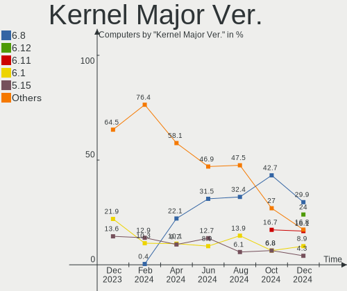

| Version | Computers | Percent |
|---------|-----------|---------|
| 6.2     | 98        | 29.88%  |
| 5.15    | 77        | 23.48%  |
| 5.19    | 74        | 22.56%  |
| 6.1     | 23        | 7.01%   |
| 5.10    | 23        | 7.01%   |
| 5.4     | 10        | 3.05%   |
| 5.16    | 7         | 2.13%   |
| 5.13    | 5         | 1.52%   |
| 4.15    | 4         | 1.22%   |
| 5.14    | 2         | 0.61%   |
| 6.3     | 1         | 0.3%    |
| 6.0     | 1         | 0.3%    |
| 5.18    | 1         | 0.3%    |
| 4.9     | 1         | 0.3%    |
| 4.18    | 1         | 0.3%    |

Arch
----

OS architecture (x86_64, i586, etc.)

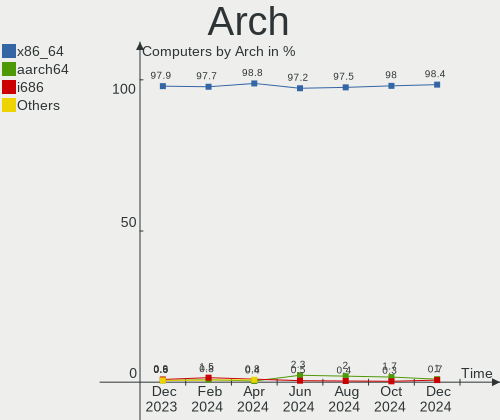

| Name    | Computers | Percent |
|---------|-----------|---------|
| x86_64  | 321       | 97.87%  |
| i686    | 4         | 1.22%   |
| armv7l  | 2         | 0.61%   |
| aarch64 | 1         | 0.3%    |

DE
--

Desktop Environment

| Name            | Computers | Percent |
|-----------------|-----------|---------|
| GNOME           | 131       | 39.94%  |
| KDE5            | 82        | 25%     |
| XFCE            | 29        | 8.84%   |
| X-Cinnamon      | 27        | 8.23%   |
| MATE            | 20        | 6.1%    |
| Unknown         | 14        | 4.27%   |
| LXQt            | 11        | 3.35%   |
| Budgie          | 3         | 0.91%   |
| i3              | 2         | 0.61%   |
| Unity           | 1         | 0.3%    |
| sway            | 1         | 0.3%    |
| LXDE            | 1         | 0.3%    |
| KDE             | 1         | 0.3%    |
| icewm           | 1         | 0.3%    |
| Hyprland        | 1         | 0.3%    |
| GNOME Flashback | 1         | 0.3%    |
| Deepin          | 1         | 0.3%    |
| chadwm          | 1         | 0.3%    |

Display Server
--------------

X11 or Wayland

| Name    | Computers | Percent |
|---------|-----------|---------|
| X11     | 233       | 71.04%  |
| Wayland | 78        | 23.78%  |
| Tty     | 13        | 3.96%   |
| Unknown | 4         | 1.22%   |

Display Manager
---------------

SDDM, LightDM, etc.

| Name    | Computers | Percent |
|---------|-----------|---------|
| SDDM    | 81        | 24.7%   |
| GDM3    | 81        | 24.7%   |
| Unknown | 79        | 24.09%  |
| LightDM | 55        | 16.77%  |
| GDM     | 29        | 8.84%   |
| SLiM    | 3         | 0.91%   |

OS Lang
-------

Language

| Lang    | Computers | Percent |
|---------|-----------|---------|
| fr_FR   | 247       | 75.3%   |
| en_US   | 60        | 18.29%  |
| en_IE   | 5         | 1.52%   |
| C       | 5         | 1.52%   |
| en_GB   | 2         | 0.61%   |
| Unknown | 2         | 0.61%   |
| UTF-8   | 1         | 0.3%    |
| sv_SE   | 1         | 0.3%    |
| pt_PT   | 1         | 0.3%    |
| nb_NO   | 1         | 0.3%    |
| fr_CA   | 1         | 0.3%    |
| es_ES   | 1         | 0.3%    |
| de_DE   | 1         | 0.3%    |

Boot Mode
---------

EFI or BIOS

| Mode | Computers | Percent |
|------|-----------|---------|
| EFI  | 180       | 54.88%  |
| BIOS | 148       | 45.12%  |

Filesystem
----------

Type of filesystem

| Type    | Computers | Percent |
|---------|-----------|---------|
| Ext4    | 256       | 78.05%  |
| Btrfs   | 34        | 10.37%  |
| Overlay | 21        | 6.4%    |
| Tmpfs   | 10        | 3.05%   |
| Xfs     | 4         | 1.22%   |
| Zfs     | 2         | 0.61%   |
| F2fs    | 1         | 0.3%    |

Part. scheme
------------

Scheme of partitioning

| Type    | Computers | Percent |
|---------|-----------|---------|
| GPT     | 212       | 64.63%  |
| Unknown | 68        | 20.73%  |
| MBR     | 48        | 14.63%  |

Dual Boot with Linux/BSD
------------------------

Hosting more than one Linux/BSD

| Dual boot | Computers | Percent |
|-----------|-----------|---------|
| No        | 272       | 82.93%  |
| Yes       | 56        | 17.07%  |

Dual Boot (Win)
---------------

Hosting Linux and Windows

| Dual boot | Computers | Percent |
|-----------|-----------|---------|
| No        | 240       | 73.17%  |
| Yes       | 88        | 26.83%  |

Board
-----

Vendor
------

Motherboard manufacturer

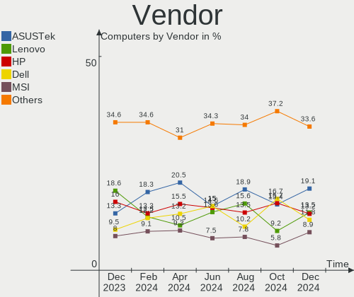

| Name                    | Computers | Percent |
|-------------------------|-----------|---------|
| ASUSTek Computer        | 70        | 21.34%  |
| Hewlett-Packard         | 42        | 12.8%   |
| Dell                    | 40        | 12.2%   |
| Lenovo                  | 35        | 10.67%  |
| Gigabyte Technology     | 30        | 9.15%   |
| MSI                     | 29        | 8.84%   |
| Acer                    | 16        | 4.88%   |
| ASRock                  | 10        | 3.05%   |
| Intel                   | 6         | 1.83%   |
| Valve                   | 5         | 1.52%   |
| Toshiba                 | 5         | 1.52%   |
| Apple                   | 5         | 1.52%   |
| Sony                    | 4         | 1.22%   |
| HUAWEI                  | 3         | 0.91%   |
| sunxi                   | 2         | 0.61%   |
| PC Specialist           | 2         | 0.61%   |
| Fujitsu                 | 2         | 0.61%   |
| eMachines               | 2         | 0.61%   |
| Unknown                 | 2         | 0.61%   |
| ZOTAC                   | 1         | 0.3%    |
| Timi                    | 1         | 0.3%    |
| System76                | 1         | 0.3%    |
| Shuttle                 | 1         | 0.3%    |
| Samsung Electronics     | 1         | 0.3%    |
| Raspberry Pi Foundation | 1         | 0.3%    |
| QTQD                    | 1         | 0.3%    |
| Pegatron                | 1         | 0.3%    |
| Packard Bell            | 1         | 0.3%    |
| Medion                  | 1         | 0.3%    |
| LG Electronics          | 1         | 0.3%    |
| LDLC                    | 1         | 0.3%    |
| HONOR                   | 1         | 0.3%    |
| Google                  | 1         | 0.3%    |
| G7-2011                 | 1         | 0.3%    |
| Fujitsu Siemens         | 1         | 0.3%    |
| COPELION INTERNATIONAL  | 1         | 0.3%    |
| Compal                  | 1         | 0.3%    |

Model
-----

Motherboard model

| Name                             | Computers | Percent |
|----------------------------------|-----------|---------|
| ASUS S551LN                      | 6         | 1.83%   |
| Valve Jupiter                    | 5         | 1.52%   |
| Gigabyte B550 AORUS ELITE V2     | 3         | 0.91%   |
| ASUS All Series                  | 3         | 0.91%   |
| Unknown                          | 3         | 0.91%   |
| HP Pavilion Laptop 15-eg0xxx     | 2         | 0.61%   |
| HP Pavilion g6                   | 2         | 0.61%   |
| HP Pavilion dv6                  | 2         | 0.61%   |
| HP Pavilion 17                   | 2         | 0.61%   |
| HP Notebook                      | 2         | 0.61%   |
| HP Laptop 17-cp0xxx              | 2         | 0.61%   |
| Gigabyte B550 VISION D-P         | 2         | 0.61%   |
| Dell XPS 15 9500                 | 2         | 0.61%   |
| Dell Vostro 1520                 | 2         | 0.61%   |
| Dell Precision WorkStation T5500 | 2         | 0.61%   |
| Dell Precision 3571              | 2         | 0.61%   |
| Dell G3 3500                     | 2         | 0.61%   |
| ASUS M5A97 EVO R2.0              | 2         | 0.61%   |
| ASRock G31M-S                    | 2         | 0.61%   |
| ZOTAC H67ITX-C-E                 | 1         | 0.3%    |
| Toshiba TECRA Z40-C              | 1         | 0.3%    |
| Toshiba Satellite L655           | 1         | 0.3%    |
| Toshiba Satellite C855D-12J      | 1         | 0.3%    |
| Toshiba Satellite C660           | 1         | 0.3%    |
| Toshiba PORTEGE Z20t-C           | 1         | 0.3%    |
| Timi TM1703                      | 1         | 0.3%    |
| System76 Lemur Pro               | 1         | 0.3%    |
| sunxi LeMaker Banana Pi          | 1         | 0.3%    |
| sunxi FriendlyArm NanoPi M1      | 1         | 0.3%    |
| Sony VPCF11M1E                   | 1         | 0.3%    |
| Sony VPCEH3U1E                   | 1         | 0.3%    |
| Sony VPCEB1M1E                   | 1         | 0.3%    |
| Sony SVF1521A6EW                 | 1         | 0.3%    |
| Shuttle DS20U                    | 1         | 0.3%    |
| Samsung 950XED                   | 1         | 0.3%    |
| RPi Raspberry Pi                 | 1         | 0.3%    |
| Pegatron VC902AA-ABF p6136fr     | 1         | 0.3%    |
| PC Specialist TN1-156M           | 1         | 0.3%    |
| PC Specialist NV4XMB,ME,MZ       | 1         | 0.3%    |
| Packard Bell EasyNote ENTF71BM   | 1         | 0.3%    |

Model Family
------------

Motherboard model prefix

| Name               | Computers | Percent |
|--------------------|-----------|---------|
| Lenovo ThinkPad    | 15        | 4.57%   |
| HP Pavilion        | 13        | 3.96%   |
| Dell Precision     | 11        | 3.35%   |
| Lenovo IdeaPad     | 8         | 2.44%   |
| ASUS PRIME         | 8         | 2.44%   |
| Acer Aspire        | 8         | 2.44%   |
| Lenovo ThinkCentre | 7         | 2.13%   |
| Dell Latitude      | 7         | 2.13%   |
| Gigabyte B550      | 6         | 1.83%   |
| Dell XPS           | 6         | 1.83%   |
| Dell OptiPlex      | 6         | 1.83%   |
| ASUS VivoBook      | 6         | 1.83%   |
| ASUS S551LN        | 6         | 1.83%   |
| Valve Jupiter      | 5         | 1.52%   |
| ASUS ASUS          | 5         | 1.52%   |
| HP ProBook         | 4         | 1.22%   |
| HP Laptop          | 4         | 1.22%   |
| HP EliteDesk       | 4         | 1.22%   |
| Dell Vostro        | 4         | 1.22%   |
| ASUS ZenBook       | 4         | 1.22%   |
| Toshiba Satellite  | 3         | 0.91%   |
| Dell Inspiron      | 3         | 0.91%   |
| ASUS M5A97         | 3         | 0.91%   |
| ASUS All           | 3         | 0.91%   |
| Unknown            | 3         | 0.91%   |
| MSI Prestige       | 2         | 0.61%   |
| MSI CR61           | 2         | 0.61%   |
| Lenovo Legion      | 2         | 0.61%   |
| HP OMEN            | 2         | 0.61%   |
| HP Notebook        | 2         | 0.61%   |
| HP EliteBook       | 2         | 0.61%   |
| Dell G3            | 2         | 0.61%   |
| ASUS TUF           | 2         | 0.61%   |
| ASUS ROG           | 2         | 0.61%   |
| ASUS P8H61-M       | 2         | 0.61%   |
| ASUS P5Q           | 2         | 0.61%   |
| ASRock G31M-S      | 2         | 0.61%   |
| Acer Veriton       | 2         | 0.61%   |
| Acer Swift         | 2         | 0.61%   |
| Acer Nitro         | 2         | 0.61%   |

MFG Year
--------

Motherboard manufacture year

| Year    | Computers | Percent |
|---------|-----------|---------|
| 2020    | 34        | 10.37%  |
| 2014    | 34        | 10.37%  |
| 2021    | 33        | 10.06%  |
| 2022    | 27        | 8.23%   |
| 2013    | 22        | 6.71%   |
| 2018    | 20        | 6.1%    |
| 2015    | 19        | 5.79%   |
| 2012    | 19        | 5.79%   |
| 2019    | 18        | 5.49%   |
| 2010    | 16        | 4.88%   |
| 2017    | 15        | 4.57%   |
| 2011    | 15        | 4.57%   |
| 2009    | 14        | 4.27%   |
| 2008    | 14        | 4.27%   |
| 2016    | 13        | 3.96%   |
| 2023    | 8         | 2.44%   |
| Unknown | 3         | 0.91%   |
| 2007    | 2         | 0.61%   |
| 2006    | 1         | 0.3%    |
| 2003    | 1         | 0.3%    |

Form Factor
-----------

Physical design of the computer

| Name           | Computers | Percent |
|----------------|-----------|---------|
| Notebook       | 184       | 56.1%   |
| Desktop        | 131       | 39.94%  |
| System on chip | 3         | 0.91%   |
| Convertible    | 3         | 0.91%   |
| All in one     | 3         | 0.91%   |
| Mini pc        | 2         | 0.61%   |
| Tablet         | 1         | 0.3%    |
| Server         | 1         | 0.3%    |

Secure Boot
-----------

Enabled or disabled

| State    | Computers | Percent |
|----------|-----------|---------|
| Disabled | 295       | 89.94%  |
| Enabled  | 33        | 10.06%  |

Coreboot
--------

Have coreboot on board

| Used | Computers | Percent |
|------|-----------|---------|
| No   | 325       | 99.09%  |
| Yes  | 3         | 0.91%   |

RAM Size
--------

Total RAM memory

| Size in GB      | Computers | Percent |
|-----------------|-----------|---------|
| 4.01-8.0        | 75        | 22.87%  |
| 16.01-24.0      | 64        | 19.51%  |
| 8.01-16.0       | 62        | 18.9%   |
| 3.01-4.0        | 54        | 16.46%  |
| 32.01-64.0      | 31        | 9.45%   |
| 24.01-32.0      | 14        | 4.27%   |
| 64.01-256.0     | 10        | 3.05%   |
| 1.01-2.0        | 9         | 2.74%   |
| 2.01-3.0        | 5         | 1.52%   |
| 0.51-1.0        | 3         | 0.91%   |
| More than 256.0 | 1         | 0.3%    |

RAM Used
--------

Used RAM memory

| Used GB     | Computers | Percent |
|-------------|-----------|---------|
| 1.01-2.0    | 95        | 28.96%  |
| 2.01-3.0    | 87        | 26.52%  |
| 4.01-8.0    | 59        | 17.99%  |
| 3.01-4.0    | 46        | 14.02%  |
| 8.01-16.0   | 14        | 4.27%   |
| 0.51-1.0    | 13        | 3.96%   |
| 0.01-0.5    | 8         | 2.44%   |
| 16.01-24.0  | 4         | 1.22%   |
| 32.01-64.0  | 1         | 0.3%    |
| 64.01-256.0 | 1         | 0.3%    |

Total Drives
------------

Number of drives on board

| Drives | Computers | Percent |
|--------|-----------|---------|
| 1      | 190       | 57.93%  |
| 2      | 78        | 23.78%  |
| 3      | 34        | 10.37%  |
| 5      | 8         | 2.44%   |
| 6      | 7         | 2.13%   |
| 4      | 7         | 2.13%   |
| 7      | 2         | 0.61%   |
| 13     | 1         | 0.3%    |
| 9      | 1         | 0.3%    |

Has CD-ROM
----------

Has CD-ROM on board

| Presented | Computers | Percent |
|-----------|-----------|---------|
| No        | 195       | 59.45%  |
| Yes       | 133       | 40.55%  |

Has Ethernet
------------

Has Ethernet on board

| Presented | Computers | Percent |
|-----------|-----------|---------|
| Yes       | 275       | 83.84%  |
| No        | 53        | 16.16%  |

Has WiFi
--------

Has WiFi module

| Presented | Computers | Percent |
|-----------|-----------|---------|
| Yes       | 240       | 73.17%  |
| No        | 88        | 26.83%  |

Has Bluetooth
-------------

Has Bluetooth module

| Presented | Computers | Percent |
|-----------|-----------|---------|
| Yes       | 196       | 59.76%  |
| No        | 132       | 40.24%  |

Location
--------

Country
-------

Geographic location (country)

| Country | Computers | Percent |
|---------|-----------|---------|
| France  | 328       | 100%    |

City
----

Geographic location (city)

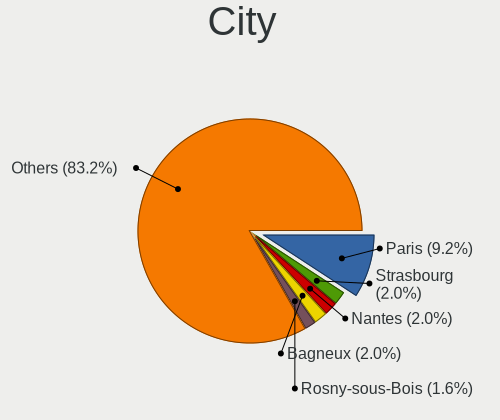

| City                 | Computers | Percent |
|----------------------|-----------|---------|
| Paris                | 42        | 12.8%   |
| Caen                 | 8         | 2.44%   |
| Toulouse             | 7         | 2.13%   |
| Lyon                 | 7         | 2.13%   |
| Istres               | 7         | 2.13%   |
| Bordeaux             | 7         | 2.13%   |
| Marseille            | 6         | 1.83%   |
| Rennes               | 4         | 1.22%   |
| Orléans             | 4         | 1.22%   |
| Grenoble             | 4         | 1.22%   |
| Boulogne-Billancourt | 4         | 1.22%   |
| Strasbourg           | 3         | 0.91%   |
| Saint-Meme-le-Tenu   | 3         | 0.91%   |
| Versailles           | 2         | 0.61%   |
| Talence              | 2         | 0.61%   |
| Saint-Raphaël       | 2         | 0.61%   |
| Saint-Etienne        | 2         | 0.61%   |
| Saint-Brieuc         | 2         | 0.61%   |
| Roubaix              | 2         | 0.61%   |
| Romilly-sur-Seine    | 2         | 0.61%   |
| Quimper              | 2         | 0.61%   |
| Pau                  | 2         | 0.61%   |
| Obernai              | 2         | 0.61%   |
| Nantes               | 2         | 0.61%   |
| Nancy                | 2         | 0.61%   |
| Montpellier          | 2         | 0.61%   |
| Montauban            | 2         | 0.61%   |
| Maubeuge             | 2         | 0.61%   |
| Lorient              | 2         | 0.61%   |
| Laon                 | 2         | 0.61%   |
| Échirolles          | 2         | 0.61%   |
| Dijon                | 2         | 0.61%   |
| Châtenay-Malabry    | 2         | 0.61%   |
| Bastia               | 2         | 0.61%   |
| Angers               | 2         | 0.61%   |
| Waldweistroff        | 1         | 0.3%    |
| Voiron               | 1         | 0.3%    |
| Villeurbanne         | 1         | 0.3%    |
| Villefranche-sur-Mer | 1         | 0.3%    |
| Vertheuil            | 1         | 0.3%    |

Drives
------

Drive Vendor
------------

Hard drive vendors

| Vendor                       | Computers | Drives | Percent |
|------------------------------|-----------|--------|---------|
| Samsung Electronics          | 89        | 109    | 17.52%  |
| WDC                          | 67        | 90     | 13.19%  |
| Seagate                      | 60        | 73     | 11.81%  |
| Crucial                      | 29        | 37     | 5.71%   |
| Sandisk                      | 27        | 31     | 5.31%   |
| Kingston                     | 27        | 27     | 5.31%   |
| Toshiba                      | 26        | 29     | 5.12%   |
| Unknown                      | 21        | 22     | 4.13%   |
| Intel                        | 15        | 15     | 2.95%   |
| SPCC                         | 11        | 11     | 2.17%   |
| PNY                          | 11        | 13     | 2.17%   |
| Hitachi                      | 10        | 10     | 1.97%   |
| SK hynix                     | 9         | 9      | 1.77%   |
| JMicron Technology           | 9         | 11     | 1.77%   |
| HGST                         | 9         | 9      | 1.77%   |
| KIOXIA                       | 8         | 8      | 1.57%   |
| Micron Technology            | 6         | 6      | 1.18%   |
| Phison Electronics           | 5         | 5      | 0.98%   |
| Micron/Crucial Technology    | 5         | 5      | 0.98%   |
| Kingston Technology Company  | 5         | 5      | 0.98%   |
| Phison                       | 4         | 4      | 0.79%   |
| Maxtor                       | 4         | 4      | 0.79%   |
| LDLC                         | 4         | 4      | 0.79%   |
| China                        | 4         | 6      | 0.79%   |
| Realtek Semiconductor        | 2         | 2      | 0.39%   |
| LITEON                       | 2         | 2      | 0.39%   |
| Lite-On Technology           | 2         | 2      | 0.39%   |
| LaCie                        | 2         | 2      | 0.39%   |
| Emtec                        | 2         | 2      | 0.39%   |
| ASMT                         | 2         | 3      | 0.39%   |
| A-DATA Technology            | 2         | 2      | 0.39%   |
| YMTC                         | 1         | 1      | 0.2%    |
| Verbatim                     | 1         | 1      | 0.2%    |
| USB3.0                       | 1         | 1      | 0.2%    |
| USB                          | 1         | 1      | 0.2%    |
| UMIS                         | 1         | 1      | 0.2%    |
| TS256GSS                     | 1         | 1      | 0.2%    |
| Transcend                    | 1         | 1      | 0.2%    |
| Silicon Motion               | 1         | 1      | 0.2%    |
| Shenzhen Longsys Electronics | 1         | 1      | 0.2%    |

Drive Model
-----------

Hard drive models

| Model                                                 | Computers | Percent |
|-------------------------------------------------------|-----------|---------|
| SPCC Solid State Disk 512GB                           | 7         | 1.25%   |
| Samsung SSD 980 1TB                                   | 7         | 1.25%   |
| Samsung SSD 870 QVO 1TB                               | 6         | 1.07%   |
| Kingston SA400S37240G 240GB SSD                       | 6         | 1.07%   |
| Crucial CT500MX500SSD1 500GB                          | 6         | 1.07%   |
| Samsung NVMe SSD Controller PM9A1/PM9A3/980PRO 2TB    | 5         | 0.89%   |
| PNY CS900 120GB SSD                                   | 5         | 0.89%   |
| Unknown MMC Card  64GB                                | 4         | 0.71%   |
| Seagate ST1000DM003-1ER162 1TB                        | 4         | 0.71%   |
| Samsung SSD 850 EVO 500GB                             | 4         | 0.71%   |
| Kingston SA400S37480G 480GB SSD                       | 4         | 0.71%   |
| JMicron H/W JBOD 512GB SSD                            | 4         | 0.71%   |
| Crucial CT240BX500SSD1 240GB                          | 4         | 0.71%   |
| Crucial CT1000MX500SSD1 1TB                           | 4         | 0.71%   |
| Unknown MMC Card  32GB                                | 3         | 0.54%   |
| Unknown MMC Card  128GB                               | 3         | 0.54%   |
| Unknown 00000  16GB                                   | 3         | 0.54%   |
| Toshiba DT01ACA100 1TB                                | 3         | 0.54%   |
| Seagate ST500LT012-1DG142 500GB                       | 3         | 0.54%   |
| Seagate ST2000DM008-2FR102 2TB                        | 3         | 0.54%   |
| Seagate ST1000LM035-1RK172 970GB                      | 3         | 0.54%   |
| Seagate ST1000LM024 HN-M101MBB 1TB                    | 3         | 0.54%   |
| Seagate ST1000DM010-2EP102 1TB                        | 3         | 0.54%   |
| Seagate ST1000DM003-1CH162 1TB                        | 3         | 0.54%   |
| Sandisk WD Black 2018/SN750 / PC SN720 NVMe SSD 500GB | 3         | 0.54%   |
| Samsung SSD 870 QVO 2TB                               | 3         | 0.54%   |
| Samsung SSD 870 EVO 500GB                             | 3         | 0.54%   |
| Samsung SSD 870 EVO 1TB                               | 3         | 0.54%   |
| Samsung SSD 860 QVO 1TB                               | 3         | 0.54%   |
| Samsung SSD 860 EVO 250GB                             | 3         | 0.54%   |
| Samsung SSD 860 EVO 1TB                               | 3         | 0.54%   |
| Samsung SSD 840 Series 120GB                          | 3         | 0.54%   |
| Samsung NVMe SSD Controller SM981/PM981/PM983 1TB     | 3         | 0.54%   |
| Samsung MZVL21T0HCLR-00B00 1TB                        | 3         | 0.54%   |
| PNY CS900 240GB SSD                                   | 3         | 0.54%   |
| Phison E12 NVMe Controller 512GB                      | 3         | 0.54%   |
| JMicron Generic 1TB                                   | 3         | 0.54%   |
| Intel SSD 660P Series 512GB                           | 3         | 0.54%   |
| Crucial CT480BX500SSD1 480GB                          | 3         | 0.54%   |
| Crucial CT1000BX500SSD1 1TB                           | 3         | 0.54%   |

HDD Vendor
----------

Hard disk drive vendors

| Vendor              | Computers | Drives | Percent |
|---------------------|-----------|--------|---------|
| Seagate             | 57        | 68     | 33.73%  |
| WDC                 | 51        | 71     | 30.18%  |
| Toshiba             | 21        | 23     | 12.43%  |
| Hitachi             | 10        | 10     | 5.92%   |
| Samsung Electronics | 9         | 9      | 5.33%   |
| HGST                | 9         | 9      | 5.33%   |
| Maxtor              | 4         | 4      | 2.37%   |
| JMicron Technology  | 4         | 6      | 2.37%   |
| USB3.0              | 1         | 1      | 0.59%   |
| Inateck             | 1         | 1      | 0.59%   |
| HGST HTS            | 1         | 1      | 0.59%   |
| ASMT                | 1         | 2      | 0.59%   |

SSD Vendor
----------

Solid state drive vendors

| Vendor              | Computers | Drives | Percent |
|---------------------|-----------|--------|---------|
| Samsung Electronics | 49        | 55     | 27.07%  |
| Crucial             | 27        | 32     | 14.92%  |
| Kingston            | 22        | 22     | 12.15%  |
| SanDisk             | 13        | 14     | 7.18%   |
| SPCC                | 11        | 11     | 6.08%   |
| PNY                 | 10        | 12     | 5.52%   |
| WDC                 | 5         | 5      | 2.76%   |
| JMicron Technology  | 4         | 4      | 2.21%   |
| Intel               | 4         | 4      | 2.21%   |
| China               | 4         | 6      | 2.21%   |
| Toshiba             | 3         | 3      | 1.66%   |
| Micron Technology   | 3         | 3      | 1.66%   |
| LDLC                | 3         | 3      | 1.66%   |
| Emtec               | 2         | 2      | 1.1%    |
| A-DATA Technology   | 2         | 2      | 1.1%    |
| Verbatim            | 1         | 1      | 0.55%   |
| USB                 | 1         | 1      | 0.55%   |
| Transcend           | 1         | 1      | 0.55%   |
| Seagate             | 1         | 1      | 0.55%   |
| PNY CS90            | 1         | 1      | 0.55%   |
| Plextor             | 1         | 1      | 0.55%   |
| OCZ-VERTEX3         | 1         | 1      | 0.55%   |
| OCZ                 | 1         | 1      | 0.55%   |
| LVCARDS             | 1         | 1      | 0.55%   |
| LITEON              | 1         | 1      | 0.55%   |
| Intenso             | 1         | 1      | 0.55%   |
| INNOVATION IT       | 1         | 1      | 0.55%   |
| Hewlett-Packard     | 1         | 1      | 0.55%   |
| GALAX               | 1         | 1      | 0.55%   |
| Fanxiang            | 1         | 1      | 0.55%   |
| Dogfish             | 1         | 1      | 0.55%   |
| Corsair             | 1         | 1      | 0.55%   |
| ASMT                | 1         | 1      | 0.55%   |
| Apple               | 1         | 1      | 0.55%   |

Drive Kind
----------

HDD or SSD

| Kind    | Computers | Drives | Percent |
|---------|-----------|--------|---------|
| SSD     | 156       | 197    | 34.36%  |
| HDD     | 135       | 205    | 29.74%  |
| NVMe    | 133       | 154    | 29.3%   |
| MMC     | 21        | 22     | 4.63%   |
| Unknown | 9         | 9      | 1.98%   |

Drive Connector
---------------

SATA, SAS, NVMe, etc.

| Type | Computers | Drives | Percent |
|------|-----------|--------|---------|
| SATA | 232       | 383    | 56.72%  |
| NVMe | 132       | 153    | 32.27%  |
| SAS  | 24        | 29     | 5.87%   |
| MMC  | 21        | 22     | 5.13%   |

Drive Size
----------

Size of hard drive

| Size in TB | Computers | Drives | Percent |
|------------|-----------|--------|---------|
| 0.01-0.5   | 160       | 205    | 52.46%  |
| 0.51-1.0   | 107       | 132    | 35.08%  |
| 1.01-2.0   | 20        | 32     | 6.56%   |
| 3.01-4.0   | 8         | 16     | 2.62%   |
| 2.01-3.0   | 5         | 7      | 1.64%   |
| 4.01-10.0  | 4         | 8      | 1.31%   |
| 10.01-20.0 | 1         | 2      | 0.33%   |

Space Total
-----------

Amount of disk space available on the file system

| Size in GB     | Computers | Percent |
|----------------|-----------|---------|
| 251-500        | 94        | 28.66%  |
| 101-250        | 73        | 22.26%  |
| 501-1000       | 65        | 19.82%  |
| 1-20           | 22        | 6.71%   |
| 1001-2000      | 21        | 6.4%    |
| More than 3000 | 18        | 5.49%   |
| 51-100         | 14        | 4.27%   |
| 21-50          | 9         | 2.74%   |
| Unknown        | 7         | 2.13%   |
| 2001-3000      | 5         | 1.52%   |

Space Used
----------

Amount of used disk space

| Used GB        | Computers | Percent |
|----------------|-----------|---------|
| 1-20           | 117       | 35.67%  |
| 21-50          | 57        | 17.38%  |
| 251-500        | 39        | 11.89%  |
| 101-250        | 37        | 11.28%  |
| 51-100         | 35        | 10.67%  |
| 501-1000       | 19        | 5.79%   |
| More than 3000 | 8         | 2.44%   |
| Unknown        | 7         | 2.13%   |
| 2001-3000      | 5         | 1.52%   |
| 1001-2000      | 4         | 1.22%   |

Malfunc. Drives
---------------

Drive models with a malfunction

| Model                                            | Computers | Drives | Percent |
|--------------------------------------------------|-----------|--------|---------|
| WDC WD6400AAKS-22A7B2 640GB                      | 1         | 1      | 1.85%   |
| WDC WD60PURZ-85ZUFY1 6TB                         | 1         | 1      | 1.85%   |
| WDC WD5000BEVT-26A0RT0 500GB                     | 1         | 1      | 1.85%   |
| WDC WD5000AAKX-22ERMA0 500GB                     | 1         | 1      | 1.85%   |
| WDC WD3200BPVT-22ZEST0 320GB                     | 1         | 1      | 1.85%   |
| WDC WD3200AAKS-22L6A0 320GB                      | 1         | 1      | 1.85%   |
| WDC WD3200AAJS-60M0A0 320GB                      | 1         | 1      | 1.85%   |
| WDC WD20EARX-00PASB0 2TB                         | 1         | 1      | 1.85%   |
| WDC WD10EALX-009BA0 1TB                          | 1         | 1      | 1.85%   |
| WDC WD10EADS-65M2B0 1TB                          | 1         | 1      | 1.85%   |
| WDC WD10EADS-22M2B0 1TB                          | 1         | 1      | 1.85%   |
| Toshiba THNSFC256GBSJ SSD                        | 1         | 1      | 1.85%   |
| Toshiba MK7575GSX 752GB                          | 1         | 1      | 1.85%   |
| Toshiba MK5075GSX 500GB                          | 1         | 1      | 1.85%   |
| Toshiba MK3259GSXP 320GB                         | 1         | 1      | 1.85%   |
| Toshiba HDWD110 1TB                              | 1         | 1      | 1.85%   |
| Toshiba DT01ACA200 2TB                           | 1         | 1      | 1.85%   |
| Toshiba DT01ACA050 500GB                         | 1         | 1      | 1.85%   |
| SPCC Solid State Disk 512GB                      | 1         | 1      | 1.85%   |
| Seagate STM3500418AS 500GB                       | 1         | 1      | 1.85%   |
| Seagate ST8000DM004-2CX188 8TB                   | 1         | 1      | 1.85%   |
| Seagate ST500LT012-1DG142 500GB                  | 1         | 1      | 1.85%   |
| Seagate ST500LM021-1KJ152 500GB                  | 1         | 1      | 1.85%   |
| Seagate ST3320820AS 320GB                        | 1         | 1      | 1.85%   |
| Seagate ST3160318AS 160GB                        | 1         | 1      | 1.85%   |
| Seagate ST31000528AS 1TB                         | 1         | 1      | 1.85%   |
| Seagate ST31000520AS 1TB                         | 1         | 1      | 1.85%   |
| Seagate ST3000DM001-1ER166 3TB                   | 1         | 1      | 1.85%   |
| Seagate ST2000DX001-1CM164 2TB                   | 1         | 1      | 1.85%   |
| Seagate ST2000DM006-2DM164 2TB                   | 1         | 1      | 1.85%   |
| Seagate ST1000DM010-2EP102 1TB                   | 1         | 1      | 1.85%   |
| Samsung Electronics SSD 970 EVO 500GB            | 1         | 1      | 1.85%   |
| Samsung Electronics SSD 870 EVO 500GB            | 1         | 1      | 1.85%   |
| Samsung Electronics MZ7LN256HMJP-000H1 256GB SSD | 1         | 1      | 1.85%   |
| Samsung Electronics HM080HC 80GB                 | 1         | 1      | 1.85%   |
| Samsung Electronics HD642JJ 640GB                | 1         | 1      | 1.85%   |
| Samsung Electronics HD154UI 1TB                  | 1         | 1      | 1.85%   |
| Samsung Electronics HD103SI 1TB                  | 1         | 1      | 1.85%   |
| OCZ AGILITY3 240GB SSD                           | 1         | 1      | 1.85%   |
| Maxtor STM3320613AS 320GB                        | 1         | 1      | 1.85%   |

Malfunc. Drive Vendor
---------------------

Vendors of faulty drives

| Vendor              | Computers | Drives | Percent |
|---------------------|-----------|--------|---------|
| WDC                 | 10        | 11     | 19.61%  |
| Seagate             | 10        | 12     | 19.61%  |
| Toshiba             | 7         | 7      | 13.73%  |
| Samsung Electronics | 7         | 7      | 13.73%  |
| HGST                | 3         | 3      | 5.88%   |
| Crucial             | 3         | 3      | 5.88%   |
| LDLC                | 2         | 2      | 3.92%   |
| Kingston            | 2         | 2      | 3.92%   |
| Hitachi             | 2         | 2      | 3.92%   |
| SPCC                | 1         | 1      | 1.96%   |
| OCZ                 | 1         | 1      | 1.96%   |
| Maxtor              | 1         | 1      | 1.96%   |
| JMicron Technology  | 1         | 1      | 1.96%   |
| China               | 1         | 1      | 1.96%   |

Malfunc. HDD Vendor
-------------------

Vendors of faulty HDD drives

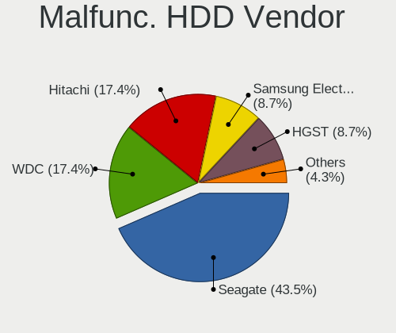

| Vendor              | Computers | Drives | Percent |
|---------------------|-----------|--------|---------|
| WDC                 | 10        | 11     | 27.78%  |
| Seagate             | 10        | 12     | 27.78%  |
| Toshiba             | 6         | 6      | 16.67%  |
| Samsung Electronics | 4         | 4      | 11.11%  |
| HGST                | 3         | 3      | 8.33%   |
| Hitachi             | 2         | 2      | 5.56%   |
| Maxtor              | 1         | 1      | 2.78%   |

Malfunc. Drive Kind
-------------------

Kinds of faulty drives

| Kind    | Computers | Drives | Percent |
|---------|-----------|--------|---------|
| HDD     | 33        | 39     | 68.75%  |
| SSD     | 13        | 13     | 27.08%  |
| NVMe    | 1         | 1      | 2.08%   |
| Unknown | 1         | 1      | 2.08%   |

Failed Drives
-------------

Failed drive models

| Model                    | Computers | Drives | Percent |
|--------------------------|-----------|--------|---------|
| WDC WD20EARS-00MVWB0 2TB | 1         | 2      | 100%    |

Failed Drive Vendor
-------------------

Failed drive vendors

| Vendor | Computers | Drives | Percent |
|--------|-----------|--------|---------|
| WDC    | 1         | 2      | 100%    |

Drive Status
------------

Number of failed and malfunc. drives

| Status   | Computers | Drives | Percent |
|----------|-----------|--------|---------|
| Works    | 188       | 319    | 50.81%  |
| Detected | 137       | 212    | 37.03%  |
| Malfunc  | 44        | 54     | 11.89%  |
| Failed   | 1         | 2      | 0.27%   |

Storage controller
------------------

Storage Vendor
--------------

Storage controller vendors

| Vendor                       | Computers | Percent |
|------------------------------|-----------|---------|
| Intel                        | 219       | 49.44%  |
| AMD                          | 59        | 13.32%  |
| Samsung Electronics          | 41        | 9.26%   |
| SanDisk                      | 28        | 6.32%   |
| Phison Electronics           | 11        | 2.48%   |
| Kingston Technology Company  | 10        | 2.26%   |
| SK hynix                     | 9         | 2.03%   |
| Micron/Crucial Technology    | 8         | 1.81%   |
| ASMedia Technology           | 8         | 1.81%   |
| Marvell Technology Group     | 6         | 1.35%   |
| KIOXIA                       | 6         | 1.35%   |
| JMicron Technology           | 6         | 1.35%   |
| Toshiba America Info Systems | 5         | 1.13%   |
| Nvidia                       | 5         | 1.13%   |
| Micron Technology            | 3         | 0.68%   |
| Lite-On Technology           | 3         | 0.68%   |
| Silicon Image                | 2         | 0.45%   |
| Seagate Technology           | 2         | 0.45%   |
| Realtek Semiconductor        | 2         | 0.45%   |
| Yangtze Memory Technologies  | 1         | 0.23%   |
| VIA Technologies             | 1         | 0.23%   |
| Union Memory (Shenzhen)      | 1         | 0.23%   |
| Solidigm                     | 1         | 0.23%   |
| Silicon Motion               | 1         | 0.23%   |
| Shenzhen Longsys Electronics | 1         | 0.23%   |
| Promise Technology           | 1         | 0.23%   |
| MAXIO Technology (Hangzhou)  | 1         | 0.23%   |
| LSI Logic / Symbios Logic    | 1         | 0.23%   |
| Artop Electronic             | 1         | 0.23%   |

Storage Model
-------------

Storage controller models

| Model                                                                                   | Computers | Percent |
|-----------------------------------------------------------------------------------------|-----------|---------|
| AMD FCH SATA Controller [AHCI mode]                                                     | 40        | 8.02%   |
| Intel 8 Series/C220 Series Chipset Family 6-port SATA Controller 1 [AHCI mode]          | 21        | 4.21%   |
| Samsung NVMe SSD Controller 980                                                         | 18        | 3.61%   |
| Intel Volume Management Device NVMe RAID Controller                                     | 15        | 3.01%   |
| Intel 8 Series SATA Controller 1 [AHCI mode]                                            | 12        | 2.4%    |
| Intel 7 Series Chipset Family 6-port SATA Controller [AHCI mode]                        | 11        | 2.2%    |
| Samsung NVMe SSD Controller SM981/PM981/PM983                                           | 10        | 2%      |
| Intel Q170/Q150/B150/H170/H110/Z170/CM236 Chipset SATA Controller [AHCI Mode]           | 10        | 2%      |
| Intel 6 Series/C200 Series Chipset Family 6 port Mobile SATA AHCI Controller            | 10        | 2%      |
| Samsung NVMe SSD Controller PM9A1/PM9A3/980PRO                                          | 9         | 1.8%    |
| Intel Sunrise Point-LP SATA Controller [AHCI mode]                                      | 8         | 1.6%    |
| AMD SB7x0/SB8x0/SB9x0 SATA Controller [AHCI mode]                                       | 8         | 1.6%    |
| AMD 500 Series Chipset SATA Controller                                                  | 8         | 1.6%    |
| Intel SSD 660P Series                                                                   | 7         | 1.4%    |
| Intel HM170/QM170 Chipset SATA Controller [AHCI Mode]                                   | 7         | 1.4%    |
| Intel Cannon Lake PCH SATA AHCI Controller                                              | 7         | 1.4%    |
| Intel Atom Processor E3800 Series SATA AHCI Controller                                  | 7         | 1.4%    |
| Intel 9 Series Chipset Family SATA Controller [AHCI Mode]                               | 7         | 1.4%    |
| Intel 82801G (ICH7 Family) IDE Controller                                               | 7         | 1.4%    |
| Intel 500 Series Chipset Family SATA AHCI Controller                                    | 7         | 1.4%    |
| SanDisk WD Blue SN550 NVMe SSD                                                          | 6         | 1.2%    |
| Phison E12 NVMe Controller                                                              | 6         | 1.2%    |
| Intel Tiger Lake-LP SATA Controller                                                     | 6         | 1.2%    |
| Intel NM10/ICH7 Family SATA Controller [IDE mode]                                       | 6         | 1.2%    |
| Intel 82801IBM/IEM (ICH9M/ICH9M-E) 4 port SATA Controller [AHCI mode]                   | 6         | 1.2%    |
| Intel 400 Series Chipset Family SATA AHCI Controller                                    | 6         | 1.2%    |
| SK hynix Gold P31/PC711 NVMe Solid State Drive                                          | 5         | 1%      |
| JMicron JMB363 SATA/IDE Controller                                                      | 5         | 1%      |
| Intel Wildcat Point-LP SATA Controller [AHCI Mode]                                      | 5         | 1%      |
| Intel 6 Series/C200 Series Chipset Family Desktop SATA Controller (IDE mode, ports 4-5) | 5         | 1%      |
| Intel 6 Series/C200 Series Chipset Family Desktop SATA Controller (IDE mode, ports 0-3) | 5         | 1%      |
| Intel 5 Series/3400 Series Chipset 4 port SATA AHCI Controller                          | 5         | 1%      |
| AMD 400 Series Chipset SATA Controller                                                  | 5         | 1%      |
| Toshiba America Info Systems XG6 NVMe SSD Controller                                    | 4         | 0.8%    |
| SanDisk WD Black SN750 / PC SN730 NVMe SSD                                              | 4         | 0.8%    |
| SanDisk WD Black 2018/SN750 / PC SN720 NVMe SSD                                         | 4         | 0.8%    |
| Micron/Crucial P5 Plus NVMe PCIe SSD                                                    | 4         | 0.8%    |
| KIOXIA NVMe SSD Controller BG4                                                          | 4         | 0.8%    |
| Intel Cannon Lake Mobile PCH SATA AHCI Controller                                       | 4         | 0.8%    |
| Intel 82801 Mobile SATA Controller [RAID mode]                                          | 4         | 0.8%    |

Storage Kind
------------

Kind of storage controller (IDE, SATA, NVMe, SAS, ...)

| Kind | Computers | Percent |
|------|-----------|---------|
| SATA | 239       | 54.69%  |
| NVMe | 132       | 30.21%  |
| IDE  | 36        | 8.24%   |
| RAID | 28        | 6.41%   |
| SAS  | 1         | 0.23%   |
| SCSI | 1         | 0.23%   |

Processor
---------

CPU Vendor
----------

Processor vendors

| Vendor | Computers | Percent |
|--------|-----------|---------|
| Intel  | 248       | 75.61%  |
| AMD    | 77        | 23.48%  |
| ARM    | 3         | 0.91%   |

CPU Model
---------

Processor models

| Model                                   | Computers | Percent |
|-----------------------------------------|-----------|---------|
| Intel Core i3-4030U CPU @ 1.90GHz       | 7         | 2.13%   |
| Intel 11th Gen Core i7-1165G7 @ 2.80GHz | 6         | 1.83%   |
| Intel Core i5-10400F CPU @ 2.90GHz      | 5         | 1.52%   |
| Intel 12th Gen Core i7-1260P            | 5         | 1.52%   |
| AMD Ryzen 5 5600X 6-Core Processor      | 5         | 1.52%   |
| AMD Custom APU 0405                     | 5         | 1.52%   |
| Intel Core i7-7700HQ CPU @ 2.80GHz      | 4         | 1.22%   |
| Intel Core i7-10750H CPU @ 2.60GHz      | 4         | 1.22%   |
| Intel 12th Gen Core i7-12700H           | 4         | 1.22%   |
| Intel 11th Gen Core i5-1135G7 @ 2.40GHz | 4         | 1.22%   |
| AMD Ryzen 5 3600 6-Core Processor       | 4         | 1.22%   |
| Intel Core i7-10510U CPU @ 1.80GHz      | 3         | 0.91%   |
| Intel Core i5-6200U CPU @ 2.30GHz       | 3         | 0.91%   |
| Intel Core i5-4690K CPU @ 3.50GHz       | 3         | 0.91%   |
| Intel Core i3-5005U CPU @ 2.00GHz       | 3         | 0.91%   |
| Intel Core i3-3217U CPU @ 1.80GHz       | 3         | 0.91%   |
| Intel Core i3-2330M CPU @ 2.20GHz       | 3         | 0.91%   |
| Intel Celeron CPU N2830 @ 2.16GHz       | 3         | 0.91%   |
| AMD Ryzen 7 5700U with Radeon Graphics  | 3         | 0.91%   |
| AMD Ryzen 7 4700U with Radeon Graphics  | 3         | 0.91%   |
| AMD Ryzen 5 4600H with Radeon Graphics  | 3         | 0.91%   |
| Intel Core i7-9750H CPU @ 2.60GHz       | 2         | 0.61%   |
| Intel Core i7-8565U CPU @ 1.80GHz       | 2         | 0.61%   |
| Intel Core i7-8550U CPU @ 1.80GHz       | 2         | 0.61%   |
| Intel Core i7-7700 CPU @ 3.60GHz        | 2         | 0.61%   |
| Intel Core i7-6700 CPU @ 3.40GHz        | 2         | 0.61%   |
| Intel Core i7-4790K CPU @ 4.00GHz       | 2         | 0.61%   |
| Intel Core i7-4770 CPU @ 3.40GHz        | 2         | 0.61%   |
| Intel Core i5-4590 CPU @ 3.30GHz        | 2         | 0.61%   |
| Intel Core i5-4460S CPU @ 2.90GHz       | 2         | 0.61%   |
| Intel Core i5-4460 CPU @ 3.20GHz        | 2         | 0.61%   |
| Intel Core i5-4440 CPU @ 3.10GHz        | 2         | 0.61%   |
| Intel Core i5-3470 CPU @ 3.20GHz        | 2         | 0.61%   |
| Intel Core i5-3317U CPU @ 1.70GHz       | 2         | 0.61%   |
| Intel Core i5-2450M CPU @ 2.50GHz       | 2         | 0.61%   |
| Intel Core i5 CPU M 520 @ 2.40GHz       | 2         | 0.61%   |
| Intel Core i3-6100 CPU @ 3.70GHz        | 2         | 0.61%   |
| Intel Core i3-2120 CPU @ 3.30GHz        | 2         | 0.61%   |
| Intel Core i3 CPU M 330 @ 2.13GHz       | 2         | 0.61%   |
| Intel Core 2 Quad CPU Q9550 @ 2.83GHz   | 2         | 0.61%   |

CPU Model Family
----------------

Processor model prefix

| Model                   | Computers | Percent |
|-------------------------|-----------|---------|
| Intel Core i5           | 63        | 19.21%  |
| Intel Core i7           | 55        | 16.77%  |
| Other                   | 46        | 14.02%  |
| Intel Core i3           | 34        | 10.37%  |
| AMD Ryzen 5             | 25        | 7.62%   |
| Intel Celeron           | 16        | 4.88%   |
| AMD Ryzen 7             | 15        | 4.57%   |
| Intel Core 2 Duo        | 9         | 2.74%   |
| Intel Xeon              | 8         | 2.44%   |
| Intel Atom              | 5         | 1.52%   |
| Intel Pentium Dual-Core | 4         | 1.22%   |
| AMD Ryzen 9             | 4         | 1.22%   |
| AMD FX                  | 4         | 1.22%   |
| Intel Core 2 Quad       | 3         | 0.91%   |
| AMD E2                  | 3         | 0.91%   |
| AMD E                   | 3         | 0.91%   |
| AMD A6                  | 3         | 0.91%   |
| Intel Pentium Silver    | 2         | 0.61%   |
| Intel Pentium 4         | 2         | 0.61%   |
| Intel Pentium           | 2         | 0.61%   |
| Intel Core 2            | 2         | 0.61%   |
| ARM Allwinner           | 2         | 0.61%   |
| AMD Athlon II X2        | 2         | 0.61%   |
| AMD A8                  | 2         | 0.61%   |
| AMD A4                  | 2         | 0.61%   |
| Intel Pentium Dual      | 1         | 0.3%    |
| Intel Pentium D         | 1         | 0.3%    |
| Intel Core m7           | 1         | 0.3%    |
| AMD Ryzen Threadripper  | 1         | 0.3%    |
| AMD Ryzen 7 PRO         | 1         | 0.3%    |
| AMD Ryzen 5 PRO         | 1         | 0.3%    |
| AMD Ryzen 3 PRO         | 1         | 0.3%    |
| AMD Phenom II X6        | 1         | 0.3%    |
| AMD Phenom              | 1         | 0.3%    |
| AMD E1                  | 1         | 0.3%    |
| AMD Athlon X4           | 1         | 0.3%    |
| AMD Athlon II X3        | 1         | 0.3%    |

CPU Cores
---------

Number of processor cores

| Number  | Computers | Percent |
|---------|-----------|---------|
| 2       | 113       | 34.45%  |
| 4       | 108       | 32.93%  |
| 6       | 56        | 17.07%  |
| 8       | 19        | 5.79%   |
| 12      | 9         | 2.74%   |
| 1       | 6         | 1.83%   |
| 14      | 5         | 1.52%   |
| 16      | 4         | 1.22%   |
| 10      | 4         | 1.22%   |
| 3       | 2         | 0.61%   |
| 24      | 1         | 0.3%    |
| Unknown | 1         | 0.3%    |

CPU Sockets
-----------

Number of sockets

| Number  | Computers | Percent |
|---------|-----------|---------|
| 1       | 324       | 98.78%  |
| 2       | 3         | 0.91%   |
| Unknown | 1         | 0.3%    |

CPU Threads
-----------

Threads per core (Hyper-Threading)

| Number  | Computers | Percent |
|---------|-----------|---------|
| 2       | 228       | 69.51%  |
| 1       | 99        | 30.18%  |
| Unknown | 1         | 0.3%    |

CPU Op-Modes
------------

CPU Operation Modes (32-bit, 64-bit)

| Op mode        | Computers | Percent |
|----------------|-----------|---------|
| 32-bit, 64-bit | 324       | 98.78%  |
| Unknown        | 2         | 0.61%   |
| 64-bit         | 1         | 0.3%    |
| 32-bit         | 1         | 0.3%    |

CPU Microcode
-------------

Microcode number

| Number     | Computers | Percent |
|------------|-----------|---------|
| Unknown    | 132       | 40.24%  |
| 0x306c3    | 18        | 5.49%   |
| 0x1067a    | 10        | 3.05%   |
| 0x806c1    | 9         | 2.74%   |
| 0x306a9    | 9         | 2.74%   |
| 0x206a7    | 9         | 2.74%   |
| 0x30678    | 7         | 2.13%   |
| 0x906e9    | 6         | 1.83%   |
| 0xa0652    | 5         | 1.52%   |
| 0x906ea    | 5         | 1.52%   |
| 0x806ec    | 5         | 1.52%   |
| 0x406e3    | 5         | 1.52%   |
| 0x0a20120a | 4         | 1.22%   |
| 0x08608103 | 4         | 1.22%   |
| 0x906a3    | 3         | 0.91%   |
| 0x40651    | 3         | 0.91%   |
| 0x0a50000c | 3         | 0.91%   |
| 0x08701021 | 3         | 0.91%   |
| 0x07030105 | 3         | 0.91%   |
| 0x06006705 | 3         | 0.91%   |
| 0x05000119 | 3         | 0.91%   |
| 0xf64      | 2         | 0.61%   |
| 0xa0671    | 2         | 0.61%   |
| 0x906a4    | 2         | 0.61%   |
| 0x90675    | 2         | 0.61%   |
| 0x806d1    | 2         | 0.61%   |
| 0x6f6      | 2         | 0.61%   |
| 0x506e3    | 2         | 0.61%   |
| 0x306d4    | 2         | 0.61%   |
| 0x206d7    | 2         | 0.61%   |
| 0x20655    | 2         | 0.61%   |
| 0x20652    | 2         | 0.61%   |
| 0x106e5    | 2         | 0.61%   |
| 0x106a5    | 2         | 0.61%   |
| 0x0a50000d | 2         | 0.61%   |
| 0x0a201204 | 2         | 0.61%   |
| 0x0a201016 | 2         | 0.61%   |
| 0x08600104 | 2         | 0.61%   |
| 0x0800820d | 2         | 0.61%   |
| 0x06000852 | 2         | 0.61%   |

CPU Microarch
-------------

Microarchitecture

| Name             | Computers | Percent |
|------------------|-----------|---------|
| Haswell          | 43        | 13.11%  |
| KabyLake         | 38        | 11.59%  |
| Unknown          | 25        | 7.62%   |
| SandyBridge      | 19        | 5.79%   |
| IvyBridge        | 19        | 5.79%   |
| Zen 3            | 16        | 4.88%   |
| TigerLake        | 16        | 4.88%   |
| Skylake          | 16        | 4.88%   |
| Penryn           | 14        | 4.27%   |
| CometLake        | 14        | 4.27%   |
| Alderlake Hybrid | 13        | 3.96%   |
| Zen 2            | 12        | 3.66%   |
| Westmere         | 11        | 3.35%   |
| Silvermont       | 9         | 2.74%   |
| Zen+             | 6         | 1.83%   |
| Core             | 6         | 1.83%   |
| Piledriver       | 5         | 1.52%   |
| K10              | 5         | 1.52%   |
| Icelake          | 5         | 1.52%   |
| Broadwell        | 5         | 1.52%   |
| Bobcat           | 5         | 1.52%   |
| Zen              | 4         | 1.22%   |
| Puma             | 4         | 1.22%   |
| Nehalem          | 4         | 1.22%   |
| NetBurst         | 3         | 0.91%   |
| Excavator        | 3         | 0.91%   |
| Bonnell          | 3         | 0.91%   |
| Goldmont plus    | 2         | 0.61%   |
| Steamroller      | 1         | 0.3%    |
| Jaguar           | 1         | 0.3%    |
| Goldmont         | 1         | 0.3%    |

Graphics
--------

GPU Vendor
----------

Vendors of graphics cards

| Vendor            | Computers | Percent |
|-------------------|-----------|---------|
| Intel             | 177       | 44.7%   |
| Nvidia            | 129       | 32.58%  |
| AMD               | 89        | 22.47%  |
| ASPEED Technology | 1         | 0.25%   |

GPU Model
---------

Graphics card models

| Model                                                                         | Computers | Percent |
|-------------------------------------------------------------------------------|-----------|---------|
| Intel TigerLake-LP GT2 [Iris Xe Graphics]                                     | 14        | 3.47%   |
| Intel Xeon E3-1200 v3/4th Gen Core Processor Integrated Graphics Controller   | 12        | 2.97%   |
| Intel Haswell-ULT Integrated Graphics Controller                              | 12        | 2.97%   |
| Intel 2nd Generation Core Processor Family Integrated Graphics Controller     | 12        | 2.97%   |
| Intel 3rd Gen Core processor Graphics Controller                              | 11        | 2.72%   |
| Intel HD Graphics 630                                                         | 10        | 2.48%   |
| Intel Atom Processor Z36xxx/Z37xxx Series Graphics & Display                  | 9         | 2.23%   |
| Intel Alder Lake-P Integrated Graphics Controller                             | 9         | 2.23%   |
| Nvidia GM108M [GeForce 840M]                                                  | 7         | 1.73%   |
| Nvidia GK208B [GeForce GT 730]                                                | 7         | 1.73%   |
| Intel Skylake GT2 [HD Graphics 520]                                           | 7         | 1.73%   |
| Intel CometLake-H GT2 [UHD Graphics]                                          | 7         | 1.73%   |
| AMD Renoir                                                                    | 7         | 1.73%   |
| AMD Seymour [Radeon HD 6400M/7400M Series]                                    | 6         | 1.49%   |
| AMD Cezanne [Radeon Vega Series / Radeon Vega Mobile Series]                  | 6         | 1.49%   |
| Intel HD Graphics 5500                                                        | 5         | 1.24%   |
| Intel CoffeeLake-S GT2 [UHD Graphics 630]                                     | 5         | 1.24%   |
| Intel CoffeeLake-H GT2 [UHD Graphics 630]                                     | 5         | 1.24%   |
| Intel 4th Gen Core Processor Integrated Graphics Controller                   | 5         | 1.24%   |
| AMD VanGogh [AMD Custom GPU 0405]                                             | 5         | 1.24%   |
| AMD Lucienne                                                                  | 5         | 1.24%   |
| AMD Ellesmere [Radeon RX 470/480/570/570X/580/580X/590]                       | 5         | 1.24%   |
| Nvidia TU117M [GeForce GTX 1650 Mobile / Max-Q]                               | 4         | 0.99%   |
| Nvidia GP106 [GeForce GTX 1060 6GB]                                           | 4         | 0.99%   |
| Nvidia GK208B [GeForce GT 710]                                                | 4         | 0.99%   |
| Nvidia GA106M [GeForce RTX 3060 Mobile / Max-Q]                               | 4         | 0.99%   |
| Intel WhiskeyLake-U GT2 [UHD Graphics 620]                                    | 4         | 0.99%   |
| Intel TigerLake-H GT1 [UHD Graphics]                                          | 4         | 0.99%   |
| Intel Mobile 4 Series Chipset Integrated Graphics Controller                  | 4         | 0.99%   |
| Intel CometLake-U GT2 [UHD Graphics]                                          | 4         | 0.99%   |
| Intel Alder Lake-UP3 GT2 [Iris Xe Graphics]                                   | 4         | 0.99%   |
| AMD Navi 22 [Radeon RX 6700/6700 XT/6750 XT / 6800M/6850M XT]                 | 4         | 0.99%   |
| Nvidia TU116 [GeForce GTX 1660]                                               | 3         | 0.74%   |
| Nvidia TU106M [GeForce RTX 2060 Mobile]                                       | 3         | 0.74%   |
| Nvidia GP107M [GeForce GTX 1050 Mobile]                                       | 3         | 0.74%   |
| Nvidia GF119 [GeForce GT 610]                                                 | 3         | 0.74%   |
| Nvidia GF108 [GeForce GT 730]                                                 | 3         | 0.74%   |
| Intel UHD Graphics 620                                                        | 3         | 0.74%   |
| Intel HD Graphics 530                                                         | 3         | 0.74%   |
| AMD Sun XT [Radeon HD 8670A/8670M/8690M / R5 M330 / M430 / Radeon 520 Mobile] | 3         | 0.74%   |

GPU Combo
---------

Combinations of graphics cards

| Name            | Computers | Percent |
|-----------------|-----------|---------|
| 1 x Intel       | 113       | 34.45%  |
| 1 x Nvidia      | 72        | 21.95%  |
| 1 x AMD         | 64        | 19.51%  |
| Intel + Nvidia  | 48        | 14.63%  |
| Intel + AMD     | 12        | 3.66%   |
| AMD + Nvidia    | 8         | 2.44%   |
| 2 x AMD         | 5         | 1.52%   |
| Other           | 3         | 0.91%   |
| 2 x Intel       | 2         | 0.61%   |
| Nvidia + ASPEED | 1         | 0.3%    |

GPU Driver
----------

Free vs proprietary

| Driver      | Computers | Percent |
|-------------|-----------|---------|
| Free        | 258       | 78.66%  |
| Proprietary | 52        | 15.85%  |
| Unknown     | 18        | 5.49%   |

GPU Memory
----------

Total video memory

| Size in GB | Computers | Percent |
|------------|-----------|---------|
| Unknown    | 173       | 52.74%  |
| 1.01-2.0   | 40        | 12.2%   |
| 0.51-1.0   | 34        | 10.37%  |
| 0.01-0.5   | 29        | 8.84%   |
| 3.01-4.0   | 20        | 6.1%    |
| 5.01-6.0   | 14        | 4.27%   |
| 7.01-8.0   | 13        | 3.96%   |
| 8.01-16.0  | 5         | 1.52%   |

Monitor
-------

Monitor Vendor
--------------

Monitor vendors

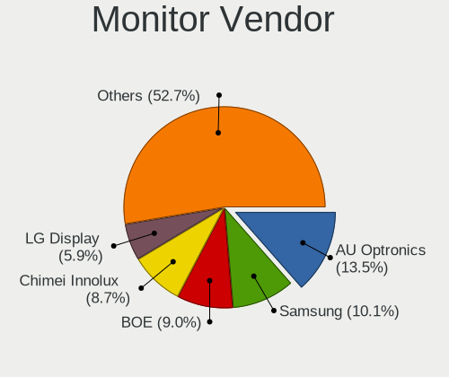

| Vendor                  | Computers | Percent |
|-------------------------|-----------|---------|
| Samsung Electronics     | 40        | 11.02%  |
| Chimei Innolux          | 38        | 10.47%  |
| AU Optronics            | 36        | 9.92%   |
| BOE                     | 31        | 8.54%   |
| LG Display              | 28        | 7.71%   |
| Iiyama                  | 25        | 6.89%   |
| Dell                    | 21        | 5.79%   |
| Philips                 | 13        | 3.58%   |
| Goldstar                | 11        | 3.03%   |
| AOC                     | 11        | 3.03%   |
| Ancor Communications    | 9         | 2.48%   |
| BenQ                    | 7         | 1.93%   |
| Acer                    | 7         | 1.93%   |
| Sharp                   | 6         | 1.65%   |
| Valve                   | 5         | 1.38%   |
| Toshiba                 | 5         | 1.38%   |
| ViewSonic               | 4         | 1.1%    |
| Sony                    | 4         | 1.1%    |
| Lenovo                  | 4         | 1.1%    |
| Idek Iiyama             | 4         | 1.1%    |
| Hewlett-Packard         | 4         | 1.1%    |
| Chi Mei Optoelectronics | 4         | 1.1%    |
| ASUSTek Computer        | 4         | 1.1%    |
| Apple                   | 4         | 1.1%    |
| InfoVision              | 3         | 0.83%   |
| Unknown                 | 3         | 0.83%   |
| Unknown                 | 2         | 0.55%   |
| PANDA                   | 2         | 0.55%   |
| LG Philips              | 2         | 0.55%   |
| Fujitsu Siemens         | 2         | 0.55%   |
| Daewoo                  | 2         | 0.55%   |
| CRM                     | 2         | 0.55%   |
| Yamaha                  | 1         | 0.28%   |
| SNC                     | 1         | 0.28%   |
| SENSY                   | 1         | 0.28%   |
| RIS                     | 1         | 0.28%   |
| Packard Bell            | 1         | 0.28%   |
| NTS                     | 1         | 0.28%   |
| MSI                     | 1         | 0.28%   |
| MiTAC                   | 1         | 0.28%   |

Monitor Model
-------------

Monitor models

| Model                                                                 | Computers | Percent |
|-----------------------------------------------------------------------|-----------|---------|
| AU Optronics LCD Monitor AUO36ED 1920x1080 344x193mm 15.5-inch        | 7         | 1.89%   |
| Valve ANX7530 U VLV3001 800x1280 100x150mm 7.1-inch                   | 5         | 1.35%   |
| BenQ GW2270 BNQ78DB 1920x1080 476x268mm 21.5-inch                     | 4         | 1.08%   |
| Toshiba TV TSB0108 1360x768 576x324mm 26.0-inch                       | 3         | 0.81%   |
| Philips PHL 243V7 PHLC155 1920x1080 527x296mm 23.8-inch               | 3         | 0.81%   |
| Iiyama PLE2483H IVM6113 1920x1080 531x299mm 24.0-inch                 | 3         | 0.81%   |
| Iiyama PL2409HD IVM560C 1920x1080 521x293mm 23.5-inch                 | 3         | 0.81%   |
| Goldstar IPS225 GSM587B 1920x1080 510x290mm 23.1-inch                 | 3         | 0.81%   |
| Chimei Innolux LCD Monitor CMN1747 1920x1080 381x214mm 17.2-inch      | 3         | 0.81%   |
| Chimei Innolux LCD Monitor CMN1734 1600x900 382x214mm 17.2-inch       | 3         | 0.81%   |
| Chimei Innolux LCD Monitor CMN15F5 1920x1080 344x193mm 15.5-inch      | 3         | 0.81%   |
| Unknown                                                               | 3         | 0.81%   |
| Sharp LCD Monitor SHP14D1 1920x1200 336x210mm 15.6-inch               | 2         | 0.54%   |
| Samsung Electronics LCD Monitor SDC3654 1600x900 382x215mm 17.3-inch  | 2         | 0.54%   |
| Samsung Electronics LCD Monitor SAM0659 1920x1080                     | 2         | 0.54%   |
| LG Display LCD Monitor LGD046C 1920x1080 382x215mm 17.3-inch          | 2         | 0.54%   |
| LG Display LCD Monitor LGD0395 1366x768 344x194mm 15.5-inch           | 2         | 0.54%   |
| LG Display LCD Monitor LGD02DC 1366x768 344x194mm 15.5-inch           | 2         | 0.54%   |
| Iiyama PL3288UH IVM1176 3840x2160 698x393mm 31.5-inch                 | 2         | 0.54%   |
| Goldstar ULTRAGEAR GSM5BB3 2560x1440 597x336mm 27.0-inch              | 2         | 0.54%   |
| Dell P2417H DELA0DC 1920x1080 527x296mm 23.8-inch                     | 2         | 0.54%   |
| CRM 32QHD165 CRM1B1C 2560x1440 708x399mm 32.0-inch                    | 2         | 0.54%   |
| Chimei Innolux LCD Monitor CMN1614 1920x1200 344x215mm 16.0-inch      | 2         | 0.54%   |
| Chimei Innolux LCD Monitor CMN15E8 1920x1080 344x193mm 15.5-inch      | 2         | 0.54%   |
| Chimei Innolux LCD Monitor CMN1512 1920x1080 344x193mm 15.5-inch      | 2         | 0.54%   |
| Chimei Innolux LCD Monitor CMN14D5 1920x1080 309x173mm 13.9-inch      | 2         | 0.54%   |
| Chimei Innolux LCD Monitor CMN14D4 1920x1080 309x173mm 13.9-inch      | 2         | 0.54%   |
| Chimei Innolux LCD Monitor CMN1361 1920x1080 293x165mm 13.2-inch      | 2         | 0.54%   |
| BOE LCD Monitor BOE09DE 1920x1080 309x174mm 14.0-inch                 | 2         | 0.54%   |
| AU Optronics LCD Monitor AUO6287 1440x900 367x229mm 17.0-inch         | 2         | 0.54%   |
| AU Optronics LCD Monitor AUO403D 1920x1080 309x174mm 14.0-inch        | 2         | 0.54%   |
| Ancor Communications ASUS VP228 ACI22C3 1920x1080 476x268mm 21.5-inch | 2         | 0.54%   |
| Yamaha RX-V483 YMH31DD 1920x540                                       | 1         | 0.27%   |
| ViewSonic VX2703 SERIES VSCF62B 1920x1080 597x336mm 27.0-inch         | 1         | 0.27%   |
| ViewSonic VX2457 VSCB931 1920x1080 521x293mm 23.5-inch                | 1         | 0.27%   |
| ViewSonic VG175 VSCDD00 1280x1024 345x276mm 17.4-inch                 | 1         | 0.27%   |
| ViewSonic VA2419 Series VSC7B32 1920x1080 527x296mm 23.8-inch         | 1         | 0.27%   |
| Unknown LCDTV16 9000 1360x768 1600x900mm 72.3-inch                    | 1         | 0.27%   |
| Unknown LCD Monitor FFFF 2288x1287 2550x2550mm 142.0-inch             | 1         | 0.27%   |
| Toshiba TV TSB0105 1920x1080 708x398mm 32.0-inch                      | 1         | 0.27%   |

Monitor Resolution
------------------

Monitor screen resolution

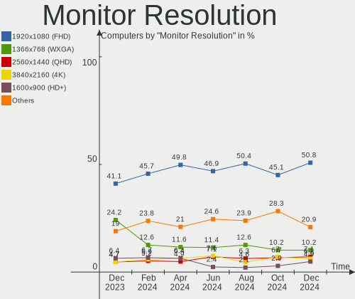

| Resolution         | Computers | Percent |
|--------------------|-----------|---------|
| 1920x1080 (FHD)    | 170       | 50.45%  |
| 1366x768 (WXGA)    | 41        | 12.17%  |
| 2560x1440 (QHD)    | 18        | 5.34%   |
| 3840x2160 (4K)     | 16        | 4.75%   |
| 1600x900 (HD+)     | 16        | 4.75%   |
| 1920x1200 (WUXGA)  | 14        | 4.15%   |
| 1680x1050 (WSXGA+) | 13        | 3.86%   |
| 1440x900 (WXGA+)   | 6         | 1.78%   |
| 1280x800 (WXGA)    | 6         | 1.78%   |
| 800x1280           | 5         | 1.48%   |
| 1280x1024 (SXGA)   | 5         | 1.48%   |
| 1920x540           | 4         | 1.19%   |
| Unknown            | 4         | 1.19%   |
| 3840x1080          | 3         | 0.89%   |
| 3440x1440          | 3         | 0.89%   |
| 2880x1800          | 3         | 0.89%   |
| 3280x1080          | 1         | 0.3%    |
| 2560x1600          | 1         | 0.3%    |
| 2560x1080          | 1         | 0.3%    |
| 2520x1680          | 1         | 0.3%    |
| 2288x1287          | 1         | 0.3%    |
| 2240x1400          | 1         | 0.3%    |
| 2048x1152          | 1         | 0.3%    |
| 1920x1280          | 1         | 0.3%    |
| 1360x768           | 1         | 0.3%    |
| 1024x768 (XGA)     | 1         | 0.3%    |

Monitor Diagonal
----------------

Diagonal size in inches

| Inches  | Computers | Percent |
|---------|-----------|---------|
| 15      | 82        | 22.84%  |
| 24      | 35        | 9.75%   |
| 27      | 31        | 8.64%   |
| 23      | 29        | 8.08%   |
| 17      | 29        | 8.08%   |
| 13      | 24        | 6.69%   |
| 14      | 22        | 6.13%   |
| Unknown | 21        | 5.85%   |
| 21      | 19        | 5.29%   |
| 31      | 8         | 2.23%   |
| 22      | 7         | 1.95%   |
| 16      | 7         | 1.95%   |
| 72      | 5         | 1.39%   |
| 7       | 5         | 1.39%   |
| 32      | 4         | 1.11%   |
| 20      | 4         | 1.11%   |
| 19      | 4         | 1.11%   |
| 12      | 4         | 1.11%   |
| 34      | 3         | 0.84%   |
| 65      | 2         | 0.56%   |
| 54      | 2         | 0.56%   |
| 26      | 2         | 0.56%   |
| 11      | 2         | 0.56%   |
| 142     | 1         | 0.28%   |
| 49      | 1         | 0.28%   |
| 48      | 1         | 0.28%   |
| 38      | 1         | 0.28%   |
| 35      | 1         | 0.28%   |
| 33      | 1         | 0.28%   |
| 18      | 1         | 0.28%   |
| 10      | 1         | 0.28%   |

Monitor Width
-------------

Physical width

| Width in mm    | Computers | Percent |
|----------------|-----------|---------|
| 301-350        | 122       | 34.56%  |
| 501-600        | 89        | 25.21%  |
| 401-500        | 34        | 9.63%   |
| 351-400        | 29        | 8.22%   |
| 201-300        | 21        | 5.95%   |
| Unknown        | 21        | 5.95%   |
| 601-700        | 10        | 2.83%   |
| 701-800        | 8         | 2.27%   |
| 1001-1500      | 6         | 1.7%    |
| 1501-2000      | 5         | 1.42%   |
| 1-100          | 5         | 1.42%   |
| 801-900        | 2         | 0.57%   |
| More than 2000 | 1         | 0.28%   |

Aspect Ratio
------------

Proportional relationship between the width and the height

| Ratio   | Computers | Percent |
|---------|-----------|---------|
| 16/9    | 239       | 75.87%  |
| 16/10   | 38        | 12.06%  |
| Unknown | 15        | 4.76%   |
| 0.67    | 5         | 1.59%   |
| 5/4     | 4         | 1.27%   |
| 3/2     | 4         | 1.27%   |
| 21/9    | 4         | 1.27%   |
| 4/3     | 3         | 0.95%   |
| 32/9    | 2         | 0.63%   |
| 1.00    | 1         | 0.32%   |

Monitor Area
------------

Area in inch²

| Area in inch² | Computers | Percent |
|----------------|-----------|---------|
| 101-110        | 83        | 23.45%  |
| 201-250        | 72        | 20.34%  |
| 81-90          | 35        | 9.89%   |
| 301-350        | 32        | 9.04%   |
| 121-130        | 23        | 6.5%    |
| Unknown        | 21        | 5.93%   |
| 351-500        | 17        | 4.8%    |
| 151-200        | 14        | 3.95%   |
| 71-80          | 12        | 3.39%   |
| More than 1000 | 11        | 3.11%   |
| 251-300        | 8         | 2.26%   |
| 1-40           | 5         | 1.41%   |
| 111-120        | 5         | 1.41%   |
| 141-150        | 4         | 1.13%   |
| 61-70          | 3         | 0.85%   |
| 131-140        | 3         | 0.85%   |
| 51-60          | 2         | 0.56%   |
| 501-1000       | 2         | 0.56%   |
| 41-50          | 1         | 0.28%   |
| 91-100         | 1         | 0.28%   |

Pixel Density
-------------

Pixels per inch

| Density       | Computers | Percent |
|---------------|-----------|---------|
| 51-100        | 115       | 33.05%  |
| 121-160       | 95        | 27.3%   |
| 101-120       | 75        | 21.55%  |
| 161-240       | 30        | 8.62%   |
| Unknown       | 21        | 6.03%   |
| 1-50          | 10        | 2.87%   |
| More than 240 | 2         | 0.57%   |

Multiple Monitors
-----------------

Total monitors connected

| Total | Computers | Percent |
|-------|-----------|---------|
| 1     | 249       | 75.91%  |
| 2     | 53        | 16.16%  |
| 0     | 17        | 5.18%   |
| 3     | 9         | 2.74%   |

Network
-------

Net Controller Vendor
---------------------

Controller vendors

| Vendor                                | Computers | Percent |
|---------------------------------------|-----------|---------|
| Realtek Semiconductor                 | 186       | 38.75%  |
| Intel                                 | 155       | 32.29%  |
| Qualcomm Atheros                      | 40        | 8.33%   |
| Broadcom                              | 22        | 4.58%   |
| MediaTek                              | 11        | 2.29%   |
| ASIX Electronics                      | 9         | 1.88%   |
| NetGear                               | 8         | 1.67%   |
| TP-Link                               | 5         | 1.04%   |
| Ralink                                | 5         | 1.04%   |
| Marvell Technology Group              | 5         | 1.04%   |
| D-Link                                | 4         | 0.83%   |
| Broadcom Limited                      | 4         | 0.83%   |
| Samsung Electronics                   | 3         | 0.63%   |
| Ralink Technology                     | 3         | 0.63%   |
| Qualcomm                              | 3         | 0.63%   |
| Nvidia                                | 3         | 0.63%   |
| Sierra Wireless                       | 2         | 0.42%   |
| DisplayLink                           | 2         | 0.42%   |
| ASUSTek Computer                      | 2         | 0.42%   |
| Xiaomi                                | 1         | 0.21%   |
| Qualcomm Atheros Communications       | 1         | 0.21%   |
| OPPO Electronics                      | 1         | 0.21%   |
| OpenMoko                              | 1         | 0.21%   |
| Microsoft                             | 1         | 0.21%   |
| Google                                | 1         | 0.21%   |
| Generic                               | 1         | 0.21%   |
| 802.11g Adapter [Linksys WUSB54GC v3] | 1         | 0.21%   |

Net Controller Model
--------------------

Controller models

| Model                                                             | Computers | Percent |
|-------------------------------------------------------------------|-----------|---------|
| Realtek RTL8111/8168/8411 PCI Express Gigabit Ethernet Controller | 111       | 19.82%  |
| Realtek RTL810xE PCI Express Fast Ethernet controller             | 19        | 3.39%   |
| Realtek RTL8125 2.5GbE Controller                                 | 16        | 2.86%   |
| Intel Wi-Fi 6 AX201                                               | 13        | 2.32%   |
| Realtek RTL8822CE 802.11ac PCIe Wireless Network Adapter          | 12        | 2.14%   |
| Intel Alder Lake-P PCH CNVi WiFi                                  | 12        | 2.14%   |
| Realtek RTL8153 Gigabit Ethernet Adapter                          | 11        | 1.96%   |
| Intel Wireless 8260                                               | 11        | 1.96%   |
| Intel Wi-Fi 6 AX200                                               | 10        | 1.79%   |
| Intel Ethernet Connection I217-LM                                 | 9         | 1.61%   |
| ASIX AX88179 Gigabit Ethernet                                     | 9         | 1.61%   |
| Intel Wireless 7265                                               | 8         | 1.43%   |
| Realtek RTL8821CE 802.11ac PCIe Wireless Network Adapter          | 7         | 1.25%   |
| Qualcomm Atheros QCA9565 / AR9565 Wireless Network Adapter        | 7         | 1.25%   |
| Intel Wireless 7260                                               | 7         | 1.25%   |
| Intel I211 Gigabit Network Connection                             | 7         | 1.25%   |
| Intel Comet Lake PCH CNVi WiFi                                    | 7         | 1.25%   |
| Realtek RTL8188CE 802.11b/g/n WiFi Adapter                        | 6         | 1.07%   |
| Qualcomm Atheros AR9485 Wireless Network Adapter                  | 6         | 1.07%   |
| MediaTek MT7921 802.11ax PCI Express Wireless Network Adapter     | 6         | 1.07%   |
| Intel Wireless 8265 / 8275                                        | 6         | 1.07%   |
| Intel Cannon Lake PCH CNVi WiFi                                   | 6         | 1.07%   |
| Realtek RTL8723BE PCIe Wireless Network Adapter                   | 5         | 0.89%   |
| Qualcomm Atheros AR9285 Wireless Network Adapter (PCI-Express)    | 5         | 0.89%   |
| Qualcomm Atheros QCA6174 802.11ac Wireless Network Adapter        | 4         | 0.71%   |
| Intel Ethernet Connection I219-LM                                 | 4         | 0.71%   |
| Intel Ethernet Connection (16) I219-LM                            | 4         | 0.71%   |
| Intel Cannon Point-LP CNVi [Wireless-AC]                          | 4         | 0.71%   |
| Intel 82579LM Gigabit Network Connection (Lewisville)             | 4         | 0.71%   |
| Broadcom BCM43142 802.11b/g/n                                     | 4         | 0.71%   |
| TP-Link Archer T3U [Realtek RTL8812BU]                            | 3         | 0.54%   |
| Samsung Galaxy series, misc. (tethering mode)                     | 3         | 0.54%   |
| Realtek RTL8814AU 802.11a/b/g/n/ac Wireless Adapter               | 3         | 0.54%   |
| Qualcomm Atheros Killer E2500 Gigabit Ethernet Controller         | 3         | 0.54%   |
| MediaTek MT7922 802.11ax PCI Express Wireless Network Adapter     | 3         | 0.54%   |
| Intel Wi-Fi 6 AX210/AX211/AX411 160MHz                            | 3         | 0.54%   |
| Intel Tiger Lake PCH CNVi WiFi                                    | 3         | 0.54%   |
| Intel Ethernet Connection I217-V                                  | 3         | 0.54%   |
| Intel Ethernet Connection (7) I219-LM                             | 3         | 0.54%   |
| Intel Ethernet Connection (5) I219-LM                             | 3         | 0.54%   |

Wireless Vendor
---------------

Wireless vendors

| Vendor                                | Computers | Percent |
|---------------------------------------|-----------|---------|
| Intel                                 | 110       | 42.31%  |
| Realtek Semiconductor                 | 59        | 22.69%  |
| Qualcomm Atheros                      | 28        | 10.77%  |
| Broadcom                              | 14        | 5.38%   |
| MediaTek                              | 11        | 4.23%   |
| NetGear                               | 8         | 3.08%   |
| TP-Link                               | 5         | 1.92%   |
| Ralink                                | 5         | 1.92%   |
| D-Link                                | 4         | 1.54%   |
| Broadcom Limited                      | 4         | 1.54%   |
| Ralink Technology                     | 3         | 1.15%   |
| Sierra Wireless                       | 2         | 0.77%   |
| Qualcomm                              | 2         | 0.77%   |
| ASUSTek Computer                      | 2         | 0.77%   |
| Qualcomm Atheros Communications       | 1         | 0.38%   |
| Microsoft                             | 1         | 0.38%   |
| 802.11g Adapter [Linksys WUSB54GC v3] | 1         | 0.38%   |

Wireless Model
--------------

Wireless models

| Model                                                          | Computers | Percent |
|----------------------------------------------------------------|-----------|---------|
| Intel Wi-Fi 6 AX201                                            | 13        | 5%      |
| Realtek RTL8822CE 802.11ac PCIe Wireless Network Adapter       | 12        | 4.62%   |
| Intel Alder Lake-P PCH CNVi WiFi                               | 12        | 4.62%   |
| Intel Wireless 8260                                            | 11        | 4.23%   |
| Intel Wi-Fi 6 AX200                                            | 10        | 3.85%   |
| Intel Wireless 7265                                            | 8         | 3.08%   |
| Realtek RTL8821CE 802.11ac PCIe Wireless Network Adapter       | 7         | 2.69%   |
| Qualcomm Atheros QCA9565 / AR9565 Wireless Network Adapter     | 7         | 2.69%   |
| Intel Wireless 7260                                            | 7         | 2.69%   |
| Intel Comet Lake PCH CNVi WiFi                                 | 7         | 2.69%   |
| Realtek RTL8188CE 802.11b/g/n WiFi Adapter                     | 6         | 2.31%   |
| Qualcomm Atheros AR9485 Wireless Network Adapter               | 6         | 2.31%   |
| MediaTek MT7921 802.11ax PCI Express Wireless Network Adapter  | 6         | 2.31%   |
| Intel Wireless 8265 / 8275                                     | 6         | 2.31%   |
| Intel Cannon Lake PCH CNVi WiFi                                | 6         | 2.31%   |
| Realtek RTL8723BE PCIe Wireless Network Adapter                | 5         | 1.92%   |
| Qualcomm Atheros AR9285 Wireless Network Adapter (PCI-Express) | 5         | 1.92%   |
| Qualcomm Atheros QCA6174 802.11ac Wireless Network Adapter     | 4         | 1.54%   |
| Intel Cannon Point-LP CNVi [Wireless-AC]                       | 4         | 1.54%   |
| Broadcom BCM43142 802.11b/g/n                                  | 4         | 1.54%   |
| TP-Link Archer T3U [Realtek RTL8812BU]                         | 3         | 1.15%   |
| Realtek RTL8814AU 802.11a/b/g/n/ac Wireless Adapter            | 3         | 1.15%   |
| MediaTek MT7922 802.11ax PCI Express Wireless Network Adapter  | 3         | 1.15%   |
| Intel Wi-Fi 6 AX210/AX211/AX411 160MHz                         | 3         | 1.15%   |
| Intel Tiger Lake PCH CNVi WiFi                                 | 3         | 1.15%   |
| Intel Comet Lake PCH-LP CNVi WiFi                              | 3         | 1.15%   |
| Intel Centrino Advanced-N 6205 [Taylor Peak]                   | 3         | 1.15%   |
| Realtek RTL88x2bu [AC1200 Techkey]                             | 2         | 0.77%   |
| Realtek RTL8821AE 802.11ac PCIe Wireless Network Adapter       | 2         | 0.77%   |
| Realtek RTL8723AE PCIe Wireless Network Adapter                | 2         | 0.77%   |
| Realtek RTL8191SEvB Wireless LAN Controller                    | 2         | 0.77%   |
| Realtek RTL8188EUS 802.11n Wireless Network Adapter            | 2         | 0.77%   |
| Realtek 802.11ac NIC                                           | 2         | 0.77%   |
| Ralink RT2501/RT2573 Wireless Adapter                          | 2         | 0.77%   |
| Qualcomm QCNFA765 Wireless Network Adapter                     | 2         | 0.77%   |
| Qualcomm Atheros AR928X Wireless Network Adapter (PCI-Express) | 2         | 0.77%   |
| Qualcomm Atheros AR9287 Wireless Network Adapter (PCI-Express) | 2         | 0.77%   |
| NetGear A6210                                                  | 2         | 0.77%   |
| NetGear A6150                                                  | 2         | 0.77%   |
| Intel Wireless 3165                                            | 2         | 0.77%   |

Ethernet Vendor
---------------

Ethernet vendors

| Vendor                   | Computers | Percent |
|--------------------------|-----------|---------|
| Realtek Semiconductor    | 160       | 55.17%  |
| Intel                    | 76        | 26.21%  |
| Qualcomm Atheros         | 17        | 5.86%   |
| Broadcom                 | 11        | 3.79%   |
| ASIX Electronics         | 9         | 3.1%    |
| Marvell Technology Group | 5         | 1.72%   |
| Samsung Electronics      | 3         | 1.03%   |
| Nvidia                   | 3         | 1.03%   |
| DisplayLink              | 2         | 0.69%   |
| Xiaomi                   | 1         | 0.34%   |
| Qualcomm                 | 1         | 0.34%   |
| OPPO Electronics         | 1         | 0.34%   |
| Google                   | 1         | 0.34%   |

Ethernet Model
--------------

Ethernet models

| Model                                                             | Computers | Percent |
|-------------------------------------------------------------------|-----------|---------|
| Realtek RTL8111/8168/8411 PCI Express Gigabit Ethernet Controller | 111       | 37.25%  |
| Realtek RTL810xE PCI Express Fast Ethernet controller             | 19        | 6.38%   |
| Realtek RTL8125 2.5GbE Controller                                 | 16        | 5.37%   |
| Realtek RTL8153 Gigabit Ethernet Adapter                          | 11        | 3.69%   |
| Intel Ethernet Connection I217-LM                                 | 9         | 3.02%   |
| ASIX AX88179 Gigabit Ethernet                                     | 9         | 3.02%   |
| Intel I211 Gigabit Network Connection                             | 7         | 2.35%   |
| Intel Ethernet Connection I219-LM                                 | 4         | 1.34%   |
| Intel Ethernet Connection (16) I219-LM                            | 4         | 1.34%   |
| Intel 82579LM Gigabit Network Connection (Lewisville)             | 4         | 1.34%   |
| Samsung Galaxy series, misc. (tethering mode)                     | 3         | 1.01%   |
| Qualcomm Atheros Killer E2500 Gigabit Ethernet Controller         | 3         | 1.01%   |
| Intel Ethernet Connection I217-V                                  | 3         | 1.01%   |
| Intel Ethernet Connection (7) I219-LM                             | 3         | 1.01%   |
| Intel Ethernet Connection (5) I219-LM                             | 3         | 1.01%   |
| Intel Ethernet Connection (2) I219-V                              | 3         | 1.01%   |
| Intel Ethernet Connection (13) I219-V                             | 3         | 1.01%   |
| Intel Ethernet Connection (11) I219-V                             | 3         | 1.01%   |
| Broadcom NetXtreme BCM5761 Gigabit Ethernet PCIe                  | 3         | 1.01%   |
| Realtek RTL-8100/8101L/8139 PCI Fast Ethernet Adapter             | 2         | 0.67%   |
| Realtek Killer E2600 Gigabit Ethernet Controller                  | 2         | 0.67%   |
| Qualcomm Atheros QCA8171 Gigabit Ethernet                         | 2         | 0.67%   |
| Qualcomm Atheros Killer E2400 Gigabit Ethernet Controller         | 2         | 0.67%   |
| Qualcomm Atheros Killer E220x Gigabit Ethernet Controller         | 2         | 0.67%   |
| Qualcomm Atheros AR8161 Gigabit Ethernet                          | 2         | 0.67%   |
| Qualcomm Atheros AR8152 v2.0 Fast Ethernet                        | 2         | 0.67%   |
| Intel Ethernet Controller I225-V                                  | 2         | 0.67%   |
| Intel Ethernet Connection I219-V                                  | 2         | 0.67%   |
| Intel Ethernet Connection (7) I219-V                              | 2         | 0.67%   |
| Intel Ethernet Connection (14) I219-LM                            | 2         | 0.67%   |
| Intel Ethernet Connection (13) I219-LM                            | 2         | 0.67%   |
| Intel Ethernet Connection (12) I219-V                             | 2         | 0.67%   |
| Intel 82579V Gigabit Network Connection                           | 2         | 0.67%   |
| Intel 82574L Gigabit Network Connection                           | 2         | 0.67%   |
| DisplayLink Dell Universal Dock D6000                             | 2         | 0.67%   |
| Xiaomi Mi/Redmi series (RNDIS)                                    | 1         | 0.34%   |
| Realtek RTL8152 Fast Ethernet Adapter                             | 1         | 0.34%   |
| Realtek RTL-8110SC/8169SC Gigabit Ethernet                        | 1         | 0.34%   |
| Realtek Killer E2500 Gigabit Ethernet Controller                  | 1         | 0.34%   |
| Qualcomm Nokia XR20                                               | 1         | 0.34%   |

Net Controller Kind
-------------------

Ethernet, WiFi or modem

| Kind     | Computers | Percent |
|----------|-----------|---------|
| Ethernet | 275       | 53.29%  |
| WiFi     | 239       | 46.32%  |
| Modem    | 2         | 0.39%   |

Used Controller
---------------

Currently used network controller

| Kind     | Computers | Percent |
|----------|-----------|---------|
| WiFi     | 171       | 51.51%  |
| Ethernet | 161       | 48.49%  |

NICs
----

Total network controllers on board

| Total | Computers | Percent |
|-------|-----------|---------|
| 2     | 157       | 47.87%  |
| 1     | 156       | 47.56%  |
| 0     | 8         | 2.44%   |
| 3     | 6         | 1.83%   |
| 5     | 1         | 0.3%    |

IPv6
----

IPv6 vs IPv4

| Used | Computers | Percent |
|------|-----------|---------|
| Yes  | 195       | 59.45%  |
| No   | 133       | 40.55%  |

Bluetooth
---------

Bluetooth Vendor
----------------

Controller vendors

| Vendor                          | Computers | Percent |
|---------------------------------|-----------|---------|
| Intel                           | 98        | 49.49%  |
| IMC Networks                    | 19        | 9.6%    |
| Realtek Semiconductor           | 18        | 9.09%   |
| Foxconn / Hon Hai               | 10        | 5.05%   |
| Cambridge Silicon Radio         | 8         | 4.04%   |
| Lite-On Technology              | 7         | 3.54%   |
| Broadcom                        | 7         | 3.54%   |
| Apple                           | 6         | 3.03%   |
| Qualcomm Atheros Communications | 5         | 2.53%   |
| ASUSTek Computer                | 5         | 2.53%   |
| TP-Link                         | 3         | 1.52%   |
| MediaTek                        | 2         | 1.01%   |
| Dell                            | 2         | 1.01%   |
| USI                             | 1         | 0.51%   |
| Realtek                         | 1         | 0.51%   |
| Ralink Technology               | 1         | 0.51%   |
| Ralink                          | 1         | 0.51%   |
| Hewlett-Packard                 | 1         | 0.51%   |
| Edimax Technology               | 1         | 0.51%   |
| Chicony Electronics             | 1         | 0.51%   |
| Belkin Components               | 1         | 0.51%   |

Bluetooth Model
---------------

Controller models

| Model                                               | Computers | Percent |
|-----------------------------------------------------|-----------|---------|
| Intel Bluetooth wireless interface                  | 33        | 16.67%  |
| Intel AX201 Bluetooth                               | 22        | 11.11%  |
| Realtek Bluetooth Radio                             | 14        | 7.07%   |
| Intel Bluetooth 9460/9560 Jefferson Peak (JfP)      | 14        | 7.07%   |
| Intel Bluetooth Device                              | 12        | 6.06%   |
| IMC Networks Bluetooth Radio                        | 11        | 5.56%   |
| Intel AX200 Bluetooth                               | 9         | 4.55%   |
| Cambridge Silicon Radio Bluetooth Dongle (HCI mode) | 8         | 4.04%   |
| Foxconn / Hon Hai Wireless_Device                   | 6         | 3.03%   |
| Apple Bluetooth Host Controller                     | 4         | 2.02%   |
| TP-Link UB500 Adapter                               | 3         | 1.52%   |
| Qualcomm Atheros  Bluetooth Device                  | 3         | 1.52%   |
| Lite-On Atheros AR3012 Bluetooth                    | 3         | 1.52%   |
| Intel Centrino Bluetooth Wireless Transceiver       | 3         | 1.52%   |
| Intel AX210 Bluetooth                               | 3         | 1.52%   |
| IMC Networks Bluetooth Device                       | 3         | 1.52%   |
| Realtek  Bluetooth 4.2 Adapter                      | 2         | 1.01%   |
| MediaTek Wireless_Device                            | 2         | 1.01%   |
| Lite-On Broadcom BCM43142A0 Bluetooth Device        | 2         | 1.01%   |
| IMC Networks Wireless_Device                        | 2         | 1.01%   |
| IMC Networks Bluetooth                              | 2         | 1.01%   |
| Foxconn / Hon Hai Bluetooth Device                  | 2         | 1.01%   |
| Broadcom BCM43142A0 Bluetooth Device                | 2         | 1.01%   |
| Broadcom BCM2045B (BDC-2.1)                         | 2         | 1.01%   |
| ASUS Broadcom BCM20702A0 Bluetooth                  | 2         | 1.01%   |
| ASUS ASUS USB-BT500                                 | 2         | 1.01%   |
| Apple Bluetooth HCI                                 | 2         | 1.01%   |
| USI Bluetooth Device                                | 1         | 0.51%   |
| Realtek RTL8821A Bluetooth                          | 1         | 0.51%   |
| Realtek RTL8723B Bluetooth                          | 1         | 0.51%   |
| Realtek 802.11ac WLAN Adapter                       | 1         | 0.51%   |
| Ralink CSR BS8510                                   | 1         | 0.51%   |
| Ralink RT3290 Bluetooth                             | 1         | 0.51%   |
| Qualcomm Atheros Bluetooth                          | 1         | 0.51%   |
| Qualcomm Atheros AR3011 Bluetooth                   | 1         | 0.51%   |
| Lite-On Qualcomm Atheros QCA9377 Bluetooth          | 1         | 0.51%   |
| Lite-On Bluetooth Radio                             | 1         | 0.51%   |
| Intel Wireless-AC 9260 Bluetooth Adapter            | 1         | 0.51%   |
| Intel Wireless-AC 3168 Bluetooth                    | 1         | 0.51%   |
| IMC Networks Atheros AR3012 Bluetooth 4.0 Adapter   | 1         | 0.51%   |

Sound
-----

Sound Vendor
------------

Sound card vendors

| Vendor                     | Computers | Percent |
|----------------------------|-----------|---------|
| Intel                      | 241       | 48.79%  |
| AMD                        | 99        | 20.04%  |
| Nvidia                     | 96        | 19.43%  |
| Generalplus Technology     | 6         | 1.21%   |
| C-Media Electronics        | 6         | 1.21%   |
| Razer USA                  | 5         | 1.01%   |
| Logitech                   | 5         | 1.01%   |
| Realtek Semiconductor      | 3         | 0.61%   |
| M-Audio                    | 3         | 0.61%   |
| GN Netcom                  | 3         | 0.61%   |
| Focusrite-Novation         | 3         | 0.61%   |
| Creative Labs              | 3         | 0.61%   |
| VIA Technologies           | 2         | 0.4%    |
| Kingston Technology        | 2         | 0.4%    |
| ASUSTek Computer           | 2         | 0.4%    |
| ZOOM                       | 1         | 0.2%    |
| Yamaha                     | 1         | 0.2%    |
| Turtle Beach               | 1         | 0.2%    |
| Texas Instruments          | 1         | 0.2%    |
| Superlux digit             | 1         | 0.2%    |
| Sony                       | 1         | 0.2%    |
| PreSonus Audio Electronics | 1         | 0.2%    |
| Plantronics                | 1         | 0.2%    |
| Micro Star International   | 1         | 0.2%    |
| Lenovo                     | 1         | 0.2%    |
| JMTek                      | 1         | 0.2%    |
| Hewlett-Packard            | 1         | 0.2%    |
| DSEA A/S                   | 1         | 0.2%    |
| Creative Technology        | 1         | 0.2%    |
| BEHRINGER International    | 1         | 0.2%    |

Sound Model
-----------

Sound card models

| Model                                                                      | Computers | Percent |
|----------------------------------------------------------------------------|-----------|---------|
| AMD Family 17h/19h HD Audio Controller                                     | 26        | 4.51%   |
| Intel 8 Series/C220 Series Chipset High Definition Audio Controller        | 23        | 3.99%   |
| Intel Xeon E3-1200 v3/4th Gen Core Processor HD Audio Controller           | 19        | 3.29%   |
| AMD Renoir Radeon High Definition Audio Controller                         | 18        | 3.12%   |
| Intel 6 Series/C200 Series Chipset Family High Definition Audio Controller | 17        | 2.95%   |
| Intel Tiger Lake-LP Smart Sound Technology Audio Controller                | 16        | 2.77%   |
| Intel 7 Series/C216 Chipset Family High Definition Audio Controller        | 16        | 2.77%   |
| AMD Starship/Matisse HD Audio Controller                                   | 14        | 2.43%   |
| Intel Cannon Lake PCH cAVS                                                 | 13        | 2.25%   |
| Intel Alder Lake PCH-P High Definition Audio Controller                    | 13        | 2.25%   |
| Nvidia GK208 HDMI/DP Audio Controller                                      | 12        | 2.08%   |
| Intel Sunrise Point-LP HD Audio                                            | 12        | 2.08%   |
| Intel Haswell-ULT HD Audio Controller                                      | 12        | 2.08%   |
| Intel 8 Series HD Audio Controller                                         | 12        | 2.08%   |
| Intel 100 Series/C230 Series Chipset Family HD Audio Controller            | 11        | 1.91%   |
| Intel NM10/ICH7 Family High Definition Audio Controller                    | 10        | 1.73%   |
| Intel 5 Series/3400 Series Chipset High Definition Audio                   | 10        | 1.73%   |
| AMD SBx00 Azalia (Intel HDA)                                               | 9         | 1.56%   |
| AMD Rembrandt Radeon High Definition Audio Controller                      | 9         | 1.56%   |
| AMD FCH Azalia Controller                                                  | 9         | 1.56%   |
| Nvidia TU107 GeForce GTX 1650 High Definition Audio Controller             | 8         | 1.39%   |
| Intel Comet Lake PCH cAVS                                                  | 8         | 1.39%   |
| Intel 9 Series Chipset Family HD Audio Controller                          | 8         | 1.39%   |
| Nvidia TU106 High Definition Audio Controller                              | 7         | 1.21%   |
| Intel Tiger Lake-H HD Audio Controller                                     | 7         | 1.21%   |
| Intel CM238 HD Audio Controller                                            | 7         | 1.21%   |
| Intel Atom Processor Z36xxx/Z37xxx Series High Definition Audio Controller | 7         | 1.21%   |
| Intel 82801JI (ICH10 Family) HD Audio Controller                           | 7         | 1.21%   |
| Intel 82801I (ICH9 Family) HD Audio Controller                             | 7         | 1.21%   |
| AMD Navi 21/23 HDMI/DP Audio Controller                                    | 7         | 1.21%   |
| Nvidia TU116 High Definition Audio Controller                              | 6         | 1.04%   |
| Nvidia GP106 High Definition Audio Controller                              | 6         | 1.04%   |
| Nvidia GF108 High Definition Audio Controller                              | 6         | 1.04%   |
| Generalplus Technology USB Audio Device                                    | 6         | 1.04%   |
| AMD Oland/Hainan/Cape Verde/Pitcairn HDMI Audio [Radeon HD 7000 Series]    | 6         | 1.04%   |
| AMD Family 17h (Models 00h-0fh) HD Audio Controller                        | 6         | 1.04%   |
| Nvidia GP107GL High Definition Audio Controller                            | 5         | 0.87%   |
| Intel Wildcat Point-LP High Definition Audio Controller                    | 5         | 0.87%   |
| Intel Comet Lake PCH-LP cAVS                                               | 5         | 0.87%   |
| Intel Broadwell-U Audio Controller                                         | 5         | 0.87%   |

Memory
------

Memory Vendor
-------------

Memory module vendors

| Vendor              | Computers | Percent |
|---------------------|-----------|---------|
| Samsung Electronics | 65        | 24.34%  |
| SK hynix            | 49        | 18.35%  |
| Unknown             | 27        | 10.11%  |
| Micron Technology   | 27        | 10.11%  |
| Kingston            | 22        | 8.24%   |
| Corsair             | 20        | 7.49%   |
| Crucial             | 18        | 6.74%   |
| G.Skill             | 15        | 5.62%   |
| Nanya Technology    | 5         | 1.87%   |
| Transcend           | 3         | 1.12%   |
| Ramaxel Technology  | 3         | 1.12%   |
| Unknown             | 3         | 1.12%   |
| Timetec             | 2         | 0.75%   |
| PNY                 | 2         | 0.75%   |
| A-DATA Technology   | 2         | 0.75%   |
| Patriot             | 1         | 0.37%   |
| Neo Forza           | 1         | 0.37%   |
| Goldenmars          | 1         | 0.37%   |
| Avant               | 1         | 0.37%   |

Memory Model
------------

Memory module models

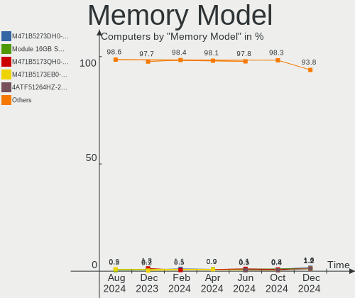

| Model                                                       | Computers | Percent |
|-------------------------------------------------------------|-----------|---------|
| SK hynix RAM HMT425S6AFR6A-PB 2GB SODIMM DDR3 3200MT/s      | 7         | 2.46%   |
| Micron RAM Module 4GB SODIMM DDR3 1600MT/s                  | 7         | 2.46%   |
| SK hynix RAM HMT451S6BFR8A-PB 4GB SODIMM DDR3 1600MT/s      | 4         | 1.4%    |
| Samsung RAM M471A1K43EB1-CWE 8GB SODIMM DDR4 3200MT/s       | 4         | 1.4%    |
| Unknown RAM Module 4GB DIMM 1333MT/s                        | 3         | 1.05%   |
| SK hynix RAM HMA81GS6DJR8N-XN 8GB SODIMM DDR4 3200MT/s      | 3         | 1.05%   |
| Samsung RAM M471B5173EB0-YK0 4GB SODIMM DDR3 1600MT/s       | 3         | 1.05%   |
| Samsung RAM M471B5173DB0-YK0 4GB SODIMM DDR3 1600MT/s       | 3         | 1.05%   |
| Samsung RAM M471A1K43CB1-CTD 8GB SODIMM DDR4 2667MT/s       | 3         | 1.05%   |
| Samsung RAM M471A1G44AB0-CWE 8GB SODIMM DDR4 3200MT/s       | 3         | 1.05%   |
| G.Skill RAM F3-12800CL9-4GBSR 4GB DIMM DDR3 1600MT/s        | 3         | 1.05%   |
| Corsair RAM CMK16GX4M2B3200C16 8GB DIMM DDR4 3600MT/s       | 3         | 1.05%   |
| Unknown                                                     | 3         | 1.05%   |
| Unknown RAM Module 2GB SODIMM DDR2 667MT/s                  | 2         | 0.7%    |
| Unknown RAM Module 2048MB DIMM DDR2 800MT/s                 | 2         | 0.7%    |
| SK hynix RAM HMT451S6AFR8A-PB 4GB SODIMM DDR3 1600MT/s      | 2         | 0.7%    |
| SK hynix RAM HMT351S6CFR8C-PB 4GB SODIMM DDR3 1600MT/s      | 2         | 0.7%    |
| SK hynix RAM HMAB2GS6AMR6N-XN 16GB SODIMM DDR4 3200MT/s     | 2         | 0.7%    |
| Samsung RAM M471B5173QH0-YK0 4GB SODIMM DDR3 1600MT/s       | 2         | 0.7%    |
| Samsung RAM M471B1G73EB0-YK0 8GB SODIMM DDR3 1600MT/s       | 2         | 0.7%    |
| Samsung RAM M471B1G73DB0-YK0 8GB SODIMM DDR3 1600MT/s       | 2         | 0.7%    |
| Samsung RAM M471A5244CB0-CWE 4GB Row Of Chips DDR4 3200MT/s | 2         | 0.7%    |
| Samsung RAM M471A2K43CB1-CRC 16GB SODIMM DDR4 2667MT/s      | 2         | 0.7%    |
| Samsung RAM M471A1K43DB1-CWE 8GB SODIMM DDR4 3200MT/s       | 2         | 0.7%    |
| Samsung RAM M378B5173EB0-YK0 4GB DIMM DDR3 1600MT/s         | 2         | 0.7%    |
| Samsung RAM M378B1G73DB0-CK0 8GB DIMM DDR3 2133MT/s         | 2         | 0.7%    |
| Micron RAM 4ATF1G64HZ-3G2E2 8GB SODIMM DDR4 3200MT/s        | 2         | 0.7%    |
| Micron RAM 4ATF1G64HZ-3G2E1 8GB Row Of Chips DDR4 3200MT/s  | 2         | 0.7%    |
| G.Skill RAM F3-12800CL9-4GBXL 4GB DIMM DDR3 1867MT/s        | 2         | 0.7%    |
| Crucial RAM CT102464BF160B.M16 8GB SODIMM DDR3 1600MT/s     | 2         | 0.7%    |
| Corsair RAM CMV8GX4M1A2133C15 8GB DIMM DDR4 2733MT/s        | 2         | 0.7%    |
| Corsair RAM CMK32GX4M2E3200C16 16GB DIMM DDR4 3534MT/s      | 2         | 0.7%    |
| Corsair RAM CMK16GX4M2E3200C16 8GB DIMM DDR4 3200MT/s       | 2         | 0.7%    |
| Unknown RAM Module 8GB SODIMM LPDDR4 4266MT/s               | 1         | 0.35%   |
| Unknown RAM Module 8GB SODIMM DDR4 3200MT/s                 | 1         | 0.35%   |
| Unknown RAM Module 4GB SODIMM DDR4 2400MT/s                 | 1         | 0.35%   |
| Unknown RAM Module 4GB DIMM DDR3 1067MT/s                   | 1         | 0.35%   |
| Unknown RAM Module 4GB DIMM 1600MT/s                        | 1         | 0.35%   |
| Unknown RAM Module 4096MB SODIMM DDR3 1067MT/s              | 1         | 0.35%   |
| Unknown RAM Module 2GB SODIMM DDR3 1066MT/s                 | 1         | 0.35%   |

Memory Kind
-----------

Memory module kinds

| Kind    | Computers | Percent |
|---------|-----------|---------|
| DDR4    | 96        | 42.29%  |
| DDR3    | 91        | 40.09%  |
| DDR2    | 10        | 4.41%   |
| LPDDR5  | 8         | 3.52%   |
| Unknown | 8         | 3.52%   |
| LPDDR4  | 4         | 1.76%   |
| DDR5    | 4         | 1.76%   |
| SDRAM   | 3         | 1.32%   |
| LPDDR3  | 2         | 0.88%   |
| DDR     | 1         | 0.44%   |

Memory Form Factor
------------------

Physical design of the memory module

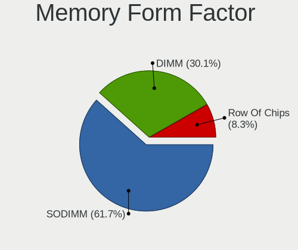

| Name         | Computers | Percent |
|--------------|-----------|---------|
| SODIMM       | 127       | 56.19%  |
| DIMM         | 85        | 37.61%  |
| Row Of Chips | 13        | 5.75%   |
| Unknown      | 1         | 0.44%   |

Memory Size
-----------

Memory module size

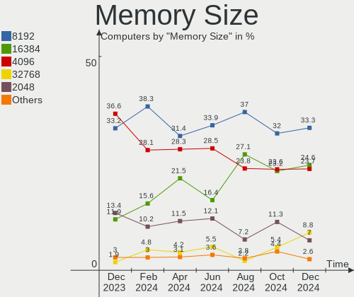

| Size  | Computers | Percent |
|-------|-----------|---------|
| 8192  | 88        | 34.65%  |
| 4096  | 84        | 33.07%  |
| 2048  | 38        | 14.96%  |
| 16384 | 32        | 12.6%   |
| 32768 | 7         | 2.76%   |
| 1024  | 5         | 1.97%   |

Memory Speed
------------

Memory module speed

| Speed   | Computers | Percent |
|---------|-----------|---------|
| 1600    | 70        | 27.45%  |
| 3200    | 56        | 21.96%  |
| 2667    | 20        | 7.84%   |
| 2400    | 15        | 5.88%   |
| 1333    | 13        | 5.1%    |
| 6400    | 7         | 2.75%   |
| 3600    | 7         | 2.75%   |
| 2133    | 7         | 2.75%   |
| 1334    | 6         | 2.35%   |
| 1867    | 5         | 1.96%   |
| 800     | 5         | 1.96%   |
| 667     | 5         | 1.96%   |
| 4800    | 4         | 1.57%   |
| 4266    | 3         | 1.18%   |
| 3400    | 3         | 1.18%   |
| 2048    | 3         | 1.18%   |
| 1866    | 3         | 1.18%   |
| 1067    | 3         | 1.18%   |
| 1066    | 3         | 1.18%   |
| 3534    | 2         | 0.78%   |
| 3000    | 2         | 0.78%   |
| 2733    | 2         | 0.78%   |
| Unknown | 2         | 0.78%   |
| 4267    | 1         | 0.39%   |
| 3933    | 1         | 0.39%   |
| 3800    | 1         | 0.39%   |
| 2933    | 1         | 0.39%   |
| 2448    | 1         | 0.39%   |
| 1800    | 1         | 0.39%   |
| 1632    | 1         | 0.39%   |
| 975     | 1         | 0.39%   |
| 533     | 1         | 0.39%   |

Printers & scanners
-------------------

Printer Vendor
--------------

Printer device vendors

| Vendor                | Computers | Percent |
|-----------------------|-----------|---------|
| Samsung Electronics   | 2         | 25%     |
| Hewlett-Packard       | 2         | 25%     |
| Brother Industries    | 2         | 25%     |
| Lexmark International | 1         | 12.5%   |
| Canon                 | 1         | 12.5%   |

Printer Model
-------------

Printer device models

| Model                                | Computers | Percent |
|--------------------------------------|-----------|---------|
| Samsung ML-1640 Series Laser Printer | 1         | 12.5%   |
| Samsung ML-1630 Series               | 1         | 12.5%   |
| Lexmark International Z33 Printer    | 1         | 12.5%   |
| HP ENVY Pro 6400 series              | 1         | 12.5%   |
| HP DeskJet 2620 All-in-One Printer   | 1         | 12.5%   |
| Canon PIXMA MG3600 Series            | 1         | 12.5%   |
| Brother MFC-9330CDW                  | 1         | 12.5%   |
| Brother HL-L2375DW series            | 1         | 12.5%   |

Scanner Vendor
--------------

Scanner device vendors

| Vendor          | Computers | Percent |
|-----------------|-----------|---------|
| Seiko Epson     | 2         | 50%     |
| Canon           | 1         | 25%     |
| AGFA-Gevaert NV | 1         | 25%     |

Scanner Model
-------------

Scanner device models

| Model                                            | Computers | Percent |
|--------------------------------------------------|-----------|---------|
| Seiko Epson GT-X900 [Perfection V700/V750 Photo] | 1         | 25%     |
| Seiko Epson GT-X770 [Perfection V500]            | 1         | 25%     |
| Canon CanoScan 4200F                             | 1         | 25%     |
| AGFA-Gevaert NV SnapScan e20                     | 1         | 25%     |

Camera
------

Camera Vendor
-------------

Camera device vendors

| Vendor                                 | Computers | Percent |
|----------------------------------------|-----------|---------|
| Chicony Electronics                    | 42        | 22.22%  |
| IMC Networks                           | 21        | 11.11%  |
| Realtek Semiconductor                  | 19        | 10.05%  |
| Microdia                               | 18        | 9.52%   |
| Sunplus Innovation Technology          | 10        | 5.29%   |
| Quanta                                 | 10        | 5.29%   |
| Cheng Uei Precision Industry (Foxlink) | 9         | 4.76%   |
| Bison Electronics                      | 9         | 4.76%   |
| Suyin                                  | 8         | 4.23%   |
| Logitech                               | 8         | 4.23%   |
| Apple                                  | 4         | 2.12%   |
| Syntek                                 | 3         | 1.59%   |
| Samsung Electronics                    | 3         | 1.59%   |
| Microsoft                              | 3         | 1.59%   |
| Lite-On Technology                     | 3         | 1.59%   |
| Sonix Technology                       | 2         | 1.06%   |
| Luxvisions Innotech Limited            | 2         | 1.06%   |
| Acer                                   | 2         | 1.06%   |
| WaveRider Communications               | 1         | 0.53%   |
| Trust                                  | 1         | 0.53%   |
| SunplusIT                              | 1         | 0.53%   |
| Sunplus IT                             | 1         | 0.53%   |
| Silicon Motion                         | 1         | 0.53%   |
| ShineTech                              | 1         | 0.53%   |
| Ricoh                                  | 1         | 0.53%   |
| MacroSilicon                           | 1         | 0.53%   |
| Importek                               | 1         | 0.53%   |
| Huawei Technologies                    | 1         | 0.53%   |
| AVerMedia Technologies                 | 1         | 0.53%   |
| ALi                                    | 1         | 0.53%   |
| 2M UVC CAMERA                          | 1         | 0.53%   |

Camera Model
------------

Camera device models

| Model                                                       | Computers | Percent |
|-------------------------------------------------------------|-----------|---------|
| IMC Networks USB2.0 HD UVC WebCam                           | 11        | 5.79%   |
| Realtek USB Camera                                          | 10        | 5.26%   |
| Microdia Integrated_Webcam_HD                               | 8         | 4.21%   |
| Realtek Integrated_Webcam_HD                                | 7         | 3.68%   |
| Sunplus Integrated_Webcam_HD                                | 5         | 2.63%   |
| IMC Networks Integrated Camera                              | 5         | 2.63%   |
| Quanta HD User Facing                                       | 4         | 2.11%   |
| Chicony USB2.0 VGA UVC WebCam                               | 4         | 2.11%   |
| Chicony Integrated Camera                                   | 4         | 2.11%   |
| Bison HD Webcam                                             | 4         | 2.11%   |
| Samsung Galaxy series, misc. (MTP mode)                     | 3         | 1.58%   |
| Logitech Webcam C270                                        | 3         | 1.58%   |
| Chicony HP TrueVision HD                                    | 3         | 1.58%   |
| Syntek Integrated Camera                                    | 2         | 1.05%   |
| Sunplus FHD Camera Microphone                               | 2         | 1.05%   |
| Quanta ov9734_techfront_camera                              | 2         | 1.05%   |
| Microdia Webcam Vitade AF                                   | 2         | 1.05%   |
| Microdia Sonix Integrated Webcam                            | 2         | 1.05%   |
| Microdia Integrated_Webcam_FHD                              | 2         | 1.05%   |
| IMC Networks USB2.0 UVC HD Webcam                           | 2         | 1.05%   |
| Chicony VGA Webcam                                          | 2         | 1.05%   |
| Chicony TOSHIBA Web Camera - FHD                            | 2         | 1.05%   |
| Chicony Lenovo EasyCamera                                   | 2         | 1.05%   |
| Chicony HP Wide Vision HD Camera                            | 2         | 1.05%   |
| Chicony HP Truevision HD camera                             | 2         | 1.05%   |
| Chicony HD WebCam (Asus N-series)                           | 2         | 1.05%   |
| Cheng Uei Precision Industry (Foxlink) Webcam               | 2         | 1.05%   |
| Apple iPhone 5/5C/5S/6/SE/7/8/X                             | 2         | 1.05%   |
| Apple Built-in iSight                                       | 2         | 1.05%   |
| WaveRider USB 2.0 Camera                                    | 1         | 0.53%   |
| Trust 17676 Webcam                                          | 1         | 0.53%   |
| Syntek Lenovo EasyCamera                                    | 1         | 0.53%   |
| Suyin WebCam                                                | 1         | 0.53%   |
| Suyin UVC 1.3MPixel WebCam                                  | 1         | 0.53%   |
| Suyin TOSHIBA Web Camera                                    | 1         | 0.53%   |
| Suyin Sony Visual Communication Camera                      | 1         | 0.53%   |
| Suyin HP TrueVision HD Integrated Webcam                    | 1         | 0.53%   |
| Suyin HP Truevision HD                                      | 1         | 0.53%   |
| Suyin Asus Integrated Webcam                                | 1         | 0.53%   |
| Suyin 1.3M WebCam (notebook emachines E730, Acer sub-brand) | 1         | 0.53%   |

Security
--------

Fingerprint Vendor
------------------

Fingerprint sensor vendors

| Vendor                     | Computers | Percent |
|----------------------------|-----------|---------|
| Shenzhen Goodix Technology | 9         | 30%     |
| Validity Sensors           | 8         | 26.67%  |
| Synaptics                  | 8         | 26.67%  |
| Elan Microelectronics      | 4         | 13.33%  |
| LighTuning Technology      | 1         | 3.33%   |

Fingerprint Model
-----------------

Fingerprint sensor models

| Model                                             | Computers | Percent |
|---------------------------------------------------|-----------|---------|
| Synaptics Prometheus MIS Touch Fingerprint Reader | 4         | 13.33%  |
| Validity Sensors Fingerprint scanner              | 3         | 10%     |
| Synaptics WBDI Fingerprint Reader USB 086         | 3         | 10%     |
| Shenzhen Goodix  FingerPrint Device               | 3         | 10%     |
| Shenzhen Goodix Fingerprint Reader                | 3         | 10%     |
| Shenzhen Goodix FingerPrint                       | 3         | 10%     |
| Elan ELAN:ARM-M4                                  | 3         | 10%     |
| Validity Sensors VFS495 Fingerprint Reader        | 2         | 6.67%   |
| Validity Sensors VFS Fingerprint sensor           | 2         | 6.67%   |
| Validity Sensors VFS451 Fingerprint Reader        | 1         | 3.33%   |
| Synaptics WBDI Fingerprint Reader USB 102         | 1         | 3.33%   |
| LighTuning EgisTec Touch Fingerprint Sensor       | 1         | 3.33%   |
| Elan ELAN:Fingerprint                             | 1         | 3.33%   |

Chipcard Vendor
---------------

Chipcard module vendors

| Vendor      | Computers | Percent |
|-------------|-----------|---------|
| Broadcom    | 7         | 50%     |
| Alcor Micro | 4         | 28.57%  |
| Yubico.com  | 1         | 7.14%   |
| O2 Micro    | 1         | 7.14%   |
| Lenovo      | 1         | 7.14%   |

Chipcard Model
--------------

Chipcard module models

| Model                                | Computers | Percent |
|--------------------------------------|-----------|---------|
| Broadcom 58200                       | 4         | 28.57%  |
| Alcor Micro AU9540 Smartcard Reader  | 4         | 28.57%  |
| Broadcom 5880                        | 3         | 21.43%  |
| Yubico.com Yubikey 4 U2F+CCID        | 1         | 7.14%   |
| O2 Micro OZ776 CCID Smartcard Reader | 1         | 7.14%   |
| Lenovo Integrated Smart Card Reader  | 1         | 7.14%   |

Unsupported
-----------

Unsupported Devices
-------------------

Total unsupported devices on board

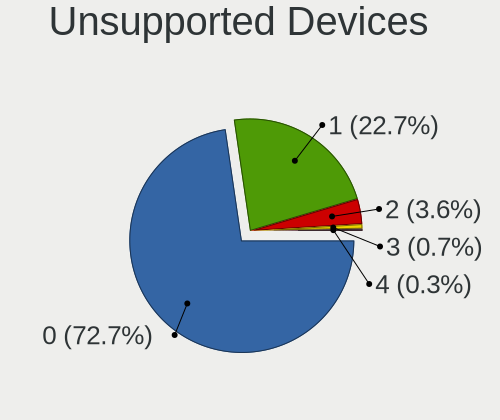

| Total | Computers | Percent |
|-------|-----------|---------|
| 0     | 235       | 71.65%  |
| 1     | 73        | 22.26%  |
| 2     | 17        | 5.18%   |
| 3     | 3         | 0.91%   |

Unsupported Device Types
------------------------

Types of unsupported devices

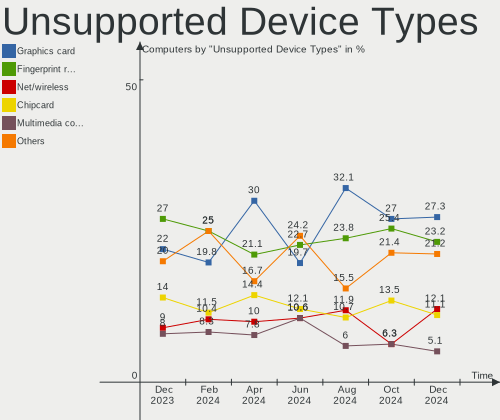

| Type                     | Computers | Percent |
|--------------------------|-----------|---------|
| Graphics card            | 31        | 27.43%  |
| Fingerprint reader       | 29        | 25.66%  |
| Net/wireless             | 16        | 14.16%  |
| Chipcard                 | 10        | 8.85%   |
| Multimedia controller    | 7         | 6.19%   |
| Camera                   | 7         | 6.19%   |
| Storage                  | 3         | 2.65%   |
| Card reader              | 3         | 2.65%   |
| Bluetooth                | 2         | 1.77%   |
| Storage/ide              | 1         | 0.88%   |
| Sound                    | 1         | 0.88%   |
| Net/ethernet             | 1         | 0.88%   |
| Flash memory             | 1         | 0.88%   |
| Communication controller | 1         | 0.88%   |

