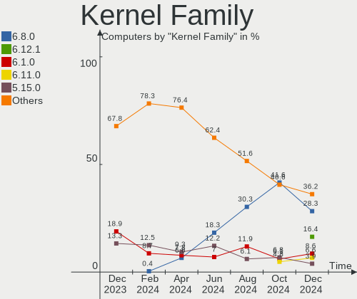
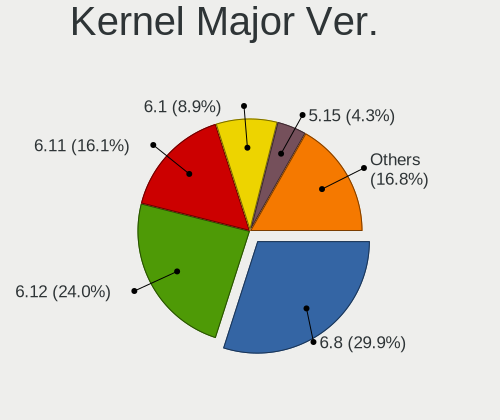
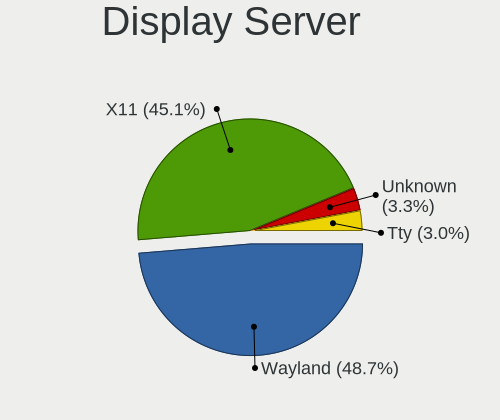
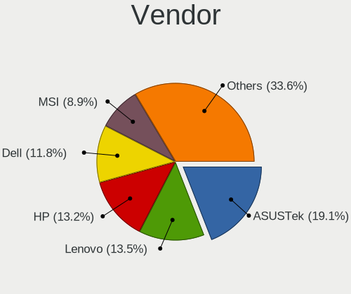
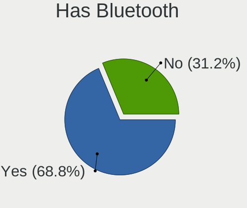
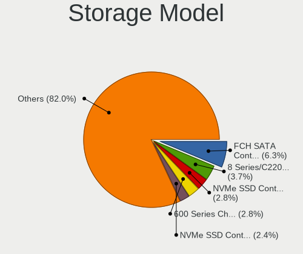
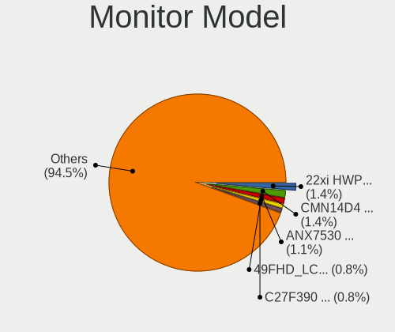

Linux in France - Hardware Trends
---------------------------------

A project to identify most popular hardware characteristics and track their change
over time based on data collected by Linux users at https://Linux-Hardware.org.

Anyone can contribute to this report by the [hw-probe](https://github.com/linuxhw/hw-probe) tool:

    sudo -E hw-probe -all -upload

This is a report for all computer types. See also reports for [desktops](/Location/France/Desktop/README.md) and [notebooks](/Location/France/Notebook/README.md).

Contents
--------

* [ System ](#system)
  - [ OS                       ](#os)
  - [ OS Family                ](#os-family)
  - [ Kernel                   ](#kernel)
  - [ Kernel Family            ](#kernel-family)
  - [ Kernel Major Ver.        ](#kernel-major-ver)
  - [ Arch                     ](#arch)
  - [ DE                       ](#de)
  - [ Display Server           ](#display-server)
  - [ Display Manager          ](#display-manager)
  - [ OS Lang                  ](#os-lang)
  - [ Boot Mode                ](#boot-mode)
  - [ Filesystem               ](#filesystem)
  - [ Part. scheme             ](#part-scheme)
  - [ Dual Boot with Linux/BSD ](#dual-boot-with-linuxbsd)
  - [ Dual Boot (Win)          ](#dual-boot-win)

* [ Board ](#board)
  - [ Vendor                   ](#vendor)
  - [ Model                    ](#model)
  - [ Model Family             ](#model-family)
  - [ MFG Year                 ](#mfg-year)
  - [ Form Factor              ](#form-factor)
  - [ Secure Boot              ](#secure-boot)
  - [ Coreboot                 ](#coreboot)
  - [ RAM Size                 ](#ram-size)
  - [ RAM Used                 ](#ram-used)
  - [ Total Drives             ](#total-drives)
  - [ Has CD-ROM               ](#has-cd-rom)
  - [ Has Ethernet             ](#has-ethernet)
  - [ Has WiFi                 ](#has-wifi)
  - [ Has Bluetooth            ](#has-bluetooth)

* [ Location ](#location)
  - [ Country                  ](#country)
  - [ City                     ](#city)

* [ Drives ](#drives)
  - [ Drive Vendor             ](#drive-vendor)
  - [ Drive Model              ](#drive-model)
  - [ HDD Vendor               ](#hdd-vendor)
  - [ SSD Vendor               ](#ssd-vendor)
  - [ Drive Kind               ](#drive-kind)
  - [ Drive Connector          ](#drive-connector)
  - [ Drive Size               ](#drive-size)
  - [ Space Total              ](#space-total)
  - [ Space Used               ](#space-used)
  - [ Malfunc. Drives          ](#malfunc-drives)
  - [ Malfunc. Drive Vendor    ](#malfunc-drive-vendor)
  - [ Malfunc. HDD Vendor      ](#malfunc-hdd-vendor)
  - [ Malfunc. Drive Kind      ](#malfunc-drive-kind)
  - [ Failed Drives            ](#failed-drives)
  - [ Failed Drive Vendor      ](#failed-drive-vendor)
  - [ Drive Status             ](#drive-status)

* [ Storage controller ](#storage-controller)
  - [ Storage Vendor           ](#storage-vendor)
  - [ Storage Model            ](#storage-model)
  - [ Storage Kind             ](#storage-kind)

* [ Processor ](#processor)
  - [ CPU Vendor               ](#cpu-vendor)
  - [ CPU Model                ](#cpu-model)
  - [ CPU Model Family         ](#cpu-model-family)
  - [ CPU Cores                ](#cpu-cores)
  - [ CPU Sockets              ](#cpu-sockets)
  - [ CPU Threads              ](#cpu-threads)
  - [ CPU Op-Modes             ](#cpu-op-modes)
  - [ CPU Microcode            ](#cpu-microcode)
  - [ CPU Microarch            ](#cpu-microarch)

* [ Graphics ](#graphics)
  - [ GPU Vendor               ](#gpu-vendor)
  - [ GPU Model                ](#gpu-model)
  - [ GPU Combo                ](#gpu-combo)
  - [ GPU Driver               ](#gpu-driver)
  - [ GPU Memory               ](#gpu-memory)

* [ Monitor ](#monitor)
  - [ Monitor Vendor           ](#monitor-vendor)
  - [ Monitor Model            ](#monitor-model)
  - [ Monitor Resolution       ](#monitor-resolution)
  - [ Monitor Diagonal         ](#monitor-diagonal)
  - [ Monitor Width            ](#monitor-width)
  - [ Aspect Ratio             ](#aspect-ratio)
  - [ Monitor Area             ](#monitor-area)
  - [ Pixel Density            ](#pixel-density)
  - [ Multiple Monitors        ](#multiple-monitors)

* [ Network ](#network)
  - [ Net Controller Vendor    ](#net-controller-vendor)
  - [ Net Controller Model     ](#net-controller-model)
  - [ Wireless Vendor          ](#wireless-vendor)
  - [ Wireless Model           ](#wireless-model)
  - [ Ethernet Vendor          ](#ethernet-vendor)
  - [ Ethernet Model           ](#ethernet-model)
  - [ Net Controller Kind      ](#net-controller-kind)
  - [ Used Controller          ](#used-controller)
  - [ NICs                     ](#nics)
  - [ IPv6                     ](#ipv6)

* [ Bluetooth ](#bluetooth)
  - [ Bluetooth Vendor         ](#bluetooth-vendor)
  - [ Bluetooth Model          ](#bluetooth-model)

* [ Sound ](#sound)
  - [ Sound Vendor             ](#sound-vendor)
  - [ Sound Model              ](#sound-model)

* [ Memory ](#memory)
  - [ Memory Vendor            ](#memory-vendor)
  - [ Memory Model             ](#memory-model)
  - [ Memory Kind              ](#memory-kind)
  - [ Memory Form Factor       ](#memory-form-factor)
  - [ Memory Size              ](#memory-size)
  - [ Memory Speed             ](#memory-speed)

* [ Printers & scanners ](#printers--scanners)
  - [ Printer Vendor           ](#printer-vendor)
  - [ Printer Model            ](#printer-model)
  - [ Scanner Vendor           ](#scanner-vendor)
  - [ Scanner Model            ](#scanner-model)

* [ Camera ](#camera)
  - [ Camera Vendor            ](#camera-vendor)
  - [ Camera Model             ](#camera-model)

* [ Security ](#security)
  - [ Fingerprint Vendor       ](#fingerprint-vendor)
  - [ Fingerprint Model        ](#fingerprint-model)
  - [ Chipcard Vendor          ](#chipcard-vendor)
  - [ Chipcard Model           ](#chipcard-model)

* [ Unsupported ](#unsupported)
  - [ Unsupported Devices      ](#unsupported-devices)
  - [ Unsupported Device Types ](#unsupported-device-types)

System
------

OS
--

Installed operating systems

| Name                         | Computers | Percent |
|------------------------------|-----------|---------|
| Ubuntu 20.04                 | 40        | 16.39%  |
| Ubuntu 22.04                 | 31        | 12.7%   |
| OpenMandriva 4.3             | 18        | 7.38%   |
| Linux Mint 20.3              | 16        | 6.56%   |
| Pop!_OS 22.04                | 11        | 4.51%   |
| Debian 11                    | 11        | 4.51%   |
| Zorin 16                     | 7         | 2.87%   |
| KDE neon 20.04               | 7         | 2.87%   |
| Lubuntu 20.04                | 6         | 2.46%   |
| Fedora 36                    | 6         | 2.46%   |
| Arch                         | 6         | 2.46%   |
| Xubuntu 20.04                | 5         | 2.05%   |
| Fedora 35                    | 5         | 2.05%   |
| Elementary 6.1               | 5         | 2.05%   |
| Xubuntu 22.04                | 4         | 1.64%   |
| Kubuntu 20.04                | 4         | 1.64%   |
| Kali 2022.2                  | 4         | 1.64%   |
| Ubuntu 21.10                 | 3         | 1.23%   |
| Kubuntu 22.04                | 3         | 1.23%   |
| Xubuntu 18.04                | 2         | 0.82%   |
| Ubuntu Budgie 22.04          | 2         | 0.82%   |
| Ubuntu 18.04                 | 2         | 0.82%   |
| Trisquel 10.0.1              | 2         | 0.82%   |
| Parrot 5.0                   | 2         | 0.82%   |
| openSUSE Tumbleweed-XXXXXXXX | 2         | 0.82%   |
| Manjaro 21.2.6               | 2         | 0.82%   |
| Manjaro                      | 2         | 0.82%   |
| Mageia 8                     | 2         | 0.82%   |
| Linux Mint 20.2              | 2         | 0.82%   |
| Gentoo 2.7                   | 2         | 0.82%   |
| Gentoo 2.6                   | 2         | 0.82%   |
| Arch Rolling                 | 2         | 0.82%   |
| Ubuntu Studio 20.04          | 1         | 0.41%   |
| Ubuntu Core 18               | 1         | 0.41%   |
| Ubuntu 21.12                 | 1         | 0.41%   |
| SteamOS 3.2                  | 1         | 0.41%   |
| ROSA R11.1                   | 1         | 0.41%   |
| Raspbian 11                  | 1         | 0.41%   |
| Pop!_OS 21.10                | 1         | 0.41%   |
| Pop!_OS 20.04                | 1         | 0.41%   |
| OpenMandriva 4.2             | 1         | 0.41%   |
| LinuxFX 10                   | 1         | 0.41%   |
| Linux Mint 19.3              | 1         | 0.41%   |
| Linux Mint 19.2              | 1         | 0.41%   |
| Linux Lite 6.0               | 1         | 0.41%   |
| Kubuntu 18.04                | 1         | 0.41%   |
| Kubuntu 11                   | 1         | 0.41%   |
| Kali 2022.1                  | 1         | 0.41%   |
| Kaisen 2.0                   | 1         | 0.41%   |
| Fedora 34                    | 1         | 0.41%   |
| Endless 4.0.6                | 1         | 0.41%   |
| EndeavourOS Rolling          | 1         | 0.41%   |
| Debian Unstable              | 1         | 0.41%   |
| Debian 11-updates            | 1         | 0.41%   |
| Debian 10                    | 1         | 0.41%   |
| Clear Linux 36270            | 1         | 0.41%   |
| BlackPanther 18.1            | 1         | 0.41%   |
| ArcoLinux Rolling            | 1         | 0.41%   |

OS Family
---------

OS without a version

| Name          | Computers | Percent |
|---------------|-----------|---------|
| Ubuntu        | 78        | 31.97%  |
| Linux Mint    | 20        | 8.2%    |
| OpenMandriva  | 19        | 7.79%   |
| Debian        | 14        | 5.74%   |
| Pop!_OS       | 13        | 5.33%   |
| Fedora        | 12        | 4.92%   |
| Xubuntu       | 11        | 4.51%   |
| Kubuntu       | 9         | 3.69%   |
| Arch          | 8         | 3.28%   |
| Zorin         | 7         | 2.87%   |
| KDE neon      | 7         | 2.87%   |
| Lubuntu       | 6         | 2.46%   |
| Kali          | 5         | 2.05%   |
| Elementary    | 5         | 2.05%   |
| Manjaro       | 4         | 1.64%   |
| Gentoo        | 4         | 1.64%   |
| Ubuntu Budgie | 2         | 0.82%   |
| Trisquel      | 2         | 0.82%   |
| Parrot        | 2         | 0.82%   |
| openSUSE      | 2         | 0.82%   |
| Mageia        | 2         | 0.82%   |
| Ubuntu Studio | 1         | 0.41%   |
| SteamOS       | 1         | 0.41%   |
| ROSA          | 1         | 0.41%   |
| Raspbian      | 1         | 0.41%   |
| LinuxFX       | 1         | 0.41%   |
| Linux Lite    | 1         | 0.41%   |
| Kaisen        | 1         | 0.41%   |
| Endless       | 1         | 0.41%   |
| EndeavourOS   | 1         | 0.41%   |
| Clear Linux   | 1         | 0.41%   |
| BlackPanther  | 1         | 0.41%   |
| ArcoLinux     | 1         | 0.41%   |

Kernel
------

Version of the Linux kernel

| Version                   | Computers | Percent |
|---------------------------|-----------|---------|
| 5.13.0-41-generic         | 21        | 8.61%   |
| 5.13.0-40-generic         | 21        | 8.61%   |
| 5.16.7-desktop-1omv4003   | 15        | 6.15%   |
| 5.15.0-27-generic         | 15        | 6.15%   |
| 5.4.0-109-generic         | 14        | 5.74%   |
| 5.15.0-33-generic         | 11        | 4.51%   |
| 5.15.0-30-generic         | 11        | 4.51%   |
| 5.4.0-113-generic         | 10        | 4.1%    |
| 5.17.5-76051705-generic   | 10        | 4.1%    |
| 5.13.0-44-generic         | 10        | 4.1%    |
| 5.4.0-110-generic         | 8         | 3.28%   |
| 5.17.5-arch1-1            | 4         | 1.64%   |
| 5.16.0-kali7-amd64        | 4         | 1.64%   |
| 5.13.0-39-generic         | 4         | 1.64%   |
| 5.10.0-14-amd64           | 4         | 1.64%   |
| 5.17.7-300.fc36.x86_64    | 3         | 1.23%   |
| 5.17.0-1-amd64            | 3         | 1.23%   |
| 5.16.19-76051619-generic  | 3         | 1.23%   |
| 5.10.0-13-amd64           | 3         | 1.23%   |
| 5.17.9-arch1-1            | 2         | 0.82%   |
| 5.17.6-300.fc36.x86_64    | 2         | 0.82%   |
| 5.17.5-200.fc35.x86_64    | 2         | 0.82%   |
| 5.17.4-200.fc35.x86_64    | 2         | 0.82%   |
| 5.16.13-desktop-1omv4003  | 2         | 0.82%   |
| 5.16.0-12parrot1-amd64    | 2         | 0.82%   |
| 5.16.0-0.bpo.4-amd64      | 2         | 0.82%   |
| 5.15.32-gentoo-r1-x86_64  | 2         | 0.82%   |
| 5.11.0-43-generic         | 2         | 0.82%   |
| 5.6.0-1036-oem            | 1         | 0.41%   |
| 5.4.32-generic-2rosa-i586 | 1         | 0.41%   |
| 5.4.0-99-generic          | 1         | 0.41%   |
| 5.4.0-91-generic          | 1         | 0.41%   |
| 5.4.0-74-generic          | 1         | 0.41%   |
| 5.4.0-58-generic          | 1         | 0.41%   |
| 5.4.0-42-generic          | 1         | 0.41%   |
| 5.4.0-40-generic          | 1         | 0.41%   |
| 5.4.0-110-lowlatency      | 1         | 0.41%   |
| 5.4.0-100-generic         | 1         | 0.41%   |
| 5.17.9-1-MANJARO          | 1         | 0.41%   |
| 5.17.7-1-default          | 1         | 0.41%   |
| 5.17.5-xanmod1            | 1         | 0.41%   |
| 5.17.5-gentoo             | 1         | 0.41%   |
| 5.17.5-300.fc36.x86_64    | 1         | 0.41%   |
| 5.17.5-1-default          | 1         | 0.41%   |
| 5.17.5-051705-generic     | 1         | 0.41%   |
| 5.17.4-arch1-1            | 1         | 0.41%   |
| 5.17.4-100.fc34.x86_64    | 1         | 0.41%   |
| 5.17.3-arch1-1            | 1         | 0.41%   |
| 5.17.1-desktop-2omv4050   | 1         | 0.41%   |
| 5.17.1-3-MANJARO          | 1         | 0.41%   |
| 5.17.0-2-amd64            | 1         | 0.41%   |
| 5.16.4-1119.native        | 1         | 0.41%   |
| 5.16.12-200.fc35.x86_64   | 1         | 0.41%   |
| 5.16.10-desktop-2.mga8    | 1         | 0.41%   |
| 5.15.41-1-MANJARO         | 1         | 0.41%   |
| 5.15.37-1-lts             | 1         | 0.41%   |
| 5.15.35-desktop-2.mga8    | 1         | 0.41%   |
| 5.15.32-1-MANJARO         | 1         | 0.41%   |
| 5.15.0-kaisen1-amd64      | 1         | 0.41%   |
| 5.15.0-35-generic         | 1         | 0.41%   |

Kernel Family
-------------

Linux kernel without a distro release

| Version | Computers | Percent |
|---------|-----------|---------|
| 5.13.0  | 59        | 24.18%  |
| 5.15.0  | 42        | 17.21%  |
| 5.4.0   | 40        | 16.39%  |
| 5.17.5  | 21        | 8.61%   |
| 5.16.7  | 15        | 6.15%   |
| 5.10.0  | 9         | 3.69%   |
| 5.16.0  | 8         | 3.28%   |
| 5.17.7  | 4         | 1.64%   |
| 5.17.4  | 4         | 1.64%   |
| 5.17.0  | 4         | 1.64%   |
| 5.11.0  | 4         | 1.64%   |
| 5.17.9  | 3         | 1.23%   |
| 5.16.19 | 3         | 1.23%   |
| 5.15.32 | 3         | 1.23%   |
| 5.17.6  | 2         | 0.82%   |
| 5.17.1  | 2         | 0.82%   |
| 5.16.13 | 2         | 0.82%   |
| 5.14.0  | 2         | 0.82%   |
| 4.15.0  | 2         | 0.82%   |
| 5.6.0   | 1         | 0.41%   |
| 5.4.32  | 1         | 0.41%   |
| 5.17.3  | 1         | 0.41%   |
| 5.16.4  | 1         | 0.41%   |
| 5.16.12 | 1         | 0.41%   |
| 5.16.10 | 1         | 0.41%   |
| 5.15.41 | 1         | 0.41%   |
| 5.15.37 | 1         | 0.41%   |
| 5.15.35 | 1         | 0.41%   |
| 5.10.76 | 1         | 0.41%   |
| 5.10.14 | 1         | 0.41%   |
| 5.10.11 | 1         | 0.41%   |
| 4.19.66 | 1         | 0.41%   |
| 4.19.0  | 1         | 0.41%   |
| 4.18.16 | 1         | 0.41%   |

Kernel Major Ver.
-----------------

Linux kernel major version

| Version | Computers | Percent |
|---------|-----------|---------|
| 5.13    | 59        | 24.18%  |
| 5.15    | 48        | 19.67%  |
| 5.4     | 41        | 16.8%   |
| 5.17    | 41        | 16.8%   |
| 5.16    | 31        | 12.7%   |
| 5.10    | 12        | 4.92%   |
| 5.11    | 4         | 1.64%   |
| 5.14    | 2         | 0.82%   |
| 4.19    | 2         | 0.82%   |
| 4.15    | 2         | 0.82%   |
| 5.6     | 1         | 0.41%   |
| 4.18    | 1         | 0.41%   |

Arch
----

OS architecture (x86_64, i586, etc.)

| Name   | Computers | Percent |
|--------|-----------|---------|
| x86_64 | 239       | 97.95%  |
| i686   | 4         | 1.64%   |
| armv7l | 1         | 0.41%   |

DE
--

Desktop Environment

| Name          | Computers | Percent |
|---------------|-----------|---------|
| GNOME         | 113       | 46.31%  |
| KDE5          | 46        | 18.85%  |
| XFCE          | 26        | 10.66%  |
| Unknown       | 17        | 6.97%   |
| X-Cinnamon    | 14        | 5.74%   |
| MATE          | 6         | 2.46%   |
| LXQt          | 6         | 2.46%   |
| Pantheon      | 5         | 2.05%   |
| Cinnamon      | 4         | 1.64%   |
| Unity         | 2         | 0.82%   |
| Budgie        | 2         | 0.82%   |
| KDE4          | 1         | 0.41%   |
| i3            | 1         | 0.41%   |
| Enlightenment | 1         | 0.41%   |

Display Server
--------------

X11 or Wayland

| Name    | Computers | Percent |
|---------|-----------|---------|
| X11     | 187       | 76.64%  |
| Wayland | 42        | 17.21%  |
| Tty     | 8         | 3.28%   |
| Unknown | 7         | 2.87%   |

Display Manager
---------------

SDDM, LightDM, etc.

| Name    | Computers | Percent |
|---------|-----------|---------|
| Unknown | 68        | 27.87%  |
| GDM3    | 61        | 25%     |
| LightDM | 41        | 16.8%   |
| SDDM    | 40        | 16.39%  |
| GDM     | 32        | 13.11%  |
| XDM     | 1         | 0.41%   |
| KDM     | 1         | 0.41%   |

OS Lang
-------

Language

| Lang    | Computers | Percent |
|---------|-----------|---------|
| fr_FR   | 185       | 75.82%  |
| en_US   | 44        | 18.03%  |
| Unknown | 5         | 2.05%   |
| fr_LU   | 2         | 0.82%   |
| en_GB   | 2         | 0.82%   |
| C       | 2         | 0.82%   |
| fr_CH   | 1         | 0.41%   |
| es_ES   | 1         | 0.41%   |
| de_DE   | 1         | 0.41%   |
| C.UTF8  | 1         | 0.41%   |

Boot Mode
---------

EFI or BIOS

| Mode | Computers | Percent |
|------|-----------|---------|
| EFI  | 131       | 53.69%  |
| BIOS | 113       | 46.31%  |

Filesystem
----------

Type of filesystem

| Type     | Computers | Percent |
|----------|-----------|---------|
| Ext4     | 210       | 86.07%  |
| Overlay  | 17        | 6.97%   |
| Btrfs    | 13        | 5.33%   |
| Xfs      | 2         | 0.82%   |
| Zfs      | 1         | 0.41%   |
| Reiserfs | 1         | 0.41%   |

Part. scheme
------------

Scheme of partitioning

| Type    | Computers | Percent |
|---------|-----------|---------|
| GPT     | 112       | 45.9%   |
| Unknown | 98        | 40.16%  |
| MBR     | 34        | 13.93%  |

Dual Boot with Linux/BSD
------------------------

Hosting more than one Linux/BSD

| Dual boot | Computers | Percent |
|-----------|-----------|---------|
| No        | 188       | 77.05%  |
| Yes       | 56        | 22.95%  |

Dual Boot (Win)
---------------

Hosting Linux and Windows

| Dual boot | Computers | Percent |
|-----------|-----------|---------|
| No        | 172       | 70.49%  |
| Yes       | 72        | 29.51%  |

Board
-----

Vendor
------

Motherboard manufacturer

| Name                    | Computers | Percent |
|-------------------------|-----------|---------|
| ASUSTek Computer        | 56        | 22.95%  |
| Dell                    | 35        | 14.34%  |
| MSI                     | 30        | 12.3%   |
| Lenovo                  | 29        | 11.89%  |
| Hewlett-Packard         | 19        | 7.79%   |
| Gigabyte Technology     | 12        | 4.92%   |
| Acer                    | 12        | 4.92%   |
| Apple                   | 6         | 2.46%   |
| Toshiba                 | 5         | 2.05%   |
| Packard Bell            | 4         | 1.64%   |
| HUAWEI                  | 4         | 1.64%   |
| ASRock                  | 4         | 1.64%   |
| Timi                    | 3         | 1.23%   |
| Shuttle                 | 3         | 1.23%   |
| Samsung Electronics     | 2         | 0.82%   |
| Pegatron                | 2         | 0.82%   |
| Intel                   | 2         | 0.82%   |
| Valve                   | 1         | 0.41%   |
| TUXEDO                  | 1         | 0.41%   |
| Thomson                 | 1         | 0.41%   |
| Teclast                 | 1         | 0.41%   |
| Sony                    | 1         | 0.41%   |
| Raspberry Pi Foundation | 1         | 0.41%   |
| Quanta                  | 1         | 0.41%   |
| PC Specialist           | 1         | 0.41%   |
| Notebook                | 1         | 0.41%   |
| Fujitsu Siemens         | 1         | 0.41%   |
| Fujitsu                 | 1         | 0.41%   |
| eMachines               | 1         | 0.41%   |
| Clevo                   | 1         | 0.41%   |
| Chuwi                   | 1         | 0.41%   |
| ASRockRack              | 1         | 0.41%   |
| Unknown                 | 1         | 0.41%   |

Model
-----

Motherboard model

| Name                                    | Computers | Percent |
|-----------------------------------------|-----------|---------|
| ASUS All Series                         | 3         | 1.23%   |
| Timi TM1604                             | 2         | 0.82%   |
| MSI MS-7C02                             | 2         | 0.82%   |
| MSI MS-7A32                             | 2         | 0.82%   |
| MSI MS-7924                             | 2         | 0.82%   |
| Lenovo Legion Y540-15IRH 81SX           | 2         | 0.82%   |
| HP EliteBook 2560p                      | 2         | 0.82%   |
| HP Compaq 8200 Elite SFF PC             | 2         | 0.82%   |
| Dell XPS 13 9310                        | 2         | 0.82%   |
| ASUS TUF Gaming B550-PLUS               | 2         | 0.82%   |
| ASUS TUF Gaming B450-PLUS II            | 2         | 0.82%   |
| ASUS SABERTOOTH X58                     | 2         | 0.82%   |
| ASUS F1A75-M LE                         | 2         | 0.82%   |
| Acer Aspire A317-32                     | 2         | 0.82%   |
| Valve Jupiter                           | 1         | 0.41%   |
| TUXEDO Pulse 15 Gen1                    | 1         | 0.41%   |
| Toshiba Satellite L655                  | 1         | 0.41%   |
| Toshiba Satellite C850D-115             | 1         | 0.41%   |
| Toshiba Satellite C70D-B                | 1         | 0.41%   |
| Toshiba Satellite C670D-12N             | 1         | 0.41%   |
| Toshiba Satellite C55-A-1N0             | 1         | 0.41%   |
| Timi TM1612                             | 1         | 0.41%   |
| Thomson NEO14SBK                        | 1         | 0.41%   |
| Teclast F7 Plus                         | 1         | 0.41%   |
| Sony VPCS13V9E                          | 1         | 0.41%   |
| Shuttle SH170                           | 1         | 0.41%   |
| Shuttle DS81D                           | 1         | 0.41%   |
| Shuttle DH110                           | 1         | 0.41%   |
| Samsung RV410/RV510/S3510/E3510         | 1         | 0.41%   |
| Samsung 350V5C/351V5C/3540VC/3440VC     | 1         | 0.41%   |
| RPi Raspberry Pi 3 Model B Rev 1.2      | 1         | 0.41%   |
| Quanta Leopard ORv2-DDR4                | 1         | 0.41%   |
| Pegatron VN433AA-ABF p6235fr            | 1         | 0.41%   |
| Pegatron p6541fr-m                      | 1         | 0.41%   |
| PC Specialist NP5x_NP6x_NP7xPNK_PNH_PNJ | 1         | 0.41%   |
| Packard Bell LES ESSENTIELS IMEDIA 8100 | 1         | 0.41%   |
| Packard Bell IMEDIA S3840               | 1         | 0.41%   |
| Packard Bell EasyNote TSX66HR           | 1         | 0.41%   |
| Packard Bell EasyNote TE11HC            | 1         | 0.41%   |
| Notebook NL40_50CU                      | 1         | 0.41%   |
| MSI MS-7D17                             | 1         | 0.41%   |
| MSI MS-7C92                             | 1         | 0.41%   |
| MSI MS-7C91                             | 1         | 0.41%   |
| MSI MS-7C80                             | 1         | 0.41%   |
| MSI MS-7C56                             | 1         | 0.41%   |
| MSI MS-7C52                             | 1         | 0.41%   |
| MSI MS-7C35                             | 1         | 0.41%   |
| MSI MS-7B89                             | 1         | 0.41%   |
| MSI MS-7B86                             | 1         | 0.41%   |
| MSI MS-7B22                             | 1         | 0.41%   |
| MSI MS-7A40                             | 1         | 0.41%   |
| MSI MS-7A37                             | 1         | 0.41%   |
| MSI MS-7A33                             | 1         | 0.41%   |
| MSI MS-7996                             | 1         | 0.41%   |
| MSI MS-7918                             | 1         | 0.41%   |
| MSI MS-7917                             | 1         | 0.41%   |
| MSI MS-7693                             | 1         | 0.41%   |
| MSI MS-7641                             | 1         | 0.41%   |
| MSI Modern 15 A11M                      | 1         | 0.41%   |
| MSI Modern 15 A10M                      | 1         | 0.41%   |

Model Family
------------

Motherboard model prefix

| Name                  | Computers | Percent |
|-----------------------|-----------|---------|
| Lenovo ThinkPad       | 16        | 6.56%   |
| Dell Latitude         | 9         | 3.69%   |
| Dell Inspiron         | 8         | 3.28%   |
| Acer Aspire           | 8         | 3.28%   |
| Dell XPS              | 7         | 2.87%   |
| ASUS PRIME            | 7         | 2.87%   |
| Toshiba Satellite     | 5         | 2.05%   |
| Lenovo ThinkCentre    | 5         | 2.05%   |
| HP EliteBook          | 5         | 2.05%   |
| ASUS TUF              | 5         | 2.05%   |
| HP ProBook            | 4         | 1.64%   |
| Dell Precision        | 4         | 1.64%   |
| MSI Modern            | 3         | 1.23%   |
| Lenovo Legion         | 3         | 1.23%   |
| Dell OptiPlex         | 3         | 1.23%   |
| ASUS All              | 3         | 1.23%   |
| Timi TM1604           | 2         | 0.82%   |
| Packard Bell EasyNote | 2         | 0.82%   |
| MSI MS-7C02           | 2         | 0.82%   |
| MSI MS-7A32           | 2         | 0.82%   |
| MSI MS-7924           | 2         | 0.82%   |
| Lenovo IdeaPad        | 2         | 0.82%   |
| HP ZBook              | 2         | 0.82%   |
| HP Pavilion           | 2         | 0.82%   |
| HP Compaq             | 2         | 0.82%   |
| Gigabyte B450M        | 2         | 0.82%   |
| Dell PowerEdge        | 2         | 0.82%   |
| ASUS VivoBook         | 2         | 0.82%   |
| ASUS SABERTOOTH       | 2         | 0.82%   |
| ASUS ROG              | 2         | 0.82%   |
| ASUS F1A75-M          | 2         | 0.82%   |
| Acer Veriton          | 2         | 0.82%   |
| Valve Jupiter         | 1         | 0.41%   |
| TUXEDO Pulse          | 1         | 0.41%   |
| Timi TM1612           | 1         | 0.41%   |
| Thomson NEO14SBK      | 1         | 0.41%   |
| Teclast F7            | 1         | 0.41%   |
| Sony VPCS13V9E        | 1         | 0.41%   |
| Shuttle SH170         | 1         | 0.41%   |
| Shuttle DS81D         | 1         | 0.41%   |
| Shuttle DH110         | 1         | 0.41%   |
| Samsung RV410         | 1         | 0.41%   |
| Samsung 350V5C        | 1         | 0.41%   |
| RPi Raspberry         | 1         | 0.41%   |
| Quanta Leopard        | 1         | 0.41%   |
| Pegatron VN433AA-ABF  | 1         | 0.41%   |
| Pegatron p6541fr-m    | 1         | 0.41%   |
| PC Specialist NP5x    | 1         | 0.41%   |
| Packard Bell LES      | 1         | 0.41%   |
| Packard Bell IMEDIA   | 1         | 0.41%   |
| Notebook NL40         | 1         | 0.41%   |
| MSI MS-7D17           | 1         | 0.41%   |
| MSI MS-7C92           | 1         | 0.41%   |
| MSI MS-7C91           | 1         | 0.41%   |
| MSI MS-7C80           | 1         | 0.41%   |
| MSI MS-7C56           | 1         | 0.41%   |
| MSI MS-7C52           | 1         | 0.41%   |
| MSI MS-7C35           | 1         | 0.41%   |
| MSI MS-7B89           | 1         | 0.41%   |
| MSI MS-7B86           | 1         | 0.41%   |

MFG Year
--------

Motherboard manufacture year

| Year | Computers | Percent |
|------|-----------|---------|
| 2020 | 27        | 11.07%  |
| 2019 | 26        | 10.66%  |
| 2021 | 22        | 9.02%   |
| 2018 | 20        | 8.2%    |
| 2014 | 20        | 8.2%    |
| 2011 | 19        | 7.79%   |
| 2017 | 17        | 6.97%   |
| 2012 | 17        | 6.97%   |
| 2013 | 16        | 6.56%   |
| 2010 | 15        | 6.15%   |
| 2015 | 11        | 4.51%   |
| 2016 | 10        | 4.1%    |
| 2022 | 7         | 2.87%   |
| 2009 | 7         | 2.87%   |
| 2008 | 5         | 2.05%   |
| 2007 | 3         | 1.23%   |
| 2006 | 1         | 0.41%   |
| 2005 | 1         | 0.41%   |

Form Factor
-----------

Physical design of the computer

| Name           | Computers | Percent |
|----------------|-----------|---------|
| Notebook       | 133       | 54.51%  |
| Desktop        | 102       | 41.8%   |
| Tablet         | 2         | 0.82%   |
| Mini pc        | 2         | 0.82%   |
| All in one     | 2         | 0.82%   |
| Server         | 2         | 0.82%   |
| System on chip | 1         | 0.41%   |

Secure Boot
-----------

Enabled or disabled

| State    | Computers | Percent |
|----------|-----------|---------|
| Disabled | 222       | 90.98%  |
| Enabled  | 22        | 9.02%   |

Coreboot
--------

Have coreboot on board

| Used | Computers | Percent |
|------|-----------|---------|
| No   | 244       | 100%    |

RAM Size
--------

Total RAM memory

| Size in GB  | Computers | Percent |
|-------------|-----------|---------|
| 4.01-8.0    | 68        | 27.87%  |
| 16.01-24.0  | 64        | 26.23%  |
| 3.01-4.0    | 32        | 13.11%  |
| 8.01-16.0   | 31        | 12.7%   |
| 32.01-64.0  | 27        | 11.07%  |
| 24.01-32.0  | 6         | 2.46%   |
| 64.01-256.0 | 6         | 2.46%   |
| 1.01-2.0    | 6         | 2.46%   |
| 2.01-3.0    | 2         | 0.82%   |
| 0.51-1.0    | 2         | 0.82%   |

RAM Used
--------

Used RAM memory

| Used GB    | Computers | Percent |
|------------|-----------|---------|
| 1.01-2.0   | 83        | 34.02%  |
| 2.01-3.0   | 71        | 29.1%   |
| 3.01-4.0   | 35        | 14.34%  |
| 4.01-8.0   | 33        | 13.52%  |
| 0.51-1.0   | 8         | 3.28%   |
| 8.01-16.0  | 7         | 2.87%   |
| 16.01-24.0 | 3         | 1.23%   |
| 0.01-0.5   | 3         | 1.23%   |
| 32.01-64.0 | 1         | 0.41%   |

Total Drives
------------

Number of drives on board

| Drives | Computers | Percent |
|--------|-----------|---------|
| 1      | 127       | 52.05%  |
| 2      | 72        | 29.51%  |
| 3      | 20        | 8.2%    |
| 4      | 15        | 6.15%   |
| 5      | 6         | 2.46%   |
| 7      | 2         | 0.82%   |
| 6      | 2         | 0.82%   |

Has CD-ROM
----------

Has CD-ROM on board

| Presented | Computers | Percent |
|-----------|-----------|---------|
| No        | 148       | 60.66%  |
| Yes       | 96        | 39.34%  |

Has Ethernet
------------

Has Ethernet on board

| Presented | Computers | Percent |
|-----------|-----------|---------|
| Yes       | 208       | 85.25%  |
| No        | 36        | 14.75%  |

Has WiFi
--------

Has WiFi module

| Presented | Computers | Percent |
|-----------|-----------|---------|
| Yes       | 181       | 74.18%  |
| No        | 63        | 25.82%  |

Has Bluetooth
-------------

Has Bluetooth module

| Presented | Computers | Percent |
|-----------|-----------|---------|
| Yes       | 143       | 58.61%  |
| No        | 101       | 41.39%  |

Location
--------

Country
-------

Geographic location (country)

| Country | Computers | Percent |
|---------|-----------|---------|
| France  | 244       | 100%    |

City
----

Geographic location (city)

| City                      | Computers | Percent |
|---------------------------|-----------|---------|
| Paris                     | 32        | 13.11%  |
| Strasbourg                | 5         | 2.05%   |
| Toulouse                  | 4         | 1.64%   |
| Rueil-Malmaison           | 4         | 1.64%   |
| Rennes                    | 4         | 1.64%   |
| Corbeil-Essonnes          | 4         | 1.64%   |
| Châtillon                | 4         | 1.64%   |
| Marseille                 | 3         | 1.23%   |
| Grenoble                  | 3         | 1.23%   |
| Brest                     | 3         | 1.23%   |
| Villejuif                 | 2         | 0.82%   |
| Suresnes                  | 2         | 0.82%   |
| Saint-Denis               | 2         | 0.82%   |
| Reims                     | 2         | 0.82%   |
| Poitiers                  | 2         | 0.82%   |
| Pegomas                   | 2         | 0.82%   |
| Nice                      | 2         | 0.82%   |
| Nancy                     | 2         | 0.82%   |
| Mulhouse                  | 2         | 0.82%   |
| Mâcon                    | 2         | 0.82%   |
| Lyon                      | 2         | 0.82%   |
| Lille                     | 2         | 0.82%   |
| Le Mans                   | 2         | 0.82%   |
| Geispolsheim              | 2         | 0.82%   |
| Dijon                     | 2         | 0.82%   |
| Combrit                   | 2         | 0.82%   |
| Clichy-sous-Bois          | 2         | 0.82%   |
| Besançon                 | 2         | 0.82%   |
| Andrezieux-Boutheon       | 2         | 0.82%   |
| Ajaccio                   | 2         | 0.82%   |
| Woincourt                 | 1         | 0.41%   |
| Wissous                   | 1         | 0.41%   |
| Voisins-le-Bretonneux     | 1         | 0.41%   |
| Villeneuve les beziers    | 1         | 0.41%   |
| Villenave-d'Ornon         | 1         | 0.41%   |
| Vernouillet               | 1         | 0.41%   |
| Veigne                    | 1         | 0.41%   |
| Tours                     | 1         | 0.41%   |
| Thenon                    | 1         | 0.41%   |
| Tarbes                    | 1         | 0.41%   |
| Sète                     | 1         | 0.41%   |
| Serris                    | 1         | 0.41%   |
| Senonches                 | 1         | 0.41%   |
| Sauteyrargues             | 1         | 0.41%   |
| Saumur                    | 1         | 0.41%   |
| Saint-Verand              | 1         | 0.41%   |
| Saint-Paul-les-Dax        | 1         | 0.41%   |
| Saint-Nazaire             | 1         | 0.41%   |
| Saint-Michel-en-lHerm     | 1         | 0.41%   |
| Saint-Martin-d'Hères     | 1         | 0.41%   |
| Saint-Mandrier-sur-Mer    | 1         | 0.41%   |
| Saint-Leu-la-Foret        | 1         | 0.41%   |
| Saint-Julien-de-Concelles | 1         | 0.41%   |
| Saint-Ismier              | 1         | 0.41%   |
| Saint-Hilaire-sur-Benaize | 1         | 0.41%   |
| Saint-Genest-Lerpt        | 1         | 0.41%   |
| Saint-Didier-de-la-Tour   | 1         | 0.41%   |
| Saint-Andre-les-Vergers   | 1         | 0.41%   |
| Rochetaillee              | 1         | 0.41%   |
| Rixheim                   | 1         | 0.41%   |

Drives
------

Drive Vendor
------------

Hard drive vendors

| Vendor                    | Computers | Drives | Percent |
|---------------------------|-----------|--------|---------|
| Samsung Electronics       | 65        | 89     | 17.2%   |
| Seagate                   | 57        | 72     | 15.08%  |
| WDC                       | 50        | 62     | 13.23%  |
| Crucial                   | 37        | 39     | 9.79%   |
| Toshiba                   | 24        | 26     | 6.35%   |
| SanDisk                   | 17        | 21     | 4.5%    |
| Kingston                  | 17        | 18     | 4.5%    |
| SK Hynix                  | 14        | 17     | 3.7%    |
| HGST                      | 9         | 9      | 2.38%   |
| Intel                     | 8         | 9      | 2.12%   |
| Unknown                   | 7         | 8      | 1.85%   |
| Micron Technology         | 6         | 6      | 1.59%   |
| Hitachi                   | 6         | 6      | 1.59%   |
| Silicon Motion            | 4         | 5      | 1.06%   |
| Phison                    | 4         | 4      | 1.06%   |
| China                     | 4         | 5      | 1.06%   |
| Transcend                 | 3         | 3      | 0.79%   |
| Micron/Crucial Technology | 3         | 3      | 0.79%   |
| LDLC                      | 3         | 4      | 0.79%   |
| KIOXIA                    | 3         | 3      | 0.79%   |
| Apple                     | 3         | 3      | 0.79%   |
| A-DATA Technology         | 3         | 3      | 0.79%   |
| PNY                       | 2         | 2      | 0.53%   |
| Patriot                   | 2         | 2      | 0.53%   |
| OCZ                       | 2         | 2      | 0.53%   |
| MAXTOR                    | 2         | 2      | 0.53%   |
| JMicron                   | 2         | 2      | 0.53%   |
| Gigabyte Technology       | 2         | 2      | 0.53%   |
| DOGFISH                   | 2         | 2      | 0.53%   |
| Corsair                   | 2         | 2      | 0.53%   |
| Verbatim                  | 1         | 1      | 0.26%   |
| USB                       | 1         | 1      | 0.26%   |
| SPCC                      | 1         | 1      | 0.26%   |
| sobetter                  | 1         | 1      | 0.26%   |
| RIM                       | 1         | 1      | 0.26%   |
| PNY CS90                  | 1         | 1      | 0.26%   |
| Netac                     | 1         | 1      | 0.26%   |
| LITEONIT                  | 1         | 1      | 0.26%   |
| KingSpec                  | 1         | 1      | 0.26%   |
| HGST HTS                  | 1         | 1      | 0.26%   |
| Hewlett-Packard           | 1         | 1      | 0.26%   |
| Dell                      | 1         | 1      | 0.26%   |
| BHT                       | 1         | 1      | 0.26%   |
| ASMT                      | 1         | 1      | 0.26%   |
| Unknown                   | 1         | 1      | 0.26%   |

Drive Model
-----------

Hard drive models

| Model                             | Computers | Percent |
|-----------------------------------|-----------|---------|
| Crucial CT500MX500SSD1 500GB      | 8         | 1.86%   |
| Seagate ST2000DM008-2FR102 2TB    | 5         | 1.17%   |
| Seagate ST2000DM001-1CH164 2TB    | 5         | 1.17%   |
| Samsung SSD 860 EVO 500GB         | 5         | 1.17%   |
| Crucial CT1000P2SSD8 1TB          | 5         | 1.17%   |
| WDC WD10EZEX-08WN4A0 1TB          | 4         | 0.93%   |
| Seagate ST1000DM010-2EP102 1TB    | 4         | 0.93%   |
| Samsung SSD 870 QVO 1TB           | 4         | 0.93%   |
| Samsung SSD 860 EVO 1TB           | 4         | 0.93%   |
| Crucial CT240BX500SSD1 240GB      | 4         | 0.93%   |
| Toshiba MQ01ABD100 1TB            | 3         | 0.7%    |
| Seagate ST2000DM001-1ER164 2TB    | 3         | 0.7%    |
| Seagate ST1000DM003-1ER162 1TB    | 3         | 0.7%    |
| Seagate ST1000DM003-1CH162 1TB    | 3         | 0.7%    |
| Sandisk NVMe SSD Drive 1TB        | 3         | 0.7%    |
| Samsung SSD 980 PRO 500GB         | 3         | 0.7%    |
| Samsung SSD 970 EVO Plus 500GB    | 3         | 0.7%    |
| Samsung SSD 870 EVO 500GB         | 3         | 0.7%    |
| Samsung SSD 870 EVO 1TB           | 3         | 0.7%    |
| Samsung SSD 850 EVO 250GB         | 3         | 0.7%    |
| Samsung NVMe SSD Drive 500GB      | 3         | 0.7%    |
| Samsung NVMe SSD Drive 250GB      | 3         | 0.7%    |
| Kingston SV300S37A120G 120GB SSD  | 3         | 0.7%    |
| Crucial CT1000MX500SSD1 1TB       | 3         | 0.7%    |
| Crucial CT1000BX500SSD1 1TB       | 3         | 0.7%    |
| China SSD 1TB                     | 3         | 0.7%    |
| WDC WDS500G2B0C-00PXH0 500GB      | 2         | 0.47%   |
| WDC WD5000AADS-00S9B0 500GB       | 2         | 0.47%   |
| WDC WD20EZRZ-00Z5HB0 2TB          | 2         | 0.47%   |
| WDC WD10SPZX-21Z10T0 1TB          | 2         | 0.47%   |
| WDC WD10EAVS-00D7B1 1TB           | 2         | 0.47%   |
| WDC WD10EALS-00Z8A0 1TB           | 2         | 0.47%   |
| WDC WD10EADS-00L5B1 1TB           | 2         | 0.47%   |
| Unknown MMC Card  16GB            | 2         | 0.47%   |
| Toshiba NVMe SSD Drive 512GB      | 2         | 0.47%   |
| Toshiba MQ01ABF050 500GB          | 2         | 0.47%   |
| Toshiba HDWD120 2TB               | 2         | 0.47%   |
| SK Hynix PC711 NVMe 1TB           | 2         | 0.47%   |
| SK Hynix NVMe SSD Drive 512GB     | 2         | 0.47%   |
| SK Hynix NVMe SSD Drive 256GB     | 2         | 0.47%   |
| Seagate ST500LT012-1DG142 500GB   | 2         | 0.47%   |
| Seagate ST500LM021-1KJ152 500GB   | 2         | 0.47%   |
| Seagate ST4000DM004-2CV104 4TB    | 2         | 0.47%   |
| Seagate ST3000DM008-2DM166 3TB    | 2         | 0.47%   |
| Seagate ST1000LM035-1RK172 1TB    | 2         | 0.47%   |
| Seagate ST1000DM003-1SB10C 1TB    | 2         | 0.47%   |
| Sandisk NVMe SSD Drive 2TB        | 2         | 0.47%   |
| SanDisk DF4128  128GB             | 2         | 0.47%   |
| Samsung SSD 970 EVO Plus 1TB      | 2         | 0.47%   |
| Samsung SSD 860 QVO 1TB           | 2         | 0.47%   |
| Samsung SSD 860 EVO 250GB         | 2         | 0.47%   |
| Samsung SSD 850 PRO 256GB         | 2         | 0.47%   |
| Samsung SSD 840 PRO Series 128GB  | 2         | 0.47%   |
| Samsung MZALQ128HBHQ-000L1 128GB  | 2         | 0.47%   |
| Samsung M3 Portable 1TB           | 2         | 0.47%   |
| Samsung HD154UI 1TB               | 2         | 0.47%   |
| Phison NVMe SSD Drive 1TB         | 2         | 0.47%   |
| Micron/Crucial NVMe SSD Drive 1TB | 2         | 0.47%   |
| Micron 2450_MTFDKBA512TFK 512GB   | 2         | 0.47%   |
| Micron 2300 NVMe 512GB            | 2         | 0.47%   |

HDD Vendor
----------

Hard disk drive vendors

| Vendor              | Computers | Drives | Percent |
|---------------------|-----------|--------|---------|
| Seagate             | 57        | 72     | 40.14%  |
| WDC                 | 39        | 48     | 27.46%  |
| Toshiba             | 16        | 16     | 11.27%  |
| Samsung Electronics | 9         | 9      | 6.34%   |
| HGST                | 9         | 9      | 6.34%   |
| Hitachi             | 6         | 6      | 4.23%   |
| MAXTOR              | 2         | 2      | 1.41%   |
| USB                 | 1         | 1      | 0.7%    |
| Unknown             | 1         | 1      | 0.7%    |
| ASMT                | 1         | 1      | 0.7%    |
| Apple               | 1         | 1      | 0.7%    |

SSD Vendor
----------

Solid state drive vendors

| Vendor              | Computers | Drives | Percent |
|---------------------|-----------|--------|---------|
| Samsung Electronics | 39        | 45     | 26.9%   |
| Crucial             | 31        | 33     | 21.38%  |
| Kingston            | 13        | 14     | 8.97%   |
| SanDisk             | 11        | 12     | 7.59%   |
| WDC                 | 5         | 5      | 3.45%   |
| Toshiba             | 4         | 4      | 2.76%   |
| Intel               | 4         | 5      | 2.76%   |
| China               | 4         | 5      | 2.76%   |
| Transcend           | 3         | 3      | 2.07%   |
| SK Hynix            | 3         | 3      | 2.07%   |
| PNY                 | 2         | 2      | 1.38%   |
| Patriot             | 2         | 2      | 1.38%   |
| OCZ                 | 2         | 2      | 1.38%   |
| LDLC                | 2         | 2      | 1.38%   |
| JMicron             | 2         | 2      | 1.38%   |
| DOGFISH             | 2         | 2      | 1.38%   |
| Apple               | 2         | 2      | 1.38%   |
| A-DATA Technology   | 2         | 2      | 1.38%   |
| Verbatim            | 1         | 1      | 0.69%   |
| SPCC                | 1         | 1      | 0.69%   |
| PNY CS90            | 1         | 1      | 0.69%   |
| Netac               | 1         | 1      | 0.69%   |
| Micron Technology   | 1         | 1      | 0.69%   |
| LITEONIT            | 1         | 1      | 0.69%   |
| KingSpec            | 1         | 1      | 0.69%   |
| Hewlett-Packard     | 1         | 1      | 0.69%   |
| Gigabyte Technology | 1         | 1      | 0.69%   |
| Corsair             | 1         | 1      | 0.69%   |
| BHT                 | 1         | 1      | 0.69%   |
| Unknown             | 1         | 1      | 0.69%   |

Drive Kind
----------

HDD or SSD

| Kind    | Computers | Drives | Percent |
|---------|-----------|--------|---------|
| SSD     | 119       | 157    | 35.84%  |
| HDD     | 116       | 166    | 34.94%  |
| NVMe    | 85        | 109    | 25.6%   |
| MMC     | 8         | 9      | 2.41%   |
| Unknown | 4         | 5      | 1.2%    |

Drive Connector
---------------

SATA, SAS, NVMe, etc.

| Type | Computers | Drives | Percent |
|------|-----------|--------|---------|
| SATA | 185       | 316    | 63.79%  |
| NVMe | 85        | 109    | 29.31%  |
| SAS  | 12        | 12     | 4.14%   |
| MMC  | 8         | 9      | 2.76%   |

Drive Size
----------

Size of hard drive

| Size in TB | Computers | Drives | Percent |
|------------|-----------|--------|---------|
| 0.01-0.5   | 134       | 174    | 52.55%  |
| 0.51-1.0   | 77        | 96     | 30.2%   |
| 1.01-2.0   | 27        | 35     | 10.59%  |
| 3.01-4.0   | 8         | 8      | 3.14%   |
| 2.01-3.0   | 6         | 7      | 2.35%   |
| 4.01-10.0  | 2         | 2      | 0.78%   |
| 10.01-20.0 | 1         | 1      | 0.39%   |

Space Total
-----------

Amount of disk space available on the file system

| Size in GB     | Computers | Percent |
|----------------|-----------|---------|
| 101-250        | 59        | 24.18%  |
| 251-500        | 58        | 23.77%  |
| 501-1000       | 40        | 16.39%  |
| 1001-2000      | 20        | 8.2%    |
| More than 3000 | 16        | 6.56%   |
| 1-20           | 16        | 6.56%   |
| 51-100         | 11        | 4.51%   |
| Unknown        | 9         | 3.69%   |
| 2001-3000      | 8         | 3.28%   |
| 21-50          | 7         | 2.87%   |

Space Used
----------

Amount of used disk space

| Used GB        | Computers | Percent |
|----------------|-----------|---------|
| 1-20           | 75        | 30.74%  |
| 21-50          | 43        | 17.62%  |
| 101-250        | 29        | 11.89%  |
| 51-100         | 26        | 10.66%  |
| 251-500        | 25        | 10.25%  |
| 501-1000       | 18        | 7.38%   |
| Unknown        | 9         | 3.69%   |
| 2001-3000      | 7         | 2.87%   |
| 1001-2000      | 7         | 2.87%   |
| More than 3000 | 5         | 2.05%   |

Malfunc. Drives
---------------

Drive models with a malfunction

| Model                                 | Computers | Drives | Percent |
|---------------------------------------|-----------|--------|---------|
| WDC WD6400AAKS-65A7B2 640GB           | 1         | 1      | 4.35%   |
| WDC WD5000LUCT-62C26Y0 500GB          | 1         | 1      | 4.35%   |
| WDC WD10EAVS-00D7B1 1TB               | 1         | 1      | 4.35%   |
| WDC WD10EALX-009BA0 1TB               | 1         | 1      | 4.35%   |
| Toshiba MQ01ABF050 500GB              | 1         | 1      | 4.35%   |
| Toshiba MK5065GSX 500GB               | 1         | 1      | 4.35%   |
| Toshiba MK5059GSXP 500GB              | 1         | 1      | 4.35%   |
| Seagate ST500LT012-1DG142 500GB       | 1         | 1      | 4.35%   |
| Seagate ST500LM000-1EJ162 500GB       | 1         | 1      | 4.35%   |
| Seagate ST4000VN008-2DR166 4TB        | 1         | 1      | 4.35%   |
| Seagate ST3320820AS 320GB             | 1         | 1      | 4.35%   |
| Seagate ST2000DM001-1CH164 2TB        | 1         | 2      | 4.35%   |
| Seagate ST1000LM024 HN-M101MBB 1TB    | 1         | 1      | 4.35%   |
| Samsung Electronics SSD 870 EVO 1TB   | 1         | 1      | 4.35%   |
| Samsung Electronics SSD 850 PRO 256GB | 1         | 1      | 4.35%   |
| Kingston SV300S37A120G 120GB SSD      | 1         | 1      | 4.35%   |
| KingSpec V-32 32GB SSD                | 1         | 1      | 4.35%   |
| Intel SSDSC2KF512H6 SATA 512GB        | 1         | 2      | 4.35%   |
| Intel SSDSA2M160G2GC 160GB            | 1         | 1      | 4.35%   |
| Intel SSDMCEAC120B3 120GB             | 1         | 1      | 4.35%   |
| Hitachi HDP725016GLA380 160GB         | 1         | 1      | 4.35%   |
| HGST HTS545050A7E380 500GB            | 1         | 1      | 4.35%   |
| Crucial CT128MX100SSD1 128GB          | 1         | 1      | 4.35%   |

Malfunc. Drive Vendor
---------------------

Vendors of faulty drives

| Vendor              | Computers | Drives | Percent |
|---------------------|-----------|--------|---------|
| Seagate             | 6         | 7      | 26.09%  |
| WDC                 | 4         | 4      | 17.39%  |
| Toshiba             | 3         | 3      | 13.04%  |
| Intel               | 3         | 4      | 13.04%  |
| Samsung Electronics | 2         | 2      | 8.7%    |
| Kingston            | 1         | 1      | 4.35%   |
| KingSpec            | 1         | 1      | 4.35%   |
| Hitachi             | 1         | 1      | 4.35%   |
| HGST                | 1         | 1      | 4.35%   |
| Crucial             | 1         | 1      | 4.35%   |

Malfunc. HDD Vendor
-------------------

Vendors of faulty HDD drives

| Vendor  | Computers | Drives | Percent |
|---------|-----------|--------|---------|
| Seagate | 6         | 7      | 40%     |
| WDC     | 4         | 4      | 26.67%  |
| Toshiba | 3         | 3      | 20%     |
| Hitachi | 1         | 1      | 6.67%   |
| HGST    | 1         | 1      | 6.67%   |

Malfunc. Drive Kind
-------------------

Kinds of faulty drives

| Kind | Computers | Drives | Percent |
|------|-----------|--------|---------|
| HDD  | 15        | 16     | 65.22%  |
| SSD  | 8         | 9      | 34.78%  |

Failed Drives
-------------

Failed drive models

Zero info for selected period =(

Failed Drive Vendor
-------------------

Failed drive vendors

Zero info for selected period =(

Drive Status
------------

Number of failed and malfunc. drives

| Status   | Computers | Drives | Percent |
|----------|-----------|--------|---------|
| Works    | 135       | 216    | 50.19%  |
| Detected | 112       | 205    | 41.64%  |
| Malfunc  | 22        | 25     | 8.18%   |

Storage controller
------------------

Storage Vendor
--------------

Storage controller vendors

| Vendor                       | Computers | Percent |
|------------------------------|-----------|---------|
| Intel                        | 161       | 49.54%  |
| AMD                          | 52        | 16%     |
| Samsung Electronics          | 28        | 8.62%   |
| Sandisk                      | 12        | 3.69%   |
| SK Hynix                     | 11        | 3.38%   |
| Micron/Crucial Technology    | 9         | 2.77%   |
| Toshiba America Info Systems | 8         | 2.46%   |
| JMicron Technology           | 7         | 2.15%   |
| Phison Electronics           | 6         | 1.85%   |
| Marvell Technology Group     | 6         | 1.85%   |
| Nvidia                       | 5         | 1.54%   |
| Micron Technology            | 5         | 1.54%   |
| Silicon Motion               | 4         | 1.23%   |
| Kingston Technology Company  | 4         | 1.23%   |
| Broadcom / LSI               | 2         | 0.62%   |
| ASMedia Technology           | 2         | 0.62%   |
| LSI Logic / Symbios Logic    | 1         | 0.31%   |
| KIOXIA                       | 1         | 0.31%   |
| ADATA Technology             | 1         | 0.31%   |

Storage Model
-------------

Storage controller models

| Model                                                                                   | Computers | Percent |
|-----------------------------------------------------------------------------------------|-----------|---------|
| AMD FCH SATA Controller [AHCI mode]                                                     | 35        | 9.21%   |
| Intel 8 Series/C220 Series Chipset Family 6-port SATA Controller 1 [AHCI mode]          | 14        | 3.68%   |
| AMD 400 Series Chipset SATA Controller                                                  | 14        | 3.68%   |
| Intel Sunrise Point-LP SATA Controller [AHCI mode]                                      | 12        | 3.16%   |
| Samsung NVMe SSD Controller 980                                                         | 9         | 2.37%   |
| Intel Q170/Q150/B150/H170/H110/Z170/CM236 Chipset SATA Controller [AHCI Mode]           | 9         | 2.37%   |
| Samsung NVMe SSD Controller SM981/PM981/PM983                                           | 8         | 2.11%   |
| Intel Volume Management Device NVMe RAID Controller                                     | 7         | 1.84%   |
| Intel Comet Lake SATA AHCI Controller                                                   | 7         | 1.84%   |
| Intel 7 Series Chipset Family 6-port SATA Controller [AHCI mode]                        | 7         | 1.84%   |
| Intel 500 Series Chipset Family SATA AHCI Controller                                    | 7         | 1.84%   |
| SK Hynix Gold P31 SSD                                                                   | 6         | 1.58%   |
| Samsung NVMe SSD Controller SM961/PM961/SM963                                           | 6         | 1.58%   |
| Micron/Crucial P2 NVMe PCIe SSD                                                         | 6         | 1.58%   |
| Intel Wildcat Point-LP SATA Controller [AHCI Mode]                                      | 6         | 1.58%   |
| Intel 9 Series Chipset Family SATA Controller [AHCI Mode]                               | 6         | 1.58%   |
| Intel 6 Series/C200 Series Chipset Family 6 port Desktop SATA AHCI Controller           | 6         | 1.58%   |
| Toshiba America Info Systems XG6 NVMe SSD Controller                                    | 5         | 1.32%   |
| Samsung NVMe SSD Controller PM9A1/PM9A3/980PRO                                          | 5         | 1.32%   |
| Micron Non-Volatile memory controller                                                   | 5         | 1.32%   |
| Intel 82801IBM/IEM (ICH9M/ICH9M-E) 4 port SATA Controller [AHCI mode]                   | 5         | 1.32%   |
| Intel 82801 Mobile SATA Controller [RAID mode]                                          | 5         | 1.32%   |
| Intel 8 Series SATA Controller 1 [AHCI mode]                                            | 5         | 1.32%   |
| Intel 6 Series/C200 Series Chipset Family 6 port Mobile SATA AHCI Controller            | 5         | 1.32%   |
| AMD 500 Series Chipset SATA Controller                                                  | 5         | 1.32%   |
| Intel Celeron/Pentium Silver Processor SATA Controller                                  | 4         | 1.05%   |
| Intel Cannon Lake PCH SATA AHCI Controller                                              | 4         | 1.05%   |
| Intel Cannon Lake Mobile PCH SATA AHCI Controller                                       | 4         | 1.05%   |
| AMD SB7x0/SB8x0/SB9x0 IDE Controller                                                    | 4         | 1.05%   |
| SK Hynix Non-Volatile memory controller                                                 | 3         | 0.79%   |
| Silicon Motion SM2263EN/SM2263XT SSD Controller                                         | 3         | 0.79%   |
| Sandisk WD Blue SN550 NVMe SSD                                                          | 3         | 0.79%   |
| Sandisk Non-Volatile memory controller                                                  | 3         | 0.79%   |
| Nvidia MCP61 SATA Controller                                                            | 3         | 0.79%   |
| Nvidia MCP61 IDE                                                                        | 3         | 0.79%   |
| Kingston Company Company Non-Volatile memory controller                                 | 3         | 0.79%   |
| JMicron JMB363 SATA/IDE Controller                                                      | 3         | 0.79%   |
| JMicron JMB362 SATA Controller                                                          | 3         | 0.79%   |
| Intel HM170/QM170 Chipset SATA Controller [AHCI Mode]                                   | 3         | 0.79%   |
| Intel 82801JI (ICH10 Family) 4 port SATA IDE Controller #1                              | 3         | 0.79%   |
| Intel 7 Series/C210 Series Chipset Family 6-port SATA Controller [AHCI mode]            | 3         | 0.79%   |
| Intel 7 Series Chipset Family 4-port SATA Controller [IDE mode]                         | 3         | 0.79%   |
| Intel 7 Series Chipset Family 2-port SATA Controller [IDE mode]                         | 3         | 0.79%   |
| Intel 6 Series/C200 Series Chipset Family Mobile SATA Controller (IDE mode, ports 4-5)  | 3         | 0.79%   |
| Intel 6 Series/C200 Series Chipset Family Mobile SATA Controller (IDE mode, ports 0-3)  | 3         | 0.79%   |
| Intel 6 Series/C200 Series Chipset Family Desktop SATA Controller (IDE mode, ports 4-5) | 3         | 0.79%   |
| Intel 6 Series/C200 Series Chipset Family Desktop SATA Controller (IDE mode, ports 0-3) | 3         | 0.79%   |
| Intel 5 Series/3400 Series Chipset 6 port SATA AHCI Controller                          | 3         | 0.79%   |
| Intel 5 Series/3400 Series Chipset 4 port SATA AHCI Controller                          | 3         | 0.79%   |
| AMD SB7x0/SB8x0/SB9x0 SATA Controller [IDE mode]                                        | 3         | 0.79%   |
| AMD SB7x0/SB8x0/SB9x0 SATA Controller [AHCI mode]                                       | 3         | 0.79%   |
| Toshiba America Info Systems Toshiba America Info Non-Volatile memory controller        | 2         | 0.53%   |
| Sandisk WD Black SN750 / PC SN730 NVMe SSD                                              | 2         | 0.53%   |
| Sandisk PC SN520 NVMe SSD                                                               | 2         | 0.53%   |
| Phison PS5013 E13 NVMe Controller                                                       | 2         | 0.53%   |
| Phison E18 PCIe4 NVMe Controller                                                        | 2         | 0.53%   |
| Phison E12 NVMe Controller                                                              | 2         | 0.53%   |
| Micron/Crucial P1 NVMe PCIe SSD                                                         | 2         | 0.53%   |
| Marvell Group 88SE9172 SATA 6Gb/s Controller                                            | 2         | 0.53%   |
| Intel SSD 660P Series                                                                   | 2         | 0.53%   |

Storage Kind
------------

Kind of storage controller (IDE, SATA, NVMe, SAS, ...)

| Kind | Computers | Percent |
|------|-----------|---------|
| SATA | 184       | 57.68%  |
| NVMe | 85        | 26.65%  |
| IDE  | 34        | 10.66%  |
| RAID | 15        | 4.7%    |
| SAS  | 1         | 0.31%   |

Processor
---------

CPU Vendor
----------

Processor vendors

| Vendor | Computers | Percent |
|--------|-----------|---------|
| Intel  | 183       | 75%     |
| AMD    | 60        | 24.59%  |
| ARM    | 1         | 0.41%   |

CPU Model
---------

Processor models

| Model                                         | Computers | Percent |
|-----------------------------------------------|-----------|---------|
| Intel 11th Gen Core i7-1165G7 @ 2.80GHz       | 6         | 2.46%   |
| AMD Ryzen 5 3600 6-Core Processor             | 4         | 1.64%   |
| Intel Core i5-7200U CPU @ 2.50GHz             | 3         | 1.23%   |
| Intel Core i5-3210M CPU @ 2.50GHz             | 3         | 1.23%   |
| Intel Core i5-2520M CPU @ 2.50GHz             | 3         | 1.23%   |
| Intel Core i5-10210U CPU @ 1.60GHz            | 3         | 1.23%   |
| Intel Core i3-5005U CPU @ 2.00GHz             | 3         | 1.23%   |
| AMD Ryzen 5 3500U with Radeon Vega Mobile Gfx | 3         | 1.23%   |
| Intel Pentium Gold G6400 CPU @ 4.00GHz        | 2         | 0.82%   |
| Intel Pentium Dual-Core CPU T4500 @ 2.30GHz   | 2         | 0.82%   |
| Intel Core i7-8850H CPU @ 2.60GHz             | 2         | 0.82%   |
| Intel Core i7-8565U CPU @ 1.80GHz             | 2         | 0.82%   |
| Intel Core i7-6700HQ CPU @ 2.60GHz            | 2         | 0.82%   |
| Intel Core i7-4810MQ CPU @ 2.80GHz            | 2         | 0.82%   |
| Intel Core i7-10750H CPU @ 2.60GHz            | 2         | 0.82%   |
| Intel Core i5-8265U CPU @ 1.60GHz             | 2         | 0.82%   |
| Intel Core i5-6440HQ CPU @ 2.60GHz            | 2         | 0.82%   |
| Intel Core i5-4460 CPU @ 3.20GHz              | 2         | 0.82%   |
| Intel Core i5-4300M CPU @ 2.60GHz             | 2         | 0.82%   |
| Intel Core i5-4200M CPU @ 2.50GHz             | 2         | 0.82%   |
| Intel Core i3-2350M CPU @ 2.30GHz             | 2         | 0.82%   |
| Intel Core i3-2310M CPU @ 2.10GHz             | 2         | 0.82%   |
| Intel Core i3-2100 CPU @ 3.10GHz              | 2         | 0.82%   |
| Intel Core i3-10110U CPU @ 2.10GHz            | 2         | 0.82%   |
| Intel Core 2 Quad CPU Q8300 @ 2.50GHz         | 2         | 0.82%   |
| Intel Core 2 Duo CPU T9600 @ 2.80GHz          | 2         | 0.82%   |
| Intel Atom x5-Z8350 CPU @ 1.44GHz             | 2         | 0.82%   |
| Intel 12th Gen Core i7-12700H                 | 2         | 0.82%   |
| Intel 12th Gen Core i7-1255U                  | 2         | 0.82%   |
| Intel 11th Gen Core i9-11900K @ 3.50GHz       | 2         | 0.82%   |
| AMD Ryzen 7 PRO 4750U with Radeon Graphics    | 2         | 0.82%   |
| AMD Ryzen 7 1800X Eight-Core Processor        | 2         | 0.82%   |
| AMD Ryzen 5 5600X 6-Core Processor            | 2         | 0.82%   |
| AMD Ryzen 5 2400G with Radeon Vega Graphics   | 2         | 0.82%   |
| Intel Xeon Silver 4316 CPU @ 2.30GHz          | 1         | 0.41%   |
| Intel Xeon E-2224G CPU @ 3.50GHz              | 1         | 0.41%   |
| Intel Xeon CPU X5680 @ 3.33GHz                | 1         | 0.41%   |
| Intel Xeon CPU X3470 @ 2.93GHz                | 1         | 0.41%   |
| Intel Xeon CPU E5-2680 v4 @ 2.40GHz           | 1         | 0.41%   |
| Intel Xeon CPU E3-1220 v6 @ 3.00GHz           | 1         | 0.41%   |
| Intel Pentium M processor 2.00GHz             | 1         | 0.41%   |
| Intel Pentium Gold G5400 CPU @ 3.70GHz        | 1         | 0.41%   |
| Intel Pentium Dual-Core CPU E5400 @ 2.70GHz   | 1         | 0.41%   |
| Intel Pentium Dual-Core CPU E5200 @ 2.50GHz   | 1         | 0.41%   |
| Intel Pentium Dual CPU T3400 @ 2.16GHz        | 1         | 0.41%   |
| Intel Pentium Dual CPU T2390 @ 1.86GHz        | 1         | 0.41%   |
| Intel Pentium CPU N3710 @ 1.60GHz             | 1         | 0.41%   |
| Intel Pentium CPU G630 @ 2.70GHz              | 1         | 0.41%   |
| Intel Pentium CPU G620 @ 2.60GHz              | 1         | 0.41%   |
| Intel Pentium CPU G3430 @ 3.30GHz             | 1         | 0.41%   |
| Intel Pentium CPU G3258 @ 3.20GHz             | 1         | 0.41%   |
| Intel Pentium CPU G2130 @ 3.20GHz             | 1         | 0.41%   |
| Intel Pentium CPU 4415U @ 2.30GHz             | 1         | 0.41%   |
| Intel Pentium CPU 4405U @ 2.10GHz             | 1         | 0.41%   |
| Intel Pentium 3558U @ 1.70GHz                 | 1         | 0.41%   |
| Intel Core m3-6Y30 CPU @ 0.90GHz              | 1         | 0.41%   |
| Intel Core M-5Y10c CPU @ 0.80GHz              | 1         | 0.41%   |
| Intel Core i9-10900K CPU @ 3.70GHz            | 1         | 0.41%   |
| Intel Core i7-9750H CPU @ 2.60GHz             | 1         | 0.41%   |
| Intel Core i7-8750H CPU @ 2.20GHz             | 1         | 0.41%   |

CPU Model Family
----------------

Processor model prefix

| Model                   | Computers | Percent |
|-------------------------|-----------|---------|
| Intel Core i5           | 52        | 21.31%  |
| Intel Core i7           | 36        | 14.75%  |
| Intel Core i3           | 24        | 9.84%   |
| Other                   | 22        | 9.02%   |
| AMD Ryzen 5             | 19        | 7.79%   |
| AMD Ryzen 7             | 12        | 4.92%   |
| Intel Pentium           | 9         | 3.69%   |
| Intel Celeron           | 8         | 3.28%   |
| Intel Xeon              | 5         | 2.05%   |
| Intel Core 2 Duo        | 5         | 2.05%   |
| Intel Atom              | 5         | 2.05%   |
| Intel Pentium Dual-Core | 4         | 1.64%   |
| AMD A8                  | 4         | 1.64%   |
| Intel Pentium Gold      | 3         | 1.23%   |
| Intel Pentium Dual      | 2         | 0.82%   |
| Intel Core 2 Quad       | 2         | 0.82%   |
| AMD Ryzen 9             | 2         | 0.82%   |
| AMD Ryzen 7 PRO         | 2         | 0.82%   |
| AMD Ryzen 3             | 2         | 0.82%   |
| AMD Phenom II X4        | 2         | 0.82%   |
| AMD FX                  | 2         | 0.82%   |
| AMD E                   | 2         | 0.82%   |
| AMD Athlon 64 X2        | 2         | 0.82%   |
| AMD Athlon              | 2         | 0.82%   |
| AMD A4                  | 2         | 0.82%   |
| Intel Xeon Silver       | 1         | 0.41%   |
| Intel Pentium M         | 1         | 0.41%   |
| Intel Core m3           | 1         | 0.41%   |
| Intel Core M            | 1         | 0.41%   |
| Intel Core i9           | 1         | 0.41%   |
| Intel Core 2            | 1         | 0.41%   |
| Intel Celeron Dual-Core | 1         | 0.41%   |
| ARM BCM                 | 1         | 0.41%   |
| AMD Turion 64 X2 Mobile | 1         | 0.41%   |
| AMD Ryzen Threadripper  | 1         | 0.41%   |
| AMD Phenom II X6        | 1         | 0.41%   |
| AMD E2                  | 1         | 0.41%   |
| AMD E1                  | 1         | 0.41%   |
| AMD Athlon II X2        | 1         | 0.41%   |

CPU Cores
---------

Number of processor cores

| Number | Computers | Percent |
|--------|-----------|---------|
| 2      | 96        | 39.34%  |
| 4      | 91        | 37.3%   |
| 6      | 22        | 9.02%   |
| 8      | 20        | 8.2%    |
| 12     | 4         | 1.64%   |
| 10     | 3         | 1.23%   |
| 1      | 3         | 1.23%   |
| 14     | 2         | 0.82%   |
| 64     | 1         | 0.41%   |
| 28     | 1         | 0.41%   |
| 20     | 1         | 0.41%   |

CPU Sockets
-----------

Number of sockets

| Number | Computers | Percent |
|--------|-----------|---------|
| 1      | 242       | 99.18%  |
| 2      | 2         | 0.82%   |

CPU Threads
-----------

Threads per core (Hyper-Threading)

| Number | Computers | Percent |
|--------|-----------|---------|
| 2      | 170       | 69.67%  |
| 1      | 74        | 30.33%  |

CPU Op-Modes
------------

CPU Operation Modes (32-bit, 64-bit)

| Op mode        | Computers | Percent |
|----------------|-----------|---------|
| 32-bit, 64-bit | 242       | 99.18%  |
| 32-bit         | 1         | 0.41%   |
| Unknown        | 1         | 0.41%   |

CPU Microcode
-------------

Microcode number

| Number     | Computers | Percent |
|------------|-----------|---------|
| Unknown    | 46        | 18.85%  |
| 0x206a7    | 16        | 6.56%   |
| 0x306a9    | 15        | 6.15%   |
| 0x306c3    | 13        | 5.33%   |
| 0x806c1    | 8         | 3.28%   |
| 0x906ea    | 7         | 2.87%   |
| 0x806ec    | 7         | 2.87%   |
| 0x506e3    | 7         | 2.87%   |
| 0x1067a    | 6         | 2.46%   |
| 0x806e9    | 5         | 2.05%   |
| 0x40651    | 5         | 2.05%   |
| 0x306d4    | 5         | 2.05%   |
| 0x806ea    | 4         | 1.64%   |
| 0x08108109 | 4         | 1.64%   |
| 0x0800820d | 4         | 1.64%   |
| 0xa0671    | 3         | 1.23%   |
| 0xa0655    | 3         | 1.23%   |
| 0x706a1    | 3         | 1.23%   |
| 0x406e3    | 3         | 1.23%   |
| 0x406c4    | 3         | 1.23%   |
| 0x106e5    | 3         | 1.23%   |
| 0x0a50000c | 3         | 1.23%   |
| 0xa0653    | 2         | 0.82%   |
| 0xa0652    | 2         | 0.82%   |
| 0x906e9    | 2         | 0.82%   |
| 0x906a4    | 2         | 0.82%   |
| 0x906a3    | 2         | 0.82%   |
| 0x806c2    | 2         | 0.82%   |
| 0x6fd      | 2         | 0.82%   |
| 0x20655    | 2         | 0.82%   |
| 0x106ca    | 2         | 0.82%   |
| 0x106a5    | 2         | 0.82%   |
| 0x10676    | 2         | 0.82%   |
| 0x0a201016 | 2         | 0.82%   |
| 0x08701021 | 2         | 0.82%   |
| 0x08600106 | 2         | 0.82%   |
| 0x08108102 | 2         | 0.82%   |
| 0x08101016 | 2         | 0.82%   |
| 0x08001137 | 2         | 0.82%   |
| 0x07030105 | 2         | 0.82%   |
| 0x06000852 | 2         | 0.82%   |
| 0x03000027 | 2         | 0.82%   |
| 0x010000c8 | 2         | 0.82%   |
| 0x906ed    | 1         | 0.41%   |
| 0x906ec    | 1         | 0.41%   |
| 0x906c0    | 1         | 0.41%   |
| 0x806eb    | 1         | 0.41%   |
| 0x806d1    | 1         | 0.41%   |
| 0x706a8    | 1         | 0.41%   |
| 0x6fb      | 1         | 0.41%   |
| 0x6f2      | 1         | 0.41%   |
| 0x6d8      | 1         | 0.41%   |
| 0x606a6    | 1         | 0.41%   |
| 0x406f1    | 1         | 0.41%   |
| 0x30678    | 1         | 0.41%   |
| 0x206c2    | 1         | 0.41%   |
| 0x20652    | 1         | 0.41%   |
| 0x0a404101 | 1         | 0.41%   |
| 0x08701013 | 1         | 0.41%   |
| 0x08608103 | 1         | 0.41%   |

CPU Microarch
-------------

Microarchitecture

| Name             | Computers | Percent |
|------------------|-----------|---------|
| KabyLake         | 35        | 14.34%  |
| Haswell          | 26        | 10.66%  |
| SandyBridge      | 17        | 6.97%   |
| IvyBridge        | 16        | 6.56%   |
| TigerLake        | 12        | 4.92%   |
| Skylake          | 12        | 4.92%   |
| Zen+             | 11        | 4.51%   |
| Penryn           | 11        | 4.51%   |
| Zen 2            | 10        | 4.1%    |
| CometLake        | 10        | 4.1%    |
| Zen 3            | 8         | 3.28%   |
| Zen              | 8         | 3.28%   |
| Broadwell        | 8         | 3.28%   |
| Unknown          | 7         | 2.87%   |
| Westmere         | 5         | 2.05%   |
| Nehalem          | 5         | 2.05%   |
| Icelake          | 5         | 2.05%   |
| Silvermont       | 4         | 1.64%   |
| K10              | 4         | 1.64%   |
| Goldmont plus    | 4         | 1.64%   |
| Core             | 4         | 1.64%   |
| Puma             | 3         | 1.23%   |
| Piledriver       | 3         | 1.23%   |
| K8 Hammer        | 3         | 1.23%   |
| Bobcat           | 3         | 1.23%   |
| Alderlake Hybrid | 3         | 1.23%   |
| K10 Llano        | 2         | 0.82%   |
| Bonnell          | 2         | 0.82%   |
| Tremont          | 1         | 0.41%   |
| P6               | 1         | 0.41%   |
| Excavator        | 1         | 0.41%   |

Graphics
--------

GPU Vendor
----------

Vendors of graphics cards

| Vendor                     | Computers | Percent |
|----------------------------|-----------|---------|
| Intel                      | 134       | 47.69%  |
| Nvidia                     | 86        | 30.6%   |
| AMD                        | 59        | 21%     |
| Matrox Electronics Systems | 1         | 0.36%   |
| ASPEED Technology          | 1         | 0.36%   |

GPU Model
---------

Graphics card models

| Model                                                                                    | Computers | Percent |
|------------------------------------------------------------------------------------------|-----------|---------|
| Intel 2nd Generation Core Processor Family Integrated Graphics Controller                | 13        | 4.56%   |
| Intel TigerLake-LP GT2 [Iris Xe Graphics]                                                | 11        | 3.86%   |
| Intel 3rd Gen Core processor Graphics Controller                                         | 8         | 2.81%   |
| Nvidia GP107 [GeForce GTX 1050 Ti]                                                       | 6         | 2.11%   |
| Intel Xeon E3-1200 v3/4th Gen Core Processor Integrated Graphics Controller              | 6         | 2.11%   |
| Intel HD Graphics 530                                                                    | 6         | 2.11%   |
| Intel Haswell-ULT Integrated Graphics Controller                                         | 6         | 2.11%   |
| Intel CometLake-U GT2 [UHD Graphics]                                                     | 6         | 2.11%   |
| Intel 4th Gen Core Processor Integrated Graphics Controller                              | 6         | 2.11%   |
| AMD Picasso/Raven 2 [Radeon Vega Series / Radeon Vega Mobile Series]                     | 6         | 2.11%   |
| Intel WhiskeyLake-U GT2 [UHD Graphics 620]                                               | 5         | 1.75%   |
| Intel Mobile 4 Series Chipset Integrated Graphics Controller                             | 5         | 1.75%   |
| Intel HD Graphics 620                                                                    | 5         | 1.75%   |
| Intel HD Graphics 5500                                                                   | 5         | 1.75%   |
| Intel UHD Graphics 620                                                                   | 4         | 1.4%    |
| Intel GeminiLake [UHD Graphics 600]                                                      | 4         | 1.4%    |
| Nvidia GA106M [GeForce RTX 3060 Mobile / Max-Q]                                          | 3         | 1.05%   |
| Intel Skylake GT2 [HD Graphics 520]                                                      | 3         | 1.05%   |
| Intel HD Graphics 630                                                                    | 3         | 1.05%   |
| Intel CometLake-H GT2 [UHD Graphics]                                                     | 3         | 1.05%   |
| Intel Atom/Celeron/Pentium Processor x5-E8000/J3xxx/N3xxx Integrated Graphics Controller | 3         | 1.05%   |
| AMD Renoir                                                                               | 3         | 1.05%   |
| AMD Cezanne                                                                              | 3         | 1.05%   |
| Nvidia TU117M                                                                            | 2         | 0.7%    |
| Nvidia TU116M [GeForce GTX 1660 Ti Mobile]                                               | 2         | 0.7%    |
| Nvidia TU116 [GeForce GTX 1660]                                                          | 2         | 0.7%    |
| Nvidia TU116 [GeForce GTX 1660 SUPER]                                                    | 2         | 0.7%    |
| Nvidia TU104 [GeForce RTX 2060]                                                          | 2         | 0.7%    |
| Nvidia GT218 [GeForce 210]                                                               | 2         | 0.7%    |
| Nvidia GP108M [GeForce MX150]                                                            | 2         | 0.7%    |
| Nvidia GP107 [GeForce GTX 1050]                                                          | 2         | 0.7%    |
| Nvidia GP106 [GeForce GTX 1060 6GB]                                                      | 2         | 0.7%    |
| Nvidia GM204 [GeForce GTX 970]                                                           | 2         | 0.7%    |
| Nvidia GM108M [GeForce 930MX]                                                            | 2         | 0.7%    |
| Nvidia GM107 [GeForce GTX 745]                                                           | 2         | 0.7%    |
| Nvidia GK208B [GeForce GT 710]                                                           | 2         | 0.7%    |
| Nvidia GF119M [GeForce 610M]                                                             | 2         | 0.7%    |
| Nvidia GA104 [GeForce RTX 3070 Ti]                                                       | 2         | 0.7%    |
| Nvidia G98 [GeForce 8400 GS Rev. 2]                                                      | 2         | 0.7%    |
| Intel Xeon E3-1200 v2/3rd Gen Core processor Graphics Controller                         | 2         | 0.7%    |
| Intel VGA compatible controller                                                          | 2         | 0.7%    |
| Intel RocketLake-S GT1 [UHD Graphics 750]                                                | 2         | 0.7%    |
| Intel CometLake-S GT2 [UHD Graphics 630]                                                 | 2         | 0.7%    |
| Intel CometLake-S GT1 [UHD Graphics 610]                                                 | 2         | 0.7%    |
| Intel CoffeeLake-H GT2 [UHD Graphics 630]                                                | 2         | 0.7%    |
| Intel Alder Lake-P Integrated Graphics Controller                                        | 2         | 0.7%    |
| Intel 4th Generation Core Processor Family Integrated Graphics Controller                | 2         | 0.7%    |
| AMD Wrestler [Radeon HD 6310]                                                            | 2         | 0.7%    |
| AMD Thames [Radeon HD 7500M/7600M Series]                                                | 2         | 0.7%    |
| AMD Sun XT [Radeon HD 8670A/8670M/8690M / R5 M330 / M430 / Radeon 520 Mobile]            | 2         | 0.7%    |
| AMD Sumo [Radeon HD 6550D]                                                               | 2         | 0.7%    |
| AMD Navi 24 [Radeon RX 6400 / 6500 XT]                                                   | 2         | 0.7%    |
| AMD Lucienne                                                                             | 2         | 0.7%    |
| AMD Juniper XT [Radeon HD 5770]                                                          | 2         | 0.7%    |
| AMD Ellesmere [Radeon RX 470/480/570/570X/580/580X/590]                                  | 2         | 0.7%    |
| Nvidia TU117M [GeForce GTX 1650 Ti Mobile]                                               | 1         | 0.35%   |
| Nvidia TU117GLM [T600 Mobile]                                                            | 1         | 0.35%   |
| Nvidia TU116 [GeForce GTX 1660 Ti]                                                       | 1         | 0.35%   |
| Nvidia TU106 [GeForce RTX 2070 Rev. A]                                                   | 1         | 0.35%   |
| Nvidia TU102 [GeForce RTX 2080 Ti Rev. A]                                                | 1         | 0.35%   |

GPU Combo
---------

Combinations of graphics cards

| Name           | Computers | Percent |
|----------------|-----------|---------|
| 1 x Intel      | 99        | 40.57%  |
| 1 x Nvidia     | 60        | 24.59%  |
| 1 x AMD        | 41        | 16.8%   |
| Intel + Nvidia | 21        | 8.61%   |
| Intel + AMD    | 12        | 4.92%   |
| AMD + Nvidia   | 4         | 1.64%   |
| Other          | 2         | 0.82%   |
| 2 x AMD        | 2         | 0.82%   |
| 2 x Nvidia     | 1         | 0.41%   |
| 1 x Matrox     | 1         | 0.41%   |
| 1 x ASPEED     | 1         | 0.41%   |

GPU Driver
----------

Free vs proprietary

| Driver      | Computers | Percent |
|-------------|-----------|---------|
| Free        | 181       | 74.18%  |
| Proprietary | 50        | 20.49%  |
| Unknown     | 13        | 5.33%   |

GPU Memory
----------

Total video memory

| Size in GB | Computers | Percent |
|------------|-----------|---------|
| Unknown    | 140       | 57.38%  |
| 1.01-2.0   | 24        | 9.84%   |
| 0.51-1.0   | 24        | 9.84%   |
| 0.01-0.5   | 22        | 9.02%   |
| 3.01-4.0   | 13        | 5.33%   |
| 5.01-6.0   | 8         | 3.28%   |
| 7.01-8.0   | 7         | 2.87%   |
| 2.01-3.0   | 3         | 1.23%   |
| 8.01-16.0  | 3         | 1.23%   |

Monitor
-------

Monitor Vendor
--------------

Monitor vendors

| Vendor                  | Computers | Percent |
|-------------------------|-----------|---------|
| AU Optronics            | 42        | 15.22%  |
| Samsung Electronics     | 38        | 13.77%  |
| Chimei Innolux          | 19        | 6.88%   |
| BOE                     | 19        | 6.88%   |
| Iiyama                  | 18        | 6.52%   |
| LG Display              | 16        | 5.8%    |
| Dell                    | 14        | 5.07%   |
| Goldstar                | 12        | 4.35%   |
| Acer                    | 12        | 4.35%   |
| Hewlett-Packard         | 10        | 3.62%   |
| Philips                 | 8         | 2.9%    |
| Ancor Communications    | 7         | 2.54%   |
| AOC                     | 6         | 2.17%   |
| Sharp                   | 5         | 1.81%   |
| Chi Mei Optoelectronics | 5         | 1.81%   |
| Apple                   | 5         | 1.81%   |
| ViewSonic               | 3         | 1.09%   |
| InfoVision              | 3         | 1.09%   |
| Denver                  | 3         | 1.09%   |
| BenQ                    | 3         | 1.09%   |
| ASUSTek Computer        | 3         | 1.09%   |
| Sony                    | 2         | 0.72%   |
| NEC Computers           | 2         | 0.72%   |
| Lenovo                  | 2         | 0.72%   |
| Eizo                    | 2         | 0.72%   |
| Unknown                 | 1         | 0.36%   |
| SGT                     | 1         | 0.36%   |
| S2-Tek                  | 1         | 0.36%   |
| Pioneer                 | 1         | 0.36%   |
| Onkyo                   | 1         | 0.36%   |
| Microstep               | 1         | 0.36%   |
| Medion                  | 1         | 0.36%   |
| LG Philips              | 1         | 0.36%   |
| LG Electronics          | 1         | 0.36%   |
| Lenovo Group Limited    | 1         | 0.36%   |
| Idek Iiyama             | 1         | 0.36%   |
| HKC                     | 1         | 0.36%   |
| Hitachi                 | 1         | 0.36%   |
| Fujitsu Siemens         | 1         | 0.36%   |
| DENON                   | 1         | 0.36%   |
| CSO                     | 1         | 0.36%   |
| ANX                     | 1         | 0.36%   |

Monitor Model
-------------

Monitor models

| Model                                                                    | Computers | Percent |
|--------------------------------------------------------------------------|-----------|---------|
| Iiyama PLE2283H IVM562E 1920x1080 477x268mm 21.5-inch                    | 4         | 1.41%   |
| AU Optronics LCD Monitor AUO26EC 1366x768 344x193mm 15.5-inch            | 4         | 1.41%   |
| AU Optronics LCD Monitor AUO21ED 1920x1080 344x194mm 15.5-inch           | 4         | 1.41%   |
| AU Optronics LCD Monitor AUO38ED 1920x1080 344x193mm 15.5-inch           | 3         | 1.06%   |
| Sharp LCD Monitor SHP14F9 1920x1200 288x180mm 13.4-inch                  | 2         | 0.71%   |
| LG Display LCD Monitor LGD0396 1600x900 380x210mm 17.1-inch              | 2         | 0.71%   |
| Goldstar ULTRAWIDE GSM59F1 2560x1080 673x284mm 28.8-inch                 | 2         | 0.71%   |
| Goldstar IPS235 GSM587E 1920x1080 510x290mm 23.1-inch                    | 2         | 0.71%   |
| Chimei Innolux LCD Monitor CMN14D5 1920x1080 309x173mm 13.9-inch         | 2         | 0.71%   |
| Chi Mei Optoelectronics LCD Monitor CMO1721 1600x900 382x215mm 17.3-inch | 2         | 0.71%   |
| Chi Mei Optoelectronics LCD Monitor CMO1592 1366x768 344x193mm 15.5-inch | 2         | 0.71%   |
| AU Optronics LCD Monitor AUO6287 1440x900 367x229mm 17.0-inch            | 2         | 0.71%   |
| AU Optronics LCD Monitor AUO5B2D 1920x1080 293x162mm 13.2-inch           | 2         | 0.71%   |
| AU Optronics LCD Monitor AUO573D 1920x1080 309x174mm 14.0-inch           | 2         | 0.71%   |
| AU Optronics LCD Monitor AUO229E 1600x900 382x214mm 17.2-inch            | 2         | 0.71%   |
| AU Optronics LCD Monitor AUO206C 1366x768 277x156mm 12.5-inch            | 2         | 0.71%   |
| ViewSonic VX2703 SERIES VSCF62B 1920x1080 597x336mm 27.0-inch            | 1         | 0.35%   |
| ViewSonic VX2255wm-2 VSC9B1F 1680x1050 474x296mm 22.0-inch               | 1         | 0.35%   |
| ViewSonic VA2719 Series VSCC132 1920x1080 598x336mm 27.0-inch            | 1         | 0.35%   |
| Unknown LCD Monitor Impression V7-R22W02 1680x1050                       | 1         | 0.35%   |
| Sony LCD Monitor TV                                                      | 1         | 0.35%   |
| Sony LCD Monitor SNY05FA 1366x768 310x170mm 13.9-inch                    | 1         | 0.35%   |
| Sharp LCD Monitor SHP14D1 1920x1200 336x210mm 15.6-inch                  | 1         | 0.35%   |
| Sharp LCD Monitor SHP144A 3200x1800 294x165mm 13.3-inch                  | 1         | 0.35%   |
| Sharp LCD Monitor SHP1447 1920x1080 294x165mm 13.3-inch                  | 1         | 0.35%   |
| SGT HS160PC SGTA450 1920x1080 354x199mm 16.0-inch                        | 1         | 0.35%   |
| Samsung Electronics U28E570 SAM0D71 3840x2160 608x345mm 27.5-inch        | 1         | 0.35%   |
| Samsung Electronics U28D590 SAM0B81 3840x2160 608x345mm 27.5-inch        | 1         | 0.35%   |
| Samsung Electronics SyncMaster SAM05CD 1920x1080                         | 1         | 0.35%   |
| Samsung Electronics SyncMaster SAM05CC 1920x1080 530x300mm 24.0-inch     | 1         | 0.35%   |
| Samsung Electronics SyncMaster SAM052A 1920x1080 510x287mm 23.0-inch     | 1         | 0.35%   |
| Samsung Electronics SyncMaster SAM0524 1920x1080 480x270mm 21.7-inch     | 1         | 0.35%   |
| Samsung Electronics SyncMaster SAM0473 2048x1152 510x287mm 23.0-inch     | 1         | 0.35%   |
| Samsung Electronics SyncMaster SAM044B 1680x1050 474x296mm 22.0-inch     | 1         | 0.35%   |
| Samsung Electronics SyncMaster SAM037C 1680x1050 474x296mm 22.0-inch     | 1         | 0.35%   |
| Samsung Electronics SyncMaster SAM027D 1680x1050 433x271mm 20.1-inch     | 1         | 0.35%   |
| Samsung Electronics SyncMaster SAM01B7 1280x1024 338x270mm 17.0-inch     | 1         | 0.35%   |
| Samsung Electronics SyncMaster SAM00E5 1280x1024 338x270mm 17.0-inch     | 1         | 0.35%   |
| Samsung Electronics SMB2240W SAM0699 1680x1050 459x296mm 21.5-inch       | 1         | 0.35%   |
| Samsung Electronics S27D850 SAM0BC9 2560x1440 600x340mm 27.2-inch        | 1         | 0.35%   |
| Samsung Electronics S24R35x SAM100E 1920x1080 530x300mm 24.0-inch        | 1         | 0.35%   |
| Samsung Electronics S24F350 SAM0D21 1920x1080 521x293mm 23.5-inch        | 1         | 0.35%   |
| Samsung Electronics S24F350 SAM0D20 1920x1080 521x293mm 23.5-inch        | 1         | 0.35%   |
| Samsung Electronics S24D300 SAM0B43 1920x1080 531x299mm 24.0-inch        | 1         | 0.35%   |
| Samsung Electronics S24C650 SAM09E8 1920x1080 521x293mm 23.5-inch        | 1         | 0.35%   |
| Samsung Electronics S23B550 SAM0918 1920x1080 510x287mm 23.0-inch        | 1         | 0.35%   |
| Samsung Electronics S22D300 SAM0B3F 1920x1080 477x268mm 21.5-inch        | 1         | 0.35%   |
| Samsung Electronics S22C450 SAM09C5 1920x1080 477x268mm 21.5-inch        | 1         | 0.35%   |
| Samsung Electronics S19C450 SAM09C1 1440x900 408x255mm 18.9-inch         | 1         | 0.35%   |
| Samsung Electronics Q85A SAM713C 3840x2160 1872x1053mm 84.6-inch         | 1         | 0.35%   |
| Samsung Electronics LU28R55 SAM1018 3840x2160 632x360mm 28.6-inch        | 1         | 0.35%   |
| Samsung Electronics LS32R75 SAM0F93 3840x2160 700x390mm 31.5-inch        | 1         | 0.35%   |
| Samsung Electronics LCD Monitor SyncMaster                               | 1         | 0.35%   |
| Samsung Electronics LCD Monitor SEC544B 1600x900 310x174mm 14.0-inch     | 1         | 0.35%   |
| Samsung Electronics LCD Monitor SEC5441 1366x768 309x174mm 14.0-inch     | 1         | 0.35%   |
| Samsung Electronics LCD Monitor SEC4258 1024x768 286x214mm 14.1-inch     | 1         | 0.35%   |
| Samsung Electronics LCD Monitor SEC4149 1366x768 292x174mm 13.4-inch     | 1         | 0.35%   |
| Samsung Electronics LCD Monitor SEC3551 1366x768 344x194mm 15.5-inch     | 1         | 0.35%   |
| Samsung Electronics LCD Monitor SEC314C 1920x1080 340x190mm 15.3-inch    | 1         | 0.35%   |
| Samsung Electronics LCD Monitor SEC3052 1366x768 344x194mm 15.5-inch     | 1         | 0.35%   |

Monitor Resolution
------------------

Monitor screen resolution

| Resolution         | Computers | Percent |
|--------------------|-----------|---------|
| 1920x1080 (FHD)    | 124       | 46.97%  |
| 1366x768 (WXGA)    | 35        | 13.26%  |
| 3840x2160 (4K)     | 16        | 6.06%   |
| 2560x1440 (QHD)    | 14        | 5.3%    |
| 1600x900 (HD+)     | 14        | 5.3%    |
| 1680x1050 (WSXGA+) | 12        | 4.55%   |
| 1440x900 (WXGA+)   | 11        | 4.17%   |
| 1920x1200 (WUXGA)  | 9         | 3.41%   |
| Unknown            | 5         | 1.89%   |
| 1280x1024 (SXGA)   | 4         | 1.52%   |
| 2560x1080          | 3         | 1.14%   |
| 2160x1440          | 2         | 0.76%   |
| 1600x1200          | 2         | 0.76%   |
| 1024x768 (XGA)     | 2         | 0.76%   |
| 800x1280           | 1         | 0.38%   |
| 6720x2160          | 1         | 0.38%   |
| 4480x1600          | 1         | 0.38%   |
| 3840x1600          | 1         | 0.38%   |
| 3440x1440          | 1         | 0.38%   |
| 3360x1050          | 1         | 0.38%   |
| 3200x1800 (QHD+)   | 1         | 0.38%   |
| 2960x1050          | 1         | 0.38%   |
| 2560x1600          | 1         | 0.38%   |
| 2048x1152          | 1         | 0.38%   |
| 1360x768           | 1         | 0.38%   |

Monitor Diagonal
----------------

Diagonal size in inches

| Inches  | Computers | Percent |
|---------|-----------|---------|
| 15      | 56        | 20.59%  |
| 23      | 28        | 10.29%  |
| 27      | 25        | 9.19%   |
| 13      | 25        | 9.19%   |
| 14      | 21        | 7.72%   |
| 24      | 17        | 6.25%   |
| 17      | 17        | 6.25%   |
| 22      | 14        | 5.15%   |
| 21      | 14        | 5.15%   |
| Unknown | 14        | 5.15%   |
| 31      | 7         | 2.57%   |
| 12      | 5         | 1.84%   |
| 18      | 4         | 1.47%   |
| 84      | 3         | 1.1%    |
| 34      | 3         | 1.1%    |
| 20      | 3         | 1.1%    |
| 19      | 3         | 1.1%    |
| 16      | 3         | 1.1%    |
| 72      | 2         | 0.74%   |
| 25      | 2         | 0.74%   |
| 42      | 1         | 0.37%   |
| 37      | 1         | 0.37%   |
| 29      | 1         | 0.37%   |
| 28      | 1         | 0.37%   |
| 26      | 1         | 0.37%   |
| 11      | 1         | 0.37%   |

Monitor Width
-------------

Physical width

| Width in mm | Computers | Percent |
|-------------|-----------|---------|
| 301-350     | 87        | 33.46%  |
| 501-600     | 60        | 23.08%  |
| 401-500     | 35        | 13.46%  |
| 201-300     | 24        | 9.23%   |
| 351-400     | 18        | 6.92%   |
| Unknown     | 14        | 5.38%   |
| 601-700     | 12        | 4.62%   |
| 1501-2000   | 5         | 1.92%   |
| 701-800     | 3         | 1.15%   |
| 801-900     | 1         | 0.38%   |
| 901-1000    | 1         | 0.38%   |

Aspect Ratio
------------

Proportional relationship between the width and the height

| Ratio   | Computers | Percent |
|---------|-----------|---------|
| 16/9    | 183       | 76.25%  |
| 16/10   | 30        | 12.5%   |
| Unknown | 11        | 4.58%   |
| 21/9    | 5         | 2.08%   |
| 5/4     | 4         | 1.67%   |
| 4/3     | 4         | 1.67%   |
| 3/2     | 2         | 0.83%   |
| 0.62    | 1         | 0.42%   |

Monitor Area
------------

Area in inch²

| Area in inch² | Computers | Percent |
|----------------|-----------|---------|
| 201-250        | 58        | 21.56%  |
| 101-110        | 55        | 20.45%  |
| 81-90          | 30        | 11.15%  |
| 301-350        | 27        | 10.04%  |
| 71-80          | 16        | 5.95%   |
| 151-200        | 15        | 5.58%   |
| Unknown        | 14        | 5.2%    |
| 351-500        | 11        | 4.09%   |
| 121-130        | 11        | 4.09%   |
| 251-300        | 7         | 2.6%    |
| More than 1000 | 5         | 1.86%   |
| 141-150        | 5         | 1.86%   |
| 61-70          | 4         | 1.49%   |
| 131-140        | 3         | 1.12%   |
| 91-100         | 3         | 1.12%   |
| 111-120        | 2         | 0.74%   |
| 501-1000       | 2         | 0.74%   |
| 51-60          | 1         | 0.37%   |

Pixel Density
-------------

Pixels per inch

| Density       | Computers | Percent |
|---------------|-----------|---------|
| 51-100        | 89        | 35.04%  |
| 101-120       | 65        | 25.59%  |
| 121-160       | 64        | 25.2%   |
| 161-240       | 19        | 7.48%   |
| Unknown       | 14        | 5.51%   |
| 1-50          | 2         | 0.79%   |
| More than 240 | 1         | 0.39%   |

Multiple Monitors
-----------------

Total monitors connected

| Total | Computers | Percent |
|-------|-----------|---------|
| 1     | 177       | 72.54%  |
| 2     | 43        | 17.62%  |
| 0     | 15        | 6.15%   |
| 3     | 8         | 3.28%   |
| 4     | 1         | 0.41%   |

Network
-------

Net Controller Vendor
---------------------

Controller vendors

| Vendor                        | Computers | Percent |
|-------------------------------|-----------|---------|
| Realtek Semiconductor         | 132       | 36.97%  |
| Intel                         | 123       | 34.45%  |
| Qualcomm Atheros              | 39        | 10.92%  |
| Broadcom                      | 15        | 4.2%    |
| TP-Link                       | 4         | 1.12%   |
| NetGear                       | 4         | 1.12%   |
| Marvell Technology Group      | 4         | 1.12%   |
| Dell                          | 4         | 1.12%   |
| Nvidia                        | 3         | 0.84%   |
| MEDIATEK                      | 3         | 0.84%   |
| Hewlett-Packard               | 3         | 0.84%   |
| Broadcom Limited              | 3         | 0.84%   |
| ASIX Electronics              | 3         | 0.84%   |
| Ralink Technology             | 2         | 0.56%   |
| Ralink                        | 2         | 0.56%   |
| D-Link                        | 2         | 0.56%   |
| U-Blox                        | 1         | 0.28%   |
| Sigma Designs                 | 1         | 0.28%   |
| Sierra Wireless               | 1         | 0.28%   |
| Samsung Electronics           | 1         | 0.28%   |
| OnePlus Technology (Shenzhen) | 1         | 0.28%   |
| Microchip Technology          | 1         | 0.28%   |
| Metrologic Instruments        | 1         | 0.28%   |
| Mellanox Technologies         | 1         | 0.28%   |
| Lenovo                        | 1         | 0.28%   |
| D-Link System                 | 1         | 0.28%   |
| Attansic Technology           | 1         | 0.28%   |

Net Controller Model
--------------------

Controller models

| Model                                                             | Computers | Percent |
|-------------------------------------------------------------------|-----------|---------|
| Realtek RTL8111/8168/8411 PCI Express Gigabit Ethernet Controller | 89        | 21.29%  |
| Intel Wi-Fi 6 AX200                                               | 11        | 2.63%   |
| Realtek RTL8125 2.5GbE Controller                                 | 10        | 2.39%   |
| Intel Wireless 8265 / 8275                                        | 10        | 2.39%   |
| Intel Wi-Fi 6 AX201                                               | 10        | 2.39%   |
| Intel 82579LM Gigabit Network Connection (Lewisville)             | 8         | 1.91%   |
| Realtek RTL8153 Gigabit Ethernet Adapter                          | 7         | 1.67%   |
| Realtek RTL810xE PCI Express Fast Ethernet controller             | 7         | 1.67%   |
| Qualcomm Atheros QCA9565 / AR9565 Wireless Network Adapter        | 7         | 1.67%   |
| Qualcomm Atheros QCA9377 802.11ac Wireless Network Adapter        | 6         | 1.44%   |
| Realtek RTL8188EUS 802.11n Wireless Network Adapter               | 5         | 1.2%    |
| Intel Wireless 7265                                               | 5         | 1.2%    |
| Intel I211 Gigabit Network Connection                             | 5         | 1.2%    |
| Intel Ethernet Connection I217-V                                  | 5         | 1.2%    |
| Realtek RTL88x2bu [AC1200 Techkey]                                | 4         | 0.96%   |
| Realtek RTL-8110SC/8169SC Gigabit Ethernet                        | 4         | 0.96%   |
| Qualcomm Atheros Killer E220x Gigabit Ethernet Controller         | 4         | 0.96%   |
| Qualcomm Atheros AR8151 v2.0 Gigabit Ethernet                     | 4         | 0.96%   |
| Intel Wireless 8260                                               | 4         | 0.96%   |
| Intel Wireless 7260                                               | 4         | 0.96%   |
| Intel Ethernet Connection I217-LM                                 | 4         | 0.96%   |
| Intel Ethernet Connection (2) I219-LM                             | 4         | 0.96%   |
| Intel Comet Lake PCH-LP CNVi WiFi                                 | 4         | 0.96%   |
| Intel Comet Lake PCH CNVi WiFi                                    | 4         | 0.96%   |
| Intel Centrino Advanced-N 6205 [Taylor Peak]                      | 4         | 0.96%   |
| Intel Cannon Point-LP CNVi [Wireless-AC]                          | 4         | 0.96%   |
| Intel Cannon Lake PCH CNVi WiFi                                   | 4         | 0.96%   |
| Intel Alder Lake-P PCH CNVi WiFi                                  | 4         | 0.96%   |
| Realtek RTL8814AU 802.11a/b/g/n/ac Wireless Adapter               | 3         | 0.72%   |
| Realtek RTL8188CE 802.11b/g/n WiFi Adapter                        | 3         | 0.72%   |
| Qualcomm Atheros AR9485 Wireless Network Adapter                  | 3         | 0.72%   |
| Qualcomm Atheros AR9462 Wireless Network Adapter                  | 3         | 0.72%   |
| Qualcomm Atheros AR9287 Wireless Network Adapter (PCI-Express)    | 3         | 0.72%   |
| Intel Tiger Lake PCH CNVi WiFi                                    | 3         | 0.72%   |
| Intel Ethernet Connection (7) I219-LM                             | 3         | 0.72%   |
| Intel Ethernet Connection (14) I219-LM                            | 3         | 0.72%   |
| Intel Ethernet Connection (11) I219-V                             | 3         | 0.72%   |
| Intel 82579V Gigabit Network Connection                           | 3         | 0.72%   |
| TP-Link 802.11ac WLAN Adapter                                     | 2         | 0.48%   |
| Realtek RTL8852AE 802.11ax PCIe Wireless Network Adapter          | 2         | 0.48%   |
| Realtek RTL8822CE 802.11ac PCIe Wireless Network Adapter          | 2         | 0.48%   |
| Realtek RTL8723BE PCIe Wireless Network Adapter                   | 2         | 0.48%   |
| Realtek RTL8192EE PCIe Wireless Network Adapter                   | 2         | 0.48%   |
| Realtek RTL8192CU 802.11n WLAN Adapter                            | 2         | 0.48%   |
| Realtek 802.11ac NIC                                              | 2         | 0.48%   |
| Qualcomm Atheros AR928X Wireless Network Adapter (PCI-Express)    | 2         | 0.48%   |
| Qualcomm Atheros AR9285 Wireless Network Adapter (PCI-Express)    | 2         | 0.48%   |
| Nvidia MCP61 Ethernet                                             | 2         | 0.48%   |
| NetGear A6210                                                     | 2         | 0.48%   |
| MEDIATEK MT7921 802.11ax PCI Express Wireless Network Adapter     | 2         | 0.48%   |
| Marvell Group 88E8056 PCI-E Gigabit Ethernet Controller           | 2         | 0.48%   |
| Intel Wireless-AC 9260                                            | 2         | 0.48%   |
| Intel Wireless 3165                                               | 2         | 0.48%   |
| Intel Wireless 3160                                               | 2         | 0.48%   |
| Intel Wi-Fi 6 AX210/AX211/AX411 160MHz                            | 2         | 0.48%   |
| Intel Ultimate N WiFi Link 5300                                   | 2         | 0.48%   |
| Intel Ethernet Connection (7) I219-V                              | 2         | 0.48%   |
| Intel Ethernet Connection (6) I219-V                              | 2         | 0.48%   |
| Intel Ethernet Connection (3) I218-LM                             | 2         | 0.48%   |
| Intel Ethernet Connection (2) I219-V                              | 2         | 0.48%   |

Wireless Vendor
---------------

Wireless vendors

| Vendor                | Computers | Percent |
|-----------------------|-----------|---------|
| Intel                 | 92        | 49.2%   |
| Realtek Semiconductor | 32        | 17.11%  |
| Qualcomm Atheros      | 30        | 16.04%  |
| Broadcom              | 11        | 5.88%   |
| TP-Link               | 4         | 2.14%   |
| NetGear               | 4         | 2.14%   |
| MEDIATEK              | 3         | 1.6%    |
| Ralink Technology     | 2         | 1.07%   |
| Ralink                | 2         | 1.07%   |
| Dell                  | 2         | 1.07%   |
| D-Link                | 2         | 1.07%   |
| Sierra Wireless       | 1         | 0.53%   |
| D-Link System         | 1         | 0.53%   |
| Broadcom Limited      | 1         | 0.53%   |

Wireless Model
--------------

Wireless models

| Model                                                                                 | Computers | Percent |
|---------------------------------------------------------------------------------------|-----------|---------|
| Intel Wi-Fi 6 AX200                                                                   | 11        | 5.85%   |
| Intel Wireless 8265 / 8275                                                            | 10        | 5.32%   |
| Intel Wi-Fi 6 AX201                                                                   | 10        | 5.32%   |
| Qualcomm Atheros QCA9565 / AR9565 Wireless Network Adapter                            | 7         | 3.72%   |
| Qualcomm Atheros QCA9377 802.11ac Wireless Network Adapter                            | 6         | 3.19%   |
| Realtek RTL8188EUS 802.11n Wireless Network Adapter                                   | 5         | 2.66%   |
| Intel Wireless 7265                                                                   | 5         | 2.66%   |
| Realtek RTL88x2bu [AC1200 Techkey]                                                    | 4         | 2.13%   |
| Intel Wireless 8260                                                                   | 4         | 2.13%   |
| Intel Wireless 7260                                                                   | 4         | 2.13%   |
| Intel Comet Lake PCH-LP CNVi WiFi                                                     | 4         | 2.13%   |
| Intel Comet Lake PCH CNVi WiFi                                                        | 4         | 2.13%   |
| Intel Centrino Advanced-N 6205 [Taylor Peak]                                          | 4         | 2.13%   |
| Intel Cannon Point-LP CNVi [Wireless-AC]                                              | 4         | 2.13%   |
| Intel Cannon Lake PCH CNVi WiFi                                                       | 4         | 2.13%   |
| Intel Alder Lake-P PCH CNVi WiFi                                                      | 4         | 2.13%   |
| Realtek RTL8814AU 802.11a/b/g/n/ac Wireless Adapter                                   | 3         | 1.6%    |
| Realtek RTL8188CE 802.11b/g/n WiFi Adapter                                            | 3         | 1.6%    |
| Qualcomm Atheros AR9485 Wireless Network Adapter                                      | 3         | 1.6%    |
| Qualcomm Atheros AR9462 Wireless Network Adapter                                      | 3         | 1.6%    |
| Qualcomm Atheros AR9287 Wireless Network Adapter (PCI-Express)                        | 3         | 1.6%    |
| Intel Tiger Lake PCH CNVi WiFi                                                        | 3         | 1.6%    |
| TP-Link 802.11ac WLAN Adapter                                                         | 2         | 1.06%   |
| Realtek RTL8852AE 802.11ax PCIe Wireless Network Adapter                              | 2         | 1.06%   |
| Realtek RTL8822CE 802.11ac PCIe Wireless Network Adapter                              | 2         | 1.06%   |
| Realtek RTL8723BE PCIe Wireless Network Adapter                                       | 2         | 1.06%   |
| Realtek RTL8192EE PCIe Wireless Network Adapter                                       | 2         | 1.06%   |
| Realtek RTL8192CU 802.11n WLAN Adapter                                                | 2         | 1.06%   |
| Realtek 802.11ac NIC                                                                  | 2         | 1.06%   |
| Qualcomm Atheros AR928X Wireless Network Adapter (PCI-Express)                        | 2         | 1.06%   |
| Qualcomm Atheros AR9285 Wireless Network Adapter (PCI-Express)                        | 2         | 1.06%   |
| NetGear A6210                                                                         | 2         | 1.06%   |
| MEDIATEK MT7921 802.11ax PCI Express Wireless Network Adapter                         | 2         | 1.06%   |
| Intel Wireless-AC 9260                                                                | 2         | 1.06%   |
| Intel Wireless 3165                                                                   | 2         | 1.06%   |
| Intel Wireless 3160                                                                   | 2         | 1.06%   |
| Intel Wi-Fi 6 AX210/AX211/AX411 160MHz                                                | 2         | 1.06%   |
| Intel Ultimate N WiFi Link 5300                                                       | 2         | 1.06%   |
| Intel Dual Band Wireless-AC 3168NGW [Stone Peak]                                      | 2         | 1.06%   |
| Intel Centrino Wireless-N 2230                                                        | 2         | 1.06%   |
| Intel Centrino Advanced-N 6200                                                        | 2         | 1.06%   |
| TP-Link TL-WN823N v2/v3 [Realtek RTL8192EU]                                           | 1         | 0.53%   |
| TP-Link TL-WN722N v2/v3 [Realtek RTL8188EUS]                                          | 1         | 0.53%   |
| Sierra Wireless EM7305 Modem                                                          | 1         | 0.53%   |
| Realtek RTL8822BE 802.11a/b/g/n/ac WiFi adapter                                       | 1         | 0.53%   |
| Realtek RTL8821CE 802.11ac PCIe Wireless Network Adapter                              | 1         | 0.53%   |
| Realtek RTL8821AE 802.11ac PCIe Wireless Network Adapter                              | 1         | 0.53%   |
| Realtek RTL8723DE Wireless Network Adapter                                            | 1         | 0.53%   |
| Realtek RTL8191SEvB Wireless LAN Controller                                           | 1         | 0.53%   |
| Ralink RT5370 Wireless Adapter                                                        | 1         | 0.53%   |
| Ralink RT2870/RT3070 Wireless Adapter                                                 | 1         | 0.53%   |
| Ralink RT3290 Wireless 802.11n 1T/1R PCIe                                             | 1         | 0.53%   |
| Ralink RT2561/RT61 802.11g PCI                                                        | 1         | 0.53%   |
| Qualcomm Atheros QCA6174 802.11ac Wireless Network Adapter                            | 1         | 0.53%   |
| Qualcomm Atheros AR5418 Wireless Network Adapter [AR5008E 802.11(a)bgn] (PCI-Express) | 1         | 0.53%   |
| Qualcomm Atheros AR5212/5213/2414 Wireless Network Adapter                            | 1         | 0.53%   |
| Qualcomm Atheros AR242x / AR542x Wireless Network Adapter (PCI-Express)               | 1         | 0.53%   |
| NetGear WN111(v2) RangeMax Next Wireless [Atheros AR9170+AR9101]                      | 1         | 0.53%   |
| NetGear A6150                                                                         | 1         | 0.53%   |
| MEDIATEK MT7922 802.11ax PCI Express Wireless Network Adapter                         | 1         | 0.53%   |

Ethernet Vendor
---------------

Ethernet vendors

| Vendor                   | Computers | Percent |
|--------------------------|-----------|---------|
| Realtek Semiconductor    | 118       | 55.14%  |
| Intel                    | 59        | 27.57%  |
| Qualcomm Atheros         | 13        | 6.07%   |
| Broadcom                 | 7         | 3.27%   |
| Marvell Technology Group | 4         | 1.87%   |
| Nvidia                   | 3         | 1.4%    |
| ASIX Electronics         | 3         | 1.4%    |
| Broadcom Limited         | 2         | 0.93%   |
| Samsung Electronics      | 1         | 0.47%   |
| Microchip Technology     | 1         | 0.47%   |
| Mellanox Technologies    | 1         | 0.47%   |
| Lenovo                   | 1         | 0.47%   |
| Attansic Technology      | 1         | 0.47%   |

Ethernet Model
--------------

Ethernet models

| Model                                                             | Computers | Percent |
|-------------------------------------------------------------------|-----------|---------|
| Realtek RTL8111/8168/8411 PCI Express Gigabit Ethernet Controller | 89        | 40.45%  |
| Realtek RTL8125 2.5GbE Controller                                 | 10        | 4.55%   |
| Intel 82579LM Gigabit Network Connection (Lewisville)             | 8         | 3.64%   |
| Realtek RTL8153 Gigabit Ethernet Adapter                          | 7         | 3.18%   |
| Realtek RTL810xE PCI Express Fast Ethernet controller             | 7         | 3.18%   |
| Intel I211 Gigabit Network Connection                             | 5         | 2.27%   |
| Intel Ethernet Connection I217-V                                  | 5         | 2.27%   |
| Realtek RTL-8110SC/8169SC Gigabit Ethernet                        | 4         | 1.82%   |
| Qualcomm Atheros Killer E220x Gigabit Ethernet Controller         | 4         | 1.82%   |
| Qualcomm Atheros AR8151 v2.0 Gigabit Ethernet                     | 4         | 1.82%   |
| Intel Ethernet Connection I217-LM                                 | 4         | 1.82%   |
| Intel Ethernet Connection (2) I219-LM                             | 4         | 1.82%   |
| Intel Ethernet Connection (7) I219-LM                             | 3         | 1.36%   |
| Intel Ethernet Connection (14) I219-LM                            | 3         | 1.36%   |
| Intel Ethernet Connection (11) I219-V                             | 3         | 1.36%   |
| Intel 82579V Gigabit Network Connection                           | 3         | 1.36%   |
| Nvidia MCP61 Ethernet                                             | 2         | 0.91%   |
| Marvell Group 88E8056 PCI-E Gigabit Ethernet Controller           | 2         | 0.91%   |
| Intel Ethernet Connection (7) I219-V                              | 2         | 0.91%   |
| Intel Ethernet Connection (6) I219-V                              | 2         | 0.91%   |
| Intel Ethernet Connection (3) I218-LM                             | 2         | 0.91%   |
| Intel Ethernet Connection (2) I219-V                              | 2         | 0.91%   |
| Intel 82574L Gigabit Network Connection                           | 2         | 0.91%   |
| Intel 82567LM Gigabit Network Connection                          | 2         | 0.91%   |
| Broadcom NetXtreme BCM57766 Gigabit Ethernet PCIe                 | 2         | 0.91%   |
| Broadcom NetLink BCM57785 Gigabit Ethernet PCIe                   | 2         | 0.91%   |
| ASIX AX88179 Gigabit Ethernet                                     | 2         | 0.91%   |
| Samsung GT-I9070 (network tethering, USB debugging enabled)       | 1         | 0.45%   |
| Realtek RTL8152 Fast Ethernet Adapter                             | 1         | 0.45%   |
| Realtek Killer E3000 2.5GbE Controller                            | 1         | 0.45%   |
| Realtek Killer E2600 Gigabit Ethernet Controller                  | 1         | 0.45%   |
| Qualcomm Atheros QCA8172 Fast Ethernet                            | 1         | 0.45%   |
| Qualcomm Atheros QCA8171 Gigabit Ethernet                         | 1         | 0.45%   |
| Qualcomm Atheros AR8152 v1.1 Fast Ethernet                        | 1         | 0.45%   |
| Qualcomm Atheros AR8132 Fast Ethernet                             | 1         | 0.45%   |
| Qualcomm Atheros AR8131 Gigabit Ethernet                          | 1         | 0.45%   |
| Nvidia MCP79 Ethernet                                             | 1         | 0.45%   |
| Microchip SMSC9512/9514 Fast Ethernet Adapter                     | 1         | 0.45%   |
| Mellanox MT27710 Family [ConnectX-4 Lx]                           | 1         | 0.45%   |
| Marvell Group 88E8072 PCI-E Gigabit Ethernet Controller           | 1         | 0.45%   |
| Marvell Group 88E8040 PCI-E Fast Ethernet Controller              | 1         | 0.45%   |
| Lenovo ThinkPad Lan                                               | 1         | 0.45%   |
| Intel I210 Gigabit Network Connection                             | 1         | 0.45%   |
| Intel Ethernet Connection I219-V                                  | 1         | 0.45%   |
| Intel Ethernet Connection I219-LM                                 | 1         | 0.45%   |
| Intel Ethernet Connection (6) I219-LM                             | 1         | 0.45%   |
| Intel Ethernet Connection (5) I219-LM                             | 1         | 0.45%   |
| Intel Ethernet Connection (4) I219-LM                             | 1         | 0.45%   |
| Intel Ethernet Connection (2) I218-V                              | 1         | 0.45%   |
| Intel Ethernet Connection (17) I219-V                             | 1         | 0.45%   |
| Intel Ethernet Connection (13) I219-V                             | 1         | 0.45%   |
| Intel 82577LM Gigabit Network Connection                          | 1         | 0.45%   |
| Intel 82567LM-3 Gigabit Network Connection                        | 1         | 0.45%   |
| Intel 82566DM-2 Gigabit Network Connection                        | 1         | 0.45%   |
| Broadcom NetXtreme BCM5720 Gigabit Ethernet PCIe                  | 1         | 0.45%   |
| Broadcom NetLink BCM5784M Gigabit Ethernet PCIe                   | 1         | 0.45%   |
| Broadcom NetLink BCM57780 Gigabit Ethernet PCIe                   | 1         | 0.45%   |
| Broadcom Limited NetXtreme BCM5751 Gigabit Ethernet PCI Express   | 1         | 0.45%   |
| Broadcom Limited NetLink BCM57780 Gigabit Ethernet PCIe           | 1         | 0.45%   |
| Broadcom BCM57412 NetXtreme-E 10Gb RDMA Ethernet Controller       | 1         | 0.45%   |

Net Controller Kind
-------------------

Ethernet, WiFi or modem

| Kind     | Computers | Percent |
|----------|-----------|---------|
| Ethernet | 207       | 52.01%  |
| WiFi     | 181       | 45.48%  |
| Modem    | 9         | 2.26%   |
| Unknown  | 1         | 0.25%   |

Used Controller
---------------

Currently used network controller

| Kind     | Computers | Percent |
|----------|-----------|---------|
| Ethernet | 124       | 50.2%   |
| WiFi     | 123       | 49.8%   |

NICs
----

Total network controllers on board

| Total | Computers | Percent |
|-------|-----------|---------|
| 2     | 116       | 47.54%  |
| 1     | 116       | 47.54%  |
| 3     | 6         | 2.46%   |
| 0     | 4         | 1.64%   |
| 4     | 2         | 0.82%   |

IPv6
----

IPv6 vs IPv4

| Used | Computers | Percent |
|------|-----------|---------|
| Yes  | 129       | 52.87%  |
| No   | 115       | 47.13%  |

Bluetooth
---------

Bluetooth Vendor
----------------

Controller vendors

| Vendor                          | Computers | Percent |
|---------------------------------|-----------|---------|
| Intel                           | 75        | 52.08%  |
| Cambridge Silicon Radio         | 14        | 9.72%   |
| Realtek Semiconductor           | 10        | 6.94%   |
| Qualcomm Atheros Communications | 8         | 5.56%   |
| IMC Networks                    | 8         | 5.56%   |
| Apple                           | 6         | 4.17%   |
| Broadcom                        | 5         | 3.47%   |
| Lite-On Technology              | 4         | 2.78%   |
| Foxconn / Hon Hai               | 4         | 2.78%   |
| ASUSTek Computer                | 3         | 2.08%   |
| Hewlett-Packard                 | 2         | 1.39%   |
| Belkin Components               | 2         | 1.39%   |
| TP-Link                         | 1         | 0.69%   |
| Realtek                         | 1         | 0.69%   |
| Ralink                          | 1         | 0.69%   |

Bluetooth Model
---------------

Controller models

| Model                                                 | Computers | Percent |
|-------------------------------------------------------|-----------|---------|
| Intel Bluetooth wireless interface                    | 25        | 17.36%  |
| Intel AX201 Bluetooth                                 | 18        | 12.5%   |
| Cambridge Silicon Radio Bluetooth Dongle (HCI mode)   | 14        | 9.72%   |
| Intel Bluetooth 9460/9560 Jefferson Peak (JfP)        | 12        | 8.33%   |
| Intel AX200 Bluetooth                                 | 10        | 6.94%   |
| Realtek Bluetooth Radio                               | 7         | 4.86%   |
| IMC Networks Bluetooth Device                         | 5         | 3.47%   |
| Apple Bluetooth USB Host Controller                   | 5         | 3.47%   |
| Qualcomm Atheros  Bluetooth Device                    | 3         | 2.08%   |
| Qualcomm Atheros AR3012 Bluetooth 4.0                 | 3         | 2.08%   |
| Intel Bluetooth Device                                | 3         | 2.08%   |
| IMC Networks Bluetooth Radio                          | 3         | 2.08%   |
| Lite-On Qualcomm Atheros QCA9377 Bluetooth            | 2         | 1.39%   |
| Intel Wireless-AC 3168 Bluetooth                      | 2         | 1.39%   |
| Intel Centrino Bluetooth Wireless Transceiver         | 2         | 1.39%   |
| Intel AX210 Bluetooth                                 | 2         | 1.39%   |
| HP Broadcom 2070 Bluetooth Combo                      | 2         | 1.39%   |
| Foxconn / Hon Hai Wireless_Device                     | 2         | 1.39%   |
| Foxconn / Hon Hai Bluetooth Device                    | 2         | 1.39%   |
| Broadcom HP Portable SoftSailing                      | 2         | 1.39%   |
| TP-Link UB500 Adapter                                 | 1         | 0.69%   |
| Realtek RTL8822BE Bluetooth 4.2 Adapter               | 1         | 0.69%   |
| Realtek  Bluetooth 4.2 Adapter                        | 1         | 0.69%   |
| Realtek CSR BS8510                                    | 1         | 0.69%   |
| Realtek Bluetooth Radio                               | 1         | 0.69%   |
| Ralink RT3290 Bluetooth                               | 1         | 0.69%   |
| Qualcomm Atheros QCA61x4 Bluetooth 4.0                | 1         | 0.69%   |
| Qualcomm Atheros Bluetooth USB Host Controller        | 1         | 0.69%   |
| Lite-On Wireless_Device                               | 1         | 0.69%   |
| Lite-On Atheros AR3012 Bluetooth                      | 1         | 0.69%   |
| Intel Wireless-AC 9260 Bluetooth Adapter              | 1         | 0.69%   |
| Broadcom BCM43142A0 Bluetooth 4.0                     | 1         | 0.69%   |
| Broadcom BCM20702A0 Bluetooth 4.0                     | 1         | 0.69%   |
| Broadcom BCM2045B (BDC-2.1)                           | 1         | 0.69%   |
| Belkin Components F8T065BF Mini Bluetooth 4.0 Adapter | 1         | 0.69%   |
| Belkin Components F8T013 Bluetooth Adapter            | 1         | 0.69%   |
| ASUS Broadcom BCM20702A0 Bluetooth                    | 1         | 0.69%   |
| ASUS Bluetooth Adapter                                | 1         | 0.69%   |
| ASUS BCM20702A0                                       | 1         | 0.69%   |
| Apple Built-in Bluetooth 2.0+EDR HCI                  | 1         | 0.69%   |

Sound
-----

Sound Vendor
------------

Sound card vendors

| Vendor                      | Computers | Percent |
|-----------------------------|-----------|---------|
| Intel                       | 173       | 47.66%  |
| AMD                         | 72        | 19.83%  |
| Nvidia                      | 69        | 19.01%  |
| GN Netcom                   | 6         | 1.65%   |
| C-Media Electronics         | 6         | 1.65%   |
| Logitech                    | 4         | 1.1%    |
| Realtek Semiconductor       | 3         | 0.83%   |
| Texas Instruments           | 2         | 0.55%   |
| Kingston Technology         | 2         | 0.55%   |
| JMTek                       | 2         | 0.55%   |
| Creative Labs               | 2         | 0.55%   |
| VIA Technologies            | 1         | 0.28%   |
| SteelSeries ApS             | 1         | 0.28%   |
| SAVITECH                    | 1         | 0.28%   |
| RODE Microphones            | 1         | 0.28%   |
| Razer USA                   | 1         | 0.28%   |
| Polycom                     | 1         | 0.28%   |
| Plantronics                 | 1         | 0.28%   |
| Nektar                      | 1         | 0.28%   |
| Mackie Designs              | 1         | 0.28%   |
| M-Audio                     | 1         | 0.28%   |
| Jieli Technology            | 1         | 0.28%   |
| Giga-Byte Technology        | 1         | 0.28%   |
| Generalplus Technology      | 1         | 0.28%   |
| Focusrite-Novation          | 1         | 0.28%   |
| FiiO Electronics Technology | 1         | 0.28%   |
| EGO SYStems                 | 1         | 0.28%   |
| Dell                        | 1         | 0.28%   |
| Corsair                     | 1         | 0.28%   |
| Cambridge Silicon Radio     | 1         | 0.28%   |
| Blue Microphones            | 1         | 0.28%   |
| BEHRINGER International     | 1         | 0.28%   |
| Alesis                      | 1         | 0.28%   |

Sound Model
-----------

Sound card models

| Model                                                                             | Computers | Percent |
|-----------------------------------------------------------------------------------|-----------|---------|
| AMD Family 17h/19h HD Audio Controller                                            | 19        | 4.58%   |
| Intel 6 Series/C200 Series Chipset Family High Definition Audio Controller        | 18        | 4.34%   |
| Intel Sunrise Point-LP HD Audio                                                   | 15        | 3.61%   |
| Intel 8 Series/C220 Series Chipset High Definition Audio Controller               | 15        | 3.61%   |
| Intel 7 Series/C216 Chipset Family High Definition Audio Controller               | 15        | 3.61%   |
| Intel Xeon E3-1200 v3/4th Gen Core Processor HD Audio Controller                  | 13        | 3.13%   |
| Intel Tiger Lake-LP Smart Sound Technology Audio Controller                       | 12        | 2.89%   |
| AMD Starship/Matisse HD Audio Controller                                          | 12        | 2.89%   |
| Nvidia GP107GL High Definition Audio Controller                                   | 11        | 2.65%   |
| Intel Cannon Lake PCH cAVS                                                        | 9         | 2.17%   |
| Intel 100 Series/C230 Series Chipset Family HD Audio Controller                   | 9         | 2.17%   |
| AMD Family 17h (Models 00h-0fh) HD Audio Controller                               | 9         | 2.17%   |
| Nvidia TU116 High Definition Audio Controller                                     | 7         | 1.69%   |
| Intel Comet Lake PCH cAVS                                                         | 7         | 1.69%   |
| Intel Broadwell-U Audio Controller                                                | 7         | 1.69%   |
| Intel 82801I (ICH9 Family) HD Audio Controller                                    | 7         | 1.69%   |
| AMD SBx00 Azalia (Intel HDA)                                                      | 7         | 1.69%   |
| AMD Raven/Raven2/Fenghuang HDMI/DP Audio Controller                               | 7         | 1.69%   |
| AMD FCH Azalia Controller                                                         | 7         | 1.69%   |
| Intel Wildcat Point-LP High Definition Audio Controller                           | 6         | 1.45%   |
| Intel Comet Lake PCH-LP cAVS                                                      | 6         | 1.45%   |
| Intel 9 Series Chipset Family HD Audio Controller                                 | 6         | 1.45%   |
| Intel 8 Series HD Audio Controller                                                | 6         | 1.45%   |
| AMD Renoir Radeon High Definition Audio Controller                                | 6         | 1.45%   |
| Nvidia High Definition Audio Controller                                           | 5         | 1.2%    |
| Intel Haswell-ULT HD Audio Controller                                             | 5         | 1.2%    |
| Intel Cannon Point-LP High Definition Audio Controller                            | 5         | 1.2%    |
| Intel 82801JI (ICH10 Family) HD Audio Controller                                  | 5         | 1.2%    |
| Intel 5 Series/3400 Series Chipset High Definition Audio                          | 5         | 1.2%    |
| Nvidia GK208 HDMI/DP Audio Controller                                             | 4         | 0.96%   |
| Nvidia GA104 High Definition Audio Controller                                     | 4         | 0.96%   |
| Nvidia Audio device                                                               | 4         | 0.96%   |
| Intel Tiger Lake-H HD Audio Controller                                            | 4         | 0.96%   |
| Intel NM10/ICH7 Family High Definition Audio Controller                           | 4         | 0.96%   |
| Intel Celeron/Pentium Silver Processor High Definition Audio                      | 4         | 0.96%   |
| Intel Alder Lake PCH-P High Definition Audio Controller                           | 4         | 0.96%   |
| AMD Turks HDMI Audio [Radeon HD 6500/6600 / 6700M Series]                         | 4         | 0.96%   |
| Realtek Semiconductor USB Audio                                                   | 3         | 0.72%   |
| Nvidia MCP61 High Definition Audio                                                | 3         | 0.72%   |
| Nvidia GP106 High Definition Audio Controller                                     | 3         | 0.72%   |
| Intel Audio device                                                                | 3         | 0.72%   |
| AMD Kabini HDMI/DP Audio                                                          | 3         | 0.72%   |
| Nvidia TU104 HD Audio Controller                                                  | 2         | 0.48%   |
| Nvidia GT216 HDMI Audio Controller                                                | 2         | 0.48%   |
| Nvidia GP104 High Definition Audio Controller                                     | 2         | 0.48%   |
| Nvidia GM204 High Definition Audio Controller                                     | 2         | 0.48%   |
| Nvidia GM107 High Definition Audio Controller [GeForce 940MX]                     | 2         | 0.48%   |
| Nvidia GK107 HDMI Audio Controller                                                | 2         | 0.48%   |
| Nvidia GK106 HDMI Audio Controller                                                | 2         | 0.48%   |
| Nvidia GA102 High Definition Audio Controller                                     | 2         | 0.48%   |
| Kingston Technology HyperX 7.1 Audio                                              | 2         | 0.48%   |
| Intel CM238 HD Audio Controller                                                   | 2         | 0.48%   |
| C-Media Electronics CMI8738/CMI8768 PCI Audio                                     | 2         | 0.48%   |
| AMD Wrestler HDMI Audio                                                           | 2         | 0.48%   |
| AMD Navi 21/23 HDMI/DP Audio Controller                                           | 2         | 0.48%   |
| AMD Juniper HDMI Audio [Radeon HD 5700 Series]                                    | 2         | 0.48%   |
| AMD Ellesmere HDMI Audio [Radeon RX 470/480 / 570/580/590]                        | 2         | 0.48%   |
| AMD Cedar HDMI Audio [Radeon HD 5400/6300/7300 Series]                            | 2         | 0.48%   |
| AMD Caicos HDMI Audio [Radeon HD 6450 / 7450/8450/8490 OEM / R5 230/235/235X OEM] | 2         | 0.48%   |
| VIA Technologies Audio-gd                                                         | 1         | 0.24%   |

Memory
------

Memory Vendor
-------------

Memory module vendors

| Vendor              | Computers | Percent |
|---------------------|-----------|---------|
| Samsung Electronics | 40        | 23.12%  |
| SK Hynix            | 28        | 16.18%  |
| Kingston            | 20        | 11.56%  |
| Corsair             | 18        | 10.4%   |
| Unknown             | 17        | 9.83%   |
| Micron Technology   | 17        | 9.83%   |
| Crucial             | 14        | 8.09%   |
| G.Skill             | 8         | 4.62%   |
| Nanya Technology    | 4         | 2.31%   |
| Ramaxel Technology  | 2         | 1.16%   |
| Patriot             | 2         | 1.16%   |
| Elpida              | 2         | 1.16%   |
| Unknown             | 1         | 0.58%   |

Memory Model
------------

Memory module models

| Model                                                                     | Computers | Percent |
|---------------------------------------------------------------------------|-----------|---------|
| Samsung RAM M471B5173DB0-YK0 4GB SODIMM DDR3 1600MT/s                     | 4         | 2.17%   |
| Unknown RAM Module 2GB Row Of Chips LPDDR4 4267MT/s                       | 3         | 1.63%   |
| SK Hynix RAM HMA81GS6DJR8N-XN 8GB SODIMM DDR4 3200MT/s                    | 3         | 1.63%   |
| Unknown RAM Module 4GB DIMM DDR3 1333MT/s                                 | 2         | 1.09%   |
| Samsung RAM UBE3D4AA-MGCR 2GB Row Of Chips LPDDR4 4267MT/s                | 2         | 1.09%   |
| Samsung RAM M471B5273DH0-CH9 4GB SODIMM DDR3 1334MT/s                     | 2         | 1.09%   |
| Samsung RAM M471A1K43CB1-CTD 8GB SODIMM DDR4 2667MT/s                     | 2         | 1.09%   |
| Samsung RAM M471A1K43BB0-CPB 8GB SODIMM DDR4 2133MT/s                     | 2         | 1.09%   |
| Samsung RAM M471A1G44BB0-CWE 8192MB SODIMM DDR4 3200MT/s                  | 2         | 1.09%   |
| Nanya RAM M2F4G64CB8HG4N-CG 4GB DIMM DDR3 1333MT/s                        | 2         | 1.09%   |
| Kingston RAM KHX2666C16/8G 8GB DIMM DDR4 3466MT/s                         | 2         | 1.09%   |
| Corsair RAM CMK16GX4M2Z3200C16 8192MB DIMM DDR4 3200MT/s                  | 2         | 1.09%   |
| Unknown RAM Module 8GB DIMM 1333MT/s                                      | 1         | 0.54%   |
| Unknown RAM Module 8192MB DIMM 1333MT/s                                   | 1         | 0.54%   |
| Unknown RAM Module 4GB SODIMM LPDDR3 1600MT/s                             | 1         | 0.54%   |
| Unknown RAM Module 4GB SODIMM DDR3                                        | 1         | 0.54%   |
| Unknown RAM Module 4GB DIMM 1333MT/s                                      | 1         | 0.54%   |
| Unknown RAM Module 2GB SODIMM DDR3 1600MT/s                               | 1         | 0.54%   |
| Unknown RAM Module 2GB SODIMM DDR3                                        | 1         | 0.54%   |
| Unknown RAM Module 2GB SODIMM DDR2 533MT/s                                | 1         | 0.54%   |
| Unknown RAM Module 2GB SODIMM 800MT/s                                     | 1         | 0.54%   |
| Unknown RAM Module 2048MB SODIMM DDR2 800MT/s                             | 1         | 0.54%   |
| Unknown RAM Module 2048MB SODIMM DDR2 667MT/s                             | 1         | 0.54%   |
| Unknown RAM Module 16GB DIMM DDR4 2667MT/s                                | 1         | 0.54%   |
| Unknown RAM 3634543235363032304555322E3543322020 2048MB DIMM DDR2 800MT/s | 1         | 0.54%   |
| SK Hynix RAM Module 8GB Row Of Chips LPDDR3 2133MT/s                      | 1         | 0.54%   |
| SK Hynix RAM Module 4GB DIMM DDR3 1333MT/s                                | 1         | 0.54%   |
| SK Hynix RAM Module 2GB SODIMM DDR3 1600MT/s                              | 1         | 0.54%   |
| SK Hynix RAM HMT451S6BFR8A-PB 4GB SODIMM DDR3 1600MT/s                    | 1         | 0.54%   |
| SK Hynix RAM HMT425S6CFR6A-PB 2GB SODIMM DDR3 1600MT/s                    | 1         | 0.54%   |
| SK Hynix RAM HMT425S6AFR6A-PB 2GB SODIMM DDR3 1600MT/s                    | 1         | 0.54%   |
| SK Hynix RAM HMT41GS6MFR8C-PB 8GB SODIMM DDR3 1600MT/s                    | 1         | 0.54%   |
| SK Hynix RAM HMT41GS6AFR8A-PB 8GB SODIMM DDR3 1600MT/s                    | 1         | 0.54%   |
| SK Hynix RAM HMT351S6EFR8A-PB 4096MB SODIMM DDR3 1600MT/s                 | 1         | 0.54%   |
| SK Hynix RAM HMT351S6CFR8C-PB 4GB SODIMM DDR3 1600MT/s                    | 1         | 0.54%   |
| SK Hynix RAM HMT351S6CFR8C-H9 4096MB SODIMM DDR3 1334MT/s                 | 1         | 0.54%   |
| SK Hynix RAM HMT125U6BFR8C-H9 2GB DIMM 1333MT/s                           | 1         | 0.54%   |
| SK Hynix RAM HMAA4GS6AJR8N-XN 32GB SODIMM DDR4 3200MT/s                   | 1         | 0.54%   |
| SK Hynix RAM HMAA4GR7CJR8N-XN 32GB DIMM DDR4 3200MT/s                     | 1         | 0.54%   |
| SK Hynix RAM HMAA1GS6CJR6N-XN 8GB SODIMM DDR4 3200MT/s                    | 1         | 0.54%   |
| SK Hynix RAM HMAA1GS6CJR6N-XN 8GB Row Of Chips DDR4 3200MT/s              | 1         | 0.54%   |
| SK Hynix RAM HMA851U6DJR6N-WM 4096MB DIMM DDR4 2933MT/s                   | 1         | 0.54%   |
| SK Hynix RAM HMA851S6CJR6N-VK 4GB SODIMM DDR4 2667MT/s                    | 1         | 0.54%   |
| SK Hynix RAM HMA851S6AFR6N-UH 4GB SODIMM DDR4 2667MT/s                    | 1         | 0.54%   |
| SK Hynix RAM HMA851S6AFR6N-UH 4GB SODIMM DDR4 2400MT/s                    | 1         | 0.54%   |
| SK Hynix RAM HMA82GS6CJR8N-VK 16GB SODIMM DDR4 2667MT/s                   | 1         | 0.54%   |
| SK Hynix RAM HMA81GS6AFR8N-UH 8GB SODIMM DDR4 2667MT/s                    | 1         | 0.54%   |
| SK Hynix RAM HMA41GS6AFR8N-TF 8GB SODIMM DDR4 2667MT/s                    | 1         | 0.54%   |
| SK Hynix RAM H5ANAG6NCMR-XNC 8GB SODIMM DDR4 3200MT/s                     | 1         | 0.54%   |
| SK Hynix RAM H5AN8G6NCJR-VKC 4GB SODIMM DDR4 2667MT/s                     | 1         | 0.54%   |
| SK Hynix RAM 9CCNNNBKTMLBR-NUD 2048MB SODIMM LPDDR3 1867MT/s              | 1         | 0.54%   |
| Samsung RAM Module 8192MB SODIMM DDR4 2400MT/s                            | 1         | 0.54%   |
| Samsung RAM Module 8192MB DIMM DDR3 1333MT/s                              | 1         | 0.54%   |
| Samsung RAM Module 4096MB SODIMM DDR3 1600MT/s                            | 1         | 0.54%   |
| Samsung RAM Module 16GB SODIMM DDR4 2667MT/s                              | 1         | 0.54%   |
| Samsung RAM M471B5673EH1-CF8 2GB SODIMM DDR3 4199MT/s                     | 1         | 0.54%   |
| Samsung RAM M471B5273DH0-YH9 4GB SODIMM DDR3 1600MT/s                     | 1         | 0.54%   |
| Samsung RAM M471B5273CH0-CH9 4GB SODIMM DDR3 1334MT/s                     | 1         | 0.54%   |
| Samsung RAM M471B5174EB0-YK0 4GB SODIMM DDR3 1600MT/s                     | 1         | 0.54%   |
| Samsung RAM M471B5173QH0-YK0 4GB SODIMM DDR3 1600MT/s                     | 1         | 0.54%   |

Memory Kind
-----------

Memory module kinds

| Kind    | Computers | Percent |
|---------|-----------|---------|
| DDR4    | 78        | 51.66%  |
| DDR3    | 48        | 31.79%  |
| LPDDR4  | 7         | 4.64%   |
| LPDDR3  | 5         | 3.31%   |
| DDR2    | 5         | 3.31%   |
| Unknown | 5         | 3.31%   |
| SDRAM   | 2         | 1.32%   |
| DDR     | 1         | 0.66%   |

Memory Form Factor
------------------

Physical design of the memory module

| Name         | Computers | Percent |
|--------------|-----------|---------|
| SODIMM       | 86        | 57.33%  |
| DIMM         | 54        | 36%     |
| Row Of Chips | 10        | 6.67%   |

Memory Size
-----------

Memory module size

| Size  | Computers | Percent |
|-------|-----------|---------|
| 8192  | 70        | 43.21%  |
| 4096  | 46        | 28.4%   |
| 16384 | 21        | 12.96%  |
| 2048  | 19        | 11.73%  |
| 32768 | 6         | 3.7%    |

Memory Speed
------------

Memory module speed

| Speed   | Computers | Percent |
|---------|-----------|---------|
| 3200    | 34        | 20.36%  |
| 1600    | 29        | 17.37%  |
| 2667    | 22        | 13.17%  |
| 1333    | 13        | 7.78%   |
| 2400    | 10        | 5.99%   |
| 2133    | 10        | 5.99%   |
| 1334    | 7         | 4.19%   |
| 4267    | 5         | 2.99%   |
| 1867    | 5         | 2.99%   |
| 800     | 4         | 2.4%    |
| 3000    | 3         | 1.8%    |
| 3466    | 2         | 1.2%    |
| 3266    | 2         | 1.2%    |
| 2933    | 2         | 1.2%    |
| 667     | 2         | 1.2%    |
| Unknown | 2         | 1.2%    |
| 4800    | 1         | 0.6%    |
| 4199    | 1         | 0.6%    |
| 3800    | 1         | 0.6%    |
| 3600    | 1         | 0.6%    |
| 3533    | 1         | 0.6%    |
| 3334    | 1         | 0.6%    |
| 3100    | 1         | 0.6%    |
| 3066    | 1         | 0.6%    |
| 2800    | 1         | 0.6%    |
| 2666    | 1         | 0.6%    |
| 2473    | 1         | 0.6%    |
| 2448    | 1         | 0.6%    |
| 1866    | 1         | 0.6%    |
| 1067    | 1         | 0.6%    |
| 533     | 1         | 0.6%    |

Printers & scanners
-------------------

Printer Vendor
--------------

Printer device vendors

| Vendor             | Computers | Percent |
|--------------------|-----------|---------|
| Hewlett-Packard    | 2         | 33.33%  |
| Canon              | 2         | 33.33%  |
| Ricoh              | 1         | 16.67%  |
| Brother Industries | 1         | 16.67%  |

Printer Model
-------------

Printer device models

| Model                                | Computers | Percent |
|--------------------------------------|-----------|---------|
| Ricoh SP 211                         | 1         | 16.67%  |
| HP ENVY Pro 6400 series              | 1         | 16.67%  |
| HP DeskJet 5550                      | 1         | 16.67%  |
| Canon PIXMA MP270 All-In-One Printer | 1         | 16.67%  |
| Canon PIXMA MG3600 Series            | 1         | 16.67%  |
| Brother DCP-L3550CDW series          | 1         | 16.67%  |

Scanner Vendor
--------------

Scanner device vendors

| Vendor | Computers | Percent |
|--------|-----------|---------|
| Canon  | 2         | 100%    |

Scanner Model
-------------

Scanner device models

| Model                                  | Computers | Percent |
|----------------------------------------|-----------|---------|
| Canon CanoScan LiDE 50/LiDE 35/LiDE 40 | 1         | 50%     |
| Canon CanoScan LiDE 110                | 1         | 50%     |

Camera
------

Camera Vendor
-------------

Camera device vendors

| Vendor                                 | Computers | Percent |
|----------------------------------------|-----------|---------|
| Chicony Electronics                    | 26        | 17.33%  |
| Logitech                               | 18        | 12%     |
| Microdia                               | 16        | 10.67%  |
| IMC Networks                           | 16        | 10.67%  |
| Acer                                   | 12        | 8%      |
| Sunplus Innovation Technology          | 10        | 6.67%   |
| Realtek Semiconductor                  | 10        | 6.67%   |
| Apple                                  | 5         | 3.33%   |
| Suyin                                  | 4         | 2.67%   |
| Cheng Uei Precision Industry (Foxlink) | 4         | 2.67%   |
| Lite-On Technology                     | 3         | 2%      |
| WaveRider Communications               | 2         | 1.33%   |
| Sunplus Technology                     | 2         | 1.33%   |
| Silicon Motion                         | 2         | 1.33%   |
| Samsung Electronics                    | 2         | 1.33%   |
| Ricoh                                  | 2         | 1.33%   |
| Quanta                                 | 2         | 1.33%   |
| Guillemot                              | 2         | 1.33%   |
| GEMBIRD                                | 2         | 1.33%   |
| Alcor Micro                            | 2         | 1.33%   |
| SunplusIT                              | 1         | 0.67%   |
| Sunplus IT                             | 1         | 0.67%   |
| Microsoft                              | 1         | 0.67%   |
| Lenovo                                 | 1         | 0.67%   |
| Jieli Technology                       | 1         | 0.67%   |
| Importek                               | 1         | 0.67%   |
| Cubeternet                             | 1         | 0.67%   |
| AVerMedia Technologies                 | 1         | 0.67%   |

Camera Model
------------

Camera device models

| Model                                                        | Computers | Percent |
|--------------------------------------------------------------|-----------|---------|
| Microdia Integrated_Webcam_HD                                | 10        | 6.67%   |
| Chicony Integrated Camera                                    | 6         | 4%      |
| Realtek Integrated_Webcam_HD                                 | 4         | 2.67%   |
| Logitech Webcam C270                                         | 4         | 2.67%   |
| Sunplus Integrated_Webcam_HD                                 | 3         | 2%      |
| Logitech HD Webcam C525                                      | 3         | 2%      |
| Logitech HD Pro Webcam C920                                  | 3         | 2%      |
| Logitech BRIO Ultra HD Webcam                                | 3         | 2%      |
| IMC Networks USB2.0 VGA UVC WebCam                           | 3         | 2%      |
| IMC Networks USB2.0 HD UVC WebCam                            | 3         | 2%      |
| IMC Networks Integrated Camera                               | 3         | 2%      |
| Chicony HD WebCam                                            | 3         | 2%      |
| Acer Integrated Camera                                       | 3         | 2%      |
| Acer BisonCam,NB Pro                                         | 3         | 2%      |
| WaveRider USB 2.0 Camera                                     | 2         | 1.33%   |
| Sunplus 1.3M HD WebCam                                       | 2         | 1.33%   |
| Sunplus HP HD Webcam [Fixed]                                 | 2         | 1.33%   |
| Samsung Galaxy A5 (MTP)                                      | 2         | 1.33%   |
| Realtek USB Camera                                           | 2         | 1.33%   |
| Microdia Integrated_Webcam_FHD                               | 2         | 1.33%   |
| Lite-On Integrated Camera                                    | 2         | 1.33%   |
| IMC Networks HD Camera                                       | 2         | 1.33%   |
| GEMBIRD Generic UVC 1.00 camera [AppoTech AX2311]            | 2         | 1.33%   |
| Chicony TOSHIBA Web Camera - HD                              | 2         | 1.33%   |
| Cheng Uei Precision Industry (Foxlink) XiaoMi USB 2.0 Webcam | 2         | 1.33%   |
| Apple iPhone 5/5C/5S/6/SE                                    | 2         | 1.33%   |
| Acer Lenovo EasyCamera                                       | 2         | 1.33%   |
| Acer HD Webcam                                               | 2         | 1.33%   |
| Suyin UVC HD Webcam                                          | 1         | 0.67%   |
| Suyin HP TrueVision HD                                       | 1         | 0.67%   |
| Suyin Asus Integrated Webcam                                 | 1         | 0.67%   |
| Suyin Acer/HP Integrated Webcam [CN0314]                     | 1         | 0.67%   |
| SunplusIT USB 2.0 Camera                                     | 1         | 0.67%   |
| Sunplus IT AUKEY PC-LM1 USB Camera                           | 1         | 0.67%   |
| Sunplus Integrated_Webcam_FHD                                | 1         | 0.67%   |
| Sunplus HP Universal Camera                                  | 1         | 0.67%   |
| Sunplus HD User Facing                                       | 1         | 0.67%   |
| Sunplus Dell E5570 integrated webcam                         | 1         | 0.67%   |
| Sunplus Asus Webcam                                          | 1         | 0.67%   |
| Silicon Motion WebCam SCB-0355N                              | 1         | 0.67%   |
| Silicon Motion WebCam SC-03FFL11939N                         | 1         | 0.67%   |
| Ricoh Sony Visual Communication Camera                       | 1         | 0.67%   |
| Ricoh Laptop_Integrated_Webcam_FHD                           | 1         | 0.67%   |
| Realtek WEB CAMERA M9 Pro                                    | 1         | 0.67%   |
| Realtek USB2.0 VGA UVC WebCam                                | 1         | 0.67%   |
| Realtek USB2.0 HD UVC WebCam                                 | 1         | 0.67%   |
| Realtek Integrated Webcam                                    | 1         | 0.67%   |
| Quanta VGA WebCam                                            | 1         | 0.67%   |
| Quanta HP 5M Camera                                          | 1         | 0.67%   |
| Microsoft Xbox NUI Camera                                    | 1         | 0.67%   |
| Microdia Webcam Vitade AF                                    | 1         | 0.67%   |
| Microdia Sonix Integrated Webcam                             | 1         | 0.67%   |
| Microdia Laptop_Integrated_Webcam_HD                         | 1         | 0.67%   |
| Microdia Integrated Webcam                                   | 1         | 0.67%   |
| Logitech Webcam C170                                         | 1         | 0.67%   |
| Logitech Logi Webcam C920e                                   | 1         | 0.67%   |
| Logitech HD Webcam C910                                      | 1         | 0.67%   |
| Logitech C920 PRO HD Webcam                                  | 1         | 0.67%   |
| Logitech BRIO 4K Stream Edition                              | 1         | 0.67%   |
| Lite-On HP HD Webcam                                         | 1         | 0.67%   |

Security
--------

Fingerprint Vendor
------------------

Fingerprint sensor vendors

| Vendor                     | Computers | Percent |
|----------------------------|-----------|---------|
| Shenzhen Goodix Technology | 9         | 32.14%  |
| Validity Sensors           | 7         | 25%     |
| Synaptics                  | 6         | 21.43%  |
| Upek                       | 2         | 7.14%   |
| Elan Microelectronics      | 2         | 7.14%   |
| LighTuning Technology      | 1         | 3.57%   |
| AuthenTec                  | 1         | 3.57%   |

Fingerprint Model
-----------------

Fingerprint sensor models

| Model                                                                      | Computers | Percent |
|----------------------------------------------------------------------------|-----------|---------|
| Synaptics Prometheus MIS Touch Fingerprint Reader                          | 4         | 14.29%  |
| Shenzhen Goodix  Fingerprint Device                                        | 4         | 14.29%  |
| Shenzhen Goodix FingerPrint                                                | 3         | 10.71%  |
| Validity Sensors VFS491                                                    | 2         | 7.14%   |
| Validity Sensors VFS471 Fingerprint Reader                                 | 2         | 7.14%   |
| Shenzhen Goodix Fingerprint Reader                                         | 2         | 7.14%   |
| Elan ELAN:Fingerprint                                                      | 2         | 7.14%   |
| Unknown                                                                    | 2         | 7.14%   |
| Validity Sensors VFS7500 Touch Fingerprint Sensor                          | 1         | 3.57%   |
| Validity Sensors Synaptics VFS7552 Touch Fingerprint Sensor with PurePrint | 1         | 3.57%   |
| Validity Sensors Swipe Fingerprint Sensor                                  | 1         | 3.57%   |
| Upek TCS5B Fingerprint sensor                                              | 1         | 3.57%   |
| Upek Biometric Touchchip/Touchstrip Fingerprint Sensor                     | 1         | 3.57%   |
| LighTuning EgisTec Touch Fingerprint Sensor                                | 1         | 3.57%   |
| AuthenTec AES2810                                                          | 1         | 3.57%   |

Chipcard Vendor
---------------

Chipcard module vendors

| Vendor                    | Computers | Percent |
|---------------------------|-----------|---------|
| Broadcom                  | 7         | 50%     |
| Alcor Micro               | 3         | 21.43%  |
| Realtek Semiconductor     | 1         | 7.14%   |
| Lenovo                    | 1         | 7.14%   |
| Hewlett-Packard           | 1         | 7.14%   |
| Aladdin Knowledge Systems | 1         | 7.14%   |

Chipcard Model
--------------

Chipcard module models

| Model                                             | Computers | Percent |
|---------------------------------------------------|-----------|---------|
| Broadcom BCM5880 Secure Applications Processor    | 3         | 21.43%  |
| Alcor Micro AU9540 Smartcard Reader               | 3         | 21.43%  |
| Broadcom 5880                                     | 2         | 14.29%  |
| Broadcom 58200                                    | 2         | 14.29%  |
| Realtek Semiconductor Smart Card Reader Interface | 1         | 7.14%   |
| Lenovo Integrated Smart Card Reader               | 1         | 7.14%   |
| Hewlett-Packard SC Keyboard - Apollo (Liteon)     | 1         | 7.14%   |
| Aladdin Knowledge Systems Token JC                | 1         | 7.14%   |

Unsupported
-----------

Unsupported Devices
-------------------

Total unsupported devices on board

| Total | Computers | Percent |
|-------|-----------|---------|
| 0     | 172       | 70.49%  |
| 1     | 52        | 21.31%  |
| 2     | 13        | 5.33%   |
| 3     | 5         | 2.05%   |
| 5     | 2         | 0.82%   |

Unsupported Device Types
------------------------

Types of unsupported devices

| Type                     | Computers | Percent |
|--------------------------|-----------|---------|
| Fingerprint reader       | 26        | 26.26%  |
| Graphics card            | 19        | 19.19%  |
| Net/wireless             | 12        | 12.12%  |
| Chipcard                 | 12        | 12.12%  |
| Communication controller | 8         | 8.08%   |
| Bluetooth                | 6         | 6.06%   |
| Multimedia controller    | 4         | 4.04%   |
| Camera                   | 3         | 3.03%   |
| Unassigned class         | 2         | 2.02%   |
| Storage/raid             | 2         | 2.02%   |
| Sound                    | 2         | 2.02%   |
| Storage/ide              | 1         | 1.01%   |
| Storage                  | 1         | 1.01%   |
| Modem                    | 1         | 1.01%   |

