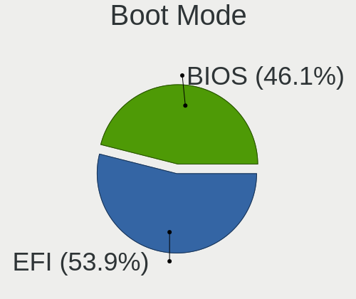
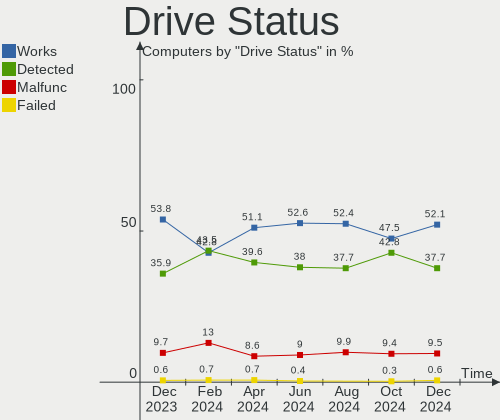
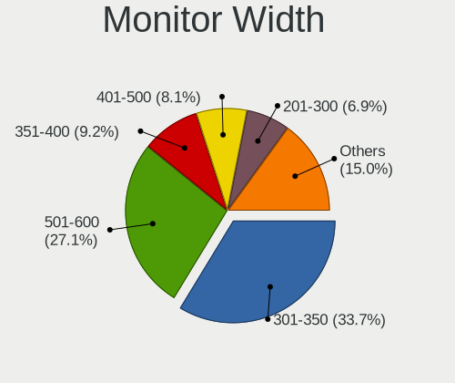
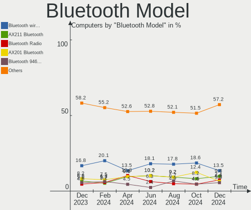
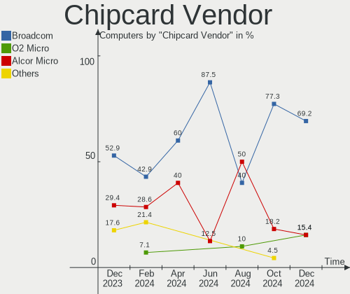

Linux in France - Hardware Trends
---------------------------------

A project to identify most popular hardware characteristics and track their change
over time based on data collected by Linux users at https://Linux-Hardware.org.

Anyone can contribute to this report by the [hw-probe](https://github.com/linuxhw/hw-probe) tool:

    sudo -E hw-probe -all -upload

This is a report for all computer types. See also reports for [desktops](/Location/France/Desktop/README.md) and [notebooks](/Location/France/Notebook/README.md).

Period: Aug, 2022.

Contents
--------

* [ System ](#system)
  - [ OS                       ](#os)
  - [ OS Family                ](#os-family)
  - [ Kernel                   ](#kernel)
  - [ Kernel Family            ](#kernel-family)
  - [ Kernel Major Ver.        ](#kernel-major-ver)
  - [ Arch                     ](#arch)
  - [ DE                       ](#de)
  - [ Display Server           ](#display-server)
  - [ Display Manager          ](#display-manager)
  - [ OS Lang                  ](#os-lang)
  - [ Boot Mode                ](#boot-mode)
  - [ Filesystem               ](#filesystem)
  - [ Part. scheme             ](#part-scheme)
  - [ Dual Boot with Linux/BSD ](#dual-boot-with-linuxbsd)
  - [ Dual Boot (Win)          ](#dual-boot-win)

* [ Board ](#board)
  - [ Vendor                   ](#vendor)
  - [ Model                    ](#model)
  - [ Model Family             ](#model-family)
  - [ MFG Year                 ](#mfg-year)
  - [ Form Factor              ](#form-factor)
  - [ Secure Boot              ](#secure-boot)
  - [ Coreboot                 ](#coreboot)
  - [ RAM Size                 ](#ram-size)
  - [ RAM Used                 ](#ram-used)
  - [ Total Drives             ](#total-drives)
  - [ Has CD-ROM               ](#has-cd-rom)
  - [ Has Ethernet             ](#has-ethernet)
  - [ Has WiFi                 ](#has-wifi)
  - [ Has Bluetooth            ](#has-bluetooth)

* [ Location ](#location)
  - [ Country                  ](#country)
  - [ City                     ](#city)

* [ Drives ](#drives)
  - [ Drive Vendor             ](#drive-vendor)
  - [ Drive Model              ](#drive-model)
  - [ HDD Vendor               ](#hdd-vendor)
  - [ SSD Vendor               ](#ssd-vendor)
  - [ Drive Kind               ](#drive-kind)
  - [ Drive Connector          ](#drive-connector)
  - [ Drive Size               ](#drive-size)
  - [ Space Total              ](#space-total)
  - [ Space Used               ](#space-used)
  - [ Malfunc. Drives          ](#malfunc-drives)
  - [ Malfunc. Drive Vendor    ](#malfunc-drive-vendor)
  - [ Malfunc. HDD Vendor      ](#malfunc-hdd-vendor)
  - [ Malfunc. Drive Kind      ](#malfunc-drive-kind)
  - [ Failed Drives            ](#failed-drives)
  - [ Failed Drive Vendor      ](#failed-drive-vendor)
  - [ Drive Status             ](#drive-status)

* [ Storage controller ](#storage-controller)
  - [ Storage Vendor           ](#storage-vendor)
  - [ Storage Model            ](#storage-model)
  - [ Storage Kind             ](#storage-kind)

* [ Processor ](#processor)
  - [ CPU Vendor               ](#cpu-vendor)
  - [ CPU Model                ](#cpu-model)
  - [ CPU Model Family         ](#cpu-model-family)
  - [ CPU Cores                ](#cpu-cores)
  - [ CPU Sockets              ](#cpu-sockets)
  - [ CPU Threads              ](#cpu-threads)
  - [ CPU Op-Modes             ](#cpu-op-modes)
  - [ CPU Microcode            ](#cpu-microcode)
  - [ CPU Microarch            ](#cpu-microarch)

* [ Graphics ](#graphics)
  - [ GPU Vendor               ](#gpu-vendor)
  - [ GPU Model                ](#gpu-model)
  - [ GPU Combo                ](#gpu-combo)
  - [ GPU Driver               ](#gpu-driver)
  - [ GPU Memory               ](#gpu-memory)

* [ Monitor ](#monitor)
  - [ Monitor Vendor           ](#monitor-vendor)
  - [ Monitor Model            ](#monitor-model)
  - [ Monitor Resolution       ](#monitor-resolution)
  - [ Monitor Diagonal         ](#monitor-diagonal)
  - [ Monitor Width            ](#monitor-width)
  - [ Aspect Ratio             ](#aspect-ratio)
  - [ Monitor Area             ](#monitor-area)
  - [ Pixel Density            ](#pixel-density)
  - [ Multiple Monitors        ](#multiple-monitors)

* [ Network ](#network)
  - [ Net Controller Vendor    ](#net-controller-vendor)
  - [ Net Controller Model     ](#net-controller-model)
  - [ Wireless Vendor          ](#wireless-vendor)
  - [ Wireless Model           ](#wireless-model)
  - [ Ethernet Vendor          ](#ethernet-vendor)
  - [ Ethernet Model           ](#ethernet-model)
  - [ Net Controller Kind      ](#net-controller-kind)
  - [ Used Controller          ](#used-controller)
  - [ NICs                     ](#nics)
  - [ IPv6                     ](#ipv6)

* [ Bluetooth ](#bluetooth)
  - [ Bluetooth Vendor         ](#bluetooth-vendor)
  - [ Bluetooth Model          ](#bluetooth-model)

* [ Sound ](#sound)
  - [ Sound Vendor             ](#sound-vendor)
  - [ Sound Model              ](#sound-model)

* [ Memory ](#memory)
  - [ Memory Vendor            ](#memory-vendor)
  - [ Memory Model             ](#memory-model)
  - [ Memory Kind              ](#memory-kind)
  - [ Memory Form Factor       ](#memory-form-factor)
  - [ Memory Size              ](#memory-size)
  - [ Memory Speed             ](#memory-speed)

* [ Printers & scanners ](#printers--scanners)
  - [ Printer Vendor           ](#printer-vendor)
  - [ Printer Model            ](#printer-model)
  - [ Scanner Vendor           ](#scanner-vendor)
  - [ Scanner Model            ](#scanner-model)

* [ Camera ](#camera)
  - [ Camera Vendor            ](#camera-vendor)
  - [ Camera Model             ](#camera-model)

* [ Security ](#security)
  - [ Fingerprint Vendor       ](#fingerprint-vendor)
  - [ Fingerprint Model        ](#fingerprint-model)
  - [ Chipcard Vendor          ](#chipcard-vendor)
  - [ Chipcard Model           ](#chipcard-model)

* [ Unsupported ](#unsupported)
  - [ Unsupported Devices      ](#unsupported-devices)
  - [ Unsupported Device Types ](#unsupported-device-types)

System
------

OS
--

Installed operating systems

| Name                        | Computers | Percent |
|-----------------------------|-----------|---------|
| Ubuntu 22.04                | 52        | 21.05%  |
| Debian 11                   | 29        | 11.74%  |
| Ubuntu 20.04                | 27        | 10.93%  |
| OpenMandriva 4.3            | 19        | 7.69%   |
| OpenMandriva 4.90           | 12        | 4.86%   |
| Fedora 36                   | 10        | 4.05%   |
| Linux Mint 21               | 9         | 3.64%   |
| Linux Mint 20.3             | 9         | 3.64%   |
| Xubuntu 22.04               | 6         | 2.43%   |
| Arch                        | 5         | 2.02%   |
| Zorin 16                    | 4         | 1.62%   |
| OpenMandriva 4.2            | 4         | 1.62%   |
| Kubuntu 22.04               | 4         | 1.62%   |
| KDE neon 20.04              | 4         | 1.62%   |
| Xubuntu 20.04               | 3         | 1.21%   |
| Ubuntu MATE 22.04           | 3         | 1.21%   |
| Pop!_OS 22.04               | 3         | 1.21%   |
| Nobara 36                   | 3         | 1.21%   |
| Gentoo 2.8                  | 3         | 1.21%   |
| Debian Unstable             | 3         | 1.21%   |
| Manjaro 21.3.6              | 2         | 0.81%   |
| Lubuntu 22.04               | 2         | 0.81%   |
| Linux Mint 20.1             | 2         | 0.81%   |
| Kubuntu 20.04               | 2         | 0.81%   |
| Kali 2022.3                 | 2         | 0.81%   |
| Elementary 6.1              | 2         | 0.81%   |
| Debian Testing              | 2         | 0.81%   |
| ArcoLinux Rolling           | 2         | 0.81%   |
| Xubuntu 18.04               | 1         | 0.4%    |
| Ubuntu MATE 20.04           | 1         | 0.4%    |
| Ubuntu Budgie 20.04         | 1         | 0.4%    |
| Ubuntu 18.04                | 1         | 0.4%    |
| Trisquel 10.0.1             | 1         | 0.4%    |
| SteamOS 3.3                 | 1         | 0.4%    |
| org.kde.Platform 5.15-21.08 | 1         | 0.4%    |
| openSUSE Leap-15.4          | 1         | 0.4%    |
| MX 21                       | 1         | 0.4%    |
| Mageia 8                    | 1         | 0.4%    |
| Lubuntu 20.04               | 1         | 0.4%    |
| LMDE 5                      | 1         | 0.4%    |
| Linux Mint 20.2             | 1         | 0.4%    |
| Linux Mint 20               | 1         | 0.4%    |
| Linux Mint 19.3             | 1         | 0.4%    |
| Linux Lite 5.8              | 1         | 0.4%    |
| EndeavourOS Rolling         | 1         | 0.4%    |
| Debian 11-updates           | 1         | 0.4%    |
| Archcraft Rolling           | 1         | 0.4%    |

OS Family
---------

OS without a version

| Name             | Computers | Percent |
|------------------|-----------|---------|
| Ubuntu           | 80        | 32.39%  |
| OpenMandriva     | 35        | 14.17%  |
| Debian           | 35        | 14.17%  |
| Linux Mint       | 23        | 9.31%   |
| Xubuntu          | 10        | 4.05%   |
| Fedora           | 10        | 4.05%   |
| Kubuntu          | 6         | 2.43%   |
| Arch             | 5         | 2.02%   |
| Zorin            | 4         | 1.62%   |
| Ubuntu MATE      | 4         | 1.62%   |
| KDE neon         | 4         | 1.62%   |
| Pop!_OS          | 3         | 1.21%   |
| Nobara           | 3         | 1.21%   |
| Lubuntu          | 3         | 1.21%   |
| Gentoo           | 3         | 1.21%   |
| Manjaro          | 2         | 0.81%   |
| Kali             | 2         | 0.81%   |
| Elementary       | 2         | 0.81%   |
| ArcoLinux        | 2         | 0.81%   |
| Ubuntu Budgie    | 1         | 0.4%    |
| Trisquel         | 1         | 0.4%    |
| SteamOS          | 1         | 0.4%    |
| org.kde.Platform | 1         | 0.4%    |
| openSUSE         | 1         | 0.4%    |
| MX               | 1         | 0.4%    |
| Mageia           | 1         | 0.4%    |
| LMDE             | 1         | 0.4%    |
| Linux Lite       | 1         | 0.4%    |
| EndeavourOS      | 1         | 0.4%    |
| Archcraft        | 1         | 0.4%    |

Kernel
------

Version of the Linux kernel

| Version                                      | Computers | Percent |
|----------------------------------------------|-----------|---------|
| 5.15.0-46-generic                            | 52        | 21.05%  |
| 5.15.0-43-generic                            | 34        | 13.77%  |
| 5.16.7-desktop-1omv4003                      | 19        | 7.69%   |
| 5.10.0-16-amd64                              | 13        | 5.26%   |
| 5.18.12-desktop-3omv4090                     | 12        | 4.86%   |
| 5.10.0-17-amd64                              | 12        | 4.86%   |
| 5.4.0-122-generic                            | 9         | 3.64%   |
| 5.15.0-41-generic                            | 8         | 3.24%   |
| 5.4.0-124-generic                            | 6         | 2.43%   |
| 5.18.16-200.fc36.x86_64                      | 4         | 1.62%   |
| 5.15.0-47-generic                            | 4         | 1.62%   |
| 5.15.0-25-generic                            | 4         | 1.62%   |
| 5.10.14-desktop-1omv4002                     | 4         | 1.62%   |
| 5.4.0-125-generic                            | 3         | 1.21%   |
| 5.18.16-arch1-1                              | 3         | 1.21%   |
| 5.18.10-76051810-generic                     | 3         | 1.21%   |
| 5.18.0-3-amd64                               | 3         | 1.21%   |
| 5.18.18-200.fc36.x86_64                      | 2         | 0.81%   |
| 5.18.15-arch1-1                              | 2         | 0.81%   |
| 5.18.0-kali5-amd64                           | 2         | 0.81%   |
| 5.15.0-40-generic                            | 2         | 0.81%   |
| 5.10.0-12-amd64                              | 2         | 0.81%   |
| 5.8.0-53-generic                             | 1         | 0.4%    |
| 5.4.0-71-generic                             | 1         | 0.4%    |
| 5.4.0-124-lowlatency                         | 1         | 0.4%    |
| 5.4.0-122-lowlatency                         | 1         | 0.4%    |
| 5.4.0-113-generic                            | 1         | 0.4%    |
| 5.4.0-109-generic                            | 1         | 0.4%    |
| 5.19.4-200.fc36.x86_64                       | 1         | 0.4%    |
| 5.19.3-051903-generic                        | 1         | 0.4%    |
| 5.19.1-arch2-1                               | 1         | 0.4%    |
| 5.19.0-xm2.0.fc36.x86_64                     | 1         | 0.4%    |
| 5.19.0-rc6-amd64                             | 1         | 0.4%    |
| 5.19.0-gentoo                                | 1         | 0.4%    |
| 5.19.0-1.1-liquorix-amd64                    | 1         | 0.4%    |
| 5.18.19-201.fsync.fc36.x86_64                | 1         | 0.4%    |
| 5.18.17-201.fsync.fc36.x86_64                | 1         | 0.4%    |
| 5.18.17-1-MANJARO                            | 1         | 0.4%    |
| 5.18.16-602.inttf.fc36.x86_64                | 1         | 0.4%    |
| 5.18.16-201.fsync.fc36.x86_64                | 1         | 0.4%    |
| 5.18.15-desktop-1.mga8                       | 1         | 0.4%    |
| 5.18.0-4-amd64                               | 1         | 0.4%    |
| 5.18.0-2-amd64                               | 1         | 0.4%    |
| 5.18.0-13.1-liquorix-amd64                   | 1         | 0.4%    |
| 5.18.0-0.deb11.3-amd64                       | 1         | 0.4%    |
| 5.17.5-300.fc36.x86_64                       | 1         | 0.4%    |
| 5.15.62-1-lts                                | 1         | 0.4%    |
| 5.15.59-gentoo-dist                          | 1         | 0.4%    |
| 5.15.58-2-lts                                | 1         | 0.4%    |
| 5.15.57-2-MANJARO                            | 1         | 0.4%    |
| 5.15.53-2-lts                                | 1         | 0.4%    |
| 5.15.53                                      | 1         | 0.4%    |
| 5.15.52-gentoo                               | 1         | 0.4%    |
| 5.15.30-2-pve                                | 1         | 0.4%    |
| 5.15.0-37-generic                            | 1         | 0.4%    |
| 5.15.0-27-generic                            | 1         | 0.4%    |
| 5.15.0-1017-aws                              | 1         | 0.4%    |
| 5.14.21-150400.24.18-default                 | 1         | 0.4%    |
| 5.14.0-1045-oem                              | 1         | 0.4%    |
| 5.13.0-valve22-1-neptune-02213-gb68995364335 | 1         | 0.4%    |

Kernel Family
-------------

Linux kernel without a distro release

| Version | Computers | Percent |
|---------|-----------|---------|
| 5.15.0  | 107       | 43.32%  |
| 5.10.0  | 29        | 11.74%  |
| 5.4.0   | 23        | 9.31%   |
| 5.16.7  | 19        | 7.69%   |
| 5.18.12 | 12        | 4.86%   |
| 5.18.16 | 9         | 3.64%   |
| 5.18.0  | 9         | 3.64%   |
| 5.19.0  | 4         | 1.62%   |
| 5.10.14 | 4         | 1.62%   |
| 5.18.15 | 3         | 1.21%   |
| 5.18.10 | 3         | 1.21%   |
| 5.13.0  | 3         | 1.21%   |
| 5.18.18 | 2         | 0.81%   |
| 5.18.17 | 2         | 0.81%   |
| 5.15.53 | 2         | 0.81%   |
| 4.15.0  | 2         | 0.81%   |
| 5.8.0   | 1         | 0.4%    |
| 5.19.4  | 1         | 0.4%    |
| 5.19.3  | 1         | 0.4%    |
| 5.19.1  | 1         | 0.4%    |
| 5.18.19 | 1         | 0.4%    |
| 5.17.5  | 1         | 0.4%    |
| 5.15.62 | 1         | 0.4%    |
| 5.15.59 | 1         | 0.4%    |
| 5.15.58 | 1         | 0.4%    |
| 5.15.57 | 1         | 0.4%    |
| 5.15.52 | 1         | 0.4%    |
| 5.15.30 | 1         | 0.4%    |
| 5.14.21 | 1         | 0.4%    |
| 5.14.0  | 1         | 0.4%    |

Kernel Major Ver.
-----------------

Linux kernel major version

| Version | Computers | Percent |
|---------|-----------|---------|
| 5.15    | 115       | 46.56%  |
| 5.18    | 41        | 16.6%   |
| 5.10    | 33        | 13.36%  |
| 5.4     | 23        | 9.31%   |
| 5.16    | 19        | 7.69%   |
| 5.19    | 7         | 2.83%   |
| 5.13    | 3         | 1.21%   |
| 5.14    | 2         | 0.81%   |
| 4.15    | 2         | 0.81%   |
| 5.8     | 1         | 0.4%    |
| 5.17    | 1         | 0.4%    |

Arch
----

OS architecture (x86_64, i586, etc.)

| Name   | Computers | Percent |
|--------|-----------|---------|
| x86_64 | 246       | 99.6%   |
| i686   | 1         | 0.4%    |

DE
--

Desktop Environment

| Name       | Computers | Percent |
|------------|-----------|---------|
| GNOME      | 104       | 42.11%  |
| KDE5       | 60        | 24.29%  |
| XFCE       | 24        | 9.72%   |
| X-Cinnamon | 16        | 6.48%   |
| MATE       | 16        | 6.48%   |
| Unknown    | 15        | 6.07%   |
| Cinnamon   | 4         | 1.62%   |
| LXQt       | 3         | 1.21%   |
| Pantheon   | 2         | 0.81%   |
| qtile      | 1         | 0.4%    |
| LXDE       | 1         | 0.4%    |
| Budgie     | 1         | 0.4%    |

Display Server
--------------

X11 or Wayland

| Name    | Computers | Percent |
|---------|-----------|---------|
| X11     | 170       | 68.83%  |
| Wayland | 57        | 23.08%  |
| Tty     | 18        | 7.29%   |
| Unknown | 2         | 0.81%   |

Display Manager
---------------

SDDM, LightDM, etc.

| Name    | Computers | Percent |
|---------|-----------|---------|
| GDM3    | 59        | 23.89%  |
| SDDM    | 58        | 23.48%  |
| Unknown | 49        | 19.84%  |
| LightDM | 44        | 17.81%  |
| GDM     | 37        | 14.98%  |

OS Lang
-------

Language

| Lang  | Computers | Percent |
|-------|-----------|---------|
| fr_FR | 192       | 77.73%  |
| en_US | 47        | 19.03%  |
| en_GB | 6         | 2.43%   |
| it_IT | 1         | 0.4%    |
| de_CH | 1         | 0.4%    |

Boot Mode
---------

EFI or BIOS

| Mode | Computers | Percent |
|------|-----------|---------|
| EFI  | 139       | 56.28%  |
| BIOS | 108       | 43.72%  |

Filesystem
----------

Type of filesystem

| Type    | Computers | Percent |
|---------|-----------|---------|
| Ext4    | 193       | 78.14%  |
| Overlay | 35        | 14.17%  |
| Btrfs   | 16        | 6.48%   |
| Zfs     | 2         | 0.81%   |
| Ext3    | 1         | 0.4%    |

Part. scheme
------------

Scheme of partitioning

| Type    | Computers | Percent |
|---------|-----------|---------|
| GPT     | 137       | 55.47%  |
| Unknown | 68        | 27.53%  |
| MBR     | 42        | 17%     |

Dual Boot with Linux/BSD
------------------------

Hosting more than one Linux/BSD

| Dual boot | Computers | Percent |
|-----------|-----------|---------|
| No        | 192       | 77.73%  |
| Yes       | 55        | 22.27%  |

Dual Boot (Win)
---------------

Hosting Linux and Windows

| Dual boot | Computers | Percent |
|-----------|-----------|---------|
| No        | 169       | 68.42%  |
| Yes       | 78        | 31.58%  |

Board
-----

Vendor
------

Motherboard manufacturer

| Name                | Computers | Percent |
|---------------------|-----------|---------|
| ASUSTek Computer    | 46        | 18.62%  |
| Lenovo              | 35        | 14.17%  |
| Dell                | 31        | 12.55%  |
| Hewlett-Packard     | 30        | 12.15%  |
| MSI                 | 20        | 8.1%    |
| Gigabyte Technology | 15        | 6.07%   |
| Acer                | 9         | 3.64%   |
| Intel               | 8         | 3.24%   |
| ASRock              | 8         | 3.24%   |
| Notebook            | 6         | 2.43%   |
| Toshiba             | 5         | 2.02%   |
| Packard Bell        | 5         | 2.02%   |
| HUAWEI              | 4         | 1.62%   |
| Foxconn             | 4         | 1.62%   |
| Apple               | 4         | 1.62%   |
| Panasonic           | 2         | 0.81%   |
| eMachines           | 2         | 0.81%   |
| ZOTAC               | 1         | 0.4%    |
| Vorke               | 1         | 0.4%    |
| UNOWHY              | 1         | 0.4%    |
| Supermicro          | 1         | 0.4%    |
| Sony                | 1         | 0.4%    |
| SLIMBOOK            | 1         | 0.4%    |
| Samsung Electronics | 1         | 0.4%    |
| OEM                 | 1         | 0.4%    |
| Medion              | 1         | 0.4%    |
| Fujitsu             | 1         | 0.4%    |
| CompuLab            | 1         | 0.4%    |
| Biostar             | 1         | 0.4%    |
| Acidanthera         | 1         | 0.4%    |

Model
-----

Motherboard model

| Name                                     | Computers | Percent |
|------------------------------------------|-----------|---------|
| MSI MS-7C91                              | 3         | 1.21%   |
| ASUS All Series                          | 3         | 1.21%   |
| MSI MS-7C92                              | 2         | 0.81%   |
| Lenovo ThinkPad T440p 20AWS17N00         | 2         | 0.81%   |
| Lenovo ThinkCentre M73 10AXS1UY00        | 2         | 0.81%   |
| Lenovo IdeaPad 3 15ALC6 82KU             | 2         | 0.81%   |
| HUAWEI NBLBZ-WAX9N                       | 2         | 0.81%   |
| HP Spectre                               | 2         | 0.81%   |
| HP Notebook                              | 2         | 0.81%   |
| HP EliteBook 840 G8 Notebook PC          | 2         | 0.81%   |
| ASUS PRIME A320M-K                       | 2         | 0.81%   |
| ZOTAC ZBOX-CI323NANO                     | 1         | 0.4%    |
| Vorke V1 Plus                            | 1         | 0.4%    |
| UNOWHY Y13G010S4EI                       | 1         | 0.4%    |
| Toshiba Satellite Pro L500               | 1         | 0.4%    |
| Toshiba Satellite L875-11M               | 1         | 0.4%    |
| Toshiba Satellite C870-1F3               | 1         | 0.4%    |
| Toshiba Satellite C55-C                  | 1         | 0.4%    |
| Toshiba PORTEGE R30-A                    | 1         | 0.4%    |
| Supermicro X7DCL                         | 1         | 0.4%    |
| Sony VPCYB3V1E                           | 1         | 0.4%    |
| SLIMBOOK PROX15-AMD                      | 1         | 0.4%    |
| Samsung RV410/RV510/S3510/E3510          | 1         | 0.4%    |
| Panasonic CF-53JSWZGFF                   | 1         | 0.4%    |
| Panasonic CF-31XEUAXMF                   | 1         | 0.4%    |
| Packard Bell IMEDIA S1300                | 1         | 0.4%    |
| Packard Bell IMEDIA F9218 AIO            | 1         | 0.4%    |
| Packard Bell EasyNote TK37               | 1         | 0.4%    |
| Packard Bell EasyNote TJ66               | 1         | 0.4%    |
| Packard Bell EasyNote TJ65               | 1         | 0.4%    |
| Notebook W65_67SZ                        | 1         | 0.4%    |
| Notebook NLx0MU                          | 1         | 0.4%    |
| Notebook NJ50_70CU                       | 1         | 0.4%    |
| Notebook N230WU                          | 1         | 0.4%    |
| Notebook N15_17RD                        | 1         | 0.4%    |
| Notebook N141CU                          | 1         | 0.4%    |
| MSI PS63 Modern 8RD                      | 1         | 0.4%    |
| MSI MS-7D54                              | 1         | 0.4%    |
| MSI MS-7D53                              | 1         | 0.4%    |
| MSI MS-7C83                              | 1         | 0.4%    |
| MSI MS-7C52                              | 1         | 0.4%    |
| MSI MS-7C08                              | 1         | 0.4%    |
| MSI MS-7B79                              | 1         | 0.4%    |
| MSI MS-7A74                              | 1         | 0.4%    |
| MSI MS-7982                              | 1         | 0.4%    |
| MSI MS-7977                              | 1         | 0.4%    |
| MSI MS-7917                              | 1         | 0.4%    |
| MSI MS-7821                              | 1         | 0.4%    |
| MSI MS-7693                              | 1         | 0.4%    |
| MSI GE75 Raider 10SF                     | 1         | 0.4%    |
| MSI GE60 0NC/GE60 0ND                    | 1         | 0.4%    |
| Medion MD35147                           | 1         | 0.4%    |
| Lenovo Yoga S740-15IRH 81NX              | 1         | 0.4%    |
| Lenovo Yoga 300-11IBY 80M0               | 1         | 0.4%    |
| Lenovo V110-15ISK 80TL                   | 1         | 0.4%    |
| Lenovo ThinkStation P330 P330            | 1         | 0.4%    |
| Lenovo ThinkPad X230 23259T0             | 1         | 0.4%    |
| Lenovo ThinkPad X200 7458VL3             | 1         | 0.4%    |
| Lenovo ThinkPad X1 Carbon 4th 20FCS2L300 | 1         | 0.4%    |
| Lenovo ThinkPad W540 20BHS0F206          | 1         | 0.4%    |

Model Family
------------

Motherboard model prefix

| Name                   | Computers | Percent |
|------------------------|-----------|---------|
| Lenovo ThinkPad        | 16        | 6.48%   |
| Dell OptiPlex          | 9         | 3.64%   |
| Lenovo ThinkCentre     | 6         | 2.43%   |
| Dell Precision         | 6         | 2.43%   |
| Dell Latitude          | 6         | 2.43%   |
| Lenovo IdeaPad         | 5         | 2.02%   |
| HP Compaq              | 5         | 2.02%   |
| ASUS VivoBook          | 5         | 2.02%   |
| Toshiba Satellite      | 4         | 1.62%   |
| Dell Inspiron          | 4         | 1.62%   |
| Packard Bell EasyNote  | 3         | 1.21%   |
| MSI MS-7C91            | 3         | 1.21%   |
| HP Laptop              | 3         | 1.21%   |
| HP EliteBook           | 3         | 1.21%   |
| Dell XPS               | 3         | 1.21%   |
| ASUS TUF               | 3         | 1.21%   |
| ASUS ROG               | 3         | 1.21%   |
| ASUS PRIME             | 3         | 1.21%   |
| ASUS All               | 3         | 1.21%   |
| Acer Aspire            | 3         | 1.21%   |
| Packard Bell IMEDIA    | 2         | 0.81%   |
| MSI MS-7C92            | 2         | 0.81%   |
| Lenovo Yoga            | 2         | 0.81%   |
| HUAWEI NBLBZ-WAX9N     | 2         | 0.81%   |
| HP ZBook               | 2         | 0.81%   |
| HP Spectre             | 2         | 0.81%   |
| HP ProDesk             | 2         | 0.81%   |
| HP ProBook             | 2         | 0.81%   |
| HP Notebook            | 2         | 0.81%   |
| HP EliteDesk           | 2         | 0.81%   |
| Gigabyte B450M         | 2         | 0.81%   |
| Foxconn Pro            | 2         | 0.81%   |
| ASUS ZenBook           | 2         | 0.81%   |
| Acer Veriton           | 2         | 0.81%   |
| ZOTAC ZBOX-CI323NANO   | 1         | 0.4%    |
| Vorke V1               | 1         | 0.4%    |
| UNOWHY Y13G010S4EI     | 1         | 0.4%    |
| Toshiba PORTEGE        | 1         | 0.4%    |
| Supermicro X7DCL       | 1         | 0.4%    |
| Sony VPCYB3V1E         | 1         | 0.4%    |
| SLIMBOOK PROX15-AMD    | 1         | 0.4%    |
| Samsung RV410          | 1         | 0.4%    |
| Panasonic CF-53JSWZGFF | 1         | 0.4%    |
| Panasonic CF-31XEUAXMF | 1         | 0.4%    |
| Notebook W65           | 1         | 0.4%    |
| Notebook NLx0MU        | 1         | 0.4%    |
| Notebook NJ50          | 1         | 0.4%    |
| Notebook N230WU        | 1         | 0.4%    |
| Notebook N15           | 1         | 0.4%    |
| Notebook N141CU        | 1         | 0.4%    |
| MSI PS63               | 1         | 0.4%    |
| MSI MS-7D54            | 1         | 0.4%    |
| MSI MS-7D53            | 1         | 0.4%    |
| MSI MS-7C83            | 1         | 0.4%    |
| MSI MS-7C52            | 1         | 0.4%    |
| MSI MS-7C08            | 1         | 0.4%    |
| MSI MS-7B79            | 1         | 0.4%    |
| MSI MS-7A74            | 1         | 0.4%    |
| MSI MS-7982            | 1         | 0.4%    |
| MSI MS-7977            | 1         | 0.4%    |

MFG Year
--------

Motherboard manufacture year

| Year | Computers | Percent |
|------|-----------|---------|
| 2020 | 31        | 12.55%  |
| 2021 | 26        | 10.53%  |
| 2013 | 22        | 8.91%   |
| 2014 | 21        | 8.5%    |
| 2015 | 18        | 7.29%   |
| 2012 | 18        | 7.29%   |
| 2019 | 16        | 6.48%   |
| 2018 | 16        | 6.48%   |
| 2016 | 13        | 5.26%   |
| 2011 | 13        | 5.26%   |
| 2010 | 13        | 5.26%   |
| 2017 | 12        | 4.86%   |
| 2022 | 8         | 3.24%   |
| 2009 | 8         | 3.24%   |
| 2008 | 5         | 2.02%   |
| 2007 | 4         | 1.62%   |
| 2006 | 3         | 1.21%   |

Form Factor
-----------

Physical design of the computer

| Name        | Computers | Percent |
|-------------|-----------|---------|
| Notebook    | 129       | 52.23%  |
| Desktop     | 102       | 41.3%   |
| Mini pc     | 7         | 2.83%   |
| Convertible | 3         | 1.21%   |
| Tablet      | 2         | 0.81%   |
| All in one  | 2         | 0.81%   |
| Server      | 2         | 0.81%   |

Secure Boot
-----------

Enabled or disabled

| State    | Computers | Percent |
|----------|-----------|---------|
| Disabled | 223       | 90.28%  |
| Enabled  | 24        | 9.72%   |

Coreboot
--------

Have coreboot on board

| Used | Computers | Percent |
|------|-----------|---------|
| No   | 247       | 100%    |

RAM Size
--------

Total RAM memory

| Size in GB  | Computers | Percent |
|-------------|-----------|---------|
| 4.01-8.0    | 66        | 26.72%  |
| 16.01-24.0  | 55        | 22.27%  |
| 3.01-4.0    | 43        | 17.41%  |
| 8.01-16.0   | 41        | 16.6%   |
| 32.01-64.0  | 24        | 9.72%   |
| 1.01-2.0    | 8         | 3.24%   |
| 64.01-256.0 | 6         | 2.43%   |
| 2.01-3.0    | 2         | 0.81%   |
| 24.01-32.0  | 1         | 0.4%    |
| 0.51-1.0    | 1         | 0.4%    |

RAM Used
--------

Used RAM memory

| Used GB    | Computers | Percent |
|------------|-----------|---------|
| 1.01-2.0   | 86        | 34.82%  |
| 2.01-3.0   | 64        | 25.91%  |
| 4.01-8.0   | 40        | 16.19%  |
| 3.01-4.0   | 27        | 10.93%  |
| 0.51-1.0   | 16        | 6.48%   |
| 8.01-16.0  | 9         | 3.64%   |
| 0.01-0.5   | 3         | 1.21%   |
| 24.01-32.0 | 1         | 0.4%    |
| 16.01-24.0 | 1         | 0.4%    |

Total Drives
------------

Number of drives on board

| Drives | Computers | Percent |
|--------|-----------|---------|
| 1      | 140       | 56.68%  |
| 2      | 71        | 28.74%  |
| 3      | 17        | 6.88%   |
| 4      | 13        | 5.26%   |
| 5      | 4         | 1.62%   |
| 6      | 2         | 0.81%   |

Has CD-ROM
----------

Has CD-ROM on board

| Presented | Computers | Percent |
|-----------|-----------|---------|
| No        | 143       | 57.89%  |
| Yes       | 104       | 42.11%  |

Has Ethernet
------------

Has Ethernet on board

| Presented | Computers | Percent |
|-----------|-----------|---------|
| Yes       | 225       | 91.09%  |
| No        | 22        | 8.91%   |

Has WiFi
--------

Has WiFi module

| Presented | Computers | Percent |
|-----------|-----------|---------|
| Yes       | 183       | 74.09%  |
| No        | 64        | 25.91%  |

Has Bluetooth
-------------

Has Bluetooth module

| Presented | Computers | Percent |
|-----------|-----------|---------|
| Yes       | 142       | 57.49%  |
| No        | 105       | 42.51%  |

Location
--------

Country
-------

Geographic location (country)

| Country | Computers | Percent |
|---------|-----------|---------|
| France  | 247       | 100%    |

City
----

Geographic location (city)

| City                      | Computers | Percent |
|---------------------------|-----------|---------|
| Paris                     | 33        | 13.36%  |
| Monistrol-sur-Loire       | 7         | 2.83%   |
| Marseille                 | 7         | 2.83%   |
| Nantes                    | 6         | 2.43%   |
| Lyon                      | 4         | 1.62%   |
| Figeac                    | 4         | 1.62%   |
| Thiers                    | 3         | 1.21%   |
| Rennes                    | 3         | 1.21%   |
| Gennevilliers             | 3         | 1.21%   |
| Bordeaux                  | 3         | 1.21%   |
| Saint-Julien-en-Genevois  | 2         | 0.81%   |
| Saint-Denis               | 2         | 0.81%   |
| Niort                     | 2         | 0.81%   |
| Lens                      | 2         | 0.81%   |
| Hettange-Grande           | 2         | 0.81%   |
| Elven                     | 2         | 0.81%   |
| Châtenay-Malabry         | 2         | 0.81%   |
| Châtellerault            | 2         | 0.81%   |
| Chartres-de-Bretagne      | 2         | 0.81%   |
| Charleville-Mézières    | 2         | 0.81%   |
| Chambéry                 | 2         | 0.81%   |
| Brest                     | 2         | 0.81%   |
| Bougival                  | 2         | 0.81%   |
| Agde                      | 2         | 0.81%   |
| Villemomble               | 1         | 0.4%    |
| Vermand                   | 1         | 0.4%    |
| Vendrennes                | 1         | 0.4%    |
| Vaux-sur-Mer              | 1         | 0.4%    |
| Vallauris                 | 1         | 0.4%    |
| Valence                   | 1         | 0.4%    |
| Triel-sur-Seine           | 1         | 0.4%    |
| Toulouse                  | 1         | 0.4%    |
| Tosse                     | 1         | 0.4%    |
| Thiaucourt-Regnieville    | 1         | 0.4%    |
| Thesee                    | 1         | 0.4%    |
| Tavaux                    | 1         | 0.4%    |
| Tarbes                    | 1         | 0.4%    |
| Talence                   | 1         | 0.4%    |
| Talant                    | 1         | 0.4%    |
| Suresnes                  | 1         | 0.4%    |
| Strasbourg                | 1         | 0.4%    |
| Sète                     | 1         | 0.4%    |
| Savenay                   | 1         | 0.4%    |
| Sautron                   | 1         | 0.4%    |
| Sarge-les-le-Mans         | 1         | 0.4%    |
| Salon-de-Provence         | 1         | 0.4%    |
| Sainte-Luce-sur-Loire     | 1         | 0.4%    |
| Saint-Nazaire             | 1         | 0.4%    |
| Saint-Mitre-les-Remparts  | 1         | 0.4%    |
| Saint-Julien-de-Concelles | 1         | 0.4%    |
| Saint-Jeures              | 1         | 0.4%    |
| Saint-Georges-de-Reneins  | 1         | 0.4%    |
| Saint-Etienne             | 1         | 0.4%    |
| Saint-Brice-sous-Foret    | 1         | 0.4%    |
| Rumilly-en-Cambresis      | 1         | 0.4%    |
| Roujan                    | 1         | 0.4%    |
| Romorantin-Lanthenay      | 1         | 0.4%    |
| Roche-la-Moliere          | 1         | 0.4%    |
| Rezé                     | 1         | 0.4%    |
| Retournac                 | 1         | 0.4%    |

Drives
------

Drive Vendor
------------

Hard drive vendors

| Vendor                    | Computers | Drives | Percent |
|---------------------------|-----------|--------|---------|
| Samsung Electronics       | 64        | 79     | 17.58%  |
| Seagate                   | 46        | 57     | 12.64%  |
| WDC                       | 44        | 54     | 12.09%  |
| Crucial                   | 39        | 43     | 10.71%  |
| Kingston                  | 27        | 28     | 7.42%   |
| Toshiba                   | 18        | 18     | 4.95%   |
| Unknown                   | 14        | 15     | 3.85%   |
| SanDisk                   | 13        | 13     | 3.57%   |
| HGST                      | 10        | 10     | 2.75%   |
| Hitachi                   | 9         | 10     | 2.47%   |
| SK hynix                  | 7         | 7      | 1.92%   |
| Micron Technology         | 7         | 7      | 1.92%   |
| Intel                     | 7         | 8      | 1.92%   |
| PNY                       | 4         | 4      | 1.1%    |
| LDLC                      | 4         | 4      | 1.1%    |
| Corsair                   | 4         | 5      | 1.1%    |
| Transcend                 | 3         | 3      | 0.82%   |
| SPCC                      | 3         | 3      | 0.82%   |
| Emtec                     | 3         | 3      | 0.82%   |
| Unknown                   | 3         | 3      | 0.82%   |
| Silicon Motion            | 2         | 2      | 0.55%   |
| Phison                    | 2         | 2      | 0.55%   |
| Micron/Crucial Technology | 2         | 2      | 0.55%   |
| Maxtor                    | 2         | 2      | 0.55%   |
| KIOXIA                    | 2         | 2      | 0.55%   |
| A-DATA Technology         | 2         | 2      | 0.55%   |
| UMIS                      | 1         | 1      | 0.27%   |
| Team                      | 1         | 1      | 0.27%   |
| Storeva                   | 1         | 1      | 0.27%   |
| StoreJet                  | 1         | 1      | 0.27%   |
| Realtek                   | 1         | 1      | 0.27%   |
| Phison Electronics        | 1         | 1      | 0.27%   |
| OCZ                       | 1         | 1      | 0.27%   |
| Magnetic Data             | 1         | 1      | 0.27%   |
| M.2 SSD                   | 1         | 1      | 0.27%   |
| LITEONIT                  | 1         | 1      | 0.27%   |
| KingSpec                  | 1         | 1      | 0.27%   |
| KINGPOWER                 | 1         | 1      | 0.27%   |
| KingDian                  | 1         | 2      | 0.27%   |
| Inateck                   | 1         | 1      | 0.27%   |
| Gigabyte Technology       | 1         | 1      | 0.27%   |
| GALAX                     | 1         | 1      | 0.27%   |
| Fujitsu                   | 1         | 1      | 0.27%   |
| FORESEE                   | 1         | 1      | 0.27%   |
| Dogfish                   | 1         | 1      | 0.27%   |
| Dell                      | 1         | 1      | 0.27%   |
| China                     | 1         | 1      | 0.27%   |
| Apple                     | 1         | 1      | 0.27%   |
| Apacer                    | 1         | 1      | 0.27%   |

Drive Model
-----------

Hard drive models

| Model                              | Computers | Percent |
|------------------------------------|-----------|---------|
| Crucial CT500MX500SSD1 500GB       | 7         | 1.75%   |
| Crucial CT480BX500SSD1 480GB       | 6         | 1.5%    |
| Seagate ST1000DM010-2EP102 1TB     | 5         | 1.25%   |
| Samsung SSD 850 EVO 250GB          | 5         | 1.25%   |
| Kingston SA400S37120G 120GB SSD    | 5         | 1.25%   |
| Crucial CT240BX500SSD1 240GB       | 5         | 1.25%   |
| Crucial CT1000MX500SSD1 1TB        | 5         | 1.25%   |
| Seagate ST500DM002-1BD142 500GB    | 4         | 1%      |
| Seagate ST1000LM048-2E7172 1TB     | 4         | 1%      |
| Seagate ST1000LM024 HN-M101MBB 1TB | 4         | 1%      |
| Samsung SSD 870 QVO 1TB            | 4         | 1%      |
| Samsung SSD 860 EVO 500GB          | 4         | 1%      |
| Samsung SSD 850 EVO 500GB          | 4         | 1%      |
| Samsung NVMe SSD Drive 512GB       | 4         | 1%      |
| Kingston SA400S37240G 240GB SSD    | 4         | 1%      |
| Seagate ST2000DM001-1ER164 2TB     | 3         | 0.75%   |
| Seagate ST2000DL003-9VT166 2TB     | 3         | 0.75%   |
| SanDisk NVMe SSD Drive 512GB       | 3         | 0.75%   |
| Samsung SSD 980 250GB              | 3         | 0.75%   |
| Samsung SSD 860 QVO 1TB            | 3         | 0.75%   |
| Samsung NVMe SSD Drive 500GB       | 3         | 0.75%   |
| Kingston SV300S37A120G 120GB SSD   | 3         | 0.75%   |
| Kingston SA400S37480G 480GB SSD    | 3         | 0.75%   |
| Intel SSDPEKNW512G8 512GB          | 3         | 0.75%   |
| HGST HTS721010A9E630 1TB           | 3         | 0.75%   |
| Crucial CT500P2SSD8 500GB          | 3         | 0.75%   |
| Unknown                            | 3         | 0.75%   |
| WDC WD30EZRZ-00GXCB0 3TB           | 2         | 0.5%    |
| WDC WD20EZRZ-00Z5HB0 2TB           | 2         | 0.5%    |
| WDC WD10EZEX-08WN4A0 1TB           | 2         | 0.5%    |
| WDC WD1002FAEX-00Z3A0 1TB          | 2         | 0.5%    |
| Unknown SD/MMC/MS PRO 128GB        | 2         | 0.5%    |
| Unknown MMC Card  64GB             | 2         | 0.5%    |
| SPCC Solid State Disk 256GB        | 2         | 0.5%    |
| Seagate ST2000LM015-2E8174 2TB     | 2         | 0.5%    |
| Seagate ST1000LM049-2GH172 1TB     | 2         | 0.5%    |
| Seagate ST1000DM003-1CH162 1TB     | 2         | 0.5%    |
| SanDisk SDSSDA120G 120GB           | 2         | 0.5%    |
| Samsung SSD 980 500GB              | 2         | 0.5%    |
| Samsung SSD 980 1TB                | 2         | 0.5%    |
| Samsung SSD 870 EVO 500GB          | 2         | 0.5%    |
| Samsung MZVLB512HBJQ-00000 512GB   | 2         | 0.5%    |
| PNY CS900 480GB SSD                | 2         | 0.5%    |
| LDLC F8+M.2 480 480GB              | 2         | 0.5%    |
| Kingston SNVS500G 500GB            | 2         | 0.5%    |
| Kingston SHSS37A240G 240GB SSD     | 2         | 0.5%    |
| Intel NVMe SSD Drive 512GB         | 2         | 0.5%    |
| HGST HTS541010A7E630 1TB           | 2         | 0.5%    |
| Emtec X150 240GB                   | 2         | 0.5%    |
| Crucial CT250MX200SSD1 250GB       | 2         | 0.5%    |
| Crucial CT128M550SSD3 128GB        | 2         | 0.5%    |
| Crucial CT1000P2SSD8 1TB           | 2         | 0.5%    |
| Crucial CT1000BX500SSD1 1TB        | 2         | 0.5%    |
| WDC WDS500G2B0C-00PXH0 500GB       | 1         | 0.25%   |
| WDC WDS480G2G0C-00AJM0 480GB       | 1         | 0.25%   |
| WDC WD7500BPKT-22PK4T0 752GB       | 1         | 0.25%   |
| WDC WD60EZAZ-00ZGHB0 6TB           | 1         | 0.25%   |
| WDC WD60EZAZ-00SF3B0 6TB           | 1         | 0.25%   |
| WDC WD5001AALS-00L3B2 500GB        | 1         | 0.25%   |
| WDC WD5000LPCX-24C6HT0 500GB       | 1         | 0.25%   |

HDD Vendor
----------

Hard disk drive vendors

| Vendor              | Computers | Drives | Percent |
|---------------------|-----------|--------|---------|
| Seagate             | 45        | 56     | 34.09%  |
| WDC                 | 38        | 48     | 28.79%  |
| Toshiba             | 12        | 12     | 9.09%   |
| Samsung Electronics | 10        | 11     | 7.58%   |
| HGST                | 10        | 10     | 7.58%   |
| Hitachi             | 9         | 10     | 6.82%   |
| Unknown             | 3         | 3      | 2.27%   |
| Maxtor              | 2         | 2      | 1.52%   |
| Storeva             | 1         | 1      | 0.76%   |
| Magnetic Data       | 1         | 1      | 0.76%   |
| Fujitsu             | 1         | 1      | 0.76%   |

SSD Vendor
----------

Solid state drive vendors

| Vendor              | Computers | Drives | Percent |
|---------------------|-----------|--------|---------|
| Crucial             | 34        | 36     | 25.37%  |
| Samsung Electronics | 28        | 33     | 20.9%   |
| Kingston            | 23        | 24     | 17.16%  |
| SanDisk             | 8         | 8      | 5.97%   |
| PNY                 | 4         | 4      | 2.99%   |
| Micron Technology   | 4         | 4      | 2.99%   |
| Transcend           | 3         | 3      | 2.24%   |
| SPCC                | 3         | 3      | 2.24%   |
| Emtec               | 3         | 3      | 2.24%   |
| SK hynix            | 2         | 2      | 1.49%   |
| LDLC                | 2         | 2      | 1.49%   |
| A-DATA Technology   | 2         | 2      | 1.49%   |
| Unknown             | 2         | 2      | 1.49%   |
| Toshiba             | 1         | 1      | 0.75%   |
| Team                | 1         | 1      | 0.75%   |
| StoreJet            | 1         | 1      | 0.75%   |
| Phison              | 1         | 1      | 0.75%   |
| OCZ                 | 1         | 1      | 0.75%   |
| LITEONIT            | 1         | 1      | 0.75%   |
| KingSpec            | 1         | 1      | 0.75%   |
| KINGPOWER           | 1         | 1      | 0.75%   |
| KingDian            | 1         | 2      | 0.75%   |
| GALAX               | 1         | 1      | 0.75%   |
| FORESEE             | 1         | 1      | 0.75%   |
| Dogfish             | 1         | 1      | 0.75%   |
| Corsair             | 1         | 1      | 0.75%   |
| China               | 1         | 1      | 0.75%   |
| Apple               | 1         | 1      | 0.75%   |
| Apacer              | 1         | 1      | 0.75%   |

Drive Kind
----------

HDD or SSD

| Kind    | Computers | Drives | Percent |
|---------|-----------|--------|---------|
| SSD     | 118       | 143    | 35.87%  |
| HDD     | 111       | 155    | 33.74%  |
| NVMe    | 87        | 97     | 26.44%  |
| MMC     | 11        | 13     | 3.34%   |
| Unknown | 2         | 2      | 0.61%   |

Drive Connector
---------------

SATA, SAS, NVMe, etc.

| Type | Computers | Drives | Percent |
|------|-----------|--------|---------|
| SATA | 189       | 290    | 63.21%  |
| NVMe | 87        | 94     | 29.1%   |
| SAS  | 12        | 13     | 4.01%   |
| MMC  | 11        | 13     | 3.68%   |

Drive Size
----------

Size of hard drive

| Size in TB | Computers | Drives | Percent |
|------------|-----------|--------|---------|
| 0.01-0.5   | 142       | 173    | 58.2%   |
| 0.51-1.0   | 69        | 82     | 28.28%  |
| 1.01-2.0   | 18        | 23     | 7.38%   |
| 2.01-3.0   | 7         | 9      | 2.87%   |
| 3.01-4.0   | 3         | 3      | 1.23%   |
| 4.01-10.0  | 3         | 6      | 1.23%   |
| 10.01-20.0 | 2         | 2      | 0.82%   |

Space Total
-----------

Amount of disk space available on the file system

| Size in GB     | Computers | Percent |
|----------------|-----------|---------|
| 101-250        | 63        | 25.51%  |
| 251-500        | 59        | 23.89%  |
| 501-1000       | 37        | 14.98%  |
| 1-20           | 29        | 11.74%  |
| 1001-2000      | 18        | 7.29%   |
| More than 3000 | 13        | 5.26%   |
| 51-100         | 11        | 4.45%   |
| 2001-3000      | 7         | 2.83%   |
| Unknown        | 6         | 2.43%   |
| 21-50          | 4         | 1.62%   |

Space Used
----------

Amount of used disk space

| Used GB        | Computers | Percent |
|----------------|-----------|---------|
| 1-20           | 82        | 33.2%   |
| 21-50          | 41        | 16.6%   |
| 101-250        | 35        | 14.17%  |
| 51-100         | 31        | 12.55%  |
| 251-500        | 21        | 8.5%    |
| 501-1000       | 14        | 5.67%   |
| More than 3000 | 7         | 2.83%   |
| 1001-2000      | 6         | 2.43%   |
| Unknown        | 6         | 2.43%   |
| 2001-3000      | 4         | 1.62%   |

Malfunc. Drives
---------------

Drive models with a malfunction

| Model                                               | Computers | Drives | Percent |
|-----------------------------------------------------|-----------|--------|---------|
| WDC WD7500BPKT-22PK4T0 752GB                        | 1         | 1      | 3.57%   |
| WDC WD5000BEVT-22A0RT0 500GB                        | 1         | 1      | 3.57%   |
| WDC WD3200BPVT-22ZEST0 320GB                        | 1         | 1      | 3.57%   |
| WDC WD2002FYPS-02W3B0 2TB                           | 1         | 1      | 3.57%   |
| WDC WD2002FAEX-007BA0 2TB                           | 1         | 1      | 3.57%   |
| WDC WD1600AAJS-08L7A0 160GB                         | 1         | 1      | 3.57%   |
| WDC WD10EZEX-60ZF5A0 1TB                            | 1         | 1      | 3.57%   |
| WDC WD1002FAEX-00Z3A0 1TB                           | 1         | 1      | 3.57%   |
| Seagate ST9250827AS 250GB                           | 1         | 1      | 3.57%   |
| Seagate ST500LM021-1KJ152 500GB                     | 1         | 1      | 3.57%   |
| Seagate ST500DM002-1BD142 500GB                     | 1         | 1      | 3.57%   |
| Seagate ST3500320AS 500GB                           | 1         | 1      | 3.57%   |
| Seagate ST2000DM001-1ER164 2TB                      | 1         | 1      | 3.57%   |
| Seagate ST1000LM048-2E7172 1TB                      | 1         | 1      | 3.57%   |
| Seagate ST1000DM003-1CH162 1TB                      | 1         | 1      | 3.57%   |
| Samsung Electronics SSD 850 PRO 512GB               | 1         | 1      | 3.57%   |
| Samsung Electronics HM320JI 320GB                   | 1         | 1      | 3.57%   |
| Samsung Electronics HD154UI 1TB                     | 1         | 1      | 3.57%   |
| OCZ VERTEX 64GB SSD                                 | 1         | 1      | 3.57%   |
| Micron Technology MTFDDAV256TDL-1AW1ZABHA 256GB SSD | 1         | 1      | 3.57%   |
| Magnetic Data MD01600-AVDW-RO 160GB                 | 1         | 1      | 3.57%   |
| Hitachi HTS543212L9A300 120GB                       | 1         | 1      | 3.57%   |
| Hitachi HDS721010CLA332 1TB                         | 1         | 1      | 3.57%   |
| HGST HTS725032A7E630 320GB                          | 1         | 1      | 3.57%   |
| HGST HTS541010A7E630 1TB                            | 1         | 1      | 3.57%   |
| Crucial CT275MX300SSD1 275GB                        | 1         | 1      | 3.57%   |
| Crucial CT240BX500SSD1 240GB                        | 1         | 1      | 3.57%   |
| Apacer 16GB SATA Flash Drive SSD                    | 1         | 1      | 3.57%   |

Malfunc. Drive Vendor
---------------------

Vendors of faulty drives

| Vendor              | Computers | Drives | Percent |
|---------------------|-----------|--------|---------|
| WDC                 | 8         | 8      | 28.57%  |
| Seagate             | 7         | 7      | 25%     |
| Samsung Electronics | 3         | 3      | 10.71%  |
| Hitachi             | 2         | 2      | 7.14%   |
| HGST                | 2         | 2      | 7.14%   |
| Crucial             | 2         | 2      | 7.14%   |
| OCZ                 | 1         | 1      | 3.57%   |
| Micron Technology   | 1         | 1      | 3.57%   |
| Magnetic Data       | 1         | 1      | 3.57%   |
| Apacer              | 1         | 1      | 3.57%   |

Malfunc. HDD Vendor
-------------------

Vendors of faulty HDD drives

| Vendor              | Computers | Drives | Percent |
|---------------------|-----------|--------|---------|
| WDC                 | 8         | 8      | 36.36%  |
| Seagate             | 7         | 7      | 31.82%  |
| Samsung Electronics | 2         | 2      | 9.09%   |
| Hitachi             | 2         | 2      | 9.09%   |
| HGST                | 2         | 2      | 9.09%   |
| Magnetic Data       | 1         | 1      | 4.55%   |

Malfunc. Drive Kind
-------------------

Kinds of faulty drives

| Kind | Computers | Drives | Percent |
|------|-----------|--------|---------|
| HDD  | 21        | 22     | 77.78%  |
| SSD  | 6         | 6      | 22.22%  |

Failed Drives
-------------

Failed drive models

| Model                             | Computers | Drives | Percent |
|-----------------------------------|-----------|--------|---------|
| Samsung Electronics HM251JI 250GB | 1         | 1      | 100%    |

Failed Drive Vendor
-------------------

Failed drive vendors

| Vendor              | Computers | Drives | Percent |
|---------------------|-----------|--------|---------|
| Samsung Electronics | 1         | 1      | 100%    |

Drive Status
------------

Number of failed and malfunc. drives

| Status   | Computers | Drives | Percent |
|----------|-----------|--------|---------|
| Works    | 157       | 252    | 58.58%  |
| Detected | 83        | 129    | 30.97%  |
| Malfunc  | 27        | 28     | 10.07%  |
| Failed   | 1         | 1      | 0.37%   |

Storage controller
------------------

Storage Vendor
--------------

Storage controller vendors

| Vendor                        | Computers | Percent |
|-------------------------------|-----------|---------|
| Intel                         | 185       | 56.4%   |
| AMD                           | 40        | 12.2%   |
| Samsung Electronics           | 33        | 10.06%  |
| SanDisk                       | 10        | 3.05%   |
| Micron/Crucial Technology     | 9         | 2.74%   |
| Phison Electronics            | 6         | 1.83%   |
| Nvidia                        | 6         | 1.83%   |
| SK hynix                      | 5         | 1.52%   |
| JMicron Technology            | 5         | 1.52%   |
| Toshiba America Info Systems  | 4         | 1.22%   |
| Silicon Motion                | 4         | 1.22%   |
| Kingston Technology Company   | 4         | 1.22%   |
| Micron Technology             | 3         | 0.91%   |
| KIOXIA                        | 3         | 0.91%   |
| ASMedia Technology            | 3         | 0.91%   |
| Marvell Technology Group      | 2         | 0.61%   |
| VIA Technologies              | 1         | 0.3%    |
| Union Memory (Shenzhen)       | 1         | 0.3%    |
| Seagate Technology            | 1         | 0.3%    |
| Integrated Technology Express | 1         | 0.3%    |
| Broadcom / LSI                | 1         | 0.3%    |
| Areca Technology              | 1         | 0.3%    |

Storage Model
-------------

Storage controller models

| Model                                                                            | Computers | Percent |
|----------------------------------------------------------------------------------|-----------|---------|
| AMD FCH SATA Controller [AHCI mode]                                              | 27        | 7.38%   |
| Intel 8 Series/C220 Series Chipset Family 6-port SATA Controller 1 [AHCI mode]   | 20        | 5.46%   |
| Intel 7 Series Chipset Family 6-port SATA Controller [AHCI mode]                 | 15        | 4.1%    |
| Samsung NVMe SSD Controller 980                                                  | 14        | 3.83%   |
| Samsung NVMe SSD Controller SM981/PM981/PM983                                    | 13        | 3.55%   |
| Intel Q170/Q150/B150/H170/H110/Z170/CM236 Chipset SATA Controller [AHCI Mode]    | 11        | 3.01%   |
| Intel Volume Management Device NVMe RAID Controller                              | 9         | 2.46%   |
| Intel 82801IBM/IEM (ICH9M/ICH9M-E) 4 port SATA Controller [AHCI mode]            | 9         | 2.46%   |
| Intel 6 Series/C200 Series Chipset Family 6 port Desktop SATA AHCI Controller    | 9         | 2.46%   |
| Intel 82801 Mobile SATA Controller [RAID mode]                                   | 8         | 2.19%   |
| Intel Sunrise Point-LP SATA Controller [AHCI mode]                               | 7         | 1.91%   |
| Intel Cannon Point-LP SATA Controller [AHCI Mode]                                | 7         | 1.91%   |
| AMD 500 Series Chipset SATA Controller                                           | 7         | 1.91%   |
| Micron/Crucial P2 NVMe PCIe SSD                                                  | 6         | 1.64%   |
| Intel Wildcat Point-LP SATA Controller [AHCI Mode]                               | 6         | 1.64%   |
| Intel SSD 660P Series                                                            | 6         | 1.64%   |
| Intel Comet Lake SATA AHCI Controller                                            | 6         | 1.64%   |
| Intel 8 Series SATA Controller 1 [AHCI mode]                                     | 6         | 1.64%   |
| AMD 400 Series Chipset SATA Controller                                           | 6         | 1.64%   |
| Phison E12 NVMe Controller                                                       | 5         | 1.37%   |
| Intel Tiger Lake-LP SATA Controller                                              | 5         | 1.37%   |
| Intel SATA Controller [RAID mode]                                                | 5         | 1.37%   |
| Intel Cannon Lake PCH SATA AHCI Controller                                       | 5         | 1.37%   |
| Intel 82801G (ICH7 Family) IDE Controller                                        | 5         | 1.37%   |
| Intel 400 Series Chipset Family SATA AHCI Controller                             | 5         | 1.37%   |
| AMD FCH SATA Controller D                                                        | 5         | 1.37%   |
| Nvidia MCP61 SATA Controller                                                     | 4         | 1.09%   |
| Intel NM10/ICH7 Family SATA Controller [IDE mode]                                | 4         | 1.09%   |
| Intel HM170/QM170 Chipset SATA Controller [AHCI Mode]                            | 4         | 1.09%   |
| Intel 9 Series Chipset Family SATA Controller [AHCI Mode]                        | 4         | 1.09%   |
| Intel 6 Series/C200 Series Chipset Family 6 port Mobile SATA AHCI Controller     | 4         | 1.09%   |
| Toshiba America Info Systems Toshiba America Info Non-Volatile memory controller | 3         | 0.82%   |
| Silicon Motion SM2263EN/SM2263XT SSD Controller                                  | 3         | 0.82%   |
| SanDisk WD Black SN750 / PC SN730 NVMe SSD                                       | 3         | 0.82%   |
| Samsung NVMe SSD Controller PM9A1/PM9A3/980PRO                                   | 3         | 0.82%   |
| Nvidia MCP61 IDE                                                                 | 3         | 0.82%   |
| Micron Non-Volatile memory controller                                            | 3         | 0.82%   |
| KIOXIA NVMe SSD Controller BG4                                                   | 3         | 0.82%   |
| JMicron JMB363 SATA/IDE Controller                                               | 3         | 0.82%   |
| Intel Celeron N3350/Pentium N4200/Atom E3900 Series SATA AHCI Controller         | 3         | 0.82%   |
| Intel 5 Series/3400 Series Chipset 6 port SATA AHCI Controller                   | 3         | 0.82%   |
| Intel 5 Series/3400 Series Chipset 4 port SATA AHCI Controller                   | 3         | 0.82%   |
| AMD SB7x0/SB8x0/SB9x0 SATA Controller [AHCI mode]                                | 3         | 0.82%   |
| SK hynix Gold P31 SSD                                                            | 2         | 0.55%   |
| SK hynix BC511                                                                   | 2         | 0.55%   |
| SanDisk WD Blue SN550 NVMe SSD                                                   | 2         | 0.55%   |
| SanDisk Non-Volatile memory controller                                           | 2         | 0.55%   |
| Kingston Company U-SNS8154P3 NVMe SSD                                            | 2         | 0.55%   |
| Kingston Company Company Non-Volatile memory controller                          | 2         | 0.55%   |
| Intel Celeron/Pentium Silver Processor SATA Controller                           | 2         | 0.55%   |
| Intel C620 Series Chipset Family SSATA Controller [AHCI mode]                    | 2         | 0.55%   |
| Intel 7 Series/C210 Series Chipset Family 6-port SATA Controller [AHCI mode]     | 2         | 0.55%   |
| Intel 7 Series/C210 Series Chipset Family 4-port SATA Controller [IDE mode]      | 2         | 0.55%   |
| Intel 7 Series/C210 Series Chipset Family 2-port SATA Controller [IDE mode]      | 2         | 0.55%   |
| Intel 200 Series PCH SATA controller [AHCI mode]                                 | 2         | 0.55%   |
| ASMedia ASM1062 Serial ATA Controller                                            | 2         | 0.55%   |
| VIA VT82C586A/B/VT82C686/A/B/VT823x/A/C PIPC Bus Master IDE                      | 1         | 0.27%   |
| VIA Serial ATA Controller                                                        | 1         | 0.27%   |
| Union Memory (Shenzhen) Non-Volatile memory controller                           | 1         | 0.27%   |
| Toshiba America Info Systems NVMe Controller                                     | 1         | 0.27%   |

Storage Kind
------------

Kind of storage controller (IDE, SATA, NVMe, SAS, ...)

| Kind | Computers | Percent |
|------|-----------|---------|
| SATA | 192       | 58.36%  |
| NVMe | 87        | 26.44%  |
| RAID | 27        | 8.21%   |
| IDE  | 23        | 6.99%   |

Processor
---------

CPU Vendor
----------

Processor vendors

| Vendor | Computers | Percent |
|--------|-----------|---------|
| Intel  | 198       | 80.16%  |
| AMD    | 49        | 19.84%  |

CPU Model
---------

Processor models

| Model                                       | Computers | Percent |
|---------------------------------------------|-----------|---------|
| Intel 11th Gen Core i7-1165G7 @ 2.80GHz     | 9         | 3.64%   |
| Intel Core i7-8565U CPU @ 1.80GHz           | 4         | 1.62%   |
| Intel Core i7-6700HQ CPU @ 2.60GHz          | 4         | 1.62%   |
| Intel Core i7-10510U CPU @ 1.80GHz          | 4         | 1.62%   |
| Intel Core i5-3320M CPU @ 2.60GHz           | 4         | 1.62%   |
| Intel Core i5-10400F CPU @ 2.90GHz          | 4         | 1.62%   |
| Intel Core i5-10210U CPU @ 1.60GHz          | 4         | 1.62%   |
| Intel Core i7-4790 CPU @ 3.60GHz            | 3         | 1.21%   |
| Intel Core i5-3470 CPU @ 3.20GHz            | 3         | 1.21%   |
| Intel Core i5-3210M CPU @ 2.50GHz           | 3         | 1.21%   |
| Intel Core 2 Duo CPU T6570 @ 2.10GHz        | 3         | 1.21%   |
| Intel 11th Gen Core i3-1115G4 @ 3.00GHz     | 3         | 1.21%   |
| AMD Ryzen 9 5950X 16-Core Processor         | 3         | 1.21%   |
| AMD Ryzen 7 5700G with Radeon Graphics      | 3         | 1.21%   |
| AMD Ryzen 5 5600X 6-Core Processor          | 3         | 1.21%   |
| Intel Pentium Dual-Core CPU T4500 @ 2.30GHz | 2         | 0.81%   |
| Intel Core i7-6700K CPU @ 4.00GHz           | 2         | 0.81%   |
| Intel Core i7-5500U CPU @ 2.40GHz           | 2         | 0.81%   |
| Intel Core i7-4510U CPU @ 2.00GHz           | 2         | 0.81%   |
| Intel Core i7-3610QM CPU @ 2.30GHz          | 2         | 0.81%   |
| Intel Core i7-3537U CPU @ 2.00GHz           | 2         | 0.81%   |
| Intel Core i5-8400 CPU @ 2.80GHz            | 2         | 0.81%   |
| Intel Core i5-8265U CPU @ 1.60GHz           | 2         | 0.81%   |
| Intel Core i5-6200U CPU @ 2.30GHz           | 2         | 0.81%   |
| Intel Core i5-5200U CPU @ 2.20GHz           | 2         | 0.81%   |
| Intel Core i5-4690K CPU @ 3.50GHz           | 2         | 0.81%   |
| Intel Core i5-4570T CPU @ 2.90GHz           | 2         | 0.81%   |
| Intel Core i5-4570 CPU @ 3.20GHz            | 2         | 0.81%   |
| Intel Core i5-4300M CPU @ 2.60GHz           | 2         | 0.81%   |
| Intel Core i5-4210U CPU @ 1.70GHz           | 2         | 0.81%   |
| Intel Core i5-2400 CPU @ 3.10GHz            | 2         | 0.81%   |
| Intel Core i5-10300H CPU @ 2.50GHz          | 2         | 0.81%   |
| Intel Core i3-6100U CPU @ 2.30GHz           | 2         | 0.81%   |
| Intel Core i3-6100 CPU @ 3.70GHz            | 2         | 0.81%   |
| Intel Celeron CPU J3455 @ 1.50GHz           | 2         | 0.81%   |
| Intel Atom x5-Z8350 CPU @ 1.44GHz           | 2         | 0.81%   |
| AMD Ryzen 7 5800X 8-Core Processor          | 2         | 0.81%   |
| AMD Ryzen 7 5700U with Radeon Graphics      | 2         | 0.81%   |
| AMD Ryzen 5 5600H with Radeon Graphics      | 2         | 0.81%   |
| AMD C-60 APU with Radeon HD Graphics        | 2         | 0.81%   |
| Intel Xeon Silver 4316 CPU @ 2.30GHz        | 1         | 0.4%    |
| Intel Xeon Silver 4214R CPU @ 2.40GHz       | 1         | 0.4%    |
| Intel Xeon E-2234 CPU @ 3.60GHz             | 1         | 0.4%    |
| Intel Xeon CPU W3520 @ 2.67GHz              | 1         | 0.4%    |
| Intel Xeon CPU E5450 @ 3.00GHz              | 1         | 0.4%    |
| Intel Xeon CPU E5-2620 0 @ 2.00GHz          | 1         | 0.4%    |
| Intel Xeon CPU E3-1505M v5 @ 2.80GHz        | 1         | 0.4%    |
| Intel Pentium Dual-Core CPU T4300 @ 2.10GHz | 1         | 0.4%    |
| Intel Pentium Dual-Core CPU T4200 @ 2.00GHz | 1         | 0.4%    |
| Intel Pentium D CPU 3.00GHz                 | 1         | 0.4%    |
| Intel Pentium D CPU 2.80GHz                 | 1         | 0.4%    |
| Intel Pentium CPU P6000 @ 1.87GHz           | 1         | 0.4%    |
| Intel Pentium CPU N4200 @ 1.10GHz           | 1         | 0.4%    |
| Intel Pentium CPU G850 @ 2.90GHz            | 1         | 0.4%    |
| Intel Pentium CPU G630 @ 2.70GHz            | 1         | 0.4%    |
| Intel Pentium CPU G3240 @ 3.10GHz           | 1         | 0.4%    |
| Intel Pentium CPU B960 @ 2.20GHz            | 1         | 0.4%    |
| Intel Pentium CPU 5405U @ 2.30GHz           | 1         | 0.4%    |
| Intel Core i7-9750H CPU @ 2.60GHz           | 1         | 0.4%    |
| Intel Core i7-8700 CPU @ 3.20GHz            | 1         | 0.4%    |

CPU Model Family
----------------

Processor model prefix

| Model                   | Computers | Percent |
|-------------------------|-----------|---------|
| Intel Core i5           | 69        | 27.94%  |
| Intel Core i7           | 48        | 19.43%  |
| Intel Core i3           | 19        | 7.69%   |
| Other                   | 15        | 6.07%   |
| AMD Ryzen 5             | 14        | 5.67%   |
| AMD Ryzen 7             | 12        | 4.86%   |
| Intel Core 2 Duo        | 10        | 4.05%   |
| Intel Celeron           | 10        | 4.05%   |
| Intel Pentium           | 7         | 2.83%   |
| Intel Xeon              | 5         | 2.02%   |
| Intel Pentium Dual-Core | 4         | 1.62%   |
| AMD Ryzen 3             | 4         | 1.62%   |
| Intel Core 2            | 3         | 1.21%   |
| Intel Atom              | 3         | 1.21%   |
| AMD Ryzen 9             | 3         | 1.21%   |
| Intel Xeon Silver       | 2         | 0.81%   |
| Intel Pentium D         | 2         | 0.81%   |
| AMD E1                  | 2         | 0.81%   |
| AMD C-60                | 2         | 0.81%   |
| AMD A8                  | 2         | 0.81%   |
| Intel Core 2 Quad       | 1         | 0.4%    |
| AMD Phenom II X4        | 1         | 0.4%    |
| AMD FX                  | 1         | 0.4%    |
| AMD E                   | 1         | 0.4%    |
| AMD Athlon X4           | 1         | 0.4%    |
| AMD Athlon II X3        | 1         | 0.4%    |
| AMD Athlon II X2        | 1         | 0.4%    |
| AMD Athlon II           | 1         | 0.4%    |
| AMD Athlon 64           | 1         | 0.4%    |
| AMD Athlon              | 1         | 0.4%    |
| AMD A4                  | 1         | 0.4%    |

CPU Cores
---------

Number of processor cores

| Number | Computers | Percent |
|--------|-----------|---------|
| 4      | 100       | 40.49%  |
| 2      | 95        | 38.46%  |
| 6      | 23        | 9.31%   |
| 8      | 13        | 5.26%   |
| 1      | 8         | 3.24%   |
| 16     | 3         | 1.21%   |
| 24     | 1         | 0.4%    |
| 20     | 1         | 0.4%    |
| 14     | 1         | 0.4%    |
| 12     | 1         | 0.4%    |
| 3      | 1         | 0.4%    |

CPU Sockets
-----------

Number of sockets

| Number | Computers | Percent |
|--------|-----------|---------|
| 1      | 245       | 99.19%  |
| 2      | 2         | 0.81%   |

CPU Threads
-----------

Threads per core (Hyper-Threading)

| Number | Computers | Percent |
|--------|-----------|---------|
| 2      | 165       | 66.8%   |
| 1      | 81        | 32.79%  |
| 4      | 1         | 0.4%    |

CPU Op-Modes
------------

CPU Operation Modes (32-bit, 64-bit)

| Op mode        | Computers | Percent |
|----------------|-----------|---------|
| 32-bit, 64-bit | 247       | 100%    |

CPU Microcode
-------------

Microcode number

| Number     | Computers | Percent |
|------------|-----------|---------|
| Unknown    | 47        | 19.03%  |
| 0x306c3    | 21        | 8.5%    |
| 0x306a9    | 20        | 8.1%    |
| 0x506e3    | 11        | 4.45%   |
| 0x806ec    | 10        | 4.05%   |
| 0x806c1    | 10        | 4.05%   |
| 0x206a7    | 10        | 4.05%   |
| 0x1067a    | 10        | 4.05%   |
| 0x40651    | 8         | 3.24%   |
| 0xa0652    | 4         | 1.62%   |
| 0x906e9    | 4         | 1.62%   |
| 0x406e3    | 4         | 1.62%   |
| 0x306d4    | 4         | 1.62%   |
| 0x0a50000c | 4         | 1.62%   |
| 0xa0653    | 3         | 1.21%   |
| 0x906ea    | 3         | 1.21%   |
| 0x806eb    | 3         | 1.21%   |
| 0x6f6      | 3         | 1.21%   |
| 0x506c9    | 3         | 1.21%   |
| 0x0a201016 | 3         | 1.21%   |
| 0x08108109 | 3         | 1.21%   |
| 0x0800820d | 3         | 1.21%   |
| 0x906a3    | 2         | 0.81%   |
| 0x806ea    | 2         | 0.81%   |
| 0x6fd      | 2         | 0.81%   |
| 0x20655    | 2         | 0.81%   |
| 0x106e5    | 2         | 0.81%   |
| 0x106a5    | 2         | 0.81%   |
| 0x0a201204 | 2         | 0.81%   |
| 0x08608103 | 2         | 0.81%   |
| 0x08600106 | 2         | 0.81%   |
| 0x08101016 | 2         | 0.81%   |
| 0x0500010d | 2         | 0.81%   |
| 0xf65      | 1         | 0.4%    |
| 0xf47      | 1         | 0.4%    |
| 0xa0660    | 1         | 0.4%    |
| 0xa0655    | 1         | 0.4%    |
| 0x906ed    | 1         | 0.4%    |
| 0x906eb    | 1         | 0.4%    |
| 0x906c0    | 1         | 0.4%    |
| 0x806e9    | 1         | 0.4%    |
| 0x706a8    | 1         | 0.4%    |
| 0x706a1    | 1         | 0.4%    |
| 0x606a6    | 1         | 0.4%    |
| 0x50657    | 1         | 0.4%    |
| 0x406c4    | 1         | 0.4%    |
| 0x406c3    | 1         | 0.4%    |
| 0x30678    | 1         | 0.4%    |
| 0x20652    | 1         | 0.4%    |
| 0x106ca    | 1         | 0.4%    |
| 0x10676    | 1         | 0.4%    |
| 0x0a50000b | 1         | 0.4%    |
| 0x0a20120a | 1         | 0.4%    |
| 0x08701021 | 1         | 0.4%    |
| 0x08600103 | 1         | 0.4%    |
| 0x08001138 | 1         | 0.4%    |
| 0x07030105 | 1         | 0.4%    |
| 0x0700010f | 1         | 0.4%    |
| 0x0600611a | 1         | 0.4%    |
| 0x06000852 | 1         | 0.4%    |

CPU Microarch
-------------

Microarchitecture

| Name             | Computers | Percent |
|------------------|-----------|---------|
| Haswell          | 36        | 14.57%  |
| KabyLake         | 31        | 12.55%  |
| IvyBridge        | 24        | 9.72%   |
| Skylake          | 21        | 8.5%    |
| Zen 3            | 14        | 5.67%   |
| Penryn           | 14        | 5.67%   |
| TigerLake        | 13        | 5.26%   |
| SandyBridge      | 13        | 5.26%   |
| CometLake        | 10        | 4.05%   |
| Zen+             | 8         | 3.24%   |
| Core             | 6         | 2.43%   |
| Broadwell        | 6         | 2.43%   |
| Unknown          | 5         | 2.02%   |
| Zen 2            | 4         | 1.62%   |
| Zen              | 4         | 1.62%   |
| Westmere         | 4         | 1.62%   |
| Silvermont       | 4         | 1.62%   |
| Nehalem          | 4         | 1.62%   |
| K10              | 4         | 1.62%   |
| Bobcat           | 4         | 1.62%   |
| Goldmont         | 3         | 1.21%   |
| Piledriver       | 2         | 0.81%   |
| NetBurst         | 2         | 0.81%   |
| Goldmont plus    | 2         | 0.81%   |
| Excavator        | 2         | 0.81%   |
| Tremont          | 1         | 0.4%    |
| Puma             | 1         | 0.4%    |
| K8 Hammer        | 1         | 0.4%    |
| Jaguar           | 1         | 0.4%    |
| Icelake          | 1         | 0.4%    |
| Bonnell          | 1         | 0.4%    |
| Alderlake Hybrid | 1         | 0.4%    |

Graphics
--------

GPU Vendor
----------

Vendors of graphics cards

| Vendor                                       | Computers | Percent |
|----------------------------------------------|-----------|---------|
| Intel                                        | 156       | 53.42%  |
| Nvidia                                       | 81        | 27.74%  |
| AMD                                          | 53        | 18.15%  |
| XGI Technology (eXtreme Graphics Innovation) | 1         | 0.34%   |
| Matrox Electronics Systems                   | 1         | 0.34%   |

GPU Model
---------

Graphics card models

| Model                                                                                    | Computers | Percent |
|------------------------------------------------------------------------------------------|-----------|---------|
| Intel Xeon E3-1200 v3/4th Gen Core Processor Integrated Graphics Controller              | 16        | 5.39%   |
| Intel 3rd Gen Core processor Graphics Controller                                         | 16        | 5.39%   |
| Intel TigerLake-LP GT2 [Iris Xe Graphics]                                                | 10        | 3.37%   |
| Intel 2nd Generation Core Processor Family Integrated Graphics Controller                | 10        | 3.37%   |
| Intel Mobile 4 Series Chipset Integrated Graphics Controller                             | 9         | 3.03%   |
| Intel HD Graphics 530                                                                    | 9         | 3.03%   |
| Intel Haswell-ULT Integrated Graphics Controller                                         | 9         | 3.03%   |
| Intel CometLake-U GT2 [UHD Graphics]                                                     | 8         | 2.69%   |
| Intel WhiskeyLake-U GT2 [UHD Graphics 620]                                               | 7         | 2.36%   |
| Intel Skylake GT2 [HD Graphics 520]                                                      | 6         | 2.02%   |
| Intel HD Graphics 5500                                                                   | 6         | 2.02%   |
| Intel 4th Gen Core Processor Integrated Graphics Controller                              | 5         | 1.68%   |
| AMD Cezanne                                                                              | 5         | 1.68%   |
| Nvidia GF117M [GeForce 610M/710M/810M/820M / GT 620M/625M/630M/720M]                     | 4         | 1.35%   |
| Intel CometLake-H GT2 [UHD Graphics]                                                     | 4         | 1.35%   |
| Intel CoffeeLake-S GT2 [UHD Graphics 630]                                                | 4         | 1.35%   |
| AMD Picasso/Raven 2 [Radeon Vega Series / Radeon Vega Mobile Series]                     | 4         | 1.35%   |
| AMD Navi 23 [Radeon RX 6600/6600 XT/6600M]                                               | 4         | 1.35%   |
| Nvidia GK208BM [GeForce 920M]                                                            | 3         | 1.01%   |
| Nvidia GK208B [GeForce GT 730]                                                           | 3         | 1.01%   |
| Intel Tiger Lake UHD Graphics                                                            | 3         | 1.01%   |
| Intel Core Processor Integrated Graphics Controller                                      | 3         | 1.01%   |
| Intel Atom/Celeron/Pentium Processor x5-E8000/J3xxx/N3xxx Integrated Graphics Controller | 3         | 1.01%   |
| AMD Renoir                                                                               | 3         | 1.01%   |
| AMD Lucienne                                                                             | 3         | 1.01%   |
| Nvidia TU117 [GeForce GTX 1650]                                                          | 2         | 0.67%   |
| Nvidia TU116 [GeForce GTX 1660 SUPER]                                                    | 2         | 0.67%   |
| Nvidia GP108 [GeForce GT 1030]                                                           | 2         | 0.67%   |
| Nvidia GP107 [GeForce GTX 1050]                                                          | 2         | 0.67%   |
| Nvidia GP107 [GeForce GTX 1050 Ti]                                                       | 2         | 0.67%   |
| Nvidia GP106 [GeForce GTX 1060 6GB]                                                      | 2         | 0.67%   |
| Nvidia GP104 [GeForce GTX 1070]                                                          | 2         | 0.67%   |
| Nvidia GM108M [GeForce 840M]                                                             | 2         | 0.67%   |
| Nvidia GK104 [GeForce GTX 760]                                                           | 2         | 0.67%   |
| Nvidia GF119 [GeForce GT 610]                                                            | 2         | 0.67%   |
| Nvidia C61 [GeForce 6150SE nForce 430]                                                   | 2         | 0.67%   |
| Intel Xeon E3-1200 v2/3rd Gen Core processor Graphics Controller                         | 2         | 0.67%   |
| Intel HD Graphics 630                                                                    | 2         | 0.67%   |
| Intel HD Graphics 500                                                                    | 2         | 0.67%   |
| Intel GeminiLake [UHD Graphics 600]                                                      | 2         | 0.67%   |
| Intel CoffeeLake-H GT2 [UHD Graphics 630]                                                | 2         | 0.67%   |
| Intel Alder Lake-P Integrated Graphics Controller                                        | 2         | 0.67%   |
| AMD Wrestler [Radeon HD 6290]                                                            | 2         | 0.67%   |
| AMD Topaz XT [Radeon R7 M260/M265 / M340/M360 / M440/M445 / 530/535 / 620/625 Mobile]    | 2         | 0.67%   |
| AMD Raven Ridge [Radeon Vega Series / Radeon Vega Mobile Series]                         | 2         | 0.67%   |
| AMD Navi 21 [Radeon RX 6800/6800 XT / 6900 XT]                                           | 2         | 0.67%   |
| AMD Ellesmere [Radeon RX 470/480/570/570X/580/580X/590]                                  | 2         | 0.67%   |
| XGI Technology (eXtreme Graphics Innovation) Z9s/Z9m (XG21 core)                         | 1         | 0.34%   |
| Nvidia TU117M [GeForce GTX 1650 Mobile / Max-Q]                                          | 1         | 0.34%   |
| Nvidia TU117M                                                                            | 1         | 0.34%   |
| Nvidia TU117GLM [Quadro T500 Mobile]                                                     | 1         | 0.34%   |
| Nvidia TU117GLM [Quadro T1000 Mobile]                                                    | 1         | 0.34%   |
| Nvidia TU116 [GeForce GTX 1650 SUPER]                                                    | 1         | 0.34%   |
| Nvidia TU106M [GeForce RTX 2070 Mobile / Max-Q Refresh]                                  | 1         | 0.34%   |
| Nvidia TU106M [GeForce RTX 2060 Mobile]                                                  | 1         | 0.34%   |
| Nvidia TU106 [GeForce RTX 2060 Rev. A]                                                   | 1         | 0.34%   |
| Nvidia GT218M [GeForce 310M]                                                             | 1         | 0.34%   |
| Nvidia GT218 [GeForce 310]                                                               | 1         | 0.34%   |
| Nvidia GT216M [GeForce GT 330M]                                                          | 1         | 0.34%   |
| Nvidia GT216M [GeForce GT 325M]                                                          | 1         | 0.34%   |

GPU Combo
---------

Combinations of graphics cards

| Name           | Computers | Percent |
|----------------|-----------|---------|
| 1 x Intel      | 110       | 44.53%  |
| 1 x Nvidia     | 42        | 17%     |
| 1 x AMD        | 42        | 17%     |
| Intel + Nvidia | 38        | 15.38%  |
| Intel + AMD    | 6         | 2.43%   |
| 2 x AMD        | 4         | 1.62%   |
| Other          | 1         | 0.4%    |
| 2 x Intel      | 1         | 0.4%    |
| 1 x XGI        | 1         | 0.4%    |
| 1 x Matrox     | 1         | 0.4%    |
| AMD + Nvidia   | 1         | 0.4%    |

GPU Driver
----------

Free vs proprietary

| Driver      | Computers | Percent |
|-------------|-----------|---------|
| Free        | 198       | 80.16%  |
| Proprietary | 34        | 13.77%  |
| Unknown     | 15        | 6.07%   |

GPU Memory
----------

Total video memory

| Size in GB | Computers | Percent |
|------------|-----------|---------|
| Unknown    | 151       | 61.13%  |
| 1.01-2.0   | 30        | 12.15%  |
| 0.01-0.5   | 23        | 9.31%   |
| 0.51-1.0   | 15        | 6.07%   |
| 3.01-4.0   | 14        | 5.67%   |
| 5.01-6.0   | 6         | 2.43%   |
| 7.01-8.0   | 5         | 2.02%   |
| 2.01-3.0   | 1         | 0.4%    |
| 16.01-24.0 | 1         | 0.4%    |
| 8.01-16.0  | 1         | 0.4%    |

Monitor
-------

Monitor Vendor
--------------

Monitor vendors

| Vendor                  | Computers | Percent |
|-------------------------|-----------|---------|
| Samsung Electronics     | 32        | 12.36%  |
| AU Optronics            | 25        | 9.65%   |
| LG Display              | 22        | 8.49%   |
| Chimei Innolux          | 22        | 8.49%   |
| BOE                     | 22        | 8.49%   |
| Iiyama                  | 20        | 7.72%   |
| Lenovo                  | 9         | 3.47%   |
| Hewlett-Packard         | 9         | 3.47%   |
| Goldstar                | 9         | 3.47%   |
| Dell                    | 9         | 3.47%   |
| Acer                    | 8         | 3.09%   |
| AOC                     | 7         | 2.7%    |
| ASUSTek Computer        | 6         | 2.32%   |
| Philips                 | 5         | 1.93%   |
| Apple                   | 5         | 1.93%   |
| Ancor Communications    | 5         | 1.93%   |
| Sharp                   | 3         | 1.16%   |
| PANDA                   | 3         | 1.16%   |
| Chi Mei Optoelectronics | 3         | 1.16%   |
| BenQ                    | 3         | 1.16%   |
| ViewSonic               | 2         | 0.77%   |
| Toshiba                 | 2         | 0.77%   |
| Sony                    | 2         | 0.77%   |
| Panasonic               | 2         | 0.77%   |
| FL_                     | 2         | 0.77%   |
| Belinea                 | 2         | 0.77%   |
| WCS                     | 1         | 0.39%   |
| Vestel Elektronik       | 1         | 0.39%   |
| Unknown (XXX)           | 1         | 0.39%   |
| Unknown                 | 1         | 0.39%   |
| SNC                     | 1         | 0.39%   |
| RTK                     | 1         | 0.39%   |
| NEC Computers           | 1         | 0.39%   |
| MXL                     | 1         | 0.39%   |
| Mi                      | 1         | 0.39%   |
| MAG                     | 1         | 0.39%   |
| LDLC                    | 1         | 0.39%   |
| IOC                     | 1         | 0.39%   |
| InfoVision              | 1         | 0.39%   |
| Hyundai ImageQuest      | 1         | 0.39%   |
| Hitachi                 | 1         | 0.39%   |
| HannStar                | 1         | 0.39%   |
| Fujitsu Siemens         | 1         | 0.39%   |
| ELM                     | 1         | 0.39%   |
| Denver                  | 1         | 0.39%   |
| CHR                     | 1         | 0.39%   |

Monitor Model
-------------

Monitor models

| Model                                                                  | Computers | Percent |
|------------------------------------------------------------------------|-----------|---------|
| Samsung Electronics LCD Monitor SEC5441 1366x768 344x194mm 15.5-inch   | 3         | 1.14%   |
| Samsung Electronics SMB2430L SAM0645 1920x1080 521x293mm 23.5-inch     | 2         | 0.76%   |
| Samsung Electronics LCD Monitor SDC4951 1366x768 344x194mm 15.5-inch   | 2         | 0.76%   |
| Samsung Electronics LCD Monitor SDC4149 3840x2160 294x165mm 13.3-inch  | 2         | 0.76%   |
| LG Display LCD Monitor LGD0456 1366x768 344x194mm 15.5-inch            | 2         | 0.76%   |
| Iiyama PLX2783H IVM6611 1920x1080 598x336mm 27.0-inch                  | 2         | 0.76%   |
| Iiyama PLX2483H IVM6114 1920x1080 531x299mm 24.0-inch                  | 2         | 0.76%   |
| Iiyama PL2780H IVM6609 1920x1080 600x340mm 27.2-inch                   | 2         | 0.76%   |
| FL_ HDMI4K FL_2801 2560x1600 480x270mm 21.7-inch                       | 2         | 0.76%   |
| Chimei Innolux LCD Monitor CMN1734 1600x900 382x214mm 17.2-inch        | 2         | 0.76%   |
| Chimei Innolux LCD Monitor CMN1728 1600x900 382x215mm 17.3-inch        | 2         | 0.76%   |
| BOE LCD Monitor BOE0877 1920x1080 309x173mm 13.9-inch                  | 2         | 0.76%   |
| BenQ GW2480 BNQ78E7 1920x1080 527x296mm 23.8-inch                      | 2         | 0.76%   |
| AU Optronics LCD Monitor AUO26EC 1366x768 344x193mm 15.5-inch          | 2         | 0.76%   |
| Acer AIO LCD ACRF132 1920x1080 509x286mm 23.0-inch                     | 2         | 0.76%   |
| WCS HDMI WCS2556 1920x1080 345x194mm 15.6-inch                         | 1         | 0.38%   |
| ViewSonic VX2457 VSCB931 1920x1080 521x293mm 23.5-inch                 | 1         | 0.38%   |
| ViewSonic VA2718-FHD VSCD839 1920x1080 598x336mm 27.0-inch             | 1         | 0.38%   |
| Vestel Elektronik 50UHD_LCD_TV VES3700 3840x2160 1872x1053mm 84.6-inch | 1         | 0.38%   |
| Unknown LCD Monitor SAMSUNG 1920x1080                                  | 1         | 0.38%   |
| Unknown LCD Monitor SAMSUNG                                            | 1         | 0.38%   |
| Unknown (XXX) L9WA4 XXX076E 1440x900 410x260mm 19.1-inch               | 1         | 0.38%   |
| Toshiba TV TSB0108 1920x1080 708x398mm 32.0-inch                       | 1         | 0.38%   |
| Toshiba LCD Monitor TV 3840x1080                                       | 1         | 0.38%   |
| Sony TV XV SNY5C01 1920x1080                                           | 1         | 0.38%   |
| Sony HD FORU SNY1A02 1920x1080                                         | 1         | 0.38%   |
| SNC PHOTO 190V SNC1850 1366x768 409x230mm 18.5-inch                    | 1         | 0.38%   |
| Sharp LQ156M1JW01 SHP14C3 1920x1080 344x194mm 15.5-inch                | 1         | 0.38%   |
| Sharp LCD Monitor SHP1548 1920x1200 288x180mm 13.4-inch                | 1         | 0.38%   |
| Sharp LCD Monitor SHP13F9 3200x1800 350x190mm 15.7-inch                | 1         | 0.38%   |
| Samsung Electronics U32R59x SAM0F94 3840x2160 697x392mm 31.5-inch      | 1         | 0.38%   |
| Samsung Electronics T23B350 SAM093B 1920x1080 510x287mm 23.0-inch      | 1         | 0.38%   |
| Samsung Electronics SyncMaster SAM05E8 1920x1080                       | 1         | 0.38%   |
| Samsung Electronics SyncMaster SAM0473 2048x1152 510x287mm 23.0-inch   | 1         | 0.38%   |
| Samsung Electronics SyncMaster SAM01B7 1280x1024 338x270mm 17.0-inch   | 1         | 0.38%   |
| Samsung Electronics S34J55x SAM0F70 3440x1440 797x333mm 34.0-inch      | 1         | 0.38%   |
| Samsung Electronics S24F350 SAM0D20 1920x1080 521x293mm 23.5-inch      | 1         | 0.38%   |
| Samsung Electronics S24D390 SAM0B65 1920x1080 520x290mm 23.4-inch      | 1         | 0.38%   |
| Samsung Electronics S24C450 SAM09CB 1920x1080 531x299mm 24.0-inch      | 1         | 0.38%   |
| Samsung Electronics S22B300 SAM08AC 1920x1080 480x270mm 21.7-inch      | 1         | 0.38%   |
| Samsung Electronics Q85A SAM713C 3840x2160 1872x1053mm 84.6-inch       | 1         | 0.38%   |
| Samsung Electronics LCD Monitor SEC504B 1600x900 382x215mm 17.3-inch   | 1         | 0.38%   |
| Samsung Electronics LCD Monitor SEC5044 1920x1080 382x215mm 17.3-inch  | 1         | 0.38%   |
| Samsung Electronics LCD Monitor SEC5042 1440x900 303x190mm 14.1-inch   | 1         | 0.38%   |
| Samsung Electronics LCD Monitor SEC3142 1366x768 256x144mm 11.6-inch   | 1         | 0.38%   |
| Samsung Electronics LCD Monitor SDC4154 2880x1800 302x189mm 14.0-inch  | 1         | 0.38%   |
| Samsung Electronics LCD Monitor SDC354A 1366x768 344x194mm 15.5-inch   | 1         | 0.38%   |
| Samsung Electronics LCD Monitor SDC324C 1920x1080 344x194mm 15.5-inch  | 1         | 0.38%   |
| Samsung Electronics LCD Monitor SAM7016 3840x2160 950x540mm 43.0-inch  | 1         | 0.38%   |
| Samsung Electronics LCD Monitor SAM0B60 1920x1080 887x500mm 40.1-inch  | 1         | 0.38%   |
| Samsung Electronics LCD Monitor SAM07D0 1360x768 700x390mm 31.5-inch   | 1         | 0.38%   |
| Samsung Electronics C49RG9x SAM0F9C 3840x1080 1193x336mm 48.8-inch     | 1         | 0.38%   |
| Samsung Electronics C27JG5x SAM0F57 1680x1050 600x340mm 27.2-inch      | 1         | 0.38%   |
| RTK ARZOPA RTKBC33 1920x1080 309x174mm 14.0-inch                       | 1         | 0.38%   |
| Philips PHL 276E9Q PHLC17B 1920x1080 598x336mm 27.0-inch               | 1         | 0.38%   |
| Philips PHL 274E5 PHLC0C8 1920x1080 598x336mm 27.0-inch                | 1         | 0.38%   |
| Philips PHL 273V7 PHLC156 1920x1080 598x336mm 27.0-inch                | 1         | 0.38%   |
| Philips FTV PHL01EA 1920x1080 1440x810mm 65.0-inch                     | 1         | 0.38%   |
| Philips 221E PHLC055 1920x1080 477x268mm 21.5-inch                     | 1         | 0.38%   |
| PANDA LM156LF1L03 NCP001C 1920x1080 344x194mm 15.5-inch                | 1         | 0.38%   |

Monitor Resolution
------------------

Monitor screen resolution

| Resolution         | Computers | Percent |
|--------------------|-----------|---------|
| 1920x1080 (FHD)    | 110       | 44.35%  |
| 1366x768 (WXGA)    | 40        | 16.13%  |
| 1600x900 (HD+)     | 16        | 6.45%   |
| 2560x1440 (QHD)    | 15        | 6.05%   |
| 3840x2160 (4K)     | 14        | 5.65%   |
| 1440x900 (WXGA+)   | 11        | 4.44%   |
| 1680x1050 (WSXGA+) | 9         | 3.63%   |
| 1280x1024 (SXGA)   | 6         | 2.42%   |
| 3440x1440          | 5         | 2.02%   |
| 1920x1200 (WUXGA)  | 5         | 2.02%   |
| 1280x800 (WXGA)    | 4         | 1.61%   |
| 3840x1080          | 2         | 0.81%   |
| 2560x1080          | 2         | 0.81%   |
| 3200x1800 (QHD+)   | 1         | 0.4%    |
| 2880x1800          | 1         | 0.4%    |
| 2160x1440          | 1         | 0.4%    |
| 2048x1152          | 1         | 0.4%    |
| 1920x540           | 1         | 0.4%    |
| 1600x1200          | 1         | 0.4%    |
| 1528x1222          | 1         | 0.4%    |
| 1360x768           | 1         | 0.4%    |
| Unknown            | 1         | 0.4%    |

Monitor Diagonal
----------------

Diagonal size in inches

| Inches  | Computers | Percent |
|---------|-----------|---------|
| 15      | 58        | 22.83%  |
| 17      | 23        | 9.06%   |
| 13      | 23        | 9.06%   |
| 27      | 22        | 8.66%   |
| 23      | 22        | 8.66%   |
| 14      | 17        | 6.69%   |
| 24      | 13        | 5.12%   |
| 21      | 12        | 4.72%   |
| 19      | 8         | 3.15%   |
| 34      | 6         | 2.36%   |
| 22      | 6         | 2.36%   |
| 18      | 6         | 2.36%   |
| 84      | 4         | 1.57%   |
| 31      | 4         | 1.57%   |
| 12      | 4         | 1.57%   |
| 72      | 3         | 1.18%   |
| 32      | 3         | 1.18%   |
| 20      | 3         | 1.18%   |
| Unknown | 3         | 1.18%   |
| 26      | 2         | 0.79%   |
| 25      | 2         | 0.79%   |
| 16      | 2         | 0.79%   |
| 11      | 2         | 0.79%   |
| 74      | 1         | 0.39%   |
| 65      | 1         | 0.39%   |
| 54      | 1         | 0.39%   |
| 48      | 1         | 0.39%   |
| 35      | 1         | 0.39%   |
| 9       | 1         | 0.39%   |

Monitor Width
-------------

Physical width

| Width in mm | Computers | Percent |
|-------------|-----------|---------|
| 301-350     | 83        | 33.47%  |
| 501-600     | 53        | 21.37%  |
| 401-500     | 34        | 13.71%  |
| 351-400     | 26        | 10.48%  |
| 201-300     | 21        | 8.47%   |
| 701-800     | 9         | 3.63%   |
| 1501-2000   | 8         | 3.23%   |
| 601-700     | 6         | 2.42%   |
| 1001-1500   | 3         | 1.21%   |
| Unknown     | 3         | 1.21%   |
| 801-900     | 1         | 0.4%    |
| 101-200     | 1         | 0.4%    |

Aspect Ratio
------------

Proportional relationship between the width and the height

| Ratio   | Computers | Percent |
|---------|-----------|---------|
| 16/9    | 185       | 77.73%  |
| 16/10   | 35        | 14.71%  |
| 21/9    | 7         | 2.94%   |
| 5/4     | 4         | 1.68%   |
| 3/2     | 2         | 0.84%   |
| Unknown | 2         | 0.84%   |
| 4/3     | 1         | 0.42%   |
| 32/9    | 1         | 0.42%   |
| 1.03    | 1         | 0.42%   |

Monitor Area
------------

Area in inch²

| Area in inch² | Computers | Percent |
|----------------|-----------|---------|
| 101-110        | 60        | 23.9%   |
| 201-250        | 43        | 17.13%  |
| 81-90          | 27        | 10.76%  |
| 301-350        | 24        | 9.56%   |
| 151-200        | 17        | 6.77%   |
| 121-130        | 17        | 6.77%   |
| 351-500        | 14        | 5.58%   |
| 71-80          | 13        | 5.18%   |
| More than 1000 | 10        | 3.98%   |
| 251-300        | 6         | 2.39%   |
| 141-150        | 5         | 1.99%   |
| 61-70          | 4         | 1.59%   |
| 131-140        | 3         | 1.2%    |
| Unknown        | 3         | 1.2%    |
| 51-60          | 2         | 0.8%    |
| 41-50          | 1         | 0.4%    |
| 501-1000       | 1         | 0.4%    |
| 91-100         | 1         | 0.4%    |

Pixel Density
-------------

Pixels per inch

| Density       | Computers | Percent |
|---------------|-----------|---------|
| 51-100        | 88        | 35.63%  |
| 121-160       | 67        | 27.13%  |
| 101-120       | 64        | 25.91%  |
| 161-240       | 14        | 5.67%   |
| 1-50          | 7         | 2.83%   |
| More than 240 | 4         | 1.62%   |
| Unknown       | 3         | 1.21%   |

Multiple Monitors
-----------------

Total monitors connected

| Total | Computers | Percent |
|-------|-----------|---------|
| 1     | 197       | 79.76%  |
| 2     | 30        | 12.15%  |
| 0     | 16        | 6.48%   |
| 3     | 4         | 1.62%   |

Network
-------

Net Controller Vendor
---------------------

Controller vendors

| Vendor                            | Computers | Percent |
|-----------------------------------|-----------|---------|
| Realtek Semiconductor             | 129       | 35.34%  |
| Intel                             | 128       | 35.07%  |
| Qualcomm Atheros                  | 43        | 11.78%  |
| Broadcom                          | 23        | 6.3%    |
| Ralink                            | 5         | 1.37%   |
| Ralink Technology                 | 4         | 1.1%    |
| Nvidia                            | 4         | 1.1%    |
| MediaTek                          | 4         | 1.1%    |
| TP-Link                           | 2         | 0.55%   |
| NetGear                           | 2         | 0.55%   |
| Microsoft                         | 2         | 0.55%   |
| Marvell Technology Group          | 2         | 0.55%   |
| Huawei Technologies               | 2         | 0.55%   |
| DisplayLink                       | 2         | 0.55%   |
| Broadcom Limited                  | 2         | 0.55%   |
| Xiaomi                            | 1         | 0.27%   |
| Sierra Wireless                   | 1         | 0.27%   |
| Samsung Electronics               | 1         | 0.27%   |
| Realtek                           | 1         | 0.27%   |
| OpenMoko                          | 1         | 0.27%   |
| ICS Advent                        | 1         | 0.27%   |
| Ericsson Business Mobile Networks | 1         | 0.27%   |
| Dell                              | 1         | 0.27%   |
| D-Link                            | 1         | 0.27%   |
| Belkin Components                 | 1         | 0.27%   |
| ASIX Electronics                  | 1         | 0.27%   |

Net Controller Model
--------------------

Controller models

| Model                                                             | Computers | Percent |
|-------------------------------------------------------------------|-----------|---------|
| Realtek RTL8111/8168/8411 PCI Express Gigabit Ethernet Controller | 83        | 18.82%  |
| Realtek RTL810xE PCI Express Fast Ethernet controller             | 15        | 3.4%    |
| Intel Wi-Fi 6 AX200                                               | 11        | 2.49%   |
| Intel Wi-Fi 6 AX201                                               | 10        | 2.27%   |
| Realtek RTL8153 Gigabit Ethernet Adapter                          | 9         | 2.04%   |
| Realtek RTL8125 2.5GbE Controller                                 | 9         | 2.04%   |
| Intel Wireless 8260                                               | 9         | 2.04%   |
| Intel 82579LM Gigabit Network Connection (Lewisville)             | 9         | 2.04%   |
| Intel Ethernet Connection I217-LM                                 | 8         | 1.81%   |
| Realtek RTL8821CE 802.11ac PCIe Wireless Network Adapter          | 7         | 1.59%   |
| Intel Comet Lake PCH-LP CNVi WiFi                                 | 7         | 1.59%   |
| Qualcomm Atheros AR9285 Wireless Network Adapter (PCI-Express)    | 6         | 1.36%   |
| Intel Wireless-AC 9260                                            | 6         | 1.36%   |
| Intel Wireless 7260                                               | 6         | 1.36%   |
| Intel Ethernet Connection I217-V                                  | 6         | 1.36%   |
| Qualcomm Atheros QCA9565 / AR9565 Wireless Network Adapter        | 5         | 1.13%   |
| Qualcomm Atheros QCA6174 802.11ac Wireless Network Adapter        | 5         | 1.13%   |
| Qualcomm Atheros AR9485 Wireless Network Adapter                  | 5         | 1.13%   |
| Intel Ethernet Connection (2) I219-LM                             | 5         | 1.13%   |
| Intel Centrino Advanced-N 6205 [Taylor Peak]                      | 5         | 1.13%   |
| Realtek RTL8723BE PCIe Wireless Network Adapter                   | 4         | 0.91%   |
| Qualcomm Atheros Killer E220x Gigabit Ethernet Controller         | 4         | 0.91%   |
| Qualcomm Atheros AR9462 Wireless Network Adapter                  | 4         | 0.91%   |
| Qualcomm Atheros AR8151 v2.0 Gigabit Ethernet                     | 4         | 0.91%   |
| Intel Wireless 3160                                               | 4         | 0.91%   |
| Intel Wi-Fi 6 AX210/AX211/AX411 160MHz                            | 4         | 0.91%   |
| Intel Ethernet Connection (2) I219-V                              | 4         | 0.91%   |
| Intel Comet Lake PCH CNVi WiFi                                    | 4         | 0.91%   |
| Intel Centrino Advanced-N 6235                                    | 4         | 0.91%   |
| Intel Cannon Point-LP CNVi [Wireless-AC]                          | 4         | 0.91%   |
| Realtek RTL8188EUS 802.11n Wireless Network Adapter               | 3         | 0.68%   |
| Ralink MT7610U ("Archer T2U" 2.4G+5G WLAN Adapter                 | 3         | 0.68%   |
| Qualcomm Atheros AR8161 Gigabit Ethernet                          | 3         | 0.68%   |
| Nvidia MCP61 Ethernet                                             | 3         | 0.68%   |
| Intel Wireless 3165                                               | 3         | 0.68%   |
| Intel I211 Gigabit Network Connection                             | 3         | 0.68%   |
| Intel Ethernet Controller I225-V                                  | 3         | 0.68%   |
| Intel Ethernet Connection (7) I219-V                              | 3         | 0.68%   |
| Intel Ethernet Connection (7) I219-LM                             | 3         | 0.68%   |
| Intel Ethernet Connection (2) I218-V                              | 3         | 0.68%   |
| Intel Centrino Wireless-N 2230                                    | 3         | 0.68%   |
| Broadcom NetXtreme BCM5764M Gigabit Ethernet PCIe                 | 3         | 0.68%   |
| Broadcom NetLink BCM5784M Gigabit Ethernet PCIe                   | 3         | 0.68%   |
| Broadcom BCM4360 802.11ac Wireless Network Adapter                | 3         | 0.68%   |
| Realtek RTL8821AE 802.11ac PCIe Wireless Network Adapter          | 2         | 0.45%   |
| Realtek RTL8192CE PCIe Wireless Network Adapter                   | 2         | 0.45%   |
| Realtek RTL8191SEvB Wireless LAN Controller                       | 2         | 0.45%   |
| Realtek RTL-8100/8101L/8139 PCI Fast Ethernet Adapter             | 2         | 0.45%   |
| Realtek 802.11ac NIC                                              | 2         | 0.45%   |
| Ralink RT3290 Wireless 802.11n 1T/1R PCIe                         | 2         | 0.45%   |
| Qualcomm Atheros QCA9377 802.11ac Wireless Network Adapter        | 2         | 0.45%   |
| Qualcomm Atheros AR928X Wireless Network Adapter (PCI-Express)    | 2         | 0.45%   |
| Qualcomm Atheros AR8131 Gigabit Ethernet                          | 2         | 0.45%   |
| NetGear A6100 AC600 DB Wireless Adapter [Realtek RTL8811AU]       | 2         | 0.45%   |
| MediaTek MT7921 802.11ax PCI Express Wireless Network Adapter     | 2         | 0.45%   |
| Intel Wireless 7265                                               | 2         | 0.45%   |
| Intel PRO/Wireless 3945ABG [Golan] Network Connection             | 2         | 0.45%   |
| Intel Ethernet Connection I219-LM                                 | 2         | 0.45%   |
| Intel Ethernet Connection I218-LM                                 | 2         | 0.45%   |
| Intel Ethernet Connection (6) I219-V                              | 2         | 0.45%   |

Wireless Vendor
---------------

Wireless vendors

| Vendor                | Computers | Percent |
|-----------------------|-----------|---------|
| Intel                 | 96        | 49.48%  |
| Realtek Semiconductor | 31        | 15.98%  |
| Qualcomm Atheros      | 31        | 15.98%  |
| Broadcom              | 11        | 5.67%   |
| Ralink                | 5         | 2.58%   |
| Ralink Technology     | 4         | 2.06%   |
| MediaTek              | 4         | 2.06%   |
| TP-Link               | 2         | 1.03%   |
| NetGear               | 2         | 1.03%   |
| Microsoft             | 2         | 1.03%   |
| Sierra Wireless       | 1         | 0.52%   |
| Realtek               | 1         | 0.52%   |
| Dell                  | 1         | 0.52%   |
| D-Link                | 1         | 0.52%   |
| Broadcom Limited      | 1         | 0.52%   |
| Belkin Components     | 1         | 0.52%   |

Wireless Model
--------------

Wireless models

| Model                                                          | Computers | Percent |
|----------------------------------------------------------------|-----------|---------|
| Intel Wi-Fi 6 AX200                                            | 11        | 5.58%   |
| Intel Wi-Fi 6 AX201                                            | 10        | 5.08%   |
| Intel Wireless 8260                                            | 9         | 4.57%   |
| Realtek RTL8821CE 802.11ac PCIe Wireless Network Adapter       | 7         | 3.55%   |
| Intel Comet Lake PCH-LP CNVi WiFi                              | 7         | 3.55%   |
| Qualcomm Atheros AR9285 Wireless Network Adapter (PCI-Express) | 6         | 3.05%   |
| Intel Wireless-AC 9260                                         | 6         | 3.05%   |
| Intel Wireless 7260                                            | 6         | 3.05%   |
| Qualcomm Atheros QCA9565 / AR9565 Wireless Network Adapter     | 5         | 2.54%   |
| Qualcomm Atheros QCA6174 802.11ac Wireless Network Adapter     | 5         | 2.54%   |
| Qualcomm Atheros AR9485 Wireless Network Adapter               | 5         | 2.54%   |
| Intel Centrino Advanced-N 6205 [Taylor Peak]                   | 5         | 2.54%   |
| Realtek RTL8723BE PCIe Wireless Network Adapter                | 4         | 2.03%   |
| Qualcomm Atheros AR9462 Wireless Network Adapter               | 4         | 2.03%   |
| Intel Wireless 3160                                            | 4         | 2.03%   |
| Intel Wi-Fi 6 AX210/AX211/AX411 160MHz                         | 4         | 2.03%   |
| Intel Comet Lake PCH CNVi WiFi                                 | 4         | 2.03%   |
| Intel Centrino Advanced-N 6235                                 | 4         | 2.03%   |
| Intel Cannon Point-LP CNVi [Wireless-AC]                       | 4         | 2.03%   |
| Realtek RTL8188EUS 802.11n Wireless Network Adapter            | 3         | 1.52%   |
| Ralink MT7610U ("Archer T2U" 2.4G+5G WLAN Adapter              | 3         | 1.52%   |
| Intel Wireless 3165                                            | 3         | 1.52%   |
| Intel Centrino Wireless-N 2230                                 | 3         | 1.52%   |
| Broadcom BCM4360 802.11ac Wireless Network Adapter             | 3         | 1.52%   |
| Realtek RTL8821AE 802.11ac PCIe Wireless Network Adapter       | 2         | 1.02%   |
| Realtek RTL8192CE PCIe Wireless Network Adapter                | 2         | 1.02%   |
| Realtek RTL8191SEvB Wireless LAN Controller                    | 2         | 1.02%   |
| Realtek 802.11ac NIC                                           | 2         | 1.02%   |
| Ralink RT3290 Wireless 802.11n 1T/1R PCIe                      | 2         | 1.02%   |
| Qualcomm Atheros QCA9377 802.11ac Wireless Network Adapter     | 2         | 1.02%   |
| Qualcomm Atheros AR928X Wireless Network Adapter (PCI-Express) | 2         | 1.02%   |
| NetGear A6100 AC600 DB Wireless Adapter [Realtek RTL8811AU]    | 2         | 1.02%   |
| MediaTek MT7921 802.11ax PCI Express Wireless Network Adapter  | 2         | 1.02%   |
| Intel Wireless 7265                                            | 2         | 1.02%   |
| Intel PRO/Wireless 3945ABG [Golan] Network Connection          | 2         | 1.02%   |
| Intel Cannon Lake PCH CNVi WiFi                                | 2         | 1.02%   |
| Intel Alder Lake-P PCH CNVi WiFi                               | 2         | 1.02%   |
| Broadcom BCM43228 802.11a/b/g/n                                | 2         | 1.02%   |
| Broadcom BCM43225 802.11b/g/n                                  | 2         | 1.02%   |
| TP-Link Archer T4UH wireless Realtek 8812AU                    | 1         | 0.51%   |
| TP-Link 802.11ac WLAN Adapter                                  | 1         | 0.51%   |
| Sierra Wireless MC7700                                         | 1         | 0.51%   |
| Realtek RTL8852AE 802.11ax PCIe Wireless Network Adapter       | 1         | 0.51%   |
| Realtek RTL8822CE 802.11ac PCIe Wireless Network Adapter       | 1         | 0.51%   |
| Realtek RTL8812AE 802.11ac PCIe Wireless Network Adapter       | 1         | 0.51%   |
| Realtek RTL8723DE Wireless Network Adapter                     | 1         | 0.51%   |
| Realtek RTL8192SE Wireless LAN Controller                      | 1         | 0.51%   |
| Realtek RTL8192EU 802.11b/g/n WLAN Adapter                     | 1         | 0.51%   |
| Realtek RTL8192EE PCIe Wireless Network Adapter                | 1         | 0.51%   |
| Realtek RTL8188EE Wireless Network Adapter                     | 1         | 0.51%   |
| Realtek RTL8188CUS 802.11n WLAN Adapter                        | 1         | 0.51%   |
| Realtek RTL8188CE 802.11b/g/n WiFi Adapter                     | 1         | 0.51%   |
| Realtek 802.11ac NIC                                           | 1         | 0.51%   |
| Ralink RT2770 Wireless Adapter                                 | 1         | 0.51%   |
| Ralink RT5390R 802.11bgn PCIe Wireless Network Adapter         | 1         | 0.51%   |
| Ralink RT5390 Wireless 802.11n 1T/1R PCIe                      | 1         | 0.51%   |
| Ralink RT2561/RT61 rev B 802.11g                               | 1         | 0.51%   |
| Qualcomm Atheros AR9287 Wireless Network Adapter (PCI-Express) | 1         | 0.51%   |
| Qualcomm Atheros AR9227 Wireless Network Adapter               | 1         | 0.51%   |
| NetGear WNA3100M(v1) Wireless-N 300 [Realtek RTL8192CU]        | 1         | 0.51%   |

Ethernet Vendor
---------------

Ethernet vendors

| Vendor                   | Computers | Percent |
|--------------------------|-----------|---------|
| Realtek Semiconductor    | 117       | 49.58%  |
| Intel                    | 71        | 30.08%  |
| Qualcomm Atheros         | 18        | 7.63%   |
| Broadcom                 | 15        | 6.36%   |
| Nvidia                   | 4         | 1.69%   |
| Marvell Technology Group | 2         | 0.85%   |
| Huawei Technologies      | 2         | 0.85%   |
| DisplayLink              | 2         | 0.85%   |
| Xiaomi                   | 1         | 0.42%   |
| Samsung Electronics      | 1         | 0.42%   |
| ICS Advent               | 1         | 0.42%   |
| Broadcom Limited         | 1         | 0.42%   |
| ASIX Electronics         | 1         | 0.42%   |

Ethernet Model
--------------

Ethernet models

| Model                                                             | Computers | Percent |
|-------------------------------------------------------------------|-----------|---------|
| Realtek RTL8111/8168/8411 PCI Express Gigabit Ethernet Controller | 83        | 34.3%   |
| Realtek RTL810xE PCI Express Fast Ethernet controller             | 15        | 6.2%    |
| Realtek RTL8153 Gigabit Ethernet Adapter                          | 9         | 3.72%   |
| Realtek RTL8125 2.5GbE Controller                                 | 9         | 3.72%   |
| Intel 82579LM Gigabit Network Connection (Lewisville)             | 9         | 3.72%   |
| Intel Ethernet Connection I217-LM                                 | 8         | 3.31%   |
| Intel Ethernet Connection I217-V                                  | 6         | 2.48%   |
| Intel Ethernet Connection (2) I219-LM                             | 5         | 2.07%   |
| Qualcomm Atheros Killer E220x Gigabit Ethernet Controller         | 4         | 1.65%   |
| Qualcomm Atheros AR8151 v2.0 Gigabit Ethernet                     | 4         | 1.65%   |
| Intel Ethernet Connection (2) I219-V                              | 4         | 1.65%   |
| Qualcomm Atheros AR8161 Gigabit Ethernet                          | 3         | 1.24%   |
| Nvidia MCP61 Ethernet                                             | 3         | 1.24%   |
| Intel I211 Gigabit Network Connection                             | 3         | 1.24%   |
| Intel Ethernet Controller I225-V                                  | 3         | 1.24%   |
| Intel Ethernet Connection (7) I219-V                              | 3         | 1.24%   |
| Intel Ethernet Connection (7) I219-LM                             | 3         | 1.24%   |
| Intel Ethernet Connection (2) I218-V                              | 3         | 1.24%   |
| Broadcom NetXtreme BCM5764M Gigabit Ethernet PCIe                 | 3         | 1.24%   |
| Broadcom NetLink BCM5784M Gigabit Ethernet PCIe                   | 3         | 1.24%   |
| Realtek RTL-8100/8101L/8139 PCI Fast Ethernet Adapter             | 2         | 0.83%   |
| Qualcomm Atheros AR8131 Gigabit Ethernet                          | 2         | 0.83%   |
| Intel Ethernet Connection I219-LM                                 | 2         | 0.83%   |
| Intel Ethernet Connection I218-LM                                 | 2         | 0.83%   |
| Intel Ethernet Connection (6) I219-V                              | 2         | 0.83%   |
| Intel Ethernet Connection (13) I219-V                             | 2         | 0.83%   |
| Intel 82579V Gigabit Network Connection                           | 2         | 0.83%   |
| Broadcom NetXtreme BCM5761 Gigabit Ethernet PCIe                  | 2         | 0.83%   |
| Xiaomi Mi/Redmi series (RNDIS)                                    | 1         | 0.41%   |
| Samsung Galaxy series, misc. (tethering mode)                     | 1         | 0.41%   |
| Realtek RTL8169 PCI Gigabit Ethernet Controller                   | 1         | 0.41%   |
| Realtek RTL8152 Fast Ethernet Adapter                             | 1         | 0.41%   |
| Qualcomm Atheros Killer E2500 Gigabit Ethernet Controller         | 1         | 0.41%   |
| Qualcomm Atheros Killer E2400 Gigabit Ethernet Controller         | 1         | 0.41%   |
| Qualcomm Atheros AR8152 v2.0 Fast Ethernet                        | 1         | 0.41%   |
| Qualcomm Atheros AR8151 v1.0 Gigabit Ethernet                     | 1         | 0.41%   |
| Qualcomm Atheros AR8121/AR8113/AR8114 Gigabit or Fast Ethernet    | 1         | 0.41%   |
| Nvidia MCP51 Ethernet Controller                                  | 1         | 0.41%   |
| Marvell Group 88E8056 PCI-E Gigabit Ethernet Controller           | 1         | 0.41%   |
| Marvell Group 88E8040 PCI-E Fast Ethernet Controller              | 1         | 0.41%   |
| Intel I210 Gigabit Network Connection                             | 1         | 0.41%   |
| Intel Ethernet Controller I225-LM                                 | 1         | 0.41%   |
| Intel Ethernet Connection I219-V                                  | 1         | 0.41%   |
| Intel Ethernet Connection I218-V                                  | 1         | 0.41%   |
| Intel Ethernet Connection (6) I219-LM                             | 1         | 0.41%   |
| Intel Ethernet Connection (5) I219-V                              | 1         | 0.41%   |
| Intel Ethernet Connection (3) I219-LM                             | 1         | 0.41%   |
| Intel Ethernet Connection (16) I219-LM                            | 1         | 0.41%   |
| Intel Ethernet Connection (11) I219-LM                            | 1         | 0.41%   |
| Intel Ethernet Connection (10) I219-V                             | 1         | 0.41%   |
| Intel 82573L Gigabit Ethernet Controller                          | 1         | 0.41%   |
| Intel 82573E Gigabit Ethernet Controller (Copper)                 | 1         | 0.41%   |
| Intel 82567LM Gigabit Network Connection                          | 1         | 0.41%   |
| Intel 82567LF Gigabit Network Connection                          | 1         | 0.41%   |
| Intel 82566MM Gigabit Network Connection                          | 1         | 0.41%   |
| Intel 82566DM-2 Gigabit Network Connection                        | 1         | 0.41%   |
| ICS Advent DM9601 Fast Ethernet Adapter                           | 1         | 0.41%   |
| Huawei JNY-LX1                                                    | 1         | 0.41%   |
| Huawei E353/E3131                                                 | 1         | 0.41%   |
| DisplayLink Kensington SD3600 Dual Video Dock                     | 1         | 0.41%   |

Net Controller Kind
-------------------

Ethernet, WiFi or modem

| Kind     | Computers | Percent |
|----------|-----------|---------|
| Ethernet | 225       | 54.88%  |
| WiFi     | 183       | 44.63%  |
| Modem    | 2         | 0.49%   |

Used Controller
---------------

Currently used network controller

| Kind     | Computers | Percent |
|----------|-----------|---------|
| Ethernet | 134       | 52.14%  |
| WiFi     | 123       | 47.86%  |

NICs
----

Total network controllers on board

| Total | Computers | Percent |
|-------|-----------|---------|
| 2     | 141       | 57.09%  |
| 1     | 97        | 39.27%  |
| 3     | 7         | 2.83%   |
| 4     | 1         | 0.4%    |
| 0     | 1         | 0.4%    |

IPv6
----

IPv6 vs IPv4

| Used | Computers | Percent |
|------|-----------|---------|
| Yes  | 143       | 57.89%  |
| No   | 104       | 42.11%  |

Bluetooth
---------

Bluetooth Vendor
----------------

Controller vendors

| Vendor                          | Computers | Percent |
|---------------------------------|-----------|---------|
| Intel                           | 76        | 52.78%  |
| IMC Networks                    | 14        | 9.72%   |
| Realtek Semiconductor           | 10        | 6.94%   |
| Cambridge Silicon Radio         | 8         | 5.56%   |
| Broadcom                        | 7         | 4.86%   |
| Foxconn / Hon Hai               | 6         | 4.17%   |
| Qualcomm Atheros Communications | 5         | 3.47%   |
| Apple                           | 4         | 2.78%   |
| Ralink                          | 2         | 1.39%   |
| Lite-On Technology              | 2         | 1.39%   |
| Dell                            | 2         | 1.39%   |
| Belkin Components               | 2         | 1.39%   |
| ASUSTek Computer                | 2         | 1.39%   |
| Syntek                          | 1         | 0.69%   |
| MediaTek                        | 1         | 0.69%   |
| Hewlett-Packard                 | 1         | 0.69%   |
| Alps Electric                   | 1         | 0.69%   |

Bluetooth Model
---------------

Controller models

| Model                                                                               | Computers | Percent |
|-------------------------------------------------------------------------------------|-----------|---------|
| Intel Bluetooth wireless interface                                                  | 22        | 15.28%  |
| Intel AX201 Bluetooth                                                               | 17        | 11.81%  |
| Intel AX200 Bluetooth                                                               | 10        | 6.94%   |
| Realtek Bluetooth Radio                                                             | 9         | 6.25%   |
| Intel Bluetooth 9460/9560 Jefferson Peak (JfP)                                      | 9         | 6.25%   |
| Cambridge Silicon Radio Bluetooth Dongle (HCI mode)                                 | 8         | 5.56%   |
| Intel Wireless-AC 9260 Bluetooth Adapter                                            | 6         | 4.17%   |
| Intel Centrino Bluetooth Wireless Transceiver                                       | 6         | 4.17%   |
| IMC Networks Bluetooth Device                                                       | 6         | 4.17%   |
| IMC Networks Bluetooth Radio                                                        | 5         | 3.47%   |
| Intel AX210 Bluetooth                                                               | 3         | 2.08%   |
| Broadcom BCM2045B (BDC-2.1) [Bluetooth Controller]                                  | 3         | 2.08%   |
| Ralink RT3290 Bluetooth                                                             | 2         | 1.39%   |
| Qualcomm Atheros  Bluetooth Device                                                  | 2         | 1.39%   |
| Qualcomm Atheros QCA61x4 Bluetooth 4.0                                              | 2         | 1.39%   |
| Lite-On Bluetooth Device                                                            | 2         | 1.39%   |
| Intel Bluetooth Device                                                              | 2         | 1.39%   |
| Foxconn / Hon Hai Wireless_Device                                                   | 2         | 1.39%   |
| Foxconn / Hon Hai Bluetooth Device                                                  | 2         | 1.39%   |
| Apple Bluetooth USB Host Controller                                                 | 2         | 1.39%   |
| Syntek 802.11g + Bluetooth Wireless Adapter                                         | 1         | 0.69%   |
| Realtek  Bluetooth 4.2 Adapter                                                      | 1         | 0.69%   |
| Qualcomm Atheros AR3011 Bluetooth                                                   | 1         | 0.69%   |
| MediaTek Wireless_Device                                                            | 1         | 0.69%   |
| Intel Centrino Advanced-N 6230 Bluetooth adapter                                    | 1         | 0.69%   |
| IMC Networks Wireless_Device                                                        | 1         | 0.69%   |
| IMC Networks Atheros AR3012 Bluetooth 4.0 Adapter                                   | 1         | 0.69%   |
| IMC Networks Atheros AR3012 Bluetooth                                               | 1         | 0.69%   |
| HP Bluetooth 2.0 Interface [Broadcom BCM2045]                                       | 1         | 0.69%   |
| Foxconn / Hon Hai Foxconn T77H114 BCM2070 [Single-Chip Bluetooth 2.1 + EDR Adapter] | 1         | 0.69%   |
| Foxconn / Hon Hai BCM20702A0                                                        | 1         | 0.69%   |
| Dell DW375 Bluetooth Module                                                         | 1         | 0.69%   |
| Dell BCM20702A0 Bluetooth Module                                                    | 1         | 0.69%   |
| Broadcom Bluetooth Device                                                           | 1         | 0.69%   |
| Broadcom BCM2210 Bluetooth                                                          | 1         | 0.69%   |
| Broadcom BCM2045B (BDC-2.1)                                                         | 1         | 0.69%   |
| Broadcom BCM2045 Bluetooth                                                          | 1         | 0.69%   |
| Belkin Components F8T065BF Mini Bluetooth 4.0 Adapter                               | 1         | 0.69%   |
| Belkin Components F8T012 Bluetooth Adapter                                          | 1         | 0.69%   |
| ASUS Bluetooth Radio                                                                | 1         | 0.69%   |
| ASUS Bluetooth Device                                                               | 1         | 0.69%   |
| Apple Built-in Bluetooth 2.0+EDR HCI                                                | 1         | 0.69%   |
| Apple Bluetooth Host Controller                                                     | 1         | 0.69%   |
| Alps Electric UGNZG                                                                 | 1         | 0.69%   |

Sound
-----

Sound Vendor
------------

Sound card vendors

| Vendor                   | Computers | Percent |
|--------------------------|-----------|---------|
| Intel                    | 189       | 58.51%  |
| Nvidia                   | 57        | 17.65%  |
| AMD                      | 53        | 16.41%  |
| Texas Instruments        | 2         | 0.62%   |
| Realtek Semiconductor    | 2         | 0.62%   |
| Micro Star International | 2         | 0.62%   |
| GN Netcom                | 2         | 0.62%   |
| Generalplus Technology   | 2         | 0.62%   |
| C-Media Electronics      | 2         | 0.62%   |
| VIA Technologies         | 1         | 0.31%   |
| Samson Technologies      | 1         | 0.31%   |
| RODE Microphones         | 1         | 0.31%   |
| Razer USA                | 1         | 0.31%   |
| OPPO Electronics         | 1         | 0.31%   |
| Medeli Electronics       | 1         | 0.31%   |
| Logitech                 | 1         | 0.31%   |
| Kingston Technology      | 1         | 0.31%   |
| Hewlett-Packard          | 1         | 0.31%   |
| Corsair                  | 1         | 0.31%   |
| Cooler Master            | 1         | 0.31%   |
| Blue Microphones         | 1         | 0.31%   |

Sound Model
-----------

Sound card models

| Model                                                                      | Computers | Percent |
|----------------------------------------------------------------------------|-----------|---------|
| Intel 7 Series/C216 Chipset Family High Definition Audio Controller        | 23        | 5.75%   |
| Intel Xeon E3-1200 v3/4th Gen Core Processor HD Audio Controller           | 22        | 5.5%    |
| Intel 8 Series/C220 Series Chipset High Definition Audio Controller        | 22        | 5.5%    |
| AMD Family 17h/19h HD Audio Controller                                     | 18        | 4.5%    |
| Intel 100 Series/C230 Series Chipset Family HD Audio Controller            | 14        | 3.5%    |
| Intel Tiger Lake-LP Smart Sound Technology Audio Controller                | 13        | 3.25%   |
| Intel 6 Series/C200 Series Chipset Family High Definition Audio Controller | 12        | 3%      |
| AMD Renoir Radeon High Definition Audio Controller                         | 12        | 3%      |
| Intel 82801I (ICH9 Family) HD Audio Controller                             | 11        | 2.75%   |
| Intel Sunrise Point-LP HD Audio                                            | 9         | 2.25%   |
| Intel Haswell-ULT HD Audio Controller                                      | 9         | 2.25%   |
| Intel Comet Lake PCH-LP cAVS                                               | 9         | 2.25%   |
| Intel Cannon Point-LP High Definition Audio Controller                     | 9         | 2.25%   |
| Intel 8 Series HD Audio Controller                                         | 9         | 2.25%   |
| AMD Starship/Matisse HD Audio Controller                                   | 9         | 2.25%   |
| Nvidia GK208 HDMI/DP Audio Controller                                      | 8         | 2%      |
| AMD Navi 21/23 HDMI/DP Audio Controller                                    | 8         | 2%      |
| Intel Cannon Lake PCH cAVS                                                 | 7         | 1.75%   |
| Nvidia GP107GL High Definition Audio Controller                            | 6         | 1.5%    |
| Intel Wildcat Point-LP High Definition Audio Controller                    | 6         | 1.5%    |
| Intel Broadwell-U Audio Controller                                         | 6         | 1.5%    |
| Intel 5 Series/3400 Series Chipset High Definition Audio                   | 6         | 1.5%    |
| AMD Raven/Raven2/Fenghuang HDMI/DP Audio Controller                        | 6         | 1.5%    |
| AMD FCH Azalia Controller                                                  | 6         | 1.5%    |
| Intel NM10/ICH7 Family High Definition Audio Controller                    | 5         | 1.25%   |
| Intel Comet Lake PCH-V cAVS                                                | 5         | 1.25%   |
| Intel 9 Series Chipset Family HD Audio Controller                          | 5         | 1.25%   |
| AMD Family 17h (Models 00h-0fh) HD Audio Controller                        | 5         | 1.25%   |
| Nvidia TU107 GeForce GTX 1650 High Definition Audio Controller             | 4         | 1%      |
| Nvidia MCP61 High Definition Audio                                         | 4         | 1%      |
| Intel Comet Lake PCH cAVS                                                  | 4         | 1%      |
| AMD Wrestler HDMI Audio                                                    | 4         | 1%      |
| AMD SBx00 Azalia (Intel HDA)                                               | 4         | 1%      |
| Nvidia TU116 High Definition Audio Controller                              | 3         | 0.75%   |
| Nvidia TU106 High Definition Audio Controller                              | 3         | 0.75%   |
| Nvidia GT216 HDMI Audio Controller                                         | 3         | 0.75%   |
| Nvidia GK107 HDMI Audio Controller                                         | 3         | 0.75%   |
| Nvidia GK104 HDMI Audio Controller                                         | 3         | 0.75%   |
| Nvidia GF108 High Definition Audio Controller                              | 3         | 0.75%   |
| Intel Celeron N3350/Pentium N4200/Atom E3900 Series Audio Cluster          | 3         | 0.75%   |
| Intel 200 Series PCH HD Audio                                              | 3         | 0.75%   |
| Realtek Semiconductor USB Audio                                            | 2         | 0.5%    |
| Nvidia High Definition Audio Controller                                    | 2         | 0.5%    |
| Nvidia GP108 High Definition Audio Controller                              | 2         | 0.5%    |
| Nvidia GP106 High Definition Audio Controller                              | 2         | 0.5%    |
| Nvidia GP104 High Definition Audio Controller                              | 2         | 0.5%    |
| Nvidia GM204 High Definition Audio Controller                              | 2         | 0.5%    |
| Nvidia GK106 HDMI Audio Controller                                         | 2         | 0.5%    |
| Nvidia GF119 HDMI Audio Controller                                         | 2         | 0.5%    |
| Nvidia GA106 High Definition Audio Controller                              | 2         | 0.5%    |
| Micro Star International USB Audio                                         | 2         | 0.5%    |
| Intel Celeron/Pentium Silver Processor High Definition Audio               | 2         | 0.5%    |
| Intel Alder Lake PCH-P High Definition Audio Controller                    | 2         | 0.5%    |
| Intel 82801JI (ICH10 Family) HD Audio Controller                           | 2         | 0.5%    |
| GN Netcom Jabra Link 370                                                   | 2         | 0.5%    |
| Generalplus Technology USB Audio Device                                    | 2         | 0.5%    |
| AMD Turks HDMI Audio [Radeon HD 6500/6600 / 6700M Series]                  | 2         | 0.5%    |
| AMD Kabini HDMI/DP Audio                                                   | 2         | 0.5%    |
| AMD Juniper HDMI Audio [Radeon HD 5700 Series]                             | 2         | 0.5%    |
| AMD Ellesmere HDMI Audio [Radeon RX 470/480 / 570/580/590]                 | 2         | 0.5%    |

Memory
------

Memory Vendor
-------------

Memory module vendors

| Vendor              | Computers | Percent |
|---------------------|-----------|---------|
| SK hynix            | 46        | 20.91%  |
| Samsung Electronics | 41        | 18.64%  |
| Micron Technology   | 20        | 9.09%   |
| Kingston            | 20        | 9.09%   |
| Crucial             | 20        | 9.09%   |
| G.Skill             | 17        | 7.73%   |
| Unknown             | 15        | 6.82%   |
| Corsair             | 12        | 5.45%   |
| Nanya Technology    | 5         | 2.27%   |
| Ramaxel Technology  | 3         | 1.36%   |
| Elpida              | 3         | 1.36%   |
| A-DATA Technology   | 3         | 1.36%   |
| Unknown (ABCD)      | 2         | 0.91%   |
| Unknown             | 2         | 0.91%   |
| Unifosa             | 1         | 0.45%   |
| Transcend           | 1         | 0.45%   |
| Timetec             | 1         | 0.45%   |
| Team                | 1         | 0.45%   |
| PNY                 | 1         | 0.45%   |
| Patriot             | 1         | 0.45%   |
| Lexar               | 1         | 0.45%   |
| Innodisk            | 1         | 0.45%   |
| GOODRAM             | 1         | 0.45%   |
| GeIL                | 1         | 0.45%   |
| Essencore           | 1         | 0.45%   |

Memory Model
------------

Memory module models

| Model                                                               | Computers | Percent |
|---------------------------------------------------------------------|-----------|---------|
| Samsung RAM M471B1G73QH0-YK0 8GB SODIMM DDR3 1600MT/s               | 4         | 1.74%   |
| SK hynix RAM HMT451S6BFR8A-PB 4GB SODIMM DDR3 1600MT/s              | 3         | 1.3%    |
| SK hynix RAM HMT351U6CFR8C-PB 4GB DIMM DDR3 1800MT/s                | 3         | 1.3%    |
| Samsung RAM M378B5273CH0-CK0 4096MB DIMM DDR3 2000MT/s              | 3         | 1.3%    |
| Kingston RAM KHX1600C10D3/8G 8GB DIMM DDR3 1600MT/s                 | 3         | 1.3%    |
| Unknown RAM Module 4GB DIMM DDR3 1067MT/s                           | 2         | 0.87%   |
| Unknown RAM Module 2GB SODIMM DDR2 667MT/s                          | 2         | 0.87%   |
| SK hynix RAM Module 16GB SODIMM DDR4 3200MT/s                       | 2         | 0.87%   |
| SK hynix RAM HMT451S6AFR8A-PB 4096MB SODIMM DDR3 1600MT/s           | 2         | 0.87%   |
| SK hynix RAM HMT351S6CFR8C-PB 4GB SODIMM DDR3 1600MT/s              | 2         | 0.87%   |
| SK hynix RAM HMT351S6CFR8C-H9 4GB SODIMM DDR3 1333MT/s              | 2         | 0.87%   |
| SK hynix RAM HMAA2GS6AJR8N-XN 16GB SODIMM DDR4 3200MT/s             | 2         | 0.87%   |
| SK hynix RAM HMA81GS6DJR8N-XN 8GB SODIMM DDR4 3200MT/s              | 2         | 0.87%   |
| SK hynix RAM HMA81GS6DJR8N-VK 8GB SODIMM DDR4 2667MT/s              | 2         | 0.87%   |
| Samsung RAM M471B5673EH1-CF8 2048MB SODIMM DDR3 4199MT/s            | 2         | 0.87%   |
| Samsung RAM M471B5173EB0-YK0 4GB SODIMM DDR3 1600MT/s               | 2         | 0.87%   |
| Samsung RAM M471A5244CB0-CTD 4096MB SODIMM DDR4 3266MT/s            | 2         | 0.87%   |
| Samsung RAM M378B5773DH0-CH9 2GB DIMM DDR3 1333MT/s                 | 2         | 0.87%   |
| Samsung RAM K4A8G165WC-BCTD 4GB SODIMM DDR4 2667MT/s                | 2         | 0.87%   |
| Micron RAM MT53E1G32D4NQ_046 8GB Row Of Chips LPDDR4 4267MT/s       | 2         | 0.87%   |
| Micron RAM 4ATF51264HZ-2G6E1 4GB SODIMM DDR4 2667MT/s               | 2         | 0.87%   |
| G.Skill RAM F3-1600C11-4GRSL 4GB SODIMM DDR3 1600MT/s               | 2         | 0.87%   |
| Crucial RAM CT51264BF160B.C16F 4GB SODIMM DDR3 1600MT/s             | 2         | 0.87%   |
| Crucial RAM CT16G4SFD8266.C16FD1 16GB SODIMM DDR4 2667MT/s          | 2         | 0.87%   |
| Corsair RAM CMK16GX4M2B3200C16 8GB DIMM DDR4 3600MT/s               | 2         | 0.87%   |
| Unknown                                                             | 2         | 0.87%   |
| Unknown RAM Module 8GB SODIMM DDR4 3200MT/s                         | 1         | 0.43%   |
| Unknown RAM Module 512MB DIMM                                       | 1         | 0.43%   |
| Unknown RAM Module 4GB SODIMM DDR3 1600MT/s                         | 1         | 0.43%   |
| Unknown RAM Module 4GB DIMM SDRAM                                   | 1         | 0.43%   |
| Unknown RAM Module 2GB SODIMM DDR3 667MT/s                          | 1         | 0.43%   |
| Unknown RAM Module 2GB SODIMM 800MT/s                               | 1         | 0.43%   |
| Unknown RAM Module 2GB DIMM SDRAM                                   | 1         | 0.43%   |
| Unknown RAM Module 2GB DIMM DDR 1066MT/s                            | 1         | 0.43%   |
| Unknown RAM Module 2GB DIMM 800MT/s                                 | 1         | 0.43%   |
| Unknown RAM Module 2GB DIMM 1333MT/s                                | 1         | 0.43%   |
| Unknown RAM Module 1GB SODIMM 800MT/s                               | 1         | 0.43%   |
| Unknown RAM Module 1GB DIMM DDR2                                    | 1         | 0.43%   |
| Unknown RAM Module 1GB DIMM                                         | 1         | 0.43%   |
| Unknown RAM DDR3 1600 8G 8192MB DIMM DDR3 1600MT/s                  | 1         | 0.43%   |
| Unknown (ABCD) RAM 123456789012345678 2048MB SODIMM LPDDR4 2400MT/s | 1         | 0.43%   |
| Unknown (ABCD) RAM 123456789012345678 1GB DIMM DDR3 2400MT/s        | 1         | 0.43%   |
| Unifosa RAM Module 2GB DIMM DDR3 1333MT/s                           | 1         | 0.43%   |
| Transcend RAM JM1333KLN-4G 4GB DIMM DDR3 1333MT/s                   | 1         | 0.43%   |
| Timetec RAM UD3-1600 8192MB DIMM DDR3 1600MT/s                      | 1         | 0.43%   |
| Team RAM TEAMGROUP-SD4-2666 8GB SODIMM DDR4 2667MT/s                | 1         | 0.43%   |
| SK hynix RAM Module 8GB DIMM DDR2 667MT/s                           | 1         | 0.43%   |
| SK hynix RAM Module 4GB SODIMM DDR3 1600MT/s                        | 1         | 0.43%   |
| SK hynix RAM Module 4GB DIMM DDR3 1600MT/s                          | 1         | 0.43%   |
| SK hynix RAM Module 4GB DIMM DDR3 1333MT/s                          | 1         | 0.43%   |
| SK hynix RAM Module 4096MB SODIMM DDR3 1600MT/s                     | 1         | 0.43%   |
| SK hynix RAM HYMP512S64CP8-Y5 1GB SODIMM DDR2 667MT/s               | 1         | 0.43%   |
| SK hynix RAM HYMP112U64CP8-S6 1GB DIMM DDR 800MT/s                  | 1         | 0.43%   |
| SK hynix RAM HMT451U6BFR8A-PB 4GB DIMM DDR3 1600MT/s                | 1         | 0.43%   |
| SK hynix RAM HMT451S6MFR8C-H9 4GB SODIMM DDR3 1333MT/s              | 1         | 0.43%   |
| SK hynix RAM HMT451S6DFR8A-PB 4GB SODIMM DDR3 1600MT/s              | 1         | 0.43%   |
| SK hynix RAM HMT41GS6BFR8A-PB 8GB SODIMM DDR3 1600MT/s              | 1         | 0.43%   |
| SK hynix RAM HMT41GS6AFR8A-PB 8GB SODIMM DDR3 1600MT/s              | 1         | 0.43%   |
| SK hynix RAM HMT351S6EFR8A-PB 4GB SODIMM DDR3 1600MT/s              | 1         | 0.43%   |
| SK hynix RAM HMT351S6CFR8C-H9 4GB SODIMM DDR3 1334MT/s              | 1         | 0.43%   |

Memory Kind
-----------

Memory module kinds

| Kind    | Computers | Percent |
|---------|-----------|---------|
| DDR4    | 79        | 42.25%  |
| DDR3    | 75        | 40.11%  |
| DDR2    | 10        | 5.35%   |
| SDRAM   | 7         | 3.74%   |
| Unknown | 6         | 3.21%   |
| LPDDR4  | 4         | 2.14%   |
| LPDDR3  | 4         | 2.14%   |
| DDR     | 2         | 1.07%   |

Memory Form Factor
------------------

Physical design of the memory module

| Name         | Computers | Percent |
|--------------|-----------|---------|
| SODIMM       | 100       | 54.05%  |
| DIMM         | 75        | 40.54%  |
| Row Of Chips | 10        | 5.41%   |

Memory Size
-----------

Memory module size

| Size  | Computers | Percent |
|-------|-----------|---------|
| 4096  | 71        | 35.68%  |
| 8192  | 60        | 30.15%  |
| 16384 | 31        | 15.58%  |
| 2048  | 25        | 12.56%  |
| 1024  | 6         | 3.02%   |
| 32768 | 4         | 2.01%   |
| 65536 | 1         | 0.5%    |
| 512   | 1         | 0.5%    |

Memory Speed
------------

Memory module speed

| Speed   | Computers | Percent |
|---------|-----------|---------|
| 1600    | 43        | 20.98%  |
| 3200    | 27        | 13.17%  |
| 2667    | 22        | 10.73%  |
| 1333    | 17        | 8.29%   |
| 2133    | 14        | 6.83%   |
| 2400    | 11        | 5.37%   |
| 3600    | 8         | 3.9%    |
| 667     | 7         | 3.41%   |
| 800     | 6         | 2.93%   |
| 1800    | 5         | 2.44%   |
| 1334    | 5         | 2.44%   |
| 1867    | 4         | 1.95%   |
| 4199    | 3         | 1.46%   |
| 2933    | 3         | 1.46%   |
| 2000    | 3         | 1.46%   |
| 1067    | 3         | 1.46%   |
| 1066    | 3         | 1.46%   |
| Unknown | 3         | 1.46%   |
| 4267    | 2         | 0.98%   |
| 3466    | 2         | 0.98%   |
| 3266    | 2         | 0.98%   |
| 2800    | 2         | 0.98%   |
| 2666    | 2         | 0.98%   |
| 8400    | 1         | 0.49%   |
| 6400    | 1         | 0.49%   |
| 4800    | 1         | 0.49%   |
| 4000    | 1         | 0.49%   |
| 3733    | 1         | 0.49%   |
| 3000    | 1         | 0.49%   |
| 2048    | 1         | 0.49%   |
| 1866    | 1         | 0.49%   |

Printers & scanners
-------------------

Printer Vendor
--------------

Printer device vendors

| Vendor              | Computers | Percent |
|---------------------|-----------|---------|
| Brother Industries  | 3         | 37.5%   |
| Canon               | 2         | 25%     |
| Samsung Electronics | 1         | 12.5%   |
| Prolific Technology | 1         | 12.5%   |
| Hewlett-Packard     | 1         | 12.5%   |

Printer Model
-------------

Printer device models

| Model                         | Computers | Percent |
|-------------------------------|-----------|---------|
| Samsung SCX-3400 Series       | 1         | 12.5%   |
| Prolific PL2305 Parallel Port | 1         | 12.5%   |
| HP Deskjet 3070 B611 series   | 1         | 12.5%   |
| Canon PIXMA MG3600 Series     | 1         | 12.5%   |
| Canon LBP3000                 | 1         | 12.5%   |
| Brother Printer               | 1         | 12.5%   |
| Brother HL-2240 series        | 1         | 12.5%   |
| Brother DCP-L2530DW series    | 1         | 12.5%   |

Scanner Vendor
--------------

Scanner device vendors

| Vendor      | Computers | Percent |
|-------------|-----------|---------|
| Canon       | 3         | 60%     |
| Seiko Epson | 2         | 40%     |

Scanner Model
-------------

Scanner device models

| Model                                                         | Computers | Percent |
|---------------------------------------------------------------|-----------|---------|
| Canon CanoScan N1240U/LiDE 30                                 | 2         | 40%     |
| Seiko Epson GT-X770 [Perfection V500]                         | 1         | 20%     |
| Seiko Epson GT-8700/GT-8700F [Perfection 1640SU/1640SU PHOTO] | 1         | 20%     |
| Canon CanoScan N650U/N656U                                    | 1         | 20%     |

Camera
------

Camera Vendor
-------------

Camera device vendors

| Vendor                                 | Computers | Percent |
|----------------------------------------|-----------|---------|
| Chicony Electronics                    | 30        | 22.39%  |
| IMC Networks                           | 15        | 11.19%  |
| Realtek Semiconductor                  | 11        | 8.21%   |
| Quanta                                 | 9         | 6.72%   |
| Sunplus Innovation Technology          | 7         | 5.22%   |
| Microdia                               | 7         | 5.22%   |
| Acer                                   | 7         | 5.22%   |
| Syntek                                 | 5         | 3.73%   |
| Logitech                               | 5         | 3.73%   |
| Cheng Uei Precision Industry (Foxlink) | 5         | 3.73%   |
| Apple                                  | 5         | 3.73%   |
| Suyin                                  | 4         | 2.99%   |
| Lite-On Technology                     | 3         | 2.24%   |
| Guillemot                              | 3         | 2.24%   |
| Luxvisions Innotech Limited            | 2         | 1.49%   |
| Lenovo                                 | 2         | 1.49%   |
| ARC International                      | 2         | 1.49%   |
| Alcor Micro                            | 2         | 1.49%   |
| Sonix Technology                       | 1         | 0.75%   |
| Silicon Motion                         | 1         | 0.75%   |
| Ricoh                                  | 1         | 0.75%   |
| Primax Electronics                     | 1         | 0.75%   |
| Microsoft                              | 1         | 0.75%   |
| Intel                                  | 1         | 0.75%   |
| Importek                               | 1         | 0.75%   |
| Hewlett-Packard                        | 1         | 0.75%   |
| Cubeternet                             | 1         | 0.75%   |
| Creative Technology                    | 1         | 0.75%   |

Camera Model
------------

Camera device models

| Model                                                          | Computers | Percent |
|----------------------------------------------------------------|-----------|---------|
| Chicony Integrated Camera                                      | 8         | 5.97%   |
| Syntek Integrated Camera                                       | 4         | 2.99%   |
| IMC Networks USB2.0 HD UVC WebCam                              | 4         | 2.99%   |
| IMC Networks HD Camera                                         | 4         | 2.99%   |
| Realtek USB2.0 HD UVC WebCam                                   | 3         | 2.24%   |
| Microdia Integrated_Webcam_HD                                  | 3         | 2.24%   |
| Guillemot Hercules Dualpix Exchange                            | 3         | 2.24%   |
| Chicony HD Webcam                                              | 3         | 2.24%   |
| Sunplus HP HD Webcam [Fixed]                                   | 2         | 1.49%   |
| Realtek USB Camera                                             | 2         | 1.49%   |
| Realtek FULL HD 1080P Webcam                                   | 2         | 1.49%   |
| Quanta HP Wide Vision HD Camera                                | 2         | 1.49%   |
| Quanta HP True Vision HD Camera                                | 2         | 1.49%   |
| Quanta HP HD Camera                                            | 2         | 1.49%   |
| Luxvisions Innotech Limited HP TrueVision HD Camera            | 2         | 1.49%   |
| Logitech Webcam C270                                           | 2         | 1.49%   |
| Lite-On HP HD Webcam                                           | 2         | 1.49%   |
| Lenovo Integrated Webcam                                       | 2         | 1.49%   |
| IMC Networks USB2.0 VGA UVC WebCam                             | 2         | 1.49%   |
| IMC Networks USB2.0 HD IR UVC WebCam                           | 2         | 1.49%   |
| Chicony USB2.0 VGA UVC WebCam                                  | 2         | 1.49%   |
| Chicony USB2.0 HD UVC WebCam                                   | 2         | 1.49%   |
| Chicony TOSHIBA Web Camera - HD                                | 2         | 1.49%   |
| Chicony HP Truevision HD                                       | 2         | 1.49%   |
| Chicony Acer CrystalEye Webcam                                 | 2         | 1.49%   |
| Cheng Uei Precision Industry (Foxlink) Webcam                  | 2         | 1.49%   |
| Cheng Uei Precision Industry (Foxlink) HP TrueVision HD Camera | 2         | 1.49%   |
| ARC International Camera                                       | 2         | 1.49%   |
| Apple iPhone 5/5C/5S/6/SE                                      | 2         | 1.49%   |
| Apple FaceTime HD Camera                                       | 2         | 1.49%   |
| Acer Integrated Camera                                         | 2         | 1.49%   |
| Acer BisonCam,NB Pro                                           | 2         | 1.49%   |
| Syntek EasyCamera                                              | 1         | 0.75%   |
| Suyin UVC 1.3MPixel WebCam                                     | 1         | 0.75%   |
| Suyin USB2.0 RGBIR Camera                                      | 1         | 0.75%   |
| Suyin Integrated_Webcam_HD                                     | 1         | 0.75%   |
| Suyin HD WebCam                                                | 1         | 0.75%   |
| Sunplus Laptop_Integrated_Webcam_HD                            | 1         | 0.75%   |
| Sunplus Laptop_Integrated_Webcam_1.3M                          | 1         | 0.75%   |
| Sunplus Laptop Integrated Webcam HD                            | 1         | 0.75%   |
| Sunplus Dell E5570 integrated webcam                           | 1         | 0.75%   |
| Sunplus ASUS USB2.0 Webcam                                     | 1         | 0.75%   |
| Sonix HDF Webcam USB                                           | 1         | 0.75%   |
| Silicon Motion WebCam SCB-0355N                                | 1         | 0.75%   |
| Ricoh Laptop_Integrated_Webcam_FHD                             | 1         | 0.75%   |
| Realtek USB2.0 VGA UVC WebCam                                  | 1         | 0.75%   |
| Realtek Lenovo EasyCamera                                      | 1         | 0.75%   |
| Realtek Integrated_Webcam_HD                                   | 1         | 0.75%   |
| Realtek HP Truevision HD                                       | 1         | 0.75%   |
| Quanta HP TrueVision HD Camera                                 | 1         | 0.75%   |
| Quanta HP Full-HD Camera                                       | 1         | 0.75%   |
| Quanta HD User Facing                                          | 1         | 0.75%   |
| Primax HP HD Webcam [Fixed]                                    | 1         | 0.75%   |
| Microsoft Xbox NUI Camera                                      | 1         | 0.75%   |
| Microdia Laptop_Integrated_Webcam_E4HD                         | 1         | 0.75%   |
| Microdia Laptop_Integrated_Webcam_2HDM                         | 1         | 0.75%   |
| Microdia Integrated Webcam                                     | 1         | 0.75%   |
| Microdia 1.3 MPixel Integrated Webcam                          | 1         | 0.75%   |
| Logitech Webcam C170                                           | 1         | 0.75%   |
| Logitech StreamCam                                             | 1         | 0.75%   |

Security
--------

Fingerprint Vendor
------------------

Fingerprint sensor vendors

| Vendor                     | Computers | Percent |
|----------------------------|-----------|---------|
| Validity Sensors           | 8         | 33.33%  |
| Synaptics                  | 8         | 33.33%  |
| Shenzhen Goodix Technology | 2         | 8.33%   |
| LighTuning Technology      | 2         | 8.33%   |
| AuthenTec                  | 2         | 8.33%   |
| STMicroelectronics         | 1         | 4.17%   |
| Elan Microelectronics      | 1         | 4.17%   |

Fingerprint Model
-----------------

Fingerprint sensor models

| Model                                                      | Computers | Percent |
|------------------------------------------------------------|-----------|---------|
| Unknown                                                    | 6         | 25%     |
| Validity Sensors VFS7500 Touch Fingerprint Sensor          | 3         | 12.5%   |
| Validity Sensors VFS491                                    | 3         | 12.5%   |
| Shenzhen Goodix  Fingerprint Device                        | 2         | 8.33%   |
| Validity Sensors VFS495 Fingerprint Reader                 | 1         | 4.17%   |
| Validity Sensors VFS 5011 fingerprint sensor               | 1         | 4.17%   |
| Synaptics  VFS7552 Touch Fingerprint Sensor with PurePrint | 1         | 4.17%   |
| Synaptics Prometheus MIS Touch Fingerprint Reader          | 1         | 4.17%   |
| STMicroelectronics Fingerprint Reader                      | 1         | 4.17%   |
| LighTuning ES603 Swipe Fingerprint Sensor                  | 1         | 4.17%   |
| LighTuning EgisTec Touch Fingerprint Sensor                | 1         | 4.17%   |
| Elan ELAN:ARM-M4                                           | 1         | 4.17%   |
| AuthenTec AES2810                                          | 1         | 4.17%   |
| AuthenTec AES2501 Fingerprint Sensor                       | 1         | 4.17%   |

Chipcard Vendor
---------------

Chipcard module vendors

| Vendor                    | Computers | Percent |
|---------------------------|-----------|---------|
| Broadcom                  | 6         | 60%     |
| Alcor Micro               | 2         | 20%     |
| O2 Micro                  | 1         | 10%     |
| Aladdin Knowledge Systems | 1         | 10%     |

Chipcard Model
--------------

Chipcard module models

| Model                                                                        | Computers | Percent |
|------------------------------------------------------------------------------|-----------|---------|
| Broadcom 58200                                                               | 3         | 30%     |
| Alcor Micro AU9540 Smartcard Reader                                          | 2         | 20%     |
| O2 Micro OZ776 CCID Smartcard Reader                                         | 1         | 10%     |
| Broadcom BCM5880 Secure Applications Processor with fingerprint swipe sensor | 1         | 10%     |
| Broadcom BCM5880 Secure Applications Processor                               | 1         | 10%     |
| Broadcom 5880                                                                | 1         | 10%     |
| Aladdin Knowledge Systems Token JC                                           | 1         | 10%     |

Unsupported
-----------

Unsupported Devices
-------------------

Total unsupported devices on board

| Total | Computers | Percent |
|-------|-----------|---------|
| 0     | 175       | 70.85%  |
| 1     | 57        | 23.08%  |
| 2     | 11        | 4.45%   |
| 3     | 2         | 0.81%   |
| 9     | 1         | 0.4%    |
| 4     | 1         | 0.4%    |

Unsupported Device Types
------------------------

Types of unsupported devices

| Type                     | Computers | Percent |
|--------------------------|-----------|---------|
| Graphics card            | 25        | 26.88%  |
| Fingerprint reader       | 24        | 25.81%  |
| Chipcard                 | 10        | 10.75%  |
| Net/wireless             | 9         | 9.68%   |
| Bluetooth                | 7         | 7.53%   |
| Multimedia controller    | 5         | 5.38%   |
| Communication controller | 5         | 5.38%   |
| Camera                   | 3         | 3.23%   |
| Unassigned class         | 2         | 2.15%   |
| Sound                    | 2         | 2.15%   |
| Storage                  | 1         | 1.08%   |

