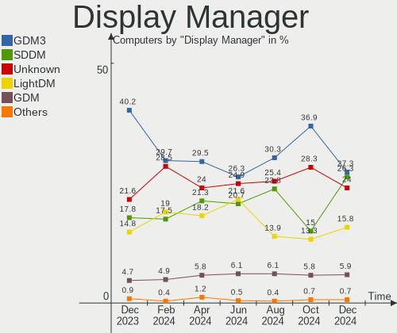
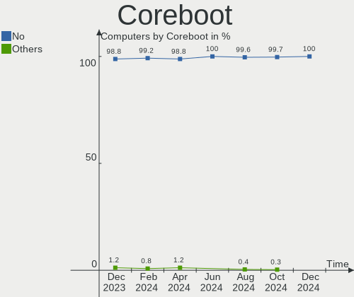
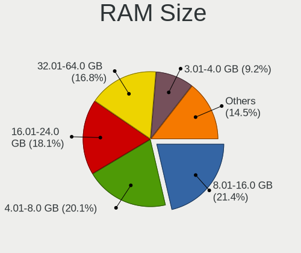
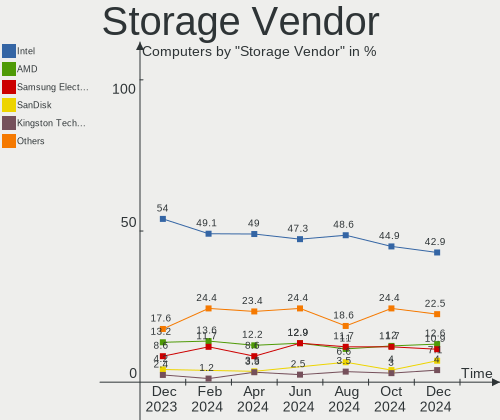
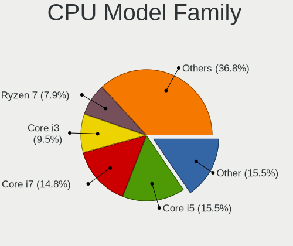
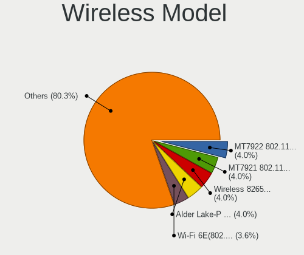
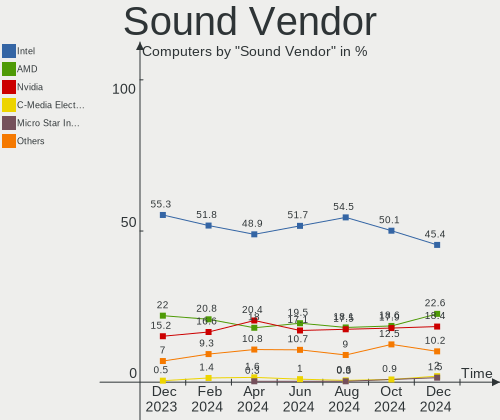

Linux in France - Hardware Trends
---------------------------------

A project to identify most popular hardware characteristics and track their change
over time based on data collected by Linux users at https://Linux-Hardware.org.

Anyone can contribute to this report by the [hw-probe](https://github.com/linuxhw/hw-probe) tool:

    sudo -E hw-probe -all -upload

This is a report for all computer types. See also reports for [desktops](/Location/France/Desktop/README.md) and [notebooks](/Location/France/Notebook/README.md).

Period: Dec, 2023.

Contents
--------

* [ System ](#system)
  - [ OS                       ](#os)
  - [ OS Family                ](#os-family)
  - [ Kernel                   ](#kernel)
  - [ Kernel Family            ](#kernel-family)
  - [ Kernel Major Ver.        ](#kernel-major-ver)
  - [ Arch                     ](#arch)
  - [ DE                       ](#de)
  - [ Display Server           ](#display-server)
  - [ Display Manager          ](#display-manager)
  - [ OS Lang                  ](#os-lang)
  - [ Boot Mode                ](#boot-mode)
  - [ Filesystem               ](#filesystem)
  - [ Part. scheme             ](#part-scheme)
  - [ Dual Boot with Linux/BSD ](#dual-boot-with-linuxbsd)
  - [ Dual Boot (Win)          ](#dual-boot-win)

* [ Board ](#board)
  - [ Vendor                   ](#vendor)
  - [ Model                    ](#model)
  - [ Model Family             ](#model-family)
  - [ MFG Year                 ](#mfg-year)
  - [ Form Factor              ](#form-factor)
  - [ Secure Boot              ](#secure-boot)
  - [ Coreboot                 ](#coreboot)
  - [ RAM Size                 ](#ram-size)
  - [ RAM Used                 ](#ram-used)
  - [ Total Drives             ](#total-drives)
  - [ Has CD-ROM               ](#has-cd-rom)
  - [ Has Ethernet             ](#has-ethernet)
  - [ Has WiFi                 ](#has-wifi)
  - [ Has Bluetooth            ](#has-bluetooth)

* [ Location ](#location)
  - [ Country                  ](#country)
  - [ City                     ](#city)

* [ Drives ](#drives)
  - [ Drive Vendor             ](#drive-vendor)
  - [ Drive Model              ](#drive-model)
  - [ HDD Vendor               ](#hdd-vendor)
  - [ SSD Vendor               ](#ssd-vendor)
  - [ Drive Kind               ](#drive-kind)
  - [ Drive Connector          ](#drive-connector)
  - [ Drive Size               ](#drive-size)
  - [ Space Total              ](#space-total)
  - [ Space Used               ](#space-used)
  - [ Malfunc. Drives          ](#malfunc-drives)
  - [ Malfunc. Drive Vendor    ](#malfunc-drive-vendor)
  - [ Malfunc. HDD Vendor      ](#malfunc-hdd-vendor)
  - [ Malfunc. Drive Kind      ](#malfunc-drive-kind)
  - [ Failed Drives            ](#failed-drives)
  - [ Failed Drive Vendor      ](#failed-drive-vendor)
  - [ Drive Status             ](#drive-status)

* [ Storage controller ](#storage-controller)
  - [ Storage Vendor           ](#storage-vendor)
  - [ Storage Model            ](#storage-model)
  - [ Storage Kind             ](#storage-kind)

* [ Processor ](#processor)
  - [ CPU Vendor               ](#cpu-vendor)
  - [ CPU Model                ](#cpu-model)
  - [ CPU Model Family         ](#cpu-model-family)
  - [ CPU Cores                ](#cpu-cores)
  - [ CPU Sockets              ](#cpu-sockets)
  - [ CPU Threads              ](#cpu-threads)
  - [ CPU Op-Modes             ](#cpu-op-modes)
  - [ CPU Microcode            ](#cpu-microcode)
  - [ CPU Microarch            ](#cpu-microarch)

* [ Graphics ](#graphics)
  - [ GPU Vendor               ](#gpu-vendor)
  - [ GPU Model                ](#gpu-model)
  - [ GPU Combo                ](#gpu-combo)
  - [ GPU Driver               ](#gpu-driver)
  - [ GPU Memory               ](#gpu-memory)

* [ Monitor ](#monitor)
  - [ Monitor Vendor           ](#monitor-vendor)
  - [ Monitor Model            ](#monitor-model)
  - [ Monitor Resolution       ](#monitor-resolution)
  - [ Monitor Diagonal         ](#monitor-diagonal)
  - [ Monitor Width            ](#monitor-width)
  - [ Aspect Ratio             ](#aspect-ratio)
  - [ Monitor Area             ](#monitor-area)
  - [ Pixel Density            ](#pixel-density)
  - [ Multiple Monitors        ](#multiple-monitors)

* [ Network ](#network)
  - [ Net Controller Vendor    ](#net-controller-vendor)
  - [ Net Controller Model     ](#net-controller-model)
  - [ Wireless Vendor          ](#wireless-vendor)
  - [ Wireless Model           ](#wireless-model)
  - [ Ethernet Vendor          ](#ethernet-vendor)
  - [ Ethernet Model           ](#ethernet-model)
  - [ Net Controller Kind      ](#net-controller-kind)
  - [ Used Controller          ](#used-controller)
  - [ NICs                     ](#nics)
  - [ IPv6                     ](#ipv6)

* [ Bluetooth ](#bluetooth)
  - [ Bluetooth Vendor         ](#bluetooth-vendor)
  - [ Bluetooth Model          ](#bluetooth-model)

* [ Sound ](#sound)
  - [ Sound Vendor             ](#sound-vendor)
  - [ Sound Model              ](#sound-model)

* [ Memory ](#memory)
  - [ Memory Vendor            ](#memory-vendor)
  - [ Memory Model             ](#memory-model)
  - [ Memory Kind              ](#memory-kind)
  - [ Memory Form Factor       ](#memory-form-factor)
  - [ Memory Size              ](#memory-size)
  - [ Memory Speed             ](#memory-speed)

* [ Printers & scanners ](#printers--scanners)
  - [ Printer Vendor           ](#printer-vendor)
  - [ Printer Model            ](#printer-model)
  - [ Scanner Vendor           ](#scanner-vendor)
  - [ Scanner Model            ](#scanner-model)

* [ Camera ](#camera)
  - [ Camera Vendor            ](#camera-vendor)
  - [ Camera Model             ](#camera-model)

* [ Security ](#security)
  - [ Fingerprint Vendor       ](#fingerprint-vendor)
  - [ Fingerprint Model        ](#fingerprint-model)
  - [ Chipcard Vendor          ](#chipcard-vendor)
  - [ Chipcard Model           ](#chipcard-model)

* [ Unsupported ](#unsupported)
  - [ Unsupported Devices      ](#unsupported-devices)
  - [ Unsupported Device Types ](#unsupported-device-types)

System
------

OS
--

Installed operating systems

| Name                         | Computers | Percent |
|------------------------------|-----------|---------|
| Ubuntu 22.04                 | 68        | 20.12%  |
| Debian 12                    | 62        | 18.34%  |
| Linux Mint 21.2              | 22        | 6.51%   |
| Fedora 39                    | 18        | 5.33%   |
| Ubuntu 23.10                 | 16        | 4.73%   |
| Arch Rolling                 | 14        | 4.14%   |
| OpenMandriva 5.0             | 10        | 2.96%   |
| OpenMandriva 23.08           | 10        | 2.96%   |
| Ubuntu 20.04                 | 9         | 2.66%   |
| OpenMandriva 23.11           | 8         | 2.37%   |
| Pop!_OS 22.04                | 7         | 2.07%   |
| Xubuntu 22.04                | 5         | 1.48%   |
| Kubuntu 23.10                | 5         | 1.48%   |
| Linux Mint 21.1              | 4         | 1.18%   |
| Kubuntu 22.04                | 4         | 1.18%   |
| Zorin 16                     | 3         | 0.89%   |
| Ubuntu 23.04                 | 3         | 0.89%   |
| openSUSE Tumbleweed-XXXXXXXX | 3         | 0.89%   |
| LMDE 6                       | 3         | 0.89%   |
| Kali 2023.4                  | 3         | 0.89%   |
| Gentoo 2.14                  | 3         | 0.89%   |
| Fedora 38                    | 3         | 0.89%   |
| EndeavourOS Rolling          | 3         | 0.89%   |
| Zorin 17                     | 2         | 0.59%   |
| Xero Rolling                 | 2         | 0.59%   |
| Ubuntu MATE 23.10            | 2         | 0.59%   |
| Ubuntu MATE 22.04            | 2         | 0.59%   |
| SteamOS 3.5.7                | 2         | 0.59%   |
| OpenMandriva 4.2             | 2         | 0.59%   |
| Manjaro 23.1.1               | 2         | 0.59%   |
| Manjaro 23.1.0               | 2         | 0.59%   |
| Manjaro                      | 2         | 0.59%   |
| Lubuntu 22.04                | 2         | 0.59%   |
| Debian 11                    | 2         | 0.59%   |
| ArcoLinux Rolling            | 2         | 0.59%   |
| Xubuntu 23.10                | 1         | 0.3%    |
| Xubuntu 18.04                | 1         | 0.3%    |
| Ubuntu Unity 16.04           | 1         | 0.3%    |
| Ubuntu Studio 22.04          | 1         | 0.3%    |
| Ubuntu Core 22               | 1         | 0.3%    |

OS Family
---------

OS without a version

| Name          | Computers | Percent |
|---------------|-----------|---------|
| Ubuntu        | 98        | 28.99%  |
| Debian        | 64        | 18.93%  |
| OpenMandriva  | 32        | 9.47%   |
| Linux Mint    | 29        | 8.58%   |
| Fedora        | 22        | 6.51%   |
| Arch          | 14        | 4.14%   |
| Kubuntu       | 9         | 2.66%   |
| Xubuntu       | 7         | 2.07%   |
| Pop!_OS       | 7         | 2.07%   |
| Manjaro       | 6         | 1.78%   |
| Zorin         | 5         | 1.48%   |
| Ubuntu MATE   | 4         | 1.18%   |
| openSUSE      | 4         | 1.18%   |
| Lubuntu       | 3         | 0.89%   |
| LMDE          | 3         | 0.89%   |
| Kali          | 3         | 0.89%   |
| Gentoo        | 3         | 0.89%   |
| EndeavourOS   | 3         | 0.89%   |
| Xero          | 2         | 0.59%   |
| SteamOS       | 2         | 0.59%   |
| ArcoLinux     | 2         | 0.59%   |
| Ubuntu Unity  | 1         | 0.3%    |
| Ubuntu Studio | 1         | 0.3%    |
| Ubuntu Budgie | 1         | 0.3%    |
| TUXEDO OS     | 1         | 0.3%    |
| Sparky        | 1         | 0.3%    |
| ROSA          | 1         | 0.3%    |
| Reborn OS     | 1         | 0.3%    |
| Nobara        | 1         | 0.3%    |
| MX            | 1         | 0.3%    |
| Mageia        | 1         | 0.3%    |
| KDE neon      | 1         | 0.3%    |
| Emperor OS    | 1         | 0.3%    |
| Devuan        | 1         | 0.3%    |
| blendOS       | 1         | 0.3%    |
| BlackPanther  | 1         | 0.3%    |
| Alpine        | 1         | 0.3%    |

Kernel
------

Version of the Linux kernel

| Version                    | Computers | Percent |
|----------------------------|-----------|---------|
| 6.1.0-16-amd64             | 44        | 13.02%  |
| 6.2.0-39-generic           | 34        | 10.06%  |
| 6.2.0-37-generic           | 34        | 10.06%  |
| 5.15.0-91-generic          | 27        | 7.99%   |
| 6.6.2-desktop-1omv2390     | 17        | 5.03%   |
| 6.5.0-14-generic           | 15        | 4.44%   |
| 6.4.11-desktop-1omv2390    | 11        | 3.25%   |
| 6.1.0-13-amd64             | 11        | 3.25%   |
| 5.15.0-89-generic          | 9         | 2.66%   |
| 6.6.6-76060606-generic     | 5         | 1.48%   |
| 6.6.8-arch1-1              | 4         | 1.18%   |
| 6.6.7-arch1-1              | 4         | 1.18%   |
| 6.6.3-200.fc39.x86_64      | 4         | 1.18%   |
| 6.5.0-13-generic           | 4         | 1.18%   |
| 6.1.0-15-amd64             | 4         | 1.18%   |
| 5.15.0-88-generic          | 4         | 1.18%   |
| 6.6.8-200.fc39.x86_64      | 3         | 0.89%   |
| 6.6.7-200.fc39.x86_64      | 3         | 0.89%   |
| 6.6.4-200.fc39.x86_64      | 3         | 0.89%   |
| 6.6.3-arch1-1              | 3         | 0.89%   |
| 6.5.13-1-MANJARO           | 3         | 0.89%   |
| 6.5.0-kali3-amd64          | 3         | 0.89%   |
| 6.5.0-9-generic            | 3         | 0.89%   |
| 6.2.0-26-generic           | 3         | 0.89%   |
| 6.6.8-2-MANJARO            | 2         | 0.59%   |
| 6.6.6-arch1-1              | 2         | 0.59%   |
| 6.6.3-1-default            | 2         | 0.59%   |
| 6.5.6-76060506-generic     | 2         | 0.59%   |
| 6.5.6-300.fc39.x86_64      | 2         | 0.59%   |
| 6.1.69-1-lts               | 2         | 0.59%   |
| 6.1.52-valve9-1-neptune-61 | 2         | 0.59%   |
| 6.1.0-1027-oem             | 2         | 0.59%   |
| 5.15.0-91-lowlatency       | 2         | 0.59%   |
| 5.10.14-desktop-1omv4002   | 2         | 0.59%   |
| 6.7.0-rc5-273-tkg-eevdf    | 1         | 0.3%    |
| 6.6.8-zen1-1-zen           | 1         | 0.3%    |
| 6.6.8-100.fc38.x86_64      | 1         | 0.3%    |
| 6.6.7-100.fc38.x86_64      | 1         | 0.3%    |
| 6.6.6-200.fc39.x86_64      | 1         | 0.3%    |
| 6.6.6-100.fc38.x86_64      | 1         | 0.3%    |

Kernel Family
-------------

Linux kernel without a distro release

| Version | Computers | Percent |
|---------|-----------|---------|
| 6.2.0   | 74        | 21.89%  |
| 6.1.0   | 64        | 18.93%  |
| 5.15.0  | 45        | 13.31%  |
| 6.5.0   | 30        | 8.88%   |
| 6.6.2   | 20        | 5.92%   |
| 6.6.8   | 11        | 3.25%   |
| 6.6.3   | 11        | 3.25%   |
| 6.4.11  | 11        | 3.25%   |
| 6.6.6   | 9         | 2.66%   |
| 6.6.7   | 8         | 2.37%   |
| 6.6.4   | 7         | 2.07%   |
| 6.5.6   | 4         | 1.18%   |
| 5.4.0   | 4         | 1.18%   |
| 6.5.13  | 3         | 0.89%   |
| 6.5.11  | 2         | 0.59%   |
| 6.1.69  | 2         | 0.59%   |
| 6.1.52  | 2         | 0.59%   |
| 5.10.14 | 2         | 0.59%   |
| 4.15.0  | 2         | 0.59%   |
| 6.7.0   | 1         | 0.3%    |
| 6.6.5   | 1         | 0.3%    |
| 6.6.0   | 1         | 0.3%    |
| 6.5.9   | 1         | 0.3%    |
| 6.5.7   | 1         | 0.3%    |
| 6.4.6   | 1         | 0.3%    |
| 6.4.16  | 1         | 0.3%    |
| 6.4.0   | 1         | 0.3%    |
| 6.3.9   | 1         | 0.3%    |
| 6.2.6   | 1         | 0.3%    |
| 6.1.68  | 1         | 0.3%    |
| 6.1.67  | 1         | 0.3%    |
| 6.1.65  | 1         | 0.3%    |
| 6.1.64  | 1         | 0.3%    |
| 6.1.20  | 1         | 0.3%    |
| 6.1.19  | 1         | 0.3%    |
| 5.8.0   | 1         | 0.3%    |
| 5.19.0  | 1         | 0.3%    |
| 5.17.5  | 1         | 0.3%    |
| 5.16.7  | 1         | 0.3%    |
| 5.15.54 | 1         | 0.3%    |

Kernel Major Ver.
-----------------

Linux kernel major version

| Version | Computers | Percent |
|---------|-----------|---------|
| 6.2     | 75        | 22.19%  |
| 6.1     | 74        | 21.89%  |
| 6.6     | 68        | 20.12%  |
| 5.15    | 46        | 13.61%  |
| 6.5     | 41        | 12.13%  |
| 6.4     | 14        | 4.14%   |
| 5.4     | 4         | 1.18%   |
| 5.10    | 4         | 1.18%   |
| 4.15    | 2         | 0.59%   |
| 6.7     | 1         | 0.3%    |
| 6.3     | 1         | 0.3%    |
| 5.8     | 1         | 0.3%    |
| 5.19    | 1         | 0.3%    |
| 5.17    | 1         | 0.3%    |
| 5.16    | 1         | 0.3%    |
| 5.14    | 1         | 0.3%    |
| 5.13    | 1         | 0.3%    |
| 4.18    | 1         | 0.3%    |
| 4.14    | 1         | 0.3%    |

Arch
----

OS architecture (x86_64, i586, etc.)

| Name    | Computers | Percent |
|---------|-----------|---------|
| x86_64  | 331       | 97.93%  |
| i686    | 3         | 0.89%   |
| aarch64 | 2         | 0.59%   |
| armv7l  | 1         | 0.3%    |
| armv6l  | 1         | 0.3%    |

DE
--

Desktop Environment

| Name          | Computers | Percent |
|---------------|-----------|---------|
| GNOME         | 178       | 52.66%  |
| KDE5          | 69        | 20.41%  |
| X-Cinnamon    | 27        | 7.99%   |
| XFCE          | 20        | 5.92%   |
| Unknown       | 15        | 4.44%   |
| MATE          | 10        | 2.96%   |
| LXQt          | 4         | 1.18%   |
| i3            | 3         | 0.89%   |
| Hyprland      | 3         | 0.89%   |
| Deepin        | 2         | 0.59%   |
| Unity         | 1         | 0.3%    |
| Openbox       | 1         | 0.3%    |
| KDE6          | 1         | 0.3%    |
| GNOME-Classic | 1         | 0.3%    |
| Enlightenment | 1         | 0.3%    |
| Cinnamon      | 1         | 0.3%    |
| Budgie        | 1         | 0.3%    |

Display Server
--------------

X11 or Wayland

| Name    | Computers | Percent |
|---------|-----------|---------|
| Wayland | 183       | 54.14%  |
| X11     | 141       | 41.72%  |
| Unknown | 10        | 2.96%   |
| Tty     | 4         | 1.18%   |

Display Manager
---------------

SDDM, LightDM, etc.

| Name    | Computers | Percent |
|---------|-----------|---------|
| GDM3    | 136       | 40.24%  |
| Unknown | 74        | 21.89%  |
| SDDM    | 60        | 17.75%  |
| LightDM | 49        | 14.5%   |
| GDM     | 16        | 4.73%   |
| SLiM    | 1         | 0.3%    |
| LEMURS  | 1         | 0.3%    |
| EMPTTY  | 1         | 0.3%    |

OS Lang
-------

Language

| Lang    | Computers | Percent |
|---------|-----------|---------|
| fr_FR   | 271       | 80.18%  |
| en_US   | 44        | 13.02%  |
| C       | 8         | 2.37%   |
| Unknown | 7         | 2.07%   |
| it_IT   | 3         | 0.89%   |
| en_GB   | 2         | 0.59%   |
| de_DE   | 2         | 0.59%   |
| sv_SE   | 1         | 0.3%    |

Boot Mode
---------

EFI or BIOS

| Mode | Computers | Percent |
|------|-----------|---------|
| EFI  | 210       | 62.13%  |
| BIOS | 128       | 37.87%  |

Filesystem
----------

Type of filesystem

| Type    | Computers | Percent |
|---------|-----------|---------|
| Ext4    | 246       | 72.78%  |
| Tmpfs   | 36        | 10.65%  |
| Btrfs   | 32        | 9.47%   |
| Overlay | 20        | 5.92%   |
| Unknown | 2         | 0.59%   |
| Zfs     | 1         | 0.3%    |
| F2fs    | 1         | 0.3%    |

Part. scheme
------------

Scheme of partitioning

| Type    | Computers | Percent |
|---------|-----------|---------|
| GPT     | 241       | 71.3%   |
| Unknown | 66        | 19.53%  |
| MBR     | 31        | 9.17%   |

Dual Boot with Linux/BSD
------------------------

Hosting more than one Linux/BSD

| Dual boot | Computers | Percent |
|-----------|-----------|---------|
| No        | 286       | 84.62%  |
| Yes       | 52        | 15.38%  |

Dual Boot (Win)
---------------

Hosting Linux and Windows

| Dual boot | Computers | Percent |
|-----------|-----------|---------|
| No        | 252       | 74.56%  |
| Yes       | 86        | 25.44%  |

Board
-----

Vendor
------

Motherboard manufacturer

| Name                                 | Computers | Percent |
|--------------------------------------|-----------|---------|
| Lenovo                               | 63        | 18.64%  |
| Hewlett-Packard                      | 54        | 15.98%  |
| ASUSTek Computer                     | 45        | 13.31%  |
| Dell                                 | 32        | 9.47%   |
| MSI                                  | 27        | 7.99%   |
| Acer                                 | 19        | 5.62%   |
| Gigabyte Technology                  | 14        | 4.14%   |
| ASRock                               | 11        | 3.25%   |
| Toshiba                              | 7         | 2.07%   |
| Apple                                | 6         | 1.78%   |
| Framework                            | 5         | 1.48%   |
| Intel                                | 4         | 1.18%   |
| Fujitsu                              | 4         | 1.18%   |
| Sony                                 | 3         | 0.89%   |
| Samsung Electronics                  | 3         | 0.89%   |
| Raspberry Pi Foundation              | 3         | 0.89%   |
| Packard Bell                         | 3         | 0.89%   |
| GPD                                  | 3         | 0.89%   |
| Google                               | 3         | 0.89%   |
| Valve                                | 2         | 0.59%   |
| UNOWHY                               | 2         | 0.59%   |
| Shenzhen Meigao Electronic Equipment | 2         | 0.59%   |
| Notebook                             | 2         | 0.59%   |
| HUAWEI                               | 2         | 0.59%   |
| HONOR                                | 2         | 0.59%   |
| Foxconn                              | 2         | 0.59%   |
| eMachines                            | 2         | 0.59%   |
| Unknown                              | 2         | 0.59%   |
| Timi                                 | 1         | 0.3%    |
| TECHNOPC                             | 1         | 0.3%    |
| Star Labs                            | 1         | 0.3%    |
| Radxa                                | 1         | 0.3%    |
| Pegatron                             | 1         | 0.3%    |
| OEM                                  | 1         | 0.3%    |
| DellInc.                             | 1         | 0.3%    |
| Clevo                                | 1         | 0.3%    |
| BESSTAR Tech                         | 1         | 0.3%    |
| AOKZOE                               | 1         | 0.3%    |
| Alienware                            | 1         | 0.3%    |

Model
-----

Motherboard model

| Name                                       | Computers | Percent |
|--------------------------------------------|-----------|---------|
| Lenovo ThinkPad X230 2325V2Y               | 8         | 2.37%   |
| Lenovo ThinkCentre M710s 10M8S02A00        | 8         | 2.37%   |
| HP ProBook 650 G2                          | 5         | 1.48%   |
| HP ProBook 650 G1                          | 5         | 1.48%   |
| Lenovo ThinkCentre M800 10FXS0PS00         | 4         | 1.18%   |
| HP ProBook 450 G3                          | 4         | 1.18%   |
| ASUS Zenbook 15 UM3504DA_UM3504DA          | 4         | 1.18%   |
| Unknown                                    | 4         | 1.18%   |
| Lenovo ThinkCentre M720s 10SUSES500        | 3         | 0.89%   |
| HP ProBook 655 G2                          | 3         | 0.89%   |
| HP Pavilion 17                             | 3         | 0.89%   |
| Framework Laptop 13 (AMD Ryzen 7040Series) | 3         | 0.89%   |
| MSI MS-7C56                                | 2         | 0.59%   |
| Dell Latitude 5590                         | 2         | 0.59%   |
| ASUS ROG STRIX B550-F GAMING               | 2         | 0.59%   |
| ASUS All Series                            | 2         | 0.59%   |
| Acer Veriton X2631G                        | 2         | 0.59%   |
| Valve Jupiter                              | 1         | 0.3%    |
| Valve Galileo                              | 1         | 0.3%    |
| UNOWHY Y13G012S4EI                         | 1         | 0.3%    |
| UNOWHY Y13G002S4EI                         | 1         | 0.3%    |
| Toshiba Satellite Pro C660                 | 1         | 0.3%    |
| Toshiba Satellite L655                     | 1         | 0.3%    |
| Toshiba Satellite C870D-116                | 1         | 0.3%    |
| Toshiba Satellite C870-1F3                 | 1         | 0.3%    |
| Toshiba Satellite C70-B                    | 1         | 0.3%    |
| Toshiba Satellite C660D                    | 1         | 0.3%    |
| Toshiba Satellite C50D-A-138               | 1         | 0.3%    |
| Timi TM1604                                | 1         | 0.3%    |
| TECHNOPC NANO 5                            | 1         | 0.3%    |
| Star Labs StarBook                         | 1         | 0.3%    |
| Sony VPCL22K1E                             | 1         | 0.3%    |
| Sony VPCEA1S1E                             | 1         | 0.3%    |
| Sony SVF1521G6EW                           | 1         | 0.3%    |
| Shenzhen Meigao Electronic Equipment UM560 | 1         | 0.3%    |
| Shenzhen Meigao Electronic Equipment TH80  | 1         | 0.3%    |
| Samsung R610                               | 1         | 0.3%    |
| Samsung R530/R730                          | 1         | 0.3%    |
| Samsung 900X3C/900X3D/900X4C/900X4D        | 1         | 0.3%    |
| RPi Raspberry Pi 5 Model B Rev 1.0         | 1         | 0.3%    |

Model Family
------------

Motherboard model prefix

| Name                | Computers | Percent |
|---------------------|-----------|---------|
| Lenovo ThinkPad     | 25        | 7.4%    |
| Lenovo ThinkCentre  | 25        | 7.4%    |
| HP ProBook          | 20        | 5.92%   |
| Dell Latitude       | 12        | 3.55%   |
| Acer Aspire         | 12        | 3.55%   |
| HP Pavilion         | 8         | 2.37%   |
| Toshiba Satellite   | 7         | 2.07%   |
| ASUS PRIME          | 6         | 1.78%   |
| HP EliteBook        | 5         | 1.48%   |
| Framework Laptop    | 5         | 1.48%   |
| Dell OptiPlex       | 5         | 1.48%   |
| ASUS Zenbook        | 5         | 1.48%   |
| ASUS ROG            | 5         | 1.48%   |
| ASUS ASUS           | 5         | 1.48%   |
| Lenovo IdeaPad      | 4         | 1.18%   |
| HP ZBook            | 4         | 1.18%   |
| Dell Inspiron       | 4         | 1.18%   |
| Unknown             | 4         | 1.18%   |
| RPi Raspberry       | 3         | 0.89%   |
| HP Compaq           | 3         | 0.89%   |
| Fujitsu ESPRIMO     | 3         | 0.89%   |
| Dell Precision      | 3         | 0.89%   |
| ASUS VivoBook       | 3         | 0.89%   |
| Acer Veriton        | 3         | 0.89%   |
| Acer Swift          | 3         | 0.89%   |
| Packard Bell IMEDIA | 2         | 0.59%   |
| MSI MS-7C56         | 2         | 0.59%   |
| Lenovo Yoga         | 2         | 0.59%   |
| Lenovo Legion       | 2         | 0.59%   |
| HP ProDesk          | 2         | 0.59%   |
| HP EliteDesk        | 2         | 0.59%   |
| ASUS All            | 2         | 0.59%   |
| Apple MacBookPro5   | 2         | 0.59%   |
| Valve Jupiter       | 1         | 0.3%    |
| Valve Galileo       | 1         | 0.3%    |
| UNOWHY Y13G012S4EI  | 1         | 0.3%    |
| UNOWHY Y13G002S4EI  | 1         | 0.3%    |
| Timi TM1604         | 1         | 0.3%    |
| TECHNOPC NANO       | 1         | 0.3%    |
| Star Labs StarBook  | 1         | 0.3%    |

MFG Year
--------

Motherboard manufacture year

| Year    | Computers | Percent |
|---------|-----------|---------|
| 2013    | 35        | 10.36%  |
| 2023    | 32        | 9.47%   |
| 2022    | 25        | 7.4%    |
| 2019    | 25        | 7.4%    |
| 2016    | 25        | 7.4%    |
| 2012    | 25        | 7.4%    |
| 2014    | 24        | 7.1%    |
| 2015    | 22        | 6.51%   |
| 2021    | 21        | 6.21%   |
| 2018    | 21        | 6.21%   |
| 2017    | 17        | 5.03%   |
| 2020    | 16        | 4.73%   |
| 2010    | 16        | 4.73%   |
| 2011    | 12        | 3.55%   |
| 2009    | 10        | 2.96%   |
| 2008    | 5         | 1.48%   |
| Unknown | 4         | 1.18%   |
| 2007    | 2         | 0.59%   |
| 2004    | 1         | 0.3%    |

Form Factor
-----------

Physical design of the computer

| Name           | Computers | Percent |
|----------------|-----------|---------|
| Notebook       | 188       | 55.62%  |
| Desktop        | 124       | 36.69%  |
| Convertible    | 7         | 2.07%   |
| Mini pc        | 6         | 1.78%   |
| All in one     | 5         | 1.48%   |
| System on chip | 4         | 1.18%   |
| Tablet         | 3         | 0.89%   |
| Server         | 1         | 0.3%    |

Secure Boot
-----------

Enabled or disabled

| State    | Computers | Percent |
|----------|-----------|---------|
| Disabled | 315       | 93.2%   |
| Enabled  | 23        | 6.8%    |

Coreboot
--------

Have coreboot on board

| Used | Computers | Percent |
|------|-----------|---------|
| No   | 334       | 98.82%  |
| Yes  | 4         | 1.18%   |

RAM Size
--------

Total RAM memory

| Size in GB  | Computers | Percent |
|-------------|-----------|---------|
| 4.01-8.0    | 88        | 26.04%  |
| 3.01-4.0    | 88        | 26.04%  |
| 16.01-24.0  | 53        | 15.68%  |
| 8.01-16.0   | 49        | 14.5%   |
| 32.01-64.0  | 35        | 10.36%  |
| 24.01-32.0  | 11        | 3.25%   |
| 2.01-3.0    | 4         | 1.18%   |
| 1.01-2.0    | 4         | 1.18%   |
| 64.01-256.0 | 3         | 0.89%   |
| 0.51-1.0    | 1         | 0.3%    |
| 0.01-0.5    | 1         | 0.3%    |
| Unknown     | 1         | 0.3%    |

RAM Used
--------

Used RAM memory

| Used GB   | Computers | Percent |
|-----------|-----------|---------|
| 1.01-2.0  | 144       | 42.6%   |
| 2.01-3.0  | 78        | 23.08%  |
| 4.01-8.0  | 55        | 16.27%  |
| 3.01-4.0  | 38        | 11.24%  |
| 8.01-16.0 | 14        | 4.14%   |
| 0.51-1.0  | 5         | 1.48%   |
| 0.01-0.5  | 2         | 0.59%   |
| 0         | 1         | 0.3%    |
| Unknown   | 1         | 0.3%    |

Total Drives
------------

Number of drives on board

| Drives | Computers | Percent |
|--------|-----------|---------|
| 1      | 221       | 65.38%  |
| 2      | 78        | 23.08%  |
| 3      | 15        | 4.44%   |
| 4      | 10        | 2.96%   |
| 7      | 4         | 1.18%   |
| 6      | 4         | 1.18%   |
| 5      | 3         | 0.89%   |
| 0      | 3         | 0.89%   |

Has CD-ROM
----------

Has CD-ROM on board

| Presented | Computers | Percent |
|-----------|-----------|---------|
| No        | 186       | 55.03%  |
| Yes       | 152       | 44.97%  |

Has Ethernet
------------

Has Ethernet on board

| Presented | Computers | Percent |
|-----------|-----------|---------|
| Yes       | 294       | 86.98%  |
| No        | 44        | 13.02%  |

Has WiFi
--------

Has WiFi module

| Presented | Computers | Percent |
|-----------|-----------|---------|
| Yes       | 258       | 76.33%  |
| No        | 80        | 23.67%  |

Has Bluetooth
-------------

Has Bluetooth module

| Presented | Computers | Percent |
|-----------|-----------|---------|
| Yes       | 194       | 57.4%   |
| No        | 144       | 42.6%   |

Location
--------

Country
-------

Geographic location (country)

| Country | Computers | Percent |
|---------|-----------|---------|
| France  | 338       | 100%    |

City
----

Geographic location (city)

| City                 | Computers | Percent |
|----------------------|-----------|---------|
| Roubaix              | 48        | 14.2%   |
| Paris                | 33        | 9.76%   |
| Quimper              | 5         | 1.48%   |
| Grenoble             | 4         | 1.18%   |
| Dijon                | 4         | 1.18%   |
| Valenciennes         | 3         | 0.89%   |
| Toulouse             | 3         | 0.89%   |
| Rosny-sous-Bois      | 3         | 0.89%   |
| Perenchies           | 3         | 0.89%   |
| Marseille            | 3         | 0.89%   |
| Le Haillan           | 3         | 0.89%   |
| Caen                 | 3         | 0.89%   |
| Boulogne-Billancourt | 3         | 0.89%   |
| Besançon            | 3         | 0.89%   |
| Bagneux              | 3         | 0.89%   |
| Aix-en-Provence      | 3         | 0.89%   |
| Valence              | 2         | 0.59%   |
| Strasbourg           | 2         | 0.59%   |
| Saint-Etienne        | 2         | 0.59%   |
| Saint-Denis          | 2         | 0.59%   |
| Saint-Brieuc         | 2         | 0.59%   |
| Rouen                | 2         | 0.59%   |
| Nancy                | 2         | 0.59%   |
| Le Kremlin-Bicetre   | 2         | 0.59%   |
| Le Grau-du-Roi       | 2         | 0.59%   |
| Le Folgoet           | 2         | 0.59%   |
| Lambersart           | 2         | 0.59%   |
| La Wantzenau         | 2         | 0.59%   |
| Garges-lès-Gonesse  | 2         | 0.59%   |
| Fréjus              | 2         | 0.59%   |
| Épinal              | 2         | 0.59%   |
| Dunkirk              | 2         | 0.59%   |
| Colomiers            | 2         | 0.59%   |
| Clermont-Ferrand     | 2         | 0.59%   |
| Caluire-et-Cuire     | 2         | 0.59%   |
| Brignoles            | 2         | 0.59%   |
| Bordeaux             | 2         | 0.59%   |
| Angers               | 2         | 0.59%   |
| Aix-les-Bains        | 2         | 0.59%   |
| Ablon-sur-Seine      | 2         | 0.59%   |

Drives
------

Drive Vendor
------------

Hard drive vendors

| Vendor                      | Computers | Drives | Percent |
|-----------------------------|-----------|--------|---------|
| Samsung Electronics         | 72        | 90     | 15.62%  |
| WDC                         | 64        | 77     | 13.88%  |
| Seagate                     | 58        | 66     | 12.58%  |
| Crucial                     | 34        | 43     | 7.38%   |
| Sandisk                     | 25        | 25     | 5.42%   |
| Kingston                    | 24        | 27     | 5.21%   |
| Unknown                     | 22        | 28     | 4.77%   |
| Toshiba                     | 20        | 21     | 4.34%   |
| Hitachi                     | 15        | 15     | 3.25%   |
| SK hynix                    | 14        | 14     | 3.04%   |
| HGST                        | 13        | 13     | 2.82%   |
| Micron Technology           | 10        | 10     | 2.17%   |
| PNY                         | 9         | 9      | 1.95%   |
| Micron/Crucial Technology   | 6         | 9      | 1.3%    |
| Transcend                   | 5         | 5      | 1.08%   |
| Phison Electronics          | 4         | 4      | 0.87%   |
| Intel                       | 4         | 4      | 0.87%   |
| KingSpec                    | 3         | 3      | 0.65%   |
| Emtec                       | 3         | 3      | 0.65%   |
| Corsair                     | 3         | 3      | 0.65%   |
| China                       | 3         | 3      | 0.65%   |
| Apple                       | 3         | 3      | 0.65%   |
| TEXTORM                     | 2         | 2      | 0.43%   |
| SPCC                        | 2         | 2      | 0.43%   |
| Silicon Motion              | 2         | 2      | 0.43%   |
| Phison                      | 2         | 3      | 0.43%   |
| Patriot                     | 2         | 2      | 0.43%   |
| Maxtor                      | 2         | 2      | 0.43%   |
| LDLC                        | 2         | 2      | 0.43%   |
| KIOXIA                      | 2         | 2      | 0.43%   |
| Kingston Technology Company | 2         | 2      | 0.43%   |
| Gigabyte Technology         | 2         | 2      | 0.43%   |
| BIWIN                       | 2         | 2      | 0.43%   |
| Unknown                     | 2         | 2      | 0.43%   |
| Verbatim                    | 1         | 1      | 0.22%   |
| Union Memory                | 1         | 1      | 0.22%   |
| UMIS                        | 1         | 1      | 0.22%   |
| Star                        | 1         | 1      | 0.22%   |
| SC550                       | 1         | 1      | 0.22%   |
| SATA SSD                    | 1         | 1      | 0.22%   |

Drive Model
-----------

Hard drive models

| Model                                               | Computers | Percent |
|-----------------------------------------------------|-----------|---------|
| WDC WD5000LPLX-60ZNTT1 500GB                        | 11        | 2.21%   |
| Seagate ST1000DM003-1SB102 1TB                      | 11        | 2.21%   |
| Samsung NVMe SSD Controller SM981/PM981/PM983 512GB | 10        | 2.01%   |
| Samsung SSD 870 EVO 500GB                           | 6         | 1.2%    |
| Samsung SSD 850 EVO 500GB                           | 5         | 1%      |
| Micron/Crucial P2 NVMe PCIe SSD 4TB                 | 5         | 1%      |
| Crucial CT500MX500SSD1 500GB                        | 5         | 1%      |
| Crucial CT480BX500SSD1 480GB                        | 5         | 1%      |
| WDC WD10EZEX-08WN4A0 1TB                            | 4         | 0.8%    |
| Unknown MMC Card  64GB                              | 4         | 0.8%    |
| Seagate ST9500325AS 500GB                           | 4         | 0.8%    |
| Samsung SSD 980 1TB                                 | 4         | 0.8%    |
| Samsung SSD 870 QVO 1TB                             | 4         | 0.8%    |
| Samsung SSD 850 EVO 250GB                           | 4         | 0.8%    |
| Hitachi HTS543232A7A384 320GB                       | 4         | 0.8%    |
| Crucial CT240BX500SSD1 240GB                        | 4         | 0.8%    |
| WDC WD10EAVS-00D7B1 1TB                             | 3         | 0.6%    |
| Unknown NVMe SSD Drive 512GB                        | 3         | 0.6%    |
| Unknown MMC Card  32GB                              | 3         | 0.6%    |
| Toshiba MQ01ACF032 320GB                            | 3         | 0.6%    |
| Seagate ST500LM021-1KJ152 500GB                     | 3         | 0.6%    |
| Seagate ST500DM002-1BD142 500GB                     | 3         | 0.6%    |
| Seagate ST2000DM008-2FR102 2TB                      | 3         | 0.6%    |
| Seagate ST2000DM001-1ER164 2TB                      | 3         | 0.6%    |
| SanDisk NVMe SSD Drive 1TB                          | 3         | 0.6%    |
| Samsung SSD 980 PRO 2TB                             | 3         | 0.6%    |
| Samsung SSD 860 EVO 500GB                           | 3         | 0.6%    |
| Samsung SSD 840 EVO 250GB                           | 3         | 0.6%    |
| Micron 2400_MTFDKBA512QFM 512GB                     | 3         | 0.6%    |
| Kingston SA400S37240G 240GB SSD                     | 3         | 0.6%    |
| HGST HTS725050A7E630 500GB                          | 3         | 0.6%    |
| HGST HTS545050A7E680 500GB                          | 3         | 0.6%    |
| HGST HTS541010A9E680 1TB                            | 3         | 0.6%    |
| Crucial CT1000MX500SSD1 1TB                         | 3         | 0.6%    |
| WDC WDS100T2B0A-00SM50 1TB SSD                      | 2         | 0.4%    |
| WDC WD10JPVX-22JC3T0 1TB                            | 2         | 0.4%    |
| WDC WD10EZEX-08M2NA0 1TB                            | 2         | 0.4%    |
| Unknown MMC Card  2GB                               | 2         | 0.4%    |
| Toshiba XG6 NVMe SSD Controller 512GB               | 2         | 0.4%    |
| Toshiba MQ01ABD100 1TB                              | 2         | 0.4%    |

HDD Vendor
----------

Hard disk drive vendors

| Vendor              | Computers | Drives | Percent |
|---------------------|-----------|--------|---------|
| Seagate             | 56        | 64     | 35%     |
| WDC                 | 54        | 67     | 33.75%  |
| Toshiba             | 15        | 16     | 9.38%   |
| Hitachi             | 15        | 15     | 9.38%   |
| HGST                | 13        | 13     | 8.13%   |
| Samsung Electronics | 2         | 2      | 1.25%   |
| Maxtor              | 2         | 2      | 1.25%   |
| Unknown             | 1         | 1      | 0.63%   |
| Fujitsu             | 1         | 1      | 0.63%   |
| Apple               | 1         | 1      | 0.63%   |

SSD Vendor
----------

Solid state drive vendors

| Vendor              | Computers | Drives | Percent |
|---------------------|-----------|--------|---------|
| Samsung Electronics | 44        | 48     | 27.33%  |
| Crucial             | 26        | 29     | 16.15%  |
| Kingston            | 15        | 17     | 9.32%   |
| SanDisk             | 13        | 13     | 8.07%   |
| PNY                 | 9         | 9      | 5.59%   |
| WDC                 | 5         | 5      | 3.11%   |
| Transcend           | 5         | 5      | 3.11%   |
| SK hynix            | 4         | 4      | 2.48%   |
| KingSpec            | 3         | 3      | 1.86%   |
| Emtec               | 3         | 3      | 1.86%   |
| China               | 3         | 3      | 1.86%   |
| Toshiba             | 2         | 2      | 1.24%   |
| TEXTORM             | 2         | 2      | 1.24%   |
| SPCC                | 2         | 2      | 1.24%   |
| Patriot             | 2         | 2      | 1.24%   |
| LDLC                | 2         | 2      | 1.24%   |
| Corsair             | 2         | 2      | 1.24%   |
| Apple               | 2         | 2      | 1.24%   |
| Verbatim            | 1         | 1      | 0.62%   |
| Star                | 1         | 1      | 0.62%   |
| SC550               | 1         | 1      | 0.62%   |
| Plextor             | 1         | 1      | 0.62%   |
| OCZ                 | 1         | 1      | 0.62%   |
| Micron Technology   | 1         | 1      | 0.62%   |
| Lexar               | 1         | 1      | 0.62%   |
| Intel               | 1         | 1      | 0.62%   |
| Integral            | 1         | 1      | 0.62%   |
| Hewlett-Packard     | 1         | 1      | 0.62%   |
| GOODRAM             | 1         | 1      | 0.62%   |
| CT240BX3            | 1         | 1      | 0.62%   |
| ASMT109x            | 1         | 1      | 0.62%   |
| ASMT                | 1         | 1      | 0.62%   |
| Apacer              | 1         | 1      | 0.62%   |
| A-DATA Technology   | 1         | 1      | 0.62%   |
| Unknown             | 1         | 1      | 0.62%   |

Drive Kind
----------

HDD or SSD

| Kind    | Computers | Drives | Percent |
|---------|-----------|--------|---------|
| HDD     | 146       | 182    | 34.27%  |
| SSD     | 138       | 170    | 32.39%  |
| NVMe    | 115       | 137    | 27%     |
| MMC     | 19        | 23     | 4.46%   |
| Unknown | 8         | 11     | 1.88%   |

Drive Connector
---------------

SATA, SAS, NVMe, etc.

| Type | Computers | Drives | Percent |
|------|-----------|--------|---------|
| SATA | 241       | 340    | 61.48%  |
| NVMe | 115       | 136    | 29.34%  |
| MMC  | 19        | 23     | 4.85%   |
| SAS  | 17        | 24     | 4.34%   |

Drive Size
----------

Size of hard drive

| Size in TB | Computers | Drives | Percent |
|------------|-----------|--------|---------|
| 0.01-0.5   | 171       | 203    | 58.76%  |
| 0.51-1.0   | 89        | 108    | 30.58%  |
| 1.01-2.0   | 21        | 29     | 7.22%   |
| 3.01-4.0   | 7         | 9      | 2.41%   |
| 2.01-3.0   | 2         | 2      | 0.69%   |
| 4.01-10.0  | 1         | 1      | 0.34%   |

Space Total
-----------

Amount of disk space available on the file system

| Size in GB     | Computers | Percent |
|----------------|-----------|---------|
| 251-500        | 99        | 29.29%  |
| 101-250        | 72        | 21.3%   |
| 501-1000       | 66        | 19.53%  |
| 1001-2000      | 19        | 5.62%   |
| 1-20           | 19        | 5.62%   |
| More than 3000 | 16        | 4.73%   |
| 51-100         | 16        | 4.73%   |
| 2001-3000      | 13        | 3.85%   |
| Unknown        | 10        | 2.96%   |
| 21-50          | 8         | 2.37%   |

Space Used
----------

Amount of used disk space

| Used GB        | Computers | Percent |
|----------------|-----------|---------|
| 1-20           | 130       | 38.46%  |
| 21-50          | 56        | 16.57%  |
| 101-250        | 52        | 15.38%  |
| 51-100         | 37        | 10.95%  |
| 251-500        | 20        | 5.92%   |
| 1001-2000      | 11        | 3.25%   |
| 501-1000       | 10        | 2.96%   |
| Unknown        | 10        | 2.96%   |
| More than 3000 | 6         | 1.78%   |
| 2001-3000      | 5         | 1.48%   |
| 0              | 1         | 0.3%    |

Malfunc. Drives
---------------

Drive models with a malfunction

| Model                                            | Computers | Drives | Percent |
|--------------------------------------------------|-----------|--------|---------|
| WDC WD5000LPLX-60ZNTT1 500GB                     | 3         | 3      | 7.89%   |
| Seagate ST9500325AS 500GB                        | 2         | 2      | 5.26%   |
| Seagate ST500LM021-1KJ152 500GB                  | 2         | 4      | 5.26%   |
| Seagate ST2000DM008-2FR102 2TB                   | 2         | 2      | 5.26%   |
| HGST HTS725050A7E630 500GB                       | 2         | 2      | 5.26%   |
| HGST HTS541010A9E680 1TB                         | 2         | 2      | 5.26%   |
| WDC WD6400AAKS-22A7B2 640GB                      | 1         | 1      | 2.63%   |
| WDC WD5000AAKX-22ERMA0 500GB                     | 1         | 1      | 2.63%   |
| WDC WD2500BEVT-75A23T0 250GB                     | 1         | 1      | 2.63%   |
| WDC WD20EZRZ-00Z5HB0 2TB                         | 1         | 1      | 2.63%   |
| WDC WD2002FAEX-007BA0 2TB                        | 1         | 6      | 2.63%   |
| WDC WD1600AAJS-75M0A0 160GB                      | 1         | 1      | 2.63%   |
| WDC WD1600AAJS-00YZCA0 160GB                     | 1         | 1      | 2.63%   |
| WDC WD10SPCX-21KHST0 1TB                         | 1         | 1      | 2.63%   |
| WDC WD10EAVS-00D7B1 1TB                          | 1         | 1      | 2.63%   |
| Toshiba MQ01ACF050 500GB                         | 1         | 1      | 2.63%   |
| Seagate ST9250311CS 250GB                        | 1         | 1      | 2.63%   |
| Seagate ST3500418AS 500GB                        | 1         | 1      | 2.63%   |
| Seagate ST31000524AS 1TB                         | 1         | 1      | 2.63%   |
| Seagate ST1000DX002-2DV162 1TB                   | 1         | 1      | 2.63%   |
| SanDisk SSD PLUS 480GB                           | 1         | 1      | 2.63%   |
| SanDisk SDSSDA-1T00 1TB                          | 1         | 1      | 2.63%   |
| Samsung Electronics SP1634N 160GB                | 1         | 1      | 2.63%   |
| Samsung Electronics MZ7LN256HMJP-000H1 256GB SSD | 1         | 1      | 2.63%   |
| Maxtor STM3250310AS 250GB                        | 1         | 1      | 2.63%   |
| LDLC F7+480GB SSD                                | 1         | 1      | 2.63%   |
| Kingston SV300S37A240G 240GB SSD                 | 1         | 1      | 2.63%   |
| Hitachi HTS727575A9E364 752GB                    | 1         | 1      | 2.63%   |
| Hitachi HDS721010CLA332 1TB                      | 1         | 1      | 2.63%   |
| HGST HTS545050A7E680 500GB                       | 1         | 1      | 2.63%   |
| Apacer 16GB SATA Flash Drive SSD                 | 1         | 1      | 2.63%   |

Malfunc. Drive Vendor
---------------------

Vendors of faulty drives

| Vendor              | Computers | Drives | Percent |
|---------------------|-----------|--------|---------|
| WDC                 | 11        | 17     | 29.73%  |
| Seagate             | 10        | 12     | 27.03%  |
| HGST                | 5         | 5      | 13.51%  |
| SanDisk             | 2         | 2      | 5.41%   |
| Samsung Electronics | 2         | 2      | 5.41%   |
| Hitachi             | 2         | 2      | 5.41%   |
| Toshiba             | 1         | 1      | 2.7%    |
| Maxtor              | 1         | 1      | 2.7%    |
| LDLC                | 1         | 1      | 2.7%    |
| Kingston            | 1         | 1      | 2.7%    |
| Apacer              | 1         | 1      | 2.7%    |

Malfunc. HDD Vendor
-------------------

Vendors of faulty HDD drives

| Vendor              | Computers | Drives | Percent |
|---------------------|-----------|--------|---------|
| WDC                 | 11        | 17     | 35.48%  |
| Seagate             | 10        | 12     | 32.26%  |
| HGST                | 5         | 5      | 16.13%  |
| Hitachi             | 2         | 2      | 6.45%   |
| Toshiba             | 1         | 1      | 3.23%   |
| Samsung Electronics | 1         | 1      | 3.23%   |
| Maxtor              | 1         | 1      | 3.23%   |

Malfunc. Drive Kind
-------------------

Kinds of faulty drives

| Kind | Computers | Drives | Percent |
|------|-----------|--------|---------|
| HDD  | 29        | 39     | 82.86%  |
| SSD  | 6         | 6      | 17.14%  |

Failed Drives
-------------

Failed drive models

| Model                        | Computers | Drives | Percent |
|------------------------------|-----------|--------|---------|
| WDC WD7500BPKT-75PK4T0 752GB | 1         | 1      | 50%     |
| Maxtor STM3320820AS 320GB    | 1         | 1      | 50%     |

Failed Drive Vendor
-------------------

Failed drive vendors

| Vendor | Computers | Drives | Percent |
|--------|-----------|--------|---------|
| WDC    | 1         | 1      | 50%     |
| Maxtor | 1         | 1      | 50%     |

Drive Status
------------

Number of failed and malfunc. drives

| Status   | Computers | Drives | Percent |
|----------|-----------|--------|---------|
| Works    | 192       | 268    | 53.48%  |
| Detected | 130       | 208    | 36.21%  |
| Malfunc  | 35        | 45     | 9.75%   |
| Failed   | 2         | 2      | 0.56%   |

Storage controller
------------------

Storage Vendor
--------------

Storage controller vendors

| Vendor                       | Computers | Percent |
|------------------------------|-----------|---------|
| Intel                        | 221       | 54.03%  |
| AMD                          | 54        | 13.2%   |
| Samsung Electronics          | 35        | 8.56%   |
| SanDisk                      | 17        | 4.16%   |
| Micron/Crucial Technology    | 15        | 3.67%   |
| Kingston Technology Company  | 10        | 2.44%   |
| SK hynix                     | 9         | 2.2%    |
| Micron Technology            | 9         | 2.2%    |
| Phison Electronics           | 8         | 1.96%   |
| ASMedia Technology           | 5         | 1.22%   |
| Solidigm                     | 4         | 0.98%   |
| Toshiba America Info Systems | 3         | 0.73%   |
| Nvidia                       | 3         | 0.73%   |
| Biwin Storage Technology     | 3         | 0.73%   |
| Union Memory (Shenzhen)      | 2         | 0.49%   |
| Silicon Motion               | 2         | 0.49%   |
| Marvell Technology Group     | 2         | 0.49%   |
| KIOXIA                       | 2         | 0.49%   |
| JMicron Technology           | 2         | 0.49%   |
| VIA Technologies             | 1         | 0.24%   |
| MAXIO Technology (Hangzhou)  | 1         | 0.24%   |
| LSI Logic / Symbios Logic    | 1         | 0.24%   |

Storage Model
-------------

Storage controller models

| Model                                                                                   | Computers | Percent |
|-----------------------------------------------------------------------------------------|-----------|---------|
| AMD FCH SATA Controller [AHCI mode]                                                     | 34        | 7.62%   |
| Intel 8 Series/C220 Series Chipset Family 6-port SATA Controller 1 [AHCI mode]          | 29        | 6.5%    |
| Intel Sunrise Point-LP SATA Controller [AHCI mode]                                      | 26        | 5.83%   |
| Intel 7 Series Chipset Family 6-port SATA Controller [AHCI mode]                        | 22        | 4.93%   |
| Samsung NVMe SSD Controller SM981/PM981/PM983                                           | 17        | 3.81%   |
| Intel 200 Series PCH SATA controller [AHCI mode]                                        | 14        | 3.14%   |
| Micron/Crucial P2 [Nick P2] / P3 / P3 Plus NVMe PCIe SSD (DRAM-less)                    | 13        | 2.91%   |
| Intel Q170/Q150/B150/H170/H110/Z170/CM236 Chipset SATA Controller [AHCI Mode]           | 12        | 2.69%   |
| Intel Cannon Lake PCH SATA AHCI Controller                                              | 12        | 2.69%   |
| Intel 82801 Mobile SATA Controller [RAID mode]                                          | 12        | 2.69%   |
| Intel Volume Management Device NVMe RAID Controller                                     | 11        | 2.47%   |
| AMD 500 Series Chipset SATA Controller                                                  | 10        | 2.24%   |
| Samsung NVMe SSD Controller 980 (DRAM-less)                                             | 9         | 2.02%   |
| Intel Wildcat Point-LP SATA Controller [AHCI Mode]                                      | 9         | 2.02%   |
| Samsung NVMe SSD Controller PM9A1/PM9A3/980PRO                                          | 8         | 1.79%   |
| Intel SATA Controller [RAID mode]                                                       | 6         | 1.35%   |
| Intel 82801IBM/IEM (ICH9M/ICH9M-E) 4 port SATA Controller [AHCI mode]                   | 6         | 1.35%   |
| Intel 6 Series/C200 Series Chipset Family 6 port Mobile SATA AHCI Controller            | 6         | 1.35%   |
| AMD SB7x0/SB8x0/SB9x0 SATA Controller [AHCI mode]                                       | 6         | 1.35%   |
| Micron 2400 NVMe SSD (DRAM-less)                                                        | 5         | 1.12%   |
| SanDisk Ultra 3D / WD Blue SN550 NVMe SSD                                               | 4         | 0.9%    |
| Kingston Company OM8PCP Design-In PCIe 3 NVMe SSD (DRAM-less)                           | 4         | 0.9%    |
| Intel Tiger Lake SATA AHCI Controller                                                   | 4         | 0.9%    |
| Intel NM10/ICH7 Family SATA Controller [IDE mode]                                       | 4         | 0.9%    |
| Intel 82801G (ICH7 Family) IDE Controller                                               | 4         | 0.9%    |
| Intel 6 Series/C200 Series Chipset Family Desktop SATA Controller (IDE mode, ports 4-5) | 4         | 0.9%    |
| Intel 6 Series/C200 Series Chipset Family Desktop SATA Controller (IDE mode, ports 0-3) | 4         | 0.9%    |
| Intel 6 Series/C200 Series Chipset Family 6 port Desktop SATA AHCI Controller           | 4         | 0.9%    |
| Intel 5 Series/3400 Series Chipset 4 port SATA AHCI Controller                          | 4         | 0.9%    |
| ASMedia ASM1062 Serial ATA Controller                                                   | 4         | 0.9%    |
| AMD SB7x0/SB8x0/SB9x0 IDE Controller                                                    | 4         | 0.9%    |
| Solidigm P41 Plus NVMe SSD (DRAM-less) [Echo Harbor]                                    | 3         | 0.67%   |
| SK hynix BC501 NVMe Solid State Drive                                                   | 3         | 0.67%   |
| SanDisk WD Black SN770 / PC SN740 256GB / PC SN560 (DRAM-less) NVMe SSD                 | 3         | 0.67%   |
| Phison PS5013-E13 PCIe3 NVMe Controller (DRAM-less)                                     | 3         | 0.67%   |
| Phison E12 NVMe Controller                                                              | 3         | 0.67%   |
| Kingston Company A1000/U-SNS8154P3 x2 NVMe SSD                                          | 3         | 0.67%   |
| Intel SSD 670p Series [Keystone Harbor]                                                 | 3         | 0.67%   |
| Intel Alder Lake-S PCH SATA Controller [AHCI Mode]                                      | 3         | 0.67%   |
| Intel 700 Series Chipset Family SATA AHCI Controller                                    | 3         | 0.67%   |

Storage Kind
------------

Kind of storage controller (IDE, SATA, NVMe, SAS, ...)

| Kind | Computers | Percent |
|------|-----------|---------|
| SATA | 239       | 58.44%  |
| NVMe | 116       | 28.36%  |
| RAID | 31        | 7.58%   |
| IDE  | 23        | 5.62%   |

Processor
---------

CPU Vendor
----------

Processor vendors

| Vendor | Computers | Percent |
|--------|-----------|---------|
| Intel  | 254       | 75.15%  |
| AMD    | 80        | 23.67%  |
| ARM    | 4         | 1.18%   |

CPU Model
---------

Processor models

| Model                                         | Computers | Percent |
|-----------------------------------------------|-----------|---------|
| Intel Core i3-6100 CPU @ 3.70GHz              | 14        | 4.14%   |
| Intel Core i5-3230M CPU @ 2.60GHz             | 10        | 2.96%   |
| Intel Core i3-6100U CPU @ 2.30GHz             | 6         | 1.78%   |
| Intel Core i7-8700 CPU @ 3.20GHz              | 4         | 1.18%   |
| Intel Core i3-4000M CPU @ 2.40GHz             | 4         | 1.18%   |
| AMD Ryzen 7 7735U with Radeon Graphics        | 4         | 1.18%   |
| Intel Pentium Gold G5420 CPU @ 3.80GHz        | 3         | 0.89%   |
| Intel Core i7-8750H CPU @ 2.20GHz             | 3         | 0.89%   |
| Intel Core i7-4790 CPU @ 3.60GHz              | 3         | 0.89%   |
| Intel Core i5-6300U CPU @ 2.40GHz             | 3         | 0.89%   |
| Intel Core i5-6200U CPU @ 2.30GHz             | 3         | 0.89%   |
| Intel Core i5-5300U CPU @ 2.30GHz             | 3         | 0.89%   |
| Intel Core i5-3570K CPU @ 3.40GHz             | 3         | 0.89%   |
| Intel Core i3-3110M CPU @ 2.40GHz             | 3         | 0.89%   |
| Intel Celeron CPU 3855U @ 1.60GHz             | 3         | 0.89%   |
| Intel 11th Gen Core i5-11400H @ 2.70GHz       | 3         | 0.89%   |
| AMD Ryzen 7 7840U w/ Radeon 780M Graphics     | 3         | 0.89%   |
| AMD Ryzen 7 5800H with Radeon Graphics        | 3         | 0.89%   |
| AMD Ryzen 5 5600X 6-Core Processor            | 3         | 0.89%   |
| AMD Ryzen 5 3600 6-Core Processor             | 3         | 0.89%   |
| AMD Ryzen 5 3500U with Radeon Vega Mobile Gfx | 3         | 0.89%   |
| AMD PRO A10-8700B R6, 10 Compute Cores 4C+6G  | 3         | 0.89%   |
| Intel Pentium Silver N6000 @ 1.10GHz          | 2         | 0.59%   |
| Intel Pentium Dual-Core CPU T4400 @ 2.20GHz   | 2         | 0.59%   |
| Intel Pentium Dual-Core CPU E5400 @ 2.70GHz   | 2         | 0.59%   |
| Intel Pentium CPU G850 @ 2.90GHz              | 2         | 0.59%   |
| Intel Pentium CPU G4400 @ 3.30GHz             | 2         | 0.59%   |
| Intel N95                                     | 2         | 0.59%   |
| Intel Core i7-8650U CPU @ 1.90GHz             | 2         | 0.59%   |
| Intel Core i7-6820HQ CPU @ 2.70GHz            | 2         | 0.59%   |
| Intel Core i7-6500U CPU @ 2.50GHz             | 2         | 0.59%   |
| Intel Core i7-4700MQ CPU @ 2.40GHz            | 2         | 0.59%   |
| Intel Core i5-9600K CPU @ 3.70GHz             | 2         | 0.59%   |
| Intel Core i5-8500T CPU @ 2.10GHz             | 2         | 0.59%   |
| Intel Core i5-8265U CPU @ 1.60GHz             | 2         | 0.59%   |
| Intel Core i5-7500 CPU @ 3.40GHz              | 2         | 0.59%   |
| Intel Core i5-7200U CPU @ 2.50GHz             | 2         | 0.59%   |
| Intel Core i5-6500 CPU @ 3.20GHz              | 2         | 0.59%   |
| Intel Core i5-5200U CPU @ 2.20GHz             | 2         | 0.59%   |
| Intel Core i5-4570 CPU @ 3.20GHz              | 2         | 0.59%   |

CPU Model Family
----------------

Processor model prefix

| Model                   | Computers | Percent |
|-------------------------|-----------|---------|
| Intel Core i5           | 77        | 22.78%  |
| Intel Core i3           | 52        | 15.38%  |
| Other                   | 45        | 13.31%  |
| Intel Core i7           | 33        | 9.76%   |
| AMD Ryzen 7             | 23        | 6.8%    |
| AMD Ryzen 5             | 21        | 6.21%   |
| Intel Celeron           | 12        | 3.55%   |
| Intel Pentium           | 8         | 2.37%   |
| Intel Pentium Dual-Core | 7         | 2.07%   |
| Intel Core 2 Duo        | 7         | 2.07%   |
| Intel Xeon              | 5         | 1.48%   |
| AMD Ryzen 9             | 5         | 1.48%   |
| AMD E1                  | 5         | 1.48%   |
| Intel Atom              | 4         | 1.18%   |
| AMD PRO A10             | 4         | 1.18%   |
| Intel Pentium Gold      | 3         | 0.89%   |
| Intel Core 2 Quad       | 3         | 0.89%   |
| AMD Ryzen 3             | 3         | 0.89%   |
| AMD E                   | 3         | 0.89%   |
| AMD A10                 | 3         | 0.89%   |
| Intel Pentium Silver    | 2         | 0.59%   |
| ARM BCM                 | 2         | 0.59%   |
| AMD FX                  | 2         | 0.59%   |
| AMD E2                  | 2         | 0.59%   |
| AMD A4                  | 2         | 0.59%   |
| Intel Pentium 4         | 1         | 0.3%    |
| Intel Genuine           | 1         | 0.3%    |
| AMD Phenom II X4        | 1         | 0.3%    |
| AMD Athlon II X2        | 1         | 0.3%    |
| AMD A6                  | 1         | 0.3%    |

CPU Cores
---------

Number of processor cores

| Number  | Computers | Percent |
|---------|-----------|---------|
| 2       | 159       | 47.04%  |
| 4       | 81        | 23.96%  |
| 6       | 40        | 11.83%  |
| 8       | 27        | 7.99%   |
| 10      | 10        | 2.96%   |
| 12      | 7         | 2.07%   |
| 14      | 5         | 1.48%   |
| Unknown | 3         | 0.89%   |
| 1       | 2         | 0.59%   |
| 24      | 1         | 0.3%    |
| 16      | 1         | 0.3%    |
| 5       | 1         | 0.3%    |
| 3       | 1         | 0.3%    |

CPU Sockets
-----------

Number of sockets

| Number  | Computers | Percent |
|---------|-----------|---------|
| 1       | 334       | 98.82%  |
| 2       | 2         | 0.59%   |
| Unknown | 2         | 0.59%   |

CPU Threads
-----------

Threads per core (Hyper-Threading)

| Number  | Computers | Percent |
|---------|-----------|---------|
| 2       | 243       | 71.89%  |
| 1       | 92        | 27.22%  |
| Unknown | 3         | 0.89%   |

CPU Op-Modes
------------

CPU Operation Modes (32-bit, 64-bit)

| Op mode        | Computers | Percent |
|----------------|-----------|---------|
| 32-bit, 64-bit | 335       | 99.11%  |
| Unknown        | 3         | 0.89%   |

CPU Microcode
-------------

Microcode number

| Number     | Computers | Percent |
|------------|-----------|---------|
| Unknown    | 176       | 52.07%  |
| 0x306c3    | 17        | 5.03%   |
| 0x306a9    | 15        | 4.44%   |
| 0x406e3    | 14        | 4.14%   |
| 0x506e3    | 8         | 2.37%   |
| 0x1067a    | 7         | 2.07%   |
| 0x0a404102 | 7         | 2.07%   |
| 0x08108109 | 5         | 1.48%   |
| 0x906ea    | 4         | 1.18%   |
| 0x0a704103 | 4         | 1.18%   |
| 0x0a50000c | 4         | 1.18%   |
| 0x05000119 | 4         | 1.18%   |
| 0x206a7    | 3         | 0.89%   |
| 0x0700010f | 3         | 0.89%   |
| 0xb06a2    | 2         | 0.59%   |
| 0x806ea    | 2         | 0.59%   |
| 0x806c1    | 2         | 0.59%   |
| 0x6fd      | 2         | 0.59%   |
| 0x406c4    | 2         | 0.59%   |
| 0x40651    | 2         | 0.59%   |
| 0x306d4    | 2         | 0.59%   |
| 0x0a601203 | 2         | 0.59%   |
| 0x0a50000f | 2         | 0.59%   |
| 0x0a50000d | 2         | 0.59%   |
| 0x0a20120e | 2         | 0.59%   |
| 0x0a20120a | 2         | 0.59%   |
| 0x08701030 | 2         | 0.59%   |
| 0x08701013 | 2         | 0.59%   |
| 0x07030105 | 2         | 0.59%   |
| 0x06006705 | 2         | 0.59%   |
| 0x06006112 | 2         | 0.59%   |
| 0x06001119 | 2         | 0.59%   |
| 0x010000c8 | 2         | 0.59%   |
| 0xf29      | 1         | 0.3%    |
| 0x906eb    | 1         | 0.3%    |
| 0x906e9    | 1         | 0.3%    |
| 0x906c0    | 1         | 0.3%    |
| 0x906a4    | 1         | 0.3%    |
| 0x806c2    | 1         | 0.3%    |
| 0x706a8    | 1         | 0.3%    |

CPU Microarch
-------------

Microarchitecture

| Name             | Computers | Percent |
|------------------|-----------|---------|
| KabyLake         | 40        | 11.83%  |
| Haswell          | 40        | 11.83%  |
| Skylake          | 39        | 11.54%  |
| Unknown          | 31        | 9.17%   |
| IvyBridge        | 27        | 7.99%   |
| Zen 3            | 20        | 5.92%   |
| Alderlake Hybrid | 18        | 5.33%   |
| Penryn           | 15        | 4.44%   |
| SandyBridge      | 13        | 3.85%   |
| Westmere         | 9         | 2.66%   |
| Broadwell        | 9         | 2.66%   |
| TigerLake        | 7         | 2.07%   |
| Icelake          | 7         | 2.07%   |
| Zen+             | 6         | 1.78%   |
| Silvermont       | 6         | 1.78%   |
| Piledriver       | 6         | 1.78%   |
| Excavator        | 6         | 1.78%   |
| Zen 2            | 5         | 1.48%   |
| Bobcat           | 5         | 1.48%   |
| Jaguar           | 4         | 1.18%   |
| Core             | 4         | 1.18%   |
| Zen              | 3         | 0.89%   |
| Puma             | 3         | 0.89%   |
| CometLake        | 3         | 0.89%   |
| Tremont          | 2         | 0.59%   |
| Nehalem          | 2         | 0.59%   |
| K10              | 2         | 0.59%   |
| Goldmont plus    | 2         | 0.59%   |
| Goldmont         | 2         | 0.59%   |
| NetBurst         | 1         | 0.3%    |
| Gracemont        | 1         | 0.3%    |

Graphics
--------

GPU Vendor
----------

Vendors of graphics cards

| Vendor | Computers | Percent |
|--------|-----------|---------|
| Intel  | 201       | 52.76%  |
| AMD    | 91        | 23.88%  |
| Nvidia | 89        | 23.36%  |

GPU Model
---------

Graphics card models

| Model                                                                                    | Computers | Percent |
|------------------------------------------------------------------------------------------|-----------|---------|
| Intel 3rd Gen Core processor Graphics Controller                                         | 21        | 5.38%   |
| Intel HD Graphics 530                                                                    | 18        | 4.62%   |
| Intel Skylake GT2 [HD Graphics 520]                                                      | 16        | 4.1%    |
| Intel 4th Gen Core Processor Integrated Graphics Controller                              | 14        | 3.59%   |
| Intel CoffeeLake-S GT2 [UHD Graphics 630]                                                | 10        | 2.56%   |
| Intel 2nd Generation Core Processor Family Integrated Graphics Controller                | 10        | 2.56%   |
| Intel Xeon E3-1200 v3/4th Gen Core Processor Integrated Graphics Controller              | 9         | 2.31%   |
| Intel HD Graphics 5500                                                                   | 9         | 2.31%   |
| AMD Cezanne [Radeon Vega Series / Radeon Vega Mobile Series]                             | 8         | 2.05%   |
| AMD Rembrandt [Radeon 680M]                                                              | 7         | 1.79%   |
| Intel TigerLake-H GT1 [UHD Graphics]                                                     | 6         | 1.54%   |
| Intel Raptor Lake-P [Iris Xe Graphics]                                                   | 6         | 1.54%   |
| AMD Picasso/Raven 2 [Radeon Vega Series / Radeon Vega Mobile Series]                     | 6         | 1.54%   |
| Intel TigerLake-LP GT2 [Iris Xe Graphics]                                                | 5         | 1.28%   |
| Intel CoffeeLake-H GT2 [UHD Graphics 630]                                                | 5         | 1.28%   |
| AMD Phoenix1                                                                             | 5         | 1.28%   |
| Nvidia GK208B [GeForce GT 730]                                                           | 4         | 1.03%   |
| Nvidia GK208B [GeForce GT 710]                                                           | 4         | 1.03%   |
| Nvidia GA104M [GeForce RTX 3070 Mobile / Max-Q]                                          | 4         | 1.03%   |
| Intel UHD Graphics 620                                                                   | 4         | 1.03%   |
| Intel HD Graphics 620                                                                    | 4         | 1.03%   |
| Intel Haswell-ULT Integrated Graphics Controller                                         | 4         | 1.03%   |
| Intel Alder Lake-UP3 GT2 [Iris Xe Graphics]                                              | 4         | 1.03%   |
| AMD Wani [Radeon R5/R6/R7 Graphics]                                                      | 4         | 1.03%   |
| Nvidia TU117M [GeForce GTX 1650 Mobile / Max-Q]                                          | 3         | 0.77%   |
| Nvidia GP107 [GeForce GTX 1050]                                                          | 3         | 0.77%   |
| Nvidia GF119 [GeForce GT 610]                                                            | 3         | 0.77%   |
| Nvidia GF117M [GeForce 610M/710M/810M/820M / GT 620M/625M/630M/720M]                     | 3         | 0.77%   |
| Nvidia GA107M [GeForce RTX 3050 Mobile]                                                  | 3         | 0.77%   |
| Intel Mobile 4 Series Chipset Integrated Graphics Controller                             | 3         | 0.77%   |
| Intel HD Graphics 510                                                                    | 3         | 0.77%   |
| Intel CometLake-U GT2 [UHD Graphics]                                                     | 3         | 0.77%   |
| Intel CoffeeLake-S GT1 [UHD Graphics 610]                                                | 3         | 0.77%   |
| Intel Atom/Celeron/Pentium Processor x5-E8000/J3xxx/N3xxx Integrated Graphics Controller | 3         | 0.77%   |
| Intel Atom Processor Z36xxx/Z37xxx Series Graphics & Display                             | 3         | 0.77%   |
| Intel Alder Lake-P GT2 [Iris Xe Graphics]                                                | 3         | 0.77%   |
| Intel 4th Generation Core Processor Family Integrated Graphics Controller                | 3         | 0.77%   |
| AMD Seymour [Radeon HD 6400M/7400M Series]                                               | 3         | 0.77%   |
| AMD Raphael                                                                              | 3         | 0.77%   |
| AMD Navi 33 [Radeon RX 7700S/7600/7600S/7600M XT/PRO W7600]                              | 3         | 0.77%   |

GPU Combo
---------

Combinations of graphics cards

| Name           | Computers | Percent |
|----------------|-----------|---------|
| 1 x Intel      | 157       | 46.45%  |
| 1 x AMD        | 71        | 21.01%  |
| 1 x Nvidia     | 48        | 14.2%   |
| Intel + Nvidia | 34        | 10.06%  |
| 2 x AMD        | 8         | 2.37%   |
| Intel + AMD    | 6         | 1.78%   |
| AMD + Nvidia   | 6         | 1.78%   |
| Other          | 4         | 1.18%   |
| 2 x Intel      | 3         | 0.89%   |
| 2 x Nvidia     | 1         | 0.3%    |

GPU Driver
----------

Free vs proprietary

| Driver      | Computers | Percent |
|-------------|-----------|---------|
| Free        | 288       | 85.21%  |
| Proprietary | 40        | 11.83%  |
| Unknown     | 10        | 2.96%   |

GPU Memory
----------

Total video memory

| Size in GB | Computers | Percent |
|------------|-----------|---------|
| Unknown    | 207       | 61.24%  |
| 0.01-0.5   | 39        | 11.54%  |
| 0.51-1.0   | 30        | 8.88%   |
| 1.01-2.0   | 26        | 7.69%   |
| 3.01-4.0   | 12        | 3.55%   |
| 7.01-8.0   | 8         | 2.37%   |
| 8.01-16.0  | 7         | 2.07%   |
| 5.01-6.0   | 3         | 0.89%   |
| 2.01-3.0   | 3         | 0.89%   |
| 16.01-24.0 | 3         | 0.89%   |

Monitor
-------

Monitor Vendor
--------------

Monitor vendors

| Vendor                  | Computers | Percent |
|-------------------------|-----------|---------|
| AU Optronics            | 49        | 13.8%   |
| Samsung Electronics     | 40        | 11.27%  |
| Chimei Innolux          | 40        | 11.27%  |
| Philips                 | 34        | 9.58%   |
| BOE                     | 29        | 8.17%   |
| LG Display              | 23        | 6.48%   |
| Dell                    | 18        | 5.07%   |
| Iiyama                  | 16        | 4.51%   |
| Acer                    | 12        | 3.38%   |
| ASUSTek Computer        | 11        | 3.1%    |
| Goldstar                | 9         | 2.54%   |
| Sharp                   | 7         | 1.97%   |
| Hewlett-Packard         | 7         | 1.97%   |
| Ancor Communications    | 6         | 1.69%   |
| Apple                   | 5         | 1.41%   |
| Sony                    | 4         | 1.13%   |
| ViewSonic               | 3         | 0.85%   |
| Chi Mei Optoelectronics | 3         | 0.85%   |
| BenQ                    | 3         | 0.85%   |
| AOC                     | 3         | 0.85%   |
| Valve                   | 2         | 0.56%   |
| RTK                     | 2         | 0.56%   |
| ___                     | 1         | 0.28%   |
| Yeyian                  | 1         | 0.28%   |
| Xiaomi                  | 1         | 0.28%   |
| XGM                     | 1         | 0.28%   |
| Wacom                   | 1         | 0.28%   |
| Vestel Elektronik       | 1         | 0.28%   |
| Unknown                 | 1         | 0.28%   |
| TCL                     | 1         | 0.28%   |
| SNC                     | 1         | 0.28%   |
| Plain Tree Systems      | 1         | 0.28%   |
| Packard Bell            | 1         | 0.28%   |
| OEM                     | 1         | 0.28%   |
| MSI                     | 1         | 0.28%   |
| LG Philips              | 1         | 0.28%   |
| Lenovo                  | 1         | 0.28%   |
| JDZ                     | 1         | 0.28%   |
| JDI                     | 1         | 0.28%   |
| InnoLux Display         | 1         | 0.28%   |

Monitor Model
-------------

Monitor models

| Model                                                                 | Computers | Percent |
|-----------------------------------------------------------------------|-----------|---------|
| Philips 197EL PHLC08B 1366x768 410x230mm 18.5-inch                    | 19        | 5.22%   |
| AU Optronics LCD Monitor AUO106C 1366x768 277x156mm 12.5-inch         | 8         | 2.2%    |
| Chimei Innolux LCD Monitor CMN15C9 1366x768 344x193mm 15.5-inch       | 5         | 1.37%   |
| Samsung Electronics LCD Monitor SDC4180 2880x1620 344x194mm 15.5-inch | 4         | 1.1%    |
| BOE LCD Monitor BOE0BCA 2256x1504 285x190mm 13.5-inch                 | 4         | 1.1%    |
| Samsung Electronics LCD Monitor SEC504B 1600x900 382x215mm 17.3-inch  | 3         | 0.82%   |
| LG Display LCD Monitor LGD0465 1366x768 344x194mm 15.5-inch           | 3         | 0.82%   |
| Iiyama PLE2483H IVM6113 1920x1080 531x299mm 24.0-inch                 | 3         | 0.82%   |
| Chimei Innolux LCD Monitor CMN15DB 1366x768 344x193mm 15.5-inch       | 3         | 0.82%   |
| Chimei Innolux LCD Monitor CMN15C3 1920x1080 344x193mm 15.5-inch      | 3         | 0.82%   |
| AU Optronics LCD Monitor AUO333C 1366x768 309x173mm 13.9-inch         | 3         | 0.82%   |
| Sony LCD Monitor MS_0025 1920x1080 380x210mm 17.1-inch                | 2         | 0.55%   |
| Samsung Electronics C24F390 SAM0D2C 1920x1080 521x293mm 23.5-inch     | 2         | 0.55%   |
| Philips PHL 242E1GJ PHLC244 1920x1080 527x296mm 23.8-inch             | 2         | 0.55%   |
| LG Display LCD Monitor LGD0372 1600x900 382x215mm 17.3-inch           | 2         | 0.55%   |
| LG Display LCD Monitor LGD02DC 1366x768 344x194mm 15.5-inch           | 2         | 0.55%   |
| Chimei Innolux LCD Monitor CMN15E8 1920x1080 344x193mm 15.5-inch      | 2         | 0.55%   |
| Chimei Innolux LCD Monitor CMN15DC 1366x768 344x193mm 15.5-inch       | 2         | 0.55%   |
| Chimei Innolux LCD Monitor CMN1521 1920x1080 344x193mm 15.5-inch      | 2         | 0.55%   |
| Chimei Innolux LCD Monitor CMN1490 1366x768 309x173mm 13.9-inch       | 2         | 0.55%   |
| BOE LCD Monitor BOE084E 1920x1080 382x215mm 17.3-inch                 | 2         | 0.55%   |
| BOE LCD Monitor BOE06CB 1920x1080 344x194mm 15.5-inch                 | 2         | 0.55%   |
| BOE LCD Monitor BOE06A4 1366x768 344x194mm 15.5-inch                  | 2         | 0.55%   |
| AU Optronics LCD Monitor AUO71EC 1366x768 344x193mm 15.5-inch         | 2         | 0.55%   |
| AU Optronics LCD Monitor AUO63ED 1920x1080 344x193mm 15.5-inch        | 2         | 0.55%   |
| AU Optronics LCD Monitor AUO26EC 1366x768 344x193mm 15.5-inch         | 2         | 0.55%   |
| AU Optronics LCD Monitor AUO159E 1600x900 382x214mm 17.2-inch         | 2         | 0.55%   |
| AU Optronics LCD Monitor AUO109D 1920x1080 381x214mm 17.2-inch        | 2         | 0.55%   |
| AU Optronics B173HAN04.9 AUODDA7 1920x1080 382x215mm 17.3-inch        | 2         | 0.55%   |
| ASUSTek Computer VZ249 AUS24CC 1920x1080 527x296mm 23.8-inch          | 2         | 0.55%   |
| ASUSTek Computer VG27A AUS2722 2560x1440 597x336mm 27.0-inch          | 2         | 0.55%   |
| ASUSTek Computer MX279 AUS27C3 1920x1080 598x336mm 27.0-inch          | 2         | 0.55%   |
| Ancor Communications VX229 ACI22E5 1920x1080 476x268mm 21.5-inch      | 2         | 0.55%   |
| ___ LCDTV16 ___9000 1360x768                                          | 1         | 0.27%   |
| Yeyian YMG-4K27-01 YEY2700 3840x2160 600x330mm 27.0-inch              | 1         | 0.27%   |
| Xiaomi Mi TV XMD0076 3840x2160 800x450mm 36.1-inch                    | 1         | 0.27%   |
| XGM XGIMI TV XGM8030 2288x1430 708x398mm 32.0-inch                    | 1         | 0.27%   |
| Wacom Cintiq 16 WAC1064 1920x1080 340x190mm 15.3-inch                 | 1         | 0.27%   |
| ViewSonic VX2409 SERIES VSC6C2E 1920x1080 521x293mm 23.5-inch         | 1         | 0.27%   |
| ViewSonic VX2025wm VSCE51D 1680x1050 433x271mm 20.1-inch              | 1         | 0.27%   |

Monitor Resolution
------------------

Monitor screen resolution

| Resolution         | Computers | Percent |
|--------------------|-----------|---------|
| 1920x1080 (FHD)    | 140       | 40.82%  |
| 1366x768 (WXGA)    | 83        | 24.2%   |
| 1600x900 (HD+)     | 22        | 6.41%   |
| 3840x2160 (4K)     | 16        | 4.66%   |
| 2560x1440 (QHD)    | 16        | 4.66%   |
| 1680x1050 (WSXGA+) | 10        | 2.92%   |
| 1920x1200 (WUXGA)  | 9         | 2.62%   |
| 1280x1024 (SXGA)   | 7         | 2.04%   |
| 2256x1504          | 5         | 1.46%   |
| 1440x900 (WXGA+)   | 5         | 1.46%   |
| 2880x1620          | 4         | 1.17%   |
| 2560x1600          | 4         | 1.17%   |
| 2880x1800          | 3         | 0.87%   |
| 1600x1200          | 3         | 0.87%   |
| 800x1280           | 2         | 0.58%   |
| 2560x1080          | 2         | 0.58%   |
| 1360x768           | 2         | 0.58%   |
| 1280x800 (WXGA)    | 2         | 0.58%   |
| 3840x2400          | 1         | 0.29%   |
| 3840x1080          | 1         | 0.29%   |
| 2880x1920          | 1         | 0.29%   |
| 2240x1400          | 1         | 0.29%   |
| 2048x1152          | 1         | 0.29%   |
| 1920x540           | 1         | 0.29%   |
| 1920x1280          | 1         | 0.29%   |
| 1400x1050          | 1         | 0.29%   |

Monitor Diagonal
----------------

Diagonal size in inches

| Inches  | Computers | Percent |
|---------|-----------|---------|
| 15      | 91        | 25.56%  |
| 24      | 30        | 8.43%   |
| 17      | 29        | 8.15%   |
| 13      | 29        | 8.15%   |
| 27      | 26        | 7.3%    |
| 23      | 21        | 5.9%    |
| 18      | 20        | 5.62%   |
| 14      | 19        | 5.34%   |
| 21      | 17        | 4.78%   |
| 12      | 13        | 3.65%   |
| 20      | 9         | 2.53%   |
| 31      | 7         | 1.97%   |
| 22      | 7         | 1.97%   |
| Unknown | 5         | 1.4%    |
| 19      | 4         | 1.12%   |
| 16      | 4         | 1.12%   |
| 72      | 3         | 0.84%   |
| 54      | 3         | 0.84%   |
| 26      | 3         | 0.84%   |
| 84      | 2         | 0.56%   |
| 32      | 2         | 0.56%   |
| 7       | 2         | 0.56%   |
| 65      | 1         | 0.28%   |
| 63      | 1         | 0.28%   |
| 57      | 1         | 0.28%   |
| 49      | 1         | 0.28%   |
| 41      | 1         | 0.28%   |
| 40      | 1         | 0.28%   |
| 34      | 1         | 0.28%   |
| 33      | 1         | 0.28%   |
| 29      | 1         | 0.28%   |
| 10      | 1         | 0.28%   |

Monitor Width
-------------

Physical width

| Width in mm | Computers | Percent |
|-------------|-----------|---------|
| 301-350     | 124       | 35.03%  |
| 501-600     | 75        | 21.19%  |
| 401-500     | 55        | 15.54%  |
| 201-300     | 34        | 9.6%    |
| 351-400     | 31        | 8.76%   |
| 601-700     | 10        | 2.82%   |
| 1001-1500   | 6         | 1.69%   |
| 701-800     | 5         | 1.41%   |
| 1501-2000   | 5         | 1.41%   |
| Unknown     | 5         | 1.41%   |
| 1-100       | 2         | 0.56%   |
| 801-900     | 1         | 0.28%   |
| 901-1000    | 1         | 0.28%   |

Aspect Ratio
------------

Proportional relationship between the width and the height

| Ratio   | Computers | Percent |
|---------|-----------|---------|
| 16/9    | 271       | 81.87%  |
| 16/10   | 34        | 10.27%  |
| 3/2     | 7         | 2.11%   |
| 5/4     | 6         | 1.81%   |
| 4/3     | 4         | 1.21%   |
| Unknown | 3         | 0.91%   |
| 21/9    | 2         | 0.6%    |
| 32/9    | 1         | 0.3%    |
| 0.67    | 1         | 0.3%    |
| 0.62    | 1         | 0.3%    |
| 0.56    | 1         | 0.3%    |

Monitor Area
------------

Area in inch²

| Area in inch² | Computers | Percent |
|----------------|-----------|---------|
| 101-110        | 91        | 25.85%  |
| 201-250        | 60        | 17.05%  |
| 81-90          | 35        | 9.94%   |
| 301-350        | 28        | 7.95%   |
| 121-130        | 25        | 7.1%    |
| 141-150        | 24        | 6.82%   |
| 151-200        | 18        | 5.11%   |
| 71-80          | 15        | 4.26%   |
| More than 1000 | 11        | 3.13%   |
| 61-70          | 11        | 3.13%   |
| 351-500        | 11        | 3.13%   |
| 251-300        | 7         | 1.99%   |
| Unknown        | 5         | 1.42%   |
| 111-120        | 3         | 0.85%   |
| 501-1000       | 3         | 0.85%   |
| 1-40           | 2         | 0.57%   |
| 41-50          | 1         | 0.28%   |
| 131-140        | 1         | 0.28%   |
| 91-100         | 1         | 0.28%   |

Pixel Density
-------------

Pixels per inch

| Density       | Computers | Percent |
|---------------|-----------|---------|
| 51-100        | 121       | 34.87%  |
| 101-120       | 95        | 27.38%  |
| 121-160       | 78        | 22.48%  |
| 161-240       | 37        | 10.66%  |
| 1-50          | 7         | 2.02%   |
| Unknown       | 5         | 1.44%   |
| More than 240 | 4         | 1.15%   |

Multiple Monitors
-----------------

Total monitors connected

| Total | Computers | Percent |
|-------|-----------|---------|
| 1     | 272       | 80.47%  |
| 2     | 45        | 13.31%  |
| 0     | 17        | 5.03%   |
| 3     | 3         | 0.89%   |
| 4     | 1         | 0.3%    |

Network
-------

Net Controller Vendor
---------------------

Controller vendors

| Vendor                            | Computers | Percent |
|-----------------------------------|-----------|---------|
| Realtek Semiconductor             | 182       | 35.83%  |
| Intel                             | 173       | 34.06%  |
| Qualcomm Atheros                  | 39        | 7.68%   |
| MediaTek                          | 18        | 3.54%   |
| Broadcom                          | 18        | 3.54%   |
| Ericsson Business Mobile Networks | 8         | 1.57%   |
| ASIX Electronics                  | 8         | 1.57%   |
| Broadcom Limited                  | 6         | 1.18%   |
| Marvell Technology Group          | 5         | 0.98%   |
| Dell                              | 5         | 0.98%   |
| Ralink                            | 4         | 0.79%   |
| NetGear                           | 4         | 0.79%   |
| Xiaomi                            | 3         | 0.59%   |
| TP-Link                           | 3         | 0.59%   |
| Qualcomm                          | 3         | 0.59%   |
| Nvidia                            | 3         | 0.59%   |
| DisplayLink                       | 3         | 0.59%   |
| Sierra Wireless                   | 2         | 0.39%   |
| Samsung Electronics               | 2         | 0.39%   |
| Ralink Technology                 | 2         | 0.39%   |
| OPPO Electronics                  | 2         | 0.39%   |
| Microchip Technology              | 2         | 0.39%   |
| D-Link System                     | 2         | 0.39%   |
| Aquantia                          | 2         | 0.39%   |
| Qualcomm Atheros Communications   | 1         | 0.2%    |
| Motorola PCS                      | 1         | 0.2%    |
| Microsoft                         | 1         | 0.2%    |
| Lenovo                            | 1         | 0.2%    |
| Huawei Technologies               | 1         | 0.2%    |
| Google                            | 1         | 0.2%    |
| D-Link                            | 1         | 0.2%    |
| ASUSTek Computer                  | 1         | 0.2%    |
| Unknown                           | 1         | 0.2%    |

Net Controller Model
--------------------

Controller models

| Model                                                              | Computers | Percent |
|--------------------------------------------------------------------|-----------|---------|
| Realtek RTL8111/8168/8411 PCI Express Gigabit Ethernet Controller  | 114       | 19.13%  |
| Realtek RTL8125 2.5GbE Controller                                  | 14        | 2.35%   |
| Realtek RTL810xE PCI Express Fast Ethernet controller              | 14        | 2.35%   |
| Intel 82579LM Gigabit Network Connection (Lewisville)              | 14        | 2.35%   |
| Realtek RTL8153 Gigabit Ethernet Adapter                           | 13        | 2.18%   |
| Intel Wireless 7265                                                | 12        | 2.01%   |
| Realtek RTL8188CE 802.11b/g/n WiFi Adapter                         | 11        | 1.85%   |
| Intel Wi-Fi 6 AX210/AX211/AX411 160MHz                             | 10        | 1.68%   |
| Intel Wi-Fi 6 AX200                                                | 9         | 1.51%   |
| Intel Ethernet Connection I217-V                                   | 9         | 1.51%   |
| Intel Ethernet Connection I217-LM                                  | 9         | 1.51%   |
| Realtek RTL8188EE Wireless Network Adapter                         | 8         | 1.34%   |
| Qualcomm Atheros AR9485 Wireless Network Adapter                   | 8         | 1.34%   |
| MediaTek MT7922 802.11ax PCI Express Wireless Network Adapter      | 8         | 1.34%   |
| Intel Wireless 8265 / 8275                                         | 8         | 1.34%   |
| Intel Alder Lake-P PCH CNVi WiFi                                   | 8         | 1.34%   |
| Ericsson Business Mobile Networks H5321 gw Mobile Broadband Module | 8         | 1.34%   |
| Intel Wireless 7260                                                | 7         | 1.17%   |
| Intel Wireless 3165                                                | 7         | 1.17%   |
| Intel Ethernet Connection I219-V                                   | 7         | 1.17%   |
| Intel Ethernet Connection (2) I219-LM                              | 7         | 1.17%   |
| ASIX AX88179 Gigabit Ethernet                                      | 7         | 1.17%   |
| Realtek RTL88x2bu [AC1200 Techkey]                                 | 6         | 1.01%   |
| Realtek RTL8723BE PCIe Wireless Network Adapter                    | 6         | 1.01%   |
| Qualcomm Atheros QCA9377 802.11ac Wireless Network Adapter         | 6         | 1.01%   |
| Intel Raptor Lake PCH CNVi WiFi                                    | 6         | 1.01%   |
| Intel Ethernet Connection (7) I219-V                               | 6         | 1.01%   |
| Intel Ethernet Connection (7) I219-LM                              | 6         | 1.01%   |
| Realtek RTL8822CE 802.11ac PCIe Wireless Network Adapter           | 5         | 0.84%   |
| Realtek RTL8821CE 802.11ac PCIe Wireless Network Adapter           | 5         | 0.84%   |
| Qualcomm Atheros QCA9565 / AR9565 Wireless Network Adapter         | 5         | 0.84%   |
| Qualcomm Atheros AR9285 Wireless Network Adapter (PCI-Express)     | 5         | 0.84%   |
| MediaTek MT7921 802.11ax PCI Express Wireless Network Adapter      | 5         | 0.84%   |
| Intel Wireless 8260                                                | 5         | 0.84%   |
| Intel Wi-Fi 6 AX201                                                | 5         | 0.84%   |
| Intel Ethernet Controller I225-V                                   | 5         | 0.84%   |
| Intel Cannon Lake PCH CNVi WiFi                                    | 5         | 0.84%   |
| Qualcomm Atheros Killer E220x Gigabit Ethernet Controller          | 4         | 0.67%   |
| Qualcomm Atheros AR9462 Wireless Network Adapter                   | 4         | 0.67%   |
| Intel Tiger Lake PCH CNVi WiFi                                     | 4         | 0.67%   |

Wireless Vendor
---------------

Wireless vendors

| Vendor                          | Computers | Percent |
|---------------------------------|-----------|---------|
| Intel                           | 119       | 44.74%  |
| Realtek Semiconductor           | 52        | 19.55%  |
| Qualcomm Atheros                | 33        | 12.41%  |
| MediaTek                        | 18        | 6.77%   |
| Broadcom                        | 11        | 4.14%   |
| Broadcom Limited                | 5         | 1.88%   |
| Ralink                          | 4         | 1.5%    |
| NetGear                         | 4         | 1.5%    |
| Dell                            | 4         | 1.5%    |
| TP-Link                         | 3         | 1.13%   |
| Qualcomm                        | 3         | 1.13%   |
| Sierra Wireless                 | 2         | 0.75%   |
| Ralink Technology               | 2         | 0.75%   |
| D-Link System                   | 2         | 0.75%   |
| Qualcomm Atheros Communications | 1         | 0.38%   |
| Microsoft                       | 1         | 0.38%   |
| D-Link                          | 1         | 0.38%   |
| ASUSTek Computer                | 1         | 0.38%   |

Wireless Model
--------------

Wireless models

| Model                                                          | Computers | Percent |
|----------------------------------------------------------------|-----------|---------|
| Intel Wireless 7265                                            | 12        | 4.49%   |
| Realtek RTL8188CE 802.11b/g/n WiFi Adapter                     | 11        | 4.12%   |
| Intel Wi-Fi 6 AX210/AX211/AX411 160MHz                         | 10        | 3.75%   |
| Intel Wi-Fi 6 AX200                                            | 9         | 3.37%   |
| Realtek RTL8188EE Wireless Network Adapter                     | 8         | 3%      |
| Qualcomm Atheros AR9485 Wireless Network Adapter               | 8         | 3%      |
| MediaTek MT7922 802.11ax PCI Express Wireless Network Adapter  | 8         | 3%      |
| Intel Wireless 8265 / 8275                                     | 8         | 3%      |
| Intel Alder Lake-P PCH CNVi WiFi                               | 8         | 3%      |
| Intel Wireless 7260                                            | 7         | 2.62%   |
| Intel Wireless 3165                                            | 7         | 2.62%   |
| Realtek RTL88x2bu [AC1200 Techkey]                             | 6         | 2.25%   |
| Realtek RTL8723BE PCIe Wireless Network Adapter                | 6         | 2.25%   |
| Qualcomm Atheros QCA9377 802.11ac Wireless Network Adapter     | 6         | 2.25%   |
| Intel Raptor Lake PCH CNVi WiFi                                | 6         | 2.25%   |
| Realtek RTL8822CE 802.11ac PCIe Wireless Network Adapter       | 5         | 1.87%   |
| Realtek RTL8821CE 802.11ac PCIe Wireless Network Adapter       | 5         | 1.87%   |
| Qualcomm Atheros QCA9565 / AR9565 Wireless Network Adapter     | 5         | 1.87%   |
| Qualcomm Atheros AR9285 Wireless Network Adapter (PCI-Express) | 5         | 1.87%   |
| MediaTek MT7921 802.11ax PCI Express Wireless Network Adapter  | 5         | 1.87%   |
| Intel Wireless 8260                                            | 5         | 1.87%   |
| Intel Wi-Fi 6 AX201                                            | 5         | 1.87%   |
| Intel Cannon Lake PCH CNVi WiFi                                | 5         | 1.87%   |
| Qualcomm Atheros AR9462 Wireless Network Adapter               | 4         | 1.5%    |
| Intel Tiger Lake PCH CNVi WiFi                                 | 4         | 1.5%    |
| Qualcomm QCNFA765 Wireless Network Adapter                     | 3         | 1.12%   |
| Qualcomm Atheros AR9287 Wireless Network Adapter (PCI-Express) | 3         | 1.12%   |
| MediaTek MT7921K (RZ608) Wi-Fi 6E 80MHz                        | 3         | 1.12%   |
| Intel Wireless-AC 9260                                         | 3         | 1.12%   |
| Intel Comet Lake PCH-LP CNVi WiFi                              | 3         | 1.12%   |
| Intel Centrino Wireless-N 2230                                 | 3         | 1.12%   |
| Intel Centrino Advanced-N 6235                                 | 3         | 1.12%   |
| Intel Centrino Advanced-N 6205 [Taylor Peak]                   | 3         | 1.12%   |
| Broadcom BCM43142 802.11b/g/n                                  | 3         | 1.12%   |
| Realtek RTL8723AE PCIe Wireless Network Adapter                | 2         | 0.75%   |
| Realtek RTL8188EUS 802.11n Wireless Network Adapter            | 2         | 0.75%   |
| Intel Wi-Fi 6 AX201 160MHz                                     | 2         | 0.75%   |
| Intel Dual Band Wireless-AC 3168NGW [Stone Peak]               | 2         | 0.75%   |
| Intel Centrino Advanced-N 6200                                 | 2         | 0.75%   |
| Intel Cannon Point-LP CNVi [Wireless-AC]                       | 2         | 0.75%   |

Ethernet Vendor
---------------

Ethernet vendors

| Vendor                   | Computers | Percent |
|--------------------------|-----------|---------|
| Realtek Semiconductor    | 158       | 50.48%  |
| Intel                    | 99        | 31.63%  |
| Qualcomm Atheros         | 11        | 3.51%   |
| Broadcom                 | 10        | 3.19%   |
| ASIX Electronics         | 8         | 2.56%   |
| Marvell Technology Group | 5         | 1.6%    |
| Xiaomi                   | 3         | 0.96%   |
| Nvidia                   | 3         | 0.96%   |
| DisplayLink              | 3         | 0.96%   |
| OPPO Electronics         | 2         | 0.64%   |
| Microchip Technology     | 2         | 0.64%   |
| Aquantia                 | 2         | 0.64%   |
| Samsung Electronics      | 1         | 0.32%   |
| Motorola PCS             | 1         | 0.32%   |
| Lenovo                   | 1         | 0.32%   |
| Huawei Technologies      | 1         | 0.32%   |
| Google                   | 1         | 0.32%   |
| Broadcom Limited         | 1         | 0.32%   |
| Unknown                  | 1         | 0.32%   |

Ethernet Model
--------------

Ethernet models

| Model                                                             | Computers | Percent |
|-------------------------------------------------------------------|-----------|---------|
| Realtek RTL8111/8168/8411 PCI Express Gigabit Ethernet Controller | 114       | 35.74%  |
| Realtek RTL8125 2.5GbE Controller                                 | 14        | 4.39%   |
| Realtek RTL810xE PCI Express Fast Ethernet controller             | 14        | 4.39%   |
| Intel 82579LM Gigabit Network Connection (Lewisville)             | 14        | 4.39%   |
| Realtek RTL8153 Gigabit Ethernet Adapter                          | 13        | 4.08%   |
| Intel Ethernet Connection I217-V                                  | 9         | 2.82%   |
| Intel Ethernet Connection I217-LM                                 | 9         | 2.82%   |
| Intel Ethernet Connection I219-V                                  | 7         | 2.19%   |
| Intel Ethernet Connection (2) I219-LM                             | 7         | 2.19%   |
| ASIX AX88179 Gigabit Ethernet                                     | 7         | 2.19%   |
| Intel Ethernet Connection (7) I219-V                              | 6         | 1.88%   |
| Intel Ethernet Connection (7) I219-LM                             | 6         | 1.88%   |
| Intel Ethernet Controller I225-V                                  | 5         | 1.57%   |
| Qualcomm Atheros Killer E220x Gigabit Ethernet Controller         | 4         | 1.25%   |
| Intel Ethernet Connection (2) I219-V                              | 4         | 1.25%   |
| Xiaomi Mi/Redmi series (RNDIS)                                    | 3         | 0.94%   |
| Intel I211 Gigabit Network Connection                             | 3         | 0.94%   |
| Intel Ethernet Connection I219-LM                                 | 3         | 0.94%   |
| Intel Ethernet Connection (3) I218-LM                             | 3         | 0.94%   |
| Intel Ethernet Connection (2) I218-V                              | 3         | 0.94%   |
| Intel 82567V-2 Gigabit Network Connection                         | 3         | 0.94%   |
| Realtek USB 10/100/1G/2.5G LAN                                    | 2         | 0.63%   |
| Qualcomm Atheros AR8132 Fast Ethernet                             | 2         | 0.63%   |
| OPPO SM8350-IDP _SN:27BAACC8                                      | 2         | 0.63%   |
| Nvidia MCP79 Ethernet                                             | 2         | 0.63%   |
| Microchip SMSC9512/9514 Fast Ethernet Adapter                     | 2         | 0.63%   |
| Intel Ethernet Connection I218-LM                                 | 2         | 0.63%   |
| Intel Ethernet Connection (4) I219-LM                             | 2         | 0.63%   |
| Intel Ethernet Connection (16) I219-V                             | 2         | 0.63%   |
| Intel 82577LM Gigabit Network Connection                          | 2         | 0.63%   |
| DisplayLink Dell Universal Dock D6000                             | 2         | 0.63%   |
| Broadcom NetLink BCM57780 Gigabit Ethernet PCIe                   | 2         | 0.63%   |
| Samsung Galaxy series, misc. (tethering mode)                     | 1         | 0.31%   |
| Realtek RTL8152 Fast Ethernet Adapter                             | 1         | 0.31%   |
| Realtek RTL-8100/8101L/8139 PCI Fast Ethernet Adapter             | 1         | 0.31%   |
| Realtek PCIe GbE Family Controller                                | 1         | 0.31%   |
| Realtek Killer E2600 Gigabit Ethernet Controller                  | 1         | 0.31%   |
| Realtek Killer E2500 Gigabit Ethernet Controller                  | 1         | 0.31%   |
| Qualcomm Atheros QCA8172 Fast Ethernet                            | 1         | 0.31%   |
| Qualcomm Atheros QCA8171 Gigabit Ethernet                         | 1         | 0.31%   |

Net Controller Kind
-------------------

Ethernet, WiFi or modem

| Kind     | Computers | Percent |
|----------|-----------|---------|
| Ethernet | 294       | 52.31%  |
| WiFi     | 258       | 45.91%  |
| Modem    | 10        | 1.78%   |

Used Controller
---------------

Currently used network controller

| Kind     | Computers | Percent |
|----------|-----------|---------|
| WiFi     | 196       | 57.48%  |
| Ethernet | 145       | 42.52%  |

NICs
----

Total network controllers on board

| Total | Computers | Percent |
|-------|-----------|---------|
| 2     | 174       | 51.48%  |
| 1     | 154       | 45.56%  |
| 0     | 6         | 1.78%   |
| 3     | 3         | 0.89%   |
| 4     | 1         | 0.3%    |

IPv6
----

IPv6 vs IPv4

| Used | Computers | Percent |
|------|-----------|---------|
| Yes  | 220       | 65.09%  |
| No   | 118       | 34.91%  |

Bluetooth
---------

Bluetooth Vendor
----------------

Controller vendors

| Vendor                          | Computers | Percent |
|---------------------------------|-----------|---------|
| Intel                           | 101       | 51.53%  |
| IMC Networks                    | 18        | 9.18%   |
| Realtek Semiconductor           | 17        | 8.67%   |
| Foxconn / Hon Hai               | 12        | 6.12%   |
| Broadcom                        | 11        | 5.61%   |
| Cambridge Silicon Radio         | 9         | 4.59%   |
| MediaTek                        | 7         | 3.57%   |
| Apple                           | 6         | 3.06%   |
| Qualcomm Atheros Communications | 4         | 2.04%   |
| Toshiba                         | 2         | 1.02%   |
| Lite-On Technology              | 2         | 1.02%   |
| Dell                            | 2         | 1.02%   |
| TP-Link                         | 1         | 0.51%   |
| Realtek                         | 1         | 0.51%   |
| Ralink Technology               | 1         | 0.51%   |
| Ralink                          | 1         | 0.51%   |
| ASUSTek Computer                | 1         | 0.51%   |

Bluetooth Model
---------------

Controller models

| Model                                                                               | Computers | Percent |
|-------------------------------------------------------------------------------------|-----------|---------|
| Intel Bluetooth wireless interface                                                  | 33        | 16.84%  |
| Intel Bluetooth Device                                                              | 29        | 14.8%   |
| Intel Bluetooth 9460/9560 Jefferson Peak (JfP)                                      | 11        | 5.61%   |
| Realtek Bluetooth Radio                                                             | 10        | 5.1%    |
| Intel AX210 Bluetooth                                                               | 9         | 4.59%   |
| Cambridge Silicon Radio Bluetooth Dongle (HCI mode)                                 | 9         | 4.59%   |
| Broadcom BCM20702 Bluetooth 4.0 [ThinkPad]                                          | 9         | 4.59%   |
| Intel AX200 Bluetooth                                                               | 8         | 4.08%   |
| MediaTek Wireless_Device                                                            | 7         | 3.57%   |
| Intel Centrino Bluetooth Wireless Transceiver                                       | 5         | 2.55%   |
| IMC Networks Wireless_Device                                                        | 5         | 2.55%   |
| IMC Networks Bluetooth Device                                                       | 5         | 2.55%   |
| Realtek RTL8723B Bluetooth                                                          | 4         | 2.04%   |
| Foxconn / Hon Hai Bluetooth Device                                                  | 4         | 2.04%   |
| Apple Bluetooth Host Controller                                                     | 4         | 2.04%   |
| Intel Wireless-AC 9260 Bluetooth Adapter                                            | 3         | 1.53%   |
| IMC Networks Bluetooth Radio                                                        | 3         | 1.53%   |
| Foxconn / Hon Hai Wireless_Device                                                   | 3         | 1.53%   |
| Realtek  Bluetooth 4.2 Adapter                                                      | 2         | 1.02%   |
| Qualcomm Atheros AR3011 Bluetooth                                                   | 2         | 1.02%   |
| Lite-On Qualcomm Atheros QCA9377 Bluetooth                                          | 2         | 1.02%   |
| Intel Wireless-AC 3168 Bluetooth                                                    | 2         | 1.02%   |
| IMC Networks Atheros AR3012 Bluetooth                                               | 2         | 1.02%   |
| Dell DW375 Bluetooth Module                                                         | 2         | 1.02%   |
| TP-Link UB500 Adapter                                                               | 1         | 0.51%   |
| Toshiba RT Bluetooth Radio                                                          | 1         | 0.51%   |
| Toshiba Bluetooth Device                                                            | 1         | 0.51%   |
| Realtek Bluetooth 5.1 Radio                                                         | 1         | 0.51%   |
| Realtek Bluetooth Radio                                                             | 1         | 0.51%   |
| Ralink CSR BS8510                                                                   | 1         | 0.51%   |
| Ralink RT3290 Bluetooth                                                             | 1         | 0.51%   |
| Qualcomm Atheros  Bluetooth Device                                                  | 1         | 0.51%   |
| Qualcomm Atheros AR3012 Bluetooth 4.0                                               | 1         | 0.51%   |
| Intel Centrino Advanced-N 6230 Bluetooth adapter                                    | 1         | 0.51%   |
| IMC Networks Bluetooth                                                              | 1         | 0.51%   |
| IMC Networks Atheros AR3012 Bluetooth 4.0 Adapter                                   | 1         | 0.51%   |
| IMC Networks 802.11ac WLAN Adapter                                                  | 1         | 0.51%   |
| Foxconn / Hon Hai MediaTek MT7921 Bluetooth                                         | 1         | 0.51%   |
| Foxconn / Hon Hai Foxconn T77H114 BCM2070 [Single-Chip Bluetooth 2.1 + EDR Adapter] | 1         | 0.51%   |
| Foxconn / Hon Hai Bluetooth Adapter                                                 | 1         | 0.51%   |

Sound
-----

Sound Vendor
------------

Sound card vendors

| Vendor                                       | Computers | Percent |
|----------------------------------------------|-----------|---------|
| Intel                                        | 244       | 55.33%  |
| AMD                                          | 97        | 22%     |
| Nvidia                                       | 67        | 15.19%  |
| Texas Instruments                            | 3         | 0.68%   |
| Creative Labs                                | 3         | 0.68%   |
| SteelSeries ApS                              | 2         | 0.45%   |
| Plantronics                                  | 2         | 0.45%   |
| Mark of the Unicorn                          | 2         | 0.45%   |
| JMTek                                        | 2         | 0.45%   |
| Huawei Technologies                          | 2         | 0.45%   |
| C-Media Electronics                          | 2         | 0.45%   |
| Zoran Co. Personal Media Division (Nogatech) | 1         | 0.23%   |
| Syntek                                       | 1         | 0.23%   |
| Shure                                        | 1         | 0.23%   |
| SAVITECH                                     | 1         | 0.23%   |
| M-Audio                                      | 1         | 0.23%   |
| Logitech                                     | 1         | 0.23%   |
| Lenovo                                       | 1         | 0.23%   |
| JBL                                          | 1         | 0.23%   |
| ESS Technology                               | 1         | 0.23%   |
| Corsair                                      | 1         | 0.23%   |
| BR23                                         | 1         | 0.23%   |
| Blue Microphones                             | 1         | 0.23%   |
| BEHRINGER International                      | 1         | 0.23%   |
| Apogee Electronics                           | 1         | 0.23%   |
| AKAI Professional M.I.                       | 1         | 0.23%   |

Sound Model
-----------

Sound card models

| Model                                                                      | Computers | Percent |
|----------------------------------------------------------------------------|-----------|---------|
| AMD Family 17h/19h HD Audio Controller                                     | 38        | 6.91%   |
| Intel 8 Series/C220 Series Chipset High Definition Audio Controller        | 32        | 5.82%   |
| Intel Sunrise Point-LP HD Audio                                            | 29        | 5.27%   |
| Intel Xeon E3-1200 v3/4th Gen Core Processor HD Audio Controller           | 25        | 4.55%   |
| Intel 7 Series/C216 Chipset Family High Definition Audio Controller        | 25        | 4.55%   |
| Intel Cannon Lake PCH cAVS                                                 | 17        | 3.09%   |
| AMD Rembrandt Radeon High Definition Audio Controller                      | 17        | 3.09%   |
| Intel 6 Series/C200 Series Chipset Family High Definition Audio Controller | 15        | 2.73%   |
| Intel 200 Series PCH HD Audio                                              | 14        | 2.55%   |
| AMD Renoir Radeon High Definition Audio Controller                         | 14        | 2.55%   |
| AMD FCH Azalia Controller                                                  | 13        | 2.36%   |
| AMD Starship/Matisse HD Audio Controller                                   | 12        | 2.18%   |
| Nvidia GK208 HDMI/DP Audio Controller                                      | 11        | 2%      |
| Intel 100 Series/C230 Series Chipset Family HD Audio Controller            | 11        | 2%      |
| AMD Kabini HDMI/DP Audio                                                   | 11        | 2%      |
| Intel Wildcat Point-LP High Definition Audio Controller                    | 9         | 1.64%   |
| Intel Broadwell-U Audio Controller                                         | 9         | 1.64%   |
| Intel 5 Series/3400 Series Chipset High Definition Audio                   | 9         | 1.64%   |
| Intel Alder Lake PCH-P High Definition Audio Controller                    | 8         | 1.45%   |
| Nvidia GP107GL High Definition Audio Controller                            | 7         | 1.27%   |
| Intel Tiger Lake-LP Smart Sound Technology Audio Controller                | 7         | 1.27%   |
| Intel Tiger Lake-H HD Audio Controller                                     | 7         | 1.27%   |
| Intel Raptor Lake-P/U/H cAVS                                               | 7         | 1.27%   |
| Intel 82801I (ICH9 Family) HD Audio Controller                             | 7         | 1.27%   |
| AMD SBx00 Azalia (Intel HDA)                                               | 7         | 1.27%   |
| AMD Raven/Raven2/Fenghuang HDMI/DP Audio Controller                        | 7         | 1.27%   |
| AMD Navi 31 HDMI/DP Audio                                                  | 7         | 1.27%   |
| Nvidia High Definition Audio Controller                                    | 6         | 1.09%   |
| Nvidia Audio device                                                        | 6         | 1.09%   |
| AMD Family 15h (Models 60h-6fh) Audio Controller                           | 6         | 1.09%   |
| Nvidia GF108 High Definition Audio Controller                              | 5         | 0.91%   |
| Nvidia GA104 High Definition Audio Controller                              | 5         | 0.91%   |
| AMD Navi 21/23 HDMI/DP Audio Controller                                    | 5         | 0.91%   |
| Nvidia GA106 High Definition Audio Controller                              | 4         | 0.73%   |
| Intel NM10/ICH7 Family High Definition Audio Controller                    | 4         | 0.73%   |
| Intel Haswell-ULT HD Audio Controller                                      | 4         | 0.73%   |
| Intel Comet Lake PCH-LP cAVS                                               | 4         | 0.73%   |
| Intel 82801JI (ICH10 Family) HD Audio Controller                           | 4         | 0.73%   |
| Intel 8 Series HD Audio Controller                                         | 4         | 0.73%   |
| AMD Trinity HDMI Audio Controller                                          | 4         | 0.73%   |

Memory
------

Memory Vendor
-------------

Memory module vendors

| Vendor              | Computers | Percent |
|---------------------|-----------|---------|
| SK hynix            | 68        | 23.86%  |
| Samsung Electronics | 68        | 23.86%  |
| Micron Technology   | 28        | 9.82%   |
| Unknown             | 24        | 8.42%   |
| Kingston            | 19        | 6.67%   |
| Corsair             | 17        | 5.96%   |
| Crucial             | 16        | 5.61%   |
| G.Skill             | 12        | 4.21%   |
| Ramaxel Technology  | 7         | 2.46%   |
| Nanya Technology    | 4         | 1.4%    |
| A-DATA Technology   | 4         | 1.4%    |
| Elpida              | 3         | 1.05%   |
| Unknown             | 3         | 1.05%   |
| Unknown (0x0E9D)    | 2         | 0.7%    |
| Unifosa             | 2         | 0.7%    |
| TEXTORM             | 1         | 0.35%   |
| Silicon Power       | 1         | 0.35%   |
| Qimonda             | 1         | 0.35%   |
| Patriot             | 1         | 0.35%   |
| Kllisre             | 1         | 0.35%   |
| KingFast            | 1         | 0.35%   |
| Goldkey             | 1         | 0.35%   |
| 268c                | 1         | 0.35%   |

Memory Model
------------

Memory module models

| Model                                                              | Computers | Percent |
|--------------------------------------------------------------------|-----------|---------|
| Samsung RAM M378A5244CB0-CRC 4GB DIMM DDR4 3066MT/s                | 9         | 2.93%   |
| Unknown RAM Module 2GB SODIMM DDR3 1600MT/s                        | 8         | 2.61%   |
| SK hynix RAM HMT325S6CFR8C-PB 2GB SODIMM DDR3 1600MT/s             | 8         | 2.61%   |
| SK hynix RAM Module 4GB SODIMM DDR4 2133MT/s                       | 4         | 1.3%    |
| Samsung RAM Module 4GB SODIMM DDR4 2133MT/s                        | 4         | 1.3%    |
| Samsung RAM M471B5173QH0-YK0 4GB SODIMM DDR3 1600MT/s              | 4         | 1.3%    |
| Samsung RAM M378A5143EB1-CPB 4GB DIMM DDR4 2400MT/s                | 4         | 1.3%    |
| SK hynix RAM HMT451S6BFR8A-PB 4GB SODIMM DDR3 1600MT/s             | 3         | 0.98%   |
| SK hynix RAM HMA851S6CJR6N-VK 4GB SODIMM DDR4 2667MT/s             | 3         | 0.98%   |
| SK hynix RAM H9JCNNNCP3MLYR-N6E 4GB SODIMM LPDDR5 6400MT/s         | 3         | 0.98%   |
| Samsung RAM Module 8GB SODIMM DDR4 2133MT/s                        | 3         | 0.98%   |
| Samsung RAM M471B5173DB0-YK0 4GB SODIMM DDR3 1600MT/s              | 3         | 0.98%   |
| Samsung RAM M471A2K43DB1-CTD 16GB SODIMM DDR4 2667MT/s             | 3         | 0.98%   |
| Samsung RAM M378A1K43CB2-CTD 8GB DIMM DDR4 3266MT/s                | 3         | 0.98%   |
| Ramaxel RAM RMT3170MN68F9F1600 4096MB SODIMM DDR3 1600MT/s         | 3         | 0.98%   |
| Corsair RAM CMK16GX4M2B3200C16 8GB DIMM DDR4 3600MT/s              | 3         | 0.98%   |
| Unknown                                                            | 3         | 0.98%   |
| Unknown RAM Module 4GB SODIMM DDR3                                 | 2         | 0.65%   |
| Unknown RAM Module 4GB DIMM 1066MT/s                               | 2         | 0.65%   |
| Unknown RAM Module 2GB SODIMM 800MT/s                              | 2         | 0.65%   |
| Unknown RAM Module 1GB SODIMM 800MT/s                              | 2         | 0.65%   |
| Unknown (0x0E9D) RAM KINSOTIN16GB2666MHZ 16GB SODIMM DDR4 2667MT/s | 2         | 0.65%   |
| SK hynix RAM HMT451U6BFR8A-PB 4GB DIMM DDR3 1600MT/s               | 2         | 0.65%   |
| SK hynix RAM HMT451S6AFR8A-PB 4096MB SODIMM DDR3 1600MT/s          | 2         | 0.65%   |
| SK hynix RAM HMT41GU6MFR8C-PB 8GB DIMM DDR3 1600MT/s               | 2         | 0.65%   |
| SK hynix RAM HMT41GS6BFR8A-PB 8GB SODIMM DDR3 1600MT/s             | 2         | 0.65%   |
| SK hynix RAM HMT41GS6AFR8A-PB 8GB SODIMM DDR3 1600MT/s             | 2         | 0.65%   |
| SK hynix RAM HMAA1GS6CJR6N-XN 8GB SODIMM DDR4 3200MT/s             | 2         | 0.65%   |
| SK hynix RAM HMA851S6AFR6N-UH 4096MB SODIMM DDR4 2667MT/s          | 2         | 0.65%   |
| SK hynix RAM HMA81GS6AFR8N-UH 8GB SODIMM DDR4 2667MT/s             | 2         | 0.65%   |
| Samsung RAM Module 8192MB SODIMM DDR4 2133MT/s                     | 2         | 0.65%   |
| Samsung RAM Module 4GB SODIMM DDR3 1600MT/s                        | 2         | 0.65%   |
| Samsung RAM M471B5273DH0-CH9 4096MB SODIMM DDR3 1334MT/s           | 2         | 0.65%   |
| Samsung RAM M471A5244CB0-CWE 4GB Row Of Chips DDR4 3200MT/s        | 2         | 0.65%   |
| Samsung RAM M471A2K43CB1-CTD 16GB SODIMM DDR4 8400MT/s             | 2         | 0.65%   |
| Samsung RAM M471A1G44AB0-CWE 8GB SODIMM DDR4 3200MT/s              | 2         | 0.65%   |
| Micron RAM 8ATF1G64HZ-3G2R1 8GB SODIMM DDR4 3200MT/s               | 2         | 0.65%   |
| Kingston RAM KF3200C16D4/8GX 8192MB DIMM DDR4 3600MT/s             | 2         | 0.65%   |
| Unknown RAM Module 8GB SODIMM DDR3 800MT/s                         | 1         | 0.33%   |
| Unknown RAM Module 8GB Row Of Chips LPDDR3 2133MT/s                | 1         | 0.33%   |

Memory Kind
-----------

Memory module kinds

| Kind    | Computers | Percent |
|---------|-----------|---------|
| DDR4    | 108       | 43.2%   |
| DDR3    | 91        | 36.4%   |
| LPDDR5  | 12        | 4.8%    |
| DDR5    | 12        | 4.8%    |
| SDRAM   | 7         | 2.8%    |
| LPDDR4  | 7         | 2.8%    |
| DDR2    | 6         | 2.4%    |
| Unknown | 5         | 2%      |
| LPDDR3  | 2         | 0.8%    |

Memory Form Factor
------------------

Physical design of the memory module

| Name         | Computers | Percent |
|--------------|-----------|---------|
| SODIMM       | 138       | 55.65%  |
| DIMM         | 92        | 37.1%   |
| Row Of Chips | 17        | 6.85%   |
| Unknown      | 1         | 0.4%    |

Memory Size
-----------

Memory module size

| Size  | Computers | Percent |
|-------|-----------|---------|
| 4096  | 98        | 36.57%  |
| 8192  | 90        | 33.58%  |
| 2048  | 37        | 13.81%  |
| 16384 | 31        | 11.57%  |
| 1024  | 6         | 2.24%   |
| 32768 | 5         | 1.87%   |
| 512   | 1         | 0.37%   |

Memory Speed
------------

Memory module speed

| Speed   | Computers | Percent |
|---------|-----------|---------|
| 1600    | 68        | 25.76%  |
| 3200    | 30        | 11.36%  |
| 2667    | 24        | 9.09%   |
| 2133    | 17        | 6.44%   |
| 1333    | 16        | 6.06%   |
| 6400    | 11        | 4.17%   |
| 2400    | 10        | 3.79%   |
| 3066    | 9         | 3.41%   |
| 800     | 9         | 3.41%   |
| 3600    | 7         | 2.65%   |
| 1334    | 6         | 2.27%   |
| 5600    | 5         | 1.89%   |
| 4800    | 5         | 1.89%   |
| 2666    | 5         | 1.89%   |
| 4267    | 4         | 1.52%   |
| 3266    | 4         | 1.52%   |
| 2933    | 3         | 1.14%   |
| Unknown | 3         | 1.14%   |
| 8400    | 2         | 0.76%   |
| 6000    | 2         | 0.76%   |
| 3800    | 2         | 0.76%   |
| 2800    | 2         | 0.76%   |
| 2048    | 2         | 0.76%   |
| 1867    | 2         | 0.76%   |
| 1648    | 2         | 0.76%   |
| 1067    | 2         | 0.76%   |
| 1066    | 2         | 0.76%   |
| 7500    | 1         | 0.38%   |
| 4000    | 1         | 0.38%   |
| 3733    | 1         | 0.38%   |
| 3534    | 1         | 0.38%   |
| 3400    | 1         | 0.38%   |
| 3100    | 1         | 0.38%   |
| 1800    | 1         | 0.38%   |
| 1400    | 1         | 0.38%   |
| 975     | 1         | 0.38%   |
| 667     | 1         | 0.38%   |

Printers & scanners
-------------------

Printer Vendor
--------------

Printer device vendors

| Vendor              | Computers | Percent |
|---------------------|-----------|---------|
| Canon               | 4         | 50%     |
| Brother Industries  | 2         | 25%     |
| Samsung Electronics | 1         | 12.5%   |
| Hewlett-Packard     | 1         | 12.5%   |

Printer Model
-------------

Printer device models

| Model                         | Computers | Percent |
|-------------------------------|-----------|---------|
| Samsung CLX-3180 Series       | 1         | 12.5%   |
| HP ENVY 4520 series           | 1         | 12.5%   |
| Canon TS7400 series           | 1         | 12.5%   |
| Canon TS6100 series           | 1         | 12.5%   |
| Canon PIXMA MG3600 Series     | 1         | 12.5%   |
| Canon LBP6020                 | 1         | 12.5%   |
| Brother MFC-L2700DW           | 1         | 12.5%   |
| Brother HL-2030 Laser Printer | 1         | 12.5%   |

Scanner Vendor
--------------

Scanner device vendors

| Vendor          | Computers | Percent |
|-----------------|-----------|---------|
| AGFA-Gevaert NV | 1         | 100%    |

Scanner Model
-------------

Scanner device models

| Model                          | Computers | Percent |
|--------------------------------|-----------|---------|
| AGFA-Gevaert NV SnapScan 1236U | 1         | 100%    |

Camera
------

Camera Vendor
-------------

Camera device vendors

| Vendor                                 | Computers | Percent |
|----------------------------------------|-----------|---------|
| Chicony Electronics                    | 36        | 18.85%  |
| IMC Networks                           | 15        | 7.85%   |
| Realtek Semiconductor                  | 12        | 6.28%   |
| Microdia                               | 12        | 6.28%   |
| Logitech                               | 12        | 6.28%   |
| Cheng Uei Precision Industry (Foxlink) | 12        | 6.28%   |
| Lite-On Technology                     | 11        | 5.76%   |
| Sunplus Innovation Technology          | 9         | 4.71%   |
| Quanta                                 | 9         | 4.71%   |
| Bison Electronics                      | 8         | 4.19%   |
| Apple                                  | 6         | 3.14%   |
| Shinetech                              | 5         | 2.62%   |
| Alcor Micro                            | 5         | 2.62%   |
| Sonix Technology                       | 4         | 2.09%   |
| Samsung Electronics                    | 4         | 2.09%   |
| Luxvisions Innotech Limited            | 4         | 2.09%   |
| Acer                                   | 4         | 2.09%   |
| Suyin                                  | 3         | 1.57%   |
| Ricoh                                  | 3         | 1.57%   |
| Importek                               | 2         | 1.05%   |
| ALi                                    | 2         | 1.05%   |
| Z-Star Microelectronics                | 1         | 0.52%   |
| Tripath Technology                     | 1         | 0.52%   |
| Syntek                                 | 1         | 0.52%   |
| SunplusIT                              | 1         | 0.52%   |
| Silicon Motion                         | 1         | 0.52%   |
| Primax Electronics                     | 1         | 0.52%   |
| OmniVision Technologies                | 1         | 0.52%   |
| Microsoft                              | 1         | 0.52%   |
| lihappe8                               | 1         | 0.52%   |
| Guillemot                              | 1         | 0.52%   |
| DigiTech                               | 1         | 0.52%   |
| AVerMedia Technologies                 | 1         | 0.52%   |
| 8SSC21D67422V1SR28902JL                | 1         | 0.52%   |

Camera Model
------------

Camera device models

| Model                                                                    | Computers | Percent |
|--------------------------------------------------------------------------|-----------|---------|
| Chicony Integrated Camera                                                | 8         | 4.19%   |
| Lite-On HP HD Camera                                                     | 6         | 3.14%   |
| IMC Networks USB2.0 HD UVC WebCam                                        | 6         | 3.14%   |
| Cheng Uei Precision Industry (Foxlink) HP HD Camera                      | 6         | 3.14%   |
| Logitech Webcam C270                                                     | 5         | 2.62%   |
| Chicony HD Webcam                                                        | 5         | 2.62%   |
| Sunplus Integrated_Webcam_HD                                             | 4         | 2.09%   |
| Shinetech USB2.0 FHD UVC WebCam                                          | 4         | 2.09%   |
| Samsung Galaxy series, misc. (MTP mode)                                  | 4         | 2.09%   |
| Realtek USB Camera                                                       | 4         | 2.09%   |
| Microdia Integrated_Webcam_HD                                            | 4         | 2.09%   |
| IMC Networks Integrated Camera                                           | 4         | 2.09%   |
| Sonix USB2.0 HD UVC WebCam                                               | 3         | 1.57%   |
| Realtek Laptop Camera                                                    | 3         | 1.57%   |
| Logitech Webcam C170                                                     | 3         | 1.57%   |
| Logitech HD Pro Webcam C920                                              | 3         | 1.57%   |
| Chicony USB2.0 VGA UVC WebCam                                            | 3         | 1.57%   |
| Chicony HP HD Camera                                                     | 3         | 1.57%   |
| Apple Built-in iSight                                                    | 3         | 1.57%   |
| Sunplus HD WebCam                                                        | 2         | 1.05%   |
| Realtek Integrated_Webcam_HD                                             | 2         | 1.05%   |
| Quanta HD User Facing                                                    | 2         | 1.05%   |
| Microdia Integrated_Webcam_FHD                                           | 2         | 1.05%   |
| Luxvisions Innotech Limited HP HD Camera                                 | 2         | 1.05%   |
| Lite-On Integrated Camera                                                | 2         | 1.05%   |
| Lite-On HP HD Webcam                                                     | 2         | 1.05%   |
| IMC Networks USB2.0 UVC HD Webcam                                        | 2         | 1.05%   |
| Chicony TOSHIBA Web Camera - HD                                          | 2         | 1.05%   |
| Chicony HP Truevision HD camera                                          | 2         | 1.05%   |
| Cheng Uei Precision Industry (Foxlink) HP EliteBook integrated HD Webcam | 2         | 1.05%   |
| Bison HD Webcam                                                          | 2         | 1.05%   |
| Apple iPhone 5/5C/5S/6/SE                                                | 2         | 1.05%   |
| Alcor Micro USB 2.0 Camera                                               | 2         | 1.05%   |
| Acer BisonCam,NB Pro                                                     | 2         | 1.05%   |
| Z-Star Vega USB 2.0 Camera                                               | 1         | 0.52%   |
| Tripath USB Camera                                                       | 1         | 0.52%   |
| Syntek Integrated Camera                                                 | 1         | 0.52%   |
| Suyin USB 2.0 Camera                                                     | 1         | 0.52%   |
| Suyin HP Truevision HD                                                   | 1         | 0.52%   |
| Suyin 1.3M HD WebCam                                                     | 1         | 0.52%   |

Security
--------

Fingerprint Vendor
------------------

Fingerprint sensor vendors

| Vendor                     | Computers | Percent |
|----------------------------|-----------|---------|
| Validity Sensors           | 11        | 42.31%  |
| Synaptics                  | 5         | 19.23%  |
| Shenzhen Goodix Technology | 5         | 19.23%  |
| Upek                       | 2         | 7.69%   |
| LighTuning Technology      | 2         | 7.69%   |
| Elan Microelectronics      | 1         | 3.85%   |

Fingerprint Model
-----------------

Fingerprint sensor models

| Model                                                                      | Computers | Percent |
|----------------------------------------------------------------------------|-----------|---------|
| Validity Sensors VFS495 Fingerprint Reader                                 | 4         | 15.38%  |
| Shenzhen Goodix  Fingerprint Device                                        | 4         | 15.38%  |
| Validity Sensors VFS7500 Touch Fingerprint Sensor                          | 2         | 7.69%   |
| Validity Sensors VFS5011 Fingerprint Reader                                | 2         | 7.69%   |
| Upek Biometric Touchchip/Touchstrip Fingerprint Sensor                     | 2         | 7.69%   |
| Synaptics WBDI Fingerprint Reader USB 086                                  | 2         | 7.69%   |
| Synaptics WBDI                                                             | 2         | 7.69%   |
| LighTuning EgisTec Touch Fingerprint Sensor                                | 2         | 7.69%   |
| Validity Sensors VFS Fingerprint sensor                                    | 1         | 3.85%   |
| Validity Sensors VFS 5011 fingerprint sensor                               | 1         | 3.85%   |
| Validity Sensors Synaptics VFS7552 Touch Fingerprint Sensor with PurePrint | 1         | 3.85%   |
| Synaptics Prometheus MIS Touch Fingerprint Reader                          | 1         | 3.85%   |
| Shenzhen Goodix Fingerprint Reader                                         | 1         | 3.85%   |
| Elan ELAN:Fingerprint                                                      | 1         | 3.85%   |

Chipcard Vendor
---------------

Chipcard module vendors

| Vendor                            | Computers | Percent |
|-----------------------------------|-----------|---------|
| Broadcom                          | 9         | 52.94%  |
| Alcor Micro                       | 5         | 29.41%  |
| VASCO Data Security International | 1         | 5.88%   |
| Upek                              | 1         | 5.88%   |
| Lenovo                            | 1         | 5.88%   |

Chipcard Model
--------------

Chipcard module models

| Model                                                                        | Computers | Percent |
|------------------------------------------------------------------------------|-----------|---------|
| Alcor Micro AU9540 Smartcard Reader                                          | 5         | 29.41%  |
| Broadcom BCM5880 Secure Applications Processor                               | 3         | 17.65%  |
| Broadcom BCM5880 Secure Applications Processor with fingerprint swipe sensor | 2         | 11.76%  |
| Broadcom 5880                                                                | 2         | 11.76%  |
| Broadcom 58200                                                               | 2         | 11.76%  |
| VASCO Data Security International Digipass 905 SmartCard Reader              | 1         | 5.88%   |
| Upek TouchChip Fingerprint Coprocessor (WBF advanced mode)                   | 1         | 5.88%   |
| Lenovo Integrated Smart Card Reader                                          | 1         | 5.88%   |

Unsupported
-----------

Unsupported Devices
-------------------

Total unsupported devices on board

| Total | Computers | Percent |
|-------|-----------|---------|
| 0     | 251       | 74.26%  |
| 1     | 75        | 22.19%  |
| 2     | 11        | 3.25%   |
| 4     | 1         | 0.3%    |

Unsupported Device Types
------------------------

Types of unsupported devices

| Type                  | Computers | Percent |
|-----------------------|-----------|---------|
| Fingerprint reader    | 26        | 26.26%  |
| Graphics card         | 22        | 22.22%  |
| Chipcard              | 14        | 14.14%  |
| Net/wireless          | 9         | 9.09%   |
| Multimedia controller | 8         | 8.08%   |
| Modem                 | 6         | 6.06%   |
| Camera                | 4         | 4.04%   |
| Net/ethernet          | 3         | 3.03%   |
| Sound                 | 2         | 2.02%   |
| Unassigned class      | 1         | 1.01%   |
| Storage/ide           | 1         | 1.01%   |
| Network               | 1         | 1.01%   |
| Dvb card              | 1         | 1.01%   |
| Bluetooth             | 1         | 1.01%   |

