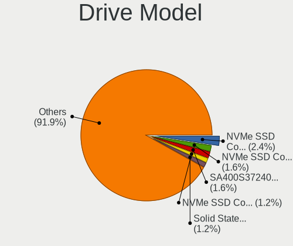
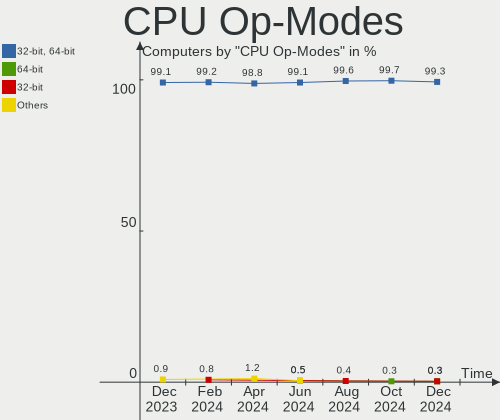
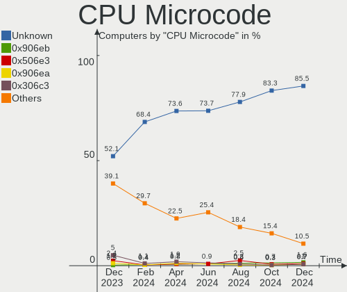
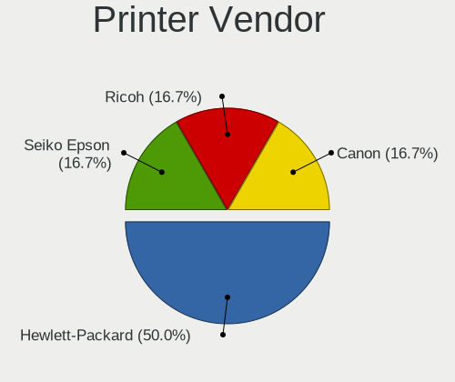
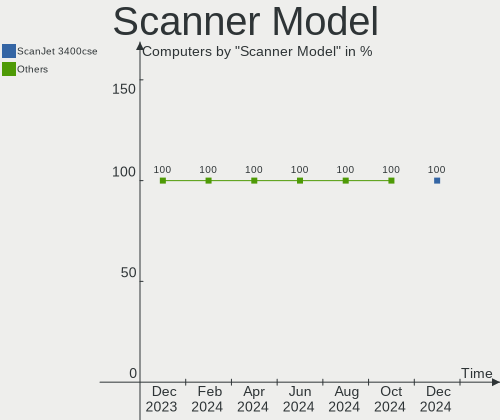

Linux in France - Hardware Trends
---------------------------------

A project to identify most popular hardware characteristics and track their change
over time based on data collected by Linux users at https://Linux-Hardware.org.

Anyone can contribute to this report by the [hw-probe](https://github.com/linuxhw/hw-probe) tool:

    sudo -E hw-probe -all -upload

This is a report for all computer types. See also reports for [desktops](/Location/France/Desktop/README.md) and [notebooks](/Location/France/Notebook/README.md).

Period: Sep, 2022.

Contents
--------

* [ System ](#system)
  - [ OS                       ](#os)
  - [ OS Family                ](#os-family)
  - [ Kernel                   ](#kernel)
  - [ Kernel Family            ](#kernel-family)
  - [ Kernel Major Ver.        ](#kernel-major-ver)
  - [ Arch                     ](#arch)
  - [ DE                       ](#de)
  - [ Display Server           ](#display-server)
  - [ Display Manager          ](#display-manager)
  - [ OS Lang                  ](#os-lang)
  - [ Boot Mode                ](#boot-mode)
  - [ Filesystem               ](#filesystem)
  - [ Part. scheme             ](#part-scheme)
  - [ Dual Boot with Linux/BSD ](#dual-boot-with-linuxbsd)
  - [ Dual Boot (Win)          ](#dual-boot-win)

* [ Board ](#board)
  - [ Vendor                   ](#vendor)
  - [ Model                    ](#model)
  - [ Model Family             ](#model-family)
  - [ MFG Year                 ](#mfg-year)
  - [ Form Factor              ](#form-factor)
  - [ Secure Boot              ](#secure-boot)
  - [ Coreboot                 ](#coreboot)
  - [ RAM Size                 ](#ram-size)
  - [ RAM Used                 ](#ram-used)
  - [ Total Drives             ](#total-drives)
  - [ Has CD-ROM               ](#has-cd-rom)
  - [ Has Ethernet             ](#has-ethernet)
  - [ Has WiFi                 ](#has-wifi)
  - [ Has Bluetooth            ](#has-bluetooth)

* [ Location ](#location)
  - [ Country                  ](#country)
  - [ City                     ](#city)

* [ Drives ](#drives)
  - [ Drive Vendor             ](#drive-vendor)
  - [ Drive Model              ](#drive-model)
  - [ HDD Vendor               ](#hdd-vendor)
  - [ SSD Vendor               ](#ssd-vendor)
  - [ Drive Kind               ](#drive-kind)
  - [ Drive Connector          ](#drive-connector)
  - [ Drive Size               ](#drive-size)
  - [ Space Total              ](#space-total)
  - [ Space Used               ](#space-used)
  - [ Malfunc. Drives          ](#malfunc-drives)
  - [ Malfunc. Drive Vendor    ](#malfunc-drive-vendor)
  - [ Malfunc. HDD Vendor      ](#malfunc-hdd-vendor)
  - [ Malfunc. Drive Kind      ](#malfunc-drive-kind)
  - [ Failed Drives            ](#failed-drives)
  - [ Failed Drive Vendor      ](#failed-drive-vendor)
  - [ Drive Status             ](#drive-status)

* [ Storage controller ](#storage-controller)
  - [ Storage Vendor           ](#storage-vendor)
  - [ Storage Model            ](#storage-model)
  - [ Storage Kind             ](#storage-kind)

* [ Processor ](#processor)
  - [ CPU Vendor               ](#cpu-vendor)
  - [ CPU Model                ](#cpu-model)
  - [ CPU Model Family         ](#cpu-model-family)
  - [ CPU Cores                ](#cpu-cores)
  - [ CPU Sockets              ](#cpu-sockets)
  - [ CPU Threads              ](#cpu-threads)
  - [ CPU Op-Modes             ](#cpu-op-modes)
  - [ CPU Microcode            ](#cpu-microcode)
  - [ CPU Microarch            ](#cpu-microarch)

* [ Graphics ](#graphics)
  - [ GPU Vendor               ](#gpu-vendor)
  - [ GPU Model                ](#gpu-model)
  - [ GPU Combo                ](#gpu-combo)
  - [ GPU Driver               ](#gpu-driver)
  - [ GPU Memory               ](#gpu-memory)

* [ Monitor ](#monitor)
  - [ Monitor Vendor           ](#monitor-vendor)
  - [ Monitor Model            ](#monitor-model)
  - [ Monitor Resolution       ](#monitor-resolution)
  - [ Monitor Diagonal         ](#monitor-diagonal)
  - [ Monitor Width            ](#monitor-width)
  - [ Aspect Ratio             ](#aspect-ratio)
  - [ Monitor Area             ](#monitor-area)
  - [ Pixel Density            ](#pixel-density)
  - [ Multiple Monitors        ](#multiple-monitors)

* [ Network ](#network)
  - [ Net Controller Vendor    ](#net-controller-vendor)
  - [ Net Controller Model     ](#net-controller-model)
  - [ Wireless Vendor          ](#wireless-vendor)
  - [ Wireless Model           ](#wireless-model)
  - [ Ethernet Vendor          ](#ethernet-vendor)
  - [ Ethernet Model           ](#ethernet-model)
  - [ Net Controller Kind      ](#net-controller-kind)
  - [ Used Controller          ](#used-controller)
  - [ NICs                     ](#nics)
  - [ IPv6                     ](#ipv6)

* [ Bluetooth ](#bluetooth)
  - [ Bluetooth Vendor         ](#bluetooth-vendor)
  - [ Bluetooth Model          ](#bluetooth-model)

* [ Sound ](#sound)
  - [ Sound Vendor             ](#sound-vendor)
  - [ Sound Model              ](#sound-model)

* [ Memory ](#memory)
  - [ Memory Vendor            ](#memory-vendor)
  - [ Memory Model             ](#memory-model)
  - [ Memory Kind              ](#memory-kind)
  - [ Memory Form Factor       ](#memory-form-factor)
  - [ Memory Size              ](#memory-size)
  - [ Memory Speed             ](#memory-speed)

* [ Printers & scanners ](#printers--scanners)
  - [ Printer Vendor           ](#printer-vendor)
  - [ Printer Model            ](#printer-model)
  - [ Scanner Vendor           ](#scanner-vendor)
  - [ Scanner Model            ](#scanner-model)

* [ Camera ](#camera)
  - [ Camera Vendor            ](#camera-vendor)
  - [ Camera Model             ](#camera-model)

* [ Security ](#security)
  - [ Fingerprint Vendor       ](#fingerprint-vendor)
  - [ Fingerprint Model        ](#fingerprint-model)
  - [ Chipcard Vendor          ](#chipcard-vendor)
  - [ Chipcard Model           ](#chipcard-model)

* [ Unsupported ](#unsupported)
  - [ Unsupported Devices      ](#unsupported-devices)
  - [ Unsupported Device Types ](#unsupported-device-types)

System
------

OS
--

Installed operating systems

| Name                | Computers | Percent |
|---------------------|-----------|---------|
| Ubuntu 22.04        | 46        | 20.18%  |
| Ubuntu 20.04        | 23        | 10.09%  |
| Debian 11           | 21        | 9.21%   |
| OpenMandriva 4.3    | 16        | 7.02%   |
| Linux Mint 21       | 13        | 5.7%    |
| Arch                | 10        | 4.39%   |
| Pop!_OS 22.04       | 8         | 3.51%   |
| Fedora 36           | 7         | 3.07%   |
| Xubuntu 20.04       | 6         | 2.63%   |
| Arch Rolling        | 6         | 2.63%   |
| Xubuntu 22.04       | 4         | 1.75%   |
| LMDE 5              | 4         | 1.75%   |
| Linux Mint 20.3     | 4         | 1.75%   |
| Zorin 16            | 3         | 1.32%   |
| OpenMandriva 4.50   | 3         | 1.32%   |
| Manjaro 22.0.0      | 3         | 1.32%   |
| Manjaro             | 3         | 1.32%   |
| Fedora 37           | 3         | 1.32%   |
| Debian Unstable     | 3         | 1.32%   |
| Ubuntu MATE 22.04   | 2         | 0.88%   |
| Ubuntu MATE 20.04   | 2         | 0.88%   |
| OpenMandriva 4.90   | 2         | 0.88%   |
| NixOS 22.11         | 2         | 0.88%   |
| NixOS 22.05         | 2         | 0.88%   |
| Linux Mint 20.1     | 2         | 0.88%   |
| Linux Mint 19.3     | 2         | 0.88%   |
| KDE neon 20.04      | 2         | 0.88%   |
| Zorin 15            | 1         | 0.44%   |
| Xubuntu 18.04       | 1         | 0.44%   |
| Ubuntu Core 18      | 1         | 0.44%   |
| Ubuntu Budgie 22.04 | 1         | 0.44%   |
| Ubuntu 21.10        | 1         | 0.44%   |
| Ubuntu 20.10        | 1         | 0.44%   |
| SteamOS Rolling     | 1         | 0.44%   |
| SteamOS 3.3.1       | 1         | 0.44%   |
| SteamOS 3.3         | 1         | 0.44%   |
| Sparky 7            | 1         | 0.44%   |
| ROSA 12.2           | 1         | 0.44%   |
| Pop!_OS 20.04       | 1         | 0.44%   |
| Parrot 5.1          | 1         | 0.44%   |

OS Family
---------

OS without a version

| Name          | Computers | Percent |
|---------------|-----------|---------|
| Ubuntu        | 72        | 31.58%  |
| Debian        | 25        | 10.96%  |
| Linux Mint    | 24        | 10.53%  |
| OpenMandriva  | 22        | 9.65%   |
| Arch          | 16        | 7.02%   |
| Xubuntu       | 11        | 4.82%   |
| Fedora        | 10        | 4.39%   |
| Pop!_OS       | 9         | 3.95%   |
| Manjaro       | 6         | 2.63%   |
| Zorin         | 4         | 1.75%   |
| Ubuntu MATE   | 4         | 1.75%   |
| NixOS         | 4         | 1.75%   |
| LMDE          | 4         | 1.75%   |
| SteamOS       | 3         | 1.32%   |
| Kubuntu       | 2         | 0.88%   |
| KDE neon      | 2         | 0.88%   |
| Ubuntu Budgie | 1         | 0.44%   |
| Sparky        | 1         | 0.44%   |
| ROSA          | 1         | 0.44%   |
| Parrot        | 1         | 0.44%   |
| openSUSE      | 1         | 0.44%   |
| Nobara        | 1         | 0.44%   |
| Lubuntu       | 1         | 0.44%   |
| Elementary    | 1         | 0.44%   |
| Clear Linux   | 1         | 0.44%   |
| ArcoLinux     | 1         | 0.44%   |

Kernel
------

Version of the Linux kernel

| Version                                        | Computers | Percent |
|------------------------------------------------|-----------|---------|
| 5.15.0-47-generic                              | 41        | 17.98%  |
| 5.15.0-48-generic                              | 26        | 11.4%   |
| 5.16.7-desktop-1omv4003                        | 16        | 7.02%   |
| 5.15.0-46-generic                              | 16        | 7.02%   |
| 5.10.0-18-amd64                                | 12        | 5.26%   |
| 5.4.0-125-generic                              | 9         | 3.95%   |
| 5.4.0-126-generic                              | 8         | 3.51%   |
| 5.19.0-76051900-generic                        | 8         | 3.51%   |
| 5.10.0-17-amd64                                | 5         | 2.19%   |
| 5.19.0-1-amd64                                 | 4         | 1.75%   |
| 5.19.6-arch1-1                                 | 3         | 1.32%   |
| 5.19.5-desktop-1omv4090                        | 3         | 1.32%   |
| 5.18.0-0.deb11.4-amd64                         | 3         | 1.32%   |
| 5.19.9-arch1-1                                 | 2         | 0.88%   |
| 5.19.9-200.fc36.x86_64                         | 2         | 0.88%   |
| 5.19.7-arch1-1                                 | 2         | 0.88%   |
| 5.18.12-desktop-3omv4090                       | 2         | 0.88%   |
| 5.15.68                                        | 2         | 0.88%   |
| 5.15.67-1-lts                                  | 2         | 0.88%   |
| 5.15.60-1-MANJARO                              | 2         | 0.88%   |
| 5.15.30-2-pve                                  | 2         | 0.88%   |
| 5.15.0-43-generic                              | 2         | 0.88%   |
| 5.14.0-1051-oem                                | 2         | 0.88%   |
| 5.13.0-valve21.1-1-neptune-02211-gc54cda5a36f3 | 2         | 0.88%   |
| 5.13.0-52-generic                              | 2         | 0.88%   |
| 5.11.0-27-generic                              | 2         | 0.88%   |
| 6.0.0-1-MANJARO                                | 1         | 0.44%   |
| 5.8.0-25-generic                               | 1         | 0.44%   |
| 5.4.0-81-generic                               | 1         | 0.44%   |
| 5.4.0-26-generic                               | 1         | 0.44%   |
| 5.4.0-113-generic                              | 1         | 0.44%   |
| 5.19.9-zen1-1-zen                              | 1         | 0.44%   |
| 5.19.9-300.fc37.x86_64                         | 1         | 0.44%   |
| 5.19.9-201.fsync.fc36.x86_64                   | 1         | 0.44%   |
| 5.19.8-300.fc37.x86_64                         | 1         | 0.44%   |
| 5.19.8-200.fc36.x86_64                         | 1         | 0.44%   |
| 5.19.7-zen2-1-zen                              | 1         | 0.44%   |
| 5.19.7-arch1-g14-1                             | 1         | 0.44%   |
| 5.19.7-269-tkg-pds                             | 1         | 0.44%   |
| 5.19.7-200.fc36.x86_64                         | 1         | 0.44%   |

Kernel Family
-------------

Linux kernel without a distro release

| Version  | Computers | Percent |
|----------|-----------|---------|
| 5.15.0   | 87        | 38.16%  |
| 5.4.0    | 20        | 8.77%   |
| 5.10.0   | 20        | 8.77%   |
| 5.16.7   | 16        | 7.02%   |
| 5.19.0   | 12        | 5.26%   |
| 5.19.9   | 7         | 3.07%   |
| 5.13.0   | 7         | 3.07%   |
| 5.19.7   | 6         | 2.63%   |
| 5.19.6   | 5         | 2.19%   |
| 5.18.0   | 5         | 2.19%   |
| 5.19.5   | 4         | 1.75%   |
| 5.19.11  | 3         | 1.32%   |
| 5.14.0   | 3         | 1.32%   |
| 5.11.0   | 3         | 1.32%   |
| 5.19.8   | 2         | 0.88%   |
| 5.18.12  | 2         | 0.88%   |
| 5.15.68  | 2         | 0.88%   |
| 5.15.67  | 2         | 0.88%   |
| 5.15.60  | 2         | 0.88%   |
| 5.15.30  | 2         | 0.88%   |
| 6.0.0    | 1         | 0.44%   |
| 5.8.0    | 1         | 0.44%   |
| 5.19.4   | 1         | 0.44%   |
| 5.19.10  | 1         | 0.44%   |
| 5.19.1   | 1         | 0.44%   |
| 5.18.10  | 1         | 0.44%   |
| 5.17.5   | 1         | 0.44%   |
| 5.17.0   | 1         | 0.44%   |
| 5.15.65  | 1         | 0.44%   |
| 5.15.63  | 1         | 0.44%   |
| 5.15.55  | 1         | 0.44%   |
| 5.14.21  | 1         | 0.44%   |
| 5.10.74  | 1         | 0.44%   |
| 5.10.144 | 1         | 0.44%   |
| 5.10.141 | 1         | 0.44%   |
| 5.10.14  | 1         | 0.44%   |
| 4.9.253  | 1         | 0.44%   |
| 4.15.0   | 1         | 0.44%   |

Kernel Major Ver.
-----------------

Linux kernel major version

| Version | Computers | Percent |
|---------|-----------|---------|
| 5.15    | 98        | 42.98%  |
| 5.19    | 42        | 18.42%  |
| 5.10    | 24        | 10.53%  |
| 5.4     | 20        | 8.77%   |
| 5.16    | 16        | 7.02%   |
| 5.18    | 8         | 3.51%   |
| 5.13    | 7         | 3.07%   |
| 5.14    | 4         | 1.75%   |
| 5.11    | 3         | 1.32%   |
| 5.17    | 2         | 0.88%   |
| 6.0     | 1         | 0.44%   |
| 5.8     | 1         | 0.44%   |
| 4.9     | 1         | 0.44%   |
| 4.15    | 1         | 0.44%   |

Arch
----

OS architecture (x86_64, i586, etc.)

| Name    | Computers | Percent |
|---------|-----------|---------|
| x86_64  | 223       | 97.81%  |
| aarch64 | 3         | 1.32%   |
| i686    | 2         | 0.88%   |

DE
--

Desktop Environment

| Name       | Computers | Percent |
|------------|-----------|---------|
| GNOME      | 107       | 46.93%  |
| KDE5       | 46        | 20.18%  |
| XFCE       | 20        | 8.77%   |
| X-Cinnamon | 19        | 8.33%   |
| Unknown    | 12        | 5.26%   |
| MATE       | 9         | 3.95%   |
| i3         | 5         | 2.19%   |
| Cinnamon   | 4         | 1.75%   |
| Pantheon   | 2         | 0.88%   |
| sway       | 1         | 0.44%   |
| LXQt       | 1         | 0.44%   |
| KDE        | 1         | 0.44%   |
| Budgie     | 1         | 0.44%   |

Display Server
--------------

X11 or Wayland

| Name    | Computers | Percent |
|---------|-----------|---------|
| X11     | 154       | 67.54%  |
| Wayland | 55        | 24.12%  |
| Tty     | 11        | 4.82%   |
| Unknown | 8         | 3.51%   |

Display Manager
---------------

SDDM, LightDM, etc.

| Name    | Computers | Percent |
|---------|-----------|---------|
| GDM3    | 59        | 25.88%  |
| Unknown | 56        | 24.56%  |
| LightDM | 40        | 17.54%  |
| SDDM    | 39        | 17.11%  |
| GDM     | 34        | 14.91%  |

OS Lang
-------

Language

| Lang    | Computers | Percent |
|---------|-----------|---------|
| fr_FR   | 163       | 71.49%  |
| en_US   | 47        | 20.61%  |
| Unknown | 6         | 2.63%   |
| en_GB   | 4         | 1.75%   |
| fr_BE   | 2         | 0.88%   |
| ru_RU   | 1         | 0.44%   |
| fr_CH   | 1         | 0.44%   |
| en_IE   | 1         | 0.44%   |
| en_CA   | 1         | 0.44%   |
| C       | 1         | 0.44%   |
| ar_SA   | 1         | 0.44%   |

Boot Mode
---------

EFI or BIOS

| Mode | Computers | Percent |
|------|-----------|---------|
| EFI  | 132       | 57.89%  |
| BIOS | 96        | 42.11%  |

Filesystem
----------

Type of filesystem

| Type     | Computers | Percent |
|----------|-----------|---------|
| Ext4     | 181       | 79.39%  |
| Btrfs    | 22        | 9.65%   |
| Overlay  | 19        | 8.33%   |
| F2fs     | 2         | 0.88%   |
| Zfs      | 1         | 0.44%   |
| Xfs      | 1         | 0.44%   |
| Reiserfs | 1         | 0.44%   |
| Ext3     | 1         | 0.44%   |

Part. scheme
------------

Scheme of partitioning

| Type    | Computers | Percent |
|---------|-----------|---------|
| GPT     | 128       | 56.14%  |
| Unknown | 77        | 33.77%  |
| MBR     | 23        | 10.09%  |

Dual Boot with Linux/BSD
------------------------

Hosting more than one Linux/BSD

| Dual boot | Computers | Percent |
|-----------|-----------|---------|
| No        | 192       | 84.21%  |
| Yes       | 36        | 15.79%  |

Dual Boot (Win)
---------------

Hosting Linux and Windows

| Dual boot | Computers | Percent |
|-----------|-----------|---------|
| No        | 165       | 72.37%  |
| Yes       | 63        | 27.63%  |

Board
-----

Vendor
------

Motherboard manufacturer

| Name                    | Computers | Percent |
|-------------------------|-----------|---------|
| ASUSTek Computer        | 45        | 19.74%  |
| Dell                    | 44        | 19.3%   |
| Lenovo                  | 30        | 13.16%  |
| Hewlett-Packard         | 29        | 12.72%  |
| Gigabyte Technology     | 15        | 6.58%   |
| MSI                     | 13        | 5.7%    |
| Acer                    | 7         | 3.07%   |
| HUAWEI                  | 4         | 1.75%   |
| Valve                   | 3         | 1.32%   |
| Toshiba                 | 3         | 1.32%   |
| Packard Bell            | 3         | 1.32%   |
| Intel                   | 3         | 1.32%   |
| ASRock                  | 3         | 1.32%   |
| Apple                   | 3         | 1.32%   |
| Samsung Electronics     | 2         | 0.88%   |
| Raspberry Pi Foundation | 2         | 0.88%   |
| Foxconn                 | 2         | 0.88%   |
| Unknown                 | 2         | 0.88%   |
| TUXEDO                  | 1         | 0.44%   |
| Timi                    | 1         | 0.44%   |
| System76                | 1         | 0.44%   |
| Pegatron                | 1         | 0.44%   |
| PC Specialist           | 1         | 0.44%   |
| Nvidia                  | 1         | 0.44%   |
| Notebook                | 1         | 0.44%   |
| Microsoft               | 1         | 0.44%   |
| IP3 Tech                | 1         | 0.44%   |
| Insyde                  | 1         | 0.44%   |
| HPE                     | 1         | 0.44%   |
| Fujitsu                 | 1         | 0.44%   |
| Framework               | 1         | 0.44%   |
| Clientron               | 1         | 0.44%   |
| Acidanthera             | 1         | 0.44%   |

Model
-----

Motherboard model

| Name                                        | Computers | Percent |
|---------------------------------------------|-----------|---------|
| Valve Jupiter                               | 3         | 1.32%   |
| Gigabyte B450M DS3H                         | 3         | 1.32%   |
| ASUS All Series                             | 3         | 1.32%   |
| MSI MS-7C37                                 | 2         | 0.88%   |
| Lenovo Legion 5 15ACH6H 82JU                | 2         | 0.88%   |
| HUAWEI HVY-WXX9                             | 2         | 0.88%   |
| HP Laptop 14s-fq1xxx                        | 2         | 0.88%   |
| Dell XPS 9320                               | 2         | 0.88%   |
| Unknown                                     | 2         | 0.88%   |
| TUXEDO Book_XA1510                          | 1         | 0.44%   |
| Toshiba Satellite NB10t-A-102               | 1         | 0.44%   |
| Toshiba Satellite L875-11M                  | 1         | 0.44%   |
| Toshiba Satellite L670                      | 1         | 0.44%   |
| Timi TM1604                                 | 1         | 0.44%   |
| System76 Lemur                              | 1         | 0.44%   |
| Samsung RV411/RV511/E3511/S3511/RV711/E3411 | 1         | 0.44%   |
| Samsung 950XED                              | 1         | 0.44%   |
| RPi Raspberry Pi 4 Model B Rev 1.4          | 1         | 0.44%   |
| RPi Raspberry Pi 3 Model B Rev 1.2          | 1         | 0.44%   |
| Pegatron p6541fr-m                          | 1         | 0.44%   |
| PC Specialist NS50MU                        | 1         | 0.44%   |
| Packard Bell IMEDIA S2883                   | 1         | 0.44%   |
| Packard Bell EasyNote MH45                  | 1         | 0.44%   |
| Packard Bell EasyNote LS44SB                | 1         | 0.44%   |
| Nvidia Tegra                                | 1         | 0.44%   |
| Notebook NL40_50GU                          | 1         | 0.44%   |
| MSI MS-7D22                                 | 1         | 0.44%   |
| MSI MS-7C92                                 | 1         | 0.44%   |
| MSI MS-7C36                                 | 1         | 0.44%   |
| MSI MS-7A40                                 | 1         | 0.44%   |
| MSI MS-7836                                 | 1         | 0.44%   |
| MSI MS-7817                                 | 1         | 0.44%   |
| MSI MS-7752                                 | 1         | 0.44%   |
| MSI MS-7387                                 | 1         | 0.44%   |
| MSI Modern 14 A10M                          | 1         | 0.44%   |
| MSI Katana GF66 12UD                        | 1         | 0.44%   |
| MSI GS73 Stealth 8RF                        | 1         | 0.44%   |
| Microsoft Surface Pro 3                     | 1         | 0.44%   |
| Lenovo Yoga S740-15IRH 81NX                 | 1         | 0.44%   |
| Lenovo Yoga 7 14ACN6 82N7                   | 1         | 0.44%   |

Model Family
------------

Motherboard model prefix

| Name                  | Computers | Percent |
|-----------------------|-----------|---------|
| Lenovo ThinkPad       | 19        | 8.33%   |
| Dell Precision        | 14        | 6.14%   |
| Dell OptiPlex         | 9         | 3.95%   |
| ASUS PRIME            | 8         | 3.51%   |
| Dell Latitude         | 7         | 3.07%   |
| Dell Inspiron         | 6         | 2.63%   |
| ASUS ROG              | 6         | 2.63%   |
| Acer Aspire           | 6         | 2.63%   |
| HP Laptop             | 5         | 2.19%   |
| ASUS TUF              | 5         | 2.19%   |
| Dell XPS              | 4         | 1.75%   |
| Valve Jupiter         | 3         | 1.32%   |
| Toshiba Satellite     | 3         | 1.32%   |
| HP ZBook              | 3         | 1.32%   |
| HP Pavilion           | 3         | 1.32%   |
| HP EliteBook          | 3         | 1.32%   |
| HP Compaq             | 3         | 1.32%   |
| Gigabyte B450M        | 3         | 1.32%   |
| Dell Vostro           | 3         | 1.32%   |
| ASUS ZenBook          | 3         | 1.32%   |
| ASUS VivoBook         | 3         | 1.32%   |
| ASUS All              | 3         | 1.32%   |
| RPi Raspberry         | 2         | 0.88%   |
| Packard Bell EasyNote | 2         | 0.88%   |
| MSI MS-7C37           | 2         | 0.88%   |
| Lenovo Yoga           | 2         | 0.88%   |
| Lenovo Legion         | 2         | 0.88%   |
| Lenovo IdeaPad        | 2         | 0.88%   |
| HUAWEI HVY-WXX9       | 2         | 0.88%   |
| HP ProBook            | 2         | 0.88%   |
| HP ENVY               | 2         | 0.88%   |
| Gigabyte B450         | 2         | 0.88%   |
| ASUS ASUS             | 2         | 0.88%   |
| Unknown               | 2         | 0.88%   |
| TUXEDO Book           | 1         | 0.44%   |
| Timi TM1604           | 1         | 0.44%   |
| System76 Lemur        | 1         | 0.44%   |
| Samsung RV411         | 1         | 0.44%   |
| Samsung 950XED        | 1         | 0.44%   |
| Pegatron p6541fr-m    | 1         | 0.44%   |

MFG Year
--------

Motherboard manufacture year

| Year    | Computers | Percent |
|---------|-----------|---------|
| 2021    | 32        | 14.04%  |
| 2018    | 31        | 13.6%   |
| 2013    | 23        | 10.09%  |
| 2022    | 22        | 9.65%   |
| 2020    | 22        | 9.65%   |
| 2019    | 19        | 8.33%   |
| 2015    | 12        | 5.26%   |
| 2014    | 12        | 5.26%   |
| 2017    | 9         | 3.95%   |
| 2016    | 9         | 3.95%   |
| 2012    | 9         | 3.95%   |
| 2011    | 6         | 2.63%   |
| 2010    | 5         | 2.19%   |
| 2007    | 4         | 1.75%   |
| 2009    | 3         | 1.32%   |
| 2008    | 3         | 1.32%   |
| Unknown | 3         | 1.32%   |
| 2006    | 2         | 0.88%   |
| 2005    | 1         | 0.44%   |
| 2004    | 1         | 0.44%   |

Form Factor
-----------

Physical design of the computer

| Name           | Computers | Percent |
|----------------|-----------|---------|
| Notebook       | 124       | 54.39%  |
| Desktop        | 82        | 35.96%  |
| Mini pc        | 7         | 3.07%   |
| Convertible    | 4         | 1.75%   |
| All in one     | 4         | 1.75%   |
| System on chip | 3         | 1.32%   |
| Tablet         | 2         | 0.88%   |
| Server         | 2         | 0.88%   |

Secure Boot
-----------

Enabled or disabled

| State    | Computers | Percent |
|----------|-----------|---------|
| Disabled | 207       | 90.79%  |
| Enabled  | 21        | 9.21%   |

Coreboot
--------

Have coreboot on board

| Used | Computers | Percent |
|------|-----------|---------|
| No   | 228       | 100%    |

RAM Size
--------

Total RAM memory

| Size in GB      | Computers | Percent |
|-----------------|-----------|---------|
| 16.01-24.0      | 51        | 22.37%  |
| 4.01-8.0        | 44        | 19.3%   |
| 32.01-64.0      | 39        | 17.11%  |
| 8.01-16.0       | 39        | 17.11%  |
| 3.01-4.0        | 34        | 14.91%  |
| 64.01-256.0     | 9         | 3.95%   |
| 24.01-32.0      | 4         | 1.75%   |
| 1.01-2.0        | 4         | 1.75%   |
| More than 256.0 | 2         | 0.88%   |
| 2.01-3.0        | 1         | 0.44%   |
| 0.51-1.0        | 1         | 0.44%   |

RAM Used
--------

Used RAM memory

| Used GB    | Computers | Percent |
|------------|-----------|---------|
| 1.01-2.0   | 69        | 30.26%  |
| 2.01-3.0   | 57        | 25%     |
| 4.01-8.0   | 43        | 18.86%  |
| 3.01-4.0   | 33        | 14.47%  |
| 0.51-1.0   | 9         | 3.95%   |
| 8.01-16.0  | 7         | 3.07%   |
| 24.01-32.0 | 4         | 1.75%   |
| 16.01-24.0 | 3         | 1.32%   |
| 0.01-0.5   | 3         | 1.32%   |

Total Drives
------------

Number of drives on board

| Drives | Computers | Percent |
|--------|-----------|---------|
| 1      | 129       | 56.58%  |
| 2      | 59        | 25.88%  |
| 3      | 25        | 10.96%  |
| 4      | 6         | 2.63%   |
| 5      | 5         | 2.19%   |
| 8      | 1         | 0.44%   |
| 7      | 1         | 0.44%   |
| 6      | 1         | 0.44%   |
| 0      | 1         | 0.44%   |

Has CD-ROM
----------

Has CD-ROM on board

| Presented | Computers | Percent |
|-----------|-----------|---------|
| No        | 160       | 70.18%  |
| Yes       | 68        | 29.82%  |

Has Ethernet
------------

Has Ethernet on board

| Presented | Computers | Percent |
|-----------|-----------|---------|
| Yes       | 195       | 85.53%  |
| No        | 33        | 14.47%  |

Has WiFi
--------

Has WiFi module

| Presented | Computers | Percent |
|-----------|-----------|---------|
| Yes       | 178       | 78.07%  |
| No        | 50        | 21.93%  |

Has Bluetooth
-------------

Has Bluetooth module

| Presented | Computers | Percent |
|-----------|-----------|---------|
| Yes       | 157       | 68.86%  |
| No        | 71        | 31.14%  |

Location
--------

Country
-------

Geographic location (country)

| Country | Computers | Percent |
|---------|-----------|---------|
| France  | 228       | 100%    |

City
----

Geographic location (city)

| City                       | Computers | Percent |
|----------------------------|-----------|---------|
| Paris                      | 43        | 18.86%  |
| Strasbourg                 | 4         | 1.75%   |
| Nantes                     | 4         | 1.75%   |
| Rennes                     | 3         | 1.32%   |
| Montpellier                | 3         | 1.32%   |
| Marseille                  | 3         | 1.32%   |
| Lyon                       | 3         | 1.32%   |
| Fontenay-sous-Bois         | 3         | 1.32%   |
| Bordeaux                   | 3         | 1.32%   |
| Auxerre                    | 3         | 1.32%   |
| Aulnay-sous-Bois           | 3         | 1.32%   |
| Villeurbanne               | 2         | 0.88%   |
| Roubaix                    | 2         | 0.88%   |
| Palaiseau                  | 2         | 0.88%   |
| Lille                      | 2         | 0.88%   |
| Grenoble                   | 2         | 0.88%   |
| Corbeil-Essonnes           | 2         | 0.88%   |
| Bozouls                    | 2         | 0.88%   |
| Aubervilliers              | 2         | 0.88%   |
| Angoulême                 | 2         | 0.88%   |
| Yerres                     | 1         | 0.44%   |
| Wittenheim                 | 1         | 0.44%   |
| Vitry-sur-Seine            | 1         | 0.44%   |
| Vinay                      | 1         | 0.44%   |
| Villers-Cotterêts         | 1         | 0.44%   |
| Villeneuve-d'Ascq          | 1         | 0.44%   |
| Villejuif                  | 1         | 0.44%   |
| Villefontaine              | 1         | 0.44%   |
| Vence                      | 1         | 0.44%   |
| Trets                      | 1         | 0.44%   |
| Tours                      | 1         | 0.44%   |
| Tourouvre                  | 1         | 0.44%   |
| Toulouse                   | 1         | 0.44%   |
| Toulon                     | 1         | 0.44%   |
| Tavaux                     | 1         | 0.44%   |
| Talant                     | 1         | 0.44%   |
| Surgeres                   | 1         | 0.44%   |
| Senonches                  | 1         | 0.44%   |
| Sauveterre-de-Bearn        | 1         | 0.44%   |
| Sainte-Geneviève-des-Bois | 1         | 0.44%   |

Drives
------

Drive Vendor
------------

Hard drive vendors

| Vendor                      | Computers | Drives | Percent |
|-----------------------------|-----------|--------|---------|
| Samsung Electronics         | 64        | 85     | 19.81%  |
| Seagate                     | 42        | 48     | 13%     |
| WDC                         | 41        | 55     | 12.69%  |
| Crucial                     | 24        | 27     | 7.43%   |
| Toshiba                     | 20        | 25     | 6.19%   |
| SanDisk                     | 19        | 20     | 5.88%   |
| Micron Technology           | 13        | 14     | 4.02%   |
| Kingston                    | 11        | 12     | 3.41%   |
| Unknown                     | 9         | 13     | 2.79%   |
| Intel                       | 7         | 8      | 2.17%   |
| KIOXIA                      | 6         | 7      | 1.86%   |
| Hitachi                     | 6         | 7      | 1.86%   |
| SK hynix                    | 5         | 5      | 1.55%   |
| PNY                         | 5         | 5      | 1.55%   |
| LITEON                      | 4         | 4      | 1.24%   |
| HGST                        | 3         | 3      | 0.93%   |
| Dogfish                     | 3         | 3      | 0.93%   |
| Transcend                   | 2         | 2      | 0.62%   |
| TEXTORM                     | 2         | 2      | 0.62%   |
| Phison Electronics          | 2         | 2      | 0.62%   |
| Netac                       | 2         | 2      | 0.62%   |
| Micron/Crucial Technology   | 2         | 3      | 0.62%   |
| Kingston Technology Company | 2         | 2      | 0.62%   |
| YMTC                        | 1         | 1      | 0.31%   |
| XPG                         | 1         | 1      | 0.31%   |
| Verbatim                    | 1         | 1      | 0.31%   |
| USB3.0                      | 1         | 1      | 0.31%   |
| UMIS                        | 1         | 1      | 0.31%   |
| TCSUNBOW                    | 1         | 1      | 0.31%   |
| SPCC                        | 1         | 1      | 0.31%   |
| sobetter                    | 1         | 1      | 0.31%   |
| Silicon Motion              | 1         | 1      | 0.31%   |
| SATAFIRM                    | 1         | 1      | 0.31%   |
| Realtek                     | 1         | 1      | 0.31%   |
| Phison                      | 1         | 1      | 0.31%   |
| Maxtor                      | 1         | 1      | 0.31%   |
| LITEONIT                    | 1         | 1      | 0.31%   |
| LDLC                        | 1         | 1      | 0.31%   |
| LaCie                       | 1         | 1      | 0.31%   |
| KingSpec                    | 1         | 1      | 0.31%   |

Drive Model
-----------

Hard drive models

| Model                                                 | Computers | Percent |
|-------------------------------------------------------|-----------|---------|
| Samsung NVMe SSD Controller SM981/PM981/PM983 256GB   | 9         | 2.45%   |
| Seagate ST2000DM008-2FR102 2TB                        | 6         | 1.63%   |
| Samsung SSD 850 EVO 500GB                             | 5         | 1.36%   |
| Samsung SSD 860 EVO 500GB                             | 4         | 1.09%   |
| Unknown SD/MMC/MS PRO 2GB                             | 3         | 0.82%   |
| Toshiba KXG50ZNV512G NVMe 512GB                       | 3         | 0.82%   |
| Seagate ST2000DM006-2DM164 2TB                        | 3         | 0.82%   |
| Samsung SSD 970 EVO Plus 500GB                        | 3         | 0.82%   |
| Samsung SSD 870 QVO 1TB                               | 3         | 0.82%   |
| Samsung SSD 850 EVO 250GB                             | 3         | 0.82%   |
| Samsung NVMe SSD Drive 1TB                            | 3         | 0.82%   |
| Crucial CT500P2SSD8 500GB                             | 3         | 0.82%   |
| Crucial CT240BX500SSD1 240GB                          | 3         | 0.82%   |
| WDC WDS500G3X0C-00SJG0 500GB                          | 2         | 0.54%   |
| WDC WD3200BEVT-22ZCT0 320GB                           | 2         | 0.54%   |
| WDC PC SN520 SDAPNUW-512G-1002 512GB                  | 2         | 0.54%   |
| Unknown MMC Card  64GB                                | 2         | 0.54%   |
| Unknown MMC Card  32GB                                | 2         | 0.54%   |
| Toshiba MQ04ABF100 1TB                                | 2         | 0.54%   |
| Seagate ST3320620AS 320GB                             | 2         | 0.54%   |
| Seagate ST2000DM008-2UB102 2TB                        | 2         | 0.54%   |
| Seagate ST2000DM001-1ER164 2TB                        | 2         | 0.54%   |
| Seagate ST1000DM003-1ER162 1TB                        | 2         | 0.54%   |
| Seagate ST1000DM003-1CH162 1TB                        | 2         | 0.54%   |
| Sandisk WD Black 2018/SN750 / PC SN720 NVMe SSD 512GB | 2         | 0.54%   |
| SanDisk SDSSDHII240G 240GB                            | 2         | 0.54%   |
| SanDisk SD8SNAT128G1002 128GB SSD                     | 2         | 0.54%   |
| SanDisk NVMe SSD Drive 512GB                          | 2         | 0.54%   |
| Samsung SSD 970 EVO Plus 1TB                          | 2         | 0.54%   |
| Samsung SSD 870 EVO 500GB                             | 2         | 0.54%   |
| Samsung SSD 860 EVO M.2 1TB                           | 2         | 0.54%   |
| Samsung SSD 860 EVO 250GB                             | 2         | 0.54%   |
| Samsung SSD 860 EVO 1TB                               | 2         | 0.54%   |
| Samsung SSD 840 Series 120GB                          | 2         | 0.54%   |
| Samsung NVMe SSD Drive 512GB                          | 2         | 0.54%   |
| Samsung NVMe SSD Drive 256GB                          | 2         | 0.54%   |
| Samsung NVMe SSD Controller PM9A1/PM9A3/980PRO 1024GB | 2         | 0.54%   |
| Samsung MZVLQ512HBLU-00BH1 512GB                      | 2         | 0.54%   |
| PNY CS900 240GB SSD                                   | 2         | 0.54%   |
| PNY CS900 120GB SSD                                   | 2         | 0.54%   |

HDD Vendor
----------

Hard disk drive vendors

| Vendor              | Computers | Drives | Percent |
|---------------------|-----------|--------|---------|
| Seagate             | 40        | 45     | 39.22%  |
| WDC                 | 28        | 39     | 27.45%  |
| Toshiba             | 14        | 19     | 13.73%  |
| Hitachi             | 6         | 7      | 5.88%   |
| Unknown             | 3         | 3      | 2.94%   |
| HGST                | 3         | 3      | 2.94%   |
| Samsung Electronics | 2         | 2      | 1.96%   |
| USB3.0              | 1         | 1      | 0.98%   |
| SATAFIRM            | 1         | 1      | 0.98%   |
| Maxtor              | 1         | 1      | 0.98%   |
| LaCie               | 1         | 1      | 0.98%   |
| ASMT                | 1         | 2      | 0.98%   |
| ASMedia             | 1         | 1      | 0.98%   |

SSD Vendor
----------

Solid state drive vendors

| Vendor              | Computers | Drives | Percent |
|---------------------|-----------|--------|---------|
| Samsung Electronics | 34        | 39     | 31.19%  |
| Crucial             | 18        | 21     | 16.51%  |
| SanDisk             | 12        | 12     | 11.01%  |
| Kingston            | 7         | 8      | 6.42%   |
| PNY                 | 5         | 5      | 4.59%   |
| Micron Technology   | 4         | 4      | 3.67%   |
| LITEON              | 4         | 4      | 3.67%   |
| Intel               | 3         | 3      | 2.75%   |
| Dogfish             | 3         | 3      | 2.75%   |
| WDC                 | 2         | 2      | 1.83%   |
| Transcend           | 2         | 2      | 1.83%   |
| TEXTORM             | 2         | 2      | 1.83%   |
| Verbatim            | 1         | 1      | 0.92%   |
| Toshiba             | 1         | 1      | 0.92%   |
| TCSUNBOW            | 1         | 1      | 0.92%   |
| SPCC                | 1         | 1      | 0.92%   |
| SK hynix            | 1         | 1      | 0.92%   |
| Netac               | 1         | 1      | 0.92%   |
| LITEONIT            | 1         | 1      | 0.92%   |
| LDLC                | 1         | 1      | 0.92%   |
| KingSpec            | 1         | 1      | 0.92%   |
| Hoodisk             | 1         | 1      | 0.92%   |
| Emtec               | 1         | 1      | 0.92%   |
| BHT                 | 1         | 1      | 0.92%   |
| A-DATA Technology   | 1         | 1      | 0.92%   |

Drive Kind
----------

HDD or SSD

| Kind    | Computers | Drives | Percent |
|---------|-----------|--------|---------|
| NVMe    | 103       | 127    | 34.8%   |
| SSD     | 97        | 118    | 32.77%  |
| HDD     | 85        | 125    | 28.72%  |
| Unknown | 6         | 10     | 2.03%   |
| MMC     | 5         | 7      | 1.69%   |

Drive Connector
---------------

SATA, SAS, NVMe, etc.

| Type | Computers | Drives | Percent |
|------|-----------|--------|---------|
| SATA | 141       | 229    | 52.81%  |
| NVMe | 102       | 124    | 38.2%   |
| SAS  | 19        | 27     | 7.12%   |
| MMC  | 5         | 7      | 1.87%   |

Drive Size
----------

Size of hard drive

| Size in TB | Computers | Drives | Percent |
|------------|-----------|--------|---------|
| 0.01-0.5   | 102       | 129    | 51.78%  |
| 0.51-1.0   | 58        | 68     | 29.44%  |
| 1.01-2.0   | 22        | 28     | 11.17%  |
| 3.01-4.0   | 7         | 9      | 3.55%   |
| 4.01-10.0  | 5         | 5      | 2.54%   |
| 2.01-3.0   | 2         | 2      | 1.02%   |
| 10.01-20.0 | 1         | 2      | 0.51%   |

Space Total
-----------

Amount of disk space available on the file system

| Size in GB     | Computers | Percent |
|----------------|-----------|---------|
| 251-500        | 59        | 25.88%  |
| 101-250        | 53        | 23.25%  |
| 501-1000       | 36        | 15.79%  |
| 1-20           | 19        | 8.33%   |
| More than 3000 | 16        | 7.02%   |
| 1001-2000      | 16        | 7.02%   |
| 2001-3000      | 9         | 3.95%   |
| Unknown        | 9         | 3.95%   |
| 51-100         | 8         | 3.51%   |
| 21-50          | 3         | 1.32%   |

Space Used
----------

Amount of used disk space

| Used GB        | Computers | Percent |
|----------------|-----------|---------|
| 1-20           | 75        | 32.89%  |
| 101-250        | 33        | 14.47%  |
| 21-50          | 32        | 14.04%  |
| 51-100         | 25        | 10.96%  |
| 251-500        | 21        | 9.21%   |
| 501-1000       | 15        | 6.58%   |
| 1001-2000      | 9         | 3.95%   |
| Unknown        | 9         | 3.95%   |
| More than 3000 | 5         | 2.19%   |
| 2001-3000      | 4         | 1.75%   |

Malfunc. Drives
---------------

Drive models with a malfunction

| Model                                 | Computers | Drives | Percent |
|---------------------------------------|-----------|--------|---------|
| WDC WD5000AVDS-63U7B1 500GB           | 1         | 1      | 6.25%   |
| WDC WD4001FAEX-00MJRA0 4TB            | 1         | 1      | 6.25%   |
| WDC WD10EZRX-00L4HB0 1TB              | 1         | 1      | 6.25%   |
| WDC WD10EZEX-22BN5A0 1TB              | 1         | 1      | 6.25%   |
| WDC WD10EADS-22M2B0 1TB               | 1         | 1      | 6.25%   |
| Toshiba MQ01ACF050 500GB              | 1         | 1      | 6.25%   |
| Toshiba MQ01ABD100 1TB                | 1         | 1      | 6.25%   |
| SK hynix HFS128G32MND-2200A 128GB SSD | 1         | 1      | 6.25%   |
| Seagate ST3320620AS 320GB             | 1         | 1      | 6.25%   |
| Seagate ST320LT007-9ZV142 320GB       | 1         | 1      | 6.25%   |
| Seagate ST2000DM008-2UB102 2TB        | 1         | 1      | 6.25%   |
| Intel SSDSCKKF256G8H 256GB            | 1         | 1      | 6.25%   |
| Intel SSDSC2KW120H6 120GB             | 1         | 1      | 6.25%   |
| Intel SSDSC2BF180A5L 180GB            | 1         | 1      | 6.25%   |
| Hitachi HTS723232A7A364 320GB         | 1         | 1      | 6.25%   |
| Hitachi HDT722516DLA380 165GB         | 1         | 1      | 6.25%   |

Malfunc. Drive Vendor
---------------------

Vendors of faulty drives

| Vendor   | Computers | Drives | Percent |
|----------|-----------|--------|---------|
| WDC      | 5         | 5      | 31.25%  |
| Seagate  | 3         | 3      | 18.75%  |
| Intel    | 3         | 3      | 18.75%  |
| Toshiba  | 2         | 2      | 12.5%   |
| Hitachi  | 2         | 2      | 12.5%   |
| SK hynix | 1         | 1      | 6.25%   |

Malfunc. HDD Vendor
-------------------

Vendors of faulty HDD drives

| Vendor  | Computers | Drives | Percent |
|---------|-----------|--------|---------|
| WDC     | 5         | 5      | 41.67%  |
| Seagate | 3         | 3      | 25%     |
| Toshiba | 2         | 2      | 16.67%  |
| Hitachi | 2         | 2      | 16.67%  |

Malfunc. Drive Kind
-------------------

Kinds of faulty drives

| Kind | Computers | Drives | Percent |
|------|-----------|--------|---------|
| HDD  | 11        | 12     | 73.33%  |
| SSD  | 4         | 4      | 26.67%  |

Failed Drives
-------------

Failed drive models

Zero info for selected period =(

Failed Drive Vendor
-------------------

Failed drive vendors

Zero info for selected period =(

Drive Status
------------

Number of failed and malfunc. drives

| Status   | Computers | Drives | Percent |
|----------|-----------|--------|---------|
| Works    | 138       | 213    | 57.02%  |
| Detected | 89        | 158    | 36.78%  |
| Malfunc  | 15        | 16     | 6.2%    |

Storage controller
------------------

Storage Vendor
--------------

Storage controller vendors

| Vendor                       | Computers | Percent |
|------------------------------|-----------|---------|
| Intel                        | 148       | 49.01%  |
| Samsung Electronics          | 34        | 11.26%  |
| AMD                          | 33        | 10.93%  |
| SanDisk                      | 21        | 6.95%   |
| Micron Technology            | 9         | 2.98%   |
| Micron/Crucial Technology    | 8         | 2.65%   |
| KIOXIA                       | 6         | 1.99%   |
| Kingston Technology Company  | 6         | 1.99%   |
| ASMedia Technology           | 6         | 1.99%   |
| Toshiba America Info Systems | 5         | 1.66%   |
| SK hynix                     | 4         | 1.32%   |
| Phison Electronics           | 4         | 1.32%   |
| Marvell Technology Group     | 3         | 0.99%   |
| LSI Logic / Symbios Logic    | 3         | 0.99%   |
| Silicon Motion               | 2         | 0.66%   |
| Broadcom / LSI               | 2         | 0.66%   |
| Yangtze Memory Technologies  | 1         | 0.33%   |
| VIA Technologies             | 1         | 0.33%   |
| Union Memory (Shenzhen)      | 1         | 0.33%   |
| Seagate Technology           | 1         | 0.33%   |
| Nvidia                       | 1         | 0.33%   |
| Apple                        | 1         | 0.33%   |
| ADATA Technology             | 1         | 0.33%   |
| Adaptec                      | 1         | 0.33%   |

Storage Model
-------------

Storage controller models

| Model                                                                            | Computers | Percent |
|----------------------------------------------------------------------------------|-----------|---------|
| AMD FCH SATA Controller [AHCI mode]                                              | 22        | 6.53%   |
| Samsung NVMe SSD Controller SM981/PM981/PM983                                    | 20        | 5.93%   |
| Intel 8 Series/C220 Series Chipset Family 6-port SATA Controller 1 [AHCI mode]   | 13        | 3.86%   |
| Intel Volume Management Device NVMe RAID Controller                              | 12        | 3.56%   |
| Intel Sunrise Point-LP SATA Controller [AHCI mode]                               | 12        | 3.56%   |
| Intel 82801 Mobile SATA Controller [RAID mode]                                   | 10        | 2.97%   |
| AMD 400 Series Chipset SATA Controller                                           | 10        | 2.97%   |
| Micron Non-Volatile memory controller                                            | 9         | 2.67%   |
| Samsung NVMe SSD Controller PM9A1/PM9A3/980PRO                                   | 8         | 2.37%   |
| Samsung NVMe SSD Controller 980                                                  | 7         | 2.08%   |
| Micron/Crucial P2 NVMe PCIe SSD                                                  | 6         | 1.78%   |
| Intel SATA Controller [RAID mode]                                                | 6         | 1.78%   |
| Intel Cannon Lake PCH SATA AHCI Controller                                       | 6         | 1.78%   |
| Intel 8 Series SATA Controller 1 [AHCI mode]                                     | 6         | 1.78%   |
| Intel 7 Series Chipset Family 6-port SATA Controller [AHCI mode]                 | 6         | 1.78%   |
| Intel 6 Series/C200 Series Chipset Family 6 port Desktop SATA AHCI Controller    | 6         | 1.78%   |
| ASMedia ASM1062 Serial ATA Controller                                            | 6         | 1.78%   |
| KIOXIA NVMe SSD Controller BG4                                                   | 5         | 1.48%   |
| Intel Q170/Q150/B150/H170/H110/Z170/CM236 Chipset SATA Controller [AHCI Mode]    | 5         | 1.48%   |
| Intel Cannon Lake Mobile PCH SATA AHCI Controller                                | 5         | 1.48%   |
| AMD 500 Series Chipset SATA Controller                                           | 5         | 1.48%   |
| SanDisk WD Blue SN500 / PC SN520 NVMe SSD                                        | 4         | 1.19%   |
| SanDisk WD Black SN750 / PC SN730 NVMe SSD                                       | 4         | 1.19%   |
| SanDisk Non-Volatile memory controller                                           | 4         | 1.19%   |
| Intel Wildcat Point-LP SATA Controller [AHCI Mode]                               | 4         | 1.19%   |
| Intel 7 Series/C210 Series Chipset Family 6-port SATA Controller [AHCI mode]     | 4         | 1.19%   |
| Intel 500 Series Chipset Family SATA AHCI Controller                             | 4         | 1.19%   |
| Toshiba America Info Systems Toshiba America Info Non-Volatile memory controller | 3         | 0.89%   |
| SanDisk WD PC SN810 / Black SN850 NVMe SSD                                       | 3         | 0.89%   |
| Kingston Company OM3PDP3 NVMe SSD                                                | 3         | 0.89%   |
| Intel NM10/ICH7 Family SATA Controller [IDE mode]                                | 3         | 0.89%   |
| Intel HM170/QM170 Chipset SATA Controller [AHCI Mode]                            | 3         | 0.89%   |
| Intel Cannon Point-LP SATA Controller [AHCI Mode]                                | 3         | 0.89%   |
| Intel C600/X79 series chipset SATA RAID Controller                               | 3         | 0.89%   |
| Intel Atom Processor E3800 Series SATA AHCI Controller                           | 3         | 0.89%   |
| Intel Alder Lake-P SATA AHCI Controller                                          | 3         | 0.89%   |
| Intel 400 Series Chipset Family SATA AHCI Controller                             | 3         | 0.89%   |
| AMD SB7x0/SB8x0/SB9x0 SATA Controller [AHCI mode]                                | 3         | 0.89%   |
| Toshiba America Info Systems BG3 NVMe SSD Controller                             | 2         | 0.59%   |
| SK hynix PC401 NVMe Solid State Drive 256GB                                      | 2         | 0.59%   |

Storage Kind
------------

Kind of storage controller (IDE, SATA, NVMe, SAS, ...)

| Kind | Computers | Percent |
|------|-----------|---------|
| SATA | 141       | 47%     |
| NVMe | 102       | 34%     |
| RAID | 34        | 11.33%  |
| IDE  | 18        | 6%      |
| SAS  | 3         | 1%      |
| SCSI | 2         | 0.67%   |

Processor
---------

CPU Vendor
----------

Processor vendors

| Vendor | Computers | Percent |
|--------|-----------|---------|
| Intel  | 173       | 75.88%  |
| AMD    | 52        | 22.81%  |
| ARM    | 3         | 1.32%   |

CPU Model
---------

Processor models

| Model                                       | Computers | Percent |
|---------------------------------------------|-----------|---------|
| Intel 12th Gen Core i7-1260P                | 5         | 2.19%   |
| Intel 11th Gen Core i5-1135G7 @ 2.40GHz     | 4         | 1.75%   |
| Intel Core i7-8750H CPU @ 2.20GHz           | 3         | 1.32%   |
| Intel Core i7-8565U CPU @ 1.80GHz           | 3         | 1.32%   |
| Intel 11th Gen Core i7-1165G7 @ 2.80GHz     | 3         | 1.32%   |
| ARM Processor                               | 3         | 1.32%   |
| AMD Ryzen 5 5500U with Radeon Graphics      | 3         | 1.32%   |
| AMD Ryzen 5 4600H with Radeon Graphics      | 3         | 1.32%   |
| AMD Ryzen 5 3600 6-Core Processor           | 3         | 1.32%   |
| AMD Custom APU 0405                         | 3         | 1.32%   |
| Intel Core i7-8550U CPU @ 1.80GHz           | 2         | 0.88%   |
| Intel Core i7-7700HQ CPU @ 2.80GHz          | 2         | 0.88%   |
| Intel Core i7-7500U CPU @ 2.70GHz           | 2         | 0.88%   |
| Intel Core i7-6700K CPU @ 4.00GHz           | 2         | 0.88%   |
| Intel Core i7-6700HQ CPU @ 2.60GHz          | 2         | 0.88%   |
| Intel Core i7-4650U CPU @ 1.70GHz           | 2         | 0.88%   |
| Intel Core i7-10850H CPU @ 2.70GHz          | 2         | 0.88%   |
| Intel Core i5-8265U CPU @ 1.60GHz           | 2         | 0.88%   |
| Intel Core i5-8250U CPU @ 1.60GHz           | 2         | 0.88%   |
| Intel Core i5-7200U CPU @ 2.50GHz           | 2         | 0.88%   |
| Intel Core i5-6300U CPU @ 2.40GHz           | 2         | 0.88%   |
| Intel Core i5-5300U CPU @ 2.30GHz           | 2         | 0.88%   |
| Intel Core i5-4300U CPU @ 1.90GHz           | 2         | 0.88%   |
| Intel Core i5-4200U CPU @ 1.60GHz           | 2         | 0.88%   |
| Intel Core i5-4200M CPU @ 2.50GHz           | 2         | 0.88%   |
| Intel Core i5-3570K CPU @ 3.40GHz           | 2         | 0.88%   |
| Intel Core i5-10210U CPU @ 1.60GHz          | 2         | 0.88%   |
| Intel Core i3-2100 CPU @ 3.10GHz            | 2         | 0.88%   |
| Intel 12th Gen Core i5-12500H               | 2         | 0.88%   |
| Intel 11th Gen Core i7-11850H @ 2.50GHz     | 2         | 0.88%   |
| Intel 11th Gen Core i7-11700 @ 2.50GHz      | 2         | 0.88%   |
| AMD Ryzen 9 3900X 12-Core Processor         | 2         | 0.88%   |
| AMD Ryzen 7 PRO 5850U with Radeon Graphics  | 2         | 0.88%   |
| AMD Ryzen 7 5700U with Radeon Graphics      | 2         | 0.88%   |
| AMD Ryzen 7 3700X 8-Core Processor          | 2         | 0.88%   |
| AMD Ryzen 5 5600X 6-Core Processor          | 2         | 0.88%   |
| AMD Ryzen 5 1600 Six-Core Processor         | 2         | 0.88%   |
| AMD Ryzen 3 3200G with Radeon Vega Graphics | 2         | 0.88%   |
| AMD FX-8350 Eight-Core Processor            | 2         | 0.88%   |
| Intel Xeon W-2225 CPU @ 4.10GHz             | 1         | 0.44%   |

CPU Model Family
----------------

Processor model prefix

| Model                   | Computers | Percent |
|-------------------------|-----------|---------|
| Intel Core i7           | 48        | 21.05%  |
| Intel Core i5           | 43        | 18.86%  |
| Other                   | 32        | 14.04%  |
| AMD Ryzen 5             | 22        | 9.65%   |
| Intel Core i3           | 15        | 6.58%   |
| AMD Ryzen 7             | 10        | 4.39%   |
| Intel Xeon              | 9         | 3.95%   |
| Intel Celeron           | 8         | 3.51%   |
| Intel Pentium           | 6         | 2.63%   |
| Intel Core 2 Duo        | 5         | 2.19%   |
| AMD Ryzen 9             | 5         | 2.19%   |
| Intel Pentium Dual-Core | 3         | 1.32%   |
| AMD Ryzen 7 PRO         | 3         | 1.32%   |
| AMD FX                  | 3         | 1.32%   |
| Intel Pentium Dual      | 2         | 0.88%   |
| Intel Pentium 4         | 2         | 0.88%   |
| Intel Core i9           | 2         | 0.88%   |
| Intel Atom              | 2         | 0.88%   |
| AMD Ryzen 3             | 2         | 0.88%   |
| Intel Core 2 Solo       | 1         | 0.44%   |
| Intel Core 2 Quad       | 1         | 0.44%   |
| AMD Opteron             | 1         | 0.44%   |
| AMD EPYC                | 1         | 0.44%   |
| AMD E2                  | 1         | 0.44%   |
| AMD A4                  | 1         | 0.44%   |

CPU Cores
---------

Number of processor cores

| Number | Computers | Percent |
|--------|-----------|---------|
| 4      | 83        | 36.4%   |
| 2      | 63        | 27.63%  |
| 6      | 37        | 16.23%  |
| 8      | 24        | 10.53%  |
| 12     | 14        | 6.14%   |
| 1      | 3         | 1.32%   |
| 16     | 2         | 0.88%   |
| 64     | 1         | 0.44%   |
| 10     | 1         | 0.44%   |

CPU Sockets
-----------

Number of sockets

| Number | Computers | Percent |
|--------|-----------|---------|
| 1      | 223       | 97.81%  |
| 2      | 5         | 2.19%   |

CPU Threads
-----------

Threads per core (Hyper-Threading)

| Number | Computers | Percent |
|--------|-----------|---------|
| 2      | 168       | 73.68%  |
| 1      | 60        | 26.32%  |

CPU Op-Modes
------------

CPU Operation Modes (32-bit, 64-bit)

| Op mode        | Computers | Percent |
|----------------|-----------|---------|
| 32-bit, 64-bit | 225       | 98.68%  |
| Unknown        | 2         | 0.88%   |
| 32-bit         | 1         | 0.44%   |

CPU Microcode
-------------

Microcode number

| Number     | Computers | Percent |
|------------|-----------|---------|
| Unknown    | 58        | 25.44%  |
| 0x306c3    | 11        | 4.82%   |
| 0x306a9    | 9         | 3.95%   |
| 0x906a3    | 8         | 3.51%   |
| 0x806c1    | 8         | 3.51%   |
| 0x906ea    | 6         | 2.63%   |
| 0x40651    | 6         | 2.63%   |
| 0x206a7    | 6         | 2.63%   |
| 0x1067a    | 6         | 2.63%   |
| 0x506e3    | 5         | 2.19%   |
| 0x406e3    | 5         | 2.19%   |
| 0x0a50000c | 5         | 2.19%   |
| 0x08701021 | 5         | 2.19%   |
| 0x08600106 | 5         | 2.19%   |
| 0x806ea    | 4         | 1.75%   |
| 0x806e9    | 4         | 1.75%   |
| 0x806d1    | 4         | 1.75%   |
| 0x08608103 | 4         | 1.75%   |
| 0xa0671    | 3         | 1.32%   |
| 0x906ed    | 3         | 1.32%   |
| 0x906e9    | 3         | 1.32%   |
| 0x6fd      | 3         | 1.32%   |
| 0x08701013 | 3         | 1.32%   |
| 0x06000852 | 3         | 1.32%   |
| 0xf43      | 2         | 0.88%   |
| 0xa0653    | 2         | 0.88%   |
| 0xa0652    | 2         | 0.88%   |
| 0x906ec    | 2         | 0.88%   |
| 0x806ec    | 2         | 0.88%   |
| 0x806eb    | 2         | 0.88%   |
| 0x6fb      | 2         | 0.88%   |
| 0x306d4    | 2         | 0.88%   |
| 0x30678    | 2         | 0.88%   |
| 0x206d7    | 2         | 0.88%   |
| 0x20655    | 2         | 0.88%   |
| 0x0a404101 | 2         | 0.88%   |
| 0x0a201016 | 2         | 0.88%   |
| 0x08900201 | 2         | 0.88%   |
| 0x08108109 | 2         | 0.88%   |
| 0xf41      | 1         | 0.44%   |

CPU Microarch
-------------

Microarchitecture

| Name             | Computers | Percent |
|------------------|-----------|---------|
| KabyLake         | 42        | 18.42%  |
| Haswell          | 25        | 10.96%  |
| Unknown          | 17        | 7.46%   |
| Zen 2            | 16        | 7.02%   |
| Skylake          | 15        | 6.58%   |
| IvyBridge        | 13        | 5.7%    |
| Zen 3            | 12        | 5.26%   |
| SandyBridge      | 11        | 4.82%   |
| Alderlake Hybrid | 9         | 3.95%   |
| TigerLake        | 8         | 3.51%   |
| CometLake        | 8         | 3.51%   |
| Icelake          | 7         | 3.07%   |
| Zen+             | 6         | 2.63%   |
| Penryn           | 6         | 2.63%   |
| Core             | 6         | 2.63%   |
| Broadwell        | 6         | 2.63%   |
| Silvermont       | 5         | 2.19%   |
| Piledriver       | 4         | 1.75%   |
| Westmere         | 3         | 1.32%   |
| NetBurst         | 3         | 1.32%   |
| Goldmont plus    | 2         | 0.88%   |
| Zen              | 1         | 0.44%   |
| Puma             | 1         | 0.44%   |
| K10 Llano        | 1         | 0.44%   |
| Goldmont         | 1         | 0.44%   |

Graphics
--------

GPU Vendor
----------

Vendors of graphics cards

| Vendor                     | Computers | Percent |
|----------------------------|-----------|---------|
| Intel                      | 134       | 48.73%  |
| Nvidia                     | 91        | 33.09%  |
| AMD                        | 47        | 17.09%  |
| Matrox Electronics Systems | 3         | 1.09%   |

GPU Model
---------

Graphics card models

| Model                                                                       | Computers | Percent |
|-----------------------------------------------------------------------------|-----------|---------|
| Intel Alder Lake-P Integrated Graphics Controller                           | 9         | 3.19%   |
| Intel TigerLake-LP GT2 [Iris Xe Graphics]                                   | 8         | 2.84%   |
| Intel 4th Gen Core Processor Integrated Graphics Controller                 | 8         | 2.84%   |
| Intel HD Graphics 620                                                       | 7         | 2.48%   |
| Intel Haswell-ULT Integrated Graphics Controller                            | 7         | 2.48%   |
| Intel CoffeeLake-H GT2 [UHD Graphics 630]                                   | 7         | 2.48%   |
| Intel 2nd Generation Core Processor Family Integrated Graphics Controller   | 7         | 2.48%   |
| Intel WhiskeyLake-U GT2 [UHD Graphics 620]                                  | 6         | 2.13%   |
| AMD Cezanne                                                                 | 6         | 2.13%   |
| Intel UHD Graphics 620                                                      | 5         | 1.77%   |
| Intel Skylake GT2 [HD Graphics 520]                                         | 5         | 1.77%   |
| Intel CoffeeLake-S GT2 [UHD Graphics 630]                                   | 5         | 1.77%   |
| AMD Renoir                                                                  | 5         | 1.77%   |
| AMD Lucienne                                                                | 5         | 1.77%   |
| Nvidia TU117M [GeForce GTX 1650 Mobile / Max-Q]                             | 4         | 1.42%   |
| Nvidia GA106M [GeForce RTX 3060 Mobile / Max-Q]                             | 4         | 1.42%   |
| Intel Xeon E3-1200 v3/4th Gen Core Processor Integrated Graphics Controller | 4         | 1.42%   |
| Intel TigerLake-H GT1 [UHD Graphics]                                        | 4         | 1.42%   |
| Intel HD Graphics 5500                                                      | 4         | 1.42%   |
| Intel HD Graphics 530                                                       | 4         | 1.42%   |
| Intel Atom Processor Z36xxx/Z37xxx Series Graphics & Display                | 4         | 1.42%   |
| Intel 3rd Gen Core processor Graphics Controller                            | 4         | 1.42%   |
| AMD Picasso/Raven 2 [Radeon Vega Series / Radeon Vega Mobile Series]        | 4         | 1.42%   |
| AMD Ellesmere [Radeon RX 470/480/570/570X/580/580X/590]                     | 4         | 1.42%   |
| Nvidia TU117GLM [Quadro T1000 Mobile]                                       | 3         | 1.06%   |
| Nvidia TU116 [GeForce GTX 1660 SUPER]                                       | 3         | 1.06%   |
| Nvidia GM206 [GeForce GTX 960]                                              | 3         | 1.06%   |
| Nvidia GK208B [GeForce GT 710]                                              | 3         | 1.06%   |
| Intel Mobile 4 Series Chipset Integrated Graphics Controller                | 3         | 1.06%   |
| Intel CometLake-U GT2 [UHD Graphics]                                        | 3         | 1.06%   |
| Intel CometLake-S GT2 [UHD Graphics 630]                                    | 3         | 1.06%   |
| Intel CometLake-H GT2 [UHD Graphics]                                        | 3         | 1.06%   |
| AMD VanGogh [AMD Custom GPU 0405]                                           | 3         | 1.06%   |
| AMD Rembrandt [Radeon 680M]                                                 | 3         | 1.06%   |
| Nvidia TU104 [GeForce RTX 2060]                                             | 2         | 0.71%   |
| Nvidia GP108M [GeForce MX150]                                               | 2         | 0.71%   |
| Nvidia GP107M [GeForce GTX 1050 Ti Mobile]                                  | 2         | 0.71%   |
| Nvidia GP107M [GeForce GTX 1050 Mobile]                                     | 2         | 0.71%   |
| Nvidia GP107GL [Quadro P400]                                                | 2         | 0.71%   |
| Nvidia GP107 [GeForce GTX 1050 Ti]                                          | 2         | 0.71%   |

GPU Combo
---------

Combinations of graphics cards

| Name           | Computers | Percent |
|----------------|-----------|---------|
| 1 x Intel      | 89        | 39.04%  |
| 1 x Nvidia     | 46        | 20.18%  |
| Intel + Nvidia | 37        | 16.23%  |
| 1 x AMD        | 34        | 14.91%  |
| Intel + AMD    | 6         | 2.63%   |
| AMD + Nvidia   | 5         | 2.19%   |
| Other          | 3         | 1.32%   |
| 2 x Nvidia     | 3         | 1.32%   |
| 1 x Matrox     | 3         | 1.32%   |
| 2 x AMD        | 2         | 0.88%   |

GPU Driver
----------

Free vs proprietary

| Driver      | Computers | Percent |
|-------------|-----------|---------|
| Free        | 160       | 70.18%  |
| Proprietary | 53        | 23.25%  |
| Unknown     | 15        | 6.58%   |

GPU Memory
----------

Total video memory

| Size in GB | Computers | Percent |
|------------|-----------|---------|
| Unknown    | 141       | 61.84%  |
| 1.01-2.0   | 20        | 8.77%   |
| 3.01-4.0   | 18        | 7.89%   |
| 0.01-0.5   | 17        | 7.46%   |
| 0.51-1.0   | 8         | 3.51%   |
| 7.01-8.0   | 7         | 3.07%   |
| 5.01-6.0   | 7         | 3.07%   |
| 8.01-16.0  | 4         | 1.75%   |
| 2.01-3.0   | 3         | 1.32%   |
| 16.01-24.0 | 2         | 0.88%   |
| 4.01-5.0   | 1         | 0.44%   |

Monitor
-------

Monitor Vendor
--------------

Monitor vendors

| Vendor               | Computers | Percent |
|----------------------|-----------|---------|
| AU Optronics         | 31        | 12.65%  |
| BOE                  | 30        | 12.24%  |
| Samsung Electronics  | 29        | 11.84%  |
| Chimei Innolux       | 21        | 8.57%   |
| Iiyama               | 13        | 5.31%   |
| Hewlett-Packard      | 13        | 5.31%   |
| Dell                 | 13        | 5.31%   |
| Goldstar             | 12        | 4.9%    |
| LG Display           | 11        | 4.49%   |
| AOC                  | 8         | 3.27%   |
| Lenovo               | 7         | 2.86%   |
| Philips              | 6         | 2.45%   |
| Acer                 | 5         | 2.04%   |
| ViewSonic            | 4         | 1.63%   |
| BenQ                 | 4         | 1.63%   |
| Sharp                | 3         | 1.22%   |
| Apple                | 3         | 1.22%   |
| ANX                  | 3         | 1.22%   |
| Ancor Communications | 3         | 1.22%   |
| PANDA                | 2         | 0.82%   |
| MSI                  | 2         | 0.82%   |
| ___                  | 1         | 0.41%   |
| Unknown (ACA)        | 1         | 0.41%   |
| Toshiba              | 1         | 0.41%   |
| Tech Concepts        | 1         | 0.41%   |
| Sony                 | 1         | 0.41%   |
| Packard Bell         | 1         | 0.41%   |
| Optoma               | 1         | 0.41%   |
| NEC Computers        | 1         | 0.41%   |
| Mi                   | 1         | 0.41%   |
| Medion               | 1         | 0.41%   |
| LG Philips           | 1         | 0.41%   |
| LG Electronics       | 1         | 0.41%   |
| Impression           | 1         | 0.41%   |
| HKC                  | 1         | 0.41%   |
| HannStar Display     | 1         | 0.41%   |
| HannStar             | 1         | 0.41%   |
| FUS                  | 1         | 0.41%   |
| EQV                  | 1         | 0.41%   |
| Eizo                 | 1         | 0.41%   |

Monitor Model
-------------

Monitor models

| Model                                                                   | Computers | Percent |
|-------------------------------------------------------------------------|-----------|---------|
| ANX ANX7530 U ANX7539 800x1280                                          | 3         | 1.19%   |
| Samsung Electronics LC27G5xT SAM7079 2560x1440 597x336mm 27.0-inch      | 2         | 0.79%   |
| Iiyama PL2483H IVM6138 1920x1080 531x299mm 24.0-inch                    | 2         | 0.79%   |
| Chimei Innolux LCD Monitor CMN1437 1920x1080 309x173mm 13.9-inch        | 2         | 0.79%   |
| BOE LCD Monitor BOE08CF 1920x1080 344x194mm 15.5-inch                   | 2         | 0.79%   |
| BOE LCD Monitor BOE0878 1920x1080 355x200mm 16.0-inch                   | 2         | 0.79%   |
| Acer X193W ACR000C 1440x900 410x256mm 19.0-inch                         | 2         | 0.79%   |
| ___ TV ___9000 1360x768                                                 | 1         | 0.4%    |
| ViewSonic VX2776 Series VSC3E32 1920x1080 598x336mm 27.0-inch           | 1         | 0.4%    |
| ViewSonic VX2476 Series VSC9939 1920x1080 527x296mm 23.8-inch           | 1         | 0.4%    |
| ViewSonic VX2458 Series VSCAF36 1920x1080 521x293mm 23.5-inch           | 1         | 0.4%    |
| ViewSonic VA926 Series VSC7D20 1280x1024 376x301mm 19.0-inch            | 1         | 0.4%    |
| Unknown (ACA) IIEM989 ACA9891 1280x1024 375x301mm 18.9-inch             | 1         | 0.4%    |
| Toshiba TV TSB010E 1920x1080 1014x573mm 45.9-inch                       | 1         | 0.4%    |
| Tech Concepts LCD Monitor      DTV 1360x768                             | 1         | 0.4%    |
| Sony SDM-HS74P SNY3070 1280x1024 338x270mm 17.0-inch                    | 1         | 0.4%    |
| Sharp LCD Monitor SHP1548 1920x1200 288x180mm 13.4-inch                 | 1         | 0.4%    |
| Sharp LCD Monitor SHP1547 1920x1200 288x180mm 13.4-inch                 | 1         | 0.4%    |
| Sharp LCD Monitor SHP149A 1920x1080 344x194mm 15.5-inch                 | 1         | 0.4%    |
| Samsung Electronics U32R59x SAM0F94 3840x2160 697x392mm 31.5-inch       | 1         | 0.4%    |
| Samsung Electronics T27B750 SAM0962 1920x1080 598x336mm 27.0-inch       | 1         | 0.4%    |
| Samsung Electronics SyncMaster SAM0304 1680x1050 494x320mm 23.2-inch    | 1         | 0.4%    |
| Samsung Electronics SyncMaster SAM0225 1440x900 410x257mm 19.1-inch     | 1         | 0.4%    |
| Samsung Electronics SMS22A200/460 SAM0831 1920x1080 477x268mm 21.5-inch | 1         | 0.4%    |
| Samsung Electronics SME1920N SAM06A3 1366x768 410x230mm 18.5-inch       | 1         | 0.4%    |
| Samsung Electronics SMB2430H SAM064D 1920x1080 531x299mm 24.0-inch      | 1         | 0.4%    |
| Samsung Electronics S27B350 SAM08DB 1920x1080 598x336mm 27.0-inch       | 1         | 0.4%    |
| Samsung Electronics S24F350 SAM0D20 1920x1080 521x293mm 23.5-inch       | 1         | 0.4%    |
| Samsung Electronics S22C300 SAM0A20 1920x1080 477x268mm 21.5-inch       | 1         | 0.4%    |
| Samsung Electronics S22B150 SAM08A3 1920x1080 480x270mm 21.7-inch       | 1         | 0.4%    |
| Samsung Electronics Q85A SAM713C 3840x2160 1872x1053mm 84.6-inch        | 1         | 0.4%    |
| Samsung Electronics LCD Monitor SEC544B 1600x900 382x215mm 17.3-inch    | 1         | 0.4%    |
| Samsung Electronics LCD Monitor SEC5441 1366x768 353x198mm 15.9-inch    | 1         | 0.4%    |
| Samsung Electronics LCD Monitor SEC3945 1280x800 331x207mm 15.4-inch    | 1         | 0.4%    |
| Samsung Electronics LCD Monitor SEC3542 2160x1440 254x169mm 12.0-inch   | 1         | 0.4%    |
| Samsung Electronics LCD Monitor SEC314F 1600x900 382x215mm 17.3-inch    | 1         | 0.4%    |
| Samsung Electronics LCD Monitor SDCA029 3840x2160 344x194mm 15.5-inch   | 1         | 0.4%    |
| Samsung Electronics LCD Monitor SDC4171 2880x1800 302x189mm 14.0-inch   | 1         | 0.4%    |
| Samsung Electronics LCD Monitor SDC4159 1920x1080 344x194mm 15.5-inch   | 1         | 0.4%    |
| Samsung Electronics LCD Monitor SDC3854 1920x1080 382x215mm 17.3-inch   | 1         | 0.4%    |

Monitor Resolution
------------------

Monitor screen resolution

| Resolution         | Computers | Percent |
|--------------------|-----------|---------|
| 1920x1080 (FHD)    | 116       | 50.22%  |
| 1366x768 (WXGA)    | 24        | 10.39%  |
| 3840x2160 (4K)     | 13        | 5.63%   |
| 2560x1440 (QHD)    | 12        | 5.19%   |
| 1600x900 (HD+)     | 9         | 3.9%    |
| 1440x900 (WXGA+)   | 9         | 3.9%    |
| 1280x1024 (SXGA)   | 9         | 3.9%    |
| 1920x1200 (WUXGA)  | 7         | 3.03%   |
| 1680x1050 (WSXGA+) | 7         | 3.03%   |
| 800x1280           | 3         | 1.3%    |
| 1280x800 (WXGA)    | 3         | 1.3%    |
| 3840x1080          | 2         | 0.87%   |
| 3440x1440          | 2         | 0.87%   |
| 2880x1800          | 2         | 0.87%   |
| 2560x1080          | 2         | 0.87%   |
| 1360x768           | 2         | 0.87%   |
| Unknown            | 2         | 0.87%   |
| 5040x1050          | 1         | 0.43%   |
| 2880x1440          | 1         | 0.43%   |
| 2560x1600          | 1         | 0.43%   |
| 2256x1504          | 1         | 0.43%   |
| 2160x1440          | 1         | 0.43%   |
| 1600x1200          | 1         | 0.43%   |
| 1280x720 (HD)      | 1         | 0.43%   |

Monitor Diagonal
----------------

Diagonal size in inches

| Inches  | Computers | Percent |
|---------|-----------|---------|
| 15      | 55        | 22.45%  |
| 27      | 27        | 11.02%  |
| 14      | 20        | 8.16%   |
| 24      | 19        | 7.76%   |
| 17      | 19        | 7.76%   |
| 23      | 18        | 7.35%   |
| 13      | 17        | 6.94%   |
| Unknown | 16        | 6.53%   |
| 21      | 10        | 4.08%   |
| 19      | 9         | 3.67%   |
| 22      | 6         | 2.45%   |
| 18      | 6         | 2.45%   |
| 16      | 4         | 1.63%   |
| 34      | 3         | 1.22%   |
| 31      | 3         | 1.22%   |
| 12      | 3         | 1.22%   |
| 84      | 1         | 0.41%   |
| 49      | 1         | 0.41%   |
| 48      | 1         | 0.41%   |
| 46      | 1         | 0.41%   |
| 40      | 1         | 0.41%   |
| 33      | 1         | 0.41%   |
| 29      | 1         | 0.41%   |
| 25      | 1         | 0.41%   |
| 20      | 1         | 0.41%   |
| 11      | 1         | 0.41%   |

Monitor Width
-------------

Physical width

| Width in mm | Computers | Percent |
|-------------|-----------|---------|
| 301-350     | 85        | 35.42%  |
| 501-600     | 59        | 24.58%  |
| 401-500     | 27        | 11.25%  |
| 351-400     | 24        | 10%     |
| Unknown     | 16        | 6.67%   |
| 201-300     | 15        | 6.25%   |
| 601-700     | 5         | 2.08%   |
| 701-800     | 4         | 1.67%   |
| 1001-1500   | 3         | 1.25%   |
| 801-900     | 1         | 0.42%   |
| 1501-2000   | 1         | 0.42%   |

Aspect Ratio
------------

Proportional relationship between the width and the height

| Ratio   | Computers | Percent |
|---------|-----------|---------|
| 16/9    | 163       | 74.43%  |
| 16/10   | 27        | 12.33%  |
| Unknown | 9         | 4.11%   |
| 5/4     | 7         | 3.2%    |
| 21/9    | 3         | 1.37%   |
| 0.62    | 3         | 1.37%   |
| 32/9    | 2         | 0.91%   |
| 3/2     | 2         | 0.91%   |
| 6/5     | 1         | 0.46%   |
| 4/3     | 1         | 0.46%   |
| 2.00    | 1         | 0.46%   |

Monitor Area
------------

Area in inch²

| Area in inch² | Computers | Percent |
|----------------|-----------|---------|
| 101-110        | 58        | 23.97%  |
| 201-250        | 43        | 17.77%  |
| 301-350        | 27        | 11.16%  |
| 81-90          | 26        | 10.74%  |
| 151-200        | 17        | 7.02%   |
| Unknown        | 16        | 6.61%   |
| 121-130        | 14        | 5.79%   |
| 71-80          | 10        | 4.13%   |
| 351-500        | 8         | 3.31%   |
| 141-150        | 8         | 3.31%   |
| 501-1000       | 4         | 1.65%   |
| 61-70          | 3         | 1.24%   |
| 251-300        | 3         | 1.24%   |
| More than 1000 | 1         | 0.41%   |
| 51-60          | 1         | 0.41%   |
| 131-140        | 1         | 0.41%   |
| 111-120        | 1         | 0.41%   |
| 91-100         | 1         | 0.41%   |

Pixel Density
-------------

Pixels per inch

| Density       | Computers | Percent |
|---------------|-----------|---------|
| 51-100        | 85        | 35.86%  |
| 121-160       | 73        | 30.8%   |
| 101-120       | 42        | 17.72%  |
| Unknown       | 16        | 6.75%   |
| 161-240       | 15        | 6.33%   |
| More than 240 | 5         | 2.11%   |
| 1-50          | 1         | 0.42%   |

Multiple Monitors
-----------------

Total monitors connected

| Total | Computers | Percent |
|-------|-----------|---------|
| 1     | 171       | 75%     |
| 2     | 42        | 18.42%  |
| 0     | 14        | 6.14%   |
| 3     | 1         | 0.44%   |

Network
-------

Net Controller Vendor
---------------------

Controller vendors

| Vendor                            | Computers | Percent |
|-----------------------------------|-----------|---------|
| Intel                             | 129       | 38.51%  |
| Realtek Semiconductor             | 121       | 36.12%  |
| Qualcomm Atheros                  | 25        | 7.46%   |
| Broadcom                          | 15        | 4.48%   |
| MediaTek                          | 6         | 1.79%   |
| ASIX Electronics                  | 5         | 1.49%   |
| Broadcom Limited                  | 4         | 1.19%   |
| Qualcomm                          | 3         | 0.9%    |
| TP-Link                           | 2         | 0.6%    |
| Qualcomm Atheros Communications   | 2         | 0.6%    |
| Marvell Technology Group          | 2         | 0.6%    |
| DisplayLink                       | 2         | 0.6%    |
| Aquantia                          | 2         | 0.6%    |
| Xiaomi                            | 1         | 0.3%    |
| VIA Technologies                  | 1         | 0.3%    |
| Sierra Wireless                   | 1         | 0.3%    |
| Samsung Electronics               | 1         | 0.3%    |
| Ralink                            | 1         | 0.3%    |
| QLogic                            | 1         | 0.3%    |
| OnePlus Technology (Shenzhen)     | 1         | 0.3%    |
| Nvidia                            | 1         | 0.3%    |
| NetGear                           | 1         | 0.3%    |
| Microsoft                         | 1         | 0.3%    |
| Microchip Technology              | 1         | 0.3%    |
| Mellanox Technologies             | 1         | 0.3%    |
| Huawei Technologies               | 1         | 0.3%    |
| Fibocom                           | 1         | 0.3%    |
| Ericsson Business Mobile Networks | 1         | 0.3%    |
| Dresden Elektronik                | 1         | 0.3%    |
| ASUSTek Computer                  | 1         | 0.3%    |

Net Controller Model
--------------------

Controller models

| Model                                                             | Computers | Percent |
|-------------------------------------------------------------------|-----------|---------|
| Realtek RTL8111/8168/8411 PCI Express Gigabit Ethernet Controller | 82        | 20.35%  |
| Realtek RTL8153 Gigabit Ethernet Adapter                          | 17        | 4.22%   |
| Intel Wi-Fi 6 AX200                                               | 17        | 4.22%   |
| Intel Alder Lake-P PCH CNVi WiFi                                  | 10        | 2.48%   |
| Intel Wireless 8265 / 8275                                        | 7         | 1.74%   |
| Intel Wireless 8260                                               | 7         | 1.74%   |
| Realtek RTL8821CE 802.11ac PCIe Wireless Network Adapter          | 6         | 1.49%   |
| Realtek RTL810xE PCI Express Fast Ethernet controller             | 6         | 1.49%   |
| Qualcomm Atheros QCA9565 / AR9565 Wireless Network Adapter        | 6         | 1.49%   |
| Intel Wireless-AC 9260                                            | 6         | 1.49%   |
| Intel Wireless 7265                                               | 6         | 1.49%   |
| Intel Wireless 7260                                               | 6         | 1.49%   |
| Intel Ethernet Connection I217-LM                                 | 6         | 1.49%   |
| Intel 82579LM Gigabit Network Connection (Lewisville)             | 6         | 1.49%   |
| Realtek RTL8125 2.5GbE Controller                                 | 5         | 1.24%   |
| Realtek 802.11ac NIC                                              | 5         | 1.24%   |
| Intel Wi-Fi 6 AX210/AX211/AX411 160MHz                            | 5         | 1.24%   |
| Intel Wi-Fi 6 AX201                                               | 5         | 1.24%   |
| Intel Tiger Lake PCH CNVi WiFi                                    | 5         | 1.24%   |
| Intel Ethernet Connection (7) I219-V                              | 5         | 1.24%   |
| ASIX AX88179 Gigabit Ethernet                                     | 5         | 1.24%   |
| Realtek RTL8822CE 802.11ac PCIe Wireless Network Adapter          | 4         | 0.99%   |
| Qualcomm Atheros QCA9377 802.11ac Wireless Network Adapter        | 4         | 0.99%   |
| Intel I211 Gigabit Network Connection                             | 4         | 0.99%   |
| Intel Ethernet Controller I225-V                                  | 4         | 0.99%   |
| Intel Comet Lake PCH-LP CNVi WiFi                                 | 4         | 0.99%   |
| Intel Cannon Point-LP CNVi [Wireless-AC]                          | 4         | 0.99%   |
| Intel Cannon Lake PCH CNVi WiFi                                   | 4         | 0.99%   |
| Realtek RTL8852AE 802.11ax PCIe Wireless Network Adapter          | 3         | 0.74%   |
| Qualcomm Atheros QCA6174 802.11ac Wireless Network Adapter        | 3         | 0.74%   |
| Qualcomm Atheros AR9485 Wireless Network Adapter                  | 3         | 0.74%   |
| Qualcomm Atheros AR8151 v2.0 Gigabit Ethernet                     | 3         | 0.74%   |
| Intel I210 Gigabit Network Connection                             | 3         | 0.74%   |
| Intel Ethernet Connection I218-LM                                 | 3         | 0.74%   |
| Intel Ethernet Connection (7) I219-LM                             | 3         | 0.74%   |
| Intel Ethernet Connection (2) I219-V                              | 3         | 0.74%   |
| Intel Ethernet Connection (2) I219-LM                             | 3         | 0.74%   |
| Intel Ethernet Connection (2) I218-V                              | 3         | 0.74%   |
| Intel Dual Band Wireless-AC 3168NGW [Stone Peak]                  | 3         | 0.74%   |
| Intel Comet Lake PCH CNVi WiFi                                    | 3         | 0.74%   |

Wireless Vendor
---------------

Wireless vendors

| Vendor                          | Computers | Percent |
|---------------------------------|-----------|---------|
| Intel                           | 103       | 55.68%  |
| Realtek Semiconductor           | 31        | 16.76%  |
| Qualcomm Atheros                | 19        | 10.27%  |
| Broadcom                        | 10        | 5.41%   |
| MediaTek                        | 6         | 3.24%   |
| TP-Link                         | 2         | 1.08%   |
| Qualcomm Atheros Communications | 2         | 1.08%   |
| Qualcomm                        | 2         | 1.08%   |
| Marvell Technology Group        | 2         | 1.08%   |
| Broadcom Limited                | 2         | 1.08%   |
| Sierra Wireless                 | 1         | 0.54%   |
| Ralink                          | 1         | 0.54%   |
| NetGear                         | 1         | 0.54%   |
| Microsoft                       | 1         | 0.54%   |
| Fibocom                         | 1         | 0.54%   |
| ASUSTek Computer                | 1         | 0.54%   |

Wireless Model
--------------

Wireless models

| Model                                                         | Computers | Percent |
|---------------------------------------------------------------|-----------|---------|
| Intel Wi-Fi 6 AX200                                           | 17        | 9.14%   |
| Intel Alder Lake-P PCH CNVi WiFi                              | 10        | 5.38%   |
| Intel Wireless 8265 / 8275                                    | 7         | 3.76%   |
| Intel Wireless 8260                                           | 7         | 3.76%   |
| Realtek RTL8821CE 802.11ac PCIe Wireless Network Adapter      | 6         | 3.23%   |
| Qualcomm Atheros QCA9565 / AR9565 Wireless Network Adapter    | 6         | 3.23%   |
| Intel Wireless-AC 9260                                        | 6         | 3.23%   |
| Intel Wireless 7265                                           | 6         | 3.23%   |
| Intel Wireless 7260                                           | 6         | 3.23%   |
| Realtek 802.11ac NIC                                          | 5         | 2.69%   |
| Intel Wi-Fi 6 AX210/AX211/AX411 160MHz                        | 5         | 2.69%   |
| Intel Wi-Fi 6 AX201                                           | 5         | 2.69%   |
| Intel Tiger Lake PCH CNVi WiFi                                | 5         | 2.69%   |
| Realtek RTL8822CE 802.11ac PCIe Wireless Network Adapter      | 4         | 2.15%   |
| Qualcomm Atheros QCA9377 802.11ac Wireless Network Adapter    | 4         | 2.15%   |
| Intel Comet Lake PCH-LP CNVi WiFi                             | 4         | 2.15%   |
| Intel Cannon Point-LP CNVi [Wireless-AC]                      | 4         | 2.15%   |
| Intel Cannon Lake PCH CNVi WiFi                               | 4         | 2.15%   |
| Realtek RTL8852AE 802.11ax PCIe Wireless Network Adapter      | 3         | 1.61%   |
| Qualcomm Atheros QCA6174 802.11ac Wireless Network Adapter    | 3         | 1.61%   |
| Qualcomm Atheros AR9485 Wireless Network Adapter              | 3         | 1.61%   |
| Intel Dual Band Wireless-AC 3168NGW [Stone Peak]              | 3         | 1.61%   |
| Intel Comet Lake PCH CNVi WiFi                                | 3         | 1.61%   |
| TP-Link TL-WN823N v2/v3 [Realtek RTL8192EU]                   | 2         | 1.08%   |
| Realtek RTL8821AE 802.11ac PCIe Wireless Network Adapter      | 2         | 1.08%   |
| Realtek RTL8723DE Wireless Network Adapter                    | 2         | 1.08%   |
| Realtek RTL8191SEvB Wireless LAN Controller                   | 2         | 1.08%   |
| Qualcomm QCNFA765 Wireless Network Adapter                    | 2         | 1.08%   |
| Qualcomm Atheros AR9271 802.11n                               | 2         | 1.08%   |
| MediaTek MT7921 802.11ax PCI Express Wireless Network Adapter | 2         | 1.08%   |
| Intel PRO/Wireless 4965 AG or AGN [Kedron] Network Connection | 2         | 1.08%   |
| Intel Centrino Advanced-N 6230 [Rainbow Peak]                 | 2         | 1.08%   |
| Sierra Wireless EM7455                                        | 1         | 0.54%   |
| Realtek RTL8822BE 802.11a/b/g/n/ac WiFi adapter               | 1         | 0.54%   |
| Realtek RTL8812AE 802.11ac PCIe Wireless Network Adapter      | 1         | 0.54%   |
| Realtek RTL8811AU 802.11a/b/g/n/ac WLAN Adapter               | 1         | 0.54%   |
| Realtek RTL8723BE PCIe Wireless Network Adapter               | 1         | 0.54%   |
| Realtek RTL8192CU 802.11n WLAN Adapter                        | 1         | 0.54%   |
| Realtek RTL8192CE PCIe Wireless Network Adapter               | 1         | 0.54%   |
| Realtek RTL8188CE 802.11b/g/n WiFi Adapter                    | 1         | 0.54%   |

Ethernet Vendor
---------------

Ethernet vendors

| Vendor                        | Computers | Percent |
|-------------------------------|-----------|---------|
| Realtek Semiconductor         | 110       | 52.63%  |
| Intel                         | 66        | 31.58%  |
| Qualcomm Atheros              | 6         | 2.87%   |
| Broadcom                      | 6         | 2.87%   |
| ASIX Electronics              | 5         | 2.39%   |
| DisplayLink                   | 2         | 0.96%   |
| Broadcom Limited              | 2         | 0.96%   |
| Aquantia                      | 2         | 0.96%   |
| Xiaomi                        | 1         | 0.48%   |
| VIA Technologies              | 1         | 0.48%   |
| Samsung Electronics           | 1         | 0.48%   |
| Qualcomm                      | 1         | 0.48%   |
| QLogic                        | 1         | 0.48%   |
| OnePlus Technology (Shenzhen) | 1         | 0.48%   |
| Nvidia                        | 1         | 0.48%   |
| Microchip Technology          | 1         | 0.48%   |
| Mellanox Technologies         | 1         | 0.48%   |
| Huawei Technologies           | 1         | 0.48%   |

Ethernet Model
--------------

Ethernet models

| Model                                                             | Computers | Percent |
|-------------------------------------------------------------------|-----------|---------|
| Realtek RTL8111/8168/8411 PCI Express Gigabit Ethernet Controller | 82        | 38.14%  |
| Realtek RTL8153 Gigabit Ethernet Adapter                          | 17        | 7.91%   |
| Realtek RTL810xE PCI Express Fast Ethernet controller             | 6         | 2.79%   |
| Intel Ethernet Connection I217-LM                                 | 6         | 2.79%   |
| Intel 82579LM Gigabit Network Connection (Lewisville)             | 6         | 2.79%   |
| Realtek RTL8125 2.5GbE Controller                                 | 5         | 2.33%   |
| Intel Ethernet Connection (7) I219-V                              | 5         | 2.33%   |
| ASIX AX88179 Gigabit Ethernet                                     | 5         | 2.33%   |
| Intel I211 Gigabit Network Connection                             | 4         | 1.86%   |
| Intel Ethernet Controller I225-V                                  | 4         | 1.86%   |
| Qualcomm Atheros AR8151 v2.0 Gigabit Ethernet                     | 3         | 1.4%    |
| Intel I210 Gigabit Network Connection                             | 3         | 1.4%    |
| Intel Ethernet Connection I218-LM                                 | 3         | 1.4%    |
| Intel Ethernet Connection (7) I219-LM                             | 3         | 1.4%    |
| Intel Ethernet Connection (2) I219-V                              | 3         | 1.4%    |
| Intel Ethernet Connection (2) I219-LM                             | 3         | 1.4%    |
| Intel Ethernet Connection (2) I218-V                              | 3         | 1.4%    |
| Intel Ethernet Connection I219-LM                                 | 2         | 0.93%   |
| Intel Ethernet Connection (6) I219-V                              | 2         | 0.93%   |
| Intel Ethernet Connection (5) I219-LM                             | 2         | 0.93%   |
| Intel Ethernet Connection (3) I218-LM                             | 2         | 0.93%   |
| Intel Ethernet Connection (14) I219-LM                            | 2         | 0.93%   |
| Intel Ethernet Connection (11) I219-LM                            | 2         | 0.93%   |
| Intel Ethernet Connection (10) I219-V                             | 2         | 0.93%   |
| Intel 82579V Gigabit Network Connection                           | 2         | 0.93%   |
| Intel 82566MM Gigabit Network Connection                          | 2         | 0.93%   |
| Xiaomi Mi/Redmi series (RNDIS + ADB)                              | 1         | 0.47%   |
| VIA VT6102/VT6103 [Rhine-II]                                      | 1         | 0.47%   |
| Samsung GT-I9070 (network tethering, USB debugging enabled)       | 1         | 0.47%   |
| Realtek RTL8152 Fast Ethernet Adapter                             | 1         | 0.47%   |
| Qualcomm Mobile Router                                            | 1         | 0.47%   |
| Qualcomm Atheros Killer E2500 Gigabit Ethernet Controller         | 1         | 0.47%   |
| Qualcomm Atheros AR8131 Gigabit Ethernet                          | 1         | 0.47%   |
| Qualcomm Atheros AR8121/AR8113/AR8114 Gigabit or Fast Ethernet    | 1         | 0.47%   |
| QLogic FastLinQ QL41000 Series 10/25/40/50GbE Controller          | 1         | 0.47%   |
| OnePlus (Shenzhen) OnePlus                                        | 1         | 0.47%   |
| Nvidia MCP79 Ethernet                                             | 1         | 0.47%   |
| Microchip SMSC9512/9514 Fast Ethernet Adapter                     | 1         | 0.47%   |
| Mellanox MT27710 Family [ConnectX-4 Lx]                           | 1         | 0.47%   |
| Intel Ethernet Connection I217-V                                  | 1         | 0.47%   |

Net Controller Kind
-------------------

Ethernet, WiFi or modem

| Kind     | Computers | Percent |
|----------|-----------|---------|
| Ethernet | 195       | 52%     |
| WiFi     | 178       | 47.47%  |
| Modem    | 2         | 0.53%   |

Used Controller
---------------

Currently used network controller

| Kind     | Computers | Percent |
|----------|-----------|---------|
| WiFi     | 120       | 51.95%  |
| Ethernet | 111       | 48.05%  |

NICs
----

Total network controllers on board

| Total | Computers | Percent |
|-------|-----------|---------|
| 2     | 117       | 51.32%  |
| 1     | 99        | 43.42%  |
| 4     | 4         | 1.75%   |
| 3     | 4         | 1.75%   |
| 0     | 4         | 1.75%   |

IPv6
----

IPv6 vs IPv4

| Used | Computers | Percent |
|------|-----------|---------|
| Yes  | 125       | 54.82%  |
| No   | 103       | 45.18%  |

Bluetooth
---------

Bluetooth Vendor
----------------

Controller vendors

| Vendor                          | Computers | Percent |
|---------------------------------|-----------|---------|
| Intel                           | 96        | 61.15%  |
| Realtek Semiconductor           | 14        | 8.92%   |
| IMC Networks                    | 11        | 7.01%   |
| Qualcomm Atheros Communications | 7         | 4.46%   |
| Cambridge Silicon Radio         | 7         | 4.46%   |
| Broadcom                        | 5         | 3.18%   |
| Lite-On Technology              | 4         | 2.55%   |
| Foxconn / Hon Hai               | 3         | 1.91%   |
| Apple                           | 2         | 1.27%   |
| USI                             | 1         | 0.64%   |
| Toshiba                         | 1         | 0.64%   |
| Ralink Technology               | 1         | 0.64%   |
| MediaTek                        | 1         | 0.64%   |
| Marvell Semiconductor           | 1         | 0.64%   |
| Dell                            | 1         | 0.64%   |
| D-Link                          | 1         | 0.64%   |
| ASUSTek Computer                | 1         | 0.64%   |

Bluetooth Model
---------------

Controller models

| Model                                                 | Computers | Percent |
|-------------------------------------------------------|-----------|---------|
| Intel Bluetooth wireless interface                    | 25        | 15.92%  |
| Intel AX201 Bluetooth                                 | 17        | 10.83%  |
| Intel AX200 Bluetooth                                 | 17        | 10.83%  |
| Intel Bluetooth 9460/9560 Jefferson Peak (JfP)        | 13        | 8.28%   |
| Realtek Bluetooth Radio                               | 8         | 5.1%    |
| Intel Bluetooth Device                                | 7         | 4.46%   |
| Cambridge Silicon Radio Bluetooth Dongle (HCI mode)   | 7         | 4.46%   |
| Intel Wireless-AC 9260 Bluetooth Adapter              | 6         | 3.82%   |
| Realtek  Bluetooth 4.2 Adapter                        | 5         | 3.18%   |
| Intel AX210 Bluetooth                                 | 5         | 3.18%   |
| Intel Wireless-AC 3168 Bluetooth                      | 3         | 1.91%   |
| IMC Networks Bluetooth Radio                          | 3         | 1.91%   |
| IMC Networks Bluetooth Device                         | 3         | 1.91%   |
| IMC Networks 802.11ac WLAN Adapter                    | 3         | 1.91%   |
| Qualcomm Atheros QCA61x4 Bluetooth 4.0                | 2         | 1.27%   |
| Qualcomm Atheros AR9462 Bluetooth                     | 2         | 1.27%   |
| Lite-On Broadcom BCM43142A0 Bluetooth Device          | 2         | 1.27%   |
| Intel Centrino Bluetooth Wireless Transceiver         | 2         | 1.27%   |
| IMC Networks Wireless_Device                          | 2         | 1.27%   |
| Foxconn / Hon Hai Wireless_Device                     | 2         | 1.27%   |
| Broadcom BCM20702A0 Bluetooth 4.0                     | 2         | 1.27%   |
| USI Bluetooth Device                                  | 1         | 0.64%   |
| Toshiba Bluetooth Device                              | 1         | 0.64%   |
| Realtek RTL8723B Bluetooth                            | 1         | 0.64%   |
| Ralink CSR BS8510                                     | 1         | 0.64%   |
| Qualcomm Atheros  Bluetooth Device                    | 1         | 0.64%   |
| Qualcomm Atheros AR3012 Bluetooth                     | 1         | 0.64%   |
| Qualcomm Atheros AR3011 Bluetooth                     | 1         | 0.64%   |
| MediaTek Wireless_Device                              | 1         | 0.64%   |
| Marvell Bluetooth and Wireless LAN Composite Device   | 1         | 0.64%   |
| Lite-On Qualcomm Atheros QCA9377 Bluetooth            | 1         | 0.64%   |
| Lite-On Bluetooth Device                              | 1         | 0.64%   |
| Intel Centrino Advanced-N 6230 Bluetooth adapter      | 1         | 0.64%   |
| Foxconn / Hon Hai Bluetooth Device                    | 1         | 0.64%   |
| Dell Broadcom BCM20702A0 Bluetooth                    | 1         | 0.64%   |
| D-Link DBT-122 Bluetooth adapter                      | 1         | 0.64%   |
| Broadcom Bluetooth Device                             | 1         | 0.64%   |
| Broadcom BCM2070 Bluetooth Device                     | 1         | 0.64%   |
| Broadcom BCM2045B (BDC-2.1) [Bluetooth Controller]    | 1         | 0.64%   |
| ASUS Broadcom BCM20702 Single-Chip Bluetooth 4.0 + LE | 1         | 0.64%   |

Sound
-----

Sound Vendor
------------

Sound card vendors

| Vendor                     | Computers | Percent |
|----------------------------|-----------|---------|
| Intel                      | 167       | 51.07%  |
| Nvidia                     | 68        | 20.8%   |
| AMD                        | 57        | 17.43%  |
| C-Media Electronics        | 8         | 2.45%   |
| Realtek Semiconductor      | 4         | 1.22%   |
| Logitech                   | 3         | 0.92%   |
| Kingston Technology        | 3         | 0.92%   |
| SteelSeries ApS            | 2         | 0.61%   |
| Corsair                    | 2         | 0.61%   |
| XMOS                       | 1         | 0.31%   |
| VIA Technologies           | 1         | 0.31%   |
| PreSonus Audio Electronics | 1         | 0.31%   |
| Microchip Technology       | 1         | 0.31%   |
| JMTek                      | 1         | 0.31%   |
| Hewlett-Packard            | 1         | 0.31%   |
| GN Netcom                  | 1         | 0.31%   |
| FIFINE Microphones         | 1         | 0.31%   |
| Ensoniq                    | 1         | 0.31%   |
| Creative Technology        | 1         | 0.31%   |
| Creative Labs              | 1         | 0.31%   |
| ASUSTek Computer           | 1         | 0.31%   |
| Altec Lansing Technologies | 1         | 0.31%   |

Sound Model
-----------

Sound card models

| Model                                                                      | Computers | Percent |
|----------------------------------------------------------------------------|-----------|---------|
| AMD Family 17h/19h HD Audio Controller                                     | 24        | 6.3%    |
| Intel Sunrise Point-LP HD Audio                                            | 18        | 4.72%   |
| AMD Renoir Radeon High Definition Audio Controller                         | 17        | 4.46%   |
| Intel Cannon Lake PCH cAVS                                                 | 15        | 3.94%   |
| Intel 8 Series/C220 Series Chipset High Definition Audio Controller        | 14        | 3.67%   |
| AMD Starship/Matisse HD Audio Controller                                   | 13        | 3.41%   |
| Intel Xeon E3-1200 v3/4th Gen Core Processor HD Audio Controller           | 10        | 2.62%   |
| Intel Alder Lake PCH-P High Definition Audio Controller                    | 10        | 2.62%   |
| Intel 7 Series/C216 Chipset Family High Definition Audio Controller        | 10        | 2.62%   |
| Intel 6 Series/C200 Series Chipset Family High Definition Audio Controller | 10        | 2.62%   |
| Intel Tiger Lake-LP Smart Sound Technology Audio Controller                | 8         | 2.1%    |
| Nvidia TU107 GeForce GTX 1650 High Definition Audio Controller             | 7         | 1.84%   |
| Intel Tiger Lake-H HD Audio Controller                                     | 7         | 1.84%   |
| Intel Haswell-ULT HD Audio Controller                                      | 7         | 1.84%   |
| Intel Cannon Point-LP High Definition Audio Controller                     | 7         | 1.84%   |
| Intel 8 Series HD Audio Controller                                         | 7         | 1.84%   |
| Nvidia GP107GL High Definition Audio Controller                            | 6         | 1.57%   |
| Intel 100 Series/C230 Series Chipset Family HD Audio Controller            | 6         | 1.57%   |
| AMD Rembrandt Radeon High Definition Audio Controller                      | 6         | 1.57%   |
| Nvidia GA106 High Definition Audio Controller                              | 5         | 1.31%   |
| Nvidia GA102 High Definition Audio Controller                              | 5         | 1.31%   |
| Intel Wildcat Point-LP High Definition Audio Controller                    | 5         | 1.31%   |
| Intel Broadwell-U Audio Controller                                         | 5         | 1.31%   |
| Realtek Semiconductor USB Audio                                            | 4         | 1.05%   |
| Nvidia GP106 High Definition Audio Controller                              | 4         | 1.05%   |
| Nvidia GP104 High Definition Audio Controller                              | 4         | 1.05%   |
| Nvidia GM206 High Definition Audio Controller                              | 4         | 1.05%   |
| Nvidia GK208 HDMI/DP Audio Controller                                      | 4         | 1.05%   |
| Nvidia GK104 HDMI Audio Controller                                         | 4         | 1.05%   |
| Intel Comet Lake PCH-LP cAVS                                               | 4         | 1.05%   |
| Intel 200 Series PCH HD Audio                                              | 4         | 1.05%   |
| AMD Navi 21/23 HDMI/DP Audio Controller                                    | 4         | 1.05%   |
| AMD Ellesmere HDMI Audio [Radeon RX 470/480 / 570/580/590]                 | 4         | 1.05%   |
| Nvidia TU116 High Definition Audio Controller                              | 3         | 0.79%   |
| Nvidia TU104 HD Audio Controller                                           | 3         | 0.79%   |
| Nvidia GM107 High Definition Audio Controller [GeForce 940MX]              | 3         | 0.79%   |
| Nvidia GA104 High Definition Audio Controller                              | 3         | 0.79%   |
| Intel Comet Lake PCH-V cAVS                                                | 3         | 0.79%   |
| Intel Comet Lake PCH cAVS                                                  | 3         | 0.79%   |
| Intel CM238 HD Audio Controller                                            | 3         | 0.79%   |

Memory
------

Memory Vendor
-------------

Memory module vendors

| Vendor              | Computers | Percent |
|---------------------|-----------|---------|
| Samsung Electronics | 49        | 26.2%   |
| SK hynix            | 40        | 21.39%  |
| Corsair             | 21        | 11.23%  |
| Micron Technology   | 19        | 10.16%  |
| Crucial             | 19        | 10.16%  |
| Unknown             | 8         | 4.28%   |
| Kingston            | 8         | 4.28%   |
| G.Skill             | 7         | 3.74%   |
| Unknown             | 4         | 2.14%   |
| A-DATA Technology   | 2         | 1.07%   |
| Unknown (ABCD)      | 1         | 0.53%   |
| Unknown (0x0C97)    | 1         | 0.53%   |
| Transcend           | 1         | 0.53%   |
| Ramaxel Technology  | 1         | 0.53%   |
| PNY                 | 1         | 0.53%   |
| Nanya Technology    | 1         | 0.53%   |
| Goldenmars          | 1         | 0.53%   |
| Elpida              | 1         | 0.53%   |
| CSX                 | 1         | 0.53%   |
| Atermiter           | 1         | 0.53%   |

Memory Model
------------

Memory module models

| Model                                                           | Computers | Percent |
|-----------------------------------------------------------------|-----------|---------|
| Unknown                                                         | 4         | 2.02%   |
| SK hynix RAM HMT451S6AFR8A-PB 4GB SODIMM DDR3 1600MT/s          | 3         | 1.52%   |
| SK hynix RAM HMA81GS6DJR8N-XN 8GB SODIMM DDR4 3200MT/s          | 3         | 1.52%   |
| Samsung RAM M471A1K43EB1-CWE 8GB SODIMM DDR4 3200MT/s           | 3         | 1.52%   |
| Samsung RAM M471A1G44AB0-CWE 8GB SODIMM DDR4 3200MT/s           | 3         | 1.52%   |
| SK hynix RAM HMT451S6BFR8A-PB 4096MB SODIMM DDR3 1600MT/s       | 2         | 1.01%   |
| SK hynix RAM HMAA1GS6CJR6N-XN 8GB SODIMM DDR4 3200MT/s          | 2         | 1.01%   |
| SK hynix RAM HMA851S6AFR6N-UH 4GB SODIMM DDR4 2667MT/s          | 2         | 1.01%   |
| SK hynix RAM HMA81GS6AFR8N-UH 8192MB SODIMM DDR4 2667MT/s       | 2         | 1.01%   |
| SK hynix RAM HMA41GU6AFR8N-TF 8GB DIMM DDR4 2465MT/s            | 2         | 1.01%   |
| Samsung RAM M471B5173QH0-YK0 4GB SODIMM DDR3 1600MT/s           | 2         | 1.01%   |
| Samsung RAM M471A1K43BB0-CPB 8GB SODIMM DDR4 2133MT/s           | 2         | 1.01%   |
| Micron RAM 8ATF1G64HZ-3G2J1 8GB SODIMM DDR4 3200MT/s            | 2         | 1.01%   |
| Crucial RAM CT16G4SFRA32A.M16FRS 16GB SODIMM DDR4 3200MT/s      | 2         | 1.01%   |
| Corsair RAM CMK16GX4M2B3200C16 8GB DIMM DDR4 3600MT/s           | 2         | 1.01%   |
| Unknown RAM Module 512MB DIMM SDRAM 533MT/s                     | 1         | 0.51%   |
| Unknown RAM Module 4GB SODIMM DDR3 1600MT/s                     | 1         | 0.51%   |
| Unknown RAM Module 2GB SODIMM DDR2 667MT/s                      | 1         | 0.51%   |
| Unknown RAM Module 2GB SODIMM 667MT/s                           | 1         | 0.51%   |
| Unknown RAM Module 2GB DIMM DDR2 800MT/s                        | 1         | 0.51%   |
| Unknown RAM Module 2GB DIMM DDR 533MT/s                         | 1         | 0.51%   |
| Unknown RAM Module 1GB SODIMM DDR2 667MT/s                      | 1         | 0.51%   |
| Unknown RAM 1866 CL10 Ser 8192MB DIMM DDR3 800MT/s              | 1         | 0.51%   |
| Unknown (ABCD) RAM 123456789012345678 2048MB DIMM DDR3 2133MT/s | 1         | 0.51%   |
| Unknown (0x0C97) RAM TXU8G1M2666C19 8GB DIMM DDR4 2667MT/s      | 1         | 0.51%   |
| Transcend RAM JM1333KLN-4G 4GB DIMM DDR3 1333MT/s               | 1         | 0.51%   |
| SK hynix RAM Module 8GB SODIMM DDR4 3200MT/s                    | 1         | 0.51%   |
| SK hynix RAM Module 4GB DIMM DDR3 1333MT/s                      | 1         | 0.51%   |
| SK hynix RAM HYMP512U64CP8-Y5 1GB DIMM DDR2 667MT/s             | 1         | 0.51%   |
| SK hynix RAM HMT451U6BFR8A-PB 4GB DIMM DDR3 1600MT/s            | 1         | 0.51%   |
| SK hynix RAM HMT425S6CFR6A-PB 2GB SODIMM DDR3 1600MT/s          | 1         | 0.51%   |
| SK hynix RAM HMT351U6CFR8C-PB 4GB DIMM DDR3 1800MT/s            | 1         | 0.51%   |
| SK hynix RAM HMT351U6CFR8C-H9 4GB DIMM DDR3 1600MT/s            | 1         | 0.51%   |
| SK hynix RAM HMT325U6CFR8C-PB 2GB DIMM DDR3 1600MT/s            | 1         | 0.51%   |
| SK hynix RAM HMT325U6CFR8C-H9 2048MB DIMM DDR3 1600MT/s         | 1         | 0.51%   |
| SK hynix RAM HMT125U7BFR8C-G7 2048MB DIMM DDR3 1067MT/s         | 1         | 0.51%   |
| SK hynix RAM HMCG78MEBSA092N 16GB SODIMM DDR5 4800MT/s          | 1         | 0.51%   |
| SK hynix RAM HMAA8GR7CJR4N-XN 64GB DIMM DDR4 3200MT/s           | 1         | 0.51%   |
| SK hynix RAM HMAA1GS6CMR6N-XN 8GB SODIMM DDR4 3200MT/s          | 1         | 0.51%   |
| SK hynix RAM HMAA1GS6CJR6N-XN 8GB Row Of Chips DDR4 3200MT/s    | 1         | 0.51%   |

Memory Kind
-----------

Memory module kinds

| Kind    | Computers | Percent |
|---------|-----------|---------|
| DDR4    | 87        | 53.7%   |
| DDR3    | 41        | 25.31%  |
| LPDDR5  | 7         | 4.32%   |
| DDR2    | 6         | 3.7%    |
| LPDDR4  | 5         | 3.09%   |
| Unknown | 5         | 3.09%   |
| LPDDR3  | 4         | 2.47%   |
| SDRAM   | 3         | 1.85%   |
| DDR5    | 3         | 1.85%   |
| DDR     | 1         | 0.62%   |

Memory Form Factor
------------------

Physical design of the memory module

| Name         | Computers | Percent |
|--------------|-----------|---------|
| SODIMM       | 86        | 54.09%  |
| DIMM         | 58        | 36.48%  |
| Row Of Chips | 14        | 8.81%   |
| Chip         | 1         | 0.63%   |

Memory Size
-----------

Memory module size

| Size  | Computers | Percent |
|-------|-----------|---------|
| 8192  | 79        | 47.02%  |
| 4096  | 37        | 22.02%  |
| 16384 | 30        | 17.86%  |
| 2048  | 14        | 8.33%   |
| 32768 | 4         | 2.38%   |
| 1024  | 2         | 1.19%   |
| 65536 | 1         | 0.6%    |
| 512   | 1         | 0.6%    |

Memory Speed
------------

Memory module speed

| Speed | Computers | Percent |
|-------|-----------|---------|
| 3200  | 35        | 20.83%  |
| 1600  | 32        | 19.05%  |
| 2667  | 24        | 14.29%  |
| 2400  | 8         | 4.76%   |
| 3600  | 7         | 4.17%   |
| 2133  | 7         | 4.17%   |
| 6400  | 6         | 3.57%   |
| 1333  | 6         | 3.57%   |
| 667   | 5         | 2.98%   |
| 4800  | 4         | 2.38%   |
| 2933  | 4         | 2.38%   |
| 4266  | 3         | 1.79%   |
| 3000  | 3         | 1.79%   |
| 1867  | 3         | 1.79%   |
| 533   | 3         | 1.79%   |
| 4267  | 2         | 1.19%   |
| 2666  | 2         | 1.19%   |
| 2465  | 2         | 1.19%   |
| 1334  | 2         | 1.19%   |
| 5600  | 1         | 0.6%    |
| 3666  | 1         | 0.6%    |
| 3466  | 1         | 0.6%    |
| 3400  | 1         | 0.6%    |
| 3266  | 1         | 0.6%    |
| 3100  | 1         | 0.6%    |
| 3020  | 1         | 0.6%    |
| 1800  | 1         | 0.6%    |
| 1067  | 1         | 0.6%    |
| 800   | 1         | 0.6%    |

Printers & scanners
-------------------

Printer Vendor
--------------

Printer device vendors

| Vendor             | Computers | Percent |
|--------------------|-----------|---------|
| Hewlett-Packard    | 1         | 50%     |
| Brother Industries | 1         | 50%     |

Printer Model
-------------

Printer device models

| Model                            | Computers | Percent |
|----------------------------------|-----------|---------|
| HP DeskJet 2300 series           | 1         | 50%     |
| Brother DCP-7055 scanner/printer | 1         | 50%     |

Scanner Vendor
--------------

Scanner device vendors

| Vendor | Computers | Percent |
|--------|-----------|---------|
| Canon  | 1         | 100%    |

Scanner Model
-------------

Scanner device models

| Model                              | Computers | Percent |
|------------------------------------|-----------|---------|
| Canon CanoScan N670U/N676U/LiDE 20 | 1         | 100%    |

Camera
------

Camera Vendor
-------------

Camera device vendors

| Vendor                                 | Computers | Percent |
|----------------------------------------|-----------|---------|
| Chicony Electronics                    | 28        | 22.76%  |
| IMC Networks                           | 15        | 12.2%   |
| Microdia                               | 14        | 11.38%  |
| Sunplus Innovation Technology          | 12        | 9.76%   |
| Acer                                   | 9         | 7.32%   |
| Realtek Semiconductor                  | 7         | 5.69%   |
| Cheng Uei Precision Industry (Foxlink) | 6         | 4.88%   |
| Luxvisions Innotech Limited            | 5         | 4.07%   |
| Lite-On Technology                     | 5         | 4.07%   |
| Suyin                                  | 4         | 3.25%   |
| Quanta                                 | 4         | 3.25%   |
| Logitech                               | 4         | 3.25%   |
| Microsoft                              | 2         | 1.63%   |
| The Imaging Source Europe              | 1         | 0.81%   |
| SunplusIT                              | 1         | 0.81%   |
| Sonix Technology                       | 1         | 0.81%   |
| Silicon Motion                         | 1         | 0.81%   |
| Primax Electronics                     | 1         | 0.81%   |
| Hewlett-Packard                        | 1         | 0.81%   |
| Apple                                  | 1         | 0.81%   |
| 2M UVC CAMERA                          | 1         | 0.81%   |

Camera Model
------------

Camera device models

| Model                                               | Computers | Percent |
|-----------------------------------------------------|-----------|---------|
| Microdia Integrated_Webcam_HD                       | 9         | 7.2%    |
| Chicony Integrated Camera                           | 9         | 7.2%    |
| IMC Networks USB2.0 HD UVC WebCam                   | 6         | 4.8%    |
| Sunplus Integrated_Webcam_HD                        | 4         | 3.2%    |
| Acer Integrated Camera                              | 4         | 3.2%    |
| Microdia Integrated Webcam                          | 3         | 2.4%    |
| IMC Networks Integrated Camera                      | 3         | 2.4%    |
| Chicony USB2.0 Camera                               | 3         | 2.4%    |
| Suyin Laptop_Integrated_Webcam_HD                   | 2         | 1.6%    |
| Sunplus HK 1080P K20Pro                             | 2         | 1.6%    |
| Realtek USB Camera                                  | 2         | 1.6%    |
| Realtek Integrated_Webcam_HD                        | 2         | 1.6%    |
| Luxvisions Innotech Limited HP TrueVision HD Camera | 2         | 1.6%    |
| Luxvisions Innotech Limited HP HD Camera            | 2         | 1.6%    |
| IMC Networks USB2.0 VGA UVC WebCam                  | 2         | 1.6%    |
| Chicony HD WebCam                                   | 2         | 1.6%    |
| Acer HD Webcam                                      | 2         | 1.6%    |
| The Imaging Source Europe DFx 21BU04 Camera         | 1         | 0.8%    |
| Suyin Acer CrystalEye Webcam                        | 1         | 0.8%    |
| Suyin 1.3M HD WebCam                                | 1         | 0.8%    |
| SunplusIT 1080p FHD Camera                          | 1         | 0.8%    |
| Sunplus USB camera                                  | 1         | 0.8%    |
| Sunplus PAPALOOK_229AF                              | 1         | 0.8%    |
| Sunplus Laptop_Integrated_Webcam_HD                 | 1         | 0.8%    |
| Sunplus Laptop Integrated Webcam HD                 | 1         | 0.8%    |
| Sunplus HP Wide Vision HD                           | 1         | 0.8%    |
| Sunplus HP Truevision Full HD                       | 1         | 0.8%    |
| Sonix USB2.0 HD UVC WebCam                          | 1         | 0.8%    |
| Silicon Motion WebCam SCB-0385N                     | 1         | 0.8%    |
| Realtek USB2.0 HD UVC WebCam                        | 1         | 0.8%    |
| Realtek Integrated Webcam HD                        | 1         | 0.8%    |
| Realtek Asus laptop camera                          | 1         | 0.8%    |
| Quanta USB2.0 HD UVC WebCam                         | 1         | 0.8%    |
| Quanta HP TrueVision HD Camera                      | 1         | 0.8%    |
| Quanta hm1091_techfront                             | 1         | 0.8%    |
| Quanta HD Camera                                    | 1         | 0.8%    |
| Primax HP HD Webcam [Fixed]                         | 1         | 0.8%    |
| Microsoft Xbox NUI Camera                           | 1         | 0.8%    |
| Microsoft LifeCam Rear                              | 1         | 0.8%    |
| Microsoft LifeCam Front                             | 1         | 0.8%    |

Security
--------

Fingerprint Vendor
------------------

Fingerprint sensor vendors

| Vendor                     | Computers | Percent |
|----------------------------|-----------|---------|
| Synaptics                  | 8         | 32%     |
| Validity Sensors           | 7         | 28%     |
| Shenzhen Goodix Technology | 6         | 24%     |
| Elan Microelectronics      | 3         | 12%     |
| STMicroelectronics         | 1         | 4%      |

Fingerprint Model
-----------------

Fingerprint sensor models

| Model                                                      | Computers | Percent |
|------------------------------------------------------------|-----------|---------|
| Shenzhen Goodix  Fingerprint Device                        | 6         | 24%     |
| Unknown                                                    | 5         | 20%     |
| Validity Sensors VFS495 Fingerprint Reader                 | 3         | 12%     |
| Synaptics Prometheus MIS Touch Fingerprint Reader          | 2         | 8%      |
| Elan ELAN:ARM-M4                                           | 2         | 8%      |
| Validity Sensors VFS7500 Touch Fingerprint Sensor          | 1         | 4%      |
| Validity Sensors VFS491                                    | 1         | 4%      |
| Validity Sensors Synaptics WBDI                            | 1         | 4%      |
| Validity Sensors Fingerprint scanner                       | 1         | 4%      |
| Synaptics  VFS7552 Touch Fingerprint Sensor with PurePrint | 1         | 4%      |
| STMicroelectronics Fingerprint Reader                      | 1         | 4%      |
| Elan ELAN:Fingerprint                                      | 1         | 4%      |

Chipcard Vendor
---------------

Chipcard module vendors

| Vendor              | Computers | Percent |
|---------------------|-----------|---------|
| Broadcom            | 8         | 66.67%  |
| Alcor Micro         | 2         | 16.67%  |
| Yubico.com          | 1         | 8.33%   |
| Chicony Electronics | 1         | 8.33%   |

Chipcard Model
--------------

Chipcard module models

| Model                                                                        | Computers | Percent |
|------------------------------------------------------------------------------|-----------|---------|
| Broadcom BCM5880 Secure Applications Processor with fingerprint swipe sensor | 2         | 16.67%  |
| Broadcom BCM5880 Secure Applications Processor                               | 2         | 16.67%  |
| Broadcom 5880                                                                | 2         | 16.67%  |
| Broadcom 58200                                                               | 2         | 16.67%  |
| Alcor Micro AU9540 Smartcard Reader                                          | 2         | 16.67%  |
| Yubico.com Yubikey 4/5 U2F+CCID                                              | 1         | 8.33%   |
| Chicony Electronics HP Skylab USB Smartcard Keyboard                         | 1         | 8.33%   |

Unsupported
-----------

Unsupported Devices
-------------------

Total unsupported devices on board

| Total | Computers | Percent |
|-------|-----------|---------|
| 0     | 155       | 67.98%  |
| 1     | 60        | 26.32%  |
| 2     | 9         | 3.95%   |
| 3     | 4         | 1.75%   |

Unsupported Device Types
------------------------

Types of unsupported devices

| Type                     | Computers | Percent |
|--------------------------|-----------|---------|
| Fingerprint reader       | 25        | 29.07%  |
| Graphics card            | 24        | 27.91%  |
| Chipcard                 | 9         | 10.47%  |
| Net/wireless             | 7         | 8.14%   |
| Multimedia controller    | 5         | 5.81%   |
| Unassigned class         | 3         | 3.49%   |
| Communication controller | 3         | 3.49%   |
| Camera                   | 3         | 3.49%   |
| Network                  | 2         | 2.33%   |
| Bluetooth                | 2         | 2.33%   |
| Storage/raid             | 1         | 1.16%   |
| Modem                    | 1         | 1.16%   |
| Card reader              | 1         | 1.16%   |

