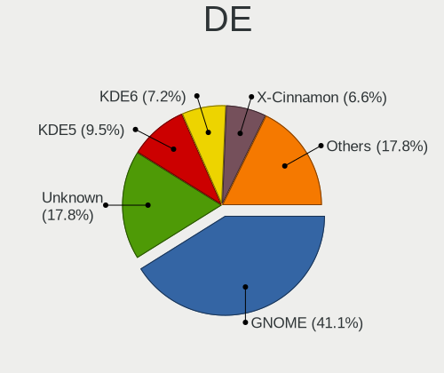
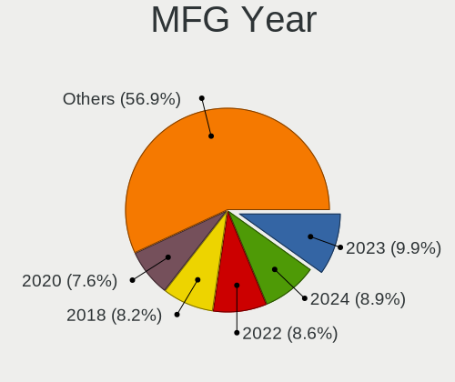
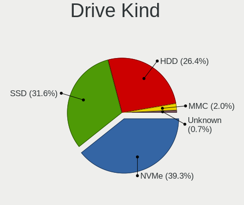
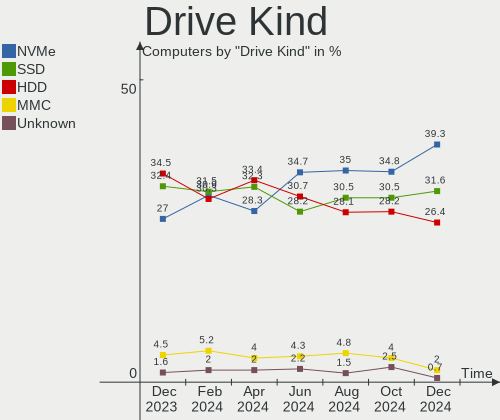
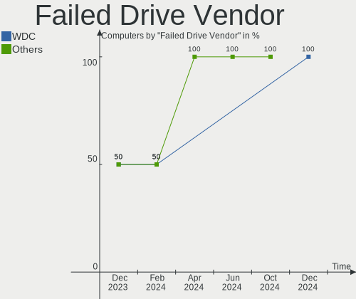
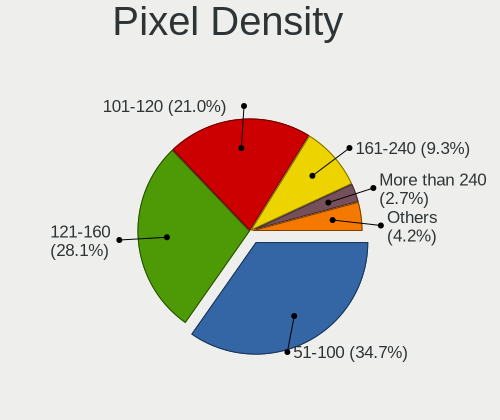
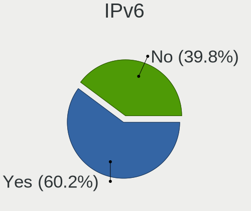
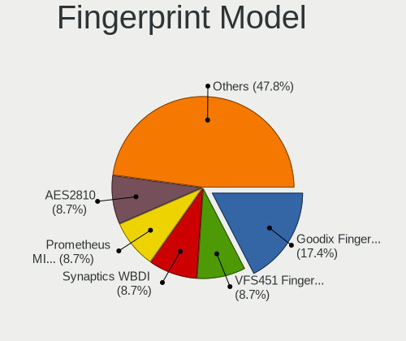

Linux in France - Hardware Trends
---------------------------------

A project to identify most popular hardware characteristics and track their change
over time based on data collected by Linux users at https://Linux-Hardware.org.

Anyone can contribute to this report by the [hw-probe](https://github.com/linuxhw/hw-probe) tool:

    sudo -E hw-probe -all -upload

This is a report for all computer types. See also reports for [desktops](/Location/France/Desktop/README.md) and [notebooks](/Location/France/Notebook/README.md).

Period: Mar, 2023.

Contents
--------

* [ System ](#system)
  - [ OS                       ](#os)
  - [ OS Family                ](#os-family)
  - [ Kernel                   ](#kernel)
  - [ Kernel Family            ](#kernel-family)
  - [ Kernel Major Ver.        ](#kernel-major-ver)
  - [ Arch                     ](#arch)
  - [ DE                       ](#de)
  - [ Display Server           ](#display-server)
  - [ Display Manager          ](#display-manager)
  - [ OS Lang                  ](#os-lang)
  - [ Boot Mode                ](#boot-mode)
  - [ Filesystem               ](#filesystem)
  - [ Part. scheme             ](#part-scheme)
  - [ Dual Boot with Linux/BSD ](#dual-boot-with-linuxbsd)
  - [ Dual Boot (Win)          ](#dual-boot-win)

* [ Board ](#board)
  - [ Vendor                   ](#vendor)
  - [ Model                    ](#model)
  - [ Model Family             ](#model-family)
  - [ MFG Year                 ](#mfg-year)
  - [ Form Factor              ](#form-factor)
  - [ Secure Boot              ](#secure-boot)
  - [ Coreboot                 ](#coreboot)
  - [ RAM Size                 ](#ram-size)
  - [ RAM Used                 ](#ram-used)
  - [ Total Drives             ](#total-drives)
  - [ Has CD-ROM               ](#has-cd-rom)
  - [ Has Ethernet             ](#has-ethernet)
  - [ Has WiFi                 ](#has-wifi)
  - [ Has Bluetooth            ](#has-bluetooth)

* [ Location ](#location)
  - [ Country                  ](#country)
  - [ City                     ](#city)

* [ Drives ](#drives)
  - [ Drive Vendor             ](#drive-vendor)
  - [ Drive Model              ](#drive-model)
  - [ HDD Vendor               ](#hdd-vendor)
  - [ SSD Vendor               ](#ssd-vendor)
  - [ Drive Kind               ](#drive-kind)
  - [ Drive Connector          ](#drive-connector)
  - [ Drive Size               ](#drive-size)
  - [ Space Total              ](#space-total)
  - [ Space Used               ](#space-used)
  - [ Malfunc. Drives          ](#malfunc-drives)
  - [ Malfunc. Drive Vendor    ](#malfunc-drive-vendor)
  - [ Malfunc. HDD Vendor      ](#malfunc-hdd-vendor)
  - [ Malfunc. Drive Kind      ](#malfunc-drive-kind)
  - [ Failed Drives            ](#failed-drives)
  - [ Failed Drive Vendor      ](#failed-drive-vendor)
  - [ Drive Status             ](#drive-status)

* [ Storage controller ](#storage-controller)
  - [ Storage Vendor           ](#storage-vendor)
  - [ Storage Model            ](#storage-model)
  - [ Storage Kind             ](#storage-kind)

* [ Processor ](#processor)
  - [ CPU Vendor               ](#cpu-vendor)
  - [ CPU Model                ](#cpu-model)
  - [ CPU Model Family         ](#cpu-model-family)
  - [ CPU Cores                ](#cpu-cores)
  - [ CPU Sockets              ](#cpu-sockets)
  - [ CPU Threads              ](#cpu-threads)
  - [ CPU Op-Modes             ](#cpu-op-modes)
  - [ CPU Microcode            ](#cpu-microcode)
  - [ CPU Microarch            ](#cpu-microarch)

* [ Graphics ](#graphics)
  - [ GPU Vendor               ](#gpu-vendor)
  - [ GPU Model                ](#gpu-model)
  - [ GPU Combo                ](#gpu-combo)
  - [ GPU Driver               ](#gpu-driver)
  - [ GPU Memory               ](#gpu-memory)

* [ Monitor ](#monitor)
  - [ Monitor Vendor           ](#monitor-vendor)
  - [ Monitor Model            ](#monitor-model)
  - [ Monitor Resolution       ](#monitor-resolution)
  - [ Monitor Diagonal         ](#monitor-diagonal)
  - [ Monitor Width            ](#monitor-width)
  - [ Aspect Ratio             ](#aspect-ratio)
  - [ Monitor Area             ](#monitor-area)
  - [ Pixel Density            ](#pixel-density)
  - [ Multiple Monitors        ](#multiple-monitors)

* [ Network ](#network)
  - [ Net Controller Vendor    ](#net-controller-vendor)
  - [ Net Controller Model     ](#net-controller-model)
  - [ Wireless Vendor          ](#wireless-vendor)
  - [ Wireless Model           ](#wireless-model)
  - [ Ethernet Vendor          ](#ethernet-vendor)
  - [ Ethernet Model           ](#ethernet-model)
  - [ Net Controller Kind      ](#net-controller-kind)
  - [ Used Controller          ](#used-controller)
  - [ NICs                     ](#nics)
  - [ IPv6                     ](#ipv6)

* [ Bluetooth ](#bluetooth)
  - [ Bluetooth Vendor         ](#bluetooth-vendor)
  - [ Bluetooth Model          ](#bluetooth-model)

* [ Sound ](#sound)
  - [ Sound Vendor             ](#sound-vendor)
  - [ Sound Model              ](#sound-model)

* [ Memory ](#memory)
  - [ Memory Vendor            ](#memory-vendor)
  - [ Memory Model             ](#memory-model)
  - [ Memory Kind              ](#memory-kind)
  - [ Memory Form Factor       ](#memory-form-factor)
  - [ Memory Size              ](#memory-size)
  - [ Memory Speed             ](#memory-speed)

* [ Printers & scanners ](#printers--scanners)
  - [ Printer Vendor           ](#printer-vendor)
  - [ Printer Model            ](#printer-model)
  - [ Scanner Vendor           ](#scanner-vendor)
  - [ Scanner Model            ](#scanner-model)

* [ Camera ](#camera)
  - [ Camera Vendor            ](#camera-vendor)
  - [ Camera Model             ](#camera-model)

* [ Security ](#security)
  - [ Fingerprint Vendor       ](#fingerprint-vendor)
  - [ Fingerprint Model        ](#fingerprint-model)
  - [ Chipcard Vendor          ](#chipcard-vendor)
  - [ Chipcard Model           ](#chipcard-model)

* [ Unsupported ](#unsupported)
  - [ Unsupported Devices      ](#unsupported-devices)
  - [ Unsupported Device Types ](#unsupported-device-types)

System
------

OS
--

Installed operating systems

| Name                         | Computers | Percent |
|------------------------------|-----------|---------|
| Ubuntu 22.04                 | 69        | 21.63%  |
| OpenMandriva 23.03           | 27        | 8.46%   |
| OpenMandriva 23.01           | 20        | 6.27%   |
| Debian 11                    | 18        | 5.64%   |
| Ubuntu 22.10                 | 16        | 5.02%   |
| Linux Mint 21.1              | 16        | 5.02%   |
| Ubuntu 20.04                 | 12        | 3.76%   |
| Fedora 37                    | 10        | 3.13%   |
| Linux Mint 20.3              | 8         | 2.51%   |
| Arch Rolling                 | 8         | 2.51%   |
| OpenMandriva 4.3             | 7         | 2.19%   |
| Kubuntu 22.04                | 7         | 2.19%   |
| Zorin 16                     | 6         | 1.88%   |
| Ubuntu MATE 22.04            | 6         | 1.88%   |
| Debian 12                    | 6         | 1.88%   |
| OpenMandriva 4.2             | 5         | 1.57%   |
| KDE neon 22.04               | 5         | 1.57%   |
| Gentoo 2.13                  | 5         | 1.57%   |
| Debian                       | 5         | 1.57%   |
| ArcoLinux Rolling            | 5         | 1.57%   |
| Pop!_OS 22.04                | 4         | 1.25%   |
| Xubuntu 22.04                | 3         | 0.94%   |
| Ubuntu 18.04                 | 3         | 0.94%   |
| Nobara 37                    | 3         | 0.94%   |
| Xubuntu 18.04                | 2         | 0.63%   |
| SteamOS 3.4.6                | 2         | 0.63%   |
| Raspbian 11                  | 2         | 0.63%   |
| openSUSE Tumbleweed-XXXXXXXX | 2         | 0.63%   |
| OpenMandriva 23.90           | 2         | 0.63%   |
| Lubuntu 22.04                | 2         | 0.63%   |
| Linux Mint 21                | 2         | 0.63%   |
| Kubuntu 22.10                | 2         | 0.63%   |
| Fedora 36                    | 2         | 0.63%   |
| EndeavourOS Rolling          | 2         | 0.63%   |
| Ubuntu Unity 22.10           | 1         | 0.31%   |
| Ubuntu Unity 20.04           | 1         | 0.31%   |
| Ubuntu Studio 22.04          | 1         | 0.31%   |
| Ubuntu Budgie 22.10          | 1         | 0.31%   |
| Ubuntu Budgie 21.04          | 1         | 0.31%   |
| Ubuntu 23.04                 | 1         | 0.31%   |

OS Family
---------

OS without a version

| Name          | Computers | Percent |
|---------------|-----------|---------|
| Ubuntu        | 101       | 31.66%  |
| OpenMandriva  | 62        | 19.44%  |
| Debian        | 30        | 9.4%    |
| Linux Mint    | 27        | 8.46%   |
| Fedora        | 14        | 4.39%   |
| Kubuntu       | 10        | 3.13%   |
| Arch          | 8         | 2.51%   |
| Zorin         | 6         | 1.88%   |
| Ubuntu MATE   | 6         | 1.88%   |
| Xubuntu       | 5         | 1.57%   |
| Pop!_OS       | 5         | 1.57%   |
| KDE neon      | 5         | 1.57%   |
| Gentoo        | 5         | 1.57%   |
| ArcoLinux     | 5         | 1.57%   |
| Lubuntu       | 4         | 1.25%   |
| Nobara        | 3         | 0.94%   |
| Ubuntu Unity  | 2         | 0.63%   |
| Ubuntu Budgie | 2         | 0.63%   |
| SteamOS       | 2         | 0.63%   |
| Raspbian      | 2         | 0.63%   |
| openSUSE      | 2         | 0.63%   |
| Manjaro       | 2         | 0.63%   |
| Kali          | 2         | 0.63%   |
| EndeavourOS   | 2         | 0.63%   |
| CentOS        | 2         | 0.63%   |
| Ubuntu Studio | 1         | 0.31%   |
| ROSA          | 1         | 0.31%   |
| Mageia        | 1         | 0.31%   |
| LinuxFX       | 1         | 0.31%   |
| BlackPanther  | 1         | 0.31%   |

Kernel
------

Version of the Linux kernel

| Version                      | Computers | Percent |
|------------------------------|-----------|---------|
| 5.19.0-35-generic            | 56        | 17.55%  |
| 5.15.0-67-generic            | 40        | 12.54%  |
| 6.1.1-desktop-1omv2290       | 19        | 5.96%   |
| 6.2.6-desktop-1omv2390       | 17        | 5.33%   |
| 5.10.0-21-amd64              | 13        | 4.08%   |
| 5.19.0-38-generic            | 12        | 3.76%   |
| 5.15.0-60-generic            | 10        | 3.13%   |
| 6.2.2-desktop-1omv2390       | 8         | 2.51%   |
| 5.4.0-144-generic            | 8         | 2.51%   |
| 5.19.0-32-generic            | 6         | 1.88%   |
| 5.16.13-desktop-1omv4003     | 5         | 1.57%   |
| 5.15.0-69-generic            | 5         | 1.57%   |
| 5.10.14-desktop-1omv4002     | 5         | 1.57%   |
| 6.1.0-5-amd64                | 4         | 1.25%   |
| 5.4.0-139-generic            | 4         | 1.25%   |
| 4.15.0-206-generic           | 4         | 1.25%   |
| 6.2.7-200.fc37.x86_64        | 3         | 0.94%   |
| 6.2.2-arch1-1                | 3         | 0.94%   |
| 6.1.14-200.fc37.x86_64       | 3         | 0.94%   |
| 5.19.0-31-generic            | 3         | 0.94%   |
| 5.16.7-desktop-1omv4003      | 3         | 0.94%   |
| 5.15.0-67-lowlatency         | 3         | 0.94%   |
| 6.2.5-arch1-1                | 2         | 0.63%   |
| 6.2.1-desktop-1omv2390       | 2         | 0.63%   |
| 6.2.0-76060200-generic       | 2         | 0.63%   |
| 6.1.21-1-lts                 | 2         | 0.63%   |
| 6.1.18-200.fc37.x86_64       | 2         | 0.63%   |
| 6.1.14-201.fsync.fc37.x86_64 | 2         | 0.63%   |
| 6.1.13-200.fc37.x86_64       | 2         | 0.63%   |
| 6.1.0-6-amd64                | 2         | 0.63%   |
| 6.0.0-0.deb11.6-amd64        | 2         | 0.63%   |
| 5.19.0-37-generic            | 2         | 0.63%   |
| 5.15.84+                     | 2         | 0.63%   |
| 5.13.0-valve36-1-neptune     | 2         | 0.63%   |
| 6.2.8-arch1-1                | 1         | 0.31%   |
| 6.2.8                        | 1         | 0.31%   |
| 6.2.7-arch1-1                | 1         | 0.31%   |
| 6.2.7-2-MANJARO              | 1         | 0.31%   |
| 6.2.6-desktop-1.mga9         | 1         | 0.31%   |
| 6.2.6-76060206-generic       | 1         | 0.31%   |

Kernel Family
-------------

Linux kernel without a distro release

| Version | Computers | Percent |
|---------|-----------|---------|
| 5.19.0  | 83        | 26.02%  |
| 5.15.0  | 63        | 19.75%  |
| 6.2.6   | 21        | 6.58%   |
| 6.1.1   | 19        | 5.96%   |
| 6.2.2   | 16        | 5.02%   |
| 5.10.0  | 16        | 5.02%   |
| 5.4.0   | 12        | 3.76%   |
| 6.1.0   | 8         | 2.51%   |
| 6.1.14  | 6         | 1.88%   |
| 4.15.0  | 6         | 1.88%   |
| 6.2.7   | 5         | 1.57%   |
| 5.16.13 | 5         | 1.57%   |
| 5.10.14 | 5         | 1.57%   |
| 6.2.1   | 4         | 1.25%   |
| 6.2.5   | 3         | 0.94%   |
| 6.2.0   | 3         | 0.94%   |
| 6.1.13  | 3         | 0.94%   |
| 5.16.7  | 3         | 0.94%   |
| 6.2.8   | 2         | 0.63%   |
| 6.1.21  | 2         | 0.63%   |
| 6.1.19  | 2         | 0.63%   |
| 6.1.18  | 2         | 0.63%   |
| 6.1.11  | 2         | 0.63%   |
| 6.0.0   | 2         | 0.63%   |
| 5.15.84 | 2         | 0.63%   |
| 5.15.79 | 2         | 0.63%   |
| 5.14.0  | 2         | 0.63%   |
| 5.13.0  | 2         | 0.63%   |
| 5.11.0  | 2         | 0.63%   |
| 6.2.3   | 1         | 0.31%   |
| 6.1.8   | 1         | 0.31%   |
| 6.1.20  | 1         | 0.31%   |
| 6.1.15  | 1         | 0.31%   |
| 6.1.12  | 1         | 0.31%   |
| 5.19.16 | 1         | 0.31%   |
| 5.18.12 | 1         | 0.31%   |
| 5.18.10 | 1         | 0.31%   |
| 5.17.5  | 1         | 0.31%   |
| 5.17.12 | 1         | 0.31%   |
| 5.15.94 | 1         | 0.31%   |

Kernel Major Ver.
-----------------

Linux kernel major version

| Version | Computers | Percent |
|---------|-----------|---------|
| 5.19    | 84        | 26.33%  |
| 5.15    | 70        | 21.94%  |
| 6.2     | 55        | 17.24%  |
| 6.1     | 48        | 15.05%  |
| 5.10    | 21        | 6.58%   |
| 5.4     | 12        | 3.76%   |
| 5.16    | 8         | 2.51%   |
| 4.15    | 6         | 1.88%   |
| 5.14    | 3         | 0.94%   |
| 5.11    | 3         | 0.94%   |
| 6.0     | 2         | 0.63%   |
| 5.18    | 2         | 0.63%   |
| 5.17    | 2         | 0.63%   |
| 5.13    | 2         | 0.63%   |
| 4.18    | 1         | 0.31%   |

Arch
----

OS architecture (x86_64, i586, etc.)

| Name    | Computers | Percent |
|---------|-----------|---------|
| x86_64  | 312       | 97.81%  |
| i686    | 4         | 1.25%   |
| armv6l  | 2         | 0.63%   |
| aarch64 | 1         | 0.31%   |

DE
--

Desktop Environment

| Name            | Computers | Percent |
|-----------------|-----------|---------|
| GNOME           | 133       | 41.69%  |
| KDE5            | 91        | 28.53%  |
| X-Cinnamon      | 23        | 7.21%   |
| XFCE            | 20        | 6.27%   |
| Unknown         | 16        | 5.02%   |
| MATE            | 12        | 3.76%   |
| Cinnamon        | 6         | 1.88%   |
| LXQt            | 4         | 1.25%   |
| awesome         | 3         | 0.94%   |
| Unity           | 2         | 0.63%   |
| LXDE            | 2         | 0.63%   |
| Budgie          | 2         | 0.63%   |
| sway            | 1         | 0.31%   |
| KDE             | 1         | 0.31%   |
| i3              | 1         | 0.31%   |
| GNUstep         | 1         | 0.31%   |
| GNOME Flashback | 1         | 0.31%   |

Display Server
--------------

X11 or Wayland

| Name    | Computers | Percent |
|---------|-----------|---------|
| X11     | 218       | 68.34%  |
| Wayland | 86        | 26.96%  |
| Tty     | 11        | 3.45%   |
| Unknown | 4         | 1.25%   |

Display Manager
---------------

SDDM, LightDM, etc.

| Name    | Computers | Percent |
|---------|-----------|---------|
| SDDM    | 90        | 28.21%  |
| GDM3    | 88        | 27.59%  |
| Unknown | 60        | 18.81%  |
| LightDM | 48        | 15.05%  |
| GDM     | 31        | 9.72%   |
| LXDM    | 1         | 0.31%   |
| GREETD  | 1         | 0.31%   |

OS Lang
-------

Language

| Lang    | Computers | Percent |
|---------|-----------|---------|
| fr_FR   | 235       | 73.67%  |
| en_US   | 65        | 20.38%  |
| en_GB   | 8         | 2.51%   |
| Unknown | 5         | 1.57%   |
| de_DE   | 2         | 0.63%   |
| C       | 2         | 0.63%   |
| zh_CN   | 1         | 0.31%   |
| oc_FR   | 1         | 0.31%   |

Boot Mode
---------

EFI or BIOS

| Mode | Computers | Percent |
|------|-----------|---------|
| EFI  | 179       | 56.11%  |
| BIOS | 140       | 43.89%  |

Filesystem
----------

Type of filesystem

| Type    | Computers | Percent |
|---------|-----------|---------|
| Ext4    | 253       | 79.31%  |
| Btrfs   | 31        | 9.72%   |
| Overlay | 26        | 8.15%   |
| Xfs     | 5         | 1.57%   |
| Zfs     | 3         | 0.94%   |
| Ext3    | 1         | 0.31%   |

Part. scheme
------------

Scheme of partitioning

| Type    | Computers | Percent |
|---------|-----------|---------|
| GPT     | 216       | 67.71%  |
| MBR     | 53        | 16.61%  |
| Unknown | 50        | 15.67%  |

Dual Boot with Linux/BSD
------------------------

Hosting more than one Linux/BSD

| Dual boot | Computers | Percent |
|-----------|-----------|---------|
| No        | 257       | 80.56%  |
| Yes       | 62        | 19.44%  |

Dual Boot (Win)
---------------

Hosting Linux and Windows

| Dual boot | Computers | Percent |
|-----------|-----------|---------|
| No        | 220       | 68.97%  |
| Yes       | 99        | 31.03%  |

Board
-----

Vendor
------

Motherboard manufacturer

| Name                    | Computers | Percent |
|-------------------------|-----------|---------|
| ASUSTek Computer        | 57        | 17.87%  |
| Dell                    | 49        | 15.36%  |
| Hewlett-Packard         | 48        | 15.05%  |
| Lenovo                  | 40        | 12.54%  |
| MSI                     | 19        | 5.96%   |
| Acer                    | 16        | 5.02%   |
| Gigabyte Technology     | 12        | 3.76%   |
| Toshiba                 | 9         | 2.82%   |
| Packard Bell            | 8         | 2.51%   |
| ASRock                  | 5         | 1.57%   |
| Intel                   | 4         | 1.25%   |
| Foxconn                 | 4         | 1.25%   |
| Apple                   | 4         | 1.25%   |
| Raspberry Pi Foundation | 3         | 0.94%   |
| Notebook                | 3         | 0.94%   |
| HUAWEI                  | 3         | 0.94%   |
| Fujitsu Siemens         | 3         | 0.94%   |
| Valve                   | 2         | 0.63%   |
| TUXEDO                  | 2         | 0.63%   |
| Sony                    | 2         | 0.63%   |
| Pegatron                | 2         | 0.63%   |
| Microsoft               | 2         | 0.63%   |
| Fujitsu                 | 2         | 0.63%   |
| Chuwi                   | 2         | 0.63%   |
| AZW                     | 2         | 0.63%   |
| Unknown                 | 2         | 0.63%   |
| ZOTAC                   | 1         | 0.31%   |
| Wistron                 | 1         | 0.31%   |
| System76                | 1         | 0.31%   |
| Supermicro              | 1         | 0.31%   |
| Shuttle                 | 1         | 0.31%   |
| Samsung Electronics     | 1         | 0.31%   |
| Quanta                  | 1         | 0.31%   |
| Medion                  | 1         | 0.31%   |
| LG Electronics          | 1         | 0.31%   |
| Google                  | 1         | 0.31%   |
| Fanless Mini PC         | 1         | 0.31%   |
| BESSTAR Tech            | 1         | 0.31%   |
| ASRockRack              | 1         | 0.31%   |
| Alienware               | 1         | 0.31%   |

Model
-----

Motherboard model

| Name                                               | Computers | Percent |
|----------------------------------------------------|-----------|---------|
| Dell XPS 15 9570                                   | 3         | 0.94%   |
| ASUS All Series                                    | 3         | 0.94%   |
| Valve Jupiter                                      | 2         | 0.63%   |
| Packard Bell IMEDIA S3840                          | 2         | 0.63%   |
| Packard Bell IMEDIA S3720                          | 2         | 0.63%   |
| MSI MS-7B38                                        | 2         | 0.63%   |
| HP ZBook 17 G3                                     | 2         | 0.63%   |
| HP EliteBook 840 G8 Notebook PC                    | 2         | 0.63%   |
| Dell XPS 15 9510                                   | 2         | 0.63%   |
| Dell Precision 5570                                | 2         | 0.63%   |
| Dell Latitude 5520                                 | 2         | 0.63%   |
| ASUS VivoBook_ASUSLaptop X513UA                    | 2         | 0.63%   |
| ASUS PRIME A320M-K                                 | 2         | 0.63%   |
| Unknown                                            | 2         | 0.63%   |
| ZOTAC ZBOX-EN173080C/EN173070C/EN153060C/QTG7A4500 | 1         | 0.31%   |
| Wistron ProLiant ML110 G6                          | 1         | 0.31%   |
| TUXEDO Pulse 14 Gen1                               | 1         | 0.31%   |
| TUXEDO InfinityBook S 14 Gen6                      | 1         | 0.31%   |
| Toshiba TECRA Z40-A                                | 1         | 0.31%   |
| Toshiba Satellite Pro L500                         | 1         | 0.31%   |
| Toshiba Satellite Pro C50-A-1EM                    | 1         | 0.31%   |
| Toshiba Satellite P200                             | 1         | 0.31%   |
| Toshiba Satellite L300                             | 1         | 0.31%   |
| Toshiba Satellite C870-198                         | 1         | 0.31%   |
| Toshiba Satellite C55-A-1T6                        | 1         | 0.31%   |
| Toshiba PORTEGE Z30-B                              | 1         | 0.31%   |
| Toshiba KIRA                                       | 1         | 0.31%   |
| System76 Gazelle Professional                      | 1         | 0.31%   |
| Supermicro Super Server                            | 1         | 0.31%   |
| Sony SVF1521C2EW                                   | 1         | 0.31%   |
| Sony SVE1513I4E                                    | 1         | 0.31%   |
| Shuttle SH170                                      | 1         | 0.31%   |
| Samsung 350V5C/351V5C/3540VC/3440VC                | 1         | 0.31%   |
| RPi Raspberry Pi Model B Rev 2                     | 1         | 0.31%   |
| RPi Raspberry Pi Model B Rev 1                     | 1         | 0.31%   |
| RPi Raspberry Pi                                   | 1         | 0.31%   |
| Quanta QuantaMicro X10E-9N                         | 1         | 0.31%   |
| Pegatron h8-1350ef                                 | 1         | 0.31%   |
| Pegatron h8-1110ch                                 | 1         | 0.31%   |
| Packard Bell IXTREME M5850                         | 1         | 0.31%   |

Model Family
------------

Motherboard model prefix

| Name                 | Computers | Percent |
|----------------------|-----------|---------|
| Dell Latitude        | 15        | 4.7%    |
| Lenovo ThinkPad      | 14        | 4.39%   |
| Acer Aspire          | 13        | 4.08%   |
| Dell Precision       | 12        | 3.76%   |
| ASUS VivoBook        | 11        | 3.45%   |
| HP EliteBook         | 10        | 3.13%   |
| Lenovo IdeaPad       | 8         | 2.51%   |
| ASUS PRIME           | 8         | 2.51%   |
| HP Pavilion          | 7         | 2.19%   |
| Dell XPS             | 7         | 2.19%   |
| Toshiba Satellite    | 6         | 1.88%   |
| Lenovo ThinkCentre   | 6         | 1.88%   |
| HP Compaq            | 6         | 1.88%   |
| Dell Inspiron        | 6         | 1.88%   |
| Packard Bell IMEDIA  | 5         | 1.57%   |
| HP Laptop            | 5         | 1.57%   |
| Dell OptiPlex        | 5         | 1.57%   |
| HP ZBook             | 4         | 1.25%   |
| RPi Raspberry        | 3         | 0.94%   |
| Lenovo Legion        | 3         | 0.94%   |
| Dell Vostro          | 3         | 0.94%   |
| ASUS ROG             | 3         | 0.94%   |
| ASUS All             | 3         | 0.94%   |
| Valve Jupiter        | 2         | 0.63%   |
| Notebook NL40        | 2         | 0.63%   |
| MSI MS-7B38          | 2         | 0.63%   |
| Microsoft Surface    | 2         | 0.63%   |
| HP Spectre           | 2         | 0.63%   |
| HP ProLiant          | 2         | 0.63%   |
| HP ProDesk           | 2         | 0.63%   |
| HP ProBook           | 2         | 0.63%   |
| HP OMEN              | 2         | 0.63%   |
| ASUS ZenBook         | 2         | 0.63%   |
| ASUS TUF             | 2         | 0.63%   |
| ASUS M5A97           | 2         | 0.63%   |
| Unknown              | 2         | 0.63%   |
| ZOTAC ZBOX-EN173080C | 1         | 0.31%   |
| Wistron ProLiant     | 1         | 0.31%   |
| TUXEDO Pulse         | 1         | 0.31%   |
| TUXEDO InfinityBook  | 1         | 0.31%   |

MFG Year
--------

Motherboard manufacture year

| Year    | Computers | Percent |
|---------|-----------|---------|
| 2021    | 33        | 10.34%  |
| 2018    | 31        | 9.72%   |
| 2022    | 29        | 9.09%   |
| 2012    | 24        | 7.52%   |
| 2020    | 22        | 6.9%    |
| 2019    | 21        | 6.58%   |
| 2015    | 21        | 6.58%   |
| 2013    | 21        | 6.58%   |
| 2014    | 18        | 5.64%   |
| 2016    | 17        | 5.33%   |
| 2017    | 16        | 5.02%   |
| 2011    | 16        | 5.02%   |
| 2010    | 15        | 4.7%    |
| 2009    | 14        | 4.39%   |
| 2008    | 8         | 2.51%   |
| 2007    | 5         | 1.57%   |
| 2006    | 4         | 1.25%   |
| Unknown | 3         | 0.94%   |
| 2023    | 1         | 0.31%   |

Form Factor
-----------

Physical design of the computer

| Name           | Computers | Percent |
|----------------|-----------|---------|
| Notebook       | 183       | 57.37%  |
| Desktop        | 110       | 34.48%  |
| Convertible    | 7         | 2.19%   |
| Mini pc        | 5         | 1.57%   |
| All in one     | 5         | 1.57%   |
| Server         | 4         | 1.25%   |
| System on chip | 3         | 0.94%   |
| Tablet         | 2         | 0.63%   |

Secure Boot
-----------

Enabled or disabled

| State    | Computers | Percent |
|----------|-----------|---------|
| Disabled | 295       | 92.48%  |
| Enabled  | 24        | 7.52%   |

Coreboot
--------

Have coreboot on board

| Used | Computers | Percent |
|------|-----------|---------|
| No   | 318       | 99.69%  |
| Yes  | 1         | 0.31%   |

RAM Size
--------

Total RAM memory

| Size in GB      | Computers | Percent |
|-----------------|-----------|---------|
| 4.01-8.0        | 71        | 22.26%  |
| 16.01-24.0      | 63        | 19.75%  |
| 3.01-4.0        | 56        | 17.55%  |
| 8.01-16.0       | 54        | 16.93%  |
| 32.01-64.0      | 40        | 12.54%  |
| 64.01-256.0     | 10        | 3.13%   |
| 2.01-3.0        | 8         | 2.51%   |
| 24.01-32.0      | 7         | 2.19%   |
| 1.01-2.0        | 6         | 1.88%   |
| 0.01-0.5        | 2         | 0.63%   |
| More than 256.0 | 1         | 0.31%   |
| 0.51-1.0        | 1         | 0.31%   |

RAM Used
--------

Used RAM memory

| Used GB     | Computers | Percent |
|-------------|-----------|---------|
| 1.01-2.0    | 108       | 33.86%  |
| 2.01-3.0    | 78        | 24.45%  |
| 4.01-8.0    | 52        | 16.3%   |
| 3.01-4.0    | 40        | 12.54%  |
| 8.01-16.0   | 16        | 5.02%   |
| 0.51-1.0    | 13        | 4.08%   |
| 16.01-24.0  | 5         | 1.57%   |
| 32.01-64.0  | 3         | 0.94%   |
| 0.01-0.5    | 3         | 0.94%   |
| 64.01-256.0 | 1         | 0.31%   |

Total Drives
------------

Number of drives on board

| Drives | Computers | Percent |
|--------|-----------|---------|
| 1      | 193       | 60.5%   |
| 2      | 78        | 24.45%  |
| 3      | 24        | 7.52%   |
| 4      | 11        | 3.45%   |
| 6      | 3         | 0.94%   |
| 5      | 3         | 0.94%   |
| 8      | 2         | 0.63%   |
| 7      | 2         | 0.63%   |
| 25     | 1         | 0.31%   |
| 10     | 1         | 0.31%   |
| 9      | 1         | 0.31%   |

Has CD-ROM
----------

Has CD-ROM on board

| Presented | Computers | Percent |
|-----------|-----------|---------|
| No        | 192       | 60.19%  |
| Yes       | 127       | 39.81%  |

Has Ethernet
------------

Has Ethernet on board

| Presented | Computers | Percent |
|-----------|-----------|---------|
| Yes       | 270       | 84.64%  |
| No        | 49        | 15.36%  |

Has WiFi
--------

Has WiFi module

| Presented | Computers | Percent |
|-----------|-----------|---------|
| Yes       | 240       | 75.24%  |
| No        | 79        | 24.76%  |

Has Bluetooth
-------------

Has Bluetooth module

| Presented | Computers | Percent |
|-----------|-----------|---------|
| Yes       | 200       | 62.7%   |
| No        | 119       | 37.3%   |

Location
--------

Country
-------

Geographic location (country)

| Country | Computers | Percent |
|---------|-----------|---------|
| France  | 319       | 100%    |

City
----

Geographic location (city)

| City                     | Computers | Percent |
|--------------------------|-----------|---------|
| Paris                    | 44        | 13.79%  |
| Nantes                   | 6         | 1.88%   |
| Roubaix                  | 5         | 1.57%   |
| Rennes                   | 5         | 1.57%   |
| Grenoble                 | 5         | 1.57%   |
| Toulouse                 | 4         | 1.25%   |
| Strasbourg               | 4         | 1.25%   |
| Poitiers                 | 4         | 1.25%   |
| Marseille                | 3         | 0.94%   |
| Le Grand-Quevilly        | 3         | 0.94%   |
| Le Beausset              | 3         | 0.94%   |
| Échirolles              | 3         | 0.94%   |
| Drancy                   | 3         | 0.94%   |
| Bordeaux                 | 3         | 0.94%   |
| Vallenay                 | 2         | 0.63%   |
| Tours                    | 2         | 0.63%   |
| Tournefeuille            | 2         | 0.63%   |
| Roquebilliere            | 2         | 0.63%   |
| Rambouillet              | 2         | 0.63%   |
| Quimper                  | 2         | 0.63%   |
| Nice                     | 2         | 0.63%   |
| Mulhouse                 | 2         | 0.63%   |
| Marcq-en-Baroeul         | 2         | 0.63%   |
| Lyon                     | 2         | 0.63%   |
| Lille                    | 2         | 0.63%   |
| Gennevilliers            | 2         | 0.63%   |
| Garges-lès-Gonesse      | 2         | 0.63%   |
| Foix                     | 2         | 0.63%   |
| Clamart                  | 2         | 0.63%   |
| Châtenay-Malabry        | 2         | 0.63%   |
| Champs-sur-Marne         | 2         | 0.63%   |
| Cergy                    | 2         | 0.63%   |
| Blois                    | 2         | 0.63%   |
| Angers                   | 2         | 0.63%   |
| Aix-en-Provence          | 2         | 0.63%   |
| Wasquehal                | 1         | 0.31%   |
| Vitry-sur-Seine          | 1         | 0.31%   |
| Villerupt                | 1         | 0.31%   |
| Villerbon                | 1         | 0.31%   |
| Villeneuve-Saint-Georges | 1         | 0.31%   |

Drives
------

Drive Vendor
------------

Hard drive vendors

| Vendor                    | Computers | Drives | Percent |
|---------------------------|-----------|--------|---------|
| Samsung Electronics       | 83        | 103    | 18.16%  |
| WDC                       | 66        | 88     | 14.44%  |
| Seagate                   | 54        | 72     | 11.82%  |
| Toshiba                   | 34        | 34     | 7.44%   |
| Crucial                   | 28        | 31     | 6.13%   |
| Unknown                   | 20        | 22     | 4.38%   |
| SanDisk                   | 20        | 21     | 4.38%   |
| Kingston                  | 15        | 20     | 3.28%   |
| Micron Technology         | 14        | 14     | 3.06%   |
| HGST                      | 13        | 16     | 2.84%   |
| SK hynix                  | 12        | 12     | 2.63%   |
| Hitachi                   | 12        | 13     | 2.63%   |
| Intel                     | 9         | 9      | 1.97%   |
| Phison Electronics        | 5         | 6      | 1.09%   |
| KIOXIA                    | 5         | 5      | 1.09%   |
| PNY                       | 4         | 4      | 0.88%   |
| Netac                     | 4         | 4      | 0.88%   |
| LDLC                      | 4         | 4      | 0.88%   |
| Intenso                   | 4         | 4      | 0.88%   |
| China                     | 4         | 5      | 0.88%   |
| Maxtor                    | 3         | 3      | 0.66%   |
| JMicron Technology        | 3         | 3      | 0.66%   |
| Emtec                     | 3         | 4      | 0.66%   |
| Corsair                   | 3         | 3      | 0.66%   |
| Unknown                   | 3         | 3      | 0.66%   |
| Transcend                 | 2         | 2      | 0.44%   |
| SSSTC                     | 2         | 2      | 0.44%   |
| SPCC                      | 2         | 2      | 0.44%   |
| Silicon Motion            | 2         | 2      | 0.44%   |
| LITEON                    | 2         | 2      | 0.44%   |
| Fujitsu                   | 2         | 2      | 0.44%   |
| YMTC                      | 1         | 1      | 0.22%   |
| Union Memory (Shenzhen)   | 1         | 1      | 0.22%   |
| Teclast                   | 1         | 1      | 0.22%   |
| Plextor                   | 1         | 1      | 0.22%   |
| Phison                    | 1         | 1      | 0.22%   |
| OCZ                       | 1         | 1      | 0.22%   |
| Micron/Crucial Technology | 1         | 1      | 0.22%   |
| Magnetic Data             | 1         | 1      | 0.22%   |
| Lexar                     | 1         | 1      | 0.22%   |

Drive Model
-----------

Hard drive models

| Model                                               | Computers | Percent |
|-----------------------------------------------------|-----------|---------|
| Samsung SSD 850 EVO 500GB                           | 6         | 1.19%   |
| Samsung NVMe SSD Controller PM9A1/PM9A3/980PRO 1TB  | 6         | 1.19%   |
| Seagate ST2000DM008-2FR102 2TB                      | 5         | 0.99%   |
| Seagate ST1000LM035-1RK172 1TB                      | 5         | 0.99%   |
| Samsung SSD 860 EVO 500GB                           | 5         | 0.99%   |
| Crucial CT240BX500SSD1 240GB                        | 5         | 0.99%   |
| Unknown MMC Card  128GB                             | 4         | 0.8%    |
| Toshiba MQ04ABF100 1TB                              | 4         | 0.8%    |
| Seagate Expansion+ 2TB                              | 4         | 0.8%    |
| Crucial CT1000MX500SSD1 1TB                         | 4         | 0.8%    |
| Seagate ST2000DM001-1ER164 2TB                      | 3         | 0.6%    |
| Seagate ST1000LM024 HN-M101MBB 1TB                  | 3         | 0.6%    |
| Seagate ST1000DM003-1CH162 1TB                      | 3         | 0.6%    |
| Samsung SSD 980 1TB                                 | 3         | 0.6%    |
| Samsung SSD 970 EVO Plus 1TB                        | 3         | 0.6%    |
| Samsung SSD 860 EVO 250GB                           | 3         | 0.6%    |
| Samsung SSD 860 EVO 1TB                             | 3         | 0.6%    |
| Samsung SSD 840 EVO 250GB                           | 3         | 0.6%    |
| Samsung PM9A1 NVMe 1024GB                           | 3         | 0.6%    |
| Samsung NVMe SSD Controller SM981/PM981/PM983 250GB | 3         | 0.6%    |
| Netac SSD 256GB                                     | 3         | 0.6%    |
| HGST HTS721010A9E630 1TB                            | 3         | 0.6%    |
| Crucial CT120BX500SSD1 120GB                        | 3         | 0.6%    |
| Unknown                                             | 3         | 0.6%    |
| WDC WD5000AAKX-00ERMA0 500GB                        | 2         | 0.4%    |
| WDC WD40EFRX-68N32N0 4TB                            | 2         | 0.4%    |
| WDC WD3200BEKT-60V5T1 320GB                         | 2         | 0.4%    |
| WDC WD10SPZX-00Z10T0 1TB                            | 2         | 0.4%    |
| WDC WD10EZEX-00BN5A0 1TB                            | 2         | 0.4%    |
| WDC PC SN530 SDBPNPZ-1T00-1002 1TB                  | 2         | 0.4%    |
| WDC PC SN530 NVMe 256GB                             | 2         | 0.4%    |
| Unknown SD/MMC/MS PRO 64GB                          | 2         | 0.4%    |
| Unknown MMC Card  64GB                              | 2         | 0.4%    |
| Unknown MMC Card  32GB                              | 2         | 0.4%    |
| Toshiba THNSNJ256GMCU 256GB SSD                     | 2         | 0.4%    |
| Toshiba MQ01ABF050 500GB                            | 2         | 0.4%    |
| Toshiba KXG50ZNV512G NVMe 512GB                     | 2         | 0.4%    |
| Toshiba HDWD240 4TB                                 | 2         | 0.4%    |
| Toshiba HDWD120 2TB                                 | 2         | 0.4%    |
| Toshiba DT01ACA100 1TB                              | 2         | 0.4%    |

HDD Vendor
----------

Hard disk drive vendors

| Vendor              | Computers | Drives | Percent |
|---------------------|-----------|--------|---------|
| WDC                 | 54        | 73     | 31.4%   |
| Seagate             | 53        | 70     | 30.81%  |
| Toshiba             | 23        | 23     | 13.37%  |
| HGST                | 13        | 16     | 7.56%   |
| Hitachi             | 12        | 13     | 6.98%   |
| Samsung Electronics | 7         | 7      | 4.07%   |
| Maxtor              | 3         | 3      | 1.74%   |
| Unknown             | 2         | 2      | 1.16%   |
| Fujitsu             | 2         | 2      | 1.16%   |
| JMicron Technology  | 1         | 1      | 0.58%   |
| H/W                 | 1         | 3      | 0.58%   |
| ASMT                | 1         | 1      | 0.58%   |

SSD Vendor
----------

Solid state drive vendors

| Vendor              | Computers | Drives | Percent |
|---------------------|-----------|--------|---------|
| Samsung Electronics | 39        | 45     | 26.9%   |
| Crucial             | 25        | 25     | 17.24%  |
| SanDisk             | 14        | 14     | 9.66%   |
| Kingston            | 12        | 17     | 8.28%   |
| SK hynix            | 4         | 4      | 2.76%   |
| Netac               | 4         | 4      | 2.76%   |
| Micron Technology   | 4         | 4      | 2.76%   |
| China               | 4         | 5      | 2.76%   |
| Toshiba             | 3         | 3      | 2.07%   |
| PNY                 | 3         | 3      | 2.07%   |
| LDLC                | 3         | 3      | 2.07%   |
| Intenso             | 3         | 3      | 2.07%   |
| Intel               | 3         | 3      | 2.07%   |
| Emtec               | 3         | 3      | 2.07%   |
| Corsair             | 3         | 3      | 2.07%   |
| WDC                 | 2         | 2      | 1.38%   |
| Transcend           | 2         | 2      | 1.38%   |
| LITEON              | 2         | 2      | 1.38%   |
| Teclast             | 1         | 1      | 0.69%   |
| SPCC                | 1         | 1      | 0.69%   |
| Plextor             | 1         | 1      | 0.69%   |
| OCZ                 | 1         | 1      | 0.69%   |
| KingFast            | 1         | 1      | 0.69%   |
| JMicron Technology  | 1         | 1      | 0.69%   |
| Fanxiang            | 1         | 1      | 0.69%   |
| Dogfish             | 1         | 1      | 0.69%   |
| Colorful            | 1         | 1      | 0.69%   |
| BHT                 | 1         | 1      | 0.69%   |
| ASENNO              | 1         | 1      | 0.69%   |
| Apple               | 1         | 1      | 0.69%   |

Drive Kind
----------

HDD or SSD

| Kind    | Computers | Drives | Percent |
|---------|-----------|--------|---------|
| HDD     | 140       | 214    | 34.15%  |
| SSD     | 133       | 157    | 32.44%  |
| NVMe    | 113       | 137    | 27.56%  |
| MMC     | 17        | 18     | 4.15%   |
| Unknown | 7         | 34     | 1.71%   |

Drive Connector
---------------

SATA, SAS, NVMe, etc.

| Type | Computers | Drives | Percent |
|------|-----------|--------|---------|
| SATA | 226       | 353    | 59.47%  |
| NVMe | 113       | 137    | 29.74%  |
| SAS  | 24        | 52     | 6.32%   |
| MMC  | 17        | 18     | 4.47%   |

Drive Size
----------

Size of hard drive

| Size in TB      | Computers | Drives | Percent |
|-----------------|-----------|--------|---------|
| 0.01-0.5        | 168       | 201    | 57.14%  |
| 0.51-1.0        | 86        | 105    | 29.25%  |
| 1.01-2.0        | 30        | 51     | 10.2%   |
| 3.01-4.0        | 4         | 4      | 1.36%   |
| 2.01-3.0        | 2         | 3      | 0.68%   |
| 10.01-20.0      | 2         | 5      | 0.68%   |
| More than 100.0 | 1         | 1      | 0.34%   |
| 4.01-10.0       | 1         | 1      | 0.34%   |

Space Total
-----------

Amount of disk space available on the file system

| Size in GB     | Computers | Percent |
|----------------|-----------|---------|
| 101-250        | 73        | 22.88%  |
| 251-500        | 68        | 21.32%  |
| 501-1000       | 50        | 15.67%  |
| 1001-2000      | 29        | 9.09%   |
| More than 3000 | 22        | 6.9%    |
| 1-20           | 21        | 6.58%   |
| 51-100         | 17        | 5.33%   |
| 2001-3000      | 15        | 4.7%    |
| 21-50          | 13        | 4.08%   |
| Unknown        | 11        | 3.45%   |

Space Used
----------

Amount of used disk space

| Used GB        | Computers | Percent |
|----------------|-----------|---------|
| 1-20           | 96        | 30.09%  |
| 21-50          | 54        | 16.93%  |
| 51-100         | 46        | 14.42%  |
| 101-250        | 36        | 11.29%  |
| 501-1000       | 28        | 8.78%   |
| 251-500        | 20        | 6.27%   |
| 1001-2000      | 13        | 4.08%   |
| Unknown        | 11        | 3.45%   |
| 2001-3000      | 8         | 2.51%   |
| More than 3000 | 6         | 1.88%   |
| 0              | 1         | 0.31%   |

Malfunc. Drives
---------------

Drive models with a malfunction

| Model                                               | Computers | Drives | Percent |
|-----------------------------------------------------|-----------|--------|---------|
| Seagate ST1000LM024 HN-M101MBB 1TB                  | 2         | 2      | 4.17%   |
| WDC WD5001AALS-00L3B2 500GB                         | 1         | 1      | 2.08%   |
| WDC WD5000AAKX-00ERMA0 500GB                        | 1         | 1      | 2.08%   |
| WDC WD30EFRX-68EUZN0 3TB                            | 1         | 2      | 2.08%   |
| WDC WD2500JD-00HBB0 250GB                           | 1         | 1      | 2.08%   |
| WDC WD2500BEVS-60UST0 250GB                         | 1         | 1      | 2.08%   |
| WDC WD2500AVJS-63B6A0 250GB                         | 1         | 1      | 2.08%   |
| WDC WD20EARX-00PASB0 2TB                            | 1         | 1      | 2.08%   |
| WDC WD15EARS-00MVWB0 1TB                            | 1         | 1      | 2.08%   |
| WDC WD10EADX-22TDHB0 1TB                            | 1         | 1      | 2.08%   |
| Toshiba MQ01ABF050 500GB                            | 1         | 1      | 2.08%   |
| Toshiba MK6465GSX 640GB                             | 1         | 1      | 2.08%   |
| Toshiba MK2555GSX 250GB                             | 1         | 1      | 2.08%   |
| Toshiba MK1637GSX 160GB                             | 1         | 1      | 2.08%   |
| Toshiba HDWL110 1TB                                 | 1         | 1      | 2.08%   |
| Toshiba HDWA120 2TB                                 | 1         | 1      | 2.08%   |
| Seagate ST9250827AS 250GB                           | 1         | 1      | 2.08%   |
| Seagate ST3500418AS 500GB                           | 1         | 1      | 2.08%   |
| Seagate ST3250310AS 250GB                           | 1         | 1      | 2.08%   |
| Seagate ST320LM001 HN-M320MBB 320GB                 | 1         | 1      | 2.08%   |
| Seagate ST3200822AS 200GB                           | 1         | 1      | 2.08%   |
| Seagate ST31000520AS 1TB                            | 1         | 1      | 2.08%   |
| Seagate ST2000DM001-9YN164 2TB                      | 1         | 1      | 2.08%   |
| Seagate ST2000DM001-1ER164 2TB                      | 1         | 2      | 2.08%   |
| Seagate ST2000DM001-1CH1 2TB                        | 1         | 1      | 2.08%   |
| Seagate ST1000DM003-1ER162 1TB                      | 1         | 1      | 2.08%   |
| Samsung Electronics SSD 980 1TB                     | 1         | 1      | 2.08%   |
| Samsung Electronics MZ7LN256HMJP-000H1 256GB SSD    | 1         | 1      | 2.08%   |
| Samsung Electronics HD103SJ 1TB                     | 1         | 1      | 2.08%   |
| Netac SSD 256GB                                     | 1         | 1      | 2.08%   |
| Micron Technology MTFDDAK256MAY-1AH1ZABHA 256GB SSD | 1         | 1      | 2.08%   |
| Micron Technology MTFDDAK256MAY-1AH12ABHA 256GB SSD | 1         | 1      | 2.08%   |
| Maxtor STM3250820AS 250GB                           | 1         | 1      | 2.08%   |
| Kingston RBU-SMSM151S324GD 24GB SSD                 | 1         | 1      | 2.08%   |
| Intenso SSD Sata III 120GB                          | 1         | 1      | 2.08%   |
| Intel SSDSCKKF256G8H 256GB                          | 1         | 1      | 2.08%   |
| Intel SSDSC2CT240A4 240GB                           | 1         | 1      | 2.08%   |
| Intel SSDSA2M080G2GC 80GB                           | 1         | 1      | 2.08%   |
| Hitachi HTS725032A9A364 320GB                       | 1         | 1      | 2.08%   |
| Hitachi HTS421210H9AT00 100GB                       | 1         | 1      | 2.08%   |

Malfunc. Drive Vendor
---------------------

Vendors of faulty drives

| Vendor              | Computers | Drives | Percent |
|---------------------|-----------|--------|---------|
| Seagate             | 12        | 13     | 25%     |
| WDC                 | 9         | 10     | 18.75%  |
| Toshiba             | 6         | 6      | 12.5%   |
| Samsung Electronics | 3         | 3      | 6.25%   |
| Intel               | 3         | 3      | 6.25%   |
| Hitachi             | 3         | 3      | 6.25%   |
| HGST                | 3         | 3      | 6.25%   |
| Micron Technology   | 2         | 2      | 4.17%   |
| Crucial             | 2         | 2      | 4.17%   |
| Netac               | 1         | 1      | 2.08%   |
| Maxtor              | 1         | 1      | 2.08%   |
| Kingston            | 1         | 1      | 2.08%   |
| Intenso             | 1         | 1      | 2.08%   |
| Fujitsu             | 1         | 1      | 2.08%   |

Malfunc. HDD Vendor
-------------------

Vendors of faulty HDD drives

| Vendor              | Computers | Drives | Percent |
|---------------------|-----------|--------|---------|
| Seagate             | 12        | 13     | 33.33%  |
| WDC                 | 9         | 10     | 25%     |
| Toshiba             | 6         | 6      | 16.67%  |
| Hitachi             | 3         | 3      | 8.33%   |
| HGST                | 3         | 3      | 8.33%   |
| Samsung Electronics | 1         | 1      | 2.78%   |
| Maxtor              | 1         | 1      | 2.78%   |
| Fujitsu             | 1         | 1      | 2.78%   |

Malfunc. Drive Kind
-------------------

Kinds of faulty drives

| Kind | Computers | Drives | Percent |
|------|-----------|--------|---------|
| HDD  | 35        | 38     | 74.47%  |
| SSD  | 11        | 11     | 23.4%   |
| NVMe | 1         | 1      | 2.13%   |

Failed Drives
-------------

Failed drive models

| Model                       | Computers | Drives | Percent |
|-----------------------------|-----------|--------|---------|
| WDC WD3200AAJS-22VWA0 320GB | 1         | 1      | 100%    |

Failed Drive Vendor
-------------------

Failed drive vendors

| Vendor | Computers | Drives | Percent |
|--------|-----------|--------|---------|
| WDC    | 1         | 1      | 100%    |

Drive Status
------------

Number of failed and malfunc. drives

| Status   | Computers | Drives | Percent |
|----------|-----------|--------|---------|
| Works    | 192       | 298    | 55.01%  |
| Detected | 112       | 211    | 32.09%  |
| Malfunc  | 44        | 50     | 12.61%  |
| Failed   | 1         | 1      | 0.29%   |

Storage controller
------------------

Storage Vendor
--------------

Storage controller vendors

| Vendor                         | Computers | Percent |
|--------------------------------|-----------|---------|
| Intel                          | 220       | 51.76%  |
| AMD                            | 63        | 14.82%  |
| Samsung Electronics            | 43        | 10.12%  |
| SanDisk                        | 18        | 4.24%   |
| Toshiba America Info Systems   | 10        | 2.35%   |
| Micron Technology              | 10        | 2.35%   |
| SK hynix                       | 8         | 1.88%   |
| ASMedia Technology             | 8         | 1.88%   |
| Phison Electronics             | 7         | 1.65%   |
| Micron/Crucial Technology      | 4         | 0.94%   |
| JMicron Technology             | 4         | 0.94%   |
| Nvidia                         | 3         | 0.71%   |
| Marvell Technology Group       | 3         | 0.71%   |
| KIOXIA                         | 3         | 0.71%   |
| Kingston Technology Company    | 3         | 0.71%   |
| Solid State Storage Technology | 2         | 0.47%   |
| Silicon Motion                 | 2         | 0.47%   |
| LSI Logic / Symbios Logic      | 2         | 0.47%   |
| Hewlett-Packard                | 2         | 0.47%   |
| Broadcom / LSI                 | 2         | 0.47%   |
| Yangtze Memory Technologies    | 1         | 0.24%   |
| VIA Technologies               | 1         | 0.24%   |
| Union Memory (Shenzhen)        | 1         | 0.24%   |
| Shenzhen Longsys Electronics   | 1         | 0.24%   |
| Seagate Technology             | 1         | 0.24%   |
| Realtek Semiconductor          | 1         | 0.24%   |
| INNOGRIT                       | 1         | 0.24%   |
| ADATA Technology               | 1         | 0.24%   |

Storage Model
-------------

Storage controller models

| Model                                                                          | Computers | Percent |
|--------------------------------------------------------------------------------|-----------|---------|
| AMD FCH SATA Controller [AHCI mode]                                            | 43        | 9%      |
| Intel Volume Management Device NVMe RAID Controller                            | 16        | 3.35%   |
| Samsung NVMe SSD Controller SM981/PM981/PM983                                  | 15        | 3.14%   |
| Samsung NVMe SSD Controller PM9A1/PM9A3/980PRO                                 | 14        | 2.93%   |
| Intel Sunrise Point-LP SATA Controller [AHCI mode]                             | 13        | 2.72%   |
| Intel 8 Series/C220 Series Chipset Family 6-port SATA Controller 1 [AHCI mode] | 13        | 2.72%   |
| Intel 7 Series Chipset Family 6-port SATA Controller [AHCI mode]               | 12        | 2.51%   |
| AMD SB7x0/SB8x0/SB9x0 SATA Controller [AHCI mode]                              | 11        | 2.3%    |
| Samsung NVMe SSD Controller 980                                                | 10        | 2.09%   |
| Micron NVMe Storage Controller                                                 | 10        | 2.09%   |
| Intel Q170/Q150/B150/H170/H110/Z170/CM236 Chipset SATA Controller [AHCI Mode]  | 10        | 2.09%   |
| Intel 82801 Mobile SATA Controller [RAID mode]                                 | 10        | 2.09%   |
| Intel 82801IBM/IEM (ICH9M/ICH9M-E) 4 port SATA Controller [AHCI mode]          | 9         | 1.88%   |
| Intel Wildcat Point-LP SATA Controller [AHCI Mode]                             | 8         | 1.67%   |
| Intel 6 Series/C200 Series Chipset Family 6 port Desktop SATA AHCI Controller  | 8         | 1.67%   |
| Intel Celeron/Pentium Silver Processor SATA Controller                         | 7         | 1.46%   |
| Intel Cannon Lake Mobile PCH SATA AHCI Controller                              | 7         | 1.46%   |
| Intel 7 Series/C210 Series Chipset Family 6-port SATA Controller [AHCI mode]   | 7         | 1.46%   |
| SK hynix Gold P31/PC711 NVMe Solid State Drive                                 | 6         | 1.26%   |
| Intel HM170/QM170 Chipset SATA Controller [AHCI Mode]                          | 6         | 1.26%   |
| Intel 200 Series PCH SATA controller [AHCI mode]                               | 6         | 1.26%   |
| ASMedia ASM1062 Serial ATA Controller                                          | 6         | 1.26%   |
| AMD 400 Series Chipset SATA Controller                                         | 6         | 1.26%   |
| Intel SATA Controller [RAID mode]                                              | 5         | 1.05%   |
| Intel 82801HM/HEM (ICH8M/ICH8M-E) IDE Controller                               | 5         | 1.05%   |
| AMD FCH SATA Controller D                                                      | 5         | 1.05%   |
| Toshiba America Info Systems XG6 NVMe SSD Controller                           | 4         | 0.84%   |
| Toshiba America Info Systems XG5 NVMe SSD Controller                           | 4         | 0.84%   |
| SanDisk WD Blue SN500 / PC SN520 NVMe SSD                                      | 4         | 0.84%   |
| Samsung NVMe SSD Controller SM961/PM961/SM963                                  | 4         | 0.84%   |
| Phison E12 NVMe Controller                                                     | 4         | 0.84%   |
| Intel Non-Volatile memory controller                                           | 4         | 0.84%   |
| Intel Cannon Lake PCH SATA AHCI Controller                                     | 4         | 0.84%   |
| Intel Atom Processor E3800 Series SATA AHCI Controller                         | 4         | 0.84%   |
| Intel 9 Series Chipset Family SATA Controller [AHCI Mode]                      | 4         | 0.84%   |
| Intel 82801HM/HEM (ICH8M/ICH8M-E) SATA Controller [AHCI mode]                  | 4         | 0.84%   |
| Intel 8 Series SATA Controller 1 [AHCI mode]                                   | 4         | 0.84%   |
| Intel 500 Series Chipset Family SATA AHCI Controller                           | 4         | 0.84%   |
| Intel 5 Series/3400 Series Chipset 4 port SATA AHCI Controller                 | 4         | 0.84%   |
| SanDisk WD Blue SN550 NVMe SSD                                                 | 3         | 0.63%   |

Storage Kind
------------

Kind of storage controller (IDE, SATA, NVMe, SAS, ...)

| Kind | Computers | Percent |
|------|-----------|---------|
| SATA | 234       | 55.06%  |
| NVMe | 113       | 26.59%  |
| IDE  | 39        | 9.18%   |
| RAID | 36        | 8.47%   |
| SAS  | 3         | 0.71%   |

Processor
---------

CPU Vendor
----------

Processor vendors

| Vendor | Computers | Percent |
|--------|-----------|---------|
| Intel  | 240       | 75.24%  |
| AMD    | 76        | 23.82%  |
| ARM    | 3         | 0.94%   |

CPU Model
---------

Processor models

| Model                                       | Computers | Percent |
|---------------------------------------------|-----------|---------|
| Intel Core i7-6820HQ CPU @ 2.70GHz          | 6         | 1.88%   |
| Intel Core i5-8250U CPU @ 1.60GHz           | 5         | 1.57%   |
| Intel 12th Gen Core i7-12700H               | 5         | 1.57%   |
| Intel Core i7-7700HQ CPU @ 2.80GHz          | 4         | 1.25%   |
| Intel Core i5-7200U CPU @ 2.50GHz           | 4         | 1.25%   |
| Intel Celeron N4120 CPU @ 1.10GHz           | 4         | 1.25%   |
| Intel 11th Gen Core i7-1185G7 @ 3.00GHz     | 4         | 1.25%   |
| Intel 11th Gen Core i7-11800H @ 2.30GHz     | 4         | 1.25%   |
| Intel 11th Gen Core i7-1165G7 @ 2.80GHz     | 4         | 1.25%   |
| Intel Core i7-9750H CPU @ 2.60GHz           | 3         | 0.94%   |
| Intel Core i7-8750H CPU @ 2.20GHz           | 3         | 0.94%   |
| Intel Core i7-5600U CPU @ 2.60GHz           | 3         | 0.94%   |
| Intel Core i5-6300U CPU @ 2.40GHz           | 3         | 0.94%   |
| Intel Core i3-3110M CPU @ 2.40GHz           | 3         | 0.94%   |
| AMD Ryzen 7 5700U with Radeon Graphics      | 3         | 0.94%   |
| Intel Pentium Gold G6405 CPU @ 4.10GHz      | 2         | 0.63%   |
| Intel Pentium Dual-Core CPU E5400 @ 2.70GHz | 2         | 0.63%   |
| Intel Pentium CPU G4400 @ 3.30GHz           | 2         | 0.63%   |
| Intel Core i7-8700 CPU @ 3.20GHz            | 2         | 0.63%   |
| Intel Core i7-5500U CPU @ 2.40GHz           | 2         | 0.63%   |
| Intel Core i7-4790 CPU @ 3.60GHz            | 2         | 0.63%   |
| Intel Core i7-3770 CPU @ 3.40GHz            | 2         | 0.63%   |
| Intel Core i7-2600 CPU @ 3.40GHz            | 2         | 0.63%   |
| Intel Core i5-8365U CPU @ 1.60GHz           | 2         | 0.63%   |
| Intel Core i5-8350U CPU @ 1.70GHz           | 2         | 0.63%   |
| Intel Core i5-8265U CPU @ 1.60GHz           | 2         | 0.63%   |
| Intel Core i5-7400 CPU @ 3.00GHz            | 2         | 0.63%   |
| Intel Core i5-5300U CPU @ 2.30GHz           | 2         | 0.63%   |
| Intel Core i5-4590 CPU @ 3.30GHz            | 2         | 0.63%   |
| Intel Core i5-3470 CPU @ 3.20GHz            | 2         | 0.63%   |
| Intel Core i5-3320M CPU @ 2.60GHz           | 2         | 0.63%   |
| Intel Core i5-2410M CPU @ 2.30GHz           | 2         | 0.63%   |
| Intel Core i5-2320 CPU @ 3.00GHz            | 2         | 0.63%   |
| Intel Core i5-10210U CPU @ 1.60GHz          | 2         | 0.63%   |
| Intel Core i3-6100 CPU @ 3.70GHz            | 2         | 0.63%   |
| Intel Core i3-4130 CPU @ 3.40GHz            | 2         | 0.63%   |
| Intel Core i3-3217U CPU @ 1.80GHz           | 2         | 0.63%   |
| Intel Core 2 Duo CPU T7250 @ 2.00GHz        | 2         | 0.63%   |
| Intel Core 2 Duo CPU P8700 @ 2.53GHz        | 2         | 0.63%   |
| Intel Core 2 Duo CPU P7450 @ 2.13GHz        | 2         | 0.63%   |

CPU Model Family
----------------

Processor model prefix

| Model                          | Computers | Percent |
|--------------------------------|-----------|---------|
| Intel Core i5                  | 65        | 20.38%  |
| Intel Core i7                  | 49        | 15.36%  |
| Other                          | 39        | 12.23%  |
| Intel Core i3                  | 23        | 7.21%   |
| AMD Ryzen 5                    | 17        | 5.33%   |
| Intel Core 2 Duo               | 14        | 4.39%   |
| AMD Ryzen 7                    | 14        | 4.39%   |
| Intel Xeon                     | 13        | 4.08%   |
| Intel Celeron                  | 13        | 4.08%   |
| Intel Pentium                  | 10        | 3.13%   |
| Intel Pentium Dual-Core        | 6         | 1.88%   |
| AMD Ryzen 9                    | 4         | 1.25%   |
| Intel Pentium Dual             | 3         | 0.94%   |
| AMD Ryzen 3                    | 3         | 0.94%   |
| AMD E2                         | 3         | 0.94%   |
| AMD A8                         | 3         | 0.94%   |
| AMD A4                         | 3         | 0.94%   |
| AMD A10                        | 3         | 0.94%   |
| Intel Pentium Gold             | 2         | 0.63%   |
| ARM BCM                        | 2         | 0.63%   |
| AMD Ryzen 7 PRO                | 2         | 0.63%   |
| AMD FX                         | 2         | 0.63%   |
| AMD E1                         | 2         | 0.63%   |
| AMD Athlon II Neo              | 2         | 0.63%   |
| AMD A6                         | 2         | 0.63%   |
| Intel Pentium Silver           | 1         | 0.31%   |
| Intel Pentium M                | 1         | 0.31%   |
| Intel Pentium D                | 1         | 0.31%   |
| Intel Genuine                  | 1         | 0.31%   |
| Intel Core i9                  | 1         | 0.31%   |
| Intel Core 2 Quad              | 1         | 0.31%   |
| Intel Core 2                   | 1         | 0.31%   |
| Intel Atom                     | 1         | 0.31%   |
| AMD Turion X2 Dual-Core Mobile | 1         | 0.31%   |
| AMD Sempron                    | 1         | 0.31%   |
| AMD Ryzen Threadripper         | 1         | 0.31%   |
| AMD Ryzen 3 PRO                | 1         | 0.31%   |
| AMD Phenom II X6               | 1         | 0.31%   |
| AMD Phenom II X4               | 1         | 0.31%   |
| AMD E                          | 1         | 0.31%   |

CPU Cores
---------

Number of processor cores

| Number  | Computers | Percent |
|---------|-----------|---------|
| 2       | 122       | 38.24%  |
| 4       | 107       | 33.54%  |
| 6       | 33        | 10.34%  |
| 8       | 27        | 8.46%   |
| 14      | 8         | 2.51%   |
| 1       | 8         | 2.51%   |
| 12      | 6         | 1.88%   |
| 10      | 4         | 1.25%   |
| 16      | 2         | 0.63%   |
| 3       | 1         | 0.31%   |
| Unknown | 1         | 0.31%   |

CPU Sockets
-----------

Number of sockets

| Number  | Computers | Percent |
|---------|-----------|---------|
| 1       | 314       | 98.43%  |
| 2       | 4         | 1.25%   |
| Unknown | 1         | 0.31%   |

CPU Threads
-----------

Threads per core (Hyper-Threading)

| Number  | Computers | Percent |
|---------|-----------|---------|
| 2       | 210       | 65.83%  |
| 1       | 108       | 33.86%  |
| Unknown | 1         | 0.31%   |

CPU Op-Modes
------------

CPU Operation Modes (32-bit, 64-bit)

| Op mode        | Computers | Percent |
|----------------|-----------|---------|
| 32-bit, 64-bit | 314       | 98.43%  |
| 32-bit         | 2         | 0.63%   |
| Unknown        | 2         | 0.63%   |
| 64-bit         | 1         | 0.31%   |

CPU Microcode
-------------

Microcode number

| Number     | Computers | Percent |
|------------|-----------|---------|
| Unknown    | 110       | 34.48%  |
| 0x306a9    | 17        | 5.33%   |
| 0x306c3    | 13        | 4.08%   |
| 0x806c1    | 11        | 3.45%   |
| 0x1067a    | 10        | 3.13%   |
| 0x206a7    | 9         | 2.82%   |
| 0x506e3    | 8         | 2.51%   |
| 0x6fd      | 6         | 1.88%   |
| 0x906ea    | 5         | 1.57%   |
| 0x906e9    | 5         | 1.57%   |
| 0x906a3    | 5         | 1.57%   |
| 0x406e3    | 5         | 1.57%   |
| 0x306d4    | 5         | 1.57%   |
| 0x0a50000d | 5         | 1.57%   |
| 0x08108109 | 5         | 1.57%   |
| 0x06001119 | 5         | 1.57%   |
| 0x806ec    | 4         | 1.25%   |
| 0x40651    | 4         | 1.25%   |
| 0x30678    | 4         | 1.25%   |
| 0x0a50000c | 4         | 1.25%   |
| 0x906a4    | 3         | 0.94%   |
| 0x806ea    | 3         | 0.94%   |
| 0x706a8    | 3         | 0.94%   |
| 0x506c9    | 3         | 0.94%   |
| 0x08701021 | 3         | 0.94%   |
| 0x06003106 | 3         | 0.94%   |
| 0x010000c8 | 3         | 0.94%   |
| 0xb0671    | 2         | 0.63%   |
| 0xa0653    | 2         | 0.63%   |
| 0xa0652    | 2         | 0.63%   |
| 0x806eb    | 2         | 0.63%   |
| 0x306f2    | 2         | 0.63%   |
| 0x106e5    | 2         | 0.63%   |
| 0x08608103 | 2         | 0.63%   |
| 0x08600104 | 2         | 0.63%   |
| 0x08101016 | 2         | 0.63%   |
| 0x06000852 | 2         | 0.63%   |
| 0x05000119 | 2         | 0.63%   |
| 0xf64      | 1         | 0.31%   |
| 0x906ed    | 1         | 0.31%   |

CPU Microarch
-------------

Microarchitecture

| Name             | Computers | Percent |
|------------------|-----------|---------|
| KabyLake         | 44        | 13.79%  |
| Haswell          | 26        | 8.15%   |
| IvyBridge        | 23        | 7.21%   |
| Skylake          | 20        | 6.27%   |
| Unknown          | 20        | 6.27%   |
| SandyBridge      | 18        | 5.64%   |
| Penryn           | 17        | 5.33%   |
| Zen 3            | 16        | 5.02%   |
| Broadwell        | 13        | 4.08%   |
| TigerLake        | 12        | 3.76%   |
| Zen 2            | 10        | 3.13%   |
| Core             | 10        | 3.13%   |
| Alderlake Hybrid | 10        | 3.13%   |
| Zen+             | 9         | 2.82%   |
| Piledriver       | 7         | 2.19%   |
| K10              | 7         | 2.19%   |
| Goldmont plus    | 7         | 2.19%   |
| CometLake        | 6         | 1.88%   |
| Zen              | 5         | 1.57%   |
| Westmere         | 5         | 1.57%   |
| Silvermont       | 5         | 1.57%   |
| Excavator        | 5         | 1.57%   |
| Steamroller      | 3         | 0.94%   |
| Nehalem          | 3         | 0.94%   |
| IceLake          | 3         | 0.94%   |
| Goldmont         | 3         | 0.94%   |
| Puma             | 2         | 0.63%   |
| P6               | 2         | 0.63%   |
| Bobcat           | 2         | 0.63%   |
| Tremont          | 1         | 0.31%   |
| NetBurst         | 1         | 0.31%   |
| K8 Hammer        | 1         | 0.31%   |
| K8 & K10 hybrid  | 1         | 0.31%   |
| K10 Llano        | 1         | 0.31%   |
| Jaguar           | 1         | 0.31%   |

Graphics
--------

GPU Vendor
----------

Vendors of graphics cards

| Vendor                     | Computers | Percent |
|----------------------------|-----------|---------|
| Intel                      | 181       | 47.51%  |
| Nvidia                     | 105       | 27.56%  |
| AMD                        | 88        | 23.1%   |
| ASPEED Technology          | 4         | 1.05%   |
| Matrox Electronics Systems | 3         | 0.79%   |

GPU Model
---------

Graphics card models

| Model                                                                       | Computers | Percent |
|-----------------------------------------------------------------------------|-----------|---------|
| Intel 3rd Gen Core processor Graphics Controller                            | 13        | 3.36%   |
| Intel TigerLake-LP GT2 [Iris Xe Graphics]                                   | 11        | 2.84%   |
| Intel HD Graphics 530                                                       | 10        | 2.58%   |
| Intel HD Graphics 5500                                                      | 9         | 2.33%   |
| Intel CoffeeLake-H GT2 [UHD Graphics 630]                                   | 9         | 2.33%   |
| Intel Mobile 4 Series Chipset Integrated Graphics Controller                | 8         | 2.07%   |
| Intel Alder Lake-P Integrated Graphics Controller                           | 8         | 2.07%   |
| AMD Cezanne [Radeon Vega Series / Radeon Vega Mobile Series]                | 8         | 2.07%   |
| Intel Xeon E3-1200 v3/4th Gen Core Processor Integrated Graphics Controller | 7         | 1.81%   |
| Intel UHD Graphics 620                                                      | 7         | 1.81%   |
| Intel HD Graphics 630                                                       | 7         | 1.81%   |
| Intel HD Graphics 620                                                       | 6         | 1.55%   |
| Intel Haswell-ULT Integrated Graphics Controller                            | 6         | 1.55%   |
| Intel GeminiLake [UHD Graphics 600]                                         | 6         | 1.55%   |
| AMD Picasso/Raven 2 [Radeon Vega Series / Radeon Vega Mobile Series]        | 6         | 1.55%   |
| Intel WhiskeyLake-U GT2 [UHD Graphics 620]                                  | 5         | 1.29%   |
| Intel 2nd Generation Core Processor Family Integrated Graphics Controller   | 5         | 1.29%   |
| AMD Barcelo                                                                 | 5         | 1.29%   |
| Intel TigerLake-H GT1 [UHD Graphics]                                        | 4         | 1.03%   |
| Intel Skylake GT2 [HD Graphics 520]                                         | 4         | 1.03%   |
| Intel Atom Processor Z36xxx/Z37xxx Series Graphics & Display                | 4         | 1.03%   |
| Intel 4th Gen Core Processor Integrated Graphics Controller                 | 4         | 1.03%   |
| ASPEED Technology ASPEED Graphics Family                                    | 4         | 1.03%   |
| AMD Renoir                                                                  | 4         | 1.03%   |
| Nvidia TU117M [GeForce GTX 1650 Ti Mobile]                                  | 3         | 0.78%   |
| Nvidia TU117M [GeForce GTX 1650 Mobile / Max-Q]                             | 3         | 0.78%   |
| Nvidia GT218 [GeForce 210]                                                  | 3         | 0.78%   |
| Nvidia GP108 [GeForce GT 1030]                                              | 3         | 0.78%   |
| Nvidia GM107M [GeForce GTX 950M]                                            | 3         | 0.78%   |
| Nvidia GK208B [GeForce GT 710]                                              | 3         | 0.78%   |
| Nvidia GA107M [GeForce RTX 3050 Ti Mobile]                                  | 3         | 0.78%   |
| Nvidia GA104M [GeForce RTX 3070 Mobile / Max-Q]                             | 3         | 0.78%   |
| Intel Core Processor Integrated Graphics Controller                         | 3         | 0.78%   |
| Intel CometLake-U GT2 [UHD Graphics]                                        | 3         | 0.78%   |
| Intel CometLake-H GT2 [UHD Graphics]                                        | 3         | 0.78%   |
| Intel 4 Series Chipset Integrated Graphics Controller                       | 3         | 0.78%   |
| AMD Stoney [Radeon R2/R3/R4/R5 Graphics]                                    | 3         | 0.78%   |
| AMD RS880M [Mobility Radeon HD 4225/4250]                                   | 3         | 0.78%   |
| AMD Lucienne                                                                | 3         | 0.78%   |
| AMD Lexa PRO [Radeon 540/540X/550/550X / RX 540X/550/550X]                  | 3         | 0.78%   |

GPU Combo
---------

Combinations of graphics cards

| Name                 | Computers | Percent |
|----------------------|-----------|---------|
| 1 x Intel            | 116       | 36.36%  |
| 1 x AMD              | 75        | 23.51%  |
| 1 x Nvidia           | 53        | 16.61%  |
| Intel + Nvidia       | 49        | 15.36%  |
| Intel + AMD          | 8         | 2.51%   |
| 2 x Intel            | 4         | 1.25%   |
| Other                | 3         | 0.94%   |
| 1 x Matrox           | 3         | 0.94%   |
| 1 x ASPEED           | 3         | 0.94%   |
| AMD + Nvidia         | 3         | 0.94%   |
| 2 x AMD + 1 x ASPEED | 1         | 0.31%   |
| 2 x AMD              | 1         | 0.31%   |

GPU Driver
----------

Free vs proprietary

| Driver      | Computers | Percent |
|-------------|-----------|---------|
| Free        | 271       | 84.95%  |
| Proprietary | 37        | 11.6%   |
| Unknown     | 11        | 3.45%   |

GPU Memory
----------

Total video memory

| Size in GB | Computers | Percent |
|------------|-----------|---------|
| Unknown    | 186       | 58.31%  |
| 0.01-0.5   | 42        | 13.17%  |
| 1.01-2.0   | 31        | 9.72%   |
| 0.51-1.0   | 29        | 9.09%   |
| 3.01-4.0   | 16        | 5.02%   |
| 7.01-8.0   | 7         | 2.19%   |
| 5.01-6.0   | 4         | 1.25%   |
| 16.01-24.0 | 2         | 0.63%   |
| 2.01-3.0   | 1         | 0.31%   |
| 8.01-16.0  | 1         | 0.31%   |

Monitor
-------

Monitor Vendor
--------------

Monitor vendors

| Vendor                  | Computers | Percent |
|-------------------------|-----------|---------|
| AU Optronics            | 48        | 14.29%  |
| Samsung Electronics     | 37        | 11.01%  |
| LG Display              | 34        | 10.12%  |
| Chimei Innolux          | 32        | 9.52%   |
| BOE                     | 25        | 7.44%   |
| Iiyama                  | 19        | 5.65%   |
| Sharp                   | 11        | 3.27%   |
| Hewlett-Packard         | 11        | 3.27%   |
| Goldstar                | 11        | 3.27%   |
| Acer                    | 11        | 3.27%   |
| Philips                 | 9         | 2.68%   |
| Dell                    | 9         | 2.68%   |
| BenQ                    | 7         | 2.08%   |
| AOC                     | 7         | 2.08%   |
| LG Philips              | 6         | 1.79%   |
| ASUSTek Computer        | 5         | 1.49%   |
| Ancor Communications    | 5         | 1.49%   |
| Sony                    | 4         | 1.19%   |
| Lenovo                  | 4         | 1.19%   |
| SNC                     | 3         | 0.89%   |
| PANDA                   | 3         | 0.89%   |
| InfoVision              | 3         | 0.89%   |
| Chi Mei Optoelectronics | 3         | 0.89%   |
| ViewSonic               | 2         | 0.6%    |
| Valve                   | 2         | 0.6%    |
| TCL                     | 2         | 0.6%    |
| NECCI                   | 2         | 0.6%    |
| CHD                     | 2         | 0.6%    |
| Apple                   | 2         | 0.6%    |
| Unknown                 | 1         | 0.3%    |
| Toshiba                 | 1         | 0.3%    |
| Packard Bell            | 1         | 0.3%    |
| MSW                     | 1         | 0.3%    |
| MSI                     | 1         | 0.3%    |
| MiTAC                   | 1         | 0.3%    |
| LG Electronics          | 1         | 0.3%    |
| JRY                     | 1         | 0.3%    |
| ITE                     | 1         | 0.3%    |
| Idek Iiyama             | 1         | 0.3%    |
| IBM                     | 1         | 0.3%    |

Monitor Model
-------------

Monitor models

| Model                                                                 | Computers | Percent |
|-----------------------------------------------------------------------|-----------|---------|
| BenQ GW2480 BNQ78E7 1920x1080 527x296mm 23.8-inch                     | 4         | 1.18%   |
| AU Optronics LCD Monitor AUO38ED 1920x1080 344x193mm 15.5-inch        | 4         | 1.18%   |
| Sharp LCD Monitor SHP149A 1920x1080 344x194mm 15.5-inch               | 3         | 0.88%   |
| LG Display LCD Monitor LGD06B3 1920x1200 336x210mm 15.6-inch          | 3         | 0.88%   |
| Iiyama PL2788H IVM6628 1920x1080 598x336mm 27.0-inch                  | 3         | 0.88%   |
| Chimei Innolux LCD Monitor CMN15F5 1920x1080 344x193mm 15.5-inch      | 3         | 0.88%   |
| AU Optronics LCD Monitor AUO21ED 1920x1080 344x194mm 15.5-inch        | 3         | 0.88%   |
| Valve ANX7530 U VLV3001 800x1280 100x150mm 7.1-inch                   | 2         | 0.59%   |
| Sharp LQ133M1JW02 SHP141A 1920x1080 294x165mm 13.3-inch               | 2         | 0.59%   |
| Samsung Electronics SyncMaster SAM05E6 1920x1080 510x287mm 23.0-inch  | 2         | 0.59%   |
| Samsung Electronics SMT22A350 SAM07A7 1920x1080 477x268mm 21.5-inch   | 2         | 0.59%   |
| Samsung Electronics S22F350 SAM0D1A 1920x1080 477x268mm 21.5-inch     | 2         | 0.59%   |
| Samsung Electronics LCD Monitor SDC4161 1920x1080 344x194mm 15.5-inch | 2         | 0.59%   |
| LG Philips LCD Monitor LPLA101 1440x900 367x230mm 17.1-inch           | 2         | 0.59%   |
| LG Display LCD Monitor LGD05F2 1920x1080 344x194mm 15.5-inch          | 2         | 0.59%   |
| LG Display LCD Monitor LGD046D 1920x1080 309x174mm 14.0-inch          | 2         | 0.59%   |
| LG Display LCD Monitor LGD039F 1366x768 345x194mm 15.6-inch           | 2         | 0.59%   |
| Iiyama PLX2783H IVM6611 1920x1080 598x336mm 27.0-inch                 | 2         | 0.59%   |
| Iiyama PL2492H IVM612F 1920x1080 527x296mm 23.8-inch                  | 2         | 0.59%   |
| Goldstar HDR 4K GSM7706 3840x2160 600x340mm 27.2-inch                 | 2         | 0.59%   |
| Chimei Innolux P140ZKA-BZ1 CMN8C03 2160x1440 296x197mm 14.0-inch      | 2         | 0.59%   |
| Chimei Innolux LCD Monitor CMN1745 1600x900 382x214mm 17.2-inch       | 2         | 0.59%   |
| Chimei Innolux LCD Monitor CMN1738 1920x1080 381x214mm 17.2-inch      | 2         | 0.59%   |
| Chimei Innolux LCD Monitor CMN14D5 1920x1080 309x173mm 13.9-inch      | 2         | 0.59%   |
| CHD 24VCF CHD0240 1920x1080 368x207mm 16.6-inch                       | 2         | 0.59%   |
| AU Optronics LCD Monitor AUO6287 1440x900 367x229mm 17.0-inch         | 2         | 0.59%   |
| AU Optronics LCD Monitor AUO61ED 1920x1080 344x194mm 15.5-inch        | 2         | 0.59%   |
| AU Optronics LCD Monitor AUO139E 1600x900 382x214mm 17.2-inch         | 2         | 0.59%   |
| AU Optronics LCD Monitor AUO109D 1920x1080 381x214mm 17.2-inch        | 2         | 0.59%   |
| AU Optronics LCD Monitor AUO106C 1366x768 276x155mm 12.5-inch         | 2         | 0.59%   |
| AOC Q3279WG5B AOC3279 2560x1440 725x428mm 33.1-inch                   | 2         | 0.59%   |
| ViewSonic XG2405 VSC0D39 1920x1080 527x296mm 23.8-inch                | 1         | 0.29%   |
| ViewSonic VX2453 Series VSC0C28 1920x1080 520x290mm 23.4-inch         | 1         | 0.29%   |
| Unknown LCD Monitor FFFF 2288x1287 2550x2550mm 142.0-inch             | 1         | 0.29%   |
| Toshiba ScreenXpert TSB8888 1080x2160                                 | 1         | 0.29%   |
| TCL SMART TV TCL667B 3840x2160 1209x680mm 54.6-inch                   | 1         | 0.29%   |
| TCL SMART TV TCL6586 3840x2160 1209x680mm 54.6-inch                   | 1         | 0.29%   |
| Sony TV SNYD301 1360x768                                              | 1         | 0.29%   |
| Sony TV SNY4B03 1920x1080 1063x598mm 48.0-inch                        | 1         | 0.29%   |
| Sony TV SNY1503 1360x768                                              | 1         | 0.29%   |

Monitor Resolution
------------------

Monitor screen resolution

| Resolution         | Computers | Percent |
|--------------------|-----------|---------|
| 1920x1080 (FHD)    | 158       | 49.53%  |
| 1366x768 (WXGA)    | 39        | 12.23%  |
| 2560x1440 (QHD)    | 18        | 5.64%   |
| 1600x900 (HD+)     | 17        | 5.33%   |
| 3840x2160 (4K)     | 14        | 4.39%   |
| 1440x900 (WXGA+)   | 14        | 4.39%   |
| 1920x1200 (WUXGA)  | 11        | 3.45%   |
| 1280x1024 (SXGA)   | 8         | 2.51%   |
| 1280x800 (WXGA)    | 6         | 1.88%   |
| 3840x2400          | 4         | 1.25%   |
| 1680x1050 (WSXGA+) | 4         | 1.25%   |
| 3440x1440          | 3         | 0.94%   |
| 1360x768           | 3         | 0.94%   |
| Unknown            | 3         | 0.94%   |
| 800x1280           | 2         | 0.63%   |
| 2560x1600          | 2         | 0.63%   |
| 2160x1440          | 2         | 0.63%   |
| 6160x1440          | 1         | 0.31%   |
| 3286x1080          | 1         | 0.31%   |
| 3240x2160          | 1         | 0.31%   |
| 2880x1800          | 1         | 0.31%   |
| 2880x1620          | 1         | 0.31%   |
| 2736x1824          | 1         | 0.31%   |
| 2560x1080          | 1         | 0.31%   |
| 2520x1680          | 1         | 0.31%   |
| 2288x1287          | 1         | 0.31%   |
| 1600x1200          | 1         | 0.31%   |
| 1024x768 (XGA)     | 1         | 0.31%   |

Monitor Diagonal
----------------

Diagonal size in inches

| Inches  | Computers | Percent |
|---------|-----------|---------|
| 15      | 87        | 25.89%  |
| 27      | 34        | 10.12%  |
| 17      | 31        | 9.23%   |
| 13      | 30        | 8.93%   |
| 14      | 22        | 6.55%   |
| 24      | 19        | 5.65%   |
| 23      | 16        | 4.76%   |
| 21      | 16        | 4.76%   |
| Unknown | 14        | 4.17%   |
| 19      | 9         | 2.68%   |
| 16      | 7         | 2.08%   |
| 12      | 6         | 1.79%   |
| 31      | 4         | 1.19%   |
| 22      | 4         | 1.19%   |
| 72      | 3         | 0.89%   |
| 26      | 3         | 0.89%   |
| 20      | 3         | 0.89%   |
| 84      | 2         | 0.6%    |
| 65      | 2         | 0.6%    |
| 54      | 2         | 0.6%    |
| 40      | 2         | 0.6%    |
| 34      | 2         | 0.6%    |
| 33      | 2         | 0.6%    |
| 29      | 2         | 0.6%    |
| 25      | 2         | 0.6%    |
| 11      | 2         | 0.6%    |
| 7       | 2         | 0.6%    |
| 142     | 1         | 0.3%    |
| 52      | 1         | 0.3%    |
| 50      | 1         | 0.3%    |
| 47      | 1         | 0.3%    |
| 38      | 1         | 0.3%    |
| 35      | 1         | 0.3%    |
| 32      | 1         | 0.3%    |
| 18      | 1         | 0.3%    |

Monitor Width
-------------

Physical width

| Width in mm    | Computers | Percent |
|----------------|-----------|---------|
| 301-350        | 132       | 39.88%  |
| 501-600        | 67        | 20.24%  |
| 351-400        | 35        | 10.57%  |
| 401-500        | 29        | 8.76%   |
| 201-300        | 22        | 6.65%   |
| Unknown        | 14        | 4.23%   |
| 601-700        | 8         | 2.42%   |
| 1001-1500      | 7         | 2.11%   |
| 701-800        | 5         | 1.51%   |
| 1501-2000      | 5         | 1.51%   |
| 801-900        | 4         | 1.21%   |
| 1-100          | 2         | 0.6%    |
| More than 2000 | 1         | 0.3%    |

Aspect Ratio
------------

Proportional relationship between the width and the height

| Ratio   | Computers | Percent |
|---------|-----------|---------|
| 16/9    | 227       | 74.92%  |
| 16/10   | 42        | 13.86%  |
| Unknown | 12        | 3.96%   |
| 5/4     | 7         | 2.31%   |
| 3/2     | 5         | 1.65%   |
| 21/9    | 4         | 1.32%   |
| 4/3     | 3         | 0.99%   |
| 0.67    | 2         | 0.66%   |
| 1.00    | 1         | 0.33%   |

Monitor Area
------------

Area in inch²

| Area in inch² | Computers | Percent |
|----------------|-----------|---------|
| 101-110        | 88        | 26.51%  |
| 201-250        | 45        | 13.55%  |
| 81-90          | 42        | 12.65%  |
| 301-350        | 36        | 10.84%  |
| 121-130        | 20        | 6.02%   |
| 151-200        | 17        | 5.12%   |
| Unknown        | 14        | 4.22%   |
| More than 1000 | 12        | 3.61%   |
| 351-500        | 11        | 3.31%   |
| 71-80          | 10        | 3.01%   |
| 131-140        | 8         | 2.41%   |
| 61-70          | 6         | 1.81%   |
| 111-120        | 6         | 1.81%   |
| 251-300        | 5         | 1.51%   |
| 141-150        | 4         | 1.2%    |
| 501-1000       | 4         | 1.2%    |
| 51-60          | 2         | 0.6%    |
| 1-40           | 2         | 0.6%    |

Pixel Density
-------------

Pixels per inch

| Density       | Computers | Percent |
|---------------|-----------|---------|
| 121-160       | 99        | 30.56%  |
| 51-100        | 98        | 30.25%  |
| 101-120       | 72        | 22.22%  |
| 161-240       | 22        | 6.79%   |
| Unknown       | 14        | 4.32%   |
| 1-50          | 10        | 3.09%   |
| More than 240 | 9         | 2.78%   |

Multiple Monitors
-----------------

Total monitors connected

| Total | Computers | Percent |
|-------|-----------|---------|
| 1     | 257       | 80.56%  |
| 2     | 40        | 12.54%  |
| 0     | 16        | 5.02%   |
| 3     | 6         | 1.88%   |

Network
-------

Net Controller Vendor
---------------------

Controller vendors

| Vendor                                | Computers | Percent |
|---------------------------------------|-----------|---------|
| Intel                                 | 179       | 38.66%  |
| Realtek Semiconductor                 | 163       | 35.21%  |
| Qualcomm Atheros                      | 41        | 8.86%   |
| Broadcom                              | 18        | 3.89%   |
| MediaTek                              | 9         | 1.94%   |
| Broadcom Limited                      | 9         | 1.94%   |
| Samsung Electronics                   | 4         | 0.86%   |
| NetGear                               | 4         | 0.86%   |
| Marvell Technology Group              | 4         | 0.86%   |
| Ralink                                | 3         | 0.65%   |
| ASIX Electronics                      | 3         | 0.65%   |
| TP-Link                               | 2         | 0.43%   |
| Qualcomm Atheros Communications       | 2         | 0.43%   |
| Nvidia                                | 2         | 0.43%   |
| Microchip Technology                  | 2         | 0.43%   |
| D-Link System                         | 2         | 0.43%   |
| Aquantia                              | 2         | 0.43%   |
| Tenda                                 | 1         | 0.22%   |
| Sigma Designs                         | 1         | 0.22%   |
| Sierra Wireless                       | 1         | 0.22%   |
| Qualcomm                              | 1         | 0.22%   |
| QLogic                                | 1         | 0.22%   |
| Microsoft                             | 1         | 0.22%   |
| JMicron Technology                    | 1         | 0.22%   |
| Google                                | 1         | 0.22%   |
| DisplayLink                           | 1         | 0.22%   |
| Dell                                  | 1         | 0.22%   |
| D-Link                                | 1         | 0.22%   |
| Belkin Components                     | 1         | 0.22%   |
| Apple                                 | 1         | 0.22%   |
| 802.11g Adapter [Linksys WUSB54GC v3] | 1         | 0.22%   |

Net Controller Model
--------------------

Controller models

| Model                                                                   | Computers | Percent |
|-------------------------------------------------------------------------|-----------|---------|
| Realtek RTL8111/8168/8411 PCI Express Gigabit Ethernet Controller       | 107       | 19.53%  |
| Intel Wi-Fi 6 AX200                                                     | 18        | 3.28%   |
| Realtek RTL810xE PCI Express Fast Ethernet controller                   | 16        | 2.92%   |
| Intel Wireless 8265 / 8275                                              | 13        | 2.37%   |
| Intel Wireless 7265                                                     | 12        | 2.19%   |
| Realtek RTL8822CE 802.11ac PCIe Wireless Network Adapter                | 10        | 1.82%   |
| Intel Wi-Fi 6 AX201                                                     | 10        | 1.82%   |
| Intel Alder Lake-P PCH CNVi WiFi                                        | 10        | 1.82%   |
| Realtek RTL8153 Gigabit Ethernet Adapter                                | 9         | 1.64%   |
| Intel Wireless 8260                                                     | 9         | 1.64%   |
| Intel 82579LM Gigabit Network Connection (Lewisville)                   | 9         | 1.64%   |
| Intel Ethernet Connection I217-LM                                       | 8         | 1.46%   |
| Realtek RTL8821CE 802.11ac PCIe Wireless Network Adapter                | 7         | 1.28%   |
| Realtek RTL8125 2.5GbE Controller                                       | 7         | 1.28%   |
| Qualcomm Atheros QCA9377 802.11ac Wireless Network Adapter              | 7         | 1.28%   |
| Intel Wireless 7260                                                     | 7         | 1.28%   |
| Intel Ethernet Connection (2) I219-LM                                   | 7         | 1.28%   |
| Intel 82579V Gigabit Network Connection                                 | 7         | 1.28%   |
| Intel Wireless 3165                                                     | 6         | 1.09%   |
| Intel Ethernet Connection (7) I219-V                                    | 6         | 1.09%   |
| Realtek RTL8723BE PCIe Wireless Network Adapter                         | 5         | 0.91%   |
| Qualcomm Atheros AR9485 Wireless Network Adapter                        | 5         | 0.91%   |
| Intel Ethernet Connection (3) I218-LM                                   | 5         | 0.91%   |
| Qualcomm Atheros QCA9565 / AR9565 Wireless Network Adapter              | 4         | 0.73%   |
| Qualcomm Atheros QCA6174 802.11ac Wireless Network Adapter              | 4         | 0.73%   |
| Qualcomm Atheros AR9285 Wireless Network Adapter (PCI-Express)          | 4         | 0.73%   |
| Qualcomm Atheros AR242x / AR542x Wireless Network Adapter (PCI-Express) | 4         | 0.73%   |
| Intel WiFi Link 5100                                                    | 4         | 0.73%   |
| Intel Ethernet Controller I225-V                                        | 4         | 0.73%   |
| Intel Comet Lake PCH CNVi WiFi                                          | 4         | 0.73%   |
| Samsung GT-I9070 (network tethering, USB debugging enabled)             | 3         | 0.55%   |
| Realtek RTL8188EUS 802.11n Wireless Network Adapter                     | 3         | 0.55%   |
| Realtek RTL8188CUS 802.11n WLAN Adapter                                 | 3         | 0.55%   |
| Realtek RTL8152 Fast Ethernet Adapter                                   | 3         | 0.55%   |
| Qualcomm Atheros QCA8172 Fast Ethernet                                  | 3         | 0.55%   |
| MediaTek MT7922 802.11ax PCI Express Wireless Network Adapter           | 3         | 0.55%   |
| Intel Tiger Lake PCH CNVi WiFi                                          | 3         | 0.55%   |
| Intel I211 Gigabit Network Connection                                   | 3         | 0.55%   |
| Intel Ethernet Connection I218-LM                                       | 3         | 0.55%   |
| Intel Ethernet Connection I217-V                                        | 3         | 0.55%   |

Wireless Vendor
---------------

Wireless vendors

| Vendor                                | Computers | Percent |
|---------------------------------------|-----------|---------|
| Intel                                 | 127       | 51.42%  |
| Realtek Semiconductor                 | 43        | 17.41%  |
| Qualcomm Atheros                      | 33        | 13.36%  |
| MediaTek                              | 9         | 3.64%   |
| Broadcom                              | 9         | 3.64%   |
| Broadcom Limited                      | 6         | 2.43%   |
| NetGear                               | 4         | 1.62%   |
| Ralink                                | 3         | 1.21%   |
| TP-Link                               | 2         | 0.81%   |
| Qualcomm Atheros Communications       | 2         | 0.81%   |
| Tenda                                 | 1         | 0.4%    |
| Sierra Wireless                       | 1         | 0.4%    |
| Microsoft                             | 1         | 0.4%    |
| Marvell Technology Group              | 1         | 0.4%    |
| Dell                                  | 1         | 0.4%    |
| D-Link System                         | 1         | 0.4%    |
| D-Link                                | 1         | 0.4%    |
| Belkin Components                     | 1         | 0.4%    |
| 802.11g Adapter [Linksys WUSB54GC v3] | 1         | 0.4%    |

Wireless Model
--------------

Wireless models

| Model                                                                   | Computers | Percent |
|-------------------------------------------------------------------------|-----------|---------|
| Intel Wi-Fi 6 AX200                                                     | 18        | 7.29%   |
| Intel Wireless 8265 / 8275                                              | 13        | 5.26%   |
| Intel Wireless 7265                                                     | 12        | 4.86%   |
| Realtek RTL8822CE 802.11ac PCIe Wireless Network Adapter                | 10        | 4.05%   |
| Intel Wi-Fi 6 AX201                                                     | 10        | 4.05%   |
| Intel Alder Lake-P PCH CNVi WiFi                                        | 10        | 4.05%   |
| Intel Wireless 8260                                                     | 9         | 3.64%   |
| Realtek RTL8821CE 802.11ac PCIe Wireless Network Adapter                | 7         | 2.83%   |
| Qualcomm Atheros QCA9377 802.11ac Wireless Network Adapter              | 7         | 2.83%   |
| Intel Wireless 7260                                                     | 7         | 2.83%   |
| Intel Wireless 3165                                                     | 6         | 2.43%   |
| Realtek RTL8723BE PCIe Wireless Network Adapter                         | 5         | 2.02%   |
| Qualcomm Atheros AR9485 Wireless Network Adapter                        | 5         | 2.02%   |
| Qualcomm Atheros QCA9565 / AR9565 Wireless Network Adapter              | 4         | 1.62%   |
| Qualcomm Atheros QCA6174 802.11ac Wireless Network Adapter              | 4         | 1.62%   |
| Qualcomm Atheros AR9285 Wireless Network Adapter (PCI-Express)          | 4         | 1.62%   |
| Qualcomm Atheros AR242x / AR542x Wireless Network Adapter (PCI-Express) | 4         | 1.62%   |
| Intel WiFi Link 5100                                                    | 4         | 1.62%   |
| Intel Comet Lake PCH CNVi WiFi                                          | 4         | 1.62%   |
| Realtek RTL8188EUS 802.11n Wireless Network Adapter                     | 3         | 1.21%   |
| Realtek RTL8188CUS 802.11n WLAN Adapter                                 | 3         | 1.21%   |
| MediaTek MT7922 802.11ax PCI Express Wireless Network Adapter           | 3         | 1.21%   |
| Intel Tiger Lake PCH CNVi WiFi                                          | 3         | 1.21%   |
| Intel Dual Band Wireless-AC 3168NGW [Stone Peak]                        | 3         | 1.21%   |
| Intel Centrino Advanced-N 6205 [Taylor Peak]                            | 3         | 1.21%   |
| Intel Cannon Point-LP CNVi [Wireless-AC]                                | 3         | 1.21%   |
| Broadcom BCM43142 802.11b/g/n                                           | 3         | 1.21%   |
| Broadcom BCM4313 802.11bgn Wireless Network Adapter                     | 3         | 1.21%   |
| Realtek RTL8821AE 802.11ac PCIe Wireless Network Adapter                | 2         | 0.81%   |
| Realtek RTL8188CE 802.11b/g/n WiFi Adapter                              | 2         | 0.81%   |
| Ralink RT5390 Wireless 802.11n 1T/1R PCIe                               | 2         | 0.81%   |
| Qualcomm Atheros AR9287 Wireless Network Adapter (PCI-Express)          | 2         | 0.81%   |
| MediaTek MT7921K (RZ608) Wi-Fi 6E 80MHz                                 | 2         | 0.81%   |
| MediaTek MT7921 802.11ax PCI Express Wireless Network Adapter           | 2         | 0.81%   |
| Intel Wireless-AC 9260                                                  | 2         | 0.81%   |
| Intel Wireless 3160                                                     | 2         | 0.81%   |
| Intel Wi-Fi 6 AX210/AX211/AX411 160MHz                                  | 2         | 0.81%   |
| Intel PRO/Wireless 3945ABG [Golan] Network Connection                   | 2         | 0.81%   |
| Intel Comet Lake PCH-LP CNVi WiFi                                       | 2         | 0.81%   |
| Intel Cannon Lake PCH CNVi WiFi                                         | 2         | 0.81%   |

Ethernet Vendor
---------------

Ethernet vendors

| Vendor                   | Computers | Percent |
|--------------------------|-----------|---------|
| Realtek Semiconductor    | 143       | 48.97%  |
| Intel                    | 97        | 33.22%  |
| Qualcomm Atheros         | 16        | 5.48%   |
| Broadcom                 | 10        | 3.42%   |
| Samsung Electronics      | 4         | 1.37%   |
| Marvell Technology Group | 3         | 1.03%   |
| Broadcom Limited         | 3         | 1.03%   |
| ASIX Electronics         | 3         | 1.03%   |
| Nvidia                   | 2         | 0.68%   |
| Microchip Technology     | 2         | 0.68%   |
| Aquantia                 | 2         | 0.68%   |
| Qualcomm                 | 1         | 0.34%   |
| QLogic                   | 1         | 0.34%   |
| JMicron Technology       | 1         | 0.34%   |
| Google                   | 1         | 0.34%   |
| DisplayLink              | 1         | 0.34%   |
| D-Link System            | 1         | 0.34%   |
| Apple                    | 1         | 0.34%   |

Ethernet Model
--------------

Ethernet models

| Model                                                             | Computers | Percent |
|-------------------------------------------------------------------|-----------|---------|
| Realtek RTL8111/8168/8411 PCI Express Gigabit Ethernet Controller | 107       | 35.67%  |
| Realtek RTL810xE PCI Express Fast Ethernet controller             | 16        | 5.33%   |
| Realtek RTL8153 Gigabit Ethernet Adapter                          | 9         | 3%      |
| Intel 82579LM Gigabit Network Connection (Lewisville)             | 9         | 3%      |
| Intel Ethernet Connection I217-LM                                 | 8         | 2.67%   |
| Realtek RTL8125 2.5GbE Controller                                 | 7         | 2.33%   |
| Intel Ethernet Connection (2) I219-LM                             | 7         | 2.33%   |
| Intel 82579V Gigabit Network Connection                           | 7         | 2.33%   |
| Intel Ethernet Connection (7) I219-V                              | 6         | 2%      |
| Intel Ethernet Connection (3) I218-LM                             | 5         | 1.67%   |
| Intel Ethernet Controller I225-V                                  | 4         | 1.33%   |
| Samsung GT-I9070 (network tethering, USB debugging enabled)       | 3         | 1%      |
| Realtek RTL8152 Fast Ethernet Adapter                             | 3         | 1%      |
| Qualcomm Atheros QCA8172 Fast Ethernet                            | 3         | 1%      |
| Intel I211 Gigabit Network Connection                             | 3         | 1%      |
| Intel Ethernet Connection I218-LM                                 | 3         | 1%      |
| Intel Ethernet Connection I217-V                                  | 3         | 1%      |
| Intel Ethernet Connection (4) I219-LM                             | 3         | 1%      |
| Intel Ethernet Connection (13) I219-LM                            | 3         | 1%      |
| ASIX AX88179 Gigabit Ethernet                                     | 3         | 1%      |
| Realtek RTL-8100/8101L/8139 PCI Fast Ethernet Adapter             | 2         | 0.67%   |
| Qualcomm Atheros QCA8171 Gigabit Ethernet                         | 2         | 0.67%   |
| Qualcomm Atheros Killer E2400 Gigabit Ethernet Controller         | 2         | 0.67%   |
| Qualcomm Atheros AR8161 Gigabit Ethernet                          | 2         | 0.67%   |
| Qualcomm Atheros AR8151 v2.0 Gigabit Ethernet                     | 2         | 0.67%   |
| Nvidia MCP73 Ethernet                                             | 2         | 0.67%   |
| Microchip SMSC9512/9514 Fast Ethernet Adapter                     | 2         | 0.67%   |
| Intel I350 Gigabit Network Connection                             | 2         | 0.67%   |
| Intel I210 Gigabit Network Connection                             | 2         | 0.67%   |
| Intel Ethernet Controller X550                                    | 2         | 0.67%   |
| Intel Ethernet Connection I219-V                                  | 2         | 0.67%   |
| Intel Ethernet Connection I219-LM                                 | 2         | 0.67%   |
| Intel Ethernet Connection (7) I219-LM                             | 2         | 0.67%   |
| Intel Ethernet Connection (5) I219-LM                             | 2         | 0.67%   |
| Intel Ethernet Connection (4) I219-V                              | 2         | 0.67%   |
| Intel Ethernet Connection (2) I219-V                              | 2         | 0.67%   |
| Intel Ethernet Connection (2) I218-V                              | 2         | 0.67%   |
| Intel Ethernet Connection (14) I219-V                             | 2         | 0.67%   |
| Intel 82578DC Gigabit Network Connection                          | 2         | 0.67%   |
| Intel 82574L Gigabit Network Connection                           | 2         | 0.67%   |

Net Controller Kind
-------------------

Ethernet, WiFi or modem

| Kind     | Computers | Percent |
|----------|-----------|---------|
| Ethernet | 270       | 52.84%  |
| WiFi     | 240       | 46.97%  |
| Modem    | 1         | 0.2%    |

Used Controller
---------------

Currently used network controller

| Kind     | Computers | Percent |
|----------|-----------|---------|
| WiFi     | 191       | 57.88%  |
| Ethernet | 139       | 42.12%  |

NICs
----

Total network controllers on board

| Total | Computers | Percent |
|-------|-----------|---------|
| 2     | 171       | 53.61%  |
| 1     | 137       | 42.95%  |
| 3     | 5         | 1.57%   |
| 0     | 3         | 0.94%   |
| 4     | 2         | 0.63%   |
| 8     | 1         | 0.31%   |

IPv6
----

IPv6 vs IPv4

| Used | Computers | Percent |
|------|-----------|---------|
| Yes  | 176       | 55.17%  |
| No   | 143       | 44.83%  |

Bluetooth
---------

Bluetooth Vendor
----------------

Controller vendors

| Vendor                          | Computers | Percent |
|---------------------------------|-----------|---------|
| Intel                           | 108       | 53.47%  |
| Realtek Semiconductor           | 17        | 8.42%   |
| Cambridge Silicon Radio         | 14        | 6.93%   |
| IMC Networks                    | 13        | 6.44%   |
| Qualcomm Atheros Communications | 8         | 3.96%   |
| Foxconn / Hon Hai               | 6         | 2.97%   |
| Broadcom                        | 6         | 2.97%   |
| Lite-On Technology              | 4         | 1.98%   |
| ASUSTek Computer                | 4         | 1.98%   |
| Apple                           | 4         | 1.98%   |
| Realtek                         | 3         | 1.49%   |
| Toshiba                         | 2         | 0.99%   |
| MediaTek                        | 2         | 0.99%   |
| Dell                            | 2         | 0.99%   |
| Chicony Electronics             | 2         | 0.99%   |
| TP-Link                         | 1         | 0.5%    |
| Qcom                            | 1         | 0.5%    |
| Marvell Semiconductor           | 1         | 0.5%    |
| Hewlett-Packard                 | 1         | 0.5%    |
| Foxconn International           | 1         | 0.5%    |
| Belkin Components               | 1         | 0.5%    |
| Unknown                         | 1         | 0.5%    |

Bluetooth Model
---------------

Controller models

| Model                                               | Computers | Percent |
|-----------------------------------------------------|-----------|---------|
| Intel Bluetooth wireless interface                  | 48        | 23.76%  |
| Intel AX201 Bluetooth                               | 21        | 10.4%   |
| Intel AX200 Bluetooth                               | 16        | 7.92%   |
| Cambridge Silicon Radio Bluetooth Dongle (HCI mode) | 14        | 6.93%   |
| Realtek Bluetooth Radio                             | 13        | 6.44%   |
| Intel Bluetooth Device                              | 9         | 4.46%   |
| Intel Bluetooth 9460/9560 Jefferson Peak (JfP)      | 6         | 2.97%   |
| IMC Networks Bluetooth Radio                        | 6         | 2.97%   |
| Realtek Bluetooth Radio                             | 3         | 1.49%   |
| Qualcomm Atheros  Bluetooth Device                  | 3         | 1.49%   |
| Qualcomm Atheros QCA61x4 Bluetooth 4.0              | 3         | 1.49%   |
| Lite-On Qualcomm Atheros QCA9377 Bluetooth          | 3         | 1.49%   |
| Intel Wireless-AC 3168 Bluetooth                    | 3         | 1.49%   |
| IMC Networks Wireless_Device                        | 3         | 1.49%   |
| IMC Networks Bluetooth Device                       | 3         | 1.49%   |
| Foxconn / Hon Hai Wireless_Device                   | 3         | 1.49%   |
| Toshiba Bluetooth Device                            | 2         | 0.99%   |
| Realtek  Bluetooth 4.2 Adapter                      | 2         | 0.99%   |
| MediaTek Wireless_Device                            | 2         | 0.99%   |
| Intel Wireless-AC 9260 Bluetooth Adapter            | 2         | 0.99%   |
| Intel AX210 Bluetooth                               | 2         | 0.99%   |
| Chicony Bluetooth (RTL8723BE)                       | 2         | 0.99%   |
| ASUS ASUS USB-BT500                                 | 2         | 0.99%   |
| Apple Bluetooth USB Host Controller                 | 2         | 0.99%   |
| TP-Link UB500 Adapter                               | 1         | 0.5%    |
| Realtek RTL8821A Bluetooth                          | 1         | 0.5%    |
| Realtek RTL8723B Bluetooth                          | 1         | 0.5%    |
| Qualcomm Atheros AR3012 Bluetooth 4.0               | 1         | 0.5%    |
| Qualcomm Atheros AR3011 Bluetooth                   | 1         | 0.5%    |
| Qcom Broadcom Bluetooth USB                         | 1         | 0.5%    |
| Marvell Bluetooth and Wireless LAN Composite        | 1         | 0.5%    |
| Lite-On Bluetooth Device                            | 1         | 0.5%    |
| Intel Centrino Bluetooth Wireless Transceiver       | 1         | 0.5%    |
| IMC Networks Bluetooth module                       | 1         | 0.5%    |
| HP Bluetooth 2.0 Interface [Broadcom BCM2045]       | 1         | 0.5%    |
| Foxconn International BCM43142A0 Bluetooth module   | 1         | 0.5%    |
| Foxconn / Hon Hai Broadcom BCM20702A1 Bluetooth     | 1         | 0.5%    |
| Foxconn / Hon Hai Bluetooth USB Host Controller     | 1         | 0.5%    |
| Foxconn / Hon Hai BCM43142A0                        | 1         | 0.5%    |
| Dell Wireless 355 Bluetooth                         | 1         | 0.5%    |

Sound
-----

Sound Vendor
------------

Sound card vendors

| Vendor                 | Computers | Percent |
|------------------------|-----------|---------|
| Intel                  | 227       | 52.42%  |
| AMD                    | 91        | 21.02%  |
| Nvidia                 | 74        | 17.09%  |
| Focusrite-Novation     | 4         | 0.92%   |
| C-Media Electronics    | 4         | 0.92%   |
| SteelSeries ApS        | 3         | 0.69%   |
| Logitech               | 3         | 0.69%   |
| GN Netcom              | 3         | 0.69%   |
| Generalplus Technology | 2         | 0.46%   |
| Creative Labs          | 2         | 0.46%   |
| Corsair                | 2         | 0.46%   |
| ASUSTek Computer       | 2         | 0.46%   |
| Apogee Electronics     | 2         | 0.46%   |
| VIA Technologies       | 1         | 0.23%   |
| Sony                   | 1         | 0.23%   |
| Shure                  | 1         | 0.23%   |
| Realtek Semiconductor  | 1         | 0.23%   |
| Plantronics            | 1         | 0.23%   |
| M-Audio                | 1         | 0.23%   |
| KTMicro                | 1         | 0.23%   |
| Kingston Technology    | 1         | 0.23%   |
| JMTek                  | 1         | 0.23%   |
| Harman International   | 1         | 0.23%   |
| GYROCOM C&C            | 1         | 0.23%   |
| Giga-Byte Technology   | 1         | 0.23%   |
| ESS Technology         | 1         | 0.23%   |
| AKAI Professional M.I. | 1         | 0.23%   |

Sound Model
-----------

Sound card models

| Model                                                                      | Computers | Percent |
|----------------------------------------------------------------------------|-----------|---------|
| AMD Family 17h/19h HD Audio Controller                                     | 31        | 5.92%   |
| Intel 7 Series/C216 Chipset Family High Definition Audio Controller        | 24        | 4.58%   |
| AMD Renoir Radeon High Definition Audio Controller                         | 20        | 3.82%   |
| Intel Sunrise Point-LP HD Audio                                            | 19        | 3.63%   |
| Intel 6 Series/C200 Series Chipset Family High Definition Audio Controller | 14        | 2.67%   |
| Intel Xeon E3-1200 v3/4th Gen Core Processor HD Audio Controller           | 13        | 2.48%   |
| Intel Cannon Lake PCH cAVS                                                 | 13        | 2.48%   |
| Intel 8 Series/C220 Series Chipset High Definition Audio Controller        | 13        | 2.48%   |
| AMD FCH Azalia Controller                                                  | 13        | 2.48%   |
| Intel Tiger Lake-LP Smart Sound Technology Audio Controller                | 12        | 2.29%   |
| AMD SBx00 Azalia (Intel HDA)                                               | 12        | 2.29%   |
| Intel Alder Lake PCH-P High Definition Audio Controller                    | 11        | 2.1%    |
| Intel 100 Series/C230 Series Chipset Family HD Audio Controller            | 11        | 2.1%    |
| Intel Wildcat Point-LP High Definition Audio Controller                    | 10        | 1.91%   |
| Intel Broadwell-U Audio Controller                                         | 10        | 1.91%   |
| Intel 82801I (ICH9 Family) HD Audio Controller                             | 10        | 1.91%   |
| Intel Celeron/Pentium Silver Processor High Definition Audio               | 7         | 1.34%   |
| AMD Starship/Matisse HD Audio Controller                                   | 7         | 1.34%   |
| AMD Raven/Raven2/Fenghuang HDMI/DP Audio Controller                        | 7         | 1.34%   |
| Nvidia TU107 GeForce GTX 1650 High Definition Audio Controller             | 6         | 1.15%   |
| Nvidia High Definition Audio Controller                                    | 6         | 1.15%   |
| Nvidia GK208 HDMI/DP Audio Controller                                      | 6         | 1.15%   |
| Nvidia GA104 High Definition Audio Controller                              | 6         | 1.15%   |
| Intel Tiger Lake-H HD Audio Controller                                     | 6         | 1.15%   |
| Intel Haswell-ULT HD Audio Controller                                      | 6         | 1.15%   |
| Intel CM238 HD Audio Controller                                            | 6         | 1.15%   |
| Intel 82801H (ICH8 Family) HD Audio Controller                             | 6         | 1.15%   |
| Intel 8 Series HD Audio Controller                                         | 6         | 1.15%   |
| Intel 5 Series/3400 Series Chipset High Definition Audio                   | 6         | 1.15%   |
| Intel 200 Series PCH HD Audio                                              | 6         | 1.15%   |
| Nvidia GP107GL High Definition Audio Controller                            | 5         | 0.95%   |
| Nvidia GP106 High Definition Audio Controller                              | 5         | 0.95%   |
| Intel NM10/ICH7 Family High Definition Audio Controller                    | 5         | 0.95%   |
| Intel Cannon Point-LP High Definition Audio Controller                     | 5         | 0.95%   |
| AMD Trinity HDMI Audio Controller                                          | 5         | 0.95%   |
| AMD Kabini HDMI/DP Audio                                                   | 5         | 0.95%   |
| AMD Family 15h (Models 60h-6fh) Audio Controller                           | 5         | 0.95%   |
| Nvidia GF119 HDMI Audio Controller                                         | 4         | 0.76%   |
| Nvidia GA106 High Definition Audio Controller                              | 4         | 0.76%   |
| Intel Comet Lake PCH cAVS                                                  | 4         | 0.76%   |

Memory
------

Memory Vendor
-------------

Memory module vendors

| Vendor              | Computers | Percent |
|---------------------|-----------|---------|
| Samsung Electronics | 72        | 26.67%  |
| SK hynix            | 48        | 17.78%  |
| Micron Technology   | 33        | 12.22%  |
| Kingston            | 30        | 11.11%  |
| Unknown             | 24        | 8.89%   |
| Crucial             | 18        | 6.67%   |
| Corsair             | 9         | 3.33%   |
| G.Skill             | 8         | 2.96%   |
| Elpida              | 5         | 1.85%   |
| Ramaxel Technology  | 4         | 1.48%   |
| A-DATA Technology   | 4         | 1.48%   |
| Unknown (ABCD)      | 3         | 1.11%   |
| Unifosa             | 3         | 1.11%   |
| Qimonda             | 2         | 0.74%   |
| Team                | 1         | 0.37%   |
| PNY                 | 1         | 0.37%   |
| Patriot             | 1         | 0.37%   |
| Nanya Technology    | 1         | 0.37%   |
| Hewlett-Packard     | 1         | 0.37%   |
| ASint Technology    | 1         | 0.37%   |
| Unknown             | 1         | 0.37%   |

Memory Model
------------

Memory module models

| Model                                                        | Computers | Percent |
|--------------------------------------------------------------|-----------|---------|
| SK hynix RAM HMT451S6BFR8A-PB 4GB SODIMM DDR3 1600MT/s       | 5         | 1.71%   |
| Samsung RAM M471A1K43CB1-CRC 8GB SODIMM DDR4 2667MT/s        | 5         | 1.71%   |
| Samsung RAM Module 8GB SODIMM DDR4 2400MT/s                  | 4         | 1.37%   |
| Samsung RAM M471A1G44AB0-CWE 8GB SODIMM DDR4 3200MT/s        | 4         | 1.37%   |
| SK hynix RAM Module 8GB SODIMM DDR4 2133MT/s                 | 3         | 1.02%   |
| SK hynix RAM HMAA2GS6CJR8N-XN 16384MB SODIMM DDR4 3200MT/s   | 3         | 1.02%   |
| SK hynix RAM HMA81GS6DJR8N-XN 8GB SODIMM DDR4 3200MT/s       | 3         | 1.02%   |
| SK hynix RAM HMA81GS6AFR8N-UH 8GB SODIMM DDR4 2667MT/s       | 3         | 1.02%   |
| Samsung RAM M471A5244CB0-CTD 4GB SODIMM DDR4 3266MT/s        | 3         | 1.02%   |
| Unknown RAM Module 4GB DIMM 1333MT/s                         | 2         | 0.68%   |
| Unknown (ABCD) RAM 123456789012345678 1GB DIMM DDR3 2400MT/s | 2         | 0.68%   |
| Unifosa RAM GU342G0ALEPR692C6F 2GB DIMM DDR2 800MT/s         | 2         | 0.68%   |
| SK hynix RAM HMT451U6BFR8C-PB 4GB DIMM DDR3 1600MT/s         | 2         | 0.68%   |
| SK hynix RAM HMT451S6DFR8A-PB 4GB SODIMM DDR3 1600MT/s       | 2         | 0.68%   |
| SK hynix RAM HMT41GS6BFR8A-PB 8GB SODIMM DDR3 1600MT/s       | 2         | 0.68%   |
| SK hynix RAM HMT351S6CFR8C-PB 4GB SODIMM DDR3 1600MT/s       | 2         | 0.68%   |
| SK hynix RAM HMAA1GS6CJR6N-XN 8GB SODIMM DDR4 3200MT/s       | 2         | 0.68%   |
| SK hynix RAM HMA81GS6JJR8N-VK 8GB SODIMM DDR4 2667MT/s       | 2         | 0.68%   |
| Samsung RAM Module 8GB SODIMM DDR4 2667MT/s                  | 2         | 0.68%   |
| Samsung RAM Module 4GB SODIMM DDR3 1600MT/s                  | 2         | 0.68%   |
| Samsung RAM Module 16GB SODIMM DDR4 3200MT/s                 | 2         | 0.68%   |
| Samsung RAM M471B5173QH0-YK0 4GB SODIMM DDR3 1600MT/s        | 2         | 0.68%   |
| Samsung RAM M471B1G73QH0-YK0 8GB SODIMM DDR3 1867MT/s        | 2         | 0.68%   |
| Samsung RAM M471A2K43DB1-CTD 16GB SODIMM DDR4 2667MT/s       | 2         | 0.68%   |
| Samsung RAM M471A2G43BB2-CWE 16GB SODIMM DDR4 3200MT/s       | 2         | 0.68%   |
| Samsung RAM M471A2G43AB2-CWE 16384MB SODIMM DDR4 3200MT/s    | 2         | 0.68%   |
| Samsung RAM M471A1K43EB1-CWE 8GB SODIMM DDR4 3200MT/s        | 2         | 0.68%   |
| Samsung RAM M425R2GA3BB0-CQKOL 16GB SODIMM DDR5 4800MT/s     | 2         | 0.68%   |
| Micron RAM 8ATF2G64HZ-3G2F1 16GB SODIMM DDR4 3200MT/s        | 2         | 0.68%   |
| Micron RAM 8ATF2G64HZ-3G2E2 16GB SODIMM DDR4 3200MT/s        | 2         | 0.68%   |
| Micron RAM 8ATF1G64AZ-2G6E1 8GB DIMM DDR4 2667MT/s           | 2         | 0.68%   |
| Micron RAM 4ATF1G64HZ-3G2E1 8GB Row Of Chips DDR4 3200MT/s   | 2         | 0.68%   |
| Kingston RAM KN2M64-ETB 8GB SODIMM DDR3 1600MT/s             | 2         | 0.68%   |
| Corsair RAM CMV4GX3M1A1333C9 4GB DIMM DDR3 1600MT/s          | 2         | 0.68%   |
| A-DATA RAM AD73I1C1674EV 4GB SODIMM DDR3 1334MT/s            | 2         | 0.68%   |
| Unknown RAM Module 8GB SODIMM DDR4 2667MT/s                  | 1         | 0.34%   |
| Unknown RAM Module 8GB DIMM DDR3 667MT/s                     | 1         | 0.34%   |
| Unknown RAM Module 8GB DIMM DDR3 1600MT/s                    | 1         | 0.34%   |
| Unknown RAM Module 8GB DIMM DDR3 1333MT/s                    | 1         | 0.34%   |
| Unknown RAM Module 512MB SODIMM DDR2 533MT/s                 | 1         | 0.34%   |

Memory Kind
-----------

Memory module kinds

| Kind    | Computers | Percent |
|---------|-----------|---------|
| DDR4    | 111       | 46.44%  |
| DDR3    | 76        | 31.8%   |
| DDR2    | 19        | 7.95%   |
| SDRAM   | 11        | 4.6%    |
| LPDDR4  | 9         | 3.77%   |
| DDR5    | 7         | 2.93%   |
| Unknown | 3         | 1.26%   |
| LPDDR5  | 2         | 0.84%   |
| LPDDR3  | 1         | 0.42%   |

Memory Form Factor
------------------

Physical design of the memory module

| Name         | Computers | Percent |
|--------------|-----------|---------|
| SODIMM       | 133       | 57.08%  |
| DIMM         | 83        | 35.62%  |
| Row Of Chips | 13        | 5.58%   |
| RIMM         | 2         | 0.86%   |
| FB-DIMM      | 1         | 0.43%   |
| Unknown      | 1         | 0.43%   |

Memory Size
-----------

Memory module size

| Size  | Computers | Percent |
|-------|-----------|---------|
| 8192  | 96        | 37.5%   |
| 4096  | 70        | 27.34%  |
| 16384 | 38        | 14.84%  |
| 2048  | 31        | 12.11%  |
| 1024  | 12        | 4.69%   |
| 32768 | 8         | 3.13%   |
| 512   | 1         | 0.39%   |

Memory Speed
------------

Memory module speed

| Speed   | Computers | Percent |
|---------|-----------|---------|
| 1600    | 50        | 19.46%  |
| 3200    | 44        | 17.12%  |
| 2667    | 34        | 13.23%  |
| 2400    | 21        | 8.17%   |
| 1333    | 16        | 6.23%   |
| 2133    | 15        | 5.84%   |
| 667     | 9         | 3.5%    |
| 800     | 8         | 3.11%   |
| 4800    | 7         | 2.72%   |
| 1334    | 5         | 1.95%   |
| 3266    | 4         | 1.56%   |
| 4267    | 3         | 1.17%   |
| 3600    | 3         | 1.17%   |
| 1867    | 3         | 1.17%   |
| 6400    | 2         | 0.78%   |
| 3466    | 2         | 0.78%   |
| 2666    | 2         | 0.78%   |
| 2048    | 2         | 0.78%   |
| 1866    | 2         | 0.78%   |
| 1067    | 2         | 0.78%   |
| 975     | 2         | 0.78%   |
| 533     | 2         | 0.78%   |
| Unknown | 2         | 0.78%   |
| 4266    | 1         | 0.39%   |
| 4199    | 1         | 0.39%   |
| 3733    | 1         | 0.39%   |
| 3666    | 1         | 0.39%   |
| 3534    | 1         | 0.39%   |
| 3151    | 1         | 0.39%   |
| 3066    | 1         | 0.39%   |
| 2933    | 1         | 0.39%   |
| 2866    | 1         | 0.39%   |
| 2800    | 1         | 0.39%   |
| 2600    | 1         | 0.39%   |
| 1800    | 1         | 0.39%   |
| 1332    | 1         | 0.39%   |
| 1331    | 1         | 0.39%   |
| 1066    | 1         | 0.39%   |
| 400     | 1         | 0.39%   |
| 333     | 1         | 0.39%   |

Printers & scanners
-------------------

Printer Vendor
--------------

Printer device vendors

| Vendor                | Computers | Percent |
|-----------------------|-----------|---------|
| Brother Industries    | 3         | 50%     |
| Samsung Electronics   | 1         | 16.67%  |
| Lexmark International | 1         | 16.67%  |
| Hewlett-Packard       | 1         | 16.67%  |

Printer Model
-------------

Printer device models

| Model                             | Computers | Percent |
|-----------------------------------|-----------|---------|
| Samsung ML-1660 Series            | 1         | 16.67%  |
| Lexmark International Z33 Printer | 1         | 16.67%  |
| HP DeskJet 2130 series            | 1         | 16.67%  |
| Brother MFC-9340CDW               | 1         | 16.67%  |
| Brother HL-L2375DW series         | 1         | 16.67%  |
| Brother HL-3140CW series          | 1         | 16.67%  |

Scanner Vendor
--------------

Scanner device vendors

| Vendor      | Computers | Percent |
|-------------|-----------|---------|
| Seiko Epson | 3         | 75%     |
| Canon       | 1         | 25%     |

Scanner Model
-------------

Scanner device models

| Model                                             | Computers | Percent |
|---------------------------------------------------|-----------|---------|
| Seiko Epson GT-X900 [Perfection V700/V750 Photo]  | 1         | 25%     |
| Seiko Epson GT-X770 [Perfection V500]             | 1         | 25%     |
| Seiko Epson GT-F650 [GT-S600/Perfection V10/V100] | 1         | 25%     |
| Canon CanoScan N670U/N676U/LiDE 20                | 1         | 25%     |

Camera
------

Camera Vendor
-------------

Camera device vendors

| Vendor                                 | Computers | Percent |
|----------------------------------------|-----------|---------|
| Chicony Electronics                    | 43        | 21.94%  |
| IMC Networks                           | 23        | 11.73%  |
| Microdia                               | 22        | 11.22%  |
| Realtek Semiconductor                  | 17        | 8.67%   |
| Logitech                               | 14        | 7.14%   |
| Quanta                                 | 12        | 6.12%   |
| Syntek                                 | 7         | 3.57%   |
| Suyin                                  | 7         | 3.57%   |
| Sunplus Innovation Technology          | 6         | 3.06%   |
| Lite-On Technology                     | 6         | 3.06%   |
| Acer                                   | 6         | 3.06%   |
| Luxvisions Innotech Limited            | 4         | 2.04%   |
| Sonix Technology                       | 3         | 1.53%   |
| Samsung Electronics                    | 3         | 1.53%   |
| Cheng Uei Precision Industry (Foxlink) | 3         | 1.53%   |
| Apple                                  | 3         | 1.53%   |
| Alcor Micro                            | 3         | 1.53%   |
| WaveRider Communications               | 2         | 1.02%   |
| Silicon Motion                         | 2         | 1.02%   |
| Bison Electronics                      | 2         | 1.02%   |
| Z-Star Microelectronics                | 1         | 0.51%   |
| YGTek                                  | 1         | 0.51%   |
| Sunplus Technology                     | 1         | 0.51%   |
| Microsoft                              | 1         | 0.51%   |
| Importek                               | 1         | 0.51%   |
| Guillemot                              | 1         | 0.51%   |
| AVerMedia Technologies                 | 1         | 0.51%   |
| Unknown                                | 1         | 0.51%   |

Camera Model
------------

Camera device models

| Model                                                       | Computers | Percent |
|-------------------------------------------------------------|-----------|---------|
| Microdia Integrated_Webcam_HD                               | 12        | 6.09%   |
| Realtek Integrated_Webcam_HD                                | 8         | 4.06%   |
| Logitech Webcam C270                                        | 5         | 2.54%   |
| IMC Networks USB2.0 HD UVC WebCam                           | 5         | 2.54%   |
| IMC Networks Integrated Camera                              | 5         | 2.54%   |
| Chicony HP HD Camera                                        | 5         | 2.54%   |
| Syntek Integrated Camera                                    | 4         | 2.03%   |
| Sunplus Integrated_Webcam_HD                                | 4         | 2.03%   |
| Quanta HP HD Camera                                         | 4         | 2.03%   |
| Microdia Integrated Webcam                                  | 4         | 2.03%   |
| Chicony USB2.0 Camera                                       | 4         | 2.03%   |
| Chicony Integrated Camera                                   | 4         | 2.03%   |
| Syntek Lenovo EasyCamera                                    | 3         | 1.52%   |
| Samsung Galaxy A5 (MTP)                                     | 3         | 1.52%   |
| Quanta USB2.0 HD UVC WebCam                                 | 3         | 1.52%   |
| Luxvisions Innotech Limited HP TrueVision HD Camera         | 3         | 1.52%   |
| Lite-On Integrated Camera                                   | 3         | 1.52%   |
| IMC Networks USB2.0 VGA UVC WebCam                          | 3         | 1.52%   |
| IMC Networks HD Camera                                      | 3         | 1.52%   |
| WaveRider USB 2.0 Camera                                    | 2         | 1.02%   |
| Microdia Webcam Vitade AF                                   | 2         | 1.02%   |
| Logitech HD Pro Webcam C920                                 | 2         | 1.02%   |
| Lite-On HP HD Camera                                        | 2         | 1.02%   |
| IMC Networks EasyCamera                                     | 2         | 1.02%   |
| Chicony VGA Webcam                                          | 2         | 1.02%   |
| Chicony UVC 1.00 device HD UVC WebCam                       | 2         | 1.02%   |
| Chicony TOSHIBA Web Camera - HD                             | 2         | 1.02%   |
| Chicony TOSHIBA Web Camera - FHD                            | 2         | 1.02%   |
| Chicony HD WebCam                                           | 2         | 1.02%   |
| Chicony HD User Facing                                      | 2         | 1.02%   |
| Cheng Uei Precision Industry (Foxlink) HP HD Camera         | 2         | 1.02%   |
| Apple iPhone 5/5C/5S/6/SE/7/8/X                             | 2         | 1.02%   |
| Z-Star Venus USB2.0 Camera                                  | 1         | 0.51%   |
| YGTek webcam                                                | 1         | 0.51%   |
| Suyin HP Webcam-50                                          | 1         | 0.51%   |
| Suyin HP Truevision HD                                      | 1         | 0.51%   |
| Suyin Asus Integrated Webcam                                | 1         | 0.51%   |
| Suyin Acer HD Crystal Eye webcam                            | 1         | 0.51%   |
| Suyin Acer CrystalEye Webcam                                | 1         | 0.51%   |
| Suyin 1.3M WebCam (notebook emachines E730, Acer sub-brand) | 1         | 0.51%   |

Security
--------

Fingerprint Vendor
------------------

Fingerprint sensor vendors

| Vendor                             | Computers | Percent |
|------------------------------------|-----------|---------|
| Validity Sensors                   | 13        | 37.14%  |
| Synaptics                          | 10        | 28.57%  |
| Shenzhen Goodix Technology         | 3         | 8.57%   |
| LighTuning Technology              | 3         | 8.57%   |
| AuthenTec                          | 3         | 8.57%   |
| Upek                               | 1         | 2.86%   |
| Realtek USB2.0 Finger Print Bridge | 1         | 2.86%   |
| Elan Microelectronics              | 1         | 2.86%   |

Fingerprint Model
-----------------

Fingerprint sensor models

| Model                                                                      | Computers | Percent |
|----------------------------------------------------------------------------|-----------|---------|
| Validity Sensors VFS495 Fingerprint Reader                                 | 4         | 11.43%  |
| Shenzhen Goodix  Fingerprint Device                                        | 3         | 8.57%   |
| Validity Sensors VFS7500 Touch Fingerprint Sensor                          | 2         | 5.71%   |
| Validity Sensors VFS Fingerprint sensor                                    | 2         | 5.71%   |
| Synaptics Prometheus MIS Touch Fingerprint Reader                          | 2         | 5.71%   |
| Synaptics FS7604 Touch Fingerprint Sensor with PurePrint                   | 2         | 5.71%   |
| LighTuning EgisTec Touch Fingerprint Sensor                                | 2         | 5.71%   |
| AuthenTec AES2810                                                          | 2         | 5.71%   |
| Validity Sensors VFS491                                                    | 1         | 2.86%   |
| Validity Sensors VFS301 Fingerprint Reader                                 | 1         | 2.86%   |
| Validity Sensors VFS 5011 fingerprint sensor                               | 1         | 2.86%   |
| Validity Sensors Synaptics WBDI                                            | 1         | 2.86%   |
| Validity Sensors Synaptics VFS7552 Touch Fingerprint Sensor with PurePrint | 1         | 2.86%   |
| Upek Biometric Touchchip/Touchstrip Fingerprint Sensor                     | 1         | 2.86%   |
| Synaptics UWP WBDI Device                                                  | 1         | 2.86%   |
| Synaptics UWP WBDI                                                         | 1         | 2.86%   |
| Synaptics  WBDI                                                            | 1         | 2.86%   |
| Synaptics  VFS7552 Touch Fingerprint Sensor with PurePrint                 | 1         | 2.86%   |
| Synaptics  FS7604 Touch Fingerprint Sensor with PurePrint                  | 1         | 2.86%   |
| Synaptics Metallica MIS Touch Fingerprint Reader                           | 1         | 2.86%   |
| Realtek USB2.0 Finger Print Bridge FocalTech Fingerprint Device            | 1         | 2.86%   |
| LighTuning Fingerprint Reader                                              | 1         | 2.86%   |
| Elan ELAN:ARM-M4                                                           | 1         | 2.86%   |
| AuthenTec AES2501 Fingerprint Sensor                                       | 1         | 2.86%   |

Chipcard Vendor
---------------

Chipcard module vendors

| Vendor                | Computers | Percent |
|-----------------------|-----------|---------|
| Broadcom              | 10        | 58.82%  |
| Alcor Micro           | 3         | 17.65%  |
| O2 Micro              | 2         | 11.76%  |
| Yubico.com            | 1         | 5.88%   |
| Realtek Semiconductor | 1         | 5.88%   |

Chipcard Model
--------------

Chipcard module models

| Model                                                                        | Computers | Percent |
|------------------------------------------------------------------------------|-----------|---------|
| Broadcom 58200                                                               | 4         | 23.53%  |
| Broadcom BCM5880 Secure Applications Processor                               | 3         | 17.65%  |
| Alcor Micro AU9540 Smartcard Reader                                          | 3         | 17.65%  |
| O2 Micro OZ776 CCID Smartcard Reader                                         | 2         | 11.76%  |
| Broadcom 5880                                                                | 2         | 11.76%  |
| Yubico.com Yubikey 4/5 U2F+CCID                                              | 1         | 5.88%   |
| Realtek Semiconductor Smart Card Reader Interface                            | 1         | 5.88%   |
| Broadcom BCM5880 Secure Applications Processor with fingerprint swipe sensor | 1         | 5.88%   |

Unsupported
-----------

Unsupported Devices
-------------------

Total unsupported devices on board

| Total | Computers | Percent |
|-------|-----------|---------|
| 0     | 231       | 72.41%  |
| 1     | 72        | 22.57%  |
| 2     | 16        | 5.02%   |

Unsupported Device Types
------------------------

Types of unsupported devices

| Type                     | Computers | Percent |
|--------------------------|-----------|---------|
| Fingerprint reader       | 35        | 33.98%  |
| Graphics card            | 27        | 26.21%  |
| Chipcard                 | 13        | 12.62%  |
| Multimedia controller    | 7         | 6.8%    |
| Net/wireless             | 6         | 5.83%   |
| Unassigned class         | 4         | 3.88%   |
| Storage                  | 3         | 2.91%   |
| Camera                   | 3         | 2.91%   |
| Communication controller | 2         | 1.94%   |
| Network                  | 1         | 0.97%   |
| Modem                    | 1         | 0.97%   |
| Card reader              | 1         | 0.97%   |

