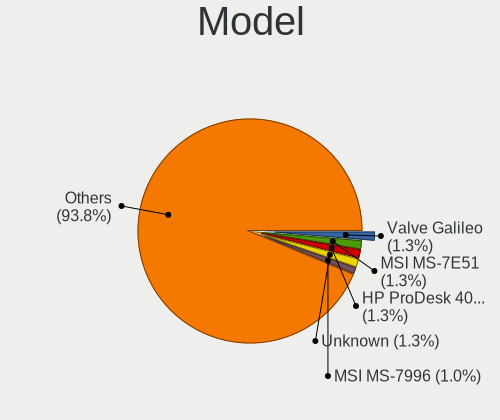
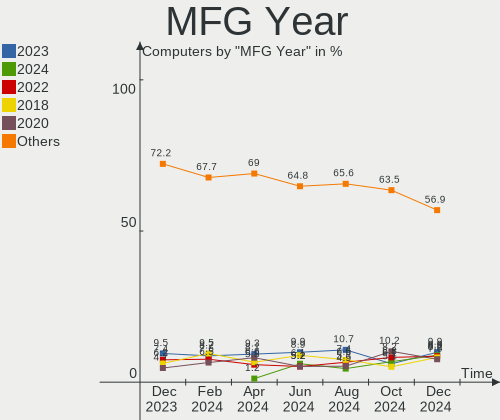
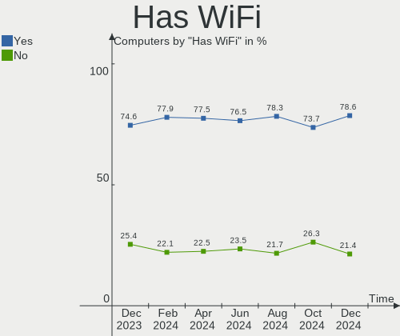
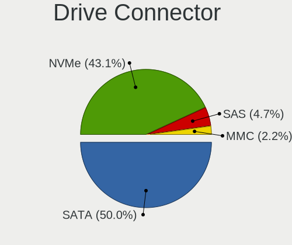
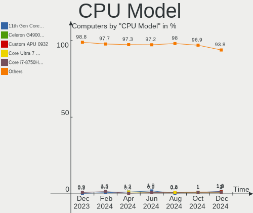
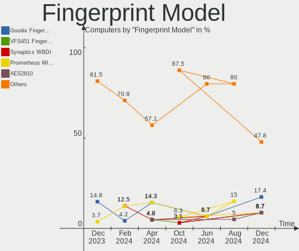

Linux in France - Hardware Trends
---------------------------------

A project to identify most popular hardware characteristics and track their change
over time based on data collected by Linux users at https://Linux-Hardware.org.

Anyone can contribute to this report by the [hw-probe](https://github.com/linuxhw/hw-probe) tool:

    sudo -E hw-probe -all -upload

This is a report for all computer types. See also reports for [desktops](/Location/France/Desktop/README.md) and [notebooks](/Location/France/Notebook/README.md).

Period: Oct, 2022.

Contents
--------

* [ System ](#system)
  - [ OS                       ](#os)
  - [ OS Family                ](#os-family)
  - [ Kernel                   ](#kernel)
  - [ Kernel Family            ](#kernel-family)
  - [ Kernel Major Ver.        ](#kernel-major-ver)
  - [ Arch                     ](#arch)
  - [ DE                       ](#de)
  - [ Display Server           ](#display-server)
  - [ Display Manager          ](#display-manager)
  - [ OS Lang                  ](#os-lang)
  - [ Boot Mode                ](#boot-mode)
  - [ Filesystem               ](#filesystem)
  - [ Part. scheme             ](#part-scheme)
  - [ Dual Boot with Linux/BSD ](#dual-boot-with-linuxbsd)
  - [ Dual Boot (Win)          ](#dual-boot-win)

* [ Board ](#board)
  - [ Vendor                   ](#vendor)
  - [ Model                    ](#model)
  - [ Model Family             ](#model-family)
  - [ MFG Year                 ](#mfg-year)
  - [ Form Factor              ](#form-factor)
  - [ Secure Boot              ](#secure-boot)
  - [ Coreboot                 ](#coreboot)
  - [ RAM Size                 ](#ram-size)
  - [ RAM Used                 ](#ram-used)
  - [ Total Drives             ](#total-drives)
  - [ Has CD-ROM               ](#has-cd-rom)
  - [ Has Ethernet             ](#has-ethernet)
  - [ Has WiFi                 ](#has-wifi)
  - [ Has Bluetooth            ](#has-bluetooth)

* [ Location ](#location)
  - [ Country                  ](#country)
  - [ City                     ](#city)

* [ Drives ](#drives)
  - [ Drive Vendor             ](#drive-vendor)
  - [ Drive Model              ](#drive-model)
  - [ HDD Vendor               ](#hdd-vendor)
  - [ SSD Vendor               ](#ssd-vendor)
  - [ Drive Kind               ](#drive-kind)
  - [ Drive Connector          ](#drive-connector)
  - [ Drive Size               ](#drive-size)
  - [ Space Total              ](#space-total)
  - [ Space Used               ](#space-used)
  - [ Malfunc. Drives          ](#malfunc-drives)
  - [ Malfunc. Drive Vendor    ](#malfunc-drive-vendor)
  - [ Malfunc. HDD Vendor      ](#malfunc-hdd-vendor)
  - [ Malfunc. Drive Kind      ](#malfunc-drive-kind)
  - [ Failed Drives            ](#failed-drives)
  - [ Failed Drive Vendor      ](#failed-drive-vendor)
  - [ Drive Status             ](#drive-status)

* [ Storage controller ](#storage-controller)
  - [ Storage Vendor           ](#storage-vendor)
  - [ Storage Model            ](#storage-model)
  - [ Storage Kind             ](#storage-kind)

* [ Processor ](#processor)
  - [ CPU Vendor               ](#cpu-vendor)
  - [ CPU Model                ](#cpu-model)
  - [ CPU Model Family         ](#cpu-model-family)
  - [ CPU Cores                ](#cpu-cores)
  - [ CPU Sockets              ](#cpu-sockets)
  - [ CPU Threads              ](#cpu-threads)
  - [ CPU Op-Modes             ](#cpu-op-modes)
  - [ CPU Microcode            ](#cpu-microcode)
  - [ CPU Microarch            ](#cpu-microarch)

* [ Graphics ](#graphics)
  - [ GPU Vendor               ](#gpu-vendor)
  - [ GPU Model                ](#gpu-model)
  - [ GPU Combo                ](#gpu-combo)
  - [ GPU Driver               ](#gpu-driver)
  - [ GPU Memory               ](#gpu-memory)

* [ Monitor ](#monitor)
  - [ Monitor Vendor           ](#monitor-vendor)
  - [ Monitor Model            ](#monitor-model)
  - [ Monitor Resolution       ](#monitor-resolution)
  - [ Monitor Diagonal         ](#monitor-diagonal)
  - [ Monitor Width            ](#monitor-width)
  - [ Aspect Ratio             ](#aspect-ratio)
  - [ Monitor Area             ](#monitor-area)
  - [ Pixel Density            ](#pixel-density)
  - [ Multiple Monitors        ](#multiple-monitors)

* [ Network ](#network)
  - [ Net Controller Vendor    ](#net-controller-vendor)
  - [ Net Controller Model     ](#net-controller-model)
  - [ Wireless Vendor          ](#wireless-vendor)
  - [ Wireless Model           ](#wireless-model)
  - [ Ethernet Vendor          ](#ethernet-vendor)
  - [ Ethernet Model           ](#ethernet-model)
  - [ Net Controller Kind      ](#net-controller-kind)
  - [ Used Controller          ](#used-controller)
  - [ NICs                     ](#nics)
  - [ IPv6                     ](#ipv6)

* [ Bluetooth ](#bluetooth)
  - [ Bluetooth Vendor         ](#bluetooth-vendor)
  - [ Bluetooth Model          ](#bluetooth-model)

* [ Sound ](#sound)
  - [ Sound Vendor             ](#sound-vendor)
  - [ Sound Model              ](#sound-model)

* [ Memory ](#memory)
  - [ Memory Vendor            ](#memory-vendor)
  - [ Memory Model             ](#memory-model)
  - [ Memory Kind              ](#memory-kind)
  - [ Memory Form Factor       ](#memory-form-factor)
  - [ Memory Size              ](#memory-size)
  - [ Memory Speed             ](#memory-speed)

* [ Printers & scanners ](#printers--scanners)
  - [ Printer Vendor           ](#printer-vendor)
  - [ Printer Model            ](#printer-model)
  - [ Scanner Vendor           ](#scanner-vendor)
  - [ Scanner Model            ](#scanner-model)

* [ Camera ](#camera)
  - [ Camera Vendor            ](#camera-vendor)
  - [ Camera Model             ](#camera-model)

* [ Security ](#security)
  - [ Fingerprint Vendor       ](#fingerprint-vendor)
  - [ Fingerprint Model        ](#fingerprint-model)
  - [ Chipcard Vendor          ](#chipcard-vendor)
  - [ Chipcard Model           ](#chipcard-model)

* [ Unsupported ](#unsupported)
  - [ Unsupported Devices      ](#unsupported-devices)
  - [ Unsupported Device Types ](#unsupported-device-types)

System
------

OS
--

Installed operating systems

| Name                | Computers | Percent |
|---------------------|-----------|---------|
| Ubuntu 22.04        | 60        | 19.61%  |
| Debian 11           | 26        | 8.5%    |
| Ubuntu 20.04        | 23        | 7.52%   |
| Linux Mint 21       | 22        | 7.19%   |
| OpenMandriva 4.3    | 21        | 6.86%   |
| Linux Mint 20.3     | 10        | 3.27%   |
| Fedora 36           | 10        | 3.27%   |
| Zorin 16            | 8         | 2.61%   |
| OpenMandriva 4.50   | 8         | 2.61%   |
| Ubuntu 18.04        | 7         | 2.29%   |
| Arch Rolling        | 7         | 2.29%   |
| Ubuntu 22.10        | 6         | 1.96%   |
| Kubuntu 22.04       | 6         | 1.96%   |
| Ubuntu MATE 22.04   | 5         | 1.63%   |
| SteamOS 3.3.2       | 5         | 1.63%   |
| Pop!_OS 22.04       | 5         | 1.63%   |
| Fedora 37           | 5         | 1.63%   |
| Debian Testing      | 5         | 1.63%   |
| ArcoLinux Rolling   | 5         | 1.63%   |
| Ubuntu Budgie 22.04 | 3         | 0.98%   |
| Raspbian 11         | 3         | 0.98%   |
| Manjaro 22.0.0      | 3         | 0.98%   |
| KDE neon 20.04      | 3         | 0.98%   |
| Gentoo 2.8          | 3         | 0.98%   |
| EndeavourOS Rolling | 3         | 0.98%   |
| Elementary 6.1      | 3         | 0.98%   |
| Xubuntu 22.10       | 2         | 0.65%   |
| Xubuntu 22.04       | 2         | 0.65%   |
| Ubuntu MATE 20.04   | 2         | 0.65%   |
| ROSA 12.2           | 2         | 0.65%   |
| Nobara 36           | 2         | 0.65%   |
| Lubuntu 22.04       | 2         | 0.65%   |
| Lubuntu 20.04       | 2         | 0.65%   |
| Kali 2022.3         | 2         | 0.65%   |
| Xubuntu 20.04       | 1         | 0.33%   |
| Xero Rolling        | 1         | 0.33%   |
| Ubuntu 21.10        | 1         | 0.33%   |
| SteamOS 3.3         | 1         | 0.33%   |
| Raspbian Testing    | 1         | 0.33%   |
| Parrot 5.1          | 1         | 0.33%   |

OS Family
---------

OS without a version

| Name          | Computers | Percent |
|---------------|-----------|---------|
| Ubuntu        | 97        | 31.7%   |
| Linux Mint    | 36        | 11.76%  |
| Debian        | 33        | 10.78%  |
| OpenMandriva  | 30        | 9.8%    |
| Fedora        | 16        | 5.23%   |
| Kubuntu       | 10        | 3.27%   |
| Zorin         | 8         | 2.61%   |
| Ubuntu MATE   | 7         | 2.29%   |
| Arch          | 7         | 2.29%   |
| SteamOS       | 6         | 1.96%   |
| Xubuntu       | 5         | 1.63%   |
| Pop!_OS       | 5         | 1.63%   |
| Lubuntu       | 5         | 1.63%   |
| ArcoLinux     | 5         | 1.63%   |
| Raspbian      | 4         | 1.31%   |
| Manjaro       | 4         | 1.31%   |
| Ubuntu Budgie | 3         | 0.98%   |
| KDE neon      | 3         | 0.98%   |
| Gentoo        | 3         | 0.98%   |
| EndeavourOS   | 3         | 0.98%   |
| Elementary    | 3         | 0.98%   |
| ROSA          | 2         | 0.65%   |
| Nobara        | 2         | 0.65%   |
| Kali          | 2         | 0.65%   |
| Xero          | 1         | 0.33%   |
| Parrot        | 1         | 0.33%   |
| MX            | 1         | 0.33%   |
| Mageia        | 1         | 0.33%   |
| Garuda Linux  | 1         | 0.33%   |
| Drauger OS    | 1         | 0.33%   |
| ALT Linux     | 1         | 0.33%   |

Kernel
------

Version of the Linux kernel

| Version                            | Computers | Percent |
|------------------------------------|-----------|---------|
| 5.15.0-48-generic                  | 49        | 16.01%  |
| 5.15.0-52-generic                  | 33        | 10.78%  |
| 5.15.0-50-generic                  | 28        | 9.15%   |
| 5.16.7-desktop-1omv4003            | 20        | 6.54%   |
| 5.10.0-18-amd64                    | 11        | 3.59%   |
| 5.4.0-131-generic                  | 10        | 3.27%   |
| 5.15.0-47-generic                  | 8         | 2.61%   |
| 5.4.0-126-generic                  | 7         | 2.29%   |
| 5.19.0-23-generic                  | 7         | 2.29%   |
| 5.10.0-19-amd64                    | 6         | 1.96%   |
| 5.19.5-desktop-1omv4090            | 5         | 1.63%   |
| 5.19.0-2-amd64                     | 5         | 1.63%   |
| 5.13.0-valve21.3-1-neptune         | 5         | 1.63%   |
| 5.4.0-128-generic                  | 4         | 1.31%   |
| 5.19.13-arch1-1                    | 4         | 1.31%   |
| 5.19.12-200.fc36.x86_64            | 4         | 1.31%   |
| 5.19.0-76051900-generic            | 4         | 1.31%   |
| 6.0.2-zen1-1-zen                   | 3         | 0.98%   |
| 5.15.0-43-generic                  | 3         | 0.98%   |
| 5.19.14-200.fc36.x86_64            | 2         | 0.65%   |
| 5.19.12-desktop-2omv4090           | 2         | 0.65%   |
| 5.19.0-kali2-amd64                 | 2         | 0.65%   |
| 5.19.0-21-generic                  | 2         | 0.65%   |
| 5.15.74-3-MANJARO                  | 2         | 0.65%   |
| 5.15.74-1-lts                      | 2         | 0.65%   |
| 5.10.74-generic-2rosa2021.1-x86_64 | 2         | 0.65%   |
| 6.1.0-rc1-next-20221021-1-next-git | 1         | 0.33%   |
| 6.0.2-arch1-1                      | 1         | 0.33%   |
| 6.0.2-76060002-generic             | 1         | 0.33%   |
| 6.0.2-301.fc37.x86_64              | 1         | 0.33%   |
| 6.0.2                              | 1         | 0.33%   |
| 6.0.1-zen1-1-zen                   | 1         | 0.33%   |
| 6.0.0-desktop-1omv4050             | 1         | 0.33%   |
| 6.0.0-2-amd64                      | 1         | 0.33%   |
| 6.0.0                              | 1         | 0.33%   |
| 5.8.0-45-generic                   | 1         | 0.33%   |
| 5.4.209-rt77                       | 1         | 0.33%   |
| 5.4.0-84-generic                   | 1         | 0.33%   |
| 5.4.0-81-generic                   | 1         | 0.33%   |
| 5.4.0-79-generic                   | 1         | 0.33%   |

Kernel Family
-------------

Linux kernel without a distro release

| Version  | Computers | Percent |
|----------|-----------|---------|
| 5.15.0   | 125       | 40.85%  |
| 5.4.0    | 27        | 8.82%   |
| 5.10.0   | 23        | 7.52%   |
| 5.19.0   | 21        | 6.86%   |
| 5.16.7   | 20        | 6.54%   |
| 5.19.12  | 10        | 3.27%   |
| 5.13.0   | 9         | 2.94%   |
| 6.0.2    | 7         | 2.29%   |
| 5.19.13  | 6         | 1.96%   |
| 5.19.5   | 5         | 1.63%   |
| 5.15.74  | 5         | 1.63%   |
| 5.11.0   | 5         | 1.63%   |
| 6.0.0    | 3         | 0.98%   |
| 5.19.16  | 3         | 0.98%   |
| 5.19.14  | 3         | 0.98%   |
| 4.15.0   | 3         | 0.98%   |
| 5.19.7   | 2         | 0.65%   |
| 5.19.15  | 2         | 0.65%   |
| 5.19.10  | 2         | 0.65%   |
| 5.18.0   | 2         | 0.65%   |
| 5.15.61  | 2         | 0.65%   |
| 5.10.74  | 2         | 0.65%   |
| 6.1.0    | 1         | 0.33%   |
| 6.0.1    | 1         | 0.33%   |
| 5.8.0    | 1         | 0.33%   |
| 5.4.209  | 1         | 0.33%   |
| 5.19.8   | 1         | 0.33%   |
| 5.19.11  | 1         | 0.33%   |
| 5.18.14  | 1         | 0.33%   |
| 5.18.12  | 1         | 0.33%   |
| 5.17.0   | 1         | 0.33%   |
| 5.16.13  | 1         | 0.33%   |
| 5.15.73  | 1         | 0.33%   |
| 5.15.71  | 1         | 0.33%   |
| 5.15.56  | 1         | 0.33%   |
| 5.15.52  | 1         | 0.33%   |
| 5.14.0   | 1         | 0.33%   |
| 5.10.82  | 1         | 0.33%   |
| 5.10.14  | 1         | 0.33%   |
| 5.10.103 | 1         | 0.33%   |

Kernel Major Ver.
-----------------

Linux kernel major version

| Version | Computers | Percent |
|---------|-----------|---------|
| 5.15    | 136       | 44.44%  |
| 5.19    | 56        | 18.3%   |
| 5.4     | 28        | 9.15%   |
| 5.10    | 28        | 9.15%   |
| 5.16    | 21        | 6.86%   |
| 6.0     | 11        | 3.59%   |
| 5.13    | 9         | 2.94%   |
| 5.11    | 5         | 1.63%   |
| 5.18    | 4         | 1.31%   |
| 4.15    | 3         | 0.98%   |
| 6.1     | 1         | 0.33%   |
| 5.8     | 1         | 0.33%   |
| 5.17    | 1         | 0.33%   |
| 5.14    | 1         | 0.33%   |
| 4.19    | 1         | 0.33%   |

Arch
----

OS architecture (x86_64, i586, etc.)

| Name   | Computers | Percent |
|--------|-----------|---------|
| x86_64 | 301       | 98.37%  |
| armv7l | 3         | 0.98%   |
| i686   | 1         | 0.33%   |
| armv6l | 1         | 0.33%   |

DE
--

Desktop Environment

| Name       | Computers | Percent |
|------------|-----------|---------|
| GNOME      | 120       | 39.22%  |
| KDE5       | 68        | 22.22%  |
| X-Cinnamon | 28        | 9.15%   |
| Unknown    | 26        | 8.5%    |
| XFCE       | 21        | 6.86%   |
| MATE       | 16        | 5.23%   |
| Cinnamon   | 7         | 2.29%   |
| LXQt       | 6         | 1.96%   |
| Pantheon   | 3         | 0.98%   |
| Budgie     | 3         | 0.98%   |
| qtile      | 2         | 0.65%   |
| LXDE       | 2         | 0.65%   |
| i3         | 2         | 0.65%   |
| Lubuntu    | 1         | 0.33%   |
| Deepin     | 1         | 0.33%   |

Display Server
--------------

X11 or Wayland

| Name    | Computers | Percent |
|---------|-----------|---------|
| X11     | 218       | 71.24%  |
| Wayland | 70        | 22.88%  |
| Tty     | 9         | 2.94%   |
| Unknown | 9         | 2.94%   |

Display Manager
---------------

SDDM, LightDM, etc.

| Name    | Computers | Percent |
|---------|-----------|---------|
| GDM3    | 82        | 26.8%   |
| Unknown | 67        | 21.9%   |
| LightDM | 65        | 21.24%  |
| SDDM    | 60        | 19.61%  |
| GDM     | 31        | 10.13%  |
| XDM     | 1         | 0.33%   |

OS Lang
-------

Language

| Lang        | Computers | Percent |
|-------------|-----------|---------|
| fr_FR       | 224       | 73.2%   |
| en_US       | 58        | 18.95%  |
| en_GB       | 12        | 3.92%   |
| C           | 5         | 1.63%   |
| ru_RU       | 2         | 0.65%   |
| pl_PL       | 1         | 0.33%   |
| fr_FR.utf-8 | 1         | 0.33%   |
| fr_CH       | 1         | 0.33%   |
| en_IN       | 1         | 0.33%   |
| en_AU       | 1         | 0.33%   |

Boot Mode
---------

EFI or BIOS

| Mode | Computers | Percent |
|------|-----------|---------|
| EFI  | 171       | 55.88%  |
| BIOS | 135       | 44.12%  |

Filesystem
----------

Type of filesystem

| Type    | Computers | Percent |
|---------|-----------|---------|
| Ext4    | 237       | 77.45%  |
| Btrfs   | 33        | 10.78%  |
| Overlay | 31        | 10.13%  |
| Xfs     | 2         | 0.65%   |
| Zfs     | 1         | 0.33%   |
| F2fs    | 1         | 0.33%   |
| Ext3    | 1         | 0.33%   |

Part. scheme
------------

Scheme of partitioning

| Type    | Computers | Percent |
|---------|-----------|---------|
| GPT     | 185       | 60.46%  |
| Unknown | 67        | 21.9%   |
| MBR     | 54        | 17.65%  |

Dual Boot with Linux/BSD
------------------------

Hosting more than one Linux/BSD

| Dual boot | Computers | Percent |
|-----------|-----------|---------|
| No        | 252       | 82.35%  |
| Yes       | 54        | 17.65%  |

Dual Boot (Win)
---------------

Hosting Linux and Windows

| Dual boot | Computers | Percent |
|-----------|-----------|---------|
| No        | 211       | 68.95%  |
| Yes       | 95        | 31.05%  |

Board
-----

Vendor
------

Motherboard manufacturer

| Name                    | Computers | Percent |
|-------------------------|-----------|---------|
| ASUSTek Computer        | 54        | 17.65%  |
| Dell                    | 52        | 16.99%  |
| Lenovo                  | 41        | 13.4%   |
| Hewlett-Packard         | 37        | 12.09%  |
| MSI                     | 23        | 7.52%   |
| Acer                    | 16        | 5.23%   |
| Gigabyte Technology     | 13        | 4.25%   |
| ASRock                  | 8         | 2.61%   |
| Valve                   | 5         | 1.63%   |
| UNOWHY                  | 4         | 1.31%   |
| Raspberry Pi Foundation | 4         | 1.31%   |
| Notebook                | 4         | 1.31%   |
| Unknown                 | 4         | 1.31%   |
| Toshiba                 | 3         | 0.98%   |
| Sony                    | 3         | 0.98%   |
| Foxconn                 | 3         | 0.98%   |
| Apple                   | 3         | 0.98%   |
| Alienware               | 3         | 0.98%   |
| Packard Bell            | 2         | 0.65%   |
| Microsoft               | 2         | 0.65%   |
| Medion                  | 2         | 0.65%   |
| Intel                   | 2         | 0.65%   |
| ZOTAC                   | 1         | 0.33%   |
| Thomson                 | 1         | 0.33%   |
| Shuttle                 | 1         | 0.33%   |
| Samsung Electronics     | 1         | 0.33%   |
| Radxa                   | 1         | 0.33%   |
| Pegatron                | 1         | 0.33%   |
| PC Specialist           | 1         | 0.33%   |
| MAXDATA                 | 1         | 0.33%   |
| Letni                   | 1         | 0.33%   |
| Jumper                  | 1         | 0.33%   |
| IP3 Tech                | 1         | 0.33%   |
| Insyde                  | 1         | 0.33%   |
| HUAWEI                  | 1         | 0.33%   |
| eMachines               | 1         | 0.33%   |
| Clevo                   | 1         | 0.33%   |
| Chuwi                   | 1         | 0.33%   |
| ASRockRack              | 1         | 0.33%   |
| AOpen                   | 1         | 0.33%   |

Model
-----

Motherboard model

| Name                               | Computers | Percent |
|------------------------------------|-----------|---------|
| Valve Jupiter                      | 5         | 1.63%   |
| Unknown                            | 4         | 1.31%   |
| Gigabyte B450M DS3H                | 3         | 0.98%   |
| UNOWHY Y13G011S4EI                 | 2         | 0.65%   |
| MSI MS-7817                        | 2         | 0.65%   |
| Microsoft Surface Pro 3            | 2         | 0.65%   |
| Lenovo ThinkCentre M83z 10C20003FR | 2         | 0.65%   |
| HP Pavilion dv7                    | 2         | 0.65%   |
| Gigabyte B450 AORUS ELITE          | 2         | 0.65%   |
| Dell Precision 7750                | 2         | 0.65%   |
| Dell Latitude E6410                | 2         | 0.65%   |
| Dell Latitude 7300                 | 2         | 0.65%   |
| Dell Latitude 5420                 | 2         | 0.65%   |
| Dell Latitude 5400                 | 2         | 0.65%   |
| ASUS S551LN                        | 2         | 0.65%   |
| ASUS M32CD4-K                      | 2         | 0.65%   |
| ZOTAC ZBOX-ECM73070C/53060C        | 1         | 0.33%   |
| UNOWHY Y13G012S4EI                 | 1         | 0.33%   |
| UNOWHY Y13G010S4EI                 | 1         | 0.33%   |
| Toshiba Satellite NB10t-A-102      | 1         | 0.33%   |
| Toshiba Satellite C660             | 1         | 0.33%   |
| Toshiba Satellite A505             | 1         | 0.33%   |
| Thomson N14C4WH64                  | 1         | 0.33%   |
| Sony VPCSB1S1E                     | 1         | 0.33%   |
| Sony VPCEH3U1E                     | 1         | 0.33%   |
| Sony VGN-SZ3XP_C                   | 1         | 0.33%   |
| Shuttle XS35V4                     | 1         | 0.33%   |
| Samsung RV410/RV510/S3510/E3510    | 1         | 0.33%   |
| RPi Raspberry Pi Zero Rev 1.2      | 1         | 0.33%   |
| RPi Raspberry Pi 400 Rev 1.1       | 1         | 0.33%   |
| RPi Raspberry Pi 400 Rev 1.0       | 1         | 0.33%   |
| RPi Raspberry Pi                   | 1         | 0.33%   |
| Radxa ROCK Pi X                    | 1         | 0.33%   |
| Pegatron p6541fr-m                 | 1         | 0.33%   |
| PC Specialist PCX0DX               | 1         | 0.33%   |
| Packard Bell H17HV                 | 1         | 0.33%   |
| Packard Bell EasyNote ENTE70BH     | 1         | 0.33%   |
| Notebook W54_55SU1,SUW             | 1         | 0.33%   |
| Notebook NV4xPZ                    | 1         | 0.33%   |
| Notebook NS50_70MU                 | 1         | 0.33%   |

Model Family
------------

Motherboard model prefix

| Name                 | Computers | Percent |
|----------------------|-----------|---------|
| Dell Latitude        | 20        | 6.54%   |
| Lenovo ThinkPad      | 17        | 5.56%   |
| Dell Precision       | 11        | 3.59%   |
| ASUS PRIME           | 10        | 3.27%   |
| Lenovo ThinkCentre   | 8         | 2.61%   |
| Dell OptiPlex        | 8         | 2.61%   |
| HP EliteBook         | 7         | 2.29%   |
| HP Compaq            | 7         | 2.29%   |
| Lenovo IdeaPad       | 6         | 1.96%   |
| Dell Inspiron        | 6         | 1.96%   |
| ASUS ROG             | 6         | 1.96%   |
| Acer Aspire          | 6         | 1.96%   |
| Valve Jupiter        | 5         | 1.63%   |
| HP Pavilion          | 5         | 1.63%   |
| RPi Raspberry        | 4         | 1.31%   |
| Dell XPS             | 4         | 1.31%   |
| ASUS ZenBook         | 4         | 1.31%   |
| Acer Swift           | 4         | 1.31%   |
| Unknown              | 4         | 1.31%   |
| Toshiba Satellite    | 3         | 0.98%   |
| Gigabyte B450M       | 3         | 0.98%   |
| Gigabyte B450        | 3         | 0.98%   |
| ASUS VivoBook        | 3         | 0.98%   |
| ASUS TUF             | 3         | 0.98%   |
| UNOWHY Y13G011S4EI   | 2         | 0.65%   |
| MSI MS-7817          | 2         | 0.65%   |
| Microsoft Surface    | 2         | 0.65%   |
| Lenovo ThinkBook     | 2         | 0.65%   |
| HP ZBook             | 2         | 0.65%   |
| HP Stream            | 2         | 0.65%   |
| HP ENVY              | 2         | 0.65%   |
| ASUS S551LN          | 2         | 0.65%   |
| ASUS M32CD4-K        | 2         | 0.65%   |
| ASUS ASUS            | 2         | 0.65%   |
| Acer Extensa         | 2         | 0.65%   |
| ZOTAC ZBOX-ECM73070C | 1         | 0.33%   |
| UNOWHY Y13G012S4EI   | 1         | 0.33%   |
| UNOWHY Y13G010S4EI   | 1         | 0.33%   |
| Thomson N14C4WH64    | 1         | 0.33%   |
| Sony VPCSB1S1E       | 1         | 0.33%   |

MFG Year
--------

Motherboard manufacture year

| Year    | Computers | Percent |
|---------|-----------|---------|
| 2021    | 35        | 11.44%  |
| 2020    | 27        | 8.82%   |
| 2022    | 26        | 8.5%    |
| 2018    | 26        | 8.5%    |
| 2019    | 23        | 7.52%   |
| 2012    | 22        | 7.19%   |
| 2015    | 19        | 6.21%   |
| 2011    | 18        | 5.88%   |
| 2016    | 16        | 5.23%   |
| 2014    | 16        | 5.23%   |
| 2013    | 16        | 5.23%   |
| 2010    | 16        | 5.23%   |
| 2017    | 14        | 4.58%   |
| 2008    | 11        | 3.59%   |
| 2009    | 10        | 3.27%   |
| 2007    | 5         | 1.63%   |
| Unknown | 4         | 1.31%   |
| 2006    | 2         | 0.65%   |

Form Factor
-----------

Physical design of the computer

| Name           | Computers | Percent |
|----------------|-----------|---------|
| Notebook       | 173       | 56.54%  |
| Desktop        | 114       | 37.25%  |
| System on chip | 4         | 1.31%   |
| Convertible    | 4         | 1.31%   |
| Tablet         | 3         | 0.98%   |
| Mini pc        | 3         | 0.98%   |
| Server         | 3         | 0.98%   |
| All in one     | 2         | 0.65%   |

Secure Boot
-----------

Enabled or disabled

| State    | Computers | Percent |
|----------|-----------|---------|
| Disabled | 289       | 94.44%  |
| Enabled  | 17        | 5.56%   |

Coreboot
--------

Have coreboot on board

| Used | Computers | Percent |
|------|-----------|---------|
| No   | 306       | 100%    |

RAM Size
--------

Total RAM memory

| Size in GB  | Computers | Percent |
|-------------|-----------|---------|
| 3.01-4.0    | 69        | 22.55%  |
| 16.01-24.0  | 64        | 20.92%  |
| 4.01-8.0    | 58        | 18.95%  |
| 8.01-16.0   | 51        | 16.67%  |
| 32.01-64.0  | 28        | 9.15%   |
| 64.01-256.0 | 13        | 4.25%   |
| 1.01-2.0    | 11        | 3.59%   |
| 24.01-32.0  | 8         | 2.61%   |
| 2.01-3.0    | 3         | 0.98%   |
| 0.01-0.5    | 1         | 0.33%   |

RAM Used
--------

Used RAM memory

| Used GB    | Computers | Percent |
|------------|-----------|---------|
| 1.01-2.0   | 97        | 31.7%   |
| 2.01-3.0   | 69        | 22.55%  |
| 4.01-8.0   | 49        | 16.01%  |
| 3.01-4.0   | 40        | 13.07%  |
| 8.01-16.0  | 23        | 7.52%   |
| 0.51-1.0   | 20        | 6.54%   |
| 0.01-0.5   | 4         | 1.31%   |
| 16.01-24.0 | 2         | 0.65%   |
| 32.01-64.0 | 1         | 0.33%   |
| 24.01-32.0 | 1         | 0.33%   |

Total Drives
------------

Number of drives on board

| Drives | Computers | Percent |
|--------|-----------|---------|
| 1      | 184       | 60.13%  |
| 2      | 71        | 23.2%   |
| 3      | 26        | 8.5%    |
| 4      | 12        | 3.92%   |
| 5      | 7         | 2.29%   |
| 6      | 3         | 0.98%   |
| 0      | 2         | 0.65%   |
| 7      | 1         | 0.33%   |

Has CD-ROM
----------

Has CD-ROM on board

| Presented | Computers | Percent |
|-----------|-----------|---------|
| No        | 187       | 61.11%  |
| Yes       | 119       | 38.89%  |

Has Ethernet
------------

Has Ethernet on board

| Presented | Computers | Percent |
|-----------|-----------|---------|
| Yes       | 263       | 85.95%  |
| No        | 43        | 14.05%  |

Has WiFi
--------

Has WiFi module

| Presented | Computers | Percent |
|-----------|-----------|---------|
| Yes       | 231       | 75.49%  |
| No        | 75        | 24.51%  |

Has Bluetooth
-------------

Has Bluetooth module

| Presented | Computers | Percent |
|-----------|-----------|---------|
| Yes       | 185       | 60.46%  |
| No        | 121       | 39.54%  |

Location
--------

Country
-------

Geographic location (country)

| Country | Computers | Percent |
|---------|-----------|---------|
| France  | 306       | 100%    |

City
----

Geographic location (city)

| City                  | Computers | Percent |
|-----------------------|-----------|---------|
| Paris                 | 30        | 9.8%    |
| Valenciennes          | 12        | 3.92%   |
| Montpellier           | 7         | 2.29%   |
| Marseille             | 7         | 2.29%   |
| Lyon                  | 5         | 1.63%   |
| Limoges               | 5         | 1.63%   |
| Nice                  | 4         | 1.31%   |
| Nantes                | 4         | 1.31%   |
| Lille                 | 4         | 1.31%   |
| Champs-sur-Marne      | 4         | 1.31%   |
| Bordeaux              | 4         | 1.31%   |
| Aix-en-Provence       | 4         | 1.31%   |
| Yerres                | 3         | 0.98%   |
| Vélizy-Villacoublay  | 3         | 0.98%   |
| Toulouse              | 3         | 0.98%   |
| Roubaix               | 3         | 0.98%   |
| Mieuxce               | 3         | 0.98%   |
| Brest                 | 3         | 0.98%   |
| Villeurbanne          | 2         | 0.65%   |
| Strasbourg            | 2         | 0.65%   |
| Saint-Nazaire         | 2         | 0.65%   |
| Saint-Germain-en-Laye | 2         | 0.65%   |
| Rouen                 | 2         | 0.65%   |
| Nanterre              | 2         | 0.65%   |
| Le Havre              | 2         | 0.65%   |
| Haulchin              | 2         | 0.65%   |
| Gurs                  | 2         | 0.65%   |
| Grasse                | 2         | 0.65%   |
| Gardanne              | 2         | 0.65%   |
| Fontaine-les-Luxeuil  | 2         | 0.65%   |
| Châtillon            | 2         | 0.65%   |
| Cenon                 | 2         | 0.65%   |
| Caen                  | 2         | 0.65%   |
| Beuvrages             | 2         | 0.65%   |
| Annecy                | 2         | 0.65%   |
| Yenne                 | 1         | 0.33%   |
| Woustviller           | 1         | 0.33%   |
| Winkel                | 1         | 0.33%   |
| Wattrelos             | 1         | 0.33%   |
| Walbach               | 1         | 0.33%   |

Drives
------

Drive Vendor
------------

Hard drive vendors

| Vendor                      | Computers | Drives | Percent |
|-----------------------------|-----------|--------|---------|
| Samsung Electronics         | 71        | 85     | 15.74%  |
| Seagate                     | 65        | 77     | 14.41%  |
| WDC                         | 53        | 67     | 11.75%  |
| Crucial                     | 36        | 39     | 7.98%   |
| Unknown                     | 25        | 29     | 5.54%   |
| Toshiba                     | 25        | 25     | 5.54%   |
| SanDisk                     | 25        | 28     | 5.54%   |
| SK hynix                    | 14        | 14     | 3.1%    |
| Kingston                    | 14        | 14     | 3.1%    |
| Intel                       | 14        | 16     | 3.1%    |
| Hitachi                     | 14        | 16     | 3.1%    |
| Micron Technology           | 11        | 11     | 2.44%   |
| Micron/Crucial Technology   | 8         | 9      | 1.77%   |
| HGST                        | 8         | 8      | 1.77%   |
| KIOXIA                      | 6         | 6      | 1.33%   |
| PNY                         | 5         | 5      | 1.11%   |
| Unknown                     | 5         | 5      | 1.11%   |
| Phison Electronics          | 4         | 4      | 0.89%   |
| Transcend                   | 3         | 3      | 0.67%   |
| SPCC                        | 3         | 4      | 0.67%   |
| Emtec                       | 3         | 3      | 0.67%   |
| China                       | 3         | 3      | 0.67%   |
| Plextor                     | 2         | 2      | 0.44%   |
| LaCie                       | 2         | 2      | 0.44%   |
| Kingston Technology Company | 2         | 2      | 0.44%   |
| JMicron Technology          | 2         | 2      | 0.44%   |
| Intenso                     | 2         | 2      | 0.44%   |
| Dell                        | 2         | 2      | 0.44%   |
| Corsair                     | 2         | 3      | 0.44%   |
| Apple                       | 2         | 2      | 0.44%   |
| A-DATA Technology           | 2         | 2      | 0.44%   |
| TYPEC 1T                    | 1         | 1      | 0.22%   |
| SSSTC                       | 1         | 1      | 0.22%   |
| sobetter                    | 1         | 1      | 0.22%   |
| Silicon Motion              | 1         | 1      | 0.22%   |
| Phison                      | 1         | 1      | 0.22%   |
| Patriot                     | 1         | 1      | 0.22%   |
| O2 Micro                    | 1         | 1      | 0.22%   |
| Netac                       | 1         | 1      | 0.22%   |
| Maxtor                      | 1         | 1      | 0.22%   |

Drive Model
-----------

Hard drive models

| Model                                                | Computers | Percent |
|------------------------------------------------------|-----------|---------|
| Crucial CT240BX500SSD1 240GB                         | 10        | 2.03%   |
| Samsung NVMe SSD Controller SM981/PM981/PM983 500GB  | 8         | 1.62%   |
| Crucial CT500MX500SSD1 500GB                         | 8         | 1.62%   |
| Kingston SA400S37240G 240GB SSD                      | 7         | 1.42%   |
| Seagate ST500DM002-1BD142 500GB                      | 6         | 1.22%   |
| Unknown MMC Card  64GB                               | 5         | 1.01%   |
| Unknown MMC Card  32GB                               | 5         | 1.01%   |
| Seagate ST1000LM035-1RK172 1TB                       | 5         | 1.01%   |
| Unknown                                              | 5         | 1.01%   |
| Seagate ST1000DM010-2EP102 1TB                       | 4         | 0.81%   |
| Samsung SSD 860 QVO 1TB                              | 4         | 0.81%   |
| Micron/Crucial P2 NVMe PCIe SSD 500GB                | 4         | 0.81%   |
| HGST HTS721010A9E630 1TB                             | 4         | 0.81%   |
| WDC WD5000AAKX-08U6AA0 500GB                         | 3         | 0.61%   |
| Unknown SD/MMC/MS PRO 1TB                            | 3         | 0.61%   |
| Toshiba MQ01ABF050 500GB                             | 3         | 0.61%   |
| Seagate ST500LT012-1DG142 500GB                      | 3         | 0.61%   |
| Seagate ST2000DM008-2FR102 2TB                       | 3         | 0.61%   |
| Samsung SSD 980 1TB                                  | 3         | 0.61%   |
| Samsung SSD 870 QVO 1TB                              | 3         | 0.61%   |
| Samsung NVMe SSD Controller PM9A1/PM9A3/980PRO 250GB | 3         | 0.61%   |
| PNY CS900 480GB SSD                                  | 3         | 0.61%   |
| KIOXIA KBG40ZNS512G NVMe 512GB                       | 3         | 0.61%   |
| Crucial CT1000MX500SSD1 1TB                          | 3         | 0.61%   |
| WDC WD20EZRX-22D8PB0 2TB                             | 2         | 0.41%   |
| WDC WD10JPCX-24UE4T0 1TB                             | 2         | 0.41%   |
| WDC WD10EZEX-00RKKA0 1TB                             | 2         | 0.41%   |
| WDC PC SN530 SDBPNPZ-512G-1002 512GB                 | 2         | 0.41%   |
| Unknown MMC Card  128GB                              | 2         | 0.41%   |
| Toshiba KXG50ZNV512G NVMe 512GB                      | 2         | 0.41%   |
| Toshiba BG3 NVMe SSD Controller 128GB                | 2         | 0.41%   |
| SPCC Solid State Disk 512GB                          | 2         | 0.41%   |
| SK hynix PC711 NVMe 1TB                              | 2         | 0.41%   |
| SK hynix HFS128G32TND-N210A 128GB SSD                | 2         | 0.41%   |
| Seagate ST9500420AS 500GB                            | 2         | 0.41%   |
| Seagate ST500LM021-1KJ152 500GB                      | 2         | 0.41%   |
| Seagate ST4000DM004-2CV104 4TB                       | 2         | 0.41%   |
| Seagate ST31000524AS 1TB                             | 2         | 0.41%   |
| Seagate ST2000DM008-2UB102 2TB                       | 2         | 0.41%   |
| Seagate ST2000DM001-1ER164 2TB                       | 2         | 0.41%   |

HDD Vendor
----------

Hard disk drive vendors

| Vendor              | Computers | Drives | Percent |
|---------------------|-----------|--------|---------|
| Seagate             | 63        | 74     | 39.87%  |
| WDC                 | 46        | 59     | 29.11%  |
| Toshiba             | 15        | 15     | 9.49%   |
| Hitachi             | 14        | 16     | 8.86%   |
| HGST                | 8         | 8      | 5.06%   |
| Samsung Electronics | 6         | 6      | 3.8%    |
| Unknown             | 3         | 3      | 1.9%    |
| Maxtor              | 1         | 1      | 0.63%   |
| Intenso             | 1         | 1      | 0.63%   |
| ICY BOX             | 1         | 1      | 0.63%   |

SSD Vendor
----------

Solid state drive vendors

| Vendor              | Computers | Drives | Percent |
|---------------------|-----------|--------|---------|
| Crucial             | 33        | 36     | 21.71%  |
| Samsung Electronics | 32        | 36     | 21.05%  |
| SanDisk             | 17        | 18     | 11.18%  |
| Kingston            | 14        | 14     | 9.21%   |
| Intel               | 7         | 7      | 4.61%   |
| SK hynix            | 5         | 5      | 3.29%   |
| PNY                 | 5         | 5      | 3.29%   |
| SPCC                | 3         | 4      | 1.97%   |
| Micron Technology   | 3         | 3      | 1.97%   |
| China               | 3         | 3      | 1.97%   |
| Unknown             | 3         | 3      | 1.97%   |
| WDC                 | 2         | 2      | 1.32%   |
| Transcend           | 2         | 2      | 1.32%   |
| Toshiba             | 2         | 2      | 1.32%   |
| Plextor             | 2         | 2      | 1.32%   |
| Emtec               | 2         | 2      | 1.32%   |
| A-DATA Technology   | 2         | 2      | 1.32%   |
| TYPEC 1T            | 1         | 1      | 0.66%   |
| Patriot             | 1         | 1      | 0.66%   |
| Netac               | 1         | 1      | 0.66%   |
| LITEONIT            | 1         | 1      | 0.66%   |
| Linux               | 1         | 1      | 0.66%   |
| KingSpec            | 1         | 1      | 0.66%   |
| KingFast            | 1         | 1      | 0.66%   |
| JMicron Technology  | 1         | 1      | 0.66%   |
| Intenso             | 1         | 1      | 0.66%   |
| Hoodisk             | 1         | 1      | 0.66%   |
| Gigabyte Technology | 1         | 1      | 0.66%   |
| Fanxiang            | 1         | 1      | 0.66%   |
| Corsair             | 1         | 2      | 0.66%   |
| BHT                 | 1         | 1      | 0.66%   |
| Apple               | 1         | 1      | 0.66%   |

Drive Kind
----------

HDD or SSD

| Kind    | Computers | Drives | Percent |
|---------|-----------|--------|---------|
| HDD     | 133       | 184    | 32.84%  |
| SSD     | 130       | 162    | 32.1%   |
| NVMe    | 111       | 126    | 27.41%  |
| MMC     | 24        | 29     | 5.93%   |
| Unknown | 7         | 7      | 1.73%   |

Drive Connector
---------------

SATA, SAS, NVMe, etc.

| Type | Computers | Drives | Percent |
|------|-----------|--------|---------|
| SATA | 211       | 333    | 57.97%  |
| NVMe | 111       | 126    | 30.49%  |
| MMC  | 24        | 29     | 6.59%   |
| SAS  | 18        | 20     | 4.95%   |

Drive Size
----------

Size of hard drive

| Size in TB | Computers | Drives | Percent |
|------------|-----------|--------|---------|
| 0.01-0.5   | 159       | 200    | 56.58%  |
| 0.51-1.0   | 79        | 97     | 28.11%  |
| 1.01-2.0   | 25        | 27     | 8.9%    |
| 3.01-4.0   | 10        | 12     | 3.56%   |
| 2.01-3.0   | 4         | 5      | 1.42%   |
| 4.01-10.0  | 3         | 4      | 1.07%   |
| 10.01-20.0 | 1         | 1      | 0.36%   |

Space Total
-----------

Amount of disk space available on the file system

| Size in GB     | Computers | Percent |
|----------------|-----------|---------|
| 251-500        | 78        | 25.49%  |
| 101-250        | 61        | 19.93%  |
| 501-1000       | 53        | 17.32%  |
| 1-20           | 26        | 8.5%    |
| 1001-2000      | 23        | 7.52%   |
| More than 3000 | 19        | 6.21%   |
| 51-100         | 13        | 4.25%   |
| 21-50          | 12        | 3.92%   |
| 2001-3000      | 11        | 3.59%   |
| Unknown        | 10        | 3.27%   |

Space Used
----------

Amount of used disk space

| Used GB        | Computers | Percent |
|----------------|-----------|---------|
| 1-20           | 81        | 26.47%  |
| 101-250        | 47        | 15.36%  |
| 21-50          | 46        | 15.03%  |
| 51-100         | 46        | 15.03%  |
| 251-500        | 31        | 10.13%  |
| 501-1000       | 23        | 7.52%   |
| 1001-2000      | 12        | 3.92%   |
| Unknown        | 10        | 3.27%   |
| More than 3000 | 8         | 2.61%   |
| 2001-3000      | 1         | 0.33%   |
| 0              | 1         | 0.33%   |

Malfunc. Drives
---------------

Drive models with a malfunction

| Model                                 | Computers | Drives | Percent |
|---------------------------------------|-----------|--------|---------|
| Seagate ST2000DM001-1CH164 2TB        | 2         | 2      | 5.41%   |
| Seagate ST1000LM035-1RK172 1TB        | 2         | 2      | 5.41%   |
| HGST HTS721010A9E630 1TB              | 2         | 2      | 5.41%   |
| WDC WD3200BEVT-60ZCT1 320GB           | 1         | 1      | 2.7%    |
| WDC WD2500AAKX-001CA0 250GB           | 1         | 1      | 2.7%    |
| WDC WD15EARS-00MVWB0 1TB              | 1         | 1      | 2.7%    |
| WDC WD10JPVX-00JC3T0 1TB              | 1         | 1      | 2.7%    |
| WDC WD10JPCX-24UE4T0 1TB              | 1         | 1      | 2.7%    |
| Toshiba THNSNK256GCS8 SATA 256GB SSD  | 1         | 1      | 2.7%    |
| Toshiba MQ01ABF050 500GB              | 1         | 1      | 2.7%    |
| Toshiba BG3 NVMe SSD Controller 128GB | 1         | 1      | 2.7%    |
| SK hynix HFS256G39MND-2300A 256GB SSD | 1         | 1      | 2.7%    |
| Seagate ST9250827AS 250GB             | 1         | 1      | 2.7%    |
| Seagate ST9250410AS 250GB             | 1         | 1      | 2.7%    |
| Seagate ST500LT012-1DG142 500GB       | 1         | 1      | 2.7%    |
| Seagate ST500DM002-1BD142 500GB       | 1         | 1      | 2.7%    |
| Seagate ST3360320AS 360GB             | 1         | 1      | 2.7%    |
| Seagate ST3250823AS 250GB             | 1         | 1      | 2.7%    |
| Seagate ST1000DM003-1SB102 1TB        | 1         | 1      | 2.7%    |
| SanDisk SSD U100 64GB                 | 1         | 1      | 2.7%    |
| SanDisk SDSSDX240GG25 240GB           | 1         | 1      | 2.7%    |
| Netac SSD 256GB                       | 1         | 1      | 2.7%    |
| Maxtor 6B200M0 208GB                  | 1         | 1      | 2.7%    |
| LITEONIT LAT-256M3S 256GB SSD         | 1         | 1      | 2.7%    |
| JMicron Technology Tech 250GB         | 1         | 1      | 2.7%    |
| Intel SSDSC2CT240A4 240GB             | 1         | 1      | 2.7%    |
| Hitachi HTS727575A9E364 752GB         | 1         | 1      | 2.7%    |
| Hitachi HTS723216L9A360 160GB         | 1         | 1      | 2.7%    |
| Hitachi HDT725050VLA360 500GB         | 1         | 1      | 2.7%    |
| Hitachi HDT722525DLA380 250GB         | 1         | 1      | 2.7%    |
| Hitachi HDE721010SLA330 1TB           | 1         | 1      | 2.7%    |
| HGST HTS725050A7E630 500GB            | 1         | 1      | 2.7%    |
| Crucial CT525MX300SSD1 528GB          | 1         | 1      | 2.7%    |
| Corsair Force 3 SSD 120GB             | 1         | 1      | 2.7%    |

Malfunc. Drive Vendor
---------------------

Vendors of faulty drives

| Vendor             | Computers | Drives | Percent |
|--------------------|-----------|--------|---------|
| Seagate            | 11        | 11     | 29.73%  |
| WDC                | 5         | 5      | 13.51%  |
| Hitachi            | 5         | 5      | 13.51%  |
| Toshiba            | 3         | 3      | 8.11%   |
| HGST               | 3         | 3      | 8.11%   |
| SanDisk            | 2         | 2      | 5.41%   |
| SK hynix           | 1         | 1      | 2.7%    |
| Netac              | 1         | 1      | 2.7%    |
| Maxtor             | 1         | 1      | 2.7%    |
| LITEONIT           | 1         | 1      | 2.7%    |
| JMicron Technology | 1         | 1      | 2.7%    |
| Intel              | 1         | 1      | 2.7%    |
| Crucial            | 1         | 1      | 2.7%    |
| Corsair            | 1         | 1      | 2.7%    |

Malfunc. HDD Vendor
-------------------

Vendors of faulty HDD drives

| Vendor  | Computers | Drives | Percent |
|---------|-----------|--------|---------|
| Seagate | 11        | 11     | 42.31%  |
| WDC     | 5         | 5      | 19.23%  |
| Hitachi | 5         | 5      | 19.23%  |
| HGST    | 3         | 3      | 11.54%  |
| Toshiba | 1         | 1      | 3.85%   |
| Maxtor  | 1         | 1      | 3.85%   |

Malfunc. Drive Kind
-------------------

Kinds of faulty drives

| Kind    | Computers | Drives | Percent |
|---------|-----------|--------|---------|
| HDD     | 23        | 26     | 67.65%  |
| SSD     | 9         | 9      | 26.47%  |
| NVMe    | 1         | 1      | 2.94%   |
| Unknown | 1         | 1      | 2.94%   |

Failed Drives
-------------

Failed drive models

Zero info for selected period =(

Failed Drive Vendor
-------------------

Failed drive vendors

Zero info for selected period =(

Drive Status
------------

Number of failed and malfunc. drives

| Status   | Computers | Drives | Percent |
|----------|-----------|--------|---------|
| Works    | 178       | 266    | 52.98%  |
| Detected | 126       | 205    | 37.5%   |
| Malfunc  | 32        | 37     | 9.52%   |

Storage controller
------------------

Storage Vendor
--------------

Storage controller vendors

| Vendor                         | Computers | Percent |
|--------------------------------|-----------|---------|
| Intel                          | 206       | 53.51%  |
| AMD                            | 51        | 13.25%  |
| Samsung Electronics            | 42        | 10.91%  |
| SanDisk                        | 13        | 3.38%   |
| Micron/Crucial Technology      | 10        | 2.6%    |
| Toshiba America Info Systems   | 9         | 2.34%   |
| SK hynix                       | 9         | 2.34%   |
| Micron Technology              | 9         | 2.34%   |
| Phison Electronics             | 6         | 1.56%   |
| Marvell Technology Group       | 5         | 1.3%    |
| KIOXIA                         | 5         | 1.3%    |
| ASMedia Technology             | 4         | 1.04%   |
| Nvidia                         | 3         | 0.78%   |
| Silicon Motion                 | 2         | 0.52%   |
| Seagate Technology             | 2         | 0.52%   |
| Kingston Technology Company    | 2         | 0.52%   |
| JMicron Technology             | 2         | 0.52%   |
| Broadcom / LSI                 | 2         | 0.52%   |
| Solid State Storage Technology | 1         | 0.26%   |
| O2 Micro                       | 1         | 0.26%   |
| LSI Logic / Symbios Logic      | 1         | 0.26%   |

Storage Model
-------------

Storage controller models

| Model                                                                            | Computers | Percent |
|----------------------------------------------------------------------------------|-----------|---------|
| AMD FCH SATA Controller [AHCI mode]                                              | 29        | 6.71%   |
| Samsung NVMe SSD Controller 980                                                  | 16        | 3.7%    |
| AMD 400 Series Chipset SATA Controller                                           | 16        | 3.7%    |
| Samsung NVMe SSD Controller SM981/PM981/PM983                                    | 15        | 3.47%   |
| Intel Volume Management Device NVMe RAID Controller                              | 15        | 3.47%   |
| Intel 8 Series/C220 Series Chipset Family 6-port SATA Controller 1 [AHCI mode]   | 12        | 2.78%   |
| Intel 8 Series SATA Controller 1 [AHCI mode]                                     | 12        | 2.78%   |
| Intel 82801IBM/IEM (ICH9M/ICH9M-E) 4 port SATA Controller [AHCI mode]            | 11        | 2.55%   |
| Micron Non-Volatile memory controller                                            | 9         | 2.08%   |
| Intel SATA Controller [RAID mode]                                                | 9         | 2.08%   |
| Intel 6 Series/C200 Series Chipset Family 6 port Mobile SATA AHCI Controller     | 9         | 2.08%   |
| Intel 6 Series/C200 Series Chipset Family 6 port Desktop SATA AHCI Controller    | 9         | 2.08%   |
| Intel Sunrise Point-LP SATA Controller [AHCI mode]                               | 8         | 1.85%   |
| Intel Q170/Q150/B150/H170/H110/Z170/CM236 Chipset SATA Controller [AHCI Mode]    | 8         | 1.85%   |
| Intel Celeron/Pentium Silver Processor SATA Controller                           | 8         | 1.85%   |
| Intel 82801 Mobile SATA Controller [RAID mode]                                   | 8         | 1.85%   |
| Intel 7 Series Chipset Family 6-port SATA Controller [AHCI mode]                 | 8         | 1.85%   |
| Samsung NVMe SSD Controller PM9A1/PM9A3/980PRO                                   | 7         | 1.62%   |
| Intel 200 Series PCH SATA controller [AHCI mode]                                 | 7         | 1.62%   |
| Intel Cannon Lake PCH SATA AHCI Controller                                       | 6         | 1.39%   |
| Intel 7 Series/C210 Series Chipset Family 6-port SATA Controller [AHCI mode]     | 6         | 1.39%   |
| SK hynix Gold P31 SSD                                                            | 5         | 1.16%   |
| Micron/Crucial P2 NVMe PCIe SSD                                                  | 5         | 1.16%   |
| KIOXIA NVMe SSD Controller BG4                                                   | 5         | 1.16%   |
| Intel 5 Series/3400 Series Chipset 4 port SATA AHCI Controller                   | 5         | 1.16%   |
| AMD SB7x0/SB8x0/SB9x0 SATA Controller [IDE mode]                                 | 5         | 1.16%   |
| AMD SB7x0/SB8x0/SB9x0 IDE Controller                                             | 5         | 1.16%   |
| SanDisk WD Blue SN550 NVMe SSD                                                   | 4         | 0.93%   |
| SanDisk Non-Volatile memory controller                                           | 4         | 0.93%   |
| Intel Tiger Lake-LP SATA Controller                                              | 4         | 0.93%   |
| Intel Non-Volatile memory controller                                             | 4         | 0.93%   |
| Intel Celeron N3350/Pentium N4200/Atom E3900 Series SATA AHCI Controller         | 4         | 0.93%   |
| Intel Atom Processor E3800 Series SATA AHCI Controller                           | 4         | 0.93%   |
| Intel 82801G (ICH7 Family) IDE Controller                                        | 4         | 0.93%   |
| Intel 500 Series Chipset Family SATA AHCI Controller                             | 4         | 0.93%   |
| AMD SB7x0/SB8x0/SB9x0 SATA Controller [AHCI mode]                                | 4         | 0.93%   |
| Toshiba America Info Systems Toshiba America Info Non-Volatile memory controller | 3         | 0.69%   |
| SK hynix Non-Volatile memory controller                                          | 3         | 0.69%   |
| Samsung NVMe SSD Controller SM961/PM961/SM963                                    | 3         | 0.69%   |
| Micron/Crucial NVMe Controller                                                   | 3         | 0.69%   |

Storage Kind
------------

Kind of storage controller (IDE, SATA, NVMe, SAS, ...)

| Kind | Computers | Percent |
|------|-----------|---------|
| SATA | 211       | 54.24%  |
| NVMe | 111       | 28.53%  |
| RAID | 37        | 9.51%   |
| IDE  | 29        | 7.46%   |
| SAS  | 1         | 0.26%   |

Processor
---------

CPU Vendor
----------

Processor vendors

| Vendor | Computers | Percent |
|--------|-----------|---------|
| Intel  | 238       | 77.78%  |
| AMD    | 64        | 20.92%  |
| ARM    | 4         | 1.31%   |

CPU Model
---------

Processor models

| Model                                       | Computers | Percent |
|---------------------------------------------|-----------|---------|
| AMD Custom APU 0405                         | 5         | 1.63%   |
| Intel Core i7-8565U CPU @ 1.80GHz           | 4         | 1.31%   |
| Intel Core i3-2100 CPU @ 3.10GHz            | 4         | 1.31%   |
| Intel 11th Gen Core i5-1135G7 @ 2.40GHz     | 4         | 1.31%   |
| AMD Ryzen 5 3600 6-Core Processor           | 4         | 1.31%   |
| Intel Core i7-7500U CPU @ 2.70GHz           | 3         | 0.98%   |
| Intel Core i7-3770 CPU @ 3.40GHz            | 3         | 0.98%   |
| Intel Core i5-9400F CPU @ 2.90GHz           | 3         | 0.98%   |
| Intel Core i5-2520M CPU @ 2.50GHz           | 3         | 0.98%   |
| Intel Celeron N4120 CPU @ 1.10GHz           | 3         | 0.98%   |
| Intel Atom x5-Z8350 CPU @ 1.44GHz           | 3         | 0.98%   |
| Intel 11th Gen Core i7-11850H @ 2.50GHz     | 3         | 0.98%   |
| Intel 11th Gen Core i7-1165G7 @ 2.80GHz     | 3         | 0.98%   |
| ARM BCM2711 Processor                       | 3         | 0.98%   |
| AMD Ryzen 7 5700U with Radeon Graphics      | 3         | 0.98%   |
| AMD Ryzen 5 5600X 6-Core Processor          | 3         | 0.98%   |
| Intel Xeon W-10885M CPU @ 2.40GHz           | 2         | 0.65%   |
| Intel Xeon CPU E5450 @ 3.00GHz              | 2         | 0.65%   |
| Intel Pentium Dual-Core CPU T4500 @ 2.30GHz | 2         | 0.65%   |
| Intel Pentium Dual-Core CPU T4300 @ 2.10GHz | 2         | 0.65%   |
| Intel Pentium Dual CPU T3400 @ 2.16GHz      | 2         | 0.65%   |
| Intel Pentium CPU N4200 @ 1.10GHz           | 2         | 0.65%   |
| Intel Core i7-8750H CPU @ 2.20GHz           | 2         | 0.65%   |
| Intel Core i7-8665U CPU @ 1.90GHz           | 2         | 0.65%   |
| Intel Core i7-6820HQ CPU @ 2.70GHz          | 2         | 0.65%   |
| Intel Core i7-6500U CPU @ 2.50GHz           | 2         | 0.65%   |
| Intel Core i7-4510U CPU @ 2.00GHz           | 2         | 0.65%   |
| Intel Core i5-9300H CPU @ 2.40GHz           | 2         | 0.65%   |
| Intel Core i5-8265U CPU @ 1.60GHz           | 2         | 0.65%   |
| Intel Core i5-7500 CPU @ 3.40GHz            | 2         | 0.65%   |
| Intel Core i5-7400 CPU @ 3.00GHz            | 2         | 0.65%   |
| Intel Core i5-6200U CPU @ 2.30GHz           | 2         | 0.65%   |
| Intel Core i5-4300U CPU @ 1.90GHz           | 2         | 0.65%   |
| Intel Core i5-4210U CPU @ 1.70GHz           | 2         | 0.65%   |
| Intel Core i5-3340M CPU @ 2.70GHz           | 2         | 0.65%   |
| Intel Core i5-2430M CPU @ 2.40GHz           | 2         | 0.65%   |
| Intel Core i5 CPU M 560 @ 2.67GHz           | 2         | 0.65%   |
| Intel Core i5 CPU M 480 @ 2.67GHz           | 2         | 0.65%   |
| Intel Core i3-9100F CPU @ 3.60GHz           | 2         | 0.65%   |
| Intel Core i3-4150 CPU @ 3.50GHz            | 2         | 0.65%   |

CPU Model Family
----------------

Processor model prefix

| Model                   | Computers | Percent |
|-------------------------|-----------|---------|
| Intel Core i5           | 61        | 19.93%  |
| Intel Core i7           | 52        | 16.99%  |
| Other                   | 35        | 11.44%  |
| Intel Core i3           | 25        | 8.17%   |
| Intel Celeron           | 20        | 6.54%   |
| AMD Ryzen 5             | 16        | 5.23%   |
| AMD Ryzen 7             | 15        | 4.9%    |
| Intel Xeon              | 10        | 3.27%   |
| Intel Core 2 Duo        | 8         | 2.61%   |
| Intel Pentium Dual-Core | 7         | 2.29%   |
| Intel Pentium           | 6         | 1.96%   |
| Intel Atom              | 6         | 1.96%   |
| ARM BCM                 | 4         | 1.31%   |
| AMD Ryzen 9             | 4         | 1.31%   |
| Intel Xeon Silver       | 2         | 0.65%   |
| Intel Pentium Silver    | 2         | 0.65%   |
| Intel Pentium Dual      | 2         | 0.65%   |
| Intel Genuine           | 2         | 0.65%   |
| Intel Core i9           | 2         | 0.65%   |
| AMD Ryzen 7 PRO         | 2         | 0.65%   |
| AMD Ryzen 3             | 2         | 0.65%   |
| AMD FX                  | 2         | 0.65%   |
| AMD E1                  | 2         | 0.65%   |
| AMD A4                  | 2         | 0.65%   |
| Intel Pentium D         | 1         | 0.33%   |
| Intel Core 2 Quad       | 1         | 0.33%   |
| Intel Core 2            | 1         | 0.33%   |
| AMD Turion 64 X2 Mobile | 1         | 0.33%   |
| AMD Sempron             | 1         | 0.33%   |
| AMD QC                  | 1         | 0.33%   |
| AMD Phenom II X6        | 1         | 0.33%   |
| AMD Phenom II X4        | 1         | 0.33%   |
| AMD E2                  | 1         | 0.33%   |
| AMD Athlon X2           | 1         | 0.33%   |
| AMD Athlon II X3        | 1         | 0.33%   |
| AMD Athlon II X2        | 1         | 0.33%   |
| AMD Athlon II Dual-Core | 1         | 0.33%   |
| AMD Athlon II           | 1         | 0.33%   |
| AMD Athlon 64 X2        | 1         | 0.33%   |
| AMD A8                  | 1         | 0.33%   |

CPU Cores
---------

Number of processor cores

| Number | Computers | Percent |
|--------|-----------|---------|
| 4      | 111       | 36.27%  |
| 2      | 108       | 35.29%  |
| 8      | 35        | 11.44%  |
| 6      | 27        | 8.82%   |
| 12     | 9         | 2.94%   |
| 1      | 5         | 1.63%   |
| 16     | 3         | 0.98%   |
| 20     | 2         | 0.65%   |
| 14     | 2         | 0.65%   |
| 3      | 2         | 0.65%   |
| 104    | 1         | 0.33%   |
| 10     | 1         | 0.33%   |

CPU Sockets
-----------

Number of sockets

| Number | Computers | Percent |
|--------|-----------|---------|
| 1      | 301       | 98.37%  |
| 2      | 5         | 1.63%   |

CPU Threads
-----------

Threads per core (Hyper-Threading)

| Number | Computers | Percent |
|--------|-----------|---------|
| 2      | 199       | 65.03%  |
| 1      | 107       | 34.97%  |

CPU Op-Modes
------------

CPU Operation Modes (32-bit, 64-bit)

| Op mode        | Computers | Percent |
|----------------|-----------|---------|
| 32-bit, 64-bit | 301       | 98.37%  |
| Unknown        | 4         | 1.31%   |
| 32-bit         | 1         | 0.33%   |

CPU Microcode
-------------

Microcode number

| Number     | Computers | Percent |
|------------|-----------|---------|
| Unknown    | 75        | 24.51%  |
| 0x206a7    | 17        | 5.56%   |
| 0x306a9    | 16        | 5.23%   |
| 0x806c1    | 11        | 3.59%   |
| 0x40651    | 10        | 3.27%   |
| 0x306c3    | 10        | 3.27%   |
| 0x906ea    | 8         | 2.61%   |
| 0x1067a    | 8         | 2.61%   |
| 0x806ec    | 7         | 2.29%   |
| 0x706a8    | 6         | 1.96%   |
| 0x506e3    | 6         | 1.96%   |
| 0x906e9    | 5         | 1.63%   |
| 0x906a3    | 5         | 1.63%   |
| 0x20655    | 5         | 1.63%   |
| 0x08701021 | 5         | 1.63%   |
| 0xa0652    | 4         | 1.31%   |
| 0x906ed    | 4         | 1.31%   |
| 0x806ea    | 4         | 1.31%   |
| 0x406e3    | 4         | 1.31%   |
| 0xa0671    | 3         | 0.98%   |
| 0xa0655    | 3         | 0.98%   |
| 0x806d1    | 3         | 0.98%   |
| 0x30678    | 3         | 0.98%   |
| 0x106e5    | 3         | 0.98%   |
| 0x10676    | 3         | 0.98%   |
| 0x0a50000c | 3         | 0.98%   |
| 0x0a201016 | 3         | 0.98%   |
| 0x08108109 | 3         | 0.98%   |
| 0x0800820d | 3         | 0.98%   |
| 0x010000c8 | 3         | 0.98%   |
| 0xa0653    | 2         | 0.65%   |
| 0x906ec    | 2         | 0.65%   |
| 0x906c0    | 2         | 0.65%   |
| 0x806eb    | 2         | 0.65%   |
| 0x6fd      | 2         | 0.65%   |
| 0x6fb      | 2         | 0.65%   |
| 0x506c9    | 2         | 0.65%   |
| 0x406c4    | 2         | 0.65%   |
| 0x306d4    | 2         | 0.65%   |
| 0x30673    | 2         | 0.65%   |

CPU Microarch
-------------

Microarchitecture

| Name             | Computers | Percent |
|------------------|-----------|---------|
| KabyLake         | 46        | 15.03%  |
| Haswell          | 28        | 9.15%   |
| SandyBridge      | 21        | 6.86%   |
| Unknown          | 20        | 6.54%   |
| IvyBridge        | 19        | 6.21%   |
| Penryn           | 15        | 4.9%    |
| Skylake          | 14        | 4.58%   |
| TigerLake        | 13        | 4.25%   |
| Zen 3            | 11        | 3.59%   |
| Zen 2            | 10        | 3.27%   |
| Silvermont       | 10        | 3.27%   |
| CometLake        | 10        | 3.27%   |
| Zen+             | 9         | 2.94%   |
| Westmere         | 9         | 2.94%   |
| Icelake          | 8         | 2.61%   |
| Goldmont plus    | 8         | 2.61%   |
| Alderlake Hybrid | 8         | 2.61%   |
| K10              | 7         | 2.29%   |
| Core             | 7         | 2.29%   |
| Nehalem          | 4         | 1.31%   |
| Goldmont         | 4         | 1.31%   |
| Broadwell        | 4         | 1.31%   |
| Puma             | 3         | 0.98%   |
| Piledriver       | 3         | 0.98%   |
| Jaguar           | 3         | 0.98%   |
| Zen              | 2         | 0.65%   |
| K8 Hammer        | 2         | 0.65%   |
| Bonnell          | 2         | 0.65%   |
| Tremont          | 1         | 0.33%   |
| Sapphire Rapids  | 1         | 0.33%   |
| P6               | 1         | 0.33%   |
| NetBurst         | 1         | 0.33%   |
| K8 & K10 hybrid  | 1         | 0.33%   |
| Excavator        | 1         | 0.33%   |

Graphics
--------

GPU Vendor
----------

Vendors of graphics cards

| Vendor                     | Computers | Percent |
|----------------------------|-----------|---------|
| Intel                      | 173       | 48.73%  |
| Nvidia                     | 113       | 31.83%  |
| AMD                        | 66        | 18.59%  |
| ASPEED Technology          | 2         | 0.56%   |
| Matrox Electronics Systems | 1         | 0.28%   |

GPU Model
---------

Graphics card models

| Model                                                                                    | Computers | Percent |
|------------------------------------------------------------------------------------------|-----------|---------|
| Intel Haswell-ULT Integrated Graphics Controller                                         | 13        | 3.61%   |
| Intel TigerLake-LP GT2 [Iris Xe Graphics]                                                | 11        | 3.06%   |
| Intel 2nd Generation Core Processor Family Integrated Graphics Controller                | 11        | 3.06%   |
| Intel WhiskeyLake-U GT2 [UHD Graphics 620]                                               | 9         | 2.5%    |
| Intel Mobile 4 Series Chipset Integrated Graphics Controller                             | 8         | 2.22%   |
| Intel 3rd Gen Core processor Graphics Controller                                         | 8         | 2.22%   |
| Intel Core Processor Integrated Graphics Controller                                      | 7         | 1.94%   |
| Intel GeminiLake [UHD Graphics 600]                                                      | 6         | 1.67%   |
| Intel Alder Lake-P Integrated Graphics Controller                                        | 6         | 1.67%   |
| Nvidia GP108 [GeForce GT 1030]                                                           | 5         | 1.39%   |
| Intel TigerLake-H GT1 [UHD Graphics]                                                     | 5         | 1.39%   |
| Intel Skylake GT2 [HD Graphics 520]                                                      | 5         | 1.39%   |
| Intel HD Graphics 620                                                                    | 5         | 1.39%   |
| Intel Atom/Celeron/Pentium Processor x5-E8000/J3xxx/N3xxx Integrated Graphics Controller | 5         | 1.39%   |
| Intel Atom Processor Z36xxx/Z37xxx Series Graphics & Display                             | 5         | 1.39%   |
| AMD VanGogh [AMD Custom GPU 0405]                                                        | 5         | 1.39%   |
| Intel UHD Graphics 620                                                                   | 4         | 1.11%   |
| Intel HD Graphics 5500                                                                   | 4         | 1.11%   |
| Intel HD Graphics 530                                                                    | 4         | 1.11%   |
| Intel CometLake-U GT2 [UHD Graphics]                                                     | 4         | 1.11%   |
| Intel CoffeeLake-S GT2 [UHD Graphics 630]                                                | 4         | 1.11%   |
| AMD Ellesmere [Radeon RX 470/480/570/570X/580/580X/590]                                  | 4         | 1.11%   |
| Nvidia TU106M [GeForce RTX 2060 Mobile]                                                  | 3         | 0.83%   |
| Nvidia GP107 [GeForce GTX 1050]                                                          | 3         | 0.83%   |
| Nvidia GP107 [GeForce GTX 1050 Ti]                                                       | 3         | 0.83%   |
| Nvidia GP106 [GeForce GTX 1060 6GB]                                                      | 3         | 0.83%   |
| Nvidia GK208B [GeForce GT 710]                                                           | 3         | 0.83%   |
| Nvidia GA106M [GeForce RTX 3060 Mobile / Max-Q]                                          | 3         | 0.83%   |
| Intel Xeon E3-1200 v3/4th Gen Core Processor Integrated Graphics Controller              | 3         | 0.83%   |
| Intel Xeon E3-1200 v2/3rd Gen Core processor Graphics Controller                         | 3         | 0.83%   |
| Intel IvyBridge GT2 [HD Graphics 4000]                                                   | 3         | 0.83%   |
| Intel CometLake-H GT2 [UHD Graphics]                                                     | 3         | 0.83%   |
| Intel CoffeeLake-H GT2 [UHD Graphics 630]                                                | 3         | 0.83%   |
| Intel 4th Generation Core Processor Family Integrated Graphics Controller                | 3         | 0.83%   |
| Intel 4th Gen Core Processor Integrated Graphics Controller                              | 3         | 0.83%   |
| AMD Rembrandt [Radeon 680M]                                                              | 3         | 0.83%   |
| AMD Picasso/Raven 2 [Radeon Vega Series / Radeon Vega Mobile Series]                     | 3         | 0.83%   |
| AMD Navi 23 [Radeon RX 6600/6600 XT/6600M]                                               | 3         | 0.83%   |
| AMD Navi 22 [Radeon RX 6700/6700 XT/6750 XT / 6800M]                                     | 3         | 0.83%   |
| AMD Lucienne                                                                             | 3         | 0.83%   |

GPU Combo
---------

Combinations of graphics cards

| Name           | Computers | Percent |
|----------------|-----------|---------|
| 1 x Intel      | 121       | 39.54%  |
| 1 x Nvidia     | 70        | 22.88%  |
| 1 x AMD        | 57        | 18.63%  |
| Intel + Nvidia | 41        | 13.4%   |
| Intel + AMD    | 5         | 1.63%   |
| Other          | 4         | 1.31%   |
| 2 x AMD        | 2         | 0.65%   |
| 1 x ASPEED     | 2         | 0.65%   |
| AMD + Nvidia   | 2         | 0.65%   |
| 2 x Intel      | 1         | 0.33%   |
| 1 x Matrox     | 1         | 0.33%   |

GPU Driver
----------

Free vs proprietary

| Driver      | Computers | Percent |
|-------------|-----------|---------|
| Free        | 236       | 77.12%  |
| Proprietary | 58        | 18.95%  |
| Unknown     | 12        | 3.92%   |

GPU Memory
----------

Total video memory

| Size in GB | Computers | Percent |
|------------|-----------|---------|
| Unknown    | 191       | 62.42%  |
| 0.01-0.5   | 29        | 9.48%   |
| 1.01-2.0   | 23        | 7.52%   |
| 0.51-1.0   | 21        | 6.86%   |
| 3.01-4.0   | 15        | 4.9%    |
| 7.01-8.0   | 11        | 3.59%   |
| 5.01-6.0   | 7         | 2.29%   |
| 8.01-16.0  | 5         | 1.63%   |
| 2.01-3.0   | 3         | 0.98%   |
| 16.01-24.0 | 1         | 0.33%   |

Monitor
-------

Monitor Vendor
--------------

Monitor vendors

| Vendor                  | Computers | Percent |
|-------------------------|-----------|---------|
| AU Optronics            | 50        | 14.37%  |
| Samsung Electronics     | 45        | 12.93%  |
| BOE                     | 33        | 9.48%   |
| LG Display              | 20        | 5.75%   |
| Dell                    | 20        | 5.75%   |
| Chimei Innolux          | 18        | 5.17%   |
| Iiyama                  | 16        | 4.6%    |
| Goldstar                | 13        | 3.74%   |
| Philips                 | 9         | 2.59%   |
| Lenovo                  | 9         | 2.59%   |
| Hewlett-Packard         | 8         | 2.3%    |
| Chi Mei Optoelectronics | 8         | 2.3%    |
| Acer                    | 7         | 2.01%   |
| ViewSonic               | 6         | 1.72%   |
| Ancor Communications    | 6         | 1.72%   |
| AOC                     | 5         | 1.44%   |
| Analogix                | 5         | 1.44%   |
| SNC                     | 4         | 1.15%   |
| InfoVision              | 4         | 1.15%   |
| BenQ                    | 4         | 1.15%   |
| Apple                   | 4         | 1.15%   |
| Vestel Elektronik       | 3         | 0.86%   |
| Sharp                   | 3         | 0.86%   |
| LG Philips              | 3         | 0.86%   |
| HannStar                | 3         | 0.86%   |
| Toshiba                 | 2         | 0.57%   |
| Sony                    | 2         | 0.57%   |
| Plain Tree Systems      | 2         | 0.57%   |
| LG Electronics          | 2         | 0.57%   |
| JDZ                     | 2         | 0.57%   |
| HUAWEI                  | 2         | 0.57%   |
| ASUSTek Computer        | 2         | 0.57%   |
| Xiaomi                  | 1         | 0.29%   |
| Unknown (XXX)           | 1         | 0.29%   |
| Unknown                 | 1         | 0.29%   |
| Sun                     | 1         | 0.29%   |
| S2-Tek                  | 1         | 0.29%   |
| RTK                     | 1         | 0.29%   |
| RS                      | 1         | 0.29%   |
| PRISM+                  | 1         | 0.29%   |

Monitor Model
-------------

Monitor models

| Model                                                                     | Computers | Percent |
|---------------------------------------------------------------------------|-----------|---------|
| Analogix ANX7530 U ANX7539 800x1280                                       | 5         | 1.41%   |
| Vestel Elektronik 50UHD_LCD_TV VES3700 3840x2160 1872x1053mm 84.6-inch    | 3         | 0.85%   |
| Chimei Innolux LCD Monitor CMN14D4 1920x1080 309x173mm 13.9-inch          | 3         | 0.85%   |
| Chi Mei Optoelectronics LCD Monitor CMO1720 1920x1080 382x215mm 17.3-inch | 3         | 0.85%   |
| BOE LCD Monitor BOE0AA7 2560x1600 345x215mm 16.0-inch                     | 3         | 0.85%   |
| AU Optronics LCD Monitor AUO139E 1600x900 382x214mm 17.2-inch             | 3         | 0.85%   |
| SNC SKP_E5-24 SNC2360 1920x1080 521x293mm 23.5-inch                       | 2         | 0.56%   |
| SNC SKP_E20-32 SNC3200 1920x1080 477x268mm 21.5-inch                      | 2         | 0.56%   |
| Samsung Electronics LCD Monitor SEC5441 1366x768 344x194mm 15.5-inch      | 2         | 0.56%   |
| Samsung Electronics LCD Monitor SEC3542 2160x1440 254x169mm 12.0-inch     | 2         | 0.56%   |
| Samsung Electronics LC49G95T SAM7053 3840x1080 1193x336mm 48.8-inch       | 2         | 0.56%   |
| Philips PHL 221B8L PHL091D 1920x1080 477x268mm 21.5-inch                  | 2         | 0.56%   |
| LG Philips LCD Monitor LPLA101 1440x900 367x230mm 17.1-inch               | 2         | 0.56%   |
| Lenovo LEN-M82-C LEN00A2 1920x1080 476x268mm 21.5-inch                    | 2         | 0.56%   |
| Lenovo LCD Monitor LEN4050 1280x800 331x207mm 15.4-inch                   | 2         | 0.56%   |
| JDZ LCD Monitor JDZ002D 1920x1080 294x165mm 13.3-inch                     | 2         | 0.56%   |
| InfoVision LCD Monitor IVO8C78 1920x1080 309x174mm 14.0-inch              | 2         | 0.56%   |
| Iiyama PLE2483H IVM6113 1920x1080 531x299mm 24.0-inch                     | 2         | 0.56%   |
| HUAWEI AD80HW HWV2402 1920x1080 527x296mm 23.8-inch                       | 2         | 0.56%   |
| Goldstar FULL HD GSM5B55 1920x1080 480x270mm 21.7-inch                    | 2         | 0.56%   |
| BOE LCD Monitor BOE091D 1920x1080 309x174mm 14.0-inch                     | 2         | 0.56%   |
| BOE LCD Monitor BOE07D8 1920x1080 344x194mm 15.5-inch                     | 2         | 0.56%   |
| AU Optronics LCD Monitor AUO6287 1440x900 367x229mm 17.0-inch             | 2         | 0.56%   |
| AU Optronics LCD Monitor AUO41EC 1366x768 344x193mm 15.5-inch             | 2         | 0.56%   |
| AU Optronics LCD Monitor AUO36ED 1920x1080 344x193mm 15.5-inch            | 2         | 0.56%   |
| AU Optronics LCD Monitor AUO312C 1366x768 293x164mm 13.2-inch             | 2         | 0.56%   |
| AU Optronics LCD Monitor AUO193C 1366x768 309x173mm 13.9-inch             | 2         | 0.56%   |
| AU Optronics LCD Monitor AUO109E 1600x900 382x214mm 17.2-inch             | 2         | 0.56%   |
| Xiaomi Mi TV XMD00E2 3840x2160 800x450mm 36.1-inch                        | 1         | 0.28%   |
| ViewSonic VX3276-QHD VSCE635 2560x1440 700x390mm 31.5-inch                | 1         | 0.28%   |
| ViewSonic VX3211-2K VSCF634 2560x1440 700x390mm 31.5-inch                 | 1         | 0.28%   |
| ViewSonic VX2410 SERIES VSCEF2D 1920x1080 521x293mm 23.5-inch             | 1         | 0.28%   |
| ViewSonic VP2768 Series VSC2034 2560x1440 597x336mm 27.0-inch             | 1         | 0.28%   |
| ViewSonic VP2765 SERIES VSC9F28 1920x1080 598x336mm 27.0-inch             | 1         | 0.28%   |
| ViewSonic VA2431 Series VSCD824 1920x1080 521x293mm 23.5-inch             | 1         | 0.28%   |
| Unknown LCD Monitor SAMSUNG 3840x1080                                     | 1         | 0.28%   |
| Unknown (XXX) Beyond TV XXX2851 1920x1080 1209x680mm 54.6-inch            | 1         | 0.28%   |
| Toshiba ScreenXpert TSB8888 1080x2160                                     | 1         | 0.28%   |
| Toshiba 55UHD_LCD_TV TSB3700 3840x2160 1100x620mm 49.7-inch               | 1         | 0.28%   |
| Sun X7200A SUN0596 1600x1200 408x306mm 20.1-inch                          | 1         | 0.28%   |

Monitor Resolution
------------------

Monitor screen resolution

| Resolution         | Computers | Percent |
|--------------------|-----------|---------|
| 1920x1080 (FHD)    | 143       | 43.87%  |
| 1366x768 (WXGA)    | 42        | 12.88%  |
| 3840x2160 (4K)     | 27        | 8.28%   |
| 2560x1440 (QHD)    | 18        | 5.52%   |
| 1600x900 (HD+)     | 17        | 5.21%   |
| 1680x1050 (WSXGA+) | 11        | 3.37%   |
| 1440x900 (WXGA+)   | 10        | 3.07%   |
| 1280x1024 (SXGA)   | 10        | 3.07%   |
| 1920x1200 (WUXGA)  | 9         | 2.76%   |
| 1280x800 (WXGA)    | 6         | 1.84%   |
| 800x1280           | 5         | 1.53%   |
| 3840x1080          | 3         | 0.92%   |
| 2560x1600          | 3         | 0.92%   |
| 2160x1440          | 3         | 0.92%   |
| 1360x768           | 3         | 0.92%   |
| Unknown            | 3         | 0.92%   |
| 2880x1800          | 2         | 0.61%   |
| 1600x1200          | 2         | 0.61%   |
| 4480x1600          | 1         | 0.31%   |
| 3840x2400          | 1         | 0.31%   |
| 3840x1200          | 1         | 0.31%   |
| 3072x1920          | 1         | 0.31%   |
| 2960x1050          | 1         | 0.31%   |
| 2048x1152          | 1         | 0.31%   |
| 1920x540           | 1         | 0.31%   |
| 1400x1050          | 1         | 0.31%   |
| 1024x600           | 1         | 0.31%   |

Monitor Diagonal
----------------

Diagonal size in inches

| Inches  | Computers | Percent |
|---------|-----------|---------|
| 15      | 67        | 19.53%  |
| 17      | 35        | 10.2%   |
| 13      | 33        | 9.62%   |
| 23      | 29        | 8.45%   |
| 27      | 25        | 7.29%   |
| 24      | 23        | 6.71%   |
| 14      | 22        | 6.41%   |
| 21      | 17        | 4.96%   |
| Unknown | 15        | 4.37%   |
| 31      | 12        | 3.5%    |
| 19      | 10        | 2.92%   |
| 22      | 9         | 2.62%   |
| 84      | 5         | 1.46%   |
| 16      | 5         | 1.46%   |
| 20      | 4         | 1.17%   |
| 18      | 4         | 1.17%   |
| 12      | 4         | 1.17%   |
| 25      | 3         | 0.87%   |
| 11      | 3         | 0.87%   |
| 48      | 2         | 0.58%   |
| 46      | 2         | 0.58%   |
| 42      | 2         | 0.58%   |
| 40      | 2         | 0.58%   |
| 38      | 2         | 0.58%   |
| 54      | 1         | 0.29%   |
| 52      | 1         | 0.29%   |
| 43      | 1         | 0.29%   |
| 36      | 1         | 0.29%   |
| 33      | 1         | 0.29%   |
| 32      | 1         | 0.29%   |
| 26      | 1         | 0.29%   |
| 10      | 1         | 0.29%   |

Monitor Width
-------------

Physical width

| Width in mm | Computers | Percent |
|-------------|-----------|---------|
| 301-350     | 106       | 31.55%  |
| 501-600     | 73        | 21.73%  |
| 351-400     | 42        | 12.5%   |
| 401-500     | 36        | 10.71%  |
| 201-300     | 28        | 8.33%   |
| 601-700     | 15        | 4.46%   |
| Unknown     | 15        | 4.46%   |
| 1001-1500   | 7         | 2.08%   |
| 1501-2000   | 5         | 1.49%   |
| 801-900     | 4         | 1.19%   |
| 701-800     | 3         | 0.89%   |
| 901-1000    | 2         | 0.6%    |

Aspect Ratio
------------

Proportional relationship between the width and the height

| Ratio   | Computers | Percent |
|---------|-----------|---------|
| 16/9    | 227       | 75.67%  |
| 16/10   | 43        | 14.33%  |
| 5/4     | 10        | 3.33%   |
| Unknown | 6         | 2%      |
| 0.62    | 5         | 1.67%   |
| 4/3     | 4         | 1.33%   |
| 32/9    | 2         | 0.67%   |
| 3/2     | 2         | 0.67%   |
| 3.20    | 1         | 0.33%   |

Monitor Area
------------

Area in inch²

| Area in inch² | Computers | Percent |
|----------------|-----------|---------|
| 101-110        | 68        | 20.12%  |
| 201-250        | 56        | 16.57%  |
| 81-90          | 37        | 10.95%  |
| 301-350        | 26        | 7.69%   |
| 121-130        | 25        | 7.4%    |
| 151-200        | 21        | 6.21%   |
| 71-80          | 18        | 5.33%   |
| Unknown        | 15        | 4.44%   |
| 351-500        | 14        | 4.14%   |
| 251-300        | 13        | 3.85%   |
| 501-1000       | 12        | 3.55%   |
| 141-150        | 8         | 2.37%   |
| More than 1000 | 7         | 2.07%   |
| 131-140        | 6         | 1.78%   |
| 61-70          | 4         | 1.18%   |
| 111-120        | 4         | 1.18%   |
| 51-60          | 3         | 0.89%   |
| 41-50          | 1         | 0.3%    |

Pixel Density
-------------

Pixels per inch

| Density       | Computers | Percent |
|---------------|-----------|---------|
| 51-100        | 130       | 39.04%  |
| 121-160       | 80        | 24.02%  |
| 101-120       | 69        | 20.72%  |
| 161-240       | 25        | 7.51%   |
| Unknown       | 15        | 4.5%    |
| More than 240 | 9         | 2.7%    |
| 1-50          | 5         | 1.5%    |

Multiple Monitors
-----------------

Total monitors connected

| Total | Computers | Percent |
|-------|-----------|---------|
| 1     | 232       | 75.82%  |
| 2     | 52        | 16.99%  |
| 0     | 14        | 4.58%   |
| 3     | 7         | 2.29%   |
| 4     | 1         | 0.33%   |

Network
-------

Net Controller Vendor
---------------------

Controller vendors

| Vendor                            | Computers | Percent |
|-----------------------------------|-----------|---------|
| Realtek Semiconductor             | 165       | 37.5%   |
| Intel                             | 155       | 35.23%  |
| Qualcomm Atheros                  | 36        | 8.18%   |
| Broadcom                          | 28        | 6.36%   |
| TP-Link                           | 7         | 1.59%   |
| Marvell Technology Group          | 6         | 1.36%   |
| Broadcom Limited                  | 5         | 1.14%   |
| MediaTek                          | 4         | 0.91%   |
| Ralink                            | 3         | 0.68%   |
| ASIX Electronics                  | 3         | 0.68%   |
| Sierra Wireless                   | 2         | 0.45%   |
| Qualcomm                          | 2         | 0.45%   |
| OPPO Electronics                  | 2         | 0.45%   |
| Nvidia                            | 2         | 0.45%   |
| NetGear                           | 2         | 0.45%   |
| DisplayLink                       | 2         | 0.45%   |
| Aquantia                          | 2         | 0.45%   |
| Xiaomi                            | 1         | 0.23%   |
| Samsung Electronics               | 1         | 0.23%   |
| Ralink Technology                 | 1         | 0.23%   |
| Qualcomm Atheros Communications   | 1         | 0.23%   |
| Microsoft                         | 1         | 0.23%   |
| Microchip Technology              | 1         | 0.23%   |
| Mellanox Technologies             | 1         | 0.23%   |
| ICS Advent                        | 1         | 0.23%   |
| Ericsson Business Mobile Networks | 1         | 0.23%   |
| Dell                              | 1         | 0.23%   |
| D-Link System                     | 1         | 0.23%   |
| D-Link                            | 1         | 0.23%   |
| ASUSTek Computer                  | 1         | 0.23%   |
| Arduino SA                        | 1         | 0.23%   |

Net Controller Model
--------------------

Controller models

| Model                                                             | Computers | Percent |
|-------------------------------------------------------------------|-----------|---------|
| Realtek RTL8111/8168/8411 PCI Express Gigabit Ethernet Controller | 111       | 21.35%  |
| Realtek RTL8153 Gigabit Ethernet Adapter                          | 14        | 2.69%   |
| Intel Wi-Fi 6 AX200                                               | 14        | 2.69%   |
| Realtek RTL8822CE 802.11ac PCIe Wireless Network Adapter          | 11        | 2.12%   |
| Realtek RTL810xE PCI Express Fast Ethernet controller             | 11        | 2.12%   |
| Intel 82579LM Gigabit Network Connection (Lewisville)             | 10        | 1.92%   |
| Intel Wi-Fi 6 AX201                                               | 9         | 1.73%   |
| Intel Cannon Point-LP CNVi [Wireless-AC]                          | 8         | 1.54%   |
| Qualcomm Atheros QCA9377 802.11ac Wireless Network Adapter        | 7         | 1.35%   |
| Intel Wireless 7265                                               | 7         | 1.35%   |
| Intel Alder Lake-P PCH CNVi WiFi                                  | 7         | 1.35%   |
| Qualcomm Atheros AR9285 Wireless Network Adapter (PCI-Express)    | 6         | 1.15%   |
| Intel Wireless 8260                                               | 6         | 1.15%   |
| Intel Wireless 7260                                               | 6         | 1.15%   |
| Intel Cannon Lake PCH CNVi WiFi                                   | 6         | 1.15%   |
| Realtek RTL8821CE 802.11ac PCIe Wireless Network Adapter          | 5         | 0.96%   |
| Realtek RTL8188CE 802.11b/g/n WiFi Adapter                        | 5         | 0.96%   |
| Qualcomm Atheros AR928X Wireless Network Adapter (PCI-Express)    | 5         | 0.96%   |
| Intel Wireless 8265 / 8275                                        | 5         | 0.96%   |
| Intel Wireless 3165                                               | 5         | 0.96%   |
| Intel I211 Gigabit Network Connection                             | 5         | 0.96%   |
| Broadcom BCM43142 802.11b/g/n                                     | 5         | 0.96%   |
| Qualcomm Atheros QCA9565 / AR9565 Wireless Network Adapter        | 4         | 0.77%   |
| Intel Wi-Fi 6 AX210/AX211/AX411 160MHz                            | 4         | 0.77%   |
| Intel Tiger Lake PCH CNVi WiFi                                    | 4         | 0.77%   |
| Intel Ethernet Controller I225-V                                  | 4         | 0.77%   |
| Intel Ethernet Connection (7) I219-V                              | 4         | 0.77%   |
| Intel Ethernet Connection (6) I219-V                              | 4         | 0.77%   |
| Intel Ethernet Connection (2) I219-LM                             | 4         | 0.77%   |
| Intel Comet Lake PCH-LP CNVi WiFi                                 | 4         | 0.77%   |
| Intel Centrino Advanced-N 6200                                    | 4         | 0.77%   |
| Intel 82577LM Gigabit Network Connection                          | 4         | 0.77%   |
| TP-Link TL-WN823N v2/v3 [Realtek RTL8192EU]                       | 3         | 0.58%   |
| Realtek RTL8188EUS 802.11n Wireless Network Adapter               | 3         | 0.58%   |
| Realtek RTL8152 Fast Ethernet Adapter                             | 3         | 0.58%   |
| Realtek RTL8125 2.5GbE Controller                                 | 3         | 0.58%   |
| Qualcomm Atheros AR9485 Wireless Network Adapter                  | 3         | 0.58%   |
| Qualcomm Atheros AR8131 Gigabit Ethernet                          | 3         | 0.58%   |
| Intel Wireless 3160                                               | 3         | 0.58%   |
| Intel PRO/Wireless 3945ABG [Golan] Network Connection             | 3         | 0.58%   |

Wireless Vendor
---------------

Wireless vendors

| Vendor                          | Computers | Percent |
|---------------------------------|-----------|---------|
| Intel                           | 117       | 49.37%  |
| Realtek Semiconductor           | 43        | 18.14%  |
| Qualcomm Atheros                | 31        | 13.08%  |
| Broadcom                        | 15        | 6.33%   |
| TP-Link                         | 7         | 2.95%   |
| MediaTek                        | 4         | 1.69%   |
| Ralink                          | 3         | 1.27%   |
| Sierra Wireless                 | 2         | 0.84%   |
| Qualcomm                        | 2         | 0.84%   |
| NetGear                         | 2         | 0.84%   |
| Marvell Technology Group        | 2         | 0.84%   |
| Broadcom Limited                | 2         | 0.84%   |
| Ralink Technology               | 1         | 0.42%   |
| Qualcomm Atheros Communications | 1         | 0.42%   |
| Microsoft                       | 1         | 0.42%   |
| Dell                            | 1         | 0.42%   |
| D-Link System                   | 1         | 0.42%   |
| D-Link                          | 1         | 0.42%   |
| ASUSTek Computer                | 1         | 0.42%   |

Wireless Model
--------------

Wireless models

| Model                                                          | Computers | Percent |
|----------------------------------------------------------------|-----------|---------|
| Intel Wi-Fi 6 AX200                                            | 14        | 5.88%   |
| Realtek RTL8822CE 802.11ac PCIe Wireless Network Adapter       | 11        | 4.62%   |
| Intel Wi-Fi 6 AX201                                            | 9         | 3.78%   |
| Intel Cannon Point-LP CNVi [Wireless-AC]                       | 8         | 3.36%   |
| Qualcomm Atheros QCA9377 802.11ac Wireless Network Adapter     | 7         | 2.94%   |
| Intel Wireless 7265                                            | 7         | 2.94%   |
| Intel Alder Lake-P PCH CNVi WiFi                               | 7         | 2.94%   |
| Qualcomm Atheros AR9285 Wireless Network Adapter (PCI-Express) | 6         | 2.52%   |
| Intel Wireless 8260                                            | 6         | 2.52%   |
| Intel Wireless 7260                                            | 6         | 2.52%   |
| Intel Cannon Lake PCH CNVi WiFi                                | 6         | 2.52%   |
| Realtek RTL8821CE 802.11ac PCIe Wireless Network Adapter       | 5         | 2.1%    |
| Realtek RTL8188CE 802.11b/g/n WiFi Adapter                     | 5         | 2.1%    |
| Qualcomm Atheros AR928X Wireless Network Adapter (PCI-Express) | 5         | 2.1%    |
| Intel Wireless 8265 / 8275                                     | 5         | 2.1%    |
| Intel Wireless 3165                                            | 5         | 2.1%    |
| Broadcom BCM43142 802.11b/g/n                                  | 5         | 2.1%    |
| Qualcomm Atheros QCA9565 / AR9565 Wireless Network Adapter     | 4         | 1.68%   |
| Intel Wi-Fi 6 AX210/AX211/AX411 160MHz                         | 4         | 1.68%   |
| Intel Tiger Lake PCH CNVi WiFi                                 | 4         | 1.68%   |
| Intel Comet Lake PCH-LP CNVi WiFi                              | 4         | 1.68%   |
| Intel Centrino Advanced-N 6200                                 | 4         | 1.68%   |
| TP-Link TL-WN823N v2/v3 [Realtek RTL8192EU]                    | 3         | 1.26%   |
| Realtek RTL8188EUS 802.11n Wireless Network Adapter            | 3         | 1.26%   |
| Qualcomm Atheros AR9485 Wireless Network Adapter               | 3         | 1.26%   |
| Intel Wireless 3160                                            | 3         | 1.26%   |
| Intel PRO/Wireless 3945ABG [Golan] Network Connection          | 3         | 1.26%   |
| Intel Comet Lake PCH CNVi WiFi                                 | 3         | 1.26%   |
| Intel Centrino Advanced-N 6205 [Taylor Peak]                   | 3         | 1.26%   |
| TP-Link AC600 wireless Realtek RTL8811AU [Archer T2U Nano]     | 2         | 0.84%   |
| Sierra Wireless EM7455 Qualcomm Snapdragon X7 LTE-A            | 2         | 0.84%   |
| Realtek RTL88x2bu [AC1200 Techkey]                             | 2         | 0.84%   |
| Realtek RTL8852AE 802.11ax PCIe Wireless Network Adapter       | 2         | 0.84%   |
| Realtek RTL8811AU 802.11a/b/g/n/ac WLAN Adapter                | 2         | 0.84%   |
| Realtek RTL8191SEvB Wireless LAN Controller                    | 2         | 0.84%   |
| Realtek RTL8188EE Wireless Network Adapter                     | 2         | 0.84%   |
| Qualcomm QCNFA765 Wireless Network Adapter                     | 2         | 0.84%   |
| Qualcomm Atheros QCA6174 802.11ac Wireless Network Adapter     | 2         | 0.84%   |
| Qualcomm Atheros AR9287 Wireless Network Adapter (PCI-Express) | 2         | 0.84%   |
| MediaTek MT7922 802.11ax PCI Express Wireless Network Adapter  | 2         | 0.84%   |

Ethernet Vendor
---------------

Ethernet vendors

| Vendor                   | Computers | Percent |
|--------------------------|-----------|---------|
| Realtek Semiconductor    | 142       | 52.21%  |
| Intel                    | 83        | 30.51%  |
| Broadcom                 | 14        | 5.15%   |
| Qualcomm Atheros         | 9         | 3.31%   |
| Marvell Technology Group | 4         | 1.47%   |
| Broadcom Limited         | 4         | 1.47%   |
| ASIX Electronics         | 3         | 1.1%    |
| OPPO Electronics         | 2         | 0.74%   |
| Nvidia                   | 2         | 0.74%   |
| DisplayLink              | 2         | 0.74%   |
| Aquantia                 | 2         | 0.74%   |
| Xiaomi                   | 1         | 0.37%   |
| Samsung Electronics      | 1         | 0.37%   |
| Microchip Technology     | 1         | 0.37%   |
| Mellanox Technologies    | 1         | 0.37%   |
| ICS Advent               | 1         | 0.37%   |

Ethernet Model
--------------

Ethernet models

| Model                                                             | Computers | Percent |
|-------------------------------------------------------------------|-----------|---------|
| Realtek RTL8111/8168/8411 PCI Express Gigabit Ethernet Controller | 111       | 39.78%  |
| Realtek RTL8153 Gigabit Ethernet Adapter                          | 14        | 5.02%   |
| Realtek RTL810xE PCI Express Fast Ethernet controller             | 11        | 3.94%   |
| Intel 82579LM Gigabit Network Connection (Lewisville)             | 10        | 3.58%   |
| Intel I211 Gigabit Network Connection                             | 5         | 1.79%   |
| Intel Ethernet Controller I225-V                                  | 4         | 1.43%   |
| Intel Ethernet Connection (7) I219-V                              | 4         | 1.43%   |
| Intel Ethernet Connection (6) I219-V                              | 4         | 1.43%   |
| Intel Ethernet Connection (2) I219-LM                             | 4         | 1.43%   |
| Intel 82577LM Gigabit Network Connection                          | 4         | 1.43%   |
| Realtek RTL8152 Fast Ethernet Adapter                             | 3         | 1.08%   |
| Realtek RTL8125 2.5GbE Controller                                 | 3         | 1.08%   |
| Qualcomm Atheros AR8131 Gigabit Ethernet                          | 3         | 1.08%   |
| Intel Ethernet Connection I217-LM                                 | 3         | 1.08%   |
| Intel Ethernet Connection (4) I219-LM                             | 3         | 1.08%   |
| Intel Ethernet Connection (3) I218-LM                             | 3         | 1.08%   |
| Intel Ethernet Connection (13) I219-V                             | 3         | 1.08%   |
| Broadcom NetXtreme BCM5761 Gigabit Ethernet PCIe                  | 3         | 1.08%   |
| ASIX AX88179 Gigabit Ethernet                                     | 3         | 1.08%   |
| Realtek Killer E3000 2.5GbE Controller                            | 2         | 0.72%   |
| Qualcomm Atheros Killer E220x Gigabit Ethernet Controller         | 2         | 0.72%   |
| Qualcomm Atheros AR8151 v2.0 Gigabit Ethernet                     | 2         | 0.72%   |
| OPPO RMX2180                                                      | 2         | 0.72%   |
| Intel Ethernet Controller I225-LM                                 | 2         | 0.72%   |
| Intel Ethernet Connection I219-V                                  | 2         | 0.72%   |
| Intel Ethernet Connection I218-LM                                 | 2         | 0.72%   |
| Intel Ethernet Connection I217-V                                  | 2         | 0.72%   |
| Intel Ethernet Connection (5) I219-LM                             | 2         | 0.72%   |
| Intel Ethernet Connection (2) I219-V                              | 2         | 0.72%   |
| Intel Ethernet Connection (16) I219-LM                            | 2         | 0.72%   |
| Intel Ethernet Connection (14) I219-V                             | 2         | 0.72%   |
| Intel Ethernet Connection (14) I219-LM                            | 2         | 0.72%   |
| Intel Ethernet Connection (13) I219-LM                            | 2         | 0.72%   |
| Intel Ethernet Connection (11) I219-V                             | 2         | 0.72%   |
| Intel Ethernet Connection (11) I219-LM                            | 2         | 0.72%   |
| Intel 82567LM-3 Gigabit Network Connection                        | 2         | 0.72%   |
| Broadcom NetXtreme BCM5764M Gigabit Ethernet PCIe                 | 2         | 0.72%   |
| Broadcom NetXtreme BCM5754 Gigabit Ethernet PCI Express           | 2         | 0.72%   |
| Broadcom NetLink BCM5787M Gigabit Ethernet PCI Express            | 2         | 0.72%   |
| Broadcom NetLink BCM5784M Gigabit Ethernet PCIe                   | 2         | 0.72%   |

Net Controller Kind
-------------------

Ethernet, WiFi or modem

| Kind     | Computers | Percent |
|----------|-----------|---------|
| Ethernet | 263       | 52.92%  |
| WiFi     | 231       | 46.48%  |
| Modem    | 2         | 0.4%    |
| Unknown  | 1         | 0.2%    |

Used Controller
---------------

Currently used network controller

| Kind     | Computers | Percent |
|----------|-----------|---------|
| WiFi     | 165       | 52.38%  |
| Ethernet | 150       | 47.62%  |

NICs
----

Total network controllers on board

| Total | Computers | Percent |
|-------|-----------|---------|
| 2     | 151       | 49.35%  |
| 1     | 140       | 45.75%  |
| 0     | 8         | 2.61%   |
| 3     | 4         | 1.31%   |
| 4     | 3         | 0.98%   |

IPv6
----

IPv6 vs IPv4

| Used | Computers | Percent |
|------|-----------|---------|
| Yes  | 173       | 56.54%  |
| No   | 133       | 43.46%  |

Bluetooth
---------

Bluetooth Vendor
----------------

Controller vendors

| Vendor                          | Computers | Percent |
|---------------------------------|-----------|---------|
| Intel                           | 99        | 52.94%  |
| IMC Networks                    | 16        | 8.56%   |
| Realtek Semiconductor           | 14        | 7.49%   |
| Cambridge Silicon Radio         | 11        | 5.88%   |
| Broadcom                        | 7         | 3.74%   |
| Qualcomm Atheros Communications | 6         | 3.21%   |
| Foxconn / Hon Hai               | 5         | 2.67%   |
| Dell                            | 5         | 2.67%   |
| ASUSTek Computer                | 5         | 2.67%   |
| Lite-On Technology              | 3         | 1.6%    |
| Apple                           | 3         | 1.6%    |
| TP-Link                         | 2         | 1.07%   |
| Ralink Technology               | 2         | 1.07%   |
| Foxconn International           | 2         | 1.07%   |
| USI                             | 1         | 0.53%   |
| Toshiba                         | 1         | 0.53%   |
| Realtek                         | 1         | 0.53%   |
| Ralink                          | 1         | 0.53%   |
| Marvell Semiconductor           | 1         | 0.53%   |
| Hewlett-Packard                 | 1         | 0.53%   |
| Alps Electric                   | 1         | 0.53%   |

Bluetooth Model
---------------

Controller models

| Model                                               | Computers | Percent |
|-----------------------------------------------------|-----------|---------|
| Intel Bluetooth wireless interface                  | 32        | 17.11%  |
| Intel AX201 Bluetooth                               | 21        | 11.23%  |
| Intel Bluetooth 9460/9560 Jefferson Peak (JfP)      | 18        | 9.63%   |
| Intel AX200 Bluetooth                               | 13        | 6.95%   |
| Realtek Bluetooth Radio                             | 11        | 5.88%   |
| Cambridge Silicon Radio Bluetooth Dongle (HCI mode) | 11        | 5.88%   |
| IMC Networks Bluetooth Radio                        | 8         | 4.28%   |
| IMC Networks Bluetooth Device                       | 5         | 2.67%   |
| Intel Bluetooth Device                              | 4         | 2.14%   |
| Intel AX210 Bluetooth                               | 4         | 2.14%   |
| Qualcomm Atheros  Bluetooth Device                  | 3         | 1.6%    |
| Intel Centrino Bluetooth Wireless Transceiver       | 3         | 1.6%    |
| Foxconn / Hon Hai Wireless_Device                   | 3         | 1.6%    |
| Dell DW375 Bluetooth Module                         | 3         | 1.6%    |
| TP-Link TPuLink UB500 Adapter                       | 2         | 1.07%   |
| Realtek  Bluetooth 4.2 Adapter                      | 2         | 1.07%   |
| Qualcomm Atheros AR3011 Bluetooth                   | 2         | 1.07%   |
| Intel Wireless-AC 9260 Bluetooth Adapter            | 2         | 1.07%   |
| Foxconn International BCM43142A0 Bluetooth module   | 2         | 1.07%   |
| Foxconn / Hon Hai Bluetooth Device                  | 2         | 1.07%   |
| Dell BCM20702A0 Bluetooth Module                    | 2         | 1.07%   |
| Broadcom BCM43142A0 Bluetooth 4.0                   | 2         | 1.07%   |
| Apple Bluetooth USB Host Controller                 | 2         | 1.07%   |
| USI Bluetooth Device                                | 1         | 0.53%   |
| Toshiba Bluetooth Device                            | 1         | 0.53%   |
| Realtek RTL8723B Bluetooth                          | 1         | 0.53%   |
| Realtek Bluetooth Radio                             | 1         | 0.53%   |
| Ralink Motorola BC4 Bluetooth 3.0+HS Adapter        | 1         | 0.53%   |
| Ralink CSR BS8510                                   | 1         | 0.53%   |
| Ralink RT3290 Bluetooth                             | 1         | 0.53%   |
| Qualcomm Atheros QCA61x4 Bluetooth 4.0              | 1         | 0.53%   |
| Marvell Bluetooth and Wireless LAN Composite Device | 1         | 0.53%   |
| Lite-On Qualcomm Atheros QCA9377 Bluetooth          | 1         | 0.53%   |
| Lite-On Bluetooth Radio                             | 1         | 0.53%   |
| Lite-On Atheros AR3012 Bluetooth                    | 1         | 0.53%   |
| Intel Wireless-AC 3168 Bluetooth                    | 1         | 0.53%   |
| Intel Centrino Advanced-N 6230 Bluetooth adapter    | 1         | 0.53%   |
| IMC Networks Wireless_Device                        | 1         | 0.53%   |
| IMC Networks Bluetooth                              | 1         | 0.53%   |
| IMC Networks Atheros AR3012 Bluetooth 4.0 Adapter   | 1         | 0.53%   |

Sound
-----

Sound Vendor
------------

Sound card vendors

| Vendor                                       | Computers | Percent |
|----------------------------------------------|-----------|---------|
| Intel                                        | 231       | 53.47%  |
| Nvidia                                       | 84        | 19.44%  |
| AMD                                          | 74        | 17.13%  |
| GN Netcom                                    | 4         | 0.93%   |
| Corsair                                      | 4         | 0.93%   |
| C-Media Electronics                          | 4         | 0.93%   |
| Focusrite-Novation                           | 3         | 0.69%   |
| RODE Microphones                             | 2         | 0.46%   |
| Realtek Semiconductor                        | 2         | 0.46%   |
| Micro Star International                     | 2         | 0.46%   |
| Logitech                                     | 2         | 0.46%   |
| Kingston Technology                          | 2         | 0.46%   |
| JMTek                                        | 2         | 0.46%   |
| Zoran Co. Personal Media Division (Nogatech) | 1         | 0.23%   |
| XMOS                                         | 1         | 0.23%   |
| Texas Instruments                            | 1         | 0.23%   |
| SteelSeries ApS                              | 1         | 0.23%   |
| ROCCAT                                       | 1         | 0.23%   |
| Razer USA                                    | 1         | 0.23%   |
| Plantronics                                  | 1         | 0.23%   |
| Lenovo                                       | 1         | 0.23%   |
| iCreate Technologies                         | 1         | 0.23%   |
| Hewlett-Packard                              | 1         | 0.23%   |
| Generalplus Technology                       | 1         | 0.23%   |
| DSEA A/S                                     | 1         | 0.23%   |
| Conexant Systems                             | 1         | 0.23%   |
| BEHRINGER International                      | 1         | 0.23%   |
| AlfaPlus Semiconductor                       | 1         | 0.23%   |
| AKAI Professional M.I.                       | 1         | 0.23%   |

Sound Model
-----------

Sound card models

| Model                                                                      | Computers | Percent |
|----------------------------------------------------------------------------|-----------|---------|
| Intel 6 Series/C200 Series Chipset Family High Definition Audio Controller | 20        | 4.02%   |
| Intel 7 Series/C216 Chipset Family High Definition Audio Controller        | 18        | 3.61%   |
| AMD Family 17h/19h HD Audio Controller                                     | 17        | 3.41%   |
| Intel 8 Series/C220 Series Chipset High Definition Audio Controller        | 15        | 3.01%   |
| Intel Sunrise Point-LP HD Audio                                            | 14        | 2.81%   |
| AMD Starship/Matisse HD Audio Controller                                   | 14        | 2.81%   |
| Intel Haswell-ULT HD Audio Controller                                      | 13        | 2.61%   |
| Intel Cannon Lake PCH cAVS                                                 | 13        | 2.61%   |
| Intel 8 Series HD Audio Controller                                         | 13        | 2.61%   |
| Intel Tiger Lake-LP Smart Sound Technology Audio Controller                | 12        | 2.41%   |
| Intel 82801I (ICH9 Family) HD Audio Controller                             | 11        | 2.21%   |
| Intel 5 Series/3400 Series Chipset High Definition Audio                   | 11        | 2.21%   |
| Intel 100 Series/C230 Series Chipset Family HD Audio Controller            | 10        | 2.01%   |
| AMD Renoir Radeon High Definition Audio Controller                         | 10        | 2.01%   |
| Intel Cannon Point-LP High Definition Audio Controller                     | 9         | 1.81%   |
| AMD Rembrandt Radeon High Definition Audio Controller                      | 9         | 1.81%   |
| Intel Tiger Lake-H HD Audio Controller                                     | 8         | 1.61%   |
| Intel Celeron/Pentium Silver Processor High Definition Audio               | 8         | 1.61%   |
| AMD SBx00 Azalia (Intel HDA)                                               | 8         | 1.61%   |
| AMD Family 17h (Models 00h-0fh) HD Audio Controller                        | 8         | 1.61%   |
| Nvidia TU106 High Definition Audio Controller                              | 7         | 1.41%   |
| Intel Xeon E3-1200 v3/4th Gen Core Processor HD Audio Controller           | 7         | 1.41%   |
| Intel Comet Lake PCH cAVS                                                  | 7         | 1.41%   |
| Intel Alder Lake PCH-P High Definition Audio Controller                    | 7         | 1.41%   |
| Intel 200 Series PCH HD Audio                                              | 7         | 1.41%   |
| AMD Navi 21/23 HDMI/DP Audio Controller                                    | 7         | 1.41%   |
| AMD FCH Azalia Controller                                                  | 7         | 1.41%   |
| Nvidia GP107GL High Definition Audio Controller                            | 6         | 1.2%    |
| Nvidia GK208 HDMI/DP Audio Controller                                      | 6         | 1.2%    |
| Nvidia GA106 High Definition Audio Controller                              | 6         | 1.2%    |
| Nvidia GA104 High Definition Audio Controller                              | 6         | 1.2%    |
| Intel NM10/ICH7 Family High Definition Audio Controller                    | 6         | 1.2%    |
| Nvidia TU116 High Definition Audio Controller                              | 5         | 1%      |
| Nvidia GP108 High Definition Audio Controller                              | 5         | 1%      |
| Nvidia GP104 High Definition Audio Controller                              | 5         | 1%      |
| Nvidia GF108 High Definition Audio Controller                              | 5         | 1%      |
| Intel Atom Processor Z36xxx/Z37xxx Series High Definition Audio Controller | 5         | 1%      |
| AMD Kabini HDMI/DP Audio                                                   | 5         | 1%      |
| Nvidia High Definition Audio Controller                                    | 4         | 0.8%    |
| Nvidia GP106 High Definition Audio Controller                              | 4         | 0.8%    |

Memory
------

Memory Vendor
-------------

Memory module vendors

| Vendor              | Computers | Percent |
|---------------------|-----------|---------|
| SK hynix            | 53        | 22.36%  |
| Samsung Electronics | 50        | 21.1%   |
| Micron Technology   | 26        | 10.97%  |
| Unknown             | 20        | 8.44%   |
| Corsair             | 20        | 8.44%   |
| Kingston            | 17        | 7.17%   |
| G.Skill             | 12        | 5.06%   |
| Crucial             | 7         | 2.95%   |
| Unknown (ABCD)      | 4         | 1.69%   |
| Nanya Technology    | 4         | 1.69%   |
| Elpida              | 4         | 1.69%   |
| Ramaxel Technology  | 3         | 1.27%   |
| A-DATA Technology   | 3         | 1.27%   |
| Transcend           | 2         | 0.84%   |
| PNY                 | 2         | 0.84%   |
| Unknown             | 2         | 0.84%   |
| Unknown (01F3)      | 1         | 0.42%   |
| Thermaltake         | 1         | 0.42%   |
| Ramos Technology    | 1         | 0.42%   |
| Qimonda             | 1         | 0.42%   |
| Patriot             | 1         | 0.42%   |
| Lexar               | 1         | 0.42%   |
| Atermiter           | 1         | 0.42%   |
| ASint Technology    | 1         | 0.42%   |

Memory Model
------------

Memory module models

| Model                                                            | Computers | Percent |
|------------------------------------------------------------------|-----------|---------|
| Samsung RAM M471B5173DB0-YK0 4GB SODIMM DDR3 1600MT/s            | 6         | 2.42%   |
| Corsair RAM CMK16GX4M2B3200C16 8192MB DIMM DDR4 3600MT/s         | 6         | 2.42%   |
| Samsung RAM M471A5244CB0-CTD 4GB SODIMM DDR4 3266MT/s            | 4         | 1.61%   |
| Unknown (ABCD) RAM 123456789012345678 2GB SODIMM LPDDR4 2400MT/s | 3         | 1.21%   |
| SK hynix RAM HYMP125S64CP8-S6 2GB SODIMM DDR2 800MT/s            | 3         | 1.21%   |
| SK hynix RAM HMAA1GS6CJR6N-XN 8GB SODIMM DDR4 3200MT/s           | 3         | 1.21%   |
| Samsung RAM M471B5173EB0-YK0 4GB SODIMM DDR3 1600MT/s            | 3         | 1.21%   |
| Samsung RAM M471A1K43EB1-CWE 8GB SODIMM DDR4 3200MT/s            | 3         | 1.21%   |
| Unknown RAM Module 4GB SODIMM DDR3 1600MT/s                      | 2         | 0.81%   |
| Unknown RAM Module 4GB SODIMM DDR3                               | 2         | 0.81%   |
| Unknown RAM Module 4GB DIMM SDRAM                                | 2         | 0.81%   |
| SK hynix RAM HMT41GS6BFR8A-PB 8GB SODIMM DDR3 1600MT/s           | 2         | 0.81%   |
| SK hynix RAM HMT351U6CFR8C-PB 4096MB DIMM DDR3 1800MT/s          | 2         | 0.81%   |
| SK hynix RAM HMA82GS6CJR8N-VK 16GB SODIMM DDR4 2667MT/s          | 2         | 0.81%   |
| SK hynix RAM HMA81GU6AFR8N-UH 8192MB DIMM DDR4 2400MT/s          | 2         | 0.81%   |
| SK hynix RAM HMA81GS6AFR8N-UH 8GB SODIMM DDR4 2667MT/s           | 2         | 0.81%   |
| Samsung RAM M471A1G44AB0-CWE 8GB Row Of Chips DDR4 3200MT/s      | 2         | 0.81%   |
| Samsung RAM M378B5273DH0-CH9 4096MB DIMM DDR3 2133MT/s           | 2         | 0.81%   |
| Micron RAM MT62F2G32D8DR-031 WT 8GB SODIMM LPDDR5 6400MT/s       | 2         | 0.81%   |
| Micron RAM 8ATF2G64HZ-3G2E2 16GB SODIMM DDR4 3200MT/s            | 2         | 0.81%   |
| Micron RAM 8ATF1G64HZ-2G6D1 8192MB SODIMM DDR4 2667MT/s          | 2         | 0.81%   |
| G.Skill RAM F4-3000C16-8GISB 8GB DIMM DDR4 3200MT/s              | 2         | 0.81%   |
| G.Skill RAM F4-2400C16-8GRS 8192MB SODIMM DDR4 2400MT/s          | 2         | 0.81%   |
| G.Skill RAM F3-10666CL9-4GBSQ 4096MB SODIMM DDR3 1333MT/s        | 2         | 0.81%   |
| Corsair RAM CMV4GX4M1A2133C15 4GB DIMM DDR4 2933MT/s             | 2         | 0.81%   |
| Unknown                                                          | 2         | 0.81%   |
| Unknown RAM Module 8GB SODIMM DDR3 800MT/s                       | 1         | 0.4%    |
| Unknown RAM Module 8GB SODIMM DDR3                               | 1         | 0.4%    |
| Unknown RAM Module 8GB DIMM DDR3 1600MT/s                        | 1         | 0.4%    |
| Unknown RAM Module 4GB SODIMM 800MT/s                            | 1         | 0.4%    |
| Unknown RAM Module 4GB Row Of Chips LPDDR4 4267MT/s              | 1         | 0.4%    |
| Unknown RAM Module 4GB DIMM DDR3 1600MT/s                        | 1         | 0.4%    |
| Unknown RAM Module 4GB DIMM 1333MT/s                             | 1         | 0.4%    |
| Unknown RAM Module 2GB SODIMM DDR2 533MT/s                       | 1         | 0.4%    |
| Unknown RAM Module 2GB Row Of Chips LPDDR4 4267MT/s              | 1         | 0.4%    |
| Unknown RAM Module 2GB DIMM DDR3 1600MT/s                        | 1         | 0.4%    |
| Unknown RAM Module 2GB DIMM 1333MT/s                             | 1         | 0.4%    |
| Unknown RAM Module 1GB SODIMM DDR2 667MT/s                       | 1         | 0.4%    |
| Unknown RAM Module 1GB SODIMM DDR2 533MT/s                       | 1         | 0.4%    |
| Unknown RAM Module 1GB SODIMM DDR                                | 1         | 0.4%    |

Memory Kind
-----------

Memory module kinds

| Kind    | Computers | Percent |
|---------|-----------|---------|
| DDR4    | 92        | 43.6%   |
| DDR3    | 77        | 36.49%  |
| LPDDR4  | 11        | 5.21%   |
| DDR2    | 10        | 4.74%   |
| SDRAM   | 4         | 1.9%    |
| LPDDR5  | 4         | 1.9%    |
| LPDDR3  | 4         | 1.9%    |
| DDR5    | 4         | 1.9%    |
| Unknown | 4         | 1.9%    |
| DDR     | 1         | 0.47%   |

Memory Form Factor
------------------

Physical design of the memory module

| Name         | Computers | Percent |
|--------------|-----------|---------|
| SODIMM       | 117       | 55.19%  |
| DIMM         | 77        | 36.32%  |
| Row Of Chips | 15        | 7.08%   |
| Chip         | 3         | 1.42%   |

Memory Size
-----------

Memory module size

| Size  | Computers | Percent |
|-------|-----------|---------|
| 8192  | 78        | 34.82%  |
| 4096  | 70        | 31.25%  |
| 16384 | 31        | 13.84%  |
| 2048  | 27        | 12.05%  |
| 32768 | 9         | 4.02%   |
| 1024  | 8         | 3.57%   |
| 65536 | 1         | 0.45%   |

Memory Speed
------------

Memory module speed

| Speed   | Computers | Percent |
|---------|-----------|---------|
| 1600    | 43        | 18.94%  |
| 3200    | 37        | 16.3%   |
| 2400    | 21        | 9.25%   |
| 1333    | 20        | 8.81%   |
| 2667    | 18        | 7.93%   |
| 3600    | 11        | 4.85%   |
| 2133    | 10        | 4.41%   |
| 1334    | 5         | 2.2%    |
| 800     | 5         | 2.2%    |
| Unknown | 5         | 2.2%    |
| 6400    | 4         | 1.76%   |
| 4267    | 4         | 1.76%   |
| 3266    | 4         | 1.76%   |
| 975     | 4         | 1.76%   |
| 4800    | 3         | 1.32%   |
| 2933    | 3         | 1.32%   |
| 1867    | 3         | 1.32%   |
| 1800    | 3         | 1.32%   |
| 1067    | 3         | 1.32%   |
| 2666    | 2         | 0.88%   |
| 2048    | 2         | 0.88%   |
| 1066    | 2         | 0.88%   |
| 667     | 2         | 0.88%   |
| 533     | 2         | 0.88%   |
| 49926   | 1         | 0.44%   |
| 5200    | 1         | 0.44%   |
| 4266    | 1         | 0.44%   |
| 4199    | 1         | 0.44%   |
| 3666    | 1         | 0.44%   |
| 3466    | 1         | 0.44%   |
| 3400    | 1         | 0.44%   |
| 3000    | 1         | 0.44%   |
| 2733    | 1         | 0.44%   |
| 2465    | 1         | 0.44%   |
| 1866    | 1         | 0.44%   |

Printers & scanners
-------------------

Printer Vendor
--------------

Printer device vendors

| Vendor             | Computers | Percent |
|--------------------|-----------|---------|
| Hewlett-Packard    | 2         | 40%     |
| Seiko Epson        | 1         | 20%     |
| Canon              | 1         | 20%     |
| Brother Industries | 1         | 20%     |

Printer Model
-------------

Printer device models

| Model                         | Computers | Percent |
|-------------------------------|-----------|---------|
| Seiko Epson TM-T20            | 1         | 20%     |
| HP Officejet Pro 8100         | 1         | 20%     |
| HP LaserJet Pro M148-M149     | 1         | 20%     |
| Canon MB5100 series           | 1         | 20%     |
| Brother HL-2030 Laser Printer | 1         | 20%     |

Scanner Vendor
--------------

Scanner device vendors

Zero info for selected period =(

Scanner Model
-------------

Scanner device models

Zero info for selected period =(

Camera
------

Camera Vendor
-------------

Camera device vendors

| Vendor                                 | Computers | Percent |
|----------------------------------------|-----------|---------|
| Chicony Electronics                    | 38        | 21.23%  |
| Realtek Semiconductor                  | 20        | 11.17%  |
| Microdia                               | 20        | 11.17%  |
| IMC Networks                           | 19        | 10.61%  |
| Logitech                               | 13        | 7.26%   |
| Sunplus Innovation Technology          | 12        | 6.7%    |
| Acer                                   | 11        | 6.15%   |
| Syntek                                 | 7         | 3.91%   |
| Suyin                                  | 4         | 2.23%   |
| Ricoh                                  | 4         | 2.23%   |
| Quanta                                 | 4         | 2.23%   |
| Lite-On Technology                     | 4         | 2.23%   |
| Cheng Uei Precision Industry (Foxlink) | 4         | 2.23%   |
| Z-Star Microelectronics                | 2         | 1.12%   |
| Microsoft                              | 2         | 1.12%   |
| Luxvisions Innotech Limited            | 2         | 1.12%   |
| Apple                                  | 2         | 1.12%   |
| Alcor Micro                            | 2         | 1.12%   |
| Y Media                                | 1         | 0.56%   |
| Xiaomi                                 | 1         | 0.56%   |
| Sonix Technology                       | 1         | 0.56%   |
| Silicon Motion                         | 1         | 0.56%   |
| Samsung Electronics                    | 1         | 0.56%   |
| Lenovo                                 | 1         | 0.56%   |
| icSpring                               | 1         | 0.56%   |
| AVerMedia Technologies                 | 1         | 0.56%   |
| ALi                                    | 1         | 0.56%   |

Camera Model
------------

Camera device models

| Model                                         | Computers | Percent |
|-----------------------------------------------|-----------|---------|
| Chicony Integrated Camera                     | 11        | 6.11%   |
| Realtek Integrated_Webcam_HD                  | 9         | 5%      |
| Microdia Integrated_Webcam_HD                 | 9         | 5%      |
| IMC Networks USB2.0 HD UVC WebCam             | 5         | 2.78%   |
| Acer Integrated Camera                        | 5         | 2.78%   |
| Syntek Integrated Camera                      | 4         | 2.22%   |
| Sunplus Integrated_Webcam_HD                  | 3         | 1.67%   |
| Realtek MTD camera                            | 3         | 1.67%   |
| IMC Networks USB2.0 HD IR UVC WebCam          | 3         | 1.67%   |
| IMC Networks Integrated Camera                | 3         | 1.67%   |
| Chicony USB2.0 Camera                         | 3         | 1.67%   |
| Chicony HP HD Camera                          | 3         | 1.67%   |
| Sunplus Laptop_Integrated_Webcam_FHD          | 2         | 1.11%   |
| Sunplus HD WebCam                             | 2         | 1.11%   |
| Ricoh HD Webcam                               | 2         | 1.11%   |
| Realtek USB Camera                            | 2         | 1.11%   |
| Realtek HP Truevision HD                      | 2         | 1.11%   |
| Quanta HP HD Camera                           | 2         | 1.11%   |
| Microdia Webcam Vitade AF                     | 2         | 1.11%   |
| Microdia USB 2.0 Camera                       | 2         | 1.11%   |
| Logitech Webcam C270                          | 2         | 1.11%   |
| Logitech Logi 4K Stream Edition               | 2         | 1.11%   |
| Logitech HD Pro Webcam C920                   | 2         | 1.11%   |
| Logitech C920 PRO HD Webcam                   | 2         | 1.11%   |
| IMC Networks USB2.0 VGA UVC WebCam            | 2         | 1.11%   |
| IMC Networks Lenovo EasyCamera                | 2         | 1.11%   |
| Chicony USB2.0 VGA UVC WebCam                 | 2         | 1.11%   |
| Chicony HD WebCam                             | 2         | 1.11%   |
| Cheng Uei Precision Industry (Foxlink) Webcam | 2         | 1.11%   |
| Acer HD Webcam                                | 2         | 1.11%   |
| Z-Star Integrated Camera                      | 1         | 0.56%   |
| Z-Star HP 3-MegaPixel Webcam GX607AA          | 1         | 0.56%   |
| Y Media USB Camera                            | 1         | 0.56%   |
| Xiaomi MI 9                                   | 1         | 0.56%   |
| Syntek Web Cam - Asus F3SA, F9J, F9S          | 1         | 0.56%   |
| Syntek USB Video Device                       | 1         | 0.56%   |
| Syntek EasyCamera                             | 1         | 0.56%   |
| Suyin USB 2.0 Webcam Device                   | 1         | 0.56%   |
| Suyin HP TrueVision FHD RGB-IR                | 1         | 0.56%   |
| Suyin Acer/HP Integrated Webcam [CN0314]      | 1         | 0.56%   |

Security
--------

Fingerprint Vendor
------------------

Fingerprint sensor vendors

| Vendor                     | Computers | Percent |
|----------------------------|-----------|---------|
| Validity Sensors           | 9         | 27.27%  |
| Synaptics                  | 7         | 21.21%  |
| Shenzhen Goodix Technology | 5         | 15.15%  |
| AuthenTec                  | 5         | 15.15%  |
| Upek                       | 4         | 12.12%  |
| LighTuning Technology      | 2         | 6.06%   |
| STMicroelectronics         | 1         | 3.03%   |

Fingerprint Model
-----------------

Fingerprint sensor models

| Model                                                      | Computers | Percent |
|------------------------------------------------------------|-----------|---------|
| Upek Biometric Touchchip/Touchstrip Fingerprint Sensor     | 4         | 12.12%  |
| Shenzhen Goodix  Fingerprint Device                        | 4         | 12.12%  |
| Unknown                                                    | 4         | 12.12%  |
| Validity Sensors VFS7500 Touch Fingerprint Sensor          | 2         | 6.06%   |
| Validity Sensors VFS 5011 fingerprint sensor               | 2         | 6.06%   |
| Synaptics Prometheus MIS Touch Fingerprint Reader          | 2         | 6.06%   |
| LighTuning EgisTec Touch Fingerprint Sensor                | 2         | 6.06%   |
| AuthenTec AES2810                                          | 2         | 6.06%   |
| AuthenTec AES1600                                          | 2         | 6.06%   |
| Validity Sensors VFS495 Fingerprint Reader                 | 1         | 3.03%   |
| Validity Sensors VFS451 Fingerprint Reader                 | 1         | 3.03%   |
| Validity Sensors Synaptics WBDI                            | 1         | 3.03%   |
| Validity Sensors Swipe Fingerprint Sensor                  | 1         | 3.03%   |
| Validity Sensors Fingerprint scanner                       | 1         | 3.03%   |
| Synaptics  VFS7552 Touch Fingerprint Sensor with PurePrint | 1         | 3.03%   |
| STMicroelectronics Fingerprint Reader                      | 1         | 3.03%   |
| Shenzhen Goodix FingerPrint                                | 1         | 3.03%   |
| AuthenTec AES2501 Fingerprint Sensor                       | 1         | 3.03%   |

Chipcard Vendor
---------------

Chipcard module vendors

| Vendor                    | Computers | Percent |
|---------------------------|-----------|---------|
| Broadcom                  | 11        | 55%     |
| Alcor Micro               | 5         | 25%     |
| Lenovo                    | 2         | 10%     |
| Upek                      | 1         | 5%      |
| Aladdin Knowledge Systems | 1         | 5%      |

Chipcard Model
--------------

Chipcard module models

| Model                                                      | Computers | Percent |
|------------------------------------------------------------|-----------|---------|
| Broadcom BCM5880 Secure Applications Processor             | 6         | 30%     |
| Alcor Micro AU9540 Smartcard Reader                        | 5         | 25%     |
| Broadcom 58200                                             | 4         | 20%     |
| Lenovo Integrated Smart Card Reader                        | 2         | 10%     |
| Upek TouchChip Fingerprint Coprocessor (WBF advanced mode) | 1         | 5%      |
| Broadcom 5880                                              | 1         | 5%      |
| Aladdin Knowledge Systems Token JC                         | 1         | 5%      |

Unsupported
-----------

Unsupported Devices
-------------------

Total unsupported devices on board

| Total | Computers | Percent |
|-------|-----------|---------|
| 0     | 207       | 67.65%  |
| 1     | 75        | 24.51%  |
| 2     | 23        | 7.52%   |
| 3     | 1         | 0.33%   |

Unsupported Device Types
------------------------

Types of unsupported devices

| Type                     | Computers | Percent |
|--------------------------|-----------|---------|
| Fingerprint reader       | 32        | 26.67%  |
| Chipcard                 | 20        | 16.67%  |
| Graphics card            | 18        | 15%     |
| Net/wireless             | 12        | 10%     |
| Camera                   | 9         | 7.5%    |
| Multimedia controller    | 7         | 5.83%   |
| Communication controller | 5         | 4.17%   |
| Unassigned class         | 2         | 1.67%   |
| Storage/raid             | 2         | 1.67%   |
| Storage                  | 2         | 1.67%   |
| Sound                    | 2         | 1.67%   |
| Net/ethernet             | 2         | 1.67%   |
| Card reader              | 2         | 1.67%   |
| Bluetooth                | 2         | 1.67%   |
| Storage/ide              | 1         | 0.83%   |
| Network                  | 1         | 0.83%   |
| Dvb card                 | 1         | 0.83%   |

