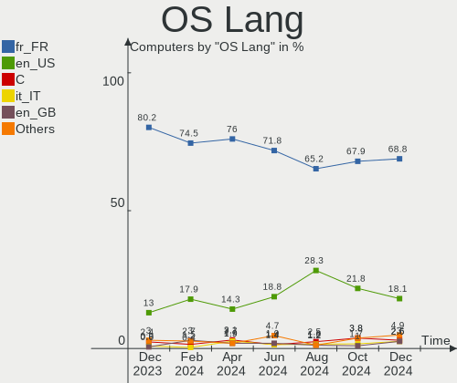
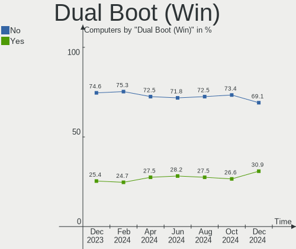
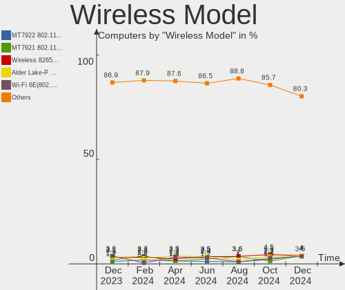
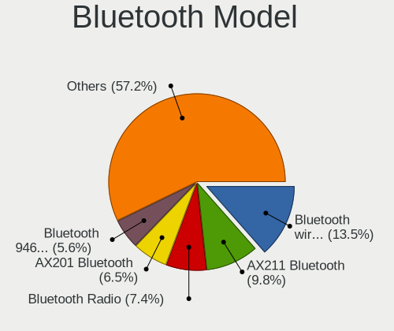
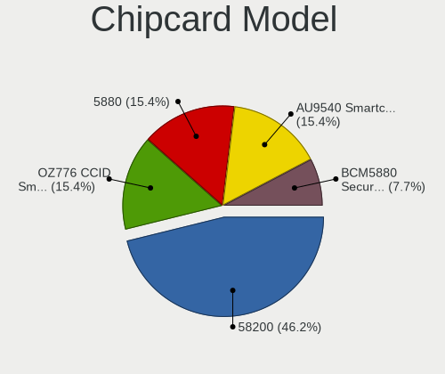

Linux in France - Hardware Trends
---------------------------------

A project to identify most popular hardware characteristics and track their change
over time based on data collected by Linux users at https://Linux-Hardware.org.

Anyone can contribute to this report by the [hw-probe](https://github.com/linuxhw/hw-probe) tool:

    sudo -E hw-probe -all -upload

This is a report for all computer types. See also reports for [desktops](/Location/France/Desktop/README.md) and [notebooks](/Location/France/Notebook/README.md).

Period: Jan, 2024.

Contents
--------

* [ System ](#system)
  - [ OS                       ](#os)
  - [ OS Family                ](#os-family)
  - [ Kernel                   ](#kernel)
  - [ Kernel Family            ](#kernel-family)
  - [ Kernel Major Ver.        ](#kernel-major-ver)
  - [ Arch                     ](#arch)
  - [ DE                       ](#de)
  - [ Display Server           ](#display-server)
  - [ Display Manager          ](#display-manager)
  - [ OS Lang                  ](#os-lang)
  - [ Boot Mode                ](#boot-mode)
  - [ Filesystem               ](#filesystem)
  - [ Part. scheme             ](#part-scheme)
  - [ Dual Boot with Linux/BSD ](#dual-boot-with-linuxbsd)
  - [ Dual Boot (Win)          ](#dual-boot-win)

* [ Board ](#board)
  - [ Vendor                   ](#vendor)
  - [ Model                    ](#model)
  - [ Model Family             ](#model-family)
  - [ MFG Year                 ](#mfg-year)
  - [ Form Factor              ](#form-factor)
  - [ Secure Boot              ](#secure-boot)
  - [ Coreboot                 ](#coreboot)
  - [ RAM Size                 ](#ram-size)
  - [ RAM Used                 ](#ram-used)
  - [ Total Drives             ](#total-drives)
  - [ Has CD-ROM               ](#has-cd-rom)
  - [ Has Ethernet             ](#has-ethernet)
  - [ Has WiFi                 ](#has-wifi)
  - [ Has Bluetooth            ](#has-bluetooth)

* [ Location ](#location)
  - [ Country                  ](#country)
  - [ City                     ](#city)

* [ Drives ](#drives)
  - [ Drive Vendor             ](#drive-vendor)
  - [ Drive Model              ](#drive-model)
  - [ HDD Vendor               ](#hdd-vendor)
  - [ SSD Vendor               ](#ssd-vendor)
  - [ Drive Kind               ](#drive-kind)
  - [ Drive Connector          ](#drive-connector)
  - [ Drive Size               ](#drive-size)
  - [ Space Total              ](#space-total)
  - [ Space Used               ](#space-used)
  - [ Malfunc. Drives          ](#malfunc-drives)
  - [ Malfunc. Drive Vendor    ](#malfunc-drive-vendor)
  - [ Malfunc. HDD Vendor      ](#malfunc-hdd-vendor)
  - [ Malfunc. Drive Kind      ](#malfunc-drive-kind)
  - [ Failed Drives            ](#failed-drives)
  - [ Failed Drive Vendor      ](#failed-drive-vendor)
  - [ Drive Status             ](#drive-status)

* [ Storage controller ](#storage-controller)
  - [ Storage Vendor           ](#storage-vendor)
  - [ Storage Model            ](#storage-model)
  - [ Storage Kind             ](#storage-kind)

* [ Processor ](#processor)
  - [ CPU Vendor               ](#cpu-vendor)
  - [ CPU Model                ](#cpu-model)
  - [ CPU Model Family         ](#cpu-model-family)
  - [ CPU Cores                ](#cpu-cores)
  - [ CPU Sockets              ](#cpu-sockets)
  - [ CPU Threads              ](#cpu-threads)
  - [ CPU Op-Modes             ](#cpu-op-modes)
  - [ CPU Microcode            ](#cpu-microcode)
  - [ CPU Microarch            ](#cpu-microarch)

* [ Graphics ](#graphics)
  - [ GPU Vendor               ](#gpu-vendor)
  - [ GPU Model                ](#gpu-model)
  - [ GPU Combo                ](#gpu-combo)
  - [ GPU Driver               ](#gpu-driver)
  - [ GPU Memory               ](#gpu-memory)

* [ Monitor ](#monitor)
  - [ Monitor Vendor           ](#monitor-vendor)
  - [ Monitor Model            ](#monitor-model)
  - [ Monitor Resolution       ](#monitor-resolution)
  - [ Monitor Diagonal         ](#monitor-diagonal)
  - [ Monitor Width            ](#monitor-width)
  - [ Aspect Ratio             ](#aspect-ratio)
  - [ Monitor Area             ](#monitor-area)
  - [ Pixel Density            ](#pixel-density)
  - [ Multiple Monitors        ](#multiple-monitors)

* [ Network ](#network)
  - [ Net Controller Vendor    ](#net-controller-vendor)
  - [ Net Controller Model     ](#net-controller-model)
  - [ Wireless Vendor          ](#wireless-vendor)
  - [ Wireless Model           ](#wireless-model)
  - [ Ethernet Vendor          ](#ethernet-vendor)
  - [ Ethernet Model           ](#ethernet-model)
  - [ Net Controller Kind      ](#net-controller-kind)
  - [ Used Controller          ](#used-controller)
  - [ NICs                     ](#nics)
  - [ IPv6                     ](#ipv6)

* [ Bluetooth ](#bluetooth)
  - [ Bluetooth Vendor         ](#bluetooth-vendor)
  - [ Bluetooth Model          ](#bluetooth-model)

* [ Sound ](#sound)
  - [ Sound Vendor             ](#sound-vendor)
  - [ Sound Model              ](#sound-model)

* [ Memory ](#memory)
  - [ Memory Vendor            ](#memory-vendor)
  - [ Memory Model             ](#memory-model)
  - [ Memory Kind              ](#memory-kind)
  - [ Memory Form Factor       ](#memory-form-factor)
  - [ Memory Size              ](#memory-size)
  - [ Memory Speed             ](#memory-speed)

* [ Printers & scanners ](#printers--scanners)
  - [ Printer Vendor           ](#printer-vendor)
  - [ Printer Model            ](#printer-model)
  - [ Scanner Vendor           ](#scanner-vendor)
  - [ Scanner Model            ](#scanner-model)

* [ Camera ](#camera)
  - [ Camera Vendor            ](#camera-vendor)
  - [ Camera Model             ](#camera-model)

* [ Security ](#security)
  - [ Fingerprint Vendor       ](#fingerprint-vendor)
  - [ Fingerprint Model        ](#fingerprint-model)
  - [ Chipcard Vendor          ](#chipcard-vendor)
  - [ Chipcard Model           ](#chipcard-model)

* [ Unsupported ](#unsupported)
  - [ Unsupported Devices      ](#unsupported-devices)
  - [ Unsupported Device Types ](#unsupported-device-types)

System
------

OS
--

Installed operating systems

| Name                         | Computers | Percent |
|------------------------------|-----------|---------|
| Debian 12                    | 67        | 18.98%  |
| Ubuntu 22.04                 | 61        | 17.28%  |
| Fedora 39                    | 24        | 6.8%    |
| Ubuntu 23.10                 | 19        | 5.38%   |
| Linux Mint 21.2              | 19        | 5.38%   |
| Ubuntu 20.04                 | 11        | 3.12%   |
| Arch Rolling                 | 10        | 2.83%   |
| Xubuntu 22.04                | 8         | 2.27%   |
| Linux Mint 21.3              | 8         | 2.27%   |
| Zorin 17                     | 7         | 1.98%   |
| Pop!_OS 22.04                | 7         | 1.98%   |
| Kubuntu 22.04                | 7         | 1.98%   |
| Manjaro                      | 6         | 1.7%    |
| Debian 11                    | 6         | 1.7%    |
| OpenMandriva 5.0             | 5         | 1.42%   |
| Zorin 16                     | 4         | 1.13%   |
| OpenMandriva 24.01           | 4         | 1.13%   |
| Kubuntu 23.10                | 4         | 1.13%   |
| Xubuntu 23.10                | 3         | 0.85%   |
| Xubuntu 18.04                | 3         | 0.85%   |
| Xero Rolling                 | 3         | 0.85%   |
| Ubuntu MATE 22.04            | 3         | 0.85%   |
| Ubuntu 23.04                 | 3         | 0.85%   |
| openSUSE Tumbleweed-XXXXXXXX | 3         | 0.85%   |
| OpenMandriva 4.3             | 3         | 0.85%   |
| OpenMandriva 23.08           | 3         | 0.85%   |
| Lubuntu 22.04                | 3         | 0.85%   |
| Kali 2023.4                  | 3         | 0.85%   |
| Gentoo 2.14                  | 3         | 0.85%   |
| Debian                       | 3         | 0.85%   |
| Ubuntu MATE 23.10            | 2         | 0.57%   |
| OpenMandriva 4.2             | 2         | 0.57%   |
| Lubuntu 20.04                | 2         | 0.57%   |
| LMDE 6                       | 2         | 0.57%   |
| Linux Mint 20.3              | 2         | 0.57%   |
| KDE neon 22.04               | 2         | 0.57%   |
| Fedora 38                    | 2         | 0.57%   |
| ArcoLinux Rolling            | 2         | 0.57%   |
| Zorin 15                     | 1         | 0.28%   |
| Xubuntu 20.04                | 1         | 0.28%   |

OS Family
---------

OS without a version

| Name         | Computers | Percent |
|--------------|-----------|---------|
| Ubuntu       | 94        | 26.63%  |
| Debian       | 76        | 21.53%  |
| Linux Mint   | 33        | 9.35%   |
| Fedora       | 26        | 7.37%   |
| OpenMandriva | 19        | 5.38%   |
| Xubuntu      | 15        | 4.25%   |
| Zorin        | 12        | 3.4%    |
| Kubuntu      | 11        | 3.12%   |
| Arch         | 10        | 2.83%   |
| Pop!_OS      | 7         | 1.98%   |
| Manjaro      | 7         | 1.98%   |
| Ubuntu MATE  | 6         | 1.7%    |
| Lubuntu      | 5         | 1.42%   |
| Xero         | 3         | 0.85%   |
| openSUSE     | 3         | 0.85%   |
| Kali         | 3         | 0.85%   |
| Gentoo       | 3         | 0.85%   |
| LMDE         | 2         | 0.57%   |
| KDE neon     | 2         | 0.57%   |
| ArcoLinux    | 2         | 0.57%   |
| SteamOS      | 1         | 0.28%   |
| Sparky       | 1         | 0.28%   |
| Salix        | 1         | 0.28%   |
| Parrot       | 1         | 0.28%   |
| Nobara       | 1         | 0.28%   |
| NixOS        | 1         | 0.28%   |
| Garuda Linux | 1         | 0.28%   |
| EndeavourOS  | 1         | 0.28%   |
| Elementary   | 1         | 0.28%   |
| Devuan       | 1         | 0.28%   |
| ChimeraOS    | 1         | 0.28%   |
| BunsenLabs   | 1         | 0.28%   |
| Alpine       | 1         | 0.28%   |
| AlmaLinux    | 1         | 0.28%   |

Kernel
------

Version of the Linux kernel

| Version                  | Computers | Percent |
|--------------------------|-----------|---------|
| 6.5.0-14-generic         | 58        | 16.43%  |
| 5.15.0-91-generic        | 43        | 12.18%  |
| 6.1.0-16-amd64           | 42        | 11.9%   |
| 6.2.0-39-generic         | 19        | 5.38%   |
| 6.1.0-17-amd64           | 19        | 5.38%   |
| 6.5.0-15-generic         | 14        | 3.97%   |
| 6.6.2-desktop-1omv2390   | 9         | 2.55%   |
| 6.6.8-200.fc39.x86_64    | 8         | 2.27%   |
| 6.2.0-26-generic         | 6         | 1.7%    |
| 6.6.11-200.fc39.x86_64   | 5         | 1.42%   |
| 6.6.10-arch1-1           | 4         | 1.13%   |
| 5.15.0-92-generic        | 4         | 1.13%   |
| 6.6.6-76060606-generic   | 3         | 0.85%   |
| 6.6.13-200.fc39.x86_64   | 3         | 0.85%   |
| 6.6.10-76060610-generic  | 3         | 0.85%   |
| 6.5.6-300.fc39.x86_64    | 3         | 0.85%   |
| 6.5.13-7-MANJARO         | 3         | 0.85%   |
| 6.5.0-kali3-amd64        | 3         | 0.85%   |
| 6.4.11-desktop-1omv2390  | 3         | 0.85%   |
| 6.7.2-arch1-1            | 2         | 0.57%   |
| 6.6.9-200.fc39.x86_64    | 2         | 0.57%   |
| 6.6.8-arch1-1            | 2         | 0.57%   |
| 6.6.10-1-MANJARO         | 2         | 0.57%   |
| 6.6.1-arch1-1            | 2         | 0.57%   |
| 6.5.0-9-generic          | 2         | 0.57%   |
| 6.2.0-33-generic         | 2         | 0.57%   |
| 6.1.0-13-amd64           | 2         | 0.57%   |
| 5.4.0-169-generic        | 2         | 0.57%   |
| 5.16.7-desktop-1omv4003  | 2         | 0.57%   |
| 5.15.0-76-generic        | 2         | 0.57%   |
| 5.10.14-desktop-1omv4002 | 2         | 0.57%   |
| 5.10.0-27-amd64          | 2         | 0.57%   |
| 5.10.0-26-amd64          | 2         | 0.57%   |
| 6.7.2-tereszkiewicz      | 1         | 0.28%   |
| 6.7.2-AMD-znver2         | 1         | 0.28%   |
| 6.7.1-200.fc39.x86_64    | 1         | 0.28%   |
| 6.7.1-2-default          | 1         | 0.28%   |
| 6.7.1-1-default          | 1         | 0.28%   |
| 6.7.0-arch3-1            | 1         | 0.28%   |
| 6.7.0--2024.01.11-04h20  | 1         | 0.28%   |

Kernel Family
-------------

Linux kernel without a distro release

| Version | Computers | Percent |
|---------|-----------|---------|
| 6.5.0   | 82        | 23.23%  |
| 6.1.0   | 68        | 19.26%  |
| 5.15.0  | 54        | 15.3%   |
| 6.2.0   | 30        | 8.5%    |
| 6.6.8   | 13        | 3.68%   |
| 6.6.10  | 11        | 3.12%   |
| 6.6.2   | 9         | 2.55%   |
| 5.4.0   | 8         | 2.27%   |
| 6.6.11  | 7         | 1.98%   |
| 5.10.0  | 6         | 1.7%    |
| 6.7.2   | 4         | 1.13%   |
| 6.6.9   | 4         | 1.13%   |
| 6.6.13  | 4         | 1.13%   |
| 6.5.6   | 4         | 1.13%   |
| 6.7.1   | 3         | 0.85%   |
| 6.6.6   | 3         | 0.85%   |
| 6.5.13  | 3         | 0.85%   |
| 6.4.11  | 3         | 0.85%   |
| 6.7.0   | 2         | 0.57%   |
| 6.6.4   | 2         | 0.57%   |
| 6.6.12  | 2         | 0.57%   |
| 6.6.1   | 2         | 0.57%   |
| 6.5.9   | 2         | 0.57%   |
| 6.5.11  | 2         | 0.57%   |
| 6.2.6   | 2         | 0.57%   |
| 5.16.7  | 2         | 0.57%   |
| 5.14.0  | 2         | 0.57%   |
| 5.10.14 | 2         | 0.57%   |
| 4.15.0  | 2         | 0.57%   |
| 6.6.7   | 1         | 0.28%   |
| 6.5.5   | 1         | 0.28%   |
| 6.4.6   | 1         | 0.28%   |
| 6.4.12  | 1         | 0.28%   |
| 6.2.16  | 1         | 0.28%   |
| 6.1.71  | 1         | 0.28%   |
| 6.1.69  | 1         | 0.28%   |
| 6.1.68  | 1         | 0.28%   |
| 6.1.52  | 1         | 0.28%   |
| 5.19.17 | 1         | 0.28%   |
| 5.16.13 | 1         | 0.28%   |

Kernel Major Ver.
-----------------

Linux kernel major version

| Version | Computers | Percent |
|---------|-----------|---------|
| 6.5     | 94        | 26.63%  |
| 6.1     | 72        | 20.4%   |
| 6.6     | 58        | 16.43%  |
| 5.15    | 56        | 15.86%  |
| 6.2     | 33        | 9.35%   |
| 6.7     | 9         | 2.55%   |
| 5.4     | 8         | 2.27%   |
| 5.10    | 8         | 2.27%   |
| 6.4     | 5         | 1.42%   |
| 5.16    | 3         | 0.85%   |
| 5.14    | 2         | 0.57%   |
| 4.15    | 2         | 0.57%   |
| 5.19    | 1         | 0.28%   |
| 5.11    | 1         | 0.28%   |
| 4.18    | 1         | 0.28%   |

Arch
----

OS architecture (x86_64, i586, etc.)

| Name    | Computers | Percent |
|---------|-----------|---------|
| x86_64  | 347       | 98.3%   |
| i686    | 5         | 1.42%   |
| aarch64 | 1         | 0.28%   |

DE
--

Desktop Environment

| Name            | Computers | Percent |
|-----------------|-----------|---------|
| GNOME           | 185       | 52.41%  |
| KDE5            | 55        | 15.58%  |
| XFCE            | 31        | 8.78%   |
| X-Cinnamon      | 27        | 7.65%   |
| MATE            | 15        | 4.25%   |
| Unknown         | 15        | 4.25%   |
| LXQt            | 7         | 1.98%   |
| Cinnamon        | 3         | 0.85%   |
| Pantheon        | 2         | 0.57%   |
| GNOME Flashback | 2         | 0.57%   |
| Budgie          | 2         | 0.57%   |
| Trinity         | 1         | 0.28%   |
| Openbox         | 1         | 0.28%   |
| none+i3         | 1         | 0.28%   |
| LXDE            | 1         | 0.28%   |
| i3              | 1         | 0.28%   |
| Hyprland        | 1         | 0.28%   |
| GNOME Classic   | 1         | 0.28%   |
| Enlightenment   | 1         | 0.28%   |
| awesome         | 1         | 0.28%   |

Display Server
--------------

X11 or Wayland

| Name    | Computers | Percent |
|---------|-----------|---------|
| X11     | 197       | 55.81%  |
| Wayland | 138       | 39.09%  |
| Tty     | 15        | 4.25%   |
| Unknown | 3         | 0.85%   |

Display Manager
---------------

SDDM, LightDM, etc.

| Name    | Computers | Percent |
|---------|-----------|---------|
| GDM3    | 135       | 38.24%  |
| Unknown | 86        | 24.36%  |
| LightDM | 62        | 17.56%  |
| SDDM    | 46        | 13.03%  |
| GDM     | 21        | 5.95%   |
| WDM     | 1         | 0.28%   |
| TDM     | 1         | 0.28%   |
| SLiM    | 1         | 0.28%   |

OS Lang
-------

Language

| Lang    | Computers | Percent |
|---------|-----------|---------|
| fr_FR   | 276       | 78.19%  |
| en_US   | 43        | 12.18%  |
| C       | 14        | 3.97%   |
| en_GB   | 5         | 1.42%   |
| de_DE   | 4         | 1.13%   |
| Unknown | 4         | 1.13%   |
| pt_PT   | 1         | 0.28%   |
| POSIX   | 1         | 0.28%   |
| it_IT   | 1         | 0.28%   |
| fr_BE   | 1         | 0.28%   |
| es_ES   | 1         | 0.28%   |
| en_IE   | 1         | 0.28%   |
| bg_BG   | 1         | 0.28%   |

Boot Mode
---------

EFI or BIOS

| Mode | Computers | Percent |
|------|-----------|---------|
| EFI  | 223       | 63.17%  |
| BIOS | 130       | 36.83%  |

Filesystem
----------

Type of filesystem

| Type    | Computers | Percent |
|---------|-----------|---------|
| Ext4    | 254       | 71.95%  |
| Btrfs   | 39        | 11.05%  |
| Tmpfs   | 36        | 10.2%   |
| Overlay | 17        | 4.82%   |
| Xfs     | 4         | 1.13%   |
| Zfs     | 2         | 0.57%   |
| Ext3    | 1         | 0.28%   |

Part. scheme
------------

Scheme of partitioning

| Type    | Computers | Percent |
|---------|-----------|---------|
| GPT     | 240       | 67.99%  |
| Unknown | 76        | 21.53%  |
| MBR     | 37        | 10.48%  |

Dual Boot with Linux/BSD
------------------------

Hosting more than one Linux/BSD

| Dual boot | Computers | Percent |
|-----------|-----------|---------|
| No        | 311       | 88.1%   |
| Yes       | 42        | 11.9%   |

Dual Boot (Win)
---------------

Hosting Linux and Windows

| Dual boot | Computers | Percent |
|-----------|-----------|---------|
| No        | 270       | 76.49%  |
| Yes       | 83        | 23.51%  |

Board
-----

Vendor
------

Motherboard manufacturer

| Name                    | Computers | Percent |
|-------------------------|-----------|---------|
| Hewlett-Packard         | 73        | 20.68%  |
| ASUSTek Computer        | 59        | 16.71%  |
| Dell                    | 48        | 13.6%   |
| Lenovo                  | 42        | 11.9%   |
| MSI                     | 21        | 5.95%   |
| Gigabyte Technology     | 20        | 5.67%   |
| Acer                    | 16        | 4.53%   |
| ASRock                  | 11        | 3.12%   |
| Toshiba                 | 10        | 2.83%   |
| Apple                   | 6         | 1.7%    |
| Medion                  | 4         | 1.13%   |
| HUAWEI                  | 4         | 1.13%   |
| AZW                     | 4         | 1.13%   |
| Packard Bell            | 3         | 0.85%   |
| Intel                   | 3         | 0.85%   |
| UNOWHY                  | 2         | 0.57%   |
| Thomson                 | 2         | 0.57%   |
| Sony                    | 2         | 0.57%   |
| Shuttle                 | 2         | 0.57%   |
| Samsung Electronics     | 2         | 0.57%   |
| Notebook                | 2         | 0.57%   |
| Google                  | 2         | 0.57%   |
| Fujitsu                 | 2         | 0.57%   |
| Foxconn                 | 2         | 0.57%   |
| SYWZ                    | 1         | 0.28%   |
| Raspberry Pi Foundation | 1         | 0.28%   |
| PC Specialist           | 1         | 0.28%   |
| Optimized Hosting       | 1         | 0.28%   |
| Microsoft               | 1         | 0.28%   |
| LDLC                    | 1         | 0.28%   |
| Fujitsu Siemens         | 1         | 0.28%   |
| eMachines               | 1         | 0.28%   |
| Colorful Technology     | 1         | 0.28%   |
| Alienware               | 1         | 0.28%   |
| Unknown                 | 1         | 0.28%   |

Model
-----

Motherboard model

| Name                               | Computers | Percent |
|------------------------------------|-----------|---------|
| HP ProDesk 400 G2.5 SFF            | 20        | 5.67%   |
| HP ProDesk 400 G3 SFF              | 7         | 1.98%   |
| Lenovo ThinkCentre M83 10AHS1T000  | 4         | 1.13%   |
| MSI MS-7C56                        | 3         | 0.85%   |
| MSI MS-7B51                        | 2         | 0.57%   |
| Lenovo ThinkCentre M800 10FXS0PS00 | 2         | 0.57%   |
| Lenovo IdeaPad 3 17ADA05 81W2      | 2         | 0.57%   |
| Lenovo IdeaPad 3 15ADA05 81W1      | 2         | 0.57%   |
| HP Pavilion dv7                    | 2         | 0.57%   |
| HP Pavilion dv6                    | 2         | 0.57%   |
| HP Notebook                        | 2         | 0.57%   |
| Dell XPS 15 9570                   | 2         | 0.57%   |
| Dell XPS 13 9360                   | 2         | 0.57%   |
| Dell Precision 7560                | 2         | 0.57%   |
| Dell Latitude 5590                 | 2         | 0.57%   |
| Dell Latitude 5521                 | 2         | 0.57%   |
| AZW SER                            | 2         | 0.57%   |
| ASUS Zenbook UX3402ZA_UX3402ZA     | 2         | 0.57%   |
| ASUS TUF Gaming Z490-PLUS          | 2         | 0.57%   |
| ASUS TUF Gaming X570-PLUS          | 2         | 0.57%   |
| ASUS All Series                    | 2         | 0.57%   |
| Apple MacBook5,1                   | 2         | 0.57%   |
| Acer Veriton X2631G                | 2         | 0.57%   |
| UNOWHY Y13G011S4EI                 | 1         | 0.28%   |
| UNOWHY Y13G010S4EI                 | 1         | 0.28%   |
| Toshiba Satellite Pro NB10-A-125   | 1         | 0.28%   |
| Toshiba Satellite Pro C660         | 1         | 0.28%   |
| Toshiba Satellite P300             | 1         | 0.28%   |
| Toshiba Satellite P200             | 1         | 0.28%   |
| Toshiba Satellite L655             | 1         | 0.28%   |
| Toshiba Satellite L300             | 1         | 0.28%   |
| Toshiba Satellite C70-B            | 1         | 0.28%   |
| Toshiba Satellite C55-C            | 1         | 0.28%   |
| Toshiba PORTEGE R500               | 1         | 0.28%   |
| Toshiba PORTEGE R30-A              | 1         | 0.28%   |
| Thomson N17V3C8WH512               | 1         | 0.28%   |
| Thomson N15C8BK2T                  | 1         | 0.28%   |
| SYWZ S210H Series                  | 1         | 0.28%   |
| Sony SVF1521H2EW                   | 1         | 0.28%   |
| Sony SVF1521G6EW                   | 1         | 0.28%   |

Model Family
------------

Motherboard model prefix

| Name                  | Computers | Percent |
|-----------------------|-----------|---------|
| HP ProDesk            | 31        | 8.78%   |
| Lenovo ThinkPad       | 14        | 3.97%   |
| Dell Latitude         | 13        | 3.68%   |
| Lenovo ThinkCentre    | 12        | 3.4%    |
| HP EliteBook          | 10        | 2.83%   |
| Dell Precision        | 10        | 2.83%   |
| HP Pavilion           | 9         | 2.55%   |
| Dell XPS              | 9         | 2.55%   |
| ASUS TUF              | 9         | 2.55%   |
| ASUS PRIME            | 9         | 2.55%   |
| Acer Aspire           | 9         | 2.55%   |
| Toshiba Satellite     | 8         | 2.27%   |
| Lenovo IdeaPad        | 7         | 1.98%   |
| Dell OptiPlex         | 7         | 1.98%   |
| Dell Inspiron         | 6         | 1.7%    |
| ASUS Zenbook          | 5         | 1.42%   |
| ASUS ROG              | 5         | 1.42%   |
| HP ZBook              | 4         | 1.13%   |
| ASUS ASUS             | 4         | 1.13%   |
| Packard Bell EasyNote | 3         | 0.85%   |
| MSI MS-7C56           | 3         | 0.85%   |
| ASUS VivoBook         | 3         | 0.85%   |
| Acer Veriton          | 3         | 0.85%   |
| Toshiba PORTEGE       | 2         | 0.57%   |
| MSI MS-7B51           | 2         | 0.57%   |
| Lenovo MIIX           | 2         | 0.57%   |
| Lenovo Legion         | 2         | 0.57%   |
| HP ProBook            | 2         | 0.57%   |
| HP Notebook           | 2         | 0.57%   |
| HP ENVY               | 2         | 0.57%   |
| HP EliteDesk          | 2         | 0.57%   |
| HP Compaq             | 2         | 0.57%   |
| HP 250                | 2         | 0.57%   |
| AZW SER               | 2         | 0.57%   |
| ASUS M5A99X           | 2         | 0.57%   |
| ASUS All              | 2         | 0.57%   |
| ASRock B650M          | 2         | 0.57%   |
| Apple MacBook5        | 2         | 0.57%   |
| Acer Swift            | 2         | 0.57%   |
| Acer Nitro            | 2         | 0.57%   |

MFG Year
--------

Motherboard manufacture year

| Year    | Computers | Percent |
|---------|-----------|---------|
| 2021    | 37        | 10.48%  |
| 2020    | 32        | 9.07%   |
| 2016    | 30        | 8.5%    |
| 2015    | 30        | 8.5%    |
| 2022    | 27        | 7.65%   |
| 2014    | 25        | 7.08%   |
| 2013    | 25        | 7.08%   |
| 2023    | 22        | 6.23%   |
| 2018    | 21        | 5.95%   |
| 2019    | 17        | 4.82%   |
| 2010    | 17        | 4.82%   |
| 2017    | 15        | 4.25%   |
| 2012    | 15        | 4.25%   |
| 2008    | 14        | 3.97%   |
| 2011    | 11        | 3.12%   |
| 2009    | 5         | 1.42%   |
| 2007    | 5         | 1.42%   |
| 2006    | 3         | 0.85%   |
| 2004    | 1         | 0.28%   |
| Unknown | 1         | 0.28%   |

Form Factor
-----------

Physical design of the computer

| Name           | Computers | Percent |
|----------------|-----------|---------|
| Notebook       | 172       | 48.73%  |
| Desktop        | 159       | 45.04%  |
| Tablet         | 6         | 1.7%    |
| Mini pc        | 6         | 1.7%    |
| Convertible    | 5         | 1.42%   |
| All in one     | 2         | 0.57%   |
| Server         | 2         | 0.57%   |
| System on chip | 1         | 0.28%   |

Secure Boot
-----------

Enabled or disabled

| State    | Computers | Percent |
|----------|-----------|---------|
| Disabled | 323       | 91.5%   |
| Enabled  | 30        | 8.5%    |

Coreboot
--------

Have coreboot on board

| Used | Computers | Percent |
|------|-----------|---------|
| No   | 351       | 99.43%  |
| Yes  | 2         | 0.57%   |

RAM Size
--------

Total RAM memory

| Size in GB      | Computers | Percent |
|-----------------|-----------|---------|
| 3.01-4.0        | 78        | 22.1%   |
| 4.01-8.0        | 71        | 20.11%  |
| 16.01-24.0      | 66        | 18.7%   |
| 8.01-16.0       | 49        | 13.88%  |
| 32.01-64.0      | 46        | 13.03%  |
| 1.01-2.0        | 14        | 3.97%   |
| 24.01-32.0      | 12        | 3.4%    |
| 64.01-256.0     | 12        | 3.4%    |
| 2.01-3.0        | 3         | 0.85%   |
| More than 256.0 | 2         | 0.57%   |

RAM Used
--------

Used RAM memory

| Used GB    | Computers | Percent |
|------------|-----------|---------|
| 1.01-2.0   | 121       | 34.28%  |
| 2.01-3.0   | 89        | 25.21%  |
| 4.01-8.0   | 62        | 17.56%  |
| 3.01-4.0   | 46        | 13.03%  |
| 8.01-16.0  | 14        | 3.97%   |
| 0.51-1.0   | 11        | 3.12%   |
| 24.01-32.0 | 5         | 1.42%   |
| 32.01-64.0 | 2         | 0.57%   |
| 16.01-24.0 | 2         | 0.57%   |
| 0.01-0.5   | 1         | 0.28%   |

Total Drives
------------

Number of drives on board

| Drives | Computers | Percent |
|--------|-----------|---------|
| 1      | 228       | 64.59%  |
| 2      | 66        | 18.7%   |
| 3      | 30        | 8.5%    |
| 4      | 13        | 3.68%   |
| 5      | 8         | 2.27%   |
| 6      | 4         | 1.13%   |
| 8      | 3         | 0.85%   |
| 0      | 1         | 0.28%   |

Has CD-ROM
----------

Has CD-ROM on board

| Presented | Computers | Percent |
|-----------|-----------|---------|
| No        | 213       | 60.34%  |
| Yes       | 140       | 39.66%  |

Has Ethernet
------------

Has Ethernet on board

| Presented | Computers | Percent |
|-----------|-----------|---------|
| Yes       | 313       | 88.67%  |
| No        | 40        | 11.33%  |

Has WiFi
--------

Has WiFi module

| Presented | Computers | Percent |
|-----------|-----------|---------|
| Yes       | 243       | 68.84%  |
| No        | 110       | 31.16%  |

Has Bluetooth
-------------

Has Bluetooth module

| Presented | Computers | Percent |
|-----------|-----------|---------|
| Yes       | 193       | 54.67%  |
| No        | 160       | 45.33%  |

Location
--------

Country
-------

Geographic location (country)

| Country | Computers | Percent |
|---------|-----------|---------|
| France  | 353       | 100%    |

City
----

Geographic location (city)

| City                      | Computers | Percent |
|---------------------------|-----------|---------|
| Paris                     | 37        | 10.48%  |
| Roubaix                   | 27        | 7.65%   |
| Bagneux                   | 16        | 4.53%   |
| Toulouse                  | 10        | 2.83%   |
| Strasbourg                | 8         | 2.27%   |
| Montpellier               | 6         | 1.7%    |
| Saint-Denis               | 4         | 1.13%   |
| Rennes                    | 4         | 1.13%   |
| Grenoble                  | 4         | 1.13%   |
| Saint-Jacques-de-la-Lande | 3         | 0.85%   |
| Saint-Germain-les-Arpajon | 3         | 0.85%   |
| Nanterre                  | 3         | 0.85%   |
| Le Haillan                | 3         | 0.85%   |
| La Seyne-sur-Mer          | 3         | 0.85%   |
| Clermont-Ferrand          | 3         | 0.85%   |
| Burgnac                   | 3         | 0.85%   |
| Brest                     | 3         | 0.85%   |
| Bordeaux                  | 3         | 0.85%   |
| Vitry-sur-Seine           | 2         | 0.57%   |
| Villeurbanne              | 2         | 0.57%   |
| Tarbes                    | 2         | 0.57%   |
| Sainville                 | 2         | 0.57%   |
| Saint-Etienne             | 2         | 0.57%   |
| Rezé                     | 2         | 0.57%   |
| Poisy                     | 2         | 0.57%   |
| Narbonne                  | 2         | 0.57%   |
| Nancy                     | 2         | 0.57%   |
| Montanay                  | 2         | 0.57%   |
| Mimizan                   | 2         | 0.57%   |
| Metz                      | 2         | 0.57%   |
| Maisons-Alfort            | 2         | 0.57%   |
| Liffré                   | 2         | 0.57%   |
| Le Boulou                 | 2         | 0.57%   |
| Lannion                   | 2         | 0.57%   |
| La Rochelle               | 2         | 0.57%   |
| Ivry-sur-Seine            | 2         | 0.57%   |
| Courbevoie                | 2         | 0.57%   |
| Carcassonne               | 2         | 0.57%   |
| Beauvais                  | 2         | 0.57%   |
| Aix-en-Provence           | 2         | 0.57%   |

Drives
------

Drive Vendor
------------

Hard drive vendors

| Vendor                      | Computers | Drives | Percent |
|-----------------------------|-----------|--------|---------|
| Seagate                     | 82        | 97     | 16.05%  |
| Samsung Electronics         | 72        | 96     | 14.09%  |
| WDC                         | 71        | 84     | 13.89%  |
| Toshiba                     | 31        | 32     | 6.07%   |
| SanDisk                     | 29        | 31     | 5.68%   |
| Crucial                     | 26        | 31     | 5.09%   |
| Kingston                    | 18        | 19     | 3.52%   |
| Intel                       | 18        | 18     | 3.52%   |
| Micron Technology           | 15        | 15     | 2.94%   |
| SK hynix                    | 14        | 15     | 2.74%   |
| Unknown                     | 11        | 11     | 2.15%   |
| Phison Electronics          | 11        | 12     | 2.15%   |
| Micron/Crucial Technology   | 11        | 17     | 2.15%   |
| Hitachi                     | 11        | 12     | 2.15%   |
| HGST                        | 10        | 12     | 1.96%   |
| PNY                         | 8         | 8      | 1.57%   |
| China                       | 7         | 7      | 1.37%   |
| KIOXIA                      | 5         | 7      | 0.98%   |
| Silicon Motion              | 4         | 4      | 0.78%   |
| OCZ                         | 4         | 4      | 0.78%   |
| Verbatim                    | 3         | 3      | 0.59%   |
| SPCC                        | 3         | 3      | 0.59%   |
| Lexar                       | 3         | 3      | 0.59%   |
| Kingston Technology Company | 3         | 3      | 0.59%   |
| Fanxiang                    | 3         | 3      | 0.59%   |
| Apple                       | 3         | 3      | 0.59%   |
| Transcend                   | 2         | 2      | 0.39%   |
| Maxtor                      | 2         | 2      | 0.39%   |
| MAXIO Technology (Hangzhou) | 2         | 2      | 0.39%   |
| LITEONIT                    | 2         | 2      | 0.39%   |
| LDLC                        | 2         | 2      | 0.39%   |
| Unknown                     | 2         | 2      | 0.39%   |
| Yangtze Memory Technologies | 1         | 1      | 0.2%    |
| XrayDisk                    | 1         | 1      | 0.2%    |
| TEXTORM                     | 1         | 1      | 0.2%    |
| SABRENT                     | 1         | 1      | 0.2%    |
| QEMU                        | 1         | 1      | 0.2%    |
| Plextor                     | 1         | 1      | 0.2%    |
| Phison                      | 1         | 1      | 0.2%    |
| Patriot                     | 1         | 1      | 0.2%    |

Drive Model
-----------

Hard drive models

| Model                                              | Computers | Percent |
|----------------------------------------------------|-----------|---------|
| Seagate ST500DM002-1BD142 500GB                    | 17        | 3.06%   |
| Samsung NVMe SSD Controller SM981/PM981/PM983 1TB  | 9         | 1.62%   |
| Samsung SSD 860 EVO 500GB                          | 8         | 1.44%   |
| Samsung NVMe SSD Controller PM9A1/PM9A3/980PRO 2TB | 8         | 1.44%   |
| Micron/Crucial P2 NVMe PCIe SSD 1TB                | 8         | 1.44%   |
| Samsung SSD 850 EVO 250GB                          | 6         | 1.08%   |
| WDC WD10EZEX-08M2NA0 1TB                           | 4         | 0.72%   |
| Seagate ST1000LM024 HN-M101MBB 1TB                 | 4         | 0.72%   |
| Phison E12 NVMe Controller 1TB                     | 4         | 0.72%   |
| Intel SSDPEKNU512GZ 512GB                          | 4         | 0.72%   |
| Crucial CT500MX500SSD1 500GB                       | 4         | 0.72%   |
| Crucial CT480BX500SSD1 480GB                       | 4         | 0.72%   |
| Crucial CT1000P3SSD8 1TB                           | 4         | 0.72%   |
| China SSD 512GB                                    | 4         | 0.72%   |
| WDC WD5000AAKX-22ERMA0 500GB                       | 3         | 0.54%   |
| WDC WD10EZEX-08WN4A0 1TB                           | 3         | 0.54%   |
| Unknown MMC Card  128GB                            | 3         | 0.54%   |
| Toshiba MQ01ABF050 500GB                           | 3         | 0.54%   |
| Toshiba MQ01ABD100 1TB                             | 3         | 0.54%   |
| Toshiba DT01ACA200 2TB                             | 3         | 0.54%   |
| Toshiba DT01ACA050 500GB                           | 3         | 0.54%   |
| Toshiba BG3 NVMe SSD Controller 256GB              | 3         | 0.54%   |
| Seagate ST9500325AS 500GB                          | 3         | 0.54%   |
| Seagate ST4000DM004-2CV104 4TB                     | 3         | 0.54%   |
| Seagate ST3500418AS 500GB                          | 3         | 0.54%   |
| Seagate ST2000DM008-2FR102 2TB                     | 3         | 0.54%   |
| Seagate ST1000LM035-1RK172 1TB                     | 3         | 0.54%   |
| SanDisk NVMe SSD Drive 1TB                         | 3         | 0.54%   |
| Samsung SSD 970 EVO Plus 1TB                       | 3         | 0.54%   |
| Samsung SSD 870 EVO 500GB                          | 3         | 0.54%   |
| Samsung SSD 870 EVO 1TB                            | 3         | 0.54%   |
| Samsung MZVLB256HAHQ-000H1 256GB                   | 3         | 0.54%   |
| PNY CS900 240GB SSD                                | 3         | 0.54%   |
| Micron/Crucial CT2000P5PSSD8 2TB                   | 3         | 0.54%   |
| Kingston SV300S37A120G 120GB SSD                   | 3         | 0.54%   |
| Intel SSDSA2M080G2GC 80GB                          | 3         | 0.54%   |
| WDC WD5003ABYX-18WERA0 500GB                       | 2         | 0.36%   |
| WDC WD5000AZLX-08K2TA0 500GB                       | 2         | 0.36%   |
| WDC WD5000AAKX-60U6AA0 500GB                       | 2         | 0.36%   |
| WDC WD2500BEVS-22UST0 250GB                        | 2         | 0.36%   |

HDD Vendor
----------

Hard disk drive vendors

| Vendor              | Computers | Drives | Percent |
|---------------------|-----------|--------|---------|
| Seagate             | 81        | 95     | 41.54%  |
| WDC                 | 61        | 72     | 31.28%  |
| Toshiba             | 24        | 25     | 12.31%  |
| Hitachi             | 11        | 12     | 5.64%   |
| HGST                | 10        | 12     | 5.13%   |
| Samsung Electronics | 2         | 3      | 1.03%   |
| Maxtor              | 2         | 2      | 1.03%   |
| QEMU                | 1         | 1      | 0.51%   |
| Inateck             | 1         | 1      | 0.51%   |
| Fujitsu             | 1         | 1      | 0.51%   |
| External            | 1         | 1      | 0.51%   |

SSD Vendor
----------

Solid state drive vendors

| Vendor              | Computers | Drives | Percent |
|---------------------|-----------|--------|---------|
| Samsung Electronics | 36        | 41     | 23.23%  |
| Crucial             | 20        | 25     | 12.9%   |
| Kingston            | 13        | 14     | 8.39%   |
| SanDisk             | 11        | 11     | 7.1%    |
| WDC                 | 8         | 8      | 5.16%   |
| PNY                 | 7         | 7      | 4.52%   |
| China               | 7         | 7      | 4.52%   |
| Intel               | 6         | 6      | 3.87%   |
| OCZ                 | 4         | 4      | 2.58%   |
| Micron Technology   | 4         | 4      | 2.58%   |
| Verbatim            | 3         | 3      | 1.94%   |
| SPCC                | 3         | 3      | 1.94%   |
| SK hynix            | 3         | 3      | 1.94%   |
| Lexar               | 3         | 3      | 1.94%   |
| Fanxiang            | 3         | 3      | 1.94%   |
| Transcend           | 2         | 2      | 1.29%   |
| LITEONIT            | 2         | 2      | 1.29%   |
| LDLC                | 2         | 2      | 1.29%   |
| XrayDisk            | 1         | 1      | 0.65%   |
| Toshiba             | 1         | 1      | 0.65%   |
| Seagate             | 1         | 1      | 0.65%   |
| SABRENT             | 1         | 1      | 0.65%   |
| Plextor             | 1         | 1      | 0.65%   |
| Patriot             | 1         | 1      | 0.65%   |
| MS310               | 1         | 1      | 0.65%   |
| LITEON              | 1         | 1      | 0.65%   |
| KingSpec            | 1         | 1      | 0.65%   |
| KingDian            | 1         | 1      | 0.65%   |
| Kimtigo             | 1         | 1      | 0.65%   |
| Intenso             | 1         | 1      | 0.65%   |
| Hewlett-Packard     | 1         | 1      | 0.65%   |
| GOODRAM             | 1         | 1      | 0.65%   |
| Gigabyte Technology | 1         | 1      | 0.65%   |
| ASL                 | 1         | 1      | 0.65%   |
| Apple               | 1         | 1      | 0.65%   |
| Unknown             | 1         | 1      | 0.65%   |

Drive Kind
----------

HDD or SSD

| Kind    | Computers | Drives | Percent |
|---------|-----------|--------|---------|
| HDD     | 170       | 225    | 37.12%  |
| NVMe    | 141       | 178    | 30.79%  |
| SSD     | 131       | 166    | 28.6%   |
| MMC     | 14        | 14     | 3.06%   |
| Unknown | 2         | 2      | 0.44%   |

Drive Connector
---------------

SATA, SAS, NVMe, etc.

| Type | Computers | Drives | Percent |
|------|-----------|--------|---------|
| SATA | 245       | 384    | 60.05%  |
| NVMe | 141       | 178    | 34.56%  |
| MMC  | 14        | 14     | 3.43%   |
| SAS  | 8         | 9      | 1.96%   |

Drive Size
----------

Size of hard drive

| Size in TB | Computers | Drives | Percent |
|------------|-----------|--------|---------|
| 0.01-0.5   | 173       | 217    | 55.63%  |
| 0.51-1.0   | 88        | 109    | 28.3%   |
| 1.01-2.0   | 27        | 34     | 8.68%   |
| 3.01-4.0   | 14        | 18     | 4.5%    |
| 2.01-3.0   | 5         | 6      | 1.61%   |
| 4.01-10.0  | 4         | 7      | 1.29%   |

Space Total
-----------

Amount of disk space available on the file system

| Size in GB     | Computers | Percent |
|----------------|-----------|---------|
| 251-500        | 117       | 33.14%  |
| 101-250        | 64        | 18.13%  |
| 501-1000       | 62        | 17.56%  |
| 1001-2000      | 29        | 8.22%   |
| More than 3000 | 19        | 5.38%   |
| 51-100         | 18        | 5.1%    |
| 1-20           | 16        | 4.53%   |
| 2001-3000      | 15        | 4.25%   |
| 21-50          | 7         | 1.98%   |
| Unknown        | 6         | 1.7%    |

Space Used
----------

Amount of used disk space

| Used GB        | Computers | Percent |
|----------------|-----------|---------|
| 1-20           | 132       | 37.39%  |
| 21-50          | 52        | 14.73%  |
| 101-250        | 48        | 13.6%   |
| 51-100         | 31        | 8.78%   |
| 251-500        | 29        | 8.22%   |
| 501-1000       | 27        | 7.65%   |
| 1001-2000      | 13        | 3.68%   |
| 2001-3000      | 8         | 2.27%   |
| More than 3000 | 7         | 1.98%   |
| Unknown        | 6         | 1.7%    |

Malfunc. Drives
---------------

Drive models with a malfunction

| Model                                                         | Computers | Drives | Percent |
|---------------------------------------------------------------|-----------|--------|---------|
| Seagate ST500DM002-1BD142 500GB                               | 3         | 3      | 7.5%    |
| Seagate ST9500325AS 500GB                                     | 2         | 2      | 5%      |
| Samsung Electronics SSD 870 EVO 1TB                           | 2         | 2      | 5%      |
| Maxtor STM3250310AS 250GB                                     | 2         | 2      | 5%      |
| WDC WD30EFRX-68EUZN0 3TB                                      | 1         | 2      | 2.5%    |
| WDC WD2500BEVT-22ZCT0 250GB                                   | 1         | 1      | 2.5%    |
| WDC WD10EZEX-08WN4A0 1TB                                      | 1         | 1      | 2.5%    |
| WDC WD Green 2.5 1000GB SSD                                   | 1         | 1      | 2.5%    |
| Toshiba MQ01ABD050 500GB                                      | 1         | 1      | 2.5%    |
| SK hynix SC401 SATA 512GB SSD                                 | 1         | 1      | 2.5%    |
| Seagate ST9500420AS 500GB                                     | 1         | 1      | 2.5%    |
| Seagate ST9320325AS 320GB                                     | 1         | 1      | 2.5%    |
| Seagate ST3200826AS 200GB                                     | 1         | 1      | 2.5%    |
| Seagate ST250DM000-1BD141 250GB                               | 1         | 1      | 2.5%    |
| Seagate ST2000DX002-2DV164 2TB                                | 1         | 1      | 2.5%    |
| Seagate ST1000DX001-1NS162 1TB                                | 1         | 1      | 2.5%    |
| SanDisk SD6SB2M-512G-1006 512GB SSD                           | 1         | 1      | 2.5%    |
| Samsung Electronics SSD 840 Series 120GB                      | 1         | 1      | 2.5%    |
| Samsung Electronics NVMe SSD Controller SM981/PM981/PM983 1TB | 1         | 1      | 2.5%    |
| OCZ AGILITY3 64GB SSD                                         | 1         | 1      | 2.5%    |
| Micron Technology MTFDDAK512TBN-1AR1ZABHA 512GB SSD           | 1         | 1      | 2.5%    |
| LITEONIT LAT-256M2S 256GB SSD                                 | 1         | 1      | 2.5%    |
| Kingston SV300S37A120G 120GB SSD                              | 1         | 1      | 2.5%    |
| JMicron Technology Tech 250GB                                 | 1         | 1      | 2.5%    |
| Intel SSDSA2M080G2GC 80GB                                     | 1         | 1      | 2.5%    |
| Inateck ASM225CM 4TB                                          | 1         | 1      | 2.5%    |
| Hitachi HUA723020ALA641 2TB                                   | 1         | 1      | 2.5%    |
| Hitachi HTS541616J9SA00 160GB                                 | 1         | 1      | 2.5%    |
| HGST HUS726020ALA610 2TB                                      | 1         | 1      | 2.5%    |
| HGST HUS724020ALA640 2TB                                      | 1         | 1      | 2.5%    |
| HGST HTS721075A9E630 752GB                                    | 1         | 1      | 2.5%    |
| HGST HTS721010A9E630 1TB                                      | 1         | 1      | 2.5%    |
| HGST HTS545050A7E380 500GB                                    | 1         | 1      | 2.5%    |
| HGST HTS541075A9E680 752GB                                    | 1         | 1      | 2.5%    |
| Crucial CT128MX100SSD1 128GB                                  | 1         | 1      | 2.5%    |

Malfunc. Drive Vendor
---------------------

Vendors of faulty drives

| Vendor              | Computers | Drives | Percent |
|---------------------|-----------|--------|---------|
| Seagate             | 10        | 11     | 27.03%  |
| HGST                | 5         | 6      | 13.51%  |
| WDC                 | 4         | 5      | 10.81%  |
| Samsung Electronics | 3         | 4      | 8.11%   |
| Maxtor              | 2         | 2      | 5.41%   |
| Hitachi             | 2         | 2      | 5.41%   |
| Toshiba             | 1         | 1      | 2.7%    |
| SK hynix            | 1         | 1      | 2.7%    |
| SanDisk             | 1         | 1      | 2.7%    |
| OCZ                 | 1         | 1      | 2.7%    |
| Micron Technology   | 1         | 1      | 2.7%    |
| LITEONIT            | 1         | 1      | 2.7%    |
| Kingston            | 1         | 1      | 2.7%    |
| JMicron Technology  | 1         | 1      | 2.7%    |
| Intel               | 1         | 1      | 2.7%    |
| Inateck             | 1         | 1      | 2.7%    |
| Crucial             | 1         | 1      | 2.7%    |

Malfunc. HDD Vendor
-------------------

Vendors of faulty HDD drives

| Vendor  | Computers | Drives | Percent |
|---------|-----------|--------|---------|
| Seagate | 10        | 11     | 41.67%  |
| HGST    | 5         | 6      | 20.83%  |
| WDC     | 3         | 4      | 12.5%   |
| Maxtor  | 2         | 2      | 8.33%   |
| Hitachi | 2         | 2      | 8.33%   |
| Toshiba | 1         | 1      | 4.17%   |
| Inateck | 1         | 1      | 4.17%   |

Malfunc. Drive Kind
-------------------

Kinds of faulty drives

| Kind    | Computers | Drives | Percent |
|---------|-----------|--------|---------|
| HDD     | 23        | 27     | 62.16%  |
| SSD     | 12        | 12     | 32.43%  |
| NVMe    | 1         | 1      | 2.7%    |
| Unknown | 1         | 1      | 2.7%    |

Failed Drives
-------------

Failed drive models

| Model                         | Computers | Drives | Percent |
|-------------------------------|-----------|--------|---------|
| WDC WD1500HLFS-01G6U0 150GB   | 1         | 1      | 50%     |
| Hitachi HTS723232L9A360 320GB | 1         | 1      | 50%     |

Failed Drive Vendor
-------------------

Failed drive vendors

| Vendor  | Computers | Drives | Percent |
|---------|-----------|--------|---------|
| WDC     | 1         | 1      | 50%     |
| Hitachi | 1         | 1      | 50%     |

Drive Status
------------

Number of failed and malfunc. drives

| Status   | Computers | Drives | Percent |
|----------|-----------|--------|---------|
| Works    | 209       | 316    | 55.44%  |
| Detected | 134       | 226    | 35.54%  |
| Malfunc  | 32        | 41     | 8.49%   |
| Failed   | 2         | 2      | 0.53%   |

Storage controller
------------------

Storage Vendor
--------------

Storage controller vendors

| Vendor                           | Computers | Percent |
|----------------------------------|-----------|---------|
| Intel                            | 253       | 53.72%  |
| AMD                              | 54        | 11.46%  |
| Samsung Electronics              | 41        | 8.7%    |
| Sandisk                          | 20        | 4.25%   |
| Micron/Crucial Technology        | 17        | 3.61%   |
| Phison Electronics               | 13        | 2.76%   |
| SK hynix                         | 11        | 2.34%   |
| Micron Technology                | 11        | 2.34%   |
| Toshiba America Info Systems     | 8         | 1.7%    |
| Kingston Technology Company      | 8         | 1.7%    |
| Marvell Technology Group         | 5         | 1.06%   |
| ASMedia Technology               | 5         | 1.06%   |
| Silicon Motion                   | 4         | 0.85%   |
| JMicron Technology               | 4         | 0.85%   |
| Nvidia                           | 3         | 0.64%   |
| KIOXIA                           | 3         | 0.64%   |
| MAXIO Technology (Hangzhou)      | 2         | 0.42%   |
| Apple                            | 2         | 0.42%   |
| Yangtze Memory Technologies      | 1         | 0.21%   |
| Silicon Integrated Systems [SiS] | 1         | 0.21%   |
| Shenzhen Longsys Electronics     | 1         | 0.21%   |
| Seagate Technology               | 1         | 0.21%   |
| Red Hat                          | 1         | 0.21%   |
| O2 Micro                         | 1         | 0.21%   |
| Broadcom / LSI                   | 1         | 0.21%   |

Storage Model
-------------

Storage controller models

| Model                                                                          | Computers | Percent |
|--------------------------------------------------------------------------------|-----------|---------|
| Intel 8 Series/C220 Series Chipset Family 6-port SATA Controller 1 [AHCI mode] | 41        | 7.92%   |
| AMD FCH SATA Controller [AHCI mode]                                            | 26        | 5.02%   |
| Intel Q170/Q150/B150/H170/H110/Z170/CM236 Chipset SATA Controller [AHCI Mode]  | 22        | 4.25%   |
| Samsung NVMe SSD Controller SM981/PM981/PM983                                  | 21        | 4.05%   |
| Intel Volume Management Device NVMe RAID Controller                            | 19        | 3.67%   |
| Samsung NVMe SSD Controller PM9A1/PM9A3/980PRO                                 | 15        | 2.9%    |
| Intel Sunrise Point-LP SATA Controller [AHCI mode]                             | 15        | 2.9%    |
| Micron/Crucial P2 [Nick P2] / P3 / P3 Plus NVMe PCIe SSD (DRAM-less)           | 13        | 2.51%   |
| Intel 7 Series Chipset Family 6-port SATA Controller [AHCI mode]               | 12        | 2.32%   |
| AMD 500 Series Chipset SATA Controller                                         | 9         | 1.74%   |
| Intel SATA Controller [RAID mode]                                              | 8         | 1.54%   |
| Samsung NVMe SSD Controller 980 (DRAM-less)                                    | 7         | 1.35%   |
| Intel 82801 Mobile SATA Controller [RAID mode]                                 | 7         | 1.35%   |
| SK hynix Gold P31/BC711/PC711 NVMe Solid State Drive                           | 6         | 1.16%   |
| Phison E12 NVMe Controller                                                     | 6         | 1.16%   |
| Intel SSD 670p Series [Keystone Harbor]                                        | 6         | 1.16%   |
| Intel Cannon Lake PCH SATA AHCI Controller                                     | 6         | 1.16%   |
| Intel Cannon Lake Mobile PCH SATA AHCI Controller                              | 6         | 1.16%   |
| Intel 8 Series SATA Controller 1 [AHCI mode]                                   | 6         | 1.16%   |
| AMD SB7x0/SB8x0/SB9x0 SATA Controller [AHCI mode]                              | 6         | 1.16%   |
| AMD 600 Series Chipset SATA Controller                                         | 6         | 1.16%   |
| Micron/Crucial P5 Plus NVMe PCIe SSD                                           | 5         | 0.97%   |
| Intel Comet Lake SATA AHCI Controller                                          | 5         | 0.97%   |
| Intel Alder Lake-P SATA AHCI Controller                                        | 5         | 0.97%   |
| Intel 82801IBM/IEM (ICH9M/ICH9M-E) 4 port SATA Controller [AHCI mode]          | 5         | 0.97%   |
| Intel 6 Series/C200 Series Chipset Family 6 port Mobile SATA AHCI Controller   | 5         | 0.97%   |
| Intel 6 Series/C200 Series Chipset Family 6 port Desktop SATA AHCI Controller  | 5         | 0.97%   |
| ASMedia ASM1061/ASM1062 Serial ATA Controller                                  | 5         | 0.97%   |
| AMD SB7x0/SB8x0/SB9x0 IDE Controller                                           | 5         | 0.97%   |
| AMD 400 Series Chipset SATA Controller                                         | 5         | 0.97%   |
| SK hynix Platinum P41/PC801 NVMe Solid State Drive                             | 4         | 0.77%   |
| Micron 2210 NVMe SSD [Cobain]                                                  | 4         | 0.77%   |
| Intel Wildcat Point-LP SATA Controller [AHCI Mode]                             | 4         | 0.77%   |
| Intel Tiger Lake-LP SATA Controller                                            | 4         | 0.77%   |
| Intel Tiger Lake SATA AHCI Controller                                          | 4         | 0.77%   |
| Intel Celeron/Pentium Silver Processor SATA Controller                         | 4         | 0.77%   |
| Intel Alder Lake-S PCH SATA Controller [AHCI Mode]                             | 4         | 0.77%   |
| Intel 5 Series/3400 Series Chipset 6 port SATA AHCI Controller                 | 4         | 0.77%   |
| AMD SB7x0/SB8x0/SB9x0 SATA Controller [IDE mode]                               | 4         | 0.77%   |
| Toshiba America Info Systems XG6 NVMe SSD Controller                           | 3         | 0.58%   |

Storage Kind
------------

Kind of storage controller (IDE, SATA, NVMe, SAS, ...)

| Kind | Computers | Percent |
|------|-----------|---------|
| SATA | 257       | 55.51%  |
| NVMe | 141       | 30.45%  |
| RAID | 37        | 7.99%   |
| IDE  | 26        | 5.62%   |
| SAS  | 1         | 0.22%   |
| SCSI | 1         | 0.22%   |

Processor
---------

CPU Vendor
----------

Processor vendors

| Vendor | Computers | Percent |
|--------|-----------|---------|
| Intel  | 276       | 78.19%  |
| AMD    | 76        | 21.53%  |
| ARM    | 1         | 0.28%   |

CPU Model
---------

Processor models

| Model                                   | Computers | Percent |
|-----------------------------------------|-----------|---------|
| Intel Pentium CPU G3260 @ 3.30GHz       | 12        | 3.4%    |
| Intel Core i3-4170 CPU @ 3.70GHz        | 8         | 2.27%   |
| Intel Core i3-6100 CPU @ 3.70GHz        | 6         | 1.7%    |
| Intel Core i3-4130 CPU @ 3.40GHz        | 6         | 1.7%    |
| Intel Pentium CPU G4400 @ 3.30GHz       | 5         | 1.42%   |
| Intel 12th Gen Core i5-1240P            | 4         | 1.13%   |
| Intel 11th Gen Core i7-11850H @ 2.50GHz | 4         | 1.13%   |
| Intel 11th Gen Core i7-1165G7 @ 2.80GHz | 4         | 1.13%   |
| Intel Core i7-7500U CPU @ 2.70GHz       | 3         | 0.85%   |
| Intel Core i5-8265U CPU @ 1.60GHz       | 3         | 0.85%   |
| Intel Core i5-5200U CPU @ 2.20GHz       | 3         | 0.85%   |
| Intel Core i5-3320M CPU @ 2.60GHz       | 3         | 0.85%   |
| Intel Core i3-6006U CPU @ 2.00GHz       | 3         | 0.85%   |
| Intel Atom x5-Z8350 CPU @ 1.44GHz       | 3         | 0.85%   |
| Intel 11th Gen Core i7-11800H @ 2.30GHz | 3         | 0.85%   |
| AMD Ryzen 7 5800X 8-Core Processor      | 3         | 0.85%   |
| AMD Ryzen 7 3700X 8-Core Processor      | 3         | 0.85%   |
| AMD Ryzen 5 5600H with Radeon Graphics  | 3         | 0.85%   |
| Intel Xeon CPU E5620 @ 2.40GHz          | 2         | 0.57%   |
| Intel Pentium CPU N3710 @ 1.60GHz       | 2         | 0.57%   |
| Intel Core i9-9880H CPU @ 2.30GHz       | 2         | 0.57%   |
| Intel Core i7-7700HQ CPU @ 2.80GHz      | 2         | 0.57%   |
| Intel Core i7-6820HQ CPU @ 2.70GHz      | 2         | 0.57%   |
| Intel Core i7-6700K CPU @ 4.00GHz       | 2         | 0.57%   |
| Intel Core i7-4790 CPU @ 3.60GHz        | 2         | 0.57%   |
| Intel Core i7-3770 CPU @ 3.40GHz        | 2         | 0.57%   |
| Intel Core i7-3610QM CPU @ 2.30GHz      | 2         | 0.57%   |
| Intel Core i7-10510U CPU @ 1.80GHz      | 2         | 0.57%   |
| Intel Core i7 CPU 950 @ 3.07GHz         | 2         | 0.57%   |
| Intel Core i5-8365U CPU @ 1.60GHz       | 2         | 0.57%   |
| Intel Core i5-7300U CPU @ 2.60GHz       | 2         | 0.57%   |
| Intel Core i5-7200U CPU @ 2.50GHz       | 2         | 0.57%   |
| Intel Core i5-6500 CPU @ 3.20GHz        | 2         | 0.57%   |
| Intel Core i5-6300U CPU @ 2.40GHz       | 2         | 0.57%   |
| Intel Core i5-4570 CPU @ 3.20GHz        | 2         | 0.57%   |
| Intel Core i5-3570 CPU @ 3.40GHz        | 2         | 0.57%   |
| Intel Core i5-3210M CPU @ 2.50GHz       | 2         | 0.57%   |
| Intel Core i5-10300H CPU @ 2.50GHz      | 2         | 0.57%   |
| Intel Core i3-8100 CPU @ 3.60GHz        | 2         | 0.57%   |
| Intel Core i3-7100U CPU @ 2.40GHz       | 2         | 0.57%   |

CPU Model Family
----------------

Processor model prefix

| Model                          | Computers | Percent |
|--------------------------------|-----------|---------|
| Intel Core i5                  | 58        | 16.43%  |
| Other                          | 51        | 14.45%  |
| Intel Core i3                  | 49        | 13.88%  |
| Intel Core i7                  | 41        | 11.61%  |
| Intel Pentium                  | 25        | 7.08%   |
| AMD Ryzen 5                    | 23        | 6.52%   |
| AMD Ryzen 7                    | 19        | 5.38%   |
| Intel Celeron                  | 14        | 3.97%   |
| Intel Xeon                     | 8         | 2.27%   |
| Intel Core 2 Duo               | 8         | 2.27%   |
| Intel Atom                     | 6         | 1.7%    |
| Intel Core i9                  | 5         | 1.42%   |
| AMD Ryzen 9                    | 5         | 1.42%   |
| AMD Ryzen 3                    | 5         | 1.42%   |
| Intel Pentium Dual-Core        | 3         | 0.85%   |
| AMD Ryzen 7 PRO                | 3         | 0.85%   |
| AMD Athlon II X2               | 3         | 0.85%   |
| Intel Pentium Gold             | 2         | 0.57%   |
| Intel Genuine                  | 2         | 0.57%   |
| Intel Core 2                   | 2         | 0.57%   |
| AMD FX                         | 2         | 0.57%   |
| AMD Athlon II X4               | 2         | 0.57%   |
| AMD A8                         | 2         | 0.57%   |
| Intel Xeon Gold                | 1         | 0.28%   |
| Intel Pentium Silver           | 1         | 0.28%   |
| Intel Pentium D                | 1         | 0.28%   |
| Intel Pentium 4                | 1         | 0.28%   |
| AMD Turion X2 Dual-Core Mobile | 1         | 0.28%   |
| AMD Ryzen 5 PRO                | 1         | 0.28%   |
| AMD PRO A10                    | 1         | 0.28%   |
| AMD EPYC                       | 1         | 0.28%   |
| AMD E1                         | 1         | 0.28%   |
| AMD E                          | 1         | 0.28%   |
| AMD Athlon X4                  | 1         | 0.28%   |
| AMD Athlon II X3               | 1         | 0.28%   |
| AMD Athlon II                  | 1         | 0.28%   |
| AMD Athlon 64 X2               | 1         | 0.28%   |
| AMD A4                         | 1         | 0.28%   |

CPU Cores
---------

Number of processor cores

| Number  | Computers | Percent |
|---------|-----------|---------|
| 2       | 143       | 40.51%  |
| 4       | 101       | 28.61%  |
| 8       | 38        | 10.76%  |
| 6       | 30        | 8.5%    |
| 12      | 11        | 3.12%   |
| 14      | 8         | 2.27%   |
| 10      | 8         | 2.27%   |
| 16      | 3         | 0.85%   |
| 3       | 3         | 0.85%   |
| 1       | 3         | 0.85%   |
| 32      | 1         | 0.28%   |
| 24      | 1         | 0.28%   |
| 20      | 1         | 0.28%   |
| 5       | 1         | 0.28%   |
| Unknown | 1         | 0.28%   |

CPU Sockets
-----------

Number of sockets

| Number  | Computers | Percent |
|---------|-----------|---------|
| 1       | 347       | 98.3%   |
| 2       | 4         | 1.13%   |
| 4       | 1         | 0.28%   |
| Unknown | 1         | 0.28%   |

CPU Threads
-----------

Threads per core (Hyper-Threading)

| Number  | Computers | Percent |
|---------|-----------|---------|
| 2       | 252       | 71.39%  |
| 1       | 100       | 28.33%  |
| Unknown | 1         | 0.28%   |

CPU Op-Modes
------------

CPU Operation Modes (32-bit, 64-bit)

| Op mode        | Computers | Percent |
|----------------|-----------|---------|
| 32-bit, 64-bit | 349       | 98.87%  |
| 32-bit         | 3         | 0.85%   |
| Unknown        | 1         | 0.28%   |

CPU Microcode
-------------

Microcode number

| Number     | Computers | Percent |
|------------|-----------|---------|
| Unknown    | 185       | 52.41%  |
| 0x306c3    | 31        | 8.78%   |
| 0x506e3    | 12        | 3.4%    |
| 0x306a9    | 7         | 1.98%   |
| 0x906a3    | 5         | 1.42%   |
| 0x806d1    | 5         | 1.42%   |
| 0x010000c8 | 5         | 1.42%   |
| 0x206a7    | 4         | 1.13%   |
| 0x1067a    | 4         | 1.13%   |
| 0x906ed    | 3         | 0.85%   |
| 0x906ea    | 3         | 0.85%   |
| 0x806ec    | 3         | 0.85%   |
| 0x806e9    | 3         | 0.85%   |
| 0x406e3    | 3         | 0.85%   |
| 0x0a601206 | 3         | 0.85%   |
| 0x0a601203 | 3         | 0.85%   |
| 0x0a50000c | 3         | 0.85%   |
| 0x08701021 | 3         | 0.85%   |
| 0x08108109 | 3         | 0.85%   |
| 0xa0653    | 2         | 0.57%   |
| 0x906e9    | 2         | 0.57%   |
| 0x706a8    | 2         | 0.57%   |
| 0x40651    | 2         | 0.57%   |
| 0x206c2    | 2         | 0.57%   |
| 0x10676    | 2         | 0.57%   |
| 0x0a50000d | 2         | 0.57%   |
| 0x0a20120e | 2         | 0.57%   |
| 0x0a201009 | 2         | 0.57%   |
| 0x08a00008 | 2         | 0.57%   |
| 0x08600106 | 2         | 0.57%   |
| 0x08200103 | 2         | 0.57%   |
| 0xf41      | 1         | 0.28%   |
| 0xb06e0    | 1         | 0.28%   |
| 0xb06a3    | 1         | 0.28%   |
| 0xb06a2    | 1         | 0.28%   |
| 0xa0671    | 1         | 0.28%   |
| 0xa0655    | 1         | 0.28%   |
| 0x906c0    | 1         | 0.28%   |
| 0x906a4    | 1         | 0.28%   |
| 0x90672    | 1         | 0.28%   |

CPU Microarch
-------------

Microarchitecture

| Name             | Computers | Percent |
|------------------|-----------|---------|
| Haswell          | 52        | 14.73%  |
| KabyLake         | 45        | 12.75%  |
| Skylake          | 30        | 8.5%    |
| IvyBridge        | 25        | 7.08%   |
| Alderlake Hybrid | 23        | 6.52%   |
| Unknown          | 21        | 5.95%   |
| Zen 3            | 17        | 4.82%   |
| Zen 2            | 13        | 3.68%   |
| Icelake          | 11        | 3.12%   |
| TigerLake        | 10        | 2.83%   |
| Silvermont       | 10        | 2.83%   |
| SandyBridge      | 10        | 2.83%   |
| Penryn           | 10        | 2.83%   |
| Zen+             | 9         | 2.55%   |
| CometLake        | 9         | 2.55%   |
| Westmere         | 8         | 2.27%   |
| K10              | 7         | 1.98%   |
| Zen              | 6         | 1.7%    |
| Core             | 5         | 1.42%   |
| Nehalem          | 4         | 1.13%   |
| Goldmont plus    | 4         | 1.13%   |
| Broadwell        | 4         | 1.13%   |
| Piledriver       | 3         | 0.85%   |
| NetBurst         | 2         | 0.57%   |
| Goldmont         | 2         | 0.57%   |
| Bonnell          | 2         | 0.57%   |
| Tremont          | 1         | 0.28%   |
| Steamroller      | 1         | 0.28%   |
| Puma             | 1         | 0.28%   |
| P6               | 1         | 0.28%   |
| K8 Hammer        | 1         | 0.28%   |
| K8 & K10 hybrid  | 1         | 0.28%   |
| K10 Llano        | 1         | 0.28%   |
| Jaguar           | 1         | 0.28%   |
| Gracemont        | 1         | 0.28%   |
| Excavator        | 1         | 0.28%   |
| Bobcat           | 1         | 0.28%   |

Graphics
--------

GPU Vendor
----------

Vendors of graphics cards

| Vendor                           | Computers | Percent |
|----------------------------------|-----------|---------|
| Intel                            | 218       | 53.3%   |
| Nvidia                           | 106       | 25.92%  |
| AMD                              | 81        | 19.8%   |
| Matrox Electronics Systems       | 2         | 0.49%   |
| Silicon Integrated Systems [SiS] | 1         | 0.24%   |
| Red Hat                          | 1         | 0.24%   |

GPU Model
---------

Graphics card models

| Model                                                                                    | Computers | Percent |
|------------------------------------------------------------------------------------------|-----------|---------|
| Intel Xeon E3-1200 v3/4th Gen Core Processor Integrated Graphics Controller              | 21        | 5.01%   |
| Intel 4th Generation Core Processor Family Integrated Graphics Controller                | 15        | 3.58%   |
| Intel 3rd Gen Core processor Graphics Controller                                         | 14        | 3.34%   |
| Intel HD Graphics 530                                                                    | 13        | 3.1%    |
| AMD Picasso/Raven 2 [Radeon Vega Series / Radeon Vega Mobile Series]                     | 10        | 2.39%   |
| Intel HD Graphics 620                                                                    | 9         | 2.15%   |
| Intel TigerLake-LP GT2 [Iris Xe Graphics]                                                | 8         | 1.91%   |
| Intel Skylake GT2 [HD Graphics 520]                                                      | 8         | 1.91%   |
| Intel TigerLake-H GT1 [UHD Graphics]                                                     | 7         | 1.67%   |
| Intel CoffeeLake-H GT2 [UHD Graphics 630]                                                | 7         | 1.67%   |
| Intel Alder Lake-P GT2 [Iris Xe Graphics]                                                | 7         | 1.67%   |
| Intel 2nd Generation Core Processor Family Integrated Graphics Controller                | 7         | 1.67%   |
| AMD Cezanne [Radeon Vega Series / Radeon Vega Mobile Series]                             | 7         | 1.67%   |
| Intel WhiskeyLake-U GT2 [UHD Graphics 620]                                               | 6         | 1.43%   |
| Intel Haswell-ULT Integrated Graphics Controller                                         | 6         | 1.43%   |
| Intel Atom/Celeron/Pentium Processor x5-E8000/J3xxx/N3xxx Integrated Graphics Controller | 6         | 1.43%   |
| Nvidia TU117M [GeForce GTX 1650 Mobile / Max-Q]                                          | 5         | 1.19%   |
| Nvidia GA107M [GeForce RTX 3050 Mobile]                                                  | 5         | 1.19%   |
| Nvidia GA106M [GeForce RTX 3060 Mobile / Max-Q]                                          | 5         | 1.19%   |
| Intel Raptor Lake-P [Iris Xe Graphics]                                                   | 5         | 1.19%   |
| Intel HD Graphics 510                                                                    | 5         | 1.19%   |
| AMD Raphael                                                                              | 5         | 1.19%   |
| Nvidia TU116 [GeForce GTX 1660 SUPER]                                                    | 4         | 0.95%   |
| Nvidia GP107M [GeForce GTX 1050 Mobile]                                                  | 4         | 0.95%   |
| Nvidia GP106 [GeForce GTX 1060 6GB]                                                      | 4         | 0.95%   |
| Intel UHD Graphics 620                                                                   | 4         | 0.95%   |
| Intel HD Graphics 630                                                                    | 4         | 0.95%   |
| Intel HD Graphics 5500                                                                   | 4         | 0.95%   |
| Intel Atom Processor Z36xxx/Z37xxx Series Graphics & Display                             | 4         | 0.95%   |
| Intel Alder Lake-P Integrated Graphics Controller                                        | 4         | 0.95%   |
| AMD Renoir [Radeon RX Vega 6 (Ryzen 4000/5000 Mobile Series)]                            | 4         | 0.95%   |
| Nvidia TU116 [GeForce GTX 1660 Ti]                                                       | 3         | 0.72%   |
| Nvidia AD107M [GeForce RTX 4060 Max-Q / Mobile]                                          | 3         | 0.72%   |
| Intel Xeon E3-1200 v2/3rd Gen Core processor Graphics Controller                         | 3         | 0.72%   |
| Intel Mobile 4 Series Chipset Integrated Graphics Controller                             | 3         | 0.72%   |
| Intel GeminiLake [UHD Graphics 600]                                                      | 3         | 0.72%   |
| Intel CometLake-U GT2 [UHD Graphics]                                                     | 3         | 0.72%   |
| Intel CoffeeLake-S GT2 [UHD Graphics 630]                                                | 3         | 0.72%   |
| AMD Navi 22 [Radeon RX 6700/6700 XT/6750 XT / 6800M/6850M XT]                            | 3         | 0.72%   |
| AMD Cedar [Radeon HD 5000/6000/7350/8350 Series]                                         | 3         | 0.72%   |

GPU Combo
---------

Combinations of graphics cards

| Name           | Computers | Percent |
|----------------|-----------|---------|
| 1 x Intel      | 166       | 47.03%  |
| 1 x Nvidia     | 62        | 17.56%  |
| 1 x AMD        | 57        | 16.15%  |
| Intel + Nvidia | 38        | 10.76%  |
| Intel + AMD    | 10        | 2.83%   |
| 2 x AMD        | 8         | 2.27%   |
| AMD + Nvidia   | 6         | 1.7%    |
| 1 x Matrox     | 2         | 0.57%   |
| Other          | 1         | 0.28%   |
| 2 x Intel      | 1         | 0.28%   |
| 1 x SiS        | 1         | 0.28%   |
| 1 x Red Hat    | 1         | 0.28%   |

GPU Driver
----------

Free vs proprietary

| Driver      | Computers | Percent |
|-------------|-----------|---------|
| Free        | 289       | 81.87%  |
| Proprietary | 51        | 14.45%  |
| Unknown     | 13        | 3.68%   |

GPU Memory
----------

Total video memory

| Size in GB | Computers | Percent |
|------------|-----------|---------|
| Unknown    | 245       | 69.41%  |
| 0.01-0.5   | 24        | 6.8%    |
| 1.01-2.0   | 20        | 5.67%   |
| 3.01-4.0   | 19        | 5.38%   |
| 0.51-1.0   | 19        | 5.38%   |
| 5.01-6.0   | 11        | 3.12%   |
| 7.01-8.0   | 8         | 2.27%   |
| 8.01-16.0  | 5         | 1.42%   |
| 16.01-24.0 | 2         | 0.57%   |

Monitor
-------

Monitor Vendor
--------------

Monitor vendors

| Vendor                  | Computers | Percent |
|-------------------------|-----------|---------|
| Philips                 | 55        | 14.32%  |
| Samsung Electronics     | 37        | 9.64%   |
| Chimei Innolux          | 36        | 9.38%   |
| AU Optronics            | 32        | 8.33%   |
| BOE                     | 31        | 8.07%   |
| Dell                    | 24        | 6.25%   |
| Iiyama                  | 18        | 4.69%   |
| Goldstar                | 18        | 4.69%   |
| LG Display              | 17        | 4.43%   |
| Hewlett-Packard         | 14        | 3.65%   |
| Sharp                   | 13        | 3.39%   |
| Acer                    | 13        | 3.39%   |
| AOC                     | 9         | 2.34%   |
| PANDA                   | 6         | 1.56%   |
| ASUSTek Computer        | 6         | 1.56%   |
| Lenovo                  | 5         | 1.3%    |
| Apple                   | 5         | 1.3%    |
| Chi Mei Optoelectronics | 4         | 1.04%   |
| BenQ                    | 4         | 1.04%   |
| Ancor Communications    | 4         | 1.04%   |
| LG Philips              | 3         | 0.78%   |
| ViewSonic               | 2         | 0.52%   |
| MSI                     | 2         | 0.52%   |
| InfoVision              | 2         | 0.52%   |
| Hitachi                 | 2         | 0.52%   |
| Gigabyte Technology     | 2         | 0.52%   |
| Denver                  | 2         | 0.52%   |
| Belinea                 | 2         | 0.52%   |
| XGM                     | 1         | 0.26%   |
| Vestel Elektronik       | 1         | 0.26%   |
| TMX                     | 1         | 0.26%   |
| SKG                     | 1         | 0.26%   |
| Panasonic               | 1         | 0.26%   |
| Packard Bell            | 1         | 0.26%   |
| MStar                   | 1         | 0.26%   |
| MiTAC                   | 1         | 0.26%   |
| JDZ                     | 1         | 0.26%   |
| IBM                     | 1         | 0.26%   |
| HUAWEI                  | 1         | 0.26%   |
| HannStar                | 1         | 0.26%   |

Monitor Model
-------------

Monitor models

| Model                                                                 | Computers | Percent |
|-----------------------------------------------------------------------|-----------|---------|
| Philips 197EL PHLC08B 1366x768 410x230mm 18.5-inch                    | 38        | 9.69%   |
| Chimei Innolux LCD Monitor CMN1521 1920x1080 344x193mm 15.5-inch      | 4         | 1.02%   |
| BOE LCD Monitor BOE0872 1920x1080 344x194mm 15.5-inch                 | 3         | 0.77%   |
| AU Optronics LCD Monitor AUO45EC 1366x768 340x190mm 15.3-inch         | 3         | 0.77%   |
| Sharp LCD Monitor SHP14BA 1920x1080 344x194mm 15.5-inch               | 2         | 0.51%   |
| Sharp LCD Monitor SHP144A 3200x1800 294x165mm 13.3-inch               | 2         | 0.51%   |
| Samsung Electronics LCD Monitor SDC4171 2880x1800 302x189mm 14.0-inch | 2         | 0.51%   |
| Philips 224E PHLC053 1920x1080 476x268mm 21.5-inch                    | 2         | 0.51%   |
| PANDA LCD Monitor NCP004D 1920x1080 344x194mm 15.5-inch               | 2         | 0.51%   |
| PANDA LCD Monitor NCP0036 1920x1080 344x194mm 15.5-inch               | 2         | 0.51%   |
| LG Philips LCD Monitor LPLA101 1440x900 367x230mm 17.1-inch           | 2         | 0.51%   |
| LG Display LCD Monitor LGD03A3 1366x768 277x156mm 12.5-inch           | 2         | 0.51%   |
| LG Display LCD Monitor LGD02E3 1366x768 344x194mm 15.5-inch           | 2         | 0.51%   |
| Goldstar W2240 GSM57A0 1920x1080 477x268mm 21.5-inch                  | 2         | 0.51%   |
| Goldstar IPS225 GSM587B 1920x1080 510x290mm 23.1-inch                 | 2         | 0.51%   |
| Dell P2417H DELA0DC 1920x1080 527x296mm 23.8-inch                     | 2         | 0.51%   |
| Chimei Innolux LCD Monitor CMN15C2 1920x1080 344x194mm 15.5-inch      | 2         | 0.51%   |
| Chimei Innolux LCD Monitor CMN15AB 1366x768 344x194mm 15.5-inch       | 2         | 0.51%   |
| BOE LCD Monitor BOE08E4 1600x900 382x215mm 17.3-inch                  | 2         | 0.51%   |
| AU Optronics LCD Monitor AUO23ED 1920x1080 344x194mm 15.5-inch        | 2         | 0.51%   |
| AU Optronics LCD Monitor AUO22EC 1366x768 344x193mm 15.5-inch         | 2         | 0.51%   |
| AOC 2590G4 AOC2590 1920x1080 544x303mm 24.5-inch                      | 2         | 0.51%   |
| XGM XGIMI TV XGM8030 2288x1430 708x398mm 32.0-inch                    | 1         | 0.26%   |
| ViewSonic VX2457 VSCB931 1920x1080 521x293mm 23.5-inch                | 1         | 0.26%   |
| ViewSonic VX2453 Series VSC0C28 1920x1080 520x290mm 23.4-inch         | 1         | 0.26%   |
| Vestel Elektronik 32FHD_LCD_TV VES3700 1920x1080 700x400mm 31.7-inch  | 1         | 0.26%   |
| TMX TL156MDMP01-0 TMX1560 3200x2000 336x210mm 15.6-inch               | 1         | 0.26%   |
| SKG H27S17 SKG2709 2560x1440 597x336mm 27.0-inch                      | 1         | 0.26%   |
| Sharp LQ134N1JW54 SHP154F 1920x1200 288x180mm 13.4-inch               | 1         | 0.26%   |
| Sharp LQ100P1JX51 SHP14A6 1800x1200 211x141mm 10.0-inch               | 1         | 0.26%   |
| Sharp LCD Monitor SHP1548 1920x1200 288x180mm 13.4-inch               | 1         | 0.26%   |
| Sharp LCD Monitor SHP1517 3840x2400 366x229mm 17.0-inch               | 1         | 0.26%   |
| Sharp LCD Monitor SHP1515 1920x1200 336x210mm 15.6-inch               | 1         | 0.26%   |
| Sharp LCD Monitor SHP149A 1920x1080 344x194mm 15.5-inch               | 1         | 0.26%   |
| Sharp LCD Monitor SHP148D 3840x2160 344x194mm 15.5-inch               | 1         | 0.26%   |
| Sharp LCD Monitor SHP1453 1920x1080 346x194mm 15.6-inch               | 1         | 0.26%   |
| Sharp LCD Monitor SHP140B 1920x1080 239x134mm 10.8-inch               | 1         | 0.26%   |
| Samsung Electronics U28E590 SAM0C4E 3840x2160 608x345mm 27.5-inch     | 1         | 0.26%   |
| Samsung Electronics SyncMaster SAM0473 2048x1152 510x287mm 23.0-inch  | 1         | 0.26%   |
| Samsung Electronics SyncMaster SAM03E5 1680x1050 474x296mm 22.0-inch  | 1         | 0.26%   |

Monitor Resolution
------------------

Monitor screen resolution

| Resolution         | Computers | Percent |
|--------------------|-----------|---------|
| 1920x1080 (FHD)    | 156       | 42.05%  |
| 1366x768 (WXGA)    | 78        | 21.02%  |
| 3840x2160 (4K)     | 21        | 5.66%   |
| 2560x1440 (QHD)    | 21        | 5.66%   |
| 1920x1200 (WUXGA)  | 16        | 4.31%   |
| 1600x900 (HD+)     | 15        | 4.04%   |
| 1680x1050 (WSXGA+) | 11        | 2.96%   |
| 1440x900 (WXGA+)   | 11        | 2.96%   |
| 1280x1024 (SXGA)   | 8         | 2.16%   |
| 3440x1440          | 6         | 1.62%   |
| 2880x1800          | 4         | 1.08%   |
| 1280x800 (WXGA)    | 4         | 1.08%   |
| 2560x1600          | 3         | 0.81%   |
| 3200x1800 (QHD+)   | 2         | 0.54%   |
| 1600x1200          | 2         | 0.54%   |
| 3840x2400          | 1         | 0.27%   |
| 3840x1080          | 1         | 0.27%   |
| 3200x2000          | 1         | 0.27%   |
| 3072x1920          | 1         | 0.27%   |
| 2880x1620          | 1         | 0.27%   |
| 2560x1080          | 1         | 0.27%   |
| 2048x1152          | 1         | 0.27%   |
| 1920x1280          | 1         | 0.27%   |
| 1800x1200          | 1         | 0.27%   |
| 1360x768           | 1         | 0.27%   |
| 1128x1504          | 1         | 0.27%   |
| 1024x768 (XGA)     | 1         | 0.27%   |
| 1024x600           | 1         | 0.27%   |

Monitor Diagonal
----------------

Diagonal size in inches

| Inches  | Computers | Percent |
|---------|-----------|---------|
| 15      | 88        | 22.8%   |
| 18      | 45        | 11.66%  |
| 27      | 36        | 9.33%   |
| 24      | 31        | 8.03%   |
| 23      | 28        | 7.25%   |
| 17      | 25        | 6.48%   |
| 13      | 25        | 6.48%   |
| 21      | 23        | 5.96%   |
| 14      | 20        | 5.18%   |
| 19      | 12        | 3.11%   |
| 34      | 7         | 1.81%   |
| 22      | 6         | 1.55%   |
| 31      | 5         | 1.3%    |
| 12      | 5         | 1.3%    |
| 84      | 4         | 1.04%   |
| 16      | 4         | 1.04%   |
| 10      | 4         | 1.04%   |
| Unknown | 4         | 1.04%   |
| 25      | 3         | 0.78%   |
| 49      | 2         | 0.52%   |
| 32      | 2         | 0.52%   |
| 20      | 2         | 0.52%   |
| 54      | 1         | 0.26%   |
| 43      | 1         | 0.26%   |
| 42      | 1         | 0.26%   |
| 40      | 1         | 0.26%   |
| 11      | 1         | 0.26%   |

Monitor Width
-------------

Physical width

| Width in mm | Computers | Percent |
|-------------|-----------|---------|
| 301-350     | 119       | 31.56%  |
| 501-600     | 89        | 23.61%  |
| 401-500     | 82        | 21.75%  |
| 351-400     | 30        | 7.96%   |
| 201-300     | 28        | 7.43%   |
| 701-800     | 9         | 2.39%   |
| 601-700     | 6         | 1.59%   |
| 1501-2000   | 4         | 1.06%   |
| Unknown     | 4         | 1.06%   |
| 1001-1500   | 3         | 0.8%    |
| 901-1000    | 2         | 0.53%   |
| 801-900     | 1         | 0.27%   |

Aspect Ratio
------------

Proportional relationship between the width and the height

| Ratio   | Computers | Percent |
|---------|-----------|---------|
| 16/9    | 272       | 77.27%  |
| 16/10   | 54        | 15.34%  |
| 5/4     | 8         | 2.27%   |
| 21/9    | 7         | 1.99%   |
| 3/2     | 5         | 1.42%   |
| 4/3     | 3         | 0.85%   |
| 32/9    | 2         | 0.57%   |
| Unknown | 1         | 0.28%   |

Monitor Area
------------

Area in inch²

| Area in inch² | Computers | Percent |
|----------------|-----------|---------|
| 101-110        | 86        | 22.69%  |
| 201-250        | 68        | 17.94%  |
| 141-150        | 46        | 12.14%  |
| 301-350        | 36        | 9.5%    |
| 81-90          | 30        | 7.92%   |
| 151-200        | 19        | 5.01%   |
| 121-130        | 18        | 4.75%   |
| 71-80          | 15        | 3.96%   |
| 351-500        | 14        | 3.69%   |
| 251-300        | 12        | 3.17%   |
| More than 1000 | 5         | 1.32%   |
| 61-70          | 5         | 1.32%   |
| 131-140        | 5         | 1.32%   |
| 501-1000       | 5         | 1.32%   |
| 41-50          | 4         | 1.06%   |
| 111-120        | 4         | 1.06%   |
| Unknown        | 4         | 1.06%   |
| 91-100         | 2         | 0.53%   |
| 51-60          | 1         | 0.26%   |

Pixel Density
-------------

Pixels per inch

| Density       | Computers | Percent |
|---------------|-----------|---------|
| 51-100        | 154       | 42.08%  |
| 101-120       | 87        | 23.77%  |
| 121-160       | 85        | 23.22%  |
| 161-240       | 25        | 6.83%   |
| More than 240 | 10        | 2.73%   |
| Unknown       | 4         | 1.09%   |
| 1-50          | 1         | 0.27%   |

Multiple Monitors
-----------------

Total monitors connected

| Total | Computers | Percent |
|-------|-----------|---------|
| 1     | 283       | 80.17%  |
| 2     | 44        | 12.46%  |
| 0     | 18        | 5.1%    |
| 3     | 5         | 1.42%   |
| 4     | 3         | 0.85%   |

Network
-------

Net Controller Vendor
---------------------

Controller vendors

| Vendor                           | Computers | Percent |
|----------------------------------|-----------|---------|
| Realtek Semiconductor            | 207       | 40.12%  |
| Intel                            | 170       | 32.95%  |
| Qualcomm Atheros                 | 40        | 7.75%   |
| Broadcom                         | 27        | 5.23%   |
| MediaTek                         | 15        | 2.91%   |
| Marvell Technology Group         | 6         | 1.16%   |
| TP-Link                          | 5         | 0.97%   |
| Samsung Electronics              | 4         | 0.78%   |
| Ralink                           | 4         | 0.78%   |
| Nvidia                           | 3         | 0.58%   |
| NetGear                          | 3         | 0.58%   |
| ASIX Electronics                 | 3         | 0.58%   |
| Xiaomi                           | 2         | 0.39%   |
| Qualcomm                         | 2         | 0.39%   |
| QinHeng Electronics              | 2         | 0.39%   |
| Broadcom Limited                 | 2         | 0.39%   |
| Aquantia                         | 2         | 0.39%   |
| Z-Com                            | 1         | 0.19%   |
| Silicon Integrated Systems [SiS] | 1         | 0.19%   |
| Sierra Wireless                  | 1         | 0.19%   |
| Raspberry Pi                     | 1         | 0.19%   |
| Ralink Technology                | 1         | 0.19%   |
| QLogic                           | 1         | 0.19%   |
| Nordic Semiconductor ASA         | 1         | 0.19%   |
| Microsoft                        | 1         | 0.19%   |
| Lenovo                           | 1         | 0.19%   |
| ICS Advent                       | 1         | 0.19%   |
| Hewlett-Packard                  | 1         | 0.19%   |
| Google                           | 1         | 0.19%   |
| Edimax Technology                | 1         | 0.19%   |
| Dresden Elektronik               | 1         | 0.19%   |
| Dell                             | 1         | 0.19%   |
| D-Link System                    | 1         | 0.19%   |
| D-Link                           | 1         | 0.19%   |
| Attansic Technology              | 1         | 0.19%   |
| Arduino SA                       | 1         | 0.19%   |

Net Controller Model
--------------------

Controller models

| Model                                                                   | Computers | Percent |
|-------------------------------------------------------------------------|-----------|---------|
| Realtek RTL8111/8168/8211/8411 PCI Express Gigabit Ethernet Controller  | 132       | 22.22%  |
| Realtek RTL8125 2.5GbE Controller                                       | 18        | 3.03%   |
| Realtek RTL810xE PCI Express Fast Ethernet controller                   | 16        | 2.69%   |
| Realtek RTL8153 Gigabit Ethernet Adapter                                | 15        | 2.53%   |
| Intel Wi-Fi 6 AX200                                                     | 13        | 2.19%   |
| Intel Alder Lake-P PCH CNVi WiFi                                        | 13        | 2.19%   |
| Intel Ethernet Connection I217-LM                                       | 11        | 1.85%   |
| Intel Wi-Fi 6E(802.11ax) AX210/AX1675* 2x2 [Typhoon Peak]               | 10        | 1.68%   |
| Intel Wireless 8265 / 8275                                              | 9         | 1.52%   |
| Qualcomm Atheros QCA6174 802.11ac Wireless Network Adapter              | 8         | 1.35%   |
| Intel Wireless 3165                                                     | 8         | 1.35%   |
| Intel Wi-Fi 6 AX201                                                     | 8         | 1.35%   |
| Intel 82579LM Gigabit Network Connection (Lewisville)                   | 8         | 1.35%   |
| MediaTek MT7922 802.11ax PCI Express Wireless Network Adapter           | 7         | 1.18%   |
| Intel Wireless 8260                                                     | 7         | 1.18%   |
| Intel Ethernet Controller I225-V                                        | 7         | 1.18%   |
| Realtek RTL8822CE 802.11ac PCIe Wireless Network Adapter                | 6         | 1.01%   |
| Intel Wireless 7265                                                     | 6         | 1.01%   |
| Intel Tiger Lake PCH CNVi WiFi                                          | 6         | 1.01%   |
| Intel Ethernet Connection (2) I219-LM                                   | 6         | 1.01%   |
| Broadcom BCM43142 802.11b/g/n                                           | 6         | 1.01%   |
| Realtek RTL88x2bu [AC1200 Techkey]                                      | 5         | 0.84%   |
| Qualcomm Atheros QCA9377 802.11ac Wireless Network Adapter              | 5         | 0.84%   |
| Intel Wireless 7260                                                     | 5         | 0.84%   |
| Intel Raptor Lake PCH CNVi WiFi                                         | 5         | 0.84%   |
| Intel Ethernet Connection (2) I219-V                                    | 5         | 0.84%   |
| Intel Cannon Point-LP CNVi [Wireless-AC]                                | 5         | 0.84%   |
| Intel 82579V Gigabit Network Connection                                 | 5         | 0.84%   |
| Qualcomm Atheros QCA9565 / AR9565 Wireless Network Adapter              | 4         | 0.67%   |
| MediaTek MT7921 802.11ax PCI Express Wireless Network Adapter           | 4         | 0.67%   |
| Intel Ethernet Connection (7) I219-V                                    | 4         | 0.67%   |
| Intel Ethernet Connection (4) I219-LM                                   | 4         | 0.67%   |
| Intel Ethernet Connection (14) I219-LM                                  | 4         | 0.67%   |
| Intel Centrino Advanced-N 6205 [Taylor Peak]                            | 4         | 0.67%   |
| Samsung Galaxy series, misc. (tethering mode)                           | 3         | 0.51%   |
| Realtek RTL8821CE 802.11ac PCIe Wireless Network Adapter                | 3         | 0.51%   |
| Realtek RTL8152 Fast Ethernet Adapter                                   | 3         | 0.51%   |
| Qualcomm Atheros AR8151 v2.0 Gigabit Ethernet                           | 3         | 0.51%   |
| Qualcomm Atheros AR242x / AR542x Wireless Network Adapter (PCI-Express) | 3         | 0.51%   |
| Intel Wi-Fi 5(802.11ac) Wireless-AC 9x6x [Thunder Peak]                 | 3         | 0.51%   |

Wireless Vendor
---------------

Wireless vendors

| Vendor                | Computers | Percent |
|-----------------------|-----------|---------|
| Intel                 | 128       | 51.2%   |
| Realtek Semiconductor | 33        | 13.2%   |
| Qualcomm Atheros      | 30        | 12%     |
| Broadcom              | 22        | 8.8%    |
| MediaTek              | 15        | 6%      |
| TP-Link               | 5         | 2%      |
| Ralink                | 4         | 1.6%    |
| NetGear               | 3         | 1.2%    |
| Qualcomm              | 2         | 0.8%    |
| Z-Com                 | 1         | 0.4%    |
| Sierra Wireless       | 1         | 0.4%    |
| Ralink Technology     | 1         | 0.4%    |
| Edimax Technology     | 1         | 0.4%    |
| Dell                  | 1         | 0.4%    |
| D-Link System         | 1         | 0.4%    |
| D-Link                | 1         | 0.4%    |
| Broadcom Limited      | 1         | 0.4%    |

Wireless Model
--------------

Wireless models

| Model                                                                   | Computers | Percent |
|-------------------------------------------------------------------------|-----------|---------|
| Intel Wi-Fi 6 AX200                                                     | 13        | 5.2%    |
| Intel Alder Lake-P PCH CNVi WiFi                                        | 13        | 5.2%    |
| Intel Wi-Fi 6E(802.11ax) AX210/AX1675* 2x2 [Typhoon Peak]               | 10        | 4%      |
| Intel Wireless 8265 / 8275                                              | 9         | 3.6%    |
| Qualcomm Atheros QCA6174 802.11ac Wireless Network Adapter              | 8         | 3.2%    |
| Intel Wireless 3165                                                     | 8         | 3.2%    |
| Intel Wi-Fi 6 AX201                                                     | 8         | 3.2%    |
| MediaTek MT7922 802.11ax PCI Express Wireless Network Adapter           | 7         | 2.8%    |
| Intel Wireless 8260                                                     | 7         | 2.8%    |
| Realtek RTL8822CE 802.11ac PCIe Wireless Network Adapter                | 6         | 2.4%    |
| Intel Wireless 7265                                                     | 6         | 2.4%    |
| Intel Tiger Lake PCH CNVi WiFi                                          | 6         | 2.4%    |
| Broadcom BCM43142 802.11b/g/n                                           | 6         | 2.4%    |
| Realtek RTL88x2bu [AC1200 Techkey]                                      | 5         | 2%      |
| Qualcomm Atheros QCA9377 802.11ac Wireless Network Adapter              | 5         | 2%      |
| Intel Wireless 7260                                                     | 5         | 2%      |
| Intel Raptor Lake PCH CNVi WiFi                                         | 5         | 2%      |
| Intel Cannon Point-LP CNVi [Wireless-AC]                                | 5         | 2%      |
| Qualcomm Atheros QCA9565 / AR9565 Wireless Network Adapter              | 4         | 1.6%    |
| MediaTek MT7921 802.11ax PCI Express Wireless Network Adapter           | 4         | 1.6%    |
| Intel Centrino Advanced-N 6205 [Taylor Peak]                            | 4         | 1.6%    |
| Realtek RTL8821CE 802.11ac PCIe Wireless Network Adapter                | 3         | 1.2%    |
| Qualcomm Atheros AR242x / AR542x Wireless Network Adapter (PCI-Express) | 3         | 1.2%    |
| Intel Wi-Fi 5(802.11ac) Wireless-AC 9x6x [Thunder Peak]                 | 3         | 1.2%    |
| Intel Comet Lake PCH-LP CNVi WiFi                                       | 3         | 1.2%    |
| Intel Comet Lake PCH CNVi WiFi                                          | 3         | 1.2%    |
| Broadcom BCM4352 802.11ac Dual Band Wireless Network Adapter            | 3         | 1.2%    |
| Broadcom BCM4313 802.11bgn Wireless Network Adapter                     | 3         | 1.2%    |
| Broadcom BCM4312 802.11b/g LP-PHY                                       | 3         | 1.2%    |
| TP-Link AC600 wireless Realtek RTL8811AU [Archer T2U Nano]              | 2         | 0.8%    |
| Realtek RTL8852AE 802.11ax PCIe Wireless Network Adapter                | 2         | 0.8%    |
| Realtek RTL8723BE PCIe Wireless Network Adapter                         | 2         | 0.8%    |
| Realtek RTL8191SEvB Wireless LAN Controller                             | 2         | 0.8%    |
| Realtek RTL8188EUS 802.11n Wireless Network Adapter                     | 2         | 0.8%    |
| Qualcomm QCNFA765 Wireless Network Adapter                              | 2         | 0.8%    |
| Qualcomm Atheros AR9485 Wireless Network Adapter                        | 2         | 0.8%    |
| Qualcomm Atheros AR928X Wireless Network Adapter (PCI-Express)          | 2         | 0.8%    |
| Qualcomm Atheros AR9287 Wireless Network Adapter (PCI-Express)          | 2         | 0.8%    |
| Qualcomm Atheros AR9285 Wireless Network Adapter (PCI-Express)          | 2         | 0.8%    |
| MediaTek MT7921K (RZ608) Wi-Fi 6E 80MHz                                 | 2         | 0.8%    |

Ethernet Vendor
---------------

Ethernet vendors

| Vendor                           | Computers | Percent |
|----------------------------------|-----------|---------|
| Realtek Semiconductor            | 189       | 56.25%  |
| Intel                            | 98        | 29.17%  |
| Qualcomm Atheros                 | 12        | 3.57%   |
| Broadcom                         | 7         | 2.08%   |
| Marvell Technology Group         | 6         | 1.79%   |
| Samsung Electronics              | 4         | 1.19%   |
| Nvidia                           | 3         | 0.89%   |
| ASIX Electronics                 | 3         | 0.89%   |
| Xiaomi                           | 2         | 0.6%    |
| Aquantia                         | 2         | 0.6%    |
| Silicon Integrated Systems [SiS] | 1         | 0.3%    |
| Raspberry Pi                     | 1         | 0.3%    |
| QLogic                           | 1         | 0.3%    |
| Microsoft                        | 1         | 0.3%    |
| Lenovo                           | 1         | 0.3%    |
| ICS Advent                       | 1         | 0.3%    |
| Hewlett-Packard                  | 1         | 0.3%    |
| Google                           | 1         | 0.3%    |
| Broadcom Limited                 | 1         | 0.3%    |
| Attansic Technology              | 1         | 0.3%    |

Ethernet Model
--------------

Ethernet models

| Model                                                                  | Computers | Percent |
|------------------------------------------------------------------------|-----------|---------|
| Realtek RTL8111/8168/8211/8411 PCI Express Gigabit Ethernet Controller | 132       | 39.05%  |
| Realtek RTL8125 2.5GbE Controller                                      | 18        | 5.33%   |
| Realtek RTL810xE PCI Express Fast Ethernet controller                  | 16        | 4.73%   |
| Realtek RTL8153 Gigabit Ethernet Adapter                               | 15        | 4.44%   |
| Intel Ethernet Connection I217-LM                                      | 11        | 3.25%   |
| Intel 82579LM Gigabit Network Connection (Lewisville)                  | 8         | 2.37%   |
| Intel Ethernet Controller I225-V                                       | 7         | 2.07%   |
| Intel Ethernet Connection (2) I219-LM                                  | 6         | 1.78%   |
| Intel Ethernet Connection (2) I219-V                                   | 5         | 1.48%   |
| Intel 82579V Gigabit Network Connection                                | 5         | 1.48%   |
| Intel Ethernet Connection (7) I219-V                                   | 4         | 1.18%   |
| Intel Ethernet Connection (4) I219-LM                                  | 4         | 1.18%   |
| Intel Ethernet Connection (14) I219-LM                                 | 4         | 1.18%   |
| Samsung Galaxy series, misc. (tethering mode)                          | 3         | 0.89%   |
| Realtek RTL8152 Fast Ethernet Adapter                                  | 3         | 0.89%   |
| Qualcomm Atheros AR8151 v2.0 Gigabit Ethernet                          | 3         | 0.89%   |
| Intel I211 Gigabit Network Connection                                  | 3         | 0.89%   |
| Intel Ethernet Connection (4) I219-V                                   | 3         | 0.89%   |
| Xiaomi Mi/Redmi series (RNDIS)                                         | 2         | 0.59%   |
| Realtek Killer E2600 GbE Controller                                    | 2         | 0.59%   |
| Qualcomm Atheros Killer E2400 Gigabit Ethernet Controller              | 2         | 0.59%   |
| Qualcomm Atheros AR8161 Gigabit Ethernet                               | 2         | 0.59%   |
| Qualcomm Atheros AR8152 v1.1 Fast Ethernet                             | 2         | 0.59%   |
| Nvidia MCP79 Ethernet                                                  | 2         | 0.59%   |
| Marvell Group 88E8056 PCI-E Gigabit Ethernet Controller                | 2         | 0.59%   |
| Intel I210 Gigabit Network Connection                                  | 2         | 0.59%   |
| Intel Ethernet Connection I219-LM                                      | 2         | 0.59%   |
| Intel Ethernet Connection I218-LM                                      | 2         | 0.59%   |
| Intel Ethernet Connection I217-V                                       | 2         | 0.59%   |
| Intel Ethernet Connection (16) I219-V                                  | 2         | 0.59%   |
| Intel Ethernet Connection (13) I219-V                                  | 2         | 0.59%   |
| Intel Ethernet Connection (11) I219-V                                  | 2         | 0.59%   |
| Intel Ethernet Connection (10) I219-V                                  | 2         | 0.59%   |
| ASIX AX88179 Gigabit Ethernet                                          | 2         | 0.59%   |
| Silicon Integrated Systems [SiS] 191 Gigabit Ethernet Adapter          | 1         | 0.3%    |
| Samsung GT-I9070 (network tethering, USB debugging enabled)            | 1         | 0.3%    |
| Realtek RTL8111/8168/8411 PCI Express Gigabit Ethernet Controller      | 1         | 0.3%    |
| Realtek RTL-8110SC/8169SC Gigabit Ethernet                             | 1         | 0.3%    |
| Realtek RTL-8100/8101L/8139 PCI Fast Ethernet Adapter                  | 1         | 0.3%    |
| Raspberry Pi RP1 PCIe 2.0 South Bridge                                 | 1         | 0.3%    |

Net Controller Kind
-------------------

Ethernet, WiFi or modem

| Kind     | Computers | Percent |
|----------|-----------|---------|
| Ethernet | 311       | 55.54%  |
| WiFi     | 243       | 43.39%  |
| Modem    | 5         | 0.89%   |
| Unknown  | 1         | 0.18%   |

Used Controller
---------------

Currently used network controller

| Kind     | Computers | Percent |
|----------|-----------|---------|
| Ethernet | 194       | 53.3%   |
| WiFi     | 170       | 46.7%   |

NICs
----

Total network controllers on board

| Total | Computers | Percent |
|-------|-----------|---------|
| 2     | 173       | 49.01%  |
| 1     | 165       | 46.74%  |
| 3     | 8         | 2.27%   |
| 0     | 7         | 1.98%   |

IPv6
----

IPv6 vs IPv4

| Used | Computers | Percent |
|------|-----------|---------|
| Yes  | 215       | 60.91%  |
| No   | 138       | 39.09%  |

Bluetooth
---------

Bluetooth Vendor
----------------

Controller vendors

| Vendor                          | Computers | Percent |
|---------------------------------|-----------|---------|
| Intel                           | 106       | 54.36%  |
| IMC Networks                    | 15        | 7.69%   |
| Cambridge Silicon Radio         | 15        | 7.69%   |
| Qualcomm Atheros Communications | 14        | 7.18%   |
| Realtek Semiconductor           | 13        | 6.67%   |
| Foxconn / Hon Hai               | 7         | 3.59%   |
| Broadcom                        | 5         | 2.56%   |
| Apple                           | 4         | 2.05%   |
| Toshiba                         | 3         | 1.54%   |
| MediaTek                        | 3         | 1.54%   |
| Lite-On Technology              | 2         | 1.03%   |
| Hewlett-Packard                 | 2         | 1.03%   |
| ASUSTek Computer                | 2         | 1.03%   |
| USI                             | 1         | 0.51%   |
| Realtek                         | 1         | 0.51%   |
| Ralink                          | 1         | 0.51%   |
| Dell                            | 1         | 0.51%   |

Bluetooth Model
---------------

Controller models

| Model                                               | Computers | Percent |
|-----------------------------------------------------|-----------|---------|
| Intel Bluetooth wireless interface                  | 29        | 14.87%  |
| Intel AX201 Bluetooth                               | 20        | 10.26%  |
| Intel Bluetooth Device                              | 18        | 9.23%   |
| Cambridge Silicon Radio Bluetooth Dongle (HCI mode) | 15        | 7.69%   |
| Intel AX200 Bluetooth                               | 12        | 6.15%   |
| Realtek Bluetooth Radio                             | 11        | 5.64%   |
| Intel Bluetooth 9460/9560 Jefferson Peak (JfP)      | 11        | 5.64%   |
| Intel AX210 Bluetooth                               | 10        | 5.13%   |
| Qualcomm Atheros QCA61x4 Bluetooth 4.0              | 6         | 3.08%   |
| IMC Networks Wireless_Device                        | 6         | 3.08%   |
| Qualcomm Atheros  Bluetooth Device                  | 5         | 2.56%   |
| IMC Networks Bluetooth Radio                        | 4         | 2.05%   |
| Foxconn / Hon Hai Wireless_Device                   | 4         | 2.05%   |
| Apple Bluetooth Host Controller                     | 4         | 2.05%   |
| MediaTek Wireless_Device                            | 3         | 1.54%   |
| Intel Wireless-AC 9260 Bluetooth Adapter            | 3         | 1.54%   |
| IMC Networks Bluetooth Device                       | 3         | 1.54%   |
| Toshiba BCM43142A0                                  | 2         | 1.03%   |
| Realtek  Bluetooth 4.2 Adapter                      | 2         | 1.03%   |
| Qualcomm Atheros AR3012 Bluetooth 4.0               | 2         | 1.03%   |
| Intel Wireless-AC 3168 Bluetooth                    | 2         | 1.03%   |
| HP Broadcom 2070 Bluetooth Combo                    | 2         | 1.03%   |
| Foxconn / Hon Hai BCM43142A0                        | 2         | 1.03%   |
| Broadcom BCM20702 Bluetooth 4.0 [ThinkPad]          | 2         | 1.03%   |
| USI Bluetooth Device                                | 1         | 0.51%   |
| Toshiba Bluetooth Device                            | 1         | 0.51%   |
| Realtek Bluetooth Radio                             | 1         | 0.51%   |
| Ralink RT3290 Bluetooth                             | 1         | 0.51%   |
| Qualcomm Atheros AR3011 Bluetooth                   | 1         | 0.51%   |
| Lite-On Bluetooth Device                            | 1         | 0.51%   |
| Lite-On BCM43142A0                                  | 1         | 0.51%   |
| Intel Centrino Bluetooth Wireless Transceiver       | 1         | 0.51%   |
| IMC Networks Bluetooth Module                       | 1         | 0.51%   |
| IMC Networks BCM20702A0                             | 1         | 0.51%   |
| Foxconn / Hon Hai Bluetooth Device                  | 1         | 0.51%   |
| Dell Wireless 360 Bluetooth                         | 1         | 0.51%   |
| Broadcom BCM92046DG-CL1ROM Bluetooth 2.1 Adapter    | 1         | 0.51%   |
| Broadcom BCM2070 Bluetooth 2.1 + EDR                | 1         | 0.51%   |
| Broadcom BCM2045B (BDC-2.1)                         | 1         | 0.51%   |
| ASUS Broadcom BCM20702A0 Bluetooth                  | 1         | 0.51%   |

Sound
-----

Sound Vendor
------------

Sound card vendors

| Vendor                           | Computers | Percent |
|----------------------------------|-----------|---------|
| Intel                            | 269       | 55.12%  |
| AMD                              | 87        | 17.83%  |
| Nvidia                           | 86        | 17.62%  |
| Logitech                         | 6         | 1.23%   |
| Realtek Semiconductor            | 4         | 0.82%   |
| C-Media Electronics              | 4         | 0.82%   |
| Creative Technology              | 3         | 0.61%   |
| Texas Instruments                | 2         | 0.41%   |
| RODE Microphones                 | 2         | 0.41%   |
| Razer USA                        | 2         | 0.41%   |
| Lenovo                           | 2         | 0.41%   |
| Hewlett-Packard                  | 2         | 0.41%   |
| Focusrite-Novation               | 2         | 0.41%   |
| Creative Labs                    | 2         | 0.41%   |
| ASUSTek Computer                 | 2         | 0.41%   |
| Apple                            | 2         | 0.41%   |
| SteelSeries ApS                  | 1         | 0.2%    |
| Silicon Integrated Systems [SiS] | 1         | 0.2%    |
| Microsoft                        | 1         | 0.2%    |
| KTMicro                          | 1         | 0.2%    |
| JMTek                            | 1         | 0.2%    |
| Huawei Technologies              | 1         | 0.2%    |
| GN Netcom                        | 1         | 0.2%    |
| Generalplus Technology           | 1         | 0.2%    |
| Bose                             | 1         | 0.2%    |
| Altec Lansing Technologies       | 1         | 0.2%    |
| Unknown                          | 1         | 0.2%    |

Sound Model
-----------

Sound card models

| Model                                                                      | Computers | Percent |
|----------------------------------------------------------------------------|-----------|---------|
| Intel 8 Series/C220 Series Chipset High Definition Audio Controller        | 42        | 7.09%   |
| Intel Xeon E3-1200 v3/4th Gen Core Processor HD Audio Controller           | 38        | 6.42%   |
| AMD Family 17h/19h HD Audio Controller                                     | 34        | 5.74%   |
| Intel Sunrise Point-LP HD Audio                                            | 24        | 4.05%   |
| Intel 100 Series/C230 Series Chipset Family HD Audio Controller            | 21        | 3.55%   |
| Intel 7 Series/C216 Chipset Family High Definition Audio Controller        | 20        | 3.38%   |
| AMD Starship/Matisse HD Audio Controller                                   | 16        | 2.7%    |
| Intel Alder Lake PCH-P High Definition Audio Controller                    | 15        | 2.53%   |
| Intel Cannon Lake PCH cAVS                                                 | 12        | 2.03%   |
| AMD Renoir Radeon High Definition Audio Controller                         | 12        | 2.03%   |
| Nvidia Audio device                                                        | 11        | 1.86%   |
| Intel 6 Series/C200 Series Chipset Family High Definition Audio Controller | 11        | 1.86%   |
| AMD Raven/Raven2/Fenghuang HDMI/DP Audio Controller                        | 11        | 1.86%   |
| Intel Tiger Lake-LP Smart Sound Technology Audio Controller                | 10        | 1.69%   |
| Intel Tiger Lake-H HD Audio Controller                                     | 10        | 1.69%   |
| AMD SBx00 Azalia (Intel HDA)                                               | 10        | 1.69%   |
| AMD Rembrandt Radeon High Definition Audio Controller                      | 10        | 1.69%   |
| AMD Navi 21/23 HDMI/DP Audio Controller                                    | 10        | 1.69%   |
| Nvidia TU116 High Definition Audio Controller                              | 8         | 1.35%   |
| Intel NM10/ICH7 Family High Definition Audio Controller                    | 8         | 1.35%   |
| Nvidia GF108 High Definition Audio Controller                              | 7         | 1.18%   |
| Intel Cannon Point-LP High Definition Audio Controller                     | 7         | 1.18%   |
| Nvidia TU107 GeForce GTX 1650 High Definition Audio Controller             | 6         | 1.01%   |
| Nvidia GA106 High Definition Audio Controller                              | 6         | 1.01%   |
| Nvidia GA104 High Definition Audio Controller                              | 6         | 1.01%   |
| Intel Raptor Lake-P/U/H cAVS                                               | 6         | 1.01%   |
| Intel Haswell-ULT HD Audio Controller                                      | 6         | 1.01%   |
| Intel Comet Lake PCH cAVS                                                  | 6         | 1.01%   |
| Intel 82801JI (ICH10 Family) HD Audio Controller                           | 6         | 1.01%   |
| Intel 82801I (ICH9 Family) HD Audio Controller                             | 6         | 1.01%   |
| Intel 8 Series HD Audio Controller                                         | 6         | 1.01%   |
| Intel 5 Series/3400 Series Chipset High Definition Audio                   | 6         | 1.01%   |
| Nvidia High Definition Audio Controller                                    | 5         | 0.84%   |
| Nvidia GP106 High Definition Audio Controller                              | 5         | 0.84%   |
| AMD FCH Azalia Controller                                                  | 5         | 0.84%   |
| AMD Cedar HDMI Audio [Radeon HD 5400/6300/7300 Series]                     | 5         | 0.84%   |
| Nvidia GK107 HDMI Audio Controller                                         | 4         | 0.68%   |
| Intel Wildcat Point-LP High Definition Audio Controller                    | 4         | 0.68%   |
| Intel Celeron/Pentium Silver Processor High Definition Audio               | 4         | 0.68%   |
| Intel C600/X79 series chipset High Definition Audio Controller             | 4         | 0.68%   |

Memory
------

Memory Vendor
-------------

Memory module vendors

| Vendor              | Computers | Percent |
|---------------------|-----------|---------|
| Samsung Electronics | 80        | 27.78%  |
| SK hynix            | 58        | 20.14%  |
| Micron Technology   | 32        | 11.11%  |
| Kingston            | 21        | 7.29%   |
| Corsair             | 20        | 6.94%   |
| Unknown             | 19        | 6.6%    |
| Crucial             | 16        | 5.56%   |
| G.Skill             | 12        | 4.17%   |
| Ramaxel Technology  | 9         | 3.13%   |
| Unknown             | 4         | 1.39%   |
| Unknown (ABCD)      | 3         | 1.04%   |
| Nanya Technology    | 3         | 1.04%   |
| A-DATA Technology   | 3         | 1.04%   |
| Elpida              | 2         | 0.69%   |
| V-Color             | 1         | 0.35%   |
| Transcend           | 1         | 0.35%   |
| Toshiba             | 1         | 0.35%   |
| QEMU                | 1         | 0.35%   |
| Patriot             | 1         | 0.35%   |
| Essencore Limited   | 1         | 0.35%   |

Memory Model
------------

Memory module models

| Model                                                               | Computers | Percent |
|---------------------------------------------------------------------|-----------|---------|
| Samsung RAM M378B5173EB0-YK0 4GB DIMM DDR3 1600MT/s                 | 15        | 4.92%   |
| SK hynix RAM HMT451U6BFR8A-PB 4GB DIMM DDR3 1600MT/s                | 6         | 1.97%   |
| SK hynix RAM HMAA2GS6CJR8N-XN 16GB SODIMM DDR4 3200MT/s             | 5         | 1.64%   |
| SK hynix RAM HMA81GS6AFR8N-UH 8GB SODIMM DDR4 2667MT/s              | 5         | 1.64%   |
| Samsung RAM M471B5173DB0-YK0 4GB SODIMM DDR3 1600MT/s               | 5         | 1.64%   |
| Samsung RAM M471A1K43EB1-CWE 8GB SODIMM DDR4 3200MT/s               | 5         | 1.64%   |
| Samsung RAM M471A5244CB0-CTD 4096MB SODIMM DDR4 3266MT/s            | 4         | 1.31%   |
| Ramaxel RAM RMR5030MN68F9F1600 4GB DIMM DDR3 1600MT/s               | 4         | 1.31%   |
| Unknown                                                             | 4         | 1.31%   |
| Unknown (ABCD) RAM 123456789012345678 2048MB SODIMM LPDDR4 2400MT/s | 3         | 0.98%   |
| SK hynix RAM Module 8GB SODIMM DDR4 2133MT/s                        | 3         | 0.98%   |
| SK hynix RAM HMT451U6AFR8C-PB 4GB DIMM DDR3 1600MT/s                | 3         | 0.98%   |
| SK hynix RAM HMT451U6AFR8A-PB 4GB DIMM DDR3 1600MT/s                | 3         | 0.98%   |
| Samsung RAM M471B5773DH0-CH9 2GB SODIMM DDR3 1600MT/s               | 3         | 0.98%   |
| Micron RAM Module 8GB DIMM DDR4 2133MT/s                            | 3         | 0.98%   |
| Corsair RAM CMK32GX4M2E3200C16 16GB DIMM DDR4 3534MT/s              | 3         | 0.98%   |
| Unknown RAM Module 2GB SODIMM DDR3 1600MT/s                         | 2         | 0.66%   |
| SK hynix RAM HMT351U6CFR8C-PB 4GB DIMM DDR3 1800MT/s                | 2         | 0.66%   |
| SK hynix RAM HMT351S6CFR8C-PB 4GB SODIMM DDR3 1600MT/s              | 2         | 0.66%   |
| SK hynix RAM HMCG78AEBSA095N 16GB SODIMM DDR5 4800MT/s              | 2         | 0.66%   |
| SK hynix RAM HMAA1GS6CJR6N-XN 8GB SODIMM DDR4 3200MT/s              | 2         | 0.66%   |
| SK hynix RAM HMA82GS6JJR8N-VK 16GB SODIMM DDR4 2667MT/s             | 2         | 0.66%   |
| SK hynix RAM H9JCNNNCP3MLYR-N6E 2GB Row Of Chips LPDDR5 6400MT/s    | 2         | 0.66%   |
| Samsung RAM Module 4GB DIMM DDR4 2133MT/s                           | 2         | 0.66%   |
| Samsung RAM M471B5173QH0-YK0 4096MB SODIMM DDR3 1600MT/s            | 2         | 0.66%   |
| Samsung RAM M471A2G44AM0-CWE 16GB SODIMM DDR4 3200MT/s              | 2         | 0.66%   |
| Samsung RAM M471A2G43AB2-CWE 16GB SODIMM DDR4 3200MT/s              | 2         | 0.66%   |
| Samsung RAM M471A1G44AB0-CWE 8GB SODIMM DDR4 3200MT/s               | 2         | 0.66%   |
| Samsung RAM M378B5273DH0-CH9 4096MB DIMM DDR2 2133MT/s              | 2         | 0.66%   |
| Samsung RAM M378A5143EB1-CPB 4GB DIMM DDR4 2400MT/s                 | 2         | 0.66%   |
| Micron RAM Module 16GB SODIMM DDR4 3200MT/s                         | 2         | 0.66%   |
| Micron RAM 8KTF25664HZ-1G6M1 2GB SODIMM DDR3 1600MT/s               | 2         | 0.66%   |
| Crucial RAM CT8G4SFS824A.M8FR 8GB SODIMM DDR4 2400MT/s              | 2         | 0.66%   |
| Corsair RAM CMK16GX4M2B3200C16 8GB DIMM DDR4 3600MT/s               | 2         | 0.66%   |
| V-Color RAM Module 16GB DIMM DDR3 1866MT/s                          | 1         | 0.33%   |
| Unknown RAM Module 8GB Row Of Chips LPDDR3 2133MT/s                 | 1         | 0.33%   |
| Unknown RAM Module 8GB DIMM DDR3 1600MT/s                           | 1         | 0.33%   |
| Unknown RAM Module 8GB DIMM DDR3 1333MT/s                           | 1         | 0.33%   |
| Unknown RAM Module 4GB SODIMM DDR3                                  | 1         | 0.33%   |
| Unknown RAM Module 4GB DIMM DDR3 1600MT/s                           | 1         | 0.33%   |

Memory Kind
-----------

Memory module kinds

| Kind    | Computers | Percent |
|---------|-----------|---------|
| DDR4    | 107       | 41.63%  |
| DDR3    | 94        | 36.58%  |
| DDR5    | 15        | 5.84%   |
| LPDDR5  | 8         | 3.11%   |
| LPDDR4  | 8         | 3.11%   |
| SDRAM   | 6         | 2.33%   |
| DDR2    | 6         | 2.33%   |
| Unknown | 5         | 1.95%   |
| LPDDR3  | 4         | 1.56%   |
| DDR     | 2         | 0.78%   |
| RAM     | 1         | 0.39%   |
| DRAM    | 1         | 0.39%   |

Memory Form Factor
------------------

Physical design of the memory module

| Name         | Computers | Percent |
|--------------|-----------|---------|
| SODIMM       | 121       | 47.27%  |
| DIMM         | 114       | 44.53%  |
| Row Of Chips | 18        | 7.03%   |
| Chip         | 2         | 0.78%   |
| Unknown      | 1         | 0.39%   |

Memory Size
-----------

Memory module size

| Size  | Computers | Percent |
|-------|-----------|---------|
| 4096  | 102       | 37.64%  |
| 8192  | 79        | 29.15%  |
| 16384 | 45        | 16.61%  |
| 2048  | 31        | 11.44%  |
| 32768 | 7         | 2.58%   |
| 1024  | 6         | 2.21%   |
| 65536 | 1         | 0.37%   |

Memory Speed
------------

Memory module speed

| Speed   | Computers | Percent |
|---------|-----------|---------|
| 1600    | 66        | 24.09%  |
| 3200    | 41        | 14.96%  |
| 2133    | 20        | 7.3%    |
| 2667    | 19        | 6.93%   |
| 2400    | 17        | 6.2%    |
| 1333    | 14        | 5.11%   |
| 4800    | 9         | 3.28%   |
| Unknown | 8         | 2.92%   |
| 6400    | 7         | 2.55%   |
| 3600    | 7         | 2.55%   |
| 1867    | 6         | 2.19%   |
| 1648    | 6         | 2.19%   |
| 1066    | 5         | 1.82%   |
| 6000    | 4         | 1.46%   |
| 3266    | 4         | 1.46%   |
| 1334    | 4         | 1.46%   |
| 800     | 4         | 1.46%   |
| 3733    | 3         | 1.09%   |
| 3534    | 3         | 1.09%   |
| 667     | 3         | 1.09%   |
| 5600    | 2         | 0.73%   |
| 3800    | 2         | 0.73%   |
| 3400    | 2         | 0.73%   |
| 1866    | 2         | 0.73%   |
| 1800    | 2         | 0.73%   |
| 8400    | 1         | 0.36%   |
| 7500    | 1         | 0.36%   |
| 4267    | 1         | 0.36%   |
| 3866    | 1         | 0.36%   |
| 3533    | 1         | 0.36%   |
| 3000    | 1         | 0.36%   |
| 2866    | 1         | 0.36%   |
| 2733    | 1         | 0.36%   |
| 2666    | 1         | 0.36%   |
| 2176    | 1         | 0.36%   |
| 1067    | 1         | 0.36%   |
| 975     | 1         | 0.36%   |
| 400     | 1         | 0.36%   |
| 133     | 1         | 0.36%   |

Printers & scanners
-------------------

Printer Vendor
--------------

Printer device vendors

| Vendor              | Computers | Percent |
|---------------------|-----------|---------|
| Seiko Epson         | 1         | 16.67%  |
| QinHeng Electronics | 1         | 16.67%  |
| Hewlett-Packard     | 1         | 16.67%  |
| Dymo-CoStar         | 1         | 16.67%  |
| Canon               | 1         | 16.67%  |
| Brother Industries  | 1         | 16.67%  |

Printer Model
-------------

Printer device models

| Model                       | Computers | Percent |
|-----------------------------|-----------|---------|
| Seiko Epson AL-M2400        | 1         | 16.67%  |
| QinHeng CH340S              | 1         | 16.67%  |
| HP Deskjet 1050 J410        | 1         | 16.67%  |
| Dymo-CoStar LabelWriter 450 | 1         | 16.67%  |
| Canon PIXMA MX470 Series    | 1         | 16.67%  |
| Brother MFC-9340CDW         | 1         | 16.67%  |

Scanner Vendor
--------------

Scanner device vendors

Zero info for selected period =(

Scanner Model
-------------

Scanner device models

Zero info for selected period =(

Camera
------

Camera Vendor
-------------

Camera device vendors

| Vendor                                 | Computers | Percent |
|----------------------------------------|-----------|---------|
| Chicony Electronics                    | 38        | 21.35%  |
| Microdia                               | 26        | 14.61%  |
| IMC Networks                           | 19        | 10.67%  |
| Realtek Semiconductor                  | 12        | 6.74%   |
| Sunplus Innovation Technology          | 9         | 5.06%   |
| Quanta                                 | 9         | 5.06%   |
| Logitech                               | 9         | 5.06%   |
| Lite-On Technology                     | 9         | 5.06%   |
| Cheng Uei Precision Industry (Foxlink) | 6         | 3.37%   |
| Sonix Technology                       | 5         | 2.81%   |
| Syntek                                 | 4         | 2.25%   |
| Apple                                  | 4         | 2.25%   |
| Suyin                                  | 3         | 1.69%   |
| Microsoft                              | 3         | 1.69%   |
| Luxvisions Innotech Limited            | 3         | 1.69%   |
| Guillemot                              | 3         | 1.69%   |
| Samsung Electronics                    | 2         | 1.12%   |
| Lenovo                                 | 2         | 1.12%   |
| Importek                               | 2         | 1.12%   |
| Acer                                   | 2         | 1.12%   |
| Z-Star Microelectronics                | 1         | 0.56%   |
| SJ-180517-N                            | 1         | 0.56%   |
| ShineOptics                            | 1         | 0.56%   |
| Primax Electronics                     | 1         | 0.56%   |
| Denron                                 | 1         | 0.56%   |
| Bison Electronics                      | 1         | 0.56%   |
| Alcor Micro                            | 1         | 0.56%   |
| A4Tech                                 | 1         | 0.56%   |

Camera Model
------------

Camera device models

| Model                                                   | Computers | Percent |
|---------------------------------------------------------|-----------|---------|
| Microdia Integrated_Webcam_HD                           | 13        | 7.3%    |
| IMC Networks USB2.0 HD UVC WebCam                       | 10        | 5.62%   |
| Chicony Integrated Camera                               | 5         | 2.81%   |
| Syntek Integrated Camera                                | 4         | 2.25%   |
| Realtek USB Camera                                      | 4         | 2.25%   |
| Realtek Integrated_Webcam_HD                            | 4         | 2.25%   |
| IMC Networks Integrated Camera                          | 4         | 2.25%   |
| Chicony USB 2.0 Camera                                  | 4         | 2.25%   |
| Cheng Uei Precision Industry (Foxlink) HP Truevision HD | 4         | 2.25%   |
| Sunplus Integrated_Webcam_HD                            | 3         | 1.69%   |
| Microdia USB 2.0 Camera                                 | 3         | 1.69%   |
| Logitech Webcam C270                                    | 3         | 1.69%   |
| Lite-On HP HD Webcam                                    | 3         | 1.69%   |
| Lite-On HP HD Camera                                    | 3         | 1.69%   |
| Chicony USB2.0 Camera                                   | 3         | 1.69%   |
| Chicony HP HD Camera                                    | 3         | 1.69%   |
| Chicony HD Webcam                                       | 3         | 1.69%   |
| Sonix USB2.0 HD UVC WebCam                              | 2         | 1.12%   |
| Samsung Galaxy series, misc. (MTP mode)                 | 2         | 1.12%   |
| Quanta USB2.0 HD UVC WebCam                             | 2         | 1.12%   |
| Quanta HD User Facing                                   | 2         | 1.12%   |
| Microsoft LifeCam HD-3000                               | 2         | 1.12%   |
| Microdia Integrated_Webcam_FHD                          | 2         | 1.12%   |
| Microdia Integrated Webcam HD                           | 2         | 1.12%   |
| Luxvisions Innotech Limited HP 5MP Camera               | 2         | 1.12%   |
| Logitech C922 Pro Stream Webcam                         | 2         | 1.12%   |
| Logitech C920 PRO HD Webcam                             | 2         | 1.12%   |
| Lite-On Integrated Camera                               | 2         | 1.12%   |
| IMC Networks HD Camera                                  | 2         | 1.12%   |
| Chicony USB2.0 VGA UVC WebCam                           | 2         | 1.12%   |
| Chicony HP Webcam                                       | 2         | 1.12%   |
| Apple iPhone 5/5C/5S/6/SE/7/8/X/XR                      | 2         | 1.12%   |
| Acer EasyCamera                                         | 2         | 1.12%   |
| Z-Star Webcam                                           | 1         | 0.56%   |
| Suyin HP TrueVision HD Integrated Webcam                | 1         | 0.56%   |
| Suyin HP Truevision HD                                  | 1         | 0.56%   |
| Suyin Acer/HP Integrated Webcam [CN0314]                | 1         | 0.56%   |
| Sunplus Integrated_Webcam_FHD                           | 1         | 0.56%   |
| Sunplus HP HD Webcam [Fixed]                            | 1         | 0.56%   |
| Sunplus FHD Camera Microphone                           | 1         | 0.56%   |

Security
--------

Fingerprint Vendor
------------------

Fingerprint sensor vendors

| Vendor                             | Computers | Percent |
|------------------------------------|-----------|---------|
| Validity Sensors                   | 13        | 52%     |
| Synaptics                          | 4         | 16%     |
| Shenzhen Goodix Technology         | 4         | 16%     |
| Upek                               | 1         | 4%      |
| Realtek USB2.0 Finger Print Bridge | 1         | 4%      |
| Elan Microelectronics              | 1         | 4%      |
| AuthenTec                          | 1         | 4%      |

Fingerprint Model
-----------------

Fingerprint sensor models

| Model                                                           | Computers | Percent |
|-----------------------------------------------------------------|-----------|---------|
| Validity Sensors VFS495 Fingerprint Reader                      | 5         | 20%     |
| Validity Sensors Fingerprint scanner                            | 3         | 12%     |
| Shenzhen Goodix  Fingerprint Device                             | 3         | 12%     |
| Synaptics Prometheus MIS Touch Fingerprint Reader               | 2         | 8%      |
| Synaptics FS7604 Touch Fingerprint Sensor with PurePrint        | 2         | 8%      |
| Validity Sensors VFS5011 Fingerprint Reader                     | 1         | 4%      |
| Validity Sensors VFS491                                         | 1         | 4%      |
| Validity Sensors VFS471 Fingerprint Reader                      | 1         | 4%      |
| Validity Sensors VFS451 Fingerprint Reader                      | 1         | 4%      |
| Validity Sensors VFS 5011 fingerprint sensor                    | 1         | 4%      |
| Upek Biometric Touchchip/Touchstrip Fingerprint Sensor          | 1         | 4%      |
| Shenzhen Goodix Fingerprint Reader                              | 1         | 4%      |
| Realtek USB2.0 Finger Print Bridge FocalTech Fingerprint Device | 1         | 4%      |
| Elan ELAN:ARM-M4                                                | 1         | 4%      |
| AuthenTec AES1600                                               | 1         | 4%      |

Chipcard Vendor
---------------

Chipcard module vendors

| Vendor      | Computers | Percent |
|-------------|-----------|---------|
| Broadcom    | 11        | 78.57%  |
| Alcor Micro | 2         | 14.29%  |
| O2 Micro    | 1         | 7.14%   |

Chipcard Model
--------------

Chipcard module models

| Model                                          | Computers | Percent |
|------------------------------------------------|-----------|---------|
| Broadcom 58200                                 | 6         | 42.86%  |
| Broadcom 5880                                  | 3         | 21.43%  |
| Broadcom BCM5880 Secure Applications Processor | 2         | 14.29%  |
| Alcor Micro AU9540 Smartcard Reader            | 2         | 14.29%  |
| O2 Micro OZ776 CCID Smartcard Reader           | 1         | 7.14%   |

Unsupported
-----------

Unsupported Devices
-------------------

Total unsupported devices on board

| Total | Computers | Percent |
|-------|-----------|---------|
| 0     | 268       | 75.92%  |
| 1     | 72        | 20.4%   |
| 2     | 10        | 2.83%   |
| 3     | 2         | 0.57%   |
| 5     | 1         | 0.28%   |

Unsupported Device Types
------------------------

Types of unsupported devices

| Type                     | Computers | Percent |
|--------------------------|-----------|---------|
| Graphics card            | 29        | 29.29%  |
| Fingerprint reader       | 23        | 23.23%  |
| Chipcard                 | 12        | 12.12%  |
| Net/wireless             | 10        | 10.1%   |
| Multimedia controller    | 7         | 7.07%   |
| Camera                   | 6         | 6.06%   |
| Sound                    | 4         | 4.04%   |
| Communication controller | 2         | 2.02%   |
| Bluetooth                | 2         | 2.02%   |
| Unassigned class         | 1         | 1.01%   |
| Storage                  | 1         | 1.01%   |
| Net/ethernet             | 1         | 1.01%   |
| Modem                    | 1         | 1.01%   |

