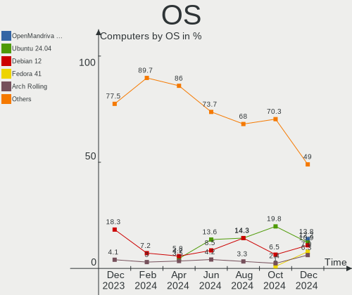
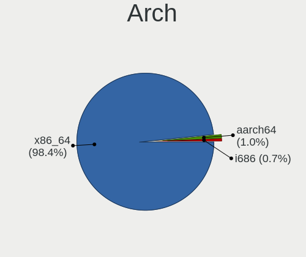
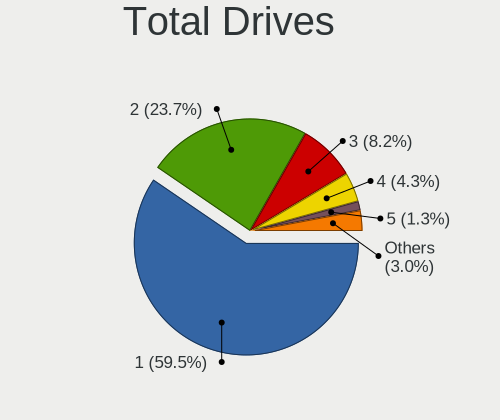
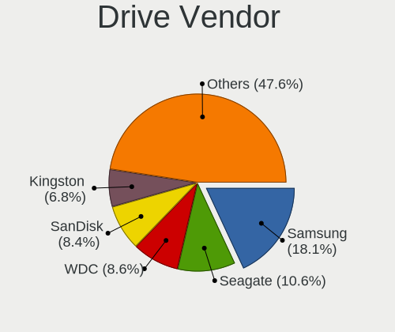
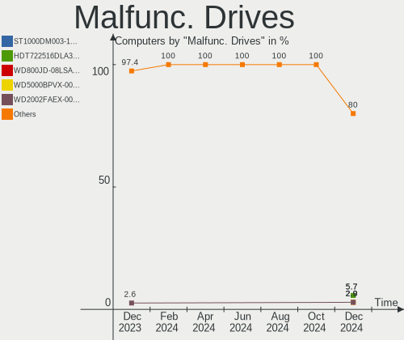
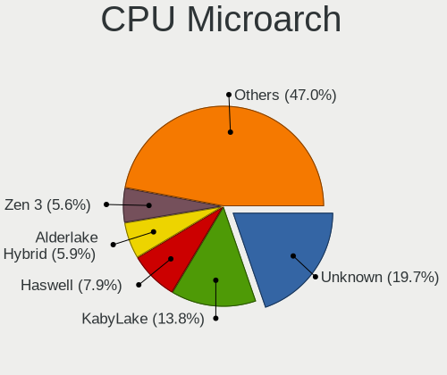
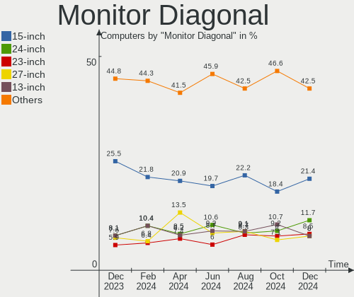
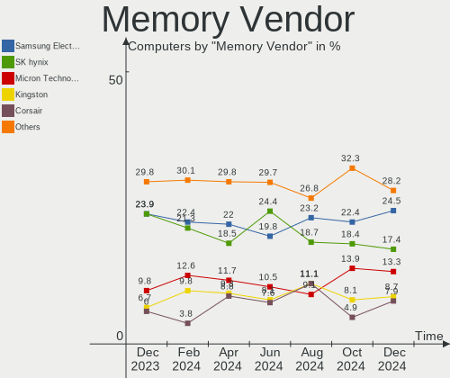
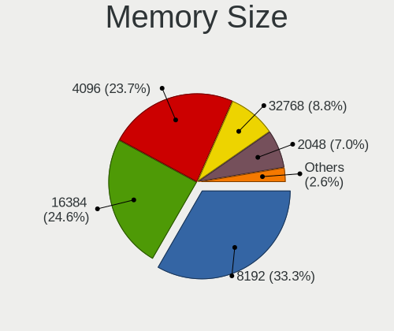
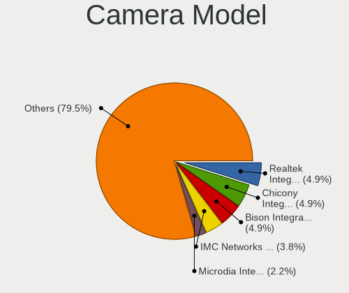

Linux in France - Hardware Trends
---------------------------------

A project to identify most popular hardware characteristics and track their change
over time based on data collected by Linux users at https://Linux-Hardware.org.

Anyone can contribute to this report by the [hw-probe](https://github.com/linuxhw/hw-probe) tool:

    sudo -E hw-probe -all -upload

This is a report for all computer types. See also reports for [desktops](/Location/France/Desktop/README.md) and [notebooks](/Location/France/Notebook/README.md).

Period: Nov, 2023.

Contents
--------

* [ System ](#system)
  - [ OS                       ](#os)
  - [ OS Family                ](#os-family)
  - [ Kernel                   ](#kernel)
  - [ Kernel Family            ](#kernel-family)
  - [ Kernel Major Ver.        ](#kernel-major-ver)
  - [ Arch                     ](#arch)
  - [ DE                       ](#de)
  - [ Display Server           ](#display-server)
  - [ Display Manager          ](#display-manager)
  - [ OS Lang                  ](#os-lang)
  - [ Boot Mode                ](#boot-mode)
  - [ Filesystem               ](#filesystem)
  - [ Part. scheme             ](#part-scheme)
  - [ Dual Boot with Linux/BSD ](#dual-boot-with-linuxbsd)
  - [ Dual Boot (Win)          ](#dual-boot-win)

* [ Board ](#board)
  - [ Vendor                   ](#vendor)
  - [ Model                    ](#model)
  - [ Model Family             ](#model-family)
  - [ MFG Year                 ](#mfg-year)
  - [ Form Factor              ](#form-factor)
  - [ Secure Boot              ](#secure-boot)
  - [ Coreboot                 ](#coreboot)
  - [ RAM Size                 ](#ram-size)
  - [ RAM Used                 ](#ram-used)
  - [ Total Drives             ](#total-drives)
  - [ Has CD-ROM               ](#has-cd-rom)
  - [ Has Ethernet             ](#has-ethernet)
  - [ Has WiFi                 ](#has-wifi)
  - [ Has Bluetooth            ](#has-bluetooth)

* [ Location ](#location)
  - [ Country                  ](#country)
  - [ City                     ](#city)

* [ Drives ](#drives)
  - [ Drive Vendor             ](#drive-vendor)
  - [ Drive Model              ](#drive-model)
  - [ HDD Vendor               ](#hdd-vendor)
  - [ SSD Vendor               ](#ssd-vendor)
  - [ Drive Kind               ](#drive-kind)
  - [ Drive Connector          ](#drive-connector)
  - [ Drive Size               ](#drive-size)
  - [ Space Total              ](#space-total)
  - [ Space Used               ](#space-used)
  - [ Malfunc. Drives          ](#malfunc-drives)
  - [ Malfunc. Drive Vendor    ](#malfunc-drive-vendor)
  - [ Malfunc. HDD Vendor      ](#malfunc-hdd-vendor)
  - [ Malfunc. Drive Kind      ](#malfunc-drive-kind)
  - [ Failed Drives            ](#failed-drives)
  - [ Failed Drive Vendor      ](#failed-drive-vendor)
  - [ Drive Status             ](#drive-status)

* [ Storage controller ](#storage-controller)
  - [ Storage Vendor           ](#storage-vendor)
  - [ Storage Model            ](#storage-model)
  - [ Storage Kind             ](#storage-kind)

* [ Processor ](#processor)
  - [ CPU Vendor               ](#cpu-vendor)
  - [ CPU Model                ](#cpu-model)
  - [ CPU Model Family         ](#cpu-model-family)
  - [ CPU Cores                ](#cpu-cores)
  - [ CPU Sockets              ](#cpu-sockets)
  - [ CPU Threads              ](#cpu-threads)
  - [ CPU Op-Modes             ](#cpu-op-modes)
  - [ CPU Microcode            ](#cpu-microcode)
  - [ CPU Microarch            ](#cpu-microarch)

* [ Graphics ](#graphics)
  - [ GPU Vendor               ](#gpu-vendor)
  - [ GPU Model                ](#gpu-model)
  - [ GPU Combo                ](#gpu-combo)
  - [ GPU Driver               ](#gpu-driver)
  - [ GPU Memory               ](#gpu-memory)

* [ Monitor ](#monitor)
  - [ Monitor Vendor           ](#monitor-vendor)
  - [ Monitor Model            ](#monitor-model)
  - [ Monitor Resolution       ](#monitor-resolution)
  - [ Monitor Diagonal         ](#monitor-diagonal)
  - [ Monitor Width            ](#monitor-width)
  - [ Aspect Ratio             ](#aspect-ratio)
  - [ Monitor Area             ](#monitor-area)
  - [ Pixel Density            ](#pixel-density)
  - [ Multiple Monitors        ](#multiple-monitors)

* [ Network ](#network)
  - [ Net Controller Vendor    ](#net-controller-vendor)
  - [ Net Controller Model     ](#net-controller-model)
  - [ Wireless Vendor          ](#wireless-vendor)
  - [ Wireless Model           ](#wireless-model)
  - [ Ethernet Vendor          ](#ethernet-vendor)
  - [ Ethernet Model           ](#ethernet-model)
  - [ Net Controller Kind      ](#net-controller-kind)
  - [ Used Controller          ](#used-controller)
  - [ NICs                     ](#nics)
  - [ IPv6                     ](#ipv6)

* [ Bluetooth ](#bluetooth)
  - [ Bluetooth Vendor         ](#bluetooth-vendor)
  - [ Bluetooth Model          ](#bluetooth-model)

* [ Sound ](#sound)
  - [ Sound Vendor             ](#sound-vendor)
  - [ Sound Model              ](#sound-model)

* [ Memory ](#memory)
  - [ Memory Vendor            ](#memory-vendor)
  - [ Memory Model             ](#memory-model)
  - [ Memory Kind              ](#memory-kind)
  - [ Memory Form Factor       ](#memory-form-factor)
  - [ Memory Size              ](#memory-size)
  - [ Memory Speed             ](#memory-speed)

* [ Printers & scanners ](#printers--scanners)
  - [ Printer Vendor           ](#printer-vendor)
  - [ Printer Model            ](#printer-model)
  - [ Scanner Vendor           ](#scanner-vendor)
  - [ Scanner Model            ](#scanner-model)

* [ Camera ](#camera)
  - [ Camera Vendor            ](#camera-vendor)
  - [ Camera Model             ](#camera-model)

* [ Security ](#security)
  - [ Fingerprint Vendor       ](#fingerprint-vendor)
  - [ Fingerprint Model        ](#fingerprint-model)
  - [ Chipcard Vendor          ](#chipcard-vendor)
  - [ Chipcard Model           ](#chipcard-model)

* [ Unsupported ](#unsupported)
  - [ Unsupported Devices      ](#unsupported-devices)
  - [ Unsupported Device Types ](#unsupported-device-types)

System
------

OS
--

Installed operating systems

| Name                        | Computers | Percent |
|-----------------------------|-----------|---------|
| Ubuntu 22.04                | 62        | 20.26%  |
| OpenMandriva 23.08          | 25        | 8.17%   |
| Linux Mint 21.2             | 21        | 6.86%   |
| Fedora 39                   | 17        | 5.56%   |
| Arch Rolling                | 14        | 4.58%   |
| Ubuntu 23.10                | 11        | 3.59%   |
| Ubuntu 20.04                | 11        | 3.59%   |
| OpenMandriva 23.11          | 11        | 3.59%   |
| Debian 12                   | 11        | 3.59%   |
| Zorin 16                    | 10        | 3.27%   |
| Xubuntu 22.04               | 7         | 2.29%   |
| OpenMandriva 5.0            | 7         | 2.29%   |
| Ubuntu 23.04                | 5         | 1.63%   |
| Xubuntu 23.10               | 4         | 1.31%   |
| Xero Rolling                | 4         | 1.31%   |
| Pop!_OS 22.04               | 4         | 1.31%   |
| Kubuntu 23.10               | 4         | 1.31%   |
| Kubuntu 22.04               | 4         | 1.31%   |
| Fedora 38                   | 4         | 1.31%   |
| Debian 11                   | 4         | 1.31%   |
| Garuda Linux Soaring        | 3         | 0.98%   |
| EndeavourOS Rolling         | 3         | 0.98%   |
| ArcoLinux Rolling           | 3         | 0.98%   |
| Void Linux Rolling          | 2         | 0.65%   |
| Trisquel 11.0               | 2         | 0.65%   |
| org.kde.Platform 5.15-21.08 | 2         | 0.65%   |
| OpenMandriva 4.2            | 2         | 0.65%   |
| OpenMandriva 23.90          | 2         | 0.65%   |
| Nobara 38                   | 2         | 0.65%   |
| Manjaro 23.1.0              | 2         | 0.65%   |
| Manjaro 23.0.4              | 2         | 0.65%   |
| Manjaro                     | 2         | 0.65%   |
| Lubuntu 23.10               | 2         | 0.65%   |
| Lubuntu 22.04               | 2         | 0.65%   |
| LMDE 6                      | 2         | 0.65%   |
| Linux Mint 21.1             | 2         | 0.65%   |
| Kali 2023.3                 | 2         | 0.65%   |
| Elementary 7.1              | 2         | 0.65%   |
| Debian                      | 2         | 0.65%   |
| Xubuntu 23.04               | 1         | 0.33%   |

OS Family
---------

OS without a version

| Name             | Computers | Percent |
|------------------|-----------|---------|
| Ubuntu           | 92        | 30.07%  |
| OpenMandriva     | 51        | 16.67%  |
| Linux Mint       | 26        | 8.5%    |
| Fedora           | 21        | 6.86%   |
| Debian           | 17        | 5.56%   |
| Arch             | 14        | 4.58%   |
| Xubuntu          | 13        | 4.25%   |
| Zorin            | 10        | 3.27%   |
| Kubuntu          | 10        | 3.27%   |
| Manjaro          | 6         | 1.96%   |
| Xero             | 4         | 1.31%   |
| Pop!_OS          | 4         | 1.31%   |
| Lubuntu          | 4         | 1.31%   |
| SteamOS          | 3         | 0.98%   |
| Garuda Linux     | 3         | 0.98%   |
| EndeavourOS      | 3         | 0.98%   |
| Elementary       | 3         | 0.98%   |
| ArcoLinux        | 3         | 0.98%   |
| Void Linux       | 2         | 0.65%   |
| Ubuntu MATE      | 2         | 0.65%   |
| Trisquel         | 2         | 0.65%   |
| org.kde.Platform | 2         | 0.65%   |
| Nobara           | 2         | 0.65%   |
| LMDE             | 2         | 0.65%   |
| Kali             | 2         | 0.65%   |
| Ubuntu Studio    | 1         | 0.33%   |
| Ubuntu Budgie    | 1         | 0.33%   |
| PostmarketOS     | 1         | 0.33%   |
| MX               | 1         | 0.33%   |
| BigLinux         | 1         | 0.33%   |

Kernel
------

Version of the Linux kernel

| Version                                                | Computers | Percent |
|--------------------------------------------------------|-----------|---------|
| 6.2.0-36-generic                                       | 39        | 12.75%  |
| 5.15.0-88-generic                                      | 31        | 10.13%  |
| 6.4.11-desktop-1omv2390                                | 28        | 9.15%   |
| 6.2.0-37-generic                                       | 19        | 6.21%   |
| 6.5.0-10-generic                                       | 15        | 4.9%    |
| 5.15.0-89-generic                                      | 14        | 4.58%   |
| 6.1.0-13-amd64                                         | 12        | 3.92%   |
| 6.6.2-desktop-1omv2390                                 | 11        | 3.59%   |
| 6.5.11-300.fc39.x86_64                                 | 8         | 2.61%   |
| 6.5.9-arch2-1                                          | 7         | 2.29%   |
| 6.6.2-arch1-1                                          | 6         | 1.96%   |
| 6.6.1-arch1-1                                          | 5         | 1.63%   |
| 6.5.0-13-generic                                       | 5         | 1.63%   |
| 6.2.0-35-generic                                       | 5         | 1.63%   |
| 6.5.10-300.fc39.x86_64                                 | 4         | 1.31%   |
| 6.2.0-26-generic                                       | 4         | 1.31%   |
| 6.6.0-desktop-1omv2390                                 | 3         | 0.98%   |
| 6.5.8-200.fc38.x86_64                                  | 3         | 0.98%   |
| 6.5.6-76060506-generic                                 | 3         | 0.98%   |
| 6.2.0-34-generic                                       | 3         | 0.98%   |
| 5.15.0-87-generic                                      | 3         | 0.98%   |
| 5.15.0-76-generic                                      | 3         | 0.98%   |
| 5.10.0-26-amd64                                        | 3         | 0.98%   |
| 6.6.1_1                                                | 2         | 0.65%   |
| 6.6.1-zen1-1-zen                                       | 2         | 0.65%   |
| 6.6.1-desktop-1omv2390                                 | 2         | 0.65%   |
| 6.5.12-300.fc39.x86_64                                 | 2         | 0.65%   |
| 6.5.0-9-generic                                        | 2         | 0.65%   |
| 6.5.0-4-amd64                                          | 2         | 0.65%   |
| 6.1.55-1-MANJARO                                       | 2         | 0.65%   |
| 5.4.0-167-generic                                      | 2         | 0.65%   |
| 5.4.0-166-generic                                      | 2         | 0.65%   |
| 5.10.14-desktop-1omv4002                               | 2         | 0.65%   |
| 6.7.0-0.rc1.20231114gt9bacdd89.316.vanilla.fc39.x86_64 | 1         | 0.33%   |
| 6.6.2-zen1-1-zen                                       | 1         | 0.33%   |
| 6.6.2-AMD                                              | 1         | 0.33%   |
| 6.6.2-201.fc39.x86_64                                  | 1         | 0.33%   |
| 6.6.1-1-MANJARO                                        | 1         | 0.33%   |
| 6.6.1-1-clear                                          | 1         | 0.33%   |
| 6.6.0-arch1-1                                          | 1         | 0.33%   |

Kernel Family
-------------

Linux kernel without a distro release

| Version  | Computers | Percent |
|----------|-----------|---------|
| 6.2.0    | 73        | 23.86%  |
| 5.15.0   | 55        | 17.97%  |
| 6.4.11   | 29        | 9.48%   |
| 6.5.0    | 27        | 8.82%   |
| 6.6.2    | 20        | 6.54%   |
| 6.6.1    | 13        | 4.25%   |
| 6.1.0    | 13        | 4.25%   |
| 6.5.9    | 10        | 3.27%   |
| 6.5.11   | 10        | 3.27%   |
| 5.4.0    | 6         | 1.96%   |
| 6.6.0    | 4         | 1.31%   |
| 6.5.6    | 4         | 1.31%   |
| 6.5.10   | 4         | 1.31%   |
| 5.10.0   | 4         | 1.31%   |
| 6.5.8    | 3         | 0.98%   |
| 6.5.12   | 3         | 0.98%   |
| 5.19.0   | 3         | 0.98%   |
| 6.5.5    | 2         | 0.65%   |
| 6.1.62   | 2         | 0.65%   |
| 6.1.55   | 2         | 0.65%   |
| 6.1.52   | 2         | 0.65%   |
| 5.10.14  | 2         | 0.65%   |
| 6.7.0    | 1         | 0.33%   |
| 6.5.7    | 1         | 0.33%   |
| 6.5.4    | 1         | 0.33%   |
| 6.4.8    | 1         | 0.33%   |
| 6.4.0    | 1         | 0.33%   |
| 6.3.7    | 1         | 0.33%   |
| 6.2.6    | 1         | 0.33%   |
| 6.2.16   | 1         | 0.33%   |
| 5.8.0    | 1         | 0.33%   |
| 5.19.12  | 1         | 0.33%   |
| 5.16.7   | 1         | 0.33%   |
| 5.15.77  | 1         | 0.33%   |
| 5.15.126 | 1         | 0.33%   |
| 4.9.0    | 1         | 0.33%   |
| 4.19.127 | 1         | 0.33%   |

Kernel Major Ver.
-----------------

Linux kernel major version

| Version | Computers | Percent |
|---------|-----------|---------|
| 6.2     | 75        | 24.51%  |
| 6.5     | 65        | 21.24%  |
| 5.15    | 57        | 18.63%  |
| 6.6     | 37        | 12.09%  |
| 6.4     | 31        | 10.13%  |
| 6.1     | 19        | 6.21%   |
| 5.4     | 6         | 1.96%   |
| 5.10    | 6         | 1.96%   |
| 5.19    | 4         | 1.31%   |
| 6.7     | 1         | 0.33%   |
| 6.3     | 1         | 0.33%   |
| 5.8     | 1         | 0.33%   |
| 5.16    | 1         | 0.33%   |
| 4.9     | 1         | 0.33%   |
| 4.19    | 1         | 0.33%   |

Arch
----

OS architecture (x86_64, i586, etc.)

| Name    | Computers | Percent |
|---------|-----------|---------|
| x86_64  | 304       | 99.35%  |
| armv7l  | 1         | 0.33%   |
| aarch64 | 1         | 0.33%   |

DE
--

Desktop Environment

| Name            | Computers | Percent |
|-----------------|-----------|---------|
| GNOME           | 131       | 42.81%  |
| KDE5            | 84        | 27.45%  |
| XFCE            | 26        | 8.5%    |
| X-Cinnamon      | 25        | 8.17%   |
| MATE            | 10        | 3.27%   |
| Unknown         | 9         | 2.94%   |
| LXQt            | 8         | 2.61%   |
| Pantheon        | 3         | 0.98%   |
| i3              | 2         | 0.65%   |
| GNOME Flashback | 2         | 0.65%   |
| LeftWM          | 1         | 0.33%   |
| KDE             | 1         | 0.33%   |
| Hyprland        | 1         | 0.33%   |
| Deepin          | 1         | 0.33%   |
| DDE             | 1         | 0.33%   |
| Budgie          | 1         | 0.33%   |

Display Server
--------------

X11 or Wayland

| Name    | Computers | Percent |
|---------|-----------|---------|
| X11     | 161       | 52.61%  |
| Wayland | 136       | 44.44%  |
| Tty     | 8         | 2.61%   |
| Unknown | 1         | 0.33%   |

Display Manager
---------------

SDDM, LightDM, etc.

| Name    | Computers | Percent |
|---------|-----------|---------|
| SDDM    | 88        | 28.76%  |
| GDM3    | 81        | 26.47%  |
| Unknown | 69        | 22.55%  |
| LightDM | 42        | 13.73%  |
| GDM     | 26        | 8.5%    |

OS Lang
-------

Language

| Lang  | Computers | Percent |
|-------|-----------|---------|
| fr_FR | 232       | 75.82%  |
| en_US | 55        | 17.97%  |
| en_GB | 6         | 1.96%   |
| it_IT | 4         | 1.31%   |
| C     | 4         | 1.31%   |
| de_DE | 2         | 0.65%   |
| sk_SK | 1         | 0.33%   |
| fr_BE | 1         | 0.33%   |
| cs_CZ | 1         | 0.33%   |

Boot Mode
---------

EFI or BIOS

| Mode | Computers | Percent |
|------|-----------|---------|
| EFI  | 192       | 62.75%  |
| BIOS | 114       | 37.25%  |

Filesystem
----------

Type of filesystem

| Type    | Computers | Percent |
|---------|-----------|---------|
| Ext4    | 192       | 62.75%  |
| Tmpfs   | 39        | 12.75%  |
| Btrfs   | 34        | 11.11%  |
| Overlay | 24        | 7.84%   |
| F2fs    | 6         | 1.96%   |
| Xfs     | 5         | 1.63%   |
| Ext3    | 3         | 0.98%   |
| Zfs     | 2         | 0.65%   |
| Unknown | 1         | 0.33%   |

Part. scheme
------------

Scheme of partitioning

| Type    | Computers | Percent |
|---------|-----------|---------|
| GPT     | 213       | 69.61%  |
| Unknown | 60        | 19.61%  |
| MBR     | 33        | 10.78%  |

Dual Boot with Linux/BSD
------------------------

Hosting more than one Linux/BSD

| Dual boot | Computers | Percent |
|-----------|-----------|---------|
| No        | 245       | 80.07%  |
| Yes       | 61        | 19.93%  |

Dual Boot (Win)
---------------

Hosting Linux and Windows

| Dual boot | Computers | Percent |
|-----------|-----------|---------|
| No        | 207       | 67.65%  |
| Yes       | 99        | 32.35%  |

Board
-----

Vendor
------

Motherboard manufacturer

| Name                                 | Computers | Percent |
|--------------------------------------|-----------|---------|
| ASUSTek Computer                     | 59        | 19.28%  |
| Hewlett-Packard                      | 40        | 13.07%  |
| Lenovo                               | 39        | 12.75%  |
| Dell                                 | 34        | 11.11%  |
| MSI                                  | 31        | 10.13%  |
| Acer                                 | 12        | 3.92%   |
| Gigabyte Technology                  | 10        | 3.27%   |
| Apple                                | 9         | 2.94%   |
| ASRock                               | 8         | 2.61%   |
| Toshiba                              | 7         | 2.29%   |
| Intel                                | 5         | 1.63%   |
| HUAWEI                               | 5         | 1.63%   |
| Unknown                              | 4         | 1.31%   |
| Thomson                              | 3         | 0.98%   |
| Teclast                              | 3         | 0.98%   |
| Notebook                             | 3         | 0.98%   |
| Fujitsu                              | 3         | 0.98%   |
| Valve                                | 2         | 0.65%   |
| Samsung Electronics                  | 2         | 0.65%   |
| Packard Bell                         | 2         | 0.65%   |
| Google                               | 2         | 0.65%   |
| Fujitsu Siemens                      | 2         | 0.65%   |
| Foxconn                              | 2         | 0.65%   |
| Biostar                              | 2         | 0.65%   |
| Xiaomi                               | 1         | 0.33%   |
| Trigkey                              | 1         | 0.33%   |
| Timi                                 | 1         | 0.33%   |
| Star Labs                            | 1         | 0.33%   |
| Sony                                 | 1         | 0.33%   |
| Shuttle                              | 1         | 0.33%   |
| Shenzhen Meigao Electronic Equipment | 1         | 0.33%   |
| Qilive                               | 1         | 0.33%   |
| PC Specialist                        | 1         | 0.33%   |
| Neousys Technology                   | 1         | 0.33%   |
| Mediacom                             | 1         | 0.33%   |
| LG Electronics                       | 1         | 0.33%   |
| Framework                            | 1         | 0.33%   |
| eMachines                            | 1         | 0.33%   |
| Clevo                                | 1         | 0.33%   |
| BESSTAR Tech                         | 1         | 0.33%   |

Model
-----

Motherboard model

| Name                                              | Computers | Percent |
|---------------------------------------------------|-----------|---------|
| Unknown                                           | 5         | 1.63%   |
| MSI MS-7D16                                       | 3         | 0.98%   |
| Valve Jupiter                                     | 2         | 0.65%   |
| Thomson N14C4WH64                                 | 2         | 0.65%   |
| Notebook NJ50_70CU                                | 2         | 0.65%   |
| MSI MS-7C37                                       | 2         | 0.65%   |
| Lenovo ThinkPad L13 Gen 3 21BAS0X700              | 2         | 0.65%   |
| HP ProBook 650 G5                                 | 2         | 0.65%   |
| HP Notebook                                       | 2         | 0.65%   |
| HP EliteBook 860 16 inch G10 Notebook PC          | 2         | 0.65%   |
| HP EliteBook 840 G6                               | 2         | 0.65%   |
| Gigabyte B450 AORUS ELITE                         | 2         | 0.65%   |
| Dell Venue 11 Pro 5130                            | 2         | 0.65%   |
| Dell OptiPlex 3050                                | 2         | 0.65%   |
| Dell OptiPlex 3020                                | 2         | 0.65%   |
| Dell Latitude 5430                                | 2         | 0.65%   |
| ASUS Zenbook UX3402ZA_UX3402ZA                    | 2         | 0.65%   |
| ASUS ROG STRIX B560-I GAMING WIFI                 | 2         | 0.65%   |
| Apple MacBookPro8,1                               | 2         | 0.65%   |
| Xiaomi POCO X3 NFC                                | 1         | 0.33%   |
| Trigkey S5                                        | 1         | 0.33%   |
| Toshiba Satellite S70t-A                          | 1         | 0.33%   |
| Toshiba Satellite Pro L500                        | 1         | 0.33%   |
| Toshiba Satellite L550                            | 1         | 0.33%   |
| Toshiba Satellite C870D-116                       | 1         | 0.33%   |
| Toshiba Satellite C70-B                           | 1         | 0.33%   |
| Toshiba Satellite C670D-11Z                       | 1         | 0.33%   |
| Toshiba Satellite C650D                           | 1         | 0.33%   |
| Timi A35                                          | 1         | 0.33%   |
| Thomson N15C8BK2T                                 | 1         | 0.33%   |
| Teclast F6 Pro                                    | 1         | 0.33%   |
| Teclast F15S                                      | 1         | 0.33%   |
| Teclast F15Plus 2                                 | 1         | 0.33%   |
| Star Labs StarBook                                | 1         | 0.33%   |
| Sony VGN-NS12M_W                                  | 1         | 0.33%   |
| Shuttle XS35V3                                    | 1         | 0.33%   |
| Shenzhen Meigao Electronic Equipment Venus series | 1         | 0.33%   |
| Samsung R425D/R525D                               | 1         | 0.33%   |
| Samsung 305E4A/305E5A/305E7A                      | 1         | 0.33%   |
| Qilive QW2214FR                                   | 1         | 0.33%   |

Model Family
------------

Motherboard model prefix

| Name                  | Computers | Percent |
|-----------------------|-----------|---------|
| Lenovo ThinkPad       | 17        | 5.56%   |
| Dell Latitude         | 14        | 4.58%   |
| HP Pavilion           | 10        | 3.27%   |
| ASUS ROG              | 9         | 2.94%   |
| Lenovo ThinkCentre    | 8         | 2.61%   |
| Dell OptiPlex         | 8         | 2.61%   |
| Toshiba Satellite     | 7         | 2.29%   |
| HP EliteBook          | 7         | 2.29%   |
| Acer Aspire           | 7         | 2.29%   |
| Lenovo IdeaPad        | 5         | 1.63%   |
| HP ProBook            | 5         | 1.63%   |
| ASUS Zenbook          | 5         | 1.63%   |
| ASUS TUF              | 5         | 1.63%   |
| Unknown               | 5         | 1.63%   |
| Dell XPS              | 4         | 1.31%   |
| ASUS VivoBook         | 4         | 1.31%   |
| MSI Prestige          | 3         | 0.98%   |
| MSI MS-7D16           | 3         | 0.98%   |
| Lenovo Yoga           | 3         | 0.98%   |
| HP Compaq             | 3         | 0.98%   |
| Dell Precision        | 3         | 0.98%   |
| Acer Veriton          | 3         | 0.98%   |
| Valve Jupiter         | 2         | 0.65%   |
| Thomson N14C4WH64     | 2         | 0.65%   |
| Notebook NJ50         | 2         | 0.65%   |
| MSI MS-7C37           | 2         | 0.65%   |
| HP ZBook              | 2         | 0.65%   |
| HP OMEN               | 2         | 0.65%   |
| HP Notebook           | 2         | 0.65%   |
| HP Laptop             | 2         | 0.65%   |
| Gigabyte B450         | 2         | 0.65%   |
| Fujitsu Siemens AMILO | 2         | 0.65%   |
| Fujitsu ESPRIMO       | 2         | 0.65%   |
| Dell Venue            | 2         | 0.65%   |
| Dell Inspiron         | 2         | 0.65%   |
| ASUS PRIME            | 2         | 0.65%   |
| ASUS P8Z77-V          | 2         | 0.65%   |
| Apple MacBookPro8     | 2         | 0.65%   |
| Apple MacBookPro11    | 2         | 0.65%   |
| Xiaomi POCO           | 1         | 0.33%   |

MFG Year
--------

Motherboard manufacture year

| Year    | Computers | Percent |
|---------|-----------|---------|
| 2021    | 37        | 12.09%  |
| 2023    | 27        | 8.82%   |
| 2022    | 27        | 8.82%   |
| 2012    | 23        | 7.52%   |
| 2020    | 22        | 7.19%   |
| 2019    | 20        | 6.54%   |
| 2014    | 20        | 6.54%   |
| 2018    | 19        | 6.21%   |
| 2016    | 17        | 5.56%   |
| 2013    | 17        | 5.56%   |
| 2017    | 16        | 5.23%   |
| 2011    | 15        | 4.9%    |
| 2010    | 14        | 4.58%   |
| 2015    | 13        | 4.25%   |
| 2008    | 9         | 2.94%   |
| 2009    | 6         | 1.96%   |
| 2007    | 2         | 0.65%   |
| Unknown | 2         | 0.65%   |

Form Factor
-----------

Physical design of the computer

| Name           | Computers | Percent |
|----------------|-----------|---------|
| Notebook       | 179       | 58.5%   |
| Desktop        | 101       | 33.01%  |
| Mini pc        | 12        | 3.92%   |
| Convertible    | 6         | 1.96%   |
| All in one     | 5         | 1.63%   |
| Server         | 2         | 0.65%   |
| System on chip | 1         | 0.33%   |

Secure Boot
-----------

Enabled or disabled

| State    | Computers | Percent |
|----------|-----------|---------|
| Disabled | 286       | 93.46%  |
| Enabled  | 20        | 6.54%   |

Coreboot
--------

Have coreboot on board

| Used | Computers | Percent |
|------|-----------|---------|
| No   | 303       | 99.02%  |
| Yes  | 3         | 0.98%   |

RAM Size
--------

Total RAM memory

| Size in GB  | Computers | Percent |
|-------------|-----------|---------|
| 4.01-8.0    | 71        | 23.2%   |
| 16.01-24.0  | 63        | 20.59%  |
| 8.01-16.0   | 55        | 17.97%  |
| 3.01-4.0    | 47        | 15.36%  |
| 32.01-64.0  | 36        | 11.76%  |
| 24.01-32.0  | 11        | 3.59%   |
| 1.01-2.0    | 11        | 3.59%   |
| 64.01-256.0 | 7         | 2.29%   |
| 2.01-3.0    | 5         | 1.63%   |

RAM Used
--------

Used RAM memory

| Used GB    | Computers | Percent |
|------------|-----------|---------|
| 2.01-3.0   | 91        | 29.74%  |
| 1.01-2.0   | 91        | 29.74%  |
| 4.01-8.0   | 46        | 15.03%  |
| 3.01-4.0   | 33        | 10.78%  |
| 8.01-16.0  | 21        | 6.86%   |
| 0.51-1.0   | 17        | 5.56%   |
| 16.01-24.0 | 3         | 0.98%   |
| 0.01-0.5   | 2         | 0.65%   |
| 32.01-64.0 | 1         | 0.33%   |
| 24.01-32.0 | 1         | 0.33%   |

Total Drives
------------

Number of drives on board

| Drives | Computers | Percent |
|--------|-----------|---------|
| 1      | 182       | 59.48%  |
| 2      | 77        | 25.16%  |
| 3      | 22        | 7.19%   |
| 4      | 9         | 2.94%   |
| 5      | 7         | 2.29%   |
| 6      | 4         | 1.31%   |
| 8      | 3         | 0.98%   |
| 7      | 1         | 0.33%   |
| 0      | 1         | 0.33%   |

Has CD-ROM
----------

Has CD-ROM on board

| Presented | Computers | Percent |
|-----------|-----------|---------|
| No        | 196       | 64.05%  |
| Yes       | 110       | 35.95%  |

Has Ethernet
------------

Has Ethernet on board

| Presented | Computers | Percent |
|-----------|-----------|---------|
| Yes       | 257       | 83.99%  |
| No        | 49        | 16.01%  |

Has WiFi
--------

Has WiFi module

| Presented | Computers | Percent |
|-----------|-----------|---------|
| Yes       | 245       | 80.07%  |
| No        | 61        | 19.93%  |

Has Bluetooth
-------------

Has Bluetooth module

| Presented | Computers | Percent |
|-----------|-----------|---------|
| Yes       | 209       | 68.3%   |
| No        | 97        | 31.7%   |

Location
--------

Country
-------

Geographic location (country)

| Country | Computers | Percent |
|---------|-----------|---------|
| France  | 306       | 100%    |

City
----

Geographic location (city)

| City                  | Computers | Percent |
|-----------------------|-----------|---------|
| Paris                 | 41        | 13.4%   |
| Nantes                | 11        | 3.59%   |
| Vitry-sur-Seine       | 5         | 1.63%   |
| Rennes                | 5         | 1.63%   |
| Marseille             | 5         | 1.63%   |
| Burgnac               | 5         | 1.63%   |
| Bordeaux              | 5         | 1.63%   |
| Montpellier           | 4         | 1.31%   |
| La Broque             | 4         | 1.31%   |
| Villeurbanne          | 3         | 0.98%   |
| Toulouse              | 3         | 0.98%   |
| Rosny-sous-Bois       | 3         | 0.98%   |
| Lille                 | 3         | 0.98%   |
| Grenoble              | 3         | 0.98%   |
| Figeac                | 3         | 0.98%   |
| Châtenay-Malabry     | 3         | 0.98%   |
| Boulogne-Billancourt  | 3         | 0.98%   |
| Valenciennes          | 2         | 0.65%   |
| Strasbourg            | 2         | 0.65%   |
| Sartrouville          | 2         | 0.65%   |
| Roubaix               | 2         | 0.65%   |
| Rezé                 | 2         | 0.65%   |
| Reims                 | 2         | 0.65%   |
| Palaiseau             | 2         | 0.65%   |
| Lyon                  | 2         | 0.65%   |
| Loudéac              | 2         | 0.65%   |
| Lavaur                | 2         | 0.65%   |
| La Seyne-sur-Mer      | 2         | 0.65%   |
| Elna                  | 2         | 0.65%   |
| Compiègne            | 2         | 0.65%   |
| Colmar                | 2         | 0.65%   |
| Cerons                | 2         | 0.65%   |
| Bastia                | 2         | 0.65%   |
| Annecy                | 2         | 0.65%   |
| Yutz                  | 1         | 0.33%   |
| Wasquehal             | 1         | 0.33%   |
| Viroflay              | 1         | 0.33%   |
| Villetaneuse          | 1         | 0.33%   |
| Villepinte            | 1         | 0.33%   |
| Villeneuve-la-Garenne | 1         | 0.33%   |

Drives
------

Drive Vendor
------------

Hard drive vendors

| Vendor                      | Computers | Drives | Percent |
|-----------------------------|-----------|--------|---------|
| Samsung Electronics         | 66        | 80     | 14.32%  |
| Seagate                     | 65        | 78     | 14.1%   |
| WDC                         | 54        | 66     | 11.71%  |
| Crucial                     | 36        | 40     | 7.81%   |
| Toshiba                     | 23        | 25     | 4.99%   |
| Unknown                     | 21        | 25     | 4.56%   |
| SanDisk                     | 21        | 21     | 4.56%   |
| Kingston                    | 21        | 21     | 4.56%   |
| Micron Technology           | 15        | 15     | 3.25%   |
| Intel                       | 12        | 14     | 2.6%    |
| SK hynix                    | 11        | 16     | 2.39%   |
| KIOXIA                      | 8         | 8      | 1.74%   |
| Hitachi                     | 8         | 10     | 1.74%   |
| HGST                        | 8         | 8      | 1.74%   |
| Micron/Crucial Technology   | 7         | 7      | 1.52%   |
| China                       | 6         | 6      | 1.3%    |
| SPCC                        | 5         | 6      | 1.08%   |
| PNY                         | 5         | 5      | 1.08%   |
| Silicon Motion              | 4         | 4      | 0.87%   |
| Phison Electronics          | 4         | 5      | 0.87%   |
| Kingston Technology Company | 4         | 4      | 0.87%   |
| JMicron Technology          | 4         | 4      | 0.87%   |
| Apple                       | 4         | 4      | 0.87%   |
| Unknown                     | 4         | 4      | 0.87%   |
| LDLC                        | 3         | 3      | 0.65%   |
| Transcend                   | 2         | 2      | 0.43%   |
| Teclast                     | 2         | 2      | 0.43%   |
| Fanxiang                    | 2         | 2      | 0.43%   |
| YHJC                        | 1         | 1      | 0.22%   |
| XrayDisk                    | 1         | 1      | 0.22%   |
| VICKTER                     | 1         | 1      | 0.22%   |
| Verbatim                    | 1         | 1      | 0.22%   |
| USB3.0                      | 1         | 1      | 0.22%   |
| USB                         | 1         | 1      | 0.22%   |
| TO Exter                    | 1         | 1      | 0.22%   |
| tigo                        | 1         | 1      | 0.22%   |
| Star                        | 1         | 1      | 0.22%   |
| SC550                       | 1         | 1      | 0.22%   |
| SABRENT                     | 1         | 1      | 0.22%   |
| Realtek Semiconductor       | 1         | 1      | 0.22%   |

Drive Model
-----------

Hard drive models

| Model                                                 | Computers | Percent |
|-------------------------------------------------------|-----------|---------|
| Crucial CT500MX500SSD1 500GB                          | 9         | 1.79%   |
| Samsung NVMe SSD Controller SM981/PM981/PM983 250GB   | 8         | 1.59%   |
| Toshiba MQ01ABD100 1TB                                | 5         | 1%      |
| Samsung NVMe SSD Controller PM9A1/PM9A3/980PRO 2TB    | 5         | 1%      |
| Micron/Crucial P2 NVMe PCIe SSD 1TB                   | 5         | 1%      |
| Unknown MMC Card  64GB                                | 4         | 0.8%    |
| Seagate ST2000DM008-2FR102 2TB                        | 4         | 0.8%    |
| Seagate ST1000LM024 HN-M101MBB 1TB                    | 4         | 0.8%    |
| Seagate ST1000DM010-2EP102 1TB                        | 4         | 0.8%    |
| SanDisk SSD PLUS 240GB                                | 4         | 0.8%    |
| Samsung SSD 980 500GB                                 | 4         | 0.8%    |
| Samsung SSD 870 QVO 2TB                               | 4         | 0.8%    |
| Samsung SSD 870 QVO 1TB                               | 4         | 0.8%    |
| Intel SSDPEKNU512GZ 512GB                             | 4         | 0.8%    |
| Crucial CT480BX500SSD1 480GB                          | 4         | 0.8%    |
| Crucial CT1000MX500SSD1 1TB                           | 4         | 0.8%    |
| Unknown                                               | 4         | 0.8%    |
| WDC WD20EZRZ-00Z5HB0 2TB                              | 3         | 0.6%    |
| WDC WD20EZRX-00D8PB0 2TB                              | 3         | 0.6%    |
| Unknown MMC Card  32GB                                | 3         | 0.6%    |
| Seagate ST1000DM003-1SB102 1TB                        | 3         | 0.6%    |
| Samsung SSD 970 EVO Plus 1TB                          | 3         | 0.6%    |
| Phison E12 NVMe Controller 512GB                      | 3         | 0.6%    |
| Kingston SA400S37240G 240GB SSD                       | 3         | 0.6%    |
| Kingston SA400S37120G 120GB SSD                       | 3         | 0.6%    |
| Crucial CT240BX500SSD1 240GB                          | 3         | 0.6%    |
| WDC WDS500G2B0C-00PXH0 500GB                          | 2         | 0.4%    |
| WDC WD5000BEVT-22A0RT0 500GB                          | 2         | 0.4%    |
| Unknown SA32G  32GB                                   | 2         | 0.4%    |
| Unknown NVMe SSD Drive 1TB                            | 2         | 0.4%    |
| Unknown NCard  32GB                                   | 2         | 0.4%    |
| Toshiba XG6 NVMe SSD Controller 512GB                 | 2         | 0.4%    |
| Toshiba MQ01ABD075 752GB                              | 2         | 0.4%    |
| Toshiba DT01ACA100 1TB                                | 2         | 0.4%    |
| SPCC Solid State Disk 1TB                             | 2         | 0.4%    |
| Silicon Motion SM2263EN/SM2263XT SSD Controller 256GB | 2         | 0.4%    |
| Seagate ST9160821AS 160GB                             | 2         | 0.4%    |
| Seagate ST500LM021-1KJ152 500GB                       | 2         | 0.4%    |
| Seagate ST500LM000-SSHD-8GB                           | 2         | 0.4%    |
| Seagate ST4000LM024-2AN17V 4TB                        | 2         | 0.4%    |

HDD Vendor
----------

Hard disk drive vendors

| Vendor              | Computers | Drives | Percent |
|---------------------|-----------|--------|---------|
| Seagate             | 64        | 77     | 44.44%  |
| WDC                 | 37        | 48     | 25.69%  |
| Toshiba             | 20        | 22     | 13.89%  |
| Hitachi             | 8         | 10     | 5.56%   |
| HGST                | 8         | 8      | 5.56%   |
| USB3.0              | 1         | 1      | 0.69%   |
| USB                 | 1         | 1      | 0.69%   |
| Unknown             | 1         | 1      | 0.69%   |
| TO Exter            | 1         | 1      | 0.69%   |
| Samsung Electronics | 1         | 1      | 0.69%   |
| KESU                | 1         | 1      | 0.69%   |
| HGST HTS            | 1         | 1      | 0.69%   |

SSD Vendor
----------

Solid state drive vendors

| Vendor              | Computers | Drives | Percent |
|---------------------|-----------|--------|---------|
| Crucial             | 33        | 35     | 22.3%   |
| Samsung Electronics | 28        | 33     | 18.92%  |
| Kingston            | 14        | 14     | 9.46%   |
| SanDisk             | 12        | 12     | 8.11%   |
| Micron Technology   | 7         | 7      | 4.73%   |
| China               | 6         | 6      | 4.05%   |
| SPCC                | 5         | 5      | 3.38%   |
| Apple               | 4         | 4      | 2.7%    |
| WDC                 | 3         | 3      | 2.03%   |
| PNY                 | 3         | 3      | 2.03%   |
| Transcend           | 2         | 2      | 1.35%   |
| Teclast             | 2         | 2      | 1.35%   |
| SK hynix            | 2         | 7      | 1.35%   |
| XrayDisk            | 1         | 1      | 0.68%   |
| VICKTER             | 1         | 1      | 0.68%   |
| Verbatim            | 1         | 1      | 0.68%   |
| Toshiba             | 1         | 1      | 0.68%   |
| tigo                | 1         | 1      | 0.68%   |
| Star                | 1         | 1      | 0.68%   |
| SC550               | 1         | 1      | 0.68%   |
| PNY CS90            | 1         | 1      | 0.68%   |
| Plextor             | 1         | 1      | 0.68%   |
| OCZ                 | 1         | 1      | 0.68%   |
| LITEONIT            | 1         | 1      | 0.68%   |
| LITEON              | 1         | 1      | 0.68%   |
| LDLC                | 1         | 1      | 0.68%   |
| KingDian            | 1         | 1      | 0.68%   |
| JMicron Technology  | 1         | 1      | 0.68%   |
| Intenso             | 1         | 1      | 0.68%   |
| Hypertec            | 1         | 1      | 0.68%   |
| Fanxiang            | 1         | 1      | 0.68%   |
| Emtec               | 1         | 1      | 0.68%   |
| Dogfish             | 1         | 1      | 0.68%   |
| Corsair             | 1         | 1      | 0.68%   |
| BIWIN               | 1         | 1      | 0.68%   |
| BHT                 | 1         | 1      | 0.68%   |
| ASMedia             | 1         | 1      | 0.68%   |
| A-DATA Technology   | 1         | 1      | 0.68%   |
| 2.5"                | 1         | 1      | 0.68%   |
| Unknown             | 1         | 1      | 0.68%   |

Drive Kind
----------

HDD or SSD

| Kind    | Computers | Drives | Percent |
|---------|-----------|--------|---------|
| NVMe    | 134       | 159    | 32.6%   |
| SSD     | 129       | 160    | 31.39%  |
| HDD     | 121       | 172    | 29.44%  |
| MMC     | 19        | 22     | 4.62%   |
| Unknown | 8         | 8      | 1.95%   |

Drive Connector
---------------

SATA, SAS, NVMe, etc.

| Type | Computers | Drives | Percent |
|------|-----------|--------|---------|
| SATA | 202       | 310    | 53.44%  |
| NVMe | 133       | 157    | 35.19%  |
| SAS  | 24        | 32     | 6.35%   |
| MMC  | 19        | 22     | 5.03%   |

Drive Size
----------

Size of hard drive

| Size in TB | Computers | Drives | Percent |
|------------|-----------|--------|---------|
| 0.01-0.5   | 154       | 180    | 57.25%  |
| 0.51-1.0   | 69        | 95     | 25.65%  |
| 1.01-2.0   | 24        | 33     | 8.92%   |
| 3.01-4.0   | 16        | 18     | 5.95%   |
| 2.01-3.0   | 4         | 4      | 1.49%   |
| 10.01-20.0 | 1         | 1      | 0.37%   |
| 4.01-10.0  | 1         | 1      | 0.37%   |

Space Total
-----------

Amount of disk space available on the file system

| Size in GB     | Computers | Percent |
|----------------|-----------|---------|
| 251-500        | 74        | 24.18%  |
| 101-250        | 68        | 22.22%  |
| 501-1000       | 35        | 11.44%  |
| 1001-2000      | 28        | 9.15%   |
| 1-20           | 27        | 8.82%   |
| More than 3000 | 25        | 8.17%   |
| 51-100         | 21        | 6.86%   |
| 2001-3000      | 12        | 3.92%   |
| Unknown        | 10        | 3.27%   |
| 21-50          | 6         | 1.96%   |

Space Used
----------

Amount of used disk space

| Used GB        | Computers | Percent |
|----------------|-----------|---------|
| 1-20           | 104       | 33.99%  |
| 21-50          | 46        | 15.03%  |
| 101-250        | 40        | 13.07%  |
| 51-100         | 31        | 10.13%  |
| 251-500        | 25        | 8.17%   |
| 501-1000       | 21        | 6.86%   |
| 1001-2000      | 17        | 5.56%   |
| Unknown        | 10        | 3.27%   |
| More than 3000 | 6         | 1.96%   |
| 2001-3000      | 5         | 1.63%   |
| 0              | 1         | 0.33%   |

Malfunc. Drives
---------------

Drive models with a malfunction

| Model                                                     | Computers | Drives | Percent |
|-----------------------------------------------------------|-----------|--------|---------|
| WDC WD5000BEVT-22A0RT0 500GB                              | 2         | 2      | 5.41%   |
| WDC WDS240G2G0B-00EPW0 240GB SSD                          | 1         | 1      | 2.7%    |
| WDC WD800AAJB-00J3A0 80GB                                 | 1         | 1      | 2.7%    |
| WDC WD5000LPVT-08G33T1 500GB                              | 1         | 1      | 2.7%    |
| WDC WD40EURX-63BMCY0 4TB                                  | 1         | 1      | 2.7%    |
| WDC WD30EFRX-68EUZN0 3TB                                  | 1         | 1      | 2.7%    |
| WDC WD20EZRZ-00Z5HB0 2TB                                  | 1         | 1      | 2.7%    |
| WDC WD20EZRX-00D8PB0 2TB                                  | 1         | 1      | 2.7%    |
| WDC WD15EADS-22P8B0 1TB                                   | 1         | 1      | 2.7%    |
| WDC WD10EADS-65L5B1 1TB                                   | 1         | 1      | 2.7%    |
| Toshiba MK1637GSX 160GB                                   | 1         | 1      | 2.7%    |
| Seagate ST9250315AS 250GB                                 | 1         | 1      | 2.7%    |
| Seagate ST9160821AS 160GB                                 | 1         | 1      | 2.7%    |
| Seagate ST500LT012-1DG142 500GB                           | 1         | 1      | 2.7%    |
| Seagate ST500LM021-1KJ152 500GB                           | 1         | 1      | 2.7%    |
| Seagate ST500LM000-SSHD-8GB                               | 1         | 1      | 2.7%    |
| Seagate ST4000DM000-1F2168 4TB                            | 1         | 1      | 2.7%    |
| Seagate ST3500418AS 500GB                                 | 1         | 1      | 2.7%    |
| Seagate ST3500320AS 500GB                                 | 1         | 1      | 2.7%    |
| Seagate ST3200021A 200GB                                  | 1         | 1      | 2.7%    |
| Seagate ST2000DM006-2DM164 2TB                            | 1         | 1      | 2.7%    |
| Seagate ST1000LM024 HN-M101MBB 1TB                        | 1         | 1      | 2.7%    |
| SanDisk SSD PLUS 240GB                                    | 1         | 1      | 2.7%    |
| SanDisk SDSSDXPS240G 240GB                                | 1         | 1      | 2.7%    |
| Samsung Electronics SSD 970 EVO Plus 1TB                  | 1         | 1      | 2.7%    |
| Realtek Semiconductor RTS5763DL NVMe SSD Controller 512GB | 1         | 1      | 2.7%    |
| Patriot M.2 P300 128GB                                    | 1         | 1      | 2.7%    |
| Micron Technology 1100_MTFDDAV512TBN 512GB SSD            | 1         | 1      | 2.7%    |
| Intenso SSD Sata III 120GB                                | 1         | 1      | 2.7%    |
| Hypertec SSD 240GB                                        | 1         | 1      | 2.7%    |
| Hitachi HTS547575A9E384 752GB                             | 1         | 1      | 2.7%    |
| HGST HDS724040ALE640 4TB                                  | 1         | 1      | 2.7%    |
| Crucial CT275MX300SSD1 275GB                              | 1         | 1      | 2.7%    |
| Crucial CT240M500SSD1 240GB                               | 1         | 1      | 2.7%    |
| Apple SSD SM256C 256GB                                    | 1         | 1      | 2.7%    |
| Unknown                                                   | 1         | 1      | 2.7%    |

Malfunc. Drive Vendor
---------------------

Vendors of faulty drives

| Vendor                | Computers | Drives | Percent |
|-----------------------|-----------|--------|---------|
| WDC                   | 11        | 11     | 30.56%  |
| Seagate               | 10        | 11     | 27.78%  |
| SanDisk               | 2         | 2      | 5.56%   |
| Crucial               | 2         | 2      | 5.56%   |
| Toshiba               | 1         | 1      | 2.78%   |
| Samsung Electronics   | 1         | 1      | 2.78%   |
| Realtek Semiconductor | 1         | 1      | 2.78%   |
| Patriot               | 1         | 1      | 2.78%   |
| Micron Technology     | 1         | 1      | 2.78%   |
| Intenso               | 1         | 1      | 2.78%   |
| Hypertec              | 1         | 1      | 2.78%   |
| Hitachi               | 1         | 1      | 2.78%   |
| HGST                  | 1         | 1      | 2.78%   |
| Apple                 | 1         | 1      | 2.78%   |
| Unknown               | 1         | 1      | 2.78%   |

Malfunc. HDD Vendor
-------------------

Vendors of faulty HDD drives

| Vendor  | Computers | Drives | Percent |
|---------|-----------|--------|---------|
| WDC     | 10        | 10     | 43.48%  |
| Seagate | 10        | 11     | 43.48%  |
| Toshiba | 1         | 1      | 4.35%   |
| Hitachi | 1         | 1      | 4.35%   |
| HGST    | 1         | 1      | 4.35%   |

Malfunc. Drive Kind
-------------------

Kinds of faulty drives

| Kind | Computers | Drives | Percent |
|------|-----------|--------|---------|
| HDD  | 21        | 24     | 61.76%  |
| SSD  | 10        | 10     | 29.41%  |
| NVMe | 3         | 3      | 8.82%   |

Failed Drives
-------------

Failed drive models

| Model                    | Computers | Drives | Percent |
|--------------------------|-----------|--------|---------|
| Seagate ST31000528AS 1TB | 1         | 1      | 100%    |

Failed Drive Vendor
-------------------

Failed drive vendors

| Vendor  | Computers | Drives | Percent |
|---------|-----------|--------|---------|
| Seagate | 1         | 1      | 100%    |

Drive Status
------------

Number of failed and malfunc. drives

| Status   | Computers | Drives | Percent |
|----------|-----------|--------|---------|
| Works    | 179       | 281    | 52.34%  |
| Detected | 128       | 202    | 37.43%  |
| Malfunc  | 34        | 37     | 9.94%   |
| Failed   | 1         | 1      | 0.29%   |

Storage controller
------------------

Storage Vendor
--------------

Storage controller vendors

| Vendor                           | Computers | Percent |
|----------------------------------|-----------|---------|
| Intel                            | 194       | 47.67%  |
| AMD                              | 48        | 11.79%  |
| Samsung Electronics              | 42        | 10.32%  |
| SanDisk                          | 22        | 5.41%   |
| Micron/Crucial Technology        | 11        | 2.7%    |
| Kingston Technology Company      | 11        | 2.7%    |
| ASMedia Technology               | 10        | 2.46%   |
| SK hynix                         | 9         | 2.21%   |
| Micron Technology                | 9         | 2.21%   |
| Phison Electronics               | 7         | 1.72%   |
| KIOXIA                           | 7         | 1.72%   |
| Silicon Motion                   | 6         | 1.47%   |
| Marvell Technology Group         | 6         | 1.47%   |
| Nvidia                           | 5         | 1.23%   |
| Toshiba America Info Systems     | 3         | 0.74%   |
| Solidigm                         | 3         | 0.74%   |
| MAXIO Technology (Hangzhou)      | 3         | 0.74%   |
| Realtek Semiconductor            | 2         | 0.49%   |
| JMicron Technology               | 2         | 0.49%   |
| Broadcom / LSI                   | 2         | 0.49%   |
| VIA Technologies                 | 1         | 0.25%   |
| Silicon Integrated Systems [SiS] | 1         | 0.25%   |
| Shenzhen Longsys Electronics     | 1         | 0.25%   |
| Lenovo                           | 1         | 0.25%   |
| Adaptec                          | 1         | 0.25%   |

Storage Model
-------------

Storage controller models

| Model                                                                          | Computers | Percent |
|--------------------------------------------------------------------------------|-----------|---------|
| AMD FCH SATA Controller [AHCI mode]                                            | 33        | 7.28%   |
| Intel 8 Series/C220 Series Chipset Family 6-port SATA Controller 1 [AHCI mode] | 23        | 5.08%   |
| Samsung NVMe SSD Controller SM981/PM981/PM983                                  | 18        | 3.97%   |
| Intel Volume Management Device NVMe RAID Controller                            | 15        | 3.31%   |
| Samsung NVMe SSD Controller 980 (DRAM-less)                                    | 13        | 2.87%   |
| Intel Sunrise Point-LP SATA Controller [AHCI mode]                             | 11        | 2.43%   |
| Samsung NVMe SSD Controller PM9A1/PM9A3/980PRO                                 | 9         | 1.99%   |
| Intel 7 Series Chipset Family 6-port SATA Controller [AHCI mode]               | 9         | 1.99%   |
| ASMedia ASM1062 Serial ATA Controller                                          | 9         | 1.99%   |
| Intel SSD 670p Series [Keystone Harbor]                                        | 8         | 1.77%   |
| Intel 82801 Mobile SATA Controller [RAID mode]                                 | 8         | 1.77%   |
| Intel Q170/Q150/B150/H170/H110/Z170/CM236 Chipset SATA Controller [AHCI Mode]  | 7         | 1.55%   |
| Intel Comet Lake SATA AHCI Controller                                          | 7         | 1.55%   |
| Intel 82801IBM/IEM (ICH9M/ICH9M-E) 4 port SATA Controller [AHCI mode]          | 7         | 1.55%   |
| Intel 6 Series/C200 Series Chipset Family 6 port Mobile SATA AHCI Controller   | 7         | 1.55%   |
| Intel 500 Series Chipset Family SATA AHCI Controller                           | 7         | 1.55%   |
| Intel 200 Series PCH SATA controller [AHCI mode]                               | 7         | 1.55%   |
| SK hynix Gold P31/BC711/PC711 NVMe Solid State Drive                           | 6         | 1.32%   |
| Micron/Crucial P2 [Nick P2] / P3 / P3 Plus NVMe PCIe SSD (DRAM-less)           | 6         | 1.32%   |
| Intel Wildcat Point-LP SATA Controller [AHCI Mode]                             | 6         | 1.32%   |
| Intel HM170/QM170 Chipset SATA Controller [AHCI Mode]                          | 6         | 1.32%   |
| Intel Celeron/Pentium Silver Processor SATA Controller                         | 6         | 1.32%   |
| Intel 6 Series/C200 Series Chipset Family 6 port Desktop SATA AHCI Controller  | 6         | 1.32%   |
| AMD 400 Series Chipset SATA Controller                                         | 6         | 1.32%   |
| Silicon Motion SM2263EN/SM2263XT (DRAM-less) NVMe SSD Controllers              | 5         | 1.1%    |
| SanDisk Ultra 3D / WD Blue SN550 NVMe SSD                                      | 5         | 1.1%    |
| Intel Tiger Lake-LP SATA Controller                                            | 5         | 1.1%    |
| Intel 8 Series SATA Controller 1 [AHCI mode]                                   | 5         | 1.1%    |
| AMD SB7x0/SB8x0/SB9x0 SATA Controller [AHCI mode]                              | 5         | 1.1%    |
| AMD 500 Series Chipset SATA Controller                                         | 5         | 1.1%    |
| Phison E12 NVMe Controller                                                     | 4         | 0.88%   |
| KIOXIA NVMe SSD Controller BG4 (DRAM-less)                                     | 4         | 0.88%   |
| Intel Alder Lake-S PCH SATA Controller [AHCI Mode]                             | 4         | 0.88%   |
| Intel 7 Series/C210 Series Chipset Family 6-port SATA Controller [AHCI mode]   | 4         | 0.88%   |
| AMD FCH SATA Controller D                                                      | 4         | 0.88%   |
| Toshiba America Info Systems XG6 NVMe SSD Controller                           | 3         | 0.66%   |
| SK hynix Platinum P41/PC801 NVMe Solid State Drive                             | 3         | 0.66%   |
| Micron/Crucial P5 NVMe PCIe SSD[SlashP5]                                       | 3         | 0.66%   |
| Micron 3400 NVMe SSD [Hendrix]                                                 | 3         | 0.66%   |
| MAXIO (Hangzhou) NVMe SSD Controller MAP1202                                   | 3         | 0.66%   |

Storage Kind
------------

Kind of storage controller (IDE, SATA, NVMe, SAS, ...)

| Kind | Computers | Percent |
|------|-----------|---------|
| SATA | 215       | 54.02%  |
| NVMe | 133       | 33.42%  |
| RAID | 25        | 6.28%   |
| IDE  | 22        | 5.53%   |
| SAS  | 2         | 0.5%    |
| SCSI | 1         | 0.25%   |

Processor
---------

CPU Vendor
----------

Processor vendors

| Vendor   | Computers | Percent |
|----------|-----------|---------|
| Intel    | 231       | 75.49%  |
| AMD      | 73        | 23.86%  |
| Qualcomm | 1         | 0.33%   |
| ARM      | 1         | 0.33%   |

CPU Model
---------

Processor models

| Model                                      | Computers | Percent |
|--------------------------------------------|-----------|---------|
| Intel Core i7-7700HQ CPU @ 2.80GHz         | 5         | 1.63%   |
| Intel Core i9-10850K CPU @ 3.60GHz         | 4         | 1.31%   |
| Intel Core i5-10210U CPU @ 1.60GHz         | 4         | 1.31%   |
| Intel Celeron N4020 CPU @ 1.10GHz          | 4         | 1.31%   |
| Intel Core i7-8700 CPU @ 3.20GHz           | 3         | 0.98%   |
| Intel Core i5-5300U CPU @ 2.30GHz          | 3         | 0.98%   |
| Intel Core i3-6100 CPU @ 3.70GHz           | 3         | 0.98%   |
| Intel Core i3-4030U CPU @ 1.90GHz          | 3         | 0.98%   |
| Intel 12th Gen Core i5-1240P               | 3         | 0.98%   |
| AMD Ryzen 7 5700U with Radeon Graphics     | 3         | 0.98%   |
| AMD Ryzen 5 4600H with Radeon Graphics     | 3         | 0.98%   |
| Intel N95                                  | 2         | 0.65%   |
| Intel Core i7-8700K CPU @ 3.70GHz          | 2         | 0.65%   |
| Intel Core i7-7700 CPU @ 3.60GHz           | 2         | 0.65%   |
| Intel Core i7-3610QM CPU @ 2.30GHz         | 2         | 0.65%   |
| Intel Core i5-8365U CPU @ 1.60GHz          | 2         | 0.65%   |
| Intel Core i5-6300U CPU @ 2.40GHz          | 2         | 0.65%   |
| Intel Core i5-3470 CPU @ 3.20GHz           | 2         | 0.65%   |
| Intel Core i5-3210M CPU @ 2.50GHz          | 2         | 0.65%   |
| Intel Core i5-2520M CPU @ 2.50GHz          | 2         | 0.65%   |
| Intel Core i5-2435M CPU @ 2.40GHz          | 2         | 0.65%   |
| Intel Core i5 CPU 760 @ 2.80GHz            | 2         | 0.65%   |
| Intel Core i3-6006U CPU @ 2.00GHz          | 2         | 0.65%   |
| Intel Core i3-4150 CPU @ 3.50GHz           | 2         | 0.65%   |
| Intel Core i3-4000M CPU @ 2.40GHz          | 2         | 0.65%   |
| Intel Core i3-10110U CPU @ 2.10GHz         | 2         | 0.65%   |
| Intel Core 2 Duo CPU T5870 @ 2.00GHz       | 2         | 0.65%   |
| Intel Core 2 Duo CPU T5800 @ 2.00GHz       | 2         | 0.65%   |
| Intel Celeron CPU N2840 @ 2.16GHz          | 2         | 0.65%   |
| Intel Celeron CPU G1840 @ 2.80GHz          | 2         | 0.65%   |
| Intel 13th Gen Core i7-1360P               | 2         | 0.65%   |
| Intel 12th Gen Core i5-12500               | 2         | 0.65%   |
| Intel 12th Gen Core i5-12450H              | 2         | 0.65%   |
| Intel 11th Gen Core i7-1185G7 @ 3.00GHz    | 2         | 0.65%   |
| Intel 11th Gen Core i7-1165G7 @ 2.80GHz    | 2         | 0.65%   |
| Intel 11th Gen Core i5-1135G7 @ 2.40GHz    | 2         | 0.65%   |
| Intel 11th Gen Core i3-1115G4 @ 3.00GHz    | 2         | 0.65%   |
| AMD Ryzen 9 7940HS w/ Radeon 780M Graphics | 2         | 0.65%   |
| AMD Ryzen 9 5950X 16-Core Processor        | 2         | 0.65%   |
| AMD Ryzen 7 6800U with Radeon Graphics     | 2         | 0.65%   |

CPU Model Family
----------------

Processor model prefix

| Model                   | Computers | Percent |
|-------------------------|-----------|---------|
| Intel Core i5           | 52        | 16.99%  |
| Other                   | 49        | 16.01%  |
| Intel Core i7           | 43        | 14.05%  |
| Intel Core i3           | 27        | 8.82%   |
| Intel Celeron           | 19        | 6.21%   |
| AMD Ryzen 7             | 19        | 6.21%   |
| AMD Ryzen 5             | 19        | 6.21%   |
| Intel Core 2 Duo        | 12        | 3.92%   |
| Intel Pentium           | 9         | 2.94%   |
| Intel Atom              | 8         | 2.61%   |
| AMD Ryzen 9             | 7         | 2.29%   |
| Intel Core i9           | 6         | 1.96%   |
| AMD Ryzen 3             | 4         | 1.31%   |
| AMD Ryzen 5 PRO         | 3         | 0.98%   |
| Intel Xeon              | 2         | 0.65%   |
| AMD Ryzen 7 PRO         | 2         | 0.65%   |
| AMD Athlon II X2        | 2         | 0.65%   |
| AMD A6                  | 2         | 0.65%   |
| AMD A10                 | 2         | 0.65%   |
| Intel Pentium Dual-Core | 1         | 0.33%   |
| Intel Pentium Dual      | 1         | 0.33%   |
| Intel Pentium D         | 1         | 0.33%   |
| Intel Genuine           | 1         | 0.33%   |
| Intel Core m3           | 1         | 0.33%   |
| Intel Core 2 Quad       | 1         | 0.33%   |
| Intel Celeron Dual-Core | 1         | 0.33%   |
| ARM ARMv7               | 1         | 0.33%   |
| AMD V120                | 1         | 0.33%   |
| AMD Turion 64 X2 Mobile | 1         | 0.33%   |
| AMD Phenom II X6        | 1         | 0.33%   |
| AMD FX                  | 1         | 0.33%   |
| AMD E2                  | 1         | 0.33%   |
| AMD E1                  | 1         | 0.33%   |
| AMD E                   | 1         | 0.33%   |
| AMD Athlon X2           | 1         | 0.33%   |
| AMD Athlon II           | 1         | 0.33%   |
| AMD A8                  | 1         | 0.33%   |
| AMD A12                 | 1         | 0.33%   |

CPU Cores
---------

Number of processor cores

| Number | Computers | Percent |
|--------|-----------|---------|
| 2      | 112       | 36.6%   |
| 4      | 95        | 31.05%  |
| 8      | 35        | 11.44%  |
| 6      | 33        | 10.78%  |
| 10     | 12        | 3.92%   |
| 12     | 9         | 2.94%   |
| 16     | 4         | 1.31%   |
| 14     | 4         | 1.31%   |
| 24     | 1         | 0.33%   |
| 1      | 1         | 0.33%   |

CPU Sockets
-----------

Number of sockets

| Number | Computers | Percent |
|--------|-----------|---------|
| 1      | 305       | 99.67%  |
| 2      | 1         | 0.33%   |

CPU Threads
-----------

Threads per core (Hyper-Threading)

| Number | Computers | Percent |
|--------|-----------|---------|
| 2      | 212       | 69.28%  |
| 1      | 94        | 30.72%  |

CPU Op-Modes
------------

CPU Operation Modes (32-bit, 64-bit)

| Op mode        | Computers | Percent |
|----------------|-----------|---------|
| 32-bit, 64-bit | 305       | 99.67%  |
| Unknown        | 1         | 0.33%   |

CPU Microcode
-------------

Microcode number

| Number     | Computers | Percent |
|------------|-----------|---------|
| Unknown    | 187       | 61.11%  |
| 0x306c3    | 9         | 2.94%   |
| 0xa0655    | 6         | 1.96%   |
| 0x306a9    | 6         | 1.96%   |
| 0x206a7    | 6         | 1.96%   |
| 0x0a50000c | 6         | 1.96%   |
| 0x30678    | 4         | 1.31%   |
| 0x0a404102 | 4         | 1.31%   |
| 0x08600106 | 4         | 1.31%   |
| 0x806ec    | 3         | 0.98%   |
| 0x706a8    | 3         | 0.98%   |
| 0x6fd      | 3         | 0.98%   |
| 0x0a50000d | 3         | 0.98%   |
| 0x08608103 | 3         | 0.98%   |
| 0x08108109 | 3         | 0.98%   |
| 0x0800820d | 3         | 0.98%   |
| 0x05000119 | 3         | 0.98%   |
| 0x906ea    | 2         | 0.65%   |
| 0x806ea    | 2         | 0.65%   |
| 0x806c1    | 2         | 0.65%   |
| 0x20652    | 2         | 0.65%   |
| 0x1067a    | 2         | 0.65%   |
| 0x0a704103 | 2         | 0.65%   |
| 0x0a601203 | 2         | 0.65%   |
| 0x0a20102b | 2         | 0.65%   |
| 0x08701021 | 2         | 0.65%   |
| 0x010000c8 | 2         | 0.65%   |
| 0xb0671    | 1         | 0.33%   |
| 0xa0671    | 1         | 0.33%   |
| 0xa0653    | 1         | 0.33%   |
| 0xa0652    | 1         | 0.33%   |
| 0x906e9    | 1         | 0.33%   |
| 0x906c0    | 1         | 0.33%   |
| 0x906a3    | 1         | 0.33%   |
| 0x90675    | 1         | 0.33%   |
| 0x806e9    | 1         | 0.33%   |
| 0x806d1    | 1         | 0.33%   |
| 0x406e3    | 1         | 0.33%   |
| 0x406c4    | 1         | 0.33%   |
| 0x40661    | 1         | 0.33%   |

CPU Microarch
-------------

Microarchitecture

| Name             | Computers | Percent |
|------------------|-----------|---------|
| KabyLake         | 42        | 13.73%  |
| Haswell          | 31        | 10.13%  |
| Unknown          | 27        | 8.82%   |
| Alderlake Hybrid | 19        | 6.21%   |
| SandyBridge      | 18        | 5.88%   |
| Zen 3            | 17        | 5.56%   |
| IvyBridge        | 15        | 4.9%    |
| TigerLake        | 12        | 3.92%   |
| Skylake          | 12        | 3.92%   |
| Zen 2            | 11        | 3.59%   |
| Silvermont       | 10        | 3.27%   |
| CometLake        | 9         | 2.94%   |
| Zen+             | 8         | 2.61%   |
| Penryn           | 8         | 2.61%   |
| Core             | 8         | 2.61%   |
| Icelake          | 7         | 2.29%   |
| Goldmont plus    | 7         | 2.29%   |
| Broadwell        | 7         | 2.29%   |
| Westmere         | 5         | 1.63%   |
| K10              | 5         | 1.63%   |
| Nehalem          | 4         | 1.31%   |
| Gracemont        | 3         | 0.98%   |
| Bobcat           | 3         | 0.98%   |
| Zen              | 2         | 0.65%   |
| Tremont          | 2         | 0.65%   |
| Piledriver       | 2         | 0.65%   |
| Goldmont         | 2         | 0.65%   |
| Excavator        | 2         | 0.65%   |
| Bonnell          | 2         | 0.65%   |
| Puma             | 1         | 0.33%   |
| NetBurst         | 1         | 0.33%   |
| K8 Hammer        | 1         | 0.33%   |
| K8 & K10 hybrid  | 1         | 0.33%   |
| K10 Llano        | 1         | 0.33%   |
| Bulldozer        | 1         | 0.33%   |

Graphics
--------

GPU Vendor
----------

Vendors of graphics cards

| Vendor                     | Computers | Percent |
|----------------------------|-----------|---------|
| Intel                      | 189       | 52.35%  |
| Nvidia                     | 93        | 25.76%  |
| AMD                        | 78        | 21.61%  |
| Matrox Electronics Systems | 1         | 0.28%   |

GPU Model
---------

Graphics card models

| Model                                                                                    | Computers | Percent |
|------------------------------------------------------------------------------------------|-----------|---------|
| Intel 2nd Generation Core Processor Family Integrated Graphics Controller                | 16        | 4.34%   |
| Intel Xeon E3-1200 v3/4th Gen Core Processor Integrated Graphics Controller              | 11        | 2.98%   |
| Intel HD Graphics 630                                                                    | 10        | 2.71%   |
| Intel TigerLake-LP GT2 [Iris Xe Graphics]                                                | 9         | 2.44%   |
| Intel 3rd Gen Core processor Graphics Controller                                         | 9         | 2.44%   |
| Intel CometLake-U GT2 [UHD Graphics]                                                     | 8         | 2.17%   |
| Intel HD Graphics 5500                                                                   | 7         | 1.9%    |
| Intel GeminiLake [UHD Graphics 600]                                                      | 7         | 1.9%    |
| Intel Atom Processor Z36xxx/Z37xxx Series Graphics & Display                             | 7         | 1.9%    |
| AMD Renoir [Radeon RX Vega 6 (Ryzen 4000/5000 Mobile Series)]                            | 7         | 1.9%    |
| AMD Cezanne [Radeon Vega Series / Radeon Vega Mobile Series]                             | 7         | 1.9%    |
| Nvidia GA106 [GeForce RTX 3060 Lite Hash Rate]                                           | 6         | 1.63%   |
| Intel Haswell-ULT Integrated Graphics Controller                                         | 6         | 1.63%   |
| Intel WhiskeyLake-U GT2 [UHD Graphics 620]                                               | 5         | 1.36%   |
| Intel Skylake GT2 [HD Graphics 520]                                                      | 5         | 1.36%   |
| Intel Mobile 4 Series Chipset Integrated Graphics Controller                             | 5         | 1.36%   |
| Intel HD Graphics 530                                                                    | 5         | 1.36%   |
| Intel Alder Lake-P GT2 [Iris Xe Graphics]                                                | 5         | 1.36%   |
| Intel 4th Gen Core Processor Integrated Graphics Controller                              | 5         | 1.36%   |
| AMD Rembrandt [Radeon 680M]                                                              | 5         | 1.36%   |
| AMD Lucienne                                                                             | 5         | 1.36%   |
| Nvidia TU117M [GeForce GTX 1650 Mobile / Max-Q]                                          | 4         | 1.08%   |
| Nvidia GP107M [GeForce GTX 1050 Mobile]                                                  | 4         | 1.08%   |
| Intel TigerLake-H GT1 [UHD Graphics]                                                     | 4         | 1.08%   |
| Intel Raptor Lake-P [Iris Xe Graphics]                                                   | 4         | 1.08%   |
| Intel HD Graphics 620                                                                    | 4         | 1.08%   |
| Nvidia GP106M [GeForce GTX 1060 Mobile]                                                  | 3         | 0.81%   |
| Nvidia GK208B [GeForce GT 730]                                                           | 3         | 0.81%   |
| Intel UHD Graphics 620                                                                   | 3         | 0.81%   |
| Intel CoffeeLake-S GT2 [UHD Graphics 630]                                                | 3         | 0.81%   |
| Intel Atom/Celeron/Pentium Processor x5-E8000/J3xxx/N3xxx Integrated Graphics Controller | 3         | 0.81%   |
| Intel Alder Lake-P GT1 [UHD Graphics]                                                    | 3         | 0.81%   |
| Intel Alder Lake-N [UHD Graphics]                                                        | 3         | 0.81%   |
| Intel 4th Generation Core Processor Family Integrated Graphics Controller                | 3         | 0.81%   |
| AMD Raphael                                                                              | 3         | 0.81%   |
| AMD Phoenix1                                                                             | 3         | 0.81%   |
| AMD Navi 31 [Radeon RX 7900 XT/7900 XTX]                                                 | 3         | 0.81%   |
| AMD Ellesmere [Radeon RX 470/480/570/570X/580/580X/590]                                  | 3         | 0.81%   |
| AMD Barcelo                                                                              | 3         | 0.81%   |
| Nvidia TU116 [GeForce GTX 1650 SUPER]                                                    | 2         | 0.54%   |

GPU Combo
---------

Combinations of graphics cards

| Name                     | Computers | Percent |
|--------------------------|-----------|---------|
| 1 x Intel                | 133       | 43.46%  |
| 1 x AMD                  | 59        | 19.28%  |
| 1 x Nvidia               | 46        | 15.03%  |
| Intel + Nvidia           | 41        | 13.4%   |
| Intel + AMD              | 7         | 2.29%   |
| 2 x AMD                  | 6         | 1.96%   |
| 2 x Intel                | 5         | 1.63%   |
| AMD + Nvidia             | 5         | 1.63%   |
| Other                    | 2         | 0.65%   |
| 1 x Matrox               | 1         | 0.33%   |
| Intel + AMD + 1 x Nvidia | 1         | 0.33%   |

GPU Driver
----------

Free vs proprietary

| Driver      | Computers | Percent |
|-------------|-----------|---------|
| Free        | 252       | 82.35%  |
| Proprietary | 47        | 15.36%  |
| Unknown     | 7         | 2.29%   |

GPU Memory
----------

Total video memory

| Size in GB | Computers | Percent |
|------------|-----------|---------|
| Unknown    | 194       | 63.4%   |
| 0.01-0.5   | 35        | 11.44%  |
| 1.01-2.0   | 24        | 7.84%   |
| 3.01-4.0   | 14        | 4.58%   |
| 0.51-1.0   | 12        | 3.92%   |
| 8.01-16.0  | 9         | 2.94%   |
| 7.01-8.0   | 8         | 2.61%   |
| 16.01-24.0 | 4         | 1.31%   |
| 5.01-6.0   | 3         | 0.98%   |
| 2.01-3.0   | 2         | 0.65%   |
| 4.01-5.0   | 1         | 0.33%   |

Monitor
-------

Monitor Vendor
--------------

Monitor vendors

| Vendor                  | Computers | Percent |
|-------------------------|-----------|---------|
| AU Optronics            | 45        | 13.08%  |
| Samsung Electronics     | 43        | 12.5%   |
| BOE                     | 31        | 9.01%   |
| Chimei Innolux          | 29        | 8.43%   |
| Iiyama                  | 20        | 5.81%   |
| Dell                    | 20        | 5.81%   |
| LG Display              | 17        | 4.94%   |
| Goldstar                | 16        | 4.65%   |
| Hewlett-Packard         | 12        | 3.49%   |
| Philips                 | 9         | 2.62%   |
| Apple                   | 9         | 2.62%   |
| Ancor Communications    | 8         | 2.33%   |
| Acer                    | 8         | 2.33%   |
| Chi Mei Optoelectronics | 7         | 2.03%   |
| TCT                     | 5         | 1.45%   |
| PANDA                   | 5         | 1.45%   |
| Sharp                   | 4         | 1.16%   |
| ASUSTek Computer        | 4         | 1.16%   |
| MSI                     | 3         | 0.87%   |
| LG Philips              | 3         | 0.87%   |
| Lenovo                  | 3         | 0.87%   |
| Fujitsu Siemens         | 3         | 0.87%   |
| Denver                  | 3         | 0.87%   |
| BenQ                    | 3         | 0.87%   |
| AOC                     | 3         | 0.87%   |
| ViewSonic               | 2         | 0.58%   |
| Valve                   | 2         | 0.58%   |
| Unknown                 | 2         | 0.58%   |
| SLD                     | 2         | 0.58%   |
| NEC Computers           | 2         | 0.58%   |
| FL_                     | 2         | 0.58%   |
| Yeyian                  | 1         | 0.29%   |
| Xiaomi                  | 1         | 0.29%   |
| Vestel Elektronik       | 1         | 0.29%   |
| TCL                     | 1         | 0.29%   |
| SENSY                   | 1         | 0.29%   |
| RTK                     | 1         | 0.29%   |
| Packard Bell            | 1         | 0.29%   |
| NTS                     | 1         | 0.29%   |
| LDLC                    | 1         | 0.29%   |

Monitor Model
-------------

Monitor models

| Model                                                                 | Computers | Percent |
|-----------------------------------------------------------------------|-----------|---------|
| TCT DP1080P60 TCT0270 2560x1600 520x290mm 23.4-inch                   | 5         | 1.42%   |
| Samsung Electronics LCD Monitor SEC504B 1600x900 382x215mm 17.3-inch  | 3         | 0.85%   |
| Chimei Innolux LCD Monitor CMN1521 1920x1080 344x193mm 15.5-inch      | 3         | 0.85%   |
| AU Optronics LCD Monitor AUO61ED 1920x1080 344x194mm 15.5-inch        | 3         | 0.85%   |
| Valve ANX7530 U VLV3001 800x1280 100x150mm 7.1-inch                   | 2         | 0.57%   |
| SLD LCD Monitor SLD003C 1366x768 309x173mm 13.9-inch                  | 2         | 0.57%   |
| Samsung Electronics LCD Monitor SDC4C48 1920x1080 309x174mm 14.0-inch | 2         | 0.57%   |
| Samsung Electronics LCD Monitor SDC4171 2880x1800 302x189mm 14.0-inch | 2         | 0.57%   |
| PANDA LM156LF1L03 NCP001C 1920x1080 344x194mm 15.5-inch               | 2         | 0.57%   |
| Iiyama PLX2783H IVM6611 1920x1080 598x336mm 27.0-inch                 | 2         | 0.57%   |
| Iiyama PL2492H IVM612F 1920x1080 527x296mm 23.8-inch                  | 2         | 0.57%   |
| Iiyama PL2278H IVM5624 1920x1080 477x268mm 21.5-inch                  | 2         | 0.57%   |
| Hewlett-Packard 2159 HWP282A 1920x1080 480x270mm 21.7-inch            | 2         | 0.57%   |
| Goldstar LG IPS FULLHD GSM5AB8 1920x1080 480x270mm 21.7-inch          | 2         | 0.57%   |
| FL_ HDMI4K FL_2801 2560x1440 480x270mm 21.7-inch                      | 2         | 0.57%   |
| Chimei Innolux LCD Monitor CMN15E8 1920x1080 344x193mm 15.5-inch      | 2         | 0.57%   |
| Chimei Innolux LCD Monitor CMN15E7 1920x1080 344x193mm 15.5-inch      | 2         | 0.57%   |
| BOE LCD Monitor BOE0A84 1920x1200 286x179mm 13.3-inch                 | 2         | 0.57%   |
| BOE LCD Monitor BOE0872 1920x1080 344x194mm 15.5-inch                 | 2         | 0.57%   |
| AU Optronics LCD Monitor AUO80ED 1920x1080 344x193mm 15.5-inch        | 2         | 0.57%   |
| AU Optronics LCD Monitor AUO403D 1920x1080 309x174mm 14.0-inch        | 2         | 0.57%   |
| AU Optronics LCD Monitor AUO21ED 1920x1080 344x194mm 15.5-inch        | 2         | 0.57%   |
| AU Optronics LCD Monitor AUO213E 1600x900 309x174mm 14.0-inch         | 2         | 0.57%   |
| AU Optronics LCD Monitor AUO109E 1600x900 382x214mm 17.2-inch         | 2         | 0.57%   |
| Yeyian YMG-4K27-01 YEY2700 3840x2160 600x330mm 27.0-inch              | 1         | 0.28%   |
| Xiaomi Woieyeks-4K XMD009A 2880x1800 480x270mm 21.7-inch              | 1         | 0.28%   |
| ViewSonic VG2719-2K VSC1935 2560x1440 600x340mm 27.2-inch             | 1         | 0.28%   |
| ViewSonic VA3209-QHD VSCA93D 2560x1440 698x393mm 31.5-inch            | 1         | 0.28%   |
| Vestel Elektronik 32W_LCD_TV VES3700 1920x1080 706x398mm 31.9-inch    | 1         | 0.28%   |
| Unknown LCD Monitor SAMSUNG 1920x1080                                 | 1         | 0.28%   |
| Unknown LCD Monitor FFFF 2288x1287 2550x2550mm 142.0-inch             | 1         | 0.28%   |
| TCL SMART TV TCL6586 3840x2160 1209x680mm 54.6-inch                   | 1         | 0.28%   |
| Sharp LCD Monitor SHP1548 1920x1200 288x180mm 13.4-inch               | 1         | 0.28%   |
| Sharp LCD Monitor SHP14D1 1920x1200 336x210mm 15.6-inch               | 1         | 0.28%   |
| Sharp LCD Monitor SHP14BA 1920x1080 344x194mm 15.5-inch               | 1         | 0.28%   |
| Sharp LCD Monitor SHP14AB 1920x1080 294x165mm 13.3-inch               | 1         | 0.28%   |
| Sharp LCD Monitor SHP140B 1920x1080 239x134mm 10.8-inch               | 1         | 0.28%   |
| SENSY LCD19VAL-W PCK2205 1440x900 410x256mm 19.0-inch                 | 1         | 0.28%   |
| Samsung Electronics U32J59x SAM0F33 3840x2160 697x392mm 31.5-inch     | 1         | 0.28%   |
| Samsung Electronics U28E590 SAM0C4C 3840x2160 608x345mm 27.5-inch     | 1         | 0.28%   |

Monitor Resolution
------------------

Monitor screen resolution

| Resolution         | Computers | Percent |
|--------------------|-----------|---------|
| 1920x1080 (FHD)    | 145       | 43.67%  |
| 1366x768 (WXGA)    | 37        | 11.14%  |
| 2560x1440 (QHD)    | 22        | 6.63%   |
| 3840x2160 (4K)     | 20        | 6.02%   |
| 1600x900 (HD+)     | 20        | 6.02%   |
| 1920x1200 (WUXGA)  | 13        | 3.92%   |
| 1680x1050 (WSXGA+) | 12        | 3.61%   |
| 2560x1600          | 11        | 3.31%   |
| 1440x900 (WXGA+)   | 9         | 2.71%   |
| 1280x1024 (SXGA)   | 9         | 2.71%   |
| 2880x1800          | 6         | 1.81%   |
| 1280x800 (WXGA)    | 6         | 1.81%   |
| 2560x1080          | 5         | 1.51%   |
| 800x1280           | 2         | 0.6%    |
| 3440x1440          | 2         | 0.6%    |
| 3456x2160          | 1         | 0.3%    |
| 3072x1920          | 1         | 0.3%    |
| 2880x1620          | 1         | 0.3%    |
| 2520x1680          | 1         | 0.3%    |
| 2288x1287          | 1         | 0.3%    |
| 2256x1504          | 1         | 0.3%    |
| 2048x1152          | 1         | 0.3%    |
| 1600x1200          | 1         | 0.3%    |
| 1400x1050          | 1         | 0.3%    |
| 1360x768           | 1         | 0.3%    |
| 1128x1504          | 1         | 0.3%    |
| 1024x768 (XGA)     | 1         | 0.3%    |
| 1024x600           | 1         | 0.3%    |

Monitor Diagonal
----------------

Diagonal size in inches

| Inches  | Computers | Percent |
|---------|-----------|---------|
| 15      | 71        | 20.58%  |
| 17      | 36        | 10.43%  |
| 13      | 35        | 10.14%  |
| 27      | 30        | 8.7%    |
| 23      | 28        | 8.12%   |
| 21      | 24        | 6.96%   |
| 24      | 21        | 6.09%   |
| 14      | 21        | 6.09%   |
| 31      | 11        | 3.19%   |
| 19      | 9         | 2.61%   |
| Unknown | 9         | 2.61%   |
| 22      | 8         | 2.32%   |
| 16      | 7         | 2.03%   |
| 20      | 5         | 1.45%   |
| 29      | 4         | 1.16%   |
| 12      | 4         | 1.16%   |
| 34      | 3         | 0.87%   |
| 18      | 3         | 0.87%   |
| 84      | 2         | 0.58%   |
| 26      | 2         | 0.58%   |
| 11      | 2         | 0.58%   |
| 10      | 2         | 0.58%   |
| 7       | 2         | 0.58%   |
| 142     | 1         | 0.29%   |
| 65      | 1         | 0.29%   |
| 54      | 1         | 0.29%   |
| 40      | 1         | 0.29%   |
| 32      | 1         | 0.29%   |
| 25      | 1         | 0.29%   |

Monitor Width
-------------

Physical width

| Width in mm    | Computers | Percent |
|----------------|-----------|---------|
| 301-350        | 113       | 33.14%  |
| 501-600        | 78        | 22.87%  |
| 401-500        | 43        | 12.61%  |
| 351-400        | 36        | 10.56%  |
| 201-300        | 32        | 9.38%   |
| 601-700        | 18        | 5.28%   |
| Unknown        | 9         | 2.64%   |
| 701-800        | 4         | 1.17%   |
| 1501-2000      | 2         | 0.59%   |
| 1001-1500      | 2         | 0.59%   |
| 1-100          | 2         | 0.59%   |
| More than 2000 | 1         | 0.29%   |
| 801-900        | 1         | 0.29%   |

Aspect Ratio
------------

Proportional relationship between the width and the height

| Ratio   | Computers | Percent |
|---------|-----------|---------|
| 16/9    | 232       | 73.42%  |
| 16/10   | 54        | 17.09%  |
| 5/4     | 8         | 2.53%   |
| 21/9    | 6         | 1.9%    |
| Unknown | 6         | 1.9%    |
| 4/3     | 4         | 1.27%   |
| 3/2     | 3         | 0.95%   |
| 0.67    | 2         | 0.63%   |
| 1.00    | 1         | 0.32%   |

Monitor Area
------------

Area in inch²

| Area in inch² | Computers | Percent |
|----------------|-----------|---------|
| 101-110        | 72        | 21.05%  |
| 201-250        | 65        | 19.01%  |
| 81-90          | 39        | 11.4%   |
| 301-350        | 34        | 9.94%   |
| 121-130        | 26        | 7.6%    |
| 151-200        | 25        | 7.31%   |
| 71-80          | 16        | 4.68%   |
| 351-500        | 16        | 4.68%   |
| Unknown        | 9         | 2.63%   |
| 141-150        | 8         | 2.34%   |
| 111-120        | 6         | 1.75%   |
| 131-140        | 5         | 1.46%   |
| More than 1000 | 4         | 1.17%   |
| 61-70          | 4         | 1.17%   |
| 251-300        | 4         | 1.17%   |
| 51-60          | 2         | 0.58%   |
| 41-50          | 2         | 0.58%   |
| 1-40           | 2         | 0.58%   |
| 91-100         | 2         | 0.58%   |
| 501-1000       | 1         | 0.29%   |

Pixel Density
-------------

Pixels per inch

| Density       | Computers | Percent |
|---------------|-----------|---------|
| 51-100        | 108       | 32.34%  |
| 121-160       | 94        | 28.14%  |
| 101-120       | 81        | 24.25%  |
| 161-240       | 31        | 9.28%   |
| More than 240 | 9         | 2.69%   |
| Unknown       | 9         | 2.69%   |
| 1-50          | 2         | 0.6%    |

Multiple Monitors
-----------------

Total monitors connected

| Total | Computers | Percent |
|-------|-----------|---------|
| 1     | 249       | 81.37%  |
| 2     | 46        | 15.03%  |
| 3     | 5         | 1.63%   |
| 0     | 5         | 1.63%   |
| 4     | 1         | 0.33%   |

Network
-------

Net Controller Vendor
---------------------

Controller vendors

| Vendor                           | Computers | Percent |
|----------------------------------|-----------|---------|
| Realtek Semiconductor            | 179       | 38.74%  |
| Intel                            | 157       | 33.98%  |
| Qualcomm Atheros                 | 33        | 7.14%   |
| Broadcom                         | 24        | 5.19%   |
| MediaTek                         | 18        | 3.9%    |
| ASIX Electronics                 | 8         | 1.73%   |
| TP-Link                          | 4         | 0.87%   |
| Marvell Technology Group         | 4         | 0.87%   |
| Broadcom Limited                 | 4         | 0.87%   |
| Nvidia                           | 3         | 0.65%   |
| Lenovo                           | 3         | 0.65%   |
| Dell                             | 3         | 0.65%   |
| Aquantia                         | 3         | 0.65%   |
| Qualcomm                         | 2         | 0.43%   |
| Google                           | 2         | 0.43%   |
| DisplayLink                      | 2         | 0.43%   |
| D-Link System                    | 2         | 0.43%   |
| Xiaomi                           | 1         | 0.22%   |
| Silicon Integrated Systems [SiS] | 1         | 0.22%   |
| Qualcomm Atheros Communications  | 1         | 0.22%   |
| QinHeng Electronics              | 1         | 0.22%   |
| NetGear                          | 1         | 0.22%   |
| Memorex                          | 1         | 0.22%   |
| JMicron Technology               | 1         | 0.22%   |
| InterBiometrics                  | 1         | 0.22%   |
| Huawei Technologies              | 1         | 0.22%   |
| Fujitsu Siemens Computers        | 1         | 0.22%   |
| D-Link                           | 1         | 0.22%   |

Net Controller Model
--------------------

Controller models

| Model                                                             | Computers | Percent |
|-------------------------------------------------------------------|-----------|---------|
| Realtek RTL8111/8168/8411 PCI Express Gigabit Ethernet Controller | 107       | 20.04%  |
| Realtek RTL8153 Gigabit Ethernet Adapter                          | 17        | 3.18%   |
| Realtek RTL8125 2.5GbE Controller                                 | 15        | 2.81%   |
| Intel Wi-Fi 6 AX200                                               | 15        | 2.81%   |
| Realtek RTL810xE PCI Express Fast Ethernet controller             | 12        | 2.25%   |
| Intel Alder Lake-P PCH CNVi WiFi                                  | 12        | 2.25%   |
| Intel Wireless 7265                                               | 11        | 2.06%   |
| MediaTek MT7922 802.11ax PCI Express Wireless Network Adapter     | 9         | 1.69%   |
| Intel Tiger Lake PCH CNVi WiFi                                    | 9         | 1.69%   |
| Realtek RTL8821CE 802.11ac PCIe Wireless Network Adapter          | 8         | 1.5%    |
| Qualcomm Atheros AR9485 Wireless Network Adapter                  | 8         | 1.5%    |
| Intel Wi-Fi 6 AX201                                               | 8         | 1.5%    |
| Intel Comet Lake PCH-LP CNVi WiFi                                 | 8         | 1.5%    |
| ASIX AX88179 Gigabit Ethernet                                     | 8         | 1.5%    |
| Intel Wireless 8265 / 8275                                        | 7         | 1.31%   |
| Realtek RTL8822CE 802.11ac PCIe Wireless Network Adapter          | 6         | 1.12%   |
| Qualcomm Atheros QCA9565 / AR9565 Wireless Network Adapter        | 6         | 1.12%   |
| Intel Wi-Fi 6 AX210/AX211/AX411 160MHz                            | 6         | 1.12%   |
| Intel 82579LM Gigabit Network Connection (Lewisville)             | 6         | 1.12%   |
| Realtek RTL8152 Fast Ethernet Adapter                             | 5         | 0.94%   |
| MediaTek MT7921 802.11ax PCI Express Wireless Network Adapter     | 5         | 0.94%   |
| Intel Raptor Lake PCH CNVi WiFi                                   | 5         | 0.94%   |
| Intel Ethernet Connection I217-V                                  | 5         | 0.94%   |
| Intel Ethernet Connection I217-LM                                 | 5         | 0.94%   |
| Intel Ethernet Connection (2) I219-V                              | 5         | 0.94%   |
| Intel Dual Band Wireless-AC 3168NGW [Stone Peak]                  | 5         | 0.94%   |
| Broadcom BCM43142 802.11b/g/n                                     | 5         | 0.94%   |
| Qualcomm Atheros AR9285 Wireless Network Adapter (PCI-Express)    | 4         | 0.75%   |
| Intel Wireless 8260                                               | 4         | 0.75%   |
| Intel Wireless 7260                                               | 4         | 0.75%   |
| Intel Centrino Wireless-N 2230                                    | 4         | 0.75%   |
| Broadcom NetXtreme BCM57765 Gigabit Ethernet PCIe                 | 4         | 0.75%   |
| Realtek RTL8852BE PCIe 802.11ax Wireless Network Controller       | 3         | 0.56%   |
| Realtek RTL8723BE PCIe Wireless Network Adapter                   | 3         | 0.56%   |
| Realtek RTL8188EE Wireless Network Adapter                        | 3         | 0.56%   |
| Realtek RTL8188CE 802.11b/g/n WiFi Adapter                        | 3         | 0.56%   |
| Intel WiFi Link 5100                                              | 3         | 0.56%   |
| Intel Ethernet Connection (4) I219-LM                             | 3         | 0.56%   |
| Intel Ethernet Connection (3) I218-LM                             | 3         | 0.56%   |
| Intel Ethernet Connection (17) I219-LM                            | 3         | 0.56%   |

Wireless Vendor
---------------

Wireless vendors

| Vendor                          | Computers | Percent |
|---------------------------------|-----------|---------|
| Intel                           | 128       | 51.2%   |
| Realtek Semiconductor           | 43        | 17.2%   |
| Qualcomm Atheros                | 29        | 11.6%   |
| Broadcom                        | 17        | 6.8%    |
| MediaTek                        | 15        | 6%      |
| TP-Link                         | 4         | 1.6%    |
| Dell                            | 3         | 1.2%    |
| Qualcomm                        | 2         | 0.8%    |
| D-Link System                   | 2         | 0.8%    |
| Broadcom Limited                | 2         | 0.8%    |
| Qualcomm Atheros Communications | 1         | 0.4%    |
| NetGear                         | 1         | 0.4%    |
| Memorex                         | 1         | 0.4%    |
| Fujitsu Siemens Computers       | 1         | 0.4%    |
| D-Link                          | 1         | 0.4%    |

Wireless Model
--------------

Wireless models

| Model                                                          | Computers | Percent |
|----------------------------------------------------------------|-----------|---------|
| Intel Wi-Fi 6 AX200                                            | 15        | 6%      |
| Intel Alder Lake-P PCH CNVi WiFi                               | 12        | 4.8%    |
| Intel Wireless 7265                                            | 11        | 4.4%    |
| Intel Tiger Lake PCH CNVi WiFi                                 | 9         | 3.6%    |
| Realtek RTL8821CE 802.11ac PCIe Wireless Network Adapter       | 8         | 3.2%    |
| Qualcomm Atheros AR9485 Wireless Network Adapter               | 8         | 3.2%    |
| Intel Wi-Fi 6 AX201                                            | 8         | 3.2%    |
| Intel Comet Lake PCH-LP CNVi WiFi                              | 8         | 3.2%    |
| MediaTek MT7922 802.11ax PCI Express Wireless Network Adapter  | 7         | 2.8%    |
| Intel Wireless 8265 / 8275                                     | 7         | 2.8%    |
| Realtek RTL8822CE 802.11ac PCIe Wireless Network Adapter       | 6         | 2.4%    |
| Qualcomm Atheros QCA9565 / AR9565 Wireless Network Adapter     | 6         | 2.4%    |
| Intel Wi-Fi 6 AX210/AX211/AX411 160MHz                         | 6         | 2.4%    |
| MediaTek MT7921 802.11ax PCI Express Wireless Network Adapter  | 5         | 2%      |
| Intel Raptor Lake PCH CNVi WiFi                                | 5         | 2%      |
| Intel Dual Band Wireless-AC 3168NGW [Stone Peak]               | 5         | 2%      |
| Broadcom BCM43142 802.11b/g/n                                  | 5         | 2%      |
| Qualcomm Atheros AR9285 Wireless Network Adapter (PCI-Express) | 4         | 1.6%    |
| Intel Wireless 8260                                            | 4         | 1.6%    |
| Intel Wireless 7260                                            | 4         | 1.6%    |
| Intel Centrino Wireless-N 2230                                 | 4         | 1.6%    |
| Realtek RTL8852BE PCIe 802.11ax Wireless Network Controller    | 3         | 1.2%    |
| Realtek RTL8723BE PCIe Wireless Network Adapter                | 3         | 1.2%    |
| Realtek RTL8188EE Wireless Network Adapter                     | 3         | 1.2%    |
| Realtek RTL8188CE 802.11b/g/n WiFi Adapter                     | 3         | 1.2%    |
| Intel WiFi Link 5100                                           | 3         | 1.2%    |
| Intel Comet Lake PCH CNVi WiFi                                 | 3         | 1.2%    |
| Intel Cannon Lake PCH CNVi WiFi                                | 3         | 1.2%    |
| Broadcom BCM43224 802.11a/b/g/n                                | 3         | 1.2%    |
| TP-Link Archer T3U [Realtek RTL8812BU]                         | 2         | 0.8%    |
| Realtek RTL8812AE 802.11ac PCIe Wireless Network Adapter       | 2         | 0.8%    |
| Realtek RTL8723DE Wireless Network Adapter                     | 2         | 0.8%    |
| Realtek RTL8191SEvB Wireless LAN Controller                    | 2         | 0.8%    |
| Realtek 802.11n WLAN Adapter                                   | 2         | 0.8%    |
| Qualcomm QCNFA765 Wireless Network Adapter                     | 2         | 0.8%    |
| Qualcomm Atheros QCA9377 802.11ac Wireless Network Adapter     | 2         | 0.8%    |
| Qualcomm Atheros AR9287 Wireless Network Adapter (PCI-Express) | 2         | 0.8%    |
| MediaTek MT7612U 802.11a/b/g/n/ac Wireless Adapter             | 2         | 0.8%    |
| Intel Wireless 3165                                            | 2         | 0.8%    |
| Intel PRO/Wireless 5100 AGN [Shiloh] Network Connection        | 2         | 0.8%    |

Ethernet Vendor
---------------

Ethernet vendors

| Vendor                           | Computers | Percent |
|----------------------------------|-----------|---------|
| Realtek Semiconductor            | 159       | 57.61%  |
| Intel                            | 65        | 23.55%  |
| Broadcom                         | 10        | 3.62%   |
| Qualcomm Atheros                 | 8         | 2.9%    |
| ASIX Electronics                 | 8         | 2.9%    |
| Marvell Technology Group         | 4         | 1.45%   |
| Nvidia                           | 3         | 1.09%   |
| MediaTek                         | 3         | 1.09%   |
| Lenovo                           | 3         | 1.09%   |
| Aquantia                         | 3         | 1.09%   |
| Google                           | 2         | 0.72%   |
| DisplayLink                      | 2         | 0.72%   |
| Broadcom Limited                 | 2         | 0.72%   |
| Xiaomi                           | 1         | 0.36%   |
| Silicon Integrated Systems [SiS] | 1         | 0.36%   |
| JMicron Technology               | 1         | 0.36%   |
| Huawei Technologies              | 1         | 0.36%   |

Ethernet Model
--------------

Ethernet models

| Model                                                             | Computers | Percent |
|-------------------------------------------------------------------|-----------|---------|
| Realtek RTL8111/8168/8411 PCI Express Gigabit Ethernet Controller | 107       | 37.94%  |
| Realtek RTL8153 Gigabit Ethernet Adapter                          | 17        | 6.03%   |
| Realtek RTL8125 2.5GbE Controller                                 | 15        | 5.32%   |
| Realtek RTL810xE PCI Express Fast Ethernet controller             | 12        | 4.26%   |
| ASIX AX88179 Gigabit Ethernet                                     | 8         | 2.84%   |
| Intel 82579LM Gigabit Network Connection (Lewisville)             | 6         | 2.13%   |
| Realtek RTL8152 Fast Ethernet Adapter                             | 5         | 1.77%   |
| Intel Ethernet Connection I217-V                                  | 5         | 1.77%   |
| Intel Ethernet Connection I217-LM                                 | 5         | 1.77%   |
| Intel Ethernet Connection (2) I219-V                              | 5         | 1.77%   |
| Broadcom NetXtreme BCM57765 Gigabit Ethernet PCIe                 | 4         | 1.42%   |
| Intel Ethernet Connection (4) I219-LM                             | 3         | 1.06%   |
| Intel Ethernet Connection (3) I218-LM                             | 3         | 1.06%   |
| Intel Ethernet Connection (17) I219-LM                            | 3         | 1.06%   |
| Intel 82579V Gigabit Network Connection                           | 3         | 1.06%   |
| Realtek USB 10/100/1G/2.5G LAN                                    | 2         | 0.71%   |
| Realtek Killer E2600 Gigabit Ethernet Controller                  | 2         | 0.71%   |
| Qualcomm Atheros Killer E2500 Gigabit Ethernet Controller         | 2         | 0.71%   |
| Qualcomm Atheros AR8161 Gigabit Ethernet                          | 2         | 0.71%   |
| Qualcomm Atheros AR8151 v2.0 Gigabit Ethernet                     | 2         | 0.71%   |
| MediaTek MT7922 802.11ax PCI Express Wireless Network Adapter     | 2         | 0.71%   |
| Lenovo USB-C to LAN                                               | 2         | 0.71%   |
| Intel I211 Gigabit Network Connection                             | 2         | 0.71%   |
| Intel I210 Gigabit Network Connection                             | 2         | 0.71%   |
| Intel Ethernet Controller I225-V                                  | 2         | 0.71%   |
| Intel Ethernet Connection I219-LM                                 | 2         | 0.71%   |
| Intel Ethernet Connection I218-LM                                 | 2         | 0.71%   |
| Intel Ethernet Connection (7) I219-V                              | 2         | 0.71%   |
| Intel Ethernet Connection (6) I219-V                              | 2         | 0.71%   |
| Intel Ethernet Connection (6) I219-LM                             | 2         | 0.71%   |
| Intel Ethernet Connection (16) I219-LM                            | 2         | 0.71%   |
| Broadcom NetLink BCM5906M Fast Ethernet PCI Express               | 2         | 0.71%   |
| Xiaomi Mi/Redmi series (RNDIS)                                    | 1         | 0.35%   |
| Silicon Integrated Systems [SiS] 191 Gigabit Ethernet Adapter     | 1         | 0.35%   |
| Realtek RTL-8100/8101L/8139 PCI Fast Ethernet Adapter             | 1         | 0.35%   |
| Realtek RTL-8029(AS)                                              | 1         | 0.35%   |
| Realtek Killer E3000 2.5GbE Controller                            | 1         | 0.35%   |
| Qualcomm Atheros Killer E2400 Gigabit Ethernet Controller         | 1         | 0.35%   |
| Qualcomm Atheros AR8152 v1.1 Fast Ethernet                        | 1         | 0.35%   |
| Nvidia MCP79 Ethernet                                             | 1         | 0.35%   |

Net Controller Kind
-------------------

Ethernet, WiFi or modem

| Kind     | Computers | Percent |
|----------|-----------|---------|
| Ethernet | 256       | 51.1%   |
| WiFi     | 243       | 48.5%   |
| Modem    | 2         | 0.4%    |

Used Controller
---------------

Currently used network controller

| Kind     | Computers | Percent |
|----------|-----------|---------|
| WiFi     | 172       | 53.75%  |
| Ethernet | 148       | 46.25%  |

NICs
----

Total network controllers on board

| Total | Computers | Percent |
|-------|-----------|---------|
| 2     | 156       | 50.98%  |
| 1     | 128       | 41.83%  |
| 0     | 10        | 3.27%   |
| 3     | 9         | 2.94%   |
| 4     | 3         | 0.98%   |

IPv6
----

IPv6 vs IPv4

| Used | Computers | Percent |
|------|-----------|---------|
| Yes  | 177       | 57.84%  |
| No   | 129       | 42.16%  |

Bluetooth
---------

Bluetooth Vendor
----------------

Controller vendors

| Vendor                          | Computers | Percent |
|---------------------------------|-----------|---------|
| Intel                           | 115       | 54.76%  |
| Realtek Semiconductor           | 17        | 8.1%    |
| IMC Networks                    | 15        | 7.14%   |
| Apple                           | 9         | 4.29%   |
| Foxconn / Hon Hai               | 8         | 3.81%   |
| Cambridge Silicon Radio         | 8         | 3.81%   |
| Broadcom                        | 7         | 3.33%   |
| ASUSTek Computer                | 6         | 2.86%   |
| Lite-On Technology              | 5         | 2.38%   |
| Realtek                         | 4         | 1.9%    |
| Qualcomm Atheros Communications | 4         | 1.9%    |
| MediaTek                        | 3         | 1.43%   |
| Dell                            | 3         | 1.43%   |
| Toshiba                         | 2         | 0.95%   |
| Hewlett-Packard                 | 2         | 0.95%   |
| USI                             | 1         | 0.48%   |
| Marvell Semiconductor           | 1         | 0.48%   |

Bluetooth Model
---------------

Controller models

| Model                                               | Computers | Percent |
|-----------------------------------------------------|-----------|---------|
| Intel AX201 Bluetooth                               | 28        | 13.33%  |
| Intel Bluetooth wireless interface                  | 26        | 12.38%  |
| Intel Bluetooth Device                              | 17        | 8.1%    |
| Intel AX200 Bluetooth                               | 15        | 7.14%   |
| Realtek Bluetooth Radio                             | 14        | 6.67%   |
| Intel Bluetooth 9460/9560 Jefferson Peak (JfP)      | 12        | 5.71%   |
| Cambridge Silicon Radio Bluetooth Dongle (HCI mode) | 8         | 3.81%   |
| Intel AX210 Bluetooth                               | 6         | 2.86%   |
| Intel Wireless-AC 3168 Bluetooth                    | 5         | 2.38%   |
| Intel Centrino Bluetooth Wireless Transceiver       | 5         | 2.38%   |
| IMC Networks Bluetooth Radio                        | 5         | 2.38%   |
| Foxconn / Hon Hai Wireless_Device                   | 5         | 2.38%   |
| Apple Bluetooth Host Controller                     | 5         | 2.38%   |
| IMC Networks Wireless_Device                        | 4         | 1.9%    |
| Realtek 802.11ac WLAN Adapter                       | 3         | 1.43%   |
| Lite-On Atheros AR3012 Bluetooth                    | 3         | 1.43%   |
| IMC Networks Bluetooth Device                       | 3         | 1.43%   |
| Apple Built-in Bluetooth 2.0+EDR HCI                | 3         | 1.43%   |
| Qualcomm Atheros AR3012 Bluetooth 4.0               | 2         | 0.95%   |
| Qualcomm Atheros AR3011 Bluetooth                   | 2         | 0.95%   |
| MediaTek Wireless_Device                            | 2         | 0.95%   |
| Foxconn / Hon Hai MediaTek Bluetooth Adapter        | 2         | 0.95%   |
| Broadcom BCM43142A0 Bluetooth 4.0                   | 2         | 0.95%   |
| ASUS ASUS USB-BT500                                 | 2         | 0.95%   |
| USI Bluetooth Device                                | 1         | 0.48%   |
| Toshiba RT Bluetooth Radio                          | 1         | 0.48%   |
| Toshiba Bluetooth Device                            | 1         | 0.48%   |
| Realtek RTL8723B Bluetooth                          | 1         | 0.48%   |
| Realtek  Bluetooth 4.2 Adapter                      | 1         | 0.48%   |
| Realtek 802.11ac WLAN Adapter                       | 1         | 0.48%   |
| Realtek Bluetooth Radio                             | 1         | 0.48%   |
| MediaTek MT7630e Bluetooth Adapter                  | 1         | 0.48%   |
| Marvell Bluetooth and Wireless LAN Composite Device | 1         | 0.48%   |
| Lite-On Broadcom BCM43142A0 Bluetooth Device        | 1         | 0.48%   |
| Lite-On Bluetooth Device                            | 1         | 0.48%   |
| Intel Wireless-AC 9260 Bluetooth Adapter            | 1         | 0.48%   |
| IMC Networks Bluetooth USB Host Controller          | 1         | 0.48%   |
| IMC Networks BCM20702A0                             | 1         | 0.48%   |
| IMC Networks Atheros AR3012 Bluetooth 4.0 Adapter   | 1         | 0.48%   |
| HP Broadcom 2070 Bluetooth Combo                    | 1         | 0.48%   |

Sound
-----

Sound Vendor
------------

Sound card vendors

| Vendor                                       | Computers | Percent |
|----------------------------------------------|-----------|---------|
| Intel                                        | 216       | 51.43%  |
| AMD                                          | 87        | 20.71%  |
| Nvidia                                       | 71        | 16.9%   |
| Logitech                                     | 6         | 1.43%   |
| Creative Labs                                | 4         | 0.95%   |
| Realtek Semiconductor                        | 3         | 0.71%   |
| Generalplus Technology                       | 3         | 0.71%   |
| C-Media Electronics                          | 3         | 0.71%   |
| ASUSTek Computer                             | 3         | 0.71%   |
| Zoran Co. Personal Media Division (Nogatech) | 2         | 0.48%   |
| Texas Instruments                            | 2         | 0.48%   |
| XMOS                                         | 1         | 0.24%   |
| VIA Technologies                             | 1         | 0.24%   |
| Superlux digit                               | 1         | 0.24%   |
| SteelSeries ApS                              | 1         | 0.24%   |
| Silicon Integrated Systems [SiS]             | 1         | 0.24%   |
| SAVITECH                                     | 1         | 0.24%   |
| RODE Microphones                             | 1         | 0.24%   |
| Razer USA                                    | 1         | 0.24%   |
| Microsoft                                    | 1         | 0.24%   |
| Medeli Electronics                           | 1         | 0.24%   |
| Mackie Designs                               | 1         | 0.24%   |
| Lenovo                                       | 1         | 0.24%   |
| Huawei Technologies                          | 1         | 0.24%   |
| GN Netcom                                    | 1         | 0.24%   |
| Focusrite-Novation                           | 1         | 0.24%   |
| Dell                                         | 1         | 0.24%   |
| Cambridge Silicon Radio                      | 1         | 0.24%   |
| BR25                                         | 1         | 0.24%   |
| Arturia                                      | 1         | 0.24%   |
| Alesis                                       | 1         | 0.24%   |

Sound Model
-----------

Sound card models

| Model                                                                      | Computers | Percent |
|----------------------------------------------------------------------------|-----------|---------|
| AMD Family 17h/19h HD Audio Controller                                     | 37        | 7.31%   |
| Intel 8 Series/C220 Series Chipset High Definition Audio Controller        | 24        | 4.74%   |
| AMD Renoir Radeon High Definition Audio Controller                         | 23        | 4.55%   |
| Intel Xeon E3-1200 v3/4th Gen Core Processor HD Audio Controller           | 19        | 3.75%   |
| Intel 7 Series/C216 Chipset Family High Definition Audio Controller        | 17        | 3.36%   |
| Intel 6 Series/C200 Series Chipset Family High Definition Audio Controller | 16        | 3.16%   |
| Intel Sunrise Point-LP HD Audio                                            | 13        | 2.57%   |
| AMD Rembrandt Radeon High Definition Audio Controller                      | 13        | 2.57%   |
| Intel Tiger Lake-LP Smart Sound Technology Audio Controller                | 12        | 2.37%   |
| Intel Alder Lake PCH-P High Definition Audio Controller                    | 10        | 1.98%   |
| Intel Comet Lake PCH-LP cAVS                                               | 9         | 1.78%   |
| Intel 82801I (ICH9 Family) HD Audio Controller                             | 9         | 1.78%   |
| Nvidia GA106 High Definition Audio Controller                              | 8         | 1.58%   |
| Intel 5 Series/3400 Series Chipset High Definition Audio                   | 8         | 1.58%   |
| Intel 200 Series PCH HD Audio                                              | 8         | 1.58%   |
| Nvidia GP107GL High Definition Audio Controller                            | 7         | 1.38%   |
| Nvidia GA104 High Definition Audio Controller                              | 7         | 1.38%   |
| Intel Wildcat Point-LP High Definition Audio Controller                    | 7         | 1.38%   |
| Intel CM238 HD Audio Controller                                            | 7         | 1.38%   |
| Intel Celeron/Pentium Silver Processor High Definition Audio               | 7         | 1.38%   |
| Intel Broadwell-U Audio Controller                                         | 7         | 1.38%   |
| Intel 100 Series/C230 Series Chipset Family HD Audio Controller            | 7         | 1.38%   |
| AMD SBx00 Azalia (Intel HDA)                                               | 7         | 1.38%   |
| Intel Tiger Lake-H HD Audio Controller                                     | 6         | 1.19%   |
| Intel Haswell-ULT HD Audio Controller                                      | 6         | 1.19%   |
| Intel 8 Series HD Audio Controller                                         | 6         | 1.19%   |
| AMD Starship/Matisse HD Audio Controller                                   | 6         | 1.19%   |
| AMD FCH Azalia Controller                                                  | 6         | 1.19%   |
| AMD Family 17h (Models 00h-0fh) HD Audio Controller                        | 6         | 1.19%   |
| Nvidia GP106 High Definition Audio Controller                              | 5         | 0.99%   |
| Nvidia GK208 HDMI/DP Audio Controller                                      | 5         | 0.99%   |
| Nvidia Audio device                                                        | 5         | 0.99%   |
| Intel Smart Sound Technology (SST) Audio Controller                        | 5         | 0.99%   |
| Intel Cannon Point-LP High Definition Audio Controller                     | 5         | 0.99%   |
| Intel Cannon Lake PCH cAVS                                                 | 5         | 0.99%   |
| Nvidia TU116 High Definition Audio Controller                              | 4         | 0.79%   |
| Nvidia GF108 High Definition Audio Controller                              | 4         | 0.79%   |
| Intel Raptor Lake-P/U/H cAVS                                               | 4         | 0.79%   |
| Intel Atom Processor Z36xxx/Z37xxx Series High Definition Audio Controller | 4         | 0.79%   |
| Intel Alder Lake-S HD Audio Controller                                     | 4         | 0.79%   |

Memory
------

Memory Vendor
-------------

Memory module vendors

| Vendor              | Computers | Percent |
|---------------------|-----------|---------|
| SK hynix            | 56        | 21.96%  |
| Samsung Electronics | 56        | 21.96%  |
| Crucial             | 26        | 10.2%   |
| Micron Technology   | 22        | 8.63%   |
| Kingston            | 19        | 7.45%   |
| Corsair             | 18        | 7.06%   |
| Unknown             | 14        | 5.49%   |
| G.Skill             | 14        | 5.49%   |
| Unknown (ABCD)      | 5         | 1.96%   |
| Ramaxel Technology  | 5         | 1.96%   |
| Elpida              | 3         | 1.18%   |
| Unifosa             | 2         | 0.78%   |
| Transcend           | 2         | 0.78%   |
| Unknown             | 2         | 0.78%   |
| Unknown (053E)      | 1         | 0.39%   |
| Timetec             | 1         | 0.39%   |
| TEXTORM             | 1         | 0.39%   |
| Team                | 1         | 0.39%   |
| Patriot Memory      | 1         | 0.39%   |
| Nanya Technology    | 1         | 0.39%   |
| KLEVV               | 1         | 0.39%   |
| Innodisk            | 1         | 0.39%   |
| ff                  | 1         | 0.39%   |
| A-DATA Technology   | 1         | 0.39%   |
| 4ea5                | 1         | 0.39%   |

Memory Model
------------

Memory module models

| Model                                                            | Computers | Percent |
|------------------------------------------------------------------|-----------|---------|
| Unknown (ABCD) RAM 123456789012345678 2GB SODIMM LPDDR4 2400MT/s | 4         | 1.5%    |
| Samsung RAM M471B5173DB0-YK0 4GB SODIMM DDR3 1600MT/s            | 4         | 1.5%    |
| Corsair RAM CMK16GX4M2B3200C16 8GB DIMM DDR4 3600MT/s            | 4         | 1.5%    |
| Unknown RAM Module 2GB SODIMM DDR2 667MT/s                       | 3         | 1.12%   |
| SK hynix RAM HMT451S6BFR8A-PB 4GB SODIMM DDR3 1600MT/s           | 3         | 1.12%   |
| SK hynix RAM HMA81GS6AFR8N-UH 8GB SODIMM DDR4 2667MT/s           | 3         | 1.12%   |
| SK hynix RAM H9JCNNNCP3MLYR-N6E 2GB Row Of Chips LPDDR5 6400MT/s | 3         | 1.12%   |
| Samsung RAM M471B5273DH0-CH9 4GB SODIMM DDR3 1334MT/s            | 3         | 1.12%   |
| Samsung RAM M471B1G73QH0-YK0 8GB SODIMM DDR3 1867MT/s            | 3         | 1.12%   |
| Samsung RAM M471A5244CB0-CTD 4GB SODIMM DDR4 3266MT/s            | 3         | 1.12%   |
| SK hynix RAM Module 4GB DIMM DDR3 1600MT/s                       | 2         | 0.75%   |
| SK hynix RAM Module 16GB SODIMM DDR5 5600MT/s                    | 2         | 0.75%   |
| SK hynix RAM HMT41GS6BFR8A-PB 8GB SODIMM DDR3 1600MT/s           | 2         | 0.75%   |
| SK hynix RAM HMT325U6BFR8C-H9 2GB DIMM DDR3 1333MT/s             | 2         | 0.75%   |
| SK hynix RAM HMAA2GS6AJR8N-XN 16GB SODIMM DDR4 3200MT/s          | 2         | 0.75%   |
| Samsung RAM M471B5273CH0-YK0 4GB SODIMM DDR3 1600MT/s            | 2         | 0.75%   |
| Samsung RAM M471B5173QH0-YK0 4GB SODIMM DDR3 1600MT/s            | 2         | 0.75%   |
| Samsung RAM M471A2K43CB1-CTD 16GB SODIMM DDR4 8400MT/s           | 2         | 0.75%   |
| Samsung RAM M471A2K43CB1-CRC 16GB SODIMM DDR4 2667MT/s           | 2         | 0.75%   |
| Samsung RAM M471A1K43EB1-CWE 8GB SODIMM DDR4 3200MT/s            | 2         | 0.75%   |
| Samsung RAM M471A1G44BB0-CWE 8GB SODIMM DDR4 3200MT/s            | 2         | 0.75%   |
| Samsung RAM M471A1G44BB0-CWE 8GB Row Of Chips DDR4 3200MT/s      | 2         | 0.75%   |
| Samsung RAM K3LKBKB0BM-MGCP 4GB SODIMM LPDDR5 6400MT/s           | 2         | 0.75%   |
| Ramaxel RAM RMT3160ED58E9W1600 4GB SODIMM DDR3 1600MT/s          | 2         | 0.75%   |
| Micron RAM 4ATF1G64HZ-3G2E1 8GB Row Of Chips DDR4 3200MT/s       | 2         | 0.75%   |
| G.Skill RAM F3-1600C9-8GRSL 8GB SODIMM DDR3 1600MT/s             | 2         | 0.75%   |
| Elpida RAM EBJ20UF8BCS0-DJ-F 2GB SODIMM DDR3 1334MT/s            | 2         | 0.75%   |
| Crucial RAM CT102464BF160B.M16 8GB SODIMM DDR3 1600MT/s          | 2         | 0.75%   |
| Crucial RAM BLS8G4D240FSC.16FBD 8GB DIMM DDR4 2933MT/s           | 2         | 0.75%   |
| Corsair RAM CMK32GX4M2E3200C16 16GB DIMM DDR4 3534MT/s           | 2         | 0.75%   |
| Unknown                                                          | 2         | 0.75%   |
| Unknown RAM Module 8GB SODIMM DDR4 2400MT/s                      | 1         | 0.37%   |
| Unknown RAM Module 8GB SODIMM DDR3 1600MT/s                      | 1         | 0.37%   |
| Unknown RAM Module 8GB DIMM DDR3 667MT/s                         | 1         | 0.37%   |
| Unknown RAM Module 4GB DIMM DDR3 1600MT/s                        | 1         | 0.37%   |
| Unknown RAM Module 4096MB DIMM DDR3 1333MT/s                     | 1         | 0.37%   |
| Unknown RAM Module 2GB SODIMM DDR3 1066MT/s                      | 1         | 0.37%   |
| Unknown RAM Module 2GB Row Of Chips LPDDR4 4267MT/s              | 1         | 0.37%   |
| Unknown RAM Module 2GB DIMM DDR3 667MT/s                         | 1         | 0.37%   |
| Unknown RAM Module 2GB DIMM DDR2 333MT/s                         | 1         | 0.37%   |

Memory Kind
-----------

Memory module kinds

| Kind   | Computers | Percent |
|--------|-----------|---------|
| DDR4   | 97        | 44.29%  |
| DDR3   | 67        | 30.59%  |
| DDR5   | 16        | 7.31%   |
| LPDDR5 | 13        | 5.94%   |
| LPDDR4 | 10        | 4.57%   |
| DDR2   | 10        | 4.57%   |
| SDRAM  | 3         | 1.37%   |
| LPDDR3 | 2         | 0.91%   |
| DRAM   | 1         | 0.46%   |

Memory Form Factor
------------------

Physical design of the memory module

| Name         | Computers | Percent |
|--------------|-----------|---------|
| SODIMM       | 127       | 57.73%  |
| DIMM         | 67        | 30.45%  |
| Row Of Chips | 25        | 11.36%  |
| Unknown      | 1         | 0.45%   |

Memory Size
-----------

Memory module size

| Size  | Computers | Percent |
|-------|-----------|---------|
| 8192  | 87        | 36.71%  |
| 4096  | 59        | 24.89%  |
| 16384 | 43        | 18.14%  |
| 2048  | 35        | 14.77%  |
| 32768 | 6         | 2.53%   |
| 1024  | 6         | 2.53%   |
| 49152 | 1         | 0.42%   |

Memory Speed
------------

Memory module speed

| Speed   | Computers | Percent |
|---------|-----------|---------|
| 1600    | 40        | 16.88%  |
| 3200    | 32        | 13.5%   |
| 2667    | 30        | 12.66%  |
| 6400    | 13        | 5.49%   |
| 2400    | 13        | 5.49%   |
| 1333    | 12        | 5.06%   |
| 4800    | 8         | 3.38%   |
| 2133    | 8         | 3.38%   |
| 1334    | 7         | 2.95%   |
| 5600    | 6         | 2.53%   |
| 3600    | 6         | 2.53%   |
| 1067    | 6         | 2.53%   |
| 667     | 5         | 2.11%   |
| 4267    | 4         | 1.69%   |
| 2933    | 4         | 1.69%   |
| 3266    | 3         | 1.27%   |
| 1867    | 3         | 1.27%   |
| 8400    | 2         | 0.84%   |
| 4199    | 2         | 0.84%   |
| 4000    | 2         | 0.84%   |
| 3733    | 2         | 0.84%   |
| 3534    | 2         | 0.84%   |
| 3400    | 2         | 0.84%   |
| 3334    | 2         | 0.84%   |
| 1800    | 2         | 0.84%   |
| 1066    | 2         | 0.84%   |
| 800     | 2         | 0.84%   |
| Unknown | 2         | 0.84%   |
| 5200    | 1         | 0.42%   |
| 4802    | 1         | 0.42%   |
| 4533    | 1         | 0.42%   |
| 3866    | 1         | 0.42%   |
| 3533    | 1         | 0.42%   |
| 3466    | 1         | 0.42%   |
| 3007    | 1         | 0.42%   |
| 3000    | 1         | 0.42%   |
| 2800    | 1         | 0.42%   |
| 2733    | 1         | 0.42%   |
| 2500    | 1         | 0.42%   |
| 2048    | 1         | 0.42%   |

Printers & scanners
-------------------

Printer Vendor
--------------

Printer device vendors

| Vendor             | Computers | Percent |
|--------------------|-----------|---------|
| Ricoh              | 1         | 25%     |
| Hewlett-Packard    | 1         | 25%     |
| Canon              | 1         | 25%     |
| Brother Industries | 1         | 25%     |

Printer Model
-------------

Printer device models

| Model               | Computers | Percent |
|---------------------|-----------|---------|
| Ricoh SP 211SU      | 1         | 25%     |
| HP ENVY 5540 series | 1         | 25%     |
| Canon LBP6020       | 1         | 25%     |
| Brother DCP-1610W   | 1         | 25%     |

Scanner Vendor
--------------

Scanner device vendors

| Vendor      | Computers | Percent |
|-------------|-----------|---------|
| Canon       | 3         | 75%     |
| Seiko Epson | 1         | 25%     |

Scanner Model
-------------

Scanner device models

| Model                                  | Computers | Percent |
|----------------------------------------|-----------|---------|
| Seiko Epson GT-X770 [Perfection V500]  | 1         | 25%     |
| Canon CanoScan N650U/N656U             | 1         | 25%     |
| Canon CanoScan LiDE 50/LiDE 35/LiDE 40 | 1         | 25%     |
| Canon CanoScan LiDE 220                | 1         | 25%     |

Camera
------

Camera Vendor
-------------

Camera device vendors

| Vendor                                 | Computers | Percent |
|----------------------------------------|-----------|---------|
| Chicony Electronics                    | 40        | 21.98%  |
| IMC Networks                           | 22        | 12.09%  |
| Microdia                               | 13        | 7.14%   |
| Bison Electronics                      | 11        | 6.04%   |
| Sunplus Innovation Technology          | 10        | 5.49%   |
| Realtek Semiconductor                  | 9         | 4.95%   |
| Logitech                               | 9         | 4.95%   |
| Cheng Uei Precision Industry (Foxlink) | 9         | 4.95%   |
| Lite-On Technology                     | 8         | 4.4%    |
| Luxvisions Innotech Limited            | 7         | 3.85%   |
| Quanta                                 | 6         | 3.3%    |
| Apple                                  | 6         | 3.3%    |
| Acer                                   | 6         | 3.3%    |
| Alcor Micro                            | 4         | 2.2%    |
| Suyin                                  | 3         | 1.65%   |
| Sonix Technology                       | 3         | 1.65%   |
| Importek                               | 3         | 1.65%   |
| Y Media                                | 2         | 1.1%    |
| Ricoh                                  | 2         | 1.1%    |
| Z-Star Microelectronics                | 1         | 0.55%   |
| Tobii Technology AB                    | 1         | 0.55%   |
| Syntek                                 | 1         | 0.55%   |
| Shinetech                              | 1         | 0.55%   |
| Razer USA                              | 1         | 0.55%   |
| Lenovo                                 | 1         | 0.55%   |
| HDR webcam                             | 1         | 0.55%   |
| DigiTech                               | 1         | 0.55%   |
| Creative Technology                    | 1         | 0.55%   |

Camera Model
------------

Camera device models

| Model                                                                      | Computers | Percent |
|----------------------------------------------------------------------------|-----------|---------|
| Chicony Integrated Camera                                                  | 10        | 5.46%   |
| IMC Networks USB2.0 HD UVC WebCam                                          | 7         | 3.83%   |
| Microdia Integrated_Webcam_HD                                              | 5         | 2.73%   |
| Lite-On Integrated Camera                                                  | 5         | 2.73%   |
| Bison HD Webcam                                                            | 5         | 2.73%   |
| Chicony USB2.0 Camera                                                      | 4         | 2.19%   |
| Sunplus Integrated_Webcam_HD                                               | 3         | 1.64%   |
| Sunplus Asus Webcam                                                        | 3         | 1.64%   |
| Quanta HP HD Camera                                                        | 3         | 1.64%   |
| IMC Networks HD Camera                                                     | 3         | 1.64%   |
| Alcor Micro USB 2.0 Camera                                                 | 3         | 1.64%   |
| Y Media USB Camera                                                         | 2         | 1.09%   |
| Sonix USB2.0 FHD UVC WebCam                                                | 2         | 1.09%   |
| Realtek USB2.0 HD UVC WebCam                                               | 2         | 1.09%   |
| Realtek USB Camera                                                         | 2         | 1.09%   |
| Realtek Integrated_Webcam_HD                                               | 2         | 1.09%   |
| Realtek Acer 640 x 480 laptop camera                                       | 2         | 1.09%   |
| Microdia Webcam Vitade AF                                                  | 2         | 1.09%   |
| Luxvisions Innotech Limited HP HD Camera                                   | 2         | 1.09%   |
| Luxvisions Innotech Limited HP 5MP Camera                                  | 2         | 1.09%   |
| Logitech Webcam C270                                                       | 2         | 1.09%   |
| Logitech HD Pro Webcam C920                                                | 2         | 1.09%   |
| Logitech C920 PRO HD Webcam                                                | 2         | 1.09%   |
| IMC Networks USB2.0 VGA UVC WebCam                                         | 2         | 1.09%   |
| IMC Networks ov9734_azurewave_camera                                       | 2         | 1.09%   |
| IMC Networks Integrated Camera                                             | 2         | 1.09%   |
| Chicony USB2.0 VGA UVC WebCam                                              | 2         | 1.09%   |
| Chicony USB2.0 UVC WebCam                                                  | 2         | 1.09%   |
| Chicony USB2.0 HD UVC WebCam                                               | 2         | 1.09%   |
| Chicony HP HD Webcam                                                       | 2         | 1.09%   |
| Cheng Uei Precision Industry (Foxlink) HP Wide Vision HD Integrated Webcam | 2         | 1.09%   |
| Cheng Uei Precision Industry (Foxlink) HP TrueVision HD                    | 2         | 1.09%   |
| Bison Integrated Camera                                                    | 2         | 1.09%   |
| Bison HP Webcam                                                            | 2         | 1.09%   |
| Apple FaceTime HD Camera                                                   | 2         | 1.09%   |
| Apple FaceTime Camera                                                      | 2         | 1.09%   |
| Acer BisonCam, NB Pro                                                      | 2         | 1.09%   |
| Z-Star WebCam SC-03FFL11739P                                               | 1         | 0.55%   |
| Tobii AB EyeChip                                                           | 1         | 0.55%   |
| Syntek Integrated Camera                                                   | 1         | 0.55%   |

Security
--------

Fingerprint Vendor
------------------

Fingerprint sensor vendors

| Vendor                     | Computers | Percent |
|----------------------------|-----------|---------|
| Shenzhen Goodix Technology | 9         | 31.03%  |
| Synaptics                  | 7         | 24.14%  |
| Validity Sensors           | 5         | 17.24%  |
| Elan Microelectronics      | 3         | 10.34%  |
| AuthenTec                  | 3         | 10.34%  |
| Upek                       | 2         | 6.9%    |

Fingerprint Model
-----------------

Fingerprint sensor models

| Model                                                    | Computers | Percent |
|----------------------------------------------------------|-----------|---------|
| Shenzhen Goodix  Fingerprint Device                      | 6         | 20.69%  |
| Synaptics FS7604 Touch Fingerprint Sensor with PurePrint | 3         | 10.34%  |
| Validity Sensors VFS301 Fingerprint Reader               | 2         | 6.9%    |
| Upek Biometric Touchchip/Touchstrip Fingerprint Sensor   | 2         | 6.9%    |
| Synaptics WBDI Fingerprint Reader USB 086                | 2         | 6.9%    |
| Synaptics Fingerprint reader [HP G6]                     | 2         | 6.9%    |
| Shenzhen Goodix Fingerprint Reader                       | 2         | 6.9%    |
| Elan ELAN:ARM-M4                                         | 2         | 6.9%    |
| Validity Sensors VFS495 Fingerprint Reader               | 1         | 3.45%   |
| Validity Sensors VFS 5011 fingerprint sensor             | 1         | 3.45%   |
| Validity Sensors Synaptics WBDI                          | 1         | 3.45%   |
| Shenzhen Goodix FingerPrint                              | 1         | 3.45%   |
| Elan ELAN:Fingerprint                                    | 1         | 3.45%   |
| AuthenTec AES2810                                        | 1         | 3.45%   |
| AuthenTec AES2550 Fingerprint Sensor                     | 1         | 3.45%   |
| AuthenTec AES2501 Fingerprint Sensor                     | 1         | 3.45%   |

Chipcard Vendor
---------------

Chipcard module vendors

| Vendor                            | Computers | Percent |
|-----------------------------------|-----------|---------|
| Broadcom                          | 11        | 73.33%  |
| Alcor Micro                       | 2         | 13.33%  |
| Yubico.com                        | 1         | 6.67%   |
| VASCO Data Security International | 1         | 6.67%   |

Chipcard Model
--------------

Chipcard module models

| Model                                                                        | Computers | Percent |
|------------------------------------------------------------------------------|-----------|---------|
| Broadcom 58200                                                               | 5         | 33.33%  |
| Broadcom BCM5880 Secure Applications Processor with fingerprint swipe sensor | 2         | 13.33%  |
| Broadcom BCM5880 Secure Applications Processor                               | 2         | 13.33%  |
| Broadcom 5880                                                                | 2         | 13.33%  |
| Alcor Micro AU9540 Smartcard Reader                                          | 2         | 13.33%  |
| Yubico.com Yubikey 4/5 U2F+CCID                                              | 1         | 6.67%   |
| VASCO Data Security International Digipass 905 SmartCard Reader              | 1         | 6.67%   |

Unsupported
-----------

Unsupported Devices
-------------------

Total unsupported devices on board

| Total | Computers | Percent |
|-------|-----------|---------|
| 0     | 223       | 72.88%  |
| 1     | 73        | 23.86%  |
| 2     | 9         | 2.94%   |
| 3     | 1         | 0.33%   |

Unsupported Device Types
------------------------

Types of unsupported devices

| Type                     | Computers | Percent |
|--------------------------|-----------|---------|
| Fingerprint reader       | 26        | 27.66%  |
| Graphics card            | 23        | 24.47%  |
| Chipcard                 | 12        | 12.77%  |
| Multimedia controller    | 11        | 11.7%   |
| Net/wireless             | 8         | 8.51%   |
| Communication controller | 4         | 4.26%   |
| Camera                   | 4         | 4.26%   |
| Storage                  | 2         | 2.13%   |
| Bluetooth                | 2         | 2.13%   |
| Storage/ide              | 1         | 1.06%   |
| Net/ethernet             | 1         | 1.06%   |

