Linux in France - Hardware Trends (Desktops)
--------------------------------------------

A project to identify most popular hardware characteristics and track their change
over time based on data collected by Linux users at https://Linux-Hardware.org.

Anyone can contribute to this report by the [hw-probe](https://github.com/linuxhw/hw-probe) tool:

    sudo -E hw-probe -all -upload

Period: Dec, 2025.

Contents
--------

* [ System ](#system)
  - [ OS                       ](#os)
  - [ OS Family                ](#os-family)
  - [ Kernel                   ](#kernel)
  - [ Kernel Family            ](#kernel-family)
  - [ Kernel Major Ver.        ](#kernel-major-ver)
  - [ Arch                     ](#arch)
  - [ DE                       ](#de)
  - [ Display Server           ](#display-server)
  - [ Display Manager          ](#display-manager)
  - [ OS Lang                  ](#os-lang)
  - [ Boot Mode                ](#boot-mode)
  - [ Filesystem               ](#filesystem)
  - [ Part. scheme             ](#part-scheme)
  - [ Dual Boot with Linux/BSD ](#dual-boot-with-linuxbsd)
  - [ Dual Boot (Win)          ](#dual-boot-win)

* [ Board ](#board)
  - [ Vendor                   ](#vendor)
  - [ Model                    ](#model)
  - [ Model Family             ](#model-family)
  - [ MFG Year                 ](#mfg-year)
  - [ Form Factor              ](#form-factor)
  - [ Secure Boot              ](#secure-boot)
  - [ Coreboot                 ](#coreboot)
  - [ RAM Size                 ](#ram-size)
  - [ RAM Used                 ](#ram-used)
  - [ Total Drives             ](#total-drives)
  - [ Has CD-ROM               ](#has-cd-rom)
  - [ Has Ethernet             ](#has-ethernet)
  - [ Has WiFi                 ](#has-wifi)
  - [ Has Bluetooth            ](#has-bluetooth)

* [ Location ](#location)
  - [ Country                  ](#country)
  - [ City                     ](#city)

* [ Drives ](#drives)
  - [ Drive Vendor             ](#drive-vendor)
  - [ Drive Model              ](#drive-model)
  - [ HDD Vendor               ](#hdd-vendor)
  - [ SSD Vendor               ](#ssd-vendor)
  - [ Drive Kind               ](#drive-kind)
  - [ Drive Connector          ](#drive-connector)
  - [ Drive Size               ](#drive-size)
  - [ Space Total              ](#space-total)
  - [ Space Used               ](#space-used)
  - [ Malfunc. Drives          ](#malfunc-drives)
  - [ Malfunc. Drive Vendor    ](#malfunc-drive-vendor)
  - [ Malfunc. HDD Vendor      ](#malfunc-hdd-vendor)
  - [ Malfunc. Drive Kind      ](#malfunc-drive-kind)
  - [ Failed Drives            ](#failed-drives)
  - [ Failed Drive Vendor      ](#failed-drive-vendor)
  - [ Drive Status             ](#drive-status)

* [ Storage controller ](#storage-controller)
  - [ Storage Vendor           ](#storage-vendor)
  - [ Storage Model            ](#storage-model)
  - [ Storage Kind             ](#storage-kind)

* [ Processor ](#processor)
  - [ CPU Vendor               ](#cpu-vendor)
  - [ CPU Model                ](#cpu-model)
  - [ CPU Model Family         ](#cpu-model-family)
  - [ CPU Cores                ](#cpu-cores)
  - [ CPU Sockets              ](#cpu-sockets)
  - [ CPU Threads              ](#cpu-threads)
  - [ CPU Op-Modes             ](#cpu-op-modes)
  - [ CPU Microcode            ](#cpu-microcode)
  - [ CPU Microarch            ](#cpu-microarch)

* [ Graphics ](#graphics)
  - [ GPU Vendor               ](#gpu-vendor)
  - [ GPU Model                ](#gpu-model)
  - [ GPU Combo                ](#gpu-combo)
  - [ GPU Driver               ](#gpu-driver)
  - [ GPU Memory               ](#gpu-memory)

* [ Monitor ](#monitor)
  - [ Monitor Vendor           ](#monitor-vendor)
  - [ Monitor Model            ](#monitor-model)
  - [ Monitor Resolution       ](#monitor-resolution)
  - [ Monitor Diagonal         ](#monitor-diagonal)
  - [ Monitor Width            ](#monitor-width)
  - [ Aspect Ratio             ](#aspect-ratio)
  - [ Monitor Area             ](#monitor-area)
  - [ Pixel Density            ](#pixel-density)
  - [ Multiple Monitors        ](#multiple-monitors)

* [ Network ](#network)
  - [ Net Controller Vendor    ](#net-controller-vendor)
  - [ Net Controller Model     ](#net-controller-model)
  - [ Wireless Vendor          ](#wireless-vendor)
  - [ Wireless Model           ](#wireless-model)
  - [ Ethernet Vendor          ](#ethernet-vendor)
  - [ Ethernet Model           ](#ethernet-model)
  - [ Net Controller Kind      ](#net-controller-kind)
  - [ Used Controller          ](#used-controller)
  - [ NICs                     ](#nics)
  - [ IPv6                     ](#ipv6)

* [ Bluetooth ](#bluetooth)
  - [ Bluetooth Vendor         ](#bluetooth-vendor)
  - [ Bluetooth Model          ](#bluetooth-model)

* [ Sound ](#sound)
  - [ Sound Vendor             ](#sound-vendor)
  - [ Sound Model              ](#sound-model)

* [ Memory ](#memory)
  - [ Memory Vendor            ](#memory-vendor)
  - [ Memory Model             ](#memory-model)
  - [ Memory Kind              ](#memory-kind)
  - [ Memory Form Factor       ](#memory-form-factor)
  - [ Memory Size              ](#memory-size)
  - [ Memory Speed             ](#memory-speed)

* [ Printers & scanners ](#printers--scanners)
  - [ Printer Vendor           ](#printer-vendor)
  - [ Printer Model            ](#printer-model)
  - [ Scanner Vendor           ](#scanner-vendor)
  - [ Scanner Model            ](#scanner-model)

* [ Camera ](#camera)
  - [ Camera Vendor            ](#camera-vendor)
  - [ Camera Model             ](#camera-model)

* [ Security ](#security)
  - [ Fingerprint Vendor       ](#fingerprint-vendor)
  - [ Fingerprint Model        ](#fingerprint-model)
  - [ Chipcard Vendor          ](#chipcard-vendor)
  - [ Chipcard Model           ](#chipcard-model)

* [ Unsupported ](#unsupported)
  - [ Unsupported Devices      ](#unsupported-devices)
  - [ Unsupported Device Types ](#unsupported-device-types)

System
------

OS
--

Installed operating systems

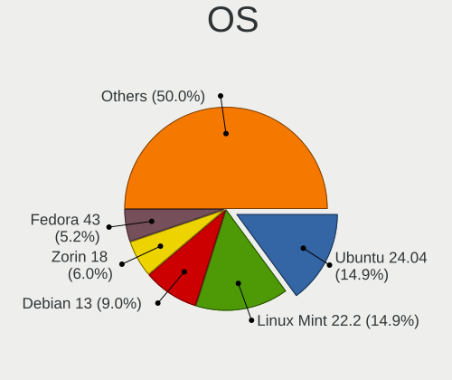

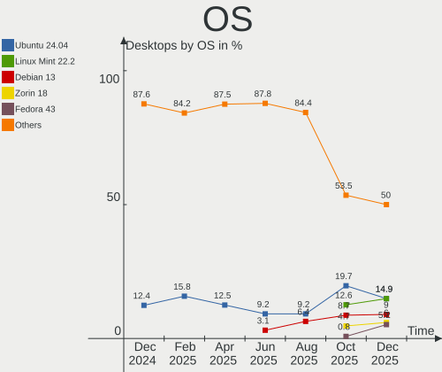

| Name                         | Desktops | Percent |
|------------------------------|----------|---------|
| Ubuntu 24.04                 | 20       | 14.93%  |
| Linux Mint 22.2              | 20       | 14.93%  |
| Debian 13                    | 12       | 8.96%   |
| Zorin 18                     | 8        | 5.97%   |
| Fedora 43                    | 7        | 5.22%   |
| Bazzite 43                   | 7        | 5.22%   |
| Arch Rolling                 | 7        | 5.22%   |
| OpenMandriva 6.0             | 4        | 2.99%   |
| Pop!_OS 22.04                | 3        | 2.24%   |
| Xubuntu 24.04                | 2        | 1.49%   |
| Solus 4.8                    | 2        | 1.49%   |
| OpenMandriva 25.90           | 2        | 1.49%   |
| OpenMandriva 25.11           | 2        | 1.49%   |
| Linux Mint 21.3              | 2        | 1.49%   |
| Kubuntu 25.04                | 2        | 1.49%   |
| KDE neon 24.04               | 2        | 1.49%   |
| CachyOS                      | 2        | 1.49%   |
| Bazzite 42                   | 2        | 1.49%   |
| Zorin 16                     | 1        | 0.75%   |
| Ubuntu Unity 24.04           | 1        | 0.75%   |
| Ubuntu MATE 25.04            | 1        | 0.75%   |
| Ubuntu MATE 22.04            | 1        | 0.75%   |
| Ubuntu 25.10                 | 1        | 0.75%   |
| Ubuntu 22.04                 | 1        | 0.75%   |
| Ubuntu 20.04                 | 1        | 0.75%   |
| Ubuntu 18.04                 | 1        | 0.75%   |
| SystemRescue 12.03           | 1        | 0.75%   |
| SteamOS 3.9                  | 1        | 0.75%   |
| Pop!_OS 24.04                | 1        | 0.75%   |
| org.kde.Platform 5.15-21.08  | 1        | 0.75%   |
| openSUSE Tumbleweed-XXXXXXXX | 1        | 0.75%   |
| OpenMandriva 24.90           | 1        | 0.75%   |
| OpenMandriva 24.12           | 1        | 0.75%   |
| NixOS 26.05                  | 1        | 0.75%   |
| Manjaro                      | 1        | 0.75%   |
| Lubuntu 25.10                | 1        | 0.75%   |
| Lubuntu 24.04                | 1        | 0.75%   |
| LMDE 7                       | 1        | 0.75%   |
| Linux Mint 22.3              | 1        | 0.75%   |
| Kubuntu 25.10                | 1        | 0.75%   |

OS Family
---------

OS without a version

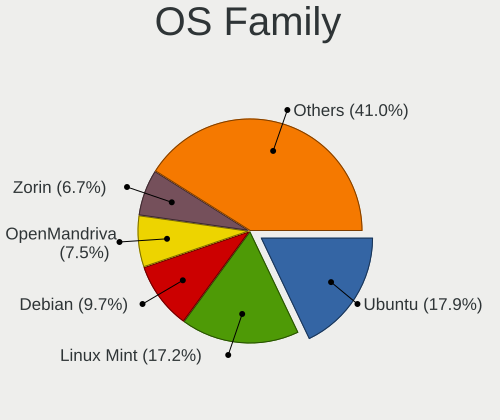

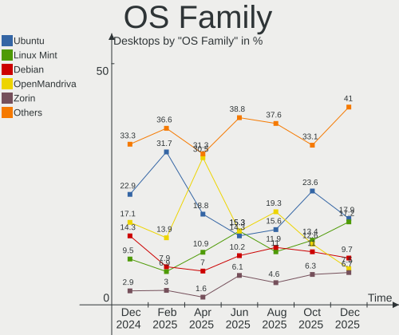

| Name             | Desktops | Percent |
|------------------|----------|---------|
| Ubuntu           | 24       | 17.91%  |
| Linux Mint       | 23       | 17.16%  |
| Debian           | 13       | 9.7%    |
| OpenMandriva     | 10       | 7.46%   |
| Zorin            | 9        | 6.72%   |
| Bazzite          | 9        | 6.72%   |
| Fedora           | 7        | 5.22%   |
| Arch             | 7        | 5.22%   |
| Kubuntu          | 5        | 3.73%   |
| Pop!_OS          | 4        | 2.99%   |
| Xubuntu          | 2        | 1.49%   |
| Ubuntu MATE      | 2        | 1.49%   |
| Solus            | 2        | 1.49%   |
| Lubuntu          | 2        | 1.49%   |
| KDE neon         | 2        | 1.49%   |
| CachyOS          | 2        | 1.49%   |
| Ubuntu Unity     | 1        | 0.75%   |
| SystemRescue     | 1        | 0.75%   |
| SteamOS          | 1        | 0.75%   |
| org.kde.Platform | 1        | 0.75%   |
| openSUSE         | 1        | 0.75%   |
| NixOS            | 1        | 0.75%   |
| Manjaro          | 1        | 0.75%   |
| LMDE             | 1        | 0.75%   |
| Devuan           | 1        | 0.75%   |
| ChimeraOS        | 1        | 0.75%   |
| Artix            | 1        | 0.75%   |

Kernel
------

Version of the Linux kernel

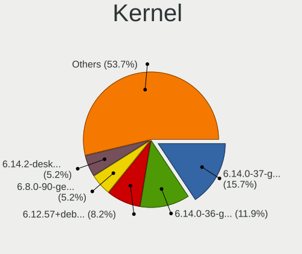

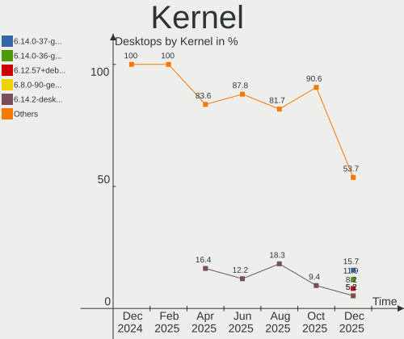

| Version                                    | Desktops | Percent |
|--------------------------------------------|----------|---------|
| 6.14.0-37-generic                          | 21       | 15.67%  |
| 6.14.0-36-generic                          | 16       | 11.94%  |
| 6.12.57+deb13-amd64                        | 11       | 8.21%   |
| 6.8.0-90-generic                           | 7        | 5.22%   |
| 6.14.2-desktop-3omv2590                    | 7        | 5.22%   |
| 6.8.0-88-generic                           | 4        | 2.99%   |
| 6.17.7-ba19.fc43.x86_64                    | 4        | 2.99%   |
| 6.17.9-zen1-1-zen                          | 3        | 2.24%   |
| 6.17.4-76061704-generic                    | 3        | 2.24%   |
| 6.17.10-300.fc43.x86_64                    | 3        | 2.24%   |
| 6.8.0-87-generic                           | 2        | 1.49%   |
| 6.18.1-2-cachyos                           | 2        | 1.49%   |
| 6.17.8-324.current                         | 2        | 1.49%   |
| 6.17.12-300.fc43.x86_64                    | 2        | 1.49%   |
| 6.17.0-8-generic                           | 2        | 1.49%   |
| 6.16.4-116.bazzite.fc42.x86_64             | 2        | 1.49%   |
| 6.14.0-35-generic                          | 2        | 1.49%   |
| 6.14.0-33-generic                          | 2        | 1.49%   |
| 6.14.0-29-generic                          | 2        | 1.49%   |
| 6.8.12-17-pve                              | 1        | 0.75%   |
| 6.8.12-16-pve                              | 1        | 0.75%   |
| 6.8.0-85-generic                           | 1        | 0.75%   |
| 6.8.0-47-generic                           | 1        | 0.75%   |
| 6.18.2-zen2-1-zen                          | 1        | 0.75%   |
| 6.18.1-x64v3-xanmod1                       | 1        | 0.75%   |
| 6.18.0-1-default                           | 1        | 0.75%   |
| 6.17.9-zen1                                | 1        | 0.75%   |
| 6.17.9-arch1-1.1                           | 1        | 0.75%   |
| 6.17.9-arch1-1                             | 1        | 0.75%   |
| 6.17.9-76061709-generic                    | 1        | 0.75%   |
| 6.17.7-desktop-1omv2590                    | 1        | 0.75%   |
| 6.17.7-ba22.fc43.x86_64                    | 1        | 0.75%   |
| 6.17.7-ba20.fc43.x86_64                    | 1        | 0.75%   |
| 6.17.7-ba14.fc43.x86_64                    | 1        | 0.75%   |
| 6.17.2-2-pve                               | 1        | 0.75%   |
| 6.17.11-300.fc43.x86_64                    | 1        | 0.75%   |
| 6.17.10                                    | 1        | 0.75%   |
| 6.17.1-300.fc43.x86_64                     | 1        | 0.75%   |
| 6.17.0-7-generic                           | 1        | 0.75%   |
| 6.16.12-valve4-1-neptune-616-g366ccd8ab040 | 1        | 0.75%   |

Kernel Family
-------------

Linux kernel without a distro release

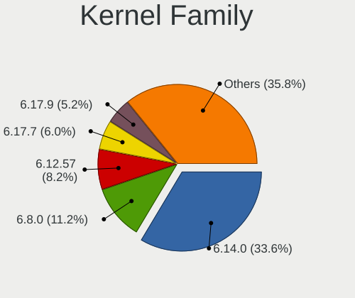

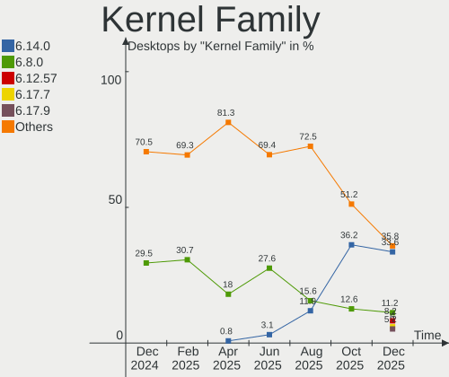

| Version | Desktops | Percent |
|---------|----------|---------|
| 6.14.0  | 45       | 33.58%  |
| 6.8.0   | 15       | 11.19%  |
| 6.12.57 | 11       | 8.21%   |
| 6.17.7  | 8        | 5.97%   |
| 6.17.9  | 7        | 5.22%   |
| 6.14.2  | 7        | 5.22%   |
| 5.15.0  | 5        | 3.73%   |
| 6.17.10 | 4        | 2.99%   |
| 6.18.1  | 3        | 2.24%   |
| 6.17.4  | 3        | 2.24%   |
| 6.17.0  | 3        | 2.24%   |
| 6.8.12  | 2        | 1.49%   |
| 6.17.8  | 2        | 1.49%   |
| 6.17.12 | 2        | 1.49%   |
| 6.16.4  | 2        | 1.49%   |
| 6.18.2  | 1        | 0.75%   |
| 6.18.0  | 1        | 0.75%   |
| 6.17.2  | 1        | 0.75%   |
| 6.17.11 | 1        | 0.75%   |
| 6.17.1  | 1        | 0.75%   |
| 6.16.12 | 1        | 0.75%   |
| 6.14.7  | 1        | 0.75%   |
| 6.14.5  | 1        | 0.75%   |
| 6.12.62 | 1        | 0.75%   |
| 6.12.61 | 1        | 0.75%   |
| 6.12.60 | 1        | 0.75%   |
| 6.12.1  | 1        | 0.75%   |
| 6.10.9  | 1        | 0.75%   |
| 6.1.0   | 1        | 0.75%   |
| 4.15.0  | 1        | 0.75%   |

Kernel Major Ver.
-----------------

Linux kernel major version

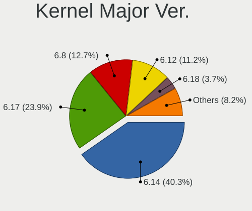

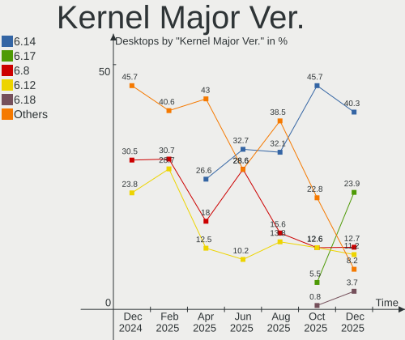

| Version | Desktops | Percent |
|---------|----------|---------|
| 6.14    | 54       | 40.3%   |
| 6.17    | 32       | 23.88%  |
| 6.8     | 17       | 12.69%  |
| 6.12    | 15       | 11.19%  |
| 6.18    | 5        | 3.73%   |
| 5.15    | 5        | 3.73%   |
| 6.16    | 3        | 2.24%   |
| 6.10    | 1        | 0.75%   |
| 6.1     | 1        | 0.75%   |
| 4.15    | 1        | 0.75%   |

Arch
----

OS architecture (x86_64, i586, etc.)

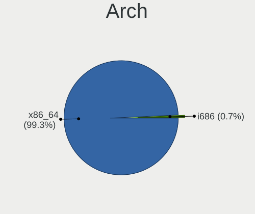

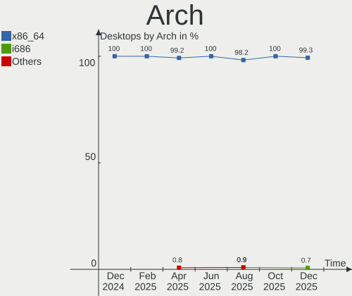

| Name   | Desktops | Percent |
|--------|----------|---------|
| x86_64 | 133      | 99.25%  |
| i686   | 1        | 0.75%   |

DE
--

Desktop Environment

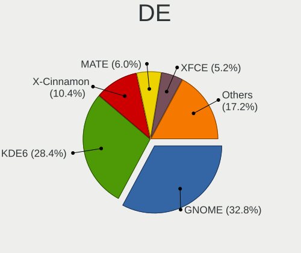

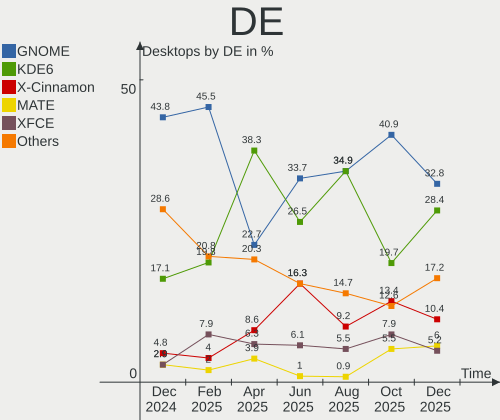

| Name       | Desktops | Percent |
|------------|----------|---------|
| GNOME      | 44       | 32.84%  |
| KDE6       | 38       | 28.36%  |
| X-Cinnamon | 14       | 10.45%  |
| MATE       | 8        | 5.97%   |
| XFCE       | 7        | 5.22%   |
| Cinnamon   | 4        | 2.99%   |
| Unknown    | 4        | 2.99%   |
| Hyprland   | 3        | 2.24%   |
| niri       | 2        | 1.49%   |
| KDE5       | 2        | 1.49%   |
| KDE        | 2        | 1.49%   |
| Unity      | 1        | 0.75%   |
| Openbox    | 1        | 0.75%   |
| LXQt       | 1        | 0.75%   |
| LXDE       | 1        | 0.75%   |
| i3         | 1        | 0.75%   |
| COSMIC     | 1        | 0.75%   |

Display Server
--------------

X11 or Wayland

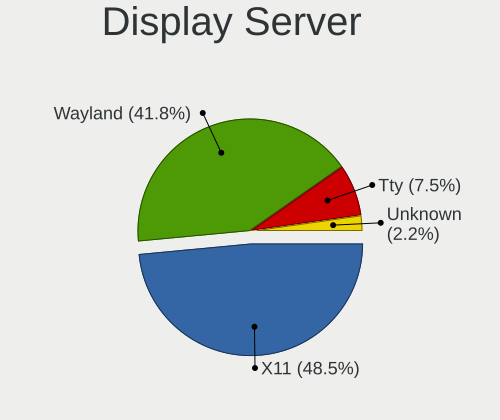

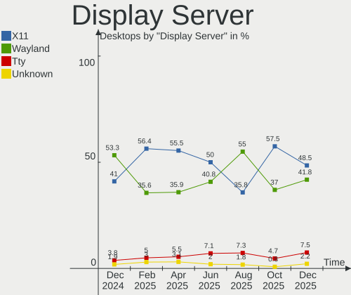

| Name    | Desktops | Percent |
|---------|----------|---------|
| X11     | 65       | 48.51%  |
| Wayland | 56       | 41.79%  |
| Tty     | 10       | 7.46%   |
| Unknown | 3        | 2.24%   |

Display Manager
---------------

SDDM, LightDM, etc.

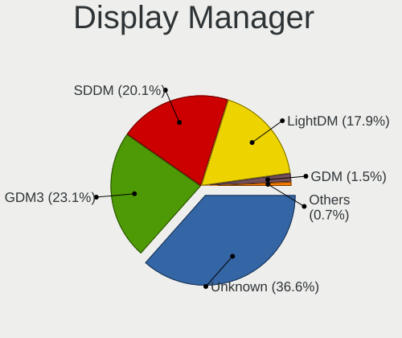

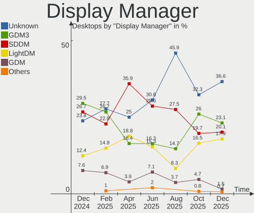

| Name    | Desktops | Percent |
|---------|----------|---------|
| Unknown | 49       | 36.57%  |
| GDM3    | 31       | 23.13%  |
| SDDM    | 27       | 20.15%  |
| LightDM | 24       | 17.91%  |
| GDM     | 2        | 1.49%   |
| LY-DM   | 1        | 0.75%   |

OS Lang
-------

Language

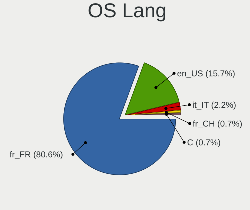

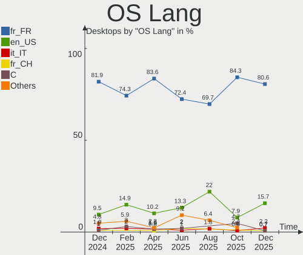

| Lang  | Desktops | Percent |
|-------|----------|---------|
| fr_FR | 108      | 80.6%   |
| en_US | 21       | 15.67%  |
| it_IT | 3        | 2.24%   |
| fr_CH | 1        | 0.75%   |
| C     | 1        | 0.75%   |

Boot Mode
---------

EFI or BIOS

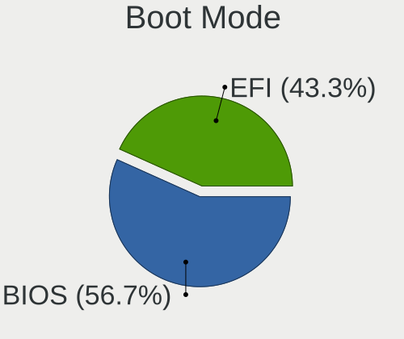

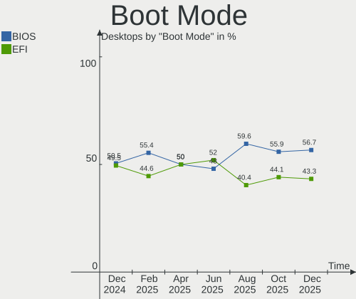

| Mode | Desktops | Percent |
|------|----------|---------|
| BIOS | 76       | 56.72%  |
| EFI  | 58       | 43.28%  |

Filesystem
----------

Type of filesystem

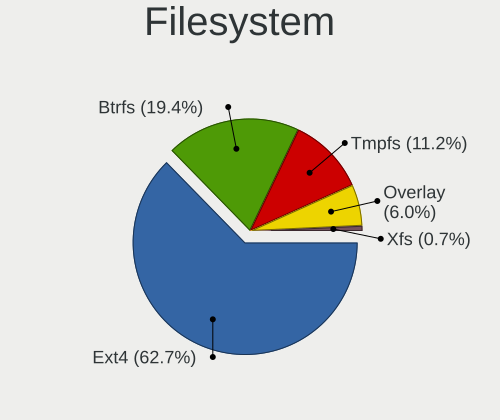

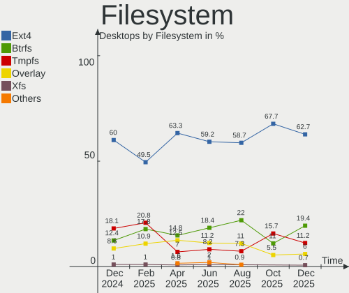

| Type    | Desktops | Percent |
|---------|----------|---------|
| Ext4    | 84       | 62.69%  |
| Btrfs   | 26       | 19.4%   |
| Tmpfs   | 15       | 11.19%  |
| Overlay | 8        | 5.97%   |
| Xfs     | 1        | 0.75%   |

Part. scheme
------------

Scheme of partitioning

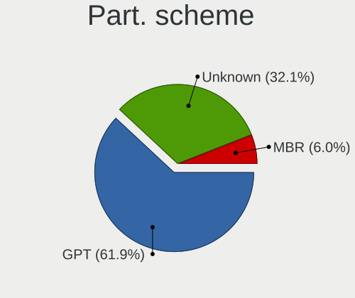

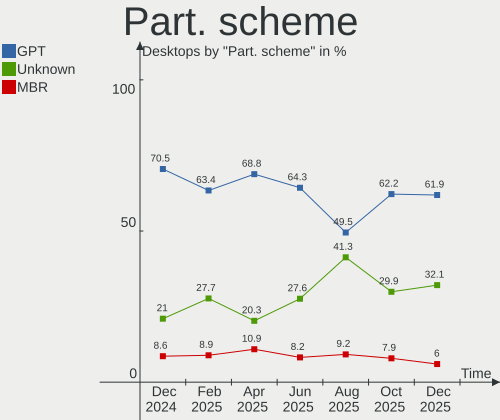

| Type    | Desktops | Percent |
|---------|----------|---------|
| GPT     | 83       | 61.94%  |
| Unknown | 43       | 32.09%  |
| MBR     | 8        | 5.97%   |

Dual Boot with Linux/BSD
------------------------

Hosting more than one Linux/BSD

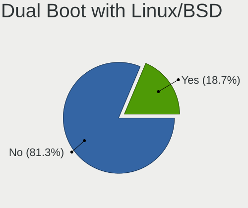

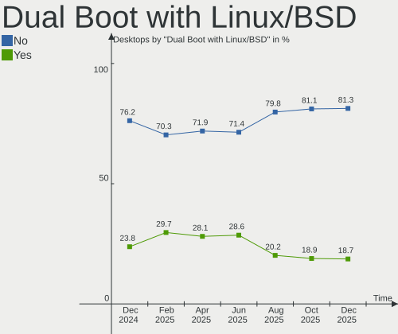

| Dual boot | Desktops | Percent |
|-----------|----------|---------|
| No        | 109      | 81.34%  |
| Yes       | 25       | 18.66%  |

Dual Boot (Win)
---------------

Hosting Linux and Windows

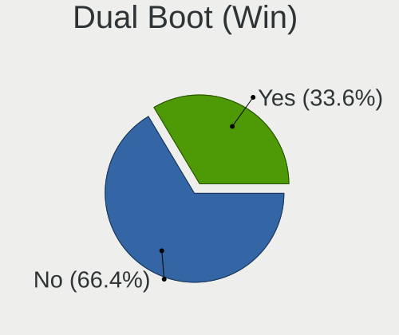

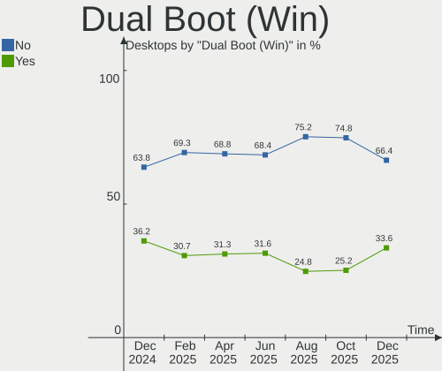

| Dual boot | Desktops | Percent |
|-----------|----------|---------|
| No        | 89       | 66.42%  |
| Yes       | 45       | 33.58%  |

Board
-----

Vendor
------

Motherboard manufacturer

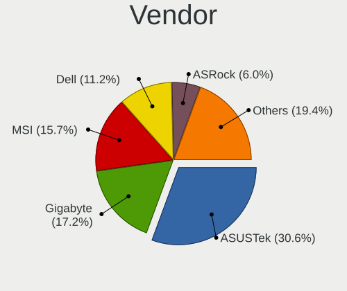

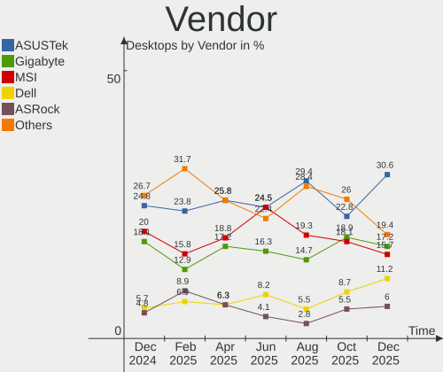

| Name                                 | Desktops | Percent |
|--------------------------------------|----------|---------|
| ASUSTek Computer                     | 41       | 30.6%   |
| Gigabyte Technology                  | 23       | 17.16%  |
| MSI                                  | 21       | 15.67%  |
| Dell                                 | 15       | 11.19%  |
| ASRock                               | 8        | 5.97%   |
| Intel                                | 3        | 2.24%   |
| Hewlett-Packard                      | 3        | 2.24%   |
| Unknown                              | 3        | 2.24%   |
| Pegatron                             | 2        | 1.49%   |
| Biostar                              | 2        | 1.49%   |
| Acer                                 | 2        | 1.49%   |
| Win Element                          | 1        | 0.75%   |
| Shenzhen Meigao Electronic Equipment | 1        | 0.75%   |
| Red Hat                              | 1        | 0.75%   |
| Packard Bell                         | 1        | 0.75%   |
| Lenovo                               | 1        | 0.75%   |
| GMKtec                               | 1        | 0.75%   |
| GEEKOM                               | 1        | 0.75%   |
| Fujitsu                              | 1        | 0.75%   |
| Foxconn                              | 1        | 0.75%   |
| AZW                                  | 1        | 0.75%   |
| AOpen                                | 1        | 0.75%   |

Model
-----

Motherboard model

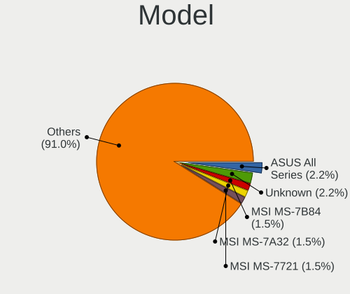

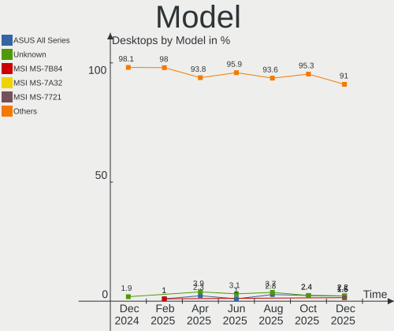

| Name                                       | Desktops | Percent |
|--------------------------------------------|----------|---------|
| ASUS All Series                            | 3        | 2.24%   |
| Unknown                                    | 3        | 2.24%   |
| MSI MS-7B84                                | 2        | 1.49%   |
| MSI MS-7A32                                | 2        | 1.49%   |
| MSI MS-7721                                | 2        | 1.49%   |
| Intel D54250WYK H13922-303                 | 2        | 1.49%   |
| Gigabyte B450 AORUS ELITE                  | 2        | 1.49%   |
| Gigabyte 970A-DS3P                         | 2        | 1.49%   |
| Dell Precision T1650                       | 2        | 1.49%   |
| Dell OptiPlex 3020M                        | 2        | 1.49%   |
| ASUS PRIME Z270-P                          | 2        | 1.49%   |
| ASRock B650 Pro RS                         | 2        | 1.49%   |
| Win Element M6                             | 1        | 0.75%   |
| Shenzhen Meigao Electronic Equipment MS-A1 | 1        | 0.75%   |
| Red Hat KVM                                | 1        | 0.75%   |
| Pegatron WE185AA-ABF CQ5321FR              | 1        | 0.75%   |
| Pegatron NB980AA-ABF SR5705FR              | 1        | 0.75%   |
| Packard Bell IMEDIA S2185                  | 1        | 0.75%   |
| MSI MS-7E70                                | 1        | 0.75%   |
| MSI MS-7D98                                | 1        | 0.75%   |
| MSI MS-7D25                                | 1        | 0.75%   |
| MSI MS-7D09                                | 1        | 0.75%   |
| MSI MS-7C95                                | 1        | 0.75%   |
| MSI MS-7C83                                | 1        | 0.75%   |
| MSI MS-7C56                                | 1        | 0.75%   |
| MSI MS-7B79                                | 1        | 0.75%   |
| MSI MS-7A62                                | 1        | 0.75%   |
| MSI MS-7994                                | 1        | 0.75%   |
| MSI MS-7982                                | 1        | 0.75%   |
| MSI MS-7917                                | 1        | 0.75%   |
| MSI MS-7821                                | 1        | 0.75%   |
| MSI MS-7817                                | 1        | 0.75%   |
| MSI MS-7816                                | 1        | 0.75%   |
| Lenovo 7033EW4                             | 1        | 0.75%   |
| Intel D865GBF AAC25843-406                 | 1        | 0.75%   |
| HP Z2 SFF G9 Workstation Desktop PC        | 1        | 0.75%   |
| HP EliteDesk 800 G3 TWR                    | 1        | 0.75%   |
| HP Compaq 8100 Elite SFF PC                | 1        | 0.75%   |
| GMKtec NucBox K8 Plus                      | 1        | 0.75%   |
| Gigabyte Z790 EAGLE                        | 1        | 0.75%   |

Model Family
------------

Motherboard model prefix

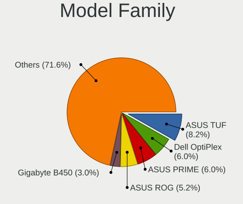

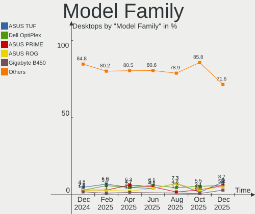

| Name                                       | Desktops | Percent |
|--------------------------------------------|----------|---------|
| ASUS TUF                                   | 11       | 8.21%   |
| Dell OptiPlex                              | 8        | 5.97%   |
| ASUS PRIME                                 | 8        | 5.97%   |
| ASUS ROG                                   | 7        | 5.22%   |
| Gigabyte B450                              | 4        | 2.99%   |
| Dell Precision                             | 4        | 2.99%   |
| Gigabyte X570                              | 3        | 2.24%   |
| ASUS All                                   | 3        | 2.24%   |
| Unknown                                    | 3        | 2.24%   |
| MSI MS-7B84                                | 2        | 1.49%   |
| MSI MS-7A32                                | 2        | 1.49%   |
| MSI MS-7721                                | 2        | 1.49%   |
| Intel D54250WYK                            | 2        | 1.49%   |
| Gigabyte Z690                              | 2        | 1.49%   |
| Gigabyte X570S                             | 2        | 1.49%   |
| Gigabyte 970A-DS3P                         | 2        | 1.49%   |
| ASRock B650                                | 2        | 1.49%   |
| Win Element M6                             | 1        | 0.75%   |
| Shenzhen Meigao Electronic Equipment MS-A1 | 1        | 0.75%   |
| Red Hat KVM                                | 1        | 0.75%   |
| Pegatron WE185AA-ABF                       | 1        | 0.75%   |
| Pegatron NB980AA-ABF                       | 1        | 0.75%   |
| Packard Bell IMEDIA                        | 1        | 0.75%   |
| MSI MS-7E70                                | 1        | 0.75%   |
| MSI MS-7D98                                | 1        | 0.75%   |
| MSI MS-7D25                                | 1        | 0.75%   |
| MSI MS-7D09                                | 1        | 0.75%   |
| MSI MS-7C95                                | 1        | 0.75%   |
| MSI MS-7C83                                | 1        | 0.75%   |
| MSI MS-7C56                                | 1        | 0.75%   |
| MSI MS-7B79                                | 1        | 0.75%   |
| MSI MS-7A62                                | 1        | 0.75%   |
| MSI MS-7994                                | 1        | 0.75%   |
| MSI MS-7982                                | 1        | 0.75%   |
| MSI MS-7917                                | 1        | 0.75%   |
| MSI MS-7821                                | 1        | 0.75%   |
| MSI MS-7817                                | 1        | 0.75%   |
| MSI MS-7816                                | 1        | 0.75%   |
| Lenovo 7033EW4                             | 1        | 0.75%   |
| Intel D865GBF                              | 1        | 0.75%   |

MFG Year
--------

Motherboard manufacture year

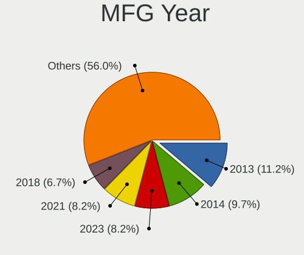

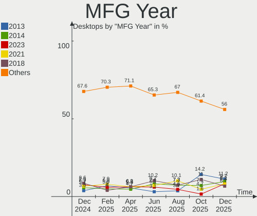

| Year | Desktops | Percent |
|------|----------|---------|
| 2013 | 15       | 11.19%  |
| 2014 | 13       | 9.7%    |
| 2023 | 11       | 8.21%   |
| 2021 | 11       | 8.21%   |
| 2018 | 9        | 6.72%   |
| 2019 | 8        | 5.97%   |
| 2024 | 7        | 5.22%   |
| 2020 | 7        | 5.22%   |
| 2015 | 7        | 5.22%   |
| 2025 | 6        | 4.48%   |
| 2022 | 6        | 4.48%   |
| 2012 | 6        | 4.48%   |
| 2017 | 5        | 3.73%   |
| 2016 | 5        | 3.73%   |
| 2011 | 5        | 3.73%   |
| 2008 | 5        | 3.73%   |
| 2010 | 4        | 2.99%   |
| 2009 | 3        | 2.24%   |
| 2003 | 1        | 0.75%   |

Form Factor
-----------

Physical design of the computer

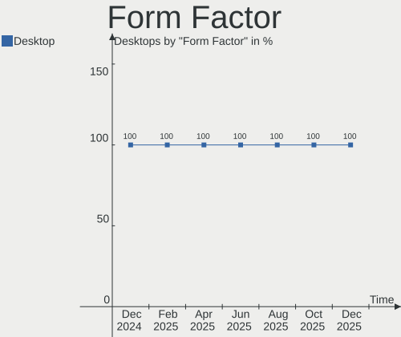

| Name    | Desktops | Percent |
|---------|----------|---------|
| Desktop | 134      | 100%    |

Secure Boot
-----------

Enabled or disabled

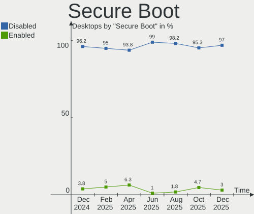

| State    | Desktops | Percent |
|----------|----------|---------|
| Disabled | 130      | 97.01%  |
| Enabled  | 4        | 2.99%   |

Coreboot
--------

Have coreboot on board

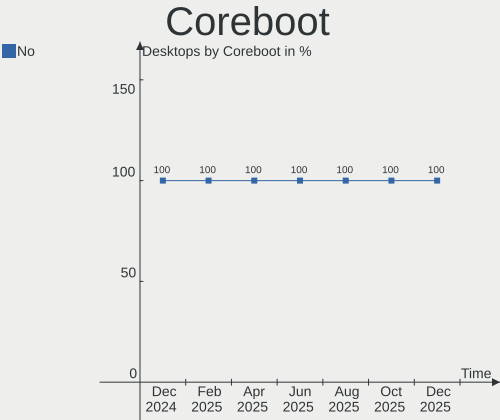

| Used | Desktops | Percent |
|------|----------|---------|
| No   | 134      | 100%    |

RAM Size
--------

Total RAM memory

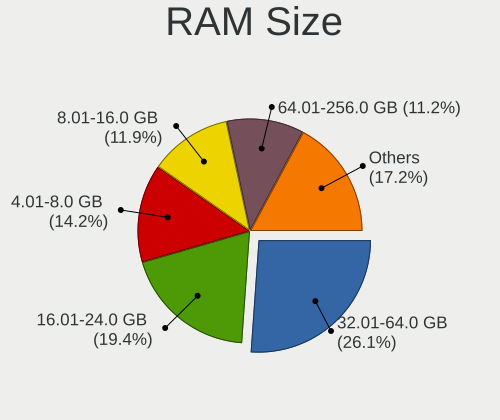

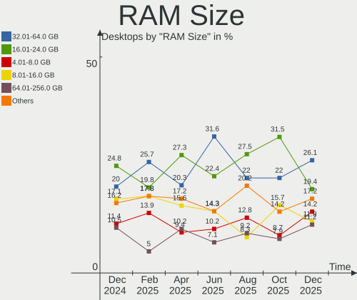

| Size in GB      | Desktops | Percent |
|-----------------|----------|---------|
| 32.01-64.0      | 35       | 26.12%  |
| 16.01-24.0      | 26       | 19.4%   |
| 4.01-8.0        | 19       | 14.18%  |
| 8.01-16.0       | 16       | 11.94%  |
| 64.01-256.0     | 15       | 11.19%  |
| 3.01-4.0        | 12       | 8.96%   |
| 24.01-32.0      | 9        | 6.72%   |
| More than 256.0 | 1        | 0.75%   |
| 2.01-3.0        | 1        | 0.75%   |

RAM Used
--------

Used RAM memory

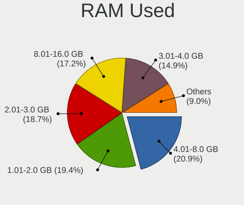

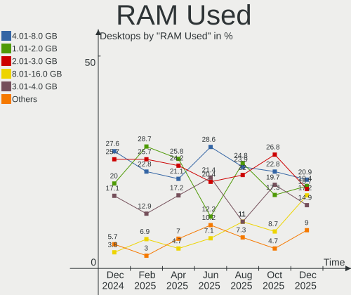

| Used GB     | Desktops | Percent |
|-------------|----------|---------|
| 4.01-8.0    | 28       | 20.9%   |
| 1.01-2.0    | 26       | 19.4%   |
| 2.01-3.0    | 25       | 18.66%  |
| 8.01-16.0   | 23       | 17.16%  |
| 3.01-4.0    | 20       | 14.93%  |
| 64.01-256.0 | 3        | 2.24%   |
| 32.01-64.0  | 2        | 1.49%   |
| 24.01-32.0  | 2        | 1.49%   |
| 16.01-24.0  | 2        | 1.49%   |
| 0.51-1.0    | 2        | 1.49%   |
| 0.01-0.5    | 1        | 0.75%   |

Total Drives
------------

Number of drives on board

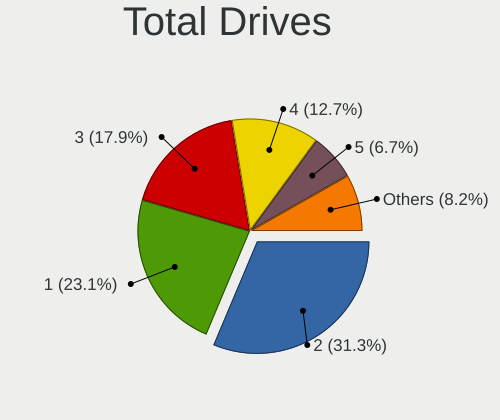

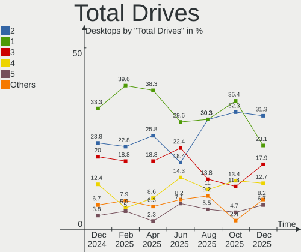

| Drives | Desktops | Percent |
|--------|----------|---------|
| 2      | 42       | 31.34%  |
| 1      | 31       | 23.13%  |
| 3      | 24       | 17.91%  |
| 4      | 17       | 12.69%  |
| 5      | 9        | 6.72%   |
| 6      | 6        | 4.48%   |
| 14     | 1        | 0.75%   |
| 10     | 1        | 0.75%   |
| 8      | 1        | 0.75%   |
| 7      | 1        | 0.75%   |
| 0      | 1        | 0.75%   |

Has CD-ROM
----------

Has CD-ROM on board

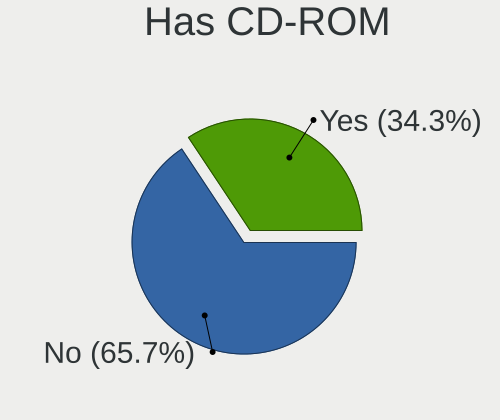

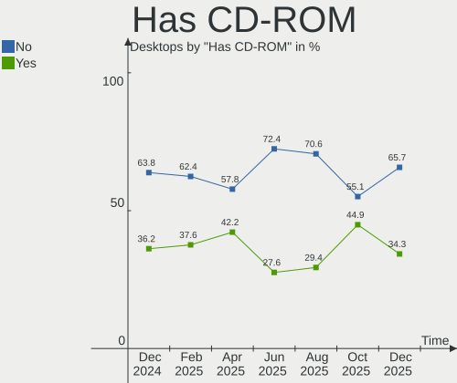

| Presented | Desktops | Percent |
|-----------|----------|---------|
| No        | 88       | 65.67%  |
| Yes       | 46       | 34.33%  |

Has Ethernet
------------

Has Ethernet on board

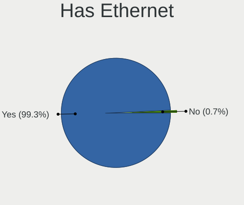

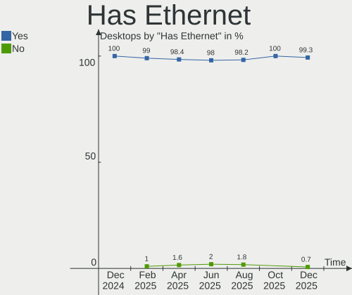

| Presented | Desktops | Percent |
|-----------|----------|---------|
| Yes       | 133      | 99.25%  |
| No        | 1        | 0.75%   |

Has WiFi
--------

Has WiFi module

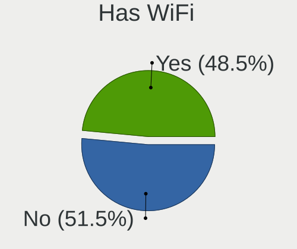

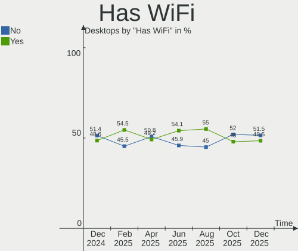

| Presented | Desktops | Percent |
|-----------|----------|---------|
| No        | 69       | 51.49%  |
| Yes       | 65       | 48.51%  |

Has Bluetooth
-------------

Has Bluetooth module

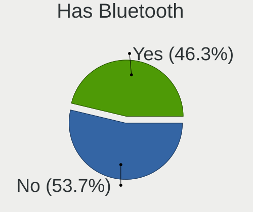

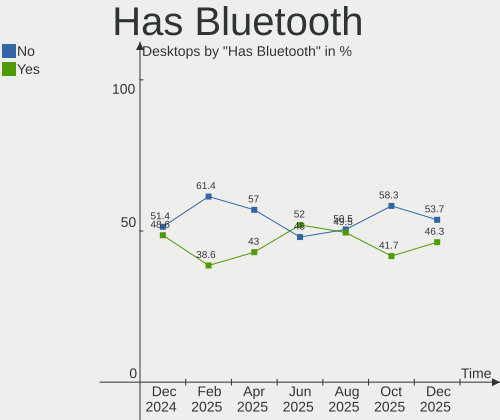

| Presented | Desktops | Percent |
|-----------|----------|---------|
| No        | 72       | 53.73%  |
| Yes       | 62       | 46.27%  |

Location
--------

Country
-------

Geographic location (country)

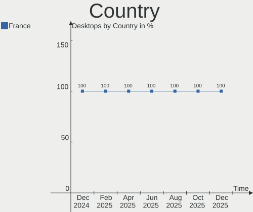

| Country | Desktops | Percent |
|---------|----------|---------|
| France  | 134      | 100%    |

City
----

Geographic location (city)

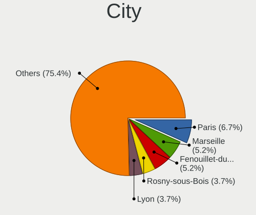

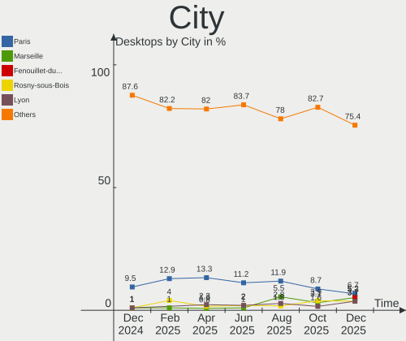

| City                      | Desktops | Percent |
|---------------------------|----------|---------|
| Paris                     | 9        | 6.72%   |
| Marseille                 | 7        | 5.22%   |
| Fenouillet-du-Razes       | 7        | 5.22%   |
| Rosny-sous-Bois           | 5        | 3.73%   |
| Lyon                      | 5        | 3.73%   |
| Toulouse                  | 3        | 2.24%   |
| Vitrolles                 | 2        | 1.49%   |
| Toulon                    | 2        | 1.49%   |
| Pessac                    | 2        | 1.49%   |
| Les Hogues                | 2        | 1.49%   |
| Grenoble                  | 2        | 1.49%   |
| Courbevoie                | 2        | 1.49%   |
| Clichy-sous-Bois          | 2        | 1.49%   |
| Bordeaux                  | 2        | 1.49%   |
| Vesoul                    | 1        | 0.75%   |
| Varces-Allieres-et-Risset | 1        | 0.75%   |
| Valence                   | 1        | 0.75%   |
| Tours                     | 1        | 0.75%   |
| Thouars                   | 1        | 0.75%   |
| Thouare-sur-Loire         | 1        | 0.75%   |
| Talence                   | 1        | 0.75%   |
| Suippes                   | 1        | 0.75%   |
| Strasbourg                | 1        | 0.75%   |
| Siouville-Hague           | 1        | 0.75%   |
| Sergy                     | 1        | 0.75%   |
| Sereilhac                 | 1        | 0.75%   |
| Schiltigheim              | 1        | 0.75%   |
| Sanvensa                  | 1        | 0.75%   |
| Salles-de-Barbezieux      | 1        | 0.75%   |
| Saint-Maur-des-Fossés    | 1        | 0.75%   |
| Saint-Mandé              | 1        | 0.75%   |
| Saint-Julien-en-Genevois  | 1        | 0.75%   |
| Saint-Etienne-de-Valoux   | 1        | 0.75%   |
| Saint-Avold               | 1        | 0.75%   |
| Royan                     | 1        | 0.75%   |
| Rouen                     | 1        | 0.75%   |
| Rodez                     | 1        | 0.75%   |
| Rennes                    | 1        | 0.75%   |
| Pontvallain               | 1        | 0.75%   |
| Poitiers                  | 1        | 0.75%   |

Drives
------

Drive Vendor
------------

Hard drive vendors

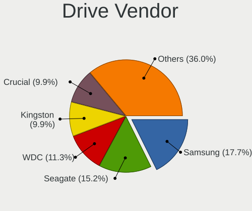

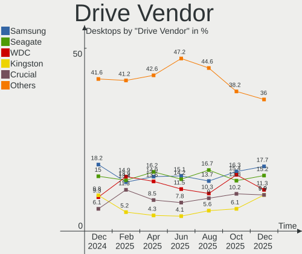

| Vendor                      | Desktops | Drives | Percent |
|-----------------------------|----------|--------|---------|
| Samsung Electronics         | 50       | 79     | 17.67%  |
| Seagate                     | 43       | 69     | 15.19%  |
| WDC                         | 32       | 41     | 11.31%  |
| Kingston                    | 28       | 32     | 9.89%   |
| Crucial                     | 28       | 32     | 9.89%   |
| SanDisk                     | 13       | 15     | 4.59%   |
| Toshiba                     | 11       | 16     | 3.89%   |
| PNY                         | 8        | 10     | 2.83%   |
| Micron/Crucial Technology   | 7        | 10     | 2.47%   |
| Phison Electronics          | 6        | 7      | 2.12%   |
| Hitachi                     | 5        | 5      | 1.77%   |
| Unknown                     | 4        | 6      | 1.41%   |
| Micron Technology           | 3        | 3      | 1.06%   |
| China                       | 3        | 3      | 1.06%   |
| Transcend                   | 2        | 2      | 0.71%   |
| Silicon Motion              | 2        | 2      | 0.71%   |
| Maxtor                      | 2        | 2      | 0.71%   |
| Kingston Technology Company | 2        | 2      | 0.71%   |
| KingSpec                    | 2        | 2      | 0.71%   |
| JMicron Technology          | 2        | 2      | 0.71%   |
| Integral                    | 2        | 2      | 0.71%   |
| HGST                        | 2        | 3      | 0.71%   |
| Gigabyte Technology         | 2        | 2      | 0.71%   |
| GALAX                       | 2        | 2      | 0.71%   |
| Emtec                       | 2        | 2      | 0.71%   |
| A-DATA Technology           | 2        | 2      | 0.71%   |
| TEXTORM                     | 1        | 1      | 0.35%   |
| SPCC                        | 1        | 1      | 0.35%   |
| SK hynix                    | 1        | 1      | 0.35%   |
| Seagate Technology          | 1        | 1      | 0.35%   |
| Realtek Semiconductor       | 1        | 1      | 0.35%   |
| Plextor                     | 1        | 1      | 0.35%   |
| Phison                      | 1        | 2      | 0.35%   |
| OCZ                         | 1        | 1      | 0.35%   |
| MAXIO Technology (Hangzhou) | 1        | 1      | 0.35%   |
| KIOXIA                      | 1        | 1      | 0.35%   |
| Intel                       | 1        | 1      | 0.35%   |
| i9-NV                       | 1        | 1      | 0.35%   |
| HGST HUH                    | 1        | 1      | 0.35%   |
| EDILOCA                     | 1        | 1      | 0.35%   |

Drive Model
-----------

Hard drive models

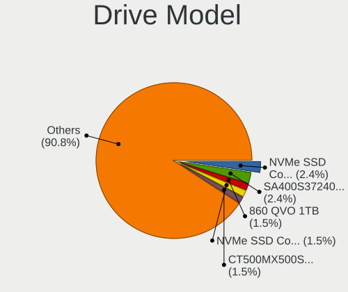

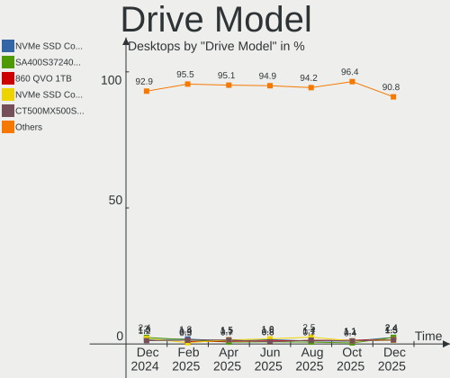

| Model                                                 | Desktops | Percent |
|-------------------------------------------------------|----------|---------|
| Samsung NVMe SSD Controller PM9A1/PM9A3/980PRO 1TB    | 8        | 2.37%   |
| Kingston SA400S37240G 240GB SSD                       | 8        | 2.37%   |
| Samsung SSD 860 QVO 1TB                               | 5        | 1.48%   |
| Samsung NVMe SSD Controller SM981/PM981/PM983 1TB     | 5        | 1.48%   |
| Crucial CT500MX500SSD1 500GB                          | 5        | 1.48%   |
| Crucial CT1000MX500SSD1 1TB                           | 5        | 1.48%   |
| Crucial CT1000BX500SSD1 1TB                           | 5        | 1.48%   |
| Toshiba DT01ACA100 1TB                                | 4        | 1.19%   |
| Seagate ST1000DM010-2EP102 1TB                        | 4        | 1.19%   |
| Kingston SA400S37960G 960GB SSD                       | 4        | 1.19%   |
| Kingston SA400S37480G 480GB SSD                       | 4        | 1.19%   |
| Seagate ST2000DM008-2FR102 2TB                        | 3        | 0.89%   |
| Seagate ST1000DM003-1SB102 1TB                        | 3        | 0.89%   |
| Samsung SSD 870 QVO 1TB                               | 3        | 0.89%   |
| Samsung SSD 860 EVO 500GB                             | 3        | 0.89%   |
| Samsung SSD 850 EVO 500GB                             | 3        | 0.89%   |
| Samsung SSD 850 EVO 250GB                             | 3        | 0.89%   |
| Micron/Crucial P2 NVMe PCIe SSD 2TB                   | 3        | 0.89%   |
| WDC WD5000AAKX-75U6AA0 500GB                          | 2        | 0.59%   |
| WDC WD20EZRZ-00Z5HB0 2TB                              | 2        | 0.59%   |
| WDC WD20EARS-00MVWB0 2TB                              | 2        | 0.59%   |
| Silicon Motion SM2263EN/SM2263XT SSD Controller 512GB | 2        | 0.59%   |
| Seagate ST8000DM004-2U9188 8TB                        | 2        | 0.59%   |
| Seagate ST4000VN008-2DR166 4TB                        | 2        | 0.59%   |
| Seagate ST2000DM006-2DM164 2TB                        | 2        | 0.59%   |
| Seagate ST2000DM001-1CH164 2TB                        | 2        | 0.59%   |
| SanDisk SDSSDH3 500G                                  | 2        | 0.59%   |
| SanDisk SDSSDH3 1T00 1TB                              | 2        | 0.59%   |
| Samsung SSD 990 PRO with Heatsink 1TB                 | 2        | 0.59%   |
| Samsung SSD 990 PRO 2TB                               | 2        | 0.59%   |
| Samsung SSD 970 EVO Plus 1TB                          | 2        | 0.59%   |
| Samsung SSD 860 EVO 250GB                             | 2        | 0.59%   |
| Samsung SSD 860 EVO 1TB                               | 2        | 0.59%   |
| Samsung SSD 840 EVO 1TB                               | 2        | 0.59%   |
| Samsung NVMe SSD Controller S4LV008[Pascal] 4TB       | 2        | 0.59%   |
| Samsung NVMe SSD Controller 980 (DRAM-less) 256GB     | 2        | 0.59%   |
| Samsung HD204UI 2TB                                   | 2        | 0.59%   |
| Samsung HD103SI 1TB                                   | 2        | 0.59%   |
| PNY CS3030 250GB SSD                                  | 2        | 0.59%   |
| Phison E12 NVMe Controller 1TB                        | 2        | 0.59%   |

HDD Vendor
----------

Hard disk drive vendors

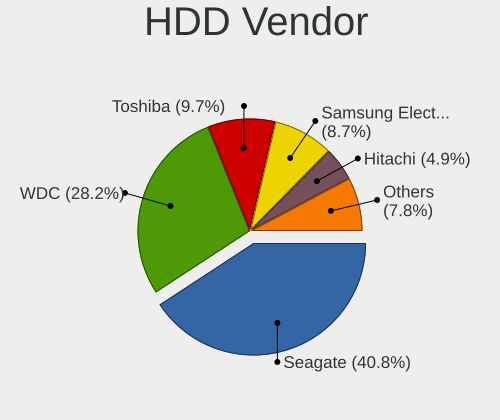

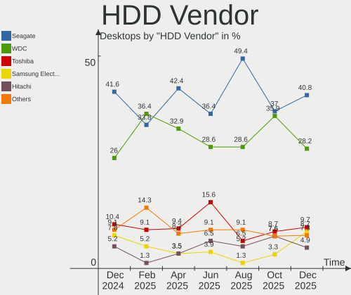

| Vendor              | Desktops | Drives | Percent |
|---------------------|----------|--------|---------|
| Seagate             | 42       | 68     | 40.78%  |
| WDC                 | 29       | 37     | 28.16%  |
| Toshiba             | 10       | 15     | 9.71%   |
| Samsung Electronics | 9        | 10     | 8.74%   |
| Hitachi             | 5        | 5      | 4.85%   |
| Maxtor              | 2        | 2      | 1.94%   |
| JMicron Technology  | 2        | 2      | 1.94%   |
| HGST                | 2        | 3      | 1.94%   |
| Unknown             | 1        | 1      | 0.97%   |
| HGST HUH            | 1        | 1      | 0.97%   |

SSD Vendor
----------

Solid state drive vendors

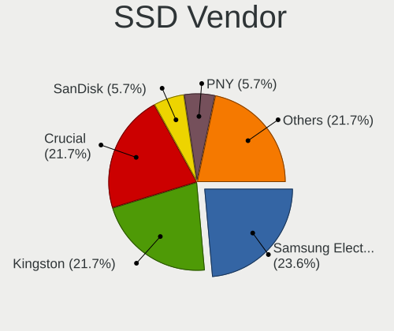

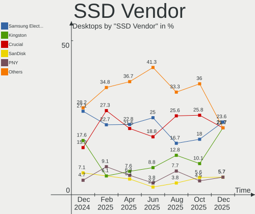

| Vendor              | Desktops | Drives | Percent |
|---------------------|----------|--------|---------|
| Samsung Electronics | 25       | 31     | 23.58%  |
| Kingston            | 23       | 27     | 21.7%   |
| Crucial             | 23       | 26     | 21.7%   |
| SanDisk             | 6        | 7      | 5.66%   |
| PNY                 | 6        | 6      | 5.66%   |
| China               | 3        | 3      | 2.83%   |
| WDC                 | 2        | 2      | 1.89%   |
| Transcend           | 2        | 2      | 1.89%   |
| KingSpec            | 2        | 2      | 1.89%   |
| Integral            | 2        | 2      | 1.89%   |
| GALAX               | 2        | 2      | 1.89%   |
| Emtec               | 2        | 2      | 1.89%   |
| TEXTORM             | 1        | 1      | 0.94%   |
| SPCC                | 1        | 1      | 0.94%   |
| Plextor             | 1        | 1      | 0.94%   |
| OCZ                 | 1        | 1      | 0.94%   |
| Intel               | 1        | 1      | 0.94%   |
| EDILOCA             | 1        | 1      | 0.94%   |
| ASMT                | 1        | 3      | 0.94%   |
| A-DATA Technology   | 1        | 1      | 0.94%   |

Drive Kind
----------

HDD or SSD

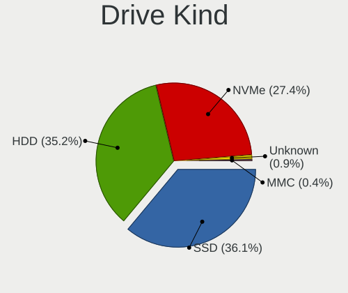

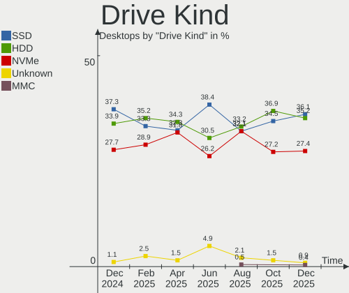

| Kind    | Desktops | Drives | Percent |
|---------|----------|--------|---------|
| SSD     | 83       | 122    | 36.09%  |
| HDD     | 81       | 144    | 35.22%  |
| NVMe    | 63       | 103    | 27.39%  |
| Unknown | 2        | 4      | 0.87%   |
| MMC     | 1        | 1      | 0.43%   |

Drive Connector
---------------

SATA, SAS, NVMe, etc.

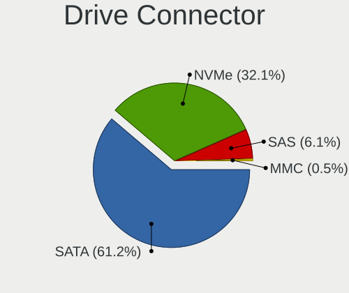

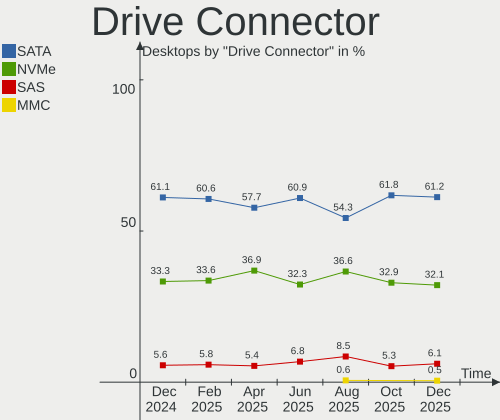

| Type | Desktops | Drives | Percent |
|------|----------|--------|---------|
| SATA | 120      | 252    | 61.22%  |
| NVMe | 63       | 103    | 32.14%  |
| SAS  | 12       | 18     | 6.12%   |
| MMC  | 1        | 1      | 0.51%   |

Drive Size
----------

Size of hard drive

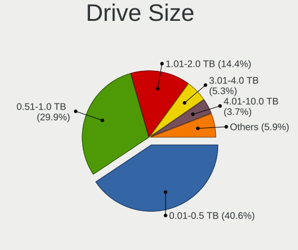

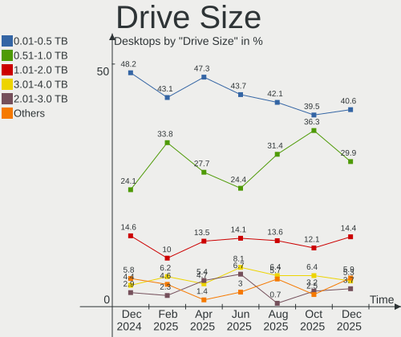

| Size in TB | Desktops | Drives | Percent |
|------------|----------|--------|---------|
| 0.01-0.5   | 76       | 107    | 40.64%  |
| 0.51-1.0   | 56       | 79     | 29.95%  |
| 1.01-2.0   | 27       | 33     | 14.44%  |
| 3.01-4.0   | 10       | 13     | 5.35%   |
| 2.01-3.0   | 7        | 9      | 3.74%   |
| 4.01-10.0  | 7        | 15     | 3.74%   |
| 10.01-20.0 | 4        | 10     | 2.14%   |

Space Total
-----------

Amount of disk space available on the file system

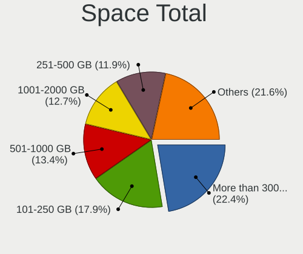

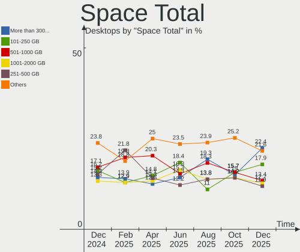

| Size in GB     | Desktops | Percent |
|----------------|----------|---------|
| More than 3000 | 30       | 22.39%  |
| 101-250        | 24       | 17.91%  |
| 501-1000       | 18       | 13.43%  |
| 1001-2000      | 17       | 12.69%  |
| 251-500        | 16       | 11.94%  |
| 2001-3000      | 15       | 11.19%  |
| 51-100         | 7        | 5.22%   |
| Unknown        | 4        | 2.99%   |
| 1-20           | 3        | 2.24%   |

Space Used
----------

Amount of used disk space

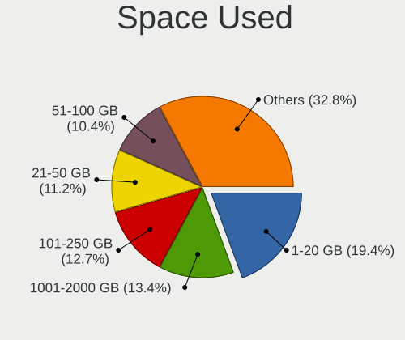

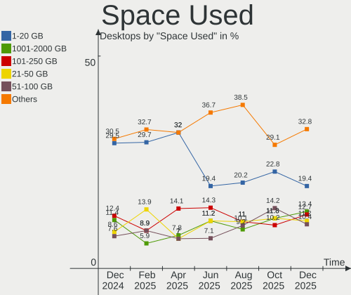

| Used GB        | Desktops | Percent |
|----------------|----------|---------|
| 1-20           | 26       | 19.4%   |
| 1001-2000      | 18       | 13.43%  |
| 101-250        | 17       | 12.69%  |
| 21-50          | 15       | 11.19%  |
| 51-100         | 14       | 10.45%  |
| 501-1000       | 12       | 8.96%   |
| 251-500        | 11       | 8.21%   |
| More than 3000 | 10       | 7.46%   |
| 2001-3000      | 7        | 5.22%   |
| Unknown        | 4        | 2.99%   |

Malfunc. Drives
---------------

Drive models with a malfunction

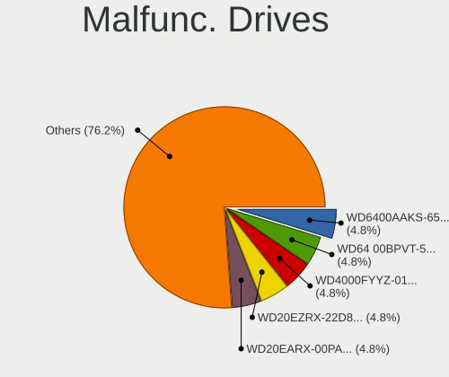

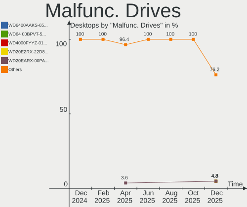

| Model                             | Desktops | Drives | Percent |
|-----------------------------------|----------|--------|---------|
| WDC WD6400AAKS-65A7B0 640GB       | 1        | 1      | 4.76%   |
| WDC WD64 00BPVT-55HXZT2 640GB     | 1        | 1      | 4.76%   |
| WDC WD4000FYYZ-01UL1B3 4TB        | 1        | 1      | 4.76%   |
| WDC WD20EZRX-22D8PB0 2TB          | 1        | 1      | 4.76%   |
| WDC WD20EARX-00PASB0 2TB          | 1        | 1      | 4.76%   |
| WDC WD20EARS-00MVWB0 2TB          | 1        | 1      | 4.76%   |
| Toshiba MQ01ABD100 1TB            | 1        | 1      | 4.76%   |
| Toshiba DT01ACA100 1TB            | 1        | 1      | 4.76%   |
| Seagate ST500LM021-1KJ152 500GB   | 1        | 1      | 4.76%   |
| Seagate ST4000VN008-2DR166 4TB    | 1        | 1      | 4.76%   |
| SanDisk SDSSDHP064G 64GB          | 1        | 1      | 4.76%   |
| Samsung Electronics HD160JJ 160GB | 1        | 1      | 4.76%   |
| Samsung Electronics HD103SI 1TB   | 1        | 1      | 4.76%   |
| Maxtor STM3250310AS 250GB         | 1        | 1      | 4.76%   |
| Kingston SV300S37A240G 240GB SSD  | 1        | 1      | 4.76%   |
| Kingston SHPM2280P2H 240G SSD     | 1        | 1      | 4.76%   |
| Intel SSDSC2BW240A4 240GB         | 1        | 1      | 4.76%   |
| Hitachi HTS542512K9SA00 120GB     | 1        | 1      | 4.76%   |
| Hitachi HDS721050CLA360 500GB     | 1        | 1      | 4.76%   |
| HGST HTS721010A9E630 1TB          | 1        | 1      | 4.76%   |
| China SSD 256GB                   | 1        | 1      | 4.76%   |

Malfunc. Drive Vendor
---------------------

Vendors of faulty drives

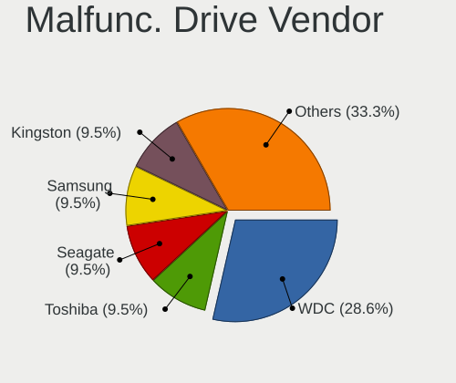

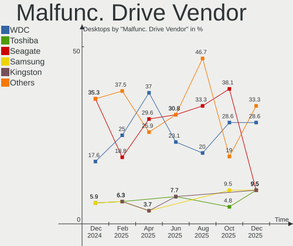

| Vendor              | Desktops | Drives | Percent |
|---------------------|----------|--------|---------|
| WDC                 | 6        | 6      | 28.57%  |
| Toshiba             | 2        | 2      | 9.52%   |
| Seagate             | 2        | 2      | 9.52%   |
| Samsung Electronics | 2        | 2      | 9.52%   |
| Kingston            | 2        | 2      | 9.52%   |
| Hitachi             | 2        | 2      | 9.52%   |
| SanDisk             | 1        | 1      | 4.76%   |
| Maxtor              | 1        | 1      | 4.76%   |
| Intel               | 1        | 1      | 4.76%   |
| HGST                | 1        | 1      | 4.76%   |
| China               | 1        | 1      | 4.76%   |

Malfunc. HDD Vendor
-------------------

Vendors of faulty HDD drives

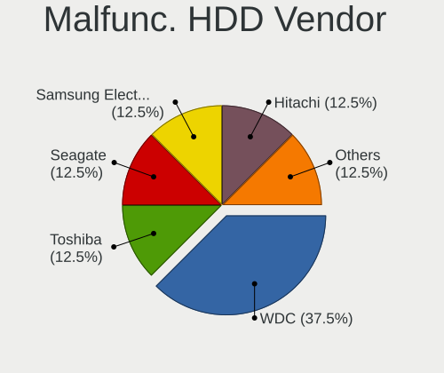

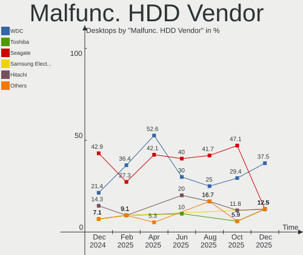

| Vendor              | Desktops | Drives | Percent |
|---------------------|----------|--------|---------|
| WDC                 | 6        | 6      | 37.5%   |
| Toshiba             | 2        | 2      | 12.5%   |
| Seagate             | 2        | 2      | 12.5%   |
| Samsung Electronics | 2        | 2      | 12.5%   |
| Hitachi             | 2        | 2      | 12.5%   |
| Maxtor              | 1        | 1      | 6.25%   |
| HGST                | 1        | 1      | 6.25%   |

Malfunc. Drive Kind
-------------------

Kinds of faulty drives

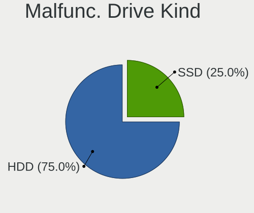

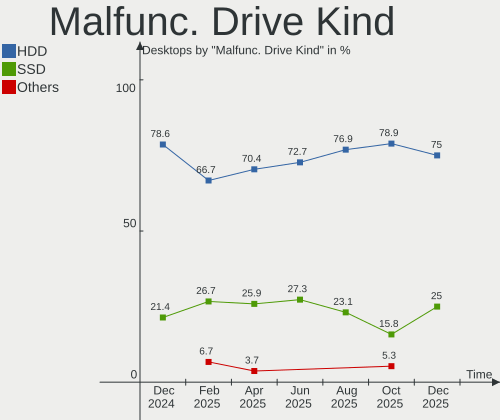

| Kind | Desktops | Drives | Percent |
|------|----------|--------|---------|
| HDD  | 15       | 16     | 75%     |
| SSD  | 5        | 5      | 25%     |

Failed Drives
-------------

Failed drive models

Zero info for selected period =(

Failed Drive Vendor
-------------------

Failed drive vendors

Zero info for selected period =(

Drive Status
------------

Number of failed and malfunc. drives

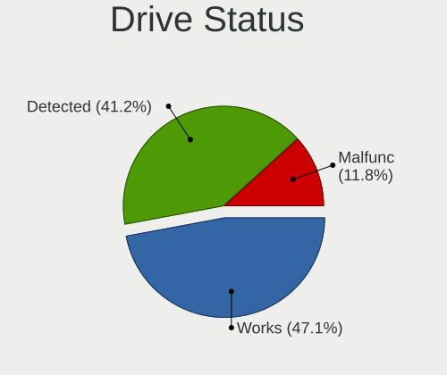

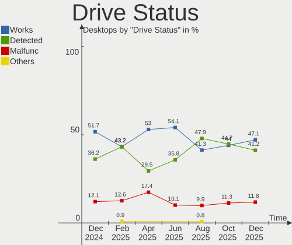

| Status   | Desktops | Drives | Percent |
|----------|----------|--------|---------|
| Works    | 72       | 196    | 47.06%  |
| Detected | 63       | 157    | 41.18%  |
| Malfunc  | 18       | 21     | 11.76%  |

Storage controller
------------------

Storage Vendor
--------------

Storage controller vendors

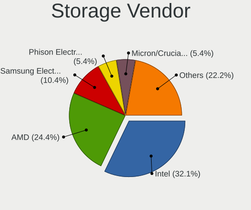

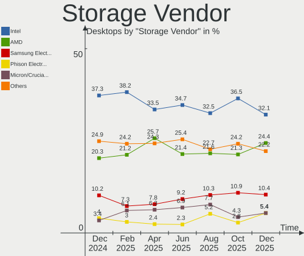

| Vendor                       | Desktops | Percent |
|------------------------------|----------|---------|
| Intel                        | 71       | 32.13%  |
| AMD                          | 54       | 24.43%  |
| Samsung Electronics          | 23       | 10.41%  |
| Phison Electronics           | 12       | 5.43%   |
| Micron/Crucial Technology    | 12       | 5.43%   |
| SanDisk                      | 8        | 3.62%   |
| Kingston Technology Company  | 8        | 3.62%   |
| Nvidia                       | 4        | 1.81%   |
| Micron Technology            | 4        | 1.81%   |
| ASMedia Technology           | 4        | 1.81%   |
| Silicon Motion               | 3        | 1.36%   |
| MAXIO Technology (Hangzhou)  | 3        | 1.36%   |
| JMicron Technology           | 3        | 1.36%   |
| Seagate Technology           | 2        | 0.9%    |
| Broadcom / LSI               | 2        | 0.9%    |
| Toshiba America Info Systems | 1        | 0.45%   |
| TenaFe                       | 1        | 0.45%   |
| SK hynix                     | 1        | 0.45%   |
| Realtek Semiconductor        | 1        | 0.45%   |
| Marvell Technology Group     | 1        | 0.45%   |
| LSI Logic / Symbios Logic    | 1        | 0.45%   |
| KIOXIA                       | 1        | 0.45%   |
| Biwin Storage Technology     | 1        | 0.45%   |

Storage Model
-------------

Storage controller models

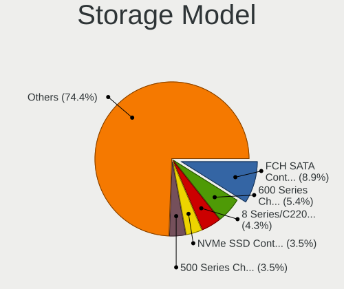

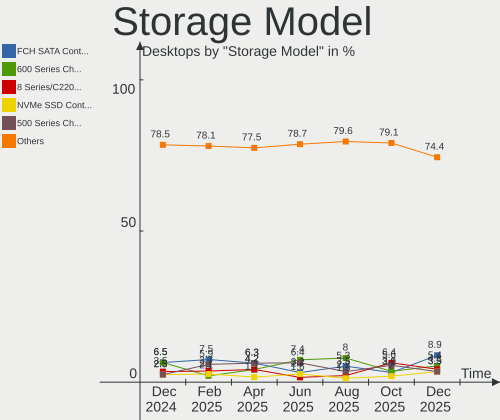

| Model                                                                          | Desktops | Percent |
|--------------------------------------------------------------------------------|----------|---------|
| AMD FCH SATA Controller [AHCI mode]                                            | 23       | 8.91%   |
| AMD 600 Series Chipset SATA Controller                                         | 14       | 5.43%   |
| Intel 8 Series/C220 Series Chipset Family 6-port SATA Controller 1 [AHCI mode] | 11       | 4.26%   |
| Samsung NVMe SSD Controller PM9A1/PM9A3/980PRO                                 | 9        | 3.49%   |
| AMD 500 Series Chipset SATA Controller                                         | 9        | 3.49%   |
| AMD 400 Series Chipset SATA Controller                                         | 8        | 3.1%    |
| Samsung NVMe SSD Controller SM981/PM981/PM983                                  | 7        | 2.71%   |
| Samsung NVMe SSD Controller S4LV008[Pascal]                                    | 7        | 2.71%   |
| Micron/Crucial P2 [Nick P2] / P3 / P3 Plus NVMe PCIe SSD (DRAM-less)           | 7        | 2.71%   |
| Intel SATA Controller [RAID mode]                                              | 7        | 2.71%   |
| Intel Alder Lake-S PCH SATA Controller [AHCI Mode]                             | 7        | 2.71%   |
| Intel 200 Series PCH SATA controller [AHCI mode]                               | 6        | 2.33%   |
| Intel Raptor Lake SATA AHCI Controller                                         | 5        | 1.94%   |
| Phison E12 NVMe Controller                                                     | 4        | 1.55%   |
| Intel Volume Management Device NVMe RAID Controller                            | 4        | 1.55%   |
| Intel Q170/Q150/B150/H170/H110/Z170/CM236 Chipset SATA Controller [AHCI Mode]  | 4        | 1.55%   |
| Intel Cannon Lake PCH SATA AHCI Controller                                     | 4        | 1.55%   |
| Intel 6 Series/C200 Series Chipset Family 6 port Desktop SATA AHCI Controller  | 4        | 1.55%   |
| Sandisk WD Black SN850X NVMe SSD                                               | 3        | 1.16%   |
| Samsung NVMe SSD Controller 980 (DRAM-less)                                    | 3        | 1.16%   |
| Phison E16 PCIe4 NVMe Controller                                               | 3        | 1.16%   |
| Intel 9 Series Chipset Family SATA Controller [AHCI Mode]                      | 3        | 1.16%   |
| ASMedia ASM1061/ASM1062 Serial ATA Controller                                  | 3        | 1.16%   |
| AMD X370 Series Chipset SATA Controller                                        | 3        | 1.16%   |
| AMD SB7x0/SB8x0/SB9x0 IDE Controller                                           | 3        | 1.16%   |
| Silicon Motion SM2263EN/SM2263XT (DRAM-less) NVMe SSD Controllers              | 2        | 0.78%   |
| SanDisk WD Blue SN570 NVMe SSD 2TB                                             | 2        | 0.78%   |
| SanDisk Ultra 3D / WD PC SN530, IX SN530, Blue SN550 NVMe SSD (DRAM-less)      | 2        | 0.78%   |
| Phison PS5021-E21 PCIe4 NVMe Controller (DRAM-less)                            | 2        | 0.78%   |
| Nvidia MCP61 SATA Controller                                                   | 2        | 0.78%   |
| Micron/Crucial T700 NVMe PCIe SSD                                              | 2        | 0.78%   |
| Micron 2550 NVMe SSD (DRAM-less)                                               | 2        | 0.78%   |
| MAXIO (Hangzhou) NVMe SSD Controller MAP1202 (DRAM-less)                       | 2        | 0.78%   |
| Kingston Company NV1 NVMe SSD [SM2263XT] (DRAM-less)                           | 2        | 0.78%   |
| Kingston Company KC3000/FURY Renegade NVMe SSD [E18]                           | 2        | 0.78%   |
| JMicron JMB368 IDE controller                                                  | 2        | 0.78%   |
| JMicron JMB363 SATA/IDE Controller                                             | 2        | 0.78%   |
| Intel Comet Lake SATA AHCI Controller                                          | 2        | 0.78%   |
| Intel 82801JI (ICH10 Family) 4 port SATA IDE Controller #1                     | 2        | 0.78%   |
| Intel 82801JI (ICH10 Family) 2 port SATA IDE Controller #2                     | 2        | 0.78%   |

Storage Kind
------------

Kind of storage controller (IDE, SATA, NVMe, SAS, ...)

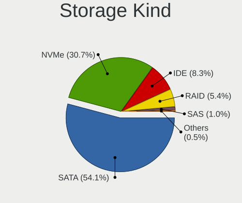

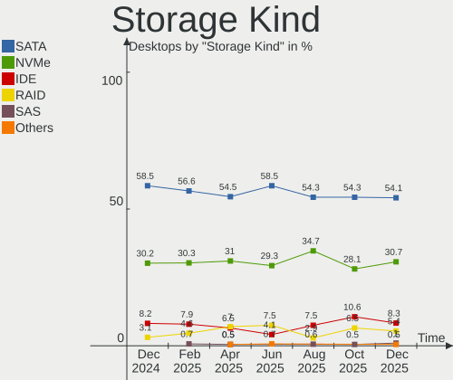

| Kind | Desktops | Percent |
|------|----------|---------|
| SATA | 111      | 54.15%  |
| NVMe | 63       | 30.73%  |
| IDE  | 17       | 8.29%   |
| RAID | 11       | 5.37%   |
| SAS  | 2        | 0.98%   |
| SCSI | 1        | 0.49%   |

Processor
---------

CPU Vendor
----------

Processor vendors

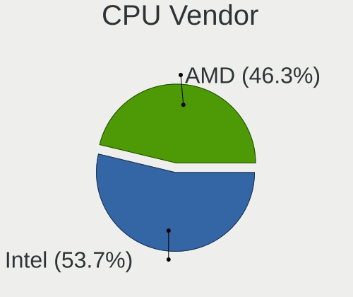

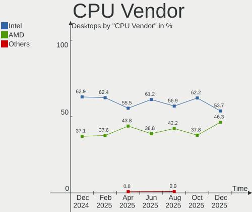

| Vendor | Desktops | Percent |
|--------|----------|---------|
| Intel  | 72       | 53.73%  |
| AMD    | 62       | 46.27%  |

CPU Model
---------

Processor models

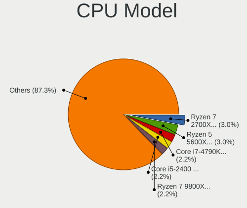

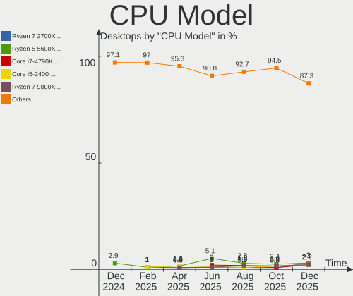

| Model                                  | Desktops | Percent |
|----------------------------------------|----------|---------|
| AMD Ryzen 7 2700X Eight-Core Processor | 4        | 2.99%   |
| AMD Ryzen 5 5600X 6-Core Processor     | 4        | 2.99%   |
| Intel Core i7-4790K CPU @ 4.00GHz      | 3        | 2.24%   |
| Intel Core i5-2400 CPU @ 3.10GHz       | 3        | 2.24%   |
| AMD Ryzen 7 9800X3D 8-Core Processor   | 3        | 2.24%   |
| Intel Core i7-7700K CPU @ 4.20GHz      | 2        | 1.49%   |
| Intel Core i7-4770K CPU @ 3.50GHz      | 2        | 1.49%   |
| Intel Core i5-9400 CPU @ 2.90GHz       | 2        | 1.49%   |
| Intel Core i5-6500 CPU @ 3.20GHz       | 2        | 1.49%   |
| Intel Core i5-4570 CPU @ 3.20GHz       | 2        | 1.49%   |
| Intel Core i5-4250U CPU @ 1.30GHz      | 2        | 1.49%   |
| Intel Core i5 CPU 760 @ 2.80GHz        | 2        | 1.49%   |
| Intel Core i3-4150 CPU @ 3.50GHz       | 2        | 1.49%   |
| Intel 12th Gen Core i3-12100           | 2        | 1.49%   |
| AMD Ryzen 9 3900X 12-Core Processor    | 2        | 1.49%   |
| AMD Ryzen 7 3700X 8-Core Processor     | 2        | 1.49%   |
| AMD Ryzen 5 5600G with Radeon Graphics | 2        | 1.49%   |
| Intel Xeon w5-3423                     | 1        | 0.75%   |
| Intel Xeon CPU E3-1241 v3 @ 3.50GHz    | 1        | 0.75%   |
| Intel Xeon CPU E3-1240 V2 @ 3.40GHz    | 1        | 0.75%   |
| Intel Pentium CPU G6950 @ 2.80GHz      | 1        | 0.75%   |
| Intel Pentium CPU G4500 @ 3.50GHz      | 1        | 0.75%   |
| Intel Pentium 4 CPU 2.80GHz            | 1        | 0.75%   |
| Intel N150                             | 1        | 0.75%   |
| Intel Core i9-10900 CPU @ 2.80GHz      | 1        | 0.75%   |
| Intel Core i7-9700 CPU @ 3.00GHz       | 1        | 0.75%   |
| Intel Core i7-7700 CPU @ 3.60GHz       | 1        | 0.75%   |
| Intel Core i7-7567U CPU @ 3.50GHz      | 1        | 0.75%   |
| Intel Core i7-6700K CPU @ 4.00GHz      | 1        | 0.75%   |
| Intel Core i7-4790 CPU @ 3.60GHz       | 1        | 0.75%   |
| Intel Core i7-4771 CPU @ 3.50GHz       | 1        | 0.75%   |
| Intel Core i7-14700KF                  | 1        | 0.75%   |
| Intel Core i7-14700K                   | 1        | 0.75%   |
| Intel Core i7-14700F                   | 1        | 0.75%   |
| Intel Core i7-10700F CPU @ 2.90GHz     | 1        | 0.75%   |
| Intel Core i5-9600K CPU @ 3.70GHz      | 1        | 0.75%   |
| Intel Core i5-9500F CPU @ 3.00GHz      | 1        | 0.75%   |
| Intel Core i5-7500 CPU @ 3.40GHz       | 1        | 0.75%   |
| Intel Core i5-6400 CPU @ 2.70GHz       | 1        | 0.75%   |
| Intel Core i5-4590T CPU @ 2.00GHz      | 1        | 0.75%   |

CPU Model Family
----------------

Processor model prefix

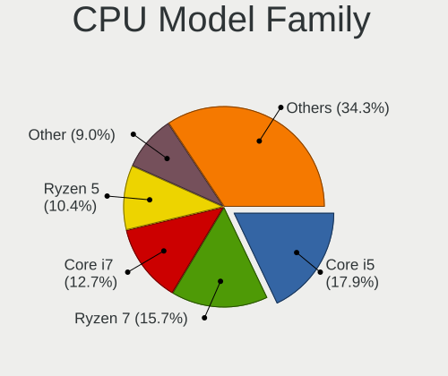

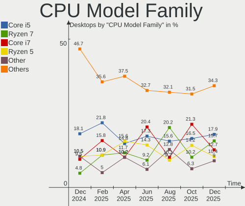

| Model                  | Desktops | Percent |
|------------------------|----------|---------|
| Intel Core i5          | 24       | 17.91%  |
| AMD Ryzen 7            | 21       | 15.67%  |
| Intel Core i7          | 17       | 12.69%  |
| AMD Ryzen 5            | 14       | 10.45%  |
| Other                  | 12       | 8.96%   |
| AMD Ryzen 9            | 9        | 6.72%   |
| Intel Core i3          | 7        | 5.22%   |
| Intel Xeon             | 3        | 2.24%   |
| Intel Celeron          | 3        | 2.24%   |
| Intel Pentium          | 2        | 1.49%   |
| Intel Core 2 Duo       | 2        | 1.49%   |
| AMD Sempron            | 2        | 1.49%   |
| AMD FX                 | 2        | 1.49%   |
| AMD Athlon Dual Core   | 2        | 1.49%   |
| AMD A4                 | 2        | 1.49%   |
| Intel Pentium 4        | 1        | 0.75%   |
| Intel Core i9          | 1        | 0.75%   |
| Intel Core 2 Quad      | 1        | 0.75%   |
| AMD Ryzen Threadripper | 1        | 0.75%   |
| AMD Ryzen 3            | 1        | 0.75%   |
| AMD Phenom II X6       | 1        | 0.75%   |
| AMD E2                 | 1        | 0.75%   |
| AMD E1                 | 1        | 0.75%   |
| AMD Athlon II X4       | 1        | 0.75%   |
| AMD Athlon II X2       | 1        | 0.75%   |
| AMD A8                 | 1        | 0.75%   |
| AMD A6                 | 1        | 0.75%   |

CPU Cores
---------

Number of processor cores

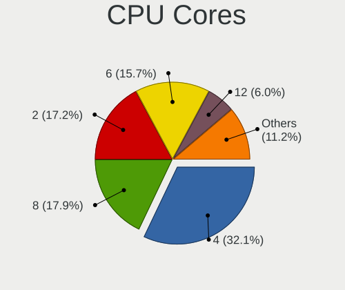

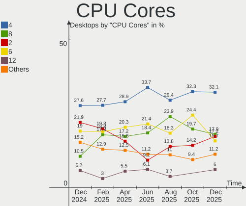

| Number | Desktops | Percent |
|--------|----------|---------|
| 4      | 43       | 32.09%  |
| 8      | 24       | 17.91%  |
| 2      | 23       | 17.16%  |
| 6      | 21       | 15.67%  |
| 12     | 8        | 5.97%   |
| 16     | 6        | 4.48%   |
| 20     | 3        | 2.24%   |
| 10     | 3        | 2.24%   |
| 1      | 2        | 1.49%   |
| 14     | 1        | 0.75%   |

CPU Sockets
-----------

Number of sockets

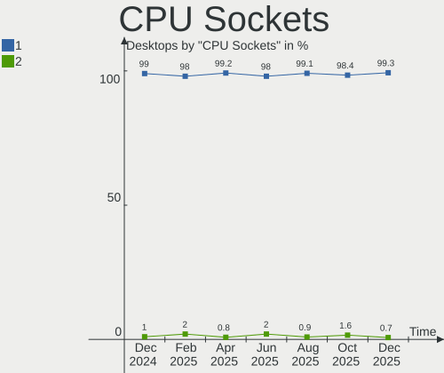

| Number | Desktops | Percent |
|--------|----------|---------|
| 1      | 133      | 99.25%  |
| 2      | 1        | 0.75%   |

CPU Threads
-----------

Threads per core (Hyper-Threading)

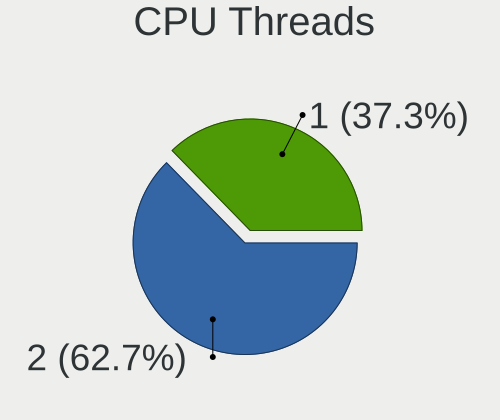

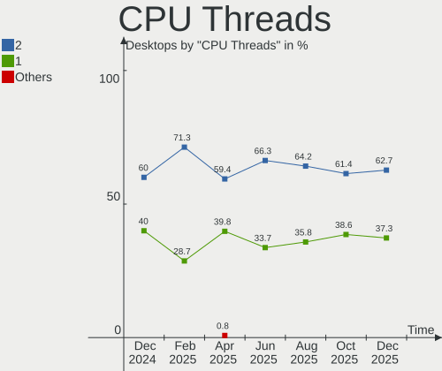

| Number | Desktops | Percent |
|--------|----------|---------|
| 2      | 84       | 62.69%  |
| 1      | 50       | 37.31%  |

CPU Op-Modes
------------

CPU Operation Modes (32-bit, 64-bit)

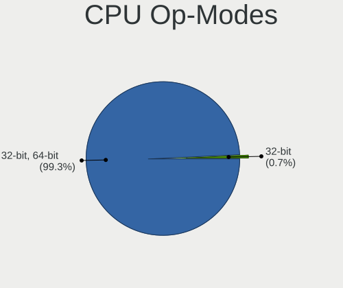

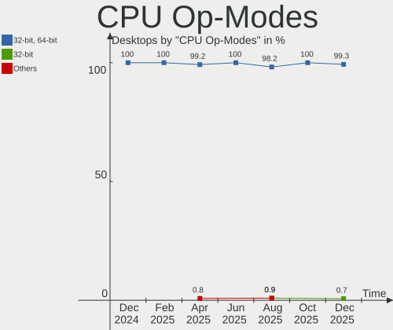

| Op mode        | Desktops | Percent |
|----------------|----------|---------|
| 32-bit, 64-bit | 133      | 99.25%  |
| 32-bit         | 1        | 0.75%   |

CPU Microcode
-------------

Microcode number

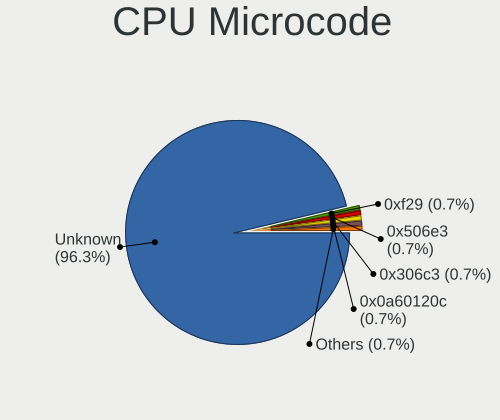

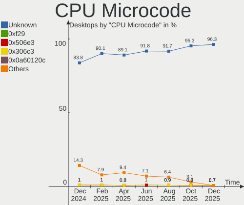

| Number     | Desktops | Percent |
|------------|----------|---------|
| Unknown    | 129      | 96.27%  |
| 0xf29      | 1        | 0.75%   |
| 0x506e3    | 1        | 0.75%   |
| 0x306c3    | 1        | 0.75%   |
| 0x0a60120c | 1        | 0.75%   |
| 0x06001119 | 1        | 0.75%   |

CPU Microarch
-------------

Microarchitecture

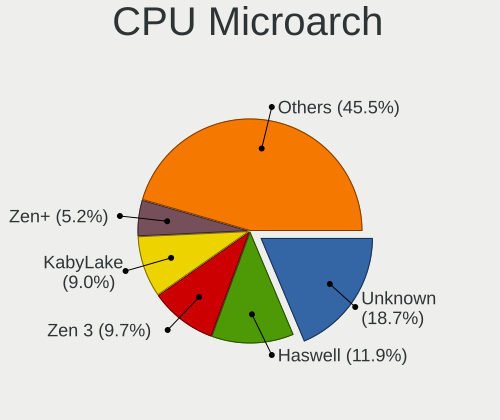

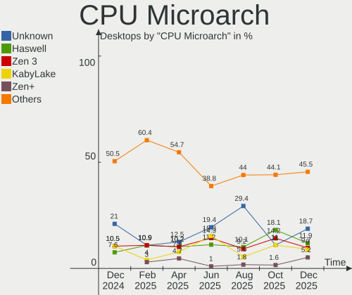

| Name             | Desktops | Percent |
|------------------|----------|---------|
| Unknown          | 25       | 18.66%  |
| Haswell          | 16       | 11.94%  |
| Zen 3            | 13       | 9.7%    |
| KabyLake         | 12       | 8.96%   |
| Zen+             | 7        | 5.22%   |
| Zen 2            | 7        | 5.22%   |
| Skylake          | 6        | 4.48%   |
| SandyBridge      | 5        | 3.73%   |
| Alderlake Hybrid | 5        | 3.73%   |
| Piledriver       | 4        | 2.99%   |
| K10              | 4        | 2.99%   |
| IvyBridge        | 4        | 2.99%   |
| Penryn           | 3        | 2.24%   |
| CometLake        | 3        | 2.24%   |
| Zen              | 2        | 1.49%   |
| Westmere         | 2        | 1.49%   |
| Nehalem          | 2        | 1.49%   |
| K8 Hammer        | 2        | 1.49%   |
| Jaguar           | 2        | 1.49%   |
| Steamroller      | 1        | 0.75%   |
| Silvermont       | 1        | 0.75%   |
| Sapphire Rapids  | 1        | 0.75%   |
| Puma             | 1        | 0.75%   |
| NetBurst         | 1        | 0.75%   |
| Icelake          | 1        | 0.75%   |
| Gracemont        | 1        | 0.75%   |
| Goldmont plus    | 1        | 0.75%   |
| Goldmont         | 1        | 0.75%   |
| Bulldozer        | 1        | 0.75%   |

Graphics
--------

GPU Vendor
----------

Vendors of graphics cards

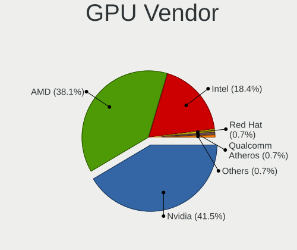

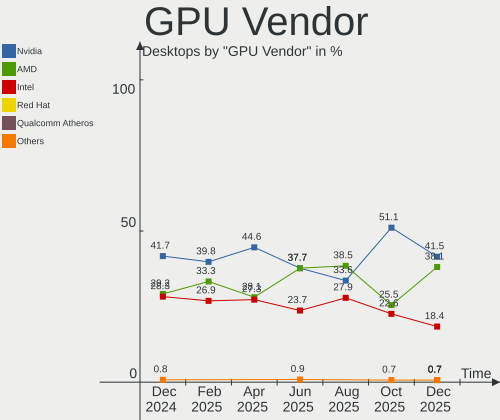

| Vendor            | Desktops | Percent |
|-------------------|----------|---------|
| Nvidia            | 61       | 41.5%   |
| AMD               | 56       | 38.1%   |
| Intel             | 27       | 18.37%  |
| Red Hat           | 1        | 0.68%   |
| Qualcomm Atheros  | 1        | 0.68%   |
| ASPEED Technology | 1        | 0.68%   |

GPU Model
---------

Graphics card models

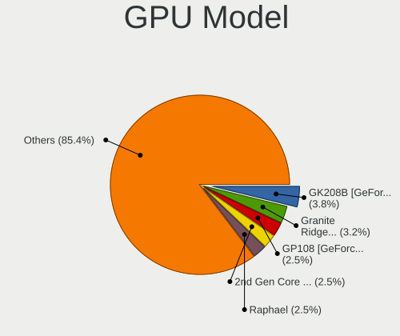

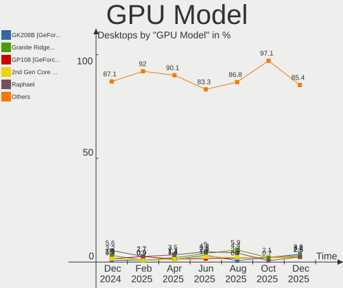

| Model                                                                       | Desktops | Percent |
|-----------------------------------------------------------------------------|----------|---------|
| Nvidia GK208B [GeForce GT 710]                                              | 6        | 3.82%   |
| AMD Granite Ridge [Radeon Graphics]                                         | 5        | 3.18%   |
| Nvidia GP108 [GeForce GT 1030]                                              | 4        | 2.55%   |
| Intel 2nd Generation Core Processor Family Integrated Graphics Controller   | 4        | 2.55%   |
| AMD Raphael                                                                 | 4        | 2.55%   |
| AMD Navi 48 [Radeon RX 9070/9070 XT/9070 GRE]                               | 4        | 2.55%   |
| Nvidia TU116 [GeForce GTX 1660 SUPER]                                       | 3        | 1.91%   |
| Intel Xeon E3-1200 v3/4th Gen Core Processor Integrated Graphics Controller | 3        | 1.91%   |
| Intel 4th Generation Core Processor Family Integrated Graphics Controller   | 3        | 1.91%   |
| AMD Navi 23 [Radeon RX 6600/6600 XT/6600M]                                  | 3        | 1.91%   |
| AMD Ellesmere [Radeon RX 470/480/570/570X/580/580X/590]                     | 3        | 1.91%   |
| AMD Caicos PRO [Radeon HD 7450]                                             | 3        | 1.91%   |
| Nvidia TU106 [GeForce RTX 2070]                                             | 2        | 1.27%   |
| Nvidia GP107 [GeForce GTX 1050 Ti]                                          | 2        | 1.27%   |
| Nvidia GP106 [GeForce GTX 1060 6GB]                                         | 2        | 1.27%   |
| Nvidia GK208B [GeForce GT 730]                                              | 2        | 1.27%   |
| Nvidia GB205 [GeForce RTX 5070]                                             | 2        | 1.27%   |
| Nvidia GA106 [GeForce RTX 3060 Lite Hash Rate]                              | 2        | 1.27%   |
| Nvidia GA104 [GeForce RTX 3070]                                             | 2        | 1.27%   |
| Nvidia G92 [GeForce 9800 GT]                                                | 2        | 1.27%   |
| Intel Skylake-S GT2 [HD Graphics 530]                                       | 2        | 1.27%   |
| Intel Haswell-ULT Integrated Graphics Controller                            | 2        | 1.27%   |
| Intel Alder Lake-S GT1 [UHD Graphics 770]                                   | 2        | 1.27%   |
| AMD Picasso/Raven 2 [Radeon Vega Series / Radeon Vega Mobile Series]        | 2        | 1.27%   |
| AMD Phoenix1                                                                | 2        | 1.27%   |
| AMD Navi 44 [Radeon RX 9060 XT]                                             | 2        | 1.27%   |
| AMD Navi 33 [Radeon RX 7600/7600 XT/7600M XT/7600S/7700S / PRO W7600]       | 2        | 1.27%   |
| AMD Navi 31 [Radeon RX 7900 XT/7900 XTX/7900 GRE/7900M]                     | 2        | 1.27%   |
| AMD Navi 22 [Radeon RX 6700/6700 XT/6750 XT / 6800M/6850M XT]               | 2        | 1.27%   |
| AMD Navi 21 [Radeon RX 6950 XT]                                             | 2        | 1.27%   |
| AMD Navi 10 [Radeon RX 5600 OEM/5600 XT / 5700/5700 XT]                     | 2        | 1.27%   |
| AMD Cezanne [Radeon Vega Series / Radeon Vega Mobile Series]                | 2        | 1.27%   |
| Red Hat Virtio 1.0 GPU                                                      | 1        | 0.64%   |
| Qualcomm Atheros Display controller                                         | 1        | 0.64%   |
| Nvidia TU116 [GeForce GTX 1660]                                             | 1        | 0.64%   |
| Nvidia TU104 [GeForce RTX 2070 SUPER]                                       | 1        | 0.64%   |
| Nvidia GV100 [TITAN V]                                                      | 1        | 0.64%   |
| Nvidia GT200b [GeForce GTX 275]                                             | 1        | 0.64%   |
| Nvidia GP107GL [Quadro P400]                                                | 1        | 0.64%   |
| Nvidia GP104 [GeForce GTX 1080]                                             | 1        | 0.64%   |

GPU Combo
---------

Combinations of graphics cards

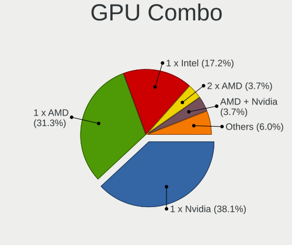

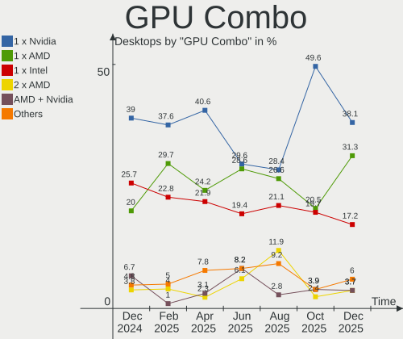

| Name             | Desktops | Percent |
|------------------|----------|---------|
| 1 x Nvidia       | 51       | 38.06%  |
| 1 x AMD          | 42       | 31.34%  |
| 1 x Intel        | 23       | 17.16%  |
| 2 x AMD          | 5        | 3.73%   |
| AMD + Nvidia     | 5        | 3.73%   |
| 2 x Nvidia       | 2        | 1.49%   |
| Intel + Nvidia   | 2        | 1.49%   |
| 1 x Red Hat      | 1        | 0.75%   |
| Intel + AMD      | 1        | 0.75%   |
| AMD + 2 x Nvidia | 1        | 0.75%   |
| AMD + ASPEED     | 1        | 0.75%   |

GPU Driver
----------

Free vs proprietary

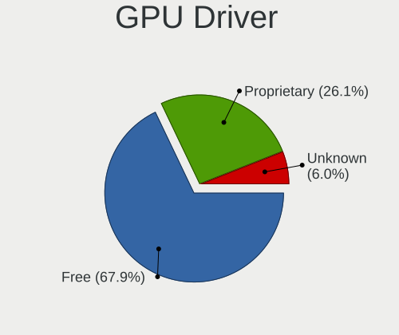

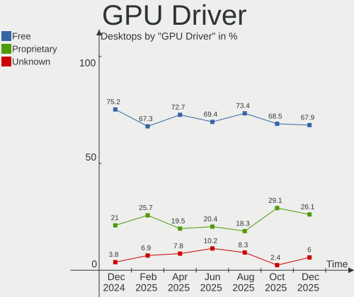

| Driver      | Desktops | Percent |
|-------------|----------|---------|
| Free        | 91       | 67.91%  |
| Proprietary | 35       | 26.12%  |
| Unknown     | 8        | 5.97%   |

GPU Memory
----------

Total video memory

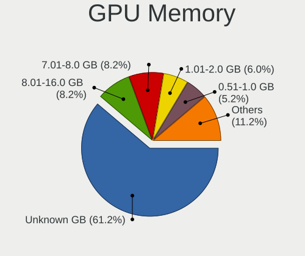

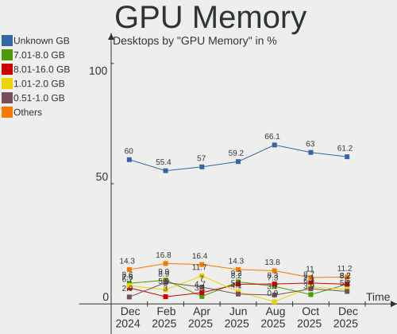

| Size in GB | Desktops | Percent |
|------------|----------|---------|
| Unknown    | 82       | 61.19%  |
| 7.01-8.0   | 11       | 8.21%   |
| 8.01-16.0  | 11       | 8.21%   |
| 1.01-2.0   | 8        | 5.97%   |
| 0.51-1.0   | 7        | 5.22%   |
| 5.01-6.0   | 4        | 2.99%   |
| 0.01-0.5   | 4        | 2.99%   |
| 3.01-4.0   | 3        | 2.24%   |
| 2.01-3.0   | 2        | 1.49%   |
| 16.01-24.0 | 2        | 1.49%   |

Monitor
-------

Monitor Vendor
--------------

Monitor vendors

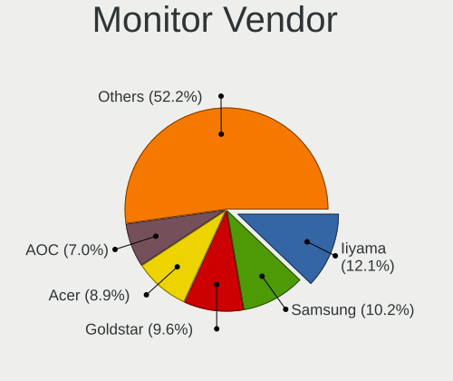

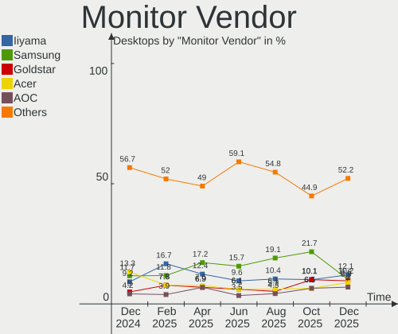

| Vendor               | Desktops | Percent |
|----------------------|----------|---------|
| Iiyama               | 19       | 12.1%   |
| Samsung Electronics  | 16       | 10.19%  |
| Goldstar             | 15       | 9.55%   |
| Acer                 | 14       | 8.92%   |
| AOC                  | 11       | 7.01%   |
| Philips              | 10       | 6.37%   |
| Ancor Communications | 10       | 6.37%   |
| Dell                 | 9        | 5.73%   |
| MSI                  | 6        | 3.82%   |
| ASUSTek Computer     | 6        | 3.82%   |
| ViewSonic            | 5        | 3.18%   |
| Hewlett-Packard      | 5        | 3.18%   |
| BenQ                 | 5        | 3.18%   |
| Lenovo               | 3        | 1.91%   |
| Unknown (XXX)        | 2        | 1.27%   |
| Unknown              | 2        | 1.27%   |
| HannStar             | 2        | 1.27%   |
| Gigabyte Technology  | 2        | 1.27%   |
| ___                  | 1        | 0.64%   |
| Wacom                | 1        | 0.64%   |
| Valve                | 1        | 0.64%   |
| TCL                  | 1        | 0.64%   |
| RHT                  | 1        | 0.64%   |
| MiTAC                | 1        | 0.64%   |
| Mi                   | 1        | 0.64%   |
| Idek Iiyama          | 1        | 0.64%   |
| Huion                | 1        | 0.64%   |
| Hitachi              | 1        | 0.64%   |
| GreenWood            | 1        | 0.64%   |
| Fujitsu Siemens      | 1        | 0.64%   |
| eMachines            | 1        | 0.64%   |
| Denver               | 1        | 0.64%   |
| CHD                  | 1        | 0.64%   |

Monitor Model
-------------

Monitor models

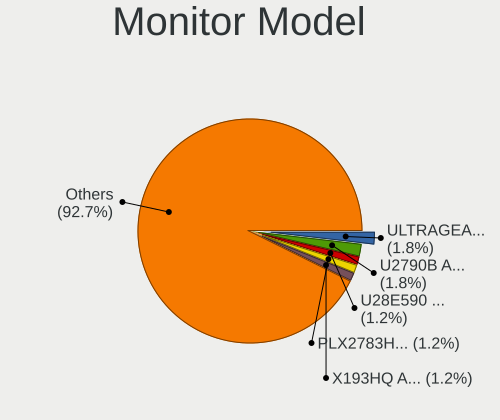

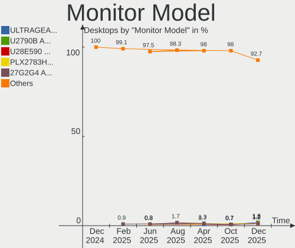

| Model                                                                    | Desktops | Percent |
|--------------------------------------------------------------------------|----------|---------|
| Goldstar ULTRAGEAR GSM5BD3 2560x1440 697x392mm 31.5-inch                 | 3        | 1.83%   |
| AOC U2790B AOC2790 3840x2160 597x336mm 27.0-inch                         | 3        | 1.83%   |
| Samsung Electronics U28E590 SAM0C4D 3840x2160 607x345mm 27.5-inch        | 2        | 1.22%   |
| Iiyama PLX2783H IVM6611 1920x1080 598x336mm 27.0-inch                    | 2        | 1.22%   |
| AOC 27G2G4 AOC2702 1920x1080 598x336mm 27.0-inch                         | 2        | 1.22%   |
| Acer X193HQ ACR0069 1366x768 410x230mm 18.5-inch                         | 2        | 1.22%   |
| ___ LCD TV ___9000 1360x768                                              | 1        | 0.61%   |
| Wacom One 13 WAC1070 1920x1080 294x166mm 13.3-inch                       | 1        | 0.61%   |
| ViewSonic VX2703 SERIES VSCF62B 1920x1080 597x336mm 27.0-inch            | 1        | 0.61%   |
| ViewSonic VX2458 Series VSC36AF 1920x1080 521x293mm 23.5-inch            | 1        | 0.61%   |
| ViewSonic VX1937 SERIES VSC2D24 1440x900 410x260mm 19.1-inch             | 1        | 0.61%   |
| ViewSonic VP2785 SERIES VSC7F34 3840x2160 597x336mm 27.0-inch            | 1        | 0.61%   |
| ViewSonic VA916 Series VSC7C20 1280x1024 376x301mm 19.0-inch             | 1        | 0.61%   |
| ViewSonic LCD Monitor VX1937 SERIES 1440x900                             | 1        | 0.61%   |
| Valve Index HMD VLV91A8                                                  | 1        | 0.61%   |
| Unknown LCD TV 9000 1360x768 1600x900mm 72.3-inch                        | 1        | 0.61%   |
| Unknown LCD Monitor FFFF 2288x1287 2550x2550mm 142.0-inch                | 1        | 0.61%   |
| Unknown (XXX) Beyond TV XXX2851 3840x2160 1209x680mm 54.6-inch           | 1        | 0.61%   |
| Unknown (XXX) Beyo TV XXX9615 3840x2160 1210x680mm 54.6-inch             | 1        | 0.61%   |
| TCL 34R83Q TCL3401 3440x1440 797x333mm 34.0-inch                         | 1        | 0.61%   |
| Samsung Electronics SyncMaster SAM0302 1680x1050 459x296mm 21.5-inch     | 1        | 0.61%   |
| Samsung Electronics SMS19A450 SAM0847 1280x1024 376x301mm 19.0-inch      | 1        | 0.61%   |
| Samsung Electronics S24F350 SAM0D20 1920x1080 521x293mm 23.5-inch        | 1        | 0.61%   |
| Samsung Electronics S24D390 SAM0B65 1920x1080 521x293mm 23.5-inch        | 1        | 0.61%   |
| Samsung Electronics S24D300 SAM0B43 1920x1080 531x299mm 24.0-inch        | 1        | 0.61%   |
| Samsung Electronics S24A31x SAM7115 1920x1080 527x296mm 23.8-inch        | 1        | 0.61%   |
| Samsung Electronics Odyssey G93SD SAM772D 3840x1080 1193x336mm 48.8-inch | 1        | 0.61%   |
| Samsung Electronics Odyssey G93SC SAM7454 3840x1080 1193x336mm 48.8-inch | 1        | 0.61%   |
| Samsung Electronics LCD Monitor SAM7017 3840x2160 1872x1053mm 84.6-inch  | 1        | 0.61%   |
| Samsung Electronics LCD Monitor SAM0C44 3840x2160 1050x590mm 47.4-inch   | 1        | 0.61%   |
| Samsung Electronics LCD Monitor SAM0C3C 1366x768 609x347mm 27.6-inch     | 1        | 0.61%   |
| Samsung Electronics C32JG5x SAM0F55 2560x1440 697x392mm 31.5-inch        | 1        | 0.61%   |
| Samsung Electronics C27FG7x SAM0E42 1920x1080 598x337mm 27.0-inch        | 1        | 0.61%   |
| Samsung Electronics C24F390 SAM0D2C 1920x1080 521x293mm 23.5-inch        | 1        | 0.61%   |
| RHT QEMU Monitor RHT1234 2048x1152 325x203mm 15.1-inch                   | 1        | 0.61%   |
| Philips PHL 328E1 PHLC204 3840x2160 697x392mm 31.5-inch                  | 1        | 0.61%   |
| Philips PHL 245B1 PHL094C 2560x1440 530x300mm 24.0-inch                  | 1        | 0.61%   |
| Philips PHL 243V7 PHLC155 1920x1080 527x296mm 23.8-inch                  | 1        | 0.61%   |
| Philips PHL 241V8LAB PHLC326 1920x1080 527x296mm 23.8-inch               | 1        | 0.61%   |
| Philips PHL 230B8Q PHL0936 1920x1200 488x297mm 22.5-inch                 | 1        | 0.61%   |

Monitor Resolution
------------------

Monitor screen resolution

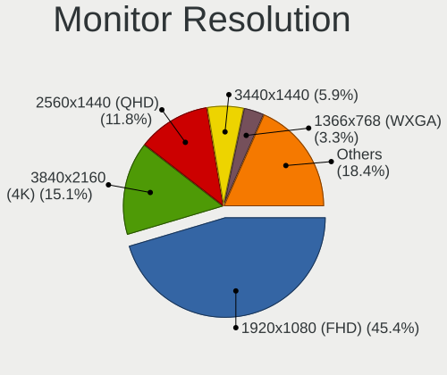

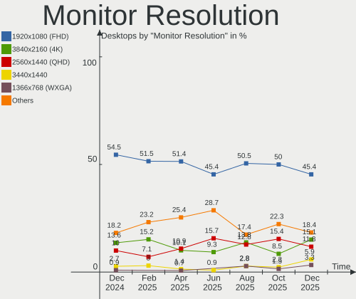

| Resolution         | Desktops | Percent |
|--------------------|----------|---------|
| 1920x1080 (FHD)    | 69       | 45.39%  |
| 3840x2160 (4K)     | 23       | 15.13%  |
| 2560x1440 (QHD)    | 18       | 11.84%  |
| 3440x1440          | 9        | 5.92%   |
| 1366x768 (WXGA)    | 5        | 3.29%   |
| 1280x1024 (SXGA)   | 5        | 3.29%   |
| 1920x1200 (WUXGA)  | 4        | 2.63%   |
| 1440x900 (WXGA+)   | 4        | 2.63%   |
| 1600x900 (HD+)     | 3        | 1.97%   |
| 3840x1080          | 2        | 1.32%   |
| 2560x1080          | 2        | 1.32%   |
| 1680x1050 (WSXGA+) | 2        | 1.32%   |
| 2560x1397          | 1        | 0.66%   |
| 2288x1287          | 1        | 0.66%   |
| 1600x1200          | 1        | 0.66%   |
| 1360x768           | 1        | 0.66%   |
| 1024x768 (XGA)     | 1        | 0.66%   |
| Unknown            | 1        | 0.66%   |

Monitor Diagonal
----------------

Diagonal size in inches

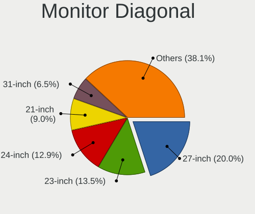

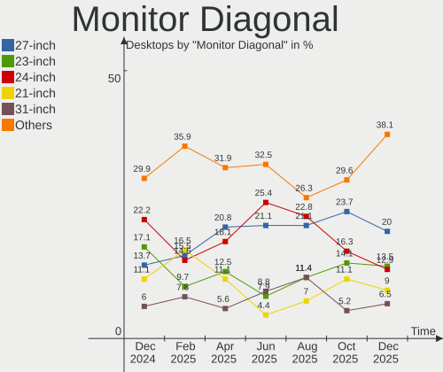

| Inches  | Desktops | Percent |
|---------|----------|---------|
| 27      | 31       | 20%     |
| 23      | 21       | 13.55%  |
| 24      | 20       | 12.9%   |
| 21      | 14       | 9.03%   |
| 31      | 10       | 6.45%   |
| 34      | 9        | 5.81%   |
| 19      | 8        | 5.16%   |
| Unknown | 6        | 3.87%   |
| 18      | 5        | 3.23%   |
| 26      | 4        | 2.58%   |
| 25      | 3        | 1.94%   |
| 20      | 3        | 1.94%   |
| 84      | 2        | 1.29%   |
| 48      | 2        | 1.29%   |
| 32      | 2        | 1.29%   |
| 29      | 2        | 1.29%   |
| 15      | 2        | 1.29%   |
| 142     | 1        | 0.65%   |
| 72      | 1        | 0.65%   |
| 64      | 1        | 0.65%   |
| 63      | 1        | 0.65%   |
| 54      | 1        | 0.65%   |
| 40      | 1        | 0.65%   |
| 33      | 1        | 0.65%   |
| 28      | 1        | 0.65%   |
| 22      | 1        | 0.65%   |
| 17      | 1        | 0.65%   |
| 13      | 1        | 0.65%   |

Monitor Width
-------------

Physical width

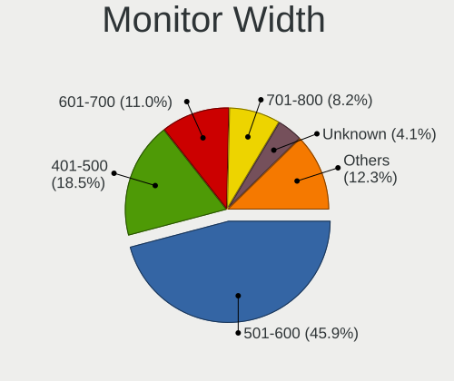

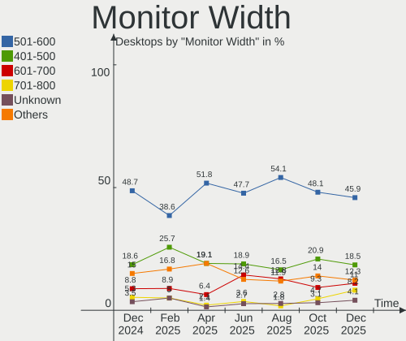

| Width in mm    | Desktops | Percent |
|----------------|----------|---------|
| 501-600        | 67       | 45.89%  |
| 401-500        | 27       | 18.49%  |
| 601-700        | 16       | 10.96%  |
| 701-800        | 12       | 8.22%   |
| Unknown        | 6        | 4.11%   |
| 1001-1500      | 5        | 3.42%   |
| 351-400        | 4        | 2.74%   |
| 301-350        | 3        | 2.05%   |
| 1501-2000      | 3        | 2.05%   |
| More than 2000 | 1        | 0.68%   |
| 801-900        | 1        | 0.68%   |
| 201-300        | 1        | 0.68%   |

Aspect Ratio
------------

Proportional relationship between the width and the height

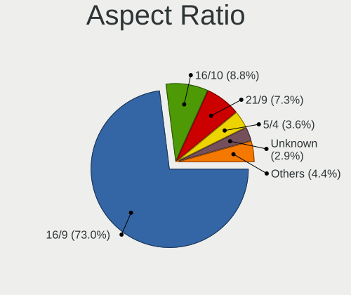

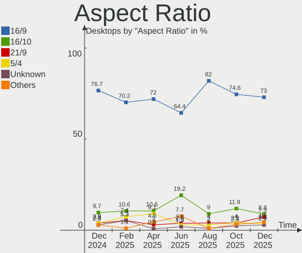

| Ratio   | Desktops | Percent |
|---------|----------|---------|
| 16/9    | 100      | 72.99%  |
| 16/10   | 12       | 8.76%   |
| 21/9    | 10       | 7.3%    |
| 5/4     | 5        | 3.65%   |
| Unknown | 4        | 2.92%   |
| 4/3     | 2        | 1.46%   |
| 32/9    | 2        | 1.46%   |
| 3/2     | 1        | 0.73%   |
| 1.00    | 1        | 0.73%   |

Monitor Area
------------

Area in inch²

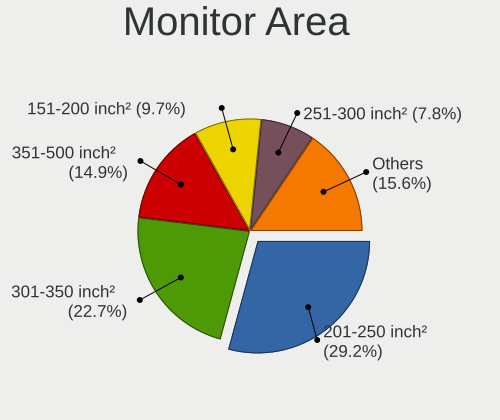

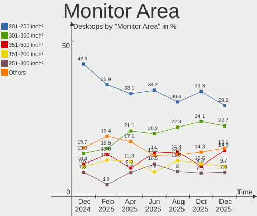

| Area in inch² | Desktops | Percent |
|----------------|----------|---------|
| 201-250        | 45       | 29.22%  |
| 301-350        | 35       | 22.73%  |
| 351-500        | 23       | 14.94%  |
| 151-200        | 15       | 9.74%   |
| 251-300        | 12       | 7.79%   |
| More than 1000 | 7        | 4.55%   |
| Unknown        | 6        | 3.9%    |
| 141-150        | 5        | 3.25%   |
| 501-1000       | 3        | 1.95%   |
| 101-110        | 2        | 1.3%    |
| 71-80          | 1        | 0.65%   |

Pixel Density
-------------

Pixels per inch

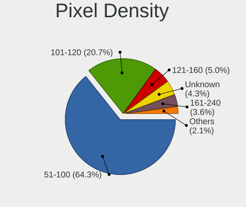

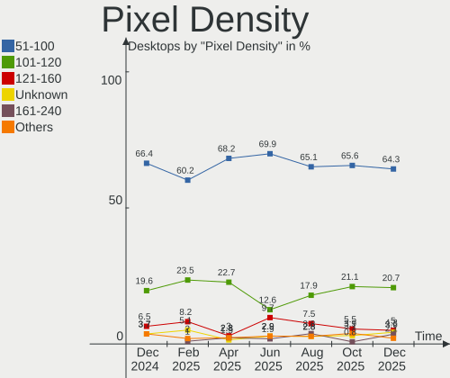

| Density | Desktops | Percent |
|---------|----------|---------|
| 51-100  | 90       | 64.29%  |
| 101-120 | 29       | 20.71%  |
| 121-160 | 7        | 5%      |
| Unknown | 6        | 4.29%   |
| 161-240 | 5        | 3.57%   |
| 1-50    | 3        | 2.14%   |

Multiple Monitors
-----------------

Total monitors connected

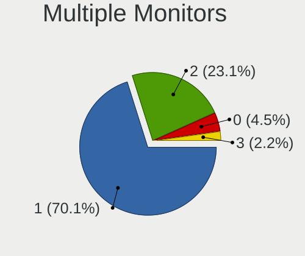

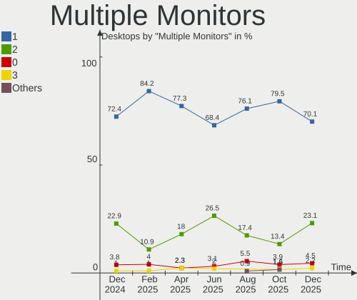

| Total | Desktops | Percent |
|-------|----------|---------|
| 1     | 94       | 70.15%  |
| 2     | 31       | 23.13%  |
| 0     | 6        | 4.48%   |
| 3     | 3        | 2.24%   |

Network
-------

Net Controller Vendor
---------------------

Controller vendors

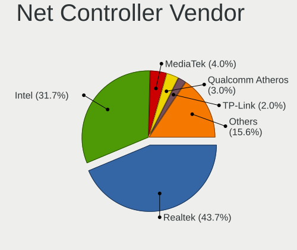

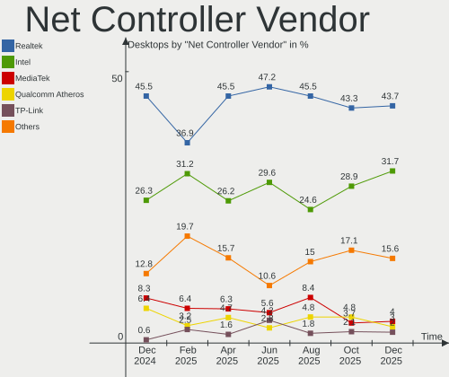

| Vendor                          | Desktops | Percent |
|---------------------------------|----------|---------|
| Realtek Semiconductor           | 87       | 43.72%  |
| Intel                           | 63       | 31.66%  |
| MediaTek                        | 8        | 4.02%   |
| Qualcomm Atheros                | 6        | 3.02%   |
| TP-Link                         | 4        | 2.01%   |
| Nvidia                          | 4        | 2.01%   |
| Broadcom                        | 3        | 1.51%   |
| Samsung Electronics             | 2        | 1.01%   |
| Ralink Technology               | 2        | 1.01%   |
| Ralink                          | 2        | 1.01%   |
| Qualcomm Technologies           | 2        | 1.01%   |
| NetGear                         | 2        | 1.01%   |
| Aquantia                        | 2        | 1.01%   |
| VIA Technologies                | 1        | 0.5%    |
| Qualcomm Atheros Communications | 1        | 0.5%    |
| QinHeng Electronics             | 1        | 0.5%    |
| Mellanox Technologies           | 1        | 0.5%    |
| Marvell Technology Group        | 1        | 0.5%    |
| Google                          | 1        | 0.5%    |
| D-Link System                   | 1        | 0.5%    |
| D-Link                          | 1        | 0.5%    |
| Compex                          | 1        | 0.5%    |
| Broadcom Limited                | 1        | 0.5%    |
| ASUSTek Computer                | 1        | 0.5%    |
| ASIX Electronics                | 1        | 0.5%    |

Net Controller Model
--------------------

Controller models

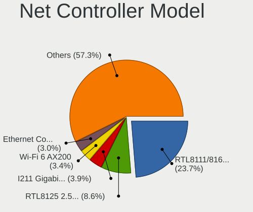

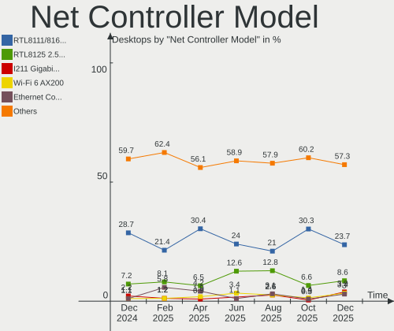

| Model                                                                           | Desktops | Percent |
|---------------------------------------------------------------------------------|----------|---------|
| Realtek RTL8111/8168/8211/8411 PCI Express Gigabit Ethernet Controller          | 55       | 23.71%  |
| Realtek RTL8125 2.5GbE Controller                                               | 20       | 8.62%   |
| Intel I211 Gigabit Network Connection                                           | 9        | 3.88%   |
| Intel Wi-Fi 6 AX200                                                             | 8        | 3.45%   |
| Intel Ethernet Controller I225-V                                                | 7        | 3.02%   |
| Intel 82579LM Gigabit Network Connection (Lewisville)                           | 6        | 2.59%   |
| Intel Wi-Fi 6E(802.11ax) AX210/AX1675* 2x2 [Typhoon Peak]                       | 5        | 2.16%   |
| Intel Ethernet Controller I226-V                                                | 4        | 1.72%   |
| Realtek RTL8852BE PCIe 802.11ax Wireless Network Controller                     | 3        | 1.29%   |
| Realtek RTL8821CE 802.11ac PCIe Wireless Network Adapter                        | 3        | 1.29%   |
| Realtek RTL8188EUS 802.11n Wireless Network Adapter                             | 3        | 1.29%   |
| Realtek RTL8153 Gigabit Ethernet Adapter                                        | 3        | 1.29%   |
| Realtek RTL8126 5GbE Controller                                                 | 3        | 1.29%   |
| MediaTek MT7922 802.11ax PCI Express Wireless Network Adapter                   | 3        | 1.29%   |
| Intel Ethernet Connection (7) I219-V                                            | 3        | 1.29%   |
| TP-Link Archer T3U [Realtek RTL8812BU]                                          | 2        | 0.86%   |
| Samsung Galaxy series, misc. (tethering mode)                                   | 2        | 0.86%   |
| Ralink MT7601U Wireless Adapter                                                 | 2        | 0.86%   |
| Ralink RT5390 Wireless 802.11n 1T/1R PCIe                                       | 2        | 0.86%   |
| Qualcomm Atheros Killer E220x Gigabit Ethernet Controller                       | 2        | 0.86%   |
| Nvidia MCP77 Ethernet                                                           | 2        | 0.86%   |
| Nvidia MCP61 Ethernet                                                           | 2        | 0.86%   |
| NetGear A6210                                                                   | 2        | 0.86%   |
| MediaTek MT7927 802.11be 320MHz 2x2 PCIe Wireless Network Adapter [Filogic 380] | 2        | 0.86%   |
| Intel Wi-Fi 5(802.11ac) Wireless-AC 9x6x [Thunder Peak]                         | 2        | 0.86%   |
| Intel Ethernet Connection I218-V                                                | 2        | 0.86%   |
| Intel Ethernet Connection I217-V                                                | 2        | 0.86%   |
| Intel Ethernet Connection (2) I219-V                                            | 2        | 0.86%   |
| Intel Ethernet Connection (17) I219-LM                                          | 2        | 0.86%   |
| Intel Dual Band Wireless-AC 3168NGW [Stone Peak]                                | 2        | 0.86%   |
| Intel Comet Lake PCH CNVi WiFi                                                  | 2        | 0.86%   |
| Intel Centrino Advanced-N 6235                                                  | 2        | 0.86%   |
| Intel 82578DM Gigabit Network Connection                                        | 2        | 0.86%   |
| Intel 82574L Gigabit Network Connection                                         | 2        | 0.86%   |
| Intel 700 Series Chipset CNVi WiFi                                              | 2        | 0.86%   |
| Broadcom BCM4352 802.11ac Dual Band Wireless Network Adapter                    | 2        | 0.86%   |
| Aquantia AQtion AQC113 NBase-T/IEEE 802.3an Ethernet Controller [Antigua 10G]   | 2        | 0.86%   |
| VIA VT86C100A [Rhine]                                                           | 1        | 0.43%   |
| VIA VT6102/VT6103 [Rhine-II]                                                    | 1        | 0.43%   |
| TP-Link Archer T1U 802.11a/n/ac Wireless Adapter [MediaTek MT7610U]             | 1        | 0.43%   |

Wireless Vendor
---------------

Wireless vendors

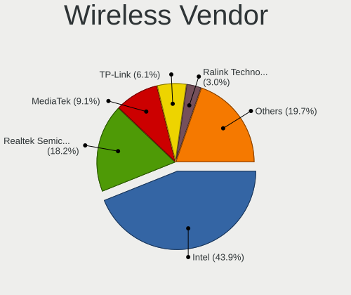

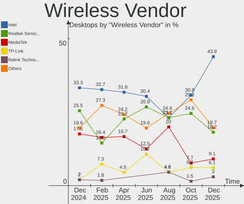

| Vendor                          | Desktops | Percent |
|---------------------------------|----------|---------|
| Intel                           | 29       | 43.94%  |
| Realtek Semiconductor           | 12       | 18.18%  |
| MediaTek                        | 6        | 9.09%   |
| TP-Link                         | 4        | 6.06%   |
| Ralink Technology               | 2        | 3.03%   |
| Ralink                          | 2        | 3.03%   |
| NetGear                         | 2        | 3.03%   |
| Broadcom                        | 2        | 3.03%   |
| Qualcomm Technologies           | 1        | 1.52%   |
| Qualcomm Atheros Communications | 1        | 1.52%   |
| Qualcomm Atheros                | 1        | 1.52%   |
| Marvell Technology Group        | 1        | 1.52%   |
| D-Link                          | 1        | 1.52%   |
| Broadcom Limited                | 1        | 1.52%   |
| ASUSTek Computer                | 1        | 1.52%   |

Wireless Model
--------------

Wireless models

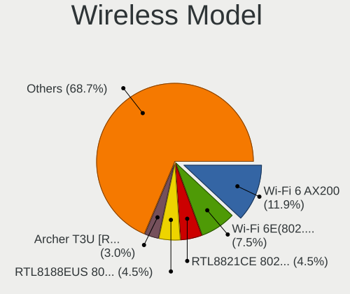

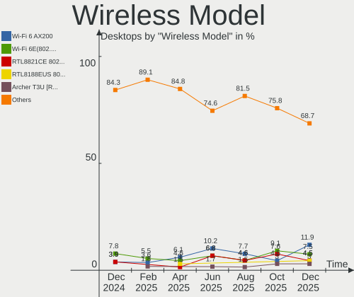

| Model                                                                           | Desktops | Percent |
|---------------------------------------------------------------------------------|----------|---------|
| Intel Wi-Fi 6 AX200                                                             | 8        | 11.94%  |
| Intel Wi-Fi 6E(802.11ax) AX210/AX1675* 2x2 [Typhoon Peak]                       | 5        | 7.46%   |
| Realtek RTL8821CE 802.11ac PCIe Wireless Network Adapter                        | 3        | 4.48%   |
| Realtek RTL8188EUS 802.11n Wireless Network Adapter                             | 3        | 4.48%   |
| TP-Link Archer T3U [Realtek RTL8812BU]                                          | 2        | 2.99%   |
| Realtek RTL8852BE PCIe 802.11ax Wireless Network Controller                     | 2        | 2.99%   |
| Ralink MT7601U Wireless Adapter                                                 | 2        | 2.99%   |
| Ralink RT5390 Wireless 802.11n 1T/1R PCIe                                       | 2        | 2.99%   |
| NetGear A6210                                                                   | 2        | 2.99%   |
| MediaTek MT7927 802.11be 320MHz 2x2 PCIe Wireless Network Adapter [Filogic 380] | 2        | 2.99%   |
| MediaTek MT7922 802.11ax PCI Express Wireless Network Adapter                   | 2        | 2.99%   |
| Intel Wi-Fi 5(802.11ac) Wireless-AC 9x6x [Thunder Peak]                         | 2        | 2.99%   |
| Intel Dual Band Wireless-AC 3168NGW [Stone Peak]                                | 2        | 2.99%   |
| Intel Comet Lake PCH CNVi WiFi                                                  | 2        | 2.99%   |
| Intel Centrino Advanced-N 6235                                                  | 2        | 2.99%   |
| Intel 700 Series Chipset CNVi WiFi                                              | 2        | 2.99%   |
| Broadcom BCM4352 802.11ac Dual Band Wireless Network Adapter                    | 2        | 2.99%   |
| TP-Link Archer T1U 802.11a/n/ac Wireless Adapter [MediaTek MT7610U]             | 1        | 1.49%   |
| TP-Link 802.11ac NIC                                                            | 1        | 1.49%   |
| Realtek RTL8821AE 802.11ac PCIe Wireless Network Adapter                        | 1        | 1.49%   |
| Realtek RTL8191SU 802.11n WLAN Adapter                                          | 1        | 1.49%   |
| Realtek RTL8188SU 802.11n WLAN Adapter                                          | 1        | 1.49%   |
| Realtek 802.11ac NIC                                                            | 1        | 1.49%   |
| Qualcomm QCNFA765 Wireless Network Adapter                                      | 1        | 1.49%   |
| Qualcomm Atheros QCA9377 802.11ac Wireless Network Adapter                      | 1        | 1.49%   |
| Qualcomm Atheros AR9271 802.11n                                                 | 1        | 1.49%   |
| MediaTek MT7921K (RZ608) Wi-Fi 6E 80MHz                                         | 1        | 1.49%   |
| MediaTek MT7902 802.11ax PCIe Wireless Network Adapter [Filogic 310]            | 1        | 1.49%   |
| Marvell Group 88w8335 [Libertas] 802.11b/g Wireless                             | 1        | 1.49%   |
| Intel Wireless 8260                                                             | 1        | 1.49%   |
| Intel Wireless 7265                                                             | 1        | 1.49%   |
| Intel Wireless 7260                                                             | 1        | 1.49%   |
| Intel Wireless 3165                                                             | 1        | 1.49%   |
| Intel Cannon Lake PCH CNVi WiFi                                                 | 1        | 1.49%   |
| Intel Alder Lake-S PCH CNVi WiFi                                                | 1        | 1.49%   |
| Intel Alder Lake-N PCH CNVi WiFi                                                | 1        | 1.49%   |
| D-Link DWA-131 802.11n Wireless N Nano Adapter (rev.B1) [Realtek RTL8192CU]     | 1        | 1.49%   |
| Broadcom Limited BCM4321 802.11a/b/g/n                                          | 1        | 1.49%   |
| ASUS 802.11ac NIC                                                               | 1        | 1.49%   |

Ethernet Vendor
---------------

Ethernet vendors

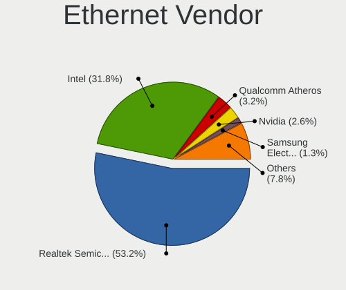

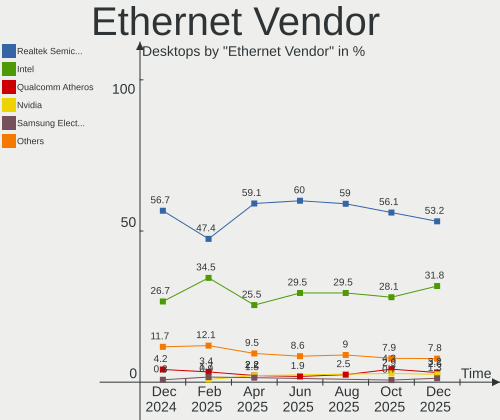

| Vendor                | Desktops | Percent |
|-----------------------|----------|---------|
| Realtek Semiconductor | 82       | 53.25%  |
| Intel                 | 49       | 31.82%  |
| Qualcomm Atheros      | 5        | 3.25%   |
| Nvidia                | 4        | 2.6%    |
| Samsung Electronics   | 2        | 1.3%    |
| MediaTek              | 2        | 1.3%    |
| Aquantia              | 2        | 1.3%    |
| VIA Technologies      | 1        | 0.65%   |
| Qualcomm Technologies | 1        | 0.65%   |
| Mellanox Technologies | 1        | 0.65%   |
| Google                | 1        | 0.65%   |
| D-Link System         | 1        | 0.65%   |
| Compex                | 1        | 0.65%   |
| Broadcom              | 1        | 0.65%   |
| ASIX Electronics      | 1        | 0.65%   |

Ethernet Model
--------------

Ethernet models

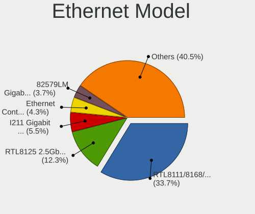

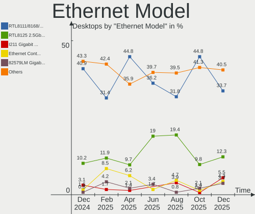

| Model                                                                           | Desktops | Percent |
|---------------------------------------------------------------------------------|----------|---------|
| Realtek RTL8111/8168/8211/8411 PCI Express Gigabit Ethernet Controller          | 55       | 33.74%  |
| Realtek RTL8125 2.5GbE Controller                                               | 20       | 12.27%  |
| Intel I211 Gigabit Network Connection                                           | 9        | 5.52%   |
| Intel Ethernet Controller I225-V                                                | 7        | 4.29%   |
| Intel 82579LM Gigabit Network Connection (Lewisville)                           | 6        | 3.68%   |
| Intel Ethernet Controller I226-V                                                | 4        | 2.45%   |
| Realtek RTL8153 Gigabit Ethernet Adapter                                        | 3        | 1.84%   |
| Realtek RTL8126 5GbE Controller                                                 | 3        | 1.84%   |
| Intel Ethernet Connection (7) I219-V                                            | 3        | 1.84%   |
| Samsung Galaxy series, misc. (tethering mode)                                   | 2        | 1.23%   |
| Qualcomm Atheros Killer E220x Gigabit Ethernet Controller                       | 2        | 1.23%   |
| Nvidia MCP77 Ethernet                                                           | 2        | 1.23%   |
| Nvidia MCP61 Ethernet                                                           | 2        | 1.23%   |
| Intel Ethernet Connection I218-V                                                | 2        | 1.23%   |
| Intel Ethernet Connection I217-V                                                | 2        | 1.23%   |
| Intel Ethernet Connection (2) I219-V                                            | 2        | 1.23%   |
| Intel Ethernet Connection (17) I219-LM                                          | 2        | 1.23%   |
| Intel 82578DM Gigabit Network Connection                                        | 2        | 1.23%   |
| Intel 82574L Gigabit Network Connection                                         | 2        | 1.23%   |
| Aquantia AQtion AQC113 NBase-T/IEEE 802.3an Ethernet Controller [Antigua 10G]   | 2        | 1.23%   |
| VIA VT86C100A [Rhine]                                                           | 1        | 0.61%   |
| VIA VT6102/VT6103 [Rhine-II]                                                    | 1        | 0.61%   |
| Realtek RTL8852BE PCIe 802.11ax Wireless Network Controller                     | 1        | 0.61%   |
| Realtek RTL810xE PCI Express Fast Ethernet controller                           | 1        | 0.61%   |
| Realtek RTL-8100/8101L/8139 PCI Fast Ethernet Adapter                           | 1        | 0.61%   |
| Realtek Killer E2600 GbE Controller                                             | 1        | 0.61%   |
| Qualcomm WCN785x Wi-Fi 7(802.11be) 320MHz 2x2 [FastConnect 7800]                | 1        | 0.61%   |
| Qualcomm Atheros Killer E2500 Gigabit Ethernet Controller                       | 1        | 0.61%   |
| Qualcomm Atheros Killer E2400 Gigabit Ethernet Controller                       | 1        | 0.61%   |
| Qualcomm Atheros AR8121/AR8113/AR8114 Gigabit or Fast Ethernet                  | 1        | 0.61%   |
| Mellanox MT27500 Family [ConnectX-3]                                            | 1        | 0.61%   |
| MediaTek MT7925 802.11be 160MHz 2x2 PCIe Wireless Network Adapter [Filogic 360] | 1        | 0.61%   |
| MediaTek MT7922 802.11ax PCI Express Wireless Network Adapter                   | 1        | 0.61%   |
| Intel I210 Gigabit Network Connection                                           | 1        | 0.61%   |
| Intel Ethernet Controller X550                                                  | 1        | 0.61%   |
| Intel Ethernet Controller I226-LM                                               | 1        | 0.61%   |
| Intel Ethernet Connection I217-LM                                               | 1        | 0.61%   |
| Intel Ethernet Connection (5) I219-LM                                           | 1        | 0.61%   |
| Intel Ethernet Connection (2) I219-LM                                           | 1        | 0.61%   |
| Intel Ethernet Connection (2) I218-V                                            | 1        | 0.61%   |

Net Controller Kind
-------------------

Ethernet, WiFi or modem

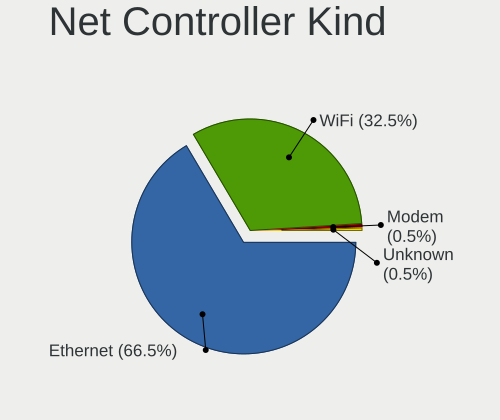

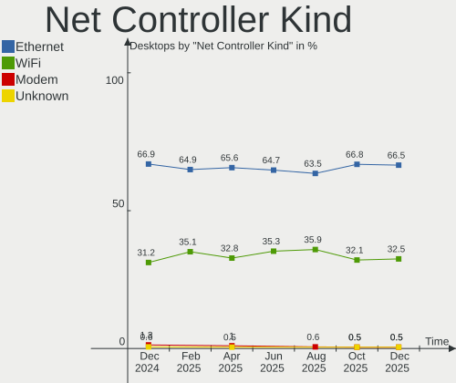

| Kind     | Desktops | Percent |
|----------|----------|---------|
| Ethernet | 133      | 66.5%   |
| WiFi     | 65       | 32.5%   |
| Modem    | 1        | 0.5%    |
| Unknown  | 1        | 0.5%    |

Used Controller
---------------

Currently used network controller

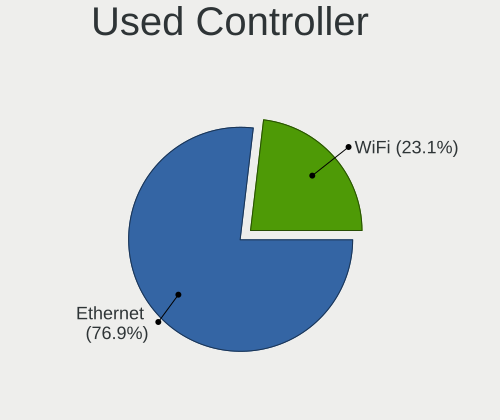

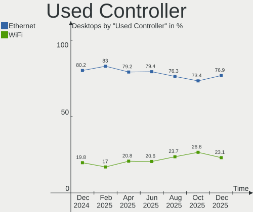

| Kind     | Desktops | Percent |
|----------|----------|---------|
| Ethernet | 103      | 76.87%  |
| WiFi     | 31       | 23.13%  |

NICs
----

Total network controllers on board

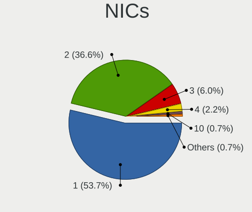

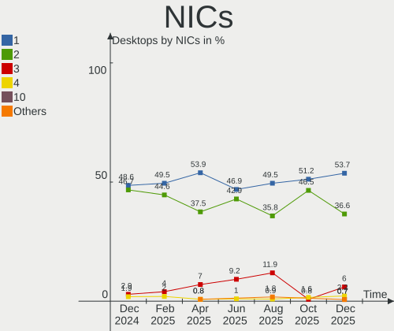

| Total | Desktops | Percent |
|-------|----------|---------|
| 1     | 72       | 53.73%  |
| 2     | 49       | 36.57%  |
| 3     | 8        | 5.97%   |
| 4     | 3        | 2.24%   |
| 10    | 1        | 0.75%   |
| 0     | 1        | 0.75%   |

IPv6
----

IPv6 vs IPv4

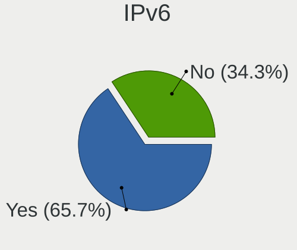

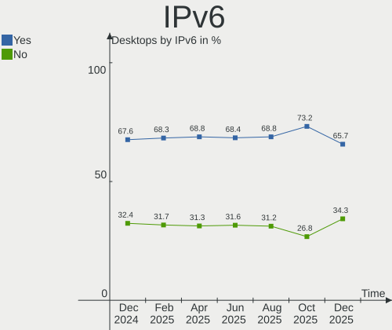

| Used | Desktops | Percent |
|------|----------|---------|
| Yes  | 88       | 65.67%  |
| No   | 46       | 34.33%  |

Bluetooth
---------

Bluetooth Vendor
----------------

Controller vendors

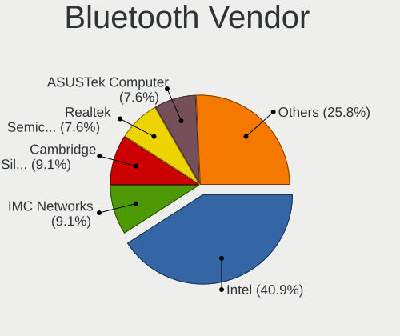

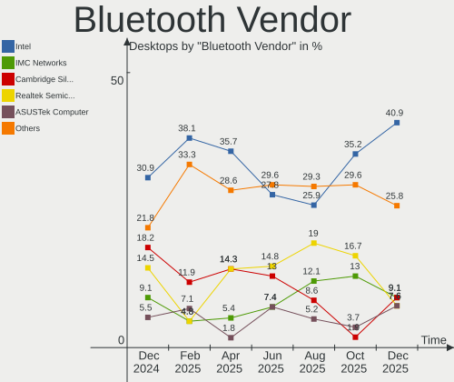

| Vendor                          | Desktops | Percent |
|---------------------------------|----------|---------|
| Intel                           | 27       | 40.91%  |
| IMC Networks                    | 6        | 9.09%   |
| Cambridge Silicon Radio         | 6        | 9.09%   |
| Realtek Semiconductor           | 5        | 7.58%   |
| ASUSTek Computer                | 5        | 7.58%   |
| TP-Link                         | 4        | 6.06%   |
| Foxconn / Hon Hai               | 4        | 6.06%   |
| Realtek                         | 3        | 4.55%   |
| MediaTek                        | 2        | 3.03%   |
| Qualcomm Atheros Communications | 1        | 1.52%   |
| Integrated System Solution      | 1        | 1.52%   |
| Edimax Technology               | 1        | 1.52%   |
| Unknown                         | 1        | 1.52%   |

Bluetooth Model
---------------

Controller models

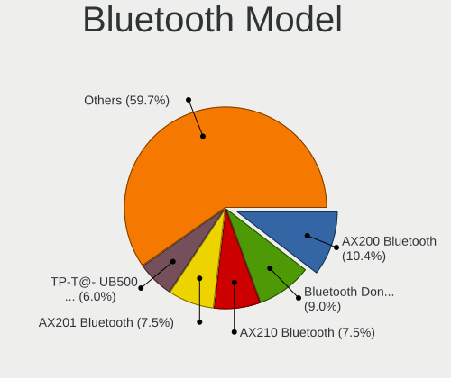

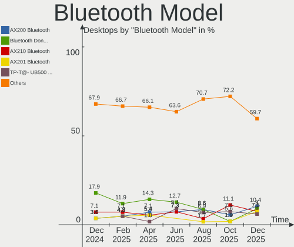

| Model                                                 | Desktops | Percent |
|-------------------------------------------------------|----------|---------|
| Intel AX200 Bluetooth                                 | 7        | 10.45%  |
| Cambridge Silicon Radio Bluetooth Dongle (HCI mode)   | 6        | 8.96%   |
| Intel AX210 Bluetooth                                 | 5        | 7.46%   |
| Intel AX201 Bluetooth                                 | 5        | 7.46%   |
| TP-Link TP-T@- UB500 Adapter                          | 4        | 5.97%   |
| Realtek Bluetooth Radio                               | 4        | 5.97%   |
| Intel Bluetooth wireless interface                    | 4        | 5.97%   |
| Realtek Bluetooth Radio                               | 3        | 4.48%   |
| IMC Networks Wireless_Device                          | 3        | 4.48%   |
| Foxconn / Hon Hai Wireless_Device                     | 3        | 4.48%   |
| MediaTek Wireless_Device                              | 2        | 2.99%   |
| Intel Wireless-AC 9260 Bluetooth Adapter              | 2        | 2.99%   |
| Intel Centrino Bluetooth Wireless Transceiver         | 2        | 2.99%   |
| IMC Networks Bluetooth Radio                          | 2        | 2.99%   |
| ASUS Broadcom BCM20702A0 Bluetooth                    | 2        | 2.99%   |
| ASUS ASUS USB-BT500                                   | 2        | 2.99%   |
| Realtek Bluetooth 5.4 Radio                           | 1        | 1.49%   |
| Qualcomm Atheros  Bluetooth Device                    | 1        | 1.49%   |
| Intel Wireless-AC 3168 Bluetooth                      | 1        | 1.49%   |
| Intel Bluetooth Device                                | 1        | 1.49%   |
| Intel Bluetooth 9460/9560 Jefferson Peak (JfP)        | 1        | 1.49%   |
| Integrated System Solution KY-BT100 Bluetooth Adapter | 1        | 1.49%   |
| IMC Networks BCM20702A0                               | 1        | 1.49%   |
| Foxconn / Hon Hai Bluetooth Device                    | 1        | 1.49%   |
| Edimax Bluetooth Device                               | 1        | 1.49%   |
| ASUS Bluetooth Radio                                  | 1        | 1.49%   |
| Unknown                                               | 1        | 1.49%   |

Sound
-----

Sound Vendor
------------

Sound card vendors

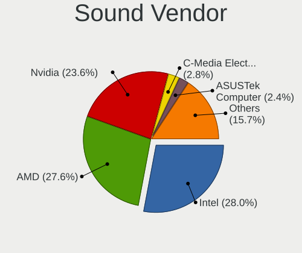

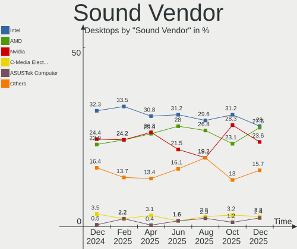

| Vendor                                       | Desktops | Percent |
|----------------------------------------------|----------|---------|
| Intel                                        | 71       | 27.95%  |
| AMD                                          | 70       | 27.56%  |
| Nvidia                                       | 60       | 23.62%  |
| C-Media Electronics                          | 7        | 2.76%   |
| ASUSTek Computer                             | 6        | 2.36%   |
| Logitech                                     | 3        | 1.18%   |
| Kingston Technology                          | 3        | 1.18%   |
| GN Netcom                                    | 3        | 1.18%   |
| Creative Labs                                | 3        | 1.18%   |
| SteelSeries ApS                              | 2        | 0.79%   |
| Realtek Semiconductor                        | 2        | 0.79%   |
| Hewlett-Packard                              | 2        | 0.79%   |
| Generalplus Technology                       | 2        | 0.79%   |
| Corsair                                      | 2        | 0.79%   |
| Zoran Co. Personal Media Division (Nogatech) | 1        | 0.39%   |
| Yamaha                                       | 1        | 0.39%   |
| Valve Software                               | 1        | 0.39%   |
| Trust                                        | 1        | 0.39%   |
| Texas Instruments                            | 1        | 0.39%   |
| Razer USA                                    | 1        | 0.39%   |
| Native Instruments                           | 1        | 0.39%   |
| Midiplus                                     | 1        | 0.39%   |
| M-Audio                                      | 1        | 0.39%   |
| Lenovo                                       | 1        | 0.39%   |
| GYROCOM C&C                                  | 1        | 0.39%   |
| Giga-Byte Technology                         | 1        | 0.39%   |
| Focusrite-Novation                           | 1        | 0.39%   |
| Elgato Systems                               | 1        | 0.39%   |
| DSEA A/S                                     | 1        | 0.39%   |
| Cambridge Silicon Radio                      | 1        | 0.39%   |
| Blue Microphones                             | 1        | 0.39%   |
| AceZone                                      | 1        | 0.39%   |

Sound Model
-----------

Sound card models

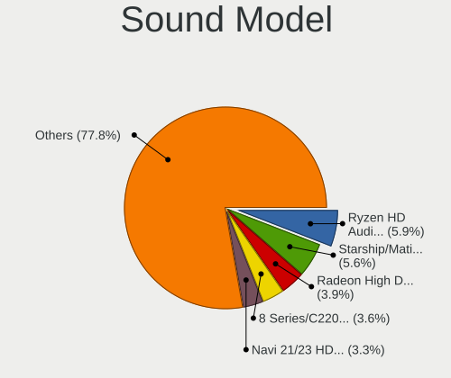

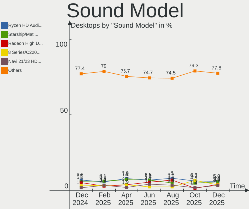

| Model                                                                             | Desktops | Percent |
|-----------------------------------------------------------------------------------|----------|---------|
| AMD Ryzen HD Audio Controller                                                     | 18       | 5.88%   |
| AMD Starship/Matisse HD Audio Controller                                          | 17       | 5.56%   |
| AMD Radeon High Definition Audio Controller                                       | 12       | 3.92%   |
| Intel 8 Series/C220 Series Chipset High Definition Audio Controller               | 11       | 3.59%   |
| AMD Navi 21/23 HDMI/DP Audio Controller                                           | 10       | 3.27%   |
| Nvidia GK208 HDMI/DP Audio Controller                                             | 8        | 2.61%   |
| Intel Alder Lake-S HD Audio Controller                                            | 8        | 2.61%   |
| Intel 200 Series PCH HD Audio                                                     | 7        | 2.29%   |
| AMD FCH Azalia Controller                                                         | 7        | 2.29%   |
| Intel 6 Series/C200 Series Chipset Family High Definition Audio Controller        | 6        | 1.96%   |
| AMD Navi 48 HDMI/DP Audio Controller                                              | 6        | 1.96%   |
| AMD Family 17h (Models 00h-0fh) HD Audio Controller                               | 6        | 1.96%   |
| Intel Xeon E3-1200 v3/4th Gen Core Processor HD Audio Controller                  | 5        | 1.63%   |
| Intel Raptor Lake High Definition Audio Controller                                | 5        | 1.63%   |
| Intel Cannon Lake PCH cAVS                                                        | 5        | 1.63%   |
| Intel 100 Series/C230 Series Chipset Family HD Audio Controller                   | 5        | 1.63%   |
| ASUSTek Computer USB Audio                                                        | 5        | 1.63%   |
| AMD Navi 31 HDMI/DP Audio                                                         | 5        | 1.63%   |
| Nvidia TU116 High Definition Audio Controller                                     | 4        | 1.31%   |
| Nvidia GP108 High Definition Audio Controller                                     | 4        | 1.31%   |
| Nvidia GA106 High Definition Audio Controller                                     | 4        | 1.31%   |
| Nvidia GA102 High Definition Audio Controller                                     | 4        | 1.31%   |
| Intel 7 Series/C216 Chipset Family High Definition Audio Controller               | 4        | 1.31%   |
| AMD SBx00 Azalia (Intel HDA)                                                      | 4        | 1.31%   |
| Nvidia GP107GL High Definition Audio Controller                                   | 3        | 0.98%   |
| Nvidia GP104 High Definition Audio Controller                                     | 3        | 0.98%   |
| Nvidia GA104 High Definition Audio Controller                                     | 3        | 0.98%   |
| Kingston Technology HyperX 7.1 Audio                                              | 3        | 0.98%   |
| Intel 9 Series Chipset Family HD Audio Controller                                 | 3        | 0.98%   |
| C-Media Electronics Auna Mic CM900                                                | 3        | 0.98%   |
| AMD Trinity HDMI Audio Controller                                                 | 3        | 0.98%   |
| AMD Renoir/Cezanne HDMI/DP Audio Controller                                       | 3        | 0.98%   |
| AMD Oland/Hainan/Cape Verde/Pitcairn HDMI Audio [Radeon HD 7000 Series]           | 3        | 0.98%   |
| AMD Kabini HDMI/DP Audio                                                          | 3        | 0.98%   |
| AMD Ellesmere HDMI Audio [Radeon RX 470/480 / 570/580/590]                        | 3        | 0.98%   |
| AMD Caicos HDMI Audio [Radeon HD 6450 / 7450/8450/8490 OEM / R5 230/235/235X OEM] | 3        | 0.98%   |
| Nvidia TU106 High Definition Audio Controller                                     | 2        | 0.65%   |
| Nvidia MCP72XE/MCP72P/MCP78U/MCP78S High Definition Audio                         | 2        | 0.65%   |
| Nvidia MCP61 High Definition Audio                                                | 2        | 0.65%   |
| Nvidia GP106 High Definition Audio Controller                                     | 2        | 0.65%   |

Memory
------

Memory Vendor
-------------

Memory module vendors

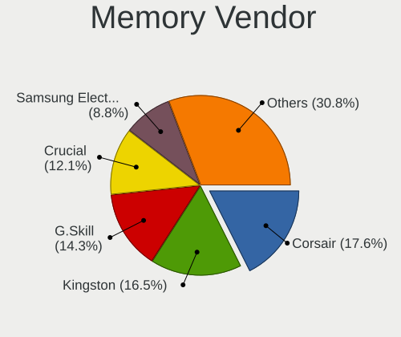

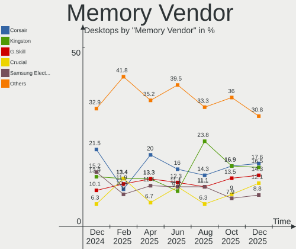

| Vendor              | Desktops | Percent |
|---------------------|----------|---------|
| Corsair             | 16       | 17.58%  |
| Kingston            | 15       | 16.48%  |
| G.Skill             | 13       | 14.29%  |
| Crucial             | 11       | 12.09%  |
| Samsung Electronics | 8        | 8.79%   |
| SK hynix            | 6        | 6.59%   |
| Unknown             | 5        | 5.49%   |
| Micron Technology   | 5        | 5.49%   |
| Unknown (ABCD)      | 2        | 2.2%    |
| Transcend           | 2        | 2.2%    |
| Unknown             | 2        | 2.2%    |
| Red Hat             | 1        | 1.1%    |
| Ramaxel Technology  | 1        | 1.1%    |
| Netac               | 1        | 1.1%    |
| Nanya Technology    | 1        | 1.1%    |
| KingFast            | 1        | 1.1%    |
| EDB536160000        | 1        | 1.1%    |

Memory Model
------------

Memory module models

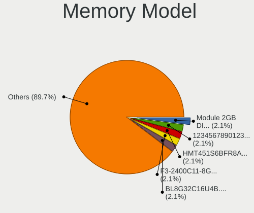

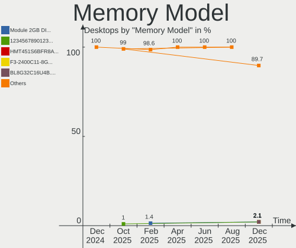

| Model                                                          | Desktops | Percent |
|----------------------------------------------------------------|----------|---------|
| Unknown RAM Module 2GB DIMM DDR2 800MT/s                       | 2        | 2.06%   |
| Unknown (ABCD) RAM 123456789012345678 2GB DIMM LPDDR4 2133MT/s | 2        | 2.06%   |
| SK hynix RAM HMT451S6BFR8A-PB 4GB SODIMM DDR3 1600MT/s         | 2        | 2.06%   |
| G.Skill RAM F3-2400C11-8GAB 8GB DIMM DDR3 2400MT/s             | 2        | 2.06%   |
| Crucial RAM BL8G32C16U4B.8FE 8GB DIMM DDR4 3666MT/s            | 2        | 2.06%   |
| Corsair RAM CMK96GX5M2E6000Z36 48GB DIMM DDR5 6000MT/s         | 2        | 2.06%   |
| Unknown                                                        | 2        | 2.06%   |
| Unknown RAM Module 4GB DIMM DDR 1333MT/s                       | 1        | 1.03%   |
| Unknown RAM Module 4GB DIMM 1333MT/s                           | 1        | 1.03%   |
| Unknown RAM Module 2GB DIMM DDR 1333MT/s                       | 1        | 1.03%   |
| Unknown RAM Module 1GB DIMM DDR2 667MT/s                       | 1        | 1.03%   |
| Transcend RAM JM800QLU-2G 2GB DIMM DDR2 2048MT/s               | 1        | 1.03%   |
| Transcend RAM JM1600KLH-4G 4GB DIMM DDR3 1600MT/s              | 1        | 1.03%   |
| SK hynix RAM Module 4GB DIMM DDR3 1600MT/s                     | 1        | 1.03%   |
| SK hynix RAM HMT351U6CFR8C-PB 4GB DIMM DDR3 1800MT/s           | 1        | 1.03%   |
| SK hynix RAM HMT351U6CFR8C-H9 4GB DIMM DDR3 1333MT/s           | 1        | 1.03%   |
| SK hynix RAM HMCG88AGBRA190N 32GB DIMM DDR5 5600MT/s           | 1        | 1.03%   |
| Samsung RAM Module 4GB Row Of Chips LPDDR5 6400MT/s            | 1        | 1.03%   |
| Samsung RAM M471B5273DH0-CK0 4GB SODIMM DDR3 2400MT/s          | 1        | 1.03%   |
| Samsung RAM M471B5173QH0-YK0 4GB SODIMM DDR3 1600MT/s          | 1        | 1.03%   |
| Samsung RAM M471B1G73QH0-YK0 8GB SODIMM DDR3 1600MT/s          | 1        | 1.03%   |
| Samsung RAM M391B1G73QH0-YK0 8GB DIMM DDR3 1600MT/s            | 1        | 1.03%   |
| Samsung RAM M378B5773DH0-CH9 2GB DIMM DDR3 1333MT/s            | 1        | 1.03%   |
| Samsung RAM M378B5773CH0-CH9 2GB DIMM DDR3 1867MT/s            | 1        | 1.03%   |
| Samsung RAM M378B5673EH1-CH9 2GB DIMM DDR3 1333MT/s            | 1        | 1.03%   |
| Samsung RAM M378B2873FH0-CH9 1GB DIMM DDR3 1333MT/s            | 1        | 1.03%   |
| Samsung RAM M3 78T2863QZS-CF7 1GB DIMM DDR2 800MT/s            | 1        | 1.03%   |
| Red Hat RAM Module 3GB DIMM RAM                                | 1        | 1.03%   |
| Ramaxel RAM RMR1870EC58E9F1333 4GB DIMM DDR3 1333MT/s          | 1        | 1.03%   |
| Netac RAM Module 16GB DIMM DDR4 2666MT/s                       | 1        | 1.03%   |
| Nanya RAM M2F4G64CB88B7N-DI 4GB DIMM DDR3 1600MT/s             | 1        | 1.03%   |
| Micron RAM CT48G56C46S5.M16C1 48GB SODIMM DDR5 5600MT/s        | 1        | 1.03%   |
| Micron RAM 8KTF51264HZ-1G9P1 4GB DIMM DDR3 1866MT/s            | 1        | 1.03%   |
| Micron RAM 8JTF51264AZ-1G6E1 4GB DIMM DDR3 1600MT/s            | 1        | 1.03%   |
| Micron RAM 16JTF51264AZ-1G4M1 4GB DIMM DDR3 1333MT/s           | 1        | 1.03%   |
| Micron RAM 16HTF25664AY-800E1 2GB DIMM DDR2 800MT/s            | 1        | 1.03%   |
| Kingston RAM Module 2GB DIMM DDR3 1600MT/s                     | 1        | 1.03%   |
| Kingston RAM KNWMX1-ETB 4GB SODIMM DDR3 1600MT/s               | 1        | 1.03%   |
| Kingston RAM KHX2666C16D4/32GX 32GB DIMM DDR4 2666MT/s         | 1        | 1.03%   |
| Kingston RAM KHX2666C13/16GX 16GB DIMM DDR4 3200MT/s           | 1        | 1.03%   |

Memory Kind
-----------

Memory module kinds

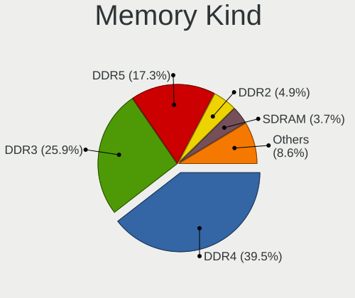

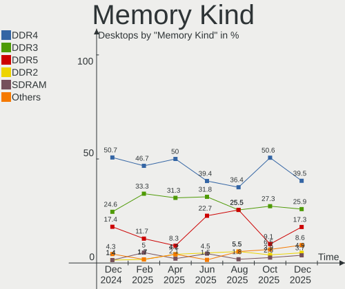

| Kind    | Desktops | Percent |
|---------|----------|---------|
| DDR4    | 32       | 39.51%  |
| DDR3    | 21       | 25.93%  |
| DDR5    | 14       | 17.28%  |
| DDR2    | 4        | 4.94%   |
| SDRAM   | 3        | 3.7%    |
| LPDDR4  | 2        | 2.47%   |
| DDR     | 2        | 2.47%   |
| RAM     | 1        | 1.23%   |
| LPDDR5  | 1        | 1.23%   |
| Unknown | 1        | 1.23%   |

Memory Form Factor
------------------

Physical design of the memory module

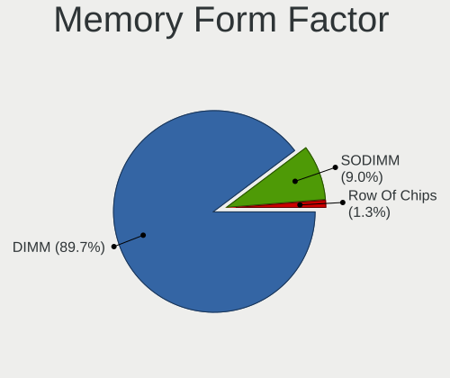

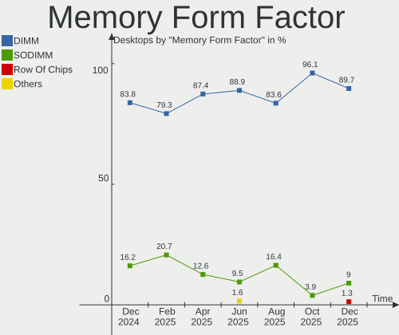

| Name         | Desktops | Percent |
|--------------|----------|---------|
| DIMM         | 70       | 89.74%  |
| SODIMM       | 7        | 8.97%   |
| Row Of Chips | 1        | 1.28%   |

Memory Size
-----------

Memory module size

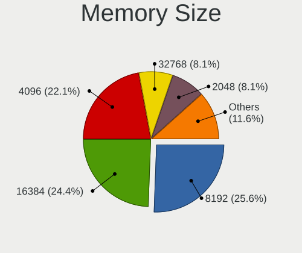

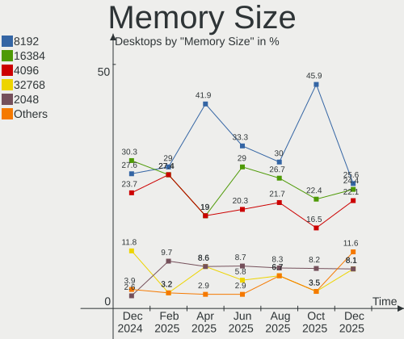

| Size  | Desktops | Percent |
|-------|----------|---------|
| 8192  | 22       | 25.58%  |
| 16384 | 21       | 24.42%  |
| 4096  | 19       | 22.09%  |
| 32768 | 7        | 8.14%   |
| 2048  | 7        | 8.14%   |
| 49152 | 4        | 4.65%   |
| 1024  | 4        | 4.65%   |
| 65536 | 1        | 1.16%   |
| 3072  | 1        | 1.16%   |

Memory Speed
------------

Memory module speed

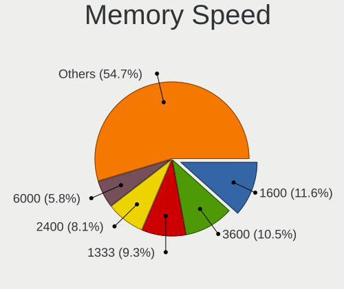

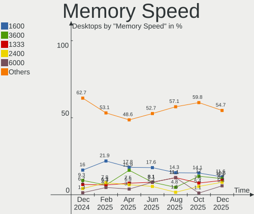

| Speed   | Desktops | Percent |
|---------|----------|---------|
| 1600    | 10       | 11.63%  |
| 3600    | 9        | 10.47%  |
| 1333    | 8        | 9.3%    |
| 2400    | 7        | 8.14%   |
| 6000    | 5        | 5.81%   |
| 3200    | 5        | 5.81%   |
| 5600    | 4        | 4.65%   |
| 2133    | 4        | 4.65%   |
| 2666    | 3        | 3.49%   |
| 800     | 3        | 3.49%   |
| 6400    | 2        | 2.33%   |
| 4800    | 2        | 2.33%   |
| 3733    | 2        | 2.33%   |
| 3666    | 2        | 2.33%   |
| 2667    | 2        | 2.33%   |
| 6200    | 1        | 1.16%   |
| 5800    | 1        | 1.16%   |
| 5200    | 1        | 1.16%   |
| 4333    | 1        | 1.16%   |
| 3933    | 1        | 1.16%   |
| 3800    | 1        | 1.16%   |
| 3266    | 1        | 1.16%   |
| 3134    | 1        | 1.16%   |
| 3001    | 1        | 1.16%   |
| 3000    | 1        | 1.16%   |
| 2800    | 1        | 1.16%   |
| 2048    | 1        | 1.16%   |
| 1867    | 1        | 1.16%   |
| 1866    | 1        | 1.16%   |
| 1800    | 1        | 1.16%   |
| 667     | 1        | 1.16%   |
| 266     | 1        | 1.16%   |
| Unknown | 1        | 1.16%   |

Printers & scanners
-------------------

Printer Vendor
--------------

Printer device vendors

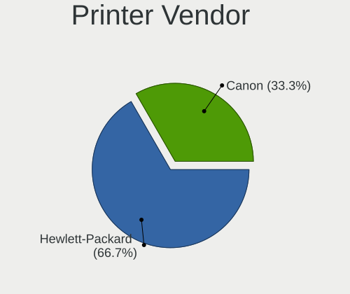

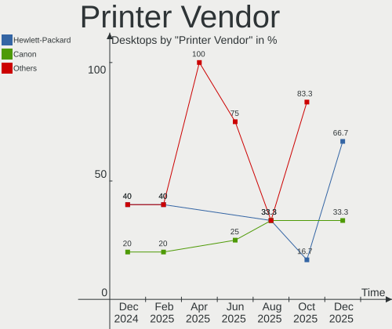

| Vendor          | Desktops | Percent |
|-----------------|----------|---------|
| Hewlett-Packard | 2        | 66.67%  |
| Canon           | 1        | 33.33%  |

Printer Model
-------------

Printer device models

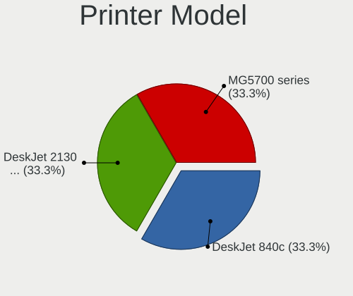

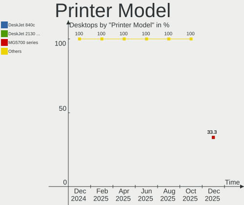

| Model                  | Desktops | Percent |
|------------------------|----------|---------|
| HP DeskJet 840c        | 1        | 33.33%  |
| HP DeskJet 2130 series | 1        | 33.33%  |
| Canon MG5700 series    | 1        | 33.33%  |

Scanner Vendor
--------------

Scanner device vendors

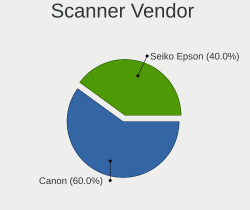

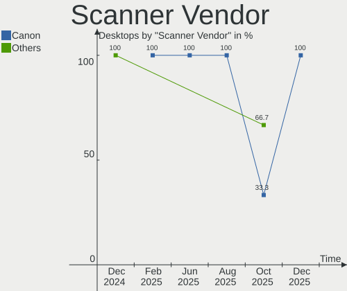

| Vendor | Desktops | Percent |
|--------|----------|---------|
| Canon  | 2        | 100%    |

Scanner Model
-------------

Scanner device models

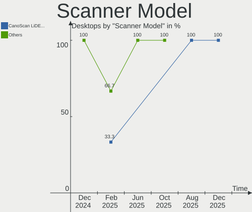

| Model                   | Desktops | Percent |
|-------------------------|----------|---------|
| Canon CanoScan LiDE 110 | 2        | 100%    |

Camera
------

Camera Vendor
-------------

Camera device vendors

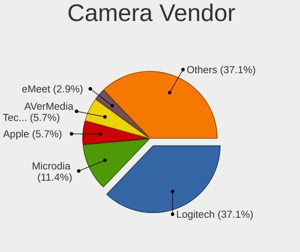

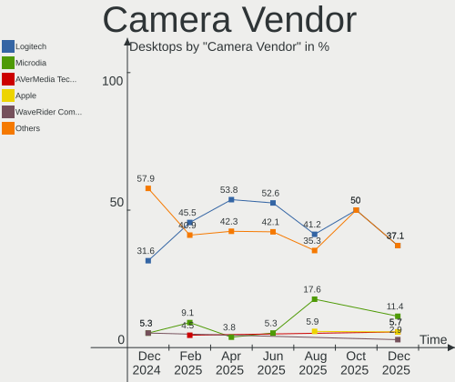

| Vendor                        | Desktops | Percent |
|-------------------------------|----------|---------|
| Logitech                      | 13       | 37.14%  |
| Microdia                      | 4        | 11.43%  |
| AVerMedia Technologies        | 2        | 5.71%   |
| Apple                         | 2        | 5.71%   |
| WaveRider Communications      | 1        | 2.86%   |
| Valve Software                | 1        | 2.86%   |
| USB CAMERA                    | 1        | 2.86%   |
| Sunplus Technology            | 1        | 2.86%   |
| Sunplus Innovation Technology | 1        | 2.86%   |
| Realtek Semiconductor         | 1        | 2.86%   |
| Microsoft                     | 1        | 2.86%   |
| Jieli Technology              | 1        | 2.86%   |
| Generalplus Technology        | 1        | 2.86%   |
| eMeet                         | 1        | 2.86%   |
| Elgato Systems                | 1        | 2.86%   |
| Chicony Electronics           | 1        | 2.86%   |
| ASUSTek Computer              | 1        | 2.86%   |
| ARC International             | 1        | 2.86%   |

Camera Model
------------

Camera device models

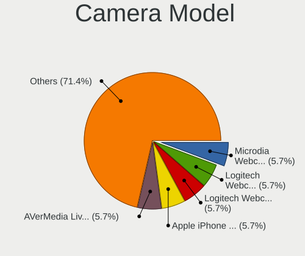

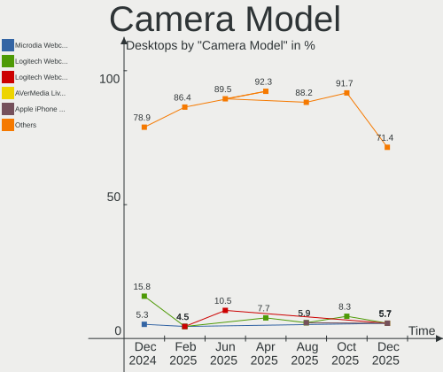

| Model                           | Desktops | Percent |
|---------------------------------|----------|---------|
| Microdia Webcam Vitade AF       | 2        | 5.71%   |
| Logitech Webcam C270            | 2        | 5.71%   |
| Logitech Webcam C210            | 2        | 5.71%   |
| AVerMedia Live Streamer CAM 313 | 2        | 5.71%   |
| Apple iPhone 5/5C/5S/6/SE/7/8/X | 2        | 5.71%   |
| WaveRider USB 2.0 Camera        | 1        | 2.86%   |
| Valve Software 3D Camera        | 1        | 2.86%   |
| USB CAMERA USB CAMERA           | 1        | 2.86%   |
| Sunplus Document Camera         | 1        | 2.86%   |
| Sunplus Full HD webcam          | 1        | 2.86%   |
| Realtek FULL HD 1080P Webcam    | 1        | 2.86%   |
| Microsoft LifeCam Studio        | 1        | 2.86%   |
| Microdia Sonix USB 2.0 Camera   | 1        | 2.86%   |
| Microdia CyberTrack H7          | 1        | 2.86%   |
| Logitech Webcam Pro 9000        | 1        | 2.86%   |
| Logitech Webcam C310            | 1        | 2.86%   |
| Logitech StreamCam              | 1        | 2.86%   |
| Logitech QuickCam Pro 4000      | 1        | 2.86%   |
| Logitech QuickCam E 3500        | 1        | 2.86%   |
| Logitech HD Webcam C525         | 1        | 2.86%   |
| Logitech HD Webcam B910         | 1        | 2.86%   |
| Logitech HD Pro Webcam C920     | 1        | 2.86%   |
| Logitech C920 PRO HD Webcam     | 1        | 2.86%   |
| Jieli USB PHY 2.0               | 1        | 2.86%   |
| Generalplus GENERAL WEBCAM      | 1        | 2.86%   |
| eMeet HD Webcam C960            | 1        | 2.86%   |
| Elgato Systems Elgato Facecam   | 1        | 2.86%   |
| Chicony 5M Camera               | 1        | 2.86%   |
| ASUS ROG EYE S                  | 1        | 2.86%   |
| ARC International Camera        | 1        | 2.86%   |

Security
--------

Fingerprint Vendor
------------------

Fingerprint sensor vendors

Zero info for selected period =(

Fingerprint Model
-----------------

Fingerprint sensor models

Zero info for selected period =(

Chipcard Vendor
---------------

Chipcard module vendors

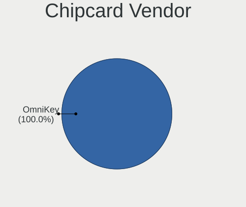

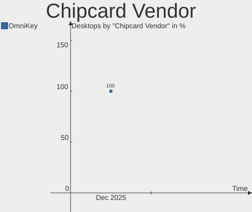

| Vendor  | Desktops | Percent |
|---------|----------|---------|
| OmniKey | 1        | 100%    |

Chipcard Model
--------------

Chipcard module models

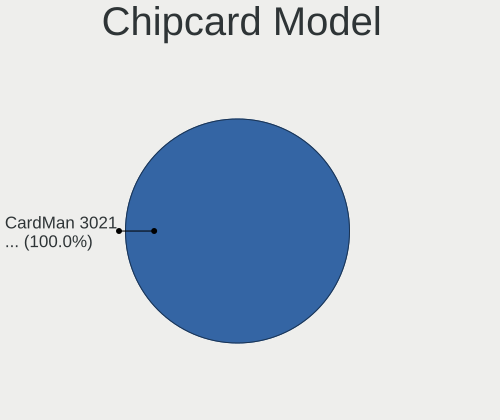

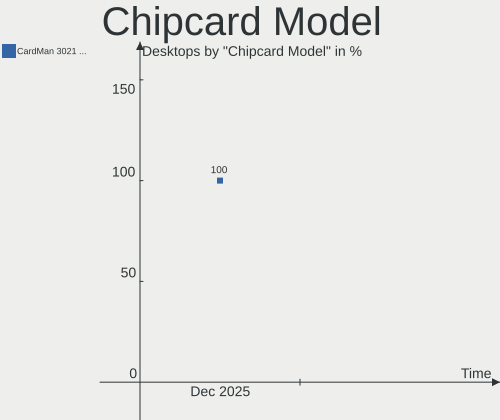

| Model                       | Desktops | Percent |
|-----------------------------|----------|---------|
| OmniKey CardMan 3021 / 3121 | 1        | 100%    |

Unsupported
-----------

Unsupported Devices
-------------------

Total unsupported devices on board

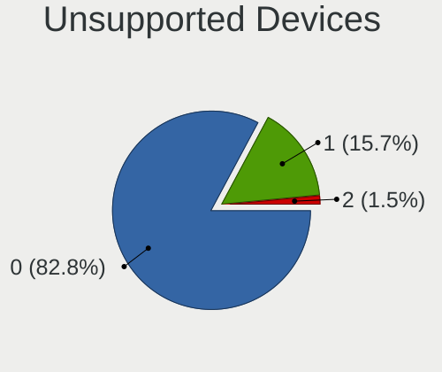

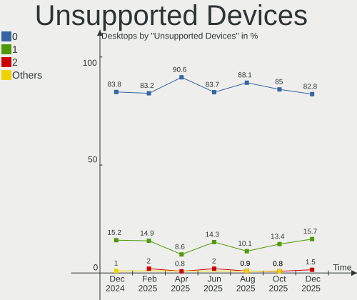

| Total | Desktops | Percent |
|-------|----------|---------|
| 0     | 111      | 82.84%  |
| 1     | 21       | 15.67%  |
| 2     | 2        | 1.49%   |

Unsupported Device Types
------------------------

Types of unsupported devices

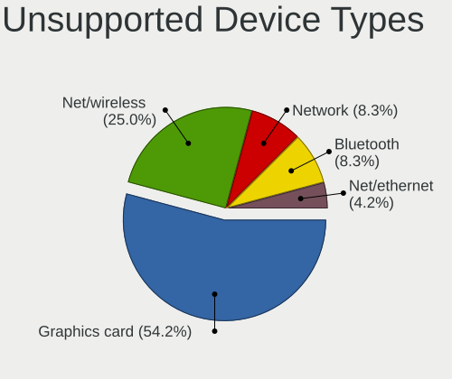

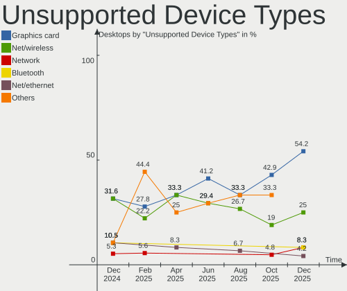

| Type          | Desktops | Percent |
|---------------|----------|---------|
| Graphics card | 13       | 54.17%  |
| Net/wireless  | 6        | 25%     |
| Network       | 2        | 8.33%   |
| Bluetooth     | 2        | 8.33%   |
| Net/ethernet  | 1        | 4.17%   |

