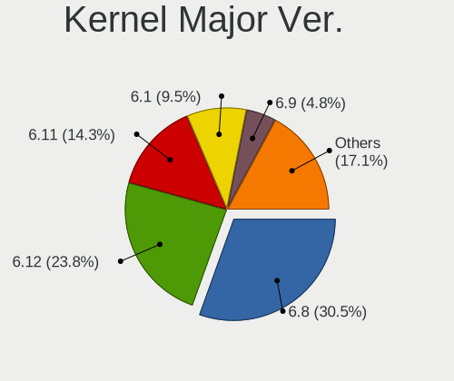
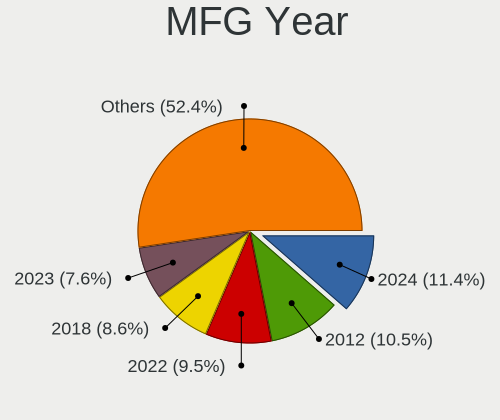
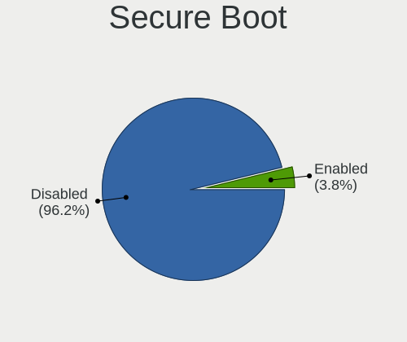
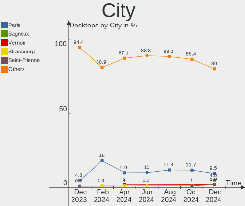
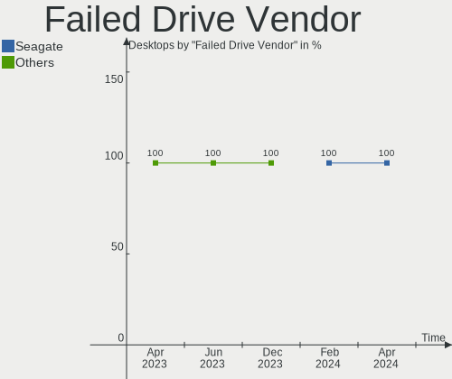
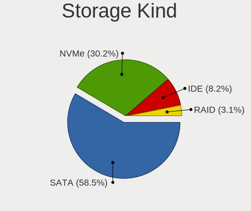
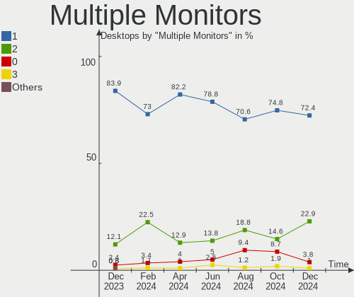
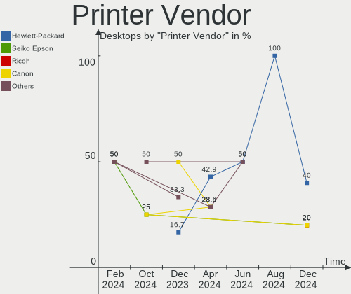

Linux in France - Hardware Trends (Desktops)
--------------------------------------------

A project to identify most popular hardware characteristics and track their change
over time based on data collected by Linux users at https://Linux-Hardware.org.

Anyone can contribute to this report by the [hw-probe](https://github.com/linuxhw/hw-probe) tool:

    sudo -E hw-probe -all -upload

Period: Dec, 2022.

Contents
--------

* [ System ](#system)
  - [ OS                       ](#os)
  - [ OS Family                ](#os-family)
  - [ Kernel                   ](#kernel)
  - [ Kernel Family            ](#kernel-family)
  - [ Kernel Major Ver.        ](#kernel-major-ver)
  - [ Arch                     ](#arch)
  - [ DE                       ](#de)
  - [ Display Server           ](#display-server)
  - [ Display Manager          ](#display-manager)
  - [ OS Lang                  ](#os-lang)
  - [ Boot Mode                ](#boot-mode)
  - [ Filesystem               ](#filesystem)
  - [ Part. scheme             ](#part-scheme)
  - [ Dual Boot with Linux/BSD ](#dual-boot-with-linuxbsd)
  - [ Dual Boot (Win)          ](#dual-boot-win)

* [ Board ](#board)
  - [ Vendor                   ](#vendor)
  - [ Model                    ](#model)
  - [ Model Family             ](#model-family)
  - [ MFG Year                 ](#mfg-year)
  - [ Form Factor              ](#form-factor)
  - [ Secure Boot              ](#secure-boot)
  - [ Coreboot                 ](#coreboot)
  - [ RAM Size                 ](#ram-size)
  - [ RAM Used                 ](#ram-used)
  - [ Total Drives             ](#total-drives)
  - [ Has CD-ROM               ](#has-cd-rom)
  - [ Has Ethernet             ](#has-ethernet)
  - [ Has WiFi                 ](#has-wifi)
  - [ Has Bluetooth            ](#has-bluetooth)

* [ Location ](#location)
  - [ Country                  ](#country)
  - [ City                     ](#city)

* [ Drives ](#drives)
  - [ Drive Vendor             ](#drive-vendor)
  - [ Drive Model              ](#drive-model)
  - [ HDD Vendor               ](#hdd-vendor)
  - [ SSD Vendor               ](#ssd-vendor)
  - [ Drive Kind               ](#drive-kind)
  - [ Drive Connector          ](#drive-connector)
  - [ Drive Size               ](#drive-size)
  - [ Space Total              ](#space-total)
  - [ Space Used               ](#space-used)
  - [ Malfunc. Drives          ](#malfunc-drives)
  - [ Malfunc. Drive Vendor    ](#malfunc-drive-vendor)
  - [ Malfunc. HDD Vendor      ](#malfunc-hdd-vendor)
  - [ Malfunc. Drive Kind      ](#malfunc-drive-kind)
  - [ Failed Drives            ](#failed-drives)
  - [ Failed Drive Vendor      ](#failed-drive-vendor)
  - [ Drive Status             ](#drive-status)

* [ Storage controller ](#storage-controller)
  - [ Storage Vendor           ](#storage-vendor)
  - [ Storage Model            ](#storage-model)
  - [ Storage Kind             ](#storage-kind)

* [ Processor ](#processor)
  - [ CPU Vendor               ](#cpu-vendor)
  - [ CPU Model                ](#cpu-model)
  - [ CPU Model Family         ](#cpu-model-family)
  - [ CPU Cores                ](#cpu-cores)
  - [ CPU Sockets              ](#cpu-sockets)
  - [ CPU Threads              ](#cpu-threads)
  - [ CPU Op-Modes             ](#cpu-op-modes)
  - [ CPU Microcode            ](#cpu-microcode)
  - [ CPU Microarch            ](#cpu-microarch)

* [ Graphics ](#graphics)
  - [ GPU Vendor               ](#gpu-vendor)
  - [ GPU Model                ](#gpu-model)
  - [ GPU Combo                ](#gpu-combo)
  - [ GPU Driver               ](#gpu-driver)
  - [ GPU Memory               ](#gpu-memory)

* [ Monitor ](#monitor)
  - [ Monitor Vendor           ](#monitor-vendor)
  - [ Monitor Model            ](#monitor-model)
  - [ Monitor Resolution       ](#monitor-resolution)
  - [ Monitor Diagonal         ](#monitor-diagonal)
  - [ Monitor Width            ](#monitor-width)
  - [ Aspect Ratio             ](#aspect-ratio)
  - [ Monitor Area             ](#monitor-area)
  - [ Pixel Density            ](#pixel-density)
  - [ Multiple Monitors        ](#multiple-monitors)

* [ Network ](#network)
  - [ Net Controller Vendor    ](#net-controller-vendor)
  - [ Net Controller Model     ](#net-controller-model)
  - [ Wireless Vendor          ](#wireless-vendor)
  - [ Wireless Model           ](#wireless-model)
  - [ Ethernet Vendor          ](#ethernet-vendor)
  - [ Ethernet Model           ](#ethernet-model)
  - [ Net Controller Kind      ](#net-controller-kind)
  - [ Used Controller          ](#used-controller)
  - [ NICs                     ](#nics)
  - [ IPv6                     ](#ipv6)

* [ Bluetooth ](#bluetooth)
  - [ Bluetooth Vendor         ](#bluetooth-vendor)
  - [ Bluetooth Model          ](#bluetooth-model)

* [ Sound ](#sound)
  - [ Sound Vendor             ](#sound-vendor)
  - [ Sound Model              ](#sound-model)

* [ Memory ](#memory)
  - [ Memory Vendor            ](#memory-vendor)
  - [ Memory Model             ](#memory-model)
  - [ Memory Kind              ](#memory-kind)
  - [ Memory Form Factor       ](#memory-form-factor)
  - [ Memory Size              ](#memory-size)
  - [ Memory Speed             ](#memory-speed)

* [ Printers & scanners ](#printers--scanners)
  - [ Printer Vendor           ](#printer-vendor)
  - [ Printer Model            ](#printer-model)
  - [ Scanner Vendor           ](#scanner-vendor)
  - [ Scanner Model            ](#scanner-model)

* [ Camera ](#camera)
  - [ Camera Vendor            ](#camera-vendor)
  - [ Camera Model             ](#camera-model)

* [ Security ](#security)
  - [ Fingerprint Vendor       ](#fingerprint-vendor)
  - [ Fingerprint Model        ](#fingerprint-model)
  - [ Chipcard Vendor          ](#chipcard-vendor)
  - [ Chipcard Model           ](#chipcard-model)

* [ Unsupported ](#unsupported)
  - [ Unsupported Devices      ](#unsupported-devices)
  - [ Unsupported Device Types ](#unsupported-device-types)

System
------

OS
--

Installed operating systems

| Name                         | Desktops | Percent |
|------------------------------|----------|---------|
| Ubuntu 22.04                 | 21       | 19.63%  |
| Debian 11                    | 10       | 9.35%   |
| OpenMandriva 4.3             | 8        | 7.48%   |
| Linux Mint 21                | 6        | 5.61%   |
| Ubuntu 22.10                 | 5        | 4.67%   |
| Ubuntu 20.04                 | 5        | 4.67%   |
| Fedora 37                    | 5        | 4.67%   |
| Xubuntu 22.04                | 4        | 3.74%   |
| Kubuntu 22.04                | 4        | 3.74%   |
| Xubuntu 20.04                | 3        | 2.8%    |
| OpenMandriva 4.50            | 3        | 2.8%    |
| Kali 2022.4                  | 3        | 2.8%    |
| Zorin 16                     | 2        | 1.87%   |
| Pop!_OS 22.04                | 2        | 1.87%   |
| Manjaro                      | 2        | 1.87%   |
| Linux Mint 21.1              | 2        | 1.87%   |
| Linux Mint 20.3              | 2        | 1.87%   |
| Debian                       | 2        | 1.87%   |
| Xubuntu 22.10                | 1        | 0.93%   |
| Ubuntu Unity 18.04           | 1        | 0.93%   |
| Ubuntu Studio 22.04          | 1        | 0.93%   |
| Ubuntu MATE 20.04            | 1        | 0.93%   |
| SteamOS 3.4                  | 1        | 0.93%   |
| Sparky 6.5                   | 1        | 0.93%   |
| openSUSE Tumbleweed-XXXXXXXX | 1        | 0.93%   |
| Nobara 36                    | 1        | 0.93%   |
| MX 21                        | 1        | 0.93%   |
| Manjaro 22.0.0               | 1        | 0.93%   |
| Lubuntu 22.10                | 1        | 0.93%   |
| Linux Mint 20                | 1        | 0.93%   |
| Gentoo 2.9                   | 1        | 0.93%   |
| Fedora 36                    | 1        | 0.93%   |
| Elementary 5.1.7             | 1        | 0.93%   |
| ArcoLinux Rolling            | 1        | 0.93%   |
| Arch Rolling                 | 1        | 0.93%   |
| AlmaLinux 8.7                | 1        | 0.93%   |

OS Family
---------

OS without a version

| Name          | Desktops | Percent |
|---------------|----------|---------|
| Ubuntu        | 31       | 28.97%  |
| Debian        | 12       | 11.21%  |
| OpenMandriva  | 11       | 10.28%  |
| Linux Mint    | 11       | 10.28%  |
| Xubuntu       | 8        | 7.48%   |
| Fedora        | 6        | 5.61%   |
| Kubuntu       | 4        | 3.74%   |
| Manjaro       | 3        | 2.8%    |
| Kali          | 3        | 2.8%    |
| Zorin         | 2        | 1.87%   |
| Pop!_OS       | 2        | 1.87%   |
| Ubuntu Unity  | 1        | 0.93%   |
| Ubuntu Studio | 1        | 0.93%   |
| Ubuntu MATE   | 1        | 0.93%   |
| SteamOS       | 1        | 0.93%   |
| Sparky        | 1        | 0.93%   |
| openSUSE      | 1        | 0.93%   |
| Nobara        | 1        | 0.93%   |
| MX            | 1        | 0.93%   |
| Lubuntu       | 1        | 0.93%   |
| Gentoo        | 1        | 0.93%   |
| Elementary    | 1        | 0.93%   |
| ArcoLinux     | 1        | 0.93%   |
| Arch          | 1        | 0.93%   |
| AlmaLinux     | 1        | 0.93%   |

Kernel
------

Version of the Linux kernel

| Version                    | Desktops | Percent |
|----------------------------|----------|---------|
| 5.15.0-56-generic          | 33       | 30.84%  |
| 5.19.0-26-generic          | 7        | 6.54%   |
| 5.16.7-desktop-1omv4003    | 7        | 6.54%   |
| 5.10.0-19-amd64            | 6        | 5.61%   |
| 5.15.0-53-generic          | 4        | 3.74%   |
| 6.0.12-300.fc37.x86_64     | 3        | 2.8%    |
| 5.4.0-135-generic          | 3        | 2.8%    |
| 5.19.12-desktop-2omv4090   | 3        | 2.8%    |
| 5.15.0-56-lowlatency       | 3        | 2.8%    |
| 6.0.6-76060006-generic     | 2        | 1.87%   |
| 6.0.0-kali3-amd64          | 2        | 1.87%   |
| 5.15.0-57-generic          | 2        | 1.87%   |
| 6.1.1-arch1-1              | 1        | 0.93%   |
| 6.1.1-1-MANJARO            | 1        | 0.93%   |
| 6.0.8-1-MANJARO            | 1        | 0.93%   |
| 6.0.8-1-default            | 1        | 0.93%   |
| 6.0.13-300.fc37.x86_64     | 1        | 0.93%   |
| 6.0.12-arch1-1             | 1        | 0.93%   |
| 6.0.11-x64v2-rt14-xanmod1  | 1        | 0.93%   |
| 6.0.11-300.fc37.x86_64     | 1        | 0.93%   |
| 6.0.10-201.fc36.x86_64     | 1        | 0.93%   |
| 6.0.10-200.fc36.x86_64     | 1        | 0.93%   |
| 6.0.0-kali5-amd64          | 1        | 0.93%   |
| 6.0.0-6-amd64              | 1        | 0.93%   |
| 6.0.0-5-amd64              | 1        | 0.93%   |
| 6.0.0-0.deb11.2-amd64      | 1        | 0.93%   |
| 5.4.0-99-generic           | 1        | 0.93%   |
| 5.4.0-26-generic           | 1        | 0.93%   |
| 5.4.0-132-generic          | 1        | 0.93%   |
| 5.4.0-122-generic          | 1        | 0.93%   |
| 5.19.0-21-generic          | 1        | 0.93%   |
| 5.19.0-0.deb11.2-amd64     | 1        | 0.93%   |
| 5.16.13-desktop-1omv4003   | 1        | 0.93%   |
| 5.15.81-1-MANJARO          | 1        | 0.93%   |
| 5.15.80-gentoo-x86_64      | 1        | 0.93%   |
| 5.15.0-43-generic          | 1        | 0.93%   |
| 5.15.0-41-generic          | 1        | 0.93%   |
| 5.13.0-valve21.3-1-neptune | 1        | 0.93%   |
| 5.13.0-52-generic          | 1        | 0.93%   |
| 5.10.0-8-amd64             | 1        | 0.93%   |

Kernel Family
-------------

Linux kernel without a distro release

| Version | Desktops | Percent |
|---------|----------|---------|
| 5.15.0  | 44       | 41.12%  |
| 5.19.0  | 9        | 8.41%   |
| 5.10.0  | 9        | 8.41%   |
| 5.4.0   | 7        | 6.54%   |
| 5.16.7  | 7        | 6.54%   |
| 6.0.0   | 6        | 5.61%   |
| 6.0.12  | 4        | 3.74%   |
| 5.19.12 | 3        | 2.8%    |
| 6.1.1   | 2        | 1.87%   |
| 6.0.8   | 2        | 1.87%   |
| 6.0.6   | 2        | 1.87%   |
| 6.0.11  | 2        | 1.87%   |
| 6.0.10  | 2        | 1.87%   |
| 5.13.0  | 2        | 1.87%   |
| 6.0.13  | 1        | 0.93%   |
| 5.16.13 | 1        | 0.93%   |
| 5.15.81 | 1        | 0.93%   |
| 5.15.80 | 1        | 0.93%   |
| 4.18.0  | 1        | 0.93%   |
| 4.15.0  | 1        | 0.93%   |

Kernel Major Ver.
-----------------

Linux kernel major version

| Version | Desktops | Percent |
|---------|----------|---------|
| 5.15    | 46       | 42.99%  |
| 6.0     | 19       | 17.76%  |
| 5.19    | 12       | 11.21%  |
| 5.10    | 9        | 8.41%   |
| 5.16    | 8        | 7.48%   |
| 5.4     | 7        | 6.54%   |
| 6.1     | 2        | 1.87%   |
| 5.13    | 2        | 1.87%   |
| 4.18    | 1        | 0.93%   |
| 4.15    | 1        | 0.93%   |

Arch
----

OS architecture (x86_64, i586, etc.)

| Name   | Desktops | Percent |
|--------|----------|---------|
| x86_64 | 105      | 98.13%  |
| i686   | 2        | 1.87%   |

DE
--

Desktop Environment

| Name          | Desktops | Percent |
|---------------|----------|---------|
| GNOME         | 40       | 37.38%  |
| KDE5          | 28       | 26.17%  |
| XFCE          | 16       | 14.95%  |
| X-Cinnamon    | 8        | 7.48%   |
| Unknown       | 4        | 3.74%   |
| MATE          | 2        | 1.87%   |
| Cinnamon      | 2        | 1.87%   |
| Unity         | 1        | 0.93%   |
| sway          | 1        | 0.93%   |
| Pantheon      | 1        | 0.93%   |
| LXQt          | 1        | 0.93%   |
| LXDE          | 1        | 0.93%   |
| i3            | 1        | 0.93%   |
| GNOME Classic | 1        | 0.93%   |

Display Server
--------------

X11 or Wayland

| Name    | Desktops | Percent |
|---------|----------|---------|
| X11     | 82       | 76.64%  |
| Wayland | 19       | 17.76%  |
| Tty     | 6        | 5.61%   |

Display Manager
---------------

SDDM, LightDM, etc.

| Name    | Desktops | Percent |
|---------|----------|---------|
| Unknown | 27       | 25.23%  |
| LightDM | 26       | 24.3%   |
| SDDM    | 25       | 23.36%  |
| GDM3    | 23       | 21.5%   |
| GDM     | 6        | 5.61%   |

OS Lang
-------

Language

| Lang       | Desktops | Percent |
|------------|----------|---------|
| fr_FR      | 86       | 80.37%  |
| en_US      | 13       | 12.15%  |
| en_GB      | 3        | 2.8%    |
| it_IT      | 1        | 0.93%   |
| fr_CH      | 1        | 0.93%   |
| es_ES@euro | 1        | 0.93%   |
| es_BO      | 1        | 0.93%   |
| de_DE      | 1        | 0.93%   |

Boot Mode
---------

EFI or BIOS

| Mode | Desktops | Percent |
|------|----------|---------|
| BIOS | 69       | 64.49%  |
| EFI  | 38       | 35.51%  |

Filesystem
----------

Type of filesystem

| Type    | Desktops | Percent |
|---------|----------|---------|
| Ext4    | 86       | 80.37%  |
| Overlay | 10       | 9.35%   |
| Btrfs   | 8        | 7.48%   |
| Zfs     | 1        | 0.93%   |
| Xfs     | 1        | 0.93%   |
| Ext2    | 1        | 0.93%   |

Part. scheme
------------

Scheme of partitioning

| Type    | Desktops | Percent |
|---------|----------|---------|
| GPT     | 59       | 55.14%  |
| MBR     | 24       | 22.43%  |
| Unknown | 24       | 22.43%  |

Dual Boot with Linux/BSD
------------------------

Hosting more than one Linux/BSD

| Dual boot | Desktops | Percent |
|-----------|----------|---------|
| No        | 79       | 73.83%  |
| Yes       | 28       | 26.17%  |

Dual Boot (Win)
---------------

Hosting Linux and Windows

| Dual boot | Desktops | Percent |
|-----------|----------|---------|
| No        | 73       | 68.22%  |
| Yes       | 34       | 31.78%  |

Board
-----

Vendor
------

Motherboard manufacturer

| Name                | Desktops | Percent |
|---------------------|----------|---------|
| ASUSTek Computer    | 22       | 20.56%  |
| Gigabyte Technology | 18       | 16.82%  |
| MSI                 | 17       | 15.89%  |
| Dell                | 12       | 11.21%  |
| ASRock              | 11       | 10.28%  |
| Hewlett-Packard     | 7        | 6.54%   |
| Acer                | 6        | 5.61%   |
| Lenovo              | 4        | 3.74%   |
| AZW                 | 2        | 1.87%   |
| ZOTAC               | 1        | 0.93%   |
| Packard Bell        | 1        | 0.93%   |
| Optimized Hosting   | 1        | 0.93%   |
| Medion              | 1        | 0.93%   |
| Intel               | 1        | 0.93%   |
| Fujitsu             | 1        | 0.93%   |
| Foxconn             | 1        | 0.93%   |
| Unknown             | 1        | 0.93%   |

Model
-----

Motherboard model

| Name                                    | Desktops | Percent |
|-----------------------------------------|----------|---------|
| Gigabyte B450M DS3H                     | 3        | 2.8%    |
| Dell OptiPlex 3010                      | 3        | 2.8%    |
| MSI MS-7B17                             | 2        | 1.87%   |
| MSI MS-7924                             | 2        | 1.87%   |
| HP Compaq Pro 6300 SFF                  | 2        | 1.87%   |
| Dell OptiPlex 7010                      | 2        | 1.87%   |
| ASUS P8Z77-V LX                         | 2        | 1.87%   |
| ASUS A88XM-A                            | 2        | 1.87%   |
| ZOTAC ION                               | 1        | 0.93%   |
| Packard Bell IMEDIA X9305               | 1        | 0.93%   |
| Optimized Hosting KVM                   | 1        | 0.93%   |
| MSI MS-7D41                             | 1        | 0.93%   |
| MSI MS-7D17                             | 1        | 0.93%   |
| MSI MS-7C92                             | 1        | 0.93%   |
| MSI MS-7C56                             | 1        | 0.93%   |
| MSI MS-7C02                             | 1        | 0.93%   |
| MSI MS-7B09                             | 1        | 0.93%   |
| MSI MS-7A34                             | 1        | 0.93%   |
| MSI MS-7A33                             | 1        | 0.93%   |
| MSI MS-7866                             | 1        | 0.93%   |
| MSI MS-7817                             | 1        | 0.93%   |
| MSI MS-7693                             | 1        | 0.93%   |
| MSI MS-7680                             | 1        | 0.93%   |
| MSI MS-7641                             | 1        | 0.93%   |
| Medion H61H2-LM3                        | 1        | 0.93%   |
| Lenovo ThinkCentre M93 10A5A00CFR       | 1        | 0.93%   |
| Lenovo ThinkCentre M70E 0830W4E         | 1        | 0.93%   |
| Lenovo ThinkCentre Edge72 3484DUG       | 1        | 0.93%   |
| Lenovo IdeaCentre 310S-08ASR 90G90039FR | 1        | 0.93%   |
| Intel DH61AG AAG23736-505               | 1        | 0.93%   |
| HP ProLiant MicroServer Gen8            | 1        | 0.93%   |
| HP Pavilion Wave Desktop 600-a0xx       | 1        | 0.93%   |
| HP Compaq 8100 Elite SFF PC             | 1        | 0.93%   |
| HP 500-111ef                            | 1        | 0.93%   |
| HP 110-125efm                           | 1        | 0.93%   |
| Gigabyte Z690 AORUS MASTER              | 1        | 0.93%   |
| Gigabyte Z490I AORUS ULTRA              | 1        | 0.93%   |
| Gigabyte H77N-WIFI                      | 1        | 0.93%   |
| Gigabyte H61M-USB3V                     | 1        | 0.93%   |
| Gigabyte H310M S2H 2.0                  | 1        | 0.93%   |

Model Family
------------

Motherboard model prefix

| Name                  | Desktops | Percent |
|-----------------------|----------|---------|
| Dell OptiPlex         | 10       | 9.35%   |
| ASUS PRIME            | 9        | 8.41%   |
| Lenovo ThinkCentre    | 3        | 2.8%    |
| HP Compaq             | 3        | 2.8%    |
| Gigabyte B450M        | 3        | 2.8%    |
| Acer Aspire           | 3        | 2.8%    |
| MSI MS-7B17           | 2        | 1.87%   |
| MSI MS-7924           | 2        | 1.87%   |
| ASUS TUF              | 2        | 1.87%   |
| ASUS ROG              | 2        | 1.87%   |
| ASUS P8Z77-V          | 2        | 1.87%   |
| ASUS A88XM-A          | 2        | 1.87%   |
| Acer Veriton          | 2        | 1.87%   |
| ZOTAC ION             | 1        | 0.93%   |
| Packard Bell IMEDIA   | 1        | 0.93%   |
| Optimized Hosting KVM | 1        | 0.93%   |
| MSI MS-7D41           | 1        | 0.93%   |
| MSI MS-7D17           | 1        | 0.93%   |
| MSI MS-7C92           | 1        | 0.93%   |
| MSI MS-7C56           | 1        | 0.93%   |
| MSI MS-7C02           | 1        | 0.93%   |
| MSI MS-7B09           | 1        | 0.93%   |
| MSI MS-7A34           | 1        | 0.93%   |
| MSI MS-7A33           | 1        | 0.93%   |
| MSI MS-7866           | 1        | 0.93%   |
| MSI MS-7817           | 1        | 0.93%   |
| MSI MS-7693           | 1        | 0.93%   |
| MSI MS-7680           | 1        | 0.93%   |
| MSI MS-7641           | 1        | 0.93%   |
| Medion H61H2-LM3      | 1        | 0.93%   |
| Lenovo IdeaCentre     | 1        | 0.93%   |
| Intel DH61AG          | 1        | 0.93%   |
| HP ProLiant           | 1        | 0.93%   |
| HP Pavilion           | 1        | 0.93%   |
| HP 500-111ef          | 1        | 0.93%   |
| HP 110-125efm         | 1        | 0.93%   |
| Gigabyte Z690         | 1        | 0.93%   |
| Gigabyte Z490I        | 1        | 0.93%   |
| Gigabyte H77N-WIFI    | 1        | 0.93%   |
| Gigabyte H61M-USB3V   | 1        | 0.93%   |

MFG Year
--------

Motherboard manufacture year

| Year | Desktops | Percent |
|------|----------|---------|
| 2012 | 15       | 14.02%  |
| 2018 | 14       | 13.08%  |
| 2013 | 13       | 12.15%  |
| 2020 | 10       | 9.35%   |
| 2017 | 8        | 7.48%   |
| 2014 | 8        | 7.48%   |
| 2011 | 8        | 7.48%   |
| 2019 | 6        | 5.61%   |
| 2015 | 6        | 5.61%   |
| 2021 | 5        | 4.67%   |
| 2010 | 4        | 3.74%   |
| 2022 | 3        | 2.8%    |
| 2009 | 2        | 1.87%   |
| 2006 | 2        | 1.87%   |
| 2016 | 1        | 0.93%   |
| 2007 | 1        | 0.93%   |
| 2005 | 1        | 0.93%   |

Form Factor
-----------

Physical design of the computer

| Name    | Desktops | Percent |
|---------|----------|---------|
| Desktop | 107      | 100%    |

Secure Boot
-----------

Enabled or disabled

| State    | Desktops | Percent |
|----------|----------|---------|
| Disabled | 104      | 97.2%   |
| Enabled  | 3        | 2.8%    |

Coreboot
--------

Have coreboot on board

| Used | Desktops | Percent |
|------|----------|---------|
| No   | 107      | 100%    |

RAM Size
--------

Total RAM memory

| Size in GB  | Desktops | Percent |
|-------------|----------|---------|
| 16.01-24.0  | 26       | 24.3%   |
| 3.01-4.0    | 21       | 19.63%  |
| 8.01-16.0   | 19       | 17.76%  |
| 4.01-8.0    | 16       | 14.95%  |
| 32.01-64.0  | 14       | 13.08%  |
| 64.01-256.0 | 4        | 3.74%   |
| 1.01-2.0    | 3        | 2.8%    |
| 24.01-32.0  | 2        | 1.87%   |
| 2.01-3.0    | 2        | 1.87%   |

RAM Used
--------

Used RAM memory

| Used GB   | Desktops | Percent |
|-----------|----------|---------|
| 1.01-2.0  | 32       | 29.91%  |
| 2.01-3.0  | 27       | 25.23%  |
| 4.01-8.0  | 20       | 18.69%  |
| 3.01-4.0  | 14       | 13.08%  |
| 8.01-16.0 | 8        | 7.48%   |
| 0.51-1.0  | 5        | 4.67%   |
| 0.01-0.5  | 1        | 0.93%   |

Total Drives
------------

Number of drives on board

| Drives | Desktops | Percent |
|--------|----------|---------|
| 1      | 44       | 41.12%  |
| 2      | 30       | 28.04%  |
| 4      | 15       | 14.02%  |
| 3      | 10       | 9.35%   |
| 5      | 3        | 2.8%    |
| 8      | 2        | 1.87%   |
| 6      | 2        | 1.87%   |
| 7      | 1        | 0.93%   |

Has CD-ROM
----------

Has CD-ROM on board

| Presented | Desktops | Percent |
|-----------|----------|---------|
| Yes       | 58       | 54.21%  |
| No        | 49       | 45.79%  |

Has Ethernet
------------

Has Ethernet on board

| Presented | Desktops | Percent |
|-----------|----------|---------|
| Yes       | 106      | 99.07%  |
| No        | 1        | 0.93%   |

Has WiFi
--------

Has WiFi module

| Presented | Desktops | Percent |
|-----------|----------|---------|
| No        | 57       | 53.27%  |
| Yes       | 50       | 46.73%  |

Has Bluetooth
-------------

Has Bluetooth module

| Presented | Desktops | Percent |
|-----------|----------|---------|
| No        | 69       | 64.49%  |
| Yes       | 38       | 35.51%  |

Location
--------

Country
-------

Geographic location (country)

| Country | Desktops | Percent |
|---------|----------|---------|
| France  | 107      | 100%    |

City
----

Geographic location (city)

| City                       | Desktops | Percent |
|----------------------------|----------|---------|
| Paris                      | 9        | 8.41%   |
| Lyon                       | 5        | 4.67%   |
| Roubaix                    | 3        | 2.8%    |
| Sigean                     | 2        | 1.87%   |
| Rennes                     | 2        | 1.87%   |
| Marseille                  | 2        | 1.87%   |
| Évry                      | 2        | 1.87%   |
| Aubusson                   | 2        | 1.87%   |
| Villeneuve-Saint-Germain   | 1        | 0.93%   |
| Villefranche-sur-Saône    | 1        | 0.93%   |
| Vendres                    | 1        | 0.93%   |
| Valognes                   | 1        | 0.93%   |
| Valence                    | 1        | 0.93%   |
| Trelaze                    | 1        | 0.93%   |
| Talence                    | 1        | 0.93%   |
| Strasbourg                 | 1        | 0.93%   |
| Sourdun                    | 1        | 0.93%   |
| Serquigny                  | 1        | 0.93%   |
| Sassenay                   | 1        | 0.93%   |
| Sartrouville               | 1        | 0.93%   |
| Saint-Julien-de-Concelles  | 1        | 0.93%   |
| Saint-Germain-en-Laye      | 1        | 0.93%   |
| Saint-Georges-sur-Fontaine | 1        | 0.93%   |
| Saint-Etienne-de-Valoux    | 1        | 0.93%   |
| Saint-Etienne              | 1        | 0.93%   |
| Saint-Cyr-sur-Loire        | 1        | 0.93%   |
| Saint-Barthelemy-d'Anjou   | 1        | 0.93%   |
| Rouen                      | 1        | 0.93%   |
| Roche-la-Moliere           | 1        | 0.93%   |
| Ria-Sirach                 | 1        | 0.93%   |
| Raismes                    | 1        | 0.93%   |
| Quimper                    | 1        | 0.93%   |
| Poitiers                   | 1        | 0.93%   |
| Plaisir                    | 1        | 0.93%   |
| Orange                     | 1        | 0.93%   |
| Oignies                    | 1        | 0.93%   |
| Obernai                    | 1        | 0.93%   |
| Nîmes                     | 1        | 0.93%   |
| Nérac                     | 1        | 0.93%   |
| Neauphle-le-Chateau        | 1        | 0.93%   |

Drives
------

Drive Vendor
------------

Hard drive vendors

| Vendor                    | Desktops | Drives | Percent |
|---------------------------|----------|--------|---------|
| WDC                       | 44       | 55     | 21.46%  |
| Seagate                   | 44       | 52     | 21.46%  |
| Samsung Electronics       | 26       | 32     | 12.68%  |
| Crucial                   | 21       | 22     | 10.24%  |
| Toshiba                   | 13       | 17     | 6.34%   |
| Hitachi                   | 8        | 8      | 3.9%    |
| SanDisk                   | 7        | 9      | 3.41%   |
| Kingston                  | 5        | 5      | 2.44%   |
| Unknown                   | 4        | 6      | 1.95%   |
| Micron/Crucial Technology | 4        | 4      | 1.95%   |
| PNY                       | 3        | 4      | 1.46%   |
| Corsair                   | 3        | 3      | 1.46%   |
| Phison Electronics        | 2        | 2      | 0.98%   |
| Maxtor                    | 2        | 2      | 0.98%   |
| HGST                      | 2        | 2      | 0.98%   |
| Solid                     | 1        | 1      | 0.49%   |
| sobetter                  | 1        | 2      | 0.49%   |
| SMI                       | 1        | 2      | 0.49%   |
| QEMU                      | 1        | 1      | 0.49%   |
| Phison                    | 1        | 1      | 0.49%   |
| OCZ                       | 1        | 1      | 0.49%   |
| LDLC                      | 1        | 1      | 0.49%   |
| JMicron Technology        | 1        | 1      | 0.49%   |
| Intenso                   | 1        | 1      | 0.49%   |
| Intel                     | 1        | 1      | 0.49%   |
| Emtec                     | 1        | 1      | 0.49%   |
| Dogfish                   | 1        | 1      | 0.49%   |
| China                     | 1        | 1      | 0.49%   |
| BAITITON                  | 1        | 1      | 0.49%   |
| ASMedia                   | 1        | 1      | 0.49%   |
| A-DATA Technology         | 1        | 1      | 0.49%   |
| Unknown                   | 1        | 1      | 0.49%   |

Drive Model
-----------

Hard drive models

| Model                                                 | Desktops | Percent |
|-------------------------------------------------------|----------|---------|
| WDC WD10EZEX-08WN4A0 1TB                              | 4        | 1.75%   |
| Seagate ST31000524AS 1TB                              | 3        | 1.31%   |
| Crucial CT1000BX500SSD1 1TB                           | 3        | 1.31%   |
| WDC WDS120G2G0A-00JH30 120GB SSD                      | 2        | 0.87%   |
| WDC WD5000AAKX-75U6AA0 500GB                          | 2        | 0.87%   |
| WDC WD40EZRZ-00GXCB0 4TB                              | 2        | 0.87%   |
| WDC WD20EZRX-00D8PB0 2TB                              | 2        | 0.87%   |
| Unknown SD/MMC/MS PRO 64GB                            | 2        | 0.87%   |
| Toshiba MQ01ABF050 500GB                              | 2        | 0.87%   |
| Toshiba HDWD110 1TB                                   | 2        | 0.87%   |
| Toshiba DT01ACA050 500GB                              | 2        | 0.87%   |
| Seagate ST500LM012 HN-M500MBB 500GB                   | 2        | 0.87%   |
| Seagate ST4000DM004-2CV104 4TB                        | 2        | 0.87%   |
| Seagate ST250DM000-1BD141 250GB                       | 2        | 0.87%   |
| Seagate ST2000DM006-2DM164 2TB                        | 2        | 0.87%   |
| Seagate ST2000DM001-1ER164 2TB                        | 2        | 0.87%   |
| Seagate ST2000DM001-1CH164 2TB                        | 2        | 0.87%   |
| Seagate ST1000DM010-2EP102 1TB                        | 2        | 0.87%   |
| Seagate ST1000DM003-1ER162 1TB                        | 2        | 0.87%   |
| Seagate ST1000DM003-1CH162 1TB                        | 2        | 0.87%   |
| Seagate Expansion 4TB                                 | 2        | 0.87%   |
| Sandisk WD Black 2018/SN750 / PC SN720 NVMe SSD 256GB | 2        | 0.87%   |
| Samsung SSD 980 500GB                                 | 2        | 0.87%   |
| Samsung SSD 860 QVO 1TB                               | 2        | 0.87%   |
| Samsung SSD 860 EVO 500GB                             | 2        | 0.87%   |
| Samsung SSD 860 EVO 1TB                               | 2        | 0.87%   |
| Samsung SSD 850 EVO 250GB                             | 2        | 0.87%   |
| Samsung NVMe SSD Controller SM981/PM981/PM983 500GB   | 2        | 0.87%   |
| Samsung NVMe SSD Controller SM961/PM961/SM963 256GB   | 2        | 0.87%   |
| Hitachi HDT722516DLA380 164GB                         | 2        | 0.87%   |
| Crucial CT240BX500SSD1 240GB                          | 2        | 0.87%   |
| Crucial CT2000MX500SSD1 2TB                           | 2        | 0.87%   |
| Crucial CT1000P2SSD8 1TB                              | 2        | 0.87%   |
| Crucial CT1000MX500SSD1 1TB                           | 2        | 0.87%   |
| WDC WDS500G2B0C-00PXH0 500GB                          | 1        | 0.44%   |
| WDC WDS240G2G0B-00EPW0 240GB SSD                      | 1        | 0.44%   |
| WDC WDS240G2G0A-00JH30 240GB SSD                      | 1        | 0.44%   |
| WDC WDS200T1X0E-00AFY0 2TB                            | 1        | 0.44%   |
| WDC WD5000AVCS-632DY1 500GB                           | 1        | 0.44%   |
| WDC WD5000AAKX-22ERMA0 500GB                          | 1        | 0.44%   |

HDD Vendor
----------

Hard disk drive vendors

| Vendor              | Desktops | Drives | Percent |
|---------------------|----------|--------|---------|
| Seagate             | 42       | 50     | 37.5%   |
| WDC                 | 38       | 48     | 33.93%  |
| Toshiba             | 12       | 16     | 10.71%  |
| Hitachi             | 8        | 8      | 7.14%   |
| Samsung Electronics | 4        | 4      | 3.57%   |
| Unknown             | 2        | 2      | 1.79%   |
| Maxtor              | 2        | 2      | 1.79%   |
| HGST                | 2        | 2      | 1.79%   |
| QEMU                | 1        | 1      | 0.89%   |
| Intenso             | 1        | 1      | 0.89%   |

SSD Vendor
----------

Solid state drive vendors

| Vendor              | Desktops | Drives | Percent |
|---------------------|----------|--------|---------|
| Crucial             | 18       | 19     | 27.69%  |
| Samsung Electronics | 16       | 18     | 24.62%  |
| SanDisk             | 5        | 5      | 7.69%   |
| WDC                 | 4        | 4      | 6.15%   |
| Kingston            | 4        | 4      | 6.15%   |
| PNY                 | 3        | 4      | 4.62%   |
| Toshiba             | 1        | 1      | 1.54%   |
| Solid               | 1        | 1      | 1.54%   |
| SMI                 | 1        | 1      | 1.54%   |
| Seagate             | 1        | 1      | 1.54%   |
| OCZ                 | 1        | 1      | 1.54%   |
| LDLC                | 1        | 1      | 1.54%   |
| JMicron Technology  | 1        | 1      | 1.54%   |
| Emtec               | 1        | 1      | 1.54%   |
| Dogfish             | 1        | 1      | 1.54%   |
| Corsair             | 1        | 1      | 1.54%   |
| China               | 1        | 1      | 1.54%   |
| BAITITON            | 1        | 1      | 1.54%   |
| ASMedia             | 1        | 1      | 1.54%   |
| A-DATA Technology   | 1        | 1      | 1.54%   |
| Unknown             | 1        | 1      | 1.54%   |

Drive Kind
----------

HDD or SSD

| Kind    | Desktops | Drives | Percent |
|---------|----------|--------|---------|
| HDD     | 81       | 134    | 48.5%   |
| SSD     | 55       | 69     | 32.93%  |
| NVMe    | 26       | 31     | 15.57%  |
| Unknown | 4        | 6      | 2.4%    |
| MMC     | 1        | 2      | 0.6%    |

Drive Connector
---------------

SATA, SAS, NVMe, etc.

| Type | Desktops | Drives | Percent |
|------|----------|--------|---------|
| SATA | 101      | 194    | 74.26%  |
| NVMe | 26       | 31     | 19.12%  |
| SAS  | 8        | 15     | 5.88%   |
| MMC  | 1        | 2      | 0.74%   |

Drive Size
----------

Size of hard drive

| Size in TB | Desktops | Drives | Percent |
|------------|----------|--------|---------|
| 0.01-0.5   | 72       | 98     | 47.37%  |
| 0.51-1.0   | 40       | 56     | 26.32%  |
| 1.01-2.0   | 18       | 19     | 11.84%  |
| 3.01-4.0   | 9        | 9      | 5.92%   |
| 2.01-3.0   | 6        | 9      | 3.95%   |
| 4.01-10.0  | 5        | 5      | 3.29%   |
| 10.01-20.0 | 2        | 7      | 1.32%   |

Space Total
-----------

Amount of disk space available on the file system

| Size in GB     | Desktops | Percent |
|----------------|----------|---------|
| 101-250        | 22       | 20.56%  |
| 501-1000       | 17       | 15.89%  |
| 251-500        | 16       | 14.95%  |
| 1001-2000      | 14       | 13.08%  |
| More than 3000 | 13       | 12.15%  |
| 1-20           | 7        | 6.54%   |
| 2001-3000      | 6        | 5.61%   |
| Unknown        | 5        | 4.67%   |
| 51-100         | 4        | 3.74%   |
| 21-50          | 3        | 2.8%    |

Space Used
----------

Amount of used disk space

| Used GB        | Desktops | Percent |
|----------------|----------|---------|
| 1-20           | 32       | 29.91%  |
| 251-500        | 13       | 12.15%  |
| 101-250        | 12       | 11.21%  |
| 501-1000       | 12       | 11.21%  |
| 21-50          | 11       | 10.28%  |
| 1001-2000      | 10       | 9.35%   |
| More than 3000 | 5        | 4.67%   |
| 51-100         | 5        | 4.67%   |
| Unknown        | 5        | 4.67%   |
| 2001-3000      | 2        | 1.87%   |

Malfunc. Drives
---------------

Drive models with a malfunction

| Model                               | Desktops | Drives | Percent |
|-------------------------------------|----------|--------|---------|
| WDC WDS120G2G0A-00JH30 120GB SSD    | 1        | 1      | 5%      |
| WDC WD5000AAKX-001CA0 500GB         | 1        | 1      | 5%      |
| WDC WD30EZRX-00D8PB0 3TB            | 1        | 1      | 5%      |
| WDC WD2500AAKX-001CA0 250GB         | 1        | 1      | 5%      |
| WDC WD2500AAJS-75M0A0 249GB         | 1        | 1      | 5%      |
| WDC WD1600AAJS-75M0A0 160GB         | 1        | 1      | 5%      |
| WDC WD10EADS-22M2B0 1TB             | 1        | 1      | 5%      |
| Toshiba DT01ACA100 1TB              | 1        | 1      | 5%      |
| Seagate ST3250823AS 250GB           | 1        | 1      | 5%      |
| Seagate ST3250318AS 250GB           | 1        | 1      | 5%      |
| Seagate ST3250310AS 250GB           | 1        | 1      | 5%      |
| Seagate ST2000DM001-1CH164 2TB      | 1        | 1      | 5%      |
| Seagate ST1000LX015-1U7172 1TB      | 1        | 1      | 5%      |
| SanDisk SSD PLUS 480GB              | 1        | 1      | 5%      |
| Samsung Electronics SSD 970 EVO 2TB | 1        | 1      | 5%      |
| Samsung Electronics HD103SI 1TB     | 1        | 1      | 5%      |
| Maxtor 6V160E0 160GB                | 1        | 1      | 5%      |
| Hitachi HDS722540VLAT20 40GB        | 1        | 1      | 5%      |
| Crucial CT240M500SSD1 240GB         | 1        | 1      | 5%      |
| Crucial CT128MX100SSD1 128GB        | 1        | 1      | 5%      |

Malfunc. Drive Vendor
---------------------

Vendors of faulty drives

| Vendor              | Desktops | Drives | Percent |
|---------------------|----------|--------|---------|
| WDC                 | 6        | 7      | 31.58%  |
| Seagate             | 5        | 5      | 26.32%  |
| Samsung Electronics | 2        | 2      | 10.53%  |
| Crucial             | 2        | 2      | 10.53%  |
| Toshiba             | 1        | 1      | 5.26%   |
| SanDisk             | 1        | 1      | 5.26%   |
| Maxtor              | 1        | 1      | 5.26%   |
| Hitachi             | 1        | 1      | 5.26%   |

Malfunc. HDD Vendor
-------------------

Vendors of faulty HDD drives

| Vendor              | Desktops | Drives | Percent |
|---------------------|----------|--------|---------|
| WDC                 | 5        | 6      | 35.71%  |
| Seagate             | 5        | 5      | 35.71%  |
| Toshiba             | 1        | 1      | 7.14%   |
| Samsung Electronics | 1        | 1      | 7.14%   |
| Maxtor              | 1        | 1      | 7.14%   |
| Hitachi             | 1        | 1      | 7.14%   |

Malfunc. Drive Kind
-------------------

Kinds of faulty drives

| Kind | Desktops | Drives | Percent |
|------|----------|--------|---------|
| HDD  | 13       | 15     | 72.22%  |
| SSD  | 4        | 4      | 22.22%  |
| NVMe | 1        | 1      | 5.56%   |

Failed Drives
-------------

Failed drive models

| Model                    | Desktops | Drives | Percent |
|--------------------------|----------|--------|---------|
| WDC WD20EARS-00J99B0 2TB | 1        | 1      | 100%    |

Failed Drive Vendor
-------------------

Failed drive vendors

| Vendor | Desktops | Drives | Percent |
|--------|----------|--------|---------|
| WDC    | 1        | 1      | 100%    |

Drive Status
------------

Number of failed and malfunc. drives

| Status   | Desktops | Drives | Percent |
|----------|----------|--------|---------|
| Works    | 63       | 108    | 50%     |
| Detected | 45       | 113    | 35.71%  |
| Malfunc  | 17       | 20     | 13.49%  |
| Failed   | 1        | 1      | 0.79%   |

Storage controller
------------------

Storage Vendor
--------------

Storage controller vendors

| Vendor                      | Desktops | Percent |
|-----------------------------|----------|---------|
| Intel                       | 67       | 48.2%   |
| AMD                         | 37       | 26.62%  |
| Samsung Electronics         | 9        | 6.47%   |
| Micron/Crucial Technology   | 7        | 5.04%   |
| SanDisk                     | 6        | 4.32%   |
| Phison Electronics          | 5        | 3.6%    |
| ASMedia Technology          | 2        | 1.44%   |
| VIA Technologies            | 1        | 0.72%   |
| ULi Electronics             | 1        | 0.72%   |
| Red Hat                     | 1        | 0.72%   |
| Nvidia                      | 1        | 0.72%   |
| Kingston Technology Company | 1        | 0.72%   |
| Adaptec                     | 1        | 0.72%   |

Storage Model
-------------

Storage controller models

| Model                                                                                   | Desktops | Percent |
|-----------------------------------------------------------------------------------------|----------|---------|
| AMD FCH SATA Controller [AHCI mode]                                                     | 21       | 11.93%  |
| Intel 6 Series/C200 Series Chipset Family 6 port Desktop SATA AHCI Controller           | 12       | 6.82%   |
| Intel 7 Series/C210 Series Chipset Family 6-port SATA Controller [AHCI mode]            | 8        | 4.55%   |
| AMD 500 Series Chipset SATA Controller                                                  | 8        | 4.55%   |
| AMD 400 Series Chipset SATA Controller                                                  | 8        | 4.55%   |
| Intel 8 Series/C220 Series Chipset Family 6-port SATA Controller 1 [AHCI mode]          | 7        | 3.98%   |
| Intel 200 Series PCH SATA controller [AHCI mode]                                        | 6        | 3.41%   |
| Intel Cannon Lake PCH SATA AHCI Controller                                              | 5        | 2.84%   |
| AMD SB7x0/SB8x0/SB9x0 IDE Controller                                                    | 5        | 2.84%   |
| Intel Q170/Q150/B150/H170/H110/Z170/CM236 Chipset SATA Controller [AHCI Mode]           | 4        | 2.27%   |
| AMD SB7x0/SB8x0/SB9x0 SATA Controller [IDE mode]                                        | 4        | 2.27%   |
| Samsung NVMe SSD Controller SM981/PM981/PM983                                           | 3        | 1.7%    |
| Samsung NVMe SSD Controller 980                                                         | 3        | 1.7%    |
| Micron/Crucial P2 NVMe PCIe SSD                                                         | 3        | 1.7%    |
| Intel NM10/ICH7 Family SATA Controller [IDE mode]                                       | 3        | 1.7%    |
| Intel Alder Lake-S PCH SATA Controller [AHCI Mode]                                      | 3        | 1.7%    |
| Intel 82801G (ICH7 Family) IDE Controller                                               | 3        | 1.7%    |
| Intel 6 Series/C200 Series Chipset Family Desktop SATA Controller (IDE mode, ports 4-5) | 3        | 1.7%    |
| Intel 6 Series/C200 Series Chipset Family Desktop SATA Controller (IDE mode, ports 0-3) | 3        | 1.7%    |
| AMD SB7x0/SB8x0/SB9x0 SATA Controller [AHCI mode]                                       | 3        | 1.7%    |
| AMD FCH IDE Controller                                                                  | 3        | 1.7%    |
| SanDisk WD Black 2018/SN750 / PC SN720 NVMe SSD                                         | 2        | 1.14%   |
| Samsung NVMe SSD Controller SM961/PM961/SM963                                           | 2        | 1.14%   |
| Samsung NVMe SSD Controller PM9A1/PM9A3/980PRO                                          | 2        | 1.14%   |
| Phison E12 NVMe Controller                                                              | 2        | 1.14%   |
| Micron/Crucial P1 NVMe PCIe SSD                                                         | 2        | 1.14%   |
| Intel Volume Management Device NVMe RAID Controller                                     | 2        | 1.14%   |
| Intel 9 Series Chipset Family SATA Controller [AHCI Mode]                               | 2        | 1.14%   |
| ASMedia ASM1062 Serial ATA Controller                                                   | 2        | 1.14%   |
| AMD FCH SATA Controller D                                                               | 2        | 1.14%   |
| AMD 300 Series Chipset SATA Controller                                                  | 2        | 1.14%   |
| VIA VT82C586A/B/VT82C686/A/B/VT823x/A/C PIPC Bus Master IDE                             | 1        | 0.57%   |
| VIA Serial ATA Controller                                                               | 1        | 0.57%   |
| ULi ULi 5287 SATA                                                                       | 1        | 0.57%   |
| ULi M5229 IDE                                                                           | 1        | 0.57%   |
| SanDisk WD PC SN810 / Black SN850 NVMe SSD                                              | 1        | 0.57%   |
| SanDisk WD Blue SN550 NVMe SSD                                                          | 1        | 0.57%   |
| SanDisk WD Blue SN500 / PC SN520 NVMe SSD                                               | 1        | 0.57%   |
| SanDisk Non-Volatile memory controller                                                  | 1        | 0.57%   |
| Red Hat Virtio SCSI                                                                     | 1        | 0.57%   |

Storage Kind
------------

Kind of storage controller (IDE, SATA, NVMe, SAS, ...)

| Kind | Desktops | Percent |
|------|----------|---------|
| SATA | 94       | 63.95%  |
| NVMe | 26       | 17.69%  |
| IDE  | 21       | 14.29%  |
| RAID | 4        | 2.72%   |
| SCSI | 2        | 1.36%   |

Processor
---------

CPU Vendor
----------

Processor vendors

| Vendor | Desktops | Percent |
|--------|----------|---------|
| Intel  | 69       | 64.49%  |
| AMD    | 38       | 35.51%  |

CPU Model
---------

Processor models

| Model                                       | Desktops | Percent |
|---------------------------------------------|----------|---------|
| Intel Core i7-3770 CPU @ 3.40GHz            | 4        | 3.74%   |
| Intel Core i5-9400F CPU @ 2.90GHz           | 3        | 2.8%    |
| Intel Core i3-2120 CPU @ 3.30GHz            | 3        | 2.8%    |
| AMD Ryzen 9 3900X 12-Core Processor         | 3        | 2.8%    |
| AMD Ryzen 5 5600G with Radeon Graphics      | 3        | 2.8%    |
| AMD Ryzen 3 3200G with Radeon Vega Graphics | 3        | 2.8%    |
| Intel Core i5-9600K CPU @ 3.70GHz           | 2        | 1.87%   |
| Intel Core i5-4690 CPU @ 3.50GHz            | 2        | 1.87%   |
| Intel Core i5-4460 CPU @ 3.20GHz            | 2        | 1.87%   |
| Intel Core i5-3470 CPU @ 3.20GHz            | 2        | 1.87%   |
| Intel Core i5-2400 CPU @ 3.10GHz            | 2        | 1.87%   |
| Intel Core 2 Quad CPU Q6600 @ 2.40GHz       | 2        | 1.87%   |
| AMD Ryzen 7 3700X 8-Core Processor          | 2        | 1.87%   |
| AMD Ryzen 5 1600 Six-Core Processor         | 2        | 1.87%   |
| AMD FX-6300 Six-Core Processor              | 2        | 1.87%   |
| AMD Athlon II X4 640 Processor              | 2        | 1.87%   |
| AMD A8-5600K APU with Radeon HD Graphics    | 2        | 1.87%   |
| Intel Xeon W-2123 CPU @ 3.60GHz             | 1        | 0.93%   |
| Intel Xeon CPU E31260L @ 2.40GHz            | 1        | 0.93%   |
| Intel Pentium Gold G5400 CPU @ 3.70GHz      | 1        | 0.93%   |
| Intel Pentium Dual-Core CPU E5400 @ 2.70GHz | 1        | 0.93%   |
| Intel Pentium Dual-Core CPU E5300 @ 2.60GHz | 1        | 0.93%   |
| Intel Pentium D CPU 2.80GHz                 | 1        | 0.93%   |
| Intel Pentium CPU J4205 @ 1.50GHz           | 1        | 0.93%   |
| Intel Pentium CPU J2900 @ 2.41GHz           | 1        | 0.93%   |
| Intel Pentium CPU G860 @ 3.00GHz            | 1        | 0.93%   |
| Intel Pentium CPU G6950 @ 2.80GHz           | 1        | 0.93%   |
| Intel Pentium CPU G2030T @ 2.60GHz          | 1        | 0.93%   |
| Intel Pentium 4 CPU 2.93GHz                 | 1        | 0.93%   |
| Intel Core i9-10900K CPU @ 3.70GHz          | 1        | 0.93%   |
| Intel Core i7-9700 CPU @ 3.00GHz            | 1        | 0.93%   |
| Intel Core i7-8086K CPU @ 4.00GHz           | 1        | 0.93%   |
| Intel Core i7-6700K CPU @ 4.00GHz           | 1        | 0.93%   |
| Intel Core i7-4770K CPU @ 3.50GHz           | 1        | 0.93%   |
| Intel Core i7-3930K CPU @ 3.20GHz           | 1        | 0.93%   |
| Intel Core i5-7400 CPU @ 3.00GHz            | 1        | 0.93%   |
| Intel Core i5-6600 CPU @ 3.30GHz            | 1        | 0.93%   |
| Intel Core i5-6400T CPU @ 2.20GHz           | 1        | 0.93%   |
| Intel Core i5-4590T CPU @ 2.00GHz           | 1        | 0.93%   |
| Intel Core i5-4570S CPU @ 2.90GHz           | 1        | 0.93%   |

CPU Model Family
----------------

Processor model prefix

| Model                   | Desktops | Percent |
|-------------------------|----------|---------|
| Intel Core i5           | 23       | 21.5%   |
| Intel Core i3           | 11       | 10.28%  |
| AMD Ryzen 5             | 10       | 9.35%   |
| Intel Core i7           | 9        | 8.41%   |
| Intel Celeron           | 6        | 5.61%   |
| Intel Pentium           | 5        | 4.67%   |
| AMD Ryzen 7             | 5        | 4.67%   |
| AMD FX                  | 5        | 4.67%   |
| AMD Ryzen 3             | 4        | 3.74%   |
| Other                   | 3        | 2.8%    |
| AMD Ryzen 9             | 3        | 2.8%    |
| AMD A8                  | 3        | 2.8%    |
| Intel Xeon              | 2        | 1.87%   |
| Intel Pentium Dual-Core | 2        | 1.87%   |
| Intel Core 2 Quad       | 2        | 1.87%   |
| Intel Atom              | 2        | 1.87%   |
| AMD Athlon II X4        | 2        | 1.87%   |
| AMD A6                  | 2        | 1.87%   |
| Intel Pentium Gold      | 1        | 0.93%   |
| Intel Pentium D         | 1        | 0.93%   |
| Intel Pentium 4         | 1        | 0.93%   |
| Intel Core i9           | 1        | 0.93%   |
| AMD Ryzen Threadripper  | 1        | 0.93%   |
| AMD Ryzen 7 PRO         | 1        | 0.93%   |
| AMD EPYC                | 1        | 0.93%   |
| AMD A10                 | 1        | 0.93%   |

CPU Cores
---------

Number of processor cores

| Number | Desktops | Percent |
|--------|----------|---------|
| 4      | 41       | 38.32%  |
| 2      | 27       | 25.23%  |
| 6      | 16       | 14.95%  |
| 8      | 7        | 6.54%   |
| 12     | 4        | 3.74%   |
| 3      | 4        | 3.74%   |
| 1      | 4        | 3.74%   |
| 10     | 2        | 1.87%   |
| 24     | 1        | 0.93%   |
| 16     | 1        | 0.93%   |

CPU Sockets
-----------

Number of sockets

| Number | Desktops | Percent |
|--------|----------|---------|
| 1      | 106      | 99.07%  |
| 4      | 1        | 0.93%   |

CPU Threads
-----------

Threads per core (Hyper-Threading)

| Number | Desktops | Percent |
|--------|----------|---------|
| 2      | 59       | 55.14%  |
| 1      | 48       | 44.86%  |

CPU Op-Modes
------------

CPU Operation Modes (32-bit, 64-bit)

| Op mode        | Desktops | Percent |
|----------------|----------|---------|
| 32-bit, 64-bit | 106      | 99.07%  |
| 32-bit         | 1        | 0.93%   |

CPU Microcode
-------------

Microcode number

| Number     | Desktops | Percent |
|------------|----------|---------|
| Unknown    | 26       | 24.3%   |
| 0x306a9    | 11       | 10.28%  |
| 0x206a7    | 10       | 9.35%   |
| 0x306c3    | 7        | 6.54%   |
| 0x906ea    | 5        | 4.67%   |
| 0x90672    | 3        | 2.8%    |
| 0x506e3    | 3        | 2.8%    |
| 0x08108109 | 3        | 2.8%    |
| 0x06001119 | 3        | 2.8%    |
| 0x906ed    | 2        | 1.87%   |
| 0x6fb      | 2        | 1.87%   |
| 0x1067a    | 2        | 1.87%   |
| 0x0a50000c | 2        | 1.87%   |
| 0x08701021 | 2        | 1.87%   |
| 0x0800820d | 2        | 1.87%   |
| 0x010000c8 | 2        | 1.87%   |
| 0xf64      | 1        | 0.93%   |
| 0xf49      | 1        | 0.93%   |
| 0xf41      | 1        | 0.93%   |
| 0xa0655    | 1        | 0.93%   |
| 0x706a8    | 1        | 0.93%   |
| 0x506c9    | 1        | 0.93%   |
| 0x50654    | 1        | 0.93%   |
| 0x30678    | 1        | 0.93%   |
| 0x206d7    | 1        | 0.93%   |
| 0x20655    | 1        | 0.93%   |
| 0x106ca    | 1        | 0.93%   |
| 0x0a50000d | 1        | 0.93%   |
| 0x0a201205 | 1        | 0.93%   |
| 0x08701013 | 1        | 0.93%   |
| 0x0810100b | 1        | 0.93%   |
| 0x08001129 | 1        | 0.93%   |
| 0x06006705 | 1        | 0.93%   |
| 0x06003106 | 1        | 0.93%   |
| 0x06000852 | 1        | 0.93%   |
| 0x06000822 | 1        | 0.93%   |
| 0x0600063e | 1        | 0.93%   |
| 0x00000000 | 1        | 0.93%   |

CPU Microarch
-------------

Microarchitecture

| Name             | Desktops | Percent |
|------------------|----------|---------|
| SandyBridge      | 12       | 11.21%  |
| IvyBridge        | 12       | 11.21%  |
| Haswell          | 11       | 10.28%  |
| KabyLake         | 9        | 8.41%   |
| Zen 2            | 8        | 7.48%   |
| Piledriver       | 8        | 7.48%   |
| Zen+             | 6        | 5.61%   |
| Zen 3            | 6        | 5.61%   |
| Skylake          | 6        | 5.61%   |
| Zen              | 5        | 4.67%   |
| NetBurst         | 3        | 2.8%    |
| Alderlake Hybrid | 3        | 2.8%    |
| Penryn           | 2        | 1.87%   |
| K10              | 2        | 1.87%   |
| Core             | 2        | 1.87%   |
| CometLake        | 2        | 1.87%   |
| Bonnell          | 2        | 1.87%   |
| Westmere         | 1        | 0.93%   |
| Steamroller      | 1        | 0.93%   |
| Silvermont       | 1        | 0.93%   |
| Goldmont plus    | 1        | 0.93%   |
| Goldmont         | 1        | 0.93%   |
| Excavator        | 1        | 0.93%   |
| Bulldozer        | 1        | 0.93%   |
| Unknown          | 1        | 0.93%   |

Graphics
--------

GPU Vendor
----------

Vendors of graphics cards

| Vendor                     | Desktops | Percent |
|----------------------------|----------|---------|
| Nvidia                     | 43       | 38.05%  |
| Intel                      | 42       | 37.17%  |
| AMD                        | 26       | 23.01%  |
| Red Hat                    | 1        | 0.88%   |
| Matrox Electronics Systems | 1        | 0.88%   |

GPU Model
---------

Graphics card models

| Model                                                                       | Desktops | Percent |
|-----------------------------------------------------------------------------|----------|---------|
| Intel 2nd Generation Core Processor Family Integrated Graphics Controller   | 8        | 7.02%   |
| Nvidia GK208B [GeForce GT 710]                                              | 6        | 5.26%   |
| Intel Xeon E3-1200 v2/3rd Gen Core processor Graphics Controller            | 6        | 5.26%   |
| Intel Xeon E3-1200 v3/4th Gen Core Processor Integrated Graphics Controller | 4        | 3.51%   |
| Intel IvyBridge GT2 [HD Graphics 4000]                                      | 4        | 3.51%   |
| AMD Picasso/Raven 2 [Radeon Vega Series / Radeon Vega Mobile Series]        | 4        | 3.51%   |
| Intel HD Graphics 530                                                       | 3        | 2.63%   |
| Nvidia GT218 [GeForce 210]                                                  | 2        | 1.75%   |
| Nvidia GP108 [GeForce GT 1030]                                              | 2        | 1.75%   |
| Nvidia GM206 [GeForce GTX 960]                                              | 2        | 1.75%   |
| Nvidia GK208B [GeForce GT 730]                                              | 2        | 1.75%   |
| Nvidia GF119 [GeForce GT 610]                                               | 2        | 1.75%   |
| Nvidia GA104 [GeForce RTX 3070 Lite Hash Rate]                              | 2        | 1.75%   |
| Intel CoffeeLake-S GT2 [UHD Graphics 630]                                   | 2        | 1.75%   |
| Intel AlderLake-S GT1                                                       | 2        | 1.75%   |
| Intel 4th Generation Core Processor Family Integrated Graphics Controller   | 2        | 1.75%   |
| Intel 4 Series Chipset Integrated Graphics Controller                       | 2        | 1.75%   |
| AMD Vega 10 XL/XT [Radeon RX Vega 56/64]                                    | 2        | 1.75%   |
| AMD Cezanne [Radeon Vega Series / Radeon Vega Mobile Series]                | 2        | 1.75%   |
| AMD Cedar [Radeon HD 5000/6000/7350/8350 Series]                            | 2        | 1.75%   |
| AMD Caicos XT [Radeon HD 7470/8470 / R5 235/310 OEM]                        | 2        | 1.75%   |
| AMD Barts PRO [Radeon HD 6850]                                              | 2        | 1.75%   |
| Red Hat QXL paravirtual graphic card                                        | 1        | 0.88%   |
| Nvidia TU117 [GeForce GTX 1650]                                             | 1        | 0.88%   |
| Nvidia TU116 [GeForce GTX 1660]                                             | 1        | 0.88%   |
| Nvidia TU116 [GeForce GTX 1660 SUPER]                                       | 1        | 0.88%   |
| Nvidia TU106 [GeForce RTX 2070]                                             | 1        | 0.88%   |
| Nvidia TU106 [GeForce GTX 1650]                                             | 1        | 0.88%   |
| Nvidia TU104 [GeForce RTX 2060]                                             | 1        | 0.88%   |
| Nvidia GT218 [GeForce 405]                                                  | 1        | 0.88%   |
| Nvidia GP107 [GeForce GTX 1050]                                             | 1        | 0.88%   |
| Nvidia GP107 [GeForce GTX 1050 Ti]                                          | 1        | 0.88%   |
| Nvidia GP104 [GeForce GTX 1070 Ti]                                          | 1        | 0.88%   |
| Nvidia GM107 [GeForce GTX 750 Ti]                                           | 1        | 0.88%   |
| Nvidia GM107 [GeForce GTX 745]                                              | 1        | 0.88%   |
| Nvidia GK107GL [Quadro K600]                                                | 1        | 0.88%   |
| Nvidia GK107 [NVS 510]                                                      | 1        | 0.88%   |
| Nvidia GK106 [GeForce GTX 660]                                              | 1        | 0.88%   |
| Nvidia GK104 [GeForce GTX 760]                                              | 1        | 0.88%   |
| Nvidia GK104 [GeForce GTX 680]                                              | 1        | 0.88%   |

GPU Combo
---------

Combinations of graphics cards

| Name           | Desktops | Percent |
|----------------|----------|---------|
| 1 x Nvidia     | 42       | 39.25%  |
| 1 x Intel      | 35       | 32.71%  |
| 1 x AMD        | 24       | 22.43%  |
| 2 x Intel      | 1        | 0.93%   |
| 2 x AMD        | 1        | 0.93%   |
| 1 x Red Hat    | 1        | 0.93%   |
| 1 x Matrox     | 1        | 0.93%   |
| Intel + Nvidia | 1        | 0.93%   |
| Intel + AMD    | 1        | 0.93%   |

GPU Driver
----------

Free vs proprietary

| Driver      | Desktops | Percent |
|-------------|----------|---------|
| Free        | 84       | 78.5%   |
| Proprietary | 19       | 17.76%  |
| Unknown     | 4        | 3.74%   |

GPU Memory
----------

Total video memory

| Size in GB | Desktops | Percent |
|------------|----------|---------|
| Unknown    | 61       | 57.01%  |
| 1.01-2.0   | 15       | 14.02%  |
| 0.51-1.0   | 13       | 12.15%  |
| 0.01-0.5   | 6        | 5.61%   |
| 7.01-8.0   | 5        | 4.67%   |
| 3.01-4.0   | 4        | 3.74%   |
| 8.01-16.0  | 2        | 1.87%   |
| 5.01-6.0   | 1        | 0.93%   |

Monitor
-------

Monitor Vendor
--------------

Monitor vendors

| Vendor               | Desktops | Percent |
|----------------------|----------|---------|
| Samsung Electronics  | 19       | 17.59%  |
| Iiyama               | 15       | 13.89%  |
| Goldstar             | 12       | 11.11%  |
| BenQ                 | 8        | 7.41%   |
| Hewlett-Packard      | 7        | 6.48%   |
| Acer                 | 7        | 6.48%   |
| Philips              | 6        | 5.56%   |
| Dell                 | 5        | 4.63%   |
| ViewSonic            | 4        | 3.7%    |
| Ancor Communications | 4        | 3.7%    |
| Lenovo               | 3        | 2.78%   |
| AOC                  | 3        | 2.78%   |
| Sony                 | 2        | 1.85%   |
| Vestel Elektronik    | 1        | 0.93%   |
| Vestel               | 1        | 0.93%   |
| RS                   | 1        | 0.93%   |
| OEM                  | 1        | 0.93%   |
| NECCI                | 1        | 0.93%   |
| NEC Computers        | 1        | 0.93%   |
| Hyundai ImageQuest   | 1        | 0.93%   |
| HKC                  | 1        | 0.93%   |
| Gigabyte Technology  | 1        | 0.93%   |
| Fujitsu Siemens      | 1        | 0.93%   |
| Eizo                 | 1        | 0.93%   |
| Denver               | 1        | 0.93%   |
| Daewoo               | 1        | 0.93%   |

Monitor Model
-------------

Monitor models

| Model                                                                 | Desktops | Percent |
|-----------------------------------------------------------------------|----------|---------|
| BenQ GW2270 BNQ78DB 1920x1080 480x270mm 21.7-inch                     | 3        | 2.65%   |
| Samsung Electronics S24D330 SAM0D92 1920x1080 531x299mm 24.0-inch     | 2        | 1.77%   |
| Samsung Electronics LCD Monitor SAM07D0 1360x768 700x390mm 31.5-inch  | 2        | 1.77%   |
| Iiyama PLE2483H-DP IVM611E 1920x1080 531x299mm 24.0-inch              | 2        | 1.77%   |
| Hewlett-Packard S2331 HWP2908 1920x1080 509x286mm 23.0-inch           | 2        | 1.77%   |
| ViewSonic XG2401 SERIES VSCBB31 1920x1080 531x299mm 24.0-inch         | 1        | 0.88%   |
| ViewSonic VX2758 Series VSC35DD 1920x1080 597x336mm 27.0-inch         | 1        | 0.88%   |
| ViewSonic VX2453 Series VSC0C28 1920x1080 520x290mm 23.4-inch         | 1        | 0.88%   |
| ViewSonic LCD Monitor VSC1B35 1920x1080 530x300mm 24.0-inch           | 1        | 0.88%   |
| Vestel LCD Monitor 43UHD_LCD_TV 3840x2160                             | 1        | 0.88%   |
| Vestel Elektronik 40UHD_LCD_TV VES3700 3840x2160 890x500mm 40.2-inch  | 1        | 0.88%   |
| Sony TV *01 SNYD902 1920x1080 930x523mm 42.0-inch                     | 1        | 0.88%   |
| Sony SDM-X93 SNY1290 1280x1024 359x287mm 18.1-inch                    | 1        | 0.88%   |
| Samsung Electronics U28E590 SAM0C4D 3840x2160 607x345mm 27.5-inch     | 1        | 0.88%   |
| Samsung Electronics U28E570 SAM0D70 3840x2160 610x350mm 27.7-inch     | 1        | 0.88%   |
| Samsung Electronics T24B300 SAM0930 1920x1080 521x293mm 23.5-inch     | 1        | 0.88%   |
| Samsung Electronics T22B350 SAM0936 1920x1080 477x268mm 21.5-inch     | 1        | 0.88%   |
| Samsung Electronics SyncMaster SAM059A 1920x1080 477x268mm 21.5-inch  | 1        | 0.88%   |
| Samsung Electronics SyncMaster SAM0523 1920x1080 477x268mm 21.5-inch  | 1        | 0.88%   |
| Samsung Electronics SyncMaster SAM0473 2048x1152 510x287mm 23.0-inch  | 1        | 0.88%   |
| Samsung Electronics SyncMaster SAM0303 1680x1050 494x320mm 23.2-inch  | 1        | 0.88%   |
| Samsung Electronics SyncMaster SAM00AA 1280x1024 376x301mm 19.0-inch  | 1        | 0.88%   |
| Samsung Electronics S24D340 SAM0BBB 1920x1080 530x300mm 24.0-inch     | 1        | 0.88%   |
| Samsung Electronics S24C650 SAM0B16 1920x1200 518x324mm 24.1-inch     | 1        | 0.88%   |
| Samsung Electronics S24B350 SAM08DA 1920x1080 531x299mm 24.0-inch     | 1        | 0.88%   |
| Samsung Electronics S22D300 SAM0B3F 1920x1080 477x268mm 21.5-inch     | 1        | 0.88%   |
| Samsung Electronics LF24T35 SAM707D 1920x1080 528x297mm 23.9-inch     | 1        | 0.88%   |
| Samsung Electronics LCD Monitor SAM0D43 3840x2160 890x500mm 40.2-inch | 1        | 0.88%   |
| Samsung Electronics LCD Monitor SAM0902 1920x1080 410x230mm 18.5-inch | 1        | 0.88%   |
| Samsung Electronics LC34G55T SAM711A 3440x1440 798x334mm 34.1-inch    | 1        | 0.88%   |
| Samsung Electronics C24F390 SAM0D2C 1920x1080 521x293mm 23.5-inch     | 1        | 0.88%   |
| RS LE1786 BTC1706 1280x1024 376x301mm 19.0-inch                       | 1        | 0.88%   |
| Philips PHL 276E8V PHLC18F 3840x2160 600x340mm 27.2-inch              | 1        | 0.88%   |
| Philips PHL 247E6 PHLC0E7 1920x1080 521x293mm 23.5-inch               | 1        | 0.88%   |
| Philips PHL 243V5 PHLC0D1 1920x1080 521x293mm 23.5-inch               | 1        | 0.88%   |
| Philips 298P4 PHLC0BE 2560x1080 673x284mm 28.8-inch                   | 1        | 0.88%   |
| Philips 200W PHL0832 1680x1050 433x271mm 20.1-inch                    | 1        | 0.88%   |
| Philips 170S PHL082B 1280x1024 338x270mm 17.0-inch                    | 1        | 0.88%   |
| OEM 22W_LCD_TV OEM3700 1920x540                                       | 1        | 0.88%   |
| NECCI MAE190W NCI5050 1440x900 410x256mm 19.0-inch                    | 1        | 0.88%   |

Monitor Resolution
------------------

Monitor screen resolution

| Resolution         | Desktops | Percent |
|--------------------|----------|---------|
| 1920x1080 (FHD)    | 55       | 51.89%  |
| 1680x1050 (WSXGA+) | 9        | 8.49%   |
| 1280x1024 (SXGA)   | 9        | 8.49%   |
| 3840x2160 (4K)     | 7        | 6.6%    |
| 3440x1440          | 4        | 3.77%   |
| 1440x900 (WXGA+)   | 4        | 3.77%   |
| 2560x1440 (QHD)    | 3        | 2.83%   |
| 1920x1200 (WUXGA)  | 3        | 2.83%   |
| 1600x900 (HD+)     | 3        | 2.83%   |
| 2560x1080          | 2        | 1.89%   |
| 1360x768           | 2        | 1.89%   |
| 3840x1080          | 1        | 0.94%   |
| 2288x1287          | 1        | 0.94%   |
| 2048x1152          | 1        | 0.94%   |
| 1920x540           | 1        | 0.94%   |
| Unknown            | 1        | 0.94%   |

Monitor Diagonal
----------------

Diagonal size in inches

| Inches  | Desktops | Percent |
|---------|----------|---------|
| 24      | 19       | 17.43%  |
| 23      | 19       | 17.43%  |
| 21      | 16       | 14.68%  |
| 27      | 15       | 13.76%  |
| 19      | 11       | 10.09%  |
| 34      | 5        | 4.59%   |
| 22      | 5        | 4.59%   |
| 20      | 5        | 4.59%   |
| 84      | 2        | 1.83%   |
| 31      | 2        | 1.83%   |
| 18      | 2        | 1.83%   |
| 17      | 2        | 1.83%   |
| Unknown | 2        | 1.83%   |
| 54      | 1        | 0.92%   |
| 50      | 1        | 0.92%   |
| 33      | 1        | 0.92%   |
| 28      | 1        | 0.92%   |

Monitor Width
-------------

Physical width

| Width in mm | Desktops | Percent |
|-------------|----------|---------|
| 501-600     | 47       | 44.34%  |
| 401-500     | 32       | 30.19%  |
| 351-400     | 8        | 7.55%   |
| 701-800     | 6        | 5.66%   |
| 601-700     | 5        | 4.72%   |
| 301-350     | 2        | 1.89%   |
| 1501-2000   | 2        | 1.89%   |
| 1001-1500   | 2        | 1.89%   |
| Unknown     | 2        | 1.89%   |

Aspect Ratio
------------

Proportional relationship between the width and the height

| Ratio   | Desktops | Percent |
|---------|----------|---------|
| 16/9    | 68       | 65.38%  |
| 16/10   | 16       | 15.38%  |
| 5/4     | 9        | 8.65%   |
| 21/9    | 6        | 5.77%   |
| 3/2     | 2        | 1.92%   |
| Unknown | 2        | 1.92%   |
| 6/5     | 1        | 0.96%   |

Monitor Area
------------

Area in inch²

| Area in inch² | Desktops | Percent |
|----------------|----------|---------|
| 201-250        | 50       | 46.73%  |
| 151-200        | 20       | 18.69%  |
| 301-350        | 15       | 14.02%  |
| 351-500        | 8        | 7.48%   |
| 251-300        | 6        | 5.61%   |
| More than 1000 | 4        | 3.74%   |
| 141-150        | 2        | 1.87%   |
| Unknown        | 2        | 1.87%   |

Pixel Density
-------------

Pixels per inch

| Density | Desktops | Percent |
|---------|----------|---------|
| 51-100  | 68       | 68.69%  |
| 101-120 | 21       | 21.21%  |
| 1-50    | 4        | 4.04%   |
| 161-240 | 2        | 2.02%   |
| 121-160 | 2        | 2.02%   |
| Unknown | 2        | 2.02%   |

Multiple Monitors
-----------------

Total monitors connected

| Total | Desktops | Percent |
|-------|----------|---------|
| 1     | 81       | 75.7%   |
| 2     | 17       | 15.89%  |
| 0     | 7        | 6.54%   |
| 3     | 2        | 1.87%   |

Network
-------

Net Controller Vendor
---------------------

Controller vendors

| Vendor                    | Desktops | Percent |
|---------------------------|----------|---------|
| Realtek Semiconductor     | 74       | 49.01%  |
| Intel                     | 39       | 25.83%  |
| Qualcomm Atheros          | 15       | 9.93%   |
| D-Link System             | 3        | 1.99%   |
| Ralink Technology         | 2        | 1.32%   |
| OPPO Electronics          | 2        | 1.32%   |
| Marvell Technology Group  | 2        | 1.32%   |
| Broadcom                  | 2        | 1.32%   |
| Xiaomi                    | 1        | 0.66%   |
| Spreadtrum Communications | 1        | 0.66%   |
| Sigma Designs             | 1        | 0.66%   |
| Samsung Electronics       | 1        | 0.66%   |
| Ralink                    | 1        | 0.66%   |
| Nvidia                    | 1        | 0.66%   |
| NetGear                   | 1        | 0.66%   |
| Manta                     | 1        | 0.66%   |
| JMicron Technology        | 1        | 0.66%   |
| Broadcom Limited          | 1        | 0.66%   |
| Belkin Components         | 1        | 0.66%   |
| Aquantia                  | 1        | 0.66%   |

Net Controller Model
--------------------

Controller models

| Model                                                             | Desktops | Percent |
|-------------------------------------------------------------------|----------|---------|
| Realtek RTL8111/8168/8411 PCI Express Gigabit Ethernet Controller | 61       | 35.88%  |
| Realtek RTL8125 2.5GbE Controller                                 | 5        | 2.94%   |
| Intel 82579LM Gigabit Network Connection (Lewisville)             | 5        | 2.94%   |
| Intel Wi-Fi 6 AX200                                               | 4        | 2.35%   |
| Intel Ethernet Controller I225-V                                  | 4        | 2.35%   |
| Qualcomm Atheros Killer E220x Gigabit Ethernet Controller         | 3        | 1.76%   |
| Intel Wireless 7265                                               | 3        | 1.76%   |
| Intel I211 Gigabit Network Connection                             | 3        | 1.76%   |
| Intel Ethernet Connection I217-LM                                 | 3        | 1.76%   |
| Intel Ethernet Connection (7) I219-V                              | 3        | 1.76%   |
| Intel Cannon Lake PCH CNVi WiFi                                   | 3        | 1.76%   |
| Realtek RTL88x2bu [AC1200 Techkey]                                | 2        | 1.18%   |
| Realtek RTL8192CE PCIe Wireless Network Adapter                   | 2        | 1.18%   |
| Realtek RTL810xE PCI Express Fast Ethernet controller             | 2        | 1.18%   |
| Ralink MT7601U Wireless Adapter                                   | 2        | 1.18%   |
| Qualcomm Atheros AR9485 Wireless Network Adapter                  | 2        | 1.18%   |
| Qualcomm Atheros AR9287 Wireless Network Adapter (PCI-Express)    | 2        | 1.18%   |
| Qualcomm Atheros AR9285 Wireless Network Adapter (PCI-Express)    | 2        | 1.18%   |
| OPPO RMX3263                                                      | 2        | 1.18%   |
| Intel Wireless-AC 9260                                            | 2        | 1.18%   |
| Intel Wireless 7260                                               | 2        | 1.18%   |
| Intel Wireless 3165                                               | 2        | 1.18%   |
| Intel Ethernet Connection (2) I219-V                              | 2        | 1.18%   |
| Intel Alder Lake-S PCH CNVi WiFi                                  | 2        | 1.18%   |
| Intel 82579V Gigabit Network Connection                           | 2        | 1.18%   |
| D-Link System DWA-110 Wireless G Adapter(rev.A1) [Ralink RT2571W] | 2        | 1.18%   |
| Xiaomi Mi/Redmi series (RNDIS)                                    | 1        | 0.59%   |
| Spreadtrum Nokia G21                                              | 1        | 0.59%   |
| Sigma Designs Aeotec Z-Stick Gen5 (ZW090) - UZB                   | 1        | 0.59%   |
| Samsung GT-I9070 (network tethering, USB debugging enabled)       | 1        | 0.59%   |
| Realtek RTL8822BE 802.11a/b/g/n/ac WiFi adapter                   | 1        | 0.59%   |
| Realtek RTL8821CE 802.11ac PCIe Wireless Network Adapter          | 1        | 0.59%   |
| Realtek RTL8821AE 802.11ac PCIe Wireless Network Adapter          | 1        | 0.59%   |
| Realtek RTL8192EU 802.11b/g/n WLAN Adapter                        | 1        | 0.59%   |
| Realtek RTL8192EE PCIe Wireless Network Adapter                   | 1        | 0.59%   |
| Realtek RTL8188EUS 802.11n Wireless Network Adapter               | 1        | 0.59%   |
| Realtek RTL8188EE Wireless Network Adapter                        | 1        | 0.59%   |
| Realtek RTL8153 Gigabit Ethernet Adapter                          | 1        | 0.59%   |
| Realtek RTL-8100/8101L/8139 PCI Fast Ethernet Adapter             | 1        | 0.59%   |
| Realtek 802.11ac+Bluetooth 5.0 Adapter                            | 1        | 0.59%   |

Wireless Vendor
---------------

Wireless vendors

| Vendor                | Desktops | Percent |
|-----------------------|----------|---------|
| Intel                 | 23       | 43.4%   |
| Realtek Semiconductor | 12       | 22.64%  |
| Qualcomm Atheros      | 11       | 20.75%  |
| Ralink Technology     | 2        | 3.77%   |
| D-Link System         | 2        | 3.77%   |
| Ralink                | 1        | 1.89%   |
| NetGear               | 1        | 1.89%   |
| Belkin Components     | 1        | 1.89%   |

Wireless Model
--------------

Wireless models

| Model                                                                                   | Desktops | Percent |
|-----------------------------------------------------------------------------------------|----------|---------|
| Intel Wi-Fi 6 AX200                                                                     | 4        | 7.55%   |
| Intel Wireless 7265                                                                     | 3        | 5.66%   |
| Intel Cannon Lake PCH CNVi WiFi                                                         | 3        | 5.66%   |
| Realtek RTL88x2bu [AC1200 Techkey]                                                      | 2        | 3.77%   |
| Realtek RTL8192CE PCIe Wireless Network Adapter                                         | 2        | 3.77%   |
| Ralink MT7601U Wireless Adapter                                                         | 2        | 3.77%   |
| Qualcomm Atheros AR9485 Wireless Network Adapter                                        | 2        | 3.77%   |
| Qualcomm Atheros AR9287 Wireless Network Adapter (PCI-Express)                          | 2        | 3.77%   |
| Qualcomm Atheros AR9285 Wireless Network Adapter (PCI-Express)                          | 2        | 3.77%   |
| Intel Wireless-AC 9260                                                                  | 2        | 3.77%   |
| Intel Wireless 7260                                                                     | 2        | 3.77%   |
| Intel Wireless 3165                                                                     | 2        | 3.77%   |
| Intel Alder Lake-S PCH CNVi WiFi                                                        | 2        | 3.77%   |
| D-Link System DWA-110 Wireless G Adapter(rev.A1) [Ralink RT2571W]                       | 2        | 3.77%   |
| Realtek RTL8822BE 802.11a/b/g/n/ac WiFi adapter                                         | 1        | 1.89%   |
| Realtek RTL8821CE 802.11ac PCIe Wireless Network Adapter                                | 1        | 1.89%   |
| Realtek RTL8821AE 802.11ac PCIe Wireless Network Adapter                                | 1        | 1.89%   |
| Realtek RTL8192EU 802.11b/g/n WLAN Adapter                                              | 1        | 1.89%   |
| Realtek RTL8192EE PCIe Wireless Network Adapter                                         | 1        | 1.89%   |
| Realtek RTL8188EUS 802.11n Wireless Network Adapter                                     | 1        | 1.89%   |
| Realtek RTL8188EE Wireless Network Adapter                                              | 1        | 1.89%   |
| Realtek 802.11ac+Bluetooth 5.0 Adapter                                                  | 1        | 1.89%   |
| Ralink RT2561/RT61 rev B 802.11g                                                        | 1        | 1.89%   |
| Qualcomm Atheros QCA9377 802.11ac Wireless Network Adapter                              | 1        | 1.89%   |
| Qualcomm Atheros AR9462 Wireless Network Adapter                                        | 1        | 1.89%   |
| Qualcomm Atheros AR93xx Wireless Network Adapter                                        | 1        | 1.89%   |
| Qualcomm Atheros AR9227 Wireless Network Adapter                                        | 1        | 1.89%   |
| Qualcomm Atheros AR2413/AR2414 Wireless Network Adapter [AR5005G(S) 802.11bg]           | 1        | 1.89%   |
| NetGear A6210                                                                           | 1        | 1.89%   |
| Intel Wireless 8265 / 8275                                                              | 1        | 1.89%   |
| Intel Wi-Fi 6 AX210/AX211/AX411 160MHz                                                  | 1        | 1.89%   |
| Intel Dual Band Wireless-AC 3168NGW [Stone Peak]                                        | 1        | 1.89%   |
| Intel Comet Lake PCH CNVi WiFi                                                          | 1        | 1.89%   |
| Intel Centrino Wireless-N 2230                                                          | 1        | 1.89%   |
| Belkin Components F7D2102 802.11n N300 Micro Wireless Adapter v3000 [Realtek RTL8192CU] | 1        | 1.89%   |

Ethernet Vendor
---------------

Ethernet vendors

| Vendor                    | Desktops | Percent |
|---------------------------|----------|---------|
| Realtek Semiconductor     | 70       | 61.4%   |
| Intel                     | 26       | 22.81%  |
| Qualcomm Atheros          | 4        | 3.51%   |
| OPPO Electronics          | 2        | 1.75%   |
| Marvell Technology Group  | 2        | 1.75%   |
| Broadcom                  | 2        | 1.75%   |
| Xiaomi                    | 1        | 0.88%   |
| Spreadtrum Communications | 1        | 0.88%   |
| Samsung Electronics       | 1        | 0.88%   |
| Nvidia                    | 1        | 0.88%   |
| JMicron Technology        | 1        | 0.88%   |
| D-Link System             | 1        | 0.88%   |
| Broadcom Limited          | 1        | 0.88%   |
| Aquantia                  | 1        | 0.88%   |

Ethernet Model
--------------

Ethernet models

| Model                                                             | Desktops | Percent |
|-------------------------------------------------------------------|----------|---------|
| Realtek RTL8111/8168/8411 PCI Express Gigabit Ethernet Controller | 61       | 53.04%  |
| Realtek RTL8125 2.5GbE Controller                                 | 5        | 4.35%   |
| Intel 82579LM Gigabit Network Connection (Lewisville)             | 5        | 4.35%   |
| Intel Ethernet Controller I225-V                                  | 4        | 3.48%   |
| Qualcomm Atheros Killer E220x Gigabit Ethernet Controller         | 3        | 2.61%   |
| Intel I211 Gigabit Network Connection                             | 3        | 2.61%   |
| Intel Ethernet Connection I217-LM                                 | 3        | 2.61%   |
| Intel Ethernet Connection (7) I219-V                              | 3        | 2.61%   |
| Realtek RTL810xE PCI Express Fast Ethernet controller             | 2        | 1.74%   |
| OPPO RMX3263                                                      | 2        | 1.74%   |
| Intel Ethernet Connection (2) I219-V                              | 2        | 1.74%   |
| Intel 82579V Gigabit Network Connection                           | 2        | 1.74%   |
| Xiaomi Mi/Redmi series (RNDIS)                                    | 1        | 0.87%   |
| Spreadtrum Nokia G21                                              | 1        | 0.87%   |
| Samsung GT-I9070 (network tethering, USB debugging enabled)       | 1        | 0.87%   |
| Realtek RTL8153 Gigabit Ethernet Adapter                          | 1        | 0.87%   |
| Realtek RTL-8100/8101L/8139 PCI Fast Ethernet Adapter             | 1        | 0.87%   |
| Qualcomm Atheros QCA8171 Gigabit Ethernet                         | 1        | 0.87%   |
| Nvidia MCP79 Ethernet                                             | 1        | 0.87%   |
| Marvell Group 88E8057 PCI-E Gigabit Ethernet Controller           | 1        | 0.87%   |
| Marvell Group 88E8001 Gigabit Ethernet Controller                 | 1        | 0.87%   |
| JMicron JMC250 PCI Express Gigabit Ethernet Controller            | 1        | 0.87%   |
| Intel NM10/ICH7 Family LAN Controller                             | 1        | 0.87%   |
| Intel Ethernet Connection (2) I219-LM                             | 1        | 0.87%   |
| Intel 82599 10 Gigabit Network Connection                         | 1        | 0.87%   |
| Intel 82578DM Gigabit Network Connection                          | 1        | 0.87%   |
| Intel 82567LM-3 Gigabit Network Connection                        | 1        | 0.87%   |
| D-Link System RTL8139 Ethernet                                    | 1        | 0.87%   |
| Broadcom NetXtreme BCM5720 Gigabit Ethernet PCIe                  | 1        | 0.87%   |
| Broadcom NetLink BCM57781 Gigabit Ethernet PCIe                   | 1        | 0.87%   |
| Broadcom Limited NetXtreme BCM5751 Gigabit Ethernet PCI Express   | 1        | 0.87%   |
| Aquantia Ethernet controller                                      | 1        | 0.87%   |

Net Controller Kind
-------------------

Ethernet, WiFi or modem

| Kind     | Desktops | Percent |
|----------|----------|---------|
| Ethernet | 106      | 67.09%  |
| WiFi     | 50       | 31.65%  |
| Modem    | 1        | 0.63%   |
| Unknown  | 1        | 0.63%   |

Used Controller
---------------

Currently used network controller

| Kind     | Desktops | Percent |
|----------|----------|---------|
| Ethernet | 85       | 76.58%  |
| WiFi     | 26       | 23.42%  |

NICs
----

Total network controllers on board

| Total | Desktops | Percent |
|-------|----------|---------|
| 1     | 57       | 53.27%  |
| 2     | 46       | 42.99%  |
| 3     | 2        | 1.87%   |
| 0     | 2        | 1.87%   |

IPv6
----

IPv6 vs IPv4

| Used | Desktops | Percent |
|------|----------|---------|
| Yes  | 73       | 68.22%  |
| No   | 34       | 31.78%  |

Bluetooth
---------

Bluetooth Vendor
----------------

Controller vendors

| Vendor                          | Desktops | Percent |
|---------------------------------|----------|---------|
| Intel                           | 19       | 48.72%  |
| Cambridge Silicon Radio         | 7        | 17.95%  |
| Realtek Semiconductor           | 2        | 5.13%   |
| Broadcom                        | 2        | 5.13%   |
| ASUSTek Computer                | 2        | 5.13%   |
| TP-Link                         | 1        | 2.56%   |
| Toshiba                         | 1        | 2.56%   |
| Qualcomm Atheros Communications | 1        | 2.56%   |
| Lite-On Technology              | 1        | 2.56%   |
| Integrated System Solution      | 1        | 2.56%   |
| IMC Networks                    | 1        | 2.56%   |
| Belkin Components               | 1        | 2.56%   |

Bluetooth Model
---------------

Controller models

| Model                                                 | Desktops | Percent |
|-------------------------------------------------------|----------|---------|
| Intel Bluetooth wireless interface                    | 7        | 17.95%  |
| Cambridge Silicon Radio Bluetooth Dongle (HCI mode)   | 7        | 17.95%  |
| Intel Bluetooth 9460/9560 Jefferson Peak (JfP)        | 3        | 7.69%   |
| Realtek Bluetooth Radio                               | 2        | 5.13%   |
| Intel Wireless-AC 9260 Bluetooth Adapter              | 2        | 5.13%   |
| Intel AX201 Bluetooth                                 | 2        | 5.13%   |
| TP-Link UB500 Adapter                                 | 1        | 2.56%   |
| Toshiba Atheros AR3012 Bluetooth                      | 1        | 2.56%   |
| Qualcomm Atheros Bluetooth USB Host Controller        | 1        | 2.56%   |
| Lite-On Qualcomm Atheros QCA9377 Bluetooth            | 1        | 2.56%   |
| Intel Wireless-AC 3168 Bluetooth                      | 1        | 2.56%   |
| Intel Centrino Bluetooth Wireless Transceiver         | 1        | 2.56%   |
| Intel Bluetooth Device                                | 1        | 2.56%   |
| Intel AX210 Bluetooth                                 | 1        | 2.56%   |
| Intel AX200 Bluetooth                                 | 1        | 2.56%   |
| Integrated System Solution Bluetooth Device           | 1        | 2.56%   |
| IMC Networks Bluetooth Radio                          | 1        | 2.56%   |
| Broadcom Bluetooth dongle                             | 1        | 2.56%   |
| Broadcom BCM20702A0 Bluetooth 4.0                     | 1        | 2.56%   |
| Belkin Components F8T065BF Mini Bluetooth 4.0 Adapter | 1        | 2.56%   |
| ASUS Broadcom BCM20702A0 Bluetooth                    | 1        | 2.56%   |
| ASUS Bluetooth Device                                 | 1        | 2.56%   |

Sound
-----

Sound Vendor
------------

Sound card vendors

| Vendor                      | Desktops | Percent |
|-----------------------------|----------|---------|
| Intel                       | 65       | 36.72%  |
| AMD                         | 43       | 24.29%  |
| Nvidia                      | 41       | 23.16%  |
| C-Media Electronics         | 6        | 3.39%   |
| Creative Labs               | 3        | 1.69%   |
| Corsair                     | 3        | 1.69%   |
| VIA Technologies            | 2        | 1.13%   |
| Trust                       | 2        | 1.13%   |
| Veho                        | 1        | 0.56%   |
| ULi Electronics             | 1        | 0.56%   |
| Sony                        | 1        | 0.56%   |
| OPPO Electronics            | 1        | 0.56%   |
| M-Audio                     | 1        | 0.56%   |
| Logitech                    | 1        | 0.56%   |
| Kingston Technology         | 1        | 0.56%   |
| JMTek                       | 1        | 0.56%   |
| Hewlett-Packard             | 1        | 0.56%   |
| Griffin Technology          | 1        | 0.56%   |
| FiiO Electronics Technology | 1        | 0.56%   |
| BEHRINGER International     | 1        | 0.56%   |

Sound Model
-----------

Sound card models

| Model                                                                             | Desktops | Percent |
|-----------------------------------------------------------------------------------|----------|---------|
| Intel 6 Series/C200 Series Chipset Family High Definition Audio Controller        | 14       | 6.97%   |
| Intel 8 Series/C220 Series Chipset High Definition Audio Controller               | 9        | 4.48%   |
| AMD Starship/Matisse HD Audio Controller                                          | 9        | 4.48%   |
| Nvidia GK208 HDMI/DP Audio Controller                                             | 8        | 3.98%   |
| Intel 7 Series/C216 Chipset Family High Definition Audio Controller               | 8        | 3.98%   |
| AMD Family 17h/19h HD Audio Controller                                            | 8        | 3.98%   |
| AMD SBx00 Azalia (Intel HDA)                                                      | 7        | 3.48%   |
| Intel Xeon E3-1200 v3/4th Gen Core Processor HD Audio Controller                  | 6        | 2.99%   |
| Intel 200 Series PCH HD Audio                                                     | 6        | 2.99%   |
| AMD Family 17h (Models 00h-0fh) HD Audio Controller                               | 6        | 2.99%   |
| Intel Cannon Lake PCH cAVS                                                        | 5        | 2.49%   |
| AMD Raven/Raven2/Fenghuang HDMI/DP Audio Controller                               | 5        | 2.49%   |
| Intel NM10/ICH7 Family High Definition Audio Controller                           | 4        | 1.99%   |
| Intel 100 Series/C230 Series Chipset Family HD Audio Controller                   | 4        | 1.99%   |
| AMD Navi 21/23 HDMI/DP Audio Controller                                           | 4        | 1.99%   |
| AMD FCH Azalia Controller                                                         | 4        | 1.99%   |
| Nvidia High Definition Audio Controller                                           | 3        | 1.49%   |
| Nvidia GA104 High Definition Audio Controller                                     | 3        | 1.49%   |
| Intel Alder Lake-S HD Audio Controller                                            | 3        | 1.49%   |
| AMD Renoir Radeon High Definition Audio Controller                                | 3        | 1.49%   |
| Nvidia TU116 High Definition Audio Controller                                     | 2        | 1%      |
| Nvidia TU106 High Definition Audio Controller                                     | 2        | 1%      |
| Nvidia GP108 High Definition Audio Controller                                     | 2        | 1%      |
| Nvidia GP107GL High Definition Audio Controller                                   | 2        | 1%      |
| Nvidia GM206 High Definition Audio Controller                                     | 2        | 1%      |
| Nvidia GM107 High Definition Audio Controller [GeForce 940MX]                     | 2        | 1%      |
| Nvidia GK107 HDMI Audio Controller                                                | 2        | 1%      |
| Nvidia GK104 HDMI Audio Controller                                                | 2        | 1%      |
| Nvidia GF119 HDMI Audio Controller                                                | 2        | 1%      |
| Nvidia GA102 High Definition Audio Controller                                     | 2        | 1%      |
| Creative Labs CA0106/CA0111 [SB Live!/Audigy/X-Fi Series]                         | 2        | 1%      |
| C-Media Electronics USB PnP Audio Device                                          | 2        | 1%      |
| AMD Vega 10 HDMI Audio [Radeon Vega 56/64]                                        | 2        | 1%      |
| AMD Cedar HDMI Audio [Radeon HD 5400/6300/7300 Series]                            | 2        | 1%      |
| AMD Caicos HDMI Audio [Radeon HD 6450 / 7450/8450/8490 OEM / R5 230/235/235X OEM] | 2        | 1%      |
| AMD Barts HDMI Audio [Radeon HD 6790/6850/6870 / 7720 OEM]                        | 2        | 1%      |
| VIA Technologies VX900/VT8xxx High Definition Audio Controller                    | 1        | 0.5%    |
| VIA Technologies Audio-gd                                                         | 1        | 0.5%    |
| Veho ARK200                                                                       | 1        | 0.5%    |
| ULi Electronics HD Audio Controller                                               | 1        | 0.5%    |

Memory
------

Memory Vendor
-------------

Memory module vendors

| Vendor              | Desktops | Percent |
|---------------------|----------|---------|
| Kingston            | 16       | 20.51%  |
| Corsair             | 13       | 16.67%  |
| Unknown             | 10       | 12.82%  |
| SK hynix            | 6        | 7.69%   |
| Samsung Electronics | 6        | 7.69%   |
| Crucial             | 6        | 7.69%   |
| Micron Technology   | 5        | 6.41%   |
| G.Skill             | 3        | 3.85%   |
| Unknown (ABCD)      | 2        | 2.56%   |
| Ramaxel Technology  | 2        | 2.56%   |
| Unknown (F301)      | 1        | 1.28%   |
| Unifosa             | 1        | 1.28%   |
| Transcend           | 1        | 1.28%   |
| Thermaltake         | 1        | 1.28%   |
| QEMU                | 1        | 1.28%   |
| Patriot             | 1        | 1.28%   |
| Nanya Technology    | 1        | 1.28%   |
| Hewlett-Packard     | 1        | 1.28%   |
| Unknown             | 1        | 1.28%   |

Memory Model
------------

Memory module models

| Model                                                        | Desktops | Percent |
|--------------------------------------------------------------|----------|---------|
| Unknown (ABCD) RAM 123456789012345678 4GB DIMM DDR4 2400MT/s | 2        | 2.3%    |
| Samsung RAM M378B5173QH0-CK0 4GB DIMM DDR3 1600MT/s          | 2        | 2.3%    |
| Micron RAM 8JTF51264AZ-1G6E1 4GB DIMM DDR3 1600MT/s          | 2        | 2.3%    |
| Corsair RAM CMK16GX4M2B3200C16 8GB DIMM DDR4 3600MT/s        | 2        | 2.3%    |
| Unknown RAM Module 8GB DIMM DDR3 1333MT/s                    | 1        | 1.15%   |
| Unknown RAM Module 4GB DIMM SDRAM                            | 1        | 1.15%   |
| Unknown RAM Module 4096MB DIMM DDR3 1600MT/s                 | 1        | 1.15%   |
| Unknown RAM Module 2GB DIMM DDR2 667MT/s                     | 1        | 1.15%   |
| Unknown RAM Module 2GB DIMM DDR2                             | 1        | 1.15%   |
| Unknown RAM Module 2GB DIMM DDR                              | 1        | 1.15%   |
| Unknown RAM Module 2048MB DIMM 1600MT/s                      | 1        | 1.15%   |
| Unknown RAM Module 1GB DIMM SDRAM 800MT/s                    | 1        | 1.15%   |
| Unknown RAM Module 1GB DIMM SDRAM 533MT/s                    | 1        | 1.15%   |
| Unknown RAM Module 1GB DIMM DDR2 667MT/s                     | 1        | 1.15%   |
| Unknown RAM Module 1GB DIMM DDR2                             | 1        | 1.15%   |
| Unknown (F301) RAM V2RT-4AFT00 16GB DIMM DDR4 2666MT/s       | 1        | 1.15%   |
| Unifosa RAM Module 2GB DIMM DDR3 1333MT/s                    | 1        | 1.15%   |
| Transcend RAM JM1333KLN-4G 4GB DIMM 1600MT/s                 | 1        | 1.15%   |
| Thermaltake RAM R009R432GX2-3600C18A 32GB DIMM DDR4 3600MT/s | 1        | 1.15%   |
| SK hynix RAM HYMP125U64CP8-Y5 2GB DIMM DDR2 667MT/s          | 1        | 1.15%   |
| SK hynix RAM HMT451S6BFR8A-PB 4GB DIMM DDR3 1600MT/s         | 1        | 1.15%   |
| SK hynix RAM HMT41GU6MFR8C-PB 8GB DIMM DDR3 1600MT/s         | 1        | 1.15%   |
| SK hynix RAM HMT41GU6BFR8A-PB 8GB DIMM DDR3 2000MT/s         | 1        | 1.15%   |
| SK hynix RAM HMT351U6CFR8C-PB 4GB DIMM DDR3 1067MT/s         | 1        | 1.15%   |
| SK hynix RAM HMT351U6CFR8C-H9 4GB DIMM DDR3 1600MT/s         | 1        | 1.15%   |
| Samsung RAM M393A2K43CB2-CTD 16GB DIMM DDR4 2666MT/s         | 1        | 1.15%   |
| Samsung RAM M378B5773CH0-CH9 2GB DIMM DDR3 1867MT/s          | 1        | 1.15%   |
| Samsung RAM M378B5273CH0-CK0 4GB DIMM DDR3 2000MT/s          | 1        | 1.15%   |
| Samsung RAM M378A1K43BB2-CRC 8GB DIMM DDR4 3400MT/s          | 1        | 1.15%   |
| Ramaxel RAM RMUA5120MB86H9F-2400 4GB DIMM DDR4 2400MT/s      | 1        | 1.15%   |
| Ramaxel RAM RMT3170EF68F9W1600 4GB SODIMM DDR3 1600MT/s      | 1        | 1.15%   |
| Ramaxel RAM RMT3170EB68F9W1600 4GB SODIMM DDR3 1600MT/s      | 1        | 1.15%   |
| QEMU RAM Module 8GB DIMM RAM                                 | 1        | 1.15%   |
| Patriot RAM PSD38G16002 8GB DIMM DDR3 1600MT/s               | 1        | 1.15%   |
| Nanya RAM NT4GC64B8HG0NF-DI 4GB DIMM DDR3 1600MT/s           | 1        | 1.15%   |
| Micron RAM 8JTF25664AZ-1G6M1 2GB DIMM DDR3 1600MT/s          | 1        | 1.15%   |
| Micron RAM 8JTF12864AZ-1G4F1 1GB DIMM DDR3 1333MT/s          | 1        | 1.15%   |
| Micron RAM 8ATF1G64AZ-3G2J1 8192MB DIMM DDR4 3200MT/s        | 1        | 1.15%   |
| Kingston RAM Module 8192MB DIMM DDR4 2666MT/s                | 1        | 1.15%   |
| Kingston RAM KHX3333C16D4/8GX 8GB DIMM DDR4 3800MT/s         | 1        | 1.15%   |

Memory Kind
-----------

Memory module kinds

| Kind    | Desktops | Percent |
|---------|----------|---------|
| DDR3    | 32       | 44.44%  |
| DDR4    | 25       | 34.72%  |
| SDRAM   | 5        | 6.94%   |
| DDR2    | 4        | 5.56%   |
| LPDDR4  | 2        | 2.78%   |
| RAM     | 1        | 1.39%   |
| DDR5    | 1        | 1.39%   |
| DDR     | 1        | 1.39%   |
| Unknown | 1        | 1.39%   |

Memory Form Factor
------------------

Physical design of the memory module

| Name   | Desktops | Percent |
|--------|----------|---------|
| DIMM   | 69       | 97.18%  |
| SODIMM | 2        | 2.82%   |

Memory Size
-----------

Memory module size

| Size  | Desktops | Percent |
|-------|----------|---------|
| 8192  | 28       | 36.36%  |
| 4096  | 23       | 29.87%  |
| 16384 | 10       | 12.99%  |
| 2048  | 9        | 11.69%  |
| 1024  | 5        | 6.49%   |
| 32768 | 2        | 2.6%    |

Memory Speed
------------

Memory module speed

| Speed   | Desktops | Percent |
|---------|----------|---------|
| 1600    | 20       | 25%     |
| 3600    | 9        | 11.25%  |
| 1333    | 8        | 10%     |
| 2133    | 5        | 6.25%   |
| 1866    | 5        | 6.25%   |
| 3200    | 4        | 5%      |
| 2400    | 4        | 5%      |
| Unknown | 4        | 5%      |
| 2666    | 3        | 3.75%   |
| 667     | 3        | 3.75%   |
| 2000    | 2        | 2.5%    |
| 1867    | 2        | 2.5%    |
| 4800    | 1        | 1.25%   |
| 3800    | 1        | 1.25%   |
| 3466    | 1        | 1.25%   |
| 3400    | 1        | 1.25%   |
| 3334    | 1        | 1.25%   |
| 3000    | 1        | 1.25%   |
| 2667    | 1        | 1.25%   |
| 1400    | 1        | 1.25%   |
| 1067    | 1        | 1.25%   |
| 800     | 1        | 1.25%   |
| 533     | 1        | 1.25%   |

Printers & scanners
-------------------

Printer Vendor
--------------

Printer device vendors

| Vendor              | Desktops | Percent |
|---------------------|----------|---------|
| Brother Industries  | 3        | 33.33%  |
| Samsung Electronics | 2        | 22.22%  |
| Hewlett-Packard     | 2        | 22.22%  |
| Canon               | 2        | 22.22%  |

Printer Model
-------------

Printer device models

| Model                     | Desktops | Percent |
|---------------------------|----------|---------|
| Samsung M2070 Series      | 2        | 22.22%  |
| Canon TS5100 series       | 2        | 22.22%  |
| HP Officejet 4620 series  | 1        | 11.11%  |
| HP ENVY 4520 series       | 1        | 11.11%  |
| Brother MFC-7460DN        | 1        | 11.11%  |
| Brother HL-L2375DW series | 1        | 11.11%  |
| Brother DCP-9020CDW       | 1        | 11.11%  |

Scanner Vendor
--------------

Scanner device vendors

| Vendor      | Desktops | Percent |
|-------------|----------|---------|
| Seiko Epson | 1        | 50%     |
| Canon       | 1        | 50%     |

Scanner Model
-------------

Scanner device models

| Model                                 | Desktops | Percent |
|---------------------------------------|----------|---------|
| Seiko Epson GT-6600U [Perfection 610] | 1        | 50%     |
| Canon CanoScan LIDE 25                | 1        | 50%     |

Camera
------

Camera Vendor
-------------

Camera device vendors

| Vendor                        | Desktops | Percent |
|-------------------------------|----------|---------|
| Logitech                      | 11       | 37.93%  |
| Microsoft                     | 3        | 10.34%  |
| Microdia                      | 3        | 10.34%  |
| Guillemot                     | 3        | 10.34%  |
| Creative Technology           | 2        | 6.9%    |
| Xiongmai                      | 1        | 3.45%   |
| Sunplus Innovation Technology | 1        | 3.45%   |
| Smartronix                    | 1        | 3.45%   |
| KYE Systems (Mouse Systems)   | 1        | 3.45%   |
| IMC Networks                  | 1        | 3.45%   |
| Apple                         | 1        | 3.45%   |
| Unknown                       | 1        | 3.45%   |

Camera Model
------------

Camera device models

| Model                                      | Desktops | Percent |
|--------------------------------------------|----------|---------|
| Microsoft LifeCam HD-3000                  | 2        | 6.9%    |
| Logitech Webcam C310                       | 2        | 6.9%    |
| Logitech Webcam C270                       | 2        | 6.9%    |
| Logitech C922 Pro Stream Webcam            | 2        | 6.9%    |
| Creative Live! Cam Chat HD [VF0700]        | 2        | 6.9%    |
| Xiongmai web camera                        | 1        | 3.45%   |
| Sunplus SPCA2650 AV Camera                 | 1        | 3.45%   |
| Smartronix webcam                          | 1        | 3.45%   |
| Microsoft LifeCam HD-5000                  | 1        | 3.45%   |
| Microdia Webcam Vitade AF                  | 1        | 3.45%   |
| Microdia USB 2.0 Camera                    | 1        | 3.45%   |
| Microdia Camera                            | 1        | 3.45%   |
| Logitech Webcam C250                       | 1        | 3.45%   |
| Logitech Webcam C170                       | 1        | 3.45%   |
| Logitech Logi 4K Stream Edition            | 1        | 3.45%   |
| Logitech HD Webcam C525                    | 1        | 3.45%   |
| Logitech C920 PRO HD Webcam                | 1        | 3.45%   |
| KYE Systems (Mouse Systems) PC-LM1E Camera | 1        | 3.45%   |
| IMC Networks USB2.0 UVC VGA WebCam         | 1        | 3.45%   |
| Guillemot Hercules HD Twist                | 1        | 3.45%   |
| Guillemot Hercules HD Emotion              | 1        | 3.45%   |
| Guillemot Hercules Dualpix Exchange        | 1        | 3.45%   |
| Apple iPhone5/5C/5S/6                      | 1        | 3.45%   |
| Unknown                                    | 1        | 3.45%   |

Security
--------

Fingerprint Vendor
------------------

Fingerprint sensor vendors

Zero info for selected period =(

Fingerprint Model
-----------------

Fingerprint sensor models

Zero info for selected period =(

Chipcard Vendor
---------------

Chipcard module vendors

Zero info for selected period =(

Chipcard Model
--------------

Chipcard module models

Zero info for selected period =(

Unsupported
-----------

Unsupported Devices
-------------------

Total unsupported devices on board

| Total | Desktops | Percent |
|-------|----------|---------|
| 0     | 94       | 87.85%  |
| 1     | 13       | 12.15%  |

Unsupported Device Types
------------------------

Types of unsupported devices

| Type                     | Desktops | Percent |
|--------------------------|----------|---------|
| Graphics card            | 6        | 46.15%  |
| Net/wireless             | 3        | 23.08%  |
| Tv card                  | 1        | 7.69%   |
| Multimedia controller    | 1        | 7.69%   |
| Communication controller | 1        | 7.69%   |
| Bluetooth                | 1        | 7.69%   |

