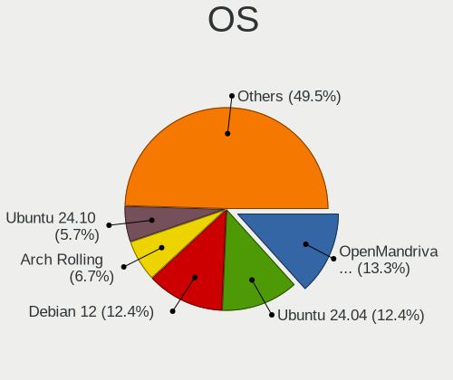
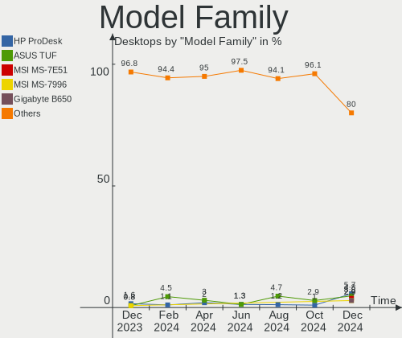
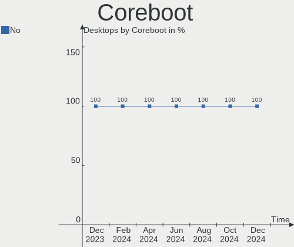
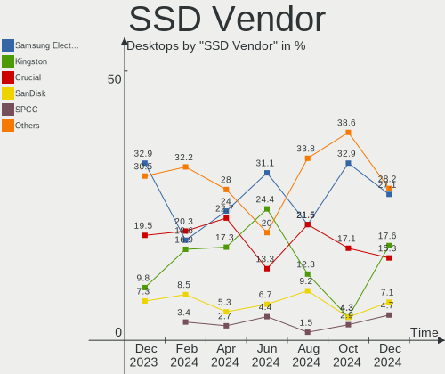
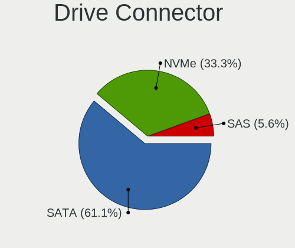
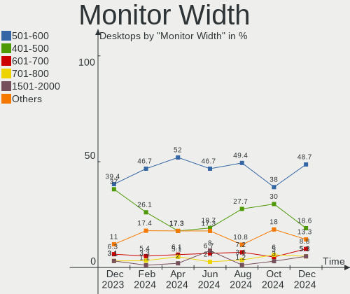
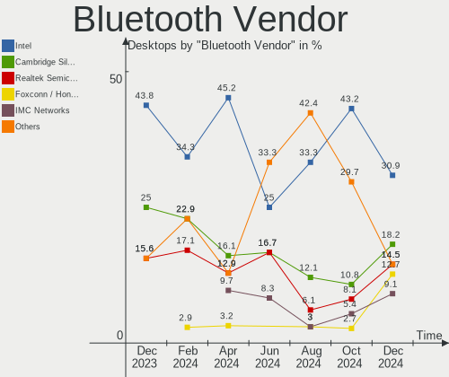
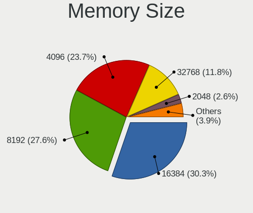
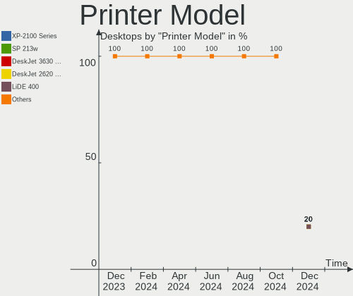

Linux in France - Hardware Trends (Desktops)
--------------------------------------------

A project to identify most popular hardware characteristics and track their change
over time based on data collected by Linux users at https://Linux-Hardware.org.

Anyone can contribute to this report by the [hw-probe](https://github.com/linuxhw/hw-probe) tool:

    sudo -E hw-probe -all -upload

Period: Jan, 2024.

Contents
--------

* [ System ](#system)
  - [ OS                       ](#os)
  - [ OS Family                ](#os-family)
  - [ Kernel                   ](#kernel)
  - [ Kernel Family            ](#kernel-family)
  - [ Kernel Major Ver.        ](#kernel-major-ver)
  - [ Arch                     ](#arch)
  - [ DE                       ](#de)
  - [ Display Server           ](#display-server)
  - [ Display Manager          ](#display-manager)
  - [ OS Lang                  ](#os-lang)
  - [ Boot Mode                ](#boot-mode)
  - [ Filesystem               ](#filesystem)
  - [ Part. scheme             ](#part-scheme)
  - [ Dual Boot with Linux/BSD ](#dual-boot-with-linuxbsd)
  - [ Dual Boot (Win)          ](#dual-boot-win)

* [ Board ](#board)
  - [ Vendor                   ](#vendor)
  - [ Model                    ](#model)
  - [ Model Family             ](#model-family)
  - [ MFG Year                 ](#mfg-year)
  - [ Form Factor              ](#form-factor)
  - [ Secure Boot              ](#secure-boot)
  - [ Coreboot                 ](#coreboot)
  - [ RAM Size                 ](#ram-size)
  - [ RAM Used                 ](#ram-used)
  - [ Total Drives             ](#total-drives)
  - [ Has CD-ROM               ](#has-cd-rom)
  - [ Has Ethernet             ](#has-ethernet)
  - [ Has WiFi                 ](#has-wifi)
  - [ Has Bluetooth            ](#has-bluetooth)

* [ Location ](#location)
  - [ Country                  ](#country)
  - [ City                     ](#city)

* [ Drives ](#drives)
  - [ Drive Vendor             ](#drive-vendor)
  - [ Drive Model              ](#drive-model)
  - [ HDD Vendor               ](#hdd-vendor)
  - [ SSD Vendor               ](#ssd-vendor)
  - [ Drive Kind               ](#drive-kind)
  - [ Drive Connector          ](#drive-connector)
  - [ Drive Size               ](#drive-size)
  - [ Space Total              ](#space-total)
  - [ Space Used               ](#space-used)
  - [ Malfunc. Drives          ](#malfunc-drives)
  - [ Malfunc. Drive Vendor    ](#malfunc-drive-vendor)
  - [ Malfunc. HDD Vendor      ](#malfunc-hdd-vendor)
  - [ Malfunc. Drive Kind      ](#malfunc-drive-kind)
  - [ Failed Drives            ](#failed-drives)
  - [ Failed Drive Vendor      ](#failed-drive-vendor)
  - [ Drive Status             ](#drive-status)

* [ Storage controller ](#storage-controller)
  - [ Storage Vendor           ](#storage-vendor)
  - [ Storage Model            ](#storage-model)
  - [ Storage Kind             ](#storage-kind)

* [ Processor ](#processor)
  - [ CPU Vendor               ](#cpu-vendor)
  - [ CPU Model                ](#cpu-model)
  - [ CPU Model Family         ](#cpu-model-family)
  - [ CPU Cores                ](#cpu-cores)
  - [ CPU Sockets              ](#cpu-sockets)
  - [ CPU Threads              ](#cpu-threads)
  - [ CPU Op-Modes             ](#cpu-op-modes)
  - [ CPU Microcode            ](#cpu-microcode)
  - [ CPU Microarch            ](#cpu-microarch)

* [ Graphics ](#graphics)
  - [ GPU Vendor               ](#gpu-vendor)
  - [ GPU Model                ](#gpu-model)
  - [ GPU Combo                ](#gpu-combo)
  - [ GPU Driver               ](#gpu-driver)
  - [ GPU Memory               ](#gpu-memory)

* [ Monitor ](#monitor)
  - [ Monitor Vendor           ](#monitor-vendor)
  - [ Monitor Model            ](#monitor-model)
  - [ Monitor Resolution       ](#monitor-resolution)
  - [ Monitor Diagonal         ](#monitor-diagonal)
  - [ Monitor Width            ](#monitor-width)
  - [ Aspect Ratio             ](#aspect-ratio)
  - [ Monitor Area             ](#monitor-area)
  - [ Pixel Density            ](#pixel-density)
  - [ Multiple Monitors        ](#multiple-monitors)

* [ Network ](#network)
  - [ Net Controller Vendor    ](#net-controller-vendor)
  - [ Net Controller Model     ](#net-controller-model)
  - [ Wireless Vendor          ](#wireless-vendor)
  - [ Wireless Model           ](#wireless-model)
  - [ Ethernet Vendor          ](#ethernet-vendor)
  - [ Ethernet Model           ](#ethernet-model)
  - [ Net Controller Kind      ](#net-controller-kind)
  - [ Used Controller          ](#used-controller)
  - [ NICs                     ](#nics)
  - [ IPv6                     ](#ipv6)

* [ Bluetooth ](#bluetooth)
  - [ Bluetooth Vendor         ](#bluetooth-vendor)
  - [ Bluetooth Model          ](#bluetooth-model)

* [ Sound ](#sound)
  - [ Sound Vendor             ](#sound-vendor)
  - [ Sound Model              ](#sound-model)

* [ Memory ](#memory)
  - [ Memory Vendor            ](#memory-vendor)
  - [ Memory Model             ](#memory-model)
  - [ Memory Kind              ](#memory-kind)
  - [ Memory Form Factor       ](#memory-form-factor)
  - [ Memory Size              ](#memory-size)
  - [ Memory Speed             ](#memory-speed)

* [ Printers & scanners ](#printers--scanners)
  - [ Printer Vendor           ](#printer-vendor)
  - [ Printer Model            ](#printer-model)
  - [ Scanner Vendor           ](#scanner-vendor)
  - [ Scanner Model            ](#scanner-model)

* [ Camera ](#camera)
  - [ Camera Vendor            ](#camera-vendor)
  - [ Camera Model             ](#camera-model)

* [ Security ](#security)
  - [ Fingerprint Vendor       ](#fingerprint-vendor)
  - [ Fingerprint Model        ](#fingerprint-model)
  - [ Chipcard Vendor          ](#chipcard-vendor)
  - [ Chipcard Model           ](#chipcard-model)

* [ Unsupported ](#unsupported)
  - [ Unsupported Devices      ](#unsupported-devices)
  - [ Unsupported Device Types ](#unsupported-device-types)

System
------

OS
--

Installed operating systems

| Name                         | Desktops | Percent |
|------------------------------|----------|---------|
| Debian 12                    | 47       | 29.56%  |
| Ubuntu 22.04                 | 23       | 14.47%  |
| Fedora 39                    | 7        | 4.4%    |
| Linux Mint 21.2              | 6        | 3.77%   |
| Ubuntu 23.10                 | 5        | 3.14%   |
| Linux Mint 21.3              | 5        | 3.14%   |
| Kubuntu 22.04                | 5        | 3.14%   |
| Ubuntu 20.04                 | 4        | 2.52%   |
| Pop!_OS 22.04                | 4        | 2.52%   |
| Zorin 17                     | 3        | 1.89%   |
| Xubuntu 23.10                | 3        | 1.89%   |
| Ubuntu MATE 22.04            | 3        | 1.89%   |
| Gentoo 2.14                  | 3        | 1.89%   |
| Arch Rolling                 | 3        | 1.89%   |
| Xero Rolling                 | 2        | 1.26%   |
| openSUSE Tumbleweed-XXXXXXXX | 2        | 1.26%   |
| OpenMandriva 24.01           | 2        | 1.26%   |
| OpenMandriva 23.08           | 2        | 1.26%   |
| Manjaro                      | 2        | 1.26%   |
| Debian 11                    | 2        | 1.26%   |
| Debian                       | 2        | 1.26%   |
| Xubuntu 22.04                | 1        | 0.63%   |
| Xubuntu 18.04                | 1        | 0.63%   |
| Ubuntu MATE 23.10            | 1        | 0.63%   |
| Ubuntu MATE 18.04            | 1        | 0.63%   |
| Sparky 7.1                   | 1        | 0.63%   |
| Parrot 6.0                   | 1        | 0.63%   |
| OpenMandriva 5.0             | 1        | 0.63%   |
| OpenMandriva 4.3             | 1        | 0.63%   |
| OpenMandriva 23.10           | 1        | 0.63%   |
| Nobara 38                    | 1        | 0.63%   |
| Lubuntu 22.04                | 1        | 0.63%   |
| Lubuntu 20.04                | 1        | 0.63%   |
| LMDE 6                       | 1        | 0.63%   |
| Linux Mint 20                | 1        | 0.63%   |
| Linux Mint 19.3              | 1        | 0.63%   |
| Kubuntu 23.10                | 1        | 0.63%   |
| Kali 2023.4                  | 1        | 0.63%   |
| Garuda Linux Soaring         | 1        | 0.63%   |
| Fedora 38                    | 1        | 0.63%   |

OS Family
---------

OS without a version

| Name         | Desktops | Percent |
|--------------|----------|---------|
| Debian       | 51       | 32.08%  |
| Ubuntu       | 32       | 20.13%  |
| Linux Mint   | 13       | 8.18%   |
| Fedora       | 8        | 5.03%   |
| OpenMandriva | 7        | 4.4%    |
| Kubuntu      | 6        | 3.77%   |
| Xubuntu      | 5        | 3.14%   |
| Ubuntu MATE  | 5        | 3.14%   |
| Pop!_OS      | 4        | 2.52%   |
| Zorin        | 3        | 1.89%   |
| Gentoo       | 3        | 1.89%   |
| Arch         | 3        | 1.89%   |
| Xero         | 2        | 1.26%   |
| openSUSE     | 2        | 1.26%   |
| Manjaro      | 2        | 1.26%   |
| Lubuntu      | 2        | 1.26%   |
| Sparky       | 1        | 0.63%   |
| Parrot       | 1        | 0.63%   |
| Nobara       | 1        | 0.63%   |
| LMDE         | 1        | 0.63%   |
| Kali         | 1        | 0.63%   |
| Garuda Linux | 1        | 0.63%   |
| EndeavourOS  | 1        | 0.63%   |
| Devuan       | 1        | 0.63%   |
| ChimeraOS    | 1        | 0.63%   |
| ArcoLinux    | 1        | 0.63%   |
| AlmaLinux    | 1        | 0.63%   |

Kernel
------

Version of the Linux kernel

| Version                     | Desktops | Percent |
|-----------------------------|----------|---------|
| 6.1.0-16-amd64              | 39       | 24.53%  |
| 6.5.0-14-generic            | 25       | 15.72%  |
| 5.15.0-91-generic           | 16       | 10.06%  |
| 6.1.0-17-amd64              | 7        | 4.4%    |
| 6.2.0-39-generic            | 5        | 3.14%   |
| 6.6.2-desktop-1omv2390      | 3        | 1.89%   |
| 6.5.0-15-generic            | 3        | 1.89%   |
| 6.6.8-200.fc39.x86_64       | 2        | 1.26%   |
| 6.6.6-76060606-generic      | 2        | 1.26%   |
| 6.6.10-arch1-1              | 2        | 1.26%   |
| 6.5.6-300.fc39.x86_64       | 2        | 1.26%   |
| 6.4.11-desktop-1omv2390     | 2        | 1.26%   |
| 6.2.0-26-generic            | 2        | 1.26%   |
| 5.15.0-92-generic           | 2        | 1.26%   |
| 6.7.2-AMD-znver2            | 1        | 0.63%   |
| 6.7.1-2-default             | 1        | 0.63%   |
| 6.7.0-arch3-1               | 1        | 0.63%   |
| 6.7.0--2024.01.11-04h20     | 1        | 0.63%   |
| 6.6.9-100.fc38.x86_64       | 1        | 0.63%   |
| 6.6.8-gentoo-dist           | 1        | 0.63%   |
| 6.6.8-arch1-1               | 1        | 0.63%   |
| 6.6.8-amd64                 | 1        | 0.63%   |
| 6.6.4-gentoo                | 1        | 0.63%   |
| 6.6.4-arch1-1               | 1        | 0.63%   |
| 6.6.13-gentoo               | 1        | 0.63%   |
| 6.6.13-200.fc39.x86_64      | 1        | 0.63%   |
| 6.6.12-200.fc39.x86_64      | 1        | 0.63%   |
| 6.6.11-200.fc39.x86_64      | 1        | 0.63%   |
| 6.6.11-1-liquorix-amd64     | 1        | 0.63%   |
| 6.6.10-zen1-1-zen           | 1        | 0.63%   |
| 6.6.10-76060610-generic     | 1        | 0.63%   |
| 6.6.10-1-MANJARO            | 1        | 0.63%   |
| 6.6.10-1-default            | 1        | 0.63%   |
| 6.6.1-arch1-1               | 1        | 0.63%   |
| 6.5.9-201.fsync.fc38.x86_64 | 1        | 0.63%   |
| 6.5.6-chos1-chimeraos-1     | 1        | 0.63%   |
| 6.5.5-desktop-1omv2390      | 1        | 0.63%   |
| 6.5.13-7-MANJARO            | 1        | 0.63%   |
| 6.5.11-7-pve                | 1        | 0.63%   |
| 6.5.0-kali3-amd64           | 1        | 0.63%   |

Kernel Family
-------------

Linux kernel without a distro release

| Version | Desktops | Percent |
|---------|----------|---------|
| 6.1.0   | 48       | 30.19%  |
| 6.5.0   | 32       | 20.13%  |
| 5.15.0  | 22       | 13.84%  |
| 6.2.0   | 9        | 5.66%   |
| 6.6.10  | 6        | 3.77%   |
| 6.6.8   | 5        | 3.14%   |
| 6.6.2   | 3        | 1.89%   |
| 6.5.6   | 3        | 1.89%   |
| 5.4.0   | 3        | 1.89%   |
| 6.7.0   | 2        | 1.26%   |
| 6.6.6   | 2        | 1.26%   |
| 6.6.4   | 2        | 1.26%   |
| 6.6.13  | 2        | 1.26%   |
| 6.6.11  | 2        | 1.26%   |
| 6.4.11  | 2        | 1.26%   |
| 6.7.2   | 1        | 0.63%   |
| 6.7.1   | 1        | 0.63%   |
| 6.6.9   | 1        | 0.63%   |
| 6.6.12  | 1        | 0.63%   |
| 6.6.1   | 1        | 0.63%   |
| 6.5.9   | 1        | 0.63%   |
| 6.5.5   | 1        | 0.63%   |
| 6.5.13  | 1        | 0.63%   |
| 6.5.11  | 1        | 0.63%   |
| 6.2.6   | 1        | 0.63%   |
| 6.2.16  | 1        | 0.63%   |
| 6.1.71  | 1        | 0.63%   |
| 5.16.13 | 1        | 0.63%   |
| 5.11.0  | 1        | 0.63%   |
| 5.10.0  | 1        | 0.63%   |
| 4.18.0  | 1        | 0.63%   |

Kernel Major Ver.
-----------------

Linux kernel major version

| Version | Desktops | Percent |
|---------|----------|---------|
| 6.1     | 49       | 30.82%  |
| 6.5     | 39       | 24.53%  |
| 6.6     | 25       | 15.72%  |
| 5.15    | 22       | 13.84%  |
| 6.2     | 11       | 6.92%   |
| 6.7     | 4        | 2.52%   |
| 5.4     | 3        | 1.89%   |
| 6.4     | 2        | 1.26%   |
| 5.16    | 1        | 0.63%   |
| 5.11    | 1        | 0.63%   |
| 5.10    | 1        | 0.63%   |
| 4.18    | 1        | 0.63%   |

Arch
----

OS architecture (x86_64, i586, etc.)

| Name   | Desktops | Percent |
|--------|----------|---------|
| x86_64 | 158      | 99.37%  |
| i686   | 1        | 0.63%   |

DE
--

Desktop Environment

| Name            | Desktops | Percent |
|-----------------|----------|---------|
| GNOME           | 89       | 55.97%  |
| KDE5            | 26       | 16.35%  |
| X-Cinnamon      | 11       | 6.92%   |
| XFCE            | 9        | 5.66%   |
| Unknown         | 8        | 5.03%   |
| MATE            | 7        | 4.4%    |
| LXQt            | 3        | 1.89%   |
| GNOME Flashback | 2        | 1.26%   |
| Cinnamon        | 2        | 1.26%   |
| LXDE            | 1        | 0.63%   |
| Budgie          | 1        | 0.63%   |

Display Server
--------------

X11 or Wayland

| Name    | Desktops | Percent |
|---------|----------|---------|
| X11     | 83       | 52.2%   |
| Wayland | 66       | 41.51%  |
| Tty     | 8        | 5.03%   |
| Unknown | 2        | 1.26%   |

Display Manager
---------------

SDDM, LightDM, etc.

| Name    | Desktops | Percent |
|---------|----------|---------|
| GDM3    | 72       | 45.28%  |
| Unknown | 35       | 22.01%  |
| LightDM | 23       | 14.47%  |
| SDDM    | 22       | 13.84%  |
| GDM     | 6        | 3.77%   |
| SLiM    | 1        | 0.63%   |

OS Lang
-------

Language

| Lang    | Desktops | Percent |
|---------|----------|---------|
| fr_FR   | 136      | 85.53%  |
| en_US   | 11       | 6.92%   |
| C       | 4        | 2.52%   |
| en_GB   | 2        | 1.26%   |
| de_DE   | 2        | 1.26%   |
| Unknown | 2        | 1.26%   |
| POSIX   | 1        | 0.63%   |
| fr_BE   | 1        | 0.63%   |

Boot Mode
---------

EFI or BIOS

| Mode | Desktops | Percent |
|------|----------|---------|
| EFI  | 100      | 62.89%  |
| BIOS | 59       | 37.11%  |

Filesystem
----------

Type of filesystem

| Type    | Desktops | Percent |
|---------|----------|---------|
| Ext4    | 125      | 78.62%  |
| Btrfs   | 16       | 10.06%  |
| Tmpfs   | 12       | 7.55%   |
| Xfs     | 3        | 1.89%   |
| Overlay | 2        | 1.26%   |
| Ext3    | 1        | 0.63%   |

Part. scheme
------------

Scheme of partitioning

| Type    | Desktops | Percent |
|---------|----------|---------|
| GPT     | 111      | 69.81%  |
| Unknown | 28       | 17.61%  |
| MBR     | 20       | 12.58%  |

Dual Boot with Linux/BSD
------------------------

Hosting more than one Linux/BSD

| Dual boot | Desktops | Percent |
|-----------|----------|---------|
| No        | 134      | 84.28%  |
| Yes       | 25       | 15.72%  |

Dual Boot (Win)
---------------

Hosting Linux and Windows

| Dual boot | Desktops | Percent |
|-----------|----------|---------|
| No        | 116      | 72.96%  |
| Yes       | 43       | 27.04%  |

Board
-----

Vendor
------

Motherboard manufacturer

| Name                | Desktops | Percent |
|---------------------|----------|---------|
| Hewlett-Packard     | 38       | 23.9%   |
| ASUSTek Computer    | 34       | 21.38%  |
| Gigabyte Technology | 20       | 12.58%  |
| MSI                 | 19       | 11.95%  |
| ASRock              | 11       | 6.92%   |
| Lenovo              | 10       | 6.29%   |
| Dell                | 9        | 5.66%   |
| Acer                | 5        | 3.14%   |
| Shuttle             | 2        | 1.26%   |
| Foxconn             | 2        | 1.26%   |
| AZW                 | 2        | 1.26%   |
| SYWZ                | 1        | 0.63%   |
| Optimized Hosting   | 1        | 0.63%   |
| Fujitsu             | 1        | 0.63%   |
| eMachines           | 1        | 0.63%   |
| Colorful Technology | 1        | 0.63%   |
| Apple               | 1        | 0.63%   |
| Alienware           | 1        | 0.63%   |

Model
-----

Motherboard model

| Name                                   | Desktops | Percent |
|----------------------------------------|----------|---------|
| HP ProDesk 400 G2.5 SFF                | 20       | 12.58%  |
| HP ProDesk 400 G3 SFF                  | 7        | 4.4%    |
| Lenovo ThinkCentre M83 10AHS1T000      | 4        | 2.52%   |
| MSI MS-7C56                            | 3        | 1.89%   |
| MSI MS-7B51                            | 2        | 1.26%   |
| Lenovo ThinkCentre M800 10FXS0PS00     | 2        | 1.26%   |
| ASUS TUF Gaming Z490-PLUS              | 2        | 1.26%   |
| ASUS TUF Gaming X570-PLUS              | 2        | 1.26%   |
| ASUS All Series                        | 2        | 1.26%   |
| Acer Veriton X2631G                    | 2        | 1.26%   |
| SYWZ S210H Series                      | 1        | 0.63%   |
| Shuttle SG41                           | 1        | 0.63%   |
| Shuttle NC40U                          | 1        | 0.63%   |
| Optimized Hosting KVM                  | 1        | 0.63%   |
| MSI POWERMATE_ML470                    | 1        | 0.63%   |
| MSI MS-7C95                            | 1        | 0.63%   |
| MSI MS-7C90                            | 1        | 0.63%   |
| MSI MS-7C84                            | 1        | 0.63%   |
| MSI MS-7C75                            | 1        | 0.63%   |
| MSI MS-7B86                            | 1        | 0.63%   |
| MSI MS-7978                            | 1        | 0.63%   |
| MSI MS-7823                            | 1        | 0.63%   |
| MSI MS-7817                            | 1        | 0.63%   |
| MSI MS-7760                            | 1        | 0.63%   |
| MSI MS-7758                            | 1        | 0.63%   |
| MSI MS-7641                            | 1        | 0.63%   |
| MSI MAG Z590 Codex X5 (MS-B930)        | 1        | 0.63%   |
| MSI EV969AA-ABF SR1840FR FR620         | 1        | 0.63%   |
| Lenovo ThinkCentre M83 10AHS35300      | 1        | 0.63%   |
| Lenovo ThinkCentre M83 10AHA090FR      | 1        | 0.63%   |
| Lenovo ThinkCentre M710q 10MQS0KL00    | 1        | 0.63%   |
| Lenovo ThinkCentre M55e 9645W2C        | 1        | 0.63%   |
| HP Z820 Workstation                    | 1        | 0.63%   |
| HP Z600 Workstation                    | 1        | 0.63%   |
| HP Z1 G9 Tower Desktop PC              | 1        | 0.63%   |
| HP ProDesk 600 G1 SFF                  | 1        | 0.63%   |
| HP ProDesk 400 G7 Small Form Factor PC | 1        | 0.63%   |
| HP ProDesk 400 G4 SFF                  | 1        | 0.63%   |
| HP ProDesk 400 G2 MT (TPM DP)          | 1        | 0.63%   |
| HP EliteDesk 800 G2 TWR                | 1        | 0.63%   |

Model Family
------------

Motherboard model prefix

| Name                  | Desktops | Percent |
|-----------------------|----------|---------|
| HP ProDesk            | 31       | 19.5%   |
| Lenovo ThinkCentre    | 10       | 6.29%   |
| ASUS PRIME            | 9        | 5.66%   |
| ASUS TUF              | 8        | 5.03%   |
| Dell OptiPlex         | 7        | 4.4%    |
| MSI MS-7C56           | 3        | 1.89%   |
| Acer Veriton          | 3        | 1.89%   |
| MSI MS-7B51           | 2        | 1.26%   |
| HP EliteDesk          | 2        | 1.26%   |
| Dell Precision        | 2        | 1.26%   |
| ASUS M5A99X           | 2        | 1.26%   |
| ASUS All              | 2        | 1.26%   |
| ASRock B650M          | 2        | 1.26%   |
| Acer Aspire           | 2        | 1.26%   |
| SYWZ S210H            | 1        | 0.63%   |
| Shuttle SG41          | 1        | 0.63%   |
| Shuttle NC40U         | 1        | 0.63%   |
| Optimized Hosting KVM | 1        | 0.63%   |
| MSI POWERMATE         | 1        | 0.63%   |
| MSI MS-7C95           | 1        | 0.63%   |
| MSI MS-7C90           | 1        | 0.63%   |
| MSI MS-7C84           | 1        | 0.63%   |
| MSI MS-7C75           | 1        | 0.63%   |
| MSI MS-7B86           | 1        | 0.63%   |
| MSI MS-7978           | 1        | 0.63%   |
| MSI MS-7823           | 1        | 0.63%   |
| MSI MS-7817           | 1        | 0.63%   |
| MSI MS-7760           | 1        | 0.63%   |
| MSI MS-7758           | 1        | 0.63%   |
| MSI MS-7641           | 1        | 0.63%   |
| MSI MAG               | 1        | 0.63%   |
| MSI EV969AA-ABF       | 1        | 0.63%   |
| HP Z820               | 1        | 0.63%   |
| HP Z600               | 1        | 0.63%   |
| HP Z1                 | 1        | 0.63%   |
| HP Compaq             | 1        | 0.63%   |
| HP 285                | 1        | 0.63%   |
| Gigabyte Z97-HD3      | 1        | 0.63%   |
| Gigabyte Z790         | 1        | 0.63%   |
| Gigabyte Z77X-UD5H    | 1        | 0.63%   |

MFG Year
--------

Motherboard manufacture year

| Year | Desktops | Percent |
|------|----------|---------|
| 2015 | 26       | 16.35%  |
| 2020 | 17       | 10.69%  |
| 2014 | 15       | 9.43%   |
| 2016 | 13       | 8.18%   |
| 2013 | 12       | 7.55%   |
| 2010 | 10       | 6.29%   |
| 2012 | 9        | 5.66%   |
| 2022 | 8        | 5.03%   |
| 2019 | 8        | 5.03%   |
| 2018 | 8        | 5.03%   |
| 2023 | 7        | 4.4%    |
| 2011 | 7        | 4.4%    |
| 2021 | 6        | 3.77%   |
| 2017 | 6        | 3.77%   |
| 2009 | 2        | 1.26%   |
| 2008 | 2        | 1.26%   |
| 2006 | 2        | 1.26%   |
| 2004 | 1        | 0.63%   |

Form Factor
-----------

Physical design of the computer

| Name    | Desktops | Percent |
|---------|----------|---------|
| Desktop | 159      | 100%    |

Secure Boot
-----------

Enabled or disabled

| State    | Desktops | Percent |
|----------|----------|---------|
| Disabled | 157      | 98.74%  |
| Enabled  | 2        | 1.26%   |

Coreboot
--------

Have coreboot on board

| Used | Desktops | Percent |
|------|----------|---------|
| No   | 159      | 100%    |

RAM Size
--------

Total RAM memory

| Size in GB      | Desktops | Percent |
|-----------------|----------|---------|
| 3.01-4.0        | 45       | 28.3%   |
| 16.01-24.0      | 36       | 22.64%  |
| 32.01-64.0      | 23       | 14.47%  |
| 4.01-8.0        | 17       | 10.69%  |
| 8.01-16.0       | 17       | 10.69%  |
| 24.01-32.0      | 9        | 5.66%   |
| 64.01-256.0     | 6        | 3.77%   |
| 2.01-3.0        | 3        | 1.89%   |
| 1.01-2.0        | 2        | 1.26%   |
| More than 256.0 | 1        | 0.63%   |

RAM Used
--------

Used RAM memory

| Used GB    | Desktops | Percent |
|------------|----------|---------|
| 1.01-2.0   | 71       | 44.65%  |
| 2.01-3.0   | 32       | 20.13%  |
| 4.01-8.0   | 28       | 17.61%  |
| 3.01-4.0   | 17       | 10.69%  |
| 8.01-16.0  | 5        | 3.14%   |
| 0.51-1.0   | 4        | 2.52%   |
| 32.01-64.0 | 1        | 0.63%   |
| 24.01-32.0 | 1        | 0.63%   |

Total Drives
------------

Number of drives on board

| Drives | Desktops | Percent |
|--------|----------|---------|
| 1      | 78       | 49.06%  |
| 2      | 30       | 18.87%  |
| 3      | 26       | 16.35%  |
| 4      | 11       | 6.92%   |
| 5      | 8        | 5.03%   |
| 6      | 4        | 2.52%   |
| 8      | 2        | 1.26%   |

Has CD-ROM
----------

Has CD-ROM on board

| Presented | Desktops | Percent |
|-----------|----------|---------|
| Yes       | 87       | 54.72%  |
| No        | 72       | 45.28%  |

Has Ethernet
------------

Has Ethernet on board

| Presented | Desktops | Percent |
|-----------|----------|---------|
| Yes       | 157      | 98.74%  |
| No        | 2        | 1.26%   |

Has WiFi
--------

Has WiFi module

| Presented | Desktops | Percent |
|-----------|----------|---------|
| No        | 100      | 62.89%  |
| Yes       | 59       | 37.11%  |

Has Bluetooth
-------------

Has Bluetooth module

| Presented | Desktops | Percent |
|-----------|----------|---------|
| No        | 112      | 70.44%  |
| Yes       | 47       | 29.56%  |

Location
--------

Country
-------

Geographic location (country)

| Country | Desktops | Percent |
|---------|----------|---------|
| France  | 159      | 100%    |

City
----

Geographic location (city)

| City                       | Desktops | Percent |
|----------------------------|----------|---------|
| Roubaix                    | 26       | 16.35%  |
| Bagneux                    | 15       | 9.43%   |
| Paris                      | 9        | 5.66%   |
| Toulouse                   | 4        | 2.52%   |
| Strasbourg                 | 3        | 1.89%   |
| Saint-Germain-les-Arpajon  | 3        | 1.89%   |
| Rezé                      | 2        | 1.26%   |
| Maisons-Alfort             | 2        | 1.26%   |
| Le Boulou                  | 2        | 1.26%   |
| La Seyne-sur-Mer           | 2        | 1.26%   |
| Beauvais                   | 2        | 1.26%   |
| Aix-en-Provence            | 2        | 1.26%   |
| Yzeure                     | 1        | 0.63%   |
| Wintzenheim                | 1        | 0.63%   |
| Wasquehal                  | 1        | 0.63%   |
| Villefranche-sur-Saône    | 1        | 0.63%   |
| Vienne-le-Chateau          | 1        | 0.63%   |
| Vernon                     | 1        | 0.63%   |
| Vénissieux                | 1        | 0.63%   |
| Vendin-le-Vieil            | 1        | 0.63%   |
| Vanves                     | 1        | 0.63%   |
| Vannes                     | 1        | 0.63%   |
| Tesson                     | 1        | 0.63%   |
| Tarbes                     | 1        | 0.63%   |
| Sommieres                  | 1        | 0.63%   |
| Schiltigheim               | 1        | 0.63%   |
| Sainville                  | 1        | 0.63%   |
| Saint-Prix                 | 1        | 0.63%   |
| Saint-Julien-de-l'Escap    | 1        | 0.63%   |
| Saint-Jacques-de-la-Lande  | 1        | 0.63%   |
| Saint-Germain-de-la-Grange | 1        | 0.63%   |
| Saint-Georges-de-Reneins   | 1        | 0.63%   |
| Saint-Denis                | 1        | 0.63%   |
| Saint-Avold                | 1        | 0.63%   |
| Rivesaltes                 | 1        | 0.63%   |
| Rennes                     | 1        | 0.63%   |
| Pontarlier                 | 1        | 0.63%   |
| Pont-à-Mousson            | 1        | 0.63%   |
| Poisy                      | 1        | 0.63%   |
| Parthenay                  | 1        | 0.63%   |

Drives
------

Drive Vendor
------------

Hard drive vendors

| Vendor                      | Desktops | Drives | Percent |
|-----------------------------|----------|--------|---------|
| Seagate                     | 62       | 76     | 22.22%  |
| WDC                         | 53       | 66     | 19%     |
| Samsung Electronics         | 33       | 49     | 11.83%  |
| Crucial                     | 19       | 24     | 6.81%   |
| Toshiba                     | 12       | 12     | 4.3%    |
| SanDisk                     | 12       | 14     | 4.3%    |
| Kingston                    | 12       | 13     | 4.3%    |
| PNY                         | 8        | 8      | 2.87%   |
| Hitachi                     | 8        | 9      | 2.87%   |
| Phison Electronics          | 6        | 7      | 2.15%   |
| Micron/Crucial Technology   | 6        | 12     | 2.15%   |
| Intel                       | 4        | 4      | 1.43%   |
| China                       | 4        | 4      | 1.43%   |
| Verbatim                    | 3        | 3      | 1.08%   |
| OCZ                         | 3        | 3      | 1.08%   |
| HGST                        | 3        | 4      | 1.08%   |
| Fanxiang                    | 3        | 3      | 1.08%   |
| Micron Technology           | 2        | 2      | 0.72%   |
| Maxtor                      | 2        | 2      | 0.72%   |
| MAXIO Technology (Hangzhou) | 2        | 2      | 0.72%   |
| LDLC                        | 2        | 2      | 0.72%   |
| Kingston Technology Company | 2        | 2      | 0.72%   |
| XrayDisk                    | 1        | 1      | 0.36%   |
| Transcend                   | 1        | 1      | 0.36%   |
| TEXTORM                     | 1        | 1      | 0.36%   |
| SPCC                        | 1        | 1      | 0.36%   |
| Silicon Motion              | 1        | 1      | 0.36%   |
| SABRENT                     | 1        | 1      | 0.36%   |
| QEMU                        | 1        | 1      | 0.36%   |
| Phison                      | 1        | 1      | 0.36%   |
| Patriot                     | 1        | 1      | 0.36%   |
| LITEONIT                    | 1        | 1      | 0.36%   |
| Lexar                       | 1        | 1      | 0.36%   |
| KIOXIA                      | 1        | 1      | 0.36%   |
| KingSpec                    | 1        | 1      | 0.36%   |
| Kimtigo                     | 1        | 1      | 0.36%   |
| Intenso                     | 1        | 1      | 0.36%   |
| Inateck                     | 1        | 1      | 0.36%   |
| GOODRAM                     | 1        | 1      | 0.36%   |
| Unknown                     | 1        | 1      | 0.36%   |

Drive Model
-----------

Hard drive models

| Model                                              | Desktops | Percent |
|----------------------------------------------------|----------|---------|
| Seagate ST500DM002-1BD142 500GB                    | 17       | 5.38%   |
| Samsung SSD 860 EVO 500GB                          | 6        | 1.9%    |
| Samsung NVMe SSD Controller SM981/PM981/PM983 1TB  | 6        | 1.9%    |
| Micron/Crucial P2 NVMe PCIe SSD 1TB                | 5        | 1.58%   |
| WDC WD10EZEX-08M2NA0 1TB                           | 4        | 1.27%   |
| Samsung SSD 850 EVO 250GB                          | 4        | 1.27%   |
| Phison E12 NVMe Controller 1TB                     | 4        | 1.27%   |
| WDC WD5000AAKX-22ERMA0 500GB                       | 3        | 0.95%   |
| WDC WD10EZEX-08WN4A0 1TB                           | 3        | 0.95%   |
| Toshiba DT01ACA050 500GB                           | 3        | 0.95%   |
| Seagate ST4000DM004-2CV104 4TB                     | 3        | 0.95%   |
| Seagate ST3500418AS 500GB                          | 3        | 0.95%   |
| Seagate ST2000DM008-2FR102 2TB                     | 3        | 0.95%   |
| Samsung SSD 870 EVO 1TB                            | 3        | 0.95%   |
| Samsung NVMe SSD Controller PM9A1/PM9A3/980PRO 2TB | 3        | 0.95%   |
| PNY CS900 240GB SSD                                | 3        | 0.95%   |
| Crucial CT500MX500SSD1 500GB                       | 3        | 0.95%   |
| Crucial CT480BX500SSD1 480GB                       | 3        | 0.95%   |
| WDC WD5003ABYX-18WERA0 500GB                       | 2        | 0.63%   |
| WDC WD5000AZLX-08K2TA0 500GB                       | 2        | 0.63%   |
| WDC WD5000AAKX-60U6AA0 500GB                       | 2        | 0.63%   |
| WDC WD10EZEX-60WN4A0 1TB                           | 2        | 0.63%   |
| WDC WD10EZEX-08Y20A0 1TB                           | 2        | 0.63%   |
| Verbatim Vi550 S3 512GB SSD                        | 2        | 0.63%   |
| Toshiba HDWD110 1TB                                | 2        | 0.63%   |
| Toshiba DT01ACA200 2TB                             | 2        | 0.63%   |
| Seagate ST500DM002-1SB10A 500GB                    | 2        | 0.63%   |
| Seagate ST3200826AS 200GB                          | 2        | 0.63%   |
| Seagate ST2000DM006-2DM164 2TB                     | 2        | 0.63%   |
| Seagate ST2000DM001-1CH164 2TB                     | 2        | 0.63%   |
| Seagate ST1000LM024 HN-M101MBB 1TB                 | 2        | 0.63%   |
| Seagate ST1000DX001-1NS162 1TB                     | 2        | 0.63%   |
| Seagate ST1000DM003-1ER162 1TB                     | 2        | 0.63%   |
| SanDisk NVMe SSD Drive 2TB                         | 2        | 0.63%   |
| Samsung SSD 970 EVO Plus 1TB                       | 2        | 0.63%   |
| Samsung SSD 870 EVO 500GB                          | 2        | 0.63%   |
| Samsung SSD 860 EVO 1TB                            | 2        | 0.63%   |
| Micron/Crucial CT2000P5PSSD8 2TB                   | 2        | 0.63%   |
| Maxtor STM3250310AS 250GB                          | 2        | 0.63%   |
| LDLC F7+240GB SSD                                  | 2        | 0.63%   |

HDD Vendor
----------

Hard disk drive vendors

| Vendor              | Desktops | Drives | Percent |
|---------------------|----------|--------|---------|
| Seagate             | 62       | 75     | 44.6%   |
| WDC                 | 49       | 60     | 35.25%  |
| Toshiba             | 11       | 11     | 7.91%   |
| Hitachi             | 8        | 9      | 5.76%   |
| HGST                | 3        | 4      | 2.16%   |
| Samsung Electronics | 2        | 3      | 1.44%   |
| Maxtor              | 2        | 2      | 1.44%   |
| QEMU                | 1        | 1      | 0.72%   |
| Inateck             | 1        | 1      | 0.72%   |

SSD Vendor
----------

Solid state drive vendors

| Vendor              | Desktops | Drives | Percent |
|---------------------|----------|--------|---------|
| Samsung Electronics | 23       | 27     | 23.71%  |
| Crucial             | 15       | 20     | 15.46%  |
| Kingston            | 10       | 11     | 10.31%  |
| PNY                 | 7        | 7      | 7.22%   |
| WDC                 | 5        | 5      | 5.15%   |
| SanDisk             | 5        | 5      | 5.15%   |
| China               | 4        | 4      | 4.12%   |
| Verbatim            | 3        | 3      | 3.09%   |
| OCZ                 | 3        | 3      | 3.09%   |
| Intel               | 3        | 3      | 3.09%   |
| Fanxiang            | 3        | 3      | 3.09%   |
| LDLC                | 2        | 2      | 2.06%   |
| XrayDisk            | 1        | 1      | 1.03%   |
| Transcend           | 1        | 1      | 1.03%   |
| SPCC                | 1        | 1      | 1.03%   |
| Seagate             | 1        | 1      | 1.03%   |
| SABRENT             | 1        | 1      | 1.03%   |
| Patriot             | 1        | 1      | 1.03%   |
| Micron Technology   | 1        | 1      | 1.03%   |
| LITEONIT            | 1        | 1      | 1.03%   |
| Lexar               | 1        | 1      | 1.03%   |
| KingSpec            | 1        | 1      | 1.03%   |
| Kimtigo             | 1        | 1      | 1.03%   |
| Intenso             | 1        | 1      | 1.03%   |
| GOODRAM             | 1        | 1      | 1.03%   |
| Unknown             | 1        | 1      | 1.03%   |

Drive Kind
----------

HDD or SSD

| Kind    | Desktops | Drives | Percent |
|---------|----------|--------|---------|
| HDD     | 116      | 166    | 48.74%  |
| SSD     | 75       | 107    | 31.51%  |
| NVMe    | 46       | 65     | 19.33%  |
| Unknown | 1        | 1      | 0.42%   |

Drive Connector
---------------

SATA, SAS, NVMe, etc.

| Type | Desktops | Drives | Percent |
|------|----------|--------|---------|
| SATA | 144      | 269    | 74.23%  |
| NVMe | 46       | 65     | 23.71%  |
| SAS  | 4        | 5      | 2.06%   |

Drive Size
----------

Size of hard drive

| Size in TB | Desktops | Drives | Percent |
|------------|----------|--------|---------|
| 0.01-0.5   | 103      | 145    | 51.5%   |
| 0.51-1.0   | 55       | 74     | 27.5%   |
| 1.01-2.0   | 22       | 27     | 11%     |
| 3.01-4.0   | 13       | 17     | 6.5%    |
| 2.01-3.0   | 5        | 6      | 2.5%    |
| 4.01-10.0  | 2        | 4      | 1%      |

Space Total
-----------

Amount of disk space available on the file system

| Size in GB     | Desktops | Percent |
|----------------|----------|---------|
| 251-500        | 55       | 34.59%  |
| 501-1000       | 28       | 17.61%  |
| 101-250        | 21       | 13.21%  |
| 1001-2000      | 16       | 10.06%  |
| More than 3000 | 15       | 9.43%   |
| 2001-3000      | 13       | 8.18%   |
| 51-100         | 6        | 3.77%   |
| 21-50          | 2        | 1.26%   |
| 1-20           | 2        | 1.26%   |
| Unknown        | 1        | 0.63%   |

Space Used
----------

Amount of used disk space

| Used GB        | Desktops | Percent |
|----------------|----------|---------|
| 1-20           | 64       | 40.25%  |
| 101-250        | 19       | 11.95%  |
| 21-50          | 18       | 11.32%  |
| 501-1000       | 17       | 10.69%  |
| 51-100         | 10       | 6.29%   |
| 251-500        | 9        | 5.66%   |
| 1001-2000      | 9        | 5.66%   |
| 2001-3000      | 7        | 4.4%    |
| More than 3000 | 5        | 3.14%   |
| Unknown        | 1        | 0.63%   |

Malfunc. Drives
---------------

Drive models with a malfunction

| Model                                                         | Desktops | Drives | Percent |
|---------------------------------------------------------------|----------|--------|---------|
| Seagate ST500DM002-1BD142 500GB                               | 3        | 3      | 13.04%  |
| Samsung Electronics SSD 870 EVO 1TB                           | 2        | 2      | 8.7%    |
| Maxtor STM3250310AS 250GB                                     | 2        | 2      | 8.7%    |
| WDC WD30EFRX-68EUZN0 3TB                                      | 1        | 2      | 4.35%   |
| WDC WD10EZEX-08WN4A0 1TB                                      | 1        | 1      | 4.35%   |
| WDC WD Green 2.5 1000GB SSD                                   | 1        | 1      | 4.35%   |
| Seagate ST9320325AS 320GB                                     | 1        | 1      | 4.35%   |
| Seagate ST3200826AS 200GB                                     | 1        | 1      | 4.35%   |
| Seagate ST250DM000-1BD141 250GB                               | 1        | 1      | 4.35%   |
| Seagate ST2000DX002-2DV164 2TB                                | 1        | 1      | 4.35%   |
| Seagate ST1000DX001-1NS162 1TB                                | 1        | 1      | 4.35%   |
| Samsung Electronics SSD 840 Series 120GB                      | 1        | 1      | 4.35%   |
| Samsung Electronics NVMe SSD Controller SM981/PM981/PM983 1TB | 1        | 1      | 4.35%   |
| OCZ AGILITY3 64GB SSD                                         | 1        | 1      | 4.35%   |
| Kingston SV300S37A120G 120GB SSD                              | 1        | 1      | 4.35%   |
| Inateck ASM225CM 4TB                                          | 1        | 1      | 4.35%   |
| Hitachi HUA723020ALA641 2TB                                   | 1        | 1      | 4.35%   |
| HGST HTS541075A9E680 752GB                                    | 1        | 1      | 4.35%   |
| Crucial CT128MX100SSD1 128GB                                  | 1        | 1      | 4.35%   |

Malfunc. Drive Vendor
---------------------

Vendors of faulty drives

| Vendor              | Desktops | Drives | Percent |
|---------------------|----------|--------|---------|
| Seagate             | 7        | 8      | 33.33%  |
| WDC                 | 3        | 4      | 14.29%  |
| Samsung Electronics | 3        | 4      | 14.29%  |
| Maxtor              | 2        | 2      | 9.52%   |
| OCZ                 | 1        | 1      | 4.76%   |
| Kingston            | 1        | 1      | 4.76%   |
| Inateck             | 1        | 1      | 4.76%   |
| Hitachi             | 1        | 1      | 4.76%   |
| HGST                | 1        | 1      | 4.76%   |
| Crucial             | 1        | 1      | 4.76%   |

Malfunc. HDD Vendor
-------------------

Vendors of faulty HDD drives

| Vendor  | Desktops | Drives | Percent |
|---------|----------|--------|---------|
| Seagate | 7        | 8      | 50%     |
| WDC     | 2        | 3      | 14.29%  |
| Maxtor  | 2        | 2      | 14.29%  |
| Inateck | 1        | 1      | 7.14%   |
| Hitachi | 1        | 1      | 7.14%   |
| HGST    | 1        | 1      | 7.14%   |

Malfunc. Drive Kind
-------------------

Kinds of faulty drives

| Kind | Desktops | Drives | Percent |
|------|----------|--------|---------|
| HDD  | 13       | 16     | 61.9%   |
| SSD  | 7        | 7      | 33.33%  |
| NVMe | 1        | 1      | 4.76%   |

Failed Drives
-------------

Failed drive models

| Model                         | Desktops | Drives | Percent |
|-------------------------------|----------|--------|---------|
| WDC WD1500HLFS-01G6U0 150GB   | 1        | 1      | 50%     |
| Hitachi HTS723232L9A360 320GB | 1        | 1      | 50%     |

Failed Drive Vendor
-------------------

Failed drive vendors

| Vendor  | Desktops | Drives | Percent |
|---------|----------|--------|---------|
| WDC     | 1        | 1      | 50%     |
| Hitachi | 1        | 1      | 50%     |

Drive Status
------------

Number of failed and malfunc. drives

| Status   | Desktops | Drives | Percent |
|----------|----------|--------|---------|
| Works    | 112      | 193    | 62.57%  |
| Detected | 47       | 120    | 26.26%  |
| Malfunc  | 18       | 24     | 10.06%  |
| Failed   | 2        | 2      | 1.12%   |

Storage controller
------------------

Storage Vendor
--------------

Storage controller vendors

| Vendor                       | Desktops | Percent |
|------------------------------|----------|---------|
| Intel                        | 115      | 51.11%  |
| AMD                          | 43       | 19.11%  |
| Samsung Electronics          | 14       | 6.22%   |
| Micron/Crucial Technology    | 10       | 4.44%   |
| Sandisk                      | 8        | 3.56%   |
| Phison Electronics           | 8        | 3.56%   |
| Marvell Technology Group     | 5        | 2.22%   |
| ASMedia Technology           | 5        | 2.22%   |
| Kingston Technology Company  | 4        | 1.78%   |
| JMicron Technology           | 4        | 1.78%   |
| MAXIO Technology (Hangzhou)  | 2        | 0.89%   |
| Toshiba America Info Systems | 1        | 0.44%   |
| Silicon Motion               | 1        | 0.44%   |
| Red Hat                      | 1        | 0.44%   |
| Nvidia                       | 1        | 0.44%   |
| Micron Technology            | 1        | 0.44%   |
| KIOXIA                       | 1        | 0.44%   |
| Broadcom / LSI               | 1        | 0.44%   |

Storage Model
-------------

Storage controller models

| Model                                                                          | Desktops | Percent |
|--------------------------------------------------------------------------------|----------|---------|
| Intel 8 Series/C220 Series Chipset Family 6-port SATA Controller 1 [AHCI mode] | 38       | 14.84%  |
| Intel Q170/Q150/B150/H170/H110/Z170/CM236 Chipset SATA Controller [AHCI Mode]  | 17       | 6.64%   |
| AMD FCH SATA Controller [AHCI mode]                                            | 17       | 6.64%   |
| Samsung NVMe SSD Controller SM981/PM981/PM983                                  | 9        | 3.52%   |
| AMD 500 Series Chipset SATA Controller                                         | 9        | 3.52%   |
| Micron/Crucial P2 [Nick P2] / P3 / P3 Plus NVMe PCIe SSD (DRAM-less)           | 8        | 3.13%   |
| Intel SATA Controller [RAID Mode]                                              | 7        | 2.73%   |
| Phison E12 NVMe Controller                                                     | 6        | 2.34%   |
| Intel Cannon Lake PCH SATA AHCI Controller                                     | 6        | 2.34%   |
| AMD 600 Series Chipset SATA Controller                                         | 6        | 2.34%   |
| Samsung NVMe SSD Controller PM9A1/PM9A3/980PRO                                 | 5        | 1.95%   |
| Intel 6 Series/C200 Series Chipset Family 6 port Desktop SATA AHCI Controller  | 5        | 1.95%   |
| ASMedia ASM1061/ASM1062 Serial ATA Controller                                  | 5        | 1.95%   |
| AMD 400 Series Chipset SATA Controller                                         | 5        | 1.95%   |
| Intel Comet Lake SATA AHCI Controller                                          | 4        | 1.56%   |
| AMD SB7x0/SB8x0/SB9x0 SATA Controller [IDE mode]                               | 4        | 1.56%   |
| AMD SB7x0/SB8x0/SB9x0 SATA Controller [AHCI mode]                              | 4        | 1.56%   |
| AMD SB7x0/SB8x0/SB9x0 IDE Controller                                           | 4        | 1.56%   |
| Samsung NVMe SSD Controller 980 (DRAM-less)                                    | 3        | 1.17%   |
| Micron/Crucial P5 Plus NVMe PCIe SSD                                           | 3        | 1.17%   |
| Intel NM10/ICH7 Family SATA Controller [IDE mode]                              | 3        | 1.17%   |
| Intel Alder Lake-S PCH SATA Controller [AHCI Mode]                             | 3        | 1.17%   |
| Intel 9 Series Chipset Family SATA Controller [AHCI Mode]                      | 3        | 1.17%   |
| Intel 82801JI (ICH10 Family) SATA AHCI Controller                              | 3        | 1.17%   |
| Intel 7 Series/C210 Series Chipset Family 6-port SATA Controller [AHCI mode]   | 3        | 1.17%   |
| AMD FCH SATA Controller D                                                      | 3        | 1.17%   |
| Sandisk WD Blue SN580 NVMe SSD (DRAM-less)                                     | 2        | 0.78%   |
| Marvell Group 88SE91A3 SATA-600 Controller                                     | 2        | 0.78%   |
| Kingston Company NV2 NVMe SSD SM2267XT (DRAM-less)                             | 2        | 0.78%   |
| Kingston Company A2000 NVMe SSD SM2263EN                                       | 2        | 0.78%   |
| JMicron JMB363 SATA/IDE Controller                                             | 2        | 0.78%   |
| JMicron JMB362 SATA Controller                                                 | 2        | 0.78%   |
| Intel Raptor Lake SATA AHCI Controller                                         | 2        | 0.78%   |
| Intel Alder Lake-P SATA AHCI Controller                                        | 2        | 0.78%   |
| Intel 82801JI (ICH10 Family) 4 port SATA IDE Controller #1                     | 2        | 0.78%   |
| Intel 82801JI (ICH10 Family) 2 port SATA IDE Controller #2                     | 2        | 0.78%   |
| Intel 82801G (ICH7 Family) IDE Controller                                      | 2        | 0.78%   |
| Intel 500 Series Chipset Family SATA AHCI Controller                           | 2        | 0.78%   |
| Intel 200 Series PCH SATA controller [AHCI mode]                               | 2        | 0.78%   |
| AMD 300 Series Chipset SATA Controller                                         | 2        | 0.78%   |

Storage Kind
------------

Kind of storage controller (IDE, SATA, NVMe, SAS, ...)

| Kind | Desktops | Percent |
|------|----------|---------|
| SATA | 139      | 64.95%  |
| NVMe | 46       | 21.5%   |
| IDE  | 18       | 8.41%   |
| RAID | 9        | 4.21%   |
| SAS  | 1        | 0.47%   |
| SCSI | 1        | 0.47%   |

Processor
---------

CPU Vendor
----------

Processor vendors

| Vendor | Desktops | Percent |
|--------|----------|---------|
| Intel  | 114      | 71.7%   |
| AMD    | 45       | 28.3%   |

CPU Model
---------

Processor models

| Model                                       | Desktops | Percent |
|---------------------------------------------|----------|---------|
| Intel Pentium CPU G3260 @ 3.30GHz           | 12       | 7.55%   |
| Intel Core i3-4170 CPU @ 3.70GHz            | 8        | 5.03%   |
| Intel Core i3-6100 CPU @ 3.70GHz            | 6        | 3.77%   |
| Intel Core i3-4130 CPU @ 3.40GHz            | 6        | 3.77%   |
| Intel Pentium CPU G4400 @ 3.30GHz           | 5        | 3.14%   |
| AMD Ryzen 7 5800X 8-Core Processor          | 3        | 1.89%   |
| AMD Ryzen 7 3700X 8-Core Processor          | 3        | 1.89%   |
| Intel Xeon CPU E5620 @ 2.40GHz              | 2        | 1.26%   |
| Intel Core i7-6700K CPU @ 4.00GHz           | 2        | 1.26%   |
| Intel Core i7-4790 CPU @ 3.60GHz            | 2        | 1.26%   |
| Intel Core i7-3770 CPU @ 3.40GHz            | 2        | 1.26%   |
| Intel Core i7 CPU 950 @ 3.07GHz             | 2        | 1.26%   |
| Intel Core i5-6500 CPU @ 3.20GHz            | 2        | 1.26%   |
| Intel Core i5-4570 CPU @ 3.20GHz            | 2        | 1.26%   |
| Intel Core i5-3570 CPU @ 3.40GHz            | 2        | 1.26%   |
| Intel Core i3-8100 CPU @ 3.60GHz            | 2        | 1.26%   |
| AMD Ryzen 7 3800X 8-Core Processor          | 2        | 1.26%   |
| AMD Ryzen 5 5600X 6-Core Processor          | 2        | 1.26%   |
| AMD Ryzen 5 3600 6-Core Processor           | 2        | 1.26%   |
| AMD Ryzen 5 3400G with Radeon Vega Graphics | 2        | 1.26%   |
| AMD FX-6300 Six-Core Processor              | 2        | 1.26%   |
| Intel Xeon CPU X5470 @ 3.33GHz              | 1        | 0.63%   |
| Intel Xeon CPU E5-2670 v2 @ 2.50GHz         | 1        | 0.63%   |
| Intel Xeon CPU E5-1680 v2 @ 3.00GHz         | 1        | 0.63%   |
| Intel Xeon CPU E3-1240 v3 @ 3.40GHz         | 1        | 0.63%   |
| Intel Pentium Silver J5040 CPU @ 2.00GHz    | 1        | 0.63%   |
| Intel Pentium Gold G6405 CPU @ 4.10GHz      | 1        | 0.63%   |
| Intel Pentium Gold G6400 CPU @ 4.00GHz      | 1        | 0.63%   |
| Intel Pentium Dual-Core CPU E5700 @ 3.00GHz | 1        | 0.63%   |
| Intel Pentium D CPU 3.00GHz                 | 1        | 0.63%   |
| Intel Pentium CPU G3240 @ 3.10GHz           | 1        | 0.63%   |
| Intel Pentium 4 CPU 3.00GHz                 | 1        | 0.63%   |
| Intel N100                                  | 1        | 0.63%   |
| Intel Core i9-9900K CPU @ 3.60GHz           | 1        | 0.63%   |
| Intel Core i9-9880H CPU @ 2.30GHz           | 1        | 0.63%   |
| Intel Core i9-10850K CPU @ 3.60GHz          | 1        | 0.63%   |
| Intel Core i7-9700 CPU @ 3.00GHz            | 1        | 0.63%   |
| Intel Core i7-7700K CPU @ 4.20GHz           | 1        | 0.63%   |
| Intel Core i7-4930K CPU @ 3.40GHz           | 1        | 0.63%   |
| Intel Core i7-4770K CPU @ 3.50GHz           | 1        | 0.63%   |

CPU Model Family
----------------

Processor model prefix

| Model                   | Desktops | Percent |
|-------------------------|----------|---------|
| Intel Core i3           | 29       | 18.24%  |
| Intel Core i5           | 20       | 12.58%  |
| Intel Pentium           | 18       | 11.32%  |
| Intel Core i7           | 17       | 10.69%  |
| AMD Ryzen 5             | 14       | 8.81%   |
| AMD Ryzen 7             | 11       | 6.92%   |
| Other                   | 8        | 5.03%   |
| Intel Xeon              | 6        | 3.77%   |
| Intel Celeron           | 6        | 3.77%   |
| AMD Ryzen 9             | 5        | 3.14%   |
| Intel Core i9           | 3        | 1.89%   |
| AMD Athlon II X2        | 3        | 1.89%   |
| Intel Pentium Gold      | 2        | 1.26%   |
| AMD Ryzen 3             | 2        | 1.26%   |
| AMD FX                  | 2        | 1.26%   |
| AMD Athlon II X4        | 2        | 1.26%   |
| Intel Pentium Silver    | 1        | 0.63%   |
| Intel Pentium Dual-Core | 1        | 0.63%   |
| Intel Pentium D         | 1        | 0.63%   |
| Intel Pentium 4         | 1        | 0.63%   |
| Intel Core 2 Duo        | 1        | 0.63%   |
| AMD EPYC                | 1        | 0.63%   |
| AMD E                   | 1        | 0.63%   |
| AMD Athlon X4           | 1        | 0.63%   |
| AMD Athlon II X3        | 1        | 0.63%   |
| AMD Athlon 64 X2        | 1        | 0.63%   |
| AMD A8                  | 1        | 0.63%   |

CPU Cores
---------

Number of processor cores

| Number | Desktops | Percent |
|--------|----------|---------|
| 2      | 60       | 37.74%  |
| 4      | 44       | 27.67%  |
| 8      | 19       | 11.95%  |
| 6      | 18       | 11.32%  |
| 12     | 5        | 3.14%   |
| 10     | 3        | 1.89%   |
| 3      | 3        | 1.89%   |
| 16     | 2        | 1.26%   |
| 1      | 2        | 1.26%   |
| 24     | 1        | 0.63%   |
| 20     | 1        | 0.63%   |
| 5      | 1        | 0.63%   |

CPU Sockets
-----------

Number of sockets

| Number | Desktops | Percent |
|--------|----------|---------|
| 1      | 155      | 97.48%  |
| 2      | 3        | 1.89%   |
| 4      | 1        | 0.63%   |

CPU Threads
-----------

Threads per core (Hyper-Threading)

| Number | Desktops | Percent |
|--------|----------|---------|
| 2      | 97       | 61.01%  |
| 1      | 62       | 38.99%  |

CPU Op-Modes
------------

CPU Operation Modes (32-bit, 64-bit)

| Op mode        | Desktops | Percent |
|----------------|----------|---------|
| 32-bit, 64-bit | 158      | 99.37%  |
| 32-bit         | 1        | 0.63%   |

CPU Microcode
-------------

Microcode number

| Number     | Desktops | Percent |
|------------|----------|---------|
| Unknown    | 67       | 42.14%  |
| 0x306c3    | 30       | 18.87%  |
| 0x506e3    | 12       | 7.55%   |
| 0x010000c8 | 4        | 2.52%   |
| 0x0a601206 | 3        | 1.89%   |
| 0x0a601203 | 3        | 1.89%   |
| 0x08701021 | 3        | 1.89%   |
| 0xa0653    | 2        | 1.26%   |
| 0x906ed    | 2        | 1.26%   |
| 0x306a9    | 2        | 1.26%   |
| 0x206c2    | 2        | 1.26%   |
| 0x1067a    | 2        | 1.26%   |
| 0x0a20120e | 2        | 1.26%   |
| 0x0a201009 | 2        | 1.26%   |
| 0xf41      | 1        | 0.63%   |
| 0xb06e0    | 1        | 0.63%   |
| 0xa0671    | 1        | 0.63%   |
| 0xa0655    | 1        | 0.63%   |
| 0x906a4    | 1        | 0.63%   |
| 0x906a3    | 1        | 0.63%   |
| 0x90672    | 1        | 0.63%   |
| 0x706a8    | 1        | 0.63%   |
| 0x206d7    | 1        | 0.63%   |
| 0x206a7    | 1        | 0.63%   |
| 0x20652    | 1        | 0.63%   |
| 0x10676    | 1        | 0.63%   |
| 0x0a50000d | 1        | 0.63%   |
| 0x0a20120a | 1        | 0.63%   |
| 0x08701013 | 1        | 0.63%   |
| 0x08600106 | 1        | 0.63%   |
| 0x08108109 | 1        | 0.63%   |
| 0x08101016 | 1        | 0.63%   |
| 0x08001138 | 1        | 0.63%   |
| 0x06003106 | 1        | 0.63%   |
| 0x06001119 | 1        | 0.63%   |
| 0x06000852 | 1        | 0.63%   |
| 0x05000119 | 1        | 0.63%   |

CPU Microarch
-------------

Microarchitecture

| Name             | Desktops | Percent |
|------------------|----------|---------|
| Haswell          | 43       | 27.04%  |
| Skylake          | 17       | 10.69%  |
| Zen 3            | 10       | 6.29%   |
| Zen 2            | 10       | 6.29%   |
| IvyBridge        | 10       | 6.29%   |
| Unknown          | 10       | 6.29%   |
| KabyLake         | 9        | 5.66%   |
| CometLake        | 7        | 4.4%    |
| K10              | 6        | 3.77%   |
| SandyBridge      | 5        | 3.14%   |
| Zen              | 4        | 2.52%   |
| Nehalem          | 4        | 2.52%   |
| Alderlake Hybrid | 4        | 2.52%   |
| Zen+             | 3        | 1.89%   |
| Westmere         | 3        | 1.89%   |
| Piledriver       | 3        | 1.89%   |
| Penryn           | 3        | 1.89%   |
| NetBurst         | 2        | 1.26%   |
| Steamroller      | 1        | 0.63%   |
| K8 Hammer        | 1        | 0.63%   |
| Icelake          | 1        | 0.63%   |
| Gracemont        | 1        | 0.63%   |
| Goldmont plus    | 1        | 0.63%   |
| Bobcat           | 1        | 0.63%   |

Graphics
--------

GPU Vendor
----------

Vendors of graphics cards

| Vendor                     | Desktops | Percent |
|----------------------------|----------|---------|
| Intel                      | 75       | 45.73%  |
| Nvidia                     | 48       | 29.27%  |
| AMD                        | 39       | 23.78%  |
| Red Hat                    | 1        | 0.61%   |
| Matrox Electronics Systems | 1        | 0.61%   |

GPU Model
---------

Graphics card models

| Model                                                                       | Desktops | Percent |
|-----------------------------------------------------------------------------|----------|---------|
| Intel Xeon E3-1200 v3/4th Gen Core Processor Integrated Graphics Controller | 21       | 12.43%  |
| Intel 4th Generation Core Processor Family Integrated Graphics Controller   | 15       | 8.88%   |
| Intel HD Graphics 530                                                       | 9        | 5.33%   |
| Intel HD Graphics 510                                                       | 5        | 2.96%   |
| AMD Raphael                                                                 | 5        | 2.96%   |
| Nvidia TU116 [GeForce GTX 1660 SUPER]                                       | 4        | 2.37%   |
| Nvidia GP106 [GeForce GTX 1060 6GB]                                         | 4        | 2.37%   |
| Nvidia TU116 [GeForce GTX 1660 Ti]                                          | 3        | 1.78%   |
| Intel Xeon E3-1200 v2/3rd Gen Core processor Graphics Controller            | 3        | 1.78%   |
| Intel CoffeeLake-S GT2 [UHD Graphics 630]                                   | 3        | 1.78%   |
| Intel 2nd Generation Core Processor Family Integrated Graphics Controller   | 3        | 1.78%   |
| AMD Navi 22 [Radeon RX 6700/6700 XT/6750 XT / 6800M/6850M XT]               | 3        | 1.78%   |
| AMD Cedar [Radeon HD 5000/6000/7350/8350 Series]                            | 3        | 1.78%   |
| Nvidia GT218 [GeForce 210]                                                  | 2        | 1.18%   |
| Nvidia GM206 [GeForce GTX 960]                                              | 2        | 1.18%   |
| Nvidia GK107GL [Quadro K600]                                                | 2        | 1.18%   |
| Nvidia GF108 [GeForce GT 730]                                               | 2        | 1.18%   |
| Nvidia GA104 [GeForce RTX 3070 Lite Hash Rate]                              | 2        | 1.18%   |
| Intel HD Graphics 630                                                       | 2        | 1.18%   |
| Intel CometLake-S GT2 [UHD Graphics 630]                                    | 2        | 1.18%   |
| AMD RS780L [Radeon 3000]                                                    | 2        | 1.18%   |
| AMD Raven Ridge [Radeon Vega Series / Radeon Vega Mobile Series]            | 2        | 1.18%   |
| AMD Picasso/Raven 2 [Radeon Vega Series / Radeon Vega Mobile Series]        | 2        | 1.18%   |
| AMD Navi 31 [Radeon RX 7900 XT/7900 XTX/7900M]                              | 2        | 1.18%   |
| AMD Navi 24 [Radeon RX 6400/6500 XT/6500M]                                  | 2        | 1.18%   |
| AMD Navi 23 [Radeon RX 6600/6600 XT/6600M]                                  | 2        | 1.18%   |
| AMD Navi 21 [Radeon RX 6800/6800 XT / 6900 XT]                              | 2        | 1.18%   |
| AMD Curacao PRO [Radeon R7 370 / R9 270/370 OEM]                            | 2        | 1.18%   |
| Red Hat QXL paravirtual graphic card                                        | 1        | 0.59%   |
| Nvidia TU117GL [T400 4GB]                                                   | 1        | 0.59%   |
| Nvidia TU117 [GeForce GTX 1650]                                             | 1        | 0.59%   |
| Nvidia TU106 [GeForce RTX 2060 Rev. A]                                      | 1        | 0.59%   |
| Nvidia TU104 [GeForce RTX 2080 SUPER]                                       | 1        | 0.59%   |
| Nvidia TU104 [GeForce RTX 2070 SUPER]                                       | 1        | 0.59%   |
| Nvidia GT218 [GeForce 405]                                                  | 1        | 0.59%   |
| Nvidia GP107GL [Quadro P620]                                                | 1        | 0.59%   |
| Nvidia GP104 [GeForce GTX 1080]                                             | 1        | 0.59%   |
| Nvidia GM204 [GeForce GTX 970]                                              | 1        | 0.59%   |
| Nvidia GM107 [GeForce GTX 750 Ti]                                           | 1        | 0.59%   |
| Nvidia GK208B [GeForce GT 730]                                              | 1        | 0.59%   |

GPU Combo
---------

Combinations of graphics cards

| Name           | Desktops | Percent |
|----------------|----------|---------|
| 1 x Intel      | 70       | 44.03%  |
| 1 x Nvidia     | 46       | 28.93%  |
| 1 x AMD        | 32       | 20.13%  |
| 2 x AMD        | 6        | 3.77%   |
| Intel + Nvidia | 2        | 1.26%   |
| 1 x Red Hat    | 1        | 0.63%   |
| 1 x Matrox     | 1        | 0.63%   |
| Intel + AMD    | 1        | 0.63%   |

GPU Driver
----------

Free vs proprietary

| Driver      | Desktops | Percent |
|-------------|----------|---------|
| Free        | 127      | 79.87%  |
| Proprietary | 26       | 16.35%  |
| Unknown     | 6        | 3.77%   |

GPU Memory
----------

Total video memory

| Size in GB | Desktops | Percent |
|------------|----------|---------|
| Unknown    | 98       | 61.64%  |
| 1.01-2.0   | 12       | 7.55%   |
| 5.01-6.0   | 9        | 5.66%   |
| 0.51-1.0   | 9        | 5.66%   |
| 0.01-0.5   | 9        | 5.66%   |
| 3.01-4.0   | 8        | 5.03%   |
| 7.01-8.0   | 7        | 4.4%    |
| 8.01-16.0  | 5        | 3.14%   |
| 16.01-24.0 | 2        | 1.26%   |

Monitor
-------

Monitor Vendor
--------------

Monitor vendors

| Vendor               | Desktops | Percent |
|----------------------|----------|---------|
| Philips              | 52       | 30.95%  |
| Samsung Electronics  | 17       | 10.12%  |
| Iiyama               | 16       | 9.52%   |
| Goldstar             | 13       | 7.74%   |
| Dell                 | 13       | 7.74%   |
| Hewlett-Packard      | 10       | 5.95%   |
| Acer                 | 10       | 5.95%   |
| AOC                  | 7        | 4.17%   |
| ASUSTek Computer     | 5        | 2.98%   |
| BenQ                 | 3        | 1.79%   |
| Ancor Communications | 3        | 1.79%   |
| ViewSonic            | 2        | 1.19%   |
| Hitachi              | 2        | 1.19%   |
| Gigabyte Technology  | 2        | 1.19%   |
| Belinea              | 2        | 1.19%   |
| XGM                  | 1        | 0.6%    |
| Vestel Elektronik    | 1        | 0.6%    |
| SKG                  | 1        | 0.6%    |
| Panasonic            | 1        | 0.6%    |
| Packard Bell         | 1        | 0.6%    |
| MStar                | 1        | 0.6%    |
| MSI                  | 1        | 0.6%    |
| MiTAC                | 1        | 0.6%    |
| Lenovo               | 1        | 0.6%    |
| HUAWEI               | 1        | 0.6%    |
| GVS                  | 1        | 0.6%    |

Monitor Model
-------------

Monitor models

| Model                                                                   | Desktops | Percent |
|-------------------------------------------------------------------------|----------|---------|
| Philips 197EL PHLC08B 1366x768 410x230mm 18.5-inch                      | 38       | 21.84%  |
| Philips 224E PHLC053 1920x1080 476x268mm 21.5-inch                      | 2        | 1.15%   |
| Goldstar W2240 GSM57A0 1920x1080 477x268mm 21.5-inch                    | 2        | 1.15%   |
| Goldstar IPS225 GSM587B 1920x1080 510x290mm 23.1-inch                   | 2        | 1.15%   |
| AOC 2590G4 AOC2590 1920x1080 544x303mm 24.5-inch                        | 2        | 1.15%   |
| XGM XGIMI TV XGM8030 2288x1430 708x398mm 32.0-inch                      | 1        | 0.57%   |
| ViewSonic VX2457 VSCB931 1920x1080 521x293mm 23.5-inch                  | 1        | 0.57%   |
| ViewSonic VX2453 Series VSC0C28 1920x1080 520x290mm 23.4-inch           | 1        | 0.57%   |
| Vestel Elektronik 32FHD_LCD_TV VES3700 1920x1080 700x400mm 31.7-inch    | 1        | 0.57%   |
| SKG H27S17 SKG2709 2560x1440 597x336mm 27.0-inch                        | 1        | 0.57%   |
| Samsung Electronics SyncMaster SAM0473 2048x1152 510x287mm 23.0-inch    | 1        | 0.57%   |
| Samsung Electronics SyncMaster SAM03E5 1680x1050 474x296mm 22.0-inch    | 1        | 0.57%   |
| Samsung Electronics SyncMaster SAM0304 1680x1050 494x320mm 23.2-inch    | 1        | 0.57%   |
| Samsung Electronics SyncMaster SAM01BB 1280x1024 376x301mm 19.0-inch    | 1        | 0.57%   |
| Samsung Electronics SMS23A350H SAM07D4 1920x1080 509x286mm 23.0-inch    | 1        | 0.57%   |
| Samsung Electronics S27D390 SAM0B67 1920x1080 598x336mm 27.0-inch       | 1        | 0.57%   |
| Samsung Electronics S24E390 SAM0C19 1920x1080 521x293mm 23.5-inch       | 1        | 0.57%   |
| Samsung Electronics S24B350 SAM08DA 1920x1080 531x299mm 24.0-inch       | 1        | 0.57%   |
| Samsung Electronics Odyssey G52A SAM7181 2560x1440 597x336mm 27.0-inch  | 1        | 0.57%   |
| Samsung Electronics Odyssey G40B SAM727A 1920x1080 597x336mm 27.0-inch  | 1        | 0.57%   |
| Samsung Electronics LF27T35 SAM707F 1920x1080 598x337mm 27.0-inch       | 1        | 0.57%   |
| Samsung Electronics LCD Monitor SAM723F 3840x2160 700x390mm 31.5-inch   | 1        | 0.57%   |
| Samsung Electronics LCD Monitor SAM0DF7 3840x2160 1872x1053mm 84.6-inch | 1        | 0.57%   |
| Samsung Electronics LCD Monitor SAM0B30 1920x1080 885x498mm 40.0-inch   | 1        | 0.57%   |
| Samsung Electronics LCD Monitor SAM0658 1920x1080 886x498mm 40.0-inch   | 1        | 0.57%   |
| Samsung Electronics LCD Monitor SAM0509 1920x1080                       | 1        | 0.57%   |
| Samsung Electronics C27F581 SAM0D9B 1920x1080 598x336mm 27.0-inch       | 1        | 0.57%   |
| Philips PHL 276E9Q PHLC17B 1920x1080 600x340mm 27.2-inch                | 1        | 0.57%   |
| Philips PHL 272E1GZ PHLC24D 1920x1080 600x340mm 27.2-inch               | 1        | 0.57%   |
| Philips PHL 252B9 PHL092C 1920x1200 535x339mm 24.9-inch                 | 1        | 0.57%   |
| Philips PHL 241V8 PHLC212 1920x1080 527x296mm 23.8-inch                 | 1        | 0.57%   |
| Philips PHL 193V5 PHLC0CD 1366x768 410x230mm 18.5-inch                  | 1        | 0.57%   |
| Philips 227ELH PHLC07B 1920x1080 480x268mm 21.6-inch                    | 1        | 0.57%   |
| Philips 227EL PHLC079 1920x1080 480x268mm 21.6-inch                     | 1        | 0.57%   |
| Philips 226V4 PHLC0B1 1920x1080 477x268mm 21.5-inch                     | 1        | 0.57%   |
| Philips 220B PHL087C 1680x1050 470x290mm 21.7-inch                      | 1        | 0.57%   |
| Philips 191EL PHLC050 1366x768 410x230mm 18.5-inch                      | 1        | 0.57%   |
| Philips 190B PHL081A 1280x1024 376x301mm 19.0-inch                      | 1        | 0.57%   |
| Philips 17S PHL0877 1280x1024 337x270mm 17.0-inch                       | 1        | 0.57%   |
| Panasonic TV MEIA296 3840x2160 698x392mm 31.5-inch                      | 1        | 0.57%   |

Monitor Resolution
------------------

Monitor screen resolution

| Resolution         | Desktops | Percent |
|--------------------|----------|---------|
| 1920x1080 (FHD)    | 66       | 40%     |
| 1366x768 (WXGA)    | 42       | 25.45%  |
| 2560x1440 (QHD)    | 15       | 9.09%   |
| 3840x2160 (4K)     | 9        | 5.45%   |
| 1680x1050 (WSXGA+) | 7        | 4.24%   |
| 1280x1024 (SXGA)   | 7        | 4.24%   |
| 1440x900 (WXGA+)   | 5        | 3.03%   |
| 3440x1440          | 4        | 2.42%   |
| 1920x1200 (WUXGA)  | 3        | 1.82%   |
| 1600x900 (HD+)     | 2        | 1.21%   |
| 3840x1080          | 1        | 0.61%   |
| 2560x1080          | 1        | 0.61%   |
| 2048x1152          | 1        | 0.61%   |
| 1360x768           | 1        | 0.61%   |
| 1024x768 (XGA)     | 1        | 0.61%   |

Monitor Diagonal
----------------

Diagonal size in inches

| Inches  | Desktops | Percent |
|---------|----------|---------|
| 18      | 44       | 25.73%  |
| 27      | 23       | 13.45%  |
| 24      | 22       | 12.87%  |
| 23      | 20       | 11.7%   |
| 21      | 20       | 11.7%   |
| 19      | 10       | 5.85%   |
| 34      | 5        | 2.92%   |
| 22      | 4        | 2.34%   |
| 84      | 3        | 1.75%   |
| 31      | 3        | 1.75%   |
| 25      | 3        | 1.75%   |
| Unknown | 3        | 1.75%   |
| 32      | 2        | 1.17%   |
| 17      | 2        | 1.17%   |
| 54      | 1        | 0.58%   |
| 49      | 1        | 0.58%   |
| 43      | 1        | 0.58%   |
| 42      | 1        | 0.58%   |
| 40      | 1        | 0.58%   |
| 20      | 1        | 0.58%   |
| 15      | 1        | 0.58%   |

Monitor Width
-------------

Physical width

| Width in mm | Desktops | Percent |
|-------------|----------|---------|
| 401-500     | 74       | 44.85%  |
| 501-600     | 62       | 37.58%  |
| 701-800     | 7        | 4.24%   |
| 351-400     | 5        | 3.03%   |
| 601-700     | 3        | 1.82%   |
| 301-350     | 3        | 1.82%   |
| 1501-2000   | 3        | 1.82%   |
| Unknown     | 3        | 1.82%   |
| 1001-1500   | 2        | 1.21%   |
| 901-1000    | 2        | 1.21%   |
| 801-900     | 1        | 0.61%   |

Aspect Ratio
------------

Proportional relationship between the width and the height

| Ratio   | Desktops | Percent |
|---------|----------|---------|
| 16/9    | 126      | 79.25%  |
| 16/10   | 16       | 10.06%  |
| 5/4     | 7        | 4.4%    |
| 21/9    | 5        | 3.14%   |
| 3/2     | 2        | 1.26%   |
| 4/3     | 1        | 0.63%   |
| 32/9    | 1        | 0.63%   |
| Unknown | 1        | 0.63%   |

Monitor Area
------------

Area in inch²

| Area in inch² | Desktops | Percent |
|----------------|----------|---------|
| 201-250        | 50       | 30.49%  |
| 141-150        | 45       | 27.44%  |
| 301-350        | 23       | 14.02%  |
| 151-200        | 15       | 9.15%   |
| 351-500        | 10       | 6.1%    |
| 251-300        | 9        | 5.49%   |
| More than 1000 | 4        | 2.44%   |
| 501-1000       | 4        | 2.44%   |
| Unknown        | 3        | 1.83%   |
| 101-110        | 1        | 0.61%   |

Pixel Density
-------------

Pixels per inch

| Density | Desktops | Percent |
|---------|----------|---------|
| 51-100  | 117      | 74.05%  |
| 101-120 | 36       | 22.78%  |
| Unknown | 3        | 1.9%    |
| 1-50    | 1        | 0.63%   |
| 121-160 | 1        | 0.63%   |

Multiple Monitors
-----------------

Total monitors connected

| Total | Desktops | Percent |
|-------|----------|---------|
| 1     | 129      | 81.13%  |
| 2     | 21       | 13.21%  |
| 0     | 8        | 5.03%   |
| 4     | 1        | 0.63%   |

Network
-------

Net Controller Vendor
---------------------

Controller vendors

| Vendor                   | Desktops | Percent |
|--------------------------|----------|---------|
| Realtek Semiconductor    | 111      | 50.92%  |
| Intel                    | 62       | 28.44%  |
| Qualcomm Atheros         | 9        | 4.13%   |
| MediaTek                 | 6        | 2.75%   |
| Broadcom                 | 6        | 2.75%   |
| TP-Link                  | 4        | 1.83%   |
| NetGear                  | 3        | 1.38%   |
| Marvell Technology Group | 3        | 1.38%   |
| Ralink                   | 2        | 0.92%   |
| Aquantia                 | 2        | 0.92%   |
| Z-Com                    | 1        | 0.46%   |
| Xiaomi                   | 1        | 0.46%   |
| Samsung Electronics      | 1        | 0.46%   |
| QLogic                   | 1        | 0.46%   |
| QinHeng Electronics      | 1        | 0.46%   |
| Nvidia                   | 1        | 0.46%   |
| Nordic Semiconductor ASA | 1        | 0.46%   |
| D-Link System            | 1        | 0.46%   |
| Broadcom Limited         | 1        | 0.46%   |
| Arduino SA               | 1        | 0.46%   |

Net Controller Model
--------------------

Controller models

| Model                                                                  | Desktops | Percent |
|------------------------------------------------------------------------|----------|---------|
| Realtek RTL8111/8168/8211/8411 PCI Express Gigabit Ethernet Controller | 80       | 33.9%   |
| Realtek RTL8125 2.5GbE Controller                                      | 16       | 6.78%   |
| Intel Ethernet Connection I217-LM                                      | 10       | 4.24%   |
| Intel Wi-Fi 6 AX200                                                    | 8        | 3.39%   |
| Intel Ethernet Controller I225-V                                       | 7        | 2.97%   |
| Realtek RTL88x2bu [AC1200 Techkey]                                     | 5        | 2.12%   |
| Intel Ethernet Connection (2) I219-V                                   | 5        | 2.12%   |
| Intel Wi-Fi 6E(802.11ax) AX210/AX1675* 2x2 [Typhoon Peak]              | 4        | 1.69%   |
| Intel Ethernet Connection (7) I219-V                                   | 4        | 1.69%   |
| Intel Ethernet Connection (2) I219-LM                                  | 4        | 1.69%   |
| Intel 82579V Gigabit Network Connection                                | 4        | 1.69%   |
| Intel 82579LM Gigabit Network Connection (Lewisville)                  | 4        | 1.69%   |
| MediaTek MT7922 802.11ax PCI Express Wireless Network Adapter          | 3        | 1.27%   |
| Intel I211 Gigabit Network Connection                                  | 3        | 1.27%   |
| TP-Link AC600 wireless Realtek RTL8811AU [Archer T2U Nano]             | 2        | 0.85%   |
| Realtek RTL810xE PCI Express Fast Ethernet controller                  | 2        | 0.85%   |
| Qualcomm Atheros Killer E2400 Gigabit Ethernet Controller              | 2        | 0.85%   |
| Qualcomm Atheros AR8151 v2.0 Gigabit Ethernet                          | 2        | 0.85%   |
| MediaTek MT7921K (RZ608) Wi-Fi 6E 80MHz                                | 2        | 0.85%   |
| Marvell Group 88E8056 PCI-E Gigabit Ethernet Controller                | 2        | 0.85%   |
| Intel Wireless 3165                                                    | 2        | 0.85%   |
| Intel Wi-Fi 5(802.11ac) Wireless-AC 9x6x [Thunder Peak]                | 2        | 0.85%   |
| Intel Ethernet Connection (11) I219-V                                  | 2        | 0.85%   |
| Intel Comet Lake PCH CNVi WiFi                                         | 2        | 0.85%   |
| Intel Alder Lake-S PCH CNVi WiFi                                       | 2        | 0.85%   |
| Broadcom BCM4352 802.11ac Dual Band Wireless Network Adapter           | 2        | 0.85%   |
| Z-Com XG-703A 802.11g Wireless Adapter [Intersil ISL3887]              | 1        | 0.42%   |
| Xiaomi Mi/Redmi series (RNDIS)                                         | 1        | 0.42%   |
| TP-Link TL-WN823N v2/v3 [Realtek RTL8192EU]                            | 1        | 0.42%   |
| TP-Link TL-WN821N v5/v6 [RTL8192EU]                                    | 1        | 0.42%   |
| Samsung Galaxy series, misc. (tethering mode)                          | 1        | 0.42%   |
| Realtek RTL8821AE 802.11ac PCIe Wireless Network Adapter               | 1        | 0.42%   |
| Realtek RTL8814AU 802.11a/b/g/n/ac Wireless Adapter                    | 1        | 0.42%   |
| Realtek RTL8192EE PCIe Wireless Network Adapter                        | 1        | 0.42%   |
| Realtek RTL8192CE PCIe Wireless Network Adapter                        | 1        | 0.42%   |
| Realtek RTL8188EUS 802.11n Wireless Network Adapter                    | 1        | 0.42%   |
| Realtek RTL8188CUS 802.11n WLAN Adapter                                | 1        | 0.42%   |
| Realtek RTL8153 Gigabit Ethernet Adapter                               | 1        | 0.42%   |
| Realtek RTL8111/8168/8411 PCI Express Gigabit Ethernet Controller      | 1        | 0.42%   |
| Realtek RTL-8110SC/8169SC Gigabit Ethernet                             | 1        | 0.42%   |

Wireless Vendor
---------------

Wireless vendors

| Vendor                | Desktops | Percent |
|-----------------------|----------|---------|
| Intel                 | 26       | 43.33%  |
| Realtek Semiconductor | 11       | 18.33%  |
| MediaTek              | 6        | 10%     |
| TP-Link               | 4        | 6.67%   |
| Qualcomm Atheros      | 3        | 5%      |
| NetGear               | 3        | 5%      |
| Broadcom              | 3        | 5%      |
| Ralink                | 2        | 3.33%   |
| Z-Com                 | 1        | 1.67%   |
| D-Link System         | 1        | 1.67%   |

Wireless Model
--------------

Wireless models

| Model                                                             | Desktops | Percent |
|-------------------------------------------------------------------|----------|---------|
| Intel Wi-Fi 6 AX200                                               | 8        | 13.33%  |
| Realtek RTL88x2bu [AC1200 Techkey]                                | 5        | 8.33%   |
| Intel Wi-Fi 6E(802.11ax) AX210/AX1675* 2x2 [Typhoon Peak]         | 4        | 6.67%   |
| MediaTek MT7922 802.11ax PCI Express Wireless Network Adapter     | 3        | 5%      |
| TP-Link AC600 wireless Realtek RTL8811AU [Archer T2U Nano]        | 2        | 3.33%   |
| MediaTek MT7921K (RZ608) Wi-Fi 6E 80MHz                           | 2        | 3.33%   |
| Intel Wireless 3165                                               | 2        | 3.33%   |
| Intel Wi-Fi 5(802.11ac) Wireless-AC 9x6x [Thunder Peak]           | 2        | 3.33%   |
| Intel Comet Lake PCH CNVi WiFi                                    | 2        | 3.33%   |
| Intel Alder Lake-S PCH CNVi WiFi                                  | 2        | 3.33%   |
| Broadcom BCM4352 802.11ac Dual Band Wireless Network Adapter      | 2        | 3.33%   |
| Z-Com XG-703A 802.11g Wireless Adapter [Intersil ISL3887]         | 1        | 1.67%   |
| TP-Link TL-WN823N v2/v3 [Realtek RTL8192EU]                       | 1        | 1.67%   |
| TP-Link TL-WN821N v5/v6 [RTL8192EU]                               | 1        | 1.67%   |
| Realtek RTL8821AE 802.11ac PCIe Wireless Network Adapter          | 1        | 1.67%   |
| Realtek RTL8814AU 802.11a/b/g/n/ac Wireless Adapter               | 1        | 1.67%   |
| Realtek RTL8192EE PCIe Wireless Network Adapter                   | 1        | 1.67%   |
| Realtek RTL8192CE PCIe Wireless Network Adapter                   | 1        | 1.67%   |
| Realtek RTL8188EUS 802.11n Wireless Network Adapter               | 1        | 1.67%   |
| Realtek RTL8188CUS 802.11n WLAN Adapter                           | 1        | 1.67%   |
| Ralink RT5362 PCI 802.11n Wireless Network Adapter                | 1        | 1.67%   |
| Ralink RT3090 Wireless 802.11n 1T/1R PCIe                         | 1        | 1.67%   |
| Qualcomm Atheros QCA9377 802.11ac Wireless Network Adapter        | 1        | 1.67%   |
| Qualcomm Atheros AR9287 Wireless Network Adapter (PCI-Express)    | 1        | 1.67%   |
| Qualcomm Atheros AR9227 Wireless Network Adapter                  | 1        | 1.67%   |
| NetGear WNA1000Mv2 802.11bgn [Realtek RTL8188CUS?]                | 1        | 1.67%   |
| NetGear On Networks N300MA 802.11bgn [Realtek RTL8192CU]          | 1        | 1.67%   |
| NetGear A6210                                                     | 1        | 1.67%   |
| MediaTek WiFi                                                     | 1        | 1.67%   |
| Intel Wireless 8260                                               | 1        | 1.67%   |
| Intel Wireless 7265                                               | 1        | 1.67%   |
| Intel Wireless 7260                                               | 1        | 1.67%   |
| Intel Tiger Lake PCH CNVi WiFi                                    | 1        | 1.67%   |
| Intel Raptor Lake-S PCH CNVi WiFi                                 | 1        | 1.67%   |
| Intel CNVi: Wi-Fi                                                 | 1        | 1.67%   |
| D-Link System DWA-110 Wireless G Adapter(rev.A1) [Ralink RT2571W] | 1        | 1.67%   |
| Broadcom BCM4360 802.11ac Dual Band Wireless Network Adapter      | 1        | 1.67%   |

Ethernet Vendor
---------------

Ethernet vendors

| Vendor                   | Desktops | Percent |
|--------------------------|----------|---------|
| Realtek Semiconductor    | 102      | 59.3%   |
| Intel                    | 50       | 29.07%  |
| Qualcomm Atheros         | 6        | 3.49%   |
| Broadcom                 | 4        | 2.33%   |
| Marvell Technology Group | 3        | 1.74%   |
| Aquantia                 | 2        | 1.16%   |
| Xiaomi                   | 1        | 0.58%   |
| Samsung Electronics      | 1        | 0.58%   |
| QLogic                   | 1        | 0.58%   |
| Nvidia                   | 1        | 0.58%   |
| Broadcom Limited         | 1        | 0.58%   |

Ethernet Model
--------------

Ethernet models

| Model                                                                           | Desktops | Percent |
|---------------------------------------------------------------------------------|----------|---------|
| Realtek RTL8111/8168/8211/8411 PCI Express Gigabit Ethernet Controller          | 80       | 46.24%  |
| Realtek RTL8125 2.5GbE Controller                                               | 16       | 9.25%   |
| Intel Ethernet Connection I217-LM                                               | 10       | 5.78%   |
| Intel Ethernet Controller I225-V                                                | 7        | 4.05%   |
| Intel Ethernet Connection (2) I219-V                                            | 5        | 2.89%   |
| Intel Ethernet Connection (7) I219-V                                            | 4        | 2.31%   |
| Intel Ethernet Connection (2) I219-LM                                           | 4        | 2.31%   |
| Intel 82579V Gigabit Network Connection                                         | 4        | 2.31%   |
| Intel 82579LM Gigabit Network Connection (Lewisville)                           | 4        | 2.31%   |
| Intel I211 Gigabit Network Connection                                           | 3        | 1.73%   |
| Realtek RTL810xE PCI Express Fast Ethernet controller                           | 2        | 1.16%   |
| Qualcomm Atheros Killer E2400 Gigabit Ethernet Controller                       | 2        | 1.16%   |
| Qualcomm Atheros AR8151 v2.0 Gigabit Ethernet                                   | 2        | 1.16%   |
| Marvell Group 88E8056 PCI-E Gigabit Ethernet Controller                         | 2        | 1.16%   |
| Intel Ethernet Connection (11) I219-V                                           | 2        | 1.16%   |
| Xiaomi Mi/Redmi series (RNDIS)                                                  | 1        | 0.58%   |
| Samsung Galaxy series, misc. (tethering mode)                                   | 1        | 0.58%   |
| Realtek RTL8153 Gigabit Ethernet Adapter                                        | 1        | 0.58%   |
| Realtek RTL8111/8168/8411 PCI Express Gigabit Ethernet Controller               | 1        | 0.58%   |
| Realtek RTL-8110SC/8169SC Gigabit Ethernet                                      | 1        | 0.58%   |
| Realtek RTL-8100/8101L/8139 PCI Fast Ethernet Adapter                           | 1        | 0.58%   |
| Qualcomm Atheros AR8161 Gigabit Ethernet                                        | 1        | 0.58%   |
| Qualcomm Atheros AR8131 Gigabit Ethernet                                        | 1        | 0.58%   |
| QLogic cLOM8214 1/10GbE Controller                                              | 1        | 0.58%   |
| Nvidia MCP61 Ethernet                                                           | 1        | 0.58%   |
| Marvell Group 88E8057 PCI-E Gigabit Ethernet Controller                         | 1        | 0.58%   |
| Intel Ethernet Connection I217-V                                                | 1        | 0.58%   |
| Intel Ethernet Connection (2) I218-V                                            | 1        | 0.58%   |
| Intel Ethernet Connection (17) I219-LM                                          | 1        | 0.58%   |
| Intel Ethernet Connection (16) I219-V                                           | 1        | 0.58%   |
| Intel Ethernet Connection (11) I219-LM                                          | 1        | 0.58%   |
| Intel 82599 10 Gigabit Network Connection                                       | 1        | 0.58%   |
| Intel 82574L Gigabit Network Connection                                         | 1        | 0.58%   |
| Intel 82566DM-2 Gigabit Network Connection                                      | 1        | 0.58%   |
| Broadcom NetXtreme BCM57762 Gigabit Ethernet PCIe                               | 1        | 0.58%   |
| Broadcom NetXtreme BCM5764M Gigabit Ethernet PCIe                               | 1        | 0.58%   |
| Broadcom NetXtreme BCM5761 Gigabit Ethernet PCIe                                | 1        | 0.58%   |
| Broadcom NetLink BCM5786 Gigabit Ethernet PCI Express                           | 1        | 0.58%   |
| Broadcom Limited NetXtreme BCM5751 Gigabit Ethernet PCI Express                 | 1        | 0.58%   |
| Aquantia AQtion AQC113CS NBase-T/IEEE 802.3an Ethernet Controller [Antigua 10G] | 1        | 0.58%   |

Net Controller Kind
-------------------

Ethernet, WiFi or modem

| Kind     | Desktops | Percent |
|----------|----------|---------|
| Ethernet | 157      | 71.69%  |
| WiFi     | 59       | 26.94%  |
| Modem    | 3        | 1.37%   |

Used Controller
---------------

Currently used network controller

| Kind     | Desktops | Percent |
|----------|----------|---------|
| Ethernet | 133      | 80.12%  |
| WiFi     | 33       | 19.88%  |

NICs
----

Total network controllers on board

| Total | Desktops | Percent |
|-------|----------|---------|
| 1     | 105      | 66.04%  |
| 2     | 44       | 27.67%  |
| 3     | 8        | 5.03%   |
| 0     | 2        | 1.26%   |

IPv6
----

IPv6 vs IPv4

| Used | Desktops | Percent |
|------|----------|---------|
| Yes  | 110      | 69.18%  |
| No   | 49       | 30.82%  |

Bluetooth
---------

Bluetooth Vendor
----------------

Controller vendors

| Vendor                  | Desktops | Percent |
|-------------------------|----------|---------|
| Intel                   | 23       | 48.94%  |
| Cambridge Silicon Radio | 12       | 25.53%  |
| Realtek Semiconductor   | 2        | 4.26%   |
| MediaTek                | 2        | 4.26%   |
| IMC Networks            | 2        | 4.26%   |
| Foxconn / Hon Hai       | 2        | 4.26%   |
| ASUSTek Computer        | 2        | 4.26%   |
| Broadcom                | 1        | 2.13%   |
| Apple                   | 1        | 2.13%   |

Bluetooth Model
---------------

Controller models

| Model                                               | Desktops | Percent |
|-----------------------------------------------------|----------|---------|
| Cambridge Silicon Radio Bluetooth Dongle (HCI mode) | 12       | 25.53%  |
| Intel AX200 Bluetooth                               | 7        | 14.89%  |
| Intel AX210 Bluetooth                               | 4        | 8.51%   |
| Intel AX201 Bluetooth                               | 4        | 8.51%   |
| Intel Bluetooth wireless interface                  | 3        | 6.38%   |
| Realtek Bluetooth Radio                             | 2        | 4.26%   |
| MediaTek Wireless_Device                            | 2        | 4.26%   |
| Intel Wireless-AC 9260 Bluetooth Adapter            | 2        | 4.26%   |
| Intel Bluetooth Device                              | 2        | 4.26%   |
| Foxconn / Hon Hai Wireless_Device                   | 2        | 4.26%   |
| Intel Bluetooth 9460/9560 Jefferson Peak (JfP)      | 1        | 2.13%   |
| IMC Networks Bluetooth Radio                        | 1        | 2.13%   |
| IMC Networks Bluetooth Device                       | 1        | 2.13%   |
| Broadcom BCM92046DG-CL1ROM Bluetooth 2.1 Adapter    | 1        | 2.13%   |
| ASUS Broadcom BCM20702A0 Bluetooth                  | 1        | 2.13%   |
| ASUS ASUS USB-BT500                                 | 1        | 2.13%   |
| Apple Bluetooth Host Controller                     | 1        | 2.13%   |

Sound
-----

Sound Vendor
------------

Sound card vendors

| Vendor                     | Desktops | Percent |
|----------------------------|----------|---------|
| Intel                      | 115      | 47.72%  |
| AMD                        | 52       | 21.58%  |
| Nvidia                     | 47       | 19.5%   |
| C-Media Electronics        | 4        | 1.66%   |
| Logitech                   | 3        | 1.24%   |
| Creative Technology        | 3        | 1.24%   |
| Razer USA                  | 2        | 0.83%   |
| Creative Labs              | 2        | 0.83%   |
| ASUSTek Computer           | 2        | 0.83%   |
| Texas Instruments          | 1        | 0.41%   |
| SteelSeries ApS            | 1        | 0.41%   |
| RODE Microphones           | 1        | 0.41%   |
| KTMicro                    | 1        | 0.41%   |
| Huawei Technologies        | 1        | 0.41%   |
| GN Netcom                  | 1        | 0.41%   |
| Generalplus Technology     | 1        | 0.41%   |
| Focusrite-Novation         | 1        | 0.41%   |
| Bose                       | 1        | 0.41%   |
| Altec Lansing Technologies | 1        | 0.41%   |
| Unknown                    | 1        | 0.41%   |

Sound Model
-----------

Sound card models

| Model                                                                      | Desktops | Percent |
|----------------------------------------------------------------------------|----------|---------|
| Intel 8 Series/C220 Series Chipset High Definition Audio Controller        | 39       | 12.58%  |
| Intel Xeon E3-1200 v3/4th Gen Core Processor HD Audio Controller           | 36       | 11.61%  |
| Intel 100 Series/C230 Series Chipset Family HD Audio Controller            | 17       | 5.48%   |
| AMD Starship/Matisse HD Audio Controller                                   | 16       | 5.16%   |
| AMD Family 17h/19h HD Audio Controller                                     | 13       | 4.19%   |
| AMD Navi 21/23 HDMI/DP Audio Controller                                    | 10       | 3.23%   |
| AMD SBx00 Azalia (Intel HDA)                                               | 8        | 2.58%   |
| Nvidia TU116 High Definition Audio Controller                              | 7        | 2.26%   |
| Intel Cannon Lake PCH cAVS                                                 | 6        | 1.94%   |
| Intel 82801JI (ICH10 Family) HD Audio Controller                           | 6        | 1.94%   |
| Intel 6 Series/C200 Series Chipset Family High Definition Audio Controller | 6        | 1.94%   |
| Intel 7 Series/C216 Chipset Family High Definition Audio Controller        | 5        | 1.61%   |
| AMD Rembrandt Radeon High Definition Audio Controller                      | 5        | 1.61%   |
| Nvidia GP106 High Definition Audio Controller                              | 4        | 1.29%   |
| Nvidia GF108 High Definition Audio Controller                              | 4        | 1.29%   |
| Nvidia GA104 High Definition Audio Controller                              | 4        | 1.29%   |
| Intel Comet Lake PCH cAVS                                                  | 4        | 1.29%   |
| Intel C600/X79 series chipset High Definition Audio Controller             | 4        | 1.29%   |
| Intel 9 Series Chipset Family HD Audio Controller                          | 4        | 1.29%   |
| AMD Raven/Raven2/Fenghuang HDMI/DP Audio Controller                        | 4        | 1.29%   |
| AMD Navi 31 HDMI/DP Audio                                                  | 4        | 1.29%   |
| Nvidia High Definition Audio Controller                                    | 3        | 0.97%   |
| Nvidia GK107 HDMI Audio Controller                                         | 3        | 0.97%   |
| Intel NM10/ICH7 Family High Definition Audio Controller                    | 3        | 0.97%   |
| Intel Alder Lake-S HD Audio Controller                                     | 3        | 0.97%   |
| Intel 200 Series PCH HD Audio                                              | 3        | 0.97%   |
| AMD Renoir Radeon High Definition Audio Controller                         | 3        | 0.97%   |
| AMD Oland/Hainan/Cape Verde/Pitcairn HDMI Audio [Radeon HD 7000 Series]    | 3        | 0.97%   |
| AMD Cedar HDMI Audio [Radeon HD 5400/6300/7300 Series]                     | 3        | 0.97%   |
| Nvidia TU107 GeForce GTX 1650 High Definition Audio Controller             | 2        | 0.65%   |
| Nvidia TU104 HD Audio Controller                                           | 2        | 0.65%   |
| Nvidia GM206 High Definition Audio Controller                              | 2        | 0.65%   |
| Nvidia GK208 HDMI/DP Audio Controller                                      | 2        | 0.65%   |
| Nvidia GK104 HDMI Audio Controller                                         | 2        | 0.65%   |
| Intel Smart Sound Technology (SST) Audio Controller                        | 2        | 0.65%   |
| Intel Raptor Lake High Definition Audio Controller                         | 2        | 0.65%   |
| Intel Alder Lake PCH-P High Definition Audio Controller                    | 2        | 0.65%   |
| AMD Turks HDMI Audio [Radeon HD 6500/6600 / 6700M Series]                  | 2        | 0.65%   |
| AMD FCH Azalia Controller                                                  | 2        | 0.65%   |
| AMD Family 17h (Models 00h-0fh) HD Audio Controller                        | 2        | 0.65%   |

Memory
------

Memory Vendor
-------------

Memory module vendors

| Vendor              | Desktops | Percent |
|---------------------|----------|---------|
| Samsung Electronics | 32       | 23.7%   |
| Corsair             | 18       | 13.33%  |
| SK hynix            | 17       | 12.59%  |
| Kingston            | 13       | 9.63%   |
| Crucial             | 13       | 9.63%   |
| Unknown             | 10       | 7.41%   |
| G.Skill             | 10       | 7.41%   |
| Micron Technology   | 7        | 5.19%   |
| Ramaxel Technology  | 5        | 3.7%    |
| Nanya Technology    | 2        | 1.48%   |
| V-Color             | 1        | 0.74%   |
| Transcend           | 1        | 0.74%   |
| Toshiba             | 1        | 0.74%   |
| QEMU                | 1        | 0.74%   |
| Patriot             | 1        | 0.74%   |
| Essencore Limited   | 1        | 0.74%   |
| A-DATA Technology   | 1        | 0.74%   |
| Unknown             | 1        | 0.74%   |

Memory Model
------------

Memory module models

| Model                                                  | Desktops | Percent |
|--------------------------------------------------------|----------|---------|
| Samsung RAM M378B5173EB0-YK0 4GB DIMM DDR3 1600MT/s    | 15       | 10.14%  |
| SK hynix RAM HMT451U6BFR8A-PB 4GB DIMM DDR3 1600MT/s   | 6        | 4.05%   |
| Ramaxel RAM RMR5030MN68F9F1600 4GB DIMM DDR3 1600MT/s  | 4        | 2.7%    |
| SK hynix RAM HMT451U6AFR8C-PB 4GB DIMM DDR3 1600MT/s   | 3        | 2.03%   |
| SK hynix RAM HMT451U6AFR8A-PB 4GB DIMM DDR3 1600MT/s   | 3        | 2.03%   |
| Micron RAM Module 8GB DIMM DDR4 2133MT/s               | 3        | 2.03%   |
| Corsair RAM CMK32GX4M2E3200C16 16GB DIMM DDR4 3534MT/s | 3        | 2.03%   |
| SK hynix RAM HMT351U6CFR8C-PB 4GB DIMM DDR3 1800MT/s   | 2        | 1.35%   |
| Samsung RAM Module 4GB DIMM DDR4 2133MT/s              | 2        | 1.35%   |
| Samsung RAM M378B5273DH0-CH9 4096MB DIMM DDR2 2133MT/s | 2        | 1.35%   |
| Samsung RAM M378A5143EB1-CPB 4GB DIMM DDR4 2400MT/s    | 2        | 1.35%   |
| Crucial RAM CT8G4SFS824A.M8FR 8GB SODIMM DDR4 2400MT/s | 2        | 1.35%   |
| Corsair RAM CMK16GX4M2B3200C16 8GB DIMM DDR4 3600MT/s  | 2        | 1.35%   |
| V-Color RAM Module 16GB DIMM DDR3 1866MT/s             | 1        | 0.68%   |
| Unknown RAM Module 8GB DIMM DDR3 1600MT/s              | 1        | 0.68%   |
| Unknown RAM Module 8GB DIMM DDR3 1333MT/s              | 1        | 0.68%   |
| Unknown RAM Module 4GB DIMM DDR3 1600MT/s              | 1        | 0.68%   |
| Unknown RAM Module 4GB DIMM 1066MT/s                   | 1        | 0.68%   |
| Unknown RAM Module 4096MB DIMM SDRAM                   | 1        | 0.68%   |
| Unknown RAM Module 4096MB DIMM                         | 1        | 0.68%   |
| Unknown RAM Module 2GB DIMM DDR3 1066MT/s              | 1        | 0.68%   |
| Unknown RAM Module 2GB DIMM DDR 133MT/s                | 1        | 0.68%   |
| Unknown RAM Module 2GB DIMM 400MT/s                    | 1        | 0.68%   |
| Unknown RAM Module 2GB DIMM 1333MT/s                   | 1        | 0.68%   |
| Transcend RAM JM1333KLN-4G 4GB DIMM DDR3 1600MT/s      | 1        | 0.68%   |
| Toshiba RAM 9905474-012.A00LF 2GB DIMM DDR3 1333MT/s   | 1        | 0.68%   |
| SK hynix RAM Module 8GB DIMM DDR4 2133MT/s             | 1        | 0.68%   |
| SK hynix RAM Module 4GB DIMM DDR4 2133MT/s             | 1        | 0.68%   |
| SK hynix RAM Module 4GB DIMM DDR3 1600MT/s             | 1        | 0.68%   |
| SK hynix RAM Module 16GB DIMM DDR5 4800MT/s            | 1        | 0.68%   |
| SK hynix RAM HMT451U6DFR8A-PB 4GB DIMM DDR3 1600MT/s   | 1        | 0.68%   |
| SK hynix RAM HMT451U6BFR8C-PB 4GB DIMM DDR3 1600MT/s   | 1        | 0.68%   |
| SK hynix RAM HMT42GR7CMR4A-G7 16GB DIMM DDR3 1066MT/s  | 1        | 0.68%   |
| SK hynix RAM HMT42GR7BMR4C-G7 16GB DIMM DDR3 1066MT/s  | 1        | 0.68%   |
| SK hynix RAM HMT42GR7BMR4A-G7 16GB DIMM DDR3 1066MT/s  | 1        | 0.68%   |
| SK hynix RAM HMT325U6BFR8C-H9 2GB DIMM DDR3 1333MT/s   | 1        | 0.68%   |
| Samsung RAM Module 8GB DIMM DDR4 2133MT/s              | 1        | 0.68%   |
| Samsung RAM M471B1G73DB0-YK0 8GB SODIMM DDR3 1600MT/s  | 1        | 0.68%   |
| Samsung RAM M471A4G43MB1-CTD 32GB SODIMM DDR4 2667MT/s | 1        | 0.68%   |
| Samsung RAM M393B5773CH0-CH9 2GB DIMM DDR3 1333MT/s    | 1        | 0.68%   |

Memory Kind
-----------

Memory module kinds

| Kind    | Desktops | Percent |
|---------|----------|---------|
| DDR3    | 58       | 47.15%  |
| DDR4    | 45       | 36.59%  |
| DDR5    | 7        | 5.69%   |
| SDRAM   | 6        | 4.88%   |
| Unknown | 5        | 4.07%   |
| RAM     | 1        | 0.81%   |
| DDR     | 1        | 0.81%   |

Memory Form Factor
------------------

Physical design of the memory module

| Name   | Desktops | Percent |
|--------|----------|---------|
| DIMM   | 112      | 93.33%  |
| SODIMM | 8        | 6.67%   |

Memory Size
-----------

Memory module size

| Size  | Desktops | Percent |
|-------|----------|---------|
| 4096  | 56       | 42.75%  |
| 8192  | 38       | 29.01%  |
| 16384 | 19       | 14.5%   |
| 2048  | 15       | 11.45%  |
| 32768 | 2        | 1.53%   |
| 1024  | 1        | 0.76%   |

Memory Speed
------------

Memory module speed

| Speed   | Desktops | Percent |
|---------|----------|---------|
| 1600    | 40       | 30.08%  |
| 2133    | 13       | 9.77%   |
| 1333    | 11       | 8.27%   |
| 2400    | 8        | 6.02%   |
| 3600    | 7        | 5.26%   |
| 3200    | 6        | 4.51%   |
| 1648    | 6        | 4.51%   |
| 6000    | 4        | 3.01%   |
| 2667    | 4        | 3.01%   |
| 1066    | 4        | 3.01%   |
| 4800    | 3        | 2.26%   |
| 3534    | 3        | 2.26%   |
| Unknown | 3        | 2.26%   |
| 3800    | 2        | 1.5%    |
| 3733    | 2        | 1.5%    |
| 3400    | 2        | 1.5%    |
| 1867    | 2        | 1.5%    |
| 1866    | 2        | 1.5%    |
| 1800    | 2        | 1.5%    |
| 3866    | 1        | 0.75%   |
| 3533    | 1        | 0.75%   |
| 3000    | 1        | 0.75%   |
| 2733    | 1        | 0.75%   |
| 2666    | 1        | 0.75%   |
| 2176    | 1        | 0.75%   |
| 800     | 1        | 0.75%   |
| 400     | 1        | 0.75%   |
| 133     | 1        | 0.75%   |

Printers & scanners
-------------------

Printer Vendor
--------------

Printer device vendors

| Vendor              | Desktops | Percent |
|---------------------|----------|---------|
| QinHeng Electronics | 1        | 25%     |
| Hewlett-Packard     | 1        | 25%     |
| Canon               | 1        | 25%     |
| Brother Industries  | 1        | 25%     |

Printer Model
-------------

Printer device models

| Model                    | Desktops | Percent |
|--------------------------|----------|---------|
| QinHeng CH340S           | 1        | 25%     |
| HP Deskjet 1050 J410     | 1        | 25%     |
| Canon PIXMA MX470 Series | 1        | 25%     |
| Brother MFC-9340CDW      | 1        | 25%     |

Scanner Vendor
--------------

Scanner device vendors

Zero info for selected period =(

Scanner Model
-------------

Scanner device models

Zero info for selected period =(

Camera
------

Camera Vendor
-------------

Camera device vendors

| Vendor              | Desktops | Percent |
|---------------------|----------|---------|
| Logitech            | 4        | 25%     |
| Microdia            | 3        | 18.75%  |
| Guillemot           | 3        | 18.75%  |
| Microsoft           | 2        | 12.5%   |
| Sonix Technology    | 1        | 6.25%   |
| Samsung Electronics | 1        | 6.25%   |
| Chicony Electronics | 1        | 6.25%   |
| A4Tech              | 1        | 6.25%   |

Camera Model
------------

Camera device models

| Model                                    | Desktops | Percent |
|------------------------------------------|----------|---------|
| Microsoft LifeCam HD-3000                | 2        | 12.5%   |
| Microdia USB 2.0 Camera                  | 2        | 12.5%   |
| Logitech Webcam C270                     | 2        | 12.5%   |
| Sonix USB Camera                         | 1        | 6.25%   |
| Samsung Galaxy series, misc. (MTP mode)  | 1        | 6.25%   |
| Microdia Webcam Vitade AF                | 1        | 6.25%   |
| Logitech Webcam C310                     | 1        | 6.25%   |
| Logitech Webcam C170                     | 1        | 6.25%   |
| Guillemot Hercules Optical Glass         | 1        | 6.25%   |
| Guillemot Hercules Dualpix Exchange      | 1        | 6.25%   |
| Guillemot Hercules Dualpix Chat and Show | 1        | 6.25%   |
| Chicony HP 720p HD Monitor Webcam        | 1        | 6.25%   |
| A4Tech USB Live camera                   | 1        | 6.25%   |

Security
--------

Fingerprint Vendor
------------------

Fingerprint sensor vendors

Zero info for selected period =(

Fingerprint Model
-----------------

Fingerprint sensor models

Zero info for selected period =(

Chipcard Vendor
---------------

Chipcard module vendors

Zero info for selected period =(

Chipcard Model
--------------

Chipcard module models

Zero info for selected period =(

Unsupported
-----------

Unsupported Devices
-------------------

Total unsupported devices on board

| Total | Desktops | Percent |
|-------|----------|---------|
| 0     | 150      | 94.34%  |
| 1     | 9        | 5.66%   |

Unsupported Device Types
------------------------

Types of unsupported devices

| Type                     | Desktops | Percent |
|--------------------------|----------|---------|
| Graphics card            | 6        | 66.67%  |
| Net/wireless             | 2        | 22.22%  |
| Communication controller | 1        | 11.11%  |

