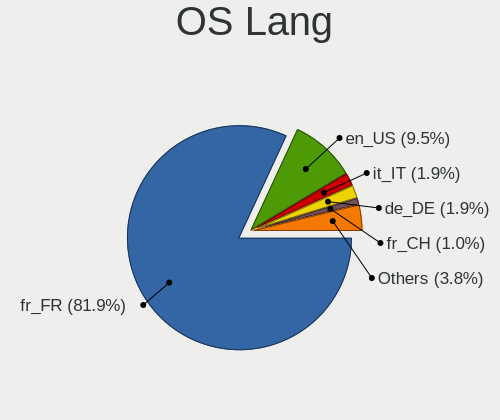
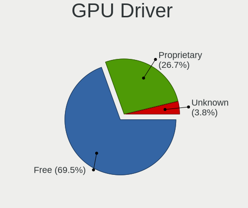
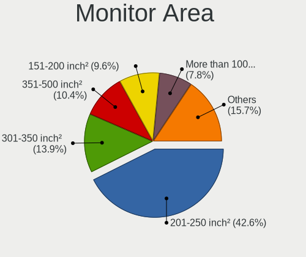
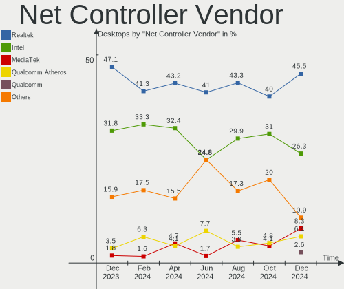
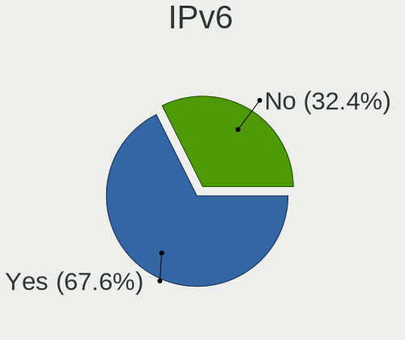

Linux in France - Hardware Trends (Desktops)
--------------------------------------------

A project to identify most popular hardware characteristics and track their change
over time based on data collected by Linux users at https://Linux-Hardware.org.

Anyone can contribute to this report by the [hw-probe](https://github.com/linuxhw/hw-probe) tool:

    sudo -E hw-probe -all -upload

Period: Jun, 2022.

Contents
--------

* [ System ](#system)
  - [ OS                       ](#os)
  - [ OS Family                ](#os-family)
  - [ Kernel                   ](#kernel)
  - [ Kernel Family            ](#kernel-family)
  - [ Kernel Major Ver.        ](#kernel-major-ver)
  - [ Arch                     ](#arch)
  - [ DE                       ](#de)
  - [ Display Server           ](#display-server)
  - [ Display Manager          ](#display-manager)
  - [ OS Lang                  ](#os-lang)
  - [ Boot Mode                ](#boot-mode)
  - [ Filesystem               ](#filesystem)
  - [ Part. scheme             ](#part-scheme)
  - [ Dual Boot with Linux/BSD ](#dual-boot-with-linuxbsd)
  - [ Dual Boot (Win)          ](#dual-boot-win)

* [ Board ](#board)
  - [ Vendor                   ](#vendor)
  - [ Model                    ](#model)
  - [ Model Family             ](#model-family)
  - [ MFG Year                 ](#mfg-year)
  - [ Form Factor              ](#form-factor)
  - [ Secure Boot              ](#secure-boot)
  - [ Coreboot                 ](#coreboot)
  - [ RAM Size                 ](#ram-size)
  - [ RAM Used                 ](#ram-used)
  - [ Total Drives             ](#total-drives)
  - [ Has CD-ROM               ](#has-cd-rom)
  - [ Has Ethernet             ](#has-ethernet)
  - [ Has WiFi                 ](#has-wifi)
  - [ Has Bluetooth            ](#has-bluetooth)

* [ Location ](#location)
  - [ Country                  ](#country)
  - [ City                     ](#city)

* [ Drives ](#drives)
  - [ Drive Vendor             ](#drive-vendor)
  - [ Drive Model              ](#drive-model)
  - [ HDD Vendor               ](#hdd-vendor)
  - [ SSD Vendor               ](#ssd-vendor)
  - [ Drive Kind               ](#drive-kind)
  - [ Drive Connector          ](#drive-connector)
  - [ Drive Size               ](#drive-size)
  - [ Space Total              ](#space-total)
  - [ Space Used               ](#space-used)
  - [ Malfunc. Drives          ](#malfunc-drives)
  - [ Malfunc. Drive Vendor    ](#malfunc-drive-vendor)
  - [ Malfunc. HDD Vendor      ](#malfunc-hdd-vendor)
  - [ Malfunc. Drive Kind      ](#malfunc-drive-kind)
  - [ Failed Drives            ](#failed-drives)
  - [ Failed Drive Vendor      ](#failed-drive-vendor)
  - [ Drive Status             ](#drive-status)

* [ Storage controller ](#storage-controller)
  - [ Storage Vendor           ](#storage-vendor)
  - [ Storage Model            ](#storage-model)
  - [ Storage Kind             ](#storage-kind)

* [ Processor ](#processor)
  - [ CPU Vendor               ](#cpu-vendor)
  - [ CPU Model                ](#cpu-model)
  - [ CPU Model Family         ](#cpu-model-family)
  - [ CPU Cores                ](#cpu-cores)
  - [ CPU Sockets              ](#cpu-sockets)
  - [ CPU Threads              ](#cpu-threads)
  - [ CPU Op-Modes             ](#cpu-op-modes)
  - [ CPU Microcode            ](#cpu-microcode)
  - [ CPU Microarch            ](#cpu-microarch)

* [ Graphics ](#graphics)
  - [ GPU Vendor               ](#gpu-vendor)
  - [ GPU Model                ](#gpu-model)
  - [ GPU Combo                ](#gpu-combo)
  - [ GPU Driver               ](#gpu-driver)
  - [ GPU Memory               ](#gpu-memory)

* [ Monitor ](#monitor)
  - [ Monitor Vendor           ](#monitor-vendor)
  - [ Monitor Model            ](#monitor-model)
  - [ Monitor Resolution       ](#monitor-resolution)
  - [ Monitor Diagonal         ](#monitor-diagonal)
  - [ Monitor Width            ](#monitor-width)
  - [ Aspect Ratio             ](#aspect-ratio)
  - [ Monitor Area             ](#monitor-area)
  - [ Pixel Density            ](#pixel-density)
  - [ Multiple Monitors        ](#multiple-monitors)

* [ Network ](#network)
  - [ Net Controller Vendor    ](#net-controller-vendor)
  - [ Net Controller Model     ](#net-controller-model)
  - [ Wireless Vendor          ](#wireless-vendor)
  - [ Wireless Model           ](#wireless-model)
  - [ Ethernet Vendor          ](#ethernet-vendor)
  - [ Ethernet Model           ](#ethernet-model)
  - [ Net Controller Kind      ](#net-controller-kind)
  - [ Used Controller          ](#used-controller)
  - [ NICs                     ](#nics)
  - [ IPv6                     ](#ipv6)

* [ Bluetooth ](#bluetooth)
  - [ Bluetooth Vendor         ](#bluetooth-vendor)
  - [ Bluetooth Model          ](#bluetooth-model)

* [ Sound ](#sound)
  - [ Sound Vendor             ](#sound-vendor)
  - [ Sound Model              ](#sound-model)

* [ Memory ](#memory)
  - [ Memory Vendor            ](#memory-vendor)
  - [ Memory Model             ](#memory-model)
  - [ Memory Kind              ](#memory-kind)
  - [ Memory Form Factor       ](#memory-form-factor)
  - [ Memory Size              ](#memory-size)
  - [ Memory Speed             ](#memory-speed)

* [ Printers & scanners ](#printers--scanners)
  - [ Printer Vendor           ](#printer-vendor)
  - [ Printer Model            ](#printer-model)
  - [ Scanner Vendor           ](#scanner-vendor)
  - [ Scanner Model            ](#scanner-model)

* [ Camera ](#camera)
  - [ Camera Vendor            ](#camera-vendor)
  - [ Camera Model             ](#camera-model)

* [ Security ](#security)
  - [ Fingerprint Vendor       ](#fingerprint-vendor)
  - [ Fingerprint Model        ](#fingerprint-model)
  - [ Chipcard Vendor          ](#chipcard-vendor)
  - [ Chipcard Model           ](#chipcard-model)

* [ Unsupported ](#unsupported)
  - [ Unsupported Devices      ](#unsupported-devices)
  - [ Unsupported Device Types ](#unsupported-device-types)

System
------

OS
--

Installed operating systems

| Name                         | Desktops | Percent |
|------------------------------|----------|---------|
| Ubuntu 20.04                 | 17       | 17.35%  |
| Ubuntu 22.04                 | 16       | 16.33%  |
| OpenMandriva 4.3             | 15       | 15.31%  |
| Fedora 36                    | 5        | 5.1%    |
| Debian 11                    | 5        | 5.1%    |
| Linux Mint 20.3              | 4        | 4.08%   |
| Arch                         | 4        | 4.08%   |
| Ubuntu MATE 20.04            | 3        | 3.06%   |
| Pop!_OS 22.04                | 3        | 3.06%   |
| Manjaro 21.3.1               | 3        | 3.06%   |
| Xubuntu 20.04                | 2        | 2.04%   |
| Manjaro 21.3.0               | 2        | 2.04%   |
| Manjaro 21.2.6               | 2        | 2.04%   |
| Lubuntu 22.04                | 2        | 2.04%   |
| Linux Mint 19.3              | 2        | 2.04%   |
| Arch Rolling                 | 2        | 2.04%   |
| Ubuntu 21.12                 | 1        | 1.02%   |
| Ubuntu 21.10                 | 1        | 1.02%   |
| Ubuntu 18.04                 | 1        | 1.02%   |
| SteamOS 3.2 (steamdeck-main) | 1        | 1.02%   |
| OpenMandriva 4.2             | 1        | 1.02%   |
| Linux Mint 20                | 1        | 1.02%   |
| Linux Lite 5.8               | 1        | 1.02%   |
| KDE neon 20.04               | 1        | 1.02%   |
| Elementary 6.1               | 1        | 1.02%   |
| Debian 10                    | 1        | 1.02%   |
| ArcoLinux Rolling            | 1        | 1.02%   |

OS Family
---------

OS without a version

| Name         | Desktops | Percent |
|--------------|----------|---------|
| Ubuntu       | 36       | 36.73%  |
| OpenMandriva | 16       | 16.33%  |
| Manjaro      | 7        | 7.14%   |
| Linux Mint   | 7        | 7.14%   |
| Debian       | 6        | 6.12%   |
| Arch         | 6        | 6.12%   |
| Fedora       | 5        | 5.1%    |
| Ubuntu MATE  | 3        | 3.06%   |
| Pop!_OS      | 3        | 3.06%   |
| Xubuntu      | 2        | 2.04%   |
| Lubuntu      | 2        | 2.04%   |
| SteamOS      | 1        | 1.02%   |
| Linux Lite   | 1        | 1.02%   |
| KDE neon     | 1        | 1.02%   |
| Elementary   | 1        | 1.02%   |
| ArcoLinux    | 1        | 1.02%   |

Kernel
------

Version of the Linux kernel

| Version                                            | Desktops | Percent |
|----------------------------------------------------|----------|---------|
| 5.16.7-desktop-1omv4003                            | 15       | 15.31%  |
| 5.13.0-51-generic                                  | 7        | 7.14%   |
| 5.4.0-117-generic                                  | 6        | 6.12%   |
| 5.15.0-40-generic                                  | 5        | 5.1%    |
| 5.15.0-33-generic                                  | 5        | 5.1%    |
| 5.4.0-120-generic                                  | 4        | 4.08%   |
| 5.15.0-39-generic                                  | 4        | 4.08%   |
| 5.15.49-1-MANJARO                                  | 3        | 3.06%   |
| 5.15.0-37-generic                                  | 3        | 3.06%   |
| 5.13.0-48-generic                                  | 3        | 3.06%   |
| 5.13.0-44-generic                                  | 3        | 3.06%   |
| 5.4.0-121-generic                                  | 2        | 2.04%   |
| 5.4.0-113-generic                                  | 2        | 2.04%   |
| 5.4.0-110-generic                                  | 2        | 2.04%   |
| 5.18.5-200.fc36.x86_64                             | 2        | 2.04%   |
| 5.17.5-76051705-generic                            | 2        | 2.04%   |
| 5.17.12-300.fc36.x86_64                            | 2        | 2.04%   |
| 5.4.0-91-generic                                   | 1        | 1.02%   |
| 5.4.0-81-generic                                   | 1        | 1.02%   |
| 5.18.7-arch1-1                                     | 1        | 1.02%   |
| 5.18.6-xanmod1                                     | 1        | 1.02%   |
| 5.18.6-arch1-1                                     | 1        | 1.02%   |
| 5.18.6-200.fc36.x86_64                             | 1        | 1.02%   |
| 5.18.5-arch1-1                                     | 1        | 1.02%   |
| 5.18.5-1-MANJARO                                   | 1        | 1.02%   |
| 5.18.3-261-tkg-bmq                                 | 1        | 1.02%   |
| 5.18.3-1-MANJARO                                   | 1        | 1.02%   |
| 5.18.2-arch1-1                                     | 1        | 1.02%   |
| 5.18.1-arch1-1                                     | 1        | 1.02%   |
| 5.18.0-1-MANJARO                                   | 1        | 1.02%   |
| 5.17.9-1-MANJARO                                   | 1        | 1.02%   |
| 5.17.15-76051715-generic                           | 1        | 1.02%   |
| 5.15.48-1-lts                                      | 1        | 1.02%   |
| 5.15.35-1-pve                                      | 1        | 1.02%   |
| 5.15.0-35-generic                                  | 1        | 1.02%   |
| 5.15.0-25-generic                                  | 1        | 1.02%   |
| 5.13.0-valve10.1-2-neptune-dri-02144-g7fffaf925dfb | 1        | 1.02%   |
| 5.13.0-35-generic                                  | 1        | 1.02%   |
| 5.11.0-44-generic                                  | 1        | 1.02%   |
| 5.10.14-desktop-1omv4002                           | 1        | 1.02%   |
| 5.10.0-8-amd64                                     | 1        | 1.02%   |
| 5.10.0-15-amd64                                    | 1        | 1.02%   |
| 5.10.0-14-amd64                                    | 1        | 1.02%   |
| 5.10.0-11-amd64                                    | 1        | 1.02%   |
| 4.15.0-187-generic                                 | 1        | 1.02%   |

Kernel Family
-------------

Linux kernel without a distro release

| Version | Desktops | Percent |
|---------|----------|---------|
| 5.15.0  | 19       | 19.39%  |
| 5.4.0   | 18       | 18.37%  |
| 5.16.7  | 15       | 15.31%  |
| 5.13.0  | 15       | 15.31%  |
| 5.18.5  | 4        | 4.08%   |
| 5.10.0  | 4        | 4.08%   |
| 5.18.6  | 3        | 3.06%   |
| 5.15.49 | 3        | 3.06%   |
| 5.18.3  | 2        | 2.04%   |
| 5.17.5  | 2        | 2.04%   |
| 5.17.12 | 2        | 2.04%   |
| 5.18.7  | 1        | 1.02%   |
| 5.18.2  | 1        | 1.02%   |
| 5.18.1  | 1        | 1.02%   |
| 5.18.0  | 1        | 1.02%   |
| 5.17.9  | 1        | 1.02%   |
| 5.17.15 | 1        | 1.02%   |
| 5.15.48 | 1        | 1.02%   |
| 5.15.35 | 1        | 1.02%   |
| 5.11.0  | 1        | 1.02%   |
| 5.10.14 | 1        | 1.02%   |
| 4.15.0  | 1        | 1.02%   |

Kernel Major Ver.
-----------------

Linux kernel major version

| Version | Desktops | Percent |
|---------|----------|---------|
| 5.15    | 24       | 24.49%  |
| 5.4     | 18       | 18.37%  |
| 5.16    | 15       | 15.31%  |
| 5.13    | 15       | 15.31%  |
| 5.18    | 13       | 13.27%  |
| 5.17    | 6        | 6.12%   |
| 5.10    | 5        | 5.1%    |
| 5.11    | 1        | 1.02%   |
| 4.15    | 1        | 1.02%   |

Arch
----

OS architecture (x86_64, i586, etc.)

| Name   | Desktops | Percent |
|--------|----------|---------|
| x86_64 | 96       | 97.96%  |
| i686   | 2        | 2.04%   |

DE
--

Desktop Environment

| Name          | Desktops | Percent |
|---------------|----------|---------|
| GNOME         | 45       | 45.92%  |
| KDE5          | 24       | 24.49%  |
| X-Cinnamon    | 6        | 6.12%   |
| MATE          | 6        | 6.12%   |
| XFCE          | 5        | 5.1%    |
| Unknown       | 4        | 4.08%   |
| LXQt          | 3        | 3.06%   |
| sway          | 1        | 1.02%   |
| Pantheon      | 1        | 1.02%   |
| i3            | 1        | 1.02%   |
| GNOME Classic | 1        | 1.02%   |
| Budgie        | 1        | 1.02%   |

Display Server
--------------

X11 or Wayland

| Name    | Desktops | Percent |
|---------|----------|---------|
| X11     | 77       | 78.57%  |
| Wayland | 15       | 15.31%  |
| Tty     | 4        | 4.08%   |
| Unknown | 2        | 2.04%   |

Display Manager
---------------

SDDM, LightDM, etc.

| Name    | Desktops | Percent |
|---------|----------|---------|
| SDDM    | 23       | 23.47%  |
| GDM3    | 20       | 20.41%  |
| GDM     | 19       | 19.39%  |
| LightDM | 17       | 17.35%  |
| Unknown | 17       | 17.35%  |
| WDM     | 1        | 1.02%   |
| Ly      | 1        | 1.02%   |

OS Lang
-------

Language

| Lang  | Desktops | Percent |
|-------|----------|---------|
| fr_FR | 74       | 75.51%  |
| en_US | 19       | 19.39%  |
| C     | 2        | 2.04%   |
| fr_BE | 1        | 1.02%   |
| es_ES | 1        | 1.02%   |
| en_AG | 1        | 1.02%   |

Boot Mode
---------

EFI or BIOS

| Mode | Desktops | Percent |
|------|----------|---------|
| BIOS | 51       | 52.04%  |
| EFI  | 47       | 47.96%  |

Filesystem
----------

Type of filesystem

| Type    | Desktops | Percent |
|---------|----------|---------|
| Ext4    | 72       | 73.47%  |
| Overlay | 15       | 15.31%  |
| Btrfs   | 11       | 11.22%  |

Part. scheme
------------

Scheme of partitioning

| Type    | Desktops | Percent |
|---------|----------|---------|
| GPT     | 53       | 54.08%  |
| Unknown | 27       | 27.55%  |
| MBR     | 18       | 18.37%  |

Dual Boot with Linux/BSD
------------------------

Hosting more than one Linux/BSD

| Dual boot | Desktops | Percent |
|-----------|----------|---------|
| No        | 69       | 70.41%  |
| Yes       | 29       | 29.59%  |

Dual Boot (Win)
---------------

Hosting Linux and Windows

| Dual boot | Desktops | Percent |
|-----------|----------|---------|
| No        | 64       | 65.31%  |
| Yes       | 34       | 34.69%  |

Board
-----

Vendor
------

Motherboard manufacturer

| Name                | Desktops | Percent |
|---------------------|----------|---------|
| ASUSTek Computer    | 26       | 26.53%  |
| MSI                 | 19       | 19.39%  |
| Dell                | 12       | 12.24%  |
| Gigabyte Technology | 9        | 9.18%   |
| Hewlett-Packard     | 8        | 8.16%   |
| Lenovo              | 6        | 6.12%   |
| ASRock              | 4        | 4.08%   |
| Acer                | 3        | 3.06%   |
| Unknown             | 3        | 3.06%   |
| Shuttle             | 1        | 1.02%   |
| Pegatron            | 1        | 1.02%   |
| Packard Bell        | 1        | 1.02%   |
| Minix               | 1        | 1.02%   |
| Maxtang             | 1        | 1.02%   |
| MACHINIST           | 1        | 1.02%   |
| Intel               | 1        | 1.02%   |
| BESSTAR Tech        | 1        | 1.02%   |

Model
-----

Motherboard model

| Name                                | Desktops | Percent |
|-------------------------------------|----------|---------|
| ASUS All Series                     | 3        | 3.06%   |
| Unknown                             | 3        | 3.06%   |
| MSI MS-7B84                         | 2        | 2.04%   |
| MSI MS-7740                         | 2        | 2.04%   |
| MSI MS-7360                         | 2        | 2.04%   |
| Lenovo ThinkCentre M73 10AXS1UY00   | 2        | 2.04%   |
| Dell OptiPlex 9020                  | 2        | 2.04%   |
| Shuttle DL10J                       | 1        | 1.02%   |
| Pegatron FZ084AA-ABF a6645fr        | 1        | 1.02%   |
| Packard Bell IMEDIA D4001 FR        | 1        | 1.02%   |
| MSI Z390 Prestige P100 (MS-B929)    | 1        | 1.02%   |
| MSI MS-7C51                         | 1        | 1.02%   |
| MSI MS-7C37                         | 1        | 1.02%   |
| MSI MS-7C09                         | 1        | 1.02%   |
| MSI MS-7C02                         | 1        | 1.02%   |
| MSI MS-7A38                         | 1        | 1.02%   |
| MSI MS-7A31                         | 1        | 1.02%   |
| MSI MS-7994                         | 1        | 1.02%   |
| MSI MS-7918                         | 1        | 1.02%   |
| MSI MS-7917                         | 1        | 1.02%   |
| MSI MS-7786                         | 1        | 1.02%   |
| MSI MS-7758                         | 1        | 1.02%   |
| MSI MS-7641                         | 1        | 1.02%   |
| Minix Z83-4 Pro                     | 1        | 1.02%   |
| Maxtang FP30                        | 1        | 1.02%   |
| MACHINIST X99-RS9 V2.0              | 1        | 1.02%   |
| Lenovo ThinkStation P320 30BH000BFR | 1        | 1.02%   |
| Lenovo ThinkCentre M83 10AGS0YM00   | 1        | 1.02%   |
| Lenovo ThinkCentre M71e 5033AR1     | 1        | 1.02%   |
| Lenovo ThinkCentre M58p 9965A5G     | 1        | 1.02%   |
| Intel D33217GKE G76540-203          | 1        | 1.02%   |
| HP Z400 Workstation                 | 1        | 1.02%   |
| HP Z220 CMT Workstation             | 1        | 1.02%   |
| HP ProLiant ML350 G6                | 1        | 1.02%   |
| HP ProDesk 600 G1 SFF               | 1        | 1.02%   |
| HP Pavilion Desktop 590-p0xxx       | 1        | 1.02%   |
| HP EliteDesk 800 G4 SFF             | 1        | 1.02%   |
| HP 450-a127nf                       | 1        | 1.02%   |
| HP 260-p151nf                       | 1        | 1.02%   |
| Gigabyte Z87X-UD3H                  | 1        | 1.02%   |
| Gigabyte Z590 AORUS ELITE AX        | 1        | 1.02%   |
| Gigabyte X399 AORUS Gaming 7        | 1        | 1.02%   |
| Gigabyte H97-HD3                    | 1        | 1.02%   |
| Gigabyte H110M-S2H                  | 1        | 1.02%   |
| Gigabyte F2A88XM-D3H                | 1        | 1.02%   |
| Gigabyte EU1009807_2120317          | 1        | 1.02%   |
| Gigabyte B450M DS3H                 | 1        | 1.02%   |
| Gigabyte B450 AORUS ELITE           | 1        | 1.02%   |
| Dell Precision 5820 Tower           | 1        | 1.02%   |
| Dell OptiPlex GX280                 | 1        | 1.02%   |
| Dell OptiPlex 760                   | 1        | 1.02%   |
| Dell OptiPlex 745                   | 1        | 1.02%   |
| Dell OptiPlex 7080                  | 1        | 1.02%   |
| Dell OptiPlex 7070                  | 1        | 1.02%   |
| Dell OptiPlex 7010                  | 1        | 1.02%   |
| Dell OptiPlex 3020M                 | 1        | 1.02%   |
| Dell OptiPlex 3020                  | 1        | 1.02%   |
| Dell Inspiron 3847                  | 1        | 1.02%   |
| BESSTAR Tech HM90                   | 1        | 1.02%   |
| ASUS TUF Gaming X570-PLUS           | 1        | 1.02%   |

Model Family
------------

Motherboard model prefix

| Name                 | Desktops | Percent |
|----------------------|----------|---------|
| Dell OptiPlex        | 10       | 10.2%   |
| Lenovo ThinkCentre   | 5        | 5.1%    |
| ASUS PRIME           | 5        | 5.1%    |
| ASUS TUF             | 4        | 4.08%   |
| ASUS ROG             | 4        | 4.08%   |
| ASUS P8Z68-V         | 3        | 3.06%   |
| ASUS All             | 3        | 3.06%   |
| Unknown              | 3        | 3.06%   |
| MSI MS-7B84          | 2        | 2.04%   |
| MSI MS-7740          | 2        | 2.04%   |
| MSI MS-7360          | 2        | 2.04%   |
| Acer Aspire          | 2        | 2.04%   |
| Shuttle DL10J        | 1        | 1.02%   |
| Pegatron FZ084AA-ABF | 1        | 1.02%   |
| Packard Bell IMEDIA  | 1        | 1.02%   |
| MSI Z390             | 1        | 1.02%   |
| MSI MS-7C51          | 1        | 1.02%   |
| MSI MS-7C37          | 1        | 1.02%   |
| MSI MS-7C09          | 1        | 1.02%   |
| MSI MS-7C02          | 1        | 1.02%   |
| MSI MS-7A38          | 1        | 1.02%   |
| MSI MS-7A31          | 1        | 1.02%   |
| MSI MS-7994          | 1        | 1.02%   |
| MSI MS-7918          | 1        | 1.02%   |
| MSI MS-7917          | 1        | 1.02%   |
| MSI MS-7786          | 1        | 1.02%   |
| MSI MS-7758          | 1        | 1.02%   |
| MSI MS-7641          | 1        | 1.02%   |
| Minix Z83-4          | 1        | 1.02%   |
| Maxtang FP30         | 1        | 1.02%   |
| MACHINIST X99-RS9    | 1        | 1.02%   |
| Lenovo ThinkStation  | 1        | 1.02%   |
| Intel D33217GKE      | 1        | 1.02%   |
| HP Z400              | 1        | 1.02%   |
| HP Z220              | 1        | 1.02%   |
| HP ProLiant          | 1        | 1.02%   |
| HP ProDesk           | 1        | 1.02%   |
| HP Pavilion          | 1        | 1.02%   |
| HP EliteDesk         | 1        | 1.02%   |
| HP 450-a127nf        | 1        | 1.02%   |
| HP 260-p151nf        | 1        | 1.02%   |
| Gigabyte Z87X-UD3H   | 1        | 1.02%   |
| Gigabyte Z590        | 1        | 1.02%   |
| Gigabyte X399        | 1        | 1.02%   |
| Gigabyte H97-HD3     | 1        | 1.02%   |
| Gigabyte H110M-S2H   | 1        | 1.02%   |
| Gigabyte F2A88XM-D3H | 1        | 1.02%   |
| Gigabyte EU1009807   | 1        | 1.02%   |
| Gigabyte B450M       | 1        | 1.02%   |
| Gigabyte B450        | 1        | 1.02%   |
| Dell Precision       | 1        | 1.02%   |
| Dell Inspiron        | 1        | 1.02%   |
| BESSTAR Tech HM90    | 1        | 1.02%   |
| ASUS STRIX           | 1        | 1.02%   |
| ASUS SABERTOOTH      | 1        | 1.02%   |
| ASUS Q170M2          | 1        | 1.02%   |
| ASUS ProArt          | 1        | 1.02%   |
| ASUS M5A97           | 1        | 1.02%   |
| ASUS H61M-K          | 1        | 1.02%   |
| ASUS H170M-PLUS      | 1        | 1.02%   |

MFG Year
--------

Motherboard manufacture year

| Year | Desktops | Percent |
|------|----------|---------|
| 2018 | 13       | 13.27%  |
| 2019 | 11       | 11.22%  |
| 2014 | 10       | 10.2%   |
| 2013 | 9        | 9.18%   |
| 2021 | 8        | 8.16%   |
| 2011 | 8        | 8.16%   |
| 2020 | 6        | 6.12%   |
| 2017 | 6        | 6.12%   |
| 2015 | 5        | 5.1%    |
| 2012 | 5        | 5.1%    |
| 2009 | 4        | 4.08%   |
| 2010 | 3        | 3.06%   |
| 2008 | 3        | 3.06%   |
| 2022 | 2        | 2.04%   |
| 2016 | 2        | 2.04%   |
| 2007 | 2        | 2.04%   |
| 2004 | 1        | 1.02%   |

Form Factor
-----------

Physical design of the computer

| Name    | Desktops | Percent |
|---------|----------|---------|
| Desktop | 98       | 100%    |

Secure Boot
-----------

Enabled or disabled

| State    | Desktops | Percent |
|----------|----------|---------|
| Disabled | 95       | 96.94%  |
| Enabled  | 3        | 3.06%   |

Coreboot
--------

Have coreboot on board

| Used | Desktops | Percent |
|------|----------|---------|
| No   | 98       | 100%    |

RAM Size
--------

Total RAM memory

| Size in GB  | Desktops | Percent |
|-------------|----------|---------|
| 16.01-24.0  | 28       | 28.57%  |
| 8.01-16.0   | 19       | 19.39%  |
| 4.01-8.0    | 18       | 18.37%  |
| 3.01-4.0    | 15       | 15.31%  |
| 32.01-64.0  | 11       | 11.22%  |
| 64.01-256.0 | 4        | 4.08%   |
| 24.01-32.0  | 1        | 1.02%   |
| 2.01-3.0    | 1        | 1.02%   |
| 1.01-2.0    | 1        | 1.02%   |

RAM Used
--------

Used RAM memory

| Used GB   | Desktops | Percent |
|-----------|----------|---------|
| 1.01-2.0  | 31       | 31.63%  |
| 2.01-3.0  | 21       | 21.43%  |
| 4.01-8.0  | 20       | 20.41%  |
| 3.01-4.0  | 12       | 12.24%  |
| 8.01-16.0 | 6        | 6.12%   |
| 0.51-1.0  | 6        | 6.12%   |
| 0.01-0.5  | 2        | 2.04%   |

Total Drives
------------

Number of drives on board

| Drives | Desktops | Percent |
|--------|----------|---------|
| 1      | 40       | 40.82%  |
| 2      | 28       | 28.57%  |
| 3      | 18       | 18.37%  |
| 4      | 4        | 4.08%   |
| 5      | 3        | 3.06%   |
| 7      | 2        | 2.04%   |
| 8      | 1        | 1.02%   |
| 6      | 1        | 1.02%   |
| 0      | 1        | 1.02%   |

Has CD-ROM
----------

Has CD-ROM on board

| Presented | Desktops | Percent |
|-----------|----------|---------|
| No        | 52       | 53.06%  |
| Yes       | 46       | 46.94%  |

Has Ethernet
------------

Has Ethernet on board

| Presented | Desktops | Percent |
|-----------|----------|---------|
| Yes       | 98       | 100%    |

Has WiFi
--------

Has WiFi module

| Presented | Desktops | Percent |
|-----------|----------|---------|
| No        | 59       | 60.2%   |
| Yes       | 39       | 39.8%   |

Has Bluetooth
-------------

Has Bluetooth module

| Presented | Desktops | Percent |
|-----------|----------|---------|
| No        | 65       | 66.33%  |
| Yes       | 33       | 33.67%  |

Location
--------

Country
-------

Geographic location (country)

| Country | Desktops | Percent |
|---------|----------|---------|
| France  | 98       | 100%    |

City
----

Geographic location (city)

| City                     | Desktops | Percent |
|--------------------------|----------|---------|
| Paris                    | 12       | 12.24%  |
| Vannes                   | 2        | 2.04%   |
| Nîmes                   | 2        | 2.04%   |
| Nantes                   | 2        | 2.04%   |
| Lille                    | 2        | 2.04%   |
| Greoux-les-Bains         | 2        | 2.04%   |
| Combs-la-Ville           | 2        | 2.04%   |
| Cherbourg-Octeville      | 2        | 2.04%   |
| Brest                    | 2        | 2.04%   |
| Asnieres-sur-Seine       | 2        | 2.04%   |
| Villeneuve-de-Riviere    | 1        | 1.02%   |
| Vertou                   | 1        | 1.02%   |
| Valentigney              | 1        | 1.02%   |
| Valence                  | 1        | 1.02%   |
| Tourcoing                | 1        | 1.02%   |
| Toulouse                 | 1        | 1.02%   |
| Thenon                   | 1        | 1.02%   |
| Sète                    | 1        | 1.02%   |
| Sceaux                   | 1        | 1.02%   |
| Saumur                   | 1        | 1.02%   |
| Saujon                   | 1        | 1.02%   |
| Sartrouville             | 1        | 1.02%   |
| Sarcelles                | 1        | 1.02%   |
| Salon-de-Provence        | 1        | 1.02%   |
| Saint-Vaast-en-Cambresis | 1        | 1.02%   |
| Saint-Martin-d'Hères    | 1        | 1.02%   |
| Saint-Herblain           | 1        | 1.02%   |
| Saint-Benoit             | 1        | 1.02%   |
| Rouen                    | 1        | 1.02%   |
| Romans-sur-Isère        | 1        | 1.02%   |
| Roche-la-Moliere         | 1        | 1.02%   |
| Reims                    | 1        | 1.02%   |
| Quissac                  | 1        | 1.02%   |
| Pommeret                 | 1        | 1.02%   |
| Plerin                   | 1        | 1.02%   |
| Plan-de-Cuques           | 1        | 1.02%   |
| Perpignan                | 1        | 1.02%   |
| Niederhaslach            | 1        | 1.02%   |
| Neuilly-sur-Seine        | 1        | 1.02%   |
| Montigny-le-Bretonneux   | 1        | 1.02%   |
| Montevrain               | 1        | 1.02%   |
| Mieuxce                  | 1        | 1.02%   |
| Meylan                   | 1        | 1.02%   |
| Mereville                | 1        | 1.02%   |
| Martigues                | 1        | 1.02%   |
| Marseille                | 1        | 1.02%   |
| Mâcon                   | 1        | 1.02%   |
| Lorient                  | 1        | 1.02%   |
| Libourne                 | 1        | 1.02%   |
| Les Herbiers             | 1        | 1.02%   |
| Lavelanet                | 1        | 1.02%   |
| Labruguiere              | 1        | 1.02%   |
| Ivry-sur-Seine           | 1        | 1.02%   |
| Houilles                 | 1        | 1.02%   |
| Habsheim                 | 1        | 1.02%   |
| Frouzins                 | 1        | 1.02%   |
| Fresnoy-le-Grand         | 1        | 1.02%   |
| Franconville             | 1        | 1.02%   |
| Ferriere-la-Grande       | 1        | 1.02%   |
| Eguisheim                | 1        | 1.02%   |

Drives
------

Drive Vendor
------------

Hard drive vendors

| Vendor                    | Desktops | Drives | Percent |
|---------------------------|----------|--------|---------|
| Samsung Electronics       | 33       | 41     | 18.54%  |
| WDC                       | 31       | 38     | 17.42%  |
| Seagate                   | 27       | 34     | 15.17%  |
| Crucial                   | 18       | 22     | 10.11%  |
| Toshiba                   | 12       | 13     | 6.74%   |
| SanDisk                   | 8        | 9      | 4.49%   |
| Kingston                  | 8        | 8      | 4.49%   |
| Unknown                   | 4        | 4      | 2.25%   |
| Maxtor                    | 4        | 4      | 2.25%   |
| OCZ                       | 3        | 3      | 1.69%   |
| LDLC                      | 3        | 3      | 1.69%   |
| Hitachi                   | 3        | 4      | 1.69%   |
| SK hynix                  | 2        | 2      | 1.12%   |
| Phison                    | 2        | 2      | 1.12%   |
| A-DATA Technology         | 2        | 2      | 1.12%   |
| Unknown                   | 2        | 2      | 1.12%   |
| XPG                       | 1        | 1      | 0.56%   |
| Sagemcom                  | 1        | 1      | 0.56%   |
| SABRENT                   | 1        | 1      | 0.56%   |
| PNY                       | 1        | 1      | 0.56%   |
| Micron/Crucial Technology | 1        | 2      | 0.56%   |
| Magnetic Data             | 1        | 1      | 0.56%   |
| LITEONIT                  | 1        | 1      | 0.56%   |
| KIOXIA                    | 1        | 1      | 0.56%   |
| JMicron Technology        | 1        | 1      | 0.56%   |
| Inateck                   | 1        | 1      | 0.56%   |
| HGST                      | 1        | 1      | 0.56%   |
| H/W                       | 1        | 3      | 0.56%   |
| Gigabyte Technology       | 1        | 1      | 0.56%   |
| EMTEC                     | 1        | 1      | 0.56%   |
| Dogfish                   | 1        | 1      | 0.56%   |
| China                     | 1        | 1      | 0.56%   |

Drive Model
-----------

Hard drive models

| Model                                  | Desktops | Percent |
|----------------------------------------|----------|---------|
| Crucial CT500MX500SSD1 500GB           | 5        | 2.45%   |
| Seagate ST500DM002-1BD142 500GB        | 4        | 1.96%   |
| Seagate ST2000DM008-2FR102 2TB         | 3        | 1.47%   |
| Samsung SSD 970 EVO Plus 500GB         | 3        | 1.47%   |
| Samsung SSD 870 QVO 1TB                | 3        | 1.47%   |
| Samsung SSD 860 EVO 500GB              | 3        | 1.47%   |
| Samsung SM963 2.5" NVMe PCIe SSD 500GB | 3        | 1.47%   |
| WDC WD40EFRX-68N32N0 4TB               | 2        | 0.98%   |
| WDC WD10EZEX-08WN4A0 1TB               | 2        | 0.98%   |
| Unknown SD/MMC/MS PRO 128GB            | 2        | 0.98%   |
| Toshiba MK6465GSX 640GB                | 2        | 0.98%   |
| Toshiba HDWD110 1TB                    | 2        | 0.98%   |
| Seagate ST2000DM001-1ER164 2TB         | 2        | 0.98%   |
| Seagate ST1000LM049-2GH172 1TB         | 2        | 0.98%   |
| Seagate ST1000DM003-1ER162 1TB         | 2        | 0.98%   |
| Samsung SSD 980 500GB                  | 2        | 0.98%   |
| Samsung SSD 960 EVO 250GB              | 2        | 0.98%   |
| Samsung SSD 860 QVO 1TB                | 2        | 0.98%   |
| Samsung NVMe SSD Drive 250GB           | 2        | 0.98%   |
| OCZ VERTEX4 128GB SSD                  | 2        | 0.98%   |
| LDLC SSD 120GB                         | 2        | 0.98%   |
| Kingston SV300S37A 60G SSD             | 2        | 0.98%   |
| Crucial CT480BX500SSD1 480GB           | 2        | 0.98%   |
| Crucial CT275MX300SSD1 275GB           | 2        | 0.98%   |
| Crucial CT240M500SSD1 240GB            | 2        | 0.98%   |
| Crucial CT2000MX500SSD1 2TB            | 2        | 0.98%   |
| Unknown                                | 2        | 0.98%   |
| XPG NVMe SSD Drive 512GB               | 1        | 0.49%   |
| WDC WDS250G2B0A 250GB SSD              | 1        | 0.49%   |
| WDC WDS240G2G0A-00JH30 240GB SSD       | 1        | 0.49%   |
| WDC WDS100T2B0B-00YS70 1TB SSD         | 1        | 0.49%   |
| WDC WD7500BPVT-80HXZT3 752GB           | 1        | 0.49%   |
| WDC WD6400AAVS-00G9B0 640GB            | 1        | 0.49%   |
| WDC WD6400AAKS-65A7B2 640GB            | 1        | 0.49%   |
| WDC WD5000AAKX-75U6AA0 500GB           | 1        | 0.49%   |
| WDC WD5000AAKX-083CA1 500GB            | 1        | 0.49%   |
| WDC WD5000AAJS-22TKA0 500GB            | 1        | 0.49%   |
| WDC WD4003FRYZ-01F0DB0 4TB             | 1        | 0.49%   |
| WDC WD3200LPVX-22V0TT0 320GB           | 1        | 0.49%   |
| WDC WD3200AAKX-001CA0 320GB            | 1        | 0.49%   |
| WDC WD3200AAJS-00B4A0 320GB            | 1        | 0.49%   |
| WDC WD30EFRX-68EUZN0 3TB               | 1        | 0.49%   |
| WDC WD2502ABYS-01B7A0 256GB            | 1        | 0.49%   |
| WDC WD2500AAKX-001CA0 250GB            | 1        | 0.49%   |
| WDC WD20PURX-64P6ZY0 2TB               | 1        | 0.49%   |
| WDC WD20EZRX-22D8PB0 2TB               | 1        | 0.49%   |
| WDC WD20EZRX-00D8PB0 2TB               | 1        | 0.49%   |
| WDC WD10JPVX-00JC3T0 1TB               | 1        | 0.49%   |
| WDC WD10EZRZ-22HTKB0 1TB               | 1        | 0.49%   |
| WDC WD10EZRZ-00HTKB0 1TB               | 1        | 0.49%   |
| WDC WD10EZRX-00D8PB0 1TB               | 1        | 0.49%   |
| WDC WD10EZEX-60WN4A0 1TB               | 1        | 0.49%   |
| WDC WD10EZEX-07WN4A0 1TB               | 1        | 0.49%   |
| WDC WD10EZEX-00RKKA0 1TB               | 1        | 0.49%   |
| WDC WD10EZEX-00BN5A0 1TB               | 1        | 0.49%   |
| WDC WD10EARX-00N0YB0 1TB               | 1        | 0.49%   |
| WDC WD10EARS-00Y5B1 1TB                | 1        | 0.49%   |
| WDC WD10EALS-00Z8A0 1TB                | 1        | 0.49%   |
| WDC WD10EADS-00M2B0 1TB                | 1        | 0.49%   |
| WDC WD10EADS-00L5B1 1TB                | 1        | 0.49%   |

HDD Vendor
----------

Hard disk drive vendors

| Vendor              | Desktops | Drives | Percent |
|---------------------|----------|--------|---------|
| WDC                 | 30       | 35     | 35.71%  |
| Seagate             | 27       | 34     | 32.14%  |
| Toshiba             | 10       | 10     | 11.9%   |
| Samsung Electronics | 4        | 4      | 4.76%   |
| Maxtor              | 4        | 4      | 4.76%   |
| Hitachi             | 3        | 4      | 3.57%   |
| Unknown             | 2        | 2      | 2.38%   |
| Magnetic Data       | 1        | 1      | 1.19%   |
| JMicron Technology  | 1        | 1      | 1.19%   |
| Inateck             | 1        | 1      | 1.19%   |
| HGST                | 1        | 1      | 1.19%   |

SSD Vendor
----------

Solid state drive vendors

| Vendor              | Desktops | Drives | Percent |
|---------------------|----------|--------|---------|
| Samsung Electronics | 19       | 19     | 27.94%  |
| Crucial             | 17       | 20     | 25%     |
| Kingston            | 7        | 7      | 10.29%  |
| SanDisk             | 5        | 5      | 7.35%   |
| WDC                 | 3        | 3      | 4.41%   |
| OCZ                 | 3        | 3      | 4.41%   |
| LDLC                | 3        | 3      | 4.41%   |
| Toshiba             | 2        | 2      | 2.94%   |
| A-DATA Technology   | 2        | 2      | 2.94%   |
| Unknown             | 2        | 2      | 2.94%   |
| PNY                 | 1        | 1      | 1.47%   |
| LITEONIT            | 1        | 1      | 1.47%   |
| EMTEC               | 1        | 1      | 1.47%   |
| Dogfish             | 1        | 1      | 1.47%   |
| China               | 1        | 1      | 1.47%   |

Drive Kind
----------

HDD or SSD

| Kind    | Desktops | Drives | Percent |
|---------|----------|--------|---------|
| HDD     | 63       | 97     | 43.45%  |
| SSD     | 51       | 71     | 35.17%  |
| NVMe    | 27       | 36     | 18.62%  |
| MMC     | 2        | 2      | 1.38%   |
| Unknown | 2        | 4      | 1.38%   |

Drive Connector
---------------

SATA, SAS, NVMe, etc.

| Type | Desktops | Drives | Percent |
|------|----------|--------|---------|
| SATA | 85       | 165    | 70.25%  |
| NVMe | 26       | 35     | 21.49%  |
| SAS  | 8        | 8      | 6.61%   |
| MMC  | 2        | 2      | 1.65%   |

Drive Size
----------

Size of hard drive

| Size in TB | Desktops | Drives | Percent |
|------------|----------|--------|---------|
| 0.01-0.5   | 62       | 85     | 49.6%   |
| 0.51-1.0   | 38       | 53     | 30.4%   |
| 1.01-2.0   | 18       | 22     | 14.4%   |
| 3.01-4.0   | 5        | 6      | 4%      |
| 2.01-3.0   | 1        | 1      | 0.8%    |
| 4.01-10.0  | 1        | 1      | 0.8%    |

Space Total
-----------

Amount of disk space available on the file system

| Size in GB     | Desktops | Percent |
|----------------|----------|---------|
| 501-1000       | 19       | 19.39%  |
| 101-250        | 14       | 14.29%  |
| More than 3000 | 12       | 12.24%  |
| 251-500        | 12       | 12.24%  |
| 1001-2000      | 12       | 12.24%  |
| 1-20           | 9        | 9.18%   |
| 2001-3000      | 7        | 7.14%   |
| Unknown        | 6        | 6.12%   |
| 51-100         | 4        | 4.08%   |
| 21-50          | 3        | 3.06%   |

Space Used
----------

Amount of used disk space

| Used GB        | Desktops | Percent |
|----------------|----------|---------|
| 1-20           | 20       | 20.41%  |
| 21-50          | 15       | 15.31%  |
| 501-1000       | 14       | 14.29%  |
| 101-250        | 11       | 11.22%  |
| 1001-2000      | 10       | 10.2%   |
| 251-500        | 9        | 9.18%   |
| 51-100         | 8        | 8.16%   |
| Unknown        | 6        | 6.12%   |
| More than 3000 | 4        | 4.08%   |
| 2001-3000      | 1        | 1.02%   |

Malfunc. Drives
---------------

Drive models with a malfunction

| Model                                            | Desktops | Drives | Percent |
|--------------------------------------------------|----------|--------|---------|
| Toshiba MK6465GSX 640GB                          | 2        | 2      | 13.33%  |
| OCZ VERTEX4 128GB SSD                            | 2        | 2      | 13.33%  |
| WDC WD10EZEX-00RKKA0 1TB                         | 1        | 1      | 6.67%   |
| Seagate ST2000DM001-1ER164 2TB                   | 1        | 1      | 6.67%   |
| Seagate ST1000DM003-9YN162 1TB                   | 1        | 1      | 6.67%   |
| Samsung Electronics MZ7TE128HMGR-000H1 128GB SSD | 1        | 1      | 6.67%   |
| Maxtor STM3320613AS 320GB                        | 1        | 1      | 6.67%   |
| Maxtor STM3160211AS 160GB                        | 1        | 1      | 6.67%   |
| LITEONIT LCT-128M3S 128GB SSD                    | 1        | 1      | 6.67%   |
| LDLC SSD 120GB                                   | 1        | 1      | 6.67%   |
| Hitachi HTS727575A9E364 752GB                    | 1        | 1      | 6.67%   |
| Crucial CT275MX300SSD1 275GB                     | 1        | 1      | 6.67%   |
| China SSD 180GB                                  | 1        | 1      | 6.67%   |

Malfunc. Drive Vendor
---------------------

Vendors of faulty drives

| Vendor              | Desktops | Drives | Percent |
|---------------------|----------|--------|---------|
| Toshiba             | 2        | 2      | 13.33%  |
| Seagate             | 2        | 2      | 13.33%  |
| OCZ                 | 2        | 2      | 13.33%  |
| Maxtor              | 2        | 2      | 13.33%  |
| WDC                 | 1        | 1      | 6.67%   |
| Samsung Electronics | 1        | 1      | 6.67%   |
| LITEONIT            | 1        | 1      | 6.67%   |
| LDLC                | 1        | 1      | 6.67%   |
| Hitachi             | 1        | 1      | 6.67%   |
| Crucial             | 1        | 1      | 6.67%   |
| China               | 1        | 1      | 6.67%   |

Malfunc. HDD Vendor
-------------------

Vendors of faulty HDD drives

| Vendor  | Desktops | Drives | Percent |
|---------|----------|--------|---------|
| Toshiba | 2        | 2      | 25%     |
| Seagate | 2        | 2      | 25%     |
| Maxtor  | 2        | 2      | 25%     |
| WDC     | 1        | 1      | 12.5%   |
| Hitachi | 1        | 1      | 12.5%   |

Malfunc. Drive Kind
-------------------

Kinds of faulty drives

| Kind | Desktops | Drives | Percent |
|------|----------|--------|---------|
| SSD  | 7        | 7      | 50%     |
| HDD  | 7        | 8      | 50%     |

Failed Drives
-------------

Failed drive models

Zero info for selected period =(

Failed Drive Vendor
-------------------

Failed drive vendors

Zero info for selected period =(

Drive Status
------------

Number of failed and malfunc. drives

| Status   | Desktops | Drives | Percent |
|----------|----------|--------|---------|
| Works    | 61       | 101    | 54.46%  |
| Detected | 39       | 94     | 34.82%  |
| Malfunc  | 12       | 15     | 10.71%  |

Storage controller
------------------

Storage Vendor
--------------

Storage controller vendors

| Vendor                       | Desktops | Percent |
|------------------------------|----------|---------|
| Intel                        | 66       | 48.18%  |
| AMD                          | 29       | 21.17%  |
| Samsung Electronics          | 14       | 10.22%  |
| Marvell Technology Group     | 5        | 3.65%   |
| SanDisk                      | 3        | 2.19%   |
| Phison Electronics           | 3        | 2.19%   |
| ASMedia Technology           | 3        | 2.19%   |
| SK hynix                     | 2        | 1.46%   |
| Nvidia                       | 2        | 1.46%   |
| JMicron Technology           | 2        | 1.46%   |
| Toshiba America Info Systems | 1        | 0.73%   |
| Micron/Crucial Technology    | 1        | 0.73%   |
| MAXIO Technology (Hangzhou)  | 1        | 0.73%   |
| LSI Logic / Symbios Logic    | 1        | 0.73%   |
| KIOXIA                       | 1        | 0.73%   |
| Kingston Technology Company  | 1        | 0.73%   |
| Hewlett-Packard              | 1        | 0.73%   |
| ADATA Technology             | 1        | 0.73%   |

Storage Model
-------------

Storage controller models

| Model                                                                                   | Desktops | Percent |
|-----------------------------------------------------------------------------------------|----------|---------|
| AMD FCH SATA Controller [AHCI mode]                                                     | 20       | 12.2%   |
| Intel 8 Series/C220 Series Chipset Family 6-port SATA Controller 1 [AHCI mode]          | 13       | 7.93%   |
| AMD 400 Series Chipset SATA Controller                                                  | 10       | 6.1%    |
| Samsung NVMe SSD Controller SM981/PM981/PM983                                           | 7        | 4.27%   |
| Intel Cannon Lake PCH SATA AHCI Controller                                              | 7        | 4.27%   |
| Intel Q170/Q150/B150/H170/H110/Z170/CM236 Chipset SATA Controller [AHCI Mode]           | 6        | 3.66%   |
| Samsung NVMe SSD Controller SM961/PM961/SM963                                           | 5        | 3.05%   |
| Intel SATA Controller [RAID mode]                                                       | 5        | 3.05%   |
| Intel 6 Series/C200 Series Chipset Family 6 port Desktop SATA AHCI Controller           | 5        | 3.05%   |
| Intel 9 Series Chipset Family SATA Controller [AHCI Mode]                               | 4        | 2.44%   |
| Intel Celeron/Pentium Silver Processor SATA Controller                                  | 3        | 1.83%   |
| Intel 200 Series PCH SATA controller [AHCI mode]                                        | 3        | 1.83%   |
| AMD 500 Series Chipset SATA Controller                                                  | 3        | 1.83%   |
| Samsung NVMe SSD Controller 980                                                         | 2        | 1.22%   |
| Phison E16 PCIe4 NVMe Controller                                                        | 2        | 1.22%   |
| Marvell Group 88SE6111/6121 SATA II / PATA Controller                                   | 2        | 1.22%   |
| JMicron JMB362 SATA Controller                                                          | 2        | 1.22%   |
| Intel 82801JI (ICH10 Family) 2 port SATA IDE Controller #2                              | 2        | 1.22%   |
| Intel 82801JD/DO (ICH10 Family) SATA AHCI Controller                                    | 2        | 1.22%   |
| Intel 82801IB (ICH9) 2 port SATA Controller [IDE mode]                                  | 2        | 1.22%   |
| Intel 82801I (ICH9 Family) 2 port SATA Controller [IDE mode]                            | 2        | 1.22%   |
| Intel 7 Series/C210 Series Chipset Family 6-port SATA Controller [AHCI mode]            | 2        | 1.22%   |
| Intel 6 Series/C200 Series Chipset Family Desktop SATA Controller (IDE mode, ports 4-5) | 2        | 1.22%   |
| Intel 6 Series/C200 Series Chipset Family Desktop SATA Controller (IDE mode, ports 0-3) | 2        | 1.22%   |
| Intel 4 Series Chipset PT IDER Controller                                               | 2        | 1.22%   |
| ASMedia ASM1061 SATA IDE Controller                                                     | 2        | 1.22%   |
| AMD SB7x0/SB8x0/SB9x0 SATA Controller [AHCI mode]                                       | 2        | 1.22%   |
| AMD FCH SATA Controller D                                                               | 2        | 1.22%   |
| Toshiba America Info Systems BG3 NVMe SSD Controller                                    | 1        | 0.61%   |
| SK hynix Gold P31 SSD                                                                   | 1        | 0.61%   |
| SK hynix BC511                                                                          | 1        | 0.61%   |
| SanDisk WD Blue SN570 NVMe SSD                                                          | 1        | 0.61%   |
| SanDisk WD Black SN750 / PC SN730 NVMe SSD                                              | 1        | 0.61%   |
| SanDisk Non-Volatile memory controller                                                  | 1        | 0.61%   |
| Samsung NVMe SSD Controller PM9A1/PM9A3/980PRO                                          | 1        | 0.61%   |
| Phison E12 NVMe Controller                                                              | 1        | 0.61%   |
| Nvidia MCP73 IDE Controller                                                             | 1        | 0.61%   |
| Nvidia MCP61 SATA Controller                                                            | 1        | 0.61%   |
| Nvidia MCP61 IDE                                                                        | 1        | 0.61%   |
| Nvidia GeForce 7100/nForce 630i SATA                                                    | 1        | 0.61%   |
| Micron/Crucial NVMe Controller                                                          | 1        | 0.61%   |
| MAXIO (Hangzhou) NVMe SSD Controller MAP1202                                            | 1        | 0.61%   |
| Marvell Group 88SE91A3 SATA-600 Controller                                              | 1        | 0.61%   |
| Marvell Group 88SE9172 SATA 6Gb/s Controller                                            | 1        | 0.61%   |
| Marvell Group 88SE9128 PCIe SATA 6 Gb/s RAID controller                                 | 1        | 0.61%   |
| LSI Logic / Symbios Logic SAS1064ET PCI-Express Fusion-MPT SAS                          | 1        | 0.61%   |
| KIOXIA Non-Volatile memory controller                                                   | 1        | 0.61%   |
| Kingston Company U-SNS8154P3 NVMe SSD                                                   | 1        | 0.61%   |
| Intel Volume Management Device NVMe RAID Controller                                     | 1        | 0.61%   |
| Intel Comet Lake SATA AHCI Controller                                                   | 1        | 0.61%   |
| Intel Celeron N3350/Pentium N4200/Atom E3900 Series SATA AHCI Controller                | 1        | 0.61%   |
| Intel C610/X99 series chipset sSATA Controller [AHCI mode]                              | 1        | 0.61%   |
| Intel C600/X79 series chipset SATA RAID Controller                                      | 1        | 0.61%   |
| Intel 82801JI (ICH10 Family) SATA AHCI Controller                                       | 1        | 0.61%   |
| Intel 82801JI (ICH10 Family) 4 port SATA IDE Controller #1                              | 1        | 0.61%   |
| Intel 82801HR/HO/HH (ICH8R/DO/DH) 2 port SATA Controller [IDE mode]                     | 1        | 0.61%   |
| Intel 82801H (ICH8 Family) 4 port SATA Controller [IDE mode]                            | 1        | 0.61%   |
| Intel 82801FB/FW (ICH6/ICH6W) SATA Controller                                           | 1        | 0.61%   |
| Intel 82801FB/FBM/FR/FW/FRW (ICH6 Family) IDE Controller                                | 1        | 0.61%   |
| Intel 7 Series Chipset Family 6-port SATA Controller [AHCI mode]                        | 1        | 0.61%   |

Storage Kind
------------

Kind of storage controller (IDE, SATA, NVMe, SAS, ...)

| Kind | Desktops | Percent |
|------|----------|---------|
| SATA | 82       | 62.6%   |
| NVMe | 26       | 19.85%  |
| IDE  | 15       | 11.45%  |
| RAID | 7        | 5.34%   |
| SCSI | 1        | 0.76%   |

Processor
---------

CPU Vendor
----------

Processor vendors

| Vendor | Desktops | Percent |
|--------|----------|---------|
| Intel  | 68       | 69.39%  |
| AMD    | 30       | 30.61%  |

CPU Model
---------

Processor models

| Model                                          | Desktops | Percent |
|------------------------------------------------|----------|---------|
| Intel Core i5-4460 CPU @ 3.20GHz               | 4        | 4.08%   |
| AMD Ryzen 5 3600 6-Core Processor              | 3        | 3.06%   |
| Intel Core i7-7700K CPU @ 4.20GHz              | 2        | 2.04%   |
| Intel Core i5-9400F CPU @ 2.90GHz              | 2        | 2.04%   |
| Intel Core i5-6500 CPU @ 3.20GHz               | 2        | 2.04%   |
| Intel Core i5-4570T CPU @ 2.90GHz              | 2        | 2.04%   |
| Intel Core i5-4570 CPU @ 3.20GHz               | 2        | 2.04%   |
| Intel Core i3-8100 CPU @ 3.60GHz               | 2        | 2.04%   |
| Intel Core 2 Quad CPU Q6600 @ 2.40GHz          | 2        | 2.04%   |
| Intel Celeron J4125 CPU @ 2.00GHz              | 2        | 2.04%   |
| Intel Celeron CPU G530 @ 2.40GHz               | 2        | 2.04%   |
| AMD Ryzen 7 5800X 8-Core Processor             | 2        | 2.04%   |
| AMD Ryzen 5 1600 Six-Core Processor            | 2        | 2.04%   |
| Intel Xeon W-2223 CPU @ 3.60GHz                | 1        | 1.02%   |
| Intel Xeon CPU W3570 @ 3.20GHz                 | 1        | 1.02%   |
| Intel Xeon CPU E5606 @ 2.13GHz                 | 1        | 1.02%   |
| Intel Xeon CPU E5-2620 v3 @ 2.40GHz            | 1        | 1.02%   |
| Intel Xeon CPU E3-1225 V2 @ 3.20GHz            | 1        | 1.02%   |
| Intel Pentium Gold G5400 CPU @ 3.70GHz         | 1        | 1.02%   |
| Intel Pentium Dual CPU E2220 @ 2.40GHz         | 1        | 1.02%   |
| Intel Pentium CPU G3420 @ 3.20GHz              | 1        | 1.02%   |
| Intel Pentium CPU G3250 @ 3.20GHz              | 1        | 1.02%   |
| Intel Pentium 4 CPU 3.00GHz                    | 1        | 1.02%   |
| Intel Core i7-9700KF CPU @ 3.60GHz             | 1        | 1.02%   |
| Intel Core i7-8700K CPU @ 3.70GHz              | 1        | 1.02%   |
| Intel Core i7-6700 CPU @ 3.40GHz               | 1        | 1.02%   |
| Intel Core i7-5820K CPU @ 3.30GHz              | 1        | 1.02%   |
| Intel Core i7-4790K CPU @ 4.00GHz              | 1        | 1.02%   |
| Intel Core i7-4790 CPU @ 3.60GHz               | 1        | 1.02%   |
| Intel Core i7-3770K CPU @ 3.50GHz              | 1        | 1.02%   |
| Intel Core i7-2600K CPU @ 3.40GHz              | 1        | 1.02%   |
| Intel Core i7 CPU 950 @ 3.07GHz                | 1        | 1.02%   |
| Intel Core i5-9600K CPU @ 3.70GHz              | 1        | 1.02%   |
| Intel Core i5-9500 CPU @ 3.00GHz               | 1        | 1.02%   |
| Intel Core i5-8400 CPU @ 2.80GHz               | 1        | 1.02%   |
| Intel Core i5-6400T CPU @ 2.20GHz              | 1        | 1.02%   |
| Intel Core i5-4690K CPU @ 3.50GHz              | 1        | 1.02%   |
| Intel Core i5-4590T CPU @ 2.00GHz              | 1        | 1.02%   |
| Intel Core i5-4590 CPU @ 3.30GHz               | 1        | 1.02%   |
| Intel Core i5-4440 CPU @ 3.10GHz               | 1        | 1.02%   |
| Intel Core i5-3570 CPU @ 3.40GHz               | 1        | 1.02%   |
| Intel Core i5-3450 CPU @ 3.10GHz               | 1        | 1.02%   |
| Intel Core i5-2500K CPU @ 3.30GHz              | 1        | 1.02%   |
| Intel Core i5-2400 CPU @ 3.10GHz               | 1        | 1.02%   |
| Intel Core i5-10500 CPU @ 3.10GHz              | 1        | 1.02%   |
| Intel Core i3-6100 CPU @ 3.70GHz               | 1        | 1.02%   |
| Intel Core i3-3217U CPU @ 1.80GHz              | 1        | 1.02%   |
| Intel Core i3-2120 CPU @ 3.30GHz               | 1        | 1.02%   |
| Intel Core i3 CPU 530 @ 2.93GHz                | 1        | 1.02%   |
| Intel Core 2 Quad CPU Q9550 @ 2.83GHz          | 1        | 1.02%   |
| Intel Core 2 Quad CPU Q8200 @ 2.33GHz          | 1        | 1.02%   |
| Intel Core 2 Duo CPU E8400 @ 3.00GHz           | 1        | 1.02%   |
| Intel Core 2 Duo CPU E7400 @ 2.80GHz           | 1        | 1.02%   |
| Intel Core 2 CPU 6600 @ 2.40GHz                | 1        | 1.02%   |
| Intel Celeron J4005 CPU @ 2.00GHz              | 1        | 1.02%   |
| Intel Celeron CPU N3350 @ 1.10GHz              | 1        | 1.02%   |
| Intel Celeron CPU G1840 @ 2.80GHz              | 1        | 1.02%   |
| Intel Atom x5-Z8350 CPU @ 1.44GHz              | 1        | 1.02%   |
| Intel 11th Gen Core i5-11600K @ 3.90GHz        | 1        | 1.02%   |
| AMD Ryzen Threadripper 1950X 16-Core Processor | 1        | 1.02%   |

CPU Model Family
----------------

Processor model prefix

| Model                  | Desktops | Percent |
|------------------------|----------|---------|
| Intel Core i5          | 25       | 25.51%  |
| Intel Core i7          | 11       | 11.22%  |
| AMD Ryzen 5            | 9        | 9.18%   |
| Intel Celeron          | 7        | 7.14%   |
| Intel Core i3          | 6        | 6.12%   |
| AMD Ryzen 7            | 6        | 6.12%   |
| Intel Xeon             | 5        | 5.1%    |
| Intel Core 2 Quad      | 4        | 4.08%   |
| AMD Ryzen 9            | 3        | 3.06%   |
| Intel Pentium          | 2        | 2.04%   |
| Intel Core 2 Duo       | 2        | 2.04%   |
| AMD FX                 | 2        | 2.04%   |
| AMD A6                 | 2        | 2.04%   |
| Other                  | 1        | 1.02%   |
| Intel Pentium Gold     | 1        | 1.02%   |
| Intel Pentium Dual     | 1        | 1.02%   |
| Intel Pentium 4        | 1        | 1.02%   |
| Intel Core 2           | 1        | 1.02%   |
| Intel Atom             | 1        | 1.02%   |
| AMD Ryzen Threadripper | 1        | 1.02%   |
| AMD Ryzen Embedded     | 1        | 1.02%   |
| AMD Ryzen 7 PRO        | 1        | 1.02%   |
| AMD Ryzen 3            | 1        | 1.02%   |
| AMD Phenom II X2       | 1        | 1.02%   |
| AMD Athlon             | 1        | 1.02%   |
| AMD A8                 | 1        | 1.02%   |
| AMD A4                 | 1        | 1.02%   |

CPU Cores
---------

Number of processor cores

| Number | Desktops | Percent |
|--------|----------|---------|
| 4      | 39       | 39.8%   |
| 2      | 22       | 22.45%  |
| 6      | 19       | 19.39%  |
| 8      | 10       | 10.2%   |
| 1      | 3        | 3.06%   |
| 12     | 2        | 2.04%   |
| 3      | 2        | 2.04%   |
| 16     | 1        | 1.02%   |

CPU Sockets
-----------

Number of sockets

| Number | Desktops | Percent |
|--------|----------|---------|
| 1      | 97       | 98.98%  |
| 2      | 1        | 1.02%   |

CPU Threads
-----------

Threads per core (Hyper-Threading)

| Number | Desktops | Percent |
|--------|----------|---------|
| 1      | 51       | 52.04%  |
| 2      | 47       | 47.96%  |

CPU Op-Modes
------------

CPU Operation Modes (32-bit, 64-bit)

| Op mode        | Desktops | Percent |
|----------------|----------|---------|
| 32-bit, 64-bit | 97       | 98.98%  |
| 32-bit         | 1        | 1.02%   |

CPU Microcode
-------------

Microcode number

| Number     | Desktops | Percent |
|------------|----------|---------|
| Unknown    | 24       | 24.49%  |
| 0x306c3    | 13       | 13.27%  |
| 0x906ea    | 5        | 5.1%    |
| 0x306a9    | 5        | 5.1%    |
| 0x206a7    | 5        | 5.1%    |
| 0x506e3    | 3        | 3.06%   |
| 0x706a8    | 2        | 2.04%   |
| 0x6fb      | 2        | 2.04%   |
| 0x306f2    | 2        | 2.04%   |
| 0x106a5    | 2        | 2.04%   |
| 0x1067a    | 2        | 2.04%   |
| 0x10677    | 2        | 2.04%   |
| 0x0a50000c | 2        | 2.04%   |
| 0x0a201016 | 2        | 2.04%   |
| 0x08600106 | 2        | 2.04%   |
| 0x0800820d | 2        | 2.04%   |
| 0x08001137 | 2        | 2.04%   |
| 0xf41      | 1        | 1.02%   |
| 0x906ed    | 1        | 1.02%   |
| 0x906eb    | 1        | 1.02%   |
| 0x906e9    | 1        | 1.02%   |
| 0x706a1    | 1        | 1.02%   |
| 0x6fd      | 1        | 1.02%   |
| 0x6f6      | 1        | 1.02%   |
| 0x506c9    | 1        | 1.02%   |
| 0x406c4    | 1        | 1.02%   |
| 0x20655    | 1        | 1.02%   |
| 0x0a20120a | 1        | 1.02%   |
| 0x0a201204 | 1        | 1.02%   |
| 0x0a201009 | 1        | 1.02%   |
| 0x08108109 | 1        | 1.02%   |
| 0x0810100b | 1        | 1.02%   |
| 0x07030105 | 1        | 1.02%   |
| 0x06001119 | 1        | 1.02%   |
| 0x06000852 | 1        | 1.02%   |
| 0x06000822 | 1        | 1.02%   |
| 0x03000027 | 1        | 1.02%   |
| 0x010000b6 | 1        | 1.02%   |

CPU Microarch
-------------

Microarchitecture

| Name          | Desktops | Percent |
|---------------|----------|---------|
| Haswell       | 19       | 19.39%  |
| KabyLake      | 12       | 12.24%  |
| Zen 2         | 8        | 8.16%   |
| Zen 3         | 7        | 7.14%   |
| Skylake       | 6        | 6.12%   |
| SandyBridge   | 6        | 6.12%   |
| IvyBridge     | 5        | 5.1%    |
| Zen+          | 4        | 4.08%   |
| Zen           | 4        | 4.08%   |
| Penryn        | 4        | 4.08%   |
| Core          | 4        | 4.08%   |
| Piledriver    | 3        | 3.06%   |
| Goldmont plus | 3        | 3.06%   |
| Westmere      | 2        | 2.04%   |
| Nehalem       | 2        | 2.04%   |
| Silvermont    | 1        | 1.02%   |
| Puma          | 1        | 1.02%   |
| NetBurst      | 1        | 1.02%   |
| K10 Llano     | 1        | 1.02%   |
| K10           | 1        | 1.02%   |
| Goldmont      | 1        | 1.02%   |
| Excavator     | 1        | 1.02%   |
| CometLake     | 1        | 1.02%   |
| Unknown       | 1        | 1.02%   |

Graphics
--------

GPU Vendor
----------

Vendors of graphics cards

| Vendor                     | Desktops | Percent |
|----------------------------|----------|---------|
| Nvidia                     | 46       | 44.66%  |
| Intel                      | 34       | 33.01%  |
| AMD                        | 22       | 21.36%  |
| Matrox Electronics Systems | 1        | 0.97%   |

GPU Model
---------

Graphics card models

| Model                                                                                    | Desktops | Percent |
|------------------------------------------------------------------------------------------|----------|---------|
| Intel Xeon E3-1200 v3/4th Gen Core Processor Integrated Graphics Controller              | 12       | 11.54%  |
| Intel CoffeeLake-S GT2 [UHD Graphics 630]                                                | 4        | 3.85%   |
| Nvidia GP107 [GeForce GTX 1050 Ti]                                                       | 3        | 2.88%   |
| Nvidia GK208B [GeForce GT 710]                                                           | 3        | 2.88%   |
| Intel HD Graphics 530                                                                    | 3        | 2.88%   |
| Intel GeminiLake [UHD Graphics 600]                                                      | 3        | 2.88%   |
| Intel 4 Series Chipset Integrated Graphics Controller                                    | 3        | 2.88%   |
| Intel 2nd Generation Core Processor Family Integrated Graphics Controller                | 3        | 2.88%   |
| AMD Ellesmere [Radeon RX 470/480/570/570X/580/580X/590]                                  | 3        | 2.88%   |
| Nvidia TU117 [GeForce GTX 1650]                                                          | 2        | 1.92%   |
| Nvidia TU106 [GeForce RTX 2060 Rev. A]                                                   | 2        | 1.92%   |
| Nvidia TU104 [GeForce RTX 2080 SUPER]                                                    | 2        | 1.92%   |
| Nvidia GT218 [GeForce 210]                                                               | 2        | 1.92%   |
| Nvidia GP106 [GeForce GTX 1060 6GB]                                                      | 2        | 1.92%   |
| Nvidia GP104 [GeForce GTX 1070]                                                          | 2        | 1.92%   |
| Nvidia GM206 [GeForce GTX 960]                                                           | 2        | 1.92%   |
| Nvidia GF119 [GeForce GT 610]                                                            | 2        | 1.92%   |
| AMD Renoir                                                                               | 2        | 1.92%   |
| AMD Cezanne                                                                              | 2        | 1.92%   |
| Nvidia TU116 [GeForce GTX 1660]                                                          | 1        | 0.96%   |
| Nvidia TU116 [GeForce GTX 1650]                                                          | 1        | 0.96%   |
| Nvidia TU106 [GeForce RTX 2070 Rev. A]                                                   | 1        | 0.96%   |
| Nvidia TU104 [GeForce RTX 2070 SUPER]                                                    | 1        | 0.96%   |
| Nvidia GT218 [NVS 300]                                                                   | 1        | 0.96%   |
| Nvidia GT200GL [Quadro FX 4800]                                                          | 1        | 0.96%   |
| Nvidia GP108 [GeForce GT 1030]                                                           | 1        | 0.96%   |
| Nvidia GP107GL [Quadro P1000]                                                            | 1        | 0.96%   |
| Nvidia GP104 [GeForce GTX 1080]                                                          | 1        | 0.96%   |
| Nvidia GP102 [GeForce GTX 1080 Ti]                                                       | 1        | 0.96%   |
| Nvidia GM206GL [Quadro M2000]                                                            | 1        | 0.96%   |
| Nvidia GM204 [GeForce GTX 970]                                                           | 1        | 0.96%   |
| Nvidia GK208B [GeForce GT 730]                                                           | 1        | 0.96%   |
| Nvidia GK107 [NVS 510]                                                                   | 1        | 0.96%   |
| Nvidia GF119 [GeForce GT 705]                                                            | 1        | 0.96%   |
| Nvidia GF116 [GeForce GTX 550 Ti]                                                        | 1        | 0.96%   |
| Nvidia GF110 [GeForce GTX 580]                                                           | 1        | 0.96%   |
| Nvidia GF108 [GeForce GT 630]                                                            | 1        | 0.96%   |
| Nvidia GF108 [GeForce GT 620]                                                            | 1        | 0.96%   |
| Nvidia GA106 [GeForce RTX 3060 Lite Hash Rate]                                           | 1        | 0.96%   |
| Nvidia GA104 [GeForce RTX 3070]                                                          | 1        | 0.96%   |
| Nvidia GA104 [GeForce RTX 3060 Ti Lite Hash Rate]                                        | 1        | 0.96%   |
| Nvidia GA102 [GeForce RTX 3080 Lite Hash Rate]                                           | 1        | 0.96%   |
| Nvidia G98 [GeForce 9300 GE]                                                             | 1        | 0.96%   |
| Nvidia G96 [GeForce 9500 GS]                                                             | 1        | 0.96%   |
| Matrox Electronics Systems M91XX                                                         | 1        | 0.96%   |
| Intel HD Graphics 630                                                                    | 1        | 0.96%   |
| Intel HD Graphics 500                                                                    | 1        | 0.96%   |
| Intel Core Processor Integrated Graphics Controller                                      | 1        | 0.96%   |
| Intel CometLake-S GT2 [UHD Graphics 630]                                                 | 1        | 0.96%   |
| Intel Atom/Celeron/Pentium Processor x5-E8000/J3xxx/N3xxx Integrated Graphics Controller | 1        | 0.96%   |
| Intel 3rd Gen Core processor Graphics Controller                                         | 1        | 0.96%   |
| AMD Wani [Radeon R5/R6/R7 Graphics]                                                      | 1        | 0.96%   |
| AMD Trinity 2 [Radeon HD 7540D]                                                          | 1        | 0.96%   |
| AMD RV610 [Radeon HD 2400 PRO]                                                           | 1        | 0.96%   |
| AMD Raven Ridge [Radeon Vega Series / Radeon Vega Mobile Series]                         | 1        | 0.96%   |
| AMD Pitcairn PRO [Radeon HD 7850 / R7 265 / R9 270 1024SP]                               | 1        | 0.96%   |
| AMD Picasso/Raven 2 [Radeon Vega Series / Radeon Vega Mobile Series]                     | 1        | 0.96%   |
| AMD Oland [Radeon HD 8570 / R5 430 OEM / R7 240/340 / Radeon 520 OEM]                    | 1        | 0.96%   |
| AMD Navi 21 [Radeon RX 6800/6800 XT / 6900 XT]                                           | 1        | 0.96%   |
| AMD Mullins [Radeon R4/R5 Graphics]                                                      | 1        | 0.96%   |

GPU Combo
---------

Combinations of graphics cards

| Name               | Desktops | Percent |
|--------------------|----------|---------|
| 1 x Nvidia         | 42       | 42.86%  |
| 1 x Intel          | 30       | 30.61%  |
| 1 x AMD            | 21       | 21.43%  |
| Intel + Nvidia     | 2        | 2.04%   |
| 1 x Matrox         | 1        | 1.02%   |
| Intel + 2 x Nvidia | 1        | 1.02%   |
| AMD + Nvidia       | 1        | 1.02%   |

GPU Driver
----------

Free vs proprietary

| Driver      | Desktops | Percent |
|-------------|----------|---------|
| Free        | 67       | 68.37%  |
| Proprietary | 29       | 29.59%  |
| Unknown     | 2        | 2.04%   |

GPU Memory
----------

Total video memory

| Size in GB | Desktops | Percent |
|------------|----------|---------|
| Unknown    | 45       | 45.92%  |
| 1.01-2.0   | 12       | 12.24%  |
| 0.51-1.0   | 10       | 10.2%   |
| 7.01-8.0   | 9        | 9.18%   |
| 0.01-0.5   | 9        | 9.18%   |
| 3.01-4.0   | 6        | 6.12%   |
| 5.01-6.0   | 4        | 4.08%   |
| 8.01-16.0  | 3        | 3.06%   |

Monitor
-------

Monitor Vendor
--------------

Monitor vendors

| Vendor               | Desktops | Percent |
|----------------------|----------|---------|
| Samsung Electronics  | 21       | 20%     |
| Iiyama               | 13       | 12.38%  |
| Philips              | 10       | 9.52%   |
| Dell                 | 10       | 9.52%   |
| Acer                 | 8        | 7.62%   |
| Goldstar             | 6        | 5.71%   |
| ViewSonic            | 5        | 4.76%   |
| Hewlett-Packard      | 5        | 4.76%   |
| BenQ                 | 4        | 3.81%   |
| AOC                  | 4        | 3.81%   |
| Lenovo               | 3        | 2.86%   |
| Ancor Communications | 3        | 2.86%   |
| Medion               | 2        | 1.9%    |
| Vestel Elektronik    | 1        | 0.95%   |
| Valve                | 1        | 0.95%   |
| RS                   | 1        | 0.95%   |
| Panasonic            | 1        | 0.95%   |
| NEC Computers        | 1        | 0.95%   |
| MSI                  | 1        | 0.95%   |
| MiTAC                | 1        | 0.95%   |
| Idek Iiyama          | 1        | 0.95%   |
| HKC                  | 1        | 0.95%   |
| Daewoo               | 1        | 0.95%   |
| Unknown              | 1        | 0.95%   |

Monitor Model
-------------

Monitor models

| Model                                                                   | Desktops | Percent |
|-------------------------------------------------------------------------|----------|---------|
| Samsung Electronics C24F390 SAM0D2C 1920x1080 521x293mm 23.5-inch       | 2        | 1.77%   |
| Philips PHL 243V7 PHLC155 1920x1080 527x296mm 23.8-inch                 | 2        | 1.77%   |
| Philips PHL 233V5 PHLC0D0 1920x1080 509x286mm 23.0-inch                 | 2        | 1.77%   |
| Iiyama PL2791Q IVM6646 2560x1440 597x336mm 27.0-inch                    | 2        | 1.77%   |
| Ancor Communications ASUS VP228 ACI22C3 1920x1080 476x268mm 21.5-inch   | 2        | 1.77%   |
| ViewSonic XG2405 VSC0D39 1920x1080 530x300mm 24.0-inch                  | 1        | 0.88%   |
| ViewSonic VX2757 VSCF931 1920x1080 598x336mm 27.0-inch                  | 1        | 0.88%   |
| ViewSonic VX2457 VSCB931 1920x1080 521x293mm 23.5-inch                  | 1        | 0.88%   |
| ViewSonic VX2263 Series VSC692F 1920x1080 476x268mm 21.5-inch           | 1        | 0.88%   |
| ViewSonic LCD Monitor VX3276-FHD 3840x1080                              | 1        | 0.88%   |
| ViewSonic LCD Monitor VX3276-FHD                                        | 1        | 0.88%   |
| Vestel Elektronik 28W_LCD_TV VES3700 1920x540                           | 1        | 0.88%   |
| Valve Index HMD VLV91A8                                                 | 1        | 0.88%   |
| Samsung Electronics SyncMaster SAM0609 1920x1080 510x290mm 23.1-inch    | 1        | 0.88%   |
| Samsung Electronics SyncMaster SAM05CC 1920x1080 530x300mm 24.0-inch    | 1        | 0.88%   |
| Samsung Electronics SyncMaster SAM0473 2048x1152 510x287mm 23.0-inch    | 1        | 0.88%   |
| Samsung Electronics SMB2330H SAM064B 1920x1080                          | 1        | 0.88%   |
| Samsung Electronics SE790C SAM0BFD 3440x1440 797x333mm 34.0-inch        | 1        | 0.88%   |
| Samsung Electronics S32F351 SAM0D24 1920x1080 698x393mm 31.5-inch       | 1        | 0.88%   |
| Samsung Electronics S27F350 SAM0D22 1920x1080 600x340mm 27.2-inch       | 1        | 0.88%   |
| Samsung Electronics S27D390 SAM0B67 1920x1080 600x340mm 27.2-inch       | 1        | 0.88%   |
| Samsung Electronics S27B350 SAM08DC 1920x1080 598x336mm 27.0-inch       | 1        | 0.88%   |
| Samsung Electronics S24F350 SAM0D20 1920x1080 521x293mm 23.5-inch       | 1        | 0.88%   |
| Samsung Electronics S22B300 SAM08C8 1920x1080 477x268mm 21.5-inch       | 1        | 0.88%   |
| Samsung Electronics S22B300 SAM08AB 1920x1080 477x268mm 21.5-inch       | 1        | 0.88%   |
| Samsung Electronics LCD Monitor SAM71B4 3840x2160 1872x1053mm 84.6-inch | 1        | 0.88%   |
| Samsung Electronics LCD Monitor SAM7032 1920x1080 1210x680mm 54.6-inch  | 1        | 0.88%   |
| Samsung Electronics LCD Monitor SAM0BB3 3840x2160 1872x1053mm 84.6-inch | 1        | 0.88%   |
| Samsung Electronics LCD Monitor SAM0B7C 1920x1080 480x270mm 21.7-inch   | 1        | 0.88%   |
| Samsung Electronics LCD Monitor SAM0B60 1920x1080 1210x680mm 54.6-inch  | 1        | 0.88%   |
| Samsung Electronics LCD Monitor S24F350 5760x1080                       | 1        | 0.88%   |
| Samsung Electronics EPSON PJ     SECA113 1600x1200                      | 1        | 0.88%   |
| RS LE22A3 BTC22A3 1680x1050 473x296mm 22.0-inch                         | 1        | 0.88%   |
| Philips PHL 223V5 PHLC0CF 1920x1080 477x268mm 21.5-inch                 | 1        | 0.88%   |
| Philips 288P6 PHL08D7 3840x2160 621x341mm 27.9-inch                     | 1        | 0.88%   |
| Philips 273ELH PHLC07D 1920x1080 598x336mm 27.0-inch                    | 1        | 0.88%   |
| Philips 246EL2SBH PHLC074 1920x1080 521x293mm 23.5-inch                 | 1        | 0.88%   |
| Philips 244E PHLC036 1920x1080 521x293mm 23.5-inch                      | 1        | 0.88%   |
| Philips 226V4 PHLC0B1 1920x1080 477x268mm 21.5-inch                     | 1        | 0.88%   |
| Panasonic TV MEIA296 3840x2160 698x392mm 31.5-inch                      | 1        | 0.88%   |
| NEC Computers LCD1970GX NEC6685 1280x1024 376x301mm 19.0-inch           | 1        | 0.88%   |
| MSI G273Q MSI3CA8 2560x1440 600x340mm 27.2-inch                         | 1        | 0.88%   |
| MSI G273Q MSI3CA8 2560x1440 597x336mm 27.0-inch                         | 1        | 0.88%   |
| MiTAC MON-SIS289 MTC0289 1920x1080 930x530mm 42.1-inch                  | 1        | 0.88%   |
| Medion MD7212AZ MED493D 1280x1024 359x287mm 18.1-inch                   | 1        | 0.88%   |
| Medion MD 20120 MED3608 1920x1080 521x293mm 23.5-inch                   | 1        | 0.88%   |
| Lenovo LEN D32qc-20 LEN66A6 2560x1440 698x393mm 31.5-inch               | 1        | 0.88%   |
| Lenovo L1951p Wide LEN0990 1440x900 408x255mm 18.9-inch                 | 1        | 0.88%   |
| Lenovo D27-30 LEN66B8 1920x1080 597x336mm 27.0-inch                     | 1        | 0.88%   |
| Iiyama X2483/2481 IVM6128 1920x1080 530x300mm 24.0-inch                 | 1        | 0.88%   |
| Iiyama PL4071UH IVM000A 3840x2160 880x490mm 39.7-inch                   | 1        | 0.88%   |
| Iiyama PL2888H IVM7106 1920x1080 621x341mm 27.9-inch                    | 1        | 0.88%   |
| Iiyama PL2791Q IVM6645 2560x1440 597x336mm 27.0-inch                    | 1        | 0.88%   |
| Iiyama PL2779Q IVM6615 2560x1440 597x336mm 27.0-inch                    | 1        | 0.88%   |
| Iiyama PL2773HD IVM6606 1920x1080 598x336mm 27.0-inch                   | 1        | 0.88%   |
| Iiyama PL2495W IVM613C 1920x1200 518x324mm 24.1-inch                    | 1        | 0.88%   |
| Iiyama PL2495W IVM613B 1920x1200 518x324mm 24.1-inch                    | 1        | 0.88%   |
| Iiyama PL2493H IVM6148 1920x1080 527x296mm 23.8-inch                    | 1        | 0.88%   |
| Iiyama PL2488H IVM612E 1920x1080 531x299mm 24.0-inch                    | 1        | 0.88%   |
| Iiyama PL2482H IVM610D 1920x1080 521x293mm 23.5-inch                    | 1        | 0.88%   |

Monitor Resolution
------------------

Monitor screen resolution

| Resolution         | Desktops | Percent |
|--------------------|----------|---------|
| 1920x1080 (FHD)    | 54       | 52.94%  |
| 3840x2160 (4K)     | 9        | 8.82%   |
| 2560x1440 (QHD)    | 9        | 8.82%   |
| 1920x1200 (WUXGA)  | 4        | 3.92%   |
| 1280x1024 (SXGA)   | 4        | 3.92%   |
| Unknown            | 4        | 3.92%   |
| 3440x1440          | 3        | 2.94%   |
| 1680x1050 (WSXGA+) | 3        | 2.94%   |
| 1440x900 (WXGA+)   | 3        | 2.94%   |
| 1600x900 (HD+)     | 2        | 1.96%   |
| 1600x1200          | 2        | 1.96%   |
| 720x480            | 1        | 0.98%   |
| 5760x1080          | 1        | 0.98%   |
| 3840x1080          | 1        | 0.98%   |
| 2048x1152          | 1        | 0.98%   |
| 1360x768           | 1        | 0.98%   |

Monitor Diagonal
----------------

Diagonal size in inches

| Inches  | Desktops | Percent |
|---------|----------|---------|
| 27      | 19       | 18.1%   |
| 24      | 19       | 18.1%   |
| 23      | 17       | 16.19%  |
| 21      | 10       | 9.52%   |
| 19      | 6        | 5.71%   |
| Unknown | 6        | 5.71%   |
| 31      | 5        | 4.76%   |
| 84      | 4        | 3.81%   |
| 22      | 4        | 3.81%   |
| 34      | 3        | 2.86%   |
| 20      | 3        | 2.86%   |
| 54      | 2        | 1.9%    |
| 18      | 2        | 1.9%    |
| 72      | 1        | 0.95%   |
| 42      | 1        | 0.95%   |
| 40      | 1        | 0.95%   |
| 39      | 1        | 0.95%   |
| 32      | 1        | 0.95%   |

Monitor Width
-------------

Physical width

| Width in mm | Desktops | Percent |
|-------------|----------|---------|
| 501-600     | 50       | 49.5%   |
| 401-500     | 20       | 19.8%   |
| 601-700     | 7        | 6.93%   |
| Unknown     | 6        | 5.94%   |
| 1501-2000   | 5        | 4.95%   |
| 701-800     | 4        | 3.96%   |
| 351-400     | 4        | 3.96%   |
| 801-900     | 2        | 1.98%   |
| 1001-1500   | 2        | 1.98%   |
| 901-1000    | 1        | 0.99%   |

Aspect Ratio
------------

Proportional relationship between the width and the height

| Ratio   | Desktops | Percent |
|---------|----------|---------|
| 16/9    | 73       | 77.66%  |
| 16/10   | 8        | 8.51%   |
| 5/4     | 4        | 4.26%   |
| Unknown | 4        | 4.26%   |
| 21/9    | 3        | 3.19%   |
| 4/3     | 2        | 2.13%   |

Monitor Area
------------

Area in inch²

| Area in inch² | Desktops | Percent |
|----------------|----------|---------|
| 201-250        | 44       | 42.72%  |
| 301-350        | 19       | 18.45%  |
| 151-200        | 10       | 9.71%   |
| 351-500        | 9        | 8.74%   |
| More than 1000 | 7        | 6.8%    |
| Unknown        | 6        | 5.83%   |
| 251-300        | 4        | 3.88%   |
| 501-1000       | 3        | 2.91%   |
| 141-150        | 1        | 0.97%   |

Pixel Density
-------------

Pixels per inch

| Density | Desktops | Percent |
|---------|----------|---------|
| 51-100  | 64       | 65.98%  |
| 101-120 | 20       | 20.62%  |
| Unknown | 6        | 6.19%   |
| 121-160 | 4        | 4.12%   |
| 1-50    | 3        | 3.09%   |

Multiple Monitors
-----------------

Total monitors connected

| Total | Desktops | Percent |
|-------|----------|---------|
| 1     | 76       | 77.55%  |
| 2     | 17       | 17.35%  |
| 0     | 3        | 3.06%   |
| 3     | 2        | 2.04%   |

Network
-------

Net Controller Vendor
---------------------

Controller vendors

| Vendor                        | Desktops | Percent |
|-------------------------------|----------|---------|
| Realtek Semiconductor         | 61       | 43.26%  |
| Intel                         | 47       | 33.33%  |
| TP-Link                       | 7        | 4.96%   |
| Qualcomm Atheros              | 5        | 3.55%   |
| Broadcom                      | 3        | 2.13%   |
| Aquantia                      | 3        | 2.13%   |
| Ralink Technology             | 2        | 1.42%   |
| Nvidia                        | 2        | 1.42%   |
| Microsoft                     | 2        | 1.42%   |
| MediaTek                      | 2        | 1.42%   |
| D-Link                        | 2        | 1.42%   |
| Xiaomi                        | 1        | 0.71%   |
| Sagem                         | 1        | 0.71%   |
| OnePlus Technology (Shenzhen) | 1        | 0.71%   |
| Microchip Technology          | 1        | 0.71%   |
| Broadcom Limited              | 1        | 0.71%   |

Net Controller Model
--------------------

Controller models

| Model                                                                                         | Desktops | Percent |
|-----------------------------------------------------------------------------------------------|----------|---------|
| Realtek RTL8111/8168/8411 PCI Express Gigabit Ethernet Controller                             | 50       | 32.05%  |
| Intel Wi-Fi 6 AX200                                                                           | 4        | 2.56%   |
| Intel I211 Gigabit Network Connection                                                         | 4        | 2.56%   |
| Intel Ethernet Connection I217-LM                                                             | 4        | 2.56%   |
| Intel Ethernet Connection (7) I219-V                                                          | 4        | 2.56%   |
| Intel Ethernet Connection (2) I219-V                                                          | 4        | 2.56%   |
| Realtek RTL8125 2.5GbE Controller                                                             | 3        | 1.92%   |
| Intel Ethernet Controller I225-V                                                              | 3        | 1.92%   |
| Intel Ethernet Connection I217-V                                                              | 3        | 1.92%   |
| TP-Link TL-WN823N v2/v3 [Realtek RTL8192EU]                                                   | 2        | 1.28%   |
| TP-Link TL-WN722N v2/v3 [Realtek RTL8188EUS]                                                  | 2        | 1.28%   |
| TP-Link 802.11ac WLAN Adapter                                                                 | 2        | 1.28%   |
| Realtek RTL8822BE 802.11a/b/g/n/ac WiFi adapter                                               | 2        | 1.28%   |
| Realtek RTL8188EUS 802.11n Wireless Network Adapter                                           | 2        | 1.28%   |
| Realtek RTL8188EE Wireless Network Adapter                                                    | 2        | 1.28%   |
| Qualcomm Atheros Killer E220x Gigabit Ethernet Controller                                     | 2        | 1.28%   |
| Intel Ethernet Connection (7) I219-LM                                                         | 2        | 1.28%   |
| Intel Ethernet Connection (2) I219-LM                                                         | 2        | 1.28%   |
| Intel Ethernet Connection (2) I218-V                                                          | 2        | 1.28%   |
| Intel Cannon Lake PCH CNVi WiFi                                                               | 2        | 1.28%   |
| Intel 82579V Gigabit Network Connection                                                       | 2        | 1.28%   |
| Intel 82579LM Gigabit Network Connection (Lewisville)                                         | 2        | 1.28%   |
| Intel 82567LM-3 Gigabit Network Connection                                                    | 2        | 1.28%   |
| Xiaomi Mi/Redmi series (RNDIS + ADB)                                                          | 1        | 0.64%   |
| TP-Link 802.11ac NIC                                                                          | 1        | 0.64%   |
| Sagem XG-76NA 802.11bg                                                                        | 1        | 0.64%   |
| Realtek RTL8821CE 802.11ac PCIe Wireless Network Adapter                                      | 1        | 0.64%   |
| Realtek RTL8812AE 802.11ac PCIe Wireless Network Adapter                                      | 1        | 0.64%   |
| Realtek RTL8723BE PCIe Wireless Network Adapter                                               | 1        | 0.64%   |
| Realtek RTL8192EU 802.11b/g/n WLAN Adapter                                                    | 1        | 0.64%   |
| Realtek RTL8192CU 802.11n WLAN Adapter                                                        | 1        | 0.64%   |
| Realtek RTL8188CE 802.11b/g/n WiFi Adapter                                                    | 1        | 0.64%   |
| Realtek RTL8153 Gigabit Ethernet Adapter                                                      | 1        | 0.64%   |
| Realtek RTL810xE PCI Express Fast Ethernet controller                                         | 1        | 0.64%   |
| Realtek RTL-8110SC/8169SC Gigabit Ethernet                                                    | 1        | 0.64%   |
| Realtek Realtek 8812AU/8821AU 802.11ac WLAN Adapter [USB Wireless Dual-Band Adapter 2.4/5Ghz] | 1        | 0.64%   |
| Realtek 802.11ac NIC                                                                          | 1        | 0.64%   |
| Ralink RT3072 Wireless Adapter                                                                | 1        | 0.64%   |
| Ralink RT2501/RT2573 Wireless Adapter                                                         | 1        | 0.64%   |
| Qualcomm Atheros QCA9565 / AR9565 Wireless Network Adapter                                    | 1        | 0.64%   |
| Qualcomm Atheros QCA9377 802.11ac Wireless Network Adapter                                    | 1        | 0.64%   |
| Qualcomm Atheros Killer E2500 Gigabit Ethernet Controller                                     | 1        | 0.64%   |
| OnePlus (Shenzhen) SM8150-MTP _SN:63F1CF71                                                    | 1        | 0.64%   |
| Nvidia MCP73 Ethernet                                                                         | 1        | 0.64%   |
| Nvidia MCP61 Ethernet                                                                         | 1        | 0.64%   |
| Microsoft XBOX ACC                                                                            | 1        | 0.64%   |
| Microsoft Xbox 360 Wireless Adapter                                                           | 1        | 0.64%   |
| Microchip MCP2221 USB-I2C/UART Combo                                                          | 1        | 0.64%   |
| MediaTek WiFi                                                                                 | 1        | 0.64%   |
| MediaTek MT7921K (RZ608) Wi-Fi 6E 80MHz                                                       | 1        | 0.64%   |
| Intel Wireless-AC 9260                                                                        | 1        | 0.64%   |
| Intel Wireless 8265 / 8275                                                                    | 1        | 0.64%   |
| Intel Wireless 8260                                                                           | 1        | 0.64%   |
| Intel Wireless 7265                                                                           | 1        | 0.64%   |
| Intel Wireless 3165                                                                           | 1        | 0.64%   |
| Intel Wi-Fi 6 AX210/AX211/AX411 160MHz                                                        | 1        | 0.64%   |
| Intel Tiger Lake PCH CNVi WiFi                                                                | 1        | 0.64%   |
| Intel I210 Gigabit Network Connection                                                         | 1        | 0.64%   |
| Intel Ethernet Controller X710 for 10GbE SFP+                                                 | 1        | 0.64%   |
| Intel Ethernet Connection (5) I219-LM                                                         | 1        | 0.64%   |

Wireless Vendor
---------------

Wireless vendors

| Vendor                | Desktops | Percent |
|-----------------------|----------|---------|
| Realtek Semiconductor | 14       | 30.43%  |
| Intel                 | 14       | 30.43%  |
| TP-Link               | 7        | 15.22%  |
| Ralink Technology     | 2        | 4.35%   |
| Qualcomm Atheros      | 2        | 4.35%   |
| Microsoft             | 2        | 4.35%   |
| MediaTek              | 2        | 4.35%   |
| D-Link                | 2        | 4.35%   |
| Sagem                 | 1        | 2.17%   |

Wireless Model
--------------

Wireless models

| Model                                                                                         | Desktops | Percent |
|-----------------------------------------------------------------------------------------------|----------|---------|
| Intel Wi-Fi 6 AX200                                                                           | 4        | 8.7%    |
| TP-Link TL-WN823N v2/v3 [Realtek RTL8192EU]                                                   | 2        | 4.35%   |
| TP-Link TL-WN722N v2/v3 [Realtek RTL8188EUS]                                                  | 2        | 4.35%   |
| TP-Link 802.11ac WLAN Adapter                                                                 | 2        | 4.35%   |
| Realtek RTL8822BE 802.11a/b/g/n/ac WiFi adapter                                               | 2        | 4.35%   |
| Realtek RTL8188EUS 802.11n Wireless Network Adapter                                           | 2        | 4.35%   |
| Realtek RTL8188EE Wireless Network Adapter                                                    | 2        | 4.35%   |
| Intel Cannon Lake PCH CNVi WiFi                                                               | 2        | 4.35%   |
| TP-Link 802.11ac NIC                                                                          | 1        | 2.17%   |
| Sagem XG-76NA 802.11bg                                                                        | 1        | 2.17%   |
| Realtek RTL8821CE 802.11ac PCIe Wireless Network Adapter                                      | 1        | 2.17%   |
| Realtek RTL8812AE 802.11ac PCIe Wireless Network Adapter                                      | 1        | 2.17%   |
| Realtek RTL8723BE PCIe Wireless Network Adapter                                               | 1        | 2.17%   |
| Realtek RTL8192EU 802.11b/g/n WLAN Adapter                                                    | 1        | 2.17%   |
| Realtek RTL8192CU 802.11n WLAN Adapter                                                        | 1        | 2.17%   |
| Realtek RTL8188CE 802.11b/g/n WiFi Adapter                                                    | 1        | 2.17%   |
| Realtek Realtek 8812AU/8821AU 802.11ac WLAN Adapter [USB Wireless Dual-Band Adapter 2.4/5Ghz] | 1        | 2.17%   |
| Realtek 802.11ac NIC                                                                          | 1        | 2.17%   |
| Ralink RT3072 Wireless Adapter                                                                | 1        | 2.17%   |
| Ralink RT2501/RT2573 Wireless Adapter                                                         | 1        | 2.17%   |
| Qualcomm Atheros QCA9565 / AR9565 Wireless Network Adapter                                    | 1        | 2.17%   |
| Qualcomm Atheros QCA9377 802.11ac Wireless Network Adapter                                    | 1        | 2.17%   |
| Microsoft XBOX ACC                                                                            | 1        | 2.17%   |
| Microsoft Xbox 360 Wireless Adapter                                                           | 1        | 2.17%   |
| MediaTek WiFi                                                                                 | 1        | 2.17%   |
| MediaTek MT7921K (RZ608) Wi-Fi 6E 80MHz                                                       | 1        | 2.17%   |
| Intel Wireless-AC 9260                                                                        | 1        | 2.17%   |
| Intel Wireless 8265 / 8275                                                                    | 1        | 2.17%   |
| Intel Wireless 8260                                                                           | 1        | 2.17%   |
| Intel Wireless 7265                                                                           | 1        | 2.17%   |
| Intel Wireless 3165                                                                           | 1        | 2.17%   |
| Intel Wi-Fi 6 AX210/AX211/AX411 160MHz                                                        | 1        | 2.17%   |
| Intel Tiger Lake PCH CNVi WiFi                                                                | 1        | 2.17%   |
| Intel Centrino Advanced-N 6235                                                                | 1        | 2.17%   |
| D-Link DWA-140 RangeBooster N Adapter(rev.B3) [Ralink RT5372]                                 | 1        | 2.17%   |
| D-Link DWA-131 Wireless N Nano Adapter (Rev. E1) [Realtek RTL8192EU]                          | 1        | 2.17%   |

Ethernet Vendor
---------------

Ethernet vendors

| Vendor                        | Desktops | Percent |
|-------------------------------|----------|---------|
| Realtek Semiconductor         | 56       | 52.34%  |
| Intel                         | 37       | 34.58%  |
| Qualcomm Atheros              | 3        | 2.8%    |
| Broadcom                      | 3        | 2.8%    |
| Aquantia                      | 3        | 2.8%    |
| Nvidia                        | 2        | 1.87%   |
| Xiaomi                        | 1        | 0.93%   |
| OnePlus Technology (Shenzhen) | 1        | 0.93%   |
| Broadcom Limited              | 1        | 0.93%   |

Ethernet Model
--------------

Ethernet models

| Model                                                               | Desktops | Percent |
|---------------------------------------------------------------------|----------|---------|
| Realtek RTL8111/8168/8411 PCI Express Gigabit Ethernet Controller   | 50       | 45.87%  |
| Intel I211 Gigabit Network Connection                               | 4        | 3.67%   |
| Intel Ethernet Connection I217-LM                                   | 4        | 3.67%   |
| Intel Ethernet Connection (7) I219-V                                | 4        | 3.67%   |
| Intel Ethernet Connection (2) I219-V                                | 4        | 3.67%   |
| Realtek RTL8125 2.5GbE Controller                                   | 3        | 2.75%   |
| Intel Ethernet Controller I225-V                                    | 3        | 2.75%   |
| Intel Ethernet Connection I217-V                                    | 3        | 2.75%   |
| Qualcomm Atheros Killer E220x Gigabit Ethernet Controller           | 2        | 1.83%   |
| Intel Ethernet Connection (7) I219-LM                               | 2        | 1.83%   |
| Intel Ethernet Connection (2) I219-LM                               | 2        | 1.83%   |
| Intel Ethernet Connection (2) I218-V                                | 2        | 1.83%   |
| Intel 82579V Gigabit Network Connection                             | 2        | 1.83%   |
| Intel 82579LM Gigabit Network Connection (Lewisville)               | 2        | 1.83%   |
| Intel 82567LM-3 Gigabit Network Connection                          | 2        | 1.83%   |
| Xiaomi Mi/Redmi series (RNDIS + ADB)                                | 1        | 0.92%   |
| Realtek RTL8153 Gigabit Ethernet Adapter                            | 1        | 0.92%   |
| Realtek RTL810xE PCI Express Fast Ethernet controller               | 1        | 0.92%   |
| Realtek RTL-8110SC/8169SC Gigabit Ethernet                          | 1        | 0.92%   |
| Qualcomm Atheros Killer E2500 Gigabit Ethernet Controller           | 1        | 0.92%   |
| OnePlus (Shenzhen) SM8150-MTP _SN:63F1CF71                          | 1        | 0.92%   |
| Nvidia MCP73 Ethernet                                               | 1        | 0.92%   |
| Nvidia MCP61 Ethernet                                               | 1        | 0.92%   |
| Intel I210 Gigabit Network Connection                               | 1        | 0.92%   |
| Intel Ethernet Controller X710 for 10GbE SFP+                       | 1        | 0.92%   |
| Intel Ethernet Connection (5) I219-LM                               | 1        | 0.92%   |
| Intel Ethernet Connection (11) I219-LM                              | 1        | 0.92%   |
| Intel 82567V-2 Gigabit Network Connection                           | 1        | 0.92%   |
| Broadcom NetXtreme BCM5764M Gigabit Ethernet PCIe                   | 1        | 0.92%   |
| Broadcom NetXtreme BCM5754 Gigabit Ethernet PCI Express             | 1        | 0.92%   |
| Broadcom NetXtreme BCM5715 Gigabit Ethernet                         | 1        | 0.92%   |
| Broadcom Limited NetXtreme BCM5751 Gigabit Ethernet PCI Express     | 1        | 0.92%   |
| Aquantia AQC113CS NBase-T/IEEE 802.3bz Ethernet Controller [AQtion] | 1        | 0.92%   |
| Aquantia AQC107 NBase-T/IEEE 802.3bz Ethernet Controller [AQtion]   | 1        | 0.92%   |
| Aquantia AQC100 10G Ethernet MAC controller [AQtion]                | 1        | 0.92%   |

Net Controller Kind
-------------------

Ethernet, WiFi or modem

| Kind     | Desktops | Percent |
|----------|----------|---------|
| Ethernet | 98       | 71.01%  |
| WiFi     | 39       | 28.26%  |
| Modem    | 1        | 0.72%   |

Used Controller
---------------

Currently used network controller

| Kind     | Desktops | Percent |
|----------|----------|---------|
| Ethernet | 83       | 81.37%  |
| WiFi     | 19       | 18.63%  |

NICs
----

Total network controllers on board

| Total | Desktops | Percent |
|-------|----------|---------|
| 1     | 67       | 68.37%  |
| 2     | 25       | 25.51%  |
| 3     | 5        | 5.1%    |
| 5     | 1        | 1.02%   |

IPv6
----

IPv6 vs IPv4

| Used | Desktops | Percent |
|------|----------|---------|
| Yes  | 57       | 58.16%  |
| No   | 41       | 41.84%  |

Bluetooth
---------

Bluetooth Vendor
----------------

Controller vendors

| Vendor                          | Desktops | Percent |
|---------------------------------|----------|---------|
| Intel                           | 13       | 39.39%  |
| Cambridge Silicon Radio         | 8        | 24.24%  |
| ASUSTek Computer                | 4        | 12.12%  |
| Realtek Semiconductor           | 3        | 9.09%   |
| TP-Link                         | 1        | 3.03%   |
| Qualcomm Atheros Communications | 1        | 3.03%   |
| MediaTek                        | 1        | 3.03%   |
| Lite-On Technology              | 1        | 3.03%   |
| Broadcom                        | 1        | 3.03%   |

Bluetooth Model
---------------

Controller models

| Model                                               | Desktops | Percent |
|-----------------------------------------------------|----------|---------|
| Cambridge Silicon Radio Bluetooth Dongle (HCI mode) | 8        | 24.24%  |
| Intel Bluetooth wireless interface                  | 4        | 12.12%  |
| Intel AX200 Bluetooth                               | 3        | 9.09%   |
| Realtek Bluetooth Radio                             | 2        | 6.06%   |
| Intel Bluetooth 9460/9560 Jefferson Peak (JfP)      | 2        | 6.06%   |
| TP-Link UB500 Adapter                               | 1        | 3.03%   |
| Realtek  Bluetooth 4.2 Adapter                      | 1        | 3.03%   |
| Qualcomm Atheros AR9462 Bluetooth                   | 1        | 3.03%   |
| MediaTek Wireless_Device                            | 1        | 3.03%   |
| Lite-On Qualcomm Atheros QCA9377 Bluetooth          | 1        | 3.03%   |
| Intel Wireless-AC 9260 Bluetooth Adapter            | 1        | 3.03%   |
| Intel Centrino Bluetooth Wireless Transceiver       | 1        | 3.03%   |
| Intel Bluetooth Device                              | 1        | 3.03%   |
| Intel AX210 Bluetooth                               | 1        | 3.03%   |
| Broadcom BCM92046DG-CL1ROM Bluetooth 2.1 Adapter    | 1        | 3.03%   |
| ASUS Broadcom BCM20702A0 Bluetooth                  | 1        | 3.03%   |
| ASUS Bluetooth Radio                                | 1        | 3.03%   |
| ASUS Bluetooth Adapter                              | 1        | 3.03%   |
| ASUS ASUS USB-BT500                                 | 1        | 3.03%   |

Sound
-----

Sound Vendor
------------

Sound card vendors

| Vendor                                       | Desktops | Percent |
|----------------------------------------------|----------|---------|
| Intel                                        | 63       | 36.84%  |
| Nvidia                                       | 45       | 26.32%  |
| AMD                                          | 37       | 21.64%  |
| C-Media Electronics                          | 6        | 3.51%   |
| Logitech                                     | 3        | 1.75%   |
| Creative Labs                                | 3        | 1.75%   |
| Texas Instruments                            | 2        | 1.17%   |
| SteelSeries ApS                              | 2        | 1.17%   |
| Corsair                                      | 2        | 1.17%   |
| Zoran Co. Personal Media Division (Nogatech) | 1        | 0.58%   |
| TerraTec Electronic                          | 1        | 0.58%   |
| Realtek Semiconductor                        | 1        | 0.58%   |
| OLKB                                         | 1        | 0.58%   |
| GN Netcom                                    | 1        | 0.58%   |
| Focusrite-Novation                           | 1        | 0.58%   |
| Bose                                         | 1        | 0.58%   |
| BEHRINGER International                      | 1        | 0.58%   |

Sound Model
-----------

Sound card models

| Model                                                                      | Desktops | Percent |
|----------------------------------------------------------------------------|----------|---------|
| Intel 8 Series/C220 Series Chipset High Definition Audio Controller        | 14       | 7.11%   |
| Intel Xeon E3-1200 v3/4th Gen Core Processor HD Audio Controller           | 12       | 6.09%   |
| AMD Starship/Matisse HD Audio Controller                                   | 11       | 5.58%   |
| Intel Cannon Lake PCH cAVS                                                 | 8        | 4.06%   |
| Intel 6 Series/C200 Series Chipset Family High Definition Audio Controller | 7        | 3.55%   |
| Intel 100 Series/C230 Series Chipset Family HD Audio Controller            | 6        | 3.05%   |
| AMD Family 17h/19h HD Audio Controller                                     | 6        | 3.05%   |
| AMD Family 17h (Models 00h-0fh) HD Audio Controller                        | 6        | 3.05%   |
| Nvidia GP107GL High Definition Audio Controller                            | 4        | 2.03%   |
| Nvidia GK208 HDMI/DP Audio Controller                                      | 4        | 2.03%   |
| Intel 9 Series Chipset Family HD Audio Controller                          | 4        | 2.03%   |
| Intel 7 Series/C216 Chipset Family High Definition Audio Controller        | 4        | 2.03%   |
| Intel 200 Series PCH HD Audio                                              | 4        | 2.03%   |
| AMD Renoir Radeon High Definition Audio Controller                         | 4        | 2.03%   |
| Nvidia TU106 High Definition Audio Controller                              | 3        | 1.52%   |
| Nvidia TU104 HD Audio Controller                                           | 3        | 1.52%   |
| Nvidia High Definition Audio Controller                                    | 3        | 1.52%   |
| Nvidia GP104 High Definition Audio Controller                              | 3        | 1.52%   |
| Nvidia GM206 High Definition Audio Controller                              | 3        | 1.52%   |
| Nvidia GF119 HDMI Audio Controller                                         | 3        | 1.52%   |
| Intel Celeron/Pentium Silver Processor High Definition Audio               | 3        | 1.52%   |
| Intel 82801I (ICH9 Family) HD Audio Controller                             | 3        | 1.52%   |
| C-Media Electronics Audio Adapter (Unitek Y-247A)                          | 3        | 1.52%   |
| AMD Oland/Hainan/Cape Verde/Pitcairn HDMI Audio [Radeon HD 7000 Series]    | 3        | 1.52%   |
| AMD FCH Azalia Controller                                                  | 3        | 1.52%   |
| AMD Ellesmere HDMI Audio [Radeon RX 470/480 / 570/580/590]                 | 3        | 1.52%   |
| Texas Instruments PCM2902 Audio Codec                                      | 2        | 1.02%   |
| SteelSeries ApS SteelSeries Arctis 7                                       | 2        | 1.02%   |
| Nvidia TU116 High Definition Audio Controller                              | 2        | 1.02%   |
| Nvidia TU107 GeForce GTX 1650 High Definition Audio Controller             | 2        | 1.02%   |
| Nvidia GP106 High Definition Audio Controller                              | 2        | 1.02%   |
| Nvidia GF108 High Definition Audio Controller                              | 2        | 1.02%   |
| Nvidia GA104 High Definition Audio Controller                              | 2        | 1.02%   |
| Intel 82801JI (ICH10 Family) HD Audio Controller                           | 2        | 1.02%   |
| Intel 82801JD/DO (ICH10 Family) HD Audio Controller                        | 2        | 1.02%   |
| AMD SBx00 Azalia (Intel HDA)                                               | 2        | 1.02%   |
| AMD Raven/Raven2/Fenghuang HDMI/DP Audio Controller                        | 2        | 1.02%   |
| AMD Kabini HDMI/DP Audio                                                   | 2        | 1.02%   |
| Zoran Co. Personal Media Division (Nogatech) USB Audio and HID             | 1        | 0.51%   |
| TerraTec Electronic Aureon Dual USB                                        | 1        | 0.51%   |
| Realtek Semiconductor Realtek USB2.0 Audio                                 | 1        | 0.51%   |
| OLKB Planck                                                                | 1        | 0.51%   |
| Nvidia MCP73 High Definition Audio                                         | 1        | 0.51%   |
| Nvidia MCP61 High Definition Audio                                         | 1        | 0.51%   |
| Nvidia GP108 High Definition Audio Controller                              | 1        | 0.51%   |
| Nvidia GP102 HDMI Audio Controller                                         | 1        | 0.51%   |
| Nvidia GM204 High Definition Audio Controller                              | 1        | 0.51%   |
| Nvidia GK107 HDMI Audio Controller                                         | 1        | 0.51%   |
| Nvidia GF116 High Definition Audio Controller                              | 1        | 0.51%   |
| Nvidia GF110 High Definition Audio Controller                              | 1        | 0.51%   |
| Nvidia GA102 High Definition Audio Controller                              | 1        | 0.51%   |
| Nvidia Audio device                                                        | 1        | 0.51%   |
| Logitech PRO X Wireless Gaming Headset                                     | 1        | 0.51%   |
| Logitech Headset H340                                                      | 1        | 0.51%   |
| Logitech H600 [Wireless Headset]                                           | 1        | 0.51%   |
| Intel Tiger Lake-H HD Audio Controller                                     | 1        | 0.51%   |
| Intel Comet Lake PCH cAVS                                                  | 1        | 0.51%   |
| Intel Celeron N3350/Pentium N4200/Atom E3900 Series Audio Cluster          | 1        | 0.51%   |
| Intel 82801H (ICH8 Family) HD Audio Controller                             | 1        | 0.51%   |
| Intel 82801FB/FBM/FR/FW/FRW (ICH6 Family) AC'97 Audio Controller           | 1        | 0.51%   |

Memory
------

Memory Vendor
-------------

Memory module vendors

| Vendor              | Desktops | Percent |
|---------------------|----------|---------|
| Corsair             | 15       | 16.67%  |
| Samsung Electronics | 14       | 15.56%  |
| Unknown             | 10       | 11.11%  |
| SK hynix            | 9        | 10%     |
| G.Skill             | 9        | 10%     |
| Kingston            | 7        | 7.78%   |
| Micron Technology   | 5        | 5.56%   |
| Crucial             | 4        | 4.44%   |
| Unknown (ABCD)      | 2        | 2.22%   |
| Transcend           | 2        | 2.22%   |
| Team                | 2        | 2.22%   |
| PNY                 | 2        | 2.22%   |
| Unknown             | 2        | 2.22%   |
| Unifosa             | 1        | 1.11%   |
| Timetec             | 1        | 1.11%   |
| Texas_Instrument    | 1        | 1.11%   |
| Nanya Technology    | 1        | 1.11%   |
| Kllisre             | 1        | 1.11%   |
| Axiom               | 1        | 1.11%   |
| A-DATA Technology   | 1        | 1.11%   |

Memory Model
------------

Memory module models

| Model                                                          | Desktops | Percent |
|----------------------------------------------------------------|----------|---------|
| Corsair RAM CMK16GX4M2B3200C16 8GB DIMM DDR4 3600MT/s          | 4        | 4.12%   |
| G.Skill RAM F3-12800CL9-4GBXL 4GB DIMM DDR3 1867MT/s           | 3        | 3.09%   |
| Unknown RAM Module 1GB DIMM SDRAM                              | 2        | 2.06%   |
| Unknown (ABCD) RAM 123456789012345678 2GB DIMM LPDDR4 2400MT/s | 2        | 2.06%   |
| Samsung RAM M471B1G73QH0-YK0 8GB SODIMM DDR3 1600MT/s          | 2        | 2.06%   |
| Samsung RAM M378B5173DB0-CK0 4GB DIMM DDR3 1600MT/s            | 2        | 2.06%   |
| Micron RAM 8JTF51264AZ-1G6E1 4GB DIMM DDR3 1600MT/s            | 2        | 2.06%   |
| Corsair RAM CMK32GX4M2D3600C18 16GB DIMM DDR4 3600MT/s         | 2        | 2.06%   |
| Unknown                                                        | 2        | 2.06%   |
| Unknown RAM Module 8GB DIMM DDR4 2667MT/s                      | 1        | 1.03%   |
| Unknown RAM Module 8192MB DIMM DDR3 1333MT/s                   | 1        | 1.03%   |
| Unknown RAM Module 8192MB DIMM 1066MT/s                        | 1        | 1.03%   |
| Unknown RAM Module 512MB DIMM SDRAM 533MT/s                    | 1        | 1.03%   |
| Unknown RAM Module 4GB DIMM DDR3 1333MT/s                      | 1        | 1.03%   |
| Unknown RAM Module 4GB DIMM 400MT/s                            | 1        | 1.03%   |
| Unknown RAM Module 4096MB DIMM DDR3 1333MT/s                   | 1        | 1.03%   |
| Unknown RAM Module 2GB DIMM DRAM 800MT/s                       | 1        | 1.03%   |
| Unknown RAM Module 2GB DIMM DDR2 1067MT/s                      | 1        | 1.03%   |
| Unifosa RAM HU564404EP0200 4096MB DIMM DDR3 1600MT/s           | 1        | 1.03%   |
| Transcend RAM JM2666HLB-16G 16GB DIMM DDR4 2667MT/s            | 1        | 1.03%   |
| Transcend RAM JM1333KLN-2G 2048MB DIMM DDR3 1333MT/s           | 1        | 1.03%   |
| Timetec RAM UD4-3600 16GB DIMM DDR4 3600MT/s                   | 1        | 1.03%   |
| Texas_Instrument RAM TXS8G1M2666C19 8GB SODIMM DDR4 2400MT/s   | 1        | 1.03%   |
| Team RAM TEAMGROUP-UD4-3600 32GB DIMM DDR4 3600MT/s            | 1        | 1.03%   |
| Team RAM TEAMGROUP-UD4-2666 16GB DIMM DDR4 3000MT/s            | 1        | 1.03%   |
| SK hynix RAM Module 4GB DIMM DDR3 1600MT/s                     | 1        | 1.03%   |
| SK hynix RAM HYMP125U64CP8-S6 2GB DIMM DDR2 49926MT/s          | 1        | 1.03%   |
| SK hynix RAM HMT451U6BFR8A-PB 4GB DIMM DDR3 1600MT/s           | 1        | 1.03%   |
| SK hynix RAM HMT425U6CFR6A-PB 2048MB DIMM DDR3 1600MT/s        | 1        | 1.03%   |
| SK hynix RAM HMT41GU6BFR8A-PB 8192MB DIMM DDR3 2000MT/s        | 1        | 1.03%   |
| SK hynix RAM HMT325U7CFR8C-PB 2GB DIMM DDR3 1600MT/s           | 1        | 1.03%   |
| SK hynix RAM HMT125U7BFR8C-H9 2GB DIMM DDR3 1333MT/s           | 1        | 1.03%   |
| SK hynix RAM HMA82GR7DJR8N-XN 16GB DIMM DDR4 3200MT/s          | 1        | 1.03%   |
| SK hynix RAM HMA81GU6MFR8N-UH 8192MB DIMM DDR4 2400MT/s        | 1        | 1.03%   |
| SK hynix RAM HMA81GU6DJR8N-XN 8GB DIMM DDR4 3200MT/s           | 1        | 1.03%   |
| Samsung RAM Module 8192MB DIMM DDR4 2667MT/s                   | 1        | 1.03%   |
| Samsung RAM Module 2048MB DIMM 1333MT/s                        | 1        | 1.03%   |
| Samsung RAM M471A1K43DB1-CTD 8GB SODIMM DDR4 2667MT/s          | 1        | 1.03%   |
| Samsung RAM M378B5773DH0-CH9 2048MB DIMM DDR3 1333MT/s         | 1        | 1.03%   |
| Samsung RAM M378B5773CH0-CH9 2GB DIMM DDR3 1867MT/s            | 1        | 1.03%   |
| Samsung RAM M378B5273CH0-CK0 4GB DIMM DDR3 2000MT/s            | 1        | 1.03%   |
| Samsung RAM M378B5273CH0-CH9 4GB DIMM DDR3 1867MT/s            | 1        | 1.03%   |
| Samsung RAM M378A1K43EB2-CWE 8GB DIMM DDR4 3200MT/s            | 1        | 1.03%   |
| Samsung RAM M378A1K43DB2-CTD 8GB DIMM DDR4 4333MT/s            | 1        | 1.03%   |
| Samsung RAM M378A1K43CB2-CTD 8192MB DIMM DDR4 3200MT/s         | 1        | 1.03%   |
| Samsung RAM M378A1K43CB2-CRC 8GB DIMM DDR4 3500MT/s            | 1        | 1.03%   |
| Samsung RAM M3 78T5663QZ3-CF7 2GB DIMM DDR2 1639MT/s           | 1        | 1.03%   |
| PNY RAM Module 8192MB SODIMM DDR3 1600MT/s                     | 1        | 1.03%   |
| PNY RAM Module 2GB DIMM DDR 800MT/s                            | 1        | 1.03%   |
| Nanya RAM NT2GT64U8HD0BY-AD 2GB DIMM DDR 2048MT/s              | 1        | 1.03%   |
| Micron RAM 8KTF51264HZ-1G6E1 4096MB SODIMM DDR3 1600MT/s       | 1        | 1.03%   |
| Micron RAM 8ATF1G64AZ-2G3E1 8GB DIMM DDR4 2400MT/s             | 1        | 1.03%   |
| Micron RAM 4ATF51264HZ-2G6E1 4GB SODIMM DDR4 2667MT/s          | 1        | 1.03%   |
| Kllisre RAM DDR2 2G 2GB DIMM DDR2 800MT/s                      | 1        | 1.03%   |
| Kingston RAM KHX2666C16/8G 8GB DIMM DDR4 3466MT/s              | 1        | 1.03%   |
| Kingston RAM KHX2400C15/8G 8GB DIMM DDR4 2933MT/s              | 1        | 1.03%   |
| Kingston RAM KHX2400C14S4/8G 8GB SODIMM DDR4 2400MT/s          | 1        | 1.03%   |
| Kingston RAM KHX1600C9D3/2GX 2GB DIMM DDR3 1600MT/s            | 1        | 1.03%   |
| Kingston RAM 99U5474-028.A00LF 4GB DIMM DDR3 1600MT/s          | 1        | 1.03%   |
| Kingston RAM 99U5474-026.A 4GB DIMM DDR3 1333MT/s              | 1        | 1.03%   |

Memory Kind
-----------

Memory module kinds

| Kind    | Desktops | Percent |
|---------|----------|---------|
| DDR4    | 38       | 45.78%  |
| DDR3    | 27       | 32.53%  |
| SDRAM   | 6        | 7.23%   |
| DDR2    | 4        | 4.82%   |
| Unknown | 4        | 4.82%   |
| LPDDR4  | 2        | 2.41%   |
| DRAM    | 1        | 1.2%    |
| DDR     | 1        | 1.2%    |

Memory Form Factor
------------------

Physical design of the memory module

| Name   | Desktops | Percent |
|--------|----------|---------|
| DIMM   | 72       | 90%     |
| SODIMM | 8        | 10%     |

Memory Size
-----------

Memory module size

| Size  | Desktops | Percent |
|-------|----------|---------|
| 8192  | 35       | 40.7%   |
| 4096  | 21       | 24.42%  |
| 2048  | 13       | 15.12%  |
| 16384 | 11       | 12.79%  |
| 1024  | 3        | 3.49%   |
| 32768 | 2        | 2.33%   |
| 512   | 1        | 1.16%   |

Memory Speed
------------

Memory module speed

| Speed   | Desktops | Percent |
|---------|----------|---------|
| 1600    | 14       | 15.73%  |
| 3600    | 10       | 11.24%  |
| 2400    | 9        | 10.11%  |
| 1333    | 9        | 10.11%  |
| 3200    | 8        | 8.99%   |
| 2667    | 6        | 6.74%   |
| 1867    | 5        | 5.62%   |
| 3000    | 4        | 4.49%   |
| 800     | 4        | 4.49%   |
| 3466    | 2        | 2.25%   |
| 2000    | 2        | 2.25%   |
| Unknown | 2        | 2.25%   |
| 49926   | 1        | 1.12%   |
| 4333    | 1        | 1.12%   |
| 3500    | 1        | 1.12%   |
| 3266    | 1        | 1.12%   |
| 3007    | 1        | 1.12%   |
| 2933    | 1        | 1.12%   |
| 2666    | 1        | 1.12%   |
| 2048    | 1        | 1.12%   |
| 1800    | 1        | 1.12%   |
| 1639    | 1        | 1.12%   |
| 1067    | 1        | 1.12%   |
| 1066    | 1        | 1.12%   |
| 533     | 1        | 1.12%   |
| 400     | 1        | 1.12%   |

Printers & scanners
-------------------

Printer Vendor
--------------

Printer device vendors

| Vendor          | Desktops | Percent |
|-----------------|----------|---------|
| Hewlett-Packard | 3        | 100%    |

Printer Model
-------------

Printer device models

| Model                    | Desktops | Percent |
|--------------------------|----------|---------|
| HP OfficeJet 8010 series | 1        | 33.33%  |
| HP DeskJet 3700 series   | 1        | 33.33%  |
| HP Deskjet 1050 J410     | 1        | 33.33%  |

Scanner Vendor
--------------

Scanner device vendors

| Vendor | Desktops | Percent |
|--------|----------|---------|
| Canon  | 1        | 100%    |

Scanner Model
-------------

Scanner device models

| Model                   | Desktops | Percent |
|-------------------------|----------|---------|
| Canon CanoScan LiDE 200 | 1        | 100%    |

Camera
------

Camera Vendor
-------------

Camera device vendors

| Vendor                        | Desktops | Percent |
|-------------------------------|----------|---------|
| Logitech                      | 6        | 37.5%   |
| Microdia                      | 3        | 18.75%  |
| Unknown                       | 1        | 6.25%   |
| Sunplus Innovation Technology | 1        | 6.25%   |
| Realtek Semiconductor         | 1        | 6.25%   |
| Hewlett-Packard               | 1        | 6.25%   |
| AVerMedia Technologies        | 1        | 6.25%   |
| Arkmicro Technologies         | 1        | 6.25%   |
| ARC International             | 1        | 6.25%   |

Camera Model
------------

Camera device models

| Model                           | Desktops | Percent |
|---------------------------------|----------|---------|
| Microdia Camera                 | 2        | 12.5%   |
| Logitech Webcam C270            | 2        | 12.5%   |
| Unknown Integrated RGB Camera   | 1        | 6.25%   |
| Sunplus aoni 4K webcam C98      | 1        | 6.25%   |
| Realtek FULL HD 1080P Webcam    | 1        | 6.25%   |
| Microdia USB 2.0 Camera         | 1        | 6.25%   |
| Logitech Webcam C170            | 1        | 6.25%   |
| Logitech HD Webcam C525         | 1        | 6.25%   |
| Logitech HD Pro Webcam C920     | 1        | 6.25%   |
| Logitech C922 Pro Stream Webcam | 1        | 6.25%   |
| HP Webcam HD 2300               | 1        | 6.25%   |
| AVerMedia Live Streamer CAM 313 | 1        | 6.25%   |
| Arkmicro USB2.0 PC CAMERA       | 1        | 6.25%   |
| ARC International Camera        | 1        | 6.25%   |

Security
--------

Fingerprint Vendor
------------------

Fingerprint sensor vendors

Zero info for selected period =(

Fingerprint Model
-----------------

Fingerprint sensor models

Zero info for selected period =(

Chipcard Vendor
---------------

Chipcard module vendors

| Vendor     | Desktops | Percent |
|------------|----------|---------|
| Clay Logic | 1        | 100%    |

Chipcard Model
--------------

Chipcard module models

| Model                   | Desktops | Percent |
|-------------------------|----------|---------|
| Clay Logic Nitrokey Pro | 1        | 100%    |

Unsupported
-----------

Unsupported Devices
-------------------

Total unsupported devices on board

| Total | Desktops | Percent |
|-------|----------|---------|
| 0     | 87       | 88.78%  |
| 1     | 8        | 8.16%   |
| 2     | 2        | 2.04%   |
| 3     | 1        | 1.02%   |

Unsupported Device Types
------------------------

Types of unsupported devices

| Type                     | Desktops | Percent |
|--------------------------|----------|---------|
| Graphics card            | 5        | 41.67%  |
| Net/wireless             | 3        | 25%     |
| Communication controller | 2        | 16.67%  |
| Unassigned class         | 1        | 8.33%   |
| Sound                    | 1        | 8.33%   |

