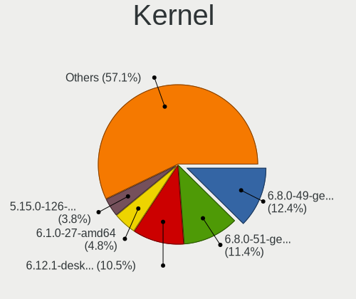
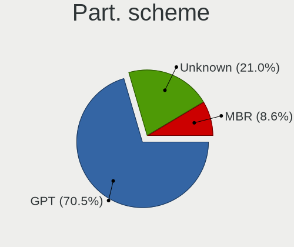
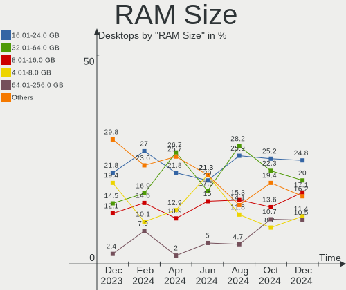
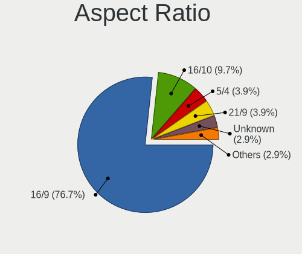
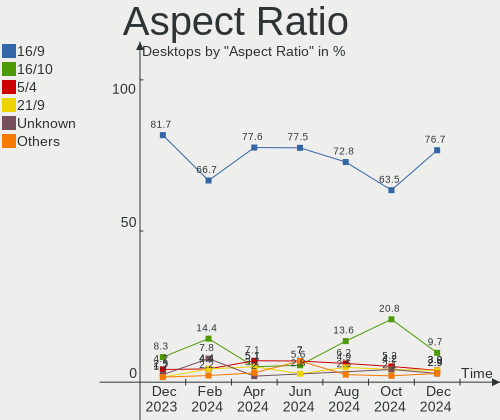
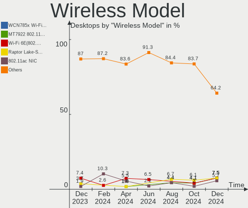
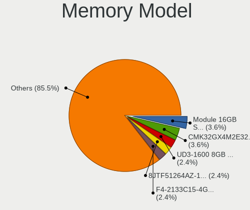

Linux in France - Hardware Trends (Desktops)
--------------------------------------------

A project to identify most popular hardware characteristics and track their change
over time based on data collected by Linux users at https://Linux-Hardware.org.

Anyone can contribute to this report by the [hw-probe](https://github.com/linuxhw/hw-probe) tool:

    sudo -E hw-probe -all -upload

Period: Sep, 2022.

Contents
--------

* [ System ](#system)
  - [ OS                       ](#os)
  - [ OS Family                ](#os-family)
  - [ Kernel                   ](#kernel)
  - [ Kernel Family            ](#kernel-family)
  - [ Kernel Major Ver.        ](#kernel-major-ver)
  - [ Arch                     ](#arch)
  - [ DE                       ](#de)
  - [ Display Server           ](#display-server)
  - [ Display Manager          ](#display-manager)
  - [ OS Lang                  ](#os-lang)
  - [ Boot Mode                ](#boot-mode)
  - [ Filesystem               ](#filesystem)
  - [ Part. scheme             ](#part-scheme)
  - [ Dual Boot with Linux/BSD ](#dual-boot-with-linuxbsd)
  - [ Dual Boot (Win)          ](#dual-boot-win)

* [ Board ](#board)
  - [ Vendor                   ](#vendor)
  - [ Model                    ](#model)
  - [ Model Family             ](#model-family)
  - [ MFG Year                 ](#mfg-year)
  - [ Form Factor              ](#form-factor)
  - [ Secure Boot              ](#secure-boot)
  - [ Coreboot                 ](#coreboot)
  - [ RAM Size                 ](#ram-size)
  - [ RAM Used                 ](#ram-used)
  - [ Total Drives             ](#total-drives)
  - [ Has CD-ROM               ](#has-cd-rom)
  - [ Has Ethernet             ](#has-ethernet)
  - [ Has WiFi                 ](#has-wifi)
  - [ Has Bluetooth            ](#has-bluetooth)

* [ Location ](#location)
  - [ Country                  ](#country)
  - [ City                     ](#city)

* [ Drives ](#drives)
  - [ Drive Vendor             ](#drive-vendor)
  - [ Drive Model              ](#drive-model)
  - [ HDD Vendor               ](#hdd-vendor)
  - [ SSD Vendor               ](#ssd-vendor)
  - [ Drive Kind               ](#drive-kind)
  - [ Drive Connector          ](#drive-connector)
  - [ Drive Size               ](#drive-size)
  - [ Space Total              ](#space-total)
  - [ Space Used               ](#space-used)
  - [ Malfunc. Drives          ](#malfunc-drives)
  - [ Malfunc. Drive Vendor    ](#malfunc-drive-vendor)
  - [ Malfunc. HDD Vendor      ](#malfunc-hdd-vendor)
  - [ Malfunc. Drive Kind      ](#malfunc-drive-kind)
  - [ Failed Drives            ](#failed-drives)
  - [ Failed Drive Vendor      ](#failed-drive-vendor)
  - [ Drive Status             ](#drive-status)

* [ Storage controller ](#storage-controller)
  - [ Storage Vendor           ](#storage-vendor)
  - [ Storage Model            ](#storage-model)
  - [ Storage Kind             ](#storage-kind)

* [ Processor ](#processor)
  - [ CPU Vendor               ](#cpu-vendor)
  - [ CPU Model                ](#cpu-model)
  - [ CPU Model Family         ](#cpu-model-family)
  - [ CPU Cores                ](#cpu-cores)
  - [ CPU Sockets              ](#cpu-sockets)
  - [ CPU Threads              ](#cpu-threads)
  - [ CPU Op-Modes             ](#cpu-op-modes)
  - [ CPU Microcode            ](#cpu-microcode)
  - [ CPU Microarch            ](#cpu-microarch)

* [ Graphics ](#graphics)
  - [ GPU Vendor               ](#gpu-vendor)
  - [ GPU Model                ](#gpu-model)
  - [ GPU Combo                ](#gpu-combo)
  - [ GPU Driver               ](#gpu-driver)
  - [ GPU Memory               ](#gpu-memory)

* [ Monitor ](#monitor)
  - [ Monitor Vendor           ](#monitor-vendor)
  - [ Monitor Model            ](#monitor-model)
  - [ Monitor Resolution       ](#monitor-resolution)
  - [ Monitor Diagonal         ](#monitor-diagonal)
  - [ Monitor Width            ](#monitor-width)
  - [ Aspect Ratio             ](#aspect-ratio)
  - [ Monitor Area             ](#monitor-area)
  - [ Pixel Density            ](#pixel-density)
  - [ Multiple Monitors        ](#multiple-monitors)

* [ Network ](#network)
  - [ Net Controller Vendor    ](#net-controller-vendor)
  - [ Net Controller Model     ](#net-controller-model)
  - [ Wireless Vendor          ](#wireless-vendor)
  - [ Wireless Model           ](#wireless-model)
  - [ Ethernet Vendor          ](#ethernet-vendor)
  - [ Ethernet Model           ](#ethernet-model)
  - [ Net Controller Kind      ](#net-controller-kind)
  - [ Used Controller          ](#used-controller)
  - [ NICs                     ](#nics)
  - [ IPv6                     ](#ipv6)

* [ Bluetooth ](#bluetooth)
  - [ Bluetooth Vendor         ](#bluetooth-vendor)
  - [ Bluetooth Model          ](#bluetooth-model)

* [ Sound ](#sound)
  - [ Sound Vendor             ](#sound-vendor)
  - [ Sound Model              ](#sound-model)

* [ Memory ](#memory)
  - [ Memory Vendor            ](#memory-vendor)
  - [ Memory Model             ](#memory-model)
  - [ Memory Kind              ](#memory-kind)
  - [ Memory Form Factor       ](#memory-form-factor)
  - [ Memory Size              ](#memory-size)
  - [ Memory Speed             ](#memory-speed)

* [ Printers & scanners ](#printers--scanners)
  - [ Printer Vendor           ](#printer-vendor)
  - [ Printer Model            ](#printer-model)
  - [ Scanner Vendor           ](#scanner-vendor)
  - [ Scanner Model            ](#scanner-model)

* [ Camera ](#camera)
  - [ Camera Vendor            ](#camera-vendor)
  - [ Camera Model             ](#camera-model)

* [ Security ](#security)
  - [ Fingerprint Vendor       ](#fingerprint-vendor)
  - [ Fingerprint Model        ](#fingerprint-model)
  - [ Chipcard Vendor          ](#chipcard-vendor)
  - [ Chipcard Model           ](#chipcard-model)

* [ Unsupported ](#unsupported)
  - [ Unsupported Devices      ](#unsupported-devices)
  - [ Unsupported Device Types ](#unsupported-device-types)

System
------

OS
--

Installed operating systems

| Name              | Desktops | Percent |
|-------------------|----------|---------|
| Ubuntu 22.04      | 17       | 20.73%  |
| Ubuntu 20.04      | 13       | 15.85%  |
| Debian 11         | 7        | 8.54%   |
| OpenMandriva 4.3  | 4        | 4.88%   |
| Pop!_OS 22.04     | 3        | 3.66%   |
| Manjaro           | 3        | 3.66%   |
| LMDE 5            | 3        | 3.66%   |
| Linux Mint 21     | 3        | 3.66%   |
| Fedora 36         | 3        | 3.66%   |
| Xubuntu 20.04     | 2        | 2.44%   |
| Ubuntu MATE 22.04 | 2        | 2.44%   |
| OpenMandriva 4.90 | 2        | 2.44%   |
| OpenMandriva 4.50 | 2        | 2.44%   |
| Arch              | 2        | 2.44%   |
| Zorin 16          | 1        | 1.22%   |
| Xubuntu 22.04     | 1        | 1.22%   |
| Ubuntu MATE 20.04 | 1        | 1.22%   |
| Ubuntu Core 18    | 1        | 1.22%   |
| SteamOS 3.3       | 1        | 1.22%   |
| Sparky 7          | 1        | 1.22%   |
| Nobara 36         | 1        | 1.22%   |
| Manjaro 22.0.0    | 1        | 1.22%   |
| Lubuntu 21.10     | 1        | 1.22%   |
| Linux Mint 20.3   | 1        | 1.22%   |
| Linux Mint 20.1   | 1        | 1.22%   |
| Linux Mint 20     | 1        | 1.22%   |
| Linux Mint 19.3   | 1        | 1.22%   |
| Linux Mint 18.3   | 1        | 1.22%   |
| ArcoLinux Rolling | 1        | 1.22%   |
| Arch Rolling      | 1        | 1.22%   |

OS Family
---------

OS without a version

| Name         | Desktops | Percent |
|--------------|----------|---------|
| Ubuntu       | 31       | 37.8%   |
| OpenMandriva | 8        | 9.76%   |
| Linux Mint   | 8        | 9.76%   |
| Debian       | 7        | 8.54%   |
| Manjaro      | 4        | 4.88%   |
| Xubuntu      | 3        | 3.66%   |
| Ubuntu MATE  | 3        | 3.66%   |
| Pop!_OS      | 3        | 3.66%   |
| LMDE         | 3        | 3.66%   |
| Fedora       | 3        | 3.66%   |
| Arch         | 3        | 3.66%   |
| Zorin        | 1        | 1.22%   |
| SteamOS      | 1        | 1.22%   |
| Sparky       | 1        | 1.22%   |
| Nobara       | 1        | 1.22%   |
| Lubuntu      | 1        | 1.22%   |
| ArcoLinux    | 1        | 1.22%   |

Kernel
------

Version of the Linux kernel

| Version                                      | Desktops | Percent |
|----------------------------------------------|----------|---------|
| 5.15.0-47-generic                            | 14       | 17.07%  |
| 5.15.0-48-generic                            | 11       | 13.41%  |
| 5.15.0-46-generic                            | 6        | 7.32%   |
| 5.4.0-125-generic                            | 4        | 4.88%   |
| 5.16.7-desktop-1omv4003                      | 4        | 4.88%   |
| 5.4.0-126-generic                            | 3        | 3.66%   |
| 5.19.0-76051900-generic                      | 3        | 3.66%   |
| 5.18.0-0.deb11.4-amd64                       | 3        | 3.66%   |
| 5.10.0-18-amd64                              | 3        | 3.66%   |
| 5.19.5-desktop-1omv4090                      | 2        | 2.44%   |
| 5.18.12-desktop-3omv4090                     | 2        | 2.44%   |
| 5.15.60-1-MANJARO                            | 2        | 2.44%   |
| 5.13.0-52-generic                            | 2        | 2.44%   |
| 5.10.0-17-amd64                              | 2        | 2.44%   |
| 5.4.0-81-generic                             | 1        | 1.22%   |
| 5.4.0-26-generic                             | 1        | 1.22%   |
| 5.19.9-zen1-1-zen                            | 1        | 1.22%   |
| 5.19.9-201.fsync.fc36.x86_64                 | 1        | 1.22%   |
| 5.19.9-200.fc36.x86_64                       | 1        | 1.22%   |
| 5.19.7-zen2-1-zen                            | 1        | 1.22%   |
| 5.19.7-200.fc36.x86_64                       | 1        | 1.22%   |
| 5.19.6-200.fc36.x86_64                       | 1        | 1.22%   |
| 5.19.5-arch1-1                               | 1        | 1.22%   |
| 5.18.10-051810-generic                       | 1        | 1.22%   |
| 5.18.0-2-amd64                               | 1        | 1.22%   |
| 5.15.67-1-lts                                | 1        | 1.22%   |
| 5.15.65-1-MANJARO                            | 1        | 1.22%   |
| 5.15.30-2-pve                                | 1        | 1.22%   |
| 5.14.0-1051-oem                              | 1        | 1.22%   |
| 5.13.0-valve24-1-neptune-02226-g5b8545e4c5a1 | 1        | 1.22%   |
| 5.13.0-51-generic                            | 1        | 1.22%   |
| 5.11.0-43-generic                            | 1        | 1.22%   |
| 5.10.141-1-MANJARO                           | 1        | 1.22%   |
| 5.10.0-15-amd64                              | 1        | 1.22%   |
| 4.15.0-32-generic                            | 1        | 1.22%   |

Kernel Family
-------------

Linux kernel without a distro release

| Version  | Desktops | Percent |
|----------|----------|---------|
| 5.15.0   | 31       | 37.8%   |
| 5.4.0    | 9        | 10.98%  |
| 5.10.0   | 6        | 7.32%   |
| 5.18.0   | 4        | 4.88%   |
| 5.16.7   | 4        | 4.88%   |
| 5.13.0   | 4        | 4.88%   |
| 5.19.9   | 3        | 3.66%   |
| 5.19.5   | 3        | 3.66%   |
| 5.19.0   | 3        | 3.66%   |
| 5.19.7   | 2        | 2.44%   |
| 5.18.12  | 2        | 2.44%   |
| 5.15.60  | 2        | 2.44%   |
| 5.19.6   | 1        | 1.22%   |
| 5.18.10  | 1        | 1.22%   |
| 5.15.67  | 1        | 1.22%   |
| 5.15.65  | 1        | 1.22%   |
| 5.15.30  | 1        | 1.22%   |
| 5.14.0   | 1        | 1.22%   |
| 5.11.0   | 1        | 1.22%   |
| 5.10.141 | 1        | 1.22%   |
| 4.15.0   | 1        | 1.22%   |

Kernel Major Ver.
-----------------

Linux kernel major version

| Version | Desktops | Percent |
|---------|----------|---------|
| 5.15    | 36       | 43.9%   |
| 5.19    | 12       | 14.63%  |
| 5.4     | 9        | 10.98%  |
| 5.18    | 7        | 8.54%   |
| 5.10    | 7        | 8.54%   |
| 5.16    | 4        | 4.88%   |
| 5.13    | 4        | 4.88%   |
| 5.14    | 1        | 1.22%   |
| 5.11    | 1        | 1.22%   |
| 4.15    | 1        | 1.22%   |

Arch
----

OS architecture (x86_64, i586, etc.)

| Name   | Desktops | Percent |
|--------|----------|---------|
| x86_64 | 81       | 98.78%  |
| i686   | 1        | 1.22%   |

DE
--

Desktop Environment

| Name       | Desktops | Percent |
|------------|----------|---------|
| GNOME      | 38       | 46.34%  |
| KDE5       | 15       | 18.29%  |
| XFCE       | 8        | 9.76%   |
| X-Cinnamon | 7        | 8.54%   |
| MATE       | 5        | 6.1%    |
| Unknown    | 5        | 6.1%    |
| Pantheon   | 1        | 1.22%   |
| LXQt       | 1        | 1.22%   |
| i3         | 1        | 1.22%   |
| Cinnamon   | 1        | 1.22%   |

Display Server
--------------

X11 or Wayland

| Name    | Desktops | Percent |
|---------|----------|---------|
| X11     | 60       | 73.17%  |
| Wayland | 14       | 17.07%  |
| Tty     | 6        | 7.32%   |
| Unknown | 2        | 2.44%   |

Display Manager
---------------

SDDM, LightDM, etc.

| Name    | Desktops | Percent |
|---------|----------|---------|
| GDM3    | 22       | 26.83%  |
| Unknown | 21       | 25.61%  |
| LightDM | 15       | 18.29%  |
| SDDM    | 12       | 14.63%  |
| GDM     | 12       | 14.63%  |

OS Lang
-------

Language

| Lang    | Desktops | Percent |
|---------|----------|---------|
| fr_FR   | 67       | 81.71%  |
| en_US   | 8        | 9.76%   |
| Unknown | 3        | 3.66%   |
| fr_BE   | 1        | 1.22%   |
| en_IE   | 1        | 1.22%   |
| en_GB   | 1        | 1.22%   |
| ar_SA   | 1        | 1.22%   |

Boot Mode
---------

EFI or BIOS

| Mode | Desktops | Percent |
|------|----------|---------|
| EFI  | 43       | 52.44%  |
| BIOS | 39       | 47.56%  |

Filesystem
----------

Type of filesystem

| Type     | Desktops | Percent |
|----------|----------|---------|
| Ext4     | 64       | 78.05%  |
| Overlay  | 8        | 9.76%   |
| Btrfs    | 7        | 8.54%   |
| Zfs      | 1        | 1.22%   |
| Xfs      | 1        | 1.22%   |
| Reiserfs | 1        | 1.22%   |

Part. scheme
------------

Scheme of partitioning

| Type    | Desktops | Percent |
|---------|----------|---------|
| GPT     | 40       | 48.78%  |
| Unknown | 29       | 35.37%  |
| MBR     | 13       | 15.85%  |

Dual Boot with Linux/BSD
------------------------

Hosting more than one Linux/BSD

| Dual boot | Desktops | Percent |
|-----------|----------|---------|
| No        | 68       | 82.93%  |
| Yes       | 14       | 17.07%  |

Dual Boot (Win)
---------------

Hosting Linux and Windows

| Dual boot | Desktops | Percent |
|-----------|----------|---------|
| No        | 60       | 73.17%  |
| Yes       | 22       | 26.83%  |

Board
-----

Vendor
------

Motherboard manufacturer

| Name                | Desktops | Percent |
|---------------------|----------|---------|
| ASUSTek Computer    | 26       | 31.71%  |
| Gigabyte Technology | 15       | 18.29%  |
| Dell                | 14       | 17.07%  |
| MSI                 | 10       | 12.2%   |
| Hewlett-Packard     | 6        | 7.32%   |
| ASRock              | 3        | 3.66%   |
| Lenovo              | 2        | 2.44%   |
| Foxconn             | 2        | 2.44%   |
| Pegatron            | 1        | 1.22%   |
| Packard Bell        | 1        | 1.22%   |
| Acer                | 1        | 1.22%   |
| Unknown             | 1        | 1.22%   |

Model
-----

Motherboard model

| Name                                    | Desktops | Percent |
|-----------------------------------------|----------|---------|
| Gigabyte B450M DS3H                     | 3        | 3.66%   |
| ASUS All Series                         | 3        | 3.66%   |
| MSI MS-7C37                             | 2        | 2.44%   |
| Pegatron p6541fr-m                      | 1        | 1.22%   |
| Packard Bell IMEDIA S2883               | 1        | 1.22%   |
| MSI MS-7D22                             | 1        | 1.22%   |
| MSI MS-7C92                             | 1        | 1.22%   |
| MSI MS-7C36                             | 1        | 1.22%   |
| MSI MS-7A40                             | 1        | 1.22%   |
| MSI MS-7836                             | 1        | 1.22%   |
| MSI MS-7817                             | 1        | 1.22%   |
| MSI MS-7752                             | 1        | 1.22%   |
| MSI MS-7387                             | 1        | 1.22%   |
| Lenovo ThinkStation S30 056839G         | 1        | 1.22%   |
| Lenovo IdeaCentre G5 14AMR05 90Q10059FR | 1        | 1.22%   |
| HP Z4 G4 Workstation                    | 1        | 1.22%   |
| HP Pavilion Desktop 590-p0xxx           | 1        | 1.22%   |
| HP EliteDesk 800 G1 TWR                 | 1        | 1.22%   |
| HP Compaq Elite 8300 SFF                | 1        | 1.22%   |
| HP Compaq dc5700 Microtower             | 1        | 1.22%   |
| HP Compaq 8200 Elite USDT PC            | 1        | 1.22%   |
| Gigabyte Z590 UD AC                     | 1        | 1.22%   |
| Gigabyte X570S AORUS ELITE AX           | 1        | 1.22%   |
| Gigabyte G41M-Combo                     | 1        | 1.22%   |
| Gigabyte B85M-HD3                       | 1        | 1.22%   |
| Gigabyte B75M-D3V                       | 1        | 1.22%   |
| Gigabyte B75M-D3H                       | 1        | 1.22%   |
| Gigabyte B560M DS3H V2                  | 1        | 1.22%   |
| Gigabyte B550 GAMING X V2               | 1        | 1.22%   |
| Gigabyte B450 I AORUS PRO WIFI          | 1        | 1.22%   |
| Gigabyte B450 AORUS ELITE               | 1        | 1.22%   |
| Gigabyte 990FXA-UD3                     | 1        | 1.22%   |
| Gigabyte 970A-DS3P                      | 1        | 1.22%   |
| Foxconn p6-2371ef                       | 1        | 1.22%   |
| Foxconn p6-2292efm                      | 1        | 1.22%   |
| Dell Vostro 3888                        | 1        | 1.22%   |
| Dell Precision WorkStation T7500        | 1        | 1.22%   |
| Dell Precision WorkStation 670          | 1        | 1.22%   |
| Dell Precision T7600                    | 1        | 1.22%   |
| Dell Precision T5610                    | 1        | 1.22%   |

Model Family
------------

Motherboard model prefix

| Name                | Desktops | Percent |
|---------------------|----------|---------|
| Dell OptiPlex       | 8        | 9.76%   |
| ASUS PRIME          | 8        | 9.76%   |
| Dell Precision      | 5        | 6.1%    |
| ASUS TUF            | 4        | 4.88%   |
| ASUS ROG            | 4        | 4.88%   |
| HP Compaq           | 3        | 3.66%   |
| Gigabyte B450M      | 3        | 3.66%   |
| ASUS All            | 3        | 3.66%   |
| MSI MS-7C37         | 2        | 2.44%   |
| Gigabyte B450       | 2        | 2.44%   |
| Pegatron p6541fr-m  | 1        | 1.22%   |
| Packard Bell IMEDIA | 1        | 1.22%   |
| MSI MS-7D22         | 1        | 1.22%   |
| MSI MS-7C92         | 1        | 1.22%   |
| MSI MS-7C36         | 1        | 1.22%   |
| MSI MS-7A40         | 1        | 1.22%   |
| MSI MS-7836         | 1        | 1.22%   |
| MSI MS-7817         | 1        | 1.22%   |
| MSI MS-7752         | 1        | 1.22%   |
| MSI MS-7387         | 1        | 1.22%   |
| Lenovo ThinkStation | 1        | 1.22%   |
| Lenovo IdeaCentre   | 1        | 1.22%   |
| HP Z4               | 1        | 1.22%   |
| HP Pavilion         | 1        | 1.22%   |
| HP EliteDesk        | 1        | 1.22%   |
| Gigabyte Z590       | 1        | 1.22%   |
| Gigabyte X570S      | 1        | 1.22%   |
| Gigabyte G41M-Combo | 1        | 1.22%   |
| Gigabyte B85M-HD3   | 1        | 1.22%   |
| Gigabyte B75M-D3V   | 1        | 1.22%   |
| Gigabyte B75M-D3H   | 1        | 1.22%   |
| Gigabyte B560M      | 1        | 1.22%   |
| Gigabyte B550       | 1        | 1.22%   |
| Gigabyte 990FXA-UD3 | 1        | 1.22%   |
| Gigabyte 970A-DS3P  | 1        | 1.22%   |
| Foxconn p6-2371ef   | 1        | 1.22%   |
| Foxconn p6-2292efm  | 1        | 1.22%   |
| Dell Vostro         | 1        | 1.22%   |
| ASUS Z170-A         | 1        | 1.22%   |
| ASUS P8Z77-V        | 1        | 1.22%   |

MFG Year
--------

Motherboard manufacture year

| Year | Desktops | Percent |
|------|----------|---------|
| 2018 | 16       | 19.51%  |
| 2013 | 10       | 12.2%   |
| 2021 | 9        | 10.98%  |
| 2020 | 9        | 10.98%  |
| 2012 | 7        | 8.54%   |
| 2019 | 5        | 6.1%    |
| 2014 | 5        | 6.1%    |
| 2015 | 4        | 4.88%   |
| 2017 | 3        | 3.66%   |
| 2011 | 3        | 3.66%   |
| 2010 | 3        | 3.66%   |
| 2016 | 2        | 2.44%   |
| 2006 | 2        | 2.44%   |
| 2009 | 1        | 1.22%   |
| 2007 | 1        | 1.22%   |
| 2005 | 1        | 1.22%   |
| 2004 | 1        | 1.22%   |

Form Factor
-----------

Physical design of the computer

| Name    | Desktops | Percent |
|---------|----------|---------|
| Desktop | 82       | 100%    |

Secure Boot
-----------

Enabled or disabled

| State    | Desktops | Percent |
|----------|----------|---------|
| Disabled | 78       | 95.12%  |
| Enabled  | 4        | 4.88%   |

Coreboot
--------

Have coreboot on board

| Used | Desktops | Percent |
|------|----------|---------|
| No   | 82       | 100%    |

RAM Size
--------

Total RAM memory

| Size in GB  | Desktops | Percent |
|-------------|----------|---------|
| 16.01-24.0  | 27       | 32.93%  |
| 32.01-64.0  | 15       | 18.29%  |
| 3.01-4.0    | 13       | 15.85%  |
| 8.01-16.0   | 11       | 13.41%  |
| 4.01-8.0    | 7        | 8.54%   |
| 64.01-256.0 | 6        | 7.32%   |
| 24.01-32.0  | 2        | 2.44%   |
| 2.01-3.0    | 1        | 1.22%   |

RAM Used
--------

Used RAM memory

| Used GB    | Desktops | Percent |
|------------|----------|---------|
| 1.01-2.0   | 24       | 29.27%  |
| 2.01-3.0   | 21       | 25.61%  |
| 4.01-8.0   | 14       | 17.07%  |
| 3.01-4.0   | 10       | 12.2%   |
| 0.51-1.0   | 5        | 6.1%    |
| 8.01-16.0  | 4        | 4.88%   |
| 24.01-32.0 | 2        | 2.44%   |
| 16.01-24.0 | 2        | 2.44%   |

Total Drives
------------

Number of drives on board

| Drives | Desktops | Percent |
|--------|----------|---------|
| 1      | 31       | 37.8%   |
| 3      | 20       | 24.39%  |
| 2      | 18       | 21.95%  |
| 4      | 6        | 7.32%   |
| 5      | 4        | 4.88%   |
| 8      | 1        | 1.22%   |
| 7      | 1        | 1.22%   |
| 6      | 1        | 1.22%   |

Has CD-ROM
----------

Has CD-ROM on board

| Presented | Desktops | Percent |
|-----------|----------|---------|
| No        | 43       | 52.44%  |
| Yes       | 39       | 47.56%  |

Has Ethernet
------------

Has Ethernet on board

| Presented | Desktops | Percent |
|-----------|----------|---------|
| Yes       | 82       | 100%    |

Has WiFi
--------

Has WiFi module

| Presented | Desktops | Percent |
|-----------|----------|---------|
| Yes       | 41       | 50%     |
| No        | 41       | 50%     |

Has Bluetooth
-------------

Has Bluetooth module

| Presented | Desktops | Percent |
|-----------|----------|---------|
| No        | 47       | 57.32%  |
| Yes       | 35       | 42.68%  |

Location
--------

Country
-------

Geographic location (country)

| Country | Desktops | Percent |
|---------|----------|---------|
| France  | 82       | 100%    |

City
----

Geographic location (city)

| City                       | Desktops | Percent |
|----------------------------|----------|---------|
| Paris                      | 9        | 10.98%  |
| Strasbourg                 | 3        | 3.66%   |
| Rennes                     | 2        | 2.44%   |
| Bozouls                    | 2        | 2.44%   |
| Bordeaux                   | 2        | 2.44%   |
| Vitry-sur-Seine            | 1        | 1.22%   |
| Vinay                      | 1        | 1.22%   |
| Villeurbanne               | 1        | 1.22%   |
| Villers-Cotterêts         | 1        | 1.22%   |
| Villejuif                  | 1        | 1.22%   |
| Villefontaine              | 1        | 1.22%   |
| Vence                      | 1        | 1.22%   |
| Tours                      | 1        | 1.22%   |
| Tourouvre                  | 1        | 1.22%   |
| Senonches                  | 1        | 1.22%   |
| Sauveterre-de-Bearn        | 1        | 1.22%   |
| Sainte-Geneviève-des-Bois | 1        | 1.22%   |
| Saint-M'Herve              | 1        | 1.22%   |
| Saint-Julien-de-Concelles  | 1        | 1.22%   |
| Roubaix                    | 1        | 1.22%   |
| Romorantin-Lanthenay       | 1        | 1.22%   |
| Revel                      | 1        | 1.22%   |
| Perols                     | 1        | 1.22%   |
| Orry-la-Ville              | 1        | 1.22%   |
| Niederhaslach              | 1        | 1.22%   |
| Neoules                    | 1        | 1.22%   |
| Nantes                     | 1        | 1.22%   |
| Moyeuvre-Grande            | 1        | 1.22%   |
| Morlaix                    | 1        | 1.22%   |
| Montpellier                | 1        | 1.22%   |
| Mayenne                    | 1        | 1.22%   |
| Marseille                  | 1        | 1.22%   |
| Margency                   | 1        | 1.22%   |
| Mâcon                     | 1        | 1.22%   |
| Lumbres                    | 1        | 1.22%   |
| Longvic                    | 1        | 1.22%   |
| Lomme                      | 1        | 1.22%   |
| Limoges                    | 1        | 1.22%   |
| Le Vaudreuil               | 1        | 1.22%   |
| La Gaude                   | 1        | 1.22%   |

Drives
------

Drive Vendor
------------

Hard drive vendors

| Vendor                      | Desktops | Drives | Percent |
|-----------------------------|----------|--------|---------|
| Seagate                     | 33       | 38     | 22.3%   |
| WDC                         | 25       | 38     | 16.89%  |
| Samsung Electronics         | 23       | 38     | 15.54%  |
| Crucial                     | 12       | 12     | 8.11%   |
| Toshiba                     | 8        | 10     | 5.41%   |
| SanDisk                     | 6        | 7      | 4.05%   |
| Kingston                    | 6        | 7      | 4.05%   |
| Hitachi                     | 5        | 6      | 3.38%   |
| Unknown                     | 2        | 4      | 1.35%   |
| Transcend                   | 2        | 2      | 1.35%   |
| TEXTORM                     | 2        | 2      | 1.35%   |
| Micron/Crucial Technology   | 2        | 3      | 1.35%   |
| Micron Technology           | 2        | 2      | 1.35%   |
| XPG                         | 1        | 1      | 0.68%   |
| Verbatim                    | 1        | 1      | 0.68%   |
| USB3.0                      | 1        | 1      | 0.68%   |
| UMIS                        | 1        | 1      | 0.68%   |
| TCSUNBOW                    | 1        | 1      | 0.68%   |
| sobetter                    | 1        | 1      | 0.68%   |
| SK hynix                    | 1        | 1      | 0.68%   |
| SATAFIRM                    | 1        | 1      | 0.68%   |
| Realtek                     | 1        | 1      | 0.68%   |
| PNY                         | 1        | 1      | 0.68%   |
| Phison Electronics          | 1        | 1      | 0.68%   |
| Maxtor                      | 1        | 1      | 0.68%   |
| LITEONIT                    | 1        | 1      | 0.68%   |
| LITEON                      | 1        | 1      | 0.68%   |
| Kingston Technology Company | 1        | 1      | 0.68%   |
| Intel                       | 1        | 1      | 0.68%   |
| G-TECH                      | 1        | 1      | 0.68%   |
| Dogfish                     | 1        | 1      | 0.68%   |
| ASMT                        | 1        | 2      | 0.68%   |
| ASMedia                     | 1        | 1      | 0.68%   |

Drive Model
-----------

Hard drive models

| Model                                               | Desktops | Percent |
|-----------------------------------------------------|----------|---------|
| Seagate ST2000DM008-2FR102 2TB                      | 6        | 3.35%   |
| Seagate ST2000DM006-2DM164 2TB                      | 3        | 1.68%   |
| Samsung SSD 970 EVO Plus 500GB                      | 3        | 1.68%   |
| Samsung SSD 860 EVO 500GB                           | 3        | 1.68%   |
| Samsung SSD 850 EVO 500GB                           | 3        | 1.68%   |
| Samsung NVMe SSD Controller SM981/PM981/PM983 256GB | 3        | 1.68%   |
| WDC WDS500G3X0C-00SJG0 500GB                        | 2        | 1.12%   |
| Seagate ST3320620AS 320GB                           | 2        | 1.12%   |
| Seagate ST2000DM008-2UB102 2TB                      | 2        | 1.12%   |
| Seagate ST2000DM001-1ER164 2TB                      | 2        | 1.12%   |
| Seagate ST1000DM003-1ER162 1TB                      | 2        | 1.12%   |
| Seagate ST1000DM003-1CH162 1TB                      | 2        | 1.12%   |
| SanDisk SDSSDHII240G 240GB                          | 2        | 1.12%   |
| Samsung SSD 870 EVO 500GB                           | 2        | 1.12%   |
| Samsung SSD 860 EVO 1TB                             | 2        | 1.12%   |
| Samsung SSD 850 EVO 250GB                           | 2        | 1.12%   |
| Micron/Crucial P2 NVMe PCIe SSD 500GB               | 2        | 1.12%   |
| Kingston SA400S37480G 480GB SSD                     | 2        | 1.12%   |
| Kingston SA400S37240G 240GB SSD                     | 2        | 1.12%   |
| Crucial CT480BX500SSD1 480GB                        | 2        | 1.12%   |
| Crucial CT1000BX500SSD1 1TB                         | 2        | 1.12%   |
| XPG NVMe SSD Drive 1024GB                           | 1        | 0.56%   |
| WDC WDS240G2G0B-00EPW0 240GB SSD                    | 1        | 0.56%   |
| WDC WDS120G2G0A-00JH30 120GB SSD                    | 1        | 0.56%   |
| WDC WD6NPURX-64JC5Y0 6TB                            | 1        | 0.56%   |
| WDC WD6400AAKS-65A7B2 640GB                         | 1        | 0.56%   |
| WDC WD5000AVDS-63U7B1 500GB                         | 1        | 0.56%   |
| WDC WD5000AVCS-632DY1 500GB                         | 1        | 0.56%   |
| WDC WD5000AAKX-75U6AA0 500GB                        | 1        | 0.56%   |
| WDC WD5000AAKS-00V1A0 500GB                         | 1        | 0.56%   |
| WDC WD5000AAKS-00A7B2 500GB                         | 1        | 0.56%   |
| WDC WD5000AAJS-00A8B0 500GB                         | 1        | 0.56%   |
| WDC WD40EFRX-68WT0N0 4TB                            | 1        | 0.56%   |
| WDC WD4001FAEX-00MJRA0 4TB                          | 1        | 0.56%   |
| WDC WD3200BEVT-22ZCT0 320GB                         | 1        | 0.56%   |
| WDC WD2500AAJS-60VWA1 250GB                         | 1        | 0.56%   |
| WDC WD20EZRZ-00Z5HB0 2TB                            | 1        | 0.56%   |
| WDC WD20EURX-63T0FY0 2TB                            | 1        | 0.56%   |
| WDC WD20EARX-00PASB0 2TB                            | 1        | 0.56%   |
| WDC WD2003FZEX-00Z4SA0 2TB                          | 1        | 0.56%   |

HDD Vendor
----------

Hard disk drive vendors

| Vendor              | Desktops | Drives | Percent |
|---------------------|----------|--------|---------|
| Seagate             | 32       | 36     | 43.24%  |
| WDC                 | 22       | 33     | 29.73%  |
| Toshiba             | 7        | 9      | 9.46%   |
| Hitachi             | 5        | 6      | 6.76%   |
| Samsung Electronics | 2        | 2      | 2.7%    |
| USB3.0              | 1        | 1      | 1.35%   |
| Unknown             | 1        | 1      | 1.35%   |
| SATAFIRM            | 1        | 1      | 1.35%   |
| Maxtor              | 1        | 1      | 1.35%   |
| ASMT                | 1        | 2      | 1.35%   |
| ASMedia             | 1        | 1      | 1.35%   |

SSD Vendor
----------

Solid state drive vendors

| Vendor              | Desktops | Drives | Percent |
|---------------------|----------|--------|---------|
| Samsung Electronics | 16       | 20     | 32.65%  |
| Crucial             | 9        | 9      | 18.37%  |
| SanDisk             | 5        | 5      | 10.2%   |
| Kingston            | 5        | 6      | 10.2%   |
| WDC                 | 2        | 2      | 4.08%   |
| Transcend           | 2        | 2      | 4.08%   |
| TEXTORM             | 2        | 2      | 4.08%   |
| Verbatim            | 1        | 1      | 2.04%   |
| Toshiba             | 1        | 1      | 2.04%   |
| TCSUNBOW            | 1        | 1      | 2.04%   |
| PNY                 | 1        | 1      | 2.04%   |
| Micron Technology   | 1        | 1      | 2.04%   |
| LITEONIT            | 1        | 1      | 2.04%   |
| LITEON              | 1        | 1      | 2.04%   |
| Dogfish             | 1        | 1      | 2.04%   |

Drive Kind
----------

HDD or SSD

| Kind    | Desktops | Drives | Percent |
|---------|----------|--------|---------|
| HDD     | 57       | 93     | 43.85%  |
| SSD     | 44       | 54     | 33.85%  |
| NVMe    | 26       | 38     | 20%     |
| Unknown | 3        | 5      | 2.31%   |

Drive Connector
---------------

SATA, SAS, NVMe, etc.

| Type | Desktops | Drives | Percent |
|------|----------|--------|---------|
| SATA | 70       | 138    | 66.04%  |
| NVMe | 26       | 36     | 24.53%  |
| SAS  | 10       | 16     | 9.43%   |

Drive Size
----------

Size of hard drive

| Size in TB | Desktops | Drives | Percent |
|------------|----------|--------|---------|
| 0.01-0.5   | 53       | 71     | 46.49%  |
| 0.51-1.0   | 29       | 35     | 25.44%  |
| 1.01-2.0   | 19       | 25     | 16.67%  |
| 3.01-4.0   | 7        | 9      | 6.14%   |
| 4.01-10.0  | 4        | 4      | 3.51%   |
| 2.01-3.0   | 1        | 1      | 0.88%   |
| 10.01-20.0 | 1        | 2      | 0.88%   |

Space Total
-----------

Amount of disk space available on the file system

| Size in GB     | Desktops | Percent |
|----------------|----------|---------|
| 251-500        | 17       | 20.73%  |
| 501-1000       | 14       | 17.07%  |
| 101-250        | 13       | 15.85%  |
| More than 3000 | 10       | 12.2%   |
| 1001-2000      | 8        | 9.76%   |
| 2001-3000      | 7        | 8.54%   |
| 1-20           | 5        | 6.1%    |
| Unknown        | 5        | 6.1%    |
| 51-100         | 3        | 3.66%   |

Space Used
----------

Amount of used disk space

| Used GB        | Desktops | Percent |
|----------------|----------|---------|
| 1-20           | 21       | 25.61%  |
| 101-250        | 10       | 12.2%   |
| 21-50          | 9        | 10.98%  |
| 51-100         | 9        | 10.98%  |
| 251-500        | 8        | 9.76%   |
| 501-1000       | 8        | 9.76%   |
| 1001-2000      | 6        | 7.32%   |
| More than 3000 | 5        | 6.1%    |
| Unknown        | 5        | 6.1%    |
| 2001-3000      | 1        | 1.22%   |

Malfunc. Drives
---------------

Drive models with a malfunction

| Model                          | Desktops | Drives | Percent |
|--------------------------------|----------|--------|---------|
| WDC WD5000AVDS-63U7B1 500GB    | 1        | 1      | 10%     |
| WDC WD4001FAEX-00MJRA0 4TB     | 1        | 1      | 10%     |
| WDC WD10EZRX-00L4HB0 1TB       | 1        | 1      | 10%     |
| WDC WD10EZEX-22BN5A0 1TB       | 1        | 1      | 10%     |
| WDC WD10EADS-22M2B0 1TB        | 1        | 1      | 10%     |
| Toshiba MQ01ABD100 1TB         | 1        | 1      | 10%     |
| Seagate ST3320620AS 320GB      | 1        | 1      | 10%     |
| Seagate ST2000DM008-2UB102 2TB | 1        | 1      | 10%     |
| Hitachi HTS723232A7A364 320GB  | 1        | 1      | 10%     |
| Hitachi HDT722516DLA380 165GB  | 1        | 1      | 10%     |

Malfunc. Drive Vendor
---------------------

Vendors of faulty drives

| Vendor  | Desktops | Drives | Percent |
|---------|----------|--------|---------|
| WDC     | 5        | 5      | 50%     |
| Seagate | 2        | 2      | 20%     |
| Hitachi | 2        | 2      | 20%     |
| Toshiba | 1        | 1      | 10%     |

Malfunc. HDD Vendor
-------------------

Vendors of faulty HDD drives

| Vendor  | Desktops | Drives | Percent |
|---------|----------|--------|---------|
| WDC     | 5        | 5      | 50%     |
| Seagate | 2        | 2      | 20%     |
| Hitachi | 2        | 2      | 20%     |
| Toshiba | 1        | 1      | 10%     |

Malfunc. Drive Kind
-------------------

Kinds of faulty drives

| Kind | Desktops | Drives | Percent |
|------|----------|--------|---------|
| HDD  | 9        | 10     | 100%    |

Failed Drives
-------------

Failed drive models

Zero info for selected period =(

Failed Drive Vendor
-------------------

Failed drive vendors

Zero info for selected period =(

Drive Status
------------

Number of failed and malfunc. drives

| Status   | Desktops | Drives | Percent |
|----------|----------|--------|---------|
| Works    | 47       | 96     | 53.41%  |
| Detected | 32       | 84     | 36.36%  |
| Malfunc  | 9        | 10     | 10.23%  |

Storage controller
------------------

Storage Vendor
--------------

Storage controller vendors

| Vendor                      | Desktops | Percent |
|-----------------------------|----------|---------|
| Intel                       | 56       | 46.67%  |
| AMD                         | 24       | 20%     |
| Samsung Electronics         | 10       | 8.33%   |
| ASMedia Technology          | 6        | 5%      |
| SanDisk                     | 5        | 4.17%   |
| Micron/Crucial Technology   | 5        | 4.17%   |
| Marvell Technology Group    | 2        | 1.67%   |
| LSI Logic / Symbios Logic   | 2        | 1.67%   |
| Kingston Technology Company | 2        | 1.67%   |
| VIA Technologies            | 1        | 0.83%   |
| Union Memory (Shenzhen)     | 1        | 0.83%   |
| SK hynix                    | 1        | 0.83%   |
| Seagate Technology          | 1        | 0.83%   |
| Phison Electronics          | 1        | 0.83%   |
| Micron Technology           | 1        | 0.83%   |
| Broadcom / LSI              | 1        | 0.83%   |
| ADATA Technology            | 1        | 0.83%   |

Storage Model
-------------

Storage controller models

| Model                                                                                   | Desktops | Percent |
|-----------------------------------------------------------------------------------------|----------|---------|
| AMD FCH SATA Controller [AHCI mode]                                                     | 14       | 9.59%   |
| AMD 400 Series Chipset SATA Controller                                                  | 9        | 6.16%   |
| Samsung NVMe SSD Controller SM981/PM981/PM983                                           | 8        | 5.48%   |
| Intel SATA Controller [RAID mode]                                                       | 6        | 4.11%   |
| ASMedia ASM1062 Serial ATA Controller                                                   | 6        | 4.11%   |
| Intel Cannon Lake PCH SATA AHCI Controller                                              | 5        | 3.42%   |
| Intel 8 Series/C220 Series Chipset Family 6-port SATA Controller 1 [AHCI mode]          | 5        | 3.42%   |
| Intel 6 Series/C200 Series Chipset Family 6 port Desktop SATA AHCI Controller           | 5        | 3.42%   |
| AMD 500 Series Chipset SATA Controller                                                  | 5        | 3.42%   |
| Micron/Crucial P2 NVMe PCIe SSD                                                         | 4        | 2.74%   |
| Intel 7 Series/C210 Series Chipset Family 6-port SATA Controller [AHCI mode]            | 4        | 2.74%   |
| Intel NM10/ICH7 Family SATA Controller [IDE mode]                                       | 3        | 2.05%   |
| Intel C600/X79 series chipset SATA RAID Controller                                      | 3        | 2.05%   |
| Intel 500 Series Chipset Family SATA AHCI Controller                                    | 3        | 2.05%   |
| AMD SB7x0/SB8x0/SB9x0 SATA Controller [AHCI mode]                                       | 3        | 2.05%   |
| SanDisk WD Black SN750 / PC SN730 NVMe SSD                                              | 2        | 1.37%   |
| Samsung NVMe SSD Controller SM951/PM951                                                 | 2        | 1.37%   |
| Marvell Group 88SE9172 SATA 6Gb/s Controller                                            | 2        | 1.37%   |
| Kingston Company A2000 NVMe SSD                                                         | 2        | 1.37%   |
| Intel Volume Management Device NVMe RAID Controller                                     | 2        | 1.37%   |
| Intel Q170/Q150/B150/H170/H110/Z170/CM236 Chipset SATA Controller [AHCI Mode]           | 2        | 1.37%   |
| Intel C600/X79 series chipset 6-Port SATA AHCI Controller                               | 2        | 1.37%   |
| Intel 82801G (ICH7 Family) IDE Controller                                               | 2        | 1.37%   |
| Intel 6 Series/C200 Series Chipset Family Desktop SATA Controller (IDE mode, ports 4-5) | 2        | 1.37%   |
| Intel 6 Series/C200 Series Chipset Family Desktop SATA Controller (IDE mode, ports 0-3) | 2        | 1.37%   |
| Intel 400 Series Chipset Family SATA AHCI Controller                                    | 2        | 1.37%   |
| AMD SB7x0/SB8x0/SB9x0 IDE Controller                                                    | 2        | 1.37%   |
| VIA VT82C586A/B/VT82C686/A/B/VT823x/A/C PIPC Bus Master IDE                             | 1        | 0.68%   |
| VIA VT8237/8251 Serial ATA Controller                                                   | 1        | 0.68%   |
| Union Memory (Shenzhen) Non-Volatile memory controller                                  | 1        | 0.68%   |
| SK hynix PC401 NVMe Solid State Drive 256GB                                             | 1        | 0.68%   |
| Seagate FireCuda 530 SSD                                                                | 1        | 0.68%   |
| SanDisk WD Blue SN570 NVMe SSD                                                          | 1        | 0.68%   |
| SanDisk WD Blue SN500 / PC SN520 NVMe SSD                                               | 1        | 0.68%   |
| SanDisk Non-Volatile memory controller                                                  | 1        | 0.68%   |
| Samsung NVMe SSD Controller PM9A1/PM9A3/980PRO                                          | 1        | 0.68%   |
| Samsung NVMe SSD Controller 980                                                         | 1        | 0.68%   |
| Phison E16 PCIe4 NVMe Controller                                                        | 1        | 0.68%   |
| Micron/Crucial NVMe Controller                                                          | 1        | 0.68%   |
| Micron Non-Volatile memory controller                                                   | 1        | 0.68%   |

Storage Kind
------------

Kind of storage controller (IDE, SATA, NVMe, SAS, ...)

| Kind | Desktops | Percent |
|------|----------|---------|
| SATA | 60       | 51.72%  |
| NVMe | 26       | 22.41%  |
| IDE  | 14       | 12.07%  |
| RAID | 13       | 11.21%  |
| SCSI | 2        | 1.72%   |
| SAS  | 1        | 0.86%   |

Processor
---------

CPU Vendor
----------

Processor vendors

| Vendor | Desktops | Percent |
|--------|----------|---------|
| Intel  | 58       | 70.73%  |
| AMD    | 24       | 29.27%  |

CPU Model
---------

Processor models

| Model                                       | Desktops | Percent |
|---------------------------------------------|----------|---------|
| AMD Ryzen 5 3600 6-Core Processor           | 3        | 3.66%   |
| Intel Core i7-6700K CPU @ 4.00GHz           | 2        | 2.44%   |
| Intel Core i5-3570K CPU @ 3.40GHz           | 2        | 2.44%   |
| Intel 11th Gen Core i7-11700 @ 2.50GHz      | 2        | 2.44%   |
| AMD Ryzen 9 3900X 12-Core Processor         | 2        | 2.44%   |
| AMD Ryzen 7 3700X 8-Core Processor          | 2        | 2.44%   |
| AMD Ryzen 5 5600X 6-Core Processor          | 2        | 2.44%   |
| AMD Ryzen 5 1600 Six-Core Processor         | 2        | 2.44%   |
| AMD Ryzen 3 3200G with Radeon Vega Graphics | 2        | 2.44%   |
| AMD FX-8350 Eight-Core Processor            | 2        | 2.44%   |
| Intel Xeon W-2225 CPU @ 4.10GHz             | 1        | 1.22%   |
| Intel Xeon W-2125 CPU @ 4.00GHz             | 1        | 1.22%   |
| Intel Xeon CPU E5645 @ 2.40GHz              | 1        | 1.22%   |
| Intel Xeon CPU E5-2687W 0 @ 3.10GHz         | 1        | 1.22%   |
| Intel Xeon CPU E5-2650 v2 @ 2.60GHz         | 1        | 1.22%   |
| Intel Xeon CPU E5-1650 v3 @ 3.50GHz         | 1        | 1.22%   |
| Intel Xeon CPU E5-1607 0 @ 3.00GHz          | 1        | 1.22%   |
| Intel Xeon CPU 3.40GHz                      | 1        | 1.22%   |
| Intel Pentium Dual-Core CPU E6300 @ 2.80GHz | 1        | 1.22%   |
| Intel Pentium Dual-Core CPU E5400 @ 2.70GHz | 1        | 1.22%   |
| Intel Pentium Dual CPU E2200 @ 2.20GHz      | 1        | 1.22%   |
| Intel Pentium CPU G640 @ 2.80GHz            | 1        | 1.22%   |
| Intel Pentium CPU G3240 @ 3.10GHz           | 1        | 1.22%   |
| Intel Pentium CPU G3220 @ 3.00GHz           | 1        | 1.22%   |
| Intel Pentium 4 CPU 3.20GHz                 | 1        | 1.22%   |
| Intel Pentium 4 CPU 3.00GHz                 | 1        | 1.22%   |
| Intel Core i9-9900K CPU @ 3.60GHz           | 1        | 1.22%   |
| Intel Core i7-9700K CPU @ 3.60GHz           | 1        | 1.22%   |
| Intel Core i7-8700 CPU @ 3.20GHz            | 1        | 1.22%   |
| Intel Core i7-7700 CPU @ 3.60GHz            | 1        | 1.22%   |
| Intel Core i7-7600U CPU @ 2.80GHz           | 1        | 1.22%   |
| Intel Core i7-6850K CPU @ 3.60GHz           | 1        | 1.22%   |
| Intel Core i7-6700 CPU @ 3.40GHz            | 1        | 1.22%   |
| Intel Core i7-4790S CPU @ 3.20GHz           | 1        | 1.22%   |
| Intel Core i7-4790 CPU @ 3.60GHz            | 1        | 1.22%   |
| Intel Core i7-3770K CPU @ 3.50GHz           | 1        | 1.22%   |
| Intel Core i7-2600 CPU @ 3.40GHz            | 1        | 1.22%   |
| Intel Core i5-9400F CPU @ 2.90GHz           | 1        | 1.22%   |
| Intel Core i5-8500 CPU @ 3.00GHz            | 1        | 1.22%   |
| Intel Core i5-8400 CPU @ 2.80GHz            | 1        | 1.22%   |

CPU Model Family
----------------

Processor model prefix

| Model                   | Desktops | Percent |
|-------------------------|----------|---------|
| Intel Core i5           | 13       | 15.85%  |
| Intel Core i7           | 12       | 14.63%  |
| AMD Ryzen 5             | 12       | 14.63%  |
| Intel Xeon              | 8        | 9.76%   |
| Intel Core i3           | 6        | 7.32%   |
| Other                   | 4        | 4.88%   |
| Intel Celeron           | 4        | 4.88%   |
| AMD Ryzen 7             | 4        | 4.88%   |
| Intel Pentium           | 3        | 3.66%   |
| AMD Ryzen 9             | 3        | 3.66%   |
| AMD FX                  | 3        | 3.66%   |
| Intel Pentium Dual-Core | 2        | 2.44%   |
| Intel Pentium 4         | 2        | 2.44%   |
| AMD Ryzen 3             | 2        | 2.44%   |
| Intel Pentium Dual      | 1        | 1.22%   |
| Intel Core i9           | 1        | 1.22%   |
| Intel Core 2 Quad       | 1        | 1.22%   |
| Intel Core 2 Duo        | 1        | 1.22%   |

CPU Cores
---------

Number of processor cores

| Number | Desktops | Percent |
|--------|----------|---------|
| 4      | 29       | 35.37%  |
| 6      | 19       | 23.17%  |
| 2      | 17       | 20.73%  |
| 8      | 9        | 10.98%  |
| 12     | 4        | 4.88%   |
| 16     | 2        | 2.44%   |
| 1      | 2        | 2.44%   |

CPU Sockets
-----------

Number of sockets

| Number | Desktops | Percent |
|--------|----------|---------|
| 1      | 79       | 96.34%  |
| 2      | 3        | 3.66%   |

CPU Threads
-----------

Threads per core (Hyper-Threading)

| Number | Desktops | Percent |
|--------|----------|---------|
| 2      | 51       | 62.2%   |
| 1      | 31       | 37.8%   |

CPU Op-Modes
------------

CPU Operation Modes (32-bit, 64-bit)

| Op mode        | Desktops | Percent |
|----------------|----------|---------|
| 32-bit, 64-bit | 81       | 98.78%  |
| 32-bit         | 1        | 1.22%   |

CPU Microcode
-------------

Microcode number

| Number     | Desktops | Percent |
|------------|----------|---------|
| Unknown    | 18       | 21.95%  |
| 0x306a9    | 6        | 7.32%   |
| 0x08701021 | 5        | 6.1%    |
| 0x906ea    | 4        | 4.88%   |
| 0x306c3    | 4        | 4.88%   |
| 0x206a7    | 4        | 4.88%   |
| 0xa0671    | 3        | 3.66%   |
| 0xf43      | 2        | 2.44%   |
| 0xa0653    | 2        | 2.44%   |
| 0x906ec    | 2        | 2.44%   |
| 0x6fd      | 2        | 2.44%   |
| 0x506e3    | 2        | 2.44%   |
| 0x206d7    | 2        | 2.44%   |
| 0x1067a    | 2        | 2.44%   |
| 0x0a50000c | 2        | 2.44%   |
| 0x0a201016 | 2        | 2.44%   |
| 0x08701013 | 2        | 2.44%   |
| 0x08108109 | 2        | 2.44%   |
| 0x06000852 | 2        | 2.44%   |
| 0xf41      | 1        | 1.22%   |
| 0xa0655    | 1        | 1.22%   |
| 0x906e9    | 1        | 1.22%   |
| 0x806e9    | 1        | 1.22%   |
| 0x50657    | 1        | 1.22%   |
| 0x50654    | 1        | 1.22%   |
| 0x306f2    | 1        | 1.22%   |
| 0x306e4    | 1        | 1.22%   |
| 0x30678    | 1        | 1.22%   |
| 0x0a20120a | 1        | 1.22%   |
| 0x0a201009 | 1        | 1.22%   |
| 0x08600106 | 1        | 1.22%   |
| 0x08001129 | 1        | 1.22%   |
| 0x06000822 | 1        | 1.22%   |

CPU Microarch
-------------

Microarchitecture

| Name        | Desktops | Percent |
|-------------|----------|---------|
| Zen 2       | 9        | 10.98%  |
| KabyLake    | 9        | 10.98%  |
| Haswell     | 9        | 10.98%  |
| SandyBridge | 8        | 9.76%   |
| IvyBridge   | 8        | 9.76%   |
| Zen 3       | 7        | 8.54%   |
| Skylake     | 5        | 6.1%    |
| Zen+        | 4        | 4.88%   |
| CometLake   | 4        | 4.88%   |
| Piledriver  | 3        | 3.66%   |
| NetBurst    | 3        | 3.66%   |
| Core        | 3        | 3.66%   |
| Penryn      | 2        | 2.44%   |
| Icelake     | 2        | 2.44%   |
| Unknown     | 2        | 2.44%   |
| Zen         | 1        | 1.22%   |
| Westmere    | 1        | 1.22%   |
| Silvermont  | 1        | 1.22%   |
| Broadwell   | 1        | 1.22%   |

Graphics
--------

GPU Vendor
----------

Vendors of graphics cards

| Vendor                     | Desktops | Percent |
|----------------------------|----------|---------|
| Nvidia                     | 45       | 51.14%  |
| Intel                      | 26       | 29.55%  |
| AMD                        | 16       | 18.18%  |
| Matrox Electronics Systems | 1        | 1.14%   |

GPU Model
---------

Graphics card models

| Model                                                                       | Desktops | Percent |
|-----------------------------------------------------------------------------|----------|---------|
| Intel Xeon E3-1200 v3/4th Gen Core Processor Integrated Graphics Controller | 4        | 4.44%   |
| Intel CoffeeLake-S GT2 [UHD Graphics 630]                                   | 4        | 4.44%   |
| Intel 2nd Generation Core Processor Family Integrated Graphics Controller   | 4        | 4.44%   |
| AMD Ellesmere [Radeon RX 470/480/570/570X/580/580X/590]                     | 4        | 4.44%   |
| Nvidia TU116 [GeForce GTX 1660 SUPER]                                       | 3        | 3.33%   |
| Nvidia GM206 [GeForce GTX 960]                                              | 3        | 3.33%   |
| Nvidia GK208B [GeForce GT 710]                                              | 3        | 3.33%   |
| Intel CometLake-S GT2 [UHD Graphics 630]                                    | 3        | 3.33%   |
| Nvidia TU104 [GeForce RTX 2060]                                             | 2        | 2.22%   |
| Nvidia GP107GL [Quadro P400]                                                | 2        | 2.22%   |
| Nvidia GP106 [GeForce GTX 1060 3GB]                                         | 2        | 2.22%   |
| Nvidia GF119 [GeForce GT 610]                                               | 2        | 2.22%   |
| Nvidia GA104 [GeForce RTX 3070 Ti]                                          | 2        | 2.22%   |
| Nvidia GA102 [GeForce RTX 3090]                                             | 2        | 2.22%   |
| Intel IvyBridge GT2 [HD Graphics 4000]                                      | 2        | 2.22%   |
| Intel 4 Series Chipset Integrated Graphics Controller                       | 2        | 2.22%   |
| AMD Picasso/Raven 2 [Radeon Vega Series / Radeon Vega Mobile Series]        | 2        | 2.22%   |
| Nvidia TU104 [GeForce RTX 2070 SUPER]                                       | 1        | 1.11%   |
| Nvidia TU102 [GeForce RTX 2080 Ti Rev. A]                                   | 1        | 1.11%   |
| Nvidia GT218 [GeForce 310]                                                  | 1        | 1.11%   |
| Nvidia GP108 [GeForce GT 1030]                                              | 1        | 1.11%   |
| Nvidia GP107 [GeForce GTX 1050]                                             | 1        | 1.11%   |
| Nvidia GP107 [GeForce GTX 1050 Ti]                                          | 1        | 1.11%   |
| Nvidia GP106GL [Quadro P2200]                                               | 1        | 1.11%   |
| Nvidia GP106 [GeForce GTX 1060 6GB]                                         | 1        | 1.11%   |
| Nvidia GP104 [GeForce GTX 1080]                                             | 1        | 1.11%   |
| Nvidia GP104 [GeForce GTX 1060 6GB]                                         | 1        | 1.11%   |
| Nvidia GM204 [GeForce GTX 970]                                              | 1        | 1.11%   |
| Nvidia GM107 [GeForce GTX 750]                                              | 1        | 1.11%   |
| Nvidia GK208B [GeForce GT 730]                                              | 1        | 1.11%   |
| Nvidia GK110GL [Tesla K20Xm]                                                | 1        | 1.11%   |
| Nvidia GK107GL [Quadro K2000]                                               | 1        | 1.11%   |
| Nvidia GK104 [GeForce GTX 770]                                              | 1        | 1.11%   |
| Nvidia GK104 [GeForce GTX 760]                                              | 1        | 1.11%   |
| Nvidia GK104 [GeForce GTX 760 OEM]                                          | 1        | 1.11%   |
| Nvidia GF108 [GeForce GT 730]                                               | 1        | 1.11%   |
| Nvidia GA106 [GeForce RTX 3060]                                             | 1        | 1.11%   |
| Nvidia GA102 [GeForce RTX 3080 Ti]                                          | 1        | 1.11%   |
| Nvidia GA102 [GeForce RTX 3080 Lite Hash Rate]                              | 1        | 1.11%   |
| Nvidia GA102 [GeForce RTX 3080 12GB]                                        | 1        | 1.11%   |

GPU Combo
---------

Combinations of graphics cards

| Name           | Desktops | Percent |
|----------------|----------|---------|
| 1 x Nvidia     | 41       | 50%     |
| 1 x Intel      | 20       | 24.39%  |
| 1 x AMD        | 14       | 17.07%  |
| 2 x Nvidia     | 2        | 2.44%   |
| Intel + Nvidia | 2        | 2.44%   |
| Intel + AMD    | 2        | 2.44%   |
| 1 x Matrox     | 1        | 1.22%   |

GPU Driver
----------

Free vs proprietary

| Driver      | Desktops | Percent |
|-------------|----------|---------|
| Free        | 47       | 57.32%  |
| Proprietary | 27       | 32.93%  |
| Unknown     | 8        | 9.76%   |

GPU Memory
----------

Total video memory

| Size in GB | Desktops | Percent |
|------------|----------|---------|
| Unknown    | 37       | 45.12%  |
| 1.01-2.0   | 12       | 14.63%  |
| 5.01-6.0   | 6        | 7.32%   |
| 7.01-8.0   | 5        | 6.1%    |
| 3.01-4.0   | 5        | 6.1%    |
| 8.01-16.0  | 4        | 4.88%   |
| 0.01-0.5   | 4        | 4.88%   |
| 2.01-3.0   | 3        | 3.66%   |
| 0.51-1.0   | 3        | 3.66%   |
| 16.01-24.0 | 2        | 2.44%   |
| 4.01-5.0   | 1        | 1.22%   |

Monitor
-------

Monitor Vendor
--------------

Monitor vendors

| Vendor               | Desktops | Percent |
|----------------------|----------|---------|
| Samsung Electronics  | 14       | 17.07%  |
| Hewlett-Packard      | 10       | 12.2%   |
| Iiyama               | 8        | 9.76%   |
| Dell                 | 8        | 9.76%   |
| Goldstar             | 7        | 8.54%   |
| AOC                  | 6        | 7.32%   |
| Acer                 | 4        | 4.88%   |
| ViewSonic            | 2        | 2.44%   |
| Philips              | 2        | 2.44%   |
| MSI                  | 2        | 2.44%   |
| BenQ                 | 2        | 2.44%   |
| Ancor Communications | 2        | 2.44%   |
| ___                  | 1        | 1.22%   |
| Unknown (ACA)        | 1        | 1.22%   |
| Toshiba              | 1        | 1.22%   |
| Sony                 | 1        | 1.22%   |
| Optoma               | 1        | 1.22%   |
| Mi                   | 1        | 1.22%   |
| LG Electronics       | 1        | 1.22%   |
| Lenovo               | 1        | 1.22%   |
| Impression           | 1        | 1.22%   |
| HKC                  | 1        | 1.22%   |
| HannStar             | 1        | 1.22%   |
| FUS                  | 1        | 1.22%   |
| Eizo                 | 1        | 1.22%   |
| Apple                | 1        | 1.22%   |
| Unknown              | 1        | 1.22%   |

Monitor Model
-------------

Monitor models

| Model                                                                | Desktops | Percent |
|----------------------------------------------------------------------|----------|---------|
| Samsung Electronics LC27G5xT SAM7079 2560x1440 597x336mm 27.0-inch   | 2        | 2.22%   |
| Acer X193W ACR000C 1440x900 410x256mm 19.0-inch                      | 2        | 2.22%   |
| ___ TV ___9000 1360x768                                              | 1        | 1.11%   |
| ViewSonic VX2776 Series VSC3E32 1920x1080 598x336mm 27.0-inch        | 1        | 1.11%   |
| ViewSonic VX2476 Series VSC9939 1920x1080 527x296mm 23.8-inch        | 1        | 1.11%   |
| Unknown (ACA) IIEM989 ACA9891 1280x1024 375x301mm 18.9-inch          | 1        | 1.11%   |
| Toshiba TV TSB010E 1920x1080 1014x573mm 45.9-inch                    | 1        | 1.11%   |
| Sony SDM-HS74P SNY3070 1280x1024 338x270mm 17.0-inch                 | 1        | 1.11%   |
| Samsung Electronics U32R59x SAM0F94 3840x2160 697x392mm 31.5-inch    | 1        | 1.11%   |
| Samsung Electronics SyncMaster SAM0304 1680x1050 494x320mm 23.2-inch | 1        | 1.11%   |
| Samsung Electronics SyncMaster SAM0225 1440x900 410x257mm 19.1-inch  | 1        | 1.11%   |
| Samsung Electronics SMB2430H SAM064D 1920x1080 531x299mm 24.0-inch   | 1        | 1.11%   |
| Samsung Electronics S27B350 SAM08DB 1920x1080 598x336mm 27.0-inch    | 1        | 1.11%   |
| Samsung Electronics S24F350 SAM0D20 1920x1080 521x293mm 23.5-inch    | 1        | 1.11%   |
| Samsung Electronics S22C300 SAM0A20 1920x1080 477x268mm 21.5-inch    | 1        | 1.11%   |
| Samsung Electronics S22B150 SAM08A3 1920x1080 480x270mm 21.7-inch    | 1        | 1.11%   |
| Samsung Electronics Q85A SAM713C 3840x2160 1872x1053mm 84.6-inch     | 1        | 1.11%   |
| Samsung Electronics LCD Monitor LC27G5xT 2560x1440                   | 1        | 1.11%   |
| Samsung Electronics LC49G95T SAM7053 3840x1080 1193x336mm 48.8-inch  | 1        | 1.11%   |
| Samsung Electronics C27JG5x SAM0F56 2560x1440 597x336mm 27.0-inch    | 1        | 1.11%   |
| Samsung Electronics C27F591 SAM0D36 1920x1080 598x336mm 27.0-inch    | 1        | 1.11%   |
| Samsung Electronics C27F390 SAM0D32 1920x1080 600x340mm 27.2-inch    | 1        | 1.11%   |
| Philips LCD Monitor PHL 325E1 2560x1440                              | 1        | 1.11%   |
| Philips LCD Monitor 170C4 1280x1024                                  | 1        | 1.11%   |
| Optoma 1080P OTM7A04 1920x1080                                       | 1        | 1.11%   |
| MSI MAG272CQR MSI3CA6 2560x1440 598x336mm 27.0-inch                  | 1        | 1.11%   |
| MSI G27CQ4 MSI3CB0 2560x1440 597x336mm 27.0-inch                     | 1        | 1.11%   |
| MSI G27C4 MSI3CA9 1920x1080 598x336mm 27.0-inch                      | 1        | 1.11%   |
| Mi Monitor XMI3444 3440x1440 797x334mm 34.0-inch                     | 1        | 1.11%   |
| LG Electronics LCD Monitor LG ULTRAWIDE 2560x1080                    | 1        | 1.11%   |
| Lenovo D27-30 LEN66B8 1920x1080 597x336mm 27.0-inch                  | 1        | 1.11%   |
| Impression V7-R22W02 IMP2202 1680x1050 470x300mm 22.0-inch           | 1        | 1.11%   |
| Iiyama PL2793H IVM6680 1920x1080 600x340mm 27.2-inch                 | 1        | 1.11%   |
| Iiyama PL2791Q IVM6647 2560x1440 600x340mm 27.2-inch                 | 1        | 1.11%   |
| Iiyama PL2783Q IVM661F 2560x1440 600x340mm 27.2-inch                 | 1        | 1.11%   |
| Iiyama PL2740HS IVM6662 1920x1080 600x340mm 27.2-inch                | 1        | 1.11%   |
| Iiyama PL2730H IVM663B 1920x1080 598x336mm 27.0-inch                 | 1        | 1.11%   |
| Iiyama PL2730H IVM6639 1920x1080 598x336mm 27.0-inch                 | 1        | 1.11%   |
| Iiyama PL2530H IVM6132 1920x1080 540x300mm 24.3-inch                 | 1        | 1.11%   |
| Iiyama PL2483H IVM6138 1920x1080 531x299mm 24.0-inch                 | 1        | 1.11%   |

Monitor Resolution
------------------

Monitor screen resolution

| Resolution         | Desktops | Percent |
|--------------------|----------|---------|
| 1920x1080 (FHD)    | 34       | 42.5%   |
| 2560x1440 (QHD)    | 8        | 10%     |
| 1280x1024 (SXGA)   | 8        | 10%     |
| 3840x2160 (4K)     | 7        | 8.75%   |
| 1440x900 (WXGA+)   | 7        | 8.75%   |
| 1680x1050 (WSXGA+) | 5        | 6.25%   |
| 3440x1440          | 2        | 2.5%    |
| 2560x1080          | 2        | 2.5%    |
| 5040x1050          | 1        | 1.25%   |
| 3840x1080          | 1        | 1.25%   |
| 2880x1440          | 1        | 1.25%   |
| 2560x1600          | 1        | 1.25%   |
| 1366x768 (WXGA)    | 1        | 1.25%   |
| 1360x768           | 1        | 1.25%   |
| Unknown            | 1        | 1.25%   |

Monitor Diagonal
----------------

Diagonal size in inches

| Inches  | Desktops | Percent |
|---------|----------|---------|
| 27      | 18       | 21.43%  |
| 24      | 13       | 15.48%  |
| Unknown | 10       | 11.9%   |
| 23      | 9        | 10.71%  |
| 19      | 8        | 9.52%   |
| 22      | 4        | 4.76%   |
| 17      | 4        | 4.76%   |
| 34      | 3        | 3.57%   |
| 31      | 3        | 3.57%   |
| 21      | 3        | 3.57%   |
| 18      | 3        | 3.57%   |
| 84      | 1        | 1.19%   |
| 48      | 1        | 1.19%   |
| 46      | 1        | 1.19%   |
| 33      | 1        | 1.19%   |
| 29      | 1        | 1.19%   |
| 25      | 1        | 1.19%   |

Monitor Width
-------------

Physical width

| Width in mm | Desktops | Percent |
|-------------|----------|---------|
| 501-600     | 35       | 44.3%   |
| 401-500     | 14       | 17.72%  |
| Unknown     | 10       | 12.66%  |
| 601-700     | 5        | 6.33%   |
| 701-800     | 4        | 5.06%   |
| 351-400     | 4        | 5.06%   |
| 301-350     | 4        | 5.06%   |
| 1001-1500   | 2        | 2.53%   |
| 1501-2000   | 1        | 1.27%   |

Aspect Ratio
------------

Proportional relationship between the width and the height

| Ratio   | Desktops | Percent |
|---------|----------|---------|
| 16/9    | 46       | 59.74%  |
| 16/10   | 11       | 14.29%  |
| Unknown | 7        | 9.09%   |
| 5/4     | 6        | 7.79%   |
| 21/9    | 3        | 3.9%    |
| 6/5     | 1        | 1.3%    |
| 32/9    | 1        | 1.3%    |
| 3/2     | 1        | 1.3%    |
| 2.00    | 1        | 1.3%    |

Monitor Area
------------

Area in inch²

| Area in inch² | Desktops | Percent |
|----------------|----------|---------|
| 201-250        | 24       | 29.63%  |
| 301-350        | 18       | 22.22%  |
| 151-200        | 10       | 12.35%  |
| Unknown        | 10       | 12.35%  |
| 351-500        | 8        | 9.88%   |
| 141-150        | 5        | 6.17%   |
| 251-300        | 3        | 3.7%    |
| 501-1000       | 2        | 2.47%   |
| More than 1000 | 1        | 1.23%   |

Pixel Density
-------------

Pixels per inch

| Density | Desktops | Percent |
|---------|----------|---------|
| 51-100  | 54       | 69.23%  |
| 101-120 | 11       | 14.1%   |
| Unknown | 10       | 12.82%  |
| 121-160 | 2        | 2.56%   |
| 1-50    | 1        | 1.28%   |

Multiple Monitors
-----------------

Total monitors connected

| Total | Desktops | Percent |
|-------|----------|---------|
| 1     | 57       | 69.51%  |
| 2     | 15       | 18.29%  |
| 0     | 9        | 10.98%  |
| 3     | 1        | 1.22%   |

Network
-------

Net Controller Vendor
---------------------

Controller vendors

| Vendor                          | Desktops | Percent |
|---------------------------------|----------|---------|
| Realtek Semiconductor           | 49       | 42.61%  |
| Intel                           | 40       | 34.78%  |
| Qualcomm Atheros                | 5        | 4.35%   |
| Broadcom                        | 4        | 3.48%   |
| Qualcomm Atheros Communications | 2        | 1.74%   |
| MediaTek                        | 2        | 1.74%   |
| Broadcom Limited                | 2        | 1.74%   |
| Aquantia                        | 2        | 1.74%   |
| VIA Technologies                | 1        | 0.87%   |
| TP-Link                         | 1        | 0.87%   |
| OnePlus Technology (Shenzhen)   | 1        | 0.87%   |
| NetGear                         | 1        | 0.87%   |
| Microsoft                       | 1        | 0.87%   |
| Mellanox Technologies           | 1        | 0.87%   |
| Marvell Technology Group        | 1        | 0.87%   |
| Dresden Elektronik              | 1        | 0.87%   |
| ASIX Electronics                | 1        | 0.87%   |

Net Controller Model
--------------------

Controller models

| Model                                                             | Desktops | Percent |
|-------------------------------------------------------------------|----------|---------|
| Realtek RTL8111/8168/8411 PCI Express Gigabit Ethernet Controller | 41       | 30.37%  |
| Intel Wi-Fi 6 AX200                                               | 7        | 5.19%   |
| Intel 82579LM Gigabit Network Connection (Lewisville)             | 6        | 4.44%   |
| Realtek RTL8125 2.5GbE Controller                                 | 4        | 2.96%   |
| Intel I211 Gigabit Network Connection                             | 4        | 2.96%   |
| Realtek 802.11ac NIC                                              | 3        | 2.22%   |
| Intel Wireless-AC 9260                                            | 3        | 2.22%   |
| Intel Ethernet Controller I225-V                                  | 3        | 2.22%   |
| Intel Ethernet Connection (2) I219-V                              | 3        | 2.22%   |
| Intel Ethernet Connection (2) I218-V                              | 3        | 2.22%   |
| Realtek RTL8821AE 802.11ac PCIe Wireless Network Adapter          | 2        | 1.48%   |
| Qualcomm Atheros AR9271 802.11n                                   | 2        | 1.48%   |
| Intel Wi-Fi 6 AX210/AX211/AX411 160MHz                            | 2        | 1.48%   |
| Intel Tiger Lake PCH CNVi WiFi                                    | 2        | 1.48%   |
| Intel I210 Gigabit Network Connection                             | 2        | 1.48%   |
| Intel Ethernet Connection (7) I219-V                              | 2        | 1.48%   |
| Intel Ethernet Connection (2) I219-LM                             | 2        | 1.48%   |
| Intel Dual Band Wireless-AC 3168NGW [Stone Peak]                  | 2        | 1.48%   |
| VIA VT6102/VT6103 [Rhine-II]                                      | 1        | 0.74%   |
| TP-Link TL-WN823N v2/v3 [Realtek RTL8192EU]                       | 1        | 0.74%   |
| Realtek RTL8822BE 802.11a/b/g/n/ac WiFi adapter                   | 1        | 0.74%   |
| Realtek RTL8812AE 802.11ac PCIe Wireless Network Adapter          | 1        | 0.74%   |
| Realtek RTL8192CU 802.11n WLAN Adapter                            | 1        | 0.74%   |
| Realtek RTL8192CE PCIe Wireless Network Adapter                   | 1        | 0.74%   |
| Realtek RTL8188CE 802.11b/g/n WiFi Adapter                        | 1        | 0.74%   |
| Qualcomm Atheros QCA6174 802.11ac Wireless Network Adapter        | 1        | 0.74%   |
| Qualcomm Atheros AR9485 Wireless Network Adapter                  | 1        | 0.74%   |
| Qualcomm Atheros AR9287 Wireless Network Adapter (PCI-Express)    | 1        | 0.74%   |
| Qualcomm Atheros AR8151 v2.0 Gigabit Ethernet                     | 1        | 0.74%   |
| Qualcomm Atheros AR8121/AR8113/AR8114 Gigabit or Fast Ethernet    | 1        | 0.74%   |
| OnePlus (Shenzhen) OnePlus                                        | 1        | 0.74%   |
| NetGear A6150                                                     | 1        | 0.74%   |
| Microsoft Xbox 360 Wireless Adapter                               | 1        | 0.74%   |
| Mellanox MT27710 Family [ConnectX-4 Lx]                           | 1        | 0.74%   |
| MediaTek WiFi                                                     | 1        | 0.74%   |
| MediaTek MT7921K (RZ608) Wi-Fi 6E 80MHz                           | 1        | 0.74%   |
| Marvell Group 88w8335 [Libertas] 802.11b/g Wireless               | 1        | 0.74%   |
| Intel Wireless 7265                                               | 1        | 0.74%   |
| Intel Wireless 3165                                               | 1        | 0.74%   |
| Intel Ethernet Connection I217-LM                                 | 1        | 0.74%   |

Wireless Vendor
---------------

Wireless vendors

| Vendor                          | Desktops | Percent |
|---------------------------------|----------|---------|
| Intel                           | 20       | 46.51%  |
| Realtek Semiconductor           | 10       | 23.26%  |
| Qualcomm Atheros                | 3        | 6.98%   |
| Qualcomm Atheros Communications | 2        | 4.65%   |
| MediaTek                        | 2        | 4.65%   |
| Broadcom                        | 2        | 4.65%   |
| TP-Link                         | 1        | 2.33%   |
| NetGear                         | 1        | 2.33%   |
| Microsoft                       | 1        | 2.33%   |
| Marvell Technology Group        | 1        | 2.33%   |

Wireless Model
--------------

Wireless models

| Model                                                          | Desktops | Percent |
|----------------------------------------------------------------|----------|---------|
| Intel Wi-Fi 6 AX200                                            | 7        | 16.28%  |
| Realtek 802.11ac NIC                                           | 3        | 6.98%   |
| Intel Wireless-AC 9260                                         | 3        | 6.98%   |
| Realtek RTL8821AE 802.11ac PCIe Wireless Network Adapter       | 2        | 4.65%   |
| Qualcomm Atheros AR9271 802.11n                                | 2        | 4.65%   |
| Intel Wi-Fi 6 AX210/AX211/AX411 160MHz                         | 2        | 4.65%   |
| Intel Tiger Lake PCH CNVi WiFi                                 | 2        | 4.65%   |
| Intel Dual Band Wireless-AC 3168NGW [Stone Peak]               | 2        | 4.65%   |
| TP-Link TL-WN823N v2/v3 [Realtek RTL8192EU]                    | 1        | 2.33%   |
| Realtek RTL8822BE 802.11a/b/g/n/ac WiFi adapter                | 1        | 2.33%   |
| Realtek RTL8812AE 802.11ac PCIe Wireless Network Adapter       | 1        | 2.33%   |
| Realtek RTL8192CU 802.11n WLAN Adapter                         | 1        | 2.33%   |
| Realtek RTL8192CE PCIe Wireless Network Adapter                | 1        | 2.33%   |
| Realtek RTL8188CE 802.11b/g/n WiFi Adapter                     | 1        | 2.33%   |
| Qualcomm Atheros QCA6174 802.11ac Wireless Network Adapter     | 1        | 2.33%   |
| Qualcomm Atheros AR9485 Wireless Network Adapter               | 1        | 2.33%   |
| Qualcomm Atheros AR9287 Wireless Network Adapter (PCI-Express) | 1        | 2.33%   |
| NetGear A6150                                                  | 1        | 2.33%   |
| Microsoft Xbox 360 Wireless Adapter                            | 1        | 2.33%   |
| MediaTek WiFi                                                  | 1        | 2.33%   |
| MediaTek MT7921K (RZ608) Wi-Fi 6E 80MHz                        | 1        | 2.33%   |
| Marvell Group 88w8335 [Libertas] 802.11b/g Wireless            | 1        | 2.33%   |
| Intel Wireless 7265                                            | 1        | 2.33%   |
| Intel Wireless 3165                                            | 1        | 2.33%   |
| Intel Centrino Advanced-N 6205 [Taylor Peak]                   | 1        | 2.33%   |
| Intel Cannon Lake PCH CNVi WiFi                                | 1        | 2.33%   |
| Broadcom BCM4360 802.11ac Wireless Network Adapter             | 1        | 2.33%   |
| Broadcom BCM4352 802.11ac Wireless Network Adapter             | 1        | 2.33%   |

Ethernet Vendor
---------------

Ethernet vendors

| Vendor                        | Desktops | Percent |
|-------------------------------|----------|---------|
| Realtek Semiconductor         | 45       | 51.72%  |
| Intel                         | 30       | 34.48%  |
| Qualcomm Atheros              | 2        | 2.3%    |
| Broadcom Limited              | 2        | 2.3%    |
| Broadcom                      | 2        | 2.3%    |
| Aquantia                      | 2        | 2.3%    |
| VIA Technologies              | 1        | 1.15%   |
| OnePlus Technology (Shenzhen) | 1        | 1.15%   |
| Mellanox Technologies         | 1        | 1.15%   |
| ASIX Electronics              | 1        | 1.15%   |

Ethernet Model
--------------

Ethernet models

| Model                                                             | Desktops | Percent |
|-------------------------------------------------------------------|----------|---------|
| Realtek RTL8111/8168/8411 PCI Express Gigabit Ethernet Controller | 41       | 45.05%  |
| Intel 82579LM Gigabit Network Connection (Lewisville)             | 6        | 6.59%   |
| Realtek RTL8125 2.5GbE Controller                                 | 4        | 4.4%    |
| Intel I211 Gigabit Network Connection                             | 4        | 4.4%    |
| Intel Ethernet Controller I225-V                                  | 3        | 3.3%    |
| Intel Ethernet Connection (2) I219-V                              | 3        | 3.3%    |
| Intel Ethernet Connection (2) I218-V                              | 3        | 3.3%    |
| Intel I210 Gigabit Network Connection                             | 2        | 2.2%    |
| Intel Ethernet Connection (7) I219-V                              | 2        | 2.2%    |
| Intel Ethernet Connection (2) I219-LM                             | 2        | 2.2%    |
| VIA VT6102/VT6103 [Rhine-II]                                      | 1        | 1.1%    |
| Qualcomm Atheros AR8151 v2.0 Gigabit Ethernet                     | 1        | 1.1%    |
| Qualcomm Atheros AR8121/AR8113/AR8114 Gigabit or Fast Ethernet    | 1        | 1.1%    |
| OnePlus (Shenzhen) OnePlus                                        | 1        | 1.1%    |
| Mellanox MT27710 Family [ConnectX-4 Lx]                           | 1        | 1.1%    |
| Intel Ethernet Connection I217-LM                                 | 1        | 1.1%    |
| Intel Ethernet Connection (7) I219-LM                             | 1        | 1.1%    |
| Intel Ethernet Connection (5) I219-LM                             | 1        | 1.1%    |
| Intel Ethernet Connection (2) I218-LM                             | 1        | 1.1%    |
| Intel Ethernet Connection (12) I219-V                             | 1        | 1.1%    |
| Intel Ethernet Connection (10) I219-V                             | 1        | 1.1%    |
| Intel 82599ES 10-Gigabit SFI/SFP+ Network Connection              | 1        | 1.1%    |
| Intel 82579V Gigabit Network Connection                           | 1        | 1.1%    |
| Intel 82545GM Gigabit Ethernet Controller                         | 1        | 1.1%    |
| Broadcom NetXtreme BCM5761 Gigabit Ethernet PCIe                  | 1        | 1.1%    |
| Broadcom NetXtreme BCM5751 Gigabit Ethernet PCI Express           | 1        | 1.1%    |
| Broadcom Limited NetXtreme BCM5755 Gigabit Ethernet PCI Express   | 1        | 1.1%    |
| Broadcom Limited NetXtreme BCM5751 Gigabit Ethernet PCI Express   | 1        | 1.1%    |
| ASIX AX88179 Gigabit Ethernet                                     | 1        | 1.1%    |
| Aquantia AQC111 NBase-T/IEEE 802.3bz Ethernet Controller [AQtion] | 1        | 1.1%    |
| Aquantia AQC107 NBase-T/IEEE 802.3bz Ethernet Controller [AQtion] | 1        | 1.1%    |

Net Controller Kind
-------------------

Ethernet, WiFi or modem

| Kind     | Desktops | Percent |
|----------|----------|---------|
| Ethernet | 82       | 66.13%  |
| WiFi     | 41       | 33.06%  |
| Modem    | 1        | 0.81%   |

Used Controller
---------------

Currently used network controller

| Kind     | Desktops | Percent |
|----------|----------|---------|
| Ethernet | 62       | 72.94%  |
| WiFi     | 23       | 27.06%  |

NICs
----

Total network controllers on board

| Total | Desktops | Percent |
|-------|----------|---------|
| 1     | 46       | 56.1%   |
| 2     | 32       | 39.02%  |
| 4     | 2        | 2.44%   |
| 3     | 2        | 2.44%   |

IPv6
----

IPv6 vs IPv4

| Used | Desktops | Percent |
|------|----------|---------|
| Yes  | 53       | 64.63%  |
| No   | 29       | 35.37%  |

Bluetooth
---------

Bluetooth Vendor
----------------

Controller vendors

| Vendor                          | Desktops | Percent |
|---------------------------------|----------|---------|
| Intel                           | 19       | 54.29%  |
| Cambridge Silicon Radio         | 6        | 17.14%  |
| Realtek Semiconductor           | 2        | 5.71%   |
| Qualcomm Atheros Communications | 2        | 5.71%   |
| IMC Networks                    | 2        | 5.71%   |
| MediaTek                        | 1        | 2.86%   |
| D-Link                          | 1        | 2.86%   |
| Broadcom                        | 1        | 2.86%   |
| ASUSTek Computer                | 1        | 2.86%   |

Bluetooth Model
---------------

Controller models

| Model                                                 | Desktops | Percent |
|-------------------------------------------------------|----------|---------|
| Intel AX200 Bluetooth                                 | 7        | 20%     |
| Cambridge Silicon Radio Bluetooth Dongle (HCI mode)   | 6        | 17.14%  |
| Intel Wireless-AC 9260 Bluetooth Adapter              | 3        | 8.57%   |
| Intel Wireless-AC 3168 Bluetooth                      | 2        | 5.71%   |
| Intel Bluetooth wireless interface                    | 2        | 5.71%   |
| Intel Bluetooth 9460/9560 Jefferson Peak (JfP)        | 2        | 5.71%   |
| Intel AX210 Bluetooth                                 | 2        | 5.71%   |
| IMC Networks Bluetooth Radio                          | 2        | 5.71%   |
| Realtek  Bluetooth 4.2 Adapter                        | 1        | 2.86%   |
| Realtek Bluetooth Radio                               | 1        | 2.86%   |
| Qualcomm Atheros QCA61x4 Bluetooth 4.0                | 1        | 2.86%   |
| Qualcomm Atheros AR3011 Bluetooth                     | 1        | 2.86%   |
| MediaTek Wireless_Device                              | 1        | 2.86%   |
| Intel AX201 Bluetooth                                 | 1        | 2.86%   |
| D-Link DBT-122 Bluetooth adapter                      | 1        | 2.86%   |
| Broadcom BCM20702A0 Bluetooth 4.0                     | 1        | 2.86%   |
| ASUS Broadcom BCM20702 Single-Chip Bluetooth 4.0 + LE | 1        | 2.86%   |

Sound
-----

Sound Vendor
------------

Sound card vendors

| Vendor                     | Desktops | Percent |
|----------------------------|----------|---------|
| Intel                      | 55       | 37.16%  |
| Nvidia                     | 42       | 28.38%  |
| AMD                        | 29       | 19.59%  |
| C-Media Electronics        | 6        | 4.05%   |
| Logitech                   | 2        | 1.35%   |
| Corsair                    | 2        | 1.35%   |
| XMOS                       | 1        | 0.68%   |
| VIA Technologies           | 1        | 0.68%   |
| SteelSeries ApS            | 1        | 0.68%   |
| Realtek Semiconductor      | 1        | 0.68%   |
| PreSonus Audio Electronics | 1        | 0.68%   |
| Microchip Technology       | 1        | 0.68%   |
| GN Netcom                  | 1        | 0.68%   |
| FIFINE Microphones         | 1        | 0.68%   |
| Ensoniq                    | 1        | 0.68%   |
| Creative Labs              | 1        | 0.68%   |
| ASUSTek Computer           | 1        | 0.68%   |
| Altec Lansing Technologies | 1        | 0.68%   |

Sound Model
-----------

Sound card models

| Model                                                                      | Desktops | Percent |
|----------------------------------------------------------------------------|----------|---------|
| AMD Starship/Matisse HD Audio Controller                                   | 12       | 7.27%   |
| Intel 6 Series/C200 Series Chipset Family High Definition Audio Controller | 7        | 4.24%   |
| Intel Cannon Lake PCH cAVS                                                 | 6        | 3.64%   |
| AMD Family 17h/19h HD Audio Controller                                     | 6        | 3.64%   |
| Nvidia GA102 High Definition Audio Controller                              | 5        | 3.03%   |
| Intel 8 Series/C220 Series Chipset High Definition Audio Controller        | 5        | 3.03%   |
| Intel 7 Series/C216 Chipset Family High Definition Audio Controller        | 5        | 3.03%   |
| Nvidia GP107GL High Definition Audio Controller                            | 4        | 2.42%   |
| Nvidia GP106 High Definition Audio Controller                              | 4        | 2.42%   |
| Nvidia GK208 HDMI/DP Audio Controller                                      | 4        | 2.42%   |
| Intel 200 Series PCH HD Audio                                              | 4        | 2.42%   |
| AMD Renoir Radeon High Definition Audio Controller                         | 4        | 2.42%   |
| AMD Ellesmere HDMI Audio [Radeon RX 470/480 / 570/580/590]                 | 4        | 2.42%   |
| Nvidia TU116 High Definition Audio Controller                              | 3        | 1.82%   |
| Nvidia TU104 HD Audio Controller                                           | 3        | 1.82%   |
| Nvidia GM206 High Definition Audio Controller                              | 3        | 1.82%   |
| Nvidia GK104 HDMI Audio Controller                                         | 3        | 1.82%   |
| Intel Xeon E3-1200 v3/4th Gen Core Processor HD Audio Controller           | 3        | 1.82%   |
| Intel Tiger Lake-H HD Audio Controller                                     | 3        | 1.82%   |
| Intel Comet Lake PCH-V cAVS                                                | 3        | 1.82%   |
| Intel C600/X79 series chipset High Definition Audio Controller             | 3        | 1.82%   |
| Intel 9 Series Chipset Family HD Audio Controller                          | 3        | 1.82%   |
| C-Media Electronics CMI8738/CMI8768 PCI Audio                              | 3        | 1.82%   |
| AMD SBx00 Azalia (Intel HDA)                                               | 3        | 1.82%   |
| AMD Navi 21/23 HDMI/DP Audio Controller                                    | 3        | 1.82%   |
| AMD Family 17h (Models 00h-0fh) HD Audio Controller                        | 3        | 1.82%   |
| Nvidia GP104 High Definition Audio Controller                              | 2        | 1.21%   |
| Nvidia GF119 HDMI Audio Controller                                         | 2        | 1.21%   |
| Nvidia GA104 High Definition Audio Controller                              | 2        | 1.21%   |
| Intel NM10/ICH7 Family High Definition Audio Controller                    | 2        | 1.21%   |
| Intel C610/X99 series chipset HD Audio Controller                          | 2        | 1.21%   |
| Intel 82801JI (ICH10 Family) HD Audio Controller                           | 2        | 1.21%   |
| Intel 100 Series/C230 Series Chipset Family HD Audio Controller            | 2        | 1.21%   |
| AMD Turks HDMI Audio [Radeon HD 6500/6600 / 6700M Series]                  | 2        | 1.21%   |
| AMD Raven/Raven2/Fenghuang HDMI/DP Audio Controller                        | 2        | 1.21%   |
| XMOS HIFI DSD                                                              | 1        | 0.61%   |
| VIA Technologies VX900/VT8xxx High Definition Audio Controller             | 1        | 0.61%   |
| SteelSeries ApS Arctis 7+                                                  | 1        | 0.61%   |
| Realtek Semiconductor USB Audio                                            | 1        | 0.61%   |
| PreSonus Audio Electronics AudioBox USB                                    | 1        | 0.61%   |

Memory
------

Memory Vendor
-------------

Memory module vendors

| Vendor              | Desktops | Percent |
|---------------------|----------|---------|
| Corsair             | 15       | 22.73%  |
| SK hynix            | 10       | 15.15%  |
| Samsung Electronics | 9        | 13.64%  |
| Crucial             | 7        | 10.61%  |
| Kingston            | 6        | 9.09%   |
| G.Skill             | 6        | 9.09%   |
| Unknown             | 4        | 6.06%   |
| Micron Technology   | 3        | 4.55%   |
| Unknown (0x0C97)    | 1        | 1.52%   |
| Transcend           | 1        | 1.52%   |
| PNY                 | 1        | 1.52%   |
| Nanya Technology    | 1        | 1.52%   |
| Goldenmars          | 1        | 1.52%   |
| CSX                 | 1        | 1.52%   |

Memory Model
------------

Memory module models

| Model                                                      | Desktops | Percent |
|------------------------------------------------------------|----------|---------|
| SK hynix RAM HMA41GU6AFR8N-TF 8GB DIMM DDR4 2465MT/s       | 2        | 2.7%    |
| Corsair RAM CMK16GX4M2B3200C16 8GB DIMM DDR4 3600MT/s      | 2        | 2.7%    |
| Unknown RAM Module 512MB DIMM SDRAM 533MT/s                | 1        | 1.35%   |
| Unknown RAM Module 2GB DIMM DDR2 800MT/s                   | 1        | 1.35%   |
| Unknown RAM Module 2GB DIMM DDR 533MT/s                    | 1        | 1.35%   |
| Unknown RAM 1866 CL10 Ser 8192MB DIMM DDR3 800MT/s         | 1        | 1.35%   |
| Unknown (0x0C97) RAM TXU8G1M2666C19 8GB DIMM DDR4 2667MT/s | 1        | 1.35%   |
| Transcend RAM JM1333KLN-4G 4GB DIMM DDR3 1333MT/s          | 1        | 1.35%   |
| SK hynix RAM HYMP512U64CP8-Y5 1GB DIMM DDR2 667MT/s        | 1        | 1.35%   |
| SK hynix RAM HMT451U6BFR8A-PB 4GB DIMM DDR3 1600MT/s       | 1        | 1.35%   |
| SK hynix RAM HMT351U6CFR8C-PB 4GB DIMM DDR3 1800MT/s       | 1        | 1.35%   |
| SK hynix RAM HMT351U6CFR8C-H9 4GB DIMM DDR3 1600MT/s       | 1        | 1.35%   |
| SK hynix RAM HMT325U6CFR8C-PB 2GB DIMM DDR3 1600MT/s       | 1        | 1.35%   |
| SK hynix RAM HMT325U6CFR8C-H9 2048MB DIMM DDR3 1600MT/s    | 1        | 1.35%   |
| SK hynix RAM HMT125U7BFR8C-G7 2048MB DIMM DDR3 1067MT/s    | 1        | 1.35%   |
| SK hynix RAM HMA81GU6CJR8N-XN 8GB DIMM DDR4 4266MT/s       | 1        | 1.35%   |
| SK hynix RAM HMA81GR7CJR8N-XN 8GB DIMM DDR4 3200MT/s       | 1        | 1.35%   |
| Samsung RAM Module 8GB DIMM DDR4 2666MT/s                  | 1        | 1.35%   |
| Samsung RAM M471B1G73DB0-YK0 8GB SODIMM DDR3 1600MT/s      | 1        | 1.35%   |
| Samsung RAM M393B1K70DH0-CH9 8GB DIMM DDR3 1333MT/s        | 1        | 1.35%   |
| Samsung RAM M393B1K70CH0-CH9 8GB DIMM DDR3 1333MT/s        | 1        | 1.35%   |
| Samsung RAM M393B1G70QH0-CMA 8GB DIMM DDR3 1600MT/s        | 1        | 1.35%   |
| Samsung RAM M393B1G70BH0-YK0 8GB DIMM DDR3 1600MT/s        | 1        | 1.35%   |
| Samsung RAM M393A1K43DB1-CVF 8192MB DIMM DDR4 2933MT/s     | 1        | 1.35%   |
| Samsung RAM M378B5773DH0-CH9 2GB DIMM DDR3 1333MT/s        | 1        | 1.35%   |
| Samsung RAM M378B5773CH0-CH9 2GB DIMM DDR3 1867MT/s        | 1        | 1.35%   |
| Samsung RAM M378B1G73EB0-YK0 8GB DIMM DDR3 1600MT/s        | 1        | 1.35%   |
| Samsung RAM M378B1G73DB0-CK0 8192MB DIMM DDR3 2133MT/s     | 1        | 1.35%   |
| Samsung RAM M378A1G44AB0-CWE 8GB DIMM DDR4 3200MT/s        | 1        | 1.35%   |
| PNY RAM 8GBF1X08QFHH39-135-K 8GB DIMM DDR4 2933MT/s        | 1        | 1.35%   |
| Nanya RAM NT2GC64B88G0NF-DI 2GB DIMM DDR3 1600MT/s         | 1        | 1.35%   |
| Micron RAM Module 2GB SODIMM DDR3 1333MT/s                 | 1        | 1.35%   |
| Micron RAM 8JTF51264AZ-1G6E1 4GB DIMM DDR3 1600MT/s        | 1        | 1.35%   |
| Micron RAM 36JSF1G72PZ-1G4M1 8GB DIMM DDR3 1333MT/s        | 1        | 1.35%   |
| Kingston RAM KTP9W1-MIE 16GB DIMM DDR4 2666MT/s            | 1        | 1.35%   |
| Kingston RAM KHX3200C16D4/8GX 8GB DIMM DDR4 3600MT/s       | 1        | 1.35%   |
| Kingston RAM KHX2133C14D4/4G 4GB DIMM DDR4 2933MT/s        | 1        | 1.35%   |
| Kingston RAM KHX1866C10D3/8G 8GB DIMM DDR3 2133MT/s        | 1        | 1.35%   |
| Kingston RAM 9965600-023.A00G 16GB DIMM 2133MT/s           | 1        | 1.35%   |
| Kingston RAM 9965600-012.A01G 16GB DIMM 2133MT/s           | 1        | 1.35%   |

Memory Kind
-----------

Memory module kinds

| Kind    | Desktops | Percent |
|---------|----------|---------|
| DDR4    | 32       | 55.17%  |
| DDR3    | 17       | 29.31%  |
| SDRAM   | 3        | 5.17%   |
| DDR2    | 3        | 5.17%   |
| Unknown | 2        | 3.45%   |
| DDR     | 1        | 1.72%   |

Memory Form Factor
------------------

Physical design of the memory module

| Name   | Desktops | Percent |
|--------|----------|---------|
| DIMM   | 53       | 94.64%  |
| SODIMM | 3        | 5.36%   |

Memory Size
-----------

Memory module size

| Size  | Desktops | Percent |
|-------|----------|---------|
| 8192  | 35       | 58.33%  |
| 16384 | 9        | 15%     |
| 4096  | 7        | 11.67%  |
| 2048  | 7        | 11.67%  |
| 1024  | 1        | 1.67%   |
| 512   | 1        | 1.67%   |

Memory Speed
------------

Memory module speed

| Speed | Desktops | Percent |
|-------|----------|---------|
| 1600  | 12       | 19.05%  |
| 3600  | 7        | 11.11%  |
| 3200  | 6        | 9.52%   |
| 1333  | 5        | 7.94%   |
| 2933  | 4        | 6.35%   |
| 3000  | 3        | 4.76%   |
| 2133  | 3        | 4.76%   |
| 2667  | 2        | 3.17%   |
| 2666  | 2        | 3.17%   |
| 2465  | 2        | 3.17%   |
| 667   | 2        | 3.17%   |
| 533   | 2        | 3.17%   |
| 5600  | 1        | 1.59%   |
| 4266  | 1        | 1.59%   |
| 3666  | 1        | 1.59%   |
| 3466  | 1        | 1.59%   |
| 3400  | 1        | 1.59%   |
| 3266  | 1        | 1.59%   |
| 3100  | 1        | 1.59%   |
| 3020  | 1        | 1.59%   |
| 2400  | 1        | 1.59%   |
| 1867  | 1        | 1.59%   |
| 1800  | 1        | 1.59%   |
| 1067  | 1        | 1.59%   |
| 800   | 1        | 1.59%   |

Printers & scanners
-------------------

Printer Vendor
--------------

Printer device vendors

| Vendor             | Desktops | Percent |
|--------------------|----------|---------|
| Hewlett-Packard    | 1        | 50%     |
| Brother Industries | 1        | 50%     |

Printer Model
-------------

Printer device models

| Model                            | Desktops | Percent |
|----------------------------------|----------|---------|
| HP DeskJet 2300 series           | 1        | 50%     |
| Brother DCP-7055 scanner/printer | 1        | 50%     |

Scanner Vendor
--------------

Scanner device vendors

| Vendor | Desktops | Percent |
|--------|----------|---------|
| Canon  | 1        | 100%    |

Scanner Model
-------------

Scanner device models

| Model                              | Desktops | Percent |
|------------------------------------|----------|---------|
| Canon CanoScan N670U/N676U/LiDE 20 | 1        | 100%    |

Camera
------

Camera Vendor
-------------

Camera device vendors

| Vendor                        | Desktops | Percent |
|-------------------------------|----------|---------|
| Logitech                      | 4        | 36.36%  |
| Sunplus Innovation Technology | 3        | 27.27%  |
| Microsoft                     | 1        | 9.09%   |
| Microdia                      | 1        | 9.09%   |
| IMC Networks                  | 1        | 9.09%   |
| Hewlett-Packard               | 1        | 9.09%   |

Camera Model
------------

Camera device models

| Model                     | Desktops | Percent |
|---------------------------|----------|---------|
| Sunplus USB camera        | 1        | 9.09%   |
| Sunplus PAPALOOK_229AF    | 1        | 9.09%   |
| Sunplus HK 1080P K20Pro   | 1        | 9.09%   |
| Microsoft Xbox NUI Camera | 1        | 9.09%   |
| Microdia Webcam Vitade AF | 1        | 9.09%   |
| Logitech Webcam Pro 9000  | 1        | 9.09%   |
| Logitech Webcam C310      | 1        | 9.09%   |
| Logitech Webcam C170      | 1        | 9.09%   |
| Logitech HD Webcam C910   | 1        | 9.09%   |
| IMC Networks XHC Camera   | 1        | 9.09%   |
| HP Webcam HD 2300         | 1        | 9.09%   |

Security
--------

Fingerprint Vendor
------------------

Fingerprint sensor vendors

Zero info for selected period =(

Fingerprint Model
-----------------

Fingerprint sensor models

Zero info for selected period =(

Chipcard Vendor
---------------

Chipcard module vendors

| Vendor              | Desktops | Percent |
|---------------------|----------|---------|
| Chicony Electronics | 1        | 100%    |

Chipcard Model
--------------

Chipcard module models

| Model                                                | Desktops | Percent |
|------------------------------------------------------|----------|---------|
| Chicony Electronics HP Skylab USB Smartcard Keyboard | 1        | 100%    |

Unsupported
-----------

Unsupported Devices
-------------------

Total unsupported devices on board

| Total | Desktops | Percent |
|-------|----------|---------|
| 0     | 66       | 80.49%  |
| 1     | 14       | 17.07%  |
| 2     | 2        | 2.44%   |

Unsupported Device Types
------------------------

Types of unsupported devices

| Type                     | Desktops | Percent |
|--------------------------|----------|---------|
| Graphics card            | 8        | 47.06%  |
| Unassigned class         | 3        | 17.65%  |
| Communication controller | 3        | 17.65%  |
| Storage/raid             | 1        | 5.88%   |
| Network                  | 1        | 5.88%   |
| Net/wireless             | 1        | 5.88%   |

