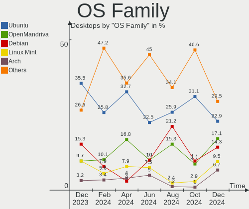
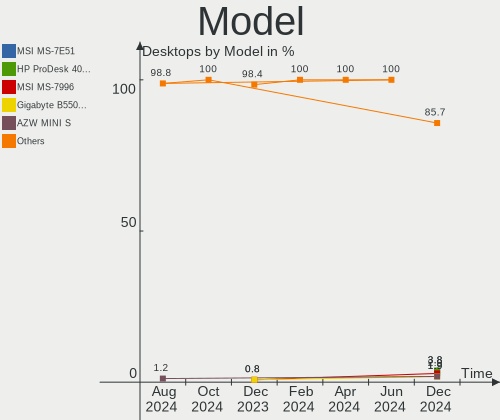
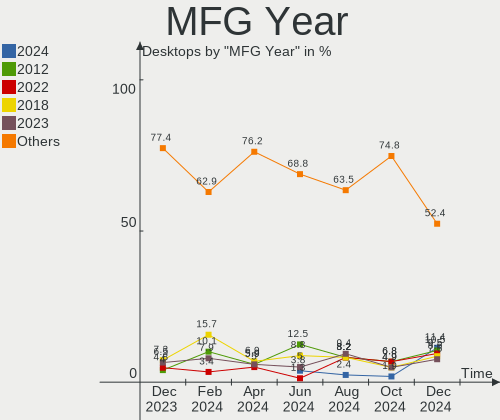
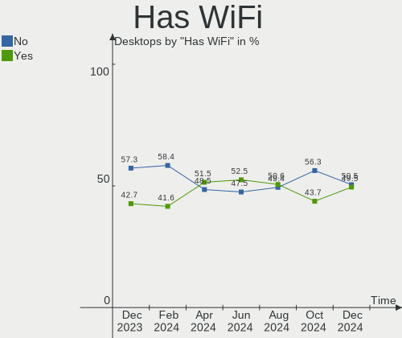
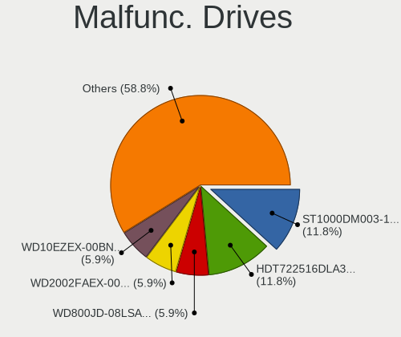
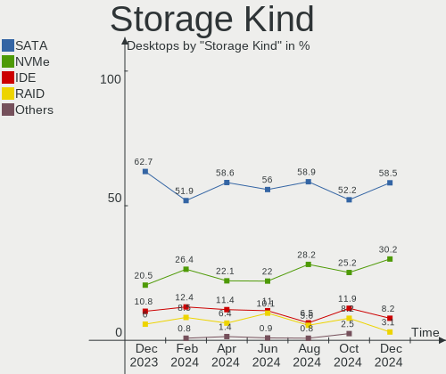
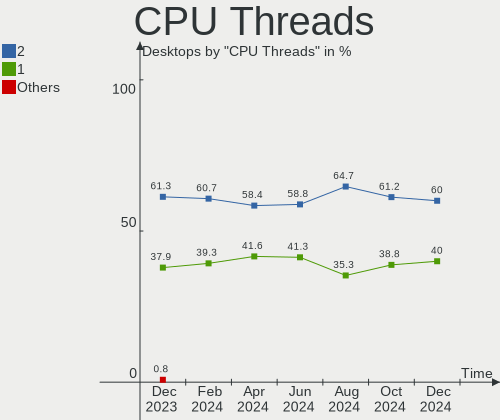
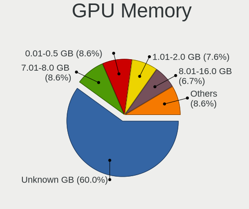
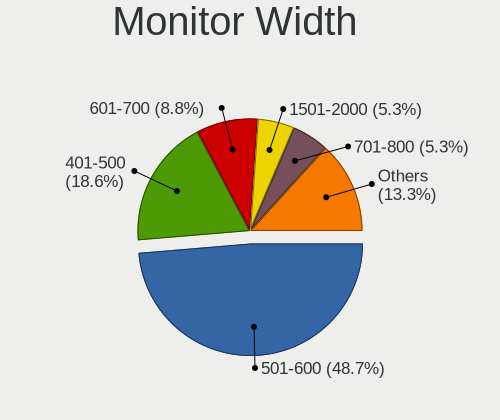
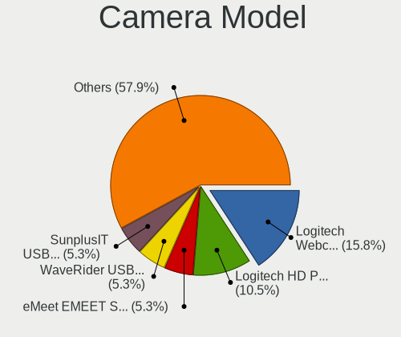

Linux in France - Hardware Trends (Desktops)
--------------------------------------------

A project to identify most popular hardware characteristics and track their change
over time based on data collected by Linux users at https://Linux-Hardware.org.

Anyone can contribute to this report by the [hw-probe](https://github.com/linuxhw/hw-probe) tool:

    sudo -E hw-probe -all -upload

Period: Feb, 2023.

Contents
--------

* [ System ](#system)
  - [ OS                       ](#os)
  - [ OS Family                ](#os-family)
  - [ Kernel                   ](#kernel)
  - [ Kernel Family            ](#kernel-family)
  - [ Kernel Major Ver.        ](#kernel-major-ver)
  - [ Arch                     ](#arch)
  - [ DE                       ](#de)
  - [ Display Server           ](#display-server)
  - [ Display Manager          ](#display-manager)
  - [ OS Lang                  ](#os-lang)
  - [ Boot Mode                ](#boot-mode)
  - [ Filesystem               ](#filesystem)
  - [ Part. scheme             ](#part-scheme)
  - [ Dual Boot with Linux/BSD ](#dual-boot-with-linuxbsd)
  - [ Dual Boot (Win)          ](#dual-boot-win)

* [ Board ](#board)
  - [ Vendor                   ](#vendor)
  - [ Model                    ](#model)
  - [ Model Family             ](#model-family)
  - [ MFG Year                 ](#mfg-year)
  - [ Form Factor              ](#form-factor)
  - [ Secure Boot              ](#secure-boot)
  - [ Coreboot                 ](#coreboot)
  - [ RAM Size                 ](#ram-size)
  - [ RAM Used                 ](#ram-used)
  - [ Total Drives             ](#total-drives)
  - [ Has CD-ROM               ](#has-cd-rom)
  - [ Has Ethernet             ](#has-ethernet)
  - [ Has WiFi                 ](#has-wifi)
  - [ Has Bluetooth            ](#has-bluetooth)

* [ Location ](#location)
  - [ Country                  ](#country)
  - [ City                     ](#city)

* [ Drives ](#drives)
  - [ Drive Vendor             ](#drive-vendor)
  - [ Drive Model              ](#drive-model)
  - [ HDD Vendor               ](#hdd-vendor)
  - [ SSD Vendor               ](#ssd-vendor)
  - [ Drive Kind               ](#drive-kind)
  - [ Drive Connector          ](#drive-connector)
  - [ Drive Size               ](#drive-size)
  - [ Space Total              ](#space-total)
  - [ Space Used               ](#space-used)
  - [ Malfunc. Drives          ](#malfunc-drives)
  - [ Malfunc. Drive Vendor    ](#malfunc-drive-vendor)
  - [ Malfunc. HDD Vendor      ](#malfunc-hdd-vendor)
  - [ Malfunc. Drive Kind      ](#malfunc-drive-kind)
  - [ Failed Drives            ](#failed-drives)
  - [ Failed Drive Vendor      ](#failed-drive-vendor)
  - [ Drive Status             ](#drive-status)

* [ Storage controller ](#storage-controller)
  - [ Storage Vendor           ](#storage-vendor)
  - [ Storage Model            ](#storage-model)
  - [ Storage Kind             ](#storage-kind)

* [ Processor ](#processor)
  - [ CPU Vendor               ](#cpu-vendor)
  - [ CPU Model                ](#cpu-model)
  - [ CPU Model Family         ](#cpu-model-family)
  - [ CPU Cores                ](#cpu-cores)
  - [ CPU Sockets              ](#cpu-sockets)
  - [ CPU Threads              ](#cpu-threads)
  - [ CPU Op-Modes             ](#cpu-op-modes)
  - [ CPU Microcode            ](#cpu-microcode)
  - [ CPU Microarch            ](#cpu-microarch)

* [ Graphics ](#graphics)
  - [ GPU Vendor               ](#gpu-vendor)
  - [ GPU Model                ](#gpu-model)
  - [ GPU Combo                ](#gpu-combo)
  - [ GPU Driver               ](#gpu-driver)
  - [ GPU Memory               ](#gpu-memory)

* [ Monitor ](#monitor)
  - [ Monitor Vendor           ](#monitor-vendor)
  - [ Monitor Model            ](#monitor-model)
  - [ Monitor Resolution       ](#monitor-resolution)
  - [ Monitor Diagonal         ](#monitor-diagonal)
  - [ Monitor Width            ](#monitor-width)
  - [ Aspect Ratio             ](#aspect-ratio)
  - [ Monitor Area             ](#monitor-area)
  - [ Pixel Density            ](#pixel-density)
  - [ Multiple Monitors        ](#multiple-monitors)

* [ Network ](#network)
  - [ Net Controller Vendor    ](#net-controller-vendor)
  - [ Net Controller Model     ](#net-controller-model)
  - [ Wireless Vendor          ](#wireless-vendor)
  - [ Wireless Model           ](#wireless-model)
  - [ Ethernet Vendor          ](#ethernet-vendor)
  - [ Ethernet Model           ](#ethernet-model)
  - [ Net Controller Kind      ](#net-controller-kind)
  - [ Used Controller          ](#used-controller)
  - [ NICs                     ](#nics)
  - [ IPv6                     ](#ipv6)

* [ Bluetooth ](#bluetooth)
  - [ Bluetooth Vendor         ](#bluetooth-vendor)
  - [ Bluetooth Model          ](#bluetooth-model)

* [ Sound ](#sound)
  - [ Sound Vendor             ](#sound-vendor)
  - [ Sound Model              ](#sound-model)

* [ Memory ](#memory)
  - [ Memory Vendor            ](#memory-vendor)
  - [ Memory Model             ](#memory-model)
  - [ Memory Kind              ](#memory-kind)
  - [ Memory Form Factor       ](#memory-form-factor)
  - [ Memory Size              ](#memory-size)
  - [ Memory Speed             ](#memory-speed)

* [ Printers & scanners ](#printers--scanners)
  - [ Printer Vendor           ](#printer-vendor)
  - [ Printer Model            ](#printer-model)
  - [ Scanner Vendor           ](#scanner-vendor)
  - [ Scanner Model            ](#scanner-model)

* [ Camera ](#camera)
  - [ Camera Vendor            ](#camera-vendor)
  - [ Camera Model             ](#camera-model)

* [ Security ](#security)
  - [ Fingerprint Vendor       ](#fingerprint-vendor)
  - [ Fingerprint Model        ](#fingerprint-model)
  - [ Chipcard Vendor          ](#chipcard-vendor)
  - [ Chipcard Model           ](#chipcard-model)

* [ Unsupported ](#unsupported)
  - [ Unsupported Devices      ](#unsupported-devices)
  - [ Unsupported Device Types ](#unsupported-device-types)

System
------

OS
--

Installed operating systems

| Name                | Desktops | Percent |
|---------------------|----------|---------|
| Ubuntu 22.04        | 18       | 15.65%  |
| OpenMandriva 23.01  | 13       | 11.3%   |
| OpenMandriva 4.3    | 9        | 7.83%   |
| Debian 11           | 8        | 6.96%   |
| Ubuntu 20.04        | 7        | 6.09%   |
| Linux Mint 21.1     | 7        | 6.09%   |
| OpenMandriva 4.2    | 6        | 5.22%   |
| Ubuntu 22.10        | 3        | 2.61%   |
| Arch Rolling        | 3        | 2.61%   |
| Xubuntu 18.04       | 2        | 1.74%   |
| ROSA 12.2           | 2        | 1.74%   |
| Pop!_OS 22.04       | 2        | 1.74%   |
| Lubuntu 22.04       | 2        | 1.74%   |
| Linux Mint 21       | 2        | 1.74%   |
| Linux Mint 20.3     | 2        | 1.74%   |
| Fedora 37           | 2        | 1.74%   |
| Fedora 35           | 2        | 1.74%   |
| Debian              | 2        | 1.74%   |
| CentOS 7            | 2        | 1.74%   |
| Zorin 16            | 1        | 0.87%   |
| Xubuntu 22.04       | 1        | 0.87%   |
| Xubuntu 20.04       | 1        | 0.87%   |
| Ubuntu Unity 22.04  | 1        | 0.87%   |
| Ubuntu MATE 20.04   | 1        | 0.87%   |
| Ubuntu MATE 18.04   | 1        | 0.87%   |
| Ubuntu Budgie 22.04 | 1        | 0.87%   |
| Ubuntu 23.04        | 1        | 0.87%   |
| OpenMandriva 23.90  | 1        | 0.87%   |
| Manjaro 22.0.4      | 1        | 0.87%   |
| Manjaro             | 1        | 0.87%   |
| Lubuntu 20.04       | 1        | 0.87%   |
| Kubuntu 22.10       | 1        | 0.87%   |
| Kubuntu 22.04       | 1        | 0.87%   |
| Kubuntu 21.10       | 1        | 0.87%   |
| KDE neon 22.04      | 1        | 0.87%   |
| Gentoo 2.9          | 1        | 0.87%   |
| Gentoo 2.8          | 1        | 0.87%   |
| Gentoo 2.13         | 1        | 0.87%   |
| Elementary 7        | 1        | 0.87%   |
| ArcoLinux Rolling   | 1        | 0.87%   |

OS Family
---------

OS without a version

| Name          | Desktops | Percent |
|---------------|----------|---------|
| Ubuntu        | 29       | 25.22%  |
| OpenMandriva  | 29       | 25.22%  |
| Linux Mint    | 11       | 9.57%   |
| Debian        | 10       | 8.7%    |
| Xubuntu       | 4        | 3.48%   |
| Fedora        | 4        | 3.48%   |
| Lubuntu       | 3        | 2.61%   |
| Kubuntu       | 3        | 2.61%   |
| Gentoo        | 3        | 2.61%   |
| Arch          | 3        | 2.61%   |
| Ubuntu MATE   | 2        | 1.74%   |
| ROSA          | 2        | 1.74%   |
| Pop!_OS       | 2        | 1.74%   |
| Manjaro       | 2        | 1.74%   |
| CentOS        | 2        | 1.74%   |
| Zorin         | 1        | 0.87%   |
| Ubuntu Unity  | 1        | 0.87%   |
| Ubuntu Budgie | 1        | 0.87%   |
| KDE neon      | 1        | 0.87%   |
| Elementary    | 1        | 0.87%   |
| ArcoLinux     | 1        | 0.87%   |

Kernel
------

Version of the Linux kernel

| Version                            | Desktops | Percent |
|------------------------------------|----------|---------|
| 5.15.0-60-generic                  | 15       | 13.04%  |
| 5.15.0-58-generic                  | 12       | 10.43%  |
| 6.1.1-desktop-1omv2290             | 11       | 9.57%   |
| 5.19.0-32-generic                  | 8        | 6.96%   |
| 5.16.13-desktop-1omv4003           | 7        | 6.09%   |
| 5.4.0-137-generic                  | 4        | 3.48%   |
| 5.10.14-desktop-1omv4002           | 4        | 3.48%   |
| 5.15.0-43-generic                  | 3        | 2.61%   |
| 5.10.0-21-amd64                    | 3        | 2.61%   |
| 6.1.4-desktop-1omv2301             | 2        | 1.74%   |
| 6.1.12-zen1-1-zen                  | 2        | 1.74%   |
| 6.1.11-200.fc37.x86_64             | 2        | 1.74%   |
| 6.0.12-76060006-generic            | 2        | 1.74%   |
| 6.0.12-100.fc35.x86_64             | 2        | 1.74%   |
| 5.4.0-139-generic                  | 2        | 1.74%   |
| 5.19.0-31-generic                  | 2        | 1.74%   |
| 5.19.0-29-generic                  | 2        | 1.74%   |
| 5.16.7-desktop-1omv4003            | 2        | 1.74%   |
| 5.15.0-60-lowlatency               | 2        | 1.74%   |
| 5.11.12-desktop-1omv4002           | 2        | 1.74%   |
| 5.10.74-generic-2rosa2021.1-x86_64 | 2        | 1.74%   |
| 5.10.0-20-amd64                    | 2        | 1.74%   |
| 6.2.1-060201-generic               | 1        | 0.87%   |
| 6.1.9-gentoo-dist                  | 1        | 0.87%   |
| 6.1.8-bcfs-oli+                    | 1        | 0.87%   |
| 6.1.8-arch1-1                      | 1        | 0.87%   |
| 6.1.11-desktop-1omv2390            | 1        | 0.87%   |
| 6.1.11-1-MANJARO                   | 1        | 0.87%   |
| 6.1.0-1-amd64                      | 1        | 0.87%   |
| 6.0.0-13.3-liquorix-amd64          | 1        | 0.87%   |
| 6.0.0-0.deb11.6-amd64              | 1        | 0.87%   |
| 5.8.0-43-generic                   | 1        | 0.87%   |
| 5.19.0-21-generic                  | 1        | 0.87%   |
| 5.17.0-1020-oem                    | 1        | 0.87%   |
| 5.15.94-1-MANJARO                  | 1        | 0.87%   |
| 5.15.93-1-lts                      | 1        | 0.87%   |
| 5.15.88-gentoo                     | 1        | 0.87%   |
| 5.13.0-52-generic                  | 1        | 0.87%   |
| 5.13.0-28-generic                  | 1        | 0.87%   |
| 5.10.43                            | 1        | 0.87%   |

Kernel Family
-------------

Linux kernel without a distro release

| Version | Desktops | Percent |
|---------|----------|---------|
| 5.15.0  | 32       | 27.83%  |
| 5.19.0  | 13       | 11.3%   |
| 6.1.1   | 11       | 9.57%   |
| 5.16.13 | 7        | 6.09%   |
| 5.4.0   | 6        | 5.22%   |
| 5.10.0  | 6        | 5.22%   |
| 6.1.11  | 4        | 3.48%   |
| 6.0.12  | 4        | 3.48%   |
| 5.10.14 | 4        | 3.48%   |
| 6.1.8   | 2        | 1.74%   |
| 6.1.4   | 2        | 1.74%   |
| 6.1.12  | 2        | 1.74%   |
| 6.0.0   | 2        | 1.74%   |
| 5.16.7  | 2        | 1.74%   |
| 5.13.0  | 2        | 1.74%   |
| 5.11.12 | 2        | 1.74%   |
| 5.10.74 | 2        | 1.74%   |
| 3.10.0  | 2        | 1.74%   |
| 6.2.1   | 1        | 0.87%   |
| 6.1.9   | 1        | 0.87%   |
| 6.1.0   | 1        | 0.87%   |
| 5.8.0   | 1        | 0.87%   |
| 5.17.0  | 1        | 0.87%   |
| 5.15.94 | 1        | 0.87%   |
| 5.15.93 | 1        | 0.87%   |
| 5.15.88 | 1        | 0.87%   |
| 5.10.43 | 1        | 0.87%   |
| 4.15.0  | 1        | 0.87%   |

Kernel Major Ver.
-----------------

Linux kernel major version

| Version | Desktops | Percent |
|---------|----------|---------|
| 5.15    | 35       | 30.43%  |
| 6.1     | 23       | 20%     |
| 5.19    | 13       | 11.3%   |
| 5.10    | 13       | 11.3%   |
| 5.16    | 9        | 7.83%   |
| 6.0     | 6        | 5.22%   |
| 5.4     | 6        | 5.22%   |
| 5.13    | 2        | 1.74%   |
| 5.11    | 2        | 1.74%   |
| 3.10    | 2        | 1.74%   |
| 6.2     | 1        | 0.87%   |
| 5.8     | 1        | 0.87%   |
| 5.17    | 1        | 0.87%   |
| 4.15    | 1        | 0.87%   |

Arch
----

OS architecture (x86_64, i586, etc.)

| Name   | Desktops | Percent |
|--------|----------|---------|
| x86_64 | 114      | 99.13%  |
| i686   | 1        | 0.87%   |

DE
--

Desktop Environment

| Name       | Desktops | Percent |
|------------|----------|---------|
| GNOME      | 42       | 36.52%  |
| KDE5       | 38       | 33.04%  |
| XFCE       | 8        | 6.96%   |
| MATE       | 7        | 6.09%   |
| X-Cinnamon | 6        | 5.22%   |
| LXQt       | 6        | 5.22%   |
| Budgie     | 2        | 1.74%   |
| Unknown    | 2        | 1.74%   |
| Unity      | 1        | 0.87%   |
| Pantheon   | 1        | 0.87%   |
| LXDE       | 1        | 0.87%   |
| KDE4       | 1        | 0.87%   |

Display Server
--------------

X11 or Wayland

| Name    | Desktops | Percent |
|---------|----------|---------|
| X11     | 88       | 76.52%  |
| Wayland | 21       | 18.26%  |
| Tty     | 6        | 5.22%   |

Display Manager
---------------

SDDM, LightDM, etc.

| Name    | Desktops | Percent |
|---------|----------|---------|
| SDDM    | 43       | 37.39%  |
| GDM3    | 23       | 20%     |
| Unknown | 18       | 15.65%  |
| LightDM | 17       | 14.78%  |
| GDM     | 14       | 12.17%  |

OS Lang
-------

Language

| Lang  | Desktops | Percent |
|-------|----------|---------|
| fr_FR | 94       | 81.74%  |
| en_US | 13       | 11.3%   |
| en_GB | 5        | 4.35%   |
| C     | 2        | 1.74%   |
| fr_CH | 1        | 0.87%   |

Boot Mode
---------

EFI or BIOS

| Mode | Desktops | Percent |
|------|----------|---------|
| EFI  | 65       | 56.52%  |
| BIOS | 50       | 43.48%  |

Filesystem
----------

Type of filesystem

| Type    | Desktops | Percent |
|---------|----------|---------|
| Ext4    | 93       | 80.87%  |
| Overlay | 10       | 8.7%    |
| Btrfs   | 10       | 8.7%    |
| Xfs     | 2        | 1.74%   |

Part. scheme
------------

Scheme of partitioning

| Type    | Desktops | Percent |
|---------|----------|---------|
| GPT     | 74       | 64.35%  |
| MBR     | 25       | 21.74%  |
| Unknown | 16       | 13.91%  |

Dual Boot with Linux/BSD
------------------------

Hosting more than one Linux/BSD

| Dual boot | Desktops | Percent |
|-----------|----------|---------|
| No        | 82       | 71.3%   |
| Yes       | 33       | 28.7%   |

Dual Boot (Win)
---------------

Hosting Linux and Windows

| Dual boot | Desktops | Percent |
|-----------|----------|---------|
| No        | 74       | 64.35%  |
| Yes       | 41       | 35.65%  |

Board
-----

Vendor
------

Motherboard manufacturer

| Name                | Desktops | Percent |
|---------------------|----------|---------|
| ASUSTek Computer    | 29       | 25.22%  |
| MSI                 | 23       | 20%     |
| Gigabyte Technology | 14       | 12.17%  |
| Dell                | 12       | 10.43%  |
| ASRock              | 9        | 7.83%   |
| Hewlett-Packard     | 7        | 6.09%   |
| Lenovo              | 6        | 5.22%   |
| Supermicro          | 2        | 1.74%   |
| Pegatron            | 2        | 1.74%   |
| Foxconn             | 2        | 1.74%   |
| Acer                | 2        | 1.74%   |
| T-bao               | 1        | 0.87%   |
| Packard Bell        | 1        | 0.87%   |
| IP3 Tech            | 1        | 0.87%   |
| Intel               | 1        | 0.87%   |
| AZW                 | 1        | 0.87%   |
| ASRockRack          | 1        | 0.87%   |
| Unknown             | 1        | 0.87%   |

Model
-----

Motherboard model

| Name                                    | Desktops | Percent |
|-----------------------------------------|----------|---------|
| ASUS All Series                         | 5        | 4.35%   |
| MSI MS-7B84                             | 3        | 2.61%   |
| ASUS TUF Gaming B550-PLUS               | 2        | 1.74%   |
| T-bao MINI PC                           | 1        | 0.87%   |
| Supermicro X9DAi                        | 1        | 0.87%   |
| Supermicro X7DCL                        | 1        | 0.87%   |
| Pegatron h8-1350ef                      | 1        | 0.87%   |
| Pegatron Compaq dx2400 Microtower PC    | 1        | 0.87%   |
| Packard Bell IMEDIA S3840               | 1        | 0.87%   |
| MSI MS-7D46                             | 1        | 0.87%   |
| MSI MS-7C96                             | 1        | 0.87%   |
| MSI MS-7C95                             | 1        | 0.87%   |
| MSI MS-7C92                             | 1        | 0.87%   |
| MSI MS-7C91                             | 1        | 0.87%   |
| MSI MS-7C67                             | 1        | 0.87%   |
| MSI MS-7C37                             | 1        | 0.87%   |
| MSI MS-7B89                             | 1        | 0.87%   |
| MSI MS-7B53                             | 1        | 0.87%   |
| MSI MS-7B38                             | 1        | 0.87%   |
| MSI MS-7A70                             | 1        | 0.87%   |
| MSI MS-7A33                             | 1        | 0.87%   |
| MSI MS-7A32                             | 1        | 0.87%   |
| MSI MS-7996                             | 1        | 0.87%   |
| MSI MS-7968                             | 1        | 0.87%   |
| MSI MS-7866                             | 1        | 0.87%   |
| MSI MS-7816                             | 1        | 0.87%   |
| MSI MS-7680                             | 1        | 0.87%   |
| MSI MS-7267                             | 1        | 0.87%   |
| MSI B360 Gaming Aegis 3 8 (MS-B918)     | 1        | 0.87%   |
| Lenovo ThinkCentre M900 10FCS1L800      | 1        | 0.87%   |
| Lenovo ThinkCentre M83 10AGS0HA00       | 1        | 0.87%   |
| Lenovo ThinkCentre M800 10FVS00D00      | 1        | 0.87%   |
| Lenovo ThinkCentre M720t 10SRS2XH00     | 1        | 0.87%   |
| Lenovo IdeaCentre 310S-08IAP 90GA000XFR | 1        | 0.87%   |
| Lenovo H520S 10093                      | 1        | 0.87%   |
| IP3 Tech Z83-W                          | 1        | 0.87%   |
| Intel D33217GKE G76540-203              | 1        | 0.87%   |
| HP Z420 Workstation                     | 1        | 0.87%   |
| HP ProDesk 600 G2 SFF                   | 1        | 0.87%   |
| HP ProDesk 600 G1 Tower PC              | 1        | 0.87%   |

Model Family
------------

Motherboard model prefix

| Name                | Desktops | Percent |
|---------------------|----------|---------|
| Dell Precision      | 5        | 4.35%   |
| Dell OptiPlex       | 5        | 4.35%   |
| ASUS PRIME          | 5        | 4.35%   |
| ASUS All            | 5        | 4.35%   |
| Lenovo ThinkCentre  | 4        | 3.48%   |
| HP Compaq           | 4        | 3.48%   |
| MSI MS-7B84         | 3        | 2.61%   |
| HP ProDesk          | 2        | 1.74%   |
| ASUS TUF            | 2        | 1.74%   |
| T-bao MINI          | 1        | 0.87%   |
| Supermicro X9DAi    | 1        | 0.87%   |
| Supermicro X7DCL    | 1        | 0.87%   |
| Pegatron h8-1350ef  | 1        | 0.87%   |
| Pegatron Compaq     | 1        | 0.87%   |
| Packard Bell IMEDIA | 1        | 0.87%   |
| MSI MS-7D46         | 1        | 0.87%   |
| MSI MS-7C96         | 1        | 0.87%   |
| MSI MS-7C95         | 1        | 0.87%   |
| MSI MS-7C92         | 1        | 0.87%   |
| MSI MS-7C91         | 1        | 0.87%   |
| MSI MS-7C67         | 1        | 0.87%   |
| MSI MS-7C37         | 1        | 0.87%   |
| MSI MS-7B89         | 1        | 0.87%   |
| MSI MS-7B53         | 1        | 0.87%   |
| MSI MS-7B38         | 1        | 0.87%   |
| MSI MS-7A70         | 1        | 0.87%   |
| MSI MS-7A33         | 1        | 0.87%   |
| MSI MS-7A32         | 1        | 0.87%   |
| MSI MS-7996         | 1        | 0.87%   |
| MSI MS-7968         | 1        | 0.87%   |
| MSI MS-7866         | 1        | 0.87%   |
| MSI MS-7816         | 1        | 0.87%   |
| MSI MS-7680         | 1        | 0.87%   |
| MSI MS-7267         | 1        | 0.87%   |
| MSI B360            | 1        | 0.87%   |
| Lenovo IdeaCentre   | 1        | 0.87%   |
| Lenovo H520S        | 1        | 0.87%   |
| IP3 Tech Z83-W      | 1        | 0.87%   |
| Intel D33217GKE     | 1        | 0.87%   |
| HP Z420             | 1        | 0.87%   |

MFG Year
--------

Motherboard manufacture year

| Year | Desktops | Percent |
|------|----------|---------|
| 2012 | 14       | 12.17%  |
| 2018 | 11       | 9.57%   |
| 2017 | 10       | 8.7%    |
| 2013 | 10       | 8.7%    |
| 2016 | 9        | 7.83%   |
| 2014 | 9        | 7.83%   |
| 2020 | 8        | 6.96%   |
| 2019 | 7        | 6.09%   |
| 2015 | 7        | 6.09%   |
| 2021 | 6        | 5.22%   |
| 2022 | 5        | 4.35%   |
| 2011 | 5        | 4.35%   |
| 2009 | 5        | 4.35%   |
| 2006 | 5        | 4.35%   |
| 2007 | 2        | 1.74%   |
| 2010 | 1        | 0.87%   |
| 2008 | 1        | 0.87%   |

Form Factor
-----------

Physical design of the computer

| Name    | Desktops | Percent |
|---------|----------|---------|
| Desktop | 115      | 100%    |

Secure Boot
-----------

Enabled or disabled

| State    | Desktops | Percent |
|----------|----------|---------|
| Disabled | 111      | 96.52%  |
| Enabled  | 4        | 3.48%   |

Coreboot
--------

Have coreboot on board

| Used | Desktops | Percent |
|------|----------|---------|
| No   | 115      | 100%    |

RAM Size
--------

Total RAM memory

| Size in GB      | Desktops | Percent |
|-----------------|----------|---------|
| 16.01-24.0      | 35       | 30.43%  |
| 8.01-16.0       | 26       | 22.61%  |
| 32.01-64.0      | 16       | 13.91%  |
| 4.01-8.0        | 13       | 11.3%   |
| 3.01-4.0        | 9        | 7.83%   |
| 24.01-32.0      | 5        | 4.35%   |
| 64.01-256.0     | 5        | 4.35%   |
| 1.01-2.0        | 3        | 2.61%   |
| More than 256.0 | 1        | 0.87%   |
| 2.01-3.0        | 1        | 0.87%   |
| 0.51-1.0        | 1        | 0.87%   |

RAM Used
--------

Used RAM memory

| Used GB    | Desktops | Percent |
|------------|----------|---------|
| 1.01-2.0   | 41       | 35.65%  |
| 2.01-3.0   | 25       | 21.74%  |
| 4.01-8.0   | 18       | 15.65%  |
| 3.01-4.0   | 13       | 11.3%   |
| 0.51-1.0   | 9        | 7.83%   |
| 8.01-16.0  | 6        | 5.22%   |
| 16.01-24.0 | 2        | 1.74%   |
| 0.01-0.5   | 1        | 0.87%   |

Total Drives
------------

Number of drives on board

| Drives | Desktops | Percent |
|--------|----------|---------|
| 1      | 51       | 44.35%  |
| 2      | 27       | 23.48%  |
| 3      | 17       | 14.78%  |
| 4      | 10       | 8.7%    |
| 5      | 4        | 3.48%   |
| 8      | 2        | 1.74%   |
| 21     | 1        | 0.87%   |
| 7      | 1        | 0.87%   |
| 6      | 1        | 0.87%   |
| 0      | 1        | 0.87%   |

Has CD-ROM
----------

Has CD-ROM on board

| Presented | Desktops | Percent |
|-----------|----------|---------|
| Yes       | 66       | 57.39%  |
| No        | 49       | 42.61%  |

Has Ethernet
------------

Has Ethernet on board

| Presented | Desktops | Percent |
|-----------|----------|---------|
| Yes       | 114      | 99.13%  |
| No        | 1        | 0.87%   |

Has WiFi
--------

Has WiFi module

| Presented | Desktops | Percent |
|-----------|----------|---------|
| No        | 71       | 61.74%  |
| Yes       | 44       | 38.26%  |

Has Bluetooth
-------------

Has Bluetooth module

| Presented | Desktops | Percent |
|-----------|----------|---------|
| No        | 85       | 73.91%  |
| Yes       | 30       | 26.09%  |

Location
--------

Country
-------

Geographic location (country)

| Country | Desktops | Percent |
|---------|----------|---------|
| France  | 115      | 100%    |

City
----

Geographic location (city)

| City                      | Desktops | Percent |
|---------------------------|----------|---------|
| Paris                     | 12       | 10.43%  |
| Marseille                 | 3        | 2.61%   |
| Grenoble                  | 3        | 2.61%   |
| Tours                     | 2        | 1.74%   |
| Nice                      | 2        | 1.74%   |
| Narbonne                  | 2        | 1.74%   |
| Maizieres-les-Metz        | 2        | 1.74%   |
| Lyon                      | 2        | 1.74%   |
| Forges-les-Eaux           | 2        | 1.74%   |
| Antibes                   | 2        | 1.74%   |
| Villeneuve-d'Ascq         | 1        | 0.87%   |
| Vesoul                    | 1        | 0.87%   |
| Vasseny                   | 1        | 0.87%   |
| Vallenay                  | 1        | 0.87%   |
| Troyes                    | 1        | 0.87%   |
| Tremblay-en-France        | 1        | 0.87%   |
| Toulouse                  | 1        | 0.87%   |
| Sury-le-Comtal            | 1        | 0.87%   |
| Sedan                     | 1        | 0.87%   |
| Saran                     | 1        | 0.87%   |
| San-Martino-di-Lota       | 1        | 0.87%   |
| Saint-Yrieix-sur-Charente | 1        | 0.87%   |
| Saint-Julien-de-Concelles | 1        | 0.87%   |
| Saint-Hilaire-de-Riez     | 1        | 0.87%   |
| Saint-Etienne             | 1        | 0.87%   |
| Saint-Denis-les-Bourg     | 1        | 0.87%   |
| Saint-Brieuc              | 1        | 0.87%   |
| Roubaix                   | 1        | 0.87%   |
| Roanne                    | 1        | 0.87%   |
| Rennes                    | 1        | 0.87%   |
| Reims                     | 1        | 0.87%   |
| Quimperlé                | 1        | 0.87%   |
| Plounerin                 | 1        | 0.87%   |
| Pia                       | 1        | 0.87%   |
| Perpignan                 | 1        | 0.87%   |
| Peron                     | 1        | 0.87%   |
| Pamiers                   | 1        | 0.87%   |
| Orcet                     | 1        | 0.87%   |
| Oignies                   | 1        | 0.87%   |
| Neuilly-sur-Seine         | 1        | 0.87%   |

Drives
------

Drive Vendor
------------

Hard drive vendors

| Vendor                       | Desktops | Drives | Percent |
|------------------------------|----------|--------|---------|
| Seagate                      | 41       | 51     | 19.34%  |
| Samsung Electronics          | 37       | 40     | 17.45%  |
| WDC                          | 31       | 55     | 14.62%  |
| Crucial                      | 20       | 22     | 9.43%   |
| Kingston                     | 13       | 14     | 6.13%   |
| SanDisk                      | 10       | 11     | 4.72%   |
| Toshiba                      | 8        | 11     | 3.77%   |
| Hitachi                      | 8        | 8      | 3.77%   |
| Intel                        | 5        | 5      | 2.36%   |
| PNY                          | 4        | 4      | 1.89%   |
| SK hynix                     | 3        | 3      | 1.42%   |
| Maxtor                       | 3        | 3      | 1.42%   |
| Unknown                      | 2        | 2      | 0.94%   |
| Phison Electronics           | 2        | 2      | 0.94%   |
| Micron Technology            | 2        | 2      | 0.94%   |
| LDLC                         | 2        | 3      | 0.94%   |
| Corsair                      | 2        | 2      | 0.94%   |
| China                        | 2        | 2      | 0.94%   |
| Silicon Motion               | 1        | 1      | 0.47%   |
| Shenzhen Longsys Electronics | 1        | 2      | 0.47%   |
| SFAS                         | 1        | 1      | 0.47%   |
| Plextor                      | 1        | 1      | 0.47%   |
| OCZ-VERTEX3                  | 1        | 1      | 0.47%   |
| Micron/Crucial Technology    | 1        | 1      | 0.47%   |
| LITEONIT                     | 1        | 1      | 0.47%   |
| Kingston Technology Company  | 1        | 1      | 0.47%   |
| Integral                     | 1        | 1      | 0.47%   |
| Hikvision                    | 1        | 1      | 0.47%   |
| HGST                         | 1        | 2      | 0.47%   |
| Hewlett-Packard              | 1        | 1      | 0.47%   |
| Gigabyte Technology          | 1        | 1      | 0.47%   |
| Fanxiang                     | 1        | 1      | 0.47%   |
| Emtec                        | 1        | 1      | 0.47%   |
| ASMT                         | 1        | 1      | 0.47%   |
| A-DATA Technology            | 1        | 1      | 0.47%   |

Drive Model
-----------

Hard drive models

| Model                                               | Desktops | Percent |
|-----------------------------------------------------|----------|---------|
| Crucial CT240BX500SSD1 240GB                        | 6        | 2.51%   |
| Seagate ST500DM002-1BD142 500GB                     | 5        | 2.09%   |
| Samsung SSD 850 EVO 500GB                           | 4        | 1.67%   |
| Seagate ST2000DM008-2FR102 2TB                      | 3        | 1.26%   |
| Seagate ST1000DM003-1ER162 1TB                      | 3        | 1.26%   |
| Sandisk WD Black SN750 / PC SN730 NVMe SSD 512GB    | 3        | 1.26%   |
| Samsung SSD 860 EVO 250GB                           | 3        | 1.26%   |
| Samsung SSD 850 EVO 250GB                           | 3        | 1.26%   |
| WDC WD6400AAKS-65A7B2 640GB                         | 2        | 0.84%   |
| Toshiba DT01ACA100 1TB                              | 2        | 0.84%   |
| Toshiba DT01ACA050 500GB                            | 2        | 0.84%   |
| Seagate ST4000DM004-2U9104 4TB                      | 2        | 0.84%   |
| Seagate ST4000DM004-2CV104 4TB                      | 2        | 0.84%   |
| Seagate ST3250410AS 250GB                           | 2        | 0.84%   |
| Seagate ST3250310AS 250GB                           | 2        | 0.84%   |
| Seagate ST31000528AS 1TB                            | 2        | 0.84%   |
| Seagate ST1000LM024 HN-M101MBB 1TB                  | 2        | 0.84%   |
| Seagate ST1000DM003-9YN162 1TB                      | 2        | 0.84%   |
| Samsung NVMe SSD Controller SM981/PM981/PM983 250GB | 2        | 0.84%   |
| PNY CS900 480GB SSD                                 | 2        | 0.84%   |
| PNY CS900 120GB SSD                                 | 2        | 0.84%   |
| Kingston SV300S37A60G 64GB SSD                      | 2        | 0.84%   |
| Kingston SA400S37240G 240GB SSD                     | 2        | 0.84%   |
| Crucial CT2000MX500SSD1 2TB                         | 2        | 0.84%   |
| Crucial CT1000P2SSD8 1TB                            | 2        | 0.84%   |
| WDC WUH721816ALE6L4 16TB                            | 1        | 0.42%   |
| WDC WDS240G2G0B-00EPW0 240GB SSD                    | 1        | 0.42%   |
| WDC WD8001FFWX-68J1UN0 8TB                          | 1        | 0.42%   |
| WDC WD7500AADS-00M2B0 752GB                         | 1        | 0.42%   |
| WDC WD5000BPVT-22HXZT3 500GB                        | 1        | 0.42%   |
| WDC WD5000BPVT-00HXZT3 500GB                        | 1        | 0.42%   |
| WDC WD5000AZLX-75K2TA0 500GB                        | 1        | 0.42%   |
| WDC WD5000AZLX-08K2TA0 500GB                        | 1        | 0.42%   |
| WDC WD5000AAVS-00N7B0 500GB                         | 1        | 0.42%   |
| WDC WD5000AAKX-75U6AA0 500GB                        | 1        | 0.42%   |
| WDC WD5000AAKX-60U6AA0 500GB                        | 1        | 0.42%   |
| WDC WD5000AAKX-22ERMA0 500GB                        | 1        | 0.42%   |
| WDC WD5000AAKX-08ANVA0 500GB                        | 1        | 0.42%   |
| WDC WD5000AAKS-00UU3A0 500GB                        | 1        | 0.42%   |
| WDC WD5000AADS-00S9B0 500GB                         | 1        | 0.42%   |

HDD Vendor
----------

Hard disk drive vendors

| Vendor              | Desktops | Drives | Percent |
|---------------------|----------|--------|---------|
| Seagate             | 40       | 50     | 42.55%  |
| WDC                 | 28       | 51     | 29.79%  |
| Toshiba             | 8        | 11     | 8.51%   |
| Hitachi             | 8        | 8      | 8.51%   |
| Samsung Electronics | 5        | 5      | 5.32%   |
| Maxtor              | 3        | 3      | 3.19%   |
| Unknown             | 1        | 1      | 1.06%   |
| Hewlett-Packard     | 1        | 1      | 1.06%   |

SSD Vendor
----------

Solid state drive vendors

| Vendor              | Desktops | Drives | Percent |
|---------------------|----------|--------|---------|
| Samsung Electronics | 24       | 24     | 29.63%  |
| Crucial             | 16       | 18     | 19.75%  |
| Kingston            | 12       | 13     | 14.81%  |
| SanDisk             | 5        | 5      | 6.17%   |
| PNY                 | 4        | 4      | 4.94%   |
| Intel               | 3        | 3      | 3.7%    |
| WDC                 | 2        | 2      | 2.47%   |
| SK hynix            | 2        | 2      | 2.47%   |
| LDLC                | 2        | 2      | 2.47%   |
| China               | 2        | 2      | 2.47%   |
| SFAS                | 1        | 1      | 1.23%   |
| Plextor             | 1        | 1      | 1.23%   |
| OCZ-VERTEX3         | 1        | 1      | 1.23%   |
| Micron Technology   | 1        | 1      | 1.23%   |
| LITEONIT            | 1        | 1      | 1.23%   |
| Integral            | 1        | 1      | 1.23%   |
| Emtec               | 1        | 1      | 1.23%   |
| ASMT                | 1        | 1      | 1.23%   |
| A-DATA Technology   | 1        | 1      | 1.23%   |

Drive Kind
----------

HDD or SSD

| Kind    | Desktops | Drives | Percent |
|---------|----------|--------|---------|
| HDD     | 74       | 130    | 44.05%  |
| SSD     | 62       | 84     | 36.9%   |
| NVMe    | 30       | 42     | 17.86%  |
| MMC     | 1        | 1      | 0.6%    |
| Unknown | 1        | 2      | 0.6%    |

Drive Connector
---------------

SATA, SAS, NVMe, etc.

| Type | Desktops | Drives | Percent |
|------|----------|--------|---------|
| SATA | 101      | 209    | 72.66%  |
| NVMe | 30       | 41     | 21.58%  |
| SAS  | 7        | 8      | 5.04%   |
| MMC  | 1        | 1      | 0.72%   |

Drive Size
----------

Size of hard drive

| Size in TB | Desktops | Drives | Percent |
|------------|----------|--------|---------|
| 0.01-0.5   | 78       | 111    | 52%     |
| 0.51-1.0   | 40       | 54     | 26.67%  |
| 1.01-2.0   | 17       | 19     | 11.33%  |
| 3.01-4.0   | 8        | 9      | 5.33%   |
| 4.01-10.0  | 3        | 12     | 2%      |
| 2.01-3.0   | 2        | 2      | 1.33%   |
| 10.01-20.0 | 2        | 7      | 1.33%   |

Space Total
-----------

Amount of disk space available on the file system

| Size in GB     | Desktops | Percent |
|----------------|----------|---------|
| 101-250        | 27       | 23.48%  |
| 251-500        | 21       | 18.26%  |
| More than 3000 | 15       | 13.04%  |
| 1001-2000      | 14       | 12.17%  |
| 1-20           | 12       | 10.43%  |
| 501-1000       | 12       | 10.43%  |
| 21-50          | 5        | 4.35%   |
| 51-100         | 4        | 3.48%   |
| 2001-3000      | 3        | 2.61%   |
| Unknown        | 2        | 1.74%   |

Space Used
----------

Amount of used disk space

| Used GB        | Desktops | Percent |
|----------------|----------|---------|
| 1-20           | 42       | 36.52%  |
| 101-250        | 19       | 16.52%  |
| 501-1000       | 12       | 10.43%  |
| 21-50          | 11       | 9.57%   |
| 51-100         | 8        | 6.96%   |
| 2001-3000      | 7        | 6.09%   |
| 251-500        | 5        | 4.35%   |
| 1001-2000      | 5        | 4.35%   |
| More than 3000 | 3        | 2.61%   |
| Unknown        | 2        | 1.74%   |
| 0              | 1        | 0.87%   |

Malfunc. Drives
---------------

Drive models with a malfunction

| Model                                        | Desktops | Drives | Percent |
|----------------------------------------------|----------|--------|---------|
| WDC WD6400AAKS-65A7B2 640GB                  | 2        | 2      | 5.56%   |
| Seagate ST1000DM003-9YN162 1TB               | 2        | 2      | 5.56%   |
| WDC WDS240G2G0B-00EPW0 240GB SSD             | 1        | 1      | 2.78%   |
| WDC WD5000AAKX-22ERMA0 500GB                 | 1        | 1      | 2.78%   |
| WDC WD5000AAKX-08ANVA0 500GB                 | 1        | 1      | 2.78%   |
| WDC WD5000AAKS-00UU3A0 500GB                 | 1        | 1      | 2.78%   |
| WDC WD4000FYYZ-01UL1B2 4TB                   | 1        | 1      | 2.78%   |
| WDC WD20EARX-00PASB0 2TB                     | 1        | 1      | 2.78%   |
| WDC WD20EARS-22MVWB0 2TB                     | 1        | 1      | 2.78%   |
| WDC WD20EARS-00MVWB0 2TB                     | 1        | 1      | 2.78%   |
| WDC WD2000JD-22HBB0 200GB                    | 1        | 1      | 2.78%   |
| WDC WD10EARS-00Y5B1 1TB                      | 1        | 1      | 2.78%   |
| WDC WD1002FAEX-00Z3A0 1TB                    | 1        | 1      | 2.78%   |
| WDC WD1001FAES-75W7A0 1TB                    | 1        | 1      | 2.78%   |
| Toshiba DT01ACA050 500GB                     | 1        | 1      | 2.78%   |
| Seagate ST9320423AS 320GB                    | 1        | 1      | 2.78%   |
| Seagate ST500DM002-1BD142 500GB              | 1        | 1      | 2.78%   |
| Seagate ST3250410AS 250GB                    | 1        | 1      | 2.78%   |
| Seagate ST3250310AS 250GB                    | 1        | 1      | 2.78%   |
| Seagate ST31000528AS 1TB                     | 1        | 1      | 2.78%   |
| Seagate ST31000524AS 1TB                     | 1        | 1      | 2.78%   |
| Seagate ST2000DM001-9YN164 2TB               | 1        | 1      | 2.78%   |
| Samsung Electronics SSD 840 PRO Series 256GB | 1        | 1      | 2.78%   |
| Samsung Electronics HD322GJ 320GB            | 1        | 1      | 2.78%   |
| Samsung Electronics HD103UJ 1TB              | 1        | 1      | 2.78%   |
| Samsung Electronics HD103SJ 1TB              | 1        | 1      | 2.78%   |
| Maxtor STM3320620A 320GB                     | 1        | 1      | 2.78%   |
| Maxtor 6V160E0 160GB                         | 1        | 1      | 2.78%   |
| Kingston SV300S37A60G 64GB SSD               | 1        | 1      | 2.78%   |
| Kingston SUV500240G 240GB SSD                | 1        | 1      | 2.78%   |
| Kingston RBU-SC400S37256G 256GB SSD          | 1        | 1      | 2.78%   |
| Hitachi HDT721010SLA360 1TB                  | 1        | 1      | 2.78%   |
| Hitachi HDS722020ALA330 2TB                  | 1        | 1      | 2.78%   |
| Hewlett-Packard VB0160EAVEQ 160GB            | 1        | 1      | 2.78%   |

Malfunc. Drive Vendor
---------------------

Vendors of faulty drives

| Vendor              | Desktops | Drives | Percent |
|---------------------|----------|--------|---------|
| WDC                 | 12       | 14     | 35.29%  |
| Seagate             | 9        | 9      | 26.47%  |
| Samsung Electronics | 4        | 4      | 11.76%  |
| Kingston            | 3        | 3      | 8.82%   |
| Maxtor              | 2        | 2      | 5.88%   |
| Hitachi             | 2        | 2      | 5.88%   |
| Toshiba             | 1        | 1      | 2.94%   |
| Hewlett-Packard     | 1        | 1      | 2.94%   |

Malfunc. HDD Vendor
-------------------

Vendors of faulty HDD drives

| Vendor              | Desktops | Drives | Percent |
|---------------------|----------|--------|---------|
| WDC                 | 11       | 13     | 37.93%  |
| Seagate             | 9        | 9      | 31.03%  |
| Samsung Electronics | 3        | 3      | 10.34%  |
| Maxtor              | 2        | 2      | 6.9%    |
| Hitachi             | 2        | 2      | 6.9%    |
| Toshiba             | 1        | 1      | 3.45%   |
| Hewlett-Packard     | 1        | 1      | 3.45%   |

Malfunc. Drive Kind
-------------------

Kinds of faulty drives

| Kind | Desktops | Drives | Percent |
|------|----------|--------|---------|
| HDD  | 24       | 31     | 82.76%  |
| SSD  | 5        | 5      | 17.24%  |

Failed Drives
-------------

Failed drive models

Zero info for selected period =(

Failed Drive Vendor
-------------------

Failed drive vendors

Zero info for selected period =(

Drive Status
------------

Number of failed and malfunc. drives

| Status   | Desktops | Drives | Percent |
|----------|----------|--------|---------|
| Works    | 72       | 141    | 54.14%  |
| Detected | 33       | 82     | 24.81%  |
| Malfunc  | 28       | 36     | 21.05%  |

Storage controller
------------------

Storage Vendor
--------------

Storage controller vendors

| Vendor                           | Desktops | Percent |
|----------------------------------|----------|---------|
| Intel                            | 76       | 45.78%  |
| AMD                              | 36       | 21.69%  |
| Samsung Electronics              | 9        | 5.42%   |
| ASMedia Technology               | 8        | 4.82%   |
| SanDisk                          | 6        | 3.61%   |
| Phison Electronics               | 5        | 3.01%   |
| Micron/Crucial Technology        | 5        | 3.01%   |
| Silicon Motion                   | 2        | 1.2%    |
| Kingston Technology Company      | 2        | 1.2%    |
| JMicron Technology               | 2        | 1.2%    |
| Broadcom / LSI                   | 2        | 1.2%    |
| VIA Technologies                 | 1        | 0.6%    |
| SK hynix                         | 1        | 0.6%    |
| Silicon Integrated Systems [SiS] | 1        | 0.6%    |
| Silicon Image                    | 1        | 0.6%    |
| Shenzhen Longsys Electronics     | 1        | 0.6%    |
| Seagate Technology               | 1        | 0.6%    |
| Nvidia                           | 1        | 0.6%    |
| Micron Technology                | 1        | 0.6%    |
| MAXIO Technology (Hangzhou)      | 1        | 0.6%    |
| Marvell Technology Group         | 1        | 0.6%    |
| Integrated Technology Express    | 1        | 0.6%    |
| Areca Technology                 | 1        | 0.6%    |
| Adaptec                          | 1        | 0.6%    |

Storage Model
-------------

Storage controller models

| Model                                                                                   | Desktops | Percent |
|-----------------------------------------------------------------------------------------|----------|---------|
| AMD FCH SATA Controller [AHCI mode]                                                     | 22       | 10.58%  |
| Intel 8 Series/C220 Series Chipset Family 6-port SATA Controller 1 [AHCI mode]          | 14       | 6.73%   |
| Intel Q170/Q150/B150/H170/H110/Z170/CM236 Chipset SATA Controller [AHCI Mode]           | 11       | 5.29%   |
| ASMedia ASM1062 Serial ATA Controller                                                   | 8        | 3.85%   |
| AMD 500 Series Chipset SATA Controller                                                  | 7        | 3.37%   |
| Intel SATA Controller [RAID mode]                                                       | 5        | 2.4%    |
| Intel 7 Series/C210 Series Chipset Family 6-port SATA Controller [AHCI mode]            | 5        | 2.4%    |
| AMD 400 Series Chipset SATA Controller                                                  | 5        | 2.4%    |
| Samsung NVMe SSD Controller SM981/PM981/PM983                                           | 4        | 1.92%   |
| Intel 6 Series/C200 Series Chipset Family 6 port Desktop SATA AHCI Controller           | 4        | 1.92%   |
| Intel 200 Series PCH SATA controller [AHCI mode]                                        | 4        | 1.92%   |
| AMD SB7x0/SB8x0/SB9x0 SATA Controller [IDE mode]                                        | 4        | 1.92%   |
| AMD FCH SATA Controller D                                                               | 4        | 1.92%   |
| SanDisk WD Black SN750 / PC SN730 NVMe SSD                                              | 3        | 1.44%   |
| Phison E12 NVMe Controller                                                              | 3        | 1.44%   |
| Micron/Crucial P2 NVMe PCIe SSD                                                         | 3        | 1.44%   |
| Intel Volume Management Device NVMe RAID Controller                                     | 3        | 1.44%   |
| Intel NM10/ICH7 Family SATA Controller [IDE mode]                                       | 3        | 1.44%   |
| Intel Cannon Lake PCH SATA AHCI Controller                                              | 3        | 1.44%   |
| Intel C610/X99 series chipset 6-Port SATA Controller [AHCI mode]                        | 3        | 1.44%   |
| Intel 6 Series/C200 Series Chipset Family Desktop SATA Controller (IDE mode, ports 4-5) | 3        | 1.44%   |
| Intel 6 Series/C200 Series Chipset Family Desktop SATA Controller (IDE mode, ports 0-3) | 3        | 1.44%   |
| AMD X370 Series Chipset SATA Controller                                                 | 3        | 1.44%   |
| AMD SB7x0/SB8x0/SB9x0 IDE Controller                                                    | 3        | 1.44%   |
| Silicon Motion SM2263EN/SM2263XT SSD Controller                                         | 2        | 0.96%   |
| SanDisk WD Black 2018/SN750 / PC SN720 NVMe SSD                                         | 2        | 0.96%   |
| Samsung NVMe SSD Controller PM9A1/PM9A3/980PRO                                          | 2        | 0.96%   |
| Samsung NVMe SSD Controller 980                                                         | 2        | 0.96%   |
| Micron/Crucial P1 NVMe PCIe SSD                                                         | 2        | 0.96%   |
| Intel C602 chipset 4-Port SATA Storage Control Unit                                     | 2        | 0.96%   |
| Intel C600/X79 series chipset SATA RAID Controller                                      | 2        | 0.96%   |
| Intel Alder Lake-S PCH SATA Controller [AHCI Mode]                                      | 2        | 0.96%   |
| Intel 9 Series Chipset Family SATA Controller [AHCI Mode]                               | 2        | 0.96%   |
| Intel 82801IR/IO/IH (ICH9R/DO/DH) 4 port SATA Controller [IDE mode]                     | 2        | 0.96%   |
| Intel 82801I (ICH9 Family) 2 port SATA Controller [IDE mode]                            | 2        | 0.96%   |
| Intel 82801G (ICH7 Family) IDE Controller                                               | 2        | 0.96%   |
| Intel 500 Series Chipset Family SATA AHCI Controller                                    | 2        | 0.96%   |
| AMD FCH IDE Controller                                                                  | 2        | 0.96%   |
| AMD 300 Series Chipset SATA Controller                                                  | 2        | 0.96%   |
| VIA VT82C586A/B/VT82C686/A/B/VT823x/A/C PIPC Bus Master IDE                             | 1        | 0.48%   |

Storage Kind
------------

Kind of storage controller (IDE, SATA, NVMe, SAS, ...)

| Kind | Desktops | Percent |
|------|----------|---------|
| SATA | 93       | 57.76%  |
| NVMe | 30       | 18.63%  |
| IDE  | 22       | 13.66%  |
| RAID | 13       | 8.07%   |
| SAS  | 3        | 1.86%   |

Processor
---------

CPU Vendor
----------

Processor vendors

| Vendor | Desktops | Percent |
|--------|----------|---------|
| Intel  | 78       | 67.83%  |
| AMD    | 37       | 32.17%  |

CPU Model
---------

Processor models

| Model                                       | Desktops | Percent |
|---------------------------------------------|----------|---------|
| Intel Core i5-6500 CPU @ 3.20GHz            | 4        | 3.48%   |
| Intel Core i5-2320 CPU @ 3.00GHz            | 4        | 3.48%   |
| Intel Core i3-6100 CPU @ 3.70GHz            | 3        | 2.61%   |
| Intel Core i3-4130 CPU @ 3.40GHz            | 3        | 2.61%   |
| Intel Core 2 CPU 6300 @ 1.86GHz             | 3        | 2.61%   |
| AMD Ryzen 7 2700 Eight-Core Processor       | 3        | 2.61%   |
| AMD Ryzen 5 5600X 6-Core Processor          | 3        | 2.61%   |
| Intel Core i7-4790 CPU @ 3.60GHz            | 2        | 1.74%   |
| Intel Core i7-4770 CPU @ 3.40GHz            | 2        | 1.74%   |
| Intel Core i5-4570 CPU @ 3.20GHz            | 2        | 1.74%   |
| Intel Core i3-4160 CPU @ 3.60GHz            | 2        | 1.74%   |
| AMD Ryzen 9 3900X 12-Core Processor         | 2        | 1.74%   |
| AMD Ryzen 7 3700X 8-Core Processor          | 2        | 1.74%   |
| AMD Ryzen 5 5500                            | 2        | 1.74%   |
| AMD Ryzen 5 2400G with Radeon Vega Graphics | 2        | 1.74%   |
| Intel Xeon W-2104 CPU @ 3.20GHz             | 1        | 0.87%   |
| Intel Xeon CPU E5450 @ 3.00GHz              | 1        | 0.87%   |
| Intel Xeon CPU E5-2698 v4 @ 2.20GHz         | 1        | 0.87%   |
| Intel Xeon CPU E5-2630 0 @ 2.30GHz          | 1        | 0.87%   |
| Intel Xeon CPU E5-2620 v4 @ 2.10GHz         | 1        | 0.87%   |
| Intel Xeon CPU E5-1650 v3 @ 3.50GHz         | 1        | 0.87%   |
| Intel Xeon CPU E5-1650 v2 @ 3.50GHz         | 1        | 0.87%   |
| Intel Xeon Bronze 3106 CPU @ 1.70GHz        | 1        | 0.87%   |
| Intel Pentium Gold G5400 CPU @ 3.70GHz      | 1        | 0.87%   |
| Intel Pentium Dual CPU E2140 @ 1.60GHz      | 1        | 0.87%   |
| Intel Pentium D CPU 3.00GHz                 | 1        | 0.87%   |
| Intel Pentium CPU J3710 @ 1.60GHz           | 1        | 0.87%   |
| Intel Core i9-9900K CPU @ 3.60GHz           | 1        | 0.87%   |
| Intel Core i7-8700 CPU @ 3.20GHz            | 1        | 0.87%   |
| Intel Core i7-7820X CPU @ 3.60GHz           | 1        | 0.87%   |
| Intel Core i7-6800K CPU @ 3.40GHz           | 1        | 0.87%   |
| Intel Core i7-6700 CPU @ 3.40GHz            | 1        | 0.87%   |
| Intel Core i7-5820K CPU @ 3.30GHz           | 1        | 0.87%   |
| Intel Core i7-4790S CPU @ 3.20GHz           | 1        | 0.87%   |
| Intel Core i7-4770K CPU @ 3.50GHz           | 1        | 0.87%   |
| Intel Core i7-3770 CPU @ 3.40GHz            | 1        | 0.87%   |
| Intel Core i7-2600 CPU @ 3.40GHz            | 1        | 0.87%   |
| Intel Core i7-10700KF CPU @ 3.80GHz         | 1        | 0.87%   |
| Intel Core i7 CPU 860 @ 2.80GHz             | 1        | 0.87%   |
| Intel Core i5-9400F CPU @ 2.90GHz           | 1        | 0.87%   |

CPU Model Family
----------------

Processor model prefix

| Model                  | Desktops | Percent |
|------------------------|----------|---------|
| Intel Core i5          | 24       | 20.87%  |
| Intel Core i7          | 15       | 13.04%  |
| Intel Core i3          | 12       | 10.43%  |
| AMD Ryzen 5            | 12       | 10.43%  |
| AMD Ryzen 7            | 10       | 8.7%    |
| Intel Xeon             | 7        | 6.09%   |
| Intel Celeron          | 5        | 4.35%   |
| Other                  | 3        | 2.61%   |
| Intel Core 2           | 3        | 2.61%   |
| AMD Ryzen 9            | 3        | 2.61%   |
| Intel Atom             | 2        | 1.74%   |
| AMD Ryzen 3            | 2        | 1.74%   |
| AMD FX                 | 2        | 1.74%   |
| Intel Xeon Bronze      | 1        | 0.87%   |
| Intel Pentium Gold     | 1        | 0.87%   |
| Intel Pentium Dual     | 1        | 0.87%   |
| Intel Pentium D        | 1        | 0.87%   |
| Intel Pentium          | 1        | 0.87%   |
| Intel Core i9          | 1        | 0.87%   |
| Intel Core 2 Duo       | 1        | 0.87%   |
| AMD Ryzen Threadripper | 1        | 0.87%   |
| AMD E                  | 1        | 0.87%   |
| AMD Dual Core Opteron  | 1        | 0.87%   |
| AMD Athlon X4          | 1        | 0.87%   |
| AMD Athlon II X4       | 1        | 0.87%   |
| AMD Athlon II X2       | 1        | 0.87%   |
| AMD Athlon 64 X2       | 1        | 0.87%   |
| AMD A6                 | 1        | 0.87%   |

CPU Cores
---------

Number of processor cores

| Number | Desktops | Percent |
|--------|----------|---------|
| 4      | 47       | 40.87%  |
| 2      | 26       | 22.61%  |
| 6      | 16       | 13.91%  |
| 8      | 14       | 12.17%  |
| 12     | 4        | 3.48%   |
| 16     | 3        | 2.61%   |
| 1      | 2        | 1.74%   |
| 40     | 1        | 0.87%   |
| 32     | 1        | 0.87%   |
| 3      | 1        | 0.87%   |

CPU Sockets
-----------

Number of sockets

| Number | Desktops | Percent |
|--------|----------|---------|
| 1      | 109      | 94.78%  |
| 2      | 6        | 5.22%   |

CPU Threads
-----------

Threads per core (Hyper-Threading)

| Number | Desktops | Percent |
|--------|----------|---------|
| 2      | 70       | 60.87%  |
| 1      | 45       | 39.13%  |

CPU Op-Modes
------------

CPU Operation Modes (32-bit, 64-bit)

| Op mode        | Desktops | Percent |
|----------------|----------|---------|
| 32-bit, 64-bit | 115      | 100%    |

CPU Microcode
-------------

Microcode number

| Number     | Desktops | Percent |
|------------|----------|---------|
| Unknown    | 28       | 24.35%  |
| 0x306c3    | 14       | 12.17%  |
| 0x506e3    | 8        | 6.96%   |
| 0x206a7    | 7        | 6.09%   |
| 0x306a9    | 6        | 5.22%   |
| 0x906ea    | 4        | 3.48%   |
| 0x6f6      | 3        | 2.61%   |
| 0x906e9    | 2        | 1.74%   |
| 0x406f1    | 2        | 1.74%   |
| 0x10676    | 2        | 1.74%   |
| 0x0a50000d | 2        | 1.74%   |
| 0x0a20120a | 2        | 1.74%   |
| 0x08701021 | 2        | 1.74%   |
| 0x08600106 | 2        | 1.74%   |
| 0x08108109 | 2        | 1.74%   |
| 0x08101016 | 2        | 1.74%   |
| 0x0800820d | 2        | 1.74%   |
| 0x08001138 | 2        | 1.74%   |
| 0xf65      | 1        | 0.87%   |
| 0xa0671    | 1        | 0.87%   |
| 0xa0655    | 1        | 0.87%   |
| 0x906ed    | 1        | 0.87%   |
| 0x906eb    | 1        | 0.87%   |
| 0x906c0    | 1        | 0.87%   |
| 0x90675    | 1        | 0.87%   |
| 0x90672    | 1        | 0.87%   |
| 0x50654    | 1        | 0.87%   |
| 0x406c4    | 1        | 0.87%   |
| 0x306f2    | 1        | 0.87%   |
| 0x306e4    | 1        | 0.87%   |
| 0x206d7    | 1        | 0.87%   |
| 0x106c2    | 1        | 0.87%   |
| 0x0a50000c | 1        | 0.87%   |
| 0x0a201205 | 1        | 0.87%   |
| 0x0a201009 | 1        | 0.87%   |
| 0x08701030 | 1        | 0.87%   |
| 0x0800111c | 1        | 0.87%   |
| 0x06003106 | 1        | 0.87%   |
| 0x06000822 | 1        | 0.87%   |
| 0x05000119 | 1        | 0.87%   |

CPU Microarch
-------------

Microarchitecture

| Name             | Desktops | Percent |
|------------------|----------|---------|
| Haswell          | 18       | 15.65%  |
| Skylake          | 13       | 11.3%   |
| SandyBridge      | 9        | 7.83%   |
| KabyLake         | 9        | 7.83%   |
| Zen 3            | 8        | 6.96%   |
| IvyBridge        | 8        | 6.96%   |
| Zen+             | 7        | 6.09%   |
| Zen 2            | 7        | 6.09%   |
| Zen              | 6        | 5.22%   |
| Core             | 4        | 3.48%   |
| Broadwell        | 3        | 2.61%   |
| Silvermont       | 2        | 1.74%   |
| Piledriver       | 2        | 1.74%   |
| Penryn           | 2        | 1.74%   |
| K8 Hammer        | 2        | 1.74%   |
| K10              | 2        | 1.74%   |
| CometLake        | 2        | 1.74%   |
| Alderlake Hybrid | 2        | 1.74%   |
| Tremont          | 1        | 0.87%   |
| Steamroller      | 1        | 0.87%   |
| NetBurst         | 1        | 0.87%   |
| Nehalem          | 1        | 0.87%   |
| Icelake          | 1        | 0.87%   |
| Goldmont         | 1        | 0.87%   |
| Excavator        | 1        | 0.87%   |
| Bonnell          | 1        | 0.87%   |
| Bobcat           | 1        | 0.87%   |

Graphics
--------

GPU Vendor
----------

Vendors of graphics cards

| Vendor                                       | Desktops | Percent |
|----------------------------------------------|----------|---------|
| Nvidia                                       | 56       | 45.53%  |
| AMD                                          | 33       | 26.83%  |
| Intel                                        | 30       | 24.39%  |
| ASPEED Technology                            | 2        | 1.63%   |
| XGI Technology (eXtreme Graphics Innovation) | 1        | 0.81%   |
| Silicon Integrated Systems [SiS]             | 1        | 0.81%   |

GPU Model
---------

Graphics card models

| Model                                                                                    | Desktops | Percent |
|------------------------------------------------------------------------------------------|----------|---------|
| Intel HD Graphics 530                                                                    | 6        | 4.8%    |
| Nvidia GP107 [GeForce GTX 1050 Ti]                                                       | 5        | 4%      |
| Nvidia GK208B [GeForce GT 710]                                                           | 5        | 4%      |
| Nvidia GK208B [GeForce GT 730]                                                           | 4        | 3.2%    |
| Intel Xeon E3-1200 v3/4th Gen Core Processor Integrated Graphics Controller              | 4        | 3.2%    |
| Intel 4th Generation Core Processor Family Integrated Graphics Controller                | 4        | 3.2%    |
| AMD Navi 22 [Radeon RX 6700/6700 XT/6750 XT / 6800M/6850M XT]                            | 4        | 3.2%    |
| Nvidia GM206 [GeForce GTX 960]                                                           | 3        | 2.4%    |
| Nvidia GM107 [GeForce GTX 750 Ti]                                                        | 3        | 2.4%    |
| Nvidia GF119 [GeForce GT 610]                                                            | 3        | 2.4%    |
| AMD Navi 23 [Radeon RX 6600/6600 XT/6600M]                                               | 3        | 2.4%    |
| AMD Ellesmere [Radeon RX 470/480/570/570X/580/580X/590]                                  | 3        | 2.4%    |
| Nvidia GP106 [GeForce GTX 1060 6GB]                                                      | 2        | 1.6%    |
| Nvidia GK104 [GeForce GTX 670]                                                           | 2        | 1.6%    |
| Nvidia GF119 [GeForce 605]                                                               | 2        | 1.6%    |
| Intel Xeon E3-1200 v2/3rd Gen Core processor Graphics Controller                         | 2        | 1.6%    |
| Intel CoffeeLake-S GT1 [UHD Graphics 610]                                                | 2        | 1.6%    |
| Intel Atom/Celeron/Pentium Processor x5-E8000/J3xxx/N3xxx Integrated Graphics Controller | 2        | 1.6%    |
| Intel 2nd Generation Core Processor Family Integrated Graphics Controller                | 2        | 1.6%    |
| ASPEED Technology ASPEED Graphics Family                                                 | 2        | 1.6%    |
| AMD Turks XT [Radeon HD 6670/7670]                                                       | 2        | 1.6%    |
| AMD Raven Ridge [Radeon Vega Series / Radeon Vega Mobile Series]                         | 2        | 1.6%    |
| AMD Picasso/Raven 2 [Radeon Vega Series / Radeon Vega Mobile Series]                     | 2        | 1.6%    |
| AMD Oland XT [Radeon HD 8670 / R5 340X OEM / R7 250/350/350X OEM]                        | 2        | 1.6%    |
| XGI Technology (eXtreme Graphics Innovation) Z9s/Z9m (XG21 core)                         | 1        | 0.8%    |
| Silicon Integrated Systems [SiS] 771/671 PCIE VGA Display Adapter                        | 1        | 0.8%    |
| Nvidia TU117 [GeForce GTX 1650]                                                          | 1        | 0.8%    |
| Nvidia TU116 [GeForce GTX 1660 SUPER]                                                    | 1        | 0.8%    |
| Nvidia TU106 [GeForce RTX 2060 SUPER]                                                    | 1        | 0.8%    |
| Nvidia TU106 [GeForce RTX 2060 Rev. A]                                                   | 1        | 0.8%    |
| Nvidia TU104 [GeForce RTX 2080 SUPER]                                                    | 1        | 0.8%    |
| Nvidia GT200 [GeForce GTX 260]                                                           | 1        | 0.8%    |
| Nvidia GP108 [GeForce GT 1030]                                                           | 1        | 0.8%    |
| Nvidia GP107GL [Quadro P620]                                                             | 1        | 0.8%    |
| Nvidia GP107GL [Quadro P400]                                                             | 1        | 0.8%    |
| Nvidia GP107 [GeForce GTX 1050]                                                          | 1        | 0.8%    |
| Nvidia GP106GL [Quadro P2200]                                                            | 1        | 0.8%    |
| Nvidia GM206GL [Quadro M2000]                                                            | 1        | 0.8%    |
| Nvidia GM204GL [Quadro M4000]                                                            | 1        | 0.8%    |
| Nvidia GK106GL [Quadro K4000]                                                            | 1        | 0.8%    |

GPU Combo
---------

Combinations of graphics cards

| Name           | Desktops | Percent |
|----------------|----------|---------|
| 1 x Nvidia     | 51       | 44.35%  |
| 1 x AMD        | 30       | 26.09%  |
| 1 x Intel      | 24       | 20.87%  |
| Intel + Nvidia | 3        | 2.61%   |
| 2 x Nvidia     | 1        | 0.87%   |
| 2 x AMD        | 1        | 0.87%   |
| 1 x XGI        | 1        | 0.87%   |
| 1 x SiS        | 1        | 0.87%   |
| 1 x ASPEED     | 1        | 0.87%   |
| AMD + Nvidia   | 1        | 0.87%   |
| AMD + ASPEED   | 1        | 0.87%   |

GPU Driver
----------

Free vs proprietary

| Driver      | Desktops | Percent |
|-------------|----------|---------|
| Free        | 90       | 78.26%  |
| Proprietary | 17       | 14.78%  |
| Unknown     | 8        | 6.96%   |

GPU Memory
----------

Total video memory

| Size in GB | Desktops | Percent |
|------------|----------|---------|
| Unknown    | 47       | 40.87%  |
| 1.01-2.0   | 24       | 20.87%  |
| 0.51-1.0   | 12       | 10.43%  |
| 7.01-8.0   | 9        | 7.83%   |
| 3.01-4.0   | 7        | 6.09%   |
| 0.01-0.5   | 7        | 6.09%   |
| 8.01-16.0  | 6        | 5.22%   |
| 5.01-6.0   | 2        | 1.74%   |
| 2.01-3.0   | 1        | 0.87%   |

Monitor
-------

Monitor Vendor
--------------

Monitor vendors

| Vendor               | Desktops | Percent |
|----------------------|----------|---------|
| Samsung Electronics  | 17       | 13.49%  |
| Iiyama               | 16       | 12.7%   |
| Dell                 | 15       | 11.9%   |
| Hewlett-Packard      | 10       | 7.94%   |
| Ancor Communications | 10       | 7.94%   |
| Philips              | 9        | 7.14%   |
| Goldstar             | 6        | 4.76%   |
| BenQ                 | 6        | 4.76%   |
| Acer                 | 6        | 4.76%   |
| AOC                  | 5        | 3.97%   |
| ASUSTek Computer     | 4        | 3.17%   |
| Idek Iiyama          | 3        | 2.38%   |
| HKC                  | 3        | 2.38%   |
| ViewSonic            | 2        | 1.59%   |
| LG Electronics       | 2        | 1.59%   |
| Eizo                 | 2        | 1.59%   |
| Xiaomi               | 1        | 0.79%   |
| Sony                 | 1        | 0.79%   |
| Packard Bell         | 1        | 0.79%   |
| NECCI                | 1        | 0.79%   |
| MSI                  | 1        | 0.79%   |
| Lenovo               | 1        | 0.79%   |
| LaCie                | 1        | 0.79%   |
| IBM                  | 1        | 0.79%   |
| HannStar             | 1        | 0.79%   |
| Hannspree            | 1        | 0.79%   |

Monitor Model
-------------

Monitor models

| Model                                                                 | Desktops | Percent |
|-----------------------------------------------------------------------|----------|---------|
| Samsung Electronics C34H89x SAM0E26 3440x1440 797x333mm 34.0-inch     | 2        | 1.53%   |
| Philips PHL 246V5 PHLC0C5 1920x1080 531x299mm 24.0-inch               | 2        | 1.53%   |
| Iiyama PLE2483H IVM6113 1920x1080 531x299mm 24.0-inch                 | 2        | 1.53%   |
| Iiyama PL2730H IVM663A 1920x1080 598x336mm 27.0-inch                  | 2        | 1.53%   |
| Iiyama PL2283H IVM562E 1920x1080 496x292mm 22.7-inch                  | 2        | 1.53%   |
| HKC LCD Monitor HKC2160 1920x1080 360x270mm 17.7-inch                 | 2        | 1.53%   |
| ASUSTek Computer VG245 AUS24A1 1920x1080 531x299mm 24.0-inch          | 2        | 1.53%   |
| Ancor Communications ASUS VE278 ACI27F6 1920x1080 598x336mm 27.0-inch | 2        | 1.53%   |
| Xiaomi Mi TV XMD00E1 3840x2160 708x398mm 32.0-inch                    | 1        | 0.76%   |
| ViewSonic VX2457 VSCB931 1920x1080 521x293mm 23.5-inch                | 1        | 0.76%   |
| ViewSonic VX2025wm VSCE51D 1680x1050 433x271mm 20.1-inch              | 1        | 0.76%   |
| Sony TV SNYD301 1360x768                                              | 1        | 0.76%   |
| Samsung Electronics U28E590 SAM0C4E 3840x2160 608x345mm 27.5-inch     | 1        | 0.76%   |
| Samsung Electronics U28E570 SAM0D6F 3840x2160 607x345mm 27.5-inch     | 1        | 0.76%   |
| Samsung Electronics SyncMaster SAM059A 1920x1080 477x268mm 21.5-inch  | 1        | 0.76%   |
| Samsung Electronics SyncMaster SAM0304 1680x1050 494x320mm 23.2-inch  | 1        | 0.76%   |
| Samsung Electronics SyncMaster SAM0301 1680x1050 459x296mm 21.5-inch  | 1        | 0.76%   |
| Samsung Electronics SyncMaster SAM01E1 1280x1024 376x301mm 19.0-inch  | 1        | 0.76%   |
| Samsung Electronics S27B350 SAM08DC 1920x1080 598x336mm 27.0-inch     | 1        | 0.76%   |
| Samsung Electronics S27B350 SAM08DB 1920x1080 598x336mm 27.0-inch     | 1        | 0.76%   |
| Samsung Electronics S24E450 SAM0CA3 1920x1080 531x299mm 24.0-inch     | 1        | 0.76%   |
| Samsung Electronics S24D330 SAM0D92 1920x1080 531x299mm 24.0-inch     | 1        | 0.76%   |
| Samsung Electronics S22E450 SAM0C7B 1680x1050 473x291mm 21.9-inch     | 1        | 0.76%   |
| Samsung Electronics S22C300 SAM0A20 1920x1080 477x268mm 21.5-inch     | 1        | 0.76%   |
| Samsung Electronics Q85A SAM713C 3840x2160 1872x1053mm 84.6-inch      | 1        | 0.76%   |
| Samsung Electronics LCD Monitor SAM07D0 1360x768 700x390mm 31.5-inch  | 1        | 0.76%   |
| Samsung Electronics C49RG9x SAM0F9C 3840x1080 1193x336mm 48.8-inch    | 1        | 0.76%   |
| Samsung Electronics C27HG7x SAM0E16 2560x1440 598x336mm 27.0-inch     | 1        | 0.76%   |
| Philips PHL 276E8V PHLC18F 3840x2160 597x336mm 27.0-inch              | 1        | 0.76%   |
| Philips PHL 247E6 PHLC0E7 1920x1080 521x293mm 23.5-inch               | 1        | 0.76%   |
| Philips PHL 237E7 PHLC101 1920x1080 509x286mm 23.0-inch               | 1        | 0.76%   |
| Philips PHL 223V5 PHLC0CF 1920x1080 477x268mm 21.5-inch               | 1        | 0.76%   |
| Philips 298P4 PHLC0BE 2560x1080 673x284mm 28.8-inch                   | 1        | 0.76%   |
| Philips 220CW PHLC024 1680x1050 474x296mm 22.0-inch                   | 1        | 0.76%   |
| Philips 200W PHL0832 1680x1050 433x271mm 20.1-inch                    | 1        | 0.76%   |
| Packard Bell Viseo223DX PKB037A 1920x1080 477x268mm 21.5-inch         | 1        | 0.76%   |
| NECCI MAE190W NCI5050 1440x900 410x256mm 19.0-inch                    | 1        | 0.76%   |
| MSI G27C6 MSI5CA9 1920x1080 598x336mm 27.0-inch                       | 1        | 0.76%   |
| LG Electronics LCD Monitor LG HDR WQHD 3840x1600                      | 1        | 0.76%   |
| LG Electronics LCD Monitor L226WTQ                                    | 1        | 0.76%   |

Monitor Resolution
------------------

Monitor screen resolution

| Resolution         | Desktops | Percent |
|--------------------|----------|---------|
| 1920x1080 (FHD)    | 63       | 50.81%  |
| 3840x2160 (4K)     | 9        | 7.26%   |
| 1280x1024 (SXGA)   | 9        | 7.26%   |
| 1680x1050 (WSXGA+) | 8        | 6.45%   |
| 1920x1200 (WUXGA)  | 6        | 4.84%   |
| 2560x1440 (QHD)    | 5        | 4.03%   |
| 1440x900 (WXGA+)   | 5        | 4.03%   |
| 3840x1080          | 3        | 2.42%   |
| 3440x1440          | 3        | 2.42%   |
| 1360x768           | 3        | 2.42%   |
| Unknown            | 3        | 2.42%   |
| 2560x1080          | 2        | 1.61%   |
| 3840x1600          | 1        | 0.81%   |
| 3120x1050          | 1        | 0.81%   |
| 1600x900 (HD+)     | 1        | 0.81%   |
| 1600x1200          | 1        | 0.81%   |
| 1366x768 (WXGA)    | 1        | 0.81%   |

Monitor Diagonal
----------------

Diagonal size in inches

| Inches  | Desktops | Percent |
|---------|----------|---------|
| 24      | 21       | 17.07%  |
| 27      | 19       | 15.45%  |
| 21      | 18       | 14.63%  |
| 23      | 17       | 13.82%  |
| Unknown | 9        | 7.32%   |
| 17      | 8        | 6.5%    |
| 19      | 7        | 5.69%   |
| 22      | 4        | 3.25%   |
| 34      | 3        | 2.44%   |
| 31      | 3        | 2.44%   |
| 20      | 3        | 2.44%   |
| 18      | 3        | 2.44%   |
| 28      | 2        | 1.63%   |
| 84      | 1        | 0.81%   |
| 72      | 1        | 0.81%   |
| 48      | 1        | 0.81%   |
| 43      | 1        | 0.81%   |
| 32      | 1        | 0.81%   |
| 25      | 1        | 0.81%   |

Monitor Width
-------------

Physical width

| Width in mm | Desktops | Percent |
|-------------|----------|---------|
| 501-600     | 51       | 42.15%  |
| 401-500     | 32       | 26.45%  |
| 601-700     | 9        | 7.44%   |
| Unknown     | 9        | 7.44%   |
| 351-400     | 7        | 5.79%   |
| 301-350     | 5        | 4.13%   |
| 701-800     | 4        | 3.31%   |
| 1501-2000   | 2        | 1.65%   |
| 1001-1500   | 1        | 0.83%   |
| 901-1000    | 1        | 0.83%   |

Aspect Ratio
------------

Proportional relationship between the width and the height

| Ratio   | Desktops | Percent |
|---------|----------|---------|
| 16/9    | 73       | 61.34%  |
| 16/10   | 16       | 13.45%  |
| Unknown | 9        | 7.56%   |
| 5/4     | 8        | 6.72%   |
| 21/9    | 5        | 4.2%    |
| 4/3     | 3        | 2.52%   |
| 3/2     | 3        | 2.52%   |
| 6/5     | 1        | 0.84%   |
| 32/9    | 1        | 0.84%   |

Monitor Area
------------

Area in inch²

| Area in inch² | Desktops | Percent |
|----------------|----------|---------|
| 201-250        | 47       | 39.83%  |
| 301-350        | 19       | 16.1%   |
| 151-200        | 15       | 12.71%  |
| 251-300        | 9        | 7.63%   |
| Unknown        | 9        | 7.63%   |
| 351-500        | 7        | 5.93%   |
| 141-150        | 7        | 5.93%   |
| More than 1000 | 2        | 1.69%   |
| 501-1000       | 2        | 1.69%   |
| 131-140        | 1        | 0.85%   |

Pixel Density
-------------

Pixels per inch

| Density | Desktops | Percent |
|---------|----------|---------|
| 51-100  | 76       | 64.96%  |
| 101-120 | 21       | 17.95%  |
| Unknown | 9        | 7.69%   |
| 121-160 | 7        | 5.98%   |
| 1-50    | 2        | 1.71%   |
| 161-240 | 2        | 1.71%   |

Multiple Monitors
-----------------

Total monitors connected

| Total | Desktops | Percent |
|-------|----------|---------|
| 1     | 89       | 77.39%  |
| 2     | 21       | 18.26%  |
| 0     | 4        | 3.48%   |
| 3     | 1        | 0.87%   |

Network
-------

Net Controller Vendor
---------------------

Controller vendors

| Vendor                          | Desktops | Percent |
|---------------------------------|----------|---------|
| Realtek Semiconductor           | 71       | 44.94%  |
| Intel                           | 52       | 32.91%  |
| Qualcomm Atheros                | 8        | 5.06%   |
| Ralink                          | 4        | 2.53%   |
| Broadcom                        | 4        | 2.53%   |
| TP-Link                         | 2        | 1.27%   |
| Ralink Technology               | 2        | 1.27%   |
| MediaTek                        | 2        | 1.27%   |
| Aquantia                        | 2        | 1.27%   |
| Z-Com                           | 1        | 0.63%   |
| VIA Technologies                | 1        | 0.63%   |
| Qualcomm Atheros Communications | 1        | 0.63%   |
| Qualcomm                        | 1        | 0.63%   |
| NetGear                         | 1        | 0.63%   |
| MYRICOM                         | 1        | 0.63%   |
| Broadcom Limited                | 1        | 0.63%   |
| Belkin Components               | 1        | 0.63%   |
| ASIX Electronics                | 1        | 0.63%   |
| Accton Technology               | 1        | 0.63%   |
| 3Com                            | 1        | 0.63%   |

Net Controller Model
--------------------

Controller models

| Model                                                             | Desktops | Percent |
|-------------------------------------------------------------------|----------|---------|
| Realtek RTL8111/8168/8411 PCI Express Gigabit Ethernet Controller | 57       | 32.2%   |
| Realtek RTL8125 2.5GbE Controller                                 | 7        | 3.95%   |
| Intel Ethernet Connection (2) I219-V                              | 6        | 3.39%   |
| Intel I211 Gigabit Network Connection                             | 5        | 2.82%   |
| Intel Ethernet Connection I217-LM                                 | 4        | 2.26%   |
| Intel Ethernet Connection (2) I219-LM                             | 4        | 2.26%   |
| Intel 82579V Gigabit Network Connection                           | 4        | 2.26%   |
| Intel 82579LM Gigabit Network Connection (Lewisville)             | 4        | 2.26%   |
| Qualcomm Atheros AR9287 Wireless Network Adapter (PCI-Express)    | 3        | 1.69%   |
| Intel Ethernet Connection (2) I218-V                              | 3        | 1.69%   |
| Realtek RTL88x2bu [AC1200 Techkey]                                | 2        | 1.13%   |
| Realtek RTL8821AE 802.11ac PCIe Wireless Network Adapter          | 2        | 1.13%   |
| Realtek RTL8192EE PCIe Wireless Network Adapter                   | 2        | 1.13%   |
| Realtek RTL8188EUS 802.11n Wireless Network Adapter               | 2        | 1.13%   |
| Realtek RTL8153 Gigabit Ethernet Adapter                          | 2        | 1.13%   |
| Realtek 802.11ac NIC                                              | 2        | 1.13%   |
| Ralink RT3090 Wireless 802.11n 1T/1R PCIe                         | 2        | 1.13%   |
| Qualcomm Atheros QCA8171 Gigabit Ethernet                         | 2        | 1.13%   |
| MediaTek MT7921K (RZ608) Wi-Fi 6E 80MHz                           | 2        | 1.13%   |
| Intel I210 Gigabit Network Connection                             | 2        | 1.13%   |
| Intel Ethernet Connection I217-V                                  | 2        | 1.13%   |
| Intel Cannon Lake PCH CNVi WiFi                                   | 2        | 1.13%   |
| Broadcom NetXtreme BCM5761 Gigabit Ethernet PCIe                  | 2        | 1.13%   |
| Z-Com XG-703A 802.11g Wireless Adapter [Intersil ISL3887]         | 1        | 0.56%   |
| VIA VT6102/VT6103 [Rhine-II]                                      | 1        | 0.56%   |
| TP-Link Archer T3U [Realtek RTL8812BU]                            | 1        | 0.56%   |
| TP-Link Archer T2U PLUS [RTL8821AU]                               | 1        | 0.56%   |
| Realtek RTL8821CE 802.11ac PCIe Wireless Network Adapter          | 1        | 0.56%   |
| Realtek RTL8192CU 802.11n WLAN Adapter                            | 1        | 0.56%   |
| Realtek RTL8191SU 802.11n WLAN Adapter                            | 1        | 0.56%   |
| Realtek RTL8188EE Wireless Network Adapter                        | 1        | 0.56%   |
| Realtek RTL8188CUS 802.11n WLAN Adapter                           | 1        | 0.56%   |
| Realtek RTL8187 Wireless Adapter                                  | 1        | 0.56%   |
| Realtek RTL810xE PCI Express Fast Ethernet controller             | 1        | 0.56%   |
| Realtek RTL-8100/8101L/8139 PCI Fast Ethernet Adapter             | 1        | 0.56%   |
| Ralink RT5372 Wireless Adapter                                    | 1        | 0.56%   |
| Ralink RT5370 Wireless Adapter                                    | 1        | 0.56%   |
| Ralink RT5392 PCIe Wireless Network Adapter                       | 1        | 0.56%   |
| Ralink RT5390 Wireless 802.11n 1T/1R PCIe                         | 1        | 0.56%   |
| Qualcomm Redmi 9T                                                 | 1        | 0.56%   |

Wireless Vendor
---------------

Wireless vendors

| Vendor                          | Desktops | Percent |
|---------------------------------|----------|---------|
| Realtek Semiconductor           | 16       | 34.78%  |
| Intel                           | 12       | 26.09%  |
| Ralink                          | 4        | 8.7%    |
| Qualcomm Atheros                | 4        | 8.7%    |
| TP-Link                         | 2        | 4.35%   |
| Ralink Technology               | 2        | 4.35%   |
| MediaTek                        | 2        | 4.35%   |
| Z-Com                           | 1        | 2.17%   |
| Qualcomm Atheros Communications | 1        | 2.17%   |
| NetGear                         | 1        | 2.17%   |
| Belkin Components               | 1        | 2.17%   |

Wireless Model
--------------

Wireless models

| Model                                                                                   | Desktops | Percent |
|-----------------------------------------------------------------------------------------|----------|---------|
| Qualcomm Atheros AR9287 Wireless Network Adapter (PCI-Express)                          | 3        | 6.52%   |
| Realtek RTL88x2bu [AC1200 Techkey]                                                      | 2        | 4.35%   |
| Realtek RTL8821AE 802.11ac PCIe Wireless Network Adapter                                | 2        | 4.35%   |
| Realtek RTL8192EE PCIe Wireless Network Adapter                                         | 2        | 4.35%   |
| Realtek RTL8188EUS 802.11n Wireless Network Adapter                                     | 2        | 4.35%   |
| Realtek 802.11ac NIC                                                                    | 2        | 4.35%   |
| Ralink RT3090 Wireless 802.11n 1T/1R PCIe                                               | 2        | 4.35%   |
| MediaTek MT7921K (RZ608) Wi-Fi 6E 80MHz                                                 | 2        | 4.35%   |
| Intel Cannon Lake PCH CNVi WiFi                                                         | 2        | 4.35%   |
| Z-Com XG-703A 802.11g Wireless Adapter [Intersil ISL3887]                               | 1        | 2.17%   |
| TP-Link Archer T3U [Realtek RTL8812BU]                                                  | 1        | 2.17%   |
| TP-Link Archer T2U PLUS [RTL8821AU]                                                     | 1        | 2.17%   |
| Realtek RTL8821CE 802.11ac PCIe Wireless Network Adapter                                | 1        | 2.17%   |
| Realtek RTL8192CU 802.11n WLAN Adapter                                                  | 1        | 2.17%   |
| Realtek RTL8191SU 802.11n WLAN Adapter                                                  | 1        | 2.17%   |
| Realtek RTL8188EE Wireless Network Adapter                                              | 1        | 2.17%   |
| Realtek RTL8188CUS 802.11n WLAN Adapter                                                 | 1        | 2.17%   |
| Realtek RTL8187 Wireless Adapter                                                        | 1        | 2.17%   |
| Ralink RT5372 Wireless Adapter                                                          | 1        | 2.17%   |
| Ralink RT5370 Wireless Adapter                                                          | 1        | 2.17%   |
| Ralink RT5392 PCIe Wireless Network Adapter                                             | 1        | 2.17%   |
| Ralink RT5390 Wireless 802.11n 1T/1R PCIe                                               | 1        | 2.17%   |
| Qualcomm Atheros QCA6174 802.11ac Wireless Network Adapter                              | 1        | 2.17%   |
| Qualcomm Atheros AR9271 802.11n                                                         | 1        | 2.17%   |
| NetGear WNA3100M(v1) Wireless-N 300 [Realtek RTL8192CU]                                 | 1        | 2.17%   |
| Intel Wireless-AC 9260                                                                  | 1        | 2.17%   |
| Intel Wireless 7265                                                                     | 1        | 2.17%   |
| Intel Wireless 7260                                                                     | 1        | 2.17%   |
| Intel Wireless 3165                                                                     | 1        | 2.17%   |
| Intel Wi-Fi 6 AX210/AX211/AX411 160MHz                                                  | 1        | 2.17%   |
| Intel Wi-Fi 6 AX200                                                                     | 1        | 2.17%   |
| Intel Tiger Lake PCH CNVi WiFi                                                          | 1        | 2.17%   |
| Intel Dual Band Wireless-AC 3168NGW [Stone Peak]                                        | 1        | 2.17%   |
| Intel Centrino Wireless-N 2230                                                          | 1        | 2.17%   |
| Intel Alder Lake-S PCH CNVi WiFi                                                        | 1        | 2.17%   |
| Belkin Components F7D2102 802.11n N300 Micro Wireless Adapter v3000 [Realtek RTL8192CU] | 1        | 2.17%   |

Ethernet Vendor
---------------

Ethernet vendors

| Vendor                | Desktops | Percent |
|-----------------------|----------|---------|
| Realtek Semiconductor | 66       | 51.97%  |
| Intel                 | 44       | 34.65%  |
| Qualcomm Atheros      | 4        | 3.15%   |
| Broadcom              | 4        | 3.15%   |
| Aquantia              | 2        | 1.57%   |
| VIA Technologies      | 1        | 0.79%   |
| Qualcomm              | 1        | 0.79%   |
| MYRICOM               | 1        | 0.79%   |
| Broadcom Limited      | 1        | 0.79%   |
| ASIX Electronics      | 1        | 0.79%   |
| Accton Technology     | 1        | 0.79%   |
| 3Com                  | 1        | 0.79%   |

Ethernet Model
--------------

Ethernet models

| Model                                                             | Desktops | Percent |
|-------------------------------------------------------------------|----------|---------|
| Realtek RTL8111/8168/8411 PCI Express Gigabit Ethernet Controller | 57       | 43.51%  |
| Realtek RTL8125 2.5GbE Controller                                 | 7        | 5.34%   |
| Intel Ethernet Connection (2) I219-V                              | 6        | 4.58%   |
| Intel I211 Gigabit Network Connection                             | 5        | 3.82%   |
| Intel Ethernet Connection I217-LM                                 | 4        | 3.05%   |
| Intel Ethernet Connection (2) I219-LM                             | 4        | 3.05%   |
| Intel 82579V Gigabit Network Connection                           | 4        | 3.05%   |
| Intel 82579LM Gigabit Network Connection (Lewisville)             | 4        | 3.05%   |
| Intel Ethernet Connection (2) I218-V                              | 3        | 2.29%   |
| Realtek RTL8153 Gigabit Ethernet Adapter                          | 2        | 1.53%   |
| Qualcomm Atheros QCA8171 Gigabit Ethernet                         | 2        | 1.53%   |
| Intel I210 Gigabit Network Connection                             | 2        | 1.53%   |
| Intel Ethernet Connection I217-V                                  | 2        | 1.53%   |
| Broadcom NetXtreme BCM5761 Gigabit Ethernet PCIe                  | 2        | 1.53%   |
| VIA VT6102/VT6103 [Rhine-II]                                      | 1        | 0.76%   |
| Realtek RTL810xE PCI Express Fast Ethernet controller             | 1        | 0.76%   |
| Realtek RTL-8100/8101L/8139 PCI Fast Ethernet Adapter             | 1        | 0.76%   |
| Qualcomm Redmi 9T                                                 | 1        | 0.76%   |
| Qualcomm Atheros Killer E220x Gigabit Ethernet Controller         | 1        | 0.76%   |
| Qualcomm Atheros AR8161 Gigabit Ethernet                          | 1        | 0.76%   |
| MYRICOM Myri-10G Dual-Protocol NIC                                | 1        | 0.76%   |
| Intel I350 Gigabit Network Connection                             | 1        | 0.76%   |
| Intel Ethernet Controller X550                                    | 1        | 0.76%   |
| Intel Ethernet Connection (7) I219-V                              | 1        | 0.76%   |
| Intel Ethernet Connection (7) I219-LM                             | 1        | 0.76%   |
| Intel Ethernet Connection (5) I219-LM                             | 1        | 0.76%   |
| Intel Ethernet Connection (3) I219-LM                             | 1        | 0.76%   |
| Intel Ethernet Connection (17) I219-V                             | 1        | 0.76%   |
| Intel Ethernet Connection (14) I219-V                             | 1        | 0.76%   |
| Intel Ethernet Connection (11) I219-LM                            | 1        | 0.76%   |
| Intel 82573L Gigabit Ethernet Controller                          | 1        | 0.76%   |
| Intel 82573E Gigabit Ethernet Controller (Copper)                 | 1        | 0.76%   |
| Intel 82562V 10/100 Network Connection                            | 1        | 0.76%   |
| Broadcom NetXtreme BCM5751 Gigabit Ethernet PCI Express           | 1        | 0.76%   |
| Broadcom NetLink BCM57780 Gigabit Ethernet PCIe                   | 1        | 0.76%   |
| Broadcom Limited NetXtreme BCM5755 Gigabit Ethernet PCI Express   | 1        | 0.76%   |
| ASIX AX88772B                                                     | 1        | 0.76%   |
| Aquantia Ethernet controller                                      | 1        | 0.76%   |
| Aquantia AQC108 NBase-T/IEEE 802.3bz Ethernet Controller [AQtion] | 1        | 0.76%   |
| Accton SMC2-1211TX                                                | 1        | 0.76%   |

Net Controller Kind
-------------------

Ethernet, WiFi or modem

| Kind     | Desktops | Percent |
|----------|----------|---------|
| Ethernet | 114      | 72.15%  |
| WiFi     | 44       | 27.85%  |

Used Controller
---------------

Currently used network controller

| Kind     | Desktops | Percent |
|----------|----------|---------|
| Ethernet | 97       | 83.62%  |
| WiFi     | 19       | 16.38%  |

NICs
----

Total network controllers on board

| Total | Desktops | Percent |
|-------|----------|---------|
| 1     | 74       | 64.35%  |
| 2     | 36       | 31.3%   |
| 3     | 5        | 4.35%   |

IPv6
----

IPv6 vs IPv4

| Used | Desktops | Percent |
|------|----------|---------|
| Yes  | 74       | 64.35%  |
| No   | 41       | 35.65%  |

Bluetooth
---------

Bluetooth Vendor
----------------

Controller vendors

| Vendor                          | Desktops | Percent |
|---------------------------------|----------|---------|
| Intel                           | 10       | 33.33%  |
| Realtek Semiconductor           | 5        | 16.67%  |
| Cambridge Silicon Radio         | 5        | 16.67%  |
| ASUSTek Computer                | 4        | 13.33%  |
| IMC Networks                    | 2        | 6.67%   |
| TP-Link                         | 1        | 3.33%   |
| Qualcomm Atheros Communications | 1        | 3.33%   |
| MediaTek                        | 1        | 3.33%   |
| Broadcom                        | 1        | 3.33%   |

Bluetooth Model
---------------

Controller models

| Model                                               | Desktops | Percent |
|-----------------------------------------------------|----------|---------|
| Realtek Bluetooth Radio                             | 5        | 16.67%  |
| Cambridge Silicon Radio Bluetooth Dongle (HCI mode) | 5        | 16.67%  |
| Intel Bluetooth wireless interface                  | 2        | 6.67%   |
| Intel Bluetooth 9460/9560 Jefferson Peak (JfP)      | 2        | 6.67%   |
| Intel AX201 Bluetooth                               | 2        | 6.67%   |
| IMC Networks Bluetooth Radio                        | 2        | 6.67%   |
| ASUS Broadcom BCM20702A0 Bluetooth                  | 2        | 6.67%   |
| TP-Link TPuLink UB500 Adapter                       | 1        | 3.33%   |
| Qualcomm Atheros AR3011 Bluetooth                   | 1        | 3.33%   |
| MediaTek Wireless_Device                            | 1        | 3.33%   |
| Intel Wireless-AC 9260 Bluetooth Adapter            | 1        | 3.33%   |
| Intel Wireless-AC 3168 Bluetooth                    | 1        | 3.33%   |
| Intel Centrino Bluetooth Wireless Transceiver       | 1        | 3.33%   |
| Intel AX200 Bluetooth                               | 1        | 3.33%   |
| Broadcom BCM2210 Bluetooth                          | 1        | 3.33%   |
| ASUS Qualcomm Bluetooth 4.1                         | 1        | 3.33%   |
| ASUS Bluetooth Adapter                              | 1        | 3.33%   |

Sound
-----

Sound Vendor
------------

Sound card vendors

| Vendor                                          | Desktops | Percent |
|-------------------------------------------------|----------|---------|
| Intel                                           | 74       | 37.37%  |
| Nvidia                                          | 51       | 25.76%  |
| AMD                                             | 48       | 24.24%  |
| Focusrite-Novation                              | 3        | 1.52%   |
| Texas Instruments                               | 2        | 1.01%   |
| Tenx Technology                                 | 2        | 1.01%   |
| GN Netcom                                       | 2        | 1.01%   |
| Generalplus Technology                          | 2        | 1.01%   |
| XMOS                                            | 1        | 0.51%   |
| VIA Technologies                                | 1        | 0.51%   |
| SteelSeries ApS                                 | 1        | 0.51%   |
| Silicon Integrated Systems [SiS]                | 1        | 0.51%   |
| PreSonus Audio Electronics                      | 1        | 0.51%   |
| Micro Star International                        | 1        | 0.51%   |
| M-Audio                                         | 1        | 0.51%   |
| Logitech                                        | 1        | 0.51%   |
| Licensed by Sony Computer Entertainment America | 1        | 0.51%   |
| KTMicro                                         | 1        | 0.51%   |
| DSEA A/S                                        | 1        | 0.51%   |
| Creative Labs                                   | 1        | 0.51%   |
| Corsair                                         | 1        | 0.51%   |
| Alesis                                          | 1        | 0.51%   |

Sound Model
-----------

Sound card models

| Model                                                                             | Desktops | Percent |
|-----------------------------------------------------------------------------------|----------|---------|
| Intel 8 Series/C220 Series Chipset High Definition Audio Controller               | 14       | 6.09%   |
| Intel 100 Series/C230 Series Chipset Family HD Audio Controller                   | 11       | 4.78%   |
| Nvidia GK208 HDMI/DP Audio Controller                                             | 9        | 3.91%   |
| AMD Starship/Matisse HD Audio Controller                                          | 9        | 3.91%   |
| AMD Family 17h/19h HD Audio Controller                                            | 9        | 3.91%   |
| AMD Family 17h (Models 00h-0fh) HD Audio Controller                               | 9        | 3.91%   |
| Nvidia GP107GL High Definition Audio Controller                                   | 8        | 3.48%   |
| Intel Xeon E3-1200 v3/4th Gen Core Processor HD Audio Controller                  | 8        | 3.48%   |
| Intel 7 Series/C216 Chipset Family High Definition Audio Controller               | 8        | 3.48%   |
| AMD Navi 21/23 HDMI/DP Audio Controller                                           | 8        | 3.48%   |
| Intel 6 Series/C200 Series Chipset Family High Definition Audio Controller        | 7        | 3.04%   |
| Nvidia GF119 HDMI Audio Controller                                                | 6        | 2.61%   |
| AMD SBx00 Azalia (Intel HDA)                                                      | 6        | 2.61%   |
| Intel Cannon Lake PCH cAVS                                                        | 5        | 2.17%   |
| Intel C610/X99 series chipset HD Audio Controller                                 | 5        | 2.17%   |
| Intel 200 Series PCH HD Audio                                                     | 5        | 2.17%   |
| AMD Renoir Radeon High Definition Audio Controller                                | 5        | 2.17%   |
| Nvidia GM206 High Definition Audio Controller                                     | 4        | 1.74%   |
| Nvidia GK104 HDMI Audio Controller                                                | 4        | 1.74%   |
| AMD Raven/Raven2/Fenghuang HDMI/DP Audio Controller                               | 4        | 1.74%   |
| AMD Oland/Hainan/Cape Verde/Pitcairn HDMI Audio [Radeon HD 7000 Series]           | 4        | 1.74%   |
| Nvidia GP106 High Definition Audio Controller                                     | 3        | 1.3%    |
| Nvidia GM107 High Definition Audio Controller [GeForce 940MX]                     | 3        | 1.3%    |
| Nvidia GA102 High Definition Audio Controller                                     | 3        | 1.3%    |
| Intel NM10/ICH7 Family High Definition Audio Controller                           | 3        | 1.3%    |
| AMD Turks HDMI Audio [Radeon HD 6500/6600 / 6700M Series]                         | 3        | 1.3%    |
| AMD Ellesmere HDMI Audio [Radeon RX 470/480 / 570/580/590]                        | 3        | 1.3%    |
| Tenx Technology USB AUDIO                                                         | 2        | 0.87%   |
| Nvidia TU106 High Definition Audio Controller                                     | 2        | 0.87%   |
| Nvidia GK106 HDMI Audio Controller                                                | 2        | 0.87%   |
| Intel C600/X79 series chipset High Definition Audio Controller                    | 2        | 0.87%   |
| Intel Alder Lake-S HD Audio Controller                                            | 2        | 0.87%   |
| Intel 9 Series Chipset Family HD Audio Controller                                 | 2        | 0.87%   |
| Generalplus Technology USB Audio Device                                           | 2        | 0.87%   |
| AMD FCH Azalia Controller                                                         | 2        | 0.87%   |
| AMD Caicos HDMI Audio [Radeon HD 6450 / 7450/8450/8490 OEM / R5 230/235/235X OEM] | 2        | 0.87%   |
| AMD Baffin HDMI/DP Audio [Radeon RX 550 640SP / RX 560/560X]                      | 2        | 0.87%   |
| XMOS iFi (by AMR) HD USB Audio                                                    | 1        | 0.43%   |
| VIA Technologies VX900/VT8xxx High Definition Audio Controller                    | 1        | 0.43%   |
| Texas Instruments PCM2902 Audio Codec                                             | 1        | 0.43%   |

Memory
------

Memory Vendor
-------------

Memory module vendors

| Vendor              | Desktops | Percent |
|---------------------|----------|---------|
| Kingston            | 19       | 18.1%   |
| G.Skill             | 18       | 17.14%  |
| SK hynix            | 11       | 10.48%  |
| Samsung Electronics | 10       | 9.52%   |
| Crucial             | 10       | 9.52%   |
| Corsair             | 10       | 9.52%   |
| Unknown             | 8        | 7.62%   |
| Micron Technology   | 7        | 6.67%   |
| Ramaxel Technology  | 2        | 1.9%    |
| Nanya Technology    | 2        | 1.9%    |
| ASint Technology    | 2        | 1.9%    |
| A-DATA Technology   | 2        | 1.9%    |
| Unifosa             | 1        | 0.95%   |
| Transcend           | 1        | 0.95%   |
| PNY                 | 1        | 0.95%   |
| MAXSUN              | 1        | 0.95%   |

Memory Model
------------

Memory module models

| Model                                                    | Desktops | Percent |
|----------------------------------------------------------|----------|---------|
| G.Skill RAM F3-12800CL9-4GBXL 4GB DIMM DDR3 1867MT/s     | 3        | 2.61%   |
| SK hynix RAM Module 4GB DIMM DDR3 1333MT/s               | 2        | 1.74%   |
| Samsung RAM M378A1K43CB2-CRC 8GB DIMM DDR4 3500MT/s      | 2        | 1.74%   |
| Kingston RAM KF3200C16D4/8GX 8GB DIMM DDR4 3600MT/s      | 2        | 1.74%   |
| Corsair RAM CMK16GX4M2B3200C16 8GB DIMM DDR4 3600MT/s    | 2        | 1.74%   |
| Unknown RAM Module 4GB DIMM DDR3 1600MT/s                | 1        | 0.87%   |
| Unknown RAM Module 2GB DIMM DDR2 667MT/s                 | 1        | 0.87%   |
| Unknown RAM Module 2048MB DIMM DDR2 533MT/s              | 1        | 0.87%   |
| Unknown RAM Module 1GB DIMM DDR 400MT/s                  | 1        | 0.87%   |
| Unknown RAM Module 1GB DIMM 667MT/s                      | 1        | 0.87%   |
| Unknown RAM Module 16GB DIMM DDR4 2400MT/s               | 1        | 0.87%   |
| Unknown RAM Module 1024MB DIMM SDRAM                     | 1        | 0.87%   |
| Unknown RAM Module 1024MB DIMM DDR2 533MT/s              | 1        | 0.87%   |
| Unknown RAM DDR4 NB 8G 2666 8GB SODIMM DDR4 2667MT/s     | 1        | 0.87%   |
| Unifosa RAM Module 4GB DIMM DDR3 1333MT/s                | 1        | 0.87%   |
| Unifosa RAM Module 2GB DIMM DDR3 1333MT/s                | 1        | 0.87%   |
| Transcend RAM JM1333KLN-4G 4GB DIMM DDR3 1600MT/s        | 1        | 0.87%   |
| SK hynix RAM Module 8GB DIMM DDR2 667MT/s                | 1        | 0.87%   |
| SK hynix RAM HYMP512U64CP8-Y5 1024MB DIMM DDR2 1331MT/s  | 1        | 0.87%   |
| SK hynix RAM HYMP125U64CP8-S6 2048MB DIMM DDR2 49926MT/s | 1        | 0.87%   |
| SK hynix RAM HMT451U6BFR8C-PB 4096MB DIMM DDR3 1600MT/s  | 1        | 0.87%   |
| SK hynix RAM HMT41GU6BFR8C-PB 8GB DIMM DDR3 1600MT/s     | 1        | 0.87%   |
| SK hynix RAM HMT351U7EFR8C-RD 4GB DIMM DDR3 1866MT/s     | 1        | 0.87%   |
| SK hynix RAM HMT125U6TFR8C-H9 2GB DIMM DDR3 1333MT/s     | 1        | 0.87%   |
| SK hynix RAM HMA851U6CJR6N-VK 4GB DIMM DDR4 2667MT/s     | 1        | 0.87%   |
| SK hynix RAM HMA84GR7MFR4N-UH 32GB DIMM DDR4 2400MT/s    | 1        | 0.87%   |
| SK hynix RAM HMA41GU6AFR8N-TF 8GB DIMM DDR4 2465MT/s     | 1        | 0.87%   |
| Samsung RAM M471B5773CHS-CK0 2GB SODIMM DDR3 1600MT/s    | 1        | 0.87%   |
| Samsung RAM M471B5173QH0-YK0 4GB SODIMM DDR3 1600MT/s    | 1        | 0.87%   |
| Samsung RAM M393A4K40CB1-CRC 32GB DIMM DDR4 2400MT/s     | 1        | 0.87%   |
| Samsung RAM M393A4K40BB1-CRC 32GB DIMM DDR4 2400MT/s     | 1        | 0.87%   |
| Samsung RAM M393A4K40BB0-CPB 32GB DIMM DDR4 2133MT/s     | 1        | 0.87%   |
| Samsung RAM M391A2K43BB1-CTD 16GB DIMM DDR4 3600MT/s     | 1        | 0.87%   |
| Samsung RAM M378B5273DH0-CH9 4096MB DIMM DDR3 2133MT/s   | 1        | 0.87%   |
| Samsung RAM M378A5143EB1-CPB 4GB DIMM DDR4 2400MT/s      | 1        | 0.87%   |
| Samsung RAM M378A1K43DB2-CTD 8GB DIMM DDR4 4333MT/s      | 1        | 0.87%   |
| Samsung RAM M378A1K43BB1-CPB 8GB DIMM DDR4 2733MT/s      | 1        | 0.87%   |
| Samsung RAM M3 78T2863QZS-CF7 1024MB DIMM DDR2 800MT/s   | 1        | 0.87%   |
| Ramaxel RAM RMUA5110MB78HAF2400 8GB DIMM DDR4 2400MT/s   | 1        | 0.87%   |
| Ramaxel RAM RMR5030EF68F9W1600 4GB DIMM DDR3 1600MT/s    | 1        | 0.87%   |

Memory Kind
-----------

Memory module kinds

| Kind    | Desktops | Percent |
|---------|----------|---------|
| DDR4    | 44       | 50%     |
| DDR3    | 33       | 37.5%   |
| SDRAM   | 4        | 4.55%   |
| DDR2    | 4        | 4.55%   |
| Unknown | 2        | 2.27%   |
| DDR     | 1        | 1.14%   |

Memory Form Factor
------------------

Physical design of the memory module

| Name   | Desktops | Percent |
|--------|----------|---------|
| DIMM   | 79       | 91.86%  |
| SODIMM | 6        | 6.98%   |
| RIMM   | 1        | 1.16%   |

Memory Size
-----------

Memory module size

| Size  | Desktops | Percent |
|-------|----------|---------|
| 8192  | 41       | 41.41%  |
| 4096  | 33       | 33.33%  |
| 16384 | 8        | 8.08%   |
| 2048  | 8        | 8.08%   |
| 1024  | 6        | 6.06%   |
| 32768 | 3        | 3.03%   |

Memory Speed
------------

Memory module speed

| Speed   | Desktops | Percent |
|---------|----------|---------|
| 1600    | 19       | 19.59%  |
| 2400    | 10       | 10.31%  |
| 1333    | 9        | 9.28%   |
| 3600    | 8        | 8.25%   |
| 3200    | 8        | 8.25%   |
| 2667    | 6        | 6.19%   |
| 3400    | 4        | 4.12%   |
| 2133    | 4        | 4.12%   |
| 1867    | 4        | 4.12%   |
| 667     | 3        | 3.09%   |
| 3500    | 2        | 2.06%   |
| 49926   | 1        | 1.03%   |
| 4800    | 1        | 1.03%   |
| 4333    | 1        | 1.03%   |
| 3866    | 1        | 1.03%   |
| 3666    | 1        | 1.03%   |
| 3466    | 1        | 1.03%   |
| 3151    | 1        | 1.03%   |
| 3001    | 1        | 1.03%   |
| 3000    | 1        | 1.03%   |
| 2933    | 1        | 1.03%   |
| 2800    | 1        | 1.03%   |
| 2733    | 1        | 1.03%   |
| 2666    | 1        | 1.03%   |
| 2465    | 1        | 1.03%   |
| 1866    | 1        | 1.03%   |
| 1331    | 1        | 1.03%   |
| 800     | 1        | 1.03%   |
| 533     | 1        | 1.03%   |
| 400     | 1        | 1.03%   |
| Unknown | 1        | 1.03%   |

Printers & scanners
-------------------

Printer Vendor
--------------

Printer device vendors

| Vendor          | Desktops | Percent |
|-----------------|----------|---------|
| Hewlett-Packard | 1        | 100%    |

Printer Model
-------------

Printer device models

| Model                              | Desktops | Percent |
|------------------------------------|----------|---------|
| HP DeskJet 2620 All-in-One Printer | 1        | 100%    |

Scanner Vendor
--------------

Scanner device vendors

| Vendor      | Desktops | Percent |
|-------------|----------|---------|
| Seiko Epson | 3        | 60%     |
| Canon       | 2        | 40%     |

Scanner Model
-------------

Scanner device models

| Model                                              | Desktops | Percent |
|----------------------------------------------------|----------|---------|
| Seiko Epson GT-9800F [Perfection 3200]             | 1        | 20%     |
| Seiko Epson GT-8400UF [Perfection 1670/1670 PHOTO] | 1        | 20%     |
| Seiko Epson GT-6600U [Perfection 610]              | 1        | 20%     |
| Canon CanoScan LiDE 70                             | 1        | 20%     |
| Canon CanoScan LiDE 110                            | 1        | 20%     |

Camera
------

Camera Vendor
-------------

Camera device vendors

| Vendor              | Desktops | Percent |
|---------------------|----------|---------|
| Logitech            | 15       | 68.18%  |
| Microdia            | 2        | 9.09%   |
| Tobii AB            | 1        | 4.55%   |
| Sonix Technology    | 1        | 4.55%   |
| Samsung Electronics | 1        | 4.55%   |
| Microsoft           | 1        | 4.55%   |
| Jieli Technology    | 1        | 4.55%   |

Camera Model
------------

Camera device models

| Model                         | Desktops | Percent |
|-------------------------------|----------|---------|
| Logitech Webcam C270          | 6        | 27.27%  |
| Logitech HD Webcam C525       | 2        | 9.09%   |
| Logitech C920 PRO HD Webcam   | 2        | 9.09%   |
| Tobii AB EyeChip              | 1        | 4.55%   |
| Sonix USB Camera              | 1        | 4.55%   |
| Samsung Galaxy A5 (MTP)       | 1        | 4.55%   |
| Microsoft LifeCam Cinema      | 1        | 4.55%   |
| Microdia Sonix USB 2.0 Camera | 1        | 4.55%   |
| Microdia CameraA              | 1        | 4.55%   |
| Logitech Webcam C170          | 1        | 4.55%   |
| Logitech StreamCam            | 1        | 4.55%   |
| Logitech QuickCam Pro 9000    | 1        | 4.55%   |
| Logitech HD Pro Webcam C920   | 1        | 4.55%   |
| Logitech BRIO Ultra HD Webcam | 1        | 4.55%   |
| Jieli USB PHY 2.0             | 1        | 4.55%   |

Security
--------

Fingerprint Vendor
------------------

Fingerprint sensor vendors

Zero info for selected period =(

Fingerprint Model
-----------------

Fingerprint sensor models

Zero info for selected period =(

Chipcard Vendor
---------------

Chipcard module vendors

Zero info for selected period =(

Chipcard Model
--------------

Chipcard module models

Zero info for selected period =(

Unsupported
-----------

Unsupported Devices
-------------------

Total unsupported devices on board

| Total | Desktops | Percent |
|-------|----------|---------|
| 0     | 92       | 80%     |
| 1     | 18       | 15.65%  |
| 2     | 4        | 3.48%   |
| 4     | 1        | 0.87%   |

Unsupported Device Types
------------------------

Types of unsupported devices

| Type                     | Desktops | Percent |
|--------------------------|----------|---------|
| Graphics card            | 8        | 28.57%  |
| Unassigned class         | 7        | 25%     |
| Net/wireless             | 5        | 17.86%  |
| Communication controller | 2        | 7.14%   |
| Storage/ide              | 1        | 3.57%   |
| Sound                    | 1        | 3.57%   |
| Net/ethernet             | 1        | 3.57%   |
| Multimedia controller    | 1        | 3.57%   |
| Firewire controller      | 1        | 3.57%   |
| Bluetooth                | 1        | 3.57%   |

