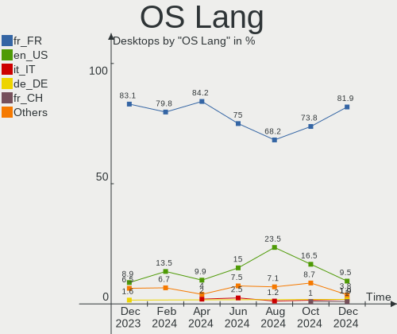
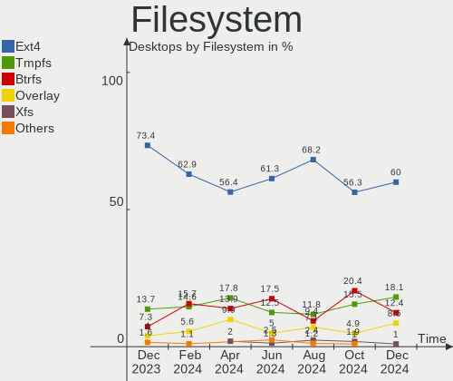
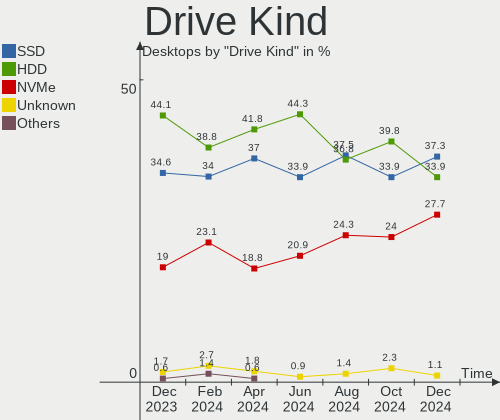
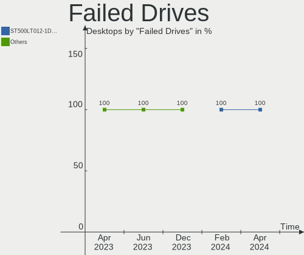
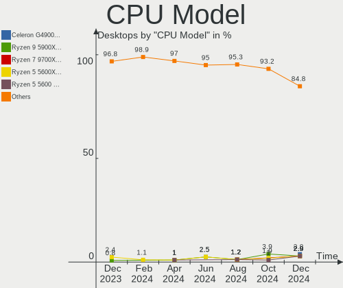
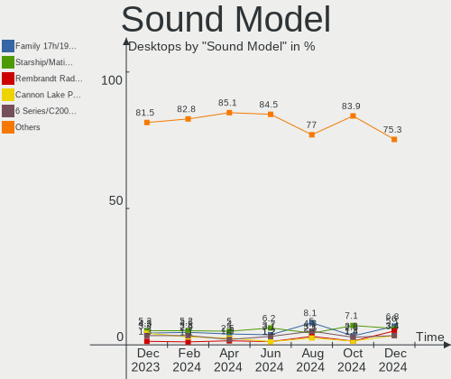

Linux in France - Hardware Trends (Desktops)
--------------------------------------------

A project to identify most popular hardware characteristics and track their change
over time based on data collected by Linux users at https://Linux-Hardware.org.

Anyone can contribute to this report by the [hw-probe](https://github.com/linuxhw/hw-probe) tool:

    sudo -E hw-probe -all -upload

Period: Apr, 2023.

Contents
--------

* [ System ](#system)
  - [ OS                       ](#os)
  - [ OS Family                ](#os-family)
  - [ Kernel                   ](#kernel)
  - [ Kernel Family            ](#kernel-family)
  - [ Kernel Major Ver.        ](#kernel-major-ver)
  - [ Arch                     ](#arch)
  - [ DE                       ](#de)
  - [ Display Server           ](#display-server)
  - [ Display Manager          ](#display-manager)
  - [ OS Lang                  ](#os-lang)
  - [ Boot Mode                ](#boot-mode)
  - [ Filesystem               ](#filesystem)
  - [ Part. scheme             ](#part-scheme)
  - [ Dual Boot with Linux/BSD ](#dual-boot-with-linuxbsd)
  - [ Dual Boot (Win)          ](#dual-boot-win)

* [ Board ](#board)
  - [ Vendor                   ](#vendor)
  - [ Model                    ](#model)
  - [ Model Family             ](#model-family)
  - [ MFG Year                 ](#mfg-year)
  - [ Form Factor              ](#form-factor)
  - [ Secure Boot              ](#secure-boot)
  - [ Coreboot                 ](#coreboot)
  - [ RAM Size                 ](#ram-size)
  - [ RAM Used                 ](#ram-used)
  - [ Total Drives             ](#total-drives)
  - [ Has CD-ROM               ](#has-cd-rom)
  - [ Has Ethernet             ](#has-ethernet)
  - [ Has WiFi                 ](#has-wifi)
  - [ Has Bluetooth            ](#has-bluetooth)

* [ Location ](#location)
  - [ Country                  ](#country)
  - [ City                     ](#city)

* [ Drives ](#drives)
  - [ Drive Vendor             ](#drive-vendor)
  - [ Drive Model              ](#drive-model)
  - [ HDD Vendor               ](#hdd-vendor)
  - [ SSD Vendor               ](#ssd-vendor)
  - [ Drive Kind               ](#drive-kind)
  - [ Drive Connector          ](#drive-connector)
  - [ Drive Size               ](#drive-size)
  - [ Space Total              ](#space-total)
  - [ Space Used               ](#space-used)
  - [ Malfunc. Drives          ](#malfunc-drives)
  - [ Malfunc. Drive Vendor    ](#malfunc-drive-vendor)
  - [ Malfunc. HDD Vendor      ](#malfunc-hdd-vendor)
  - [ Malfunc. Drive Kind      ](#malfunc-drive-kind)
  - [ Failed Drives            ](#failed-drives)
  - [ Failed Drive Vendor      ](#failed-drive-vendor)
  - [ Drive Status             ](#drive-status)

* [ Storage controller ](#storage-controller)
  - [ Storage Vendor           ](#storage-vendor)
  - [ Storage Model            ](#storage-model)
  - [ Storage Kind             ](#storage-kind)

* [ Processor ](#processor)
  - [ CPU Vendor               ](#cpu-vendor)
  - [ CPU Model                ](#cpu-model)
  - [ CPU Model Family         ](#cpu-model-family)
  - [ CPU Cores                ](#cpu-cores)
  - [ CPU Sockets              ](#cpu-sockets)
  - [ CPU Threads              ](#cpu-threads)
  - [ CPU Op-Modes             ](#cpu-op-modes)
  - [ CPU Microcode            ](#cpu-microcode)
  - [ CPU Microarch            ](#cpu-microarch)

* [ Graphics ](#graphics)
  - [ GPU Vendor               ](#gpu-vendor)
  - [ GPU Model                ](#gpu-model)
  - [ GPU Combo                ](#gpu-combo)
  - [ GPU Driver               ](#gpu-driver)
  - [ GPU Memory               ](#gpu-memory)

* [ Monitor ](#monitor)
  - [ Monitor Vendor           ](#monitor-vendor)
  - [ Monitor Model            ](#monitor-model)
  - [ Monitor Resolution       ](#monitor-resolution)
  - [ Monitor Diagonal         ](#monitor-diagonal)
  - [ Monitor Width            ](#monitor-width)
  - [ Aspect Ratio             ](#aspect-ratio)
  - [ Monitor Area             ](#monitor-area)
  - [ Pixel Density            ](#pixel-density)
  - [ Multiple Monitors        ](#multiple-monitors)

* [ Network ](#network)
  - [ Net Controller Vendor    ](#net-controller-vendor)
  - [ Net Controller Model     ](#net-controller-model)
  - [ Wireless Vendor          ](#wireless-vendor)
  - [ Wireless Model           ](#wireless-model)
  - [ Ethernet Vendor          ](#ethernet-vendor)
  - [ Ethernet Model           ](#ethernet-model)
  - [ Net Controller Kind      ](#net-controller-kind)
  - [ Used Controller          ](#used-controller)
  - [ NICs                     ](#nics)
  - [ IPv6                     ](#ipv6)

* [ Bluetooth ](#bluetooth)
  - [ Bluetooth Vendor         ](#bluetooth-vendor)
  - [ Bluetooth Model          ](#bluetooth-model)

* [ Sound ](#sound)
  - [ Sound Vendor             ](#sound-vendor)
  - [ Sound Model              ](#sound-model)

* [ Memory ](#memory)
  - [ Memory Vendor            ](#memory-vendor)
  - [ Memory Model             ](#memory-model)
  - [ Memory Kind              ](#memory-kind)
  - [ Memory Form Factor       ](#memory-form-factor)
  - [ Memory Size              ](#memory-size)
  - [ Memory Speed             ](#memory-speed)

* [ Printers & scanners ](#printers--scanners)
  - [ Printer Vendor           ](#printer-vendor)
  - [ Printer Model            ](#printer-model)
  - [ Scanner Vendor           ](#scanner-vendor)
  - [ Scanner Model            ](#scanner-model)

* [ Camera ](#camera)
  - [ Camera Vendor            ](#camera-vendor)
  - [ Camera Model             ](#camera-model)

* [ Security ](#security)
  - [ Fingerprint Vendor       ](#fingerprint-vendor)
  - [ Fingerprint Model        ](#fingerprint-model)
  - [ Chipcard Vendor          ](#chipcard-vendor)
  - [ Chipcard Model           ](#chipcard-model)

* [ Unsupported ](#unsupported)
  - [ Unsupported Devices      ](#unsupported-devices)
  - [ Unsupported Device Types ](#unsupported-device-types)

System
------

OS
--

Installed operating systems

| Name                | Desktops | Percent |
|---------------------|----------|---------|
| Ubuntu 22.04        | 23       | 17.56%  |
| OpenMandriva 23.03  | 16       | 12.21%  |
| Linux Mint 21.1     | 15       | 11.45%  |
| Debian 11           | 9        | 6.87%   |
| Pop!_OS 22.04       | 6        | 4.58%   |
| Ubuntu 20.04        | 5        | 3.82%   |
| Zorin 16            | 4        | 3.05%   |
| OpenMandriva 4.3    | 4        | 3.05%   |
| OpenMandriva 23.01  | 4        | 3.05%   |
| Gentoo 2.13         | 4        | 3.05%   |
| Arch Rolling        | 4        | 3.05%   |
| Ubuntu 22.10        | 3        | 2.29%   |
| Fedora 38           | 3        | 2.29%   |
| Debian 12           | 3        | 2.29%   |
| Ubuntu MATE 22.04   | 2        | 1.53%   |
| Ubuntu 23.04        | 2        | 1.53%   |
| Nobara 37           | 2        | 1.53%   |
| Manjaro 22.1.0      | 2        | 1.53%   |
| Xubuntu 20.04       | 1        | 0.76%   |
| Ubuntu Unity 18.04  | 1        | 0.76%   |
| Ubuntu Studio 22.04 | 1        | 0.76%   |
| OpenMandriva 4.2    | 1        | 0.76%   |
| MX 21               | 1        | 0.76%   |
| Manjaro             | 1        | 0.76%   |
| Mageia 8            | 1        | 0.76%   |
| Lubuntu 18.04       | 1        | 0.76%   |
| LinuxFX 11.2        | 1        | 0.76%   |
| Linux Mint 20.3     | 1        | 0.76%   |
| Kubuntu 22.10       | 1        | 0.76%   |
| Kubuntu 22.04       | 1        | 0.76%   |
| KDE neon 22.04      | 1        | 0.76%   |
| Kaisen 2.2          | 1        | 0.76%   |
| Devuan 4            | 1        | 0.76%   |
| CachyOS Rolling     | 1        | 0.76%   |
| BlackPanther 18.1   | 1        | 0.76%   |
| ArcoLinux Rolling   | 1        | 0.76%   |
| antiX 22            | 1        | 0.76%   |
| AlmaLinux 9.1       | 1        | 0.76%   |

OS Family
---------

OS without a version

| Name          | Desktops | Percent |
|---------------|----------|---------|
| Ubuntu        | 33       | 25.19%  |
| OpenMandriva  | 25       | 19.08%  |
| Linux Mint    | 16       | 12.21%  |
| Debian        | 12       | 9.16%   |
| Pop!_OS       | 6        | 4.58%   |
| Zorin         | 4        | 3.05%   |
| Gentoo        | 4        | 3.05%   |
| Arch          | 4        | 3.05%   |
| Manjaro       | 3        | 2.29%   |
| Fedora        | 3        | 2.29%   |
| Ubuntu MATE   | 2        | 1.53%   |
| Nobara        | 2        | 1.53%   |
| Kubuntu       | 2        | 1.53%   |
| Xubuntu       | 1        | 0.76%   |
| Ubuntu Unity  | 1        | 0.76%   |
| Ubuntu Studio | 1        | 0.76%   |
| MX            | 1        | 0.76%   |
| Mageia        | 1        | 0.76%   |
| Lubuntu       | 1        | 0.76%   |
| LinuxFX       | 1        | 0.76%   |
| KDE neon      | 1        | 0.76%   |
| Kaisen        | 1        | 0.76%   |
| Devuan        | 1        | 0.76%   |
| CachyOS       | 1        | 0.76%   |
| BlackPanther  | 1        | 0.76%   |
| ArcoLinux     | 1        | 0.76%   |
| antiX         | 1        | 0.76%   |
| AlmaLinux     | 1        | 0.76%   |

Kernel
------

Version of the Linux kernel

| Version                      | Desktops | Percent |
|------------------------------|----------|---------|
| 5.19.0-38-generic            | 20       | 15.27%  |
| 6.2.6-desktop-1omv2390       | 16       | 12.21%  |
| 5.15.0-69-generic            | 10       | 7.63%   |
| 5.19.0-40-generic            | 7        | 5.34%   |
| 6.2.6-76060206-generic       | 6        | 4.58%   |
| 5.15.0-70-generic            | 6        | 4.58%   |
| 5.10.0-21-amd64              | 5        | 3.82%   |
| 6.2.11-gentoo                | 4        | 3.05%   |
| 6.2.10-arch1-1               | 3        | 2.29%   |
| 6.1.0-7-amd64                | 3        | 2.29%   |
| 5.4.0-146-generic            | 3        | 2.29%   |
| 5.16.7-desktop-1omv4003      | 3        | 2.29%   |
| 6.2.11-300.fc38.x86_64       | 2        | 1.53%   |
| 6.2.0-20-generic             | 2        | 1.53%   |
| 6.1.4-desktop-1omv2301       | 2        | 1.53%   |
| 6.1.1-desktop-1omv2290       | 2        | 1.53%   |
| 5.19.0-41-generic            | 2        | 1.53%   |
| 5.15.102-1-pve               | 2        | 1.53%   |
| 5.15.0-71-generic            | 2        | 1.53%   |
| 5.15.0-69-lowlatency         | 2        | 1.53%   |
| 5.15.0-67-generic            | 2        | 1.53%   |
| 5.15.0-58-generic            | 2        | 1.53%   |
| 6.3.0-1-MANJARO              | 1        | 0.76%   |
| 6.2.8-200.fsync.fc37.x86_64  | 1        | 0.76%   |
| 6.2.6-arch1-1_ryzen5         | 1        | 0.76%   |
| 6.2.13-arch1-1               | 1        | 0.76%   |
| 6.2.12-300.fc38.x86_64       | 1        | 0.76%   |
| 6.2.12                       | 1        | 0.76%   |
| 6.2.11-1-cachyos             | 1        | 0.76%   |
| 6.2.10-200.fsync.fc37.x86_64 | 1        | 0.76%   |
| 6.2.10-1-MANJARO             | 1        | 0.76%   |
| 6.1.21-1-MANJARO             | 1        | 0.76%   |
| 6.0.0-1kaisen-amd64          | 1        | 0.76%   |
| 5.4.0-149-generic            | 1        | 0.76%   |
| 5.4.0-144-generic            | 1        | 0.76%   |
| 5.19.17-2-pve                | 1        | 0.76%   |
| 5.16.13-desktop-1omv4003     | 1        | 0.76%   |
| 5.15.106-desktop-2.mga8      | 1        | 0.76%   |
| 5.15.104-1-pve               | 1        | 0.76%   |
| 5.15.0-56-generic            | 1        | 0.76%   |

Kernel Family
-------------

Linux kernel without a distro release

| Version  | Desktops | Percent |
|----------|----------|---------|
| 5.19.0   | 29       | 22.14%  |
| 5.15.0   | 25       | 19.08%  |
| 6.2.6    | 23       | 17.56%  |
| 6.2.11   | 7        | 5.34%   |
| 5.10.0   | 6        | 4.58%   |
| 6.2.10   | 5        | 3.82%   |
| 5.4.0    | 5        | 3.82%   |
| 6.1.0    | 3        | 2.29%   |
| 5.16.7   | 3        | 2.29%   |
| 6.2.12   | 2        | 1.53%   |
| 6.2.0    | 2        | 1.53%   |
| 6.1.4    | 2        | 1.53%   |
| 6.1.1    | 2        | 1.53%   |
| 5.15.102 | 2        | 1.53%   |
| 4.15.0   | 2        | 1.53%   |
| 6.3.0    | 1        | 0.76%   |
| 6.2.8    | 1        | 0.76%   |
| 6.2.13   | 1        | 0.76%   |
| 6.1.21   | 1        | 0.76%   |
| 6.0.0    | 1        | 0.76%   |
| 5.19.17  | 1        | 0.76%   |
| 5.16.13  | 1        | 0.76%   |
| 5.15.106 | 1        | 0.76%   |
| 5.15.104 | 1        | 0.76%   |
| 5.14.0   | 1        | 0.76%   |
| 5.10.14  | 1        | 0.76%   |
| 4.9.0    | 1        | 0.76%   |
| 4.18.16  | 1        | 0.76%   |

Kernel Major Ver.
-----------------

Linux kernel major version

| Version | Desktops | Percent |
|---------|----------|---------|
| 6.2     | 41       | 31.3%   |
| 5.19    | 30       | 22.9%   |
| 5.15    | 29       | 22.14%  |
| 6.1     | 8        | 6.11%   |
| 5.10    | 7        | 5.34%   |
| 5.4     | 5        | 3.82%   |
| 5.16    | 4        | 3.05%   |
| 4.15    | 2        | 1.53%   |
| 6.3     | 1        | 0.76%   |
| 6.0     | 1        | 0.76%   |
| 5.14    | 1        | 0.76%   |
| 4.9     | 1        | 0.76%   |
| 4.18    | 1        | 0.76%   |

Arch
----

OS architecture (x86_64, i586, etc.)

| Name   | Desktops | Percent |
|--------|----------|---------|
| x86_64 | 129      | 98.47%  |
| i686   | 2        | 1.53%   |

DE
--

Desktop Environment

| Name       | Desktops | Percent |
|------------|----------|---------|
| GNOME      | 52       | 39.69%  |
| KDE5       | 38       | 29.01%  |
| X-Cinnamon | 9        | 6.87%   |
| XFCE       | 8        | 6.11%   |
| MATE       | 8        | 6.11%   |
| Unknown    | 8        | 6.11%   |
| LXQt       | 3        | 2.29%   |
| Unity      | 1        | 0.76%   |
| LXDE       | 1        | 0.76%   |
| icewm      | 1        | 0.76%   |
| Hyprland   | 1        | 0.76%   |
| chadwm     | 1        | 0.76%   |

Display Server
--------------

X11 or Wayland

| Name    | Desktops | Percent |
|---------|----------|---------|
| X11     | 90       | 68.7%   |
| Wayland | 29       | 22.14%  |
| Tty     | 11       | 8.4%    |
| Unknown | 1        | 0.76%   |

Display Manager
---------------

SDDM, LightDM, etc.

| Name    | Desktops | Percent |
|---------|----------|---------|
| SDDM    | 39       | 29.77%  |
| Unknown | 35       | 26.72%  |
| GDM3    | 32       | 24.43%  |
| LightDM | 17       | 12.98%  |
| GDM     | 7        | 5.34%   |
| SLiM    | 1        | 0.76%   |

OS Lang
-------

Language

| Lang    | Desktops | Percent |
|---------|----------|---------|
| fr_FR   | 103      | 78.63%  |
| en_US   | 18       | 13.74%  |
| en_IE   | 4        | 3.05%   |
| pt_PT   | 1        | 0.76%   |
| nb_NO   | 1        | 0.76%   |
| fr_CA   | 1        | 0.76%   |
| en_GB   | 1        | 0.76%   |
| C       | 1        | 0.76%   |
| Unknown | 1        | 0.76%   |

Boot Mode
---------

EFI or BIOS

| Mode | Desktops | Percent |
|------|----------|---------|
| BIOS | 72       | 54.96%  |
| EFI  | 59       | 45.04%  |

Filesystem
----------

Type of filesystem

| Type    | Desktops | Percent |
|---------|----------|---------|
| Ext4    | 100      | 76.34%  |
| Btrfs   | 13       | 9.92%   |
| Overlay | 9        | 6.87%   |
| Tmpfs   | 5        | 3.82%   |
| Zfs     | 2        | 1.53%   |
| Xfs     | 2        | 1.53%   |

Part. scheme
------------

Scheme of partitioning

| Type    | Desktops | Percent |
|---------|----------|---------|
| GPT     | 76       | 58.02%  |
| MBR     | 28       | 21.37%  |
| Unknown | 27       | 20.61%  |

Dual Boot with Linux/BSD
------------------------

Hosting more than one Linux/BSD

| Dual boot | Desktops | Percent |
|-----------|----------|---------|
| No        | 99       | 75.57%  |
| Yes       | 32       | 24.43%  |

Dual Boot (Win)
---------------

Hosting Linux and Windows

| Dual boot | Desktops | Percent |
|-----------|----------|---------|
| No        | 87       | 66.41%  |
| Yes       | 44       | 33.59%  |

Board
-----

Vendor
------

Motherboard manufacturer

| Name                | Desktops | Percent |
|---------------------|----------|---------|
| Gigabyte Technology | 29       | 22.14%  |
| ASUSTek Computer    | 25       | 19.08%  |
| MSI                 | 19       | 14.5%   |
| Dell                | 11       | 8.4%    |
| Hewlett-Packard     | 10       | 7.63%   |
| ASRock              | 10       | 7.63%   |
| Lenovo              | 8        | 6.11%   |
| Intel               | 5        | 3.82%   |
| Acer                | 3        | 2.29%   |
| Fujitsu             | 2        | 1.53%   |
| Unknown             | 2        | 1.53%   |
| ZOTAC               | 1        | 0.76%   |
| Shuttle             | 1        | 0.76%   |
| QTQD                | 1        | 0.76%   |
| Pegatron            | 1        | 0.76%   |
| Medion              | 1        | 0.76%   |
| G7-2011             | 1        | 0.76%   |
| eMachines           | 1        | 0.76%   |

Model
-----

Motherboard model

| Name                                    | Desktops | Percent |
|-----------------------------------------|----------|---------|
| Gigabyte B550 AORUS ELITE V2            | 3        | 2.29%   |
| ASUS All Series                         | 3        | 2.29%   |
| Unknown                                 | 3        | 2.29%   |
| Gigabyte B550 VISION D-P                | 2        | 1.53%   |
| Dell Precision WorkStation T5500        | 2        | 1.53%   |
| ASUS M5A97 EVO R2.0                     | 2        | 1.53%   |
| ASRock G31M-S                           | 2        | 1.53%   |
| ZOTAC H67ITX-C-E                        | 1        | 0.76%   |
| Shuttle DS20U                           | 1        | 0.76%   |
| Pegatron VC902AA-ABF p6136fr            | 1        | 0.76%   |
| MSI WC963AA-ABF p6355fr                 | 1        | 0.76%   |
| MSI MS-7D67                             | 1        | 0.76%   |
| MSI MS-7D46                             | 1        | 0.76%   |
| MSI MS-7D17                             | 1        | 0.76%   |
| MSI MS-7C92                             | 1        | 0.76%   |
| MSI MS-7C08                             | 1        | 0.76%   |
| MSI MS-7B38                             | 1        | 0.76%   |
| MSI MS-7B18                             | 1        | 0.76%   |
| MSI MS-7B09                             | 1        | 0.76%   |
| MSI MS-7A38                             | 1        | 0.76%   |
| MSI MS-7A33                             | 1        | 0.76%   |
| MSI MS-7996                             | 1        | 0.76%   |
| MSI MS-7994                             | 1        | 0.76%   |
| MSI MS-7978                             | 1        | 0.76%   |
| MSI MS-7924                             | 1        | 0.76%   |
| MSI MS-7816                             | 1        | 0.76%   |
| MSI MS-7808                             | 1        | 0.76%   |
| MSI MS-7721                             | 1        | 0.76%   |
| MSI MS-7641                             | 1        | 0.76%   |
| Medion MS-7621                          | 1        | 0.76%   |
| Lenovo ThinkStation P320 30BJS23V00     | 1        | 0.76%   |
| Lenovo ThinkCentre M93p 10A7003AUK      | 1        | 0.76%   |
| Lenovo ThinkCentre M93p 10A6A0BBFR      | 1        | 0.76%   |
| Lenovo ThinkCentre M92P 3227A1G         | 1        | 0.76%   |
| Lenovo ThinkCentre M90p 3282B5G         | 1        | 0.76%   |
| Lenovo ThinkCentre E73 10DU000SMX       | 1        | 0.76%   |
| Lenovo ThinkCentre E73 10DS0005FR       | 1        | 0.76%   |
| Lenovo IdeaCentre G5 14IMB05 90N900CTFR | 1        | 0.76%   |
| Intel T series                          | 1        | 0.76%   |
| Intel DN2820FYK H24582-204              | 1        | 0.76%   |

Model Family
------------

Motherboard model prefix

| Name                 | Desktops | Percent |
|----------------------|----------|---------|
| ASUS PRIME           | 8        | 6.11%   |
| Lenovo ThinkCentre   | 6        | 4.58%   |
| Gigabyte B550        | 6        | 4.58%   |
| Dell Precision       | 5        | 3.82%   |
| Dell OptiPlex        | 5        | 3.82%   |
| HP EliteDesk         | 4        | 3.05%   |
| ASUS M5A97           | 3        | 2.29%   |
| ASUS All             | 3        | 2.29%   |
| Unknown              | 3        | 2.29%   |
| ASUS TUF             | 2        | 1.53%   |
| ASUS P8H61-M         | 2        | 1.53%   |
| ASUS P5Q             | 2        | 1.53%   |
| ASRock G31M-S        | 2        | 1.53%   |
| Acer Veriton         | 2        | 1.53%   |
| ZOTAC H67ITX-C-E     | 1        | 0.76%   |
| Shuttle DS20U        | 1        | 0.76%   |
| Pegatron VC902AA-ABF | 1        | 0.76%   |
| MSI WC963AA-ABF      | 1        | 0.76%   |
| MSI MS-7D67          | 1        | 0.76%   |
| MSI MS-7D46          | 1        | 0.76%   |
| MSI MS-7D17          | 1        | 0.76%   |
| MSI MS-7C92          | 1        | 0.76%   |
| MSI MS-7C08          | 1        | 0.76%   |
| MSI MS-7B38          | 1        | 0.76%   |
| MSI MS-7B18          | 1        | 0.76%   |
| MSI MS-7B09          | 1        | 0.76%   |
| MSI MS-7A38          | 1        | 0.76%   |
| MSI MS-7A33          | 1        | 0.76%   |
| MSI MS-7996          | 1        | 0.76%   |
| MSI MS-7994          | 1        | 0.76%   |
| MSI MS-7978          | 1        | 0.76%   |
| MSI MS-7924          | 1        | 0.76%   |
| MSI MS-7816          | 1        | 0.76%   |
| MSI MS-7808          | 1        | 0.76%   |
| MSI MS-7721          | 1        | 0.76%   |
| MSI MS-7641          | 1        | 0.76%   |
| Medion MS-7621       | 1        | 0.76%   |
| Lenovo ThinkStation  | 1        | 0.76%   |
| Lenovo IdeaCentre    | 1        | 0.76%   |
| Intel T              | 1        | 0.76%   |

MFG Year
--------

Motherboard manufacture year

| Year | Desktops | Percent |
|------|----------|---------|
| 2014 | 18       | 13.74%  |
| 2020 | 13       | 9.92%   |
| 2012 | 12       | 9.16%   |
| 2018 | 11       | 8.4%    |
| 2021 | 10       | 7.63%   |
| 2010 | 9        | 6.87%   |
| 2019 | 8        | 6.11%   |
| 2015 | 8        | 6.11%   |
| 2009 | 8        | 6.11%   |
| 2013 | 7        | 5.34%   |
| 2008 | 7        | 5.34%   |
| 2011 | 6        | 4.58%   |
| 2017 | 5        | 3.82%   |
| 2023 | 4        | 3.05%   |
| 2022 | 3        | 2.29%   |
| 2016 | 1        | 0.76%   |
| 2003 | 1        | 0.76%   |

Form Factor
-----------

Physical design of the computer

| Name    | Desktops | Percent |
|---------|----------|---------|
| Desktop | 131      | 100%    |

Secure Boot
-----------

Enabled or disabled

| State    | Desktops | Percent |
|----------|----------|---------|
| Disabled | 123      | 93.89%  |
| Enabled  | 8        | 6.11%   |

Coreboot
--------

Have coreboot on board

| Used | Desktops | Percent |
|------|----------|---------|
| No   | 131      | 100%    |

RAM Size
--------

Total RAM memory

| Size in GB  | Desktops | Percent |
|-------------|----------|---------|
| 16.01-24.0  | 34       | 25.95%  |
| 4.01-8.0    | 19       | 14.5%   |
| 8.01-16.0   | 19       | 14.5%   |
| 32.01-64.0  | 18       | 13.74%  |
| 3.01-4.0    | 17       | 12.98%  |
| 24.01-32.0  | 8        | 6.11%   |
| 64.01-256.0 | 8        | 6.11%   |
| 1.01-2.0    | 5        | 3.82%   |
| 2.01-3.0    | 2        | 1.53%   |
| 0.51-1.0    | 1        | 0.76%   |

RAM Used
--------

Used RAM memory

| Used GB     | Desktops | Percent |
|-------------|----------|---------|
| 2.01-3.0    | 38       | 29.01%  |
| 1.01-2.0    | 33       | 25.19%  |
| 4.01-8.0    | 24       | 18.32%  |
| 3.01-4.0    | 13       | 9.92%   |
| 8.01-16.0   | 7        | 5.34%   |
| 0.51-1.0    | 7        | 5.34%   |
| 0.01-0.5    | 5        | 3.82%   |
| 16.01-24.0  | 2        | 1.53%   |
| 32.01-64.0  | 1        | 0.76%   |
| 64.01-256.0 | 1        | 0.76%   |

Total Drives
------------

Number of drives on board

| Drives | Desktops | Percent |
|--------|----------|---------|
| 1      | 52       | 39.69%  |
| 3      | 29       | 22.14%  |
| 2      | 26       | 19.85%  |
| 6      | 7        | 5.34%   |
| 4      | 7        | 5.34%   |
| 5      | 6        | 4.58%   |
| 7      | 2        | 1.53%   |
| 13     | 1        | 0.76%   |
| 9      | 1        | 0.76%   |

Has CD-ROM
----------

Has CD-ROM on board

| Presented | Desktops | Percent |
|-----------|----------|---------|
| No        | 66       | 50.38%  |
| Yes       | 65       | 49.62%  |

Has Ethernet
------------

Has Ethernet on board

| Presented | Desktops | Percent |
|-----------|----------|---------|
| Yes       | 129      | 98.47%  |
| No        | 2        | 1.53%   |

Has WiFi
--------

Has WiFi module

| Presented | Desktops | Percent |
|-----------|----------|---------|
| No        | 81       | 61.83%  |
| Yes       | 50       | 38.17%  |

Has Bluetooth
-------------

Has Bluetooth module

| Presented | Desktops | Percent |
|-----------|----------|---------|
| No        | 96       | 73.28%  |
| Yes       | 35       | 26.72%  |

Location
--------

Country
-------

Geographic location (country)

| Country | Desktops | Percent |
|---------|----------|---------|
| France  | 131      | 100%    |

City
----

Geographic location (city)

| City                   | Desktops | Percent |
|------------------------|----------|---------|
| Paris                  | 15       | 11.45%  |
| Caen                   | 4        | 3.05%   |
| Toulouse               | 3        | 2.29%   |
| Saint-Meme-le-Tenu     | 3        | 2.29%   |
| Rennes                 | 3        | 2.29%   |
| Saint-Raphaël         | 2        | 1.53%   |
| Saint-Etienne          | 2        | 1.53%   |
| Quimper                | 2        | 1.53%   |
| Obernai                | 2        | 1.53%   |
| Marseille              | 2        | 1.53%   |
| Bordeaux               | 2        | 1.53%   |
| Waldweistroff          | 1        | 0.76%   |
| Villefranche-sur-Mer   | 1        | 0.76%   |
| Versailles             | 1        | 0.76%   |
| Vaulx-Milieu           | 1        | 0.76%   |
| Vanves                 | 1        | 0.76%   |
| Treillieres            | 1        | 0.76%   |
| Talence                | 1        | 0.76%   |
| Strasbourg             | 1        | 0.76%   |
| Senonches              | 1        | 0.76%   |
| Sene                   | 1        | 0.76%   |
| Sélestat              | 1        | 0.76%   |
| Sauvian                | 1        | 0.76%   |
| Sartrouville           | 1        | 0.76%   |
| Saran                  | 1        | 0.76%   |
| Saintes                | 1        | 0.76%   |
| Saint-Nazaire          | 1        | 0.76%   |
| Saint-Maur-des-Fossés | 1        | 0.76%   |
| Saint-Martin-d'Hères  | 1        | 0.76%   |
| Saint-Brieuc           | 1        | 0.76%   |
| Roubaix                | 1        | 0.76%   |
| Romilly-sur-Seine      | 1        | 0.76%   |
| Rognes                 | 1        | 0.76%   |
| Rezé                  | 1        | 0.76%   |
| Quissac                | 1        | 0.76%   |
| Pompignac              | 1        | 0.76%   |
| Pierrelatte            | 1        | 0.76%   |
| Perols                 | 1        | 0.76%   |
| Pecy                   | 1        | 0.76%   |
| Pau                    | 1        | 0.76%   |

Drives
------

Drive Vendor
------------

Hard drive vendors

| Vendor                      | Desktops | Drives | Percent |
|-----------------------------|----------|--------|---------|
| WDC                         | 47       | 69     | 17.94%  |
| Samsung Electronics         | 43       | 56     | 16.41%  |
| Seagate                     | 41       | 52     | 15.65%  |
| Crucial                     | 17       | 23     | 6.49%   |
| Kingston                    | 16       | 16     | 6.11%   |
| Toshiba                     | 15       | 17     | 5.73%   |
| SanDisk                     | 13       | 16     | 4.96%   |
| PNY                         | 7        | 9      | 2.67%   |
| Intel                       | 5        | 5      | 1.91%   |
| Phison Electronics          | 4        | 4      | 1.53%   |
| Maxtor                      | 4        | 4      | 1.53%   |
| JMicron Technology          | 4        | 6      | 1.53%   |
| Hitachi                     | 4        | 4      | 1.53%   |
| SPCC                        | 3        | 3      | 1.15%   |
| Micron/Crucial Technology   | 3        | 3      | 1.15%   |
| LDLC                        | 3        | 3      | 1.15%   |
| China                       | 3        | 5      | 1.15%   |
| Phison                      | 2        | 2      | 0.76%   |
| Kingston Technology Company | 2        | 2      | 0.76%   |
| ASMT                        | 2        | 3      | 0.76%   |
| A-DATA Technology           | 2        | 2      | 0.76%   |
| Verbatim                    | 1        | 1      | 0.38%   |
| USB                         | 1        | 1      | 0.38%   |
| Unknown                     | 1        | 1      | 0.38%   |
| TS256GSS                    | 1        | 1      | 0.38%   |
| SK hynix                    | 1        | 1      | 0.38%   |
| Realtek Semiconductor       | 1        | 1      | 0.38%   |
| Realtek                     | 1        | 1      | 0.38%   |
| PNY CS90                    | 1        | 1      | 0.38%   |
| OCZ-VERTEX3                 | 1        | 1      | 0.38%   |
| OCZ                         | 1        | 1      | 0.38%   |
| MSI                         | 1        | 1      | 0.38%   |
| Micron Technology           | 1        | 1      | 0.38%   |
| LaCie                       | 1        | 1      | 0.38%   |
| KIOXIA                      | 1        | 1      | 0.38%   |
| INNOVATION IT               | 1        | 1      | 0.38%   |
| Inateck                     | 1        | 1      | 0.38%   |
| HGST                        | 1        | 1      | 0.38%   |
| Gigabyte Technology         | 1        | 1      | 0.38%   |
| GALAX                       | 1        | 1      | 0.38%   |

Drive Model
-----------

Hard drive models

| Model                                             | Desktops | Percent |
|---------------------------------------------------|----------|---------|
| Kingston SA400S37240G 240GB SSD                   | 5        | 1.65%   |
| Seagate ST1000DM003-1ER162 1TB                    | 4        | 1.32%   |
| Samsung SSD 980 1TB                               | 4        | 1.32%   |
| Samsung SSD 870 QVO 1TB                           | 4        | 1.32%   |
| PNY CS900 120GB SSD                               | 4        | 1.32%   |
| Toshiba DT01ACA100 1TB                            | 3        | 0.99%   |
| Seagate ST2000DM008-2FR102 2TB                    | 3        | 0.99%   |
| Seagate ST1000DM010-2EP102 1TB                    | 3        | 0.99%   |
| Seagate ST1000DM003-1CH162 1TB                    | 3        | 0.99%   |
| Samsung SSD 860 EVO 1TB                           | 3        | 0.99%   |
| Phison E12 NVMe Controller 512GB                  | 3        | 0.99%   |
| Kingston SA400S37480G 480GB SSD                   | 3        | 0.99%   |
| Crucial CT500MX500SSD1 500GB                      | 3        | 0.99%   |
| WDC WD5000AAKX-08U6AA0 500GB                      | 2        | 0.66%   |
| WDC WD40EZRZ-00GXCB0 4TB                          | 2        | 0.66%   |
| WDC WD20EZRX-00DC0B0 2TB                          | 2        | 0.66%   |
| WDC WD10EZRZ-00HTKB0 1TB                          | 2        | 0.66%   |
| WDC WD10EZEX-08M2NA0 1TB                          | 2        | 0.66%   |
| WDC WD10EZEX-00BN5A0 1TB                          | 2        | 0.66%   |
| Toshiba HDWD110 1TB                               | 2        | 0.66%   |
| SPCC Solid State Disk 128GB                       | 2        | 0.66%   |
| Seagate ST500DM002-1BD142 500GB                   | 2        | 0.66%   |
| SanDisk SSD PLUS 240GB                            | 2        | 0.66%   |
| Samsung SSD 870 QVO 2TB                           | 2        | 0.66%   |
| Samsung SSD 870 EVO 500GB                         | 2        | 0.66%   |
| Samsung SSD 870 EVO 1TB                           | 2        | 0.66%   |
| Samsung SSD 860 EVO 500GB                         | 2        | 0.66%   |
| Samsung SSD 860 EVO 250GB                         | 2        | 0.66%   |
| Samsung SSD 850 PRO 256GB                         | 2        | 0.66%   |
| Samsung SSD 850 EVO 500GB                         | 2        | 0.66%   |
| Samsung SSD 840 Series 120GB                      | 2        | 0.66%   |
| Samsung SSD 840 EVO 120GB                         | 2        | 0.66%   |
| Samsung NVMe SSD Controller SM981/PM981/PM983 1TB | 2        | 0.66%   |
| PNY 120GB SATA SSD                                | 2        | 0.66%   |
| Micron/Crucial P2 NVMe PCIe SSD 1TB               | 2        | 0.66%   |
| Maxtor STM3320613AS 320GB                         | 2        | 0.66%   |
| Kingston SV300S37A120G 120GB SSD                  | 2        | 0.66%   |
| JMicron Generic 1TB                               | 2        | 0.66%   |
| Intel SSD 660P Series 512GB                       | 2        | 0.66%   |
| Crucial CT480BX500SSD1 480GB                      | 2        | 0.66%   |

HDD Vendor
----------

Hard disk drive vendors

| Vendor              | Desktops | Drives | Percent |
|---------------------|----------|--------|---------|
| WDC                 | 42       | 62     | 36.52%  |
| Seagate             | 38       | 47     | 33.04%  |
| Toshiba             | 13       | 15     | 11.3%   |
| Samsung Electronics | 8        | 8      | 6.96%   |
| Maxtor              | 4        | 4      | 3.48%   |
| Hitachi             | 4        | 4      | 3.48%   |
| JMicron Technology  | 3        | 5      | 2.61%   |
| Inateck             | 1        | 1      | 0.87%   |
| HGST                | 1        | 1      | 0.87%   |
| ASMT                | 1        | 2      | 0.87%   |

SSD Vendor
----------

Solid state drive vendors

| Vendor              | Desktops | Drives | Percent |
|---------------------|----------|--------|---------|
| Samsung Electronics | 30       | 35     | 27.78%  |
| Kingston            | 16       | 16     | 14.81%  |
| Crucial             | 16       | 19     | 14.81%  |
| SanDisk             | 10       | 11     | 9.26%   |
| PNY                 | 7        | 9      | 6.48%   |
| WDC                 | 3        | 3      | 2.78%   |
| SPCC                | 3        | 3      | 2.78%   |
| LDLC                | 3        | 3      | 2.78%   |
| China               | 3        | 5      | 2.78%   |
| A-DATA Technology   | 2        | 2      | 1.85%   |
| Verbatim            | 1        | 1      | 0.93%   |
| USB                 | 1        | 1      | 0.93%   |
| Toshiba             | 1        | 1      | 0.93%   |
| Seagate             | 1        | 1      | 0.93%   |
| PNY CS90            | 1        | 1      | 0.93%   |
| OCZ-VERTEX3         | 1        | 1      | 0.93%   |
| OCZ                 | 1        | 1      | 0.93%   |
| Micron Technology   | 1        | 1      | 0.93%   |
| Intel               | 1        | 1      | 0.93%   |
| INNOVATION IT       | 1        | 1      | 0.93%   |
| GALAX               | 1        | 1      | 0.93%   |
| Emtec               | 1        | 1      | 0.93%   |
| Dogfish             | 1        | 1      | 0.93%   |
| Corsair             | 1        | 1      | 0.93%   |
| ASMT                | 1        | 1      | 0.93%   |

Drive Kind
----------

HDD or SSD

| Kind    | Desktops | Drives | Percent |
|---------|----------|--------|---------|
| SSD     | 88       | 121    | 40.74%  |
| HDD     | 82       | 149    | 37.96%  |
| NVMe    | 40       | 50     | 18.52%  |
| Unknown | 6        | 6      | 2.78%   |

Drive Connector
---------------

SATA, SAS, NVMe, etc.

| Type | Desktops | Drives | Percent |
|------|----------|--------|---------|
| SATA | 122      | 256    | 68.54%  |
| NVMe | 39       | 49     | 21.91%  |
| SAS  | 17       | 21     | 9.55%   |

Drive Size
----------

Size of hard drive

| Size in TB | Desktops | Drives | Percent |
|------------|----------|--------|---------|
| 0.01-0.5   | 90       | 129    | 48.91%  |
| 0.51-1.0   | 60       | 81     | 32.61%  |
| 1.01-2.0   | 18       | 30     | 9.78%   |
| 3.01-4.0   | 7        | 15     | 3.8%    |
| 2.01-3.0   | 5        | 7      | 2.72%   |
| 4.01-10.0  | 4        | 8      | 2.17%   |

Space Total
-----------

Amount of disk space available on the file system

| Size in GB     | Desktops | Percent |
|----------------|----------|---------|
| 101-250        | 32       | 24.43%  |
| 251-500        | 28       | 21.37%  |
| 501-1000       | 21       | 16.03%  |
| More than 3000 | 15       | 11.45%  |
| 1001-2000      | 13       | 9.92%   |
| 1-20           | 8        | 6.11%   |
| 2001-3000      | 4        | 3.05%   |
| 51-100         | 4        | 3.05%   |
| Unknown        | 4        | 3.05%   |
| 21-50          | 2        | 1.53%   |

Space Used
----------

Amount of used disk space

| Used GB        | Desktops | Percent |
|----------------|----------|---------|
| 1-20           | 44       | 33.59%  |
| 251-500        | 20       | 15.27%  |
| 21-50          | 19       | 14.5%   |
| 101-250        | 13       | 9.92%   |
| 501-1000       | 10       | 7.63%   |
| 51-100         | 8        | 6.11%   |
| More than 3000 | 7        | 5.34%   |
| 2001-3000      | 4        | 3.05%   |
| Unknown        | 4        | 3.05%   |
| 1001-2000      | 2        | 1.53%   |

Malfunc. Drives
---------------

Drive models with a malfunction

| Model                                            | Desktops | Drives | Percent |
|--------------------------------------------------|----------|--------|---------|
| WDC WD6400AAKS-22A7B2 640GB                      | 1        | 1      | 2.63%   |
| WDC WD60PURZ-85ZUFY1 6TB                         | 1        | 1      | 2.63%   |
| WDC WD5000AAKX-22ERMA0 500GB                     | 1        | 1      | 2.63%   |
| WDC WD3200AAKS-22L6A0 320GB                      | 1        | 1      | 2.63%   |
| WDC WD3200AAJS-60M0A0 320GB                      | 1        | 1      | 2.63%   |
| WDC WD20EARX-00PASB0 2TB                         | 1        | 1      | 2.63%   |
| WDC WD10EALX-009BA0 1TB                          | 1        | 1      | 2.63%   |
| WDC WD10EADS-65M2B0 1TB                          | 1        | 1      | 2.63%   |
| WDC WD10EADS-22M2B0 1TB                          | 1        | 1      | 2.63%   |
| Toshiba THNSFC256GBSJ SSD                        | 1        | 1      | 2.63%   |
| Toshiba HDWD110 1TB                              | 1        | 1      | 2.63%   |
| Toshiba DT01ACA200 2TB                           | 1        | 1      | 2.63%   |
| Seagate STM3500418AS 500GB                       | 1        | 1      | 2.63%   |
| Seagate ST8000DM004-2CX188 8TB                   | 1        | 1      | 2.63%   |
| Seagate ST3320820AS 320GB                        | 1        | 1      | 2.63%   |
| Seagate ST3160318AS 160GB                        | 1        | 1      | 2.63%   |
| Seagate ST31000528AS 1TB                         | 1        | 1      | 2.63%   |
| Seagate ST31000520AS 1TB                         | 1        | 1      | 2.63%   |
| Seagate ST3000DM001-1ER166 3TB                   | 1        | 1      | 2.63%   |
| Seagate ST2000DX001-1CM164 2TB                   | 1        | 1      | 2.63%   |
| Seagate ST2000DM006-2DM164 2TB                   | 1        | 1      | 2.63%   |
| Seagate ST1000DM010-2EP102 1TB                   | 1        | 1      | 2.63%   |
| Samsung Electronics SSD 970 EVO 500GB            | 1        | 1      | 2.63%   |
| Samsung Electronics SSD 870 EVO 500GB            | 1        | 1      | 2.63%   |
| Samsung Electronics MZ7LN256HMJP-000H1 256GB SSD | 1        | 1      | 2.63%   |
| Samsung Electronics HD642JJ 640GB                | 1        | 1      | 2.63%   |
| Samsung Electronics HD154UI 1TB                  | 1        | 1      | 2.63%   |
| Samsung Electronics HD103SI 1TB                  | 1        | 1      | 2.63%   |
| OCZ AGILITY3 240GB SSD                           | 1        | 1      | 2.63%   |
| Maxtor STM3320613AS 320GB                        | 1        | 1      | 2.63%   |
| LDLC SSD 240GB                                   | 1        | 1      | 2.63%   |
| LDLC SSD 120GB                                   | 1        | 1      | 2.63%   |
| Kingston SV300S37A60G 64GB SSD                   | 1        | 1      | 2.63%   |
| JMicron Technology Tech 250GB                    | 1        | 1      | 2.63%   |
| Crucial M4-CT512M4SSD2 512GB                     | 1        | 1      | 2.63%   |
| Crucial CT960BX500SSD1 960GB                     | 1        | 1      | 2.63%   |
| Crucial CT128MX100SSD1 128GB                     | 1        | 1      | 2.63%   |
| China SSD08G 8GB                                 | 1        | 1      | 2.63%   |

Malfunc. Drive Vendor
---------------------

Vendors of faulty drives

| Vendor              | Desktops | Drives | Percent |
|---------------------|----------|--------|---------|
| WDC                 | 8        | 9      | 22.86%  |
| Seagate             | 8        | 10     | 22.86%  |
| Samsung Electronics | 6        | 6      | 17.14%  |
| Toshiba             | 3        | 3      | 8.57%   |
| Crucial             | 3        | 3      | 8.57%   |
| LDLC                | 2        | 2      | 5.71%   |
| OCZ                 | 1        | 1      | 2.86%   |
| Maxtor              | 1        | 1      | 2.86%   |
| Kingston            | 1        | 1      | 2.86%   |
| JMicron Technology  | 1        | 1      | 2.86%   |
| China               | 1        | 1      | 2.86%   |

Malfunc. HDD Vendor
-------------------

Vendors of faulty HDD drives

| Vendor              | Desktops | Drives | Percent |
|---------------------|----------|--------|---------|
| WDC                 | 8        | 9      | 36.36%  |
| Seagate             | 8        | 10     | 36.36%  |
| Samsung Electronics | 3        | 3      | 13.64%  |
| Toshiba             | 2        | 2      | 9.09%   |
| Maxtor              | 1        | 1      | 4.55%   |

Malfunc. Drive Kind
-------------------

Kinds of faulty drives

| Kind    | Desktops | Drives | Percent |
|---------|----------|--------|---------|
| HDD     | 19       | 25     | 59.38%  |
| SSD     | 11       | 11     | 34.38%  |
| NVMe    | 1        | 1      | 3.13%   |
| Unknown | 1        | 1      | 3.13%   |

Failed Drives
-------------

Failed drive models

| Model                    | Desktops | Drives | Percent |
|--------------------------|----------|--------|---------|
| WDC WD20EARS-00MVWB0 2TB | 1        | 2      | 100%    |

Failed Drive Vendor
-------------------

Failed drive vendors

| Vendor | Desktops | Drives | Percent |
|--------|----------|--------|---------|
| WDC    | 1        | 2      | 100%    |

Drive Status
------------

Number of failed and malfunc. drives

| Status   | Desktops | Drives | Percent |
|----------|----------|--------|---------|
| Works    | 75       | 182    | 47.47%  |
| Detected | 54       | 104    | 34.18%  |
| Malfunc  | 28       | 38     | 17.72%  |
| Failed   | 1        | 2      | 0.63%   |

Storage controller
------------------

Storage Vendor
--------------

Storage controller vendors

| Vendor                       | Desktops | Percent |
|------------------------------|----------|---------|
| Intel                        | 99       | 49.25%  |
| AMD                          | 33       | 16.42%  |
| Samsung Electronics          | 12       | 5.97%   |
| SanDisk                      | 9        | 4.48%   |
| Phison Electronics           | 7        | 3.48%   |
| ASMedia Technology           | 7        | 3.48%   |
| JMicron Technology           | 6        | 2.99%   |
| Micron/Crucial Technology    | 5        | 2.49%   |
| Marvell Technology Group     | 5        | 2.49%   |
| Nvidia                       | 3        | 1.49%   |
| Toshiba America Info Systems | 2        | 1%      |
| Silicon Image                | 2        | 1%      |
| Seagate Technology           | 2        | 1%      |
| Kingston Technology Company  | 2        | 1%      |
| VIA Technologies             | 1        | 0.5%    |
| Solidigm                     | 1        | 0.5%    |
| SK hynix                     | 1        | 0.5%    |
| Realtek Semiconductor        | 1        | 0.5%    |
| Promise Technology           | 1        | 0.5%    |
| LSI Logic / Symbios Logic    | 1        | 0.5%    |
| Artop Electronic             | 1        | 0.5%    |

Storage Model
-------------

Storage controller models

| Model                                                                                   | Desktops | Percent |
|-----------------------------------------------------------------------------------------|----------|---------|
| AMD FCH SATA Controller [AHCI mode]                                                     | 17       | 7.17%   |
| Intel 8 Series/C220 Series Chipset Family 6-port SATA Controller 1 [AHCI mode]          | 13       | 5.49%   |
| Intel Q170/Q150/B150/H170/H110/Z170/CM236 Chipset SATA Controller [AHCI Mode]           | 8        | 3.38%   |
| AMD 500 Series Chipset SATA Controller                                                  | 8        | 3.38%   |
| Intel Cannon Lake PCH SATA AHCI Controller                                              | 7        | 2.95%   |
| Intel 9 Series Chipset Family SATA Controller [AHCI Mode]                               | 7        | 2.95%   |
| Intel NM10/ICH7 Family SATA Controller [IDE mode]                                       | 6        | 2.53%   |
| Samsung NVMe SSD Controller SM981/PM981/PM983                                           | 5        | 2.11%   |
| Samsung NVMe SSD Controller 980                                                         | 5        | 2.11%   |
| JMicron JMB363 SATA/IDE Controller                                                      | 5        | 2.11%   |
| Intel 82801G (ICH7 Family) IDE Controller                                               | 5        | 2.11%   |
| Intel 6 Series/C200 Series Chipset Family Desktop SATA Controller (IDE mode, ports 4-5) | 5        | 2.11%   |
| Intel 6 Series/C200 Series Chipset Family Desktop SATA Controller (IDE mode, ports 0-3) | 5        | 2.11%   |
| Intel 500 Series Chipset Family SATA AHCI Controller                                    | 5        | 2.11%   |
| AMD SB7x0/SB8x0/SB9x0 SATA Controller [AHCI mode]                                       | 5        | 2.11%   |
| AMD 400 Series Chipset SATA Controller                                                  | 5        | 2.11%   |
| Phison E12 NVMe Controller                                                              | 4        | 1.69%   |
| Micron/Crucial P5 Plus NVMe PCIe SSD                                                    | 3        | 1.27%   |
| Micron/Crucial P2 NVMe PCIe SSD                                                         | 3        | 1.27%   |
| Intel SSD 660P Series                                                                   | 3        | 1.27%   |
| Intel SATA Controller [RAID mode]                                                       | 3        | 1.27%   |
| Intel Alder Lake-S PCH SATA Controller [AHCI Mode]                                      | 3        | 1.27%   |
| Intel 82801JI (ICH10 Family) SATA AHCI Controller                                       | 3        | 1.27%   |
| Intel 82801JI (ICH10 Family) 4 port SATA IDE Controller #1                              | 3        | 1.27%   |
| Intel 82801JI (ICH10 Family) 2 port SATA IDE Controller #2                              | 3        | 1.27%   |
| Intel 6 Series/C200 Series Chipset Family 6 port Desktop SATA AHCI Controller           | 3        | 1.27%   |
| Intel 5 Series/3400 Series Chipset 6 port SATA AHCI Controller                          | 3        | 1.27%   |
| Intel 400 Series Chipset Family SATA AHCI Controller                                    | 3        | 1.27%   |
| Intel 200 Series PCH SATA controller [AHCI mode]                                        | 3        | 1.27%   |
| ASMedia ASM1062 Serial ATA Controller                                                   | 3        | 1.27%   |
| Toshiba America Info Systems XG6 NVMe SSD Controller                                    | 2        | 0.84%   |
| Silicon Image SiI 3124 PCI-X Serial ATA Controller                                      | 2        | 0.84%   |
| Seagate FireCuda 530 SSD                                                                | 2        | 0.84%   |
| SanDisk WD Blue SN550 NVMe SSD                                                          | 2        | 0.84%   |
| SanDisk WD Black SN770 NVMe SSD                                                         | 2        | 0.84%   |
| Phison E16 PCIe4 NVMe Controller                                                        | 2        | 0.84%   |
| Marvell Group 88SE6111/6121 SATA II / PATA Controller                                   | 2        | 0.84%   |
| Intel NM10/ICH7 Family SATA Controller [AHCI mode]                                      | 2        | 0.84%   |
| Intel Comet Lake SATA AHCI Controller                                                   | 2        | 0.84%   |
| Intel C600/X79 series chipset 6-Port SATA AHCI Controller                               | 2        | 0.84%   |

Storage Kind
------------

Kind of storage controller (IDE, SATA, NVMe, SAS, ...)

| Kind | Desktops | Percent |
|------|----------|---------|
| SATA | 108      | 58.06%  |
| NVMe | 39       | 20.97%  |
| IDE  | 29       | 15.59%  |
| RAID | 8        | 4.3%    |
| SAS  | 1        | 0.54%   |
| SCSI | 1        | 0.54%   |

Processor
---------

CPU Vendor
----------

Processor vendors

| Vendor | Desktops | Percent |
|--------|----------|---------|
| Intel  | 96       | 73.28%  |
| AMD    | 35       | 26.72%  |

CPU Model
---------

Processor models

| Model                                       | Desktops | Percent |
|---------------------------------------------|----------|---------|
| Intel Core i5-10400F CPU @ 2.90GHz          | 5        | 3.82%   |
| AMD Ryzen 5 5600X 6-Core Processor          | 5        | 3.82%   |
| AMD Ryzen 5 3600 6-Core Processor           | 4        | 3.05%   |
| Intel Core i5-4690K CPU @ 3.50GHz           | 3        | 2.29%   |
| Intel Core i7-7700 CPU @ 3.60GHz            | 2        | 1.53%   |
| Intel Core i7-6700 CPU @ 3.40GHz            | 2        | 1.53%   |
| Intel Core i7-4790K CPU @ 4.00GHz           | 2        | 1.53%   |
| Intel Core i7-4770 CPU @ 3.40GHz            | 2        | 1.53%   |
| Intel Core i5-4590 CPU @ 3.30GHz            | 2        | 1.53%   |
| Intel Core i5-4460S CPU @ 2.90GHz           | 2        | 1.53%   |
| Intel Core i5-4460 CPU @ 3.20GHz            | 2        | 1.53%   |
| Intel Core i5-4440 CPU @ 3.10GHz            | 2        | 1.53%   |
| Intel Core i5-3470 CPU @ 3.20GHz            | 2        | 1.53%   |
| Intel Core i3-6100 CPU @ 3.70GHz            | 2        | 1.53%   |
| Intel Core i3-2120 CPU @ 3.30GHz            | 2        | 1.53%   |
| Intel Core 2 Quad CPU Q9550 @ 2.83GHz       | 2        | 1.53%   |
| Intel 12th Gen Core i5-12400F               | 2        | 1.53%   |
| AMD Ryzen 9 5950X 16-Core Processor         | 2        | 1.53%   |
| AMD Ryzen 5 2600 Six-Core Processor         | 2        | 1.53%   |
| AMD FX-8320 Eight-Core Processor            | 2        | 1.53%   |
| Intel Xeon W-1350 @ 3.30GHz                 | 1        | 0.76%   |
| Intel Xeon CPU X5675 @ 3.07GHz              | 1        | 0.76%   |
| Intel Xeon CPU E5506 @ 2.13GHz              | 1        | 0.76%   |
| Intel Xeon CPU E5-2650 0 @ 2.00GHz          | 1        | 0.76%   |
| Intel Xeon CPU E5-2630 v2 @ 2.60GHz         | 1        | 0.76%   |
| Intel Xeon CPU E5-1620 0 @ 3.60GHz          | 1        | 0.76%   |
| Intel Xeon CPU E3-1245 v3 @ 3.40GHz         | 1        | 0.76%   |
| Intel Pentium Dual-Core CPU T4400 @ 2.20GHz | 1        | 0.76%   |
| Intel Pentium Dual-Core CPU E6700 @ 3.20GHz | 1        | 0.76%   |
| Intel Pentium Dual-Core CPU E5500 @ 2.80GHz | 1        | 0.76%   |
| Intel Pentium D CPU 2.80GHz                 | 1        | 0.76%   |
| Intel Pentium 4 CPU 3.20GHz                 | 1        | 0.76%   |
| Intel Pentium 4 CPU 3.00GHz                 | 1        | 0.76%   |
| Intel Core i7-9700 CPU @ 3.00GHz            | 1        | 0.76%   |
| Intel Core i7-8700K CPU @ 3.70GHz           | 1        | 0.76%   |
| Intel Core i7-7600U CPU @ 2.80GHz           | 1        | 0.76%   |
| Intel Core i7-4930K CPU @ 3.40GHz           | 1        | 0.76%   |
| Intel Core i7-4790S CPU @ 3.20GHz           | 1        | 0.76%   |
| Intel Core i7-4790 CPU @ 3.60GHz            | 1        | 0.76%   |
| Intel Core i7-3770 CPU @ 3.40GHz            | 1        | 0.76%   |

CPU Model Family
----------------

Processor model prefix

| Model                   | Desktops | Percent |
|-------------------------|----------|---------|
| Intel Core i5           | 34       | 25.95%  |
| Intel Core i7           | 18       | 13.74%  |
| AMD Ryzen 5             | 16       | 12.21%  |
| Intel Core i3           | 12       | 9.16%   |
| Intel Xeon              | 7        | 5.34%   |
| Other                   | 6        | 4.58%   |
| Intel Celeron           | 5        | 3.82%   |
| AMD Ryzen 7             | 4        | 3.05%   |
| AMD FX                  | 4        | 3.05%   |
| Intel Pentium Dual-Core | 3        | 2.29%   |
| Intel Core 2 Quad       | 3        | 2.29%   |
| Intel Atom              | 3        | 2.29%   |
| AMD Ryzen 9             | 3        | 2.29%   |
| Intel Pentium 4         | 2        | 1.53%   |
| Intel Core 2 Duo        | 2        | 1.53%   |
| AMD Athlon II X2        | 2        | 1.53%   |
| Intel Pentium D         | 1        | 0.76%   |
| AMD Ryzen Threadripper  | 1        | 0.76%   |
| AMD Phenom II X6        | 1        | 0.76%   |
| AMD Phenom              | 1        | 0.76%   |
| AMD Athlon X4           | 1        | 0.76%   |
| AMD Athlon II X3        | 1        | 0.76%   |
| AMD A6                  | 1        | 0.76%   |

CPU Cores
---------

Number of processor cores

| Number | Desktops | Percent |
|--------|----------|---------|
| 4      | 46       | 35.11%  |
| 6      | 35       | 26.72%  |
| 2      | 31       | 23.66%  |
| 8      | 6        | 4.58%   |
| 1      | 4        | 3.05%   |
| 16     | 3        | 2.29%   |
| 12     | 3        | 2.29%   |
| 3      | 2        | 1.53%   |
| 14     | 1        | 0.76%   |

CPU Sockets
-----------

Number of sockets

| Number | Desktops | Percent |
|--------|----------|---------|
| 1      | 129      | 98.47%  |
| 2      | 2        | 1.53%   |

CPU Threads
-----------

Threads per core (Hyper-Threading)

| Number | Desktops | Percent |
|--------|----------|---------|
| 2      | 83       | 63.36%  |
| 1      | 48       | 36.64%  |

CPU Op-Modes
------------

CPU Operation Modes (32-bit, 64-bit)

| Op mode        | Desktops | Percent |
|----------------|----------|---------|
| 32-bit, 64-bit | 130      | 99.24%  |
| 32-bit         | 1        | 0.76%   |

CPU Microcode
-------------

Microcode number

| Number     | Desktops | Percent |
|------------|----------|---------|
| Unknown    | 45       | 34.35%  |
| 0x306c3    | 15       | 11.45%  |
| 0x1067a    | 5        | 3.82%   |
| 0x0a20120a | 4        | 3.05%   |
| 0x906ea    | 3        | 2.29%   |
| 0x306a9    | 3        | 2.29%   |
| 0x206a7    | 3        | 2.29%   |
| 0x08701021 | 3        | 2.29%   |
| 0xf64      | 2        | 1.53%   |
| 0xa0671    | 2        | 1.53%   |
| 0x906e9    | 2        | 1.53%   |
| 0x90675    | 2        | 1.53%   |
| 0x506e3    | 2        | 1.53%   |
| 0x206d7    | 2        | 1.53%   |
| 0x106e5    | 2        | 1.53%   |
| 0x106a5    | 2        | 1.53%   |
| 0x0a201204 | 2        | 1.53%   |
| 0x0a201016 | 2        | 1.53%   |
| 0x0800820d | 2        | 1.53%   |
| 0x06000852 | 2        | 1.53%   |
| 0x06000822 | 2        | 1.53%   |
| 0x010000c8 | 2        | 1.53%   |
| 0xf29      | 1        | 0.76%   |
| 0xa0653    | 1        | 0.76%   |
| 0x906ed    | 1        | 0.76%   |
| 0x806ec    | 1        | 0.76%   |
| 0x806e9    | 1        | 0.76%   |
| 0x40651    | 1        | 0.76%   |
| 0x306e4    | 1        | 0.76%   |
| 0x30678    | 1        | 0.76%   |
| 0x20655    | 1        | 0.76%   |
| 0x20652    | 1        | 0.76%   |
| 0x106c2    | 1        | 0.76%   |
| 0x10676    | 1        | 0.76%   |
| 0x0a50000d | 1        | 0.76%   |
| 0x0a50000c | 1        | 0.76%   |
| 0x0a201025 | 1        | 0.76%   |
| 0x08701013 | 1        | 0.76%   |
| 0x0800820b | 1        | 0.76%   |
| 0x08001138 | 1        | 0.76%   |

CPU Microarch
-------------

Microarchitecture

| Name             | Desktops | Percent |
|------------------|----------|---------|
| Haswell          | 23       | 17.56%  |
| KabyLake         | 15       | 11.45%  |
| Zen 3            | 11       | 8.4%    |
| IvyBridge        | 9        | 6.87%   |
| SandyBridge      | 8        | 6.11%   |
| Penryn           | 8        | 6.11%   |
| CometLake        | 6        | 4.58%   |
| Zen 2            | 5        | 3.82%   |
| Skylake          | 5        | 3.82%   |
| Piledriver       | 5        | 3.82%   |
| K10              | 5        | 3.82%   |
| Zen+             | 4        | 3.05%   |
| Westmere         | 4        | 3.05%   |
| Nehalem          | 4        | 3.05%   |
| NetBurst         | 3        | 2.29%   |
| Icelake          | 3        | 2.29%   |
| Bonnell          | 3        | 2.29%   |
| Alderlake Hybrid | 3        | 2.29%   |
| Unknown          | 3        | 2.29%   |
| Zen              | 2        | 1.53%   |
| Steamroller      | 1        | 0.76%   |
| Silvermont       | 1        | 0.76%   |

Graphics
--------

GPU Vendor
----------

Vendors of graphics cards

| Vendor | Desktops | Percent |
|--------|----------|---------|
| Nvidia | 67       | 47.18%  |
| Intel  | 42       | 29.58%  |
| AMD    | 33       | 23.24%  |

GPU Model
---------

Graphics card models

| Model                                                                       | Desktops | Percent |
|-----------------------------------------------------------------------------|----------|---------|
| Intel Xeon E3-1200 v3/4th Gen Core Processor Integrated Graphics Controller | 11       | 7.69%   |
| Nvidia GK208B [GeForce GT 730]                                              | 7        | 4.9%    |
| Intel CoffeeLake-S GT2 [UHD Graphics 630]                                   | 5        | 3.5%    |
| Nvidia GP106 [GeForce GTX 1060 6GB]                                         | 4        | 2.8%    |
| Nvidia GK208B [GeForce GT 710]                                              | 4        | 2.8%    |
| Intel HD Graphics 630                                                       | 4        | 2.8%    |
| AMD Navi 22 [Radeon RX 6700/6700 XT/6750 XT / 6800M/6850M XT]               | 4        | 2.8%    |
| AMD Ellesmere [Radeon RX 470/480/570/570X/580/580X/590]                     | 4        | 2.8%    |
| Nvidia TU116 [GeForce GTX 1660]                                             | 3        | 2.1%    |
| Nvidia GF119 [GeForce GT 610]                                               | 3        | 2.1%    |
| Nvidia GF108 [GeForce GT 730]                                               | 3        | 2.1%    |
| Intel 2nd Generation Core Processor Family Integrated Graphics Controller   | 3        | 2.1%    |
| AMD Juniper XT [Radeon HD 5770]                                             | 3        | 2.1%    |
| Nvidia TU117 [GeForce GTX 1650]                                             | 2        | 1.4%    |
| Nvidia TU104 [GeForce RTX 2060]                                             | 2        | 1.4%    |
| Nvidia GP107 [GeForce GTX 1050 Ti]                                          | 2        | 1.4%    |
| Nvidia GM206 [GeForce GTX 960]                                              | 2        | 1.4%    |
| Nvidia G86 [GeForce 8500 GT]                                                | 2        | 1.4%    |
| Intel DG2 [Arc A770]                                                        | 2        | 1.4%    |
| Intel Atom Processor D4xx/D5xx/N4xx/N5xx Integrated Graphics Controller     | 2        | 1.4%    |
| Intel 4th Generation Core Processor Family Integrated Graphics Controller   | 2        | 1.4%    |
| Intel 3rd Gen Core processor Graphics Controller                            | 2        | 1.4%    |
| AMD Raphael                                                                 | 2        | 1.4%    |
| AMD Navi 23 [Radeon RX 6600/6600 XT/6600M]                                  | 2        | 1.4%    |
| AMD Cezanne [Radeon Vega Series / Radeon Vega Mobile Series]                | 2        | 1.4%    |
| AMD Cape Verde XT [Radeon HD 7770/8760 / R7 250X]                           | 2        | 1.4%    |
| AMD Caicos XT [Radeon HD 7470/8470 / R5 235/310 OEM]                        | 2        | 1.4%    |
| Nvidia TU117GLM [Quadro T400 Mobile]                                        | 1        | 0.7%    |
| Nvidia TU116 [GeForce GTX 1660 SUPER]                                       | 1        | 0.7%    |
| Nvidia TU116 [GeForce GTX 1650 SUPER]                                       | 1        | 0.7%    |
| Nvidia TU106 [GeForce RTX 2070]                                             | 1        | 0.7%    |
| Nvidia TU106 [GeForce RTX 2070 Rev. A]                                      | 1        | 0.7%    |
| Nvidia TU106 [GeForce RTX 2060 Rev. A]                                      | 1        | 0.7%    |
| Nvidia GT218 [GeForce G210]                                                 | 1        | 0.7%    |
| Nvidia GT218 [GeForce 210]                                                  | 1        | 0.7%    |
| Nvidia GT200 [GeForce GTX 260]                                              | 1        | 0.7%    |
| Nvidia GP107GL [Quadro P620]                                                | 1        | 0.7%    |
| Nvidia GP107GL [Quadro P400]                                                | 1        | 0.7%    |
| Nvidia GP104 [GeForce GTX 1070 Ti]                                          | 1        | 0.7%    |
| Nvidia GP102 [GeForce GTX 1080 Ti]                                          | 1        | 0.7%    |

GPU Combo
---------

Combinations of graphics cards

| Name           | Desktops | Percent |
|----------------|----------|---------|
| 1 x Nvidia     | 61       | 46.56%  |
| 1 x Intel      | 33       | 25.19%  |
| 1 x AMD        | 26       | 19.85%  |
| Intel + Nvidia | 3        | 2.29%   |
| Intel + AMD    | 3        | 2.29%   |
| AMD + Nvidia   | 3        | 2.29%   |
| 2 x Intel      | 1        | 0.76%   |
| 2 x AMD        | 1        | 0.76%   |

GPU Driver
----------

Free vs proprietary

| Driver      | Desktops | Percent |
|-------------|----------|---------|
| Free        | 93       | 70.99%  |
| Proprietary | 27       | 20.61%  |
| Unknown     | 11       | 8.4%    |

GPU Memory
----------

Total video memory

| Size in GB | Desktops | Percent |
|------------|----------|---------|
| Unknown    | 54       | 41.22%  |
| 0.51-1.0   | 19       | 14.5%   |
| 1.01-2.0   | 18       | 13.74%  |
| 7.01-8.0   | 10       | 7.63%   |
| 5.01-6.0   | 9        | 6.87%   |
| 3.01-4.0   | 9        | 6.87%   |
| 0.01-0.5   | 7        | 5.34%   |
| 8.01-16.0  | 5        | 3.82%   |

Monitor
-------

Monitor Vendor
--------------

Monitor vendors

| Vendor               | Desktops | Percent |
|----------------------|----------|---------|
| Samsung Electronics  | 19       | 14.07%  |
| Iiyama               | 19       | 14.07%  |
| Dell                 | 11       | 8.15%   |
| Philips              | 10       | 7.41%   |
| AOC                  | 10       | 7.41%   |
| Goldstar             | 9        | 6.67%   |
| Ancor Communications | 8        | 5.93%   |
| BenQ                 | 6        | 4.44%   |
| Acer                 | 5        | 3.7%    |
| Idek Iiyama          | 4        | 2.96%   |
| Hewlett-Packard      | 4        | 2.96%   |
| Toshiba              | 3        | 2.22%   |
| Lenovo               | 3        | 2.22%   |
| Unknown              | 3        | 2.22%   |
| ViewSonic            | 2        | 1.48%   |
| Unknown              | 2        | 1.48%   |
| ASUSTek Computer     | 2        | 1.48%   |
| Sony                 | 1        | 0.74%   |
| SNC                  | 1        | 0.74%   |
| SENSY                | 1        | 0.74%   |
| Packard Bell         | 1        | 0.74%   |
| NTS                  | 1        | 0.74%   |
| MSI                  | 1        | 0.74%   |
| MiTAC                | 1        | 0.74%   |
| HKC                  | 1        | 0.74%   |
| Fujitsu Siemens      | 1        | 0.74%   |
| Eizo                 | 1        | 0.74%   |
| Denver               | 1        | 0.74%   |
| Daewoo               | 1        | 0.74%   |
| CVT                  | 1        | 0.74%   |
| CRM                  | 1        | 0.74%   |
| AGO                  | 1        | 0.74%   |

Monitor Model
-------------

Monitor models

| Model                                                                  | Desktops | Percent |
|------------------------------------------------------------------------|----------|---------|
| Philips PHL 243V7 PHLC155 1920x1080 527x296mm 23.8-inch                | 3        | 2.16%   |
| Iiyama PLE2483H IVM6113 1920x1080 531x299mm 24.0-inch                  | 3        | 2.16%   |
| Goldstar IPS225 GSM587B 1920x1080 510x290mm 23.1-inch                  | 3        | 2.16%   |
| BenQ GW2270 BNQ78DB 1920x1080 476x268mm 21.5-inch                      | 3        | 2.16%   |
| Unknown                                                                | 3        | 2.16%   |
| Toshiba TV TSB0108 1360x768 576x324mm 26.0-inch                        | 2        | 1.44%   |
| Samsung Electronics LCD Monitor SAM0659 1920x1080                      | 2        | 1.44%   |
| Iiyama PL3288UH IVM1176 3840x2160 698x393mm 31.5-inch                  | 2        | 1.44%   |
| Ancor Communications ASUS VP228 ACI22C3 1920x1080 476x268mm 21.5-inch  | 2        | 1.44%   |
| ViewSonic VX2703 SERIES VSCF62B 1920x1080 597x336mm 27.0-inch          | 1        | 0.72%   |
| ViewSonic VG175 VSCDD00 1280x1024 345x276mm 17.4-inch                  | 1        | 0.72%   |
| Unknown LCDTV16 9000 1360x768 1600x900mm 72.3-inch                     | 1        | 0.72%   |
| Unknown LCD Monitor FFFF 2288x1287 2550x2550mm 142.0-inch              | 1        | 0.72%   |
| Toshiba TV TSB0105 1920x1080 708x398mm 32.0-inch                       | 1        | 0.72%   |
| Sony TV *00 SNY2905 3840x2160                                          | 1        | 0.72%   |
| SNC SKP_E20-32 SNC3200 1920x1080 477x268mm 21.5-inch                   | 1        | 0.72%   |
| SENSY LCD19VAL-W PCK2205 1440x900 410x256mm 19.0-inch                  | 1        | 0.72%   |
| Samsung Electronics U32J59x SAM0F52 3840x2160 697x392mm 31.5-inch      | 1        | 0.72%   |
| Samsung Electronics U28E570 SAM0D6F 3840x2160 607x345mm 27.5-inch      | 1        | 0.72%   |
| Samsung Electronics SyncMaster SAM0650 1920x1080                       | 1        | 0.72%   |
| Samsung Electronics SyncMaster SAM05E8 1920x1080                       | 1        | 0.72%   |
| Samsung Electronics SyncMaster SAM0473 2048x1152 510x287mm 23.0-inch   | 1        | 0.72%   |
| Samsung Electronics SyncMaster SAM0302 1680x1050 459x296mm 21.5-inch   | 1        | 0.72%   |
| Samsung Electronics SA300/SA350 SAM0795 1920x1080 521x293mm 23.5-inch  | 1        | 0.72%   |
| Samsung Electronics S27B350 SAM08DB 1920x1080 598x336mm 27.0-inch      | 1        | 0.72%   |
| Samsung Electronics S24D332 SAM0F5E 1920x1080 531x299mm 24.0-inch      | 1        | 0.72%   |
| Samsung Electronics S24D330 SAM0D93 1920x1080 531x299mm 24.0-inch      | 1        | 0.72%   |
| Samsung Electronics S24D330 SAM0D92 1920x1080 531x299mm 24.0-inch      | 1        | 0.72%   |
| Samsung Electronics Odyssey G50A SAM7180 2560x1440 597x336mm 27.0-inch | 1        | 0.72%   |
| Samsung Electronics LCD Monitor SyncMaster 1680x1050                   | 1        | 0.72%   |
| Samsung Electronics LCD Monitor SyncMaster                             | 1        | 0.72%   |
| Samsung Electronics LCD Monitor SAM0B30 1920x1080 885x498mm 40.0-inch  | 1        | 0.72%   |
| Samsung Electronics LCD Monitor S24D332 1920x1080                      | 1        | 0.72%   |
| Samsung Electronics LCD Monitor S23B550 1920x1080                      | 1        | 0.72%   |
| Philips PHL BDM3270 PHL08E7 2560x1440 708x398mm 32.0-inch              | 1        | 0.72%   |
| Philips PHL 278E1 PHLC217 3840x2160 597x336mm 27.0-inch                | 1        | 0.72%   |
| Philips PHL 243S7 PHL090F 1920x1080 527x296mm 23.8-inch                | 1        | 0.72%   |
| Philips PHL 241V8 PHLC212 1920x1080 527x296mm 23.8-inch                | 1        | 0.72%   |
| Philips PHL 241P4 PHL08D5 1920x1080 531x299mm 24.0-inch                | 1        | 0.72%   |
| Philips PHL 241B4 PHL08D4 1920x1080 531x299mm 24.0-inch                | 1        | 0.72%   |

Monitor Resolution
------------------

Monitor screen resolution

| Resolution         | Desktops | Percent |
|--------------------|----------|---------|
| 1920x1080 (FHD)    | 70       | 54.69%  |
| 3840x2160 (4K)     | 11       | 8.59%   |
| 1680x1050 (WSXGA+) | 11       | 8.59%   |
| 2560x1440 (QHD)    | 10       | 7.81%   |
| 1280x1024 (SXGA)   | 4        | 3.13%   |
| 1920x1200 (WUXGA)  | 3        | 2.34%   |
| Unknown            | 3        | 2.34%   |
| 3440x1440          | 2        | 1.56%   |
| 1920x540           | 2        | 1.56%   |
| 1600x900 (HD+)     | 2        | 1.56%   |
| 1440x900 (WXGA+)   | 2        | 1.56%   |
| 3840x1080          | 1        | 0.78%   |
| 3280x1080          | 1        | 0.78%   |
| 2560x1080          | 1        | 0.78%   |
| 2288x1287          | 1        | 0.78%   |
| 2048x1152          | 1        | 0.78%   |
| 1366x768 (WXGA)    | 1        | 0.78%   |
| 1360x768           | 1        | 0.78%   |
| 1024x768 (XGA)     | 1        | 0.78%   |

Monitor Diagonal
----------------

Diagonal size in inches

| Inches  | Desktops | Percent |
|---------|----------|---------|
| 24      | 24       | 18.32%  |
| 27      | 21       | 16.03%  |
| 23      | 17       | 12.98%  |
| 21      | 16       | 12.21%  |
| Unknown | 16       | 12.21%  |
| 22      | 6        | 4.58%   |
| 72      | 4        | 3.05%   |
| 31      | 4        | 3.05%   |
| 32      | 3        | 2.29%   |
| 20      | 3        | 2.29%   |
| 19      | 3        | 2.29%   |
| 17      | 3        | 2.29%   |
| 34      | 2        | 1.53%   |
| 142     | 1        | 0.76%   |
| 54      | 1        | 0.76%   |
| 38      | 1        | 0.76%   |
| 35      | 1        | 0.76%   |
| 33      | 1        | 0.76%   |
| 26      | 1        | 0.76%   |
| 18      | 1        | 0.76%   |
| 15      | 1        | 0.76%   |
| 12      | 1        | 0.76%   |

Monitor Width
-------------

Physical width

| Width in mm    | Desktops | Percent |
|----------------|----------|---------|
| 501-600        | 58       | 45.67%  |
| 401-500        | 28       | 22.05%  |
| Unknown        | 16       | 12.6%   |
| 701-800        | 6        | 4.72%   |
| 601-700        | 5        | 3.94%   |
| 301-350        | 4        | 3.15%   |
| 1501-2000      | 4        | 3.15%   |
| 801-900        | 2        | 1.57%   |
| More than 2000 | 1        | 0.79%   |
| 351-400        | 1        | 0.79%   |
| 201-300        | 1        | 0.79%   |
| 1001-1500      | 1        | 0.79%   |

Aspect Ratio
------------

Proportional relationship between the width and the height

| Ratio   | Desktops | Percent |
|---------|----------|---------|
| 16/9    | 84       | 70.59%  |
| 16/10   | 12       | 10.08%  |
| Unknown | 11       | 9.24%   |
| 5/4     | 4        | 3.36%   |
| 21/9    | 3        | 2.52%   |
| 4/3     | 2        | 1.68%   |
| 3/2     | 2        | 1.68%   |
| 1.00    | 1        | 0.84%   |

Monitor Area
------------

Area in inch²

| Area in inch² | Desktops | Percent |
|----------------|----------|---------|
| 201-250        | 51       | 39.84%  |
| 301-350        | 22       | 17.19%  |
| Unknown        | 16       | 12.5%   |
| 351-500        | 11       | 8.59%   |
| 151-200        | 10       | 7.81%   |
| More than 1000 | 6        | 4.69%   |
| 251-300        | 5        | 3.91%   |
| 141-150        | 4        | 3.13%   |
| 71-80          | 1        | 0.78%   |
| 101-110        | 1        | 0.78%   |
| 501-1000       | 1        | 0.78%   |

Pixel Density
-------------

Pixels per inch

| Density | Desktops | Percent |
|---------|----------|---------|
| 51-100  | 72       | 57.6%   |
| 101-120 | 24       | 19.2%   |
| Unknown | 16       | 12.8%   |
| 1-50    | 5        | 4%      |
| 121-160 | 5        | 4%      |
| 161-240 | 3        | 2.4%    |

Multiple Monitors
-----------------

Total monitors connected

| Total | Desktops | Percent |
|-------|----------|---------|
| 1     | 100      | 76.34%  |
| 2     | 19       | 14.5%   |
| 0     | 10       | 7.63%   |
| 3     | 2        | 1.53%   |

Network
-------

Net Controller Vendor
---------------------

Controller vendors

| Vendor                          | Desktops | Percent |
|---------------------------------|----------|---------|
| Realtek Semiconductor           | 85       | 47.75%  |
| Intel                           | 50       | 28.09%  |
| Qualcomm Atheros                | 8        | 4.49%   |
| NetGear                         | 5        | 2.81%   |
| Broadcom                        | 5        | 2.81%   |
| TP-Link                         | 4        | 2.25%   |
| MediaTek                        | 3        | 1.69%   |
| Ralink                          | 2        | 1.12%   |
| Nvidia                          | 2        | 1.12%   |
| D-Link                          | 2        | 1.12%   |
| Samsung Electronics             | 1        | 0.56%   |
| Ralink Technology               | 1        | 0.56%   |
| Qualcomm Atheros Communications | 1        | 0.56%   |
| Qualcomm                        | 1        | 0.56%   |
| OPPO Electronics                | 1        | 0.56%   |
| OpenMoko                        | 1        | 0.56%   |
| Microsoft                       | 1        | 0.56%   |
| Marvell Technology Group        | 1        | 0.56%   |
| Google                          | 1        | 0.56%   |
| Generic                         | 1        | 0.56%   |
| Broadcom Limited                | 1        | 0.56%   |
| ASUSTek Computer                | 1        | 0.56%   |

Net Controller Model
--------------------

Controller models

| Model                                                             | Desktops | Percent |
|-------------------------------------------------------------------|----------|---------|
| Realtek RTL8111/8168/8411 PCI Express Gigabit Ethernet Controller | 59       | 29.5%   |
| Realtek RTL8125 2.5GbE Controller                                 | 15       | 7.5%    |
| Intel I211 Gigabit Network Connection                             | 7        | 3.5%    |
| Intel Wi-Fi 6 AX200                                               | 6        | 3%      |
| Intel Ethernet Connection I217-LM                                 | 6        | 3%      |
| Realtek RTL810xE PCI Express Fast Ethernet controller             | 4        | 2%      |
| Intel Ethernet Connection (2) I219-V                              | 3        | 1.5%    |
| Intel 82579LM Gigabit Network Connection (Lewisville)             | 3        | 1.5%    |
| TP-Link Archer T3U [Realtek RTL8812BU]                            | 2        | 1%      |
| Realtek RTL8822CE 802.11ac PCIe Wireless Network Adapter          | 2        | 1%      |
| Realtek RTL8188EUS 802.11n Wireless Network Adapter               | 2        | 1%      |
| Realtek RTL-8100/8101L/8139 PCI Fast Ethernet Adapter             | 2        | 1%      |
| Qualcomm Atheros Killer E220x Gigabit Ethernet Controller         | 2        | 1%      |
| Qualcomm Atheros AR9287 Wireless Network Adapter (PCI-Express)    | 2        | 1%      |
| Intel Ethernet Controller I225-V                                  | 2        | 1%      |
| Intel Ethernet Connection I217-V                                  | 2        | 1%      |
| Intel Ethernet Connection (7) I219-V                              | 2        | 1%      |
| Intel Ethernet Connection (7) I219-LM                             | 2        | 1%      |
| Intel Ethernet Connection (5) I219-LM                             | 2        | 1%      |
| Intel Ethernet Connection (12) I219-V                             | 2        | 1%      |
| Intel Ethernet Connection (11) I219-V                             | 2        | 1%      |
| Broadcom NetXtreme BCM5761 Gigabit Ethernet PCIe                  | 2        | 1%      |
| TP-Link TL-WN821N v5/v6 [RTL8192EU]                               | 1        | 0.5%    |
| TP-Link 802.11ac NIC                                              | 1        | 0.5%    |
| Samsung Galaxy series, misc. (tethering mode)                     | 1        | 0.5%    |
| Realtek RTL8852BE PCIe 802.11ax Wireless Network Controller       | 1        | 0.5%    |
| Realtek RTL8822BE 802.11a/b/g/n/ac WiFi adapter                   | 1        | 0.5%    |
| Realtek RTL8821CE 802.11ac PCIe Wireless Network Adapter          | 1        | 0.5%    |
| Realtek RTL8821AE 802.11ac PCIe Wireless Network Adapter          | 1        | 0.5%    |
| Realtek RTL8814AU 802.11a/b/g/n/ac Wireless Adapter               | 1        | 0.5%    |
| Realtek RTL8812AE 802.11ac PCIe Wireless Network Adapter          | 1        | 0.5%    |
| Realtek RTL8811AU 802.11a/b/g/n/ac WLAN Adapter                   | 1        | 0.5%    |
| Realtek RTL8192EU 802.11b/g/n WLAN Adapter                        | 1        | 0.5%    |
| Realtek RTL8192EE PCIe Wireless Network Adapter                   | 1        | 0.5%    |
| Realtek RTL8192CE PCIe Wireless Network Adapter                   | 1        | 0.5%    |
| Realtek RTL8191SEvB Wireless LAN Controller                       | 1        | 0.5%    |
| Realtek RTL8188CUS 802.11n WLAN Adapter                           | 1        | 0.5%    |
| Realtek RTL8188CE 802.11b/g/n WiFi Adapter                        | 1        | 0.5%    |
| Realtek RTL8153 Gigabit Ethernet Adapter                          | 1        | 0.5%    |
| Realtek RTL-8110SC/8169SC Gigabit Ethernet                        | 1        | 0.5%    |

Wireless Vendor
---------------

Wireless vendors

| Vendor                          | Desktops | Percent |
|---------------------------------|----------|---------|
| Realtek Semiconductor           | 17       | 32.69%  |
| Intel                           | 11       | 21.15%  |
| NetGear                         | 5        | 9.62%   |
| TP-Link                         | 4        | 7.69%   |
| Qualcomm Atheros                | 3        | 5.77%   |
| MediaTek                        | 3        | 5.77%   |
| Ralink                          | 2        | 3.85%   |
| D-Link                          | 2        | 3.85%   |
| Ralink Technology               | 1        | 1.92%   |
| Qualcomm Atheros Communications | 1        | 1.92%   |
| Microsoft                       | 1        | 1.92%   |
| Broadcom Limited                | 1        | 1.92%   |
| ASUSTek Computer                | 1        | 1.92%   |

Wireless Model
--------------

Wireless models

| Model                                                                       | Desktops | Percent |
|-----------------------------------------------------------------------------|----------|---------|
| Intel Wi-Fi 6 AX200                                                         | 6        | 11.54%  |
| TP-Link Archer T3U [Realtek RTL8812BU]                                      | 2        | 3.85%   |
| Realtek RTL8822CE 802.11ac PCIe Wireless Network Adapter                    | 2        | 3.85%   |
| Realtek RTL8188EUS 802.11n Wireless Network Adapter                         | 2        | 3.85%   |
| Qualcomm Atheros AR9287 Wireless Network Adapter (PCI-Express)              | 2        | 3.85%   |
| TP-Link TL-WN821N v5/v6 [RTL8192EU]                                         | 1        | 1.92%   |
| TP-Link 802.11ac NIC                                                        | 1        | 1.92%   |
| Realtek RTL8852BE PCIe 802.11ax Wireless Network Controller                 | 1        | 1.92%   |
| Realtek RTL8822BE 802.11a/b/g/n/ac WiFi adapter                             | 1        | 1.92%   |
| Realtek RTL8821CE 802.11ac PCIe Wireless Network Adapter                    | 1        | 1.92%   |
| Realtek RTL8821AE 802.11ac PCIe Wireless Network Adapter                    | 1        | 1.92%   |
| Realtek RTL8814AU 802.11a/b/g/n/ac Wireless Adapter                         | 1        | 1.92%   |
| Realtek RTL8812AE 802.11ac PCIe Wireless Network Adapter                    | 1        | 1.92%   |
| Realtek RTL8811AU 802.11a/b/g/n/ac WLAN Adapter                             | 1        | 1.92%   |
| Realtek RTL8192EU 802.11b/g/n WLAN Adapter                                  | 1        | 1.92%   |
| Realtek RTL8192EE PCIe Wireless Network Adapter                             | 1        | 1.92%   |
| Realtek RTL8192CE PCIe Wireless Network Adapter                             | 1        | 1.92%   |
| Realtek RTL8191SEvB Wireless LAN Controller                                 | 1        | 1.92%   |
| Realtek RTL8188CUS 802.11n WLAN Adapter                                     | 1        | 1.92%   |
| Realtek RTL8188CE 802.11b/g/n WiFi Adapter                                  | 1        | 1.92%   |
| Ralink RT5370 Wireless Adapter                                              | 1        | 1.92%   |
| Ralink RT2800 802.11n PCI                                                   | 1        | 1.92%   |
| Ralink RT2790 Wireless 802.11n 1T/2R PCIe                                   | 1        | 1.92%   |
| Qualcomm Atheros AR9271 802.11n                                             | 1        | 1.92%   |
| Qualcomm Atheros AR9485 Wireless Network Adapter                            | 1        | 1.92%   |
| NetGear WNA1100 Wireless-N 150 [Atheros AR9271]                             | 1        | 1.92%   |
| NetGear WG111v2 54 Mbps Wireless [RealTek RTL8187L]                         | 1        | 1.92%   |
| NetGear A6210                                                               | 1        | 1.92%   |
| NetGear A6150                                                               | 1        | 1.92%   |
| NetGear A6100 AC600 DB Wireless Adapter [Realtek RTL8811AU]                 | 1        | 1.92%   |
| Microsoft Xbox 360 Wireless Adapter                                         | 1        | 1.92%   |
| MediaTek MT7922 802.11ax PCI Express Wireless Network Adapter               | 1        | 1.92%   |
| MediaTek MT7921K (RZ608) Wi-Fi 6E 80MHz                                     | 1        | 1.92%   |
| MediaTek MT7612U 802.11a/b/g/n/ac Wireless Adapter                          | 1        | 1.92%   |
| Intel Wireless-AC 9260                                                      | 1        | 1.92%   |
| Intel Wireless 7260                                                         | 1        | 1.92%   |
| Intel Wireless 3165                                                         | 1        | 1.92%   |
| Intel Wi-Fi 6 AX210/AX211/AX411 160MHz                                      | 1        | 1.92%   |
| Intel Centrino Advanced-N 6205 [Taylor Peak]                                | 1        | 1.92%   |
| D-Link DWA-131 802.11n Wireless N Nano Adapter (rev.B1) [Realtek RTL8192CU] | 1        | 1.92%   |

Ethernet Vendor
---------------

Ethernet vendors

| Vendor                   | Desktops | Percent |
|--------------------------|----------|---------|
| Realtek Semiconductor    | 79       | 56.83%  |
| Intel                    | 43       | 30.94%  |
| Qualcomm Atheros         | 5        | 3.6%    |
| Broadcom                 | 5        | 3.6%    |
| Nvidia                   | 2        | 1.44%   |
| Samsung Electronics      | 1        | 0.72%   |
| Qualcomm                 | 1        | 0.72%   |
| OPPO Electronics         | 1        | 0.72%   |
| Marvell Technology Group | 1        | 0.72%   |
| Google                   | 1        | 0.72%   |

Ethernet Model
--------------

Ethernet models

| Model                                                             | Desktops | Percent |
|-------------------------------------------------------------------|----------|---------|
| Realtek RTL8111/8168/8411 PCI Express Gigabit Ethernet Controller | 59       | 40.41%  |
| Realtek RTL8125 2.5GbE Controller                                 | 15       | 10.27%  |
| Intel I211 Gigabit Network Connection                             | 7        | 4.79%   |
| Intel Ethernet Connection I217-LM                                 | 6        | 4.11%   |
| Realtek RTL810xE PCI Express Fast Ethernet controller             | 4        | 2.74%   |
| Intel Ethernet Connection (2) I219-V                              | 3        | 2.05%   |
| Intel 82579LM Gigabit Network Connection (Lewisville)             | 3        | 2.05%   |
| Realtek RTL-8100/8101L/8139 PCI Fast Ethernet Adapter             | 2        | 1.37%   |
| Qualcomm Atheros Killer E220x Gigabit Ethernet Controller         | 2        | 1.37%   |
| Intel Ethernet Controller I225-V                                  | 2        | 1.37%   |
| Intel Ethernet Connection I217-V                                  | 2        | 1.37%   |
| Intel Ethernet Connection (7) I219-V                              | 2        | 1.37%   |
| Intel Ethernet Connection (7) I219-LM                             | 2        | 1.37%   |
| Intel Ethernet Connection (5) I219-LM                             | 2        | 1.37%   |
| Intel Ethernet Connection (12) I219-V                             | 2        | 1.37%   |
| Intel Ethernet Connection (11) I219-V                             | 2        | 1.37%   |
| Broadcom NetXtreme BCM5761 Gigabit Ethernet PCIe                  | 2        | 1.37%   |
| Samsung Galaxy series, misc. (tethering mode)                     | 1        | 0.68%   |
| Realtek RTL8153 Gigabit Ethernet Adapter                          | 1        | 0.68%   |
| Realtek RTL-8110SC/8169SC Gigabit Ethernet                        | 1        | 0.68%   |
| Qualcomm Nokia XR20                                               | 1        | 0.68%   |
| Qualcomm Atheros Killer E2400 Gigabit Ethernet Controller         | 1        | 0.68%   |
| Qualcomm Atheros AR8151 v2.0 Gigabit Ethernet                     | 1        | 0.68%   |
| Qualcomm Atheros AR8121/AR8113/AR8114 Gigabit or Fast Ethernet    | 1        | 0.68%   |
| OPPO KALAMA-MTP_CID:0437_SN:AEEEF597                              | 1        | 0.68%   |
| Nvidia MCP77 Ethernet                                             | 1        | 0.68%   |
| Nvidia MCP61 Ethernet                                             | 1        | 0.68%   |
| Marvell Group 88E8056 PCI-E Gigabit Ethernet Controller           | 1        | 0.68%   |
| Marvell Group 88E8001 Gigabit Ethernet Controller                 | 1        | 0.68%   |
| Intel Ethernet Connection I218-V                                  | 1        | 0.68%   |
| Intel Ethernet Connection (2) I219-LM                             | 1        | 0.68%   |
| Intel Ethernet Connection (2) I218-V                              | 1        | 0.68%   |
| Intel Ethernet Connection (17) I219-V                             | 1        | 0.68%   |
| Intel Ethernet Connection (14) I219-LM                            | 1        | 0.68%   |
| Intel Ethernet Connection (10) I219-LM                            | 1        | 0.68%   |
| Intel 82599 10 Gigabit Network Connection                         | 1        | 0.68%   |
| Intel 82579V Gigabit Network Connection                           | 1        | 0.68%   |
| Intel 82578DM Gigabit Network Connection                          | 1        | 0.68%   |
| Intel 82576 Gigabit Network Connection                            | 1        | 0.68%   |
| Intel 82574L Gigabit Network Connection                           | 1        | 0.68%   |

Net Controller Kind
-------------------

Ethernet, WiFi or modem

| Kind     | Desktops | Percent |
|----------|----------|---------|
| Ethernet | 129      | 71.67%  |
| WiFi     | 49       | 27.22%  |
| Modem    | 2        | 1.11%   |

Used Controller
---------------

Currently used network controller

| Kind     | Desktops | Percent |
|----------|----------|---------|
| Ethernet | 111      | 83.46%  |
| WiFi     | 22       | 16.54%  |

NICs
----

Total network controllers on board

| Total | Desktops | Percent |
|-------|----------|---------|
| 1     | 91       | 69.47%  |
| 2     | 34       | 25.95%  |
| 3     | 4        | 3.05%   |
| 5     | 1        | 0.76%   |
| 0     | 1        | 0.76%   |

IPv6
----

IPv6 vs IPv4

| Used | Desktops | Percent |
|------|----------|---------|
| Yes  | 76       | 58.02%  |
| No   | 55       | 41.98%  |

Bluetooth
---------

Bluetooth Vendor
----------------

Controller vendors

| Vendor                  | Desktops | Percent |
|-------------------------|----------|---------|
| Intel                   | 9        | 25%     |
| Cambridge Silicon Radio | 8        | 22.22%  |
| Realtek Semiconductor   | 6        | 16.67%  |
| IMC Networks            | 3        | 8.33%   |
| ASUSTek Computer        | 3        | 8.33%   |
| TP-Link                 | 2        | 5.56%   |
| MediaTek                | 2        | 5.56%   |
| Edimax Technology       | 1        | 2.78%   |
| Belkin Components       | 1        | 2.78%   |
| Apple                   | 1        | 2.78%   |

Bluetooth Model
---------------

Controller models

| Model                                                   | Desktops | Percent |
|---------------------------------------------------------|----------|---------|
| Cambridge Silicon Radio Bluetooth Dongle (HCI mode)     | 8        | 22.22%  |
| Realtek Bluetooth Radio                                 | 5        | 13.89%  |
| Intel AX200 Bluetooth                                   | 5        | 13.89%  |
| IMC Networks Bluetooth Radio                            | 3        | 8.33%   |
| TP-Link UB500 Adapter                                   | 2        | 5.56%   |
| MediaTek Wireless_Device                                | 2        | 5.56%   |
| Intel Bluetooth wireless interface                      | 2        | 5.56%   |
| ASUS Broadcom BCM20702A0 Bluetooth                      | 2        | 5.56%   |
| Realtek  Bluetooth 4.2 Adapter                          | 1        | 2.78%   |
| Intel Wireless-AC 9260 Bluetooth Adapter                | 1        | 2.78%   |
| Intel AX210 Bluetooth                                   | 1        | 2.78%   |
| Edimax EW-7611ULB 802.11b/g/n and Bluetooth 4.0 Adapter | 1        | 2.78%   |
| Belkin Components Bluetooth Mini Dongle                 | 1        | 2.78%   |
| ASUS ASUS USB-BT500                                     | 1        | 2.78%   |
| Apple Bluetooth Host Controller                         | 1        | 2.78%   |

Sound
-----

Sound Vendor
------------

Sound card vendors

| Vendor                   | Desktops | Percent |
|--------------------------|----------|---------|
| Intel                    | 94       | 39.17%  |
| Nvidia                   | 62       | 25.83%  |
| AMD                      | 50       | 20.83%  |
| Logitech                 | 5        | 2.08%   |
| C-Media Electronics      | 4        | 1.67%   |
| Razer USA                | 3        | 1.25%   |
| M-Audio                  | 3        | 1.25%   |
| Generalplus Technology   | 3        | 1.25%   |
| Creative Labs            | 3        | 1.25%   |
| Kingston Technology      | 2        | 0.83%   |
| ZOOM                     | 1        | 0.42%   |
| Yamaha                   | 1        | 0.42%   |
| VIA Technologies         | 1        | 0.42%   |
| Texas Instruments        | 1        | 0.42%   |
| Micro Star International | 1        | 0.42%   |
| JMTek                    | 1        | 0.42%   |
| GN Netcom                | 1        | 0.42%   |
| Focusrite-Novation       | 1        | 0.42%   |
| DSEA A/S                 | 1        | 0.42%   |
| Creative Technology      | 1        | 0.42%   |
| ASUSTek Computer         | 1        | 0.42%   |

Sound Model
-----------

Sound card models

| Model                                                                      | Desktops | Percent |
|----------------------------------------------------------------------------|----------|---------|
| Intel 8 Series/C220 Series Chipset High Definition Audio Controller        | 14       | 5.22%   |
| AMD Starship/Matisse HD Audio Controller                                   | 14       | 5.22%   |
| Intel Xeon E3-1200 v3/4th Gen Core Processor HD Audio Controller           | 13       | 4.85%   |
| Nvidia GK208 HDMI/DP Audio Controller                                      | 11       | 4.1%    |
| Intel NM10/ICH7 Family High Definition Audio Controller                    | 8        | 2.99%   |
| Intel 9 Series Chipset Family HD Audio Controller                          | 8        | 2.99%   |
| Intel 100 Series/C230 Series Chipset Family HD Audio Controller            | 8        | 2.99%   |
| Intel Cannon Lake PCH cAVS                                                 | 7        | 2.61%   |
| Intel 82801JI (ICH10 Family) HD Audio Controller                           | 7        | 2.61%   |
| Intel 6 Series/C200 Series Chipset Family High Definition Audio Controller | 7        | 2.61%   |
| AMD Navi 21/23 HDMI/DP Audio Controller                                    | 7        | 2.61%   |
| Intel 7 Series/C216 Chipset Family High Definition Audio Controller        | 6        | 2.24%   |
| AMD SBx00 Azalia (Intel HDA)                                               | 6        | 2.24%   |
| Nvidia TU116 High Definition Audio Controller                              | 5        | 1.87%   |
| Nvidia GF108 High Definition Audio Controller                              | 5        | 1.87%   |
| AMD Family 17h (Models 00h-0fh) HD Audio Controller                        | 5        | 1.87%   |
| Nvidia GP107GL High Definition Audio Controller                            | 4        | 1.49%   |
| Nvidia GP106 High Definition Audio Controller                              | 4        | 1.49%   |
| AMD Oland/Hainan/Cape Verde/Pitcairn HDMI Audio [Radeon HD 7000 Series]    | 4        | 1.49%   |
| AMD Family 17h/19h HD Audio Controller                                     | 4        | 1.49%   |
| AMD Ellesmere HDMI Audio [Radeon RX 470/480 / 570/580/590]                 | 4        | 1.49%   |
| Nvidia TU107 GeForce GTX 1650 High Definition Audio Controller             | 3        | 1.12%   |
| Nvidia TU106 High Definition Audio Controller                              | 3        | 1.12%   |
| Nvidia GF119 HDMI Audio Controller                                         | 3        | 1.12%   |
| Intel Tiger Lake-H HD Audio Controller                                     | 3        | 1.12%   |
| Intel Comet Lake PCH-V cAVS                                                | 3        | 1.12%   |
| Intel C600/X79 series chipset High Definition Audio Controller             | 3        | 1.12%   |
| Intel Alder Lake-S HD Audio Controller                                     | 3        | 1.12%   |
| Intel 5 Series/3400 Series Chipset High Definition Audio                   | 3        | 1.12%   |
| Intel 200 Series PCH HD Audio                                              | 3        | 1.12%   |
| Generalplus Technology USB Audio Device                                    | 3        | 1.12%   |
| AMD Juniper HDMI Audio [Radeon HD 5700 Series]                             | 3        | 1.12%   |
| Nvidia TU104 HD Audio Controller                                           | 2        | 0.75%   |
| Nvidia High Definition Audio Controller                                    | 2        | 0.75%   |
| Nvidia GM206 High Definition Audio Controller                              | 2        | 0.75%   |
| Nvidia GM107 High Definition Audio Controller [GeForce 940MX]              | 2        | 0.75%   |
| Nvidia GF100 High Definition Audio Controller                              | 2        | 0.75%   |
| Nvidia GA104 High Definition Audio Controller                              | 2        | 0.75%   |
| Nvidia GA102 High Definition Audio Controller                              | 2        | 0.75%   |
| Intel Smart Sound Technology (SST) Audio Controller                        | 2        | 0.75%   |

Memory
------

Memory Vendor
-------------

Memory module vendors

| Vendor              | Desktops | Percent |
|---------------------|----------|---------|
| Corsair             | 18       | 17.48%  |
| Samsung Electronics | 17       | 16.5%   |
| Unknown             | 16       | 15.53%  |
| G.Skill             | 13       | 12.62%  |
| Kingston            | 12       | 11.65%  |
| Crucial             | 10       | 9.71%   |
| SK hynix            | 5        | 4.85%   |
| Micron Technology   | 3        | 2.91%   |
| Transcend           | 2        | 1.94%   |
| PNY                 | 2        | 1.94%   |
| Timetec             | 1        | 0.97%   |
| Ramaxel Technology  | 1        | 0.97%   |
| Patriot             | 1        | 0.97%   |
| Nanya Technology    | 1        | 0.97%   |
| Goldenmars          | 1        | 0.97%   |

Memory Model
------------

Memory module models

| Model                                                   | Desktops | Percent |
|---------------------------------------------------------|----------|---------|
| Unknown RAM Module 4GB DIMM 1333MT/s                    | 3        | 2.63%   |
| G.Skill RAM F3-12800CL9-4GBSR 4GB DIMM DDR3 1600MT/s    | 3        | 2.63%   |
| Corsair RAM CMK16GX4M2B3200C16 8GB DIMM DDR4 3600MT/s   | 3        | 2.63%   |
| Unknown RAM Module 2048MB DIMM DDR2 800MT/s             | 2        | 1.75%   |
| Samsung RAM M378B5173EB0-YK0 4GB DIMM DDR3 1600MT/s     | 2        | 1.75%   |
| Samsung RAM M378B1G73DB0-CK0 8GB DIMM DDR3 2133MT/s     | 2        | 1.75%   |
| G.Skill RAM F3-12800CL9-4GBXL 4GB DIMM DDR3 1867MT/s    | 2        | 1.75%   |
| Corsair RAM CMV8GX4M1A2133C15 8GB DIMM DDR4 2733MT/s    | 2        | 1.75%   |
| Corsair RAM CMK32GX4M2E3200C16 16GB DIMM DDR4 3534MT/s  | 2        | 1.75%   |
| Corsair RAM CMK16GX4M2E3200C16 8GB DIMM DDR4 3200MT/s   | 2        | 1.75%   |
| Unknown RAM Module 4GB DIMM DDR3 1067MT/s               | 1        | 0.88%   |
| Unknown RAM Module 4GB DIMM 1600MT/s                    | 1        | 0.88%   |
| Unknown RAM Module 2GB SODIMM DDR2 667MT/s              | 1        | 0.88%   |
| Unknown RAM Module 2GB DIMM DDR3 667MT/s                | 1        | 0.88%   |
| Unknown RAM Module 2GB DIMM DDR2 800MT/s                | 1        | 0.88%   |
| Unknown RAM Module 2GB DIMM 800MT/s                     | 1        | 0.88%   |
| Unknown RAM Module 2GB DIMM 1333MT/s                    | 1        | 0.88%   |
| Unknown RAM Module 16GB DIMM DDR4 2667MT/s              | 1        | 0.88%   |
| Unknown RAM DDR3 1600 8G 8192MB DIMM DDR3 1600MT/s      | 1        | 0.88%   |
| Unknown RAM 1866 CL10 Series 8192MB DIMM DDR3 933MT/s   | 1        | 0.88%   |
| Unknown RAM 1600 CL9 Seri 4GB DIMM DDR3 800MT/s         | 1        | 0.88%   |
| Transcend RAM TS512MLK64V6H 4GB DIMM DDR3 1600MT/s      | 1        | 0.88%   |
| Transcend RAM JM1333KLN-4G 4GB DIMM DDR3 1600MT/s       | 1        | 0.88%   |
| Timetec RAM UD3-1600 8GB DIMM DDR3 1600MT/s             | 1        | 0.88%   |
| SK hynix RAM Module 8GB SODIMM DDR4 2667MT/s            | 1        | 0.88%   |
| SK hynix RAM Module 8GB SODIMM DDR4 2400MT/s            | 1        | 0.88%   |
| SK hynix RAM Module 4GB DIMM DDR3 1600MT/s              | 1        | 0.88%   |
| SK hynix RAM HMT351U6CFR8C-PB 4GB DIMM DDR3 1800MT/s    | 1        | 0.88%   |
| SK hynix RAM HMT325U6BFR8C-H9 2GB DIMM DDR3 1333MT/s    | 1        | 0.88%   |
| SK hynix RAM HMT125U6TFR8C-H9 2GB DIMM DDR3 1333MT/s    | 1        | 0.88%   |
| Samsung RAM Module 8GB DIMM DDR3 1632MT/s               | 1        | 0.88%   |
| Samsung RAM Module 2GB DIMM DDR3 1333MT/s               | 1        | 0.88%   |
| Samsung RAM M471B5173EB0-YK0 4GB SODIMM DDR3 1600MT/s   | 1        | 0.88%   |
| Samsung RAM M471B1G73QH0-YK0 8GB SODIMM DDR3 1867MT/s   | 1        | 0.88%   |
| Samsung RAM M471A1K43CB1-CTD 8GB SODIMM DDR4 2667MT/s   | 1        | 0.88%   |
| Samsung RAM M393B5773CH0-CH9 2GB DIMM DDR3 1333MT/s     | 1        | 0.88%   |
| Samsung RAM M393B5170GB0-CH9 4GB DIMM DDR3 1333MT/s     | 1        | 0.88%   |
| Samsung RAM M391B5273DH0 4GB DIMM DDR3 1600MT/s         | 1        | 0.88%   |
| Samsung RAM M391B1G73QH0-CK0 8192MB DIMM DDR3 1600MT/s  | 1        | 0.88%   |
| Samsung RAM M391A2G43BB2-CWE 16384MB DIMM DDR4 3200MT/s | 1        | 0.88%   |

Memory Kind
-----------

Memory module kinds

| Kind    | Desktops | Percent |
|---------|----------|---------|
| DDR3    | 43       | 47.25%  |
| DDR4    | 34       | 37.36%  |
| Unknown | 7        | 7.69%   |
| DDR2    | 5        | 5.49%   |
| SDRAM   | 2        | 2.2%    |

Memory Form Factor
------------------

Physical design of the memory module

| Name   | Desktops | Percent |
|--------|----------|---------|
| DIMM   | 83       | 91.21%  |
| SODIMM | 8        | 8.79%   |

Memory Size
-----------

Memory module size

| Size  | Desktops | Percent |
|-------|----------|---------|
| 8192  | 36       | 36%     |
| 4096  | 34       | 34%     |
| 2048  | 16       | 16%     |
| 16384 | 11       | 11%     |
| 32768 | 3        | 3%      |

Memory Speed
------------

Memory module speed

| Speed | Desktops | Percent |
|-------|----------|---------|
| 1600  | 28       | 27.18%  |
| 1333  | 11       | 10.68%  |
| 3200  | 8        | 7.77%   |
| 3600  | 7        | 6.8%    |
| 2667  | 7        | 6.8%    |
| 2400  | 5        | 4.85%   |
| 1867  | 5        | 4.85%   |
| 800   | 5        | 4.85%   |
| 3400  | 3        | 2.91%   |
| 2133  | 3        | 2.91%   |
| 3534  | 2        | 1.94%   |
| 3000  | 2        | 1.94%   |
| 2733  | 2        | 1.94%   |
| 2048  | 2        | 1.94%   |
| 1866  | 2        | 1.94%   |
| 1067  | 2        | 1.94%   |
| 667   | 2        | 1.94%   |
| 3933  | 1        | 0.97%   |
| 3800  | 1        | 0.97%   |
| 2933  | 1        | 0.97%   |
| 2448  | 1        | 0.97%   |
| 1800  | 1        | 0.97%   |
| 1632  | 1        | 0.97%   |
| 1066  | 1        | 0.97%   |

Printers & scanners
-------------------

Printer Vendor
--------------

Printer device vendors

| Vendor                | Desktops | Percent |
|-----------------------|----------|---------|
| Samsung Electronics   | 2        | 28.57%  |
| Brother Industries    | 2        | 28.57%  |
| Lexmark International | 1        | 14.29%  |
| Hewlett-Packard       | 1        | 14.29%  |
| Canon                 | 1        | 14.29%  |

Printer Model
-------------

Printer device models

| Model                                | Desktops | Percent |
|--------------------------------------|----------|---------|
| Samsung ML-1640 Series Laser Printer | 1        | 14.29%  |
| Samsung ML-1630 Series               | 1        | 14.29%  |
| Lexmark International Z33 Printer    | 1        | 14.29%  |
| HP DeskJet 2620 All-in-One Printer   | 1        | 14.29%  |
| Canon PIXMA MG3600 Series            | 1        | 14.29%  |
| Brother MFC-9330CDW                  | 1        | 14.29%  |
| Brother HL-L2375DW series            | 1        | 14.29%  |

Scanner Vendor
--------------

Scanner device vendors

| Vendor          | Desktops | Percent |
|-----------------|----------|---------|
| Seiko Epson     | 1        | 33.33%  |
| Canon           | 1        | 33.33%  |
| AGFA-Gevaert NV | 1        | 33.33%  |

Scanner Model
-------------

Scanner device models

| Model                                 | Desktops | Percent |
|---------------------------------------|----------|---------|
| Seiko Epson GT-X770 [Perfection V500] | 1        | 33.33%  |
| Canon CanoScan 4200F                  | 1        | 33.33%  |
| AGFA-Gevaert NV SnapScan e20          | 1        | 33.33%  |

Camera
------

Camera Vendor
-------------

Camera device vendors

| Vendor                        | Desktops | Percent |
|-------------------------------|----------|---------|
| Logitech                      | 5        | 31.25%  |
| Sunplus Innovation Technology | 2        | 12.5%   |
| Microdia                      | 2        | 12.5%   |
| Trust                         | 1        | 6.25%   |
| Sunplus IT                    | 1        | 6.25%   |
| Samsung Electronics           | 1        | 6.25%   |
| Huawei Technologies           | 1        | 6.25%   |
| AVerMedia Technologies        | 1        | 6.25%   |
| Apple                         | 1        | 6.25%   |
| 2M UVC CAMERA                 | 1        | 6.25%   |

Camera Model
------------

Camera device models

| Model                                   | Desktops | Percent |
|-----------------------------------------|----------|---------|
| Logitech Webcam C270                    | 2        | 12.5%   |
| Trust 17676 Webcam                      | 1        | 6.25%   |
| Sunplus IT AUKEY PC-LM1 USB Camera      | 1        | 6.25%   |
| Sunplus FHD Camera Microphone           | 1        | 6.25%   |
| Sunplus Canyon CNS-CWC5 Webcam          | 1        | 6.25%   |
| Samsung Galaxy series, misc. (MTP mode) | 1        | 6.25%   |
| Microdia Webcam Vitade AF               | 1        | 6.25%   |
| Microdia Sonix USB 2.0 Camera           | 1        | 6.25%   |
| Logitech Webcam C925e                   | 1        | 6.25%   |
| Logitech HD Webcam C525                 | 1        | 6.25%   |
| Logitech BRIO Ultra HD Webcam           | 1        | 6.25%   |
| Huawei HiCamera                         | 1        | 6.25%   |
| AVerMedia PW310O Webcam                 | 1        | 6.25%   |
| Apple iPhone 5/5C/5S/6/SE/7/8/X         | 1        | 6.25%   |
| 2M UVC CAMERA NexiGo N60 FHD Webcam     | 1        | 6.25%   |

Security
--------

Fingerprint Vendor
------------------

Fingerprint sensor vendors

Zero info for selected period =(

Fingerprint Model
-----------------

Fingerprint sensor models

Zero info for selected period =(

Chipcard Vendor
---------------

Chipcard module vendors

Zero info for selected period =(

Chipcard Model
--------------

Chipcard module models

Zero info for selected period =(

Unsupported
-----------

Unsupported Devices
-------------------

Total unsupported devices on board

| Total | Desktops | Percent |
|-------|----------|---------|
| 0     | 111      | 84.73%  |
| 1     | 17       | 12.98%  |
| 2     | 2        | 1.53%   |
| 3     | 1        | 0.76%   |

Unsupported Device Types
------------------------

Types of unsupported devices

| Type                  | Desktops | Percent |
|-----------------------|----------|---------|
| Graphics card         | 12       | 54.55%  |
| Net/wireless          | 5        | 22.73%  |
| Multimedia controller | 2        | 9.09%   |
| Storage/ide           | 1        | 4.55%   |
| Net/ethernet          | 1        | 4.55%   |
| Camera                | 1        | 4.55%   |

