Linux in France - Hardware Trends (Desktops)
--------------------------------------------

A project to identify most popular hardware characteristics and track their change
over time based on data collected by Linux users at https://Linux-Hardware.org.

Anyone can contribute to this report by the [hw-probe](https://github.com/linuxhw/hw-probe) tool:

    sudo -E hw-probe -all -upload

Period: Jan, 2023.

Contents
--------

* [ System ](#system)
  - [ OS                       ](#os)
  - [ OS Family                ](#os-family)
  - [ Kernel                   ](#kernel)
  - [ Kernel Family            ](#kernel-family)
  - [ Kernel Major Ver.        ](#kernel-major-ver)
  - [ Arch                     ](#arch)
  - [ DE                       ](#de)
  - [ Display Server           ](#display-server)
  - [ Display Manager          ](#display-manager)
  - [ OS Lang                  ](#os-lang)
  - [ Boot Mode                ](#boot-mode)
  - [ Filesystem               ](#filesystem)
  - [ Part. scheme             ](#part-scheme)
  - [ Dual Boot with Linux/BSD ](#dual-boot-with-linuxbsd)
  - [ Dual Boot (Win)          ](#dual-boot-win)

* [ Board ](#board)
  - [ Vendor                   ](#vendor)
  - [ Model                    ](#model)
  - [ Model Family             ](#model-family)
  - [ MFG Year                 ](#mfg-year)
  - [ Form Factor              ](#form-factor)
  - [ Secure Boot              ](#secure-boot)
  - [ Coreboot                 ](#coreboot)
  - [ RAM Size                 ](#ram-size)
  - [ RAM Used                 ](#ram-used)
  - [ Total Drives             ](#total-drives)
  - [ Has CD-ROM               ](#has-cd-rom)
  - [ Has Ethernet             ](#has-ethernet)
  - [ Has WiFi                 ](#has-wifi)
  - [ Has Bluetooth            ](#has-bluetooth)

* [ Location ](#location)
  - [ Country                  ](#country)
  - [ City                     ](#city)

* [ Drives ](#drives)
  - [ Drive Vendor             ](#drive-vendor)
  - [ Drive Model              ](#drive-model)
  - [ HDD Vendor               ](#hdd-vendor)
  - [ SSD Vendor               ](#ssd-vendor)
  - [ Drive Kind               ](#drive-kind)
  - [ Drive Connector          ](#drive-connector)
  - [ Drive Size               ](#drive-size)
  - [ Space Total              ](#space-total)
  - [ Space Used               ](#space-used)
  - [ Malfunc. Drives          ](#malfunc-drives)
  - [ Malfunc. Drive Vendor    ](#malfunc-drive-vendor)
  - [ Malfunc. HDD Vendor      ](#malfunc-hdd-vendor)
  - [ Malfunc. Drive Kind      ](#malfunc-drive-kind)
  - [ Failed Drives            ](#failed-drives)
  - [ Failed Drive Vendor      ](#failed-drive-vendor)
  - [ Drive Status             ](#drive-status)

* [ Storage controller ](#storage-controller)
  - [ Storage Vendor           ](#storage-vendor)
  - [ Storage Model            ](#storage-model)
  - [ Storage Kind             ](#storage-kind)

* [ Processor ](#processor)
  - [ CPU Vendor               ](#cpu-vendor)
  - [ CPU Model                ](#cpu-model)
  - [ CPU Model Family         ](#cpu-model-family)
  - [ CPU Cores                ](#cpu-cores)
  - [ CPU Sockets              ](#cpu-sockets)
  - [ CPU Threads              ](#cpu-threads)
  - [ CPU Op-Modes             ](#cpu-op-modes)
  - [ CPU Microcode            ](#cpu-microcode)
  - [ CPU Microarch            ](#cpu-microarch)

* [ Graphics ](#graphics)
  - [ GPU Vendor               ](#gpu-vendor)
  - [ GPU Model                ](#gpu-model)
  - [ GPU Combo                ](#gpu-combo)
  - [ GPU Driver               ](#gpu-driver)
  - [ GPU Memory               ](#gpu-memory)

* [ Monitor ](#monitor)
  - [ Monitor Vendor           ](#monitor-vendor)
  - [ Monitor Model            ](#monitor-model)
  - [ Monitor Resolution       ](#monitor-resolution)
  - [ Monitor Diagonal         ](#monitor-diagonal)
  - [ Monitor Width            ](#monitor-width)
  - [ Aspect Ratio             ](#aspect-ratio)
  - [ Monitor Area             ](#monitor-area)
  - [ Pixel Density            ](#pixel-density)
  - [ Multiple Monitors        ](#multiple-monitors)

* [ Network ](#network)
  - [ Net Controller Vendor    ](#net-controller-vendor)
  - [ Net Controller Model     ](#net-controller-model)
  - [ Wireless Vendor          ](#wireless-vendor)
  - [ Wireless Model           ](#wireless-model)
  - [ Ethernet Vendor          ](#ethernet-vendor)
  - [ Ethernet Model           ](#ethernet-model)
  - [ Net Controller Kind      ](#net-controller-kind)
  - [ Used Controller          ](#used-controller)
  - [ NICs                     ](#nics)
  - [ IPv6                     ](#ipv6)

* [ Bluetooth ](#bluetooth)
  - [ Bluetooth Vendor         ](#bluetooth-vendor)
  - [ Bluetooth Model          ](#bluetooth-model)

* [ Sound ](#sound)
  - [ Sound Vendor             ](#sound-vendor)
  - [ Sound Model              ](#sound-model)

* [ Memory ](#memory)
  - [ Memory Vendor            ](#memory-vendor)
  - [ Memory Model             ](#memory-model)
  - [ Memory Kind              ](#memory-kind)
  - [ Memory Form Factor       ](#memory-form-factor)
  - [ Memory Size              ](#memory-size)
  - [ Memory Speed             ](#memory-speed)

* [ Printers & scanners ](#printers--scanners)
  - [ Printer Vendor           ](#printer-vendor)
  - [ Printer Model            ](#printer-model)
  - [ Scanner Vendor           ](#scanner-vendor)
  - [ Scanner Model            ](#scanner-model)

* [ Camera ](#camera)
  - [ Camera Vendor            ](#camera-vendor)
  - [ Camera Model             ](#camera-model)

* [ Security ](#security)
  - [ Fingerprint Vendor       ](#fingerprint-vendor)
  - [ Fingerprint Model        ](#fingerprint-model)
  - [ Chipcard Vendor          ](#chipcard-vendor)
  - [ Chipcard Model           ](#chipcard-model)

* [ Unsupported ](#unsupported)
  - [ Unsupported Devices      ](#unsupported-devices)
  - [ Unsupported Device Types ](#unsupported-device-types)

System
------

OS
--

Installed operating systems

| Name                | Desktops | Percent |
|---------------------|----------|---------|
| OpenMandriva 23.01  | 43       | 29.66%  |
| Ubuntu 22.04        | 26       | 17.93%  |
| Debian 11           | 10       | 6.9%    |
| Linux Mint 21.1     | 8        | 5.52%   |
| Ubuntu 20.04        | 6        | 4.14%   |
| OpenMandriva 4.3    | 6        | 4.14%   |
| Ubuntu 22.10        | 4        | 2.76%   |
| Kubuntu 22.04       | 3        | 2.07%   |
| Fedora 37           | 3        | 2.07%   |
| Arch Rolling        | 3        | 2.07%   |
| Ubuntu MATE 20.04   | 2        | 1.38%   |
| Nobara 37           | 2        | 1.38%   |
| Manjaro             | 2        | 1.38%   |
| Lubuntu 22.04       | 2        | 1.38%   |
| Xubuntu 22.10       | 1        | 0.69%   |
| Xubuntu 20.04       | 1        | 0.69%   |
| Xubuntu 18.04       | 1        | 0.69%   |
| Ubuntu Unity 16.04  | 1        | 0.69%   |
| Ubuntu MATE 22.10   | 1        | 0.69%   |
| Ubuntu MATE 22.04   | 1        | 0.69%   |
| Ubuntu Budgie 20.04 | 1        | 0.69%   |
| Ubuntu 18.04        | 1        | 0.69%   |
| Ubuntu 14.04        | 1        | 0.69%   |
| Pop!_OS 22.04       | 1        | 0.69%   |
| openSUSE Leap-15.4  | 1        | 0.69%   |
| openSUSE Leap-15.3  | 1        | 0.69%   |
| OpenMandriva 4.2    | 1        | 0.69%   |
| Nobara 36           | 1        | 0.69%   |
| Manjaro 22.0.1      | 1        | 0.69%   |
| Manjaro 22.0        | 1        | 0.69%   |
| Linux Mint 21       | 1        | 0.69%   |
| Linux Mint 20.3     | 1        | 0.69%   |
| KDE neon 22.04      | 1        | 0.69%   |
| Gentoo 2.9          | 1        | 0.69%   |
| Fedora 36           | 1        | 0.69%   |
| EndeavourOS Rolling | 1        | 0.69%   |
| Elementary 6.1      | 1        | 0.69%   |
| Debian              | 1        | 0.69%   |
| ArcoLinux Rolling   | 1        | 0.69%   |

OS Family
---------

OS without a version

| Name          | Desktops | Percent |
|---------------|----------|---------|
| OpenMandriva  | 50       | 34.48%  |
| Ubuntu        | 38       | 26.21%  |
| Debian        | 11       | 7.59%   |
| Linux Mint    | 10       | 6.9%    |
| Ubuntu MATE   | 4        | 2.76%   |
| Manjaro       | 4        | 2.76%   |
| Fedora        | 4        | 2.76%   |
| Xubuntu       | 3        | 2.07%   |
| Nobara        | 3        | 2.07%   |
| Kubuntu       | 3        | 2.07%   |
| Arch          | 3        | 2.07%   |
| openSUSE      | 2        | 1.38%   |
| Lubuntu       | 2        | 1.38%   |
| Ubuntu Unity  | 1        | 0.69%   |
| Ubuntu Budgie | 1        | 0.69%   |
| Pop!_OS       | 1        | 0.69%   |
| KDE neon      | 1        | 0.69%   |
| Gentoo        | 1        | 0.69%   |
| EndeavourOS   | 1        | 0.69%   |
| Elementary    | 1        | 0.69%   |
| ArcoLinux     | 1        | 0.69%   |

Kernel
------

Version of the Linux kernel

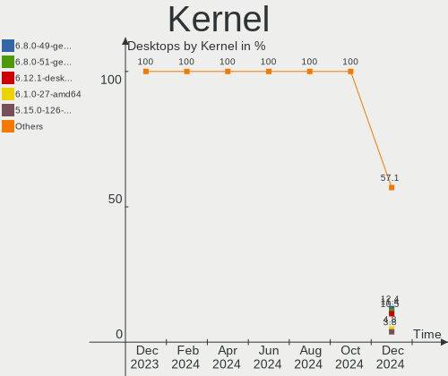

| Version                      | Desktops | Percent |
|------------------------------|----------|---------|
| 6.1.1-desktop-1omv2290       | 40       | 27.59%  |
| 5.15.0-58-generic            | 20       | 13.79%  |
| 5.15.0-56-generic            | 10       | 6.9%    |
| 5.15.0-57-generic            | 9        | 6.21%   |
| 5.16.7-desktop-1omv4003      | 6        | 4.14%   |
| 5.10.0-20-amd64              | 6        | 4.14%   |
| 5.4.0-137-generic            | 4        | 2.76%   |
| 5.19.0-28-generic            | 3        | 2.07%   |
| 5.15.0-43-generic            | 3        | 2.07%   |
| 6.1.2-desktop-1omv2301       | 2        | 1.38%   |
| 6.1.1-1-MANJARO              | 2        | 1.38%   |
| 5.4.0-126-generic            | 2        | 1.38%   |
| 5.19.0-31-generic            | 2        | 1.38%   |
| 5.15.0-57-lowlatency         | 2        | 1.38%   |
| 5.10.0-21-amd64              | 2        | 1.38%   |
| 6.1.8-arch1-1                | 1        | 0.69%   |
| 6.1.7-arch1-1                | 1        | 0.69%   |
| 6.1.7-100.fc36.x86_64        | 1        | 0.69%   |
| 6.1.6-zen1-1-zen             | 1        | 0.69%   |
| 6.1.6-203.fsync.fc37.x86_64  | 1        | 0.69%   |
| 6.1.6-200.fc37.x86_64        | 1        | 0.69%   |
| 6.1.6-060106-generic         | 1        | 0.69%   |
| 6.1.5-zen2-1-zen             | 1        | 0.69%   |
| 6.1.4-desktop-1omv2301       | 1        | 0.69%   |
| 6.1.3-arch1-1                | 1        | 0.69%   |
| 6.1.0-2-amd64                | 1        | 0.69%   |
| 6.0.19-3-MANJARO             | 1        | 0.69%   |
| 6.0.18-300.fc37.x86_64       | 1        | 0.69%   |
| 6.0.15-301.fsync.fc37.x86_64 | 1        | 0.69%   |
| 6.0.15-300.fc37.x86_64       | 1        | 0.69%   |
| 6.0.14-201.fsync.fc36.x86_64 | 1        | 0.69%   |
| 6.0.12-76060006-generic      | 1        | 0.69%   |
| 5.4.0-136-generic            | 1        | 0.69%   |
| 5.4.0-131-generic            | 1        | 0.69%   |
| 5.4.0-128-generic            | 1        | 0.69%   |
| 5.3.18-150300.59.106-preempt | 1        | 0.69%   |
| 5.19.0-29-generic            | 1        | 0.69%   |
| 5.15.20-051520-generic       | 1        | 0.69%   |
| 5.15.0-52-generic            | 1        | 0.69%   |
| 5.14.21-150400.24.41-default | 1        | 0.69%   |

Kernel Family
-------------

Linux kernel without a distro release

| Version  | Desktops | Percent |
|----------|----------|---------|
| 5.15.0   | 45       | 31.03%  |
| 6.1.1    | 42       | 28.97%  |
| 5.4.0    | 9        | 6.21%   |
| 5.10.0   | 9        | 6.21%   |
| 5.19.0   | 6        | 4.14%   |
| 5.16.7   | 6        | 4.14%   |
| 6.1.6    | 4        | 2.76%   |
| 6.1.7    | 2        | 1.38%   |
| 6.1.2    | 2        | 1.38%   |
| 6.0.15   | 2        | 1.38%   |
| 4.4.0    | 2        | 1.38%   |
| 6.1.8    | 1        | 0.69%   |
| 6.1.5    | 1        | 0.69%   |
| 6.1.4    | 1        | 0.69%   |
| 6.1.3    | 1        | 0.69%   |
| 6.1.0    | 1        | 0.69%   |
| 6.0.19   | 1        | 0.69%   |
| 6.0.18   | 1        | 0.69%   |
| 6.0.14   | 1        | 0.69%   |
| 6.0.12   | 1        | 0.69%   |
| 5.3.18   | 1        | 0.69%   |
| 5.15.20  | 1        | 0.69%   |
| 5.14.21  | 1        | 0.69%   |
| 5.14.0   | 1        | 0.69%   |
| 5.10.161 | 1        | 0.69%   |
| 5.10.14  | 1        | 0.69%   |
| 4.15.0   | 1        | 0.69%   |

Kernel Major Ver.
-----------------

Linux kernel major version

| Version | Desktops | Percent |
|---------|----------|---------|
| 6.1     | 55       | 37.93%  |
| 5.15    | 46       | 31.72%  |
| 5.10    | 11       | 7.59%   |
| 5.4     | 9        | 6.21%   |
| 6.0     | 6        | 4.14%   |
| 5.19    | 6        | 4.14%   |
| 5.16    | 6        | 4.14%   |
| 5.14    | 2        | 1.38%   |
| 4.4     | 2        | 1.38%   |
| 5.3     | 1        | 0.69%   |
| 4.15    | 1        | 0.69%   |

Arch
----

OS architecture (x86_64, i586, etc.)

| Name   | Desktops | Percent |
|--------|----------|---------|
| x86_64 | 145      | 100%    |

DE
--

Desktop Environment

| Name       | Desktops | Percent |
|------------|----------|---------|
| KDE5       | 59       | 40.69%  |
| GNOME      | 48       | 33.1%   |
| X-Cinnamon | 9        | 6.21%   |
| XFCE       | 7        | 4.83%   |
| MATE       | 7        | 4.83%   |
| Unknown    | 6        | 4.14%   |
| Cinnamon   | 3        | 2.07%   |
| Pantheon   | 2        | 1.38%   |
| LXQt       | 2        | 1.38%   |
| Unity      | 1        | 0.69%   |
| Budgie     | 1        | 0.69%   |

Display Server
--------------

X11 or Wayland

| Name    | Desktops | Percent |
|---------|----------|---------|
| X11     | 101      | 69.66%  |
| Wayland | 33       | 22.76%  |
| Tty     | 9        | 6.21%   |
| Unknown | 2        | 1.38%   |

Display Manager
---------------

SDDM, LightDM, etc.

| Name    | Desktops | Percent |
|---------|----------|---------|
| SDDM    | 53       | 36.55%  |
| GDM3    | 31       | 21.38%  |
| Unknown | 26       | 17.93%  |
| LightDM | 22       | 15.17%  |
| GDM     | 12       | 8.28%   |
| Ly      | 1        | 0.69%   |

OS Lang
-------

Language

| Lang    | Desktops | Percent |
|---------|----------|---------|
| fr_FR   | 108      | 74.48%  |
| en_US   | 28       | 19.31%  |
| en_GB   | 3        | 2.07%   |
| Unknown | 3        | 2.07%   |
| ru_RU   | 1        | 0.69%   |
| de_DE   | 1        | 0.69%   |
| C       | 1        | 0.69%   |

Boot Mode
---------

EFI or BIOS

| Mode | Desktops | Percent |
|------|----------|---------|
| BIOS | 73       | 50.34%  |
| EFI  | 72       | 49.66%  |

Filesystem
----------

Type of filesystem

| Type    | Desktops | Percent |
|---------|----------|---------|
| Ext4    | 95       | 65.52%  |
| Overlay | 38       | 26.21%  |
| Btrfs   | 12       | 8.28%   |

Part. scheme
------------

Scheme of partitioning

| Type    | Desktops | Percent |
|---------|----------|---------|
| GPT     | 94       | 64.83%  |
| MBR     | 30       | 20.69%  |
| Unknown | 21       | 14.48%  |

Dual Boot with Linux/BSD
------------------------

Hosting more than one Linux/BSD

| Dual boot | Desktops | Percent |
|-----------|----------|---------|
| No        | 96       | 66.21%  |
| Yes       | 49       | 33.79%  |

Dual Boot (Win)
---------------

Hosting Linux and Windows

| Dual boot | Desktops | Percent |
|-----------|----------|---------|
| No        | 96       | 66.21%  |
| Yes       | 49       | 33.79%  |

Board
-----

Vendor
------

Motherboard manufacturer

| Name                                 | Desktops | Percent |
|--------------------------------------|----------|---------|
| ASUSTek Computer                     | 39       | 26.9%   |
| Gigabyte Technology                  | 26       | 17.93%  |
| MSI                                  | 24       | 16.55%  |
| Dell                                 | 15       | 10.34%  |
| Lenovo                               | 10       | 6.9%    |
| Hewlett-Packard                      | 10       | 6.9%    |
| ASRock                               | 8        | 5.52%   |
| Intel                                | 4        | 2.76%   |
| Fujitsu                              | 2        | 1.38%   |
| Acer                                 | 2        | 1.38%   |
| Shenzhen Meigao Electronic Equipment | 1        | 0.69%   |
| Pegatron                             | 1        | 0.69%   |
| Medion                               | 1        | 0.69%   |
| HC                                   | 1        | 0.69%   |
| Foxconn                              | 1        | 0.69%   |

Model
-----

Motherboard model

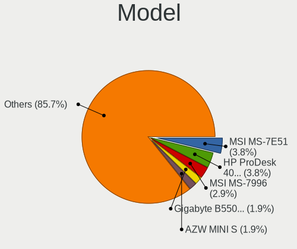

| Name                                       | Desktops | Percent |
|--------------------------------------------|----------|---------|
| ASUS All Series                            | 4        | 2.76%   |
| MSI MS-7B17                                | 2        | 1.38%   |
| Gigabyte Z77-D3H                           | 2        | 1.38%   |
| Gigabyte B550M DS3H                        | 2        | 1.38%   |
| Dell Precision WorkStation T3400           | 2        | 1.38%   |
| Dell OptiPlex 390                          | 2        | 1.38%   |
| ASUS PRIME Z390M-PLUS                      | 2        | 1.38%   |
| ASUS P8Z68-V LX                            | 2        | 1.38%   |
| Shenzhen Meigao Electronic Equipment UM560 | 1        | 0.69%   |
| Pegatron VC903AA-ABF p6145fr               | 1        | 0.69%   |
| MSI MS-7D45                                | 1        | 0.69%   |
| MSI MS-7D22                                | 1        | 0.69%   |
| MSI MS-7D17                                | 1        | 0.69%   |
| MSI MS-7C92                                | 1        | 0.69%   |
| MSI MS-7C75                                | 1        | 0.69%   |
| MSI MS-7C71                                | 1        | 0.69%   |
| MSI MS-7C56                                | 1        | 0.69%   |
| MSI MS-7C52                                | 1        | 0.69%   |
| MSI MS-7C37                                | 1        | 0.69%   |
| MSI MS-7C02                                | 1        | 0.69%   |
| MSI MS-7B89                                | 1        | 0.69%   |
| MSI MS-7B28                                | 1        | 0.69%   |
| MSI MS-7A37                                | 1        | 0.69%   |
| MSI MS-7996                                | 1        | 0.69%   |
| MSI MS-7994                                | 1        | 0.69%   |
| MSI MS-7817                                | 1        | 0.69%   |
| MSI MS-7788                                | 1        | 0.69%   |
| MSI MS-7693                                | 1        | 0.69%   |
| MSI MS-7640                                | 1        | 0.69%   |
| MSI MS-7388                                | 1        | 0.69%   |
| MSI MS-7032                                | 1        | 0.69%   |
| MSI MAG H410 Codex S (MS-B927)             | 1        | 0.69%   |
| Medion H61H2-LM3                           | 1        | 0.69%   |
| Lenovo ThinkStation P330 30D2S0LQ00        | 1        | 0.69%   |
| Lenovo ThinkStation P310 30ATCTO1WW        | 1        | 0.69%   |
| Lenovo ThinkStation E31 25522Q3            | 1        | 0.69%   |
| Lenovo ThinkCentre M93 10A5A00CFR          | 1        | 0.69%   |
| Lenovo ThinkCentre M72e 35951A1            | 1        | 0.69%   |
| Lenovo ThinkCentre M710s 10M8S2D400        | 1        | 0.69%   |
| Lenovo ThinkCentre M700 10J0S1YR00         | 1        | 0.69%   |

Model Family
------------

Motherboard model prefix

| Name                                       | Desktops | Percent |
|--------------------------------------------|----------|---------|
| ASUS PRIME                                 | 12       | 8.28%   |
| Dell OptiPlex                              | 9        | 6.21%   |
| Dell Precision                             | 6        | 4.14%   |
| ASUS ROG                                   | 5        | 3.45%   |
| Lenovo ThinkCentre                         | 4        | 2.76%   |
| HP Compaq                                  | 4        | 2.76%   |
| Gigabyte B550M                             | 4        | 2.76%   |
| ASUS TUF                                   | 4        | 2.76%   |
| ASUS All                                   | 4        | 2.76%   |
| Lenovo ThinkStation                        | 3        | 2.07%   |
| MSI MS-7B17                                | 2        | 1.38%   |
| Lenovo IdeaCentre                          | 2        | 1.38%   |
| HP EliteDesk                               | 2        | 1.38%   |
| Gigabyte Z77-D3H                           | 2        | 1.38%   |
| Gigabyte B550                              | 2        | 1.38%   |
| Gigabyte B450                              | 2        | 1.38%   |
| Fujitsu ESPRIMO                            | 2        | 1.38%   |
| ASUS P8Z68-V                               | 2        | 1.38%   |
| Acer Aspire                                | 2        | 1.38%   |
| Shenzhen Meigao Electronic Equipment UM560 | 1        | 0.69%   |
| Pegatron VC903AA-ABF                       | 1        | 0.69%   |
| MSI MS-7D45                                | 1        | 0.69%   |
| MSI MS-7D22                                | 1        | 0.69%   |
| MSI MS-7D17                                | 1        | 0.69%   |
| MSI MS-7C92                                | 1        | 0.69%   |
| MSI MS-7C75                                | 1        | 0.69%   |
| MSI MS-7C71                                | 1        | 0.69%   |
| MSI MS-7C56                                | 1        | 0.69%   |
| MSI MS-7C52                                | 1        | 0.69%   |
| MSI MS-7C37                                | 1        | 0.69%   |
| MSI MS-7C02                                | 1        | 0.69%   |
| MSI MS-7B89                                | 1        | 0.69%   |
| MSI MS-7B28                                | 1        | 0.69%   |
| MSI MS-7A37                                | 1        | 0.69%   |
| MSI MS-7996                                | 1        | 0.69%   |
| MSI MS-7994                                | 1        | 0.69%   |
| MSI MS-7817                                | 1        | 0.69%   |
| MSI MS-7788                                | 1        | 0.69%   |
| MSI MS-7693                                | 1        | 0.69%   |
| MSI MS-7640                                | 1        | 0.69%   |

MFG Year
--------

Motherboard manufacture year

| Year | Desktops | Percent |
|------|----------|---------|
| 2018 | 18       | 12.41%  |
| 2021 | 16       | 11.03%  |
| 2020 | 15       | 10.34%  |
| 2012 | 12       | 8.28%   |
| 2019 | 11       | 7.59%   |
| 2015 | 10       | 6.9%    |
| 2017 | 9        | 6.21%   |
| 2014 | 9        | 6.21%   |
| 2011 | 9        | 6.21%   |
| 2016 | 7        | 4.83%   |
| 2013 | 7        | 4.83%   |
| 2008 | 7        | 4.83%   |
| 2022 | 5        | 3.45%   |
| 2009 | 5        | 3.45%   |
| 2010 | 1        | 0.69%   |
| 2007 | 1        | 0.69%   |
| 2006 | 1        | 0.69%   |
| 2005 | 1        | 0.69%   |
| 2001 | 1        | 0.69%   |

Form Factor
-----------

Physical design of the computer

| Name    | Desktops | Percent |
|---------|----------|---------|
| Desktop | 145      | 100%    |

Secure Boot
-----------

Enabled or disabled

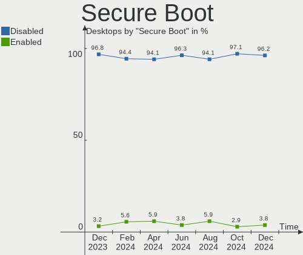

| State    | Desktops | Percent |
|----------|----------|---------|
| Disabled | 143      | 98.62%  |
| Enabled  | 2        | 1.38%   |

Coreboot
--------

Have coreboot on board

| Used | Desktops | Percent |
|------|----------|---------|
| No   | 145      | 100%    |

RAM Size
--------

Total RAM memory

| Size in GB  | Desktops | Percent |
|-------------|----------|---------|
| 16.01-24.0  | 50       | 34.48%  |
| 32.01-64.0  | 29       | 20%     |
| 8.01-16.0   | 24       | 16.55%  |
| 4.01-8.0    | 19       | 13.1%   |
| 3.01-4.0    | 14       | 9.66%   |
| 64.01-256.0 | 4        | 2.76%   |
| 24.01-32.0  | 2        | 1.38%   |
| 1.01-2.0    | 2        | 1.38%   |
| 0.51-1.0    | 1        | 0.69%   |

RAM Used
--------

Used RAM memory

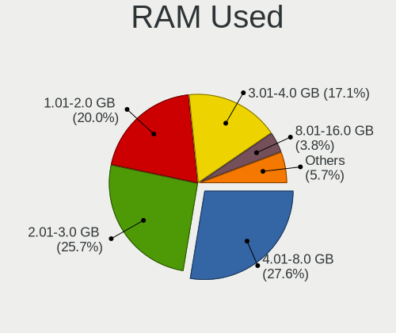

| Used GB    | Desktops | Percent |
|------------|----------|---------|
| 1.01-2.0   | 67       | 46.21%  |
| 2.01-3.0   | 33       | 22.76%  |
| 4.01-8.0   | 18       | 12.41%  |
| 3.01-4.0   | 16       | 11.03%  |
| 0.51-1.0   | 5        | 3.45%   |
| 8.01-16.0  | 4        | 2.76%   |
| 16.01-24.0 | 1        | 0.69%   |
| 0.01-0.5   | 1        | 0.69%   |

Total Drives
------------

Number of drives on board

| Drives | Desktops | Percent |
|--------|----------|---------|
| 1      | 47       | 32.41%  |
| 2      | 42       | 28.97%  |
| 3      | 30       | 20.69%  |
| 4      | 14       | 9.66%   |
| 7      | 5        | 3.45%   |
| 5      | 3        | 2.07%   |
| 6      | 2        | 1.38%   |
| 17     | 1        | 0.69%   |
| 8      | 1        | 0.69%   |

Has CD-ROM
----------

Has CD-ROM on board

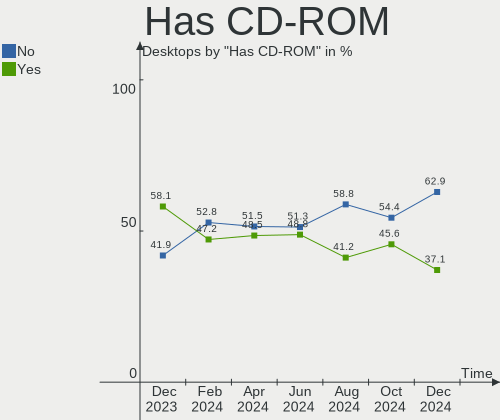

| Presented | Desktops | Percent |
|-----------|----------|---------|
| No        | 73       | 50.34%  |
| Yes       | 72       | 49.66%  |

Has Ethernet
------------

Has Ethernet on board

| Presented | Desktops | Percent |
|-----------|----------|---------|
| Yes       | 145      | 100%    |

Has WiFi
--------

Has WiFi module

| Presented | Desktops | Percent |
|-----------|----------|---------|
| No        | 87       | 60%     |
| Yes       | 58       | 40%     |

Has Bluetooth
-------------

Has Bluetooth module

| Presented | Desktops | Percent |
|-----------|----------|---------|
| No        | 103      | 71.03%  |
| Yes       | 42       | 28.97%  |

Location
--------

Country
-------

Geographic location (country)

| Country | Desktops | Percent |
|---------|----------|---------|
| France  | 145      | 100%    |

City
----

Geographic location (city)

| City                      | Desktops | Percent |
|---------------------------|----------|---------|
| Paris                     | 13       | 8.97%   |
| Marseille                 | 6        | 4.14%   |
| Roubaix                   | 3        | 2.07%   |
| Lorient                   | 3        | 2.07%   |
| Toulouse                  | 2        | 1.38%   |
| Sartrouville              | 2        | 1.38%   |
| Rouen                     | 2        | 1.38%   |
| Perpignan                 | 2        | 1.38%   |
| Nice                      | 2        | 1.38%   |
| Montpellier               | 2        | 1.38%   |
| Forges-les-Eaux           | 2        | 1.38%   |
| Colomiers                 | 2        | 1.38%   |
| Chambéry                 | 2        | 1.38%   |
| Vouziers                  | 1        | 0.69%   |
| Vitrolles                 | 1        | 0.69%   |
| Villeurbanne              | 1        | 0.69%   |
| Villeneuve-d'Ascq         | 1        | 0.69%   |
| Villefontaine             | 1        | 0.69%   |
| Versailles                | 1        | 0.69%   |
| Verdun                    | 1        | 0.69%   |
| Vaudoy-en-Brie            | 1        | 0.69%   |
| Valence                   | 1        | 0.69%   |
| Torcy-en-Valois           | 1        | 0.69%   |
| Thouars                   | 1        | 0.69%   |
| Strasbourg                | 1        | 0.69%   |
| Savigny-le-Temple         | 1        | 0.69%   |
| San-Martino-di-Lota       | 1        | 0.69%   |
| Samer                     | 1        | 0.69%   |
| Saintes                   | 1        | 0.69%   |
| Sainte-Tulle              | 1        | 0.69%   |
| Saint-Nazaire             | 1        | 0.69%   |
| Saint-Just-Saint-Rambert  | 1        | 0.69%   |
| Saint-Hilaire-sur-Benaize | 1        | 0.69%   |
| Saint-Denis-les-Bourg     | 1        | 0.69%   |
| Romaneche-Thorins         | 1        | 0.69%   |
| Rimeize                   | 1        | 0.69%   |
| Rezé                     | 1        | 0.69%   |
| Rennes                    | 1        | 0.69%   |
| Reims                     | 1        | 0.69%   |
| Quimper                   | 1        | 0.69%   |

Drives
------

Drive Vendor
------------

Hard drive vendors

| Vendor                      | Desktops | Drives | Percent |
|-----------------------------|----------|--------|---------|
| Seagate                     | 52       | 83     | 18.06%  |
| Samsung Electronics         | 44       | 58     | 15.28%  |
| WDC                         | 40       | 55     | 13.89%  |
| Crucial                     | 25       | 29     | 8.68%   |
| Kingston                    | 18       | 19     | 6.25%   |
| Sandisk                     | 15       | 18     | 5.21%   |
| Hitachi                     | 12       | 12     | 4.17%   |
| PNY                         | 10       | 12     | 3.47%   |
| Toshiba                     | 9        | 13     | 3.13%   |
| China                       | 7        | 8      | 2.43%   |
| Maxtor                      | 5        | 5      | 1.74%   |
| Unknown                     | 4        | 4      | 1.39%   |
| Phison Electronics          | 4        | 4      | 1.39%   |
| LDLC                        | 4        | 4      | 1.39%   |
| Intel                       | 4        | 4      | 1.39%   |
| HGST                        | 4        | 7      | 1.39%   |
| Phison                      | 3        | 3      | 1.04%   |
| Micron Technology           | 2        | 2      | 0.69%   |
| Kingston Technology Company | 2        | 2      | 0.69%   |
| KingDian                    | 2        | 3      | 0.69%   |
| Corsair                     | 2        | 2      | 0.69%   |
| Unknown                     | 2        | 2      | 0.69%   |
| USB3.0                      | 1        | 1      | 0.35%   |
| TEXTORM                     | 1        | 1      | 0.35%   |
| SPCC                        | 1        | 1      | 0.35%   |
| SK hynix                    | 1        | 1      | 0.35%   |
| Silicon Motion              | 1        | 1      | 0.35%   |
| OCZ                         | 1        | 1      | 0.35%   |
| Netac                       | 1        | 1      | 0.35%   |
| Micron/Crucial Technology   | 1        | 1      | 0.35%   |
| LITEONIT                    | 1        | 1      | 0.35%   |
| Linux                       | 1        | 1      | 0.35%   |
| Initio                      | 1        | 1      | 0.35%   |
| GOODRAM                     | 1        | 1      | 0.35%   |
| Gigabyte Technology         | 1        | 1      | 0.35%   |
| Fujitsu                     | 1        | 1      | 0.35%   |
| ExcelStor                   | 1        | 1      | 0.35%   |
| Emtec                       | 1        | 1      | 0.35%   |
| CT1000MX                    | 1        | 1      | 0.35%   |
| ASMT                        | 1        | 1      | 0.35%   |

Drive Model
-----------

Hard drive models

| Model                                                 | Desktops | Percent |
|-------------------------------------------------------|----------|---------|
| Seagate ST2000DM008-2FR102 2TB                        | 7        | 2.08%   |
| Seagate ST4000DM004-2CV104 4TB                        | 5        | 1.48%   |
| Seagate ST2000DM001-1ER164 2TB                        | 4        | 1.19%   |
| Seagate ST1000DM010-2EP102 1TB                        | 4        | 1.19%   |
| Samsung SSD 970 EVO Plus 500GB                        | 4        | 1.19%   |
| Samsung SSD 860 EVO 500GB                             | 4        | 1.19%   |
| Samsung NVMe SSD Controller SM981/PM981/PM983 500GB   | 4        | 1.19%   |
| PNY CS900 120GB SSD                                   | 4        | 1.19%   |
| Kingston SA400S37240G 240GB SSD                       | 4        | 1.19%   |
| Crucial CT500MX500SSD1 500GB                          | 4        | 1.19%   |
| Crucial CT240BX500SSD1 240GB                          | 4        | 1.19%   |
| Crucial CT1000MX500SSD1 1TB                           | 4        | 1.19%   |
| Seagate ST1000DM003-1SB102 1TB                        | 3        | 0.89%   |
| Sandisk WD Blue SN550 NVMe SSD 1TB                    | 3        | 0.89%   |
| Kingston SA400S37120G 120GB SSD                       | 3        | 0.89%   |
| Crucial CT1000BX500SSD1 1TB                           | 3        | 0.89%   |
| WDC WDS100T2B0A-00SM50 1TB SSD                        | 2        | 0.59%   |
| WDC WD4003FZEX-00Z4SA0 4TB                            | 2        | 0.59%   |
| WDC WD20EZRX-00D8PB0 2TB                              | 2        | 0.59%   |
| WDC WD20EFRX-68EUZN0 2TB                              | 2        | 0.59%   |
| WDC WD10EZRZ-00HTKB0 1TB                              | 2        | 0.59%   |
| WDC WD10EZEX-00WN4A0 1TB                              | 2        | 0.59%   |
| WDC WD10EADS-65L5B1 1TB                               | 2        | 0.59%   |
| WDC WD1002FAEX-00Y9A0 1TB                             | 2        | 0.59%   |
| Toshiba HDWD130 3TB                                   | 2        | 0.59%   |
| Toshiba HDWD110 1TB                                   | 2        | 0.59%   |
| Toshiba DT01ACA100 1TB                                | 2        | 0.59%   |
| Seagate ST500DM002-1BD142 500GB                       | 2        | 0.59%   |
| Seagate ST4000VN008-2DR166 4TB                        | 2        | 0.59%   |
| Seagate ST2000DM001-1CH164 2TB                        | 2        | 0.59%   |
| Seagate ST1000LM048-2E7172 1TB                        | 2        | 0.59%   |
| Seagate ST1000LM024 HN-M101MBB 1TB                    | 2        | 0.59%   |
| Seagate ST1000DM003-1CH162 1TB                        | 2        | 0.59%   |
| Sandisk WD Black 2018/SN750 / PC SN720 NVMe SSD 512GB | 2        | 0.59%   |
| SanDisk SSD PLUS 240GB                                | 2        | 0.59%   |
| SanDisk NVMe SSD Drive 1TB                            | 2        | 0.59%   |
| Samsung SSD 980 1TB                                   | 2        | 0.59%   |
| Samsung SSD 870 QVO 2TB                               | 2        | 0.59%   |
| Samsung SSD 870 EVO 1TB                               | 2        | 0.59%   |
| Samsung SSD 840 EVO 250GB                             | 2        | 0.59%   |

HDD Vendor
----------

Hard disk drive vendors

| Vendor              | Desktops | Drives | Percent |
|---------------------|----------|--------|---------|
| Seagate             | 52       | 83     | 40%     |
| WDC                 | 34       | 45     | 26.15%  |
| Hitachi             | 12       | 12     | 9.23%   |
| Toshiba             | 9        | 13     | 6.92%   |
| Samsung Electronics | 9        | 10     | 6.92%   |
| Maxtor              | 5        | 5      | 3.85%   |
| HGST                | 4        | 7      | 3.08%   |
| Unknown             | 2        | 2      | 1.54%   |
| USB3.0              | 1        | 1      | 0.77%   |
| Fujitsu             | 1        | 1      | 0.77%   |
| ExcelStor           | 1        | 1      | 0.77%   |

SSD Vendor
----------

Solid state drive vendors

| Vendor              | Desktops | Drives | Percent |
|---------------------|----------|--------|---------|
| Samsung Electronics | 25       | 27     | 22.73%  |
| Crucial             | 21       | 25     | 19.09%  |
| Kingston            | 15       | 15     | 13.64%  |
| PNY                 | 10       | 12     | 9.09%   |
| SanDisk             | 8        | 8      | 7.27%   |
| WDC                 | 7        | 7      | 6.36%   |
| China               | 7        | 8      | 6.36%   |
| Micron Technology   | 2        | 2      | 1.82%   |
| KingDian            | 2        | 3      | 1.82%   |
| Intel               | 2        | 2      | 1.82%   |
| Unknown             | 2        | 2      | 1.82%   |
| TEXTORM             | 1        | 1      | 0.91%   |
| SPCC                | 1        | 1      | 0.91%   |
| SK hynix            | 1        | 1      | 0.91%   |
| OCZ                 | 1        | 1      | 0.91%   |
| LITEONIT            | 1        | 1      | 0.91%   |
| LDLC                | 1        | 1      | 0.91%   |
| Initio              | 1        | 1      | 0.91%   |
| GOODRAM             | 1        | 1      | 0.91%   |
| CT1000MX            | 1        | 1      | 0.91%   |

Drive Kind
----------

HDD or SSD

| Kind    | Desktops | Drives | Percent |
|---------|----------|--------|---------|
| HDD     | 97       | 180    | 40.93%  |
| SSD     | 86       | 120    | 36.29%  |
| NVMe    | 49       | 61     | 20.68%  |
| Unknown | 3        | 4      | 1.27%   |
| MMC     | 2        | 2      | 0.84%   |

Drive Connector
---------------

SATA, SAS, NVMe, etc.

| Type | Desktops | Drives | Percent |
|------|----------|--------|---------|
| SATA | 134      | 294    | 69.07%  |
| NVMe | 49       | 61     | 25.26%  |
| SAS  | 9        | 10     | 4.64%   |
| MMC  | 2        | 2      | 1.03%   |

Drive Size
----------

Size of hard drive

| Size in TB | Desktops | Drives | Percent |
|------------|----------|--------|---------|
| 0.01-0.5   | 93       | 142    | 46.73%  |
| 0.51-1.0   | 56       | 88     | 28.14%  |
| 1.01-2.0   | 29       | 37     | 14.57%  |
| 3.01-4.0   | 13       | 17     | 6.53%   |
| 2.01-3.0   | 5        | 8      | 2.51%   |
| 4.01-10.0  | 2        | 2      | 1.01%   |
| 10.01-20.0 | 1        | 6      | 0.5%    |

Space Total
-----------

Amount of disk space available on the file system

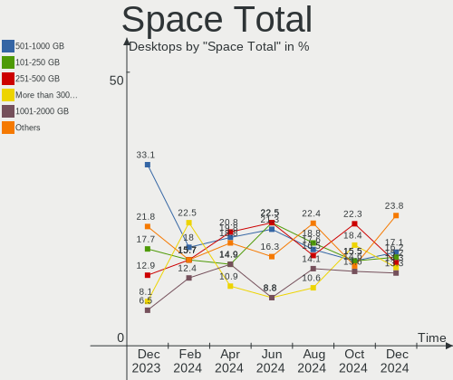

| Size in GB     | Desktops | Percent |
|----------------|----------|---------|
| 251-500        | 27       | 18.62%  |
| 101-250        | 27       | 18.62%  |
| 1-20           | 24       | 16.55%  |
| 501-1000       | 20       | 13.79%  |
| 1001-2000      | 17       | 11.72%  |
| More than 3000 | 10       | 6.9%    |
| Unknown        | 10       | 6.9%    |
| 2001-3000      | 7        | 4.83%   |
| 51-100         | 2        | 1.38%   |
| 21-50          | 1        | 0.69%   |

Space Used
----------

Amount of used disk space

| Used GB        | Desktops | Percent |
|----------------|----------|---------|
| 1-20           | 61       | 42.07%  |
| 501-1000       | 18       | 12.41%  |
| 101-250        | 14       | 9.66%   |
| 21-50          | 13       | 8.97%   |
| 251-500        | 11       | 7.59%   |
| 51-100         | 10       | 6.9%    |
| Unknown        | 10       | 6.9%    |
| More than 3000 | 4        | 2.76%   |
| 1001-2000      | 3        | 2.07%   |
| 2001-3000      | 1        | 0.69%   |

Malfunc. Drives
---------------

Drive models with a malfunction

| Model                             | Desktops | Drives | Percent |
|-----------------------------------|----------|--------|---------|
| WDC WD10EADS-65L5B1 1TB           | 2        | 2      | 5.26%   |
| WDC WD1002FAEX-00Y9A0 1TB         | 2        | 2      | 5.26%   |
| WDC WD6400AAKS-22A7B2 640GB       | 1        | 1      | 2.63%   |
| WDC WD6400AAKS-00H2B0 640GB       | 1        | 1      | 2.63%   |
| WDC WD3200AAJS-00L7A0 320GB       | 1        | 1      | 2.63%   |
| WDC WD20EZRX-00D8PB0 2TB          | 1        | 1      | 2.63%   |
| WDC WD20EFRX-68EUZN0 2TB          | 1        | 1      | 2.63%   |
| WDC WD15EADS-65R2B0 1TB           | 1        | 1      | 2.63%   |
| WDC WD10EARS-22Y5B1 1TB           | 1        | 1      | 2.63%   |
| WDC WD10EARS-00MVWB0 1TB          | 1        | 1      | 2.63%   |
| WDC WD10EADS-00L5B1 1TB           | 1        | 1      | 2.63%   |
| Seagate ST500LM021-1KJ152 500GB   | 1        | 1      | 2.63%   |
| Seagate ST500DM002-1BD142 500GB   | 1        | 1      | 2.63%   |
| Seagate ST4000VX007-2DT166 4TB    | 1        | 1      | 2.63%   |
| Seagate ST4000VN008-2DR166 4TB    | 1        | 2      | 2.63%   |
| Seagate ST3750528AS 752GB         | 1        | 1      | 2.63%   |
| Seagate ST3500630AS 500GB         | 1        | 1      | 2.63%   |
| Seagate ST3250820AS 250GB         | 1        | 1      | 2.63%   |
| Seagate ST3000DM008-2DM166 3TB    | 1        | 2      | 2.63%   |
| Seagate ST250DM000-1BD141 250GB   | 1        | 1      | 2.63%   |
| Seagate ST2000DM001-1ER164 2TB    | 1        | 1      | 2.63%   |
| Seagate ST2000DM001-1CH164 2TB    | 1        | 1      | 2.63%   |
| Samsung Electronics HD642JJ 640GB | 1        | 1      | 2.63%   |
| Samsung Electronics HD501LJ 500GB | 1        | 1      | 2.63%   |
| Samsung Electronics HD103UJ 1TB   | 1        | 1      | 2.63%   |
| Samsung Electronics HD103SJ 1TB   | 1        | 1      | 2.63%   |
| OCZ VERTEX 64GB SSD               | 1        | 1      | 2.63%   |
| Netac NVMe SSD 2TB                | 1        | 1      | 2.63%   |
| Maxtor STM3250310AS 250GB         | 1        | 1      | 2.63%   |
| Maxtor 6L250S0 256GB              | 1        | 1      | 2.63%   |
| Maxtor 6L200M0 208GB              | 1        | 1      | 2.63%   |
| LDLC SSD 120GB                    | 1        | 1      | 2.63%   |
| Hitachi HDS722020ALA330 2TB       | 1        | 1      | 2.63%   |
| Hitachi HDS721010CLA332 1TB       | 1        | 1      | 2.63%   |
| Hitachi HDP725050GLA360 500GB     | 1        | 1      | 2.63%   |
| China SSDG2-256G                  | 1        | 1      | 2.63%   |

Malfunc. Drive Vendor
---------------------

Vendors of faulty drives

| Vendor              | Desktops | Drives | Percent |
|---------------------|----------|--------|---------|
| WDC                 | 11       | 13     | 33.33%  |
| Seagate             | 9        | 13     | 27.27%  |
| Samsung Electronics | 3        | 4      | 9.09%   |
| Maxtor              | 3        | 3      | 9.09%   |
| Hitachi             | 3        | 3      | 9.09%   |
| OCZ                 | 1        | 1      | 3.03%   |
| Netac               | 1        | 1      | 3.03%   |
| LDLC                | 1        | 1      | 3.03%   |
| China               | 1        | 1      | 3.03%   |

Malfunc. HDD Vendor
-------------------

Vendors of faulty HDD drives

| Vendor              | Desktops | Drives | Percent |
|---------------------|----------|--------|---------|
| WDC                 | 11       | 13     | 37.93%  |
| Seagate             | 9        | 13     | 31.03%  |
| Samsung Electronics | 3        | 4      | 10.34%  |
| Maxtor              | 3        | 3      | 10.34%  |
| Hitachi             | 3        | 3      | 10.34%  |

Malfunc. Drive Kind
-------------------

Kinds of faulty drives

| Kind | Desktops | Drives | Percent |
|------|----------|--------|---------|
| HDD  | 23       | 36     | 85.19%  |
| SSD  | 3        | 3      | 11.11%  |
| NVMe | 1        | 1      | 3.7%    |

Failed Drives
-------------

Failed drive models

Zero info for selected period =(

Failed Drive Vendor
-------------------

Failed drive vendors

Zero info for selected period =(

Drive Status
------------

Number of failed and malfunc. drives

| Status   | Desktops | Drives | Percent |
|----------|----------|--------|---------|
| Works    | 96       | 211    | 54.55%  |
| Detected | 53       | 116    | 30.11%  |
| Malfunc  | 27       | 40     | 15.34%  |

Storage controller
------------------

Storage Vendor
--------------

Storage controller vendors

| Vendor                       | Desktops | Percent |
|------------------------------|----------|---------|
| Intel                        | 100      | 47.17%  |
| AMD                          | 42       | 19.81%  |
| Samsung Electronics          | 17       | 8.02%   |
| SanDisk                      | 11       | 5.19%   |
| Phison Electronics           | 9        | 4.25%   |
| Kingston Technology Company  | 6        | 2.83%   |
| Micron/Crucial Technology    | 4        | 1.89%   |
| Marvell Technology Group     | 4        | 1.89%   |
| JMicron Technology           | 4        | 1.89%   |
| ASMedia Technology           | 4        | 1.89%   |
| Silicon Motion               | 2        | 0.94%   |
| Nvidia                       | 2        | 0.94%   |
| Broadcom / LSI               | 2        | 0.94%   |
| VIA Technologies             | 1        | 0.47%   |
| Shenzhen Longsys Electronics | 1        | 0.47%   |
| Netac Technology             | 1        | 0.47%   |
| Micron Technology            | 1        | 0.47%   |
| Adaptec                      | 1        | 0.47%   |

Storage Model
-------------

Storage controller models

| Model                                                                          | Desktops | Percent |
|--------------------------------------------------------------------------------|----------|---------|
| AMD FCH SATA Controller [AHCI mode]                                            | 19       | 7.57%   |
| Intel Q170/Q150/B150/H170/H110/Z170/CM236 Chipset SATA Controller [AHCI Mode]  | 14       | 5.58%   |
| AMD 500 Series Chipset SATA Controller                                         | 12       | 4.78%   |
| Samsung NVMe SSD Controller SM981/PM981/PM983                                  | 11       | 4.38%   |
| Intel Cannon Lake PCH SATA AHCI Controller                                     | 10       | 3.98%   |
| Intel 6 Series/C200 Series Chipset Family 6 port Desktop SATA AHCI Controller  | 8        | 3.19%   |
| Intel 200 Series PCH SATA controller [AHCI mode]                               | 8        | 3.19%   |
| AMD 400 Series Chipset SATA Controller                                         | 8        | 3.19%   |
| Intel 8 Series/C220 Series Chipset Family 6-port SATA Controller 1 [AHCI mode] | 7        | 2.79%   |
| Intel 7 Series/C210 Series Chipset Family 6-port SATA Controller [AHCI mode]   | 7        | 2.79%   |
| Intel SATA Controller [RAID mode]                                              | 6        | 2.39%   |
| Intel 500 Series Chipset Family SATA AHCI Controller                           | 6        | 2.39%   |
| SanDisk WD Blue SN550 NVMe SSD                                                 | 4        | 1.59%   |
| Intel Alder Lake-S PCH SATA Controller [AHCI Mode]                             | 4        | 1.59%   |
| Intel 9 Series Chipset Family SATA Controller [AHCI Mode]                      | 4        | 1.59%   |
| AMD SB7x0/SB8x0/SB9x0 SATA Controller [AHCI mode]                              | 4        | 1.59%   |
| SanDisk WD Black 2018/SN750 / PC SN720 NVMe SSD                                | 3        | 1.2%    |
| Samsung NVMe SSD Controller SM961/PM961/SM963                                  | 3        | 1.2%    |
| Samsung NVMe SSD Controller 980                                                | 3        | 1.2%    |
| Phison E16 PCIe4 NVMe Controller                                               | 3        | 1.2%    |
| Kingston Company Company Non-Volatile memory controller                        | 3        | 1.2%    |
| Kingston Company A2000 NVMe SSD                                                | 3        | 1.2%    |
| Intel 7 Series/C210 Series Chipset Family 4-port SATA Controller [IDE mode]    | 3        | 1.2%    |
| Intel 7 Series/C210 Series Chipset Family 2-port SATA Controller [IDE mode]    | 3        | 1.2%    |
| ASMedia ASM1062 Serial ATA Controller                                          | 3        | 1.2%    |
| AMD SB7x0/SB8x0/SB9x0 IDE Controller                                           | 3        | 1.2%    |
| Silicon Motion SM2263EN/SM2263XT SSD Controller                                | 2        | 0.8%    |
| SanDisk WD Black SN750 / PC SN730 NVMe SSD                                     | 2        | 0.8%    |
| Sandisk Non-Volatile memory controller                                         | 2        | 0.8%    |
| Phison Electronics Non-Volatile memory controller                              | 2        | 0.8%    |
| Phison E7 NVMe Controller                                                      | 2        | 0.8%    |
| Phison E12 NVMe Controller                                                     | 2        | 0.8%    |
| Micron/Crucial P2 NVMe PCIe SSD                                                | 2        | 0.8%    |
| JMicron JMB363 SATA/IDE Controller                                             | 2        | 0.8%    |
| Intel Volume Management Device NVMe RAID Controller                            | 2        | 0.8%    |
| Intel Comet Lake SATA AHCI Controller                                          | 2        | 0.8%    |
| Intel C610/X99 series chipset sSATA Controller [AHCI mode]                     | 2        | 0.8%    |
| Intel C610/X99 series chipset IDE-r Controller                                 | 2        | 0.8%    |
| Intel 82801IR/IO/IH (ICH9R/DO/DH) 6 port SATA Controller [AHCI mode]           | 2        | 0.8%    |
| Intel 82801IR/IO/IH (ICH9R/DO/DH) 4 port SATA Controller [IDE mode]            | 2        | 0.8%    |

Storage Kind
------------

Kind of storage controller (IDE, SATA, NVMe, SAS, ...)

| Kind | Desktops | Percent |
|------|----------|---------|
| SATA | 125      | 58.14%  |
| NVMe | 49       | 22.79%  |
| IDE  | 28       | 13.02%  |
| RAID | 10       | 4.65%   |
| SAS  | 2        | 0.93%   |
| SCSI | 1        | 0.47%   |

Processor
---------

CPU Vendor
----------

Processor vendors

| Vendor | Desktops | Percent |
|--------|----------|---------|
| Intel  | 101      | 69.66%  |
| AMD    | 44       | 30.34%  |

CPU Model
---------

Processor models

| Model                                  | Desktops | Percent |
|----------------------------------------|----------|---------|
| Intel Core i3-3220 CPU @ 3.30GHz       | 4        | 2.76%   |
| AMD Ryzen 5 5600X 6-Core Processor     | 4        | 2.76%   |
| AMD Ryzen 5 3600 6-Core Processor      | 4        | 2.76%   |
| Intel Core i7-7700K CPU @ 4.20GHz      | 3        | 2.07%   |
| Intel Core i7-3770 CPU @ 3.40GHz       | 3        | 2.07%   |
| Intel Core i5-9600K CPU @ 3.70GHz      | 3        | 2.07%   |
| Intel Core i5-6600 CPU @ 3.30GHz       | 3        | 2.07%   |
| AMD Ryzen 7 5800X 8-Core Processor     | 3        | 2.07%   |
| AMD Ryzen 5 1600 Six-Core Processor    | 3        | 2.07%   |
| AMD FX-8350 Eight-Core Processor       | 3        | 2.07%   |
| Intel Pentium CPU G4400 @ 3.30GHz      | 2        | 1.38%   |
| Intel Core i7-8700K CPU @ 3.70GHz      | 2        | 1.38%   |
| Intel Core i7-4790K CPU @ 4.00GHz      | 2        | 1.38%   |
| Intel Core i5-9400 CPU @ 2.90GHz       | 2        | 1.38%   |
| Intel Core i5-8400 CPU @ 2.80GHz       | 2        | 1.38%   |
| Intel Core i5-6500 CPU @ 3.20GHz       | 2        | 1.38%   |
| Intel Core i5-3570 CPU @ 3.40GHz       | 2        | 1.38%   |
| Intel Core i5-2400 CPU @ 3.10GHz       | 2        | 1.38%   |
| Intel Core i5-10400F CPU @ 2.90GHz     | 2        | 1.38%   |
| Intel Core i3-6100 CPU @ 3.70GHz       | 2        | 1.38%   |
| AMD Ryzen 7 3800X 8-Core Processor     | 2        | 1.38%   |
| AMD Ryzen 7 3700X 8-Core Processor     | 2        | 1.38%   |
| AMD Ryzen 5 5600G with Radeon Graphics | 2        | 1.38%   |
| Intel Xeon E-2174G CPU @ 3.80GHz       | 1        | 0.69%   |
| Intel Xeon CPU X5260 @ 3.33GHz         | 1        | 0.69%   |
| Intel Xeon CPU E5-2630 v4 @ 2.20GHz    | 1        | 0.69%   |
| Intel Xeon CPU E5-2630 v3 @ 2.40GHz    | 1        | 0.69%   |
| Intel Xeon CPU E5-1620 v3 @ 3.50GHz    | 1        | 0.69%   |
| Intel Xeon CPU E3-1270 v6 @ 3.80GHz    | 1        | 0.69%   |
| Intel Xeon CPU E3-1245 V2 @ 3.40GHz    | 1        | 0.69%   |
| Intel Pentium Dual CPU E2200 @ 2.20GHz | 1        | 0.69%   |
| Intel Pentium D CPU 3.00GHz            | 1        | 0.69%   |
| Intel Pentium CPU G640 @ 2.80GHz       | 1        | 0.69%   |
| Intel Core i7-9700K CPU @ 3.60GHz      | 1        | 0.69%   |
| Intel Core i7-9700 CPU @ 3.00GHz       | 1        | 0.69%   |
| Intel Core i7-6700T CPU @ 2.80GHz      | 1        | 0.69%   |
| Intel Core i7-4790 CPU @ 3.60GHz       | 1        | 0.69%   |
| Intel Core i7-4770 CPU @ 3.40GHz       | 1        | 0.69%   |
| Intel Core i7-3770T CPU @ 2.50GHz      | 1        | 0.69%   |
| Intel Core i7-3770K CPU @ 3.50GHz      | 1        | 0.69%   |

CPU Model Family
----------------

Processor model prefix

| Model              | Desktops | Percent |
|--------------------|----------|---------|
| Intel Core i5      | 35       | 24.14%  |
| Intel Core i7      | 19       | 13.1%   |
| AMD Ryzen 5        | 19       | 13.1%   |
| Intel Core i3      | 12       | 8.28%   |
| Other              | 10       | 6.9%    |
| AMD Ryzen 7        | 10       | 6.9%    |
| Intel Xeon         | 7        | 4.83%   |
| Intel Core 2 Duo   | 5        | 3.45%   |
| Intel Celeron      | 5        | 3.45%   |
| AMD FX             | 5        | 3.45%   |
| Intel Pentium      | 3        | 2.07%   |
| Intel Core 2 Quad  | 3        | 2.07%   |
| Intel Atom         | 2        | 1.38%   |
| Intel Pentium Dual | 1        | 0.69%   |
| Intel Pentium D    | 1        | 0.69%   |
| AMD Sempron        | 1        | 0.69%   |
| AMD Ryzen 9        | 1        | 0.69%   |
| AMD Ryzen 5 PRO    | 1        | 0.69%   |
| AMD GX             | 1        | 0.69%   |
| AMD E              | 1        | 0.69%   |
| AMD Athlon 64 X2   | 1        | 0.69%   |
| AMD A8             | 1        | 0.69%   |
| AMD A6             | 1        | 0.69%   |

CPU Cores
---------

Number of processor cores

| Number | Desktops | Percent |
|--------|----------|---------|
| 4      | 47       | 32.41%  |
| 6      | 39       | 26.9%   |
| 2      | 34       | 23.45%  |
| 8      | 15       | 10.34%  |
| 1      | 4        | 2.76%   |
| 12     | 2        | 1.38%   |
| 20     | 1        | 0.69%   |
| 16     | 1        | 0.69%   |
| 10     | 1        | 0.69%   |
| 3      | 1        | 0.69%   |

CPU Sockets
-----------

Number of sockets

| Number | Desktops | Percent |
|--------|----------|---------|
| 1      | 143      | 98.62%  |
| 2      | 2        | 1.38%   |

CPU Threads
-----------

Threads per core (Hyper-Threading)

| Number | Desktops | Percent |
|--------|----------|---------|
| 2      | 85       | 58.62%  |
| 1      | 59       | 40.69%  |
| 4      | 1        | 0.69%   |

CPU Op-Modes
------------

CPU Operation Modes (32-bit, 64-bit)

| Op mode        | Desktops | Percent |
|----------------|----------|---------|
| 32-bit, 64-bit | 145      | 100%    |

CPU Microcode
-------------

Microcode number

| Number     | Desktops | Percent |
|------------|----------|---------|
| Unknown    | 33       | 22.76%  |
| 0x506e3    | 10       | 6.9%    |
| 0x306a9    | 9        | 6.21%   |
| 0x08701021 | 9        | 6.21%   |
| 0x906ea    | 8        | 5.52%   |
| 0x306c3    | 8        | 5.52%   |
| 0x206a7    | 6        | 4.14%   |
| 0x1067a    | 6        | 4.14%   |
| 0x906e9    | 5        | 3.45%   |
| 0xa0671    | 3        | 2.07%   |
| 0xa0655    | 3        | 2.07%   |
| 0x906ec    | 3        | 2.07%   |
| 0x0a50000d | 3        | 2.07%   |
| 0x0a201016 | 3        | 2.07%   |
| 0x906ed    | 2        | 1.38%   |
| 0x90675    | 2        | 1.38%   |
| 0x90672    | 2        | 1.38%   |
| 0x6fb      | 2        | 1.38%   |
| 0x306f2    | 2        | 1.38%   |
| 0x0800820d | 2        | 1.38%   |
| 0x08001138 | 2        | 1.38%   |
| 0x06000852 | 2        | 1.38%   |
| 0xf44      | 1        | 0.69%   |
| 0xa0653    | 1        | 0.69%   |
| 0x906eb    | 1        | 0.69%   |
| 0x906c0    | 1        | 0.69%   |
| 0x406f1    | 1        | 0.69%   |
| 0x30661    | 1        | 0.69%   |
| 0x20655    | 1        | 0.69%   |
| 0x106e5    | 1        | 0.69%   |
| 0x10676    | 1        | 0.69%   |
| 0x0a20120a | 1        | 0.69%   |
| 0x0a201205 | 1        | 0.69%   |
| 0x0a201204 | 1        | 0.69%   |
| 0x0a201009 | 1        | 0.69%   |
| 0x08108102 | 1        | 0.69%   |
| 0x07030104 | 1        | 0.69%   |
| 0x06003106 | 1        | 0.69%   |
| 0x0600081f | 1        | 0.69%   |
| 0x0600081c | 1        | 0.69%   |

CPU Microarch
-------------

Microarchitecture

| Name             | Desktops | Percent |
|------------------|----------|---------|
| KabyLake         | 23       | 15.86%  |
| Haswell          | 14       | 9.66%   |
| Skylake          | 13       | 8.97%   |
| IvyBridge        | 13       | 8.97%   |
| Zen 2            | 12       | 8.28%   |
| Zen 3            | 11       | 7.59%   |
| SandyBridge      | 7        | 4.83%   |
| Penryn           | 7        | 4.83%   |
| Piledriver       | 6        | 4.14%   |
| CometLake        | 5        | 3.45%   |
| Zen+             | 4        | 2.76%   |
| Zen              | 4        | 2.76%   |
| K8 Hammer        | 3        | 2.07%   |
| Core             | 3        | 2.07%   |
| Alderlake Hybrid | 3        | 2.07%   |
| Unknown          | 3        | 2.07%   |
| Icelake          | 2        | 1.38%   |
| Bonnell          | 2        | 1.38%   |
| Westmere         | 1        | 0.69%   |
| Tremont          | 1        | 0.69%   |
| Steamroller      | 1        | 0.69%   |
| Puma             | 1        | 0.69%   |
| NetBurst         | 1        | 0.69%   |
| Nehalem          | 1        | 0.69%   |
| K10              | 1        | 0.69%   |
| Goldmont         | 1        | 0.69%   |
| Broadwell        | 1        | 0.69%   |
| Bobcat           | 1        | 0.69%   |

Graphics
--------

GPU Vendor
----------

Vendors of graphics cards

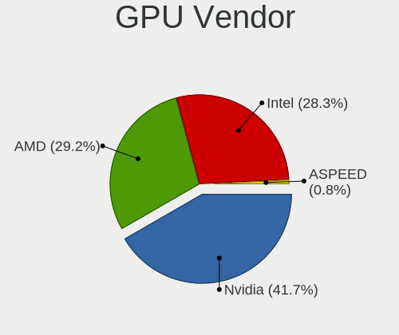

| Vendor | Desktops | Percent |
|--------|----------|---------|
| Nvidia | 64       | 41.56%  |
| Intel  | 51       | 33.12%  |
| AMD    | 39       | 25.32%  |

GPU Model
---------

Graphics card models

| Model                                                                       | Desktops | Percent |
|-----------------------------------------------------------------------------|----------|---------|
| Intel CoffeeLake-S GT2 [UHD Graphics 630]                                   | 10       | 6.37%   |
| Intel HD Graphics 530                                                       | 9        | 5.73%   |
| Intel Xeon E3-1200 v3/4th Gen Core Processor Integrated Graphics Controller | 6        | 3.82%   |
| Intel Xeon E3-1200 v2/3rd Gen Core processor Graphics Controller            | 6        | 3.82%   |
| Nvidia TU117 [GeForce GTX 1650]                                             | 5        | 3.18%   |
| Nvidia GK208B [GeForce GT 710]                                              | 5        | 3.18%   |
| Intel 2nd Generation Core Processor Family Integrated Graphics Controller   | 5        | 3.18%   |
| AMD Ellesmere [Radeon RX 470/480/570/570X/580/580X/590]                     | 5        | 3.18%   |
| Nvidia GM206 [GeForce GTX 960]                                              | 4        | 2.55%   |
| Nvidia GK208B [GeForce GT 730]                                              | 4        | 2.55%   |
| Nvidia TU116 [GeForce GTX 1660 SUPER]                                       | 3        | 1.91%   |
| Nvidia GP107 [GeForce GTX 1050 Ti]                                          | 3        | 1.91%   |
| AMD Navi 23 [Radeon RX 6600/6600 XT/6600M]                                  | 3        | 1.91%   |
| Nvidia TU104 [GeForce RTX 2070 SUPER]                                       | 2        | 1.27%   |
| Nvidia GT218 [GeForce 210]                                                  | 2        | 1.27%   |
| Nvidia GP108 [GeForce GT 1030]                                              | 2        | 1.27%   |
| Nvidia GP107 [GeForce GTX 1050]                                             | 2        | 1.27%   |
| Nvidia GK106 [GeForce GTX 660]                                              | 2        | 1.27%   |
| Nvidia GK104 [GeForce GTX 760]                                              | 2        | 1.27%   |
| Nvidia GF108 [GeForce GT 730]                                               | 2        | 1.27%   |
| Nvidia G98 [GeForce 8400 GS Rev. 2]                                         | 2        | 1.27%   |
| Intel IvyBridge GT2 [HD Graphics 4000]                                      | 2        | 1.27%   |
| Intel HD Graphics 630                                                       | 2        | 1.27%   |
| Intel HD Graphics 510                                                       | 2        | 1.27%   |
| AMD Oland XT [Radeon HD 8670 / R5 340X OEM / R7 250/350/350X OEM]           | 2        | 1.27%   |
| AMD Navi 21 [Radeon RX 6800/6800 XT / 6900 XT]                              | 2        | 1.27%   |
| AMD Navi 10 [Radeon RX 5600 OEM/5600 XT / 5700/5700 XT]                     | 2        | 1.27%   |
| AMD Cedar [Radeon HD 5000/6000/7350/8350 Series]                            | 2        | 1.27%   |
| AMD Caicos PRO [Radeon HD 7450]                                             | 2        | 1.27%   |
| AMD Baffin [Radeon RX 550 640SP / RX 560/560X]                              | 2        | 1.27%   |
| Nvidia TU116 [GeForce GTX 1660]                                             | 1        | 0.64%   |
| Nvidia TU106 [GeForce RTX 2060 Rev. A]                                      | 1        | 0.64%   |
| Nvidia TU104 [GeForce RTX 2060]                                             | 1        | 0.64%   |
| Nvidia TU102 [GeForce RTX 2080 Ti Rev. A]                                   | 1        | 0.64%   |
| Nvidia GT218 [ION]                                                          | 1        | 0.64%   |
| Nvidia GP106GL [Quadro P2000]                                               | 1        | 0.64%   |
| Nvidia GM206 [GeForce GTX 950]                                              | 1        | 0.64%   |
| Nvidia GM107 [GeForce GTX 750 Ti]                                           | 1        | 0.64%   |
| Nvidia GK208B [GeForce GT 720]                                              | 1        | 0.64%   |
| Nvidia GK107GL [Quadro K420]                                                | 1        | 0.64%   |

GPU Combo
---------

Combinations of graphics cards

| Name           | Desktops | Percent |
|----------------|----------|---------|
| 1 x Nvidia     | 58       | 40%     |
| 1 x Intel      | 42       | 28.97%  |
| 1 x AMD        | 37       | 25.52%  |
| Intel + Nvidia | 4        | 2.76%   |
| 2 x AMD        | 2        | 1.38%   |
| 2 x Nvidia     | 1        | 0.69%   |
| 2 x Intel      | 1        | 0.69%   |

GPU Driver
----------

Free vs proprietary

| Driver      | Desktops | Percent |
|-------------|----------|---------|
| Free        | 117      | 80.69%  |
| Proprietary | 21       | 14.48%  |
| Unknown     | 7        | 4.83%   |

GPU Memory
----------

Total video memory

| Size in GB | Desktops | Percent |
|------------|----------|---------|
| Unknown    | 64       | 44.14%  |
| 1.01-2.0   | 19       | 13.1%   |
| 0.51-1.0   | 16       | 11.03%  |
| 7.01-8.0   | 13       | 8.97%   |
| 3.01-4.0   | 12       | 8.28%   |
| 0.01-0.5   | 7        | 4.83%   |
| 5.01-6.0   | 6        | 4.14%   |
| 8.01-16.0  | 5        | 3.45%   |
| 4.01-5.0   | 1        | 0.69%   |
| 2.01-3.0   | 1        | 0.69%   |
| 16.01-24.0 | 1        | 0.69%   |

Monitor
-------

Monitor Vendor
--------------

Monitor vendors

| Vendor               | Desktops | Percent |
|----------------------|----------|---------|
| Samsung Electronics  | 29       | 17.79%  |
| Iiyama               | 16       | 9.82%   |
| Acer                 | 15       | 9.2%    |
| Hewlett-Packard      | 14       | 8.59%   |
| Dell                 | 14       | 8.59%   |
| Philips              | 12       | 7.36%   |
| Goldstar             | 11       | 6.75%   |
| AOC                  | 9        | 5.52%   |
| Ancor Communications | 5        | 3.07%   |
| Sony                 | 4        | 2.45%   |
| ASUSTek Computer     | 4        | 2.45%   |
| Packard Bell         | 3        | 1.84%   |
| Lenovo               | 3        | 1.84%   |
| BenQ                 | 3        | 1.84%   |
| NECCI                | 2        | 1.23%   |
| Denver               | 2        | 1.23%   |
| Vita                 | 1        | 0.61%   |
| ViewSonic            | 1        | 0.61%   |
| Unknown              | 1        | 0.61%   |
| Toshiba              | 1        | 0.61%   |
| SNC                  | 1        | 0.61%   |
| Plain Tree Systems   | 1        | 0.61%   |
| MSI                  | 1        | 0.61%   |
| KON                  | 1        | 0.61%   |
| IBM                  | 1        | 0.61%   |
| HPN                  | 1        | 0.61%   |
| Hitachi              | 1        | 0.61%   |
| Fujitsu Siemens      | 1        | 0.61%   |
| EXP                  | 1        | 0.61%   |
| Compaq Computer      | 1        | 0.61%   |
| CHI                  | 1        | 0.61%   |
| Apple                | 1        | 0.61%   |
| Unknown              | 1        | 0.61%   |

Monitor Model
-------------

Monitor models

| Model                                                                   | Desktops | Percent |
|-------------------------------------------------------------------------|----------|---------|
| Samsung Electronics C24F390 SAM0D2C 1920x1080 521x293mm 23.5-inch       | 3        | 1.75%   |
| Philips PHL 276E8V PHLC18F 3840x2160 597x336mm 27.0-inch                | 3        | 1.75%   |
| AOC 27G2G4 AOC2702 1920x1080 598x336mm 27.0-inch                        | 3        | 1.75%   |
| Samsung Electronics S24D330 SAM0D92 1920x1080 531x299mm 24.0-inch       | 2        | 1.17%   |
| Samsung Electronics C27F390 SAM0D32 1920x1080 598x336mm 27.0-inch       | 2        | 1.17%   |
| NECCI MAE190W NCI5050 1440x900 410x256mm 19.0-inch                      | 2        | 1.17%   |
| Dell S2721DGF DEL41D9 2560x1440 597x336mm 27.0-inch                     | 2        | 1.17%   |
| ASUSTek Computer VG245 AUS24A1 1920x1080 531x299mm 24.0-inch            | 2        | 1.17%   |
| AOC 24G2W1G4 AOC2402 1920x1080 527x296mm 23.8-inch                      | 2        | 1.17%   |
| Ancor Communications VX228 ACI22C1 1920x1080 476x268mm 21.5-inch        | 2        | 1.17%   |
| Acer V193 ACR00F7 1280x1024 380x310mm 19.3-inch                         | 2        | 1.17%   |
| Vita LCD Monitor VIT0780 1920x1080                                      | 1        | 0.58%   |
| ViewSonic VX2458-mhd VSC0437 1920x1080 521x293mm 23.5-inch              | 1        | 0.58%   |
| Unknown LCD Monitor FFFF 2288x1287 2550x2550mm 142.0-inch               | 1        | 0.58%   |
| Toshiba TV TSB0109 1920x1080                                            | 1        | 0.58%   |
| Sony TV XV SNY5C01 1920x1080                                            | 1        | 0.58%   |
| Sony TV SNY3002 1920x1080 708x398mm 32.0-inch                           | 1        | 0.58%   |
| Sony SDM-E96D SNYB400 1280x1024 376x301mm 19.0-inch                     | 1        | 0.58%   |
| Sony AVSYSTEM SNY050C 1280x720 708x398mm 32.0-inch                      | 1        | 0.58%   |
| SNC SKP_E30-32 SNC3203 1920x1080 854x480mm 38.6-inch                    | 1        | 0.58%   |
| Samsung Electronics U28E590 SAM0C4D 3840x2160 607x345mm 27.5-inch       | 1        | 0.58%   |
| Samsung Electronics U28E570 SAM0D71 3840x2160 608x345mm 27.5-inch       | 1        | 0.58%   |
| Samsung Electronics SyncMaster SAM059A 1920x1080 480x270mm 21.7-inch    | 1        | 0.58%   |
| Samsung Electronics SyncMaster SAM04DD 1920x1080 477x268mm 21.5-inch    | 1        | 0.58%   |
| Samsung Electronics SyncMaster SAM03E6 1920x1200 550x340mm 25.5-inch    | 1        | 0.58%   |
| Samsung Electronics SyncMaster SAM0366 1280x1024 338x270mm 17.0-inch    | 1        | 0.58%   |
| Samsung Electronics SyncMaster SAM022B 1280x1024 338x270mm 17.0-inch    | 1        | 0.58%   |
| Samsung Electronics SyncMaster SAM01E1 1280x1024 376x301mm 19.0-inch    | 1        | 0.58%   |
| Samsung Electronics SMS19A450 SAM0833 1440x900 408x255mm 18.9-inch      | 1        | 0.58%   |
| Samsung Electronics SMBX2450 SAM0722 1920x1080 531x299mm 24.0-inch      | 1        | 0.58%   |
| Samsung Electronics S34J55x SAM0F72 3440x1440 797x333mm 34.0-inch       | 1        | 0.58%   |
| Samsung Electronics S34J55x SAM0F70 3440x1440 797x333mm 34.0-inch       | 1        | 0.58%   |
| Samsung Electronics S32F351 SAM0D24 1920x1080 698x393mm 31.5-inch       | 1        | 0.58%   |
| Samsung Electronics S27F350 SAM0D22 1920x1080 600x340mm 27.2-inch       | 1        | 0.58%   |
| Samsung Electronics S27C350 SAM0A3E 1920x1080 600x340mm 27.2-inch       | 1        | 0.58%   |
| Samsung Electronics S24F350 SAM0D20 1920x1080 521x293mm 23.5-inch       | 1        | 0.58%   |
| Samsung Electronics S22B300 SAM08AB 1920x1080 477x268mm 21.5-inch       | 1        | 0.58%   |
| Samsung Electronics LCD Monitor SAM7016 3840x2160 1872x1053mm 84.6-inch | 1        | 0.58%   |
| Samsung Electronics LCD Monitor SAM0B60 1920x1080 887x500mm 40.1-inch   | 1        | 0.58%   |
| Samsung Electronics LCD Monitor SAM0B30 1920x1080 480x270mm 21.7-inch   | 1        | 0.58%   |

Monitor Resolution
------------------

Monitor screen resolution

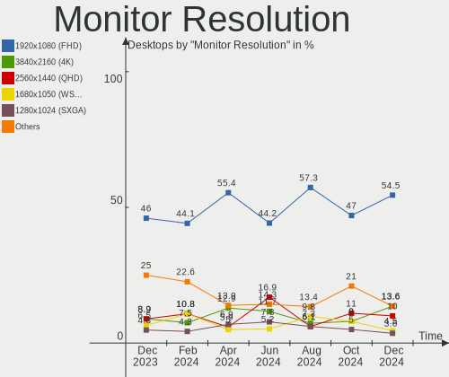

| Resolution         | Desktops | Percent |
|--------------------|----------|---------|
| 1920x1080 (FHD)    | 80       | 51.61%  |
| 2560x1440 (QHD)    | 16       | 10.32%  |
| 3840x2160 (4K)     | 15       | 9.68%   |
| 1280x1024 (SXGA)   | 13       | 8.39%   |
| 1440x900 (WXGA+)   | 7        | 4.52%   |
| 1680x1050 (WSXGA+) | 4        | 2.58%   |
| 1360x768           | 4        | 2.58%   |
| 3440x1440          | 3        | 1.94%   |
| 1920x1200 (WUXGA)  | 2        | 1.29%   |
| 1600x900 (HD+)     | 2        | 1.29%   |
| 1366x768 (WXGA)    | 2        | 1.29%   |
| 5760x1080          | 1        | 0.65%   |
| 3840x1600          | 1        | 0.65%   |
| 2560x1600          | 1        | 0.65%   |
| 2560x1080          | 1        | 0.65%   |
| 2288x1287          | 1        | 0.65%   |
| 1280x720 (HD)      | 1        | 0.65%   |
| Unknown            | 1        | 0.65%   |

Monitor Diagonal
----------------

Diagonal size in inches

| Inches  | Desktops | Percent |
|---------|----------|---------|
| 27      | 27       | 16.77%  |
| 23      | 26       | 16.15%  |
| 21      | 22       | 13.66%  |
| 24      | 21       | 13.04%  |
| 19      | 14       | 8.7%    |
| 31      | 8        | 4.97%   |
| 17      | 6        | 3.73%   |
| 18      | 5        | 3.11%   |
| 34      | 4        | 2.48%   |
| 40      | 3        | 1.86%   |
| Unknown | 3        | 1.86%   |
| 84      | 2        | 1.24%   |
| 72      | 2        | 1.24%   |
| 54      | 2        | 1.24%   |
| 39      | 2        | 1.24%   |
| 25      | 2        | 1.24%   |
| 22      | 2        | 1.24%   |
| 20      | 2        | 1.24%   |
| 142     | 1        | 0.62%   |
| 52      | 1        | 0.62%   |
| 38      | 1        | 0.62%   |
| 37      | 1        | 0.62%   |
| 36      | 1        | 0.62%   |
| 32      | 1        | 0.62%   |
| 29      | 1        | 0.62%   |
| 15      | 1        | 0.62%   |

Monitor Width
-------------

Physical width

| Width in mm    | Desktops | Percent |
|----------------|----------|---------|
| 501-600        | 69       | 44.23%  |
| 401-500        | 38       | 24.36%  |
| 601-700        | 12       | 7.69%   |
| 801-900        | 7        | 4.49%   |
| 301-350        | 7        | 4.49%   |
| 701-800        | 6        | 3.85%   |
| 351-400        | 6        | 3.85%   |
| 1501-2000      | 4        | 2.56%   |
| 1001-1500      | 3        | 1.92%   |
| Unknown        | 3        | 1.92%   |
| More than 2000 | 1        | 0.64%   |

Aspect Ratio
------------

Proportional relationship between the width and the height

| Ratio   | Desktops | Percent |
|---------|----------|---------|
| 16/9    | 107      | 73.29%  |
| 16/10   | 18       | 12.33%  |
| 5/4     | 8        | 5.48%   |
| 21/9    | 5        | 3.42%   |
| 6/5     | 4        | 2.74%   |
| Unknown | 2        | 1.37%   |
| 4/3     | 1        | 0.68%   |
| 1.00    | 1        | 0.68%   |

Monitor Area
------------

Area in inch²

| Area in inch² | Desktops | Percent |
|----------------|----------|---------|
| 201-250        | 59       | 37.58%  |
| 301-350        | 27       | 17.2%   |
| 151-200        | 21       | 13.38%  |
| 351-500        | 14       | 8.92%   |
| 141-150        | 9        | 5.73%   |
| More than 1000 | 8        | 5.1%    |
| 501-1000       | 8        | 5.1%    |
| 251-300        | 7        | 4.46%   |
| Unknown        | 3        | 1.91%   |
| 111-120        | 1        | 0.64%   |

Pixel Density
-------------

Pixels per inch

| Density | Desktops | Percent |
|---------|----------|---------|
| 51-100  | 97       | 62.99%  |
| 101-120 | 35       | 22.73%  |
| 1-50    | 8        | 5.19%   |
| 121-160 | 7        | 4.55%   |
| 161-240 | 4        | 2.6%    |
| Unknown | 3        | 1.95%   |

Multiple Monitors
-----------------

Total monitors connected

| Total | Desktops | Percent |
|-------|----------|---------|
| 1     | 103      | 71.03%  |
| 2     | 30       | 20.69%  |
| 0     | 9        | 6.21%   |
| 3     | 3        | 2.07%   |

Network
-------

Net Controller Vendor
---------------------

Controller vendors

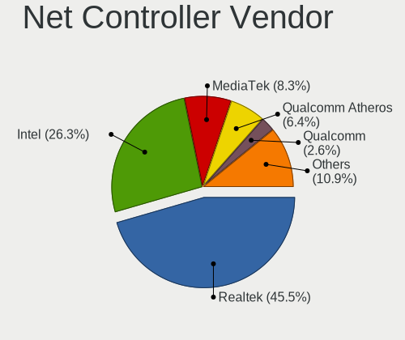

| Vendor                   | Desktops | Percent |
|--------------------------|----------|---------|
| Realtek Semiconductor    | 84       | 43.75%  |
| Intel                    | 70       | 36.46%  |
| Qualcomm Atheros         | 12       | 6.25%   |
| Broadcom                 | 6        | 3.13%   |
| Ralink Technology        | 2        | 1.04%   |
| Nvidia                   | 2        | 1.04%   |
| Microsoft                | 2        | 1.04%   |
| VIA Technologies         | 1        | 0.52%   |
| TP-Link                  | 1        | 0.52%   |
| Ralink                   | 1        | 0.52%   |
| QinHeng Electronics      | 1        | 0.52%   |
| Oculus VR                | 1        | 0.52%   |
| MediaTek                 | 1        | 0.52%   |
| Lenovo                   | 1        | 0.52%   |
| HTC (High Tech Computer) | 1        | 0.52%   |
| Gemtek                   | 1        | 0.52%   |
| DisplayLink              | 1        | 0.52%   |
| D-Link System            | 1        | 0.52%   |
| Broadcom Limited         | 1        | 0.52%   |
| Belkin Components        | 1        | 0.52%   |
| ASUSTek Computer         | 1        | 0.52%   |

Net Controller Model
--------------------

Controller models

| Model                                                             | Desktops | Percent |
|-------------------------------------------------------------------|----------|---------|
| Realtek RTL8111/8168/8411 PCI Express Gigabit Ethernet Controller | 59       | 26.82%  |
| Realtek RTL8125 2.5GbE Controller                                 | 12       | 5.45%   |
| Intel Wi-Fi 6 AX200                                               | 11       | 5%      |
| Intel Ethernet Connection (7) I219-V                              | 9        | 4.09%   |
| Intel Ethernet Connection (2) I219-V                              | 7        | 3.18%   |
| Intel Ethernet Connection (2) I219-LM                             | 7        | 3.18%   |
| Intel 82579LM Gigabit Network Connection (Lewisville)             | 6        | 2.73%   |
| Intel Ethernet Controller I225-V                                  | 5        | 2.27%   |
| Intel Ethernet Connection I217-LM                                 | 5        | 2.27%   |
| Intel Cannon Lake PCH CNVi WiFi                                   | 4        | 1.82%   |
| Realtek RTL810xE PCI Express Fast Ethernet controller             | 3        | 1.36%   |
| Qualcomm Atheros AR8161 Gigabit Ethernet                          | 3        | 1.36%   |
| Intel Wireless 7260                                               | 3        | 1.36%   |
| Intel I211 Gigabit Network Connection                             | 3        | 1.36%   |
| Intel Ethernet Connection (7) I219-LM                             | 3        | 1.36%   |
| Intel Ethernet Connection (2) I218-V                              | 3        | 1.36%   |
| Realtek RTL88x2bu [AC1200 Techkey]                                | 2        | 0.91%   |
| Realtek RTL8821CE 802.11ac PCIe Wireless Network Adapter          | 2        | 0.91%   |
| Realtek RTL8191SU 802.11n WLAN Adapter                            | 2        | 0.91%   |
| Realtek RTL8188EUS 802.11n Wireless Network Adapter               | 2        | 0.91%   |
| Realtek RTL8188CUS 802.11n WLAN Adapter                           | 2        | 0.91%   |
| Qualcomm Atheros Killer E220x Gigabit Ethernet Controller         | 2        | 0.91%   |
| Qualcomm Atheros AR9287 Wireless Network Adapter (PCI-Express)    | 2        | 0.91%   |
| Intel Ethernet Connection I217-V                                  | 2        | 0.91%   |
| Broadcom NetXtreme BCM5754 Gigabit Ethernet PCI Express           | 2        | 0.91%   |
| VIA VT6102/VT6103 [Rhine-II]                                      | 1        | 0.45%   |
| TP-Link 802.11ac NIC                                              | 1        | 0.45%   |
| Realtek RTL8822BE 802.11a/b/g/n/ac WiFi adapter                   | 1        | 0.45%   |
| Realtek RTL8821AE 802.11ac PCIe Wireless Network Adapter          | 1        | 0.45%   |
| Realtek RTL8812AE 802.11ac PCIe Wireless Network Adapter          | 1        | 0.45%   |
| Realtek RTL8192EU 802.11b/g/n WLAN Adapter                        | 1        | 0.45%   |
| Realtek RTL8192EE PCIe Wireless Network Adapter                   | 1        | 0.45%   |
| Realtek RTL8192CE PCIe Wireless Network Adapter                   | 1        | 0.45%   |
| Realtek RTL8188CE 802.11b/g/n WiFi Adapter                        | 1        | 0.45%   |
| Realtek RTL8153 Gigabit Ethernet Adapter                          | 1        | 0.45%   |
| Realtek RTL8152 Fast Ethernet Adapter                             | 1        | 0.45%   |
| Realtek RTL-8185 IEEE 802.11a/b/g Wireless LAN Controller         | 1        | 0.45%   |
| Realtek 802.11ac NIC                                              | 1        | 0.45%   |
| Ralink RT5370 Wireless Adapter                                    | 1        | 0.45%   |
| Ralink RT2501/RT2573 Wireless Adapter                             | 1        | 0.45%   |

Wireless Vendor
---------------

Wireless vendors

| Vendor                | Desktops | Percent |
|-----------------------|----------|---------|
| Intel                 | 25       | 42.37%  |
| Realtek Semiconductor | 18       | 30.51%  |
| Qualcomm Atheros      | 5        | 8.47%   |
| Ralink Technology     | 2        | 3.39%   |
| Microsoft             | 2        | 3.39%   |
| TP-Link               | 1        | 1.69%   |
| Ralink                | 1        | 1.69%   |
| MediaTek              | 1        | 1.69%   |
| Gemtek                | 1        | 1.69%   |
| Broadcom              | 1        | 1.69%   |
| Belkin Components     | 1        | 1.69%   |
| ASUSTek Computer      | 1        | 1.69%   |

Wireless Model
--------------

Wireless models

| Model                                                                                 | Desktops | Percent |
|---------------------------------------------------------------------------------------|----------|---------|
| Intel Wi-Fi 6 AX200                                                                   | 11       | 18.33%  |
| Intel Cannon Lake PCH CNVi WiFi                                                       | 4        | 6.67%   |
| Intel Wireless 7260                                                                   | 3        | 5%      |
| Realtek RTL88x2bu [AC1200 Techkey]                                                    | 2        | 3.33%   |
| Realtek RTL8821CE 802.11ac PCIe Wireless Network Adapter                              | 2        | 3.33%   |
| Realtek RTL8191SU 802.11n WLAN Adapter                                                | 2        | 3.33%   |
| Realtek RTL8188EUS 802.11n Wireless Network Adapter                                   | 2        | 3.33%   |
| Realtek RTL8188CUS 802.11n WLAN Adapter                                               | 2        | 3.33%   |
| Qualcomm Atheros AR9287 Wireless Network Adapter (PCI-Express)                        | 2        | 3.33%   |
| TP-Link 802.11ac NIC                                                                  | 1        | 1.67%   |
| Realtek RTL8822BE 802.11a/b/g/n/ac WiFi adapter                                       | 1        | 1.67%   |
| Realtek RTL8821AE 802.11ac PCIe Wireless Network Adapter                              | 1        | 1.67%   |
| Realtek RTL8812AE 802.11ac PCIe Wireless Network Adapter                              | 1        | 1.67%   |
| Realtek RTL8192EU 802.11b/g/n WLAN Adapter                                            | 1        | 1.67%   |
| Realtek RTL8192EE PCIe Wireless Network Adapter                                       | 1        | 1.67%   |
| Realtek RTL8192CE PCIe Wireless Network Adapter                                       | 1        | 1.67%   |
| Realtek RTL8188CE 802.11b/g/n WiFi Adapter                                            | 1        | 1.67%   |
| Realtek RTL-8185 IEEE 802.11a/b/g Wireless LAN Controller                             | 1        | 1.67%   |
| Realtek 802.11ac NIC                                                                  | 1        | 1.67%   |
| Ralink RT5370 Wireless Adapter                                                        | 1        | 1.67%   |
| Ralink RT2501/RT2573 Wireless Adapter                                                 | 1        | 1.67%   |
| Ralink RT3062 Wireless 802.11n 2T/2R                                                  | 1        | 1.67%   |
| Qualcomm Atheros AR9462 Wireless Network Adapter                                      | 1        | 1.67%   |
| Qualcomm Atheros AR922X Wireless Network Adapter                                      | 1        | 1.67%   |
| Qualcomm Atheros AR5416 Wireless Network Adapter [AR5008 802.11(a)bgn]                | 1        | 1.67%   |
| Microsoft XBOX ACC                                                                    | 1        | 1.67%   |
| Microsoft Xbox 360 Wireless Adapter                                                   | 1        | 1.67%   |
| MediaTek MT7921K (RZ608) Wi-Fi 6E 80MHz                                               | 1        | 1.67%   |
| Intel Wireless-AC 9260                                                                | 1        | 1.67%   |
| Intel Wireless 7265                                                                   | 1        | 1.67%   |
| Intel Wireless 3165                                                                   | 1        | 1.67%   |
| Intel Tiger Lake PCH CNVi WiFi                                                        | 1        | 1.67%   |
| Intel Comet Lake PCH CNVi WiFi                                                        | 1        | 1.67%   |
| Intel Centrino Advanced-N 6230 [Rainbow Peak]                                         | 1        | 1.67%   |
| Intel Alder Lake-S PCH CNVi WiFi                                                      | 1        | 1.67%   |
| Gemtek WUBR-177G [Ralink RT2571W]                                                     | 1        | 1.67%   |
| Broadcom BCM4360 802.11ac Wireless Network Adapter                                    | 1        | 1.67%   |
| Belkin Components F7D1102 N150/Surf Micro Wireless Adapter v1000 [Realtek RTL8188CUS] | 1        | 1.67%   |
| ASUS 802.11ac NIC                                                                     | 1        | 1.67%   |

Ethernet Vendor
---------------

Ethernet vendors

| Vendor                   | Desktops | Percent |
|--------------------------|----------|---------|
| Realtek Semiconductor    | 74       | 48.05%  |
| Intel                    | 60       | 38.96%  |
| Qualcomm Atheros         | 7        | 4.55%   |
| Broadcom                 | 5        | 3.25%   |
| Nvidia                   | 2        | 1.3%    |
| VIA Technologies         | 1        | 0.65%   |
| Lenovo                   | 1        | 0.65%   |
| HTC (High Tech Computer) | 1        | 0.65%   |
| DisplayLink              | 1        | 0.65%   |
| D-Link System            | 1        | 0.65%   |
| Broadcom Limited         | 1        | 0.65%   |

Ethernet Model
--------------

Ethernet models

| Model                                                             | Desktops | Percent |
|-------------------------------------------------------------------|----------|---------|
| Realtek RTL8111/8168/8411 PCI Express Gigabit Ethernet Controller | 59       | 37.34%  |
| Realtek RTL8125 2.5GbE Controller                                 | 12       | 7.59%   |
| Intel Ethernet Connection (7) I219-V                              | 9        | 5.7%    |
| Intel Ethernet Connection (2) I219-V                              | 7        | 4.43%   |
| Intel Ethernet Connection (2) I219-LM                             | 7        | 4.43%   |
| Intel 82579LM Gigabit Network Connection (Lewisville)             | 6        | 3.8%    |
| Intel Ethernet Controller I225-V                                  | 5        | 3.16%   |
| Intel Ethernet Connection I217-LM                                 | 5        | 3.16%   |
| Realtek RTL810xE PCI Express Fast Ethernet controller             | 3        | 1.9%    |
| Qualcomm Atheros AR8161 Gigabit Ethernet                          | 3        | 1.9%    |
| Intel I211 Gigabit Network Connection                             | 3        | 1.9%    |
| Intel Ethernet Connection (7) I219-LM                             | 3        | 1.9%    |
| Intel Ethernet Connection (2) I218-V                              | 3        | 1.9%    |
| Qualcomm Atheros Killer E220x Gigabit Ethernet Controller         | 2        | 1.27%   |
| Intel Ethernet Connection I217-V                                  | 2        | 1.27%   |
| Broadcom NetXtreme BCM5754 Gigabit Ethernet PCI Express           | 2        | 1.27%   |
| VIA VT6102/VT6103 [Rhine-II]                                      | 1        | 0.63%   |
| Realtek RTL8153 Gigabit Ethernet Adapter                          | 1        | 0.63%   |
| Realtek RTL8152 Fast Ethernet Adapter                             | 1        | 0.63%   |
| Qualcomm Atheros QCA8171 Gigabit Ethernet                         | 1        | 0.63%   |
| Qualcomm Atheros AR8121/AR8113/AR8114 Gigabit or Fast Ethernet    | 1        | 0.63%   |
| Nvidia MCP73 Ethernet                                             | 1        | 0.63%   |
| Nvidia MCP61 Ethernet                                             | 1        | 0.63%   |
| Lenovo TB-X606F                                                   | 1        | 0.63%   |
| Intel I210 Gigabit Network Connection                             | 1        | 0.63%   |
| Intel Ethernet Connection (5) I219-LM                             | 1        | 0.63%   |
| Intel Ethernet Connection (17) I219-V                             | 1        | 0.63%   |
| Intel Ethernet Connection (14) I219-V                             | 1        | 0.63%   |
| Intel Ethernet Connection (12) I219-V                             | 1        | 0.63%   |
| Intel Ethernet Connection (10) I219-V                             | 1        | 0.63%   |
| Intel 82599 10 Gigabit Network Connection                         | 1        | 0.63%   |
| Intel 82583V Gigabit Network Connection                           | 1        | 0.63%   |
| Intel 82574L Gigabit Network Connection                           | 1        | 0.63%   |
| Intel 82567LM-3 Gigabit Network Connection                        | 1        | 0.63%   |
| Intel 82566DC-2 Gigabit Network Connection                        | 1        | 0.63%   |
| HTC (High Tech Computer) L-EMENT 350                              | 1        | 0.63%   |
| DisplayLink ThinkPad USB 3.0 Pro Dock                             | 1        | 0.63%   |
| D-Link System DGE-528T Gigabit Ethernet Adapter                   | 1        | 0.63%   |
| Broadcom NetXtreme BCM5761 Gigabit Ethernet PCIe                  | 1        | 0.63%   |
| Broadcom NetXtreme BCM5755 Gigabit Ethernet PCI Express           | 1        | 0.63%   |

Net Controller Kind
-------------------

Ethernet, WiFi or modem

| Kind     | Desktops | Percent |
|----------|----------|---------|
| Ethernet | 145      | 71.08%  |
| WiFi     | 57       | 27.94%  |
| Modem    | 2        | 0.98%   |

Used Controller
---------------

Currently used network controller

| Kind     | Desktops | Percent |
|----------|----------|---------|
| Ethernet | 128      | 86.49%  |
| WiFi     | 20       | 13.51%  |

NICs
----

Total network controllers on board

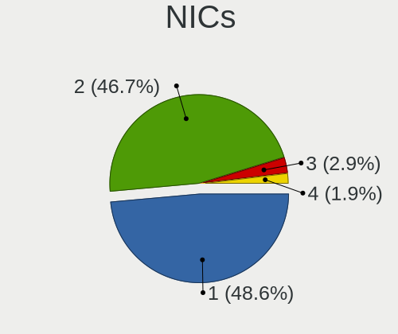

| Total | Desktops | Percent |
|-------|----------|---------|
| 1     | 96       | 66.21%  |
| 2     | 46       | 31.72%  |
| 3     | 3        | 2.07%   |

IPv6
----

IPv6 vs IPv4

| Used | Desktops | Percent |
|------|----------|---------|
| Yes  | 82       | 56.55%  |
| No   | 63       | 43.45%  |

Bluetooth
---------

Bluetooth Vendor
----------------

Controller vendors

| Vendor                  | Desktops | Percent |
|-------------------------|----------|---------|
| Intel                   | 21       | 48.84%  |
| Cambridge Silicon Radio | 11       | 25.58%  |
| Realtek Semiconductor   | 3        | 6.98%   |
| Broadcom                | 2        | 4.65%   |
| ASUSTek Computer        | 2        | 4.65%   |
| TP-Link                 | 1        | 2.33%   |
| MediaTek                | 1        | 2.33%   |
| IMC Networks            | 1        | 2.33%   |
| Belkin Components       | 1        | 2.33%   |

Bluetooth Model
---------------

Controller models

| Model                                               | Desktops | Percent |
|-----------------------------------------------------|----------|---------|
| Cambridge Silicon Radio Bluetooth Dongle (HCI mode) | 11       | 25.58%  |
| Intel AX200 Bluetooth                               | 8        | 18.6%   |
| Intel Bluetooth 9460/9560 Jefferson Peak (JfP)      | 5        | 11.63%  |
| Intel Bluetooth wireless interface                  | 4        | 9.3%    |
| Realtek Bluetooth Radio                             | 3        | 6.98%   |
| Intel Bluetooth Device                              | 2        | 4.65%   |
| TP-Link TPuLink UB500 Adapter                       | 1        | 2.33%   |
| MediaTek Wireless_Device                            | 1        | 2.33%   |
| Intel Wireless-AC 9260 Bluetooth Adapter            | 1        | 2.33%   |
| Intel Centrino Advanced-N 6230 Bluetooth adapter    | 1        | 2.33%   |
| IMC Networks Bluetooth Radio                        | 1        | 2.33%   |
| Broadcom Bluetooth 3.0 Device                       | 1        | 2.33%   |
| Broadcom BCM92046DG-CL1ROM Bluetooth 2.1 Adapter    | 1        | 2.33%   |
| Belkin Components Bluetooth Mini Dongle             | 1        | 2.33%   |
| ASUS Bluetooth Radio                                | 1        | 2.33%   |
| ASUS ASUS USB-BT500                                 | 1        | 2.33%   |

Sound
-----

Sound Vendor
------------

Sound card vendors

| Vendor                  | Desktops | Percent |
|-------------------------|----------|---------|
| Intel                   | 98       | 38.58%  |
| Nvidia                  | 61       | 24.02%  |
| AMD                     | 56       | 22.05%  |
| Logitech                | 5        | 1.97%   |
| Creative Labs           | 4        | 1.57%   |
| C-Media Electronics     | 4        | 1.57%   |
| ASUSTek Computer        | 3        | 1.18%   |
| Kingston Technology     | 2        | 0.79%   |
| VIA Technologies        | 1        | 0.39%   |
| Trust                   | 1        | 0.39%   |
| Razer USA               | 1        | 0.39%   |
| Polycom                 | 1        | 0.39%   |
| Plantronics             | 1        | 0.39%   |
| Philips (or NXP)        | 1        | 0.39%   |
| Microsoft               | 1        | 0.39%   |
| M2Tech                  | 1        | 0.39%   |
| KORG                    | 1        | 0.39%   |
| JMTek                   | 1        | 0.39%   |
| GN Netcom               | 1        | 0.39%   |
| Generalplus Technology  | 1        | 0.39%   |
| Focusrite-Novation      | 1        | 0.39%   |
| EGO SYStems             | 1        | 0.39%   |
| DSEA A/S                | 1        | 0.39%   |
| Dell                    | 1        | 0.39%   |
| Corsair Components     | 1        | 0.39%   |
| BEHRINGER International | 1        | 0.39%   |
| Behringer               | 1        | 0.39%   |
| AlfaPlus Semiconductor  | 1        | 0.39%   |
| Alesis                  | 1        | 0.39%   |

Sound Model
-----------

Sound card models

| Model                                                                             | Desktops | Percent |
|-----------------------------------------------------------------------------------|----------|---------|
| AMD Starship/Matisse HD Audio Controller                                          | 18       | 6.32%   |
| Intel 100 Series/C230 Series Chipset Family HD Audio Controller                   | 14       | 4.91%   |
| Intel Cannon Lake PCH cAVS                                                        | 13       | 4.56%   |
| Nvidia GK208 HDMI/DP Audio Controller                                             | 10       | 3.51%   |
| Intel 7 Series/C216 Chipset Family High Definition Audio Controller               | 10       | 3.51%   |
| Intel 6 Series/C200 Series Chipset Family High Definition Audio Controller        | 10       | 3.51%   |
| Intel 200 Series PCH HD Audio                                                     | 9        | 3.16%   |
| AMD SBx00 Azalia (Intel HDA)                                                      | 8        | 2.81%   |
| Intel Xeon E3-1200 v3/4th Gen Core Processor HD Audio Controller                  | 7        | 2.46%   |
| Intel 8 Series/C220 Series Chipset High Definition Audio Controller               | 7        | 2.46%   |
| AMD Family 17h (Models 00h-0fh) HD Audio Controller                               | 7        | 2.46%   |
| AMD Navi 21/23 HDMI/DP Audio Controller                                           | 6        | 2.11%   |
| Nvidia TU107 GeForce GTX 1650 High Definition Audio Controller                    | 5        | 1.75%   |
| Nvidia GP107GL High Definition Audio Controller                                   | 5        | 1.75%   |
| Nvidia GM206 High Definition Audio Controller                                     | 5        | 1.75%   |
| Intel 9 Series Chipset Family HD Audio Controller                                 | 5        | 1.75%   |
| AMD Family 17h/19h HD Audio Controller                                            | 5        | 1.75%   |
| AMD Ellesmere HDMI Audio [Radeon RX 470/480 / 570/580/590]                        | 5        | 1.75%   |
| Nvidia TU116 High Definition Audio Controller                                     | 4        | 1.4%    |
| Intel Tiger Lake-H HD Audio Controller                                            | 4        | 1.4%    |
| Intel Alder Lake-S HD Audio Controller                                            | 4        | 1.4%    |
| Intel 82801I (ICH9 Family) HD Audio Controller                                    | 4        | 1.4%    |
| AMD Renoir Radeon High Definition Audio Controller                                | 4        | 1.4%    |
| AMD Oland/Hainan/Cape Verde/Pitcairn HDMI Audio [Radeon HD 7000 Series]           | 4        | 1.4%    |
| Nvidia TU104 HD Audio Controller                                                  | 3        | 1.05%   |
| Nvidia High Definition Audio Controller                                           | 3        | 1.05%   |
| Nvidia GK106 HDMI Audio Controller                                                | 3        | 1.05%   |
| Nvidia GA104 High Definition Audio Controller                                     | 3        | 1.05%   |
| Intel C610/X99 series chipset HD Audio Controller                                 | 3        | 1.05%   |
| AMD Caicos HDMI Audio [Radeon HD 6450 / 7450/8450/8490 OEM / R5 230/235/235X OEM] | 3        | 1.05%   |
| Nvidia GP108 High Definition Audio Controller                                     | 2        | 0.7%    |
| Nvidia GK104 HDMI Audio Controller                                                | 2        | 0.7%    |
| Nvidia GF110 High Definition Audio Controller                                     | 2        | 0.7%    |
| Nvidia GF108 High Definition Audio Controller                                     | 2        | 0.7%    |
| Nvidia GA106 High Definition Audio Controller                                     | 2        | 0.7%    |
| Nvidia GA102 High Definition Audio Controller                                     | 2        | 0.7%    |
| Logitech PRO X                                                                    | 2        | 0.7%    |
| Kingston Technology HyperX 7.1 Audio                                              | 2        | 0.7%    |
| Intel Comet Lake PCH cAVS                                                         | 2        | 0.7%    |
| Intel Audio device                                                                | 2        | 0.7%    |

Memory
------

Memory Vendor
-------------

Memory module vendors

| Vendor              | Desktops | Percent |
|---------------------|----------|---------|
| Kingston            | 23       | 18.85%  |
| Samsung Electronics | 15       | 12.3%   |
| Corsair             | 15       | 12.3%   |
| Crucial             | 14       | 11.48%  |
| G.Skill             | 13       | 10.66%  |
| SK hynix            | 11       | 9.02%   |
| Unknown             | 9        | 7.38%   |
| Micron Technology   | 8        | 6.56%   |
| Ramaxel Technology  | 3        | 2.46%   |
| Nanya Technology    | 3        | 2.46%   |
| Unknown (0x0C97)    | 2        | 1.64%   |
| Unknown             | 2        | 1.64%   |
| Unifosa             | 1        | 0.82%   |
| Transcend           | 1        | 0.82%   |
| Timetec             | 1        | 0.82%   |
| TEXTORM             | 1        | 0.82%   |

Memory Model
------------

Memory module models

| Model                                                       | Desktops | Percent |
|-------------------------------------------------------------|----------|---------|
| Kingston RAM KHX2400C15/8G 8GB DIMM DDR4 3400MT/s           | 3        | 2.22%   |
| Kingston RAM KHX1866C10D3/8G 8192MB DIMM DDR3 2133MT/s      | 3        | 2.22%   |
| Kingston RAM KHX1600C9D3/4GX 4GB DIMM DDR3 2400MT/s         | 3        | 2.22%   |
| Corsair RAM CMK16GX4M2B3200C16 8GB DIMM DDR4 3600MT/s       | 3        | 2.22%   |
| Unknown (0x0C97) RAM TXU8G1M3200C16X 8GB DIMM DDR4 2667MT/s | 2        | 1.48%   |
| Samsung RAM M378B5173EB0-YK0 4GB DIMM DDR3 1600MT/s         | 2        | 1.48%   |
| Nanya RAM NT2GT64U8HD0BY-AD 2GB DIMM DDR2 2048MT/s          | 2        | 1.48%   |
| Corsair RAM CMK16GX4M2E3200C16 8GB DIMM DDR4 3200MT/s       | 2        | 1.48%   |
| Corsair RAM CMK16GX4M2B3000C15 8GB DIMM DDR4 3200MT/s       | 2        | 1.48%   |
| Unknown                                                     | 2        | 1.48%   |
| Unknown RAM Module 8GB DIMM 1600MT/s                        | 1        | 0.74%   |
| Unknown RAM Module 4GB DIMM DDR3 2133MT/s                   | 1        | 0.74%   |
| Unknown RAM Module 4GB DIMM 1066MT/s                        | 1        | 0.74%   |
| Unknown RAM Module 2GB DIMM DDR3 1066MT/s                   | 1        | 0.74%   |
| Unknown RAM Module 2GB DIMM DDR 667MT/s                     | 1        | 0.74%   |
| Unknown RAM Module 2GB DIMM DDR 1066MT/s                    | 1        | 0.74%   |
| Unknown RAM Module 2GB DIMM 800MT/s                         | 1        | 0.74%   |
| Unknown RAM Module 2GB DIMM 1066MT/s                        | 1        | 0.74%   |
| Unknown RAM Module 2048MB DIMM DDR2 400MT/s                 | 1        | 0.74%   |
| Unknown RAM Module 1GB DIMM DDR 667MT/s                     | 1        | 0.74%   |
| Unknown RAM Module 1GB DIMM 667MT/s                         | 1        | 0.74%   |
| Unknown RAM Module 1GB DIMM 1066MT/s                        | 1        | 0.74%   |
| Unifosa RAM HU524303EP0200 2GB DIMM DDR3 1333MT/s           | 1        | 0.74%   |
| Transcend RAM JM667QLU-2G 2GB DIMM DDR2 667MT/s             | 1        | 0.74%   |
| Timetec RAM UD3-1333 4GB DIMM DDR3 1333MT/s                 | 1        | 0.74%   |
| TEXTORM RAM TXU8G1M3200C16X 8GB DIMM DDR4 2666MT/s          | 1        | 0.74%   |
| SK hynix RAM Module 2GB DIMM DDR3 1333MT/s                  | 1        | 0.74%   |
| SK hynix RAM HYMP564U64BP8-C4 512MB DIMM DDR 533MT/s        | 1        | 0.74%   |
| SK hynix RAM HYMP151F72CP4N3-Y5 4096MB FB-DIMM DDR2 667MT/s | 1        | 0.74%   |
| SK hynix RAM HYMP112U72CP8-S6 1GB DIMM DDR2 800MT/s         | 1        | 0.74%   |
| SK hynix RAM HMT351U6CFR8C-PB 4GB DIMM DDR3 1800MT/s        | 1        | 0.74%   |
| SK hynix RAM HMA81GU6CJR8N-VK 8GB DIMM DDR4 2667MT/s        | 1        | 0.74%   |
| SK hynix RAM HMA81GU6AFR8N-UH 8192MB DIMM DDR4 2400MT/s     | 1        | 0.74%   |
| SK hynix RAM HMA81GS6AFR8N-UH 8192MB SODIMM DDR4 2667MT/s   | 1        | 0.74%   |
| SK hynix RAM HMA81GR7AFR8N-UH 8192MB RIMM DDR4 2400MT/s     | 1        | 0.74%   |
| SK hynix RAM HMA451R7AFR8N-UH 4GB RIMM DDR4 2400MT/s        | 1        | 0.74%   |
| SK hynix RAM HMA41GS6AFR8N-TF 8GB SODIMM DDR4 2667MT/s      | 1        | 0.74%   |
| Samsung RAM Module 8GB DIMM DDR4 2133MT/s                   | 1        | 0.74%   |
| Samsung RAM Module 8GB DIMM DDR3 1600MT/s                   | 1        | 0.74%   |
| Samsung RAM Module 8192MB SODIMM DDR4 2133MT/s              | 1        | 0.74%   |

Memory Kind
-----------

Memory module kinds

| Kind    | Desktops | Percent |
|---------|----------|---------|
| DDR4    | 62       | 57.41%  |
| DDR3    | 28       | 25.93%  |
| DDR2    | 6        | 5.56%   |
| SDRAM   | 4        | 3.7%    |
| Unknown | 4        | 3.7%    |
| DDR     | 2        | 1.85%   |
| LPDDR4  | 1        | 0.93%   |
| DDR5    | 1        | 0.93%   |

Memory Form Factor
------------------

Physical design of the memory module

| Name         | Desktops | Percent |
|--------------|----------|---------|
| DIMM         | 92       | 87.62%  |
| SODIMM       | 8        | 7.62%   |
| RIMM         | 3        | 2.86%   |
| Row Of Chips | 1        | 0.95%   |
| FB-DIMM      | 1        | 0.95%   |

Memory Size
-----------

Memory module size

| Size  | Desktops | Percent |
|-------|----------|---------|
| 8192  | 51       | 42.86%  |
| 4096  | 29       | 24.37%  |
| 2048  | 17       | 14.29%  |
| 16384 | 15       | 12.61%  |
| 1024  | 5        | 4.2%    |
| 32768 | 1        | 0.84%   |
| 512   | 1        | 0.84%   |

Memory Speed
------------

Memory module speed

| Speed | Desktops | Percent |
|-------|----------|---------|
| 2667  | 15       | 12.4%   |
| 1600  | 14       | 11.57%  |
| 2133  | 12       | 9.92%   |
| 3600  | 10       | 8.26%   |
| 2400  | 10       | 8.26%   |
| 3200  | 8        | 6.61%   |
| 1333  | 8        | 6.61%   |
| 800   | 5        | 4.13%   |
| 3400  | 4        | 3.31%   |
| 3000  | 4        | 3.31%   |
| 667   | 4        | 3.31%   |
| 2666  | 3        | 2.48%   |
| 1066  | 3        | 2.48%   |
| 3466  | 2        | 1.65%   |
| 2933  | 2        | 1.65%   |
| 2048  | 2        | 1.65%   |
| 1867  | 2        | 1.65%   |
| 4800  | 1        | 0.83%   |
| 3866  | 1        | 0.83%   |
| 3733  | 1        | 0.83%   |
| 3666  | 1        | 0.83%   |
| 2800  | 1        | 0.83%   |
| 2747  | 1        | 0.83%   |
| 1866  | 1        | 0.83%   |
| 1800  | 1        | 0.83%   |
| 1639  | 1        | 0.83%   |
| 1400  | 1        | 0.83%   |
| 1067  | 1        | 0.83%   |
| 533   | 1        | 0.83%   |
| 400   | 1        | 0.83%   |

Printers & scanners
-------------------

Printer Vendor
--------------

Printer device vendors

| Vendor                | Desktops | Percent |
|-----------------------|----------|---------|
| Samsung Electronics   | 2        | 25%     |
| Hewlett-Packard       | 2        | 25%     |
| Canon                 | 2        | 25%     |
| Lexmark International | 1        | 12.5%   |
| Brother Industries    | 1        | 12.5%   |

Printer Model
-------------

Printer device models

| Model                                | Desktops | Percent |
|--------------------------------------|----------|---------|
| Samsung ML-1640 Series Laser Printer | 1        | 12.5%   |
| Samsung M2070 Series                 | 1        | 12.5%   |
| Lexmark International E260dn         | 1        | 12.5%   |
| HP Smart Tank 7300 series            | 1        | 12.5%   |
| HP ENVY 5000 series                  | 1        | 12.5%   |
| Canon PIXMA MP250                    | 1        | 12.5%   |
| Canon iP5200                         | 1        | 12.5%   |
| Brother DCP-L5500DN series           | 1        | 12.5%   |

Scanner Vendor
--------------

Scanner device vendors

| Vendor          | Desktops | Percent |
|-----------------|----------|---------|
| Seiko Epson     | 1        | 33.33%  |
| Canon           | 1        | 33.33%  |
| AGFA-Gevaert NV | 1        | 33.33%  |

Scanner Model
-------------

Scanner device models

| Model                                 | Desktops | Percent |
|---------------------------------------|----------|---------|
| Seiko Epson GT-F700 [Perfection V350] | 1        | 33.33%  |
| Canon CanoScan LiDE 200               | 1        | 33.33%  |
| AGFA-Gevaert NV SnapScan e20          | 1        | 33.33%  |

Camera
------

Camera Vendor
-------------

Camera device vendors

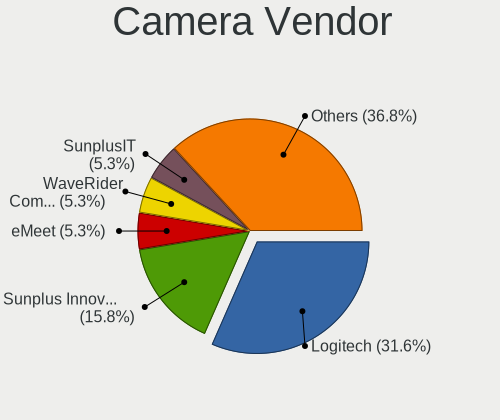

| Vendor              | Desktops | Percent |
|---------------------|----------|---------|
| Logitech            | 11       | 44%     |
| Microdia            | 3        | 12%     |
| Guillemot           | 3        | 12%     |
| Sunplus IT          | 2        | 8%      |
| Samsung Electronics | 2        | 8%      |
| Microsoft           | 1        | 4%      |
| Hewlett-Packard     | 1        | 4%      |
| HD USB Camera       | 1        | 4%      |
| GEMBIRD             | 1        | 4%      |

Camera Model
------------

Camera device models

| Model                                             | Desktops | Percent |
|---------------------------------------------------|----------|---------|
| Sunplus IT AUKEY PC-LM1 USB Camera                | 2        | 8%      |
| Samsung Galaxy A5 (MTP)                           | 2        | 8%      |
| Logitech Webcam C270                              | 2        | 8%      |
| Logitech Webcam C250                              | 2        | 8%      |
| Microsoft Xbox NUI Camera                         | 1        | 4%      |
| Microdia USB 2.0 Camera                           | 1        | 4%      |
| Microdia Sonix USB 2.0 Camera                     | 1        | 4%      |
| Microdia Camera                                   | 1        | 4%      |
| Logitech Webcam C310                              | 1        | 4%      |
| Logitech Webcam C300                              | 1        | 4%      |
| Logitech Webcam C170                              | 1        | 4%      |
| Logitech QuickCam Pro 4000                        | 1        | 4%      |
| Logitech QuickCam Communicate MP/S5500            | 1        | 4%      |
| Logitech HD Pro Webcam C920                       | 1        | 4%      |
| Logitech C920 PRO HD Webcam                       | 1        | 4%      |
| HP Webcam HD 2300                                 | 1        | 4%      |
| HD USB Camera HD USB Camera                       | 1        | 4%      |
| Guillemot Hercules HD Twist                       | 1        | 4%      |
| Guillemot Dualpix HD                              | 1        | 4%      |
| Guillemot Deluxe Optical Glass                    | 1        | 4%      |
| GEMBIRD Generic UVC 1.00 camera [AppoTech AX2311] | 1        | 4%      |

Security
--------

Fingerprint Vendor
------------------

Fingerprint sensor vendors

Zero info for selected period =(

Fingerprint Model
-----------------

Fingerprint sensor models

Zero info for selected period =(

Chipcard Vendor
---------------

Chipcard module vendors

Zero info for selected period =(

Chipcard Model
--------------

Chipcard module models

Zero info for selected period =(

Unsupported
-----------

Unsupported Devices
-------------------

Total unsupported devices on board

| Total | Desktops | Percent |
|-------|----------|---------|
| 0     | 128      | 88.28%  |
| 1     | 14       | 9.66%   |
| 2     | 2        | 1.38%   |
| 4     | 1        | 0.69%   |

Unsupported Device Types
------------------------

Types of unsupported devices

| Type                     | Desktops | Percent |
|--------------------------|----------|---------|
| Graphics card            | 9        | 42.86%  |
| Net/wireless             | 4        | 19.05%  |
| Unassigned class         | 3        | 14.29%  |
| Communication controller | 2        | 9.52%   |
| Sound                    | 1        | 4.76%   |
| Multimedia controller    | 1        | 4.76%   |
| Camera                   | 1        | 4.76%   |

