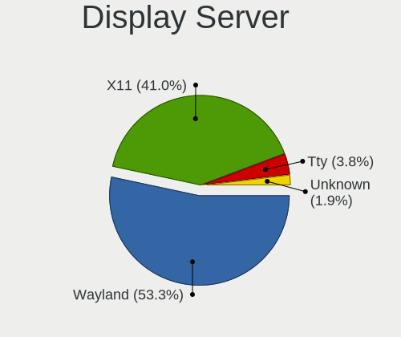
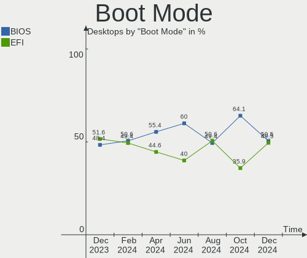
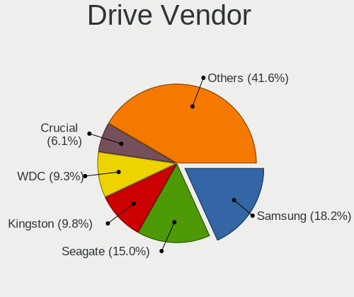

Linux in France - Hardware Trends (Desktops)
--------------------------------------------

A project to identify most popular hardware characteristics and track their change
over time based on data collected by Linux users at https://Linux-Hardware.org.

Anyone can contribute to this report by the [hw-probe](https://github.com/linuxhw/hw-probe) tool:

    sudo -E hw-probe -all -upload

Period: Mar, 2023.

Contents
--------

* [ System ](#system)
  - [ OS                       ](#os)
  - [ OS Family                ](#os-family)
  - [ Kernel                   ](#kernel)
  - [ Kernel Family            ](#kernel-family)
  - [ Kernel Major Ver.        ](#kernel-major-ver)
  - [ Arch                     ](#arch)
  - [ DE                       ](#de)
  - [ Display Server           ](#display-server)
  - [ Display Manager          ](#display-manager)
  - [ OS Lang                  ](#os-lang)
  - [ Boot Mode                ](#boot-mode)
  - [ Filesystem               ](#filesystem)
  - [ Part. scheme             ](#part-scheme)
  - [ Dual Boot with Linux/BSD ](#dual-boot-with-linuxbsd)
  - [ Dual Boot (Win)          ](#dual-boot-win)

* [ Board ](#board)
  - [ Vendor                   ](#vendor)
  - [ Model                    ](#model)
  - [ Model Family             ](#model-family)
  - [ MFG Year                 ](#mfg-year)
  - [ Form Factor              ](#form-factor)
  - [ Secure Boot              ](#secure-boot)
  - [ Coreboot                 ](#coreboot)
  - [ RAM Size                 ](#ram-size)
  - [ RAM Used                 ](#ram-used)
  - [ Total Drives             ](#total-drives)
  - [ Has CD-ROM               ](#has-cd-rom)
  - [ Has Ethernet             ](#has-ethernet)
  - [ Has WiFi                 ](#has-wifi)
  - [ Has Bluetooth            ](#has-bluetooth)

* [ Location ](#location)
  - [ Country                  ](#country)
  - [ City                     ](#city)

* [ Drives ](#drives)
  - [ Drive Vendor             ](#drive-vendor)
  - [ Drive Model              ](#drive-model)
  - [ HDD Vendor               ](#hdd-vendor)
  - [ SSD Vendor               ](#ssd-vendor)
  - [ Drive Kind               ](#drive-kind)
  - [ Drive Connector          ](#drive-connector)
  - [ Drive Size               ](#drive-size)
  - [ Space Total              ](#space-total)
  - [ Space Used               ](#space-used)
  - [ Malfunc. Drives          ](#malfunc-drives)
  - [ Malfunc. Drive Vendor    ](#malfunc-drive-vendor)
  - [ Malfunc. HDD Vendor      ](#malfunc-hdd-vendor)
  - [ Malfunc. Drive Kind      ](#malfunc-drive-kind)
  - [ Failed Drives            ](#failed-drives)
  - [ Failed Drive Vendor      ](#failed-drive-vendor)
  - [ Drive Status             ](#drive-status)

* [ Storage controller ](#storage-controller)
  - [ Storage Vendor           ](#storage-vendor)
  - [ Storage Model            ](#storage-model)
  - [ Storage Kind             ](#storage-kind)

* [ Processor ](#processor)
  - [ CPU Vendor               ](#cpu-vendor)
  - [ CPU Model                ](#cpu-model)
  - [ CPU Model Family         ](#cpu-model-family)
  - [ CPU Cores                ](#cpu-cores)
  - [ CPU Sockets              ](#cpu-sockets)
  - [ CPU Threads              ](#cpu-threads)
  - [ CPU Op-Modes             ](#cpu-op-modes)
  - [ CPU Microcode            ](#cpu-microcode)
  - [ CPU Microarch            ](#cpu-microarch)

* [ Graphics ](#graphics)
  - [ GPU Vendor               ](#gpu-vendor)
  - [ GPU Model                ](#gpu-model)
  - [ GPU Combo                ](#gpu-combo)
  - [ GPU Driver               ](#gpu-driver)
  - [ GPU Memory               ](#gpu-memory)

* [ Monitor ](#monitor)
  - [ Monitor Vendor           ](#monitor-vendor)
  - [ Monitor Model            ](#monitor-model)
  - [ Monitor Resolution       ](#monitor-resolution)
  - [ Monitor Diagonal         ](#monitor-diagonal)
  - [ Monitor Width            ](#monitor-width)
  - [ Aspect Ratio             ](#aspect-ratio)
  - [ Monitor Area             ](#monitor-area)
  - [ Pixel Density            ](#pixel-density)
  - [ Multiple Monitors        ](#multiple-monitors)

* [ Network ](#network)
  - [ Net Controller Vendor    ](#net-controller-vendor)
  - [ Net Controller Model     ](#net-controller-model)
  - [ Wireless Vendor          ](#wireless-vendor)
  - [ Wireless Model           ](#wireless-model)
  - [ Ethernet Vendor          ](#ethernet-vendor)
  - [ Ethernet Model           ](#ethernet-model)
  - [ Net Controller Kind      ](#net-controller-kind)
  - [ Used Controller          ](#used-controller)
  - [ NICs                     ](#nics)
  - [ IPv6                     ](#ipv6)

* [ Bluetooth ](#bluetooth)
  - [ Bluetooth Vendor         ](#bluetooth-vendor)
  - [ Bluetooth Model          ](#bluetooth-model)

* [ Sound ](#sound)
  - [ Sound Vendor             ](#sound-vendor)
  - [ Sound Model              ](#sound-model)

* [ Memory ](#memory)
  - [ Memory Vendor            ](#memory-vendor)
  - [ Memory Model             ](#memory-model)
  - [ Memory Kind              ](#memory-kind)
  - [ Memory Form Factor       ](#memory-form-factor)
  - [ Memory Size              ](#memory-size)
  - [ Memory Speed             ](#memory-speed)

* [ Printers & scanners ](#printers--scanners)
  - [ Printer Vendor           ](#printer-vendor)
  - [ Printer Model            ](#printer-model)
  - [ Scanner Vendor           ](#scanner-vendor)
  - [ Scanner Model            ](#scanner-model)

* [ Camera ](#camera)
  - [ Camera Vendor            ](#camera-vendor)
  - [ Camera Model             ](#camera-model)

* [ Security ](#security)
  - [ Fingerprint Vendor       ](#fingerprint-vendor)
  - [ Fingerprint Model        ](#fingerprint-model)
  - [ Chipcard Vendor          ](#chipcard-vendor)
  - [ Chipcard Model           ](#chipcard-model)

* [ Unsupported ](#unsupported)
  - [ Unsupported Devices      ](#unsupported-devices)
  - [ Unsupported Device Types ](#unsupported-device-types)

System
------

OS
--

Installed operating systems

| Name                | Desktops | Percent |
|---------------------|----------|---------|
| Ubuntu 22.04        | 19       | 17.27%  |
| OpenMandriva 23.03  | 12       | 10.91%  |
| OpenMandriva 23.01  | 7        | 6.36%   |
| Debian 11           | 7        | 6.36%   |
| Ubuntu 22.10        | 6        | 5.45%   |
| Ubuntu 20.04        | 4        | 3.64%   |
| Linux Mint 20.3     | 4        | 3.64%   |
| Zorin 16            | 3        | 2.73%   |
| Ubuntu MATE 22.04   | 3        | 2.73%   |
| OpenMandriva 4.3    | 3        | 2.73%   |
| Nobara 37           | 3        | 2.73%   |
| Linux Mint 21.1     | 3        | 2.73%   |
| Kubuntu 22.04       | 3        | 2.73%   |
| Xubuntu 22.04       | 2        | 1.82%   |
| Ubuntu 18.04        | 2        | 1.82%   |
| KDE neon 22.04      | 2        | 1.82%   |
| Gentoo 2.13         | 2        | 1.82%   |
| Fedora 37           | 2        | 1.82%   |
| Fedora 36           | 2        | 1.82%   |
| Debian 12           | 2        | 1.82%   |
| Arch Rolling        | 2        | 1.82%   |
| Ubuntu Unity 22.10  | 1        | 0.91%   |
| Ubuntu Unity 20.04  | 1        | 0.91%   |
| ROSA 12.3           | 1        | 0.91%   |
| OpenMandriva 4.2    | 1        | 0.91%   |
| OpenMandriva 23.90  | 1        | 0.91%   |
| Manjaro             | 1        | 0.91%   |
| Mageia 9            | 1        | 0.91%   |
| Lubuntu 22.04       | 1        | 0.91%   |
| Lubuntu 18.04       | 1        | 0.91%   |
| LinuxFX 11.2        | 1        | 0.91%   |
| Kubuntu 18.04       | 1        | 0.91%   |
| Kali 2023.1         | 1        | 0.91%   |
| EndeavourOS Rolling | 1        | 0.91%   |
| Debian              | 1        | 0.91%   |
| CentOS 7            | 1        | 0.91%   |
| BlackPanther 18.1   | 1        | 0.91%   |
| ArcoLinux Rolling   | 1        | 0.91%   |

OS Family
---------

OS without a version

| Name         | Desktops | Percent |
|--------------|----------|---------|
| Ubuntu       | 31       | 28.18%  |
| OpenMandriva | 24       | 21.82%  |
| Debian       | 10       | 9.09%   |
| Linux Mint   | 7        | 6.36%   |
| Kubuntu      | 4        | 3.64%   |
| Fedora       | 4        | 3.64%   |
| Zorin        | 3        | 2.73%   |
| Ubuntu MATE  | 3        | 2.73%   |
| Nobara       | 3        | 2.73%   |
| Xubuntu      | 2        | 1.82%   |
| Ubuntu Unity | 2        | 1.82%   |
| Lubuntu      | 2        | 1.82%   |
| KDE neon     | 2        | 1.82%   |
| Gentoo       | 2        | 1.82%   |
| Arch         | 2        | 1.82%   |
| ROSA         | 1        | 0.91%   |
| Manjaro      | 1        | 0.91%   |
| Mageia       | 1        | 0.91%   |
| LinuxFX      | 1        | 0.91%   |
| Kali         | 1        | 0.91%   |
| EndeavourOS  | 1        | 0.91%   |
| CentOS       | 1        | 0.91%   |
| BlackPanther | 1        | 0.91%   |
| ArcoLinux    | 1        | 0.91%   |

Kernel
------

Version of the Linux kernel

| Version                            | Desktops | Percent |
|------------------------------------|----------|---------|
| 5.19.0-35-generic                  | 20       | 18.18%  |
| 5.15.0-67-generic                  | 16       | 14.55%  |
| 6.2.6-desktop-1omv2390             | 7        | 6.36%   |
| 6.1.1-desktop-1omv2290             | 7        | 6.36%   |
| 5.19.0-38-generic                  | 5        | 4.55%   |
| 5.10.0-21-amd64                    | 5        | 4.55%   |
| 6.2.2-desktop-1omv2390             | 4        | 3.64%   |
| 5.4.0-144-generic                  | 4        | 3.64%   |
| 5.4.0-139-generic                  | 3        | 2.73%   |
| 6.1.21-1-lts                       | 2        | 1.82%   |
| 6.1.14-201.fsync.fc37.x86_64       | 2        | 1.82%   |
| 6.1.0-6-amd64                      | 2        | 1.82%   |
| 5.15.0-60-generic                  | 2        | 1.82%   |
| 4.15.0-206-generic                 | 2        | 1.82%   |
| 6.2.7-200.fc37.x86_64              | 1        | 0.91%   |
| 6.2.7-2-MANJARO                    | 1        | 0.91%   |
| 6.2.6-desktop-1.mga9               | 1        | 0.91%   |
| 6.2.6-201.fsync.fc37.x86_64        | 1        | 0.91%   |
| 6.2.5-gentoo-dist                  | 1        | 0.91%   |
| 6.2.2-arch1-1                      | 1        | 0.91%   |
| 6.2.2-1.el7.elrepo.x86_64          | 1        | 0.91%   |
| 6.2.1-desktop-1omv2390             | 1        | 0.91%   |
| 6.1.20-hardened1-1-hardened        | 1        | 0.91%   |
| 6.1.19-rt-rt8                      | 1        | 0.91%   |
| 6.1.14-200.fc37.x86_64             | 1        | 0.91%   |
| 6.1.11-desktop-1omv2390            | 1        | 0.91%   |
| 6.1.0-5-amd64                      | 1        | 0.91%   |
| 5.19.16-200.fc36.x86_64            | 1        | 0.91%   |
| 5.19.0-kali2-amd64                 | 1        | 0.91%   |
| 5.19.0-37-generic                  | 1        | 0.91%   |
| 5.19.0-29-generic                  | 1        | 0.91%   |
| 5.17.5-300.fc36.x86_64             | 1        | 0.91%   |
| 5.16.7-desktop-1omv4003            | 1        | 0.91%   |
| 5.16.13-desktop-1omv4003           | 1        | 0.91%   |
| 5.15.79-generic-1rosa2021.1-x86_64 | 1        | 0.91%   |
| 5.15.79+truenas                    | 1        | 0.91%   |
| 5.15.0-69-generic                  | 1        | 0.91%   |
| 5.15.0-67-lowlatency               | 1        | 0.91%   |
| 5.15.0-66-generic                  | 1        | 0.91%   |
| 5.11.12-desktop-1omv4002           | 1        | 0.91%   |

Kernel Family
-------------

Linux kernel without a distro release

| Version | Desktops | Percent |
|---------|----------|---------|
| 5.19.0  | 28       | 25.45%  |
| 5.15.0  | 21       | 19.09%  |
| 6.2.6   | 9        | 8.18%   |
| 6.1.1   | 7        | 6.36%   |
| 5.4.0   | 7        | 6.36%   |
| 6.2.2   | 6        | 5.45%   |
| 5.10.0  | 6        | 5.45%   |
| 6.1.14  | 3        | 2.73%   |
| 6.1.0   | 3        | 2.73%   |
| 6.2.7   | 2        | 1.82%   |
| 6.1.21  | 2        | 1.82%   |
| 5.15.79 | 2        | 1.82%   |
| 4.15.0  | 2        | 1.82%   |
| 6.2.5   | 1        | 0.91%   |
| 6.2.1   | 1        | 0.91%   |
| 6.1.20  | 1        | 0.91%   |
| 6.1.19  | 1        | 0.91%   |
| 6.1.11  | 1        | 0.91%   |
| 5.19.16 | 1        | 0.91%   |
| 5.17.5  | 1        | 0.91%   |
| 5.16.7  | 1        | 0.91%   |
| 5.16.13 | 1        | 0.91%   |
| 5.11.12 | 1        | 0.91%   |
| 5.10.14 | 1        | 0.91%   |
| 4.18.16 | 1        | 0.91%   |

Kernel Major Ver.
-----------------

Linux kernel major version

| Version | Desktops | Percent |
|---------|----------|---------|
| 5.19    | 29       | 26.36%  |
| 5.15    | 23       | 20.91%  |
| 6.2     | 19       | 17.27%  |
| 6.1     | 18       | 16.36%  |
| 5.4     | 7        | 6.36%   |
| 5.10    | 7        | 6.36%   |
| 5.16    | 2        | 1.82%   |
| 4.15    | 2        | 1.82%   |
| 5.17    | 1        | 0.91%   |
| 5.11    | 1        | 0.91%   |
| 4.18    | 1        | 0.91%   |

Arch
----

OS architecture (x86_64, i586, etc.)

| Name   | Desktops | Percent |
|--------|----------|---------|
| x86_64 | 109      | 99.09%  |
| i686   | 1        | 0.91%   |

DE
--

Desktop Environment

| Name       | Desktops | Percent |
|------------|----------|---------|
| GNOME      | 49       | 44.55%  |
| KDE5       | 31       | 28.18%  |
| XFCE       | 8        | 7.27%   |
| Unknown    | 7        | 6.36%   |
| X-Cinnamon | 5        | 4.55%   |
| MATE       | 4        | 3.64%   |
| Unity      | 2        | 1.82%   |
| LXDE       | 2        | 1.82%   |
| LXQt       | 1        | 0.91%   |
| Cinnamon   | 1        | 0.91%   |

Display Server
--------------

X11 or Wayland

| Name    | Desktops | Percent |
|---------|----------|---------|
| X11     | 76       | 69.09%  |
| Wayland | 27       | 24.55%  |
| Tty     | 5        | 4.55%   |
| Unknown | 2        | 1.82%   |

Display Manager
---------------

SDDM, LightDM, etc.

| Name    | Desktops | Percent |
|---------|----------|---------|
| SDDM    | 32       | 29.09%  |
| GDM3    | 27       | 24.55%  |
| Unknown | 20       | 18.18%  |
| GDM     | 16       | 14.55%  |
| LightDM | 15       | 13.64%  |

OS Lang
-------

Language

| Lang    | Desktops | Percent |
|---------|----------|---------|
| fr_FR   | 88       | 80%     |
| en_US   | 12       | 10.91%  |
| Unknown | 5        | 4.55%   |
| en_GB   | 2        | 1.82%   |
| C       | 2        | 1.82%   |
| de_DE   | 1        | 0.91%   |

Boot Mode
---------

EFI or BIOS

| Mode | Desktops | Percent |
|------|----------|---------|
| BIOS | 55       | 50%     |
| EFI  | 55       | 50%     |

Filesystem
----------

Type of filesystem

| Type    | Desktops | Percent |
|---------|----------|---------|
| Ext4    | 83       | 75.45%  |
| Overlay | 12       | 10.91%  |
| Btrfs   | 11       | 10%     |
| Xfs     | 2        | 1.82%   |
| Zfs     | 1        | 0.91%   |
| Ext3    | 1        | 0.91%   |

Part. scheme
------------

Scheme of partitioning

| Type    | Desktops | Percent |
|---------|----------|---------|
| GPT     | 72       | 65.45%  |
| MBR     | 24       | 21.82%  |
| Unknown | 14       | 12.73%  |

Dual Boot with Linux/BSD
------------------------

Hosting more than one Linux/BSD

| Dual boot | Desktops | Percent |
|-----------|----------|---------|
| No        | 79       | 71.82%  |
| Yes       | 31       | 28.18%  |

Dual Boot (Win)
---------------

Hosting Linux and Windows

| Dual boot | Desktops | Percent |
|-----------|----------|---------|
| No        | 72       | 65.45%  |
| Yes       | 38       | 34.55%  |

Board
-----

Vendor
------

Motherboard manufacturer

| Name                | Desktops | Percent |
|---------------------|----------|---------|
| ASUSTek Computer    | 30       | 27.27%  |
| MSI                 | 14       | 12.73%  |
| Gigabyte Technology | 12       | 10.91%  |
| Hewlett-Packard     | 11       | 10%     |
| Lenovo              | 9        | 8.18%   |
| Dell                | 9        | 8.18%   |
| Packard Bell        | 6        | 5.45%   |
| ASRock              | 5        | 4.55%   |
| Foxconn             | 4        | 3.64%   |
| Pegatron            | 2        | 1.82%   |
| Intel               | 2        | 1.82%   |
| Wistron             | 1        | 0.91%   |
| Shuttle             | 1        | 0.91%   |
| Medion              | 1        | 0.91%   |
| Fujitsu             | 1        | 0.91%   |
| AZW                 | 1        | 0.91%   |
| ASRockRack          | 1        | 0.91%   |

Model
-----

Motherboard model

| Name                                    | Desktops | Percent |
|-----------------------------------------|----------|---------|
| ASUS All Series                         | 3        | 2.73%   |
| Packard Bell IMEDIA S3840               | 2        | 1.82%   |
| Packard Bell IMEDIA S3720               | 2        | 1.82%   |
| MSI MS-7B38                             | 2        | 1.82%   |
| ASUS PRIME A320M-K                      | 2        | 1.82%   |
| Wistron ProLiant ML110 G6               | 1        | 0.91%   |
| Shuttle SH170                           | 1        | 0.91%   |
| Pegatron h8-1350ef                      | 1        | 0.91%   |
| Pegatron h8-1110ch                      | 1        | 0.91%   |
| Packard Bell IXTREME M5850              | 1        | 0.91%   |
| Packard Bell IMEDIA S3800               | 1        | 0.91%   |
| MSI MS-7D99                             | 1        | 0.91%   |
| MSI MS-7D43                             | 1        | 0.91%   |
| MSI MS-7D22                             | 1        | 0.91%   |
| MSI MS-7C92                             | 1        | 0.91%   |
| MSI MS-7C84                             | 1        | 0.91%   |
| MSI MS-7C52                             | 1        | 0.91%   |
| MSI MS-7C02                             | 1        | 0.91%   |
| MSI MS-7B79                             | 1        | 0.91%   |
| MSI MS-7B33                             | 1        | 0.91%   |
| MSI MS-7816                             | 1        | 0.91%   |
| MSI MS-7757                             | 1        | 0.91%   |
| MSI MS-7721                             | 1        | 0.91%   |
| Medion MS-7800                          | 1        | 0.91%   |
| Lenovo ThinkCentre M93p 10A9003PIX      | 1        | 0.91%   |
| Lenovo ThinkCentre M93p 10A7003AUK      | 1        | 0.91%   |
| Lenovo ThinkCentre M78 1565A26          | 1        | 0.91%   |
| Lenovo ThinkCentre M73 10B4S22U00       | 1        | 0.91%   |
| Lenovo ThinkCentre M73 10AXS3JD00       | 1        | 0.91%   |
| Lenovo ThinkCentre M710s 10M8S2D400     | 1        | 0.91%   |
| Lenovo Legion Y520T-25IKL 90H7          | 1        | 0.91%   |
| Lenovo IdeaCentre 310S-08ASR 90G9007KFR | 1        | 0.91%   |
| Lenovo H50-55 90BG000TFR                | 1        | 0.91%   |
| Intel DH55HC AAE70933-503               | 1        | 0.91%   |
| Intel D33217GKE G76540-203              | 1        | 0.91%   |
| HP Z620 Workstation                     | 1        | 0.91%   |
| HP Z440 Workstation                     | 1        | 0.91%   |
| HP Z230 Tower Workstation               | 1        | 0.91%   |
| HP ProLiant ML350 G5                    | 1        | 0.91%   |
| HP ProDesk 600 G3 SFF                   | 1        | 0.91%   |

Model Family
------------

Motherboard model prefix

| Name                 | Desktops | Percent |
|----------------------|----------|---------|
| ASUS PRIME           | 8        | 7.27%   |
| Lenovo ThinkCentre   | 6        | 5.45%   |
| Packard Bell IMEDIA  | 5        | 4.55%   |
| HP Compaq            | 5        | 4.55%   |
| Dell OptiPlex        | 5        | 4.55%   |
| Dell Precision       | 4        | 3.64%   |
| ASUS ROG             | 3        | 2.73%   |
| ASUS All             | 3        | 2.73%   |
| MSI MS-7B38          | 2        | 1.82%   |
| HP ProDesk           | 2        | 1.82%   |
| ASUS TUF             | 2        | 1.82%   |
| ASUS M5A97           | 2        | 1.82%   |
| Wistron ProLiant     | 1        | 0.91%   |
| Shuttle SH170        | 1        | 0.91%   |
| Pegatron h8-1350ef   | 1        | 0.91%   |
| Pegatron h8-1110ch   | 1        | 0.91%   |
| Packard Bell IXTREME | 1        | 0.91%   |
| MSI MS-7D99          | 1        | 0.91%   |
| MSI MS-7D43          | 1        | 0.91%   |
| MSI MS-7D22          | 1        | 0.91%   |
| MSI MS-7C92          | 1        | 0.91%   |
| MSI MS-7C84          | 1        | 0.91%   |
| MSI MS-7C52          | 1        | 0.91%   |
| MSI MS-7C02          | 1        | 0.91%   |
| MSI MS-7B79          | 1        | 0.91%   |
| MSI MS-7B33          | 1        | 0.91%   |
| MSI MS-7816          | 1        | 0.91%   |
| MSI MS-7757          | 1        | 0.91%   |
| MSI MS-7721          | 1        | 0.91%   |
| Medion MS-7800       | 1        | 0.91%   |
| Lenovo Legion        | 1        | 0.91%   |
| Lenovo IdeaCentre    | 1        | 0.91%   |
| Lenovo H50-55        | 1        | 0.91%   |
| Intel DH55HC         | 1        | 0.91%   |
| Intel D33217GKE      | 1        | 0.91%   |
| HP Z620              | 1        | 0.91%   |
| HP Z440              | 1        | 0.91%   |
| HP Z230              | 1        | 0.91%   |
| HP ProLiant          | 1        | 0.91%   |
| Gigabyte Z77X-UD5H   | 1        | 0.91%   |

MFG Year
--------

Motherboard manufacture year

| Year | Desktops | Percent |
|------|----------|---------|
| 2012 | 14       | 12.73%  |
| 2018 | 11       | 10%     |
| 2014 | 11       | 10%     |
| 2013 | 10       | 9.09%   |
| 2011 | 10       | 9.09%   |
| 2021 | 8        | 7.27%   |
| 2010 | 8        | 7.27%   |
| 2017 | 7        | 6.36%   |
| 2009 | 7        | 6.36%   |
| 2019 | 5        | 4.55%   |
| 2015 | 5        | 4.55%   |
| 2022 | 4        | 3.64%   |
| 2020 | 4        | 3.64%   |
| 2016 | 2        | 1.82%   |
| 2006 | 2        | 1.82%   |
| 2008 | 1        | 0.91%   |
| 2007 | 1        | 0.91%   |

Form Factor
-----------

Physical design of the computer

| Name    | Desktops | Percent |
|---------|----------|---------|
| Desktop | 110      | 100%    |

Secure Boot
-----------

Enabled or disabled

| State    | Desktops | Percent |
|----------|----------|---------|
| Disabled | 104      | 94.55%  |
| Enabled  | 6        | 5.45%   |

Coreboot
--------

Have coreboot on board

| Used | Desktops | Percent |
|------|----------|---------|
| No   | 110      | 100%    |

RAM Size
--------

Total RAM memory

| Size in GB      | Desktops | Percent |
|-----------------|----------|---------|
| 16.01-24.0      | 29       | 26.36%  |
| 4.01-8.0        | 22       | 20%     |
| 8.01-16.0       | 18       | 16.36%  |
| 3.01-4.0        | 15       | 13.64%  |
| 32.01-64.0      | 13       | 11.82%  |
| 64.01-256.0     | 5        | 4.55%   |
| 24.01-32.0      | 4        | 3.64%   |
| 2.01-3.0        | 2        | 1.82%   |
| More than 256.0 | 1        | 0.91%   |
| 0.51-1.0        | 1        | 0.91%   |

RAM Used
--------

Used RAM memory

| Used GB     | Desktops | Percent |
|-------------|----------|---------|
| 1.01-2.0    | 38       | 34.55%  |
| 2.01-3.0    | 26       | 23.64%  |
| 4.01-8.0    | 15       | 13.64%  |
| 3.01-4.0    | 13       | 11.82%  |
| 8.01-16.0   | 7        | 6.36%   |
| 0.51-1.0    | 6        | 5.45%   |
| 32.01-64.0  | 2        | 1.82%   |
| 64.01-256.0 | 1        | 0.91%   |
| 16.01-24.0  | 1        | 0.91%   |
| 0.01-0.5    | 1        | 0.91%   |

Total Drives
------------

Number of drives on board

| Drives | Desktops | Percent |
|--------|----------|---------|
| 1      | 44       | 40%     |
| 2      | 30       | 27.27%  |
| 3      | 15       | 13.64%  |
| 4      | 10       | 9.09%   |
| 5      | 3        | 2.73%   |
| 8      | 2        | 1.82%   |
| 6      | 2        | 1.82%   |
| 25     | 1        | 0.91%   |
| 10     | 1        | 0.91%   |
| 9      | 1        | 0.91%   |
| 7      | 1        | 0.91%   |

Has CD-ROM
----------

Has CD-ROM on board

| Presented | Desktops | Percent |
|-----------|----------|---------|
| Yes       | 67       | 60.91%  |
| No        | 43       | 39.09%  |

Has Ethernet
------------

Has Ethernet on board

| Presented | Desktops | Percent |
|-----------|----------|---------|
| Yes       | 110      | 100%    |

Has WiFi
--------

Has WiFi module

| Presented | Desktops | Percent |
|-----------|----------|---------|
| No        | 68       | 61.82%  |
| Yes       | 42       | 38.18%  |

Has Bluetooth
-------------

Has Bluetooth module

| Presented | Desktops | Percent |
|-----------|----------|---------|
| No        | 75       | 68.18%  |
| Yes       | 35       | 31.82%  |

Location
--------

Country
-------

Geographic location (country)

| Country | Desktops | Percent |
|---------|----------|---------|
| France  | 110      | 100%    |

City
----

Geographic location (city)

| City                     | Desktops | Percent |
|--------------------------|----------|---------|
| Paris                    | 8        | 7.27%   |
| Le Grand-Quevilly        | 3        | 2.73%   |
| Toulouse                 | 2        | 1.82%   |
| Rennes                   | 2        | 1.82%   |
| Le Beausset              | 2        | 1.82%   |
| Grenoble                 | 2        | 1.82%   |
| Foix                     | 2        | 1.82%   |
| Bordeaux                 | 2        | 1.82%   |
| Villecloye               | 1        | 0.91%   |
| Vichy                    | 1        | 0.91%   |
| Vallenay                 | 1        | 0.91%   |
| Tours                    | 1        | 0.91%   |
| Tournefeuille            | 1        | 0.91%   |
| Strasbourg               | 1        | 0.91%   |
| Sigean                   | 1        | 0.91%   |
| Seurre                   | 1        | 0.91%   |
| Septemes-les-Vallons     | 1        | 0.91%   |
| Sedan                    | 1        | 0.91%   |
| Savigny-en-Sancerre      | 1        | 0.91%   |
| Sarralbe                 | 1        | 0.91%   |
| Saint-Saens              | 1        | 0.91%   |
| Saint-Nazaire            | 1        | 0.91%   |
| Saint-Martin-d'Hères    | 1        | 0.91%   |
| Saint-Etienne-de-Tulmont | 1        | 0.91%   |
| Saint-Aubin-en-Bray      | 1        | 0.91%   |
| Saint-Andre-de-Cubzac    | 1        | 0.91%   |
| Saclas                   | 1        | 0.91%   |
| Roubaix                  | 1        | 0.91%   |
| Rosny-sous-Bois          | 1        | 0.91%   |
| Roquevaire               | 1        | 0.91%   |
| Roquefort-sur-Soulzon    | 1        | 0.91%   |
| Ramonville-Saint-Agne    | 1        | 0.91%   |
| Quimper                  | 1        | 0.91%   |
| Plestin-les-Greves       | 1        | 0.91%   |
| Perols                   | 1        | 0.91%   |
| Pamiers                  | 1        | 0.91%   |
| Orvault                  | 1        | 0.91%   |
| Nilvange                 | 1        | 0.91%   |
| Nice                     | 1        | 0.91%   |
| Nerondes                 | 1        | 0.91%   |

Drives
------

Drive Vendor
------------

Hard drive vendors

| Vendor                    | Desktops | Drives | Percent |
|---------------------------|----------|--------|---------|
| WDC                       | 37       | 56     | 19.07%  |
| Samsung Electronics       | 35       | 49     | 18.04%  |
| Seagate                   | 34       | 44     | 17.53%  |
| Crucial                   | 15       | 18     | 7.73%   |
| Toshiba                   | 12       | 12     | 6.19%   |
| SanDisk                   | 9        | 10     | 4.64%   |
| Kingston                  | 8        | 12     | 4.12%   |
| Hitachi                   | 7        | 8      | 3.61%   |
| PNY                       | 4        | 4      | 2.06%   |
| Phison Electronics        | 4        | 5      | 2.06%   |
| Maxtor                    | 3        | 3      | 1.55%   |
| Unknown                   | 2        | 4      | 1.03%   |
| Micron Technology         | 2        | 2      | 1.03%   |
| Intel                     | 2        | 2      | 1.03%   |
| China                     | 2        | 3      | 1.03%   |
| SPCC                      | 1        | 1      | 0.52%   |
| Netac                     | 1        | 1      | 0.52%   |
| Micron/Crucial Technology | 1        | 1      | 0.52%   |
| Magnetic Data             | 1        | 1      | 0.52%   |
| LITEON                    | 1        | 1      | 0.52%   |
| Lexar                     | 1        | 1      | 0.52%   |
| LDLC                      | 1        | 1      | 0.52%   |
| JMicron Technology        | 1        | 1      | 0.52%   |
| Intenso                   | 1        | 1      | 0.52%   |
| HGST                      | 1        | 1      | 0.52%   |
| Hewlett-Packard           | 1        | 24     | 0.52%   |
| H/W                       | 1        | 3      | 0.52%   |
| Emtec                     | 1        | 2      | 0.52%   |
| Corsair                   | 1        | 1      | 0.52%   |
| Colorful                  | 1        | 1      | 0.52%   |
| ASMT                      | 1        | 1      | 0.52%   |
| ADATA Technology          | 1        | 1      | 0.52%   |
| Unknown                   | 1        | 1      | 0.52%   |

Drive Model
-----------

Hard drive models

| Model                                               | Desktops | Percent |
|-----------------------------------------------------|----------|---------|
| Seagate ST2000DM008-2FR102 2TB                      | 4        | 1.75%   |
| Samsung SSD 860 EVO 500GB                           | 4        | 1.75%   |
| Crucial CT240BX500SSD1 240GB                        | 4        | 1.75%   |
| Seagate ST2000DM001-1ER164 2TB                      | 3        | 1.32%   |
| Seagate ST1000DM003-1CH162 1TB                      | 3        | 1.32%   |
| Samsung SSD 850 EVO 500GB                           | 3        | 1.32%   |
| Samsung NVMe SSD Controller SM981/PM981/PM983 250GB | 3        | 1.32%   |
| Crucial CT120BX500SSD1 120GB                        | 3        | 1.32%   |
| WDC WD5000AAKX-00ERMA0 500GB                        | 2        | 0.88%   |
| WDC WD40EFRX-68N32N0 4TB                            | 2        | 0.88%   |
| WDC WD10EZEX-00BN5A0 1TB                            | 2        | 0.88%   |
| Toshiba HDWD240 4TB                                 | 2        | 0.88%   |
| Toshiba HDWD120 2TB                                 | 2        | 0.88%   |
| Toshiba DT01ACA100 1TB                              | 2        | 0.88%   |
| Seagate ST500DM002-1BD142 500GB                     | 2        | 0.88%   |
| Seagate ST320LM001 HN-M320MBB 320GB                 | 2        | 0.88%   |
| Seagate ST2000DL003-9VT166 2TB                      | 2        | 0.88%   |
| Seagate ST1000DM010-2EP102 1TB                      | 2        | 0.88%   |
| SanDisk SDSSDA120G 120GB                            | 2        | 0.88%   |
| Samsung SSD 860 EVO 250GB                           | 2        | 0.88%   |
| Samsung SSD 840 EVO 250GB                           | 2        | 0.88%   |
| Samsung NVMe SSD Controller PM9A1/PM9A3/980PRO 1TB  | 2        | 0.88%   |
| Samsung HD502HJ 500GB                               | 2        | 0.88%   |
| PNY CS900 480GB SSD                                 | 2        | 0.88%   |
| Phison E12 NVMe Controller 256GB                    | 2        | 0.88%   |
| Kingston SV300S37A240G 240GB SSD                    | 2        | 0.88%   |
| Hitachi HDS721050CLA360 500GB                       | 2        | 0.88%   |
| Crucial CT1000MX500SSD1 1TB                         | 2        | 0.88%   |
| WDC WDS240G2G0A-00JH30 240GB SSD                    | 1        | 0.44%   |
| WDC WDS120G1G0B-00RC30 120GB SSD                    | 1        | 0.44%   |
| WDC WD800JB-00FMA0 80GB                             | 1        | 0.44%   |
| WDC WD7500BPVX-75JC3T0 752GB                        | 1        | 0.44%   |
| WDC WD6400AAKS-65A7B2 640GB                         | 1        | 0.44%   |
| WDC WD5001AALS-00L3B2 500GB                         | 1        | 0.44%   |
| WDC WD5000LPLX-66ZNTT1 500GB                        | 1        | 0.44%   |
| WDC WD5000AZRX-00A8LB0 500GB                        | 1        | 0.44%   |
| WDC WD5000AAKX-60U6AA0 500GB                        | 1        | 0.44%   |
| WDC WD5000AAKX-08U6AA0 500GB                        | 1        | 0.44%   |
| WDC WD5000AAKS-60Z1A0 500GB                         | 1        | 0.44%   |
| WDC WD5000AAKS-00V1A0 500GB                         | 1        | 0.44%   |

HDD Vendor
----------

Hard disk drive vendors

| Vendor              | Desktops | Drives | Percent |
|---------------------|----------|--------|---------|
| WDC                 | 35       | 52     | 34.31%  |
| Seagate             | 34       | 44     | 33.33%  |
| Toshiba             | 11       | 11     | 10.78%  |
| Samsung Electronics | 7        | 7      | 6.86%   |
| Hitachi             | 7        | 8      | 6.86%   |
| Maxtor              | 3        | 3      | 2.94%   |
| Unknown             | 1        | 1      | 0.98%   |
| JMicron Technology  | 1        | 1      | 0.98%   |
| HGST                | 1        | 1      | 0.98%   |
| H/W                 | 1        | 3      | 0.98%   |
| ASMT                | 1        | 1      | 0.98%   |

SSD Vendor
----------

Solid state drive vendors

| Vendor              | Desktops | Drives | Percent |
|---------------------|----------|--------|---------|
| Samsung Electronics | 17       | 21     | 26.98%  |
| Crucial             | 14       | 14     | 22.22%  |
| SanDisk             | 7        | 7      | 11.11%  |
| Kingston            | 7        | 11     | 11.11%  |
| PNY                 | 3        | 3      | 4.76%   |
| WDC                 | 2        | 2      | 3.17%   |
| Micron Technology   | 2        | 2      | 3.17%   |
| Intel               | 2        | 2      | 3.17%   |
| China               | 2        | 3      | 3.17%   |
| SPCC                | 1        | 1      | 1.59%   |
| Netac               | 1        | 1      | 1.59%   |
| LITEON              | 1        | 1      | 1.59%   |
| LDLC                | 1        | 1      | 1.59%   |
| Emtec               | 1        | 1      | 1.59%   |
| Corsair             | 1        | 1      | 1.59%   |
| Colorful            | 1        | 1      | 1.59%   |

Drive Kind
----------

HDD or SSD

| Kind    | Desktops | Drives | Percent |
|---------|----------|--------|---------|
| HDD     | 75       | 132    | 46.58%  |
| SSD     | 58       | 72     | 36.02%  |
| NVMe    | 24       | 41     | 14.91%  |
| Unknown | 4        | 31     | 2.48%   |

Drive Connector
---------------

SATA, SAS, NVMe, etc.

| Type | Desktops | Drives | Percent |
|------|----------|--------|---------|
| SATA | 103      | 198    | 74.64%  |
| NVMe | 24       | 41     | 17.39%  |
| SAS  | 11       | 37     | 7.97%   |

Drive Size
----------

Size of hard drive

| Size in TB      | Desktops | Drives | Percent |
|-----------------|----------|--------|---------|
| 0.01-0.5        | 77       | 102    | 52.03%  |
| 0.51-1.0        | 41       | 57     | 27.7%   |
| 1.01-2.0        | 20       | 31     | 13.51%  |
| 3.01-4.0        | 4        | 4      | 2.7%    |
| 2.01-3.0        | 2        | 3      | 1.35%   |
| 10.01-20.0      | 2        | 5      | 1.35%   |
| More than 100.0 | 1        | 1      | 0.68%   |
| 4.01-10.0       | 1        | 1      | 0.68%   |

Space Total
-----------

Amount of disk space available on the file system

| Size in GB     | Desktops | Percent |
|----------------|----------|---------|
| 101-250        | 22       | 20%     |
| 251-500        | 21       | 19.09%  |
| More than 3000 | 15       | 13.64%  |
| 1001-2000      | 15       | 13.64%  |
| 501-1000       | 11       | 10%     |
| Unknown        | 8        | 7.27%   |
| 1-20           | 7        | 6.36%   |
| 2001-3000      | 6        | 5.45%   |
| 51-100         | 4        | 3.64%   |
| 21-50          | 1        | 0.91%   |

Space Used
----------

Amount of used disk space

| Used GB        | Desktops | Percent |
|----------------|----------|---------|
| 1-20           | 28       | 25.45%  |
| 51-100         | 16       | 14.55%  |
| 21-50          | 14       | 12.73%  |
| 501-1000       | 11       | 10%     |
| 101-250        | 8        | 7.27%   |
| Unknown        | 8        | 7.27%   |
| 251-500        | 7        | 6.36%   |
| 2001-3000      | 7        | 6.36%   |
| 1001-2000      | 6        | 5.45%   |
| More than 3000 | 4        | 3.64%   |
| 0              | 1        | 0.91%   |

Malfunc. Drives
---------------

Drive models with a malfunction

| Model                                               | Desktops | Drives | Percent |
|-----------------------------------------------------|----------|--------|---------|
| WDC WD5001AALS-00L3B2 500GB                         | 1        | 1      | 3.7%    |
| WDC WD5000AAKX-00ERMA0 500GB                        | 1        | 1      | 3.7%    |
| WDC WD30EFRX-68EUZN0 3TB                            | 1        | 2      | 3.7%    |
| WDC WD2500JD-00HBB0 250GB                           | 1        | 1      | 3.7%    |
| WDC WD2500AVJS-63B6A0 250GB                         | 1        | 1      | 3.7%    |
| WDC WD20EARX-00PASB0 2TB                            | 1        | 1      | 3.7%    |
| WDC WD15EARS-00MVWB0 1TB                            | 1        | 1      | 3.7%    |
| WDC WD10EADX-22TDHB0 1TB                            | 1        | 1      | 3.7%    |
| Toshiba MK6465GSX 640GB                             | 1        | 1      | 3.7%    |
| Toshiba HDWA120 2TB                                 | 1        | 1      | 3.7%    |
| Seagate ST3500418AS 500GB                           | 1        | 1      | 3.7%    |
| Seagate ST3250310AS 250GB                           | 1        | 1      | 3.7%    |
| Seagate ST320LM001 HN-M320MBB 320GB                 | 1        | 1      | 3.7%    |
| Seagate ST3200822AS 200GB                           | 1        | 1      | 3.7%    |
| Seagate ST31000520AS 1TB                            | 1        | 1      | 3.7%    |
| Seagate ST2000DM001-9YN164 2TB                      | 1        | 1      | 3.7%    |
| Seagate ST2000DM001-1ER164 2TB                      | 1        | 2      | 3.7%    |
| Seagate ST1000DM003-1ER162 1TB                      | 1        | 1      | 3.7%    |
| Samsung Electronics MZ7LN256HMJP-000H1 256GB SSD    | 1        | 1      | 3.7%    |
| Samsung Electronics HD103SJ 1TB                     | 1        | 1      | 3.7%    |
| Micron Technology MTFDDAK256MAY-1AH12ABHA 256GB SSD | 1        | 1      | 3.7%    |
| Maxtor STM3250820AS 250GB                           | 1        | 1      | 3.7%    |
| Intel SSDSC2CT240A4 240GB                           | 1        | 1      | 3.7%    |
| Intel SSDSA2M080G2GC 80GB                           | 1        | 1      | 3.7%    |
| Hitachi HCS721010CLA332 1TB                         | 1        | 1      | 3.7%    |
| Crucial CT512M550SSD1 512GB                         | 1        | 1      | 3.7%    |
| Crucial CT128MX100SSD1 128GB                        | 1        | 1      | 3.7%    |

Malfunc. Drive Vendor
---------------------

Vendors of faulty drives

| Vendor              | Desktops | Drives | Percent |
|---------------------|----------|--------|---------|
| WDC                 | 8        | 9      | 29.63%  |
| Seagate             | 8        | 9      | 29.63%  |
| Toshiba             | 2        | 2      | 7.41%   |
| Samsung Electronics | 2        | 2      | 7.41%   |
| Intel               | 2        | 2      | 7.41%   |
| Crucial             | 2        | 2      | 7.41%   |
| Micron Technology   | 1        | 1      | 3.7%    |
| Maxtor              | 1        | 1      | 3.7%    |
| Hitachi             | 1        | 1      | 3.7%    |

Malfunc. HDD Vendor
-------------------

Vendors of faulty HDD drives

| Vendor              | Desktops | Drives | Percent |
|---------------------|----------|--------|---------|
| WDC                 | 8        | 9      | 38.1%   |
| Seagate             | 8        | 9      | 38.1%   |
| Toshiba             | 2        | 2      | 9.52%   |
| Samsung Electronics | 1        | 1      | 4.76%   |
| Maxtor              | 1        | 1      | 4.76%   |
| Hitachi             | 1        | 1      | 4.76%   |

Malfunc. Drive Kind
-------------------

Kinds of faulty drives

| Kind | Desktops | Drives | Percent |
|------|----------|--------|---------|
| HDD  | 20       | 23     | 76.92%  |
| SSD  | 6        | 6      | 23.08%  |

Failed Drives
-------------

Failed drive models

| Model                       | Desktops | Drives | Percent |
|-----------------------------|----------|--------|---------|
| WDC WD3200AAJS-22VWA0 320GB | 1        | 1      | 100%    |

Failed Drive Vendor
-------------------

Failed drive vendors

| Vendor | Desktops | Drives | Percent |
|--------|----------|--------|---------|
| WDC    | 1        | 1      | 100%    |

Drive Status
------------

Number of failed and malfunc. drives

| Status   | Desktops | Drives | Percent |
|----------|----------|--------|---------|
| Works    | 67       | 138    | 52.76%  |
| Detected | 35       | 108    | 27.56%  |
| Malfunc  | 24       | 29     | 18.9%   |
| Failed   | 1        | 1      | 0.79%   |

Storage controller
------------------

Storage Vendor
--------------

Storage controller vendors

| Vendor                       | Desktops | Percent |
|------------------------------|----------|---------|
| Intel                        | 73       | 47.1%   |
| AMD                          | 35       | 22.58%  |
| Samsung Electronics          | 14       | 9.03%   |
| ASMedia Technology           | 7        | 4.52%   |
| Phison Electronics           | 5        | 3.23%   |
| SanDisk                      | 3        | 1.94%   |
| JMicron Technology           | 3        | 1.94%   |
| Nvidia                       | 2        | 1.29%   |
| Micron/Crucial Technology    | 2        | 1.29%   |
| Marvell Technology Group     | 2        | 1.29%   |
| Broadcom / LSI               | 2        | 1.29%   |
| VIA Technologies             | 1        | 0.65%   |
| Toshiba America Info Systems | 1        | 0.65%   |
| Shenzhen Longsys Electronics | 1        | 0.65%   |
| LSI Logic / Symbios Logic    | 1        | 0.65%   |
| Kingston Technology Company  | 1        | 0.65%   |
| Hewlett-Packard              | 1        | 0.65%   |
| ADATA Technology             | 1        | 0.65%   |

Storage Model
-------------

Storage controller models

| Model                                                                                   | Desktops | Percent |
|-----------------------------------------------------------------------------------------|----------|---------|
| AMD FCH SATA Controller [AHCI mode]                                                     | 20       | 10.53%  |
| Samsung NVMe SSD Controller SM981/PM981/PM983                                           | 8        | 4.21%   |
| Intel 6 Series/C200 Series Chipset Family 6 port Desktop SATA AHCI Controller           | 8        | 4.21%   |
| Intel 7 Series/C210 Series Chipset Family 6-port SATA Controller [AHCI mode]            | 7        | 3.68%   |
| Intel 8 Series/C220 Series Chipset Family 6-port SATA Controller 1 [AHCI mode]          | 6        | 3.16%   |
| Intel 200 Series PCH SATA controller [AHCI mode]                                        | 6        | 3.16%   |
| AMD SB7x0/SB8x0/SB9x0 SATA Controller [AHCI mode]                                       | 6        | 3.16%   |
| AMD 400 Series Chipset SATA Controller                                                  | 6        | 3.16%   |
| ASMedia ASM1062 Serial ATA Controller                                                   | 5        | 2.63%   |
| AMD FCH SATA Controller D                                                               | 5        | 2.63%   |
| Samsung NVMe SSD Controller PM9A1/PM9A3/980PRO                                          | 4        | 2.11%   |
| Intel Q170/Q150/B150/H170/H110/Z170/CM236 Chipset SATA Controller [AHCI Mode]           | 4        | 2.11%   |
| Intel Cannon Lake PCH SATA AHCI Controller                                              | 4        | 2.11%   |
| Intel 9 Series Chipset Family SATA Controller [AHCI Mode]                               | 4        | 2.11%   |
| Phison E12 NVMe Controller                                                              | 3        | 1.58%   |
| JMicron JMB363 SATA/IDE Controller                                                      | 3        | 1.58%   |
| Intel SATA Controller [RAID mode]                                                       | 3        | 1.58%   |
| Intel NM10/ICH7 Family SATA Controller [IDE mode]                                       | 3        | 1.58%   |
| Intel Alder Lake-S PCH SATA Controller [AHCI Mode]                                      | 3        | 1.58%   |
| Intel 6 Series/C200 Series Chipset Family Desktop SATA Controller (IDE mode, ports 4-5) | 3        | 1.58%   |
| Intel 6 Series/C200 Series Chipset Family Desktop SATA Controller (IDE mode, ports 0-3) | 3        | 1.58%   |
| Intel 500 Series Chipset Family SATA AHCI Controller                                    | 3        | 1.58%   |
| SanDisk WD Black 2018/SN750 / PC SN720 NVMe SSD                                         | 2        | 1.05%   |
| Nvidia MCP73 IDE Controller                                                             | 2        | 1.05%   |
| Nvidia GeForce 7100/nForce 630i SATA                                                    | 2        | 1.05%   |
| Micron/Crucial P2 NVMe PCIe SSD                                                         | 2        | 1.05%   |
| Intel Volume Management Device NVMe RAID Controller                                     | 2        | 1.05%   |
| Intel C610/X99 series chipset 6-Port SATA Controller [AHCI mode]                        | 2        | 1.05%   |
| Intel C600/X79 series chipset 6-Port SATA AHCI Controller                               | 2        | 1.05%   |
| Intel 82801HR/HO/HH (ICH8R/DO/DH) 2 port SATA Controller [IDE mode]                     | 2        | 1.05%   |
| Intel 82801H (ICH8 Family) 4 port SATA Controller [IDE mode]                            | 2        | 1.05%   |
| Intel 82801G (ICH7 Family) IDE Controller                                               | 2        | 1.05%   |
| Intel 5 Series/3400 Series Chipset 4 port SATA IDE Controller                           | 2        | 1.05%   |
| Intel 5 Series/3400 Series Chipset 2 port SATA IDE Controller                           | 2        | 1.05%   |
| Intel 4 Series Chipset PT IDER Controller                                               | 2        | 1.05%   |
| AMD SB7x0/SB8x0/SB9x0 IDE Controller                                                    | 2        | 1.05%   |
| AMD 500 Series Chipset SATA Controller                                                  | 2        | 1.05%   |
| VIA VT6415 PATA IDE Host Controller                                                     | 1        | 0.53%   |
| Toshiba America Info Systems XG5 NVMe SSD Controller                                    | 1        | 0.53%   |
| Shenzhen Longsys Non-Volatile memory controller                                         | 1        | 0.53%   |

Storage Kind
------------

Kind of storage controller (IDE, SATA, NVMe, SAS, ...)

| Kind | Desktops | Percent |
|------|----------|---------|
| SATA | 93       | 61.18%  |
| IDE  | 25       | 16.45%  |
| NVMe | 24       | 15.79%  |
| RAID | 8        | 5.26%   |
| SAS  | 2        | 1.32%   |

Processor
---------

CPU Vendor
----------

Processor vendors

| Vendor | Desktops | Percent |
|--------|----------|---------|
| Intel  | 75       | 68.18%  |
| AMD    | 35       | 31.82%  |

CPU Model
---------

Processor models

| Model                                       | Desktops | Percent |
|---------------------------------------------|----------|---------|
| Intel Pentium Gold G6405 CPU @ 4.10GHz      | 2        | 1.82%   |
| Intel Pentium Dual-Core CPU E5400 @ 2.70GHz | 2        | 1.82%   |
| Intel Pentium CPU G4400 @ 3.30GHz           | 2        | 1.82%   |
| Intel Core i7-8700 CPU @ 3.20GHz            | 2        | 1.82%   |
| Intel Core i7-4790 CPU @ 3.60GHz            | 2        | 1.82%   |
| Intel Core i7-3770 CPU @ 3.40GHz            | 2        | 1.82%   |
| Intel Core i7-2600 CPU @ 3.40GHz            | 2        | 1.82%   |
| Intel Core i5-7400 CPU @ 3.00GHz            | 2        | 1.82%   |
| Intel Core i5-4590 CPU @ 3.30GHz            | 2        | 1.82%   |
| Intel Core i5-3470 CPU @ 3.20GHz            | 2        | 1.82%   |
| Intel Core i5-2320 CPU @ 3.00GHz            | 2        | 1.82%   |
| Intel Core i3-6100 CPU @ 3.70GHz            | 2        | 1.82%   |
| Intel Core i3-4130 CPU @ 3.40GHz            | 2        | 1.82%   |
| AMD Ryzen 5 3600 6-Core Processor           | 2        | 1.82%   |
| AMD Ryzen 5 2600 Six-Core Processor         | 2        | 1.82%   |
| AMD Ryzen 3 2200G with Radeon Vega Graphics | 2        | 1.82%   |
| Intel Xeon CPU X3430 @ 2.40GHz              | 1        | 0.91%   |
| Intel Xeon CPU E5405 @ 2.00GHz              | 1        | 0.91%   |
| Intel Xeon CPU E5-2683 v3 @ 2.00GHz         | 1        | 0.91%   |
| Intel Xeon CPU E5-2670 0 @ 2.60GHz          | 1        | 0.91%   |
| Intel Xeon CPU E5-2650 0 @ 2.00GHz          | 1        | 0.91%   |
| Intel Xeon CPU E5-2620 v4 @ 2.10GHz         | 1        | 0.91%   |
| Intel Xeon CPU E5-1630 v4 @ 3.70GHz         | 1        | 0.91%   |
| Intel Xeon CPU E3110 @ 3.00GHz              | 1        | 0.91%   |
| Intel Pentium Dual-Core CPU E5800 @ 3.20GHz | 1        | 0.91%   |
| Intel Pentium Dual-Core CPU E5300 @ 2.60GHz | 1        | 0.91%   |
| Intel Pentium D CPU 2.80GHz                 | 1        | 0.91%   |
| Intel Pentium CPU G630 @ 2.70GHz            | 1        | 0.91%   |
| Intel Pentium CPU G620 @ 2.60GHz            | 1        | 0.91%   |
| Intel Pentium CPU G3250 @ 3.20GHz           | 1        | 0.91%   |
| Intel Pentium CPU G3240 @ 3.10GHz           | 1        | 0.91%   |
| Intel Core i9-9820X CPU @ 3.30GHz           | 1        | 0.91%   |
| Intel Core i7-7700 CPU @ 3.60GHz            | 1        | 0.91%   |
| Intel Core i7-4790K CPU @ 4.00GHz           | 1        | 0.91%   |
| Intel Core i7-4771 CPU @ 3.50GHz            | 1        | 0.91%   |
| Intel Core i7-3770K CPU @ 3.50GHz           | 1        | 0.91%   |
| Intel Core i7 CPU 860 @ 2.80GHz             | 1        | 0.91%   |
| Intel Core i5-9600KF CPU @ 3.70GHz          | 1        | 0.91%   |
| Intel Core i5-9400F CPU @ 2.90GHz           | 1        | 0.91%   |
| Intel Core i5-6500 CPU @ 3.20GHz            | 1        | 0.91%   |

CPU Model Family
----------------

Processor model prefix

| Model                   | Desktops | Percent |
|-------------------------|----------|---------|
| Intel Core i5           | 18       | 16.36%  |
| Intel Core i7           | 13       | 11.82%  |
| Intel Core i3           | 10       | 9.09%   |
| AMD Ryzen 5             | 9        | 8.18%   |
| Intel Xeon              | 8        | 7.27%   |
| Other                   | 6        | 5.45%   |
| Intel Pentium           | 6        | 5.45%   |
| Intel Pentium Dual-Core | 4        | 3.64%   |
| Intel Core 2 Duo        | 3        | 2.73%   |
| Intel Celeron           | 3        | 2.73%   |
| AMD Ryzen 7             | 3        | 2.73%   |
| AMD Ryzen 3             | 3        | 2.73%   |
| AMD A8                  | 3        | 2.73%   |
| AMD A10                 | 3        | 2.73%   |
| Intel Pentium Gold      | 2        | 1.82%   |
| AMD Ryzen 9             | 2        | 1.82%   |
| AMD FX                  | 2        | 1.82%   |
| AMD A4                  | 2        | 1.82%   |
| Intel Pentium D         | 1        | 0.91%   |
| Intel Core i9           | 1        | 0.91%   |
| Intel Core 2 Quad       | 1        | 0.91%   |
| AMD Ryzen Threadripper  | 1        | 0.91%   |
| AMD Phenom II X6        | 1        | 0.91%   |
| AMD Phenom II X4        | 1        | 0.91%   |
| AMD Athlon II X4        | 1        | 0.91%   |
| AMD Athlon II X2        | 1        | 0.91%   |
| AMD Athlon 64 X2        | 1        | 0.91%   |
| AMD A6                  | 1        | 0.91%   |

CPU Cores
---------

Number of processor cores

| Number | Desktops | Percent |
|--------|----------|---------|
| 4      | 38       | 34.55%  |
| 2      | 37       | 33.64%  |
| 6      | 16       | 14.55%  |
| 8      | 7        | 6.36%   |
| 14     | 3        | 2.73%   |
| 1      | 3        | 2.73%   |
| 16     | 2        | 1.82%   |
| 12     | 2        | 1.82%   |
| 10     | 1        | 0.91%   |
| 3      | 1        | 0.91%   |

CPU Sockets
-----------

Number of sockets

| Number | Desktops | Percent |
|--------|----------|---------|
| 1      | 107      | 97.27%  |
| 2      | 3        | 2.73%   |

CPU Threads
-----------

Threads per core (Hyper-Threading)

| Number | Desktops | Percent |
|--------|----------|---------|
| 2      | 59       | 53.64%  |
| 1      | 51       | 46.36%  |

CPU Op-Modes
------------

CPU Operation Modes (32-bit, 64-bit)

| Op mode        | Desktops | Percent |
|----------------|----------|---------|
| 32-bit, 64-bit | 110      | 100%    |

CPU Microcode
-------------

Microcode number

| Number     | Desktops | Percent |
|------------|----------|---------|
| Unknown    | 34       | 30.91%  |
| 0x306c3    | 10       | 9.09%   |
| 0x306a9    | 7        | 6.36%   |
| 0x206a7    | 5        | 4.55%   |
| 0x06001119 | 5        | 4.55%   |
| 0x506e3    | 4        | 3.64%   |
| 0x1067a    | 4        | 3.64%   |
| 0x08701021 | 3        | 2.73%   |
| 0x06003106 | 3        | 2.73%   |
| 0xb0671    | 2        | 1.82%   |
| 0xa0653    | 2        | 1.82%   |
| 0x906ea    | 2        | 1.82%   |
| 0x06000852 | 2        | 1.82%   |
| 0xf64      | 1        | 0.91%   |
| 0x906eb    | 1        | 0.91%   |
| 0x906e9    | 1        | 0.91%   |
| 0x90672    | 1        | 0.91%   |
| 0x706a1    | 1        | 0.91%   |
| 0x6fd      | 1        | 0.91%   |
| 0x406f1    | 1        | 0.91%   |
| 0x306f2    | 1        | 0.91%   |
| 0x30678    | 1        | 0.91%   |
| 0x206d7    | 1        | 0.91%   |
| 0x20652    | 1        | 0.91%   |
| 0x106e5    | 1        | 0.91%   |
| 0x10677    | 1        | 0.91%   |
| 0x0a601203 | 1        | 0.91%   |
| 0x0a50000c | 1        | 0.91%   |
| 0x0a201204 | 1        | 0.91%   |
| 0x0a201009 | 1        | 0.91%   |
| 0x08108109 | 1        | 0.91%   |
| 0x08101016 | 1        | 0.91%   |
| 0x0810100b | 1        | 0.91%   |
| 0x0800820d | 1        | 0.91%   |
| 0x06006704 | 1        | 0.91%   |
| 0x06006118 | 1        | 0.91%   |
| 0x010000dc | 1        | 0.91%   |
| 0x010000c8 | 1        | 0.91%   |
| 0x010000c7 | 1        | 0.91%   |
| 0x010000b6 | 1        | 0.91%   |

CPU Microarch
-------------

Microarchitecture

| Name             | Desktops | Percent |
|------------------|----------|---------|
| SandyBridge      | 13       | 11.82%  |
| Haswell          | 13       | 11.82%  |
| IvyBridge        | 10       | 9.09%   |
| Penryn           | 9        | 8.18%   |
| KabyLake         | 8        | 7.27%   |
| Piledriver       | 7        | 6.36%   |
| Zen 2            | 6        | 5.45%   |
| Skylake          | 6        | 5.45%   |
| Zen+             | 4        | 3.64%   |
| Zen 3            | 4        | 3.64%   |
| K10              | 4        | 3.64%   |
| Zen              | 3        | 2.73%   |
| Steamroller      | 3        | 2.73%   |
| Unknown          | 3        | 2.73%   |
| Nehalem          | 2        | 1.82%   |
| Excavator        | 2        | 1.82%   |
| CometLake        | 2        | 1.82%   |
| Broadwell        | 2        | 1.82%   |
| Alderlake Hybrid | 2        | 1.82%   |
| Westmere         | 1        | 0.91%   |
| Silvermont       | 1        | 0.91%   |
| NetBurst         | 1        | 0.91%   |
| K8 Hammer        | 1        | 0.91%   |
| Icelake          | 1        | 0.91%   |
| Goldmont plus    | 1        | 0.91%   |
| Core             | 1        | 0.91%   |

Graphics
--------

GPU Vendor
----------

Vendors of graphics cards

| Vendor                     | Desktops | Percent |
|----------------------------|----------|---------|
| Nvidia                     | 45       | 37.82%  |
| AMD                        | 37       | 31.09%  |
| Intel                      | 34       | 28.57%  |
| ASPEED Technology          | 2        | 1.68%   |
| Matrox Electronics Systems | 1        | 0.84%   |

GPU Model
---------

Graphics card models

| Model                                                                       | Desktops | Percent |
|-----------------------------------------------------------------------------|----------|---------|
| Intel Xeon E3-1200 v3/4th Gen Core Processor Integrated Graphics Controller | 6        | 4.96%   |
| Nvidia GT218 [GeForce 210]                                                  | 3        | 2.48%   |
| Nvidia GP108 [GeForce GT 1030]                                              | 3        | 2.48%   |
| Nvidia GK208B [GeForce GT 710]                                              | 3        | 2.48%   |
| Intel HD Graphics 630                                                       | 3        | 2.48%   |
| Intel 4 Series Chipset Integrated Graphics Controller                       | 3        | 2.48%   |
| AMD Kaveri [Radeon R7 Graphics]                                             | 3        | 2.48%   |
| Nvidia GP107 [GeForce GTX 1050 Ti]                                          | 2        | 1.65%   |
| Nvidia GM206 [GeForce GTX 960]                                              | 2        | 1.65%   |
| Nvidia GK208B [GeForce GT 730]                                              | 2        | 1.65%   |
| Nvidia GF119 [NVS 315]                                                      | 2        | 1.65%   |
| Nvidia GA106 [GeForce RTX 3060 Lite Hash Rate]                              | 2        | 1.65%   |
| Intel Xeon E3-1200 v2/3rd Gen Core processor Graphics Controller            | 2        | 1.65%   |
| Intel IvyBridge GT2 [HD Graphics 4000]                                      | 2        | 1.65%   |
| Intel HD Graphics 530                                                       | 2        | 1.65%   |
| Intel HD Graphics 510                                                       | 2        | 1.65%   |
| Intel CometLake-S GT1 [UHD Graphics 610]                                    | 2        | 1.65%   |
| Intel CoffeeLake-S GT2 [UHD Graphics 630]                                   | 2        | 1.65%   |
| Intel 4th Generation Core Processor Family Integrated Graphics Controller   | 2        | 1.65%   |
| ASPEED Technology ASPEED Graphics Family                                    | 2        | 1.65%   |
| AMD Trinity 2 [Radeon HD 7480D]                                             | 2        | 1.65%   |
| AMD Oland [Radeon HD 8570 / R5 430 OEM / R7 240/340 / Radeon 520 OEM]       | 2        | 1.65%   |
| AMD Oland PRO [Radeon R7 240/340 / Radeon 520]                              | 2        | 1.65%   |
| AMD Navi 21 [Radeon RX 6800/6800 XT / 6900 XT]                              | 2        | 1.65%   |
| AMD Lexa PRO [Radeon 540/540X/550/550X / RX 540X/550/550X]                  | 2        | 1.65%   |
| AMD ES1000                                                                  | 2        | 1.65%   |
| AMD Cedar [Radeon HD 5000/6000/7350/8350 Series]                            | 2        | 1.65%   |
| AMD Caicos [Radeon HD 6450/7450/8450 / R5 230 OEM]                          | 2        | 1.65%   |
| Nvidia TU117 [GeForce GTX 1650]                                             | 1        | 0.83%   |
| Nvidia TU116 [GeForce GTX 1660]                                             | 1        | 0.83%   |
| Nvidia TU104 [GeForce RTX 2070 SUPER]                                       | 1        | 0.83%   |
| Nvidia TU104 [GeForce RTX 2060]                                             | 1        | 0.83%   |
| Nvidia GT218 [GeForce G210]                                                 | 1        | 0.83%   |
| Nvidia GT218 [GeForce 310]                                                  | 1        | 0.83%   |
| Nvidia GP106 [GeForce GTX 1060 6GB]                                         | 1        | 0.83%   |
| Nvidia GP106 [GeForce GTX 1060 3GB]                                         | 1        | 0.83%   |
| Nvidia GP104 [GeForce GTX 1080]                                             | 1        | 0.83%   |
| Nvidia GP104 [GeForce GTX 1070]                                             | 1        | 0.83%   |
| Nvidia GM204GL [Quadro M4000]                                               | 1        | 0.83%   |
| Nvidia GK107GL [Quadro 410]                                                 | 1        | 0.83%   |

GPU Combo
---------

Combinations of graphics cards

| Name                 | Desktops | Percent |
|----------------------|----------|---------|
| 1 x Nvidia           | 43       | 39.09%  |
| 1 x AMD              | 33       | 30%     |
| 1 x Intel            | 25       | 22.73%  |
| Intel + Nvidia       | 2        | 1.82%   |
| Intel + AMD          | 2        | 1.82%   |
| 2 x Intel            | 1        | 0.91%   |
| 2 x AMD + 1 x ASPEED | 1        | 0.91%   |
| 2 x AMD              | 1        | 0.91%   |
| 1 x Matrox           | 1        | 0.91%   |
| 1 x ASPEED           | 1        | 0.91%   |

GPU Driver
----------

Free vs proprietary

| Driver      | Desktops | Percent |
|-------------|----------|---------|
| Free        | 82       | 74.55%  |
| Proprietary | 22       | 20%     |
| Unknown     | 6        | 5.45%   |

GPU Memory
----------

Total video memory

| Size in GB | Desktops | Percent |
|------------|----------|---------|
| Unknown    | 46       | 41.82%  |
| 0.51-1.0   | 19       | 17.27%  |
| 0.01-0.5   | 16       | 14.55%  |
| 1.01-2.0   | 10       | 9.09%   |
| 7.01-8.0   | 7        | 6.36%   |
| 3.01-4.0   | 7        | 6.36%   |
| 16.01-24.0 | 2        | 1.82%   |
| 5.01-6.0   | 1        | 0.91%   |
| 2.01-3.0   | 1        | 0.91%   |
| 8.01-16.0  | 1        | 0.91%   |

Monitor
-------

Monitor Vendor
--------------

Monitor vendors

| Vendor               | Desktops | Percent |
|----------------------|----------|---------|
| Samsung Electronics  | 18       | 16.82%  |
| Iiyama               | 15       | 14.02%  |
| Hewlett-Packard      | 10       | 9.35%   |
| Acer                 | 7        | 6.54%   |
| Goldstar             | 6        | 5.61%   |
| Dell                 | 6        | 5.61%   |
| AOC                  | 6        | 5.61%   |
| Philips              | 4        | 3.74%   |
| BenQ                 | 4        | 3.74%   |
| ASUSTek Computer     | 4        | 3.74%   |
| Ancor Communications | 4        | 3.74%   |
| Sony                 | 3        | 2.8%    |
| Lenovo               | 3        | 2.8%    |
| SNC                  | 2        | 1.87%   |
| ViewSonic            | 1        | 0.93%   |
| Unknown              | 1        | 0.93%   |
| TCL                  | 1        | 0.93%   |
| Sharp                | 1        | 0.93%   |
| Packard Bell         | 1        | 0.93%   |
| NECCI                | 1        | 0.93%   |
| MSW                  | 1        | 0.93%   |
| MiTAC                | 1        | 0.93%   |
| LG Electronics       | 1        | 0.93%   |
| ITE                  | 1        | 0.93%   |
| Idek Iiyama          | 1        | 0.93%   |
| IBM                  | 1        | 0.93%   |
| HannStar             | 1        | 0.93%   |
| CHD                  | 1        | 0.93%   |
| AUS                  | 1        | 0.93%   |

Monitor Model
-------------

Monitor models

| Model                                                                 | Desktops | Percent |
|-----------------------------------------------------------------------|----------|---------|
| Samsung Electronics SyncMaster SAM05E6 1920x1080 510x287mm 23.0-inch  | 2        | 1.82%   |
| Iiyama PL2788H IVM6628 1920x1080 598x336mm 27.0-inch                  | 2        | 1.82%   |
| ViewSonic XG2405 VSC0D39 1920x1080 527x296mm 23.8-inch                | 1        | 0.91%   |
| Unknown LCD Monitor FFFF 2288x1287 2550x2550mm 142.0-inch             | 1        | 0.91%   |
| TCL SMART TV TCL6586 3840x2160 1209x680mm 54.6-inch                   | 1        | 0.91%   |
| Sony TV SNYD301 1360x768                                              | 1        | 0.91%   |
| Sony TV SNY1503 1360x768                                              | 1        | 0.91%   |
| Sony TV *00 SNY7C04 3840x2160 952x535mm 43.0-inch                     | 1        | 0.91%   |
| SNC SKP_E20-32 SNC3200 1920x1080 477x268mm 21.5-inch                  | 1        | 0.91%   |
| SNC SKP_E20-27 SNC2700 2560x1440 597x336mm 27.0-inch                  | 1        | 0.91%   |
| Sharp LCD SHP4176 1920x1080 640x360mm 28.9-inch                       | 1        | 0.91%   |
| Samsung Electronics U28E590 SAM0C4E 3840x2160 608x345mm 27.5-inch     | 1        | 0.91%   |
| Samsung Electronics T28C570 SAM0AFA 1920x1080 649x369mm 29.4-inch     | 1        | 0.91%   |
| Samsung Electronics SyncMaster SAM059A 1920x1080 477x268mm 21.5-inch  | 1        | 0.91%   |
| Samsung Electronics SMT27A550 SAM07B8 1920x1080 598x336mm 27.0-inch   | 1        | 0.91%   |
| Samsung Electronics SMT22A350 SAM07A7 1920x1080 477x268mm 21.5-inch   | 1        | 0.91%   |
| Samsung Electronics SMS22A450 SAM0835 1680x1050 474x296mm 22.0-inch   | 1        | 0.91%   |
| Samsung Electronics S27B350 SAM08DC 1920x1080 598x336mm 27.0-inch     | 1        | 0.91%   |
| Samsung Electronics S22F350 SAM0D1A 1920x1080 477x268mm 21.5-inch     | 1        | 0.91%   |
| Samsung Electronics LF22T450F SAM7093 1920x1080 476x267mm 21.5-inch   | 1        | 0.91%   |
| Samsung Electronics LCD Monitor SAM0C39 1920x1080 885x498mm 40.0-inch | 1        | 0.91%   |
| Samsung Electronics LCD Monitor SAM07D0 1360x768 700x390mm 31.5-inch  | 1        | 0.91%   |
| Samsung Electronics LCD Monitor SAM0659 1920x1080                     | 1        | 0.91%   |
| Samsung Electronics LCD Monitor S23B550 1920x1080                     | 1        | 0.91%   |
| Samsung Electronics LCD Monitor F24G3xTF                              | 1        | 0.91%   |
| Samsung Electronics LCD Monitor C27F390 3286x1080                     | 1        | 0.91%   |
| Samsung Electronics LC27G5xT SAM707A 2560x1440 698x393mm 31.5-inch    | 1        | 0.91%   |
| Samsung Electronics C27F390 SAM0D32 1920x1080 598x336mm 27.0-inch     | 1        | 0.91%   |
| Philips PHL 243S5L PHL091F 1920x1080 521x293mm 23.5-inch              | 1        | 0.91%   |
| Philips PHL 221B8L PHL091D 1920x1080 477x268mm 21.5-inch              | 1        | 0.91%   |
| Philips 273ELH PHLC07D 1920x1080 598x336mm 27.0-inch                  | 1        | 0.91%   |
| Philips 220S4L PHL08BE 1680x1050 474x296mm 22.0-inch                  | 1        | 0.91%   |
| Philips 170C4 PHLC005 1280x1024 338x270mm 17.0-inch                   | 1        | 0.91%   |
| Packard Bell PKB CALL191 PKB5048 1280x1024 376x301mm 19.0-inch        | 1        | 0.91%   |
| NECCI MAE190W NCI5050 1440x900 410x256mm 19.0-inch                    | 1        | 0.91%   |
| MSW VGA TO HDMI MSW0210 1920x1080 886x498mm 40.0-inch                 | 1        | 0.91%   |
| MiTAC TV MTC9527 1366x768 1150x650mm 52.0-inch                        | 1        | 0.91%   |
| LG Electronics LCD Monitor 19EN33                                     | 1        | 0.91%   |
| Lenovo LEN LT2223pwC LEN60A1 1920x1080 477x268mm 21.5-inch            | 1        | 0.91%   |
| Lenovo LEN L27q-10 LEN65CE 2560x1440 597x336mm 27.0-inch              | 1        | 0.91%   |

Monitor Resolution
------------------

Monitor screen resolution

| Resolution         | Desktops | Percent |
|--------------------|----------|---------|
| 1920x1080 (FHD)    | 55       | 53.4%   |
| 2560x1440 (QHD)    | 12       | 11.65%  |
| 1280x1024 (SXGA)   | 5        | 4.85%   |
| 3840x2160 (4K)     | 4        | 3.88%   |
| 1920x1200 (WUXGA)  | 4        | 3.88%   |
| 1440x900 (WXGA+)   | 4        | 3.88%   |
| 1680x1050 (WSXGA+) | 3        | 2.91%   |
| 1600x900 (HD+)     | 3        | 2.91%   |
| 1360x768           | 3        | 2.91%   |
| Unknown            | 3        | 2.91%   |
| 3440x1440          | 2        | 1.94%   |
| 6160x1440          | 1        | 0.97%   |
| 3286x1080          | 1        | 0.97%   |
| 2288x1287          | 1        | 0.97%   |
| 1366x768 (WXGA)    | 1        | 0.97%   |
| 1024x768 (XGA)     | 1        | 0.97%   |

Monitor Diagonal
----------------

Diagonal size in inches

| Inches  | Desktops | Percent |
|---------|----------|---------|
| 27      | 23       | 21.7%   |
| Unknown | 13       | 12.26%  |
| 21      | 12       | 11.32%  |
| 24      | 11       | 10.38%  |
| 23      | 10       | 9.43%   |
| 19      | 7        | 6.6%    |
| 31      | 3        | 2.83%   |
| 22      | 3        | 2.83%   |
| 20      | 3        | 2.83%   |
| 72      | 2        | 1.89%   |
| 54      | 2        | 1.89%   |
| 40      | 2        | 1.89%   |
| 17      | 2        | 1.89%   |
| 142     | 1        | 0.94%   |
| 65      | 1        | 0.94%   |
| 52      | 1        | 0.94%   |
| 47      | 1        | 0.94%   |
| 38      | 1        | 0.94%   |
| 35      | 1        | 0.94%   |
| 34      | 1        | 0.94%   |
| 33      | 1        | 0.94%   |
| 32      | 1        | 0.94%   |
| 29      | 1        | 0.94%   |
| 25      | 1        | 0.94%   |
| 18      | 1        | 0.94%   |
| 15      | 1        | 0.94%   |

Monitor Width
-------------

Physical width

| Width in mm    | Desktops | Percent |
|----------------|----------|---------|
| 501-600        | 43       | 40.95%  |
| 401-500        | 23       | 21.9%   |
| Unknown        | 13       | 12.38%  |
| 601-700        | 5        | 4.76%   |
| 1001-1500      | 5        | 4.76%   |
| 801-900        | 4        | 3.81%   |
| 701-800        | 3        | 2.86%   |
| 351-400        | 3        | 2.86%   |
| 301-350        | 3        | 2.86%   |
| 1501-2000      | 2        | 1.9%    |
| More than 2000 | 1        | 0.95%   |

Aspect Ratio
------------

Proportional relationship between the width and the height

| Ratio   | Desktops | Percent |
|---------|----------|---------|
| 16/9    | 66       | 68.04%  |
| Unknown | 12       | 12.37%  |
| 16/10   | 10       | 10.31%  |
| 5/4     | 5        | 5.15%   |
| 21/9    | 2        | 2.06%   |
| 4/3     | 1        | 1.03%   |
| 1.00    | 1        | 1.03%   |

Monitor Area
------------

Area in inch²

| Area in inch² | Desktops | Percent |
|----------------|----------|---------|
| 201-250        | 29       | 27.62%  |
| 301-350        | 23       | 21.9%   |
| 151-200        | 14       | 13.33%  |
| Unknown        | 13       | 12.38%  |
| 351-500        | 8        | 7.62%   |
| More than 1000 | 7        | 6.67%   |
| 501-1000       | 4        | 3.81%   |
| 251-300        | 3        | 2.86%   |
| 141-150        | 3        | 2.86%   |
| 101-110        | 1        | 0.95%   |

Pixel Density
-------------

Pixels per inch

| Density | Desktops | Percent |
|---------|----------|---------|
| 51-100  | 55       | 56.12%  |
| 101-120 | 21       | 21.43%  |
| Unknown | 13       | 13.27%  |
| 1-50    | 7        | 7.14%   |
| 121-160 | 2        | 2.04%   |

Multiple Monitors
-----------------

Total monitors connected

| Total | Desktops | Percent |
|-------|----------|---------|
| 1     | 85       | 77.27%  |
| 2     | 14       | 12.73%  |
| 0     | 9        | 8.18%   |
| 3     | 2        | 1.82%   |

Network
-------

Net Controller Vendor
---------------------

Controller vendors

| Vendor                          | Desktops | Percent |
|---------------------------------|----------|---------|
| Realtek Semiconductor           | 61       | 39.61%  |
| Intel                           | 56       | 36.36%  |
| Qualcomm Atheros                | 6        | 3.9%    |
| NetGear                         | 4        | 2.6%    |
| MediaTek                        | 3        | 1.95%   |
| TP-Link                         | 2        | 1.3%    |
| Samsung Electronics             | 2        | 1.3%    |
| Ralink                          | 2        | 1.3%    |
| Qualcomm Atheros Communications | 2        | 1.3%    |
| Nvidia                          | 2        | 1.3%    |
| Broadcom Limited                | 2        | 1.3%    |
| Broadcom                        | 2        | 1.3%    |
| Aquantia                        | 2        | 1.3%    |
| Tenda                           | 1        | 0.65%   |
| QLogic                          | 1        | 0.65%   |
| Microsoft                       | 1        | 0.65%   |
| Marvell Technology Group        | 1        | 0.65%   |
| Google                          | 1        | 0.65%   |
| D-Link System                   | 1        | 0.65%   |
| D-Link                          | 1        | 0.65%   |
| Belkin Components               | 1        | 0.65%   |

Net Controller Model
--------------------

Controller models

| Model                                                             | Desktops | Percent |
|-------------------------------------------------------------------|----------|---------|
| Realtek RTL8111/8168/8411 PCI Express Gigabit Ethernet Controller | 49       | 28.49%  |
| Intel Ethernet Connection I217-LM                                 | 7        | 4.07%   |
| Intel 82579V Gigabit Network Connection                           | 7        | 4.07%   |
| Intel Wi-Fi 6 AX200                                               | 5        | 2.91%   |
| Intel 82579LM Gigabit Network Connection (Lewisville)             | 5        | 2.91%   |
| Realtek RTL8125 2.5GbE Controller                                 | 4        | 2.33%   |
| Realtek RTL810xE PCI Express Fast Ethernet controller             | 3        | 1.74%   |
| Intel I211 Gigabit Network Connection                             | 3        | 1.74%   |
| Intel Ethernet Controller I225-V                                  | 3        | 1.74%   |
| Intel Ethernet Connection (7) I219-V                              | 3        | 1.74%   |
| Realtek RTL8723BE PCIe Wireless Network Adapter                   | 2        | 1.16%   |
| Realtek RTL8188EUS 802.11n Wireless Network Adapter               | 2        | 1.16%   |
| Realtek RTL8188CUS 802.11n WLAN Adapter                           | 2        | 1.16%   |
| Ralink RT5390 Wireless 802.11n 1T/1R PCIe                         | 2        | 1.16%   |
| Nvidia MCP73 Ethernet                                             | 2        | 1.16%   |
| MediaTek MT7921K (RZ608) Wi-Fi 6E 80MHz                           | 2        | 1.16%   |
| Intel I210 Gigabit Network Connection                             | 2        | 1.16%   |
| Intel Ethernet Controller X550                                    | 2        | 1.16%   |
| Intel Ethernet Connection (2) I219-V                              | 2        | 1.16%   |
| Intel Ethernet Connection (2) I219-LM                             | 2        | 1.16%   |
| Intel Ethernet Connection (2) I218-V                              | 2        | 1.16%   |
| Intel Ethernet Connection (14) I219-V                             | 2        | 1.16%   |
| Intel 82578DC Gigabit Network Connection                          | 2        | 1.16%   |
| Intel 82574L Gigabit Network Connection                           | 2        | 1.16%   |
| Intel 82567LM-3 Gigabit Network Connection                        | 2        | 1.16%   |
| TP-Link TL-WN722N v2/v3 [Realtek RTL8188EUS]                      | 1        | 0.58%   |
| TP-Link 802.11ac NIC                                              | 1        | 0.58%   |
| Tenda U12                                                         | 1        | 0.58%   |
| Samsung GT-I9070 (network tethering, USB debugging enabled)       | 1        | 0.58%   |
| Samsung Galaxy series, misc. (tethering mode)                     | 1        | 0.58%   |
| Realtek RTL88x2bu [AC1200 Techkey]                                | 1        | 0.58%   |
| Realtek RTL8821CE 802.11ac PCIe Wireless Network Adapter          | 1        | 0.58%   |
| Realtek RTL8192EU 802.11b/g/n WLAN Adapter                        | 1        | 0.58%   |
| Realtek RTL8192CE PCIe Wireless Network Adapter                   | 1        | 0.58%   |
| Realtek RTL8188ETV Wireless LAN 802.11n Network Adapter           | 1        | 0.58%   |
| Realtek RTL-8100/8101L/8139 PCI Fast Ethernet Adapter             | 1        | 0.58%   |
| Realtek Killer E3000 2.5GbE Controller                            | 1        | 0.58%   |
| Realtek 802.11ac NIC                                              | 1        | 0.58%   |
| Qualcomm Atheros QCA8171 Gigabit Ethernet                         | 1        | 0.58%   |
| Qualcomm Atheros QCA6174 802.11ac Wireless Network Adapter        | 1        | 0.58%   |

Wireless Vendor
---------------

Wireless vendors

| Vendor                          | Desktops | Percent |
|---------------------------------|----------|---------|
| Realtek Semiconductor           | 12       | 27.27%  |
| Intel                           | 12       | 27.27%  |
| NetGear                         | 4        | 9.09%   |
| MediaTek                        | 3        | 6.82%   |
| TP-Link                         | 2        | 4.55%   |
| Ralink                          | 2        | 4.55%   |
| Qualcomm Atheros Communications | 2        | 4.55%   |
| Qualcomm Atheros                | 2        | 4.55%   |
| Tenda                           | 1        | 2.27%   |
| Microsoft                       | 1        | 2.27%   |
| D-Link                          | 1        | 2.27%   |
| Broadcom                        | 1        | 2.27%   |
| Belkin Components               | 1        | 2.27%   |

Wireless Model
--------------

Wireless models

| Model                                                                                 | Desktops | Percent |
|---------------------------------------------------------------------------------------|----------|---------|
| Intel Wi-Fi 6 AX200                                                                   | 5        | 11.36%  |
| Realtek RTL8723BE PCIe Wireless Network Adapter                                       | 2        | 4.55%   |
| Realtek RTL8188EUS 802.11n Wireless Network Adapter                                   | 2        | 4.55%   |
| Realtek RTL8188CUS 802.11n WLAN Adapter                                               | 2        | 4.55%   |
| Ralink RT5390 Wireless 802.11n 1T/1R PCIe                                             | 2        | 4.55%   |
| MediaTek MT7921K (RZ608) Wi-Fi 6E 80MHz                                               | 2        | 4.55%   |
| TP-Link TL-WN722N v2/v3 [Realtek RTL8188EUS]                                          | 1        | 2.27%   |
| TP-Link 802.11ac NIC                                                                  | 1        | 2.27%   |
| Tenda U12                                                                             | 1        | 2.27%   |
| Realtek RTL88x2bu [AC1200 Techkey]                                                    | 1        | 2.27%   |
| Realtek RTL8821CE 802.11ac PCIe Wireless Network Adapter                              | 1        | 2.27%   |
| Realtek RTL8192EU 802.11b/g/n WLAN Adapter                                            | 1        | 2.27%   |
| Realtek RTL8192CE PCIe Wireless Network Adapter                                       | 1        | 2.27%   |
| Realtek RTL8188ETV Wireless LAN 802.11n Network Adapter                               | 1        | 2.27%   |
| Realtek 802.11ac NIC                                                                  | 1        | 2.27%   |
| Qualcomm Atheros QCA6174 802.11ac Wireless Network Adapter                            | 1        | 2.27%   |
| Qualcomm Atheros TP-Link TL-WN821N v3 / TL-WN822N v2 802.11n [Atheros AR7010+AR9287]  | 1        | 2.27%   |
| Qualcomm Atheros AR9271 802.11n                                                       | 1        | 2.27%   |
| Qualcomm Atheros AR9287 Wireless Network Adapter (PCI-Express)                        | 1        | 2.27%   |
| NetGear WNA1100 Wireless-N 150 [Atheros AR9271]                                       | 1        | 2.27%   |
| NetGear WG111v2 54 Mbps Wireless [RealTek RTL8187L]                                   | 1        | 2.27%   |
| NetGear A6210                                                                         | 1        | 2.27%   |
| NetGear A6150                                                                         | 1        | 2.27%   |
| Microsoft Xbox 360 Wireless Adapter                                                   | 1        | 2.27%   |
| MediaTek MT7612U 802.11a/b/g/n/ac Wireless Adapter                                    | 1        | 2.27%   |
| Intel Wireless-AC 9260                                                                | 1        | 2.27%   |
| Intel Wireless 8260                                                                   | 1        | 2.27%   |
| Intel Wireless 7265                                                                   | 1        | 2.27%   |
| Intel Wireless 3165                                                                   | 1        | 2.27%   |
| Intel Cannon Lake PCH CNVi WiFi                                                       | 1        | 2.27%   |
| Intel Alder Lake-S PCH CNVi WiFi                                                      | 1        | 2.27%   |
| Intel 700 Series Chipset Family Wi-Fi                                                 | 1        | 2.27%   |
| D-Link DWA-121 802.11n Wireless N 150 Pico Adapter [Realtek RTL8188CUS]               | 1        | 2.27%   |
| Broadcom Network controller                                                           | 1        | 2.27%   |
| Belkin Components F7D1102 N150/Surf Micro Wireless Adapter v1000 [Realtek RTL8188CUS] | 1        | 2.27%   |

Ethernet Vendor
---------------

Ethernet vendors

| Vendor                   | Desktops | Percent |
|--------------------------|----------|---------|
| Realtek Semiconductor    | 57       | 46.72%  |
| Intel                    | 48       | 39.34%  |
| Qualcomm Atheros         | 4        | 3.28%   |
| Samsung Electronics      | 2        | 1.64%   |
| Nvidia                   | 2        | 1.64%   |
| Broadcom Limited         | 2        | 1.64%   |
| Aquantia                 | 2        | 1.64%   |
| QLogic                   | 1        | 0.82%   |
| Marvell Technology Group | 1        | 0.82%   |
| Google                   | 1        | 0.82%   |
| D-Link System            | 1        | 0.82%   |
| Broadcom                 | 1        | 0.82%   |

Ethernet Model
--------------

Ethernet models

| Model                                                             | Desktops | Percent |
|-------------------------------------------------------------------|----------|---------|
| Realtek RTL8111/8168/8411 PCI Express Gigabit Ethernet Controller | 49       | 38.28%  |
| Intel Ethernet Connection I217-LM                                 | 7        | 5.47%   |
| Intel 82579V Gigabit Network Connection                           | 7        | 5.47%   |
| Intel 82579LM Gigabit Network Connection (Lewisville)             | 5        | 3.91%   |
| Realtek RTL8125 2.5GbE Controller                                 | 4        | 3.13%   |
| Realtek RTL810xE PCI Express Fast Ethernet controller             | 3        | 2.34%   |
| Intel I211 Gigabit Network Connection                             | 3        | 2.34%   |
| Intel Ethernet Controller I225-V                                  | 3        | 2.34%   |
| Intel Ethernet Connection (7) I219-V                              | 3        | 2.34%   |
| Nvidia MCP73 Ethernet                                             | 2        | 1.56%   |
| Intel I210 Gigabit Network Connection                             | 2        | 1.56%   |
| Intel Ethernet Controller X550                                    | 2        | 1.56%   |
| Intel Ethernet Connection (2) I219-V                              | 2        | 1.56%   |
| Intel Ethernet Connection (2) I219-LM                             | 2        | 1.56%   |
| Intel Ethernet Connection (2) I218-V                              | 2        | 1.56%   |
| Intel Ethernet Connection (14) I219-V                             | 2        | 1.56%   |
| Intel 82578DC Gigabit Network Connection                          | 2        | 1.56%   |
| Intel 82574L Gigabit Network Connection                           | 2        | 1.56%   |
| Intel 82567LM-3 Gigabit Network Connection                        | 2        | 1.56%   |
| Samsung GT-I9070 (network tethering, USB debugging enabled)       | 1        | 0.78%   |
| Samsung Galaxy series, misc. (tethering mode)                     | 1        | 0.78%   |
| Realtek RTL-8100/8101L/8139 PCI Fast Ethernet Adapter             | 1        | 0.78%   |
| Realtek Killer E3000 2.5GbE Controller                            | 1        | 0.78%   |
| Qualcomm Atheros QCA8171 Gigabit Ethernet                         | 1        | 0.78%   |
| Qualcomm Atheros Killer E2500 Gigabit Ethernet Controller         | 1        | 0.78%   |
| Qualcomm Atheros AR8161 Gigabit Ethernet                          | 1        | 0.78%   |
| Qualcomm Atheros AR8151 v2.0 Gigabit Ethernet                     | 1        | 0.78%   |
| QLogic cLOM8214 1/10GbE Controller                                | 1        | 0.78%   |
| Marvell Group 88E8056 PCI-E Gigabit Ethernet Controller           | 1        | 0.78%   |
| Marvell Group 88E8001 Gigabit Ethernet Controller                 | 1        | 0.78%   |
| Intel Ethernet Connection I217-V                                  | 1        | 0.78%   |
| Intel Ethernet Connection (5) I219-LM                             | 1        | 0.78%   |
| Intel Ethernet Connection (2) I218-LM                             | 1        | 0.78%   |
| Intel Ethernet Connection (10) I219-V                             | 1        | 0.78%   |
| Intel 82566DM-2 Gigabit Network Connection                        | 1        | 0.78%   |
| Intel 82546EB Gigabit Ethernet Controller (Copper)                | 1        | 0.78%   |
| Google Nexus/Pixel Device (tether)                                | 1        | 0.78%   |
| D-Link System DGE-528T Gigabit Ethernet Adapter                   | 1        | 0.78%   |
| Broadcom NetXtreme BCM5723 Gigabit Ethernet PCIe                  | 1        | 0.78%   |
| Broadcom Limited NetXtreme II BCM5708 Gigabit Ethernet            | 1        | 0.78%   |

Net Controller Kind
-------------------

Ethernet, WiFi or modem

| Kind     | Desktops | Percent |
|----------|----------|---------|
| Ethernet | 110      | 72.37%  |
| WiFi     | 42       | 27.63%  |

Used Controller
---------------

Currently used network controller

| Kind     | Desktops | Percent |
|----------|----------|---------|
| Ethernet | 90       | 78.95%  |
| WiFi     | 24       | 21.05%  |

NICs
----

Total network controllers on board

| Total | Desktops | Percent |
|-------|----------|---------|
| 1     | 73       | 66.36%  |
| 2     | 32       | 29.09%  |
| 3     | 3        | 2.73%   |
| 4     | 2        | 1.82%   |

IPv6
----

IPv6 vs IPv4

| Used | Desktops | Percent |
|------|----------|---------|
| Yes  | 61       | 55.45%  |
| No   | 49       | 44.55%  |

Bluetooth
---------

Bluetooth Vendor
----------------

Controller vendors

| Vendor                          | Desktops | Percent |
|---------------------------------|----------|---------|
| Cambridge Silicon Radio         | 13       | 37.14%  |
| Intel                           | 10       | 28.57%  |
| Realtek Semiconductor           | 3        | 8.57%   |
| ASUSTek Computer                | 3        | 8.57%   |
| MediaTek                        | 2        | 5.71%   |
| TP-Link                         | 1        | 2.86%   |
| Qualcomm Atheros Communications | 1        | 2.86%   |
| IMC Networks                    | 1        | 2.86%   |
| Belkin Components               | 1        | 2.86%   |

Bluetooth Model
---------------

Controller models

| Model                                               | Desktops | Percent |
|-----------------------------------------------------|----------|---------|
| Cambridge Silicon Radio Bluetooth Dongle (HCI mode) | 13       | 37.14%  |
| Intel Bluetooth wireless interface                  | 3        | 8.57%   |
| Intel AX200 Bluetooth                               | 3        | 8.57%   |
| Realtek Bluetooth Radio                             | 2        | 5.71%   |
| MediaTek Wireless_Device                            | 2        | 5.71%   |
| ASUS ASUS USB-BT500                                 | 2        | 5.71%   |
| TP-Link UB500 Adapter                               | 1        | 2.86%   |
| Realtek RTL8723B Bluetooth                          | 1        | 2.86%   |
| Qualcomm Atheros AR3011 Bluetooth                   | 1        | 2.86%   |
| Intel Wireless-AC 9260 Bluetooth Adapter            | 1        | 2.86%   |
| Intel Bluetooth Device                              | 1        | 2.86%   |
| Intel Bluetooth 9460/9560 Jefferson Peak (JfP)      | 1        | 2.86%   |
| Intel AX201 Bluetooth                               | 1        | 2.86%   |
| IMC Networks Bluetooth Radio                        | 1        | 2.86%   |
| Belkin Components Bluetooth Mini Dongle             | 1        | 2.86%   |
| ASUS Qualcomm Bluetooth 4.1                         | 1        | 2.86%   |

Sound
-----

Sound Vendor
------------

Sound card vendors

| Vendor                 | Desktops | Percent |
|------------------------|----------|---------|
| Intel                  | 67       | 36.81%  |
| AMD                    | 46       | 25.27%  |
| Nvidia                 | 44       | 24.18%  |
| Focusrite-Novation     | 3        | 1.65%   |
| C-Media Electronics    | 3        | 1.65%   |
| Creative Labs          | 2        | 1.1%    |
| ASUSTek Computer       | 2        | 1.1%    |
| Apogee Electronics     | 2        | 1.1%    |
| VIA Technologies       | 1        | 0.55%   |
| SteelSeries ApS        | 1        | 0.55%   |
| Shure                  | 1        | 0.55%   |
| M-Audio                | 1        | 0.55%   |
| Logitech               | 1        | 0.55%   |
| KTMicro                | 1        | 0.55%   |
| Harman International   | 1        | 0.55%   |
| GYROCOM C&C            | 1        | 0.55%   |
| GN Netcom              | 1        | 0.55%   |
| Giga-Byte Technology   | 1        | 0.55%   |
| Generalplus Technology | 1        | 0.55%   |
| Corsair                | 1        | 0.55%   |
| AKAI Professional M.I. | 1        | 0.55%   |

Sound Model
-----------

Sound card models

| Model                                                                             | Desktops | Percent |
|-----------------------------------------------------------------------------------|----------|---------|
| Intel 6 Series/C200 Series Chipset Family High Definition Audio Controller        | 11       | 5.12%   |
| Intel 7 Series/C216 Chipset Family High Definition Audio Controller               | 9        | 4.19%   |
| Intel Xeon E3-1200 v3/4th Gen Core Processor HD Audio Controller                  | 8        | 3.72%   |
| AMD FCH Azalia Controller                                                         | 8        | 3.72%   |
| Intel 8 Series/C220 Series Chipset High Definition Audio Controller               | 7        | 3.26%   |
| AMD Starship/Matisse HD Audio Controller                                          | 7        | 3.26%   |
| AMD SBx00 Azalia (Intel HDA)                                                      | 7        | 3.26%   |
| Intel 200 Series PCH HD Audio                                                     | 6        | 2.79%   |
| AMD Family 17h/19h HD Audio Controller                                            | 6        | 2.79%   |
| Nvidia High Definition Audio Controller                                           | 5        | 2.33%   |
| Nvidia GK208 HDMI/DP Audio Controller                                             | 5        | 2.33%   |
| AMD Trinity HDMI Audio Controller                                                 | 5        | 2.33%   |
| Nvidia GF119 HDMI Audio Controller                                                | 4        | 1.86%   |
| Intel Cannon Lake PCH cAVS                                                        | 4        | 1.86%   |
| Intel 9 Series Chipset Family HD Audio Controller                                 | 4        | 1.86%   |
| Intel 100 Series/C230 Series Chipset Family HD Audio Controller                   | 4        | 1.86%   |
| AMD Oland/Hainan/Cape Verde/Pitcairn HDMI Audio [Radeon HD 7000 Series]           | 4        | 1.86%   |
| AMD Family 17h (Models 00h-0fh) HD Audio Controller                               | 4        | 1.86%   |
| Nvidia GP108 High Definition Audio Controller                                     | 3        | 1.4%    |
| Intel NM10/ICH7 Family High Definition Audio Controller                           | 3        | 1.4%    |
| Intel C610/X99 series chipset HD Audio Controller                                 | 3        | 1.4%    |
| AMD Navi 21/23 HDMI/DP Audio Controller                                           | 3        | 1.4%    |
| AMD Kaveri HDMI/DP Audio Controller                                               | 3        | 1.4%    |
| AMD Caicos HDMI Audio [Radeon HD 6450 / 7450/8450/8490 OEM / R5 230/235/235X OEM] | 3        | 1.4%    |
| AMD Baffin HDMI/DP Audio [Radeon RX 550 640SP / RX 560/560X]                      | 3        | 1.4%    |
| Nvidia TU104 HD Audio Controller                                                  | 2        | 0.93%   |
| Nvidia MCP73 High Definition Audio                                                | 2        | 0.93%   |
| Nvidia GP107GL High Definition Audio Controller                                   | 2        | 0.93%   |
| Nvidia GP106 High Definition Audio Controller                                     | 2        | 0.93%   |
| Nvidia GP104 High Definition Audio Controller                                     | 2        | 0.93%   |
| Nvidia GM206 High Definition Audio Controller                                     | 2        | 0.93%   |
| Nvidia GK106 HDMI Audio Controller                                                | 2        | 0.93%   |
| Nvidia GK104 HDMI Audio Controller                                                | 2        | 0.93%   |
| Nvidia GF114 HDMI Audio Controller                                                | 2        | 0.93%   |
| Nvidia GA106 High Definition Audio Controller                                     | 2        | 0.93%   |
| Intel Smart Sound Technology (SST) Audio Controller                               | 2        | 0.93%   |
| Intel C600/X79 series chipset High Definition Audio Controller                    | 2        | 0.93%   |
| Intel Alder Lake-S HD Audio Controller                                            | 2        | 0.93%   |
| Intel 82801JD/DO (ICH10 Family) HD Audio Controller                               | 2        | 0.93%   |
| Intel 5 Series/3400 Series Chipset High Definition Audio                          | 2        | 0.93%   |

Memory
------

Memory Vendor
-------------

Memory module vendors

| Vendor              | Desktops | Percent |
|---------------------|----------|---------|
| Unknown             | 17       | 18.09%  |
| Kingston            | 14       | 14.89%  |
| Samsung Electronics | 12       | 12.77%  |
| SK hynix            | 9        | 9.57%   |
| Crucial             | 9        | 9.57%   |
| Corsair             | 9        | 9.57%   |
| Micron Technology   | 8        | 8.51%   |
| G.Skill             | 8        | 8.51%   |
| Unifosa             | 3        | 3.19%   |
| Elpida              | 2        | 2.13%   |
| Team                | 1        | 1.06%   |
| PNY                 | 1        | 1.06%   |
| Patriot             | 1        | 1.06%   |

Memory Model
------------

Memory module models

| Model                                                   | Desktops | Percent |
|---------------------------------------------------------|----------|---------|
| Unknown RAM Module 4GB DIMM 1333MT/s                    | 2        | 1.89%   |
| Unifosa RAM GU342G0ALEPR692C6F 2GB DIMM DDR2 800MT/s    | 2        | 1.89%   |
| SK hynix RAM HMT451U6BFR8C-PB 4GB DIMM DDR3 1600MT/s    | 2        | 1.89%   |
| Micron RAM 8ATF1G64AZ-2G6E1 8GB DIMM DDR4 2667MT/s      | 2        | 1.89%   |
| Corsair RAM CMV4GX3M1A1333C9 4GB DIMM DDR3 1600MT/s     | 2        | 1.89%   |
| Unknown RAM Module 8GB DIMM DDR3 667MT/s                | 1        | 0.94%   |
| Unknown RAM Module 8GB DIMM DDR3 1600MT/s               | 1        | 0.94%   |
| Unknown RAM Module 8GB DIMM DDR3 1333MT/s               | 1        | 0.94%   |
| Unknown RAM Module 4GB DIMM DDR3 667MT/s                | 1        | 0.94%   |
| Unknown RAM Module 4GB DIMM DDR3 1600MT/s               | 1        | 0.94%   |
| Unknown RAM Module 4GB DIMM DDR3 1333MT/s               | 1        | 0.94%   |
| Unknown RAM Module 4GB DIMM 400MT/s                     | 1        | 0.94%   |
| Unknown RAM Module 4096MB FB-DIMM DDR2 667MT/s          | 1        | 0.94%   |
| Unknown RAM Module 2GB DIMM DDR3 1332MT/s               | 1        | 0.94%   |
| Unknown RAM Module 2GB DIMM DDR3 1066MT/s               | 1        | 0.94%   |
| Unknown RAM Module 2GB DIMM DDR2 800MT/s                | 1        | 0.94%   |
| Unknown RAM Module 2GB DIMM DDR2 667MT/s                | 1        | 0.94%   |
| Unknown RAM Module 2GB DIMM 1333MT/s                    | 1        | 0.94%   |
| Unknown RAM Module 2048MB DIMM DDR2 667MT/s             | 1        | 0.94%   |
| Unknown RAM Module 1GB DIMM SDRAM                       | 1        | 0.94%   |
| Unknown RAM Module 1024MB FB-DIMM DDR2 667MT/s          | 1        | 0.94%   |
| Unknown RAM DDR4 NB 8G 2400 8192MB SODIMM DDR4 2667MT/s | 1        | 0.94%   |
| Unknown RAM DDR3 1600 8G 8192MB DIMM DDR3 1600MT/s      | 1        | 0.94%   |
| Unifosa RAM Module 4GB DIMM DDR3 1333MT/s               | 1        | 0.94%   |
| Unifosa RAM Module 2GB DIMM DDR3 1333MT/s               | 1        | 0.94%   |
| Team RAM TEAMGROUP-UD3 8GB DIMM DDR3 1600MT/s           | 1        | 0.94%   |
| SK hynix RAM HYMP512U64CP8-Y5 1GB DIMM DDR2 1331MT/s    | 1        | 0.94%   |
| SK hynix RAM HMT451S6BFR8A-PB 4GB SODIMM DDR3 1600MT/s  | 1        | 0.94%   |
| SK hynix RAM HMT351U6CFR8C-PB 4GB DIMM DDR3 1800MT/s    | 1        | 0.94%   |
| SK hynix RAM HMT325U6EFR8C-PB 2GB DIMM DDR3 1333MT/s    | 1        | 0.94%   |
| SK hynix RAM HMT125U6TFR8C-H9 2GB DIMM DDR3 1333MT/s    | 1        | 0.94%   |
| SK hynix RAM HMT112U6TFR8C-H9 1GB DIMM DDR3 1333MT/s    | 1        | 0.94%   |
| SK hynix RAM HMA84GR7MFR4N-TF 32GB DIMM DDR4 2133MT/s   | 1        | 0.94%   |
| SK hynix RAM HMA81GU6CJR8N-VK 8GB DIMM DDR4 2667MT/s    | 1        | 0.94%   |
| SK hynix RAM HMA81GU6AFR8N-UH 8GB DIMM DDR4 2400MT/s    | 1        | 0.94%   |
| Samsung RAM Module 4GB DIMM DDR3 1333MT/s               | 1        | 0.94%   |
| Samsung RAM Module 2GB DIMM DDR3 1333MT/s               | 1        | 0.94%   |
| Samsung RAM M391A2K43BB1-CTD 16GB DIMM DDR4 3600MT/s    | 1        | 0.94%   |
| Samsung RAM M378B5773DH0-CH9 2GB DIMM DDR3 1333MT/s     | 1        | 0.94%   |
| Samsung RAM M378B5773CH0-CH9 2GB DIMM DDR3 1867MT/s     | 1        | 0.94%   |

Memory Kind
-----------

Memory module kinds

| Kind    | Desktops | Percent |
|---------|----------|---------|
| DDR3    | 40       | 45.98%  |
| DDR4    | 27       | 31.03%  |
| SDRAM   | 8        | 9.2%    |
| DDR2    | 7        | 8.05%   |
| Unknown | 3        | 3.45%   |
| DDR5    | 2        | 2.3%    |

Memory Form Factor
------------------

Physical design of the memory module

| Name    | Desktops | Percent |
|---------|----------|---------|
| DIMM    | 76       | 92.68%  |
| SODIMM  | 3        | 3.66%   |
| RIMM    | 2        | 2.44%   |
| FB-DIMM | 1        | 1.22%   |

Memory Size
-----------

Memory module size

| Size  | Desktops | Percent |
|-------|----------|---------|
| 4096  | 34       | 36.17%  |
| 8192  | 31       | 32.98%  |
| 2048  | 15       | 15.96%  |
| 16384 | 6        | 6.38%   |
| 1024  | 5        | 5.32%   |
| 32768 | 3        | 3.19%   |

Memory Speed
------------

Memory module speed

| Speed   | Desktops | Percent |
|---------|----------|---------|
| 1600    | 22       | 23.4%   |
| 1333    | 13       | 13.83%  |
| 2133    | 6        | 6.38%   |
| 2667    | 5        | 5.32%   |
| 2400    | 5        | 5.32%   |
| 667     | 5        | 5.32%   |
| 3200    | 4        | 4.26%   |
| 800     | 4        | 4.26%   |
| 3600    | 3        | 3.19%   |
| 4800    | 2        | 2.13%   |
| 3466    | 2        | 2.13%   |
| 2666    | 2        | 2.13%   |
| 1867    | 2        | 2.13%   |
| 1866    | 2        | 2.13%   |
| 3733    | 1        | 1.06%   |
| 3666    | 1        | 1.06%   |
| 3534    | 1        | 1.06%   |
| 3266    | 1        | 1.06%   |
| 3151    | 1        | 1.06%   |
| 3066    | 1        | 1.06%   |
| 2933    | 1        | 1.06%   |
| 2800    | 1        | 1.06%   |
| 2600    | 1        | 1.06%   |
| 1800    | 1        | 1.06%   |
| 1334    | 1        | 1.06%   |
| 1332    | 1        | 1.06%   |
| 1331    | 1        | 1.06%   |
| 1067    | 1        | 1.06%   |
| 1066    | 1        | 1.06%   |
| 400     | 1        | 1.06%   |
| Unknown | 1        | 1.06%   |

Printers & scanners
-------------------

Printer Vendor
--------------

Printer device vendors

| Vendor                | Desktops | Percent |
|-----------------------|----------|---------|
| Brother Industries    | 3        | 50%     |
| Samsung Electronics   | 1        | 16.67%  |
| Lexmark International | 1        | 16.67%  |
| Hewlett-Packard       | 1        | 16.67%  |

Printer Model
-------------

Printer device models

| Model                             | Desktops | Percent |
|-----------------------------------|----------|---------|
| Samsung ML-1660 Series            | 1        | 16.67%  |
| Lexmark International Z33 Printer | 1        | 16.67%  |
| HP DeskJet 2130 series            | 1        | 16.67%  |
| Brother MFC-9340CDW               | 1        | 16.67%  |
| Brother HL-L2375DW series         | 1        | 16.67%  |
| Brother HL-3140CW series          | 1        | 16.67%  |

Scanner Vendor
--------------

Scanner device vendors

| Vendor      | Desktops | Percent |
|-------------|----------|---------|
| Seiko Epson | 2        | 66.67%  |
| Canon       | 1        | 33.33%  |

Scanner Model
-------------

Scanner device models

| Model                                             | Desktops | Percent |
|---------------------------------------------------|----------|---------|
| Seiko Epson GT-X770 [Perfection V500]             | 1        | 33.33%  |
| Seiko Epson GT-F650 [GT-S600/Perfection V10/V100] | 1        | 33.33%  |
| Canon CanoScan N670U/N676U/LiDE 20                | 1        | 33.33%  |

Camera
------

Camera Vendor
-------------

Camera device vendors

| Vendor                   | Desktops | Percent |
|--------------------------|----------|---------|
| Logitech                 | 12       | 50%     |
| Samsung Electronics      | 2        | 8.33%   |
| Z-Star Microelectronics  | 1        | 4.17%   |
| WaveRider Communications | 1        | 4.17%   |
| Sonix Technology         | 1        | 4.17%   |
| Realtek Semiconductor    | 1        | 4.17%   |
| Microsoft                | 1        | 4.17%   |
| Microdia                 | 1        | 4.17%   |
| Guillemot                | 1        | 4.17%   |
| Chicony Electronics      | 1        | 4.17%   |
| AVerMedia Technologies   | 1        | 4.17%   |
| Apple                    | 1        | 4.17%   |

Camera Model
------------

Camera device models

| Model                            | Desktops | Percent |
|----------------------------------|----------|---------|
| Logitech Webcam C270             | 5        | 20.83%  |
| Samsung Galaxy A5 (MTP)          | 2        | 8.33%   |
| Logitech HD Pro Webcam C920      | 2        | 8.33%   |
| Z-Star Venus USB2.0 Camera       | 1        | 4.17%   |
| WaveRider USB 2.0 Camera         | 1        | 4.17%   |
| Sonix USB Camera                 | 1        | 4.17%   |
| Realtek Webcam                   | 1        | 4.17%   |
| Microsoft Xbox NUI Camera        | 1        | 4.17%   |
| Microdia Webcam Vitade AF        | 1        | 4.17%   |
| Logitech Webcam C210             | 1        | 4.17%   |
| Logitech Webcam C200             | 1        | 4.17%   |
| Logitech QuickCam Pro 4000       | 1        | 4.17%   |
| Logitech HD Webcam C525          | 1        | 4.17%   |
| Logitech C922 Pro Stream Webcam  | 1        | 4.17%   |
| Guillemot Dualpix HD             | 1        | 4.17%   |
| Chicony HP Deluxe Webcam KQ246AA | 1        | 4.17%   |
| AVerMedia PW310O Webcam          | 1        | 4.17%   |
| Apple iPhone 5/5C/5S/6/SE/7/8/X  | 1        | 4.17%   |

Security
--------

Fingerprint Vendor
------------------

Fingerprint sensor vendors

Zero info for selected period =(

Fingerprint Model
-----------------

Fingerprint sensor models

Zero info for selected period =(

Chipcard Vendor
---------------

Chipcard module vendors

| Vendor                | Desktops | Percent |
|-----------------------|----------|---------|
| Yubico.com            | 1        | 50%     |
| Realtek Semiconductor | 1        | 50%     |

Chipcard Model
--------------

Chipcard module models

| Model                                             | Desktops | Percent |
|---------------------------------------------------|----------|---------|
| Yubico.com Yubikey 4/5 U2F+CCID                   | 1        | 50%     |
| Realtek Semiconductor Smart Card Reader Interface | 1        | 50%     |

Unsupported
-----------

Unsupported Devices
-------------------

Total unsupported devices on board

| Total | Desktops | Percent |
|-------|----------|---------|
| 0     | 98       | 89.09%  |
| 1     | 11       | 10%     |
| 2     | 1        | 0.91%   |

Unsupported Device Types
------------------------

Types of unsupported devices

| Type             | Desktops | Percent |
|------------------|----------|---------|
| Graphics card    | 7        | 58.33%  |
| Unassigned class | 3        | 25%     |
| Net/wireless     | 2        | 16.67%  |

