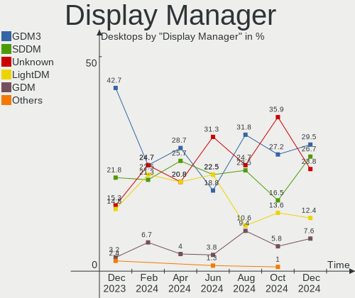
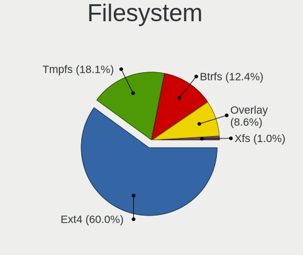
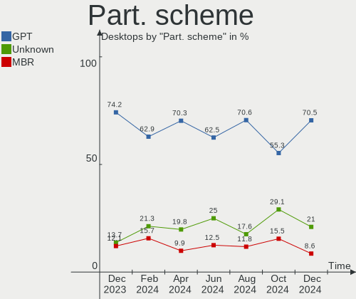
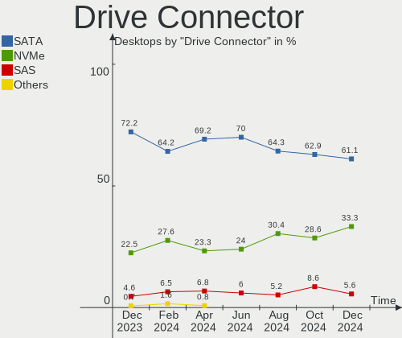
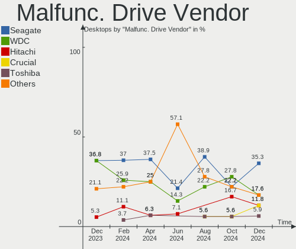
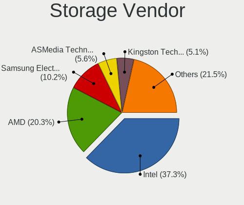
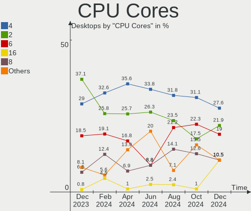
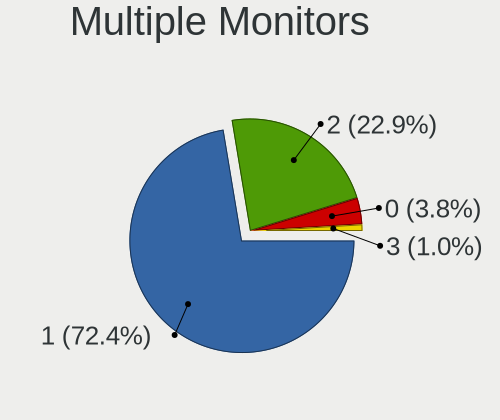

Linux in France - Hardware Trends (Desktops)
--------------------------------------------

A project to identify most popular hardware characteristics and track their change
over time based on data collected by Linux users at https://Linux-Hardware.org.

Anyone can contribute to this report by the [hw-probe](https://github.com/linuxhw/hw-probe) tool:

    sudo -E hw-probe -all -upload

Period: Nov, 2022.

Contents
--------

* [ System ](#system)
  - [ OS                       ](#os)
  - [ OS Family                ](#os-family)
  - [ Kernel                   ](#kernel)
  - [ Kernel Family            ](#kernel-family)
  - [ Kernel Major Ver.        ](#kernel-major-ver)
  - [ Arch                     ](#arch)
  - [ DE                       ](#de)
  - [ Display Server           ](#display-server)
  - [ Display Manager          ](#display-manager)
  - [ OS Lang                  ](#os-lang)
  - [ Boot Mode                ](#boot-mode)
  - [ Filesystem               ](#filesystem)
  - [ Part. scheme             ](#part-scheme)
  - [ Dual Boot with Linux/BSD ](#dual-boot-with-linuxbsd)
  - [ Dual Boot (Win)          ](#dual-boot-win)

* [ Board ](#board)
  - [ Vendor                   ](#vendor)
  - [ Model                    ](#model)
  - [ Model Family             ](#model-family)
  - [ MFG Year                 ](#mfg-year)
  - [ Form Factor              ](#form-factor)
  - [ Secure Boot              ](#secure-boot)
  - [ Coreboot                 ](#coreboot)
  - [ RAM Size                 ](#ram-size)
  - [ RAM Used                 ](#ram-used)
  - [ Total Drives             ](#total-drives)
  - [ Has CD-ROM               ](#has-cd-rom)
  - [ Has Ethernet             ](#has-ethernet)
  - [ Has WiFi                 ](#has-wifi)
  - [ Has Bluetooth            ](#has-bluetooth)

* [ Location ](#location)
  - [ Country                  ](#country)
  - [ City                     ](#city)

* [ Drives ](#drives)
  - [ Drive Vendor             ](#drive-vendor)
  - [ Drive Model              ](#drive-model)
  - [ HDD Vendor               ](#hdd-vendor)
  - [ SSD Vendor               ](#ssd-vendor)
  - [ Drive Kind               ](#drive-kind)
  - [ Drive Connector          ](#drive-connector)
  - [ Drive Size               ](#drive-size)
  - [ Space Total              ](#space-total)
  - [ Space Used               ](#space-used)
  - [ Malfunc. Drives          ](#malfunc-drives)
  - [ Malfunc. Drive Vendor    ](#malfunc-drive-vendor)
  - [ Malfunc. HDD Vendor      ](#malfunc-hdd-vendor)
  - [ Malfunc. Drive Kind      ](#malfunc-drive-kind)
  - [ Failed Drives            ](#failed-drives)
  - [ Failed Drive Vendor      ](#failed-drive-vendor)
  - [ Drive Status             ](#drive-status)

* [ Storage controller ](#storage-controller)
  - [ Storage Vendor           ](#storage-vendor)
  - [ Storage Model            ](#storage-model)
  - [ Storage Kind             ](#storage-kind)

* [ Processor ](#processor)
  - [ CPU Vendor               ](#cpu-vendor)
  - [ CPU Model                ](#cpu-model)
  - [ CPU Model Family         ](#cpu-model-family)
  - [ CPU Cores                ](#cpu-cores)
  - [ CPU Sockets              ](#cpu-sockets)
  - [ CPU Threads              ](#cpu-threads)
  - [ CPU Op-Modes             ](#cpu-op-modes)
  - [ CPU Microcode            ](#cpu-microcode)
  - [ CPU Microarch            ](#cpu-microarch)

* [ Graphics ](#graphics)
  - [ GPU Vendor               ](#gpu-vendor)
  - [ GPU Model                ](#gpu-model)
  - [ GPU Combo                ](#gpu-combo)
  - [ GPU Driver               ](#gpu-driver)
  - [ GPU Memory               ](#gpu-memory)

* [ Monitor ](#monitor)
  - [ Monitor Vendor           ](#monitor-vendor)
  - [ Monitor Model            ](#monitor-model)
  - [ Monitor Resolution       ](#monitor-resolution)
  - [ Monitor Diagonal         ](#monitor-diagonal)
  - [ Monitor Width            ](#monitor-width)
  - [ Aspect Ratio             ](#aspect-ratio)
  - [ Monitor Area             ](#monitor-area)
  - [ Pixel Density            ](#pixel-density)
  - [ Multiple Monitors        ](#multiple-monitors)

* [ Network ](#network)
  - [ Net Controller Vendor    ](#net-controller-vendor)
  - [ Net Controller Model     ](#net-controller-model)
  - [ Wireless Vendor          ](#wireless-vendor)
  - [ Wireless Model           ](#wireless-model)
  - [ Ethernet Vendor          ](#ethernet-vendor)
  - [ Ethernet Model           ](#ethernet-model)
  - [ Net Controller Kind      ](#net-controller-kind)
  - [ Used Controller          ](#used-controller)
  - [ NICs                     ](#nics)
  - [ IPv6                     ](#ipv6)

* [ Bluetooth ](#bluetooth)
  - [ Bluetooth Vendor         ](#bluetooth-vendor)
  - [ Bluetooth Model          ](#bluetooth-model)

* [ Sound ](#sound)
  - [ Sound Vendor             ](#sound-vendor)
  - [ Sound Model              ](#sound-model)

* [ Memory ](#memory)
  - [ Memory Vendor            ](#memory-vendor)
  - [ Memory Model             ](#memory-model)
  - [ Memory Kind              ](#memory-kind)
  - [ Memory Form Factor       ](#memory-form-factor)
  - [ Memory Size              ](#memory-size)
  - [ Memory Speed             ](#memory-speed)

* [ Printers & scanners ](#printers--scanners)
  - [ Printer Vendor           ](#printer-vendor)
  - [ Printer Model            ](#printer-model)
  - [ Scanner Vendor           ](#scanner-vendor)
  - [ Scanner Model            ](#scanner-model)

* [ Camera ](#camera)
  - [ Camera Vendor            ](#camera-vendor)
  - [ Camera Model             ](#camera-model)

* [ Security ](#security)
  - [ Fingerprint Vendor       ](#fingerprint-vendor)
  - [ Fingerprint Model        ](#fingerprint-model)
  - [ Chipcard Vendor          ](#chipcard-vendor)
  - [ Chipcard Model           ](#chipcard-model)

* [ Unsupported ](#unsupported)
  - [ Unsupported Devices      ](#unsupported-devices)
  - [ Unsupported Device Types ](#unsupported-device-types)

System
------

OS
--

Installed operating systems

| Name               | Desktops | Percent |
|--------------------|----------|---------|
| Ubuntu 22.04       | 20       | 21.28%  |
| Ubuntu 20.04       | 9        | 9.57%   |
| OpenMandriva 4.3   | 7        | 7.45%   |
| Linux Mint 21      | 6        | 6.38%   |
| OpenMandriva 4.50  | 5        | 5.32%   |
| Xubuntu 22.04      | 4        | 4.26%   |
| Ubuntu 22.10       | 3        | 3.19%   |
| Kubuntu 22.04      | 3        | 3.19%   |
| KDE neon 22.04     | 3        | 3.19%   |
| Fedora 37          | 3        | 3.19%   |
| Debian 11          | 3        | 3.19%   |
| Zorin 16           | 2        | 2.13%   |
| Xubuntu 20.04      | 2        | 2.13%   |
| Lubuntu 22.04      | 2        | 2.13%   |
| Lubuntu 20.04      | 2        | 2.13%   |
| Linux Mint 20.2    | 2        | 2.13%   |
| Fedora 35          | 2        | 2.13%   |
| Ubuntu Unity 23.04 | 1        | 1.06%   |
| Ubuntu MATE 22.04  | 1        | 1.06%   |
| Ubuntu MATE 18.04  | 1        | 1.06%   |
| Sparky 6.5         | 1        | 1.06%   |
| ROSA 12.3          | 1        | 1.06%   |
| Pop!_OS 22.04      | 1        | 1.06%   |
| OpenMandriva 22.11 | 1        | 1.06%   |
| Manjaro            | 1        | 1.06%   |
| LMDE 5             | 1        | 1.06%   |
| Linux Mint 20.3    | 1        | 1.06%   |
| Fedora 36          | 1        | 1.06%   |
| Debian Testing     | 1        | 1.06%   |
| Debian             | 1        | 1.06%   |
| Clear Linux 37680  | 1        | 1.06%   |
| ArcoLinux Rolling  | 1        | 1.06%   |
| Arch Rolling       | 1        | 1.06%   |

OS Family
---------

OS without a version

| Name         | Desktops | Percent |
|--------------|----------|---------|
| Ubuntu       | 32       | 34.04%  |
| OpenMandriva | 13       | 13.83%  |
| Linux Mint   | 9        | 9.57%   |
| Xubuntu      | 6        | 6.38%   |
| Fedora       | 6        | 6.38%   |
| Debian       | 5        | 5.32%   |
| Lubuntu      | 4        | 4.26%   |
| Kubuntu      | 3        | 3.19%   |
| KDE neon     | 3        | 3.19%   |
| Zorin        | 2        | 2.13%   |
| Ubuntu MATE  | 2        | 2.13%   |
| Ubuntu Unity | 1        | 1.06%   |
| Sparky       | 1        | 1.06%   |
| ROSA         | 1        | 1.06%   |
| Pop!_OS      | 1        | 1.06%   |
| Manjaro      | 1        | 1.06%   |
| LMDE         | 1        | 1.06%   |
| Clear Linux  | 1        | 1.06%   |
| ArcoLinux    | 1        | 1.06%   |
| Arch         | 1        | 1.06%   |

Kernel
------

Version of the Linux kernel

| Version                            | Desktops | Percent |
|------------------------------------|----------|---------|
| 5.15.0-52-generic                  | 24       | 25.53%  |
| 5.15.0-53-generic                  | 13       | 13.83%  |
| 5.16.7-desktop-1omv4003            | 7        | 7.45%   |
| 5.4.0-131-generic                  | 6        | 6.38%   |
| 5.10.0-19-amd64                    | 4        | 4.26%   |
| 5.19.12-desktop-2omv4090           | 3        | 3.19%   |
| 5.19.0-23-generic                  | 3        | 3.19%   |
| 5.15.0-41-generic                  | 3        | 3.19%   |
| 5.4.0-132-generic                  | 2        | 2.13%   |
| 5.19.7-300.fc37.x86_64             | 2        | 2.13%   |
| 5.19.5-desktop-1omv4090            | 2        | 2.13%   |
| 5.15.0-43-generic                  | 2        | 2.13%   |
| 6.0.9-desktop-1omv22090            | 1        | 1.06%   |
| 6.0.9-300.fc37.x86_64              | 1        | 1.06%   |
| 6.0.8-100.fc35.x86_64              | 1        | 1.06%   |
| 6.0.6-76060006-generic             | 1        | 1.06%   |
| 6.0.5-arch1-1-15khz                | 1        | 1.06%   |
| 6.0.5-200.fc36.x86_64              | 1        | 1.06%   |
| 6.0.10-zen2-1-zen                  | 1        | 1.06%   |
| 6.0.0-5-amd64                      | 1        | 1.06%   |
| 6.0.0-2-amd64                      | 1        | 1.06%   |
| 5.9.1-rt20                         | 1        | 1.06%   |
| 5.8.0-38-generic                   | 1        | 1.06%   |
| 5.4.0-88-generic                   | 1        | 1.06%   |
| 5.4.0-26-generic                   | 1        | 1.06%   |
| 5.4.0-128-generic                  | 1        | 1.06%   |
| 5.19.16-100.fc35.x86_64            | 1        | 1.06%   |
| 5.19.0-24-generic                  | 1        | 1.06%   |
| 5.19.0-1-amd64                     | 1        | 1.06%   |
| 5.16.13-1132.native                | 1        | 1.06%   |
| 5.15.76-1-MANJARO                  | 1        | 1.06%   |
| 5.15.0-54-generic                  | 1        | 1.06%   |
| 5.15.0-47-generic                  | 1        | 1.06%   |
| 5.13.0-30-generic                  | 1        | 1.06%   |
| 5.10.74-generic-2rosa2021.1-x86_64 | 1        | 1.06%   |

Kernel Family
-------------

Linux kernel without a distro release

| Version | Desktops | Percent |
|---------|----------|---------|
| 5.15.0  | 44       | 46.81%  |
| 5.4.0   | 11       | 11.7%   |
| 5.16.7  | 7        | 7.45%   |
| 5.19.0  | 5        | 5.32%   |
| 5.10.0  | 4        | 4.26%   |
| 5.19.12 | 3        | 3.19%   |
| 6.0.9   | 2        | 2.13%   |
| 6.0.5   | 2        | 2.13%   |
| 6.0.0   | 2        | 2.13%   |
| 5.19.7  | 2        | 2.13%   |
| 5.19.5  | 2        | 2.13%   |
| 6.0.8   | 1        | 1.06%   |
| 6.0.6   | 1        | 1.06%   |
| 6.0.10  | 1        | 1.06%   |
| 5.9.1   | 1        | 1.06%   |
| 5.8.0   | 1        | 1.06%   |
| 5.19.16 | 1        | 1.06%   |
| 5.16.13 | 1        | 1.06%   |
| 5.15.76 | 1        | 1.06%   |
| 5.13.0  | 1        | 1.06%   |
| 5.10.74 | 1        | 1.06%   |

Kernel Major Ver.
-----------------

Linux kernel major version

| Version | Desktops | Percent |
|---------|----------|---------|
| 5.15    | 45       | 47.87%  |
| 5.19    | 13       | 13.83%  |
| 5.4     | 11       | 11.7%   |
| 6.0     | 9        | 9.57%   |
| 5.16    | 8        | 8.51%   |
| 5.10    | 5        | 5.32%   |
| 5.9     | 1        | 1.06%   |
| 5.8     | 1        | 1.06%   |
| 5.13    | 1        | 1.06%   |

Arch
----

OS architecture (x86_64, i586, etc.)

| Name   | Desktops | Percent |
|--------|----------|---------|
| x86_64 | 94       | 100%    |

DE
--

Desktop Environment

| Name            | Desktops | Percent |
|-----------------|----------|---------|
| GNOME           | 30       | 31.91%  |
| KDE5            | 23       | 24.47%  |
| X-Cinnamon      | 9        | 9.57%   |
| XFCE            | 8        | 8.51%   |
| Unknown         | 8        | 8.51%   |
| MATE            | 4        | 4.26%   |
| LXQt            | 4        | 4.26%   |
| Cinnamon        | 3        | 3.19%   |
| GNOME Flashback | 2        | 2.13%   |
| Unity           | 1        | 1.06%   |
| LXDE            | 1        | 1.06%   |
| KDE             | 1        | 1.06%   |

Display Server
--------------

X11 or Wayland

| Name    | Desktops | Percent |
|---------|----------|---------|
| X11     | 69       | 73.4%   |
| Wayland | 16       | 17.02%  |
| Tty     | 7        | 7.45%   |
| Unknown | 2        | 2.13%   |

Display Manager
---------------

SDDM, LightDM, etc.

| Name    | Desktops | Percent |
|---------|----------|---------|
| GDM3    | 25       | 26.6%   |
| SDDM    | 21       | 22.34%  |
| LightDM | 20       | 21.28%  |
| Unknown | 18       | 19.15%  |
| GDM     | 9        | 9.57%   |
| LXDM    | 1        | 1.06%   |

OS Lang
-------

Language

| Lang  | Desktops | Percent |
|-------|----------|---------|
| fr_FR | 83       | 88.3%   |
| en_US | 9        | 9.57%   |
| fi_FI | 1        | 1.06%   |
| C     | 1        | 1.06%   |

Boot Mode
---------

EFI or BIOS

| Mode | Desktops | Percent |
|------|----------|---------|
| BIOS | 54       | 57.45%  |
| EFI  | 40       | 42.55%  |

Filesystem
----------

Type of filesystem

| Type    | Desktops | Percent |
|---------|----------|---------|
| Ext4    | 78       | 82.98%  |
| Overlay | 11       | 11.7%   |
| Btrfs   | 5        | 5.32%   |

Part. scheme
------------

Scheme of partitioning

| Type    | Desktops | Percent |
|---------|----------|---------|
| GPT     | 54       | 57.45%  |
| MBR     | 26       | 27.66%  |
| Unknown | 14       | 14.89%  |

Dual Boot with Linux/BSD
------------------------

Hosting more than one Linux/BSD

| Dual boot | Desktops | Percent |
|-----------|----------|---------|
| No        | 63       | 67.02%  |
| Yes       | 31       | 32.98%  |

Dual Boot (Win)
---------------

Hosting Linux and Windows

| Dual boot | Desktops | Percent |
|-----------|----------|---------|
| No        | 54       | 57.45%  |
| Yes       | 40       | 42.55%  |

Board
-----

Vendor
------

Motherboard manufacturer

| Name                | Desktops | Percent |
|---------------------|----------|---------|
| ASUSTek Computer    | 22       | 23.4%   |
| Gigabyte Technology | 18       | 19.15%  |
| MSI                 | 16       | 17.02%  |
| Dell                | 12       | 12.77%  |
| Hewlett-Packard     | 6        | 6.38%   |
| Acer                | 5        | 5.32%   |
| Intel               | 4        | 4.26%   |
| Foxconn             | 3        | 3.19%   |
| Lenovo              | 2        | 2.13%   |
| ASRock              | 2        | 2.13%   |
| Unknown             | 2        | 2.13%   |
| Biostar             | 1        | 1.06%   |
| BESSTAR Tech        | 1        | 1.06%   |

Model
-----

Motherboard model

| Name                                 | Desktops | Percent |
|--------------------------------------|----------|---------|
| Gigabyte H97-HD3                     | 3        | 3.19%   |
| Gigabyte 970A-DS3P                   | 3        | 3.19%   |
| ASUS All Series                      | 3        | 3.19%   |
| MSI MS-7D46                          | 2        | 2.13%   |
| MSI MS-7758                          | 2        | 2.13%   |
| MSI MS-7693                          | 2        | 2.13%   |
| Dell OptiPlex 7010                   | 2        | 2.13%   |
| Unknown                              | 2        | 2.13%   |
| MSI MS-7D17                          | 1        | 1.06%   |
| MSI MS-7C91                          | 1        | 1.06%   |
| MSI MS-7B93                          | 1        | 1.06%   |
| MSI MS-7B61                          | 1        | 1.06%   |
| MSI MS-7A94                          | 1        | 1.06%   |
| MSI MS-7A32                          | 1        | 1.06%   |
| MSI MS-7923                          | 1        | 1.06%   |
| MSI MS-7798                          | 1        | 1.06%   |
| MSI MS-7721                          | 1        | 1.06%   |
| MSI MS-7680                          | 1        | 1.06%   |
| Lenovo ThinkCentre E73 10AW00ABIX    | 1        | 1.06%   |
| Lenovo ThinkCentre A70 7099A5G       | 1        | 1.06%   |
| Intel DQ77KB AAG81483-500            | 1        | 1.06%   |
| Intel DH67BL AAG10189-213            | 1        | 1.06%   |
| Intel D33217GKE G76540-203           | 1        | 1.06%   |
| Intel BTC-T37                        | 1        | 1.06%   |
| HP Z600 Workstation                  | 1        | 1.06%   |
| HP Pavilion Gaming Desktop TG01-0xxx | 1        | 1.06%   |
| HP EliteDesk 705 G4 DM 65W           | 1        | 1.06%   |
| HP Compaq Pro 6300 SFF               | 1        | 1.06%   |
| HP Compaq Elite 8300 All-in-One PC   | 1        | 1.06%   |
| HP 260 G2 DM                         | 1        | 1.06%   |
| Gigabyte Z690 GAMING X DDR4          | 1        | 1.06%   |
| Gigabyte Z390 UD                     | 1        | 1.06%   |
| Gigabyte X670 GAMING X AX            | 1        | 1.06%   |
| Gigabyte H170-HD3-CF                 | 1        | 1.06%   |
| Gigabyte GA-MA770T-UD3               | 1        | 1.06%   |
| Gigabyte G1.SNIPER B7                | 1        | 1.06%   |
| Gigabyte B650M DS3H                  | 1        | 1.06%   |
| Gigabyte B550 AORUS ELITE V2         | 1        | 1.06%   |
| Gigabyte B450M DS3H                  | 1        | 1.06%   |
| Gigabyte B450 AORUS ELITE            | 1        | 1.06%   |

Model Family
------------

Motherboard model prefix

| Name                   | Desktops | Percent |
|------------------------|----------|---------|
| Dell OptiPlex          | 8        | 8.51%   |
| Gigabyte H97-HD3       | 3        | 3.19%   |
| Gigabyte 970A-DS3P     | 3        | 3.19%   |
| ASUS All               | 3        | 3.19%   |
| Acer Veriton           | 3        | 3.19%   |
| MSI MS-7D46            | 2        | 2.13%   |
| MSI MS-7758            | 2        | 2.13%   |
| MSI MS-7693            | 2        | 2.13%   |
| Lenovo ThinkCentre     | 2        | 2.13%   |
| HP Compaq              | 2        | 2.13%   |
| Dell Precision         | 2        | 2.13%   |
| Dell Inspiron          | 2        | 2.13%   |
| ASUS P8Z77-V           | 2        | 2.13%   |
| Acer Aspire            | 2        | 2.13%   |
| Unknown                | 2        | 2.13%   |
| MSI MS-7D17            | 1        | 1.06%   |
| MSI MS-7C91            | 1        | 1.06%   |
| MSI MS-7B93            | 1        | 1.06%   |
| MSI MS-7B61            | 1        | 1.06%   |
| MSI MS-7A94            | 1        | 1.06%   |
| MSI MS-7A32            | 1        | 1.06%   |
| MSI MS-7923            | 1        | 1.06%   |
| MSI MS-7798            | 1        | 1.06%   |
| MSI MS-7721            | 1        | 1.06%   |
| MSI MS-7680            | 1        | 1.06%   |
| Intel DQ77KB           | 1        | 1.06%   |
| Intel DH67BL           | 1        | 1.06%   |
| Intel D33217GKE        | 1        | 1.06%   |
| Intel BTC-T37          | 1        | 1.06%   |
| HP Z600                | 1        | 1.06%   |
| HP Pavilion            | 1        | 1.06%   |
| HP EliteDesk           | 1        | 1.06%   |
| HP 260                 | 1        | 1.06%   |
| Gigabyte Z690          | 1        | 1.06%   |
| Gigabyte Z390          | 1        | 1.06%   |
| Gigabyte X670          | 1        | 1.06%   |
| Gigabyte H170-HD3-CF   | 1        | 1.06%   |
| Gigabyte GA-MA770T-UD3 | 1        | 1.06%   |
| Gigabyte G1.SNIPER     | 1        | 1.06%   |
| Gigabyte B650M         | 1        | 1.06%   |

MFG Year
--------

Motherboard manufacture year

| Year | Desktops | Percent |
|------|----------|---------|
| 2012 | 16       | 17.02%  |
| 2014 | 12       | 12.77%  |
| 2022 | 9        | 9.57%   |
| 2015 | 8        | 8.51%   |
| 2013 | 8        | 8.51%   |
| 2020 | 6        | 6.38%   |
| 2021 | 5        | 5.32%   |
| 2018 | 5        | 5.32%   |
| 2017 | 5        | 5.32%   |
| 2009 | 5        | 5.32%   |
| 2011 | 4        | 4.26%   |
| 2010 | 4        | 4.26%   |
| 2008 | 3        | 3.19%   |
| 2019 | 2        | 2.13%   |
| 2016 | 1        | 1.06%   |
| 2006 | 1        | 1.06%   |

Form Factor
-----------

Physical design of the computer

| Name    | Desktops | Percent |
|---------|----------|---------|
| Desktop | 94       | 100%    |

Secure Boot
-----------

Enabled or disabled

| State    | Desktops | Percent |
|----------|----------|---------|
| Disabled | 92       | 97.87%  |
| Enabled  | 2        | 2.13%   |

Coreboot
--------

Have coreboot on board

| Used | Desktops | Percent |
|------|----------|---------|
| No   | 94       | 100%    |

RAM Size
--------

Total RAM memory

| Size in GB  | Desktops | Percent |
|-------------|----------|---------|
| 8.01-16.0   | 22       | 23.4%   |
| 3.01-4.0    | 19       | 20.21%  |
| 16.01-24.0  | 17       | 18.09%  |
| 32.01-64.0  | 16       | 17.02%  |
| 4.01-8.0    | 14       | 14.89%  |
| 24.01-32.0  | 2        | 2.13%   |
| 64.01-256.0 | 2        | 2.13%   |
| 1.01-2.0    | 2        | 2.13%   |

RAM Used
--------

Used RAM memory

| Used GB    | Desktops | Percent |
|------------|----------|---------|
| 1.01-2.0   | 37       | 39.36%  |
| 2.01-3.0   | 20       | 21.28%  |
| 4.01-8.0   | 12       | 12.77%  |
| 3.01-4.0   | 12       | 12.77%  |
| 8.01-16.0  | 9        | 9.57%   |
| 0.51-1.0   | 2        | 2.13%   |
| 16.01-24.0 | 1        | 1.06%   |
| 0.01-0.5   | 1        | 1.06%   |

Total Drives
------------

Number of drives on board

| Drives | Desktops | Percent |
|--------|----------|---------|
| 1      | 41       | 43.62%  |
| 2      | 22       | 23.4%   |
| 3      | 16       | 17.02%  |
| 5      | 8        | 8.51%   |
| 4      | 4        | 4.26%   |
| 6      | 3        | 3.19%   |

Has CD-ROM
----------

Has CD-ROM on board

| Presented | Desktops | Percent |
|-----------|----------|---------|
| Yes       | 50       | 53.19%  |
| No        | 44       | 46.81%  |

Has Ethernet
------------

Has Ethernet on board

| Presented | Desktops | Percent |
|-----------|----------|---------|
| Yes       | 94       | 100%    |

Has WiFi
--------

Has WiFi module

| Presented | Desktops | Percent |
|-----------|----------|---------|
| No        | 58       | 61.7%   |
| Yes       | 36       | 38.3%   |

Has Bluetooth
-------------

Has Bluetooth module

| Presented | Desktops | Percent |
|-----------|----------|---------|
| No        | 70       | 74.47%  |
| Yes       | 24       | 25.53%  |

Location
--------

Country
-------

Geographic location (country)

| Country | Desktops | Percent |
|---------|----------|---------|
| France  | 94       | 100%    |

City
----

Geographic location (city)

| City                      | Desktops | Percent |
|---------------------------|----------|---------|
| Paris                     | 5        | 5.32%   |
| Champs-sur-Marne          | 3        | 3.19%   |
| Valence                   | 2        | 2.13%   |
| Souillac                  | 2        | 2.13%   |
| Roubaix                   | 2        | 2.13%   |
| Poitiers                  | 2        | 2.13%   |
| Lyon                      | 2        | 2.13%   |
| Longjumeau                | 2        | 2.13%   |
| Gex                       | 2        | 2.13%   |
| Comines                   | 2        | 2.13%   |
| Yutz                      | 1        | 1.06%   |
| Winkel                    | 1        | 1.06%   |
| Versailles                | 1        | 1.06%   |
| Vence                     | 1        | 1.06%   |
| Vannes                    | 1        | 1.06%   |
| Valenciennes              | 1        | 1.06%   |
| Toulon                    | 1        | 1.06%   |
| Suresnes                  | 1        | 1.06%   |
| Sète                     | 1        | 1.06%   |
| Senonches                 | 1        | 1.06%   |
| Sartrouville              | 1        | 1.06%   |
| Saint-Pair-sur-Mer        | 1        | 1.06%   |
| Saint-Nazaire             | 1        | 1.06%   |
| Saint-Jacques-de-la-Lande | 1        | 1.06%   |
| Saint-Denis               | 1        | 1.06%   |
| Rouvray-Saint-Denis       | 1        | 1.06%   |
| Riverenert                | 1        | 1.06%   |
| Rieux-Volvestre           | 1        | 1.06%   |
| Pluvigner                 | 1        | 1.06%   |
| Plancoet                  | 1        | 1.06%   |
| Pau                       | 1        | 1.06%   |
| Pamiers                   | 1        | 1.06%   |
| Orly                      | 1        | 1.06%   |
| Nîmes                    | 1        | 1.06%   |
| Neuilly-sur-Marne         | 1        | 1.06%   |
| Nantua                    | 1        | 1.06%   |
| Montreuil                 | 1        | 1.06%   |
| Montpellier               | 1        | 1.06%   |
| Montevrain                | 1        | 1.06%   |
| Molsheim                  | 1        | 1.06%   |

Drives
------

Drive Vendor
------------

Hard drive vendors

| Vendor              | Desktops | Drives | Percent |
|---------------------|----------|--------|---------|
| Seagate             | 33       | 42     | 19.3%   |
| Samsung Electronics | 32       | 40     | 18.71%  |
| WDC                 | 28       | 45     | 16.37%  |
| Toshiba             | 10       | 10     | 5.85%   |
| Hitachi             | 10       | 10     | 5.85%   |
| Crucial             | 10       | 11     | 5.85%   |
| Sandisk             | 9        | 9      | 5.26%   |
| Kingston            | 9        | 9      | 5.26%   |
| PNY                 | 4        | 4      | 2.34%   |
| SK hynix            | 3        | 3      | 1.75%   |
| Micron Technology   | 3        | 3      | 1.75%   |
| Maxtor              | 3        | 3      | 1.75%   |
| China               | 3        | 3      | 1.75%   |
| SPCC                | 2        | 2      | 1.17%   |
| Intel               | 2        | 3      | 1.17%   |
| USB                 | 1        | 1      | 0.58%   |
| Unknown             | 1        | 1      | 0.58%   |
| Phison Electronics  | 1        | 1      | 0.58%   |
| Phison              | 1        | 1      | 0.58%   |
| OCZ                 | 1        | 1      | 0.58%   |
| LITEON              | 1        | 1      | 0.58%   |
| KingSpec            | 1        | 1      | 0.58%   |
| JMicron Technology  | 1        | 1      | 0.58%   |
| ASMT                | 1        | 1      | 0.58%   |
| Unknown             | 1        | 1      | 0.58%   |

Drive Model
-----------

Hard drive models

| Model                                | Desktops | Percent |
|--------------------------------------|----------|---------|
| Seagate ST1000DM003-1ER162 1TB       | 4        | 2%      |
| Samsung SSD 850 EVO 500GB            | 4        | 2%      |
| Seagate ST500DM002-1BD142 500GB      | 3        | 1.5%    |
| Seagate ST1000DM010-2EP102 1TB       | 3        | 1.5%    |
| Seagate ST1000DM003-1CH162 1TB       | 3        | 1.5%    |
| Samsung SSD 870 EVO 500GB            | 3        | 1.5%    |
| Samsung SSD 860 EVO 1TB              | 3        | 1.5%    |
| PNY CS900 480GB SSD                  | 3        | 1.5%    |
| WDC WD2500JS-41SGB0 250GB            | 2        | 1%      |
| Toshiba HDWD130 3TB                  | 2        | 1%      |
| Toshiba HDWD110 1TB                  | 2        | 1%      |
| Seagate ST3360320AS 360GB            | 2        | 1%      |
| Seagate ST31000528AS 1TB             | 2        | 1%      |
| SanDisk SDSSDP128G 128GB             | 2        | 1%      |
| Samsung SSD 860 EVO 500GB            | 2        | 1%      |
| Samsung SSD 850 PRO 256GB            | 2        | 1%      |
| Samsung SSD 850 EVO 250GB            | 2        | 1%      |
| Samsung SSD 840 PRO Series 128GB     | 2        | 1%      |
| Micron MTFDHBA256TCK-1AS1AABHA 256GB | 2        | 1%      |
| Hitachi HDS722516VLSA80 164GB        | 2        | 1%      |
| Crucial CT480BX500SSD1 480GB         | 2        | 1%      |
| Crucial CT1000MX500SSD1 1TB          | 2        | 1%      |
| WDC WUH721816ALE6L4 16TB             | 1        | 0.5%    |
| WDC WDS500G2B0B-00YS70 500GB SSD     | 1        | 0.5%    |
| WDC WDS500G2B0A-00SM50 500GB SSD     | 1        | 0.5%    |
| WDC WDS240G2G0B-00EPW0 240GB SSD     | 1        | 0.5%    |
| WDC WDS100T2B0C-00PXH0 1TB           | 1        | 0.5%    |
| WDC WDS100T2B0A-00SM50 1TB SSD       | 1        | 0.5%    |
| WDC WD7500BPVT-80HXZT3 752GB         | 1        | 0.5%    |
| WDC WD5000AAVS-00ZTB0 500GB          | 1        | 0.5%    |
| WDC WD5000AAKX-00U6AA0 500GB         | 1        | 0.5%    |
| WDC WD5000AAKX-00ERMA0 500GB         | 1        | 0.5%    |
| WDC WD5000AAKS-00A7B2 500GB          | 1        | 0.5%    |
| WDC WD5000AAJS-00TKA0 500GB          | 1        | 0.5%    |
| WDC WD5000AADS-00S9B0 500GB          | 1        | 0.5%    |
| WDC WD40EZRX-00SPEB0 4TB             | 1        | 0.5%    |
| WDC WD40EFRX-68WT0N0 4TB             | 1        | 0.5%    |
| WDC WD4005FZBX-00K5WB0 4TB           | 1        | 0.5%    |
| WDC WD4003FRYZ-01F0DB0 4TB           | 1        | 0.5%    |
| WDC WD3200BPVT-22ZEST0 320GB         | 1        | 0.5%    |

HDD Vendor
----------

Hard disk drive vendors

| Vendor              | Desktops | Drives | Percent |
|---------------------|----------|--------|---------|
| Seagate             | 33       | 42     | 37.93%  |
| WDC                 | 24       | 40     | 27.59%  |
| Hitachi             | 10       | 10     | 11.49%  |
| Toshiba             | 9        | 9      | 10.34%  |
| Samsung Electronics | 6        | 6      | 6.9%    |
| Maxtor              | 3        | 3      | 3.45%   |
| USB                 | 1        | 1      | 1.15%   |
| Unknown             | 1        | 1      | 1.15%   |

SSD Vendor
----------

Solid state drive vendors

| Vendor              | Desktops | Drives | Percent |
|---------------------|----------|--------|---------|
| Samsung Electronics | 23       | 28     | 34.33%  |
| Crucial             | 9        | 10     | 13.43%  |
| Kingston            | 7        | 7      | 10.45%  |
| SanDisk             | 6        | 6      | 8.96%   |
| WDC                 | 4        | 4      | 5.97%   |
| PNY                 | 4        | 4      | 5.97%   |
| SPCC                | 2        | 2      | 2.99%   |
| Intel               | 2        | 3      | 2.99%   |
| China               | 2        | 2      | 2.99%   |
| SK hynix            | 1        | 1      | 1.49%   |
| OCZ                 | 1        | 1      | 1.49%   |
| Micron Technology   | 1        | 1      | 1.49%   |
| LITEON              | 1        | 1      | 1.49%   |
| KingSpec            | 1        | 1      | 1.49%   |
| JMicron Technology  | 1        | 1      | 1.49%   |
| ASMT                | 1        | 1      | 1.49%   |
| Unknown             | 1        | 1      | 1.49%   |

Drive Kind
----------

HDD or SSD

| Kind    | Desktops | Drives | Percent |
|---------|----------|--------|---------|
| SSD     | 58       | 74     | 42.65%  |
| HDD     | 58       | 112    | 42.65%  |
| NVMe    | 19       | 20     | 13.97%  |
| Unknown | 1        | 1      | 0.74%   |

Drive Connector
---------------

SATA, SAS, NVMe, etc.

| Type | Desktops | Drives | Percent |
|------|----------|--------|---------|
| SATA | 88       | 180    | 77.88%  |
| NVMe | 19       | 20     | 16.81%  |
| SAS  | 6        | 7      | 5.31%   |

Drive Size
----------

Size of hard drive

| Size in TB | Desktops | Drives | Percent |
|------------|----------|--------|---------|
| 0.01-0.5   | 64       | 92     | 48.12%  |
| 0.51-1.0   | 42       | 59     | 31.58%  |
| 1.01-2.0   | 11       | 16     | 8.27%   |
| 3.01-4.0   | 7        | 10     | 5.26%   |
| 2.01-3.0   | 5        | 5      | 3.76%   |
| 4.01-10.0  | 3        | 3      | 2.26%   |
| 10.01-20.0 | 1        | 1      | 0.75%   |

Space Total
-----------

Amount of disk space available on the file system

| Size in GB     | Desktops | Percent |
|----------------|----------|---------|
| 101-250        | 21       | 22.34%  |
| 251-500        | 17       | 18.09%  |
| 1001-2000      | 15       | 15.96%  |
| 501-1000       | 11       | 11.7%   |
| 1-20           | 8        | 8.51%   |
| 51-100         | 8        | 8.51%   |
| More than 3000 | 7        | 7.45%   |
| 2001-3000      | 3        | 3.19%   |
| Unknown        | 3        | 3.19%   |
| 21-50          | 1        | 1.06%   |

Space Used
----------

Amount of used disk space

| Used GB        | Desktops | Percent |
|----------------|----------|---------|
| 1-20           | 24       | 25.53%  |
| 21-50          | 18       | 19.15%  |
| 251-500        | 12       | 12.77%  |
| 101-250        | 11       | 11.7%   |
| 501-1000       | 9        | 9.57%   |
| 51-100         | 8        | 8.51%   |
| 1001-2000      | 5        | 5.32%   |
| More than 3000 | 3        | 3.19%   |
| Unknown        | 3        | 3.19%   |
| 2001-3000      | 1        | 1.06%   |

Malfunc. Drives
---------------

Drive models with a malfunction

| Model                                 | Desktops | Drives | Percent |
|---------------------------------------|----------|--------|---------|
| WDC WD40EFRX-68WT0N0 4TB              | 1        | 1      | 5%      |
| WDC WD3200AAKS-00L9A0 320GB           | 1        | 1      | 5%      |
| WDC WD20EARS-00J2GB0 2TB              | 1        | 1      | 5%      |
| WDC WD2000FYYZ-01UL1B0 2TB            | 1        | 1      | 5%      |
| WDC WD1003FBYX-01Y7B1 1TB             | 1        | 1      | 5%      |
| Seagate ST9160314AS 160GB             | 1        | 1      | 5%      |
| Seagate ST3360320AS 360GB             | 1        | 1      | 5%      |
| Seagate ST3160812AS 160GB             | 1        | 1      | 5%      |
| Seagate ST31000528AS 1TB              | 1        | 1      | 5%      |
| Seagate ST2000DX001-1CM164 2TB        | 1        | 1      | 5%      |
| Seagate ST2000DM006-2DM164 2TB        | 1        | 1      | 5%      |
| Samsung Electronics SSD 850 PRO 256GB | 1        | 1      | 5%      |
| Samsung Electronics SP2504C 250GB     | 1        | 1      | 5%      |
| Samsung Electronics HD501LJ 500GB     | 1        | 1      | 5%      |
| Maxtor STM3500320AS 500GB             | 1        | 1      | 5%      |
| Intel SSDSC2CW120A3 120GB             | 1        | 1      | 5%      |
| Hitachi HDS721010DLE630 1TB           | 1        | 1      | 5%      |
| Hitachi HDS721010CLA630 1TB           | 1        | 1      | 5%      |
| Hitachi HDP725025GLA380 250GB         | 1        | 1      | 5%      |
| Crucial CT240M500SSD1 240GB           | 1        | 1      | 5%      |

Malfunc. Drive Vendor
---------------------

Vendors of faulty drives

| Vendor              | Desktops | Drives | Percent |
|---------------------|----------|--------|---------|
| Seagate             | 6        | 6      | 31.58%  |
| WDC                 | 4        | 5      | 21.05%  |
| Samsung Electronics | 3        | 3      | 15.79%  |
| Hitachi             | 3        | 3      | 15.79%  |
| Maxtor              | 1        | 1      | 5.26%   |
| Intel               | 1        | 1      | 5.26%   |
| Crucial             | 1        | 1      | 5.26%   |

Malfunc. HDD Vendor
-------------------

Vendors of faulty HDD drives

| Vendor              | Desktops | Drives | Percent |
|---------------------|----------|--------|---------|
| Seagate             | 6        | 6      | 37.5%   |
| WDC                 | 4        | 5      | 25%     |
| Hitachi             | 3        | 3      | 18.75%  |
| Samsung Electronics | 2        | 2      | 12.5%   |
| Maxtor              | 1        | 1      | 6.25%   |

Malfunc. Drive Kind
-------------------

Kinds of faulty drives

| Kind | Desktops | Drives | Percent |
|------|----------|--------|---------|
| HDD  | 16       | 17     | 84.21%  |
| SSD  | 3        | 3      | 15.79%  |

Failed Drives
-------------

Failed drive models

Zero info for selected period =(

Failed Drive Vendor
-------------------

Failed drive vendors

Zero info for selected period =(

Drive Status
------------

Number of failed and malfunc. drives

| Status   | Desktops | Drives | Percent |
|----------|----------|--------|---------|
| Works    | 60       | 122    | 53.1%   |
| Detected | 35       | 65     | 30.97%  |
| Malfunc  | 18       | 20     | 15.93%  |

Storage controller
------------------

Storage Vendor
--------------

Storage controller vendors

| Vendor                       | Desktops | Percent |
|------------------------------|----------|---------|
| Intel                        | 67       | 53.6%   |
| AMD                          | 26       | 20.8%   |
| ASMedia Technology           | 7        | 5.6%    |
| Samsung Electronics          | 6        | 4.8%    |
| SanDisk                      | 4        | 3.2%    |
| SK hynix                     | 2        | 1.6%    |
| Phison Electronics           | 2        | 1.6%    |
| Micron Technology            | 2        | 1.6%    |
| Marvell Technology Group     | 2        | 1.6%    |
| Kingston Technology Company  | 2        | 1.6%    |
| Toshiba America Info Systems | 1        | 0.8%    |
| Nvidia                       | 1        | 0.8%    |
| Micron/Crucial Technology    | 1        | 0.8%    |
| JMicron Technology           | 1        | 0.8%    |
| Broadcom / LSI               | 1        | 0.8%    |

Storage Model
-------------

Storage controller models

| Model                                                                          | Desktops | Percent |
|--------------------------------------------------------------------------------|----------|---------|
| Intel 7 Series/C210 Series Chipset Family 6-port SATA Controller [AHCI mode]   | 11       | 7.43%   |
| AMD FCH SATA Controller [AHCI mode]                                            | 10       | 6.76%   |
| AMD SB7x0/SB8x0/SB9x0 SATA Controller [AHCI mode]                              | 7        | 4.73%   |
| Intel Q170/Q150/B150/H170/H110/Z170/CM236 Chipset SATA Controller [AHCI Mode]  | 6        | 4.05%   |
| Intel 8 Series/C220 Series Chipset Family 6-port SATA Controller 1 [AHCI mode] | 6        | 4.05%   |
| ASMedia ASM1062 Serial ATA Controller                                          | 6        | 4.05%   |
| AMD SB7x0/SB8x0/SB9x0 IDE Controller                                           | 6        | 4.05%   |
| Intel SATA Controller [RAID mode]                                              | 5        | 3.38%   |
| Intel 9 Series Chipset Family SATA Controller [AHCI Mode]                      | 5        | 3.38%   |
| Intel 6 Series/C200 Series Chipset Family 6 port Desktop SATA AHCI Controller  | 5        | 3.38%   |
| Samsung NVMe SSD Controller SM981/PM981/PM983                                  | 4        | 2.7%    |
| Intel Alder Lake-S PCH SATA Controller [AHCI Mode]                             | 3        | 2.03%   |
| Intel 500 Series Chipset Family SATA AHCI Controller                           | 3        | 2.03%   |
| AMD 500 Series Chipset SATA Controller                                         | 3        | 2.03%   |
| AMD 400 Series Chipset SATA Controller                                         | 3        | 2.03%   |
| Micron Non-Volatile memory controller                                          | 2        | 1.35%   |
| Intel Celeron/Pentium Silver Processor SATA Controller                         | 2        | 1.35%   |
| Intel 82801JI (ICH10 Family) 4 port SATA IDE Controller #1                     | 2        | 1.35%   |
| Intel 82801JI (ICH10 Family) 2 port SATA IDE Controller #2                     | 2        | 1.35%   |
| Intel 5 Series/3400 Series Chipset 6 port SATA AHCI Controller                 | 2        | 1.35%   |
| Intel 200 Series PCH SATA controller [AHCI mode]                               | 2        | 1.35%   |
| AMD SB7x0/SB8x0/SB9x0 SATA Controller [IDE mode]                               | 2        | 1.35%   |
| AMD SATA controller                                                            | 2        | 1.35%   |
| AMD FCH IDE Controller                                                         | 2        | 1.35%   |
| Toshiba America Info Systems NVMe Controller                                   | 1        | 0.68%   |
| SK hynix Gold P31/PC711 NVMe Solid State Drive                                 | 1        | 0.68%   |
| SK hynix BC501 NVMe Solid State Drive                                          | 1        | 0.68%   |
| SanDisk WD Blue SN550 NVMe SSD                                                 | 1        | 0.68%   |
| SanDisk WD Black SN750 / PC SN730 NVMe SSD                                     | 1        | 0.68%   |
| SanDisk WD Black NVMe SSD                                                      | 1        | 0.68%   |
| SanDisk WD Black 2018/SN750 / PC SN720 NVMe SSD                                | 1        | 0.68%   |
| Samsung NVMe SSD Controller SM961/PM961/SM963                                  | 1        | 0.68%   |
| Samsung NVMe SSD Controller PM9A1/PM9A3/980PRO                                 | 1        | 0.68%   |
| Phison PS5013 E13 NVMe Controller                                              | 1        | 0.68%   |
| Phison E16 PCIe4 NVMe Controller                                               | 1        | 0.68%   |
| Nvidia MCP51 Serial ATA Controller                                             | 1        | 0.68%   |
| Nvidia MCP51 IDE                                                               | 1        | 0.68%   |
| Micron/Crucial P5 Plus NVMe PCIe SSD                                           | 1        | 0.68%   |
| Marvell Group 88SE9120 SATA 6Gb/s Controller                                   | 1        | 0.68%   |
| Marvell Group 88SE6111/6121 SATA II / PATA Controller                          | 1        | 0.68%   |

Storage Kind
------------

Kind of storage controller (IDE, SATA, NVMe, SAS, ...)

| Kind | Desktops | Percent |
|------|----------|---------|
| SATA | 81       | 62.79%  |
| IDE  | 21       | 16.28%  |
| NVMe | 19       | 14.73%  |
| RAID | 7        | 5.43%   |
| SAS  | 1        | 0.78%   |

Processor
---------

CPU Vendor
----------

Processor vendors

| Vendor | Desktops | Percent |
|--------|----------|---------|
| Intel  | 67       | 71.28%  |
| AMD    | 27       | 28.72%  |

CPU Model
---------

Processor models

| Model                                       | Desktops | Percent |
|---------------------------------------------|----------|---------|
| Intel Core i7-3770K CPU @ 3.50GHz           | 2        | 2.13%   |
| Intel Core i5-6500 CPU @ 3.20GHz            | 2        | 2.13%   |
| Intel Core i5-4440 CPU @ 3.10GHz            | 2        | 2.13%   |
| Intel Core i5-3570 CPU @ 3.40GHz            | 2        | 2.13%   |
| Intel Core i5-10400F CPU @ 2.90GHz          | 2        | 2.13%   |
| Intel Core i3-2120 CPU @ 3.30GHz            | 2        | 2.13%   |
| Intel Celeron J4125 CPU @ 2.00GHz           | 2        | 2.13%   |
| Intel 12th Gen Core i3-12100                | 2        | 2.13%   |
| AMD Ryzen 9 7950X 16-Core Processor         | 2        | 2.13%   |
| AMD Ryzen 5 3600 6-Core Processor           | 2        | 2.13%   |
| AMD Ryzen 5 2400G with Radeon Vega Graphics | 2        | 2.13%   |
| AMD FX-6350 Six-Core Processor              | 2        | 2.13%   |
| Intel Xeon CPU E5530 @ 2.40GHz              | 1        | 1.06%   |
| Intel Xeon CPU E5-2630 v4 @ 2.20GHz         | 1        | 1.06%   |
| Intel Xeon CPU E31245 @ 3.30GHz             | 1        | 1.06%   |
| Intel Xeon CPU E31220 @ 3.10GHz             | 1        | 1.06%   |
| Intel Xeon CPU E3-1245 V2 @ 3.40GHz         | 1        | 1.06%   |
| Intel Pentium CPU G2120 @ 3.10GHz           | 1        | 1.06%   |
| Intel Pentium CPU 4405U @ 2.10GHz           | 1        | 1.06%   |
| Intel Core i7-9700F CPU @ 3.00GHz           | 1        | 1.06%   |
| Intel Core i7-8700 CPU @ 3.20GHz            | 1        | 1.06%   |
| Intel Core i7-7740X CPU @ 4.30GHz           | 1        | 1.06%   |
| Intel Core i7-6700K CPU @ 4.00GHz           | 1        | 1.06%   |
| Intel Core i7-5820K CPU @ 3.30GHz           | 1        | 1.06%   |
| Intel Core i7-4790S CPU @ 3.20GHz           | 1        | 1.06%   |
| Intel Core i7-4790K CPU @ 4.00GHz           | 1        | 1.06%   |
| Intel Core i7-3770T CPU @ 2.50GHz           | 1        | 1.06%   |
| Intel Core i7-3770S CPU @ 3.10GHz           | 1        | 1.06%   |
| Intel Core i7-3770 CPU @ 3.40GHz            | 1        | 1.06%   |
| Intel Core i7-10700T CPU @ 2.00GHz          | 1        | 1.06%   |
| Intel Core i5-8500T CPU @ 2.10GHz           | 1        | 1.06%   |
| Intel Core i5-8400 CPU @ 2.80GHz            | 1        | 1.06%   |
| Intel Core i5-4690K CPU @ 3.50GHz           | 1        | 1.06%   |
| Intel Core i5-4460S CPU @ 2.90GHz           | 1        | 1.06%   |
| Intel Core i5-4460 CPU @ 3.20GHz            | 1        | 1.06%   |
| Intel Core i5-3570K CPU @ 3.40GHz           | 1        | 1.06%   |
| Intel Core i5-3350P CPU @ 3.10GHz           | 1        | 1.06%   |
| Intel Core i5-3330 CPU @ 3.00GHz            | 1        | 1.06%   |
| Intel Core i5-2500 CPU @ 3.30GHz            | 1        | 1.06%   |
| Intel Core i5 CPU 760 @ 2.80GHz             | 1        | 1.06%   |

CPU Model Family
----------------

Processor model prefix

| Model             | Desktops | Percent |
|-------------------|----------|---------|
| Intel Core i5     | 20       | 21.28%  |
| Intel Core i7     | 13       | 13.83%  |
| Intel Core i3     | 10       | 10.64%  |
| Other             | 6        | 6.38%   |
| Intel Celeron     | 6        | 6.38%   |
| Intel Xeon        | 5        | 5.32%   |
| AMD FX            | 5        | 5.32%   |
| AMD Ryzen 7       | 4        | 4.26%   |
| AMD Ryzen 5       | 4        | 4.26%   |
| Intel Core 2 Quad | 3        | 3.19%   |
| AMD Ryzen 9       | 3        | 3.19%   |
| Intel Pentium     | 2        | 2.13%   |
| Intel Core 2 Duo  | 2        | 2.13%   |
| AMD A8            | 2        | 2.13%   |
| AMD A6            | 2        | 2.13%   |
| Intel Atom        | 1        | 1.06%   |
| AMD Ryzen 3 PRO   | 1        | 1.06%   |
| AMD Phenom II X4  | 1        | 1.06%   |
| AMD Athlon II X4  | 1        | 1.06%   |
| AMD Athlon II X3  | 1        | 1.06%   |
| AMD Athlon II X2  | 1        | 1.06%   |
| AMD Athlon 64 X2  | 1        | 1.06%   |

CPU Cores
---------

Number of processor cores

| Number | Desktops | Percent |
|--------|----------|---------|
| 4      | 44       | 46.81%  |
| 2      | 22       | 23.4%   |
| 6      | 10       | 10.64%  |
| 8      | 7        | 7.45%   |
| 3      | 4        | 4.26%   |
| 16     | 3        | 3.19%   |
| 1      | 2        | 2.13%   |
| 24     | 1        | 1.06%   |
| 20     | 1        | 1.06%   |

CPU Sockets
-----------

Number of sockets

| Number | Desktops | Percent |
|--------|----------|---------|
| 1      | 92       | 97.87%  |
| 2      | 2        | 2.13%   |

CPU Threads
-----------

Threads per core (Hyper-Threading)

| Number | Desktops | Percent |
|--------|----------|---------|
| 2      | 54       | 57.45%  |
| 1      | 40       | 42.55%  |

CPU Op-Modes
------------

CPU Operation Modes (32-bit, 64-bit)

| Op mode        | Desktops | Percent |
|----------------|----------|---------|
| 32-bit, 64-bit | 94       | 100%    |

CPU Microcode
-------------

Microcode number

| Number     | Desktops | Percent |
|------------|----------|---------|
| Unknown    | 24       | 25.53%  |
| 0x306a9    | 11       | 11.7%   |
| 0x306c3    | 8        | 8.51%   |
| 0x506e3    | 5        | 5.32%   |
| 0x206a7    | 5        | 5.32%   |
| 0x1067a    | 4        | 4.26%   |
| 0x010000c8 | 4        | 4.26%   |
| 0x706a8    | 2        | 2.13%   |
| 0x0a601203 | 2        | 2.13%   |
| 0x0a20120a | 2        | 2.13%   |
| 0x08101016 | 2        | 2.13%   |
| 0x06001119 | 2        | 2.13%   |
| 0x06000852 | 2        | 2.13%   |
| 0xb0671    | 1        | 1.06%   |
| 0xa0655    | 1        | 1.06%   |
| 0xa0653    | 1        | 1.06%   |
| 0x906ed    | 1        | 1.06%   |
| 0x906ea    | 1        | 1.06%   |
| 0x90672    | 1        | 1.06%   |
| 0x806c2    | 1        | 1.06%   |
| 0x6fb      | 1        | 1.06%   |
| 0x406f1    | 1        | 1.06%   |
| 0x406e3    | 1        | 1.06%   |
| 0x306f2    | 1        | 1.06%   |
| 0x20652    | 1        | 1.06%   |
| 0x106e5    | 1        | 1.06%   |
| 0x106ca    | 1        | 1.06%   |
| 0x106a5    | 1        | 1.06%   |
| 0x0a50000d | 1        | 1.06%   |
| 0x0a201016 | 1        | 1.06%   |
| 0x08701013 | 1        | 1.06%   |
| 0x06000822 | 1        | 1.06%   |
| 0x03000027 | 1        | 1.06%   |
| 0x010000dc | 1        | 1.06%   |

CPU Microarch
-------------

Microarchitecture

| Name             | Desktops | Percent |
|------------------|----------|---------|
| IvyBridge        | 13       | 13.83%  |
| Haswell          | 12       | 12.77%  |
| Skylake          | 8        | 8.51%   |
| SandyBridge      | 7        | 7.45%   |
| Piledriver       | 7        | 7.45%   |
| KabyLake         | 5        | 5.32%   |
| K10              | 5        | 5.32%   |
| Zen 3            | 4        | 4.26%   |
| Penryn           | 4        | 4.26%   |
| CometLake        | 4        | 4.26%   |
| Unknown          | 4        | 4.26%   |
| Zen 2            | 3        | 3.19%   |
| Zen              | 3        | 3.19%   |
| Nehalem          | 3        | 3.19%   |
| Goldmont plus    | 2        | 2.13%   |
| Alderlake Hybrid | 2        | 2.13%   |
| Westmere         | 1        | 1.06%   |
| TigerLake        | 1        | 1.06%   |
| K8 Hammer        | 1        | 1.06%   |
| K10 Llano        | 1        | 1.06%   |
| Excavator        | 1        | 1.06%   |
| Core             | 1        | 1.06%   |
| Broadwell        | 1        | 1.06%   |
| Bonnell          | 1        | 1.06%   |

Graphics
--------

GPU Vendor
----------

Vendors of graphics cards

| Vendor | Desktops | Percent |
|--------|----------|---------|
| Nvidia | 41       | 41%     |
| Intel  | 34       | 34%     |
| AMD    | 25       | 25%     |

GPU Model
---------

Graphics card models

| Model                                                                       | Desktops | Percent |
|-----------------------------------------------------------------------------|----------|---------|
| Nvidia GT218 [GeForce 210]                                                  | 5        | 4.85%   |
| Intel Xeon E3-1200 v3/4th Gen Core Processor Integrated Graphics Controller | 5        | 4.85%   |
| Intel Xeon E3-1200 v2/3rd Gen Core processor Graphics Controller            | 5        | 4.85%   |
| Nvidia GK208B [GeForce GT 730]                                              | 3        | 2.91%   |
| Nvidia GK208B [GeForce GT 710]                                              | 3        | 2.91%   |
| Nvidia GK106 [GeForce GTX 660]                                              | 3        | 2.91%   |
| Intel HD Graphics 510                                                       | 3        | 2.91%   |
| Intel 4th Generation Core Processor Family Integrated Graphics Controller   | 3        | 2.91%   |
| AMD Navi 23 [Radeon RX 6600/6600 XT/6600M]                                  | 3        | 2.91%   |
| Nvidia GP107 [GeForce GTX 1050]                                             | 2        | 1.94%   |
| Nvidia GP107 [GeForce GTX 1050 Ti]                                          | 2        | 1.94%   |
| Nvidia GF116 [GeForce GTX 550 Ti]                                           | 2        | 1.94%   |
| Nvidia GF108 [GeForce GT 730]                                               | 2        | 1.94%   |
| Intel IvyBridge GT2 [HD Graphics 4000]                                      | 2        | 1.94%   |
| Intel GeminiLake [UHD Graphics 600]                                         | 2        | 1.94%   |
| Intel CometLake-S GT2 [UHD Graphics 630]                                    | 2        | 1.94%   |
| Intel CoffeeLake-S GT2 [UHD Graphics 630]                                   | 2        | 1.94%   |
| Intel Alder Lake-S GT1 [UHD Graphics 730]                                   | 2        | 1.94%   |
| Intel 4 Series Chipset Integrated Graphics Controller                       | 2        | 1.94%   |
| Intel 2nd Generation Core Processor Family Integrated Graphics Controller   | 2        | 1.94%   |
| AMD Raven Ridge [Radeon Vega Series / Radeon Vega Mobile Series]            | 2        | 1.94%   |
| AMD Raphael                                                                 | 2        | 1.94%   |
| AMD Baffin [Radeon RX 550 640SP / RX 560/560X]                              | 2        | 1.94%   |
| Nvidia TU116 [GeForce GTX 1650 SUPER]                                       | 1        | 0.97%   |
| Nvidia TU106 [GeForce RTX 2070 Rev. A]                                      | 1        | 0.97%   |
| Nvidia TU106 [GeForce RTX 2060 Rev. A]                                      | 1        | 0.97%   |
| Nvidia GT218 [ION]                                                          | 1        | 0.97%   |
| Nvidia GT215 [GeForce GT 240]                                               | 1        | 0.97%   |
| Nvidia GP108 [GeForce GT 1030]                                              | 1        | 0.97%   |
| Nvidia GP107GL [Quadro P400]                                                | 1        | 0.97%   |
| Nvidia GP106 [GeForce GTX 1060 3GB]                                         | 1        | 0.97%   |
| Nvidia GM204 [GeForce GTX 970]                                              | 1        | 0.97%   |
| Nvidia GM107 [GeForce GTX 745]                                              | 1        | 0.97%   |
| Nvidia GK107GL [Quadro K420]                                                | 1        | 0.97%   |
| Nvidia GK107 [GeForce GT 640]                                               | 1        | 0.97%   |
| Nvidia GK104 [GeForce GTX 690]                                              | 1        | 0.97%   |
| Nvidia GF119 [NVS 310]                                                      | 1        | 0.97%   |
| Nvidia GF119 [GeForce GT 520]                                               | 1        | 0.97%   |
| Nvidia GF104 [GeForce GTX 460]                                              | 1        | 0.97%   |
| Nvidia GA106 [GeForce RTX 3060 Lite Hash Rate]                              | 1        | 0.97%   |

GPU Combo
---------

Combinations of graphics cards

| Name            | Desktops | Percent |
|-----------------|----------|---------|
| 1 x Nvidia      | 37       | 39.36%  |
| 1 x Intel       | 29       | 30.85%  |
| 1 x AMD         | 21       | 22.34%  |
| 3 x AMD         | 1        | 1.06%   |
| 2 x Nvidia      | 1        | 1.06%   |
| 2 x Intel       | 1        | 1.06%   |
| 2 x AMD         | 1        | 1.06%   |
| Intel + 2 x AMD | 1        | 1.06%   |
| Intel + Nvidia  | 1        | 1.06%   |
| AMD + Nvidia    | 1        | 1.06%   |

GPU Driver
----------

Free vs proprietary

| Driver      | Desktops | Percent |
|-------------|----------|---------|
| Free        | 70       | 74.47%  |
| Proprietary | 17       | 18.09%  |
| Unknown     | 7        | 7.45%   |

GPU Memory
----------

Total video memory

| Size in GB | Desktops | Percent |
|------------|----------|---------|
| Unknown    | 47       | 50%     |
| 1.01-2.0   | 15       | 15.96%  |
| 0.51-1.0   | 13       | 13.83%  |
| 0.01-0.5   | 8        | 8.51%   |
| 3.01-4.0   | 6        | 6.38%   |
| 7.01-8.0   | 2        | 2.13%   |
| 8.01-16.0  | 2        | 2.13%   |
| 2.01-3.0   | 1        | 1.06%   |

Monitor
-------

Monitor Vendor
--------------

Monitor vendors

| Vendor               | Desktops | Percent |
|----------------------|----------|---------|
| Iiyama               | 17       | 17.71%  |
| Samsung Electronics  | 14       | 14.58%  |
| Dell                 | 8        | 8.33%   |
| Philips              | 7        | 7.29%   |
| Goldstar             | 7        | 7.29%   |
| Acer                 | 7        | 7.29%   |
| Hewlett-Packard      | 6        | 6.25%   |
| Ancor Communications | 6        | 6.25%   |
| ViewSonic            | 5        | 5.21%   |
| AOC                  | 4        | 4.17%   |
| Unknown              | 2        | 2.08%   |
| Medion               | 2        | 2.08%   |
| BenQ                 | 2        | 2.08%   |
| Plain Tree Systems   | 1        | 1.04%   |
| NEC Computers        | 1        | 1.04%   |
| MSI                  | 1        | 1.04%   |
| Idek Iiyama          | 1        | 1.04%   |
| Hyundai ImageQuest   | 1        | 1.04%   |
| HKC                  | 1        | 1.04%   |
| Eizo                 | 1        | 1.04%   |
| Belinea              | 1        | 1.04%   |
| ASUSTek Computer     | 1        | 1.04%   |

Monitor Model
-------------

Monitor models

| Model                                                                  | Desktops | Percent |
|------------------------------------------------------------------------|----------|---------|
| ViewSonic VX2457 VSCB931 1920x1080 521x293mm 23.5-inch                 | 3        | 3%      |
| Samsung Electronics S24F350 SAM0D20 1920x1080 521x293mm 23.5-inch      | 2        | 2%      |
| Samsung Electronics S24D330 SAM0D92 1920x1080 531x299mm 24.0-inch      | 2        | 2%      |
| Philips PHL 277E6 PHLC0E6 1920x1080 598x336mm 27.0-inch                | 2        | 2%      |
| Iiyama PLE2483H IVM6113 1920x1080 531x299mm 24.0-inch                  | 2        | 2%      |
| Iiyama PL2779Q IVM6615 2560x1440 597x336mm 27.0-inch                   | 2        | 2%      |
| Iiyama PL2409HD IVM560C 1920x1080 520x290mm 23.4-inch                  | 2        | 2%      |
| Dell U2412M DELA07A 1920x1200 518x324mm 24.1-inch                      | 2        | 2%      |
| Ancor Communications ASUS VS228 ACI22FD 1920x1080 476x268mm 21.5-inch  | 2        | 2%      |
| Acer V193 ACR00F7 1280x1024 380x310mm 19.3-inch                        | 2        | 2%      |
| ViewSonic VX2703 SERIES VSCF62B 1920x1080 597x336mm 27.0-inch          | 1        | 1%      |
| ViewSonic VP2468 Series VSCB032 1920x1080 527x296mm 23.8-inch          | 1        | 1%      |
| Unknown LCD Monitor SAMSUNG 1920x1080                                  | 1        | 1%      |
| Unknown LCD Monitor FFFF 2288x1287 2550x2550mm 142.0-inch              | 1        | 1%      |
| Samsung Electronics SyncMaster SAM05C4 1920x1080 510x287mm 23.0-inch   | 1        | 1%      |
| Samsung Electronics SyncMaster SAM050B 1920x1080 477x268mm 21.5-inch   | 1        | 1%      |
| Samsung Electronics SyncMaster SAM0473 2048x1152 510x287mm 23.0-inch   | 1        | 1%      |
| Samsung Electronics S27E330 SAM0D91 1920x1080 598x336mm 27.0-inch      | 1        | 1%      |
| Samsung Electronics S24F350 SAM0D21 1920x1080 521x293mm 23.5-inch      | 1        | 1%      |
| Samsung Electronics LCD Monitor SAM0B60 1680x1050 887x500mm 40.1-inch  | 1        | 1%      |
| Samsung Electronics LCD Monitor SAM0A7D 1920x1080 1060x626mm 48.5-inch | 1        | 1%      |
| Samsung Electronics LCD Monitor SAM03D3 1360x768 410x256mm 19.0-inch   | 1        | 1%      |
| Samsung Electronics LCD Monitor S22E450 1920x1080                      | 1        | 1%      |
| Samsung Electronics C49HG9x SAM0E5D 3840x1080 1196x336mm 48.9-inch     | 1        | 1%      |
| Samsung Electronics C24FG7x SAM0E43 1920x1080 532x304mm 24.1-inch      | 1        | 1%      |
| Plain Tree Systems FULL HDTV PTS00EC 1920x1080 521x293mm 23.5-inch     | 1        | 1%      |
| Philips PHL 275E1 PHLC20C 2560x1440 600x340mm 27.2-inch                | 1        | 1%      |
| Philips PHL 272P7V PHL0902 3840x2160 597x336mm 27.0-inch               | 1        | 1%      |
| Philips PHL 241E1 PHLC207 1920x1080 527x296mm 23.8-inch                | 1        | 1%      |
| Philips PHL 241B7Q PHL0909 1920x1080 527x296mm 23.8-inch               | 1        | 1%      |
| Philips 241E PHLC035 1920x1080 520x290mm 23.4-inch                     | 1        | 1%      |
| NEC Computers E222W NEC6777 1680x1050 474x296mm 22.0-inch              | 1        | 1%      |
| MSI MAG272CQR MSI3CA6 2560x1440 598x336mm 27.0-inch                    | 1        | 1%      |
| Medion MD 20130 MED3615 1920x1200 550x344mm 25.5-inch                  | 1        | 1%      |
| Medion MD 20120 MED3607 1920x1080 521x293mm 23.5-inch                  | 1        | 1%      |
| Iiyama XB2776QS-B1 IVM660E 2560x1440 597x336mm 27.0-inch               | 1        | 1%      |
| Iiyama PLX2483H IVM6114 1920x1080 531x299mm 24.0-inch                  | 1        | 1%      |
| Iiyama PLE2607WSD IVM6603 1920x1200 550x344mm 25.5-inch                | 1        | 1%      |
| Iiyama PLE2207WS IVM5609 1680x1050 474x296mm 22.0-inch                 | 1        | 1%      |
| Iiyama PL2776HD IVM6605 1920x1080 598x336mm 27.0-inch                  | 1        | 1%      |

Monitor Resolution
------------------

Monitor screen resolution

| Resolution         | Desktops | Percent |
|--------------------|----------|---------|
| 1920x1080 (FHD)    | 53       | 56.38%  |
| 1280x1024 (SXGA)   | 8        | 8.51%   |
| 2560x1440 (QHD)    | 7        | 7.45%   |
| 1680x1050 (WSXGA+) | 7        | 7.45%   |
| 3840x2160 (4K)     | 5        | 5.32%   |
| 1920x1200 (WUXGA)  | 4        | 4.26%   |
| 1440x900 (WXGA+)   | 2        | 2.13%   |
| 3840x1080          | 1        | 1.06%   |
| 3600x1080          | 1        | 1.06%   |
| 2560x1080          | 1        | 1.06%   |
| 2288x1287          | 1        | 1.06%   |
| 2048x1152          | 1        | 1.06%   |
| 1600x900 (HD+)     | 1        | 1.06%   |
| 1360x768           | 1        | 1.06%   |
| Unknown            | 1        | 1.06%   |

Monitor Diagonal
----------------

Diagonal size in inches

| Inches  | Desktops | Percent |
|---------|----------|---------|
| 27      | 19       | 20%     |
| 23      | 19       | 20%     |
| 24      | 13       | 13.68%  |
| 21      | 10       | 10.53%  |
| 19      | 8        | 8.42%   |
| 22      | 7        | 7.37%   |
| Unknown | 6        | 6.32%   |
| 25      | 3        | 3.16%   |
| 20      | 2        | 2.11%   |
| 142     | 1        | 1.05%   |
| 54      | 1        | 1.05%   |
| 49      | 1        | 1.05%   |
| 48      | 1        | 1.05%   |
| 34      | 1        | 1.05%   |
| 32      | 1        | 1.05%   |
| 31      | 1        | 1.05%   |
| 17      | 1        | 1.05%   |

Monitor Width
-------------

Physical width

| Width in mm    | Desktops | Percent |
|----------------|----------|---------|
| 501-600        | 50       | 54.95%  |
| 401-500        | 22       | 24.18%  |
| Unknown        | 6        | 6.59%   |
| 351-400        | 5        | 5.49%   |
| 1001-1500      | 3        | 3.3%    |
| 701-800        | 2        | 2.2%    |
| More than 2000 | 1        | 1.1%    |
| 601-700        | 1        | 1.1%    |
| 301-350        | 1        | 1.1%    |

Aspect Ratio
------------

Proportional relationship between the width and the height

| Ratio   | Desktops | Percent |
|---------|----------|---------|
| 16/9    | 58       | 65.17%  |
| 16/10   | 16       | 17.98%  |
| 5/4     | 5        | 5.62%   |
| Unknown | 5        | 5.62%   |
| 6/5     | 2        | 2.25%   |
| 32/9    | 1        | 1.12%   |
| 21/9    | 1        | 1.12%   |
| 1.00    | 1        | 1.12%   |

Monitor Area
------------

Area in inch²

| Area in inch² | Desktops | Percent |
|----------------|----------|---------|
| 201-250        | 38       | 41.3%   |
| 301-350        | 19       | 20.65%  |
| 151-200        | 14       | 15.22%  |
| 251-300        | 7        | 7.61%   |
| Unknown        | 6        | 6.52%   |
| More than 1000 | 3        | 3.26%   |
| 351-500        | 3        | 3.26%   |
| 141-150        | 1        | 1.09%   |
| 501-1000       | 1        | 1.09%   |

Pixel Density
-------------

Pixels per inch

| Density | Desktops | Percent |
|---------|----------|---------|
| 51-100  | 60       | 66.67%  |
| 101-120 | 17       | 18.89%  |
| Unknown | 6        | 6.67%   |
| 1-50    | 3        | 3.33%   |
| 161-240 | 3        | 3.33%   |
| 121-160 | 1        | 1.11%   |

Multiple Monitors
-----------------

Total monitors connected

| Total | Desktops | Percent |
|-------|----------|---------|
| 1     | 74       | 78.72%  |
| 2     | 12       | 12.77%  |
| 0     | 6        | 6.38%   |
| 3     | 2        | 2.13%   |

Network
-------

Net Controller Vendor
---------------------

Controller vendors

| Vendor                | Desktops | Percent |
|-----------------------|----------|---------|
| Realtek Semiconductor | 65       | 50%     |
| Intel                 | 36       | 27.69%  |
| Qualcomm Atheros      | 6        | 4.62%   |
| Broadcom              | 4        | 3.08%   |
| TP-Link               | 3        | 2.31%   |
| MediaTek              | 3        | 2.31%   |
| Ralink                | 2        | 1.54%   |
| Samsung Electronics   | 1        | 0.77%   |
| Ralink Technology     | 1        | 0.77%   |
| OPPO Electronics      | 1        | 0.77%   |
| Nvidia                | 1        | 0.77%   |
| NetGear               | 1        | 0.77%   |
| Motorola PCS          | 1        | 0.77%   |
| Edimax Technology     | 1        | 0.77%   |
| D-Link System         | 1        | 0.77%   |
| Conexant Systems      | 1        | 0.77%   |
| Belkin Components     | 1        | 0.77%   |
| ASIX Electronics      | 1        | 0.77%   |

Net Controller Model
--------------------

Controller models

| Model                                                             | Desktops | Percent |
|-------------------------------------------------------------------|----------|---------|
| Realtek RTL8111/8168/8411 PCI Express Gigabit Ethernet Controller | 49       | 33.79%  |
| Realtek RTL8125 2.5GbE Controller                                 | 6        | 4.14%   |
| Intel 82579V Gigabit Network Connection                           | 5        | 3.45%   |
| Intel 82579LM Gigabit Network Connection (Lewisville)             | 5        | 3.45%   |
| Intel Ethernet Connection (2) I219-V                              | 4        | 2.76%   |
| Realtek RTL88x2bu [AC1200 Techkey]                                | 3        | 2.07%   |
| Intel I211 Gigabit Network Connection                             | 3        | 2.07%   |
| Intel Ethernet Controller I225-V                                  | 3        | 2.07%   |
| Realtek RTL8821CE 802.11ac PCIe Wireless Network Adapter          | 2        | 1.38%   |
| Realtek RTL8188EUS 802.11n Wireless Network Adapter               | 2        | 1.38%   |
| Realtek RTL8153 Gigabit Ethernet Adapter                          | 2        | 1.38%   |
| Qualcomm Atheros Killer E220x Gigabit Ethernet Controller         | 2        | 1.38%   |
| MediaTek MT7921K (RZ608) Wi-Fi 6E 80MHz                           | 2        | 1.38%   |
| Intel Wi-Fi 6 AX200                                               | 2        | 1.38%   |
| Intel Ethernet Connection (7) I219-LM                             | 2        | 1.38%   |
| Intel Ethernet Connection (2) I218-V                              | 2        | 1.38%   |
| Intel Ethernet Connection (17) I219-V                             | 2        | 1.38%   |
| Broadcom BCM4360 802.11ac Wireless Network Adapter                | 2        | 1.38%   |
| TP-Link TL-WN823N v2/v3 [Realtek RTL8192EU]                       | 1        | 0.69%   |
| TP-Link Archer T3U [Realtek RTL8812BU]                            | 1        | 0.69%   |
| TP-Link 802.11ac WLAN Adapter                                     | 1        | 0.69%   |
| Samsung Galaxy series, misc. (tethering mode)                     | 1        | 0.69%   |
| Realtek RTL8822CE 802.11ac PCIe Wireless Network Adapter          | 1        | 0.69%   |
| Realtek RTL8821AE 802.11ac PCIe Wireless Network Adapter          | 1        | 0.69%   |
| Realtek RTL8812AE 802.11ac PCIe Wireless Network Adapter          | 1        | 0.69%   |
| Realtek RTL8192EE PCIe Wireless Network Adapter                   | 1        | 0.69%   |
| Realtek RTL8192CE PCIe Wireless Network Adapter                   | 1        | 0.69%   |
| Realtek RTL8188SU 802.11n WLAN Adapter                            | 1        | 0.69%   |
| Realtek RTL810xE PCI Express Fast Ethernet controller             | 1        | 0.69%   |
| Realtek RTL-8100/8101L/8139 PCI Fast Ethernet Adapter             | 1        | 0.69%   |
| Realtek 802.11n NIC                                               | 1        | 0.69%   |
| Realtek 802.11ac NIC                                              | 1        | 0.69%   |
| Ralink MT7601U Wireless Adapter                                   | 1        | 0.69%   |
| Ralink RT5390R 802.11bgn PCIe Wireless Network Adapter            | 1        | 0.69%   |
| Ralink RT2561/RT61 rev B 802.11g                                  | 1        | 0.69%   |
| Qualcomm Atheros QCA8171 Gigabit Ethernet                         | 1        | 0.69%   |
| Qualcomm Atheros AR9485 Wireless Network Adapter                  | 1        | 0.69%   |
| Qualcomm Atheros AR9285 Wireless Network Adapter (PCI-Express)    | 1        | 0.69%   |
| Qualcomm Atheros AR9227 Wireless Network Adapter                  | 1        | 0.69%   |
| OPPO SDM665-IDP _SN:18689828                                      | 1        | 0.69%   |

Wireless Vendor
---------------

Wireless vendors

| Vendor                | Desktops | Percent |
|-----------------------|----------|---------|
| Realtek Semiconductor | 14       | 36.84%  |
| Intel                 | 6        | 15.79%  |
| TP-Link               | 3        | 7.89%   |
| Qualcomm Atheros      | 3        | 7.89%   |
| MediaTek              | 3        | 7.89%   |
| Ralink                | 2        | 5.26%   |
| Broadcom              | 2        | 5.26%   |
| Ralink Technology     | 1        | 2.63%   |
| NetGear               | 1        | 2.63%   |
| Edimax Technology     | 1        | 2.63%   |
| D-Link System         | 1        | 2.63%   |
| Belkin Components     | 1        | 2.63%   |

Wireless Model
--------------

Wireless models

| Model                                                                                   | Desktops | Percent |
|-----------------------------------------------------------------------------------------|----------|---------|
| Realtek RTL88x2bu [AC1200 Techkey]                                                      | 3        | 7.69%   |
| Realtek RTL8821CE 802.11ac PCIe Wireless Network Adapter                                | 2        | 5.13%   |
| Realtek RTL8188EUS 802.11n Wireless Network Adapter                                     | 2        | 5.13%   |
| MediaTek MT7921K (RZ608) Wi-Fi 6E 80MHz                                                 | 2        | 5.13%   |
| Intel Wi-Fi 6 AX200                                                                     | 2        | 5.13%   |
| Broadcom BCM4360 802.11ac Wireless Network Adapter                                      | 2        | 5.13%   |
| TP-Link TL-WN823N v2/v3 [Realtek RTL8192EU]                                             | 1        | 2.56%   |
| TP-Link Archer T3U [Realtek RTL8812BU]                                                  | 1        | 2.56%   |
| TP-Link 802.11ac WLAN Adapter                                                           | 1        | 2.56%   |
| Realtek RTL8822CE 802.11ac PCIe Wireless Network Adapter                                | 1        | 2.56%   |
| Realtek RTL8821AE 802.11ac PCIe Wireless Network Adapter                                | 1        | 2.56%   |
| Realtek RTL8812AE 802.11ac PCIe Wireless Network Adapter                                | 1        | 2.56%   |
| Realtek RTL8192EE PCIe Wireless Network Adapter                                         | 1        | 2.56%   |
| Realtek RTL8192CE PCIe Wireless Network Adapter                                         | 1        | 2.56%   |
| Realtek RTL8188SU 802.11n WLAN Adapter                                                  | 1        | 2.56%   |
| Realtek 802.11n NIC                                                                     | 1        | 2.56%   |
| Realtek 802.11ac NIC                                                                    | 1        | 2.56%   |
| Ralink MT7601U Wireless Adapter                                                         | 1        | 2.56%   |
| Ralink RT5390R 802.11bgn PCIe Wireless Network Adapter                                  | 1        | 2.56%   |
| Ralink RT2561/RT61 rev B 802.11g                                                        | 1        | 2.56%   |
| Qualcomm Atheros AR9485 Wireless Network Adapter                                        | 1        | 2.56%   |
| Qualcomm Atheros AR9285 Wireless Network Adapter (PCI-Express)                          | 1        | 2.56%   |
| Qualcomm Atheros AR9227 Wireless Network Adapter                                        | 1        | 2.56%   |
| NetGear WNDA3100v3 802.11abgn 2x2:2 [MediaTek MT7632U]                                  | 1        | 2.56%   |
| MediaTek MT7922 802.11ax PCI Express Wireless Network Adapter                           | 1        | 2.56%   |
| Intel Wireless-AC 9260                                                                  | 1        | 2.56%   |
| Intel Wireless 7265                                                                     | 1        | 2.56%   |
| Intel Wi-Fi 6 AX210/AX211/AX411 160MHz                                                  | 1        | 2.56%   |
| Intel Tiger Lake PCH CNVi WiFi                                                          | 1        | 2.56%   |
| Edimax WiFi                                                                             | 1        | 2.56%   |
| D-Link System DWA-110 Wireless G Adapter(rev.A1) [Ralink RT2571W]                       | 1        | 2.56%   |
| Belkin Components F7D2102 802.11n N300 Micro Wireless Adapter v3000 [Realtek RTL8192CU] | 1        | 2.56%   |

Ethernet Vendor
---------------

Ethernet vendors

| Vendor                | Desktops | Percent |
|-----------------------|----------|---------|
| Realtek Semiconductor | 57       | 57%     |
| Intel                 | 33       | 33%     |
| Qualcomm Atheros      | 3        | 3%      |
| Broadcom              | 2        | 2%      |
| Samsung Electronics   | 1        | 1%      |
| OPPO Electronics      | 1        | 1%      |
| Nvidia                | 1        | 1%      |
| Motorola PCS          | 1        | 1%      |
| ASIX Electronics      | 1        | 1%      |

Ethernet Model
--------------

Ethernet models

| Model                                                             | Desktops | Percent |
|-------------------------------------------------------------------|----------|---------|
| Realtek RTL8111/8168/8411 PCI Express Gigabit Ethernet Controller | 49       | 46.67%  |
| Realtek RTL8125 2.5GbE Controller                                 | 6        | 5.71%   |
| Intel 82579V Gigabit Network Connection                           | 5        | 4.76%   |
| Intel 82579LM Gigabit Network Connection (Lewisville)             | 5        | 4.76%   |
| Intel Ethernet Connection (2) I219-V                              | 4        | 3.81%   |
| Intel I211 Gigabit Network Connection                             | 3        | 2.86%   |
| Intel Ethernet Controller I225-V                                  | 3        | 2.86%   |
| Realtek RTL8153 Gigabit Ethernet Adapter                          | 2        | 1.9%    |
| Qualcomm Atheros Killer E220x Gigabit Ethernet Controller         | 2        | 1.9%    |
| Intel Ethernet Connection (7) I219-LM                             | 2        | 1.9%    |
| Intel Ethernet Connection (2) I218-V                              | 2        | 1.9%    |
| Intel Ethernet Connection (17) I219-V                             | 2        | 1.9%    |
| Samsung Galaxy series, misc. (tethering mode)                     | 1        | 0.95%   |
| Realtek RTL810xE PCI Express Fast Ethernet controller             | 1        | 0.95%   |
| Realtek RTL-8100/8101L/8139 PCI Fast Ethernet Adapter             | 1        | 0.95%   |
| Qualcomm Atheros QCA8171 Gigabit Ethernet                         | 1        | 0.95%   |
| OPPO SDM665-IDP _SN:18689828                                      | 1        | 0.95%   |
| Nvidia MCP51 Ethernet Controller                                  | 1        | 0.95%   |
| Motorola PCS motorola one                                         | 1        | 0.95%   |
| Intel I210 Gigabit Network Connection                             | 1        | 0.95%   |
| Intel Ethernet Controller I226-V                                  | 1        | 0.95%   |
| Intel Ethernet Connection I217-V                                  | 1        | 0.95%   |
| Intel Ethernet Connection I217-LM                                 | 1        | 0.95%   |
| Intel Ethernet Connection (2) I219-LM                             | 1        | 0.95%   |
| Intel Ethernet Connection (14) I219-LM                            | 1        | 0.95%   |
| Intel 82599 10 Gigabit Network Connection                         | 1        | 0.95%   |
| Intel 82578DM Gigabit Network Connection                          | 1        | 0.95%   |
| Intel 82578DC Gigabit Network Connection                          | 1        | 0.95%   |
| Broadcom NetXtreme BCM5764M Gigabit Ethernet PCIe                 | 1        | 0.95%   |
| Broadcom NetXtreme BCM5761 Gigabit Ethernet PCIe                  | 1        | 0.95%   |
| Broadcom NetLink BCM57781 Gigabit Ethernet PCIe                   | 1        | 0.95%   |
| ASIX AX88179 Gigabit Ethernet                                     | 1        | 0.95%   |

Net Controller Kind
-------------------

Ethernet, WiFi or modem

| Kind     | Desktops | Percent |
|----------|----------|---------|
| Ethernet | 94       | 71.76%  |
| WiFi     | 36       | 27.48%  |
| Unknown  | 1        | 0.76%   |

Used Controller
---------------

Currently used network controller

| Kind     | Desktops | Percent |
|----------|----------|---------|
| Ethernet | 80       | 80.81%  |
| WiFi     | 19       | 19.19%  |

NICs
----

Total network controllers on board

| Total | Desktops | Percent |
|-------|----------|---------|
| 1     | 67       | 71.28%  |
| 2     | 23       | 24.47%  |
| 3     | 4        | 4.26%   |

IPv6
----

IPv6 vs IPv4

| Used | Desktops | Percent |
|------|----------|---------|
| Yes  | 52       | 55.32%  |
| No   | 42       | 44.68%  |

Bluetooth
---------

Bluetooth Vendor
----------------

Controller vendors

| Vendor                  | Desktops | Percent |
|-------------------------|----------|---------|
| Cambridge Silicon Radio | 10       | 41.67%  |
| Intel                   | 5        | 20.83%  |
| Realtek Semiconductor   | 3        | 12.5%   |
| MediaTek                | 3        | 12.5%   |
| ASUSTek Computer        | 2        | 8.33%   |
| IMC Networks            | 1        | 4.17%   |

Bluetooth Model
---------------

Controller models

| Model                                                 | Desktops | Percent |
|-------------------------------------------------------|----------|---------|
| Cambridge Silicon Radio Bluetooth Dongle (HCI mode)   | 10       | 41.67%  |
| Realtek Bluetooth Radio                               | 3        | 12.5%   |
| MediaTek Wireless_Device                              | 3        | 12.5%   |
| Intel AX200 Bluetooth                                 | 2        | 8.33%   |
| Intel Wireless-AC 9260 Bluetooth Adapter              | 1        | 4.17%   |
| Intel AX210 Bluetooth                                 | 1        | 4.17%   |
| Intel AX201 Bluetooth                                 | 1        | 4.17%   |
| IMC Networks Bluetooth Radio                          | 1        | 4.17%   |
| ASUS Broadcom BCM20702 Single-Chip Bluetooth 4.0 + LE | 1        | 4.17%   |
| ASUS ASUS USB-BT500                                   | 1        | 4.17%   |

Sound
-----

Sound Vendor
------------

Sound card vendors

| Vendor              | Desktops | Percent |
|---------------------|----------|---------|
| Intel               | 64       | 41.83%  |
| Nvidia              | 39       | 25.49%  |
| AMD                 | 34       | 22.22%  |
| Texas Instruments   | 3        | 1.96%   |
| C-Media Electronics | 3        | 1.96%   |
| VIA Technologies    | 1        | 0.65%   |
| TerraTec Electronic | 1        | 0.65%   |
| Sonuus Limited      | 1        | 0.65%   |
| Samson Technologies | 1        | 0.65%   |
| MIDITECH            | 1        | 0.65%   |
| Logitech            | 1        | 0.65%   |
| GYROCOM C&C         | 1        | 0.65%   |
| GN Netcom           | 1        | 0.65%   |
| Ensoniq             | 1        | 0.65%   |
| ASUSTek Computer    | 1        | 0.65%   |

Sound Model
-----------

Sound card models

| Model                                                                             | Desktops | Percent |
|-----------------------------------------------------------------------------------|----------|---------|
| Intel 7 Series/C216 Chipset Family High Definition Audio Controller               | 13       | 7.39%   |
| AMD SBx00 Azalia (Intel HDA)                                                      | 10       | 5.68%   |
| Nvidia High Definition Audio Controller                                           | 7        | 3.98%   |
| Intel Xeon E3-1200 v3/4th Gen Core Processor HD Audio Controller                  | 7        | 3.98%   |
| Intel 6 Series/C200 Series Chipset Family High Definition Audio Controller        | 7        | 3.98%   |
| Nvidia GK208 HDMI/DP Audio Controller                                             | 6        | 3.41%   |
| Intel 8 Series/C220 Series Chipset High Definition Audio Controller               | 6        | 3.41%   |
| AMD Family 17h/19h HD Audio Controller                                            | 6        | 3.41%   |
| Nvidia GP107GL High Definition Audio Controller                                   | 5        | 2.84%   |
| Intel 100 Series/C230 Series Chipset Family HD Audio Controller                   | 5        | 2.84%   |
| AMD Starship/Matisse HD Audio Controller                                          | 5        | 2.84%   |
| Intel Audio device                                                                | 4        | 2.27%   |
| Intel 9 Series Chipset Family HD Audio Controller                                 | 4        | 2.27%   |
| AMD Navi 21/23 HDMI/DP Audio Controller                                           | 4        | 2.27%   |
| Nvidia GK106 HDMI Audio Controller                                                | 3        | 1.7%    |
| Intel Cannon Lake PCH cAVS                                                        | 3        | 1.7%    |
| Intel Alder Lake-S HD Audio Controller                                            | 3        | 1.7%    |
| Intel 82801JI (ICH10 Family) HD Audio Controller                                  | 3        | 1.7%    |
| Intel 5 Series/3400 Series Chipset High Definition Audio                          | 3        | 1.7%    |
| AMD Oland/Hainan/Cape Verde/Pitcairn HDMI Audio [Radeon HD 7000 Series]           | 3        | 1.7%    |
| AMD FCH Azalia Controller                                                         | 3        | 1.7%    |
| AMD Baffin HDMI/DP Audio [Radeon RX 550 640SP / RX 560/560X]                      | 3        | 1.7%    |
| Texas Instruments PCM2902 Audio Codec                                             | 2        | 1.14%   |
| Nvidia TU106 High Definition Audio Controller                                     | 2        | 1.14%   |
| Nvidia GK107 HDMI Audio Controller                                                | 2        | 1.14%   |
| Nvidia GF119 HDMI Audio Controller                                                | 2        | 1.14%   |
| Nvidia GF116 High Definition Audio Controller                                     | 2        | 1.14%   |
| Nvidia GF108 High Definition Audio Controller                                     | 2        | 1.14%   |
| Intel NM10/ICH7 Family High Definition Audio Controller                           | 2        | 1.14%   |
| Intel Celeron/Pentium Silver Processor High Definition Audio                      | 2        | 1.14%   |
| Intel C610/X99 series chipset HD Audio Controller                                 | 2        | 1.14%   |
| Intel 82801I (ICH9 Family) HD Audio Controller                                    | 2        | 1.14%   |
| Intel 200 Series PCH HD Audio                                                     | 2        | 1.14%   |
| AMD Rembrandt Radeon High Definition Audio Controller                             | 2        | 1.14%   |
| AMD Raven/Raven2/Fenghuang HDMI/DP Audio Controller                               | 2        | 1.14%   |
| AMD Caicos HDMI Audio [Radeon HD 6450 / 7450/8450/8490 OEM / R5 230/235/235X OEM] | 2        | 1.14%   |
| VIA Technologies ICE1712 [Envy24] PCI Multi-Channel I/O Controller                | 1        | 0.57%   |
| Texas Instruments PCM2900 Audio Codec                                             | 1        | 0.57%   |
| TerraTec Electronic Aureon Dual USB                                               | 1        | 0.57%   |
| Sonuus Limited i2M musicport                                                      | 1        | 0.57%   |

Memory
------

Memory Vendor
-------------

Memory module vendors

| Vendor              | Desktops | Percent |
|---------------------|----------|---------|
| Kingston            | 15       | 19.23%  |
| Corsair             | 13       | 16.67%  |
| SK hynix            | 9        | 11.54%  |
| Micron Technology   | 8        | 10.26%  |
| Unknown             | 7        | 8.97%   |
| Crucial             | 6        | 7.69%   |
| Samsung Electronics | 5        | 6.41%   |
| G.Skill             | 4        | 5.13%   |
| Unknown (ABCD)      | 2        | 2.56%   |
| Ramaxel Technology  | 2        | 2.56%   |
| Elpida              | 2        | 2.56%   |
| Transcend           | 1        | 1.28%   |
| TEXTORM             | 1        | 1.28%   |
| Team                | 1        | 1.28%   |
| PNY                 | 1        | 1.28%   |
| Unknown             | 1        | 1.28%   |

Memory Model
------------

Memory module models

| Model                                                          | Desktops | Percent |
|----------------------------------------------------------------|----------|---------|
| Kingston RAM KHX1600C9D3/4GX 4GB DIMM DDR3 2400MT/s            | 3        | 3.7%    |
| Unknown (ABCD) RAM 123456789012345678 4GB DIMM DDR4 2400MT/s   | 2        | 2.47%   |
| Corsair RAM CML8GX3M2A1600C9 4GB DIMM DDR3 1867MT/s            | 2        | 2.47%   |
| Unknown RAM Module 8GB DIMM DDR3 1600MT/s                      | 1        | 1.23%   |
| Unknown RAM Module 8192MB DIMM DDR3 1600MT/s                   | 1        | 1.23%   |
| Unknown RAM Module 4GB SODIMM DDR2 800MT/s                     | 1        | 1.23%   |
| Unknown RAM Module 2GB DIMM DDR2 800MT/s                       | 1        | 1.23%   |
| Unknown RAM Module 2GB DIMM 1333MT/s                           | 1        | 1.23%   |
| Unknown RAM Module 2048MB DIMM SDRAM 1066MT/s                  | 1        | 1.23%   |
| Unknown RAM Module 1024MB DIMM DDR2 533MT/s                    | 1        | 1.23%   |
| Transcend RAM JM1600KLH-8G 8GB DIMM DDR3 1600MT/s              | 1        | 1.23%   |
| TEXTORM RAM TXU16G2M3200C16X 16GB DIMM DDR4 2667MT/s           | 1        | 1.23%   |
| Team RAM TEAMGROUP-UD3-1600 2GB DIMM DDR3 1600MT/s             | 1        | 1.23%   |
| SK hynix RAM HMT451U6AFR8C-PB 4GB DIMM DDR3 1600MT/s           | 1        | 1.23%   |
| SK hynix RAM HMT41GU6BFR8C-PB 8192MB DIMM DDR3 1600MT/s        | 1        | 1.23%   |
| SK hynix RAM HMT351U6CFR8C-PB 4096MB DIMM DDR3 1800MT/s        | 1        | 1.23%   |
| SK hynix RAM HMT325U6CFR8C-H9 2GB DIMM DDR3 1333MT/s           | 1        | 1.23%   |
| SK hynix RAM HMT125U6TFR8C-H9 2GB DIMM DDR3 1333MT/s           | 1        | 1.23%   |
| SK hynix RAM HMA81GU6JJR8N-VK 8192MB DIMM DDR4 2666MT/s        | 1        | 1.23%   |
| SK hynix RAM HMA81GR7AFR8N-UH 8192MB RIMM DDR4 2400MT/s        | 1        | 1.23%   |
| SK hynix RAM HMA41GU6AFR8N-TF 8192MB DIMM DDR4 2465MT/s        | 1        | 1.23%   |
| SK hynix RAM HKNNNFBMAVAR-NEH 2GB Row Of Chips LPDDR4 3200MT/s | 1        | 1.23%   |
| Samsung RAM M471B5173BH0-YK0 4GB SODIMM DDR3 1600MT/s          | 1        | 1.23%   |
| Samsung RAM M378B5673EH1-CH9 2GB DIMM DDR3 1333MT/s            | 1        | 1.23%   |
| Samsung RAM M378B1G73EB0-YK0 8192MB DIMM DDR3 1600MT/s         | 1        | 1.23%   |
| Samsung RAM M378A1G43EB1-CPB 8192MB DIMM DDR4 2133MT/s         | 1        | 1.23%   |
| Samsung RAM M3 78T5663EH3-CF7 2GB DIMM DDR2 800MT/s            | 1        | 1.23%   |
| Ramaxel RAM RMR5040ED58E9W1600 4GB DIMM DDR3 1600MT/s          | 1        | 1.23%   |
| Ramaxel RAM RMR5030MN68F9F1600 4GB DIMM DDR3 1600MT/s          | 1        | 1.23%   |
| PNY RAM Module 8192MB SODIMM DDR3 1600MT/s                     | 1        | 1.23%   |
| Micron RAM Module 8GB SODIMM DDR4 2667MT/s                     | 1        | 1.23%   |
| Micron RAM CT51264BF160BJ.M8F 4GB SODIMM DDR3 1600MT/s         | 1        | 1.23%   |
| Micron RAM CT102464BD160B.C16 8GB DIMM DDR3 1600MT/s           | 1        | 1.23%   |
| Micron RAM 8JTF25664AZ-1G4D1 2GB DIMM DDR3 1333MT/s            | 1        | 1.23%   |
| Micron RAM 8ATF2G64HZ-3G2E2 16GB SODIMM DDR4 3200MT/s          | 1        | 1.23%   |
| Micron RAM 16KTF1G64AZ-1G9P1 8192MB DIMM DDR3 1866MT/s         | 1        | 1.23%   |
| Micron RAM 16KTF1G64AZ-1G6E1 8GB DIMM DDR3 1600MT/s            | 1        | 1.23%   |
| Micron RAM 16JTF51264AZ-1G4M1 4GB DIMM DDR3 1333MT/s           | 1        | 1.23%   |
| Kingston RAM KHX2666C15D4/4G 4GB DIMM DDR4 3200MT/s            | 1        | 1.23%   |
| Kingston RAM KHX2133C14/16G 16GB DIMM DDR4 2176MT/s            | 1        | 1.23%   |

Memory Kind
-----------

Memory module kinds

| Kind    | Desktops | Percent |
|---------|----------|---------|
| DDR3    | 34       | 49.28%  |
| DDR4    | 20       | 28.99%  |
| SDRAM   | 4        | 5.8%    |
| DDR2    | 4        | 5.8%    |
| LPDDR4  | 3        | 4.35%   |
| DDR5    | 3        | 4.35%   |
| Unknown | 1        | 1.45%   |

Memory Form Factor
------------------

Physical design of the memory module

| Name         | Desktops | Percent |
|--------------|----------|---------|
| DIMM         | 58       | 85.29%  |
| SODIMM       | 8        | 11.76%  |
| Row Of Chips | 1        | 1.47%   |
| RIMM         | 1        | 1.47%   |

Memory Size
-----------

Memory module size

| Size  | Desktops | Percent |
|-------|----------|---------|
| 4096  | 24       | 33.8%   |
| 8192  | 23       | 32.39%  |
| 16384 | 11       | 15.49%  |
| 2048  | 11       | 15.49%  |
| 32768 | 1        | 1.41%   |
| 1024  | 1        | 1.41%   |

Memory Speed
------------

Memory module speed

| Speed | Desktops | Percent |
|-------|----------|---------|
| 1600  | 21       | 28%     |
| 1333  | 7        | 9.33%   |
| 3200  | 6        | 8%      |
| 2400  | 6        | 8%      |
| 2667  | 3        | 4%      |
| 2666  | 3        | 4%      |
| 1867  | 3        | 4%      |
| 800   | 3        | 4%      |
| 2133  | 2        | 2.67%   |
| 1866  | 2        | 2.67%   |
| 1800  | 2        | 2.67%   |
| 667   | 2        | 2.67%   |
| 6000  | 1        | 1.33%   |
| 5200  | 1        | 1.33%   |
| 4000  | 1        | 1.33%   |
| 3733  | 1        | 1.33%   |
| 3333  | 1        | 1.33%   |
| 3000  | 1        | 1.33%   |
| 2933  | 1        | 1.33%   |
| 2465  | 1        | 1.33%   |
| 2187  | 1        | 1.33%   |
| 2176  | 1        | 1.33%   |
| 2134  | 1        | 1.33%   |
| 2048  | 1        | 1.33%   |
| 1334  | 1        | 1.33%   |
| 1066  | 1        | 1.33%   |
| 533   | 1        | 1.33%   |

Printers & scanners
-------------------

Printer Vendor
--------------

Printer device vendors

| Vendor              | Desktops | Percent |
|---------------------|----------|---------|
| Samsung Electronics | 2        | 66.67%  |
| Apple               | 1        | 33.33%  |

Printer Model
-------------

Printer device models

| Model                  | Desktops | Percent |
|------------------------|----------|---------|
| Samsung M2070 Series   | 2        | 66.67%  |
| Apple Gamesir-G3s 2.15 | 1        | 33.33%  |

Scanner Vendor
--------------

Scanner device vendors

| Vendor      | Desktops | Percent |
|-------------|----------|---------|
| Seiko Epson | 1        | 100%    |

Scanner Model
-------------

Scanner device models

| Model                                  | Desktops | Percent |
|----------------------------------------|----------|---------|
| Seiko Epson GT-9800F [Perfection 3200] | 1        | 100%    |

Camera
------

Camera Vendor
-------------

Camera device vendors

| Vendor                   | Desktops | Percent |
|--------------------------|----------|---------|
| Logitech                 | 8        | 53.33%  |
| ViewSonic                | 1        | 6.67%   |
| Novatek Microelectronics | 1        | 6.67%   |
| Microdia                 | 1        | 6.67%   |
| Hewlett-Packard          | 1        | 6.67%   |
| Guillemot                | 1        | 6.67%   |
| Creative Technology      | 1        | 6.67%   |
| Unknown                  | 1        | 6.67%   |

Camera Model
------------

Camera device models

| Model                                  | Desktops | Percent |
|----------------------------------------|----------|---------|
| Logitech Webcam C250                   | 2        | 13.33%  |
| Logitech HD Webcam C525                | 2        | 13.33%  |
| ViewSonic PC Camera                    | 1        | 6.67%   |
| Novatek HP High Definition 2MP Webcam  | 1        | 6.67%   |
| Microdia Camera                        | 1        | 6.67%   |
| Logitech Webcam C270                   | 1        | 6.67%   |
| Logitech QuickCam Pro 5000             | 1        | 6.67%   |
| Logitech HD Pro Webcam C920            | 1        | 6.67%   |
| Logitech C922 Pro Stream Webcam        | 1        | 6.67%   |
| HP Webcam HD 4310                      | 1        | 6.67%   |
| Guillemot Hercules Dualpix Exchange    | 1        | 6.67%   |
| Creative VF0610 Live! Cam Socialize HD | 1        | 6.67%   |
| Unknown                                | 1        | 6.67%   |

Security
--------

Fingerprint Vendor
------------------

Fingerprint sensor vendors

Zero info for selected period =(

Fingerprint Model
-----------------

Fingerprint sensor models

Zero info for selected period =(

Chipcard Vendor
---------------

Chipcard module vendors

Zero info for selected period =(

Chipcard Model
--------------

Chipcard module models

Zero info for selected period =(

Unsupported
-----------

Unsupported Devices
-------------------

Total unsupported devices on board

| Total | Desktops | Percent |
|-------|----------|---------|
| 0     | 77       | 81.91%  |
| 1     | 12       | 12.77%  |
| 3     | 2        | 2.13%   |
| 2     | 2        | 2.13%   |
| 4     | 1        | 1.06%   |

Unsupported Device Types
------------------------

Types of unsupported devices

| Type                     | Desktops | Percent |
|--------------------------|----------|---------|
| Graphics card            | 11       | 44%     |
| Net/wireless             | 6        | 24%     |
| Unassigned class         | 2        | 8%      |
| Communication controller | 2        | 8%      |
| Sound                    | 1        | 4%      |
| Network                  | 1        | 4%      |
| Multimedia controller    | 1        | 4%      |
| Bluetooth                | 1        | 4%      |

