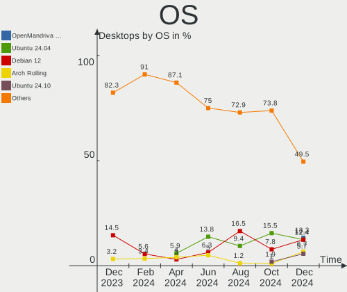
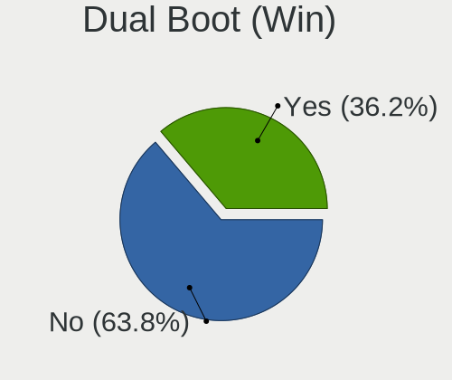
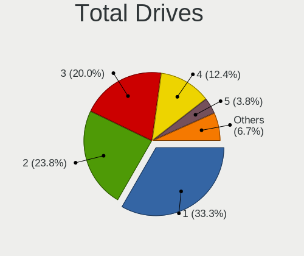
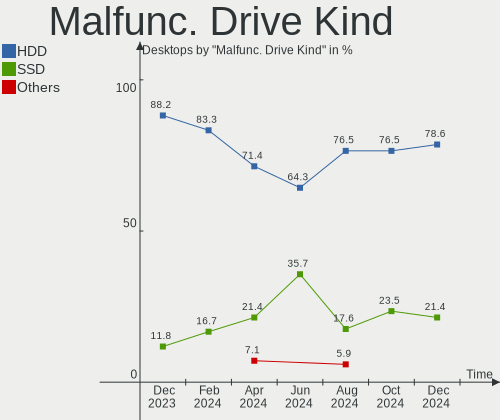
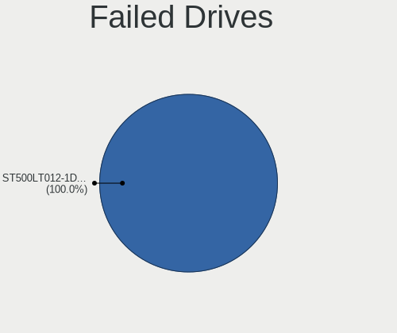
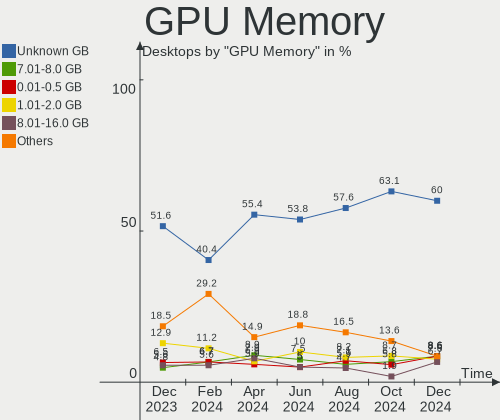
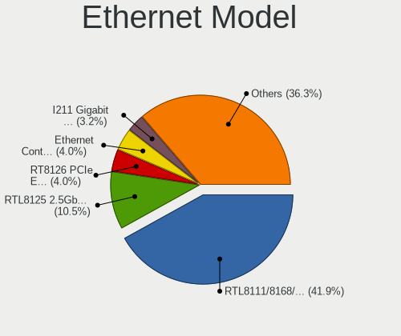

Linux in France - Hardware Trends (Desktops)
--------------------------------------------

A project to identify most popular hardware characteristics and track their change
over time based on data collected by Linux users at https://Linux-Hardware.org.

Anyone can contribute to this report by the [hw-probe](https://github.com/linuxhw/hw-probe) tool:

    sudo -E hw-probe -all -upload

Period: Dec, 2023.

Contents
--------

* [ System ](#system)
  - [ OS                       ](#os)
  - [ OS Family                ](#os-family)
  - [ Kernel                   ](#kernel)
  - [ Kernel Family            ](#kernel-family)
  - [ Kernel Major Ver.        ](#kernel-major-ver)
  - [ Arch                     ](#arch)
  - [ DE                       ](#de)
  - [ Display Server           ](#display-server)
  - [ Display Manager          ](#display-manager)
  - [ OS Lang                  ](#os-lang)
  - [ Boot Mode                ](#boot-mode)
  - [ Filesystem               ](#filesystem)
  - [ Part. scheme             ](#part-scheme)
  - [ Dual Boot with Linux/BSD ](#dual-boot-with-linuxbsd)
  - [ Dual Boot (Win)          ](#dual-boot-win)

* [ Board ](#board)
  - [ Vendor                   ](#vendor)
  - [ Model                    ](#model)
  - [ Model Family             ](#model-family)
  - [ MFG Year                 ](#mfg-year)
  - [ Form Factor              ](#form-factor)
  - [ Secure Boot              ](#secure-boot)
  - [ Coreboot                 ](#coreboot)
  - [ RAM Size                 ](#ram-size)
  - [ RAM Used                 ](#ram-used)
  - [ Total Drives             ](#total-drives)
  - [ Has CD-ROM               ](#has-cd-rom)
  - [ Has Ethernet             ](#has-ethernet)
  - [ Has WiFi                 ](#has-wifi)
  - [ Has Bluetooth            ](#has-bluetooth)

* [ Location ](#location)
  - [ Country                  ](#country)
  - [ City                     ](#city)

* [ Drives ](#drives)
  - [ Drive Vendor             ](#drive-vendor)
  - [ Drive Model              ](#drive-model)
  - [ HDD Vendor               ](#hdd-vendor)
  - [ SSD Vendor               ](#ssd-vendor)
  - [ Drive Kind               ](#drive-kind)
  - [ Drive Connector          ](#drive-connector)
  - [ Drive Size               ](#drive-size)
  - [ Space Total              ](#space-total)
  - [ Space Used               ](#space-used)
  - [ Malfunc. Drives          ](#malfunc-drives)
  - [ Malfunc. Drive Vendor    ](#malfunc-drive-vendor)
  - [ Malfunc. HDD Vendor      ](#malfunc-hdd-vendor)
  - [ Malfunc. Drive Kind      ](#malfunc-drive-kind)
  - [ Failed Drives            ](#failed-drives)
  - [ Failed Drive Vendor      ](#failed-drive-vendor)
  - [ Drive Status             ](#drive-status)

* [ Storage controller ](#storage-controller)
  - [ Storage Vendor           ](#storage-vendor)
  - [ Storage Model            ](#storage-model)
  - [ Storage Kind             ](#storage-kind)

* [ Processor ](#processor)
  - [ CPU Vendor               ](#cpu-vendor)
  - [ CPU Model                ](#cpu-model)
  - [ CPU Model Family         ](#cpu-model-family)
  - [ CPU Cores                ](#cpu-cores)
  - [ CPU Sockets              ](#cpu-sockets)
  - [ CPU Threads              ](#cpu-threads)
  - [ CPU Op-Modes             ](#cpu-op-modes)
  - [ CPU Microcode            ](#cpu-microcode)
  - [ CPU Microarch            ](#cpu-microarch)

* [ Graphics ](#graphics)
  - [ GPU Vendor               ](#gpu-vendor)
  - [ GPU Model                ](#gpu-model)
  - [ GPU Combo                ](#gpu-combo)
  - [ GPU Driver               ](#gpu-driver)
  - [ GPU Memory               ](#gpu-memory)

* [ Monitor ](#monitor)
  - [ Monitor Vendor           ](#monitor-vendor)
  - [ Monitor Model            ](#monitor-model)
  - [ Monitor Resolution       ](#monitor-resolution)
  - [ Monitor Diagonal         ](#monitor-diagonal)
  - [ Monitor Width            ](#monitor-width)
  - [ Aspect Ratio             ](#aspect-ratio)
  - [ Monitor Area             ](#monitor-area)
  - [ Pixel Density            ](#pixel-density)
  - [ Multiple Monitors        ](#multiple-monitors)

* [ Network ](#network)
  - [ Net Controller Vendor    ](#net-controller-vendor)
  - [ Net Controller Model     ](#net-controller-model)
  - [ Wireless Vendor          ](#wireless-vendor)
  - [ Wireless Model           ](#wireless-model)
  - [ Ethernet Vendor          ](#ethernet-vendor)
  - [ Ethernet Model           ](#ethernet-model)
  - [ Net Controller Kind      ](#net-controller-kind)
  - [ Used Controller          ](#used-controller)
  - [ NICs                     ](#nics)
  - [ IPv6                     ](#ipv6)

* [ Bluetooth ](#bluetooth)
  - [ Bluetooth Vendor         ](#bluetooth-vendor)
  - [ Bluetooth Model          ](#bluetooth-model)

* [ Sound ](#sound)
  - [ Sound Vendor             ](#sound-vendor)
  - [ Sound Model              ](#sound-model)

* [ Memory ](#memory)
  - [ Memory Vendor            ](#memory-vendor)
  - [ Memory Model             ](#memory-model)
  - [ Memory Kind              ](#memory-kind)
  - [ Memory Form Factor       ](#memory-form-factor)
  - [ Memory Size              ](#memory-size)
  - [ Memory Speed             ](#memory-speed)

* [ Printers & scanners ](#printers--scanners)
  - [ Printer Vendor           ](#printer-vendor)
  - [ Printer Model            ](#printer-model)
  - [ Scanner Vendor           ](#scanner-vendor)
  - [ Scanner Model            ](#scanner-model)

* [ Camera ](#camera)
  - [ Camera Vendor            ](#camera-vendor)
  - [ Camera Model             ](#camera-model)

* [ Security ](#security)
  - [ Fingerprint Vendor       ](#fingerprint-vendor)
  - [ Fingerprint Model        ](#fingerprint-model)
  - [ Chipcard Vendor          ](#chipcard-vendor)
  - [ Chipcard Model           ](#chipcard-model)

* [ Unsupported ](#unsupported)
  - [ Unsupported Devices      ](#unsupported-devices)
  - [ Unsupported Device Types ](#unsupported-device-types)

System
------

OS
--

Installed operating systems

| Name                         | Desktops | Percent |
|------------------------------|----------|---------|
| Ubuntu 22.04                 | 31       | 25%     |
| Debian 12                    | 18       | 14.52%  |
| Ubuntu 23.10                 | 8        | 6.45%   |
| Linux Mint 21.2              | 8        | 6.45%   |
| OpenMandriva 23.11           | 5        | 4.03%   |
| Kubuntu 23.10                | 5        | 4.03%   |
| Ubuntu 20.04                 | 4        | 3.23%   |
| Arch Rolling                 | 4        | 3.23%   |
| OpenMandriva 23.08           | 3        | 2.42%   |
| LMDE 6                       | 3        | 2.42%   |
| Linux Mint 21.1              | 3        | 2.42%   |
| openSUSE Tumbleweed-XXXXXXXX | 2        | 1.61%   |
| OpenMandriva 5.0             | 2        | 1.61%   |
| Kubuntu 22.04                | 2        | 1.61%   |
| Gentoo 2.14                  | 2        | 1.61%   |
| Fedora 39                    | 2        | 1.61%   |
| ArcoLinux Rolling            | 2        | 1.61%   |
| Zorin 17                     | 1        | 0.81%   |
| Xubuntu 23.10                | 1        | 0.81%   |
| Xubuntu 18.04                | 1        | 0.81%   |
| Xero Rolling                 | 1        | 0.81%   |
| Ubuntu MATE 23.10            | 1        | 0.81%   |
| Ubuntu Core 22               | 1        | 0.81%   |
| Sparky 7.1                   | 1        | 0.81%   |
| ROSA 12.4                    | 1        | 0.81%   |
| openSUSE Leap-15.5           | 1        | 0.81%   |
| OpenMandriva 4.3             | 1        | 0.81%   |
| OpenMandriva 23.03           | 1        | 0.81%   |
| Nobara 38                    | 1        | 0.81%   |
| Manjaro 23.1.1               | 1        | 0.81%   |
| Manjaro 23.1.0               | 1        | 0.81%   |
| Manjaro                      | 1        | 0.81%   |
| Mageia 9                     | 1        | 0.81%   |
| Linux Mint 20.3              | 1        | 0.81%   |
| Devuan 5                     | 1        | 0.81%   |
| Debian 11                    | 1        | 0.81%   |
| BlackPanther 18.1            | 1        | 0.81%   |

OS Family
---------

OS without a version

| Name         | Desktops | Percent |
|--------------|----------|---------|
| Ubuntu       | 44       | 35.48%  |
| Debian       | 19       | 15.32%  |
| OpenMandriva | 12       | 9.68%   |
| Linux Mint   | 12       | 9.68%   |
| Kubuntu      | 7        | 5.65%   |
| Arch         | 4        | 3.23%   |
| openSUSE     | 3        | 2.42%   |
| Manjaro      | 3        | 2.42%   |
| LMDE         | 3        | 2.42%   |
| Xubuntu      | 2        | 1.61%   |
| Gentoo       | 2        | 1.61%   |
| Fedora       | 2        | 1.61%   |
| ArcoLinux    | 2        | 1.61%   |
| Zorin        | 1        | 0.81%   |
| Xero         | 1        | 0.81%   |
| Ubuntu MATE  | 1        | 0.81%   |
| Sparky       | 1        | 0.81%   |
| ROSA         | 1        | 0.81%   |
| Nobara       | 1        | 0.81%   |
| Mageia       | 1        | 0.81%   |
| Devuan       | 1        | 0.81%   |
| BlackPanther | 1        | 0.81%   |

Kernel
------

Version of the Linux kernel

| Version                           | Desktops | Percent |
|-----------------------------------|----------|---------|
| 6.2.0-37-generic                  | 18       | 14.52%  |
| 5.15.0-91-generic                 | 13       | 10.48%  |
| 6.1.0-16-amd64                    | 12       | 9.68%   |
| 6.2.0-39-generic                  | 11       | 8.87%   |
| 6.5.0-14-generic                  | 10       | 8.06%   |
| 6.6.2-desktop-1omv2390            | 6        | 4.84%   |
| 6.1.0-13-amd64                    | 6        | 4.84%   |
| 6.4.11-desktop-1omv2390           | 4        | 3.23%   |
| 6.6.8-arch1-1                     | 2        | 1.61%   |
| 6.6.7-arch1-1                     | 2        | 1.61%   |
| 6.6.3-1-default                   | 2        | 1.61%   |
| 6.5.0-13-generic                  | 2        | 1.61%   |
| 6.1.0-15-amd64                    | 2        | 1.61%   |
| 5.15.0-89-generic                 | 2        | 1.61%   |
| 5.15.0-88-generic                 | 2        | 1.61%   |
| 6.6.8-200.fc39.x86_64             | 1        | 0.81%   |
| 6.6.8-2-MANJARO                   | 1        | 0.81%   |
| 6.6.7-200.fc39.x86_64             | 1        | 0.81%   |
| 6.6.4-zen1-1-zen                  | 1        | 0.81%   |
| 6.6.4-1-liquorix-amd64            | 1        | 0.81%   |
| 6.6.3-arch1-1                     | 1        | 0.81%   |
| 6.6.3-201.fsync.fc38.x86_64       | 1        | 0.81%   |
| 6.6.2-gentoo                      | 1        | 0.81%   |
| 6.6.2-1-MANJARO                   | 1        | 0.81%   |
| 6.5.7-060507-generic              | 1        | 0.81%   |
| 6.5.13-1-MANJARO                  | 1        | 0.81%   |
| 6.5.11-7-pve                      | 1        | 0.81%   |
| 6.5.0-9-generic                   | 1        | 0.81%   |
| 6.5.0-5mx-ahs-amd64               | 1        | 0.81%   |
| 6.4.16-desktop-3.mga9             | 1        | 0.81%   |
| 6.2.6-desktop-1omv2390            | 1        | 0.81%   |
| 6.2.0-26-generic                  | 1        | 0.81%   |
| 6.2.0-1017-lowlatency             | 1        | 0.81%   |
| 6.1.69-1-lts                      | 1        | 0.81%   |
| 6.1.20-generic-2rosa2021.1-x86_64 | 1        | 0.81%   |
| 6.1.19-rt-rt8                     | 1        | 0.81%   |
| 6.1.0-15-686                      | 1        | 0.81%   |
| 6.1.0-1-amd64                     | 1        | 0.81%   |
| 5.4.0-167-generic                 | 1        | 0.81%   |
| 5.4.0-150-generic                 | 1        | 0.81%   |

Kernel Family
-------------

Linux kernel without a distro release

| Version | Desktops | Percent |
|---------|----------|---------|
| 6.2.0   | 31       | 25%     |
| 6.1.0   | 22       | 17.74%  |
| 5.15.0  | 19       | 15.32%  |
| 6.5.0   | 14       | 11.29%  |
| 6.6.2   | 8        | 6.45%   |
| 6.6.8   | 4        | 3.23%   |
| 6.6.3   | 4        | 3.23%   |
| 6.4.11  | 4        | 3.23%   |
| 6.6.7   | 3        | 2.42%   |
| 6.6.4   | 2        | 1.61%   |
| 5.4.0   | 2        | 1.61%   |
| 6.5.7   | 1        | 0.81%   |
| 6.5.13  | 1        | 0.81%   |
| 6.5.11  | 1        | 0.81%   |
| 6.4.16  | 1        | 0.81%   |
| 6.2.6   | 1        | 0.81%   |
| 6.1.69  | 1        | 0.81%   |
| 6.1.20  | 1        | 0.81%   |
| 6.1.19  | 1        | 0.81%   |
| 5.16.7  | 1        | 0.81%   |
| 5.14.21 | 1        | 0.81%   |
| 4.18.16 | 1        | 0.81%   |

Kernel Major Ver.
-----------------

Linux kernel major version

| Version | Desktops | Percent |
|---------|----------|---------|
| 6.2     | 32       | 25.81%  |
| 6.1     | 25       | 20.16%  |
| 6.6     | 21       | 16.94%  |
| 5.15    | 19       | 15.32%  |
| 6.5     | 17       | 13.71%  |
| 6.4     | 5        | 4.03%   |
| 5.4     | 2        | 1.61%   |
| 5.16    | 1        | 0.81%   |
| 5.14    | 1        | 0.81%   |
| 4.18    | 1        | 0.81%   |

Arch
----

OS architecture (x86_64, i586, etc.)

| Name   | Desktops | Percent |
|--------|----------|---------|
| x86_64 | 123      | 99.19%  |
| i686   | 1        | 0.81%   |

DE
--

Desktop Environment

| Name       | Desktops | Percent |
|------------|----------|---------|
| GNOME      | 61       | 49.19%  |
| KDE5       | 32       | 25.81%  |
| X-Cinnamon | 9        | 7.26%   |
| XFCE       | 7        | 5.65%   |
| MATE       | 5        | 4.03%   |
| Unknown    | 4        | 3.23%   |
| Hyprland   | 3        | 2.42%   |
| i3         | 1        | 0.81%   |
| Deepin     | 1        | 0.81%   |
| Cinnamon   | 1        | 0.81%   |

Display Server
--------------

X11 or Wayland

| Name    | Desktops | Percent |
|---------|----------|---------|
| Wayland | 69       | 55.65%  |
| X11     | 50       | 40.32%  |
| Unknown | 4        | 3.23%   |
| Tty     | 1        | 0.81%   |

Display Manager
---------------

SDDM, LightDM, etc.

| Name    | Desktops | Percent |
|---------|----------|---------|
| GDM3    | 53       | 42.74%  |
| SDDM    | 27       | 21.77%  |
| Unknown | 19       | 15.32%  |
| LightDM | 18       | 14.52%  |
| GDM     | 4        | 3.23%   |
| SLiM    | 1        | 0.81%   |
| LEMURS  | 1        | 0.81%   |
| EMPTTY  | 1        | 0.81%   |

OS Lang
-------

Language

| Lang    | Desktops | Percent |
|---------|----------|---------|
| fr_FR   | 103      | 83.06%  |
| en_US   | 11       | 8.87%   |
| Unknown | 5        | 4.03%   |
| C       | 3        | 2.42%   |
| de_DE   | 2        | 1.61%   |

Boot Mode
---------

EFI or BIOS

| Mode | Desktops | Percent |
|------|----------|---------|
| EFI  | 63       | 50.81%  |
| BIOS | 61       | 49.19%  |

Filesystem
----------

Type of filesystem

| Type    | Desktops | Percent |
|---------|----------|---------|
| Ext4    | 91       | 73.39%  |
| Tmpfs   | 17       | 13.71%  |
| Btrfs   | 9        | 7.26%   |
| Overlay | 5        | 4.03%   |
| Unknown | 2        | 1.61%   |

Part. scheme
------------

Scheme of partitioning

| Type    | Desktops | Percent |
|---------|----------|---------|
| GPT     | 92       | 74.19%  |
| Unknown | 17       | 13.71%  |
| MBR     | 15       | 12.1%   |

Dual Boot with Linux/BSD
------------------------

Hosting more than one Linux/BSD

| Dual boot | Desktops | Percent |
|-----------|----------|---------|
| No        | 96       | 77.42%  |
| Yes       | 28       | 22.58%  |

Dual Boot (Win)
---------------

Hosting Linux and Windows

| Dual boot | Desktops | Percent |
|-----------|----------|---------|
| No        | 81       | 65.32%  |
| Yes       | 43       | 34.68%  |

Board
-----

Vendor
------

Motherboard manufacturer

| Name                                 | Desktops | Percent |
|--------------------------------------|----------|---------|
| Lenovo                               | 24       | 19.35%  |
| MSI                                  | 18       | 14.52%  |
| ASUSTek Computer                     | 18       | 14.52%  |
| Gigabyte Technology                  | 14       | 11.29%  |
| ASRock                               | 11       | 8.87%   |
| Hewlett-Packard                      | 10       | 8.06%   |
| Dell                                 | 7        | 5.65%   |
| Acer                                 | 7        | 5.65%   |
| Fujitsu                              | 3        | 2.42%   |
| Shenzhen Meigao Electronic Equipment | 2        | 1.61%   |
| Packard Bell                         | 2        | 1.61%   |
| Intel                                | 2        | 1.61%   |
| Foxconn                              | 2        | 1.61%   |
| TECHNOPC                             | 1        | 0.81%   |
| Pegatron                             | 1        | 0.81%   |
| OEM                                  | 1        | 0.81%   |
| Unknown                              | 1        | 0.81%   |

Model
-----

Motherboard model

| Name                                       | Desktops | Percent |
|--------------------------------------------|----------|---------|
| Lenovo ThinkCentre M710s 10M8S02A00        | 8        | 6.45%   |
| Lenovo ThinkCentre M800 10FXS0PS00         | 4        | 3.23%   |
| Lenovo ThinkCentre M720s 10SUSES500        | 3        | 2.42%   |
| MSI MS-7C56                                | 2        | 1.61%   |
| ASUS ROG STRIX B550-F GAMING               | 2        | 1.61%   |
| ASUS All Series                            | 2        | 1.61%   |
| Acer Veriton X2631G                        | 2        | 1.61%   |
| TECHNOPC NANO 5                            | 1        | 0.81%   |
| Shenzhen Meigao Electronic Equipment UM560 | 1        | 0.81%   |
| Shenzhen Meigao Electronic Equipment TH80  | 1        | 0.81%   |
| Pegatron VC903AA-ABF p6145fr               | 1        | 0.81%   |
| Packard Bell IMEDIA S1800                  | 1        | 0.81%   |
| Packard Bell IMEDIA S1710                  | 1        | 0.81%   |
| OEM G41 775 ICH7 8712                      | 1        | 0.81%   |
| MSI p6710fr                                | 1        | 0.81%   |
| MSI MS-7E28                                | 1        | 0.81%   |
| MSI MS-7E26                                | 1        | 0.81%   |
| MSI MS-7D18                                | 1        | 0.81%   |
| MSI MS-7C91                                | 1        | 0.81%   |
| MSI MS-7C37                                | 1        | 0.81%   |
| MSI MS-7B78                                | 1        | 0.81%   |
| MSI MS-7B51                                | 1        | 0.81%   |
| MSI MS-7A38                                | 1        | 0.81%   |
| MSI MS-7996                                | 1        | 0.81%   |
| MSI MS-7994                                | 1        | 0.81%   |
| MSI MS-7895                                | 1        | 0.81%   |
| MSI MS-7823                                | 1        | 0.81%   |
| MSI MS-7817                                | 1        | 0.81%   |
| MSI MS-7721                                | 1        | 0.81%   |
| MSI MS-7529                                | 1        | 0.81%   |
| Lenovo V530S-07ICB 10TX0013FR              | 1        | 0.81%   |
| Lenovo ThinkCentre M93p 10A7003AUK         | 1        | 0.81%   |
| Lenovo ThinkCentre M83 10AHS1T000          | 1        | 0.81%   |
| Lenovo ThinkCentre M83 10AHA0EPFR          | 1        | 0.81%   |
| Lenovo ThinkCentre M81 5049P14             | 1        | 0.81%   |
| Lenovo ThinkCentre M73 10B4S1TG00          | 1        | 0.81%   |
| Lenovo ThinkCentre M73 10AXA1AVFR          | 1        | 0.81%   |
| Lenovo ThinkCentre M72e 32674Z0            | 1        | 0.81%   |
| Lenovo ThinkCentre M720s 10SUS0YF00        | 1        | 0.81%   |
| Intel STK1AW32SC                           | 1        | 0.81%   |

Model Family
------------

Motherboard model prefix

| Name                                       | Desktops | Percent |
|--------------------------------------------|----------|---------|
| Lenovo ThinkCentre                         | 23       | 18.55%  |
| ASUS PRIME                                 | 6        | 4.84%   |
| Dell OptiPlex                              | 5        | 4.03%   |
| Acer Aspire                                | 4        | 3.23%   |
| Fujitsu ESPRIMO                            | 3        | 2.42%   |
| ASUS ROG                                   | 3        | 2.42%   |
| Acer Veriton                               | 3        | 2.42%   |
| Packard Bell IMEDIA                        | 2        | 1.61%   |
| MSI MS-7C56                                | 2        | 1.61%   |
| HP ProDesk                                 | 2        | 1.61%   |
| HP Compaq                                  | 2        | 1.61%   |
| ASUS All                                   | 2        | 1.61%   |
| TECHNOPC NANO                              | 1        | 0.81%   |
| Shenzhen Meigao Electronic Equipment UM560 | 1        | 0.81%   |
| Shenzhen Meigao Electronic Equipment TH80  | 1        | 0.81%   |
| Pegatron VC903AA-ABF                       | 1        | 0.81%   |
| OEM G41                                    | 1        | 0.81%   |
| MSI p6710fr                                | 1        | 0.81%   |
| MSI MS-7E28                                | 1        | 0.81%   |
| MSI MS-7E26                                | 1        | 0.81%   |
| MSI MS-7D18                                | 1        | 0.81%   |
| MSI MS-7C91                                | 1        | 0.81%   |
| MSI MS-7C37                                | 1        | 0.81%   |
| MSI MS-7B78                                | 1        | 0.81%   |
| MSI MS-7B51                                | 1        | 0.81%   |
| MSI MS-7A38                                | 1        | 0.81%   |
| MSI MS-7996                                | 1        | 0.81%   |
| MSI MS-7994                                | 1        | 0.81%   |
| MSI MS-7895                                | 1        | 0.81%   |
| MSI MS-7823                                | 1        | 0.81%   |
| MSI MS-7817                                | 1        | 0.81%   |
| MSI MS-7721                                | 1        | 0.81%   |
| MSI MS-7529                                | 1        | 0.81%   |
| Lenovo V530S-07ICB                         | 1        | 0.81%   |
| Intel STK1AW32SC                           | 1        | 0.81%   |
| Intel DZ77SL-50K                           | 1        | 0.81%   |
| HP Z600                                    | 1        | 0.81%   |
| HP rp5700                                  | 1        | 0.81%   |
| HP Pavilion                                | 1        | 0.81%   |
| HP EliteDesk                               | 1        | 0.81%   |

MFG Year
--------

Motherboard manufacture year

| Year | Desktops | Percent |
|------|----------|---------|
| 2017 | 13       | 10.48%  |
| 2014 | 12       | 9.68%   |
| 2019 | 11       | 8.87%   |
| 2013 | 11       | 8.87%   |
| 2018 | 9        | 7.26%   |
| 2023 | 8        | 6.45%   |
| 2020 | 8        | 6.45%   |
| 2016 | 8        | 6.45%   |
| 2010 | 7        | 5.65%   |
| 2009 | 7        | 5.65%   |
| 2022 | 6        | 4.84%   |
| 2015 | 6        | 4.84%   |
| 2011 | 6        | 4.84%   |
| 2012 | 5        | 4.03%   |
| 2021 | 4        | 3.23%   |
| 2007 | 2        | 1.61%   |
| 2004 | 1        | 0.81%   |

Form Factor
-----------

Physical design of the computer

| Name    | Desktops | Percent |
|---------|----------|---------|
| Desktop | 124      | 100%    |

Secure Boot
-----------

Enabled or disabled

| State    | Desktops | Percent |
|----------|----------|---------|
| Disabled | 120      | 96.77%  |
| Enabled  | 4        | 3.23%   |

Coreboot
--------

Have coreboot on board

| Used | Desktops | Percent |
|------|----------|---------|
| No   | 124      | 100%    |

RAM Size
--------

Total RAM memory

| Size in GB  | Desktops | Percent |
|-------------|----------|---------|
| 3.01-4.0    | 29       | 23.39%  |
| 16.01-24.0  | 27       | 21.77%  |
| 4.01-8.0    | 24       | 19.35%  |
| 32.01-64.0  | 18       | 14.52%  |
| 8.01-16.0   | 15       | 12.1%   |
| 24.01-32.0  | 6        | 4.84%   |
| 64.01-256.0 | 3        | 2.42%   |
| 1.01-2.0    | 1        | 0.81%   |
| Unknown     | 1        | 0.81%   |

RAM Used
--------

Used RAM memory

| Used GB   | Desktops | Percent |
|-----------|----------|---------|
| 1.01-2.0  | 56       | 45.16%  |
| 2.01-3.0  | 33       | 26.61%  |
| 4.01-8.0  | 18       | 14.52%  |
| 3.01-4.0  | 9        | 7.26%   |
| 8.01-16.0 | 6        | 4.84%   |
| 0.51-1.0  | 1        | 0.81%   |
| Unknown   | 1        | 0.81%   |

Total Drives
------------

Number of drives on board

| Drives | Desktops | Percent |
|--------|----------|---------|
| 1      | 58       | 46.77%  |
| 2      | 35       | 28.23%  |
| 3      | 10       | 8.06%   |
| 4      | 9        | 7.26%   |
| 6      | 4        | 3.23%   |
| 7      | 3        | 2.42%   |
| 5      | 3        | 2.42%   |
| 0      | 2        | 1.61%   |

Has CD-ROM
----------

Has CD-ROM on board

| Presented | Desktops | Percent |
|-----------|----------|---------|
| Yes       | 73       | 58.87%  |
| No        | 51       | 41.13%  |

Has Ethernet
------------

Has Ethernet on board

| Presented | Desktops | Percent |
|-----------|----------|---------|
| Yes       | 123      | 99.19%  |
| No        | 1        | 0.81%   |

Has WiFi
--------

Has WiFi module

| Presented | Desktops | Percent |
|-----------|----------|---------|
| No        | 71       | 57.26%  |
| Yes       | 53       | 42.74%  |

Has Bluetooth
-------------

Has Bluetooth module

| Presented | Desktops | Percent |
|-----------|----------|---------|
| No        | 93       | 75%     |
| Yes       | 31       | 25%     |

Location
--------

Country
-------

Geographic location (country)

| Country | Desktops | Percent |
|---------|----------|---------|
| France  | 124      | 100%    |

City
----

Geographic location (city)

| City                          | Desktops | Percent |
|-------------------------------|----------|---------|
| Roubaix                       | 20       | 16.13%  |
| Paris                         | 6        | 4.84%   |
| Quimper                       | 3        | 2.42%   |
| Grenoble                      | 3        | 2.42%   |
| Perenchies                    | 2        | 1.61%   |
| Marseille                     | 2        | 1.61%   |
| Brignoles                     | 2        | 1.61%   |
| Besançon                     | 2        | 1.61%   |
| Wasquehal                     | 1        | 0.81%   |
| Villepinte                    | 1        | 0.81%   |
| Vendenheim                    | 1        | 0.81%   |
| Valence                       | 1        | 0.81%   |
| Urrugne                       | 1        | 0.81%   |
| Toulouse                      | 1        | 0.81%   |
| Thonon-les-Bains              | 1        | 0.81%   |
| Talence                       | 1        | 0.81%   |
| Steinbach                     | 1        | 0.81%   |
| Sélestat                     | 1        | 0.81%   |
| Saint-Étienne-du-Rouvray     | 1        | 0.81%   |
| Saint-Etienne                 | 1        | 0.81%   |
| Saint-Denis                   | 1        | 0.81%   |
| Saint-Christophe-en-Boucherie | 1        | 0.81%   |
| Saint-Brieuc                  | 1        | 0.81%   |
| Rouen                         | 1        | 0.81%   |
| Rosny-sous-Bois               | 1        | 0.81%   |
| Rodez                         | 1        | 0.81%   |
| Roche-la-Moliere              | 1        | 0.81%   |
| Rennes                        | 1        | 0.81%   |
| Poitiers                      | 1        | 0.81%   |
| Plérin                       | 1        | 0.81%   |
| Pins-Justaret                 | 1        | 0.81%   |
| Pau                           | 1        | 0.81%   |
| Palaja                        | 1        | 0.81%   |
| Orchies                       | 1        | 0.81%   |
| Nice                          | 1        | 0.81%   |
| Nemours                       | 1        | 0.81%   |
| Nantes                        | 1        | 0.81%   |
| Nanterre                      | 1        | 0.81%   |
| Nancy                         | 1        | 0.81%   |
| Moosch                        | 1        | 0.81%   |

Drives
------

Drive Vendor
------------

Hard drive vendors

| Vendor                      | Desktops | Drives | Percent |
|-----------------------------|----------|--------|---------|
| Seagate                     | 44       | 52     | 21.57%  |
| WDC                         | 38       | 51     | 18.63%  |
| Samsung Electronics         | 38       | 51     | 18.63%  |
| Crucial                     | 20       | 29     | 9.8%    |
| Kingston                    | 9        | 10     | 4.41%   |
| SanDisk                     | 8        | 8      | 3.92%   |
| Toshiba                     | 6        | 7      | 2.94%   |
| PNY                         | 6        | 6      | 2.94%   |
| Micron/Crucial Technology   | 4        | 7      | 1.96%   |
| Hitachi                     | 4        | 4      | 1.96%   |
| Corsair                     | 3        | 3      | 1.47%   |
| Phison Electronics          | 2        | 2      | 0.98%   |
| Maxtor                      | 2        | 2      | 0.98%   |
| Unknown                     | 1        | 3      | 0.49%   |
| UMIS                        | 1        | 1      | 0.49%   |
| SK hynix                    | 1        | 1      | 0.49%   |
| Silicon Motion              | 1        | 1      | 0.49%   |
| Phison                      | 1        | 2      | 0.49%   |
| Patriot                     | 1        | 1      | 0.49%   |
| OCZ                         | 1        | 1      | 0.49%   |
| Lexar                       | 1        | 1      | 0.49%   |
| LDLC                        | 1        | 1      | 0.49%   |
| Kingston Technology Company | 1        | 1      | 0.49%   |
| KingSpec                    | 1        | 1      | 0.49%   |
| Integral                    | 1        | 1      | 0.49%   |
| HGST                        | 1        | 1      | 0.49%   |
| GOODRAM                     | 1        | 1      | 0.49%   |
| Gigabyte Technology         | 1        | 1      | 0.49%   |
| Emtec                       | 1        | 1      | 0.49%   |
| CT240BX3                    | 1        | 1      | 0.49%   |
| China                       | 1        | 1      | 0.49%   |
| ASMT109x                    | 1        | 1      | 0.49%   |
| A-DATA Technology           | 1        | 1      | 0.49%   |

Drive Model
-----------

Hard drive models

| Model                                               | Desktops | Percent |
|-----------------------------------------------------|----------|---------|
| Seagate ST1000DM003-1SB102 1TB                      | 11       | 4.72%   |
| Samsung NVMe SSD Controller SM981/PM981/PM983 512GB | 7        | 3%      |
| WDC WD10EZEX-08WN4A0 1TB                            | 4        | 1.72%   |
| Samsung SSD 870 EVO 500GB                           | 4        | 1.72%   |
| WDC WD10EAVS-00D7B1 1TB                             | 3        | 1.29%   |
| Seagate ST500DM002-1BD142 500GB                     | 3        | 1.29%   |
| Seagate ST2000DM008-2FR102 2TB                      | 3        | 1.29%   |
| Seagate ST2000DM001-1ER164 2TB                      | 3        | 1.29%   |
| Samsung SSD 870 QVO 1TB                             | 3        | 1.29%   |
| Samsung SSD 860 EVO 500GB                           | 3        | 1.29%   |
| Samsung SSD 850 EVO 500GB                           | 3        | 1.29%   |
| Samsung SSD 850 EVO 250GB                           | 3        | 1.29%   |
| Micron/Crucial P2 NVMe PCIe SSD 4TB                 | 3        | 1.29%   |
| Crucial CT500MX500SSD1 500GB                        | 3        | 1.29%   |
| Crucial CT480BX500SSD1 480GB                        | 3        | 1.29%   |
| Crucial CT240BX500SSD1 240GB                        | 3        | 1.29%   |
| WDC WDS100T2B0A-00SM50 1TB SSD                      | 2        | 0.86%   |
| WDC WD10EZEX-08M2NA0 1TB                            | 2        | 0.86%   |
| Toshiba DT01ACA100 LENOVO 1TB                       | 2        | 0.86%   |
| Seagate ST3500418AS 500GB                           | 2        | 0.86%   |
| Seagate ST31000528AS 1TB                            | 2        | 0.86%   |
| Seagate ST31000524AS 1TB                            | 2        | 0.86%   |
| Seagate ST1000DM010-2EP102 1TB                      | 2        | 0.86%   |
| SanDisk SSD PLUS 240GB                              | 2        | 0.86%   |
| Samsung SSD 980 1TB                                 | 2        | 0.86%   |
| Samsung SSD 840 EVO 250GB                           | 2        | 0.86%   |
| Samsung NVMe SSD Controller PM9A1/PM9A3/980PRO 2TB  | 2        | 0.86%   |
| PNY CS900 240GB SSD                                 | 2        | 0.86%   |
| Kingston SUV400S37480G 480GB SSD                    | 2        | 0.86%   |
| Crucial CT2000MX500SSD1 2TB                         | 2        | 0.86%   |
| Crucial CT1000P3SSD8 1TB                            | 2        | 0.86%   |
| Crucial CT1000MX500SSD1 1TB                         | 2        | 0.86%   |
| WDC WDS480G2G0A-00JH30 480GB SSD                    | 1        | 0.43%   |
| WDC WD7500BPVT-22HXZT3 752GB                        | 1        | 0.43%   |
| WDC WD7500BPKT-75PK4T0 752GB                        | 1        | 0.43%   |
| WDC WD6400AAKS-75A7B0 640GB                         | 1        | 0.43%   |
| WDC WD6400AAKS-22A7B2 640GB                         | 1        | 0.43%   |
| WDC WD5000LPLX-60ZNTT1 500GB                        | 1        | 0.43%   |
| WDC WD5000LPCX-22VHAT0 500GB                        | 1        | 0.43%   |
| WDC WD5000LPCX-00VHAT0 500GB                        | 1        | 0.43%   |

HDD Vendor
----------

Hard disk drive vendors

| Vendor              | Desktops | Drives | Percent |
|---------------------|----------|--------|---------|
| Seagate             | 42       | 50     | 46.67%  |
| WDC                 | 34       | 47     | 37.78%  |
| Toshiba             | 5        | 6      | 5.56%   |
| Hitachi             | 4        | 4      | 4.44%   |
| Samsung Electronics | 2        | 2      | 2.22%   |
| Maxtor              | 2        | 2      | 2.22%   |
| HGST                | 1        | 1      | 1.11%   |

SSD Vendor
----------

Solid state drive vendors

| Vendor              | Desktops | Drives | Percent |
|---------------------|----------|--------|---------|
| Samsung Electronics | 27       | 30     | 32.93%  |
| Crucial             | 16       | 19     | 19.51%  |
| Kingston            | 8        | 9      | 9.76%   |
| SanDisk             | 6        | 6      | 7.32%   |
| PNY                 | 6        | 6      | 7.32%   |
| WDC                 | 3        | 3      | 3.66%   |
| Corsair             | 2        | 2      | 2.44%   |
| Toshiba             | 1        | 1      | 1.22%   |
| SK hynix            | 1        | 1      | 1.22%   |
| Patriot             | 1        | 1      | 1.22%   |
| OCZ                 | 1        | 1      | 1.22%   |
| Lexar               | 1        | 1      | 1.22%   |
| LDLC                | 1        | 1      | 1.22%   |
| KingSpec            | 1        | 1      | 1.22%   |
| Integral            | 1        | 1      | 1.22%   |
| GOODRAM             | 1        | 1      | 1.22%   |
| Emtec               | 1        | 1      | 1.22%   |
| CT240BX3            | 1        | 1      | 1.22%   |
| China               | 1        | 1      | 1.22%   |
| ASMT109x            | 1        | 1      | 1.22%   |
| A-DATA Technology   | 1        | 1      | 1.22%   |

Drive Kind
----------

HDD or SSD

| Kind    | Desktops | Drives | Percent |
|---------|----------|--------|---------|
| HDD     | 79       | 112    | 44.13%  |
| SSD     | 62       | 89     | 34.64%  |
| NVMe    | 34       | 48     | 18.99%  |
| Unknown | 3        | 5      | 1.68%   |
| MMC     | 1        | 1      | 0.56%   |

Drive Connector
---------------

SATA, SAS, NVMe, etc.

| Type | Desktops | Drives | Percent |
|------|----------|--------|---------|
| SATA | 109      | 197    | 72.19%  |
| NVMe | 34       | 48     | 22.52%  |
| SAS  | 7        | 9      | 4.64%   |
| MMC  | 1        | 1      | 0.66%   |

Drive Size
----------

Size of hard drive

| Size in TB | Desktops | Drives | Percent |
|------------|----------|--------|---------|
| 0.01-0.5   | 66       | 91     | 44.9%   |
| 0.51-1.0   | 56       | 75     | 38.1%   |
| 1.01-2.0   | 16       | 24     | 10.88%  |
| 3.01-4.0   | 6        | 8      | 4.08%   |
| 2.01-3.0   | 2        | 2      | 1.36%   |
| 4.01-10.0  | 1        | 1      | 0.68%   |

Space Total
-----------

Amount of disk space available on the file system

| Size in GB     | Desktops | Percent |
|----------------|----------|---------|
| 501-1000       | 41       | 33.06%  |
| 101-250        | 22       | 17.74%  |
| 251-500        | 16       | 12.9%   |
| More than 3000 | 10       | 8.06%   |
| 2001-3000      | 10       | 8.06%   |
| 1001-2000      | 8        | 6.45%   |
| 51-100         | 5        | 4.03%   |
| Unknown        | 5        | 4.03%   |
| 1-20           | 4        | 3.23%   |
| 21-50          | 3        | 2.42%   |

Space Used
----------

Amount of used disk space

| Used GB        | Desktops | Percent |
|----------------|----------|---------|
| 1-20           | 44       | 35.48%  |
| 21-50          | 17       | 13.71%  |
| 101-250        | 17       | 13.71%  |
| 51-100         | 16       | 12.9%   |
| 251-500        | 6        | 4.84%   |
| 1001-2000      | 6        | 4.84%   |
| More than 3000 | 5        | 4.03%   |
| 501-1000       | 5        | 4.03%   |
| Unknown        | 5        | 4.03%   |
| 2001-3000      | 3        | 2.42%   |

Malfunc. Drives
---------------

Drive models with a malfunction

| Model                                            | Desktops | Drives | Percent |
|--------------------------------------------------|----------|--------|---------|
| Seagate ST2000DM008-2FR102 2TB                   | 2        | 2      | 10%     |
| WDC WD6400AAKS-22A7B2 640GB                      | 1        | 1      | 5%      |
| WDC WD5000LPLX-60ZNTT1 500GB                     | 1        | 1      | 5%      |
| WDC WD5000AAKX-22ERMA0 500GB                     | 1        | 1      | 5%      |
| WDC WD20EZRZ-00Z5HB0 2TB                         | 1        | 1      | 5%      |
| WDC WD2002FAEX-007BA0 2TB                        | 1        | 6      | 5%      |
| WDC WD1600AAJS-75M0A0 160GB                      | 1        | 1      | 5%      |
| WDC WD1600AAJS-00YZCA0 160GB                     | 1        | 1      | 5%      |
| WDC WD10EAVS-00D7B1 1TB                          | 1        | 1      | 5%      |
| Seagate ST9500325AS 500GB                        | 1        | 1      | 5%      |
| Seagate ST500LM021-1KJ152 500GB                  | 1        | 3      | 5%      |
| Seagate ST3500418AS 500GB                        | 1        | 1      | 5%      |
| Seagate ST31000524AS 1TB                         | 1        | 1      | 5%      |
| Seagate ST1000DX002-2DV162 1TB                   | 1        | 1      | 5%      |
| Samsung Electronics SP1634N 160GB                | 1        | 1      | 5%      |
| Samsung Electronics MZ7LN256HMJP-000H1 256GB SSD | 1        | 1      | 5%      |
| Maxtor STM3250310AS 250GB                        | 1        | 1      | 5%      |
| LDLC F7+480GB SSD                                | 1        | 1      | 5%      |
| Hitachi HDS721010CLA332 1TB                      | 1        | 1      | 5%      |

Malfunc. Drive Vendor
---------------------

Vendors of faulty drives

| Vendor              | Desktops | Drives | Percent |
|---------------------|----------|--------|---------|
| WDC                 | 7        | 13     | 36.84%  |
| Seagate             | 7        | 9      | 36.84%  |
| Samsung Electronics | 2        | 2      | 10.53%  |
| Maxtor              | 1        | 1      | 5.26%   |
| LDLC                | 1        | 1      | 5.26%   |
| Hitachi             | 1        | 1      | 5.26%   |

Malfunc. HDD Vendor
-------------------

Vendors of faulty HDD drives

| Vendor              | Desktops | Drives | Percent |
|---------------------|----------|--------|---------|
| WDC                 | 7        | 13     | 41.18%  |
| Seagate             | 7        | 9      | 41.18%  |
| Samsung Electronics | 1        | 1      | 5.88%   |
| Maxtor              | 1        | 1      | 5.88%   |
| Hitachi             | 1        | 1      | 5.88%   |

Malfunc. Drive Kind
-------------------

Kinds of faulty drives

| Kind | Desktops | Drives | Percent |
|------|----------|--------|---------|
| HDD  | 15       | 25     | 88.24%  |
| SSD  | 2        | 2      | 11.76%  |

Failed Drives
-------------

Failed drive models

| Model                        | Desktops | Drives | Percent |
|------------------------------|----------|--------|---------|
| WDC WD7500BPKT-75PK4T0 752GB | 1        | 1      | 50%     |
| Maxtor STM3320820AS 320GB    | 1        | 1      | 50%     |

Failed Drive Vendor
-------------------

Failed drive vendors

| Vendor | Desktops | Drives | Percent |
|--------|----------|--------|---------|
| WDC    | 1        | 1      | 50%     |
| Maxtor | 1        | 1      | 50%     |

Drive Status
------------

Number of failed and malfunc. drives

| Status   | Desktops | Drives | Percent |
|----------|----------|--------|---------|
| Works    | 78       | 137    | 56.12%  |
| Detected | 42       | 89     | 30.22%  |
| Malfunc  | 17       | 27     | 12.23%  |
| Failed   | 2        | 2      | 1.44%   |

Storage controller
------------------

Storage Vendor
--------------

Storage controller vendors

| Vendor                      | Desktops | Percent |
|-----------------------------|----------|---------|
| Intel                       | 90       | 53.57%  |
| AMD                         | 32       | 19.05%  |
| Samsung Electronics         | 16       | 9.52%   |
| Micron/Crucial Technology   | 9        | 5.36%   |
| Phison Electronics          | 5        | 2.98%   |
| ASMedia Technology          | 5        | 2.98%   |
| Sandisk                     | 2        | 1.19%   |
| JMicron Technology          | 2        | 1.19%   |
| VIA Technologies            | 1        | 0.6%    |
| Union Memory (Shenzhen)     | 1        | 0.6%    |
| Silicon Motion              | 1        | 0.6%    |
| Nvidia                      | 1        | 0.6%    |
| Marvell Technology Group    | 1        | 0.6%    |
| LSI Logic / Symbios Logic   | 1        | 0.6%    |
| Kingston Technology Company | 1        | 0.6%    |

Storage Model
-------------

Storage controller models

| Model                                                                                   | Desktops | Percent |
|-----------------------------------------------------------------------------------------|----------|---------|
| Intel 8 Series/C220 Series Chipset Family 6-port SATA Controller 1 [AHCI mode]          | 16       | 8.16%   |
| AMD FCH SATA Controller [AHCI mode]                                                     | 14       | 7.14%   |
| Intel 200 Series PCH SATA controller [AHCI mode]                                        | 13       | 6.63%   |
| Samsung NVMe SSD Controller SM981/PM981/PM983                                           | 11       | 5.61%   |
| Intel Q170/Q150/B150/H170/H110/Z170/CM236 Chipset SATA Controller [AHCI Mode]           | 10       | 5.1%    |
| Intel Cannon Lake PCH SATA AHCI Controller                                              | 10       | 5.1%    |
| AMD 500 Series Chipset SATA Controller                                                  | 10       | 5.1%    |
| Micron/Crucial P2 [Nick P2] / P3 / P3 Plus NVMe PCIe SSD (DRAM-less)                    | 8        | 4.08%   |
| Intel SATA Controller [RAID mode]                                                       | 6        | 3.06%   |
| Samsung NVMe SSD Controller 980 (DRAM-less)                                             | 4        | 2.04%   |
| Intel NM10/ICH7 Family SATA Controller [IDE mode]                                       | 4        | 2.04%   |
| Intel 82801G (ICH7 Family) IDE Controller                                               | 4        | 2.04%   |
| Intel 6 Series/C200 Series Chipset Family Desktop SATA Controller (IDE mode, ports 4-5) | 4        | 2.04%   |
| Intel 6 Series/C200 Series Chipset Family Desktop SATA Controller (IDE mode, ports 0-3) | 4        | 2.04%   |
| Intel 6 Series/C200 Series Chipset Family 6 port Desktop SATA AHCI Controller           | 4        | 2.04%   |
| ASMedia ASM1062 Serial ATA Controller                                                   | 4        | 2.04%   |
| AMD SB7x0/SB8x0/SB9x0 SATA Controller [AHCI mode]                                       | 4        | 2.04%   |
| Samsung NVMe SSD Controller PM9A1/PM9A3/980PRO                                          | 3        | 1.53%   |
| Intel Volume Management Device NVMe RAID Controller                                     | 3        | 1.53%   |
| Intel Alder Lake-S PCH SATA Controller [AHCI Mode]                                      | 3        | 1.53%   |
| Intel 700 Series Chipset Family SATA AHCI Controller                                    | 3        | 1.53%   |
| AMD SB7x0/SB8x0/SB9x0 IDE Controller                                                    | 3        | 1.53%   |
| AMD 400 Series Chipset SATA Controller                                                  | 3        | 1.53%   |
| Phison PS5013-E13 PCIe3 NVMe Controller (DRAM-less)                                     | 2        | 1.02%   |
| Phison E16 PCIe4 NVMe Controller                                                        | 2        | 1.02%   |
| Phison E12 NVMe Controller                                                              | 2        | 1.02%   |
| Intel 9 Series Chipset Family SATA Controller [AHCI Mode]                               | 2        | 1.02%   |
| Intel 82801JI (ICH10 Family) 4 port SATA IDE Controller #1                              | 2        | 1.02%   |
| Intel 7 Series/C210 Series Chipset Family 6-port SATA Controller [AHCI mode]            | 2        | 1.02%   |
| Intel 500 Series Chipset Family SATA AHCI Controller                                    | 2        | 1.02%   |
| AMD FCH SATA Controller D                                                               | 2        | 1.02%   |
| AMD 300 Series Chipset SATA Controller                                                  | 2        | 1.02%   |
| VIA VT6415 PATA IDE Host Controller                                                     | 1        | 0.51%   |
| Union Memory (Shenzhen) AM610 PCIe 3.0 x2 NVMe SSD 128GB, 256GB                         | 1        | 0.51%   |
| Silicon Motion SM2263EN/SM2263XT (DRAM-less) NVMe SSD Controllers                       | 1        | 0.51%   |
| Sandisk WD Black SN850X NVMe SSD                                                        | 1        | 0.51%   |
| SanDisk Ultra 3D / WD Blue SN550 NVMe SSD                                               | 1        | 0.51%   |
| Nvidia MCP73 IDE Controller                                                             | 1        | 0.51%   |
| Nvidia GeForce 7100/nForce 630i SATA                                                    | 1        | 0.51%   |
| Micron/Crucial P5 Plus NVMe PCIe SSD                                                    | 1        | 0.51%   |

Storage Kind
------------

Kind of storage controller (IDE, SATA, NVMe, SAS, ...)

| Kind | Desktops | Percent |
|------|----------|---------|
| SATA | 104      | 62.65%  |
| NVMe | 34       | 20.48%  |
| IDE  | 18       | 10.84%  |
| RAID | 10       | 6.02%   |

Processor
---------

CPU Vendor
----------

Processor vendors

| Vendor | Desktops | Percent |
|--------|----------|---------|
| Intel  | 92       | 74.19%  |
| AMD    | 32       | 25.81%  |

CPU Model
---------

Processor models

| Model                                       | Desktops | Percent |
|---------------------------------------------|----------|---------|
| Intel Core i3-6100 CPU @ 3.70GHz            | 14       | 11.29%  |
| Intel Core i7-8700 CPU @ 3.20GHz            | 4        | 3.23%   |
| Intel Pentium Gold G5420 CPU @ 3.80GHz      | 3        | 2.42%   |
| Intel Core i7-4790 CPU @ 3.60GHz            | 3        | 2.42%   |
| Intel Core i5-3570K CPU @ 3.40GHz           | 3        | 2.42%   |
| AMD Ryzen 5 5600X 6-Core Processor          | 3        | 2.42%   |
| AMD Ryzen 5 3600 6-Core Processor           | 3        | 2.42%   |
| Intel Pentium Dual-Core CPU E5400 @ 2.70GHz | 2        | 1.61%   |
| Intel Pentium CPU G850 @ 2.90GHz            | 2        | 1.61%   |
| Intel Pentium CPU G4400 @ 3.30GHz           | 2        | 1.61%   |
| Intel Core i5-9600K CPU @ 3.70GHz           | 2        | 1.61%   |
| Intel Core i5-6500 CPU @ 3.20GHz            | 2        | 1.61%   |
| Intel Core i5-4570 CPU @ 3.20GHz            | 2        | 1.61%   |
| Intel Core i5-4440 CPU @ 3.10GHz            | 2        | 1.61%   |
| Intel Core i3-8100 CPU @ 3.60GHz            | 2        | 1.61%   |
| Intel Core 2 Quad CPU Q8200 @ 2.33GHz       | 2        | 1.61%   |
| Intel 12th Gen Core i5-12400                | 2        | 1.61%   |
| AMD Ryzen 7 5800X 8-Core Processor          | 2        | 1.61%   |
| AMD Ryzen 7 5700X 8-Core Processor          | 2        | 1.61%   |
| AMD Ryzen 7 5700G with Radeon Graphics      | 2        | 1.61%   |
| Intel Xeon CPU X5675 @ 3.07GHz              | 1        | 0.81%   |
| Intel Xeon CPU E5-1620 v3 @ 3.50GHz         | 1        | 0.81%   |
| Intel Xeon CPU E3-1270 v3 @ 3.50GHz         | 1        | 0.81%   |
| Intel Xeon CPU E3-1265L v3 @ 2.50GHz        | 1        | 0.81%   |
| Intel Xeon CPU E3-1241 v3 @ 3.50GHz         | 1        | 0.81%   |
| Intel Pentium Dual-Core CPU E5700 @ 3.00GHz | 1        | 0.81%   |
| Intel Pentium Dual-Core CPU E5500 @ 2.80GHz | 1        | 0.81%   |
| Intel Pentium Dual-Core CPU E5200 @ 2.50GHz | 1        | 0.81%   |
| Intel Pentium CPU G3260 @ 3.30GHz           | 1        | 0.81%   |
| Intel Pentium 4 CPU 3.00GHz                 | 1        | 0.81%   |
| Intel N95                                   | 1        | 0.81%   |
| Intel Core i7-8700K CPU @ 3.70GHz           | 1        | 0.81%   |
| Intel Core i7-4790K CPU @ 4.00GHz           | 1        | 0.81%   |
| Intel Core i7 CPU 950 @ 3.07GHz             | 1        | 0.81%   |
| Intel Core i7 CPU 870 @ 2.93GHz             | 1        | 0.81%   |
| Intel Core i5-9400 CPU @ 2.90GHz            | 1        | 0.81%   |
| Intel Core i5-8500T CPU @ 2.10GHz           | 1        | 0.81%   |
| Intel Core i5-7500 CPU @ 3.40GHz            | 1        | 0.81%   |
| Intel Core i5-7200U CPU @ 2.50GHz           | 1        | 0.81%   |
| Intel Core i5-4690K CPU @ 3.50GHz           | 1        | 0.81%   |

CPU Model Family
----------------

Processor model prefix

| Model                   | Desktops | Percent |
|-------------------------|----------|---------|
| Intel Core i3           | 25       | 20.16%  |
| Intel Core i5           | 20       | 16.13%  |
| Intel Core i7           | 11       | 8.87%   |
| AMD Ryzen 5             | 11       | 8.87%   |
| Other                   | 9        | 7.26%   |
| AMD Ryzen 7             | 7        | 5.65%   |
| Intel Xeon              | 5        | 4.03%   |
| Intel Pentium Dual-Core | 5        | 4.03%   |
| Intel Pentium           | 5        | 4.03%   |
| Intel Pentium Gold      | 3        | 2.42%   |
| Intel Core 2 Quad       | 3        | 2.42%   |
| AMD Ryzen 9             | 3        | 2.42%   |
| Intel Core 2 Duo        | 2        | 1.61%   |
| Intel Celeron           | 2        | 1.61%   |
| AMD Ryzen 3             | 2        | 1.61%   |
| AMD FX                  | 2        | 1.61%   |
| Intel Pentium 4         | 1        | 0.81%   |
| Intel Atom              | 1        | 0.81%   |
| AMD PRO A10             | 1        | 0.81%   |
| AMD Phenom II X4        | 1        | 0.81%   |
| AMD E1                  | 1        | 0.81%   |
| AMD E                   | 1        | 0.81%   |
| AMD Athlon II X2        | 1        | 0.81%   |
| AMD A4                  | 1        | 0.81%   |
| AMD A10                 | 1        | 0.81%   |

CPU Cores
---------

Number of processor cores

| Number  | Desktops | Percent |
|---------|----------|---------|
| 2       | 46       | 37.1%   |
| 4       | 36       | 29.03%  |
| 6       | 23       | 18.55%  |
| 8       | 8        | 6.45%   |
| 12      | 4        | 3.23%   |
| 24      | 1        | 0.81%   |
| 16      | 1        | 0.81%   |
| 14      | 1        | 0.81%   |
| 10      | 1        | 0.81%   |
| 3       | 1        | 0.81%   |
| 1       | 1        | 0.81%   |
| Unknown | 1        | 0.81%   |

CPU Sockets
-----------

Number of sockets

| Number | Desktops | Percent |
|--------|----------|---------|
| 1      | 123      | 99.19%  |
| 2      | 1        | 0.81%   |

CPU Threads
-----------

Threads per core (Hyper-Threading)

| Number  | Desktops | Percent |
|---------|----------|---------|
| 2       | 76       | 61.29%  |
| 1       | 47       | 37.9%   |
| Unknown | 1        | 0.81%   |

CPU Op-Modes
------------

CPU Operation Modes (32-bit, 64-bit)

| Op mode        | Desktops | Percent |
|----------------|----------|---------|
| 32-bit, 64-bit | 123      | 99.19%  |
| Unknown        | 1        | 0.81%   |

CPU Microcode
-------------

Microcode number

| Number     | Desktops | Percent |
|------------|----------|---------|
| Unknown    | 65       | 52.42%  |
| 0x306c3    | 9        | 7.26%   |
| 0x506e3    | 8        | 6.45%   |
| 0x1067a    | 5        | 4.03%   |
| 0x306a9    | 3        | 2.42%   |
| 0x0a20120e | 2        | 1.61%   |
| 0x0a20120a | 2        | 1.61%   |
| 0x08701030 | 2        | 1.61%   |
| 0x08701013 | 2        | 1.61%   |
| 0x010000c8 | 2        | 1.61%   |
| 0xf29      | 1        | 0.81%   |
| 0x906eb    | 1        | 0.81%   |
| 0x906ea    | 1        | 0.81%   |
| 0x906e9    | 1        | 0.81%   |
| 0x6fb      | 1        | 0.81%   |
| 0x406c4    | 1        | 0.81%   |
| 0x206a7    | 1        | 0.81%   |
| 0x20655    | 1        | 0.81%   |
| 0x106e5    | 1        | 0.81%   |
| 0x106a5    | 1        | 0.81%   |
| 0x0a601206 | 1        | 0.81%   |
| 0x0a601203 | 1        | 0.81%   |
| 0x0a50000f | 1        | 0.81%   |
| 0x0a50000d | 1        | 0.81%   |
| 0x0a201204 | 1        | 0.81%   |
| 0x0a20102b | 1        | 0.81%   |
| 0x0a201025 | 1        | 0.81%   |
| 0x08600109 | 1        | 0.81%   |
| 0x08108109 | 1        | 0.81%   |
| 0x08101016 | 1        | 0.81%   |
| 0x08001126 | 1        | 0.81%   |
| 0x07030105 | 1        | 0.81%   |
| 0x06000822 | 1        | 0.81%   |
| 0x05000101 | 1        | 0.81%   |

CPU Microarch
-------------

Microarchitecture

| Name             | Desktops | Percent |
|------------------|----------|---------|
| Haswell          | 21       | 16.94%  |
| Skylake          | 18       | 14.52%  |
| KabyLake         | 16       | 12.9%   |
| Zen 3            | 12       | 9.68%   |
| Penryn           | 8        | 6.45%   |
| Unknown          | 6        | 4.84%   |
| Zen 2            | 5        | 4.03%   |
| SandyBridge      | 5        | 4.03%   |
| IvyBridge        | 5        | 4.03%   |
| Piledriver       | 4        | 3.23%   |
| Alderlake Hybrid | 4        | 3.23%   |
| Westmere         | 3        | 2.42%   |
| Zen              | 2        | 1.61%   |
| Nehalem          | 2        | 1.61%   |
| K10              | 2        | 1.61%   |
| Icelake          | 2        | 1.61%   |
| Core             | 2        | 1.61%   |
| Zen+             | 1        | 0.81%   |
| Silvermont       | 1        | 0.81%   |
| Puma             | 1        | 0.81%   |
| NetBurst         | 1        | 0.81%   |
| Excavator        | 1        | 0.81%   |
| CometLake        | 1        | 0.81%   |
| Bobcat           | 1        | 0.81%   |

Graphics
--------

GPU Vendor
----------

Vendors of graphics cards

| Vendor | Desktops | Percent |
|--------|----------|---------|
| Intel  | 54       | 41.22%  |
| Nvidia | 41       | 31.3%   |
| AMD    | 36       | 27.48%  |

GPU Model
---------

Graphics card models

| Model                                                                       | Desktops | Percent |
|-----------------------------------------------------------------------------|----------|---------|
| Intel HD Graphics 530                                                       | 16       | 11.94%  |
| Intel Xeon E3-1200 v3/4th Gen Core Processor Integrated Graphics Controller | 8        | 5.97%   |
| Intel CoffeeLake-S GT2 [UHD Graphics 630]                                   | 8        | 5.97%   |
| Nvidia GK208B [GeForce GT 730]                                              | 4        | 2.99%   |
| Nvidia GK208B [GeForce GT 710]                                              | 4        | 2.99%   |
| Nvidia GP107 [GeForce GTX 1050]                                             | 3        | 2.24%   |
| Nvidia GF119 [GeForce GT 610]                                               | 3        | 2.24%   |
| Intel CoffeeLake-S GT1 [UHD Graphics 610]                                   | 3        | 2.24%   |
| Intel 4th Generation Core Processor Family Integrated Graphics Controller   | 3        | 2.24%   |
| Intel 2nd Generation Core Processor Family Integrated Graphics Controller   | 3        | 2.24%   |
| AMD Raphael                                                                 | 3        | 2.24%   |
| AMD Navi 33 [Radeon RX 7700S/7600/7600S/7600M XT/PRO W7600]                 | 3        | 2.24%   |
| AMD Navi 32 [Radeon RX 7700 XT / 7800 XT]                                   | 3        | 2.24%   |
| AMD Navi 22 [Radeon RX 6700/6700 XT/6750 XT / 6800M/6850M XT]               | 3        | 2.24%   |
| Intel 4 Series Chipset Integrated Graphics Controller                       | 2        | 1.49%   |
| AMD Juniper XT [Radeon HD 5770]                                             | 2        | 1.49%   |
| AMD Cezanne [Radeon Vega Series / Radeon Vega Mobile Series]                | 2        | 1.49%   |
| Nvidia TU117 [GeForce GTX 1650]                                             | 1        | 0.75%   |
| Nvidia TU106 [GeForce RTX 2060 SUPER]                                       | 1        | 0.75%   |
| Nvidia GT218 [GeForce G210]                                                 | 1        | 0.75%   |
| Nvidia GT218 [GeForce 405]                                                  | 1        | 0.75%   |
| Nvidia GT218 [GeForce 210]                                                  | 1        | 0.75%   |
| Nvidia GT215 [GeForce GT 320]                                               | 1        | 0.75%   |
| Nvidia GP108 [GeForce GT 1030]                                              | 1        | 0.75%   |
| Nvidia GP107GL [Quadro P620]                                                | 1        | 0.75%   |
| Nvidia GP107 [GeForce GTX 1050 Ti]                                          | 1        | 0.75%   |
| Nvidia GP104 [GeForce GTX 1070]                                             | 1        | 0.75%   |
| Nvidia GM206 [GeForce GTX 960]                                              | 1        | 0.75%   |
| Nvidia GM206 [GeForce GTX 950]                                              | 1        | 0.75%   |
| Nvidia GM206 [GeForce GTX 750 v2]                                           | 1        | 0.75%   |
| Nvidia GM204 [GeForce GTX 970]                                              | 1        | 0.75%   |
| Nvidia GM107 [GeForce GTX 750 Ti]                                           | 1        | 0.75%   |
| Nvidia GK107GL [Quadro K600]                                                | 1        | 0.75%   |
| Nvidia GK106GL [Quadro K4000]                                               | 1        | 0.75%   |
| Nvidia GF108 [GeForce GT 430]                                               | 1        | 0.75%   |
| Nvidia GA106 [GeForce RTX 3060 Lite Hash Rate]                              | 1        | 0.75%   |
| Nvidia GA106 [Geforce RTX 3050]                                             | 1        | 0.75%   |
| Nvidia GA104 [GeForce RTX 3070]                                             | 1        | 0.75%   |
| Nvidia GA102 [GeForce RTX 3090]                                             | 1        | 0.75%   |
| Nvidia GA102 [GeForce RTX 3090 Ti]                                          | 1        | 0.75%   |

GPU Combo
---------

Combinations of graphics cards

| Name           | Desktops | Percent |
|----------------|----------|---------|
| 1 x Intel      | 47       | 37.9%   |
| 1 x Nvidia     | 37       | 29.84%  |
| 1 x AMD        | 30       | 24.19%  |
| 2 x AMD        | 3        | 2.42%   |
| Intel + Nvidia | 3        | 2.42%   |
| Intel + AMD    | 2        | 1.61%   |
| 2 x Intel      | 1        | 0.81%   |
| AMD + Nvidia   | 1        | 0.81%   |

GPU Driver
----------

Free vs proprietary

| Driver      | Desktops | Percent |
|-------------|----------|---------|
| Free        | 103      | 83.06%  |
| Proprietary | 20       | 16.13%  |
| Unknown     | 1        | 0.81%   |

GPU Memory
----------

Total video memory

| Size in GB | Desktops | Percent |
|------------|----------|---------|
| Unknown    | 65       | 52.42%  |
| 1.01-2.0   | 15       | 12.1%   |
| 0.51-1.0   | 14       | 11.29%  |
| 0.01-0.5   | 8        | 6.45%   |
| 8.01-16.0  | 7        | 5.65%   |
| 7.01-8.0   | 6        | 4.84%   |
| 3.01-4.0   | 4        | 3.23%   |
| 16.01-24.0 | 3        | 2.42%   |
| 2.01-3.0   | 2        | 1.61%   |

Monitor
-------

Monitor Vendor
--------------

Monitor vendors

| Vendor               | Desktops | Percent |
|----------------------|----------|---------|
| Philips              | 30       | 24%     |
| Samsung Electronics  | 14       | 11.2%   |
| Iiyama               | 12       | 9.6%    |
| Dell                 | 11       | 8.8%    |
| Acer                 | 10       | 8%      |
| ASUSTek Computer     | 8        | 6.4%    |
| Goldstar             | 6        | 4.8%    |
| Hewlett-Packard      | 5        | 4%      |
| Ancor Communications | 5        | 4%      |
| AOC                  | 3        | 2.4%    |
| Sony                 | 2        | 1.6%    |
| Yeyian               | 1        | 0.8%    |
| Xiaomi               | 1        | 0.8%    |
| XGM                  | 1        | 0.8%    |
| Wacom                | 1        | 0.8%    |
| ViewSonic            | 1        | 0.8%    |
| Vestel Elektronik    | 1        | 0.8%    |
| TCL                  | 1        | 0.8%    |
| Plain Tree Systems   | 1        | 0.8%    |
| Packard Bell         | 1        | 0.8%    |
| MSI                  | 1        | 0.8%    |
| IBM                  | 1        | 0.8%    |
| HXM                  | 1        | 0.8%    |
| HKC                  | 1        | 0.8%    |
| Gigabyte Technology  | 1        | 0.8%    |
| GDH                  | 1        | 0.8%    |
| Fujitsu Siemens      | 1        | 0.8%    |
| Denver               | 1        | 0.8%    |
| Corsair              | 1        | 0.8%    |
| CHO                  | 1        | 0.8%    |

Monitor Model
-------------

Monitor models

| Model                                                                   | Desktops | Percent |
|-------------------------------------------------------------------------|----------|---------|
| Philips 197EL PHLC08B 1366x768 410x230mm 18.5-inch                      | 19       | 14.18%  |
| Iiyama PLE2483H IVM6113 1920x1080 531x299mm 24.0-inch                   | 3        | 2.24%   |
| Samsung Electronics C24F390 SAM0D2C 1920x1080 521x293mm 23.5-inch       | 2        | 1.49%   |
| Philips PHL 242E1GJ PHLC244 1920x1080 527x296mm 23.8-inch               | 2        | 1.49%   |
| ASUSTek Computer MX279 AUS27C3 1920x1080 598x336mm 27.0-inch            | 2        | 1.49%   |
| Ancor Communications VX229 ACI22E5 1920x1080 476x268mm 21.5-inch        | 2        | 1.49%   |
| Yeyian YMG-4K27-01 YEY2700 3840x2160 600x330mm 27.0-inch                | 1        | 0.75%   |
| Xiaomi Mi TV XMD0076 3840x2160 800x450mm 36.1-inch                      | 1        | 0.75%   |
| XGM XGIMI TV XGM8030 2288x1430 708x398mm 32.0-inch                      | 1        | 0.75%   |
| Wacom Cintiq 16 WAC1064 1920x1080 340x190mm 15.3-inch                   | 1        | 0.75%   |
| ViewSonic VX2409 SERIES VSC6C2E 1920x1080 521x293mm 23.5-inch           | 1        | 0.75%   |
| Vestel Elektronik 55UHD_LCD_TV VES3700 3840x2160 1872x1053mm 84.6-inch  | 1        | 0.75%   |
| TCL SMART TV TCL6586 3840x2160 1209x680mm 54.6-inch                     | 1        | 0.75%   |
| Sony TV SNYEE01 1920x1080                                               | 1        | 0.75%   |
| Sony TV SNY5803 1360x768                                                | 1        | 0.75%   |
| Samsung Electronics SyncMaster SAM059A 1920x1080 477x268mm 21.5-inch    | 1        | 0.75%   |
| Samsung Electronics SyncMaster SAM0473 2048x1152 510x287mm 23.0-inch    | 1        | 0.75%   |
| Samsung Electronics SyncMaster SAM03E5 1680x1050 470x300mm 22.0-inch    | 1        | 0.75%   |
| Samsung Electronics SyncMaster SAM030C 1680x1050 474x296mm 22.0-inch    | 1        | 0.75%   |
| Samsung Electronics SyncMaster SAM027F 1680x1050 474x296mm 22.0-inch    | 1        | 0.75%   |
| Samsung Electronics SM2333TN SAM06FC 1920x1080 477x268mm 21.5-inch      | 1        | 0.75%   |
| Samsung Electronics SA300/SA350 SAM07D2 1920x1080 477x268mm 21.5-inch   | 1        | 0.75%   |
| Samsung Electronics LCD Monitor SAM0DF7 3840x2160 1872x1053mm 84.6-inch | 1        | 0.75%   |
| Samsung Electronics LCD Monitor SAM090B 1920x1080 890x500mm 40.2-inch   | 1        | 0.75%   |
| Samsung Electronics LCD Monitor S22D300 1920x1080                       | 1        | 0.75%   |
| Samsung Electronics LC32G7xT SAM7058 2560x1440 700x400mm 31.7-inch      | 1        | 0.75%   |
| Samsung Electronics LC32G5xT SAM7080 2560x1440 698x393mm 31.5-inch      | 1        | 0.75%   |
| Samsung Electronics LC27G5xT SAM707A 2560x1440 698x393mm 31.5-inch      | 1        | 0.75%   |
| Plain Tree Systems HD-772 PTS0817 1280x1024 337x270mm 17.0-inch         | 1        | 0.75%   |
| Philips PHL 241V8 PHLC212 1920x1080 527x296mm 23.8-inch                 | 1        | 0.75%   |
| Philips PHL 227E6 PHLC0E5 1920x1080 477x268mm 21.5-inch                 | 1        | 0.75%   |
| Philips PHL 221V8 PHLC211 1920x1080 477x268mm 21.5-inch                 | 1        | 0.75%   |
| Philips FTV PHL0583 3840x2160 1440x810mm 65.0-inch                      | 1        | 0.75%   |
| Philips 247E4 PHLC0C0 1920x1080 521x293mm 23.5-inch                     | 1        | 0.75%   |
| Philips 244E PHLC036 1920x1080 521x293mm 23.5-inch                      | 1        | 0.75%   |
| Philips 226V4 PHLC0B1 1920x1080 477x268mm 21.5-inch                     | 1        | 0.75%   |
| Philips 190B PHL081A 1280x1024 376x301mm 19.0-inch                      | 1        | 0.75%   |
| Philips 17S PHL0877 1280x1024 337x270mm 17.0-inch                       | 1        | 0.75%   |
| Packard Bell Viseo 200Ws PKB00C2 1600x900 442x249mm 20.0-inch           | 1        | 0.75%   |
| MSI G24C4 MSI3BA0 1920x1080 521x293mm 23.5-inch                         | 1        | 0.75%   |

Monitor Resolution
------------------

Monitor screen resolution

| Resolution         | Desktops | Percent |
|--------------------|----------|---------|
| 1920x1080 (FHD)    | 57       | 45.97%  |
| 1366x768 (WXGA)    | 20       | 16.13%  |
| 3840x2160 (4K)     | 11       | 8.87%   |
| 2560x1440 (QHD)    | 11       | 8.87%   |
| 1680x1050 (WSXGA+) | 8        | 6.45%   |
| 1280x1024 (SXGA)   | 6        | 4.84%   |
| 1600x900 (HD+)     | 3        | 2.42%   |
| 2560x1080          | 2        | 1.61%   |
| 1600x1200          | 2        | 1.61%   |
| 2048x1152          | 1        | 0.81%   |
| 1920x1200 (WUXGA)  | 1        | 0.81%   |
| 1440x900 (WXGA+)   | 1        | 0.81%   |
| 1360x768           | 1        | 0.81%   |

Monitor Diagonal
----------------

Diagonal size in inches

| Inches  | Desktops | Percent |
|---------|----------|---------|
| 24      | 20       | 15.5%   |
| 18      | 20       | 15.5%   |
| 23      | 16       | 12.4%   |
| 27      | 15       | 11.63%  |
| 21      | 14       | 10.85%  |
| 22      | 7        | 5.43%   |
| 20      | 6        | 4.65%   |
| 31      | 5        | 3.88%   |
| 54      | 3        | 2.33%   |
| 26      | 3        | 2.33%   |
| 19      | 3        | 2.33%   |
| 17      | 3        | 2.33%   |
| Unknown | 3        | 2.33%   |
| 84      | 2        | 1.55%   |
| 72      | 2        | 1.55%   |
| 65      | 1        | 0.78%   |
| 63      | 1        | 0.78%   |
| 34      | 1        | 0.78%   |
| 33      | 1        | 0.78%   |
| 32      | 1        | 0.78%   |
| 29      | 1        | 0.78%   |
| 15      | 1        | 0.78%   |

Monitor Width
-------------

Physical width

| Width in mm | Desktops | Percent |
|-------------|----------|---------|
| 501-600     | 50       | 39.68%  |
| 401-500     | 48       | 38.1%   |
| 601-700     | 7        | 5.56%   |
| 1001-1500   | 5        | 3.97%   |
| 301-350     | 4        | 3.17%   |
| 1501-2000   | 4        | 3.17%   |
| 701-800     | 3        | 2.38%   |
| Unknown     | 3        | 2.38%   |
| 351-400     | 2        | 1.59%   |

Aspect Ratio
------------

Proportional relationship between the width and the height

| Ratio   | Desktops | Percent |
|---------|----------|---------|
| 16/9    | 98       | 80.99%  |
| 16/10   | 11       | 9.09%   |
| 5/4     | 5        | 4.13%   |
| Unknown | 3        | 2.48%   |
| 4/3     | 2        | 1.65%   |
| 21/9    | 2        | 1.65%   |

Monitor Area
------------

Area in inch²

| Area in inch² | Desktops | Percent |
|----------------|----------|---------|
| 201-250        | 44       | 35.48%  |
| 141-150        | 23       | 18.55%  |
| 301-350        | 17       | 13.71%  |
| 151-200        | 13       | 10.48%  |
| More than 1000 | 9        | 7.26%   |
| 351-500        | 8        | 6.45%   |
| 251-300        | 6        | 4.84%   |
| Unknown        | 3        | 2.42%   |
| 101-110        | 1        | 0.81%   |

Pixel Density
-------------

Pixels per inch

| Density | Desktops | Percent |
|---------|----------|---------|
| 51-100  | 89       | 73.55%  |
| 101-120 | 21       | 17.36%  |
| 1-50    | 3        | 2.48%   |
| 121-160 | 3        | 2.48%   |
| Unknown | 3        | 2.48%   |
| 161-240 | 2        | 1.65%   |

Multiple Monitors
-----------------

Total monitors connected

| Total | Desktops | Percent |
|-------|----------|---------|
| 1     | 104      | 83.87%  |
| 2     | 15       | 12.1%   |
| 0     | 3        | 2.42%   |
| 4     | 1        | 0.81%   |
| 3     | 1        | 0.81%   |

Network
-------

Net Controller Vendor
---------------------

Controller vendors

| Vendor                          | Desktops | Percent |
|---------------------------------|----------|---------|
| Realtek Semiconductor           | 80       | 47.06%  |
| Intel                           | 54       | 31.76%  |
| Qualcomm Atheros                | 6        | 3.53%   |
| Broadcom                        | 6        | 3.53%   |
| NetGear                         | 4        | 2.35%   |
| TP-Link                         | 3        | 1.76%   |
| MediaTek                        | 3        | 1.76%   |
| D-Link System                   | 2        | 1.18%   |
| Aquantia                        | 2        | 1.18%   |
| Samsung Electronics             | 1        | 0.59%   |
| Ralink Technology               | 1        | 0.59%   |
| Ralink                          | 1        | 0.59%   |
| Qualcomm Atheros Communications | 1        | 0.59%   |
| Nvidia                          | 1        | 0.59%   |
| Microsoft                       | 1        | 0.59%   |
| DisplayLink                     | 1        | 0.59%   |
| D-Link                          | 1        | 0.59%   |
| Broadcom Limited                | 1        | 0.59%   |
| ASUSTek Computer                | 1        | 0.59%   |

Net Controller Model
--------------------

Controller models

| Model                                                                                | Desktops | Percent |
|--------------------------------------------------------------------------------------|----------|---------|
| Realtek RTL8111/8168/8411 PCI Express Gigabit Ethernet Controller                    | 59       | 31.55%  |
| Realtek RTL8125 2.5GbE Controller                                                    | 11       | 5.88%   |
| Realtek RTL88x2bu [AC1200 Techkey]                                                   | 6        | 3.21%   |
| Intel Ethernet Connection (7) I219-V                                                 | 6        | 3.21%   |
| Intel Ethernet Connection (2) I219-LM                                                | 6        | 3.21%   |
| Intel Ethernet Controller I225-V                                                     | 5        | 2.67%   |
| Realtek RTL810xE PCI Express Fast Ethernet controller                                | 4        | 2.14%   |
| Intel Wi-Fi 6 AX210/AX211/AX411 160MHz                                               | 4        | 2.14%   |
| Intel Ethernet Connection I217-LM                                                    | 4        | 2.14%   |
| Intel Ethernet Connection (2) I219-V                                                 | 4        | 2.14%   |
| Intel Wi-Fi 6 AX200                                                                  | 3        | 1.6%    |
| Intel I211 Gigabit Network Connection                                                | 3        | 1.6%    |
| Intel Ethernet Connection (2) I218-V                                                 | 3        | 1.6%    |
| Intel 82579LM Gigabit Network Connection (Lewisville)                                | 3        | 1.6%    |
| Intel 82567V-2 Gigabit Network Connection                                            | 3        | 1.6%    |
| Realtek RTL8821CE 802.11ac PCIe Wireless Network Adapter                             | 2        | 1.07%   |
| Qualcomm Atheros AR9287 Wireless Network Adapter (PCI-Express)                       | 2        | 1.07%   |
| MediaTek MT7921K (RZ608) Wi-Fi 6E 80MHz                                              | 2        | 1.07%   |
| Intel Wireless 7265                                                                  | 2        | 1.07%   |
| Intel Ethernet Connection I217-V                                                     | 2        | 1.07%   |
| Intel Ethernet Connection (7) I219-LM                                                | 2        | 1.07%   |
| Intel 700 Series Chipset Family Wi-Fi                                                | 2        | 1.07%   |
| TP-Link TL-WN823N v2/v3 [Realtek RTL8192EU]                                          | 1        | 0.53%   |
| TP-Link Archer T3U [Realtek RTL8812BU]                                               | 1        | 0.53%   |
| TP-Link AC600 wireless Realtek RTL8811AU [Archer T2U Nano]                           | 1        | 0.53%   |
| Samsung GT-I9070 (network tethering, USB debugging enabled)                          | 1        | 0.53%   |
| Realtek RTL8192EE PCIe Wireless Network Adapter                                      | 1        | 0.53%   |
| Realtek RTL8188FTV 802.11b/g/n 1T1R 2.4G WLAN Adapter                                | 1        | 0.53%   |
| Realtek RTL8188EUS 802.11n Wireless Network Adapter                                  | 1        | 0.53%   |
| Realtek RTL8188EE Wireless Network Adapter                                           | 1        | 0.53%   |
| Realtek RTL8153 Gigabit Ethernet Adapter                                             | 1        | 0.53%   |
| Realtek RTL-8100/8101L/8139 PCI Fast Ethernet Adapter                                | 1        | 0.53%   |
| Realtek Realtek WLAN controller                                                      | 1        | 0.53%   |
| Realtek 802.11ac NIC                                                                 | 1        | 0.53%   |
| Ralink MT7610U ("Archer T2U" 2.4G+5G WLAN Adapter                                    | 1        | 0.53%   |
| Ralink RT3090 Wireless 802.11n 1T/1R PCIe                                            | 1        | 0.53%   |
| Qualcomm Atheros QCA9377 802.11ac Wireless Network Adapter                           | 1        | 0.53%   |
| Qualcomm Atheros QCA8171 Gigabit Ethernet                                            | 1        | 0.53%   |
| Qualcomm Atheros Killer E220x Gigabit Ethernet Controller                            | 1        | 0.53%   |
| Qualcomm Atheros TP-Link TL-WN821N v3 / TL-WN822N v2 802.11n [Atheros AR7010+AR9287] | 1        | 0.53%   |

Wireless Vendor
---------------

Wireless vendors

| Vendor                          | Desktops | Percent |
|---------------------------------|----------|---------|
| Intel                           | 16       | 29.63%  |
| Realtek Semiconductor           | 14       | 25.93%  |
| Qualcomm Atheros                | 4        | 7.41%   |
| NetGear                         | 4        | 7.41%   |
| TP-Link                         | 3        | 5.56%   |
| MediaTek                        | 3        | 5.56%   |
| D-Link System                   | 2        | 3.7%    |
| Ralink Technology               | 1        | 1.85%   |
| Ralink                          | 1        | 1.85%   |
| Qualcomm Atheros Communications | 1        | 1.85%   |
| Microsoft                       | 1        | 1.85%   |
| D-Link                          | 1        | 1.85%   |
| Broadcom Limited                | 1        | 1.85%   |
| Broadcom                        | 1        | 1.85%   |
| ASUSTek Computer                | 1        | 1.85%   |

Wireless Model
--------------

Wireless models

| Model                                                                                | Desktops | Percent |
|--------------------------------------------------------------------------------------|----------|---------|
| Realtek RTL88x2bu [AC1200 Techkey]                                                   | 6        | 11.11%  |
| Intel Wi-Fi 6 AX210/AX211/AX411 160MHz                                               | 4        | 7.41%   |
| Intel Wi-Fi 6 AX200                                                                  | 3        | 5.56%   |
| Realtek RTL8821CE 802.11ac PCIe Wireless Network Adapter                             | 2        | 3.7%    |
| Qualcomm Atheros AR9287 Wireless Network Adapter (PCI-Express)                       | 2        | 3.7%    |
| MediaTek MT7921K (RZ608) Wi-Fi 6E 80MHz                                              | 2        | 3.7%    |
| Intel Wireless 7265                                                                  | 2        | 3.7%    |
| Intel 700 Series Chipset Family Wi-Fi                                                | 2        | 3.7%    |
| TP-Link TL-WN823N v2/v3 [Realtek RTL8192EU]                                          | 1        | 1.85%   |
| TP-Link Archer T3U [Realtek RTL8812BU]                                               | 1        | 1.85%   |
| TP-Link AC600 wireless Realtek RTL8811AU [Archer T2U Nano]                           | 1        | 1.85%   |
| Realtek RTL8192EE PCIe Wireless Network Adapter                                      | 1        | 1.85%   |
| Realtek RTL8188FTV 802.11b/g/n 1T1R 2.4G WLAN Adapter                                | 1        | 1.85%   |
| Realtek RTL8188EUS 802.11n Wireless Network Adapter                                  | 1        | 1.85%   |
| Realtek RTL8188EE Wireless Network Adapter                                           | 1        | 1.85%   |
| Realtek Realtek WLAN controller                                                      | 1        | 1.85%   |
| Realtek 802.11ac NIC                                                                 | 1        | 1.85%   |
| Ralink MT7610U ("Archer T2U" 2.4G+5G WLAN Adapter                                    | 1        | 1.85%   |
| Ralink RT3090 Wireless 802.11n 1T/1R PCIe                                            | 1        | 1.85%   |
| Qualcomm Atheros QCA9377 802.11ac Wireless Network Adapter                           | 1        | 1.85%   |
| Qualcomm Atheros TP-Link TL-WN821N v3 / TL-WN822N v2 802.11n [Atheros AR7010+AR9287] | 1        | 1.85%   |
| Qualcomm Atheros AR9485 Wireless Network Adapter                                     | 1        | 1.85%   |
| NetGear WNDA4100 802.11abgn 3x3:3 [Ralink RT3573]                                    | 1        | 1.85%   |
| NetGear WNA3100M(v1) Wireless-N 300 [Realtek RTL8192CU]                              | 1        | 1.85%   |
| NetGear WNA1000M 802.11bgn [Realtek RTL8188CUS]                                      | 1        | 1.85%   |
| NetGear Nighthawk A7000 802.11ac Wireless Adapter AC1900 [Realtek 8814AU]            | 1        | 1.85%   |
| Microsoft Wireless XBox Controller Dongle                                            | 1        | 1.85%   |
| MediaTek WiFi                                                                        | 1        | 1.85%   |
| Intel Wireless-AC 9260                                                               | 1        | 1.85%   |
| Intel Wireless 3165                                                                  | 1        | 1.85%   |
| Intel Dual Band Wireless-AC 3168NGW [Stone Peak]                                     | 1        | 1.85%   |
| Intel Centrino Wireless-N 105                                                        | 1        | 1.85%   |
| Intel Alder Lake-S PCH CNVi WiFi                                                     | 1        | 1.85%   |
| D-Link System DWA-110 Wireless G Adapter(rev.A1) [Ralink RT2571W]                    | 1        | 1.85%   |
| D-Link System AirPlus G DWL-G122 Wireless Adapter(rev.E1) [Ralink RT2070]            | 1        | 1.85%   |
| D-Link DWA-131 802.11n Wireless N Nano Adapter (rev.B1) [Realtek RTL8192CU]          | 1        | 1.85%   |
| Broadcom Limited BCM4321 802.11a/b/g/n                                               | 1        | 1.85%   |
| Broadcom BCM4360 802.11ac Dual Band Wireless Network Adapter                         | 1        | 1.85%   |
| ASUS USB-N13 802.11n Network Adapter (rev. B1) [Realtek RTL8192CU]                   | 1        | 1.85%   |

Ethernet Vendor
---------------

Ethernet vendors

| Vendor                | Desktops | Percent |
|-----------------------|----------|---------|
| Realtek Semiconductor | 75       | 57.69%  |
| Intel                 | 44       | 33.85%  |
| Broadcom              | 5        | 3.85%   |
| Qualcomm Atheros      | 2        | 1.54%   |
| Aquantia              | 2        | 1.54%   |
| Nvidia                | 1        | 0.77%   |
| DisplayLink           | 1        | 0.77%   |

Ethernet Model
--------------

Ethernet models

| Model                                                             | Desktops | Percent |
|-------------------------------------------------------------------|----------|---------|
| Realtek RTL8111/8168/8411 PCI Express Gigabit Ethernet Controller | 59       | 44.7%   |
| Realtek RTL8125 2.5GbE Controller                                 | 11       | 8.33%   |
| Intel Ethernet Connection (7) I219-V                              | 6        | 4.55%   |
| Intel Ethernet Connection (2) I219-LM                             | 6        | 4.55%   |
| Intel Ethernet Controller I225-V                                  | 5        | 3.79%   |
| Realtek RTL810xE PCI Express Fast Ethernet controller             | 4        | 3.03%   |
| Intel Ethernet Connection I217-LM                                 | 4        | 3.03%   |
| Intel Ethernet Connection (2) I219-V                              | 4        | 3.03%   |
| Intel I211 Gigabit Network Connection                             | 3        | 2.27%   |
| Intel Ethernet Connection (2) I218-V                              | 3        | 2.27%   |
| Intel 82579LM Gigabit Network Connection (Lewisville)             | 3        | 2.27%   |
| Intel 82567V-2 Gigabit Network Connection                         | 3        | 2.27%   |
| Intel Ethernet Connection I217-V                                  | 2        | 1.52%   |
| Intel Ethernet Connection (7) I219-LM                             | 2        | 1.52%   |
| Realtek RTL8153 Gigabit Ethernet Adapter                          | 1        | 0.76%   |
| Realtek RTL-8100/8101L/8139 PCI Fast Ethernet Adapter             | 1        | 0.76%   |
| Qualcomm Atheros QCA8171 Gigabit Ethernet                         | 1        | 0.76%   |
| Qualcomm Atheros Killer E220x Gigabit Ethernet Controller         | 1        | 0.76%   |
| Nvidia MCP73 Ethernet                                             | 1        | 0.76%   |
| Intel Ethernet Connection (11) I219-V                             | 1        | 0.76%   |
| Intel 82579V Gigabit Network Connection                           | 1        | 0.76%   |
| Intel 82566DC-2 Gigabit Network Connection                        | 1        | 0.76%   |
| Intel 82562EZ 10/100 Ethernet Controller                          | 1        | 0.76%   |
| DisplayLink Dell Universal Dock D6000                             | 1        | 0.76%   |
| Broadcom NetXtreme BCM57760 Gigabit Ethernet PCIe                 | 1        | 0.76%   |
| Broadcom NetXtreme BCM5764M Gigabit Ethernet PCIe                 | 1        | 0.76%   |
| Broadcom NetXtreme BCM5761 Gigabit Ethernet PCIe                  | 1        | 0.76%   |
| Broadcom NetXtreme BCM5755 Gigabit Ethernet PCI Express           | 1        | 0.76%   |
| Broadcom NetLink BCM57780 Gigabit Ethernet PCIe                   | 1        | 0.76%   |
| Aquantia AQC107 NBase-T/IEEE 802.3bz Ethernet Controller [AQtion] | 1        | 0.76%   |
| Aquantia AQC100 10G Ethernet MAC controller [AQtion]              | 1        | 0.76%   |

Net Controller Kind
-------------------

Ethernet, WiFi or modem

| Kind     | Desktops | Percent |
|----------|----------|---------|
| Ethernet | 123      | 69.49%  |
| WiFi     | 53       | 29.94%  |
| Modem    | 1        | 0.56%   |

Used Controller
---------------

Currently used network controller

| Kind     | Desktops | Percent |
|----------|----------|---------|
| Ethernet | 100      | 76.34%  |
| WiFi     | 31       | 23.66%  |

NICs
----

Total network controllers on board

| Total | Desktops | Percent |
|-------|----------|---------|
| 1     | 90       | 72.58%  |
| 2     | 31       | 25%     |
| 4     | 1        | 0.81%   |
| 3     | 1        | 0.81%   |
| 0     | 1        | 0.81%   |

IPv6
----

IPv6 vs IPv4

| Used | Desktops | Percent |
|------|----------|---------|
| Yes  | 86       | 69.35%  |
| No   | 38       | 30.65%  |

Bluetooth
---------

Bluetooth Vendor
----------------

Controller vendors

| Vendor                  | Desktops | Percent |
|-------------------------|----------|---------|
| Intel                   | 14       | 43.75%  |
| Cambridge Silicon Radio | 8        | 25%     |
| Realtek Semiconductor   | 5        | 15.63%  |
| MediaTek                | 2        | 6.25%   |
| TP-Link                 | 1        | 3.13%   |
| Lite-On Technology      | 1        | 3.13%   |
| ASUSTek Computer        | 1        | 3.13%   |

Bluetooth Model
---------------

Controller models

| Model                                               | Desktops | Percent |
|-----------------------------------------------------|----------|---------|
| Cambridge Silicon Radio Bluetooth Dongle (HCI mode) | 8        | 25%     |
| Realtek Bluetooth Radio                             | 3        | 9.38%   |
| Intel Bluetooth wireless interface                  | 3        | 9.38%   |
| Intel AX210 Bluetooth                               | 3        | 9.38%   |
| Intel AX200 Bluetooth                               | 3        | 9.38%   |
| MediaTek Wireless_Device                            | 2        | 6.25%   |
| Intel Bluetooth Device                              | 2        | 6.25%   |
| TP-Link UB500 Adapter                               | 1        | 3.13%   |
| Realtek  Bluetooth 4.2 Adapter                      | 1        | 3.13%   |
| Realtek Bluetooth 5.1 Radio                         | 1        | 3.13%   |
| Lite-On Qualcomm Atheros QCA9377 Bluetooth          | 1        | 3.13%   |
| Intel Wireless-AC 9260 Bluetooth Adapter            | 1        | 3.13%   |
| Intel Wireless-AC 3168 Bluetooth                    | 1        | 3.13%   |
| Intel Bluetooth 9460/9560 Jefferson Peak (JfP)      | 1        | 3.13%   |
| ASUS Broadcom BCM20702A0 Bluetooth                  | 1        | 3.13%   |

Sound
-----

Sound Vendor
------------

Sound card vendors

| Vendor                                       | Desktops | Percent |
|----------------------------------------------|----------|---------|
| Intel                                        | 88       | 46.07%  |
| AMD                                          | 45       | 23.56%  |
| Nvidia                                       | 38       | 19.9%   |
| Creative Labs                                | 3        | 1.57%   |
| Texas Instruments                            | 2        | 1.05%   |
| JMTek                                        | 2        | 1.05%   |
| Zoran Co. Personal Media Division (Nogatech) | 1        | 0.52%   |
| Syntek                                       | 1        | 0.52%   |
| SteelSeries ApS                              | 1        | 0.52%   |
| Shure                                        | 1        | 0.52%   |
| Plantronics                                  | 1        | 0.52%   |
| Mark of the Unicorn                          | 1        | 0.52%   |
| M-Audio                                      | 1        | 0.52%   |
| Corsair                                      | 1        | 0.52%   |
| C-Media Electronics                          | 1        | 0.52%   |
| Blue Microphones                             | 1        | 0.52%   |
| BEHRINGER International                      | 1        | 0.52%   |
| Apogee Electronics                           | 1        | 0.52%   |
| AKAI Professional M.I.                       | 1        | 0.52%   |

Sound Model
-----------

Sound card models

| Model                                                                             | Desktops | Percent |
|-----------------------------------------------------------------------------------|----------|---------|
| Intel 8 Series/C220 Series Chipset High Definition Audio Controller               | 17       | 7.33%   |
| Intel 200 Series PCH HD Audio                                                     | 13       | 5.6%    |
| Intel Xeon E3-1200 v3/4th Gen Core Processor HD Audio Controller                  | 12       | 5.17%   |
| AMD Starship/Matisse HD Audio Controller                                          | 12       | 5.17%   |
| Intel Cannon Lake PCH cAVS                                                        | 10       | 4.31%   |
| AMD Family 17h/19h HD Audio Controller                                            | 10       | 4.31%   |
| Intel 100 Series/C230 Series Chipset Family HD Audio Controller                   | 9        | 3.88%   |
| Nvidia GK208 HDMI/DP Audio Controller                                             | 8        | 3.45%   |
| Intel 6 Series/C200 Series Chipset Family High Definition Audio Controller        | 8        | 3.45%   |
| AMD Navi 31 HDMI/DP Audio                                                         | 7        | 3.02%   |
| Nvidia GP107GL High Definition Audio Controller                                   | 5        | 2.16%   |
| AMD SBx00 Azalia (Intel HDA)                                                      | 5        | 2.16%   |
| AMD Renoir Radeon High Definition Audio Controller                                | 5        | 2.16%   |
| AMD Navi 21/23 HDMI/DP Audio Controller                                           | 5        | 2.16%   |
| Nvidia High Definition Audio Controller                                           | 4        | 1.72%   |
| Intel NM10/ICH7 Family High Definition Audio Controller                           | 4        | 1.72%   |
| Intel 82801JI (ICH10 Family) HD Audio Controller                                  | 4        | 1.72%   |
| AMD Oland/Hainan/Cape Verde/Pitcairn HDMI Audio [Radeon HD 7000 Series]           | 4        | 1.72%   |
| Nvidia GM206 High Definition Audio Controller                                     | 3        | 1.29%   |
| Intel Alder Lake-S HD Audio Controller                                            | 3        | 1.29%   |
| Intel 9 Series Chipset Family HD Audio Controller                                 | 3        | 1.29%   |
| Intel 5 Series/3400 Series Chipset High Definition Audio                          | 3        | 1.29%   |
| AMD Rembrandt Radeon High Definition Audio Controller                             | 3        | 1.29%   |
| AMD FCH Azalia Controller                                                         | 3        | 1.29%   |
| Nvidia GF119 HDMI Audio Controller                                                | 2        | 0.86%   |
| Nvidia GF108 High Definition Audio Controller                                     | 2        | 0.86%   |
| Nvidia GA106 High Definition Audio Controller                                     | 2        | 0.86%   |
| Nvidia GA102 High Definition Audio Controller                                     | 2        | 0.86%   |
| Intel Tiger Lake-H HD Audio Controller                                            | 2        | 0.86%   |
| Intel 700 Series Chipset Family Precise Touch and Stylus Port #1                  | 2        | 0.86%   |
| Intel 7 Series/C216 Chipset Family High Definition Audio Controller               | 2        | 0.86%   |
| AMD Turks HDMI Audio [Radeon HD 6500/6600 / 6700M Series]                         | 2        | 0.86%   |
| AMD Trinity HDMI Audio Controller                                                 | 2        | 0.86%   |
| AMD Kabini HDMI/DP Audio                                                          | 2        | 0.86%   |
| AMD Juniper HDMI Audio [Radeon HD 5700 Series]                                    | 2        | 0.86%   |
| AMD Caicos HDMI Audio [Radeon HD 6450 / 7450/8450/8490 OEM / R5 230/235/235X OEM] | 2        | 0.86%   |
| Zoran Co. Personal Media Division (Nogatech) USB Audio and HID                    | 1        | 0.43%   |
| Texas Instruments PCM2902 Audio Codec                                             | 1        | 0.43%   |
| Texas Instruments PCM2900C Audio CODEC                                            | 1        | 0.43%   |
| Syntek STK1160 Video Capture Device                                               | 1        | 0.43%   |

Memory
------

Memory Vendor
-------------

Memory module vendors

| Vendor              | Desktops | Percent |
|---------------------|----------|---------|
| Samsung Electronics | 24       | 21.43%  |
| Corsair             | 15       | 13.39%  |
| Kingston            | 14       | 12.5%   |
| SK hynix            | 12       | 10.71%  |
| Micron Technology   | 9        | 8.04%   |
| G.Skill             | 9        | 8.04%   |
| Unknown             | 8        | 7.14%   |
| Crucial             | 7        | 6.25%   |
| Ramaxel Technology  | 4        | 3.57%   |
| Unifosa             | 2        | 1.79%   |
| Unknown (0x0E9D)    | 1        | 0.89%   |
| TEXTORM             | 1        | 0.89%   |
| Silicon Power       | 1        | 0.89%   |
| Patriot             | 1        | 0.89%   |
| Kllisre             | 1        | 0.89%   |
| KingFast            | 1        | 0.89%   |
| Elpida              | 1        | 0.89%   |
| A-DATA Technology   | 1        | 0.89%   |

Memory Model
------------

Memory module models

| Model                                                              | Desktops | Percent |
|--------------------------------------------------------------------|----------|---------|
| Samsung RAM M378A5244CB0-CRC 4GB DIMM DDR4 3066MT/s                | 9        | 7.44%   |
| Samsung RAM M378A5143EB1-CPB 4GB DIMM DDR4 2400MT/s                | 4        | 3.31%   |
| Samsung RAM M378A1K43CB2-CTD 8GB DIMM DDR4 3266MT/s                | 3        | 2.48%   |
| Corsair RAM CMK16GX4M2B3200C16 8GB DIMM DDR4 3600MT/s              | 3        | 2.48%   |
| Unknown RAM Module 4GB DIMM 1066MT/s                               | 2        | 1.65%   |
| SK hynix RAM HMT451U6BFR8A-PB 4GB DIMM DDR3 1600MT/s               | 2        | 1.65%   |
| SK hynix RAM HMT41GU6MFR8C-PB 8GB DIMM DDR3 1600MT/s               | 2        | 1.65%   |
| Kingston RAM KF3200C16D4/8GX 8192MB DIMM DDR4 3600MT/s             | 2        | 1.65%   |
| Unknown RAM Module 8GB DIMM DDR3 1333MT/s                          | 1        | 0.83%   |
| Unknown RAM Module 512MB DIMM SDRAM                                | 1        | 0.83%   |
| Unknown RAM Module 4GB DIMM DDR3 1333MT/s                          | 1        | 0.83%   |
| Unknown RAM Module 2GB DIMM SDRAM 667MT/s                          | 1        | 0.83%   |
| Unknown RAM Module 2GB DIMM 1066MT/s                               | 1        | 0.83%   |
| Unknown RAM Module 16GB DIMM DDR4 2667MT/s                         | 1        | 0.83%   |
| Unknown RAM DDR3 1600 8G 8192MB DIMM DDR3 1600MT/s                 | 1        | 0.83%   |
| Unknown (0x0E9D) RAM KINSOTIN16GB2666MHZ 16GB SODIMM DDR4 2667MT/s | 1        | 0.83%   |
| Unifosa RAM Module 2GB DIMM DDR3 1333MT/s                          | 1        | 0.83%   |
| Unifosa RAM GU342G0ALEPR692C6F 2GB DIMM DDR2 800MT/s               | 1        | 0.83%   |
| TEXTORM RAM TXU16G2M2666C19 16GB DIMM DDR4 2666MT/s                | 1        | 0.83%   |
| SK hynix RAM Module 4GB DIMM DDR3 1600MT/s                         | 1        | 0.83%   |
| SK hynix RAM Module 2GB DIMM DDR3 1333MT/s                         | 1        | 0.83%   |
| SK hynix RAM Module 2048MB DIMM DDR3 1600MT/s                      | 1        | 0.83%   |
| SK hynix RAM HMT451U6BFR8C-PB 4GB DIMM DDR3 1600MT/s               | 1        | 0.83%   |
| SK hynix RAM HMT351U6EFR8C-PB 4GB DIMM DDR3 1800MT/s               | 1        | 0.83%   |
| SK hynix RAM HMT351U6CFR8C-H9 4GB DIMM 1333MT/s                    | 1        | 0.83%   |
| SK hynix RAM HMT351U6BFR8C-H9 4GB DIMM 1333MT/s                    | 1        | 0.83%   |
| SK hynix RAM HMT325U6CFR8C-PB 2GB DIMM DDR3 1600MT/s               | 1        | 0.83%   |
| SK hynix RAM HMT325U6CFR8C-H9 2GB DIMM DDR3 1333MT/s               | 1        | 0.83%   |
| SK hynix RAM HMT325U6BFR8C-H9 2GB DIMM DDR3 1333MT/s               | 1        | 0.83%   |
| Silicon Power RAM DCLT4GN568O 4GB DIMM SDRAM 1600MT/s              | 1        | 0.83%   |
| Samsung RAM Module 8GB DIMM DDR4 2666MT/s                          | 1        | 0.83%   |
| Samsung RAM Module 2048MB DIMM 1333MT/s                            | 1        | 0.83%   |
| Samsung RAM Module 1024MB DIMM 1333MT/s                            | 1        | 0.83%   |
| Samsung RAM M471B1G73BH0-CK0 8GB SODIMM DDR3 1600MT/s              | 1        | 0.83%   |
| Samsung RAM M471A2K43DB1-CWE 16GB SODIMM DDR4 3200MT/s             | 1        | 0.83%   |
| Samsung RAM M378B5773DH0-CH9 2GB DIMM DDR3 1333MT/s                | 1        | 0.83%   |
| Samsung RAM M378B5173EB0-CK0 4GB DIMM DDR3 1600MT/s                | 1        | 0.83%   |
| Samsung RAM M378B5173DB0-CK0 4GB DIMM DDR3 1600MT/s                | 1        | 0.83%   |
| Samsung RAM M378B1G73EB0-CK0 8GB DIMM DDR3 1600MT/s                | 1        | 0.83%   |
| Ramaxel RAM RMUA5110ME78HAF-2666 8GB DIMM DDR4 2667MT/s            | 1        | 0.83%   |

Memory Kind
-----------

Memory module kinds

| Kind    | Desktops | Percent |
|---------|----------|---------|
| DDR4    | 51       | 51.52%  |
| DDR3    | 32       | 32.32%  |
| SDRAM   | 6        | 6.06%   |
| DDR5    | 4        | 4.04%   |
| DDR2    | 3        | 3.03%   |
| Unknown | 3        | 3.03%   |

Memory Form Factor
------------------

Physical design of the memory module

| Name   | Desktops | Percent |
|--------|----------|---------|
| DIMM   | 92       | 94.85%  |
| SODIMM | 5        | 5.15%   |

Memory Size
-----------

Memory module size

| Size  | Desktops | Percent |
|-------|----------|---------|
| 4096  | 40       | 37.38%  |
| 8192  | 36       | 33.64%  |
| 2048  | 14       | 13.08%  |
| 16384 | 10       | 9.35%   |
| 32768 | 3        | 2.8%    |
| 1024  | 3        | 2.8%    |
| 512   | 1        | 0.93%   |

Memory Speed
------------

Memory module speed

| Speed   | Desktops | Percent |
|---------|----------|---------|
| 1600    | 23       | 21.5%   |
| 1333    | 13       | 12.15%  |
| 3066    | 9        | 8.41%   |
| 3600    | 7        | 6.54%   |
| 2400    | 7        | 6.54%   |
| 2667    | 6        | 5.61%   |
| 3200    | 5        | 4.67%   |
| 2666    | 5        | 4.67%   |
| 3266    | 3        | 2.8%    |
| 800     | 3        | 2.8%    |
| 6000    | 2        | 1.87%   |
| 3800    | 2        | 1.87%   |
| 2933    | 2        | 1.87%   |
| 2800    | 2        | 1.87%   |
| 1648    | 2        | 1.87%   |
| 1066    | 2        | 1.87%   |
| 5600    | 1        | 0.93%   |
| 4800    | 1        | 0.93%   |
| 4000    | 1        | 0.93%   |
| 3733    | 1        | 0.93%   |
| 3534    | 1        | 0.93%   |
| 3400    | 1        | 0.93%   |
| 3100    | 1        | 0.93%   |
| 2133    | 1        | 0.93%   |
| 2048    | 1        | 0.93%   |
| 1867    | 1        | 0.93%   |
| 1800    | 1        | 0.93%   |
| 1400    | 1        | 0.93%   |
| 667     | 1        | 0.93%   |
| Unknown | 1        | 0.93%   |

Printers & scanners
-------------------

Printer Vendor
--------------

Printer device vendors

| Vendor             | Desktops | Percent |
|--------------------|----------|---------|
| Canon              | 3        | 50%     |
| Brother Industries | 2        | 33.33%  |
| Hewlett-Packard    | 1        | 16.67%  |

Printer Model
-------------

Printer device models

| Model                         | Desktops | Percent |
|-------------------------------|----------|---------|
| HP ENVY 4520 series           | 1        | 16.67%  |
| Canon TS7400 series           | 1        | 16.67%  |
| Canon TS6100 series           | 1        | 16.67%  |
| Canon PIXMA MG3600 Series     | 1        | 16.67%  |
| Brother MFC-L2700DW           | 1        | 16.67%  |
| Brother HL-2030 Laser Printer | 1        | 16.67%  |

Scanner Vendor
--------------

Scanner device vendors

| Vendor          | Desktops | Percent |
|-----------------|----------|---------|
| AGFA-Gevaert NV | 1        | 100%    |

Scanner Model
-------------

Scanner device models

| Model                          | Desktops | Percent |
|--------------------------------|----------|---------|
| AGFA-Gevaert NV SnapScan 1236U | 1        | 100%    |

Camera
------

Camera Vendor
-------------

Camera device vendors

| Vendor                        | Desktops | Percent |
|-------------------------------|----------|---------|
| Logitech                      | 9        | 50%     |
| Samsung Electronics           | 2        | 11.11%  |
| Sunplus Innovation Technology | 1        | 5.56%   |
| Microsoft                     | 1        | 5.56%   |
| Microdia                      | 1        | 5.56%   |
| lihappe8                      | 1        | 5.56%   |
| Guillemot                     | 1        | 5.56%   |
| Chicony Electronics           | 1        | 5.56%   |
| AVerMedia Technologies        | 1        | 5.56%   |

Camera Model
------------

Camera device models

| Model                                   | Desktops | Percent |
|-----------------------------------------|----------|---------|
| Logitech Webcam C270                    | 5        | 27.78%  |
| Logitech Webcam C170                    | 3        | 16.67%  |
| Samsung Galaxy series, misc. (MTP mode) | 2        | 11.11%  |
| Sunplus WEBCAM ESSENTIELB W1            | 1        | 5.56%   |
| Microsoft LifeCam HD-3000               | 1        | 5.56%   |
| Microdia Webcam Vitade AF               | 1        | 5.56%   |
| Logitech HD Pro Webcam C920             | 1        | 5.56%   |
| lihappe8 USB 2.0 Camera                 | 1        | 5.56%   |
| Guillemot Hercules Optical Glass        | 1        | 5.56%   |
| Chicony HP 720p HD Monitor Webcam       | 1        | 5.56%   |
| AVerMedia PW310O Webcam                 | 1        | 5.56%   |

Security
--------

Fingerprint Vendor
------------------

Fingerprint sensor vendors

Zero info for selected period =(

Fingerprint Model
-----------------

Fingerprint sensor models

Zero info for selected period =(

Chipcard Vendor
---------------

Chipcard module vendors

Zero info for selected period =(

Chipcard Model
--------------

Chipcard module models

Zero info for selected period =(

Unsupported
-----------

Unsupported Devices
-------------------

Total unsupported devices on board

| Total | Desktops | Percent |
|-------|----------|---------|
| 0     | 114      | 91.94%  |
| 1     | 8        | 6.45%   |
| 4     | 1        | 0.81%   |
| 2     | 1        | 0.81%   |

Unsupported Device Types
------------------------

Types of unsupported devices

| Type                  | Desktops | Percent |
|-----------------------|----------|---------|
| Net/wireless          | 5        | 38.46%  |
| Sound                 | 2        | 15.38%  |
| Graphics card         | 2        | 15.38%  |
| Unassigned class      | 1        | 7.69%   |
| Storage/ide           | 1        | 7.69%   |
| Net/ethernet          | 1        | 7.69%   |
| Multimedia controller | 1        | 7.69%   |

