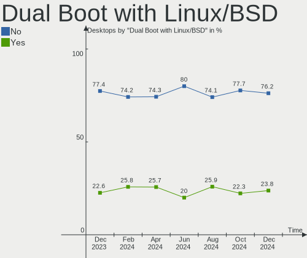
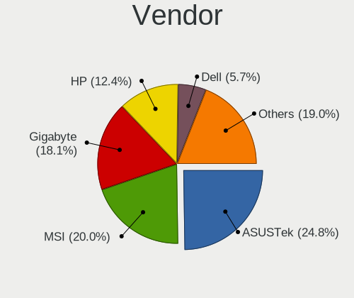
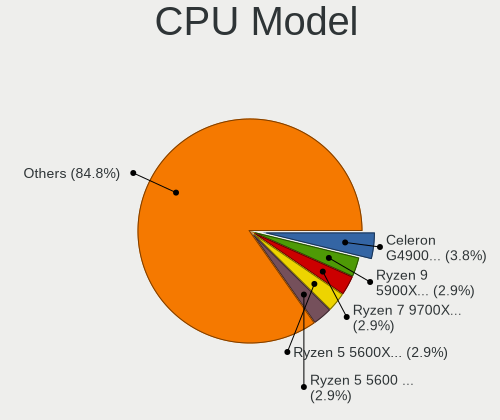
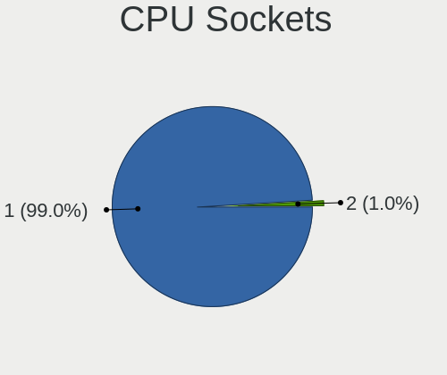
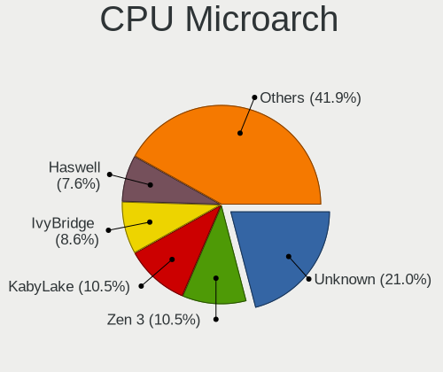
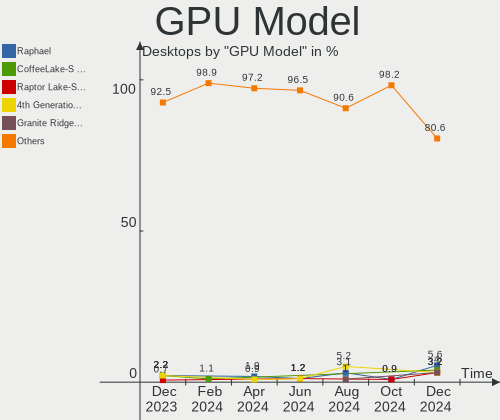
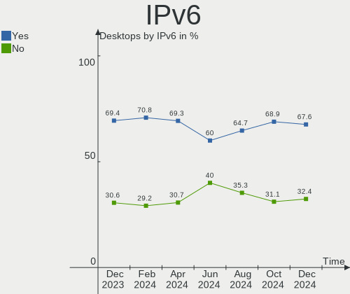
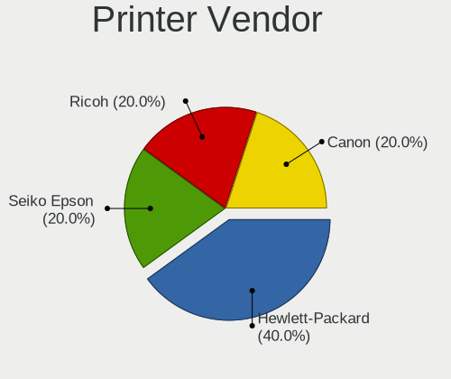

Linux in France - Hardware Trends (Desktops)
--------------------------------------------

A project to identify most popular hardware characteristics and track their change
over time based on data collected by Linux users at https://Linux-Hardware.org.

Anyone can contribute to this report by the [hw-probe](https://github.com/linuxhw/hw-probe) tool:

    sudo -E hw-probe -all -upload

Period: Aug, 2022.

Contents
--------

* [ System ](#system)
  - [ OS                       ](#os)
  - [ OS Family                ](#os-family)
  - [ Kernel                   ](#kernel)
  - [ Kernel Family            ](#kernel-family)
  - [ Kernel Major Ver.        ](#kernel-major-ver)
  - [ Arch                     ](#arch)
  - [ DE                       ](#de)
  - [ Display Server           ](#display-server)
  - [ Display Manager          ](#display-manager)
  - [ OS Lang                  ](#os-lang)
  - [ Boot Mode                ](#boot-mode)
  - [ Filesystem               ](#filesystem)
  - [ Part. scheme             ](#part-scheme)
  - [ Dual Boot with Linux/BSD ](#dual-boot-with-linuxbsd)
  - [ Dual Boot (Win)          ](#dual-boot-win)

* [ Board ](#board)
  - [ Vendor                   ](#vendor)
  - [ Model                    ](#model)
  - [ Model Family             ](#model-family)
  - [ MFG Year                 ](#mfg-year)
  - [ Form Factor              ](#form-factor)
  - [ Secure Boot              ](#secure-boot)
  - [ Coreboot                 ](#coreboot)
  - [ RAM Size                 ](#ram-size)
  - [ RAM Used                 ](#ram-used)
  - [ Total Drives             ](#total-drives)
  - [ Has CD-ROM               ](#has-cd-rom)
  - [ Has Ethernet             ](#has-ethernet)
  - [ Has WiFi                 ](#has-wifi)
  - [ Has Bluetooth            ](#has-bluetooth)

* [ Location ](#location)
  - [ Country                  ](#country)
  - [ City                     ](#city)

* [ Drives ](#drives)
  - [ Drive Vendor             ](#drive-vendor)
  - [ Drive Model              ](#drive-model)
  - [ HDD Vendor               ](#hdd-vendor)
  - [ SSD Vendor               ](#ssd-vendor)
  - [ Drive Kind               ](#drive-kind)
  - [ Drive Connector          ](#drive-connector)
  - [ Drive Size               ](#drive-size)
  - [ Space Total              ](#space-total)
  - [ Space Used               ](#space-used)
  - [ Malfunc. Drives          ](#malfunc-drives)
  - [ Malfunc. Drive Vendor    ](#malfunc-drive-vendor)
  - [ Malfunc. HDD Vendor      ](#malfunc-hdd-vendor)
  - [ Malfunc. Drive Kind      ](#malfunc-drive-kind)
  - [ Failed Drives            ](#failed-drives)
  - [ Failed Drive Vendor      ](#failed-drive-vendor)
  - [ Drive Status             ](#drive-status)

* [ Storage controller ](#storage-controller)
  - [ Storage Vendor           ](#storage-vendor)
  - [ Storage Model            ](#storage-model)
  - [ Storage Kind             ](#storage-kind)

* [ Processor ](#processor)
  - [ CPU Vendor               ](#cpu-vendor)
  - [ CPU Model                ](#cpu-model)
  - [ CPU Model Family         ](#cpu-model-family)
  - [ CPU Cores                ](#cpu-cores)
  - [ CPU Sockets              ](#cpu-sockets)
  - [ CPU Threads              ](#cpu-threads)
  - [ CPU Op-Modes             ](#cpu-op-modes)
  - [ CPU Microcode            ](#cpu-microcode)
  - [ CPU Microarch            ](#cpu-microarch)

* [ Graphics ](#graphics)
  - [ GPU Vendor               ](#gpu-vendor)
  - [ GPU Model                ](#gpu-model)
  - [ GPU Combo                ](#gpu-combo)
  - [ GPU Driver               ](#gpu-driver)
  - [ GPU Memory               ](#gpu-memory)

* [ Monitor ](#monitor)
  - [ Monitor Vendor           ](#monitor-vendor)
  - [ Monitor Model            ](#monitor-model)
  - [ Monitor Resolution       ](#monitor-resolution)
  - [ Monitor Diagonal         ](#monitor-diagonal)
  - [ Monitor Width            ](#monitor-width)
  - [ Aspect Ratio             ](#aspect-ratio)
  - [ Monitor Area             ](#monitor-area)
  - [ Pixel Density            ](#pixel-density)
  - [ Multiple Monitors        ](#multiple-monitors)

* [ Network ](#network)
  - [ Net Controller Vendor    ](#net-controller-vendor)
  - [ Net Controller Model     ](#net-controller-model)
  - [ Wireless Vendor          ](#wireless-vendor)
  - [ Wireless Model           ](#wireless-model)
  - [ Ethernet Vendor          ](#ethernet-vendor)
  - [ Ethernet Model           ](#ethernet-model)
  - [ Net Controller Kind      ](#net-controller-kind)
  - [ Used Controller          ](#used-controller)
  - [ NICs                     ](#nics)
  - [ IPv6                     ](#ipv6)

* [ Bluetooth ](#bluetooth)
  - [ Bluetooth Vendor         ](#bluetooth-vendor)
  - [ Bluetooth Model          ](#bluetooth-model)

* [ Sound ](#sound)
  - [ Sound Vendor             ](#sound-vendor)
  - [ Sound Model              ](#sound-model)

* [ Memory ](#memory)
  - [ Memory Vendor            ](#memory-vendor)
  - [ Memory Model             ](#memory-model)
  - [ Memory Kind              ](#memory-kind)
  - [ Memory Form Factor       ](#memory-form-factor)
  - [ Memory Size              ](#memory-size)
  - [ Memory Speed             ](#memory-speed)

* [ Printers & scanners ](#printers--scanners)
  - [ Printer Vendor           ](#printer-vendor)
  - [ Printer Model            ](#printer-model)
  - [ Scanner Vendor           ](#scanner-vendor)
  - [ Scanner Model            ](#scanner-model)

* [ Camera ](#camera)
  - [ Camera Vendor            ](#camera-vendor)
  - [ Camera Model             ](#camera-model)

* [ Security ](#security)
  - [ Fingerprint Vendor       ](#fingerprint-vendor)
  - [ Fingerprint Model        ](#fingerprint-model)
  - [ Chipcard Vendor          ](#chipcard-vendor)
  - [ Chipcard Model           ](#chipcard-model)

* [ Unsupported ](#unsupported)
  - [ Unsupported Devices      ](#unsupported-devices)
  - [ Unsupported Device Types ](#unsupported-device-types)

System
------

OS
--

Installed operating systems

| Name                        | Desktops | Percent |
|-----------------------------|----------|---------|
| Ubuntu 22.04                | 18       | 17.65%  |
| Ubuntu 20.04                | 14       | 13.73%  |
| OpenMandriva 4.3            | 11       | 10.78%  |
| Debian 11                   | 11       | 10.78%  |
| Xubuntu 22.04               | 4        | 3.92%   |
| Linux Mint 21               | 4        | 3.92%   |
| Fedora 36                   | 4        | 3.92%   |
| OpenMandriva 4.90           | 3        | 2.94%   |
| OpenMandriva 4.2            | 3        | 2.94%   |
| Nobara 36                   | 3        | 2.94%   |
| Kubuntu 22.04               | 3        | 2.94%   |
| Pop!_OS 22.04               | 2        | 1.96%   |
| Linux Mint 20.3             | 2        | 1.96%   |
| Debian Testing              | 2        | 1.96%   |
| ArcoLinux Rolling           | 2        | 1.96%   |
| Zorin 16                    | 1        | 0.98%   |
| Xubuntu 20.04               | 1        | 0.98%   |
| Ubuntu MATE 22.04           | 1        | 0.98%   |
| Ubuntu MATE 20.04           | 1        | 0.98%   |
| Ubuntu Budgie 20.04         | 1        | 0.98%   |
| Ubuntu 18.04                | 1        | 0.98%   |
| Trisquel 10.0.1             | 1        | 0.98%   |
| SteamOS 3.3                 | 1        | 0.98%   |
| org.kde.Platform 5.15-21.08 | 1        | 0.98%   |
| Manjaro 21.3.6              | 1        | 0.98%   |
| Lubuntu 22.04               | 1        | 0.98%   |
| Lubuntu 20.04               | 1        | 0.98%   |
| Kubuntu 20.04               | 1        | 0.98%   |
| KDE neon 20.04              | 1        | 0.98%   |
| Elementary 6.1              | 1        | 0.98%   |
| Debian Unstable             | 1        | 0.98%   |

OS Family
---------

OS without a version

| Name             | Desktops | Percent |
|------------------|----------|---------|
| Ubuntu           | 33       | 32.35%  |
| OpenMandriva     | 17       | 16.67%  |
| Debian           | 14       | 13.73%  |
| Linux Mint       | 6        | 5.88%   |
| Xubuntu          | 5        | 4.9%    |
| Kubuntu          | 4        | 3.92%   |
| Fedora           | 4        | 3.92%   |
| Nobara           | 3        | 2.94%   |
| Ubuntu MATE      | 2        | 1.96%   |
| Pop!_OS          | 2        | 1.96%   |
| Lubuntu          | 2        | 1.96%   |
| ArcoLinux        | 2        | 1.96%   |
| Zorin            | 1        | 0.98%   |
| Ubuntu Budgie    | 1        | 0.98%   |
| Trisquel         | 1        | 0.98%   |
| SteamOS          | 1        | 0.98%   |
| org.kde.Platform | 1        | 0.98%   |
| Manjaro          | 1        | 0.98%   |
| KDE neon         | 1        | 0.98%   |
| Elementary       | 1        | 0.98%   |

Kernel
------

Version of the Linux kernel

| Version                                      | Desktops | Percent |
|----------------------------------------------|----------|---------|
| 5.15.0-46-generic                            | 22       | 21.57%  |
| 5.15.0-43-generic                            | 16       | 15.69%  |
| 5.16.7-desktop-1omv4003                      | 11       | 10.78%  |
| 5.10.0-16-amd64                              | 7        | 6.86%   |
| 5.18.12-desktop-3omv4090                     | 3        | 2.94%   |
| 5.10.14-desktop-1omv4002                     | 3        | 2.94%   |
| 5.10.0-17-amd64                              | 3        | 2.94%   |
| 5.4.0-122-generic                            | 2        | 1.96%   |
| 5.18.10-76051810-generic                     | 2        | 1.96%   |
| 5.18.0-3-amd64                               | 2        | 1.96%   |
| 5.15.0-47-generic                            | 2        | 1.96%   |
| 5.15.0-41-generic                            | 2        | 1.96%   |
| 5.8.0-53-generic                             | 1        | 0.98%   |
| 5.4.0-125-generic                            | 1        | 0.98%   |
| 5.4.0-124-generic                            | 1        | 0.98%   |
| 5.4.0-122-lowlatency                         | 1        | 0.98%   |
| 5.4.0-109-generic                            | 1        | 0.98%   |
| 5.19.4-200.fc36.x86_64                       | 1        | 0.98%   |
| 5.19.1-arch2-1                               | 1        | 0.98%   |
| 5.18.19-201.fsync.fc36.x86_64                | 1        | 0.98%   |
| 5.18.18-200.fc36.x86_64                      | 1        | 0.98%   |
| 5.18.17-201.fsync.fc36.x86_64                | 1        | 0.98%   |
| 5.18.16-201.fsync.fc36.x86_64                | 1        | 0.98%   |
| 5.18.16-200.fc36.x86_64                      | 1        | 0.98%   |
| 5.18.15-arch1-1                              | 1        | 0.98%   |
| 5.18.0-2-amd64                               | 1        | 0.98%   |
| 5.18.0-13.1-liquorix-amd64                   | 1        | 0.98%   |
| 5.17.5-300.fc36.x86_64                       | 1        | 0.98%   |
| 5.15.57-2-MANJARO                            | 1        | 0.98%   |
| 5.15.53                                      | 1        | 0.98%   |
| 5.15.30-2-pve                                | 1        | 0.98%   |
| 5.15.0-40-generic                            | 1        | 0.98%   |
| 5.15.0-27-generic                            | 1        | 0.98%   |
| 5.15.0-25-generic                            | 1        | 0.98%   |
| 5.15.0-1017-aws                              | 1        | 0.98%   |
| 5.13.0-valve22-1-neptune-02213-gb68995364335 | 1        | 0.98%   |
| 5.13.0-52-generic                            | 1        | 0.98%   |
| 5.13.0-48-generic                            | 1        | 0.98%   |
| 4.15.0-191-generic                           | 1        | 0.98%   |

Kernel Family
-------------

Linux kernel without a distro release

| Version | Desktops | Percent |
|---------|----------|---------|
| 5.15.0  | 46       | 45.1%   |
| 5.16.7  | 11       | 10.78%  |
| 5.10.0  | 10       | 9.8%    |
| 5.4.0   | 6        | 5.88%   |
| 5.18.0  | 4        | 3.92%   |
| 5.18.12 | 3        | 2.94%   |
| 5.13.0  | 3        | 2.94%   |
| 5.10.14 | 3        | 2.94%   |
| 5.18.16 | 2        | 1.96%   |
| 5.18.10 | 2        | 1.96%   |
| 5.8.0   | 1        | 0.98%   |
| 5.19.4  | 1        | 0.98%   |
| 5.19.1  | 1        | 0.98%   |
| 5.18.19 | 1        | 0.98%   |
| 5.18.18 | 1        | 0.98%   |
| 5.18.17 | 1        | 0.98%   |
| 5.18.15 | 1        | 0.98%   |
| 5.17.5  | 1        | 0.98%   |
| 5.15.57 | 1        | 0.98%   |
| 5.15.53 | 1        | 0.98%   |
| 5.15.30 | 1        | 0.98%   |
| 4.15.0  | 1        | 0.98%   |

Kernel Major Ver.
-----------------

Linux kernel major version

| Version | Desktops | Percent |
|---------|----------|---------|
| 5.15    | 49       | 48.04%  |
| 5.18    | 15       | 14.71%  |
| 5.10    | 13       | 12.75%  |
| 5.16    | 11       | 10.78%  |
| 5.4     | 6        | 5.88%   |
| 5.13    | 3        | 2.94%   |
| 5.19    | 2        | 1.96%   |
| 5.8     | 1        | 0.98%   |
| 5.17    | 1        | 0.98%   |
| 4.15    | 1        | 0.98%   |

Arch
----

OS architecture (x86_64, i586, etc.)

| Name   | Desktops | Percent |
|--------|----------|---------|
| x86_64 | 102      | 100%    |

DE
--

Desktop Environment

| Name       | Desktops | Percent |
|------------|----------|---------|
| GNOME      | 42       | 41.18%  |
| KDE5       | 27       | 26.47%  |
| XFCE       | 9        | 8.82%   |
| MATE       | 7        | 6.86%   |
| Unknown    | 7        | 6.86%   |
| X-Cinnamon | 5        | 4.9%    |
| LXQt       | 2        | 1.96%   |
| qtile      | 1        | 0.98%   |
| Pantheon   | 1        | 0.98%   |
| Budgie     | 1        | 0.98%   |

Display Server
--------------

X11 or Wayland

| Name    | Desktops | Percent |
|---------|----------|---------|
| X11     | 77       | 75.49%  |
| Wayland | 14       | 13.73%  |
| Tty     | 11       | 10.78%  |

Display Manager
---------------

SDDM, LightDM, etc.

| Name    | Desktops | Percent |
|---------|----------|---------|
| SDDM    | 28       | 27.45%  |
| LightDM | 19       | 18.63%  |
| GDM3    | 19       | 18.63%  |
| GDM     | 18       | 17.65%  |
| Unknown | 18       | 17.65%  |

OS Lang
-------

Language

| Lang  | Desktops | Percent |
|-------|----------|---------|
| fr_FR | 81       | 79.41%  |
| en_US | 19       | 18.63%  |
| en_GB | 2        | 1.96%   |

Boot Mode
---------

EFI or BIOS

| Mode | Desktops | Percent |
|------|----------|---------|
| EFI  | 53       | 51.96%  |
| BIOS | 49       | 48.04%  |

Filesystem
----------

Type of filesystem

| Type    | Desktops | Percent |
|---------|----------|---------|
| Ext4    | 77       | 75.49%  |
| Overlay | 16       | 15.69%  |
| Btrfs   | 7        | 6.86%   |
| Zfs     | 1        | 0.98%   |
| Ext3    | 1        | 0.98%   |

Part. scheme
------------

Scheme of partitioning

| Type    | Desktops | Percent |
|---------|----------|---------|
| GPT     | 59       | 57.84%  |
| Unknown | 24       | 23.53%  |
| MBR     | 19       | 18.63%  |

Dual Boot with Linux/BSD
------------------------

Hosting more than one Linux/BSD

| Dual boot | Desktops | Percent |
|-----------|----------|---------|
| No        | 69       | 67.65%  |
| Yes       | 33       | 32.35%  |

Dual Boot (Win)
---------------

Hosting Linux and Windows

| Dual boot | Desktops | Percent |
|-----------|----------|---------|
| No        | 69       | 67.65%  |
| Yes       | 33       | 32.35%  |

Board
-----

Vendor
------

Motherboard manufacturer

| Name                | Desktops | Percent |
|---------------------|----------|---------|
| ASUSTek Computer    | 19       | 18.63%  |
| MSI                 | 17       | 16.67%  |
| Gigabyte Technology | 15       | 14.71%  |
| Dell                | 10       | 9.8%    |
| Lenovo              | 9        | 8.82%   |
| ASRock              | 8        | 7.84%   |
| Hewlett-Packard     | 7        | 6.86%   |
| Foxconn             | 4        | 3.92%   |
| Acer                | 3        | 2.94%   |
| Packard Bell        | 2        | 1.96%   |
| Intel               | 2        | 1.96%   |
| eMachines           | 2        | 1.96%   |
| Vorke               | 1        | 0.98%   |
| Supermicro          | 1        | 0.98%   |
| Medion              | 1        | 0.98%   |
| Biostar             | 1        | 0.98%   |

Model
-----

Motherboard model

| Name                                    | Desktops | Percent |
|-----------------------------------------|----------|---------|
| MSI MS-7C91                             | 3        | 2.94%   |
| ASUS All Series                         | 3        | 2.94%   |
| MSI MS-7C92                             | 2        | 1.96%   |
| Lenovo ThinkCentre M73 10AXS1UY00       | 2        | 1.96%   |
| ASUS PRIME A320M-K                      | 2        | 1.96%   |
| Vorke V1 Plus                           | 1        | 0.98%   |
| Supermicro X7DCL                        | 1        | 0.98%   |
| Packard Bell IMEDIA S1300               | 1        | 0.98%   |
| Packard Bell IMEDIA F9218 AIO           | 1        | 0.98%   |
| MSI MS-7D54                             | 1        | 0.98%   |
| MSI MS-7D53                             | 1        | 0.98%   |
| MSI MS-7C83                             | 1        | 0.98%   |
| MSI MS-7C52                             | 1        | 0.98%   |
| MSI MS-7C08                             | 1        | 0.98%   |
| MSI MS-7B79                             | 1        | 0.98%   |
| MSI MS-7A74                             | 1        | 0.98%   |
| MSI MS-7982                             | 1        | 0.98%   |
| MSI MS-7977                             | 1        | 0.98%   |
| MSI MS-7917                             | 1        | 0.98%   |
| MSI MS-7821                             | 1        | 0.98%   |
| MSI MS-7693                             | 1        | 0.98%   |
| Medion MD35147                          | 1        | 0.98%   |
| Lenovo ThinkStation P330 P330           | 1        | 0.98%   |
| Lenovo ThinkCentre M83 10AHS2TG00       | 1        | 0.98%   |
| Lenovo ThinkCentre M82 2929B81          | 1        | 0.98%   |
| Lenovo ThinkCentre M79 10JAS00P00       | 1        | 0.98%   |
| Lenovo ThinkCentre E73 10DR000VFR       | 1        | 0.98%   |
| Lenovo IdeaCentre G5 14IMB05 90N900CTFR | 1        | 0.98%   |
| Lenovo 7033EW4                          | 1        | 0.98%   |
| Intel X79                               | 1        | 0.98%   |
| Intel D54250WYK H13922-302              | 1        | 0.98%   |
| HP Z400 Workstation                     | 1        | 0.98%   |
| HP ProDesk 600 G2 SFF                   | 1        | 0.98%   |
| HP ProDesk 600 G1 DM                    | 1        | 0.98%   |
| HP EliteDesk 800 G4 WKS TWR             | 1        | 0.98%   |
| HP EliteDesk 800 G1 USDT                | 1        | 0.98%   |
| HP Compaq Elite 8300 SFF                | 1        | 0.98%   |
| HP Compaq 6200 Pro SFF PC               | 1        | 0.98%   |
| Gigabyte H97N-WIFI                      | 1        | 0.98%   |
| Gigabyte H87-HD3                        | 1        | 0.98%   |
| Gigabyte H370HD3                        | 1        | 0.98%   |
| Gigabyte H370AORUSGAMING3WIFI           | 1        | 0.98%   |
| Gigabyte GA-MA790FXT-UD5P               | 1        | 0.98%   |
| Gigabyte G41M-Combo                     | 1        | 0.98%   |
| Gigabyte G1.SNIPER B7-CF                | 1        | 0.98%   |
| Gigabyte F2A78M-HD2                     | 1        | 0.98%   |
| Gigabyte B85M-D3PH                      | 1        | 0.98%   |
| Gigabyte B75M-D3V                       | 1        | 0.98%   |
| Gigabyte B460 AORUS PRO AC              | 1        | 0.98%   |
| Gigabyte B450M H                        | 1        | 0.98%   |
| Gigabyte B450M DS3H V2                  | 1        | 0.98%   |
| Gigabyte B450 AORUS ELITE               | 1        | 0.98%   |
| Gigabyte A320M-H                        | 1        | 0.98%   |
| Foxconn PRO 3500 SERIES MT              | 1        | 0.98%   |
| Foxconn Pro 3300 Series SFF             | 1        | 0.98%   |
| Foxconn p6-2466ef                       | 1        | 0.98%   |
| Foxconn p6-2393ef                       | 1        | 0.98%   |
| eMachines ET1352                        | 1        | 0.98%   |
| eMachines EL1352                        | 1        | 0.98%   |
| Dell Precision Tower 3620               | 1        | 0.98%   |

Model Family
------------

Motherboard model prefix

| Name                          | Desktops | Percent |
|-------------------------------|----------|---------|
| Dell OptiPlex                 | 9        | 8.82%   |
| Lenovo ThinkCentre            | 6        | 5.88%   |
| MSI MS-7C91                   | 3        | 2.94%   |
| ASUS TUF                      | 3        | 2.94%   |
| ASUS PRIME                    | 3        | 2.94%   |
| ASUS All                      | 3        | 2.94%   |
| Packard Bell IMEDIA           | 2        | 1.96%   |
| MSI MS-7C92                   | 2        | 1.96%   |
| HP ProDesk                    | 2        | 1.96%   |
| HP EliteDesk                  | 2        | 1.96%   |
| HP Compaq                     | 2        | 1.96%   |
| Gigabyte B450M                | 2        | 1.96%   |
| Foxconn Pro                   | 2        | 1.96%   |
| ASUS ROG                      | 2        | 1.96%   |
| Vorke V1                      | 1        | 0.98%   |
| Supermicro X7DCL              | 1        | 0.98%   |
| MSI MS-7D54                   | 1        | 0.98%   |
| MSI MS-7D53                   | 1        | 0.98%   |
| MSI MS-7C83                   | 1        | 0.98%   |
| MSI MS-7C52                   | 1        | 0.98%   |
| MSI MS-7C08                   | 1        | 0.98%   |
| MSI MS-7B79                   | 1        | 0.98%   |
| MSI MS-7A74                   | 1        | 0.98%   |
| MSI MS-7982                   | 1        | 0.98%   |
| MSI MS-7977                   | 1        | 0.98%   |
| MSI MS-7917                   | 1        | 0.98%   |
| MSI MS-7821                   | 1        | 0.98%   |
| MSI MS-7693                   | 1        | 0.98%   |
| Medion MD35147                | 1        | 0.98%   |
| Lenovo ThinkStation           | 1        | 0.98%   |
| Lenovo IdeaCentre             | 1        | 0.98%   |
| Lenovo 7033EW4                | 1        | 0.98%   |
| Intel X79                     | 1        | 0.98%   |
| Intel D54250WYK               | 1        | 0.98%   |
| HP Z400                       | 1        | 0.98%   |
| Gigabyte H97N-WIFI            | 1        | 0.98%   |
| Gigabyte H87-HD3              | 1        | 0.98%   |
| Gigabyte H370HD3              | 1        | 0.98%   |
| Gigabyte H370AORUSGAMING3WIFI | 1        | 0.98%   |
| Gigabyte GA-MA790FXT-UD5P     | 1        | 0.98%   |
| Gigabyte G41M-Combo           | 1        | 0.98%   |
| Gigabyte G1.SNIPER            | 1        | 0.98%   |
| Gigabyte F2A78M-HD2           | 1        | 0.98%   |
| Gigabyte B85M-D3PH            | 1        | 0.98%   |
| Gigabyte B75M-D3V             | 1        | 0.98%   |
| Gigabyte B460                 | 1        | 0.98%   |
| Gigabyte B450                 | 1        | 0.98%   |
| Gigabyte A320M-H              | 1        | 0.98%   |
| Foxconn p6-2466ef             | 1        | 0.98%   |
| Foxconn p6-2393ef             | 1        | 0.98%   |
| eMachines ET1352              | 1        | 0.98%   |
| eMachines EL1352              | 1        | 0.98%   |
| Dell Precision                | 1        | 0.98%   |
| Biostar H81MHV3               | 1        | 0.98%   |
| ASUS Z170-A                   | 1        | 0.98%   |
| ASUS Z170                     | 1        | 0.98%   |
| ASUS UN62                     | 1        | 0.98%   |
| ASUS P8P67                    | 1        | 0.98%   |
| ASUS P7P55D                   | 1        | 0.98%   |
| ASUS P6T                      | 1        | 0.98%   |

MFG Year
--------

Motherboard manufacture year

| Year | Desktops | Percent |
|------|----------|---------|
| 2014 | 14       | 13.73%  |
| 2020 | 11       | 10.78%  |
| 2015 | 10       | 9.8%    |
| 2018 | 9        | 8.82%   |
| 2021 | 8        | 7.84%   |
| 2013 | 8        | 7.84%   |
| 2019 | 7        | 6.86%   |
| 2017 | 6        | 5.88%   |
| 2011 | 6        | 5.88%   |
| 2010 | 6        | 5.88%   |
| 2012 | 4        | 3.92%   |
| 2009 | 3        | 2.94%   |
| 2006 | 3        | 2.94%   |
| 2016 | 2        | 1.96%   |
| 2008 | 2        | 1.96%   |
| 2007 | 2        | 1.96%   |
| 2022 | 1        | 0.98%   |

Form Factor
-----------

Physical design of the computer

| Name    | Desktops | Percent |
|---------|----------|---------|
| Desktop | 102      | 100%    |

Secure Boot
-----------

Enabled or disabled

| State    | Desktops | Percent |
|----------|----------|---------|
| Disabled | 98       | 96.08%  |
| Enabled  | 4        | 3.92%   |

Coreboot
--------

Have coreboot on board

| Used | Desktops | Percent |
|------|----------|---------|
| No   | 102      | 100%    |

RAM Size
--------

Total RAM memory

| Size in GB  | Desktops | Percent |
|-------------|----------|---------|
| 16.01-24.0  | 27       | 26.47%  |
| 4.01-8.0    | 19       | 18.63%  |
| 8.01-16.0   | 19       | 18.63%  |
| 32.01-64.0  | 15       | 14.71%  |
| 3.01-4.0    | 14       | 13.73%  |
| 1.01-2.0    | 4        | 3.92%   |
| 64.01-256.0 | 3        | 2.94%   |
| 24.01-32.0  | 1        | 0.98%   |

RAM Used
--------

Used RAM memory

| Used GB    | Desktops | Percent |
|------------|----------|---------|
| 1.01-2.0   | 34       | 33.33%  |
| 2.01-3.0   | 23       | 22.55%  |
| 4.01-8.0   | 17       | 16.67%  |
| 3.01-4.0   | 14       | 13.73%  |
| 0.51-1.0   | 9        | 8.82%   |
| 8.01-16.0  | 4        | 3.92%   |
| 16.01-24.0 | 1        | 0.98%   |

Total Drives
------------

Number of drives on board

| Drives | Desktops | Percent |
|--------|----------|---------|
| 1      | 39       | 38.24%  |
| 2      | 31       | 30.39%  |
| 3      | 15       | 14.71%  |
| 4      | 12       | 11.76%  |
| 5      | 3        | 2.94%   |
| 6      | 2        | 1.96%   |

Has CD-ROM
----------

Has CD-ROM on board

| Presented | Desktops | Percent |
|-----------|----------|---------|
| No        | 53       | 51.96%  |
| Yes       | 49       | 48.04%  |

Has Ethernet
------------

Has Ethernet on board

| Presented | Desktops | Percent |
|-----------|----------|---------|
| Yes       | 102      | 100%    |

Has WiFi
--------

Has WiFi module

| Presented | Desktops | Percent |
|-----------|----------|---------|
| No        | 60       | 58.82%  |
| Yes       | 42       | 41.18%  |

Has Bluetooth
-------------

Has Bluetooth module

| Presented | Desktops | Percent |
|-----------|----------|---------|
| No        | 73       | 71.57%  |
| Yes       | 29       | 28.43%  |

Location
--------

Country
-------

Geographic location (country)

| Country | Desktops | Percent |
|---------|----------|---------|
| France  | 102      | 100%    |

City
----

Geographic location (city)

| City                      | Desktops | Percent |
|---------------------------|----------|---------|
| Paris                     | 11       | 10.78%  |
| Monistrol-sur-Loire       | 4        | 3.92%   |
| Nantes                    | 3        | 2.94%   |
| Marseille                 | 3        | 2.94%   |
| Figeac                    | 3        | 2.94%   |
| Rennes                    | 2        | 1.96%   |
| Niort                     | 2        | 1.96%   |
| Lyon                      | 2        | 1.96%   |
| Bougival                  | 2        | 1.96%   |
| Agde                      | 2        | 1.96%   |
| Vendrennes                | 1        | 0.98%   |
| Valence                   | 1        | 0.98%   |
| Talence                   | 1        | 0.98%   |
| Sète                     | 1        | 0.98%   |
| Sautron                   | 1        | 0.98%   |
| Salon-de-Provence         | 1        | 0.98%   |
| Sainte-Luce-sur-Loire     | 1        | 0.98%   |
| Saint-Julien-en-Genevois  | 1        | 0.98%   |
| Saint-Julien-de-Concelles | 1        | 0.98%   |
| Saint-Jeures              | 1        | 0.98%   |
| Saint-Georges-de-Reneins  | 1        | 0.98%   |
| Saint-Denis               | 1        | 0.98%   |
| Roujan                    | 1        | 0.98%   |
| Romorantin-Lanthenay      | 1        | 0.98%   |
| Roche-la-Moliere          | 1        | 0.98%   |
| Rezé                     | 1        | 0.98%   |
| Retournac                 | 1        | 0.98%   |
| Puget-sur-Argens          | 1        | 0.98%   |
| Pontoise                  | 1        | 0.98%   |
| Plouescat                 | 1        | 0.98%   |
| Paulhan                   | 1        | 0.98%   |
| Nice                      | 1        | 0.98%   |
| Neuilly-sur-Marne         | 1        | 0.98%   |
| Mulhouse                  | 1        | 0.98%   |
| Montmorency               | 1        | 0.98%   |
| Meyzieu                   | 1        | 0.98%   |
| Meylan                    | 1        | 0.98%   |
| Martigues                 | 1        | 0.98%   |
| Lille                     | 1        | 0.98%   |
| Liévin                   | 1        | 0.98%   |
| Les Ulis                  | 1        | 0.98%   |
| Laon                      | 1        | 0.98%   |
| La Vicomte-sur-Rance      | 1        | 0.98%   |
| Ifs                       | 1        | 0.98%   |
| Hettange-Grande           | 1        | 0.98%   |
| Hegenheim                 | 1        | 0.98%   |
| Guilherand-Granges        | 1        | 0.98%   |
| Goudelin                  | 1        | 0.98%   |
| Gex                       | 1        | 0.98%   |
| Gennevilliers             | 1        | 0.98%   |
| Fontenay-sous-Bois        | 1        | 0.98%   |
| Floirac                   | 1        | 0.98%   |
| Escaudain                 | 1        | 0.98%   |
| Elven                     | 1        | 0.98%   |
| Élancourt                | 1        | 0.98%   |
| Douai                     | 1        | 0.98%   |
| Dole                      | 1        | 0.98%   |
| Corbeil-Essonnes          | 1        | 0.98%   |
| Cognac                    | 1        | 0.98%   |
| Chatou                    | 1        | 0.98%   |

Drives
------

Drive Vendor
------------

Hard drive vendors

| Vendor                    | Desktops | Drives | Percent |
|---------------------------|----------|--------|---------|
| Seagate                   | 32       | 42     | 17.78%  |
| Samsung Electronics       | 31       | 44     | 17.22%  |
| WDC                       | 30       | 40     | 16.67%  |
| Crucial                   | 21       | 24     | 11.67%  |
| Kingston                  | 14       | 15     | 7.78%   |
| Toshiba                   | 7        | 7      | 3.89%   |
| Hitachi                   | 6        | 7      | 3.33%   |
| Corsair                   | 4        | 5      | 2.22%   |
| Unknown                   | 3        | 3      | 1.67%   |
| Transcend                 | 2        | 2      | 1.11%   |
| SPCC                      | 2        | 2      | 1.11%   |
| PNY                       | 2        | 2      | 1.11%   |
| Phison                    | 2        | 2      | 1.11%   |
| Maxtor                    | 2        | 2      | 1.11%   |
| LDLC                      | 2        | 2      | 1.11%   |
| HGST                      | 2        | 2      | 1.11%   |
| Emtec                     | 2        | 2      | 1.11%   |
| A-DATA Technology         | 2        | 2      | 1.11%   |
| Unknown                   | 1        | 1      | 0.56%   |
| UMIS                      | 1        | 1      | 0.56%   |
| Storeva                   | 1        | 1      | 0.56%   |
| SK hynix                  | 1        | 1      | 0.56%   |
| SanDisk                   | 1        | 1      | 0.56%   |
| OCZ                       | 1        | 1      | 0.56%   |
| Micron/Crucial Technology | 1        | 1      | 0.56%   |
| M.2 SSD                   | 1        | 1      | 0.56%   |
| KingSpec                  | 1        | 1      | 0.56%   |
| KingDian                  | 1        | 2      | 0.56%   |
| Intel                     | 1        | 1      | 0.56%   |
| FORESEE                   | 1        | 1      | 0.56%   |
| China                     | 1        | 1      | 0.56%   |
| Apacer                    | 1        | 1      | 0.56%   |

Drive Model
-----------

Hard drive models

| Model                           | Desktops | Percent |
|---------------------------------|----------|---------|
| Seagate ST1000DM010-2EP102 1TB  | 5        | 2.35%   |
| Seagate ST500DM002-1BD142 500GB | 4        | 1.88%   |
| Samsung SSD 850 EVO 250GB       | 4        | 1.88%   |
| Crucial CT480BX500SSD1 480GB    | 4        | 1.88%   |
| Seagate ST2000DL003-9VT166 2TB  | 3        | 1.41%   |
| Samsung SSD 870 QVO 1TB         | 3        | 1.41%   |
| Samsung SSD 860 QVO 1TB         | 3        | 1.41%   |
| Samsung SSD 860 EVO 500GB       | 3        | 1.41%   |
| Samsung SSD 850 EVO 500GB       | 3        | 1.41%   |
| Kingston SA400S37240G 240GB SSD | 3        | 1.41%   |
| Crucial CT500P2SSD8 500GB       | 3        | 1.41%   |
| Unknown                         | 3        | 1.41%   |
| WDC WD30EZRZ-00GXCB0 3TB        | 2        | 0.94%   |
| WDC WD20EZRZ-00Z5HB0 2TB        | 2        | 0.94%   |
| WDC WD10EZEX-08WN4A0 1TB        | 2        | 0.94%   |
| WDC WD1002FAEX-00Z3A0 1TB       | 2        | 0.94%   |
| Seagate ST2000DM001-1ER164 2TB  | 2        | 0.94%   |
| Seagate ST1000LM049-2GH172 1TB  | 2        | 0.94%   |
| Seagate ST1000DM003-1CH162 1TB  | 2        | 0.94%   |
| Samsung SSD 980 500GB           | 2        | 0.94%   |
| Samsung SSD 980 1TB             | 2        | 0.94%   |
| Samsung NVMe SSD Drive 500GB    | 2        | 0.94%   |
| LDLC F8+M.2 480 480GB           | 2        | 0.94%   |
| Kingston SHSS37A240G 240GB SSD  | 2        | 0.94%   |
| Kingston SA400S37480G 480GB SSD | 2        | 0.94%   |
| Kingston SA400S37120G 120GB SSD | 2        | 0.94%   |
| Crucial CT500MX500SSD1 500GB    | 2        | 0.94%   |
| Crucial CT240BX500SSD1 240GB    | 2        | 0.94%   |
| Crucial CT128M550SSD3 128GB     | 2        | 0.94%   |
| Crucial CT1000P2SSD8 1TB        | 2        | 0.94%   |
| Crucial CT1000MX500SSD1 1TB     | 2        | 0.94%   |
| WDC WDS480G2G0C-00AJM0 480GB    | 1        | 0.47%   |
| WDC WD60EZAZ-00ZGHB0 6TB        | 1        | 0.47%   |
| WDC WD60EZAZ-00SF3B0 6TB        | 1        | 0.47%   |
| WDC WD5001AALS-00L3B2 500GB     | 1        | 0.47%   |
| WDC WD5000BEVT-22A0RT0 500GB    | 1        | 0.47%   |
| WDC WD5000AAKX-00ERMA0 500GB    | 1        | 0.47%   |
| WDC WD5000AAKS-00A7B0 500GB     | 1        | 0.47%   |
| WDC WD40EZAZ-00SF3B0 4TB        | 1        | 0.47%   |
| WDC WD3200AAJS-22L7A0 320GB     | 1        | 0.47%   |
| WDC WD30EZRX-00DC0B0 3TB        | 1        | 0.47%   |
| WDC WD30EZAZ-00SF3B0 3TB        | 1        | 0.47%   |
| WDC WD30EFRX-68EUZN0 3TB        | 1        | 0.47%   |
| WDC WD2500KS-00MJB0 250GB       | 1        | 0.47%   |
| WDC WD2500AAKX-753CA1 250GB     | 1        | 0.47%   |
| WDC WD2500AAKS-61L9A0 250GB     | 1        | 0.47%   |
| WDC WD20EZRX-22D8PB0 2TB        | 1        | 0.47%   |
| WDC WD20EZRX-00DC0B0 2TB        | 1        | 0.47%   |
| WDC WD20EZBX-00AYRA0 2TB        | 1        | 0.47%   |
| WDC WD20EARS-22MVWB0 2TB        | 1        | 0.47%   |
| WDC WD2002FYPS-02W3B0 2TB       | 1        | 0.47%   |
| WDC WD2002FAEX-007BA0 2TB       | 1        | 0.47%   |
| WDC WD1600AAJS-08L7A0 160GB     | 1        | 0.47%   |
| WDC WD10JPVX-60JC3T0 1TB        | 1        | 0.47%   |
| WDC WD10EZEX-60ZF5A0 1TB        | 1        | 0.47%   |
| WDC WD10EZEX-08M2NA0 1TB        | 1        | 0.47%   |
| WDC WD10EZEX-00M2NA0 1TB        | 1        | 0.47%   |
| WDC WD10EZEX-00BN5A0 1TB        | 1        | 0.47%   |
| WDC WD10EURX-63C57Y0 1TB        | 1        | 0.47%   |
| WDC WD10EALS-00Z8A0 1TB         | 1        | 0.47%   |

HDD Vendor
----------

Hard disk drive vendors

| Vendor              | Desktops | Drives | Percent |
|---------------------|----------|--------|---------|
| Seagate             | 31       | 41     | 36.9%   |
| WDC                 | 29       | 39     | 34.52%  |
| Samsung Electronics | 7        | 8      | 8.33%   |
| Hitachi             | 6        | 7      | 7.14%   |
| Toshiba             | 5        | 5      | 5.95%   |
| Maxtor              | 2        | 2      | 2.38%   |
| HGST                | 2        | 2      | 2.38%   |
| Unknown             | 1        | 1      | 1.19%   |
| Storeva             | 1        | 1      | 1.19%   |

SSD Vendor
----------

Solid state drive vendors

| Vendor              | Desktops | Drives | Percent |
|---------------------|----------|--------|---------|
| Crucial             | 18       | 19     | 26.09%  |
| Samsung Electronics | 17       | 22     | 24.64%  |
| Kingston            | 13       | 14     | 18.84%  |
| Transcend           | 2        | 2      | 2.9%    |
| SPCC                | 2        | 2      | 2.9%    |
| PNY                 | 2        | 2      | 2.9%    |
| Emtec               | 2        | 2      | 2.9%    |
| A-DATA Technology   | 2        | 2      | 2.9%    |
| Unknown             | 2        | 2      | 2.9%    |
| SanDisk             | 1        | 1      | 1.45%   |
| Phison              | 1        | 1      | 1.45%   |
| OCZ                 | 1        | 1      | 1.45%   |
| KingSpec            | 1        | 1      | 1.45%   |
| KingDian            | 1        | 2      | 1.45%   |
| FORESEE             | 1        | 1      | 1.45%   |
| Corsair             | 1        | 1      | 1.45%   |
| China               | 1        | 1      | 1.45%   |
| Apacer              | 1        | 1      | 1.45%   |

Drive Kind
----------

HDD or SSD

| Kind    | Desktops | Drives | Percent |
|---------|----------|--------|---------|
| HDD     | 64       | 106    | 41.29%  |
| SSD     | 58       | 77     | 37.42%  |
| NVMe    | 31       | 35     | 20%     |
| Unknown | 2        | 2      | 1.29%   |

Drive Connector
---------------

SATA, SAS, NVMe, etc.

| Type | Desktops | Drives | Percent |
|------|----------|--------|---------|
| SATA | 92       | 180    | 71.32%  |
| NVMe | 31       | 34     | 24.03%  |
| SAS  | 6        | 6      | 4.65%   |

Drive Size
----------

Size of hard drive

| Size in TB | Desktops | Drives | Percent |
|------------|----------|--------|---------|
| 0.01-0.5   | 69       | 93     | 50.36%  |
| 0.51-1.0   | 40       | 53     | 29.2%   |
| 1.01-2.0   | 15       | 20     | 10.95%  |
| 2.01-3.0   | 6        | 7      | 4.38%   |
| 3.01-4.0   | 3        | 3      | 2.19%   |
| 4.01-10.0  | 3        | 6      | 2.19%   |
| 10.01-20.0 | 1        | 1      | 0.73%   |

Space Total
-----------

Amount of disk space available on the file system

| Size in GB     | Desktops | Percent |
|----------------|----------|---------|
| 101-250        | 20       | 19.61%  |
| 501-1000       | 19       | 18.63%  |
| 251-500        | 16       | 15.69%  |
| 1001-2000      | 12       | 11.76%  |
| 1-20           | 12       | 11.76%  |
| More than 3000 | 11       | 10.78%  |
| 2001-3000      | 5        | 4.9%    |
| Unknown        | 4        | 3.92%   |
| 51-100         | 3        | 2.94%   |

Space Used
----------

Amount of used disk space

| Used GB        | Desktops | Percent |
|----------------|----------|---------|
| 1-20           | 28       | 27.45%  |
| 101-250        | 15       | 14.71%  |
| 21-50          | 13       | 12.75%  |
| 51-100         | 12       | 11.76%  |
| 251-500        | 8        | 7.84%   |
| 501-1000       | 8        | 7.84%   |
| More than 3000 | 6        | 5.88%   |
| 2001-3000      | 4        | 3.92%   |
| 1001-2000      | 4        | 3.92%   |
| Unknown        | 4        | 3.92%   |

Malfunc. Drives
---------------

Drive models with a malfunction

| Model                                 | Desktops | Drives | Percent |
|---------------------------------------|----------|--------|---------|
| WDC WD5000BEVT-22A0RT0 500GB          | 1        | 1      | 5.56%   |
| WDC WD2002FYPS-02W3B0 2TB             | 1        | 1      | 5.56%   |
| WDC WD2002FAEX-007BA0 2TB             | 1        | 1      | 5.56%   |
| WDC WD1600AAJS-08L7A0 160GB           | 1        | 1      | 5.56%   |
| WDC WD10EZEX-60ZF5A0 1TB              | 1        | 1      | 5.56%   |
| WDC WD1002FAEX-00Z3A0 1TB             | 1        | 1      | 5.56%   |
| Seagate ST500LM021-1KJ152 500GB       | 1        | 1      | 5.56%   |
| Seagate ST500DM002-1BD142 500GB       | 1        | 1      | 5.56%   |
| Seagate ST3500320AS 500GB             | 1        | 1      | 5.56%   |
| Seagate ST2000DM001-1ER164 2TB        | 1        | 1      | 5.56%   |
| Seagate ST1000DM003-1CH162 1TB        | 1        | 1      | 5.56%   |
| Samsung Electronics SSD 850 PRO 512GB | 1        | 1      | 5.56%   |
| Samsung Electronics HD154UI 1TB       | 1        | 1      | 5.56%   |
| OCZ VERTEX 64GB SSD                   | 1        | 1      | 5.56%   |
| Hitachi HDS721010CLA332 1TB           | 1        | 1      | 5.56%   |
| HGST HTS725032A7E630 320GB            | 1        | 1      | 5.56%   |
| Crucial CT275MX300SSD1 275GB          | 1        | 1      | 5.56%   |
| Apacer 16GB SATA Flash Drive SSD      | 1        | 1      | 5.56%   |

Malfunc. Drive Vendor
---------------------

Vendors of faulty drives

| Vendor              | Desktops | Drives | Percent |
|---------------------|----------|--------|---------|
| WDC                 | 6        | 6      | 33.33%  |
| Seagate             | 5        | 5      | 27.78%  |
| Samsung Electronics | 2        | 2      | 11.11%  |
| OCZ                 | 1        | 1      | 5.56%   |
| Hitachi             | 1        | 1      | 5.56%   |
| HGST                | 1        | 1      | 5.56%   |
| Crucial             | 1        | 1      | 5.56%   |
| Apacer              | 1        | 1      | 5.56%   |

Malfunc. HDD Vendor
-------------------

Vendors of faulty HDD drives

| Vendor              | Desktops | Drives | Percent |
|---------------------|----------|--------|---------|
| WDC                 | 6        | 6      | 42.86%  |
| Seagate             | 5        | 5      | 35.71%  |
| Samsung Electronics | 1        | 1      | 7.14%   |
| Hitachi             | 1        | 1      | 7.14%   |
| HGST                | 1        | 1      | 7.14%   |

Malfunc. Drive Kind
-------------------

Kinds of faulty drives

| Kind | Desktops | Drives | Percent |
|------|----------|--------|---------|
| HDD  | 13       | 14     | 76.47%  |
| SSD  | 4        | 4      | 23.53%  |

Failed Drives
-------------

Failed drive models

Zero info for selected period =(

Failed Drive Vendor
-------------------

Failed drive vendors

Zero info for selected period =(

Drive Status
------------

Number of failed and malfunc. drives

| Status   | Desktops | Drives | Percent |
|----------|----------|--------|---------|
| Works    | 70       | 145    | 60.87%  |
| Detected | 28       | 57     | 24.35%  |
| Malfunc  | 17       | 18     | 14.78%  |

Storage controller
------------------

Storage Vendor
--------------

Storage controller vendors

| Vendor                        | Desktops | Percent |
|-------------------------------|----------|---------|
| Intel                         | 68       | 47.22%  |
| AMD                           | 27       | 18.75%  |
| Samsung Electronics           | 13       | 9.03%   |
| Micron/Crucial Technology     | 6        | 4.17%   |
| Nvidia                        | 5        | 3.47%   |
| JMicron Technology            | 5        | 3.47%   |
| Phison Electronics            | 4        | 2.78%   |
| ASMedia Technology            | 3        | 2.08%   |
| Toshiba America Info Systems  | 2        | 1.39%   |
| Silicon Motion                | 2        | 1.39%   |
| VIA Technologies              | 1        | 0.69%   |
| Union Memory (Shenzhen)       | 1        | 0.69%   |
| SK hynix                      | 1        | 0.69%   |
| Seagate Technology            | 1        | 0.69%   |
| SanDisk                       | 1        | 0.69%   |
| Marvell Technology Group      | 1        | 0.69%   |
| Kingston Technology Company   | 1        | 0.69%   |
| Integrated Technology Express | 1        | 0.69%   |
| Areca Technology              | 1        | 0.69%   |

Storage Model
-------------

Storage controller models

| Model                                                                            | Desktops | Percent |
|----------------------------------------------------------------------------------|----------|---------|
| AMD FCH SATA Controller [AHCI mode]                                              | 16       | 9.41%   |
| Intel 8 Series/C220 Series Chipset Family 6-port SATA Controller 1 [AHCI mode]   | 13       | 7.65%   |
| Intel 6 Series/C200 Series Chipset Family 6 port Desktop SATA AHCI Controller    | 9        | 5.29%   |
| Intel Q170/Q150/B150/H170/H110/Z170/CM236 Chipset SATA Controller [AHCI Mode]    | 8        | 4.71%   |
| Samsung NVMe SSD Controller SM981/PM981/PM983                                    | 7        | 4.12%   |
| AMD 500 Series Chipset SATA Controller                                           | 7        | 4.12%   |
| AMD 400 Series Chipset SATA Controller                                           | 6        | 3.53%   |
| Samsung NVMe SSD Controller 980                                                  | 5        | 2.94%   |
| Micron/Crucial P2 NVMe PCIe SSD                                                  | 5        | 2.94%   |
| Intel SATA Controller [RAID mode]                                                | 5        | 2.94%   |
| Intel Cannon Lake PCH SATA AHCI Controller                                       | 5        | 2.94%   |
| AMD FCH SATA Controller D                                                        | 5        | 2.94%   |
| Phison E12 NVMe Controller                                                       | 4        | 2.35%   |
| Nvidia MCP61 SATA Controller                                                     | 4        | 2.35%   |
| Intel NM10/ICH7 Family SATA Controller [IDE mode]                                | 4        | 2.35%   |
| Intel 9 Series Chipset Family SATA Controller [AHCI Mode]                        | 4        | 2.35%   |
| Intel 82801G (ICH7 Family) IDE Controller                                        | 4        | 2.35%   |
| Nvidia MCP61 IDE                                                                 | 3        | 1.76%   |
| JMicron JMB363 SATA/IDE Controller                                               | 3        | 1.76%   |
| Intel 400 Series Chipset Family SATA AHCI Controller                             | 3        | 1.76%   |
| Toshiba America Info Systems Toshiba America Info Non-Volatile memory controller | 2        | 1.18%   |
| Silicon Motion SM2263EN/SM2263XT SSD Controller                                  | 2        | 1.18%   |
| Intel 8 Series SATA Controller 1 [AHCI mode]                                     | 2        | 1.18%   |
| Intel 7 Series/C210 Series Chipset Family 6-port SATA Controller [AHCI mode]     | 2        | 1.18%   |
| Intel 7 Series/C210 Series Chipset Family 4-port SATA Controller [IDE mode]      | 2        | 1.18%   |
| Intel 7 Series/C210 Series Chipset Family 2-port SATA Controller [IDE mode]      | 2        | 1.18%   |
| Intel 200 Series PCH SATA controller [AHCI mode]                                 | 2        | 1.18%   |
| ASMedia ASM1062 Serial ATA Controller                                            | 2        | 1.18%   |
| VIA VT82C586A/B/VT82C686/A/B/VT823x/A/C PIPC Bus Master IDE                      | 1        | 0.59%   |
| VIA Serial ATA Controller                                                        | 1        | 0.59%   |
| Union Memory (Shenzhen) Non-Volatile memory controller                           | 1        | 0.59%   |
| SK hynix BC511                                                                   | 1        | 0.59%   |
| Seagate FireCuda 530 SSD                                                         | 1        | 0.59%   |
| SanDisk Non-Volatile memory controller                                           | 1        | 0.59%   |
| Samsung NVMe SSD Controller 172X                                                 | 1        | 0.59%   |
| Nvidia MCP51 Serial ATA Controller                                               | 1        | 0.59%   |
| Nvidia MCP51 IDE                                                                 | 1        | 0.59%   |
| Micron/Crucial Non-Volatile memory controller                                    | 1        | 0.59%   |
| Marvell Group 88SE9172 SATA 6Gb/s Controller                                     | 1        | 0.59%   |
| Kingston Company Company Non-Volatile memory controller                          | 1        | 0.59%   |
| JMicron JMB362 SATA Controller                                                   | 1        | 0.59%   |
| JMicron JMB360 AHCI Controller                                                   | 1        | 0.59%   |
| Intel SSD 660P Series                                                            | 1        | 0.59%   |
| Intel Celeron N3350/Pentium N4200/Atom E3900 Series SATA AHCI Controller         | 1        | 0.59%   |
| Intel Cannon Point-LP SATA Controller [AHCI Mode]                                | 1        | 0.59%   |
| Intel C600/X79 series chipset 6-Port SATA AHCI Controller                        | 1        | 0.59%   |
| Intel 82801JI (ICH10 Family) 4 port SATA IDE Controller #1                       | 1        | 0.59%   |
| Intel 82801JI (ICH10 Family) 2 port SATA IDE Controller #2                       | 1        | 0.59%   |
| Intel 82801IR/IO/IH (ICH9R/DO/DH) 6 port SATA Controller [AHCI mode]             | 1        | 0.59%   |
| Intel 82801IR/IO/IH (ICH9R/DO/DH) 4 port SATA Controller [IDE mode]              | 1        | 0.59%   |
| Intel 82801I (ICH9 Family) 2 port SATA Controller [IDE mode]                     | 1        | 0.59%   |
| Intel 82801HR/HO/HH (ICH8R/DO/DH) 2 port SATA Controller [IDE mode]              | 1        | 0.59%   |
| Intel 82801H (ICH8 Family) 4 port SATA Controller [IDE mode]                     | 1        | 0.59%   |
| Intel 5 Series/3400 Series Chipset 6 port SATA AHCI Controller                   | 1        | 0.59%   |
| Intel 300 Series Chipset Family SATA RAID Controller                             | 1        | 0.59%   |
| Integrated Express IT8213 IDE Controller                                         | 1        | 0.59%   |
| ASMedia ASM1061 SATA IDE Controller                                              | 1        | 0.59%   |
| Areca ARC-1280/1280ML 24-Port PCI-Express to SATA II RAID Controller             | 1        | 0.59%   |
| AMD SB7x0/SB8x0/SB9x0 SATA Controller [IDE mode]                                 | 1        | 0.59%   |
| AMD SB7x0/SB8x0/SB9x0 SATA Controller [AHCI mode]                                | 1        | 0.59%   |

Storage Kind
------------

Kind of storage controller (IDE, SATA, NVMe, SAS, ...)

| Kind | Desktops | Percent |
|------|----------|---------|
| SATA | 82       | 59.85%  |
| NVMe | 31       | 22.63%  |
| IDE  | 17       | 12.41%  |
| RAID | 7        | 5.11%   |

Processor
---------

CPU Vendor
----------

Processor vendors

| Vendor | Desktops | Percent |
|--------|----------|---------|
| Intel  | 71       | 69.61%  |
| AMD    | 31       | 30.39%  |

CPU Model
---------

Processor models

| Model                                  | Desktops | Percent |
|----------------------------------------|----------|---------|
| Intel Core i5-10400F CPU @ 2.90GHz     | 4        | 3.92%   |
| Intel Core i7-4790 CPU @ 3.60GHz       | 3        | 2.94%   |
| Intel Core i5-3470 CPU @ 3.20GHz       | 3        | 2.94%   |
| AMD Ryzen 9 5950X 16-Core Processor    | 3        | 2.94%   |
| AMD Ryzen 7 5700G with Radeon Graphics | 3        | 2.94%   |
| AMD Ryzen 5 5600X 6-Core Processor     | 3        | 2.94%   |
| Intel Core i7-6700K CPU @ 4.00GHz      | 2        | 1.96%   |
| Intel Core i5-8400 CPU @ 2.80GHz       | 2        | 1.96%   |
| Intel Core i5-4690K CPU @ 3.50GHz      | 2        | 1.96%   |
| Intel Core i5-4570T CPU @ 2.90GHz      | 2        | 1.96%   |
| Intel Core i5-4570 CPU @ 3.20GHz       | 2        | 1.96%   |
| Intel Core i5-2400 CPU @ 3.10GHz       | 2        | 1.96%   |
| Intel Core i3-6100 CPU @ 3.70GHz       | 2        | 1.96%   |
| AMD Ryzen 7 5800X 8-Core Processor     | 2        | 1.96%   |
| Intel Xeon E-2234 CPU @ 3.60GHz        | 1        | 0.98%   |
| Intel Xeon CPU W3520 @ 2.67GHz         | 1        | 0.98%   |
| Intel Xeon CPU E5450 @ 3.00GHz         | 1        | 0.98%   |
| Intel Xeon CPU E5-2620 0 @ 2.00GHz     | 1        | 0.98%   |
| Intel Pentium D CPU 3.00GHz            | 1        | 0.98%   |
| Intel Pentium D CPU 2.80GHz            | 1        | 0.98%   |
| Intel Pentium CPU G850 @ 2.90GHz       | 1        | 0.98%   |
| Intel Pentium CPU G630 @ 2.70GHz       | 1        | 0.98%   |
| Intel Pentium CPU G3240 @ 3.10GHz      | 1        | 0.98%   |
| Intel Core i7-8700 CPU @ 3.20GHz       | 1        | 0.98%   |
| Intel Core i7-7700K CPU @ 4.20GHz      | 1        | 0.98%   |
| Intel Core i7-7700 CPU @ 3.60GHz       | 1        | 0.98%   |
| Intel Core i7-4790K CPU @ 4.00GHz      | 1        | 0.98%   |
| Intel Core i7-4770K CPU @ 3.50GHz      | 1        | 0.98%   |
| Intel Core i7-4770 CPU @ 3.40GHz       | 1        | 0.98%   |
| Intel Core i7-3770 CPU @ 3.40GHz       | 1        | 0.98%   |
| Intel Core i7-2600K CPU @ 3.40GHz      | 1        | 0.98%   |
| Intel Core i7 CPU 920 @ 2.67GHz        | 1        | 0.98%   |
| Intel Core i7 CPU 860 @ 2.80GHz        | 1        | 0.98%   |
| Intel Core i5-9400 CPU @ 2.90GHz       | 1        | 0.98%   |
| Intel Core i5-8265U CPU @ 1.60GHz      | 1        | 0.98%   |
| Intel Core i5-6600K CPU @ 3.50GHz      | 1        | 0.98%   |
| Intel Core i5-6500 CPU @ 3.20GHz       | 1        | 0.98%   |
| Intel Core i5-6400 CPU @ 2.70GHz       | 1        | 0.98%   |
| Intel Core i5-4670K CPU @ 3.40GHz      | 1        | 0.98%   |
| Intel Core i5-4590T CPU @ 2.00GHz      | 1        | 0.98%   |
| Intel Core i5-4570S CPU @ 2.90GHz      | 1        | 0.98%   |
| Intel Core i5-4460 CPU @ 3.20GHz       | 1        | 0.98%   |
| Intel Core i5-4250U CPU @ 1.30GHz      | 1        | 0.98%   |
| Intel Core i5-3350P CPU @ 3.10GHz      | 1        | 0.98%   |
| Intel Core i5-10500T CPU @ 2.30GHz     | 1        | 0.98%   |
| Intel Core i3-8100 CPU @ 3.60GHz       | 1        | 0.98%   |
| Intel Core i3-7100 CPU @ 3.90GHz       | 1        | 0.98%   |
| Intel Core i3-4350 CPU @ 3.60GHz       | 1        | 0.98%   |
| Intel Core i3-4130 CPU @ 3.40GHz       | 1        | 0.98%   |
| Intel Core i3-4030U CPU @ 1.90GHz      | 1        | 0.98%   |
| Intel Core i3-3240 CPU @ 3.40GHz       | 1        | 0.98%   |
| Intel Core i3-2120 CPU @ 3.30GHz       | 1        | 0.98%   |
| Intel Core 2 Quad CPU Q9550 @ 2.83GHz  | 1        | 0.98%   |
| Intel Core 2 Duo CPU E8400 @ 3.00GHz   | 1        | 0.98%   |
| Intel Core 2 Duo CPU E7400 @ 2.80GHz   | 1        | 0.98%   |
| Intel Core 2 Duo CPU E4400 @ 2.00GHz   | 1        | 0.98%   |
| Intel Core 2 CPU 6600 @ 2.40GHz        | 1        | 0.98%   |
| Intel Core 2 CPU 6320 @ 1.86GHz        | 1        | 0.98%   |
| Intel Celeron CPU J3455 @ 1.50GHz      | 1        | 0.98%   |
| Intel Celeron CPU G540 @ 2.50GHz       | 1        | 0.98%   |

CPU Model Family
----------------

Processor model prefix

| Model             | Desktops | Percent |
|-------------------|----------|---------|
| Intel Core i5     | 29       | 28.43%  |
| Intel Core i7     | 15       | 14.71%  |
| Intel Core i3     | 9        | 8.82%   |
| AMD Ryzen 5       | 9        | 8.82%   |
| AMD Ryzen 7       | 7        | 6.86%   |
| Intel Xeon        | 4        | 3.92%   |
| Intel Pentium     | 3        | 2.94%   |
| Intel Core 2 Duo  | 3        | 2.94%   |
| Intel Celeron     | 3        | 2.94%   |
| AMD Ryzen 9       | 3        | 2.94%   |
| AMD Ryzen 3       | 3        | 2.94%   |
| Intel Pentium D   | 2        | 1.96%   |
| Intel Core 2      | 2        | 1.96%   |
| Intel Core 2 Quad | 1        | 0.98%   |
| AMD Phenom II X4  | 1        | 0.98%   |
| AMD FX            | 1        | 0.98%   |
| AMD Athlon X4     | 1        | 0.98%   |
| AMD Athlon II X3  | 1        | 0.98%   |
| AMD Athlon II X2  | 1        | 0.98%   |
| AMD Athlon II     | 1        | 0.98%   |
| AMD Athlon 64     | 1        | 0.98%   |
| AMD A8            | 1        | 0.98%   |
| AMD A4            | 1        | 0.98%   |

CPU Cores
---------

Number of processor cores

| Number | Desktops | Percent |
|--------|----------|---------|
| 4      | 44       | 43.14%  |
| 2      | 26       | 25.49%  |
| 6      | 17       | 16.67%  |
| 8      | 8        | 7.84%   |
| 16     | 3        | 2.94%   |
| 1      | 3        | 2.94%   |
| 3      | 1        | 0.98%   |

CPU Sockets
-----------

Number of sockets

| Number | Desktops | Percent |
|--------|----------|---------|
| 1      | 101      | 99.02%  |
| 2      | 1        | 0.98%   |

CPU Threads
-----------

Threads per core (Hyper-Threading)

| Number | Desktops | Percent |
|--------|----------|---------|
| 2      | 57       | 55.88%  |
| 1      | 45       | 44.12%  |

CPU Op-Modes
------------

CPU Operation Modes (32-bit, 64-bit)

| Op mode        | Desktops | Percent |
|----------------|----------|---------|
| 32-bit, 64-bit | 102      | 100%    |

CPU Microcode
-------------

Microcode number

| Number     | Desktops | Percent |
|------------|----------|---------|
| Unknown    | 17       | 16.67%  |
| 0x306c3    | 15       | 14.71%  |
| 0x206a7    | 7        | 6.86%   |
| 0x506e3    | 6        | 5.88%   |
| 0x306a9    | 6        | 5.88%   |
| 0xa0653    | 3        | 2.94%   |
| 0x906e9    | 3        | 2.94%   |
| 0x1067a    | 3        | 2.94%   |
| 0x0a50000c | 3        | 2.94%   |
| 0x0a201016 | 3        | 2.94%   |
| 0x0800820d | 3        | 2.94%   |
| 0x906ea    | 2        | 1.96%   |
| 0x6f6      | 2        | 1.96%   |
| 0x106a5    | 2        | 1.96%   |
| 0x0a201204 | 2        | 1.96%   |
| 0x08101016 | 2        | 1.96%   |
| 0xf65      | 1        | 0.98%   |
| 0xf47      | 1        | 0.98%   |
| 0xa0655    | 1        | 0.98%   |
| 0x906ed    | 1        | 0.98%   |
| 0x906eb    | 1        | 0.98%   |
| 0x806ec    | 1        | 0.98%   |
| 0x6fd      | 1        | 0.98%   |
| 0x506c9    | 1        | 0.98%   |
| 0x40651    | 1        | 0.98%   |
| 0x106e5    | 1        | 0.98%   |
| 0x10676    | 1        | 0.98%   |
| 0x0a50000b | 1        | 0.98%   |
| 0x0a20120a | 1        | 0.98%   |
| 0x08701021 | 1        | 0.98%   |
| 0x08108109 | 1        | 0.98%   |
| 0x08001138 | 1        | 0.98%   |
| 0x0600611a | 1        | 0.98%   |
| 0x06000852 | 1        | 0.98%   |
| 0x010000c8 | 1        | 0.98%   |
| 0x010000c7 | 1        | 0.98%   |
| 0x010000b7 | 1        | 0.98%   |
| 0x01000086 | 1        | 0.98%   |
| 0x00000000 | 1        | 0.98%   |

CPU Microarch
-------------

Microarchitecture

| Name        | Desktops | Percent |
|-------------|----------|---------|
| Haswell     | 22       | 21.57%  |
| Zen 3       | 12       | 11.76%  |
| KabyLake    | 10       | 9.8%    |
| SandyBridge | 8        | 7.84%   |
| Skylake     | 7        | 6.86%   |
| Zen+        | 6        | 5.88%   |
| IvyBridge   | 6        | 5.88%   |
| CometLake   | 5        | 4.9%    |
| Penryn      | 4        | 3.92%   |
| K10         | 4        | 3.92%   |
| Zen         | 3        | 2.94%   |
| Nehalem     | 3        | 2.94%   |
| Core        | 3        | 2.94%   |
| Piledriver  | 2        | 1.96%   |
| NetBurst    | 2        | 1.96%   |
| Excavator   | 2        | 1.96%   |
| Zen 2       | 1        | 0.98%   |
| K8 Hammer   | 1        | 0.98%   |
| Goldmont    | 1        | 0.98%   |

Graphics
--------

GPU Vendor
----------

Vendors of graphics cards

| Vendor                                       | Desktops | Percent |
|----------------------------------------------|----------|---------|
| Nvidia                                       | 40       | 37.74%  |
| Intel                                        | 39       | 36.79%  |
| AMD                                          | 26       | 24.53%  |
| XGI Technology (eXtreme Graphics Innovation) | 1        | 0.94%   |

GPU Model
---------

Graphics card models

| Model                                                                       | Desktops | Percent |
|-----------------------------------------------------------------------------|----------|---------|
| Intel Xeon E3-1200 v3/4th Gen Core Processor Integrated Graphics Controller | 15       | 13.76%  |
| Intel 2nd Generation Core Processor Family Integrated Graphics Controller   | 5        | 4.59%   |
| Intel HD Graphics 530                                                       | 4        | 3.67%   |
| Intel CoffeeLake-S GT2 [UHD Graphics 630]                                   | 4        | 3.67%   |
| AMD Navi 23 [Radeon RX 6600/6600 XT/6600M]                                  | 4        | 3.67%   |
| Nvidia GK208B [GeForce GT 730]                                              | 3        | 2.75%   |
| AMD Cezanne                                                                 | 3        | 2.75%   |
| Nvidia TU117 [GeForce GTX 1650]                                             | 2        | 1.83%   |
| Nvidia TU116 [GeForce GTX 1660 SUPER]                                       | 2        | 1.83%   |
| Nvidia GP108 [GeForce GT 1030]                                              | 2        | 1.83%   |
| Nvidia GP107 [GeForce GTX 1050]                                             | 2        | 1.83%   |
| Nvidia GP107 [GeForce GTX 1050 Ti]                                          | 2        | 1.83%   |
| Nvidia GP106 [GeForce GTX 1060 6GB]                                         | 2        | 1.83%   |
| Nvidia GP104 [GeForce GTX 1070]                                             | 2        | 1.83%   |
| Nvidia GK104 [GeForce GTX 760]                                              | 2        | 1.83%   |
| Nvidia GF119 [GeForce GT 610]                                               | 2        | 1.83%   |
| Nvidia C61 [GeForce 6150SE nForce 430]                                      | 2        | 1.83%   |
| Intel Xeon E3-1200 v2/3rd Gen Core processor Graphics Controller            | 2        | 1.83%   |
| Intel Haswell-ULT Integrated Graphics Controller                            | 2        | 1.83%   |
| AMD Picasso/Raven 2 [Radeon Vega Series / Radeon Vega Mobile Series]        | 2        | 1.83%   |
| AMD Navi 21 [Radeon RX 6800/6800 XT / 6900 XT]                              | 2        | 1.83%   |
| AMD Ellesmere [Radeon RX 470/480/570/570X/580/580X/590]                     | 2        | 1.83%   |
| XGI Technology (eXtreme Graphics Innovation) Z9s/Z9m (XG21 core)            | 1        | 0.92%   |
| Nvidia TU116 [GeForce GTX 1650 SUPER]                                       | 1        | 0.92%   |
| Nvidia TU106 [GeForce RTX 2060 Rev. A]                                      | 1        | 0.92%   |
| Nvidia GT218 [GeForce 310]                                                  | 1        | 0.92%   |
| Nvidia GT200b [GeForce GTX 275]                                             | 1        | 0.92%   |
| Nvidia GP107GL [Quadro P620]                                                | 1        | 0.92%   |
| Nvidia GP107GL [Quadro P400]                                                | 1        | 0.92%   |
| Nvidia GM204 [GeForce GTX 970]                                              | 1        | 0.92%   |
| Nvidia GK208B [GeForce GT 710]                                              | 1        | 0.92%   |
| Nvidia GK107 [GeForce GT 740]                                               | 1        | 0.92%   |
| Nvidia GK106 [GeForce GTX 660]                                              | 1        | 0.92%   |
| Nvidia GK104 [GeForce GTX 770]                                              | 1        | 0.92%   |
| Nvidia GF119 [GeForce GT 705]                                               | 1        | 0.92%   |
| Nvidia GF108 [GeForce GT 730]                                               | 1        | 0.92%   |
| Nvidia GF108 [GeForce GT 430]                                               | 1        | 0.92%   |
| Nvidia GA106 [Geforce RTX 3050]                                             | 1        | 0.92%   |
| Nvidia G98 [GeForce 8400 GS Rev. 2]                                         | 1        | 0.92%   |
| Nvidia G96CGL [Quadro FX 580]                                               | 1        | 0.92%   |
| Intel WhiskeyLake-U GT2 [UHD Graphics 620]                                  | 1        | 0.92%   |
| Intel HD Graphics 630                                                       | 1        | 0.92%   |
| Intel HD Graphics 500                                                       | 1        | 0.92%   |
| Intel CometLake-S GT2 [UHD Graphics 630]                                    | 1        | 0.92%   |
| Intel 82G33/G31 Express Integrated Graphics Controller                      | 1        | 0.92%   |
| Intel 82945G/GZ Integrated Graphics Controller                              | 1        | 0.92%   |
| Intel 4th Generation Core Processor Family Integrated Graphics Controller   | 1        | 0.92%   |
| AMD Turks PRO [Radeon HD 7570]                                              | 1        | 0.92%   |
| AMD RV790 [Radeon HD 4890]                                                  | 1        | 0.92%   |
| AMD RV620 LE [Radeon HD 3450]                                               | 1        | 0.92%   |
| AMD RV610 [Radeon HD 2400 PRO]                                              | 1        | 0.92%   |
| AMD RV516 [Radeon X1300/X1550 Series] (Secondary)                           | 1        | 0.92%   |
| AMD RV516 [Radeon X1300/X1550 Series]                                       | 1        | 0.92%   |
| AMD RV370 [Radeon X300]                                                     | 1        | 0.92%   |
| AMD RV370 [Radeon X300 SE]                                                  | 1        | 0.92%   |
| AMD Richland [Radeon HD 8370D]                                              | 1        | 0.92%   |
| AMD Redwood XT [Radeon HD 5670/5690/5730]                                   | 1        | 0.92%   |
| AMD Raven Ridge [Radeon Vega Series / Radeon Vega Mobile Series]            | 1        | 0.92%   |
| AMD Navi 24 [Radeon RX 6400 / 6500 XT]                                      | 1        | 0.92%   |
| AMD Navi 22 [Radeon RX 6700/6700 XT/6750 XT / 6800M]                        | 1        | 0.92%   |

GPU Combo
---------

Combinations of graphics cards

| Name           | Desktops | Percent |
|----------------|----------|---------|
| 1 x Nvidia     | 37       | 36.27%  |
| 1 x Intel      | 34       | 33.33%  |
| 1 x AMD        | 22       | 21.57%  |
| 2 x AMD        | 3        | 2.94%   |
| Intel + Nvidia | 3        | 2.94%   |
| Other          | 1        | 0.98%   |
| 1 x XGI        | 1        | 0.98%   |
| Intel + AMD    | 1        | 0.98%   |

GPU Driver
----------

Free vs proprietary

| Driver      | Desktops | Percent |
|-------------|----------|---------|
| Free        | 74       | 72.55%  |
| Proprietary | 17       | 16.67%  |
| Unknown     | 11       | 10.78%  |

GPU Memory
----------

Total video memory

| Size in GB | Desktops | Percent |
|------------|----------|---------|
| Unknown    | 49       | 48.04%  |
| 1.01-2.0   | 15       | 14.71%  |
| 3.01-4.0   | 10       | 9.8%    |
| 0.01-0.5   | 9        | 8.82%   |
| 0.51-1.0   | 8        | 7.84%   |
| 7.01-8.0   | 5        | 4.9%    |
| 5.01-6.0   | 5        | 4.9%    |
| 8.01-16.0  | 1        | 0.98%   |

Monitor
-------

Monitor Vendor
--------------

Monitor vendors

| Vendor               | Desktops | Percent |
|----------------------|----------|---------|
| Iiyama               | 16       | 14.55%  |
| Samsung Electronics  | 13       | 11.82%  |
| Hewlett-Packard      | 8        | 7.27%   |
| Dell                 | 8        | 7.27%   |
| Acer                 | 7        | 6.36%   |
| Goldstar             | 6        | 5.45%   |
| AOC                  | 6        | 5.45%   |
| ASUSTek Computer     | 5        | 4.55%   |
| Ancor Communications | 5        | 4.55%   |
| Philips              | 4        | 3.64%   |
| Lenovo               | 4        | 3.64%   |
| BenQ                 | 3        | 2.73%   |
| Toshiba              | 2        | 1.82%   |
| FL_                  | 2        | 1.82%   |
| Belinea              | 2        | 1.82%   |
| WCS                  | 1        | 0.91%   |
| ViewSonic            | 1        | 0.91%   |
| Vestel Elektronik    | 1        | 0.91%   |
| Unknown (XXX)        | 1        | 0.91%   |
| Unknown              | 1        | 0.91%   |
| Sony                 | 1        | 0.91%   |
| SNC                  | 1        | 0.91%   |
| RTK                  | 1        | 0.91%   |
| Panasonic            | 1        | 0.91%   |
| NEC Computers        | 1        | 0.91%   |
| Mi                   | 1        | 0.91%   |
| MAG                  | 1        | 0.91%   |
| LDLC                 | 1        | 0.91%   |
| Hyundai ImageQuest   | 1        | 0.91%   |
| Hitachi              | 1        | 0.91%   |
| HannStar             | 1        | 0.91%   |
| ELM                  | 1        | 0.91%   |
| Denver               | 1        | 0.91%   |
| CHR                  | 1        | 0.91%   |

Monitor Model
-------------

Monitor models

| Model                                                                  | Desktops | Percent |
|------------------------------------------------------------------------|----------|---------|
| Samsung Electronics SMB2430L SAM0645 1920x1080 521x293mm 23.5-inch     | 2        | 1.75%   |
| Iiyama PL2780H IVM6609 1920x1080 600x340mm 27.2-inch                   | 2        | 1.75%   |
| FL_ HDMI4K FL_2801 2560x1600 480x270mm 21.7-inch                       | 2        | 1.75%   |
| BenQ GW2480 BNQ78E7 1920x1080 527x296mm 23.8-inch                      | 2        | 1.75%   |
| WCS HDMI WCS2556 1920x1080 345x194mm 15.6-inch                         | 1        | 0.88%   |
| ViewSonic VA2718-FHD VSCD839 1920x1080 598x336mm 27.0-inch             | 1        | 0.88%   |
| Vestel Elektronik 50UHD_LCD_TV VES3700 3840x2160 1872x1053mm 84.6-inch | 1        | 0.88%   |
| Unknown LCD Monitor SAMSUNG 1920x1080                                  | 1        | 0.88%   |
| Unknown LCD Monitor SAMSUNG                                            | 1        | 0.88%   |
| Unknown (XXX) L9WA4 XXX076E 1440x900 410x260mm 19.1-inch               | 1        | 0.88%   |
| Toshiba TV TSB0108 1920x1080 708x398mm 32.0-inch                       | 1        | 0.88%   |
| Toshiba LCD Monitor TV 3840x1080                                       | 1        | 0.88%   |
| Sony HD FORU SNY1A02 1920x1080                                         | 1        | 0.88%   |
| SNC PHOTO 190V SNC1850 1366x768 409x230mm 18.5-inch                    | 1        | 0.88%   |
| Samsung Electronics U32R59x SAM0F94 3840x2160 697x392mm 31.5-inch      | 1        | 0.88%   |
| Samsung Electronics T23B350 SAM093B 1920x1080 510x287mm 23.0-inch      | 1        | 0.88%   |
| Samsung Electronics SyncMaster SAM0473 2048x1152 510x287mm 23.0-inch   | 1        | 0.88%   |
| Samsung Electronics SyncMaster SAM01B7 1280x1024 338x270mm 17.0-inch   | 1        | 0.88%   |
| Samsung Electronics S34J55x SAM0F70 3440x1440 797x333mm 34.0-inch      | 1        | 0.88%   |
| Samsung Electronics S24F350 SAM0D20 1920x1080 521x293mm 23.5-inch      | 1        | 0.88%   |
| Samsung Electronics S24D390 SAM0B65 1920x1080 520x290mm 23.4-inch      | 1        | 0.88%   |
| Samsung Electronics S22B300 SAM08AC 1920x1080 480x270mm 21.7-inch      | 1        | 0.88%   |
| Samsung Electronics Q85A SAM713C 3840x2160 1872x1053mm 84.6-inch       | 1        | 0.88%   |
| Samsung Electronics LCD Monitor SAM0B60 1920x1080 887x500mm 40.1-inch  | 1        | 0.88%   |
| Samsung Electronics LCD Monitor SAM07D0 1360x768 700x390mm 31.5-inch   | 1        | 0.88%   |
| RTK ARZOPA RTKBC33 1920x1080 309x174mm 14.0-inch                       | 1        | 0.88%   |
| Philips PHL 276E9Q PHLC17B 1920x1080 598x336mm 27.0-inch               | 1        | 0.88%   |
| Philips PHL 274E5 PHLC0C8 1920x1080 598x336mm 27.0-inch                | 1        | 0.88%   |
| Philips PHL 273V7 PHLC156 1920x1080 598x336mm 27.0-inch                | 1        | 0.88%   |
| Philips FTV PHL01EA 1920x1080 1440x810mm 65.0-inch                     | 1        | 0.88%   |
| Panasonic TV MEIA296 3840x2160 698x392mm 31.5-inch                     | 1        | 0.88%   |
| NEC Computers LCD72VM NEC6659 1280x1024 338x270mm 17.0-inch            | 1        | 0.88%   |
| Mi Monitor XMI23C3 1920x1080 530x290mm 23.8-inch                       | 1        | 0.88%   |
| MAG Monitor MAG1901 1280x1024 320x206mm 15.0-inch                      | 1        | 0.88%   |
| Lenovo LT2252p Wide LEN0A0C 1680x1050 474x296mm 22.0-inch              | 1        | 0.88%   |
| Lenovo LEN T2424pA LEN60C8 1920x1080 527x296mm 23.8-inch               | 1        | 0.88%   |
| Lenovo LEN P32u-10 LEN61C1 3840x2160 708x399mm 32.0-inch               | 1        | 0.88%   |
| Lenovo L193 Wide LEN1B08 1440x900 408x255mm 18.9-inch                  | 1        | 0.88%   |
| LDLC RS32 LDL3200 2560x1440 700x390mm 31.5-inch                        | 1        | 0.88%   |
| Iiyama PLX2783H IVM6611 1920x1080 598x336mm 27.0-inch                  | 1        | 0.88%   |
| Iiyama PLX2483H IVM6114 1920x1080 531x299mm 24.0-inch                  | 1        | 0.88%   |
| Iiyama PLX2481H IVM611D 1920x1080 520x290mm 23.4-inch                  | 1        | 0.88%   |
| Iiyama PLE2482H IVM6121 1920x1080 531x299mm 24.0-inch                  | 1        | 0.88%   |
| Iiyama PLE2283H IVM562E 1920x1080 477x268mm 21.5-inch                  | 1        | 0.88%   |
| Iiyama PL3461WQ IVM7615 3440x1440 800x335mm 34.1-inch                  | 1        | 0.88%   |
| Iiyama PL2788H IVM6628 1920x1080 600x340mm 27.2-inch                   | 1        | 0.88%   |
| Iiyama PL2779Q IVM6615 2560x1440 597x336mm 27.0-inch                   | 1        | 0.88%   |
| Iiyama PL2730H IVM663A 1920x1080 598x336mm 27.0-inch                   | 1        | 0.88%   |
| Iiyama PL2595W IVM6144 1920x1200 535x339mm 24.9-inch                   | 1        | 0.88%   |
| Iiyama PL2595W IVM6143 1920x1200 535x339mm 24.9-inch                   | 1        | 0.88%   |
| Iiyama PL2470H IVM615C 1920x1080 527x296mm 23.8-inch                   | 1        | 0.88%   |
| Iiyama PL2280W IVM561F 1680x1050 474x296mm 22.0-inch                   | 1        | 0.88%   |
| Iiyama PL2083H IVM53A1 1600x900 434x236mm 19.4-inch                    | 1        | 0.88%   |
| Iiyama PL1908W IVM483D 1680x1050 408x255mm 18.9-inch                   | 1        | 0.88%   |
| Hyundai ImageQuest HDIT19W DSUB IQT9008 1366x768 413x234mm 18.7-inch   | 1        | 0.88%   |
| Hitachi HDIT22D HIT8D02 1680x1050 474x296mm 22.0-inch                  | 1        | 0.88%   |
| Hewlett-Packard w1907 HWP26A2 1440x900 408x255mm 18.9-inch             | 1        | 0.88%   |
| Hewlett-Packard P201 HWP3056 1600x900 443x249mm 20.0-inch              | 1        | 0.88%   |
| Hewlett-Packard LA2306 HWP2949 1920x1080 509x286mm 23.0-inch           | 1        | 0.88%   |
| Hewlett-Packard L2045w HWP2694 1680x1050 430x270mm 20.0-inch           | 1        | 0.88%   |

Monitor Resolution
------------------

Monitor screen resolution

| Resolution         | Desktops | Percent |
|--------------------|----------|---------|
| 1920x1080 (FHD)    | 48       | 45.28%  |
| 2560x1440 (QHD)    | 10       | 9.43%   |
| 3840x2160 (4K)     | 9        | 8.49%   |
| 1680x1050 (WSXGA+) | 8        | 7.55%   |
| 1440x900 (WXGA+)   | 7        | 6.6%    |
| 1280x1024 (SXGA)   | 6        | 5.66%   |
| 3440x1440          | 5        | 4.72%   |
| 1366x768 (WXGA)    | 3        | 2.83%   |
| 1920x1200 (WUXGA)  | 2        | 1.89%   |
| 1600x900 (HD+)     | 2        | 1.89%   |
| 3840x1080          | 1        | 0.94%   |
| 2560x1080          | 1        | 0.94%   |
| 2048x1152          | 1        | 0.94%   |
| 1920x540           | 1        | 0.94%   |
| 1360x768           | 1        | 0.94%   |
| Unknown            | 1        | 0.94%   |

Monitor Diagonal
----------------

Diagonal size in inches

| Inches  | Desktops | Percent |
|---------|----------|---------|
| 23      | 20       | 18.87%  |
| 27      | 16       | 15.09%  |
| 21      | 11       | 10.38%  |
| 24      | 8        | 7.55%   |
| 19      | 7        | 6.6%    |
| 18      | 6        | 5.66%   |
| 34      | 5        | 4.72%   |
| 22      | 5        | 4.72%   |
| 31      | 4        | 3.77%   |
| 84      | 3        | 2.83%   |
| 32      | 3        | 2.83%   |
| 20      | 3        | 2.83%   |
| 17      | 3        | 2.83%   |
| 72      | 2        | 1.89%   |
| 25      | 2        | 1.89%   |
| 15      | 2        | 1.89%   |
| Unknown | 2        | 1.89%   |
| 65      | 1        | 0.94%   |
| 54      | 1        | 0.94%   |
| 35      | 1        | 0.94%   |
| 26      | 1        | 0.94%   |

Monitor Width
-------------

Physical width

| Width in mm | Desktops | Percent |
|-------------|----------|---------|
| 501-600     | 41       | 39.81%  |
| 401-500     | 31       | 30.1%   |
| 701-800     | 8        | 7.77%   |
| 601-700     | 6        | 5.83%   |
| 301-350     | 6        | 5.83%   |
| 1501-2000   | 5        | 4.85%   |
| 1001-1500   | 2        | 1.94%   |
| Unknown     | 2        | 1.94%   |
| 801-900     | 1        | 0.97%   |
| 351-400     | 1        | 0.97%   |

Aspect Ratio
------------

Proportional relationship between the width and the height

| Ratio   | Desktops | Percent |
|---------|----------|---------|
| 16/9    | 68       | 67.33%  |
| 16/10   | 19       | 18.81%  |
| 21/9    | 6        | 5.94%   |
| 5/4     | 4        | 3.96%   |
| Unknown | 2        | 1.98%   |
| 3/2     | 1        | 0.99%   |
| 1.03    | 1        | 0.99%   |

Monitor Area
------------

Area in inch²

| Area in inch² | Desktops | Percent |
|----------------|----------|---------|
| 201-250        | 36       | 35.29%  |
| 301-350        | 17       | 16.67%  |
| 151-200        | 16       | 15.69%  |
| 351-500        | 13       | 12.75%  |
| More than 1000 | 7        | 6.86%   |
| 141-150        | 5        | 4.9%    |
| 251-300        | 4        | 3.92%   |
| 101-110        | 2        | 1.96%   |
| Unknown        | 2        | 1.96%   |

Pixel Density
-------------

Pixels per inch

| Density | Desktops | Percent |
|---------|----------|---------|
| 51-100  | 65       | 65%     |
| 101-120 | 21       | 21%     |
| 121-160 | 7        | 7%      |
| 1-50    | 5        | 5%      |
| Unknown | 2        | 2%      |

Multiple Monitors
-----------------

Total monitors connected

| Total | Desktops | Percent |
|-------|----------|---------|
| 1     | 74       | 72.55%  |
| 2     | 16       | 15.69%  |
| 0     | 10       | 9.8%    |
| 3     | 2        | 1.96%   |

Network
-------

Net Controller Vendor
---------------------

Controller vendors

| Vendor                   | Desktops | Percent |
|--------------------------|----------|---------|
| Realtek Semiconductor    | 54       | 40%     |
| Intel                    | 44       | 32.59%  |
| Qualcomm Atheros         | 9        | 6.67%   |
| Broadcom                 | 7        | 5.19%   |
| Nvidia                   | 4        | 2.96%   |
| Ralink                   | 3        | 2.22%   |
| TP-Link                  | 2        | 1.48%   |
| Ralink Technology        | 2        | 1.48%   |
| Microsoft                | 2        | 1.48%   |
| Samsung Electronics      | 1        | 0.74%   |
| Realtek                  | 1        | 0.74%   |
| OpenMoko                 | 1        | 0.74%   |
| NetGear                  | 1        | 0.74%   |
| MediaTek                 | 1        | 0.74%   |
| Marvell Technology Group | 1        | 0.74%   |
| D-Link                   | 1        | 0.74%   |
| Belkin Components        | 1        | 0.74%   |

Net Controller Model
--------------------

Controller models

| Model                                                             | Desktops | Percent |
|-------------------------------------------------------------------|----------|---------|
| Realtek RTL8111/8168/8411 PCI Express Gigabit Ethernet Controller | 44       | 27.33%  |
| Realtek RTL8125 2.5GbE Controller                                 | 8        | 4.97%   |
| Intel Wi-Fi 6 AX200                                               | 6        | 3.73%   |
| Intel Wireless-AC 9260                                            | 5        | 3.11%   |
| Intel 82579LM Gigabit Network Connection (Lewisville)             | 5        | 3.11%   |
| Intel Ethernet Connection I217-V                                  | 4        | 2.48%   |
| Intel Ethernet Connection I217-LM                                 | 4        | 2.48%   |
| Intel Ethernet Connection (2) I219-V                              | 4        | 2.48%   |
| Qualcomm Atheros Killer E220x Gigabit Ethernet Controller         | 3        | 1.86%   |
| Nvidia MCP61 Ethernet                                             | 3        | 1.86%   |
| Intel Ethernet Connection (7) I219-V                              | 3        | 1.86%   |
| Intel Ethernet Connection (2) I218-V                              | 3        | 1.86%   |
| Broadcom BCM4360 802.11ac Wireless Network Adapter                | 3        | 1.86%   |
| Realtek RTL8821AE 802.11ac PCIe Wireless Network Adapter          | 2        | 1.24%   |
| Realtek RTL8192CE PCIe Wireless Network Adapter                   | 2        | 1.24%   |
| Realtek RTL8188EUS 802.11n Wireless Network Adapter               | 2        | 1.24%   |
| Realtek RTL-8100/8101L/8139 PCI Fast Ethernet Adapter             | 2        | 1.24%   |
| Qualcomm Atheros AR8151 v2.0 Gigabit Ethernet                     | 2        | 1.24%   |
| Intel Wi-Fi 6 AX210/AX211/AX411 160MHz                            | 2        | 1.24%   |
| Intel I211 Gigabit Network Connection                             | 2        | 1.24%   |
| Intel Ethernet Controller I225-V                                  | 2        | 1.24%   |
| Intel Ethernet Connection (7) I219-LM                             | 2        | 1.24%   |
| Intel Ethernet Connection (2) I219-LM                             | 2        | 1.24%   |
| TP-Link Archer T4UH wireless Realtek 8812AU                       | 1        | 0.62%   |
| TP-Link 802.11ac WLAN Adapter                                     | 1        | 0.62%   |
| Samsung Galaxy series, misc. (tethering mode)                     | 1        | 0.62%   |
| Realtek RTL8812AE 802.11ac PCIe Wireless Network Adapter          | 1        | 0.62%   |
| Realtek RTL8192EE PCIe Wireless Network Adapter                   | 1        | 0.62%   |
| Realtek RTL8188EE Wireless Network Adapter                        | 1        | 0.62%   |
| Realtek RTL8188CUS 802.11n WLAN Adapter                           | 1        | 0.62%   |
| Realtek RTL810xE PCI Express Fast Ethernet controller             | 1        | 0.62%   |
| Realtek 802.11ac NIC                                              | 1        | 0.62%   |
| Realtek 802.11ac NIC                                              | 1        | 0.62%   |
| Ralink RT2770 Wireless Adapter                                    | 1        | 0.62%   |
| Ralink MT7610U ("Archer T2U" 2.4G+5G WLAN Adapter                 | 1        | 0.62%   |
| Ralink RT5390R 802.11bgn PCIe Wireless Network Adapter            | 1        | 0.62%   |
| Ralink RT5390 Wireless 802.11n 1T/1R PCIe                         | 1        | 0.62%   |
| Ralink RT2561/RT61 rev B 802.11g                                  | 1        | 0.62%   |
| Qualcomm Atheros Killer E2400 Gigabit Ethernet Controller         | 1        | 0.62%   |
| Qualcomm Atheros AR9462 Wireless Network Adapter                  | 1        | 0.62%   |
| Qualcomm Atheros AR9287 Wireless Network Adapter (PCI-Express)    | 1        | 0.62%   |
| Qualcomm Atheros AR9227 Wireless Network Adapter                  | 1        | 0.62%   |
| Qualcomm Atheros AR8161 Gigabit Ethernet                          | 1        | 0.62%   |
| Qualcomm Atheros AR8152 v2.0 Fast Ethernet                        | 1        | 0.62%   |
| OpenMoko stm32f446xx                                              | 1        | 0.62%   |
| Nvidia MCP51 Ethernet Controller                                  | 1        | 0.62%   |
| NetGear WNA3100M(v1) Wireless-N 300 [Realtek RTL8192CU]           | 1        | 0.62%   |
| NetGear A6100 AC600 DB Wireless Adapter [Realtek RTL8811AU]       | 1        | 0.62%   |
| Microsoft XBOX ACC                                                | 1        | 0.62%   |
| Microsoft Xbox 360 Wireless Adapter                               | 1        | 0.62%   |
| MediaTek MT7921K (RZ608) Wi-Fi 6E 80MHz                           | 1        | 0.62%   |
| Marvell Group 88E8056 PCI-E Gigabit Ethernet Controller           | 1        | 0.62%   |
| Intel Wireless 7260                                               | 1        | 0.62%   |
| Intel Wireless 3165                                               | 1        | 0.62%   |
| Intel Ethernet Connection I218-V                                  | 1        | 0.62%   |
| Intel Ethernet Connection (6) I219-V                              | 1        | 0.62%   |
| Intel Ethernet Connection (5) I219-V                              | 1        | 0.62%   |
| Intel Centrino Advanced-N 6205 [Taylor Peak]                      | 1        | 0.62%   |
| Intel Cannon Lake PCH CNVi WiFi                                   | 1        | 0.62%   |
| Intel 82579V Gigabit Network Connection                           | 1        | 0.62%   |

Wireless Vendor
---------------

Wireless vendors

| Vendor                | Desktops | Percent |
|-----------------------|----------|---------|
| Intel                 | 17       | 36.17%  |
| Realtek Semiconductor | 10       | 21.28%  |
| Ralink                | 3        | 6.38%   |
| Qualcomm Atheros      | 3        | 6.38%   |
| Broadcom              | 3        | 6.38%   |
| TP-Link               | 2        | 4.26%   |
| Ralink Technology     | 2        | 4.26%   |
| Microsoft             | 2        | 4.26%   |
| Realtek               | 1        | 2.13%   |
| NetGear               | 1        | 2.13%   |
| MediaTek              | 1        | 2.13%   |
| D-Link                | 1        | 2.13%   |
| Belkin Components     | 1        | 2.13%   |

Wireless Model
--------------

Wireless models

| Model                                                                                   | Desktops | Percent |
|-----------------------------------------------------------------------------------------|----------|---------|
| Intel Wi-Fi 6 AX200                                                                     | 6        | 12.24%  |
| Intel Wireless-AC 9260                                                                  | 5        | 10.2%   |
| Broadcom BCM4360 802.11ac Wireless Network Adapter                                      | 3        | 6.12%   |
| Realtek RTL8821AE 802.11ac PCIe Wireless Network Adapter                                | 2        | 4.08%   |
| Realtek RTL8192CE PCIe Wireless Network Adapter                                         | 2        | 4.08%   |
| Realtek RTL8188EUS 802.11n Wireless Network Adapter                                     | 2        | 4.08%   |
| Intel Wi-Fi 6 AX210/AX211/AX411 160MHz                                                  | 2        | 4.08%   |
| TP-Link Archer T4UH wireless Realtek 8812AU                                             | 1        | 2.04%   |
| TP-Link 802.11ac WLAN Adapter                                                           | 1        | 2.04%   |
| Realtek RTL8812AE 802.11ac PCIe Wireless Network Adapter                                | 1        | 2.04%   |
| Realtek RTL8192EE PCIe Wireless Network Adapter                                         | 1        | 2.04%   |
| Realtek RTL8188EE Wireless Network Adapter                                              | 1        | 2.04%   |
| Realtek RTL8188CUS 802.11n WLAN Adapter                                                 | 1        | 2.04%   |
| Realtek 802.11ac NIC                                                                    | 1        | 2.04%   |
| Realtek 802.11ac NIC                                                                    | 1        | 2.04%   |
| Ralink RT2770 Wireless Adapter                                                          | 1        | 2.04%   |
| Ralink MT7610U ("Archer T2U" 2.4G+5G WLAN Adapter                                       | 1        | 2.04%   |
| Ralink RT5390R 802.11bgn PCIe Wireless Network Adapter                                  | 1        | 2.04%   |
| Ralink RT5390 Wireless 802.11n 1T/1R PCIe                                               | 1        | 2.04%   |
| Ralink RT2561/RT61 rev B 802.11g                                                        | 1        | 2.04%   |
| Qualcomm Atheros AR9462 Wireless Network Adapter                                        | 1        | 2.04%   |
| Qualcomm Atheros AR9287 Wireless Network Adapter (PCI-Express)                          | 1        | 2.04%   |
| Qualcomm Atheros AR9227 Wireless Network Adapter                                        | 1        | 2.04%   |
| NetGear WNA3100M(v1) Wireless-N 300 [Realtek RTL8192CU]                                 | 1        | 2.04%   |
| NetGear A6100 AC600 DB Wireless Adapter [Realtek RTL8811AU]                             | 1        | 2.04%   |
| Microsoft XBOX ACC                                                                      | 1        | 2.04%   |
| Microsoft Xbox 360 Wireless Adapter                                                     | 1        | 2.04%   |
| MediaTek MT7921K (RZ608) Wi-Fi 6E 80MHz                                                 | 1        | 2.04%   |
| Intel Wireless 7260                                                                     | 1        | 2.04%   |
| Intel Wireless 3165                                                                     | 1        | 2.04%   |
| Intel Centrino Advanced-N 6205 [Taylor Peak]                                            | 1        | 2.04%   |
| Intel Cannon Lake PCH CNVi WiFi                                                         | 1        | 2.04%   |
| D-Link 802.11n WLAN Adapter                                                             | 1        | 2.04%   |
| Belkin Components F7D2102 802.11n N300 Micro Wireless Adapter v3000 [Realtek RTL8192CU] | 1        | 2.04%   |

Ethernet Vendor
---------------

Ethernet vendors

| Vendor                   | Desktops | Percent |
|--------------------------|----------|---------|
| Realtek Semiconductor    | 52       | 48.6%   |
| Intel                    | 37       | 34.58%  |
| Qualcomm Atheros         | 8        | 7.48%   |
| Nvidia                   | 4        | 3.74%   |
| Broadcom                 | 4        | 3.74%   |
| Samsung Electronics      | 1        | 0.93%   |
| Marvell Technology Group | 1        | 0.93%   |

Ethernet Model
--------------

Ethernet models

| Model                                                             | Desktops | Percent |
|-------------------------------------------------------------------|----------|---------|
| Realtek RTL8111/8168/8411 PCI Express Gigabit Ethernet Controller | 44       | 39.64%  |
| Realtek RTL8125 2.5GbE Controller                                 | 8        | 7.21%   |
| Intel 82579LM Gigabit Network Connection (Lewisville)             | 5        | 4.5%    |
| Intel Ethernet Connection I217-V                                  | 4        | 3.6%    |
| Intel Ethernet Connection I217-LM                                 | 4        | 3.6%    |
| Intel Ethernet Connection (2) I219-V                              | 4        | 3.6%    |
| Qualcomm Atheros Killer E220x Gigabit Ethernet Controller         | 3        | 2.7%    |
| Nvidia MCP61 Ethernet                                             | 3        | 2.7%    |
| Intel Ethernet Connection (7) I219-V                              | 3        | 2.7%    |
| Intel Ethernet Connection (2) I218-V                              | 3        | 2.7%    |
| Realtek RTL-8100/8101L/8139 PCI Fast Ethernet Adapter             | 2        | 1.8%    |
| Qualcomm Atheros AR8151 v2.0 Gigabit Ethernet                     | 2        | 1.8%    |
| Intel I211 Gigabit Network Connection                             | 2        | 1.8%    |
| Intel Ethernet Controller I225-V                                  | 2        | 1.8%    |
| Intel Ethernet Connection (7) I219-LM                             | 2        | 1.8%    |
| Intel Ethernet Connection (2) I219-LM                             | 2        | 1.8%    |
| Samsung Galaxy series, misc. (tethering mode)                     | 1        | 0.9%    |
| Realtek RTL810xE PCI Express Fast Ethernet controller             | 1        | 0.9%    |
| Qualcomm Atheros Killer E2400 Gigabit Ethernet Controller         | 1        | 0.9%    |
| Qualcomm Atheros AR8161 Gigabit Ethernet                          | 1        | 0.9%    |
| Qualcomm Atheros AR8152 v2.0 Fast Ethernet                        | 1        | 0.9%    |
| Nvidia MCP51 Ethernet Controller                                  | 1        | 0.9%    |
| Marvell Group 88E8056 PCI-E Gigabit Ethernet Controller           | 1        | 0.9%    |
| Intel Ethernet Connection I218-V                                  | 1        | 0.9%    |
| Intel Ethernet Connection (6) I219-V                              | 1        | 0.9%    |
| Intel Ethernet Connection (5) I219-V                              | 1        | 0.9%    |
| Intel 82579V Gigabit Network Connection                           | 1        | 0.9%    |
| Intel 82573L Gigabit Ethernet Controller                          | 1        | 0.9%    |
| Intel 82573E Gigabit Ethernet Controller (Copper)                 | 1        | 0.9%    |
| Intel 82566DM-2 Gigabit Network Connection                        | 1        | 0.9%    |
| Broadcom NetXtreme BCM5764M Gigabit Ethernet PCIe                 | 1        | 0.9%    |
| Broadcom NetXtreme BCM5754 Gigabit Ethernet PCI Express           | 1        | 0.9%    |
| Broadcom NetXtreme BCM5751 Gigabit Ethernet PCI Express           | 1        | 0.9%    |
| Broadcom NetLink BCM5784M Gigabit Ethernet PCIe                   | 1        | 0.9%    |

Net Controller Kind
-------------------

Ethernet, WiFi or modem

| Kind     | Desktops | Percent |
|----------|----------|---------|
| Ethernet | 102      | 70.34%  |
| WiFi     | 42       | 28.97%  |
| Modem    | 1        | 0.69%   |

Used Controller
---------------

Currently used network controller

| Kind     | Desktops | Percent |
|----------|----------|---------|
| Ethernet | 86       | 81.13%  |
| WiFi     | 20       | 18.87%  |

NICs
----

Total network controllers on board

| Total | Desktops | Percent |
|-------|----------|---------|
| 1     | 61       | 59.8%   |
| 2     | 38       | 37.25%  |
| 3     | 3        | 2.94%   |

IPv6
----

IPv6 vs IPv4

| Used | Desktops | Percent |
|------|----------|---------|
| Yes  | 62       | 60.78%  |
| No   | 40       | 39.22%  |

Bluetooth
---------

Bluetooth Vendor
----------------

Controller vendors

| Vendor                          | Desktops | Percent |
|---------------------------------|----------|---------|
| Intel                           | 15       | 51.72%  |
| Cambridge Silicon Radio         | 5        | 17.24%  |
| Broadcom                        | 2        | 6.9%    |
| Belkin Components               | 2        | 6.9%    |
| ASUSTek Computer                | 2        | 6.9%    |
| Qualcomm Atheros Communications | 1        | 3.45%   |
| MediaTek                        | 1        | 3.45%   |
| IMC Networks                    | 1        | 3.45%   |

Bluetooth Model
---------------

Controller models

| Model                                                 | Desktops | Percent |
|-------------------------------------------------------|----------|---------|
| Intel Wireless-AC 9260 Bluetooth Adapter              | 5        | 17.24%  |
| Intel AX200 Bluetooth                                 | 5        | 17.24%  |
| Cambridge Silicon Radio Bluetooth Dongle (HCI mode)   | 5        | 17.24%  |
| Intel Bluetooth wireless interface                    | 2        | 6.9%    |
| Intel AX210 Bluetooth                                 | 2        | 6.9%    |
| Qualcomm Atheros AR3011 Bluetooth                     | 1        | 3.45%   |
| MediaTek Wireless_Device                              | 1        | 3.45%   |
| Intel Bluetooth 9460/9560 Jefferson Peak (JfP)        | 1        | 3.45%   |
| IMC Networks Bluetooth Radio                          | 1        | 3.45%   |
| Broadcom BCM2210 Bluetooth                            | 1        | 3.45%   |
| Broadcom BCM2045 Bluetooth                            | 1        | 3.45%   |
| Belkin Components F8T065BF Mini Bluetooth 4.0 Adapter | 1        | 3.45%   |
| Belkin Components F8T012 Bluetooth Adapter            | 1        | 3.45%   |
| ASUS Bluetooth Radio                                  | 1        | 3.45%   |
| ASUS Bluetooth Device                                 | 1        | 3.45%   |

Sound
-----

Sound Vendor
------------

Sound card vendors

| Vendor                   | Desktops | Percent |
|--------------------------|----------|---------|
| Intel                    | 66       | 44.3%   |
| Nvidia                   | 37       | 24.83%  |
| AMD                      | 32       | 21.48%  |
| Micro Star International | 2        | 1.34%   |
| GN Netcom                | 2        | 1.34%   |
| Generalplus Technology   | 2        | 1.34%   |
| VIA Technologies         | 1        | 0.67%   |
| Texas Instruments        | 1        | 0.67%   |
| RODE Microphones         | 1        | 0.67%   |
| Razer USA                | 1        | 0.67%   |
| Medeli Electronics       | 1        | 0.67%   |
| Logitech                 | 1        | 0.67%   |
| Cooler Master            | 1        | 0.67%   |
| C-Media Electronics      | 1        | 0.67%   |

Sound Model
-----------

Sound card models

| Model                                                                      | Desktops | Percent |
|----------------------------------------------------------------------------|----------|---------|
| Intel Xeon E3-1200 v3/4th Gen Core Processor HD Audio Controller           | 16       | 8.51%   |
| Intel 8 Series/C220 Series Chipset High Definition Audio Controller        | 15       | 7.98%   |
| AMD Starship/Matisse HD Audio Controller                                   | 9        | 4.79%   |
| Intel 6 Series/C200 Series Chipset Family High Definition Audio Controller | 8        | 4.26%   |
| Intel 100 Series/C230 Series Chipset Family HD Audio Controller            | 8        | 4.26%   |
| AMD Navi 21/23 HDMI/DP Audio Controller                                    | 8        | 4.26%   |
| AMD Family 17h/19h HD Audio Controller                                     | 7        | 3.72%   |
| Nvidia GP107GL High Definition Audio Controller                            | 6        | 3.19%   |
| Intel Comet Lake PCH-V cAVS                                                | 5        | 2.66%   |
| Intel Cannon Lake PCH cAVS                                                 | 5        | 2.66%   |
| Intel 9 Series Chipset Family HD Audio Controller                          | 5        | 2.66%   |
| AMD Family 17h (Models 00h-0fh) HD Audio Controller                        | 5        | 2.66%   |
| Nvidia MCP61 High Definition Audio                                         | 4        | 2.13%   |
| Nvidia GK208 HDMI/DP Audio Controller                                      | 4        | 2.13%   |
| Intel 7 Series/C216 Chipset Family High Definition Audio Controller        | 4        | 2.13%   |
| AMD Renoir Radeon High Definition Audio Controller                         | 4        | 2.13%   |
| Nvidia TU116 High Definition Audio Controller                              | 3        | 1.6%    |
| Nvidia GK104 HDMI Audio Controller                                         | 3        | 1.6%    |
| Intel NM10/ICH7 Family High Definition Audio Controller                    | 3        | 1.6%    |
| Intel 200 Series PCH HD Audio                                              | 3        | 1.6%    |
| AMD Raven/Raven2/Fenghuang HDMI/DP Audio Controller                        | 3        | 1.6%    |
| Nvidia TU107 GeForce GTX 1650 High Definition Audio Controller             | 2        | 1.06%   |
| Nvidia GP108 High Definition Audio Controller                              | 2        | 1.06%   |
| Nvidia GP106 High Definition Audio Controller                              | 2        | 1.06%   |
| Nvidia GP104 High Definition Audio Controller                              | 2        | 1.06%   |
| Nvidia GF119 HDMI Audio Controller                                         | 2        | 1.06%   |
| Nvidia GF108 High Definition Audio Controller                              | 2        | 1.06%   |
| Micro Star International USB Audio                                         | 2        | 1.06%   |
| Intel Haswell-ULT HD Audio Controller                                      | 2        | 1.06%   |
| Intel 82801JI (ICH10 Family) HD Audio Controller                           | 2        | 1.06%   |
| Intel 8 Series HD Audio Controller                                         | 2        | 1.06%   |
| GN Netcom Jabra Link 370                                                   | 2        | 1.06%   |
| Generalplus Technology USB Audio Device                                    | 2        | 1.06%   |
| AMD SBx00 Azalia (Intel HDA)                                               | 2        | 1.06%   |
| AMD FCH Azalia Controller                                                  | 2        | 1.06%   |
| AMD Ellesmere HDMI Audio [Radeon RX 470/480 / 570/580/590]                 | 2        | 1.06%   |
| VIA Technologies VX900/VT8xxx High Definition Audio Controller             | 1        | 0.53%   |
| Texas Instruments PCM2902C Audio CODEC                                     | 1        | 0.53%   |
| RODE Microphones RODE NT-USB Mini                                          | 1        | 0.53%   |
| Razer USA Razer Kraken V3 X                                                | 1        | 0.53%   |
| Nvidia TU106 High Definition Audio Controller                              | 1        | 0.53%   |
| Nvidia MCP51 High Definition Audio                                         | 1        | 0.53%   |
| Nvidia High Definition Audio Controller                                    | 1        | 0.53%   |
| Nvidia GM204 High Definition Audio Controller                              | 1        | 0.53%   |
| Nvidia GK107 HDMI Audio Controller                                         | 1        | 0.53%   |
| Nvidia GK106 HDMI Audio Controller                                         | 1        | 0.53%   |
| Nvidia GA106 High Definition Audio Controller                              | 1        | 0.53%   |
| Medeli Electronics USB AUDIO                                               | 1        | 0.53%   |
| Logitech Z-10 Speakers                                                     | 1        | 0.53%   |
| Intel Celeron N3350/Pentium N4200/Atom E3900 Series Audio Cluster          | 1        | 0.53%   |
| Intel Cannon Point-LP High Definition Audio Controller                     | 1        | 0.53%   |
| Intel C600/X79 series chipset High Definition Audio Controller             | 1        | 0.53%   |
| Intel 82801I (ICH9 Family) HD Audio Controller                             | 1        | 0.53%   |
| Intel 82801G (ICH7 Family) AC'97 Audio Controller                          | 1        | 0.53%   |
| Intel 5 Series/3400 Series Chipset High Definition Audio                   | 1        | 0.53%   |
| Cooler Master MH752                                                        | 1        | 0.53%   |
| C-Media Electronics Audio Adapter                                          | 1        | 0.53%   |
| AMD Turks HDMI Audio [Radeon HD 6500/6600 / 6700M Series]                  | 1        | 0.53%   |
| AMD Trinity HDMI Audio Controller                                          | 1        | 0.53%   |
| AMD RV770 HDMI Audio [Radeon HD 4850/4870]                                 | 1        | 0.53%   |

Memory
------

Memory Vendor
-------------

Memory module vendors

| Vendor              | Desktops | Percent |
|---------------------|----------|---------|
| Samsung Electronics | 16       | 16.67%  |
| SK hynix            | 12       | 12.5%   |
| G.Skill             | 12       | 12.5%   |
| Kingston            | 11       | 11.46%  |
| Corsair             | 11       | 11.46%  |
| Unknown             | 9        | 9.38%   |
| Crucial             | 8        | 8.33%   |
| Micron Technology   | 4        | 4.17%   |
| Ramaxel Technology  | 2        | 2.08%   |
| Nanya Technology    | 2        | 2.08%   |
| Unknown (ABCD)      | 1        | 1.04%   |
| Unifosa             | 1        | 1.04%   |
| Transcend           | 1        | 1.04%   |
| Timetec             | 1        | 1.04%   |
| PNY                 | 1        | 1.04%   |
| Lexar               | 1        | 1.04%   |
| Innodisk            | 1        | 1.04%   |
| A-DATA Technology   | 1        | 1.04%   |
| Unknown             | 1        | 1.04%   |

Memory Model
------------

Memory module models

| Model                                                        | Desktops | Percent |
|--------------------------------------------------------------|----------|---------|
| SK hynix RAM HMT351U6CFR8C-PB 4GB DIMM DDR3 1800MT/s         | 3        | 2.94%   |
| Samsung RAM M471B1G73QH0-YK0 8GB SODIMM DDR3 1600MT/s        | 3        | 2.94%   |
| Samsung RAM M378B5273CH0-CK0 4096MB DIMM DDR3 2000MT/s       | 3        | 2.94%   |
| Kingston RAM KHX1600C10D3/8G 8GB DIMM DDR3 1600MT/s          | 3        | 2.94%   |
| Unknown RAM Module 4GB DIMM DDR3 1067MT/s                    | 2        | 1.96%   |
| Samsung RAM M378B5773DH0-CH9 2GB DIMM DDR3 1333MT/s          | 2        | 1.96%   |
| Corsair RAM CMK16GX4M2B3200C16 8GB DIMM DDR4 3600MT/s        | 2        | 1.96%   |
| Unknown RAM Module 512MB DIMM                                | 1        | 0.98%   |
| Unknown RAM Module 4GB DIMM SDRAM                            | 1        | 0.98%   |
| Unknown RAM Module 2GB DIMM SDRAM                            | 1        | 0.98%   |
| Unknown RAM Module 2GB DIMM DDR 1066MT/s                     | 1        | 0.98%   |
| Unknown RAM Module 2GB DIMM 800MT/s                          | 1        | 0.98%   |
| Unknown RAM Module 2GB DIMM 1333MT/s                         | 1        | 0.98%   |
| Unknown RAM Module 1GB DIMM DDR2                             | 1        | 0.98%   |
| Unknown RAM Module 1GB DIMM                                  | 1        | 0.98%   |
| Unknown RAM DDR3 1600 8G 8192MB DIMM DDR3 1600MT/s           | 1        | 0.98%   |
| Unknown (ABCD) RAM 123456789012345678 1GB DIMM DDR3 2400MT/s | 1        | 0.98%   |
| Unifosa RAM Module 2GB DIMM DDR3 1333MT/s                    | 1        | 0.98%   |
| Transcend RAM JM1333KLN-4G 4GB DIMM DDR3 1333MT/s            | 1        | 0.98%   |
| Timetec RAM UD3-1600 8192MB DIMM DDR3 1600MT/s               | 1        | 0.98%   |
| SK hynix RAM Module 8GB DIMM DDR2 667MT/s                    | 1        | 0.98%   |
| SK hynix RAM Module 4GB DIMM DDR3 1600MT/s                   | 1        | 0.98%   |
| SK hynix RAM Module 4GB DIMM DDR3 1333MT/s                   | 1        | 0.98%   |
| SK hynix RAM HYMP112U64CP8-S6 1GB DIMM DDR 800MT/s           | 1        | 0.98%   |
| SK hynix RAM HMT451U6BFR8A-PB 4GB DIMM DDR3 1600MT/s         | 1        | 0.98%   |
| SK hynix RAM HMT325U6CFR8C-PB 2GB DIMM DDR3 1600MT/s         | 1        | 0.98%   |
| SK hynix RAM HMP125U6EFR8C-S6 2GB DIMM DDR2 800MT/s          | 1        | 0.98%   |
| SK hynix RAM HMAA2GS6AJR8N-XN 16GB SODIMM DDR4 3200MT/s      | 1        | 0.98%   |
| SK hynix RAM HMA851U6DJR6N-WM 4GB DIMM DDR4 2933MT/s         | 1        | 0.98%   |
| SK hynix RAM HMA851U6AFR6N-UH 4GB DIMM DDR4 2400MT/s         | 1        | 0.98%   |
| Samsung RAM Module 4GB DIMM DDR3 1333MT/s                    | 1        | 0.98%   |
| Samsung RAM Module 4096MB DIMM DDR3 1066MT/s                 | 1        | 0.98%   |
| Samsung RAM Module 2GB DIMM DDR3 1066MT/s                    | 1        | 0.98%   |
| Samsung RAM Module 16384MB DIMM DDR4 2667MT/s                | 1        | 0.98%   |
| Samsung RAM M471B5173EB0-YK0 4GB SODIMM DDR3 1600MT/s        | 1        | 0.98%   |
| Samsung RAM M393B5170EH1 4GB DIMM DDR3 1333MT/s              | 1        | 0.98%   |
| Samsung RAM M378B5173BH0-CK0 4GB DIMM DDR3 1600MT/s          | 1        | 0.98%   |
| Samsung RAM M378A1G44AB0-CWE 8GB DIMM DDR4 3200MT/s          | 1        | 0.98%   |
| Samsung RAM M3 78T2953EZ3-CE6 1GB DIMM DDR2 667MT/s          | 1        | 0.98%   |
| Ramaxel RAM RMR5030EF68F9W1600 4GB DIMM DDR3 1600MT/s        | 1        | 0.98%   |
| Ramaxel RAM RMR1870EC58E9F1333 4GB DIMM DDR3 1333MT/s        | 1        | 0.98%   |
| PNY RAM Module 2GB DIMM DDR 800MT/s                          | 1        | 0.98%   |
| Nanya RAM NT2GT64U8HD0BY-AD 2GB DIMM DDR2 2048MT/s           | 1        | 0.98%   |
| Nanya RAM M2F4G64CB88B4N-DI 4GB DIMM DDR3 1600MT/s           | 1        | 0.98%   |
| Micron RAM 8HTF12864AY-800G1 1GB DIMM DDR 800MT/s            | 1        | 0.98%   |
| Micron RAM 8ATF1G64AZ-2G3H1 8GB DIMM DDR4 2400MT/s           | 1        | 0.98%   |
| Micron RAM 16JTF51264AZ-1G6M1 4096MB DIMM DDR3 1600MT/s      | 1        | 0.98%   |
| Micron RAM 16ATF2G64AZ-2G3E1 16GB DIMM DDR4 2400MT/s         | 1        | 0.98%   |
| Lexar RAM LD4AU016G-H3200GST 16GB DIMM DDR4 3200MT/s         | 1        | 0.98%   |
| Kingston RAM KHX2666C16/8G 8GB DIMM DDR4 3466MT/s            | 1        | 0.98%   |
| Kingston RAM KHX2666C15D4/8G 8GB DIMM DDR4 3200MT/s          | 1        | 0.98%   |
| Kingston RAM KF3600C16D4/16GX 16384MB DIMM DDR4 3600MT/s     | 1        | 0.98%   |
| Kingston RAM KF3200C16D4/8GX 8GB DIMM DDR4 3600MT/s          | 1        | 0.98%   |
| Kingston RAM KF3200C16D4/16GX 16GB DIMM DDR4 3200MT/s        | 1        | 0.98%   |
| Kingston RAM ACR256X64D3U1333C9 2GB DIMM DDR3 1333MT/s       | 1        | 0.98%   |
| Kingston RAM 99U5702-020.A00G 8192MB DIMM DDR4 2666MT/s      | 1        | 0.98%   |
| Kingston RAM 99U5584-005.A00LF 4GB DIMM DDR3 1600MT/s        | 1        | 0.98%   |
| Innodisk RAM M4S0-AGS1OCRG 16GB SODIMM DDR4 2133MT/s         | 1        | 0.98%   |
| G.Skill RAM F4-4400C19-16GVK 16GB DIMM DDR4 4000MT/s         | 1        | 0.98%   |
| G.Skill RAM F4-3200C16-16GVK 16GB DIMM DDR4 3600MT/s         | 1        | 0.98%   |

Memory Kind
-----------

Memory module kinds

| Kind    | Desktops | Percent |
|---------|----------|---------|
| DDR4    | 34       | 40.96%  |
| DDR3    | 33       | 39.76%  |
| DDR2    | 6        | 7.23%   |
| SDRAM   | 4        | 4.82%   |
| Unknown | 3        | 3.61%   |
| DDR     | 2        | 2.41%   |
| LPDDR4  | 1        | 1.2%    |

Memory Form Factor
------------------

Physical design of the memory module

| Name   | Desktops | Percent |
|--------|----------|---------|
| DIMM   | 72       | 91.14%  |
| SODIMM | 7        | 8.86%   |

Memory Size
-----------

Memory module size

| Size  | Desktops | Percent |
|-------|----------|---------|
| 8192  | 31       | 35.23%  |
| 4096  | 26       | 29.55%  |
| 16384 | 15       | 17.05%  |
| 2048  | 11       | 12.5%   |
| 1024  | 4        | 4.55%   |
| 512   | 1        | 1.14%   |

Memory Speed
------------

Memory module speed

| Speed   | Desktops | Percent |
|---------|----------|---------|
| 1600    | 13       | 13.98%  |
| 1333    | 10       | 10.75%  |
| 3600    | 8        | 8.6%    |
| 3200    | 8        | 8.6%    |
| 2667    | 6        | 6.45%   |
| 2400    | 5        | 5.38%   |
| 1800    | 5        | 5.38%   |
| 800     | 5        | 5.38%   |
| 1867    | 4        | 4.3%    |
| 2933    | 3        | 3.23%   |
| 2133    | 3        | 3.23%   |
| 2000    | 3        | 3.23%   |
| 1066    | 3        | 3.23%   |
| Unknown | 3        | 3.23%   |
| 3466    | 2        | 2.15%   |
| 2800    | 2        | 2.15%   |
| 2666    | 2        | 2.15%   |
| 1067    | 2        | 2.15%   |
| 667     | 2        | 2.15%   |
| 4000    | 1        | 1.08%   |
| 3733    | 1        | 1.08%   |
| 3000    | 1        | 1.08%   |
| 2048    | 1        | 1.08%   |

Printers & scanners
-------------------

Printer Vendor
--------------

Printer device vendors

| Vendor              | Desktops | Percent |
|---------------------|----------|---------|
| Brother Industries  | 3        | 37.5%   |
| Canon               | 2        | 25%     |
| Samsung Electronics | 1        | 12.5%   |
| Prolific Technology | 1        | 12.5%   |
| Hewlett-Packard     | 1        | 12.5%   |

Printer Model
-------------

Printer device models

| Model                         | Desktops | Percent |
|-------------------------------|----------|---------|
| Samsung SCX-3400 Series       | 1        | 12.5%   |
| Prolific PL2305 Parallel Port | 1        | 12.5%   |
| HP Deskjet 3070 B611 series   | 1        | 12.5%   |
| Canon PIXMA MG3600 Series     | 1        | 12.5%   |
| Canon LBP3000                 | 1        | 12.5%   |
| Brother Printer               | 1        | 12.5%   |
| Brother HL-2240 series        | 1        | 12.5%   |
| Brother DCP-L2530DW series    | 1        | 12.5%   |

Scanner Vendor
--------------

Scanner device vendors

| Vendor      | Desktops | Percent |
|-------------|----------|---------|
| Canon       | 3        | 60%     |
| Seiko Epson | 2        | 40%     |

Scanner Model
-------------

Scanner device models

| Model                                                         | Desktops | Percent |
|---------------------------------------------------------------|----------|---------|
| Canon CanoScan N1240U/LiDE 30                                 | 2        | 40%     |
| Seiko Epson GT-X770 [Perfection V500]                         | 1        | 20%     |
| Seiko Epson GT-8700/GT-8700F [Perfection 1640SU/1640SU PHOTO] | 1        | 20%     |
| Canon CanoScan N650U/N656U                                    | 1        | 20%     |

Camera
------

Camera Vendor
-------------

Camera device vendors

| Vendor                | Desktops | Percent |
|-----------------------|----------|---------|
| Logitech              | 5        | 31.25%  |
| Guillemot             | 3        | 18.75%  |
| ARC International     | 2        | 12.5%   |
| Sonix Technology      | 1        | 6.25%   |
| Realtek Semiconductor | 1        | 6.25%   |
| Microsoft             | 1        | 6.25%   |
| Hewlett-Packard       | 1        | 6.25%   |
| Creative Technology   | 1        | 6.25%   |
| Apple                 | 1        | 6.25%   |

Camera Model
------------

Camera device models

| Model                               | Desktops | Percent |
|-------------------------------------|----------|---------|
| Guillemot Hercules Dualpix Exchange | 3        | 18.75%  |
| Logitech Webcam C270                | 2        | 12.5%   |
| ARC International Camera            | 2        | 12.5%   |
| Sonix HDF Webcam USB                | 1        | 6.25%   |
| Realtek FULL HD 1080P Webcam        | 1        | 6.25%   |
| Microsoft Xbox NUI Camera           | 1        | 6.25%   |
| Logitech Webcam C170                | 1        | 6.25%   |
| Logitech StreamCam                  | 1        | 6.25%   |
| Logitech HD Pro Webcam C920         | 1        | 6.25%   |
| HP Webcam HD 2300                   | 1        | 6.25%   |
| Creative Live! Cam Optia AF         | 1        | 6.25%   |
| Apple iPhone 5/5C/5S/6/SE           | 1        | 6.25%   |

Security
--------

Fingerprint Vendor
------------------

Fingerprint sensor vendors

Zero info for selected period =(

Fingerprint Model
-----------------

Fingerprint sensor models

Zero info for selected period =(

Chipcard Vendor
---------------

Chipcard module vendors

Zero info for selected period =(

Chipcard Model
--------------

Chipcard module models

Zero info for selected period =(

Unsupported
-----------

Unsupported Devices
-------------------

Total unsupported devices on board

| Total | Desktops | Percent |
|-------|----------|---------|
| 0     | 88       | 86.27%  |
| 1     | 12       | 11.76%  |
| 9     | 1        | 0.98%   |
| 4     | 1        | 0.98%   |

Unsupported Device Types
------------------------

Types of unsupported devices

| Type                     | Desktops | Percent |
|--------------------------|----------|---------|
| Graphics card            | 10       | 47.62%  |
| Net/wireless             | 4        | 19.05%  |
| Sound                    | 2        | 9.52%   |
| Communication controller | 2        | 9.52%   |
| Bluetooth                | 2        | 9.52%   |
| Multimedia controller    | 1        | 4.76%   |

