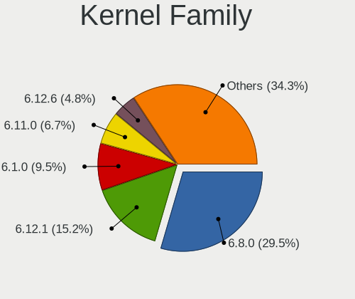
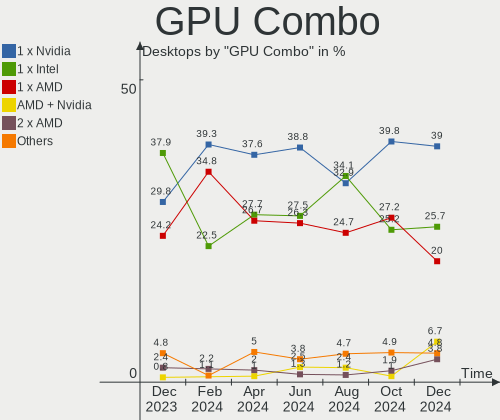
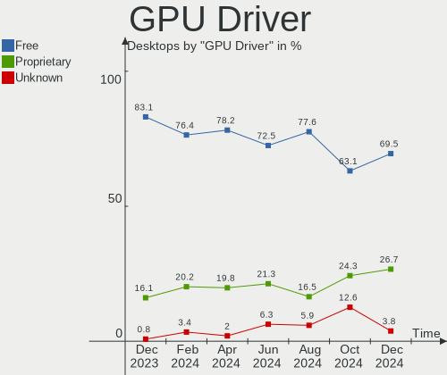
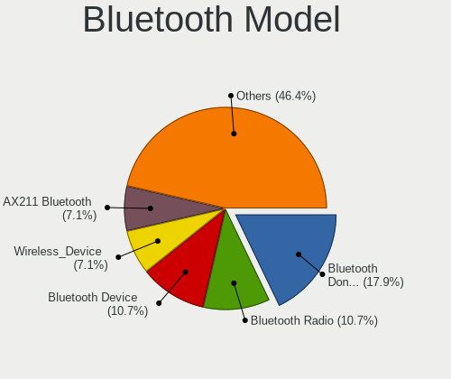
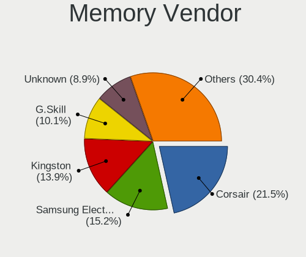
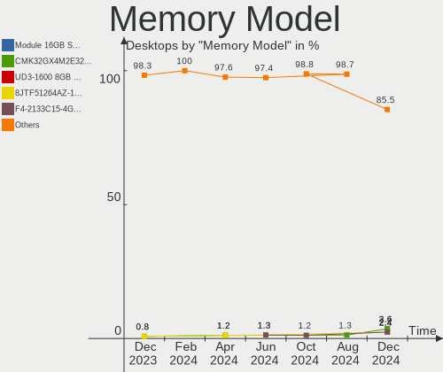
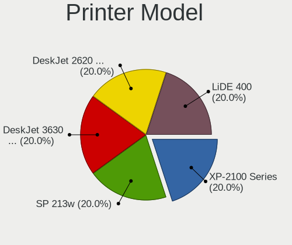

Linux in France - Hardware Trends (Desktops)
--------------------------------------------

A project to identify most popular hardware characteristics and track their change
over time based on data collected by Linux users at https://Linux-Hardware.org.

Anyone can contribute to this report by the [hw-probe](https://github.com/linuxhw/hw-probe) tool:

    sudo -E hw-probe -all -upload

Period: Dec, 2024.

Contents
--------

* [ System ](#system)
  - [ OS                       ](#os)
  - [ OS Family                ](#os-family)
  - [ Kernel                   ](#kernel)
  - [ Kernel Family            ](#kernel-family)
  - [ Kernel Major Ver.        ](#kernel-major-ver)
  - [ Arch                     ](#arch)
  - [ DE                       ](#de)
  - [ Display Server           ](#display-server)
  - [ Display Manager          ](#display-manager)
  - [ OS Lang                  ](#os-lang)
  - [ Boot Mode                ](#boot-mode)
  - [ Filesystem               ](#filesystem)
  - [ Part. scheme             ](#part-scheme)
  - [ Dual Boot with Linux/BSD ](#dual-boot-with-linuxbsd)
  - [ Dual Boot (Win)          ](#dual-boot-win)

* [ Board ](#board)
  - [ Vendor                   ](#vendor)
  - [ Model                    ](#model)
  - [ Model Family             ](#model-family)
  - [ MFG Year                 ](#mfg-year)
  - [ Form Factor              ](#form-factor)
  - [ Secure Boot              ](#secure-boot)
  - [ Coreboot                 ](#coreboot)
  - [ RAM Size                 ](#ram-size)
  - [ RAM Used                 ](#ram-used)
  - [ Total Drives             ](#total-drives)
  - [ Has CD-ROM               ](#has-cd-rom)
  - [ Has Ethernet             ](#has-ethernet)
  - [ Has WiFi                 ](#has-wifi)
  - [ Has Bluetooth            ](#has-bluetooth)

* [ Location ](#location)
  - [ Country                  ](#country)
  - [ City                     ](#city)

* [ Drives ](#drives)
  - [ Drive Vendor             ](#drive-vendor)
  - [ Drive Model              ](#drive-model)
  - [ HDD Vendor               ](#hdd-vendor)
  - [ SSD Vendor               ](#ssd-vendor)
  - [ Drive Kind               ](#drive-kind)
  - [ Drive Connector          ](#drive-connector)
  - [ Drive Size               ](#drive-size)
  - [ Space Total              ](#space-total)
  - [ Space Used               ](#space-used)
  - [ Malfunc. Drives          ](#malfunc-drives)
  - [ Malfunc. Drive Vendor    ](#malfunc-drive-vendor)
  - [ Malfunc. HDD Vendor      ](#malfunc-hdd-vendor)
  - [ Malfunc. Drive Kind      ](#malfunc-drive-kind)
  - [ Failed Drives            ](#failed-drives)
  - [ Failed Drive Vendor      ](#failed-drive-vendor)
  - [ Drive Status             ](#drive-status)

* [ Storage controller ](#storage-controller)
  - [ Storage Vendor           ](#storage-vendor)
  - [ Storage Model            ](#storage-model)
  - [ Storage Kind             ](#storage-kind)

* [ Processor ](#processor)
  - [ CPU Vendor               ](#cpu-vendor)
  - [ CPU Model                ](#cpu-model)
  - [ CPU Model Family         ](#cpu-model-family)
  - [ CPU Cores                ](#cpu-cores)
  - [ CPU Sockets              ](#cpu-sockets)
  - [ CPU Threads              ](#cpu-threads)
  - [ CPU Op-Modes             ](#cpu-op-modes)
  - [ CPU Microcode            ](#cpu-microcode)
  - [ CPU Microarch            ](#cpu-microarch)

* [ Graphics ](#graphics)
  - [ GPU Vendor               ](#gpu-vendor)
  - [ GPU Model                ](#gpu-model)
  - [ GPU Combo                ](#gpu-combo)
  - [ GPU Driver               ](#gpu-driver)
  - [ GPU Memory               ](#gpu-memory)

* [ Monitor ](#monitor)
  - [ Monitor Vendor           ](#monitor-vendor)
  - [ Monitor Model            ](#monitor-model)
  - [ Monitor Resolution       ](#monitor-resolution)
  - [ Monitor Diagonal         ](#monitor-diagonal)
  - [ Monitor Width            ](#monitor-width)
  - [ Aspect Ratio             ](#aspect-ratio)
  - [ Monitor Area             ](#monitor-area)
  - [ Pixel Density            ](#pixel-density)
  - [ Multiple Monitors        ](#multiple-monitors)

* [ Network ](#network)
  - [ Net Controller Vendor    ](#net-controller-vendor)
  - [ Net Controller Model     ](#net-controller-model)
  - [ Wireless Vendor          ](#wireless-vendor)
  - [ Wireless Model           ](#wireless-model)
  - [ Ethernet Vendor          ](#ethernet-vendor)
  - [ Ethernet Model           ](#ethernet-model)
  - [ Net Controller Kind      ](#net-controller-kind)
  - [ Used Controller          ](#used-controller)
  - [ NICs                     ](#nics)
  - [ IPv6                     ](#ipv6)

* [ Bluetooth ](#bluetooth)
  - [ Bluetooth Vendor         ](#bluetooth-vendor)
  - [ Bluetooth Model          ](#bluetooth-model)

* [ Sound ](#sound)
  - [ Sound Vendor             ](#sound-vendor)
  - [ Sound Model              ](#sound-model)

* [ Memory ](#memory)
  - [ Memory Vendor            ](#memory-vendor)
  - [ Memory Model             ](#memory-model)
  - [ Memory Kind              ](#memory-kind)
  - [ Memory Form Factor       ](#memory-form-factor)
  - [ Memory Size              ](#memory-size)
  - [ Memory Speed             ](#memory-speed)

* [ Printers & scanners ](#printers--scanners)
  - [ Printer Vendor           ](#printer-vendor)
  - [ Printer Model            ](#printer-model)
  - [ Scanner Vendor           ](#scanner-vendor)
  - [ Scanner Model            ](#scanner-model)

* [ Camera ](#camera)
  - [ Camera Vendor            ](#camera-vendor)
  - [ Camera Model             ](#camera-model)

* [ Security ](#security)
  - [ Fingerprint Vendor       ](#fingerprint-vendor)
  - [ Fingerprint Model        ](#fingerprint-model)
  - [ Chipcard Vendor          ](#chipcard-vendor)
  - [ Chipcard Model           ](#chipcard-model)

* [ Unsupported ](#unsupported)
  - [ Unsupported Devices      ](#unsupported-devices)
  - [ Unsupported Device Types ](#unsupported-device-types)

System
------

OS
--

Installed operating systems

| Name               | Desktops | Percent |
|--------------------|----------|---------|
| OpenMandriva 24.12 | 14       | 13.33%  |
| Ubuntu 24.04       | 13       | 12.38%  |
| Debian 12          | 13       | 12.38%  |
| Arch Rolling       | 7        | 6.67%   |
| Ubuntu 24.10       | 6        | 5.71%   |
| Fedora 41          | 6        | 5.71%   |
| Ubuntu 22.04       | 5        | 4.76%   |
| Linux Mint 22      | 5        | 4.76%   |
| Zorin 17           | 3        | 2.86%   |
| Pop!_OS 22.04      | 3        | 2.86%   |
| Kubuntu 24.04      | 3        | 2.86%   |
| Bazzite 41         | 3        | 2.86%   |
| OpenMandriva 23.08 | 2        | 1.9%    |
| Linux Mint 21.3    | 2        | 1.9%    |
| Elementary 8       | 2        | 1.9%    |
| Debian 11          | 2        | 1.9%    |
| Xubuntu 24.04      | 1        | 0.95%   |
| Ubuntu MATE 24.04  | 1        | 0.95%   |
| OpenMandriva 5.0   | 1        | 0.95%   |
| OpenMandriva 23.09 | 1        | 0.95%   |
| Nobara 40          | 1        | 0.95%   |
| NixOS 24.11        | 1        | 0.95%   |
| Manjaro            | 1        | 0.95%   |
| Mageia 9           | 1        | 0.95%   |
| Linux Mint 21.1    | 1        | 0.95%   |
| Linux Mint 21      | 1        | 0.95%   |
| Linux Mint 20.3    | 1        | 0.95%   |
| KDE neon 24.04     | 1        | 0.95%   |
| Gentoo 2.17        | 1        | 0.95%   |
| Elementary 7.1     | 1        | 0.95%   |
| Dts-distro 2.1.1   | 1        | 0.95%   |
| ChimeraOS 46-2     | 1        | 0.95%   |

OS Family
---------

OS without a version

| Name         | Desktops | Percent |
|--------------|----------|---------|
| Ubuntu       | 24       | 22.86%  |
| OpenMandriva | 18       | 17.14%  |
| Debian       | 15       | 14.29%  |
| Linux Mint   | 10       | 9.52%   |
| Arch         | 7        | 6.67%   |
| Fedora       | 6        | 5.71%   |
| Zorin        | 3        | 2.86%   |
| Pop!_OS      | 3        | 2.86%   |
| Kubuntu      | 3        | 2.86%   |
| Elementary   | 3        | 2.86%   |
| Bazzite      | 3        | 2.86%   |
| Xubuntu      | 1        | 0.95%   |
| Ubuntu MATE  | 1        | 0.95%   |
| Nobara       | 1        | 0.95%   |
| NixOS        | 1        | 0.95%   |
| Manjaro      | 1        | 0.95%   |
| Mageia       | 1        | 0.95%   |
| KDE neon     | 1        | 0.95%   |
| Gentoo       | 1        | 0.95%   |
| Dts-distro   | 1        | 0.95%   |
| ChimeraOS    | 1        | 0.95%   |

Kernel
------

Version of the Linux kernel

| Version                         | Desktops | Percent |
|---------------------------------|----------|---------|
| 6.8.0-49-generic                | 13       | 12.38%  |
| 6.8.0-51-generic                | 12       | 11.43%  |
| 6.12.1-desktop-1omv2490         | 11       | 10.48%  |
| 6.1.0-27-amd64                  | 5        | 4.76%   |
| 5.15.0-126-generic              | 4        | 3.81%   |
| 6.9.3-76060903-generic          | 3        | 2.86%   |
| 6.12.1-arch1-1                  | 3        | 2.86%   |
| 6.11.0-9-generic                | 3        | 2.86%   |
| 6.8.0-45-generic                | 2        | 1.9%    |
| 6.12.6-desktop-1omv2490         | 2        | 1.9%    |
| 6.12.4-200.fc41.x86_64          | 2        | 1.9%    |
| 6.11.4-301.fc41.x86_64          | 2        | 1.9%    |
| 6.11.10-304.bazzite.fc41.x86_64 | 2        | 1.9%    |
| 6.11.10-300.fc41.x86_64         | 2        | 1.9%    |
| 6.11.0-12-generic               | 2        | 1.9%    |
| 6.1.0-28-amd64                  | 2        | 1.9%    |
| 6.9.7+bpo-amd64                 | 1        | 0.95%   |
| 6.9.12-chos7-chimeraos-1        | 1        | 0.95%   |
| 6.8.12-4-pve                    | 1        | 0.95%   |
| 6.8.0-50-generic                | 1        | 0.95%   |
| 6.8.0-49-lowlatency             | 1        | 0.95%   |
| 6.8.0-48-generic                | 1        | 0.95%   |
| 6.8.0-31-generic                | 1        | 0.95%   |
| 6.6.65-desktop-2.mga9           | 1        | 0.95%   |
| 6.6.65-1-MANJARO                | 1        | 0.95%   |
| 6.6.21-yocto-standard           | 1        | 0.95%   |
| 6.6.2-desktop-1omv2390          | 1        | 0.95%   |
| 6.5.3-desktop-1omv2390          | 1        | 0.95%   |
| 6.5.0-9-generic                 | 1        | 0.95%   |
| 6.4.8-desktop-2omv2390          | 1        | 0.95%   |
| 6.4.11-desktop-1omv2390         | 1        | 0.95%   |
| 6.12.6-gentoo                   | 1        | 0.95%   |
| 6.12.6-arch1-1                  | 1        | 0.95%   |
| 6.12.6                          | 1        | 0.95%   |
| 6.12.4-arch1-1                  | 1        | 0.95%   |
| 6.12.4-2-cachyos                | 1        | 0.95%   |
| 6.12.1-zen1-1-zen               | 1        | 0.95%   |
| 6.12.1-1-liquorix-amd64         | 1        | 0.95%   |
| 6.11.9-303.bazzite.fc41.x86_64  | 1        | 0.95%   |
| 6.11.9-200.fsync.fc40.x86_64    | 1        | 0.95%   |

Kernel Family
-------------

Linux kernel without a distro release

| Version | Desktops | Percent |
|---------|----------|---------|
| 6.8.0   | 31       | 29.52%  |
| 6.12.1  | 16       | 15.24%  |
| 6.1.0   | 10       | 9.52%   |
| 6.11.0  | 7        | 6.67%   |
| 6.12.6  | 5        | 4.76%   |
| 5.15.0  | 5        | 4.76%   |
| 6.12.4  | 4        | 3.81%   |
| 6.11.10 | 4        | 3.81%   |
| 6.9.3   | 3        | 2.86%   |
| 6.6.65  | 2        | 1.9%    |
| 6.11.9  | 2        | 1.9%    |
| 6.11.4  | 2        | 1.9%    |
| 5.10.0  | 2        | 1.9%    |
| 6.9.7   | 1        | 0.95%   |
| 6.9.12  | 1        | 0.95%   |
| 6.8.12  | 1        | 0.95%   |
| 6.6.21  | 1        | 0.95%   |
| 6.6.2   | 1        | 0.95%   |
| 6.5.3   | 1        | 0.95%   |
| 6.5.0   | 1        | 0.95%   |
| 6.4.8   | 1        | 0.95%   |
| 6.4.11  | 1        | 0.95%   |
| 6.10.11 | 1        | 0.95%   |
| 6.10.0  | 1        | 0.95%   |
| 5.4.0   | 1        | 0.95%   |

Kernel Major Ver.
-----------------

Linux kernel major version

| Version | Desktops | Percent |
|---------|----------|---------|
| 6.8     | 32       | 30.48%  |
| 6.12    | 25       | 23.81%  |
| 6.11    | 15       | 14.29%  |
| 6.1     | 10       | 9.52%   |
| 6.9     | 5        | 4.76%   |
| 5.15    | 5        | 4.76%   |
| 6.6     | 4        | 3.81%   |
| 6.5     | 2        | 1.9%    |
| 6.4     | 2        | 1.9%    |
| 6.10    | 2        | 1.9%    |
| 5.10    | 2        | 1.9%    |
| 5.4     | 1        | 0.95%   |

Arch
----

OS architecture (x86_64, i586, etc.)

| Name   | Desktops | Percent |
|--------|----------|---------|
| x86_64 | 105      | 100%    |

DE
--

Desktop Environment

| Name       | Desktops | Percent |
|------------|----------|---------|
| GNOME      | 46       | 43.81%  |
| Unknown    | 15       | 14.29%  |
| KDE5       | 11       | 10.48%  |
| KDE6       | 8        | 7.62%   |
| X-Cinnamon | 5        | 4.76%   |
| XFCE       | 3        | 2.86%   |
| Pantheon   | 3        | 2.86%   |
| MATE       | 3        | 2.86%   |
| LXQt       | 3        | 2.86%   |
| Cinnamon   | 3        | 2.86%   |
| KDE        | 2        | 1.9%    |
| i3         | 2        | 1.9%    |
| Hyprland   | 1        | 0.95%   |

Display Server
--------------

X11 or Wayland

| Name    | Desktops | Percent |
|---------|----------|---------|
| Wayland | 56       | 53.33%  |
| X11     | 43       | 40.95%  |
| Tty     | 4        | 3.81%   |
| Unknown | 2        | 1.9%    |

Display Manager
---------------

SDDM, LightDM, etc.

| Name    | Desktops | Percent |
|---------|----------|---------|
| GDM3    | 31       | 29.52%  |
| SDDM    | 28       | 26.67%  |
| Unknown | 25       | 23.81%  |
| LightDM | 13       | 12.38%  |
| GDM     | 8        | 7.62%   |

OS Lang
-------

Language

| Lang    | Desktops | Percent |
|---------|----------|---------|
| fr_FR   | 86       | 81.9%   |
| en_US   | 10       | 9.52%   |
| it_IT   | 2        | 1.9%    |
| de_DE   | 2        | 1.9%    |
| fr_CH   | 1        | 0.95%   |
| fr_BE   | 1        | 0.95%   |
| en_GB   | 1        | 0.95%   |
| C       | 1        | 0.95%   |
| Unknown | 1        | 0.95%   |

Boot Mode
---------

EFI or BIOS

| Mode | Desktops | Percent |
|------|----------|---------|
| BIOS | 53       | 50.48%  |
| EFI  | 52       | 49.52%  |

Filesystem
----------

Type of filesystem

| Type    | Desktops | Percent |
|---------|----------|---------|
| Ext4    | 63       | 60%     |
| Tmpfs   | 19       | 18.1%   |
| Btrfs   | 13       | 12.38%  |
| Overlay | 9        | 8.57%   |
| Xfs     | 1        | 0.95%   |

Part. scheme
------------

Scheme of partitioning

| Type    | Desktops | Percent |
|---------|----------|---------|
| GPT     | 74       | 70.48%  |
| Unknown | 22       | 20.95%  |
| MBR     | 9        | 8.57%   |

Dual Boot with Linux/BSD
------------------------

Hosting more than one Linux/BSD

| Dual boot | Desktops | Percent |
|-----------|----------|---------|
| No        | 80       | 76.19%  |
| Yes       | 25       | 23.81%  |

Dual Boot (Win)
---------------

Hosting Linux and Windows

| Dual boot | Desktops | Percent |
|-----------|----------|---------|
| No        | 67       | 63.81%  |
| Yes       | 38       | 36.19%  |

Board
-----

Vendor
------

Motherboard manufacturer

| Name                                 | Desktops | Percent |
|--------------------------------------|----------|---------|
| ASUSTek Computer                     | 26       | 24.76%  |
| MSI                                  | 21       | 20%     |
| Gigabyte Technology                  | 19       | 18.1%   |
| Hewlett-Packard                      | 13       | 12.38%  |
| Dell                                 | 6        | 5.71%   |
| ASRock                               | 5        | 4.76%   |
| Lenovo                               | 2        | 1.9%    |
| AZW                                  | 2        | 1.9%    |
| Unknown                              | 2        | 1.9%    |
| Shuttle                              | 1        | 0.95%   |
| Shenzhen Meigao Electronic Equipment | 1        | 0.95%   |
| Pegatron                             | 1        | 0.95%   |
| Packard Bell                         | 1        | 0.95%   |
| OEM                                  | 1        | 0.95%   |
| Intel                                | 1        | 0.95%   |
| GEEKOM                               | 1        | 0.95%   |
| Foxconn                              | 1        | 0.95%   |
| Acer                                 | 1        | 0.95%   |

Model
-----

Motherboard model

| Name                                                  | Desktops | Percent |
|-------------------------------------------------------|----------|---------|
| MSI MS-7E51                                           | 4        | 3.81%   |
| HP ProDesk 400 G4 DM                                  | 4        | 3.81%   |
| MSI MS-7996                                           | 3        | 2.86%   |
| Gigabyte B550 GAMING X V2                             | 2        | 1.9%    |
| AZW MINI S                                            | 2        | 1.9%    |
| Unknown                                               | 2        | 1.9%    |
| Shuttle DH270                                         | 1        | 0.95%   |
| Shenzhen Meigao Electronic Equipment AtomMan G Series | 1        | 0.95%   |
| Pegatron Elite 7500 Series MT                         | 1        | 0.95%   |
| Packard Bell IXTREME I9632 FR                         | 1        | 0.95%   |
| OEM B75                                               | 1        | 0.95%   |
| MSI MS-7E49                                           | 1        | 0.95%   |
| MSI MS-7E16                                           | 1        | 0.95%   |
| MSI MS-7E12                                           | 1        | 0.95%   |
| MSI MS-7E06                                           | 1        | 0.95%   |
| MSI MS-7D98                                           | 1        | 0.95%   |
| MSI MS-7D89                                           | 1        | 0.95%   |
| MSI MS-7D41                                           | 1        | 0.95%   |
| MSI MS-7D30                                           | 1        | 0.95%   |
| MSI MS-7B45                                           | 1        | 0.95%   |
| MSI MS-7851                                           | 1        | 0.95%   |
| MSI MS-7850                                           | 1        | 0.95%   |
| MSI MS-7836                                           | 1        | 0.95%   |
| MSI MS-7821                                           | 1        | 0.95%   |
| MSI MS-7673                                           | 1        | 0.95%   |
| Lenovo ThinkStation P3 Tower 30GS00BDMH               | 1        | 0.95%   |
| Lenovo ThinkCentre M83 10AHS35300                     | 1        | 0.95%   |
| Intel Jasper Lake Client Platform                     | 1        | 0.95%   |
| HP Z440 Workstation                                   | 1        | 0.95%   |
| HP ProDesk 400 G5 Desktop Mini                        | 1        | 0.95%   |
| HP ProDesk 400 G2 MT (TPM DP)                         | 1        | 0.95%   |
| HP Pavilion Gaming Desktop TG01-0xxx                  | 1        | 0.95%   |
| HP Pavilion Desktop PC 570-a1xx                       | 1        | 0.95%   |
| HP EliteDesk 800 G4 DM 65W                            | 1        | 0.95%   |
| HP Compaq Pro 6300 SFF                                | 1        | 0.95%   |
| HP 550-157nf                                          | 1        | 0.95%   |
| HP 100-502nf                                          | 1        | 0.95%   |
| Gigabyte Z77-D3H                                      | 1        | 0.95%   |
| Gigabyte Z390 M GAMING                                | 1        | 0.95%   |
| Gigabyte Z370P D3                                     | 1        | 0.95%   |

Model Family
------------

Motherboard model prefix

| Name                                         | Desktops | Percent |
|----------------------------------------------|----------|---------|
| HP ProDesk                                   | 6        | 5.71%   |
| ASUS TUF                                     | 5        | 4.76%   |
| MSI MS-7E51                                  | 4        | 3.81%   |
| MSI MS-7996                                  | 3        | 2.86%   |
| Gigabyte B650                                | 3        | 2.86%   |
| Dell OptiPlex                                | 3        | 2.86%   |
| ASUS ROG                                     | 3        | 2.86%   |
| ASUS PRIME                                   | 3        | 2.86%   |
| HP Pavilion                                  | 2        | 1.9%    |
| Gigabyte B550                                | 2        | 1.9%    |
| Gigabyte B450                                | 2        | 1.9%    |
| Dell Precision                               | 2        | 1.9%    |
| AZW MINI                                     | 2        | 1.9%    |
| ASUS P8Z68-V                                 | 2        | 1.9%    |
| Unknown                                      | 2        | 1.9%    |
| Shuttle DH270                                | 1        | 0.95%   |
| Shenzhen Meigao Electronic Equipment AtomMan | 1        | 0.95%   |
| Pegatron Elite                               | 1        | 0.95%   |
| Packard Bell IXTREME                         | 1        | 0.95%   |
| OEM B75                                      | 1        | 0.95%   |
| MSI MS-7E49                                  | 1        | 0.95%   |
| MSI MS-7E16                                  | 1        | 0.95%   |
| MSI MS-7E12                                  | 1        | 0.95%   |
| MSI MS-7E06                                  | 1        | 0.95%   |
| MSI MS-7D98                                  | 1        | 0.95%   |
| MSI MS-7D89                                  | 1        | 0.95%   |
| MSI MS-7D41                                  | 1        | 0.95%   |
| MSI MS-7D30                                  | 1        | 0.95%   |
| MSI MS-7B45                                  | 1        | 0.95%   |
| MSI MS-7851                                  | 1        | 0.95%   |
| MSI MS-7850                                  | 1        | 0.95%   |
| MSI MS-7836                                  | 1        | 0.95%   |
| MSI MS-7821                                  | 1        | 0.95%   |
| MSI MS-7673                                  | 1        | 0.95%   |
| Lenovo ThinkStation                          | 1        | 0.95%   |
| Lenovo ThinkCentre                           | 1        | 0.95%   |
| Intel Jasper                                 | 1        | 0.95%   |
| HP Z440                                      | 1        | 0.95%   |
| HP EliteDesk                                 | 1        | 0.95%   |
| HP Compaq                                    | 1        | 0.95%   |

MFG Year
--------

Motherboard manufacture year

| Year | Desktops | Percent |
|------|----------|---------|
| 2024 | 12       | 11.43%  |
| 2012 | 11       | 10.48%  |
| 2022 | 10       | 9.52%   |
| 2018 | 9        | 8.57%   |
| 2023 | 8        | 7.62%   |
| 2020 | 8        | 7.62%   |
| 2021 | 7        | 6.67%   |
| 2017 | 6        | 5.71%   |
| 2014 | 6        | 5.71%   |
| 2019 | 5        | 4.76%   |
| 2015 | 5        | 4.76%   |
| 2011 | 5        | 4.76%   |
| 2013 | 4        | 3.81%   |
| 2009 | 3        | 2.86%   |
| 2008 | 3        | 2.86%   |
| 2016 | 1        | 0.95%   |
| 2010 | 1        | 0.95%   |
| 2006 | 1        | 0.95%   |

Form Factor
-----------

Physical design of the computer

| Name    | Desktops | Percent |
|---------|----------|---------|
| Desktop | 105      | 100%    |

Secure Boot
-----------

Enabled or disabled

| State    | Desktops | Percent |
|----------|----------|---------|
| Disabled | 101      | 96.19%  |
| Enabled  | 4        | 3.81%   |

Coreboot
--------

Have coreboot on board

| Used | Desktops | Percent |
|------|----------|---------|
| No   | 105      | 100%    |

RAM Size
--------

Total RAM memory

| Size in GB      | Desktops | Percent |
|-----------------|----------|---------|
| 16.01-24.0      | 26       | 24.76%  |
| 32.01-64.0      | 21       | 20%     |
| 8.01-16.0       | 18       | 17.14%  |
| 4.01-8.0        | 12       | 11.43%  |
| 64.01-256.0     | 11       | 10.48%  |
| 24.01-32.0      | 9        | 8.57%   |
| 3.01-4.0        | 6        | 5.71%   |
| More than 256.0 | 1        | 0.95%   |
| 2.01-3.0        | 1        | 0.95%   |

RAM Used
--------

Used RAM memory

| Used GB     | Desktops | Percent |
|-------------|----------|---------|
| 4.01-8.0    | 29       | 27.62%  |
| 2.01-3.0    | 27       | 25.71%  |
| 1.01-2.0    | 21       | 20%     |
| 3.01-4.0    | 18       | 17.14%  |
| 8.01-16.0   | 4        | 3.81%   |
| 0.51-1.0    | 3        | 2.86%   |
| 32.01-64.0  | 2        | 1.9%    |
| 64.01-256.0 | 1        | 0.95%   |

Total Drives
------------

Number of drives on board

| Drives | Desktops | Percent |
|--------|----------|---------|
| 1      | 35       | 33.33%  |
| 2      | 25       | 23.81%  |
| 3      | 21       | 20%     |
| 4      | 13       | 12.38%  |
| 5      | 4        | 3.81%   |
| 8      | 2        | 1.9%    |
| 6      | 2        | 1.9%    |
| 14     | 1        | 0.95%   |
| 9      | 1        | 0.95%   |
| 7      | 1        | 0.95%   |

Has CD-ROM
----------

Has CD-ROM on board

| Presented | Desktops | Percent |
|-----------|----------|---------|
| No        | 66       | 62.86%  |
| Yes       | 39       | 37.14%  |

Has Ethernet
------------

Has Ethernet on board

| Presented | Desktops | Percent |
|-----------|----------|---------|
| Yes       | 105      | 100%    |

Has WiFi
--------

Has WiFi module

| Presented | Desktops | Percent |
|-----------|----------|---------|
| No        | 53       | 50.48%  |
| Yes       | 52       | 49.52%  |

Has Bluetooth
-------------

Has Bluetooth module

| Presented | Desktops | Percent |
|-----------|----------|---------|
| No        | 54       | 51.43%  |
| Yes       | 51       | 48.57%  |

Location
--------

Country
-------

Geographic location (country)

| Country | Desktops | Percent |
|---------|----------|---------|
| France  | 105      | 100%    |

City
----

Geographic location (city)

| City                       | Desktops | Percent |
|----------------------------|----------|---------|
| Paris                      | 10       | 9.52%   |
| Bagneux                    | 5        | 4.76%   |
| Vernon                     | 2        | 1.9%    |
| Strasbourg                 | 2        | 1.9%    |
| Saint-Etienne              | 2        | 1.9%    |
| Pontoise                   | 2        | 1.9%    |
| Évry                      | 2        | 1.9%    |
| Courbevoie                 | 2        | 1.9%    |
| Auch                       | 2        | 1.9%    |
| Yerres                     | 1        | 0.95%   |
| Wentzwiller                | 1        | 0.95%   |
| Verrieres-le-Buisson       | 1        | 0.95%   |
| Vergeze                    | 1        | 0.95%   |
| Vénissieux                | 1        | 0.95%   |
| Valence                    | 1        | 0.95%   |
| Trelissac                  | 1        | 0.95%   |
| Tours                      | 1        | 0.95%   |
| Toulouse                   | 1        | 0.95%   |
| Toulon                     | 1        | 0.95%   |
| Toul                       | 1        | 0.95%   |
| Thise                      | 1        | 0.95%   |
| Sisteron                   | 1        | 0.95%   |
| Sin-le-Noble               | 1        | 0.95%   |
| Seclin                     | 1        | 0.95%   |
| Sarlat-la-Canéda          | 1        | 0.95%   |
| Sainte-Geneviève-des-Bois | 1        | 0.95%   |
| Saint-Saulve               | 1        | 0.95%   |
| Saint-Pierre-des-Corps     | 1        | 0.95%   |
| Saint-Jean-de-Vedas        | 1        | 0.95%   |
| Saint-Cyr-l'École         | 1        | 0.95%   |
| Rosny-sous-Bois            | 1        | 0.95%   |
| Romilly-sur-Seine          | 1        | 0.95%   |
| Remilly-Aillicourt         | 1        | 0.95%   |
| Quimper                    | 1        | 0.95%   |
| Prades-le-Lez              | 1        | 0.95%   |
| Poissy                     | 1        | 0.95%   |
| Plerneuf                   | 1        | 0.95%   |
| Plaisir                    | 1        | 0.95%   |
| Plaisance-du-Touch         | 1        | 0.95%   |
| Perols                     | 1        | 0.95%   |

Drives
------

Drive Vendor
------------

Hard drive vendors

| Vendor                      | Desktops | Drives | Percent |
|-----------------------------|----------|--------|---------|
| Samsung Electronics         | 39       | 62     | 18.22%  |
| Seagate                     | 32       | 45     | 14.95%  |
| Kingston                    | 21       | 24     | 9.81%   |
| WDC                         | 20       | 34     | 9.35%   |
| Crucial                     | 13       | 13     | 6.07%   |
| Toshiba                     | 10       | 11     | 4.67%   |
| SanDisk                     | 9        | 9      | 4.21%   |
| Micron/Crucial Technology   | 6        | 8      | 2.8%    |
| Phison Electronics          | 5        | 6      | 2.34%   |
| SPCC                        | 4        | 4      | 1.87%   |
| PNY                         | 4        | 4      | 1.87%   |
| Lexar                       | 4        | 4      | 1.87%   |
| Hitachi                     | 4        | 4      | 1.87%   |
| MAXIO Technology (Hangzhou) | 3        | 5      | 1.4%    |
| KIOXIA                      | 3        | 3      | 1.4%    |
| Kingston Technology Company | 3        | 4      | 1.4%    |
| Corsair                     | 3        | 3      | 1.4%    |
| Unknown                     | 2        | 2      | 0.93%   |
| Realtek                     | 2        | 2      | 0.93%   |
| Phison                      | 2        | 3      | 0.93%   |
| Maxtor                      | 2        | 3      | 0.93%   |
| HGST                        | 2        | 2      | 0.93%   |
| Emtec                       | 2        | 2      | 0.93%   |
| China                       | 2        | 2      | 0.93%   |
| TEXTORM                     | 1        | 1      | 0.47%   |
| TCSUNBOW                    | 1        | 1      | 0.47%   |
| OCZ                         | 1        | 1      | 0.47%   |
| Netac                       | 1        | 1      | 0.47%   |
| Micron Technology           | 1        | 2      | 0.47%   |
| LITEON                      | 1        | 1      | 0.47%   |
| Lexar 24                    | 1        | 1      | 0.47%   |
| LDLC                        | 1        | 1      | 0.47%   |
| KingSpec                    | 1        | 1      | 0.47%   |
| Kingchuxing                 | 1        | 1      | 0.47%   |
| JMicron Technology          | 1        | 1      | 0.47%   |
| INTEL SS                    | 1        | 1      | 0.47%   |
| Gigastone                   | 1        | 1      | 0.47%   |
| EAGET                       | 1        | 1      | 0.47%   |
| CT500MX5                    | 1        | 1      | 0.47%   |
| Apple                       | 1        | 1      | 0.47%   |

Drive Model
-----------

Hard drive models

| Model                                                | Desktops | Percent |
|------------------------------------------------------|----------|---------|
| Kingston SA400S37240G 240GB SSD                      | 6        | 2.38%   |
| Samsung SSD 990 PRO 1TB                              | 5        | 1.98%   |
| Samsung NVMe SSD Controller SM981/PM981/PM983 512GB  | 5        | 1.98%   |
| SPCC Solid State Disk 256GB                          | 4        | 1.59%   |
| Samsung SSD 870 QVO 1TB                              | 4        | 1.59%   |
| Samsung NVMe SSD Controller PM9A1/PM9A3/980PRO 512GB | 4        | 1.59%   |
| Crucial CT2000MX500SSD1 2TB                          | 4        | 1.59%   |
| Seagate ST500DM002-1BD142 500GB                      | 3        | 1.19%   |
| Seagate ST2000DM008-2FR102 2TB                       | 3        | 1.19%   |
| Seagate ST1000DM010-2EP102 1TB                       | 3        | 1.19%   |
| Seagate ST1000DM003-1ER162 1TB                       | 3        | 1.19%   |
| Samsung SSD 860 EVO 250GB                            | 3        | 1.19%   |
| Samsung SSD 850 EVO 250GB                            | 3        | 1.19%   |
| Micron/Crucial P2 NVMe PCIe SSD 500GB                | 3        | 1.19%   |
| Crucial CT500MX500SSD1 500GB                         | 3        | 1.19%   |
| Crucial CT240BX500SSD1 240GB                         | 3        | 1.19%   |
| WDC WD20EZRZ-00Z5HB0 2TB                             | 2        | 0.79%   |
| Unknown SD/MMC/MS PRO 128GB                          | 2        | 0.79%   |
| Toshiba HDWD110 1TB                                  | 2        | 0.79%   |
| Seagate ST4000DM005-2DP166 4TB                       | 2        | 0.79%   |
| Seagate ST3250310AS 250GB                            | 2        | 0.79%   |
| Seagate ST2000DM006-2DM164 2TB                       | 2        | 0.79%   |
| Samsung SSD 870 EVO 1TB                              | 2        | 0.79%   |
| Samsung SSD 850 EVO 500GB                            | 2        | 0.79%   |
| Samsung SSD 840 PRO Series 256GB                     | 2        | 0.79%   |
| Samsung NVMe SSD Controller SM961/PM961/SM963 256GB  | 2        | 0.79%   |
| Realtek RTL9210B-CG 500GB                            | 2        | 0.79%   |
| PNY 250GB SATA SSD                                   | 2        | 0.79%   |
| Lexar SSD NM790 2TB                                  | 2        | 0.79%   |
| KIOXIA EXCERIA PLUS G3 SSD 2TB                       | 2        | 0.79%   |
| Kingston Company SNV2S1000G 1TB                      | 2        | 0.79%   |
| Kingston SKC3000S1024G 1TB                           | 2        | 0.79%   |
| Kingston SA400S37480G 480GB SSD                      | 2        | 0.79%   |
| Hitachi HDT722516DLA380 165GB                        | 2        | 0.79%   |
| WDC WDS100T3XHC-00SJG0 1TB                           | 1        | 0.4%    |
| WDC WD800JD-55MUA1 80GB                              | 1        | 0.4%    |
| WDC WD800JD-08LSA0 80GB                              | 1        | 0.4%    |
| WDC WD6400AACS-00G8B1 640GB                          | 1        | 0.4%    |
| WDC WD60EZRZ-00GZ5B1 6TB                             | 1        | 0.4%    |
| WDC WD60EFRX-68MYMN1 6TB                             | 1        | 0.4%    |

HDD Vendor
----------

Hard disk drive vendors

| Vendor              | Desktops | Drives | Percent |
|---------------------|----------|--------|---------|
| Seagate             | 32       | 45     | 41.56%  |
| WDC                 | 20       | 33     | 25.97%  |
| Toshiba             | 8        | 9      | 10.39%  |
| Samsung Electronics | 6        | 7      | 7.79%   |
| Hitachi             | 4        | 4      | 5.19%   |
| Unknown             | 2        | 2      | 2.6%    |
| Maxtor              | 2        | 3      | 2.6%    |
| HGST                | 2        | 2      | 2.6%    |
| Apple               | 1        | 1      | 1.3%    |

SSD Vendor
----------

Solid state drive vendors

| Vendor              | Desktops | Drives | Percent |
|---------------------|----------|--------|---------|
| Samsung Electronics | 23       | 25     | 27.06%  |
| Kingston            | 15       | 17     | 17.65%  |
| Crucial             | 13       | 13     | 15.29%  |
| SanDisk             | 6        | 6      | 7.06%   |
| SPCC                | 4        | 4      | 4.71%   |
| PNY                 | 4        | 4      | 4.71%   |
| Lexar               | 2        | 2      | 2.35%   |
| Emtec               | 2        | 2      | 2.35%   |
| Corsair             | 2        | 2      | 2.35%   |
| China               | 2        | 2      | 2.35%   |
| TEXTORM             | 1        | 1      | 1.18%   |
| TCSUNBOW            | 1        | 1      | 1.18%   |
| OCZ                 | 1        | 1      | 1.18%   |
| Netac               | 1        | 1      | 1.18%   |
| LITEON              | 1        | 1      | 1.18%   |
| Lexar 24            | 1        | 1      | 1.18%   |
| LDLC                | 1        | 1      | 1.18%   |
| KingSpec            | 1        | 1      | 1.18%   |
| INTEL SS            | 1        | 1      | 1.18%   |
| Gigastone           | 1        | 1      | 1.18%   |
| EAGET               | 1        | 1      | 1.18%   |
| CT500MX5            | 1        | 1      | 1.18%   |

Drive Kind
----------

HDD or SSD

| Kind    | Desktops | Drives | Percent |
|---------|----------|--------|---------|
| SSD     | 66       | 89     | 37.29%  |
| HDD     | 60       | 106    | 33.9%   |
| NVMe    | 49       | 80     | 27.68%  |
| Unknown | 2        | 2      | 1.13%   |

Drive Connector
---------------

SATA, SAS, NVMe, etc.

| Type | Desktops | Drives | Percent |
|------|----------|--------|---------|
| SATA | 88       | 190    | 61.11%  |
| NVMe | 48       | 78     | 33.33%  |
| SAS  | 8        | 9      | 5.56%   |

Drive Size
----------

Size of hard drive

| Size in TB | Desktops | Drives | Percent |
|------------|----------|--------|---------|
| 0.01-0.5   | 66       | 101    | 48.53%  |
| 0.51-1.0   | 36       | 44     | 26.47%  |
| 1.01-2.0   | 16       | 21     | 11.76%  |
| 3.01-4.0   | 6        | 9      | 4.41%   |
| 4.01-10.0  | 6        | 11     | 4.41%   |
| 2.01-3.0   | 4        | 4      | 2.94%   |
| 10.01-20.0 | 2        | 5      | 1.47%   |

Space Total
-----------

Amount of disk space available on the file system

| Size in GB     | Desktops | Percent |
|----------------|----------|---------|
| 501-1000       | 18       | 17.14%  |
| 101-250        | 17       | 16.19%  |
| 251-500        | 16       | 15.24%  |
| More than 3000 | 15       | 14.29%  |
| 1001-2000      | 14       | 13.33%  |
| 2001-3000      | 10       | 9.52%   |
| 1-20           | 8        | 7.62%   |
| 51-100         | 5        | 4.76%   |
| 21-50          | 1        | 0.95%   |
| Unknown        | 1        | 0.95%   |

Space Used
----------

Amount of used disk space

| Used GB        | Desktops | Percent |
|----------------|----------|---------|
| 1-20           | 31       | 29.52%  |
| 101-250        | 13       | 12.38%  |
| 251-500        | 12       | 11.43%  |
| 1001-2000      | 12       | 11.43%  |
| 501-1000       | 11       | 10.48%  |
| 21-50          | 9        | 8.57%   |
| 51-100         | 8        | 7.62%   |
| More than 3000 | 6        | 5.71%   |
| 2001-3000      | 2        | 1.9%    |
| Unknown        | 1        | 0.95%   |

Malfunc. Drives
---------------

Drive models with a malfunction

| Model                             | Desktops | Drives | Percent |
|-----------------------------------|----------|--------|---------|
| Seagate ST1000DM003-1ER162 1TB    | 2        | 2      | 11.76%  |
| Hitachi HDT722516DLA380 165GB     | 2        | 2      | 11.76%  |
| WDC WD800JD-08LSA0 80GB           | 1        | 1      | 5.88%   |
| WDC WD2002FAEX-007BA0 2TB         | 1        | 1      | 5.88%   |
| WDC WD10EZEX-00BN5A0 1TB          | 1        | 1      | 5.88%   |
| Toshiba HDWD130 3TB               | 1        | 1      | 5.88%   |
| Seagate ST500DM002-1BD142 500GB   | 1        | 1      | 5.88%   |
| Seagate ST3500418AS 500GB         | 1        | 1      | 5.88%   |
| Seagate ST3250310AS 250GB         | 1        | 1      | 5.88%   |
| Seagate ST2000DM008-2FR102 2TB    | 1        | 1      | 5.88%   |
| Samsung Electronics SP2004C 200GB | 1        | 1      | 5.88%   |
| Netac NS512GSSD340 512GB          | 1        | 1      | 5.88%   |
| HGST HTS721010A9E630 1TB          | 1        | 1      | 5.88%   |
| Crucial CT2000MX500SSD1 2TB       | 1        | 1      | 5.88%   |
| Crucial CT1050MX300SSD4 1TB       | 1        | 1      | 5.88%   |

Malfunc. Drive Vendor
---------------------

Vendors of faulty drives

| Vendor              | Desktops | Drives | Percent |
|---------------------|----------|--------|---------|
| Seagate             | 6        | 6      | 35.29%  |
| WDC                 | 3        | 3      | 17.65%  |
| Hitachi             | 2        | 2      | 11.76%  |
| Crucial             | 2        | 2      | 11.76%  |
| Toshiba             | 1        | 1      | 5.88%   |
| Samsung Electronics | 1        | 1      | 5.88%   |
| Netac               | 1        | 1      | 5.88%   |
| HGST                | 1        | 1      | 5.88%   |

Malfunc. HDD Vendor
-------------------

Vendors of faulty HDD drives

| Vendor              | Desktops | Drives | Percent |
|---------------------|----------|--------|---------|
| Seagate             | 6        | 6      | 42.86%  |
| WDC                 | 3        | 3      | 21.43%  |
| Hitachi             | 2        | 2      | 14.29%  |
| Toshiba             | 1        | 1      | 7.14%   |
| Samsung Electronics | 1        | 1      | 7.14%   |
| HGST                | 1        | 1      | 7.14%   |

Malfunc. Drive Kind
-------------------

Kinds of faulty drives

| Kind | Desktops | Drives | Percent |
|------|----------|--------|---------|
| HDD  | 11       | 14     | 78.57%  |
| SSD  | 3        | 3      | 21.43%  |

Failed Drives
-------------

Failed drive models

Zero info for selected period =(

Failed Drive Vendor
-------------------

Failed drive vendors

Zero info for selected period =(

Drive Status
------------

Number of failed and malfunc. drives

| Status   | Desktops | Drives | Percent |
|----------|----------|--------|---------|
| Works    | 60       | 148    | 51.72%  |
| Detected | 42       | 112    | 36.21%  |
| Malfunc  | 14       | 17     | 12.07%  |

Storage controller
------------------

Storage Vendor
--------------

Storage controller vendors

| Vendor                       | Desktops | Percent |
|------------------------------|----------|---------|
| Intel                        | 66       | 37.29%  |
| AMD                          | 36       | 20.34%  |
| Samsung Electronics          | 18       | 10.17%  |
| ASMedia Technology           | 10       | 5.65%   |
| Kingston Technology Company  | 9        | 5.08%   |
| Phison Electronics           | 7        | 3.95%   |
| Micron/Crucial Technology    | 6        | 3.39%   |
| SanDisk                      | 4        | 2.26%   |
| Marvell Technology Group     | 4        | 2.26%   |
| JMicron Technology           | 4        | 2.26%   |
| Toshiba America Info Systems | 3        | 1.69%   |
| MAXIO Technology (Hangzhou)  | 3        | 1.69%   |
| Shenzhen Longsys Electronics | 2        | 1.13%   |
| KIOXIA                       | 2        | 1.13%   |
| Nvidia                       | 1        | 0.56%   |
| Micron Technology            | 1        | 0.56%   |
| ADATA Technology             | 1        | 0.56%   |

Storage Model
-------------

Storage controller models

| Model                                                                          | Desktops | Percent |
|--------------------------------------------------------------------------------|----------|---------|
| AMD FCH SATA Controller [AHCI mode]                                            | 13       | 6.5%    |
| AMD 600 Series Chipset SATA Controller                                         | 13       | 6.5%    |
| Intel Cannon Lake PCH SATA AHCI Controller                                     | 7        | 3.5%    |
| Intel 8 Series/C220 Series Chipset Family 6-port SATA Controller 1 [AHCI mode] | 7        | 3.5%    |
| Intel 6 Series/C200 Series Chipset Family 6 port Desktop SATA AHCI Controller  | 7        | 3.5%    |
| Samsung NVMe SSD Controller S4LV008[Pascal]                                    | 6        | 3%      |
| Intel 200 Series PCH SATA controller [AHCI mode]                               | 6        | 3%      |
| ASMedia ASM1061/ASM1062 Serial ATA Controller                                  | 6        | 3%      |
| Samsung NVMe SSD Controller SM981/PM981/PM983                                  | 5        | 2.5%    |
| Samsung NVMe SSD Controller PM9A1/PM9A3/980PRO                                 | 5        | 2.5%    |
| Intel Raptor Lake SATA AHCI Controller                                         | 5        | 2.5%    |
| Intel Alder Lake-S PCH SATA Controller [AHCI Mode]                             | 5        | 2.5%    |
| AMD 500 Series Chipset SATA Controller                                         | 5        | 2.5%    |
| AMD 400 Series Chipset SATA Controller                                         | 5        | 2.5%    |
| Intel Q170/Q150/B150/H170/H110/Z170/CM236 Chipset SATA Controller [AHCI Mode]  | 4        | 2%      |
| Intel 7 Series/C210 Series Chipset Family 6-port SATA Controller [AHCI mode]   | 4        | 2%      |
| ASMedia ASM1064 Serial ATA Controller                                          | 4        | 2%      |
| Micron/Crucial P2 [Nick P2] / P3 / P3 Plus NVMe PCIe SSD (DRAM-less)           | 3        | 1.5%    |
| Kingston Company KC3000/FURY Renegade NVMe SSD [E18]                           | 3        | 1.5%    |
| JMicron JMB363 SATA/IDE Controller                                             | 3        | 1.5%    |
| AMD SB7x0/SB8x0/SB9x0 IDE Controller                                           | 3        | 1.5%    |
| Toshiba America Info Systems BG3 x2 NVMe SSD Controller (DRAM-less)            | 2        | 1%      |
| Shenzhen Longsys Lexar NM790 NVME SSD (DRAM-less)                              | 2        | 1%      |
| Samsung NVMe SSD Controller SM961/PM961/SM963                                  | 2        | 1%      |
| Samsung NVMe SSD Controller 980 (DRAM-less)                                    | 2        | 1%      |
| MAXIO (Hangzhou) NVMe SSD Controller MAP1602 (DRAM-less)                       | 2        | 1%      |
| KIOXIA Exceria Plus G3 NVMe SSD (DRAM-less)                                    | 2        | 1%      |
| Intel Volume Management Device NVMe RAID Controller Intel Corporation          | 2        | 1%      |
| Intel SATA Controller [RAID mode]                                              | 2        | 1%      |
| Intel Jasper Lake SATA AHCI Controller                                         | 2        | 1%      |
| Intel Comet Lake SATA AHCI Controller                                          | 2        | 1%      |
| Intel Alder Lake-N SATA AHCI Controller                                        | 2        | 1%      |
| Intel 500 Series Chipset Family SATA AHCI Controller                           | 2        | 1%      |
| AMD SB7x0/SB8x0/SB9x0 SATA Controller [IDE mode]                               | 2        | 1%      |
| Toshiba America Info Systems XG6 NVMe SSD Controller                           | 1        | 0.5%    |
| SanDisk WD Black SN770 / PC SN740 256GB / PC SN560 (DRAM-less) NVMe SSD        | 1        | 0.5%    |
| SanDisk PC SN735 / WD_BLACK SN750 SE NVMe SSD (DRAM-less)                      | 1        | 0.5%    |
| SanDisk Extreme Pro / WD Black SN750 / PC SN730 / Red SN700 NVMe SSD           | 1        | 0.5%    |
| SanDisk Extreme Pro / WD Black 2018/SN750/PC SN720 NVMe SSD                    | 1        | 0.5%    |
| Phison PS5019-E19 PCIe4 NVMe Controller (DRAM-less)                            | 1        | 0.5%    |

Storage Kind
------------

Kind of storage controller (IDE, SATA, NVMe, SAS, ...)

| Kind | Desktops | Percent |
|------|----------|---------|
| SATA | 93       | 58.49%  |
| NVMe | 48       | 30.19%  |
| IDE  | 13       | 8.18%   |
| RAID | 5        | 3.14%   |

Processor
---------

CPU Vendor
----------

Processor vendors

| Vendor | Desktops | Percent |
|--------|----------|---------|
| Intel  | 66       | 62.86%  |
| AMD    | 39       | 37.14%  |

CPU Model
---------

Processor models

| Model                                  | Desktops | Percent |
|----------------------------------------|----------|---------|
| Intel Celeron G4900T CPU @ 2.90GHz     | 4        | 3.81%   |
| AMD Ryzen 9 5900X 12-Core Processor    | 3        | 2.86%   |
| AMD Ryzen 7 9700X 8-Core Processor     | 3        | 2.86%   |
| AMD Ryzen 5 5600X 6-Core Processor     | 3        | 2.86%   |
| AMD Ryzen 5 5600 6-Core Processor      | 3        | 2.86%   |
| Intel N100                             | 2        | 1.9%    |
| Intel Core i7 CPU 920 @ 2.67GHz        | 2        | 1.9%    |
| Intel Core i5-3570K CPU @ 3.40GHz      | 2        | 1.9%    |
| Intel Core i5-3470 CPU @ 3.20GHz       | 2        | 1.9%    |
| Intel Core i5-2500K CPU @ 3.30GHz      | 2        | 1.9%    |
| Intel Core i5-10400F CPU @ 2.90GHz     | 2        | 1.9%    |
| Intel Core i3-4160 CPU @ 3.60GHz       | 2        | 1.9%    |
| Intel Core i3-3220 CPU @ 3.30GHz       | 2        | 1.9%    |
| Intel 13th Gen Core i7-13700K          | 2        | 1.9%    |
| Intel 12th Gen Core i5-12400F          | 2        | 1.9%    |
| AMD Ryzen 9 7950X3D 16-Core Processor  | 2        | 1.9%    |
| AMD Ryzen 9 7950X 16-Core Processor    | 2        | 1.9%    |
| AMD Ryzen 7 5700X3D 8-Core Processor   | 2        | 1.9%    |
| AMD Ryzen 5 7600 6-Core Processor      | 2        | 1.9%    |
| Intel Xeon W-1390P @ 3.50GHz           | 1        | 0.95%   |
| Intel Xeon CPU E5-1620 v4 @ 3.50GHz    | 1        | 0.95%   |
| Intel Pentium Dual CPU E2180 @ 2.00GHz | 1        | 0.95%   |
| Intel Pentium CPU G4400 @ 3.30GHz      | 1        | 0.95%   |
| Intel Core i9-9900KF CPU @ 3.60GHz     | 1        | 0.95%   |
| Intel Core i9-7940X CPU @ 3.10GHz      | 1        | 0.95%   |
| Intel Core i9-14900K                   | 1        | 0.95%   |
| Intel Core i7-9700K CPU @ 3.60GHz      | 1        | 0.95%   |
| Intel Core i7-7800X CPU @ 3.50GHz      | 1        | 0.95%   |
| Intel Core i7-6700 CPU @ 3.40GHz       | 1        | 0.95%   |
| Intel Core i7-4790 CPU @ 3.60GHz       | 1        | 0.95%   |
| Intel Core i7-2600 CPU @ 3.40GHz       | 1        | 0.95%   |
| Intel Core i7-14700K                   | 1        | 0.95%   |
| Intel Core i7-14700                    | 1        | 0.95%   |
| Intel Core i7-10700 CPU @ 2.90GHz      | 1        | 0.95%   |
| Intel Core i5-8600K CPU @ 3.60GHz      | 1        | 0.95%   |
| Intel Core i5-8500 CPU @ 3.00GHz       | 1        | 0.95%   |
| Intel Core i5-8400 CPU @ 2.80GHz       | 1        | 0.95%   |
| Intel Core i5-7600 CPU @ 3.50GHz       | 1        | 0.95%   |
| Intel Core i5-6400 CPU @ 2.70GHz       | 1        | 0.95%   |
| Intel Core i5-4670K CPU @ 3.40GHz      | 1        | 0.95%   |

CPU Model Family
----------------

Processor model prefix

| Model                  | Desktops | Percent |
|------------------------|----------|---------|
| Intel Core i5          | 19       | 18.1%   |
| AMD Ryzen 9            | 13       | 12.38%  |
| Other                  | 11       | 10.48%  |
| AMD Ryzen 5            | 11       | 10.48%  |
| Intel Core i7          | 10       | 9.52%   |
| Intel Celeron          | 10       | 9.52%   |
| Intel Core i3          | 9        | 8.57%   |
| AMD Ryzen 7            | 5        | 4.76%   |
| Intel Core i9          | 3        | 2.86%   |
| Intel Xeon             | 2        | 1.9%    |
| AMD FX                 | 2        | 1.9%    |
| Intel Pentium Dual     | 1        | 0.95%   |
| Intel Pentium          | 1        | 0.95%   |
| Intel Core 2           | 1        | 0.95%   |
| AMD Ryzen Threadripper | 1        | 0.95%   |
| AMD Ryzen 5 PRO        | 1        | 0.95%   |
| AMD Ryzen 3            | 1        | 0.95%   |
| AMD Phenom II X4       | 1        | 0.95%   |
| AMD E1                 | 1        | 0.95%   |
| AMD Athlon II X4       | 1        | 0.95%   |
| AMD Athlon Dual Core   | 1        | 0.95%   |

CPU Cores
---------

Number of processor cores

| Number | Desktops | Percent |
|--------|----------|---------|
| 4      | 29       | 27.62%  |
| 2      | 23       | 21.9%   |
| 6      | 20       | 19.05%  |
| 16     | 11       | 10.48%  |
| 8      | 11       | 10.48%  |
| 12     | 6        | 5.71%   |
| 20     | 2        | 1.9%    |
| 14     | 2        | 1.9%    |
| 24     | 1        | 0.95%   |

CPU Sockets
-----------

Number of sockets

| Number | Desktops | Percent |
|--------|----------|---------|
| 1      | 104      | 99.05%  |
| 2      | 1        | 0.95%   |

CPU Threads
-----------

Threads per core (Hyper-Threading)

| Number | Desktops | Percent |
|--------|----------|---------|
| 2      | 63       | 60%     |
| 1      | 42       | 40%     |

CPU Op-Modes
------------

CPU Operation Modes (32-bit, 64-bit)

| Op mode        | Desktops | Percent |
|----------------|----------|---------|
| 32-bit, 64-bit | 105      | 100%    |

CPU Microcode
-------------

Microcode number

| Number     | Desktops | Percent |
|------------|----------|---------|
| Unknown    | 88       | 83.81%  |
| 0x906eb    | 5        | 4.76%   |
| 0xa0655    | 1        | 0.95%   |
| 0xa0653    | 1        | 0.95%   |
| 0x906ea    | 1        | 0.95%   |
| 0x6f6      | 1        | 0.95%   |
| 0x506e3    | 1        | 0.95%   |
| 0x306c3    | 1        | 0.95%   |
| 0x306a9    | 1        | 0.95%   |
| 0x30678    | 1        | 0.95%   |
| 0x0a601203 | 1        | 0.95%   |
| 0x0a20102b | 1        | 0.95%   |
| 0x08701030 | 1        | 0.95%   |
| 0x0810100b | 1        | 0.95%   |

CPU Microarch
-------------

Microarchitecture

| Name             | Desktops | Percent |
|------------------|----------|---------|
| Unknown          | 22       | 20.95%  |
| Zen 3            | 11       | 10.48%  |
| KabyLake         | 11       | 10.48%  |
| IvyBridge        | 9        | 8.57%   |
| Haswell          | 8        | 7.62%   |
| Skylake          | 7        | 6.67%   |
| SandyBridge      | 5        | 4.76%   |
| Zen 2            | 4        | 3.81%   |
| Alderlake Hybrid | 4        | 3.81%   |
| Nehalem          | 3        | 2.86%   |
| CometLake        | 3        | 2.86%   |
| Zen              | 2        | 1.9%    |
| Tremont          | 2        | 1.9%    |
| Piledriver       | 2        | 1.9%    |
| K10              | 2        | 1.9%    |
| Gracemont        | 2        | 1.9%    |
| Core             | 2        | 1.9%    |
| Silvermont       | 1        | 0.95%   |
| Puma             | 1        | 0.95%   |
| K8 Hammer        | 1        | 0.95%   |
| Icelake          | 1        | 0.95%   |
| Excavator        | 1        | 0.95%   |
| Broadwell        | 1        | 0.95%   |

Graphics
--------

GPU Vendor
----------

Vendors of graphics cards

| Vendor            | Desktops | Percent |
|-------------------|----------|---------|
| Nvidia            | 50       | 41.67%  |
| AMD               | 35       | 29.17%  |
| Intel             | 34       | 28.33%  |
| ASPEED Technology | 1        | 0.83%   |

GPU Model
---------

Graphics card models

| Model                                                                       | Desktops | Percent |
|-----------------------------------------------------------------------------|----------|---------|
| AMD Raphael                                                                 | 7        | 5.65%   |
| Intel CoffeeLake-S GT1 [UHD Graphics 610]                                   | 5        | 4.03%   |
| Intel Raptor Lake-S GT1 [UHD Graphics 770]                                  | 4        | 3.23%   |
| Intel 4th Generation Core Processor Family Integrated Graphics Controller   | 4        | 3.23%   |
| AMD Granite Ridge [Radeon Graphics]                                         | 4        | 3.23%   |
| Nvidia TU117 [GeForce GTX 1650]                                             | 3        | 2.42%   |
| Nvidia AD106 [GeForce RTX 4060 Ti]                                          | 3        | 2.42%   |
| AMD Navi 33 [Radeon RX 7600/7600 XT/7600M XT/7600S/7700S / PRO W7600]       | 3        | 2.42%   |
| AMD Navi 32 [Radeon RX 7700 XT / 7800 XT]                                   | 3        | 2.42%   |
| Nvidia TU116 [GeForce GTX 1660]                                             | 2        | 1.61%   |
| Nvidia GT218 [GeForce 210]                                                  | 2        | 1.61%   |
| Nvidia GP108 [GeForce GT 1030]                                              | 2        | 1.61%   |
| Nvidia GP107 [GeForce GTX 1050 Ti]                                          | 2        | 1.61%   |
| Nvidia GP102 [GeForce GTX 1080 Ti]                                          | 2        | 1.61%   |
| Nvidia GA106 [GeForce RTX 3060]                                             | 2        | 1.61%   |
| Nvidia GA104 [GeForce RTX 3070]                                             | 2        | 1.61%   |
| Nvidia AD107 [GeForce RTX 4060]                                             | 2        | 1.61%   |
| Nvidia AD104 [GeForce RTX 4070 SUPER]                                       | 2        | 1.61%   |
| Nvidia AD102 [GeForce RTX 4090]                                             | 2        | 1.61%   |
| Intel Xeon E3-1200 v3/4th Gen Core Processor Integrated Graphics Controller | 2        | 1.61%   |
| Intel Xeon E3-1200 v2/3rd Gen Core processor Graphics Controller            | 2        | 1.61%   |
| Intel JasperLake [UHD Graphics]                                             | 2        | 1.61%   |
| Intel IvyBridge GT2 [HD Graphics 4000]                                      | 2        | 1.61%   |
| Intel HD Graphics 530                                                       | 2        | 1.61%   |
| Intel AlderLake-S GT1                                                       | 2        | 1.61%   |
| Intel Alder Lake-N [UHD Graphics]                                           | 2        | 1.61%   |
| Intel 2nd Generation Core Processor Family Integrated Graphics Controller   | 2        | 1.61%   |
| AMD Navi 31 [Radeon RX 7900 XT/7900 XTX/7900 GRE/7900M]                     | 2        | 1.61%   |
| AMD Navi 22 [Radeon RX 6700/6700 XT/6750 XT / 6800M/6850M XT]               | 2        | 1.61%   |
| Nvidia TU117GLM [Quadro T400 Mobile]                                        | 1        | 0.81%   |
| Nvidia TU116 [GeForce GTX 1660 Ti]                                          | 1        | 0.81%   |
| Nvidia TU116 [GeForce GTX 1660 SUPER]                                       | 1        | 0.81%   |
| Nvidia TU104 [GeForce RTX 2070 SUPER]                                       | 1        | 0.81%   |
| Nvidia TU102 [GeForce RTX 2080 Ti]                                          | 1        | 0.81%   |
| Nvidia GP107 [GeForce GTX 1050]                                             | 1        | 0.81%   |
| Nvidia GP104GL [Quadro P4000]                                               | 1        | 0.81%   |
| Nvidia GM206 [GeForce GTX 960]                                              | 1        | 0.81%   |
| Nvidia GK208B [GeForce GT 730]                                              | 1        | 0.81%   |
| Nvidia GK208B [GeForce GT 710]                                              | 1        | 0.81%   |
| Nvidia GF119 [GeForce GT 620 OEM]                                           | 1        | 0.81%   |

GPU Combo
---------

Combinations of graphics cards

| Name           | Desktops | Percent |
|----------------|----------|---------|
| 1 x Nvidia     | 41       | 39.05%  |
| 1 x Intel      | 27       | 25.71%  |
| 1 x AMD        | 21       | 20%     |
| AMD + Nvidia   | 7        | 6.67%   |
| 2 x AMD        | 4        | 3.81%   |
| Intel + Nvidia | 2        | 1.9%    |
| Intel + AMD    | 2        | 1.9%    |
| AMD + ASPEED   | 1        | 0.95%   |

GPU Driver
----------

Free vs proprietary

| Driver      | Desktops | Percent |
|-------------|----------|---------|
| Free        | 73       | 69.52%  |
| Proprietary | 28       | 26.67%  |
| Unknown     | 4        | 3.81%   |

GPU Memory
----------

Total video memory

| Size in GB | Desktops | Percent |
|------------|----------|---------|
| Unknown    | 63       | 60%     |
| 7.01-8.0   | 9        | 8.57%   |
| 0.01-0.5   | 9        | 8.57%   |
| 1.01-2.0   | 8        | 7.62%   |
| 8.01-16.0  | 7        | 6.67%   |
| 5.01-6.0   | 3        | 2.86%   |
| 3.01-4.0   | 3        | 2.86%   |
| 0.51-1.0   | 3        | 2.86%   |

Monitor
-------

Monitor Vendor
--------------

Monitor vendors

| Vendor               | Desktops | Percent |
|----------------------|----------|---------|
| Hewlett-Packard      | 16       | 13.33%  |
| Acer                 | 16       | 13.33%  |
| Samsung Electronics  | 14       | 11.67%  |
| Iiyama               | 11       | 9.17%   |
| Goldstar             | 6        | 5%      |
| Dell                 | 6        | 5%      |
| Philips              | 5        | 4.17%   |
| AOC                  | 5        | 4.17%   |
| BenQ                 | 4        | 3.33%   |
| ASUSTek Computer     | 4        | 3.33%   |
| ViewSonic            | 3        | 2.5%    |
| Unknown              | 3        | 2.5%    |
| Lenovo               | 3        | 2.5%    |
| Ancor Communications | 3        | 2.5%    |
| Vestel Elektronik    | 2        | 1.67%   |
| Mi                   | 2        | 1.67%   |
| Hitachi              | 2        | 1.67%   |
| Gigabyte Technology  | 2        | 1.67%   |
| Eizo                 | 2        | 1.67%   |
| Denver               | 2        | 1.67%   |
| ___                  | 1        | 0.83%   |
| Unknown (AAA)        | 1        | 0.83%   |
| Sony                 | 1        | 0.83%   |
| MSI                  | 1        | 0.83%   |
| Idek Iiyama          | 1        | 0.83%   |
| HannStar             | 1        | 0.83%   |
| Fujitsu Siemens      | 1        | 0.83%   |
| AU Optronics         | 1        | 0.83%   |
| AOpen                | 1        | 0.83%   |

Monitor Model
-------------

Monitor models

| Model                                                                 | Desktops | Percent |
|-----------------------------------------------------------------------|----------|---------|
| Hewlett-Packard 22xi HWP302E 1920x1080 480x270mm 21.7-inch            | 5        | 4.07%   |
| Vestel Elektronik 49FHD_LCD_TV VES3700 1920x1080 1280x720mm 57.8-inch | 2        | 1.63%   |
| Samsung Electronics C27F390 SAM0D32 1920x1080 600x340mm 27.2-inch     | 2        | 1.63%   |
| Hewlett-Packard U28 4K HDR HPN36D7 3840x2160 621x341mm 27.9-inch      | 2        | 1.63%   |
| ___ LCDTV16 ___0101 1920x1080                                         | 1        | 0.81%   |
| ViewSonic XG2431 VSC3B3B 1920x1080 527x296mm 23.8-inch                | 1        | 0.81%   |
| ViewSonic VX3276-QHD VSCE635 2560x1440 698x393mm 31.5-inch            | 1        | 0.81%   |
| ViewSonic VX2458 Series VSC36AF 1920x1080 521x293mm 23.5-inch         | 1        | 0.81%   |
| Unknown LCDTV16 0101 1920x1080 1600x900mm 72.3-inch                   | 1        | 0.81%   |
| Unknown LCD Monitor SAMSUNG 3840x2160                                 | 1        | 0.81%   |
| Unknown LCD Monitor FFFF 2288x1287 2550x2550mm 142.0-inch             | 1        | 0.81%   |
| Unknown (AAA) CR340HDU AAA8542 3440x1440 797x334mm 34.0-inch          | 1        | 0.81%   |
| Sony TV *30 SNYB905 3840x2160 1439x809mm 65.0-inch                    | 1        | 0.81%   |
| Samsung Electronics SyncMaster SAM0569 1680x1050 459x296mm 21.5-inch  | 1        | 0.81%   |
| Samsung Electronics SyncMaster SAM0566 1440x900 408x255mm 18.9-inch   | 1        | 0.81%   |
| Samsung Electronics SyncMaster SAM0304 1680x1050 494x320mm 23.2-inch  | 1        | 0.81%   |
| Samsung Electronics S24D332 SAM0F5E 1920x1080 531x299mm 24.0-inch     | 1        | 0.81%   |
| Samsung Electronics S24D330 SAM0D93 1920x1080 531x299mm 24.0-inch     | 1        | 0.81%   |
| Samsung Electronics S24C450 SAM09CA 1920x1080 531x299mm 24.0-inch     | 1        | 0.81%   |
| Samsung Electronics S24B300 SAM08B3 1920x1080 521x293mm 23.5-inch     | 1        | 0.81%   |
| Samsung Electronics LS24AG30x SAM7179 1920x1080 527x296mm 23.8-inch   | 1        | 0.81%   |
| Samsung Electronics LS24AG30x SAM7178 1920x1080 527x296mm 23.8-inch   | 1        | 0.81%   |
| Samsung Electronics LCD Monitor SAM0B7C 1920x1080 886x498mm 40.0-inch | 1        | 0.81%   |
| Samsung Electronics LCD Monitor SAM07D0 1360x768 700x390mm 31.5-inch  | 1        | 0.81%   |
| Samsung Electronics LC27G7xT SAM105C 2560x1440 597x336mm 27.0-inch    | 1        | 0.81%   |
| Philips PHL 325E1 PHLC20E 2560x1440 697x392mm 31.5-inch               | 1        | 0.81%   |
| Philips PHL 243V7 PHLC155 1920x1080 527x296mm 23.8-inch               | 1        | 0.81%   |
| Philips PHL 242V8 PHLC219 1920x1080 527x296mm 23.8-inch               | 1        | 0.81%   |
| Philips FTV PHL0484 3840x2160 1440x810mm 65.0-inch                    | 1        | 0.81%   |
| Philips 247ELH PHLC085 1920x1080 521x293mm 23.5-inch                  | 1        | 0.81%   |
| MSI G272CQP MSI4CC9 2560x1440 597x336mm 27.0-inch                     | 1        | 0.81%   |
| Mi Monitor XMI3446 3440x1440 797x334mm 34.0-inch                      | 1        | 0.81%   |
| Mi Monitor XMI23C3 1920x1080 527x293mm 23.7-inch                      | 1        | 0.81%   |
| Lenovo R27fc-30 LEN67B6 1920x1080 598x336mm 27.0-inch                 | 1        | 0.81%   |
| Lenovo LEN L24e-20 LEN65DF 1920x1080 527x296mm 23.8-inch              | 1        | 0.81%   |
| Lenovo L27i-30 LEN66BF 1920x1080 597x336mm 27.0-inch                  | 1        | 0.81%   |
| Iiyama PLG2888UH IVM710D 3840x2160 621x341mm 27.9-inch                | 1        | 0.81%   |
| Iiyama PLG2488H IVM6124 1920x1080 531x299mm 24.0-inch                 | 1        | 0.81%   |
| Iiyama PLE2483H IVM6113 1920x1080 530x300mm 24.0-inch                 | 1        | 0.81%   |
| Iiyama PLE2407HDS IVM560D 1920x1080 521x293mm 23.5-inch               | 1        | 0.81%   |

Monitor Resolution
------------------

Monitor screen resolution

| Resolution         | Desktops | Percent |
|--------------------|----------|---------|
| 1920x1080 (FHD)    | 60       | 54.55%  |
| 3840x2160 (4K)     | 15       | 13.64%  |
| 2560x1440 (QHD)    | 11       | 10%     |
| 1680x1050 (WSXGA+) | 5        | 4.55%   |
| 1280x1024 (SXGA)   | 4        | 3.64%   |
| 3440x1440          | 3        | 2.73%   |
| 1920x1200 (WUXGA)  | 3        | 2.73%   |
| 1600x900 (HD+)     | 3        | 2.73%   |
| 1440x900 (WXGA+)   | 2        | 1.82%   |
| 2560x1080          | 1        | 0.91%   |
| 2288x1287          | 1        | 0.91%   |
| 1366x768 (WXGA)    | 1        | 0.91%   |
| 1360x768           | 1        | 0.91%   |

Monitor Diagonal
----------------

Diagonal size in inches

| Inches  | Desktops | Percent |
|---------|----------|---------|
| 24      | 26       | 22.22%  |
| 23      | 20       | 17.09%  |
| 27      | 16       | 13.68%  |
| 21      | 13       | 11.11%  |
| 31      | 7        | 5.98%   |
| 19      | 5        | 4.27%   |
| 34      | 4        | 3.42%   |
| Unknown | 4        | 3.42%   |
| 84      | 3        | 2.56%   |
| 22      | 3        | 2.56%   |
| 72      | 2        | 1.71%   |
| 40      | 2        | 1.71%   |
| 20      | 2        | 1.71%   |
| 142     | 1        | 0.85%   |
| 85      | 1        | 0.85%   |
| 65      | 1        | 0.85%   |
| 58      | 1        | 0.85%   |
| 49      | 1        | 0.85%   |
| 33      | 1        | 0.85%   |
| 32      | 1        | 0.85%   |
| 18      | 1        | 0.85%   |
| 17      | 1        | 0.85%   |
| 15      | 1        | 0.85%   |

Monitor Width
-------------

Physical width

| Width in mm    | Desktops | Percent |
|----------------|----------|---------|
| 501-600        | 55       | 48.67%  |
| 401-500        | 21       | 18.58%  |
| 601-700        | 10       | 8.85%   |
| 701-800        | 6        | 5.31%   |
| 1501-2000      | 6        | 5.31%   |
| Unknown        | 4        | 3.54%   |
| 351-400        | 3        | 2.65%   |
| 1001-1500      | 3        | 2.65%   |
| 801-900        | 2        | 1.77%   |
| 301-350        | 2        | 1.77%   |
| More than 2000 | 1        | 0.88%   |

Aspect Ratio
------------

Proportional relationship between the width and the height

| Ratio   | Desktops | Percent |
|---------|----------|---------|
| 16/9    | 79       | 76.7%   |
| 16/10   | 10       | 9.71%   |
| 5/4     | 4        | 3.88%   |
| 21/9    | 4        | 3.88%   |
| Unknown | 3        | 2.91%   |
| 32/9    | 1        | 0.97%   |
| 3/2     | 1        | 0.97%   |
| 1.00    | 1        | 0.97%   |

Monitor Area
------------

Area in inch²

| Area in inch² | Desktops | Percent |
|----------------|----------|---------|
| 201-250        | 49       | 42.61%  |
| 301-350        | 16       | 13.91%  |
| 351-500        | 12       | 10.43%  |
| 151-200        | 11       | 9.57%   |
| More than 1000 | 9        | 7.83%   |
| 251-300        | 9        | 7.83%   |
| Unknown        | 4        | 3.48%   |
| 501-1000       | 3        | 2.61%   |
| 141-150        | 1        | 0.87%   |
| 101-110        | 1        | 0.87%   |

Pixel Density
-------------

Pixels per inch

| Density | Desktops | Percent |
|---------|----------|---------|
| 51-100  | 71       | 66.36%  |
| 101-120 | 21       | 19.63%  |
| 121-160 | 7        | 6.54%   |
| 1-50    | 4        | 3.74%   |
| Unknown | 4        | 3.74%   |

Multiple Monitors
-----------------

Total monitors connected

| Total | Desktops | Percent |
|-------|----------|---------|
| 1     | 76       | 72.38%  |
| 2     | 24       | 22.86%  |
| 0     | 4        | 3.81%   |
| 3     | 1        | 0.95%   |

Network
-------

Net Controller Vendor
---------------------

Controller vendors

| Vendor                   | Desktops | Percent |
|--------------------------|----------|---------|
| Realtek Semiconductor    | 71       | 45.51%  |
| Intel                    | 41       | 26.28%  |
| MediaTek                 | 13       | 8.33%   |
| Qualcomm Atheros         | 10       | 6.41%   |
| Qualcomm Technologies    | 4        | 2.56%   |
| Aquantia                 | 3        | 1.92%   |
| Broadcom                 | 2        | 1.28%   |
| Xiaomi                   | 1        | 0.64%   |
| TP-Link                  | 1        | 0.64%   |
| Samsung Electronics      | 1        | 0.64%   |
| Realtek                  | 1        | 0.64%   |
| Ralink Technology        | 1        | 0.64%   |
| Motorola PCS             | 1        | 0.64%   |
| MicroPython              | 1        | 0.64%   |
| Marvell Technology Group | 1        | 0.64%   |
| Google                   | 1        | 0.64%   |
| D-Link                   | 1        | 0.64%   |
| Belkin Components        | 1        | 0.64%   |
| Arduino SA               | 1        | 0.64%   |

Net Controller Model
--------------------

Controller models

| Model                                                                  | Desktops | Percent |
|------------------------------------------------------------------------|----------|---------|
| Realtek RTL8111/8168/8211/8411 PCI Express Gigabit Ethernet Controller | 52       | 28.73%  |
| Realtek RTL8125 2.5GbE Controller                                      | 13       | 7.18%   |
| Realtek RT8126 PCIe Ethernet Controller                                | 5        | 2.76%   |
| Intel Ethernet Controller I226-V                                       | 5        | 2.76%   |
| Qualcomm WCN785x Wi-Fi 7(802.11be) 320MHz 2x2 [FastConnect 7800]       | 4        | 2.21%   |
| MediaTek MT7922 802.11ax PCI Express Wireless Network Adapter          | 4        | 2.21%   |
| Intel Wi-Fi 6E(802.11ax) AX210/AX1675* 2x2 [Typhoon Peak]              | 4        | 2.21%   |
| Intel Raptor Lake-S PCH CNVi WiFi                                      | 4        | 2.21%   |
| Intel I211 Gigabit Network Connection                                  | 4        | 2.21%   |
| Realtek 802.11ac NIC                                                   | 3        | 1.66%   |
| Intel Ethernet Connection (2) I219-V                                   | 3        | 1.66%   |
| Realtek RTL8852CE PCIe 802.11ax Wireless Network Controller            | 2        | 1.1%    |
| Realtek RTL8821CE 802.11ac PCIe Wireless Network Adapter               | 2        | 1.1%    |
| Qualcomm Atheros AR8151 v2.0 Gigabit Ethernet                          | 2        | 1.1%    |
| MediaTek Network controller                                            | 2        | 1.1%    |
| MediaTek Infinix SMART 5                                               | 2        | 1.1%    |
| Intel Wireless 8260                                                    | 2        | 1.1%    |
| Intel Wi-Fi 6 AX200                                                    | 2        | 1.1%    |
| Intel Ethernet Controller X550                                         | 2        | 1.1%    |
| Intel Ethernet Controller I225-V                                       | 2        | 1.1%    |
| Intel Ethernet Connection (7) I219-V                                   | 2        | 1.1%    |
| Intel Ethernet Connection (17) I219-LM                                 | 2        | 1.1%    |
| Xiaomi Mi/Redmi series (RNDIS)                                         | 1        | 0.55%   |
| TP-Link 802.11ac WLAN Adapter                                          | 1        | 0.55%   |
| Samsung Galaxy series, misc. (tethering mode)                          | 1        | 0.55%   |
| Realtek RTL8852BE PCIe 802.11ax Wireless Network Controller            | 1        | 0.55%   |
| Realtek RTL8822CE 802.11ac PCIe Wireless Network Adapter               | 1        | 0.55%   |
| Realtek RTL8821AE 802.11ac PCIe Wireless Network Adapter               | 1        | 0.55%   |
| Realtek RTL8812AE 802.11ac PCIe Wireless Network Adapter               | 1        | 0.55%   |
| Realtek RTL8192EE PCIe Wireless Network Adapter                        | 1        | 0.55%   |
| Realtek RTL8188EE Wireless Network Adapter                             | 1        | 0.55%   |
| Realtek RTL8153 Gigabit Ethernet Adapter                               | 1        | 0.55%   |
| Realtek RTL810xE PCI Express Fast Ethernet controller                  | 1        | 0.55%   |
| Realtek RTL-8185 IEEE 802.11a/b/g Wireless LAN Controller              | 1        | 0.55%   |
| Realtek 802.11ac WLAN Adapter                                          | 1        | 0.55%   |
| Ralink RT5572 Wireless Adapter                                         | 1        | 0.55%   |
| Qualcomm Atheros QCA8171 Gigabit Ethernet                              | 1        | 0.55%   |
| Qualcomm Atheros Killer E220x Gigabit Ethernet Controller              | 1        | 0.55%   |
| Qualcomm Atheros AR9485 Wireless Network Adapter                       | 1        | 0.55%   |
| Qualcomm Atheros AR9462 Wireless Network Adapter                       | 1        | 0.55%   |

Wireless Vendor
---------------

Wireless vendors

| Vendor                | Desktops | Percent |
|-----------------------|----------|---------|
| Intel                 | 15       | 28.3%   |
| Realtek Semiconductor | 14       | 26.42%  |
| MediaTek              | 9        | 16.98%  |
| Qualcomm Atheros      | 5        | 9.43%   |
| Qualcomm Technologies | 4        | 7.55%   |
| TP-Link               | 1        | 1.89%   |
| Realtek               | 1        | 1.89%   |
| Ralink Technology     | 1        | 1.89%   |
| D-Link                | 1        | 1.89%   |
| Broadcom              | 1        | 1.89%   |
| Belkin Components     | 1        | 1.89%   |

Wireless Model
--------------

Wireless models

| Model                                                                        | Desktops | Percent |
|------------------------------------------------------------------------------|----------|---------|
| Qualcomm WCN785x Wi-Fi 7(802.11be) 320MHz 2x2 [FastConnect 7800]             | 4        | 7.55%   |
| MediaTek MT7922 802.11ax PCI Express Wireless Network Adapter                | 4        | 7.55%   |
| Intel Wi-Fi 6E(802.11ax) AX210/AX1675* 2x2 [Typhoon Peak]                    | 4        | 7.55%   |
| Intel Raptor Lake-S PCH CNVi WiFi                                            | 4        | 7.55%   |
| Realtek 802.11ac NIC                                                         | 3        | 5.66%   |
| Realtek RTL8852CE PCIe 802.11ax Wireless Network Controller                  | 2        | 3.77%   |
| Realtek RTL8821CE 802.11ac PCIe Wireless Network Adapter                     | 2        | 3.77%   |
| Intel Wireless 8260                                                          | 2        | 3.77%   |
| Intel Wi-Fi 6 AX200                                                          | 2        | 3.77%   |
| TP-Link 802.11ac WLAN Adapter                                                | 1        | 1.89%   |
| Realtek RTL8852BE PCIe 802.11ax Wireless Network Controller                  | 1        | 1.89%   |
| Realtek RTL8822CE 802.11ac PCIe Wireless Network Adapter                     | 1        | 1.89%   |
| Realtek RTL8821AE 802.11ac PCIe Wireless Network Adapter                     | 1        | 1.89%   |
| Realtek RTL8812AE 802.11ac PCIe Wireless Network Adapter                     | 1        | 1.89%   |
| Realtek RTL8192EE PCIe Wireless Network Adapter                              | 1        | 1.89%   |
| Realtek RTL8188EE Wireless Network Adapter                                   | 1        | 1.89%   |
| Realtek RTL-8185 IEEE 802.11a/b/g Wireless LAN Controller                    | 1        | 1.89%   |
| Realtek 802.11ac WLAN Adapter                                                | 1        | 1.89%   |
| Ralink RT5572 Wireless Adapter                                               | 1        | 1.89%   |
| Qualcomm Atheros AR9485 Wireless Network Adapter                             | 1        | 1.89%   |
| Qualcomm Atheros AR9462 Wireless Network Adapter                             | 1        | 1.89%   |
| Qualcomm Atheros AR93xx Wireless Network Adapter                             | 1        | 1.89%   |
| Qualcomm Atheros AR922X Wireless Network Adapter                             | 1        | 1.89%   |
| Qualcomm Atheros AR242x / AR542x Wireless Network Adapter (PCI-Express)      | 1        | 1.89%   |
| MediaTek WLAN controller                                                     | 1        | 1.89%   |
| MediaTek Wi-Fi 6E MT7902 Wireless Network Adapter                            | 1        | 1.89%   |
| MediaTek MT7921K (RZ608) Wi-Fi 6E 80MHz                                      | 1        | 1.89%   |
| MediaTek MT7921 802.11ax PCI Express Wireless Network Adapter                | 1        | 1.89%   |
| MediaTek MT7612U 802.11a/b/g/n/ac Wireless Adapter                           | 1        | 1.89%   |
| Intel Wireless 7265                                                          | 1        | 1.89%   |
| Intel Dual Band Wireless-AC 3168NGW [Stone Peak]                             | 1        | 1.89%   |
| Intel Alder Lake-S PCH CNVi WiFi                                             | 1        | 1.89%   |
| D-Link DWA-121 802.11n Wireless N 150 Pico Adapter [Realtek RTL8188CUS]      | 1        | 1.89%   |
| Broadcom BCM4360 802.11ac Dual Band Wireless Network Adapter                 | 1        | 1.89%   |
| Belkin Components F5D8053 N Wireless USB Adapter v1000/v4000 [Ralink RT2870] | 1        | 1.89%   |

Ethernet Vendor
---------------

Ethernet vendors

| Vendor                   | Desktops | Percent |
|--------------------------|----------|---------|
| Realtek Semiconductor    | 68       | 58.12%  |
| Intel                    | 33       | 28.21%  |
| Qualcomm Atheros         | 5        | 4.27%   |
| Aquantia                 | 3        | 2.56%   |
| MediaTek                 | 2        | 1.71%   |
| Xiaomi                   | 1        | 0.85%   |
| Samsung Electronics      | 1        | 0.85%   |
| Motorola PCS             | 1        | 0.85%   |
| Marvell Technology Group | 1        | 0.85%   |
| Google                   | 1        | 0.85%   |
| Broadcom                 | 1        | 0.85%   |

Ethernet Model
--------------

Ethernet models

| Model                                                                           | Desktops | Percent |
|---------------------------------------------------------------------------------|----------|---------|
| Realtek RTL8111/8168/8211/8411 PCI Express Gigabit Ethernet Controller          | 52       | 41.94%  |
| Realtek RTL8125 2.5GbE Controller                                               | 13       | 10.48%  |
| Realtek RT8126 PCIe Ethernet Controller                                         | 5        | 4.03%   |
| Intel Ethernet Controller I226-V                                                | 5        | 4.03%   |
| Intel I211 Gigabit Network Connection                                           | 4        | 3.23%   |
| Intel Ethernet Connection (2) I219-V                                            | 3        | 2.42%   |
| Qualcomm Atheros AR8151 v2.0 Gigabit Ethernet                                   | 2        | 1.61%   |
| MediaTek Infinix SMART 5                                                        | 2        | 1.61%   |
| Intel Ethernet Controller X550                                                  | 2        | 1.61%   |
| Intel Ethernet Controller I225-V                                                | 2        | 1.61%   |
| Intel Ethernet Connection (7) I219-V                                            | 2        | 1.61%   |
| Intel Ethernet Connection (17) I219-LM                                          | 2        | 1.61%   |
| Xiaomi Mi/Redmi series (RNDIS)                                                  | 1        | 0.81%   |
| Samsung Galaxy series, misc. (tethering mode)                                   | 1        | 0.81%   |
| Realtek RTL8153 Gigabit Ethernet Adapter                                        | 1        | 0.81%   |
| Realtek RTL810xE PCI Express Fast Ethernet controller                           | 1        | 0.81%   |
| Qualcomm Atheros QCA8171 Gigabit Ethernet                                       | 1        | 0.81%   |
| Qualcomm Atheros Killer E220x Gigabit Ethernet Controller                       | 1        | 0.81%   |
| Qualcomm Atheros AR8161 Gigabit Ethernet                                        | 1        | 0.81%   |
| Motorola PCS moto g84 5G                                                        | 1        | 0.81%   |
| Marvell Group 88E8056 PCI-E Gigabit Ethernet Controller                         | 1        | 0.81%   |
| Intel Wi-Fi 7(802.11be) AX1775*/AX1790*/BE20*/BE401/BE1750* 2x2                 | 1        | 0.81%   |
| Intel I210 Gigabit Network Connection                                           | 1        | 0.81%   |
| Intel Ethernet Connection I217-LM                                               | 1        | 0.81%   |
| Intel Ethernet Connection (7) I219-LM                                           | 1        | 0.81%   |
| Intel Ethernet Connection (2) I218-LM                                           | 1        | 0.81%   |
| Intel Ethernet Connection (14) I219-LM                                          | 1        | 0.81%   |
| Intel Ethernet Connection (12) I219-V                                           | 1        | 0.81%   |
| Intel Ethernet Connection (11) I219-LM                                          | 1        | 0.81%   |
| Intel CNVi: Wi-Fi                                                               | 1        | 0.81%   |
| Intel 82599ES 10-Gigabit SFI/SFP+ Network Connection                            | 1        | 0.81%   |
| Intel 82599 10 Gigabit Network Connection                                       | 1        | 0.81%   |
| Intel 82579V Gigabit Network Connection                                         | 1        | 0.81%   |
| Intel 82579LM Gigabit Network Connection (Lewisville)                           | 1        | 0.81%   |
| Intel 82567LF-2 Gigabit Network Connection                                      | 1        | 0.81%   |
| Intel 82562V-2 10/100 Network Connection                                        | 1        | 0.81%   |
| Intel 82541PI Gigabit Ethernet Controller                                       | 1        | 0.81%   |
| Google Pixel 6                                                                  | 1        | 0.81%   |
| Broadcom NetXtreme BCM5754 Gigabit Ethernet PCI Express                         | 1        | 0.81%   |
| Aquantia AQtion AQC113CS NBase-T/IEEE 802.3an Ethernet Controller [Antigua 10G] | 1        | 0.81%   |

Net Controller Kind
-------------------

Ethernet, WiFi or modem

| Kind     | Desktops | Percent |
|----------|----------|---------|
| Ethernet | 105      | 66.04%  |
| WiFi     | 50       | 31.45%  |
| Modem    | 2        | 1.26%   |
| Unknown  | 2        | 1.26%   |

Used Controller
---------------

Currently used network controller

| Kind     | Desktops | Percent |
|----------|----------|---------|
| Ethernet | 87       | 82.08%  |
| WiFi     | 19       | 17.92%  |

NICs
----

Total network controllers on board

| Total | Desktops | Percent |
|-------|----------|---------|
| 1     | 51       | 48.57%  |
| 2     | 49       | 46.67%  |
| 3     | 3        | 2.86%   |
| 4     | 2        | 1.9%    |

IPv6
----

IPv6 vs IPv4

| Used | Desktops | Percent |
|------|----------|---------|
| Yes  | 71       | 67.62%  |
| No   | 34       | 32.38%  |

Bluetooth
---------

Bluetooth Vendor
----------------

Controller vendors

| Vendor                  | Desktops | Percent |
|-------------------------|----------|---------|
| Intel                   | 17       | 30.91%  |
| Cambridge Silicon Radio | 10       | 18.18%  |
| Realtek Semiconductor   | 8        | 14.55%  |
| Foxconn / Hon Hai       | 7        | 12.73%  |
| IMC Networks            | 5        | 9.09%   |
| MediaTek                | 4        | 7.27%   |
| ASUSTek Computer        | 3        | 5.45%   |
| Actions                 | 1        | 1.82%   |

Bluetooth Model
---------------

Controller models

| Model                                               | Desktops | Percent |
|-----------------------------------------------------|----------|---------|
| Cambridge Silicon Radio Bluetooth Dongle (HCI mode) | 10       | 17.86%  |
| Realtek Bluetooth Radio                             | 6        | 10.71%  |
| Foxconn / Hon Hai Bluetooth Device                  | 6        | 10.71%  |
| MediaTek Wireless_Device                            | 4        | 7.14%   |
| Intel AX211 Bluetooth                               | 4        | 7.14%   |
| Intel AX210 Bluetooth                               | 4        | 7.14%   |
| Intel Bluetooth wireless interface                  | 3        | 5.36%   |
| IMC Networks Wireless_Device                        | 3        | 5.36%   |
| Intel AX201 Bluetooth                               | 2        | 3.57%   |
| Intel AX200 Bluetooth                               | 2        | 3.57%   |
| IMC Networks Bluetooth Radio                        | 2        | 3.57%   |
| Foxconn / Hon Hai Wireless_Device                   | 2        | 3.57%   |
| Realtek  Bluetooth 4.2 Adapter                      | 1        | 1.79%   |
| Realtek Bluetooth 5.4 Radio                         | 1        | 1.79%   |
| Intel Wireless-AC 3168 Bluetooth                    | 1        | 1.79%   |
| Intel Bluetooth Device                              | 1        | 1.79%   |
| ASUS Broadcom BCM20702A0 Bluetooth                  | 1        | 1.79%   |
| ASUS Bluetooth Adapter                              | 1        | 1.79%   |
| ASUS ASUS USB-BT500                                 | 1        | 1.79%   |
| Actions general adapter                             | 1        | 1.79%   |

Sound
-----

Sound Vendor
------------

Sound card vendors

| Vendor                                       | Desktops | Percent |
|----------------------------------------------|----------|---------|
| Intel                                        | 65       | 32.34%  |
| Nvidia                                       | 49       | 24.38%  |
| AMD                                          | 46       | 22.89%  |
| Micro Star International                     | 7        | 3.48%   |
| C-Media Electronics                          | 7        | 3.48%   |
| Logitech                                     | 4        | 1.99%   |
| Kingston Technology                          | 2        | 1%      |
| Generalplus Technology                       | 2        | 1%      |
| Corsair                                      | 2        | 1%      |
| Zoran Co. Personal Media Division (Nogatech) | 1        | 0.5%    |
| XMOS                                         | 1        | 0.5%    |
| VIA Technologies                             | 1        | 0.5%    |
| Texas Instruments                            | 1        | 0.5%    |
| KTMicro                                      | 1        | 0.5%    |
| Hewlett-Packard                              | 1        | 0.5%    |
| GYROCOM C&C                                  | 1        | 0.5%    |
| Giga-Byte Technology                         | 1        | 0.5%    |
| Focusrite-Novation                           | 1        | 0.5%    |
| eMPIA Technology                             | 1        | 0.5%    |
| Dell                                         | 1        | 0.5%    |
| Creative Labs                                | 1        | 0.5%    |
| Comtrue                                      | 1        | 0.5%    |
| Blue Microphones                             | 1        | 0.5%    |
| ASUSTek Computer                             | 1        | 0.5%    |
| Afatech                                      | 1        | 0.5%    |
| Unknown                                      | 1        | 0.5%    |

Sound Model
-----------

Sound card models

| Model                                                                      | Desktops | Percent |
|----------------------------------------------------------------------------|----------|---------|
| AMD Family 17h/19h/1ah HD Audio Controller                                 | 16       | 6.81%   |
| AMD Starship/Matisse HD Audio Controller                                   | 14       | 5.96%   |
| AMD Rembrandt Radeon High Definition Audio Controller                      | 12       | 5.11%   |
| Intel Cannon Lake PCH cAVS                                                 | 8        | 3.4%    |
| Intel 6 Series/C200 Series Chipset Family High Definition Audio Controller | 8        | 3.4%    |
| AMD Navi 31 HDMI/DP Audio                                                  | 8        | 3.4%    |
| Micro Star International USB Audio                                         | 7        | 2.98%   |
| Intel 8 Series/C220 Series Chipset High Definition Audio Controller        | 7        | 2.98%   |
| Intel Xeon E3-1200 v3/4th Gen Core Processor HD Audio Controller           | 6        | 2.55%   |
| Intel 7 Series/C216 Chipset Family High Definition Audio Controller        | 6        | 2.55%   |
| Intel 200 Series PCH HD Audio                                              | 6        | 2.55%   |
| Intel Raptor Lake High Definition Audio Controller                         | 5        | 2.13%   |
| Intel Alder Lake-S HD Audio Controller                                     | 5        | 2.13%   |
| Nvidia TU116 High Definition Audio Controller                              | 4        | 1.7%    |
| Nvidia TU107 GeForce GTX 1650 High Definition Audio Controller             | 4        | 1.7%    |
| Nvidia GA106 High Definition Audio Controller                              | 4        | 1.7%    |
| Nvidia GA104 High Definition Audio Controller                              | 4        | 1.7%    |
| Nvidia AD104 High Definition Audio Controller                              | 4        | 1.7%    |
| AMD SBx00 Azalia (Intel HDA)                                               | 4        | 1.7%    |
| AMD Navi 21/23 HDMI/DP Audio Controller                                    | 4        | 1.7%    |
| Nvidia GP107GL High Definition Audio Controller                            | 3        | 1.28%   |
| Nvidia AD106M High Definition Audio Controller                             | 3        | 1.28%   |
| Intel 100 Series/C230 Series Chipset Family HD Audio Controller            | 3        | 1.28%   |
| C-Media Electronics CMI8788 [Oxygen HD Audio]                              | 3        | 1.28%   |
| Nvidia High Definition Audio Controller                                    | 2        | 0.85%   |
| Nvidia GP108 High Definition Audio Controller                              | 2        | 0.85%   |
| Nvidia GP102 HDMI Audio Controller                                         | 2        | 0.85%   |
| Nvidia GK208 HDMI/DP Audio Controller                                      | 2        | 0.85%   |
| Nvidia GF119 HDMI Audio Controller                                         | 2        | 0.85%   |
| Nvidia AD107 High Definition Audio Controller                              | 2        | 0.85%   |
| Nvidia AD102 High Definition Audio Controller                              | 2        | 0.85%   |
| Kingston Technology HyperX 7.1 Audio                                       | 2        | 0.85%   |
| Intel Tiger Lake-H HD Audio Controller                                     | 2        | 0.85%   |
| Intel Jasper Lake HD Audio                                                 | 2        | 0.85%   |
| Intel Comet Lake PCH cAVS                                                  | 2        | 0.85%   |
| Intel Alder Lake-N PCH High Definition Audio Controller                    | 2        | 0.85%   |
| Intel 82801JI (ICH10 Family) HD Audio Controller                           | 2        | 0.85%   |
| Corsair VIRTUOSO SE Wireless Gaming Headset                                | 2        | 0.85%   |
| C-Media Electronics Audio Adapter (Unitek Y-247A)                          | 2        | 0.85%   |
| AMD Oland/Hainan/Cape Verde/Pitcairn HDMI Audio [Radeon HD 7000 Series]    | 2        | 0.85%   |

Memory
------

Memory Vendor
-------------

Memory module vendors

| Vendor              | Desktops | Percent |
|---------------------|----------|---------|
| Corsair             | 17       | 21.52%  |
| Samsung Electronics | 12       | 15.19%  |
| Kingston            | 11       | 13.92%  |
| G.Skill             | 8        | 10.13%  |
| Unknown             | 7        | 8.86%   |
| Micron Technology   | 6        | 7.59%   |
| Crucial             | 5        | 6.33%   |
| SK hynix            | 4        | 5.06%   |
| Timetec             | 2        | 2.53%   |
| Elpida              | 2        | 2.53%   |
| Unknown             | 2        | 2.53%   |
| Unknown (0x0E9D)    | 1        | 1.27%   |
| Team                | 1        | 1.27%   |
| Ramaxel Technology  | 1        | 1.27%   |

Memory Model
------------

Memory module models

| Model                                                              | Desktops | Percent |
|--------------------------------------------------------------------|----------|---------|
| Samsung RAM Module 16GB SODIMM DDR4 2667MT/s                       | 3        | 3.61%   |
| Corsair RAM CMK32GX4M2E3200C16 16GB DIMM DDR4 3534MT/s             | 3        | 3.61%   |
| Timetec RAM UD3-1600 8GB DIMM DDR3 1600MT/s                        | 2        | 2.41%   |
| Micron RAM 8JTF51264AZ-1G6E1 4GB DIMM 1600MT/s                     | 2        | 2.41%   |
| G.Skill RAM F4-2133C15-4GIS 4GB DIMM DDR4 2133MT/s                 | 2        | 2.41%   |
| Corsair RAM CMK32GX5M2B6400Z32 16GB DIMM DDR5 4800MT/s             | 2        | 2.41%   |
| Unknown                                                            | 2        | 2.41%   |
| Unknown RAM Module 8GB DIMM 667MT/s                                | 1        | 1.2%    |
| Unknown RAM Module 4GB DIMM DDR3 667MT/s                           | 1        | 1.2%    |
| Unknown RAM Module 4GB DIMM 667MT/s                                | 1        | 1.2%    |
| Unknown RAM Module 4GB DIMM 1333MT/s                               | 1        | 1.2%    |
| Unknown RAM Module 1GB DIMM 667MT/s                                | 1        | 1.2%    |
| Unknown RAM Module 16GB DIMM DDR4 2400MT/s                         | 1        | 1.2%    |
| Unknown RAM DDR4 NB 8G 2666 8GB SODIMM DDR4 2667MT/s               | 1        | 1.2%    |
| Unknown RAM DDR4 16GB 2666MHz 16GB SODIMM DDR4 2667MT/s            | 1        | 1.2%    |
| Unknown (0x0E9D) RAM KINSOTIN16GB2666MHZ 16GB SODIMM DDR4 2667MT/s | 1        | 1.2%    |
| Team RAM UD5-6400 32GB DIMM DDR5 6400MT/s                          | 1        | 1.2%    |
| SK hynix RAM Module 16GB SODIMM DDR4 2667MT/s                      | 1        | 1.2%    |
| SK hynix RAM HMT451U6BFR8A-PB 4GB DIMM DDR3 1600MT/s               | 1        | 1.2%    |
| SK hynix RAM HMT41GU6MFR8C-PB 8GB DIMM DDR3 1600MT/s               | 1        | 1.2%    |
| SK hynix RAM HMT351U6CFR8C 4GB DIMM DDR3 1333MT/s                  | 1        | 1.2%    |
| Samsung RAM Module 8GB SODIMM DDR4 2667MT/s                        | 1        | 1.2%    |
| Samsung RAM M471B1G73BH0-YK0 8192MB DIMM DDR3 1600MT/s             | 1        | 1.2%    |
| Samsung RAM M391A4G43AB1-CWE 32GB DIMM DDR4 3200MT/s               | 1        | 1.2%    |
| Samsung RAM M378B5173EB0-YK0 4GB DIMM DDR3 1600MT/s                | 1        | 1.2%    |
| Samsung RAM M378B5173DB0-CK0 4096MB DIMM DDR3 1600MT/s             | 1        | 1.2%    |
| Samsung RAM M378B1G73DB0-CK0 8GB DIMM DDR3 2133MT/s                | 1        | 1.2%    |
| Samsung RAM M378A2G43AB3-CWE 16GB DIMM DDR4 3200MT/s               | 1        | 1.2%    |
| Samsung RAM M378A1K43CB2-CTD 8GB DIMM DDR4 3266MT/s                | 1        | 1.2%    |
| Samsung RAM M378A1G44AB0-CWE 8GB DIMM DDR4 3200MT/s                | 1        | 1.2%    |
| Samsung RAM HMT351U6EFR8A-PB 8GB DIMM DDR3 1600MT/s                | 1        | 1.2%    |
| Ramaxel RAM RMR5030ME68F9F1600 4GB DIMM DDR3 1600MT/s              | 1        | 1.2%    |
| Micron RAM CT51264BD160BJ.M8F 4GB DIMM DDR3 1600MT/s               | 1        | 1.2%    |
| Micron RAM 8KTF51264AZ-1G6E1 4GB DIMM DDR3 1600MT/s                | 1        | 1.2%    |
| Micron RAM 8HTF12864AY-800J1 1GB DIMM DDR2 800MT/s                 | 1        | 1.2%    |
| Micron RAM 8ATF1G64AZ-2G6H1 8GB DIMM DDR4 2667MT/s                 | 1        | 1.2%    |
| Kingston RAM KHX2666C16/8G 8GB DIMM DDR4 3466MT/s                  | 1        | 1.2%    |
| Kingston RAM KHX2400C15/8G 8GB DIMM DDR4 3400MT/s                  | 1        | 1.2%    |
| Kingston RAM KHX2400C15/16G 16GB DIMM DDR4 3334MT/s                | 1        | 1.2%    |
| Kingston RAM KHX2133C14D4/4G 4GB DIMM DDR4 2933MT/s                | 1        | 1.2%    |

Memory Kind
-----------

Memory module kinds

| Kind    | Desktops | Percent |
|---------|----------|---------|
| DDR4    | 35       | 50.72%  |
| DDR3    | 17       | 24.64%  |
| DDR5    | 12       | 17.39%  |
| Unknown | 3        | 4.35%   |
| SDRAM   | 1        | 1.45%   |
| DDR2    | 1        | 1.45%   |

Memory Form Factor
------------------

Physical design of the memory module

| Name   | Desktops | Percent |
|--------|----------|---------|
| DIMM   | 57       | 83.82%  |
| SODIMM | 11       | 16.18%  |

Memory Size
-----------

Memory module size

| Size  | Desktops | Percent |
|-------|----------|---------|
| 16384 | 23       | 30.26%  |
| 8192  | 21       | 27.63%  |
| 4096  | 18       | 23.68%  |
| 32768 | 9        | 11.84%  |
| 2048  | 2        | 2.63%   |
| 1024  | 2        | 2.63%   |
| 49152 | 1        | 1.32%   |

Memory Speed
------------

Memory module speed

| Speed | Desktops | Percent |
|-------|----------|---------|
| 1600  | 12       | 16%     |
| 2667  | 10       | 13.33%  |
| 3200  | 7        | 9.33%   |
| 2133  | 5        | 6.67%   |
| 1333  | 5        | 6.67%   |
| 5600  | 3        | 4%      |
| 4800  | 3        | 4%      |
| 3600  | 3        | 4%      |
| 3534  | 3        | 4%      |
| 2400  | 3        | 4%      |
| 667   | 3        | 4%      |
| 3466  | 2        | 2.67%   |
| 1867  | 2        | 2.67%   |
| 7200  | 1        | 1.33%   |
| 6800  | 1        | 1.33%   |
| 6400  | 1        | 1.33%   |
| 6000  | 1        | 1.33%   |
| 5900  | 1        | 1.33%   |
| 5200  | 1        | 1.33%   |
| 3933  | 1        | 1.33%   |
| 3400  | 1        | 1.33%   |
| 3334  | 1        | 1.33%   |
| 3266  | 1        | 1.33%   |
| 2933  | 1        | 1.33%   |
| 1866  | 1        | 1.33%   |
| 1632  | 1        | 1.33%   |
| 800   | 1        | 1.33%   |

Printers & scanners
-------------------

Printer Vendor
--------------

Printer device vendors

| Vendor          | Desktops | Percent |
|-----------------|----------|---------|
| Hewlett-Packard | 2        | 40%     |
| Seiko Epson     | 1        | 20%     |
| Ricoh           | 1        | 20%     |
| Canon           | 1        | 20%     |

Printer Model
-------------

Printer device models

| Model                              | Desktops | Percent |
|------------------------------------|----------|---------|
| Seiko Epson XP-2100 Series         | 1        | 20%     |
| Ricoh SP 213w                      | 1        | 20%     |
| HP DeskJet 3630 series             | 1        | 20%     |
| HP DeskJet 2620 All-in-One Printer | 1        | 20%     |
| Canon LiDE 400                     | 1        | 20%     |

Scanner Vendor
--------------

Scanner device vendors

| Vendor          | Desktops | Percent |
|-----------------|----------|---------|
| Hewlett-Packard | 1        | 100%    |

Scanner Model
-------------

Scanner device models

| Model              | Desktops | Percent |
|--------------------|----------|---------|
| HP ScanJet 3400cse | 1        | 100%    |

Camera
------

Camera Vendor
-------------

Camera device vendors

| Vendor                        | Desktops | Percent |
|-------------------------------|----------|---------|
| Logitech                      | 6        | 31.58%  |
| Sunplus Innovation Technology | 3        | 15.79%  |
| WaveRider Communications      | 1        | 5.26%   |
| SunplusIT                     | 1        | 5.26%   |
| Samsung Electronics           | 1        | 5.26%   |
| Realtek Semiconductor         | 1        | 5.26%   |
| Razer USA                     | 1        | 5.26%   |
| Microdia                      | 1        | 5.26%   |
| eMeet                         | 1        | 5.26%   |
| Dell                          | 1        | 5.26%   |
| Chicony Electronics           | 1        | 5.26%   |
| Allwinner Technology          | 1        | 5.26%   |

Camera Model
------------

Camera device models

| Model                                   | Desktops | Percent |
|-----------------------------------------|----------|---------|
| Logitech Webcam C270                    | 3        | 15.79%  |
| Logitech HD Pro Webcam C920             | 2        | 10.53%  |
| WaveRider USB 2.0 Camera                | 1        | 5.26%   |
| SunplusIT USB 2.0 Camera                | 1        | 5.26%   |
| Sunplus USB Camera                      | 1        | 5.26%   |
| Sunplus HD 720P webcam                  | 1        | 5.26%   |
| Sunplus Full HD webcam                  | 1        | 5.26%   |
| Samsung Galaxy series, misc. (MTP mode) | 1        | 5.26%   |
| Realtek Auto Focus Camera               | 1        | 5.26%   |
| Razer USA Razer Kiyo X                  | 1        | 5.26%   |
| Microdia Webcam Vitade AF               | 1        | 5.26%   |
| Logitech C922 Pro Stream Webcam         | 1        | 5.26%   |
| eMeet EMEET SmartCam C960 4K            | 1        | 5.26%   |
| Dell Dell Webcam WB7022                 | 1        | 5.26%   |
| Chicony USB2.0 HD UVC WebCam            | 1        | 5.26%   |
| Allwinner Android                       | 1        | 5.26%   |

Security
--------

Fingerprint Vendor
------------------

Fingerprint sensor vendors

Zero info for selected period =(

Fingerprint Model
-----------------

Fingerprint sensor models

Zero info for selected period =(

Chipcard Vendor
---------------

Chipcard module vendors

Zero info for selected period =(

Chipcard Model
--------------

Chipcard module models

Zero info for selected period =(

Unsupported
-----------

Unsupported Devices
-------------------

Total unsupported devices on board

| Total | Desktops | Percent |
|-------|----------|---------|
| 0     | 88       | 83.81%  |
| 1     | 16       | 15.24%  |
| 3     | 1        | 0.95%   |

Unsupported Device Types
------------------------

Types of unsupported devices

| Type             | Desktops | Percent |
|------------------|----------|---------|
| Graphics card    | 6        | 31.58%  |
| Net/wireless     | 5        | 26.32%  |
| Network          | 2        | 10.53%  |
| Net/ethernet     | 2        | 10.53%  |
| Bluetooth        | 2        | 10.53%  |
| Unassigned class | 1        | 5.26%   |
| Dvb card         | 1        | 5.26%   |

