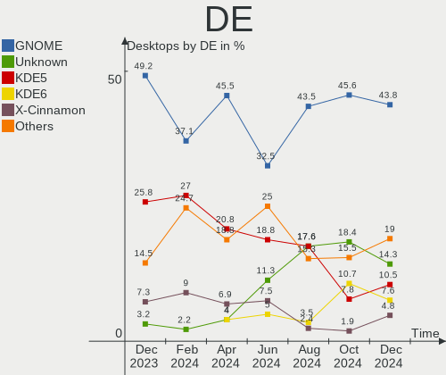
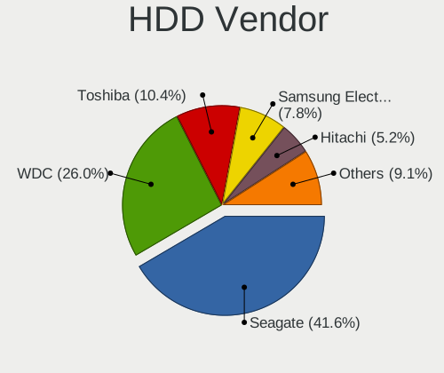
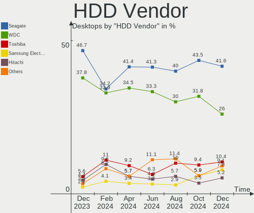
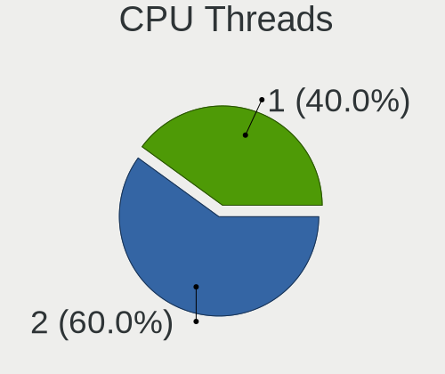
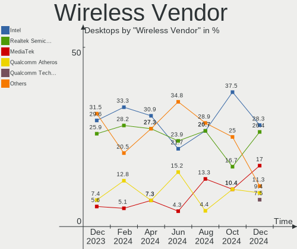
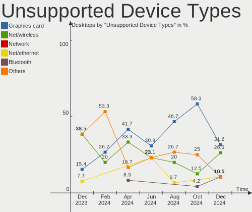

Linux in France - Hardware Trends (Desktops)
--------------------------------------------

A project to identify most popular hardware characteristics and track their change
over time based on data collected by Linux users at https://Linux-Hardware.org.

Anyone can contribute to this report by the [hw-probe](https://github.com/linuxhw/hw-probe) tool:

    sudo -E hw-probe -all -upload

Contents
--------

* [ System ](#system)
  - [ OS                       ](#os)
  - [ OS Family                ](#os-family)
  - [ Kernel                   ](#kernel)
  - [ Kernel Family            ](#kernel-family)
  - [ Kernel Major Ver.        ](#kernel-major-ver)
  - [ Arch                     ](#arch)
  - [ DE                       ](#de)
  - [ Display Server           ](#display-server)
  - [ Display Manager          ](#display-manager)
  - [ OS Lang                  ](#os-lang)
  - [ Boot Mode                ](#boot-mode)
  - [ Filesystem               ](#filesystem)
  - [ Part. scheme             ](#part-scheme)
  - [ Dual Boot with Linux/BSD ](#dual-boot-with-linuxbsd)
  - [ Dual Boot (Win)          ](#dual-boot-win)

* [ Board ](#board)
  - [ Vendor                   ](#vendor)
  - [ Model                    ](#model)
  - [ Model Family             ](#model-family)
  - [ MFG Year                 ](#mfg-year)
  - [ Form Factor              ](#form-factor)
  - [ Secure Boot              ](#secure-boot)
  - [ Coreboot                 ](#coreboot)
  - [ RAM Size                 ](#ram-size)
  - [ RAM Used                 ](#ram-used)
  - [ Total Drives             ](#total-drives)
  - [ Has CD-ROM               ](#has-cd-rom)
  - [ Has Ethernet             ](#has-ethernet)
  - [ Has WiFi                 ](#has-wifi)
  - [ Has Bluetooth            ](#has-bluetooth)

* [ Location ](#location)
  - [ Country                  ](#country)
  - [ City                     ](#city)

* [ Drives ](#drives)
  - [ Drive Vendor             ](#drive-vendor)
  - [ Drive Model              ](#drive-model)
  - [ HDD Vendor               ](#hdd-vendor)
  - [ SSD Vendor               ](#ssd-vendor)
  - [ Drive Kind               ](#drive-kind)
  - [ Drive Connector          ](#drive-connector)
  - [ Drive Size               ](#drive-size)
  - [ Space Total              ](#space-total)
  - [ Space Used               ](#space-used)
  - [ Malfunc. Drives          ](#malfunc-drives)
  - [ Malfunc. Drive Vendor    ](#malfunc-drive-vendor)
  - [ Malfunc. HDD Vendor      ](#malfunc-hdd-vendor)
  - [ Malfunc. Drive Kind      ](#malfunc-drive-kind)
  - [ Failed Drives            ](#failed-drives)
  - [ Failed Drive Vendor      ](#failed-drive-vendor)
  - [ Drive Status             ](#drive-status)

* [ Storage controller ](#storage-controller)
  - [ Storage Vendor           ](#storage-vendor)
  - [ Storage Model            ](#storage-model)
  - [ Storage Kind             ](#storage-kind)

* [ Processor ](#processor)
  - [ CPU Vendor               ](#cpu-vendor)
  - [ CPU Model                ](#cpu-model)
  - [ CPU Model Family         ](#cpu-model-family)
  - [ CPU Cores                ](#cpu-cores)
  - [ CPU Sockets              ](#cpu-sockets)
  - [ CPU Threads              ](#cpu-threads)
  - [ CPU Op-Modes             ](#cpu-op-modes)
  - [ CPU Microcode            ](#cpu-microcode)
  - [ CPU Microarch            ](#cpu-microarch)

* [ Graphics ](#graphics)
  - [ GPU Vendor               ](#gpu-vendor)
  - [ GPU Model                ](#gpu-model)
  - [ GPU Combo                ](#gpu-combo)
  - [ GPU Driver               ](#gpu-driver)
  - [ GPU Memory               ](#gpu-memory)

* [ Monitor ](#monitor)
  - [ Monitor Vendor           ](#monitor-vendor)
  - [ Monitor Model            ](#monitor-model)
  - [ Monitor Resolution       ](#monitor-resolution)
  - [ Monitor Diagonal         ](#monitor-diagonal)
  - [ Monitor Width            ](#monitor-width)
  - [ Aspect Ratio             ](#aspect-ratio)
  - [ Monitor Area             ](#monitor-area)
  - [ Pixel Density            ](#pixel-density)
  - [ Multiple Monitors        ](#multiple-monitors)

* [ Network ](#network)
  - [ Net Controller Vendor    ](#net-controller-vendor)
  - [ Net Controller Model     ](#net-controller-model)
  - [ Wireless Vendor          ](#wireless-vendor)
  - [ Wireless Model           ](#wireless-model)
  - [ Ethernet Vendor          ](#ethernet-vendor)
  - [ Ethernet Model           ](#ethernet-model)
  - [ Net Controller Kind      ](#net-controller-kind)
  - [ Used Controller          ](#used-controller)
  - [ NICs                     ](#nics)
  - [ IPv6                     ](#ipv6)

* [ Bluetooth ](#bluetooth)
  - [ Bluetooth Vendor         ](#bluetooth-vendor)
  - [ Bluetooth Model          ](#bluetooth-model)

* [ Sound ](#sound)
  - [ Sound Vendor             ](#sound-vendor)
  - [ Sound Model              ](#sound-model)

* [ Memory ](#memory)
  - [ Memory Vendor            ](#memory-vendor)
  - [ Memory Model             ](#memory-model)
  - [ Memory Kind              ](#memory-kind)
  - [ Memory Form Factor       ](#memory-form-factor)
  - [ Memory Size              ](#memory-size)
  - [ Memory Speed             ](#memory-speed)

* [ Printers & scanners ](#printers--scanners)
  - [ Printer Vendor           ](#printer-vendor)
  - [ Printer Model            ](#printer-model)
  - [ Scanner Vendor           ](#scanner-vendor)
  - [ Scanner Model            ](#scanner-model)

* [ Camera ](#camera)
  - [ Camera Vendor            ](#camera-vendor)
  - [ Camera Model             ](#camera-model)

* [ Security ](#security)
  - [ Fingerprint Vendor       ](#fingerprint-vendor)
  - [ Fingerprint Model        ](#fingerprint-model)
  - [ Chipcard Vendor          ](#chipcard-vendor)
  - [ Chipcard Model           ](#chipcard-model)

* [ Unsupported ](#unsupported)
  - [ Unsupported Devices      ](#unsupported-devices)
  - [ Unsupported Device Types ](#unsupported-device-types)

System
------

OS
--

Installed operating systems

| Name                         | Desktops | Percent |
|------------------------------|----------|---------|
| Ubuntu 20.04                 | 21       | 22.58%  |
| Ubuntu 21.10                 | 8        | 8.6%    |
| Fedora 35                    | 7        | 7.53%   |
| Linux Mint 20.3              | 6        | 6.45%   |
| Ubuntu 22.04                 | 5        | 5.38%   |
| Zorin 16                     | 3        | 3.23%   |
| OpenMandriva 4.3             | 3        | 3.23%   |
| OpenMandriva 4.2             | 3        | 3.23%   |
| Manjaro                      | 3        | 3.23%   |
| Debian 11                    | 3        | 3.23%   |
| Arch                         | 3        | 3.23%   |
| Ubuntu 18.04                 | 2        | 2.15%   |
| Manjaro 21.2.5               | 2        | 2.15%   |
| Linux Mint 20.2              | 2        | 2.15%   |
| Elementary 6.1               | 2        | 2.15%   |
| Xubuntu 21.10                | 1        | 1.08%   |
| Xubuntu 20.04                | 1        | 1.08%   |
| Ubuntu Studio 20.04          | 1        | 1.08%   |
| Ubuntu Budgie 21.10          | 1        | 1.08%   |
| ROSA R11.1                   | 1        | 1.08%   |
| Pop!_OS 21.10                | 1        | 1.08%   |
| Pop!_OS 21.04                | 1        | 1.08%   |
| openSUSE Tumbleweed-20220427 | 1        | 1.08%   |
| openSUSE 20220410            | 1        | 1.08%   |
| Manjaro 21.2.6               | 1        | 1.08%   |
| Lubuntu 20.04                | 1        | 1.08%   |
| LMDE 5                       | 1        | 1.08%   |
| Linux Mint 19.3              | 1        | 1.08%   |
| Kubuntu 22.04                | 1        | 1.08%   |
| Kubuntu 21.10                | 1        | 1.08%   |
| Kubuntu 20.04                | 1        | 1.08%   |
| Gentoo 2.7                   | 1        | 1.08%   |
| Gentoo 2.6                   | 1        | 1.08%   |
| Fedora 36                    | 1        | 1.08%   |
| Debian 10                    | 1        | 1.08%   |

OS Family
---------

OS without a version

| Name          | Desktops | Percent |
|---------------|----------|---------|
| Ubuntu        | 36       | 38.71%  |
| Linux Mint    | 9        | 9.68%   |
| Fedora        | 8        | 8.6%    |
| OpenMandriva  | 6        | 6.45%   |
| Manjaro       | 6        | 6.45%   |
| Debian        | 4        | 4.3%    |
| Zorin         | 3        | 3.23%   |
| Kubuntu       | 3        | 3.23%   |
| Arch          | 3        | 3.23%   |
| Xubuntu       | 2        | 2.15%   |
| Pop!_OS       | 2        | 2.15%   |
| openSUSE      | 2        | 2.15%   |
| Gentoo        | 2        | 2.15%   |
| Elementary    | 2        | 2.15%   |
| Ubuntu Studio | 1        | 1.08%   |
| Ubuntu Budgie | 1        | 1.08%   |
| ROSA          | 1        | 1.08%   |
| Lubuntu       | 1        | 1.08%   |
| LMDE          | 1        | 1.08%   |

Kernel
------

Version of the Linux kernel

| Version                     | Desktops | Percent |
|-----------------------------|----------|---------|
| 5.13.0-39-generic           | 25       | 26.88%  |
| 5.4.0-107-generic           | 10       | 10.75%  |
| 5.13.0-40-generic           | 7        | 7.53%   |
| 5.15.0-27-generic           | 4        | 4.3%    |
| 5.4.0-109-generic           | 3        | 3.23%   |
| 5.16.7-desktop-1omv4003     | 3        | 3.23%   |
| 5.10.14-desktop-1omv4002    | 3        | 3.23%   |
| 5.17.5-arch1-1              | 2        | 2.15%   |
| 5.16.20-200.fc35.x86_64     | 2        | 2.15%   |
| 5.16.19-200.fc35.x86_64     | 2        | 2.15%   |
| 5.16.18-200.fc35.x86_64     | 2        | 2.15%   |
| 5.16.14-1-MANJARO           | 2        | 2.15%   |
| 5.15.28-1-MANJARO           | 2        | 2.15%   |
| 5.10.0-13-amd64             | 2        | 2.15%   |
| 5.4.83-generic-2rosa-x86_64 | 1        | 1.08%   |
| 5.4.0-97-generic            | 1        | 1.08%   |
| 5.4.0-26-generic            | 1        | 1.08%   |
| 5.4.0-104-generic           | 1        | 1.08%   |
| 5.17.4-1-default            | 1        | 1.08%   |
| 5.17.2-300.fc36.x86_64      | 1        | 1.08%   |
| 5.17.1-xanmod1              | 1        | 1.08%   |
| 5.17.1-arch1-1              | 1        | 1.08%   |
| 5.17.1-3-MANJARO            | 1        | 1.08%   |
| 5.17.1-1-default            | 1        | 1.08%   |
| 5.17.0-4.1-liquorix-amd64   | 1        | 1.08%   |
| 5.17.0-1-MANJARO            | 1        | 1.08%   |
| 5.16.16-200.fc35.x86_64     | 1        | 1.08%   |
| 5.16.15-76051615-generic    | 1        | 1.08%   |
| 5.16.0-0.bpo.4-amd64        | 1        | 1.08%   |
| 5.15.8-76051508-generic     | 1        | 1.08%   |
| 5.15.32-gentoo-r1-x86_64    | 1        | 1.08%   |
| 5.15.0-25-generic           | 1        | 1.08%   |
| 5.13.0-30-generic           | 1        | 1.08%   |
| 5.11.0-34-lowlatency        | 1        | 1.08%   |
| 5.10.52-gentoo-x86_64       | 1        | 1.08%   |
| 5.10.0-12-amd64             | 1        | 1.08%   |
| 4.19.0-18-686-pae           | 1        | 1.08%   |
| 4.15.0-158-lowlatency       | 1        | 1.08%   |

Kernel Family
-------------

Linux kernel without a distro release

| Version | Desktops | Percent |
|---------|----------|---------|
| 5.13.0  | 33       | 35.48%  |
| 5.4.0   | 16       | 17.2%   |
| 5.15.0  | 5        | 5.38%   |
| 5.17.1  | 4        | 4.3%    |
| 5.16.7  | 3        | 3.23%   |
| 5.10.14 | 3        | 3.23%   |
| 5.10.0  | 3        | 3.23%   |
| 5.17.5  | 2        | 2.15%   |
| 5.17.0  | 2        | 2.15%   |
| 5.16.20 | 2        | 2.15%   |
| 5.16.19 | 2        | 2.15%   |
| 5.16.18 | 2        | 2.15%   |
| 5.16.14 | 2        | 2.15%   |
| 5.15.28 | 2        | 2.15%   |
| 5.4.83  | 1        | 1.08%   |
| 5.17.4  | 1        | 1.08%   |
| 5.17.2  | 1        | 1.08%   |
| 5.16.16 | 1        | 1.08%   |
| 5.16.15 | 1        | 1.08%   |
| 5.16.0  | 1        | 1.08%   |
| 5.15.8  | 1        | 1.08%   |
| 5.15.32 | 1        | 1.08%   |
| 5.11.0  | 1        | 1.08%   |
| 5.10.52 | 1        | 1.08%   |
| 4.19.0  | 1        | 1.08%   |
| 4.15.0  | 1        | 1.08%   |

Kernel Major Ver.
-----------------

Linux kernel major version

| Version | Desktops | Percent |
|---------|----------|---------|
| 5.13    | 33       | 35.48%  |
| 5.4     | 17       | 18.28%  |
| 5.16    | 14       | 15.05%  |
| 5.17    | 10       | 10.75%  |
| 5.15    | 9        | 9.68%   |
| 5.10    | 7        | 7.53%   |
| 5.11    | 1        | 1.08%   |
| 4.19    | 1        | 1.08%   |
| 4.15    | 1        | 1.08%   |

Arch
----

OS architecture (x86_64, i586, etc.)

| Name   | Desktops | Percent |
|--------|----------|---------|
| x86_64 | 92       | 98.92%  |
| i686   | 1        | 1.08%   |

DE
--

Desktop Environment

| Name            | Desktops | Percent |
|-----------------|----------|---------|
| GNOME           | 50       | 53.76%  |
| KDE5            | 13       | 13.98%  |
| XFCE            | 7        | 7.53%   |
| X-Cinnamon      | 6        | 6.45%   |
| Unknown         | 6        | 6.45%   |
| MATE            | 3        | 3.23%   |
| Pantheon        | 2        | 2.15%   |
| Unity           | 1        | 1.08%   |
| LXQt            | 1        | 1.08%   |
| GNOME Flashback | 1        | 1.08%   |
| GNOME Classic   | 1        | 1.08%   |
| Cinnamon        | 1        | 1.08%   |
| Budgie          | 1        | 1.08%   |

Display Server
--------------

X11 or Wayland

| Name    | Desktops | Percent |
|---------|----------|---------|
| X11     | 72       | 77.42%  |
| Wayland | 15       | 16.13%  |
| Tty     | 5        | 5.38%   |
| Unknown | 1        | 1.08%   |

Display Manager
---------------

SDDM, LightDM, etc.

| Name    | Desktops | Percent |
|---------|----------|---------|
| GDM     | 28       | 30.11%  |
| Unknown | 27       | 29.03%  |
| GDM3    | 14       | 15.05%  |
| LightDM | 13       | 13.98%  |
| SDDM    | 10       | 10.75%  |
| XDM     | 1        | 1.08%   |

OS Lang
-------

Language

| Lang       | Desktops | Percent |
|------------|----------|---------|
| fr_FR      | 72       | 77.42%  |
| en_US      | 16       | 17.2%   |
| sr_RS      | 1        | 1.08%   |
| nl_NL      | 1        | 1.08%   |
| it_IT      | 1        | 1.08%   |
| fr_FR.UTF8 | 1        | 1.08%   |
| C          | 1        | 1.08%   |

Boot Mode
---------

EFI or BIOS

| Mode | Desktops | Percent |
|------|----------|---------|
| BIOS | 47       | 50.54%  |
| EFI  | 46       | 49.46%  |

Filesystem
----------

Type of filesystem

| Type    | Desktops | Percent |
|---------|----------|---------|
| Ext4    | 76       | 81.72%  |
| Btrfs   | 9        | 9.68%   |
| Overlay | 6        | 6.45%   |
| Zfs     | 1        | 1.08%   |
| Tmpfs   | 1        | 1.08%   |

Part. scheme
------------

Scheme of partitioning

| Type    | Desktops | Percent |
|---------|----------|---------|
| GPT     | 37       | 39.78%  |
| Unknown | 35       | 37.63%  |
| MBR     | 21       | 22.58%  |

Dual Boot with Linux/BSD
------------------------

Hosting more than one Linux/BSD

| Dual boot | Desktops | Percent |
|-----------|----------|---------|
| No        | 76       | 81.72%  |
| Yes       | 17       | 18.28%  |

Dual Boot (Win)
---------------

Hosting Linux and Windows

| Dual boot | Desktops | Percent |
|-----------|----------|---------|
| No        | 65       | 69.89%  |
| Yes       | 28       | 30.11%  |

Board
-----

Vendor
------

Motherboard manufacturer

| Name                | Desktops | Percent |
|---------------------|----------|---------|
| ASUSTek Computer    | 26       | 27.96%  |
| MSI                 | 18       | 19.35%  |
| Gigabyte Technology | 15       | 16.13%  |
| Dell                | 9        | 9.68%   |
| Hewlett-Packard     | 6        | 6.45%   |
| Pegatron            | 4        | 4.3%    |
| ASRock              | 4        | 4.3%    |
| Acer                | 3        | 3.23%   |
| Packard Bell        | 2        | 2.15%   |
| Lenovo              | 1        | 1.08%   |
| Jetway              | 1        | 1.08%   |
| Intel               | 1        | 1.08%   |
| Foxconn             | 1        | 1.08%   |
| BESSTAR Tech        | 1        | 1.08%   |
| AMI                 | 1        | 1.08%   |

Model
-----

Motherboard model

| Name                                 | Desktops | Percent |
|--------------------------------------|----------|---------|
| ASUS All Series                      | 4        | 4.3%    |
| MSI MS-7C94                          | 2        | 2.15%   |
| Pegatron VG267AA-ABF p6244fr         | 1        | 1.08%   |
| Pegatron IPPPV-D3G                   | 1        | 1.08%   |
| Pegatron Elite 7500 Series MT        | 1        | 1.08%   |
| Pegatron Compaq dx2400 Microtower PC | 1        | 1.08%   |
| Packard Bell IMEDIA S2110            | 1        | 1.08%   |
| Packard Bell IMEDIA MC 9604          | 1        | 1.08%   |
| MSI MS-7D22                          | 1        | 1.08%   |
| MSI MS-7D13                          | 1        | 1.08%   |
| MSI MS-7C92                          | 1        | 1.08%   |
| MSI MS-7C91                          | 1        | 1.08%   |
| MSI MS-7C56                          | 1        | 1.08%   |
| MSI MS-7C35                          | 1        | 1.08%   |
| MSI MS-7B98                          | 1        | 1.08%   |
| MSI MS-7B79                          | 1        | 1.08%   |
| MSI MS-7B48                          | 1        | 1.08%   |
| MSI MS-7A31                          | 1        | 1.08%   |
| MSI MS-7A15                          | 1        | 1.08%   |
| MSI MS-7981                          | 1        | 1.08%   |
| MSI MS-7758                          | 1        | 1.08%   |
| MSI MS-7751                          | 1        | 1.08%   |
| MSI MS-7681                          | 1        | 1.08%   |
| MSI MS-7519                          | 1        | 1.08%   |
| Lenovo ThinkCentre M720s 10SUS9KW00  | 1        | 1.08%   |
| Jetway 1.0                           | 1        | 1.08%   |
| Intel DH61BE AAG14062-206            | 1        | 1.08%   |
| HP Pavilion Desktop PC 570-p0xx      | 1        | 1.08%   |
| HP EliteDesk 800 G1 USDT             | 1        | 1.08%   |
| HP EliteDesk 800 G1 SFF              | 1        | 1.08%   |
| HP Compaq dc5800 Small Form Factor   | 1        | 1.08%   |
| HP Compaq 8000 Elite USDT PC         | 1        | 1.08%   |
| HP Compaq 6000 Pro MT PC             | 1        | 1.08%   |
| Gigabyte Z97X-UD3H                   | 1        | 1.08%   |
| Gigabyte Z97X-Gaming 3               | 1        | 1.08%   |
| Gigabyte Z590 UD AC                  | 1        | 1.08%   |
| Gigabyte Z390 M GAMING               | 1        | 1.08%   |
| Gigabyte X570 UD                     | 1        | 1.08%   |
| Gigabyte X570 AORUS PRO              | 1        | 1.08%   |
| Gigabyte X470 AORUS ULTRA GAMING     | 1        | 1.08%   |
| Gigabyte H87M-D3H                    | 1        | 1.08%   |
| Gigabyte H61M-DS2 x.x                | 1        | 1.08%   |
| Gigabyte H170-HD3-CF                 | 1        | 1.08%   |
| Gigabyte G41M-Combo                  | 1        | 1.08%   |
| Gigabyte F2A88XM-D3H                 | 1        | 1.08%   |
| Gigabyte CUSTOM                      | 1        | 1.08%   |
| Gigabyte B560M DS3H V2               | 1        | 1.08%   |
| Gigabyte 990FXA-UD3                  | 1        | 1.08%   |
| Foxconn G5450frm                     | 1        | 1.08%   |
| Dell Vostro 460                      | 1        | 1.08%   |
| Dell Precision 5820 Tower            | 1        | 1.08%   |
| Dell OptiPlex 780                    | 1        | 1.08%   |
| Dell OptiPlex 755                    | 1        | 1.08%   |
| Dell OptiPlex 7010                   | 1        | 1.08%   |
| Dell OptiPlex 390                    | 1        | 1.08%   |
| Dell OptiPlex 360                    | 1        | 1.08%   |
| Dell OptiPlex 3050                   | 1        | 1.08%   |
| Dell OptiPlex 3020                   | 1        | 1.08%   |
| BESSTAR Tech HM80                    | 1        | 1.08%   |
| ASUS TUF X470-PLUS GAMING            | 1        | 1.08%   |

Model Family
------------

Motherboard model prefix

| Name                 | Desktops | Percent |
|----------------------|----------|---------|
| Dell OptiPlex        | 7        | 7.53%   |
| ASUS All             | 4        | 4.3%    |
| HP Compaq            | 3        | 3.23%   |
| ASUS TUF             | 3        | 3.23%   |
| ASUS ROG             | 3        | 3.23%   |
| ASUS PRIME           | 3        | 3.23%   |
| Packard Bell IMEDIA  | 2        | 2.15%   |
| MSI MS-7C94          | 2        | 2.15%   |
| HP EliteDesk         | 2        | 2.15%   |
| Gigabyte X570        | 2        | 2.15%   |
| Pegatron VG267AA-ABF | 1        | 1.08%   |
| Pegatron IPPPV-D3G   | 1        | 1.08%   |
| Pegatron Elite       | 1        | 1.08%   |
| Pegatron Compaq      | 1        | 1.08%   |
| MSI MS-7D22          | 1        | 1.08%   |
| MSI MS-7D13          | 1        | 1.08%   |
| MSI MS-7C92          | 1        | 1.08%   |
| MSI MS-7C91          | 1        | 1.08%   |
| MSI MS-7C56          | 1        | 1.08%   |
| MSI MS-7C35          | 1        | 1.08%   |
| MSI MS-7B98          | 1        | 1.08%   |
| MSI MS-7B79          | 1        | 1.08%   |
| MSI MS-7B48          | 1        | 1.08%   |
| MSI MS-7A31          | 1        | 1.08%   |
| MSI MS-7A15          | 1        | 1.08%   |
| MSI MS-7981          | 1        | 1.08%   |
| MSI MS-7758          | 1        | 1.08%   |
| MSI MS-7751          | 1        | 1.08%   |
| MSI MS-7681          | 1        | 1.08%   |
| MSI MS-7519          | 1        | 1.08%   |
| Lenovo ThinkCentre   | 1        | 1.08%   |
| Jetway 1.0           | 1        | 1.08%   |
| Intel DH61BE         | 1        | 1.08%   |
| HP Pavilion          | 1        | 1.08%   |
| Gigabyte Z97X-UD3H   | 1        | 1.08%   |
| Gigabyte Z97X-Gaming | 1        | 1.08%   |
| Gigabyte Z590        | 1        | 1.08%   |
| Gigabyte Z390        | 1        | 1.08%   |
| Gigabyte X470        | 1        | 1.08%   |
| Gigabyte H87M-D3H    | 1        | 1.08%   |
| Gigabyte H61M-DS2    | 1        | 1.08%   |
| Gigabyte H170-HD3-CF | 1        | 1.08%   |
| Gigabyte G41M-Combo  | 1        | 1.08%   |
| Gigabyte F2A88XM-D3H | 1        | 1.08%   |
| Gigabyte CUSTOM      | 1        | 1.08%   |
| Gigabyte B560M       | 1        | 1.08%   |
| Gigabyte 990FXA-UD3  | 1        | 1.08%   |
| Foxconn G5450frm     | 1        | 1.08%   |
| Dell Vostro          | 1        | 1.08%   |
| Dell Precision       | 1        | 1.08%   |
| BESSTAR Tech HM80    | 1        | 1.08%   |
| ASUS STRIKER         | 1        | 1.08%   |
| ASUS P8P67           | 1        | 1.08%   |
| ASUS P8H61-M         | 1        | 1.08%   |
| ASUS P7P55-M         | 1        | 1.08%   |
| ASUS P6T             | 1        | 1.08%   |
| ASUS P5QC            | 1        | 1.08%   |
| ASUS P5KPL-AM        | 1        | 1.08%   |
| ASUS M5A97           | 1        | 1.08%   |
| ASUS H110I-PLUS      | 1        | 1.08%   |

MFG Year
--------

Motherboard manufacture year

| Year | Desktops | Percent |
|------|----------|---------|
| 2020 | 10       | 10.75%  |
| 2013 | 10       | 10.75%  |
| 2018 | 8        | 8.6%    |
| 2021 | 7        | 7.53%   |
| 2011 | 7        | 7.53%   |
| 2019 | 6        | 6.45%   |
| 2012 | 6        | 6.45%   |
| 2009 | 6        | 6.45%   |
| 2008 | 6        | 6.45%   |
| 2017 | 5        | 5.38%   |
| 2015 | 5        | 5.38%   |
| 2014 | 5        | 5.38%   |
| 2016 | 4        | 4.3%    |
| 2010 | 4        | 4.3%    |
| 2007 | 2        | 2.15%   |
| 2006 | 1        | 1.08%   |
| 2005 | 1        | 1.08%   |

Form Factor
-----------

Physical design of the computer

| Name    | Desktops | Percent |
|---------|----------|---------|
| Desktop | 93       | 100%    |

Secure Boot
-----------

Enabled or disabled

| State    | Desktops | Percent |
|----------|----------|---------|
| Disabled | 91       | 97.85%  |
| Enabled  | 2        | 2.15%   |

Coreboot
--------

Have coreboot on board

| Used | Desktops | Percent |
|------|----------|---------|
| No   | 93       | 100%    |

RAM Size
--------

Total RAM memory

| Size in GB  | Desktops | Percent |
|-------------|----------|---------|
| 16.01-24.0  | 22       | 23.66%  |
| 3.01-4.0    | 17       | 18.28%  |
| 32.01-64.0  | 15       | 16.13%  |
| 4.01-8.0    | 14       | 15.05%  |
| 8.01-16.0   | 14       | 15.05%  |
| 64.01-256.0 | 5        | 5.38%   |
| 24.01-32.0  | 4        | 4.3%    |
| 2.01-3.0    | 1        | 1.08%   |
| 1.01-2.0    | 1        | 1.08%   |

RAM Used
--------

Used RAM memory

| Used GB   | Desktops | Percent |
|-----------|----------|---------|
| 4.01-8.0  | 26       | 27.96%  |
| 1.01-2.0  | 21       | 22.58%  |
| 2.01-3.0  | 16       | 17.2%   |
| 3.01-4.0  | 11       | 11.83%  |
| 8.01-16.0 | 9        | 9.68%   |
| 0.51-1.0  | 5        | 5.38%   |
| 0.01-0.5  | 5        | 5.38%   |

Total Drives
------------

Number of drives on board

| Drives | Desktops | Percent |
|--------|----------|---------|
| 2      | 34       | 36.56%  |
| 1      | 31       | 33.33%  |
| 4      | 11       | 11.83%  |
| 3      | 10       | 10.75%  |
| 6      | 3        | 3.23%   |
| 5      | 3        | 3.23%   |
| 7      | 1        | 1.08%   |

Has CD-ROM
----------

Has CD-ROM on board

| Presented | Desktops | Percent |
|-----------|----------|---------|
| Yes       | 51       | 54.84%  |
| No        | 42       | 45.16%  |

Has Ethernet
------------

Has Ethernet on board

| Presented | Desktops | Percent |
|-----------|----------|---------|
| Yes       | 92       | 98.92%  |
| No        | 1        | 1.08%   |

Has WiFi
--------

Has WiFi module

| Presented | Desktops | Percent |
|-----------|----------|---------|
| No        | 48       | 51.61%  |
| Yes       | 45       | 48.39%  |

Has Bluetooth
-------------

Has Bluetooth module

| Presented | Desktops | Percent |
|-----------|----------|---------|
| No        | 63       | 67.74%  |
| Yes       | 30       | 32.26%  |

Location
--------

Country
-------

Geographic location (country)

| Country | Desktops | Percent |
|---------|----------|---------|
| France  | 93       | 100%    |

City
----

Geographic location (city)

| City                      | Desktops | Percent |
|---------------------------|----------|---------|
| Paris                     | 9        | 9.68%   |
| Marseille                 | 4        | 4.3%    |
| Toulouse                  | 3        | 3.23%   |
| Villeneuve-d'Ascq         | 2        | 2.15%   |
| Vannes                    | 2        | 2.15%   |
| Vandoeuvre-les-Nancy      | 2        | 2.15%   |
| Nice                      | 2        | 2.15%   |
| Grenoble                  | 2        | 2.15%   |
| Bougival                  | 2        | 2.15%   |
| Vitry-le-François        | 1        | 1.08%   |
| Vincennes                 | 1        | 1.08%   |
| Villeurbanne              | 1        | 1.08%   |
| Veretz                    | 1        | 1.08%   |
| Tourcoing                 | 1        | 1.08%   |
| Toulon                    | 1        | 1.08%   |
| Thorens-Glieres           | 1        | 1.08%   |
| Sotteville-lès-Rouen     | 1        | 1.08%   |
| Senonches                 | 1        | 1.08%   |
| Sautron                   | 1        | 1.08%   |
| Sarrebourg                | 1        | 1.08%   |
| Saint-Mandrier-sur-Mer    | 1        | 1.08%   |
| Saint-Julien-en-Genevois  | 1        | 1.08%   |
| Saint-Julien-de-Concelles | 1        | 1.08%   |
| Saint-Gratien             | 1        | 1.08%   |
| Rezé                     | 1        | 1.08%   |
| Puygouzon                 | 1        | 1.08%   |
| Pau                       | 1        | 1.08%   |
| Noisy-le-Sec              | 1        | 1.08%   |
| Niort                     | 1        | 1.08%   |
| Niederhaslach             | 1        | 1.08%   |
| Nanterre                  | 1        | 1.08%   |
| Mimizan                   | 1        | 1.08%   |
| Mereville                 | 1        | 1.08%   |
| Melun                     | 1        | 1.08%   |
| Massy                     | 1        | 1.08%   |
| Martigues                 | 1        | 1.08%   |
| Marmanhac                 | 1        | 1.08%   |
| Mantes-la-Ville           | 1        | 1.08%   |
| Mantes-la-Jolie           | 1        | 1.08%   |
| Lyon                      | 1        | 1.08%   |
| Lure                      | 1        | 1.08%   |
| Lille                     | 1        | 1.08%   |
| Larnage                   | 1        | 1.08%   |
| La Seyne-sur-Mer          | 1        | 1.08%   |
| La Rochelle               | 1        | 1.08%   |
| Issoire                   | 1        | 1.08%   |
| Hergnies                  | 1        | 1.08%   |
| Hasparren                 | 1        | 1.08%   |
| Gujan-Mestras             | 1        | 1.08%   |
| Guerville                 | 1        | 1.08%   |
| Fréjus                   | 1        | 1.08%   |
| Floirac                   | 1        | 1.08%   |
| Eywiller                  | 1        | 1.08%   |
| Esternay                  | 1        | 1.08%   |
| Draveil                   | 1        | 1.08%   |
| Dompierre-sur-Mer         | 1        | 1.08%   |
| Dijon                     | 1        | 1.08%   |
| Dietwiller                | 1        | 1.08%   |
| Dieppe                    | 1        | 1.08%   |
| Coudekerque-Branche       | 1        | 1.08%   |

Drives
------

Drive Vendor
------------

Hard drive vendors

| Vendor              | Desktops | Drives | Percent |
|---------------------|----------|--------|---------|
| Seagate             | 39       | 55     | 23.93%  |
| Samsung Electronics | 28       | 40     | 17.18%  |
| WDC                 | 25       | 38     | 15.34%  |
| Crucial             | 19       | 24     | 11.66%  |
| Kingston            | 9        | 9      | 5.52%   |
| Toshiba             | 5        | 5      | 3.07%   |
| SanDisk             | 5        | 5      | 3.07%   |
| LDLC                | 4        | 5      | 2.45%   |
| HGST                | 4        | 4      | 2.45%   |
| Unknown             | 3        | 4      | 1.84%   |
| PNY                 | 3        | 3      | 1.84%   |
| Hitachi             | 3        | 3      | 1.84%   |
| China               | 3        | 3      | 1.84%   |
| Micron Technology   | 2        | 2      | 1.23%   |
| A-DATA Technology   | 2        | 2      | 1.23%   |
| Transcend           | 1        | 2      | 0.61%   |
| TEXTORM             | 1        | 1      | 0.61%   |
| SABRENT             | 1        | 1      | 0.61%   |
| ORTIAL              | 1        | 1      | 0.61%   |
| JMicron             | 1        | 1      | 0.61%   |
| Intenso             | 1        | 1      | 0.61%   |
| Dogfish             | 1        | 1      | 0.61%   |
| Corsair             | 1        | 2      | 0.61%   |
| Unknown             | 1        | 1      | 0.61%   |

Drive Model
-----------

Hard drive models

| Model                           | Desktops | Percent |
|---------------------------------|----------|---------|
| Seagate ST2000DM008-2FR102 2TB  | 6        | 3.08%   |
| Samsung SSD 850 EVO 250GB       | 6        | 3.08%   |
| Seagate ST2000DM001-1ER164 2TB  | 4        | 2.05%   |
| Seagate ST1000DM003-1ER162 1TB  | 4        | 2.05%   |
| Samsung SSD 860 EVO 500GB       | 4        | 2.05%   |
| Crucial CT240BX500SSD1 240GB    | 4        | 2.05%   |
| Samsung NVMe SSD Drive 500GB    | 3        | 1.54%   |
| WDC WD2500KS-00MJB0 250GB       | 2        | 1.03%   |
| Toshiba DT01ACA100 1TB          | 2        | 1.03%   |
| Seagate ST2000DX002-2DV164 2TB  | 2        | 1.03%   |
| Seagate ST1000DM010-2EP102 1TB  | 2        | 1.03%   |
| Seagate ST1000DM003-1CH162 1TB  | 2        | 1.03%   |
| Samsung SSD 980 1TB             | 2        | 1.03%   |
| Samsung SSD 970 EVO Plus 2TB    | 2        | 1.03%   |
| Samsung SSD 860 EVO 250GB       | 2        | 1.03%   |
| PNY CS900 120GB SSD             | 2        | 1.03%   |
| Kingston SA400S37120G 120GB SSD | 2        | 1.03%   |
| Crucial CT500P5SSD8 500GB       | 2        | 1.03%   |
| Crucial CT2000MX500SSD1 2TB     | 2        | 1.03%   |
| Crucial CT1000MX500SSD1 1TB     | 2        | 1.03%   |
| A-DATA SP550 240GB SSD          | 2        | 1.03%   |
| WDC WDS500G2B0B 500GB SSD       | 1        | 0.51%   |
| WDC WDS100T3X0C-00SJG0 1TB      | 1        | 0.51%   |
| WDC WDS100T2B0C-00PXH0 1TB      | 1        | 0.51%   |
| WDC WD80EFBX-68AZZN0 8TB        | 1        | 0.51%   |
| WDC WD60EZAZ-00ZGHB0 6TB        | 1        | 0.51%   |
| WDC WD5000AZLX-22JKKA0 500GB    | 1        | 0.51%   |
| WDC WD5000AAKS-65YGA0 500GB     | 1        | 0.51%   |
| WDC WD40EZRX-00SPEB0 4TB        | 1        | 0.51%   |
| WDC WD4005FZBX-00K5WB0 4TB      | 1        | 0.51%   |
| WDC WD3200BPVT-60JJ5T0 320GB    | 1        | 0.51%   |
| WDC WD3200AAJS-65RYA0 320GB     | 1        | 0.51%   |
| WDC WD30EZRZ-00Z5HB0 3TB        | 1        | 0.51%   |
| WDC WD2500AAKS-00L6A0 250GB     | 1        | 0.51%   |
| WDC WD20EZRZ-00Z5HB0 2TB        | 1        | 0.51%   |
| WDC WD20EZRX-00DC0B0 2TB        | 1        | 0.51%   |
| WDC WD20EZRX-00D8PB0 2TB        | 1        | 0.51%   |
| WDC WD20EARX-00PASB0 2TB        | 1        | 0.51%   |
| WDC WD1600BEVS-00VAT0 160GB     | 1        | 0.51%   |
| WDC WD1600AAJS-22WAA0 160GB     | 1        | 0.51%   |
| WDC WD1500ADFS-00SLR5 150GB     | 1        | 0.51%   |
| WDC WD10EZRX-00A8LB0 1TB        | 1        | 0.51%   |
| WDC WD10EZEX-75M2NA0 1TB        | 1        | 0.51%   |
| WDC WD10EZEX-60ZF5A0 1TB        | 1        | 0.51%   |
| WDC WD10EZEX-22BN5A0 1TB        | 1        | 0.51%   |
| WDC WD10EFRX-68FYTN0 1TB        | 1        | 0.51%   |
| WDC WD10EARS-00Y5B1 1TB         | 1        | 0.51%   |
| WDC WD10EALX-009BA0 1TB         | 1        | 0.51%   |
| WDC WD10EADS-65L5B1 1TB         | 1        | 0.51%   |
| WDC WD10EADS-22M2B0 1TB         | 1        | 0.51%   |
| Unknown SLD64G  64GB            | 1        | 0.51%   |
| Unknown SD/MMC/MS PRO 128GB     | 1        | 0.51%   |
| Unknown NVMe SSD Drive 256GB    | 1        | 0.51%   |
| Unknown APPSD  67GB             | 1        | 0.51%   |
| Transcend TS480GSSD220S 480GB   | 1        | 0.51%   |
| Transcend TS240GSSD220S 240GB   | 1        | 0.51%   |
| Toshiba MK1032GSX 100GB         | 1        | 0.51%   |
| Toshiba HDWE160 6TB             | 1        | 0.51%   |
| Toshiba DT01ACA050 500GB        | 1        | 0.51%   |
| TEXTORM BM5 240GB SSD           | 1        | 0.51%   |

HDD Vendor
----------

Hard disk drive vendors

| Vendor              | Desktops | Drives | Percent |
|---------------------|----------|--------|---------|
| Seagate             | 39       | 55     | 49.37%  |
| WDC                 | 24       | 34     | 30.38%  |
| Toshiba             | 5        | 5      | 6.33%   |
| HGST                | 4        | 4      | 5.06%   |
| Hitachi             | 3        | 3      | 3.8%    |
| Samsung Electronics | 2        | 3      | 2.53%   |
| Unknown             | 1        | 1      | 1.27%   |
| SABRENT             | 1        | 1      | 1.27%   |

SSD Vendor
----------

Solid state drive vendors

| Vendor              | Desktops | Drives | Percent |
|---------------------|----------|--------|---------|
| Samsung Electronics | 19       | 20     | 31.15%  |
| Crucial             | 16       | 19     | 26.23%  |
| Kingston            | 6        | 6      | 9.84%   |
| SanDisk             | 4        | 4      | 6.56%   |
| PNY                 | 3        | 3      | 4.92%   |
| China               | 3        | 3      | 4.92%   |
| A-DATA Technology   | 2        | 2      | 3.28%   |
| WDC                 | 1        | 1      | 1.64%   |
| Transcend           | 1        | 2      | 1.64%   |
| TEXTORM             | 1        | 1      | 1.64%   |
| ORTIAL              | 1        | 1      | 1.64%   |
| LDLC                | 1        | 1      | 1.64%   |
| JMicron             | 1        | 1      | 1.64%   |
| Intenso             | 1        | 1      | 1.64%   |
| Dogfish             | 1        | 1      | 1.64%   |

Drive Kind
----------

HDD or SSD

| Kind    | Desktops | Drives | Percent |
|---------|----------|--------|---------|
| HDD     | 68       | 106    | 45.95%  |
| SSD     | 51       | 66     | 34.46%  |
| NVMe    | 24       | 34     | 16.22%  |
| Unknown | 4        | 5      | 2.7%    |
| MMC     | 1        | 2      | 0.68%   |

Drive Connector
---------------

SATA, SAS, NVMe, etc.

| Type | Desktops | Drives | Percent |
|------|----------|--------|---------|
| SATA | 85       | 170    | 74.56%  |
| NVMe | 24       | 34     | 21.05%  |
| SAS  | 4        | 7      | 3.51%   |
| MMC  | 1        | 2      | 0.88%   |

Drive Size
----------

Size of hard drive

| Size in TB | Desktops | Drives | Percent |
|------------|----------|--------|---------|
| 0.01-0.5   | 55       | 77     | 41.67%  |
| 0.51-1.0   | 36       | 43     | 27.27%  |
| 1.01-2.0   | 26       | 33     | 19.7%   |
| 3.01-4.0   | 6        | 7      | 4.55%   |
| 2.01-3.0   | 4        | 5      | 3.03%   |
| 4.01-10.0  | 4        | 6      | 3.03%   |
| 10.01-20.0 | 1        | 1      | 0.76%   |

Space Total
-----------

Amount of disk space available on the file system

| Size in GB     | Desktops | Percent |
|----------------|----------|---------|
| 501-1000       | 22       | 23.66%  |
| 101-250        | 20       | 21.51%  |
| More than 3000 | 13       | 13.98%  |
| 1001-2000      | 12       | 12.9%   |
| 251-500        | 10       | 10.75%  |
| 2001-3000      | 6        | 6.45%   |
| Unknown        | 4        | 4.3%    |
| 1-20           | 3        | 3.23%   |
| 51-100         | 3        | 3.23%   |

Space Used
----------

Amount of used disk space

| Used GB        | Desktops | Percent |
|----------------|----------|---------|
| 251-500        | 20       | 21.51%  |
| 1-20           | 18       | 19.35%  |
| 51-100         | 13       | 13.98%  |
| 501-1000       | 12       | 12.9%   |
| 1001-2000      | 8        | 8.6%    |
| 21-50          | 7        | 7.53%   |
| 101-250        | 5        | 5.38%   |
| More than 3000 | 4        | 4.3%    |
| Unknown        | 4        | 4.3%    |
| 2001-3000      | 2        | 2.15%   |

Malfunc. Drives
---------------

Drive models with a malfunction

| Model                               | Desktops | Drives | Percent |
|-------------------------------------|----------|--------|---------|
| WDC WD2500KS-00MJB0 250GB           | 1        | 1      | 7.14%   |
| WDC WD1500ADFS-00SLR5 150GB         | 1        | 1      | 7.14%   |
| WDC WD10EZEX-60ZF5A0 1TB            | 1        | 1      | 7.14%   |
| WDC WD10EARS-00Y5B1 1TB             | 1        | 1      | 7.14%   |
| WDC WD10EADS-65L5B1 1TB             | 1        | 1      | 7.14%   |
| WDC WD10EADS-22M2B0 1TB             | 1        | 1      | 7.14%   |
| Seagate ST3160815AS 160GB           | 1        | 1      | 7.14%   |
| Seagate ST31000528AS 1TB            | 1        | 1      | 7.14%   |
| Seagate ST2000DM 008-2FR102 2TB     | 1        | 1      | 7.14%   |
| Samsung Electronics SSD 850 PRO 2TB | 1        | 1      | 7.14%   |
| Samsung Electronics HD103UJ 1TB     | 1        | 2      | 7.14%   |
| LDLC SSD 256GB                      | 1        | 1      | 7.14%   |
| Crucial CT2000MX500SSD1 2TB         | 1        | 1      | 7.14%   |
| A-DATA Technology SP550 240GB SSD   | 1        | 1      | 7.14%   |

Malfunc. Drive Vendor
---------------------

Vendors of faulty drives

| Vendor              | Desktops | Drives | Percent |
|---------------------|----------|--------|---------|
| WDC                 | 5        | 6      | 38.46%  |
| Seagate             | 3        | 3      | 23.08%  |
| Samsung Electronics | 2        | 3      | 15.38%  |
| LDLC                | 1        | 1      | 7.69%   |
| Crucial             | 1        | 1      | 7.69%   |
| A-DATA Technology   | 1        | 1      | 7.69%   |

Malfunc. HDD Vendor
-------------------

Vendors of faulty HDD drives

| Vendor              | Desktops | Drives | Percent |
|---------------------|----------|--------|---------|
| WDC                 | 5        | 6      | 55.56%  |
| Seagate             | 3        | 3      | 33.33%  |
| Samsung Electronics | 1        | 2      | 11.11%  |

Malfunc. Drive Kind
-------------------

Kinds of faulty drives

| Kind | Desktops | Drives | Percent |
|------|----------|--------|---------|
| HDD  | 9        | 11     | 69.23%  |
| SSD  | 4        | 4      | 30.77%  |

Failed Drives
-------------

Failed drive models

Zero info for selected period =(

Failed Drive Vendor
-------------------

Failed drive vendors

Zero info for selected period =(

Drive Status
------------

Number of failed and malfunc. drives

| Status   | Desktops | Drives | Percent |
|----------|----------|--------|---------|
| Works    | 49       | 97     | 47.57%  |
| Detected | 41       | 101    | 39.81%  |
| Malfunc  | 13       | 15     | 12.62%  |

Storage controller
------------------

Storage Vendor
--------------

Storage controller vendors

| Vendor                      | Desktops | Percent |
|-----------------------------|----------|---------|
| Intel                       | 65       | 48.51%  |
| AMD                         | 23       | 17.16%  |
| Samsung Electronics         | 13       | 9.7%    |
| Marvell Technology Group    | 7        | 5.22%   |
| Micron/Crucial Technology   | 4        | 2.99%   |
| VIA Technologies            | 3        | 2.24%   |
| Sandisk                     | 3        | 2.24%   |
| Nvidia                      | 3        | 2.24%   |
| Micron Technology           | 3        | 2.24%   |
| Kingston Technology Company | 3        | 2.24%   |
| JMicron Technology          | 2        | 1.49%   |
| ASMedia Technology          | 2        | 1.49%   |
| Unknown                     | 1        | 0.75%   |
| Silicon Image               | 1        | 0.75%   |
| Phison Electronics          | 1        | 0.75%   |

Storage Model
-------------

Storage controller models

| Model                                                                                   | Desktops | Percent |
|-----------------------------------------------------------------------------------------|----------|---------|
| AMD FCH SATA Controller [AHCI mode]                                                     | 13       | 7.74%   |
| Intel 8 Series/C220 Series Chipset Family 6-port SATA Controller 1 [AHCI mode]          | 10       | 5.95%   |
| Samsung NVMe SSD Controller SM981/PM981/PM983                                           | 8        | 4.76%   |
| AMD 500 Series Chipset SATA Controller                                                  | 7        | 4.17%   |
| Intel NM10/ICH7 Family SATA Controller [IDE mode]                                       | 6        | 3.57%   |
| Intel 82801G (ICH7 Family) IDE Controller                                               | 6        | 3.57%   |
| Intel Q170/Q150/B150/H170/H110/Z170/CM236 Chipset SATA Controller [AHCI Mode]           | 5        | 2.98%   |
| Intel 500 Series Chipset Family SATA AHCI Controller                                    | 5        | 2.98%   |
| AMD 400 Series Chipset SATA Controller                                                  | 5        | 2.98%   |
| Intel SATA Controller [RAID mode]                                                       | 4        | 2.38%   |
| Intel Cannon Lake PCH SATA AHCI Controller                                              | 4        | 2.38%   |
| Intel 9 Series Chipset Family SATA Controller [AHCI Mode]                               | 4        | 2.38%   |
| Intel 7 Series/C210 Series Chipset Family 6-port SATA Controller [AHCI mode]            | 4        | 2.38%   |
| Intel 6 Series/C200 Series Chipset Family Desktop SATA Controller (IDE mode, ports 4-5) | 4        | 2.38%   |
| Intel 6 Series/C200 Series Chipset Family Desktop SATA Controller (IDE mode, ports 0-3) | 4        | 2.38%   |
| Intel 200 Series PCH SATA controller [AHCI mode]                                        | 4        | 2.38%   |
| Samsung NVMe SSD Controller 980                                                         | 3        | 1.79%   |
| Micron Non-Volatile memory controller                                                   | 3        | 1.79%   |
| Intel 6 Series/C200 Series Chipset Family 6 port Desktop SATA AHCI Controller           | 3        | 1.79%   |
| Intel 4 Series Chipset PT IDER Controller                                               | 3        | 1.79%   |
| AMD SB7x0/SB8x0/SB9x0 SATA Controller [AHCI mode]                                       | 3        | 1.79%   |
| Samsung NVMe SSD Controller PM9A1/PM9A3/980PRO                                          | 2        | 1.19%   |
| Micron/Crucial P2 NVMe PCIe SSD                                                         | 2        | 1.19%   |
| Marvell Group 88SE9172 SATA 6Gb/s Controller                                            | 2        | 1.19%   |
| Marvell Group 88SE6111/6121 SATA II / PATA Controller                                   | 2        | 1.19%   |
| Intel 82801JI (ICH10 Family) 4 port SATA IDE Controller #1                              | 2        | 1.19%   |
| Intel 82801JI (ICH10 Family) 2 port SATA IDE Controller #2                              | 2        | 1.19%   |
| Intel 82801I (ICH9 Family) 2 port SATA Controller [IDE mode]                            | 2        | 1.19%   |
| VIA VT82C586A/B/VT82C686/A/B/VT823x/A/C PIPC Bus Master IDE                             | 1        | 0.6%    |
| VIA VT8237A SATA 2-Port Controller                                                      | 1        | 0.6%    |
| VIA VT6421 IDE/SATA Controller                                                          | 1        | 0.6%    |
| VIA VT6415 PATA IDE Host Controller                                                     | 1        | 0.6%    |
| Unknown Non-Volatile memory controller                                                  | 1        | 0.6%    |
| Silicon Image SiI 3114 [SATALink/SATARaid] Serial ATA Controller                        | 1        | 0.6%    |
| Sandisk WD Blue SN570 NVMe SSD                                                          | 1        | 0.6%    |
| Sandisk WD Blue SN550 NVMe SSD                                                          | 1        | 0.6%    |
| Sandisk WD Black SN750 / PC SN730 NVMe SSD                                              | 1        | 0.6%    |
| Samsung NVMe SSD Controller SM961/PM961/SM963                                           | 1        | 0.6%    |
| Phison E16 PCIe4 NVMe Controller                                                        | 1        | 0.6%    |
| Nvidia MCP73 IDE Controller                                                             | 1        | 0.6%    |
| Nvidia MCP55 SATA Controller                                                            | 1        | 0.6%    |
| Nvidia MCP55 IDE                                                                        | 1        | 0.6%    |
| Nvidia MCP51 Serial ATA Controller                                                      | 1        | 0.6%    |
| Nvidia MCP51 IDE                                                                        | 1        | 0.6%    |
| Nvidia GeForce 7100/nForce 630i SATA                                                    | 1        | 0.6%    |
| Micron/Crucial P1 NVMe PCIe SSD                                                         | 1        | 0.6%    |
| Micron/Crucial Non-Volatile memory controller                                           | 1        | 0.6%    |
| Marvell Group 88SE9215 PCIe 2.0 x1 4-port SATA 6 Gb/s Controller                        | 1        | 0.6%    |
| Marvell Group 88SE91A3 SATA-600 Controller                                              | 1        | 0.6%    |
| Marvell Group 88SE912x SATA 6Gb/s Controller [IDE mode]                                 | 1        | 0.6%    |
| Marvell Group 88SE912x IDE Controller                                                   | 1        | 0.6%    |
| Kingston Company U-SNS8154P3 NVMe SSD                                                   | 1        | 0.6%    |
| Kingston Company KC2000 NVMe SSD                                                        | 1        | 0.6%    |
| Kingston Company A2000 NVMe SSD                                                         | 1        | 0.6%    |
| JMicron JMB368 IDE controller                                                           | 1        | 0.6%    |
| JMicron JMB362 SATA Controller                                                          | 1        | 0.6%    |
| Intel Volume Management Device NVMe RAID Controller                                     | 1        | 0.6%    |
| Intel Comet Lake SATA AHCI Controller                                                   | 1        | 0.6%    |
| Intel C600/X79 series chipset SATA RAID Controller                                      | 1        | 0.6%    |
| Intel 82Q35 Express PT IDER Controller                                                  | 1        | 0.6%    |

Storage Kind
------------

Kind of storage controller (IDE, SATA, NVMe, SAS, ...)

| Kind | Desktops | Percent |
|------|----------|---------|
| SATA | 68       | 53.54%  |
| IDE  | 27       | 21.26%  |
| NVMe | 24       | 18.9%   |
| RAID | 8        | 6.3%    |

Processor
---------

CPU Vendor
----------

Processor vendors

| Vendor | Desktops | Percent |
|--------|----------|---------|
| Intel  | 69       | 74.19%  |
| AMD    | 24       | 25.81%  |

CPU Model
---------

Processor models

| Model                                       | Desktops | Percent |
|---------------------------------------------|----------|---------|
| Intel Core i5-8400 CPU @ 2.80GHz            | 3        | 3.23%   |
| Intel Core i5-7400 CPU @ 3.00GHz            | 3        | 3.23%   |
| Intel Core 2 Duo CPU E7500 @ 2.93GHz        | 3        | 3.23%   |
| Intel Pentium Dual-Core CPU E5800 @ 3.20GHz | 2        | 2.15%   |
| Intel Core i7-4790 CPU @ 3.60GHz            | 2        | 2.15%   |
| Intel Core i7-3770K CPU @ 3.50GHz           | 2        | 2.15%   |
| Intel Core i5-6500 CPU @ 3.20GHz            | 2        | 2.15%   |
| Intel Core i5-4590 CPU @ 3.30GHz            | 2        | 2.15%   |
| Intel Core i5-4430 CPU @ 3.00GHz            | 2        | 2.15%   |
| Intel Core i5-2500K CPU @ 3.30GHz           | 2        | 2.15%   |
| Intel Core i3-10105 CPU @ 3.70GHz           | 2        | 2.15%   |
| Intel Core 2 Quad CPU Q8200 @ 2.33GHz       | 2        | 2.15%   |
| Intel Core 2 CPU 6300 @ 1.86GHz             | 2        | 2.15%   |
| AMD Ryzen 9 5900X 12-Core Processor         | 2        | 2.15%   |
| AMD Ryzen 9 3900XT 12-Core Processor        | 2        | 2.15%   |
| AMD Ryzen 7 3700X 8-Core Processor          | 2        | 2.15%   |
| AMD Ryzen 7 1800X Eight-Core Processor      | 2        | 2.15%   |
| AMD Ryzen 5 5600G with Radeon Graphics      | 2        | 2.15%   |
| Intel Xeon W-2265 CPU @ 3.50GHz             | 1        | 1.08%   |
| Intel Pentium Dual-Core CPU E6600 @ 3.06GHz | 1        | 1.08%   |
| Intel Pentium Dual-Core CPU E5300 @ 2.60GHz | 1        | 1.08%   |
| Intel Pentium CPU G3240 @ 3.10GHz           | 1        | 1.08%   |
| Intel Pentium CPU G2130 @ 3.20GHz           | 1        | 1.08%   |
| Intel Core i9-9900K CPU @ 3.60GHz           | 1        | 1.08%   |
| Intel Core i9-10900 CPU @ 2.80GHz           | 1        | 1.08%   |
| Intel Core i7-9700K CPU @ 3.60GHz           | 1        | 1.08%   |
| Intel Core i7-7700K CPU @ 4.20GHz           | 1        | 1.08%   |
| Intel Core i7-4790K CPU @ 4.00GHz           | 1        | 1.08%   |
| Intel Core i7-4770 CPU @ 3.40GHz            | 1        | 1.08%   |
| Intel Core i7-3770 CPU @ 3.40GHz            | 1        | 1.08%   |
| Intel Core i7 CPU 940 @ 2.93GHz             | 1        | 1.08%   |
| Intel Core i5-9600K CPU @ 3.70GHz           | 1        | 1.08%   |
| Intel Core i5-6400 CPU @ 2.70GHz            | 1        | 1.08%   |
| Intel Core i5-4690K CPU @ 3.50GHz           | 1        | 1.08%   |
| Intel Core i5-4670K CPU @ 3.40GHz           | 1        | 1.08%   |
| Intel Core i5-4570S CPU @ 2.90GHz           | 1        | 1.08%   |
| Intel Core i5-4440 CPU @ 3.10GHz            | 1        | 1.08%   |
| Intel Core i5-3570K CPU @ 3.40GHz           | 1        | 1.08%   |
| Intel Core i5-2500 CPU @ 3.30GHz            | 1        | 1.08%   |
| Intel Core i5-10400F CPU @ 2.90GHz          | 1        | 1.08%   |
| Intel Core i5 CPU 760 @ 2.80GHz             | 1        | 1.08%   |
| Intel Core i3-7350K CPU @ 4.20GHz           | 1        | 1.08%   |
| Intel Core i3-6100 CPU @ 3.70GHz            | 1        | 1.08%   |
| Intel Core i3-4160 CPU @ 3.60GHz            | 1        | 1.08%   |
| Intel Core i3-4130 CPU @ 3.40GHz            | 1        | 1.08%   |
| Intel Core i3-3240 CPU @ 3.40GHz            | 1        | 1.08%   |
| Intel Core i3-2120 CPU @ 3.30GHz            | 1        | 1.08%   |
| Intel Core i3-2100 CPU @ 3.10GHz            | 1        | 1.08%   |
| Intel Core 2 Quad CPU Q9550 @ 2.83GHz       | 1        | 1.08%   |
| Intel Core 2 Quad CPU Q8300 @ 2.50GHz       | 1        | 1.08%   |
| Intel Core 2 Quad CPU @ 2.40GHz             | 1        | 1.08%   |
| Intel Core 2 Duo CPU E7400 @ 2.80GHz        | 1        | 1.08%   |
| Intel Core 2 Duo CPU E4600 @ 2.40GHz        | 1        | 1.08%   |
| Intel Core 2 CPU 4400 @ 2.00GHz             | 1        | 1.08%   |
| Intel Atom x5-Z8500 CPU @ 1.44GHz           | 1        | 1.08%   |
| Intel Atom CPU D525 @ 1.80GHz               | 1        | 1.08%   |
| Intel 11th Gen Core i7-11700 @ 2.50GHz      | 1        | 1.08%   |
| Intel 11th Gen Core i5-11600K @ 3.90GHz     | 1        | 1.08%   |
| AMD Ryzen 9 3900X 12-Core Processor         | 1        | 1.08%   |
| AMD Ryzen 7 5800X 8-Core Processor          | 1        | 1.08%   |

CPU Model Family
----------------

Processor model prefix

| Model                   | Desktops | Percent |
|-------------------------|----------|---------|
| Intel Core i5           | 24       | 25.81%  |
| Intel Core i7           | 10       | 10.75%  |
| Intel Core i3           | 9        | 9.68%   |
| AMD Ryzen 7             | 8        | 8.6%    |
| Intel Core 2 Quad       | 5        | 5.38%   |
| Intel Core 2 Duo        | 5        | 5.38%   |
| AMD Ryzen 9             | 5        | 5.38%   |
| AMD Ryzen 5             | 5        | 5.38%   |
| Intel Pentium Dual-Core | 4        | 4.3%    |
| Intel Core 2            | 3        | 3.23%   |
| Other                   | 2        | 2.15%   |
| Intel Pentium           | 2        | 2.15%   |
| Intel Core i9           | 2        | 2.15%   |
| Intel Atom              | 2        | 2.15%   |
| AMD FX                  | 2        | 2.15%   |
| Intel Xeon              | 1        | 1.08%   |
| AMD Ryzen 5 PRO         | 1        | 1.08%   |
| AMD E1                  | 1        | 1.08%   |
| AMD Dual Core Opteron   | 1        | 1.08%   |
| AMD A10                 | 1        | 1.08%   |

CPU Cores
---------

Number of processor cores

| Number | Desktops | Percent |
|--------|----------|---------|
| 4      | 37       | 39.78%  |
| 2      | 26       | 27.96%  |
| 8      | 11       | 11.83%  |
| 6      | 11       | 11.83%  |
| 12     | 6        | 6.45%   |
| 10     | 1        | 1.08%   |
| 3      | 1        | 1.08%   |

CPU Sockets
-----------

Number of sockets

| Number | Desktops | Percent |
|--------|----------|---------|
| 1      | 93       | 100%    |

CPU Threads
-----------

Threads per core (Hyper-Threading)

| Number | Desktops | Percent |
|--------|----------|---------|
| 2      | 47       | 50.54%  |
| 1      | 46       | 49.46%  |

CPU Op-Modes
------------

CPU Operation Modes (32-bit, 64-bit)

| Op mode        | Desktops | Percent |
|----------------|----------|---------|
| 32-bit, 64-bit | 93       | 100%    |

CPU Microcode
-------------

Microcode number

| Number     | Desktops | Percent |
|------------|----------|---------|
| Unknown    | 18       | 19.35%  |
| 0x306c3    | 13       | 13.98%  |
| 0x1067a    | 9        | 9.68%   |
| 0x206a7    | 5        | 5.38%   |
| 0x08701021 | 5        | 5.38%   |
| 0x906e9    | 4        | 4.3%    |
| 0x306a9    | 4        | 4.3%    |
| 0x906ea    | 3        | 3.23%   |
| 0xa0653    | 2        | 2.15%   |
| 0x6f2      | 2        | 2.15%   |
| 0x506e3    | 2        | 2.15%   |
| 0x0a201016 | 2        | 2.15%   |
| 0x0800820d | 2        | 2.15%   |
| 0xa0671    | 1        | 1.08%   |
| 0xa0655    | 1        | 1.08%   |
| 0x906ed    | 1        | 1.08%   |
| 0x6fd      | 1        | 1.08%   |
| 0x6f7      | 1        | 1.08%   |
| 0x6f6      | 1        | 1.08%   |
| 0x50657    | 1        | 1.08%   |
| 0x406c3    | 1        | 1.08%   |
| 0x106e5    | 1        | 1.08%   |
| 0x106ca    | 1        | 1.08%   |
| 0x106a4    | 1        | 1.08%   |
| 0x10677    | 1        | 1.08%   |
| 0x0a50000c | 1        | 1.08%   |
| 0x0a50000b | 1        | 1.08%   |
| 0x0a201204 | 1        | 1.08%   |
| 0x0a201009 | 1        | 1.08%   |
| 0x08600106 | 1        | 1.08%   |
| 0x08101016 | 1        | 1.08%   |
| 0x08001138 | 1        | 1.08%   |
| 0x06003106 | 1        | 1.08%   |
| 0x06000852 | 1        | 1.08%   |
| 0x05000119 | 1        | 1.08%   |

CPU Microarch
-------------

Microarchitecture

| Name        | Desktops | Percent |
|-------------|----------|---------|
| Haswell     | 15       | 16.13%  |
| Penryn      | 12       | 12.9%   |
| KabyLake    | 11       | 11.83%  |
| Zen 2       | 8        | 8.6%    |
| Zen 3       | 6        | 6.45%   |
| IvyBridge   | 6        | 6.45%   |
| Skylake     | 5        | 5.38%   |
| SandyBridge | 5        | 5.38%   |
| Core        | 5        | 5.38%   |
| CometLake   | 4        | 4.3%    |
| Zen         | 3        | 3.23%   |
| Zen+        | 2        | 2.15%   |
| Piledriver  | 2        | 2.15%   |
| Nehalem     | 2        | 2.15%   |
| Steamroller | 1        | 1.08%   |
| Silvermont  | 1        | 1.08%   |
| K8 Hammer   | 1        | 1.08%   |
| Icelake     | 1        | 1.08%   |
| Bonnell     | 1        | 1.08%   |
| Bobcat      | 1        | 1.08%   |
| Unknown     | 1        | 1.08%   |

Graphics
--------

GPU Vendor
----------

Vendors of graphics cards

| Vendor | Desktops | Percent |
|--------|----------|---------|
| Nvidia | 48       | 48%     |
| Intel  | 26       | 26%     |
| AMD    | 26       | 26%     |

GPU Model
---------

Graphics card models

| Model                                                                                    | Desktops | Percent |
|------------------------------------------------------------------------------------------|----------|---------|
| Intel Xeon E3-1200 v3/4th Gen Core Processor Integrated Graphics Controller              | 7        | 6.8%    |
| Nvidia GP107 [GeForce GTX 1050 Ti]                                                       | 4        | 3.88%   |
| Nvidia GT218 [GeForce 210]                                                               | 3        | 2.91%   |
| Nvidia GP106 [GeForce GTX 1060 6GB]                                                      | 3        | 2.91%   |
| Nvidia GM204 [GeForce GTX 970]                                                           | 3        | 2.91%   |
| Nvidia GK208B [GeForce GT 710]                                                           | 3        | 2.91%   |
| AMD Ellesmere [Radeon RX 470/480/570/570X/580/580X/590]                                  | 3        | 2.91%   |
| Nvidia TU102 [GeForce RTX 2080 Ti Rev. A]                                                | 2        | 1.94%   |
| Nvidia GP108 [GeForce GT 1030]                                                           | 2        | 1.94%   |
| Nvidia GP106 [GeForce GTX 1060 3GB]                                                      | 2        | 1.94%   |
| Nvidia GK104 [GeForce GTX 760]                                                           | 2        | 1.94%   |
| Nvidia GA106 [GeForce RTX 3060 Lite Hash Rate]                                           | 2        | 1.94%   |
| Nvidia GA102 [GeForce RTX 3080]                                                          | 2        | 1.94%   |
| Intel IvyBridge GT2 [HD Graphics 4000]                                                   | 2        | 1.94%   |
| Intel HD Graphics 630                                                                    | 2        | 1.94%   |
| Intel CometLake-S GT2 [UHD Graphics 630]                                                 | 2        | 1.94%   |
| Intel CoffeeLake-S GT2 [UHD Graphics 630]                                                | 2        | 1.94%   |
| Intel 4th Generation Core Processor Family Integrated Graphics Controller                | 2        | 1.94%   |
| Intel 4 Series Chipset Integrated Graphics Controller                                    | 2        | 1.94%   |
| AMD Renoir                                                                               | 2        | 1.94%   |
| AMD Cezanne                                                                              | 2        | 1.94%   |
| AMD Cedar [Radeon HD 5000/6000/7350/8350 Series]                                         | 2        | 1.94%   |
| AMD Bonaire XTX [Radeon R7 260X/360]                                                     | 2        | 1.94%   |
| Nvidia TU106 [GeForce RTX 2070]                                                          | 1        | 0.97%   |
| Nvidia TU106 [GeForce RTX 2060 Rev. A]                                                   | 1        | 0.97%   |
| Nvidia TU104 [GeForce RTX 2070 SUPER]                                                    | 1        | 0.97%   |
| Nvidia TU104 [GeForce RTX 2060]                                                          | 1        | 0.97%   |
| Nvidia GT218 [ION]                                                                       | 1        | 0.97%   |
| Nvidia GT216 [GeForce GT 220]                                                            | 1        | 0.97%   |
| Nvidia GT215 [GeForce GT 240]                                                            | 1        | 0.97%   |
| Nvidia GT200 [GeForce GTX 280]                                                           | 1        | 0.97%   |
| Nvidia GP107GL [Quadro P1000]                                                            | 1        | 0.97%   |
| Nvidia GM206 [GeForce GTX 960]                                                           | 1        | 0.97%   |
| Nvidia GM107 [GeForce GTX 750 Ti]                                                        | 1        | 0.97%   |
| Nvidia GK208B [GeForce GT 730]                                                           | 1        | 0.97%   |
| Nvidia GK106 [GeForce GTX 645 OEM]                                                       | 1        | 0.97%   |
| Nvidia GF119 [GeForce GT 610]                                                            | 1        | 0.97%   |
| Nvidia GF108GL [Quadro 600]                                                              | 1        | 0.97%   |
| Nvidia GA104 [GeForce RTX 3070]                                                          | 1        | 0.97%   |
| Nvidia GA102GL [RTX A6000]                                                               | 1        | 0.97%   |
| Nvidia GA102 [GeForce RTX 3090]                                                          | 1        | 0.97%   |
| Nvidia G98 [GeForce 8400 GS Rev. 2]                                                      | 1        | 0.97%   |
| Nvidia G96C [GeForce 9500 GT]                                                            | 1        | 0.97%   |
| Nvidia G96C [GeForce 9400 GT]                                                            | 1        | 0.97%   |
| Nvidia G72 [GeForce 7200 GS / 7300 SE]                                                   | 1        | 0.97%   |
| Intel Xeon E3-1200 v2/3rd Gen Core processor Graphics Controller                         | 1        | 0.97%   |
| Intel RocketLake-S GT1 [UHD Graphics 750]                                                | 1        | 0.97%   |
| Intel HD Graphics 530                                                                    | 1        | 0.97%   |
| Intel Atom/Celeron/Pentium Processor x5-E8000/J3xxx/N3xxx Integrated Graphics Controller | 1        | 0.97%   |
| Intel 82Q35 Express Integrated Graphics Controller                                       | 1        | 0.97%   |
| Intel 82G33/G31 Express Integrated Graphics Controller                                   | 1        | 0.97%   |
| Intel 2nd Generation Core Processor Family Integrated Graphics Controller                | 1        | 0.97%   |
| AMD Vega 10 XL/XT [Radeon RX Vega 56/64]                                                 | 1        | 0.97%   |
| AMD Tonga PRO [Radeon R9 285/380]                                                        | 1        | 0.97%   |
| AMD Seymour [Radeon HD 6400M/7400M Series]                                               | 1        | 0.97%   |
| AMD RV620 LE [Radeon HD 3450]                                                            | 1        | 0.97%   |
| AMD RV610 [Radeon HD 2400 PRO]                                                           | 1        | 0.97%   |
| AMD Raven Ridge [Radeon Vega Series / Radeon Vega Mobile Series]                         | 1        | 0.97%   |
| AMD Pitcairn PRO [Radeon HD 7850 / R7 265 / R9 270 1024SP]                               | 1        | 0.97%   |
| AMD Navi 23 [Radeon RX 6600/6600 XT/6600M]                                               | 1        | 0.97%   |

GPU Combo
---------

Combinations of graphics cards

| Name           | Desktops | Percent |
|----------------|----------|---------|
| 1 x Nvidia     | 42       | 45.16%  |
| 1 x AMD        | 22       | 23.66%  |
| 1 x Intel      | 21       | 22.58%  |
| 2 x Nvidia     | 2        | 2.15%   |
| Intel + Nvidia | 2        | 2.15%   |
| AMD + Nvidia   | 2        | 2.15%   |
| 2 x AMD        | 1        | 1.08%   |
| Intel + AMD    | 1        | 1.08%   |

GPU Driver
----------

Free vs proprietary

| Driver      | Desktops | Percent |
|-------------|----------|---------|
| Free        | 56       | 60.22%  |
| Proprietary | 31       | 33.33%  |
| Unknown     | 6        | 6.45%   |

GPU Memory
----------

Total video memory

| Size in GB | Desktops | Percent |
|------------|----------|---------|
| Unknown    | 36       | 38.71%  |
| 0.51-1.0   | 14       | 15.05%  |
| 1.01-2.0   | 12       | 12.9%   |
| 3.01-4.0   | 8        | 8.6%    |
| 0.01-0.5   | 8        | 8.6%    |
| 7.01-8.0   | 6        | 6.45%   |
| 8.01-16.0  | 4        | 4.3%    |
| 5.01-6.0   | 3        | 3.23%   |
| 2.01-3.0   | 1        | 1.08%   |
| 16.01-24.0 | 1        | 1.08%   |

Monitor
-------

Monitor Vendor
--------------

Monitor vendors

| Vendor               | Desktops | Percent |
|----------------------|----------|---------|
| Iiyama               | 15       | 13.39%  |
| Samsung Electronics  | 14       | 12.5%   |
| Dell                 | 11       | 9.82%   |
| Hewlett-Packard      | 10       | 8.93%   |
| Ancor Communications | 9        | 8.04%   |
| Philips              | 6        | 5.36%   |
| ASUSTek Computer     | 6        | 5.36%   |
| Goldstar             | 5        | 4.46%   |
| AOC                  | 5        | 4.46%   |
| Acer                 | 4        | 3.57%   |
| ViewSonic            | 3        | 2.68%   |
| BenQ                 | 3        | 2.68%   |
| WEB                  | 1        | 0.89%   |
| Vestel Elektronik    | 1        | 0.89%   |
| Unknown (XXX)        | 1        | 0.89%   |
| Unknown              | 1        | 0.89%   |
| Sangyo               | 1        | 0.89%   |
| RTK                  | 1        | 0.89%   |
| RS                   | 1        | 0.89%   |
| RRR                  | 1        | 0.89%   |
| RIS                  | 1        | 0.89%   |
| Panasonic            | 1        | 0.89%   |
| OEM                  | 1        | 0.89%   |
| NEC Computers        | 1        | 0.89%   |
| LKM                  | 1        | 0.89%   |
| LG Electronics       | 1        | 0.89%   |
| Idek Iiyama          | 1        | 0.89%   |
| HKC                  | 1        | 0.89%   |
| GDH                  | 1        | 0.89%   |
| Denver               | 1        | 0.89%   |
| DENON                | 1        | 0.89%   |
| Apple                | 1        | 0.89%   |
| AGO                  | 1        | 0.89%   |

Monitor Model
-------------

Monitor models

| Model                                                                 | Desktops | Percent |
|-----------------------------------------------------------------------|----------|---------|
| Iiyama PLE2483H IVM6113 1920x1080 531x299mm 24.0-inch                 | 4        | 3.39%   |
| Iiyama PL2283H IVM562E 1920x1080 496x292mm 22.7-inch                  | 2        | 1.69%   |
| AOC 2460G5 AOC246A 1920x1080 531x299mm 24.0-inch                      | 2        | 1.69%   |
| Ancor Communications ASUS VS247 ACI249A 1920x1080 521x293mm 23.5-inch | 2        | 1.69%   |
| WEB LCD Monitor WEB1701 1280x1024 340x270mm 17.1-inch                 | 1        | 0.85%   |
| ViewSonic VX2457 VSCB931 1920x1080 521x293mm 23.5-inch                | 1        | 0.85%   |
| ViewSonic LCD Monitor VX2757                                          | 1        | 0.85%   |
| ViewSonic LCD Monitor VSC6C2E 1920x1080 520x290mm 23.4-inch           | 1        | 0.85%   |
| Vestel Elektronik 32FHD_LCD_TV VES3700 1920x1080 700x390mm 31.5-inch  | 1        | 0.85%   |
| Unknown LCD Monitor Bit 3 LE2262 1680x1050                            | 1        | 0.85%   |
| Unknown (XXX) L9WA4 XXX076E 1440x900 410x260mm 19.1-inch              | 1        | 0.85%   |
| Sangyo LCD Monitor 2560x1440                                          | 1        | 0.85%   |
| Samsung Electronics U28E590 SAM0C4E 3840x2160 608x345mm 27.5-inch     | 1        | 0.85%   |
| Samsung Electronics T24D390 SAM0B6E 1920x1080 520x290mm 23.4-inch     | 1        | 0.85%   |
| Samsung Electronics SyncMaster SAM044B 1680x1050 474x296mm 22.0-inch  | 1        | 0.85%   |
| Samsung Electronics SyncMaster SAM0366 1280x1024 338x270mm 17.0-inch  | 1        | 0.85%   |
| Samsung Electronics SyncMaster SAM027F 1680x1050 474x296mm 22.0-inch  | 1        | 0.85%   |
| Samsung Electronics SyncMaster SAM0094 1280x1024 338x270mm 17.0-inch  | 1        | 0.85%   |
| Samsung Electronics SyncMaster SAM0017 1024x768 304x228mm 15.0-inch   | 1        | 0.85%   |
| Samsung Electronics S24F350 SAM0D20 1920x1080 520x290mm 23.4-inch     | 1        | 0.85%   |
| Samsung Electronics S24D330 SAM0D92 1920x1080 531x299mm 24.0-inch     | 1        | 0.85%   |
| Samsung Electronics Q85A SAM713C 3840x2160 1872x1053mm 84.6-inch      | 1        | 0.85%   |
| Samsung Electronics LCD Monitor SAM0B60 1920x1080 887x500mm 40.1-inch | 1        | 0.85%   |
| Samsung Electronics LCD Monitor SAM03D4 1280x720                      | 1        | 0.85%   |
| Samsung Electronics LCD Monitor SAM01D1 1360x768                      | 1        | 0.85%   |
| Samsung Electronics C49RG9x SAM0F9C 3840x1080 1190x340mm 48.7-inch    | 1        | 0.85%   |
| RTK FHD HDR RTK3B3A 1920x1080 344x195mm 15.6-inch                     | 1        | 0.85%   |
| RS LE22A3 BTC22A3 1680x1050 473x296mm 22.0-inch                       | 1        | 0.85%   |
| RRR K3A8F HDMI RRR1730 1920x1080 300x260mm 15.6-inch                  | 1        | 0.85%   |
| RIS photo24 RIS0902 1920x1080 521x293mm 23.5-inch                     | 1        | 0.85%   |
| Philips PHL 273V7 PHLC156 1920x1080 598x336mm 27.0-inch               | 1        | 0.85%   |
| Philips PHL 271E1 PHLC208 1920x1080 598x336mm 27.0-inch               | 1        | 0.85%   |
| Philips PHL 252B9 PHL092C 1920x1200 535x339mm 24.9-inch               | 1        | 0.85%   |
| Philips LCD Monitor 200W 1680x1050                                    | 1        | 0.85%   |
| Philips FTV PHL01EA 1920x1080 640x360mm 28.9-inch                     | 1        | 0.85%   |
| Philips 19PFL3403DEU PHLD056 1600x1200 410x260mm 19.1-inch            | 1        | 0.85%   |
| Panasonic TV MEIA296 1280x1024 698x392mm 31.5-inch                    | 1        | 0.85%   |
| OEM 32W_LCD_TV OEM3700 1920x540                                       | 1        | 0.85%   |
| NEC Computers EA241WM NEC674F 1920x1200 518x324mm 24.1-inch           | 1        | 0.85%   |
| LKM LNKG V2HA01 LKM18FB 1920x1440 531x299mm 24.0-inch                 | 1        | 0.85%   |
| LG Electronics LCD Monitor LG HDR 4K 3840x2160                        | 1        | 0.85%   |
| Iiyama PLX2783H IVM6648 1920x1080 598x336mm 27.0-inch                 | 1        | 0.85%   |
| Iiyama PLX2783H IVM6611 1920x1080 598x336mm 27.0-inch                 | 1        | 0.85%   |
| Iiyama PLE2483H-DP IVM611E 1920x1080 531x299mm 24.0-inch              | 1        | 0.85%   |
| Iiyama PLE2208HDS IVM560A 1920x1080 477x268mm 21.5-inch               | 1        | 0.85%   |
| Iiyama PL3288UH IVM1176 3840x2160 698x393mm 31.5-inch                 | 1        | 0.85%   |
| Iiyama PL2788H IVM6628 1920x1080 598x336mm 27.0-inch                  | 1        | 0.85%   |
| Iiyama PL2595W IVM6144 1920x1200 535x339mm 24.9-inch                  | 1        | 0.85%   |
| Iiyama PL2530H IVM6132 1920x1080 544x303mm 24.5-inch                  | 1        | 0.85%   |
| Iiyama PL2475HD IVM6108 1920x1080 521x293mm 23.5-inch                 | 1        | 0.85%   |
| Iiyama PL2288H IVM5633 1920x1080 480x270mm 21.7-inch                  | 1        | 0.85%   |
| Iiyama PL2083H IVM53A1 1600x900 434x236mm 19.4-inch                   | 1        | 0.85%   |
| Idek Iiyama LCD Monitor PL2595W 5760x1200                             | 1        | 0.85%   |
| Idek Iiyama LCD Monitor PL2595W                                       | 1        | 0.85%   |
| HKC 24N1 HKC2413 1920x1080 527x296mm 23.8-inch                        | 1        | 0.85%   |
| Hewlett-Packard v220 HWP26FE 1680x1050 473x296mm 22.0-inch            | 1        | 0.85%   |
| Hewlett-Packard S2231 HWP2905 1920x1080 477x268mm 21.5-inch           | 1        | 0.85%   |
| Hewlett-Packard Pavilion32 HWP3338 2560x1440 708x399mm 32.0-inch      | 1        | 0.85%   |
| Hewlett-Packard LCD Monitor 2310 1920x1080                            | 1        | 0.85%   |
| Hewlett-Packard E241i HWP3123 1920x1200 518x324mm 24.1-inch           | 1        | 0.85%   |

Monitor Resolution
------------------

Monitor screen resolution

| Resolution         | Desktops | Percent |
|--------------------|----------|---------|
| 1920x1080 (FHD)    | 49       | 45.37%  |
| 3840x2160 (4K)     | 10       | 9.26%   |
| 2560x1440 (QHD)    | 10       | 9.26%   |
| 1680x1050 (WSXGA+) | 10       | 9.26%   |
| 2560x1080          | 5        | 4.63%   |
| 1920x1200 (WUXGA)  | 4        | 3.7%    |
| 1280x1024 (SXGA)   | 4        | 3.7%    |
| 1440x900 (WXGA+)   | 3        | 2.78%   |
| 3840x1080          | 2        | 1.85%   |
| 1600x900 (HD+)     | 2        | 1.85%   |
| 1360x768           | 2        | 1.85%   |
| Unknown            | 2        | 1.85%   |
| 5760x1200          | 1        | 0.93%   |
| 3200x1080          | 1        | 0.93%   |
| 1920x540           | 1        | 0.93%   |
| 1600x1200          | 1        | 0.93%   |
| 1024x768 (XGA)     | 1        | 0.93%   |

Monitor Diagonal
----------------

Diagonal size in inches

| Inches  | Desktops | Percent |
|---------|----------|---------|
| 24      | 18       | 16.22%  |
| 23      | 17       | 15.32%  |
| 27      | 14       | 12.61%  |
| Unknown | 10       | 9.01%   |
| 22      | 9        | 8.11%   |
| 21      | 8        | 7.21%   |
| 19      | 6        | 5.41%   |
| 84      | 3        | 2.7%    |
| 34      | 3        | 2.7%    |
| 25      | 3        | 2.7%    |
| 17      | 3        | 2.7%    |
| 15      | 3        | 2.7%    |
| 32      | 2        | 1.8%    |
| 31      | 2        | 1.8%    |
| 20      | 2        | 1.8%    |
| 72      | 1        | 0.9%    |
| 65      | 1        | 0.9%    |
| 54      | 1        | 0.9%    |
| 48      | 1        | 0.9%    |
| 33      | 1        | 0.9%    |
| 29      | 1        | 0.9%    |
| 28      | 1        | 0.9%    |
| 12      | 1        | 0.9%    |

Monitor Width
-------------

Physical width

| Width in mm | Desktops | Percent |
|-------------|----------|---------|
| 501-600     | 44       | 42.72%  |
| 401-500     | 23       | 22.33%  |
| Unknown     | 10       | 9.71%   |
| 701-800     | 6        | 5.83%   |
| 601-700     | 5        | 4.85%   |
| 301-350     | 5        | 4.85%   |
| 1501-2000   | 4        | 3.88%   |
| 1001-1500   | 3        | 2.91%   |
| 201-300     | 2        | 1.94%   |
| 351-400     | 1        | 0.97%   |

Aspect Ratio
------------

Proportional relationship between the width and the height

| Ratio   | Desktops | Percent |
|---------|----------|---------|
| 16/9    | 62       | 60.19%  |
| 16/10   | 20       | 19.42%  |
| Unknown | 8        | 7.77%   |
| 21/9    | 5        | 4.85%   |
| 5/4     | 4        | 3.88%   |
| 4/3     | 2        | 1.94%   |
| 6/5     | 1        | 0.97%   |
| 32/9    | 1        | 0.97%   |

Monitor Area
------------

Area in inch²

| Area in inch² | Desktops | Percent |
|----------------|----------|---------|
| 201-250        | 40       | 37.38%  |
| 301-350        | 15       | 14.02%  |
| 251-300        | 10       | 9.35%   |
| 151-200        | 10       | 9.35%   |
| Unknown        | 10       | 9.35%   |
| 351-500        | 8        | 7.48%   |
| More than 1000 | 6        | 5.61%   |
| 141-150        | 3        | 2.8%    |
| 101-110        | 2        | 1.87%   |
| 71-80          | 1        | 0.93%   |
| 121-130        | 1        | 0.93%   |
| 501-1000       | 1        | 0.93%   |

Pixel Density
-------------

Pixels per inch

| Density | Desktops | Percent |
|---------|----------|---------|
| 51-100  | 63       | 64.29%  |
| 101-120 | 14       | 14.29%  |
| Unknown | 10       | 10.2%   |
| 121-160 | 5        | 5.1%    |
| 1-50    | 3        | 3.06%   |
| 161-240 | 3        | 3.06%   |

Multiple Monitors
-----------------

Total monitors connected

| Total | Desktops | Percent |
|-------|----------|---------|
| 1     | 64       | 68.82%  |
| 2     | 21       | 22.58%  |
| 3     | 4        | 4.3%    |
| 0     | 4        | 4.3%    |

Network
-------

Net Controller Vendor
---------------------

Controller vendors

| Vendor                   | Desktops | Percent |
|--------------------------|----------|---------|
| Realtek Semiconductor    | 57       | 41.91%  |
| Intel                    | 46       | 33.82%  |
| Qualcomm Atheros         | 10       | 7.35%   |
| Broadcom                 | 4        | 2.94%   |
| Nvidia                   | 3        | 2.21%   |
| TRENDnet                 | 2        | 1.47%   |
| Ralink Technology        | 2        | 1.47%   |
| Microsoft                | 2        | 1.47%   |
| Xiaomi                   | 1        | 0.74%   |
| TP-Link                  | 1        | 0.74%   |
| Tenda                    | 1        | 0.74%   |
| RetroFreak PCB           | 1        | 0.74%   |
| Ralink                   | 1        | 0.74%   |
| NetGear                  | 1        | 0.74%   |
| Marvell Technology Group | 1        | 0.74%   |
| Linksys                  | 1        | 0.74%   |
| D-Link System            | 1        | 0.74%   |
| D-Link                   | 1        | 0.74%   |

Net Controller Model
--------------------

Controller models

| Model                                                                             | Desktops | Percent |
|-----------------------------------------------------------------------------------|----------|---------|
| Realtek RTL8111/8168/8411 PCI Express Gigabit Ethernet Controller                 | 43       | 27.92%  |
| Realtek RTL8125 2.5GbE Controller                                                 | 8        | 5.19%   |
| Intel Wi-Fi 6 AX200                                                               | 6        | 3.9%    |
| Intel I211 Gigabit Network Connection                                             | 5        | 3.25%   |
| Intel Ethernet Connection (7) I219-V                                              | 4        | 2.6%    |
| Realtek RTL88x2bu [AC1200 Techkey]                                                | 3        | 1.95%   |
| Intel Wireless-AC 9260                                                            | 3        | 1.95%   |
| Intel Ethernet Connection I217-V                                                  | 3        | 1.95%   |
| Intel Ethernet Connection I217-LM                                                 | 3        | 1.95%   |
| Intel 82567LM-3 Gigabit Network Connection                                        | 3        | 1.95%   |
| TRENDnet TEW-648UBM 802.11n 150Mbps Micro Wireless N Adapter [Realtek RTL8188CUS] | 2        | 1.3%    |
| Realtek RTL8188FTV 802.11b/g/n 1T1R 2.4G WLAN Adapter                             | 2        | 1.3%    |
| Realtek RTL8188EUS 802.11n Wireless Network Adapter                               | 2        | 1.3%    |
| Realtek RTL810xE PCI Express Fast Ethernet controller                             | 2        | 1.3%    |
| Qualcomm Atheros AR9287 Wireless Network Adapter (PCI-Express)                    | 2        | 1.3%    |
| Qualcomm Atheros AR9227 Wireless Network Adapter                                  | 2        | 1.3%    |
| Qualcomm Atheros AR8121/AR8113/AR8114 Gigabit or Fast Ethernet                    | 2        | 1.3%    |
| Intel Wireless 8260                                                               | 2        | 1.3%    |
| Intel Wi-Fi 6 AX210/AX211/AX411 160MHz                                            | 2        | 1.3%    |
| Intel Ethernet Controller I225-V                                                  | 2        | 1.3%    |
| Intel Ethernet Connection (2) I219-V                                              | 2        | 1.3%    |
| Intel Cannon Lake PCH CNVi WiFi                                                   | 2        | 1.3%    |
| Intel 82599ES 10-Gigabit SFI/SFP+ Network Connection                              | 2        | 1.3%    |
| Intel 82579V Gigabit Network Connection                                           | 2        | 1.3%    |
| Intel 82566DM-2 Gigabit Network Connection                                        | 2        | 1.3%    |
| Xiaomi Mi/Redmi series (RNDIS)                                                    | 1        | 0.65%   |
| TP-Link TL-WN823N v2/v3 [Realtek RTL8192EU]                                       | 1        | 0.65%   |
| Tenda U12                                                                         | 1        | 0.65%   |
| RetroFreak PCB B                                                                  | 1        | 0.65%   |
| Realtek RTL8821AE 802.11ac PCIe Wireless Network Adapter                          | 1        | 0.65%   |
| Realtek RTL8812AE 802.11ac PCIe Wireless Network Adapter                          | 1        | 0.65%   |
| Realtek RTL8191SU 802.11n WLAN Adapter                                            | 1        | 0.65%   |
| Realtek RTL8153 Gigabit Ethernet Adapter                                          | 1        | 0.65%   |
| Ralink RT5370 Wireless Adapter                                                    | 1        | 0.65%   |
| Ralink RT2870/RT3070 Wireless Adapter                                             | 1        | 0.65%   |
| Ralink RT2790 Wireless 802.11n 1T/2R PCIe                                         | 1        | 0.65%   |
| Qualcomm Atheros Killer E220x Gigabit Ethernet Controller                         | 1        | 0.65%   |
| Qualcomm Atheros AR9462 Wireless Network Adapter                                  | 1        | 0.65%   |
| Qualcomm Atheros AR8161 Gigabit Ethernet                                          | 1        | 0.65%   |
| Qualcomm Atheros AR8151 v2.0 Gigabit Ethernet                                     | 1        | 0.65%   |
| Qualcomm Atheros AR5212/5213/2414 Wireless Network Adapter                        | 1        | 0.65%   |
| Nvidia MCP73 Ethernet                                                             | 1        | 0.65%   |
| Nvidia MCP55 Ethernet                                                             | 1        | 0.65%   |
| Nvidia MCP51 Ethernet Controller                                                  | 1        | 0.65%   |
| NetGear A6210                                                                     | 1        | 0.65%   |
| Microsoft XBOX ACC                                                                | 1        | 0.65%   |
| Microsoft Xbox 360 Wireless Adapter                                               | 1        | 0.65%   |
| Marvell Group 88E8056 PCI-E Gigabit Ethernet Controller                           | 1        | 0.65%   |
| Linksys Gigabit Ethernet Adapter                                                  | 1        | 0.65%   |
| Intel Wireless 7265                                                               | 1        | 0.65%   |
| Intel Wireless 3165                                                               | 1        | 0.65%   |
| Intel Tiger Lake PCH CNVi WiFi                                                    | 1        | 0.65%   |
| Intel NM10/ICH7 Family LAN Controller                                             | 1        | 0.65%   |
| Intel I210 Gigabit Fiber Network Connection                                       | 1        | 0.65%   |
| Intel Ethernet Connection (5) I219-LM                                             | 1        | 0.65%   |
| Intel Ethernet Connection (2) I218-V                                              | 1        | 0.65%   |
| Intel Ethernet Connection (11) I219-V                                             | 1        | 0.65%   |
| Intel Ethernet Connection (10) I219-V                                             | 1        | 0.65%   |
| Intel Dual Band Wireless-AC 3168NGW [Stone Peak]                                  | 1        | 0.65%   |
| Intel Comet Lake PCH CNVi WiFi                                                    | 1        | 0.65%   |

Wireless Vendor
---------------

Wireless vendors

| Vendor                | Desktops | Percent |
|-----------------------|----------|---------|
| Intel                 | 20       | 40.82%  |
| Realtek Semiconductor | 10       | 20.41%  |
| Qualcomm Atheros      | 6        | 12.24%  |
| TRENDnet              | 2        | 4.08%   |
| Ralink Technology     | 2        | 4.08%   |
| Microsoft             | 2        | 4.08%   |
| Broadcom              | 2        | 4.08%   |
| TP-Link               | 1        | 2.04%   |
| Tenda                 | 1        | 2.04%   |
| Ralink                | 1        | 2.04%   |
| NetGear               | 1        | 2.04%   |
| D-Link                | 1        | 2.04%   |

Wireless Model
--------------

Wireless models

| Model                                                                             | Desktops | Percent |
|-----------------------------------------------------------------------------------|----------|---------|
| Intel Wi-Fi 6 AX200                                                               | 6        | 12.24%  |
| Realtek RTL88x2bu [AC1200 Techkey]                                                | 3        | 6.12%   |
| Intel Wireless-AC 9260                                                            | 3        | 6.12%   |
| TRENDnet TEW-648UBM 802.11n 150Mbps Micro Wireless N Adapter [Realtek RTL8188CUS] | 2        | 4.08%   |
| Realtek RTL8188FTV 802.11b/g/n 1T1R 2.4G WLAN Adapter                             | 2        | 4.08%   |
| Realtek RTL8188EUS 802.11n Wireless Network Adapter                               | 2        | 4.08%   |
| Qualcomm Atheros AR9287 Wireless Network Adapter (PCI-Express)                    | 2        | 4.08%   |
| Qualcomm Atheros AR9227 Wireless Network Adapter                                  | 2        | 4.08%   |
| Intel Wireless 8260                                                               | 2        | 4.08%   |
| Intel Wi-Fi 6 AX210/AX211/AX411 160MHz                                            | 2        | 4.08%   |
| Intel Cannon Lake PCH CNVi WiFi                                                   | 2        | 4.08%   |
| TP-Link TL-WN823N v2/v3 [Realtek RTL8192EU]                                       | 1        | 2.04%   |
| Tenda U12                                                                         | 1        | 2.04%   |
| Realtek RTL8821AE 802.11ac PCIe Wireless Network Adapter                          | 1        | 2.04%   |
| Realtek RTL8812AE 802.11ac PCIe Wireless Network Adapter                          | 1        | 2.04%   |
| Realtek RTL8191SU 802.11n WLAN Adapter                                            | 1        | 2.04%   |
| Ralink RT5370 Wireless Adapter                                                    | 1        | 2.04%   |
| Ralink RT2870/RT3070 Wireless Adapter                                             | 1        | 2.04%   |
| Ralink RT2790 Wireless 802.11n 1T/2R PCIe                                         | 1        | 2.04%   |
| Qualcomm Atheros AR9462 Wireless Network Adapter                                  | 1        | 2.04%   |
| Qualcomm Atheros AR5212/5213/2414 Wireless Network Adapter                        | 1        | 2.04%   |
| NetGear A6210                                                                     | 1        | 2.04%   |
| Microsoft XBOX ACC                                                                | 1        | 2.04%   |
| Microsoft Xbox 360 Wireless Adapter                                               | 1        | 2.04%   |
| Intel Wireless 7265                                                               | 1        | 2.04%   |
| Intel Wireless 3165                                                               | 1        | 2.04%   |
| Intel Tiger Lake PCH CNVi WiFi                                                    | 1        | 2.04%   |
| Intel Dual Band Wireless-AC 3168NGW [Stone Peak]                                  | 1        | 2.04%   |
| Intel Comet Lake PCH CNVi WiFi                                                    | 1        | 2.04%   |
| D-Link DWA-131 Wireless N Nano Adapter (Rev. E1) [Realtek RTL8192EU]              | 1        | 2.04%   |
| Broadcom BCM4360 802.11ac Wireless Network Adapter                                | 1        | 2.04%   |
| Broadcom BCM4352 802.11ac Wireless Network Adapter                                | 1        | 2.04%   |

Ethernet Vendor
---------------

Ethernet vendors

| Vendor                   | Desktops | Percent |
|--------------------------|----------|---------|
| Realtek Semiconductor    | 52       | 52.53%  |
| Intel                    | 33       | 33.33%  |
| Qualcomm Atheros         | 5        | 5.05%   |
| Nvidia                   | 3        | 3.03%   |
| Broadcom                 | 2        | 2.02%   |
| Xiaomi                   | 1        | 1.01%   |
| Marvell Technology Group | 1        | 1.01%   |
| Linksys                  | 1        | 1.01%   |
| D-Link System            | 1        | 1.01%   |

Ethernet Model
--------------

Ethernet models

| Model                                                                         | Desktops | Percent |
|-------------------------------------------------------------------------------|----------|---------|
| Realtek RTL8111/8168/8411 PCI Express Gigabit Ethernet Controller             | 43       | 41.35%  |
| Realtek RTL8125 2.5GbE Controller                                             | 8        | 7.69%   |
| Intel I211 Gigabit Network Connection                                         | 5        | 4.81%   |
| Intel Ethernet Connection (7) I219-V                                          | 4        | 3.85%   |
| Intel Ethernet Connection I217-V                                              | 3        | 2.88%   |
| Intel Ethernet Connection I217-LM                                             | 3        | 2.88%   |
| Intel 82567LM-3 Gigabit Network Connection                                    | 3        | 2.88%   |
| Realtek RTL810xE PCI Express Fast Ethernet controller                         | 2        | 1.92%   |
| Qualcomm Atheros AR8121/AR8113/AR8114 Gigabit or Fast Ethernet                | 2        | 1.92%   |
| Intel Ethernet Controller I225-V                                              | 2        | 1.92%   |
| Intel Ethernet Connection (2) I219-V                                          | 2        | 1.92%   |
| Intel 82599ES 10-Gigabit SFI/SFP+ Network Connection                          | 2        | 1.92%   |
| Intel 82579V Gigabit Network Connection                                       | 2        | 1.92%   |
| Intel 82566DM-2 Gigabit Network Connection                                    | 2        | 1.92%   |
| Xiaomi Mi/Redmi series (RNDIS)                                                | 1        | 0.96%   |
| Realtek RTL8153 Gigabit Ethernet Adapter                                      | 1        | 0.96%   |
| Qualcomm Atheros Killer E220x Gigabit Ethernet Controller                     | 1        | 0.96%   |
| Qualcomm Atheros AR8161 Gigabit Ethernet                                      | 1        | 0.96%   |
| Qualcomm Atheros AR8151 v2.0 Gigabit Ethernet                                 | 1        | 0.96%   |
| Nvidia MCP73 Ethernet                                                         | 1        | 0.96%   |
| Nvidia MCP55 Ethernet                                                         | 1        | 0.96%   |
| Nvidia MCP51 Ethernet Controller                                              | 1        | 0.96%   |
| Marvell Group 88E8056 PCI-E Gigabit Ethernet Controller                       | 1        | 0.96%   |
| Linksys Gigabit Ethernet Adapter                                              | 1        | 0.96%   |
| Intel NM10/ICH7 Family LAN Controller                                         | 1        | 0.96%   |
| Intel I210 Gigabit Fiber Network Connection                                   | 1        | 0.96%   |
| Intel Ethernet Connection (5) I219-LM                                         | 1        | 0.96%   |
| Intel Ethernet Connection (2) I218-V                                          | 1        | 0.96%   |
| Intel Ethernet Connection (11) I219-V                                         | 1        | 0.96%   |
| Intel Ethernet Connection (10) I219-V                                         | 1        | 0.96%   |
| Intel 82579LM Gigabit Network Connection (Lewisville)                         | 1        | 0.96%   |
| Intel 82571EB/82571GB Gigabit Ethernet Controller D0/D1 (copper applications) | 1        | 0.96%   |
| D-Link System DGE-528T Gigabit Ethernet Adapter                               | 1        | 0.96%   |
| Broadcom NetLink BCM5784M Gigabit Ethernet PCIe                               | 1        | 0.96%   |
| Broadcom NetLink BCM57788 Gigabit Ethernet PCIe                               | 1        | 0.96%   |

Net Controller Kind
-------------------

Ethernet, WiFi or modem

| Kind     | Desktops | Percent |
|----------|----------|---------|
| Ethernet | 92       | 66.67%  |
| WiFi     | 45       | 32.61%  |
| Modem    | 1        | 0.72%   |

Used Controller
---------------

Currently used network controller

| Kind     | Desktops | Percent |
|----------|----------|---------|
| Ethernet | 69       | 69.7%   |
| WiFi     | 30       | 30.3%   |

NICs
----

Total network controllers on board

| Total | Desktops | Percent |
|-------|----------|---------|
| 1     | 57       | 61.29%  |
| 2     | 31       | 33.33%  |
| 3     | 5        | 5.38%   |

IPv6
----

IPv6 vs IPv4

| Used | Desktops | Percent |
|------|----------|---------|
| Yes  | 51       | 54.84%  |
| No   | 42       | 45.16%  |

Bluetooth
---------

Bluetooth Vendor
----------------

Controller vendors

| Vendor                  | Desktops | Percent |
|-------------------------|----------|---------|
| Intel                   | 16       | 51.61%  |
| Cambridge Silicon Radio | 8        | 25.81%  |
| ASUSTek Computer        | 3        | 9.68%   |
| TP-Link                 | 1        | 3.23%   |
| Lite-On Technology      | 1        | 3.23%   |
| IMC Networks            | 1        | 3.23%   |
| Broadcom                | 1        | 3.23%   |

Bluetooth Model
---------------

Controller models

| Model                                               | Desktops | Percent |
|-----------------------------------------------------|----------|---------|
| Cambridge Silicon Radio Bluetooth Dongle (HCI mode) | 8        | 25.81%  |
| Intel AX200 Bluetooth                               | 4        | 12.9%   |
| Intel Wireless-AC 9260 Bluetooth Adapter            | 3        | 9.68%   |
| Intel Bluetooth 9460/9560 Jefferson Peak (JfP)      | 3        | 9.68%   |
| Intel Bluetooth wireless interface                  | 2        | 6.45%   |
| Intel AX210 Bluetooth                               | 2        | 6.45%   |
| ASUS Broadcom BCM20702A0 Bluetooth                  | 2        | 6.45%   |
| TP-Link TP-TR- UB500 Adapter                       | 1        | 3.23%   |
| Lite-On Bluetooth Device                            | 1        | 3.23%   |
| Intel Wireless-AC 3168 Bluetooth                    | 1        | 3.23%   |
| Intel AX201 Bluetooth                               | 1        | 3.23%   |
| IMC Networks Bluetooth Radio                        | 1        | 3.23%   |
| Broadcom BCM2045 Bluetooth                          | 1        | 3.23%   |
| ASUS ASUS USB-BT500                                 | 1        | 3.23%   |

Sound
-----

Sound Vendor
------------

Sound card vendors

| Vendor                    | Desktops | Percent |
|---------------------------|----------|---------|
| Intel                     | 63       | 37.5%   |
| Nvidia                    | 43       | 25.6%   |
| AMD                       | 34       | 20.24%  |
| Sennheiser Communications | 3        | 1.79%   |
| GN Netcom                 | 3        | 1.79%   |
| Generalplus Technology    | 3        | 1.79%   |
| C-Media Electronics       | 3        | 1.79%   |
| Logitech                  | 2        | 1.19%   |
| ZOOM                      | 1        | 0.6%    |
| XMOS                      | 1        | 0.6%    |
| VIA Technologies          | 1        | 0.6%    |
| Texas Instruments         | 1        | 0.6%    |
| SteelSeries ApS           | 1        | 0.6%    |
| Realtek Semiconductor     | 1        | 0.6%    |
| M-Audio                   | 1        | 0.6%    |
| Kingston Technology       | 1        | 0.6%    |
| Focusrite-Novation        | 1        | 0.6%    |
| Creative Labs             | 1        | 0.6%    |
| Corsair                   | 1        | 0.6%    |
| Cooler Master             | 1        | 0.6%    |
| BEHRINGER International   | 1        | 0.6%    |
| AKAI                      | 1        | 0.6%    |

Sound Model
-----------

Sound card models

| Model                                                                      | Desktops | Percent |
|----------------------------------------------------------------------------|----------|---------|
| Intel 8 Series/C220 Series Chipset High Definition Audio Controller        | 10       | 5.18%   |
| Intel Xeon E3-1200 v3/4th Gen Core Processor HD Audio Controller           | 9        | 4.66%   |
| AMD Starship/Matisse HD Audio Controller                                   | 9        | 4.66%   |
| Intel NM10/ICH7 Family High Definition Audio Controller                    | 7        | 3.63%   |
| Intel 6 Series/C200 Series Chipset Family High Definition Audio Controller | 7        | 3.63%   |
| Intel 200 Series PCH HD Audio                                              | 6        | 3.11%   |
| Nvidia High Definition Audio Controller                                    | 5        | 2.59%   |
| Nvidia GP107GL High Definition Audio Controller                            | 5        | 2.59%   |
| Nvidia GP106 High Definition Audio Controller                              | 5        | 2.59%   |
| Intel Cannon Lake PCH cAVS                                                 | 5        | 2.59%   |
| Intel 9 Series Chipset Family HD Audio Controller                          | 5        | 2.59%   |
| Intel 100 Series/C230 Series Chipset Family HD Audio Controller            | 5        | 2.59%   |
| Nvidia GK208 HDMI/DP Audio Controller                                      | 4        | 2.07%   |
| Nvidia GA102 High Definition Audio Controller                              | 4        | 2.07%   |
| AMD Renoir Radeon High Definition Audio Controller                         | 4        | 2.07%   |
| AMD Family 17h/19h HD Audio Controller                                     | 4        | 2.07%   |
| AMD Family 17h (Models 00h-0fh) HD Audio Controller                        | 4        | 2.07%   |
| Intel Audio device                                                         | 3        | 1.55%   |
| Intel 82801JD/DO (ICH10 Family) HD Audio Controller                        | 3        | 1.55%   |
| Intel 82801I (ICH9 Family) HD Audio Controller                             | 3        | 1.55%   |
| Intel 7 Series/C216 Chipset Family High Definition Audio Controller        | 3        | 1.55%   |
| AMD SBx00 Azalia (Intel HDA)                                               | 3        | 1.55%   |
| AMD Ellesmere HDMI Audio [Radeon RX 470/480 / 570/580/590]                 | 3        | 1.55%   |
| AMD Cedar HDMI Audio [Radeon HD 5400/6300/7300 Series]                     | 3        | 1.55%   |
| Nvidia TU106 High Definition Audio Controller                              | 2        | 1.04%   |
| Nvidia TU104 HD Audio Controller                                           | 2        | 1.04%   |
| Nvidia TU102 High Definition Audio Controller                              | 2        | 1.04%   |
| Nvidia GP108 High Definition Audio Controller                              | 2        | 1.04%   |
| Nvidia GM204 High Definition Audio Controller                              | 2        | 1.04%   |
| Nvidia GK104 HDMI Audio Controller                                         | 2        | 1.04%   |
| Nvidia Audio device                                                        | 2        | 1.04%   |
| Intel Tiger Lake-H HD Audio Controller                                     | 2        | 1.04%   |
| Intel 82801JI (ICH10 Family) HD Audio Controller                           | 2        | 1.04%   |
| Generalplus Technology Usb Audio Device                                    | 2        | 1.04%   |
| AMD Tobago HDMI Audio [Radeon R7 360 / R9 360 OEM]                         | 2        | 1.04%   |
| AMD Oland/Hainan/Cape Verde/Pitcairn HDMI Audio [Radeon HD 7000 Series]    | 2        | 1.04%   |
| AMD Navi 10 HDMI Audio                                                     | 2        | 1.04%   |
| AMD Juniper HDMI Audio [Radeon HD 5700 Series]                             | 2        | 1.04%   |
| ZOOM U-22                                                                  | 1        | 0.52%   |
| XMOS iFi (by AMR) HD USB Audio                                             | 1        | 0.52%   |
| VIA Technologies VX900/VT8xxx High Definition Audio Controller             | 1        | 0.52%   |
| Texas Instruments PCM2902C Audio CODEC                                     | 1        | 0.52%   |
| SteelSeries ApS SteelSeries H Wireless                                     | 1        | 0.52%   |
| Sennheiser Communications Sennheiser SC660 for Lync                        | 1        | 0.52%   |
| Sennheiser Communications Headset [PC 8]                                   | 1        | 0.52%   |
| Sennheiser Communications EPOS BTD 800                                     | 1        | 0.52%   |
| Realtek Semiconductor USB Audio                                            | 1        | 0.52%   |
| Nvidia MCP73 High Definition Audio                                         | 1        | 0.52%   |
| Nvidia MCP55 High Definition Audio                                         | 1        | 0.52%   |
| Nvidia MCP51 High Definition Audio                                         | 1        | 0.52%   |
| Nvidia GT216 HDMI Audio Controller                                         | 1        | 0.52%   |
| Nvidia GM206 High Definition Audio Controller                              | 1        | 0.52%   |
| Nvidia GM107 High Definition Audio Controller [GeForce 940MX]              | 1        | 0.52%   |
| Nvidia GK106 HDMI Audio Controller                                         | 1        | 0.52%   |
| Nvidia GF119 HDMI Audio Controller                                         | 1        | 0.52%   |
| Nvidia GF108 High Definition Audio Controller                              | 1        | 0.52%   |
| Nvidia GA104 High Definition Audio Controller                              | 1        | 0.52%   |
| M-Audio M-Audio Fast Track MKII                                            | 1        | 0.52%   |
| Logitech Logitech G PRO X Gaming Headset                                   | 1        | 0.52%   |
| Logitech Blue Microphones                                                  | 1        | 0.52%   |

Memory
------

Memory Vendor
-------------

Memory module vendors

| Vendor              | Desktops | Percent |
|---------------------|----------|---------|
| Corsair             | 18       | 24.66%  |
| Kingston            | 11       | 15.07%  |
| G.Skill             | 10       | 13.7%   |
| Unknown             | 7        | 9.59%   |
| SK Hynix            | 7        | 9.59%   |
| Samsung Electronics | 7        | 9.59%   |
| Crucial             | 3        | 4.11%   |
| Unknown (0x0C97)    | 1        | 1.37%   |
| Unifosa             | 1        | 1.37%   |
| Transcend           | 1        | 1.37%   |
| TIMETEC             | 1        | 1.37%   |
| Team                | 1        | 1.37%   |
| Qimonda             | 1        | 1.37%   |
| Patriot             | 1        | 1.37%   |
| Nanya Technology    | 1        | 1.37%   |
| Micron Technology   | 1        | 1.37%   |
| A Force             | 1        | 1.37%   |

Memory Model
------------

Memory module models

| Model                                                      | Desktops | Percent |
|------------------------------------------------------------|----------|---------|
| G.Skill RAM F3-12800CL9-4GBXL 4GB DIMM DDR3 1867MT/s       | 2        | 2.53%   |
| Corsair RAM CMK32GX4M2Z3600C18 16GB DIMM DDR4 3800MT/s     | 2        | 2.53%   |
| Corsair RAM CMK16GX4M2A2666C16 8GB DIMM DDR4 3200MT/s      | 2        | 2.53%   |
| Unknown RAM Module 4096MB DIMM DDR3 800MT/s                | 1        | 1.27%   |
| Unknown RAM Module 2GB DIMM DDR2 800MT/s                   | 1        | 1.27%   |
| Unknown RAM Module 2GB DIMM DDR2 1333MT/s                  | 1        | 1.27%   |
| Unknown RAM Module 2GB DIMM 1066MT/s                       | 1        | 1.27%   |
| Unknown RAM Module 1GB DIMM SDRAM                          | 1        | 1.27%   |
| Unknown RAM Module 1GB DIMM DDR 333MT/s                    | 1        | 1.27%   |
| Unknown RAM Module 1024MB DIMM DDR2                        | 1        | 1.27%   |
| Unknown (0x0C97) RAM TXU8G1M2666C19 8GB DIMM DDR4 2667MT/s | 1        | 1.27%   |
| Unifosa RAM GU342G0ALEPR692C6F 2GB DIMM DDR2 800MT/s       | 1        | 1.27%   |
| Transcend RAM JM800QLU-2G 2048MB DIMM DDR2 2048MT/s        | 1        | 1.27%   |
| TIMETEC RAM UD3-1333 4096MB DIMM DDR3 1333MT/s             | 1        | 1.27%   |
| Team RAM TEAMGROUP-UD4-3600 8GB DIMM DDR4 3600MT/s         | 1        | 1.27%   |
| SK Hynix RAM Module 4GB DIMM DDR3 1066MT/s                 | 1        | 1.27%   |
| SK Hynix RAM Module 2GB DIMM DDR3 1066MT/s                 | 1        | 1.27%   |
| SK Hynix RAM HYMP512U64CP8-Y5 1GB DIMM DDR 667MT/s         | 1        | 1.27%   |
| SK Hynix RAM HYMP112U64CP8-Y5 1GB DIMM DDR2 1639MT/s       | 1        | 1.27%   |
| SK Hynix RAM HMT351U6CFR8C-PB 4GB DIMM DDR3 1800MT/s       | 1        | 1.27%   |
| SK Hynix RAM HMT325U6EFR8C-PB 2048MB DIMM DDR3 1333MT/s    | 1        | 1.27%   |
| SK Hynix RAM HMT125U6TFR8C-H9 2048MB DIMM DDR3 1333MT/s    | 1        | 1.27%   |
| SK Hynix RAM HMT125U6TFR8C-G7 2GB DIMM DDR3 1066MT/s       | 1        | 1.27%   |
| SK Hynix RAM HMT112U6TFR8C-H9 1024MB DIMM DDR3 1333MT/s    | 1        | 1.27%   |
| SK Hynix RAM HMA81GU6AFR8N-UH 8192MB DIMM DDR4 2400MT/s    | 1        | 1.27%   |
| Samsung RAM M471B5273DH0-CH9 4096MB DIMM DDR3 1333MT/s     | 1        | 1.27%   |
| Samsung RAM M471B5173QH0-YK0 4GB SODIMM DDR3 1600MT/s      | 1        | 1.27%   |
| Samsung RAM M471B1G73DB0-YK0 8GB SODIMM DDR3 1600MT/s      | 1        | 1.27%   |
| Samsung RAM M378B5773CH0-CH9 2GB SODIMM DDR3 1333MT/s      | 1        | 1.27%   |
| Samsung RAM M378B5673EH1-CH9 2GB DIMM 1333MT/s             | 1        | 1.27%   |
| Samsung RAM M378A2K43CB1-CTD 16GB DIMM DDR4 2667MT/s       | 1        | 1.27%   |
| Samsung RAM M3 78T2863EHS-CF7 1GB DIMM DDR2 800MT/s        | 1        | 1.27%   |
| Qimonda RAM 64T128020HU3SB 1024MB DIMM DDR2 667MT/s        | 1        | 1.27%   |
| Patriot RAM PSD22G8002 2GB DIMM DDR2 800MT/s               | 1        | 1.27%   |
| Nanya RAM NT1GT64U8HB0BY-3C 1024MB DIMM DDR2 667MT/s       | 1        | 1.27%   |
| Micron RAM 8JTF51264AZ-1G6E1 4GB DIMM DDR3 1600MT/s        | 1        | 1.27%   |
| Kingston RAM KHX2133C14D4/4G 4096MB DIMM DDR4 2933MT/s     | 1        | 1.27%   |
| Kingston RAM KHX1600C10D3L/8G 8GB DIMM DDR3 1600MT/s       | 1        | 1.27%   |
| Kingston RAM KF3200C16D4/8GX 8192MB DIMM DDR4 3200MT/s     | 1        | 1.27%   |
| Kingston RAM KF3200C16D4/4GX 4096MB DIMM DDR4 2400MT/s     | 1        | 1.27%   |
| Kingston RAM HP497157-D01-ELFWG 2GB DIMM DDR3 800MT/s      | 1        | 1.27%   |
| Kingston RAM CBD32D4S2S8ME-16 16GB SODIMM DDR4 3200MT/s    | 1        | 1.27%   |
| Kingston RAM 99U5474-026.A00LF 4GB DIMM DDR3 1333MT/s      | 1        | 1.27%   |
| Kingston RAM 99U5471-052.A00LF 8GB SODIMM DDR3 1333MT/s    | 1        | 1.27%   |
| Kingston RAM 99U5469-045.A00LF 4GB SODIMM DDR3 1600MT/s    | 1        | 1.27%   |
| Kingston RAM 9965525-023.A00LF 4096MB DIMM DDR3 1600MT/s   | 1        | 1.27%   |
| Kingston RAM 9905471-011.A00LF 4096MB DIMM DDR3 1600MT/s   | 1        | 1.27%   |
| Kingston RAM 9905403-578.A00LF 4096MB DIMM DDR3 1600MT/s   | 1        | 1.27%   |
| G.Skill RAM F4-3200C16-8GVKB 8192MB DIMM DDR4 3200MT/s     | 1        | 1.27%   |
| G.Skill RAM F4-3200C16-8GVGB 8GB DIMM DDR4 3200MT/s        | 1        | 1.27%   |
| G.Skill RAM F4-3200C16-16GVK 16GB DIMM DDR4 3600MT/s       | 1        | 1.27%   |
| G.Skill RAM F4-2666C19-32GVK 32GB DIMM DDR4 2666MT/s       | 1        | 1.27%   |
| G.Skill RAM F4-2400C15-8GFXR 8GB DIMM DDR4 2666MT/s        | 1        | 1.27%   |
| G.Skill RAM F3-17000CL9-4GBXM 4GB DIMM DDR3 2133MT/s       | 1        | 1.27%   |
| G.Skill RAM F3-1600C9-8GAR 8192MB DIMM DDR3 1600MT/s       | 1        | 1.27%   |
| G.Skill RAM F3-1600C9-4GAO 4GB DIMM DDR3 1600MT/s          | 1        | 1.27%   |
| G.Skill RAM F3-1600C11-8GNT 8GB DIMM DDR3 1600MT/s         | 1        | 1.27%   |
| G.Skill RAM F3-1333C9-4GNS 4096MB DIMM DDR3 1333MT/s       | 1        | 1.27%   |
| Crucial RAM ST51264BA1339.16FM 4096MB DIMM DDR3 1333MT/s   | 1        | 1.27%   |
| Crucial RAM CT8G4DFRA32A.M8FR 8192MB DIMM DDR4 2667MT/s    | 1        | 1.27%   |

Memory Kind
-----------

Memory module kinds

| Kind    | Desktops | Percent |
|---------|----------|---------|
| DDR4    | 27       | 40.91%  |
| DDR3    | 27       | 40.91%  |
| DDR2    | 6        | 9.09%   |
| SDRAM   | 4        | 6.06%   |
| DDR     | 1        | 1.52%   |
| Unknown | 1        | 1.52%   |

Memory Form Factor
------------------

Physical design of the memory module

| Name   | Desktops | Percent |
|--------|----------|---------|
| DIMM   | 60       | 93.75%  |
| SODIMM | 4        | 6.25%   |

Memory Size
-----------

Memory module size

| Size  | Desktops | Percent |
|-------|----------|---------|
| 8192  | 23       | 32.39%  |
| 4096  | 18       | 25.35%  |
| 2048  | 12       | 16.9%   |
| 16384 | 9        | 12.68%  |
| 1024  | 7        | 9.86%   |
| 32768 | 2        | 2.82%   |

Memory Speed
------------

Memory module speed

| Speed   | Desktops | Percent |
|---------|----------|---------|
| 1333    | 12       | 17.14%  |
| 1600    | 10       | 14.29%  |
| 3200    | 8        | 11.43%  |
| 3600    | 5        | 7.14%   |
| 800     | 5        | 7.14%   |
| 2400    | 4        | 5.71%   |
| 1066    | 4        | 5.71%   |
| 2667    | 3        | 4.29%   |
| 3800    | 2        | 2.86%   |
| 2666    | 2        | 2.86%   |
| 1867    | 2        | 2.86%   |
| 667     | 2        | 2.86%   |
| Unknown | 2        | 2.86%   |
| 3466    | 1        | 1.43%   |
| 3000    | 1        | 1.43%   |
| 2933    | 1        | 1.43%   |
| 2800    | 1        | 1.43%   |
| 2133    | 1        | 1.43%   |
| 2048    | 1        | 1.43%   |
| 1800    | 1        | 1.43%   |
| 1639    | 1        | 1.43%   |
| 333     | 1        | 1.43%   |

Printers & scanners
-------------------

Printer Vendor
--------------

Printer device vendors

Zero info for selected period =(

Printer Model
-------------

Printer device models

Zero info for selected period =(

Scanner Vendor
--------------

Scanner device vendors

Zero info for selected period =(

Scanner Model
-------------

Scanner device models

Zero info for selected period =(

Camera
------

Camera Vendor
-------------

Camera device vendors

| Vendor                        | Desktops | Percent |
|-------------------------------|----------|---------|
| Logitech                      | 9        | 52.94%  |
| Sunplus Innovation Technology | 3        | 17.65%  |
| webcam                        | 1        | 5.88%   |
| Microsoft                     | 1        | 5.88%   |
| Microdia                      | 1        | 5.88%   |
| Linux Foundation              | 1        | 5.88%   |
| Generalplus Technology        | 1        | 5.88%   |

Camera Model
------------

Camera device models

| Model                           | Desktops | Percent |
|---------------------------------|----------|---------|
| Logitech Webcam C270            | 3        | 17.65%  |
| Sunplus Full HD webcam          | 2        | 11.76%  |
| webcam webcam                   | 1        | 5.88%   |
| Sunplus Aukey-PC-LM1E Camera    | 1        | 5.88%   |
| Microsoft LifeCam HD-3000       | 1        | 5.88%   |
| Microdia USB 2.0 Camera         | 1        | 5.88%   |
| Logitech Webcam C170            | 1        | 5.88%   |
| Logitech Logitech Webcam C160   | 1        | 5.88%   |
| Logitech C922 Pro Stream Webcam | 1        | 5.88%   |
| Logitech C505e HD Webcam        | 1        | 5.88%   |
| Logitech BRIO Ultra HD Webcam   | 1        | 5.88%   |
| Logitech B525 HD Webcam         | 1        | 5.88%   |
| Linux Foundation EEM Gadget     | 1        | 5.88%   |
| Generalplus GENERAL WEBCAM      | 1        | 5.88%   |

Security
--------

Fingerprint Vendor
------------------

Fingerprint sensor vendors

Zero info for selected period =(

Fingerprint Model
-----------------

Fingerprint sensor models

Zero info for selected period =(

Chipcard Vendor
---------------

Chipcard module vendors

Zero info for selected period =(

Chipcard Model
--------------

Chipcard module models

Zero info for selected period =(

Unsupported
-----------

Unsupported Devices
-------------------

Total unsupported devices on board

| Total | Desktops | Percent |
|-------|----------|---------|
| 0     | 81       | 87.1%   |
| 1     | 10       | 10.75%  |
| 4     | 1        | 1.08%   |
| 2     | 1        | 1.08%   |

Unsupported Device Types
------------------------

Types of unsupported devices

| Type                     | Desktops | Percent |
|--------------------------|----------|---------|
| Graphics card            | 7        | 46.67%  |
| Net/wireless             | 3        | 20%     |
| Net/ethernet             | 1        | 6.67%   |
| Multimedia controller    | 1        | 6.67%   |
| Modem                    | 1        | 6.67%   |
| Communication controller | 1        | 6.67%   |
| Bluetooth                | 1        | 6.67%   |

