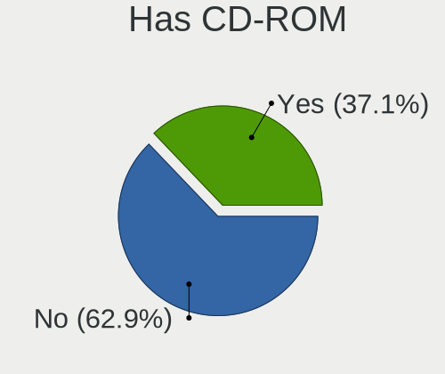
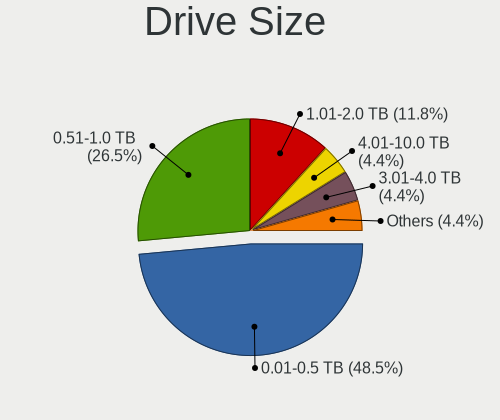
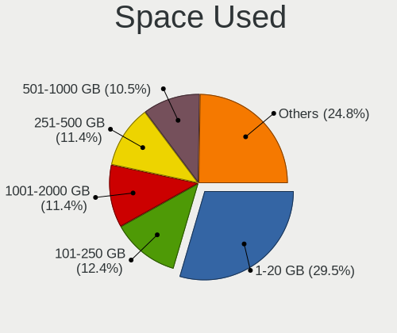
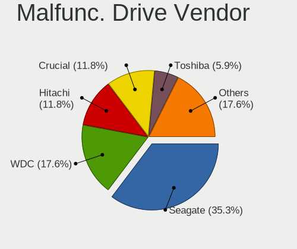
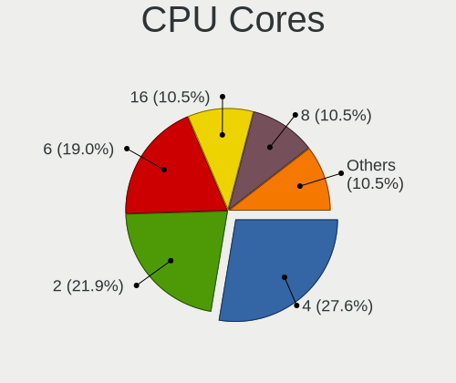
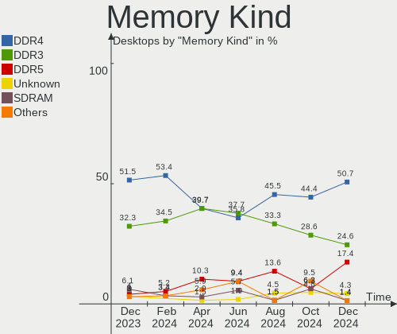

Linux in France - Hardware Trends (Desktops)
--------------------------------------------

A project to identify most popular hardware characteristics and track their change
over time based on data collected by Linux users at https://Linux-Hardware.org.

Anyone can contribute to this report by the [hw-probe](https://github.com/linuxhw/hw-probe) tool:

    sudo -E hw-probe -all -upload

Period: May, 2023.

Contents
--------

* [ System ](#system)
  - [ OS                       ](#os)
  - [ OS Family                ](#os-family)
  - [ Kernel                   ](#kernel)
  - [ Kernel Family            ](#kernel-family)
  - [ Kernel Major Ver.        ](#kernel-major-ver)
  - [ Arch                     ](#arch)
  - [ DE                       ](#de)
  - [ Display Server           ](#display-server)
  - [ Display Manager          ](#display-manager)
  - [ OS Lang                  ](#os-lang)
  - [ Boot Mode                ](#boot-mode)
  - [ Filesystem               ](#filesystem)
  - [ Part. scheme             ](#part-scheme)
  - [ Dual Boot with Linux/BSD ](#dual-boot-with-linuxbsd)
  - [ Dual Boot (Win)          ](#dual-boot-win)

* [ Board ](#board)
  - [ Vendor                   ](#vendor)
  - [ Model                    ](#model)
  - [ Model Family             ](#model-family)
  - [ MFG Year                 ](#mfg-year)
  - [ Form Factor              ](#form-factor)
  - [ Secure Boot              ](#secure-boot)
  - [ Coreboot                 ](#coreboot)
  - [ RAM Size                 ](#ram-size)
  - [ RAM Used                 ](#ram-used)
  - [ Total Drives             ](#total-drives)
  - [ Has CD-ROM               ](#has-cd-rom)
  - [ Has Ethernet             ](#has-ethernet)
  - [ Has WiFi                 ](#has-wifi)
  - [ Has Bluetooth            ](#has-bluetooth)

* [ Location ](#location)
  - [ Country                  ](#country)
  - [ City                     ](#city)

* [ Drives ](#drives)
  - [ Drive Vendor             ](#drive-vendor)
  - [ Drive Model              ](#drive-model)
  - [ HDD Vendor               ](#hdd-vendor)
  - [ SSD Vendor               ](#ssd-vendor)
  - [ Drive Kind               ](#drive-kind)
  - [ Drive Connector          ](#drive-connector)
  - [ Drive Size               ](#drive-size)
  - [ Space Total              ](#space-total)
  - [ Space Used               ](#space-used)
  - [ Malfunc. Drives          ](#malfunc-drives)
  - [ Malfunc. Drive Vendor    ](#malfunc-drive-vendor)
  - [ Malfunc. HDD Vendor      ](#malfunc-hdd-vendor)
  - [ Malfunc. Drive Kind      ](#malfunc-drive-kind)
  - [ Failed Drives            ](#failed-drives)
  - [ Failed Drive Vendor      ](#failed-drive-vendor)
  - [ Drive Status             ](#drive-status)

* [ Storage controller ](#storage-controller)
  - [ Storage Vendor           ](#storage-vendor)
  - [ Storage Model            ](#storage-model)
  - [ Storage Kind             ](#storage-kind)

* [ Processor ](#processor)
  - [ CPU Vendor               ](#cpu-vendor)
  - [ CPU Model                ](#cpu-model)
  - [ CPU Model Family         ](#cpu-model-family)
  - [ CPU Cores                ](#cpu-cores)
  - [ CPU Sockets              ](#cpu-sockets)
  - [ CPU Threads              ](#cpu-threads)
  - [ CPU Op-Modes             ](#cpu-op-modes)
  - [ CPU Microcode            ](#cpu-microcode)
  - [ CPU Microarch            ](#cpu-microarch)

* [ Graphics ](#graphics)
  - [ GPU Vendor               ](#gpu-vendor)
  - [ GPU Model                ](#gpu-model)
  - [ GPU Combo                ](#gpu-combo)
  - [ GPU Driver               ](#gpu-driver)
  - [ GPU Memory               ](#gpu-memory)

* [ Monitor ](#monitor)
  - [ Monitor Vendor           ](#monitor-vendor)
  - [ Monitor Model            ](#monitor-model)
  - [ Monitor Resolution       ](#monitor-resolution)
  - [ Monitor Diagonal         ](#monitor-diagonal)
  - [ Monitor Width            ](#monitor-width)
  - [ Aspect Ratio             ](#aspect-ratio)
  - [ Monitor Area             ](#monitor-area)
  - [ Pixel Density            ](#pixel-density)
  - [ Multiple Monitors        ](#multiple-monitors)

* [ Network ](#network)
  - [ Net Controller Vendor    ](#net-controller-vendor)
  - [ Net Controller Model     ](#net-controller-model)
  - [ Wireless Vendor          ](#wireless-vendor)
  - [ Wireless Model           ](#wireless-model)
  - [ Ethernet Vendor          ](#ethernet-vendor)
  - [ Ethernet Model           ](#ethernet-model)
  - [ Net Controller Kind      ](#net-controller-kind)
  - [ Used Controller          ](#used-controller)
  - [ NICs                     ](#nics)
  - [ IPv6                     ](#ipv6)

* [ Bluetooth ](#bluetooth)
  - [ Bluetooth Vendor         ](#bluetooth-vendor)
  - [ Bluetooth Model          ](#bluetooth-model)

* [ Sound ](#sound)
  - [ Sound Vendor             ](#sound-vendor)
  - [ Sound Model              ](#sound-model)

* [ Memory ](#memory)
  - [ Memory Vendor            ](#memory-vendor)
  - [ Memory Model             ](#memory-model)
  - [ Memory Kind              ](#memory-kind)
  - [ Memory Form Factor       ](#memory-form-factor)
  - [ Memory Size              ](#memory-size)
  - [ Memory Speed             ](#memory-speed)

* [ Printers & scanners ](#printers--scanners)
  - [ Printer Vendor           ](#printer-vendor)
  - [ Printer Model            ](#printer-model)
  - [ Scanner Vendor           ](#scanner-vendor)
  - [ Scanner Model            ](#scanner-model)

* [ Camera ](#camera)
  - [ Camera Vendor            ](#camera-vendor)
  - [ Camera Model             ](#camera-model)

* [ Security ](#security)
  - [ Fingerprint Vendor       ](#fingerprint-vendor)
  - [ Fingerprint Model        ](#fingerprint-model)
  - [ Chipcard Vendor          ](#chipcard-vendor)
  - [ Chipcard Model           ](#chipcard-model)

* [ Unsupported ](#unsupported)
  - [ Unsupported Devices      ](#unsupported-devices)
  - [ Unsupported Device Types ](#unsupported-device-types)

System
------

OS
--

Installed operating systems

| Name                         | Desktops | Percent |
|------------------------------|----------|---------|
| Ubuntu 22.04                 | 17       | 15.89%  |
| Debian 11                    | 14       | 13.08%  |
| Linux Mint 21.1              | 12       | 11.21%  |
| OpenMandriva 23.03           | 9        | 8.41%   |
| Fedora 38                    | 5        | 4.67%   |
| Ubuntu 23.04                 | 4        | 3.74%   |
| Ubuntu 20.04                 | 4        | 3.74%   |
| Zorin 16                     | 3        | 2.8%    |
| Xubuntu 22.04                | 3        | 2.8%    |
| BlackPanther 18.1            | 3        | 2.8%    |
| ArcoLinux Rolling            | 3        | 2.8%    |
| Pop!_OS 22.04                | 2        | 1.87%   |
| OpenMandriva 4.2             | 2        | 1.87%   |
| Linux Mint 20.3              | 2        | 1.87%   |
| Arch Rolling                 | 2        | 1.87%   |
| Xubuntu 20.04                | 1        | 0.93%   |
| Ubuntu Unity 16.04           | 1        | 0.93%   |
| Ubuntu MATE 22.04            | 1        | 0.93%   |
| Ubuntu MATE 20.04            | 1        | 0.93%   |
| Ubuntu Core 22               | 1        | 0.93%   |
| openSUSE Tumbleweed-XXXXXXXX | 1        | 0.93%   |
| openSUSE Leap-15.3           | 1        | 0.93%   |
| OpenMandriva 4.50            | 1        | 0.93%   |
| OpenMandriva 4.3             | 1        | 0.93%   |
| OpenMandriva 23.90           | 1        | 0.93%   |
| OpenMandriva 22.90           | 1        | 0.93%   |
| Nobara 37                    | 1        | 0.93%   |
| NixOS 23.05                  | 1        | 0.93%   |
| Manjaro 22.1.3               | 1        | 0.93%   |
| Manjaro 22.1.1               | 1        | 0.93%   |
| Manjaro                      | 1        | 0.93%   |
| Lubuntu 20.04                | 1        | 0.93%   |
| LMDE 5                       | 1        | 0.93%   |
| Linux Mint 20.2              | 1        | 0.93%   |
| KDE neon 22.04               | 1        | 0.93%   |
| Kali 2023.2                  | 1        | 0.93%   |
| EndeavourOS Rolling          | 1        | 0.93%   |

OS Family
---------

OS without a version

| Name         | Desktops | Percent |
|--------------|----------|---------|
| Ubuntu       | 26       | 24.3%   |
| OpenMandriva | 15       | 14.02%  |
| Linux Mint   | 15       | 14.02%  |
| Debian       | 14       | 13.08%  |
| Fedora       | 5        | 4.67%   |
| Xubuntu      | 4        | 3.74%   |
| Zorin        | 3        | 2.8%    |
| Manjaro      | 3        | 2.8%    |
| BlackPanther | 3        | 2.8%    |
| ArcoLinux    | 3        | 2.8%    |
| Ubuntu MATE  | 2        | 1.87%   |
| Pop!_OS      | 2        | 1.87%   |
| openSUSE     | 2        | 1.87%   |
| Arch         | 2        | 1.87%   |
| Ubuntu Unity | 1        | 0.93%   |
| Nobara       | 1        | 0.93%   |
| NixOS        | 1        | 0.93%   |
| Lubuntu      | 1        | 0.93%   |
| LMDE         | 1        | 0.93%   |
| KDE neon     | 1        | 0.93%   |
| Kali         | 1        | 0.93%   |
| EndeavourOS  | 1        | 0.93%   |

Kernel
------

Version of the Linux kernel

| Version                      | Desktops | Percent |
|------------------------------|----------|---------|
| 5.19.0-41-generic            | 14       | 13.08%  |
| 5.15.0-71-generic            | 10       | 9.35%   |
| 6.2.6-desktop-1omv2390       | 9        | 8.41%   |
| 5.15.0-72-generic            | 8        | 7.48%   |
| 5.10.0-23-amd64              | 5        | 4.67%   |
| 5.4.0-148-generic            | 4        | 3.74%   |
| 5.19.0-42-generic            | 4        | 3.74%   |
| 6.2.15-300.fc38.x86_64       | 3        | 2.8%    |
| 6.2.0-20-generic             | 3        | 2.8%    |
| 5.15.107-1-pve               | 3        | 2.8%    |
| 4.18.16-desktop-1bP          | 3        | 2.8%    |
| 6.3.2-arch1-1                | 2        | 1.87%   |
| 6.2.6-76060206-generic       | 2        | 1.87%   |
| 6.1.29-1-MANJARO             | 2        | 1.87%   |
| 5.19.0-32-generic            | 2        | 1.87%   |
| 5.10.14-desktop-1omv4002     | 2        | 1.87%   |
| 5.10.0-22-amd64              | 2        | 1.87%   |
| 6.3.4-arch1-1                | 1        | 0.93%   |
| 6.3.2-zen1-1-zen             | 1        | 0.93%   |
| 6.3.2-060302-generic         | 1        | 0.93%   |
| 6.3.1-1-default              | 1        | 0.93%   |
| 6.3.0-desktop-2omv2390       | 1        | 0.93%   |
| 6.3.0-1-MANJARO              | 1        | 0.93%   |
| 6.2.14-300.fsync.fc37.x86_64 | 1        | 0.93%   |
| 6.2.13-300.fc38.x86_64       | 1        | 0.93%   |
| 6.2.13-060213-generic        | 1        | 0.93%   |
| 6.2.11-arch1-1               | 1        | 0.93%   |
| 6.2.11-300.fc38.x86_64       | 1        | 0.93%   |
| 6.1.30-1-lts                 | 1        | 0.93%   |
| 6.1.27                       | 1        | 0.93%   |
| 6.1.0-kali9-amd64            | 1        | 0.93%   |
| 6.1.0-0.deb11.7-amd64        | 1        | 0.93%   |
| 6.0.8-desktop-2omv22090      | 1        | 0.93%   |
| 5.4.0-149-generic            | 1        | 0.93%   |
| 5.4.0-146-generic            | 1        | 0.93%   |
| 5.4.0-135-generic            | 1        | 0.93%   |
| 5.3.18-150300.59.49-default  | 1        | 0.93%   |
| 5.19.12-desktop-2omv4090     | 1        | 0.93%   |
| 5.19.0-38-generic            | 1        | 0.93%   |
| 5.16.13-desktop-1omv4003     | 1        | 0.93%   |

Kernel Family
-------------

Linux kernel without a distro release

| Version  | Desktops | Percent |
|----------|----------|---------|
| 5.19.0   | 21       | 19.63%  |
| 5.15.0   | 19       | 17.76%  |
| 6.2.6    | 11       | 10.28%  |
| 5.10.0   | 9        | 8.41%   |
| 5.4.0    | 7        | 6.54%   |
| 6.3.2    | 4        | 3.74%   |
| 5.15.107 | 4        | 3.74%   |
| 6.2.15   | 3        | 2.8%    |
| 6.2.0    | 3        | 2.8%    |
| 4.18.16  | 3        | 2.8%    |
| 6.3.0    | 2        | 1.87%   |
| 6.2.13   | 2        | 1.87%   |
| 6.2.11   | 2        | 1.87%   |
| 6.1.29   | 2        | 1.87%   |
| 6.1.0    | 2        | 1.87%   |
| 5.10.14  | 2        | 1.87%   |
| 6.3.4    | 1        | 0.93%   |
| 6.3.1    | 1        | 0.93%   |
| 6.2.14   | 1        | 0.93%   |
| 6.1.30   | 1        | 0.93%   |
| 6.1.27   | 1        | 0.93%   |
| 6.0.8    | 1        | 0.93%   |
| 5.3.18   | 1        | 0.93%   |
| 5.19.12  | 1        | 0.93%   |
| 5.16.13  | 1        | 0.93%   |
| 5.15.102 | 1        | 0.93%   |
| 4.4.0    | 1        | 0.93%   |

Kernel Major Ver.
-----------------

Linux kernel major version

| Version | Desktops | Percent |
|---------|----------|---------|
| 5.15    | 24       | 22.43%  |
| 6.2     | 22       | 20.56%  |
| 5.19    | 22       | 20.56%  |
| 5.10    | 11       | 10.28%  |
| 6.3     | 8        | 7.48%   |
| 5.4     | 7        | 6.54%   |
| 6.1     | 6        | 5.61%   |
| 4.18    | 3        | 2.8%    |
| 6.0     | 1        | 0.93%   |
| 5.3     | 1        | 0.93%   |
| 5.16    | 1        | 0.93%   |
| 4.4     | 1        | 0.93%   |

Arch
----

OS architecture (x86_64, i586, etc.)

| Name   | Desktops | Percent |
|--------|----------|---------|
| x86_64 | 106      | 99.07%  |
| i686   | 1        | 0.93%   |

DE
--

Desktop Environment

| Name       | Desktops | Percent |
|------------|----------|---------|
| GNOME      | 36       | 33.64%  |
| KDE5       | 24       | 22.43%  |
| X-Cinnamon | 15       | 14.02%  |
| XFCE       | 11       | 10.28%  |
| Unknown    | 9        | 8.41%   |
| LXQt       | 3        | 2.8%    |
| Cinnamon   | 3        | 2.8%    |
| MATE       | 2        | 1.87%   |
| LXDE       | 2        | 1.87%   |
| Unity      | 1        | 0.93%   |
| INPT       | 1        | 0.93%   |

Display Server
--------------

X11 or Wayland

| Name    | Desktops | Percent |
|---------|----------|---------|
| X11     | 79       | 73.83%  |
| Wayland | 16       | 14.95%  |
| Tty     | 10       | 9.35%   |
| Unknown | 2        | 1.87%   |

Display Manager
---------------

SDDM, LightDM, etc.

| Name    | Desktops | Percent |
|---------|----------|---------|
| SDDM    | 26       | 24.3%   |
| Unknown | 25       | 23.36%  |
| LightDM | 24       | 22.43%  |
| GDM3    | 23       | 21.5%   |
| GDM     | 8        | 7.48%   |
| LXDM    | 1        | 0.93%   |

OS Lang
-------

Language

| Lang    | Desktops | Percent |
|---------|----------|---------|
| fr_FR   | 82       | 76.64%  |
| en_US   | 14       | 13.08%  |
| Unknown | 5        | 4.67%   |
| en_GB   | 3        | 2.8%    |
| C       | 2        | 1.87%   |
| en_DK   | 1        | 0.93%   |

Boot Mode
---------

EFI or BIOS

| Mode | Desktops | Percent |
|------|----------|---------|
| EFI  | 54       | 50.47%  |
| BIOS | 53       | 49.53%  |

Filesystem
----------

Type of filesystem

| Type    | Desktops | Percent |
|---------|----------|---------|
| Ext4    | 77       | 71.96%  |
| Overlay | 13       | 12.15%  |
| Btrfs   | 9        | 8.41%   |
| Tmpfs   | 7        | 6.54%   |
| Zfs     | 1        | 0.93%   |

Part. scheme
------------

Scheme of partitioning

| Type    | Desktops | Percent |
|---------|----------|---------|
| GPT     | 61       | 57.01%  |
| MBR     | 29       | 27.1%   |
| Unknown | 17       | 15.89%  |

Dual Boot with Linux/BSD
------------------------

Hosting more than one Linux/BSD

| Dual boot | Desktops | Percent |
|-----------|----------|---------|
| No        | 79       | 73.83%  |
| Yes       | 28       | 26.17%  |

Dual Boot (Win)
---------------

Hosting Linux and Windows

| Dual boot | Desktops | Percent |
|-----------|----------|---------|
| No        | 70       | 65.42%  |
| Yes       | 37       | 34.58%  |

Board
-----

Vendor
------

Motherboard manufacturer

| Name                | Desktops | Percent |
|---------------------|----------|---------|
| ASUSTek Computer    | 26       | 24.3%   |
| Gigabyte Technology | 17       | 15.89%  |
| MSI                 | 15       | 14.02%  |
| Dell                | 10       | 9.35%   |
| ASRock              | 10       | 9.35%   |
| Hewlett-Packard     | 9        | 8.41%   |
| Lenovo              | 4        | 3.74%   |
| Acer                | 3        | 2.8%    |
| Pegatron            | 2        | 1.87%   |
| Intel               | 2        | 1.87%   |
| Foxconn             | 2        | 1.87%   |
| Shuttle             | 1        | 0.93%   |
| Packard Bell        | 1        | 0.93%   |
| Gateway             | 1        | 0.93%   |
| Fujitsu             | 1        | 0.93%   |
| Cincoze             | 1        | 0.93%   |
| ASRockRack          | 1        | 0.93%   |
| Unknown             | 1        | 0.93%   |

Model
-----

Motherboard model

| Name                                     | Desktops | Percent |
|------------------------------------------|----------|---------|
| MSI MS-7C95                              | 2        | 1.87%   |
| MSI MS-7816                              | 2        | 1.87%   |
| HP Z420 Workstation                      | 2        | 1.87%   |
| Foxconn Pro 3500 Series                  | 2        | 1.87%   |
| Dell OptiPlex 9020                       | 2        | 1.87%   |
| Shuttle SZ77                             | 1        | 0.93%   |
| Pegatron KT600AA-ABF a6443.fr            | 1        | 0.93%   |
| Pegatron FZ132AA-ABF m9456fr             | 1        | 0.93%   |
| Packard Bell IMEDIA J9640                | 1        | 0.93%   |
| MSI MS-7D99                              | 1        | 0.93%   |
| MSI MS-7D25                              | 1        | 0.93%   |
| MSI MS-7C52                              | 1        | 0.93%   |
| MSI MS-7C51                              | 1        | 0.93%   |
| MSI MS-7A16                              | 1        | 0.93%   |
| MSI MS-7924                              | 1        | 0.93%   |
| MSI MS-7885                              | 1        | 0.93%   |
| MSI MS-7823                              | 1        | 0.93%   |
| MSI MS-7817                              | 1        | 0.93%   |
| MSI MS-7758                              | 1        | 0.93%   |
| MSI MS-7635                              | 1        | 0.93%   |
| Lenovo ThinkCentre M93p 10A7003AUK       | 1        | 0.93%   |
| Lenovo ThinkCentre M92p 2988B1G          | 1        | 0.93%   |
| Lenovo ThinkCentre M75s Gen 2 11JAS1J200 | 1        | 0.93%   |
| Lenovo Legion T5 26IAB7 90SV00ACFR       | 1        | 0.93%   |
| Intel WADE-8076-ST-WMS                   | 1        | 0.93%   |
| Intel DG41RQ AAE54511-203                | 1        | 0.93%   |
| HP Z600 Workstation                      | 1        | 0.93%   |
| HP Z220 SFF Workstation                  | 1        | 0.93%   |
| HP Pavilion Desktop 590-a0xxx            | 1        | 0.93%   |
| HP Compaq Elite 8300 SFF                 | 1        | 0.93%   |
| HP Compaq dc7900 Small Form Factor       | 1        | 0.93%   |
| HP Compaq 8200 Elite USDT PC             | 1        | 0.93%   |
| HP 110-226ef                             | 1        | 0.93%   |
| Gigabyte Z77X-D3H                        | 1        | 0.93%   |
| Gigabyte Z490I AORUS ULTRA               | 1        | 0.93%   |
| Gigabyte X670E AORUS MASTER              | 1        | 0.93%   |
| Gigabyte X570S AORUS PRO AX              | 1        | 0.93%   |
| Gigabyte P55A-UD3                        | 1        | 0.93%   |
| Gigabyte H55M-USB3                       | 1        | 0.93%   |
| Gigabyte H410M H                         | 1        | 0.93%   |

Model Family
------------

Motherboard model prefix

| Name                   | Desktops | Percent |
|------------------------|----------|---------|
| Dell OptiPlex          | 5        | 4.67%   |
| ASUS TUF               | 5        | 4.67%   |
| ASUS PRIME             | 5        | 4.67%   |
| Dell Precision         | 4        | 3.74%   |
| Lenovo ThinkCentre     | 3        | 2.8%    |
| HP Compaq              | 3        | 2.8%    |
| Gigabyte B550          | 3        | 2.8%    |
| ASUS ROG               | 3        | 2.8%    |
| MSI MS-7C95            | 2        | 1.87%   |
| MSI MS-7816            | 2        | 1.87%   |
| HP Z420                | 2        | 1.87%   |
| Gigabyte B450M         | 2        | 1.87%   |
| Foxconn Pro            | 2        | 1.87%   |
| ASUS P8Z77-V           | 2        | 1.87%   |
| ASRock X570            | 2        | 1.87%   |
| Acer Aspire            | 2        | 1.87%   |
| Shuttle SZ77           | 1        | 0.93%   |
| Pegatron KT600AA-ABF   | 1        | 0.93%   |
| Pegatron FZ132AA-ABF   | 1        | 0.93%   |
| Packard Bell IMEDIA    | 1        | 0.93%   |
| MSI MS-7D99            | 1        | 0.93%   |
| MSI MS-7D25            | 1        | 0.93%   |
| MSI MS-7C52            | 1        | 0.93%   |
| MSI MS-7C51            | 1        | 0.93%   |
| MSI MS-7A16            | 1        | 0.93%   |
| MSI MS-7924            | 1        | 0.93%   |
| MSI MS-7885            | 1        | 0.93%   |
| MSI MS-7823            | 1        | 0.93%   |
| MSI MS-7817            | 1        | 0.93%   |
| MSI MS-7758            | 1        | 0.93%   |
| MSI MS-7635            | 1        | 0.93%   |
| Lenovo Legion          | 1        | 0.93%   |
| Intel WADE-8076-ST-WMS | 1        | 0.93%   |
| Intel DG41RQ           | 1        | 0.93%   |
| HP Z600                | 1        | 0.93%   |
| HP Z220                | 1        | 0.93%   |
| HP Pavilion            | 1        | 0.93%   |
| HP 110-226ef           | 1        | 0.93%   |
| Gigabyte Z77X-D3H      | 1        | 0.93%   |
| Gigabyte Z490I         | 1        | 0.93%   |

MFG Year
--------

Motherboard manufacture year

| Year | Desktops | Percent |
|------|----------|---------|
| 2012 | 14       | 13.08%  |
| 2020 | 12       | 11.21%  |
| 2018 | 9        | 8.41%   |
| 2014 | 8        | 7.48%   |
| 2019 | 7        | 6.54%   |
| 2013 | 7        | 6.54%   |
| 2011 | 7        | 6.54%   |
| 2022 | 6        | 5.61%   |
| 2008 | 6        | 5.61%   |
| 2021 | 5        | 4.67%   |
| 2010 | 5        | 4.67%   |
| 2009 | 5        | 4.67%   |
| 2015 | 4        | 3.74%   |
| 2007 | 4        | 3.74%   |
| 2017 | 3        | 2.8%    |
| 2006 | 2        | 1.87%   |
| 2023 | 1        | 0.93%   |
| 2016 | 1        | 0.93%   |
| 2003 | 1        | 0.93%   |

Form Factor
-----------

Physical design of the computer

| Name    | Desktops | Percent |
|---------|----------|---------|
| Desktop | 107      | 100%    |

Secure Boot
-----------

Enabled or disabled

| State    | Desktops | Percent |
|----------|----------|---------|
| Disabled | 103      | 96.26%  |
| Enabled  | 4        | 3.74%   |

Coreboot
--------

Have coreboot on board

| Used | Desktops | Percent |
|------|----------|---------|
| No   | 107      | 100%    |

RAM Size
--------

Total RAM memory

| Size in GB  | Desktops | Percent |
|-------------|----------|---------|
| 32.01-64.0  | 25       | 23.36%  |
| 16.01-24.0  | 23       | 21.5%   |
| 4.01-8.0    | 15       | 14.02%  |
| 3.01-4.0    | 15       | 14.02%  |
| 8.01-16.0   | 13       | 12.15%  |
| 24.01-32.0  | 5        | 4.67%   |
| 64.01-256.0 | 4        | 3.74%   |
| 1.01-2.0    | 3        | 2.8%    |
| 2.01-3.0    | 2        | 1.87%   |
| 0.51-1.0    | 2        | 1.87%   |

RAM Used
--------

Used RAM memory

| Used GB    | Desktops | Percent |
|------------|----------|---------|
| 1.01-2.0   | 28       | 26.17%  |
| 2.01-3.0   | 25       | 23.36%  |
| 4.01-8.0   | 18       | 16.82%  |
| 3.01-4.0   | 13       | 12.15%  |
| 0.01-0.5   | 7        | 6.54%   |
| 16.01-24.0 | 5        | 4.67%   |
| 8.01-16.0  | 5        | 4.67%   |
| 0.51-1.0   | 5        | 4.67%   |
| 24.01-32.0 | 1        | 0.93%   |

Total Drives
------------

Number of drives on board

| Drives | Desktops | Percent |
|--------|----------|---------|
| 1      | 45       | 42.06%  |
| 2      | 25       | 23.36%  |
| 3      | 15       | 14.02%  |
| 4      | 9        | 8.41%   |
| 6      | 4        | 3.74%   |
| 5      | 3        | 2.8%    |
| 9      | 2        | 1.87%   |
| 7      | 2        | 1.87%   |
| 0      | 2        | 1.87%   |

Has CD-ROM
----------

Has CD-ROM on board

| Presented | Desktops | Percent |
|-----------|----------|---------|
| Yes       | 58       | 54.21%  |
| No        | 49       | 45.79%  |

Has Ethernet
------------

Has Ethernet on board

| Presented | Desktops | Percent |
|-----------|----------|---------|
| Yes       | 107      | 100%    |

Has WiFi
--------

Has WiFi module

| Presented | Desktops | Percent |
|-----------|----------|---------|
| No        | 65       | 60.75%  |
| Yes       | 42       | 39.25%  |

Has Bluetooth
-------------

Has Bluetooth module

| Presented | Desktops | Percent |
|-----------|----------|---------|
| No        | 73       | 68.22%  |
| Yes       | 34       | 31.78%  |

Location
--------

Country
-------

Geographic location (country)

| Country | Desktops | Percent |
|---------|----------|---------|
| France  | 107      | 100%    |

City
----

Geographic location (city)

| City                       | Desktops | Percent |
|----------------------------|----------|---------|
| Paris                      | 4        | 3.74%   |
| Lherm                      | 4        | 3.74%   |
| Nancy                      | 3        | 2.8%    |
| Versailles                 | 2        | 1.87%   |
| Vannes                     | 2        | 1.87%   |
| Nantes                     | 2        | 1.87%   |
| Montpellier                | 2        | 1.87%   |
| Marseille                  | 2        | 1.87%   |
| Lyon                       | 2        | 1.87%   |
| Évry                      | 2        | 1.87%   |
| Caen                       | 2        | 1.87%   |
| Bordeaux                   | 2        | 1.87%   |
| Bezancourt                 | 2        | 1.87%   |
| Vitry-le-François         | 1        | 0.93%   |
| Villefranche-sur-Saône    | 1        | 0.93%   |
| Vigneux-sur-Seine          | 1        | 0.93%   |
| Toulouse                   | 1        | 0.93%   |
| Tiranges                   | 1        | 0.93%   |
| Teuillac                   | 1        | 0.93%   |
| Strasbourg                 | 1        | 0.93%   |
| Servon                     | 1        | 0.93%   |
| Seclin                     | 1        | 0.93%   |
| Sainte-Geneviève-des-Bois | 1        | 0.93%   |
| Saint-Nazaire              | 1        | 0.93%   |
| Saint-Laurent-de-Cognac    | 1        | 0.93%   |
| Saint-Julien-en-Genevois   | 1        | 0.93%   |
| Saint-Genis-Pouilly        | 1        | 0.93%   |
| Saint-Etienne              | 1        | 0.93%   |
| Saint-Denis                | 1        | 0.93%   |
| Saint-Brieuc               | 1        | 0.93%   |
| Saint-Brice-sous-Foret     | 1        | 0.93%   |
| Saint-Apollinaire          | 1        | 0.93%   |
| Roubaix                    | 1        | 0.93%   |
| Rodez                      | 1        | 0.93%   |
| Rennes                     | 1        | 0.93%   |
| Rebais                     | 1        | 0.93%   |
| Realmont                   | 1        | 0.93%   |
| Poitiers                   | 1        | 0.93%   |
| Plougastel-Daoulas         | 1        | 0.93%   |
| Plaisir                    | 1        | 0.93%   |

Drives
------

Drive Vendor
------------

Hard drive vendors

| Vendor                       | Desktops | Drives | Percent |
|------------------------------|----------|--------|---------|
| Seagate                      | 39       | 48     | 19.6%   |
| WDC                          | 36       | 47     | 18.09%  |
| Samsung Electronics          | 35       | 43     | 17.59%  |
| Crucial                      | 14       | 15     | 7.04%   |
| Toshiba                      | 10       | 11     | 5.03%   |
| Kingston                     | 10       | 10     | 5.03%   |
| SanDisk                      | 8        | 11     | 4.02%   |
| Hitachi                      | 6        | 7      | 3.02%   |
| Transcend                    | 5        | 5      | 2.51%   |
| SPCC                         | 3        | 3      | 1.51%   |
| PNY                          | 3        | 3      | 1.51%   |
| Micron/Crucial Technology    | 3        | 4      | 1.51%   |
| HGST                         | 3        | 6      | 1.51%   |
| Gigabyte Technology          | 3        | 3      | 1.51%   |
| Unknown                      | 2        | 5      | 1.01%   |
| Intel                        | 2        | 3      | 1.01%   |
| XPG                          | 1        | 1      | 0.5%    |
| WALRAM                       | 1        | 1      | 0.5%    |
| TCSUNBOW                     | 1        | 1      | 0.5%    |
| Space ke                     | 1        | 1      | 0.5%    |
| Silicon Motion               | 1        | 1      | 0.5%    |
| Shenzhen Longsys Electronics | 1        | 1      | 0.5%    |
| Realtek Semiconductor        | 1        | 1      | 0.5%    |
| Phison Electronics           | 1        | 1      | 0.5%    |
| LITEONIT                     | 1        | 1      | 0.5%    |
| LDLC                         | 1        | 1      | 0.5%    |
| KIOXIA                       | 1        | 1      | 0.5%    |
| Kingston Technology Company  | 1        | 1      | 0.5%    |
| Inateck                      | 1        | 1      | 0.5%    |
| Fanxiang                     | 1        | 1      | 0.5%    |
| Corsair                      | 1        | 1      | 0.5%    |
| China                        | 1        | 1      | 0.5%    |
| 2.5"                         | 1        | 1      | 0.5%    |

Drive Model
-----------

Hard drive models

| Model                                               | Desktops | Percent |
|-----------------------------------------------------|----------|---------|
| Seagate ST2000DM008-2FR102 2TB                      | 4        | 1.75%   |
| Samsung NVMe SSD Controller SM981/PM981/PM983 256GB | 4        | 1.75%   |
| Crucial CT240BX500SSD1 240GB                        | 4        | 1.75%   |
| Seagate ST1000DM010-2EP102 1TB                      | 3        | 1.31%   |
| Samsung SSD 980 1TB                                 | 3        | 1.31%   |
| Samsung SSD 860 EVO 500GB                           | 3        | 1.31%   |
| HGST HUS726T4TALA6L4 4TB                            | 3        | 1.31%   |
| WDC WDS100T2B0A-00SM50 1TB SSD                      | 2        | 0.87%   |
| WDC WD5000AAKX-603CA0 500GB                         | 2        | 0.87%   |
| WDC WD5000AAKX-22ERMA0 500GB                        | 2        | 0.87%   |
| WDC WD5000AAKS-00V1A0 500GB                         | 2        | 0.87%   |
| WDC WD30EFRX-68EUZN0 3TB                            | 2        | 0.87%   |
| WDC WD20EZRX-00D8PB0 2TB                            | 2        | 0.87%   |
| WDC WD10EZEX-60M2NA0 1TB                            | 2        | 0.87%   |
| WDC WD10EZEX-08M2NA0 1TB                            | 2        | 0.87%   |
| Unknown SD/MMC 2GB                                  | 2        | 0.87%   |
| Unknown M.S./M.S.Pro/HG 16GB                        | 2        | 0.87%   |
| Transcend TS480GSSD220S 480GB                       | 2        | 0.87%   |
| Toshiba MQ01ABD100 1TB                              | 2        | 0.87%   |
| Toshiba HDWQ140 4TB                                 | 2        | 0.87%   |
| SPCC Solid State Disk 128GB                         | 2        | 0.87%   |
| Seagate ST4000NM000A-2HZ100 4TB                     | 2        | 0.87%   |
| Seagate ST4000DM004-2CV104 4TB                      | 2        | 0.87%   |
| Seagate ST3500413AS 500GB                           | 2        | 0.87%   |
| Seagate ST3250310AS 250GB                           | 2        | 0.87%   |
| Seagate ST3160815AS 160GB                           | 2        | 0.87%   |
| Seagate ST250DM000-1BD141 250GB                     | 2        | 0.87%   |
| Seagate ST1000DM003-1ER162 1TB                      | 2        | 0.87%   |
| Seagate ST1000DM003-1CH162 1TB                      | 2        | 0.87%   |
| Sandisk WD Blue SN550 NVMe SSD 512GB                | 2        | 0.87%   |
| Samsung SSD 860 EVO 250GB                           | 2        | 0.87%   |
| Samsung SSD 840 Series 120GB                        | 2        | 0.87%   |
| Micron/Crucial CT1000P5PSSD8 1TB                    | 2        | 0.87%   |
| Kingston SV300S37A120G 120GB SSD                    | 2        | 0.87%   |
| Kingston SA400S37120G 120GB SSD                     | 2        | 0.87%   |
| Hitachi HDP725050GLA360 500GB                       | 2        | 0.87%   |
| Gigabyte GP-GSTFS31120GNTD 120GB SSD                | 2        | 0.87%   |
| Crucial CT1000BX500SSD1 1TB                         | 2        | 0.87%   |
| XPG GAMMIX S70 BLADE 2TB                            | 1        | 0.44%   |
| WDC WDS500G2B0B-00YS70 500GB SSD                    | 1        | 0.44%   |

HDD Vendor
----------

Hard disk drive vendors

| Vendor              | Desktops | Drives | Percent |
|---------------------|----------|--------|---------|
| Seagate             | 36       | 44     | 39.13%  |
| WDC                 | 31       | 42     | 33.7%   |
| Toshiba             | 9        | 10     | 9.78%   |
| Samsung Electronics | 6        | 7      | 6.52%   |
| Hitachi             | 6        | 7      | 6.52%   |
| HGST                | 3        | 6      | 3.26%   |
| Inateck             | 1        | 1      | 1.09%   |

SSD Vendor
----------

Solid state drive vendors

| Vendor              | Desktops | Drives | Percent |
|---------------------|----------|--------|---------|
| Samsung Electronics | 19       | 20     | 26.76%  |
| Crucial             | 11       | 11     | 15.49%  |
| Kingston            | 8        | 8      | 11.27%  |
| SanDisk             | 6        | 6      | 8.45%   |
| WDC                 | 5        | 5      | 7.04%   |
| Transcend           | 5        | 5      | 7.04%   |
| SPCC                | 3        | 3      | 4.23%   |
| PNY                 | 3        | 3      | 4.23%   |
| Gigabyte Technology | 3        | 3      | 4.23%   |
| Toshiba             | 1        | 1      | 1.41%   |
| TCSUNBOW            | 1        | 1      | 1.41%   |
| LITEONIT            | 1        | 1      | 1.41%   |
| LDLC                | 1        | 1      | 1.41%   |
| Intel               | 1        | 2      | 1.41%   |
| Fanxiang            | 1        | 1      | 1.41%   |
| China               | 1        | 1      | 1.41%   |
| 2.5"                | 1        | 1      | 1.41%   |

Drive Kind
----------

HDD or SSD

| Kind    | Desktops | Drives | Percent |
|---------|----------|--------|---------|
| HDD     | 68       | 117    | 42.5%   |
| SSD     | 56       | 73     | 35%     |
| NVMe    | 32       | 44     | 20%     |
| Unknown | 4        | 7      | 2.5%    |

Drive Connector
---------------

SATA, SAS, NVMe, etc.

| Type | Desktops | Drives | Percent |
|------|----------|--------|---------|
| SATA | 93       | 189    | 71.54%  |
| NVMe | 32       | 44     | 24.62%  |
| SAS  | 5        | 8      | 3.85%   |

Drive Size
----------

Size of hard drive

| Size in TB | Desktops | Drives | Percent |
|------------|----------|--------|---------|
| 0.01-0.5   | 77       | 105    | 55.8%   |
| 0.51-1.0   | 34       | 43     | 24.64%  |
| 1.01-2.0   | 13       | 15     | 9.42%   |
| 3.01-4.0   | 11       | 21     | 7.97%   |
| 2.01-3.0   | 3        | 6      | 2.17%   |

Space Total
-----------

Amount of disk space available on the file system

| Size in GB     | Desktops | Percent |
|----------------|----------|---------|
| 251-500        | 20       | 18.69%  |
| 101-250        | 20       | 18.69%  |
| 501-1000       | 16       | 14.95%  |
| Unknown        | 13       | 12.15%  |
| 1001-2000      | 12       | 11.21%  |
| More than 3000 | 9        | 8.41%   |
| 51-100         | 6        | 5.61%   |
| 2001-3000      | 5        | 4.67%   |
| 21-50          | 3        | 2.8%    |
| 1-20           | 3        | 2.8%    |

Space Used
----------

Amount of used disk space

| Used GB        | Desktops | Percent |
|----------------|----------|---------|
| 1-20           | 29       | 27.1%   |
| 21-50          | 14       | 13.08%  |
| Unknown        | 13       | 12.15%  |
| 251-500        | 10       | 9.35%   |
| 101-250        | 10       | 9.35%   |
| 51-100         | 10       | 9.35%   |
| 1001-2000      | 8        | 7.48%   |
| 501-1000       | 6        | 5.61%   |
| More than 3000 | 4        | 3.74%   |
| 2001-3000      | 3        | 2.8%    |

Malfunc. Drives
---------------

Drive models with a malfunction

| Model                                            | Desktops | Drives | Percent |
|--------------------------------------------------|----------|--------|---------|
| WDC WD5000HHTZ-04N21V0 500GB                     | 1        | 1      | 5%      |
| WDC WD5000BPVT-22A1YT0 500GB                     | 1        | 1      | 5%      |
| WDC WD5000AAKX-603CA0 500GB                      | 1        | 1      | 5%      |
| WDC WD5000AAKX-22ERMA0 500GB                     | 1        | 1      | 5%      |
| WDC WD30EFRX-68EUZN0 3TB                         | 1        | 1      | 5%      |
| WDC WD20EZRX-00D8PB0 2TB                         | 1        | 1      | 5%      |
| WDC WD10EFRX-68JCSN0 1TB                         | 1        | 1      | 5%      |
| WDC WD10EARS-00Y5B1 1TB                          | 1        | 1      | 5%      |
| Toshiba MQ01ACF032 320GB                         | 1        | 1      | 5%      |
| Seagate ST500LX012-SSHD-8GB                      | 1        | 1      | 5%      |
| Seagate ST3300822AS 304GB                        | 1        | 1      | 5%      |
| Seagate ST3250310AS 250GB                        | 1        | 1      | 5%      |
| Seagate ST320LT007-9ZV142 320GB                  | 1        | 1      | 5%      |
| Seagate ST31000528AS 1TB                         | 1        | 1      | 5%      |
| Seagate ST250DM000-1BD141 250GB                  | 1        | 1      | 5%      |
| Seagate ST2000DM001-1CH164 2TB                   | 1        | 1      | 5%      |
| Seagate ST2000DL004 HD204UI 2TB                  | 1        | 1      | 5%      |
| Samsung Electronics SSD 840 PRO Series 128GB     | 1        | 1      | 5%      |
| Samsung Electronics SP2504C 250GB                | 1        | 1      | 5%      |
| Samsung Electronics MZ7LN256HMJP-000H1 256GB SSD | 1        | 1      | 5%      |

Malfunc. Drive Vendor
---------------------

Vendors of faulty drives

| Vendor              | Desktops | Drives | Percent |
|---------------------|----------|--------|---------|
| Seagate             | 8        | 8      | 42.11%  |
| WDC                 | 7        | 8      | 36.84%  |
| Samsung Electronics | 3        | 3      | 15.79%  |
| Toshiba             | 1        | 1      | 5.26%   |

Malfunc. HDD Vendor
-------------------

Vendors of faulty HDD drives

| Vendor              | Desktops | Drives | Percent |
|---------------------|----------|--------|---------|
| Seagate             | 8        | 8      | 47.06%  |
| WDC                 | 7        | 8      | 41.18%  |
| Toshiba             | 1        | 1      | 5.88%   |
| Samsung Electronics | 1        | 1      | 5.88%   |

Malfunc. Drive Kind
-------------------

Kinds of faulty drives

| Kind | Desktops | Drives | Percent |
|------|----------|--------|---------|
| HDD  | 15       | 18     | 88.24%  |
| SSD  | 2        | 2      | 11.76%  |

Failed Drives
-------------

Failed drive models

| Model                                       | Desktops | Drives | Percent |
|---------------------------------------------|----------|--------|---------|
| Samsung Electronics SSD PM871 2.5 7mm 128GB | 1        | 1      | 50%     |
| Intel SSDSC2KW256G8 256GB                   | 1        | 1      | 50%     |

Failed Drive Vendor
-------------------

Failed drive vendors

| Vendor              | Desktops | Drives | Percent |
|---------------------|----------|--------|---------|
| Samsung Electronics | 1        | 1      | 50%     |
| Intel               | 1        | 1      | 50%     |

Drive Status
------------

Number of failed and malfunc. drives

| Status   | Desktops | Drives | Percent |
|----------|----------|--------|---------|
| Works    | 70       | 155    | 57.38%  |
| Detected | 33       | 64     | 27.05%  |
| Malfunc  | 17       | 20     | 13.93%  |
| Failed   | 2        | 2      | 1.64%   |

Storage controller
------------------

Storage Vendor
--------------

Storage controller vendors

| Vendor                           | Desktops | Percent |
|----------------------------------|----------|---------|
| Intel                            | 67       | 40.36%  |
| AMD                              | 36       | 21.69%  |
| Samsung Electronics              | 14       | 8.43%   |
| ASMedia Technology               | 10       | 6.02%   |
| Micron/Crucial Technology        | 7        | 4.22%   |
| JMicron Technology               | 6        | 3.61%   |
| Sandisk                          | 4        | 2.41%   |
| Marvell Technology Group         | 4        | 2.41%   |
| Seagate Technology               | 3        | 1.81%   |
| Kingston Technology Company      | 3        | 1.81%   |
| VIA Technologies                 | 2        | 1.2%    |
| Phison Electronics               | 2        | 1.2%    |
| Silicon Motion                   | 1        | 0.6%    |
| Silicon Integrated Systems [SiS] | 1        | 0.6%    |
| Shenzhen Longsys Electronics     | 1        | 0.6%    |
| Realtek Semiconductor            | 1        | 0.6%    |
| Nvidia                           | 1        | 0.6%    |
| KIOXIA                           | 1        | 0.6%    |
| Integrated Technology Express    | 1        | 0.6%    |
| ADATA Technology                 | 1        | 0.6%    |

Storage Model
-------------

Storage controller models

| Model                                                                          | Desktops | Percent |
|--------------------------------------------------------------------------------|----------|---------|
| AMD FCH SATA Controller [AHCI mode]                                            | 17       | 8.33%   |
| Intel 8 Series/C220 Series Chipset Family 6-port SATA Controller 1 [AHCI mode] | 9        | 4.41%   |
| ASMedia ASM1062 Serial ATA Controller                                          | 9        | 4.41%   |
| AMD 500 Series Chipset SATA Controller                                         | 8        | 3.92%   |
| Samsung NVMe SSD Controller SM981/PM981/PM983                                  | 7        | 3.43%   |
| Intel SATA Controller [RAID mode]                                              | 7        | 3.43%   |
| Intel 7 Series/C210 Series Chipset Family 6-port SATA Controller [AHCI mode]   | 7        | 3.43%   |
| AMD 400 Series Chipset SATA Controller                                         | 7        | 3.43%   |
| AMD SB7x0/SB8x0/SB9x0 IDE Controller                                           | 6        | 2.94%   |
| Intel 6 Series/C200 Series Chipset Family 6 port Desktop SATA AHCI Controller  | 5        | 2.45%   |
| Samsung NVMe SSD Controller 980                                                | 4        | 1.96%   |
| JMicron JMB363 SATA/IDE Controller                                             | 4        | 1.96%   |
| Intel NM10/ICH7 Family SATA Controller [IDE mode]                              | 4        | 1.96%   |
| Intel 82801G (ICH7 Family) IDE Controller                                      | 4        | 1.96%   |
| Intel 200 Series PCH SATA controller [AHCI mode]                               | 4        | 1.96%   |
| AMD SB7x0/SB8x0/SB9x0 SATA Controller [AHCI mode]                              | 4        | 1.96%   |
| Seagate FireCuda 530 SSD                                                       | 3        | 1.47%   |
| Micron/Crucial P5 Plus NVMe PCIe SSD                                           | 3        | 1.47%   |
| Intel Q170/Q150/B150/H170/H110/Z170/CM236 Chipset SATA Controller [AHCI Mode]  | 3        | 1.47%   |
| Intel C600/X79 series chipset IDE-r Controller                                 | 3        | 1.47%   |
| AMD SB7x0/SB8x0/SB9x0 SATA Controller [IDE mode]                               | 3        | 1.47%   |
| SanDisk WD Blue SN550 NVMe SSD                                                 | 2        | 0.98%   |
| Samsung NVMe SSD Controller PM9A1/PM9A3/980PRO                                 | 2        | 0.98%   |
| Phison E12 NVMe Controller                                                     | 2        | 0.98%   |
| Micron/Crucial P2 NVMe PCIe SSD                                                | 2        | 0.98%   |
| Micron/Crucial P1 NVMe PCIe SSD                                                | 2        | 0.98%   |
| Intel Cannon Lake PCH SATA AHCI Controller                                     | 2        | 0.98%   |
| Intel C602 chipset 4-Port SATA Storage Control Unit                            | 2        | 0.98%   |
| Intel C600/X79 series chipset SATA RAID Controller                             | 2        | 0.98%   |
| Intel Alder Lake-S PCH SATA Controller [AHCI Mode]                             | 2        | 0.98%   |
| Intel 82801JI (ICH10 Family) 4 port SATA IDE Controller #1                     | 2        | 0.98%   |
| Intel 82801JI (ICH10 Family) 2 port SATA IDE Controller #2                     | 2        | 0.98%   |
| Intel 500 Series Chipset Family SATA AHCI Controller                           | 2        | 0.98%   |
| Intel 5 Series/3400 Series Chipset 6 port SATA AHCI Controller                 | 2        | 0.98%   |
| Intel 4 Series Chipset PT IDER Controller                                      | 2        | 0.98%   |
| AMD FCH SATA Controller D                                                      | 2        | 0.98%   |
| VIA VT82C586A/B/VT82C686/A/B/VT823x/A/C PIPC Bus Master IDE                    | 1        | 0.49%   |
| VIA VT6415 PATA IDE Host Controller                                            | 1        | 0.49%   |
| VIA Serial ATA Controller                                                      | 1        | 0.49%   |
| Silicon Motion SM2263EN/SM2263XT SSD Controller                                | 1        | 0.49%   |

Storage Kind
------------

Kind of storage controller (IDE, SATA, NVMe, SAS, ...)

| Kind | Desktops | Percent |
|------|----------|---------|
| SATA | 82       | 52.9%   |
| NVMe | 32       | 20.65%  |
| IDE  | 29       | 18.71%  |
| RAID | 10       | 6.45%   |
| SAS  | 2        | 1.29%   |

Processor
---------

CPU Vendor
----------

Processor vendors

| Vendor | Desktops | Percent |
|--------|----------|---------|
| Intel  | 71       | 66.36%  |
| AMD    | 36       | 33.64%  |

CPU Model
---------

Processor models

| Model                                       | Desktops | Percent |
|---------------------------------------------|----------|---------|
| Intel Core i5-4460 CPU @ 3.20GHz            | 4        | 3.74%   |
| Intel Pentium Dual-Core CPU E5300 @ 2.60GHz | 3        | 2.8%    |
| Intel Core i5-3470 CPU @ 3.20GHz            | 3        | 2.8%    |
| AMD Ryzen 7 5800X 8-Core Processor          | 3        | 2.8%    |
| AMD Ryzen 5 5600X 6-Core Processor          | 3        | 2.8%    |
| AMD Ryzen 5 3600 6-Core Processor           | 3        | 2.8%    |
| Intel Core i7-8700K CPU @ 3.70GHz           | 2        | 1.87%   |
| Intel Core i7-8700 CPU @ 3.20GHz            | 2        | 1.87%   |
| Intel Core i3-2120 CPU @ 3.30GHz            | 2        | 1.87%   |
| Intel Core i3 CPU 530 @ 2.93GHz             | 2        | 1.87%   |
| Intel Core 2 Quad CPU Q6600 @ 2.40GHz       | 2        | 1.87%   |
| Intel Core 2 Duo CPU E4500 @ 2.20GHz        | 2        | 1.87%   |
| AMD Ryzen 9 5950X 16-Core Processor         | 2        | 1.87%   |
| AMD Ryzen 7 3700X 8-Core Processor          | 2        | 1.87%   |
| AMD Ryzen 5 PRO 4650G with Radeon Graphics  | 2        | 1.87%   |
| AMD Ryzen 5 3400G with Radeon Vega Graphics | 2        | 1.87%   |
| AMD Ryzen 5 2400G with Radeon Vega Graphics | 2        | 1.87%   |
| Intel Xeon CPU X5550 @ 2.67GHz              | 1        | 0.93%   |
| Intel Xeon CPU E5620 @ 2.40GHz              | 1        | 0.93%   |
| Intel Xeon CPU E5-2650L v2 @ 1.70GHz        | 1        | 0.93%   |
| Intel Xeon CPU E5-1620 v2 @ 3.70GHz         | 1        | 0.93%   |
| Intel Xeon CPU E5-1607 0 @ 3.00GHz          | 1        | 0.93%   |
| Intel Xeon CPU E3-1271 v3 @ 3.60GHz         | 1        | 0.93%   |
| Intel Xeon CPU E3-1225 V2 @ 3.20GHz         | 1        | 0.93%   |
| Intel Core i9-10900K CPU @ 3.70GHz          | 1        | 0.93%   |
| Intel Core i7-6800K CPU @ 3.40GHz           | 1        | 0.93%   |
| Intel Core i7-6700K CPU @ 4.00GHz           | 1        | 0.93%   |
| Intel Core i7-6700 CPU @ 3.40GHz            | 1        | 0.93%   |
| Intel Core i7-4790 CPU @ 3.60GHz            | 1        | 0.93%   |
| Intel Core i7-4770 CPU @ 3.40GHz            | 1        | 0.93%   |
| Intel Core i7-3770K CPU @ 3.50GHz           | 1        | 0.93%   |
| Intel Core i7-3770 CPU @ 3.40GHz            | 1        | 0.93%   |
| Intel Core i7-10700K CPU @ 3.80GHz          | 1        | 0.93%   |
| Intel Core i7 CPU 860 @ 2.80GHz             | 1        | 0.93%   |
| Intel Core i5-9400F CPU @ 2.90GHz           | 1        | 0.93%   |
| Intel Core i5-9400 CPU @ 2.90GHz            | 1        | 0.93%   |
| Intel Core i5-6500 CPU @ 3.20GHz            | 1        | 0.93%   |
| Intel Core i5-4590 CPU @ 3.30GHz            | 1        | 0.93%   |
| Intel Core i5-4570 CPU @ 3.20GHz            | 1        | 0.93%   |
| Intel Core i5-3570K CPU @ 3.40GHz           | 1        | 0.93%   |

CPU Model Family
----------------

Processor model prefix

| Model                   | Desktops | Percent |
|-------------------------|----------|---------|
| Intel Core i5           | 17       | 15.89%  |
| Intel Core i7           | 13       | 12.15%  |
| AMD Ryzen 5             | 13       | 12.15%  |
| Intel Core i3           | 9        | 8.41%   |
| Intel Xeon              | 7        | 6.54%   |
| Intel Core 2 Duo        | 7        | 6.54%   |
| AMD Ryzen 7             | 7        | 6.54%   |
| Other                   | 5        | 4.67%   |
| Intel Core 2 Quad       | 4        | 3.74%   |
| Intel Celeron           | 4        | 3.74%   |
| AMD Ryzen 9             | 4        | 3.74%   |
| Intel Pentium Dual-Core | 3        | 2.8%    |
| Intel Atom              | 2        | 1.87%   |
| AMD Ryzen 5 PRO         | 2        | 1.87%   |
| AMD FX                  | 2        | 1.87%   |
| AMD E                   | 2        | 1.87%   |
| Intel Core i9           | 1        | 0.93%   |
| AMD Sempron X2          | 1        | 0.93%   |
| AMD Phenom II X4        | 1        | 0.93%   |
| AMD Athlon X4           | 1        | 0.93%   |
| AMD Athlon II X4        | 1        | 0.93%   |
| AMD Athlon              | 1        | 0.93%   |

CPU Cores
---------

Number of processor cores

| Number | Desktops | Percent |
|--------|----------|---------|
| 4      | 39       | 36.45%  |
| 2      | 26       | 24.3%   |
| 6      | 19       | 17.76%  |
| 8      | 10       | 9.35%   |
| 16     | 3        | 2.8%    |
| 12     | 3        | 2.8%    |
| 1      | 3        | 2.8%    |
| 10     | 2        | 1.87%   |
| 14     | 1        | 0.93%   |
| 3      | 1        | 0.93%   |

CPU Sockets
-----------

Number of sockets

| Number | Desktops | Percent |
|--------|----------|---------|
| 1      | 104      | 97.2%   |
| 2      | 2        | 1.87%   |
| 0      | 1        | 0.93%   |

CPU Threads
-----------

Threads per core (Hyper-Threading)

| Number | Desktops | Percent |
|--------|----------|---------|
| 2      | 63       | 58.88%  |
| 1      | 44       | 41.12%  |

CPU Op-Modes
------------

CPU Operation Modes (32-bit, 64-bit)

| Op mode        | Desktops | Percent |
|----------------|----------|---------|
| 32-bit, 64-bit | 106      | 99.07%  |
| 32-bit         | 1        | 0.93%   |

CPU Microcode
-------------

Microcode number

| Number     | Desktops | Percent |
|------------|----------|---------|
| Unknown    | 26       | 24.3%   |
| 0x306c3    | 9        | 8.41%   |
| 0x906ea    | 6        | 5.61%   |
| 0x306a9    | 6        | 5.61%   |
| 0x1067a    | 5        | 4.67%   |
| 0x08701021 | 5        | 4.67%   |
| 0x206a7    | 4        | 3.74%   |
| 0x0a20120a | 4        | 3.74%   |
| 0x506e3    | 3        | 2.8%    |
| 0x6fd      | 2        | 1.87%   |
| 0x6fb      | 2        | 1.87%   |
| 0x0a601203 | 2        | 1.87%   |
| 0x08108109 | 2        | 1.87%   |
| 0x05000119 | 2        | 1.87%   |
| 0x010000c8 | 2        | 1.87%   |
| 0xf13      | 1        | 0.93%   |
| 0xb0671    | 1        | 0.93%   |
| 0xa0671    | 1        | 0.93%   |
| 0xa0653    | 1        | 0.93%   |
| 0x90672    | 1        | 0.93%   |
| 0x706a8    | 1        | 0.93%   |
| 0x406f1    | 1        | 0.93%   |
| 0x306e4    | 1        | 0.93%   |
| 0x206c2    | 1        | 0.93%   |
| 0x20652    | 1        | 0.93%   |
| 0x106e5    | 1        | 0.93%   |
| 0x106ca    | 1        | 0.93%   |
| 0x10677    | 1        | 0.93%   |
| 0x0a201204 | 1        | 0.93%   |
| 0x0a201025 | 1        | 0.93%   |
| 0x0a201016 | 1        | 0.93%   |
| 0x08701013 | 1        | 0.93%   |
| 0x08600109 | 1        | 0.93%   |
| 0x08600103 | 1        | 0.93%   |
| 0x08108102 | 1        | 0.93%   |
| 0x08101016 | 1        | 0.93%   |
| 0x0810100b | 1        | 0.93%   |
| 0x0800820d | 1        | 0.93%   |
| 0x06006705 | 1        | 0.93%   |
| 0x06000822 | 1        | 0.93%   |

CPU Microarch
-------------

Microarchitecture

| Name             | Desktops | Percent |
|------------------|----------|---------|
| IvyBridge        | 11       | 10.28%  |
| Haswell          | 11       | 10.28%  |
| Zen 2            | 9        | 8.41%   |
| Penryn           | 9        | 8.41%   |
| Zen 3            | 8        | 7.48%   |
| Zen+             | 6        | 5.61%   |
| SandyBridge      | 6        | 5.61%   |
| KabyLake         | 6        | 5.61%   |
| Core             | 6        | 5.61%   |
| Westmere         | 4        | 3.74%   |
| CometLake        | 4        | 3.74%   |
| Skylake          | 3        | 2.8%    |
| K10              | 3        | 2.8%    |
| Unknown          | 3        | 2.8%    |
| Zen              | 2        | 1.87%   |
| Piledriver       | 2        | 1.87%   |
| Nehalem          | 2        | 1.87%   |
| Excavator        | 2        | 1.87%   |
| Bobcat           | 2        | 1.87%   |
| Alderlake Hybrid | 2        | 1.87%   |
| Silvermont       | 1        | 0.93%   |
| NetBurst         | 1        | 0.93%   |
| Icelake          | 1        | 0.93%   |
| Goldmont plus    | 1        | 0.93%   |
| Broadwell        | 1        | 0.93%   |
| Bonnell          | 1        | 0.93%   |

Graphics
--------

GPU Vendor
----------

Vendors of graphics cards

| Vendor                           | Desktops | Percent |
|----------------------------------|----------|---------|
| Nvidia                           | 47       | 41.96%  |
| AMD                              | 36       | 32.14%  |
| Intel                            | 27       | 24.11%  |
| Silicon Integrated Systems [SiS] | 1        | 0.89%   |
| ASPEED Technology                | 1        | 0.89%   |

GPU Model
---------

Graphics card models

| Model                                                                       | Desktops | Percent |
|-----------------------------------------------------------------------------|----------|---------|
| Intel Xeon E3-1200 v3/4th Gen Core Processor Integrated Graphics Controller | 5        | 4.39%   |
| AMD Cedar [Radeon HD 5000/6000/7350/8350 Series]                            | 4        | 3.51%   |
| Nvidia GM204 [GeForce GTX 970]                                              | 3        | 2.63%   |
| Nvidia GK208B [GeForce GT 710]                                              | 3        | 2.63%   |
| Intel Xeon E3-1200 v2/3rd Gen Core processor Graphics Controller            | 3        | 2.63%   |
| Intel 4 Series Chipset Integrated Graphics Controller                       | 3        | 2.63%   |
| AMD Picasso/Raven 2 [Radeon Vega Series / Radeon Vega Mobile Series]        | 3        | 2.63%   |
| AMD Navi 21 [Radeon RX 6800/6800 XT / 6900 XT]                              | 3        | 2.63%   |
| Nvidia TU116 [GeForce GTX 1660 SUPER]                                       | 2        | 1.75%   |
| Nvidia GP108 [GeForce GT 1030]                                              | 2        | 1.75%   |
| Nvidia GK208B [GeForce GT 730]                                              | 2        | 1.75%   |
| Nvidia GF108 [GeForce GT 430]                                               | 2        | 1.75%   |
| Nvidia GA106 [GeForce RTX 3060]                                             | 2        | 1.75%   |
| Intel IvyBridge GT2 [HD Graphics 4000]                                      | 2        | 1.75%   |
| Intel Core Processor Integrated Graphics Controller                         | 2        | 1.75%   |
| Intel 82G33/G31 Express Integrated Graphics Controller                      | 2        | 1.75%   |
| AMD Wrestler [Radeon HD 6310]                                               | 2        | 1.75%   |
| AMD Renoir                                                                  | 2        | 1.75%   |
| AMD Raven Ridge [Radeon Vega Series / Radeon Vega Mobile Series]            | 2        | 1.75%   |
| AMD Raphael                                                                 | 2        | 1.75%   |
| AMD Oland GL [FirePro W2100]                                                | 2        | 1.75%   |
| AMD Navi 22 [Radeon RX 6700/6700 XT/6750 XT / 6800M/6850M XT]               | 2        | 1.75%   |
| AMD Navi 21 [Radeon RX 6900 XT]                                             | 2        | 1.75%   |
| Silicon Integrated Systems [SiS] 65x/M650/740 PCI/AGP VGA Display Adapter   | 1        | 0.88%   |
| Nvidia TU117 [GeForce GTX 1650]                                             | 1        | 0.88%   |
| Nvidia TU116 [GeForce GTX 1660]                                             | 1        | 0.88%   |
| Nvidia TU116 [GeForce GTX 1660 Ti]                                          | 1        | 0.88%   |
| Nvidia TU116 [GeForce GTX 1650 SUPER]                                       | 1        | 0.88%   |
| Nvidia TU106 [GeForce RTX 2060 SUPER]                                       | 1        | 0.88%   |
| Nvidia TU106 [GeForce RTX 2060 Rev. A]                                      | 1        | 0.88%   |
| Nvidia TU104 [GeForce RTX 2080 SUPER]                                       | 1        | 0.88%   |
| Nvidia GT218 [GeForce 210]                                                  | 1        | 0.88%   |
| Nvidia GP107 [GeForce GTX 1050 Ti]                                          | 1        | 0.88%   |
| Nvidia GP106 [GeForce GTX 1060 6GB]                                         | 1        | 0.88%   |
| Nvidia GP106 [GeForce GTX 1060 3GB]                                         | 1        | 0.88%   |
| Nvidia GP104 [GeForce GTX 1070]                                             | 1        | 0.88%   |
| Nvidia GP104 [GeForce GTX 1070 Ti]                                          | 1        | 0.88%   |
| Nvidia GM206 [GeForce GTX 960]                                              | 1        | 0.88%   |
| Nvidia GM107GL [Quadro K620]                                                | 1        | 0.88%   |
| Nvidia GM107 [GeForce GTX 750 Ti]                                           | 1        | 0.88%   |

GPU Combo
---------

Combinations of graphics cards

| Name           | Desktops | Percent |
|----------------|----------|---------|
| 1 x Nvidia     | 43       | 40.19%  |
| 1 x AMD        | 32       | 29.91%  |
| 1 x Intel      | 23       | 21.5%   |
| 2 x AMD        | 2        | 1.87%   |
| Intel + Nvidia | 2        | 1.87%   |
| AMD + Nvidia   | 2        | 1.87%   |
| 2 x Intel      | 1        | 0.93%   |
| 1 x SiS        | 1        | 0.93%   |
| 1 x ASPEED     | 1        | 0.93%   |

GPU Driver
----------

Free vs proprietary

| Driver      | Desktops | Percent |
|-------------|----------|---------|
| Free        | 76       | 71.03%  |
| Proprietary | 26       | 24.3%   |
| Unknown     | 5        | 4.67%   |

GPU Memory
----------

Total video memory

| Size in GB | Desktops | Percent |
|------------|----------|---------|
| Unknown    | 38       | 35.51%  |
| 1.01-2.0   | 17       | 15.89%  |
| 0.51-1.0   | 16       | 14.95%  |
| 8.01-16.0  | 10       | 9.35%   |
| 3.01-4.0   | 8        | 7.48%   |
| 0.01-0.5   | 7        | 6.54%   |
| 7.01-8.0   | 5        | 4.67%   |
| 5.01-6.0   | 2        | 1.87%   |
| 2.01-3.0   | 2        | 1.87%   |
| 16.01-24.0 | 2        | 1.87%   |

Monitor
-------

Monitor Vendor
--------------

Monitor vendors

| Vendor               | Desktops | Percent |
|----------------------|----------|---------|
| Samsung Electronics  | 17       | 14.29%  |
| Hewlett-Packard      | 16       | 13.45%  |
| Iiyama               | 13       | 10.92%  |
| Ancor Communications | 10       | 8.4%    |
| Acer                 | 10       | 8.4%    |
| Goldstar             | 9        | 7.56%   |
| Dell                 | 7        | 5.88%   |
| BenQ                 | 5        | 4.2%    |
| ASUSTek Computer     | 5        | 4.2%    |
| Philips              | 4        | 3.36%   |
| AOC                  | 4        | 3.36%   |
| NEC Computers        | 2        | 1.68%   |
| Denver               | 2        | 1.68%   |
| ViewSonic            | 1        | 0.84%   |
| Vestel Elektronik    | 1        | 0.84%   |
| Sony                 | 1        | 0.84%   |
| RTK                  | 1        | 0.84%   |
| Plain Tree Systems   | 1        | 0.84%   |
| Packard Bell         | 1        | 0.84%   |
| Optoma               | 1        | 0.84%   |
| NCS                  | 1        | 0.84%   |
| MSI                  | 1        | 0.84%   |
| LG Electronics       | 1        | 0.84%   |
| HKC                  | 1        | 0.84%   |
| HannStar Display     | 1        | 0.84%   |
| Compaq Computer      | 1        | 0.84%   |
| CHO                  | 1        | 0.84%   |
| Arnos Instruments    | 1        | 0.84%   |

Monitor Model
-------------

Monitor models

| Model                                                                  | Desktops | Percent |
|------------------------------------------------------------------------|----------|---------|
| Samsung Electronics SyncMaster SAM027C 1680x1050 433x271mm 20.1-inch   | 2        | 1.63%   |
| NEC Computers LCD1770NX NEC6664 1280x1024 338x270mm 17.0-inch          | 2        | 1.63%   |
| Iiyama PLE2483H IVM6113 1920x1080 531x299mm 24.0-inch                  | 2        | 1.63%   |
| Iiyama PL2530H IVM6133 1920x1080 544x303mm 24.5-inch                   | 2        | 1.63%   |
| Iiyama PL2492H IVM612F 1920x1080 530x300mm 24.0-inch                   | 2        | 1.63%   |
| Iiyama PL2474H IVM6146 1920x1080 521x293mm 23.5-inch                   | 2        | 1.63%   |
| Goldstar ULTRAWIDE GSM7770 2560x1080 798x334mm 34.1-inch               | 2        | 1.63%   |
| Acer X193W ACR0036 1440x900 410x265mm 19.2-inch                        | 2        | 1.63%   |
| ViewSonic VX2457 VSCB931 1920x1080 521x293mm 23.5-inch                 | 1        | 0.81%   |
| Vestel Elektronik 43UHD_LCD_TV VES3700 3840x2160 950x540mm 43.0-inch   | 1        | 0.81%   |
| Sony TV SNY8701 1440x900                                               | 1        | 0.81%   |
| Samsung Electronics SyncMaster SAM05C4 1920x1080 510x290mm 23.1-inch   | 1        | 0.81%   |
| Samsung Electronics SyncMaster SAM0304 1680x1050 494x320mm 23.2-inch   | 1        | 0.81%   |
| Samsung Electronics SMBX2335 SAM0702 1920x1080 510x287mm 23.0-inch     | 1        | 0.81%   |
| Samsung Electronics S32F351 SAM0D24 1920x1080 698x393mm 31.5-inch      | 1        | 0.81%   |
| Samsung Electronics S27F350 SAM0D23 1920x1080 598x336mm 27.0-inch      | 1        | 0.81%   |
| Samsung Electronics S24E390 SAM0C19 1920x1080 521x293mm 23.5-inch      | 1        | 0.81%   |
| Samsung Electronics LF24T35 SAM707D 1920x1080 528x297mm 23.9-inch      | 1        | 0.81%   |
| Samsung Electronics LF22T450F SAM7093 1920x1080 476x267mm 21.5-inch    | 1        | 0.81%   |
| Samsung Electronics LCD Monitor SAM0B5C 1920x1080 1212x682mm 54.8-inch | 1        | 0.81%   |
| Samsung Electronics LCD Monitor SAM0530 1360x768                       | 1        | 0.81%   |
| Samsung Electronics LCD Monitor SAM025D 1360x768 885x498mm 40.0-inch   | 1        | 0.81%   |
| Samsung Electronics LCD Monitor SA300/SA350 1920x1080                  | 1        | 0.81%   |
| Samsung Electronics LC49G95T SAM7053 3840x1080 1193x336mm 48.8-inch    | 1        | 0.81%   |
| Samsung Electronics LC27G5xT SAM707A 2560x1440 600x340mm 27.2-inch     | 1        | 0.81%   |
| Samsung Electronics C32F391 SAM0D34 1920x1080 698x393mm 31.5-inch      | 1        | 0.81%   |
| RTK LCD Monitor RTK1D1A 1920x1080 1020x570mm 46.0-inch                 | 1        | 0.81%   |
| Plain Tree Systems Monitor PTS06A5 1280x1024 337x270mm 17.0-inch       | 1        | 0.81%   |
| Philips PHL 325E1 PHLC20E 2560x1440 697x392mm 31.5-inch                | 1        | 0.81%   |
| Philips PHL 223V5 PHLC0CF 1920x1080 477x268mm 21.5-inch                | 1        | 0.81%   |
| Philips PHL 222S1 PHL0950 1920x1080 476x268mm 21.5-inch                | 1        | 0.81%   |
| Philips 246EL2SBH PHLC074 1920x1080 521x293mm 23.5-inch                | 1        | 0.81%   |
| Packard Bell Viseo 190W PKB00DF 1366x768 409x230mm 18.5-inch           | 1        | 0.81%   |
| Optoma 3D02 OTM3032 1280x1024                                          | 1        | 0.81%   |
| NCS LCD Monitor NCS2275 1920x1080 256x192mm 12.6-inch                  | 1        | 0.81%   |
| MSI MAG241C MSI3EA2 1920x1080 521x293mm 23.5-inch                      | 1        | 0.81%   |
| MSI G241 MSI3BA4 1920x1080 527x296mm 23.8-inch                         | 1        | 0.81%   |
| LG Electronics LCD Monitor L226WA 3360x1050                            | 1        | 0.81%   |
| LG Electronics LCD Monitor L226WA                                      | 1        | 0.81%   |
| Iiyama PLX2783H IVM6648 1920x1080 598x336mm 27.0-inch                  | 1        | 0.81%   |

Monitor Resolution
------------------

Monitor screen resolution

| Resolution         | Desktops | Percent |
|--------------------|----------|---------|
| 1920x1080 (FHD)    | 59       | 50.43%  |
| 2560x1440 (QHD)    | 10       | 8.55%   |
| 1680x1050 (WSXGA+) | 9        | 7.69%   |
| 1440x900 (WXGA+)   | 7        | 5.98%   |
| 3840x2160 (4K)     | 6        | 5.13%   |
| 1280x1024 (SXGA)   | 6        | 5.13%   |
| 2560x1080          | 5        | 4.27%   |
| 1920x1200 (WUXGA)  | 5        | 4.27%   |
| 3840x1080          | 2        | 1.71%   |
| 3440x1440          | 2        | 1.71%   |
| 1360x768           | 2        | 1.71%   |
| 3360x1050          | 1        | 0.85%   |
| 1600x900 (HD+)     | 1        | 0.85%   |
| 1366x768 (WXGA)    | 1        | 0.85%   |
| Unknown            | 1        | 0.85%   |

Monitor Diagonal
----------------

Diagonal size in inches

| Inches  | Desktops | Percent |
|---------|----------|---------|
| 23      | 22       | 18.18%  |
| 24      | 20       | 16.53%  |
| 27      | 16       | 13.22%  |
| 21      | 9        | 7.44%   |
| 31      | 8        | 6.61%   |
| 20      | 7        | 5.79%   |
| 34      | 6        | 4.96%   |
| Unknown | 5        | 4.13%   |
| 22      | 4        | 3.31%   |
| 19      | 4        | 3.31%   |
| 17      | 4        | 3.31%   |
| 18      | 3        | 2.48%   |
| 48      | 2        | 1.65%   |
| 84      | 1        | 0.83%   |
| 72      | 1        | 0.83%   |
| 63      | 1        | 0.83%   |
| 54      | 1        | 0.83%   |
| 46      | 1        | 0.83%   |
| 40      | 1        | 0.83%   |
| 32      | 1        | 0.83%   |
| 29      | 1        | 0.83%   |
| 26      | 1        | 0.83%   |
| 25      | 1        | 0.83%   |
| 12      | 1        | 0.83%   |

Monitor Width
-------------

Physical width

| Width in mm | Desktops | Percent |
|-------------|----------|---------|
| 501-600     | 55       | 47.01%  |
| 401-500     | 26       | 22.22%  |
| 601-700     | 10       | 8.55%   |
| 701-800     | 7        | 5.98%   |
| 1001-1500   | 5        | 4.27%   |
| Unknown     | 5        | 4.27%   |
| 301-350     | 4        | 3.42%   |
| 1501-2000   | 2        | 1.71%   |
| 801-900     | 1        | 0.85%   |
| 351-400     | 1        | 0.85%   |
| 201-300     | 1        | 0.85%   |

Aspect Ratio
------------

Proportional relationship between the width and the height

| Ratio   | Desktops | Percent |
|---------|----------|---------|
| 16/9    | 73       | 65.18%  |
| 16/10   | 17       | 15.18%  |
| 21/9    | 7        | 6.25%   |
| 5/4     | 6        | 5.36%   |
| 3/2     | 3        | 2.68%   |
| Unknown | 3        | 2.68%   |
| 32/9    | 2        | 1.79%   |
| 4/3     | 1        | 0.89%   |

Monitor Area
------------

Area in inch²

| Area in inch² | Desktops | Percent |
|----------------|----------|---------|
| 201-250        | 41       | 34.75%  |
| 301-350        | 18       | 15.25%  |
| 151-200        | 17       | 14.41%  |
| 351-500        | 15       | 12.71%  |
| 251-300        | 8        | 6.78%   |
| 141-150        | 5        | 4.24%   |
| Unknown        | 5        | 4.24%   |
| More than 1000 | 4        | 3.39%   |
| 501-1000       | 4        | 3.39%   |
| 71-80          | 1        | 0.85%   |

Pixel Density
-------------

Pixels per inch

| Density | Desktops | Percent |
|---------|----------|---------|
| 51-100  | 76       | 71.7%   |
| 101-120 | 17       | 16.04%  |
| Unknown | 5        | 4.72%   |
| 1-50    | 4        | 3.77%   |
| 121-160 | 3        | 2.83%   |
| 161-240 | 1        | 0.94%   |

Multiple Monitors
-----------------

Total monitors connected

| Total | Desktops | Percent |
|-------|----------|---------|
| 1     | 76       | 71.03%  |
| 2     | 23       | 21.5%   |
| 0     | 7        | 6.54%   |
| 3     | 1        | 0.93%   |

Network
-------

Net Controller Vendor
---------------------

Controller vendors

| Vendor                   | Desktops | Percent |
|--------------------------|----------|---------|
| Realtek Semiconductor    | 72       | 44.17%  |
| Intel                    | 46       | 28.22%  |
| Qualcomm Atheros         | 9        | 5.52%   |
| Broadcom                 | 7        | 4.29%   |
| MediaTek                 | 4        | 2.45%   |
| Ralink Technology        | 3        | 1.84%   |
| Guillemot                | 3        | 1.84%   |
| Aquantia                 | 3        | 1.84%   |
| Yoctopuce Sarl           | 1        | 0.61%   |
| Xiaomi                   | 1        | 0.61%   |
| Wacom                    | 1        | 0.61%   |
| TP-Link                  | 1        | 0.61%   |
| Samsung Electronics      | 1        | 0.61%   |
| Ralink                   | 1        | 0.61%   |
| Nvidia                   | 1        | 0.61%   |
| NetGear                  | 1        | 0.61%   |
| MCS                      | 1        | 0.61%   |
| Marvell Technology Group | 1        | 0.61%   |
| Google                   | 1        | 0.61%   |
| D-Link System            | 1        | 0.61%   |
| Broadcom Limited         | 1        | 0.61%   |
| Belkin Components        | 1        | 0.61%   |
| ASUSTek Computer         | 1        | 0.61%   |
| ASIX Electronics         | 1        | 0.61%   |

Net Controller Model
--------------------

Controller models

| Model                                                                                         | Desktops | Percent |
|-----------------------------------------------------------------------------------------------|----------|---------|
| Realtek RTL8111/8168/8411 PCI Express Gigabit Ethernet Controller                             | 58       | 31.87%  |
| Intel 82579LM Gigabit Network Connection (Lewisville)                                         | 7        | 3.85%   |
| Realtek RTL8125 2.5GbE Controller                                                             | 6        | 3.3%    |
| Intel Wi-Fi 6 AX200                                                                           | 5        | 2.75%   |
| Intel Ethernet Controller I225-V                                                              | 5        | 2.75%   |
| Realtek RTL-8100/8101L/8139 PCI Fast Ethernet Adapter                                         | 4        | 2.2%    |
| Intel I211 Gigabit Network Connection                                                         | 4        | 2.2%    |
| Intel Ethernet Connection I217-LM                                                             | 3        | 1.65%   |
| Intel Ethernet Connection (2) I219-V                                                          | 3        | 1.65%   |
| Intel 82571EB/82571GB Gigabit Ethernet Controller D0/D1 (copper applications)                 | 3        | 1.65%   |
| Realtek RTL8821CE 802.11ac PCIe Wireless Network Adapter                                      | 2        | 1.1%    |
| Realtek RTL8188CUS 802.11n WLAN Adapter                                                       | 2        | 1.1%    |
| Ralink MT7601U Wireless Adapter                                                               | 2        | 1.1%    |
| Qualcomm Atheros Killer E220x Gigabit Ethernet Controller                                     | 2        | 1.1%    |
| MediaTek MT7921K (RZ608) Wi-Fi 6E 80MHz                                                       | 2        | 1.1%    |
| MediaTek MT7921 802.11ax PCI Express Wireless Network Adapter                                 | 2        | 1.1%    |
| Intel I350 Gigabit Network Connection                                                         | 2        | 1.1%    |
| Intel I210 Gigabit Network Connection                                                         | 2        | 1.1%    |
| Intel Dual Band Wireless-AC 3168NGW [Stone Peak]                                              | 2        | 1.1%    |
| Intel 82579V Gigabit Network Connection                                                       | 2        | 1.1%    |
| Guillemot HWGUSB2-54-LB                                                                       | 2        | 1.1%    |
| Broadcom NetXtreme BCM5764M Gigabit Ethernet PCIe                                             | 2        | 1.1%    |
| Aquantia AQC100 10G Ethernet MAC controller [AQtion]                                          | 2        | 1.1%    |
| Yoctopuce Sarl Yocto-Pictor-Wifi                                                              | 1        | 0.55%   |
| Xiaomi Mi/Redmi series (RNDIS)                                                                | 1        | 0.55%   |
| Wacom ACK-40401 [Wireless Accessory Kit]                                                      | 1        | 0.55%   |
| TP-Link Archer T4U ver.3                                                                      | 1        | 0.55%   |
| Samsung Galaxy series, misc. (tethering mode)                                                 | 1        | 0.55%   |
| Realtek RTL8192CU 802.11n WLAN Adapter                                                        | 1        | 0.55%   |
| Realtek RTL8192CE PCIe Wireless Network Adapter                                               | 1        | 0.55%   |
| Realtek RTL8188EUS 802.11n Wireless Network Adapter                                           | 1        | 0.55%   |
| Realtek RTL8188EE Wireless Network Adapter                                                    | 1        | 0.55%   |
| Realtek RTL8153 Gigabit Ethernet Adapter                                                      | 1        | 0.55%   |
| Realtek RTL810xE PCI Express Fast Ethernet controller                                         | 1        | 0.55%   |
| Realtek Realtek 8812AU/8821AU 802.11ac WLAN Adapter [USB Wireless Dual-Band Adapter 2.4/5Ghz] | 1        | 0.55%   |
| Ralink RT2501/RT2573 Wireless Adapter                                                         | 1        | 0.55%   |
| Ralink RT2790 Wireless 802.11n 1T/2R PCIe                                                     | 1        | 0.55%   |
| Qualcomm Atheros QCA6174 802.11ac Wireless Network Adapter                                    | 1        | 0.55%   |
| Qualcomm Atheros AR9485 Wireless Network Adapter                                              | 1        | 0.55%   |
| Qualcomm Atheros AR93xx Wireless Network Adapter                                              | 1        | 0.55%   |

Wireless Vendor
---------------

Wireless vendors

| Vendor                | Desktops | Percent |
|-----------------------|----------|---------|
| Intel                 | 13       | 27.66%  |
| Realtek Semiconductor | 9        | 19.15%  |
| Qualcomm Atheros      | 5        | 10.64%  |
| MediaTek              | 4        | 8.51%   |
| Ralink Technology     | 3        | 6.38%   |
| Guillemot             | 3        | 6.38%   |
| Broadcom              | 2        | 4.26%   |
| Yoctopuce Sarl        | 1        | 2.13%   |
| Wacom                 | 1        | 2.13%   |
| TP-Link               | 1        | 2.13%   |
| Ralink                | 1        | 2.13%   |
| NetGear               | 1        | 2.13%   |
| D-Link System         | 1        | 2.13%   |
| Belkin Components     | 1        | 2.13%   |
| ASUSTek Computer      | 1        | 2.13%   |

Wireless Model
--------------

Wireless models

| Model                                                                                         | Desktops | Percent |
|-----------------------------------------------------------------------------------------------|----------|---------|
| Intel Wi-Fi 6 AX200                                                                           | 5        | 10.64%  |
| Realtek RTL8821CE 802.11ac PCIe Wireless Network Adapter                                      | 2        | 4.26%   |
| Realtek RTL8188CUS 802.11n WLAN Adapter                                                       | 2        | 4.26%   |
| Ralink MT7601U Wireless Adapter                                                               | 2        | 4.26%   |
| MediaTek MT7921K (RZ608) Wi-Fi 6E 80MHz                                                       | 2        | 4.26%   |
| MediaTek MT7921 802.11ax PCI Express Wireless Network Adapter                                 | 2        | 4.26%   |
| Intel Dual Band Wireless-AC 3168NGW [Stone Peak]                                              | 2        | 4.26%   |
| Guillemot HWGUSB2-54-LB                                                                       | 2        | 4.26%   |
| Yoctopuce Sarl Yocto-Pictor-Wifi                                                              | 1        | 2.13%   |
| Wacom ACK-40401 [Wireless Accessory Kit]                                                      | 1        | 2.13%   |
| TP-Link Archer T4U ver.3                                                                      | 1        | 2.13%   |
| Realtek RTL8192CU 802.11n WLAN Adapter                                                        | 1        | 2.13%   |
| Realtek RTL8192CE PCIe Wireless Network Adapter                                               | 1        | 2.13%   |
| Realtek RTL8188EUS 802.11n Wireless Network Adapter                                           | 1        | 2.13%   |
| Realtek RTL8188EE Wireless Network Adapter                                                    | 1        | 2.13%   |
| Realtek Realtek 8812AU/8821AU 802.11ac WLAN Adapter [USB Wireless Dual-Band Adapter 2.4/5Ghz] | 1        | 2.13%   |
| Ralink RT2501/RT2573 Wireless Adapter                                                         | 1        | 2.13%   |
| Ralink RT2790 Wireless 802.11n 1T/2R PCIe                                                     | 1        | 2.13%   |
| Qualcomm Atheros QCA6174 802.11ac Wireless Network Adapter                                    | 1        | 2.13%   |
| Qualcomm Atheros AR9485 Wireless Network Adapter                                              | 1        | 2.13%   |
| Qualcomm Atheros AR93xx Wireless Network Adapter                                              | 1        | 2.13%   |
| Qualcomm Atheros AR9287 Wireless Network Adapter (PCI-Express)                                | 1        | 2.13%   |
| Qualcomm Atheros AR5416 Wireless Network Adapter [AR5008 802.11(a)bgn]                        | 1        | 2.13%   |
| NetGear WNA3100M(v1) Wireless-N 300 [Realtek RTL8192CU]                                       | 1        | 2.13%   |
| Intel Wireless-AC 9260                                                                        | 1        | 2.13%   |
| Intel Wireless 7265                                                                           | 1        | 2.13%   |
| Intel Wi-Fi 6 AX210/AX211/AX411 160MHz                                                        | 1        | 2.13%   |
| Intel Comet Lake PCH CNVi WiFi                                                                | 1        | 2.13%   |
| Intel Cannon Lake PCH CNVi WiFi                                                               | 1        | 2.13%   |
| Intel 700 Series Chipset Family Wi-Fi                                                         | 1        | 2.13%   |
| Guillemot Hercules HWNUm-300 Wireless N mini [Realtek RTL8191SU]                              | 1        | 2.13%   |
| D-Link System DWA-140 RangeBooster N Adapter(rev.B2) [Ralink RT3072]                          | 1        | 2.13%   |
| Broadcom BCM43228 802.11a/b/g/n                                                               | 1        | 2.13%   |
| Broadcom BCM4318 [AirForce One 54g] 802.11g Wireless LAN Controller                           | 1        | 2.13%   |
| Belkin Components F7D1102 N150/Surf Micro Wireless Adapter v1000 [Realtek RTL8188CUS]         | 1        | 2.13%   |
| ASUS 802.11ac NIC                                                                             | 1        | 2.13%   |

Ethernet Vendor
---------------

Ethernet vendors

| Vendor                   | Desktops | Percent |
|--------------------------|----------|---------|
| Realtek Semiconductor    | 68       | 53.97%  |
| Intel                    | 38       | 30.16%  |
| Qualcomm Atheros         | 5        | 3.97%   |
| Broadcom                 | 5        | 3.97%   |
| Aquantia                 | 3        | 2.38%   |
| Xiaomi                   | 1        | 0.79%   |
| Samsung Electronics      | 1        | 0.79%   |
| Nvidia                   | 1        | 0.79%   |
| Marvell Technology Group | 1        | 0.79%   |
| Google                   | 1        | 0.79%   |
| Broadcom Limited         | 1        | 0.79%   |
| ASIX Electronics         | 1        | 0.79%   |

Ethernet Model
--------------

Ethernet models

| Model                                                                         | Desktops | Percent |
|-------------------------------------------------------------------------------|----------|---------|
| Realtek RTL8111/8168/8411 PCI Express Gigabit Ethernet Controller             | 58       | 43.28%  |
| Intel 82579LM Gigabit Network Connection (Lewisville)                         | 7        | 5.22%   |
| Realtek RTL8125 2.5GbE Controller                                             | 6        | 4.48%   |
| Intel Ethernet Controller I225-V                                              | 5        | 3.73%   |
| Realtek RTL-8100/8101L/8139 PCI Fast Ethernet Adapter                         | 4        | 2.99%   |
| Intel I211 Gigabit Network Connection                                         | 4        | 2.99%   |
| Intel Ethernet Connection I217-LM                                             | 3        | 2.24%   |
| Intel Ethernet Connection (2) I219-V                                          | 3        | 2.24%   |
| Intel 82571EB/82571GB Gigabit Ethernet Controller D0/D1 (copper applications) | 3        | 2.24%   |
| Qualcomm Atheros Killer E220x Gigabit Ethernet Controller                     | 2        | 1.49%   |
| Intel I350 Gigabit Network Connection                                         | 2        | 1.49%   |
| Intel I210 Gigabit Network Connection                                         | 2        | 1.49%   |
| Intel 82579V Gigabit Network Connection                                       | 2        | 1.49%   |
| Broadcom NetXtreme BCM5764M Gigabit Ethernet PCIe                             | 2        | 1.49%   |
| Aquantia AQC100 10G Ethernet MAC controller [AQtion]                          | 2        | 1.49%   |
| Xiaomi Mi/Redmi series (RNDIS)                                                | 1        | 0.75%   |
| Samsung Galaxy series, misc. (tethering mode)                                 | 1        | 0.75%   |
| Realtek RTL8153 Gigabit Ethernet Adapter                                      | 1        | 0.75%   |
| Realtek RTL810xE PCI Express Fast Ethernet controller                         | 1        | 0.75%   |
| Qualcomm Atheros AR8161 Gigabit Ethernet                                      | 1        | 0.75%   |
| Qualcomm Atheros AR8152 v2.0 Fast Ethernet                                    | 1        | 0.75%   |
| Qualcomm Atheros AR8151 v2.0 Gigabit Ethernet                                 | 1        | 0.75%   |
| Nvidia MCP51 Ethernet Controller                                              | 1        | 0.75%   |
| Marvell Group 88E8056 PCI-E Gigabit Ethernet Controller                       | 1        | 0.75%   |
| Marvell Group 88E8001 Gigabit Ethernet Controller                             | 1        | 0.75%   |
| Intel Ethernet Controller X550                                                | 1        | 0.75%   |
| Intel Ethernet Connection (7) I219-V                                          | 1        | 0.75%   |
| Intel Ethernet Connection (14) I219-LM                                        | 1        | 0.75%   |
| Intel Ethernet Connection (11) I219-V                                         | 1        | 0.75%   |
| Intel 82599ES 10-Gigabit SFI/SFP+ Network Connection                          | 1        | 0.75%   |
| Intel 82578DC Gigabit Network Connection                                      | 1        | 0.75%   |
| Intel 82576 Gigabit Network Connection                                        | 1        | 0.75%   |
| Intel 82571EB/82571GB Gigabit Ethernet Controller (Copper)                    | 1        | 0.75%   |
| Intel 82567LM-3 Gigabit Network Connection                                    | 1        | 0.75%   |
| Intel 82567LF-3 Gigabit Network Connection                                    | 1        | 0.75%   |
| Intel 82566DM-2 Gigabit Network Connection                                    | 1        | 0.75%   |
| Intel 82566DC-2 Gigabit Network Connection                                    | 1        | 0.75%   |
| Google Pixel 7 Pro                                                            | 1        | 0.75%   |
| Broadcom NetXtreme BCM5761 Gigabit Ethernet PCIe                              | 1        | 0.75%   |
| Broadcom NetXtreme BCM5719 Gigabit Ethernet PCIe                              | 1        | 0.75%   |

Net Controller Kind
-------------------

Ethernet, WiFi or modem

| Kind     | Desktops | Percent |
|----------|----------|---------|
| Ethernet | 107      | 71.33%  |
| WiFi     | 42       | 28%     |
| Modem    | 1        | 0.67%   |

Used Controller
---------------

Currently used network controller

| Kind     | Desktops | Percent |
|----------|----------|---------|
| Ethernet | 89       | 83.96%  |
| WiFi     | 17       | 16.04%  |

NICs
----

Total network controllers on board

| Total | Desktops | Percent |
|-------|----------|---------|
| 1     | 64       | 59.81%  |
| 2     | 32       | 29.91%  |
| 3     | 4        | 3.74%   |
| 7     | 3        | 2.8%    |
| 4     | 2        | 1.87%   |
| 9     | 1        | 0.93%   |
| 5     | 1        | 0.93%   |

IPv6
----

IPv6 vs IPv4

| Used | Desktops | Percent |
|------|----------|---------|
| Yes  | 60       | 56.07%  |
| No   | 47       | 43.93%  |

Bluetooth
---------

Bluetooth Vendor
----------------

Controller vendors

| Vendor                  | Desktops | Percent |
|-------------------------|----------|---------|
| Intel                   | 12       | 34.29%  |
| Cambridge Silicon Radio | 10       | 28.57%  |
| ASUSTek Computer        | 4        | 11.43%  |
| Realtek Semiconductor   | 2        | 5.71%   |
| Belkin Components       | 2        | 5.71%   |
| TP-Link                 | 1        | 2.86%   |
| MediaTek                | 1        | 2.86%   |
| IMC Networks            | 1        | 2.86%   |
| Foxconn / Hon Hai       | 1        | 2.86%   |
| Broadcom                | 1        | 2.86%   |

Bluetooth Model
---------------

Controller models

| Model                                                 | Desktops | Percent |
|-------------------------------------------------------|----------|---------|
| Cambridge Silicon Radio Bluetooth Dongle (HCI mode)   | 10       | 28.57%  |
| Intel AX200 Bluetooth                                 | 5        | 14.29%  |
| Intel Wireless-AC 3168 Bluetooth                      | 2        | 5.71%   |
| TP-Link UB500 Adapter                                 | 1        | 2.86%   |
| Realtek  Bluetooth 4.2 Adapter                        | 1        | 2.86%   |
| Realtek Bluetooth Radio                               | 1        | 2.86%   |
| MediaTek Wireless_Device                              | 1        | 2.86%   |
| Intel Wireless-AC 9260 Bluetooth Adapter              | 1        | 2.86%   |
| Intel Bluetooth Device                                | 1        | 2.86%   |
| Intel Bluetooth 9460/9560 Jefferson Peak (JfP)        | 1        | 2.86%   |
| Intel AX210 Bluetooth                                 | 1        | 2.86%   |
| Intel AX201 Bluetooth                                 | 1        | 2.86%   |
| IMC Networks Wireless_Device                          | 1        | 2.86%   |
| Foxconn / Hon Hai MediaTek Bluetooth Adapter          | 1        | 2.86%   |
| Broadcom BCM92046DG-CL1ROM Bluetooth 2.1 Adapter      | 1        | 2.86%   |
| Belkin Components F8T065BF Mini Bluetooth 4.0 Adapter | 1        | 2.86%   |
| Belkin Components Bluetooth Mini Dongle               | 1        | 2.86%   |
| ASUS Qualcomm Bluetooth 4.1                           | 1        | 2.86%   |
| ASUS Broadcom BCM20702A0 Bluetooth                    | 1        | 2.86%   |
| ASUS BCM20702A0                                       | 1        | 2.86%   |
| ASUS ASUS USB-BT500                                   | 1        | 2.86%   |

Sound
-----

Sound Vendor
------------

Sound card vendors

| Vendor                           | Desktops | Percent |
|----------------------------------|----------|---------|
| Intel                            | 66       | 36.26%  |
| AMD                              | 50       | 27.47%  |
| Nvidia                           | 43       | 23.63%  |
| Kingston Technology              | 4        | 2.2%    |
| C-Media Electronics              | 4        | 2.2%    |
| Logitech                         | 2        | 1.1%    |
| Focusrite-Novation               | 2        | 1.1%    |
| VIA Technologies                 | 1        | 0.55%   |
| Turtle Beach                     | 1        | 0.55%   |
| SteelSeries ApS                  | 1        | 0.55%   |
| Silicon Integrated Systems [SiS] | 1        | 0.55%   |
| Shure                            | 1        | 0.55%   |
| Realtek Semiconductor            | 1        | 0.55%   |
| Razer USA                        | 1        | 0.55%   |
| OPPO Electronics                 | 1        | 0.55%   |
| Creative Labs                    | 1        | 0.55%   |
| ASUSTek Computer                 | 1        | 0.55%   |
| Apogee Electronics               | 1        | 0.55%   |

Sound Model
-----------

Sound card models

| Model                                                                      | Desktops | Percent |
|----------------------------------------------------------------------------|----------|---------|
| AMD Starship/Matisse HD Audio Controller                                   | 15       | 7.14%   |
| Intel 8 Series/C220 Series Chipset High Definition Audio Controller        | 10       | 4.76%   |
| Intel 7 Series/C216 Chipset Family High Definition Audio Controller        | 8        | 3.81%   |
| AMD Navi 21/23 HDMI/DP Audio Controller                                    | 8        | 3.81%   |
| AMD SBx00 Azalia (Intel HDA)                                               | 7        | 3.33%   |
| AMD Family 17h/19h HD Audio Controller                                     | 7        | 3.33%   |
| Intel 6 Series/C200 Series Chipset Family High Definition Audio Controller | 6        | 2.86%   |
| Nvidia TU116 High Definition Audio Controller                              | 5        | 2.38%   |
| Nvidia GK208 HDMI/DP Audio Controller                                      | 5        | 2.38%   |
| Intel Xeon E3-1200 v3/4th Gen Core Processor HD Audio Controller           | 5        | 2.38%   |
| AMD Raven/Raven2/Fenghuang HDMI/DP Audio Controller                        | 5        | 2.38%   |
| AMD Oland/Hainan/Cape Verde/Pitcairn HDMI Audio [Radeon HD 7000 Series]    | 5        | 2.38%   |
| Intel NM10/ICH7 Family High Definition Audio Controller                    | 4        | 1.9%    |
| Intel 82801JI (ICH10 Family) HD Audio Controller                           | 4        | 1.9%    |
| Intel 82801I (ICH9 Family) HD Audio Controller                             | 4        | 1.9%    |
| Intel 5 Series/3400 Series Chipset High Definition Audio                   | 4        | 1.9%    |
| AMD Cedar HDMI Audio [Radeon HD 5400/6300/7300 Series]                     | 4        | 1.9%    |
| Nvidia GM204 High Definition Audio Controller                              | 3        | 1.43%   |
| Nvidia GA104 High Definition Audio Controller                              | 3        | 1.43%   |
| Intel C600/X79 series chipset High Definition Audio Controller             | 3        | 1.43%   |
| Intel 200 Series PCH HD Audio                                              | 3        | 1.43%   |
| Intel 100 Series/C230 Series Chipset Family HD Audio Controller            | 3        | 1.43%   |
| AMD Family 17h (Models 00h-0fh) HD Audio Controller                        | 3        | 1.43%   |
| Nvidia TU106 High Definition Audio Controller                              | 2        | 0.95%   |
| Nvidia GP108 High Definition Audio Controller                              | 2        | 0.95%   |
| Nvidia GP106 High Definition Audio Controller                              | 2        | 0.95%   |
| Nvidia GP104 High Definition Audio Controller                              | 2        | 0.95%   |
| Nvidia GM107 High Definition Audio Controller [GeForce 940MX]              | 2        | 0.95%   |
| Nvidia GK107 HDMI Audio Controller                                         | 2        | 0.95%   |
| Nvidia GF119 HDMI Audio Controller                                         | 2        | 0.95%   |
| Nvidia GF108 High Definition Audio Controller                              | 2        | 0.95%   |
| Nvidia GA106 High Definition Audio Controller                              | 2        | 0.95%   |
| Nvidia GA102 High Definition Audio Controller                              | 2        | 0.95%   |
| Logitech G930                                                              | 2        | 0.95%   |
| Kingston Technology HyperX 7.1 Audio                                       | 2        | 0.95%   |
| Intel Comet Lake PCH cAVS                                                  | 2        | 0.95%   |
| Intel Cannon Lake PCH cAVS                                                 | 2        | 0.95%   |
| Intel Alder Lake-S HD Audio Controller                                     | 2        | 0.95%   |
| Intel 82801JD/DO (ICH10 Family) HD Audio Controller                        | 2        | 0.95%   |
| Intel 82801H (ICH8 Family) HD Audio Controller                             | 2        | 0.95%   |

Memory
------

Memory Vendor
-------------

Memory module vendors

| Vendor              | Desktops | Percent |
|---------------------|----------|---------|
| Kingston            | 17       | 19.54%  |
| Corsair             | 12       | 13.79%  |
| Unknown             | 11       | 12.64%  |
| G.Skill             | 10       | 11.49%  |
| Crucial             | 10       | 11.49%  |
| SK hynix            | 8        | 9.2%    |
| Micron Technology   | 7        | 8.05%   |
| Samsung Electronics | 6        | 6.9%    |
| Nanya Technology    | 2        | 2.3%    |
| PNY                 | 1        | 1.15%   |
| Lexar               | 1        | 1.15%   |
| Elpida              | 1        | 1.15%   |
| Unknown             | 1        | 1.15%   |

Memory Model
------------

Memory module models

| Model                                                   | Desktops | Percent |
|---------------------------------------------------------|----------|---------|
| Corsair RAM CMK16GX4M2B3200C16 8GB DIMM DDR4 3600MT/s   | 3        | 3.09%   |
| Unknown RAM Module 2GB DIMM DDR2 800MT/s                | 2        | 2.06%   |
| Micron RAM 8JTF51264AZ-1G6E1 4GB DIMM DDR3 1600MT/s     | 2        | 2.06%   |
| Unknown RAM Module 8192MB DIMM 1600MT/s                 | 1        | 1.03%   |
| Unknown RAM Module 512MB DIMM DRAM                      | 1        | 1.03%   |
| Unknown RAM Module 4GB DIMM 1600MT/s                    | 1        | 1.03%   |
| Unknown RAM Module 4096MB DIMM 1066MT/s                 | 1        | 1.03%   |
| Unknown RAM Module 2GB DIMM SDRAM                       | 1        | 1.03%   |
| Unknown RAM Module 2GB DIMM 1066MT/s                    | 1        | 1.03%   |
| Unknown RAM Module 2048MB DIMM 1333MT/s                 | 1        | 1.03%   |
| Unknown RAM Module 1024MB DIMM DDR2 800MT/s             | 1        | 1.03%   |
| Unknown RAM DDR3 1600 8G 8192MB DIMM DDR3 1600MT/s      | 1        | 1.03%   |
| SK hynix RAM Module 4GB SODIMM DDR3 1333MT/s            | 1        | 1.03%   |
| SK hynix RAM HMT451U6DFR8A-PB 4GB DIMM DDR3 1600MT/s    | 1        | 1.03%   |
| SK hynix RAM HMT451U6BFR8A-PB 4096MB DIMM DDR3 1648MT/s | 1        | 1.03%   |
| SK hynix RAM HMT451U6AFR8A-PB 4GB DIMM DDR3 1600MT/s    | 1        | 1.03%   |
| SK hynix RAM HMT41GU7BFR8A-PB 8GB DIMM DDR3 1600MT/s    | 1        | 1.03%   |
| SK hynix RAM HMT351U6CFR8C-PB 4GB DIMM DDR3 1800MT/s    | 1        | 1.03%   |
| SK hynix RAM HMT31GR7BFR4C-H9 8192MB DIMM DDR3 1333MT/s | 1        | 1.03%   |
| SK hynix RAM HMT125U6TFR8C-H9 2GB DIMM DDR3 1333MT/s    | 1        | 1.03%   |
| SK hynix RAM HMP125U6EFR8C-S6 2GB DIMM DDR2 800MT/s     | 1        | 1.03%   |
| SK hynix RAM HMAA2GU6CJR8N-XN 16GB DIMM DDR4 3200MT/s   | 1        | 1.03%   |
| SK hynix RAM HMA82GU6CJR8N-VK 16GB DIMM DDR4 2667MT/s   | 1        | 1.03%   |
| Samsung RAM M378B5673FH0-CH9 2GB DIMM 1600MT/s          | 1        | 1.03%   |
| Samsung RAM M378B5273DH0-CH0 4GB DIMM DDR3 1067MT/s     | 1        | 1.03%   |
| Samsung RAM M378B5273CH0-CK0 4GB DIMM DDR3 2000MT/s     | 1        | 1.03%   |
| Samsung RAM M378B5173DB0-CK0 4GB DIMM DDR3 1600MT/s     | 1        | 1.03%   |
| Samsung RAM M378A1K43EB2-CWE 8GB DIMM DDR4 3200MT/s     | 1        | 1.03%   |
| Samsung RAM M3 78T5663QZ3-CF7 2048MB DIMM DDR2 800MT/s  | 1        | 1.03%   |
| PNY RAM 8GBF1X08QFHH38-135-K 8GB DIMM DDR4 3600MT/s     | 1        | 1.03%   |
| Nanya RAM NT2GT64U8HD0BY-AD 2GB DIMM DDR2 2048MT/s      | 1        | 1.03%   |
| Nanya RAM M2F8G64CC8HD5N-DI 8192MB DIMM DDR3 1600MT/s   | 1        | 1.03%   |
| Nanya RAM M2F8G64CB8HD5N-DI 8192MB DIMM DDR3 1600MT/s   | 1        | 1.03%   |
| Micron RAM 9JSF51272PZ-1G9E2 4096MB DIMM DDR3 1866MT/s  | 1        | 1.03%   |
| Micron RAM 8JSF12864HZ-1G1F1 1GB DIMM DDR3 1066MT/s     | 1        | 1.03%   |
| Micron RAM 8HTF12864AY-800J1 1GB DIMM DDR2 800MT/s      | 1        | 1.03%   |
| Micron RAM 8ATF1G64AZ-2G6E1 8GB DIMM DDR4 2667MT/s      | 1        | 1.03%   |
| Micron RAM 4JTF25664AZ-1G6E1 2GB DIMM DDR3 1600MT/s     | 1        | 1.03%   |
| Lexar RAM LD4AU016G-H3200GST 16GB DIMM DDR4 3200MT/s    | 1        | 1.03%   |
| Kingston RAM Module 4GB DIMM DDR3 1333MT/s              | 1        | 1.03%   |

Memory Kind
-----------

Memory module kinds

| Kind    | Desktops | Percent |
|---------|----------|---------|
| DDR4    | 33       | 41.25%  |
| DDR3    | 30       | 37.5%   |
| DDR2    | 6        | 7.5%    |
| Unknown | 5        | 6.25%   |
| SDRAM   | 4        | 5%      |
| DRAM    | 1        | 1.25%   |
| DDR5    | 1        | 1.25%   |

Memory Form Factor
------------------

Physical design of the memory module

| Name   | Desktops | Percent |
|--------|----------|---------|
| DIMM   | 76       | 96.2%   |
| SODIMM | 3        | 3.8%    |

Memory Size
-----------

Memory module size

| Size  | Desktops | Percent |
|-------|----------|---------|
| 8192  | 26       | 29.21%  |
| 4096  | 25       | 28.09%  |
| 16384 | 17       | 19.1%   |
| 2048  | 15       | 16.85%  |
| 1024  | 4        | 4.49%   |
| 32768 | 1        | 1.12%   |
| 512   | 1        | 1.12%   |

Memory Speed
------------

Memory module speed

| Speed   | Desktops | Percent |
|---------|----------|---------|
| 1600    | 17       | 18.68%  |
| 1333    | 9        | 9.89%   |
| 3600    | 8        | 8.79%   |
| 3200    | 8        | 8.79%   |
| 2400    | 5        | 5.49%   |
| 800     | 5        | 5.49%   |
| 2667    | 4        | 4.4%    |
| 1066    | 4        | 4.4%    |
| 1867    | 3        | 3.3%    |
| 3000    | 2        | 2.2%    |
| 2800    | 2        | 2.2%    |
| 2133    | 2        | 2.2%    |
| 1866    | 2        | 2.2%    |
| 1067    | 2        | 2.2%    |
| Unknown | 2        | 2.2%    |
| 4800    | 1        | 1.1%    |
| 4000    | 1        | 1.1%    |
| 3800    | 1        | 1.1%    |
| 3666    | 1        | 1.1%    |
| 3534    | 1        | 1.1%    |
| 3334    | 1        | 1.1%    |
| 3100    | 1        | 1.1%    |
| 2733    | 1        | 1.1%    |
| 2666    | 1        | 1.1%    |
| 2176    | 1        | 1.1%    |
| 2048    | 1        | 1.1%    |
| 2000    | 1        | 1.1%    |
| 1800    | 1        | 1.1%    |
| 1648    | 1        | 1.1%    |
| 1639    | 1        | 1.1%    |
| 1334    | 1        | 1.1%    |

Printers & scanners
-------------------

Printer Vendor
--------------

Printer device vendors

| Vendor              | Desktops | Percent |
|---------------------|----------|---------|
| Hewlett-Packard     | 2        | 40%     |
| Samsung Electronics | 1        | 20%     |
| Canon               | 1        | 20%     |
| Brother Industries  | 1        | 20%     |

Printer Model
-------------

Printer device models

| Model                   | Desktops | Percent |
|-------------------------|----------|---------|
| Samsung CLX-3170 Series | 1        | 20%     |
| HP LaserJet 1200        | 1        | 20%     |
| HP DeskJet 2700 series  | 1        | 20%     |
| Canon MF8200C Series    | 1        | 20%     |
| Brother DCP-J152W       | 1        | 20%     |

Scanner Vendor
--------------

Scanner device vendors

| Vendor      | Desktops | Percent |
|-------------|----------|---------|
| Canon       | 2        | 66.67%  |
| Seiko Epson | 1        | 33.33%  |

Scanner Model
-------------

Scanner device models

| Model                                  | Desktops | Percent |
|----------------------------------------|----------|---------|
| Seiko Epson GT-F700 [Perfection V350]  | 1        | 33.33%  |
| Canon CanoScan LiDE 50/LiDE 35/LiDE 40 | 1        | 33.33%  |
| Canon CanoScan LiDE 100                | 1        | 33.33%  |

Camera
------

Camera Vendor
-------------

Camera device vendors

| Vendor                                 | Desktops | Percent |
|----------------------------------------|----------|---------|
| Logitech                               | 5        | 33.33%  |
| ARC International                      | 3        | 20%     |
| Microsoft                              | 2        | 13.33%  |
| Trust                                  | 1        | 6.67%   |
| Samsung Electronics                    | 1        | 6.67%   |
| Realtek Semiconductor                  | 1        | 6.67%   |
| KYE Systems (Mouse Systems)            | 1        | 6.67%   |
| Cheng Uei Precision Industry (Foxlink) | 1        | 6.67%   |

Camera Model
------------

Camera device models

| Model                                                 | Desktops | Percent |
|-------------------------------------------------------|----------|---------|
| ARC International Camera                              | 3        | 20%     |
| Logitech Webcam C270                                  | 2        | 13.33%  |
| Trust USB Camera                                      | 1        | 6.67%   |
| Samsung Galaxy series, misc. (MTP mode)               | 1        | 6.67%   |
| Realtek WEB CAM 2K                                    | 1        | 6.67%   |
| Microsoft LifeCam VX-5000                             | 1        | 6.67%   |
| Microsoft LifeCam HD-3000                             | 1        | 6.67%   |
| Logitech Webcam C930e                                 | 1        | 6.67%   |
| Logitech Webcam C170                                  | 1        | 6.67%   |
| Logitech BRIO Ultra HD Webcam                         | 1        | 6.67%   |
| KYE Systems (Mouse Systems) PC-W3 Camera              | 1        | 6.67%   |
| Cheng Uei Precision Industry (Foxlink) HD User Facing | 1        | 6.67%   |

Security
--------

Fingerprint Vendor
------------------

Fingerprint sensor vendors

Zero info for selected period =(

Fingerprint Model
-----------------

Fingerprint sensor models

Zero info for selected period =(

Chipcard Vendor
---------------

Chipcard module vendors

Zero info for selected period =(

Chipcard Model
--------------

Chipcard module models

Zero info for selected period =(

Unsupported
-----------

Unsupported Devices
-------------------

Total unsupported devices on board

| Total | Desktops | Percent |
|-------|----------|---------|
| 0     | 98       | 91.59%  |
| 1     | 7        | 6.54%   |
| 2     | 2        | 1.87%   |

Unsupported Device Types
------------------------

Types of unsupported devices

| Type                     | Desktops | Percent |
|--------------------------|----------|---------|
| Graphics card            | 6        | 60%     |
| Net/wireless             | 2        | 20%     |
| Unassigned class         | 1        | 10%     |
| Communication controller | 1        | 10%     |

