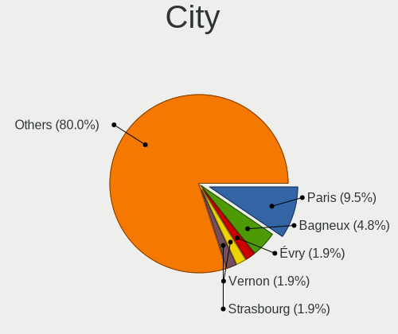
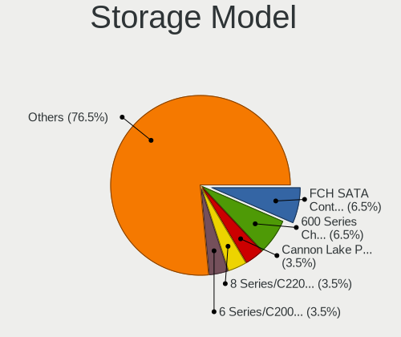
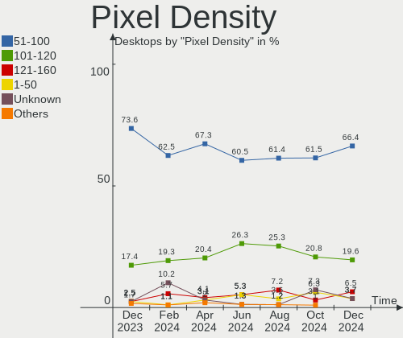
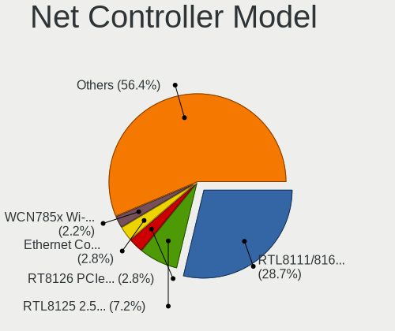
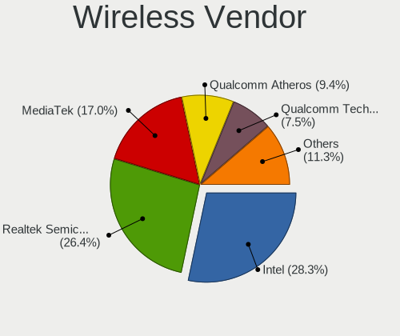
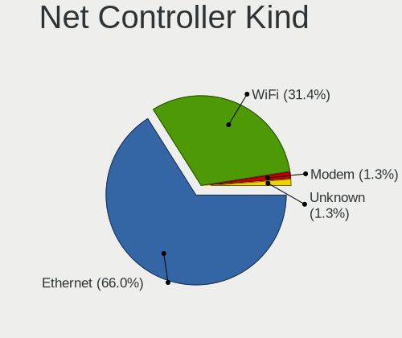
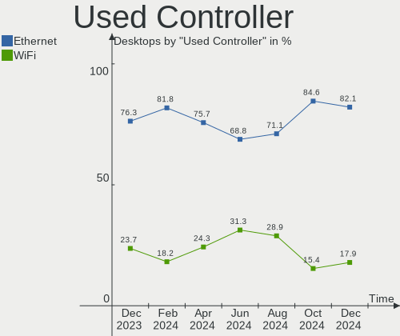
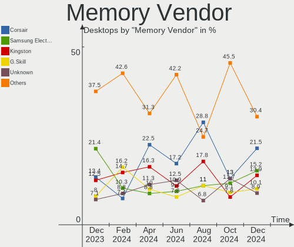
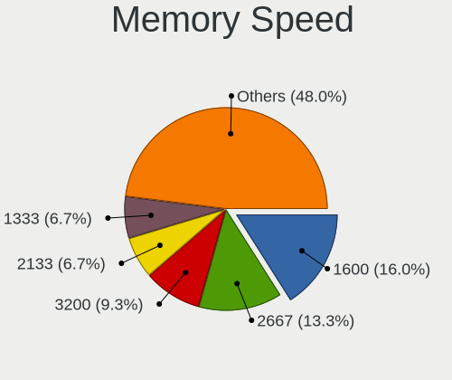
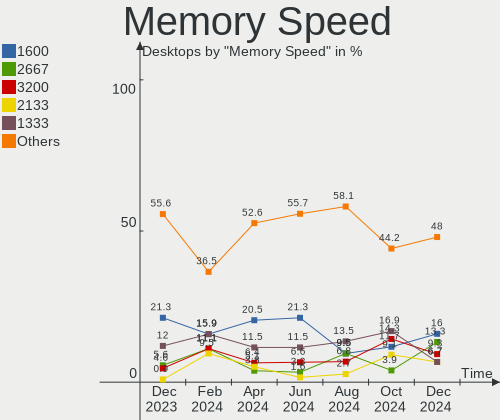

Linux in France - Hardware Trends (Desktops)
--------------------------------------------

A project to identify most popular hardware characteristics and track their change
over time based on data collected by Linux users at https://Linux-Hardware.org.

Anyone can contribute to this report by the [hw-probe](https://github.com/linuxhw/hw-probe) tool:

    sudo -E hw-probe -all -upload

Period: Jun, 2023.

Contents
--------

* [ System ](#system)
  - [ OS                       ](#os)
  - [ OS Family                ](#os-family)
  - [ Kernel                   ](#kernel)
  - [ Kernel Family            ](#kernel-family)
  - [ Kernel Major Ver.        ](#kernel-major-ver)
  - [ Arch                     ](#arch)
  - [ DE                       ](#de)
  - [ Display Server           ](#display-server)
  - [ Display Manager          ](#display-manager)
  - [ OS Lang                  ](#os-lang)
  - [ Boot Mode                ](#boot-mode)
  - [ Filesystem               ](#filesystem)
  - [ Part. scheme             ](#part-scheme)
  - [ Dual Boot with Linux/BSD ](#dual-boot-with-linuxbsd)
  - [ Dual Boot (Win)          ](#dual-boot-win)

* [ Board ](#board)
  - [ Vendor                   ](#vendor)
  - [ Model                    ](#model)
  - [ Model Family             ](#model-family)
  - [ MFG Year                 ](#mfg-year)
  - [ Form Factor              ](#form-factor)
  - [ Secure Boot              ](#secure-boot)
  - [ Coreboot                 ](#coreboot)
  - [ RAM Size                 ](#ram-size)
  - [ RAM Used                 ](#ram-used)
  - [ Total Drives             ](#total-drives)
  - [ Has CD-ROM               ](#has-cd-rom)
  - [ Has Ethernet             ](#has-ethernet)
  - [ Has WiFi                 ](#has-wifi)
  - [ Has Bluetooth            ](#has-bluetooth)

* [ Location ](#location)
  - [ Country                  ](#country)
  - [ City                     ](#city)

* [ Drives ](#drives)
  - [ Drive Vendor             ](#drive-vendor)
  - [ Drive Model              ](#drive-model)
  - [ HDD Vendor               ](#hdd-vendor)
  - [ SSD Vendor               ](#ssd-vendor)
  - [ Drive Kind               ](#drive-kind)
  - [ Drive Connector          ](#drive-connector)
  - [ Drive Size               ](#drive-size)
  - [ Space Total              ](#space-total)
  - [ Space Used               ](#space-used)
  - [ Malfunc. Drives          ](#malfunc-drives)
  - [ Malfunc. Drive Vendor    ](#malfunc-drive-vendor)
  - [ Malfunc. HDD Vendor      ](#malfunc-hdd-vendor)
  - [ Malfunc. Drive Kind      ](#malfunc-drive-kind)
  - [ Failed Drives            ](#failed-drives)
  - [ Failed Drive Vendor      ](#failed-drive-vendor)
  - [ Drive Status             ](#drive-status)

* [ Storage controller ](#storage-controller)
  - [ Storage Vendor           ](#storage-vendor)
  - [ Storage Model            ](#storage-model)
  - [ Storage Kind             ](#storage-kind)

* [ Processor ](#processor)
  - [ CPU Vendor               ](#cpu-vendor)
  - [ CPU Model                ](#cpu-model)
  - [ CPU Model Family         ](#cpu-model-family)
  - [ CPU Cores                ](#cpu-cores)
  - [ CPU Sockets              ](#cpu-sockets)
  - [ CPU Threads              ](#cpu-threads)
  - [ CPU Op-Modes             ](#cpu-op-modes)
  - [ CPU Microcode            ](#cpu-microcode)
  - [ CPU Microarch            ](#cpu-microarch)

* [ Graphics ](#graphics)
  - [ GPU Vendor               ](#gpu-vendor)
  - [ GPU Model                ](#gpu-model)
  - [ GPU Combo                ](#gpu-combo)
  - [ GPU Driver               ](#gpu-driver)
  - [ GPU Memory               ](#gpu-memory)

* [ Monitor ](#monitor)
  - [ Monitor Vendor           ](#monitor-vendor)
  - [ Monitor Model            ](#monitor-model)
  - [ Monitor Resolution       ](#monitor-resolution)
  - [ Monitor Diagonal         ](#monitor-diagonal)
  - [ Monitor Width            ](#monitor-width)
  - [ Aspect Ratio             ](#aspect-ratio)
  - [ Monitor Area             ](#monitor-area)
  - [ Pixel Density            ](#pixel-density)
  - [ Multiple Monitors        ](#multiple-monitors)

* [ Network ](#network)
  - [ Net Controller Vendor    ](#net-controller-vendor)
  - [ Net Controller Model     ](#net-controller-model)
  - [ Wireless Vendor          ](#wireless-vendor)
  - [ Wireless Model           ](#wireless-model)
  - [ Ethernet Vendor          ](#ethernet-vendor)
  - [ Ethernet Model           ](#ethernet-model)
  - [ Net Controller Kind      ](#net-controller-kind)
  - [ Used Controller          ](#used-controller)
  - [ NICs                     ](#nics)
  - [ IPv6                     ](#ipv6)

* [ Bluetooth ](#bluetooth)
  - [ Bluetooth Vendor         ](#bluetooth-vendor)
  - [ Bluetooth Model          ](#bluetooth-model)

* [ Sound ](#sound)
  - [ Sound Vendor             ](#sound-vendor)
  - [ Sound Model              ](#sound-model)

* [ Memory ](#memory)
  - [ Memory Vendor            ](#memory-vendor)
  - [ Memory Model             ](#memory-model)
  - [ Memory Kind              ](#memory-kind)
  - [ Memory Form Factor       ](#memory-form-factor)
  - [ Memory Size              ](#memory-size)
  - [ Memory Speed             ](#memory-speed)

* [ Printers & scanners ](#printers--scanners)
  - [ Printer Vendor           ](#printer-vendor)
  - [ Printer Model            ](#printer-model)
  - [ Scanner Vendor           ](#scanner-vendor)
  - [ Scanner Model            ](#scanner-model)

* [ Camera ](#camera)
  - [ Camera Vendor            ](#camera-vendor)
  - [ Camera Model             ](#camera-model)

* [ Security ](#security)
  - [ Fingerprint Vendor       ](#fingerprint-vendor)
  - [ Fingerprint Model        ](#fingerprint-model)
  - [ Chipcard Vendor          ](#chipcard-vendor)
  - [ Chipcard Model           ](#chipcard-model)

* [ Unsupported ](#unsupported)
  - [ Unsupported Devices      ](#unsupported-devices)
  - [ Unsupported Device Types ](#unsupported-device-types)

System
------

OS
--

Installed operating systems

| Name                         | Desktops | Percent |
|------------------------------|----------|---------|
| Ubuntu 22.04                 | 25       | 27.17%  |
| Ubuntu 23.04                 | 6        | 6.52%   |
| Linux Mint 21.1              | 5        | 5.43%   |
| Ubuntu 20.04                 | 3        | 3.26%   |
| Ubuntu 18.04                 | 3        | 3.26%   |
| OpenMandriva 4.3             | 3        | 3.26%   |
| OpenMandriva 23.03           | 3        | 3.26%   |
| Fedora 38                    | 3        | 3.26%   |
| Debian 11                    | 3        | 3.26%   |
| OpenMandriva 4.2             | 2        | 2.17%   |
| OpenMandriva 23.06           | 2        | 2.17%   |
| Linux Mint 21.2              | 2        | 2.17%   |
| Gentoo 2.13                  | 2        | 2.17%   |
| ArcoLinux Rolling            | 2        | 2.17%   |
| Zorin 16                     | 1        | 1.09%   |
| Xubuntu 23.04                | 1        | 1.09%   |
| Ubuntu Unity 16.04           | 1        | 1.09%   |
| Ubuntu MATE 23.04            | 1        | 1.09%   |
| Ubuntu MATE 22.04            | 1        | 1.09%   |
| Ubuntu Core 22               | 1        | 1.09%   |
| Rocky Linux 9.2              | 1        | 1.09%   |
| Pop!_OS 22.04                | 1        | 1.09%   |
| Pop!_OS 21.04                | 1        | 1.09%   |
| openSUSE Tumbleweed-XXXXXXXX | 1        | 1.09%   |
| Nobara 37                    | 1        | 1.09%   |
| Manjaro                      | 1        | 1.09%   |
| Mabox 23.06                  | 1        | 1.09%   |
| Lubuntu 22.04                | 1        | 1.09%   |
| LMDE 5                       | 1        | 1.09%   |
| Linux Mint 20.2              | 1        | 1.09%   |
| Linux Mint 19.3              | 1        | 1.09%   |
| Kubuntu 23.04                | 1        | 1.09%   |
| Kubuntu 11                   | 1        | 1.09%   |
| KDE neon 22.04               | 1        | 1.09%   |
| Garuda Linux Soaring         | 1        | 1.09%   |
| EndeavourOS Rolling          | 1        | 1.09%   |
| Elementary 6.1               | 1        | 1.09%   |
| Devuan 4                     | 1        | 1.09%   |
| Debian 12                    | 1        | 1.09%   |
| Debian 10                    | 1        | 1.09%   |

OS Family
---------

OS without a version

| Name         | Desktops | Percent |
|--------------|----------|---------|
| Ubuntu       | 38       | 41.3%   |
| OpenMandriva | 10       | 10.87%  |
| Linux Mint   | 9        | 9.78%   |
| Debian       | 5        | 5.43%   |
| Fedora       | 3        | 3.26%   |
| Ubuntu MATE  | 2        | 2.17%   |
| Pop!_OS      | 2        | 2.17%   |
| Kubuntu      | 2        | 2.17%   |
| Gentoo       | 2        | 2.17%   |
| ArcoLinux    | 2        | 2.17%   |
| Zorin        | 1        | 1.09%   |
| Xubuntu      | 1        | 1.09%   |
| Ubuntu Unity | 1        | 1.09%   |
| Rocky Linux  | 1        | 1.09%   |
| openSUSE     | 1        | 1.09%   |
| Nobara       | 1        | 1.09%   |
| Manjaro      | 1        | 1.09%   |
| Mabox        | 1        | 1.09%   |
| Lubuntu      | 1        | 1.09%   |
| LMDE         | 1        | 1.09%   |
| KDE neon     | 1        | 1.09%   |
| Garuda Linux | 1        | 1.09%   |
| EndeavourOS  | 1        | 1.09%   |
| Elementary   | 1        | 1.09%   |
| Devuan       | 1        | 1.09%   |
| CentOS       | 1        | 1.09%   |
| BlackPanther | 1        | 1.09%   |

Kernel
------

Version of the Linux kernel

| Version                      | Desktops | Percent |
|------------------------------|----------|---------|
| 5.19.0-43-generic            | 14       | 15.22%  |
| 5.15.0-75-generic            | 8        | 8.7%    |
| 5.15.0-73-generic            | 6        | 6.52%   |
| 6.2.0-23-generic             | 4        | 4.35%   |
| 6.2.0-20-generic             | 4        | 4.35%   |
| 5.19.0-45-generic            | 4        | 4.35%   |
| 6.2.6-desktop-1omv2390       | 3        | 3.26%   |
| 5.19.0-32-generic            | 3        | 3.26%   |
| 5.10.0-23-amd64              | 3        | 3.26%   |
| 6.3.5-desktop-3omv2390       | 2        | 2.17%   |
| 6.1.31-2-MANJARO             | 2        | 2.17%   |
| 5.4.0-150-generic            | 2        | 2.17%   |
| 5.16.13-desktop-1omv4003     | 2        | 2.17%   |
| 5.15.0-72-generic            | 2        | 2.17%   |
| 5.10.14-desktop-1omv4002     | 2        | 2.17%   |
| 6.3.9-arch1-1                | 1        | 1.09%   |
| 6.3.8-gentoo-dist            | 1        | 1.09%   |
| 6.3.7-200.fsync.fc37.x86_64  | 1        | 1.09%   |
| 6.3.6-zen1-1-zen             | 1        | 1.09%   |
| 6.3.6-200.fc38.x86_64        | 1        | 1.09%   |
| 6.3.6-060306-generic         | 1        | 1.09%   |
| 6.3.4-201.fc38.x86_64        | 1        | 1.09%   |
| 6.3.4-1-default              | 1        | 1.09%   |
| 6.3.3-x64v1-xanmod1-1        | 1        | 1.09%   |
| 6.2.6-76060206-generic       | 1        | 1.09%   |
| 6.2.15-300.fc38.x86_64       | 1        | 1.09%   |
| 6.2.13-zen                   | 1        | 1.09%   |
| 6.1.31-1-lts                 | 1        | 1.09%   |
| 6.1.0-9-amd64                | 1        | 1.09%   |
| 6.1.0-0.deb11.7-amd64        | 1        | 1.09%   |
| 5.4.0-148-generic            | 1        | 1.09%   |
| 5.19.0-46-generic            | 1        | 1.09%   |
| 5.19.0-42-generic            | 1        | 1.09%   |
| 5.19.0-41-generic            | 1        | 1.09%   |
| 5.16.7-desktop-1omv4003      | 1        | 1.09%   |
| 5.15.0-77-generic            | 1        | 1.09%   |
| 5.15.0-76-generic            | 1        | 1.09%   |
| 5.14.0-284.11.1.el9_2.x86_64 | 1        | 1.09%   |
| 5.11.0-7620-generic          | 1        | 1.09%   |
| 5.11.0-27-generic            | 1        | 1.09%   |

Kernel Family
-------------

Linux kernel without a distro release

| Version | Desktops | Percent |
|---------|----------|---------|
| 5.19.0  | 24       | 26.09%  |
| 5.15.0  | 18       | 19.57%  |
| 6.2.0   | 8        | 8.7%    |
| 6.2.6   | 4        | 4.35%   |
| 5.10.0  | 4        | 4.35%   |
| 6.3.6   | 3        | 3.26%   |
| 6.1.31  | 3        | 3.26%   |
| 5.4.0   | 3        | 3.26%   |
| 6.3.5   | 2        | 2.17%   |
| 6.3.4   | 2        | 2.17%   |
| 6.1.0   | 2        | 2.17%   |
| 5.16.13 | 2        | 2.17%   |
| 5.11.0  | 2        | 2.17%   |
| 5.10.14 | 2        | 2.17%   |
| 4.15.0  | 2        | 2.17%   |
| 6.3.9   | 1        | 1.09%   |
| 6.3.8   | 1        | 1.09%   |
| 6.3.7   | 1        | 1.09%   |
| 6.3.3   | 1        | 1.09%   |
| 6.2.15  | 1        | 1.09%   |
| 6.2.13  | 1        | 1.09%   |
| 5.16.7  | 1        | 1.09%   |
| 5.14.0  | 1        | 1.09%   |
| 4.19.0  | 1        | 1.09%   |
| 4.18.16 | 1        | 1.09%   |
| 3.10.0  | 1        | 1.09%   |

Kernel Major Ver.
-----------------

Linux kernel major version

| Version | Desktops | Percent |
|---------|----------|---------|
| 5.19    | 24       | 26.09%  |
| 5.15    | 18       | 19.57%  |
| 6.2     | 14       | 15.22%  |
| 6.3     | 11       | 11.96%  |
| 5.10    | 6        | 6.52%   |
| 6.1     | 5        | 5.43%   |
| 5.4     | 3        | 3.26%   |
| 5.16    | 3        | 3.26%   |
| 5.11    | 2        | 2.17%   |
| 4.15    | 2        | 2.17%   |
| 5.14    | 1        | 1.09%   |
| 4.19    | 1        | 1.09%   |
| 4.18    | 1        | 1.09%   |
| 3.10    | 1        | 1.09%   |

Arch
----

OS architecture (x86_64, i586, etc.)

| Name   | Desktops | Percent |
|--------|----------|---------|
| x86_64 | 91       | 98.91%  |
| i686   | 1        | 1.09%   |

DE
--

Desktop Environment

| Name       | Desktops | Percent |
|------------|----------|---------|
| GNOME      | 48       | 52.17%  |
| KDE5       | 18       | 19.57%  |
| X-Cinnamon | 9        | 9.78%   |
| Unknown    | 5        | 5.43%   |
| MATE       | 4        | 4.35%   |
| XFCE       | 3        | 3.26%   |
| LXQt       | 2        | 2.17%   |
| Unity      | 1        | 1.09%   |
| Pantheon   | 1        | 1.09%   |
| KDE4       | 1        | 1.09%   |

Display Server
--------------

X11 or Wayland

| Name    | Desktops | Percent |
|---------|----------|---------|
| X11     | 61       | 66.3%   |
| Wayland | 26       | 28.26%  |
| Tty     | 3        | 3.26%   |
| Unknown | 2        | 2.17%   |

Display Manager
---------------

SDDM, LightDM, etc.

| Name    | Desktops | Percent |
|---------|----------|---------|
| GDM3    | 32       | 34.78%  |
| Unknown | 23       | 25%     |
| SDDM    | 16       | 17.39%  |
| LightDM | 11       | 11.96%  |
| GDM     | 9        | 9.78%   |
| SLiM    | 1        | 1.09%   |

OS Lang
-------

Language

| Lang    | Desktops | Percent |
|---------|----------|---------|
| fr_FR   | 69       | 75%     |
| en_US   | 17       | 18.48%  |
| C       | 4        | 4.35%   |
| de_DE   | 1        | 1.09%   |
| Unknown | 1        | 1.09%   |

Boot Mode
---------

EFI or BIOS

| Mode | Desktops | Percent |
|------|----------|---------|
| EFI  | 48       | 52.17%  |
| BIOS | 44       | 47.83%  |

Filesystem
----------

Type of filesystem

| Type    | Desktops | Percent |
|---------|----------|---------|
| Ext4    | 58       | 63.04%  |
| Tmpfs   | 13       | 14.13%  |
| Overlay | 9        | 9.78%   |
| Btrfs   | 9        | 9.78%   |
| Xfs     | 2        | 2.17%   |
| Zfs     | 1        | 1.09%   |

Part. scheme
------------

Scheme of partitioning

| Type    | Desktops | Percent |
|---------|----------|---------|
| GPT     | 60       | 65.22%  |
| Unknown | 19       | 20.65%  |
| MBR     | 13       | 14.13%  |

Dual Boot with Linux/BSD
------------------------

Hosting more than one Linux/BSD

| Dual boot | Desktops | Percent |
|-----------|----------|---------|
| No        | 71       | 77.17%  |
| Yes       | 21       | 22.83%  |

Dual Boot (Win)
---------------

Hosting Linux and Windows

| Dual boot | Desktops | Percent |
|-----------|----------|---------|
| No        | 69       | 75%     |
| Yes       | 23       | 25%     |

Board
-----

Vendor
------

Motherboard manufacturer

| Name                | Desktops | Percent |
|---------------------|----------|---------|
| ASUSTek Computer    | 21       | 22.83%  |
| Gigabyte Technology | 16       | 17.39%  |
| MSI                 | 10       | 10.87%  |
| Hewlett-Packard     | 9        | 9.78%   |
| Dell                | 8        | 8.7%    |
| ASRock              | 5        | 5.43%   |
| Lenovo              | 4        | 4.35%   |
| Intel               | 4        | 4.35%   |
| Acer                | 4        | 4.35%   |
| Unknown             | 3        | 3.26%   |
| Supermicro          | 2        | 2.17%   |
| Techvision          | 1        | 1.09%   |
| Pegatron            | 1        | 1.09%   |
| ECS                 | 1        | 1.09%   |
| Biostar             | 1        | 1.09%   |
| AZW                 | 1        | 1.09%   |
| ASRockRack          | 1        | 1.09%   |

Model
-----

Motherboard model

| Name                               | Desktops | Percent |
|------------------------------------|----------|---------|
| Unknown                            | 3        | 3.26%   |
| MSI MS-7D22                        | 2        | 2.17%   |
| Dell OptiPlex 790                  | 2        | 2.17%   |
| ASUS All Series                    | 2        | 2.17%   |
| Techvision TVI7309X                | 1        | 1.09%   |
| Supermicro X9DAi                   | 1        | 1.09%   |
| Supermicro SYS-530MT-H8TNR         | 1        | 1.09%   |
| Pegatron KT600AA-ABF a6443.fr      | 1        | 1.09%   |
| MSI MS-7B18                        | 1        | 1.09%   |
| MSI MS-7A38                        | 1        | 1.09%   |
| MSI MS-7924                        | 1        | 1.09%   |
| MSI MS-7846                        | 1        | 1.09%   |
| MSI MS-7817                        | 1        | 1.09%   |
| MSI MS-7816                        | 1        | 1.09%   |
| MSI MS-7752                        | 1        | 1.09%   |
| MSI MS-7721                        | 1        | 1.09%   |
| Lenovo ThinkCentre M93p 10A7003AUK | 1        | 1.09%   |
| Lenovo ThinkCentre M91p 7033A1G    | 1        | 1.09%   |
| Lenovo ThinkCentre M700 10GQS05H00 | 1        | 1.09%   |
| Lenovo H515s 10126                 | 1        | 1.09%   |
| Intel DQ77KB AAG81483-500          | 1        | 1.09%   |
| Intel DN2820FYK H24582-204         | 1        | 1.09%   |
| Intel DH55HC AAE70933-503          | 1        | 1.09%   |
| Intel DE3815TYKH H26998-402        | 1        | 1.09%   |
| HP Z240 SFF Workstation            | 1        | 1.09%   |
| HP ProDesk 600 G2 DM               | 1        | 1.09%   |
| HP EliteDesk 800 G2 DM 35W         | 1        | 1.09%   |
| HP EliteDesk 800 G1 USDT           | 1        | 1.09%   |
| HP Desktop M01-F0xxx               | 1        | 1.09%   |
| HP Compaq Pro 6305 SFF             | 1        | 1.09%   |
| HP Compaq dc5800 Microtower        | 1        | 1.09%   |
| HP Compaq 8200 Elite USDT PC       | 1        | 1.09%   |
| HP Compaq 6200 Pro SFF PC          | 1        | 1.09%   |
| Gigabyte Z790 AORUS ELITE AX       | 1        | 1.09%   |
| Gigabyte Z690 GAMING X DDR4        | 1        | 1.09%   |
| Gigabyte Z490 GAMING X             | 1        | 1.09%   |
| Gigabyte X570 UD                   | 1        | 1.09%   |
| Gigabyte H81M-S2H                  | 1        | 1.09%   |
| Gigabyte GA-A75M-D2H               | 1        | 1.09%   |
| Gigabyte GA-78LMT-USB3 6.0         | 1        | 1.09%   |

Model Family
------------

Motherboard model prefix

| Name                       | Desktops | Percent |
|----------------------------|----------|---------|
| ASUS PRIME                 | 6        | 6.52%   |
| HP Compaq                  | 4        | 4.35%   |
| Dell OptiPlex              | 4        | 4.35%   |
| Lenovo ThinkCentre         | 3        | 3.26%   |
| Acer Aspire                | 3        | 3.26%   |
| Unknown                    | 3        | 3.26%   |
| MSI MS-7D22                | 2        | 2.17%   |
| HP EliteDesk               | 2        | 2.17%   |
| Gigabyte B550M             | 2        | 2.17%   |
| Dell Precision             | 2        | 2.17%   |
| ASUS ROG                   | 2        | 2.17%   |
| ASUS All                   | 2        | 2.17%   |
| Techvision TVI7309X        | 1        | 1.09%   |
| Supermicro X9DAi           | 1        | 1.09%   |
| Supermicro SYS-530MT-H8TNR | 1        | 1.09%   |
| Pegatron KT600AA-ABF       | 1        | 1.09%   |
| MSI MS-7B18                | 1        | 1.09%   |
| MSI MS-7A38                | 1        | 1.09%   |
| MSI MS-7924                | 1        | 1.09%   |
| MSI MS-7846                | 1        | 1.09%   |
| MSI MS-7817                | 1        | 1.09%   |
| MSI MS-7816                | 1        | 1.09%   |
| MSI MS-7752                | 1        | 1.09%   |
| MSI MS-7721                | 1        | 1.09%   |
| Lenovo H515s               | 1        | 1.09%   |
| Intel DQ77KB               | 1        | 1.09%   |
| Intel DN2820FYK            | 1        | 1.09%   |
| Intel DH55HC               | 1        | 1.09%   |
| Intel DE3815TYKH           | 1        | 1.09%   |
| HP Z240                    | 1        | 1.09%   |
| HP ProDesk                 | 1        | 1.09%   |
| HP Desktop                 | 1        | 1.09%   |
| Gigabyte Z790              | 1        | 1.09%   |
| Gigabyte Z690              | 1        | 1.09%   |
| Gigabyte Z490              | 1        | 1.09%   |
| Gigabyte X570              | 1        | 1.09%   |
| Gigabyte H81M-S2H          | 1        | 1.09%   |
| Gigabyte GA-A75M-D2H       | 1        | 1.09%   |
| Gigabyte GA-78LMT-USB3     | 1        | 1.09%   |
| Gigabyte G41M-Combo        | 1        | 1.09%   |

MFG Year
--------

Motherboard manufacture year

| Year | Desktops | Percent |
|------|----------|---------|
| 2014 | 11       | 11.96%  |
| 2013 | 9        | 9.78%   |
| 2020 | 8        | 8.7%    |
| 2012 | 8        | 8.7%    |
| 2011 | 8        | 8.7%    |
| 2019 | 7        | 7.61%   |
| 2022 | 6        | 6.52%   |
| 2018 | 6        | 6.52%   |
| 2008 | 6        | 6.52%   |
| 2010 | 5        | 5.43%   |
| 2021 | 4        | 4.35%   |
| 2016 | 4        | 4.35%   |
| 2017 | 3        | 3.26%   |
| 2015 | 3        | 3.26%   |
| 2009 | 2        | 2.17%   |
| 2007 | 2        | 2.17%   |

Form Factor
-----------

Physical design of the computer

| Name    | Desktops | Percent |
|---------|----------|---------|
| Desktop | 92       | 100%    |

Secure Boot
-----------

Enabled or disabled

| State    | Desktops | Percent |
|----------|----------|---------|
| Disabled | 90       | 97.83%  |
| Enabled  | 2        | 2.17%   |

Coreboot
--------

Have coreboot on board

| Used | Desktops | Percent |
|------|----------|---------|
| No   | 92       | 100%    |

RAM Size
--------

Total RAM memory

| Size in GB  | Desktops | Percent |
|-------------|----------|---------|
| 16.01-24.0  | 21       | 22.83%  |
| 32.01-64.0  | 18       | 19.57%  |
| 3.01-4.0    | 17       | 18.48%  |
| 8.01-16.0   | 17       | 18.48%  |
| 4.01-8.0    | 10       | 10.87%  |
| 2.01-3.0    | 4        | 4.35%   |
| 24.01-32.0  | 2        | 2.17%   |
| 64.01-256.0 | 2        | 2.17%   |
| 1.01-2.0    | 1        | 1.09%   |

RAM Used
--------

Used RAM memory

| Used GB   | Desktops | Percent |
|-----------|----------|---------|
| 1.01-2.0  | 32       | 34.78%  |
| 2.01-3.0  | 20       | 21.74%  |
| 4.01-8.0  | 17       | 18.48%  |
| 3.01-4.0  | 14       | 15.22%  |
| 0.51-1.0  | 6        | 6.52%   |
| 8.01-16.0 | 3        | 3.26%   |

Total Drives
------------

Number of drives on board

| Drives | Desktops | Percent |
|--------|----------|---------|
| 1      | 41       | 44.57%  |
| 2      | 25       | 27.17%  |
| 3      | 11       | 11.96%  |
| 4      | 7        | 7.61%   |
| 5      | 6        | 6.52%   |
| 11     | 1        | 1.09%   |
| 6      | 1        | 1.09%   |

Has CD-ROM
----------

Has CD-ROM on board

| Presented | Desktops | Percent |
|-----------|----------|---------|
| No        | 47       | 51.09%  |
| Yes       | 45       | 48.91%  |

Has Ethernet
------------

Has Ethernet on board

| Presented | Desktops | Percent |
|-----------|----------|---------|
| Yes       | 90       | 97.83%  |
| No        | 2        | 2.17%   |

Has WiFi
--------

Has WiFi module

| Presented | Desktops | Percent |
|-----------|----------|---------|
| No        | 54       | 58.7%   |
| Yes       | 38       | 41.3%   |

Has Bluetooth
-------------

Has Bluetooth module

| Presented | Desktops | Percent |
|-----------|----------|---------|
| No        | 63       | 68.48%  |
| Yes       | 29       | 31.52%  |

Location
--------

Country
-------

Geographic location (country)

| Country | Desktops | Percent |
|---------|----------|---------|
| France  | 92       | 100%    |

City
----

Geographic location (city)

| City               | Desktops | Percent |
|--------------------|----------|---------|
| Paris              | 11       | 11.96%  |
| Lyon               | 3        | 3.26%   |
| Tourcoing          | 2        | 2.17%   |
| Roubaix            | 2        | 2.17%   |
| Rosny-sous-Bois    | 2        | 2.17%   |
| Rennes             | 2        | 2.17%   |
| Quimper            | 2        | 2.17%   |
| Poitiers           | 2        | 2.17%   |
| Nancy              | 2        | 2.17%   |
| Montpellier        | 2        | 2.17%   |
| Étampes           | 2        | 2.17%   |
| Caen               | 2        | 2.17%   |
| Agen               | 2        | 2.17%   |
| Villeurbanne       | 1        | 1.09%   |
| Villefontaine      | 1        | 1.09%   |
| Vence              | 1        | 1.09%   |
| Vauvert            | 1        | 1.09%   |
| Valence            | 1        | 1.09%   |
| Thonon-les-Bains   | 1        | 1.09%   |
| Taverny            | 1        | 1.09%   |
| Seyssinet-Pariset  | 1        | 1.09%   |
| Saint-Ouen-le-Houx | 1        | 1.09%   |
| Saint-Mande        | 1        | 1.09%   |
| Saint-Etienne      | 1        | 1.09%   |
| Royan              | 1        | 1.09%   |
| Roscanvel          | 1        | 1.09%   |
| Ris-Orangis        | 1        | 1.09%   |
| Rezé              | 1        | 1.09%   |
| Quimperlé         | 1        | 1.09%   |
| Nevers             | 1        | 1.09%   |
| Munster            | 1        | 1.09%   |
| Moulon             | 1        | 1.09%   |
| Montpon-Menesterol | 1        | 1.09%   |
| Mezieres-sur-Seine | 1        | 1.09%   |
| Massy              | 1        | 1.09%   |
| Marseille          | 1        | 1.09%   |
| Limoges            | 1        | 1.09%   |
| Lille              | 1        | 1.09%   |
| Les Hogues         | 1        | 1.09%   |
| Lens               | 1        | 1.09%   |

Drives
------

Drive Vendor
------------

Hard drive vendors

| Vendor                      | Desktops | Drives | Percent |
|-----------------------------|----------|--------|---------|
| Seagate                     | 33       | 47     | 19.3%   |
| WDC                         | 31       | 40     | 18.13%  |
| Samsung Electronics         | 27       | 34     | 15.79%  |
| Crucial                     | 17       | 21     | 9.94%   |
| Kingston                    | 10       | 10     | 5.85%   |
| Sandisk                     | 8        | 9      | 4.68%   |
| Hitachi                     | 6        | 6      | 3.51%   |
| PNY                         | 5        | 6      | 2.92%   |
| Maxtor                      | 3        | 3      | 1.75%   |
| Unknown                     | 2        | 2      | 1.17%   |
| Toshiba                     | 2        | 2      | 1.17%   |
| Micron/Crucial Technology   | 2        | 2      | 1.17%   |
| Intenso                     | 2        | 2      | 1.17%   |
| Transcend                   | 1        | 1      | 0.58%   |
| TEXTORM                     | 1        | 1      | 0.58%   |
| SPCC                        | 1        | 1      | 0.58%   |
| sobetter                    | 1        | 1      | 0.58%   |
| Silicon Motion              | 1        | 1      | 0.58%   |
| OCZ                         | 1        | 1      | 0.58%   |
| MSI                         | 1        | 1      | 0.58%   |
| MAXIO Technology (Hangzhou) | 1        | 1      | 0.58%   |
| LDLC                        | 1        | 2      | 0.58%   |
| LaCie                       | 1        | 1      | 0.58%   |
| KIOXIA                      | 1        | 1      | 0.58%   |
| Kingston Technology Company | 1        | 1      | 0.58%   |
| KingSpec                    | 1        | 1      | 0.58%   |
| JMicron Technology          | 1        | 2      | 0.58%   |
| Intel                       | 1        | 1      | 0.58%   |
| HGST                        | 1        | 1      | 0.58%   |
| Hewlett-Packard             | 1        | 5      | 0.58%   |
| Gost                        | 1        | 1      | 0.58%   |
| Gigabyte Technology         | 1        | 1      | 0.58%   |
| External                    | 1        | 1      | 0.58%   |
| Emtec                       | 1        | 1      | 0.58%   |
| A-DATA Technology           | 1        | 1      | 0.58%   |
| Unknown                     | 1        | 1      | 0.58%   |

Drive Model
-----------

Hard drive models

| Model                                               | Desktops | Percent |
|-----------------------------------------------------|----------|---------|
| Crucial CT500MX500SSD1 500GB                        | 5        | 2.48%   |
| Seagate ST1000DM003-1CH162 1TB                      | 4        | 1.98%   |
| Samsung NVMe SSD Controller SM981/PM981/PM983 250GB | 4        | 1.98%   |
| WDC WD10EADS-00M2B0 1TB                             | 3        | 1.49%   |
| Seagate ST500DM002-1BD142 500GB                     | 3        | 1.49%   |
| Seagate ST2000DM001-1ER164 2TB                      | 3        | 1.49%   |
| Seagate ST2000DM001-1CH164 2TB                      | 3        | 1.49%   |
| Kingston SA400S37240G 240GB SSD                     | 3        | 1.49%   |
| WDC WD20EZRZ-00Z5HB0 2TB                            | 2        | 0.99%   |
| WDC WD20EZRX-22D8PB0 2TB                            | 2        | 0.99%   |
| WDC WD10EZEX-00WN4A0 1TB                            | 2        | 0.99%   |
| Toshiba MQ01ABD100 1TB                              | 2        | 0.99%   |
| Seagate ST4000DM004-2CV104 4TB                      | 2        | 0.99%   |
| Seagate ST3500418AS 500GB                           | 2        | 0.99%   |
| Seagate ST2000DL003-9VT166 2TB                      | 2        | 0.99%   |
| Seagate ST1000DM003-1ER162 1TB                      | 2        | 0.99%   |
| Samsung SSD 980 1TB                                 | 2        | 0.99%   |
| Samsung SSD 860 EVO 500GB                           | 2        | 0.99%   |
| Samsung SSD 840 Series 120GB                        | 2        | 0.99%   |
| PNY CS900 240GB SSD                                 | 2        | 0.99%   |
| Micron/Crucial P2 NVMe PCIe SSD 4TB                 | 2        | 0.99%   |
| Maxtor 6V160E0 160GB                                | 2        | 0.99%   |
| Crucial CT480BX500SSD1 480GB                        | 2        | 0.99%   |
| Crucial CT240BX500SSD1 240GB                        | 2        | 0.99%   |
| Crucial CT1000MX500SSD1 1TB                         | 2        | 0.99%   |
| Crucial CT1000BX500SSD1 1TB                         | 2        | 0.99%   |
| WDC WDS500G3X0C-00SJG0 500GB                        | 1        | 0.5%    |
| WDC WDS500G1X0E-00AFY0 500GB                        | 1        | 0.5%    |
| WDC WDS240G2G0B-00EPW0 240GB SSD                    | 1        | 0.5%    |
| WDC WD800BB-00FJA0 80GB                             | 1        | 0.5%    |
| WDC WD5000LPLX-66ZNTT1 500GB                        | 1        | 0.5%    |
| WDC WD5000AZLX-08K2TA0 500GB                        | 1        | 0.5%    |
| WDC WD5000AAKX-00ERMA0 500GB                        | 1        | 0.5%    |
| WDC WD5000AAKS-75A7B2 500GB                         | 1        | 0.5%    |
| WDC WD5000AAKS-00A7B0 500GB                         | 1        | 0.5%    |
| WDC WD40EZRX-00SPEB0 4TB                            | 1        | 0.5%    |
| WDC WD400BD-55MTA1 40GB                             | 1        | 0.5%    |
| WDC WD30EZRX-00DC0B0 3TB                            | 1        | 0.5%    |
| WDC WD20EZRZ-22Z5HB0 2TB                            | 1        | 0.5%    |
| WDC WD20EZRX-00D8PB0 2TB                            | 1        | 0.5%    |

HDD Vendor
----------

Hard disk drive vendors

| Vendor              | Desktops | Drives | Percent |
|---------------------|----------|--------|---------|
| Seagate             | 31       | 45     | 38.27%  |
| WDC                 | 28       | 35     | 34.57%  |
| Samsung Electronics | 6        | 6      | 7.41%   |
| Hitachi             | 6        | 6      | 7.41%   |
| Maxtor              | 3        | 3      | 3.7%    |
| Toshiba             | 2        | 2      | 2.47%   |
| Unknown             | 1        | 1      | 1.23%   |
| LaCie               | 1        | 1      | 1.23%   |
| JMicron Technology  | 1        | 2      | 1.23%   |
| HGST                | 1        | 1      | 1.23%   |
| Hewlett-Packard     | 1        | 5      | 1.23%   |

SSD Vendor
----------

Solid state drive vendors

| Vendor              | Desktops | Drives | Percent |
|---------------------|----------|--------|---------|
| Crucial             | 15       | 19     | 26.32%  |
| Samsung Electronics | 13       | 15     | 22.81%  |
| Kingston            | 8        | 8      | 14.04%  |
| SanDisk             | 5        | 5      | 8.77%   |
| PNY                 | 4        | 5      | 7.02%   |
| WDC                 | 1        | 1      | 1.75%   |
| Transcend           | 1        | 1      | 1.75%   |
| TEXTORM             | 1        | 1      | 1.75%   |
| SPCC                | 1        | 1      | 1.75%   |
| OCZ                 | 1        | 1      | 1.75%   |
| LDLC                | 1        | 2      | 1.75%   |
| KingSpec            | 1        | 1      | 1.75%   |
| Intenso             | 1        | 1      | 1.75%   |
| Gost                | 1        | 1      | 1.75%   |
| Gigabyte Technology | 1        | 1      | 1.75%   |
| External            | 1        | 1      | 1.75%   |
| Emtec               | 1        | 1      | 1.75%   |

Drive Kind
----------

HDD or SSD

| Kind    | Desktops | Drives | Percent |
|---------|----------|--------|---------|
| HDD     | 55       | 107    | 40.74%  |
| SSD     | 46       | 65     | 34.07%  |
| NVMe    | 29       | 36     | 21.48%  |
| Unknown | 3        | 3      | 2.22%   |
| MMC     | 2        | 2      | 1.48%   |

Drive Connector
---------------

SATA, SAS, NVMe, etc.

| Type | Desktops | Drives | Percent |
|------|----------|--------|---------|
| SATA | 77       | 156    | 65.81%  |
| NVMe | 29       | 36     | 24.79%  |
| SAS  | 9        | 19     | 7.69%   |
| MMC  | 2        | 2      | 1.71%   |

Drive Size
----------

Size of hard drive

| Size in TB | Desktops | Drives | Percent |
|------------|----------|--------|---------|
| 0.01-0.5   | 57       | 88     | 49.14%  |
| 0.51-1.0   | 35       | 49     | 30.17%  |
| 1.01-2.0   | 17       | 21     | 14.66%  |
| 3.01-4.0   | 3        | 3      | 2.59%   |
| 2.01-3.0   | 3        | 10     | 2.59%   |
| 4.01-10.0  | 1        | 1      | 0.86%   |

Space Total
-----------

Amount of disk space available on the file system

| Size in GB     | Desktops | Percent |
|----------------|----------|---------|
| 101-250        | 19       | 20.65%  |
| 501-1000       | 17       | 18.48%  |
| More than 3000 | 15       | 16.3%   |
| 251-500        | 11       | 11.96%  |
| 1001-2000      | 9        | 9.78%   |
| 2001-3000      | 7        | 7.61%   |
| 1-20           | 6        | 6.52%   |
| 51-100         | 4        | 4.35%   |
| 21-50          | 2        | 2.17%   |
| Unknown        | 2        | 2.17%   |

Space Used
----------

Amount of used disk space

| Used GB        | Desktops | Percent |
|----------------|----------|---------|
| 1-20           | 26       | 28.26%  |
| 21-50          | 18       | 19.57%  |
| 251-500        | 10       | 10.87%  |
| 1001-2000      | 9        | 9.78%   |
| 101-250        | 8        | 8.7%    |
| 51-100         | 8        | 8.7%    |
| More than 3000 | 6        | 6.52%   |
| 501-1000       | 5        | 5.43%   |
| Unknown        | 2        | 2.17%   |

Malfunc. Drives
---------------

Drive models with a malfunction

| Model                                            | Desktops | Drives | Percent |
|--------------------------------------------------|----------|--------|---------|
| Maxtor 6V160E0 160GB                             | 2        | 2      | 8.33%   |
| WDC WD5000LPLX-66ZNTT1 500GB                     | 1        | 1      | 4.17%   |
| WDC WD5000AAKS-75A7B2 500GB                      | 1        | 1      | 4.17%   |
| WDC WD10EZEX-21M2NA0 1TB                         | 1        | 1      | 4.17%   |
| WDC WD10EZEX-00WN4A0 1TB                         | 1        | 1      | 4.17%   |
| WDC WD10EARS-22Y5B1 1TB                          | 1        | 1      | 4.17%   |
| WDC WD10EADS-00M2B0 1TB                          | 1        | 1      | 4.17%   |
| Transcend TS120GSSD220S 120GB                    | 1        | 1      | 4.17%   |
| Seagate ST9250311CS 250GB                        | 1        | 1      | 4.17%   |
| Seagate ST500DM002-1BD142 500GB                  | 1        | 1      | 4.17%   |
| Seagate ST3320820AS 320GB                        | 1        | 1      | 4.17%   |
| Seagate ST2000LX001-1RG174 2TB                   | 1        | 1      | 4.17%   |
| Seagate ST1000LM035-1RK172 1TB                   | 1        | 1      | 4.17%   |
| Seagate ST1000LM024 HN-M101MBB 1TB               | 1        | 1      | 4.17%   |
| Seagate ST1000LM 024 HN-M101MBB 1TB              | 1        | 1      | 4.17%   |
| Samsung Electronics MZ7LN256HMJP-000H1 256GB SSD | 1        | 1      | 4.17%   |
| Samsung Electronics HD103UJ 1TB                  | 1        | 1      | 4.17%   |
| Kingston RBU-SNS8350DES3128GP 128GB SSD          | 1        | 1      | 4.17%   |
| Hitachi HTS723232A7A364 320GB                    | 1        | 1      | 4.17%   |
| Hitachi HDS721616PLA380 160GB                    | 1        | 1      | 4.17%   |
| HGST HTS541010A9E680 1TB                         | 1        | 1      | 4.17%   |
| Crucial CT275MX300SSD1 275GB                     | 1        | 1      | 4.17%   |
| Crucial CT256M550SSD1 256GB                      | 1        | 1      | 4.17%   |

Malfunc. Drive Vendor
---------------------

Vendors of faulty drives

| Vendor              | Desktops | Drives | Percent |
|---------------------|----------|--------|---------|
| WDC                 | 6        | 6      | 28.57%  |
| Seagate             | 5        | 7      | 23.81%  |
| Samsung Electronics | 2        | 2      | 9.52%   |
| Maxtor              | 2        | 2      | 9.52%   |
| Hitachi             | 2        | 2      | 9.52%   |
| Transcend           | 1        | 1      | 4.76%   |
| Kingston            | 1        | 1      | 4.76%   |
| HGST                | 1        | 1      | 4.76%   |
| Crucial             | 1        | 2      | 4.76%   |

Malfunc. HDD Vendor
-------------------

Vendors of faulty HDD drives

| Vendor              | Desktops | Drives | Percent |
|---------------------|----------|--------|---------|
| WDC                 | 6        | 6      | 35.29%  |
| Seagate             | 5        | 7      | 29.41%  |
| Maxtor              | 2        | 2      | 11.76%  |
| Hitachi             | 2        | 2      | 11.76%  |
| Samsung Electronics | 1        | 1      | 5.88%   |
| HGST                | 1        | 1      | 5.88%   |

Malfunc. Drive Kind
-------------------

Kinds of faulty drives

| Kind | Desktops | Drives | Percent |
|------|----------|--------|---------|
| HDD  | 15       | 19     | 78.95%  |
| SSD  | 4        | 5      | 21.05%  |

Failed Drives
-------------

Failed drive models

| Model                   | Desktops | Drives | Percent |
|-------------------------|----------|--------|---------|
| WDC WD800BB-00FJA0 80GB | 1        | 1      | 100%    |

Failed Drive Vendor
-------------------

Failed drive vendors

| Vendor | Desktops | Drives | Percent |
|--------|----------|--------|---------|
| WDC    | 1        | 1      | 100%    |

Drive Status
------------

Number of failed and malfunc. drives

| Status   | Desktops | Drives | Percent |
|----------|----------|--------|---------|
| Works    | 50       | 91     | 44.64%  |
| Detected | 43       | 97     | 38.39%  |
| Malfunc  | 18       | 24     | 16.07%  |
| Failed   | 1        | 1      | 0.89%   |

Storage controller
------------------

Storage Vendor
--------------

Storage controller vendors

| Vendor                      | Desktops | Percent |
|-----------------------------|----------|---------|
| Intel                       | 64       | 46.72%  |
| AMD                         | 26       | 18.98%  |
| Samsung Electronics         | 11       | 8.03%   |
| SanDisk                     | 7        | 5.11%   |
| Micron/Crucial Technology   | 3        | 2.19%   |
| Marvell Technology Group    | 3        | 2.19%   |
| Kingston Technology Company | 3        | 2.19%   |
| ASMedia Technology          | 3        | 2.19%   |
| VIA Technologies            | 2        | 1.46%   |
| Phison Electronics          | 2        | 1.46%   |
| Nvidia                      | 2        | 1.46%   |
| LSI Logic / Symbios Logic   | 2        | 1.46%   |
| Broadcom / LSI              | 2        | 1.46%   |
| Silicon Motion              | 1        | 0.73%   |
| Silicon Image               | 1        | 0.73%   |
| Seagate Technology          | 1        | 0.73%   |
| MAXIO Technology (Hangzhou) | 1        | 0.73%   |
| KIOXIA                      | 1        | 0.73%   |
| JMicron Technology          | 1        | 0.73%   |
| ADATA Technology            | 1        | 0.73%   |

Storage Model
-------------

Storage controller models

| Model                                                                          | Desktops | Percent |
|--------------------------------------------------------------------------------|----------|---------|
| AMD FCH SATA Controller [AHCI mode]                                            | 15       | 9.26%   |
| Intel 8 Series/C220 Series Chipset Family 6-port SATA Controller 1 [AHCI mode] | 10       | 6.17%   |
| AMD 400 Series Chipset SATA Controller                                         | 7        | 4.32%   |
| Samsung NVMe SSD Controller SM981/PM981/PM983                                  | 6        | 3.7%    |
| Intel 6 Series/C200 Series Chipset Family 6 port Desktop SATA AHCI Controller  | 6        | 3.7%    |
| Intel SATA Controller [RAID mode]                                              | 5        | 3.09%   |
| Intel 7 Series/C210 Series Chipset Family 6-port SATA Controller [AHCI mode]   | 5        | 3.09%   |
| AMD 500 Series Chipset SATA Controller                                         | 5        | 3.09%   |
| Intel Q170/Q150/B150/H170/H110/Z170/CM236 Chipset SATA Controller [AHCI Mode]  | 4        | 2.47%   |
| Samsung NVMe SSD Controller 980                                                | 3        | 1.85%   |
| Marvell Group 88SE6111/6121 SATA II / PATA Controller                          | 3        | 1.85%   |
| Intel 82801JI (ICH10 Family) SATA AHCI Controller                              | 3        | 1.85%   |
| Intel 82801JI (ICH10 Family) 4 port SATA IDE Controller #1                     | 3        | 1.85%   |
| Intel 82801JI (ICH10 Family) 2 port SATA IDE Controller #2                     | 3        | 1.85%   |
| Intel 500 Series Chipset Family SATA AHCI Controller                           | 3        | 1.85%   |
| ASMedia ASM1062 Serial ATA Controller                                          | 3        | 1.85%   |
| SanDisk WD Black 2018/SN750 / PC SN720 NVMe SSD                                | 2        | 1.23%   |
| Micron/Crucial P2 NVMe PCIe SSD                                                | 2        | 1.23%   |
| Intel NM10/ICH7 Family SATA Controller [IDE mode]                              | 2        | 1.23%   |
| Intel Cannon Lake PCH SATA AHCI Controller                                     | 2        | 1.23%   |
| Intel C600/X79 series chipset 6-Port SATA AHCI Controller                      | 2        | 1.23%   |
| Intel Atom Processor E3800 Series SATA AHCI Controller                         | 2        | 1.23%   |
| Intel 9 Series Chipset Family SATA Controller [AHCI Mode]                      | 2        | 1.23%   |
| Intel 82801G (ICH7 Family) IDE Controller                                      | 2        | 1.23%   |
| Intel 700 Series Chipset Family SATA AHCI Controller                           | 2        | 1.23%   |
| Intel 200 Series PCH SATA controller [AHCI mode]                               | 2        | 1.23%   |
| AMD SB7x0/SB8x0/SB9x0 SATA Controller [AHCI mode]                              | 2        | 1.23%   |
| AMD SB7x0/SB8x0/SB9x0 IDE Controller                                           | 2        | 1.23%   |
| AMD FCH SATA Controller [IDE mode]                                             | 2        | 1.23%   |
| AMD FCH IDE Controller                                                         | 2        | 1.23%   |
| VIA VT6421 IDE/SATA Controller                                                 | 1        | 0.62%   |
| VIA VT6415 PATA IDE Host Controller                                            | 1        | 0.62%   |
| Silicon Motion SM2263EN/SM2263XT SSD Controller                                | 1        | 0.62%   |
| Silicon Image SiI 3114 [SATALink/SATARaid] Serial ATA Controller               | 1        | 0.62%   |
| Seagate FireCuda 530 SSD                                                       | 1        | 0.62%   |
| Sandisk Western Digital WD Black SN850X NVMe SSD                               | 1        | 0.62%   |
| SanDisk WD PC SN810 / Black SN850 NVMe SSD                                     | 1        | 0.62%   |
| SanDisk WD Blue SN550 NVMe SSD                                                 | 1        | 0.62%   |
| SanDisk WD Black SN770 NVMe SSD                                                | 1        | 0.62%   |
| SanDisk WD Black SN750 / PC SN730 NVMe SSD                                     | 1        | 0.62%   |

Storage Kind
------------

Kind of storage controller (IDE, SATA, NVMe, SAS, ...)

| Kind | Desktops | Percent |
|------|----------|---------|
| SATA | 75       | 56.39%  |
| NVMe | 29       | 21.8%   |
| IDE  | 18       | 13.53%  |
| RAID | 9        | 6.77%   |
| SAS  | 1        | 0.75%   |
| SCSI | 1        | 0.75%   |

Processor
---------

CPU Vendor
----------

Processor vendors

| Vendor | Desktops | Percent |
|--------|----------|---------|
| Intel  | 64       | 69.57%  |
| AMD    | 28       | 30.43%  |

CPU Model
---------

Processor models

| Model                                       | Desktops | Percent |
|---------------------------------------------|----------|---------|
| Intel Core i7-8700 CPU @ 3.20GHz            | 2        | 2.17%   |
| Intel Core i7-4790 CPU @ 3.60GHz            | 2        | 2.17%   |
| Intel Core i5-4590 CPU @ 3.30GHz            | 2        | 2.17%   |
| Intel Core i5-4460 CPU @ 3.20GHz            | 2        | 2.17%   |
| Intel Core i3-2100 CPU @ 3.10GHz            | 2        | 2.17%   |
| Intel Core 2 Duo CPU E8400 @ 3.00GHz        | 2        | 2.17%   |
| AMD Ryzen 5 5500                            | 2        | 2.17%   |
| AMD Ryzen 5 3600X 6-Core Processor          | 2        | 2.17%   |
| Intel Xeon E-2388G CPU @ 3.20GHz            | 1        | 1.09%   |
| Intel Xeon CPU W3690 @ 3.47GHz              | 1        | 1.09%   |
| Intel Xeon CPU E5-2650 0 @ 2.00GHz          | 1        | 1.09%   |
| Intel Xeon CPU E5-2630 0 @ 2.30GHz          | 1        | 1.09%   |
| Intel Pentium Gold G5400 CPU @ 3.70GHz      | 1        | 1.09%   |
| Intel Pentium Dual-Core CPU E5300 @ 2.60GHz | 1        | 1.09%   |
| Intel Core i7-8700T CPU @ 2.40GHz           | 1        | 1.09%   |
| Intel Core i7-7700 CPU @ 3.60GHz            | 1        | 1.09%   |
| Intel Core i7-4770S CPU @ 3.10GHz           | 1        | 1.09%   |
| Intel Core i7-3770T CPU @ 2.50GHz           | 1        | 1.09%   |
| Intel Core i7-3770K CPU @ 3.50GHz           | 1        | 1.09%   |
| Intel Core i7-3770 CPU @ 3.40GHz            | 1        | 1.09%   |
| Intel Core i7-10750H CPU @ 2.60GHz          | 1        | 1.09%   |
| Intel Core i7-10700 CPU @ 2.90GHz           | 1        | 1.09%   |
| Intel Core i7 CPU 920 @ 2.67GHz             | 1        | 1.09%   |
| Intel Core i7 CPU 860 @ 2.80GHz             | 1        | 1.09%   |
| Intel Core i5-9400F CPU @ 2.90GHz           | 1        | 1.09%   |
| Intel Core i5-8279U CPU @ 2.40GHz           | 1        | 1.09%   |
| Intel Core i5-7500 CPU @ 3.40GHz            | 1        | 1.09%   |
| Intel Core i5-6500T CPU @ 2.50GHz           | 1        | 1.09%   |
| Intel Core i5-6500 CPU @ 3.20GHz            | 1        | 1.09%   |
| Intel Core i5-6400 CPU @ 2.70GHz            | 1        | 1.09%   |
| Intel Core i5-4690K CPU @ 3.50GHz           | 1        | 1.09%   |
| Intel Core i5-4690 CPU @ 3.50GHz            | 1        | 1.09%   |
| Intel Core i5-4670 CPU @ 3.40GHz            | 1        | 1.09%   |
| Intel Core i5-4570 CPU @ 3.20GHz            | 1        | 1.09%   |
| Intel Core i5-3570K CPU @ 3.40GHz           | 1        | 1.09%   |
| Intel Core i5-3570 CPU @ 3.40GHz            | 1        | 1.09%   |
| Intel Core i5-2500 CPU @ 3.30GHz            | 1        | 1.09%   |
| Intel Core i5-2400S CPU @ 2.50GHz           | 1        | 1.09%   |
| Intel Core i5-2400 CPU @ 3.10GHz            | 1        | 1.09%   |
| Intel Core i3-6100T CPU @ 3.20GHz           | 1        | 1.09%   |

CPU Model Family
----------------

Processor model prefix

| Model                   | Desktops | Percent |
|-------------------------|----------|---------|
| Intel Core i5           | 19       | 20.65%  |
| Intel Core i7           | 14       | 15.22%  |
| AMD Ryzen 5             | 10       | 10.87%  |
| Intel Core i3           | 8        | 8.7%    |
| AMD Ryzen 7             | 6        | 6.52%   |
| Intel Core 2 Duo        | 5        | 5.43%   |
| Other                   | 4        | 4.35%   |
| Intel Xeon              | 4        | 4.35%   |
| Intel Celeron           | 4        | 4.35%   |
| Intel Core 2 Quad       | 2        | 2.17%   |
| Intel Atom              | 2        | 2.17%   |
| AMD FX                  | 2        | 2.17%   |
| AMD A6                  | 2        | 2.17%   |
| Intel Pentium Gold      | 1        | 1.09%   |
| Intel Pentium Dual-Core | 1        | 1.09%   |
| AMD Ryzen 9             | 1        | 1.09%   |
| AMD Ryzen 3             | 1        | 1.09%   |
| AMD E1                  | 1        | 1.09%   |
| AMD Athlon II X4        | 1        | 1.09%   |
| AMD Athlon 64 X2        | 1        | 1.09%   |
| AMD Athlon              | 1        | 1.09%   |
| AMD A4                  | 1        | 1.09%   |
| AMD A10                 | 1        | 1.09%   |

CPU Cores
---------

Number of processor cores

| Number | Desktops | Percent |
|--------|----------|---------|
| 4      | 37       | 40.22%  |
| 2      | 21       | 22.83%  |
| 6      | 15       | 16.3%   |
| 8      | 8        | 8.7%    |
| 16     | 3        | 3.26%   |
| 12     | 3        | 3.26%   |
| 1      | 3        | 3.26%   |
| 3      | 2        | 2.17%   |

CPU Sockets
-----------

Number of sockets

| Number | Desktops | Percent |
|--------|----------|---------|
| 1      | 90       | 97.83%  |
| 2      | 2        | 2.17%   |

CPU Threads
-----------

Threads per core (Hyper-Threading)

| Number | Desktops | Percent |
|--------|----------|---------|
| 2      | 53       | 57.61%  |
| 1      | 39       | 42.39%  |

CPU Op-Modes
------------

CPU Operation Modes (32-bit, 64-bit)

| Op mode        | Desktops | Percent |
|----------------|----------|---------|
| 32-bit, 64-bit | 92       | 100%    |

CPU Microcode
-------------

Microcode number

| Number     | Desktops | Percent |
|------------|----------|---------|
| Unknown    | 33       | 35.87%  |
| 0x306c3    | 6        | 6.52%   |
| 0x906ea    | 5        | 5.43%   |
| 0x206a7    | 4        | 4.35%   |
| 0x1067a    | 4        | 4.35%   |
| 0xa0671    | 2        | 2.17%   |
| 0x906e9    | 2        | 2.17%   |
| 0x506e3    | 2        | 2.17%   |
| 0x206d7    | 2        | 2.17%   |
| 0x0a20120a | 2        | 2.17%   |
| 0x08701021 | 2        | 2.17%   |
| 0x08701013 | 2        | 2.17%   |
| 0x08108109 | 2        | 2.17%   |
| 0x06001119 | 2        | 2.17%   |
| 0xb0671    | 1        | 1.09%   |
| 0xa0655    | 1        | 1.09%   |
| 0xa0653    | 1        | 1.09%   |
| 0x906c0    | 1        | 1.09%   |
| 0x406c4    | 1        | 1.09%   |
| 0x306a9    | 1        | 1.09%   |
| 0x30678    | 1        | 1.09%   |
| 0x30673    | 1        | 1.09%   |
| 0x206c2    | 1        | 1.09%   |
| 0x20655    | 1        | 1.09%   |
| 0x10676    | 1        | 1.09%   |
| 0x0a601201 | 1        | 1.09%   |
| 0x0a50000d | 1        | 1.09%   |
| 0x0a50000c | 1        | 1.09%   |
| 0x0a201016 | 1        | 1.09%   |
| 0x08101016 | 1        | 1.09%   |
| 0x0810100b | 1        | 1.09%   |
| 0x0800820d | 1        | 1.09%   |
| 0x08001138 | 1        | 1.09%   |
| 0x06000852 | 1        | 1.09%   |
| 0x06000822 | 1        | 1.09%   |
| 0x010000db | 1        | 1.09%   |

CPU Microarch
-------------

Microarchitecture

| Name             | Desktops | Percent |
|------------------|----------|---------|
| Haswell          | 13       | 14.13%  |
| SandyBridge      | 8        | 8.7%    |
| Penryn           | 8        | 8.7%    |
| KabyLake         | 8        | 8.7%    |
| Zen 2            | 6        | 6.52%   |
| IvyBridge        | 6        | 6.52%   |
| Zen 3            | 5        | 5.43%   |
| Piledriver       | 5        | 5.43%   |
| Zen              | 4        | 4.35%   |
| Skylake          | 4        | 4.35%   |
| Unknown          | 4        | 4.35%   |
| Zen+             | 3        | 3.26%   |
| Silvermont       | 3        | 3.26%   |
| CometLake        | 3        | 3.26%   |
| Westmere         | 2        | 2.17%   |
| Nehalem          | 2        | 2.17%   |
| Tremont          | 1        | 1.09%   |
| K8 Hammer        | 1        | 1.09%   |
| K10 Llano        | 1        | 1.09%   |
| K10              | 1        | 1.09%   |
| Jaguar           | 1        | 1.09%   |
| Icelake          | 1        | 1.09%   |
| Core             | 1        | 1.09%   |
| Alderlake Hybrid | 1        | 1.09%   |

Graphics
--------

GPU Vendor
----------

Vendors of graphics cards

| Vendor            | Desktops | Percent |
|-------------------|----------|---------|
| Nvidia            | 34       | 34.69%  |
| Intel             | 33       | 33.67%  |
| AMD               | 29       | 29.59%  |
| ASPEED Technology | 2        | 2.04%   |

GPU Model
---------

Graphics card models

| Model                                                                       | Desktops | Percent |
|-----------------------------------------------------------------------------|----------|---------|
| Intel Xeon E3-1200 v3/4th Gen Core Processor Integrated Graphics Controller | 7        | 6.93%   |
| Intel 2nd Generation Core Processor Family Integrated Graphics Controller   | 5        | 4.95%   |
| AMD Ellesmere [Radeon RX 470/480/570/570X/580/580X/590]                     | 4        | 3.96%   |
| Intel HD Graphics 530                                                       | 3        | 2.97%   |
| AMD Navi 22 [Radeon RX 6700/6700 XT/6750 XT / 6800M/6850M XT]               | 3        | 2.97%   |
| Nvidia GT218 [GeForce 210]                                                  | 2        | 1.98%   |
| Nvidia GP108 [GeForce GT 1030]                                              | 2        | 1.98%   |
| Nvidia GP106 [GeForce GTX 1060 6GB]                                         | 2        | 1.98%   |
| Nvidia GK208B [GeForce GT 730]                                              | 2        | 1.98%   |
| Nvidia GK208B [GeForce GT 710]                                              | 2        | 1.98%   |
| Intel Xeon E3-1200 v2/3rd Gen Core processor Graphics Controller            | 2        | 1.98%   |
| Intel IvyBridge GT2 [HD Graphics 4000]                                      | 2        | 1.98%   |
| Intel Atom Processor Z36xxx/Z37xxx Series Graphics & Display                | 2        | 1.98%   |
| Intel 4 Series Chipset Integrated Graphics Controller                       | 2        | 1.98%   |
| ASPEED Technology ASPEED Graphics Family                                    | 2        | 1.98%   |
| AMD Raven Ridge [Radeon Vega Series / Radeon Vega Mobile Series]            | 2        | 1.98%   |
| AMD Navi 23 [Radeon RX 6600/6600 XT/6600M]                                  | 2        | 1.98%   |
| AMD Cedar [Radeon HD 5000/6000/7350/8350 Series]                            | 2        | 1.98%   |
| Nvidia TU117 [GeForce GTX 1650]                                             | 1        | 0.99%   |
| Nvidia TU106 [GeForce RTX 2070 Rev. A]                                      | 1        | 0.99%   |
| Nvidia TU104 [GeForce RTX 2070 SUPER]                                       | 1        | 0.99%   |
| Nvidia TU102 [GeForce RTX 2080 Ti]                                          | 1        | 0.99%   |
| Nvidia NV43 [GeForce 6600]                                                  | 1        | 0.99%   |
| Nvidia GT216 [GeForce GT 220]                                               | 1        | 0.99%   |
| Nvidia GP107 [GeForce GTX 1050]                                             | 1        | 0.99%   |
| Nvidia GP107 [GeForce GTX 1050 Ti]                                          | 1        | 0.99%   |
| Nvidia GP106 [GeForce GTX 1060 3GB]                                         | 1        | 0.99%   |
| Nvidia GP104 [GeForce GTX 1060 6GB]                                         | 1        | 0.99%   |
| Nvidia GM206 [GeForce GTX 960]                                              | 1        | 0.99%   |
| Nvidia GM206 [GeForce GTX 950]                                              | 1        | 0.99%   |
| Nvidia GM107 [GeForce GTX 745]                                              | 1        | 0.99%   |
| Nvidia GK104 [GeForce GTX 680]                                              | 1        | 0.99%   |
| Nvidia GF119 [GeForce GT 610]                                               | 1        | 0.99%   |
| Nvidia GF119 [GeForce GT 520]                                               | 1        | 0.99%   |
| Nvidia GF108 [GeForce GT 630]                                               | 1        | 0.99%   |
| Nvidia GF106 [GeForce GTS 450]                                              | 1        | 0.99%   |
| Nvidia GF104 [GeForce GTX 460]                                              | 1        | 0.99%   |
| Nvidia GF100GL [Quadro 6000]                                                | 1        | 0.99%   |
| Nvidia GA104 [GeForce RTX 3070]                                             | 1        | 0.99%   |
| Nvidia GA104 [GeForce RTX 3060]                                             | 1        | 0.99%   |

GPU Combo
---------

Combinations of graphics cards

| Name           | Desktops | Percent |
|----------------|----------|---------|
| 1 x Nvidia     | 31       | 33.7%   |
| 1 x Intel      | 26       | 28.26%  |
| 1 x AMD        | 26       | 28.26%  |
| Intel + Nvidia | 3        | 3.26%   |
| 2 x AMD        | 2        | 2.17%   |
| 1 x ASPEED     | 2        | 2.17%   |
| 2 x Intel      | 1        | 1.09%   |
| Intel + AMD    | 1        | 1.09%   |

GPU Driver
----------

Free vs proprietary

| Driver      | Desktops | Percent |
|-------------|----------|---------|
| Free        | 70       | 76.09%  |
| Proprietary | 14       | 15.22%  |
| Unknown     | 8        | 8.7%    |

GPU Memory
----------

Total video memory

| Size in GB | Desktops | Percent |
|------------|----------|---------|
| Unknown    | 52       | 56.52%  |
| 1.01-2.0   | 9        | 9.78%   |
| 0.51-1.0   | 8        | 8.7%    |
| 7.01-8.0   | 6        | 6.52%   |
| 3.01-4.0   | 4        | 4.35%   |
| 8.01-16.0  | 4        | 4.35%   |
| 0.01-0.5   | 4        | 4.35%   |
| 5.01-6.0   | 3        | 3.26%   |
| 2.01-3.0   | 1        | 1.09%   |
| 16.01-24.0 | 1        | 1.09%   |

Monitor
-------

Monitor Vendor
--------------

Monitor vendors

| Vendor               | Desktops | Percent |
|----------------------|----------|---------|
| Samsung Electronics  | 15       | 16.3%   |
| Iiyama               | 13       | 14.13%  |
| Goldstar             | 8        | 8.7%    |
| AOC                  | 8        | 8.7%    |
| Philips              | 6        | 6.52%   |
| Hewlett-Packard      | 6        | 6.52%   |
| Dell                 | 6        | 6.52%   |
| Acer                 | 5        | 5.43%   |
| Ancor Communications | 4        | 4.35%   |
| ViewSonic            | 2        | 2.17%   |
| Vestel Elektronik    | 2        | 2.17%   |
| Unknown              | 2        | 2.17%   |
| Sony                 | 2        | 2.17%   |
| Valve                | 1        | 1.09%   |
| TCL                  | 1        | 1.09%   |
| Targa Visionary      | 1        | 1.09%   |
| RTK                  | 1        | 1.09%   |
| Panasonic            | 1        | 1.09%   |
| MSI                  | 1        | 1.09%   |
| HUAWEI               | 1        | 1.09%   |
| HKC                  | 1        | 1.09%   |
| Gigabyte Technology  | 1        | 1.09%   |
| Eizo                 | 1        | 1.09%   |
| Denver               | 1        | 1.09%   |
| BenQ                 | 1        | 1.09%   |
| ASUSTek Computer     | 1        | 1.09%   |

Monitor Model
-------------

Monitor models

| Model                                                                | Desktops | Percent |
|----------------------------------------------------------------------|----------|---------|
| Vestel Elektronik 32FHD_LCD_TV VES3700 1920x1080 700x400mm 31.7-inch | 2        | 2.04%   |
| ViewSonic VX2476 Series VSC9939 1920x1080 527x296mm 23.8-inch        | 1        | 1.02%   |
| ViewSonic VA2719 Series VSCC132 1920x1080 598x336mm 27.0-inch        | 1        | 1.02%   |
| Valve Index HMD VLV91A8 2880x1600                                    | 1        | 1.02%   |
| Unknown LCD Monitor SAMSUNG 1920x1080                                | 1        | 1.02%   |
| Unknown LCD Monitor FFFF 2288x1287 2550x2550mm 142.0-inch            | 1        | 1.02%   |
| TCL SMART TV TCL6586 3840x2160 1209x680mm 54.6-inch                  | 1        | 1.02%   |
| Targa Visionary LCD 24-1 Wide TARA240 1920x1080 521x293mm 23.5-inch  | 1        | 1.02%   |
| Sony TV SNY6804 1600x900                                             | 1        | 1.02%   |
| Sony SDM-HS74P SNY3070 1280x1024 338x270mm 17.0-inch                 | 1        | 1.02%   |
| Samsung Electronics U28E590 SAM0C4E 3840x2160 608x345mm 27.5-inch    | 1        | 1.02%   |
| Samsung Electronics U28E570 SAM0D70 3840x2160 610x350mm 27.7-inch    | 1        | 1.02%   |
| Samsung Electronics SyncMaster SAM060A 1920x1080                     | 1        | 1.02%   |
| Samsung Electronics SyncMaster SAM05CD 1920x1080                     | 1        | 1.02%   |
| Samsung Electronics SyncMaster SAM0473 2048x1152 510x287mm 23.0-inch | 1        | 1.02%   |
| Samsung Electronics SyncMaster SAM0254 1680x1050 474x296mm 22.0-inch | 1        | 1.02%   |
| Samsung Electronics S24D340 SAM0BBB 1920x1080 531x299mm 24.0-inch    | 1        | 1.02%   |
| Samsung Electronics S22D300 SAM0B3E 1920x1080 477x268mm 21.5-inch    | 1        | 1.02%   |
| Samsung Electronics S22B350 SAM08D4 1920x1080 477x268mm 21.5-inch    | 1        | 1.02%   |
| Samsung Electronics LF24T35 SAM707D 1920x1080 530x300mm 24.0-inch    | 1        | 1.02%   |
| Samsung Electronics LCD Monitor SAM0678 1360x768                     | 1        | 1.02%   |
| Samsung Electronics LCD Monitor SAM0669 1920x1080                    | 1        | 1.02%   |
| Samsung Electronics LCD Monitor S23B550 1920x1080                    | 1        | 1.02%   |
| Samsung Electronics C27HG7x SAM0E16 2560x1440 598x336mm 27.0-inch    | 1        | 1.02%   |
| Samsung Electronics C27FG7x SAM0E41 1920x1080 598x337mm 27.0-inch    | 1        | 1.02%   |
| RTK ARZOPA RTKBC33 1920x1080 309x174mm 14.0-inch                     | 1        | 1.02%   |
| Philips PHL 273V7 PHLC156 1920x1080 598x336mm 27.0-inch              | 1        | 1.02%   |
| Philips PHL 223V5 PHLC0CF 1920x1080 477x268mm 21.5-inch              | 1        | 1.02%   |
| Philips 247ELH PHLC085 1920x1080 521x293mm 23.5-inch                 | 1        | 1.02%   |
| Philips 246EL2SBH PHLC074 1920x1080 521x293mm 23.5-inch              | 1        | 1.02%   |
| Philips 234CL PHLC066 1920x1080 509x286mm 23.0-inch                  | 1        | 1.02%   |
| Philips 191V PHL0887 1366x768 409x230mm 18.5-inch                    | 1        | 1.02%   |
| Philips 170C4 PHLC005 1280x1024 338x270mm 17.0-inch                  | 1        | 1.02%   |
| Panasonic TV MEIA064 1280x720 1434x806mm 64.8-inch                   | 1        | 1.02%   |
| MSI MAG272CQR MSI3CA6 2560x1440 598x336mm 27.0-inch                  | 1        | 1.02%   |
| Iiyama XB2776QS-B1 IVM660E 2560x1440 597x336mm 27.0-inch             | 1        | 1.02%   |
| Iiyama X2483/2481 IVM6128 1920x1080 527x296mm 23.8-inch              | 1        | 1.02%   |
| Iiyama PLX2783H IVM6648 1920x1080 598x336mm 27.0-inch                | 1        | 1.02%   |
| Iiyama PLX2783H IVM6611 1920x1080 598x336mm 27.0-inch                | 1        | 1.02%   |
| Iiyama PLX2483H IVM6114 1920x1080 531x299mm 24.0-inch                | 1        | 1.02%   |

Monitor Resolution
------------------

Monitor screen resolution

| Resolution         | Desktops | Percent |
|--------------------|----------|---------|
| 1920x1080 (FHD)    | 48       | 53.33%  |
| 3840x2160 (4K)     | 8        | 8.89%   |
| 2560x1440 (QHD)    | 8        | 8.89%   |
| 1280x1024 (SXGA)   | 7        | 7.78%   |
| 3440x1440          | 2        | 2.22%   |
| 2560x1080          | 2        | 2.22%   |
| 1920x1200 (WUXGA)  | 2        | 2.22%   |
| 1680x1050 (WSXGA+) | 2        | 2.22%   |
| 1600x900 (HD+)     | 2        | 2.22%   |
| 1440x900 (WXGA+)   | 2        | 2.22%   |
| 2288x1287          | 1        | 1.11%   |
| 2048x1152          | 1        | 1.11%   |
| 1920x540           | 1        | 1.11%   |
| 1600x1200          | 1        | 1.11%   |
| 1366x768 (WXGA)    | 1        | 1.11%   |
| 1360x768           | 1        | 1.11%   |
| Unknown            | 1        | 1.11%   |

Monitor Diagonal
----------------

Diagonal size in inches

| Inches  | Desktops | Percent |
|---------|----------|---------|
| 27      | 21       | 22.11%  |
| 23      | 16       | 16.84%  |
| 24      | 15       | 15.79%  |
| 21      | 9        | 9.47%   |
| Unknown | 7        | 7.37%   |
| 17      | 6        | 6.32%   |
| 19      | 4        | 4.21%   |
| 34      | 3        | 3.16%   |
| 84      | 2        | 2.11%   |
| 22      | 2        | 2.11%   |
| 20      | 2        | 2.11%   |
| 18      | 2        | 2.11%   |
| 142     | 1        | 1.05%   |
| 72      | 1        | 1.05%   |
| 64      | 1        | 1.05%   |
| 54      | 1        | 1.05%   |
| 31      | 1        | 1.05%   |
| 29      | 1        | 1.05%   |

Monitor Width
-------------

Physical width

| Width in mm    | Desktops | Percent |
|----------------|----------|---------|
| 501-600        | 47       | 51.65%  |
| 401-500        | 15       | 16.48%  |
| Unknown        | 7        | 7.69%   |
| 301-350        | 5        | 5.49%   |
| 601-700        | 4        | 4.4%    |
| 351-400        | 4        | 4.4%    |
| 701-800        | 3        | 3.3%    |
| 1501-2000      | 3        | 3.3%    |
| 1001-1500      | 2        | 2.2%    |
| More than 2000 | 1        | 1.1%    |

Aspect Ratio
------------

Proportional relationship between the width and the height

| Ratio   | Desktops | Percent |
|---------|----------|---------|
| 16/9    | 60       | 69.77%  |
| 5/4     | 8        | 9.3%    |
| 16/10   | 8        | 9.3%    |
| 21/9    | 4        | 4.65%   |
| Unknown | 3        | 3.49%   |
| 4/3     | 2        | 2.33%   |
| 1.00    | 1        | 1.16%   |

Monitor Area
------------

Area in inch²

| Area in inch² | Desktops | Percent |
|----------------|----------|---------|
| 201-250        | 35       | 37.63%  |
| 301-350        | 22       | 23.66%  |
| 151-200        | 7        | 7.53%   |
| Unknown        | 7        | 7.53%   |
| More than 1000 | 6        | 6.45%   |
| 251-300        | 6        | 6.45%   |
| 141-150        | 6        | 6.45%   |
| 351-500        | 4        | 4.3%    |

Pixel Density
-------------

Pixels per inch

| Density | Desktops | Percent |
|---------|----------|---------|
| 51-100  | 58       | 65.17%  |
| 101-120 | 18       | 20.22%  |
| Unknown | 7        | 7.87%   |
| 1-50    | 3        | 3.37%   |
| 121-160 | 3        | 3.37%   |

Multiple Monitors
-----------------

Total monitors connected

| Total | Desktops | Percent |
|-------|----------|---------|
| 1     | 65       | 70.65%  |
| 2     | 15       | 16.3%   |
| 0     | 10       | 10.87%  |
| 4     | 1        | 1.09%   |
| 3     | 1        | 1.09%   |

Network
-------

Net Controller Vendor
---------------------

Controller vendors

| Vendor                   | Desktops | Percent |
|--------------------------|----------|---------|
| Realtek Semiconductor    | 50       | 41.67%  |
| Intel                    | 44       | 36.67%  |
| Qualcomm Atheros         | 9        | 7.5%    |
| Nvidia                   | 2        | 1.67%   |
| Marvell Technology Group | 2        | 1.67%   |
| D-Link System            | 2        | 1.67%   |
| Broadcom                 | 2        | 1.67%   |
| ZyDAS                    | 1        | 0.83%   |
| Xiaomi                   | 1        | 0.83%   |
| Ralink Technology        | 1        | 0.83%   |
| Oculus VR                | 1        | 0.83%   |
| MYRICOM                  | 1        | 0.83%   |
| Microsoft                | 1        | 0.83%   |
| MediaTek                 | 1        | 0.83%   |
| Insyde Software          | 1        | 0.83%   |
| Broadcom Limited         | 1        | 0.83%   |

Net Controller Model
--------------------

Controller models

| Model                                                             | Desktops | Percent |
|-------------------------------------------------------------------|----------|---------|
| Realtek RTL8111/8168/8411 PCI Express Gigabit Ethernet Controller | 40       | 28.37%  |
| Intel 82579LM Gigabit Network Connection (Lewisville)             | 8        | 5.67%   |
| Intel Wi-Fi 6 AX210/AX211/AX411 160MHz                            | 6        | 4.26%   |
| Intel I211 Gigabit Network Connection                             | 6        | 4.26%   |
| Realtek RTL8125 2.5GbE Controller                                 | 3        | 2.13%   |
| Intel Ethernet Connection (2) I219-LM                             | 3        | 2.13%   |
| Realtek RTL88x2bu [AC1200 Techkey]                                | 2        | 1.42%   |
| Realtek RTL8821CE 802.11ac PCIe Wireless Network Adapter          | 2        | 1.42%   |
| Realtek RTL8188EUS 802.11n Wireless Network Adapter               | 2        | 1.42%   |
| Qualcomm Atheros QCA9377 802.11ac Wireless Network Adapter        | 2        | 1.42%   |
| Qualcomm Atheros AR8151 v2.0 Gigabit Ethernet                     | 2        | 1.42%   |
| Marvell Group 88E8056 PCI-E Gigabit Ethernet Controller           | 2        | 1.42%   |
| Intel Wi-Fi 6 AX200                                               | 2        | 1.42%   |
| Intel I350 Gigabit Network Connection                             | 2        | 1.42%   |
| Intel Ethernet Controller I225-V                                  | 2        | 1.42%   |
| Intel Ethernet Connection I217-V                                  | 2        | 1.42%   |
| Intel Ethernet Connection I217-LM                                 | 2        | 1.42%   |
| Intel Ethernet Connection (7) I219-V                              | 2        | 1.42%   |
| Intel Ethernet Connection (10) I219-V                             | 2        | 1.42%   |
| Intel 82574L Gigabit Network Connection                           | 2        | 1.42%   |
| ZyDAS ZD1211B 802.11g                                             | 1        | 0.71%   |
| Xiaomi Mi/Redmi series (RNDIS + ADB)                              | 1        | 0.71%   |
| Realtek RTL8192CE PCIe Wireless Network Adapter                   | 1        | 0.71%   |
| Realtek RTL8188SU 802.11n WLAN Adapter                            | 1        | 0.71%   |
| Realtek RTL8188EE Wireless Network Adapter                        | 1        | 0.71%   |
| Realtek RTL8188CUS 802.11n WLAN Adapter                           | 1        | 0.71%   |
| Realtek RTL8187 Wireless Adapter                                  | 1        | 0.71%   |
| Realtek RTL8153 Gigabit Ethernet Adapter                          | 1        | 0.71%   |
| Realtek RTL810xE PCI Express Fast Ethernet controller             | 1        | 0.71%   |
| Realtek RTL-8110SC/8169SC Gigabit Ethernet                        | 1        | 0.71%   |
| Realtek 802.11ac NIC                                              | 1        | 0.71%   |
| Ralink RT2870/RT3070 Wireless Adapter                             | 1        | 0.71%   |
| Qualcomm Atheros QCA9565 / AR9565 Wireless Network Adapter        | 1        | 0.71%   |
| Qualcomm Atheros Killer E2400 Gigabit Ethernet Controller         | 1        | 0.71%   |
| Qualcomm Atheros Killer E220x Gigabit Ethernet Controller         | 1        | 0.71%   |
| Qualcomm Atheros AR9485 Wireless Network Adapter                  | 1        | 0.71%   |
| Qualcomm Atheros AR93xx Wireless Network Adapter                  | 1        | 0.71%   |
| Qualcomm Atheros AR9287 Wireless Network Adapter (PCI-Express)    | 1        | 0.71%   |
| Qualcomm Atheros AR8121/AR8113/AR8114 Gigabit or Fast Ethernet    | 1        | 0.71%   |
| Oculus VR Rift S                                                  | 1        | 0.71%   |

Wireless Vendor
---------------

Wireless vendors

| Vendor                | Desktops | Percent |
|-----------------------|----------|---------|
| Intel                 | 15       | 39.47%  |
| Realtek Semiconductor | 11       | 28.95%  |
| Qualcomm Atheros      | 6        | 15.79%  |
| ZyDAS                 | 1        | 2.63%   |
| Ralink Technology     | 1        | 2.63%   |
| Microsoft             | 1        | 2.63%   |
| MediaTek              | 1        | 2.63%   |
| D-Link System         | 1        | 2.63%   |
| Broadcom              | 1        | 2.63%   |

Wireless Model
--------------

Wireless models

| Model                                                             | Desktops | Percent |
|-------------------------------------------------------------------|----------|---------|
| Intel Wi-Fi 6 AX210/AX211/AX411 160MHz                            | 6        | 15.38%  |
| Realtek RTL88x2bu [AC1200 Techkey]                                | 2        | 5.13%   |
| Realtek RTL8821CE 802.11ac PCIe Wireless Network Adapter          | 2        | 5.13%   |
| Realtek RTL8188EUS 802.11n Wireless Network Adapter               | 2        | 5.13%   |
| Qualcomm Atheros QCA9377 802.11ac Wireless Network Adapter        | 2        | 5.13%   |
| Intel Wi-Fi 6 AX200                                               | 2        | 5.13%   |
| ZyDAS ZD1211B 802.11g                                             | 1        | 2.56%   |
| Realtek RTL8192CE PCIe Wireless Network Adapter                   | 1        | 2.56%   |
| Realtek RTL8188SU 802.11n WLAN Adapter                            | 1        | 2.56%   |
| Realtek RTL8188EE Wireless Network Adapter                        | 1        | 2.56%   |
| Realtek RTL8188CUS 802.11n WLAN Adapter                           | 1        | 2.56%   |
| Realtek RTL8187 Wireless Adapter                                  | 1        | 2.56%   |
| Realtek 802.11ac NIC                                              | 1        | 2.56%   |
| Ralink RT2870/RT3070 Wireless Adapter                             | 1        | 2.56%   |
| Qualcomm Atheros QCA9565 / AR9565 Wireless Network Adapter        | 1        | 2.56%   |
| Qualcomm Atheros AR9485 Wireless Network Adapter                  | 1        | 2.56%   |
| Qualcomm Atheros AR93xx Wireless Network Adapter                  | 1        | 2.56%   |
| Qualcomm Atheros AR9287 Wireless Network Adapter (PCI-Express)    | 1        | 2.56%   |
| Microsoft Xbox 360 Wireless Adapter                               | 1        | 2.56%   |
| MediaTek MT7921 802.11ax PCI Express Wireless Network Adapter     | 1        | 2.56%   |
| Intel Wireless-AC 9260                                            | 1        | 2.56%   |
| Intel Wireless 7265                                               | 1        | 2.56%   |
| Intel Wireless 7260                                               | 1        | 2.56%   |
| Intel Wireless 3165                                               | 1        | 2.56%   |
| Intel Centrino Advanced-N 6230 [Rainbow Peak]                     | 1        | 2.56%   |
| Intel Cannon Lake PCH CNVi WiFi                                   | 1        | 2.56%   |
| Intel 700 Series Chipset Family Wi-Fi                             | 1        | 2.56%   |
| D-Link System DWA-110 Wireless G Adapter(rev.A1) [Ralink RT2571W] | 1        | 2.56%   |
| Broadcom BCM4352 802.11ac Wireless Network Adapter                | 1        | 2.56%   |

Ethernet Vendor
---------------

Ethernet vendors

| Vendor                   | Desktops | Percent |
|--------------------------|----------|---------|
| Realtek Semiconductor    | 46       | 47.92%  |
| Intel                    | 35       | 36.46%  |
| Qualcomm Atheros         | 5        | 5.21%   |
| Nvidia                   | 2        | 2.08%   |
| Marvell Technology Group | 2        | 2.08%   |
| Xiaomi                   | 1        | 1.04%   |
| MYRICOM                  | 1        | 1.04%   |
| Insyde Software          | 1        | 1.04%   |
| D-Link System            | 1        | 1.04%   |
| Broadcom Limited         | 1        | 1.04%   |
| Broadcom                 | 1        | 1.04%   |

Ethernet Model
--------------

Ethernet models

| Model                                                             | Desktops | Percent |
|-------------------------------------------------------------------|----------|---------|
| Realtek RTL8111/8168/8411 PCI Express Gigabit Ethernet Controller | 40       | 39.6%   |
| Intel 82579LM Gigabit Network Connection (Lewisville)             | 8        | 7.92%   |
| Intel I211 Gigabit Network Connection                             | 6        | 5.94%   |
| Realtek RTL8125 2.5GbE Controller                                 | 3        | 2.97%   |
| Intel Ethernet Connection (2) I219-LM                             | 3        | 2.97%   |
| Qualcomm Atheros AR8151 v2.0 Gigabit Ethernet                     | 2        | 1.98%   |
| Marvell Group 88E8056 PCI-E Gigabit Ethernet Controller           | 2        | 1.98%   |
| Intel I350 Gigabit Network Connection                             | 2        | 1.98%   |
| Intel Ethernet Controller I225-V                                  | 2        | 1.98%   |
| Intel Ethernet Connection I217-V                                  | 2        | 1.98%   |
| Intel Ethernet Connection I217-LM                                 | 2        | 1.98%   |
| Intel Ethernet Connection (7) I219-V                              | 2        | 1.98%   |
| Intel Ethernet Connection (10) I219-V                             | 2        | 1.98%   |
| Intel 82574L Gigabit Network Connection                           | 2        | 1.98%   |
| Xiaomi Mi/Redmi series (RNDIS + ADB)                              | 1        | 0.99%   |
| Realtek RTL8153 Gigabit Ethernet Adapter                          | 1        | 0.99%   |
| Realtek RTL810xE PCI Express Fast Ethernet controller             | 1        | 0.99%   |
| Realtek RTL-8110SC/8169SC Gigabit Ethernet                        | 1        | 0.99%   |
| Qualcomm Atheros Killer E2400 Gigabit Ethernet Controller         | 1        | 0.99%   |
| Qualcomm Atheros Killer E220x Gigabit Ethernet Controller         | 1        | 0.99%   |
| Qualcomm Atheros AR8121/AR8113/AR8114 Gigabit or Fast Ethernet    | 1        | 0.99%   |
| Nvidia MCP77 Ethernet                                             | 1        | 0.99%   |
| Nvidia MCP61 Ethernet                                             | 1        | 0.99%   |
| MYRICOM Myri-10G Dual-Protocol NIC                                | 1        | 0.99%   |
| Intel Ethernet Controller X550                                    | 1        | 0.99%   |
| Intel Ethernet Controller I226-V                                  | 1        | 0.99%   |
| Intel Ethernet Connection (2) I219-V                              | 1        | 0.99%   |
| Intel Ethernet Connection (11) I219-V                             | 1        | 0.99%   |
| Intel 82599ES 10-Gigabit SFI/SFP+ Network Connection              | 1        | 0.99%   |
| Intel 82579V Gigabit Network Connection                           | 1        | 0.99%   |
| Intel 82578DC Gigabit Network Connection                          | 1        | 0.99%   |
| Intel 82567V-2 Gigabit Network Connection                         | 1        | 0.99%   |
| Intel 82566DM-2 Gigabit Network Connection                        | 1        | 0.99%   |
| Insyde Software RNDIS/Ethernet Gadget                             | 1        | 0.99%   |
| D-Link System DGE-528T Gigabit Ethernet Adapter                   | 1        | 0.99%   |
| Broadcom NetXtreme BCM5761 Gigabit Ethernet PCIe                  | 1        | 0.99%   |
| Broadcom Limited NetXtreme BCM5761 Gigabit Ethernet PCIe          | 1        | 0.99%   |

Net Controller Kind
-------------------

Ethernet, WiFi or modem

| Kind     | Desktops | Percent |
|----------|----------|---------|
| Ethernet | 90       | 69.77%  |
| WiFi     | 38       | 29.46%  |
| Modem    | 1        | 0.78%   |

Used Controller
---------------

Currently used network controller

| Kind     | Desktops | Percent |
|----------|----------|---------|
| Ethernet | 76       | 78.35%  |
| WiFi     | 21       | 21.65%  |

NICs
----

Total network controllers on board

| Total | Desktops | Percent |
|-------|----------|---------|
| 1     | 59       | 64.13%  |
| 2     | 26       | 28.26%  |
| 3     | 5        | 5.43%   |
| 4     | 2        | 2.17%   |

IPv6
----

IPv6 vs IPv4

| Used | Desktops | Percent |
|------|----------|---------|
| Yes  | 59       | 64.13%  |
| No   | 33       | 35.87%  |

Bluetooth
---------

Bluetooth Vendor
----------------

Controller vendors

| Vendor                          | Desktops | Percent |
|---------------------------------|----------|---------|
| Intel                           | 14       | 48.28%  |
| Cambridge Silicon Radio         | 5        | 17.24%  |
| Realtek Semiconductor           | 3        | 10.34%  |
| TP-Link                         | 2        | 6.9%    |
| Qualcomm Atheros Communications | 2        | 6.9%    |
| Lite-On Technology              | 1        | 3.45%   |
| IMC Networks                    | 1        | 3.45%   |
| Belkin Components               | 1        | 3.45%   |

Bluetooth Model
---------------

Controller models

| Model                                               | Desktops | Percent |
|-----------------------------------------------------|----------|---------|
| Intel AX210 Bluetooth                               | 6        | 20.69%  |
| Cambridge Silicon Radio Bluetooth Dongle (HCI mode) | 5        | 17.24%  |
| Intel Bluetooth wireless interface                  | 3        | 10.34%  |
| TP-Link UB500 Adapter                               | 2        | 6.9%    |
| Realtek Bluetooth Radio                             | 2        | 6.9%    |
| Qualcomm Atheros  Bluetooth Device                  | 2        | 6.9%    |
| Realtek  Bluetooth 4.2 Adapter                      | 1        | 3.45%   |
| Lite-On Atheros AR3012 Bluetooth                    | 1        | 3.45%   |
| Intel Wireless-AC 9260 Bluetooth Adapter            | 1        | 3.45%   |
| Intel Centrino Advanced-N 6230 Bluetooth adapter    | 1        | 3.45%   |
| Intel Bluetooth Device                              | 1        | 3.45%   |
| Intel Bluetooth 9460/9560 Jefferson Peak (JfP)      | 1        | 3.45%   |
| Intel AX200 Bluetooth                               | 1        | 3.45%   |
| IMC Networks Wireless_Device                        | 1        | 3.45%   |
| Belkin Components Bluetooth Mini Dongle             | 1        | 3.45%   |

Sound
-----

Sound Vendor
------------

Sound card vendors

| Vendor                      | Desktops | Percent |
|-----------------------------|----------|---------|
| Intel                       | 61       | 39.61%  |
| Nvidia                      | 33       | 21.43%  |
| AMD                         | 33       | 21.43%  |
| C-Media Electronics         | 8        | 5.19%   |
| Creative Labs               | 2        | 1.3%    |
| XMOS                        | 1        | 0.65%   |
| VIA Technologies            | 1        | 0.65%   |
| Texas Instruments           | 1        | 0.65%   |
| Tenx Technology             | 1        | 0.65%   |
| Scarlett                    | 1        | 0.65%   |
| SAVITECH                    | 1        | 0.65%   |
| Ploopy                      | 1        | 0.65%   |
| M-Audio                     | 1        | 0.65%   |
| Logitech                    | 1        | 0.65%   |
| KTMicro                     | 1        | 0.65%   |
| iCreate Technologies        | 1        | 0.65%   |
| Generalplus Technology      | 1        | 0.65%   |
| FiiO Electronics Technology | 1        | 0.65%   |
| Earth Computer Technologies | 1        | 0.65%   |
| Creative Technology         | 1        | 0.65%   |
| ARCAM                       | 1        | 0.65%   |
| Unknown                     | 1        | 0.65%   |

Sound Model
-----------

Sound card models

| Model                                                                                           | Desktops | Percent |
|-------------------------------------------------------------------------------------------------|----------|---------|
| Intel 8 Series/C220 Series Chipset High Definition Audio Controller                             | 11       | 5.98%   |
| Intel Xeon E3-1200 v3/4th Gen Core Processor HD Audio Controller                                | 8        | 4.35%   |
| AMD Starship/Matisse HD Audio Controller                                                        | 8        | 4.35%   |
| AMD Navi 21/23 HDMI/DP Audio Controller                                                         | 7        | 3.8%    |
| Intel 82801JI (ICH10 Family) HD Audio Controller                                                | 6        | 3.26%   |
| Intel 7 Series/C216 Chipset Family High Definition Audio Controller                             | 6        | 3.26%   |
| Intel 6 Series/C200 Series Chipset Family High Definition Audio Controller                      | 6        | 3.26%   |
| AMD Family 17h/19h HD Audio Controller                                                          | 6        | 3.26%   |
| Intel 100 Series/C230 Series Chipset Family HD Audio Controller                                 | 5        | 2.72%   |
| AMD FCH Azalia Controller                                                                       | 5        | 2.72%   |
| Nvidia GK208 HDMI/DP Audio Controller                                                           | 4        | 2.17%   |
| AMD Ellesmere HDMI Audio [Radeon RX 470/480 / 570/580/590]                                      | 4        | 2.17%   |
| Nvidia GP106 High Definition Audio Controller                                                   | 3        | 1.63%   |
| Intel 82801I (ICH9 Family) HD Audio Controller                                                  | 3        | 1.63%   |
| Intel 200 Series PCH HD Audio                                                                   | 3        | 1.63%   |
| C-Media Electronics CMI8738/CMI8768 PCI Audio                                                   | 3        | 1.63%   |
| AMD Raven/Raven2/Fenghuang HDMI/DP Audio Controller                                             | 3        | 1.63%   |
| AMD Oland/Hainan/Cape Verde/Pitcairn HDMI Audio [Radeon HD 7000 Series]                         | 3        | 1.63%   |
| AMD Family 17h (Models 00h-0fh) HD Audio Controller                                             | 3        | 1.63%   |
| Nvidia High Definition Audio Controller                                                         | 2        | 1.09%   |
| Nvidia GP108 High Definition Audio Controller                                                   | 2        | 1.09%   |
| Nvidia GP107GL High Definition Audio Controller                                                 | 2        | 1.09%   |
| Nvidia GA104 High Definition Audio Controller                                                   | 2        | 1.09%   |
| Intel NM10/ICH7 Family High Definition Audio Controller                                         | 2        | 1.09%   |
| Intel Comet Lake PCH cAVS                                                                       | 2        | 1.09%   |
| Intel Cannon Lake PCH cAVS                                                                      | 2        | 1.09%   |
| Intel C600/X79 series chipset High Definition Audio Controller                                  | 2        | 1.09%   |
| Intel Atom Processor Z36xxx/Z37xxx Series High Definition Audio Controller                      | 2        | 1.09%   |
| Intel 9 Series Chipset Family HD Audio Controller                                               | 2        | 1.09%   |
| Intel 700 Series Chipset Family Precise Touch and Stylus Port #1                                | 2        | 1.09%   |
| Intel 5 Series/3400 Series Chipset High Definition Audio                                        | 2        | 1.09%   |
| Creative Labs CA0132 Sound Core3D [Sound Blaster Recon3D / Z-Series / Sound BlasterX AE-5 Plus] | 2        | 1.09%   |
| C-Media Electronics Audio Adapter (Unitek Y-247A)                                               | 2        | 1.09%   |
| AMD Trinity HDMI Audio Controller                                                               | 2        | 1.09%   |
| AMD SBx00 Azalia (Intel HDA)                                                                    | 2        | 1.09%   |
| AMD RV710/730 HDMI Audio [Radeon HD 4000 series]                                                | 2        | 1.09%   |
| AMD Renoir Radeon High Definition Audio Controller                                              | 2        | 1.09%   |
| XMOS iFi (by AMR) HD USB Audio                                                                  | 1        | 0.54%   |
| VIA Technologies SMSL iDol DAC                                                                  | 1        | 0.54%   |
| Texas Instruments PCM2900C Audio CODEC                                                          | 1        | 0.54%   |

Memory
------

Memory Vendor
-------------

Memory module vendors

| Vendor              | Desktops | Percent |
|---------------------|----------|---------|
| Corsair             | 16       | 23.53%  |
| Unknown             | 9        | 13.24%  |
| Samsung Electronics | 8        | 11.76%  |
| Kingston            | 7        | 10.29%  |
| Crucial             | 7        | 10.29%  |
| SK hynix            | 6        | 8.82%   |
| Micron Technology   | 6        | 8.82%   |
| G.Skill             | 4        | 5.88%   |
| Ramaxel Technology  | 2        | 2.94%   |
| Nanya Technology    | 1        | 1.47%   |
| A-DATA Technology   | 1        | 1.47%   |
| Unknown             | 1        | 1.47%   |

Memory Model
------------

Memory module models

| Model                                                    | Desktops | Percent |
|----------------------------------------------------------|----------|---------|
| Micron RAM 8ATF1G64AZ-2G6E1 8GB DIMM DDR4 2667MT/s       | 2        | 2.78%   |
| Corsair RAM CMV8GX3M1A1600C11 8GB DIMM DDR3 1600MT/s     | 2        | 2.78%   |
| Corsair RAM CMK16GX4M2B3200C16 8192MB DIMM DDR4 3600MT/s | 2        | 2.78%   |
| Unknown RAM Module 8GB DIMM 667MT/s                      | 1        | 1.39%   |
| Unknown RAM Module 4GB DIMM DDR3 1600MT/s                | 1        | 1.39%   |
| Unknown RAM Module 4GB DIMM 400MT/s                      | 1        | 1.39%   |
| Unknown RAM Module 2GB DIMM SDRAM                        | 1        | 1.39%   |
| Unknown RAM Module 2GB DIMM DDR2 800MT/s                 | 1        | 1.39%   |
| Unknown RAM Module 2GB DIMM DDR 667MT/s                  | 1        | 1.39%   |
| Unknown RAM Module 2048MB DIMM DDR2 52028MT/s            | 1        | 1.39%   |
| Unknown RAM Module 1GB DIMM DDR2 800MT/s                 | 1        | 1.39%   |
| Unknown RAM Module 1GB DIMM DDR 667MT/s                  | 1        | 1.39%   |
| Unknown RAM DDR3 1600 8G 8192MB DIMM DDR3 1600MT/s       | 1        | 1.39%   |
| SK hynix RAM Module 8GB DIMM DDR3 1600MT/s               | 1        | 1.39%   |
| SK hynix RAM HMT451S6BFR8C-PB 4GB SODIMM DDR3 1600MT/s   | 1        | 1.39%   |
| SK hynix RAM HMT451S6BFR8A-PB 4GB SODIMM DDR3 1600MT/s   | 1        | 1.39%   |
| SK hynix RAM HMT351U6EFR8C-PB 4GB DIMM DDR3 1800MT/s     | 1        | 1.39%   |
| SK hynix RAM HMT325U7BFR8A-H9 2GB DIMM DDR3 1333MT/s     | 1        | 1.39%   |
| SK hynix RAM HMT125U6BFR8C-H9 2GB DIMM DDR3 1333MT/s     | 1        | 1.39%   |
| SK hynix RAM HMA81GU6AFR8N-UH 8GB DIMM DDR4 2400MT/s     | 1        | 1.39%   |
| Samsung RAM M471B5674EB0-YK0 2GB SODIMM DDR3 1600MT/s    | 1        | 1.39%   |
| Samsung RAM M471A2K43EB1-CTD 16GB SODIMM DDR4 2667MT/s   | 1        | 1.39%   |
| Samsung RAM M471A2K43CB1-CRC 16GB SODIMM DDR4 2667MT/s   | 1        | 1.39%   |
| Samsung RAM M391A2K43BB1-CTD 16GB DIMM DDR4 3600MT/s     | 1        | 1.39%   |
| Samsung RAM M391A2G43BB2-CWE 16384MB DIMM DDR4 3200MT/s  | 1        | 1.39%   |
| Samsung RAM M378B5673FH0 2GB DIMM DDR3 1333MT/s          | 1        | 1.39%   |
| Samsung RAM M378B5273DH0-CH9 4096MB DIMM DDR3 2133MT/s   | 1        | 1.39%   |
| Samsung RAM M378B5173DB0-CK0 4GB DIMM DDR3 1600MT/s      | 1        | 1.39%   |
| Ramaxel RAM RMR5030ME68F9F1600 4GB DIMM DDR3 1600MT/s    | 1        | 1.39%   |
| Ramaxel RAM RMR1810EC58E8F1333 2GB DIMM DDR3 1333MT/s    | 1        | 1.39%   |
| Nanya RAM NT2GT64U8HD0BY-AD 2GB DIMM DDR2 2048MT/s       | 1        | 1.39%   |
| Micron RAM Module 4GB SODIMM DDR4 2133MT/s               | 1        | 1.39%   |
| Micron RAM Module 2GB SODIMM DDR3 1333MT/s               | 1        | 1.39%   |
| Micron RAM 8JTF51264AZ-1G6E1 4GB DIMM DDR3 1600MT/s      | 1        | 1.39%   |
| Micron RAM 8ATF1G64HZ-3G2J1 8GB SODIMM DDR4 3200MT/s     | 1        | 1.39%   |
| Kingston RAM KHX3200C16D4/16GX 16GB DIMM DDR4 3600MT/s   | 1        | 1.39%   |
| Kingston RAM KHX2400C15/16G 16GB DIMM DDR4 3334MT/s      | 1        | 1.39%   |
| Kingston RAM KHX1600C10D3/8GX 8GB DIMM DDR3 1600MT/s     | 1        | 1.39%   |
| Kingston RAM KF2666C16D4/8G 8GB DIMM DDR4 2667MT/s       | 1        | 1.39%   |
| Kingston RAM HP497157-D88 2GB DIMM DDR3 1333MT/s         | 1        | 1.39%   |

Memory Kind
-----------

Memory module kinds

| Kind    | Desktops | Percent |
|---------|----------|---------|
| DDR4    | 30       | 49.18%  |
| DDR3    | 22       | 36.07%  |
| SDRAM   | 3        | 4.92%   |
| DDR2    | 3        | 4.92%   |
| Unknown | 2        | 3.28%   |
| DDR     | 1        | 1.64%   |

Memory Form Factor
------------------

Physical design of the memory module

| Name   | Desktops | Percent |
|--------|----------|---------|
| DIMM   | 52       | 86.67%  |
| SODIMM | 8        | 13.33%  |

Memory Size
-----------

Memory module size

| Size  | Desktops | Percent |
|-------|----------|---------|
| 8192  | 27       | 42.19%  |
| 16384 | 12       | 18.75%  |
| 4096  | 12       | 18.75%  |
| 2048  | 11       | 17.19%  |
| 1024  | 2        | 3.13%   |

Memory Speed
------------

Memory module speed

| Speed   | Desktops | Percent |
|---------|----------|---------|
| 1600    | 12       | 19.05%  |
| 1333    | 7        | 11.11%  |
| 3200    | 6        | 9.52%   |
| 2667    | 6        | 9.52%   |
| 3600    | 5        | 7.94%   |
| 2400    | 3        | 4.76%   |
| 3000    | 2        | 3.17%   |
| 2666    | 2        | 3.17%   |
| 2133    | 2        | 3.17%   |
| 1800    | 2        | 3.17%   |
| 800     | 2        | 3.17%   |
| 667     | 2        | 3.17%   |
| 52028   | 1        | 1.59%   |
| 3866    | 1        | 1.59%   |
| 3534    | 1        | 1.59%   |
| 3533    | 1        | 1.59%   |
| 3400    | 1        | 1.59%   |
| 3334    | 1        | 1.59%   |
| 3333    | 1        | 1.59%   |
| 2800    | 1        | 1.59%   |
| 2048    | 1        | 1.59%   |
| 1867    | 1        | 1.59%   |
| 400     | 1        | 1.59%   |
| Unknown | 1        | 1.59%   |

Printers & scanners
-------------------

Printer Vendor
--------------

Printer device vendors

| Vendor             | Desktops | Percent |
|--------------------|----------|---------|
| Hewlett-Packard    | 3        | 50%     |
| Brother Industries | 3        | 50%     |

Printer Model
-------------

Printer device models

| Model                            | Desktops | Percent |
|----------------------------------|----------|---------|
| HP OfficeJet 3830 series         | 2        | 33.33%  |
| HP DeskJet F4200 series          | 1        | 16.67%  |
| Brother HL-L2375DW series        | 1        | 16.67%  |
| Brother HL-1210W series          | 1        | 16.67%  |
| Brother DCP-7055 scanner/printer | 1        | 16.67%  |

Scanner Vendor
--------------

Scanner device vendors

| Vendor      | Desktops | Percent |
|-------------|----------|---------|
| Canon       | 2        | 66.67%  |
| Seiko Epson | 1        | 33.33%  |

Scanner Model
-------------

Scanner device models

| Model                                                   | Desktops | Percent |
|---------------------------------------------------------|----------|---------|
| Seiko Epson GT-F720 [GT-S620/Perfection V30/V300 Photo] | 1        | 33.33%  |
| Canon CanoScan LiDE 60                                  | 1        | 33.33%  |
| Canon CanoScan LiDE 120                                 | 1        | 33.33%  |

Camera
------

Camera Vendor
-------------

Camera device vendors

| Vendor                        | Desktops | Percent |
|-------------------------------|----------|---------|
| Logitech                      | 7        | 50%     |
| Sunplus Innovation Technology | 3        | 21.43%  |
| Microsoft                     | 1        | 7.14%   |
| Generalplus Technology        | 1        | 7.14%   |
| ARC International             | 1        | 7.14%   |
| Anchor Chips                  | 1        | 7.14%   |

Camera Model
------------

Camera device models

| Model                                    | Desktops | Percent |
|------------------------------------------|----------|---------|
| Logitech Webcam C270                     | 3        | 21.43%  |
| Logitech HD Pro Webcam C920              | 3        | 21.43%  |
| Sunplus FHD Camera Microphone            | 2        | 14.29%  |
| Sunplus Full HD webcam                   | 1        | 7.14%   |
| Microsoft Xbox NUI Camera                | 1        | 7.14%   |
| Logitech Webcam B500                     | 1        | 7.14%   |
| Generalplus 808 Camera #9 (web-cam mode) | 1        | 7.14%   |
| ARC International USB 2.0 Camera         | 1        | 7.14%   |
| Anchor Chips Camera                      | 1        | 7.14%   |

Security
--------

Fingerprint Vendor
------------------

Fingerprint sensor vendors

Zero info for selected period =(

Fingerprint Model
-----------------

Fingerprint sensor models

Zero info for selected period =(

Chipcard Vendor
---------------

Chipcard module vendors

Zero info for selected period =(

Chipcard Model
--------------

Chipcard module models

Zero info for selected period =(

Unsupported
-----------

Unsupported Devices
-------------------

Total unsupported devices on board

| Total | Desktops | Percent |
|-------|----------|---------|
| 0     | 76       | 82.61%  |
| 1     | 11       | 11.96%  |
| 2     | 4        | 4.35%   |
| 3     | 1        | 1.09%   |

Unsupported Device Types
------------------------

Types of unsupported devices

| Type                     | Desktops | Percent |
|--------------------------|----------|---------|
| Graphics card            | 10       | 52.63%  |
| Communication controller | 3        | 15.79%  |
| Multimedia controller    | 2        | 10.53%  |
| Sound                    | 1        | 5.26%   |
| Net/wireless             | 1        | 5.26%   |
| Net/ethernet             | 1        | 5.26%   |
| Camera                   | 1        | 5.26%   |

