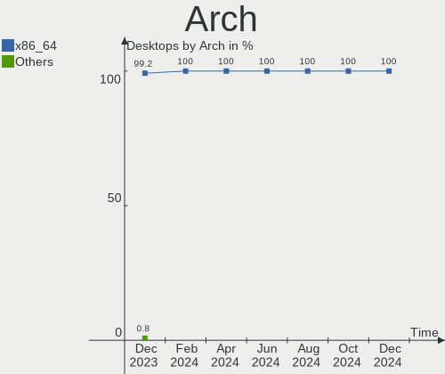
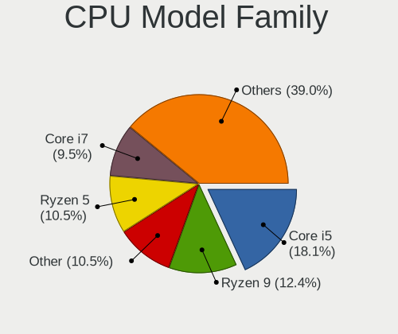
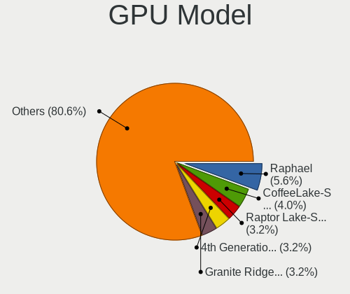
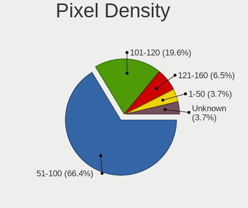
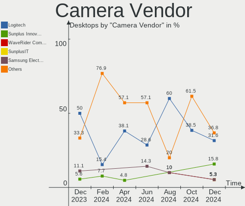
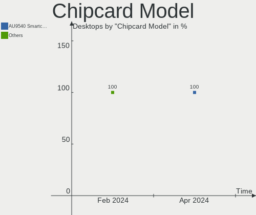

Linux in France - Hardware Trends (Desktops)
--------------------------------------------

A project to identify most popular hardware characteristics and track their change
over time based on data collected by Linux users at https://Linux-Hardware.org.

Anyone can contribute to this report by the [hw-probe](https://github.com/linuxhw/hw-probe) tool:

    sudo -E hw-probe -all -upload

Period: Apr, 2024.

Contents
--------

* [ System ](#system)
  - [ OS                       ](#os)
  - [ OS Family                ](#os-family)
  - [ Kernel                   ](#kernel)
  - [ Kernel Family            ](#kernel-family)
  - [ Kernel Major Ver.        ](#kernel-major-ver)
  - [ Arch                     ](#arch)
  - [ DE                       ](#de)
  - [ Display Server           ](#display-server)
  - [ Display Manager          ](#display-manager)
  - [ OS Lang                  ](#os-lang)
  - [ Boot Mode                ](#boot-mode)
  - [ Filesystem               ](#filesystem)
  - [ Part. scheme             ](#part-scheme)
  - [ Dual Boot with Linux/BSD ](#dual-boot-with-linuxbsd)
  - [ Dual Boot (Win)          ](#dual-boot-win)

* [ Board ](#board)
  - [ Vendor                   ](#vendor)
  - [ Model                    ](#model)
  - [ Model Family             ](#model-family)
  - [ MFG Year                 ](#mfg-year)
  - [ Form Factor              ](#form-factor)
  - [ Secure Boot              ](#secure-boot)
  - [ Coreboot                 ](#coreboot)
  - [ RAM Size                 ](#ram-size)
  - [ RAM Used                 ](#ram-used)
  - [ Total Drives             ](#total-drives)
  - [ Has CD-ROM               ](#has-cd-rom)
  - [ Has Ethernet             ](#has-ethernet)
  - [ Has WiFi                 ](#has-wifi)
  - [ Has Bluetooth            ](#has-bluetooth)

* [ Location ](#location)
  - [ Country                  ](#country)
  - [ City                     ](#city)

* [ Drives ](#drives)
  - [ Drive Vendor             ](#drive-vendor)
  - [ Drive Model              ](#drive-model)
  - [ HDD Vendor               ](#hdd-vendor)
  - [ SSD Vendor               ](#ssd-vendor)
  - [ Drive Kind               ](#drive-kind)
  - [ Drive Connector          ](#drive-connector)
  - [ Drive Size               ](#drive-size)
  - [ Space Total              ](#space-total)
  - [ Space Used               ](#space-used)
  - [ Malfunc. Drives          ](#malfunc-drives)
  - [ Malfunc. Drive Vendor    ](#malfunc-drive-vendor)
  - [ Malfunc. HDD Vendor      ](#malfunc-hdd-vendor)
  - [ Malfunc. Drive Kind      ](#malfunc-drive-kind)
  - [ Failed Drives            ](#failed-drives)
  - [ Failed Drive Vendor      ](#failed-drive-vendor)
  - [ Drive Status             ](#drive-status)

* [ Storage controller ](#storage-controller)
  - [ Storage Vendor           ](#storage-vendor)
  - [ Storage Model            ](#storage-model)
  - [ Storage Kind             ](#storage-kind)

* [ Processor ](#processor)
  - [ CPU Vendor               ](#cpu-vendor)
  - [ CPU Model                ](#cpu-model)
  - [ CPU Model Family         ](#cpu-model-family)
  - [ CPU Cores                ](#cpu-cores)
  - [ CPU Sockets              ](#cpu-sockets)
  - [ CPU Threads              ](#cpu-threads)
  - [ CPU Op-Modes             ](#cpu-op-modes)
  - [ CPU Microcode            ](#cpu-microcode)
  - [ CPU Microarch            ](#cpu-microarch)

* [ Graphics ](#graphics)
  - [ GPU Vendor               ](#gpu-vendor)
  - [ GPU Model                ](#gpu-model)
  - [ GPU Combo                ](#gpu-combo)
  - [ GPU Driver               ](#gpu-driver)
  - [ GPU Memory               ](#gpu-memory)

* [ Monitor ](#monitor)
  - [ Monitor Vendor           ](#monitor-vendor)
  - [ Monitor Model            ](#monitor-model)
  - [ Monitor Resolution       ](#monitor-resolution)
  - [ Monitor Diagonal         ](#monitor-diagonal)
  - [ Monitor Width            ](#monitor-width)
  - [ Aspect Ratio             ](#aspect-ratio)
  - [ Monitor Area             ](#monitor-area)
  - [ Pixel Density            ](#pixel-density)
  - [ Multiple Monitors        ](#multiple-monitors)

* [ Network ](#network)
  - [ Net Controller Vendor    ](#net-controller-vendor)
  - [ Net Controller Model     ](#net-controller-model)
  - [ Wireless Vendor          ](#wireless-vendor)
  - [ Wireless Model           ](#wireless-model)
  - [ Ethernet Vendor          ](#ethernet-vendor)
  - [ Ethernet Model           ](#ethernet-model)
  - [ Net Controller Kind      ](#net-controller-kind)
  - [ Used Controller          ](#used-controller)
  - [ NICs                     ](#nics)
  - [ IPv6                     ](#ipv6)

* [ Bluetooth ](#bluetooth)
  - [ Bluetooth Vendor         ](#bluetooth-vendor)
  - [ Bluetooth Model          ](#bluetooth-model)

* [ Sound ](#sound)
  - [ Sound Vendor             ](#sound-vendor)
  - [ Sound Model              ](#sound-model)

* [ Memory ](#memory)
  - [ Memory Vendor            ](#memory-vendor)
  - [ Memory Model             ](#memory-model)
  - [ Memory Kind              ](#memory-kind)
  - [ Memory Form Factor       ](#memory-form-factor)
  - [ Memory Size              ](#memory-size)
  - [ Memory Speed             ](#memory-speed)

* [ Printers & scanners ](#printers--scanners)
  - [ Printer Vendor           ](#printer-vendor)
  - [ Printer Model            ](#printer-model)
  - [ Scanner Vendor           ](#scanner-vendor)
  - [ Scanner Model            ](#scanner-model)

* [ Camera ](#camera)
  - [ Camera Vendor            ](#camera-vendor)
  - [ Camera Model             ](#camera-model)

* [ Security ](#security)
  - [ Fingerprint Vendor       ](#fingerprint-vendor)
  - [ Fingerprint Model        ](#fingerprint-model)
  - [ Chipcard Vendor          ](#chipcard-vendor)
  - [ Chipcard Model           ](#chipcard-model)

* [ Unsupported ](#unsupported)
  - [ Unsupported Devices      ](#unsupported-devices)
  - [ Unsupported Device Types ](#unsupported-device-types)

System
------

OS
--

Installed operating systems

| Name                | Desktops | Percent |
|---------------------|----------|---------|
| Ubuntu 22.04        | 21       | 20.79%  |
| OpenMandriva 23.08  | 9        | 8.91%   |
| Fedora 39           | 8        | 7.92%   |
| Ubuntu 24.04        | 6        | 5.94%   |
| OpenMandriva 5.0    | 6        | 5.94%   |
| Linux Mint 21.3     | 6        | 5.94%   |
| Zorin 17            | 4        | 3.96%   |
| Arch Rolling        | 4        | 3.96%   |
| Ubuntu 23.10        | 3        | 2.97%   |
| Ubuntu 20.04        | 3        | 2.97%   |
| Debian 12           | 3        | 2.97%   |
| Xubuntu 22.04       | 2        | 1.98%   |
| Ubuntu MATE 22.04   | 2        | 1.98%   |
| Linux Mint 20.3     | 2        | 1.98%   |
| Fedora 40           | 2        | 1.98%   |
| Xubuntu 24.04       | 1        | 0.99%   |
| Xero Rolling        | 1        | 0.99%   |
| Ultramarine 39      | 1        | 0.99%   |
| Ubuntu MATE 23.10   | 1        | 0.99%   |
| OpenMandriva 24.01  | 1        | 0.99%   |
| OpenMandriva 23.10  | 1        | 0.99%   |
| MX 23               | 1        | 0.99%   |
| Mageia 9            | 1        | 0.99%   |
| Lubuntu 22.04       | 1        | 0.99%   |
| Lubuntu 20.04       | 1        | 0.99%   |
| Kubuntu 23.10       | 1        | 0.99%   |
| Kubuntu 22.04       | 1        | 0.99%   |
| KDE neon 22.04      | 1        | 0.99%   |
| Kali 2024.1         | 1        | 0.99%   |
| Gentoo 2.15         | 1        | 0.99%   |
| EndeavourOS Rolling | 1        | 0.99%   |
| Drauger OS 7.7      | 1        | 0.99%   |
| Devuan              | 1        | 0.99%   |
| ArcoLinux Rolling   | 1        | 0.99%   |
| Alpine 3.17.7       | 1        | 0.99%   |

OS Family
---------

OS without a version

| Name         | Desktops | Percent |
|--------------|----------|---------|
| Ubuntu       | 33       | 32.67%  |
| OpenMandriva | 17       | 16.83%  |
| Fedora       | 10       | 9.9%    |
| Linux Mint   | 8        | 7.92%   |
| Zorin        | 4        | 3.96%   |
| Arch         | 4        | 3.96%   |
| Xubuntu      | 3        | 2.97%   |
| Ubuntu MATE  | 3        | 2.97%   |
| Debian       | 3        | 2.97%   |
| Lubuntu      | 2        | 1.98%   |
| Kubuntu      | 2        | 1.98%   |
| Xero         | 1        | 0.99%   |
| Ultramarine  | 1        | 0.99%   |
| MX           | 1        | 0.99%   |
| Mageia       | 1        | 0.99%   |
| KDE neon     | 1        | 0.99%   |
| Kali         | 1        | 0.99%   |
| Gentoo       | 1        | 0.99%   |
| EndeavourOS  | 1        | 0.99%   |
| Drauger OS   | 1        | 0.99%   |
| Devuan       | 1        | 0.99%   |
| ArcoLinux    | 1        | 0.99%   |
| Alpine       | 1        | 0.99%   |

Kernel
------

Version of the Linux kernel

| Version                     | Desktops | Percent |
|-----------------------------|----------|---------|
| 6.5.0-26-generic            | 18       | 17.82%  |
| 6.5.0-27-generic            | 10       | 9.9%    |
| 6.4.11-desktop-1omv2390     | 9        | 8.91%   |
| 6.6.2-desktop-1omv2390      | 7        | 6.93%   |
| 6.8.0-31-generic            | 4        | 3.96%   |
| 5.15.0-102-generic          | 4        | 3.96%   |
| 6.5.0-28-generic            | 3        | 2.97%   |
| 6.1.0-18-amd64              | 3        | 2.97%   |
| 5.15.0-101-generic          | 3        | 2.97%   |
| 6.8.7-arch1-1               | 2        | 1.98%   |
| 6.8.6-200.fc39.x86_64       | 2        | 1.98%   |
| 6.8.0-22-generic            | 2        | 1.98%   |
| 6.7.11-200.fc39.x86_64      | 2        | 1.98%   |
| 6.5.0-18-generic            | 2        | 1.98%   |
| 6.8.7-301.fsync.fc40.x86_64 | 1        | 0.99%   |
| 6.8.7-300.fc40.x86_64       | 1        | 0.99%   |
| 6.8.7-200.fc39.x86_64       | 1        | 0.99%   |
| 6.8.6-gentoo-dist           | 1        | 0.99%   |
| 6.8.5-201.fc39.x86_64       | 1        | 0.99%   |
| 6.8.4-273-tkg-eevdf-llvm    | 1        | 0.99%   |
| 6.8.4-200.fc39.x86_64       | 1        | 0.99%   |
| 6.8.2-zen2-1-zen            | 1        | 0.99%   |
| 6.8.1-arch1-1               | 1        | 0.99%   |
| 6.8.1                       | 1        | 0.99%   |
| 6.8.0-11-generic            | 1        | 0.99%   |
| 6.7.10-200.fc39.x86_64      | 1        | 0.99%   |
| 6.6.9-arch1-1               | 1        | 0.99%   |
| 6.6.9-amd64                 | 1        | 0.99%   |
| 6.6.28-1-lts                | 1        | 0.99%   |
| 6.6.22-desktop-1.mga9       | 1        | 0.99%   |
| 6.6.12-1-liquorix-amd64     | 1        | 0.99%   |
| 6.5.6-300.fc39.x86_64       | 1        | 0.99%   |
| 6.5.5-desktop-1omv2390      | 1        | 0.99%   |
| 6.5.0-9-generic             | 1        | 0.99%   |
| 6.5.0-25-generic            | 1        | 0.99%   |
| 6.5.0-1mx-ahs-amd64         | 1        | 0.99%   |
| 6.1.0-20-amd64              | 1        | 0.99%   |
| 5.4.0-177-generic           | 1        | 0.99%   |
| 5.4.0-174-generic           | 1        | 0.99%   |
| 5.15.148-0-lts              | 1        | 0.99%   |

Kernel Family
-------------

Linux kernel without a distro release

| Version  | Desktops | Percent |
|----------|----------|---------|
| 6.5.0    | 36       | 35.64%  |
| 5.15.0   | 11       | 10.89%  |
| 6.4.11   | 9        | 8.91%   |
| 6.8.0    | 7        | 6.93%   |
| 6.6.2    | 7        | 6.93%   |
| 6.8.7    | 5        | 4.95%   |
| 6.1.0    | 4        | 3.96%   |
| 6.8.6    | 3        | 2.97%   |
| 6.8.4    | 2        | 1.98%   |
| 6.8.1    | 2        | 1.98%   |
| 6.7.11   | 2        | 1.98%   |
| 6.6.9    | 2        | 1.98%   |
| 5.4.0    | 2        | 1.98%   |
| 6.8.5    | 1        | 0.99%   |
| 6.8.2    | 1        | 0.99%   |
| 6.7.10   | 1        | 0.99%   |
| 6.6.28   | 1        | 0.99%   |
| 6.6.22   | 1        | 0.99%   |
| 6.6.12   | 1        | 0.99%   |
| 6.5.6    | 1        | 0.99%   |
| 6.5.5    | 1        | 0.99%   |
| 5.15.148 | 1        | 0.99%   |

Kernel Major Ver.
-----------------

Linux kernel major version

| Version | Desktops | Percent |
|---------|----------|---------|
| 6.5     | 38       | 37.62%  |
| 6.8     | 21       | 20.79%  |
| 6.6     | 12       | 11.88%  |
| 5.15    | 12       | 11.88%  |
| 6.4     | 9        | 8.91%   |
| 6.1     | 4        | 3.96%   |
| 6.7     | 3        | 2.97%   |
| 5.4     | 2        | 1.98%   |

Arch
----

OS architecture (x86_64, i586, etc.)

| Name   | Desktops | Percent |
|--------|----------|---------|
| x86_64 | 101      | 100%    |

DE
--

Desktop Environment

| Name       | Desktops | Percent |
|------------|----------|---------|
| GNOME      | 46       | 45.54%  |
| KDE5       | 21       | 20.79%  |
| XFCE       | 11       | 10.89%  |
| X-Cinnamon | 7        | 6.93%   |
| KDE6       | 4        | 3.96%   |
| Unknown    | 4        | 3.96%   |
| MATE       | 3        | 2.97%   |
| LXQt       | 3        | 2.97%   |
| KDE        | 1        | 0.99%   |
| Cinnamon   | 1        | 0.99%   |

Display Server
--------------

X11 or Wayland

| Name    | Desktops | Percent |
|---------|----------|---------|
| Wayland | 55       | 54.46%  |
| X11     | 42       | 41.58%  |
| Tty     | 2        | 1.98%   |
| Unknown | 2        | 1.98%   |

Display Manager
---------------

SDDM, LightDM, etc.

| Name    | Desktops | Percent |
|---------|----------|---------|
| GDM3    | 29       | 28.71%  |
| SDDM    | 26       | 25.74%  |
| LightDM | 21       | 20.79%  |
| Unknown | 21       | 20.79%  |
| GDM     | 4        | 3.96%   |

OS Lang
-------

Language

| Lang    | Desktops | Percent |
|---------|----------|---------|
| fr_FR   | 85       | 84.16%  |
| en_US   | 10       | 9.9%    |
| it_IT   | 2        | 1.98%   |
| C       | 2        | 1.98%   |
| en_GB   | 1        | 0.99%   |
| Unknown | 1        | 0.99%   |

Boot Mode
---------

EFI or BIOS

| Mode | Desktops | Percent |
|------|----------|---------|
| BIOS | 56       | 55.45%  |
| EFI  | 45       | 44.55%  |

Filesystem
----------

Type of filesystem

| Type    | Desktops | Percent |
|---------|----------|---------|
| Ext4    | 57       | 56.44%  |
| Tmpfs   | 18       | 17.82%  |
| Btrfs   | 14       | 13.86%  |
| Overlay | 10       | 9.9%    |
| Xfs     | 2        | 1.98%   |

Part. scheme
------------

Scheme of partitioning

| Type    | Desktops | Percent |
|---------|----------|---------|
| GPT     | 71       | 70.3%   |
| Unknown | 20       | 19.8%   |
| MBR     | 10       | 9.9%    |

Dual Boot with Linux/BSD
------------------------

Hosting more than one Linux/BSD

| Dual boot | Desktops | Percent |
|-----------|----------|---------|
| No        | 75       | 74.26%  |
| Yes       | 26       | 25.74%  |

Dual Boot (Win)
---------------

Hosting Linux and Windows

| Dual boot | Desktops | Percent |
|-----------|----------|---------|
| No        | 68       | 67.33%  |
| Yes       | 33       | 32.67%  |

Board
-----

Vendor
------

Motherboard manufacturer

| Name                                 | Desktops | Percent |
|--------------------------------------|----------|---------|
| ASUSTek Computer                     | 33       | 32.67%  |
| MSI                                  | 20       | 19.8%   |
| Dell                                 | 9        | 8.91%   |
| Hewlett-Packard                      | 8        | 7.92%   |
| Gigabyte Technology                  | 6        | 5.94%   |
| Lenovo                               | 4        | 3.96%   |
| Fujitsu                              | 4        | 3.96%   |
| ASRock                               | 4        | 3.96%   |
| Acer                                 | 3        | 2.97%   |
| Unknown                              | 2        | 1.98%   |
| Shenzhen Meigao Electronic Equipment | 1        | 0.99%   |
| Pegatron                             | 1        | 0.99%   |
| Packard Bell                         | 1        | 0.99%   |
| Minix                                | 1        | 0.99%   |
| Intel                                | 1        | 0.99%   |
| GEEKOM                               | 1        | 0.99%   |
| Foxconn                              | 1        | 0.99%   |
| ECS                                  | 1        | 0.99%   |

Model
-----

Motherboard model

| Name                                            | Desktops | Percent |
|-------------------------------------------------|----------|---------|
| ASUS All Series                                 | 4        | 3.96%   |
| MSI MS-7C37                                     | 2        | 1.98%   |
| Dell OptiPlex 790                               | 2        | 1.98%   |
| Dell OptiPlex 7040                              | 2        | 1.98%   |
| Dell OptiPlex 3050                              | 2        | 1.98%   |
| ASUS PRIME A320M-K                              | 2        | 1.98%   |
| ASUS M5A97                                      | 2        | 1.98%   |
| Unknown                                         | 2        | 1.98%   |
| Shenzhen Meigao Electronic Equipment UM773 Lite | 1        | 0.99%   |
| Pegatron WC954AA-ABF CQ5325FR                   | 1        | 0.99%   |
| Packard Bell IMEDIA S2185                       | 1        | 0.99%   |
| MSI MS-7D98                                     | 1        | 0.99%   |
| MSI MS-7D91                                     | 1        | 0.99%   |
| MSI MS-7D22                                     | 1        | 0.99%   |
| MSI MS-7C95                                     | 1        | 0.99%   |
| MSI MS-7C94                                     | 1        | 0.99%   |
| MSI MS-7C82                                     | 1        | 0.99%   |
| MSI MS-7C52                                     | 1        | 0.99%   |
| MSI MS-7B86                                     | 1        | 0.99%   |
| MSI MS-7B51                                     | 1        | 0.99%   |
| MSI MS-7B48                                     | 1        | 0.99%   |
| MSI MS-7A71                                     | 1        | 0.99%   |
| MSI MS-7846                                     | 1        | 0.99%   |
| MSI MS-7845                                     | 1        | 0.99%   |
| MSI MS-7823                                     | 1        | 0.99%   |
| MSI MS-7816                                     | 1        | 0.99%   |
| MSI MS-7798                                     | 1        | 0.99%   |
| MSI MS-7721                                     | 1        | 0.99%   |
| MSI MS-7522                                     | 1        | 0.99%   |
| Minix Z83-4                                     | 1        | 0.99%   |
| Lenovo ThinkStation S30 43512E6                 | 1        | 0.99%   |
| Lenovo ThinkStation E32 30A0A0DCFR              | 1        | 0.99%   |
| Lenovo ThinkCentre M800 10FY003AGE              | 1        | 0.99%   |
| Lenovo ThinkCentre Edge72 3484DUG               | 1        | 0.99%   |
| Intel DH55HC AAE70933-503                       | 1        | 0.99%   |
| HP ProLiant MicroServer Gen8                    | 1        | 0.99%   |
| HP ProDesk 600 G2 SFF                           | 1        | 0.99%   |
| HP ProDesk 600 G1 TWR                           | 1        | 0.99%   |
| HP EliteDesk 800 G1 SFF                         | 1        | 0.99%   |
| HP EliteDesk 705 G4 MT                          | 1        | 0.99%   |

Model Family
------------

Motherboard model prefix

| Name                                       | Desktops | Percent |
|--------------------------------------------|----------|---------|
| Dell OptiPlex                              | 8        | 7.92%   |
| ASUS ROG                                   | 6        | 5.94%   |
| ASUS PRIME                                 | 6        | 5.94%   |
| ASUS All                                   | 4        | 3.96%   |
| Fujitsu ESPRIMO                            | 3        | 2.97%   |
| ASUS TUF                                   | 3        | 2.97%   |
| MSI MS-7C37                                | 2        | 1.98%   |
| Lenovo ThinkStation                        | 2        | 1.98%   |
| Lenovo ThinkCentre                         | 2        | 1.98%   |
| HP ProDesk                                 | 2        | 1.98%   |
| HP EliteDesk                               | 2        | 1.98%   |
| ASUS M5A97                                 | 2        | 1.98%   |
| Acer Veriton                               | 2        | 1.98%   |
| Unknown                                    | 2        | 1.98%   |
| Shenzhen Meigao Electronic Equipment UM773 | 1        | 0.99%   |
| Pegatron WC954AA-ABF                       | 1        | 0.99%   |
| Packard Bell IMEDIA                        | 1        | 0.99%   |
| MSI MS-7D98                                | 1        | 0.99%   |
| MSI MS-7D91                                | 1        | 0.99%   |
| MSI MS-7D22                                | 1        | 0.99%   |
| MSI MS-7C95                                | 1        | 0.99%   |
| MSI MS-7C94                                | 1        | 0.99%   |
| MSI MS-7C82                                | 1        | 0.99%   |
| MSI MS-7C52                                | 1        | 0.99%   |
| MSI MS-7B86                                | 1        | 0.99%   |
| MSI MS-7B51                                | 1        | 0.99%   |
| MSI MS-7B48                                | 1        | 0.99%   |
| MSI MS-7A71                                | 1        | 0.99%   |
| MSI MS-7846                                | 1        | 0.99%   |
| MSI MS-7845                                | 1        | 0.99%   |
| MSI MS-7823                                | 1        | 0.99%   |
| MSI MS-7816                                | 1        | 0.99%   |
| MSI MS-7798                                | 1        | 0.99%   |
| MSI MS-7721                                | 1        | 0.99%   |
| MSI MS-7522                                | 1        | 0.99%   |
| Minix Z83-4                                | 1        | 0.99%   |
| Intel DH55HC                               | 1        | 0.99%   |
| HP ProLiant                                | 1        | 0.99%   |
| HP Compaq                                  | 1        | 0.99%   |
| HP 500-111ef                               | 1        | 0.99%   |

MFG Year
--------

Motherboard manufacture year

| Year | Desktops | Percent |
|------|----------|---------|
| 2013 | 10       | 9.9%    |
| 2017 | 8        | 7.92%   |
| 2020 | 7        | 6.93%   |
| 2019 | 7        | 6.93%   |
| 2018 | 7        | 6.93%   |
| 2016 | 7        | 6.93%   |
| 2023 | 6        | 5.94%   |
| 2014 | 6        | 5.94%   |
| 2012 | 6        | 5.94%   |
| 2011 | 6        | 5.94%   |
| 2008 | 6        | 5.94%   |
| 2022 | 5        | 4.95%   |
| 2021 | 5        | 4.95%   |
| 2015 | 5        | 4.95%   |
| 2010 | 4        | 3.96%   |
| 2009 | 4        | 3.96%   |
| 2007 | 1        | 0.99%   |
| 2005 | 1        | 0.99%   |

Form Factor
-----------

Physical design of the computer

| Name    | Desktops | Percent |
|---------|----------|---------|
| Desktop | 101      | 100%    |

Secure Boot
-----------

Enabled or disabled

| State    | Desktops | Percent |
|----------|----------|---------|
| Disabled | 95       | 94.06%  |
| Enabled  | 6        | 5.94%   |

Coreboot
--------

Have coreboot on board

| Used | Desktops | Percent |
|------|----------|---------|
| No   | 101      | 100%    |

RAM Size
--------

Total RAM memory

| Size in GB  | Desktops | Percent |
|-------------|----------|---------|
| 32.01-64.0  | 27       | 26.73%  |
| 16.01-24.0  | 22       | 21.78%  |
| 3.01-4.0    | 18       | 17.82%  |
| 4.01-8.0    | 13       | 12.87%  |
| 8.01-16.0   | 11       | 10.89%  |
| 24.01-32.0  | 5        | 4.95%   |
| 64.01-256.0 | 2        | 1.98%   |
| 1.01-2.0    | 2        | 1.98%   |
| 2.01-3.0    | 1        | 0.99%   |

RAM Used
--------

Used RAM memory

| Used GB    | Desktops | Percent |
|------------|----------|---------|
| 1.01-2.0   | 30       | 29.7%   |
| 2.01-3.0   | 26       | 25.74%  |
| 4.01-8.0   | 14       | 13.86%  |
| 3.01-4.0   | 14       | 13.86%  |
| 8.01-16.0  | 8        | 7.92%   |
| 0.51-1.0   | 7        | 6.93%   |
| 16.01-24.0 | 1        | 0.99%   |
| 0.01-0.5   | 1        | 0.99%   |

Total Drives
------------

Number of drives on board

| Drives | Desktops | Percent |
|--------|----------|---------|
| 1      | 38       | 37.62%  |
| 2      | 26       | 25.74%  |
| 3      | 15       | 14.85%  |
| 5      | 10       | 9.9%    |
| 4      | 8        | 7.92%   |
| 7      | 2        | 1.98%   |
| 6      | 1        | 0.99%   |
| 0      | 1        | 0.99%   |

Has CD-ROM
----------

Has CD-ROM on board

| Presented | Desktops | Percent |
|-----------|----------|---------|
| No        | 52       | 51.49%  |
| Yes       | 49       | 48.51%  |

Has Ethernet
------------

Has Ethernet on board

| Presented | Desktops | Percent |
|-----------|----------|---------|
| Yes       | 100      | 99.01%  |
| No        | 1        | 0.99%   |

Has WiFi
--------

Has WiFi module

| Presented | Desktops | Percent |
|-----------|----------|---------|
| Yes       | 54       | 53.47%  |
| No        | 47       | 46.53%  |

Has Bluetooth
-------------

Has Bluetooth module

| Presented | Desktops | Percent |
|-----------|----------|---------|
| No        | 70       | 69.31%  |
| Yes       | 31       | 30.69%  |

Location
--------

Country
-------

Geographic location (country)

| Country | Desktops | Percent |
|---------|----------|---------|
| France  | 101      | 100%    |

City
----

Geographic location (city)

| City                     | Desktops | Percent |
|--------------------------|----------|---------|
| Paris                    | 10       | 9.9%    |
| Toulouse                 | 4        | 3.96%   |
| Rennes                   | 3        | 2.97%   |
| Vernon                   | 2        | 1.98%   |
| Poitiers                 | 2        | 1.98%   |
| Pace                     | 2        | 1.98%   |
| Nîmes                   | 2        | 1.98%   |
| Nice                     | 2        | 1.98%   |
| Nantes                   | 2        | 1.98%   |
| Monteux                  | 2        | 1.98%   |
| Marseille                | 2        | 1.98%   |
| Wasquehal                | 1        | 0.99%   |
| Vivonne                  | 1        | 0.99%   |
| Viry-Châtillon          | 1        | 0.99%   |
| Villeneuve-le-Roi        | 1        | 0.99%   |
| Vanves                   | 1        | 0.99%   |
| Valence                  | 1        | 0.99%   |
| Tours                    | 1        | 0.99%   |
| Tosse                    | 1        | 0.99%   |
| Strasbourg               | 1        | 0.99%   |
| Saultain                 | 1        | 0.99%   |
| Saintes                  | 1        | 0.99%   |
| Sainte-Sigolene          | 1        | 0.99%   |
| Saint-Martin-de-Seignanx | 1        | 0.99%   |
| Saint-Loubes             | 1        | 0.99%   |
| Saint-Laurent-du-Var     | 1        | 0.99%   |
| Saint-Julien-en-Genevois | 1        | 0.99%   |
| Saint-Jean-Brevelay      | 1        | 0.99%   |
| Saint-Georges-de-Reneins | 1        | 0.99%   |
| Saint Egreve             | 1        | 0.99%   |
| Rosny-sous-Bois          | 1        | 0.99%   |
| Rezé                    | 1        | 0.99%   |
| Pouilly-sur-Loire        | 1        | 0.99%   |
| Plaisir                  | 1        | 0.99%   |
| Périgueux               | 1        | 0.99%   |
| Orléans                 | 1        | 0.99%   |
| Nogent-sur-Vernisson     | 1        | 0.99%   |
| Nogent-sur-Marne         | 1        | 0.99%   |
| Montpellier              | 1        | 0.99%   |
| Molsheim                 | 1        | 0.99%   |

Drives
------

Drive Vendor
------------

Hard drive vendors

| Vendor                       | Desktops | Drives | Percent |
|------------------------------|----------|--------|---------|
| Seagate                      | 36       | 44     | 18%     |
| WDC                          | 31       | 39     | 15.5%   |
| Samsung Electronics          | 29       | 40     | 14.5%   |
| Crucial                      | 22       | 24     | 11%     |
| Kingston                     | 14       | 14     | 7%      |
| Toshiba                      | 8        | 10     | 4%      |
| Sandisk                      | 6        | 6      | 3%      |
| Micron/Crucial Technology    | 5        | 5      | 2.5%    |
| Hitachi                      | 5        | 6      | 2.5%    |
| Shenzhen Longsys Electronics | 3        | 3      | 1.5%    |
| PNY                          | 3        | 4      | 1.5%    |
| Phison Electronics           | 3        | 4      | 1.5%    |
| Kingston Technology Company  | 3        | 3      | 1.5%    |
| China                        | 3        | 3      | 1.5%    |
| Unknown                      | 2        | 4      | 1%      |
| SPCC                         | 2        | 2      | 1%      |
| SK hynix                     | 2        | 2      | 1%      |
| Micron Technology            | 2        | 3      | 1%      |
| LDLC                         | 2        | 2      | 1%      |
| Intel                        | 2        | 2      | 1%      |
| HGST                         | 2        | 2      | 1%      |
| Verbatim                     | 1        | 1      | 0.5%    |
| USB3.0                       | 1        | 1      | 0.5%    |
| Transcend                    | 1        | 1      | 0.5%    |
| SSK                          | 1        | 1      | 0.5%    |
| Silicon Motion               | 1        | 1      | 0.5%    |
| Netac                        | 1        | 1      | 0.5%    |
| Maxtor                       | 1        | 1      | 0.5%    |
| LITEON                       | 1        | 1      | 0.5%    |
| Lexar                        | 1        | 1      | 0.5%    |
| Intenso                      | 1        | 1      | 0.5%    |
| Initio                       | 1        | 1      | 0.5%    |
| Fanxiang                     | 1        | 1      | 0.5%    |
| External                     | 1        | 1      | 0.5%    |
| Corsair                      | 1        | 1      | 0.5%    |
| Unknown                      | 1        | 1      | 0.5%    |

Drive Model
-----------

Hard drive models

| Model                                              | Desktops | Percent |
|----------------------------------------------------|----------|---------|
| Seagate ST500DM002-1BD142 500GB                    | 5        | 2.19%   |
| Kingston SA400S37240G 240GB SSD                    | 5        | 2.19%   |
| Crucial CT1000BX500SSD1 1TB                        | 4        | 1.75%   |
| Seagate ST2000DM006-2DM164 2TB                     | 3        | 1.32%   |
| Samsung SSD 860 EVO 500GB                          | 3        | 1.32%   |
| Samsung NVMe SSD Controller SM981/PM981/PM983 1TB  | 3        | 1.32%   |
| Samsung NVMe SSD Controller PM9A1/PM9A3/980PRO 1TB | 3        | 1.32%   |
| Micron/Crucial P2 NVMe PCIe SSD 4TB                | 3        | 1.32%   |
| Crucial CT500MX500SSD1 500GB                       | 3        | 1.32%   |
| Crucial CT1000P3SSD8 1TB                           | 3        | 1.32%   |
| WDC WD40PURX-64GVNY0 4TB                           | 2        | 0.88%   |
| Toshiba HDWG440 4TB                                | 2        | 0.88%   |
| Toshiba HDWE160 6TB                                | 2        | 0.88%   |
| SPCC Solid State Disk 512GB                        | 2        | 0.88%   |
| Seagate ST500LT012-1DG142 500GB                    | 2        | 0.88%   |
| Seagate ST500DM009-2F110A 500GB                    | 2        | 0.88%   |
| Seagate ST3500418AS 500GB                          | 2        | 0.88%   |
| Seagate ST2000DM008-2FR102 2TB                     | 2        | 0.88%   |
| Seagate ST2000DM001-1CH164 2TB                     | 2        | 0.88%   |
| Seagate ST1000DM010-2EP102 1TB                     | 2        | 0.88%   |
| Samsung SSD 970 EVO Plus 2TB                       | 2        | 0.88%   |
| Samsung SSD 870 EVO 500GB                          | 2        | 0.88%   |
| Samsung SSD 870 EVO 2TB                            | 2        | 0.88%   |
| Samsung SSD 860 EVO 1TB                            | 2        | 0.88%   |
| Samsung SSD 850 EVO 250GB                          | 2        | 0.88%   |
| Samsung SSD 840 EVO 120GB                          | 2        | 0.88%   |
| Phison E12 NVMe Controller 2TB                     | 2        | 0.88%   |
| Kingston SV300S37A120G 120GB SSD                   | 2        | 0.88%   |
| Kingston SA400S37480G 480GB SSD                    | 2        | 0.88%   |
| Crucial CT2000MX500SSD1 2TB                        | 2        | 0.88%   |
| Crucial CT1000P2SSD8 1TB                           | 2        | 0.88%   |
| Crucial CT1000MX500SSD1 1TB                        | 2        | 0.88%   |
| WDC WUH721816ALE6L4 16TB                           | 1        | 0.44%   |
| WDC WD5003AZEX-00K3CA0 500GB                       | 1        | 0.44%   |
| WDC WD5001AALS-00L3B2 500GB                        | 1        | 0.44%   |
| WDC WD5000AAKX-75U6AA0 500GB                       | 1        | 0.44%   |
| WDC WD5000AAKX-60U6AA0 500GB                       | 1        | 0.44%   |
| WDC WD5000AAKX-22ERMA0 500GB                       | 1        | 0.44%   |
| WDC WD5000AAKX-08U6AA0 500GB                       | 1        | 0.44%   |
| WDC WD5000AAKX-001CA0 500GB                        | 1        | 0.44%   |

HDD Vendor
----------

Hard disk drive vendors

| Vendor              | Desktops | Drives | Percent |
|---------------------|----------|--------|---------|
| Seagate             | 36       | 44     | 41.86%  |
| WDC                 | 30       | 38     | 34.88%  |
| Toshiba             | 8        | 10     | 9.3%    |
| Hitachi             | 5        | 6      | 5.81%   |
| Samsung Electronics | 3        | 3      | 3.49%   |
| HGST                | 2        | 2      | 2.33%   |
| Maxtor              | 1        | 1      | 1.16%   |
| Initio              | 1        | 1      | 1.16%   |

SSD Vendor
----------

Solid state drive vendors

| Vendor              | Desktops | Drives | Percent |
|---------------------|----------|--------|---------|
| Samsung Electronics | 18       | 21     | 23.68%  |
| Crucial             | 17       | 18     | 22.37%  |
| Kingston            | 13       | 13     | 17.11%  |
| SanDisk             | 4        | 4      | 5.26%   |
| PNY                 | 3        | 4      | 3.95%   |
| China               | 3        | 3      | 3.95%   |
| SPCC                | 2        | 2      | 2.63%   |
| Micron Technology   | 2        | 3      | 2.63%   |
| WDC                 | 1        | 1      | 1.32%   |
| Verbatim            | 1        | 1      | 1.32%   |
| USB3.0              | 1        | 1      | 1.32%   |
| Transcend           | 1        | 1      | 1.32%   |
| SK hynix            | 1        | 1      | 1.32%   |
| Netac               | 1        | 1      | 1.32%   |
| LITEON              | 1        | 1      | 1.32%   |
| Lexar               | 1        | 1      | 1.32%   |
| LDLC                | 1        | 1      | 1.32%   |
| Intenso             | 1        | 1      | 1.32%   |
| Intel               | 1        | 1      | 1.32%   |
| External            | 1        | 1      | 1.32%   |
| Corsair             | 1        | 1      | 1.32%   |
| Unknown             | 1        | 1      | 1.32%   |

Drive Kind
----------

HDD or SSD

| Kind    | Desktops | Drives | Percent |
|---------|----------|--------|---------|
| HDD     | 69       | 105    | 41.57%  |
| SSD     | 62       | 82     | 37.35%  |
| NVMe    | 31       | 44     | 18.67%  |
| Unknown | 3        | 5      | 1.81%   |
| MMC     | 1        | 1      | 0.6%    |

Drive Connector
---------------

SATA, SAS, NVMe, etc.

| Type | Desktops | Drives | Percent |
|------|----------|--------|---------|
| SATA | 92       | 182    | 69.17%  |
| NVMe | 31       | 42     | 23.31%  |
| SAS  | 9        | 12     | 6.77%   |
| MMC  | 1        | 1      | 0.75%   |

Drive Size
----------

Size of hard drive

| Size in TB | Desktops | Drives | Percent |
|------------|----------|--------|---------|
| 0.01-0.5   | 69       | 95     | 49.29%  |
| 0.51-1.0   | 36       | 46     | 25.71%  |
| 1.01-2.0   | 18       | 25     | 12.86%  |
| 3.01-4.0   | 8        | 10     | 5.71%   |
| 2.01-3.0   | 4        | 5      | 2.86%   |
| 4.01-10.0  | 4        | 5      | 2.86%   |
| 10.01-20.0 | 1        | 1      | 0.71%   |

Space Total
-----------

Amount of disk space available on the file system

| Size in GB     | Desktops | Percent |
|----------------|----------|---------|
| 251-500        | 21       | 20.79%  |
| 501-1000       | 20       | 19.8%   |
| 101-250        | 15       | 14.85%  |
| 1001-2000      | 15       | 14.85%  |
| More than 3000 | 11       | 10.89%  |
| 2001-3000      | 7        | 6.93%   |
| 1-20           | 5        | 4.95%   |
| Unknown        | 4        | 3.96%   |
| 51-100         | 3        | 2.97%   |

Space Used
----------

Amount of used disk space

| Used GB        | Desktops | Percent |
|----------------|----------|---------|
| 1-20           | 31       | 30.69%  |
| 21-50          | 15       | 14.85%  |
| 101-250        | 15       | 14.85%  |
| 251-500        | 8        | 7.92%   |
| 1001-2000      | 8        | 7.92%   |
| More than 3000 | 6        | 5.94%   |
| 51-100         | 6        | 5.94%   |
| 501-1000       | 5        | 4.95%   |
| Unknown        | 4        | 3.96%   |
| 2001-3000      | 3        | 2.97%   |

Malfunc. Drives
---------------

Drive models with a malfunction

| Model                                 | Desktops | Drives | Percent |
|---------------------------------------|----------|--------|---------|
| WDC WD2500JS-60NCB1 250GB             | 1        | 1      | 5.88%   |
| WDC WD2500AAJS-22L7A0 250GB           | 1        | 1      | 5.88%   |
| WDC WD20EZRX-00DC0B0 2TB              | 1        | 1      | 5.88%   |
| WDC WD2003FZEX-00SRLA0 2TB            | 1        | 1      | 5.88%   |
| Toshiba DT01ACA300 3TB                | 1        | 1      | 5.88%   |
| Seagate ST3160812AS 160GB             | 1        | 2      | 5.88%   |
| Seagate ST2000DM008-2FR102 2TB        | 1        | 1      | 5.88%   |
| Seagate ST2000DM001-9YN164 2TB        | 1        | 2      | 5.88%   |
| Seagate ST2000DM001-1CH164 2TB        | 1        | 1      | 5.88%   |
| Seagate ST2000DL003-9VT166 2TB        | 1        | 1      | 5.88%   |
| Seagate ST1000DX001-1NS162 1TB        | 1        | 1      | 5.88%   |
| Seagate ST1000DM010-2EP102 1TB        | 1        | 1      | 5.88%   |
| Samsung Electronics SSD 970 EVO 1TB   | 1        | 1      | 5.88%   |
| Samsung Electronics SSD 850 PRO 512GB | 1        | 1      | 5.88%   |
| Samsung Electronics SSD 840 EVO 120GB | 1        | 1      | 5.88%   |
| LDLC SSD 120GB                        | 1        | 1      | 5.88%   |
| Hitachi HDT721010SLA360 1TB           | 1        | 1      | 5.88%   |

Malfunc. Drive Vendor
---------------------

Vendors of faulty drives

| Vendor              | Desktops | Drives | Percent |
|---------------------|----------|--------|---------|
| Seagate             | 6        | 9      | 37.5%   |
| WDC                 | 4        | 4      | 25%     |
| Samsung Electronics | 3        | 3      | 18.75%  |
| Toshiba             | 1        | 1      | 6.25%   |
| LDLC                | 1        | 1      | 6.25%   |
| Hitachi             | 1        | 1      | 6.25%   |

Malfunc. HDD Vendor
-------------------

Vendors of faulty HDD drives

| Vendor  | Desktops | Drives | Percent |
|---------|----------|--------|---------|
| Seagate | 6        | 9      | 50%     |
| WDC     | 4        | 4      | 33.33%  |
| Toshiba | 1        | 1      | 8.33%   |
| Hitachi | 1        | 1      | 8.33%   |

Malfunc. Drive Kind
-------------------

Kinds of faulty drives

| Kind | Desktops | Drives | Percent |
|------|----------|--------|---------|
| HDD  | 10       | 15     | 71.43%  |
| SSD  | 3        | 3      | 21.43%  |
| NVMe | 1        | 1      | 7.14%   |

Failed Drives
-------------

Failed drive models

| Model                           | Desktops | Drives | Percent |
|---------------------------------|----------|--------|---------|
| Seagate ST500LT012-1DG142 500GB | 1        | 1      | 100%    |

Failed Drive Vendor
-------------------

Failed drive vendors

| Vendor  | Desktops | Drives | Percent |
|---------|----------|--------|---------|
| Seagate | 1        | 1      | 100%    |

Drive Status
------------

Number of failed and malfunc. drives

| Status   | Desktops | Drives | Percent |
|----------|----------|--------|---------|
| Works    | 60       | 128    | 51.72%  |
| Detected | 41       | 89     | 35.34%  |
| Malfunc  | 14       | 19     | 12.07%  |
| Failed   | 1        | 1      | 0.86%   |

Storage controller
------------------

Storage Vendor
--------------

Storage controller vendors

| Vendor                        | Desktops | Percent |
|-------------------------------|----------|---------|
| Intel                         | 64       | 42.11%  |
| AMD                           | 33       | 21.71%  |
| Samsung Electronics           | 11       | 7.24%   |
| Micron/Crucial Technology     | 10       | 6.58%   |
| ASMedia Technology            | 8        | 5.26%   |
| Nvidia                        | 4        | 2.63%   |
| Kingston Technology Company   | 4        | 2.63%   |
| Shenzhen Longsys Electronics  | 3        | 1.97%   |
| Phison Electronics            | 3        | 1.97%   |
| Marvell Technology Group      | 3        | 1.97%   |
| SanDisk                       | 2        | 1.32%   |
| JMicron Technology            | 2        | 1.32%   |
| SK hynix                      | 1        | 0.66%   |
| Silicon Motion                | 1        | 0.66%   |
| Micron Technology             | 1        | 0.66%   |
| Integrated Technology Express | 1        | 0.66%   |
| Artop Electronic              | 1        | 0.66%   |

Storage Model
-------------

Storage controller models

| Model                                                                          | Desktops | Percent |
|--------------------------------------------------------------------------------|----------|---------|
| AMD FCH SATA Controller [AHCI mode]                                            | 13       | 7.3%    |
| Intel 8 Series/C220 Series Chipset Family 6-port SATA Controller 1 [AHCI mode] | 9        | 5.06%   |
| Intel SATA Controller [RAID mode]                                              | 8        | 4.49%   |
| ASMedia ASM1061/ASM1062 Serial ATA Controller                                  | 8        | 4.49%   |
| Samsung NVMe SSD Controller SM981/PM981/PM983                                  | 7        | 3.93%   |
| Micron/Crucial P2 [Nick P2] / P3 / P3 Plus NVMe PCIe SSD (DRAM-less)           | 7        | 3.93%   |
| Intel Q170/Q150/B150/H170/H110/Z170/CM236 Chipset SATA Controller [AHCI Mode]  | 6        | 3.37%   |
| AMD 600 Series Chipset SATA Controller                                         | 6        | 3.37%   |
| AMD 500 Series Chipset SATA Controller                                         | 6        | 3.37%   |
| Intel 7 Series/C210 Series Chipset Family 6-port SATA Controller [AHCI mode]   | 5        | 2.81%   |
| Intel 6 Series/C200 Series Chipset Family 6 port Desktop SATA AHCI Controller  | 5        | 2.81%   |
| AMD SB7x0/SB8x0/SB9x0 SATA Controller [AHCI mode]                              | 4        | 2.25%   |
| Shenzhen Longsys Lexar NM790 NVME SSD (DRAM-less)                              | 3        | 1.69%   |
| Samsung NVMe SSD Controller PM9A1/PM9A3/980PRO                                 | 3        | 1.69%   |
| Intel Cannon Lake PCH SATA AHCI Controller                                     | 3        | 1.69%   |
| Intel 9 Series Chipset Family SATA Controller [AHCI Mode]                      | 3        | 1.69%   |
| Intel 5 Series/3400 Series Chipset 4 port SATA IDE Controller                  | 3        | 1.69%   |
| Intel 5 Series/3400 Series Chipset 2 port SATA IDE Controller                  | 3        | 1.69%   |
| Intel 200 Series PCH SATA controller [AHCI mode]                               | 3        | 1.69%   |
| AMD 400 Series Chipset SATA Controller                                         | 3        | 1.69%   |
| Phison E12 NVMe Controller                                                     | 2        | 1.12%   |
| Nvidia MCP61 SATA Controller                                                   | 2        | 1.12%   |
| Micron/Crucial P5 Plus NVMe PCIe SSD                                           | 2        | 1.12%   |
| JMicron JMB363 SATA/IDE Controller                                             | 2        | 1.12%   |
| Intel Raptor Lake SATA AHCI Controller                                         | 2        | 1.12%   |
| Intel NM10/ICH7 Family SATA Controller [IDE mode]                              | 2        | 1.12%   |
| Intel C600/X79 series chipset 6-Port SATA AHCI Controller                      | 2        | 1.12%   |
| Intel Alder Lake-S PCH SATA Controller [AHCI Mode]                             | 2        | 1.12%   |
| Intel 82801JI (ICH10 Family) 4 port SATA IDE Controller #1                     | 2        | 1.12%   |
| Intel 82801JI (ICH10 Family) 2 port SATA IDE Controller #2                     | 2        | 1.12%   |
| Intel 500 Series Chipset Family SATA AHCI Controller                           | 2        | 1.12%   |
| AMD SB7x0/SB8x0/SB9x0 SATA Controller [IDE mode]                               | 2        | 1.12%   |
| AMD SB7x0/SB8x0/SB9x0 IDE Controller                                           | 2        | 1.12%   |
| AMD FCH SATA Controller D                                                      | 2        | 1.12%   |
| AMD 300 Series Chipset SATA Controller                                         | 2        | 1.12%   |
| SK hynix PC401 NVMe Solid State Drive 256GB                                    | 1        | 0.56%   |
| Silicon Motion SM2263EN/SM2263XT (DRAM-less) NVMe SSD Controllers              | 1        | 0.56%   |
| Sandisk WD Blue SN580 NVMe SSD (DRAM-less)                                     | 1        | 0.56%   |
| SanDisk Extreme Pro / WD Black SN750 / PC SN730 / Red SN700 NVMe SSD           | 1        | 0.56%   |
| Samsung NVMe SSD Controller SM951/PM951                                        | 1        | 0.56%   |

Storage Kind
------------

Kind of storage controller (IDE, SATA, NVMe, SAS, ...)

| Kind | Desktops | Percent |
|------|----------|---------|
| SATA | 83       | 58.87%  |
| NVMe | 31       | 21.99%  |
| IDE  | 16       | 11.35%  |
| RAID | 9        | 6.38%   |
| SAS  | 1        | 0.71%   |
| SCSI | 1        | 0.71%   |

Processor
---------

CPU Vendor
----------

Processor vendors

| Vendor | Desktops | Percent |
|--------|----------|---------|
| Intel  | 65       | 64.36%  |
| AMD    | 36       | 35.64%  |

CPU Model
---------

Processor models

| Model                                  | Desktops | Percent |
|----------------------------------------|----------|---------|
| Intel Core i5-6500T CPU @ 2.50GHz      | 3        | 2.97%   |
| AMD Ryzen 9 3900X 12-Core Processor    | 3        | 2.97%   |
| AMD Ryzen 7 3800X 8-Core Processor     | 3        | 2.97%   |
| Intel Pentium CPU G2020 @ 2.90GHz      | 2        | 1.98%   |
| Intel Core i7-7700 CPU @ 3.60GHz       | 2        | 1.98%   |
| Intel Core i7-3770K CPU @ 3.50GHz      | 2        | 1.98%   |
| Intel Core i5-6500 CPU @ 3.20GHz       | 2        | 1.98%   |
| Intel Core i5-4670K CPU @ 3.40GHz      | 2        | 1.98%   |
| Intel Core i3-4150 CPU @ 3.50GHz       | 2        | 1.98%   |
| Intel Core i3-4130 CPU @ 3.40GHz       | 2        | 1.98%   |
| Intel 12th Gen Core i5-12400F          | 2        | 1.98%   |
| AMD Ryzen 5 7500F 6-Core Processor     | 2        | 1.98%   |
| AMD Ryzen 5 3600 6-Core Processor      | 2        | 1.98%   |
| Intel Xeon CPU E5-1620 v2 @ 3.70GHz    | 1        | 0.99%   |
| Intel Xeon CPU E3-1275 v6 @ 3.80GHz    | 1        | 0.99%   |
| Intel Pentium Gold G6400 CPU @ 4.00GHz | 1        | 0.99%   |
| Intel Pentium Dual CPU E2220 @ 2.40GHz | 1        | 0.99%   |
| Intel Pentium Dual CPU E2180 @ 2.00GHz | 1        | 0.99%   |
| Intel Pentium CPU G640 @ 2.80GHz       | 1        | 0.99%   |
| Intel Pentium CPU G620 @ 2.60GHz       | 1        | 0.99%   |
| Intel Pentium CPU G3260 @ 3.30GHz      | 1        | 0.99%   |
| Intel Pentium CPU 4405U @ 2.10GHz      | 1        | 0.99%   |
| Intel N97                              | 1        | 0.99%   |
| Intel Core i7-9700K CPU @ 3.60GHz      | 1        | 0.99%   |
| Intel Core i7-8700K CPU @ 3.70GHz      | 1        | 0.99%   |
| Intel Core i7-8700 CPU @ 3.20GHz       | 1        | 0.99%   |
| Intel Core i7-6700K CPU @ 4.00GHz      | 1        | 0.99%   |
| Intel Core i7-4820K CPU @ 3.70GHz      | 1        | 0.99%   |
| Intel Core i7-4790 CPU @ 3.60GHz       | 1        | 0.99%   |
| Intel Core i7-4770 CPU @ 3.40GHz       | 1        | 0.99%   |
| Intel Core i7-2600S CPU @ 2.80GHz      | 1        | 0.99%   |
| Intel Core i7 CPU 920 @ 2.67GHz        | 1        | 0.99%   |
| Intel Core i7 CPU 860 @ 2.80GHz        | 1        | 0.99%   |
| Intel Core i5-9600K CPU @ 3.70GHz      | 1        | 0.99%   |
| Intel Core i5-9400F CPU @ 2.90GHz      | 1        | 0.99%   |
| Intel Core i5-9400 CPU @ 2.90GHz       | 1        | 0.99%   |
| Intel Core i5-8400 CPU @ 2.80GHz       | 1        | 0.99%   |
| Intel Core i5-7500 CPU @ 3.40GHz       | 1        | 0.99%   |
| Intel Core i5-4690K CPU @ 3.50GHz      | 1        | 0.99%   |
| Intel Core i5-4590 CPU @ 3.30GHz       | 1        | 0.99%   |

CPU Model Family
----------------

Processor model prefix

| Model                | Desktops | Percent |
|----------------------|----------|---------|
| Intel Core i5        | 17       | 16.83%  |
| Intel Core i7        | 14       | 13.86%  |
| Intel Core i3        | 9        | 8.91%   |
| AMD Ryzen 5          | 9        | 8.91%   |
| AMD Ryzen 9          | 8        | 7.92%   |
| Other                | 7        | 6.93%   |
| Intel Pentium        | 6        | 5.94%   |
| AMD Ryzen 7          | 6        | 5.94%   |
| Intel Celeron        | 4        | 3.96%   |
| Intel Xeon           | 2        | 1.98%   |
| Intel Pentium Dual   | 2        | 1.98%   |
| AMD FX               | 2        | 1.98%   |
| AMD Athlon II X2     | 2        | 1.98%   |
| AMD Athlon 64 X2     | 2        | 1.98%   |
| Intel Pentium Gold   | 1        | 0.99%   |
| Intel Core 2 Quad    | 1        | 0.99%   |
| Intel Core 2 Duo     | 1        | 0.99%   |
| Intel Atom           | 1        | 0.99%   |
| AMD Ryzen 5 PRO      | 1        | 0.99%   |
| AMD Ryzen 3          | 1        | 0.99%   |
| AMD Phenom II X4     | 1        | 0.99%   |
| AMD E1               | 1        | 0.99%   |
| AMD Athlon II X3     | 1        | 0.99%   |
| AMD Athlon Dual Core | 1        | 0.99%   |
| AMD A4               | 1        | 0.99%   |

CPU Cores
---------

Number of processor cores

| Number | Desktops | Percent |
|--------|----------|---------|
| 4      | 36       | 35.64%  |
| 2      | 26       | 25.74%  |
| 6      | 17       | 16.83%  |
| 12     | 9        | 8.91%   |
| 8      | 7        | 6.93%   |
| 3      | 2        | 1.98%   |
| 1      | 2        | 1.98%   |
| 16     | 1        | 0.99%   |
| 14     | 1        | 0.99%   |

CPU Sockets
-----------

Number of sockets

| Number | Desktops | Percent |
|--------|----------|---------|
| 1      | 101      | 100%    |

CPU Threads
-----------

Threads per core (Hyper-Threading)

| Number | Desktops | Percent |
|--------|----------|---------|
| 2      | 59       | 58.42%  |
| 1      | 42       | 41.58%  |

CPU Op-Modes
------------

CPU Operation Modes (32-bit, 64-bit)

| Op mode        | Desktops | Percent |
|----------------|----------|---------|
| 32-bit, 64-bit | 100      | 99.01%  |
| Unknown        | 1        | 0.99%   |

CPU Microcode
-------------

Microcode number

| Number     | Desktops | Percent |
|------------|----------|---------|
| Unknown    | 76       | 75.25%  |
| 0x08701021 | 3        | 2.97%   |
| 0x906ea    | 2        | 1.98%   |
| 0x0a601206 | 2        | 1.98%   |
| 0x08101016 | 2        | 1.98%   |
| 0x906e9    | 1        | 0.99%   |
| 0x6fd      | 1        | 0.99%   |
| 0x506e3    | 1        | 0.99%   |
| 0x406e3    | 1        | 0.99%   |
| 0x306c3    | 1        | 0.99%   |
| 0x306a9    | 1        | 0.99%   |
| 0x106e5    | 1        | 0.99%   |
| 0x08701033 | 1        | 0.99%   |
| 0x08701030 | 1        | 0.99%   |
| 0x08701013 | 1        | 0.99%   |
| 0x0700010b | 1        | 0.99%   |
| 0x06001119 | 1        | 0.99%   |
| 0x06000822 | 1        | 0.99%   |
| 0x0600081c | 1        | 0.99%   |
| 0x010000c8 | 1        | 0.99%   |
| 0x010000b7 | 1        | 0.99%   |

CPU Microarch
-------------

Microarchitecture

| Name             | Desktops | Percent |
|------------------|----------|---------|
| Haswell          | 14       | 13.86%  |
| KabyLake         | 11       | 10.89%  |
| Unknown          | 10       | 9.9%    |
| Zen 2            | 9        | 8.91%   |
| Skylake          | 8        | 7.92%   |
| IvyBridge        | 8        | 7.92%   |
| Zen 3            | 4        | 3.96%   |
| SandyBridge      | 4        | 3.96%   |
| K10              | 4        | 3.96%   |
| Zen              | 3        | 2.97%   |
| Piledriver       | 3        | 2.97%   |
| Nehalem          | 3        | 2.97%   |
| K8 Hammer        | 3        | 2.97%   |
| Core             | 3        | 2.97%   |
| Alderlake Hybrid | 3        | 2.97%   |
| Zen+             | 2        | 1.98%   |
| Penryn           | 2        | 1.98%   |
| CometLake        | 2        | 1.98%   |
| Westmere         | 1        | 0.99%   |
| Silvermont       | 1        | 0.99%   |
| Jaguar           | 1        | 0.99%   |
| Gracemont        | 1        | 0.99%   |
| Goldmont         | 1        | 0.99%   |

Graphics
--------

GPU Vendor
----------

Vendors of graphics cards

| Vendor                     | Desktops | Percent |
|----------------------------|----------|---------|
| Nvidia                     | 42       | 40%     |
| Intel                      | 32       | 30.48%  |
| AMD                        | 30       | 28.57%  |
| Matrox Electronics Systems | 1        | 0.95%   |

GPU Model
---------

Graphics card models

| Model                                                                       | Desktops | Percent |
|-----------------------------------------------------------------------------|----------|---------|
| Intel Xeon E3-1200 v3/4th Gen Core Processor Integrated Graphics Controller | 6        | 5.56%   |
| Intel HD Graphics 530                                                       | 6        | 5.56%   |
| Nvidia GT218 [GeForce 210]                                                  | 4        | 3.7%    |
| Intel CoffeeLake-S GT2 [UHD Graphics 630]                                   | 3        | 2.78%   |
| Intel 2nd Generation Core Processor Family Integrated Graphics Controller   | 3        | 2.78%   |
| AMD Ellesmere [Radeon RX 470/480/570/570X/580/580X/590]                     | 3        | 2.78%   |
| Nvidia TU117 [GeForce GTX 1650]                                             | 2        | 1.85%   |
| Nvidia GP108 [GeForce GT 1030]                                              | 2        | 1.85%   |
| Nvidia GP107 [GeForce GTX 1050]                                             | 2        | 1.85%   |
| Nvidia GP102 [GeForce GTX 1080 Ti]                                          | 2        | 1.85%   |
| Nvidia GM204 [GeForce GTX 970]                                              | 2        | 1.85%   |
| Nvidia GA106 [GeForce RTX 3060 Lite Hash Rate]                              | 2        | 1.85%   |
| Intel Xeon E3-1200 v2/3rd Gen Core processor Graphics Controller            | 2        | 1.85%   |
| Intel 4 Series Chipset Integrated Graphics Controller                       | 2        | 1.85%   |
| AMD RV710 [Radeon HD 4350/4550]                                             | 2        | 1.85%   |
| AMD RS880 [Radeon HD 4200]                                                  | 2        | 1.85%   |
| AMD Raphael                                                                 | 2        | 1.85%   |
| AMD Navi 24 [Radeon RX 6400/6500 XT/6500M]                                  | 2        | 1.85%   |
| AMD Navi 22 [Radeon RX 6700/6700 XT/6750 XT / 6800M/6850M XT]               | 2        | 1.85%   |
| AMD Navi 21 [Radeon RX 6800/6800 XT / 6900 XT]                              | 2        | 1.85%   |
| AMD Cedar [Radeon HD 5000/6000/7350/8350 Series]                            | 2        | 1.85%   |
| AMD Baffin [Radeon RX 550 640SP / RX 560/560X]                              | 2        | 1.85%   |
| Nvidia TU116 [GeForce GTX 1660 SUPER]                                       | 1        | 0.93%   |
| Nvidia TU116 [GeForce GTX 1650 SUPER]                                       | 1        | 0.93%   |
| Nvidia TU106 [GeForce RTX 2070]                                             | 1        | 0.93%   |
| Nvidia TU106 [GeForce RTX 2070 Rev. A]                                      | 1        | 0.93%   |
| Nvidia TU106 [GeForce RTX 2060 SUPER]                                       | 1        | 0.93%   |
| Nvidia TU106 [GeForce GTX 1650]                                             | 1        | 0.93%   |
| Nvidia TU104 [GeForce RTX 2060]                                             | 1        | 0.93%   |
| Nvidia GT218 [NVS 300]                                                      | 1        | 0.93%   |
| Nvidia GT216 [GeForce 405]                                                  | 1        | 0.93%   |
| Nvidia GP106GL [Quadro P2000]                                               | 1        | 0.93%   |
| Nvidia GP104 [GeForce GTX 1070]                                             | 1        | 0.93%   |
| Nvidia GP104 [GeForce GTX 1070 Ti]                                          | 1        | 0.93%   |
| Nvidia GM206 [GeForce GTX 960]                                              | 1        | 0.93%   |
| Nvidia GM107 [GeForce GTX 750]                                              | 1        | 0.93%   |
| Nvidia GK107GL [Quadro K2000]                                               | 1        | 0.93%   |
| Nvidia GK107 [GeForce GT 630 OEM]                                           | 1        | 0.93%   |
| Nvidia GF119 [GeForce GT 610]                                               | 1        | 0.93%   |
| Nvidia GF108 [GeForce GT 630]                                               | 1        | 0.93%   |

GPU Combo
---------

Combinations of graphics cards

| Name           | Desktops | Percent |
|----------------|----------|---------|
| 1 x Nvidia     | 38       | 37.62%  |
| 1 x Intel      | 28       | 27.72%  |
| 1 x AMD        | 27       | 26.73%  |
| 2 x AMD        | 2        | 1.98%   |
| Intel + Nvidia | 2        | 1.98%   |
| 2 x Nvidia     | 1        | 0.99%   |
| 2 x Intel      | 1        | 0.99%   |
| 1 x Matrox     | 1        | 0.99%   |
| AMD + Nvidia   | 1        | 0.99%   |

GPU Driver
----------

Free vs proprietary

| Driver      | Desktops | Percent |
|-------------|----------|---------|
| Free        | 79       | 78.22%  |
| Proprietary | 20       | 19.8%   |
| Unknown     | 2        | 1.98%   |

GPU Memory
----------

Total video memory

| Size in GB | Desktops | Percent |
|------------|----------|---------|
| Unknown    | 56       | 55.45%  |
| 7.01-8.0   | 9        | 8.91%   |
| 3.01-4.0   | 8        | 7.92%   |
| 8.01-16.0  | 8        | 7.92%   |
| 1.01-2.0   | 7        | 6.93%   |
| 0.01-0.5   | 6        | 5.94%   |
| 0.51-1.0   | 5        | 4.95%   |
| 5.01-6.0   | 2        | 1.98%   |

Monitor
-------

Monitor Vendor
--------------

Monitor vendors

| Vendor               | Desktops | Percent |
|----------------------|----------|---------|
| Samsung Electronics  | 18       | 17.14%  |
| Goldstar             | 12       | 11.43%  |
| Philips              | 10       | 9.52%   |
| Hewlett-Packard      | 10       | 9.52%   |
| Iiyama               | 8        | 7.62%   |
| Dell                 | 7        | 6.67%   |
| Lenovo               | 5        | 4.76%   |
| Acer                 | 5        | 4.76%   |
| Ancor Communications | 4        | 3.81%   |
| HKC                  | 3        | 2.86%   |
| Grundig              | 2        | 1.9%    |
| Eizo                 | 2        | 1.9%    |
| ASUSTek Computer     | 2        | 1.9%    |
| AOC                  | 2        | 1.9%    |
| Vestel               | 1        | 0.95%   |
| Unknown              | 1        | 0.95%   |
| Toshiba              | 1        | 0.95%   |
| TCL                  | 1        | 0.95%   |
| Sun                  | 1        | 0.95%   |
| SNC                  | 1        | 0.95%   |
| Plain Tree Systems   | 1        | 0.95%   |
| MSI                  | 1        | 0.95%   |
| Mi                   | 1        | 0.95%   |
| Hyundai ImageQuest   | 1        | 0.95%   |
| HUAWEI               | 1        | 0.95%   |
| Gigabyte Technology  | 1        | 0.95%   |
| Fujitsu Siemens      | 1        | 0.95%   |
| Denver               | 1        | 0.95%   |
| BenQ                 | 1        | 0.95%   |

Monitor Model
-------------

Monitor models

| Model                                                                  | Desktops | Percent |
|------------------------------------------------------------------------|----------|---------|
| Philips PHL 273V7 PHLC156 1920x1080 598x336mm 27.0-inch                | 2        | 1.85%   |
| Lenovo L27e-30 LEN66BE 1920x1080 597x336mm 27.0-inch                   | 2        | 1.85%   |
| Grundig WXGA GRU4448 1600x1200                                         | 2        | 1.85%   |
| ASUSTek Computer VP248 AUS24CB 1920x1080 531x299mm 24.0-inch           | 2        | 1.85%   |
| Vestel LCD Monitor 55UHD_LCD_TV 1920x1080                              | 1        | 0.93%   |
| Unknown LCD Monitor FFFF 2288x1287 2550x2550mm 142.0-inch              | 1        | 0.93%   |
| Toshiba TV TSB0108 1360x768 698x393mm 31.5-inch                        | 1        | 0.93%   |
| TCL SMART TV TCL6586 3840x2160 1209x680mm 54.6-inch                    | 1        | 0.93%   |
| Sun SUNPLUS SUN0038 1920x1080 519x292mm 23.4-inch                      | 1        | 0.93%   |
| SNC SKP_E5-24 SNC2360 1920x1080 521x293mm 23.5-inch                    | 1        | 0.93%   |
| Samsung Electronics U28E590 SAM0C4D 3840x2160 607x345mm 27.5-inch      | 1        | 0.93%   |
| Samsung Electronics U28E570 SAM0D71 1920x1080 607x345mm 27.5-inch      | 1        | 0.93%   |
| Samsung Electronics T22D390 SAM0B6B 1920x1080 477x268mm 21.5-inch      | 1        | 0.93%   |
| Samsung Electronics SyncMaster SAM0473 2048x1152 510x287mm 23.0-inch   | 1        | 0.93%   |
| Samsung Electronics SyncMaster SAM01F9 1280x1024 380x300mm 19.1-inch   | 1        | 0.93%   |
| Samsung Electronics SyncMaster SAM01B6 1280x1024 380x300mm 19.1-inch   | 1        | 0.93%   |
| Samsung Electronics SyncMaster SAM01B5 1280x1024 376x301mm 19.0-inch   | 1        | 0.93%   |
| Samsung Electronics S27D590C SAM0BEA 1920x1080 598x336mm 27.0-inch     | 1        | 0.93%   |
| Samsung Electronics S27D590 SAM0BE9 1920x1080 600x340mm 27.2-inch      | 1        | 0.93%   |
| Samsung Electronics S24C350 SAM0A3A 1920x1080 531x299mm 24.0-inch      | 1        | 0.93%   |
| Samsung Electronics S23B350 SAM08D5 1920x1080 510x287mm 23.0-inch      | 1        | 0.93%   |
| Samsung Electronics QCQ90 SAM733E 3840x2160 1872x1053mm 84.6-inch      | 1        | 0.93%   |
| Samsung Electronics Odyssey G52A SAM71E7 2560x1440 699x393mm 31.6-inch | 1        | 0.93%   |
| Samsung Electronics LCD Monitor U28E570 3840x2160                      | 1        | 0.93%   |
| Samsung Electronics LCD Monitor SAM0B30 1920x1080 885x498mm 40.0-inch  | 1        | 0.93%   |
| Samsung Electronics LCD Monitor SAM03D4 1360x768                       | 1        | 0.93%   |
| Samsung Electronics C27R50x SAM0F9D 1920x1080 598x336mm 27.0-inch      | 1        | 0.93%   |
| Samsung Electronics C27HG7x SAM0E16 2560x1440 598x336mm 27.0-inch      | 1        | 0.93%   |
| Samsung Electronics C27F390 SAM0D32 1920x1080 598x336mm 27.0-inch      | 1        | 0.93%   |
| Samsung Electronics C24F390 SAM0D2C 1920x1080 521x293mm 23.5-inch      | 1        | 0.93%   |
| Plain Tree Systems RD979 PTS05C5 1280x1024 376x301mm 19.0-inch         | 1        | 0.93%   |
| Philips PHL 277E6 PHLC0E6 1920x1080 598x336mm 27.0-inch                | 1        | 0.93%   |
| Philips PHL 273V5 PHLC0D2 1920x1080 598x336mm 27.0-inch                | 1        | 0.93%   |
| Philips PHL 233V5 PHLC0D0 1920x1080 509x286mm 23.0-inch                | 1        | 0.93%   |
| Philips FTV PHL0A82 3840x2160 1440x810mm 65.0-inch                     | 1        | 0.93%   |
| Philips 273EL PHLC07C 1920x1080 598x336mm 27.0-inch                    | 1        | 0.93%   |
| Philips 220S PHL0886 1680x1050 473x296mm 22.0-inch                     | 1        | 0.93%   |
| Philips 220BLPY PHL08C0 1680x1050 473x296mm 22.0-inch                  | 1        | 0.93%   |
| Philips 190B PHL081A 1280x1024 376x301mm 19.0-inch                     | 1        | 0.93%   |
| MSI G2712 MSI8CB5 1920x1080 597x336mm 27.0-inch                        | 1        | 0.93%   |

Monitor Resolution
------------------

Monitor screen resolution

| Resolution         | Desktops | Percent |
|--------------------|----------|---------|
| 1920x1080 (FHD)    | 56       | 55.45%  |
| 3840x2160 (4K)     | 13       | 12.87%  |
| 1280x1024 (SXGA)   | 7        | 6.93%   |
| 2560x1440 (QHD)    | 6        | 5.94%   |
| 1680x1050 (WSXGA+) | 5        | 4.95%   |
| 3440x1440          | 4        | 3.96%   |
| 1600x900 (HD+)     | 2        | 1.98%   |
| 1440x900 (WXGA+)   | 2        | 1.98%   |
| 2560x1080          | 1        | 0.99%   |
| 2288x1287          | 1        | 0.99%   |
| 2048x1152          | 1        | 0.99%   |
| 1920x540           | 1        | 0.99%   |
| 1360x768           | 1        | 0.99%   |
| 1024x768 (XGA)     | 1        | 0.99%   |

Monitor Diagonal
----------------

Diagonal size in inches

| Inches  | Desktops | Percent |
|---------|----------|---------|
| 27      | 28       | 27.45%  |
| 23      | 13       | 12.75%  |
| 24      | 12       | 11.76%  |
| 21      | 12       | 11.76%  |
| 19      | 7        | 6.86%   |
| 34      | 5        | 4.9%    |
| 31      | 5        | 4.9%    |
| 54      | 4        | 3.92%   |
| 22      | 3        | 2.94%   |
| Unknown | 3        | 2.94%   |
| 20      | 2        | 1.96%   |
| 17      | 2        | 1.96%   |
| 142     | 1        | 0.98%   |
| 84      | 1        | 0.98%   |
| 72      | 1        | 0.98%   |
| 65      | 1        | 0.98%   |
| 40      | 1        | 0.98%   |
| 15      | 1        | 0.98%   |

Monitor Width
-------------

Physical width

| Width in mm    | Desktops | Percent |
|----------------|----------|---------|
| 501-600        | 51       | 51.52%  |
| 401-500        | 18       | 18.18%  |
| 601-700        | 6        | 6.06%   |
| 701-800        | 5        | 5.05%   |
| 351-400        | 5        | 5.05%   |
| 1001-1500      | 5        | 5.05%   |
| Unknown        | 3        | 3.03%   |
| 301-350        | 2        | 2.02%   |
| 1501-2000      | 2        | 2.02%   |
| More than 2000 | 1        | 1.01%   |
| 801-900        | 1        | 1.01%   |

Aspect Ratio
------------

Proportional relationship between the width and the height

| Ratio   | Desktops | Percent |
|---------|----------|---------|
| 16/9    | 76       | 77.55%  |
| 5/4     | 7        | 7.14%   |
| 21/9    | 5        | 5.1%    |
| 16/10   | 5        | 5.1%    |
| Unknown | 2        | 2.04%   |
| 4/3     | 1        | 1.02%   |
| 3/2     | 1        | 1.02%   |
| 1.00    | 1        | 1.02%   |

Monitor Area
------------

Area in inch²

| Area in inch² | Desktops | Percent |
|----------------|----------|---------|
| 201-250        | 33       | 33.67%  |
| 301-350        | 28       | 28.57%  |
| 151-200        | 12       | 12.24%  |
| 351-500        | 10       | 10.2%   |
| More than 1000 | 8        | 8.16%   |
| Unknown        | 3        | 3.06%   |
| 141-150        | 2        | 2.04%   |
| 111-120        | 1        | 1.02%   |
| 501-1000       | 1        | 1.02%   |

Pixel Density
-------------

Pixels per inch

| Density | Desktops | Percent |
|---------|----------|---------|
| 51-100  | 66       | 66.67%  |
| 101-120 | 21       | 21.21%  |
| 121-160 | 4        | 4.04%   |
| 1-50    | 3        | 3.03%   |
| Unknown | 3        | 3.03%   |
| 161-240 | 2        | 2.02%   |

Multiple Monitors
-----------------

Total monitors connected

| Total | Desktops | Percent |
|-------|----------|---------|
| 1     | 83       | 82.18%  |
| 2     | 13       | 12.87%  |
| 0     | 4        | 3.96%   |
| 3     | 1        | 0.99%   |

Network
-------

Net Controller Vendor
---------------------

Controller vendors

| Vendor                   | Desktops | Percent |
|--------------------------|----------|---------|
| Realtek Semiconductor    | 64       | 43.24%  |
| Intel                    | 48       | 32.43%  |
| MediaTek                 | 7        | 4.73%   |
| Qualcomm Atheros         | 6        | 4.05%   |
| TP-Link                  | 4        | 2.7%    |
| Nvidia                   | 4        | 2.7%    |
| Microsoft                | 3        | 2.03%   |
| D-Link System            | 2        | 1.35%   |
| D-Link                   | 2        | 1.35%   |
| Z-Com                    | 1        | 0.68%   |
| ROCCAT                   | 1        | 0.68%   |
| NetGear                  | 1        | 0.68%   |
| Marvell Technology Group | 1        | 0.68%   |
| Broadcom                 | 1        | 0.68%   |
| Belkin Components        | 1        | 0.68%   |
| ASUSTek Computer         | 1        | 0.68%   |
| ASIX Electronics         | 1        | 0.68%   |

Net Controller Model
--------------------

Controller models

| Model                                                                  | Desktops | Percent |
|------------------------------------------------------------------------|----------|---------|
| Realtek RTL8111/8168/8211/8411 PCI Express Gigabit Ethernet Controller | 45       | 27.27%  |
| Realtek RTL8125 2.5GbE Controller                                      | 9        | 5.45%   |
| Intel Ethernet Controller I225-V                                       | 9        | 5.45%   |
| Realtek RTL8188EUS 802.11n Wireless Network Adapter                    | 5        | 3.03%   |
| Intel Ethernet Connection (2) I219-LM                                  | 5        | 3.03%   |
| Intel 82579LM Gigabit Network Connection (Lewisville)                  | 5        | 3.03%   |
| Intel Wi-Fi 6E(802.11ax) AX210/AX1675* 2x2 [Typhoon Peak]              | 4        | 2.42%   |
| Intel Wi-Fi 6 AX200                                                    | 4        | 2.42%   |
| Realtek 802.11ac NIC                                                   | 3        | 1.82%   |
| Microsoft XBOX ACC                                                     | 3        | 1.82%   |
| MediaTek MT7922 802.11ax PCI Express Wireless Network Adapter          | 3        | 1.82%   |
| Intel Ethernet Connection I217-LM                                      | 3        | 1.82%   |
| Intel Ethernet Connection (7) I219-V                                   | 3        | 1.82%   |
| Intel Ethernet Connection (2) I219-V                                   | 3        | 1.82%   |
| Realtek RTL8153 Gigabit Ethernet Adapter                               | 2        | 1.21%   |
| Qualcomm Atheros Killer E220x Gigabit Ethernet Controller              | 2        | 1.21%   |
| Nvidia MCP61 Ethernet                                                  | 2        | 1.21%   |
| Intel Wi-Fi 5(802.11ac) Wireless-AC 9x6x [Thunder Peak]                | 2        | 1.21%   |
| Intel I211 Gigabit Network Connection                                  | 2        | 1.21%   |
| Intel Ethernet Connection (2) I218-V                                   | 2        | 1.21%   |
| Intel Dual Band Wireless-AC 3168NGW [Stone Peak]                       | 2        | 1.21%   |
| Intel Alder Lake-S PCH CNVi WiFi                                       | 2        | 1.21%   |
| Z-Com XG-703A 802.11g Wireless Adapter [Intersil ISL3887]              | 1        | 0.61%   |
| TP-Link TL-WN823N v2/v3 [Realtek RTL8192EU]                            | 1        | 0.61%   |
| TP-Link TL-WN722N v2/v3 [Realtek RTL8188EUS]                           | 1        | 0.61%   |
| TP-Link 802.11ac WLAN Adapter                                          | 1        | 0.61%   |
| TP-Link 802.11ac NIC                                                   | 1        | 0.61%   |
| ROCCAT ROCCAT Aimo Pad Wide                                            | 1        | 0.61%   |
| Realtek RTL8852BE PCIe 802.11ax Wireless Network Controller            | 1        | 0.61%   |
| Realtek RTL8822BE 802.11a/b/g/n/ac WiFi adapter                        | 1        | 0.61%   |
| Realtek RTL8821CE 802.11ac PCIe Wireless Network Adapter               | 1        | 0.61%   |
| Realtek RTL8821AE 802.11ac PCIe Wireless Network Adapter               | 1        | 0.61%   |
| Realtek RTL8812AE 802.11ac PCIe Wireless Network Adapter               | 1        | 0.61%   |
| Realtek RTL8192CE PCIe Wireless Network Adapter                        | 1        | 0.61%   |
| Realtek RTL8191SU 802.11n WLAN Adapter                                 | 1        | 0.61%   |
| Realtek RTL8169 PCI Gigabit Ethernet Controller                        | 1        | 0.61%   |
| Realtek RTL810xE PCI Express Fast Ethernet controller                  | 1        | 0.61%   |
| Qualcomm Atheros Attansic L2 Fast Ethernet                             | 1        | 0.61%   |
| Qualcomm Atheros AR9485 Wireless Network Adapter                       | 1        | 0.61%   |
| Qualcomm Atheros AR9287 Wireless Network Adapter (PCI-Express)         | 1        | 0.61%   |

Wireless Vendor
---------------

Wireless vendors

| Vendor                | Desktops | Percent |
|-----------------------|----------|---------|
| Intel                 | 17       | 29.82%  |
| Realtek Semiconductor | 15       | 26.32%  |
| MediaTek              | 6        | 10.53%  |
| TP-Link               | 4        | 7.02%   |
| Qualcomm Atheros      | 4        | 7.02%   |
| Microsoft             | 3        | 5.26%   |
| D-Link System         | 2        | 3.51%   |
| D-Link                | 2        | 3.51%   |
| Z-Com                 | 1        | 1.75%   |
| NetGear               | 1        | 1.75%   |
| Belkin Components     | 1        | 1.75%   |
| ASUSTek Computer      | 1        | 1.75%   |

Wireless Model
--------------

Wireless models

| Model                                                                                  | Desktops | Percent |
|----------------------------------------------------------------------------------------|----------|---------|
| Realtek RTL8188EUS 802.11n Wireless Network Adapter                                    | 5        | 8.77%   |
| Intel Wi-Fi 6E(802.11ax) AX210/AX1675* 2x2 [Typhoon Peak]                              | 4        | 7.02%   |
| Intel Wi-Fi 6 AX200                                                                    | 4        | 7.02%   |
| Realtek 802.11ac NIC                                                                   | 3        | 5.26%   |
| Microsoft XBOX ACC                                                                     | 3        | 5.26%   |
| MediaTek MT7922 802.11ax PCI Express Wireless Network Adapter                          | 3        | 5.26%   |
| Intel Wi-Fi 5(802.11ac) Wireless-AC 9x6x [Thunder Peak]                                | 2        | 3.51%   |
| Intel Dual Band Wireless-AC 3168NGW [Stone Peak]                                       | 2        | 3.51%   |
| Intel Alder Lake-S PCH CNVi WiFi                                                       | 2        | 3.51%   |
| Z-Com XG-703A 802.11g Wireless Adapter [Intersil ISL3887]                              | 1        | 1.75%   |
| TP-Link TL-WN823N v2/v3 [Realtek RTL8192EU]                                            | 1        | 1.75%   |
| TP-Link TL-WN722N v2/v3 [Realtek RTL8188EUS]                                           | 1        | 1.75%   |
| TP-Link 802.11ac WLAN Adapter                                                          | 1        | 1.75%   |
| TP-Link 802.11ac NIC                                                                   | 1        | 1.75%   |
| Realtek RTL8852BE PCIe 802.11ax Wireless Network Controller                            | 1        | 1.75%   |
| Realtek RTL8822BE 802.11a/b/g/n/ac WiFi adapter                                        | 1        | 1.75%   |
| Realtek RTL8821CE 802.11ac PCIe Wireless Network Adapter                               | 1        | 1.75%   |
| Realtek RTL8821AE 802.11ac PCIe Wireless Network Adapter                               | 1        | 1.75%   |
| Realtek RTL8812AE 802.11ac PCIe Wireless Network Adapter                               | 1        | 1.75%   |
| Realtek RTL8192CE PCIe Wireless Network Adapter                                        | 1        | 1.75%   |
| Realtek RTL8191SU 802.11n WLAN Adapter                                                 | 1        | 1.75%   |
| Qualcomm Atheros AR9485 Wireless Network Adapter                                       | 1        | 1.75%   |
| Qualcomm Atheros AR9287 Wireless Network Adapter (PCI-Express)                         | 1        | 1.75%   |
| Qualcomm Atheros AR922X Wireless Network Adapter                                       | 1        | 1.75%   |
| Qualcomm Atheros AR9227 Wireless Network Adapter                                       | 1        | 1.75%   |
| NetGear WNA3100(v1) Wireless-N 300 [Broadcom BCM43231]                                 | 1        | 1.75%   |
| MediaTek MT7921K (RZ608) Wi-Fi 6E 80MHz                                                | 1        | 1.75%   |
| MediaTek MT7921 802.11ax PCI Express Wireless Network Adapter                          | 1        | 1.75%   |
| MediaTek MT7612U 802.11a/b/g/n/ac Wireless Adapter                                     | 1        | 1.75%   |
| Intel Wireless 8260                                                                    | 1        | 1.75%   |
| Intel Wireless 7260                                                                    | 1        | 1.75%   |
| Intel Raptor Lake-S PCH CNVi WiFi                                                      | 1        | 1.75%   |
| D-Link System DWA-131 802.11n Wireless N Nano Adapter(rev.A1) [Realtek RTL8192SU]      | 1        | 1.75%   |
| D-Link System DWA-110 Wireless G Adapter(rev.A1) [Ralink RT2571W]                      | 1        | 1.75%   |
| D-Link DWA-131 Wireless N Nano Adapter (Rev. E1) [Realtek RTL8192EU]                   | 1        | 1.75%   |
| D-Link 802.11 n WLAN                                                                   | 1        | 1.75%   |
| Belkin Components F6D4050 N150 Enhanced Wireless Network Adapter v1000 [Ralink RT3070] | 1        | 1.75%   |
| ASUS WL-167G v3 802.11n Adapter [Realtek RTL8188SU]                                    | 1        | 1.75%   |

Ethernet Vendor
---------------

Ethernet vendors

| Vendor                   | Desktops | Percent |
|--------------------------|----------|---------|
| Realtek Semiconductor    | 56       | 53.33%  |
| Intel                    | 38       | 36.19%  |
| Nvidia                   | 4        | 3.81%   |
| Qualcomm Atheros         | 3        | 2.86%   |
| MediaTek                 | 1        | 0.95%   |
| Marvell Technology Group | 1        | 0.95%   |
| Broadcom                 | 1        | 0.95%   |
| ASIX Electronics         | 1        | 0.95%   |

Ethernet Model
--------------

Ethernet models

| Model                                                                  | Desktops | Percent |
|------------------------------------------------------------------------|----------|---------|
| Realtek RTL8111/8168/8211/8411 PCI Express Gigabit Ethernet Controller | 45       | 42.06%  |
| Realtek RTL8125 2.5GbE Controller                                      | 9        | 8.41%   |
| Intel Ethernet Controller I225-V                                       | 9        | 8.41%   |
| Intel Ethernet Connection (2) I219-LM                                  | 5        | 4.67%   |
| Intel 82579LM Gigabit Network Connection (Lewisville)                  | 5        | 4.67%   |
| Intel Ethernet Connection I217-LM                                      | 3        | 2.8%    |
| Intel Ethernet Connection (7) I219-V                                   | 3        | 2.8%    |
| Intel Ethernet Connection (2) I219-V                                   | 3        | 2.8%    |
| Realtek RTL8153 Gigabit Ethernet Adapter                               | 2        | 1.87%   |
| Qualcomm Atheros Killer E220x Gigabit Ethernet Controller              | 2        | 1.87%   |
| Nvidia MCP61 Ethernet                                                  | 2        | 1.87%   |
| Intel I211 Gigabit Network Connection                                  | 2        | 1.87%   |
| Intel Ethernet Connection (2) I218-V                                   | 2        | 1.87%   |
| Realtek RTL8169 PCI Gigabit Ethernet Controller                        | 1        | 0.93%   |
| Realtek RTL810xE PCI Express Fast Ethernet controller                  | 1        | 0.93%   |
| Qualcomm Atheros Attansic L2 Fast Ethernet                             | 1        | 0.93%   |
| Nvidia MCP73 Ethernet                                                  | 1        | 0.93%   |
| Nvidia CK804 Ethernet Controller                                       | 1        | 0.93%   |
| MediaTek RMX3085                                                       | 1        | 0.93%   |
| Marvell Group 88E8071 PCI-E Gigabit Ethernet Controller                | 1        | 0.93%   |
| Intel Ethernet Connection (7) I219-LM                                  | 1        | 0.93%   |
| Intel Ethernet Connection (10) I219-V                                  | 1        | 0.93%   |
| Intel 82583V Gigabit Network Connection                                | 1        | 0.93%   |
| Intel 82579V Gigabit Network Connection                                | 1        | 0.93%   |
| Intel 82578DC Gigabit Network Connection                               | 1        | 0.93%   |
| Intel 82567LM-3 Gigabit Network Connection                             | 1        | 0.93%   |
| Broadcom NetXtreme BCM5720 Gigabit Ethernet PCIe                       | 1        | 0.93%   |
| ASIX AX88179 Gigabit Ethernet                                          | 1        | 0.93%   |

Net Controller Kind
-------------------

Ethernet, WiFi or modem

| Kind     | Desktops | Percent |
|----------|----------|---------|
| Ethernet | 100      | 64.52%  |
| WiFi     | 54       | 34.84%  |
| Unknown  | 1        | 0.65%   |

Used Controller
---------------

Currently used network controller

| Kind     | Desktops | Percent |
|----------|----------|---------|
| Ethernet | 81       | 75%     |
| WiFi     | 27       | 25%     |

NICs
----

Total network controllers on board

| Total | Desktops | Percent |
|-------|----------|---------|
| 1     | 63       | 62.38%  |
| 2     | 34       | 33.66%  |
| 3     | 2        | 1.98%   |
| 0     | 2        | 1.98%   |

IPv6
----

IPv6 vs IPv4

| Used | Desktops | Percent |
|------|----------|---------|
| Yes  | 70       | 69.31%  |
| No   | 31       | 30.69%  |

Bluetooth
---------

Bluetooth Vendor
----------------

Controller vendors

| Vendor                  | Desktops | Percent |
|-------------------------|----------|---------|
| Intel                   | 14       | 45.16%  |
| Cambridge Silicon Radio | 5        | 16.13%  |
| Realtek Semiconductor   | 4        | 12.9%   |
| IMC Networks            | 3        | 9.68%   |
| ASUSTek Computer        | 3        | 9.68%   |
| MediaTek                | 1        | 3.23%   |
| Foxconn / Hon Hai       | 1        | 3.23%   |

Bluetooth Model
---------------

Controller models

| Model                                               | Desktops | Percent |
|-----------------------------------------------------|----------|---------|
| Cambridge Silicon Radio Bluetooth Dongle (HCI mode) | 5        | 16.13%  |
| Realtek Bluetooth Radio                             | 4        | 12.9%   |
| Intel AX210 Bluetooth                               | 4        | 12.9%   |
| Intel Wireless-AC 9260 Bluetooth Adapter            | 2        | 6.45%   |
| Intel Wireless-AC 3168 Bluetooth                    | 2        | 6.45%   |
| Intel AX211 Bluetooth                               | 2        | 6.45%   |
| Intel AX200 Bluetooth                               | 2        | 6.45%   |
| IMC Networks Wireless_Device                        | 2        | 6.45%   |
| MediaTek Wireless_Device                            | 1        | 3.23%   |
| Intel Bluetooth Device                              | 1        | 3.23%   |
| Intel AX201 Bluetooth                               | 1        | 3.23%   |
| IMC Networks Bluetooth Radio                        | 1        | 3.23%   |
| Foxconn / Hon Hai Wireless_Device                   | 1        | 3.23%   |
| ASUS Broadcom BCM20702A0 Bluetooth                  | 1        | 3.23%   |
| ASUS Bluetooth Radio                                | 1        | 3.23%   |
| ASUS ASUS USB-BT500                                 | 1        | 3.23%   |

Sound
-----

Sound Vendor
------------

Sound card vendors

| Vendor                                       | Desktops | Percent |
|----------------------------------------------|----------|---------|
| Intel                                        | 58       | 33.14%  |
| Nvidia                                       | 44       | 25.14%  |
| AMD                                          | 39       | 22.29%  |
| C-Media Electronics                          | 6        | 3.43%   |
| Logitech                                     | 4        | 2.29%   |
| Creative Labs                                | 4        | 2.29%   |
| ASUSTek Computer                             | 3        | 1.71%   |
| Zoran Co. Personal Media Division (Nogatech) | 1        | 0.57%   |
| TX                                           | 1        | 0.57%   |
| Thesycon Systemsoftware & Consulting         | 1        | 0.57%   |
| SteelSeries ApS                              | 1        | 0.57%   |
| ROCCAT                                       | 1        | 0.57%   |
| Realtek Semiconductor                        | 1        | 0.57%   |
| Razer USA                                    | 1        | 0.57%   |
| Plantronics                                  | 1        | 0.57%   |
| Microsoft                                    | 1        | 0.57%   |
| Microchip Technology                         | 1        | 0.57%   |
| Micro Star International                     | 1        | 0.57%   |
| JMTek                                        | 1        | 0.57%   |
| Hewlett-Packard                              | 1        | 0.57%   |
| GN Netcom                                    | 1        | 0.57%   |
| Generalplus Technology                       | 1        | 0.57%   |
| Focusrite-Novation                           | 1        | 0.57%   |
| DCMT Technology                              | 1        | 0.57%   |

Sound Model
-----------

Sound card models

| Model                                                                                           | Desktops | Percent |
|-------------------------------------------------------------------------------------------------|----------|---------|
| Intel 8 Series/C220 Series Chipset High Definition Audio Controller                             | 10       | 4.95%   |
| AMD Starship/Matisse HD Audio Controller                                                        | 10       | 4.95%   |
| AMD Navi 21/23 HDMI/DP Audio Controller                                                         | 8        | 3.96%   |
| AMD Family 17h/19h HD Audio Controller                                                          | 8        | 3.96%   |
| Intel Xeon E3-1200 v3/4th Gen Core Processor HD Audio Controller                                | 7        | 3.47%   |
| Intel 100 Series/C230 Series Chipset Family HD Audio Controller                                 | 6        | 2.97%   |
| AMD SBx00 Azalia (Intel HDA)                                                                    | 6        | 2.97%   |
| Nvidia High Definition Audio Controller                                                         | 5        | 2.48%   |
| Intel Cannon Lake PCH cAVS                                                                      | 5        | 2.48%   |
| Intel 7 Series/C216 Chipset Family High Definition Audio Controller                             | 5        | 2.48%   |
| Intel 200 Series PCH HD Audio                                                                   | 5        | 2.48%   |
| Nvidia TU106 High Definition Audio Controller                                                   | 4        | 1.98%   |
| Intel 9 Series Chipset Family HD Audio Controller                                               | 4        | 1.98%   |
| Intel 6 Series/C200 Series Chipset Family High Definition Audio Controller                      | 4        | 1.98%   |
| Nvidia Audio device                                                                             | 3        | 1.49%   |
| Creative Labs CA0132 Sound Core3D [Sound Blaster Recon3D / Z-Series / Sound BlasterX AE-5 Plus] | 3        | 1.49%   |
| ASUSTek Computer USB Audio                                                                      | 3        | 1.49%   |
| AMD Rembrandt Radeon High Definition Audio Controller                                           | 3        | 1.49%   |
| AMD Ellesmere HDMI Audio [Radeon RX 470/480 / 570/580/590]                                      | 3        | 1.49%   |
| AMD Baffin HDMI/DP Audio [Radeon RX 550 640SP / RX 560/560X]                                    | 3        | 1.49%   |
| Nvidia TU116 High Definition Audio Controller                                                   | 2        | 0.99%   |
| Nvidia TU107 GeForce GTX 1650 High Definition Audio Controller                                  | 2        | 0.99%   |
| Nvidia GP108 High Definition Audio Controller                                                   | 2        | 0.99%   |
| Nvidia GP107GL High Definition Audio Controller                                                 | 2        | 0.99%   |
| Nvidia GP104 High Definition Audio Controller                                                   | 2        | 0.99%   |
| Nvidia GP102 HDMI Audio Controller                                                              | 2        | 0.99%   |
| Nvidia GM204 High Definition Audio Controller                                                   | 2        | 0.99%   |
| Nvidia GK107 HDMI Audio Controller                                                              | 2        | 0.99%   |
| Nvidia GA106 High Definition Audio Controller                                                   | 2        | 0.99%   |
| Nvidia GA104 High Definition Audio Controller                                                   | 2        | 0.99%   |
| Intel Raptor Lake High Definition Audio Controller                                              | 2        | 0.99%   |
| Intel NM10/ICH7 Family High Definition Audio Controller                                         | 2        | 0.99%   |
| Intel Alder Lake-S HD Audio Controller                                                          | 2        | 0.99%   |
| Intel 82801JI (ICH10 Family) HD Audio Controller                                                | 2        | 0.99%   |
| Intel 5 Series/3400 Series Chipset High Definition Audio                                        | 2        | 0.99%   |
| C-Media Electronics Audio Adapter (Unitek Y-247A)                                               | 2        | 0.99%   |
| AMD RV710/730 HDMI Audio [Radeon HD 4000 series]                                                | 2        | 0.99%   |
| AMD FCH Azalia Controller                                                                       | 2        | 0.99%   |
| AMD Family 17h (Models 00h-0fh) HD Audio Controller                                             | 2        | 0.99%   |
| AMD Cedar HDMI Audio [Radeon HD 5400/6300/7300 Series]                                          | 2        | 0.99%   |

Memory
------

Memory Vendor
-------------

Memory module vendors

| Vendor              | Desktops | Percent |
|---------------------|----------|---------|
| Corsair             | 18       | 22.5%   |
| Kingston            | 13       | 16.25%  |
| Unknown             | 9        | 11.25%  |
| G.Skill             | 8        | 10%     |
| Samsung Electronics | 7        | 8.75%   |
| SK hynix            | 6        | 7.5%    |
| Micron Technology   | 6        | 7.5%    |
| Crucial             | 5        | 6.25%   |
| Elpida              | 2        | 2.5%    |
| Unknown (0x0C97)    | 1        | 1.25%   |
| Unknown (0x0B45)    | 1        | 1.25%   |
| Transcend           | 1        | 1.25%   |
| Thermaltake         | 1        | 1.25%   |
| Qimonda             | 1        | 1.25%   |
| A-DATA Technology   | 1        | 1.25%   |

Memory Model
------------

Memory module models

| Model                                                            | Desktops | Percent |
|------------------------------------------------------------------|----------|---------|
| Unknown RAM Module 8GB DIMM DDR3 1600MT/s                        | 2        | 2.41%   |
| Unknown RAM Module 4GB DIMM DDR3 1600MT/s                        | 2        | 2.41%   |
| SK hynix RAM HMT351U6EFR8C-PB 4GB DIMM DDR3 1600MT/s             | 2        | 2.41%   |
| Kingston RAM KHX1600C10D3/8G 8GB DIMM DDR3 1648MT/s              | 2        | 2.41%   |
| Corsair RAM CMK32GX4M2Z3600C18 16GB DIMM DDR4 3800MT/s           | 2        | 2.41%   |
| Corsair RAM CMK16GX4M2B3000C15 8GB DIMM DDR4 3600MT/s            | 2        | 2.41%   |
| Unknown RAM Module 4GB DIMM DDR3 1333MT/s                        | 1        | 1.2%    |
| Unknown RAM Module 2GB DIMM DDR2 800MT/s                         | 1        | 1.2%    |
| Unknown RAM Module 2048MB DIMM DDR 1333MT/s                      | 1        | 1.2%    |
| Unknown RAM Module 1GB DIMM                                      | 1        | 1.2%    |
| Unknown RAM Module 1024MB DIMM DDR2 333MT/s                      | 1        | 1.2%    |
| Unknown (0x0C97) RAM TXU8G1M2666C19 8GB DIMM DDR4 2667MT/s       | 1        | 1.2%    |
| Unknown (0x0B45) RAM WPBH32D408SWM-16G 16GB SODIMM DDR4 3200MT/s | 1        | 1.2%    |
| Transcend RAM JM800QLU-1G 1GB DIMM DDR2 800MT/s                  | 1        | 1.2%    |
| Thermaltake RAM R009R432GX2-3600C18A 32GB DIMM DDR4 3600MT/s     | 1        | 1.2%    |
| SK hynix RAM Module 4GB DIMM DDR4 2133MT/s                       | 1        | 1.2%    |
| SK hynix RAM HMT451U6BFR8C-PB 4GB DIMM DDR3 1600MT/s             | 1        | 1.2%    |
| SK hynix RAM HMA81GU6AFR8N-UH 8GB DIMM DDR4 2400MT/s             | 1        | 1.2%    |
| SK hynix RAM HMA41GU6AFR8N-TF 8GB DIMM DDR4 2465MT/s             | 1        | 1.2%    |
| Samsung RAM M471B1G73DB0-YK0 8GB SODIMM DDR3 1600MT/s            | 1        | 1.2%    |
| Samsung RAM M471A1G43EB1-CPB 8GB SODIMM DDR4 2133MT/s            | 1        | 1.2%    |
| Samsung RAM M378B5273CH0-CK0 4GB DIMM DDR3 2000MT/s              | 1        | 1.2%    |
| Samsung RAM M378B5173QH0-CK0 4GB DIMM DDR3 1600MT/s              | 1        | 1.2%    |
| Samsung RAM M378B5173EB0-CK0 4GB DIMM DDR3 1600MT/s              | 1        | 1.2%    |
| Samsung RAM M378A1K43CB2-CRC 8GB DIMM DDR4 3500MT/s              | 1        | 1.2%    |
| Samsung RAM M3 78T2953GZ3-CF7 2GB DIMM DDR2 800MT/s              | 1        | 1.2%    |
| Qimonda RAM 64T128000EU3SC2 1GB DIMM DDR2 667MT/s                | 1        | 1.2%    |
| Micron RAM 8JTF51264AZ-1G6E1 4GB DIMM DDR3 1600MT/s              | 1        | 1.2%    |
| Micron RAM 8JTF25664AZ-1G6M1 2GB DIMM DDR3 1600MT/s              | 1        | 1.2%    |
| Micron RAM 8JTF12864AZ-1G4F1 1GB DIMM DDR3 1333MT/s              | 1        | 1.2%    |
| Micron RAM 8ATF1G64AZ-2G6E1 8GB DIMM DDR4 2667MT/s               | 1        | 1.2%    |
| Micron RAM 16JTF51264AZ-1G4M1 4096MB DIMM DDR3 1333MT/s          | 1        | 1.2%    |
| Micron RAM 16ATF1G64HZ-2G1B1 8GB SODIMM DDR4 2133MT/s            | 1        | 1.2%    |
| Kingston RAM Module 8GB DIMM DDR4 2667MT/s                       | 1        | 1.2%    |
| Kingston RAM Module 4GB DIMM DDR3 1600MT/s                       | 1        | 1.2%    |
| Kingston RAM KHX3200C16D4/8GX 8GB DIMM DDR4 3733MT/s             | 1        | 1.2%    |
| Kingston RAM KHX3200C16D4/16GX 16GB DIMM DDR4 3600MT/s           | 1        | 1.2%    |
| Kingston RAM KHX1600C10D3/8GX 8GB DIMM DDR3 1600MT/s             | 1        | 1.2%    |
| Kingston RAM KF556C36-8 8GB DIMM DDR5 4800MT/s                   | 1        | 1.2%    |
| Kingston RAM 99U5474-015.A00LF 2048MB DIMM DDR3 1600MT/s         | 1        | 1.2%    |

Memory Kind
-----------

Memory module kinds

| Kind    | Desktops | Percent |
|---------|----------|---------|
| DDR4    | 27       | 39.71%  |
| DDR3    | 27       | 39.71%  |
| DDR5    | 7        | 10.29%  |
| DDR2    | 3        | 4.41%   |
| SDRAM   | 2        | 2.94%   |
| DDR     | 1        | 1.47%   |
| Unknown | 1        | 1.47%   |

Memory Form Factor
------------------

Physical design of the memory module

| Name   | Desktops | Percent |
|--------|----------|---------|
| DIMM   | 60       | 90.91%  |
| SODIMM | 6        | 9.09%   |

Memory Size
-----------

Memory module size

| Size  | Desktops | Percent |
|-------|----------|---------|
| 8192  | 26       | 34.21%  |
| 4096  | 21       | 27.63%  |
| 16384 | 16       | 21.05%  |
| 2048  | 7        | 9.21%   |
| 1024  | 4        | 5.26%   |
| 32768 | 2        | 2.63%   |

Memory Speed
------------

Memory module speed

| Speed   | Desktops | Percent |
|---------|----------|---------|
| 1600    | 17       | 21.79%  |
| 1333    | 9        | 11.54%  |
| 3200    | 6        | 7.69%   |
| 4800    | 5        | 6.41%   |
| 3800    | 4        | 5.13%   |
| 3600    | 4        | 5.13%   |
| 2133    | 4        | 5.13%   |
| 2667    | 3        | 3.85%   |
| 1800    | 3        | 3.85%   |
| 5600    | 2        | 2.56%   |
| 3866    | 2        | 2.56%   |
| 2400    | 2        | 2.56%   |
| 1867    | 2        | 2.56%   |
| 800     | 2        | 2.56%   |
| 3733    | 1        | 1.28%   |
| 3534    | 1        | 1.28%   |
| 3500    | 1        | 1.28%   |
| 3000    | 1        | 1.28%   |
| 2666    | 1        | 1.28%   |
| 2465    | 1        | 1.28%   |
| 2000    | 1        | 1.28%   |
| 1866    | 1        | 1.28%   |
| 1632    | 1        | 1.28%   |
| 1067    | 1        | 1.28%   |
| 667     | 1        | 1.28%   |
| 333     | 1        | 1.28%   |
| Unknown | 1        | 1.28%   |

Printers & scanners
-------------------

Printer Vendor
--------------

Printer device vendors

| Vendor              | Desktops | Percent |
|---------------------|----------|---------|
| Hewlett-Packard     | 3        | 42.86%  |
| Canon               | 2        | 28.57%  |
| Samsung Electronics | 1        | 14.29%  |
| Brother Industries  | 1        | 14.29%  |

Printer Model
-------------

Printer device models

| Model                    | Desktops | Percent |
|--------------------------|----------|---------|
| Samsung ML-1660 Series   | 1        | 14.29%  |
| HP Printing Support      | 1        | 14.29%  |
| HP PhotoSmart 7150       | 1        | 14.29%  |
| HP ENVY 5540 series      | 1        | 14.29%  |
| Canon TS5100 series      | 1        | 14.29%  |
| Canon TS3300 series      | 1        | 14.29%  |
| Brother HL-L2360D series | 1        | 14.29%  |

Scanner Vendor
--------------

Scanner device vendors

| Vendor | Desktops | Percent |
|--------|----------|---------|
| Canon  | 1        | 100%    |

Scanner Model
-------------

Scanner device models

| Model                   | Desktops | Percent |
|-------------------------|----------|---------|
| Canon CanoScan LiDE 120 | 1        | 100%    |

Camera
------

Camera Vendor
-------------

Camera device vendors

| Vendor                         | Desktops | Percent |
|--------------------------------|----------|---------|
| Logitech                       | 8        | 38.1%   |
| Guillemot                      | 2        | 9.52%   |
| Xiongmai                       | 1        | 4.76%   |
| webcamvendor                   | 1        | 4.76%   |
| Sunplus Innovation Technology  | 1        | 4.76%   |
| Sculpfun CAM500                | 1        | 4.76%   |
| Santa Barbara Instrument Group | 1        | 4.76%   |
| Realtek Semiconductor          | 1        | 4.76%   |
| Oculus VR                      | 1        | 4.76%   |
| Microsoft                      | 1        | 4.76%   |
| Microdia                       | 1        | 4.76%   |
| GoPro                          | 1        | 4.76%   |
| ARC International              | 1        | 4.76%   |

Camera Model
------------

Camera device models

| Model                                                                | Desktops | Percent |
|----------------------------------------------------------------------|----------|---------|
| Logitech Webcam C270                                                 | 4        | 19.05%  |
| Guillemot Hercules HD Twist                                          | 2        | 9.52%   |
| Xiongmai web camera                                                  | 1        | 4.76%   |
| webcamvendor NexiGo N60 FHD Webcam Audio                             | 1        | 4.76%   |
| Sunplus Full HD webcam                                               | 1        | 4.76%   |
| Sculpfun CAM500 USB Camera                                           | 1        | 4.76%   |
| Santa Barbara Instrument Group SBIG Astronomy Camera (with firmware) | 1        | 4.76%   |
| Realtek HK 5M WebCam K50                                             | 1        | 4.76%   |
| Oculus VR Quest                                                      | 1        | 4.76%   |
| Microsoft Microsoft LifeCam HD-5001                                | 1        | 4.76%   |
| Microdia Camera                                                      | 1        | 4.76%   |
| Logitech QuickCam E 3500                                             | 1        | 4.76%   |
| Logitech Logitech Webcam C100                                        | 1        | 4.76%   |
| Logitech HD Webcam C615                                              | 1        | 4.76%   |
| Logitech HD Webcam C525                                              | 1        | 4.76%   |
| GoPro StillImage                                                     | 1        | 4.76%   |
| ARC International Camera                                             | 1        | 4.76%   |

Security
--------

Fingerprint Vendor
------------------

Fingerprint sensor vendors

| Vendor                     | Desktops | Percent |
|----------------------------|----------|---------|
| Shenzhen Goodix Technology | 1        | 100%    |

Fingerprint Model
-----------------

Fingerprint sensor models

| Model                               | Desktops | Percent |
|-------------------------------------|----------|---------|
| Shenzhen Goodix  Fingerprint Device | 1        | 100%    |

Chipcard Vendor
---------------

Chipcard module vendors

| Vendor      | Desktops | Percent |
|-------------|----------|---------|
| Alcor Micro | 1        | 100%    |

Chipcard Model
--------------

Chipcard module models

| Model                               | Desktops | Percent |
|-------------------------------------|----------|---------|
| Alcor Micro AU9540 Smartcard Reader | 1        | 100%    |

Unsupported
-----------

Unsupported Devices
-------------------

Total unsupported devices on board

| Total | Desktops | Percent |
|-------|----------|---------|
| 0     | 90       | 89.11%  |
| 1     | 10       | 9.9%    |
| 2     | 1        | 0.99%   |

Unsupported Device Types
------------------------

Types of unsupported devices

| Type                     | Desktops | Percent |
|--------------------------|----------|---------|
| Graphics card            | 5        | 41.67%  |
| Net/wireless             | 4        | 33.33%  |
| Communication controller | 1        | 8.33%   |
| Chipcard                 | 1        | 8.33%   |
| Bluetooth                | 1        | 8.33%   |

