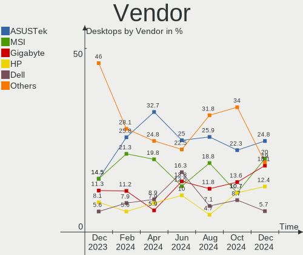
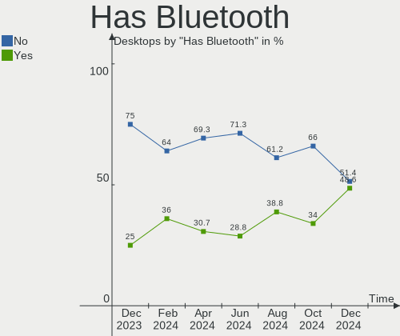
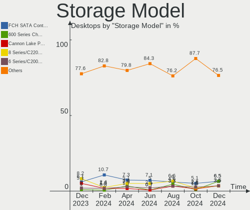
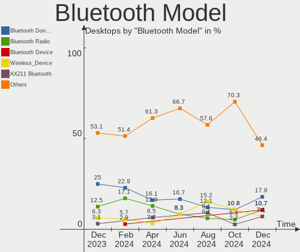
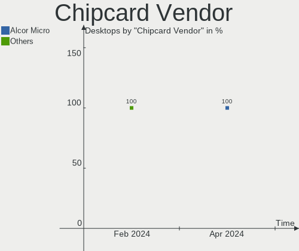

Linux in France - Hardware Trends (Desktops)
--------------------------------------------

A project to identify most popular hardware characteristics and track their change
over time based on data collected by Linux users at https://Linux-Hardware.org.

Anyone can contribute to this report by the [hw-probe](https://github.com/linuxhw/hw-probe) tool:

    sudo -E hw-probe -all -upload

Period: Oct, 2022.

Contents
--------

* [ System ](#system)
  - [ OS                       ](#os)
  - [ OS Family                ](#os-family)
  - [ Kernel                   ](#kernel)
  - [ Kernel Family            ](#kernel-family)
  - [ Kernel Major Ver.        ](#kernel-major-ver)
  - [ Arch                     ](#arch)
  - [ DE                       ](#de)
  - [ Display Server           ](#display-server)
  - [ Display Manager          ](#display-manager)
  - [ OS Lang                  ](#os-lang)
  - [ Boot Mode                ](#boot-mode)
  - [ Filesystem               ](#filesystem)
  - [ Part. scheme             ](#part-scheme)
  - [ Dual Boot with Linux/BSD ](#dual-boot-with-linuxbsd)
  - [ Dual Boot (Win)          ](#dual-boot-win)

* [ Board ](#board)
  - [ Vendor                   ](#vendor)
  - [ Model                    ](#model)
  - [ Model Family             ](#model-family)
  - [ MFG Year                 ](#mfg-year)
  - [ Form Factor              ](#form-factor)
  - [ Secure Boot              ](#secure-boot)
  - [ Coreboot                 ](#coreboot)
  - [ RAM Size                 ](#ram-size)
  - [ RAM Used                 ](#ram-used)
  - [ Total Drives             ](#total-drives)
  - [ Has CD-ROM               ](#has-cd-rom)
  - [ Has Ethernet             ](#has-ethernet)
  - [ Has WiFi                 ](#has-wifi)
  - [ Has Bluetooth            ](#has-bluetooth)

* [ Location ](#location)
  - [ Country                  ](#country)
  - [ City                     ](#city)

* [ Drives ](#drives)
  - [ Drive Vendor             ](#drive-vendor)
  - [ Drive Model              ](#drive-model)
  - [ HDD Vendor               ](#hdd-vendor)
  - [ SSD Vendor               ](#ssd-vendor)
  - [ Drive Kind               ](#drive-kind)
  - [ Drive Connector          ](#drive-connector)
  - [ Drive Size               ](#drive-size)
  - [ Space Total              ](#space-total)
  - [ Space Used               ](#space-used)
  - [ Malfunc. Drives          ](#malfunc-drives)
  - [ Malfunc. Drive Vendor    ](#malfunc-drive-vendor)
  - [ Malfunc. HDD Vendor      ](#malfunc-hdd-vendor)
  - [ Malfunc. Drive Kind      ](#malfunc-drive-kind)
  - [ Failed Drives            ](#failed-drives)
  - [ Failed Drive Vendor      ](#failed-drive-vendor)
  - [ Drive Status             ](#drive-status)

* [ Storage controller ](#storage-controller)
  - [ Storage Vendor           ](#storage-vendor)
  - [ Storage Model            ](#storage-model)
  - [ Storage Kind             ](#storage-kind)

* [ Processor ](#processor)
  - [ CPU Vendor               ](#cpu-vendor)
  - [ CPU Model                ](#cpu-model)
  - [ CPU Model Family         ](#cpu-model-family)
  - [ CPU Cores                ](#cpu-cores)
  - [ CPU Sockets              ](#cpu-sockets)
  - [ CPU Threads              ](#cpu-threads)
  - [ CPU Op-Modes             ](#cpu-op-modes)
  - [ CPU Microcode            ](#cpu-microcode)
  - [ CPU Microarch            ](#cpu-microarch)

* [ Graphics ](#graphics)
  - [ GPU Vendor               ](#gpu-vendor)
  - [ GPU Model                ](#gpu-model)
  - [ GPU Combo                ](#gpu-combo)
  - [ GPU Driver               ](#gpu-driver)
  - [ GPU Memory               ](#gpu-memory)

* [ Monitor ](#monitor)
  - [ Monitor Vendor           ](#monitor-vendor)
  - [ Monitor Model            ](#monitor-model)
  - [ Monitor Resolution       ](#monitor-resolution)
  - [ Monitor Diagonal         ](#monitor-diagonal)
  - [ Monitor Width            ](#monitor-width)
  - [ Aspect Ratio             ](#aspect-ratio)
  - [ Monitor Area             ](#monitor-area)
  - [ Pixel Density            ](#pixel-density)
  - [ Multiple Monitors        ](#multiple-monitors)

* [ Network ](#network)
  - [ Net Controller Vendor    ](#net-controller-vendor)
  - [ Net Controller Model     ](#net-controller-model)
  - [ Wireless Vendor          ](#wireless-vendor)
  - [ Wireless Model           ](#wireless-model)
  - [ Ethernet Vendor          ](#ethernet-vendor)
  - [ Ethernet Model           ](#ethernet-model)
  - [ Net Controller Kind      ](#net-controller-kind)
  - [ Used Controller          ](#used-controller)
  - [ NICs                     ](#nics)
  - [ IPv6                     ](#ipv6)

* [ Bluetooth ](#bluetooth)
  - [ Bluetooth Vendor         ](#bluetooth-vendor)
  - [ Bluetooth Model          ](#bluetooth-model)

* [ Sound ](#sound)
  - [ Sound Vendor             ](#sound-vendor)
  - [ Sound Model              ](#sound-model)

* [ Memory ](#memory)
  - [ Memory Vendor            ](#memory-vendor)
  - [ Memory Model             ](#memory-model)
  - [ Memory Kind              ](#memory-kind)
  - [ Memory Form Factor       ](#memory-form-factor)
  - [ Memory Size              ](#memory-size)
  - [ Memory Speed             ](#memory-speed)

* [ Printers & scanners ](#printers--scanners)
  - [ Printer Vendor           ](#printer-vendor)
  - [ Printer Model            ](#printer-model)
  - [ Scanner Vendor           ](#scanner-vendor)
  - [ Scanner Model            ](#scanner-model)

* [ Camera ](#camera)
  - [ Camera Vendor            ](#camera-vendor)
  - [ Camera Model             ](#camera-model)

* [ Security ](#security)
  - [ Fingerprint Vendor       ](#fingerprint-vendor)
  - [ Fingerprint Model        ](#fingerprint-model)
  - [ Chipcard Vendor          ](#chipcard-vendor)
  - [ Chipcard Model           ](#chipcard-model)

* [ Unsupported ](#unsupported)
  - [ Unsupported Devices      ](#unsupported-devices)
  - [ Unsupported Device Types ](#unsupported-device-types)

System
------

OS
--

Installed operating systems

| Name                | Desktops | Percent |
|---------------------|----------|---------|
| Ubuntu 22.04        | 24       | 21.05%  |
| Ubuntu 20.04        | 10       | 8.77%   |
| OpenMandriva 4.3    | 10       | 8.77%   |
| Debian 11           | 10       | 8.77%   |
| Linux Mint 21       | 9        | 7.89%   |
| Zorin 16            | 3        | 2.63%   |
| Pop!_OS 22.04       | 3        | 2.63%   |
| ArcoLinux Rolling   | 3        | 2.63%   |
| Arch Rolling        | 3        | 2.63%   |
| Xubuntu 22.10       | 2        | 1.75%   |
| Ubuntu MATE 22.04   | 2        | 1.75%   |
| Ubuntu 18.04        | 2        | 1.75%   |
| OpenMandriva 4.50   | 2        | 1.75%   |
| Nobara 36           | 2        | 1.75%   |
| Lubuntu 22.04       | 2        | 1.75%   |
| Lubuntu 20.04       | 2        | 1.75%   |
| KDE neon 20.04      | 2        | 1.75%   |
| Fedora 37           | 2        | 1.75%   |
| Fedora 36           | 2        | 1.75%   |
| EndeavourOS Rolling | 2        | 1.75%   |
| Debian Testing      | 2        | 1.75%   |
| Xubuntu 20.04       | 1        | 0.88%   |
| Ubuntu 22.10        | 1        | 0.88%   |
| SteamOS 3.3         | 1        | 0.88%   |
| Manjaro 22.0.0      | 1        | 0.88%   |
| Mageia 9            | 1        | 0.88%   |
| Linux Mint 20.3     | 1        | 0.88%   |
| Linux Mint 20.2     | 1        | 0.88%   |
| Linux Mint 19.3     | 1        | 0.88%   |
| Kubuntu 22.10       | 1        | 0.88%   |
| Kubuntu 22.04       | 1        | 0.88%   |
| Kubuntu 20.04       | 1        | 0.88%   |
| Kubuntu 11          | 1        | 0.88%   |
| Fedora 35           | 1        | 0.88%   |
| Elementary 6.1      | 1        | 0.88%   |
| Drauger OS 7.6      | 1        | 0.88%   |

OS Family
---------

OS without a version

| Name         | Desktops | Percent |
|--------------|----------|---------|
| Ubuntu       | 37       | 32.46%  |
| OpenMandriva | 12       | 10.53%  |
| Linux Mint   | 12       | 10.53%  |
| Debian       | 12       | 10.53%  |
| Fedora       | 5        | 4.39%   |
| Lubuntu      | 4        | 3.51%   |
| Kubuntu      | 4        | 3.51%   |
| Zorin        | 3        | 2.63%   |
| Xubuntu      | 3        | 2.63%   |
| Pop!_OS      | 3        | 2.63%   |
| ArcoLinux    | 3        | 2.63%   |
| Arch         | 3        | 2.63%   |
| Ubuntu MATE  | 2        | 1.75%   |
| Nobara       | 2        | 1.75%   |
| KDE neon     | 2        | 1.75%   |
| EndeavourOS  | 2        | 1.75%   |
| SteamOS      | 1        | 0.88%   |
| Manjaro      | 1        | 0.88%   |
| Mageia       | 1        | 0.88%   |
| Elementary   | 1        | 0.88%   |
| Drauger OS   | 1        | 0.88%   |

Kernel
------

Version of the Linux kernel

| Version                                      | Desktops | Percent |
|----------------------------------------------|----------|---------|
| 5.15.0-48-generic                            | 17       | 14.91%  |
| 5.15.0-52-generic                            | 14       | 12.28%  |
| 5.15.0-50-generic                            | 13       | 11.4%   |
| 5.16.7-desktop-1omv4003                      | 10       | 8.77%   |
| 5.4.0-131-generic                            | 5        | 4.39%   |
| 5.10.0-18-amd64                              | 5        | 4.39%   |
| 5.15.0-47-generic                            | 4        | 3.51%   |
| 5.4.0-126-generic                            | 3        | 2.63%   |
| 5.19.0-76051900-generic                      | 3        | 2.63%   |
| 5.19.0-23-generic                            | 3        | 2.63%   |
| 5.19.12-200.fc36.x86_64                      | 2        | 1.75%   |
| 5.19.0-2-amd64                               | 2        | 1.75%   |
| 5.15.74-1-lts                                | 2        | 1.75%   |
| 5.10.0-19-amd64                              | 2        | 1.75%   |
| 6.1.0-rc1-next-20221021-1-next-git           | 1        | 0.88%   |
| 6.0.2-zen1-1-zen                             | 1        | 0.88%   |
| 6.0.2-301.fc37.x86_64                        | 1        | 0.88%   |
| 6.0.2                                        | 1        | 0.88%   |
| 6.0.1-zen1-1-zen                             | 1        | 0.88%   |
| 6.0.0-desktop-1omv4050                       | 1        | 0.88%   |
| 5.4.0-26-generic                             | 1        | 0.88%   |
| 5.4.0-128-generic                            | 1        | 0.88%   |
| 5.19.5-desktop-1omv4090                      | 1        | 0.88%   |
| 5.19.16-201.fsync.fc36.x86_64                | 1        | 0.88%   |
| 5.19.16-100.fc35.x86_64                      | 1        | 0.88%   |
| 5.19.14-201.fsync.fc36.x86_64                | 1        | 0.88%   |
| 5.19.13-arch1-1                              | 1        | 0.88%   |
| 5.19.13-300.fc37.x86_64                      | 1        | 0.88%   |
| 5.19.12-desktop-1.mga9                       | 1        | 0.88%   |
| 5.19.10-arch1-1                              | 1        | 0.88%   |
| 5.19.10-1-MANJARO                            | 1        | 0.88%   |
| 5.19.0-1-amd64                               | 1        | 0.88%   |
| 5.18.14-arch1-1                              | 1        | 0.88%   |
| 5.15.0-48-lowlatency                         | 1        | 0.88%   |
| 5.13.0-valve24-1-neptune-02226-g5b8545e4c5a1 | 1        | 0.88%   |
| 5.13.0-52-generic                            | 1        | 0.88%   |
| 5.13.0-44-generic                            | 1        | 0.88%   |
| 5.11.0-43-lowlatency                         | 1        | 0.88%   |
| 5.11.0-27-generic                            | 1        | 0.88%   |
| 5.11.0-25-generic                            | 1        | 0.88%   |

Kernel Family
-------------

Linux kernel without a distro release

| Version | Desktops | Percent |
|---------|----------|---------|
| 5.15.0  | 49       | 42.98%  |
| 5.4.0   | 10       | 8.77%   |
| 5.16.7  | 10       | 8.77%   |
| 5.19.0  | 9        | 7.89%   |
| 5.10.0  | 9        | 7.89%   |
| 6.0.2   | 3        | 2.63%   |
| 5.19.12 | 3        | 2.63%   |
| 5.13.0  | 3        | 2.63%   |
| 5.11.0  | 3        | 2.63%   |
| 5.19.16 | 2        | 1.75%   |
| 5.19.13 | 2        | 1.75%   |
| 5.19.10 | 2        | 1.75%   |
| 5.15.74 | 2        | 1.75%   |
| 6.1.0   | 1        | 0.88%   |
| 6.0.1   | 1        | 0.88%   |
| 6.0.0   | 1        | 0.88%   |
| 5.19.5  | 1        | 0.88%   |
| 5.19.14 | 1        | 0.88%   |
| 5.18.14 | 1        | 0.88%   |
| 4.15.0  | 1        | 0.88%   |

Kernel Major Ver.
-----------------

Linux kernel major version

| Version | Desktops | Percent |
|---------|----------|---------|
| 5.15    | 51       | 44.74%  |
| 5.19    | 20       | 17.54%  |
| 5.4     | 10       | 8.77%   |
| 5.16    | 10       | 8.77%   |
| 5.10    | 9        | 7.89%   |
| 6.0     | 5        | 4.39%   |
| 5.13    | 3        | 2.63%   |
| 5.11    | 3        | 2.63%   |
| 6.1     | 1        | 0.88%   |
| 5.18    | 1        | 0.88%   |
| 4.15    | 1        | 0.88%   |

Arch
----

OS architecture (x86_64, i586, etc.)

| Name   | Desktops | Percent |
|--------|----------|---------|
| x86_64 | 114      | 100%    |

DE
--

Desktop Environment

| Name       | Desktops | Percent |
|------------|----------|---------|
| GNOME      | 42       | 36.84%  |
| KDE5       | 25       | 21.93%  |
| X-Cinnamon | 11       | 9.65%   |
| Unknown    | 10       | 8.77%   |
| MATE       | 7        | 6.14%   |
| XFCE       | 5        | 4.39%   |
| LXQt       | 5        | 4.39%   |
| Cinnamon   | 3        | 2.63%   |
| qtile      | 2        | 1.75%   |
| LXDE       | 2        | 1.75%   |
| Pantheon   | 1        | 0.88%   |
| i3         | 1        | 0.88%   |

Display Server
--------------

X11 or Wayland

| Name    | Desktops | Percent |
|---------|----------|---------|
| X11     | 82       | 71.93%  |
| Wayland | 25       | 21.93%  |
| Unknown | 5        | 4.39%   |
| Tty     | 2        | 1.75%   |

Display Manager
---------------

SDDM, LightDM, etc.

| Name    | Desktops | Percent |
|---------|----------|---------|
| GDM3    | 32       | 28.07%  |
| Unknown | 26       | 22.81%  |
| LightDM | 23       | 20.18%  |
| SDDM    | 22       | 19.3%   |
| GDM     | 10       | 8.77%   |
| XDM     | 1        | 0.88%   |

OS Lang
-------

Language

| Lang        | Desktops | Percent |
|-------------|----------|---------|
| fr_FR       | 84       | 73.68%  |
| en_US       | 22       | 19.3%   |
| en_GB       | 2        | 1.75%   |
| C           | 2        | 1.75%   |
| ru_RU       | 1        | 0.88%   |
| fr_FR.utf-8 | 1        | 0.88%   |
| fr_CH       | 1        | 0.88%   |
| en_AU       | 1        | 0.88%   |

Boot Mode
---------

EFI or BIOS

| Mode | Desktops | Percent |
|------|----------|---------|
| EFI  | 59       | 51.75%  |
| BIOS | 55       | 48.25%  |

Filesystem
----------

Type of filesystem

| Type    | Desktops | Percent |
|---------|----------|---------|
| Ext4    | 86       | 75.44%  |
| Btrfs   | 14       | 12.28%  |
| Overlay | 12       | 10.53%  |
| Zfs     | 1        | 0.88%   |
| F2fs    | 1        | 0.88%   |

Part. scheme
------------

Scheme of partitioning

| Type    | Desktops | Percent |
|---------|----------|---------|
| GPT     | 66       | 57.89%  |
| Unknown | 25       | 21.93%  |
| MBR     | 23       | 20.18%  |

Dual Boot with Linux/BSD
------------------------

Hosting more than one Linux/BSD

| Dual boot | Desktops | Percent |
|-----------|----------|---------|
| No        | 85       | 74.56%  |
| Yes       | 29       | 25.44%  |

Dual Boot (Win)
---------------

Hosting Linux and Windows

| Dual boot | Desktops | Percent |
|-----------|----------|---------|
| No        | 77       | 67.54%  |
| Yes       | 37       | 32.46%  |

Board
-----

Vendor
------

Motherboard manufacturer

| Name                | Desktops | Percent |
|---------------------|----------|---------|
| ASUSTek Computer    | 29       | 25.44%  |
| MSI                 | 18       | 15.79%  |
| Gigabyte Technology | 12       | 10.53%  |
| Dell                | 12       | 10.53%  |
| Hewlett-Packard     | 9        | 7.89%   |
| Lenovo              | 8        | 7.02%   |
| ASRock              | 8        | 7.02%   |
| Acer                | 4        | 3.51%   |
| Unknown             | 4        | 3.51%   |
| Foxconn             | 3        | 2.63%   |
| Shuttle             | 1        | 0.88%   |
| Pegatron            | 1        | 0.88%   |
| Medion              | 1        | 0.88%   |
| Intel               | 1        | 0.88%   |
| eMachines           | 1        | 0.88%   |
| ASRockRack          | 1        | 0.88%   |
| AOpen               | 1        | 0.88%   |

Model
-----

Motherboard model

| Name                                 | Desktops | Percent |
|--------------------------------------|----------|---------|
| Unknown                              | 4        | 3.51%   |
| Gigabyte B450M DS3H                  | 3        | 2.63%   |
| MSI MS-7817                          | 2        | 1.75%   |
| Lenovo ThinkCentre M83z 10C20003FR   | 2        | 1.75%   |
| Gigabyte B450 AORUS ELITE            | 2        | 1.75%   |
| ASUS M32CD4-K                        | 2        | 1.75%   |
| Shuttle XS35V4                       | 1        | 0.88%   |
| Pegatron p6541fr-m                   | 1        | 0.88%   |
| MSI MS-7D53                          | 1        | 0.88%   |
| MSI MS-7D32                          | 1        | 0.88%   |
| MSI MS-7C13                          | 1        | 0.88%   |
| MSI MS-7C08                          | 1        | 0.88%   |
| MSI MS-7C02                          | 1        | 0.88%   |
| MSI MS-7B89                          | 1        | 0.88%   |
| MSI MS-7B86                          | 1        | 0.88%   |
| MSI MS-7B84                          | 1        | 0.88%   |
| MSI MS-7B79                          | 1        | 0.88%   |
| MSI MS-7B31                          | 1        | 0.88%   |
| MSI MS-7A74                          | 1        | 0.88%   |
| MSI MS-7A71                          | 1        | 0.88%   |
| MSI MS-7A32                          | 1        | 0.88%   |
| MSI MS-7816                          | 1        | 0.88%   |
| MSI MS-7811                          | 1        | 0.88%   |
| MSI MS-7680                          | 1        | 0.88%   |
| Medion MS-7797                       | 1        | 0.88%   |
| Lenovo ThinkCentre M93z 10AF0017FR   | 1        | 0.88%   |
| Lenovo ThinkCentre M82 2929A1G       | 1        | 0.88%   |
| Lenovo ThinkCentre M77 1997B49       | 1        | 0.88%   |
| Lenovo ThinkCentre M71z 1741A7G      | 1        | 0.88%   |
| Lenovo ThinkCentre M71e 3167B28      | 1        | 0.88%   |
| Lenovo ThinkCentre M58 7359WES       | 1        | 0.88%   |
| Intel D33217GKE G76540-203           | 1        | 0.88%   |
| HP Z820 Workstation                  | 1        | 0.88%   |
| HP Z400 Workstation                  | 1        | 0.88%   |
| HP Z230 Tower Workstation            | 1        | 0.88%   |
| HP ProDesk 600 G2 SFF                | 1        | 0.88%   |
| HP Pavilion Gaming Desktop TG01-0xxx | 1        | 0.88%   |
| HP EliteDesk 800 G2 DM 35W           | 1        | 0.88%   |
| HP Compaq Pro 6305 SFF               | 1        | 0.88%   |
| HP Compaq Elite 8300 USDT            | 1        | 0.88%   |

Model Family
------------

Motherboard model prefix

| Name               | Desktops | Percent |
|--------------------|----------|---------|
| ASUS PRIME         | 10       | 8.77%   |
| Lenovo ThinkCentre | 8        | 7.02%   |
| Dell OptiPlex      | 8        | 7.02%   |
| ASUS ROG           | 6        | 5.26%   |
| Dell Precision     | 4        | 3.51%   |
| Unknown            | 4        | 3.51%   |
| HP Compaq          | 3        | 2.63%   |
| Gigabyte B450M     | 3        | 2.63%   |
| Gigabyte B450      | 3        | 2.63%   |
| ASUS TUF           | 3        | 2.63%   |
| MSI MS-7817        | 2        | 1.75%   |
| ASUS M32CD4-K      | 2        | 1.75%   |
| Acer Aspire        | 2        | 1.75%   |
| Shuttle XS35V4     | 1        | 0.88%   |
| Pegatron p6541fr-m | 1        | 0.88%   |
| MSI MS-7D53        | 1        | 0.88%   |
| MSI MS-7D32        | 1        | 0.88%   |
| MSI MS-7C13        | 1        | 0.88%   |
| MSI MS-7C08        | 1        | 0.88%   |
| MSI MS-7C02        | 1        | 0.88%   |
| MSI MS-7B89        | 1        | 0.88%   |
| MSI MS-7B86        | 1        | 0.88%   |
| MSI MS-7B84        | 1        | 0.88%   |
| MSI MS-7B79        | 1        | 0.88%   |
| MSI MS-7B31        | 1        | 0.88%   |
| MSI MS-7A74        | 1        | 0.88%   |
| MSI MS-7A71        | 1        | 0.88%   |
| MSI MS-7A32        | 1        | 0.88%   |
| MSI MS-7816        | 1        | 0.88%   |
| MSI MS-7811        | 1        | 0.88%   |
| MSI MS-7680        | 1        | 0.88%   |
| Medion MS-7797     | 1        | 0.88%   |
| Intel D33217GKE    | 1        | 0.88%   |
| HP Z820            | 1        | 0.88%   |
| HP Z400            | 1        | 0.88%   |
| HP Z230            | 1        | 0.88%   |
| HP ProDesk         | 1        | 0.88%   |
| HP Pavilion        | 1        | 0.88%   |
| HP EliteDesk       | 1        | 0.88%   |
| Gigabyte Z390      | 1        | 0.88%   |

MFG Year
--------

Motherboard manufacture year

| Year | Desktops | Percent |
|------|----------|---------|
| 2018 | 16       | 14.04%  |
| 2012 | 13       | 11.4%   |
| 2019 | 9        | 7.89%   |
| 2015 | 9        | 7.89%   |
| 2011 | 9        | 7.89%   |
| 2021 | 8        | 7.02%   |
| 2020 | 8        | 7.02%   |
| 2017 | 7        | 6.14%   |
| 2013 | 7        | 6.14%   |
| 2014 | 6        | 5.26%   |
| 2010 | 6        | 5.26%   |
| 2022 | 5        | 4.39%   |
| 2016 | 3        | 2.63%   |
| 2009 | 3        | 2.63%   |
| 2008 | 3        | 2.63%   |
| 2007 | 2        | 1.75%   |

Form Factor
-----------

Physical design of the computer

| Name    | Desktops | Percent |
|---------|----------|---------|
| Desktop | 114      | 100%    |

Secure Boot
-----------

Enabled or disabled

| State    | Desktops | Percent |
|----------|----------|---------|
| Disabled | 112      | 98.25%  |
| Enabled  | 2        | 1.75%   |

Coreboot
--------

Have coreboot on board

| Used | Desktops | Percent |
|------|----------|---------|
| No   | 114      | 100%    |

RAM Size
--------

Total RAM memory

| Size in GB  | Desktops | Percent |
|-------------|----------|---------|
| 16.01-24.0  | 35       | 30.7%   |
| 3.01-4.0    | 23       | 20.18%  |
| 8.01-16.0   | 20       | 17.54%  |
| 32.01-64.0  | 15       | 13.16%  |
| 4.01-8.0    | 9        | 7.89%   |
| 64.01-256.0 | 5        | 4.39%   |
| 24.01-32.0  | 4        | 3.51%   |
| 1.01-2.0    | 2        | 1.75%   |
| 2.01-3.0    | 1        | 0.88%   |

RAM Used
--------

Used RAM memory

| Used GB    | Desktops | Percent |
|------------|----------|---------|
| 1.01-2.0   | 38       | 33.33%  |
| 4.01-8.0   | 21       | 18.42%  |
| 2.01-3.0   | 18       | 15.79%  |
| 3.01-4.0   | 15       | 13.16%  |
| 8.01-16.0  | 10       | 8.77%   |
| 0.51-1.0   | 9        | 7.89%   |
| 16.01-24.0 | 2        | 1.75%   |
| 24.01-32.0 | 1        | 0.88%   |

Total Drives
------------

Number of drives on board

| Drives | Desktops | Percent |
|--------|----------|---------|
| 1      | 43       | 37.72%  |
| 2      | 32       | 28.07%  |
| 3      | 18       | 15.79%  |
| 4      | 11       | 9.65%   |
| 5      | 6        | 5.26%   |
| 6      | 3        | 2.63%   |
| 7      | 1        | 0.88%   |

Has CD-ROM
----------

Has CD-ROM on board

| Presented | Desktops | Percent |
|-----------|----------|---------|
| No        | 59       | 51.75%  |
| Yes       | 55       | 48.25%  |

Has Ethernet
------------

Has Ethernet on board

| Presented | Desktops | Percent |
|-----------|----------|---------|
| Yes       | 114      | 100%    |

Has WiFi
--------

Has WiFi module

| Presented | Desktops | Percent |
|-----------|----------|---------|
| No        | 68       | 59.65%  |
| Yes       | 46       | 40.35%  |

Has Bluetooth
-------------

Has Bluetooth module

| Presented | Desktops | Percent |
|-----------|----------|---------|
| No        | 80       | 70.18%  |
| Yes       | 34       | 29.82%  |

Location
--------

Country
-------

Geographic location (country)

| Country | Desktops | Percent |
|---------|----------|---------|
| France  | 114      | 100%    |

City
----

Geographic location (city)

| City                       | Desktops | Percent |
|----------------------------|----------|---------|
| Paris                      | 15       | 13.16%  |
| Valenciennes               | 4        | 3.51%   |
| Marseille                  | 3        | 2.63%   |
| Vélizy-Villacoublay       | 2        | 1.75%   |
| Saint-Nazaire              | 2        | 1.75%   |
| Nantes                     | 2        | 1.75%   |
| Mieuxce                    | 2        | 1.75%   |
| Lille                      | 2        | 1.75%   |
| Champs-sur-Marne           | 2        | 1.75%   |
| Caen                       | 2        | 1.75%   |
| Bordeaux                   | 2        | 1.75%   |
| Beuvrages                  | 2        | 1.75%   |
| Woustviller                | 1        | 0.88%   |
| Winkel                     | 1        | 0.88%   |
| Wattrelos                  | 1        | 0.88%   |
| Vitry-sur-Seine            | 1        | 0.88%   |
| Vendrennes                 | 1        | 0.88%   |
| Vannes                     | 1        | 0.88%   |
| Tulle                      | 1        | 0.88%   |
| Toulon                     | 1        | 0.88%   |
| Suresnes                   | 1        | 0.88%   |
| Sin-le-Noble               | 1        | 0.88%   |
| Sète                      | 1        | 0.88%   |
| Seclin                     | 1        | 0.88%   |
| Sanary-sur-Mer             | 1        | 0.88%   |
| Salon-de-Provence          | 1        | 0.88%   |
| Saint-Pair-sur-Mer         | 1        | 0.88%   |
| Saint-Martin-de-la-Brasque | 1        | 0.88%   |
| Saint-Germain-en-Laye      | 1        | 0.88%   |
| Saint-Etienne              | 1        | 0.88%   |
| Saint-Cannat               | 1        | 0.88%   |
| Roubaix                    | 1        | 0.88%   |
| Rochetaillee               | 1        | 0.88%   |
| Rennes                     | 1        | 0.88%   |
| Ranville                   | 1        | 0.88%   |
| Quissac                    | 1        | 0.88%   |
| Port Leucate               | 1        | 0.88%   |
| Pertuis                    | 1        | 0.88%   |
| Peret                      | 1        | 0.88%   |
| Pau                        | 1        | 0.88%   |

Drives
------

Drive Vendor
------------

Hard drive vendors

| Vendor                    | Desktops | Drives | Percent |
|---------------------------|----------|--------|---------|
| Seagate                   | 44       | 54     | 20.37%  |
| WDC                       | 35       | 48     | 16.2%   |
| Samsung Electronics       | 27       | 36     | 12.5%   |
| Crucial                   | 20       | 22     | 9.26%   |
| SanDisk                   | 12       | 13     | 5.56%   |
| Hitachi                   | 10       | 12     | 4.63%   |
| Toshiba                   | 9        | 9      | 4.17%   |
| Kingston                  | 8        | 8      | 3.7%    |
| Micron/Crucial Technology | 7        | 8      | 3.24%   |
| Unknown                   | 5        | 5      | 2.31%   |
| SK hynix                  | 4        | 4      | 1.85%   |
| PNY                       | 4        | 4      | 1.85%   |
| HGST                      | 4        | 4      | 1.85%   |
| Phison Electronics        | 3        | 3      | 1.39%   |
| Intel                     | 3        | 3      | 1.39%   |
| Emtec                     | 3        | 3      | 1.39%   |
| Micron Technology         | 2        | 2      | 0.93%   |
| China                     | 2        | 2      | 0.93%   |
| Transcend                 | 1        | 1      | 0.46%   |
| SPCC                      | 1        | 2      | 0.46%   |
| sobetter                  | 1        | 1      | 0.46%   |
| Silicon Motion            | 1        | 1      | 0.46%   |
| Plextor                   | 1        | 1      | 0.46%   |
| Patriot                   | 1        | 1      | 0.46%   |
| Maxtor                    | 1        | 1      | 0.46%   |
| Linux                     | 1        | 1      | 0.46%   |
| KingFast                  | 1        | 1      | 0.46%   |
| Intenso                   | 1        | 1      | 0.46%   |
| Hoodisk                   | 1        | 1      | 0.46%   |
| Gigabyte Technology       | 1        | 1      | 0.46%   |
| Corsair                   | 1        | 2      | 0.46%   |
| A-DATA Technology         | 1        | 1      | 0.46%   |

Drive Model
-----------

Hard drive models

| Model                                               | Desktops | Percent |
|-----------------------------------------------------|----------|---------|
| Seagate ST500DM002-1BD142 500GB                     | 6        | 2.45%   |
| Samsung NVMe SSD Controller SM981/PM981/PM983 500GB | 5        | 2.04%   |
| Crucial CT240BX500SSD1 240GB                        | 5        | 2.04%   |
| Seagate ST1000DM010-2EP102 1TB                      | 4        | 1.63%   |
| WDC WD5000AAKX-08U6AA0 500GB                        | 3        | 1.22%   |
| Seagate ST2000DM008-2FR102 2TB                      | 3        | 1.22%   |
| Micron/Crucial P2 NVMe PCIe SSD 500GB               | 3        | 1.22%   |
| Kingston SA400S37240G 240GB SSD                     | 3        | 1.22%   |
| WDC WD20EZRX-22D8PB0 2TB                            | 2        | 0.82%   |
| WDC WD10EZEX-00RKKA0 1TB                            | 2        | 0.82%   |
| Unknown SD/MMC/MS PRO 1TB                           | 2        | 0.82%   |
| SK hynix HFS128G32TND-N210A 128GB SSD               | 2        | 0.82%   |
| Seagate ST500LM021-1KJ152 500GB                     | 2        | 0.82%   |
| Seagate ST4000DM004-2CV104 4TB                      | 2        | 0.82%   |
| Seagate ST2000DM008-2UB102 2TB                      | 2        | 0.82%   |
| Seagate ST2000DM001-1ER164 2TB                      | 2        | 0.82%   |
| Seagate ST2000DM001-1CH164 2TB                      | 2        | 0.82%   |
| Seagate ST1000LM035-1RK172 1TB                      | 2        | 0.82%   |
| Seagate ST1000DM003-1SB102 1TB                      | 2        | 0.82%   |
| Seagate FireCuda 530 ZP1000GM30013 1TB              | 2        | 0.82%   |
| Samsung SSD 870 QVO 1TB                             | 2        | 0.82%   |
| Samsung SSD 860 QVO 1TB                             | 2        | 0.82%   |
| Samsung SSD 860 EVO 500GB                           | 2        | 0.82%   |
| Samsung SSD 850 EVO 1TB                             | 2        | 0.82%   |
| Samsung HD103SJ 1TB                                 | 2        | 0.82%   |
| PNY CS900 480GB SSD                                 | 2        | 0.82%   |
| PNY CS900 120GB SSD                                 | 2        | 0.82%   |
| Phison E7 NVMe Controller 120GB                     | 2        | 0.82%   |
| Micron/Crucial CT1000P1SSD8 1TB                     | 2        | 0.82%   |
| Kingston SV300S37A240G 240GB SSD                    | 2        | 0.82%   |
| Crucial CT480M500SSD1 480GB                         | 2        | 0.82%   |
| Crucial CT250MX200SSD1 250GB                        | 2        | 0.82%   |
| Crucial CT1000MX500SSD1 1TB                         | 2        | 0.82%   |
| WDC WD6400AACS-00G8B1 640GB                         | 1        | 0.41%   |
| WDC WD60EZAZ-00ZGHB0 6TB                            | 1        | 0.41%   |
| WDC WD60EZAZ-00SF3B0 6TB                            | 1        | 0.41%   |
| WDC WD5000LPLX-08ZNTT0 500GB                        | 1        | 0.41%   |
| WDC WD5000LPCX-24VHAT0 500GB                        | 1        | 0.41%   |
| WDC WD5000AZLX-08K2TA0 500GB                        | 1        | 0.41%   |
| WDC WD5000AAKX-75U6AA0 500GB                        | 1        | 0.41%   |

HDD Vendor
----------

Hard disk drive vendors

| Vendor              | Desktops | Drives | Percent |
|---------------------|----------|--------|---------|
| Seagate             | 42       | 51     | 40%     |
| WDC                 | 34       | 47     | 32.38%  |
| Hitachi             | 10       | 12     | 9.52%   |
| Toshiba             | 7        | 7      | 6.67%   |
| Samsung Electronics | 5        | 5      | 4.76%   |
| HGST                | 4        | 4      | 3.81%   |
| Unknown             | 2        | 2      | 1.9%    |
| Maxtor              | 1        | 1      | 0.95%   |

SSD Vendor
----------

Solid state drive vendors

| Vendor              | Desktops | Drives | Percent |
|---------------------|----------|--------|---------|
| Crucial             | 17       | 19     | 22.37%  |
| Samsung Electronics | 15       | 19     | 19.74%  |
| SanDisk             | 9        | 9      | 11.84%  |
| Kingston            | 8        | 8      | 10.53%  |
| PNY                 | 4        | 4      | 5.26%   |
| SK hynix            | 3        | 3      | 3.95%   |
| Intel               | 3        | 3      | 3.95%   |
| Micron Technology   | 2        | 2      | 2.63%   |
| Emtec               | 2        | 2      | 2.63%   |
| China               | 2        | 2      | 2.63%   |
| Transcend           | 1        | 1      | 1.32%   |
| SPCC                | 1        | 2      | 1.32%   |
| Plextor             | 1        | 1      | 1.32%   |
| Patriot             | 1        | 1      | 1.32%   |
| Linux               | 1        | 1      | 1.32%   |
| KingFast            | 1        | 1      | 1.32%   |
| Intenso             | 1        | 1      | 1.32%   |
| Hoodisk             | 1        | 1      | 1.32%   |
| Gigabyte Technology | 1        | 1      | 1.32%   |
| Corsair             | 1        | 2      | 1.32%   |
| A-DATA Technology   | 1        | 1      | 1.32%   |

Drive Kind
----------

HDD or SSD

| Kind    | Desktops | Drives | Percent |
|---------|----------|--------|---------|
| HDD     | 82       | 129    | 44.81%  |
| SSD     | 64       | 84     | 34.97%  |
| NVMe    | 31       | 37     | 16.94%  |
| MMC     | 3        | 3      | 1.64%   |
| Unknown | 3        | 3      | 1.64%   |

Drive Connector
---------------

SATA, SAS, NVMe, etc.

| Type | Desktops | Drives | Percent |
|------|----------|--------|---------|
| SATA | 104      | 208    | 71.72%  |
| NVMe | 31       | 37     | 21.38%  |
| SAS  | 7        | 8      | 4.83%   |
| MMC  | 3        | 3      | 2.07%   |

Drive Size
----------

Size of hard drive

| Size in TB | Desktops | Drives | Percent |
|------------|----------|--------|---------|
| 0.01-0.5   | 83       | 117    | 52.53%  |
| 0.51-1.0   | 44       | 60     | 27.85%  |
| 1.01-2.0   | 17       | 19     | 10.76%  |
| 3.01-4.0   | 7        | 9      | 4.43%   |
| 2.01-3.0   | 3        | 3      | 1.9%    |
| 4.01-10.0  | 3        | 4      | 1.9%    |
| 10.01-20.0 | 1        | 1      | 0.63%   |

Space Total
-----------

Amount of disk space available on the file system

| Size in GB     | Desktops | Percent |
|----------------|----------|---------|
| 251-500        | 23       | 20.18%  |
| 501-1000       | 19       | 16.67%  |
| 1001-2000      | 18       | 15.79%  |
| 101-250        | 15       | 13.16%  |
| More than 3000 | 11       | 9.65%   |
| 1-20           | 10       | 8.77%   |
| 2001-3000      | 9        | 7.89%   |
| Unknown        | 6        | 5.26%   |
| 51-100         | 3        | 2.63%   |

Space Used
----------

Amount of used disk space

| Used GB        | Desktops | Percent |
|----------------|----------|---------|
| 1-20           | 24       | 21.05%  |
| 501-1000       | 17       | 14.91%  |
| 101-250        | 15       | 13.16%  |
| 51-100         | 14       | 12.28%  |
| 21-50          | 12       | 10.53%  |
| 251-500        | 11       | 9.65%   |
| 1001-2000      | 9        | 7.89%   |
| Unknown        | 6        | 5.26%   |
| More than 3000 | 5        | 4.39%   |
| 0              | 1        | 0.88%   |

Malfunc. Drives
---------------

Drive models with a malfunction

| Model                           | Desktops | Drives | Percent |
|---------------------------------|----------|--------|---------|
| Seagate ST2000DM001-1CH164 2TB  | 2        | 2      | 10%     |
| WDC WD2500AAKX-001CA0 250GB     | 1        | 1      | 5%      |
| WDC WD15EARS-00MVWB0 1TB        | 1        | 1      | 5%      |
| WDC WD10JPVX-00JC3T0 1TB        | 1        | 1      | 5%      |
| Seagate ST500DM002-1BD142 500GB | 1        | 1      | 5%      |
| Seagate ST3360320AS 360GB       | 1        | 1      | 5%      |
| Seagate ST3250823AS 250GB       | 1        | 1      | 5%      |
| Seagate ST1000LM035-1RK172 1TB  | 1        | 1      | 5%      |
| Seagate ST1000DM003-1SB102 1TB  | 1        | 1      | 5%      |
| SanDisk SSD U100 64GB           | 1        | 1      | 5%      |
| SanDisk SDSSDX240GG25 240GB     | 1        | 1      | 5%      |
| Maxtor 6B200M0 208GB            | 1        | 1      | 5%      |
| Intel SSDSC2CT240A4 240GB       | 1        | 1      | 5%      |
| Hitachi HDT725050VLA360 500GB   | 1        | 1      | 5%      |
| Hitachi HDT722525DLA380 250GB   | 1        | 1      | 5%      |
| Hitachi HDE721010SLA330 1TB     | 1        | 1      | 5%      |
| HGST HTS725050A7E630 500GB      | 1        | 1      | 5%      |
| Crucial CT525MX300SSD1 528GB    | 1        | 1      | 5%      |
| Corsair Force 3 SSD 120GB       | 1        | 1      | 5%      |

Malfunc. Drive Vendor
---------------------

Vendors of faulty drives

| Vendor  | Desktops | Drives | Percent |
|---------|----------|--------|---------|
| Seagate | 7        | 7      | 35%     |
| WDC     | 3        | 3      | 15%     |
| Hitachi | 3        | 3      | 15%     |
| SanDisk | 2        | 2      | 10%     |
| Maxtor  | 1        | 1      | 5%      |
| Intel   | 1        | 1      | 5%      |
| HGST    | 1        | 1      | 5%      |
| Crucial | 1        | 1      | 5%      |
| Corsair | 1        | 1      | 5%      |

Malfunc. HDD Vendor
-------------------

Vendors of faulty HDD drives

| Vendor  | Desktops | Drives | Percent |
|---------|----------|--------|---------|
| Seagate | 7        | 7      | 46.67%  |
| WDC     | 3        | 3      | 20%     |
| Hitachi | 3        | 3      | 20%     |
| Maxtor  | 1        | 1      | 6.67%   |
| HGST    | 1        | 1      | 6.67%   |

Malfunc. Drive Kind
-------------------

Kinds of faulty drives

| Kind | Desktops | Drives | Percent |
|------|----------|--------|---------|
| HDD  | 12       | 15     | 70.59%  |
| SSD  | 5        | 5      | 29.41%  |

Failed Drives
-------------

Failed drive models

Zero info for selected period =(

Failed Drive Vendor
-------------------

Failed drive vendors

Zero info for selected period =(

Drive Status
------------

Number of failed and malfunc. drives

| Status   | Desktops | Drives | Percent |
|----------|----------|--------|---------|
| Works    | 73       | 133    | 54.07%  |
| Detected | 45       | 103    | 33.33%  |
| Malfunc  | 17       | 20     | 12.59%  |

Storage controller
------------------

Storage Vendor
--------------

Storage controller vendors

| Vendor                       | Desktops | Percent |
|------------------------------|----------|---------|
| Intel                        | 78       | 49.06%  |
| AMD                          | 34       | 21.38%  |
| Samsung Electronics          | 12       | 7.55%   |
| Micron/Crucial Technology    | 9        | 5.66%   |
| SanDisk                      | 4        | 2.52%   |
| Phison Electronics           | 3        | 1.89%   |
| Marvell Technology Group     | 3        | 1.89%   |
| ASMedia Technology           | 3        | 1.89%   |
| Toshiba America Info Systems | 2        | 1.26%   |
| Seagate Technology           | 2        | 1.26%   |
| Nvidia                       | 2        | 1.26%   |
| JMicron Technology           | 2        | 1.26%   |
| SK hynix                     | 1        | 0.63%   |
| Silicon Motion               | 1        | 0.63%   |
| Micron Technology            | 1        | 0.63%   |
| LSI Logic / Symbios Logic    | 1        | 0.63%   |
| Broadcom / LSI               | 1        | 0.63%   |

Storage Model
-------------

Storage controller models

| Model                                                                          | Desktops | Percent |
|--------------------------------------------------------------------------------|----------|---------|
| AMD FCH SATA Controller [AHCI mode]                                            | 16       | 8.38%   |
| AMD 400 Series Chipset SATA Controller                                         | 16       | 8.38%   |
| Intel SATA Controller [RAID mode]                                              | 9        | 4.71%   |
| Intel 8 Series/C220 Series Chipset Family 6-port SATA Controller 1 [AHCI mode] | 9        | 4.71%   |
| Intel 6 Series/C200 Series Chipset Family 6 port Desktop SATA AHCI Controller  | 8        | 4.19%   |
| Samsung NVMe SSD Controller SM981/PM981/PM983                                  | 7        | 3.66%   |
| Intel 200 Series PCH SATA controller [AHCI mode]                               | 7        | 3.66%   |
| Intel Cannon Lake PCH SATA AHCI Controller                                     | 6        | 3.14%   |
| Intel 7 Series/C210 Series Chipset Family 6-port SATA Controller [AHCI mode]   | 6        | 3.14%   |
| Intel Q170/Q150/B150/H170/H110/Z170/CM236 Chipset SATA Controller [AHCI Mode]  | 5        | 2.62%   |
| AMD SB7x0/SB8x0/SB9x0 SATA Controller [IDE mode]                               | 5        | 2.62%   |
| AMD SB7x0/SB8x0/SB9x0 IDE Controller                                           | 5        | 2.62%   |
| Micron/Crucial P2 NVMe PCIe SSD                                                | 4        | 2.09%   |
| Intel 500 Series Chipset Family SATA AHCI Controller                           | 4        | 2.09%   |
| Micron/Crucial NVMe Controller                                                 | 3        | 1.57%   |
| Intel NM10/ICH7 Family SATA Controller [IDE mode]                              | 3        | 1.57%   |
| Intel Celeron/Pentium Silver Processor SATA Controller                         | 3        | 1.57%   |
| AMD 500 Series Chipset SATA Controller                                         | 3        | 1.57%   |
| Toshiba America Info Systems NVMe Controller                                   | 2        | 1.05%   |
| Seagate FireCuda 530 SSD                                                       | 2        | 1.05%   |
| SanDisk Non-Volatile memory controller                                         | 2        | 1.05%   |
| Samsung NVMe SSD Controller 980                                                | 2        | 1.05%   |
| Phison E7 NVMe Controller                                                      | 2        | 1.05%   |
| Nvidia MCP61 SATA Controller                                                   | 2        | 1.05%   |
| Nvidia MCP61 IDE                                                               | 2        | 1.05%   |
| JMicron JMB363 SATA/IDE Controller                                             | 2        | 1.05%   |
| Intel Alder Lake-S PCH SATA Controller [AHCI Mode]                             | 2        | 1.05%   |
| Intel 82801G (ICH7 Family) IDE Controller                                      | 2        | 1.05%   |
| Intel 7 Series/C210 Series Chipset Family 4-port SATA Controller [IDE mode]    | 2        | 1.05%   |
| Intel 7 Series/C210 Series Chipset Family 2-port SATA Controller [IDE mode]    | 2        | 1.05%   |
| Intel 4 Series Chipset PT IDER Controller                                      | 2        | 1.05%   |
| ASMedia ASM1062 Serial ATA Controller                                          | 2        | 1.05%   |
| AMD SB7x0/SB8x0/SB9x0 SATA Controller [AHCI mode]                              | 2        | 1.05%   |
| SK hynix Gold P31 SSD                                                          | 1        | 0.52%   |
| Silicon Motion SM2263EN/SM2263XT SSD Controller                                | 1        | 0.52%   |
| SanDisk WD Blue SN550 NVMe SSD                                                 | 1        | 0.52%   |
| SanDisk WD Black 2018/SN750 / PC SN720 NVMe SSD                                | 1        | 0.52%   |
| Samsung NVMe SSD Controller SM961/PM961/SM963                                  | 1        | 0.52%   |
| Samsung NVMe SSD Controller PM9A1/PM9A3/980PRO                                 | 1        | 0.52%   |
| Samsung NVMe SSD Controller 172X                                               | 1        | 0.52%   |

Storage Kind
------------

Kind of storage controller (IDE, SATA, NVMe, SAS, ...)

| Kind | Desktops | Percent |
|------|----------|---------|
| SATA | 90       | 57.32%  |
| NVMe | 31       | 19.75%  |
| IDE  | 21       | 13.38%  |
| RAID | 14       | 8.92%   |
| SAS  | 1        | 0.64%   |

Processor
---------

CPU Vendor
----------

Processor vendors

| Vendor | Desktops | Percent |
|--------|----------|---------|
| Intel  | 78       | 68.42%  |
| AMD    | 36       | 31.58%  |

CPU Model
---------

Processor models

| Model                                       | Desktops | Percent |
|---------------------------------------------|----------|---------|
| AMD Ryzen 5 3600 6-Core Processor           | 4        | 3.51%   |
| Intel Core i7-3770 CPU @ 3.40GHz            | 3        | 2.63%   |
| Intel Core i5-9400F CPU @ 2.90GHz           | 3        | 2.63%   |
| Intel Core i3-2100 CPU @ 3.10GHz            | 3        | 2.63%   |
| AMD Ryzen 5 5600X 6-Core Processor          | 3        | 2.63%   |
| Intel Xeon CPU E5450 @ 3.00GHz              | 2        | 1.75%   |
| Intel Core i5-7500 CPU @ 3.40GHz            | 2        | 1.75%   |
| Intel Core i5-7400 CPU @ 3.00GHz            | 2        | 1.75%   |
| Intel Core i3-9100F CPU @ 3.60GHz           | 2        | 1.75%   |
| Intel Core i3-4150 CPU @ 3.50GHz            | 2        | 1.75%   |
| Intel Core i3-2120 CPU @ 3.30GHz            | 2        | 1.75%   |
| Intel Celeron J4125 CPU @ 2.00GHz           | 2        | 1.75%   |
| AMD Ryzen 9 5950X 16-Core Processor         | 2        | 1.75%   |
| AMD Ryzen 7 3700X 8-Core Processor          | 2        | 1.75%   |
| AMD Ryzen 7 2700X Eight-Core Processor      | 2        | 1.75%   |
| AMD Ryzen 7 1800X Eight-Core Processor      | 2        | 1.75%   |
| AMD Ryzen 5 2600 Six-Core Processor         | 2        | 1.75%   |
| Intel Xeon W-1270 CPU @ 3.40GHz             | 1        | 0.88%   |
| Intel Xeon CPU X5650 @ 2.67GHz              | 1        | 0.88%   |
| Intel Xeon CPU W3565 @ 3.20GHz              | 1        | 0.88%   |
| Intel Xeon CPU E5-2690 0 @ 2.90GHz          | 1        | 0.88%   |
| Intel Xeon CPU E5-2667 v2 @ 3.30GHz         | 1        | 0.88%   |
| Intel Xeon CPU E3-1240 v3 @ 3.40GHz         | 1        | 0.88%   |
| Intel Pentium Silver J5040 CPU @ 2.00GHz    | 1        | 0.88%   |
| Intel Pentium Dual-Core CPU E5800 @ 3.20GHz | 1        | 0.88%   |
| Intel Pentium Dual-Core CPU E5400 @ 2.70GHz | 1        | 0.88%   |
| Intel Pentium Dual-Core CPU E5300 @ 2.60GHz | 1        | 0.88%   |
| Intel Pentium D CPU 3.40GHz                 | 1        | 0.88%   |
| Intel Pentium CPU G640 @ 2.80GHz            | 1        | 0.88%   |
| Intel Pentium CPU G4400 @ 3.30GHz           | 1        | 0.88%   |
| Intel Core i9-9900K CPU @ 3.60GHz           | 1        | 0.88%   |
| Intel Core i9-7920X CPU @ 2.90GHz           | 1        | 0.88%   |
| Intel Core i7-9700K CPU @ 3.60GHz           | 1        | 0.88%   |
| Intel Core i7-9700F CPU @ 3.00GHz           | 1        | 0.88%   |
| Intel Core i7-7700 CPU @ 3.60GHz            | 1        | 0.88%   |
| Intel Core i7-4790 CPU @ 3.60GHz            | 1        | 0.88%   |
| Intel Core i7-4770K CPU @ 3.50GHz           | 1        | 0.88%   |
| Intel Core i7-4770 CPU @ 3.40GHz            | 1        | 0.88%   |
| Intel Core i7-3770K CPU @ 3.50GHz           | 1        | 0.88%   |
| Intel Core i7-2600 CPU @ 3.40GHz            | 1        | 0.88%   |

CPU Model Family
----------------

Processor model prefix

| Model                   | Desktops | Percent |
|-------------------------|----------|---------|
| Intel Core i5           | 21       | 18.42%  |
| Intel Core i3           | 15       | 13.16%  |
| AMD Ryzen 5             | 13       | 11.4%   |
| Intel Core i7           | 12       | 10.53%  |
| Intel Xeon              | 8        | 7.02%   |
| AMD Ryzen 7             | 7        | 6.14%   |
| Other                   | 5        | 4.39%   |
| Intel Celeron           | 5        | 4.39%   |
| AMD Ryzen 9             | 4        | 3.51%   |
| Intel Pentium Dual-Core | 3        | 2.63%   |
| Intel Pentium           | 2        | 1.75%   |
| Intel Core i9           | 2        | 1.75%   |
| AMD FX                  | 2        | 1.75%   |
| Intel Pentium Silver    | 1        | 0.88%   |
| Intel Pentium D         | 1        | 0.88%   |
| Intel Core 2 Quad       | 1        | 0.88%   |
| Intel Core 2 Duo        | 1        | 0.88%   |
| Intel Atom              | 1        | 0.88%   |
| AMD Sempron             | 1        | 0.88%   |
| AMD Ryzen 3             | 1        | 0.88%   |
| AMD Phenom II X6        | 1        | 0.88%   |
| AMD Phenom II X4        | 1        | 0.88%   |
| AMD Athlon II X3        | 1        | 0.88%   |
| AMD Athlon II X2        | 1        | 0.88%   |
| AMD Athlon II           | 1        | 0.88%   |
| AMD Athlon 64 X2        | 1        | 0.88%   |
| AMD A6                  | 1        | 0.88%   |
| AMD A4                  | 1        | 0.88%   |

CPU Cores
---------

Number of processor cores

| Number | Desktops | Percent |
|--------|----------|---------|
| 4      | 38       | 33.33%  |
| 2      | 25       | 21.93%  |
| 6      | 23       | 20.18%  |
| 8      | 15       | 13.16%  |
| 12     | 5        | 4.39%   |
| 16     | 3        | 2.63%   |
| 1      | 3        | 2.63%   |
| 3      | 2        | 1.75%   |

CPU Sockets
-----------

Number of sockets

| Number | Desktops | Percent |
|--------|----------|---------|
| 1      | 111      | 97.37%  |
| 2      | 3        | 2.63%   |

CPU Threads
-----------

Threads per core (Hyper-Threading)

| Number | Desktops | Percent |
|--------|----------|---------|
| 2      | 62       | 54.39%  |
| 1      | 52       | 45.61%  |

CPU Op-Modes
------------

CPU Operation Modes (32-bit, 64-bit)

| Op mode        | Desktops | Percent |
|----------------|----------|---------|
| 32-bit, 64-bit | 114      | 100%    |

CPU Microcode
-------------

Microcode number

| Number     | Desktops | Percent |
|------------|----------|---------|
| Unknown    | 27       | 23.68%  |
| 0x306a9    | 8        | 7.02%   |
| 0x306c3    | 7        | 6.14%   |
| 0x206a7    | 6        | 5.26%   |
| 0x906ea    | 5        | 4.39%   |
| 0x08701021 | 5        | 4.39%   |
| 0x906e9    | 4        | 3.51%   |
| 0xa0671    | 3        | 2.63%   |
| 0x906ed    | 3        | 2.63%   |
| 0x706a8    | 3        | 2.63%   |
| 0x506e3    | 3        | 2.63%   |
| 0x1067a    | 3        | 2.63%   |
| 0x0a201016 | 3        | 2.63%   |
| 0x0800820d | 3        | 2.63%   |
| 0x010000c8 | 3        | 2.63%   |
| 0xa0655    | 2        | 1.75%   |
| 0x906ec    | 2        | 1.75%   |
| 0xf65      | 1        | 0.88%   |
| 0xa0653    | 1        | 0.88%   |
| 0x90675    | 1        | 0.88%   |
| 0x90672    | 1        | 0.88%   |
| 0x6fd      | 1        | 0.88%   |
| 0x6fb      | 1        | 0.88%   |
| 0x306e4    | 1        | 0.88%   |
| 0x30678    | 1        | 0.88%   |
| 0x20655    | 1        | 0.88%   |
| 0x106e5    | 1        | 0.88%   |
| 0x106a5    | 1        | 0.88%   |
| 0x10676    | 1        | 0.88%   |
| 0x0a601201 | 1        | 0.88%   |
| 0x0a50000d | 1        | 0.88%   |
| 0x0a201205 | 1        | 0.88%   |
| 0x0a201009 | 1        | 0.88%   |
| 0x08701013 | 1        | 0.88%   |
| 0x08108109 | 1        | 0.88%   |
| 0x08001129 | 1        | 0.88%   |
| 0x08001126 | 1        | 0.88%   |
| 0x07030105 | 1        | 0.88%   |
| 0x06001119 | 1        | 0.88%   |
| 0x06000852 | 1        | 0.88%   |

CPU Microarch
-------------

Microarchitecture

| Name             | Desktops | Percent |
|------------------|----------|---------|
| KabyLake         | 16       | 14.04%  |
| Haswell          | 12       | 10.53%  |
| IvyBridge        | 11       | 9.65%   |
| SandyBridge      | 9        | 7.89%   |
| Zen 2            | 8        | 7.02%   |
| Zen+             | 7        | 6.14%   |
| Zen 3            | 7        | 6.14%   |
| K10              | 6        | 5.26%   |
| Skylake          | 5        | 4.39%   |
| Penryn           | 5        | 4.39%   |
| Piledriver       | 3        | 2.63%   |
| Icelake          | 3        | 2.63%   |
| Goldmont plus    | 3        | 2.63%   |
| CometLake        | 3        | 2.63%   |
| Zen              | 2        | 1.75%   |
| Westmere         | 2        | 1.75%   |
| Nehalem          | 2        | 1.75%   |
| Core             | 2        | 1.75%   |
| Alderlake Hybrid | 2        | 1.75%   |
| Silvermont       | 1        | 0.88%   |
| Puma             | 1        | 0.88%   |
| NetBurst         | 1        | 0.88%   |
| K8 Hammer        | 1        | 0.88%   |
| Bonnell          | 1        | 0.88%   |
| Unknown          | 1        | 0.88%   |

Graphics
--------

GPU Vendor
----------

Vendors of graphics cards

| Vendor            | Desktops | Percent |
|-------------------|----------|---------|
| Nvidia            | 57       | 47.11%  |
| Intel             | 34       | 28.1%   |
| AMD               | 29       | 23.97%  |
| ASPEED Technology | 1        | 0.83%   |

GPU Model
---------

Graphics card models

| Model                                                                       | Desktops | Percent |
|-----------------------------------------------------------------------------|----------|---------|
| Nvidia GP108 [GeForce GT 1030]                                              | 5        | 4.13%   |
| Intel CoffeeLake-S GT2 [UHD Graphics 630]                                   | 4        | 3.31%   |
| Nvidia GP107 [GeForce GTX 1050]                                             | 3        | 2.48%   |
| Nvidia GP107 [GeForce GTX 1050 Ti]                                          | 3        | 2.48%   |
| Nvidia GP106 [GeForce GTX 1060 6GB]                                         | 3        | 2.48%   |
| Nvidia GK208B [GeForce GT 710]                                              | 3        | 2.48%   |
| Intel Xeon E3-1200 v3/4th Gen Core Processor Integrated Graphics Controller | 3        | 2.48%   |
| Intel Xeon E3-1200 v2/3rd Gen Core processor Graphics Controller            | 3        | 2.48%   |
| Intel IvyBridge GT2 [HD Graphics 4000]                                      | 3        | 2.48%   |
| Intel 4th Generation Core Processor Family Integrated Graphics Controller   | 3        | 2.48%   |
| Intel 2nd Generation Core Processor Family Integrated Graphics Controller   | 3        | 2.48%   |
| AMD Navi 23 [Radeon RX 6600/6600 XT/6600M]                                  | 3        | 2.48%   |
| AMD Navi 22 [Radeon RX 6700/6700 XT/6750 XT / 6800M]                        | 3        | 2.48%   |
| AMD Ellesmere [Radeon RX 470/480/570/570X/580/580X/590]                     | 3        | 2.48%   |
| AMD Cedar [Radeon HD 5000/6000/7350/8350 Series]                            | 3        | 2.48%   |
| Nvidia TU116 [GeForce GTX 1660 SUPER]                                       | 2        | 1.65%   |
| Nvidia TU116 [GeForce GTX 1650]                                             | 2        | 1.65%   |
| Nvidia GK107 [GeForce GTX 650]                                              | 2        | 1.65%   |
| Nvidia GA106 [GeForce RTX 3060 Lite Hash Rate]                              | 2        | 1.65%   |
| Intel HD Graphics 530                                                       | 2        | 1.65%   |
| Intel GeminiLake [UHD Graphics 600]                                         | 2        | 1.65%   |
| Intel 4 Series Chipset Integrated Graphics Controller                       | 2        | 1.65%   |
| AMD Redwood XT [Radeon HD 5670/5690/5730]                                   | 2        | 1.65%   |
| Nvidia TU117 [GeForce GTX 1650]                                             | 1        | 0.83%   |
| Nvidia TU116 [GeForce GTX 1650 SUPER]                                       | 1        | 0.83%   |
| Nvidia TU106 [GeForce RTX 2070]                                             | 1        | 0.83%   |
| Nvidia TU106 [GeForce RTX 2060 Rev. A]                                      | 1        | 0.83%   |
| Nvidia TU106 [GeForce GTX 1650]                                             | 1        | 0.83%   |
| Nvidia TU104 [GeForce RTX 2070 SUPER]                                       | 1        | 0.83%   |
| Nvidia GT218 [ION]                                                          | 1        | 0.83%   |
| Nvidia GT218 [GeForce 210]                                                  | 1        | 0.83%   |
| Nvidia GP104 [GeForce GTX 1080]                                             | 1        | 0.83%   |
| Nvidia GP104 [GeForce GTX 1070]                                             | 1        | 0.83%   |
| Nvidia GM204 [GeForce GTX 970]                                              | 1        | 0.83%   |
| Nvidia GM107GL [Quadro K2200]                                               | 1        | 0.83%   |
| Nvidia GM107 [GeForce GTX 745]                                              | 1        | 0.83%   |
| Nvidia GK208 [GeForce GT 710]                                               | 1        | 0.83%   |
| Nvidia GK107GL [Quadro K420]                                                | 1        | 0.83%   |
| Nvidia GK107GL [Quadro K2000]                                               | 1        | 0.83%   |
| Nvidia GK106GL [Quadro K4000]                                               | 1        | 0.83%   |

GPU Combo
---------

Combinations of graphics cards

| Name           | Desktops | Percent |
|----------------|----------|---------|
| 1 x Nvidia     | 54       | 47.37%  |
| 1 x AMD        | 29       | 25.44%  |
| 1 x Intel      | 27       | 23.68%  |
| Intel + Nvidia | 3        | 2.63%   |
| 1 x ASPEED     | 1        | 0.88%   |

GPU Driver
----------

Free vs proprietary

| Driver      | Desktops | Percent |
|-------------|----------|---------|
| Free        | 79       | 69.3%   |
| Proprietary | 31       | 27.19%  |
| Unknown     | 4        | 3.51%   |

GPU Memory
----------

Total video memory

| Size in GB | Desktops | Percent |
|------------|----------|---------|
| Unknown    | 57       | 50%     |
| 1.01-2.0   | 14       | 12.28%  |
| 0.51-1.0   | 9        | 7.89%   |
| 0.01-0.5   | 9        | 7.89%   |
| 7.01-8.0   | 7        | 6.14%   |
| 3.01-4.0   | 7        | 6.14%   |
| 8.01-16.0  | 5        | 4.39%   |
| 5.01-6.0   | 4        | 3.51%   |
| 2.01-3.0   | 1        | 0.88%   |
| 16.01-24.0 | 1        | 0.88%   |

Monitor
-------

Monitor Vendor
--------------

Monitor vendors

| Vendor               | Desktops | Percent |
|----------------------|----------|---------|
| Samsung Electronics  | 23       | 18.4%   |
| Iiyama               | 13       | 10.4%   |
| Goldstar             | 11       | 8.8%    |
| Dell                 | 10       | 8%      |
| Philips              | 6        | 4.8%    |
| Lenovo               | 6        | 4.8%    |
| Hewlett-Packard      | 5        | 4%      |
| Ancor Communications | 5        | 4%      |
| SNC                  | 4        | 3.2%    |
| BenQ                 | 4        | 3.2%    |
| AOC                  | 4        | 3.2%    |
| Acer                 | 4        | 3.2%    |
| HannStar             | 3        | 2.4%    |
| Sony                 | 2        | 1.6%    |
| Plain Tree Systems   | 2        | 1.6%    |
| LG Electronics       | 2        | 1.6%    |
| ASUSTek Computer     | 2        | 1.6%    |
| Xiaomi               | 1        | 0.8%    |
| ViewSonic            | 1        | 0.8%    |
| Vestel Elektronik    | 1        | 0.8%    |
| Unknown (XXX)        | 1        | 0.8%    |
| Unknown              | 1        | 0.8%    |
| Sun                  | 1        | 0.8%    |
| S2-Tek               | 1        | 0.8%    |
| RTK                  | 1        | 0.8%    |
| RS                   | 1        | 0.8%    |
| PRISM+               | 1        | 0.8%    |
| NEC Computers        | 1        | 0.8%    |
| MSI                  | 1        | 0.8%    |
| Impression           | 1        | 0.8%    |
| HUAWEI               | 1        | 0.8%    |
| Gigabyte Technology  | 1        | 0.8%    |
| Eizo                 | 1        | 0.8%    |
| DENON                | 1        | 0.8%    |
| Apple                | 1        | 0.8%    |
| AOpen                | 1        | 0.8%    |

Monitor Model
-------------

Monitor models

| Model                                                                  | Desktops | Percent |
|------------------------------------------------------------------------|----------|---------|
| SNC SKP_E5-24 SNC2360 1920x1080 521x293mm 23.5-inch                    | 2        | 1.54%   |
| SNC SKP_E20-32 SNC3200 1920x1080 477x268mm 21.5-inch                   | 2        | 1.54%   |
| Samsung Electronics LC49G95T SAM7053 3840x1080 1193x336mm 48.8-inch    | 2        | 1.54%   |
| Philips PHL 221B8L PHL091D 1920x1080 477x268mm 21.5-inch               | 2        | 1.54%   |
| Lenovo LEN-M82-C LEN00A2 1920x1080 476x268mm 21.5-inch                 | 2        | 1.54%   |
| Iiyama PLE2483H IVM6113 1920x1080 531x299mm 24.0-inch                  | 2        | 1.54%   |
| Goldstar FULL HD GSM5B55 1920x1080 480x270mm 21.7-inch                 | 2        | 1.54%   |
| Xiaomi Mi TV XMD00E2 3840x2160 800x450mm 36.1-inch                     | 1        | 0.77%   |
| ViewSonic VA2431 Series VSCD824 1920x1080 521x293mm 23.5-inch          | 1        | 0.77%   |
| Vestel Elektronik 50UHD_LCD_TV VES3700 3840x2160 1872x1053mm 84.6-inch | 1        | 0.77%   |
| Unknown LCD Monitor SAMSUNG 3840x1080                                  | 1        | 0.77%   |
| Unknown (XXX) Beyond TV XXX2851 1920x1080 1209x680mm 54.6-inch         | 1        | 0.77%   |
| Sun X7200A SUN0596 1600x1200 408x306mm 20.1-inch                       | 1        | 0.77%   |
| Sony SDM-HS74P SNY3070 1280x1024 338x270mm 17.0-inch                   | 1        | 0.77%   |
| Sony LCD Monitor TV                                                    | 1        | 0.77%   |
| Samsung Electronics U32J59x SAM0F35 3840x2160 700x390mm 31.5-inch      | 1        | 0.77%   |
| Samsung Electronics U28E590 SAM0C4E 3840x2160 608x345mm 27.5-inch      | 1        | 0.77%   |
| Samsung Electronics U28E570 SAM0D70 3840x2160 610x350mm 27.7-inch      | 1        | 0.77%   |
| Samsung Electronics SyncMaster SAM05C5 1920x1080                       | 1        | 0.77%   |
| Samsung Electronics SyncMaster SAM0473 2048x1152 510x287mm 23.0-inch   | 1        | 0.77%   |
| Samsung Electronics SyncMaster SAM034D 1280x1024 376x301mm 19.0-inch   | 1        | 0.77%   |
| Samsung Electronics SyncMaster SAM0304 1680x1050 494x320mm 23.2-inch   | 1        | 0.77%   |
| Samsung Electronics SyncMaster SAM0115 1280x1024 376x301mm 19.0-inch   | 1        | 0.77%   |
| Samsung Electronics S32F351 SAM0D24 1920x1080 698x393mm 31.5-inch      | 1        | 0.77%   |
| Samsung Electronics S24B300 SAM08CC 1920x1080 521x293mm 23.5-inch      | 1        | 0.77%   |
| Samsung Electronics S23B350 SAM08D6 1920x1080 510x287mm 23.0-inch      | 1        | 0.77%   |
| Samsung Electronics Odyssey G50A SAM7181 2560x1440 597x336mm 27.0-inch | 1        | 0.77%   |
| Samsung Electronics LF24T35 SAM707D 1920x1080 528x297mm 23.9-inch      | 1        | 0.77%   |
| Samsung Electronics LCD Monitor SyncMaster                             | 1        | 0.77%   |
| Samsung Electronics LCD Monitor SAM7016 3840x2160 950x540mm 43.0-inch  | 1        | 0.77%   |
| Samsung Electronics LCD Monitor SAM0D4D 1366x768 609x347mm 27.6-inch   | 1        | 0.77%   |
| Samsung Electronics LCD Monitor SAM0B7C 1920x1080 886x498mm 40.0-inch  | 1        | 0.77%   |
| Samsung Electronics LCD Monitor SAM07D0 1360x768 700x390mm 31.5-inch   | 1        | 0.77%   |
| Samsung Electronics LCD Monitor SAM0530 1360x768                       | 1        | 0.77%   |
| Samsung Electronics LCD Monitor SAM052F 1360x768 410x256mm 19.0-inch   | 1        | 0.77%   |
| Samsung Electronics EPSON PJ SECA605 1600x1200                         | 1        | 0.77%   |
| S2-Tek TV STK531A 1920x1080 930x530mm 42.1-inch                        | 1        | 0.77%   |
| RTK LCD Monitor RTK1D1A 1920x1080 1020x570mm 46.0-inch                 | 1        | 0.77%   |
| RS LE22A3 BTC22A3 1680x1050 473x296mm 22.0-inch                        | 1        | 0.77%   |
| PRISM+ K3A8F HDMI INN3200 1920x1080 698x393mm 31.5-inch                | 1        | 0.77%   |

Monitor Resolution
------------------

Monitor screen resolution

| Resolution         | Desktops | Percent |
|--------------------|----------|---------|
| 1920x1080 (FHD)    | 55       | 45.45%  |
| 3840x2160 (4K)     | 16       | 13.22%  |
| 1680x1050 (WSXGA+) | 9        | 7.44%   |
| 2560x1440 (QHD)    | 8        | 6.61%   |
| 1280x1024 (SXGA)   | 8        | 6.61%   |
| 1920x1200 (WUXGA)  | 6        | 4.96%   |
| 3840x1080          | 3        | 2.48%   |
| 1360x768           | 3        | 2.48%   |
| Unknown            | 3        | 2.48%   |
| 1600x900 (HD+)     | 2        | 1.65%   |
| 1440x900 (WXGA+)   | 2        | 1.65%   |
| 1366x768 (WXGA)    | 2        | 1.65%   |
| 4480x1600          | 1        | 0.83%   |
| 2960x1050          | 1        | 0.83%   |
| 2048x1152          | 1        | 0.83%   |
| 1600x1200          | 1        | 0.83%   |

Monitor Diagonal
----------------

Diagonal size in inches

| Inches  | Desktops | Percent |
|---------|----------|---------|
| 23      | 18       | 15%     |
| 27      | 16       | 13.33%  |
| 24      | 14       | 11.67%  |
| 21      | 14       | 11.67%  |
| 31      | 10       | 8.33%   |
| 22      | 8        | 6.67%   |
| 19      | 8        | 6.67%   |
| Unknown | 8        | 6.67%   |
| 17      | 4        | 3.33%   |
| 25      | 3        | 2.5%    |
| 84      | 2        | 1.67%   |
| 48      | 2        | 1.67%   |
| 42      | 2        | 1.67%   |
| 40      | 2        | 1.67%   |
| 38      | 2        | 1.67%   |
| 18      | 2        | 1.67%   |
| 54      | 1        | 0.83%   |
| 46      | 1        | 0.83%   |
| 36      | 1        | 0.83%   |
| 33      | 1        | 0.83%   |
| 20      | 1        | 0.83%   |

Monitor Width
-------------

Physical width

| Width in mm | Desktops | Percent |
|-------------|----------|---------|
| 501-600     | 46       | 39.66%  |
| 401-500     | 26       | 22.41%  |
| 601-700     | 13       | 11.21%  |
| Unknown     | 8        | 6.9%    |
| 351-400     | 5        | 4.31%   |
| 801-900     | 4        | 3.45%   |
| 301-350     | 4        | 3.45%   |
| 1001-1500   | 4        | 3.45%   |
| 701-800     | 2        | 1.72%   |
| 1501-2000   | 2        | 1.72%   |
| 901-1000    | 2        | 1.72%   |

Aspect Ratio
------------

Proportional relationship between the width and the height

| Ratio   | Desktops | Percent |
|---------|----------|---------|
| 16/9    | 76       | 68.47%  |
| 16/10   | 17       | 15.32%  |
| 5/4     | 9        | 8.11%   |
| Unknown | 5        | 4.5%    |
| 32/9    | 2        | 1.8%    |
| 4/3     | 1        | 0.9%    |
| 3/2     | 1        | 0.9%    |

Monitor Area
------------

Area in inch²

| Area in inch² | Desktops | Percent |
|----------------|----------|---------|
| 201-250        | 38       | 33.04%  |
| 301-350        | 16       | 13.91%  |
| 151-200        | 14       | 12.17%  |
| 351-500        | 11       | 9.57%   |
| 501-1000       | 10       | 8.7%    |
| 251-300        | 9        | 7.83%   |
| Unknown        | 8        | 6.96%   |
| 141-150        | 6        | 5.22%   |
| More than 1000 | 3        | 2.61%   |

Pixel Density
-------------

Pixels per inch

| Density | Desktops | Percent |
|---------|----------|---------|
| 51-100  | 78       | 67.83%  |
| 101-120 | 18       | 15.65%  |
| Unknown | 8        | 6.96%   |
| 121-160 | 6        | 5.22%   |
| 1-50    | 3        | 2.61%   |
| 161-240 | 2        | 1.74%   |

Multiple Monitors
-----------------

Total monitors connected

| Total | Desktops | Percent |
|-------|----------|---------|
| 1     | 85       | 74.56%  |
| 2     | 19       | 16.67%  |
| 0     | 7        | 6.14%   |
| 3     | 3        | 2.63%   |

Network
-------

Net Controller Vendor
---------------------

Controller vendors

| Vendor                          | Desktops | Percent |
|---------------------------------|----------|---------|
| Realtek Semiconductor           | 68       | 46.58%  |
| Intel                           | 46       | 31.51%  |
| Qualcomm Atheros                | 8        | 5.48%   |
| Broadcom                        | 8        | 5.48%   |
| TP-Link                         | 3        | 2.05%   |
| NetGear                         | 2        | 1.37%   |
| Xiaomi                          | 1        | 0.68%   |
| Samsung Electronics             | 1        | 0.68%   |
| Qualcomm Atheros Communications | 1        | 0.68%   |
| Nvidia                          | 1        | 0.68%   |
| Microsoft                       | 1        | 0.68%   |
| Mellanox Technologies           | 1        | 0.68%   |
| Marvell Technology Group        | 1        | 0.68%   |
| D-Link                          | 1        | 0.68%   |
| Broadcom Limited                | 1        | 0.68%   |
| ASUSTek Computer                | 1        | 0.68%   |
| Aquantia                        | 1        | 0.68%   |

Net Controller Model
--------------------

Controller models

| Model                                                             | Desktops | Percent |
|-------------------------------------------------------------------|----------|---------|
| Realtek RTL8111/8168/8411 PCI Express Gigabit Ethernet Controller | 59       | 34.91%  |
| Intel 82579LM Gigabit Network Connection (Lewisville)             | 6        | 3.55%   |
| Intel Wi-Fi 6 AX200                                               | 5        | 2.96%   |
| Intel I211 Gigabit Network Connection                             | 5        | 2.96%   |
| Intel Ethernet Controller I225-V                                  | 4        | 2.37%   |
| Intel Ethernet Connection (7) I219-V                              | 4        | 2.37%   |
| Realtek RTL8125 2.5GbE Controller                                 | 3        | 1.78%   |
| Intel Wireless 7260                                               | 3        | 1.78%   |
| Intel Ethernet Connection I217-LM                                 | 3        | 1.78%   |
| Intel Ethernet Connection (2) I219-LM                             | 3        | 1.78%   |
| TP-Link TL-WN823N v2/v3 [Realtek RTL8192EU]                       | 2        | 1.18%   |
| Realtek RTL88x2bu [AC1200 Techkey]                                | 2        | 1.18%   |
| Realtek RTL8821CE 802.11ac PCIe Wireless Network Adapter          | 2        | 1.18%   |
| Realtek RTL8188EUS 802.11n Wireless Network Adapter               | 2        | 1.18%   |
| Qualcomm Atheros QCA9377 802.11ac Wireless Network Adapter        | 2        | 1.18%   |
| Intel Ethernet Connection I217-V                                  | 2        | 1.18%   |
| Intel Ethernet Connection (5) I219-LM                             | 2        | 1.18%   |
| Intel Ethernet Connection (2) I219-V                              | 2        | 1.18%   |
| Intel Ethernet Connection (14) I219-V                             | 2        | 1.18%   |
| Intel Cannon Lake PCH CNVi WiFi                                   | 2        | 1.18%   |
| Intel 82567LM-3 Gigabit Network Connection                        | 2        | 1.18%   |
| Broadcom NetXtreme BCM5761 Gigabit Ethernet PCIe                  | 2        | 1.18%   |
| Broadcom NetXtreme BCM5754 Gigabit Ethernet PCI Express           | 2        | 1.18%   |
| Xiaomi Mi/Redmi series (RNDIS)                                    | 1        | 0.59%   |
| TP-Link 802.11ac NIC                                              | 1        | 0.59%   |
| Samsung Galaxy series, misc. (tethering mode)                     | 1        | 0.59%   |
| Realtek RTL8822CE 802.11ac PCIe Wireless Network Adapter          | 1        | 0.59%   |
| Realtek RTL8192CE PCIe Wireless Network Adapter                   | 1        | 0.59%   |
| Realtek RTL8188SU 802.11n WLAN Adapter                            | 1        | 0.59%   |
| Realtek RTL8188EE Wireless Network Adapter                        | 1        | 0.59%   |
| Realtek RTL8188CE 802.11b/g/n WiFi Adapter                        | 1        | 0.59%   |
| Realtek RTL-8110SC/8169SC Gigabit Ethernet                        | 1        | 0.59%   |
| Realtek Realtek Network controller                                | 1        | 0.59%   |
| Realtek 802.11n NIC                                               | 1        | 0.59%   |
| Realtek 802.11ac NIC                                              | 1        | 0.59%   |
| Qualcomm Atheros Killer E220x Gigabit Ethernet Controller         | 1        | 0.59%   |
| Qualcomm Atheros AR9271 802.11n                                   | 1        | 0.59%   |
| Qualcomm Atheros AR9485 Wireless Network Adapter                  | 1        | 0.59%   |
| Qualcomm Atheros AR9287 Wireless Network Adapter (PCI-Express)    | 1        | 0.59%   |
| Qualcomm Atheros AR9285 Wireless Network Adapter (PCI-Express)    | 1        | 0.59%   |

Wireless Vendor
---------------

Wireless vendors

| Vendor                          | Desktops | Percent |
|---------------------------------|----------|---------|
| Intel                           | 15       | 32.61%  |
| Realtek Semiconductor           | 13       | 28.26%  |
| Qualcomm Atheros                | 7        | 15.22%  |
| TP-Link                         | 3        | 6.52%   |
| NetGear                         | 2        | 4.35%   |
| Broadcom                        | 2        | 4.35%   |
| Qualcomm Atheros Communications | 1        | 2.17%   |
| Microsoft                       | 1        | 2.17%   |
| D-Link                          | 1        | 2.17%   |
| ASUSTek Computer                | 1        | 2.17%   |

Wireless Model
--------------

Wireless models

| Model                                                                         | Desktops | Percent |
|-------------------------------------------------------------------------------|----------|---------|
| Intel Wi-Fi 6 AX200                                                           | 5        | 10.87%  |
| Intel Wireless 7260                                                           | 3        | 6.52%   |
| TP-Link TL-WN823N v2/v3 [Realtek RTL8192EU]                                   | 2        | 4.35%   |
| Realtek RTL88x2bu [AC1200 Techkey]                                            | 2        | 4.35%   |
| Realtek RTL8821CE 802.11ac PCIe Wireless Network Adapter                      | 2        | 4.35%   |
| Realtek RTL8188EUS 802.11n Wireless Network Adapter                           | 2        | 4.35%   |
| Qualcomm Atheros QCA9377 802.11ac Wireless Network Adapter                    | 2        | 4.35%   |
| Intel Cannon Lake PCH CNVi WiFi                                               | 2        | 4.35%   |
| TP-Link 802.11ac NIC                                                          | 1        | 2.17%   |
| Realtek RTL8822CE 802.11ac PCIe Wireless Network Adapter                      | 1        | 2.17%   |
| Realtek RTL8192CE PCIe Wireless Network Adapter                               | 1        | 2.17%   |
| Realtek RTL8188SU 802.11n WLAN Adapter                                        | 1        | 2.17%   |
| Realtek RTL8188EE Wireless Network Adapter                                    | 1        | 2.17%   |
| Realtek RTL8188CE 802.11b/g/n WiFi Adapter                                    | 1        | 2.17%   |
| Realtek 802.11n NIC                                                           | 1        | 2.17%   |
| Realtek 802.11ac NIC                                                          | 1        | 2.17%   |
| Qualcomm Atheros AR9271 802.11n                                               | 1        | 2.17%   |
| Qualcomm Atheros AR9485 Wireless Network Adapter                              | 1        | 2.17%   |
| Qualcomm Atheros AR9287 Wireless Network Adapter (PCI-Express)                | 1        | 2.17%   |
| Qualcomm Atheros AR9285 Wireless Network Adapter (PCI-Express)                | 1        | 2.17%   |
| Qualcomm Atheros AR5212/5213/2414 Wireless Network Adapter                    | 1        | 2.17%   |
| Qualcomm Atheros AR2413/AR2414 Wireless Network Adapter [AR5005G(S) 802.11bg] | 1        | 2.17%   |
| NetGear WNA3100M(v1) Wireless-N 300 [Realtek RTL8192CU]                       | 1        | 2.17%   |
| NetGear A6210                                                                 | 1        | 2.17%   |
| Microsoft XBOX ACC                                                            | 1        | 2.17%   |
| Intel Wireless-AC 9260                                                        | 1        | 2.17%   |
| Intel Wi-Fi 6 AX210/AX211/AX411 160MHz                                        | 1        | 2.17%   |
| Intel Tiger Lake PCH CNVi WiFi                                                | 1        | 2.17%   |
| Intel Dual Band Wireless-AC 3168NGW [Stone Peak]                              | 1        | 2.17%   |
| Intel Centrino Advanced-N 6200                                                | 1        | 2.17%   |
| D-Link DWA-140 RangeBooster N Adapter(rev.B3) [Ralink RT5372]                 | 1        | 2.17%   |
| Broadcom BCM4352 802.11ac Wireless Network Adapter                            | 1        | 2.17%   |
| Broadcom BCM43227 802.11b/g/n                                                 | 1        | 2.17%   |
| ASUS 802.11ac NIC                                                             | 1        | 2.17%   |

Ethernet Vendor
---------------

Ethernet vendors

| Vendor                   | Desktops | Percent |
|--------------------------|----------|---------|
| Realtek Semiconductor    | 63       | 52.94%  |
| Intel                    | 42       | 35.29%  |
| Broadcom                 | 6        | 5.04%   |
| Xiaomi                   | 1        | 0.84%   |
| Samsung Electronics      | 1        | 0.84%   |
| Qualcomm Atheros         | 1        | 0.84%   |
| Nvidia                   | 1        | 0.84%   |
| Mellanox Technologies    | 1        | 0.84%   |
| Marvell Technology Group | 1        | 0.84%   |
| Broadcom Limited         | 1        | 0.84%   |
| Aquantia                 | 1        | 0.84%   |

Ethernet Model
--------------

Ethernet models

| Model                                                             | Desktops | Percent |
|-------------------------------------------------------------------|----------|---------|
| Realtek RTL8111/8168/8411 PCI Express Gigabit Ethernet Controller | 59       | 48.36%  |
| Intel 82579LM Gigabit Network Connection (Lewisville)             | 6        | 4.92%   |
| Intel I211 Gigabit Network Connection                             | 5        | 4.1%    |
| Intel Ethernet Controller I225-V                                  | 4        | 3.28%   |
| Intel Ethernet Connection (7) I219-V                              | 4        | 3.28%   |
| Realtek RTL8125 2.5GbE Controller                                 | 3        | 2.46%   |
| Intel Ethernet Connection I217-LM                                 | 3        | 2.46%   |
| Intel Ethernet Connection (2) I219-LM                             | 3        | 2.46%   |
| Intel Ethernet Connection I217-V                                  | 2        | 1.64%   |
| Intel Ethernet Connection (5) I219-LM                             | 2        | 1.64%   |
| Intel Ethernet Connection (2) I219-V                              | 2        | 1.64%   |
| Intel Ethernet Connection (14) I219-V                             | 2        | 1.64%   |
| Intel 82567LM-3 Gigabit Network Connection                        | 2        | 1.64%   |
| Broadcom NetXtreme BCM5761 Gigabit Ethernet PCIe                  | 2        | 1.64%   |
| Broadcom NetXtreme BCM5754 Gigabit Ethernet PCI Express           | 2        | 1.64%   |
| Xiaomi Mi/Redmi series (RNDIS)                                    | 1        | 0.82%   |
| Samsung Galaxy series, misc. (tethering mode)                     | 1        | 0.82%   |
| Realtek RTL-8110SC/8169SC Gigabit Ethernet                        | 1        | 0.82%   |
| Qualcomm Atheros Killer E220x Gigabit Ethernet Controller         | 1        | 0.82%   |
| Nvidia MCP61 Ethernet                                             | 1        | 0.82%   |
| Mellanox MT27710 Family [ConnectX-4 Lx]                           | 1        | 0.82%   |
| Marvell Group 88E8056 PCI-E Gigabit Ethernet Controller           | 1        | 0.82%   |
| Intel I210 Gigabit Network Connection                             | 1        | 0.82%   |
| Intel Ethernet Controller X550                                    | 1        | 0.82%   |
| Intel Ethernet Connection (17) I219-V                             | 1        | 0.82%   |
| Intel Ethernet Connection (14) I219-LM                            | 1        | 0.82%   |
| Intel Ethernet Connection (12) I219-V                             | 1        | 0.82%   |
| Intel Ethernet Connection (11) I219-V                             | 1        | 0.82%   |
| Intel 82599ES 10-Gigabit SFI/SFP+ Network Connection              | 1        | 0.82%   |
| Intel 82579V Gigabit Network Connection                           | 1        | 0.82%   |
| Intel 82577LM Gigabit Network Connection                          | 1        | 0.82%   |
| Intel 82574L Gigabit Network Connection                           | 1        | 0.82%   |
| Broadcom NetXtreme BCM5764M Gigabit Ethernet PCIe                 | 1        | 0.82%   |
| Broadcom NetLink BCM5784M Gigabit Ethernet PCIe                   | 1        | 0.82%   |
| Broadcom Limited NetXtreme BCM5761 Gigabit Ethernet PCIe          | 1        | 0.82%   |
| Aquantia AQC111 NBase-T/IEEE 802.3bz Ethernet Controller [AQtion] | 1        | 0.82%   |

Net Controller Kind
-------------------

Ethernet, WiFi or modem

| Kind     | Desktops | Percent |
|----------|----------|---------|
| Ethernet | 114      | 70.81%  |
| WiFi     | 46       | 28.57%  |
| Unknown  | 1        | 0.62%   |

Used Controller
---------------

Currently used network controller

| Kind     | Desktops | Percent |
|----------|----------|---------|
| Ethernet | 93       | 80.17%  |
| WiFi     | 23       | 19.83%  |

NICs
----

Total network controllers on board

| Total | Desktops | Percent |
|-------|----------|---------|
| 1     | 78       | 68.42%  |
| 2     | 34       | 29.82%  |
| 4     | 2        | 1.75%   |

IPv6
----

IPv6 vs IPv4

| Used | Desktops | Percent |
|------|----------|---------|
| Yes  | 61       | 53.51%  |
| No   | 53       | 46.49%  |

Bluetooth
---------

Bluetooth Vendor
----------------

Controller vendors

| Vendor                  | Desktops | Percent |
|-------------------------|----------|---------|
| Intel                   | 14       | 41.18%  |
| Cambridge Silicon Radio | 8        | 23.53%  |
| Realtek Semiconductor   | 4        | 11.76%  |
| IMC Networks            | 3        | 8.82%   |
| TP-Link                 | 2        | 5.88%   |
| Lite-On Technology      | 1        | 2.94%   |
| Broadcom                | 1        | 2.94%   |
| ASUSTek Computer        | 1        | 2.94%   |

Bluetooth Model
---------------

Controller models

| Model                                               | Desktops | Percent |
|-----------------------------------------------------|----------|---------|
| Cambridge Silicon Radio Bluetooth Dongle (HCI mode) | 8        | 23.53%  |
| Intel AX200 Bluetooth                               | 4        | 11.76%  |
| Realtek Bluetooth Radio                             | 3        | 8.82%   |
| Intel Bluetooth wireless interface                  | 3        | 8.82%   |
| TP-Link TPuLink UB500 Adapter                       | 2        | 5.88%   |
| Intel Wireless-AC 9260 Bluetooth Adapter            | 2        | 5.88%   |
| Intel Bluetooth 9460/9560 Jefferson Peak (JfP)      | 2        | 5.88%   |
| IMC Networks Bluetooth Device                       | 2        | 5.88%   |
| Realtek  Bluetooth 4.2 Adapter                      | 1        | 2.94%   |
| Lite-On Bluetooth Radio                             | 1        | 2.94%   |
| Intel Wireless-AC 3168 Bluetooth                    | 1        | 2.94%   |
| Intel AX210 Bluetooth                               | 1        | 2.94%   |
| Intel AX201 Bluetooth                               | 1        | 2.94%   |
| IMC Networks Bluetooth Radio                        | 1        | 2.94%   |
| Broadcom BCM92046DG-CL1ROM Bluetooth 2.1 Adapter    | 1        | 2.94%   |
| ASUS ASUS USB-BT500                                 | 1        | 2.94%   |

Sound
-----

Sound Vendor
------------

Sound card vendors

| Vendor                   | Desktops | Percent |
|--------------------------|----------|---------|
| Intel                    | 78       | 38.81%  |
| Nvidia                   | 53       | 26.37%  |
| AMD                      | 43       | 21.39%  |
| RODE Microphones         | 2        | 1%      |
| Micro Star International | 2        | 1%      |
| Logitech                 | 2        | 1%      |
| Kingston Technology      | 2        | 1%      |
| Focusrite-Novation       | 2        | 1%      |
| Corsair                  | 2        | 1%      |
| C-Media Electronics      | 2        | 1%      |
| XMOS                     | 1        | 0.5%    |
| Texas Instruments        | 1        | 0.5%    |
| SteelSeries ApS          | 1        | 0.5%    |
| ROCCAT                   | 1        | 0.5%    |
| Razer USA                | 1        | 0.5%    |
| JMTek                    | 1        | 0.5%    |
| iCreate Technologies     | 1        | 0.5%    |
| GN Netcom                | 1        | 0.5%    |
| Generalplus Technology   | 1        | 0.5%    |
| DSEA A/S                 | 1        | 0.5%    |
| BEHRINGER International  | 1        | 0.5%    |
| AlfaPlus Semiconductor   | 1        | 0.5%    |
| AKAI Professional M.I.   | 1        | 0.5%    |

Sound Model
-----------

Sound card models

| Model                                                                      | Desktops | Percent |
|----------------------------------------------------------------------------|----------|---------|
| AMD Starship/Matisse HD Audio Controller                                   | 14       | 6.28%   |
| Intel 8 Series/C220 Series Chipset High Definition Audio Controller        | 12       | 5.38%   |
| Intel 7 Series/C216 Chipset Family High Definition Audio Controller        | 10       | 4.48%   |
| Intel Cannon Lake PCH cAVS                                                 | 8        | 3.59%   |
| Intel 6 Series/C200 Series Chipset Family High Definition Audio Controller | 8        | 3.59%   |
| AMD Family 17h (Models 00h-0fh) HD Audio Controller                        | 8        | 3.59%   |
| Intel 200 Series PCH HD Audio                                              | 7        | 3.14%   |
| AMD Navi 21/23 HDMI/DP Audio Controller                                    | 7        | 3.14%   |
| Nvidia GP107GL High Definition Audio Controller                            | 6        | 2.69%   |
| Intel 100 Series/C230 Series Chipset Family HD Audio Controller            | 6        | 2.69%   |
| AMD SBx00 Azalia (Intel HDA)                                               | 6        | 2.69%   |
| Nvidia TU116 High Definition Audio Controller                              | 5        | 2.24%   |
| Nvidia GP108 High Definition Audio Controller                              | 5        | 2.24%   |
| Nvidia GK208 HDMI/DP Audio Controller                                      | 4        | 1.79%   |
| Nvidia GK107 HDMI Audio Controller                                         | 4        | 1.79%   |
| Intel Xeon E3-1200 v3/4th Gen Core Processor HD Audio Controller           | 4        | 1.79%   |
| Intel 82801JI (ICH10 Family) HD Audio Controller                           | 4        | 1.79%   |
| Nvidia TU106 High Definition Audio Controller                              | 3        | 1.35%   |
| Nvidia GP106 High Definition Audio Controller                              | 3        | 1.35%   |
| Nvidia GA106 High Definition Audio Controller                              | 3        | 1.35%   |
| Nvidia GA104 High Definition Audio Controller                              | 3        | 1.35%   |
| Intel Tiger Lake-H HD Audio Controller                                     | 3        | 1.35%   |
| Intel NM10/ICH7 Family High Definition Audio Controller                    | 3        | 1.35%   |
| Intel Celeron/Pentium Silver Processor High Definition Audio               | 3        | 1.35%   |
| AMD Oland/Hainan/Cape Verde/Pitcairn HDMI Audio [Radeon HD 7000 Series]    | 3        | 1.35%   |
| AMD Family 17h/19h HD Audio Controller                                     | 3        | 1.35%   |
| AMD Ellesmere HDMI Audio [Radeon RX 470/480 / 570/580/590]                 | 3        | 1.35%   |
| RODE Microphones RODE NT-USB                                               | 2        | 0.9%    |
| Nvidia MCP61 High Definition Audio                                         | 2        | 0.9%    |
| Nvidia High Definition Audio Controller                                    | 2        | 0.9%    |
| Nvidia GP104 High Definition Audio Controller                              | 2        | 0.9%    |
| Nvidia GM107 High Definition Audio Controller [GeForce 940MX]              | 2        | 0.9%    |
| Nvidia GK106 HDMI Audio Controller                                         | 2        | 0.9%    |
| Nvidia GF108 High Definition Audio Controller                              | 2        | 0.9%    |
| Micro Star International USB Audio                                         | 2        | 0.9%    |
| Intel C600/X79 series chipset High Definition Audio Controller             | 2        | 0.9%    |
| Intel Audio device                                                         | 2        | 0.9%    |
| Intel Alder Lake-S HD Audio Controller                                     | 2        | 0.9%    |
| Intel 82801JD/DO (ICH10 Family) HD Audio Controller                        | 2        | 0.9%    |
| Intel 5 Series/3400 Series Chipset High Definition Audio                   | 2        | 0.9%    |

Memory
------

Memory Vendor
-------------

Memory module vendors

| Vendor              | Desktops | Percent |
|---------------------|----------|---------|
| Corsair             | 15       | 16.67%  |
| Samsung Electronics | 14       | 15.56%  |
| SK hynix            | 11       | 12.22%  |
| Kingston            | 11       | 12.22%  |
| G.Skill             | 9        | 10%     |
| Unknown             | 8        | 8.89%   |
| Micron Technology   | 4        | 4.44%   |
| Crucial             | 3        | 3.33%   |
| Transcend           | 2        | 2.22%   |
| PNY                 | 2        | 2.22%   |
| Nanya Technology    | 2        | 2.22%   |
| Elpida              | 2        | 2.22%   |
| Unknown (ABCD)      | 1        | 1.11%   |
| Thermaltake         | 1        | 1.11%   |
| Ramos Technology    | 1        | 1.11%   |
| Ramaxel Technology  | 1        | 1.11%   |
| Lexar               | 1        | 1.11%   |
| A-DATA Technology   | 1        | 1.11%   |
| Unknown             | 1        | 1.11%   |

Memory Model
------------

Memory module models

| Model                                                        | Desktops | Percent |
|--------------------------------------------------------------|----------|---------|
| Corsair RAM CMK16GX4M2B3200C16 8192MB DIMM DDR4 3600MT/s     | 6        | 6.45%   |
| Samsung RAM M471B5173DB0-YK0 4GB SODIMM DDR3 1600MT/s        | 3        | 3.23%   |
| Unknown RAM Module 4GB DIMM SDRAM                            | 2        | 2.15%   |
| SK hynix RAM HMT351U6CFR8C-PB 4096MB DIMM DDR3 1800MT/s      | 2        | 2.15%   |
| SK hynix RAM HMA81GU6AFR8N-UH 8192MB DIMM DDR4 2400MT/s      | 2        | 2.15%   |
| Samsung RAM M378B5273DH0-CH9 4096MB DIMM DDR3 2133MT/s       | 2        | 2.15%   |
| G.Skill RAM F4-3000C16-8GISB 8GB DIMM DDR4 3200MT/s          | 2        | 2.15%   |
| Corsair RAM CMV4GX4M1A2133C15 4GB DIMM DDR4 2933MT/s         | 2        | 2.15%   |
| Unknown RAM Module 8GB DIMM DDR3 1600MT/s                    | 1        | 1.08%   |
| Unknown RAM Module 4GB DIMM DDR3 1600MT/s                    | 1        | 1.08%   |
| Unknown RAM Module 4GB DIMM 1333MT/s                         | 1        | 1.08%   |
| Unknown RAM Module 2GB DIMM 1333MT/s                         | 1        | 1.08%   |
| Unknown RAM Module 1GB DIMM DDR2 800MT/s                     | 1        | 1.08%   |
| Unknown RAM Module 16GB DIMM DDR4 2667MT/s                   | 1        | 1.08%   |
| Unknown (ABCD) RAM 123456789012345678 8GB DIMM DDR4 2400MT/s | 1        | 1.08%   |
| Transcend RAM TS512MLK64V3N 4GB DIMM DDR3 1333MT/s           | 1        | 1.08%   |
| Transcend RAM JM2666HLB-8G 8192MB DIMM DDR4 2667MT/s         | 1        | 1.08%   |
| Thermaltake RAM R009R432GX2-3600C18A 32GB DIMM DDR4 3600MT/s | 1        | 1.08%   |
| SK hynix RAM HYMP125U64CP8-S6 2GB DIMM DDR2 49926MT/s        | 1        | 1.08%   |
| SK hynix RAM HMT41GR7AFR4C-RD 8GB DIMM DDR3 1867MT/s         | 1        | 1.08%   |
| SK hynix RAM HMT351S6CFR8C-H9 4GB DIMM DDR3 1333MT/s         | 1        | 1.08%   |
| SK hynix RAM HMT325S6BFR8C-H9 2GB DIMM DDR3 1333MT/s         | 1        | 1.08%   |
| SK hynix RAM HMT125U7TFR8C-H9 2GB DIMM DDR3 1333MT/s         | 1        | 1.08%   |
| SK hynix RAM HMT112U7AFP8C-H9 1024MB DIMM DDR3 1333MT/s      | 1        | 1.08%   |
| SK hynix RAM HMA41GU6AFR8N-TF 8GB DIMM DDR4 2465MT/s         | 1        | 1.08%   |
| Samsung RAM Module 2GB DIMM DDR3 1066MT/s                    | 1        | 1.08%   |
| Samsung RAM M393B5673FH0-CH9 2048MB DIMM DDR3 1333MT/s       | 1        | 1.08%   |
| Samsung RAM M393B5170FHD-CH9 4096MB DIMM DDR3 1333MT/s       | 1        | 1.08%   |
| Samsung RAM M391B5673FH0-CH9 2GB DIMM DDR3 1333MT/s          | 1        | 1.08%   |
| Samsung RAM M391A2K43DB1-CWE 16384MB DIMM DDR4 3200MT/s      | 1        | 1.08%   |
| Samsung RAM M391A2K43BB1-CTD 16GB DIMM DDR4 3600MT/s         | 1        | 1.08%   |
| Samsung RAM M378B2873FH0-CH9 1GB DIMM DDR3 1333MT/s          | 1        | 1.08%   |
| Samsung RAM M378B1G73QH0-CK0 8GB DIMM DDR3 1600MT/s          | 1        | 1.08%   |
| Samsung RAM M378A2G43AB3-CWE 16GB DIMM DDR4 3200MT/s         | 1        | 1.08%   |
| Samsung RAM M378A1G43EB1-CPB 8192MB DIMM DDR4 2133MT/s       | 1        | 1.08%   |
| Ramos RAM RMB4GB58BCA3-13HC 4GB DIMM DDR3 1333MT/s           | 1        | 1.08%   |
| Ramaxel RAM RMT3170ME68F9F1600 4GB SODIMM DDR3 1600MT/s      | 1        | 1.08%   |
| PNY RAM Module 8192MB SODIMM DDR3 1600MT/s                   | 1        | 1.08%   |
| PNY RAM Module 2GB DIMM DDR3 1333MT/s                        | 1        | 1.08%   |
| Nanya RAM NT2GT64U8HD0BY-AD 2GB DIMM DDR 2048MT/s            | 1        | 1.08%   |

Memory Kind
-----------

Memory module kinds

| Kind    | Desktops | Percent |
|---------|----------|---------|
| DDR4    | 37       | 46.84%  |
| DDR3    | 32       | 40.51%  |
| DDR2    | 3        | 3.8%    |
| Unknown | 3        | 3.8%    |
| SDRAM   | 2        | 2.53%   |
| LPDDR4  | 1        | 1.27%   |
| DDR5    | 1        | 1.27%   |

Memory Form Factor
------------------

Physical design of the memory module

| Name   | Desktops | Percent |
|--------|----------|---------|
| DIMM   | 72       | 91.14%  |
| SODIMM | 7        | 8.86%   |

Memory Size
-----------

Memory module size

| Size  | Desktops | Percent |
|-------|----------|---------|
| 8192  | 31       | 37.35%  |
| 4096  | 26       | 31.33%  |
| 16384 | 11       | 13.25%  |
| 2048  | 10       | 12.05%  |
| 1024  | 3        | 3.61%   |
| 32768 | 2        | 2.41%   |

Memory Speed
------------

Memory module speed

| Speed   | Desktops | Percent |
|---------|----------|---------|
| 1333    | 14       | 16.47%  |
| 1600    | 13       | 15.29%  |
| 3600    | 11       | 12.94%  |
| 2400    | 8        | 9.41%   |
| 3200    | 6        | 7.06%   |
| 2133    | 5        | 5.88%   |
| 2667    | 4        | 4.71%   |
| 1800    | 3        | 3.53%   |
| 2933    | 2        | 2.35%   |
| 2666    | 2        | 2.35%   |
| 1867    | 2        | 2.35%   |
| Unknown | 2        | 2.35%   |
| 49926   | 1        | 1.18%   |
| 5200    | 1        | 1.18%   |
| 3666    | 1        | 1.18%   |
| 3466    | 1        | 1.18%   |
| 3400    | 1        | 1.18%   |
| 3000    | 1        | 1.18%   |
| 2733    | 1        | 1.18%   |
| 2465    | 1        | 1.18%   |
| 2048    | 1        | 1.18%   |
| 1866    | 1        | 1.18%   |
| 1066    | 1        | 1.18%   |
| 800     | 1        | 1.18%   |
| 533     | 1        | 1.18%   |

Printers & scanners
-------------------

Printer Vendor
--------------

Printer device vendors

| Vendor             | Desktops | Percent |
|--------------------|----------|---------|
| Hewlett-Packard    | 2        | 40%     |
| Seiko Epson        | 1        | 20%     |
| Canon              | 1        | 20%     |
| Brother Industries | 1        | 20%     |

Printer Model
-------------

Printer device models

| Model                         | Desktops | Percent |
|-------------------------------|----------|---------|
| Seiko Epson TM-T20            | 1        | 20%     |
| HP Officejet Pro 8100         | 1        | 20%     |
| HP LaserJet Pro M148-M149     | 1        | 20%     |
| Canon MB5100 series           | 1        | 20%     |
| Brother HL-2030 Laser Printer | 1        | 20%     |

Scanner Vendor
--------------

Scanner device vendors

Zero info for selected period =(

Scanner Model
-------------

Scanner device models

Zero info for selected period =(

Camera
------

Camera Vendor
-------------

Camera device vendors

| Vendor                        | Desktops | Percent |
|-------------------------------|----------|---------|
| Logitech                      | 8        | 38.1%   |
| Z-Star Microelectronics       | 2        | 9.52%   |
| Microdia                      | 2        | 9.52%   |
| Chicony Electronics           | 2        | 9.52%   |
| Syntek                        | 1        | 4.76%   |
| Sunplus Innovation Technology | 1        | 4.76%   |
| Sonix Technology              | 1        | 4.76%   |
| Samsung Electronics           | 1        | 4.76%   |
| Microsoft                     | 1        | 4.76%   |
| AVerMedia Technologies        | 1        | 4.76%   |
| Acer                          | 1        | 4.76%   |

Camera Model
------------

Camera device models

| Model                                   | Desktops | Percent |
|-----------------------------------------|----------|---------|
| Logitech Logi 4K Stream Edition         | 2        | 9.52%   |
| Chicony Integrated Camera               | 2        | 9.52%   |
| Z-Star Integrated Camera                | 1        | 4.76%   |
| Z-Star HP 3-MegaPixel Webcam GX607AA    | 1        | 4.76%   |
| Syntek USB Video Device                 | 1        | 4.76%   |
| Sunplus HD 720P webcam                  | 1        | 4.76%   |
| Sonix USB Camera                        | 1        | 4.76%   |
| Samsung Galaxy series, misc. (MTP mode) | 1        | 4.76%   |
| Microsoft LifeCam Studio                | 1        | 4.76%   |
| Microdia Webcam Vitade AF               | 1        | 4.76%   |
| Microdia JOYACCESS JA-Webcam            | 1        | 4.76%   |
| Logitech Webcam C270                    | 1        | 4.76%   |
| Logitech Webcam B500                    | 1        | 4.76%   |
| Logitech QuickCam Pro 9000              | 1        | 4.76%   |
| Logitech QuickCam Pro 5000              | 1        | 4.76%   |
| Logitech HD Pro Webcam C920             | 1        | 4.76%   |
| Logitech C920 PRO HD Webcam             | 1        | 4.76%   |
| AVerMedia PW310O Webcam                 | 1        | 4.76%   |
| Acer Integrated Camera                  | 1        | 4.76%   |

Security
--------

Fingerprint Vendor
------------------

Fingerprint sensor vendors

Zero info for selected period =(

Fingerprint Model
-----------------

Fingerprint sensor models

Zero info for selected period =(

Chipcard Vendor
---------------

Chipcard module vendors

| Vendor                    | Desktops | Percent |
|---------------------------|----------|---------|
| Aladdin Knowledge Systems | 1        | 100%    |

Chipcard Model
--------------

Chipcard module models

| Model                              | Desktops | Percent |
|------------------------------------|----------|---------|
| Aladdin Knowledge Systems Token JC | 1        | 100%    |

Unsupported
-----------

Unsupported Devices
-------------------

Total unsupported devices on board

| Total | Desktops | Percent |
|-------|----------|---------|
| 0     | 92       | 80.7%   |
| 1     | 21       | 18.42%  |
| 2     | 1        | 0.88%   |

Unsupported Device Types
------------------------

Types of unsupported devices

| Type                     | Desktops | Percent |
|--------------------------|----------|---------|
| Graphics card            | 6        | 26.09%  |
| Net/wireless             | 5        | 21.74%  |
| Storage/raid             | 2        | 8.7%    |
| Multimedia controller    | 2        | 8.7%    |
| Camera                   | 2        | 8.7%    |
| Storage/ide              | 1        | 4.35%   |
| Network                  | 1        | 4.35%   |
| Net/ethernet             | 1        | 4.35%   |
| Dvb card                 | 1        | 4.35%   |
| Communication controller | 1        | 4.35%   |
| Chipcard                 | 1        | 4.35%   |

