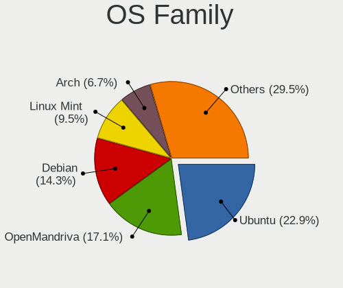
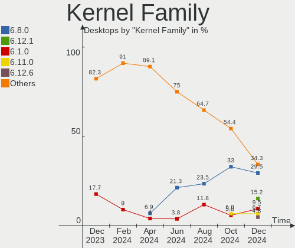
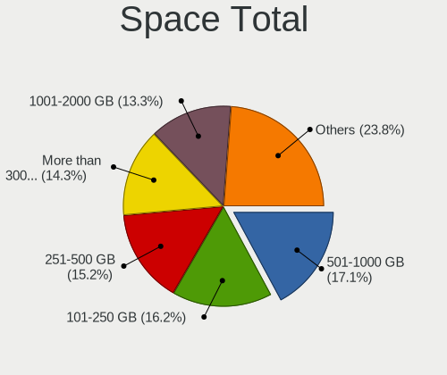
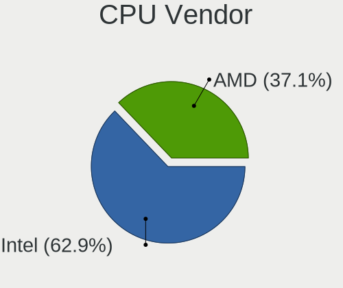
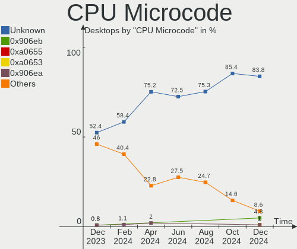
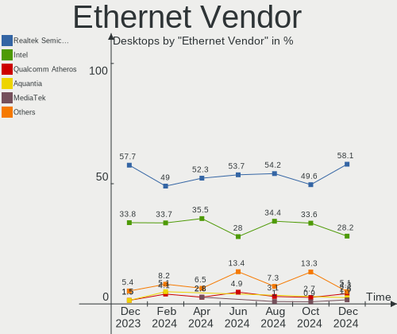
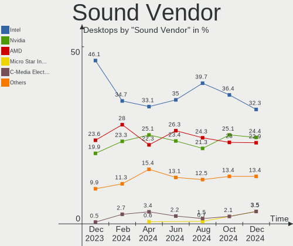

Linux in France - Hardware Trends (Desktops)
--------------------------------------------

A project to identify most popular hardware characteristics and track their change
over time based on data collected by Linux users at https://Linux-Hardware.org.

Anyone can contribute to this report by the [hw-probe](https://github.com/linuxhw/hw-probe) tool:

    sudo -E hw-probe -all -upload

Period: Nov, 2023.

Contents
--------

* [ System ](#system)
  - [ OS                       ](#os)
  - [ OS Family                ](#os-family)
  - [ Kernel                   ](#kernel)
  - [ Kernel Family            ](#kernel-family)
  - [ Kernel Major Ver.        ](#kernel-major-ver)
  - [ Arch                     ](#arch)
  - [ DE                       ](#de)
  - [ Display Server           ](#display-server)
  - [ Display Manager          ](#display-manager)
  - [ OS Lang                  ](#os-lang)
  - [ Boot Mode                ](#boot-mode)
  - [ Filesystem               ](#filesystem)
  - [ Part. scheme             ](#part-scheme)
  - [ Dual Boot with Linux/BSD ](#dual-boot-with-linuxbsd)
  - [ Dual Boot (Win)          ](#dual-boot-win)

* [ Board ](#board)
  - [ Vendor                   ](#vendor)
  - [ Model                    ](#model)
  - [ Model Family             ](#model-family)
  - [ MFG Year                 ](#mfg-year)
  - [ Form Factor              ](#form-factor)
  - [ Secure Boot              ](#secure-boot)
  - [ Coreboot                 ](#coreboot)
  - [ RAM Size                 ](#ram-size)
  - [ RAM Used                 ](#ram-used)
  - [ Total Drives             ](#total-drives)
  - [ Has CD-ROM               ](#has-cd-rom)
  - [ Has Ethernet             ](#has-ethernet)
  - [ Has WiFi                 ](#has-wifi)
  - [ Has Bluetooth            ](#has-bluetooth)

* [ Location ](#location)
  - [ Country                  ](#country)
  - [ City                     ](#city)

* [ Drives ](#drives)
  - [ Drive Vendor             ](#drive-vendor)
  - [ Drive Model              ](#drive-model)
  - [ HDD Vendor               ](#hdd-vendor)
  - [ SSD Vendor               ](#ssd-vendor)
  - [ Drive Kind               ](#drive-kind)
  - [ Drive Connector          ](#drive-connector)
  - [ Drive Size               ](#drive-size)
  - [ Space Total              ](#space-total)
  - [ Space Used               ](#space-used)
  - [ Malfunc. Drives          ](#malfunc-drives)
  - [ Malfunc. Drive Vendor    ](#malfunc-drive-vendor)
  - [ Malfunc. HDD Vendor      ](#malfunc-hdd-vendor)
  - [ Malfunc. Drive Kind      ](#malfunc-drive-kind)
  - [ Failed Drives            ](#failed-drives)
  - [ Failed Drive Vendor      ](#failed-drive-vendor)
  - [ Drive Status             ](#drive-status)

* [ Storage controller ](#storage-controller)
  - [ Storage Vendor           ](#storage-vendor)
  - [ Storage Model            ](#storage-model)
  - [ Storage Kind             ](#storage-kind)

* [ Processor ](#processor)
  - [ CPU Vendor               ](#cpu-vendor)
  - [ CPU Model                ](#cpu-model)
  - [ CPU Model Family         ](#cpu-model-family)
  - [ CPU Cores                ](#cpu-cores)
  - [ CPU Sockets              ](#cpu-sockets)
  - [ CPU Threads              ](#cpu-threads)
  - [ CPU Op-Modes             ](#cpu-op-modes)
  - [ CPU Microcode            ](#cpu-microcode)
  - [ CPU Microarch            ](#cpu-microarch)

* [ Graphics ](#graphics)
  - [ GPU Vendor               ](#gpu-vendor)
  - [ GPU Model                ](#gpu-model)
  - [ GPU Combo                ](#gpu-combo)
  - [ GPU Driver               ](#gpu-driver)
  - [ GPU Memory               ](#gpu-memory)

* [ Monitor ](#monitor)
  - [ Monitor Vendor           ](#monitor-vendor)
  - [ Monitor Model            ](#monitor-model)
  - [ Monitor Resolution       ](#monitor-resolution)
  - [ Monitor Diagonal         ](#monitor-diagonal)
  - [ Monitor Width            ](#monitor-width)
  - [ Aspect Ratio             ](#aspect-ratio)
  - [ Monitor Area             ](#monitor-area)
  - [ Pixel Density            ](#pixel-density)
  - [ Multiple Monitors        ](#multiple-monitors)

* [ Network ](#network)
  - [ Net Controller Vendor    ](#net-controller-vendor)
  - [ Net Controller Model     ](#net-controller-model)
  - [ Wireless Vendor          ](#wireless-vendor)
  - [ Wireless Model           ](#wireless-model)
  - [ Ethernet Vendor          ](#ethernet-vendor)
  - [ Ethernet Model           ](#ethernet-model)
  - [ Net Controller Kind      ](#net-controller-kind)
  - [ Used Controller          ](#used-controller)
  - [ NICs                     ](#nics)
  - [ IPv6                     ](#ipv6)

* [ Bluetooth ](#bluetooth)
  - [ Bluetooth Vendor         ](#bluetooth-vendor)
  - [ Bluetooth Model          ](#bluetooth-model)

* [ Sound ](#sound)
  - [ Sound Vendor             ](#sound-vendor)
  - [ Sound Model              ](#sound-model)

* [ Memory ](#memory)
  - [ Memory Vendor            ](#memory-vendor)
  - [ Memory Model             ](#memory-model)
  - [ Memory Kind              ](#memory-kind)
  - [ Memory Form Factor       ](#memory-form-factor)
  - [ Memory Size              ](#memory-size)
  - [ Memory Speed             ](#memory-speed)

* [ Printers & scanners ](#printers--scanners)
  - [ Printer Vendor           ](#printer-vendor)
  - [ Printer Model            ](#printer-model)
  - [ Scanner Vendor           ](#scanner-vendor)
  - [ Scanner Model            ](#scanner-model)

* [ Camera ](#camera)
  - [ Camera Vendor            ](#camera-vendor)
  - [ Camera Model             ](#camera-model)

* [ Security ](#security)
  - [ Fingerprint Vendor       ](#fingerprint-vendor)
  - [ Fingerprint Model        ](#fingerprint-model)
  - [ Chipcard Vendor          ](#chipcard-vendor)
  - [ Chipcard Model           ](#chipcard-model)

* [ Unsupported ](#unsupported)
  - [ Unsupported Devices      ](#unsupported-devices)
  - [ Unsupported Device Types ](#unsupported-device-types)

System
------

OS
--

Installed operating systems

| Name                        | Desktops | Percent |
|-----------------------------|----------|---------|
| Ubuntu 22.04                | 18       | 17.82%  |
| Linux Mint 21.2             | 11       | 10.89%  |
| Ubuntu 20.04                | 8        | 7.92%   |
| OpenMandriva 23.08          | 7        | 6.93%   |
| Ubuntu 23.10                | 5        | 4.95%   |
| OpenMandriva 23.11          | 4        | 3.96%   |
| Fedora 39                   | 4        | 3.96%   |
| Arch Rolling                | 4        | 3.96%   |
| OpenMandriva 5.0            | 3        | 2.97%   |
| Debian 12                   | 3        | 2.97%   |
| Zorin 16                    | 2        | 1.98%   |
| Xubuntu 22.04               | 2        | 1.98%   |
| Kubuntu 22.04               | 2        | 1.98%   |
| Garuda Linux Soaring        | 2        | 1.98%   |
| Fedora 38                   | 2        | 1.98%   |
| EndeavourOS Rolling         | 2        | 1.98%   |
| Xubuntu 23.10               | 1        | 0.99%   |
| Xero Rolling                | 1        | 0.99%   |
| Void Linux Rolling          | 1        | 0.99%   |
| Ubuntu Studio 23.10         | 1        | 0.99%   |
| Ubuntu MATE 22.04           | 1        | 0.99%   |
| Ubuntu 24.04                | 1        | 0.99%   |
| Pop!_OS 22.04               | 1        | 0.99%   |
| org.kde.Platform 5.15-21.08 | 1        | 0.99%   |
| OpenMandriva 4.3            | 1        | 0.99%   |
| OpenMandriva 4.2            | 1        | 0.99%   |
| Nobara 38                   | 1        | 0.99%   |
| MX 23                       | 1        | 0.99%   |
| Manjaro 23.1.0              | 1        | 0.99%   |
| Manjaro 23.0.4              | 1        | 0.99%   |
| Manjaro                     | 1        | 0.99%   |
| Lubuntu 22.04               | 1        | 0.99%   |
| Linux Mint 20.3             | 1        | 0.99%   |
| Kubuntu 23.10               | 1        | 0.99%   |
| Debian 11                   | 1        | 0.99%   |
| Debian                      | 1        | 0.99%   |
| BigLinux 2023-11-17_05-13   | 1        | 0.99%   |
| ArcoLinux Rolling           | 1        | 0.99%   |

OS Family
---------

OS without a version

| Name             | Desktops | Percent |
|------------------|----------|---------|
| Ubuntu           | 32       | 31.68%  |
| OpenMandriva     | 16       | 15.84%  |
| Linux Mint       | 12       | 11.88%  |
| Fedora           | 6        | 5.94%   |
| Debian           | 5        | 4.95%   |
| Arch             | 4        | 3.96%   |
| Xubuntu          | 3        | 2.97%   |
| Manjaro          | 3        | 2.97%   |
| Kubuntu          | 3        | 2.97%   |
| Zorin            | 2        | 1.98%   |
| Garuda Linux     | 2        | 1.98%   |
| EndeavourOS      | 2        | 1.98%   |
| Xero             | 1        | 0.99%   |
| Void Linux       | 1        | 0.99%   |
| Ubuntu Studio    | 1        | 0.99%   |
| Ubuntu MATE      | 1        | 0.99%   |
| Pop!_OS          | 1        | 0.99%   |
| org.kde.Platform | 1        | 0.99%   |
| Nobara           | 1        | 0.99%   |
| MX               | 1        | 0.99%   |
| Lubuntu          | 1        | 0.99%   |
| BigLinux         | 1        | 0.99%   |
| ArcoLinux        | 1        | 0.99%   |

Kernel
------

Version of the Linux kernel

| Version                      | Desktops | Percent |
|------------------------------|----------|---------|
| 5.15.0-89-generic            | 12       | 11.88%  |
| 5.15.0-88-generic            | 11       | 10.89%  |
| 6.2.0-36-generic             | 8        | 7.92%   |
| 6.4.11-desktop-1omv2390      | 7        | 6.93%   |
| 6.2.0-37-generic             | 5        | 4.95%   |
| 6.6.2-desktop-1omv2390       | 4        | 3.96%   |
| 6.5.11-300.fc39.x86_64       | 4        | 3.96%   |
| 6.5.0-10-generic             | 4        | 3.96%   |
| 6.6.2-arch1-1                | 3        | 2.97%   |
| 6.2.0-26-generic             | 3        | 2.97%   |
| 6.1.0-13-amd64               | 3        | 2.97%   |
| 6.6.1-zen1-1-zen             | 2        | 1.98%   |
| 6.6.1-arch1-1                | 2        | 1.98%   |
| 6.6.0-desktop-1omv2390       | 2        | 1.98%   |
| 6.5.8-200.fc38.x86_64        | 2        | 1.98%   |
| 6.5.0-13-generic             | 2        | 1.98%   |
| 6.6.2-AMD                    | 1        | 0.99%   |
| 6.6.1_1                      | 1        | 0.99%   |
| 6.6.1-1-MANJARO              | 1        | 0.99%   |
| 6.6.1-1-clear                | 1        | 0.99%   |
| 6.5.9-zen2-1-zen             | 1        | 0.99%   |
| 6.5.7-060507-generic         | 1        | 0.99%   |
| 6.5.6-76060506-generic       | 1        | 0.99%   |
| 6.5.5-1-MANJARO              | 1        | 0.99%   |
| 6.5.11-201.fsync.fc38.x86_64 | 1        | 0.99%   |
| 6.5.0-9-generic              | 1        | 0.99%   |
| 6.5.0-4-amd64                | 1        | 0.99%   |
| 6.5.0-13-lowlatency          | 1        | 0.99%   |
| 6.5.0-1007-oem               | 1        | 0.99%   |
| 6.4.8-desktop-2omv2390       | 1        | 0.99%   |
| 6.4.0-1mx-ahs-amd64          | 1        | 0.99%   |
| 6.2.0-34-generic             | 1        | 0.99%   |
| 6.1.62-1-MANJARO             | 1        | 0.99%   |
| 6.1.55-1-MANJARO             | 1        | 0.99%   |
| 5.4.0-166-generic            | 1        | 0.99%   |
| 5.19.0-32-generic            | 1        | 0.99%   |
| 5.16.7-desktop-1omv4003      | 1        | 0.99%   |
| 5.15.126-1-pve               | 1        | 0.99%   |
| 5.15.0-87-generic            | 1        | 0.99%   |
| 5.15.0-76-generic            | 1        | 0.99%   |

Kernel Family
-------------

Linux kernel without a distro release

| Version  | Desktops | Percent |
|----------|----------|---------|
| 5.15.0   | 26       | 25.74%  |
| 6.2.0    | 17       | 16.83%  |
| 6.5.0    | 10       | 9.9%    |
| 6.6.2    | 8        | 7.92%   |
| 6.6.1    | 7        | 6.93%   |
| 6.4.11   | 7        | 6.93%   |
| 6.5.11   | 5        | 4.95%   |
| 6.1.0    | 3        | 2.97%   |
| 6.6.0    | 2        | 1.98%   |
| 6.5.8    | 2        | 1.98%   |
| 6.5.9    | 1        | 0.99%   |
| 6.5.7    | 1        | 0.99%   |
| 6.5.6    | 1        | 0.99%   |
| 6.5.5    | 1        | 0.99%   |
| 6.4.8    | 1        | 0.99%   |
| 6.4.0    | 1        | 0.99%   |
| 6.1.62   | 1        | 0.99%   |
| 6.1.55   | 1        | 0.99%   |
| 5.4.0    | 1        | 0.99%   |
| 5.19.0   | 1        | 0.99%   |
| 5.16.7   | 1        | 0.99%   |
| 5.15.126 | 1        | 0.99%   |
| 5.10.14  | 1        | 0.99%   |
| 4.9.0    | 1        | 0.99%   |

Kernel Major Ver.
-----------------

Linux kernel major version

| Version | Desktops | Percent |
|---------|----------|---------|
| 5.15    | 27       | 26.73%  |
| 6.5     | 21       | 20.79%  |
| 6.6     | 17       | 16.83%  |
| 6.2     | 17       | 16.83%  |
| 6.4     | 9        | 8.91%   |
| 6.1     | 5        | 4.95%   |
| 5.4     | 1        | 0.99%   |
| 5.19    | 1        | 0.99%   |
| 5.16    | 1        | 0.99%   |
| 5.10    | 1        | 0.99%   |
| 4.9     | 1        | 0.99%   |

Arch
----

OS architecture (x86_64, i586, etc.)

| Name   | Desktops | Percent |
|--------|----------|---------|
| x86_64 | 101      | 100%    |

DE
--

Desktop Environment

| Name            | Desktops | Percent |
|-----------------|----------|---------|
| GNOME           | 38       | 37.62%  |
| KDE5            | 34       | 33.66%  |
| X-Cinnamon      | 8        | 7.92%   |
| XFCE            | 7        | 6.93%   |
| MATE            | 5        | 4.95%   |
| Unknown         | 4        | 3.96%   |
| LXQt            | 2        | 1.98%   |
| i3              | 1        | 0.99%   |
| Hyprland        | 1        | 0.99%   |
| GNOME Flashback | 1        | 0.99%   |

Display Server
--------------

X11 or Wayland

| Name    | Desktops | Percent |
|---------|----------|---------|
| X11     | 59       | 58.42%  |
| Wayland | 37       | 36.63%  |
| Tty     | 5        | 4.95%   |

Display Manager
---------------

SDDM, LightDM, etc.

| Name    | Desktops | Percent |
|---------|----------|---------|
| SDDM    | 35       | 34.65%  |
| Unknown | 23       | 22.77%  |
| GDM3    | 20       | 19.8%   |
| LightDM | 14       | 13.86%  |
| GDM     | 9        | 8.91%   |

OS Lang
-------

Language

| Lang  | Desktops | Percent |
|-------|----------|---------|
| fr_FR | 80       | 79.21%  |
| en_US | 16       | 15.84%  |
| en_GB | 2        | 1.98%   |
| fr_BE | 1        | 0.99%   |
| de_DE | 1        | 0.99%   |
| cs_CZ | 1        | 0.99%   |

Boot Mode
---------

EFI or BIOS

| Mode | Desktops | Percent |
|------|----------|---------|
| EFI  | 61       | 60.4%   |
| BIOS | 40       | 39.6%   |

Filesystem
----------

Type of filesystem

| Type    | Desktops | Percent |
|---------|----------|---------|
| Ext4    | 63       | 62.38%  |
| Tmpfs   | 15       | 14.85%  |
| Btrfs   | 9        | 8.91%   |
| Overlay | 8        | 7.92%   |
| F2fs    | 3        | 2.97%   |
| Xfs     | 2        | 1.98%   |
| Unknown | 1        | 0.99%   |

Part. scheme
------------

Scheme of partitioning

| Type    | Desktops | Percent |
|---------|----------|---------|
| GPT     | 70       | 69.31%  |
| Unknown | 19       | 18.81%  |
| MBR     | 12       | 11.88%  |

Dual Boot with Linux/BSD
------------------------

Hosting more than one Linux/BSD

| Dual boot | Desktops | Percent |
|-----------|----------|---------|
| No        | 73       | 72.28%  |
| Yes       | 28       | 27.72%  |

Dual Boot (Win)
---------------

Hosting Linux and Windows

| Dual boot | Desktops | Percent |
|-----------|----------|---------|
| No        | 65       | 64.36%  |
| Yes       | 36       | 35.64%  |

Board
-----

Vendor
------

Motherboard manufacturer

| Name                | Desktops | Percent |
|---------------------|----------|---------|
| ASUSTek Computer    | 24       | 23.76%  |
| MSI                 | 19       | 18.81%  |
| Gigabyte Technology | 10       | 9.9%    |
| Dell                | 10       | 9.9%    |
| Lenovo              | 9        | 8.91%   |
| ASRock              | 8        | 7.92%   |
| Hewlett-Packard     | 4        | 3.96%   |
| Acer                | 4        | 3.96%   |
| Unknown             | 3        | 2.97%   |
| Intel               | 2        | 1.98%   |
| Fujitsu             | 2        | 1.98%   |
| Foxconn             | 2        | 1.98%   |
| Biostar             | 2        | 1.98%   |
| Shuttle             | 1        | 0.99%   |
| eMachines           | 1        | 0.99%   |

Model
-----

Motherboard model

| Name                                     | Desktops | Percent |
|------------------------------------------|----------|---------|
| MSI MS-7D16                              | 3        | 2.97%   |
| Unknown                                  | 3        | 2.97%   |
| MSI MS-7C37                              | 2        | 1.98%   |
| Gigabyte B450 AORUS ELITE                | 2        | 1.98%   |
| Dell OptiPlex 3050                       | 2        | 1.98%   |
| Dell OptiPlex 3020                       | 2        | 1.98%   |
| ASUS ROG STRIX B560-I GAMING WIFI        | 2        | 1.98%   |
| Shuttle XS35V3                           | 1        | 0.99%   |
| MSI MS-7D42                              | 1        | 0.99%   |
| MSI MS-7C92                              | 1        | 0.99%   |
| MSI MS-7C82                              | 1        | 0.99%   |
| MSI MS-7C56                              | 1        | 0.99%   |
| MSI MS-7C52                              | 1        | 0.99%   |
| MSI MS-7B79                              | 1        | 0.99%   |
| MSI MS-7B49                              | 1        | 0.99%   |
| MSI MS-7B18                              | 1        | 0.99%   |
| MSI MS-7A74                              | 1        | 0.99%   |
| MSI MS-7A34                              | 1        | 0.99%   |
| MSI MS-7995                              | 1        | 0.99%   |
| MSI MS-7850                              | 1        | 0.99%   |
| MSI MS-7798                              | 1        | 0.99%   |
| MSI MS-7721                              | 1        | 0.99%   |
| Lenovo ThinkStation E32 30A0A0DCFR       | 1        | 0.99%   |
| Lenovo ThinkCentre M93 10A50002GE        | 1        | 0.99%   |
| Lenovo ThinkCentre M90p 3282B5G          | 1        | 0.99%   |
| Lenovo ThinkCentre M83z 10C20003FR       | 1        | 0.99%   |
| Lenovo ThinkCentre M83 10AHS2TG00        | 1        | 0.99%   |
| Lenovo ThinkCentre M75t Gen 2 11KC000PCK | 1        | 0.99%   |
| Lenovo ThinkCentre M73 10AXS1UY00        | 1        | 0.99%   |
| Lenovo ThinkCentre M71e 5033A21          | 1        | 0.99%   |
| Lenovo ThinkCentre M58p 6137A1G          | 1        | 0.99%   |
| Intel Jasper Lake Client Platform        | 1        | 0.99%   |
| Intel HM570                              | 1        | 0.99%   |
| HP Z240 Tower Workstation                | 1        | 0.99%   |
| HP Pavilion Desktop TP01-2xxx            | 1        | 0.99%   |
| HP Compaq 6200 Pro MT PC                 | 1        | 0.99%   |
| HP 22-3102nf                             | 1        | 0.99%   |
| Gigabyte Z590 UD AC                      | 1        | 0.99%   |
| Gigabyte Z270X-Ultra Gaming              | 1        | 0.99%   |
| Gigabyte X570 UD                         | 1        | 0.99%   |

Model Family
------------

Motherboard model prefix

| Name                   | Desktops | Percent |
|------------------------|----------|---------|
| Lenovo ThinkCentre     | 8        | 7.92%   |
| Dell OptiPlex          | 8        | 7.92%   |
| ASUS ROG               | 5        | 4.95%   |
| ASUS TUF               | 4        | 3.96%   |
| MSI MS-7D16            | 3        | 2.97%   |
| Unknown                | 3        | 2.97%   |
| MSI MS-7C37            | 2        | 1.98%   |
| Gigabyte B450          | 2        | 1.98%   |
| Fujitsu ESPRIMO        | 2        | 1.98%   |
| ASUS PRIME             | 2        | 1.98%   |
| ASUS P8Z77-V           | 2        | 1.98%   |
| Acer Veriton           | 2        | 1.98%   |
| Acer Aspire            | 2        | 1.98%   |
| Shuttle XS35V3         | 1        | 0.99%   |
| MSI MS-7D42            | 1        | 0.99%   |
| MSI MS-7C92            | 1        | 0.99%   |
| MSI MS-7C82            | 1        | 0.99%   |
| MSI MS-7C56            | 1        | 0.99%   |
| MSI MS-7C52            | 1        | 0.99%   |
| MSI MS-7B79            | 1        | 0.99%   |
| MSI MS-7B49            | 1        | 0.99%   |
| MSI MS-7B18            | 1        | 0.99%   |
| MSI MS-7A74            | 1        | 0.99%   |
| MSI MS-7A34            | 1        | 0.99%   |
| MSI MS-7995            | 1        | 0.99%   |
| MSI MS-7850            | 1        | 0.99%   |
| MSI MS-7798            | 1        | 0.99%   |
| MSI MS-7721            | 1        | 0.99%   |
| Lenovo ThinkStation    | 1        | 0.99%   |
| Intel Jasper           | 1        | 0.99%   |
| Intel HM570            | 1        | 0.99%   |
| HP Z240                | 1        | 0.99%   |
| HP Pavilion            | 1        | 0.99%   |
| HP Compaq              | 1        | 0.99%   |
| HP 22-3102nf           | 1        | 0.99%   |
| Gigabyte Z590          | 1        | 0.99%   |
| Gigabyte Z270X-Ultra   | 1        | 0.99%   |
| Gigabyte X570          | 1        | 0.99%   |
| Gigabyte H110M-S2H     | 1        | 0.99%   |
| Gigabyte GB-BRR3H-4300 | 1        | 0.99%   |

MFG Year
--------

Motherboard manufacture year

| Year | Desktops | Percent |
|------|----------|---------|
| 2021 | 11       | 10.89%  |
| 2018 | 10       | 9.9%    |
| 2013 | 8        | 7.92%   |
| 2020 | 7        | 6.93%   |
| 2019 | 7        | 6.93%   |
| 2017 | 7        | 6.93%   |
| 2016 | 7        | 6.93%   |
| 2012 | 7        | 6.93%   |
| 2023 | 6        | 5.94%   |
| 2022 | 6        | 5.94%   |
| 2014 | 6        | 5.94%   |
| 2011 | 6        | 5.94%   |
| 2010 | 5        | 4.95%   |
| 2015 | 4        | 3.96%   |
| 2008 | 2        | 1.98%   |
| 2009 | 1        | 0.99%   |
| 2007 | 1        | 0.99%   |

Form Factor
-----------

Physical design of the computer

| Name    | Desktops | Percent |
|---------|----------|---------|
| Desktop | 101      | 100%    |

Secure Boot
-----------

Enabled or disabled

| State    | Desktops | Percent |
|----------|----------|---------|
| Disabled | 98       | 97.03%  |
| Enabled  | 3        | 2.97%   |

Coreboot
--------

Have coreboot on board

| Used | Desktops | Percent |
|------|----------|---------|
| No   | 101      | 100%    |

RAM Size
--------

Total RAM memory

| Size in GB  | Desktops | Percent |
|-------------|----------|---------|
| 16.01-24.0  | 32       | 31.68%  |
| 4.01-8.0    | 17       | 16.83%  |
| 32.01-64.0  | 17       | 16.83%  |
| 8.01-16.0   | 12       | 11.88%  |
| 3.01-4.0    | 10       | 9.9%    |
| 24.01-32.0  | 5        | 4.95%   |
| 64.01-256.0 | 4        | 3.96%   |
| 2.01-3.0    | 2        | 1.98%   |
| 1.01-2.0    | 2        | 1.98%   |

RAM Used
--------

Used RAM memory

| Used GB    | Desktops | Percent |
|------------|----------|---------|
| 1.01-2.0   | 26       | 25.74%  |
| 2.01-3.0   | 25       | 24.75%  |
| 4.01-8.0   | 16       | 15.84%  |
| 3.01-4.0   | 13       | 12.87%  |
| 8.01-16.0  | 10       | 9.9%    |
| 0.51-1.0   | 8        | 7.92%   |
| 16.01-24.0 | 2        | 1.98%   |
| 0.01-0.5   | 1        | 0.99%   |

Total Drives
------------

Number of drives on board

| Drives | Desktops | Percent |
|--------|----------|---------|
| 2      | 33       | 32.67%  |
| 1      | 33       | 32.67%  |
| 3      | 16       | 15.84%  |
| 5      | 7        | 6.93%   |
| 4      | 6        | 5.94%   |
| 8      | 3        | 2.97%   |
| 6      | 3        | 2.97%   |

Has CD-ROM
----------

Has CD-ROM on board

| Presented | Desktops | Percent |
|-----------|----------|---------|
| No        | 57       | 56.44%  |
| Yes       | 44       | 43.56%  |

Has Ethernet
------------

Has Ethernet on board

| Presented | Desktops | Percent |
|-----------|----------|---------|
| Yes       | 101      | 100%    |

Has WiFi
--------

Has WiFi module

| Presented | Desktops | Percent |
|-----------|----------|---------|
| No        | 53       | 52.48%  |
| Yes       | 48       | 47.52%  |

Has Bluetooth
-------------

Has Bluetooth module

| Presented | Desktops | Percent |
|-----------|----------|---------|
| No        | 54       | 53.47%  |
| Yes       | 47       | 46.53%  |

Location
--------

Country
-------

Geographic location (country)

| Country | Desktops | Percent |
|---------|----------|---------|
| France  | 101      | 100%    |

City
----

Geographic location (city)

| City                      | Desktops | Percent |
|---------------------------|----------|---------|
| Paris                     | 17       | 16.83%  |
| Nantes                    | 4        | 3.96%   |
| Toulouse                  | 3        | 2.97%   |
| Figeac                    | 3        | 2.97%   |
| Vitry-sur-Seine           | 2        | 1.98%   |
| Valenciennes              | 2        | 1.98%   |
| La Broque                 | 2        | 1.98%   |
| Wasquehal                 | 1        | 0.99%   |
| Villeurbanne              | 1        | 0.99%   |
| Villetaneuse              | 1        | 0.99%   |
| Villepinte                | 1        | 0.99%   |
| Vertou                    | 1        | 0.99%   |
| Versailles                | 1        | 0.99%   |
| Vernon                    | 1        | 0.99%   |
| Veauche                   | 1        | 0.99%   |
| Trelissac                 | 1        | 0.99%   |
| Toulon                    | 1        | 0.99%   |
| Suresnes                  | 1        | 0.99%   |
| Strasbourg                | 1        | 0.99%   |
| Steenvoorde               | 1        | 0.99%   |
| Sotteville-lès-Rouen     | 1        | 0.99%   |
| Sète                     | 1        | 0.99%   |
| Servins                   | 1        | 0.99%   |
| Saint-Remy-les-Chevreuse  | 1        | 0.99%   |
| Saint-Étienne-du-Rouvray | 1        | 0.99%   |
| Rosny-sous-Bois           | 1        | 0.99%   |
| Ribeauvillé              | 1        | 0.99%   |
| Rennes                    | 1        | 0.99%   |
| Reims                     | 1        | 0.99%   |
| Poitiers                  | 1        | 0.99%   |
| Plaisir                   | 1        | 0.99%   |
| Noyal-sur-Vilaine         | 1        | 0.99%   |
| Nice                      | 1        | 0.99%   |
| Montpellier               | 1        | 0.99%   |
| Montluçon                | 1        | 0.99%   |
| Montataire                | 1        | 0.99%   |
| Messei                    | 1        | 0.99%   |
| Marseille                 | 1        | 0.99%   |
| Mâcon                    | 1        | 0.99%   |
| Lyon                      | 1        | 0.99%   |

Drives
------

Drive Vendor
------------

Hard drive vendors

| Vendor                      | Desktops | Drives | Percent |
|-----------------------------|----------|--------|---------|
| Seagate                     | 43       | 53     | 21.08%  |
| WDC                         | 34       | 45     | 16.67%  |
| Samsung Electronics         | 32       | 42     | 15.69%  |
| Crucial                     | 19       | 21     | 9.31%   |
| Toshiba                     | 10       | 12     | 4.9%    |
| Kingston                    | 9        | 9      | 4.41%   |
| SanDisk                     | 6        | 6      | 2.94%   |
| Micron/Crucial Technology   | 5        | 5      | 2.45%   |
| Phison Electronics          | 4        | 5      | 1.96%   |
| China                       | 4        | 4      | 1.96%   |
| Unknown                     | 2        | 3      | 0.98%   |
| Transcend                   | 2        | 2      | 0.98%   |
| SPCC                        | 2        | 3      | 0.98%   |
| Silicon Motion              | 2        | 2      | 0.98%   |
| Micron Technology           | 2        | 2      | 0.98%   |
| LDLC                        | 2        | 2      | 0.98%   |
| Intel                       | 2        | 3      | 0.98%   |
| Hitachi                     | 2        | 3      | 0.98%   |
| HGST                        | 2        | 2      | 0.98%   |
| YHJC                        | 1        | 1      | 0.49%   |
| XrayDisk                    | 1        | 1      | 0.49%   |
| Verbatim                    | 1        | 1      | 0.49%   |
| tigo                        | 1        | 1      | 0.49%   |
| SK hynix                    | 1        | 1      | 0.49%   |
| Realtek Semiconductor       | 1        | 1      | 0.49%   |
| PNY                         | 1        | 1      | 0.49%   |
| Patriot                     | 1        | 1      | 0.49%   |
| OCZ                         | 1        | 1      | 0.49%   |
| MAXIO Technology (Hangzhou) | 1        | 1      | 0.49%   |
| KIOXIA                      | 1        | 1      | 0.49%   |
| Kingston Technology Company | 1        | 1      | 0.49%   |
| JMicron Technology          | 1        | 1      | 0.49%   |
| HS-SSD-E100                 | 1        | 1      | 0.49%   |
| HGST HTS                    | 1        | 1      | 0.49%   |
| Fanxiang                    | 1        | 1      | 0.49%   |
| Emtec                       | 1        | 1      | 0.49%   |
| Corsair                     | 1        | 1      | 0.49%   |
| BIWIN                       | 1        | 1      | 0.49%   |
| ASMedia                     | 1        | 1      | 0.49%   |

Drive Model
-----------

Hard drive models

| Model                                                 | Desktops | Percent |
|-------------------------------------------------------|----------|---------|
| Crucial CT500MX500SSD1 500GB                          | 5        | 2.1%    |
| Seagate ST2000DM008-2FR102 2TB                        | 4        | 1.68%   |
| Seagate ST1000DM010-2EP102 1TB                        | 4        | 1.68%   |
| Samsung SSD 980 500GB                                 | 4        | 1.68%   |
| Samsung SSD 870 QVO 1TB                               | 4        | 1.68%   |
| Samsung NVMe SSD Controller SM981/PM981/PM983 250GB   | 4        | 1.68%   |
| WDC WD20EZRZ-00Z5HB0 2TB                              | 3        | 1.26%   |
| WDC WD20EZRX-00D8PB0 2TB                              | 3        | 1.26%   |
| Seagate ST1000DM003-1SB102 1TB                        | 3        | 1.26%   |
| Samsung SSD 870 QVO 2TB                               | 3        | 1.26%   |
| Phison E12 NVMe Controller 512GB                      | 3        | 1.26%   |
| Micron/Crucial P2 NVMe PCIe SSD 1TB                   | 3        | 1.26%   |
| Crucial CT1000MX500SSD1 1TB                           | 3        | 1.26%   |
| WDC WDS500G2B0C-00PXH0 500GB                          | 2        | 0.84%   |
| Toshiba MQ01ABD100 1TB                                | 2        | 0.84%   |
| Toshiba MQ01ABD075 752GB                              | 2        | 0.84%   |
| Toshiba DT01ACA100 1TB                                | 2        | 0.84%   |
| Silicon Motion SM2263EN/SM2263XT SSD Controller 256GB | 2        | 0.84%   |
| Seagate ST9160821AS 160GB                             | 2        | 0.84%   |
| Seagate ST4000LM024-2AN17V 4TB                        | 2        | 0.84%   |
| Seagate ST4000DM004-2U9104 4TB                        | 2        | 0.84%   |
| Seagate ST4000DM004-2CV104 4TB                        | 2        | 0.84%   |
| Seagate ST3500418AS 500GB                             | 2        | 0.84%   |
| Seagate ST2000DM006-2DM164 2TB                        | 2        | 0.84%   |
| Seagate ST2000DM001-1ER164 2TB                        | 2        | 0.84%   |
| Seagate ST1000LM024 HN-M101MBB 1TB                    | 2        | 0.84%   |
| Seagate ST1000DM003-1SB10C 1TB                        | 2        | 0.84%   |
| Samsung SSD 860 EVO 500GB                             | 2        | 0.84%   |
| Samsung SSD 850 EVO 1TB                               | 2        | 0.84%   |
| LDLC F8+M.2 480 480GB                                 | 2        | 0.84%   |
| Crucial CT480BX500SSD1 480GB                          | 2        | 0.84%   |
| Crucial CT240BX500SSD1 240GB                          | 2        | 0.84%   |
| Crucial CT2000MX500SSD1 2TB                           | 2        | 0.84%   |
| YHJC YHS200A256HI27 256GB                             | 1        | 0.42%   |
| XrayDisk 512GB SSD                                    | 1        | 0.42%   |
| WDC WDS500G3XHC-00SJG0 500GB                          | 1        | 0.42%   |
| WDC WDS500G2B0C 500GB                                 | 1        | 0.42%   |
| WDC WDS240G2G0A-00JH30 240GB SSD                      | 1        | 0.42%   |
| WDC WDS200T2B0A 2TB SSD                               | 1        | 0.42%   |
| WDC WDS100T2B0C-00PXH0 1TB                            | 1        | 0.42%   |

HDD Vendor
----------

Hard disk drive vendors

| Vendor   | Desktops | Drives | Percent |
|----------|----------|--------|---------|
| Seagate  | 42       | 52     | 49.41%  |
| WDC      | 27       | 38     | 31.76%  |
| Toshiba  | 10       | 12     | 11.76%  |
| Hitachi  | 2        | 3      | 2.35%   |
| HGST     | 2        | 2      | 2.35%   |
| Unknown  | 1        | 1      | 1.18%   |
| HGST HTS | 1        | 1      | 1.18%   |

SSD Vendor
----------

Solid state drive vendors

| Vendor              | Desktops | Drives | Percent |
|---------------------|----------|--------|---------|
| Samsung Electronics | 20       | 23     | 29.41%  |
| Crucial             | 17       | 19     | 25%     |
| Kingston            | 5        | 5      | 7.35%   |
| SanDisk             | 4        | 4      | 5.88%   |
| China               | 4        | 4      | 5.88%   |
| WDC                 | 2        | 2      | 2.94%   |
| Transcend           | 2        | 2      | 2.94%   |
| SPCC                | 2        | 2      | 2.94%   |
| XrayDisk            | 1        | 1      | 1.47%   |
| Verbatim            | 1        | 1      | 1.47%   |
| tigo                | 1        | 1      | 1.47%   |
| PNY                 | 1        | 1      | 1.47%   |
| OCZ                 | 1        | 1      | 1.47%   |
| Micron Technology   | 1        | 1      | 1.47%   |
| JMicron Technology  | 1        | 1      | 1.47%   |
| Fanxiang            | 1        | 1      | 1.47%   |
| Emtec               | 1        | 1      | 1.47%   |
| Corsair             | 1        | 1      | 1.47%   |
| BIWIN               | 1        | 1      | 1.47%   |
| ASMedia             | 1        | 1      | 1.47%   |

Drive Kind
----------

HDD or SSD

| Kind    | Desktops | Drives | Percent |
|---------|----------|--------|---------|
| HDD     | 66       | 109    | 39.05%  |
| SSD     | 54       | 73     | 31.95%  |
| NVMe    | 46       | 59     | 27.22%  |
| Unknown | 3        | 3      | 1.78%   |

Drive Connector
---------------

SATA, SAS, NVMe, etc.

| Type | Desktops | Drives | Percent |
|------|----------|--------|---------|
| SATA | 90       | 175    | 62.07%  |
| NVMe | 46       | 59     | 31.72%  |
| SAS  | 9        | 10     | 6.21%   |

Drive Size
----------

Size of hard drive

| Size in TB | Desktops | Drives | Percent |
|------------|----------|--------|---------|
| 0.01-0.5   | 59       | 72     | 42.75%  |
| 0.51-1.0   | 40       | 60     | 28.99%  |
| 1.01-2.0   | 19       | 28     | 13.77%  |
| 3.01-4.0   | 14       | 16     | 10.14%  |
| 2.01-3.0   | 4        | 4      | 2.9%    |
| 10.01-20.0 | 1        | 1      | 0.72%   |
| 4.01-10.0  | 1        | 1      | 0.72%   |

Space Total
-----------

Amount of disk space available on the file system

| Size in GB     | Desktops | Percent |
|----------------|----------|---------|
| 101-250        | 22       | 21.78%  |
| More than 3000 | 21       | 20.79%  |
| 1001-2000      | 17       | 16.83%  |
| 251-500        | 11       | 10.89%  |
| 501-1000       | 9        | 8.91%   |
| 2001-3000      | 7        | 6.93%   |
| 1-20           | 7        | 6.93%   |
| 51-100         | 5        | 4.95%   |
| Unknown        | 2        | 1.98%   |

Space Used
----------

Amount of used disk space

| Used GB        | Desktops | Percent |
|----------------|----------|---------|
| 1-20           | 26       | 25.74%  |
| 101-250        | 14       | 13.86%  |
| 1001-2000      | 14       | 13.86%  |
| 21-50          | 13       | 12.87%  |
| 501-1000       | 8        | 7.92%   |
| 51-100         | 8        | 7.92%   |
| More than 3000 | 6        | 5.94%   |
| 2001-3000      | 5        | 4.95%   |
| 251-500        | 4        | 3.96%   |
| Unknown        | 2        | 1.98%   |
| 0              | 1        | 0.99%   |

Malfunc. Drives
---------------

Drive models with a malfunction

| Model                                                     | Desktops | Drives | Percent |
|-----------------------------------------------------------|----------|--------|---------|
| WDC WD800AAJB-00J3A0 80GB                                 | 1        | 1      | 4.76%   |
| WDC WD5000BEVT-22A0RT0 500GB                              | 1        | 1      | 4.76%   |
| WDC WD40EURX-63BMCY0 4TB                                  | 1        | 1      | 4.76%   |
| WDC WD30EFRX-68EUZN0 3TB                                  | 1        | 1      | 4.76%   |
| WDC WD20EZRZ-00Z5HB0 2TB                                  | 1        | 1      | 4.76%   |
| WDC WD20EZRX-00D8PB0 2TB                                  | 1        | 1      | 4.76%   |
| WDC WD15EADS-22P8B0 1TB                                   | 1        | 1      | 4.76%   |
| WDC WD10EADS-65L5B1 1TB                                   | 1        | 1      | 4.76%   |
| Seagate ST9160821AS 160GB                                 | 1        | 1      | 4.76%   |
| Seagate ST500LM000-SSHD-8GB                               | 1        | 1      | 4.76%   |
| Seagate ST4000DM000-1F2168 4TB                            | 1        | 1      | 4.76%   |
| Seagate ST3500418AS 500GB                                 | 1        | 1      | 4.76%   |
| Seagate ST3500320AS 500GB                                 | 1        | 1      | 4.76%   |
| Seagate ST3200021A 200GB                                  | 1        | 1      | 4.76%   |
| Seagate ST2000DM006-2DM164 2TB                            | 1        | 1      | 4.76%   |
| Seagate ST1000LM024 HN-M101MBB 1TB                        | 1        | 1      | 4.76%   |
| SanDisk SDSSDXPS240G 240GB                                | 1        | 1      | 4.76%   |
| Realtek Semiconductor RTS5763DL NVMe SSD Controller 512GB | 1        | 1      | 4.76%   |
| Patriot M.2 P300 128GB                                    | 1        | 1      | 4.76%   |
| Micron Technology 1100_MTFDDAV512TBN 512GB SSD            | 1        | 1      | 4.76%   |
| HGST HDS724040ALE640 4TB                                  | 1        | 1      | 4.76%   |

Malfunc. Drive Vendor
---------------------

Vendors of faulty drives

| Vendor                | Desktops | Drives | Percent |
|-----------------------|----------|--------|---------|
| WDC                   | 8        | 8      | 40%     |
| Seagate               | 7        | 8      | 35%     |
| SanDisk               | 1        | 1      | 5%      |
| Realtek Semiconductor | 1        | 1      | 5%      |
| Patriot               | 1        | 1      | 5%      |
| Micron Technology     | 1        | 1      | 5%      |
| HGST                  | 1        | 1      | 5%      |

Malfunc. HDD Vendor
-------------------

Vendors of faulty HDD drives

| Vendor  | Desktops | Drives | Percent |
|---------|----------|--------|---------|
| WDC     | 8        | 8      | 50%     |
| Seagate | 7        | 8      | 43.75%  |
| HGST    | 1        | 1      | 6.25%   |

Malfunc. Drive Kind
-------------------

Kinds of faulty drives

| Kind | Desktops | Drives | Percent |
|------|----------|--------|---------|
| HDD  | 14       | 17     | 77.78%  |
| NVMe | 2        | 2      | 11.11%  |
| SSD  | 2        | 2      | 11.11%  |

Failed Drives
-------------

Failed drive models

Zero info for selected period =(

Failed Drive Vendor
-------------------

Failed drive vendors

Zero info for selected period =(

Drive Status
------------

Number of failed and malfunc. drives

| Status   | Desktops | Drives | Percent |
|----------|----------|--------|---------|
| Works    | 62       | 139    | 51.67%  |
| Detected | 40       | 84     | 33.33%  |
| Malfunc  | 18       | 21     | 15%     |

Storage controller
------------------

Storage Vendor
--------------

Storage controller vendors

| Vendor                           | Desktops | Percent |
|----------------------------------|----------|---------|
| Intel                            | 68       | 39.31%  |
| AMD                              | 30       | 17.34%  |
| Samsung Electronics              | 17       | 9.83%   |
| ASMedia Technology               | 10       | 5.78%   |
| Sandisk                          | 7        | 4.05%   |
| Micron/Crucial Technology        | 7        | 4.05%   |
| Marvell Technology Group         | 5        | 2.89%   |
| Kingston Technology Company      | 5        | 2.89%   |
| Silicon Motion                   | 4        | 2.31%   |
| Phison Electronics               | 4        | 2.31%   |
| MAXIO Technology (Hangzhou)      | 3        | 1.73%   |
| Realtek Semiconductor            | 2        | 1.16%   |
| JMicron Technology               | 2        | 1.16%   |
| VIA Technologies                 | 1        | 0.58%   |
| SK hynix                         | 1        | 0.58%   |
| Silicon Integrated Systems [SiS] | 1        | 0.58%   |
| Shenzhen Longsys Electronics     | 1        | 0.58%   |
| Nvidia                           | 1        | 0.58%   |
| Micron Technology                | 1        | 0.58%   |
| KIOXIA                           | 1        | 0.58%   |
| Broadcom / LSI                   | 1        | 0.58%   |
| Adaptec                          | 1        | 0.58%   |

Storage Model
-------------

Storage controller models

| Model                                                                                   | Desktops | Percent |
|-----------------------------------------------------------------------------------------|----------|---------|
| AMD FCH SATA Controller [AHCI mode]                                                     | 19       | 9.55%   |
| Intel 8 Series/C220 Series Chipset Family 6-port SATA Controller 1 [AHCI mode]          | 15       | 7.54%   |
| ASMedia ASM1062 Serial ATA Controller                                                   | 9        | 4.52%   |
| Samsung NVMe SSD Controller SM981/PM981/PM983                                           | 7        | 3.52%   |
| Samsung NVMe SSD Controller 980 (DRAM-less)                                             | 7        | 3.52%   |
| Intel 500 Series Chipset Family SATA AHCI Controller                                    | 7        | 3.52%   |
| Intel 200 Series PCH SATA controller [AHCI mode]                                        | 7        | 3.52%   |
| Intel Q170/Q150/B150/H170/H110/Z170/CM236 Chipset SATA Controller [AHCI Mode]           | 6        | 3.02%   |
| AMD 400 Series Chipset SATA Controller                                                  | 6        | 3.02%   |
| Intel 6 Series/C200 Series Chipset Family 6 port Desktop SATA AHCI Controller           | 5        | 2.51%   |
| AMD 500 Series Chipset SATA Controller                                                  | 5        | 2.51%   |
| Silicon Motion SM2263EN/SM2263XT (DRAM-less) NVMe SSD Controllers                       | 4        | 2.01%   |
| Micron/Crucial P2 [Nick P2] / P3 / P3 Plus NVMe PCIe SSD (DRAM-less)                    | 4        | 2.01%   |
| Intel 7 Series/C210 Series Chipset Family 6-port SATA Controller [AHCI mode]            | 4        | 2.01%   |
| AMD FCH SATA Controller D                                                               | 4        | 2.01%   |
| SanDisk Ultra 3D / WD Blue SN550 NVMe SSD                                               | 3        | 1.51%   |
| Samsung NVMe SSD Controller PM9A1/PM9A3/980PRO                                          | 3        | 1.51%   |
| Phison E12 NVMe Controller                                                              | 3        | 1.51%   |
| MAXIO (Hangzhou) NVMe SSD Controller MAP1202                                            | 3        | 1.51%   |
| Intel SATA controller                                                                   | 3        | 1.51%   |
| Intel Cannon Lake PCH SATA AHCI Controller                                              | 3        | 1.51%   |
| Intel Alder Lake-S PCH SATA Controller [AHCI Mode]                                      | 3        | 1.51%   |
| Intel 6 Series/C200 Series Chipset Family Desktop SATA Controller (IDE mode, ports 4-5) | 3        | 1.51%   |
| Intel 6 Series/C200 Series Chipset Family Desktop SATA Controller (IDE mode, ports 0-3) | 3        | 1.51%   |
| SanDisk WD Green SN350 240GB (DRAM-less) / SN560E NVMe SSD                              | 2        | 1.01%   |
| Marvell Group 88SE9172 SATA 6Gb/s Controller                                            | 2        | 1.01%   |
| JMicron JMB363 SATA/IDE Controller                                                      | 2        | 1.01%   |
| Intel 5 Series/3400 Series Chipset 6 port SATA AHCI Controller                          | 2        | 1.01%   |
| Intel 5 Series/3400 Series Chipset 4 port SATA IDE Controller                           | 2        | 1.01%   |
| Intel 5 Series/3400 Series Chipset 2 port SATA IDE Controller                           | 2        | 1.01%   |
| AMD SB7x0/SB8x0/SB9x0 SATA Controller [IDE mode]                                        | 2        | 1.01%   |
| AMD SB7x0/SB8x0/SB9x0 IDE Controller                                                    | 2        | 1.01%   |
| AMD 300 Series Chipset SATA Controller                                                  | 2        | 1.01%   |
| VIA VT6415 PATA IDE Host Controller                                                     | 1        | 0.5%    |
| SK hynix Platinum P41/PC801 NVMe Solid State Drive                                      | 1        | 0.5%    |
| Silicon Integrated Systems [SiS] SATA Controller / IDE mode                             | 1        | 0.5%    |
| Silicon Integrated Systems [SiS] 5513 IDE Controller                                    | 1        | 0.5%    |
| Shenzhen Longsys Lexar NM620 NVME SSD (DRAM-less)                                       | 1        | 0.5%    |
| Sandisk WD Black SN850X NVMe SSD                                                        | 1        | 0.5%    |
| SanDisk Extreme Pro / WD Black 2018/SN750/PC SN720 NVMe SSD                             | 1        | 0.5%    |

Storage Kind
------------

Kind of storage controller (IDE, SATA, NVMe, SAS, ...)

| Kind | Desktops | Percent |
|------|----------|---------|
| SATA | 91       | 59.09%  |
| NVMe | 46       | 29.87%  |
| IDE  | 13       | 8.44%   |
| RAID | 2        | 1.3%    |
| SAS  | 1        | 0.65%   |
| SCSI | 1        | 0.65%   |

Processor
---------

CPU Vendor
----------

Processor vendors

| Vendor | Desktops | Percent |
|--------|----------|---------|
| Intel  | 70       | 69.31%  |
| AMD    | 31       | 30.69%  |

CPU Model
---------

Processor models

| Model                                  | Desktops | Percent |
|----------------------------------------|----------|---------|
| Intel Core i9-10850K CPU @ 3.60GHz     | 4        | 3.96%   |
| Intel Core i7-8700 CPU @ 3.20GHz       | 3        | 2.97%   |
| Intel Core i3-6100 CPU @ 3.70GHz       | 3        | 2.97%   |
| Intel N95                              | 2        | 1.98%   |
| Intel Core i7-8700K CPU @ 3.70GHz      | 2        | 1.98%   |
| Intel Core i7-7700 CPU @ 3.60GHz       | 2        | 1.98%   |
| Intel Core i5-3470 CPU @ 3.20GHz       | 2        | 1.98%   |
| Intel Core i5 CPU 760 @ 2.80GHz        | 2        | 1.98%   |
| Intel Core i3-4150 CPU @ 3.50GHz       | 2        | 1.98%   |
| Intel Celeron CPU G1840 @ 2.80GHz      | 2        | 1.98%   |
| AMD Ryzen 9 5950X 16-Core Processor    | 2        | 1.98%   |
| AMD Ryzen 7 5700G with Radeon Graphics | 2        | 1.98%   |
| AMD Ryzen 5 5500                       | 2        | 1.98%   |
| AMD Athlon II X2 220 Processor         | 2        | 1.98%   |
| Intel Xeon CPU E3-1240 v5 @ 3.50GHz    | 1        | 0.99%   |
| Intel Pentium D CPU 2.80GHz            | 1        | 0.99%   |
| Intel Pentium CPU G640 @ 2.80GHz       | 1        | 0.99%   |
| Intel Pentium CPU G630 @ 2.70GHz       | 1        | 0.99%   |
| Intel Pentium CPU G4620 @ 3.70GHz      | 1        | 0.99%   |
| Intel Pentium CPU G3260T @ 2.90GHz     | 1        | 0.99%   |
| Intel Pentium CPU G3240 @ 3.10GHz      | 1        | 0.99%   |
| Intel N100                             | 1        | 0.99%   |
| Intel Genuine CPU 0000 @ 2.60GHz       | 1        | 0.99%   |
| Intel Core i9-10900KF CPU @ 3.70GHz    | 1        | 0.99%   |
| Intel Core i7-7700K CPU @ 4.20GHz      | 1        | 0.99%   |
| Intel Core i7-6700K CPU @ 4.00GHz      | 1        | 0.99%   |
| Intel Core i7-4790S CPU @ 3.20GHz      | 1        | 0.99%   |
| Intel Core i7-4790K CPU @ 4.00GHz      | 1        | 0.99%   |
| Intel Core i7-4770 CPU @ 3.40GHz       | 1        | 0.99%   |
| Intel Core i7-3770 CPU @ 3.40GHz       | 1        | 0.99%   |
| Intel Core i7-2600K CPU @ 3.40GHz      | 1        | 0.99%   |
| Intel Core i7-2600 CPU @ 3.40GHz       | 1        | 0.99%   |
| Intel Core i5-7500 CPU @ 3.40GHz       | 1        | 0.99%   |
| Intel Core i5-6400 CPU @ 2.70GHz       | 1        | 0.99%   |
| Intel Core i5-4590T CPU @ 2.00GHz      | 1        | 0.99%   |
| Intel Core i5-4570T CPU @ 2.90GHz      | 1        | 0.99%   |
| Intel Core i5-4570 CPU @ 3.20GHz       | 1        | 0.99%   |
| Intel Core i5-4460 CPU @ 3.20GHz       | 1        | 0.99%   |
| Intel Core i5-4440 CPU @ 3.10GHz       | 1        | 0.99%   |
| Intel Core i5-2500K CPU @ 3.30GHz      | 1        | 0.99%   |

CPU Model Family
----------------

Processor model prefix

| Model             | Desktops | Percent |
|-------------------|----------|---------|
| Intel Core i5     | 16       | 15.84%  |
| Intel Core i7     | 15       | 14.85%  |
| Other             | 10       | 9.9%    |
| AMD Ryzen 5       | 10       | 9.9%    |
| Intel Core i3     | 9        | 8.91%   |
| AMD Ryzen 7       | 7        | 6.93%   |
| Intel Pentium     | 5        | 4.95%   |
| Intel Core i9     | 5        | 4.95%   |
| Intel Celeron     | 4        | 3.96%   |
| AMD Ryzen 9       | 4        | 3.96%   |
| AMD Ryzen 3       | 3        | 2.97%   |
| AMD Athlon II X2  | 2        | 1.98%   |
| AMD A10           | 2        | 1.98%   |
| Intel Xeon        | 1        | 0.99%   |
| Intel Pentium D   | 1        | 0.99%   |
| Intel Genuine     | 1        | 0.99%   |
| Intel Core 2 Quad | 1        | 0.99%   |
| Intel Core 2 Duo  | 1        | 0.99%   |
| Intel Atom        | 1        | 0.99%   |
| AMD Ryzen 7 PRO   | 1        | 0.99%   |
| AMD Phenom II X6  | 1        | 0.99%   |
| AMD FX            | 1        | 0.99%   |

CPU Cores
---------

Number of processor cores

| Number | Desktops | Percent |
|--------|----------|---------|
| 4      | 34       | 33.66%  |
| 2      | 27       | 26.73%  |
| 6      | 17       | 16.83%  |
| 8      | 11       | 10.89%  |
| 10     | 5        | 4.95%   |
| 16     | 3        | 2.97%   |
| 12     | 3        | 2.97%   |
| 14     | 1        | 0.99%   |

CPU Sockets
-----------

Number of sockets

| Number | Desktops | Percent |
|--------|----------|---------|
| 1      | 101      | 100%    |

CPU Threads
-----------

Threads per core (Hyper-Threading)

| Number | Desktops | Percent |
|--------|----------|---------|
| 2      | 67       | 66.34%  |
| 1      | 34       | 33.66%  |

CPU Op-Modes
------------

CPU Operation Modes (32-bit, 64-bit)

| Op mode        | Desktops | Percent |
|----------------|----------|---------|
| 32-bit, 64-bit | 101      | 100%    |

CPU Microcode
-------------

Microcode number

| Number     | Desktops | Percent |
|------------|----------|---------|
| Unknown    | 54       | 53.47%  |
| 0x306c3    | 7        | 6.93%   |
| 0xa0655    | 5        | 4.95%   |
| 0x206a7    | 3        | 2.97%   |
| 0x0a50000c | 3        | 2.97%   |
| 0x0800820d | 3        | 2.97%   |
| 0x906ea    | 2        | 1.98%   |
| 0x306a9    | 2        | 1.98%   |
| 0x0a601203 | 2        | 1.98%   |
| 0x0a20102b | 2        | 1.98%   |
| 0x08701021 | 2        | 1.98%   |
| 0x08108109 | 2        | 1.98%   |
| 0xa0671    | 1        | 0.99%   |
| 0xa0653    | 1        | 0.99%   |
| 0x906e9    | 1        | 0.99%   |
| 0x906c0    | 1        | 0.99%   |
| 0x20655    | 1        | 0.99%   |
| 0x20652    | 1        | 0.99%   |
| 0x0a601206 | 1        | 0.99%   |
| 0x0a50000f | 1        | 0.99%   |
| 0x0a20120a | 1        | 0.99%   |
| 0x08600103 | 1        | 0.99%   |
| 0x0810100b | 1        | 0.99%   |
| 0x010000c8 | 1        | 0.99%   |
| 0x010000bf | 1        | 0.99%   |
| 0x010000b6 | 1        | 0.99%   |

CPU Microarch
-------------

Microarchitecture

| Name             | Desktops | Percent |
|------------------|----------|---------|
| Haswell          | 15       | 14.85%  |
| KabyLake         | 11       | 10.89%  |
| Zen 3            | 8        | 7.92%   |
| SandyBridge      | 8        | 7.92%   |
| Zen+             | 7        | 6.93%   |
| Skylake          | 6        | 5.94%   |
| CometLake        | 6        | 5.94%   |
| Zen 2            | 5        | 4.95%   |
| IvyBridge        | 4        | 3.96%   |
| Alderlake Hybrid | 4        | 3.96%   |
| Unknown          | 4        | 3.96%   |
| K10              | 3        | 2.97%   |
| Icelake          | 3        | 2.97%   |
| Gracemont        | 3        | 2.97%   |
| Zen              | 2        | 1.98%   |
| Westmere         | 2        | 1.98%   |
| Piledriver       | 2        | 1.98%   |
| Nehalem          | 2        | 1.98%   |
| Tremont          | 1        | 0.99%   |
| Penryn           | 1        | 0.99%   |
| NetBurst         | 1        | 0.99%   |
| Core             | 1        | 0.99%   |
| Bulldozer        | 1        | 0.99%   |
| Bonnell          | 1        | 0.99%   |

Graphics
--------

GPU Vendor
----------

Vendors of graphics cards

| Vendor | Desktops | Percent |
|--------|----------|---------|
| Intel  | 43       | 38.74%  |
| Nvidia | 41       | 36.94%  |
| AMD    | 27       | 24.32%  |

GPU Model
---------

Graphics card models

| Model                                                                       | Desktops | Percent |
|-----------------------------------------------------------------------------|----------|---------|
| Intel Xeon E3-1200 v3/4th Gen Core Processor Integrated Graphics Controller | 9        | 7.96%   |
| Nvidia GA106 [GeForce RTX 3060 Lite Hash Rate]                              | 6        | 5.31%   |
| Intel 2nd Generation Core Processor Family Integrated Graphics Controller   | 6        | 5.31%   |
| Intel HD Graphics 630                                                       | 4        | 3.54%   |
| Intel HD Graphics 530                                                       | 4        | 3.54%   |
| Nvidia GK208B [GeForce GT 730]                                              | 3        | 2.65%   |
| Intel CoffeeLake-S GT2 [UHD Graphics 630]                                   | 3        | 2.65%   |
| Intel Alder Lake-N [UHD Graphics]                                           | 3        | 2.65%   |
| Intel 4th Generation Core Processor Family Integrated Graphics Controller   | 3        | 2.65%   |
| AMD Raphael                                                                 | 3        | 2.65%   |
| AMD Navi 31 [Radeon RX 7900 XT/7900 XTX]                                    | 3        | 2.65%   |
| Nvidia TU116 [GeForce GTX 1650 SUPER]                                       | 2        | 1.77%   |
| Nvidia GP107GL [Quadro P400]                                                | 2        | 1.77%   |
| Nvidia GP107 [GeForce GTX 1050 Ti]                                          | 2        | 1.77%   |
| Nvidia GA104 [GeForce RTX 3060]                                             | 2        | 1.77%   |
| Intel Xeon E3-1200 v2/3rd Gen Core processor Graphics Controller            | 2        | 1.77%   |
| AMD Ellesmere [Radeon RX 470/480/570/570X/580/580X/590]                     | 2        | 1.77%   |
| AMD Cezanne [Radeon Vega Series / Radeon Vega Mobile Series]                | 2        | 1.77%   |
| Nvidia TU117 [GeForce GTX 1650]                                             | 1        | 0.88%   |
| Nvidia TU116 [GeForce GTX 1650]                                             | 1        | 0.88%   |
| Nvidia TU106 [GeForce RTX 2060 Rev. A]                                      | 1        | 0.88%   |
| Nvidia NV44 [GeForce 7100 GS]                                               | 1        | 0.88%   |
| Nvidia GT218 [GeForce 210]                                                  | 1        | 0.88%   |
| Nvidia GP107 [GeForce GTX 1050]                                             | 1        | 0.88%   |
| Nvidia GP106GL [Quadro P2200]                                               | 1        | 0.88%   |
| Nvidia GP106 [GeForce GTX 1060 6GB]                                         | 1        | 0.88%   |
| Nvidia GP104 [GeForce GTX 1080]                                             | 1        | 0.88%   |
| Nvidia GP104 [GeForce GTX 1070]                                             | 1        | 0.88%   |
| Nvidia GM107GL [Quadro K2200]                                               | 1        | 0.88%   |
| Nvidia GK208B [GeForce GT 710]                                              | 1        | 0.88%   |
| Nvidia GK107 [GeForce GT 640]                                               | 1        | 0.88%   |
| Nvidia GK104GL [Quadro K4200]                                               | 1        | 0.88%   |
| Nvidia GK104 [GeForce GTX 760]                                              | 1        | 0.88%   |
| Nvidia GF114 [GeForce GTX 560 Ti]                                           | 1        | 0.88%   |
| Nvidia GF108 [GeForce GT 730]                                               | 1        | 0.88%   |
| Nvidia GF108 [GeForce GT 630]                                               | 1        | 0.88%   |
| Nvidia GA106 [Geforce RTX 3050]                                             | 1        | 0.88%   |
| Nvidia GA104 [GeForce RTX 3060 Ti]                                          | 1        | 0.88%   |
| Nvidia GA102 [GeForce RTX 3090]                                             | 1        | 0.88%   |
| Nvidia G86 [GeForce 8500 GT]                                                | 1        | 0.88%   |

GPU Combo
---------

Combinations of graphics cards

| Name           | Desktops | Percent |
|----------------|----------|---------|
| 1 x Nvidia     | 34       | 33.66%  |
| 1 x Intel      | 33       | 32.67%  |
| 1 x AMD        | 22       | 21.78%  |
| Intel + Nvidia | 6        | 5.94%   |
| 2 x AMD        | 2        | 1.98%   |
| Intel + AMD    | 2        | 1.98%   |
| 2 x Intel      | 1        | 0.99%   |
| AMD + Nvidia   | 1        | 0.99%   |

GPU Driver
----------

Free vs proprietary

| Driver      | Desktops | Percent |
|-------------|----------|---------|
| Free        | 75       | 74.26%  |
| Proprietary | 24       | 23.76%  |
| Unknown     | 2        | 1.98%   |

GPU Memory
----------

Total video memory

| Size in GB | Desktops | Percent |
|------------|----------|---------|
| Unknown    | 50       | 49.5%   |
| 3.01-4.0   | 10       | 9.9%    |
| 8.01-16.0  | 9        | 8.91%   |
| 1.01-2.0   | 8        | 7.92%   |
| 0.01-0.5   | 8        | 7.92%   |
| 7.01-8.0   | 5        | 4.95%   |
| 16.01-24.0 | 4        | 3.96%   |
| 0.51-1.0   | 4        | 3.96%   |
| 5.01-6.0   | 1        | 0.99%   |
| 4.01-5.0   | 1        | 0.99%   |
| 2.01-3.0   | 1        | 0.99%   |

Monitor
-------

Monitor Vendor
--------------

Monitor vendors

| Vendor               | Desktops | Percent |
|----------------------|----------|---------|
| Dell                 | 14       | 13.21%  |
| Iiyama               | 11       | 10.38%  |
| Samsung Electronics  | 9        | 8.49%   |
| Goldstar             | 9        | 8.49%   |
| Philips              | 6        | 5.66%   |
| Hewlett-Packard      | 6        | 5.66%   |
| Acer                 | 6        | 5.66%   |
| TCT                  | 5        | 4.72%   |
| Ancor Communications | 4        | 3.77%   |
| Fujitsu Siemens      | 3        | 2.83%   |
| AOC                  | 3        | 2.83%   |
| ViewSonic            | 2        | 1.89%   |
| Unknown              | 2        | 1.89%   |
| Lenovo               | 2        | 1.89%   |
| FL_                  | 2        | 1.89%   |
| Denver               | 2        | 1.89%   |
| BenQ                 | 2        | 1.89%   |
| ASUSTek Computer     | 2        | 1.89%   |
| Yeyian               | 1        | 0.94%   |
| Xiaomi               | 1        | 0.94%   |
| Vestel Elektronik    | 1        | 0.94%   |
| TCL                  | 1        | 0.94%   |
| SENSY                | 1        | 0.94%   |
| Packard Bell         | 1        | 0.94%   |
| NTS                  | 1        | 0.94%   |
| NEC Computers        | 1        | 0.94%   |
| MSI                  | 1        | 0.94%   |
| Idek Iiyama          | 1        | 0.94%   |
| Hyundai ImageQuest   | 1        | 0.94%   |
| HJW                  | 1        | 0.94%   |
| Envision Peripherals | 1        | 0.94%   |
| CHD                  | 1        | 0.94%   |
| Belinea              | 1        | 0.94%   |
| Apple                | 1        | 0.94%   |

Monitor Model
-------------

Monitor models

| Model                                                                  | Desktops | Percent |
|------------------------------------------------------------------------|----------|---------|
| TCT DP1080P60 TCT0270 2560x1600 520x290mm 23.4-inch                    | 5        | 4.59%   |
| Goldstar LG IPS FULLHD GSM5AB8 1920x1080 480x270mm 21.7-inch           | 2        | 1.83%   |
| FL_ HDMI4K FL_2801 2560x1440 480x270mm 21.7-inch                       | 2        | 1.83%   |
| Yeyian YMG-4K27-01 YEY2700 3840x2160 600x330mm 27.0-inch               | 1        | 0.92%   |
| Xiaomi Woieyeks-4K XMD009A 2880x1800 480x270mm 21.7-inch               | 1        | 0.92%   |
| ViewSonic VG2719-2K VSC1935 2560x1440 600x340mm 27.2-inch              | 1        | 0.92%   |
| ViewSonic VA3209-QHD VSCA93D 2560x1440 698x393mm 31.5-inch             | 1        | 0.92%   |
| Vestel Elektronik 32W_LCD_TV VES3700 1920x1080 706x398mm 31.9-inch     | 1        | 0.92%   |
| Unknown LCD Monitor SAMSUNG 1920x1080                                  | 1        | 0.92%   |
| Unknown LCD Monitor FFFF 2288x1287 2550x2550mm 142.0-inch              | 1        | 0.92%   |
| TCL SMART TV TCL6586 3840x2160 1209x680mm 54.6-inch                    | 1        | 0.92%   |
| SENSY LCD19VAL-W PCK2205 1440x900 410x256mm 19.0-inch                  | 1        | 0.92%   |
| Samsung Electronics U28E590 SAM0C4C 3840x2160 608x345mm 27.5-inch      | 1        | 0.92%   |
| Samsung Electronics SyncMaster SAM0473 2048x1152 510x287mm 23.0-inch   | 1        | 0.92%   |
| Samsung Electronics S22F350 SAM0D1A 1920x1080 477x268mm 21.5-inch      | 1        | 0.92%   |
| Samsung Electronics LS24A33x SAM71D8 1920x1080 530x300mm 24.0-inch     | 1        | 0.92%   |
| Samsung Electronics LF24T35 SAM707D 1920x1080 528x297mm 23.9-inch      | 1        | 0.92%   |
| Samsung Electronics LCD Monitor U28E590 3840x2160                      | 1        | 0.92%   |
| Samsung Electronics LCD Monitor SAM0D3A 3840x2160 1020x570mm 46.0-inch | 1        | 0.92%   |
| Samsung Electronics LCD Monitor SAM07D0 1360x768 700x390mm 31.5-inch   | 1        | 0.92%   |
| Samsung Electronics LC27G7xT SAM105C 2560x1440 597x336mm 27.0-inch     | 1        | 0.92%   |
| Philips PHL 274E5 PHLC0C8 1920x1080 598x336mm 27.0-inch                | 1        | 0.92%   |
| Philips FTV PHL0782 3840x2160 1440x810mm 65.0-inch                     | 1        | 0.92%   |
| Philips 247ELPH PHLC086 1920x1080 521x293mm 23.5-inch                  | 1        | 0.92%   |
| Philips 244E PHLC036 1920x1080 521x293mm 23.5-inch                     | 1        | 0.92%   |
| Philips 220BLPY PHL08C0 1680x1050 473x296mm 22.0-inch                  | 1        | 0.92%   |
| Philips 190B PHL081A 1280x1024 376x301mm 19.0-inch                     | 1        | 0.92%   |
| Packard Bell Viseo223DX PKB037A 1920x1080 477x268mm 21.5-inch          | 1        | 0.92%   |
| NTS MAW-SERIAL NTS0007 1680x1050 433x271mm 20.1-inch                   | 1        | 0.92%   |
| NEC Computers LCD1701 NEC65EF 1280x1024 338x270mm 17.0-inch            | 1        | 0.92%   |
| MSI MAG301CR2 MSI3CB4 2560x1080 690x291mm 29.5-inch                    | 1        | 0.92%   |
| Lenovo LEN-M82-C LEN00A2 1920x1080 476x268mm 21.5-inch                 | 1        | 0.92%   |
| Lenovo L2250p Wide LEN0A0C 1680x1050 474x296mm 22.0-inch               | 1        | 0.92%   |
| Iiyama X2483/2481 IVM6128 1920x1080 527x296mm 23.8-inch                | 1        | 0.92%   |
| Iiyama PLX2783H IVM6611 1920x1080 598x336mm 27.0-inch                  | 1        | 0.92%   |
| Iiyama PLE2607WS IVM5608 1920x1080 550x344mm 25.5-inch                 | 1        | 0.92%   |
| Iiyama PLE2483H IVM6113 1920x1080 531x299mm 24.0-inch                  | 1        | 0.92%   |
| Iiyama PL2888UH IVM7104 3840x2160 621x341mm 27.9-inch                  | 1        | 0.92%   |
| Iiyama PL2792H IVM664F 1920x1080 598x336mm 27.0-inch                   | 1        | 0.92%   |
| Iiyama PL2791Q IVM6646 2560x1440 597x336mm 27.0-inch                   | 1        | 0.92%   |

Monitor Resolution
------------------

Monitor screen resolution

| Resolution         | Desktops | Percent |
|--------------------|----------|---------|
| 1920x1080 (FHD)    | 48       | 44.86%  |
| 2560x1440 (QHD)    | 13       | 12.15%  |
| 3840x2160 (4K)     | 11       | 10.28%  |
| 1280x1024 (SXGA)   | 7        | 6.54%   |
| 2560x1600          | 6        | 5.61%   |
| 2560x1080          | 4        | 3.74%   |
| 1680x1050 (WSXGA+) | 4        | 3.74%   |
| 1440x900 (WXGA+)   | 4        | 3.74%   |
| 3440x1440          | 2        | 1.87%   |
| 2288x1287          | 1        | 0.93%   |
| 2048x1152          | 1        | 0.93%   |
| 1920x1200 (WUXGA)  | 1        | 0.93%   |
| 1600x900 (HD+)     | 1        | 0.93%   |
| 1600x1200          | 1        | 0.93%   |
| 1366x768 (WXGA)    | 1        | 0.93%   |
| 1360x768           | 1        | 0.93%   |
| 1024x768 (XGA)     | 1        | 0.93%   |

Monitor Diagonal
----------------

Diagonal size in inches

| Inches  | Desktops | Percent |
|---------|----------|---------|
| 27      | 20       | 18.87%  |
| 23      | 20       | 18.87%  |
| 21      | 14       | 13.21%  |
| 24      | 10       | 9.43%   |
| 19      | 8        | 7.55%   |
| 31      | 6        | 5.66%   |
| Unknown | 5        | 4.72%   |
| 29      | 4        | 3.77%   |
| 20      | 4        | 3.77%   |
| 17      | 4        | 3.77%   |
| 84      | 2        | 1.89%   |
| 34      | 2        | 1.89%   |
| 22      | 2        | 1.89%   |
| 142     | 1        | 0.94%   |
| 65      | 1        | 0.94%   |
| 54      | 1        | 0.94%   |
| 25      | 1        | 0.94%   |
| 15      | 1        | 0.94%   |

Monitor Width
-------------

Physical width

| Width in mm    | Desktops | Percent |
|----------------|----------|---------|
| 501-600        | 49       | 46.23%  |
| 401-500        | 25       | 23.58%  |
| 601-700        | 12       | 11.32%  |
| 301-350        | 5        | 4.72%   |
| Unknown        | 5        | 4.72%   |
| 351-400        | 3        | 2.83%   |
| 701-800        | 2        | 1.89%   |
| 1501-2000      | 2        | 1.89%   |
| 1001-1500      | 2        | 1.89%   |
| More than 2000 | 1        | 0.94%   |

Aspect Ratio
------------

Proportional relationship between the width and the height

| Ratio   | Desktops | Percent |
|---------|----------|---------|
| 16/9    | 74       | 70.48%  |
| 16/10   | 10       | 9.52%   |
| 5/4     | 7        | 6.67%   |
| 21/9    | 5        | 4.76%   |
| Unknown | 5        | 4.76%   |
| 4/3     | 3        | 2.86%   |
| 1.00    | 1        | 0.95%   |

Monitor Area
------------

Area in inch²

| Area in inch² | Desktops | Percent |
|----------------|----------|---------|
| 201-250        | 40       | 38.1%   |
| 301-350        | 23       | 21.9%   |
| 151-200        | 18       | 17.14%  |
| 351-500        | 9        | 8.57%   |
| Unknown        | 5        | 4.76%   |
| More than 1000 | 4        | 3.81%   |
| 141-150        | 4        | 3.81%   |
| 251-300        | 1        | 0.95%   |
| 101-110        | 1        | 0.95%   |

Pixel Density
-------------

Pixels per inch

| Density | Desktops | Percent |
|---------|----------|---------|
| 51-100  | 65       | 61.9%   |
| 101-120 | 21       | 20%     |
| 121-160 | 11       | 10.48%  |
| Unknown | 5        | 4.76%   |
| 1-50    | 2        | 1.9%    |
| 161-240 | 1        | 0.95%   |

Multiple Monitors
-----------------

Total monitors connected

| Total | Desktops | Percent |
|-------|----------|---------|
| 1     | 90       | 89.11%  |
| 2     | 11       | 10.89%  |

Network
-------

Net Controller Vendor
---------------------

Controller vendors

| Vendor                           | Desktops | Percent |
|----------------------------------|----------|---------|
| Realtek Semiconductor            | 80       | 53.69%  |
| Intel                            | 42       | 28.19%  |
| Qualcomm Atheros                 | 5        | 3.36%   |
| MediaTek                         | 4        | 2.68%   |
| TP-Link                          | 3        | 2.01%   |
| Google                           | 2        | 1.34%   |
| D-Link System                    | 2        | 1.34%   |
| Broadcom                         | 2        | 1.34%   |
| Aquantia                         | 2        | 1.34%   |
| Silicon Integrated Systems [SiS] | 1        | 0.67%   |
| Qualcomm Atheros Communications  | 1        | 0.67%   |
| QinHeng Electronics              | 1        | 0.67%   |
| Nvidia                           | 1        | 0.67%   |
| NetGear                          | 1        | 0.67%   |
| Marvell Technology Group         | 1        | 0.67%   |
| Huawei Technologies              | 1        | 0.67%   |

Net Controller Model
--------------------

Controller models

| Model                                                                                         | Desktops | Percent |
|-----------------------------------------------------------------------------------------------|----------|---------|
| Realtek RTL8111/8168/8411 PCI Express Gigabit Ethernet Controller                             | 58       | 34.94%  |
| Realtek RTL8125 2.5GbE Controller                                                             | 13       | 7.83%   |
| Intel Tiger Lake PCH CNVi WiFi                                                                | 6        | 3.61%   |
| Intel Ethernet Connection (2) I219-V                                                          | 5        | 3.01%   |
| Intel Wi-Fi 6 AX200                                                                           | 4        | 2.41%   |
| Realtek RTL8821CE 802.11ac PCIe Wireless Network Adapter                                      | 3        | 1.81%   |
| Realtek RTL8153 Gigabit Ethernet Adapter                                                      | 3        | 1.81%   |
| Intel Ethernet Connection I217-V                                                              | 3        | 1.81%   |
| Intel Ethernet Connection I217-LM                                                             | 3        | 1.81%   |
| Intel 82579V Gigabit Network Connection                                                       | 3        | 1.81%   |
| Realtek RTL8852BE PCIe 802.11ax Wireless Network Controller                                   | 2        | 1.2%    |
| Realtek RTL8812AE 802.11ac PCIe Wireless Network Adapter                                      | 2        | 1.2%    |
| Realtek RTL8188EE Wireless Network Adapter                                                    | 2        | 1.2%    |
| MediaTek MT7612U 802.11a/b/g/n/ac Wireless Adapter                                            | 2        | 1.2%    |
| Intel Wireless 7265                                                                           | 2        | 1.2%    |
| Intel I211 Gigabit Network Connection                                                         | 2        | 1.2%    |
| Intel Ethernet Connection (7) I219-V                                                          | 2        | 1.2%    |
| Intel Dual Band Wireless-AC 3168NGW [Stone Peak]                                              | 2        | 1.2%    |
| Intel 82579LM Gigabit Network Connection (Lewisville)                                         | 2        | 1.2%    |
| TP-Link Archer T3U [Realtek RTL8812BU]                                                        | 1        | 0.6%    |
| TP-Link Archer T2U PLUS [RTL8821AU]                                                           | 1        | 0.6%    |
| TP-Link AC600 wireless Realtek RTL8811AU [Archer T2U Nano]                                    | 1        | 0.6%    |
| Silicon Integrated Systems [SiS] 191 Gigabit Ethernet Adapter                                 | 1        | 0.6%    |
| Realtek RTL8821AE 802.11ac PCIe Wireless Network Adapter                                      | 1        | 0.6%    |
| Realtek RTL8192EE PCIe Wireless Network Adapter                                               | 1        | 0.6%    |
| Realtek RTL810xE PCI Express Fast Ethernet controller                                         | 1        | 0.6%    |
| Realtek RTL-8100/8101L/8139 PCI Fast Ethernet Adapter                                         | 1        | 0.6%    |
| Realtek RTL-8029(AS)                                                                          | 1        | 0.6%    |
| Realtek Realtek 8812AU/8821AU 802.11ac WLAN Adapter [USB Wireless Dual-Band Adapter 2.4/5Ghz] | 1        | 0.6%    |
| Realtek Killer E2600 Gigabit Ethernet Controller                                              | 1        | 0.6%    |
| Qualcomm Atheros QCA6174 802.11ac Wireless Network Adapter                                    | 1        | 0.6%    |
| Qualcomm Atheros AR9271 802.11n                                                               | 1        | 0.6%    |
| Qualcomm Atheros AR9485 Wireless Network Adapter                                              | 1        | 0.6%    |
| Qualcomm Atheros AR9285 Wireless Network Adapter (PCI-Express)                                | 1        | 0.6%    |
| Qualcomm Atheros AR5212/5213/2414 Wireless Network Adapter                                    | 1        | 0.6%    |
| Qualcomm Atheros AR2413/AR2414 Wireless Network Adapter [AR5005G(S) 802.11bg]                 | 1        | 0.6%    |
| QinHeng USB Single Serial                                                                     | 1        | 0.6%    |
| Nvidia MCP61 Ethernet                                                                         | 1        | 0.6%    |
| NetGear A6100 AC600 DB Wireless Adapter [Realtek RTL8811AU]                                   | 1        | 0.6%    |
| MediaTek X55                                                                                  | 1        | 0.6%    |

Wireless Vendor
---------------

Wireless vendors

| Vendor                          | Desktops | Percent |
|---------------------------------|----------|---------|
| Intel                           | 21       | 42%     |
| Realtek Semiconductor           | 12       | 24%     |
| Qualcomm Atheros                | 5        | 10%     |
| TP-Link                         | 3        | 6%      |
| MediaTek                        | 3        | 6%      |
| D-Link System                   | 2        | 4%      |
| Broadcom                        | 2        | 4%      |
| Qualcomm Atheros Communications | 1        | 2%      |
| NetGear                         | 1        | 2%      |

Wireless Model
--------------

Wireless models

| Model                                                                                         | Desktops | Percent |
|-----------------------------------------------------------------------------------------------|----------|---------|
| Intel Tiger Lake PCH CNVi WiFi                                                                | 6        | 12%     |
| Intel Wi-Fi 6 AX200                                                                           | 4        | 8%      |
| Realtek RTL8821CE 802.11ac PCIe Wireless Network Adapter                                      | 3        | 6%      |
| Realtek RTL8852BE PCIe 802.11ax Wireless Network Controller                                   | 2        | 4%      |
| Realtek RTL8812AE 802.11ac PCIe Wireless Network Adapter                                      | 2        | 4%      |
| Realtek RTL8188EE Wireless Network Adapter                                                    | 2        | 4%      |
| MediaTek MT7612U 802.11a/b/g/n/ac Wireless Adapter                                            | 2        | 4%      |
| Intel Wireless 7265                                                                           | 2        | 4%      |
| Intel Dual Band Wireless-AC 3168NGW [Stone Peak]                                              | 2        | 4%      |
| TP-Link Archer T3U [Realtek RTL8812BU]                                                        | 1        | 2%      |
| TP-Link Archer T2U PLUS [RTL8821AU]                                                           | 1        | 2%      |
| TP-Link AC600 wireless Realtek RTL8811AU [Archer T2U Nano]                                    | 1        | 2%      |
| Realtek RTL8821AE 802.11ac PCIe Wireless Network Adapter                                      | 1        | 2%      |
| Realtek RTL8192EE PCIe Wireless Network Adapter                                               | 1        | 2%      |
| Realtek Realtek 8812AU/8821AU 802.11ac WLAN Adapter [USB Wireless Dual-Band Adapter 2.4/5Ghz] | 1        | 2%      |
| Qualcomm Atheros QCA6174 802.11ac Wireless Network Adapter                                    | 1        | 2%      |
| Qualcomm Atheros AR9271 802.11n                                                               | 1        | 2%      |
| Qualcomm Atheros AR9485 Wireless Network Adapter                                              | 1        | 2%      |
| Qualcomm Atheros AR9285 Wireless Network Adapter (PCI-Express)                                | 1        | 2%      |
| Qualcomm Atheros AR5212/5213/2414 Wireless Network Adapter                                    | 1        | 2%      |
| Qualcomm Atheros AR2413/AR2414 Wireless Network Adapter [AR5005G(S) 802.11bg]                 | 1        | 2%      |
| NetGear A6100 AC600 DB Wireless Adapter [Realtek RTL8811AU]                                   | 1        | 2%      |
| MediaTek MT7922 802.11ax PCI Express Wireless Network Adapter                                 | 1        | 2%      |
| Intel Wireless-AC 9260                                                                        | 1        | 2%      |
| Intel Wireless 8265 / 8275                                                                    | 1        | 2%      |
| Intel Wireless 7260                                                                           | 1        | 2%      |
| Intel Comet Lake PCH CNVi WiFi                                                                | 1        | 2%      |
| Intel Cannon Lake PCH CNVi WiFi                                                               | 1        | 2%      |
| Intel Alder Lake-S PCH CNVi WiFi                                                              | 1        | 2%      |
| Intel 700 Series Chipset Family Wi-Fi                                                         | 1        | 2%      |
| D-Link System DWA-140 RangeBooster N Adapter(rev.B1) [Ralink RT2870]                          | 1        | 2%      |
| D-Link System DWA-110 Wireless G Adapter(rev.A1) [Ralink RT2571W]                             | 1        | 2%      |
| Broadcom BCM4352 802.11ac Dual Band Wireless Network Adapter                                  | 1        | 2%      |
| Broadcom BCM43228 802.11a/b/g/n                                                               | 1        | 2%      |

Ethernet Vendor
---------------

Ethernet vendors

| Vendor                           | Desktops | Percent |
|----------------------------------|----------|---------|
| Realtek Semiconductor            | 77       | 68.75%  |
| Intel                            | 26       | 23.21%  |
| Google                           | 2        | 1.79%   |
| Aquantia                         | 2        | 1.79%   |
| Silicon Integrated Systems [SiS] | 1        | 0.89%   |
| Nvidia                           | 1        | 0.89%   |
| MediaTek                         | 1        | 0.89%   |
| Marvell Technology Group         | 1        | 0.89%   |
| Huawei Technologies              | 1        | 0.89%   |

Ethernet Model
--------------

Ethernet models

| Model                                                             | Desktops | Percent |
|-------------------------------------------------------------------|----------|---------|
| Realtek RTL8111/8168/8411 PCI Express Gigabit Ethernet Controller | 58       | 50.43%  |
| Realtek RTL8125 2.5GbE Controller                                 | 13       | 11.3%   |
| Intel Ethernet Connection (2) I219-V                              | 5        | 4.35%   |
| Realtek RTL8153 Gigabit Ethernet Adapter                          | 3        | 2.61%   |
| Intel Ethernet Connection I217-V                                  | 3        | 2.61%   |
| Intel Ethernet Connection I217-LM                                 | 3        | 2.61%   |
| Intel 82579V Gigabit Network Connection                           | 3        | 2.61%   |
| Intel I211 Gigabit Network Connection                             | 2        | 1.74%   |
| Intel Ethernet Connection (7) I219-V                              | 2        | 1.74%   |
| Intel 82579LM Gigabit Network Connection (Lewisville)             | 2        | 1.74%   |
| Silicon Integrated Systems [SiS] 191 Gigabit Ethernet Adapter     | 1        | 0.87%   |
| Realtek RTL810xE PCI Express Fast Ethernet controller             | 1        | 0.87%   |
| Realtek RTL-8100/8101L/8139 PCI Fast Ethernet Adapter             | 1        | 0.87%   |
| Realtek RTL-8029(AS)                                              | 1        | 0.87%   |
| Realtek Killer E2600 Gigabit Ethernet Controller                  | 1        | 0.87%   |
| Nvidia MCP61 Ethernet                                             | 1        | 0.87%   |
| MediaTek X55                                                      | 1        | 0.87%   |
| Marvell Group 88E8056 PCI-E Gigabit Ethernet Controller           | 1        | 0.87%   |
| Intel I210 Gigabit Network Connection                             | 1        | 0.87%   |
| Intel Ethernet Controller I226-V                                  | 1        | 0.87%   |
| Intel Ethernet Controller I225-V                                  | 1        | 0.87%   |
| Intel Ethernet Connection (7) I219-LM                             | 1        | 0.87%   |
| Intel Ethernet Connection (2) I219-LM                             | 1        | 0.87%   |
| Intel Ethernet Connection (17) I219-LM                            | 1        | 0.87%   |
| Intel 82578DM Gigabit Network Connection                          | 1        | 0.87%   |
| Intel 82567LM-3 Gigabit Network Connection                        | 1        | 0.87%   |
| Huawei MOBILE                                                     | 1        | 0.87%   |
| Google Pixel 7 Pro                                                | 1        | 0.87%   |
| Google Nexus/Pixel Device (tether+ debug)                         | 1        | 0.87%   |
| Aquantia AQC107 NBase-T/IEEE 802.3bz Ethernet Controller [AQtion] | 1        | 0.87%   |
| Aquantia AQC100 10G Ethernet MAC controller [AQtion]              | 1        | 0.87%   |

Net Controller Kind
-------------------

Ethernet, WiFi or modem

| Kind     | Desktops | Percent |
|----------|----------|---------|
| Ethernet | 101      | 67.33%  |
| WiFi     | 48       | 32%     |
| Modem    | 1        | 0.67%   |

Used Controller
---------------

Currently used network controller

| Kind     | Desktops | Percent |
|----------|----------|---------|
| Ethernet | 85       | 79.44%  |
| WiFi     | 22       | 20.56%  |

NICs
----

Total network controllers on board

| Total | Desktops | Percent |
|-------|----------|---------|
| 1     | 58       | 57.43%  |
| 2     | 35       | 34.65%  |
| 3     | 7        | 6.93%   |
| 4     | 1        | 0.99%   |

IPv6
----

IPv6 vs IPv4

| Used | Desktops | Percent |
|------|----------|---------|
| Yes  | 66       | 65.35%  |
| No   | 35       | 34.65%  |

Bluetooth
---------

Bluetooth Vendor
----------------

Controller vendors

| Vendor                          | Desktops | Percent |
|---------------------------------|----------|---------|
| Intel                           | 21       | 43.75%  |
| Cambridge Silicon Radio         | 8        | 16.67%  |
| Realtek Semiconductor           | 5        | 10.42%  |
| ASUSTek Computer                | 4        | 8.33%   |
| IMC Networks                    | 3        | 6.25%   |
| Qualcomm Atheros Communications | 2        | 4.17%   |
| Broadcom                        | 2        | 4.17%   |
| Realtek                         | 1        | 2.08%   |
| Marvell Semiconductor           | 1        | 2.08%   |
| Foxconn / Hon Hai               | 1        | 2.08%   |

Bluetooth Model
---------------

Controller models

| Model                                               | Desktops | Percent |
|-----------------------------------------------------|----------|---------|
| Cambridge Silicon Radio Bluetooth Dongle (HCI mode) | 8        | 16.67%  |
| Intel AX201 Bluetooth                               | 7        | 14.58%  |
| Realtek Bluetooth Radio                             | 5        | 10.42%  |
| Intel Bluetooth wireless interface                  | 4        | 8.33%   |
| Intel AX200 Bluetooth                               | 4        | 8.33%   |
| Qualcomm Atheros AR3011 Bluetooth                   | 2        | 4.17%   |
| Intel Wireless-AC 3168 Bluetooth                    | 2        | 4.17%   |
| Intel Bluetooth 9460/9560 Jefferson Peak (JfP)      | 2        | 4.17%   |
| IMC Networks Bluetooth Radio                        | 2        | 4.17%   |
| Realtek Bluetooth Radio                             | 1        | 2.08%   |
| Marvell Bluetooth and Wireless LAN Composite Device | 1        | 2.08%   |
| Intel Wireless-AC 9260 Bluetooth Adapter            | 1        | 2.08%   |
| Intel Bluetooth Device                              | 1        | 2.08%   |
| IMC Networks BCM20702A0                             | 1        | 2.08%   |
| Foxconn / Hon Hai Wireless_Device                   | 1        | 2.08%   |
| Broadcom BCM20702A0 Bluetooth 4.0                   | 1        | 2.08%   |
| Broadcom BCM2045 Bluetooth                          | 1        | 2.08%   |
| ASUS Qualcomm Bluetooth 4.1                         | 1        | 2.08%   |
| ASUS Broadcom BCM20702A0 Bluetooth                  | 1        | 2.08%   |
| ASUS BCM20702A0                                     | 1        | 2.08%   |
| ASUS ASUS USB-BT500                                 | 1        | 2.08%   |

Sound
-----

Sound Vendor
------------

Sound card vendors

| Vendor                                       | Desktops | Percent |
|----------------------------------------------|----------|---------|
| Intel                                        | 65       | 38.24%  |
| Nvidia                                       | 39       | 22.94%  |
| AMD                                          | 38       | 22.35%  |
| Creative Labs                                | 4        | 2.35%   |
| Logitech                                     | 3        | 1.76%   |
| C-Media Electronics                          | 3        | 1.76%   |
| Zoran Co. Personal Media Division (Nogatech) | 2        | 1.18%   |
| ASUSTek Computer                             | 2        | 1.18%   |
| XMOS                                         | 1        | 0.59%   |
| Texas Instruments                            | 1        | 0.59%   |
| SteelSeries ApS                              | 1        | 0.59%   |
| Silicon Integrated Systems [SiS]             | 1        | 0.59%   |
| RODE Microphones                             | 1        | 0.59%   |
| Realtek Semiconductor                        | 1        | 0.59%   |
| Medeli Electronics                           | 1        | 0.59%   |
| Mackie Designs                               | 1        | 0.59%   |
| GN Netcom                                    | 1        | 0.59%   |
| Generalplus Technology                       | 1        | 0.59%   |
| Focusrite-Novation                           | 1        | 0.59%   |
| Cambridge Silicon Radio                      | 1        | 0.59%   |
| BR25                                         | 1        | 0.59%   |
| Alesis                                       | 1        | 0.59%   |

Sound Model
-----------

Sound card models

| Model                                                                             | Desktops | Percent |
|-----------------------------------------------------------------------------------|----------|---------|
| Intel 8 Series/C220 Series Chipset High Definition Audio Controller               | 14       | 7.04%   |
| Intel Xeon E3-1200 v3/4th Gen Core Processor HD Audio Controller                  | 11       | 5.53%   |
| AMD Family 17h/19h HD Audio Controller                                            | 9        | 4.52%   |
| Intel 6 Series/C200 Series Chipset Family High Definition Audio Controller        | 8        | 4.02%   |
| Intel 200 Series PCH HD Audio                                                     | 8        | 4.02%   |
| Nvidia GA106 High Definition Audio Controller                                     | 7        | 3.52%   |
| Intel 100 Series/C230 Series Chipset Family HD Audio Controller                   | 6        | 3.02%   |
| AMD Starship/Matisse HD Audio Controller                                          | 6        | 3.02%   |
| AMD Family 17h (Models 00h-0fh) HD Audio Controller                               | 6        | 3.02%   |
| Nvidia GP107GL High Definition Audio Controller                                   | 5        | 2.51%   |
| Intel Smart Sound Technology (SST) Audio Controller                               | 5        | 2.51%   |
| AMD Renoir Radeon High Definition Audio Controller                                | 5        | 2.51%   |
| Nvidia GK208 HDMI/DP Audio Controller                                             | 4        | 2.01%   |
| Intel 7 Series/C216 Chipset Family High Definition Audio Controller               | 4        | 2.01%   |
| Intel 5 Series/3400 Series Chipset High Definition Audio                          | 4        | 2.01%   |
| AMD Navi 31 HDMI/DP Audio                                                         | 4        | 2.01%   |
| Nvidia TU116 High Definition Audio Controller                                     | 3        | 1.51%   |
| Nvidia GA104 High Definition Audio Controller                                     | 3        | 1.51%   |
| Intel Tiger Lake-H HD Audio Controller                                            | 3        | 1.51%   |
| Intel Alder Lake-N HD Graphics SGPC                                               | 3        | 1.51%   |
| AMD SBx00 Azalia (Intel HDA)                                                      | 3        | 1.51%   |
| AMD Rembrandt Radeon High Definition Audio Controller                             | 3        | 1.51%   |
| Zoran Co. Personal Media Division (Nogatech) USB Audio and HID                    | 2        | 1.01%   |
| Nvidia GP106 High Definition Audio Controller                                     | 2        | 1.01%   |
| Nvidia GP104 High Definition Audio Controller                                     | 2        | 1.01%   |
| Nvidia GK104 HDMI Audio Controller                                                | 2        | 1.01%   |
| Nvidia GF108 High Definition Audio Controller                                     | 2        | 1.01%   |
| Intel Cannon Lake PCH cAVS                                                        | 2        | 1.01%   |
| Intel Alder Lake-S HD Audio Controller                                            | 2        | 1.01%   |
| C-Media Electronics Audio Adapter (Unitek Y-247A)                                 | 2        | 1.01%   |
| AMD Trinity HDMI Audio Controller                                                 | 2        | 1.01%   |
| AMD Raven/Raven2/Fenghuang HDMI/DP Audio Controller                               | 2        | 1.01%   |
| AMD Navi 10 HDMI Audio                                                            | 2        | 1.01%   |
| AMD FCH Azalia Controller                                                         | 2        | 1.01%   |
| AMD Ellesmere HDMI Audio [Radeon RX 470/480 / 570/580/590]                        | 2        | 1.01%   |
| AMD Caicos HDMI Audio [Radeon HD 6450 / 7450/8450/8490 OEM / R5 230/235/235X OEM] | 2        | 1.01%   |
| AMD Baffin HDMI/DP Audio [Radeon RX 550 640SP / RX 560/560X]                      | 2        | 1.01%   |
| XMOS iFi (by AMR) HD USB Audio                                                    | 1        | 0.5%    |
| Texas Instruments PCM2902 Audio Codec                                             | 1        | 0.5%    |
| SteelSeries ApS Arctis Pro Wireless                                               | 1        | 0.5%    |

Memory
------

Memory Vendor
-------------

Memory module vendors

| Vendor              | Desktops | Percent |
|---------------------|----------|---------|
| Corsair             | 18       | 21.18%  |
| Crucial             | 13       | 15.29%  |
| Samsung Electronics | 12       | 14.12%  |
| Kingston            | 10       | 11.76%  |
| G.Skill             | 9        | 10.59%  |
| SK hynix            | 7        | 8.24%   |
| Unknown             | 4        | 4.71%   |
| Micron Technology   | 4        | 4.71%   |
| Unifosa             | 2        | 2.35%   |
| Transcend           | 1        | 1.18%   |
| Timetec             | 1        | 1.18%   |
| Team                | 1        | 1.18%   |
| Patriot Memory      | 1        | 1.18%   |
| KLEVV               | 1        | 1.18%   |
| Unknown             | 1        | 1.18%   |

Memory Model
------------

Memory module models

| Model                                                          | Desktops | Percent |
|----------------------------------------------------------------|----------|---------|
| Corsair RAM CMK16GX4M2B3200C16 8GB DIMM DDR4 3600MT/s          | 4        | 4.3%    |
| SK hynix RAM HMT325U6BFR8C-H9 2GB DIMM DDR3 1333MT/s           | 2        | 2.15%   |
| Crucial RAM BLS8G4D240FSC.16FBD 8GB DIMM DDR4 2933MT/s         | 2        | 2.15%   |
| Corsair RAM CMK32GX4M2E3200C16 16GB DIMM DDR4 3534MT/s         | 2        | 2.15%   |
| Unknown RAM Module 8GB DIMM DDR3 667MT/s                       | 1        | 1.08%   |
| Unknown RAM Module 4GB DIMM DDR3 1600MT/s                      | 1        | 1.08%   |
| Unknown RAM Module 4096MB DIMM DDR3 1333MT/s                   | 1        | 1.08%   |
| Unknown RAM Module 2GB DIMM DDR3 667MT/s                       | 1        | 1.08%   |
| Unknown RAM Module 2GB DIMM DDR2 333MT/s                       | 1        | 1.08%   |
| Unifosa RAM Module 2GB DIMM DDR3 1066MT/s                      | 1        | 1.08%   |
| Unifosa RAM GU512303EP0202 2048MB DIMM DDR3 1333MT/s           | 1        | 1.08%   |
| Transcend RAM JM1600KLN-2G 2GB DIMM DDR3 1333MT/s              | 1        | 1.08%   |
| Timetec RAM UD3-1600 8GB DIMM DDR3 1600MT/s                    | 1        | 1.08%   |
| Team RAM TEAMGROUP-UD4-3200 8GB DIMM DDR4 3733MT/s             | 1        | 1.08%   |
| SK hynix RAM Module 4GB DIMM DDR3 1600MT/s                     | 1        | 1.08%   |
| SK hynix RAM HMT351U6EFR8C-PB 4GB DIMM DDR3 1800MT/s           | 1        | 1.08%   |
| SK hynix RAM HMT125U6TFR8C-H9 2GB DIMM DDR3 1333MT/s           | 1        | 1.08%   |
| SK hynix RAM HMA82GU6CJR8N-VK 16GB DIMM DDR4 2667MT/s          | 1        | 1.08%   |
| SK hynix RAM HMA81GU6AFR8N-UH 8192MB DIMM DDR4 2400MT/s        | 1        | 1.08%   |
| Samsung RAM Module 8GB DIMM DDR4 3200MT/s                      | 1        | 1.08%   |
| Samsung RAM Module 8GB DIMM DDR4 2133MT/s                      | 1        | 1.08%   |
| Samsung RAM Module 8GB DIMM DDR3 1600MT/s                      | 1        | 1.08%   |
| Samsung RAM Module 8192MB DIMM DDR3 1333MT/s                   | 1        | 1.08%   |
| Samsung RAM Module 2GB Row Of Chips LPDDR5 6400MT/s            | 1        | 1.08%   |
| Samsung RAM Module 2GB DIMM DDR3 1333MT/s                      | 1        | 1.08%   |
| Samsung RAM M471B5173DB0-YK0 4GB SODIMM DDR3 1600MT/s          | 1        | 1.08%   |
| Samsung RAM M471B1G73QH0-YK0 8GB SODIMM DDR3 1867MT/s          | 1        | 1.08%   |
| Samsung RAM M378B5673FH0-CF8 2GB DIMM DDR3 1067MT/s            | 1        | 1.08%   |
| Samsung RAM M378A5244CB0-CTD 4GB DIMM DDR4 3334MT/s            | 1        | 1.08%   |
| Samsung RAM M323R2GA3BB0-CQKOL 16GB DIMM DDR5 4802MT/s         | 1        | 1.08%   |
| Samsung RAM 53D512M64D4RQ-046 4GB Row Of Chips LPDDR4 4267MT/s | 1        | 1.08%   |
| Patriot Memory RAM 3200 C16 Series 4GB DIMM DDR4 3200MT/s      | 1        | 1.08%   |
| Micron RAM Module 2GB Row Of Chips LPDDR5 6400MT/s             | 1        | 1.08%   |
| Micron RAM 8KTF51264HZ-1G6E1 4GB SODIMM DDR3 1600MT/s          | 1        | 1.08%   |
| Micron RAM 4JTF12864AZ-1G4D1 1GB DIMM DDR3 1333MT/s            | 1        | 1.08%   |
| Micron RAM 4ATF1G64AZ-3G2E1 8192MB DIMM DDR4 3200MT/s          | 1        | 1.08%   |
| KLEVV RAM KD4AGUA80-36A180U 16GB DIMM DDR4 3200MT/s            | 1        | 1.08%   |
| KLEVV RAM KD4AGU880-36A180U 16GB DIMM DDR4 3600MT/s            | 1        | 1.08%   |
| Kingston RAM KNWMX1-ETB 4GB SODIMM DDR3 1600MT/s               | 1        | 1.08%   |
| Kingston RAM KHX3200C16D4/8GX 8GB DIMM DDR4 3733MT/s           | 1        | 1.08%   |

Memory Kind
-----------

Memory module kinds

| Kind   | Desktops | Percent |
|--------|----------|---------|
| DDR4   | 40       | 56.34%  |
| DDR3   | 20       | 28.17%  |
| DDR5   | 6        | 8.45%   |
| LPDDR5 | 2        | 2.82%   |
| DDR2   | 2        | 2.82%   |
| LPDDR4 | 1        | 1.41%   |

Memory Form Factor
------------------

Physical design of the memory module

| Name         | Desktops | Percent |
|--------------|----------|---------|
| DIMM         | 63       | 88.73%  |
| SODIMM       | 5        | 7.04%   |
| Row Of Chips | 3        | 4.23%   |

Memory Size
-----------

Memory module size

| Size  | Desktops | Percent |
|-------|----------|---------|
| 8192  | 34       | 43.59%  |
| 16384 | 15       | 19.23%  |
| 4096  | 13       | 16.67%  |
| 2048  | 12       | 15.38%  |
| 32768 | 3        | 3.85%   |
| 1024  | 1        | 1.28%   |

Memory Speed
------------

Memory module speed

| Speed | Desktops | Percent |
|-------|----------|---------|
| 1600  | 11       | 13.58%  |
| 1333  | 7        | 8.64%   |
| 3600  | 6        | 7.41%   |
| 3200  | 5        | 6.17%   |
| 2667  | 5        | 6.17%   |
| 2933  | 4        | 4.94%   |
| 2400  | 4        | 4.94%   |
| 4800  | 3        | 3.7%    |
| 2133  | 3        | 3.7%    |
| 6400  | 2        | 2.47%   |
| 4000  | 2        | 2.47%   |
| 3733  | 2        | 2.47%   |
| 3534  | 2        | 2.47%   |
| 3400  | 2        | 2.47%   |
| 3334  | 2        | 2.47%   |
| 1800  | 2        | 2.47%   |
| 1067  | 2        | 2.47%   |
| 5600  | 1        | 1.23%   |
| 5200  | 1        | 1.23%   |
| 4802  | 1        | 1.23%   |
| 4533  | 1        | 1.23%   |
| 4267  | 1        | 1.23%   |
| 3866  | 1        | 1.23%   |
| 3533  | 1        | 1.23%   |
| 3466  | 1        | 1.23%   |
| 3007  | 1        | 1.23%   |
| 3000  | 1        | 1.23%   |
| 2800  | 1        | 1.23%   |
| 2733  | 1        | 1.23%   |
| 2500  | 1        | 1.23%   |
| 1867  | 1        | 1.23%   |
| 1066  | 1        | 1.23%   |
| 667   | 1        | 1.23%   |
| 333   | 1        | 1.23%   |

Printers & scanners
-------------------

Printer Vendor
--------------

Printer device vendors

| Vendor             | Desktops | Percent |
|--------------------|----------|---------|
| Ricoh              | 1        | 33.33%  |
| Hewlett-Packard    | 1        | 33.33%  |
| Brother Industries | 1        | 33.33%  |

Printer Model
-------------

Printer device models

| Model               | Desktops | Percent |
|---------------------|----------|---------|
| Ricoh SP 211SU      | 1        | 33.33%  |
| HP ENVY 5540 series | 1        | 33.33%  |
| Brother DCP-1610W   | 1        | 33.33%  |

Scanner Vendor
--------------

Scanner device vendors

| Vendor      | Desktops | Percent |
|-------------|----------|---------|
| Canon       | 3        | 75%     |
| Seiko Epson | 1        | 25%     |

Scanner Model
-------------

Scanner device models

| Model                                  | Desktops | Percent |
|----------------------------------------|----------|---------|
| Seiko Epson GT-X770 [Perfection V500]  | 1        | 25%     |
| Canon CanoScan N650U/N656U             | 1        | 25%     |
| Canon CanoScan LiDE 50/LiDE 35/LiDE 40 | 1        | 25%     |
| Canon CanoScan LiDE 220                | 1        | 25%     |

Camera
------

Camera Vendor
-------------

Camera device vendors

| Vendor                                 | Desktops | Percent |
|----------------------------------------|----------|---------|
| Logitech                               | 4        | 33.33%  |
| Microdia                               | 2        | 16.67%  |
| Tobii Technology AB                    | 1        | 8.33%   |
| Razer USA                              | 1        | 8.33%   |
| HDR webcam                             | 1        | 8.33%   |
| Creative Technology                    | 1        | 8.33%   |
| Chicony Electronics                    | 1        | 8.33%   |
| Cheng Uei Precision Industry (Foxlink) | 1        | 8.33%   |

Camera Model
------------

Camera device models

| Model                                                       | Desktops | Percent |
|-------------------------------------------------------------|----------|---------|
| Logitech C920 PRO HD Webcam                                 | 2        | 16.67%  |
| Tobii AB EyeChip                                            | 1        | 8.33%   |
| Razer USA Gaming Webcam [Kiyo]                              | 1        | 8.33%   |
| Microdia Webcam Vitade AF                                   | 1        | 8.33%   |
| Microdia Sonix USB 2.0 Camera                               | 1        | 8.33%   |
| Logitech Webcam C270                                        | 1        | 8.33%   |
| Logitech HD Webcam C910                                     | 1        | 8.33%   |
| HDR webcam HDR webcam                                       | 1        | 8.33%   |
| Creative Live! Cam Sync 1080p V2                            | 1        | 8.33%   |
| Chicony Integrated Camera                                   | 1        | 8.33%   |
| Cheng Uei Precision Industry (Foxlink) HP Integrated Webcam | 1        | 8.33%   |

Security
--------

Fingerprint Vendor
------------------

Fingerprint sensor vendors

Zero info for selected period =(

Fingerprint Model
-----------------

Fingerprint sensor models

Zero info for selected period =(

Chipcard Vendor
---------------

Chipcard module vendors

Zero info for selected period =(

Chipcard Model
--------------

Chipcard module models

Zero info for selected period =(

Unsupported
-----------

Unsupported Devices
-------------------

Total unsupported devices on board

| Total | Desktops | Percent |
|-------|----------|---------|
| 0     | 87       | 86.14%  |
| 1     | 14       | 13.86%  |

Unsupported Device Types
------------------------

Types of unsupported devices

| Type                     | Desktops | Percent |
|--------------------------|----------|---------|
| Net/wireless             | 5        | 35.71%  |
| Graphics card            | 3        | 21.43%  |
| Communication controller | 2        | 14.29%  |
| Storage/ide              | 1        | 7.14%   |
| Net/ethernet             | 1        | 7.14%   |
| Multimedia controller    | 1        | 7.14%   |
| Camera                   | 1        | 7.14%   |

