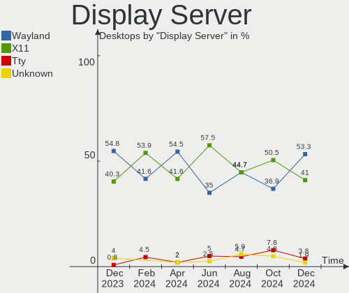
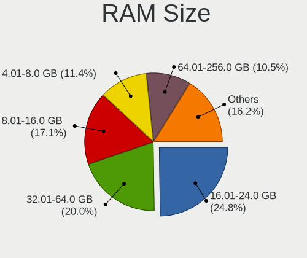
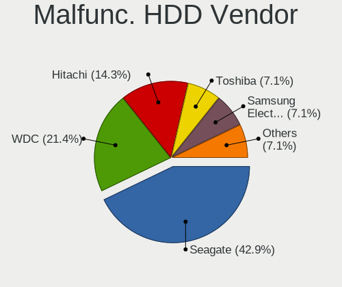
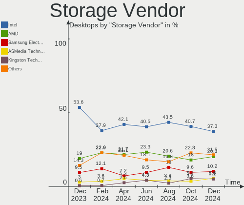
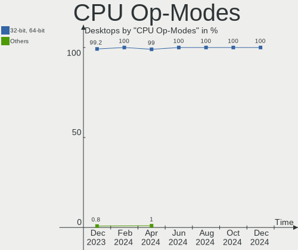
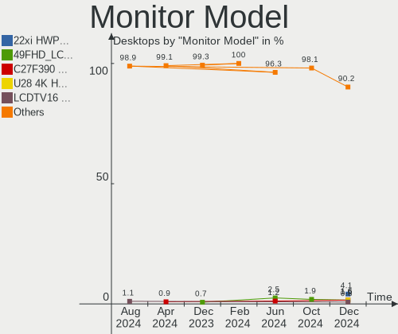
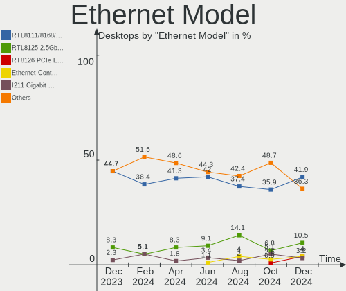
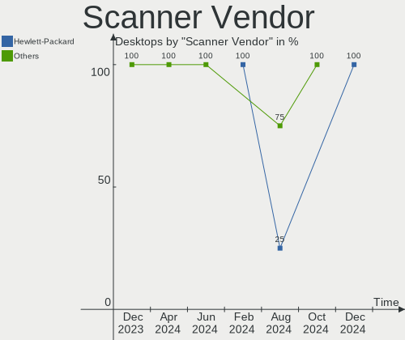

Linux in France - Hardware Trends (Desktops)
--------------------------------------------

A project to identify most popular hardware characteristics and track their change
over time based on data collected by Linux users at https://Linux-Hardware.org.

Anyone can contribute to this report by the [hw-probe](https://github.com/linuxhw/hw-probe) tool:

    sudo -E hw-probe -all -upload

Contents
--------

* [ System ](#system)
  - [ OS                       ](#os)
  - [ OS Family                ](#os-family)
  - [ Kernel                   ](#kernel)
  - [ Kernel Family            ](#kernel-family)
  - [ Kernel Major Ver.        ](#kernel-major-ver)
  - [ Arch                     ](#arch)
  - [ DE                       ](#de)
  - [ Display Server           ](#display-server)
  - [ Display Manager          ](#display-manager)
  - [ OS Lang                  ](#os-lang)
  - [ Boot Mode                ](#boot-mode)
  - [ Filesystem               ](#filesystem)
  - [ Part. scheme             ](#part-scheme)
  - [ Dual Boot with Linux/BSD ](#dual-boot-with-linuxbsd)
  - [ Dual Boot (Win)          ](#dual-boot-win)

* [ Board ](#board)
  - [ Vendor                   ](#vendor)
  - [ Model                    ](#model)
  - [ Model Family             ](#model-family)
  - [ MFG Year                 ](#mfg-year)
  - [ Form Factor              ](#form-factor)
  - [ Secure Boot              ](#secure-boot)
  - [ Coreboot                 ](#coreboot)
  - [ RAM Size                 ](#ram-size)
  - [ RAM Used                 ](#ram-used)
  - [ Total Drives             ](#total-drives)
  - [ Has CD-ROM               ](#has-cd-rom)
  - [ Has Ethernet             ](#has-ethernet)
  - [ Has WiFi                 ](#has-wifi)
  - [ Has Bluetooth            ](#has-bluetooth)

* [ Location ](#location)
  - [ Country                  ](#country)
  - [ City                     ](#city)

* [ Drives ](#drives)
  - [ Drive Vendor             ](#drive-vendor)
  - [ Drive Model              ](#drive-model)
  - [ HDD Vendor               ](#hdd-vendor)
  - [ SSD Vendor               ](#ssd-vendor)
  - [ Drive Kind               ](#drive-kind)
  - [ Drive Connector          ](#drive-connector)
  - [ Drive Size               ](#drive-size)
  - [ Space Total              ](#space-total)
  - [ Space Used               ](#space-used)
  - [ Malfunc. Drives          ](#malfunc-drives)
  - [ Malfunc. Drive Vendor    ](#malfunc-drive-vendor)
  - [ Malfunc. HDD Vendor      ](#malfunc-hdd-vendor)
  - [ Malfunc. Drive Kind      ](#malfunc-drive-kind)
  - [ Failed Drives            ](#failed-drives)
  - [ Failed Drive Vendor      ](#failed-drive-vendor)
  - [ Drive Status             ](#drive-status)

* [ Storage controller ](#storage-controller)
  - [ Storage Vendor           ](#storage-vendor)
  - [ Storage Model            ](#storage-model)
  - [ Storage Kind             ](#storage-kind)

* [ Processor ](#processor)
  - [ CPU Vendor               ](#cpu-vendor)
  - [ CPU Model                ](#cpu-model)
  - [ CPU Model Family         ](#cpu-model-family)
  - [ CPU Cores                ](#cpu-cores)
  - [ CPU Sockets              ](#cpu-sockets)
  - [ CPU Threads              ](#cpu-threads)
  - [ CPU Op-Modes             ](#cpu-op-modes)
  - [ CPU Microcode            ](#cpu-microcode)
  - [ CPU Microarch            ](#cpu-microarch)

* [ Graphics ](#graphics)
  - [ GPU Vendor               ](#gpu-vendor)
  - [ GPU Model                ](#gpu-model)
  - [ GPU Combo                ](#gpu-combo)
  - [ GPU Driver               ](#gpu-driver)
  - [ GPU Memory               ](#gpu-memory)

* [ Monitor ](#monitor)
  - [ Monitor Vendor           ](#monitor-vendor)
  - [ Monitor Model            ](#monitor-model)
  - [ Monitor Resolution       ](#monitor-resolution)
  - [ Monitor Diagonal         ](#monitor-diagonal)
  - [ Monitor Width            ](#monitor-width)
  - [ Aspect Ratio             ](#aspect-ratio)
  - [ Monitor Area             ](#monitor-area)
  - [ Pixel Density            ](#pixel-density)
  - [ Multiple Monitors        ](#multiple-monitors)

* [ Network ](#network)
  - [ Net Controller Vendor    ](#net-controller-vendor)
  - [ Net Controller Model     ](#net-controller-model)
  - [ Wireless Vendor          ](#wireless-vendor)
  - [ Wireless Model           ](#wireless-model)
  - [ Ethernet Vendor          ](#ethernet-vendor)
  - [ Ethernet Model           ](#ethernet-model)
  - [ Net Controller Kind      ](#net-controller-kind)
  - [ Used Controller          ](#used-controller)
  - [ NICs                     ](#nics)
  - [ IPv6                     ](#ipv6)

* [ Bluetooth ](#bluetooth)
  - [ Bluetooth Vendor         ](#bluetooth-vendor)
  - [ Bluetooth Model          ](#bluetooth-model)

* [ Sound ](#sound)
  - [ Sound Vendor             ](#sound-vendor)
  - [ Sound Model              ](#sound-model)

* [ Memory ](#memory)
  - [ Memory Vendor            ](#memory-vendor)
  - [ Memory Model             ](#memory-model)
  - [ Memory Kind              ](#memory-kind)
  - [ Memory Form Factor       ](#memory-form-factor)
  - [ Memory Size              ](#memory-size)
  - [ Memory Speed             ](#memory-speed)

* [ Printers & scanners ](#printers--scanners)
  - [ Printer Vendor           ](#printer-vendor)
  - [ Printer Model            ](#printer-model)
  - [ Scanner Vendor           ](#scanner-vendor)
  - [ Scanner Model            ](#scanner-model)

* [ Camera ](#camera)
  - [ Camera Vendor            ](#camera-vendor)
  - [ Camera Model             ](#camera-model)

* [ Security ](#security)
  - [ Fingerprint Vendor       ](#fingerprint-vendor)
  - [ Fingerprint Model        ](#fingerprint-model)
  - [ Chipcard Vendor          ](#chipcard-vendor)
  - [ Chipcard Model           ](#chipcard-model)

* [ Unsupported ](#unsupported)
  - [ Unsupported Devices      ](#unsupported-devices)
  - [ Unsupported Device Types ](#unsupported-device-types)

System
------

OS
--

Installed operating systems

| Name                         | Desktops | Percent |
|------------------------------|----------|---------|
| Ubuntu 20.04                 | 18       | 17.65%  |
| Ubuntu 22.04                 | 17       | 16.67%  |
| OpenMandriva 4.3             | 7        | 6.86%   |
| Linux Mint 20.3              | 7        | 6.86%   |
| Debian 11                    | 4        | 3.92%   |
| Zorin 16                     | 3        | 2.94%   |
| Xubuntu 22.04                | 3        | 2.94%   |
| Ubuntu 21.10                 | 3        | 2.94%   |
| Pop!_OS 22.04                | 3        | 2.94%   |
| Kubuntu 22.04                | 3        | 2.94%   |
| Kubuntu 20.04                | 3        | 2.94%   |
| Fedora 36                    | 3        | 2.94%   |
| Xubuntu 20.04                | 2        | 1.96%   |
| Trisquel 10.0.1              | 2        | 1.96%   |
| Gentoo 2.7                   | 2        | 1.96%   |
| Fedora 35                    | 2        | 1.96%   |
| Elementary 6.1               | 2        | 1.96%   |
| Arch                         | 2        | 1.96%   |
| Ubuntu Studio 20.04          | 1        | 0.98%   |
| Ubuntu Budgie 22.04          | 1        | 0.98%   |
| Ubuntu 21.12                 | 1        | 0.98%   |
| ROSA R11.1                   | 1        | 0.98%   |
| Pop!_OS 21.10                | 1        | 0.98%   |
| Parrot 5.0                   | 1        | 0.98%   |
| openSUSE Tumbleweed-XXXXXXXX | 1        | 0.98%   |
| Manjaro 21.2.6               | 1        | 0.98%   |
| Mageia 8                     | 1        | 0.98%   |
| LinuxFX 10                   | 1        | 0.98%   |
| Linux Mint 19.3              | 1        | 0.98%   |
| Linux Mint 19.2              | 1        | 0.98%   |
| Kubuntu 18.04                | 1        | 0.98%   |
| Kubuntu 11                   | 1        | 0.98%   |
| BlackPanther 18.1            | 1        | 0.98%   |
| Arch Rolling                 | 1        | 0.98%   |

OS Family
---------

OS without a version

| Name          | Desktops | Percent |
|---------------|----------|---------|
| Ubuntu        | 39       | 38.24%  |
| Linux Mint    | 9        | 8.82%   |
| Kubuntu       | 8        | 7.84%   |
| OpenMandriva  | 7        | 6.86%   |
| Xubuntu       | 5        | 4.9%    |
| Fedora        | 5        | 4.9%    |
| Pop!_OS       | 4        | 3.92%   |
| Debian        | 4        | 3.92%   |
| Zorin         | 3        | 2.94%   |
| Arch          | 3        | 2.94%   |
| Trisquel      | 2        | 1.96%   |
| Gentoo        | 2        | 1.96%   |
| Elementary    | 2        | 1.96%   |
| Ubuntu Studio | 1        | 0.98%   |
| Ubuntu Budgie | 1        | 0.98%   |
| ROSA          | 1        | 0.98%   |
| Parrot        | 1        | 0.98%   |
| openSUSE      | 1        | 0.98%   |
| Manjaro       | 1        | 0.98%   |
| Mageia        | 1        | 0.98%   |
| LinuxFX       | 1        | 0.98%   |
| BlackPanther  | 1        | 0.98%   |

Kernel
------

Version of the Linux kernel

| Version                   | Desktops | Percent |
|---------------------------|----------|---------|
| 5.4.0-109-generic         | 9        | 8.82%   |
| 5.13.0-41-generic         | 9        | 8.82%   |
| 5.15.0-33-generic         | 8        | 7.84%   |
| 5.15.0-30-generic         | 8        | 7.84%   |
| 5.13.0-40-generic         | 8        | 7.84%   |
| 5.16.7-desktop-1omv4003   | 5        | 4.9%    |
| 5.15.0-27-generic         | 5        | 4.9%    |
| 5.4.0-113-generic         | 4        | 3.92%   |
| 5.4.0-110-generic         | 4        | 3.92%   |
| 5.17.5-76051705-generic   | 3        | 2.94%   |
| 5.13.0-44-generic         | 3        | 2.94%   |
| 5.17.6-300.fc36.x86_64    | 2        | 1.96%   |
| 5.17.4-200.fc35.x86_64    | 2        | 1.96%   |
| 5.16.13-desktop-1omv4003  | 2        | 1.96%   |
| 5.11.0-43-generic         | 2        | 1.96%   |
| 5.10.0-14-amd64           | 2        | 1.96%   |
| 5.4.32-generic-2rosa-i586 | 1        | 0.98%   |
| 5.4.0-91-generic          | 1        | 0.98%   |
| 5.4.0-74-generic          | 1        | 0.98%   |
| 5.4.0-58-generic          | 1        | 0.98%   |
| 5.4.0-110-lowlatency      | 1        | 0.98%   |
| 5.17.9-arch1-1            | 1        | 0.98%   |
| 5.17.9-1-MANJARO          | 1        | 0.98%   |
| 5.17.7-300.fc36.x86_64    | 1        | 0.98%   |
| 5.17.7-1-default          | 1        | 0.98%   |
| 5.17.5-gentoo             | 1        | 0.98%   |
| 5.17.4-arch1-1            | 1        | 0.98%   |
| 5.17.3-arch1-1            | 1        | 0.98%   |
| 5.17.0-1-amd64            | 1        | 0.98%   |
| 5.16.19-76051619-generic  | 1        | 0.98%   |
| 5.16.0-12parrot1-amd64    | 1        | 0.98%   |
| 5.15.35-desktop-2.mga8    | 1        | 0.98%   |
| 5.15.0-35-generic         | 1        | 0.98%   |
| 5.15.0-28-generic         | 1        | 0.98%   |
| 5.15.0-27-lowlatency      | 1        | 0.98%   |
| 5.13.0-39-generic         | 1        | 0.98%   |
| 5.13.0-28-lowlatency      | 1        | 0.98%   |
| 5.13.0-28-generic         | 1        | 0.98%   |
| 5.10.76-gentoo-r1-x86_64  | 1        | 0.98%   |
| 5.10.0-14-686-pae         | 1        | 0.98%   |
| 5.10.0-1031-oem           | 1        | 0.98%   |
| 4.18.16-desktop-1bP       | 1        | 0.98%   |

Kernel Family
-------------

Linux kernel without a distro release

| Version | Desktops | Percent |
|---------|----------|---------|
| 5.15.0  | 24       | 23.53%  |
| 5.13.0  | 23       | 22.55%  |
| 5.4.0   | 21       | 20.59%  |
| 5.16.7  | 5        | 4.9%    |
| 5.17.5  | 4        | 3.92%   |
| 5.10.0  | 4        | 3.92%   |
| 5.17.4  | 3        | 2.94%   |
| 5.17.9  | 2        | 1.96%   |
| 5.17.7  | 2        | 1.96%   |
| 5.17.6  | 2        | 1.96%   |
| 5.16.13 | 2        | 1.96%   |
| 5.11.0  | 2        | 1.96%   |
| 5.4.32  | 1        | 0.98%   |
| 5.17.3  | 1        | 0.98%   |
| 5.17.0  | 1        | 0.98%   |
| 5.16.19 | 1        | 0.98%   |
| 5.16.0  | 1        | 0.98%   |
| 5.15.35 | 1        | 0.98%   |
| 5.10.76 | 1        | 0.98%   |
| 4.18.16 | 1        | 0.98%   |

Kernel Major Ver.
-----------------

Linux kernel major version

| Version | Desktops | Percent |
|---------|----------|---------|
| 5.15    | 25       | 24.51%  |
| 5.13    | 23       | 22.55%  |
| 5.4     | 22       | 21.57%  |
| 5.17    | 15       | 14.71%  |
| 5.16    | 9        | 8.82%   |
| 5.10    | 5        | 4.9%    |
| 5.11    | 2        | 1.96%   |
| 4.18    | 1        | 0.98%   |

Arch
----

OS architecture (x86_64, i586, etc.)

| Name   | Desktops | Percent |
|--------|----------|---------|
| x86_64 | 100      | 98.04%  |
| i686   | 2        | 1.96%   |

DE
--

Desktop Environment

| Name          | Desktops | Percent |
|---------------|----------|---------|
| GNOME         | 49       | 48.04%  |
| KDE5          | 18       | 17.65%  |
| XFCE          | 11       | 10.78%  |
| X-Cinnamon    | 9        | 8.82%   |
| MATE          | 4        | 3.92%   |
| Unknown       | 4        | 3.92%   |
| Pantheon      | 2        | 1.96%   |
| Unity         | 1        | 0.98%   |
| KDE4          | 1        | 0.98%   |
| Enlightenment | 1        | 0.98%   |
| Cinnamon      | 1        | 0.98%   |
| Budgie        | 1        | 0.98%   |

Display Server
--------------

X11 or Wayland

| Name    | Desktops | Percent |
|---------|----------|---------|
| X11     | 80       | 78.43%  |
| Wayland | 17       | 16.67%  |
| Tty     | 4        | 3.92%   |
| Unknown | 1        | 0.98%   |

Display Manager
---------------

SDDM, LightDM, etc.

| Name    | Desktops | Percent |
|---------|----------|---------|
| Unknown | 29       | 28.43%  |
| GDM3    | 27       | 26.47%  |
| LightDM | 18       | 17.65%  |
| SDDM    | 15       | 14.71%  |
| GDM     | 12       | 11.76%  |
| KDM     | 1        | 0.98%   |

OS Lang
-------

Language

| Lang    | Desktops | Percent |
|---------|----------|---------|
| fr_FR   | 80       | 78.43%  |
| en_US   | 16       | 15.69%  |
| Unknown | 2        | 1.96%   |
| fr_LU   | 1        | 0.98%   |
| de_DE   | 1        | 0.98%   |
| C.UTF8  | 1        | 0.98%   |
| C       | 1        | 0.98%   |

Boot Mode
---------

EFI or BIOS

| Mode | Desktops | Percent |
|------|----------|---------|
| BIOS | 54       | 52.94%  |
| EFI  | 48       | 47.06%  |

Filesystem
----------

Type of filesystem

| Type     | Desktops | Percent |
|----------|----------|---------|
| Ext4     | 85       | 83.33%  |
| Overlay  | 7        | 6.86%   |
| Btrfs    | 6        | 5.88%   |
| Xfs      | 2        | 1.96%   |
| Zfs      | 1        | 0.98%   |
| Reiserfs | 1        | 0.98%   |

Part. scheme
------------

Scheme of partitioning

| Type    | Desktops | Percent |
|---------|----------|---------|
| Unknown | 46       | 45.1%   |
| GPT     | 41       | 40.2%   |
| MBR     | 15       | 14.71%  |

Dual Boot with Linux/BSD
------------------------

Hosting more than one Linux/BSD

| Dual boot | Desktops | Percent |
|-----------|----------|---------|
| No        | 70       | 68.63%  |
| Yes       | 32       | 31.37%  |

Dual Boot (Win)
---------------

Hosting Linux and Windows

| Dual boot | Desktops | Percent |
|-----------|----------|---------|
| No        | 64       | 62.75%  |
| Yes       | 38       | 37.25%  |

Board
-----

Vendor
------

Motherboard manufacturer

| Name                | Desktops | Percent |
|---------------------|----------|---------|
| ASUSTek Computer    | 34       | 33.33%  |
| MSI                 | 24       | 23.53%  |
| Gigabyte Technology | 12       | 11.76%  |
| Dell                | 6        | 5.88%   |
| Lenovo              | 5        | 4.9%    |
| ASRock              | 4        | 3.92%   |
| Shuttle             | 3        | 2.94%   |
| Hewlett-Packard     | 3        | 2.94%   |
| Acer                | 3        | 2.94%   |
| Pegatron            | 2        | 1.96%   |
| Packard Bell        | 2        | 1.96%   |
| Intel               | 1        | 0.98%   |
| Fujitsu Siemens     | 1        | 0.98%   |
| ASRockRack          | 1        | 0.98%   |
| Apple               | 1        | 0.98%   |

Model
-----

Motherboard model

| Name                                    | Desktops | Percent |
|-----------------------------------------|----------|---------|
| ASUS All Series                         | 3        | 2.94%   |
| MSI MS-7C02                             | 2        | 1.96%   |
| MSI MS-7A32                             | 2        | 1.96%   |
| MSI MS-7924                             | 2        | 1.96%   |
| HP Compaq 8200 Elite SFF PC             | 2        | 1.96%   |
| ASUS TUF Gaming B550-PLUS               | 2        | 1.96%   |
| ASUS TUF Gaming B450-PLUS II            | 2        | 1.96%   |
| ASUS SABERTOOTH X58                     | 2        | 1.96%   |
| ASUS F1A75-M LE                         | 2        | 1.96%   |
| Shuttle SH170                           | 1        | 0.98%   |
| Shuttle DS81D                           | 1        | 0.98%   |
| Shuttle DH110                           | 1        | 0.98%   |
| Pegatron VN433AA-ABF p6235fr            | 1        | 0.98%   |
| Pegatron p6541fr-m                      | 1        | 0.98%   |
| Packard Bell LES ESSENTIELS IMEDIA 8100 | 1        | 0.98%   |
| Packard Bell IMEDIA S3840               | 1        | 0.98%   |
| MSI MS-7D17                             | 1        | 0.98%   |
| MSI MS-7C92                             | 1        | 0.98%   |
| MSI MS-7C91                             | 1        | 0.98%   |
| MSI MS-7C80                             | 1        | 0.98%   |
| MSI MS-7C56                             | 1        | 0.98%   |
| MSI MS-7C52                             | 1        | 0.98%   |
| MSI MS-7C35                             | 1        | 0.98%   |
| MSI MS-7B89                             | 1        | 0.98%   |
| MSI MS-7B86                             | 1        | 0.98%   |
| MSI MS-7B22                             | 1        | 0.98%   |
| MSI MS-7A40                             | 1        | 0.98%   |
| MSI MS-7A37                             | 1        | 0.98%   |
| MSI MS-7A33                             | 1        | 0.98%   |
| MSI MS-7996                             | 1        | 0.98%   |
| MSI MS-7918                             | 1        | 0.98%   |
| MSI MS-7917                             | 1        | 0.98%   |
| MSI MS-7693                             | 1        | 0.98%   |
| MSI MS-7641                             | 1        | 0.98%   |
| Lenovo ThinkCentre M83 10AHS2XB00       | 1        | 0.98%   |
| Lenovo ThinkCentre M75s-1 11AAS04700    | 1        | 0.98%   |
| Lenovo ThinkCentre M72e 32675L2         | 1        | 0.98%   |
| Lenovo ThinkCentre M70t 11EVCTO1WW      | 1        | 0.98%   |
| Lenovo ThinkCentre M57e 6176A13         | 1        | 0.98%   |
| Intel D33217GKE G76540-203              | 1        | 0.98%   |
| HP ProDesk 600 G4 SFF                   | 1        | 0.98%   |
| Gigabyte Z87X-UD3H                      | 1        | 0.98%   |
| Gigabyte Z77P-D3                        | 1        | 0.98%   |
| Gigabyte X570 UD                        | 1        | 0.98%   |
| Gigabyte TRX40 AORUS PRO WIFI           | 1        | 0.98%   |
| Gigabyte PH67A-D3-B3                    | 1        | 0.98%   |
| Gigabyte P55-UD3R                       | 1        | 0.98%   |
| Gigabyte GA-78LMT-S2P                   | 1        | 0.98%   |
| Gigabyte F2A78M-HD2                     | 1        | 0.98%   |
| Gigabyte B75N                           | 1        | 0.98%   |
| Gigabyte B450M H                        | 1        | 0.98%   |
| Gigabyte B450M DS3H                     | 1        | 0.98%   |
| Gigabyte 970A-DS3P                      | 1        | 0.98%   |
| Fujitsu Siemens ESPRIMO EDITION P2540   | 1        | 0.98%   |
| Dell XPS 8500                           | 1        | 0.98%   |
| Dell Precision 3450                     | 1        | 0.98%   |
| Dell PowerEdge T40                      | 1        | 0.98%   |
| Dell OptiPlex 755                       | 1        | 0.98%   |
| Dell OptiPlex 5090                      | 1        | 0.98%   |
| Dell OptiPlex 390                       | 1        | 0.98%   |

Model Family
------------

Motherboard model prefix

| Name                    | Desktops | Percent |
|-------------------------|----------|---------|
| ASUS PRIME              | 7        | 6.86%   |
| Lenovo ThinkCentre      | 5        | 4.9%    |
| ASUS TUF                | 5        | 4.9%    |
| Dell OptiPlex           | 3        | 2.94%   |
| ASUS All                | 3        | 2.94%   |
| MSI MS-7C02             | 2        | 1.96%   |
| MSI MS-7A32             | 2        | 1.96%   |
| MSI MS-7924             | 2        | 1.96%   |
| HP Compaq               | 2        | 1.96%   |
| Gigabyte B450M          | 2        | 1.96%   |
| ASUS SABERTOOTH         | 2        | 1.96%   |
| ASUS F1A75-M            | 2        | 1.96%   |
| Acer Veriton            | 2        | 1.96%   |
| Shuttle SH170           | 1        | 0.98%   |
| Shuttle DS81D           | 1        | 0.98%   |
| Shuttle DH110           | 1        | 0.98%   |
| Pegatron VN433AA-ABF    | 1        | 0.98%   |
| Pegatron p6541fr-m      | 1        | 0.98%   |
| Packard Bell LES        | 1        | 0.98%   |
| Packard Bell IMEDIA     | 1        | 0.98%   |
| MSI MS-7D17             | 1        | 0.98%   |
| MSI MS-7C92             | 1        | 0.98%   |
| MSI MS-7C91             | 1        | 0.98%   |
| MSI MS-7C80             | 1        | 0.98%   |
| MSI MS-7C56             | 1        | 0.98%   |
| MSI MS-7C52             | 1        | 0.98%   |
| MSI MS-7C35             | 1        | 0.98%   |
| MSI MS-7B89             | 1        | 0.98%   |
| MSI MS-7B86             | 1        | 0.98%   |
| MSI MS-7B22             | 1        | 0.98%   |
| MSI MS-7A40             | 1        | 0.98%   |
| MSI MS-7A37             | 1        | 0.98%   |
| MSI MS-7A33             | 1        | 0.98%   |
| MSI MS-7996             | 1        | 0.98%   |
| MSI MS-7918             | 1        | 0.98%   |
| MSI MS-7917             | 1        | 0.98%   |
| MSI MS-7693             | 1        | 0.98%   |
| MSI MS-7641             | 1        | 0.98%   |
| Intel D33217GKE         | 1        | 0.98%   |
| HP ProDesk              | 1        | 0.98%   |
| Gigabyte Z87X-UD3H      | 1        | 0.98%   |
| Gigabyte Z77P-D3        | 1        | 0.98%   |
| Gigabyte X570           | 1        | 0.98%   |
| Gigabyte TRX40          | 1        | 0.98%   |
| Gigabyte PH67A-D3-B3    | 1        | 0.98%   |
| Gigabyte P55-UD3R       | 1        | 0.98%   |
| Gigabyte GA-78LMT-S2P   | 1        | 0.98%   |
| Gigabyte F2A78M-HD2     | 1        | 0.98%   |
| Gigabyte B75N           | 1        | 0.98%   |
| Gigabyte 970A-DS3P      | 1        | 0.98%   |
| Fujitsu Siemens ESPRIMO | 1        | 0.98%   |
| Dell XPS                | 1        | 0.98%   |
| Dell Precision          | 1        | 0.98%   |
| Dell PowerEdge          | 1        | 0.98%   |
| ASUS ROG                | 1        | 0.98%   |
| ASUS P8Z77-M            | 1        | 0.98%   |
| ASUS P8Z68-V            | 1        | 0.98%   |
| ASUS P8H77-V            | 1        | 0.98%   |
| ASUS P8H61              | 1        | 0.98%   |
| ASUS P7P55D-E           | 1        | 0.98%   |

MFG Year
--------

Motherboard manufacture year

| Year | Desktops | Percent |
|------|----------|---------|
| 2018 | 12       | 11.76%  |
| 2020 | 11       | 10.78%  |
| 2014 | 11       | 10.78%  |
| 2021 | 9        | 8.82%   |
| 2019 | 9        | 8.82%   |
| 2011 | 9        | 8.82%   |
| 2013 | 8        | 7.84%   |
| 2012 | 8        | 7.84%   |
| 2010 | 8        | 7.84%   |
| 2017 | 5        | 4.9%    |
| 2016 | 3        | 2.94%   |
| 2015 | 2        | 1.96%   |
| 2009 | 2        | 1.96%   |
| 2008 | 2        | 1.96%   |
| 2007 | 2        | 1.96%   |
| 2006 | 1        | 0.98%   |

Form Factor
-----------

Physical design of the computer

| Name    | Desktops | Percent |
|---------|----------|---------|
| Desktop | 102      | 100%    |

Secure Boot
-----------

Enabled or disabled

| State    | Desktops | Percent |
|----------|----------|---------|
| Disabled | 100      | 98.04%  |
| Enabled  | 2        | 1.96%   |

Coreboot
--------

Have coreboot on board

| Used | Desktops | Percent |
|------|----------|---------|
| No   | 102      | 100%    |

RAM Size
--------

Total RAM memory

| Size in GB  | Desktops | Percent |
|-------------|----------|---------|
| 16.01-24.0  | 32       | 31.37%  |
| 32.01-64.0  | 20       | 19.61%  |
| 4.01-8.0    | 17       | 16.67%  |
| 8.01-16.0   | 15       | 14.71%  |
| 3.01-4.0    | 12       | 11.76%  |
| 24.01-32.0  | 4        | 3.92%   |
| 64.01-256.0 | 2        | 1.96%   |

RAM Used
--------

Used RAM memory

| Used GB    | Desktops | Percent |
|------------|----------|---------|
| 1.01-2.0   | 33       | 32.35%  |
| 2.01-3.0   | 27       | 26.47%  |
| 4.01-8.0   | 19       | 18.63%  |
| 3.01-4.0   | 14       | 13.73%  |
| 8.01-16.0  | 5        | 4.9%    |
| 0.51-1.0   | 2        | 1.96%   |
| 32.01-64.0 | 1        | 0.98%   |
| 16.01-24.0 | 1        | 0.98%   |

Total Drives
------------

Number of drives on board

| Drives | Desktops | Percent |
|--------|----------|---------|
| 2      | 31       | 30.39%  |
| 1      | 28       | 27.45%  |
| 3      | 20       | 19.61%  |
| 4      | 13       | 12.75%  |
| 5      | 6        | 5.88%   |
| 7      | 2        | 1.96%   |
| 6      | 2        | 1.96%   |

Has CD-ROM
----------

Has CD-ROM on board

| Presented | Desktops | Percent |
|-----------|----------|---------|
| No        | 53       | 51.96%  |
| Yes       | 49       | 48.04%  |

Has Ethernet
------------

Has Ethernet on board

| Presented | Desktops | Percent |
|-----------|----------|---------|
| Yes       | 100      | 98.04%  |
| No        | 2        | 1.96%   |

Has WiFi
--------

Has WiFi module

| Presented | Desktops | Percent |
|-----------|----------|---------|
| No        | 58       | 56.86%  |
| Yes       | 44       | 43.14%  |

Has Bluetooth
-------------

Has Bluetooth module

| Presented | Desktops | Percent |
|-----------|----------|---------|
| No        | 70       | 68.63%  |
| Yes       | 32       | 31.37%  |

Location
--------

Country
-------

Geographic location (country)

| Country | Desktops | Percent |
|---------|----------|---------|
| France  | 102      | 100%    |

City
----

Geographic location (city)

| City                      | Desktops | Percent |
|---------------------------|----------|---------|
| Paris                     | 17       | 16.67%  |
| Corbeil-Essonnes          | 4        | 3.92%   |
| Rueil-Malmaison           | 3        | 2.94%   |
| Rennes                    | 2        | 1.96%   |
| Pegomas                   | 2        | 1.96%   |
| Nice                      | 2        | 1.96%   |
| Grenoble                  | 2        | 1.96%   |
| Combrit                   | 2        | 1.96%   |
| Woincourt                 | 1        | 0.98%   |
| Villeneuve les beziers    | 1        | 0.98%   |
| Villenave-d'Ornon         | 1        | 0.98%   |
| Villejuif                 | 1        | 0.98%   |
| Tours                     | 1        | 0.98%   |
| Thenon                    | 1        | 0.98%   |
| Suresnes                  | 1        | 0.98%   |
| Sète                     | 1        | 0.98%   |
| Serris                    | 1        | 0.98%   |
| Senonches                 | 1        | 0.98%   |
| Saumur                    | 1        | 0.98%   |
| Saint-Paul-les-Dax        | 1        | 0.98%   |
| Saint-Nazaire             | 1        | 0.98%   |
| Saint-Michel-en-lHerm     | 1        | 0.98%   |
| Saint-Martin-d'Hères     | 1        | 0.98%   |
| Saint-Mandrier-sur-Mer    | 1        | 0.98%   |
| Saint-Leu-la-Foret        | 1        | 0.98%   |
| Saint-Julien-de-Concelles | 1        | 0.98%   |
| Rochetaillee              | 1        | 0.98%   |
| Rixheim                   | 1        | 0.98%   |
| Ris-Orangis               | 1        | 0.98%   |
| Pontault-Combault         | 1        | 0.98%   |
| Plumelin                  | 1        | 0.98%   |
| Plan-de-Cuques            | 1        | 0.98%   |
| Ollainville               | 1        | 0.98%   |
| Noisy-le-Roi              | 1        | 0.98%   |
| Nîmes                    | 1        | 0.98%   |
| Niederhaslach             | 1        | 0.98%   |
| Montpellier               | 1        | 0.98%   |
| Montigny-en-Gohelle       | 1        | 0.98%   |
| Montbrison                | 1        | 0.98%   |
| Montauban                 | 1        | 0.98%   |
| Marseille                 | 1        | 0.98%   |
| Marignane                 | 1        | 0.98%   |
| Malzeville                | 1        | 0.98%   |
| Mâcon                    | 1        | 0.98%   |
| Lyon                      | 1        | 0.98%   |
| Lure                      | 1        | 0.98%   |
| Lille                     | 1        | 0.98%   |
| Lieurey                   | 1        | 0.98%   |
| Lesneven                  | 1        | 0.98%   |
| Laval                     | 1        | 0.98%   |
| La Verriere               | 1        | 0.98%   |
| Houilles                  | 1        | 0.98%   |
| Geispolsheim              | 1        | 0.98%   |
| Gap                       | 1        | 0.98%   |
| Gambsheim                 | 1        | 0.98%   |
| Gaillac                   | 1        | 0.98%   |
| Cuverville                | 1        | 0.98%   |
| Croissy-sur-Seine         | 1        | 0.98%   |
| Cournonterral             | 1        | 0.98%   |
| Coudekerque-Branche       | 1        | 0.98%   |

Drives
------

Drive Vendor
------------

Hard drive vendors

| Vendor                    | Desktops | Drives | Percent |
|---------------------------|----------|--------|---------|
| Seagate                   | 43       | 57     | 21.39%  |
| Samsung Electronics       | 39       | 63     | 19.4%   |
| WDC                       | 29       | 39     | 14.43%  |
| Crucial                   | 24       | 26     | 11.94%  |
| Toshiba                   | 9        | 10     | 4.48%   |
| Kingston                  | 8        | 9      | 3.98%   |
| SanDisk                   | 7        | 9      | 3.48%   |
| Intel                     | 4        | 5      | 1.99%   |
| SK Hynix                  | 3        | 4      | 1.49%   |
| Phison                    | 3        | 3      | 1.49%   |
| Micron/Crucial Technology | 3        | 3      | 1.49%   |
| Hitachi                   | 3        | 3      | 1.49%   |
| PNY                       | 2        | 2      | 1%      |
| Patriot                   | 2        | 2      | 1%      |
| MAXTOR                    | 2        | 2      | 1%      |
| LDLC                      | 2        | 3      | 1%      |
| China                     | 2        | 2      | 1%      |
| A-DATA Technology         | 2        | 2      | 1%      |
| USB                       | 1        | 1      | 0.5%    |
| Unknown                   | 1        | 1      | 0.5%    |
| Transcend                 | 1        | 1      | 0.5%    |
| SPCC                      | 1        | 1      | 0.5%    |
| Silicon Motion            | 1        | 2      | 0.5%    |
| RIM                       | 1        | 1      | 0.5%    |
| PNY CS90                  | 1        | 1      | 0.5%    |
| OCZ                       | 1        | 1      | 0.5%    |
| HGST HTS                  | 1        | 1      | 0.5%    |
| HGST                      | 1        | 1      | 0.5%    |
| Dogfish                   | 1        | 1      | 0.5%    |
| Corsair                   | 1        | 1      | 0.5%    |
| ASMT                      | 1        | 1      | 0.5%    |
| Unknown                   | 1        | 1      | 0.5%    |

Drive Model
-----------

Hard drive models

| Model                             | Desktops | Percent |
|-----------------------------------|----------|---------|
| Seagate ST2000DM008-2FR102 2TB    | 5        | 2.02%   |
| Seagate ST2000DM001-1CH164 2TB    | 5        | 2.02%   |
| WDC WD10EZEX-08WN4A0 1TB          | 4        | 1.62%   |
| Seagate ST1000DM010-2EP102 1TB    | 4        | 1.62%   |
| Crucial CT240BX500SSD1 240GB      | 4        | 1.62%   |
| Seagate ST2000DM001-1ER164 2TB    | 3        | 1.21%   |
| Seagate ST1000DM003-1CH162 1TB    | 3        | 1.21%   |
| Samsung SSD 970 EVO Plus 500GB    | 3        | 1.21%   |
| Samsung SSD 870 QVO 1TB           | 3        | 1.21%   |
| Samsung SSD 870 EVO 500GB         | 3        | 1.21%   |
| Samsung SSD 870 EVO 1TB           | 3        | 1.21%   |
| Samsung SSD 860 EVO 500GB         | 3        | 1.21%   |
| Samsung SSD 860 EVO 1TB           | 3        | 1.21%   |
| Samsung NVMe SSD Drive 500GB      | 3        | 1.21%   |
| Crucial CT500MX500SSD1 500GB      | 3        | 1.21%   |
| Crucial CT1000P2SSD8 1TB          | 3        | 1.21%   |
| WDC WD5000AADS-00S9B0 500GB       | 2        | 0.81%   |
| WDC WD20EZRZ-00Z5HB0 2TB          | 2        | 0.81%   |
| WDC WD10EAVS-00D7B1 1TB           | 2        | 0.81%   |
| WDC WD10EALS-00Z8A0 1TB           | 2        | 0.81%   |
| WDC WD10EADS-00L5B1 1TB           | 2        | 0.81%   |
| Toshiba HDWD120 2TB               | 2        | 0.81%   |
| SK Hynix PC711 NVMe 1TB           | 2        | 0.81%   |
| Seagate ST4000DM004-2CV104 4TB    | 2        | 0.81%   |
| Seagate ST3000DM008-2DM166 3TB    | 2        | 0.81%   |
| Seagate ST1000DM003-1SB10C 1TB    | 2        | 0.81%   |
| Seagate ST1000DM003-1ER162 1TB    | 2        | 0.81%   |
| Samsung SSD 980 PRO 500GB         | 2        | 0.81%   |
| Samsung SSD 860 QVO 1TB           | 2        | 0.81%   |
| Samsung SSD 850 PRO 256GB         | 2        | 0.81%   |
| Samsung SSD 850 EVO 250GB         | 2        | 0.81%   |
| Samsung SSD 840 PRO Series 128GB  | 2        | 0.81%   |
| Samsung NVMe SSD Drive 250GB      | 2        | 0.81%   |
| Samsung MZALQ128HBHQ-000L1 128GB  | 2        | 0.81%   |
| Samsung HD154UI 1TB               | 2        | 0.81%   |
| Micron/Crucial NVMe SSD Drive 1TB | 2        | 0.81%   |
| Kingston SV300S37A120G 120GB SSD  | 2        | 0.81%   |
| Crucial CT275MX300SSD1 275GB      | 2        | 0.81%   |
| Crucial CT256MX100SSD1 256GB      | 2        | 0.81%   |
| Crucial CT128MX100SSD1 128GB      | 2        | 0.81%   |
| Crucial CT1000BX500SSD1 1TB       | 2        | 0.81%   |
| China SSD 1TB                     | 2        | 0.81%   |
| WDC WDS500G2B0C-00PXH0 500GB      | 1        | 0.4%    |
| WDC WDS240G2G0A-00JH30 240GB SSD  | 1        | 0.4%    |
| WDC WD800JD-22MSA1 80GB           | 1        | 0.4%    |
| WDC WD6400AAKS-65A7B2 640GB       | 1        | 0.4%    |
| WDC WD6003FRYZ-01F0DB0 6TB        | 1        | 0.4%    |
| WDC WD5000LPLX-08ZNTT0 500GB      | 1        | 0.4%    |
| WDC WD5000AAKS-00A7B2 500GB       | 1        | 0.4%    |
| WDC WD5000AADS-00M2B0 500GB       | 1        | 0.4%    |
| WDC WD3200AAKX-221CA1 320GB       | 1        | 0.4%    |
| WDC WD3200AAJS-22B4A0 320GB       | 1        | 0.4%    |
| WDC WD30EFRX-68EUZN0 3TB          | 1        | 0.4%    |
| WDC WD2500BEVS-22UST0 250GB       | 1        | 0.4%    |
| WDC WD2500AAKX-08U6AA0 250GB      | 1        | 0.4%    |
| WDC WD20EZRX-22D8PB0 2TB          | 1        | 0.4%    |
| WDC WD20EARX-00PASB0 2TB          | 1        | 0.4%    |
| WDC WD20EARS-00MVWB0 2TB          | 1        | 0.4%    |
| WDC WD10EZRZ-00HTKB0 1TB          | 1        | 0.4%    |
| WDC WD10EZRX-00A8LB0 1TB          | 1        | 0.4%    |

HDD Vendor
----------

Hard disk drive vendors

| Vendor              | Desktops | Drives | Percent |
|---------------------|----------|--------|---------|
| Seagate             | 43       | 57     | 45.26%  |
| WDC                 | 29       | 37     | 30.53%  |
| Toshiba             | 8        | 8      | 8.42%   |
| Samsung Electronics | 6        | 6      | 6.32%   |
| Hitachi             | 3        | 3      | 3.16%   |
| MAXTOR              | 2        | 2      | 2.11%   |
| USB                 | 1        | 1      | 1.05%   |
| Unknown             | 1        | 1      | 1.05%   |
| HGST                | 1        | 1      | 1.05%   |
| ASMT                | 1        | 1      | 1.05%   |

SSD Vendor
----------

Solid state drive vendors

| Vendor              | Desktops | Drives | Percent |
|---------------------|----------|--------|---------|
| Samsung Electronics | 27       | 33     | 31.76%  |
| Crucial             | 20       | 22     | 23.53%  |
| Kingston            | 8        | 9      | 9.41%   |
| SanDisk             | 7        | 8      | 8.24%   |
| Intel               | 3        | 4      | 3.53%   |
| Toshiba             | 2        | 2      | 2.35%   |
| PNY                 | 2        | 2      | 2.35%   |
| Patriot             | 2        | 2      | 2.35%   |
| China               | 2        | 2      | 2.35%   |
| A-DATA Technology   | 2        | 2      | 2.35%   |
| WDC                 | 1        | 1      | 1.18%   |
| Transcend           | 1        | 1      | 1.18%   |
| SPCC                | 1        | 1      | 1.18%   |
| SK Hynix            | 1        | 1      | 1.18%   |
| PNY CS90            | 1        | 1      | 1.18%   |
| OCZ                 | 1        | 1      | 1.18%   |
| LDLC                | 1        | 1      | 1.18%   |
| Dogfish             | 1        | 1      | 1.18%   |
| Corsair             | 1        | 1      | 1.18%   |
| Unknown             | 1        | 1      | 1.18%   |

Drive Kind
----------

HDD or SSD

| Kind    | Desktops | Drives | Percent |
|---------|----------|--------|---------|
| HDD     | 70       | 117    | 41.42%  |
| SSD     | 67       | 96     | 39.64%  |
| NVMe    | 29       | 42     | 17.16%  |
| Unknown | 3        | 4      | 1.78%   |

Drive Connector
---------------

SATA, SAS, NVMe, etc.

| Type | Desktops | Drives | Percent |
|------|----------|--------|---------|
| SATA | 95       | 209    | 71.97%  |
| NVMe | 29       | 42     | 21.97%  |
| SAS  | 8        | 8      | 6.06%   |

Drive Size
----------

Size of hard drive

| Size in TB | Desktops | Drives | Percent |
|------------|----------|--------|---------|
| 0.01-0.5   | 67       | 97     | 42.14%  |
| 0.51-1.0   | 51       | 67     | 32.08%  |
| 1.01-2.0   | 26       | 34     | 16.35%  |
| 3.01-4.0   | 7        | 7      | 4.4%    |
| 2.01-3.0   | 5        | 5      | 3.14%   |
| 4.01-10.0  | 2        | 2      | 1.26%   |
| 10.01-20.0 | 1        | 1      | 0.63%   |

Space Total
-----------

Amount of disk space available on the file system

| Size in GB     | Desktops | Percent |
|----------------|----------|---------|
| 251-500        | 19       | 18.63%  |
| 101-250        | 19       | 18.63%  |
| 501-1000       | 17       | 16.67%  |
| More than 3000 | 15       | 14.71%  |
| 1001-2000      | 13       | 12.75%  |
| 2001-3000      | 8        | 7.84%   |
| 1-20           | 4        | 3.92%   |
| 51-100         | 3        | 2.94%   |
| Unknown        | 3        | 2.94%   |
| 21-50          | 1        | 0.98%   |

Space Used
----------

Amount of used disk space

| Used GB        | Desktops | Percent |
|----------------|----------|---------|
| 1-20           | 21       | 20.59%  |
| 21-50          | 18       | 17.65%  |
| 251-500        | 12       | 11.76%  |
| 501-1000       | 11       | 10.78%  |
| 51-100         | 10       | 9.8%    |
| 101-250        | 8        | 7.84%   |
| 2001-3000      | 7        | 6.86%   |
| 1001-2000      | 7        | 6.86%   |
| More than 3000 | 5        | 4.9%    |
| Unknown        | 3        | 2.94%   |

Malfunc. Drives
---------------

Drive models with a malfunction

| Model                                 | Desktops | Drives | Percent |
|---------------------------------------|----------|--------|---------|
| WDC WD6400AAKS-65A7B2 640GB           | 1        | 1      | 8.33%   |
| WDC WD10EAVS-00D7B1 1TB               | 1        | 1      | 8.33%   |
| WDC WD10EALX-009BA0 1TB               | 1        | 1      | 8.33%   |
| Seagate ST4000VN008-2DR166 4TB        | 1        | 1      | 8.33%   |
| Seagate ST3320820AS 320GB             | 1        | 1      | 8.33%   |
| Seagate ST2000DM001-1CH164 2TB        | 1        | 2      | 8.33%   |
| Samsung Electronics SSD 870 EVO 1TB   | 1        | 1      | 8.33%   |
| Samsung Electronics SSD 850 PRO 256GB | 1        | 1      | 8.33%   |
| Intel SSDSC2KF512H6 SATA 512GB        | 1        | 2      | 8.33%   |
| Intel SSDSA2M160G2GC 160GB            | 1        | 1      | 8.33%   |
| Hitachi HDP725016GLA380 160GB         | 1        | 1      | 8.33%   |
| Crucial CT128MX100SSD1 128GB          | 1        | 1      | 8.33%   |

Malfunc. Drive Vendor
---------------------

Vendors of faulty drives

| Vendor              | Desktops | Drives | Percent |
|---------------------|----------|--------|---------|
| WDC                 | 3        | 3      | 25%     |
| Seagate             | 3        | 4      | 25%     |
| Samsung Electronics | 2        | 2      | 16.67%  |
| Intel               | 2        | 3      | 16.67%  |
| Hitachi             | 1        | 1      | 8.33%   |
| Crucial             | 1        | 1      | 8.33%   |

Malfunc. HDD Vendor
-------------------

Vendors of faulty HDD drives

| Vendor  | Desktops | Drives | Percent |
|---------|----------|--------|---------|
| WDC     | 3        | 3      | 42.86%  |
| Seagate | 3        | 4      | 42.86%  |
| Hitachi | 1        | 1      | 14.29%  |

Malfunc. Drive Kind
-------------------

Kinds of faulty drives

| Kind | Desktops | Drives | Percent |
|------|----------|--------|---------|
| HDD  | 7        | 8      | 58.33%  |
| SSD  | 5        | 6      | 41.67%  |

Failed Drives
-------------

Failed drive models

Zero info for selected period =(

Failed Drive Vendor
-------------------

Failed drive vendors

Zero info for selected period =(

Drive Status
------------

Number of failed and malfunc. drives

| Status   | Desktops | Drives | Percent |
|----------|----------|--------|---------|
| Works    | 54       | 116    | 45.76%  |
| Detected | 52       | 129    | 44.07%  |
| Malfunc  | 12       | 14     | 10.17%  |

Storage controller
------------------

Storage Vendor
--------------

Storage controller vendors

| Vendor                    | Desktops | Percent |
|---------------------------|----------|---------|
| Intel                     | 63       | 42.57%  |
| AMD                       | 37       | 25%     |
| Samsung Electronics       | 16       | 10.81%  |
| Micron/Crucial Technology | 7        | 4.73%   |
| JMicron Technology        | 6        | 4.05%   |
| Marvell Technology Group  | 5        | 3.38%   |
| Phison Electronics        | 3        | 2.03%   |
| Nvidia                    | 3        | 2.03%   |
| SK Hynix                  | 2        | 1.35%   |
| Sandisk                   | 2        | 1.35%   |
| ASMedia Technology        | 2        | 1.35%   |
| Silicon Motion            | 1        | 0.68%   |
| LSI Logic / Symbios Logic | 1        | 0.68%   |

Storage Model
-------------

Storage controller models

| Model                                                                                   | Desktops | Percent |
|-----------------------------------------------------------------------------------------|----------|---------|
| AMD FCH SATA Controller [AHCI mode]                                                     | 24       | 12.63%  |
| AMD 400 Series Chipset SATA Controller                                                  | 14       | 7.37%   |
| Intel 8 Series/C220 Series Chipset Family 6-port SATA Controller 1 [AHCI mode]          | 8        | 4.21%   |
| Intel Q170/Q150/B150/H170/H110/Z170/CM236 Chipset SATA Controller [AHCI Mode]           | 7        | 3.68%   |
| Intel 6 Series/C200 Series Chipset Family 6 port Desktop SATA AHCI Controller           | 6        | 3.16%   |
| Samsung NVMe SSD Controller SM981/PM981/PM983                                           | 5        | 2.63%   |
| Intel 9 Series Chipset Family SATA Controller [AHCI Mode]                               | 5        | 2.63%   |
| Intel 500 Series Chipset Family SATA AHCI Controller                                    | 5        | 2.63%   |
| AMD 500 Series Chipset SATA Controller                                                  | 5        | 2.63%   |
| Samsung NVMe SSD Controller SM961/PM961/SM963                                           | 4        | 2.11%   |
| Samsung NVMe SSD Controller PM9A1/PM9A3/980PRO                                          | 4        | 2.11%   |
| Samsung NVMe SSD Controller 980                                                         | 4        | 2.11%   |
| Micron/Crucial P2 NVMe PCIe SSD                                                         | 4        | 2.11%   |
| Intel Comet Lake SATA AHCI Controller                                                   | 4        | 2.11%   |
| Intel Cannon Lake PCH SATA AHCI Controller                                              | 4        | 2.11%   |
| Nvidia MCP61 SATA Controller                                                            | 3        | 1.58%   |
| Nvidia MCP61 IDE                                                                        | 3        | 1.58%   |
| JMicron JMB363 SATA/IDE Controller                                                      | 3        | 1.58%   |
| JMicron JMB362 SATA Controller                                                          | 3        | 1.58%   |
| Intel 82801JI (ICH10 Family) 4 port SATA IDE Controller #1                              | 3        | 1.58%   |
| Intel 7 Series/C210 Series Chipset Family 6-port SATA Controller [AHCI mode]            | 3        | 1.58%   |
| Intel 6 Series/C200 Series Chipset Family Desktop SATA Controller (IDE mode, ports 4-5) | 3        | 1.58%   |
| Intel 6 Series/C200 Series Chipset Family Desktop SATA Controller (IDE mode, ports 0-3) | 3        | 1.58%   |
| AMD SB7x0/SB8x0/SB9x0 IDE Controller                                                    | 3        | 1.58%   |
| SK Hynix Gold P31 SSD                                                                   | 2        | 1.05%   |
| Micron/Crucial P1 NVMe PCIe SSD                                                         | 2        | 1.05%   |
| Marvell Group 88SE9172 SATA 6Gb/s Controller                                            | 2        | 1.05%   |
| Intel NM10/ICH7 Family SATA Controller [IDE mode]                                       | 2        | 1.05%   |
| Intel 82801JI (ICH10 Family) SATA AHCI Controller                                       | 2        | 1.05%   |
| Intel 7 Series/C210 Series Chipset Family 4-port SATA Controller [IDE mode]             | 2        | 1.05%   |
| Intel 7 Series/C210 Series Chipset Family 2-port SATA Controller [IDE mode]             | 2        | 1.05%   |
| Intel 5 Series/3400 Series Chipset 6 port SATA AHCI Controller                          | 2        | 1.05%   |
| ASMedia ASM1062 Serial ATA Controller                                                   | 2        | 1.05%   |
| AMD X370 Series Chipset SATA Controller                                                 | 2        | 1.05%   |
| AMD SB7x0/SB8x0/SB9x0 SATA Controller [IDE mode]                                        | 2        | 1.05%   |
| AMD SB7x0/SB8x0/SB9x0 SATA Controller [AHCI mode]                                       | 2        | 1.05%   |
| AMD FCH SATA Controller D                                                               | 2        | 1.05%   |
| AMD FCH IDE Controller                                                                  | 2        | 1.05%   |
| Silicon Motion SM2263EN/SM2263XT SSD Controller                                         | 1        | 0.53%   |
| Sandisk WD Blue SN550 NVMe SSD                                                          | 1        | 0.53%   |
| Sandisk Non-Volatile memory controller                                                  | 1        | 0.53%   |
| Phison PS5013 E13 NVMe Controller                                                       | 1        | 0.53%   |
| Phison E18 PCIe4 NVMe Controller                                                        | 1        | 0.53%   |
| Phison E12 NVMe Controller                                                              | 1        | 0.53%   |
| Micron/Crucial NVMe Controller                                                          | 1        | 0.53%   |
| Marvell Group 88SE91A3 SATA-600 Controller                                              | 1        | 0.53%   |
| Marvell Group 88SE914D SATA-600 Controller                                              | 1        | 0.53%   |
| Marvell Group 88SE9123 PCIe SATA 6.0 Gb/s controller                                    | 1        | 0.53%   |
| LSI Logic / Symbios Logic MegaRAID SAS-3 3108 [Invader]                                 | 1        | 0.53%   |
| Intel Volume Management Device NVMe RAID Controller                                     | 1        | 0.53%   |
| Intel SSD 660P Series                                                                   | 1        | 0.53%   |
| Intel NM10/ICH7 Family SATA Controller [AHCI mode]                                      | 1        | 0.53%   |
| Intel Alder Lake-S PCH SATA Controller [AHCI Mode]                                      | 1        | 0.53%   |
| Intel 82Q35 Express PT IDER Controller                                                  | 1        | 0.53%   |
| Intel 82801JI (ICH10 Family) 2 port SATA IDE Controller #2                              | 1        | 0.53%   |
| Intel 82801JD/DO (ICH10 Family) 4-port SATA IDE Controller                              | 1        | 0.53%   |
| Intel 82801JD/DO (ICH10 Family) 2-port SATA IDE Controller                              | 1        | 0.53%   |
| Intel 82801IR/IO/IH (ICH9R/DO/DH) 6 port SATA Controller [AHCI mode]                    | 1        | 0.53%   |
| Intel 82801G (ICH7 Family) IDE Controller                                               | 1        | 0.53%   |
| Intel 7 Series Chipset Family 6-port SATA Controller [AHCI mode]                        | 1        | 0.53%   |

Storage Kind
------------

Kind of storage controller (IDE, SATA, NVMe, SAS, ...)

| Kind | Desktops | Percent |
|------|----------|---------|
| SATA | 87       | 60.84%  |
| NVMe | 29       | 20.28%  |
| IDE  | 24       | 16.78%  |
| RAID | 3        | 2.1%    |

Processor
---------

CPU Vendor
----------

Processor vendors

| Vendor | Desktops | Percent |
|--------|----------|---------|
| Intel  | 62       | 60.78%  |
| AMD    | 40       | 39.22%  |

CPU Model
---------

Processor models

| Model                                       | Desktops | Percent |
|---------------------------------------------|----------|---------|
| AMD Ryzen 5 3600 6-Core Processor           | 4        | 3.92%   |
| Intel Pentium Gold G6400 CPU @ 4.00GHz      | 2        | 1.96%   |
| Intel Core i5-4460 CPU @ 3.20GHz            | 2        | 1.96%   |
| Intel Core i3-2100 CPU @ 3.10GHz            | 2        | 1.96%   |
| Intel Core 2 Quad CPU Q8300 @ 2.50GHz       | 2        | 1.96%   |
| AMD Ryzen 7 1800X Eight-Core Processor      | 2        | 1.96%   |
| AMD Ryzen 5 5600X 6-Core Processor          | 2        | 1.96%   |
| AMD Ryzen 5 2400G with Radeon Vega Graphics | 2        | 1.96%   |
| Intel Xeon E-2224G CPU @ 3.50GHz            | 1        | 0.98%   |
| Intel Xeon CPU X5680 @ 3.33GHz              | 1        | 0.98%   |
| Intel Xeon CPU X3470 @ 2.93GHz              | 1        | 0.98%   |
| Intel Xeon CPU E3-1220 v6 @ 3.00GHz         | 1        | 0.98%   |
| Intel Pentium Gold G5400 CPU @ 3.70GHz      | 1        | 0.98%   |
| Intel Pentium Dual-Core CPU E5400 @ 2.70GHz | 1        | 0.98%   |
| Intel Pentium Dual-Core CPU E5200 @ 2.50GHz | 1        | 0.98%   |
| Intel Pentium CPU G630 @ 2.70GHz            | 1        | 0.98%   |
| Intel Pentium CPU G620 @ 2.60GHz            | 1        | 0.98%   |
| Intel Pentium CPU G3430 @ 3.30GHz           | 1        | 0.98%   |
| Intel Pentium CPU G3258 @ 3.20GHz           | 1        | 0.98%   |
| Intel Pentium CPU G2130 @ 3.20GHz           | 1        | 0.98%   |
| Intel Core i9-10900K CPU @ 3.70GHz          | 1        | 0.98%   |
| Intel Core i7-7700 CPU @ 3.60GHz            | 1        | 0.98%   |
| Intel Core i7-6700K CPU @ 4.00GHz           | 1        | 0.98%   |
| Intel Core i7-4770K CPU @ 3.50GHz           | 1        | 0.98%   |
| Intel Core i7-4770 CPU @ 3.40GHz            | 1        | 0.98%   |
| Intel Core i7-3770 CPU @ 3.40GHz            | 1        | 0.98%   |
| Intel Core i7-2700K CPU @ 3.50GHz           | 1        | 0.98%   |
| Intel Core i7-10700T CPU @ 2.00GHz          | 1        | 0.98%   |
| Intel Core i7-10700K CPU @ 3.80GHz          | 1        | 0.98%   |
| Intel Core i7-10700 CPU @ 2.90GHz           | 1        | 0.98%   |
| Intel Core i7 CPU 960 @ 3.20GHz             | 1        | 0.98%   |
| Intel Core i7 CPU 950 @ 3.07GHz             | 1        | 0.98%   |
| Intel Core i7 CPU 860 @ 2.80GHz             | 1        | 0.98%   |
| Intel Core i5-9600KF CPU @ 3.70GHz          | 1        | 0.98%   |
| Intel Core i5-7400 CPU @ 3.00GHz            | 1        | 0.98%   |
| Intel Core i5-6600T CPU @ 2.70GHz           | 1        | 0.98%   |
| Intel Core i5-4690K CPU @ 3.50GHz           | 1        | 0.98%   |
| Intel Core i5-4670K CPU @ 3.40GHz           | 1        | 0.98%   |
| Intel Core i5-4460S CPU @ 2.90GHz           | 1        | 0.98%   |
| Intel Core i5-4440 CPU @ 3.10GHz            | 1        | 0.98%   |
| Intel Core i5-3570K CPU @ 3.40GHz           | 1        | 0.98%   |
| Intel Core i5-3570 CPU @ 3.40GHz            | 1        | 0.98%   |
| Intel Core i5-3470T CPU @ 2.90GHz           | 1        | 0.98%   |
| Intel Core i5-3450 CPU @ 3.10GHz            | 1        | 0.98%   |
| Intel Core i5-2400 CPU @ 3.10GHz            | 1        | 0.98%   |
| Intel Core i5-10400F CPU @ 2.90GHz          | 1        | 0.98%   |
| Intel Core i5 CPU 760 @ 2.80GHz             | 1        | 0.98%   |
| Intel Core i3-9100F CPU @ 3.60GHz           | 1        | 0.98%   |
| Intel Core i3-7100 CPU @ 3.90GHz            | 1        | 0.98%   |
| Intel Core i3-6100 CPU @ 3.70GHz            | 1        | 0.98%   |
| Intel Core i3-4160 CPU @ 3.60GHz            | 1        | 0.98%   |
| Intel Core i3-4130 CPU @ 3.40GHz            | 1        | 0.98%   |
| Intel Core i3-3217U CPU @ 1.80GHz           | 1        | 0.98%   |
| Intel Core i3-2120 CPU @ 3.30GHz            | 1        | 0.98%   |
| Intel Core 2 Duo CPU E6550 @ 2.33GHz        | 1        | 0.98%   |
| Intel Core 2 CPU 6300 @ 1.86GHz             | 1        | 0.98%   |
| Intel Celeron CPU G1840 @ 2.80GHz           | 1        | 0.98%   |
| Intel Celeron CPU G1610 @ 2.60GHz           | 1        | 0.98%   |
| Intel Atom CPU D525 @ 1.80GHz               | 1        | 0.98%   |
| Intel 12th Gen Core i7-12700K               | 1        | 0.98%   |

CPU Model Family
----------------

Processor model prefix

| Model                   | Desktops | Percent |
|-------------------------|----------|---------|
| Intel Core i5           | 16       | 15.69%  |
| AMD Ryzen 5             | 14       | 13.73%  |
| Intel Core i7           | 12       | 11.76%  |
| Intel Core i3           | 9        | 8.82%   |
| AMD Ryzen 7             | 8        | 7.84%   |
| Intel Pentium           | 5        | 4.9%    |
| Intel Xeon              | 4        | 3.92%   |
| Other                   | 3        | 2.94%   |
| Intel Pentium Gold      | 3        | 2.94%   |
| AMD A8                  | 3        | 2.94%   |
| Intel Pentium Dual-Core | 2        | 1.96%   |
| Intel Core 2 Quad       | 2        | 1.96%   |
| Intel Celeron           | 2        | 1.96%   |
| AMD Ryzen 9             | 2        | 1.96%   |
| AMD Ryzen 3             | 2        | 1.96%   |
| AMD Phenom II X4        | 2        | 1.96%   |
| AMD FX                  | 2        | 1.96%   |
| AMD Athlon 64 X2        | 2        | 1.96%   |
| Intel Core i9           | 1        | 0.98%   |
| Intel Core 2 Duo        | 1        | 0.98%   |
| Intel Core 2            | 1        | 0.98%   |
| Intel Atom              | 1        | 0.98%   |
| AMD Ryzen Threadripper  | 1        | 0.98%   |
| AMD Phenom II X6        | 1        | 0.98%   |
| AMD Athlon II X2        | 1        | 0.98%   |
| AMD Athlon              | 1        | 0.98%   |
| AMD A4                  | 1        | 0.98%   |

CPU Cores
---------

Number of processor cores

| Number | Desktops | Percent |
|--------|----------|---------|
| 4      | 40       | 39.22%  |
| 2      | 29       | 28.43%  |
| 6      | 14       | 13.73%  |
| 8      | 12       | 11.76%  |
| 12     | 4        | 3.92%   |
| 64     | 1        | 0.98%   |
| 10     | 1        | 0.98%   |
| 1      | 1        | 0.98%   |

CPU Sockets
-----------

Number of sockets

| Number | Desktops | Percent |
|--------|----------|---------|
| 1      | 101      | 99.02%  |
| 2      | 1        | 0.98%   |

CPU Threads
-----------

Threads per core (Hyper-Threading)

| Number | Desktops | Percent |
|--------|----------|---------|
| 2      | 62       | 60.78%  |
| 1      | 40       | 39.22%  |

CPU Op-Modes
------------

CPU Operation Modes (32-bit, 64-bit)

| Op mode        | Desktops | Percent |
|----------------|----------|---------|
| 32-bit, 64-bit | 102      | 100%    |

CPU Microcode
-------------

Microcode number

| Number     | Desktops | Percent |
|------------|----------|---------|
| Unknown    | 24       | 23.53%  |
| 0x306c3    | 7        | 6.86%   |
| 0x306a9    | 7        | 6.86%   |
| 0x206a7    | 7        | 6.86%   |
| 0x0800820d | 4        | 3.92%   |
| 0xa0655    | 3        | 2.94%   |
| 0x906ea    | 3        | 2.94%   |
| 0x506e3    | 3        | 2.94%   |
| 0x106e5    | 3        | 2.94%   |
| 0x1067a    | 3        | 2.94%   |
| 0xa0671    | 2        | 1.96%   |
| 0xa0653    | 2        | 1.96%   |
| 0x106a5    | 2        | 1.96%   |
| 0x0a201016 | 2        | 1.96%   |
| 0x08701021 | 2        | 1.96%   |
| 0x08108109 | 2        | 1.96%   |
| 0x08101016 | 2        | 1.96%   |
| 0x08001137 | 2        | 1.96%   |
| 0x06000852 | 2        | 1.96%   |
| 0x03000027 | 2        | 1.96%   |
| 0x010000c8 | 2        | 1.96%   |
| 0x906ec    | 1        | 0.98%   |
| 0x906e9    | 1        | 0.98%   |
| 0x6fb      | 1        | 0.98%   |
| 0x6f2      | 1        | 0.98%   |
| 0x206c2    | 1        | 0.98%   |
| 0x106ca    | 1        | 0.98%   |
| 0x0a50000c | 1        | 0.98%   |
| 0x08701013 | 1        | 0.98%   |
| 0x08301039 | 1        | 0.98%   |
| 0x0810100b | 1        | 0.98%   |
| 0x08001138 | 1        | 0.98%   |
| 0x0600611a | 1        | 0.98%   |
| 0x06001119 | 1        | 0.98%   |
| 0x010000dc | 1        | 0.98%   |
| 0x010000db | 1        | 0.98%   |
| 0x00000000 | 1        | 0.98%   |

CPU Microarch
-------------

Microarchitecture

| Name        | Desktops | Percent |
|-------------|----------|---------|
| Haswell     | 13       | 12.75%  |
| Zen         | 8        | 7.84%   |
| KabyLake    | 8        | 7.84%   |
| IvyBridge   | 8        | 7.84%   |
| Zen+        | 7        | 6.86%   |
| Zen 2       | 7        | 6.86%   |
| SandyBridge | 7        | 6.86%   |
| CometLake   | 7        | 6.86%   |
| Zen 3       | 6        | 5.88%   |
| Nehalem     | 5        | 4.9%    |
| Penryn      | 4        | 3.92%   |
| K10         | 4        | 3.92%   |
| Skylake     | 3        | 2.94%   |
| Piledriver  | 3        | 2.94%   |
| K8 Hammer   | 2        | 1.96%   |
| K10 Llano   | 2        | 1.96%   |
| Icelake     | 2        | 1.96%   |
| Core        | 2        | 1.96%   |
| Westmere    | 1        | 0.98%   |
| Excavator   | 1        | 0.98%   |
| Bonnell     | 1        | 0.98%   |
| Unknown     | 1        | 0.98%   |

Graphics
--------

GPU Vendor
----------

Vendors of graphics cards

| Vendor            | Desktops | Percent |
|-------------------|----------|---------|
| Nvidia            | 52       | 48.15%  |
| Intel             | 28       | 25.93%  |
| AMD               | 27       | 25%     |
| ASPEED Technology | 1        | 0.93%   |

GPU Model
---------

Graphics card models

| Model                                                                       | Desktops | Percent |
|-----------------------------------------------------------------------------|----------|---------|
| Nvidia GP107 [GeForce GTX 1050 Ti]                                          | 6        | 5.56%   |
| Intel Xeon E3-1200 v3/4th Gen Core Processor Integrated Graphics Controller | 6        | 5.56%   |
| Intel 2nd Generation Core Processor Family Integrated Graphics Controller   | 3        | 2.78%   |
| Nvidia TU116 [GeForce GTX 1660]                                             | 2        | 1.85%   |
| Nvidia TU116 [GeForce GTX 1660 SUPER]                                       | 2        | 1.85%   |
| Nvidia TU104 [GeForce RTX 2060]                                             | 2        | 1.85%   |
| Nvidia GT218 [GeForce 210]                                                  | 2        | 1.85%   |
| Nvidia GP107 [GeForce GTX 1050]                                             | 2        | 1.85%   |
| Nvidia GP106 [GeForce GTX 1060 6GB]                                         | 2        | 1.85%   |
| Nvidia GM204 [GeForce GTX 970]                                              | 2        | 1.85%   |
| Nvidia GM107 [GeForce GTX 745]                                              | 2        | 1.85%   |
| Nvidia GK208B [GeForce GT 710]                                              | 2        | 1.85%   |
| Nvidia GA104 [GeForce RTX 3070 Ti]                                          | 2        | 1.85%   |
| Nvidia G98 [GeForce 8400 GS Rev. 2]                                         | 2        | 1.85%   |
| Intel Xeon E3-1200 v2/3rd Gen Core processor Graphics Controller            | 2        | 1.85%   |
| Intel RocketLake-S GT1 [UHD Graphics 750]                                   | 2        | 1.85%   |
| Intel HD Graphics 630                                                       | 2        | 1.85%   |
| Intel HD Graphics 530                                                       | 2        | 1.85%   |
| Intel CometLake-S GT2 [UHD Graphics 630]                                    | 2        | 1.85%   |
| Intel CometLake-S GT1 [UHD Graphics 610]                                    | 2        | 1.85%   |
| Intel 4th Generation Core Processor Family Integrated Graphics Controller   | 2        | 1.85%   |
| AMD Sumo [Radeon HD 6550D]                                                  | 2        | 1.85%   |
| AMD Picasso/Raven 2 [Radeon Vega Series / Radeon Vega Mobile Series]        | 2        | 1.85%   |
| AMD Navi 24 [Radeon RX 6400 / 6500 XT]                                      | 2        | 1.85%   |
| AMD Juniper XT [Radeon HD 5770]                                             | 2        | 1.85%   |
| AMD Ellesmere [Radeon RX 470/480/570/570X/580/580X/590]                     | 2        | 1.85%   |
| Nvidia TU116 [GeForce GTX 1660 Ti]                                          | 1        | 0.93%   |
| Nvidia TU106 [GeForce RTX 2070 Rev. A]                                      | 1        | 0.93%   |
| Nvidia TU102 [GeForce RTX 2080 Ti Rev. A]                                   | 1        | 0.93%   |
| Nvidia GT218 [ION]                                                          | 1        | 0.93%   |
| Nvidia GT218 [GeForce 8400 GS Rev. 3]                                       | 1        | 0.93%   |
| Nvidia GT216 [GeForce GT 220]                                               | 1        | 0.93%   |
| Nvidia GT200b [GeForce GTX 275]                                             | 1        | 0.93%   |
| Nvidia GP108 [GeForce GT 1030]                                              | 1        | 0.93%   |
| Nvidia GP107GL [Quadro P400]                                                | 1        | 0.93%   |
| Nvidia GP104 [GeForce GTX 1070]                                             | 1        | 0.93%   |
| Nvidia GP104 [GeForce GTX 1070 Ti]                                          | 1        | 0.93%   |
| Nvidia GM206 [GeForce GTX 960]                                              | 1        | 0.93%   |
| Nvidia GK208B [GeForce GT 730]                                              | 1        | 0.93%   |
| Nvidia GK110 [GeForce GTX 780]                                              | 1        | 0.93%   |
| Nvidia GK107 [GeForce GTX 650]                                              | 1        | 0.93%   |
| Nvidia GK106 [GeForce GTX 660]                                              | 1        | 0.93%   |
| Nvidia GF119 [GeForce GT 610]                                               | 1        | 0.93%   |
| Nvidia GF116 [GeForce GTX 550 Ti]                                           | 1        | 0.93%   |
| Nvidia GF114 [GeForce GTX 560]                                              | 1        | 0.93%   |
| Nvidia GA106 [GeForce RTX 3060 Lite Hash Rate]                              | 1        | 0.93%   |
| Nvidia GA102 [GeForce RTX 3080]                                             | 1        | 0.93%   |
| Nvidia GA102 [GeForce RTX 3080 Ti]                                          | 1        | 0.93%   |
| Nvidia G92 [GeForce 8800 GS]                                                | 1        | 0.93%   |
| Nvidia G84 [GeForce 8600 GT]                                                | 1        | 0.93%   |
| Intel CoffeeLake-S GT2 [UHD Graphics P630]                                  | 1        | 0.93%   |
| Intel CoffeeLake-S GT1 [UHD Graphics 610]                                   | 1        | 0.93%   |
| Intel 82Q35 Express Integrated Graphics Controller                          | 1        | 0.93%   |
| Intel 4 Series Chipset Integrated Graphics Controller                       | 1        | 0.93%   |
| Intel 3rd Gen Core processor Graphics Controller                            | 1        | 0.93%   |
| ASPEED Technology ASPEED Graphics Family                                    | 1        | 0.93%   |
| AMD Vega 10 XL/XT [Radeon RX Vega 56/64]                                    | 1        | 0.93%   |
| AMD Turks XT [Radeon HD 6670/7670]                                          | 1        | 0.93%   |
| AMD Turks PRO [Radeon HD 7570]                                              | 1        | 0.93%   |
| AMD Turks GL [FirePro V3900]                                                | 1        | 0.93%   |

GPU Combo
---------

Combinations of graphics cards

| Name         | Desktops | Percent |
|--------------|----------|---------|
| 1 x Nvidia   | 51       | 50%     |
| 1 x Intel    | 23       | 22.55%  |
| 1 x AMD      | 23       | 22.55%  |
| Intel + AMD  | 3        | 2.94%   |
| 1 x ASPEED   | 1        | 0.98%   |
| AMD + Nvidia | 1        | 0.98%   |

GPU Driver
----------

Free vs proprietary

| Driver      | Desktops | Percent |
|-------------|----------|---------|
| Free        | 65       | 63.73%  |
| Proprietary | 31       | 30.39%  |
| Unknown     | 6        | 5.88%   |

GPU Memory
----------

Total video memory

| Size in GB | Desktops | Percent |
|------------|----------|---------|
| Unknown    | 41       | 40.2%   |
| 0.51-1.0   | 14       | 13.73%  |
| 0.01-0.5   | 12       | 11.76%  |
| 3.01-4.0   | 10       | 9.8%    |
| 1.01-2.0   | 9        | 8.82%   |
| 7.01-8.0   | 6        | 5.88%   |
| 5.01-6.0   | 6        | 5.88%   |
| 2.01-3.0   | 2        | 1.96%   |
| 8.01-16.0  | 2        | 1.96%   |

Monitor
-------

Monitor Vendor
--------------

Monitor vendors

| Vendor               | Desktops | Percent |
|----------------------|----------|---------|
| Samsung Electronics  | 23       | 19.83%  |
| Iiyama               | 12       | 10.34%  |
| Dell                 | 12       | 10.34%  |
| Goldstar             | 9        | 7.76%   |
| Acer                 | 9        | 7.76%   |
| Philips              | 6        | 5.17%   |
| Hewlett-Packard      | 6        | 5.17%   |
| Ancor Communications | 6        | 5.17%   |
| AOC                  | 5        | 4.31%   |
| ViewSonic            | 3        | 2.59%   |
| BenQ                 | 3        | 2.59%   |
| NEC Computers        | 2        | 1.72%   |
| Eizo                 | 2        | 1.72%   |
| Denver               | 2        | 1.72%   |
| ASUSTek Computer     | 2        | 1.72%   |
| Unknown              | 1        | 0.86%   |
| Sony                 | 1        | 0.86%   |
| S2-Tek               | 1        | 0.86%   |
| Onkyo                | 1        | 0.86%   |
| Microstep            | 1        | 0.86%   |
| Medion               | 1        | 0.86%   |
| LG Display           | 1        | 0.86%   |
| Lenovo               | 1        | 0.86%   |
| Idek Iiyama          | 1        | 0.86%   |
| HKC                  | 1        | 0.86%   |
| Hitachi              | 1        | 0.86%   |
| Fujitsu Siemens      | 1        | 0.86%   |
| DENON                | 1        | 0.86%   |
| Apple                | 1        | 0.86%   |

Monitor Model
-------------

Monitor models

| Model                                                                | Desktops | Percent |
|----------------------------------------------------------------------|----------|---------|
| Iiyama PLE2283H IVM562E 1920x1080 477x268mm 21.5-inch                | 4        | 3.33%   |
| Goldstar IPS235 GSM587E 1920x1080 510x290mm 23.1-inch                | 2        | 1.67%   |
| ViewSonic VX2703 SERIES VSCF62B 1920x1080 597x336mm 27.0-inch        | 1        | 0.83%   |
| ViewSonic VX2255wm-2 VSC9B1F 1680x1050 474x296mm 22.0-inch           | 1        | 0.83%   |
| ViewSonic VA2719 Series VSCC132 1920x1080 598x336mm 27.0-inch        | 1        | 0.83%   |
| Unknown LCD Monitor Impression V7-R22W02 1680x1050                   | 1        | 0.83%   |
| Sony LCD Monitor TV                                                  | 1        | 0.83%   |
| Samsung Electronics U28D590 SAM0B81 3840x2160 608x345mm 27.5-inch    | 1        | 0.83%   |
| Samsung Electronics SyncMaster SAM05CD 1920x1080                     | 1        | 0.83%   |
| Samsung Electronics SyncMaster SAM05CC 1920x1080 530x300mm 24.0-inch | 1        | 0.83%   |
| Samsung Electronics SyncMaster SAM052A 1920x1080 510x287mm 23.0-inch | 1        | 0.83%   |
| Samsung Electronics SyncMaster SAM0524 1920x1080 480x270mm 21.7-inch | 1        | 0.83%   |
| Samsung Electronics SyncMaster SAM0473 2048x1152 510x287mm 23.0-inch | 1        | 0.83%   |
| Samsung Electronics SyncMaster SAM044B 1680x1050 474x296mm 22.0-inch | 1        | 0.83%   |
| Samsung Electronics SyncMaster SAM037C 1680x1050 474x296mm 22.0-inch | 1        | 0.83%   |
| Samsung Electronics SyncMaster SAM027D 1680x1050 433x271mm 20.1-inch | 1        | 0.83%   |
| Samsung Electronics SyncMaster SAM01B7 1280x1024 338x270mm 17.0-inch | 1        | 0.83%   |
| Samsung Electronics SyncMaster SAM00E5 1280x1024 338x270mm 17.0-inch | 1        | 0.83%   |
| Samsung Electronics S24R35x SAM100E 1920x1080 530x300mm 24.0-inch    | 1        | 0.83%   |
| Samsung Electronics S24F350 SAM0D20 1920x1080 521x293mm 23.5-inch    | 1        | 0.83%   |
| Samsung Electronics S24D300 SAM0B43 1920x1080 531x299mm 24.0-inch    | 1        | 0.83%   |
| Samsung Electronics S23B550 SAM0918 1920x1080 510x287mm 23.0-inch    | 1        | 0.83%   |
| Samsung Electronics S22D300 SAM0B3F 1920x1080 477x268mm 21.5-inch    | 1        | 0.83%   |
| Samsung Electronics S22C450 SAM09C5 1920x1080 477x268mm 21.5-inch    | 1        | 0.83%   |
| Samsung Electronics Q85A SAM713C 3840x2160 1872x1053mm 84.6-inch     | 1        | 0.83%   |
| Samsung Electronics LS32R75 SAM0F93 3840x2160 700x390mm 31.5-inch    | 1        | 0.83%   |
| Samsung Electronics LCD Monitor SyncMaster                           | 1        | 0.83%   |
| Samsung Electronics LC24RG50 SAM0F91 1920x1080 532x304mm 24.1-inch   | 1        | 0.83%   |
| Samsung Electronics LC24RG50 SAM0F90 1920x1080 532x304mm 24.1-inch   | 1        | 0.83%   |
| Samsung Electronics C32HG7x SAM0E13 2560x1440 700x390mm 31.5-inch    | 1        | 0.83%   |
| Samsung Electronics C27F390 SAM0D32 1920x1080 598x336mm 27.0-inch    | 1        | 0.83%   |
| S2-Tek TV STK531A 1920x1080 930x530mm 42.1-inch                      | 1        | 0.83%   |
| Philips PHL 273V5 PHLC0D2 1920x1080 598x336mm 27.0-inch              | 1        | 0.83%   |
| Philips PHL 246V5 PHLC0C5 1920x1080 531x299mm 24.0-inch              | 1        | 0.83%   |
| Philips PHL 241B7Q PHL0909 1920x1080 527x296mm 23.8-inch             | 1        | 0.83%   |
| Philips PHL 240B7QPJ PHL0903 1920x1200 518x324mm 24.1-inch           | 1        | 0.83%   |
| Philips PHL 233V5 PHLC0D0 1920x1080 509x286mm 23.0-inch              | 1        | 0.83%   |
| Philips LCD Monitor PHL 288P6L                                       | 1        | 0.83%   |
| Philips LCD Monitor FTV 1920x1080                                    | 1        | 0.83%   |
| Onkyo AV Receiver ONK1260 3840x2160 1209x680mm 54.6-inch             | 1        | 0.83%   |
| NEC Computers EA224WMi NEC68C2 1920x1080 476x268mm 21.5-inch         | 1        | 0.83%   |
| NEC Computers EA224WMi NEC68C0 1920x1080 476x268mm 21.5-inch         | 1        | 0.83%   |
| Microstep LCD Monitor MSI MAG241C 1920x1080                          | 1        | 0.83%   |
| Medion MD 20130 MED3616 1920x1200 550x344mm 25.5-inch                | 1        | 0.83%   |
| LG Display LCD Monitor LGD0396 1600x900 380x210mm 17.1-inch          | 1        | 0.83%   |
| Lenovo LEN T2254pC LEN60CC 1680x1050 470x300mm 22.0-inch             | 1        | 0.83%   |
| Iiyama PLX2481H IVM611D 1920x1080 521x293mm 23.5-inch                | 1        | 0.83%   |
| Iiyama PLE2407HDS IVM560D 1920x1080 521x293mm 23.5-inch              | 1        | 0.83%   |
| Iiyama PL3288UH IVM1176 3840x2160 698x393mm 31.5-inch                | 1        | 0.83%   |
| Iiyama PL2783Q IVM661F 2560x1440 597x336mm 27.0-inch                 | 1        | 0.83%   |
| Iiyama PL2492H IVM612F 1920x1080 527x296mm 23.8-inch                 | 1        | 0.83%   |
| Iiyama PL2481H IVM610E 1920x1080 521x293mm 23.5-inch                 | 1        | 0.83%   |
| Iiyama PL2409HD IVM560C 1920x1080 521x293mm 23.5-inch                | 1        | 0.83%   |
| Iiyama PL2390 IVM562D 1920x1080 510x290mm 23.1-inch                  | 1        | 0.83%   |
| Idek Iiyama LCD Monitor PL2792UH 3840x2160                           | 1        | 0.83%   |
| HKC 24N1 HKC2413 1920x1080 527x296mm 23.8-inch                       | 1        | 0.83%   |
| Hitachi HISENSE HEC002F 3840x2160 1872x1053mm 84.6-inch              | 1        | 0.83%   |
| Hewlett-Packard w2216 HWP280B 1680x1050 470x290mm 21.7-inch          | 1        | 0.83%   |
| Hewlett-Packard w1907 HWP26A2 1440x900 408x255mm 18.9-inch           | 1        | 0.83%   |
| Hewlett-Packard LP2465 HWP2676 1920x1200 520x330mm 24.2-inch         | 1        | 0.83%   |

Monitor Resolution
------------------

Monitor screen resolution

| Resolution         | Desktops | Percent |
|--------------------|----------|---------|
| 1920x1080 (FHD)    | 60       | 54.55%  |
| 3840x2160 (4K)     | 10       | 9.09%   |
| 1680x1050 (WSXGA+) | 9        | 8.18%   |
| 2560x1440 (QHD)    | 6        | 5.45%   |
| 1920x1200 (WUXGA)  | 4        | 3.64%   |
| Unknown            | 4        | 3.64%   |
| 1440x900 (WXGA+)   | 3        | 2.73%   |
| 1600x1200          | 2        | 1.82%   |
| 1280x1024 (SXGA)   | 2        | 1.82%   |
| 6720x2160          | 1        | 0.91%   |
| 4480x1600          | 1        | 0.91%   |
| 3840x1600          | 1        | 0.91%   |
| 3360x1050          | 1        | 0.91%   |
| 2960x1050          | 1        | 0.91%   |
| 2560x1080          | 1        | 0.91%   |
| 2048x1152          | 1        | 0.91%   |
| 1600x900 (HD+)     | 1        | 0.91%   |
| 1360x768           | 1        | 0.91%   |
| 1024x768 (XGA)     | 1        | 0.91%   |

Monitor Diagonal
----------------

Diagonal size in inches

| Inches  | Desktops | Percent |
|---------|----------|---------|
| 23      | 20       | 18.18%  |
| 27      | 17       | 15.45%  |
| 24      | 14       | 12.73%  |
| 21      | 13       | 11.82%  |
| 22      | 11       | 10%     |
| Unknown | 10       | 9.09%   |
| 31      | 4        | 3.64%   |
| 20      | 3        | 2.73%   |
| 17      | 3        | 2.73%   |
| 84      | 2        | 1.82%   |
| 72      | 2        | 1.82%   |
| 25      | 2        | 1.82%   |
| 19      | 2        | 1.82%   |
| 18      | 2        | 1.82%   |
| 42      | 1        | 0.91%   |
| 37      | 1        | 0.91%   |
| 29      | 1        | 0.91%   |
| 26      | 1        | 0.91%   |
| 15      | 1        | 0.91%   |

Monitor Width
-------------

Physical width

| Width in mm | Desktops | Percent |
|-------------|----------|---------|
| 501-600     | 44       | 44%     |
| 401-500     | 29       | 29%     |
| Unknown     | 10       | 10%     |
| 601-700     | 7        | 7%      |
| 1501-2000   | 4        | 4%      |
| 301-350     | 3        | 3%      |
| 801-900     | 1        | 1%      |
| 351-400     | 1        | 1%      |
| 901-1000    | 1        | 1%      |

Aspect Ratio
------------

Proportional relationship between the width and the height

| Ratio   | Desktops | Percent |
|---------|----------|---------|
| 16/9    | 68       | 68%     |
| 16/10   | 16       | 16%     |
| Unknown | 9        | 9%      |
| 4/3     | 3        | 3%      |
| 5/4     | 2        | 2%      |
| 21/9    | 2        | 2%      |

Monitor Area
------------

Area in inch²

| Area in inch² | Desktops | Percent |
|----------------|----------|---------|
| 201-250        | 46       | 42.59%  |
| 301-350        | 19       | 17.59%  |
| 151-200        | 12       | 11.11%  |
| Unknown        | 10       | 9.26%   |
| 251-300        | 6        | 5.56%   |
| More than 1000 | 4        | 3.7%    |
| 351-500        | 4        | 3.7%    |
| 141-150        | 3        | 2.78%   |
| 501-1000       | 2        | 1.85%   |
| 121-130        | 1        | 0.93%   |
| 101-110        | 1        | 0.93%   |

Pixel Density
-------------

Pixels per inch

| Density | Desktops | Percent |
|---------|----------|---------|
| 51-100  | 59       | 62.11%  |
| 101-120 | 19       | 20%     |
| Unknown | 10       | 10.53%  |
| 121-160 | 4        | 4.21%   |
| 1-50    | 2        | 2.11%   |
| 161-240 | 1        | 1.05%   |

Multiple Monitors
-----------------

Total monitors connected

| Total | Desktops | Percent |
|-------|----------|---------|
| 1     | 71       | 69.61%  |
| 2     | 21       | 20.59%  |
| 0     | 6        | 5.88%   |
| 3     | 3        | 2.94%   |
| 4     | 1        | 0.98%   |

Network
-------

Net Controller Vendor
---------------------

Controller vendors

| Vendor                   | Desktops | Percent |
|--------------------------|----------|---------|
| Realtek Semiconductor    | 68       | 48.92%  |
| Intel                    | 39       | 28.06%  |
| Qualcomm Atheros         | 10       | 7.19%   |
| TP-Link                  | 4        | 2.88%   |
| NetGear                  | 4        | 2.88%   |
| Broadcom                 | 3        | 2.16%   |
| Ralink Technology        | 2        | 1.44%   |
| Nvidia                   | 2        | 1.44%   |
| Marvell Technology Group | 2        | 1.44%   |
| D-Link                   | 2        | 1.44%   |
| Ralink                   | 1        | 0.72%   |
| Metrologic Instruments   | 1        | 0.72%   |
| D-Link System            | 1        | 0.72%   |

Net Controller Model
--------------------

Controller models

| Model                                                                                 | Desktops | Percent |
|---------------------------------------------------------------------------------------|----------|---------|
| Realtek RTL8111/8168/8411 PCI Express Gigabit Ethernet Controller                     | 51       | 33.33%  |
| Realtek RTL8125 2.5GbE Controller                                                     | 9        | 5.88%   |
| Intel I211 Gigabit Network Connection                                                 | 5        | 3.27%   |
| Realtek RTL8188EUS 802.11n Wireless Network Adapter                                   | 4        | 2.61%   |
| Intel Wi-Fi 6 AX200                                                                   | 4        | 2.61%   |
| Realtek RTL88x2bu [AC1200 Techkey]                                                    | 3        | 1.96%   |
| Realtek RTL-8110SC/8169SC Gigabit Ethernet                                            | 3        | 1.96%   |
| Qualcomm Atheros Killer E220x Gigabit Ethernet Controller                             | 3        | 1.96%   |
| Intel Ethernet Connection I217-V                                                      | 3        | 1.96%   |
| Intel Ethernet Connection (2) I219-LM                                                 | 3        | 1.96%   |
| Intel Ethernet Connection (11) I219-V                                                 | 3        | 1.96%   |
| Intel 82579V Gigabit Network Connection                                               | 3        | 1.96%   |
| TP-Link 802.11ac WLAN Adapter                                                         | 2        | 1.31%   |
| Realtek 802.11ac NIC                                                                  | 2        | 1.31%   |
| Qualcomm Atheros AR9462 Wireless Network Adapter                                      | 2        | 1.31%   |
| Nvidia MCP61 Ethernet                                                                 | 2        | 1.31%   |
| NetGear A6210                                                                         | 2        | 1.31%   |
| Marvell Group 88E8056 PCI-E Gigabit Ethernet Controller                               | 2        | 1.31%   |
| Intel Tiger Lake PCH CNVi WiFi                                                        | 2        | 1.31%   |
| Intel Ethernet Connection (7) I219-V                                                  | 2        | 1.31%   |
| Intel Ethernet Connection (2) I219-V                                                  | 2        | 1.31%   |
| Intel Ethernet Connection (14) I219-LM                                                | 2        | 1.31%   |
| Intel Dual Band Wireless-AC 3168NGW [Stone Peak]                                      | 2        | 1.31%   |
| Intel 82579LM Gigabit Network Connection (Lewisville)                                 | 2        | 1.31%   |
| Intel 82574L Gigabit Network Connection                                               | 2        | 1.31%   |
| TP-Link TL-WN823N v2/v3 [Realtek RTL8192EU]                                           | 1        | 0.65%   |
| TP-Link TL-WN722N v2/v3 [Realtek RTL8188EUS]                                          | 1        | 0.65%   |
| Realtek RTL8821AE 802.11ac PCIe Wireless Network Adapter                              | 1        | 0.65%   |
| Realtek RTL8814AU 802.11a/b/g/n/ac Wireless Adapter                                   | 1        | 0.65%   |
| Realtek RTL8192CU 802.11n WLAN Adapter                                                | 1        | 0.65%   |
| Realtek RTL8153 Gigabit Ethernet Adapter                                              | 1        | 0.65%   |
| Ralink RT5370 Wireless Adapter                                                        | 1        | 0.65%   |
| Ralink RT2870/RT3070 Wireless Adapter                                                 | 1        | 0.65%   |
| Ralink RT2561/RT61 802.11g PCI                                                        | 1        | 0.65%   |
| Qualcomm Atheros QCA8171 Gigabit Ethernet                                             | 1        | 0.65%   |
| Qualcomm Atheros AR9485 Wireless Network Adapter                                      | 1        | 0.65%   |
| Qualcomm Atheros AR8151 v2.0 Gigabit Ethernet                                         | 1        | 0.65%   |
| Qualcomm Atheros AR5418 Wireless Network Adapter [AR5008E 802.11(a)bgn] (PCI-Express) | 1        | 0.65%   |
| Qualcomm Atheros AR5212/5213/2414 Wireless Network Adapter                            | 1        | 0.65%   |
| NetGear WN111(v2) RangeMax Next Wireless [Atheros AR9170+AR9101]                      | 1        | 0.65%   |
| NetGear A6150                                                                         | 1        | 0.65%   |
| Metrologic Instruments Voyager-1202                                                   | 1        | 0.65%   |
| Intel Wireless 8265 / 8275                                                            | 1        | 0.65%   |
| Intel Wi-Fi 6 AX210/AX211/AX411 160MHz                                                | 1        | 0.65%   |
| Intel I210 Gigabit Network Connection                                                 | 1        | 0.65%   |
| Intel Ethernet Connection I217-LM                                                     | 1        | 0.65%   |
| Intel Ethernet Connection (7) I219-LM                                                 | 1        | 0.65%   |
| Intel Ethernet Connection (2) I218-V                                                  | 1        | 0.65%   |
| Intel Ethernet Connection (17) I219-V                                                 | 1        | 0.65%   |
| Intel Comet Lake PCH CNVi WiFi                                                        | 1        | 0.65%   |
| Intel 82567LM-3 Gigabit Network Connection                                            | 1        | 0.65%   |
| Intel 82566DM-2 Gigabit Network Connection                                            | 1        | 0.65%   |
| D-Link System DWA-131 802.11n Wireless N Nano Adapter(rev.A1) [Realtek RTL8192SU]     | 1        | 0.65%   |
| D-Link DWA-140 RangeBooster N Adapter(rev.B3) [Ralink RT5372]                         | 1        | 0.65%   |
| D-Link DWA-127 Wireless N 150 High-Gain Adapter(rev.A1) [Ralink RT3070]               | 1        | 0.65%   |
| Broadcom Network controller                                                           | 1        | 0.65%   |
| Broadcom NetLink BCM5784M Gigabit Ethernet PCIe                                       | 1        | 0.65%   |
| Broadcom BCM4352 802.11ac Wireless Network Adapter                                    | 1        | 0.65%   |

Wireless Vendor
---------------

Wireless vendors

| Vendor                | Desktops | Percent |
|-----------------------|----------|---------|
| Realtek Semiconductor | 12       | 27.27%  |
| Intel                 | 11       | 25%     |
| Qualcomm Atheros      | 5        | 11.36%  |
| TP-Link               | 4        | 9.09%   |
| NetGear               | 4        | 9.09%   |
| Ralink Technology     | 2        | 4.55%   |
| D-Link                | 2        | 4.55%   |
| Broadcom              | 2        | 4.55%   |
| Ralink                | 1        | 2.27%   |
| D-Link System         | 1        | 2.27%   |

Wireless Model
--------------

Wireless models

| Model                                                                                 | Desktops | Percent |
|---------------------------------------------------------------------------------------|----------|---------|
| Realtek RTL8188EUS 802.11n Wireless Network Adapter                                   | 4        | 9.09%   |
| Intel Wi-Fi 6 AX200                                                                   | 4        | 9.09%   |
| Realtek RTL88x2bu [AC1200 Techkey]                                                    | 3        | 6.82%   |
| TP-Link 802.11ac WLAN Adapter                                                         | 2        | 4.55%   |
| Realtek 802.11ac NIC                                                                  | 2        | 4.55%   |
| Qualcomm Atheros AR9462 Wireless Network Adapter                                      | 2        | 4.55%   |
| NetGear A6210                                                                         | 2        | 4.55%   |
| Intel Tiger Lake PCH CNVi WiFi                                                        | 2        | 4.55%   |
| Intel Dual Band Wireless-AC 3168NGW [Stone Peak]                                      | 2        | 4.55%   |
| TP-Link TL-WN823N v2/v3 [Realtek RTL8192EU]                                           | 1        | 2.27%   |
| TP-Link TL-WN722N v2/v3 [Realtek RTL8188EUS]                                          | 1        | 2.27%   |
| Realtek RTL8821AE 802.11ac PCIe Wireless Network Adapter                              | 1        | 2.27%   |
| Realtek RTL8814AU 802.11a/b/g/n/ac Wireless Adapter                                   | 1        | 2.27%   |
| Realtek RTL8192CU 802.11n WLAN Adapter                                                | 1        | 2.27%   |
| Ralink RT5370 Wireless Adapter                                                        | 1        | 2.27%   |
| Ralink RT2870/RT3070 Wireless Adapter                                                 | 1        | 2.27%   |
| Ralink RT2561/RT61 802.11g PCI                                                        | 1        | 2.27%   |
| Qualcomm Atheros AR9485 Wireless Network Adapter                                      | 1        | 2.27%   |
| Qualcomm Atheros AR5418 Wireless Network Adapter [AR5008E 802.11(a)bgn] (PCI-Express) | 1        | 2.27%   |
| Qualcomm Atheros AR5212/5213/2414 Wireless Network Adapter                            | 1        | 2.27%   |
| NetGear WN111(v2) RangeMax Next Wireless [Atheros AR9170+AR9101]                      | 1        | 2.27%   |
| NetGear A6150                                                                         | 1        | 2.27%   |
| Intel Wireless 8265 / 8275                                                            | 1        | 2.27%   |
| Intel Wi-Fi 6 AX210/AX211/AX411 160MHz                                                | 1        | 2.27%   |
| Intel Comet Lake PCH CNVi WiFi                                                        | 1        | 2.27%   |
| D-Link System DWA-131 802.11n Wireless N Nano Adapter(rev.A1) [Realtek RTL8192SU]     | 1        | 2.27%   |
| D-Link DWA-140 RangeBooster N Adapter(rev.B3) [Ralink RT5372]                         | 1        | 2.27%   |
| D-Link DWA-127 Wireless N 150 High-Gain Adapter(rev.A1) [Ralink RT3070]               | 1        | 2.27%   |
| Broadcom Network controller                                                           | 1        | 2.27%   |
| Broadcom BCM4352 802.11ac Wireless Network Adapter                                    | 1        | 2.27%   |

Ethernet Vendor
---------------

Ethernet vendors

| Vendor                   | Desktops | Percent |
|--------------------------|----------|---------|
| Realtek Semiconductor    | 63       | 60.58%  |
| Intel                    | 31       | 29.81%  |
| Qualcomm Atheros         | 5        | 4.81%   |
| Nvidia                   | 2        | 1.92%   |
| Marvell Technology Group | 2        | 1.92%   |
| Broadcom                 | 1        | 0.96%   |

Ethernet Model
--------------

Ethernet models

| Model                                                             | Desktops | Percent |
|-------------------------------------------------------------------|----------|---------|
| Realtek RTL8111/8168/8411 PCI Express Gigabit Ethernet Controller | 51       | 47.22%  |
| Realtek RTL8125 2.5GbE Controller                                 | 9        | 8.33%   |
| Intel I211 Gigabit Network Connection                             | 5        | 4.63%   |
| Realtek RTL-8110SC/8169SC Gigabit Ethernet                        | 3        | 2.78%   |
| Qualcomm Atheros Killer E220x Gigabit Ethernet Controller         | 3        | 2.78%   |
| Intel Ethernet Connection I217-V                                  | 3        | 2.78%   |
| Intel Ethernet Connection (2) I219-LM                             | 3        | 2.78%   |
| Intel Ethernet Connection (11) I219-V                             | 3        | 2.78%   |
| Intel 82579V Gigabit Network Connection                           | 3        | 2.78%   |
| Nvidia MCP61 Ethernet                                             | 2        | 1.85%   |
| Marvell Group 88E8056 PCI-E Gigabit Ethernet Controller           | 2        | 1.85%   |
| Intel Ethernet Connection (7) I219-V                              | 2        | 1.85%   |
| Intel Ethernet Connection (2) I219-V                              | 2        | 1.85%   |
| Intel Ethernet Connection (14) I219-LM                            | 2        | 1.85%   |
| Intel 82579LM Gigabit Network Connection (Lewisville)             | 2        | 1.85%   |
| Intel 82574L Gigabit Network Connection                           | 2        | 1.85%   |
| Realtek RTL8153 Gigabit Ethernet Adapter                          | 1        | 0.93%   |
| Qualcomm Atheros QCA8171 Gigabit Ethernet                         | 1        | 0.93%   |
| Qualcomm Atheros AR8151 v2.0 Gigabit Ethernet                     | 1        | 0.93%   |
| Intel I210 Gigabit Network Connection                             | 1        | 0.93%   |
| Intel Ethernet Connection I217-LM                                 | 1        | 0.93%   |
| Intel Ethernet Connection (7) I219-LM                             | 1        | 0.93%   |
| Intel Ethernet Connection (2) I218-V                              | 1        | 0.93%   |
| Intel Ethernet Connection (17) I219-V                             | 1        | 0.93%   |
| Intel 82567LM-3 Gigabit Network Connection                        | 1        | 0.93%   |
| Intel 82566DM-2 Gigabit Network Connection                        | 1        | 0.93%   |
| Broadcom NetLink BCM5784M Gigabit Ethernet PCIe                   | 1        | 0.93%   |

Net Controller Kind
-------------------

Ethernet, WiFi or modem

| Kind     | Desktops | Percent |
|----------|----------|---------|
| Ethernet | 100      | 68.97%  |
| WiFi     | 44       | 30.34%  |
| Modem    | 1        | 0.69%   |

Used Controller
---------------

Currently used network controller

| Kind     | Desktops | Percent |
|----------|----------|---------|
| Ethernet | 83       | 76.85%  |
| WiFi     | 25       | 23.15%  |

NICs
----

Total network controllers on board

| Total | Desktops | Percent |
|-------|----------|---------|
| 1     | 73       | 71.57%  |
| 2     | 25       | 24.51%  |
| 3     | 3        | 2.94%   |
| 0     | 1        | 0.98%   |

IPv6
----

IPv6 vs IPv4

| Used | Desktops | Percent |
|------|----------|---------|
| Yes  | 59       | 57.84%  |
| No   | 43       | 42.16%  |

Bluetooth
---------

Bluetooth Vendor
----------------

Controller vendors

| Vendor                          | Desktops | Percent |
|---------------------------------|----------|---------|
| Cambridge Silicon Radio         | 11       | 33.33%  |
| Intel                           | 9        | 27.27%  |
| ASUSTek Computer                | 3        | 9.09%   |
| Foxconn / Hon Hai               | 2        | 6.06%   |
| Belkin Components               | 2        | 6.06%   |
| TP-Link                         | 1        | 3.03%   |
| Realtek Semiconductor           | 1        | 3.03%   |
| Qualcomm Atheros Communications | 1        | 3.03%   |
| IMC Networks                    | 1        | 3.03%   |
| Broadcom                        | 1        | 3.03%   |
| Apple                           | 1        | 3.03%   |

Bluetooth Model
---------------

Controller models

| Model                                                 | Desktops | Percent |
|-------------------------------------------------------|----------|---------|
| Cambridge Silicon Radio Bluetooth Dongle (HCI mode)   | 11       | 33.33%  |
| Intel AX201 Bluetooth                                 | 3        | 9.09%   |
| Intel AX200 Bluetooth                                 | 3        | 9.09%   |
| Intel Wireless-AC 3168 Bluetooth                      | 2        | 6.06%   |
| Foxconn / Hon Hai Bluetooth Device                    | 2        | 6.06%   |
| TP-Link UB500 Adapter                                 | 1        | 3.03%   |
| Realtek Bluetooth Radio                               | 1        | 3.03%   |
| Qualcomm Atheros Bluetooth USB Host Controller        | 1        | 3.03%   |
| Intel AX210 Bluetooth                                 | 1        | 3.03%   |
| IMC Networks Bluetooth Radio                          | 1        | 3.03%   |
| Broadcom BCM20702A0 Bluetooth 4.0                     | 1        | 3.03%   |
| Belkin Components F8T065BF Mini Bluetooth 4.0 Adapter | 1        | 3.03%   |
| Belkin Components F8T013 Bluetooth Adapter            | 1        | 3.03%   |
| ASUS Broadcom BCM20702A0 Bluetooth                    | 1        | 3.03%   |
| ASUS Bluetooth Adapter                                | 1        | 3.03%   |
| ASUS BCM20702A0                                       | 1        | 3.03%   |
| Apple Built-in Bluetooth 2.0+EDR HCI                  | 1        | 3.03%   |

Sound
-----

Sound Vendor
------------

Sound card vendors

| Vendor                      | Desktops | Percent |
|-----------------------------|----------|---------|
| Intel                       | 59       | 30.26%  |
| Nvidia                      | 50       | 25.64%  |
| AMD                         | 49       | 25.13%  |
| C-Media Electronics         | 6        | 3.08%   |
| Logitech                    | 4        | 2.05%   |
| GN Netcom                   | 4        | 2.05%   |
| Texas Instruments           | 2        | 1.03%   |
| Creative Labs               | 2        | 1.03%   |
| VIA Technologies            | 1        | 0.51%   |
| SAVITECH                    | 1        | 0.51%   |
| RODE Microphones            | 1        | 0.51%   |
| Razer USA                   | 1        | 0.51%   |
| Plantronics                 | 1        | 0.51%   |
| Nektar                      | 1        | 0.51%   |
| Mackie Designs              | 1        | 0.51%   |
| Kingston Technology         | 1        | 0.51%   |
| JMTek                       | 1        | 0.51%   |
| Giga-Byte Technology        | 1        | 0.51%   |
| Generalplus Technology      | 1        | 0.51%   |
| Focusrite-Novation          | 1        | 0.51%   |
| FiiO Electronics Technology | 1        | 0.51%   |
| EGO SYStems                 | 1        | 0.51%   |
| Dell                        | 1        | 0.51%   |
| Corsair                     | 1        | 0.51%   |
| Blue Microphones            | 1        | 0.51%   |
| BEHRINGER International     | 1        | 0.51%   |
| Alesis                      | 1        | 0.51%   |

Sound Model
-----------

Sound card models

| Model                                                                             | Desktops | Percent |
|-----------------------------------------------------------------------------------|----------|---------|
| AMD Starship/Matisse HD Audio Controller                                          | 12       | 5.58%   |
| Nvidia GP107GL High Definition Audio Controller                                   | 9        | 4.19%   |
| Intel 6 Series/C200 Series Chipset Family High Definition Audio Controller        | 9        | 4.19%   |
| AMD Family 17h (Models 00h-0fh) HD Audio Controller                               | 9        | 4.19%   |
| Intel Xeon E3-1200 v3/4th Gen Core Processor HD Audio Controller                  | 8        | 3.72%   |
| Intel 8 Series/C220 Series Chipset High Definition Audio Controller               | 8        | 3.72%   |
| AMD Family 17h/19h HD Audio Controller                                            | 7        | 3.26%   |
| Intel 7 Series/C216 Chipset Family High Definition Audio Controller               | 6        | 2.79%   |
| Intel 100 Series/C230 Series Chipset Family HD Audio Controller                   | 6        | 2.79%   |
| Nvidia TU116 High Definition Audio Controller                                     | 5        | 2.33%   |
| Intel 9 Series Chipset Family HD Audio Controller                                 | 5        | 2.33%   |
| Intel 82801JI (ICH10 Family) HD Audio Controller                                  | 5        | 2.33%   |
| Nvidia High Definition Audio Controller                                           | 4        | 1.86%   |
| Intel Comet Lake PCH cAVS                                                         | 4        | 1.86%   |
| Intel Cannon Lake PCH cAVS                                                        | 4        | 1.86%   |
| AMD SBx00 Azalia (Intel HDA)                                                      | 4        | 1.86%   |
| Nvidia MCP61 High Definition Audio                                                | 3        | 1.4%    |
| Nvidia GK208 HDMI/DP Audio Controller                                             | 3        | 1.4%    |
| Intel NM10/ICH7 Family High Definition Audio Controller                           | 3        | 1.4%    |
| Intel Audio device                                                                | 3        | 1.4%    |
| AMD Turks HDMI Audio [Radeon HD 6500/6600 / 6700M Series]                         | 3        | 1.4%    |
| AMD Raven/Raven2/Fenghuang HDMI/DP Audio Controller                               | 3        | 1.4%    |
| AMD FCH Azalia Controller                                                         | 3        | 1.4%    |
| Nvidia TU104 HD Audio Controller                                                  | 2        | 0.93%   |
| Nvidia GP106 High Definition Audio Controller                                     | 2        | 0.93%   |
| Nvidia GP104 High Definition Audio Controller                                     | 2        | 0.93%   |
| Nvidia GM204 High Definition Audio Controller                                     | 2        | 0.93%   |
| Nvidia GM107 High Definition Audio Controller [GeForce 940MX]                     | 2        | 0.93%   |
| Nvidia GA104 High Definition Audio Controller                                     | 2        | 0.93%   |
| Nvidia GA102 High Definition Audio Controller                                     | 2        | 0.93%   |
| Intel Tiger Lake-H HD Audio Controller                                            | 2        | 0.93%   |
| C-Media Electronics CMI8738/CMI8768 PCI Audio                                     | 2        | 0.93%   |
| AMD Navi 21/23 HDMI/DP Audio Controller                                           | 2        | 0.93%   |
| AMD Juniper HDMI Audio [Radeon HD 5700 Series]                                    | 2        | 0.93%   |
| AMD Ellesmere HDMI Audio [Radeon RX 470/480 / 570/580/590]                        | 2        | 0.93%   |
| AMD Caicos HDMI Audio [Radeon HD 6450 / 7450/8450/8490 OEM / R5 230/235/235X OEM] | 2        | 0.93%   |
| VIA Technologies Audio-gd                                                         | 1        | 0.47%   |
| Texas Instruments PCM2902 Audio Codec                                             | 1        | 0.47%   |
| Texas Instruments PCM2900C Audio CODEC                                            | 1        | 0.47%   |
| SAVITECH PHIREE D1                                                                | 1        | 0.47%   |
| RODE Microphones RODE NT-USB                                                      | 1        | 0.47%   |
| Razer USA RZ19-0229 Gaming Microphone                                             | 1        | 0.47%   |
| Plantronics HD1                                                                   | 1        | 0.47%   |
| Nvidia TU106 High Definition Audio Controller                                     | 1        | 0.47%   |
| Nvidia TU102 High Definition Audio Controller                                     | 1        | 0.47%   |
| Nvidia GT216 HDMI Audio Controller                                                | 1        | 0.47%   |
| Nvidia GP108 High Definition Audio Controller                                     | 1        | 0.47%   |
| Nvidia GM206 High Definition Audio Controller                                     | 1        | 0.47%   |
| Nvidia GK110 High Definition Audio Controller                                     | 1        | 0.47%   |
| Nvidia GK107 HDMI Audio Controller                                                | 1        | 0.47%   |
| Nvidia GK106 HDMI Audio Controller                                                | 1        | 0.47%   |
| Nvidia GF119 HDMI Audio Controller                                                | 1        | 0.47%   |
| Nvidia GF116 High Definition Audio Controller                                     | 1        | 0.47%   |
| Nvidia GF114 HDMI Audio Controller                                                | 1        | 0.47%   |
| Nvidia Audio device                                                               | 1        | 0.47%   |
| Nektar Impact LX61+                                                               | 1        | 0.47%   |
| Mackie Designs Onyx Blackjack                                                     | 1        | 0.47%   |
| Logitech [G533 Wireless Headset Dongle]                                           | 1        | 0.47%   |
| Logitech Yeti X WoW Edition                                                       | 1        | 0.47%   |
| Logitech PRO X                                                                    | 1        | 0.47%   |

Memory
------

Memory Vendor
-------------

Memory module vendors

| Vendor              | Desktops | Percent |
|---------------------|----------|---------|
| Corsair             | 15       | 23.44%  |
| Kingston            | 11       | 17.19%  |
| Unknown             | 8        | 12.5%   |
| G.Skill             | 8        | 12.5%   |
| Crucial             | 6        | 9.38%   |
| Samsung Electronics | 5        | 7.81%   |
| SK Hynix            | 3        | 4.69%   |
| Nanya Technology    | 3        | 4.69%   |
| Micron Technology   | 2        | 3.13%   |
| Patriot             | 1        | 1.56%   |
| Elpida              | 1        | 1.56%   |
| Unknown             | 1        | 1.56%   |

Memory Model
------------

Memory module models

| Model                                                                     | Desktops | Percent |
|---------------------------------------------------------------------------|----------|---------|
| Unknown RAM Module 4GB DIMM DDR3 1333MT/s                                 | 2        | 2.9%    |
| Nanya RAM M2F4G64CB8HG4N-CG 4GB DIMM DDR3 1333MT/s                        | 2        | 2.9%    |
| Kingston RAM KHX2666C16/8G 8GB DIMM DDR4 3466MT/s                         | 2        | 2.9%    |
| Corsair RAM CMK16GX4M2Z3200C16 8192MB DIMM DDR4 3200MT/s                  | 2        | 2.9%    |
| Unknown RAM Module 8GB DIMM 1333MT/s                                      | 1        | 1.45%   |
| Unknown RAM Module 8192MB DIMM 1333MT/s                                   | 1        | 1.45%   |
| Unknown RAM Module 4GB DIMM 1333MT/s                                      | 1        | 1.45%   |
| Unknown RAM Module 2048MB SODIMM DDR2 800MT/s                             | 1        | 1.45%   |
| Unknown RAM Module 16GB DIMM DDR4 2667MT/s                                | 1        | 1.45%   |
| Unknown RAM 3634543235363032304555322E3543322020 2048MB DIMM DDR2 800MT/s | 1        | 1.45%   |
| SK Hynix RAM Module 4GB DIMM DDR3 1333MT/s                                | 1        | 1.45%   |
| SK Hynix RAM HMT125U6BFR8C-H9 2GB DIMM 1333MT/s                           | 1        | 1.45%   |
| SK Hynix RAM HMA851U6DJR6N-WM 4096MB DIMM DDR4 2933MT/s                   | 1        | 1.45%   |
| Samsung RAM Module 8192MB DIMM DDR3 1333MT/s                              | 1        | 1.45%   |
| Samsung RAM M471B1G73BH0-CK0 8GB SODIMM DDR3 1600MT/s                     | 1        | 1.45%   |
| Samsung RAM M378B5273DH0-CH9 4GB DIMM DDR3 2133MT/s                       | 1        | 1.45%   |
| Samsung RAM M378A5244CB0-CTD 4GB DIMM DDR4 3334MT/s                       | 1        | 1.45%   |
| Samsung RAM M378A2G43AB3-CWE 16384MB DIMM DDR4 3200MT/s                   | 1        | 1.45%   |
| Patriot RAM 3200 C16 Series 8GB DIMM DDR4 3200MT/s                        | 1        | 1.45%   |
| Nanya RAM Module 4GB DIMM DDR3 1067MT/s                                   | 1        | 1.45%   |
| Nanya RAM Module 2GB DIMM DDR3 1067MT/s                                   | 1        | 1.45%   |
| Micron RAM 8JTF25664AZ-1G6M1 2GB DIMM DDR3 1600MT/s                       | 1        | 1.45%   |
| Micron RAM 8ATF2G64HZ-3G2E2 16GB SODIMM DDR4 3200MT/s                     | 1        | 1.45%   |
| Kingston RAM KHX3200C16D4/8GX 8192MB DIMM DDR4 3533MT/s                   | 1        | 1.45%   |
| Kingston RAM KHX316C10FW/4G 4GB DIMM DDR3 1600MT/s                        | 1        | 1.45%   |
| Kingston RAM KHX2666C16D4/16GX 16GB DIMM DDR4 2667MT/s                    | 1        | 1.45%   |
| Kingston RAM KHX2400C15/8G 8192MB DIMM DDR4 2933MT/s                      | 1        | 1.45%   |
| Kingston RAM KHX1866C10D3/ 4096MB DIMM DDR3 1866MT/s                      | 1        | 1.45%   |
| Kingston RAM KF3200C16D4/8GX 8GB DIMM DDR4 3200MT/s                       | 1        | 1.45%   |
| Kingston RAM HX316C10FW/4 4GB DIMM DDR3 1600MT/s                          | 1        | 1.45%   |
| Kingston RAM 99U5403-491.A00LF 8GB DIMM DDR3 1333MT/s                     | 1        | 1.45%   |
| Kingston RAM 9905663-008.A00G 16GB SODIMM DDR4 2133MT/s                   | 1        | 1.45%   |
| Kingston RAM 9905584-032.A 4GB DIMM DDR3 1600MT/s                         | 1        | 1.45%   |
| Kingston RAM 9905403-439.A00LF 4GB DIMM DDR3 1600MT/s                     | 1        | 1.45%   |
| G.Skill RAM F4-3200C16-8GVGB 8GB DIMM DDR4 3200MT/s                       | 1        | 1.45%   |
| G.Skill RAM F4-3200C16-8GTZB 8GB DIMM DDR4 3200MT/s                       | 1        | 1.45%   |
| G.Skill RAM F4-3200C16-8GFX 8GB DIMM DDR4 3200MT/s                        | 1        | 1.45%   |
| G.Skill RAM F4-3200C16-16GVK 16GB DIMM DDR4 3600MT/s                      | 1        | 1.45%   |
| G.Skill RAM F4-3200C14-16GVK 16GB DIMM DDR4 3200MT/s                      | 1        | 1.45%   |
| G.Skill RAM F4-2400C15-8GFXR 8GB DIMM DDR4 2666MT/s                       | 1        | 1.45%   |
| G.Skill RAM F3-1866C10-8GAB 8GB DIMM DDR3 1867MT/s                        | 1        | 1.45%   |
| G.Skill RAM F3-1600C11-8GRSL 8GB SODIMM DDR3 1600MT/s                     | 1        | 1.45%   |
| Elpida RAM Module 8192MB DIMM DDR3 1333MT/s                               | 1        | 1.45%   |
| Crucial RAM CT8G4DFD8213.C16FBD2 8192MB DIMM DDR4 2133MT/s                | 1        | 1.45%   |
| Crucial RAM BLT4G3D1608DT1TX0. 4GB DIMM DDR3 1600MT/s                     | 1        | 1.45%   |
| Crucial RAM BLS8G4D240FSBK.8FD 8GB DIMM DDR4 2448MT/s                     | 1        | 1.45%   |
| Crucial RAM BLS16G4D32AESB.M16FE 16GB DIMM DDR4 3600MT/s                  | 1        | 1.45%   |
| Crucial RAM BLS16G4D240FSE.16FBD 16384MB DIMM DDR4 2473MT/s               | 1        | 1.45%   |
| Crucial RAM BL8G24C16U4B.8FD 8192MB DIMM DDR4 2400MT/s                    | 1        | 1.45%   |
| Crucial RAM BL4G24C16U4B.8FB 4096MB DIMM DDR4 2400MT/s                    | 1        | 1.45%   |
| Corsair RAM CMZ8GX3M2A1600C8 4096MB DIMM DDR3 1600MT/s                    | 1        | 1.45%   |
| Corsair RAM CMW16GX4M2C3200C16 8GB DIMM DDR4 3266MT/s                     | 1        | 1.45%   |
| Corsair RAM CMSX8GX3M2A1600C9 4GB SODIMM DDR3 1600MT/s                    | 1        | 1.45%   |
| Corsair RAM CMR16GX4M2C3000C15 8GB DIMM DDR4 3066MT/s                     | 1        | 1.45%   |
| Corsair RAM CML16GX3M2A1600C9 8GB DIMM DDR3 2133MT/s                      | 1        | 1.45%   |
| Corsair RAM CMK8GX4M1A2666C16 8GB DIMM DDR4 3000MT/s                      | 1        | 1.45%   |
| Corsair RAM CMK32GX4M2E3200C16 16384MB DIMM DDR4 3200MT/s                 | 1        | 1.45%   |
| Corsair RAM CMK32GX4M2D3200C16 16GB DIMM DDR4 3266MT/s                    | 1        | 1.45%   |
| Corsair RAM CMK32GX4M2A2666C16 16GB DIMM DDR4 3100MT/s                    | 1        | 1.45%   |
| Corsair RAM CMK32GX4M1D3000C16 32GB DIMM DDR4 3000MT/s                    | 1        | 1.45%   |

Memory Kind
-----------

Memory module kinds

| Kind    | Desktops | Percent |
|---------|----------|---------|
| DDR4    | 32       | 55.17%  |
| DDR3    | 19       | 32.76%  |
| Unknown | 3        | 5.17%   |
| DDR2    | 2        | 3.45%   |
| SDRAM   | 1        | 1.72%   |
| DDR     | 1        | 1.72%   |

Memory Form Factor
------------------

Physical design of the memory module

| Name   | Desktops | Percent |
|--------|----------|---------|
| DIMM   | 52       | 89.66%  |
| SODIMM | 6        | 10.34%  |

Memory Size
-----------

Memory module size

| Size  | Desktops | Percent |
|-------|----------|---------|
| 8192  | 26       | 42.62%  |
| 4096  | 16       | 26.23%  |
| 16384 | 13       | 21.31%  |
| 2048  | 4        | 6.56%   |
| 32768 | 2        | 3.28%   |

Memory Speed
------------

Memory module speed

| Speed   | Desktops | Percent |
|---------|----------|---------|
| 3200    | 12       | 18.75%  |
| 1333    | 11       | 17.19%  |
| 1600    | 8        | 12.5%   |
| 2133    | 5        | 7.81%   |
| 3000    | 3        | 4.69%   |
| 3466    | 2        | 3.13%   |
| 3266    | 2        | 3.13%   |
| 2933    | 2        | 3.13%   |
| 2667    | 2        | 3.13%   |
| 800     | 2        | 3.13%   |
| 3800    | 1        | 1.56%   |
| 3600    | 1        | 1.56%   |
| 3533    | 1        | 1.56%   |
| 3334    | 1        | 1.56%   |
| 3100    | 1        | 1.56%   |
| 3066    | 1        | 1.56%   |
| 2800    | 1        | 1.56%   |
| 2666    | 1        | 1.56%   |
| 2473    | 1        | 1.56%   |
| 2448    | 1        | 1.56%   |
| 2400    | 1        | 1.56%   |
| 1867    | 1        | 1.56%   |
| 1866    | 1        | 1.56%   |
| 1067    | 1        | 1.56%   |
| Unknown | 1        | 1.56%   |

Printers & scanners
-------------------

Printer Vendor
--------------

Printer device vendors

| Vendor          | Desktops | Percent |
|-----------------|----------|---------|
| Hewlett-Packard | 2        | 66.67%  |
| Ricoh           | 1        | 33.33%  |

Printer Model
-------------

Printer device models

| Model                   | Desktops | Percent |
|-------------------------|----------|---------|
| Ricoh SP 211            | 1        | 33.33%  |
| HP ENVY Pro 6400 series | 1        | 33.33%  |
| HP DeskJet 5550         | 1        | 33.33%  |

Scanner Vendor
--------------

Scanner device vendors

| Vendor | Desktops | Percent |
|--------|----------|---------|
| Canon  | 2        | 100%    |

Scanner Model
-------------

Scanner device models

| Model                                  | Desktops | Percent |
|----------------------------------------|----------|---------|
| Canon CanoScan LiDE 50/LiDE 35/LiDE 40 | 1        | 50%     |
| Canon CanoScan LiDE 110                | 1        | 50%     |

Camera
------

Camera Vendor
-------------

Camera device vendors

| Vendor                   | Desktops | Percent |
|--------------------------|----------|---------|
| Logitech                 | 18       | 62.07%  |
| WaveRider Communications | 2        | 6.9%    |
| Guillemot                | 2        | 6.9%    |
| Sunplus IT               | 1        | 3.45%   |
| Realtek Semiconductor    | 1        | 3.45%   |
| Microsoft                | 1        | 3.45%   |
| Jieli Technology         | 1        | 3.45%   |
| GEMBIRD                  | 1        | 3.45%   |
| Cubeternet               | 1        | 3.45%   |
| AVerMedia Technologies   | 1        | 3.45%   |

Camera Model
------------

Camera device models

| Model                                             | Desktops | Percent |
|---------------------------------------------------|----------|---------|
| Logitech Webcam C270                              | 4        | 13.79%  |
| Logitech HD Webcam C525                           | 3        | 10.34%  |
| Logitech HD Pro Webcam C920                       | 3        | 10.34%  |
| Logitech BRIO Ultra HD Webcam                     | 3        | 10.34%  |
| WaveRider USB 2.0 Camera                          | 2        | 6.9%    |
| Sunplus IT AUKEY PC-LM1 USB Camera                | 1        | 3.45%   |
| Realtek WEB CAMERA M9 Pro                         | 1        | 3.45%   |
| Microsoft Xbox NUI Camera                         | 1        | 3.45%   |
| Logitech Webcam C170                              | 1        | 3.45%   |
| Logitech Logi Webcam C920e                        | 1        | 3.45%   |
| Logitech HD Webcam C910                           | 1        | 3.45%   |
| Logitech C920 PRO HD Webcam                       | 1        | 3.45%   |
| Logitech BRIO 4K Stream Edition                   | 1        | 3.45%   |
| Jieli USB PHY 2.0                                 | 1        | 3.45%   |
| Guillemot Hercules HD Twist                       | 1        | 3.45%   |
| Guillemot Hercules Dualpix Exchange               | 1        | 3.45%   |
| GEMBIRD Generic UVC 1.00 camera [AppoTech AX2311] | 1        | 3.45%   |
| Cubeternet USB2.0 Camera                          | 1        | 3.45%   |
| AVerMedia USB Device                              | 1        | 3.45%   |

Security
--------

Fingerprint Vendor
------------------

Fingerprint sensor vendors

Zero info for selected period =(

Fingerprint Model
-----------------

Fingerprint sensor models

Zero info for selected period =(

Chipcard Vendor
---------------

Chipcard module vendors

| Vendor                    | Desktops | Percent |
|---------------------------|----------|---------|
| Realtek Semiconductor     | 1        | 33.33%  |
| Hewlett-Packard           | 1        | 33.33%  |
| Aladdin Knowledge Systems | 1        | 33.33%  |

Chipcard Model
--------------

Chipcard module models

| Model                                             | Desktops | Percent |
|---------------------------------------------------|----------|---------|
| Realtek Semiconductor Smart Card Reader Interface | 1        | 33.33%  |
| Hewlett-Packard SC Keyboard - Apollo (Liteon)     | 1        | 33.33%  |
| Aladdin Knowledge Systems Token JC                | 1        | 33.33%  |

Unsupported
-----------

Unsupported Devices
-------------------

Total unsupported devices on board

| Total | Desktops | Percent |
|-------|----------|---------|
| 0     | 83       | 81.37%  |
| 1     | 14       | 13.73%  |
| 2     | 5        | 4.9%    |

Unsupported Device Types
------------------------

Types of unsupported devices

| Type                     | Desktops | Percent |
|--------------------------|----------|---------|
| Graphics card            | 8        | 36.36%  |
| Net/wireless             | 4        | 18.18%  |
| Bluetooth                | 3        | 13.64%  |
| Storage/raid             | 2        | 9.09%   |
| Communication controller | 2        | 9.09%   |
| Chipcard                 | 2        | 9.09%   |
| Storage/ide              | 1        | 4.55%   |

