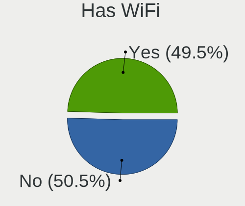
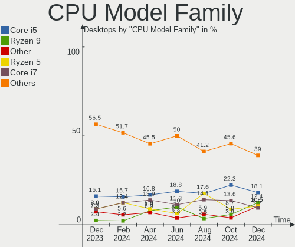

Linux in France - Hardware Trends (Desktops)
--------------------------------------------

A project to identify most popular hardware characteristics and track their change
over time based on data collected by Linux users at https://Linux-Hardware.org.

Anyone can contribute to this report by the [hw-probe](https://github.com/linuxhw/hw-probe) tool:

    sudo -E hw-probe -all -upload

Period: Aug, 2023.

Contents
--------

* [ System ](#system)
  - [ OS                       ](#os)
  - [ OS Family                ](#os-family)
  - [ Kernel                   ](#kernel)
  - [ Kernel Family            ](#kernel-family)
  - [ Kernel Major Ver.        ](#kernel-major-ver)
  - [ Arch                     ](#arch)
  - [ DE                       ](#de)
  - [ Display Server           ](#display-server)
  - [ Display Manager          ](#display-manager)
  - [ OS Lang                  ](#os-lang)
  - [ Boot Mode                ](#boot-mode)
  - [ Filesystem               ](#filesystem)
  - [ Part. scheme             ](#part-scheme)
  - [ Dual Boot with Linux/BSD ](#dual-boot-with-linuxbsd)
  - [ Dual Boot (Win)          ](#dual-boot-win)

* [ Board ](#board)
  - [ Vendor                   ](#vendor)
  - [ Model                    ](#model)
  - [ Model Family             ](#model-family)
  - [ MFG Year                 ](#mfg-year)
  - [ Form Factor              ](#form-factor)
  - [ Secure Boot              ](#secure-boot)
  - [ Coreboot                 ](#coreboot)
  - [ RAM Size                 ](#ram-size)
  - [ RAM Used                 ](#ram-used)
  - [ Total Drives             ](#total-drives)
  - [ Has CD-ROM               ](#has-cd-rom)
  - [ Has Ethernet             ](#has-ethernet)
  - [ Has WiFi                 ](#has-wifi)
  - [ Has Bluetooth            ](#has-bluetooth)

* [ Location ](#location)
  - [ Country                  ](#country)
  - [ City                     ](#city)

* [ Drives ](#drives)
  - [ Drive Vendor             ](#drive-vendor)
  - [ Drive Model              ](#drive-model)
  - [ HDD Vendor               ](#hdd-vendor)
  - [ SSD Vendor               ](#ssd-vendor)
  - [ Drive Kind               ](#drive-kind)
  - [ Drive Connector          ](#drive-connector)
  - [ Drive Size               ](#drive-size)
  - [ Space Total              ](#space-total)
  - [ Space Used               ](#space-used)
  - [ Malfunc. Drives          ](#malfunc-drives)
  - [ Malfunc. Drive Vendor    ](#malfunc-drive-vendor)
  - [ Malfunc. HDD Vendor      ](#malfunc-hdd-vendor)
  - [ Malfunc. Drive Kind      ](#malfunc-drive-kind)
  - [ Failed Drives            ](#failed-drives)
  - [ Failed Drive Vendor      ](#failed-drive-vendor)
  - [ Drive Status             ](#drive-status)

* [ Storage controller ](#storage-controller)
  - [ Storage Vendor           ](#storage-vendor)
  - [ Storage Model            ](#storage-model)
  - [ Storage Kind             ](#storage-kind)

* [ Processor ](#processor)
  - [ CPU Vendor               ](#cpu-vendor)
  - [ CPU Model                ](#cpu-model)
  - [ CPU Model Family         ](#cpu-model-family)
  - [ CPU Cores                ](#cpu-cores)
  - [ CPU Sockets              ](#cpu-sockets)
  - [ CPU Threads              ](#cpu-threads)
  - [ CPU Op-Modes             ](#cpu-op-modes)
  - [ CPU Microcode            ](#cpu-microcode)
  - [ CPU Microarch            ](#cpu-microarch)

* [ Graphics ](#graphics)
  - [ GPU Vendor               ](#gpu-vendor)
  - [ GPU Model                ](#gpu-model)
  - [ GPU Combo                ](#gpu-combo)
  - [ GPU Driver               ](#gpu-driver)
  - [ GPU Memory               ](#gpu-memory)

* [ Monitor ](#monitor)
  - [ Monitor Vendor           ](#monitor-vendor)
  - [ Monitor Model            ](#monitor-model)
  - [ Monitor Resolution       ](#monitor-resolution)
  - [ Monitor Diagonal         ](#monitor-diagonal)
  - [ Monitor Width            ](#monitor-width)
  - [ Aspect Ratio             ](#aspect-ratio)
  - [ Monitor Area             ](#monitor-area)
  - [ Pixel Density            ](#pixel-density)
  - [ Multiple Monitors        ](#multiple-monitors)

* [ Network ](#network)
  - [ Net Controller Vendor    ](#net-controller-vendor)
  - [ Net Controller Model     ](#net-controller-model)
  - [ Wireless Vendor          ](#wireless-vendor)
  - [ Wireless Model           ](#wireless-model)
  - [ Ethernet Vendor          ](#ethernet-vendor)
  - [ Ethernet Model           ](#ethernet-model)
  - [ Net Controller Kind      ](#net-controller-kind)
  - [ Used Controller          ](#used-controller)
  - [ NICs                     ](#nics)
  - [ IPv6                     ](#ipv6)

* [ Bluetooth ](#bluetooth)
  - [ Bluetooth Vendor         ](#bluetooth-vendor)
  - [ Bluetooth Model          ](#bluetooth-model)

* [ Sound ](#sound)
  - [ Sound Vendor             ](#sound-vendor)
  - [ Sound Model              ](#sound-model)

* [ Memory ](#memory)
  - [ Memory Vendor            ](#memory-vendor)
  - [ Memory Model             ](#memory-model)
  - [ Memory Kind              ](#memory-kind)
  - [ Memory Form Factor       ](#memory-form-factor)
  - [ Memory Size              ](#memory-size)
  - [ Memory Speed             ](#memory-speed)

* [ Printers & scanners ](#printers--scanners)
  - [ Printer Vendor           ](#printer-vendor)
  - [ Printer Model            ](#printer-model)
  - [ Scanner Vendor           ](#scanner-vendor)
  - [ Scanner Model            ](#scanner-model)

* [ Camera ](#camera)
  - [ Camera Vendor            ](#camera-vendor)
  - [ Camera Model             ](#camera-model)

* [ Security ](#security)
  - [ Fingerprint Vendor       ](#fingerprint-vendor)
  - [ Fingerprint Model        ](#fingerprint-model)
  - [ Chipcard Vendor          ](#chipcard-vendor)
  - [ Chipcard Model           ](#chipcard-model)

* [ Unsupported ](#unsupported)
  - [ Unsupported Devices      ](#unsupported-devices)
  - [ Unsupported Device Types ](#unsupported-device-types)

System
------

OS
--

Installed operating systems

| Name               | Desktops | Percent |
|--------------------|----------|---------|
| Ubuntu 22.04       | 24       | 20.69%  |
| OpenMandriva 23.08 | 13       | 11.21%  |
| Linux Mint 21.2    | 10       | 8.62%   |
| Ubuntu 23.04       | 7        | 6.03%   |
| Ubuntu 20.04       | 5        | 4.31%   |
| OpenMandriva 23.03 | 5        | 4.31%   |
| Fedora 38          | 5        | 4.31%   |
| ArcoLinux Rolling  | 4        | 3.45%   |
| Ubuntu 18.04       | 3        | 2.59%   |
| OpenMandriva 4.3   | 3        | 2.59%   |
| Manjaro 23.0.0     | 3        | 2.59%   |
| Debian 11          | 3        | 2.59%   |
| Zorin 16           | 2        | 1.72%   |
| Pop!_OS 22.04      | 2        | 1.72%   |
| OpenMandriva 23.90 | 2        | 1.72%   |
| Nobara 38          | 2        | 1.72%   |
| Lubuntu 20.04      | 2        | 1.72%   |
| Linux Mint 21.1    | 2        | 1.72%   |
| Kubuntu 23.04      | 2        | 1.72%   |
| Debian 12          | 2        | 1.72%   |
| Xubuntu 23.04      | 1        | 0.86%   |
| Xubuntu 22.04      | 1        | 0.86%   |
| Xubuntu 20.04      | 1        | 0.86%   |
| Xero Rolling       | 1        | 0.86%   |
| Ubuntu 16.04       | 1        | 0.86%   |
| RHEL 7             | 1        | 0.86%   |
| Pikaos 23.04       | 1        | 0.86%   |
| Lubuntu 22.04      | 1        | 0.86%   |
| Kubuntu 22.04      | 1        | 0.86%   |
| KDE neon 22.04     | 1        | 0.86%   |
| Kali 2023.3        | 1        | 0.86%   |
| Gentoo 2.14        | 1        | 0.86%   |
| Fedora 35          | 1        | 0.86%   |
| Devuan 4           | 1        | 0.86%   |
| Devuan             | 1        | 0.86%   |

OS Family
---------

OS without a version

| Name         | Desktops | Percent |
|--------------|----------|---------|
| Ubuntu       | 40       | 34.48%  |
| OpenMandriva | 23       | 19.83%  |
| Linux Mint   | 12       | 10.34%  |
| Fedora       | 6        | 5.17%   |
| Debian       | 5        | 4.31%   |
| ArcoLinux    | 4        | 3.45%   |
| Xubuntu      | 3        | 2.59%   |
| Manjaro      | 3        | 2.59%   |
| Lubuntu      | 3        | 2.59%   |
| Kubuntu      | 3        | 2.59%   |
| Zorin        | 2        | 1.72%   |
| Pop!_OS      | 2        | 1.72%   |
| Nobara       | 2        | 1.72%   |
| Devuan       | 2        | 1.72%   |
| Xero         | 1        | 0.86%   |
| RHEL         | 1        | 0.86%   |
| Pikaos       | 1        | 0.86%   |
| KDE neon     | 1        | 0.86%   |
| Kali         | 1        | 0.86%   |
| Gentoo       | 1        | 0.86%   |

Kernel
------

Version of the Linux kernel

| Version                      | Desktops | Percent |
|------------------------------|----------|---------|
| 6.2.0-26-generic             | 16       | 13.79%  |
| 5.15.0-79-generic            | 10       | 8.62%   |
| 5.15.0-78-generic            | 10       | 8.62%   |
| 6.4.11-desktop-1omv2390      | 9        | 7.76%   |
| 6.4.8-desktop-2omv2390       | 6        | 5.17%   |
| 6.2.6-desktop-1omv2390       | 5        | 4.31%   |
| 6.2.0-27-generic             | 4        | 3.45%   |
| 5.19.0-50-generic            | 4        | 3.45%   |
| 6.4.6-76060406-generic       | 2        | 1.72%   |
| 6.4.6-200.fc38.x86_64        | 2        | 1.72%   |
| 6.4.6-1-MANJARO              | 2        | 1.72%   |
| 6.4.10-200.fc38.x86_64       | 2        | 1.72%   |
| 6.1.0-11-amd64               | 2        | 1.72%   |
| 5.16.7-desktop-1omv4003      | 2        | 1.72%   |
| 5.15.0-82-generic            | 2        | 1.72%   |
| 5.10.0-25-amd64              | 2        | 1.72%   |
| 6.5.0-rc5-pikaos             | 1        | 0.86%   |
| 6.4.8-gentoo-dist            | 1        | 0.86%   |
| 6.4.8-arch1-1                | 1        | 0.86%   |
| 6.4.7-arch1-3                | 1        | 0.86%   |
| 6.4.12-x64v3-xanmod1         | 1        | 0.86%   |
| 6.4.12-arch1-1               | 1        | 0.86%   |
| 6.4.11-arch2-1               | 1        | 0.86%   |
| 6.3.12-205.fsync.fc38.x86_64 | 1        | 0.86%   |
| 6.3.12-204.fsync.fc38.x86_64 | 1        | 0.86%   |
| 6.3.0-kali1-amd64            | 1        | 0.86%   |
| 6.2.15-300.fc38.x86_64       | 1        | 0.86%   |
| 6.2.0-31-generic             | 1        | 0.86%   |
| 6.2.0-25-generic             | 1        | 0.86%   |
| 6.2.0-1007-lowlatency        | 1        | 0.86%   |
| 6.2.0-1003-oracle            | 1        | 0.86%   |
| 6.1.44-1-MANJARO             | 1        | 0.86%   |
| 6.1.39-3-lts                 | 1        | 0.86%   |
| 6.0.12-100.fc35.x86_64       | 1        | 0.86%   |
| 6.0.0-1017-oem               | 1        | 0.86%   |
| 5.8.0-53-generic             | 1        | 0.86%   |
| 5.4.0-159-generic            | 1        | 0.86%   |
| 5.4.0-137-generic            | 1        | 0.86%   |
| 5.4.0-128-generic            | 1        | 0.86%   |
| 5.19.0-41-generic            | 1        | 0.86%   |

Kernel Family
-------------

Linux kernel without a distro release

| Version | Desktops | Percent |
|---------|----------|---------|
| 6.2.0   | 24       | 20.69%  |
| 5.15.0  | 24       | 20.69%  |
| 6.4.11  | 10       | 8.62%   |
| 6.4.8   | 8        | 6.9%    |
| 6.4.6   | 6        | 5.17%   |
| 5.19.0  | 6        | 5.17%   |
| 6.2.6   | 5        | 4.31%   |
| 5.10.0  | 5        | 4.31%   |
| 5.4.0   | 3        | 2.59%   |
| 4.15.0  | 3        | 2.59%   |
| 6.4.12  | 2        | 1.72%   |
| 6.4.10  | 2        | 1.72%   |
| 6.3.12  | 2        | 1.72%   |
| 6.1.0   | 2        | 1.72%   |
| 5.16.7  | 2        | 1.72%   |
| 6.5.0   | 1        | 0.86%   |
| 6.4.7   | 1        | 0.86%   |
| 6.3.0   | 1        | 0.86%   |
| 6.2.15  | 1        | 0.86%   |
| 6.1.44  | 1        | 0.86%   |
| 6.1.39  | 1        | 0.86%   |
| 6.0.12  | 1        | 0.86%   |
| 6.0.0   | 1        | 0.86%   |
| 5.8.0   | 1        | 0.86%   |
| 5.16.13 | 1        | 0.86%   |
| 5.11.0  | 1        | 0.86%   |
| 3.10.0  | 1        | 0.86%   |

Kernel Major Ver.
-----------------

Linux kernel major version

| Version | Desktops | Percent |
|---------|----------|---------|
| 6.2     | 30       | 25.86%  |
| 6.4     | 29       | 25%     |
| 5.15    | 24       | 20.69%  |
| 5.19    | 6        | 5.17%   |
| 5.10    | 5        | 4.31%   |
| 6.1     | 4        | 3.45%   |
| 6.3     | 3        | 2.59%   |
| 5.4     | 3        | 2.59%   |
| 5.16    | 3        | 2.59%   |
| 4.15    | 3        | 2.59%   |
| 6.0     | 2        | 1.72%   |
| 6.5     | 1        | 0.86%   |
| 5.8     | 1        | 0.86%   |
| 5.11    | 1        | 0.86%   |
| 3.10    | 1        | 0.86%   |

Arch
----

OS architecture (x86_64, i586, etc.)

| Name   | Desktops | Percent |
|--------|----------|---------|
| x86_64 | 115      | 99.14%  |
| i686   | 1        | 0.86%   |

DE
--

Desktop Environment

| Name              | Desktops | Percent |
|-------------------|----------|---------|
| GNOME             | 47       | 40.52%  |
| KDE5              | 26       | 22.41%  |
| XFCE              | 11       | 9.48%   |
| Unknown           | 11       | 9.48%   |
| X-Cinnamon        | 8        | 6.9%    |
| LXQt              | 5        | 4.31%   |
| MATE              | 3        | 2.59%   |
| ubuntu:pika:GNOME | 1        | 0.86%   |
| KDE4              | 1        | 0.86%   |
| Hypr              | 1        | 0.86%   |
| GNOME Classic     | 1        | 0.86%   |
| Deepin            | 1        | 0.86%   |

Display Server
--------------

X11 or Wayland

| Name    | Desktops | Percent |
|---------|----------|---------|
| X11     | 63       | 54.31%  |
| Wayland | 47       | 40.52%  |
| Tty     | 3        | 2.59%   |
| Unknown | 3        | 2.59%   |

Display Manager
---------------

SDDM, LightDM, etc.

| Name    | Desktops | Percent |
|---------|----------|---------|
| SDDM    | 34       | 29.31%  |
| GDM3    | 34       | 29.31%  |
| Unknown | 27       | 23.28%  |
| LightDM | 14       | 12.07%  |
| GDM     | 7        | 6.03%   |

OS Lang
-------

Language

| Lang    | Desktops | Percent |
|---------|----------|---------|
| fr_FR   | 93       | 80.17%  |
| en_US   | 17       | 14.66%  |
| en_GB   | 3        | 2.59%   |
| sr_RS   | 1        | 0.86%   |
| en_IE   | 1        | 0.86%   |
| Unknown | 1        | 0.86%   |

Boot Mode
---------

EFI or BIOS

| Mode | Desktops | Percent |
|------|----------|---------|
| BIOS | 61       | 52.59%  |
| EFI  | 55       | 47.41%  |

Filesystem
----------

Type of filesystem

| Type    | Desktops | Percent |
|---------|----------|---------|
| Ext4    | 73       | 62.93%  |
| Tmpfs   | 19       | 16.38%  |
| Overlay | 11       | 9.48%   |
| Btrfs   | 11       | 9.48%   |
| Zfs     | 1        | 0.86%   |
| Xfs     | 1        | 0.86%   |

Part. scheme
------------

Scheme of partitioning

| Type    | Desktops | Percent |
|---------|----------|---------|
| GPT     | 71       | 61.21%  |
| Unknown | 30       | 25.86%  |
| MBR     | 15       | 12.93%  |

Dual Boot with Linux/BSD
------------------------

Hosting more than one Linux/BSD

| Dual boot | Desktops | Percent |
|-----------|----------|---------|
| No        | 84       | 72.41%  |
| Yes       | 32       | 27.59%  |

Dual Boot (Win)
---------------

Hosting Linux and Windows

| Dual boot | Desktops | Percent |
|-----------|----------|---------|
| No        | 73       | 62.93%  |
| Yes       | 43       | 37.07%  |

Board
-----

Vendor
------

Motherboard manufacturer

| Name                                 | Desktops | Percent |
|--------------------------------------|----------|---------|
| ASUSTek Computer                     | 30       | 25.86%  |
| MSI                                  | 22       | 18.97%  |
| Gigabyte Technology                  | 21       | 18.1%   |
| Dell                                 | 12       | 10.34%  |
| Hewlett-Packard                      | 10       | 8.62%   |
| Intel                                | 4        | 3.45%   |
| Lenovo                               | 3        | 2.59%   |
| Acer                                 | 3        | 2.59%   |
| Fujitsu                              | 2        | 1.72%   |
| Shuttle                              | 1        | 0.86%   |
| Shenzhen Meigao Electronic Equipment | 1        | 0.86%   |
| Pegatron                             | 1        | 0.86%   |
| Foxconn                              | 1        | 0.86%   |
| ASRock                               | 1        | 0.86%   |
| Apple                                | 1        | 0.86%   |
| Alienware                            | 1        | 0.86%   |
| AK3V                                 | 1        | 0.86%   |
| Unknown                              | 1        | 0.86%   |

Model
-----

Motherboard model

| Name                                       | Desktops | Percent |
|--------------------------------------------|----------|---------|
| ASUS All Series                            | 5        | 4.31%   |
| MSI MS-7B93                                | 2        | 1.72%   |
| MSI MS-7B86                                | 2        | 1.72%   |
| Gigabyte B550 GAMING X V2                  | 2        | 1.72%   |
| Dell Precision Tower 7910                  | 2        | 1.72%   |
| Dell OptiPlex 3020                         | 2        | 1.72%   |
| ASUS M5A99X EVO R2.0                       | 2        | 1.72%   |
| Shuttle XS35V3                             | 1        | 0.86%   |
| Shenzhen Meigao Electronic Equipment UM560 | 1        | 0.86%   |
| Pegatron KT600AA-ABF a6443.fr              | 1        | 0.86%   |
| MSI MS-7D67                                | 1        | 0.86%   |
| MSI MS-7D22                                | 1        | 0.86%   |
| MSI MS-7D09                                | 1        | 0.86%   |
| MSI MS-7C92                                | 1        | 0.86%   |
| MSI MS-7C91                                | 1        | 0.86%   |
| MSI MS-7C89                                | 1        | 0.86%   |
| MSI MS-7C51                                | 1        | 0.86%   |
| MSI MS-7C09                                | 1        | 0.86%   |
| MSI MS-7C08                                | 1        | 0.86%   |
| MSI MS-7C02                                | 1        | 0.86%   |
| MSI MS-7B79                                | 1        | 0.86%   |
| MSI MS-7B33                                | 1        | 0.86%   |
| MSI MS-7978                                | 1        | 0.86%   |
| MSI MS-7918                                | 1        | 0.86%   |
| MSI MS-7917                                | 1        | 0.86%   |
| MSI MS-7845                                | 1        | 0.86%   |
| MSI MS-7821                                | 1        | 0.86%   |
| MSI MS-7641                                | 1        | 0.86%   |
| Lenovo ThinkStation P320 30BJS23V00        | 1        | 0.86%   |
| Lenovo ThinkCentre M83z 10C20003FR         | 1        | 0.86%   |
| Lenovo ThinkCentre M700 10KNS0H900         | 1        | 0.86%   |
| Intel DZ77BH-55K AAG39008-400              | 1        | 0.86%   |
| Intel DQ77KB AAG40294-401                  | 1        | 0.86%   |
| Intel DH67BL AAG10189-211                  | 1        | 0.86%   |
| Intel D33217GKE G76540-203                 | 1        | 0.86%   |
| HP Z220 SFF Workstation                    | 1        | 0.86%   |
| HP Slim Desktop S01-aF0xxx                 | 1        | 0.86%   |
| HP ProDesk 600 G4 SFF                      | 1        | 0.86%   |
| HP ProDesk 600 G4 DM                       | 1        | 0.86%   |
| HP ProDesk 600 G1 SFF                      | 1        | 0.86%   |

Model Family
------------

Motherboard model prefix

| Name                                       | Desktops | Percent |
|--------------------------------------------|----------|---------|
| Dell OptiPlex                              | 8        | 6.9%    |
| ASUS PRIME                                 | 5        | 4.31%   |
| ASUS All                                   | 5        | 4.31%   |
| HP ProDesk                                 | 4        | 3.45%   |
| Gigabyte B550                              | 4        | 3.45%   |
| Dell Precision                             | 4        | 3.45%   |
| ASUS ROG                                   | 3        | 2.59%   |
| Acer Aspire                                | 3        | 2.59%   |
| MSI MS-7B93                                | 2        | 1.72%   |
| MSI MS-7B86                                | 2        | 1.72%   |
| Lenovo ThinkCentre                         | 2        | 1.72%   |
| HP Compaq                                  | 2        | 1.72%   |
| Fujitsu ESPRIMO                            | 2        | 1.72%   |
| ASUS TUF                                   | 2        | 1.72%   |
| ASUS P8Z68-V                               | 2        | 1.72%   |
| ASUS M5A99X                                | 2        | 1.72%   |
| Shuttle XS35V3                             | 1        | 0.86%   |
| Shenzhen Meigao Electronic Equipment UM560 | 1        | 0.86%   |
| Pegatron KT600AA-ABF                       | 1        | 0.86%   |
| MSI MS-7D67                                | 1        | 0.86%   |
| MSI MS-7D22                                | 1        | 0.86%   |
| MSI MS-7D09                                | 1        | 0.86%   |
| MSI MS-7C92                                | 1        | 0.86%   |
| MSI MS-7C91                                | 1        | 0.86%   |
| MSI MS-7C89                                | 1        | 0.86%   |
| MSI MS-7C51                                | 1        | 0.86%   |
| MSI MS-7C09                                | 1        | 0.86%   |
| MSI MS-7C08                                | 1        | 0.86%   |
| MSI MS-7C02                                | 1        | 0.86%   |
| MSI MS-7B79                                | 1        | 0.86%   |
| MSI MS-7B33                                | 1        | 0.86%   |
| MSI MS-7978                                | 1        | 0.86%   |
| MSI MS-7918                                | 1        | 0.86%   |
| MSI MS-7917                                | 1        | 0.86%   |
| MSI MS-7845                                | 1        | 0.86%   |
| MSI MS-7821                                | 1        | 0.86%   |
| MSI MS-7641                                | 1        | 0.86%   |
| Lenovo ThinkStation                        | 1        | 0.86%   |
| Intel DZ77BH-55K                           | 1        | 0.86%   |
| Intel DQ77KB                               | 1        | 0.86%   |

MFG Year
--------

Motherboard manufacture year

| Year | Desktops | Percent |
|------|----------|---------|
| 2018 | 14       | 12.07%  |
| 2012 | 14       | 12.07%  |
| 2014 | 11       | 9.48%   |
| 2020 | 10       | 8.62%   |
| 2011 | 9        | 7.76%   |
| 2021 | 8        | 6.9%    |
| 2016 | 7        | 6.03%   |
| 2019 | 6        | 5.17%   |
| 2013 | 6        | 5.17%   |
| 2015 | 5        | 4.31%   |
| 2017 | 4        | 3.45%   |
| 2009 | 4        | 3.45%   |
| 2007 | 4        | 3.45%   |
| 2006 | 4        | 3.45%   |
| 2023 | 3        | 2.59%   |
| 2022 | 3        | 2.59%   |
| 2010 | 2        | 1.72%   |
| 2008 | 2        | 1.72%   |

Form Factor
-----------

Physical design of the computer

| Name    | Desktops | Percent |
|---------|----------|---------|
| Desktop | 116      | 100%    |

Secure Boot
-----------

Enabled or disabled

| State    | Desktops | Percent |
|----------|----------|---------|
| Disabled | 112      | 96.55%  |
| Enabled  | 4        | 3.45%   |

Coreboot
--------

Have coreboot on board

| Used | Desktops | Percent |
|------|----------|---------|
| No   | 116      | 100%    |

RAM Size
--------

Total RAM memory

| Size in GB  | Desktops | Percent |
|-------------|----------|---------|
| 16.01-24.0  | 29       | 25%     |
| 4.01-8.0    | 21       | 18.1%   |
| 8.01-16.0   | 20       | 17.24%  |
| 32.01-64.0  | 16       | 13.79%  |
| 3.01-4.0    | 15       | 12.93%  |
| 24.01-32.0  | 7        | 6.03%   |
| 64.01-256.0 | 4        | 3.45%   |
| 2.01-3.0    | 2        | 1.72%   |
| 1.01-2.0    | 2        | 1.72%   |

RAM Used
--------

Used RAM memory

| Used GB    | Desktops | Percent |
|------------|----------|---------|
| 1.01-2.0   | 43       | 37.07%  |
| 2.01-3.0   | 28       | 24.14%  |
| 4.01-8.0   | 17       | 14.66%  |
| 3.01-4.0   | 11       | 9.48%   |
| 0.51-1.0   | 9        | 7.76%   |
| 8.01-16.0  | 7        | 6.03%   |
| 32.01-64.0 | 1        | 0.86%   |

Total Drives
------------

Number of drives on board

| Drives | Desktops | Percent |
|--------|----------|---------|
| 1      | 37       | 31.9%   |
| 2      | 33       | 28.45%  |
| 3      | 19       | 16.38%  |
| 4      | 13       | 11.21%  |
| 5      | 5        | 4.31%   |
| 6      | 3        | 2.59%   |
| 7      | 2        | 1.72%   |
| 11     | 1        | 0.86%   |
| 9      | 1        | 0.86%   |
| 8      | 1        | 0.86%   |
| 0      | 1        | 0.86%   |

Has CD-ROM
----------

Has CD-ROM on board

| Presented | Desktops | Percent |
|-----------|----------|---------|
| No        | 60       | 51.72%  |
| Yes       | 56       | 48.28%  |

Has Ethernet
------------

Has Ethernet on board

| Presented | Desktops | Percent |
|-----------|----------|---------|
| Yes       | 116      | 100%    |

Has WiFi
--------

Has WiFi module

| Presented | Desktops | Percent |
|-----------|----------|---------|
| No        | 63       | 54.31%  |
| Yes       | 53       | 45.69%  |

Has Bluetooth
-------------

Has Bluetooth module

| Presented | Desktops | Percent |
|-----------|----------|---------|
| No        | 78       | 67.24%  |
| Yes       | 38       | 32.76%  |

Location
--------

Country
-------

Geographic location (country)

| Country | Desktops | Percent |
|---------|----------|---------|
| France  | 116      | 100%    |

City
----

Geographic location (city)

| City                    | Desktops | Percent |
|-------------------------|----------|---------|
| Paris                   | 10       | 8.62%   |
| Champs-sur-Marne        | 5        | 4.31%   |
| Toulouse                | 3        | 2.59%   |
| Rouen                   | 3        | 2.59%   |
| Vallenay                | 2        | 1.72%   |
| Valenciennes            | 2        | 1.72%   |
| Tourcoing               | 2        | 1.72%   |
| Saint-Nazaire           | 2        | 1.72%   |
| Orléans                | 2        | 1.72%   |
| Nice                    | 2        | 1.72%   |
| Nantes                  | 2        | 1.72%   |
| Marseille               | 2        | 1.72%   |
| Lyon                    | 2        | 1.72%   |
| Villejuif               | 1        | 0.86%   |
| Vendin-le-Vieil         | 1        | 0.86%   |
| Varangeville            | 1        | 0.86%   |
| Valence                 | 1        | 0.86%   |
| Urcel                   | 1        | 0.86%   |
| Thourotte               | 1        | 0.86%   |
| Soisy-sous-Montmorency  | 1        | 0.86%   |
| Schiltigheim            | 1        | 0.86%   |
| Sarcelles               | 1        | 0.86%   |
| Saint-Pierre-des-Corps  | 1        | 0.86%   |
| Saint-Paul-de-Vence     | 1        | 0.86%   |
| Saint-Marcellin         | 1        | 0.86%   |
| Saint-Gregoire          | 1        | 0.86%   |
| Saint-Etienne-de-Valoux | 1        | 0.86%   |
| Saint-Denis             | 1        | 0.86%   |
| Roubaix                 | 1        | 0.86%   |
| Roscanvel               | 1        | 0.86%   |
| Ronchin                 | 1        | 0.86%   |
| Rethel                  | 1        | 0.86%   |
| Rennes                  | 1        | 0.86%   |
| Realmont                | 1        | 0.86%   |
| Pontoise                | 1        | 0.86%   |
| Pontault-Combault       | 1        | 0.86%   |
| Poitiers                | 1        | 0.86%   |
| Plaisir                 | 1        | 0.86%   |
| Pirey                   | 1        | 0.86%   |
| Perpignan               | 1        | 0.86%   |

Drives
------

Drive Vendor
------------

Hard drive vendors

| Vendor                      | Desktops | Drives | Percent |
|-----------------------------|----------|--------|---------|
| Seagate                     | 39       | 49     | 17.49%  |
| Samsung Electronics         | 37       | 49     | 16.59%  |
| WDC                         | 35       | 64     | 15.7%   |
| Crucial                     | 19       | 24     | 8.52%   |
| SanDisk                     | 11       | 12     | 4.93%   |
| Kingston                    | 7        | 7      | 3.14%   |
| Unknown                     | 5        | 8      | 2.24%   |
| Toshiba                     | 5        | 5      | 2.24%   |
| Emtec                       | 5        | 6      | 2.24%   |
| Phison Electronics          | 4        | 4      | 1.79%   |
| Micron/Crucial Technology   | 4        | 5      | 1.79%   |
| SPCC                        | 3        | 3      | 1.35%   |
| Micron Technology           | 3        | 3      | 1.35%   |
| Maxtor                      | 3        | 4      | 1.35%   |
| Intel                       | 3        | 3      | 1.35%   |
| Hitachi                     | 3        | 3      | 1.35%   |
| China                       | 3        | 3      | 1.35%   |
| SSK                         | 2        | 2      | 0.9%    |
| SABRENT                     | 2        | 2      | 0.9%    |
| OCZ                         | 2        | 2      | 0.9%    |
| Intenso                     | 2        | 2      | 0.9%    |
| Corsair                     | 2        | 3      | 0.9%    |
| Transcend                   | 1        | 1      | 0.45%   |
| TEXTORM                     | 1        | 1      | 0.45%   |
| sobetter                    | 1        | 1      | 0.45%   |
| SK hynix                    | 1        | 1      | 0.45%   |
| Silicon Motion              | 1        | 1      | 0.45%   |
| PNY                         | 1        | 1      | 0.45%   |
| Phison                      | 1        | 1      | 0.45%   |
| Patriot                     | 1        | 1      | 0.45%   |
| MTFDDAK2                    | 1        | 1      | 0.45%   |
| LDLC                        | 1        | 1      | 0.45%   |
| Kingston Technology Company | 1        | 1      | 0.45%   |
| KingSpec                    | 1        | 1      | 0.45%   |
| Integral                    | 1        | 1      | 0.45%   |
| INNOVATION IT               | 1        | 1      | 0.45%   |
| IB-AC703                    | 1        | 1      | 0.45%   |
| HS-SSD-E100                 | 1        | 1      | 0.45%   |
| HGST                        | 1        | 1      | 0.45%   |
| H/W                         | 1        | 3      | 0.45%   |

Drive Model
-----------

Hard drive models

| Model                                               | Desktops | Percent |
|-----------------------------------------------------|----------|---------|
| Samsung SSD 860 EVO 500GB                           | 6        | 2.21%   |
| Seagate ST2000DM008-2FR102 2TB                      | 5        | 1.84%   |
| Crucial CT500MX500SSD1 500GB                        | 4        | 1.47%   |
| WDC WD30EFRX-68EUZN0 3TB                            | 3        | 1.1%    |
| Seagate ST1000DM010-2EP102 1TB                      | 3        | 1.1%    |
| Seagate ST1000DM003-1SB102 1TB                      | 3        | 1.1%    |
| Seagate ST1000DM003-1ER162 1TB                      | 3        | 1.1%    |
| Phison E12 NVMe Controller 256GB                    | 3        | 1.1%    |
| Micron/Crucial P2 NVMe PCIe SSD 1TB                 | 3        | 1.1%    |
| Crucial CT1000MX500SSD1 1TB                         | 3        | 1.1%    |
| WDC WD5000AAKX-001CA0 500GB                         | 2        | 0.74%   |
| WDC WD5000AAKS-00V1A0 500GB                         | 2        | 0.74%   |
| WDC WD20EARS-00MVWB0 2TB                            | 2        | 0.74%   |
| WDC WD10EZEX-22BN5A0 1TB                            | 2        | 0.74%   |
| Unknown SD/MMC/MS PRO 1GB                           | 2        | 0.74%   |
| Unknown SD/MMC 2GB                                  | 2        | 0.74%   |
| Unknown M.S./M.S.Pro/HG 16GB                        | 2        | 0.74%   |
| Toshiba HDWD120 2TB                                 | 2        | 0.74%   |
| SSK Tech 256GB                                      | 2        | 0.74%   |
| Seagate ST500DM002-1BD142 500GB                     | 2        | 0.74%   |
| Seagate ST4000DM005-2DP166 4TB                      | 2        | 0.74%   |
| Seagate ST4000DM004-2CV104 4TB                      | 2        | 0.74%   |
| Seagate ST3250318AS 250GB                           | 2        | 0.74%   |
| Seagate ST2000DM006-2DM164 2TB                      | 2        | 0.74%   |
| Seagate Expansion 2TB                               | 2        | 0.74%   |
| SanDisk SDSSDX240GG25 240GB                         | 2        | 0.74%   |
| Samsung SSD 980 PRO 1TB                             | 2        | 0.74%   |
| Samsung SSD 980 1TB                                 | 2        | 0.74%   |
| Samsung SSD 970 EVO Plus 2TB                        | 2        | 0.74%   |
| Samsung SSD 870 QVO 2TB                             | 2        | 0.74%   |
| Samsung SSD 860 EVO 1TB                             | 2        | 0.74%   |
| Samsung SSD 850 EVO 500GB                           | 2        | 0.74%   |
| Samsung SSD 850 EVO 1TB                             | 2        | 0.74%   |
| Samsung SSD 840 EVO 250GB                           | 2        | 0.74%   |
| Samsung SSD 750 EVO 250GB                           | 2        | 0.74%   |
| Samsung NVMe SSD Controller SM981/PM981/PM983 500GB | 2        | 0.74%   |
| Samsung HD321KJ 320GB                               | 2        | 0.74%   |
| SABRENT Disk 1TB                                    | 2        | 0.74%   |
| Kingston SA400S37480G 480GB SSD                     | 2        | 0.74%   |
| Emtec X150 240GB SSD                                | 2        | 0.74%   |

HDD Vendor
----------

Hard disk drive vendors

| Vendor              | Desktops | Drives | Percent |
|---------------------|----------|--------|---------|
| Seagate             | 39       | 49     | 41.05%  |
| WDC                 | 31       | 56     | 32.63%  |
| Toshiba             | 5        | 5      | 5.26%   |
| Samsung Electronics | 5        | 5      | 5.26%   |
| Maxtor              | 3        | 4      | 3.16%   |
| Hitachi             | 3        | 3      | 3.16%   |
| Unknown             | 2        | 2      | 2.11%   |
| SABRENT             | 2        | 2      | 2.11%   |
| IB-AC703            | 1        | 1      | 1.05%   |
| HGST                | 1        | 1      | 1.05%   |
| H/W                 | 1        | 3      | 1.05%   |
| Fujitsu             | 1        | 2      | 1.05%   |
| Apple               | 1        | 1      | 1.05%   |

SSD Vendor
----------

Solid state drive vendors

| Vendor              | Desktops | Drives | Percent |
|---------------------|----------|--------|---------|
| Samsung Electronics | 22       | 31     | 24.18%  |
| Crucial             | 17       | 21     | 18.68%  |
| SanDisk             | 9        | 9      | 9.89%   |
| Kingston            | 7        | 7      | 7.69%   |
| Emtec               | 5        | 6      | 5.49%   |
| WDC                 | 4        | 6      | 4.4%    |
| SPCC                | 3        | 3      | 3.3%    |
| Micron Technology   | 3        | 3      | 3.3%    |
| Intel               | 3        | 3      | 3.3%    |
| China               | 3        | 3      | 3.3%    |
| OCZ                 | 2        | 2      | 2.2%    |
| Intenso             | 2        | 2      | 2.2%    |
| Transcend           | 1        | 1      | 1.1%    |
| TEXTORM             | 1        | 1      | 1.1%    |
| SK hynix            | 1        | 1      | 1.1%    |
| Patriot             | 1        | 1      | 1.1%    |
| KingSpec            | 1        | 1      | 1.1%    |
| Integral            | 1        | 1      | 1.1%    |
| INNOVATION IT       | 1        | 1      | 1.1%    |
| DUEX                | 1        | 1      | 1.1%    |
| Corsair             | 1        | 1      | 1.1%    |
| A-DATA Technology   | 1        | 1      | 1.1%    |
| 2.5"                | 1        | 2      | 1.1%    |

Drive Kind
----------

HDD or SSD

| Kind    | Desktops | Drives | Percent |
|---------|----------|--------|---------|
| HDD     | 74       | 134    | 39.78%  |
| SSD     | 73       | 108    | 39.25%  |
| NVMe    | 29       | 36     | 15.59%  |
| Unknown | 9        | 12     | 4.84%   |
| MMC     | 1        | 1      | 0.54%   |

Drive Connector
---------------

SATA, SAS, NVMe, etc.

| Type | Desktops | Drives | Percent |
|------|----------|--------|---------|
| SATA | 106      | 234    | 71.62%  |
| NVMe | 29       | 36     | 19.59%  |
| SAS  | 12       | 20     | 8.11%   |
| MMC  | 1        | 1      | 0.68%   |

Drive Size
----------

Size of hard drive

| Size in TB | Desktops | Drives | Percent |
|------------|----------|--------|---------|
| 0.01-0.5   | 77       | 118    | 45.29%  |
| 0.51-1.0   | 49       | 66     | 28.82%  |
| 1.01-2.0   | 25       | 31     | 14.71%  |
| 3.01-4.0   | 10       | 12     | 5.88%   |
| 2.01-3.0   | 6        | 12     | 3.53%   |
| 4.01-10.0  | 3        | 3      | 1.76%   |

Space Total
-----------

Amount of disk space available on the file system

| Size in GB     | Desktops | Percent |
|----------------|----------|---------|
| 101-250        | 26       | 22.41%  |
| 501-1000       | 20       | 17.24%  |
| 251-500        | 19       | 16.38%  |
| More than 3000 | 16       | 13.79%  |
| 1001-2000      | 9        | 7.76%   |
| 1-20           | 8        | 6.9%    |
| 2001-3000      | 7        | 6.03%   |
| 51-100         | 6        | 5.17%   |
| 21-50          | 3        | 2.59%   |
| Unknown        | 2        | 1.72%   |

Space Used
----------

Amount of used disk space

| Used GB        | Desktops | Percent |
|----------------|----------|---------|
| 1-20           | 33       | 28.45%  |
| 251-500        | 18       | 15.52%  |
| 21-50          | 15       | 12.93%  |
| 101-250        | 12       | 10.34%  |
| 51-100         | 11       | 9.48%   |
| More than 3000 | 10       | 8.62%   |
| 501-1000       | 7        | 6.03%   |
| 1001-2000      | 5        | 4.31%   |
| 2001-3000      | 3        | 2.59%   |
| Unknown        | 2        | 1.72%   |

Malfunc. Drives
---------------

Drive models with a malfunction

| Model                                   | Desktops | Drives | Percent |
|-----------------------------------------|----------|--------|---------|
| WDC WDS240G2G0A-00JH30 240GB SSD        | 1        | 1      | 3.7%    |
| WDC WD6400AAKS-22A7B2 640GB             | 1        | 1      | 3.7%    |
| WDC WD6003FZBX-00K5WB0 6TB              | 1        | 1      | 3.7%    |
| WDC WD5000AAKS-00V1A0 500GB             | 1        | 1      | 3.7%    |
| WDC WD40EFRX-68N32N0 4TB                | 1        | 1      | 3.7%    |
| WDC WD30EFRX-68EUZN0 3TB                | 1        | 2      | 3.7%    |
| WDC WD10EFRX-68FYTN0 1TB                | 1        | 1      | 3.7%    |
| WDC WD10EARS-22Y5B1 1TB                 | 1        | 1      | 3.7%    |
| WDC WD1002FAEX-00Z3A0 1TB               | 1        | 1      | 3.7%    |
| Seagate ST9160301AS 160GB               | 1        | 1      | 3.7%    |
| Seagate ST500DM002-1BD142 500GB         | 1        | 1      | 3.7%    |
| Seagate ST3500418AS 500GB               | 1        | 1      | 3.7%    |
| Seagate ST3250318AS 250GB               | 1        | 1      | 3.7%    |
| Seagate ST3200826AS 200GB               | 1        | 1      | 3.7%    |
| Seagate ST3160815A 160GB                | 1        | 1      | 3.7%    |
| Seagate ST31500341AS 1TB                | 1        | 1      | 3.7%    |
| Seagate ST2000DM001-1ER164 2TB          | 1        | 1      | 3.7%    |
| SanDisk SD7SB2Q-512G-1006 512GB SSD     | 1        | 1      | 3.7%    |
| SABRENT Disk 1TB                        | 1        | 1      | 3.7%    |
| Maxtor STM3250310AS 250GB               | 1        | 1      | 3.7%    |
| Maxtor 6G160E0 160GB                    | 1        | 1      | 3.7%    |
| Kingston RBU-SNS8350DES3128GP 128GB SSD | 1        | 1      | 3.7%    |
| Hitachi HDS721050CLA662 500GB           | 1        | 1      | 3.7%    |
| Hitachi HDS721010CLA332 1TB             | 1        | 1      | 3.7%    |
| Crucial CT1050MX300SSD1 1TB             | 1        | 1      | 3.7%    |
| China SH00R240GB SSD                    | 1        | 1      | 3.7%    |
| 2.5" SATA SSD 3TG6-P 2TB                | 1        | 2      | 3.7%    |

Malfunc. Drive Vendor
---------------------

Vendors of faulty drives

| Vendor   | Desktops | Drives | Percent |
|----------|----------|--------|---------|
| WDC      | 7        | 10     | 29.17%  |
| Seagate  | 7        | 8      | 29.17%  |
| Maxtor   | 2        | 2      | 8.33%   |
| Hitachi  | 2        | 2      | 8.33%   |
| SanDisk  | 1        | 1      | 4.17%   |
| SABRENT  | 1        | 1      | 4.17%   |
| Kingston | 1        | 1      | 4.17%   |
| Crucial  | 1        | 1      | 4.17%   |
| China    | 1        | 1      | 4.17%   |
| 2.5"     | 1        | 2      | 4.17%   |

Malfunc. HDD Vendor
-------------------

Vendors of faulty HDD drives

| Vendor  | Desktops | Drives | Percent |
|---------|----------|--------|---------|
| Seagate | 7        | 8      | 38.89%  |
| WDC     | 6        | 9      | 33.33%  |
| Maxtor  | 2        | 2      | 11.11%  |
| Hitachi | 2        | 2      | 11.11%  |
| SABRENT | 1        | 1      | 5.56%   |

Malfunc. Drive Kind
-------------------

Kinds of faulty drives

| Kind | Desktops | Drives | Percent |
|------|----------|--------|---------|
| HDD  | 15       | 22     | 71.43%  |
| SSD  | 6        | 7      | 28.57%  |

Failed Drives
-------------

Failed drive models

Zero info for selected period =(

Failed Drive Vendor
-------------------

Failed drive vendors

Zero info for selected period =(

Drive Status
------------

Number of failed and malfunc. drives

| Status   | Desktops | Drives | Percent |
|----------|----------|--------|---------|
| Works    | 71       | 146    | 50.35%  |
| Detected | 50       | 116    | 35.46%  |
| Malfunc  | 20       | 29     | 14.18%  |

Storage controller
------------------

Storage Vendor
--------------

Storage controller vendors

| Vendor                      | Desktops | Percent |
|-----------------------------|----------|---------|
| Intel                       | 79       | 47.02%  |
| AMD                         | 32       | 19.05%  |
| Samsung Electronics         | 12       | 7.14%   |
| ASMedia Technology          | 10       | 5.95%   |
| Phison Electronics          | 7        | 4.17%   |
| Micron/Crucial Technology   | 6        | 3.57%   |
| Nvidia                      | 5        | 2.98%   |
| SanDisk                     | 4        | 2.38%   |
| Marvell Technology Group    | 3        | 1.79%   |
| JMicron Technology          | 2        | 1.19%   |
| Broadcom / LSI              | 2        | 1.19%   |
| Solidigm                    | 1        | 0.6%    |
| Silicon Motion              | 1        | 0.6%    |
| Silicon Image               | 1        | 0.6%    |
| Micron Technology           | 1        | 0.6%    |
| LSI Logic / Symbios Logic   | 1        | 0.6%    |
| Kingston Technology Company | 1        | 0.6%    |

Storage Model
-------------

Storage controller models

| Model                                                                                   | Desktops | Percent |
|-----------------------------------------------------------------------------------------|----------|---------|
| AMD FCH SATA Controller [AHCI mode]                                                     | 15       | 7.61%   |
| ASMedia ASM1062 Serial ATA Controller                                                   | 10       | 5.08%   |
| Intel Q170/Q150/B150/H170/H110/Z170/CM236 Chipset SATA Controller [AHCI Mode]           | 8        | 4.06%   |
| AMD 400 Series Chipset SATA Controller                                                  | 8        | 4.06%   |
| Intel SATA Controller [RAID mode]                                                       | 7        | 3.55%   |
| Intel 8 Series/C220 Series Chipset Family 6-port SATA Controller 1 [AHCI mode]          | 7        | 3.55%   |
| Intel 6 Series/C200 Series Chipset Family 6 port Desktop SATA AHCI Controller           | 7        | 3.55%   |
| AMD 500 Series Chipset SATA Controller                                                  | 7        | 3.55%   |
| Samsung NVMe SSD Controller SM981/PM981/PM983                                           | 6        | 3.05%   |
| Intel 9 Series Chipset Family SATA Controller [AHCI Mode]                               | 6        | 3.05%   |
| Intel 7 Series/C210 Series Chipset Family 6-port SATA Controller [AHCI mode]            | 6        | 3.05%   |
| Phison E12 NVMe Controller                                                              | 5        | 2.54%   |
| Micron/Crucial P2 [Nick P2] / P3 / P3 Plus NVMe PCIe SSD (DRAM-less)                    | 5        | 2.54%   |
| Intel Cannon Lake PCH SATA AHCI Controller                                              | 5        | 2.54%   |
| Intel 500 Series Chipset Family SATA AHCI Controller                                    | 5        | 2.54%   |
| Intel 200 Series PCH SATA controller [AHCI mode]                                        | 4        | 2.03%   |
| AMD SB7x0/SB8x0/SB9x0 SATA Controller [AHCI mode]                                       | 4        | 2.03%   |
| Samsung NVMe SSD Controller PM9A1/PM9A3/980PRO                                          | 3        | 1.52%   |
| Samsung NVMe SSD Controller 980                                                         | 3        | 1.52%   |
| Intel C610/X99 series chipset IDE-r Controller                                          | 3        | 1.52%   |
| SanDisk WD Blue SN550 NVMe SSD                                                          | 2        | 1.02%   |
| Nvidia MCP61 SATA Controller                                                            | 2        | 1.02%   |
| Nvidia MCP61 IDE                                                                        | 2        | 1.02%   |
| JMicron JMB363 SATA/IDE Controller                                                      | 2        | 1.02%   |
| Intel NM10/ICH7 Family SATA Controller [IDE mode]                                       | 2        | 1.02%   |
| Intel C610/X99 series chipset sSATA Controller [AHCI mode]                              | 2        | 1.02%   |
| Intel 82801HR/HO/HH (ICH8R/DO/DH) 2 port SATA Controller [IDE mode]                     | 2        | 1.02%   |
| Intel 82801H (ICH8 Family) 4 port SATA Controller [IDE mode]                            | 2        | 1.02%   |
| Intel 82801G (ICH7 Family) IDE Controller                                               | 2        | 1.02%   |
| Intel 6 Series/C200 Series Chipset Family Desktop SATA Controller (IDE mode, ports 4-5) | 2        | 1.02%   |
| Intel 6 Series/C200 Series Chipset Family Desktop SATA Controller (IDE mode, ports 0-3) | 2        | 1.02%   |
| Broadcom / LSI SAS3008 PCI-Express Fusion-MPT SAS-3                                     | 2        | 1.02%   |
| AMD FCH SATA Controller D                                                               | 2        | 1.02%   |
| Solidigm P41 Plus NVMe SSD (DRAM-less)                                                  | 1        | 0.51%   |
| Silicon Motion SM2263EN/SM2263XT (DRAM-less) NVMe SSD Controllers                       | 1        | 0.51%   |
| Silicon Image SiI 3114 [SATALink/SATARaid] Serial ATA Controller                        | 1        | 0.51%   |
| SanDisk WD PC SN810 / Black SN850 NVMe SSD                                              | 1        | 0.51%   |
| SanDisk WD Blue SN570 NVMe SSD 1TB                                                      | 1        | 0.51%   |
| Phison PS5013 E13 NVMe Controller                                                       | 1        | 0.51%   |
| Phison E16 PCIe4 NVMe Controller                                                        | 1        | 0.51%   |

Storage Kind
------------

Kind of storage controller (IDE, SATA, NVMe, SAS, ...)

| Kind | Desktops | Percent |
|------|----------|---------|
| SATA | 94       | 59.87%  |
| NVMe | 29       | 18.47%  |
| IDE  | 22       | 14.01%  |
| RAID | 10       | 6.37%   |
| SAS  | 2        | 1.27%   |

Processor
---------

CPU Vendor
----------

Processor vendors

| Vendor | Desktops | Percent |
|--------|----------|---------|
| Intel  | 81       | 69.83%  |
| AMD    | 35       | 30.17%  |

CPU Model
---------

Processor models

| Model                                       | Desktops | Percent |
|---------------------------------------------|----------|---------|
| Intel Core i7-4790K CPU @ 4.00GHz           | 3        | 2.59%   |
| Intel Core i5-9400F CPU @ 2.90GHz           | 3        | 2.59%   |
| Intel Core i5-2500K CPU @ 3.30GHz           | 3        | 2.59%   |
| AMD Ryzen 7 5800X 8-Core Processor          | 3        | 2.59%   |
| AMD Ryzen 7 5700G with Radeon Graphics      | 3        | 2.59%   |
| Intel Core i7-7700K CPU @ 4.20GHz           | 2        | 1.72%   |
| Intel Core i7-4790 CPU @ 3.60GHz            | 2        | 1.72%   |
| Intel Core i5-7400 CPU @ 3.00GHz            | 2        | 1.72%   |
| Intel Core i5-6500 CPU @ 3.20GHz            | 2        | 1.72%   |
| Intel Core i5-4460 CPU @ 3.20GHz            | 2        | 1.72%   |
| Intel 11th Gen Core i5-11400 @ 2.60GHz      | 2        | 1.72%   |
| AMD Ryzen 5 5600X 6-Core Processor          | 2        | 1.72%   |
| AMD Ryzen 5 3600 6-Core Processor           | 2        | 1.72%   |
| AMD Ryzen 5 3400G with Radeon Vega Graphics | 2        | 1.72%   |
| AMD Athlon 64 X2 Dual Core Processor 5000+  | 2        | 1.72%   |
| Intel Xeon CPU E5520 @ 2.27GHz              | 1        | 0.86%   |
| Intel Xeon CPU E5-2665 0 @ 2.40GHz          | 1        | 0.86%   |
| Intel Xeon CPU E5-2643 v4 @ 3.40GHz         | 1        | 0.86%   |
| Intel Xeon CPU E5-2640 v4 @ 2.40GHz         | 1        | 0.86%   |
| Intel Xeon CPU E5-2637 v3 @ 3.50GHz         | 1        | 0.86%   |
| Intel Xeon CPU E5-2630 v4 @ 2.20GHz         | 1        | 0.86%   |
| Intel Xeon CPU E3-1225 V2 @ 3.20GHz         | 1        | 0.86%   |
| Intel Pentium Gold G5500 CPU @ 3.80GHz      | 1        | 0.86%   |
| Intel Pentium Gold G5400 CPU @ 3.70GHz      | 1        | 0.86%   |
| Intel Pentium D CPU 3.40GHz                 | 1        | 0.86%   |
| Intel Pentium CPU G4400 @ 3.30GHz           | 1        | 0.86%   |
| Intel N95                                   | 1        | 0.86%   |
| Intel Core i7-8700 CPU @ 3.20GHz            | 1        | 0.86%   |
| Intel Core i7-6700 CPU @ 3.40GHz            | 1        | 0.86%   |
| Intel Core i7-4770K CPU @ 3.50GHz           | 1        | 0.86%   |
| Intel Core i7-3770T CPU @ 2.50GHz           | 1        | 0.86%   |
| Intel Core i7-3770 CPU @ 3.40GHz            | 1        | 0.86%   |
| Intel Core i7-2600 CPU @ 3.40GHz            | 1        | 0.86%   |
| Intel Core i5-9400 CPU @ 2.90GHz            | 1        | 0.86%   |
| Intel Core i5-8500T CPU @ 2.10GHz           | 1        | 0.86%   |
| Intel Core i5-7600 CPU @ 3.50GHz            | 1        | 0.86%   |
| Intel Core i5-6600 CPU @ 3.30GHz            | 1        | 0.86%   |
| Intel Core i5-6400 CPU @ 2.70GHz            | 1        | 0.86%   |
| Intel Core i5-4690S CPU @ 3.20GHz           | 1        | 0.86%   |
| Intel Core i5-4690K CPU @ 3.50GHz           | 1        | 0.86%   |

CPU Model Family
----------------

Processor model prefix

| Model                | Desktops | Percent |
|----------------------|----------|---------|
| Intel Core i5        | 31       | 26.72%  |
| Intel Core i7        | 13       | 11.21%  |
| AMD Ryzen 5          | 12       | 10.34%  |
| Other                | 7        | 6.03%   |
| Intel Xeon           | 7        | 6.03%   |
| Intel Core i3        | 7        | 6.03%   |
| AMD Ryzen 7          | 7        | 6.03%   |
| Intel Core 2 Duo     | 4        | 3.45%   |
| Intel Celeron        | 4        | 3.45%   |
| AMD FX               | 3        | 2.59%   |
| AMD Athlon 64 X2     | 3        | 2.59%   |
| Intel Pentium Gold   | 2        | 1.72%   |
| Intel Core 2 Quad    | 2        | 1.72%   |
| AMD Ryzen 3          | 2        | 1.72%   |
| AMD A10              | 2        | 1.72%   |
| Intel Pentium D      | 1        | 0.86%   |
| Intel Pentium        | 1        | 0.86%   |
| Intel Core 2 Extreme | 1        | 0.86%   |
| Intel Atom           | 1        | 0.86%   |
| AMD Ryzen 9          | 1        | 0.86%   |
| AMD Ryzen 5 PRO      | 1        | 0.86%   |
| AMD Phenom II X4     | 1        | 0.86%   |
| AMD Athlon II X2     | 1        | 0.86%   |
| AMD Athlon           | 1        | 0.86%   |
| AMD A6               | 1        | 0.86%   |

CPU Cores
---------

Number of processor cores

| Number | Desktops | Percent |
|--------|----------|---------|
| 4      | 52       | 44.83%  |
| 2      | 25       | 21.55%  |
| 6      | 21       | 18.1%   |
| 8      | 11       | 9.48%   |
| 20     | 2        | 1.72%   |
| 12     | 2        | 1.72%   |
| 1      | 2        | 1.72%   |
| 3      | 1        | 0.86%   |

CPU Sockets
-----------

Number of sockets

| Number | Desktops | Percent |
|--------|----------|---------|
| 1      | 111      | 95.69%  |
| 2      | 5        | 4.31%   |

CPU Threads
-----------

Threads per core (Hyper-Threading)

| Number | Desktops | Percent |
|--------|----------|---------|
| 2      | 63       | 54.31%  |
| 1      | 53       | 45.69%  |

CPU Op-Modes
------------

CPU Operation Modes (32-bit, 64-bit)

| Op mode        | Desktops | Percent |
|----------------|----------|---------|
| 32-bit, 64-bit | 116      | 100%    |

CPU Microcode
-------------

Microcode number

| Number     | Desktops | Percent |
|------------|----------|---------|
| Unknown    | 55       | 47.41%  |
| 0x306c3    | 8        | 6.9%    |
| 0x206a7    | 6        | 5.17%   |
| 0x0a50000d | 4        | 3.45%   |
| 0x906e9    | 3        | 2.59%   |
| 0x08108109 | 3        | 2.59%   |
| 0x906ea    | 2        | 1.72%   |
| 0x506e3    | 2        | 1.72%   |
| 0x406f1    | 2        | 1.72%   |
| 0x306a9    | 2        | 1.72%   |
| 0x0a20120a | 2        | 1.72%   |
| 0x0a201204 | 2        | 1.72%   |
| 0x08701030 | 2        | 1.72%   |
| 0x08600109 | 2        | 1.72%   |
| 0x0800820d | 2        | 1.72%   |
| 0x06000822 | 2        | 1.72%   |
| 0xa0671    | 1        | 0.86%   |
| 0xa0653    | 1        | 0.86%   |
| 0x90672    | 1        | 0.86%   |
| 0x306f2    | 1        | 0.86%   |
| 0x106e5    | 1        | 0.86%   |
| 0x106a5    | 1        | 0.86%   |
| 0x1067a    | 1        | 0.86%   |
| 0x10677    | 1        | 0.86%   |
| 0x0a601203 | 1        | 0.86%   |
| 0x0a50000c | 1        | 0.86%   |
| 0x0a201016 | 1        | 0.86%   |
| 0x08701021 | 1        | 0.86%   |
| 0x0810100b | 1        | 0.86%   |
| 0x06003106 | 1        | 0.86%   |
| 0x06001119 | 1        | 0.86%   |
| 0x010000c7 | 1        | 0.86%   |
| 0x00000000 | 1        | 0.86%   |

CPU Microarch
-------------

Microarchitecture

| Name             | Desktops | Percent |
|------------------|----------|---------|
| Haswell          | 19       | 16.38%  |
| KabyLake         | 13       | 11.21%  |
| Zen 3            | 10       | 8.62%   |
| SandyBridge      | 10       | 8.62%   |
| IvyBridge        | 8        | 6.9%    |
| Zen+             | 6        | 5.17%   |
| Skylake          | 6        | 5.17%   |
| Zen 2            | 5        | 4.31%   |
| Piledriver       | 5        | 4.31%   |
| Penryn           | 4        | 3.45%   |
| Core             | 4        | 3.45%   |
| K8 Hammer        | 3        | 2.59%   |
| Icelake          | 3        | 2.59%   |
| CometLake        | 3        | 2.59%   |
| Broadwell        | 3        | 2.59%   |
| Zen              | 2        | 1.72%   |
| Nehalem          | 2        | 1.72%   |
| K10              | 2        | 1.72%   |
| Unknown          | 2        | 1.72%   |
| Steamroller      | 1        | 0.86%   |
| NetBurst         | 1        | 0.86%   |
| Gracemont        | 1        | 0.86%   |
| Goldmont         | 1        | 0.86%   |
| Bonnell          | 1        | 0.86%   |
| Alderlake Hybrid | 1        | 0.86%   |

Graphics
--------

GPU Vendor
----------

Vendors of graphics cards

| Vendor | Desktops | Percent |
|--------|----------|---------|
| Nvidia | 53       | 42.4%   |
| AMD    | 40       | 32%     |
| Intel  | 32       | 25.6%   |

GPU Model
---------

Graphics card models

| Model                                                                       | Desktops | Percent |
|-----------------------------------------------------------------------------|----------|---------|
| Intel Xeon E3-1200 v3/4th Gen Core Processor Integrated Graphics Controller | 6        | 4.76%   |
| AMD Picasso/Raven 2 [Radeon Vega Series / Radeon Vega Mobile Series]        | 4        | 3.17%   |
| AMD Cezanne [Radeon Vega Series / Radeon Vega Mobile Series]                | 4        | 3.17%   |
| Nvidia GP107 [GeForce GTX 1050 Ti]                                          | 3        | 2.38%   |
| Nvidia GP106 [GeForce GTX 1060 6GB]                                         | 3        | 2.38%   |
| Nvidia GK208B [GeForce GT 710]                                              | 3        | 2.38%   |
| Nvidia GF119 [GeForce GT 610]                                               | 3        | 2.38%   |
| Intel HD Graphics 630                                                       | 3        | 2.38%   |
| Intel CoffeeLake-S GT2 [UHD Graphics 630]                                   | 3        | 2.38%   |
| Intel 4th Generation Core Processor Family Integrated Graphics Controller   | 3        | 2.38%   |
| Intel 2nd Generation Core Processor Family Integrated Graphics Controller   | 3        | 2.38%   |
| AMD Navi 22 [Radeon RX 6700/6700 XT/6750 XT / 6800M/6850M XT]               | 3        | 2.38%   |
| Nvidia TU117 [GeForce GTX 1650]                                             | 2        | 1.59%   |
| Nvidia GP107 [GeForce GTX 1050]                                             | 2        | 1.59%   |
| Nvidia GP104 [GeForce GTX 1080]                                             | 2        | 1.59%   |
| Nvidia GP102 [GeForce GTX 1080 Ti]                                          | 2        | 1.59%   |
| Nvidia GM204 [GeForce GTX 970]                                              | 2        | 1.59%   |
| Nvidia GM107 [GeForce GTX 745]                                              | 2        | 1.59%   |
| Nvidia GK107GL [Quadro K420]                                                | 2        | 1.59%   |
| Nvidia GF108 [GeForce GT 630]                                               | 2        | 1.59%   |
| Nvidia GA104 [GeForce RTX 3060 Ti Lite Hash Rate]                           | 2        | 1.59%   |
| Intel Xeon E3-1200 v2/3rd Gen Core processor Graphics Controller            | 2        | 1.59%   |
| Intel IvyBridge GT2 [HD Graphics 4000]                                      | 2        | 1.59%   |
| Intel HD Graphics 530                                                       | 2        | 1.59%   |
| AMD Raven Ridge [Radeon Vega Series / Radeon Vega Mobile Series]            | 2        | 1.59%   |
| AMD Navi 23 [Radeon RX 6600/6600 XT/6600M]                                  | 2        | 1.59%   |
| AMD Ellesmere [Radeon RX 470/480/570/570X/580/580X/590]                     | 2        | 1.59%   |
| AMD Cape Verde PRO [Radeon HD 7750/8740 / R7 250E]                          | 2        | 1.59%   |
| Nvidia TU116 [GeForce GTX 1660]                                             | 1        | 0.79%   |
| Nvidia TU104 [GeForce RTX 2070 SUPER]                                       | 1        | 0.79%   |
| Nvidia GT218 [GeForce 210]                                                  | 1        | 0.79%   |
| Nvidia GT200 [GeForce GTX 260]                                              | 1        | 0.79%   |
| Nvidia GP108 [GeForce GT 1030]                                              | 1        | 0.79%   |
| Nvidia GP104 [GeForce GTX 1070]                                             | 1        | 0.79%   |
| Nvidia GM206 [GeForce GTX 960]                                              | 1        | 0.79%   |
| Nvidia GM200 [GeForce GTX 980 Ti]                                           | 1        | 0.79%   |
| Nvidia GM107 [GeForce GTX 750]                                              | 1        | 0.79%   |
| Nvidia GK104 [GeForce GTX 770]                                              | 1        | 0.79%   |
| Nvidia GK104 [GeForce GTX 760]                                              | 1        | 0.79%   |
| Nvidia GF119 [NVS 315]                                                      | 1        | 0.79%   |

GPU Combo
---------

Combinations of graphics cards

| Name           | Desktops | Percent |
|----------------|----------|---------|
| 1 x Nvidia     | 46       | 39.66%  |
| 1 x AMD        | 33       | 28.45%  |
| 1 x Intel      | 28       | 24.14%  |
| AMD + Nvidia   | 5        | 4.31%   |
| Intel + AMD    | 2        | 1.72%   |
| 2 x Nvidia     | 1        | 0.86%   |
| Intel + Nvidia | 1        | 0.86%   |

GPU Driver
----------

Free vs proprietary

| Driver      | Desktops | Percent |
|-------------|----------|---------|
| Free        | 86       | 74.14%  |
| Proprietary | 25       | 21.55%  |
| Unknown     | 5        | 4.31%   |

GPU Memory
----------

Total video memory

| Size in GB | Desktops | Percent |
|------------|----------|---------|
| Unknown    | 56       | 48.28%  |
| 1.01-2.0   | 13       | 11.21%  |
| 0.51-1.0   | 12       | 10.34%  |
| 7.01-8.0   | 11       | 9.48%   |
| 3.01-4.0   | 9        | 7.76%   |
| 8.01-16.0  | 6        | 5.17%   |
| 0.01-0.5   | 6        | 5.17%   |
| 5.01-6.0   | 3        | 2.59%   |

Monitor
-------

Monitor Vendor
--------------

Monitor vendors

| Vendor               | Desktops | Percent |
|----------------------|----------|---------|
| Iiyama               | 19       | 14.73%  |
| Samsung Electronics  | 17       | 13.18%  |
| Hewlett-Packard      | 15       | 11.63%  |
| Dell                 | 11       | 8.53%   |
| Philips              | 8        | 6.2%    |
| Goldstar             | 8        | 6.2%    |
| BenQ                 | 6        | 4.65%   |
| Acer                 | 6        | 4.65%   |
| HKC                  | 5        | 3.88%   |
| Lenovo               | 4        | 3.1%    |
| ASUSTek Computer     | 4        | 3.1%    |
| Ancor Communications | 4        | 3.1%    |
| ViewSonic            | 3        | 2.33%   |
| Packard Bell         | 3        | 2.33%   |
| GRD                  | 2        | 1.55%   |
| AOC                  | 2        | 1.55%   |
| Toshiba              | 1        | 0.78%   |
| Sony                 | 1        | 0.78%   |
| SNC                  | 1        | 0.78%   |
| RS                   | 1        | 0.78%   |
| NEC Computers        | 1        | 0.78%   |
| MSI                  | 1        | 0.78%   |
| LaCie                | 1        | 0.78%   |
| HIC                  | 1        | 0.78%   |
| Fujitsu Siemens      | 1        | 0.78%   |
| Eizo                 | 1        | 0.78%   |
| Denver               | 1        | 0.78%   |
| Corsair              | 1        | 0.78%   |

Monitor Model
-------------

Monitor models

| Model                                                                 | Desktops | Percent |
|-----------------------------------------------------------------------|----------|---------|
| Samsung Electronics SyncMaster SAM0194 1280x1024 376x301mm 19.0-inch  | 2        | 1.53%   |
| Iiyama PLX2483H IVM6114 1920x1080 531x299mm 24.0-inch                 | 2        | 1.53%   |
| Iiyama PLE2483H IVM6113 1920x1080 531x299mm 24.0-inch                 | 2        | 1.53%   |
| Iiyama PL2409HD IVM560C 1920x1080 521x293mm 23.5-inch                 | 2        | 1.53%   |
| HKC F2145M HKC2251 1920x1080 480x260mm 21.5-inch                      | 2        | 1.53%   |
| HKC '' HKC2160 1920x1080 360x270mm 17.7-inch                          | 2        | 1.53%   |
| GRD GML-2010E GRD952D 1920x1080 443x249mm 20.0-inch                   | 2        | 1.53%   |
| Acer AL1716 ACRAD46 1280x1024 338x270mm 17.0-inch                     | 2        | 1.53%   |
| ViewSonic VX3276-QHD VSCE635 2560x1440 698x393mm 31.5-inch            | 1        | 0.76%   |
| ViewSonic VX2457 VSCB931 1920x1080 521x293mm 23.5-inch                | 1        | 0.76%   |
| ViewSonic VA2419 Series VSC7B32 1920x1080 527x296mm 23.8-inch         | 1        | 0.76%   |
| Toshiba PI-KVM Video TSB8888 1920x1080                                | 1        | 0.76%   |
| Sony SDM-HS74P SNY3070 1280x1024 338x270mm 17.0-inch                  | 1        | 0.76%   |
| SNC SKP_E5-24 SNC2360 1920x1080 521x293mm 23.5-inch                   | 1        | 0.76%   |
| Samsung Electronics U28E590 SAM0C4D 3840x2160 607x345mm 27.5-inch     | 1        | 0.76%   |
| Samsung Electronics SyncMaster SAM0528 1600x900 443x250mm 20.0-inch   | 1        | 0.76%   |
| Samsung Electronics SyncMaster SAM0525 1920x1080 510x287mm 23.0-inch  | 1        | 0.76%   |
| Samsung Electronics SyncMaster SAM0302 1680x1050 460x300mm 21.6-inch  | 1        | 0.76%   |
| Samsung Electronics SA300/SA350 SAM0795 1920x1080 521x293mm 23.5-inch | 1        | 0.76%   |
| Samsung Electronics S24R35x SAM100E 1920x1080 521x293mm 23.5-inch     | 1        | 0.76%   |
| Samsung Electronics S22D300 SAM0B3F 1920x1080 477x268mm 21.5-inch     | 1        | 0.76%   |
| Samsung Electronics Odyssey G7 SAM7232 3840x2160 698x392mm 31.5-inch  | 1        | 0.76%   |
| Samsung Electronics LF24T35 SAM707D 1920x1080 528x297mm 23.9-inch     | 1        | 0.76%   |
| Samsung Electronics LCD Monitor SAM02A4 1280x720                      | 1        | 0.76%   |
| Samsung Electronics LC27RG50 SAM100A 1920x1080 532x304mm 24.1-inch    | 1        | 0.76%   |
| Samsung Electronics LC27G7xT SAM105C 2560x1440 597x336mm 27.0-inch    | 1        | 0.76%   |
| Samsung Electronics LC27G5xT SAM707A 2560x1440 597x336mm 27.0-inch    | 1        | 0.76%   |
| Samsung Electronics C27F390 SAM0D32 1920x1080 598x336mm 27.0-inch     | 1        | 0.76%   |
| Samsung Electronics C24FG7x SAM0E43 1920x1080 532x304mm 24.1-inch     | 1        | 0.76%   |
| RS LE2262 BTC2262 1680x1050 473x296mm 22.0-inch                       | 1        | 0.76%   |
| Philips PHL 271E1 PHLC208 1920x1080 598x336mm 27.0-inch               | 1        | 0.76%   |
| Philips PHL 247E6 PHLC0E7 1920x1080 521x293mm 23.5-inch               | 1        | 0.76%   |
| Philips PHL 246E7 PHLC107 1920x1080 521x293mm 23.5-inch               | 1        | 0.76%   |
| Philips PHL 242E1GJ PHLC244 1920x1080 527x296mm 23.8-inch             | 1        | 0.76%   |
| Philips PHL 223V5 PHLC0CF 1920x1080 477x268mm 21.5-inch               | 1        | 0.76%   |
| Philips PHL 221V8 PHLC211 1920x1080 477x268mm 21.5-inch               | 1        | 0.76%   |
| Philips 236VL PHLC082 1920x1080 509x286mm 23.0-inch                   | 1        | 0.76%   |
| Philips 221E PHLC055 1920x1080 477x268mm 21.5-inch                    | 1        | 0.76%   |
| Packard Bell Viseo273D PKB0395 1920x1080 598x336mm 27.0-inch          | 1        | 0.76%   |
| Packard Bell PKB VIS191WS PKB5067 1440x900 410x257mm 19.1-inch        | 1        | 0.76%   |

Monitor Resolution
------------------

Monitor screen resolution

| Resolution         | Desktops | Percent |
|--------------------|----------|---------|
| 1920x1080 (FHD)    | 59       | 48.76%  |
| 2560x1440 (QHD)    | 14       | 11.57%  |
| 1280x1024 (SXGA)   | 13       | 10.74%  |
| 1680x1050 (WSXGA+) | 10       | 8.26%   |
| 3840x2160 (4K)     | 8        | 6.61%   |
| 1440x900 (WXGA+)   | 5        | 4.13%   |
| 1920x1200 (WUXGA)  | 4        | 3.31%   |
| 1600x900 (HD+)     | 3        | 2.48%   |
| 1360x768           | 2        | 1.65%   |
| 3440x1440          | 1        | 0.83%   |
| 2560x1080          | 1        | 0.83%   |
| 1600x1200          | 1        | 0.83%   |

Monitor Diagonal
----------------

Diagonal size in inches

| Inches  | Desktops | Percent |
|---------|----------|---------|
| 27      | 25       | 19.84%  |
| 24      | 21       | 16.67%  |
| 21      | 17       | 13.49%  |
| 23      | 16       | 12.7%   |
| 19      | 11       | 8.73%   |
| 17      | 9        | 7.14%   |
| 22      | 8        | 6.35%   |
| 20      | 6        | 4.76%   |
| 31      | 4        | 3.17%   |
| 34      | 2        | 1.59%   |
| Unknown | 2        | 1.59%   |
| 40      | 1        | 0.79%   |
| 32      | 1        | 0.79%   |
| 26      | 1        | 0.79%   |
| 18      | 1        | 0.79%   |
| 12      | 1        | 0.79%   |

Monitor Width
-------------

Physical width

| Width in mm | Desktops | Percent |
|-------------|----------|---------|
| 501-600     | 58       | 47.93%  |
| 401-500     | 36       | 29.75%  |
| 351-400     | 7        | 5.79%   |
| 301-350     | 7        | 5.79%   |
| 601-700     | 6        | 4.96%   |
| 701-800     | 3        | 2.48%   |
| Unknown     | 2        | 1.65%   |
| 801-900     | 1        | 0.83%   |
| 201-300     | 1        | 0.83%   |

Aspect Ratio
------------

Proportional relationship between the width and the height

| Ratio   | Desktops | Percent |
|---------|----------|---------|
| 16/9    | 77       | 66.38%  |
| 16/10   | 18       | 15.52%  |
| 5/4     | 12       | 10.34%  |
| 4/3     | 5        | 4.31%   |
| 21/9    | 2        | 1.72%   |
| 3/2     | 1        | 0.86%   |
| Unknown | 1        | 0.86%   |

Monitor Area
------------

Area in inch²

| Area in inch² | Desktops | Percent |
|----------------|----------|---------|
| 201-250        | 48       | 40.34%  |
| 301-350        | 26       | 21.85%  |
| 151-200        | 20       | 16.81%  |
| 141-150        | 8        | 6.72%   |
| 251-300        | 7        | 5.88%   |
| 351-500        | 6        | 5.04%   |
| Unknown        | 2        | 1.68%   |
| 71-80          | 1        | 0.84%   |
| 501-1000       | 1        | 0.84%   |

Pixel Density
-------------

Pixels per inch

| Density | Desktops | Percent |
|---------|----------|---------|
| 51-100  | 80       | 67.8%   |
| 101-120 | 27       | 22.88%  |
| 121-160 | 6        | 5.08%   |
| 161-240 | 3        | 2.54%   |
| Unknown | 2        | 1.69%   |

Multiple Monitors
-----------------

Total monitors connected

| Total | Desktops | Percent |
|-------|----------|---------|
| 1     | 91       | 78.45%  |
| 2     | 19       | 16.38%  |
| 0     | 4        | 3.45%   |
| 3     | 2        | 1.72%   |

Network
-------

Net Controller Vendor
---------------------

Controller vendors

| Vendor                          | Desktops | Percent |
|---------------------------------|----------|---------|
| Realtek Semiconductor           | 66       | 40.24%  |
| Intel                           | 49       | 29.88%  |
| Qualcomm Atheros                | 17       | 10.37%  |
| MediaTek                        | 4        | 2.44%   |
| NetGear                         | 3        | 1.83%   |
| Marvell Technology Group        | 3        | 1.83%   |
| Broadcom                        | 3        | 1.83%   |
| TP-Link                         | 2        | 1.22%   |
| Ralink Technology               | 2        | 1.22%   |
| Nvidia                          | 2        | 1.22%   |
| ASUSTek Computer                | 2        | 1.22%   |
| Tenda                           | 1        | 0.61%   |
| Qualcomm Atheros Communications | 1        | 0.61%   |
| OPPO Electronics                | 1        | 0.61%   |
| Microsoft                       | 1        | 0.61%   |
| ICS Advent                      | 1        | 0.61%   |
| Huawei Technologies             | 1        | 0.61%   |
| Guillemot                       | 1        | 0.61%   |
| D-Link System                   | 1        | 0.61%   |
| Belkin Components               | 1        | 0.61%   |
| ASIX Electronics                | 1        | 0.61%   |
| Aquantia                        | 1        | 0.61%   |

Net Controller Model
--------------------

Controller models

| Model                                                             | Desktops | Percent |
|-------------------------------------------------------------------|----------|---------|
| Realtek RTL8111/8168/8411 PCI Express Gigabit Ethernet Controller | 53       | 27.75%  |
| Realtek RTL8125 2.5GbE Controller                                 | 7        | 3.66%   |
| Intel Wi-Fi 6 AX200                                               | 6        | 3.14%   |
| Intel Ethernet Connection I217-LM                                 | 6        | 3.14%   |
| Qualcomm Atheros Killer E220x Gigabit Ethernet Controller         | 5        | 2.62%   |
| Intel 82579LM Gigabit Network Connection (Lewisville)             | 5        | 2.62%   |
| Intel I211 Gigabit Network Connection                             | 4        | 2.09%   |
| Intel Ethernet Connection (2) I219-V                              | 4        | 2.09%   |
| Intel 82579V Gigabit Network Connection                           | 4        | 2.09%   |
| Realtek RTL8192CE PCIe Wireless Network Adapter                   | 3        | 1.57%   |
| Marvell Group 88E8056 PCI-E Gigabit Ethernet Controller           | 3        | 1.57%   |
| Intel I210 Gigabit Network Connection                             | 3        | 1.57%   |
| Intel Ethernet Controller I225-V                                  | 3        | 1.57%   |
| Intel Ethernet Connection (2) I219-LM                             | 3        | 1.57%   |
| Intel Ethernet Connection (2) I218-V                              | 3        | 1.57%   |
| TP-Link TL-WN823N v2/v3 [Realtek RTL8192EU]                       | 2        | 1.05%   |
| Realtek RTL8821CE 802.11ac PCIe Wireless Network Adapter          | 2        | 1.05%   |
| Realtek RTL8188EUS 802.11n Wireless Network Adapter               | 2        | 1.05%   |
| Realtek 802.11ac NIC                                              | 2        | 1.05%   |
| Qualcomm Atheros QCA6174 802.11ac Wireless Network Adapter        | 2        | 1.05%   |
| Qualcomm Atheros AR8151 v2.0 Gigabit Ethernet                     | 2        | 1.05%   |
| NetGear WNA3100M(v1) Wireless-N 300 [Realtek RTL8192CU]           | 2        | 1.05%   |
| Intel Ethernet Connection I217-V                                  | 2        | 1.05%   |
| Intel Ethernet Connection (7) I219-LM                             | 2        | 1.05%   |
| Intel 82574L Gigabit Network Connection                           | 2        | 1.05%   |
| Tenda U12                                                         | 1        | 0.52%   |
| Realtek RTL88x2bu [AC1200 Techkey]                                | 1        | 0.52%   |
| Realtek RTL8822CE 802.11ac PCIe Wireless Network Adapter          | 1        | 0.52%   |
| Realtek RTL8812AU-VS 802.11a/b/g/n/ac 2T2R DB WLAN Adapter        | 1        | 0.52%   |
| Realtek RTL8192EU 802.11b/g/n WLAN Adapter                        | 1        | 0.52%   |
| Realtek RTL8192EE PCIe Wireless Network Adapter                   | 1        | 0.52%   |
| Realtek RTL8192CU 802.11n WLAN Adapter                            | 1        | 0.52%   |
| Realtek RTL8191SU 802.11n WLAN Adapter                            | 1        | 0.52%   |
| Realtek RTL8188EE Wireless Network Adapter                        | 1        | 0.52%   |
| Realtek RTL8188CE 802.11b/g/n WiFi Adapter                        | 1        | 0.52%   |
| Realtek RTL810xE PCI Express Fast Ethernet controller             | 1        | 0.52%   |
| Realtek RTL-8185 IEEE 802.11a/b/g Wireless LAN Controller         | 1        | 0.52%   |
| Realtek RTL-8100/8101L/8139 PCI Fast Ethernet Adapter             | 1        | 0.52%   |
| Realtek 802.11ax WLAN Adapter                                     | 1        | 0.52%   |
| Ralink RT5372 Wireless Adapter                                    | 1        | 0.52%   |

Wireless Vendor
---------------

Wireless vendors

| Vendor                          | Desktops | Percent |
|---------------------------------|----------|---------|
| Realtek Semiconductor           | 18       | 32.14%  |
| Intel                           | 12       | 21.43%  |
| Qualcomm Atheros                | 7        | 12.5%   |
| NetGear                         | 3        | 5.36%   |
| MediaTek                        | 3        | 5.36%   |
| TP-Link                         | 2        | 3.57%   |
| Ralink Technology               | 2        | 3.57%   |
| Broadcom                        | 2        | 3.57%   |
| ASUSTek Computer                | 2        | 3.57%   |
| Tenda                           | 1        | 1.79%   |
| Qualcomm Atheros Communications | 1        | 1.79%   |
| Microsoft                       | 1        | 1.79%   |
| Guillemot                       | 1        | 1.79%   |
| Belkin Components               | 1        | 1.79%   |

Wireless Model
--------------

Wireless models

| Model                                                         | Desktops | Percent |
|---------------------------------------------------------------|----------|---------|
| Intel Wi-Fi 6 AX200                                           | 6        | 10.34%  |
| Realtek RTL8192CE PCIe Wireless Network Adapter               | 3        | 5.17%   |
| TP-Link TL-WN823N v2/v3 [Realtek RTL8192EU]                   | 2        | 3.45%   |
| Realtek RTL8821CE 802.11ac PCIe Wireless Network Adapter      | 2        | 3.45%   |
| Realtek RTL8188EUS 802.11n Wireless Network Adapter           | 2        | 3.45%   |
| Realtek 802.11ac NIC                                          | 2        | 3.45%   |
| Qualcomm Atheros QCA6174 802.11ac Wireless Network Adapter    | 2        | 3.45%   |
| NetGear WNA3100M(v1) Wireless-N 300 [Realtek RTL8192CU]       | 2        | 3.45%   |
| Tenda U12                                                     | 1        | 1.72%   |
| Realtek RTL88x2bu [AC1200 Techkey]                            | 1        | 1.72%   |
| Realtek RTL8822CE 802.11ac PCIe Wireless Network Adapter      | 1        | 1.72%   |
| Realtek RTL8812AU-VS 802.11a/b/g/n/ac 2T2R DB WLAN Adapter    | 1        | 1.72%   |
| Realtek RTL8192EU 802.11b/g/n WLAN Adapter                    | 1        | 1.72%   |
| Realtek RTL8192EE PCIe Wireless Network Adapter               | 1        | 1.72%   |
| Realtek RTL8192CU 802.11n WLAN Adapter                        | 1        | 1.72%   |
| Realtek RTL8191SU 802.11n WLAN Adapter                        | 1        | 1.72%   |
| Realtek RTL8188EE Wireless Network Adapter                    | 1        | 1.72%   |
| Realtek RTL8188CE 802.11b/g/n WiFi Adapter                    | 1        | 1.72%   |
| Realtek RTL-8185 IEEE 802.11a/b/g Wireless LAN Controller     | 1        | 1.72%   |
| Realtek 802.11ax WLAN Adapter                                 | 1        | 1.72%   |
| Ralink RT5372 Wireless Adapter                                | 1        | 1.72%   |
| Ralink MT7610U ("Archer T2U" 2.4G+5G WLAN Adapter             | 1        | 1.72%   |
| Qualcomm Atheros QCA9377 802.11ac Wireless Network Adapter    | 1        | 1.72%   |
| Qualcomm Atheros AR9271 802.11n                               | 1        | 1.72%   |
| Qualcomm Atheros AR9485 Wireless Network Adapter              | 1        | 1.72%   |
| Qualcomm Atheros AR93xx Wireless Network Adapter              | 1        | 1.72%   |
| Qualcomm Atheros AR922X Wireless Network Adapter              | 1        | 1.72%   |
| Qualcomm Atheros AR9227 Wireless Network Adapter              | 1        | 1.72%   |
| NetGear A6210                                                 | 1        | 1.72%   |
| Microsoft Xbox Wireless Adapter for Windows                   | 1        | 1.72%   |
| MediaTek MT7922 802.11ax PCI Express Wireless Network Adapter | 1        | 1.72%   |
| MediaTek MT7921K (RZ608) Wi-Fi 6E 80MHz                       | 1        | 1.72%   |
| MediaTek MT7921 802.11ax PCI Express Wireless Network Adapter | 1        | 1.72%   |
| Intel Wireless 8260                                           | 1        | 1.72%   |
| Intel Wireless 7265                                           | 1        | 1.72%   |
| Intel Wireless 7260                                           | 1        | 1.72%   |
| Intel Wi-Fi 6 AX210/AX211/AX411 160MHz                        | 1        | 1.72%   |
| Intel Dual Band Wireless-AC 3168NGW [Stone Peak]              | 1        | 1.72%   |
| Intel Centrino Wireless-N 2230                                | 1        | 1.72%   |
| Guillemot HWGUm-54 [Hercules Wireless G Ultra Mini Key]       | 1        | 1.72%   |

Ethernet Vendor
---------------

Ethernet vendors

| Vendor                   | Desktops | Percent |
|--------------------------|----------|---------|
| Realtek Semiconductor    | 60       | 47.62%  |
| Intel                    | 43       | 34.13%  |
| Qualcomm Atheros         | 10       | 7.94%   |
| Marvell Technology Group | 3        | 2.38%   |
| Nvidia                   | 2        | 1.59%   |
| OPPO Electronics         | 1        | 0.79%   |
| MediaTek                 | 1        | 0.79%   |
| ICS Advent               | 1        | 0.79%   |
| Huawei Technologies      | 1        | 0.79%   |
| D-Link System            | 1        | 0.79%   |
| Broadcom                 | 1        | 0.79%   |
| ASIX Electronics         | 1        | 0.79%   |
| Aquantia                 | 1        | 0.79%   |

Ethernet Model
--------------

Ethernet models

| Model                                                             | Desktops | Percent |
|-------------------------------------------------------------------|----------|---------|
| Realtek RTL8111/8168/8411 PCI Express Gigabit Ethernet Controller | 53       | 39.85%  |
| Realtek RTL8125 2.5GbE Controller                                 | 7        | 5.26%   |
| Intel Ethernet Connection I217-LM                                 | 6        | 4.51%   |
| Qualcomm Atheros Killer E220x Gigabit Ethernet Controller         | 5        | 3.76%   |
| Intel 82579LM Gigabit Network Connection (Lewisville)             | 5        | 3.76%   |
| Intel I211 Gigabit Network Connection                             | 4        | 3.01%   |
| Intel Ethernet Connection (2) I219-V                              | 4        | 3.01%   |
| Intel 82579V Gigabit Network Connection                           | 4        | 3.01%   |
| Marvell Group 88E8056 PCI-E Gigabit Ethernet Controller           | 3        | 2.26%   |
| Intel I210 Gigabit Network Connection                             | 3        | 2.26%   |
| Intel Ethernet Controller I225-V                                  | 3        | 2.26%   |
| Intel Ethernet Connection (2) I219-LM                             | 3        | 2.26%   |
| Intel Ethernet Connection (2) I218-V                              | 3        | 2.26%   |
| Qualcomm Atheros AR8151 v2.0 Gigabit Ethernet                     | 2        | 1.5%    |
| Intel Ethernet Connection I217-V                                  | 2        | 1.5%    |
| Intel Ethernet Connection (7) I219-LM                             | 2        | 1.5%    |
| Intel 82574L Gigabit Network Connection                           | 2        | 1.5%    |
| Realtek RTL810xE PCI Express Fast Ethernet controller             | 1        | 0.75%   |
| Realtek RTL-8100/8101L/8139 PCI Fast Ethernet Adapter             | 1        | 0.75%   |
| Qualcomm Atheros Killer E2400 Gigabit Ethernet Controller         | 1        | 0.75%   |
| Qualcomm Atheros AR8161 Gigabit Ethernet                          | 1        | 0.75%   |
| Qualcomm Atheros AR8121/AR8113/AR8114 Gigabit or Fast Ethernet    | 1        | 0.75%   |
| OPPO OnePlus Nord                                                 | 1        | 0.75%   |
| Nvidia MCP61 Ethernet                                             | 1        | 0.75%   |
| Nvidia MCP51 Ethernet Controller                                  | 1        | 0.75%   |
| MediaTek moto g22                                                 | 1        | 0.75%   |
| Marvell Group 88E8052 PCI-E ASF Gigabit Ethernet Controller       | 1        | 0.75%   |
| Marvell Group 88E8001 Gigabit Ethernet Controller                 | 1        | 0.75%   |
| Intel Ethernet Connection (7) I219-V                              | 1        | 0.75%   |
| Intel Ethernet Connection (12) I219-V                             | 1        | 0.75%   |
| Intel Ethernet Connection (11) I219-LM                            | 1        | 0.75%   |
| Intel Ethernet Connection (10) I219-V                             | 1        | 0.75%   |
| Intel 82567LM-3 Gigabit Network Connection                        | 1        | 0.75%   |
| ICS Advent DM9601 Fast Ethernet Adapter                           | 1        | 0.75%   |
| Huawei MLA-L11                                                    | 1        | 0.75%   |
| D-Link System DGE-528T Gigabit Ethernet Adapter                   | 1        | 0.75%   |
| Broadcom NetXtreme BCM5754 Gigabit Ethernet PCI Express           | 1        | 0.75%   |
| ASIX AX88179 Gigabit Ethernet                                     | 1        | 0.75%   |
| Aquantia AQC100 10G Ethernet MAC controller [AQtion]              | 1        | 0.75%   |

Net Controller Kind
-------------------

Ethernet, WiFi or modem

| Kind     | Desktops | Percent |
|----------|----------|---------|
| Ethernet | 116      | 68.64%  |
| WiFi     | 53       | 31.36%  |

Used Controller
---------------

Currently used network controller

| Kind     | Desktops | Percent |
|----------|----------|---------|
| Ethernet | 94       | 75.2%   |
| WiFi     | 31       | 24.8%   |

NICs
----

Total network controllers on board

| Total | Desktops | Percent |
|-------|----------|---------|
| 1     | 70       | 60.34%  |
| 2     | 42       | 36.21%  |
| 3     | 4        | 3.45%   |

IPv6
----

IPv6 vs IPv4

| Used | Desktops | Percent |
|------|----------|---------|
| Yes  | 66       | 56.9%   |
| No   | 50       | 43.1%   |

Bluetooth
---------

Bluetooth Vendor
----------------

Controller vendors

| Vendor                  | Desktops | Percent |
|-------------------------|----------|---------|
| Cambridge Silicon Radio | 12       | 30.77%  |
| Intel                   | 10       | 25.64%  |
| Realtek Semiconductor   | 4        | 10.26%  |
| ASUSTek Computer        | 4        | 10.26%  |
| MediaTek                | 2        | 5.13%   |
| IMC Networks            | 2        | 5.13%   |
| TP-Link                 | 1        | 2.56%   |
| Roper                   | 1        | 2.56%   |
| Broadcom                | 1        | 2.56%   |
| Belkin Components       | 1        | 2.56%   |
| Apple                   | 1        | 2.56%   |

Bluetooth Model
---------------

Controller models

| Model                                               | Desktops | Percent |
|-----------------------------------------------------|----------|---------|
| Cambridge Silicon Radio Bluetooth Dongle (HCI mode) | 12       | 30.77%  |
| Intel AX200 Bluetooth                               | 6        | 15.38%  |
| Realtek Bluetooth Radio                             | 3        | 7.69%   |
| MediaTek Wireless_Device                            | 2        | 5.13%   |
| Intel Bluetooth wireless interface                  | 2        | 5.13%   |
| ASUS Qualcomm Bluetooth 4.1                         | 2        | 5.13%   |
| TP-Link UB5A Adapter                                | 1        | 2.56%   |
| Roper Class 1 Bluetooth Dongle                      | 1        | 2.56%   |
| Realtek  Bluetooth 4.2 Adapter                      | 1        | 2.56%   |
| Intel Bluetooth Device                              | 1        | 2.56%   |
| Intel AX210 Bluetooth                               | 1        | 2.56%   |
| IMC Networks Wireless_Device                        | 1        | 2.56%   |
| IMC Networks Bluetooth Device                       | 1        | 2.56%   |
| Broadcom BCM2045 Bluetooth                          | 1        | 2.56%   |
| Belkin Components Bluetooth Mini Dongle             | 1        | 2.56%   |
| ASUS Broadcom BCM20702A0 Bluetooth                  | 1        | 2.56%   |
| ASUS ASUS USB-BT500                                 | 1        | 2.56%   |
| Apple Built-in Bluetooth 2.0+EDR HCI                | 1        | 2.56%   |

Sound
-----

Sound Vendor
------------

Sound card vendors

| Vendor                                       | Desktops | Percent |
|----------------------------------------------|----------|---------|
| Intel                                        | 78       | 39.2%   |
| AMD                                          | 49       | 24.62%  |
| Nvidia                                       | 48       | 24.12%  |
| C-Media Electronics                          | 5        | 2.51%   |
| Texas Instruments                            | 4        | 2.01%   |
| Creative Labs                                | 4        | 2.01%   |
| Logitech                                     | 2        | 1.01%   |
| Kingston Technology                          | 2        | 1.01%   |
| Zoran Co. Personal Media Division (Nogatech) | 1        | 0.5%    |
| Xilinx                                       | 1        | 0.5%    |
| Micro Star International                     | 1        | 0.5%    |
| Hewlett-Packard                              | 1        | 0.5%    |
| GN Netcom                                    | 1        | 0.5%    |
| Creative Technology                          | 1        | 0.5%    |
| ASUSTek Computer                             | 1        | 0.5%    |

Sound Model
-----------

Sound card models

| Model                                                                      | Desktops | Percent |
|----------------------------------------------------------------------------|----------|---------|
| AMD Family 17h/19h HD Audio Controller                                     | 14       | 6.06%   |
| Intel 8 Series/C220 Series Chipset High Definition Audio Controller        | 11       | 4.76%   |
| Intel 6 Series/C200 Series Chipset Family High Definition Audio Controller | 9        | 3.9%    |
| Intel 100 Series/C230 Series Chipset Family HD Audio Controller            | 9        | 3.9%    |
| Intel Xeon E3-1200 v3/4th Gen Core Processor HD Audio Controller           | 8        | 3.46%   |
| Intel 7 Series/C216 Chipset Family High Definition Audio Controller        | 8        | 3.46%   |
| AMD Starship/Matisse HD Audio Controller                                   | 8        | 3.46%   |
| Intel 9 Series Chipset Family HD Audio Controller                          | 7        | 3.03%   |
| AMD Renoir Radeon High Definition Audio Controller                         | 7        | 3.03%   |
| AMD Navi 21/23 HDMI/DP Audio Controller                                    | 7        | 3.03%   |
| Intel Cannon Lake PCH cAVS                                                 | 6        | 2.6%    |
| AMD Raven/Raven2/Fenghuang HDMI/DP Audio Controller                        | 6        | 2.6%    |
| AMD SBx00 Azalia (Intel HDA)                                               | 5        | 2.16%   |
| Nvidia GP107GL High Definition Audio Controller                            | 4        | 1.73%   |
| Nvidia GF119 HDMI Audio Controller                                         | 4        | 1.73%   |
| Intel Tiger Lake-H HD Audio Controller                                     | 4        | 1.73%   |
| Intel C610/X99 series chipset HD Audio Controller                          | 4        | 1.73%   |
| Intel 200 Series PCH HD Audio                                              | 4        | 1.73%   |
| Nvidia GP106 High Definition Audio Controller                              | 3        | 1.3%    |
| Nvidia GP104 High Definition Audio Controller                              | 3        | 1.3%    |
| Nvidia GM107 High Definition Audio Controller [GeForce 940MX]              | 3        | 1.3%    |
| Nvidia GK208 HDMI/DP Audio Controller                                      | 3        | 1.3%    |
| Nvidia GF108 High Definition Audio Controller                              | 3        | 1.3%    |
| Nvidia GA104 High Definition Audio Controller                              | 3        | 1.3%    |
| AMD Oland/Hainan/Cape Verde/Pitcairn HDMI Audio [Radeon HD 7000 Series]    | 3        | 1.3%    |
| AMD FCH Azalia Controller                                                  | 3        | 1.3%    |
| Texas Instruments PCM2704 16-bit stereo audio DAC                          | 2        | 0.87%   |
| Nvidia TU107 GeForce GTX 1650 High Definition Audio Controller             | 2        | 0.87%   |
| Nvidia MCP61 High Definition Audio                                         | 2        | 0.87%   |
| Nvidia GP102 HDMI Audio Controller                                         | 2        | 0.87%   |
| Nvidia GM204 High Definition Audio Controller                              | 2        | 0.87%   |
| Nvidia GK107 HDMI Audio Controller                                         | 2        | 0.87%   |
| Nvidia GK104 HDMI Audio Controller                                         | 2        | 0.87%   |
| Nvidia GA106 High Definition Audio Controller                              | 2        | 0.87%   |
| Logitech Blue Microphones                                                  | 2        | 0.87%   |
| Intel NM10/ICH7 Family High Definition Audio Controller                    | 2        | 0.87%   |
| Intel 82801JI (ICH10 Family) HD Audio Controller                           | 2        | 0.87%   |
| Intel 82801H (ICH8 Family) HD Audio Controller                             | 2        | 0.87%   |
| C-Media Electronics Audio Adapter (Unitek Y-247A)                          | 2        | 0.87%   |
| AMD Navi 10 HDMI Audio                                                     | 2        | 0.87%   |

Memory
------

Memory Vendor
-------------

Memory module vendors

| Vendor              | Desktops | Percent |
|---------------------|----------|---------|
| Corsair             | 21       | 22.58%  |
| SK hynix            | 15       | 16.13%  |
| Crucial             | 11       | 11.83%  |
| Samsung Electronics | 10       | 10.75%  |
| Unknown             | 9        | 9.68%   |
| G.Skill             | 8        | 8.6%    |
| Kingston            | 7        | 7.53%   |
| Micron Technology   | 2        | 2.15%   |
| Unknown (ABCD)      | 1        | 1.08%   |
| Unknown (AB)        | 1        | 1.08%   |
| Unknown (0x0C97)    | 1        | 1.08%   |
| Unknown (0x0C26)    | 1        | 1.08%   |
| Ramaxel Technology  | 1        | 1.08%   |
| PNY                 | 1        | 1.08%   |
| Patriot             | 1        | 1.08%   |
| Nanya Technology    | 1        | 1.08%   |
| Elpida              | 1        | 1.08%   |
| A-DATA Technology   | 1        | 1.08%   |

Memory Model
------------

Memory module models

| Model                                                            | Desktops | Percent |
|------------------------------------------------------------------|----------|---------|
| Corsair RAM CMK16GX4M2E3200C16 8GB DIMM DDR4 3200MT/s            | 3        | 3%      |
| G.Skill RAM F3-12800CL9-4GBXL 4GB DIMM DDR3 1867MT/s             | 2        | 2%      |
| Corsair RAM CMK32GX4M2E3200C16 16GB DIMM DDR4 3534MT/s           | 2        | 2%      |
| Corsair RAM CMK16GX4M2B3200C16 8GB DIMM DDR4 3600MT/s            | 2        | 2%      |
| Unknown RAM Module 8GB DIMM DDR3 1600MT/s                        | 1        | 1%      |
| Unknown RAM Module 4096MB DIMM 1066MT/s                          | 1        | 1%      |
| Unknown RAM Module 32GB DIMM DDR4 2400MT/s                       | 1        | 1%      |
| Unknown RAM Module 2GB DIMM DDR2 800MT/s                         | 1        | 1%      |
| Unknown RAM Module 2GB DIMM DDR 1333MT/s                         | 1        | 1%      |
| Unknown RAM Module 2GB DIMM 800MT/s                              | 1        | 1%      |
| Unknown RAM Module 2GB DIMM                                      | 1        | 1%      |
| Unknown RAM Module 1GB DIMM 800MT/s                              | 1        | 1%      |
| Unknown RAM Module 1GB DIMM 667MT/s                              | 1        | 1%      |
| Unknown (ABCD) RAM 123456789012345678 2GB DIMM LPDDR4 2400MT/s   | 1        | 1%      |
| Unknown (AB) RAM Module 2GB DIMM LPDDR3 2133MT/s                 | 1        | 1%      |
| Unknown (0x0C97) RAM TXU8G1M3200C16X 8GB DIMM DDR4 2667MT/s      | 1        | 1%      |
| Unknown (0x0C26) RAM TIMETEC-S16G-3200 16GB SODIMM DDR4 3200MT/s | 1        | 1%      |
| SK hynix RAM Module 2GB DIMM DDR3 1066MT/s                       | 1        | 1%      |
| SK hynix RAM Module 16384MB DIMM DDR4 3200MT/s                   | 1        | 1%      |
| SK hynix RAM HYMP125U64CP8-S6 2GB DIMM DDR2 49926MT/s            | 1        | 1%      |
| SK hynix RAM HMT451U6BFR8A-PB 4GB DIMM DDR3 1648MT/s             | 1        | 1%      |
| SK hynix RAM HMT41GU6MFR8C-PB 8GB DIMM DDR3 1600MT/s             | 1        | 1%      |
| SK hynix RAM HMT351U6EFR8C-PB 4GB DIMM DDR3 1800MT/s             | 1        | 1%      |
| SK hynix RAM HMT351U6CFR8C-PB 4GB DIMM DDR3 1800MT/s             | 1        | 1%      |
| SK hynix RAM HMT325U6CFR8C-PB 2GB DIMM DDR3 1600MT/s             | 1        | 1%      |
| SK hynix RAM HMT125U6TFR8C-H9 2GB DIMM DDR3 1333MT/s             | 1        | 1%      |
| SK hynix RAM HMT112U7BFR8C-H9 1GB DIMM DDR3 1333MT/s             | 1        | 1%      |
| SK hynix RAM HMA84GR7MFR4N-TF 32GB DIMM DDR4 2133MT/s            | 1        | 1%      |
| SK hynix RAM HMA82GR7AFR8N-UH 16384MB RIMM DDR4 2400MT/s         | 1        | 1%      |
| SK hynix RAM HMA81GU6AFR8N-UH 8192MB DIMM DDR4 2400MT/s          | 1        | 1%      |
| SK hynix RAM HMA81GR7AFR8N-UH 8192MB RIMM DDR4 2400MT/s          | 1        | 1%      |
| SK hynix RAM HMA451U6AFR8N-TF 4GB DIMM DDR4 2133MT/s             | 1        | 1%      |
| SK hynix RAM HMA42GR7MFR4N-TF 16GB RIMM DDR4 2133MT/s            | 1        | 1%      |
| Samsung RAM Module 8GB SODIMM DDR4 2667MT/s                      | 1        | 1%      |
| Samsung RAM Module 4GB DIMM DDR3 1600MT/s                        | 1        | 1%      |
| Samsung RAM Module 2GB DIMM DDR3 1333MT/s                        | 1        | 1%      |
| Samsung RAM M471B5173DB0-YK0 4GB SODIMM DDR3 1600MT/s            | 1        | 1%      |
| Samsung RAM M393B1K70DH0-YK0 8192MB DIMM DDR3 1600MT/s           | 1        | 1%      |
| Samsung RAM M393A4K40BB0-CPB 32GB DIMM DDR4 2133MT/s             | 1        | 1%      |
| Samsung RAM M378B5273DH0-CK0 4GB DIMM DDR3 2200MT/s              | 1        | 1%      |

Memory Kind
-----------

Memory module kinds

| Kind    | Desktops | Percent |
|---------|----------|---------|
| DDR4    | 40       | 48.19%  |
| DDR3    | 33       | 39.76%  |
| Unknown | 5        | 6.02%   |
| DDR2    | 2        | 2.41%   |
| LPDDR4  | 1        | 1.2%    |
| LPDDR3  | 1        | 1.2%    |
| DDR     | 1        | 1.2%    |

Memory Form Factor
------------------

Physical design of the memory module

| Name   | Desktops | Percent |
|--------|----------|---------|
| DIMM   | 73       | 89.02%  |
| SODIMM | 6        | 7.32%   |
| RIMM   | 3        | 3.66%   |

Memory Size
-----------

Memory module size

| Size  | Desktops | Percent |
|-------|----------|---------|
| 8192  | 39       | 43.82%  |
| 4096  | 23       | 25.84%  |
| 16384 | 12       | 13.48%  |
| 2048  | 11       | 12.36%  |
| 1024  | 3        | 3.37%   |
| 32768 | 1        | 1.12%   |

Memory Speed
------------

Memory module speed

| Speed   | Desktops | Percent |
|---------|----------|---------|
| 1600    | 16       | 17.39%  |
| 3200    | 10       | 10.87%  |
| 2400    | 9        | 9.78%   |
| 2133    | 7        | 7.61%   |
| 1333    | 6        | 6.52%   |
| 3600    | 5        | 5.43%   |
| 2667    | 5        | 5.43%   |
| 1867    | 5        | 5.43%   |
| 1866    | 3        | 3.26%   |
| 1800    | 3        | 3.26%   |
| 800     | 3        | 3.26%   |
| 3534    | 2        | 2.17%   |
| 3400    | 2        | 2.17%   |
| 3000    | 2        | 2.17%   |
| 2933    | 2        | 2.17%   |
| 1066    | 2        | 2.17%   |
| 49926   | 1        | 1.09%   |
| 3800    | 1        | 1.09%   |
| 3500    | 1        | 1.09%   |
| 3334    | 1        | 1.09%   |
| 2934    | 1        | 1.09%   |
| 2200    | 1        | 1.09%   |
| 2000    | 1        | 1.09%   |
| 1648    | 1        | 1.09%   |
| 667     | 1        | 1.09%   |
| Unknown | 1        | 1.09%   |

Printers & scanners
-------------------

Printer Vendor
--------------

Printer device vendors

| Vendor             | Desktops | Percent |
|--------------------|----------|---------|
| Brother Industries | 3        | 33.33%  |
| Seiko Epson        | 2        | 22.22%  |
| Hewlett-Packard    | 2        | 22.22%  |
| Canon              | 2        | 22.22%  |

Printer Model
-------------

Printer device models

| Model                        | Desktops | Percent |
|------------------------------|----------|---------|
| Seiko Epson XP-7100 Series   | 1        | 11.11%  |
| Seiko Epson ET-8550 Series   | 1        | 11.11%  |
| HP DeskJet F4200 series      | 1        | 11.11%  |
| HP Color LaserJet Pro M453-4 | 1        | 11.11%  |
| Canon PIXMA MG3600 Series    | 1        | 11.11%  |
| Canon LiDE 400               | 1        | 11.11%  |
| Brother MFC-9340CDW          | 1        | 11.11%  |
| Brother MFC-8520DN           | 1        | 11.11%  |
| Brother DCP-1610W            | 1        | 11.11%  |

Scanner Vendor
--------------

Scanner device vendors

| Vendor      | Desktops | Percent |
|-------------|----------|---------|
| Canon       | 2        | 66.67%  |
| Seiko Epson | 1        | 33.33%  |

Scanner Model
-------------

Scanner device models

| Model                                  | Desktops | Percent |
|----------------------------------------|----------|---------|
| Seiko Epson GT-X770 [Perfection V500]  | 1        | 33.33%  |
| Canon CanoScan LiDE 50/LiDE 35/LiDE 40 | 1        | 33.33%  |
| Canon CanoScan LIDE 25                 | 1        | 33.33%  |

Camera
------

Camera Vendor
-------------

Camera device vendors

| Vendor              | Desktops | Percent |
|---------------------|----------|---------|
| Logitech            | 10       | 71.43%  |
| Samsung Electronics | 1        | 7.14%   |
| Netchip Technology  | 1        | 7.14%   |
| Chicony Electronics | 1        | 7.14%   |
| Apple               | 1        | 7.14%   |

Camera Model
------------

Camera device models

| Model                                   | Desktops | Percent |
|-----------------------------------------|----------|---------|
| Logitech Webcam C270                    | 3        | 21.43%  |
| Logitech QuickCam Pro 5000              | 2        | 14.29%  |
| Logitech HD Pro Webcam C920             | 2        | 14.29%  |
| Samsung Galaxy series, misc. (MTP mode) | 1        | 7.14%   |
| Netchip Nuroum V11                      | 1        | 7.14%   |
| Logitech Webcam C310                    | 1        | 7.14%   |
| Logitech StreamCam                      | 1        | 7.14%   |
| Logitech B525 HD Webcam                 | 1        | 7.14%   |
| Chicony Integrated Camera               | 1        | 7.14%   |
| Apple iPhone 5/5C/5S/6/SE/7/8/X         | 1        | 7.14%   |

Security
--------

Fingerprint Vendor
------------------

Fingerprint sensor vendors

Zero info for selected period =(

Fingerprint Model
-----------------

Fingerprint sensor models

Zero info for selected period =(

Chipcard Vendor
---------------

Chipcard module vendors

Zero info for selected period =(

Chipcard Model
--------------

Chipcard module models

Zero info for selected period =(

Unsupported
-----------

Unsupported Devices
-------------------

Total unsupported devices on board

| Total | Desktops | Percent |
|-------|----------|---------|
| 0     | 100      | 86.21%  |
| 1     | 12       | 10.34%  |
| 2     | 4        | 3.45%   |

Unsupported Device Types
------------------------

Types of unsupported devices

| Type                     | Desktops | Percent |
|--------------------------|----------|---------|
| Graphics card            | 5        | 26.32%  |
| Unassigned class         | 4        | 21.05%  |
| Network                  | 2        | 10.53%  |
| Net/wireless             | 2        | 10.53%  |
| Communication controller | 2        | 10.53%  |
| Sound                    | 1        | 5.26%   |
| Net/ethernet             | 1        | 5.26%   |
| Multimedia controller    | 1        | 5.26%   |
| Camera                   | 1        | 5.26%   |

