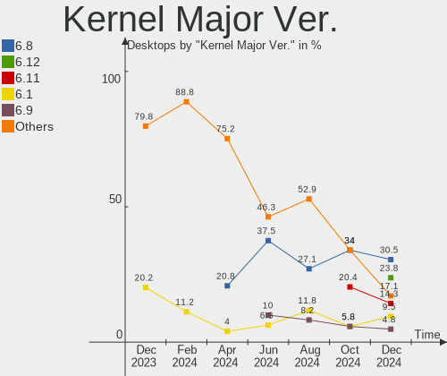
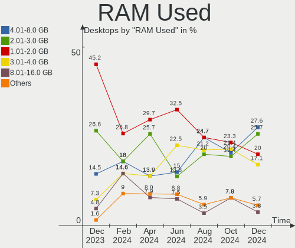
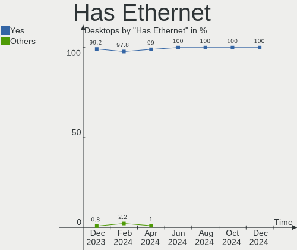
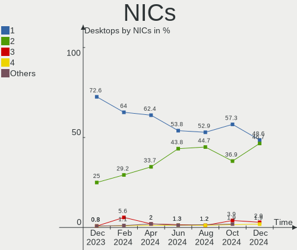
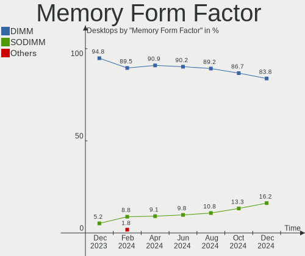
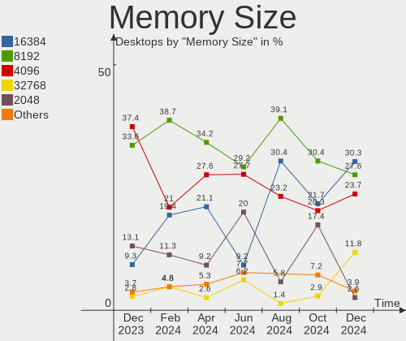

Linux in France - Hardware Trends (Desktops)
--------------------------------------------

A project to identify most popular hardware characteristics and track their change
over time based on data collected by Linux users at https://Linux-Hardware.org.

Anyone can contribute to this report by the [hw-probe](https://github.com/linuxhw/hw-probe) tool:

    sudo -E hw-probe -all -upload

Period: Sep, 2023.

Contents
--------

* [ System ](#system)
  - [ OS                       ](#os)
  - [ OS Family                ](#os-family)
  - [ Kernel                   ](#kernel)
  - [ Kernel Family            ](#kernel-family)
  - [ Kernel Major Ver.        ](#kernel-major-ver)
  - [ Arch                     ](#arch)
  - [ DE                       ](#de)
  - [ Display Server           ](#display-server)
  - [ Display Manager          ](#display-manager)
  - [ OS Lang                  ](#os-lang)
  - [ Boot Mode                ](#boot-mode)
  - [ Filesystem               ](#filesystem)
  - [ Part. scheme             ](#part-scheme)
  - [ Dual Boot with Linux/BSD ](#dual-boot-with-linuxbsd)
  - [ Dual Boot (Win)          ](#dual-boot-win)

* [ Board ](#board)
  - [ Vendor                   ](#vendor)
  - [ Model                    ](#model)
  - [ Model Family             ](#model-family)
  - [ MFG Year                 ](#mfg-year)
  - [ Form Factor              ](#form-factor)
  - [ Secure Boot              ](#secure-boot)
  - [ Coreboot                 ](#coreboot)
  - [ RAM Size                 ](#ram-size)
  - [ RAM Used                 ](#ram-used)
  - [ Total Drives             ](#total-drives)
  - [ Has CD-ROM               ](#has-cd-rom)
  - [ Has Ethernet             ](#has-ethernet)
  - [ Has WiFi                 ](#has-wifi)
  - [ Has Bluetooth            ](#has-bluetooth)

* [ Location ](#location)
  - [ Country                  ](#country)
  - [ City                     ](#city)

* [ Drives ](#drives)
  - [ Drive Vendor             ](#drive-vendor)
  - [ Drive Model              ](#drive-model)
  - [ HDD Vendor               ](#hdd-vendor)
  - [ SSD Vendor               ](#ssd-vendor)
  - [ Drive Kind               ](#drive-kind)
  - [ Drive Connector          ](#drive-connector)
  - [ Drive Size               ](#drive-size)
  - [ Space Total              ](#space-total)
  - [ Space Used               ](#space-used)
  - [ Malfunc. Drives          ](#malfunc-drives)
  - [ Malfunc. Drive Vendor    ](#malfunc-drive-vendor)
  - [ Malfunc. HDD Vendor      ](#malfunc-hdd-vendor)
  - [ Malfunc. Drive Kind      ](#malfunc-drive-kind)
  - [ Failed Drives            ](#failed-drives)
  - [ Failed Drive Vendor      ](#failed-drive-vendor)
  - [ Drive Status             ](#drive-status)

* [ Storage controller ](#storage-controller)
  - [ Storage Vendor           ](#storage-vendor)
  - [ Storage Model            ](#storage-model)
  - [ Storage Kind             ](#storage-kind)

* [ Processor ](#processor)
  - [ CPU Vendor               ](#cpu-vendor)
  - [ CPU Model                ](#cpu-model)
  - [ CPU Model Family         ](#cpu-model-family)
  - [ CPU Cores                ](#cpu-cores)
  - [ CPU Sockets              ](#cpu-sockets)
  - [ CPU Threads              ](#cpu-threads)
  - [ CPU Op-Modes             ](#cpu-op-modes)
  - [ CPU Microcode            ](#cpu-microcode)
  - [ CPU Microarch            ](#cpu-microarch)

* [ Graphics ](#graphics)
  - [ GPU Vendor               ](#gpu-vendor)
  - [ GPU Model                ](#gpu-model)
  - [ GPU Combo                ](#gpu-combo)
  - [ GPU Driver               ](#gpu-driver)
  - [ GPU Memory               ](#gpu-memory)

* [ Monitor ](#monitor)
  - [ Monitor Vendor           ](#monitor-vendor)
  - [ Monitor Model            ](#monitor-model)
  - [ Monitor Resolution       ](#monitor-resolution)
  - [ Monitor Diagonal         ](#monitor-diagonal)
  - [ Monitor Width            ](#monitor-width)
  - [ Aspect Ratio             ](#aspect-ratio)
  - [ Monitor Area             ](#monitor-area)
  - [ Pixel Density            ](#pixel-density)
  - [ Multiple Monitors        ](#multiple-monitors)

* [ Network ](#network)
  - [ Net Controller Vendor    ](#net-controller-vendor)
  - [ Net Controller Model     ](#net-controller-model)
  - [ Wireless Vendor          ](#wireless-vendor)
  - [ Wireless Model           ](#wireless-model)
  - [ Ethernet Vendor          ](#ethernet-vendor)
  - [ Ethernet Model           ](#ethernet-model)
  - [ Net Controller Kind      ](#net-controller-kind)
  - [ Used Controller          ](#used-controller)
  - [ NICs                     ](#nics)
  - [ IPv6                     ](#ipv6)

* [ Bluetooth ](#bluetooth)
  - [ Bluetooth Vendor         ](#bluetooth-vendor)
  - [ Bluetooth Model          ](#bluetooth-model)

* [ Sound ](#sound)
  - [ Sound Vendor             ](#sound-vendor)
  - [ Sound Model              ](#sound-model)

* [ Memory ](#memory)
  - [ Memory Vendor            ](#memory-vendor)
  - [ Memory Model             ](#memory-model)
  - [ Memory Kind              ](#memory-kind)
  - [ Memory Form Factor       ](#memory-form-factor)
  - [ Memory Size              ](#memory-size)
  - [ Memory Speed             ](#memory-speed)

* [ Printers & scanners ](#printers--scanners)
  - [ Printer Vendor           ](#printer-vendor)
  - [ Printer Model            ](#printer-model)
  - [ Scanner Vendor           ](#scanner-vendor)
  - [ Scanner Model            ](#scanner-model)

* [ Camera ](#camera)
  - [ Camera Vendor            ](#camera-vendor)
  - [ Camera Model             ](#camera-model)

* [ Security ](#security)
  - [ Fingerprint Vendor       ](#fingerprint-vendor)
  - [ Fingerprint Model        ](#fingerprint-model)
  - [ Chipcard Vendor          ](#chipcard-vendor)
  - [ Chipcard Model           ](#chipcard-model)

* [ Unsupported ](#unsupported)
  - [ Unsupported Devices      ](#unsupported-devices)
  - [ Unsupported Device Types ](#unsupported-device-types)

System
------

OS
--

Installed operating systems

| Name                | Desktops | Percent |
|---------------------|----------|---------|
| OpenMandriva 23.08  | 17       | 17%     |
| Ubuntu 22.04        | 15       | 15%     |
| OpenMandriva 23.09  | 8        | 8%      |
| Ubuntu 20.04        | 5        | 5%      |
| Linux Mint 21.2     | 4        | 4%      |
| Debian 12           | 4        | 4%      |
| Ubuntu 23.04        | 3        | 3%      |
| Kubuntu 23.04       | 3        | 3%      |
| KDE neon 22.04      | 3        | 3%      |
| ArcoLinux Rolling   | 3        | 3%      |
| Xubuntu 22.04       | 2        | 2%      |
| OpenMandriva 23.01  | 2        | 2%      |
| Manjaro 23.0.0      | 2        | 2%      |
| Manjaro             | 2        | 2%      |
| Kubuntu 22.04       | 2        | 2%      |
| Fedora 38           | 2        | 2%      |
| EndeavourOS Rolling | 2        | 2%      |
| blendOS             | 2        | 2%      |
| Zorin 16            | 1        | 1%      |
| Xubuntu 20.04       | 1        | 1%      |
| Xero Rolling        | 1        | 1%      |
| Ubuntu MATE 22.10   | 1        | 1%      |
| Ubuntu MATE 18.04   | 1        | 1%      |
| OpenMandriva 4.3    | 1        | 1%      |
| OpenMandriva 4.2    | 1        | 1%      |
| OpenMandriva 23.03  | 1        | 1%      |
| Nobara 38           | 1        | 1%      |
| Manjaro 23.0.1      | 1        | 1%      |
| Mageia 9            | 1        | 1%      |
| Lubuntu 22.04       | 1        | 1%      |
| Linux Mint 21       | 1        | 1%      |
| Gentoo 2.14         | 1        | 1%      |
| Fedora 40           | 1        | 1%      |
| Fedora 39           | 1        | 1%      |
| Fedora 37           | 1        | 1%      |
| Debian 11           | 1        | 1%      |
| ChimeraOS 43-1      | 1        | 1%      |

OS Family
---------

OS without a version

| Name         | Desktops | Percent |
|--------------|----------|---------|
| OpenMandriva | 30       | 30%     |
| Ubuntu       | 23       | 23%     |
| Manjaro      | 5        | 5%      |
| Linux Mint   | 5        | 5%      |
| Kubuntu      | 5        | 5%      |
| Fedora       | 5        | 5%      |
| Debian       | 5        | 5%      |
| Xubuntu      | 3        | 3%      |
| KDE neon     | 3        | 3%      |
| ArcoLinux    | 3        | 3%      |
| Ubuntu MATE  | 2        | 2%      |
| EndeavourOS  | 2        | 2%      |
| blendOS      | 2        | 2%      |
| Zorin        | 1        | 1%      |
| Xero         | 1        | 1%      |
| Nobara       | 1        | 1%      |
| Mageia       | 1        | 1%      |
| Lubuntu      | 1        | 1%      |
| Gentoo       | 1        | 1%      |
| ChimeraOS    | 1        | 1%      |

Kernel
------

Version of the Linux kernel

| Version                                            | Desktops | Percent |
|----------------------------------------------------|----------|---------|
| 6.4.11-desktop-1omv2390                            | 14       | 14%     |
| 6.2.0-33-generic                                   | 8        | 8%      |
| 6.2.0-32-generic                                   | 6        | 6%      |
| 6.5.3-desktop-1omv2390                             | 5        | 5%      |
| 5.15.0-83-generic                                  | 5        | 5%      |
| 6.2.0-31-generic                                   | 4        | 4%      |
| 5.15.0-84-generic                                  | 4        | 4%      |
| 6.4.12-arch1-1                                     | 3        | 3%      |
| 5.15.0-82-generic                                  | 3        | 3%      |
| 6.5.5-desktop-1omv2390                             | 2        | 2%      |
| 6.5.1-1-MANJARO                                    | 2        | 2%      |
| 6.4.8-desktop-2omv2390                             | 2        | 2%      |
| 6.3.9-zen1-1-zen                                   | 2        | 2%      |
| 6.1.1-desktop-1omv2290                             | 2        | 2%      |
| 6.1.0-11-amd64                                     | 2        | 2%      |
| 5.19.0-50-generic                                  | 2        | 2%      |
| 6.5.5-300.fc39.x86_64                              | 1        | 1%      |
| 6.5.5-100.fc37.x86_64                              | 1        | 1%      |
| 6.5.4-arch2-1                                      | 1        | 1%      |
| 6.5.3-arch1-1                                      | 1        | 1%      |
| 6.5.2-desktop-1omv2390                             | 1        | 1%      |
| 6.5.2-1-MANJARO                                    | 1        | 1%      |
| 6.5.1-060501-generic                               | 1        | 1%      |
| 6.5.0-desktop-1omv2390                             | 1        | 1%      |
| 6.5.0-1-MANJARO                                    | 1        | 1%      |
| 6.5.0-0.rc7.20230823git89bf6209cad6.52.fc40.x86_64 | 1        | 1%      |
| 6.4.9-desktop-4.mga9                               | 1        | 1%      |
| 6.4.15-200.fc38.x86_64                             | 1        | 1%      |
| 6.4.10-202.fsync.fc38.x86_64                       | 1        | 1%      |
| 6.3.9-chimeraos-1                                  | 1        | 1%      |
| 6.2.9-300.fc38.x86_64                              | 1        | 1%      |
| 6.2.6-desktop-1omv2390                             | 1        | 1%      |
| 6.2.16-3-pve                                       | 1        | 1%      |
| 6.2.16-12-pve                                      | 1        | 1%      |
| 6.1.53-1-lts                                       | 1        | 1%      |
| 6.1.46-060146-generic                              | 1        | 1%      |
| 6.1.30-1-MANJARO                                   | 1        | 1%      |
| 6.1.0-1017-oem                                     | 1        | 1%      |
| 6.0.0-1017-oem                                     | 1        | 1%      |
| 5.4.0-159-generic                                  | 1        | 1%      |

Kernel Family
-------------

Linux kernel without a distro release

| Version | Desktops | Percent |
|---------|----------|---------|
| 6.2.0   | 18       | 18%     |
| 5.15.0  | 16       | 16%     |
| 6.4.11  | 14       | 14%     |
| 6.5.3   | 6        | 6%      |
| 6.5.5   | 4        | 4%      |
| 6.5.1   | 3        | 3%      |
| 6.5.0   | 3        | 3%      |
| 6.4.12  | 3        | 3%      |
| 6.3.9   | 3        | 3%      |
| 6.1.0   | 3        | 3%      |
| 5.19.0  | 3        | 3%      |
| 6.5.2   | 2        | 2%      |
| 6.4.8   | 2        | 2%      |
| 6.2.16  | 2        | 2%      |
| 6.1.1   | 2        | 2%      |
| 5.4.0   | 2        | 2%      |
| 6.5.4   | 1        | 1%      |
| 6.4.9   | 1        | 1%      |
| 6.4.15  | 1        | 1%      |
| 6.4.10  | 1        | 1%      |
| 6.2.9   | 1        | 1%      |
| 6.2.6   | 1        | 1%      |
| 6.1.53  | 1        | 1%      |
| 6.1.46  | 1        | 1%      |
| 6.1.30  | 1        | 1%      |
| 6.0.0   | 1        | 1%      |
| 5.16.13 | 1        | 1%      |
| 5.10.14 | 1        | 1%      |
| 5.10.0  | 1        | 1%      |
| 4.15.0  | 1        | 1%      |

Kernel Major Ver.
-----------------

Linux kernel major version

| Version | Desktops | Percent |
|---------|----------|---------|
| 6.4     | 22       | 22%     |
| 6.2     | 22       | 22%     |
| 6.5     | 19       | 19%     |
| 5.15    | 16       | 16%     |
| 6.1     | 8        | 8%      |
| 6.3     | 3        | 3%      |
| 5.19    | 3        | 3%      |
| 5.4     | 2        | 2%      |
| 5.10    | 2        | 2%      |
| 6.0     | 1        | 1%      |
| 5.16    | 1        | 1%      |
| 4.15    | 1        | 1%      |

Arch
----

OS architecture (x86_64, i586, etc.)

| Name   | Desktops | Percent |
|--------|----------|---------|
| x86_64 | 100      | 100%    |

DE
--

Desktop Environment

| Name       | Desktops | Percent |
|------------|----------|---------|
| KDE5       | 41       | 41%     |
| GNOME      | 32       | 32%     |
| Unknown    | 8        | 8%      |
| XFCE       | 7        | 7%      |
| X-Cinnamon | 4        | 4%      |
| LXQt       | 4        | 4%      |
| MATE       | 3        | 3%      |
| Hyprland   | 1        | 1%      |

Display Server
--------------

X11 or Wayland

| Name    | Desktops | Percent |
|---------|----------|---------|
| X11     | 44       | 44%     |
| Wayland | 44       | 44%     |
| Tty     | 6        | 6%      |
| Unknown | 6        | 6%      |

Display Manager
---------------

SDDM, LightDM, etc.

| Name    | Desktops | Percent |
|---------|----------|---------|
| SDDM    | 40       | 40%     |
| Unknown | 25       | 25%     |
| GDM3    | 17       | 17%     |
| LightDM | 10       | 10%     |
| GDM     | 7        | 7%      |
| SLiM    | 1        | 1%      |

OS Lang
-------

Language

| Lang  | Desktops | Percent |
|-------|----------|---------|
| fr_FR | 84       | 84%     |
| en_US | 12       | 12%     |
| en_GB | 2        | 2%      |
| it_IT | 1        | 1%      |
| C     | 1        | 1%      |

Boot Mode
---------

EFI or BIOS

| Mode | Desktops | Percent |
|------|----------|---------|
| BIOS | 52       | 52%     |
| EFI  | 48       | 48%     |

Filesystem
----------

Type of filesystem

| Type    | Desktops | Percent |
|---------|----------|---------|
| Ext4    | 65       | 65%     |
| Btrfs   | 13       | 13%     |
| Tmpfs   | 11       | 11%     |
| Overlay | 11       | 11%     |

Part. scheme
------------

Scheme of partitioning

| Type    | Desktops | Percent |
|---------|----------|---------|
| GPT     | 61       | 61%     |
| Unknown | 24       | 24%     |
| MBR     | 15       | 15%     |

Dual Boot with Linux/BSD
------------------------

Hosting more than one Linux/BSD

| Dual boot | Desktops | Percent |
|-----------|----------|---------|
| No        | 69       | 69%     |
| Yes       | 31       | 31%     |

Dual Boot (Win)
---------------

Hosting Linux and Windows

| Dual boot | Desktops | Percent |
|-----------|----------|---------|
| No        | 63       | 63%     |
| Yes       | 37       | 37%     |

Board
-----

Vendor
------

Motherboard manufacturer

| Name                | Desktops | Percent |
|---------------------|----------|---------|
| ASUSTek Computer    | 25       | 25%     |
| MSI                 | 16       | 16%     |
| Gigabyte Technology | 14       | 14%     |
| Hewlett-Packard     | 11       | 11%     |
| Dell                | 9        | 9%      |
| Lenovo              | 5        | 5%      |
| Intel               | 4        | 4%      |
| Fujitsu             | 3        | 3%      |
| AZW                 | 3        | 3%      |
| ASRock              | 2        | 2%      |
| Acer                | 2        | 2%      |
| Unknown             | 2        | 2%      |
| Supermicro          | 1        | 1%      |
| Pegatron            | 1        | 1%      |
| Packard Bell        | 1        | 1%      |
| BESSTAR Tech        | 1        | 1%      |

Model
-----

Motherboard model

| Name                                    | Desktops | Percent |
|-----------------------------------------|----------|---------|
| ASUS All Series                         | 3        | 3%      |
| Lenovo ThinkCentre M83z 10C20003FR      | 2        | 2%      |
| HP Z440 Workstation                     | 2        | 2%      |
| Gigabyte B550 AORUS ELITE V2            | 2        | 2%      |
| Gigabyte A320M-S2H                      | 2        | 2%      |
| ASUS PRIME Z390M-PLUS                   | 2        | 2%      |
| ASRock X570 Taichi                      | 2        | 2%      |
| Unknown                                 | 2        | 2%      |
| Supermicro SYS-5038MD-H24TRF-OS012      | 1        | 1%      |
| Pegatron WC960AA-ABF p6335fr            | 1        | 1%      |
| Packard Bell IMEDIA X2802               | 1        | 1%      |
| MSI p6630fr                             | 1        | 1%      |
| MSI MS-7D67                             | 1        | 1%      |
| MSI MS-7D45                             | 1        | 1%      |
| MSI MS-7D43                             | 1        | 1%      |
| MSI MS-7C95                             | 1        | 1%      |
| MSI MS-7C52                             | 1        | 1%      |
| MSI MS-7B89                             | 1        | 1%      |
| MSI MS-7B84                             | 1        | 1%      |
| MSI MS-7B19                             | 1        | 1%      |
| MSI MS-7B17                             | 1        | 1%      |
| MSI MS-7A38                             | 1        | 1%      |
| MSI MS-7924                             | 1        | 1%      |
| MSI MS-7850                             | 1        | 1%      |
| MSI MS-7821                             | 1        | 1%      |
| MSI MS-7816                             | 1        | 1%      |
| MSI MS-7680                             | 1        | 1%      |
| Lenovo ThinkCentre M77 1997B49          | 1        | 1%      |
| Lenovo ThinkCentre E73 10AW00ABIX       | 1        | 1%      |
| Lenovo IdeaCentre 510A-15ARR 90J00019FR | 1        | 1%      |
| Intel H110D4-P1                         | 1        | 1%      |
| Intel DX79SI AAG28808-602               | 1        | 1%      |
| Intel DQ77KB AAG81483-500               | 1        | 1%      |
| Intel DN2820FYK H24582-204              | 1        | 1%      |
| HP ProDesk 400 G2 MT                    | 1        | 1%      |
| HP Pavilion Gaming Desktop TG01-0xxx    | 1        | 1%      |
| HP Pavilion Gaming Desktop 790-00xx     | 1        | 1%      |
| HP EliteDesk 800 G3 TWR                 | 1        | 1%      |
| HP Compaq 8000 Elite CMT PC             | 1        | 1%      |
| HP Compaq 6005 Pro MT PC                | 1        | 1%      |

Model Family
------------

Motherboard model prefix

| Name                               | Desktops | Percent |
|------------------------------------|----------|---------|
| ASUS PRIME                         | 5        | 5%      |
| Lenovo ThinkCentre                 | 4        | 4%      |
| Dell Precision                     | 4        | 4%      |
| Dell OptiPlex                      | 4        | 4%      |
| ASUS ROG                           | 4        | 4%      |
| Fujitsu ESPRIMO                    | 3        | 3%      |
| ASUS All                           | 3        | 3%      |
| HP Z440                            | 2        | 2%      |
| HP Pavilion                        | 2        | 2%      |
| HP Compaq                          | 2        | 2%      |
| Gigabyte B550                      | 2        | 2%      |
| Gigabyte A320M-S2H                 | 2        | 2%      |
| ASRock X570                        | 2        | 2%      |
| Unknown                            | 2        | 2%      |
| Supermicro SYS-5038MD-H24TRF-OS012 | 1        | 1%      |
| Pegatron WC960AA-ABF               | 1        | 1%      |
| Packard Bell IMEDIA                | 1        | 1%      |
| MSI p6630fr                        | 1        | 1%      |
| MSI MS-7D67                        | 1        | 1%      |
| MSI MS-7D45                        | 1        | 1%      |
| MSI MS-7D43                        | 1        | 1%      |
| MSI MS-7C95                        | 1        | 1%      |
| MSI MS-7C52                        | 1        | 1%      |
| MSI MS-7B89                        | 1        | 1%      |
| MSI MS-7B84                        | 1        | 1%      |
| MSI MS-7B19                        | 1        | 1%      |
| MSI MS-7B17                        | 1        | 1%      |
| MSI MS-7A38                        | 1        | 1%      |
| MSI MS-7924                        | 1        | 1%      |
| MSI MS-7850                        | 1        | 1%      |
| MSI MS-7821                        | 1        | 1%      |
| MSI MS-7816                        | 1        | 1%      |
| MSI MS-7680                        | 1        | 1%      |
| Lenovo IdeaCentre                  | 1        | 1%      |
| Intel H110D4-P1                    | 1        | 1%      |
| Intel DX79SI                       | 1        | 1%      |
| Intel DQ77KB                       | 1        | 1%      |
| Intel DN2820FYK                    | 1        | 1%      |
| HP ProDesk                         | 1        | 1%      |
| HP EliteDesk                       | 1        | 1%      |

MFG Year
--------

Motherboard manufacture year

| Year | Desktops | Percent |
|------|----------|---------|
| 2018 | 17       | 17%     |
| 2014 | 10       | 10%     |
| 2015 | 8        | 8%      |
| 2021 | 7        | 7%      |
| 2020 | 7        | 7%      |
| 2022 | 6        | 6%      |
| 2013 | 6        | 6%      |
| 2009 | 6        | 6%      |
| 2023 | 5        | 5%      |
| 2019 | 5        | 5%      |
| 2017 | 5        | 5%      |
| 2012 | 5        | 5%      |
| 2011 | 4        | 4%      |
| 2010 | 3        | 3%      |
| 2008 | 3        | 3%      |
| 2016 | 2        | 2%      |
| 2006 | 1        | 1%      |

Form Factor
-----------

Physical design of the computer

| Name    | Desktops | Percent |
|---------|----------|---------|
| Desktop | 100      | 100%    |

Secure Boot
-----------

Enabled or disabled

| State    | Desktops | Percent |
|----------|----------|---------|
| Disabled | 97       | 97%     |
| Enabled  | 3        | 3%      |

Coreboot
--------

Have coreboot on board

| Used | Desktops | Percent |
|------|----------|---------|
| No   | 100      | 100%    |

RAM Size
--------

Total RAM memory

| Size in GB  | Desktops | Percent |
|-------------|----------|---------|
| 16.01-24.0  | 27       | 27%     |
| 4.01-8.0    | 19       | 19%     |
| 64.01-256.0 | 13       | 13%     |
| 8.01-16.0   | 13       | 13%     |
| 32.01-64.0  | 12       | 12%     |
| 3.01-4.0    | 12       | 12%     |
| 24.01-32.0  | 4        | 4%      |

RAM Used
--------

Used RAM memory

| Used GB    | Desktops | Percent |
|------------|----------|---------|
| 1.01-2.0   | 35       | 35%     |
| 4.01-8.0   | 24       | 24%     |
| 2.01-3.0   | 17       | 17%     |
| 3.01-4.0   | 10       | 10%     |
| 0.51-1.0   | 9        | 9%      |
| 16.01-24.0 | 2        | 2%      |
| 0.01-0.5   | 2        | 2%      |
| 8.01-16.0  | 1        | 1%      |

Total Drives
------------

Number of drives on board

| Drives | Desktops | Percent |
|--------|----------|---------|
| 1      | 35       | 35%     |
| 2      | 32       | 32%     |
| 3      | 19       | 19%     |
| 6      | 5        | 5%      |
| 5      | 5        | 5%      |
| 4      | 3        | 3%      |
| 9      | 1        | 1%      |

Has CD-ROM
----------

Has CD-ROM on board

| Presented | Desktops | Percent |
|-----------|----------|---------|
| No        | 52       | 52%     |
| Yes       | 48       | 48%     |

Has Ethernet
------------

Has Ethernet on board

| Presented | Desktops | Percent |
|-----------|----------|---------|
| Yes       | 99       | 99%     |
| No        | 1        | 1%      |

Has WiFi
--------

Has WiFi module

| Presented | Desktops | Percent |
|-----------|----------|---------|
| No        | 51       | 51%     |
| Yes       | 49       | 49%     |

Has Bluetooth
-------------

Has Bluetooth module

| Presented | Desktops | Percent |
|-----------|----------|---------|
| No        | 60       | 60%     |
| Yes       | 40       | 40%     |

Location
--------

Country
-------

Geographic location (country)

| Country | Desktops | Percent |
|---------|----------|---------|
| France  | 100      | 100%    |

City
----

Geographic location (city)

| City                   | Desktops | Percent |
|------------------------|----------|---------|
| Paris                  | 9        | 9%      |
| Valenciennes           | 4        | 4%      |
| Trappes                | 2        | 2%      |
| Toul                   | 2        | 2%      |
| Sarcelles              | 2        | 2%      |
| Rennes                 | 2        | 2%      |
| Marmande               | 2        | 2%      |
| Lille                  | 2        | 2%      |
| La Roche-sur-Yon       | 2        | 2%      |
| Houilles               | 2        | 2%      |
| Courbevoie             | 2        | 2%      |
| Colomiers              | 2        | 2%      |
| Caen                   | 2        | 2%      |
| Agen                   | 2        | 2%      |
| Vitry-sur-Seine        | 1        | 1%      |
| Villejuif              | 1        | 1%      |
| Vienne-le-Chateau      | 1        | 1%      |
| Valence                | 1        | 1%      |
| Treillieres            | 1        | 1%      |
| Taverny                | 1        | 1%      |
| Sète                  | 1        | 1%      |
| Selongey               | 1        | 1%      |
| Saint-Etienne          | 1        | 1%      |
| Rosny-sous-Bois        | 1        | 1%      |
| Roquevaire             | 1        | 1%      |
| Roissy-en-Brie         | 1        | 1%      |
| Riom-es-Montagnes      | 1        | 1%      |
| Rezé                  | 1        | 1%      |
| Pougues-les-Eaux       | 1        | 1%      |
| Pontarlier             | 1        | 1%      |
| Poissy                 | 1        | 1%      |
| Persan                 | 1        | 1%      |
| Pau                    | 1        | 1%      |
| Pantin                 | 1        | 1%      |
| Orléans               | 1        | 1%      |
| Mulhouse               | 1        | 1%      |
| Mours-Saint-Eusebe     | 1        | 1%      |
| Montreuil-sous-Perouse | 1        | 1%      |
| Montpellier            | 1        | 1%      |
| Montevrain             | 1        | 1%      |

Drives
------

Drive Vendor
------------

Hard drive vendors

| Vendor                      | Desktops | Drives | Percent |
|-----------------------------|----------|--------|---------|
| WDC                         | 38       | 48     | 20.32%  |
| Samsung Electronics         | 36       | 50     | 19.25%  |
| Seagate                     | 25       | 31     | 13.37%  |
| Crucial                     | 11       | 14     | 5.88%   |
| SanDisk                     | 8        | 10     | 4.28%   |
| Kingston                    | 8        | 8      | 4.28%   |
| China                       | 7        | 8      | 3.74%   |
| Hitachi                     | 6        | 6      | 3.21%   |
| Toshiba                     | 5        | 10     | 2.67%   |
| Unknown                     | 4        | 4      | 2.14%   |
| PNY                         | 4        | 4      | 2.14%   |
| Intel                       | 3        | 3      | 1.6%    |
| HGST                        | 3        | 3      | 1.6%    |
| SK hynix                    | 2        | 2      | 1.07%   |
| Phison Electronics          | 2        | 3      | 1.07%   |
| OCZ                         | 2        | 2      | 1.07%   |
| Micron/Crucial Technology   | 2        | 3      | 1.07%   |
| Micron Technology           | 2        | 2      | 1.07%   |
| Transcend                   | 1        | 1      | 0.53%   |
| Space ke                    | 1        | 1      | 0.53%   |
| Silicon Motion              | 1        | 1      | 0.53%   |
| PNY CS90                    | 1        | 1      | 0.53%   |
| Maxtor                      | 1        | 1      | 0.53%   |
| MAXIO Technology (Hangzhou) | 1        | 1      | 0.53%   |
| Mass                        | 1        | 1      | 0.53%   |
| M.2 SSD                     | 1        | 1      | 0.53%   |
| LDLC                        | 1        | 2      | 0.53%   |
| KIOXIA                      | 1        | 1      | 0.53%   |
| Kingston Technology Company | 1        | 1      | 0.53%   |
| Intenso                     | 1        | 1      | 0.53%   |
| Initio                      | 1        | 1      | 0.53%   |
| HS-SSD-E100                 | 1        | 1      | 0.53%   |
| H/W                         | 1        | 3      | 0.53%   |
| Fanxiang                    | 1        | 1      | 0.53%   |
| Emtec                       | 1        | 1      | 0.53%   |
| Corsair                     | 1        | 1      | 0.53%   |
| Unknown                     | 1        | 1      | 0.53%   |

Drive Model
-----------

Hard drive models

| Model                                               | Desktops | Percent |
|-----------------------------------------------------|----------|---------|
| Samsung NVMe SSD Controller SM981/PM981/PM983 256GB | 6        | 2.83%   |
| Seagate ST2000DM001-1ER164 2TB                      | 4        | 1.89%   |
| Seagate ST1000DM010-2EP102 1TB                      | 4        | 1.89%   |
| Samsung SSD 860 EVO 500GB                           | 4        | 1.89%   |
| Samsung NVMe SSD Controller PM9A1/PM9A3/980PRO 1TB  | 4        | 1.89%   |
| Seagate ST500DM002-1BD142 500GB                     | 3        | 1.42%   |
| Samsung SSD 850 EVO 500GB                           | 3        | 1.42%   |
| Kingston SA400S37240G 240GB SSD                     | 3        | 1.42%   |
| China SSD 512GB                                     | 3        | 1.42%   |
| WDC WD5000AAKX-08U6AA0 500GB                        | 2        | 0.94%   |
| WDC WD40EFRX-68WT0N0 4TB                            | 2        | 0.94%   |
| WDC WD20EZRX-00D8PB0 2TB                            | 2        | 0.94%   |
| WDC WD10EZEX-60M2NA0 1TB                            | 2        | 0.94%   |
| WDC WD10EZEX-21M2NA0 1TB                            | 2        | 0.94%   |
| WDC WD10EZEX-08WN4A0 1TB                            | 2        | 0.94%   |
| Unknown SD/MMC/MS PRO 128GB                         | 2        | 0.94%   |
| Seagate ST4000DM004-2CV104 4TB                      | 2        | 0.94%   |
| Seagate ST2000DM001-1CH164 2TB                      | 2        | 0.94%   |
| Seagate ST1000DM003-1ER162 1TB                      | 2        | 0.94%   |
| SanDisk SSD PLUS 1000GB                             | 2        | 0.94%   |
| Samsung SSD 980 1TB                                 | 2        | 0.94%   |
| Samsung SSD 870 EVO 500GB                           | 2        | 0.94%   |
| Samsung SSD 840 EVO 250GB                           | 2        | 0.94%   |
| PNY CS900 120GB SSD                                 | 2        | 0.94%   |
| Micron/Crucial P2 NVMe PCIe SSD 1TB                 | 2        | 0.94%   |
| Kingston SV300S37A120G 120GB SSD                    | 2        | 0.94%   |
| Crucial CT500MX500SSD1 500GB                        | 2        | 0.94%   |
| Crucial CT1000MX500SSD1 1TB                         | 2        | 0.94%   |
| WDC WUH722020ALE6L4 20TB                            | 1        | 0.47%   |
| WDC WDS400T2B0A-00SM50 4TB SSD                      | 1        | 0.47%   |
| WDC WDS250G1B0A-00H9H0 250GB SSD                    | 1        | 0.47%   |
| WDC WDS240G2G0B-00EPW0 240GB SSD                    | 1        | 0.47%   |
| WDC WDS120G2G0B-00EPW0 120GB SSD                    | 1        | 0.47%   |
| WDC WDS100T2B0A-00SM50 1TB SSD                      | 1        | 0.47%   |
| WDC WD80EFZX-68UW8N0 8TB                            | 1        | 0.47%   |
| WDC WD7500BPKX-00HPJT0 752GB                        | 1        | 0.47%   |
| WDC WD6400AAKS-22A7B0 640GB                         | 1        | 0.47%   |
| WDC WD6400AACS-00G8B1 640GB                         | 1        | 0.47%   |
| WDC WD5001AALS-00E3A0 500GB                         | 1        | 0.47%   |
| WDC WD5000AAKX-60U6AA0 500GB                        | 1        | 0.47%   |

HDD Vendor
----------

Hard disk drive vendors

| Vendor              | Desktops | Drives | Percent |
|---------------------|----------|--------|---------|
| WDC                 | 34       | 43     | 40.48%  |
| Seagate             | 25       | 31     | 29.76%  |
| Hitachi             | 6        | 6      | 7.14%   |
| Toshiba             | 5        | 10     | 5.95%   |
| Samsung Electronics | 5        | 5      | 5.95%   |
| HGST                | 3        | 3      | 3.57%   |
| Unknown             | 2        | 2      | 2.38%   |
| Maxtor              | 1        | 1      | 1.19%   |
| Intenso             | 1        | 1      | 1.19%   |
| Initio              | 1        | 1      | 1.19%   |
| H/W                 | 1        | 3      | 1.19%   |

SSD Vendor
----------

Solid state drive vendors

| Vendor              | Desktops | Drives | Percent |
|---------------------|----------|--------|---------|
| Samsung Electronics | 20       | 25     | 28.99%  |
| Crucial             | 9        | 10     | 13.04%  |
| Kingston            | 7        | 7      | 10.14%  |
| China               | 7        | 8      | 10.14%  |
| WDC                 | 5        | 5      | 7.25%   |
| SanDisk             | 5        | 7      | 7.25%   |
| PNY                 | 4        | 4      | 5.8%    |
| OCZ                 | 2        | 2      | 2.9%    |
| Micron Technology   | 2        | 2      | 2.9%    |
| Intel               | 2        | 2      | 2.9%    |
| Transcend           | 1        | 1      | 1.45%   |
| SK hynix            | 1        | 1      | 1.45%   |
| PNY CS90            | 1        | 1      | 1.45%   |
| Fanxiang            | 1        | 1      | 1.45%   |
| Emtec               | 1        | 1      | 1.45%   |
| Unknown             | 1        | 1      | 1.45%   |

Drive Kind
----------

HDD or SSD

| Kind    | Desktops | Drives | Percent |
|---------|----------|--------|---------|
| HDD     | 63       | 106    | 39.87%  |
| SSD     | 59       | 78     | 37.34%  |
| NVMe    | 31       | 43     | 19.62%  |
| Unknown | 4        | 5      | 2.53%   |
| MMC     | 1        | 1      | 0.63%   |

Drive Connector
---------------

SATA, SAS, NVMe, etc.

| Type | Desktops | Drives | Percent |
|------|----------|--------|---------|
| SATA | 88       | 179    | 68.22%  |
| NVMe | 30       | 42     | 23.26%  |
| SAS  | 10       | 11     | 7.75%   |
| MMC  | 1        | 1      | 0.78%   |

Drive Size
----------

Size of hard drive

| Size in TB | Desktops | Drives | Percent |
|------------|----------|--------|---------|
| 0.01-0.5   | 60       | 82     | 45.45%  |
| 0.51-1.0   | 43       | 60     | 32.58%  |
| 1.01-2.0   | 11       | 16     | 8.33%   |
| 3.01-4.0   | 9        | 15     | 6.82%   |
| 2.01-3.0   | 4        | 5      | 3.03%   |
| 4.01-10.0  | 4        | 5      | 3.03%   |
| 10.01-20.0 | 1        | 1      | 0.76%   |

Space Total
-----------

Amount of disk space available on the file system

| Size in GB     | Desktops | Percent |
|----------------|----------|---------|
| 251-500        | 20       | 20%     |
| 101-250        | 20       | 20%     |
| 501-1000       | 17       | 17%     |
| More than 3000 | 13       | 13%     |
| 1-20           | 8        | 8%      |
| 51-100         | 7        | 7%      |
| 1001-2000      | 6        | 6%      |
| Unknown        | 6        | 6%      |
| 21-50          | 2        | 2%      |
| 2001-3000      | 1        | 1%      |

Space Used
----------

Amount of used disk space

| Used GB        | Desktops | Percent |
|----------------|----------|---------|
| 1-20           | 35       | 35%     |
| 51-100         | 11       | 11%     |
| 251-500        | 9        | 9%      |
| 21-50          | 9        | 9%      |
| 101-250        | 9        | 9%      |
| 501-1000       | 7        | 7%      |
| More than 3000 | 6        | 6%      |
| 1001-2000      | 6        | 6%      |
| Unknown        | 6        | 6%      |
| 2001-3000      | 2        | 2%      |

Malfunc. Drives
---------------

Drive models with a malfunction

| Model                                                           | Desktops | Drives | Percent |
|-----------------------------------------------------------------|----------|--------|---------|
| Samsung Electronics SSD 870 EVO 500GB                           | 2        | 2      | 7.14%   |
| WDC WD6400AAKS-22A7B0 640GB                                     | 1        | 1      | 3.57%   |
| WDC WD5000AAKX-60U6AA0 500GB                                    | 1        | 1      | 3.57%   |
| WDC WD5000AAKX-001CA0 500GB                                     | 1        | 1      | 3.57%   |
| WDC WD400BB-00FJA0 40GB                                         | 1        | 1      | 3.57%   |
| WDC WD30EFRX-68EUZN0 3TB                                        | 1        | 2      | 3.57%   |
| WDC WD10EZEX-60M2NA0 1TB                                        | 1        | 1      | 3.57%   |
| WDC WD10EZEX-21WN4A0 1TB                                        | 1        | 1      | 3.57%   |
| WDC WD10EZEX-21M2NA0 1TB                                        | 1        | 1      | 3.57%   |
| WDC WD10EZEX-00WN4A0 1TB                                        | 1        | 1      | 3.57%   |
| WDC WD10EARS-00Y5B1 1TB                                         | 1        | 1      | 3.57%   |
| WDC WD1001FALS-00J7B1 1TB                                       | 1        | 1      | 3.57%   |
| Seagate ST500DM002-1BD142 500GB                                 | 1        | 1      | 3.57%   |
| Seagate ST340014AS 40GB                                         | 1        | 1      | 3.57%   |
| Seagate ST3320813AS 320GB                                       | 1        | 1      | 3.57%   |
| Seagate ST2000DM001-1ER164 2TB                                  | 1        | 2      | 3.57%   |
| Seagate ST1000DM010-2EP102 1TB                                  | 1        | 2      | 3.57%   |
| Samsung Electronics NVMe SSD Controller SM981/PM981/PM983 256GB | 1        | 1      | 3.57%   |
| Samsung Electronics HD642JJ 640GB                               | 1        | 1      | 3.57%   |
| Samsung Electronics HD103UJ 1TB                                 | 1        | 1      | 3.57%   |
| OCZ VERTEX3 120GB SSD                                           | 1        | 1      | 3.57%   |
| Kingston SV300S37A120G 120GB SSD                                | 1        | 1      | 3.57%   |
| Intel SSDSC2CW120A3 120GB                                       | 1        | 1      | 3.57%   |
| Hitachi HDT722516DLA380 165GB                                   | 1        | 1      | 3.57%   |
| Hitachi HDS721680PLA380 80GB                                    | 1        | 1      | 3.57%   |
| Hitachi HDS721050CLA662 500GB                                   | 1        | 1      | 3.57%   |
| Crucial CT240M500SSD1 240GB                                     | 1        | 1      | 3.57%   |

Malfunc. Drive Vendor
---------------------

Vendors of faulty drives

| Vendor              | Desktops | Drives | Percent |
|---------------------|----------|--------|---------|
| WDC                 | 11       | 12     | 39.29%  |
| Seagate             | 5        | 7      | 17.86%  |
| Samsung Electronics | 5        | 5      | 17.86%  |
| Hitachi             | 3        | 3      | 10.71%  |
| OCZ                 | 1        | 1      | 3.57%   |
| Kingston            | 1        | 1      | 3.57%   |
| Intel               | 1        | 1      | 3.57%   |
| Crucial             | 1        | 1      | 3.57%   |

Malfunc. HDD Vendor
-------------------

Vendors of faulty HDD drives

| Vendor              | Desktops | Drives | Percent |
|---------------------|----------|--------|---------|
| WDC                 | 11       | 12     | 52.38%  |
| Seagate             | 5        | 7      | 23.81%  |
| Hitachi             | 3        | 3      | 14.29%  |
| Samsung Electronics | 2        | 2      | 9.52%   |

Malfunc. Drive Kind
-------------------

Kinds of faulty drives

| Kind | Desktops | Drives | Percent |
|------|----------|--------|---------|
| HDD  | 19       | 24     | 73.08%  |
| SSD  | 6        | 6      | 23.08%  |
| NVMe | 1        | 1      | 3.85%   |

Failed Drives
-------------

Failed drive models

| Model                           | Desktops | Drives | Percent |
|---------------------------------|----------|--------|---------|
| Samsung Electronics SSD 980 1TB | 1        | 2      | 100%    |

Failed Drive Vendor
-------------------

Failed drive vendors

| Vendor              | Desktops | Drives | Percent |
|---------------------|----------|--------|---------|
| Samsung Electronics | 1        | 2      | 100%    |

Drive Status
------------

Number of failed and malfunc. drives

| Status   | Desktops | Drives | Percent |
|----------|----------|--------|---------|
| Works    | 58       | 117    | 47.15%  |
| Detected | 40       | 83     | 32.52%  |
| Malfunc  | 24       | 31     | 19.51%  |
| Failed   | 1        | 2      | 0.81%   |

Storage controller
------------------

Storage Vendor
--------------

Storage controller vendors

| Vendor                       | Desktops | Percent |
|------------------------------|----------|---------|
| Intel                        | 67       | 46.21%  |
| AMD                          | 31       | 21.38%  |
| Samsung Electronics          | 15       | 10.34%  |
| Micron/Crucial Technology    | 5        | 3.45%   |
| JMicron Technology           | 4        | 2.76%   |
| Sandisk                      | 3        | 2.07%   |
| Phison Electronics           | 3        | 2.07%   |
| Toshiba America Info Systems | 2        | 1.38%   |
| Nvidia                       | 2        | 1.38%   |
| Marvell Technology Group     | 2        | 1.38%   |
| LSI Logic / Symbios Logic    | 2        | 1.38%   |
| Kingston Technology Company  | 2        | 1.38%   |
| ASMedia Technology           | 2        | 1.38%   |
| Solidigm                     | 1        | 0.69%   |
| SK hynix                     | 1        | 0.69%   |
| Silicon Motion               | 1        | 0.69%   |
| MAXIO Technology (Hangzhou)  | 1        | 0.69%   |
| Broadcom / LSI               | 1        | 0.69%   |

Storage Model
-------------

Storage controller models

| Model                                                                          | Desktops | Percent |
|--------------------------------------------------------------------------------|----------|---------|
| AMD FCH SATA Controller [AHCI mode]                                            | 21       | 12.07%  |
| Intel 8 Series/C220 Series Chipset Family 6-port SATA Controller 1 [AHCI mode] | 12       | 6.9%    |
| Samsung NVMe SSD Controller SM981/PM981/PM983                                  | 8        | 4.6%    |
| Intel Cannon Lake PCH SATA AHCI Controller                                     | 6        | 3.45%   |
| AMD 500 Series Chipset SATA Controller                                         | 6        | 3.45%   |
| AMD 400 Series Chipset SATA Controller                                         | 6        | 3.45%   |
| Samsung NVMe SSD Controller PM9A1/PM9A3/980PRO                                 | 5        | 2.87%   |
| Intel SATA Controller [RAID mode]                                              | 4        | 2.3%    |
| Intel Q170/Q150/B150/H170/H110/Z170/CM236 Chipset SATA Controller [AHCI Mode]  | 4        | 2.3%    |
| Intel 9 Series Chipset Family SATA Controller [AHCI Mode]                      | 4        | 2.3%    |
| AMD FCH SATA Controller D                                                      | 4        | 2.3%    |
| Micron/Crucial P2 [Nick P2] / P3 / P3 Plus NVMe PCIe SSD (DRAM-less)           | 3        | 1.72%   |
| Intel Alder Lake-S PCH SATA Controller [AHCI Mode]                             | 3        | 1.72%   |
| Intel 82801JI (ICH10 Family) SATA AHCI Controller                              | 3        | 1.72%   |
| Intel 7 Series/C210 Series Chipset Family 6-port SATA Controller [AHCI mode]   | 3        | 1.72%   |
| Intel 6 Series/C200 Series Chipset Family 6 port Desktop SATA AHCI Controller  | 3        | 1.72%   |
| Intel 4 Series Chipset PT IDER Controller                                      | 3        | 1.72%   |
| Intel 200 Series PCH SATA controller [AHCI mode]                               | 3        | 1.72%   |
| Toshiba America Info Systems BG3 NVMe SSD Controller                           | 2        | 1.15%   |
| Samsung NVMe SSD Controller 980                                                | 2        | 1.15%   |
| Micron/Crucial P5 Plus NVMe PCIe SSD                                           | 2        | 1.15%   |
| JMicron JMB368 IDE controller                                                  | 2        | 1.15%   |
| JMicron JMB363 SATA/IDE Controller                                             | 2        | 1.15%   |
| Intel NM10/ICH7 Family SATA Controller [IDE mode]                              | 2        | 1.15%   |
| Intel Jasper Lake SATA AHCI Controller                                         | 2        | 1.15%   |
| Intel 82801JD/DO (ICH10 Family) SATA AHCI Controller                           | 2        | 1.15%   |
| ASMedia ASM1062 Serial ATA Controller                                          | 2        | 1.15%   |
| AMD SB7x0/SB8x0/SB9x0 SATA Controller [IDE mode]                               | 2        | 1.15%   |
| AMD SB7x0/SB8x0/SB9x0 SATA Controller [AHCI mode]                              | 2        | 1.15%   |
| AMD SB7x0/SB8x0/SB9x0 IDE Controller                                           | 2        | 1.15%   |
| Solidigm P41 Plus NVMe SSD (DRAM-less)                                         | 1        | 0.57%   |
| SK hynix Platinum P41/PC801 NVMe Solid State Drive                             | 1        | 0.57%   |
| Silicon Motion SM2263EN/SM2263XT (DRAM-less) NVMe SSD Controllers              | 1        | 0.57%   |
| Sandisk Western Digital WD Black SN850X NVMe SSD                               | 1        | 0.57%   |
| SanDisk WD Blue SN570 NVMe SSD 1TB                                             | 1        | 0.57%   |
| SanDisk WD Blue SN550 NVMe SSD                                                 | 1        | 0.57%   |
| Samsung NVMe SSD Controller SM961/PM961/SM963                                  | 1        | 0.57%   |
| Samsung NVMe SSD Controller S4LV008[Pascal]                                    | 1        | 0.57%   |
| Phison PS5021-E21 PCIe4 NVMe Controller (DRAM-less)                            | 1        | 0.57%   |
| Phison PS5013 E13 NVMe Controller                                              | 1        | 0.57%   |

Storage Kind
------------

Kind of storage controller (IDE, SATA, NVMe, SAS, ...)

| Kind | Desktops | Percent |
|------|----------|---------|
| SATA | 87       | 61.27%  |
| NVMe | 31       | 21.83%  |
| IDE  | 14       | 9.86%   |
| RAID | 7        | 4.93%   |
| SCSI | 2        | 1.41%   |
| SAS  | 1        | 0.7%    |

Processor
---------

CPU Vendor
----------

Processor vendors

| Vendor | Desktops | Percent |
|--------|----------|---------|
| Intel  | 68       | 68%     |
| AMD    | 32       | 32%     |

CPU Model
---------

Processor models

| Model                                       | Desktops | Percent |
|---------------------------------------------|----------|---------|
| Intel Core i3-4150 CPU @ 3.50GHz            | 3        | 3%      |
| Intel Core 2 Duo CPU E8400 @ 3.00GHz        | 3        | 3%      |
| AMD Ryzen 5 2400G with Radeon Vega Graphics | 3        | 3%      |
| Intel Pentium Dual-Core CPU E5300 @ 2.60GHz | 2        | 2%      |
| Intel Core i7-7700 CPU @ 3.60GHz            | 2        | 2%      |
| Intel Core i7-4790 CPU @ 3.60GHz            | 2        | 2%      |
| Intel Core i7-4770K CPU @ 3.50GHz           | 2        | 2%      |
| Intel Core i5-9600K CPU @ 3.70GHz           | 2        | 2%      |
| Intel Core i5-4690K CPU @ 3.50GHz           | 2        | 2%      |
| Intel Core i5-4570 CPU @ 3.20GHz            | 2        | 2%      |
| AMD Ryzen 5 2600 Six-Core Processor         | 2        | 2%      |
| AMD Ryzen 3 2200G with Radeon Vega Graphics | 2        | 2%      |
| Intel Xeon CPU X3470 @ 2.93GHz              | 1        | 1%      |
| Intel Xeon CPU W3690 @ 3.47GHz              | 1        | 1%      |
| Intel Xeon CPU E5-2643 v4 @ 3.40GHz         | 1        | 1%      |
| Intel Xeon CPU E5-1650 v3 @ 3.50GHz         | 1        | 1%      |
| Intel Xeon CPU E5-1620 v4 @ 3.50GHz         | 1        | 1%      |
| Intel Xeon CPU D-1531 @ 2.20GHz             | 1        | 1%      |
| Intel Pentium Dual-Core CPU E6300 @ 2.80GHz | 1        | 1%      |
| Intel Pentium CPU G2020 @ 2.90GHz           | 1        | 1%      |
| Intel N95                                   | 1        | 1%      |
| Intel Core i9-9900KF CPU @ 3.60GHz          | 1        | 1%      |
| Intel Core i9-7920X CPU @ 2.90GHz           | 1        | 1%      |
| Intel Core i7-9700 CPU @ 3.00GHz            | 1        | 1%      |
| Intel Core i7-8700 CPU @ 3.20GHz            | 1        | 1%      |
| Intel Core i7-4790K CPU @ 4.00GHz           | 1        | 1%      |
| Intel Core i7-3820 CPU @ 3.60GHz            | 1        | 1%      |
| Intel Core i7-3770T CPU @ 2.50GHz           | 1        | 1%      |
| Intel Core i7 CPU 930 @ 2.80GHz             | 1        | 1%      |
| Intel Core i5-9400F CPU @ 2.90GHz           | 1        | 1%      |
| Intel Core i5-8400 CPU @ 2.80GHz            | 1        | 1%      |
| Intel Core i5-6500TE CPU @ 2.30GHz          | 1        | 1%      |
| Intel Core i5-6500 CPU @ 3.20GHz            | 1        | 1%      |
| Intel Core i5-4670 CPU @ 3.40GHz            | 1        | 1%      |
| Intel Core i5-4590S CPU @ 3.00GHz           | 1        | 1%      |
| Intel Core i5-4460S CPU @ 2.90GHz           | 1        | 1%      |
| Intel Core i5-4460 CPU @ 3.20GHz            | 1        | 1%      |
| Intel Core i5-3570K CPU @ 3.40GHz           | 1        | 1%      |
| Intel Core i5-2400 CPU @ 3.10GHz            | 1        | 1%      |
| Intel Core i5-2320 CPU @ 3.00GHz            | 1        | 1%      |

CPU Model Family
----------------

Processor model prefix

| Model                   | Desktops | Percent |
|-------------------------|----------|---------|
| Intel Core i5           | 18       | 18%     |
| Intel Core i7           | 12       | 12%     |
| AMD Ryzen 5             | 11       | 11%     |
| Intel Core i3           | 8        | 8%      |
| Intel Celeron           | 7        | 7%      |
| Other                   | 6        | 6%      |
| Intel Xeon              | 6        | 6%      |
| AMD Ryzen 7             | 6        | 6%      |
| AMD Ryzen 9             | 4        | 4%      |
| Intel Pentium Dual-Core | 3        | 3%      |
| Intel Core 2 Duo        | 3        | 3%      |
| Intel Core i9           | 2        | 2%      |
| AMD Ryzen 3             | 2        | 2%      |
| Intel Pentium           | 1        | 1%      |
| Intel Core 2 Quad       | 1        | 1%      |
| Intel Atom              | 1        | 1%      |
| AMD Sempron             | 1        | 1%      |
| AMD Ryzen 5 PRO         | 1        | 1%      |
| AMD FX                  | 1        | 1%      |
| AMD Athlon II X4        | 1        | 1%      |
| AMD Athlon II X2        | 1        | 1%      |
| AMD Athlon 64 X2        | 1        | 1%      |
| AMD A8                  | 1        | 1%      |
| AMD A6                  | 1        | 1%      |
| AMD A10                 | 1        | 1%      |

CPU Cores
---------

Number of processor cores

| Number | Desktops | Percent |
|--------|----------|---------|
| 4      | 40       | 40%     |
| 2      | 22       | 22%     |
| 6      | 17       | 17%     |
| 8      | 10       | 10%     |
| 12     | 4        | 4%      |
| 16     | 2        | 2%      |
| 14     | 2        | 2%      |
| 1      | 2        | 2%      |
| 24     | 1        | 1%      |

CPU Sockets
-----------

Number of sockets

| Number | Desktops | Percent |
|--------|----------|---------|
| 1      | 99       | 99%     |
| 2      | 1        | 1%      |

CPU Threads
-----------

Threads per core (Hyper-Threading)

| Number | Desktops | Percent |
|--------|----------|---------|
| 2      | 58       | 58%     |
| 1      | 42       | 42%     |

CPU Op-Modes
------------

CPU Operation Modes (32-bit, 64-bit)

| Op mode        | Desktops | Percent |
|----------------|----------|---------|
| 32-bit, 64-bit | 100      | 100%    |

CPU Microcode
-------------

Microcode number

| Number     | Desktops | Percent |
|------------|----------|---------|
| Unknown    | 55       | 55%     |
| 0x306c3    | 4        | 4%      |
| 0x0a601203 | 4        | 4%      |
| 0x306a9    | 3        | 3%      |
| 0x08701030 | 3        | 3%      |
| 0x506e3    | 2        | 2%      |
| 0x0810100b | 2        | 2%      |
| 0x010000c8 | 2        | 2%      |
| 0xb06f2    | 1        | 1%      |
| 0xb06e0    | 1        | 1%      |
| 0x906ed    | 1        | 1%      |
| 0x50663    | 1        | 1%      |
| 0x406f1    | 1        | 1%      |
| 0x40651    | 1        | 1%      |
| 0x206c2    | 1        | 1%      |
| 0x206a7    | 1        | 1%      |
| 0x106e5    | 1        | 1%      |
| 0x106a5    | 1        | 1%      |
| 0x1067a    | 1        | 1%      |
| 0x0a50000d | 1        | 1%      |
| 0x0a201204 | 1        | 1%      |
| 0x0a201016 | 1        | 1%      |
| 0x0a201009 | 1        | 1%      |
| 0x08701021 | 1        | 1%      |
| 0x08600106 | 1        | 1%      |
| 0x08101016 | 1        | 1%      |
| 0x0800820d | 1        | 1%      |
| 0x0800820b | 1        | 1%      |
| 0x08001137 | 1        | 1%      |
| 0x0600611a | 1        | 1%      |
| 0x06003106 | 1        | 1%      |
| 0x06003104 | 1        | 1%      |
| 0x0600081c | 1        | 1%      |

CPU Microarch
-------------

Microarchitecture

| Name             | Desktops | Percent |
|------------------|----------|---------|
| Haswell          | 18       | 18%     |
| KabyLake         | 10       | 10%     |
| Penryn           | 7        | 7%      |
| Unknown          | 7        | 7%      |
| Zen              | 6        | 6%      |
| Zen 3            | 5        | 5%      |
| Zen 2            | 5        | 5%      |
| IvyBridge        | 5        | 5%      |
| Skylake          | 4        | 4%      |
| Zen+             | 3        | 3%      |
| SandyBridge      | 3        | 3%      |
| K10              | 3        | 3%      |
| Broadwell        | 3        | 3%      |
| Alderlake Hybrid | 3        | 3%      |
| Westmere         | 2        | 2%      |
| Tremont          | 2        | 2%      |
| Steamroller      | 2        | 2%      |
| Nehalem          | 2        | 2%      |
| CometLake        | 2        | 2%      |
| Silvermont       | 1        | 1%      |
| Piledriver       | 1        | 1%      |
| K8 Hammer        | 1        | 1%      |
| Icelake          | 1        | 1%      |
| Gracemont        | 1        | 1%      |
| Goldmont plus    | 1        | 1%      |
| Excavator        | 1        | 1%      |
| Bonnell          | 1        | 1%      |

Graphics
--------

GPU Vendor
----------

Vendors of graphics cards

| Vendor            | Desktops | Percent |
|-------------------|----------|---------|
| Nvidia            | 45       | 39.82%  |
| Intel             | 36       | 31.86%  |
| AMD               | 31       | 27.43%  |
| ASPEED Technology | 1        | 0.88%   |

GPU Model
---------

Graphics card models

| Model                                                                       | Desktops | Percent |
|-----------------------------------------------------------------------------|----------|---------|
| Intel Xeon E3-1200 v3/4th Gen Core Processor Integrated Graphics Controller | 6        | 5.17%   |
| Nvidia GA106 [GeForce RTX 3060 Lite Hash Rate]                              | 4        | 3.45%   |
| AMD Raven Ridge [Radeon Vega Series / Radeon Vega Mobile Series]            | 4        | 3.45%   |
| AMD Raphael                                                                 | 4        | 3.45%   |
| Nvidia TU117 [GeForce GTX 1650]                                             | 3        | 2.59%   |
| Nvidia GP104 [GeForce GTX 1080]                                             | 3        | 2.59%   |
| Nvidia GK208B [GeForce GT 730]                                              | 3        | 2.59%   |
| Intel Xeon E3-1200 v2/3rd Gen Core processor Graphics Controller            | 3        | 2.59%   |
| Intel 4th Generation Core Processor Family Integrated Graphics Controller   | 3        | 2.59%   |
| AMD Navi 31 [Radeon RX 7900 XT/7900 XTX]                                    | 3        | 2.59%   |
| AMD Ellesmere [Radeon RX 470/480/570/570X/580/580X/590]                     | 3        | 2.59%   |
| Nvidia GT218 [GeForce 210]                                                  | 2        | 1.72%   |
| Nvidia GP107 [GeForce GTX 1050]                                             | 2        | 1.72%   |
| Nvidia GM206 [GeForce GTX 960]                                              | 2        | 1.72%   |
| Nvidia GK208B [GeForce GT 710]                                              | 2        | 1.72%   |
| Nvidia GF114 [GeForce GTX 560 Ti]                                           | 2        | 1.72%   |
| Nvidia GA104GL [RTX A4000]                                                  | 2        | 1.72%   |
| Intel Raptor Lake-S GT1 [UHD Graphics 770]                                  | 2        | 1.72%   |
| Intel JasperLake [UHD Graphics]                                             | 2        | 1.72%   |
| Intel HD Graphics 630                                                       | 2        | 1.72%   |
| Intel HD Graphics 530                                                       | 2        | 1.72%   |
| Intel CometLake-S GT2 [UHD Graphics 630]                                    | 2        | 1.72%   |
| Intel CoffeeLake-S GT2 [UHD Graphics 630]                                   | 2        | 1.72%   |
| Intel AlderLake-S GT1                                                       | 2        | 1.72%   |
| Intel 4 Series Chipset Integrated Graphics Controller                       | 2        | 1.72%   |
| AMD Navi 33 [Radeon RX 7700S/7600/7600S/7600M XT/PRO W7600]                 | 2        | 1.72%   |
| Nvidia TU116 [GeForce GTX 1660 Ti]                                          | 1        | 0.86%   |
| Nvidia TU116 [GeForce GTX 1660 SUPER]                                       | 1        | 0.86%   |
| Nvidia TU104 [GeForce RTX 2060]                                             | 1        | 0.86%   |
| Nvidia NV44 [GeForce 6200 LE]                                               | 1        | 0.86%   |
| Nvidia GT218 [ION]                                                          | 1        | 0.86%   |
| Nvidia GT215 [GeForce GT 240]                                               | 1        | 0.86%   |
| Nvidia GP108 [GeForce GT 1030]                                              | 1        | 0.86%   |
| Nvidia GP106 [GeForce GTX 1060 3GB]                                         | 1        | 0.86%   |
| Nvidia GP104GL [Quadro P4000]                                               | 1        | 0.86%   |
| Nvidia GP104 [GeForce GTX 1070]                                             | 1        | 0.86%   |
| Nvidia GP102 [GeForce GTX 1080 Ti]                                          | 1        | 0.86%   |
| Nvidia GM206 [GeForce GTX 950]                                              | 1        | 0.86%   |
| Nvidia GM204GL [Quadro M4000]                                               | 1        | 0.86%   |
| Nvidia GM204 [GeForce GTX 970]                                              | 1        | 0.86%   |

GPU Combo
---------

Combinations of graphics cards

| Name           | Desktops | Percent |
|----------------|----------|---------|
| 1 x Nvidia     | 38       | 38%     |
| 1 x Intel      | 27       | 27%     |
| 1 x AMD        | 23       | 23%     |
| 2 x AMD        | 3        | 3%      |
| Intel + Nvidia | 3        | 3%      |
| AMD + Nvidia   | 3        | 3%      |
| 2 x Intel      | 1        | 1%      |
| Intel + AMD    | 1        | 1%      |
| 1 x ASPEED     | 1        | 1%      |

GPU Driver
----------

Free vs proprietary

| Driver      | Desktops | Percent |
|-------------|----------|---------|
| Free        | 81       | 81%     |
| Proprietary | 17       | 17%     |
| Unknown     | 2        | 2%      |

GPU Memory
----------

Total video memory

| Size in GB | Desktops | Percent |
|------------|----------|---------|
| Unknown    | 42       | 42%     |
| 7.01-8.0   | 12       | 12%     |
| 1.01-2.0   | 12       | 12%     |
| 0.51-1.0   | 11       | 11%     |
| 8.01-16.0  | 7        | 7%      |
| 0.01-0.5   | 7        | 7%      |
| 3.01-4.0   | 5        | 5%      |
| 5.01-6.0   | 3        | 3%      |
| 16.01-24.0 | 1        | 1%      |

Monitor
-------

Monitor Vendor
--------------

Monitor vendors

| Vendor                  | Desktops | Percent |
|-------------------------|----------|---------|
| Samsung Electronics     | 18       | 16.22%  |
| Iiyama                  | 14       | 12.61%  |
| Acer                    | 8        | 7.21%   |
| Dell                    | 6        | 5.41%   |
| ViewSonic               | 5        | 4.5%    |
| Philips                 | 5        | 4.5%    |
| AOC                     | 5        | 4.5%    |
| Ancor Communications    | 5        | 4.5%    |
| Hewlett-Packard         | 4        | 3.6%    |
| BenQ                    | 4        | 3.6%    |
| HannStar                | 3        | 2.7%    |
| Goldstar                | 3        | 2.7%    |
| ASUSTek Computer        | 3        | 2.7%    |
| MiTAC                   | 2        | 1.8%    |
| Lenovo                  | 2        | 1.8%    |
| Fujitsu Siemens         | 2        | 1.8%    |
| Eizo                    | 2        | 1.8%    |
| Denver                  | 2        | 1.8%    |
| Vestel Elektronik       | 1        | 0.9%    |
| Unknown                 | 1        | 0.9%    |
| Sony                    | 1        | 0.9%    |
| SFX                     | 1        | 0.9%    |
| Seiko/Epson             | 1        | 0.9%    |
| NEC Computers           | 1        | 0.9%    |
| NCS                     | 1        | 0.9%    |
| MStar                   | 1        | 0.9%    |
| MSI                     | 1        | 0.9%    |
| Medion                  | 1        | 0.9%    |
| Hitachi                 | 1        | 0.9%    |
| GreenWood               | 1        | 0.9%    |
| Gigabyte Technology     | 1        | 0.9%    |
| eMachines               | 1        | 0.9%    |
| DENON                   | 1        | 0.9%    |
| Corsair                 | 1        | 0.9%    |
| Chimei Innolux          | 1        | 0.9%    |
| Chi Mei Optoelectronics | 1        | 0.9%    |

Monitor Model
-------------

Monitor models

| Model                                                                  | Desktops | Percent |
|------------------------------------------------------------------------|----------|---------|
| Samsung Electronics C24F390 SAM0D2C 1920x1080 521x293mm 23.5-inch      | 2        | 1.71%   |
| Lenovo LEN-M82-C LEN00A2 1920x1080 476x268mm 21.5-inch                 | 2        | 1.71%   |
| Iiyama XB2776QS-B1 IVM660E 2560x1440 597x336mm 27.0-inch               | 2        | 1.71%   |
| HannStar HL205DPB HSD62E0 1600x900 432x240mm 19.5-inch                 | 2        | 1.71%   |
| ViewSonic VX2858Sml VSCD02F 1920x1080 621x341mm 27.9-inch              | 1        | 0.85%   |
| ViewSonic VX2457 VSCB931 1920x1080 521x293mm 23.5-inch                 | 1        | 0.85%   |
| ViewSonic VG2753 Series VSC0D33 1920x1080 598x336mm 27.0-inch          | 1        | 0.85%   |
| ViewSonic VG2239 Series VSCC42B 1920x1080 477x268mm 21.5-inch          | 1        | 0.85%   |
| ViewSonic PJ VSC793A 1920x1080                                         | 1        | 0.85%   |
| Vestel Elektronik 32W_LCD_TV VES3700 1920x1080 710x400mm 32.1-inch     | 1        | 0.85%   |
| Unknown LCD Monitor FFFF 2288x1287 2550x2550mm 142.0-inch              | 1        | 0.85%   |
| Sony TV *00 SNY9D03 1920x1080 1107x623mm 50.0-inch                     | 1        | 0.85%   |
| SFX 4K EXTENDER SFX0100 3840x2160 1872x1053mm 84.6-inch                | 1        | 0.85%   |
| Seiko/Epson LCD Monitor EPSON PJ 1920x1080                             | 1        | 0.85%   |
| Samsung Electronics U28E590 SAM0C4D 3840x2160 610x350mm 27.7-inch      | 1        | 0.85%   |
| Samsung Electronics SyncMaster SAM0B97 1920x1080 885x498mm 40.0-inch   | 1        | 0.85%   |
| Samsung Electronics SyncMaster SAM0524 1920x1080 477x268mm 21.5-inch   | 1        | 0.85%   |
| Samsung Electronics SyncMaster SAM0484 1920x1080 520x320mm 24.0-inch   | 1        | 0.85%   |
| Samsung Electronics SyncMaster SAM034D 1280x1024 376x301mm 19.0-inch   | 1        | 0.85%   |
| Samsung Electronics SyncMaster SAM0273 1440x900 410x257mm 19.1-inch    | 1        | 0.85%   |
| Samsung Electronics SyncMaster SAM022B 1280x1024 338x270mm 17.0-inch   | 1        | 0.85%   |
| Samsung Electronics SyncMaster SAM01AE 1600x1200 408x306mm 20.1-inch   | 1        | 0.85%   |
| Samsung Electronics S22F350 SAM0D1B 1920x1080 477x268mm 21.5-inch      | 1        | 0.85%   |
| Samsung Electronics S22F350 SAM0D1A 1920x1080 477x268mm 21.5-inch      | 1        | 0.85%   |
| Samsung Electronics S22B300 SAM08AB 1920x1080 477x268mm 21.5-inch      | 1        | 0.85%   |
| Samsung Electronics Odyssey G52A SAM71E6 2560x1440 699x393mm 31.6-inch | 1        | 0.85%   |
| Samsung Electronics Odyssey G50A SAM7181 2560x1440 597x336mm 27.0-inch | 1        | 0.85%   |
| Samsung Electronics LF27T35 SAM707F 1920x1080 598x337mm 27.0-inch      | 1        | 0.85%   |
| Samsung Electronics LCD Monitor SE790C 3440x1440                       | 1        | 0.85%   |
| Samsung Electronics LCD Monitor SAM0B7C 1920x1080 886x498mm 40.0-inch  | 1        | 0.85%   |
| Samsung Electronics LCD Monitor SAM0B30 1920x1080 480x270mm 21.7-inch  | 1        | 0.85%   |
| Samsung Electronics LCD Monitor SAM067A 1360x768                       | 1        | 0.85%   |
| Samsung Electronics C49RG9x SAM0F9C 3840x1080 1193x336mm 48.8-inch     | 1        | 0.85%   |
| Philips PHL 272P7V PHL0902 3840x2160 597x336mm 27.0-inch               | 1        | 0.85%   |
| Philips PHL 245B1 PHL094C 2560x1440 527x296mm 23.8-inch                | 1        | 0.85%   |
| Philips PHL 241P4 PHL08D5 1920x1080 531x299mm 24.0-inch                | 1        | 0.85%   |
| Philips 227ELH PHLC07B 1920x1080 480x268mm 21.6-inch                   | 1        | 0.85%   |
| Philips 224E PHLC053 1920x1080 476x268mm 21.5-inch                     | 1        | 0.85%   |
| NEC Computers EA224WMi NEC68C1 1920x1080 476x268mm 21.5-inch           | 1        | 0.85%   |
| NCS NEC C LW19M NCS4027 1440x900 410x256mm 19.0-inch                   | 1        | 0.85%   |

Monitor Resolution
------------------

Monitor screen resolution

| Resolution         | Desktops | Percent |
|--------------------|----------|---------|
| 1920x1080 (FHD)    | 57       | 52.78%  |
| 3840x2160 (4K)     | 12       | 11.11%  |
| 2560x1440 (QHD)    | 8        | 7.41%   |
| 1280x1024 (SXGA)   | 8        | 7.41%   |
| 1680x1050 (WSXGA+) | 5        | 4.63%   |
| 1920x1200 (WUXGA)  | 3        | 2.78%   |
| 1440x900 (WXGA+)   | 3        | 2.78%   |
| 1600x900 (HD+)     | 2        | 1.85%   |
| 1600x1200          | 2        | 1.85%   |
| 1366x768 (WXGA)    | 2        | 1.85%   |
| 3840x1080          | 1        | 0.93%   |
| 3440x1440          | 1        | 0.93%   |
| 2288x1287          | 1        | 0.93%   |
| 1920x540           | 1        | 0.93%   |
| 1360x768           | 1        | 0.93%   |
| 1200x1600          | 1        | 0.93%   |

Monitor Diagonal
----------------

Diagonal size in inches

| Inches  | Desktops | Percent |
|---------|----------|---------|
| 27      | 20       | 17.86%  |
| 21      | 17       | 15.18%  |
| 24      | 14       | 12.5%   |
| 23      | 13       | 11.61%  |
| 19      | 8        | 7.14%   |
| 31      | 5        | 4.46%   |
| 22      | 5        | 4.46%   |
| Unknown | 4        | 3.57%   |
| 84      | 3        | 2.68%   |
| 17      | 3        | 2.68%   |
| 25      | 2        | 1.79%   |
| 20      | 2        | 1.79%   |
| 18      | 2        | 1.79%   |
| 142     | 1        | 0.89%   |
| 72      | 1        | 0.89%   |
| 58      | 1        | 0.89%   |
| 55      | 1        | 0.89%   |
| 54      | 1        | 0.89%   |
| 52      | 1        | 0.89%   |
| 48      | 1        | 0.89%   |
| 42      | 1        | 0.89%   |
| 40      | 1        | 0.89%   |
| 39      | 1        | 0.89%   |
| 32      | 1        | 0.89%   |
| 16      | 1        | 0.89%   |
| 14      | 1        | 0.89%   |
| 13      | 1        | 0.89%   |

Monitor Width
-------------

Physical width

| Width in mm    | Desktops | Percent |
|----------------|----------|---------|
| 501-600        | 45       | 40.91%  |
| 401-500        | 28       | 25.45%  |
| 601-700        | 8        | 7.27%   |
| 301-350        | 6        | 5.45%   |
| 1001-1500      | 5        | 4.55%   |
| 351-400        | 4        | 3.64%   |
| 1501-2000      | 4        | 3.64%   |
| Unknown        | 4        | 3.64%   |
| 801-900        | 2        | 1.82%   |
| More than 2000 | 1        | 0.91%   |
| 701-800        | 1        | 0.91%   |
| 201-300        | 1        | 0.91%   |
| 901-1000       | 1        | 0.91%   |

Aspect Ratio
------------

Proportional relationship between the width and the height

| Ratio   | Desktops | Percent |
|---------|----------|---------|
| 16/9    | 71       | 71%     |
| 16/10   | 13       | 13%     |
| 5/4     | 7        | 7%      |
| 4/3     | 2        | 2%      |
| Unknown | 2        | 2%      |
| 6/5     | 1        | 1%      |
| 32/9    | 1        | 1%      |
| 3/2     | 1        | 1%      |
| 1.00    | 1        | 1%      |
| 0.75    | 1        | 1%      |

Monitor Area
------------

Area in inch²

| Area in inch² | Desktops | Percent |
|----------------|----------|---------|
| 201-250        | 38       | 34.23%  |
| 301-350        | 20       | 18.02%  |
| 151-200        | 15       | 13.51%  |
| More than 1000 | 9        | 8.11%   |
| 251-300        | 7        | 6.31%   |
| 351-500        | 6        | 5.41%   |
| 141-150        | 5        | 4.5%    |
| 501-1000       | 4        | 3.6%    |
| Unknown        | 4        | 3.6%    |
| 81-90          | 1        | 0.9%    |
| 71-80          | 1        | 0.9%    |
| 131-140        | 1        | 0.9%    |

Pixel Density
-------------

Pixels per inch

| Density | Desktops | Percent |
|---------|----------|---------|
| 51-100  | 67       | 62.62%  |
| 101-120 | 22       | 20.56%  |
| 1-50    | 6        | 5.61%   |
| 121-160 | 6        | 5.61%   |
| Unknown | 4        | 3.74%   |
| 161-240 | 2        | 1.87%   |

Multiple Monitors
-----------------

Total monitors connected

| Total | Desktops | Percent |
|-------|----------|---------|
| 1     | 74       | 74%     |
| 2     | 16       | 16%     |
| 3     | 5        | 5%      |
| 0     | 5        | 5%      |

Network
-------

Net Controller Vendor
---------------------

Controller vendors

| Vendor                | Desktops | Percent |
|-----------------------|----------|---------|
| Realtek Semiconductor | 60       | 42.86%  |
| Intel                 | 44       | 31.43%  |
| Qualcomm Atheros      | 7        | 5%      |
| MediaTek              | 5        | 3.57%   |
| TP-Link               | 4        | 2.86%   |
| NetGear               | 3        | 2.14%   |
| Broadcom              | 3        | 2.14%   |
| Ralink                | 2        | 1.43%   |
| Nvidia                | 2        | 1.43%   |
| Google                | 2        | 1.43%   |
| Broadcom Limited      | 2        | 1.43%   |
| Motorola PCS          | 1        | 0.71%   |
| Mellanox Technologies | 1        | 0.71%   |
| Mad Catz              | 1        | 0.71%   |
| D-Link System         | 1        | 0.71%   |
| D-Link                | 1        | 0.71%   |
| Aquantia              | 1        | 0.71%   |

Net Controller Model
--------------------

Controller models

| Model                                                             | Desktops | Percent |
|-------------------------------------------------------------------|----------|---------|
| Realtek RTL8111/8168/8411 PCI Express Gigabit Ethernet Controller | 46       | 27.71%  |
| Realtek RTL8125 2.5GbE Controller                                 | 8        | 4.82%   |
| Intel Ethernet Controller I225-V                                  | 5        | 3.01%   |
| Realtek RTL88x2bu [AC1200 Techkey]                                | 4        | 2.41%   |
| Intel Wi-Fi 6 AX210/AX211/AX411 160MHz                            | 4        | 2.41%   |
| Intel Ethernet Connection I217-V                                  | 4        | 2.41%   |
| Intel Ethernet Connection (7) I219-V                              | 4        | 2.41%   |
| Intel 82579LM Gigabit Network Connection (Lewisville)             | 4        | 2.41%   |
| Intel Wireless 7260                                               | 3        | 1.81%   |
| Intel Wi-Fi 6 AX200                                               | 3        | 1.81%   |
| Intel I211 Gigabit Network Connection                             | 3        | 1.81%   |
| Intel 82567LM-3 Gigabit Network Connection                        | 3        | 1.81%   |
| Broadcom NetXtreme BCM5761 Gigabit Ethernet PCIe                  | 3        | 1.81%   |
| Realtek RTL8822CE 802.11ac PCIe Wireless Network Adapter          | 2        | 1.2%    |
| Realtek RTL8188EE Wireless Network Adapter                        | 2        | 1.2%    |
| Realtek RTL810xE PCI Express Fast Ethernet controller             | 2        | 1.2%    |
| Qualcomm Atheros QCA9377 802.11ac Wireless Network Adapter        | 2        | 1.2%    |
| Qualcomm Atheros Killer E220x Gigabit Ethernet Controller         | 2        | 1.2%    |
| MediaTek MT7922 802.11ax PCI Express Wireless Network Adapter     | 2        | 1.2%    |
| MediaTek MT7921K (RZ608) Wi-Fi 6E 80MHz                           | 2        | 1.2%    |
| Intel Wireless 3165                                               | 2        | 1.2%    |
| Intel Ethernet Connection (2) I219-V                              | 2        | 1.2%    |
| Intel Ethernet Connection (2) I218-LM                             | 2        | 1.2%    |
| Intel 82574L Gigabit Network Connection                           | 2        | 1.2%    |
| TP-Link UE300 10/100/1000 LAN (ethernet mode) [Realtek RTL8153]   | 1        | 0.6%    |
| TP-Link TL-WN823N v2/v3 [Realtek RTL8192EU]                       | 1        | 0.6%    |
| TP-Link Archer T3U [Realtek RTL8812BU]                            | 1        | 0.6%    |
| TP-Link AC600 wireless Realtek RTL8811AU [Archer T2U Nano]        | 1        | 0.6%    |
| Realtek RTL8822BE 802.11a/b/g/n/ac WiFi adapter                   | 1        | 0.6%    |
| Realtek RTL8821CE 802.11ac PCIe Wireless Network Adapter          | 1        | 0.6%    |
| Realtek RTL8821AE 802.11ac PCIe Wireless Network Adapter          | 1        | 0.6%    |
| Realtek RTL8812AU 802.11a/b/g/n/ac 2T2R DB WLAN Adapter           | 1        | 0.6%    |
| Realtek RTL8812AE 802.11ac PCIe Wireless Network Adapter          | 1        | 0.6%    |
| Realtek RTL8723BE PCIe Wireless Network Adapter                   | 1        | 0.6%    |
| Realtek RTL8192EE PCIe Wireless Network Adapter                   | 1        | 0.6%    |
| Realtek RTL8153 Gigabit Ethernet Adapter                          | 1        | 0.6%    |
| Realtek RTL-8100/8101L/8139 PCI Fast Ethernet Adapter             | 1        | 0.6%    |
| Realtek 802.11ac NIC                                              | 1        | 0.6%    |
| Ralink RT3090 Wireless 802.11n 1T/1R PCIe                         | 1        | 0.6%    |
| Ralink RT2561/RT61 rev B 802.11g                                  | 1        | 0.6%    |

Wireless Vendor
---------------

Wireless vendors

| Vendor                | Desktops | Percent |
|-----------------------|----------|---------|
| Realtek Semiconductor | 16       | 31.37%  |
| Intel                 | 15       | 29.41%  |
| MediaTek              | 5        | 9.8%    |
| Qualcomm Atheros      | 4        | 7.84%   |
| TP-Link               | 3        | 5.88%   |
| NetGear               | 3        | 5.88%   |
| Ralink                | 2        | 3.92%   |
| Broadcom Limited      | 2        | 3.92%   |
| D-Link                | 1        | 1.96%   |

Wireless Model
--------------

Wireless models

| Model                                                                  | Desktops | Percent |
|------------------------------------------------------------------------|----------|---------|
| Realtek RTL88x2bu [AC1200 Techkey]                                     | 4        | 7.84%   |
| Intel Wi-Fi 6 AX210/AX211/AX411 160MHz                                 | 4        | 7.84%   |
| Intel Wireless 7260                                                    | 3        | 5.88%   |
| Intel Wi-Fi 6 AX200                                                    | 3        | 5.88%   |
| Realtek RTL8822CE 802.11ac PCIe Wireless Network Adapter               | 2        | 3.92%   |
| Realtek RTL8188EE Wireless Network Adapter                             | 2        | 3.92%   |
| Qualcomm Atheros QCA9377 802.11ac Wireless Network Adapter             | 2        | 3.92%   |
| MediaTek MT7922 802.11ax PCI Express Wireless Network Adapter          | 2        | 3.92%   |
| MediaTek MT7921K (RZ608) Wi-Fi 6E 80MHz                                | 2        | 3.92%   |
| Intel Wireless 3165                                                    | 2        | 3.92%   |
| TP-Link TL-WN823N v2/v3 [Realtek RTL8192EU]                            | 1        | 1.96%   |
| TP-Link Archer T3U [Realtek RTL8812BU]                                 | 1        | 1.96%   |
| TP-Link AC600 wireless Realtek RTL8811AU [Archer T2U Nano]             | 1        | 1.96%   |
| Realtek RTL8822BE 802.11a/b/g/n/ac WiFi adapter                        | 1        | 1.96%   |
| Realtek RTL8821CE 802.11ac PCIe Wireless Network Adapter               | 1        | 1.96%   |
| Realtek RTL8821AE 802.11ac PCIe Wireless Network Adapter               | 1        | 1.96%   |
| Realtek RTL8812AU 802.11a/b/g/n/ac 2T2R DB WLAN Adapter                | 1        | 1.96%   |
| Realtek RTL8812AE 802.11ac PCIe Wireless Network Adapter               | 1        | 1.96%   |
| Realtek RTL8723BE PCIe Wireless Network Adapter                        | 1        | 1.96%   |
| Realtek RTL8192EE PCIe Wireless Network Adapter                        | 1        | 1.96%   |
| Realtek 802.11ac NIC                                                   | 1        | 1.96%   |
| Ralink RT3090 Wireless 802.11n 1T/1R PCIe                              | 1        | 1.96%   |
| Ralink RT2561/RT61 rev B 802.11g                                       | 1        | 1.96%   |
| Qualcomm Atheros AR93xx Wireless Network Adapter                       | 1        | 1.96%   |
| Qualcomm Atheros AR5416 Wireless Network Adapter [AR5008 802.11(a)bgn] | 1        | 1.96%   |
| NetGear WNA3100M(v1) Wireless-N 300 [Realtek RTL8192CU]                | 1        | 1.96%   |
| NetGear WNA1000M 802.11bgn [Realtek RTL8188CUS]                        | 1        | 1.96%   |
| NetGear A6150                                                          | 1        | 1.96%   |
| MediaTek MT7921 802.11ax PCI Express Wireless Network Adapter          | 1        | 1.96%   |
| Intel Wireless 7265                                                    | 1        | 1.96%   |
| Intel Centrino Advanced-N 6230 [Rainbow Peak]                          | 1        | 1.96%   |
| Intel Cannon Lake PCH CNVi WiFi                                        | 1        | 1.96%   |
| D-Link DWA-140 RangeBooster N Adapter(rev.B3) [Ralink RT5372]          | 1        | 1.96%   |
| Broadcom Limited BCM4360 802.11ac Wireless Network Adapter             | 1        | 1.96%   |
| Broadcom Limited BCM4321 802.11a/b/g/n                                 | 1        | 1.96%   |

Ethernet Vendor
---------------

Ethernet vendors

| Vendor                | Desktops | Percent |
|-----------------------|----------|---------|
| Realtek Semiconductor | 57       | 52.29%  |
| Intel                 | 36       | 33.03%  |
| Qualcomm Atheros      | 4        | 3.67%   |
| Broadcom              | 3        | 2.75%   |
| Nvidia                | 2        | 1.83%   |
| Google                | 2        | 1.83%   |
| TP-Link               | 1        | 0.92%   |
| Motorola PCS          | 1        | 0.92%   |
| Mellanox Technologies | 1        | 0.92%   |
| D-Link System         | 1        | 0.92%   |
| Aquantia              | 1        | 0.92%   |

Ethernet Model
--------------

Ethernet models

| Model                                                                         | Desktops | Percent |
|-------------------------------------------------------------------------------|----------|---------|
| Realtek RTL8111/8168/8411 PCI Express Gigabit Ethernet Controller             | 46       | 40.35%  |
| Realtek RTL8125 2.5GbE Controller                                             | 8        | 7.02%   |
| Intel Ethernet Controller I225-V                                              | 5        | 4.39%   |
| Intel Ethernet Connection I217-V                                              | 4        | 3.51%   |
| Intel Ethernet Connection (7) I219-V                                          | 4        | 3.51%   |
| Intel 82579LM Gigabit Network Connection (Lewisville)                         | 4        | 3.51%   |
| Intel I211 Gigabit Network Connection                                         | 3        | 2.63%   |
| Intel 82567LM-3 Gigabit Network Connection                                    | 3        | 2.63%   |
| Broadcom NetXtreme BCM5761 Gigabit Ethernet PCIe                              | 3        | 2.63%   |
| Realtek RTL810xE PCI Express Fast Ethernet controller                         | 2        | 1.75%   |
| Qualcomm Atheros Killer E220x Gigabit Ethernet Controller                     | 2        | 1.75%   |
| Intel Ethernet Connection (2) I219-V                                          | 2        | 1.75%   |
| Intel Ethernet Connection (2) I218-LM                                         | 2        | 1.75%   |
| Intel 82574L Gigabit Network Connection                                       | 2        | 1.75%   |
| TP-Link UE300 10/100/1000 LAN (ethernet mode) [Realtek RTL8153]               | 1        | 0.88%   |
| Realtek RTL8153 Gigabit Ethernet Adapter                                      | 1        | 0.88%   |
| Realtek RTL-8100/8101L/8139 PCI Fast Ethernet Adapter                         | 1        | 0.88%   |
| Qualcomm Atheros QCA8171 Gigabit Ethernet                                     | 1        | 0.88%   |
| Qualcomm Atheros AR8151 v2.0 Gigabit Ethernet                                 | 1        | 0.88%   |
| Nvidia MCP73 Ethernet                                                         | 1        | 0.88%   |
| Nvidia CK804 Ethernet Controller                                              | 1        | 0.88%   |
| Motorola PCS moto g51 5G                                                      | 1        | 0.88%   |
| Mellanox MT26448 [ConnectX EN 10GigE, PCIe 2.0 5GT/s]                         | 1        | 0.88%   |
| Intel I350 Gigabit Network Connection                                         | 1        | 0.88%   |
| Intel I210 Gigabit Network Connection                                         | 1        | 0.88%   |
| Intel Ethernet Controller I226-V                                              | 1        | 0.88%   |
| Intel Ethernet Connection I217-LM                                             | 1        | 0.88%   |
| Intel Ethernet Connection (5) I219-LM                                         | 1        | 0.88%   |
| Intel Ethernet Connection (2) I219-LM                                         | 1        | 0.88%   |
| Intel Ethernet Connection (2) I218-V                                          | 1        | 0.88%   |
| Intel Ethernet Connection (17) I219-LM                                        | 1        | 0.88%   |
| Intel Ethernet Connection (14) I219-V                                         | 1        | 0.88%   |
| Intel Ethernet Connection (14) I219-LM                                        | 1        | 0.88%   |
| Intel 82571EB/82571GB Gigabit Ethernet Controller D0/D1 (copper applications) | 1        | 0.88%   |
| Google Pixel 6                                                                | 1        | 0.88%   |
| Google Nexus/Pixel Device (tether)                                            | 1        | 0.88%   |
| D-Link System DGE-528T Gigabit Ethernet Adapter                               | 1        | 0.88%   |
| Aquantia AQC113CS NBase-T/IEEE 802.3bz Ethernet Controller [AQtion]           | 1        | 0.88%   |

Net Controller Kind
-------------------

Ethernet, WiFi or modem

| Kind     | Desktops | Percent |
|----------|----------|---------|
| Ethernet | 99       | 66.44%  |
| WiFi     | 49       | 32.89%  |
| Unknown  | 1        | 0.67%   |

Used Controller
---------------

Currently used network controller

| Kind     | Desktops | Percent |
|----------|----------|---------|
| Ethernet | 82       | 82.83%  |
| WiFi     | 17       | 17.17%  |

NICs
----

Total network controllers on board

| Total | Desktops | Percent |
|-------|----------|---------|
| 1     | 51       | 51%     |
| 2     | 40       | 40%     |
| 3     | 7        | 7%      |
| 0     | 2        | 2%      |

IPv6
----

IPv6 vs IPv4

| Used | Desktops | Percent |
|------|----------|---------|
| Yes  | 58       | 58%     |
| No   | 42       | 42%     |

Bluetooth
---------

Bluetooth Vendor
----------------

Controller vendors

| Vendor                  | Desktops | Percent |
|-------------------------|----------|---------|
| Intel                   | 14       | 34.15%  |
| Realtek Semiconductor   | 6        | 14.63%  |
| Cambridge Silicon Radio | 5        | 12.2%   |
| MediaTek                | 3        | 7.32%   |
| IMC Networks            | 3        | 7.32%   |
| TP-Link                 | 2        | 4.88%   |
| Lite-On Technology      | 2        | 4.88%   |
| Foxconn / Hon Hai       | 2        | 4.88%   |
| ASUSTek Computer        | 2        | 4.88%   |
| Broadcom                | 1        | 2.44%   |
| Apple                   | 1        | 2.44%   |

Bluetooth Model
---------------

Controller models

| Model                                               | Desktops | Percent |
|-----------------------------------------------------|----------|---------|
| Intel Bluetooth wireless interface                  | 6        | 14.63%  |
| Realtek Bluetooth Radio                             | 5        | 12.2%   |
| Cambridge Silicon Radio Bluetooth Dongle (HCI mode) | 5        | 12.2%   |
| MediaTek Wireless_Device                            | 3        | 7.32%   |
| Intel AX210 Bluetooth                               | 3        | 7.32%   |
| Intel AX200 Bluetooth                               | 3        | 7.32%   |
| TP-Link UB5A Adapter                                | 2        | 4.88%   |
| Foxconn / Hon Hai Wireless_Device                   | 2        | 4.88%   |
| Realtek  Bluetooth 4.2 Adapter                      | 1        | 2.44%   |
| Lite-On Qualcomm Atheros QCA9377 Bluetooth          | 1        | 2.44%   |
| Lite-On Bluetooth Radio                             | 1        | 2.44%   |
| Intel Centrino Advanced-N 6230 Bluetooth adapter    | 1        | 2.44%   |
| Intel Bluetooth 9460/9560 Jefferson Peak (JfP)      | 1        | 2.44%   |
| IMC Networks Wireless_Device                        | 1        | 2.44%   |
| IMC Networks Bluetooth Radio                        | 1        | 2.44%   |
| IMC Networks Bluetooth Device                       | 1        | 2.44%   |
| Broadcom Bluetooth 3.0 Device                       | 1        | 2.44%   |
| ASUS Bluetooth Radio                                | 1        | 2.44%   |
| ASUS ASUS USB-BT500                                 | 1        | 2.44%   |
| Apple Bluetooth Host Controller                     | 1        | 2.44%   |

Sound
-----

Sound Vendor
------------

Sound card vendors

| Vendor                   | Desktops | Percent |
|--------------------------|----------|---------|
| Intel                    | 65       | 36.93%  |
| Nvidia                   | 44       | 25%     |
| AMD                      | 41       | 23.3%   |
| Logitech                 | 6        | 3.41%   |
| C-Media Electronics      | 3        | 1.7%    |
| KTMicro                  | 2        | 1.14%   |
| JMTek                    | 2        | 1.14%   |
| VIA Technologies         | 1        | 0.57%   |
| Texas Instruments        | 1        | 0.57%   |
| SteelSeries ApS          | 1        | 0.57%   |
| Razer USA                | 1        | 0.57%   |
| Microsoft                | 1        | 0.57%   |
| Micro Star International | 1        | 0.57%   |
| Medeli Electronics       | 1        | 0.57%   |
| M-Audio                  | 1        | 0.57%   |
| Dell                     | 1        | 0.57%   |
| Creative Technology      | 1        | 0.57%   |
| BR23                     | 1        | 0.57%   |
| ASUSTek Computer         | 1        | 0.57%   |
| A-DATA Technology        | 1        | 0.57%   |

Sound Model
-----------

Sound card models

| Model                                                                      | Desktops | Percent |
|----------------------------------------------------------------------------|----------|---------|
| AMD Family 17h/19h HD Audio Controller                                     | 12       | 5.85%   |
| Intel 8 Series/C220 Series Chipset High Definition Audio Controller        | 11       | 5.37%   |
| AMD Starship/Matisse HD Audio Controller                                   | 8        | 3.9%    |
| Intel Xeon E3-1200 v3/4th Gen Core Processor HD Audio Controller           | 6        | 2.93%   |
| Intel Cannon Lake PCH cAVS                                                 | 6        | 2.93%   |
| Nvidia GP104 High Definition Audio Controller                              | 5        | 2.44%   |
| Nvidia GK208 HDMI/DP Audio Controller                                      | 5        | 2.44%   |
| Intel 9 Series Chipset Family HD Audio Controller                          | 5        | 2.44%   |
| AMD Raven/Raven2/Fenghuang HDMI/DP Audio Controller                        | 5        | 2.44%   |
| AMD Navi 31 HDMI/DP Audio                                                  | 5        | 2.44%   |
| Nvidia High Definition Audio Controller                                    | 4        | 1.95%   |
| Nvidia GA106 High Definition Audio Controller                              | 4        | 1.95%   |
| Intel 6 Series/C200 Series Chipset Family High Definition Audio Controller | 4        | 1.95%   |
| Intel 200 Series PCH HD Audio                                              | 4        | 1.95%   |
| Intel 100 Series/C230 Series Chipset Family HD Audio Controller            | 4        | 1.95%   |
| AMD SBx00 Azalia (Intel HDA)                                               | 4        | 1.95%   |
| AMD Rembrandt Radeon High Definition Audio Controller                      | 4        | 1.95%   |
| AMD Ellesmere HDMI Audio [Radeon RX 470/480 / 570/580/590]                 | 4        | 1.95%   |
| Nvidia TU107 GeForce GTX 1650 High Definition Audio Controller             | 3        | 1.46%   |
| Nvidia GM206 High Definition Audio Controller                              | 3        | 1.46%   |
| Nvidia GA104 High Definition Audio Controller                              | 3        | 1.46%   |
| Intel NM10/ICH7 Family High Definition Audio Controller                    | 3        | 1.46%   |
| Intel C610/X99 series chipset HD Audio Controller                          | 3        | 1.46%   |
| Intel Alder Lake-S HD Audio Controller                                     | 3        | 1.46%   |
| Intel 82801JI (ICH10 Family) HD Audio Controller                           | 3        | 1.46%   |
| Intel 82801JD/DO (ICH10 Family) HD Audio Controller                        | 3        | 1.46%   |
| Intel 7 Series/C216 Chipset Family High Definition Audio Controller        | 3        | 1.46%   |
| AMD Navi 21/23 HDMI/DP Audio Controller                                    | 3        | 1.46%   |
| AMD Family 17h (Models 00h-0fh) HD Audio Controller                        | 3        | 1.46%   |
| Nvidia TU116 High Definition Audio Controller                              | 2        | 0.98%   |
| Nvidia GP107GL High Definition Audio Controller                            | 2        | 0.98%   |
| Nvidia GM204 High Definition Audio Controller                              | 2        | 0.98%   |
| Nvidia GK107 HDMI Audio Controller                                         | 2        | 0.98%   |
| Nvidia GF114 HDMI Audio Controller                                         | 2        | 0.98%   |
| Logitech G733 Gaming Headset                                               | 2        | 0.98%   |
| KTMicro KT USB Audio                                                       | 2        | 0.98%   |
| Intel Jasper Lake HD Audio                                                 | 2        | 0.98%   |
| Intel 5 Series/3400 Series Chipset High Definition Audio                   | 2        | 0.98%   |
| AMD Renoir Radeon High Definition Audio Controller                         | 2        | 0.98%   |
| AMD FCH Azalia Controller                                                  | 2        | 0.98%   |

Memory
------

Memory Vendor
-------------

Memory module vendors

| Vendor              | Desktops | Percent |
|---------------------|----------|---------|
| Crucial             | 13       | 14.77%  |
| Samsung Electronics | 11       | 12.5%   |
| Kingston            | 10       | 11.36%  |
| Unknown             | 9        | 10.23%  |
| Corsair             | 9        | 10.23%  |
| SK hynix            | 8        | 9.09%   |
| Micron Technology   | 7        | 7.95%   |
| G.Skill             | 7        | 7.95%   |
| Nanya Technology    | 3        | 3.41%   |
| A-DATA Technology   | 3        | 3.41%   |
| Transcend           | 2        | 2.27%   |
| Unknown (ABCD)      | 1        | 1.14%   |
| Ramaxel Technology  | 1        | 1.14%   |
| Qimonda             | 1        | 1.14%   |
| Patriot             | 1        | 1.14%   |
| Innodisk            | 1        | 1.14%   |
| Unknown             | 1        | 1.14%   |

Memory Model
------------

Memory module models

| Model                                                          | Desktops | Percent |
|----------------------------------------------------------------|----------|---------|
| Samsung RAM M471B5173DB0-YK0 4GB SODIMM DDR3 1600MT/s          | 2        | 2.04%   |
| Samsung RAM M378A5244CB0-CTD 4GB DIMM DDR4 3334MT/s            | 2        | 2.04%   |
| Kingston RAM KHX2400C15/8G 8GB DIMM DDR4 3400MT/s              | 2        | 2.04%   |
| G.Skill RAM F3-12800CL9-4GBXL 4GB DIMM DDR3 1867MT/s           | 2        | 2.04%   |
| Unknown RAM Module 8GB DIMM 667MT/s                            | 1        | 1.02%   |
| Unknown RAM Module 4GB DIMM 1066MT/s                           | 1        | 1.02%   |
| Unknown RAM Module 4096MB DIMM DDR3 1333MT/s                   | 1        | 1.02%   |
| Unknown RAM Module 32GB DIMM DDR4 2666MT/s                     | 1        | 1.02%   |
| Unknown RAM Module 2GB SODIMM DDR2 800MT/s                     | 1        | 1.02%   |
| Unknown RAM Module 2GB DIMM DRAM 800MT/s                       | 1        | 1.02%   |
| Unknown RAM Module 2GB DIMM 667MT/s                            | 1        | 1.02%   |
| Unknown RAM Module 2GB DIMM 400MT/s                            | 1        | 1.02%   |
| Unknown RAM Module 2GB DIMM 1066MT/s                           | 1        | 1.02%   |
| Unknown RAM Module 1GB DIMM 667MT/s                            | 1        | 1.02%   |
| Unknown RAM Module 1GB DIMM 1066MT/s                           | 1        | 1.02%   |
| Unknown RAM DDR4 NB 8G 2666 8GB SODIMM DDR4 2667MT/s           | 1        | 1.02%   |
| Unknown (ABCD) RAM 123456789012345678 4GB DIMM LPDDR4 2400MT/s | 1        | 1.02%   |
| Transcend RAM TS512MLK64V3N 4GB DIMM DDR3 1333MT/s             | 1        | 1.02%   |
| Transcend RAM JM800QLU-1G 1GB DIMM DDR2 800MT/s                | 1        | 1.02%   |
| SK hynix RAM HYMP512U64CP8-Y5 1GB DIMM DDR2 1331MT/s           | 1        | 1.02%   |
| SK hynix RAM HMT451U6BFR8A-PB 4GB DIMM DDR3 1600MT/s           | 1        | 1.02%   |
| SK hynix RAM HMT41GU6MFR8C-PB 8GB DIMM DDR3 1600MT/s           | 1        | 1.02%   |
| SK hynix RAM HMT41GU6BFR8A-PB 8GB DIMM DDR3 2000MT/s           | 1        | 1.02%   |
| SK hynix RAM HMT125U6TFR8C-H9 2GB DIMM 1333MT/s                | 1        | 1.02%   |
| SK hynix RAM HMT112U7BFR8C-H9 1GB DIMM DDR3 1333MT/s           | 1        | 1.02%   |
| SK hynix RAM HMA82GR7AFR8N-UH 16384MB RIMM DDR4 2400MT/s       | 1        | 1.02%   |
| SK hynix RAM HMA451U6AFR8N-TF 4GB DIMM DDR4 2133MT/s           | 1        | 1.02%   |
| Samsung RAM M393A2G40EB1-CPB 16GB DIMM DDR4 2133MT/s           | 1        | 1.02%   |
| Samsung RAM M378B5273CH0-CK0 4096MB DIMM DDR3 2000MT/s         | 1        | 1.02%   |
| Samsung RAM M378B5173QH0-CK0 4GB DIMM DDR3 1600MT/s            | 1        | 1.02%   |
| Samsung RAM M378B5173EB0-YK0 4GB DIMM DDR3 1600MT/s            | 1        | 1.02%   |
| Samsung RAM M378A1K43CB2-CTD 8GB DIMM DDR4 3266MT/s            | 1        | 1.02%   |
| Samsung RAM M3 78T5663QZ3-CF7 2GB DIMM DDR2 800MT/s            | 1        | 1.02%   |
| Samsung RAM M3 78T2953GZ3-CF7 2GB DIMM DDR2 800MT/s            | 1        | 1.02%   |
| Ramaxel RAM RMR5030MN68F9F1600 4GB DIMM DDR3 1600MT/s          | 1        | 1.02%   |
| Qimonda RAM 64T128000EU3SC2 1GB DIMM DDR2 667MT/s              | 1        | 1.02%   |
| Patriot RAM 1600EL Series 4GB DIMM DDR3 1600MT/s               | 1        | 1.02%   |
| Nanya RAM NT4GC64B8HG0NF-DI 4GB DIMM DDR3 1600MT/s             | 1        | 1.02%   |
| Nanya RAM NT4GC64B8HG0NF-CG 4GB DIMM DDR3 1333MT/s             | 1        | 1.02%   |
| Nanya RAM NT2GT64U8HD0BY-AD 2048MB DIMM DDR2 2048MT/s          | 1        | 1.02%   |

Memory Kind
-----------

Memory module kinds

| Kind    | Desktops | Percent |
|---------|----------|---------|
| DDR4    | 34       | 45.33%  |
| DDR3    | 26       | 34.67%  |
| Unknown | 4        | 5.33%   |
| SDRAM   | 3        | 4%      |
| DDR5    | 3        | 4%      |
| DDR2    | 3        | 4%      |
| LPDDR4  | 1        | 1.33%   |
| DRAM    | 1        | 1.33%   |

Memory Form Factor
------------------

Physical design of the memory module

| Name   | Desktops | Percent |
|--------|----------|---------|
| DIMM   | 63       | 86.3%   |
| SODIMM | 9        | 12.33%  |
| RIMM   | 1        | 1.37%   |

Memory Size
-----------

Memory module size

| Size  | Desktops | Percent |
|-------|----------|---------|
| 8192  | 26       | 30.95%  |
| 4096  | 26       | 30.95%  |
| 16384 | 12       | 14.29%  |
| 2048  | 10       | 11.9%   |
| 32768 | 5        | 5.95%   |
| 1024  | 5        | 5.95%   |

Memory Speed
------------

Memory module speed

| Speed | Desktops | Percent |
|-------|----------|---------|
| 1600  | 10       | 11.11%  |
| 3200  | 8        | 8.89%   |
| 2667  | 6        | 6.67%   |
| 2400  | 6        | 6.67%   |
| 3600  | 5        | 5.56%   |
| 2133  | 5        | 5.56%   |
| 1333  | 5        | 5.56%   |
| 1867  | 4        | 4.44%   |
| 800   | 4        | 4.44%   |
| 3400  | 3        | 3.33%   |
| 2666  | 3        | 3.33%   |
| 1800  | 3        | 3.33%   |
| 667   | 3        | 3.33%   |
| 4800  | 2        | 2.22%   |
| 3334  | 2        | 2.22%   |
| 2933  | 2        | 2.22%   |
| 2000  | 2        | 2.22%   |
| 6000  | 1        | 1.11%   |
| 3466  | 1        | 1.11%   |
| 3266  | 1        | 1.11%   |
| 3151  | 1        | 1.11%   |
| 3100  | 1        | 1.11%   |
| 3000  | 1        | 1.11%   |
| 2800  | 1        | 1.11%   |
| 2048  | 1        | 1.11%   |
| 1866  | 1        | 1.11%   |
| 1777  | 1        | 1.11%   |
| 1648  | 1        | 1.11%   |
| 1639  | 1        | 1.11%   |
| 1632  | 1        | 1.11%   |
| 1334  | 1        | 1.11%   |
| 1331  | 1        | 1.11%   |
| 1066  | 1        | 1.11%   |
| 400   | 1        | 1.11%   |

Printers & scanners
-------------------

Printer Vendor
--------------

Printer device vendors

| Vendor              | Desktops | Percent |
|---------------------|----------|---------|
| Hewlett-Packard     | 5        | 62.5%   |
| Samsung Electronics | 2        | 25%     |
| Pantum              | 1        | 12.5%   |

Printer Model
-------------

Printer device models

| Model                                | Desktops | Percent |
|--------------------------------------|----------|---------|
| Samsung ML-1865                      | 1        | 12.5%   |
| Samsung ML-1640 Series Laser Printer | 1        | 12.5%   |
| Pantum M6500NW-series                | 1        | 12.5%   |
| HP OfficeJet Pro 9010 series         | 1        | 12.5%   |
| HP LaserJet 1015                     | 1        | 12.5%   |
| HP ENVY Inspire 7200 series          | 1        | 12.5%   |
| HP ENVY 4520 series                  | 1        | 12.5%   |
| HP DeskJet 2600 series               | 1        | 12.5%   |

Scanner Vendor
--------------

Scanner device vendors

| Vendor | Desktops | Percent |
|--------|----------|---------|
| Canon  | 2        | 100%    |

Scanner Model
-------------

Scanner device models

| Model                   | Desktops | Percent |
|-------------------------|----------|---------|
| Canon CanoScan LIDE 25  | 1        | 50%     |
| Canon CanoScan LiDE 110 | 1        | 50%     |

Camera
------

Camera Vendor
-------------

Camera device vendors

| Vendor                   | Desktops | Percent |
|--------------------------|----------|---------|
| Logitech                 | 8        | 42.11%  |
| Microsoft                | 2        | 10.53%  |
| Cubeternet               | 2        | 10.53%  |
| WaveRider Communications | 1        | 5.26%   |
| Microdia                 | 1        | 5.26%   |
| MacroSilicon             | 1        | 5.26%   |
| Creative Technology      | 1        | 5.26%   |
| Chicony Electronics      | 1        | 5.26%   |
| ARC International        | 1        | 5.26%   |
| Apple                    | 1        | 5.26%   |

Camera Model
------------

Camera device models

| Model                              | Desktops | Percent |
|------------------------------------|----------|---------|
| Logitech StreamCam                 | 2        | 10.53%  |
| Logitech QuickCam Pro 5000         | 2        | 10.53%  |
| WaveRider USB Live camera          | 1        | 5.26%   |
| Microsoft LifeCam VX-5000          | 1        | 5.26%   |
| Microsoft LifeCam HD-3000          | 1        | 5.26%   |
| Microdia Sonix USB 2.0 Camera      | 1        | 5.26%   |
| MacroSilicon USB3. 0 capture       | 1        | 5.26%   |
| Logitech HD Webcam C615            | 1        | 5.26%   |
| Logitech HD Webcam C525            | 1        | 5.26%   |
| Logitech HD Pro Webcam C920        | 1        | 5.26%   |
| Logitech C922 Pro Stream Webcam    | 1        | 5.26%   |
| Cubeternet USB2.0 Camera           | 1        | 5.26%   |
| Cubeternet MiraBox Video Capture   | 1        | 5.26%   |
| Creative Live! Cam Sync 1080p V2   | 1        | 5.26%   |
| Chicony Integrated Camera          | 1        | 5.26%   |
| ARC International Camera           | 1        | 5.26%   |
| Apple iPhone 5/5C/5S/6/SE/7/8/X/XR | 1        | 5.26%   |

Security
--------

Fingerprint Vendor
------------------

Fingerprint sensor vendors

Zero info for selected period =(

Fingerprint Model
-----------------

Fingerprint sensor models

Zero info for selected period =(

Chipcard Vendor
---------------

Chipcard module vendors

Zero info for selected period =(

Chipcard Model
--------------

Chipcard module models

Zero info for selected period =(

Unsupported
-----------

Unsupported Devices
-------------------

Total unsupported devices on board

| Total | Desktops | Percent |
|-------|----------|---------|
| 0     | 86       | 86%     |
| 1     | 11       | 11%     |
| 3     | 2        | 2%      |
| 2     | 1        | 1%      |

Unsupported Device Types
------------------------

Types of unsupported devices

| Type                     | Desktops | Percent |
|--------------------------|----------|---------|
| Graphics card            | 7        | 38.89%  |
| Unassigned class         | 3        | 16.67%  |
| Net/wireless             | 3        | 16.67%  |
| Multimedia controller    | 2        | 11.11%  |
| Firewire controller      | 1        | 5.56%   |
| Communication controller | 1        | 5.56%   |
| Camera                   | 1        | 5.56%   |

