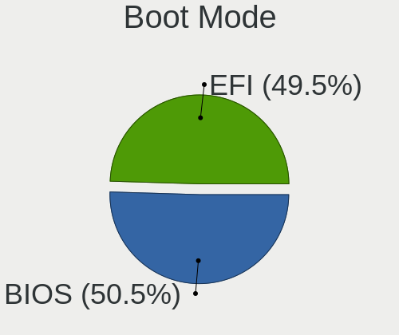
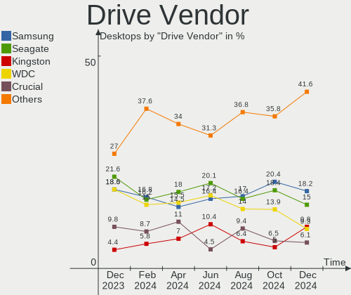
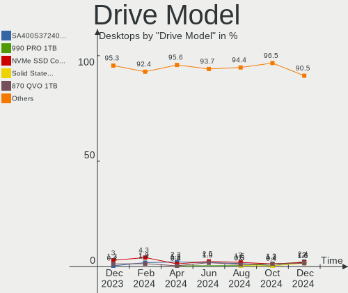
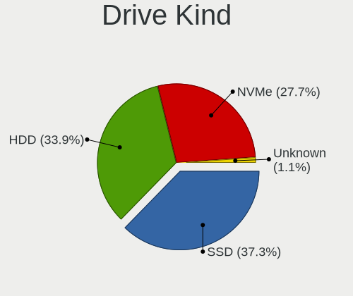
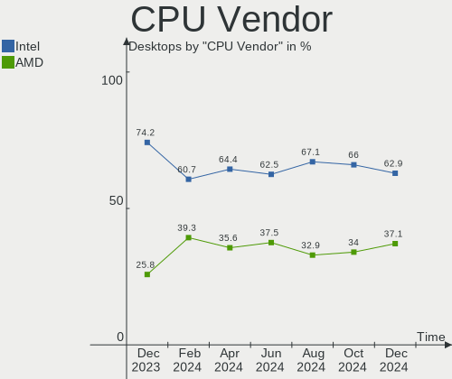
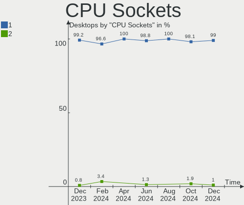
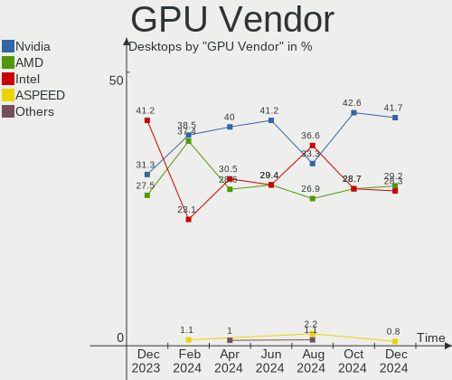
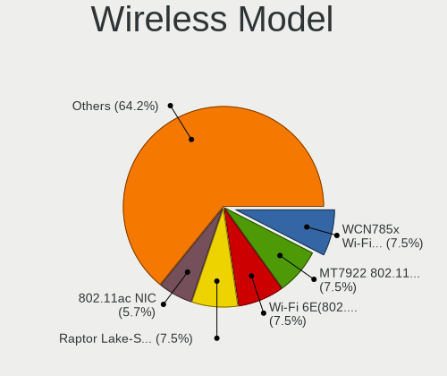

Linux in France - Hardware Trends (Desktops)
--------------------------------------------

A project to identify most popular hardware characteristics and track their change
over time based on data collected by Linux users at https://Linux-Hardware.org.

Anyone can contribute to this report by the [hw-probe](https://github.com/linuxhw/hw-probe) tool:

    sudo -E hw-probe -all -upload

Period: Jul, 2023.

Contents
--------

* [ System ](#system)
  - [ OS                       ](#os)
  - [ OS Family                ](#os-family)
  - [ Kernel                   ](#kernel)
  - [ Kernel Family            ](#kernel-family)
  - [ Kernel Major Ver.        ](#kernel-major-ver)
  - [ Arch                     ](#arch)
  - [ DE                       ](#de)
  - [ Display Server           ](#display-server)
  - [ Display Manager          ](#display-manager)
  - [ OS Lang                  ](#os-lang)
  - [ Boot Mode                ](#boot-mode)
  - [ Filesystem               ](#filesystem)
  - [ Part. scheme             ](#part-scheme)
  - [ Dual Boot with Linux/BSD ](#dual-boot-with-linuxbsd)
  - [ Dual Boot (Win)          ](#dual-boot-win)

* [ Board ](#board)
  - [ Vendor                   ](#vendor)
  - [ Model                    ](#model)
  - [ Model Family             ](#model-family)
  - [ MFG Year                 ](#mfg-year)
  - [ Form Factor              ](#form-factor)
  - [ Secure Boot              ](#secure-boot)
  - [ Coreboot                 ](#coreboot)
  - [ RAM Size                 ](#ram-size)
  - [ RAM Used                 ](#ram-used)
  - [ Total Drives             ](#total-drives)
  - [ Has CD-ROM               ](#has-cd-rom)
  - [ Has Ethernet             ](#has-ethernet)
  - [ Has WiFi                 ](#has-wifi)
  - [ Has Bluetooth            ](#has-bluetooth)

* [ Location ](#location)
  - [ Country                  ](#country)
  - [ City                     ](#city)

* [ Drives ](#drives)
  - [ Drive Vendor             ](#drive-vendor)
  - [ Drive Model              ](#drive-model)
  - [ HDD Vendor               ](#hdd-vendor)
  - [ SSD Vendor               ](#ssd-vendor)
  - [ Drive Kind               ](#drive-kind)
  - [ Drive Connector          ](#drive-connector)
  - [ Drive Size               ](#drive-size)
  - [ Space Total              ](#space-total)
  - [ Space Used               ](#space-used)
  - [ Malfunc. Drives          ](#malfunc-drives)
  - [ Malfunc. Drive Vendor    ](#malfunc-drive-vendor)
  - [ Malfunc. HDD Vendor      ](#malfunc-hdd-vendor)
  - [ Malfunc. Drive Kind      ](#malfunc-drive-kind)
  - [ Failed Drives            ](#failed-drives)
  - [ Failed Drive Vendor      ](#failed-drive-vendor)
  - [ Drive Status             ](#drive-status)

* [ Storage controller ](#storage-controller)
  - [ Storage Vendor           ](#storage-vendor)
  - [ Storage Model            ](#storage-model)
  - [ Storage Kind             ](#storage-kind)

* [ Processor ](#processor)
  - [ CPU Vendor               ](#cpu-vendor)
  - [ CPU Model                ](#cpu-model)
  - [ CPU Model Family         ](#cpu-model-family)
  - [ CPU Cores                ](#cpu-cores)
  - [ CPU Sockets              ](#cpu-sockets)
  - [ CPU Threads              ](#cpu-threads)
  - [ CPU Op-Modes             ](#cpu-op-modes)
  - [ CPU Microcode            ](#cpu-microcode)
  - [ CPU Microarch            ](#cpu-microarch)

* [ Graphics ](#graphics)
  - [ GPU Vendor               ](#gpu-vendor)
  - [ GPU Model                ](#gpu-model)
  - [ GPU Combo                ](#gpu-combo)
  - [ GPU Driver               ](#gpu-driver)
  - [ GPU Memory               ](#gpu-memory)

* [ Monitor ](#monitor)
  - [ Monitor Vendor           ](#monitor-vendor)
  - [ Monitor Model            ](#monitor-model)
  - [ Monitor Resolution       ](#monitor-resolution)
  - [ Monitor Diagonal         ](#monitor-diagonal)
  - [ Monitor Width            ](#monitor-width)
  - [ Aspect Ratio             ](#aspect-ratio)
  - [ Monitor Area             ](#monitor-area)
  - [ Pixel Density            ](#pixel-density)
  - [ Multiple Monitors        ](#multiple-monitors)

* [ Network ](#network)
  - [ Net Controller Vendor    ](#net-controller-vendor)
  - [ Net Controller Model     ](#net-controller-model)
  - [ Wireless Vendor          ](#wireless-vendor)
  - [ Wireless Model           ](#wireless-model)
  - [ Ethernet Vendor          ](#ethernet-vendor)
  - [ Ethernet Model           ](#ethernet-model)
  - [ Net Controller Kind      ](#net-controller-kind)
  - [ Used Controller          ](#used-controller)
  - [ NICs                     ](#nics)
  - [ IPv6                     ](#ipv6)

* [ Bluetooth ](#bluetooth)
  - [ Bluetooth Vendor         ](#bluetooth-vendor)
  - [ Bluetooth Model          ](#bluetooth-model)

* [ Sound ](#sound)
  - [ Sound Vendor             ](#sound-vendor)
  - [ Sound Model              ](#sound-model)

* [ Memory ](#memory)
  - [ Memory Vendor            ](#memory-vendor)
  - [ Memory Model             ](#memory-model)
  - [ Memory Kind              ](#memory-kind)
  - [ Memory Form Factor       ](#memory-form-factor)
  - [ Memory Size              ](#memory-size)
  - [ Memory Speed             ](#memory-speed)

* [ Printers & scanners ](#printers--scanners)
  - [ Printer Vendor           ](#printer-vendor)
  - [ Printer Model            ](#printer-model)
  - [ Scanner Vendor           ](#scanner-vendor)
  - [ Scanner Model            ](#scanner-model)

* [ Camera ](#camera)
  - [ Camera Vendor            ](#camera-vendor)
  - [ Camera Model             ](#camera-model)

* [ Security ](#security)
  - [ Fingerprint Vendor       ](#fingerprint-vendor)
  - [ Fingerprint Model        ](#fingerprint-model)
  - [ Chipcard Vendor          ](#chipcard-vendor)
  - [ Chipcard Model           ](#chipcard-model)

* [ Unsupported ](#unsupported)
  - [ Unsupported Devices      ](#unsupported-devices)
  - [ Unsupported Device Types ](#unsupported-device-types)

System
------

OS
--

Installed operating systems

| Name                         | Desktops | Percent |
|------------------------------|----------|---------|
| Ubuntu 22.04                 | 24       | 27.91%  |
| Linux Mint 21.1              | 8        | 9.3%    |
| Debian 11                    | 8        | 9.3%    |
| Ubuntu 20.04                 | 4        | 4.65%   |
| Ubuntu 23.04                 | 3        | 3.49%   |
| OpenMandriva 23.03           | 3        | 3.49%   |
| Arch Rolling                 | 3        | 3.49%   |
| OpenMandriva 4.2             | 2        | 2.33%   |
| OpenMandriva 23.07           | 2        | 2.33%   |
| Manjaro                      | 2        | 2.33%   |
| Kubuntu 23.04                | 2        | 2.33%   |
| Kubuntu 22.04                | 2        | 2.33%   |
| Fedora 38                    | 2        | 2.33%   |
| Debian 12                    | 2        | 2.33%   |
| Zorin 16                     | 1        | 1.16%   |
| Xubuntu 23.04                | 1        | 1.16%   |
| SteamOS 4                    | 1        | 1.16%   |
| ROSA 12.4                    | 1        | 1.16%   |
| openSUSE Tumbleweed-XXXXXXXX | 1        | 1.16%   |
| openSUSE Leap-15.4           | 1        | 1.16%   |
| OpenMandriva 4.3             | 1        | 1.16%   |
| OpenMandriva 23.90           | 1        | 1.16%   |
| OpenMandriva 23.01           | 1        | 1.16%   |
| Nobara 38                    | 1        | 1.16%   |
| NixOS 23.05                  | 1        | 1.16%   |
| Lubuntu 23.04                | 1        | 1.16%   |
| Lubuntu 22.04                | 1        | 1.16%   |
| Linux Mint 21.2              | 1        | 1.16%   |
| Kali 2023.2                  | 1        | 1.16%   |
| Fedora 37                    | 1        | 1.16%   |
| EndeavourOS Rolling          | 1        | 1.16%   |
| Debian                       | 1        | 1.16%   |
| ArcoLinux Rolling            | 1        | 1.16%   |

OS Family
---------

OS without a version

| Name         | Desktops | Percent |
|--------------|----------|---------|
| Ubuntu       | 31       | 36.05%  |
| Debian       | 11       | 12.79%  |
| OpenMandriva | 10       | 11.63%  |
| Linux Mint   | 9        | 10.47%  |
| Kubuntu      | 4        | 4.65%   |
| Fedora       | 3        | 3.49%   |
| Arch         | 3        | 3.49%   |
| openSUSE     | 2        | 2.33%   |
| Manjaro      | 2        | 2.33%   |
| Lubuntu      | 2        | 2.33%   |
| Zorin        | 1        | 1.16%   |
| Xubuntu      | 1        | 1.16%   |
| SteamOS      | 1        | 1.16%   |
| ROSA         | 1        | 1.16%   |
| Nobara       | 1        | 1.16%   |
| NixOS        | 1        | 1.16%   |
| Kali         | 1        | 1.16%   |
| EndeavourOS  | 1        | 1.16%   |
| ArcoLinux    | 1        | 1.16%   |

Kernel
------

Version of the Linux kernel

| Version                             | Desktops | Percent |
|-------------------------------------|----------|---------|
| 5.19.0-46-generic                   | 14       | 16.28%  |
| 5.15.0-76-generic                   | 13       | 15.12%  |
| 5.19.0-50-generic                   | 6        | 6.98%   |
| 5.10.0-23-amd64                     | 5        | 5.81%   |
| 6.2.6-desktop-1omv2390              | 4        | 4.65%   |
| 6.2.0-25-generic                    | 3        | 3.49%   |
| 6.2.0-24-generic                    | 3        | 3.49%   |
| 5.4.0-153-generic                   | 2        | 2.33%   |
| 5.10.14-desktop-1omv4002            | 2        | 2.33%   |
| 6.4.4-hardened1-1-hardened          | 1        | 1.16%   |
| 6.4.4-arch1-1                       | 1        | 1.16%   |
| 6.4.4-200.fc38.x86_64               | 1        | 1.16%   |
| 6.4.3-zen1-2-zen                    | 1        | 1.16%   |
| 6.4.3-arch1-1                       | 1        | 1.16%   |
| 6.4.3-1-liquorix-amd64              | 1        | 1.16%   |
| 6.4.3-1-default                     | 1        | 1.16%   |
| 6.4.2-3-MANJARO                     | 1        | 1.16%   |
| 6.3.9-arch1-1                       | 1        | 1.16%   |
| 6.3.8-200.fc38.x86_64               | 1        | 1.16%   |
| 6.3.8-100.fc37.x86_64               | 1        | 1.16%   |
| 6.3.5-desktop-3omv2390              | 1        | 1.16%   |
| 6.3.3-desktop-2omv2390              | 1        | 1.16%   |
| 6.3.12-204.fsync.fc38.x86_64        | 1        | 1.16%   |
| 6.3.0-1-rt-amd64                    | 1        | 1.16%   |
| 6.2.16-2-MANJARO                    | 1        | 1.16%   |
| 6.2.0-1010-gcp                      | 1        | 1.16%   |
| 6.1.4-desktop-1omv2301              | 1        | 1.16%   |
| 6.1.37                              | 1        | 1.16%   |
| 6.1.29-valve4-1-neptune-61          | 1        | 1.16%   |
| 6.1.0-kali9-amd64                   | 1        | 1.16%   |
| 6.1.0-9-amd64                       | 1        | 1.16%   |
| 6.1.0-10-amd64                      | 1        | 1.16%   |
| 6.1.0-0.deb11.7-amd64               | 1        | 1.16%   |
| 5.19.0-38-generic                   | 1        | 1.16%   |
| 5.19.0-32-generic                   | 1        | 1.16%   |
| 5.19.0-0.deb11.2-amd64              | 1        | 1.16%   |
| 5.16.13-desktop-1omv4003            | 1        | 1.16%   |
| 5.15.117-generic-1rosa2021.1-x86_64 | 1        | 1.16%   |
| 5.15.102-1-pve                      | 1        | 1.16%   |
| 5.15.0-78-generic                   | 1        | 1.16%   |

Kernel Family
-------------

Linux kernel without a distro release

| Version  | Desktops | Percent |
|----------|----------|---------|
| 5.19.0   | 23       | 26.74%  |
| 5.15.0   | 15       | 17.44%  |
| 6.2.0    | 7        | 8.14%   |
| 5.10.0   | 5        | 5.81%   |
| 6.4.3    | 4        | 4.65%   |
| 6.2.6    | 4        | 4.65%   |
| 6.1.0    | 4        | 4.65%   |
| 6.4.4    | 3        | 3.49%   |
| 6.3.8    | 2        | 2.33%   |
| 5.4.0    | 2        | 2.33%   |
| 5.10.14  | 2        | 2.33%   |
| 6.4.2    | 1        | 1.16%   |
| 6.3.9    | 1        | 1.16%   |
| 6.3.5    | 1        | 1.16%   |
| 6.3.3    | 1        | 1.16%   |
| 6.3.12   | 1        | 1.16%   |
| 6.3.0    | 1        | 1.16%   |
| 6.2.16   | 1        | 1.16%   |
| 6.1.4    | 1        | 1.16%   |
| 6.1.37   | 1        | 1.16%   |
| 6.1.29   | 1        | 1.16%   |
| 5.16.13  | 1        | 1.16%   |
| 5.15.117 | 1        | 1.16%   |
| 5.15.102 | 1        | 1.16%   |
| 5.14.21  | 1        | 1.16%   |
| 5.13.0   | 1        | 1.16%   |

Kernel Major Ver.
-----------------

Linux kernel major version

| Version | Desktops | Percent |
|---------|----------|---------|
| 5.19    | 23       | 26.74%  |
| 5.15    | 17       | 19.77%  |
| 6.2     | 12       | 13.95%  |
| 6.4     | 8        | 9.3%    |
| 6.3     | 7        | 8.14%   |
| 6.1     | 7        | 8.14%   |
| 5.10    | 7        | 8.14%   |
| 5.4     | 2        | 2.33%   |
| 5.16    | 1        | 1.16%   |
| 5.14    | 1        | 1.16%   |
| 5.13    | 1        | 1.16%   |

Arch
----

OS architecture (x86_64, i586, etc.)

| Name   | Desktops | Percent |
|--------|----------|---------|
| x86_64 | 86       | 100%    |

DE
--

Desktop Environment

| Name          | Desktops | Percent |
|---------------|----------|---------|
| GNOME         | 36       | 41.86%  |
| KDE5          | 23       | 26.74%  |
| XFCE          | 9        | 10.47%  |
| X-Cinnamon    | 7        | 8.14%   |
| Unknown       | 5        | 5.81%   |
| LXQt          | 4        | 4.65%   |
| MATE          | 1        | 1.16%   |
| GNOME Classic | 1        | 1.16%   |

Display Server
--------------

X11 or Wayland

| Name    | Desktops | Percent |
|---------|----------|---------|
| X11     | 54       | 62.79%  |
| Wayland | 22       | 25.58%  |
| Tty     | 8        | 9.3%    |
| Unknown | 2        | 2.33%   |

Display Manager
---------------

SDDM, LightDM, etc.

| Name    | Desktops | Percent |
|---------|----------|---------|
| GDM3    | 26       | 30.23%  |
| Unknown | 22       | 25.58%  |
| SDDM    | 21       | 24.42%  |
| LightDM | 9        | 10.47%  |
| GDM     | 8        | 9.3%    |

OS Lang
-------

Language

| Lang    | Desktops | Percent |
|---------|----------|---------|
| fr_FR   | 66       | 76.74%  |
| en_US   | 17       | 19.77%  |
| en_GB   | 1        | 1.16%   |
| de_DE   | 1        | 1.16%   |
| Unknown | 1        | 1.16%   |

Boot Mode
---------

EFI or BIOS

| Mode | Desktops | Percent |
|------|----------|---------|
| EFI  | 47       | 54.65%  |
| BIOS | 39       | 45.35%  |

Filesystem
----------

Type of filesystem

| Type    | Desktops | Percent |
|---------|----------|---------|
| Ext4    | 54       | 62.79%  |
| Tmpfs   | 13       | 15.12%  |
| Btrfs   | 11       | 12.79%  |
| Overlay | 5        | 5.81%   |
| Zfs     | 2        | 2.33%   |
| Xfs     | 1        | 1.16%   |

Part. scheme
------------

Scheme of partitioning

| Type    | Desktops | Percent |
|---------|----------|---------|
| GPT     | 60       | 69.77%  |
| Unknown | 16       | 18.6%   |
| MBR     | 10       | 11.63%  |

Dual Boot with Linux/BSD
------------------------

Hosting more than one Linux/BSD

| Dual boot | Desktops | Percent |
|-----------|----------|---------|
| No        | 60       | 69.77%  |
| Yes       | 26       | 30.23%  |

Dual Boot (Win)
---------------

Hosting Linux and Windows

| Dual boot | Desktops | Percent |
|-----------|----------|---------|
| No        | 60       | 69.77%  |
| Yes       | 26       | 30.23%  |

Board
-----

Vendor
------

Motherboard manufacturer

| Name                | Desktops | Percent |
|---------------------|----------|---------|
| ASUSTek Computer    | 20       | 23.26%  |
| Gigabyte Technology | 15       | 17.44%  |
| MSI                 | 10       | 11.63%  |
| Dell                | 8        | 9.3%    |
| ASRock              | 8        | 9.3%    |
| Hewlett-Packard     | 6        | 6.98%   |
| Pegatron            | 3        | 3.49%   |
| Intel               | 3        | 3.49%   |
| Unknown             | 3        | 3.49%   |
| Lenovo              | 2        | 2.33%   |
| Fujitsu             | 2        | 2.33%   |
| Shuttle             | 1        | 1.16%   |
| GEEKOM              | 1        | 1.16%   |
| Foxconn             | 1        | 1.16%   |
| Cincoze             | 1        | 1.16%   |
| Apple               | 1        | 1.16%   |
| Acer                | 1        | 1.16%   |

Model
-----

Motherboard model

| Name                                     | Desktops | Percent |
|------------------------------------------|----------|---------|
| Unknown                                  | 3        | 3.49%   |
| MSI MS-7A32                              | 2        | 2.33%   |
| ASUS All Series                          | 2        | 2.33%   |
| Shuttle XS35V3                           | 1        | 1.16%   |
| Pegatron WE301AA-ABF p6215fr             | 1        | 1.16%   |
| Pegatron KT600AA-ABF a6443.fr            | 1        | 1.16%   |
| Pegatron G5445frm                        | 1        | 1.16%   |
| MSI VS201AA-ABF HPE-010fr                | 1        | 1.16%   |
| MSI MS-7D09                              | 1        | 1.16%   |
| MSI MS-7C92                              | 1        | 1.16%   |
| MSI MS-7C37                              | 1        | 1.16%   |
| MSI MS-7B93                              | 1        | 1.16%   |
| MSI MS-7846                              | 1        | 1.16%   |
| MSI MS-7751                              | 1        | 1.16%   |
| MSI MS-7721                              | 1        | 1.16%   |
| Lenovo ThinkCentre M800 10FW002NFR       | 1        | 1.16%   |
| Lenovo ThinkCentre M73 10B4S0GC00        | 1        | 1.16%   |
| Intel X79                                | 1        | 1.16%   |
| Intel DH67BL AAG10189-211                | 1        | 1.16%   |
| Intel D33217GKE G76540-203               | 1        | 1.16%   |
| HP Z220 SFF Workstation                  | 1        | 1.16%   |
| HP ProDesk 600 G4 DM                     | 1        | 1.16%   |
| HP Compaq Elite 8300 Touch All-in-One PC | 1        | 1.16%   |
| HP Compaq 8200 Elite SFF PC              | 1        | 1.16%   |
| HP Compaq 6005 Pro MT PC                 | 1        | 1.16%   |
| HP Compaq 6000 Pro MT PC                 | 1        | 1.16%   |
| Gigabyte Z87-D3HP                        | 1        | 1.16%   |
| Gigabyte Z690 GAMING X DDR4              | 1        | 1.16%   |
| Gigabyte Z170X-Gaming 3                  | 1        | 1.16%   |
| Gigabyte Z170-HD3P-CF                    | 1        | 1.16%   |
| Gigabyte X58A-UD7                        | 1        | 1.16%   |
| Gigabyte X570 UD                         | 1        | 1.16%   |
| Gigabyte P67A-UD3-B3                     | 1        | 1.16%   |
| Gigabyte H81M-HD3                        | 1        | 1.16%   |
| Gigabyte H510M H                         | 1        | 1.16%   |
| Gigabyte H410M S2H V2                    | 1        | 1.16%   |
| Gigabyte F2A88XM-D3H                     | 1        | 1.16%   |
| Gigabyte B550 AORUS ELITE V2             | 1        | 1.16%   |
| Gigabyte B450M DS3H                      | 1        | 1.16%   |
| Gigabyte B450 I AORUS PRO WIFI           | 1        | 1.16%   |

Model Family
------------

Motherboard model prefix

| Name                  | Desktops | Percent |
|-----------------------|----------|---------|
| Dell OptiPlex         | 6        | 6.98%   |
| HP Compaq             | 4        | 4.65%   |
| ASUS PRIME            | 4        | 4.65%   |
| ASUS ROG              | 3        | 3.49%   |
| Unknown               | 3        | 3.49%   |
| MSI MS-7A32           | 2        | 2.33%   |
| Lenovo ThinkCentre    | 2        | 2.33%   |
| Dell Precision        | 2        | 2.33%   |
| ASUS All              | 2        | 2.33%   |
| Shuttle XS35V3        | 1        | 1.16%   |
| Pegatron WE301AA-ABF  | 1        | 1.16%   |
| Pegatron KT600AA-ABF  | 1        | 1.16%   |
| Pegatron G5445frm     | 1        | 1.16%   |
| MSI VS201AA-ABF       | 1        | 1.16%   |
| MSI MS-7D09           | 1        | 1.16%   |
| MSI MS-7C92           | 1        | 1.16%   |
| MSI MS-7C37           | 1        | 1.16%   |
| MSI MS-7B93           | 1        | 1.16%   |
| MSI MS-7846           | 1        | 1.16%   |
| MSI MS-7751           | 1        | 1.16%   |
| MSI MS-7721           | 1        | 1.16%   |
| Intel X79             | 1        | 1.16%   |
| Intel DH67BL          | 1        | 1.16%   |
| Intel D33217GKE       | 1        | 1.16%   |
| HP Z220               | 1        | 1.16%   |
| HP ProDesk            | 1        | 1.16%   |
| Gigabyte Z87-D3HP     | 1        | 1.16%   |
| Gigabyte Z690         | 1        | 1.16%   |
| Gigabyte Z170X-Gaming | 1        | 1.16%   |
| Gigabyte Z170-HD3P-CF | 1        | 1.16%   |
| Gigabyte X58A-UD7     | 1        | 1.16%   |
| Gigabyte X570         | 1        | 1.16%   |
| Gigabyte P67A-UD3-B3  | 1        | 1.16%   |
| Gigabyte H81M-HD3     | 1        | 1.16%   |
| Gigabyte H510M        | 1        | 1.16%   |
| Gigabyte H410M        | 1        | 1.16%   |
| Gigabyte F2A88XM-D3H  | 1        | 1.16%   |
| Gigabyte B550         | 1        | 1.16%   |
| Gigabyte B450M        | 1        | 1.16%   |
| Gigabyte B450         | 1        | 1.16%   |

MFG Year
--------

Motherboard manufacture year

| Year | Desktops | Percent |
|------|----------|---------|
| 2011 | 10       | 11.63%  |
| 2013 | 8        | 9.3%    |
| 2021 | 7        | 8.14%   |
| 2019 | 7        | 8.14%   |
| 2012 | 7        | 8.14%   |
| 2022 | 6        | 6.98%   |
| 2018 | 6        | 6.98%   |
| 2017 | 6        | 6.98%   |
| 2009 | 6        | 6.98%   |
| 2023 | 5        | 5.81%   |
| 2020 | 4        | 4.65%   |
| 2014 | 4        | 4.65%   |
| 2015 | 3        | 3.49%   |
| 2010 | 3        | 3.49%   |
| 2008 | 3        | 3.49%   |
| 2016 | 1        | 1.16%   |

Form Factor
-----------

Physical design of the computer

| Name    | Desktops | Percent |
|---------|----------|---------|
| Desktop | 86       | 100%    |

Secure Boot
-----------

Enabled or disabled

| State    | Desktops | Percent |
|----------|----------|---------|
| Disabled | 86       | 100%    |

Coreboot
--------

Have coreboot on board

| Used | Desktops | Percent |
|------|----------|---------|
| No   | 86       | 100%    |

RAM Size
--------

Total RAM memory

| Size in GB  | Desktops | Percent |
|-------------|----------|---------|
| 16.01-24.0  | 24       | 27.91%  |
| 32.01-64.0  | 20       | 23.26%  |
| 4.01-8.0    | 15       | 17.44%  |
| 8.01-16.0   | 12       | 13.95%  |
| 3.01-4.0    | 8        | 9.3%    |
| 24.01-32.0  | 4        | 4.65%   |
| 1.01-2.0    | 2        | 2.33%   |
| 64.01-256.0 | 1        | 1.16%   |

RAM Used
--------

Used RAM memory

| Used GB    | Desktops | Percent |
|------------|----------|---------|
| 2.01-3.0   | 27       | 31.4%   |
| 4.01-8.0   | 18       | 20.93%  |
| 1.01-2.0   | 16       | 18.6%   |
| 3.01-4.0   | 11       | 12.79%  |
| 8.01-16.0  | 6        | 6.98%   |
| 0.51-1.0   | 6        | 6.98%   |
| 24.01-32.0 | 2        | 2.33%   |

Total Drives
------------

Number of drives on board

| Drives | Desktops | Percent |
|--------|----------|---------|
| 1      | 31       | 36.05%  |
| 2      | 18       | 20.93%  |
| 3      | 15       | 17.44%  |
| 4      | 7        | 8.14%   |
| 6      | 6        | 6.98%   |
| 5      | 4        | 4.65%   |
| 7      | 2        | 2.33%   |
| 0      | 2        | 2.33%   |
| 13     | 1        | 1.16%   |

Has CD-ROM
----------

Has CD-ROM on board

| Presented | Desktops | Percent |
|-----------|----------|---------|
| No        | 54       | 62.79%  |
| Yes       | 32       | 37.21%  |

Has Ethernet
------------

Has Ethernet on board

| Presented | Desktops | Percent |
|-----------|----------|---------|
| Yes       | 85       | 98.84%  |
| No        | 1        | 1.16%   |

Has WiFi
--------

Has WiFi module

| Presented | Desktops | Percent |
|-----------|----------|---------|
| No        | 52       | 60.47%  |
| Yes       | 34       | 39.53%  |

Has Bluetooth
-------------

Has Bluetooth module

| Presented | Desktops | Percent |
|-----------|----------|---------|
| No        | 55       | 63.95%  |
| Yes       | 31       | 36.05%  |

Location
--------

Country
-------

Geographic location (country)

| Country | Desktops | Percent |
|---------|----------|---------|
| France  | 86       | 100%    |

City
----

Geographic location (city)

| City                   | Desktops | Percent |
|------------------------|----------|---------|
| Paris                  | 10       | 11.63%  |
| Strasbourg             | 3        | 3.49%   |
| Brive-la-Gaillarde     | 3        | 3.49%   |
| Saint-Etienne          | 2        | 2.33%   |
| Lyon                   | 2        | 2.33%   |
| Grenoble               | 2        | 2.33%   |
| Compiègne             | 2        | 2.33%   |
| Colombes               | 2        | 2.33%   |
| Villenave-d'Ornon      | 1        | 1.16%   |
| Veurey-Voroize         | 1        | 1.16%   |
| Versailles             | 1        | 1.16%   |
| Tours                  | 1        | 1.16%   |
| Tourcoing              | 1        | 1.16%   |
| Tarbes                 | 1        | 1.16%   |
| Soultz-sous-Forets     | 1        | 1.16%   |
| Saint-Pierre-des-Corps | 1        | 1.16%   |
| Saint-Gregoire         | 1        | 1.16%   |
| Saint-Avold            | 1        | 1.16%   |
| Saint-Andre-le-Puy     | 1        | 1.16%   |
| Rueil-Malmaison        | 1        | 1.16%   |
| Poitiers               | 1        | 1.16%   |
| Pithiviers             | 1        | 1.16%   |
| Pierrelatte            | 1        | 1.16%   |
| Noisy-le-Grand         | 1        | 1.16%   |
| Nogent-sur-Marne       | 1        | 1.16%   |
| Noeux-les-Mines        | 1        | 1.16%   |
| Nauvay                 | 1        | 1.16%   |
| Muttersholtz           | 1        | 1.16%   |
| Montpellier            | 1        | 1.16%   |
| Menton                 | 1        | 1.16%   |
| Massy                  | 1        | 1.16%   |
| Marseille              | 1        | 1.16%   |
| Marlenheim             | 1        | 1.16%   |
| Marcoussis             | 1        | 1.16%   |
| Louviers               | 1        | 1.16%   |
| Lille                  | 1        | 1.16%   |
| Les Essarts-le-Roi     | 1        | 1.16%   |
| Le Plessis-Robinson    | 1        | 1.16%   |
| Le Mans                | 1        | 1.16%   |
| La Couture-Boussey     | 1        | 1.16%   |

Drives
------

Drive Vendor
------------

Hard drive vendors

| Vendor                    | Desktops | Drives | Percent |
|---------------------------|----------|--------|---------|
| Seagate                   | 31       | 44     | 17.71%  |
| Samsung Electronics       | 30       | 40     | 17.14%  |
| WDC                       | 24       | 28     | 13.71%  |
| Crucial                   | 15       | 17     | 8.57%   |
| SanDisk                   | 12       | 13     | 6.86%   |
| Kingston                  | 11       | 12     | 6.29%   |
| PNY                       | 5        | 6      | 2.86%   |
| Hitachi                   | 5        | 5      | 2.86%   |
| Toshiba                   | 4        | 7      | 2.29%   |
| Micron/Crucial Technology | 4        | 5      | 2.29%   |
| Intel                     | 4        | 4      | 2.29%   |
| SPCC                      | 3        | 4      | 1.71%   |
| Silicon Motion            | 3        | 3      | 1.71%   |
| Transcend                 | 2        | 2      | 1.14%   |
| Phison Electronics        | 2        | 3      | 1.14%   |
| HGST                      | 2        | 2      | 1.14%   |
| Corsair                   | 2        | 2      | 1.14%   |
| China                     | 2        | 2      | 1.14%   |
| Verbatim                  | 1        | 1      | 0.57%   |
| Unknown                   | 1        | 3      | 0.57%   |
| Seagate Technology        | 1        | 1      | 0.57%   |
| Phison                    | 1        | 2      | 0.57%   |
| Maxtor                    | 1        | 1      | 0.57%   |
| LITEON                    | 1        | 1      | 0.57%   |
| JMicron Technology        | 1        | 1      | 0.57%   |
| Innodisk                  | 1        | 1      | 0.57%   |
| Hewlett-Packard           | 1        | 5      | 0.57%   |
| H/W                       | 1        | 3      | 0.57%   |
| Fanxiang                  | 1        | 1      | 0.57%   |
| Emtec                     | 1        | 1      | 0.57%   |
| ASMT                      | 1        | 1      | 0.57%   |
| Unknown                   | 1        | 1      | 0.57%   |

Drive Model
-----------

Hard drive models

| Model                                                 | Desktops | Percent |
|-------------------------------------------------------|----------|---------|
| Seagate ST2000DM001-1CH164 2TB                        | 4        | 1.97%   |
| Seagate ST1000DM010-2EP102 1TB                        | 4        | 1.97%   |
| Seagate ST1000DM003-1ER162 1TB                        | 4        | 1.97%   |
| Samsung SSD 870 EVO 500GB                             | 4        | 1.97%   |
| Samsung NVMe SSD Controller SM981/PM981/PM983 500GB   | 4        | 1.97%   |
| Crucial CT240BX500SSD1 240GB                          | 4        | 1.97%   |
| Samsung HD103UJ 1TB                                   | 3        | 1.48%   |
| Micron/Crucial P2 NVMe PCIe SSD 1TB                   | 3        | 1.48%   |
| Kingston SA400S37480G 480GB SSD                       | 3        | 1.48%   |
| WDC WDS500G2B0A-00SM50 500GB SSD                      | 2        | 0.99%   |
| WDC WD40EZRZ-00GXCB0 4TB                              | 2        | 0.99%   |
| WDC WD10EADS-65L5B1 1TB                               | 2        | 0.99%   |
| Silicon Motion SM2263EN/SM2263XT SSD Controller 500GB | 2        | 0.99%   |
| Seagate ST250DM000-1BD141 250GB                       | 2        | 0.99%   |
| Seagate ST2000DM008-2FR102 2TB                        | 2        | 0.99%   |
| Seagate ST2000DM001-1ER164 2TB                        | 2        | 0.99%   |
| Samsung SSD 980 1TB                                   | 2        | 0.99%   |
| Samsung SSD 970 EVO Plus 1TB                          | 2        | 0.99%   |
| Samsung SSD 860 EVO 500GB                             | 2        | 0.99%   |
| Samsung NVMe SSD Controller SM961/PM961/SM963 256GB   | 2        | 0.99%   |
| PNY CS900 120GB SSD                                   | 2        | 0.99%   |
| Phison E12 NVMe Controller 2TB                        | 2        | 0.99%   |
| Kingston SUV500480G 480GB SSD                         | 2        | 0.99%   |
| Kingston SA400S37240G 240GB SSD                       | 2        | 0.99%   |
| Intel SSD 660P Series 1024GB                          | 2        | 0.99%   |
| Crucial CT240M500SSD1 240GB                           | 2        | 0.99%   |
| Crucial CT1000MX500SSD1 1TB                           | 2        | 0.99%   |
| Crucial CT1000BX500SSD1 1TB                           | 2        | 0.99%   |
| WDC WDS500G1X0E-00AFY0 500GB                          | 1        | 0.49%   |
| WDC WD60EZRX-00MVLB1 6TB                              | 1        | 0.49%   |
| WDC WD5000BEVT-60ZAT1 500GB                           | 1        | 0.49%   |
| WDC WD5000AAKX-60U6AA0 500GB                          | 1        | 0.49%   |
| WDC WD5000AAKX-22ERMA0 500GB                          | 1        | 0.49%   |
| WDC WD5000AAKX-00ERMA0 500GB                          | 1        | 0.49%   |
| WDC WD5000AAKS-00A7B0 500GB                           | 1        | 0.49%   |
| WDC WD4500HLHX-01JJPV0 450GB                          | 1        | 0.49%   |
| WDC WD3200BPVT-60JJ5T0 320GB                          | 1        | 0.49%   |
| WDC WD3200BEVT-22ZCT0 320GB                           | 1        | 0.49%   |
| WDC WD2500BEVS-26UST0 250GB                           | 1        | 0.49%   |
| WDC WD20PURX-64P6ZY0 2TB                              | 1        | 0.49%   |

HDD Vendor
----------

Hard disk drive vendors

| Vendor              | Desktops | Drives | Percent |
|---------------------|----------|--------|---------|
| Seagate             | 31       | 44     | 41.89%  |
| WDC                 | 21       | 25     | 28.38%  |
| Samsung Electronics | 5        | 6      | 6.76%   |
| Hitachi             | 5        | 5      | 6.76%   |
| Toshiba             | 4        | 7      | 5.41%   |
| HGST                | 2        | 2      | 2.7%    |
| Maxtor              | 1        | 1      | 1.35%   |
| JMicron Technology  | 1        | 1      | 1.35%   |
| Hewlett-Packard     | 1        | 5      | 1.35%   |
| H/W                 | 1        | 3      | 1.35%   |
| ASMT                | 1        | 1      | 1.35%   |
| Unknown             | 1        | 1      | 1.35%   |

SSD Vendor
----------

Solid state drive vendors

| Vendor              | Desktops | Drives | Percent |
|---------------------|----------|--------|---------|
| Samsung Electronics | 16       | 19     | 24.24%  |
| Crucial             | 13       | 15     | 19.7%   |
| Kingston            | 11       | 12     | 16.67%  |
| SanDisk             | 8        | 8      | 12.12%  |
| PNY                 | 5        | 6      | 7.58%   |
| WDC                 | 2        | 2      | 3.03%   |
| Transcend           | 2        | 2      | 3.03%   |
| SPCC                | 2        | 3      | 3.03%   |
| Intel               | 2        | 2      | 3.03%   |
| China               | 2        | 2      | 3.03%   |
| Verbatim            | 1        | 1      | 1.52%   |
| LITEON              | 1        | 1      | 1.52%   |
| Innodisk            | 1        | 1      | 1.52%   |

Drive Kind
----------

HDD or SSD

| Kind    | Desktops | Drives | Percent |
|---------|----------|--------|---------|
| HDD     | 51       | 101    | 37.23%  |
| SSD     | 49       | 74     | 35.77%  |
| NVMe    | 36       | 44     | 26.28%  |
| Unknown | 1        | 3      | 0.73%   |

Drive Connector
---------------

SATA, SAS, NVMe, etc.

| Type | Desktops | Drives | Percent |
|------|----------|--------|---------|
| SATA | 71       | 163    | 63.39%  |
| NVMe | 36       | 44     | 32.14%  |
| SAS  | 5        | 15     | 4.46%   |

Drive Size
----------

Size of hard drive

| Size in TB | Desktops | Drives | Percent |
|------------|----------|--------|---------|
| 0.01-0.5   | 56       | 89     | 48.7%   |
| 0.51-1.0   | 27       | 44     | 23.48%  |
| 1.01-2.0   | 17       | 17     | 14.78%  |
| 3.01-4.0   | 6        | 6      | 5.22%   |
| 2.01-3.0   | 4        | 12     | 3.48%   |
| 4.01-10.0  | 4        | 5      | 3.48%   |
| 10.01-20.0 | 1        | 2      | 0.87%   |

Space Total
-----------

Amount of disk space available on the file system

| Size in GB     | Desktops | Percent |
|----------------|----------|---------|
| 101-250        | 21       | 24.42%  |
| 501-1000       | 17       | 19.77%  |
| More than 3000 | 15       | 17.44%  |
| 251-500        | 15       | 17.44%  |
| 1001-2000      | 6        | 6.98%   |
| 1-20           | 5        | 5.81%   |
| 2001-3000      | 4        | 4.65%   |
| Unknown        | 2        | 2.33%   |
| 21-50          | 1        | 1.16%   |

Space Used
----------

Amount of used disk space

| Used GB        | Desktops | Percent |
|----------------|----------|---------|
| 1-20           | 20       | 23.26%  |
| 101-250        | 18       | 20.93%  |
| 51-100         | 12       | 13.95%  |
| More than 3000 | 8        | 9.3%    |
| 251-500        | 8        | 9.3%    |
| 21-50          | 6        | 6.98%   |
| 1001-2000      | 6        | 6.98%   |
| 501-1000       | 4        | 4.65%   |
| 2001-3000      | 2        | 2.33%   |
| Unknown        | 2        | 2.33%   |

Malfunc. Drives
---------------

Drive models with a malfunction

| Model                          | Desktops | Drives | Percent |
|--------------------------------|----------|--------|---------|
| Crucial CT240M500SSD1 240GB    | 2        | 2      | 11.11%  |
| WDC WD5000BEVT-60ZAT1 500GB    | 1        | 1      | 5.56%   |
| WDC WD5000AAKX-60U6AA0 500GB   | 1        | 1      | 5.56%   |
| WDC WD5000AAKX-00ERMA0 500GB   | 1        | 2      | 5.56%   |
| WDC WD4500HLHX-01JJPV0 450GB   | 1        | 1      | 5.56%   |
| WDC WD20EARS-00J2GB0 2TB       | 1        | 1      | 5.56%   |
| WDC WD10EADS-65L5B1 1TB        | 1        | 1      | 5.56%   |
| Transcend TS120GSSD220S 120GB  | 1        | 1      | 5.56%   |
| Toshiba MK3261GSYN 320GB       | 1        | 1      | 5.56%   |
| Seagate ST9160301AS 160GB      | 1        | 1      | 5.56%   |
| Seagate ST2000DM001-1ER164 2TB | 1        | 1      | 5.56%   |
| SanDisk SSD PLUS 240GB         | 1        | 1      | 5.56%   |
| SanDisk SDSSDXPS480G 480GB     | 1        | 1      | 5.56%   |
| SanDisk SDSSDA120G 120GB       | 1        | 1      | 5.56%   |
| Maxtor 6L160M0 160GB           | 1        | 1      | 5.56%   |
| Intel SSDSCKKW240H6 240GB      | 1        | 1      | 5.56%   |
| Intel SSDSC2KW240H6 240GB      | 1        | 1      | 5.56%   |

Malfunc. Drive Vendor
---------------------

Vendors of faulty drives

| Vendor    | Desktops | Drives | Percent |
|-----------|----------|--------|---------|
| WDC       | 5        | 7      | 29.41%  |
| SanDisk   | 3        | 3      | 17.65%  |
| Seagate   | 2        | 2      | 11.76%  |
| Intel     | 2        | 2      | 11.76%  |
| Crucial   | 2        | 2      | 11.76%  |
| Transcend | 1        | 1      | 5.88%   |
| Toshiba   | 1        | 1      | 5.88%   |
| Maxtor    | 1        | 1      | 5.88%   |

Malfunc. HDD Vendor
-------------------

Vendors of faulty HDD drives

| Vendor  | Desktops | Drives | Percent |
|---------|----------|--------|---------|
| WDC     | 5        | 7      | 55.56%  |
| Seagate | 2        | 2      | 22.22%  |
| Toshiba | 1        | 1      | 11.11%  |
| Maxtor  | 1        | 1      | 11.11%  |

Malfunc. Drive Kind
-------------------

Kinds of faulty drives

| Kind | Desktops | Drives | Percent |
|------|----------|--------|---------|
| HDD  | 9        | 11     | 52.94%  |
| SSD  | 8        | 8      | 47.06%  |

Failed Drives
-------------

Failed drive models

Zero info for selected period =(

Failed Drive Vendor
-------------------

Failed drive vendors

Zero info for selected period =(

Drive Status
------------

Number of failed and malfunc. drives

| Status   | Desktops | Drives | Percent |
|----------|----------|--------|---------|
| Works    | 52       | 112    | 52.53%  |
| Detected | 32       | 91     | 32.32%  |
| Malfunc  | 15       | 19     | 15.15%  |

Storage controller
------------------

Storage Vendor
--------------

Storage controller vendors

| Vendor                       | Desktops | Percent |
|------------------------------|----------|---------|
| Intel                        | 60       | 44.12%  |
| AMD                          | 24       | 17.65%  |
| Samsung Electronics          | 14       | 10.29%  |
| ASMedia Technology           | 7        | 5.15%   |
| SanDisk                      | 6        | 4.41%   |
| Micron/Crucial Technology    | 6        | 4.41%   |
| Phison Electronics           | 5        | 3.68%   |
| Silicon Motion               | 3        | 2.21%   |
| JMicron Technology           | 2        | 1.47%   |
| VIA Technologies             | 1        | 0.74%   |
| Silicon Image                | 1        | 0.74%   |
| Shenzhen Longsys Electronics | 1        | 0.74%   |
| Seagate Technology           | 1        | 0.74%   |
| Realtek Semiconductor        | 1        | 0.74%   |
| Nvidia                       | 1        | 0.74%   |
| Marvell Technology Group     | 1        | 0.74%   |
| INNOGRIT                     | 1        | 0.74%   |
| Broadcom / LSI               | 1        | 0.74%   |

Storage Model
-------------

Storage controller models

| Model                                                                                   | Desktops | Percent |
|-----------------------------------------------------------------------------------------|----------|---------|
| AMD FCH SATA Controller [AHCI mode]                                                     | 16       | 10.32%  |
| Samsung NVMe SSD Controller SM981/PM981/PM983                                           | 8        | 5.16%   |
| ASMedia ASM1062 Serial ATA Controller                                                   | 7        | 4.52%   |
| Intel Q170/Q150/B150/H170/H110/Z170/CM236 Chipset SATA Controller [AHCI Mode]           | 6        | 3.87%   |
| Intel 8 Series/C220 Series Chipset Family 6-port SATA Controller 1 [AHCI mode]          | 6        | 3.87%   |
| Intel 6 Series/C200 Series Chipset Family 6 port Desktop SATA AHCI Controller           | 6        | 3.87%   |
| Phison E12 NVMe Controller                                                              | 4        | 2.58%   |
| Micron/Crucial P2 [Nick P2] / P3 / P3 Plus NVMe PCIe SSD (DRAM-less)                    | 4        | 2.58%   |
| Intel SATA Controller [RAID mode]                                                       | 4        | 2.58%   |
| AMD X370 Series Chipset SATA Controller                                                 | 4        | 2.58%   |
| Silicon Motion SM2263EN/SM2263XT (DRAM-less) NVMe SSD Controllers                       | 3        | 1.94%   |
| Intel NM10/ICH7 Family SATA Controller [IDE mode]                                       | 3        | 1.94%   |
| Intel Cannon Lake PCH SATA AHCI Controller                                              | 3        | 1.94%   |
| Intel Alder Lake-S PCH SATA Controller [AHCI Mode]                                      | 3        | 1.94%   |
| Intel 7 Series/C210 Series Chipset Family 6-port SATA Controller [AHCI mode]            | 3        | 1.94%   |
| Intel 6 Series/C200 Series Chipset Family Desktop SATA Controller (IDE mode, ports 4-5) | 3        | 1.94%   |
| Intel 6 Series/C200 Series Chipset Family Desktop SATA Controller (IDE mode, ports 0-3) | 3        | 1.94%   |
| Intel 500 Series Chipset Family SATA AHCI Controller                                    | 3        | 1.94%   |
| Intel 200 Series PCH SATA controller [AHCI mode]                                        | 3        | 1.94%   |
| AMD 500 Series Chipset SATA Controller                                                  | 3        | 1.94%   |
| SanDisk WD PC SN810 / Black SN850 NVMe SSD                                              | 2        | 1.29%   |
| Samsung NVMe SSD Controller SM961/PM961/SM963                                           | 2        | 1.29%   |
| Samsung NVMe SSD Controller 980                                                         | 2        | 1.29%   |
| Micron/Crucial P5 Plus NVMe PCIe SSD                                                    | 2        | 1.29%   |
| JMicron JMB363 SATA/IDE Controller                                                      | 2        | 1.29%   |
| Intel SSD 660P Series                                                                   | 2        | 1.29%   |
| Intel Comet Lake SATA AHCI Controller                                                   | 2        | 1.29%   |
| Intel Cannon Point-LP SATA Controller [AHCI Mode]                                       | 2        | 1.29%   |
| Intel 82801JI (ICH10 Family) 4 port SATA IDE Controller #1                              | 2        | 1.29%   |
| Intel 82801JI (ICH10 Family) 2 port SATA IDE Controller #2                              | 2        | 1.29%   |
| AMD SB7x0/SB8x0/SB9x0 SATA Controller [IDE mode]                                        | 2        | 1.29%   |
| AMD SB7x0/SB8x0/SB9x0 IDE Controller                                                    | 2        | 1.29%   |
| AMD 400 Series Chipset SATA Controller                                                  | 2        | 1.29%   |
| VIA VT6415 PATA IDE Host Controller                                                     | 1        | 0.65%   |
| Silicon Image SiI 3114 [SATALink/SATARaid] Serial ATA Controller                        | 1        | 0.65%   |
| Shenzhen Longsys Lexar NM620 NVME SSD (DRAM-less)                                       | 1        | 0.65%   |
| Seagate FireCuda/IronWolf 510 SSD                                                       | 1        | 0.65%   |
| SanDisk WD Blue SN570 NVMe SSD 1TB                                                      | 1        | 0.65%   |
| SanDisk WD Blue SN550 NVMe SSD                                                          | 1        | 0.65%   |
| SanDisk WD Black 2018/SN750 / PC SN720 NVMe SSD                                         | 1        | 0.65%   |

Storage Kind
------------

Kind of storage controller (IDE, SATA, NVMe, SAS, ...)

| Kind | Desktops | Percent |
|------|----------|---------|
| SATA | 70       | 55.56%  |
| NVMe | 36       | 28.57%  |
| IDE  | 14       | 11.11%  |
| RAID | 6        | 4.76%   |

Processor
---------

CPU Vendor
----------

Processor vendors

| Vendor | Desktops | Percent |
|--------|----------|---------|
| Intel  | 60       | 69.77%  |
| AMD    | 26       | 30.23%  |

CPU Model
---------

Processor models

| Model                                       | Desktops | Percent |
|---------------------------------------------|----------|---------|
| Intel Core i5-3470 CPU @ 3.20GHz            | 3        | 3.49%   |
| Intel Core i5-2500 CPU @ 3.30GHz            | 3        | 3.49%   |
| Intel Core i7-4790 CPU @ 3.60GHz            | 2        | 2.33%   |
| Intel Core i5-6500 CPU @ 3.20GHz            | 2        | 2.33%   |
| Intel Core i5-2500K CPU @ 3.30GHz           | 2        | 2.33%   |
| AMD Ryzen 9 3900X 12-Core Processor         | 2        | 2.33%   |
| AMD Ryzen 5 5600X 6-Core Processor          | 2        | 2.33%   |
| Intel Xeon CPU X5472 @ 3.00GHz              | 1        | 1.16%   |
| Intel Xeon CPU E5-2620 0 @ 2.00GHz          | 1        | 1.16%   |
| Intel Xeon CPU E3-1225 V2 @ 3.20GHz         | 1        | 1.16%   |
| Intel Xeon CPU E3-1220 v3 @ 3.10GHz         | 1        | 1.16%   |
| Intel Pentium Gold G6400 CPU @ 4.00GHz      | 1        | 1.16%   |
| Intel Pentium Dual-Core CPU E5800 @ 3.20GHz | 1        | 1.16%   |
| Intel Pentium Dual-Core CPU E5300 @ 2.60GHz | 1        | 1.16%   |
| Intel Pentium CPU G630 @ 2.70GHz            | 1        | 1.16%   |
| Intel Pentium CPU G3220 @ 3.00GHz           | 1        | 1.16%   |
| Intel Core i9-10900E CPU @ 2.80GHz          | 1        | 1.16%   |
| Intel Core i7-8700K CPU @ 3.70GHz           | 1        | 1.16%   |
| Intel Core i7-8086K CPU @ 4.00GHz           | 1        | 1.16%   |
| Intel Core i7-7700T CPU @ 2.90GHz           | 1        | 1.16%   |
| Intel Core i7-6700T CPU @ 2.80GHz           | 1        | 1.16%   |
| Intel Core i7-6700K CPU @ 4.00GHz           | 1        | 1.16%   |
| Intel Core i7-4770K CPU @ 3.50GHz           | 1        | 1.16%   |
| Intel Core i7-4770 CPU @ 3.40GHz            | 1        | 1.16%   |
| Intel Core i7-3770S CPU @ 3.10GHz           | 1        | 1.16%   |
| Intel Core i7-3770 CPU @ 3.40GHz            | 1        | 1.16%   |
| Intel Core i7 CPU 950 @ 3.07GHz             | 1        | 1.16%   |
| Intel Core i7 CPU 920 @ 2.67GHz             | 1        | 1.16%   |
| Intel Core i7 CPU 860 @ 2.80GHz             | 1        | 1.16%   |
| Intel Core i5-9600K CPU @ 3.70GHz           | 1        | 1.16%   |
| Intel Core i5-9400F CPU @ 2.90GHz           | 1        | 1.16%   |
| Intel Core i5-8500T CPU @ 2.10GHz           | 1        | 1.16%   |
| Intel Core i5-8279U CPU @ 2.40GHz           | 1        | 1.16%   |
| Intel Core i5-8259U CPU @ 2.30GHz           | 1        | 1.16%   |
| Intel Core i5-6600K CPU @ 3.50GHz           | 1        | 1.16%   |
| Intel Core i5-4690K CPU @ 3.50GHz           | 1        | 1.16%   |
| Intel Core i5-4670K CPU @ 3.40GHz           | 1        | 1.16%   |
| Intel Core i5-3570K CPU @ 3.40GHz           | 1        | 1.16%   |
| Intel Core i5-3450 CPU @ 3.10GHz            | 1        | 1.16%   |
| Intel Core i5-10400F CPU @ 2.90GHz          | 1        | 1.16%   |

CPU Model Family
----------------

Processor model prefix

| Model                   | Desktops | Percent |
|-------------------------|----------|---------|
| Intel Core i5           | 23       | 26.74%  |
| Intel Core i7           | 14       | 16.28%  |
| AMD Ryzen 5             | 10       | 11.63%  |
| AMD Ryzen 9             | 5        | 5.81%   |
| Other                   | 4        | 4.65%   |
| Intel Xeon              | 4        | 4.65%   |
| AMD Ryzen 7             | 4        | 4.65%   |
| Intel Atom              | 3        | 3.49%   |
| Intel Pentium Dual-Core | 2        | 2.33%   |
| Intel Pentium           | 2        | 2.33%   |
| Intel Core i3           | 2        | 2.33%   |
| Intel Core 2 Duo        | 2        | 2.33%   |
| AMD Athlon II X2        | 2        | 2.33%   |
| Intel Pentium Gold      | 1        | 1.16%   |
| Intel Core i9           | 1        | 1.16%   |
| Intel Core 2 Quad       | 1        | 1.16%   |
| Intel Celeron           | 1        | 1.16%   |
| AMD Sempron             | 1        | 1.16%   |
| AMD GX                  | 1        | 1.16%   |
| AMD FX                  | 1        | 1.16%   |
| AMD A8                  | 1        | 1.16%   |
| AMD A6                  | 1        | 1.16%   |

CPU Cores
---------

Number of processor cores

| Number | Desktops | Percent |
|--------|----------|---------|
| 4      | 39       | 45.35%  |
| 6      | 17       | 19.77%  |
| 2      | 13       | 15.12%  |
| 8      | 6        | 6.98%   |
| 12     | 5        | 5.81%   |
| 16     | 2        | 2.33%   |
| 1      | 2        | 2.33%   |
| 10     | 1        | 1.16%   |
| 3      | 1        | 1.16%   |

CPU Sockets
-----------

Number of sockets

| Number | Desktops | Percent |
|--------|----------|---------|
| 1      | 84       | 97.67%  |
| 2      | 2        | 2.33%   |

CPU Threads
-----------

Threads per core (Hyper-Threading)

| Number | Desktops | Percent |
|--------|----------|---------|
| 2      | 46       | 53.49%  |
| 1      | 40       | 46.51%  |

CPU Op-Modes
------------

CPU Operation Modes (32-bit, 64-bit)

| Op mode        | Desktops | Percent |
|----------------|----------|---------|
| 32-bit, 64-bit | 86       | 100%    |

CPU Microcode
-------------

Microcode number

| Number     | Desktops | Percent |
|------------|----------|---------|
| Unknown    | 28       | 32.56%  |
| 0x306c3    | 6        | 6.98%   |
| 0x306a9    | 4        | 4.65%   |
| 0x506e3    | 3        | 3.49%   |
| 0x206a7    | 3        | 3.49%   |
| 0x1067a    | 3        | 3.49%   |
| 0x0a601203 | 3        | 3.49%   |
| 0x08701021 | 3        | 3.49%   |
| 0xa0653    | 2        | 2.33%   |
| 0x806ea    | 2        | 2.33%   |
| 0x106e5    | 2        | 2.33%   |
| 0x0a50000c | 2        | 2.33%   |
| 0x010000c8 | 2        | 2.33%   |
| 0xb06f5    | 1        | 1.16%   |
| 0xa0671    | 1        | 1.16%   |
| 0xa0655    | 1        | 1.16%   |
| 0x906ed    | 1        | 1.16%   |
| 0x906eb    | 1        | 1.16%   |
| 0x906ea    | 1        | 1.16%   |
| 0x906e9    | 1        | 1.16%   |
| 0x90672    | 1        | 1.16%   |
| 0x506ca    | 1        | 1.16%   |
| 0x206d7    | 1        | 1.16%   |
| 0x106ca    | 1        | 1.16%   |
| 0x106a5    | 1        | 1.16%   |
| 0x0a201204 | 1        | 1.16%   |
| 0x0a201025 | 1        | 1.16%   |
| 0x0a201016 | 1        | 1.16%   |
| 0x08701030 | 1        | 1.16%   |
| 0x08600109 | 1        | 1.16%   |
| 0x08600103 | 1        | 1.16%   |
| 0x08001138 | 1        | 1.16%   |
| 0x08001137 | 1        | 1.16%   |
| 0x06003106 | 1        | 1.16%   |
| 0x06001119 | 1        | 1.16%   |
| 0x0600063e | 1        | 1.16%   |

CPU Microarch
-------------

Microarchitecture

| Name             | Desktops | Percent |
|------------------|----------|---------|
| KabyLake         | 9        | 10.47%  |
| IvyBridge        | 9        | 10.47%  |
| Zen 2            | 8        | 9.3%    |
| Haswell          | 8        | 9.3%    |
| SandyBridge      | 7        | 8.14%   |
| Unknown          | 6        | 6.98%   |
| Zen 3            | 5        | 5.81%   |
| Skylake          | 5        | 5.81%   |
| Penryn           | 5        | 5.81%   |
| Nehalem          | 4        | 4.65%   |
| CometLake        | 4        | 4.65%   |
| K10              | 3        | 3.49%   |
| Zen              | 2        | 2.33%   |
| Bonnell          | 2        | 2.33%   |
| Zen+             | 1        | 1.16%   |
| Steamroller      | 1        | 1.16%   |
| Piledriver       | 1        | 1.16%   |
| Jaguar           | 1        | 1.16%   |
| Icelake          | 1        | 1.16%   |
| Goldmont         | 1        | 1.16%   |
| Core             | 1        | 1.16%   |
| Bulldozer        | 1        | 1.16%   |
| Alderlake Hybrid | 1        | 1.16%   |

Graphics
--------

GPU Vendor
----------

Vendors of graphics cards

| Vendor | Desktops | Percent |
|--------|----------|---------|
| AMD    | 33       | 37.08%  |
| Intel  | 30       | 33.71%  |
| Nvidia | 26       | 29.21%  |

GPU Model
---------

Graphics card models

| Model                                                                       | Desktops | Percent |
|-----------------------------------------------------------------------------|----------|---------|
| Intel Xeon E3-1200 v3/4th Gen Core Processor Integrated Graphics Controller | 4        | 4.35%   |
| Intel HD Graphics 530                                                       | 4        | 4.35%   |
| Intel 2nd Generation Core Processor Family Integrated Graphics Controller   | 4        | 4.35%   |
| AMD Vega 10 XL/XT [Radeon RX Vega 56/64]                                    | 4        | 4.35%   |
| Nvidia GK208B [GeForce GT 710]                                              | 3        | 3.26%   |
| Intel CoffeeLake-S GT2 [UHD Graphics 630]                                   | 3        | 3.26%   |
| AMD Raphael                                                                 | 3        | 3.26%   |
| Nvidia TU116 [GeForce GTX 1660]                                             | 2        | 2.17%   |
| Nvidia TU116 [GeForce GTX 1660 SUPER]                                       | 2        | 2.17%   |
| Nvidia GP107 [GeForce GTX 1050 Ti]                                          | 2        | 2.17%   |
| Nvidia GF108 [GeForce GT 730]                                               | 2        | 2.17%   |
| Intel Xeon E3-1200 v2/3rd Gen Core processor Graphics Controller            | 2        | 2.17%   |
| Intel CometLake-S GT2 [UHD Graphics 630]                                    | 2        | 2.17%   |
| Intel CoffeeLake-U GT3e [Iris Plus Graphics 655]                            | 2        | 2.17%   |
| AMD Renoir                                                                  | 2        | 2.17%   |
| AMD Oland GL [FirePro W2100]                                                | 2        | 2.17%   |
| AMD Navi 21 [Radeon RX 6800/6800 XT / 6900 XT]                              | 2        | 2.17%   |
| AMD Ellesmere [Radeon RX 470/480/570/570X/580/580X/590]                     | 2        | 2.17%   |
| AMD Cedar [Radeon HD 5000/6000/7350/8350 Series]                            | 2        | 2.17%   |
| Nvidia TU117 [GeForce GTX 1650]                                             | 1        | 1.09%   |
| Nvidia GT218 [ION]                                                          | 1        | 1.09%   |
| Nvidia GT216 [GeForce GT 220]                                               | 1        | 1.09%   |
| Nvidia GP108 [GeForce GT 1030]                                              | 1        | 1.09%   |
| Nvidia GP106 [GeForce GTX 1060 3GB]                                         | 1        | 1.09%   |
| Nvidia GP104 [GeForce GTX 1080]                                             | 1        | 1.09%   |
| Nvidia GP104 [GeForce GTX 1070]                                             | 1        | 1.09%   |
| Nvidia GM206 [GeForce GTX 960]                                              | 1        | 1.09%   |
| Nvidia GF119 [GeForce GT 705]                                               | 1        | 1.09%   |
| Nvidia GA106 [GeForce RTX 3060 Lite Hash Rate]                              | 1        | 1.09%   |
| Nvidia GA102 [GeForce RTX 3080 Ti]                                          | 1        | 1.09%   |
| Nvidia G98 [GeForce 8400]                                                   | 1        | 1.09%   |
| Nvidia G96CGL [Quadro FX 580]                                               | 1        | 1.09%   |
| Nvidia G92 [GeForce 8800 GT]                                                | 1        | 1.09%   |
| Nvidia G84 [GeForce 8600 GT]                                                | 1        | 1.09%   |
| Nvidia AD102 [GeForce RTX 4090]                                             | 1        | 1.09%   |
| Intel RocketLake-S GT1 [UHD Graphics 750]                                   | 1        | 1.09%   |
| Intel IvyBridge GT2 [HD Graphics 4000]                                      | 1        | 1.09%   |
| Intel HD Graphics 630                                                       | 1        | 1.09%   |
| Intel HD Graphics 500                                                       | 1        | 1.09%   |
| Intel Elkhart Lake [UHD Graphics Gen11 32EU]                                | 1        | 1.09%   |

GPU Combo
---------

Combinations of graphics cards

| Name           | Desktops | Percent |
|----------------|----------|---------|
| 1 x AMD        | 30       | 34.88%  |
| 1 x Intel      | 28       | 32.56%  |
| 1 x Nvidia     | 23       | 26.74%  |
| 2 x AMD        | 2        | 2.33%   |
| 2 x Nvidia     | 1        | 1.16%   |
| Intel + Nvidia | 1        | 1.16%   |
| AMD + Nvidia   | 1        | 1.16%   |

GPU Driver
----------

Free vs proprietary

| Driver      | Desktops | Percent |
|-------------|----------|---------|
| Free        | 69       | 80.23%  |
| Proprietary | 13       | 15.12%  |
| Unknown     | 4        | 4.65%   |

GPU Memory
----------

Total video memory

| Size in GB | Desktops | Percent |
|------------|----------|---------|
| Unknown    | 43       | 50%     |
| 7.01-8.0   | 9        | 10.47%  |
| 0.01-0.5   | 9        | 10.47%  |
| 1.01-2.0   | 7        | 8.14%   |
| 0.51-1.0   | 6        | 6.98%   |
| 3.01-4.0   | 4        | 4.65%   |
| 5.01-6.0   | 3        | 3.49%   |
| 8.01-16.0  | 3        | 3.49%   |
| 2.01-3.0   | 1        | 1.16%   |
| 16.01-24.0 | 1        | 1.16%   |

Monitor
-------

Monitor Vendor
--------------

Monitor vendors

| Vendor               | Desktops | Percent |
|----------------------|----------|---------|
| Iiyama               | 16       | 19.05%  |
| Samsung Electronics  | 8        | 9.52%   |
| Hewlett-Packard      | 6        | 7.14%   |
| Goldstar             | 6        | 7.14%   |
| Dell                 | 6        | 7.14%   |
| Acer                 | 6        | 7.14%   |
| ViewSonic            | 4        | 4.76%   |
| Philips              | 4        | 4.76%   |
| BenQ                 | 4        | 4.76%   |
| Lenovo               | 3        | 3.57%   |
| AOC                  | 3        | 3.57%   |
| Unknown              | 2        | 2.38%   |
| Packard Bell         | 2        | 2.38%   |
| Gigabyte Technology  | 2        | 2.38%   |
| Ancor Communications | 2        | 2.38%   |
| Yeyian               | 1        | 1.19%   |
| Vestel Elektronik    | 1        | 1.19%   |
| Onkyo                | 1        | 1.19%   |
| MSI                  | 1        | 1.19%   |
| LG Electronics       | 1        | 1.19%   |
| GVS                  | 1        | 1.19%   |
| Denver               | 1        | 1.19%   |
| Dark Matter          | 1        | 1.19%   |
| ASUSTek Computer     | 1        | 1.19%   |
| Apple                | 1        | 1.19%   |

Monitor Model
-------------

Monitor models

| Model                                                                | Desktops | Percent |
|----------------------------------------------------------------------|----------|---------|
| Iiyama PL2791Q IVM6646 2560x1440 597x336mm 27.0-inch                 | 2        | 2.13%   |
| Iiyama PL2783Q IVM661E 2560x1440 597x336mm 27.0-inch                 | 2        | 2.13%   |
| Hewlett-Packard V22e HPN371B 1920x1080 477x268mm 21.5-inch           | 2        | 2.13%   |
| Dell E228WFP DELD015 1680x1050 473x296mm 22.0-inch                   | 2        | 2.13%   |
| Yeyian YMC-70102 YEY2700 1920x1080 698x393mm 31.5-inch               | 1        | 1.06%   |
| ViewSonic XG350R-C VSC4F37 3440x1440 819x346mm 35.0-inch             | 1        | 1.06%   |
| ViewSonic XG2401 SERIES VSCBB31 1920x1080 531x299mm 24.0-inch        | 1        | 1.06%   |
| ViewSonic VX2778 Series VSC8432 2560x1440 597x336mm 27.0-inch        | 1        | 1.06%   |
| ViewSonic VA2746 SERIES VSC752E 1920x1080 598x336mm 27.0-inch        | 1        | 1.06%   |
| Vestel Elektronik 42 FHD_LCD-TV VES3700 1920x540                     | 1        | 1.06%   |
| Unknown LCD Monitor SAMSUNG 1920x1080                                | 1        | 1.06%   |
| Unknown LCD Monitor FFFF 2288x1287 2550x2550mm 142.0-inch            | 1        | 1.06%   |
| Samsung Electronics SyncMaster SAM05CD 1920x1080                     | 1        | 1.06%   |
| Samsung Electronics SyncMaster SAM027C 1680x1050 433x271mm 20.1-inch | 1        | 1.06%   |
| Samsung Electronics SMC27A550U SAM07F6 1920x1080 598x336mm 27.0-inch | 1        | 1.06%   |
| Samsung Electronics S27D590 SAM0BE8 1920x1080 598x336mm 27.0-inch    | 1        | 1.06%   |
| Samsung Electronics LCD Monitor SAM03D4 1280x720                     | 1        | 1.06%   |
| Samsung Electronics LCD Monitor SA300/SA350 1920x1080                | 1        | 1.06%   |
| Samsung Electronics C27F390 SAM0D32 1920x1080 598x336mm 27.0-inch    | 1        | 1.06%   |
| Samsung Electronics C24FG7x SAM0E44 1920x1080 532x304mm 24.1-inch    | 1        | 1.06%   |
| Philips PHL 223V5 PHLC0CF 1920x1080 477x268mm 21.5-inch              | 1        | 1.06%   |
| Philips 247ELPH PHLC086 1920x1080 521x293mm 23.5-inch                | 1        | 1.06%   |
| Philips 191V PHL0887 1366x768 409x230mm 18.5-inch                    | 1        | 1.06%   |
| Philips 190S PHL086B 1280x1024 376x301mm 19.0-inch                   | 1        | 1.06%   |
| Packard Bell Viseo203DX PKB03B1 1600x900 432x240mm 19.5-inch         | 1        | 1.06%   |
| Packard Bell PKB CALL191 PKB5048 1280x1024 376x301mm 19.0-inch       | 1        | 1.06%   |
| Onkyo AV Receiver ONK1050 1920x1080 1440x810mm 65.0-inch             | 1        | 1.06%   |
| MSI MAG241C MSI3EA2 1920x1080 521x293mm 23.5-inch                    | 1        | 1.06%   |
| LG Electronics LCD Monitor LG ULTRAWIDE 2560x1080                    | 1        | 1.06%   |
| Lenovo T2224pD LEN60CA 1920x1080 476x267mm 21.5-inch                 | 1        | 1.06%   |
| Lenovo LEN T23i-10 LEN61AB 1920x1080 509x286mm 23.0-inch             | 1        | 1.06%   |
| Lenovo D24-20 LEN66AE 1920x1080 527x296mm 23.8-inch                  | 1        | 1.06%   |
| Iiyama PLX2783H IVM6611 1920x1080 598x336mm 27.0-inch                | 1        | 1.06%   |
| Iiyama PLX2483H IVM6114 1920x1080 531x299mm 24.0-inch                | 1        | 1.06%   |
| Iiyama PLX2481H IVM611D 1920x1080 520x290mm 23.4-inch                | 1        | 1.06%   |
| Iiyama PLE2483H IVM6113 1920x1080 531x299mm 24.0-inch                | 1        | 1.06%   |
| Iiyama PL4071UH IVM0009 3840x2160                                    | 1        | 1.06%   |
| Iiyama PL3461WQ IVM7615 3440x1440 800x335mm 34.1-inch                | 1        | 1.06%   |
| Iiyama PL3288UH IVM1176 3840x2160 698x393mm 31.5-inch                | 1        | 1.06%   |
| Iiyama PL3270Q IVM7607 2560x1440 698x393mm 31.5-inch                 | 1        | 1.06%   |

Monitor Resolution
------------------

Monitor screen resolution

| Resolution         | Desktops | Percent |
|--------------------|----------|---------|
| 1920x1080 (FHD)    | 50       | 58.82%  |
| 2560x1440 (QHD)    | 9        | 10.59%  |
| 3840x2160 (4K)     | 8        | 9.41%   |
| 1680x1050 (WSXGA+) | 5        | 5.88%   |
| 1280x1024 (SXGA)   | 4        | 4.71%   |
| 3440x1440          | 3        | 3.53%   |
| 2560x1600          | 1        | 1.18%   |
| 2560x1080          | 1        | 1.18%   |
| 2288x1287          | 1        | 1.18%   |
| 1600x900 (HD+)     | 1        | 1.18%   |
| 1366x768 (WXGA)    | 1        | 1.18%   |
| 1360x768           | 1        | 1.18%   |

Monitor Diagonal
----------------

Diagonal size in inches

| Inches  | Desktops | Percent |
|---------|----------|---------|
| 27      | 18       | 20.45%  |
| 24      | 16       | 18.18%  |
| 23      | 15       | 17.05%  |
| 21      | 8        | 9.09%   |
| 31      | 6        | 6.82%   |
| 19      | 5        | 5.68%   |
| Unknown | 5        | 5.68%   |
| 22      | 4        | 4.55%   |
| 35      | 2        | 2.27%   |
| 142     | 1        | 1.14%   |
| 84      | 1        | 1.14%   |
| 65      | 1        | 1.14%   |
| 40      | 1        | 1.14%   |
| 39      | 1        | 1.14%   |
| 34      | 1        | 1.14%   |
| 29      | 1        | 1.14%   |
| 20      | 1        | 1.14%   |
| 18      | 1        | 1.14%   |

Monitor Width
-------------

Physical width

| Width in mm    | Desktops | Percent |
|----------------|----------|---------|
| 501-600        | 44       | 53.01%  |
| 401-500        | 15       | 18.07%  |
| 601-700        | 7        | 8.43%   |
| Unknown        | 5        | 6.02%   |
| 801-900        | 4        | 4.82%   |
| 351-400        | 4        | 4.82%   |
| More than 2000 | 1        | 1.2%    |
| 701-800        | 1        | 1.2%    |
| 1501-2000      | 1        | 1.2%    |
| 1001-1500      | 1        | 1.2%    |

Aspect Ratio
------------

Proportional relationship between the width and the height

| Ratio   | Desktops | Percent |
|---------|----------|---------|
| 16/9    | 61       | 77.22%  |
| 16/10   | 7        | 8.86%   |
| 5/4     | 4        | 5.06%   |
| 21/9    | 3        | 3.8%    |
| Unknown | 3        | 3.8%    |
| 1.00    | 1        | 1.27%   |

Monitor Area
------------

Area in inch²

| Area in inch² | Desktops | Percent |
|----------------|----------|---------|
| 201-250        | 34       | 39.08%  |
| 301-350        | 18       | 20.69%  |
| 351-500        | 10       | 11.49%  |
| 151-200        | 10       | 11.49%  |
| Unknown        | 5        | 5.75%   |
| 251-300        | 4        | 4.6%    |
| More than 1000 | 3        | 3.45%   |
| 501-1000       | 2        | 2.3%    |
| 141-150        | 1        | 1.15%   |

Pixel Density
-------------

Pixels per inch

| Density | Desktops | Percent |
|---------|----------|---------|
| 51-100  | 52       | 62.65%  |
| 101-120 | 21       | 25.3%   |
| Unknown | 5        | 6.02%   |
| 121-160 | 3        | 3.61%   |
| 1-50    | 2        | 2.41%   |

Multiple Monitors
-----------------

Total monitors connected

| Total | Desktops | Percent |
|-------|----------|---------|
| 1     | 64       | 74.42%  |
| 2     | 14       | 16.28%  |
| 0     | 6        | 6.98%   |
| 3     | 2        | 2.33%   |

Network
-------

Net Controller Vendor
---------------------

Controller vendors

| Vendor                   | Desktops | Percent |
|--------------------------|----------|---------|
| Realtek Semiconductor    | 48       | 40.34%  |
| Intel                    | 44       | 36.97%  |
| Ralink                   | 3        | 2.52%   |
| Broadcom                 | 3        | 2.52%   |
| Xiaomi                   | 2        | 1.68%   |
| Qualcomm Atheros         | 2        | 1.68%   |
| NetGear                  | 2        | 1.68%   |
| Microsoft                | 2        | 1.68%   |
| Xilinx                   | 1        | 0.84%   |
| TRENDnet                 | 1        | 0.84%   |
| TP-Link                  | 1        | 0.84%   |
| Ralink Technology        | 1        | 0.84%   |
| Qualcomm                 | 1        | 0.84%   |
| Nvidia                   | 1        | 0.84%   |
| MediaTek                 | 1        | 0.84%   |
| Marvell Technology Group | 1        | 0.84%   |
| D-Link System            | 1        | 0.84%   |
| Broadcom Limited         | 1        | 0.84%   |
| ASIX Electronics         | 1        | 0.84%   |
| Aquantia                 | 1        | 0.84%   |
| 3Com                     | 1        | 0.84%   |

Net Controller Model
--------------------

Controller models

| Model                                                                             | Desktops | Percent |
|-----------------------------------------------------------------------------------|----------|---------|
| Realtek RTL8111/8168/8411 PCI Express Gigabit Ethernet Controller                 | 39       | 28.06%  |
| Intel I211 Gigabit Network Connection                                             | 8        | 5.76%   |
| Realtek RTL8125 2.5GbE Controller                                                 | 5        | 3.6%    |
| Intel 82579LM Gigabit Network Connection (Lewisville)                             | 5        | 3.6%    |
| Intel Wi-Fi 6 AX200                                                               | 4        | 2.88%   |
| Intel Ethernet Controller I225-V                                                  | 4        | 2.88%   |
| Realtek RTL-8100/8101L/8139 PCI Fast Ethernet Adapter                             | 3        | 2.16%   |
| Intel Ethernet Connection (2) I219-V                                              | 3        | 2.16%   |
| Intel Ethernet Connection (2) I219-LM                                             | 3        | 2.16%   |
| Intel 82579V Gigabit Network Connection                                           | 3        | 2.16%   |
| Realtek RTL8192EU 802.11b/g/n WLAN Adapter                                        | 2        | 1.44%   |
| Realtek RTL810xE PCI Express Fast Ethernet controller                             | 2        | 1.44%   |
| Microsoft Xbox 360 Wireless Adapter                                               | 2        | 1.44%   |
| Intel Wireless-AC 9260                                                            | 2        | 1.44%   |
| Intel Ethernet Connection I217-V                                                  | 2        | 1.44%   |
| Intel Ethernet Connection (7) I219-V                                              | 2        | 1.44%   |
| Intel Ethernet Connection (6) I219-V                                              | 2        | 1.44%   |
| Intel Alder Lake-S PCH CNVi WiFi                                                  | 2        | 1.44%   |
| Xilinx Ethernet controller                                                        | 1        | 0.72%   |
| Xiaomi Mi/Redmi series (RNDIS)                                                    | 1        | 0.72%   |
| Xiaomi Mi/Redmi series (RNDIS + ADB)                                              | 1        | 0.72%   |
| TRENDnet TEW-648UBM 802.11n 150Mbps Micro Wireless N Adapter [Realtek RTL8188CUS] | 1        | 0.72%   |
| TP-Link Archer T4U ver.3                                                          | 1        | 0.72%   |
| Realtek RTL8822BE 802.11a/b/g/n/ac WiFi adapter                                   | 1        | 0.72%   |
| Realtek RTL8821CE 802.11ac PCIe Wireless Network Adapter                          | 1        | 0.72%   |
| Realtek RTL8192EE PCIe Wireless Network Adapter                                   | 1        | 0.72%   |
| Realtek RTL8188EUS 802.11n Wireless Network Adapter                               | 1        | 0.72%   |
| Realtek RTL8188EE Wireless Network Adapter                                        | 1        | 0.72%   |
| Realtek RTL8153 Gigabit Ethernet Adapter                                          | 1        | 0.72%   |
| Ralink MT7601U Wireless Adapter                                                   | 1        | 0.72%   |
| Ralink RT3090 Wireless 802.11n 1T/1R PCIe                                         | 1        | 0.72%   |
| Ralink RT2790 Wireless 802.11n 1T/2R PCIe                                         | 1        | 0.72%   |
| Ralink RT2561/RT61 rev B 802.11g                                                  | 1        | 0.72%   |
| Qualcomm Redmi Note 8                                                             | 1        | 0.72%   |
| Qualcomm Atheros Killer E220x Gigabit Ethernet Controller                         | 1        | 0.72%   |
| Qualcomm Atheros AR9462 Wireless Network Adapter                                  | 1        | 0.72%   |
| Nvidia MCP61 Ethernet                                                             | 1        | 0.72%   |
| NetGear WNA1100 Wireless-N 150 [Atheros AR9271]                                   | 1        | 0.72%   |
| NetGear A6100 AC600 DB Wireless Adapter [Realtek RTL8811AU]                       | 1        | 0.72%   |
| MediaTek MT7922 802.11ax PCI Express Wireless Network Adapter                     | 1        | 0.72%   |

Wireless Vendor
---------------

Wireless vendors

| Vendor                | Desktops | Percent |
|-----------------------|----------|---------|
| Intel                 | 13       | 38.24%  |
| Realtek Semiconductor | 7        | 20.59%  |
| Ralink                | 3        | 8.82%   |
| NetGear               | 2        | 5.88%   |
| Microsoft             | 2        | 5.88%   |
| TRENDnet              | 1        | 2.94%   |
| TP-Link               | 1        | 2.94%   |
| Ralink Technology     | 1        | 2.94%   |
| Qualcomm Atheros      | 1        | 2.94%   |
| MediaTek              | 1        | 2.94%   |
| D-Link System         | 1        | 2.94%   |
| Broadcom              | 1        | 2.94%   |

Wireless Model
--------------

Wireless models

| Model                                                                             | Desktops | Percent |
|-----------------------------------------------------------------------------------|----------|---------|
| Intel Wi-Fi 6 AX200                                                               | 4        | 11.76%  |
| Realtek RTL8192EU 802.11b/g/n WLAN Adapter                                        | 2        | 5.88%   |
| Microsoft Xbox 360 Wireless Adapter                                               | 2        | 5.88%   |
| Intel Wireless-AC 9260                                                            | 2        | 5.88%   |
| Intel Alder Lake-S PCH CNVi WiFi                                                  | 2        | 5.88%   |
| TRENDnet TEW-648UBM 802.11n 150Mbps Micro Wireless N Adapter [Realtek RTL8188CUS] | 1        | 2.94%   |
| TP-Link Archer T4U ver.3                                                          | 1        | 2.94%   |
| Realtek RTL8822BE 802.11a/b/g/n/ac WiFi adapter                                   | 1        | 2.94%   |
| Realtek RTL8821CE 802.11ac PCIe Wireless Network Adapter                          | 1        | 2.94%   |
| Realtek RTL8192EE PCIe Wireless Network Adapter                                   | 1        | 2.94%   |
| Realtek RTL8188EUS 802.11n Wireless Network Adapter                               | 1        | 2.94%   |
| Realtek RTL8188EE Wireless Network Adapter                                        | 1        | 2.94%   |
| Ralink MT7601U Wireless Adapter                                                   | 1        | 2.94%   |
| Ralink RT3090 Wireless 802.11n 1T/1R PCIe                                         | 1        | 2.94%   |
| Ralink RT2790 Wireless 802.11n 1T/2R PCIe                                         | 1        | 2.94%   |
| Ralink RT2561/RT61 rev B 802.11g                                                  | 1        | 2.94%   |
| Qualcomm Atheros AR9462 Wireless Network Adapter                                  | 1        | 2.94%   |
| NetGear WNA1100 Wireless-N 150 [Atheros AR9271]                                   | 1        | 2.94%   |
| NetGear A6100 AC600 DB Wireless Adapter [Realtek RTL8811AU]                       | 1        | 2.94%   |
| MediaTek MT7922 802.11ax PCI Express Wireless Network Adapter                     | 1        | 2.94%   |
| Intel Wireless 7265                                                               | 1        | 2.94%   |
| Intel Wireless 3165                                                               | 1        | 2.94%   |
| Intel Wi-Fi 6 AX210/AX211/AX411 160MHz                                            | 1        | 2.94%   |
| Intel Dual Band Wireless-AC 3168NGW [Stone Peak]                                  | 1        | 2.94%   |
| Intel Cannon Point-LP CNVi [Wireless-AC]                                          | 1        | 2.94%   |
| D-Link System DWA-110 Wireless G Adapter(rev.A1) [Ralink RT2571W]                 | 1        | 2.94%   |
| Broadcom BCM4352 802.11ac Wireless Network Adapter                                | 1        | 2.94%   |

Ethernet Vendor
---------------

Ethernet vendors

| Vendor                   | Desktops | Percent |
|--------------------------|----------|---------|
| Realtek Semiconductor    | 46       | 46.46%  |
| Intel                    | 40       | 40.4%   |
| Xiaomi                   | 2        | 2.02%   |
| Broadcom                 | 2        | 2.02%   |
| Xilinx                   | 1        | 1.01%   |
| Qualcomm Atheros         | 1        | 1.01%   |
| Qualcomm                 | 1        | 1.01%   |
| Nvidia                   | 1        | 1.01%   |
| Marvell Technology Group | 1        | 1.01%   |
| Broadcom Limited         | 1        | 1.01%   |
| ASIX Electronics         | 1        | 1.01%   |
| Aquantia                 | 1        | 1.01%   |
| 3Com                     | 1        | 1.01%   |

Ethernet Model
--------------

Ethernet models

| Model                                                                         | Desktops | Percent |
|-------------------------------------------------------------------------------|----------|---------|
| Realtek RTL8111/8168/8411 PCI Express Gigabit Ethernet Controller             | 39       | 37.14%  |
| Intel I211 Gigabit Network Connection                                         | 8        | 7.62%   |
| Realtek RTL8125 2.5GbE Controller                                             | 5        | 4.76%   |
| Intel 82579LM Gigabit Network Connection (Lewisville)                         | 5        | 4.76%   |
| Intel Ethernet Controller I225-V                                              | 4        | 3.81%   |
| Realtek RTL-8100/8101L/8139 PCI Fast Ethernet Adapter                         | 3        | 2.86%   |
| Intel Ethernet Connection (2) I219-V                                          | 3        | 2.86%   |
| Intel Ethernet Connection (2) I219-LM                                         | 3        | 2.86%   |
| Intel 82579V Gigabit Network Connection                                       | 3        | 2.86%   |
| Realtek RTL810xE PCI Express Fast Ethernet controller                         | 2        | 1.9%    |
| Intel Ethernet Connection I217-V                                              | 2        | 1.9%    |
| Intel Ethernet Connection (7) I219-V                                          | 2        | 1.9%    |
| Intel Ethernet Connection (6) I219-V                                          | 2        | 1.9%    |
| Xilinx Ethernet controller                                                    | 1        | 0.95%   |
| Xiaomi Mi/Redmi series (RNDIS)                                                | 1        | 0.95%   |
| Xiaomi Mi/Redmi series (RNDIS + ADB)                                          | 1        | 0.95%   |
| Realtek RTL8153 Gigabit Ethernet Adapter                                      | 1        | 0.95%   |
| Qualcomm Redmi Note 8                                                         | 1        | 0.95%   |
| Qualcomm Atheros Killer E220x Gigabit Ethernet Controller                     | 1        | 0.95%   |
| Nvidia MCP61 Ethernet                                                         | 1        | 0.95%   |
| Marvell Group 88E8056 PCI-E Gigabit Ethernet Controller                       | 1        | 0.95%   |
| Intel I210 Gigabit Network Connection                                         | 1        | 0.95%   |
| Intel Ethernet controller                                                     | 1        | 0.95%   |
| Intel Ethernet Connection I217-LM                                             | 1        | 0.95%   |
| Intel Ethernet Connection (7) I219-LM                                         | 1        | 0.95%   |
| Intel Ethernet Connection (17) I219-LM                                        | 1        | 0.95%   |
| Intel Ethernet Connection (11) I219-V                                         | 1        | 0.95%   |
| Intel Ethernet Connection (11) I219-LM                                        | 1        | 0.95%   |
| Intel 82571EB/82571GB Gigabit Ethernet Controller D0/D1 (copper applications) | 1        | 0.95%   |
| Intel 82567LM-3 Gigabit Network Connection                                    | 1        | 0.95%   |
| Intel 80003ES2LAN Gigabit Ethernet Controller (Copper)                        | 1        | 0.95%   |
| Broadcom NetXtreme BCM5761 Gigabit Ethernet PCIe                              | 1        | 0.95%   |
| Broadcom NetLink BCM57780 Gigabit Ethernet PCIe                               | 1        | 0.95%   |
| Broadcom Limited NetXtreme BCM5722 Gigabit Ethernet PCI Express               | 1        | 0.95%   |
| ASIX AX88179 Gigabit Ethernet                                                 | 1        | 0.95%   |
| Aquantia AQC107 NBase-T/IEEE 802.3bz Ethernet Controller [AQtion]             | 1        | 0.95%   |
| 3Com 3c905C-TX/TX-M [Tornado]                                                 | 1        | 0.95%   |

Net Controller Kind
-------------------

Ethernet, WiFi or modem

| Kind     | Desktops | Percent |
|----------|----------|---------|
| Ethernet | 85       | 72.03%  |
| WiFi     | 33       | 27.97%  |

Used Controller
---------------

Currently used network controller

| Kind     | Desktops | Percent |
|----------|----------|---------|
| Ethernet | 71       | 81.61%  |
| WiFi     | 16       | 18.39%  |

NICs
----

Total network controllers on board

| Total | Desktops | Percent |
|-------|----------|---------|
| 1     | 46       | 53.49%  |
| 2     | 33       | 38.37%  |
| 3     | 4        | 4.65%   |
| 0     | 2        | 2.33%   |
| 4     | 1        | 1.16%   |

IPv6
----

IPv6 vs IPv4

| Used | Desktops | Percent |
|------|----------|---------|
| Yes  | 53       | 61.63%  |
| No   | 33       | 38.37%  |

Bluetooth
---------

Bluetooth Vendor
----------------

Controller vendors

| Vendor                  | Desktops | Percent |
|-------------------------|----------|---------|
| Intel                   | 13       | 39.39%  |
| Cambridge Silicon Radio | 7        | 21.21%  |
| ASUSTek Computer        | 4        | 12.12%  |
| Realtek Semiconductor   | 3        | 9.09%   |
| Broadcom                | 3        | 9.09%   |
| TP-Link                 | 1        | 3.03%   |
| Foxconn / Hon Hai       | 1        | 3.03%   |
| Apple                   | 1        | 3.03%   |

Bluetooth Model
---------------

Controller models

| Model                                               | Desktops | Percent |
|-----------------------------------------------------|----------|---------|
| Cambridge Silicon Radio Bluetooth Dongle (HCI mode) | 7        | 21.21%  |
| Intel AX200 Bluetooth                               | 4        | 12.12%  |
| Realtek Bluetooth Radio                             | 3        | 9.09%   |
| Intel Wireless-AC 9260 Bluetooth Adapter            | 2        | 6.06%   |
| Intel Bluetooth wireless interface                  | 2        | 6.06%   |
| Broadcom BCM20702A0 Bluetooth 4.0                   | 2        | 6.06%   |
| ASUS ASUS USB-BT500                                 | 2        | 6.06%   |
| TP-Link UB500 Adapter                               | 1        | 3.03%   |
| Intel Wireless-AC 3168 Bluetooth                    | 1        | 3.03%   |
| Intel Bluetooth Device                              | 1        | 3.03%   |
| Intel Bluetooth 9460/9560 Jefferson Peak (JfP)      | 1        | 3.03%   |
| Intel AX210 Bluetooth                               | 1        | 3.03%   |
| Intel AX201 Bluetooth                               | 1        | 3.03%   |
| Foxconn / Hon Hai Wireless_Device                   | 1        | 3.03%   |
| Broadcom BCM2045 Bluetooth                          | 1        | 3.03%   |
| ASUS Bluetooth Radio                                | 1        | 3.03%   |
| ASUS Bluetooth Device                               | 1        | 3.03%   |
| Apple Bluetooth HCI                                 | 1        | 3.03%   |

Sound
-----

Sound Vendor
------------

Sound card vendors

| Vendor                      | Desktops | Percent |
|-----------------------------|----------|---------|
| Intel                       | 59       | 41.26%  |
| AMD                         | 36       | 25.17%  |
| Nvidia                      | 24       | 16.78%  |
| C-Media Electronics         | 5        | 3.5%    |
| SteelSeries ApS             | 2        | 1.4%    |
| Kingston Technology         | 2        | 1.4%    |
| ASUSTek Computer            | 2        | 1.4%    |
| Yamaha                      | 1        | 0.7%    |
| VIA Technologies            | 1        | 0.7%    |
| Texas Instruments           | 1        | 0.7%    |
| Sennheiser electronic       | 1        | 0.7%    |
| RODE Microphones            | 1        | 0.7%    |
| M-Audio                     | 1        | 0.7%    |
| Logitech                    | 1        | 0.7%    |
| Jieli Technology            | 1        | 0.7%    |
| Google                      | 1        | 0.7%    |
| Focusrite-Novation          | 1        | 0.7%    |
| Ensoniq                     | 1        | 0.7%    |
| Earth Computer Technologies | 1        | 0.7%    |
| Corsair                     | 1        | 0.7%    |

Sound Model
-----------

Sound card models

| Model                                                                      | Desktops | Percent |
|----------------------------------------------------------------------------|----------|---------|
| Intel 6 Series/C200 Series Chipset Family High Definition Audio Controller | 9        | 5.39%   |
| Intel 8 Series/C220 Series Chipset High Definition Audio Controller        | 8        | 4.79%   |
| AMD Starship/Matisse HD Audio Controller                                   | 8        | 4.79%   |
| AMD Family 17h/19h HD Audio Controller                                     | 7        | 4.19%   |
| Intel 7 Series/C216 Chipset Family High Definition Audio Controller        | 6        | 3.59%   |
| Intel 100 Series/C230 Series Chipset Family HD Audio Controller            | 5        | 2.99%   |
| Nvidia TU116 High Definition Audio Controller                              | 4        | 2.4%    |
| Intel Xeon E3-1200 v3/4th Gen Core Processor HD Audio Controller           | 4        | 2.4%    |
| AMD Vega 10 HDMI Audio [Radeon Vega 56/64]                                 | 4        | 2.4%    |
| AMD Renoir Radeon High Definition Audio Controller                         | 4        | 2.4%    |
| Nvidia GK208 HDMI/DP Audio Controller                                      | 3        | 1.8%    |
| Intel NM10/ICH7 Family High Definition Audio Controller                    | 3        | 1.8%    |
| Intel Cannon Lake PCH cAVS                                                 | 3        | 1.8%    |
| Intel Alder Lake-S HD Audio Controller                                     | 3        | 1.8%    |
| Intel 200 Series PCH HD Audio                                              | 3        | 1.8%    |
| AMD SBx00 Azalia (Intel HDA)                                               | 3        | 1.8%    |
| AMD Rembrandt Radeon High Definition Audio Controller                      | 3        | 1.8%    |
| AMD Oland/Hainan/Cape Verde/Pitcairn HDMI Audio [Radeon HD 7000 Series]    | 3        | 1.8%    |
| AMD Navi 21/23 HDMI/DP Audio Controller                                    | 3        | 1.8%    |
| AMD FCH Azalia Controller                                                  | 3        | 1.8%    |
| AMD Ellesmere HDMI Audio [Radeon RX 470/480 / 570/580/590]                 | 3        | 1.8%    |
| Nvidia GP107GL High Definition Audio Controller                            | 2        | 1.2%    |
| Nvidia GP104 High Definition Audio Controller                              | 2        | 1.2%    |
| Nvidia GF119 HDMI Audio Controller                                         | 2        | 1.2%    |
| Kingston Technology HyperX 7.1 Audio                                       | 2        | 1.2%    |
| Intel Smart Sound Technology (SST) Audio Controller                        | 2        | 1.2%    |
| Intel Comet Lake PCH cAVS                                                  | 2        | 1.2%    |
| Intel Cannon Point-LP High Definition Audio Controller                     | 2        | 1.2%    |
| Intel 82801JI (ICH10 Family) HD Audio Controller                           | 2        | 1.2%    |
| Intel 82801I (ICH9 Family) HD Audio Controller                             | 2        | 1.2%    |
| Intel 5 Series/3400 Series Chipset High Definition Audio                   | 2        | 1.2%    |
| ASUSTek Computer USB Audio                                                 | 2        | 1.2%    |
| AMD Navi 10 HDMI Audio                                                     | 2        | 1.2%    |
| AMD Family 17h (Models 00h-0fh) HD Audio Controller                        | 2        | 1.2%    |
| AMD Cedar HDMI Audio [Radeon HD 5400/6300/7300 Series]                     | 2        | 1.2%    |
| Yamaha AG06/AG03                                                           | 1        | 0.6%    |
| VIA Technologies SMSL iDol DAC                                             | 1        | 0.6%    |
| Texas Instruments SMSL Q5 AMP                                              | 1        | 0.6%    |
| SteelSeries ApS SteelSeries Arctis 7                                       | 1        | 0.6%    |
| SteelSeries ApS Arctis Pro Wireless                                        | 1        | 0.6%    |

Memory
------

Memory Vendor
-------------

Memory module vendors

| Vendor              | Desktops | Percent |
|---------------------|----------|---------|
| Corsair             | 14       | 19.72%  |
| Unknown             | 10       | 14.08%  |
| G.Skill             | 10       | 14.08%  |
| SK hynix            | 7        | 9.86%   |
| Samsung Electronics | 6        | 8.45%   |
| Micron Technology   | 6        | 8.45%   |
| Kingston            | 5        | 7.04%   |
| Crucial             | 5        | 7.04%   |
| Wodposit            | 1        | 1.41%   |
| Unknown (ABCD)      | 1        | 1.41%   |
| Unknown (0x0C97)    | 1        | 1.41%   |
| Transcend           | 1        | 1.41%   |
| PNY                 | 1        | 1.41%   |
| Innodisk            | 1        | 1.41%   |
| Elpida              | 1        | 1.41%   |
| Unknown             | 1        | 1.41%   |

Memory Model
------------

Memory module models

| Model                                                             | Desktops | Percent |
|-------------------------------------------------------------------|----------|---------|
| Unknown RAM Module 2GB DIMM DDR2 800MT/s                          | 2        | 2.56%   |
| SK hynix RAM HMT125U6TFR8C-H9 2GB DIMM DDR3 1333MT/s              | 2        | 2.56%   |
| Corsair RAM CMZ8GX3M2A1600C9 4GB DIMM DDR3 1800MT/s               | 2        | 2.56%   |
| Corsair RAM CMK16GX4M2E3200C16 8GB DIMM DDR4 3200MT/s             | 2        | 2.56%   |
| Wodposit RAM WPBH26D416SXA-8G 8GB SODIMM DDR4 2667MT/s            | 1        | 1.28%   |
| Unknown RAM Module 8GB DIMM DDR3 1600MT/s                         | 1        | 1.28%   |
| Unknown RAM Module 8GB DIMM 1600MT/s                              | 1        | 1.28%   |
| Unknown RAM Module 4GB DIMM DDR3 1600MT/s                         | 1        | 1.28%   |
| Unknown RAM Module 4096MB DIMM 1600MT/s                           | 1        | 1.28%   |
| Unknown RAM Module 2GB DIMM 400MT/s                               | 1        | 1.28%   |
| Unknown RAM Module 2GB DIMM 1333MT/s                              | 1        | 1.28%   |
| Unknown RAM Module 2GB DIMM 1066MT/s                              | 1        | 1.28%   |
| Unknown RAM Module 16GB DIMM DDR4 2667MT/s                        | 1        | 1.28%   |
| Unknown (ABCD) RAM 123456789012345678 1536MB DIMM LPDDR4 2400MT/s | 1        | 1.28%   |
| Unknown (0x0C97) RAM TXU16G2M3200C16X 16GB DIMM DDR4 3200MT/s     | 1        | 1.28%   |
| Transcend RAM JM2666HSE-16G 16GB SODIMM DDR4 2667MT/s             | 1        | 1.28%   |
| Transcend RAM JM2666HSB-16G 16GB SODIMM DDR4 2667MT/s             | 1        | 1.28%   |
| SK hynix RAM HMT41GU7AFR8A-PB 8GB DIMM DDR3 1600MT/s              | 1        | 1.28%   |
| SK hynix RAM HMT351U6CFR8C-PB 4GB DIMM DDR3 1600MT/s              | 1        | 1.28%   |
| SK hynix RAM HMT351U6BFR8C-H9 4GB DIMM DDR3 1333MT/s              | 1        | 1.28%   |
| SK hynix RAM HMT351S6CFR8C-PB 4GB SODIMM DDR3 1600MT/s            | 1        | 1.28%   |
| SK hynix RAM HMT325U6EFR8C-PB 2GB DIMM DDR3 1333MT/s              | 1        | 1.28%   |
| SK hynix RAM HMT125U6BFR8C-H9 2GB DIMM SDRAM 1333MT/s             | 1        | 1.28%   |
| SK hynix RAM HMT112U6TFR8C-H9 1GB DIMM DDR3 1333MT/s              | 1        | 1.28%   |
| SK hynix RAM HMA82GU7CJR8N-VK 16GB DIMM DDR4 2667MT/s             | 1        | 1.28%   |
| Samsung RAM Module 8GB SODIMM DDR4 2667MT/s                       | 1        | 1.28%   |
| Samsung RAM M471B5273DH0-CH9 4GB SODIMM DDR3 1334MT/s             | 1        | 1.28%   |
| Samsung RAM M393B5170GB0 4GB DIMM DDR3 1866MT/s                   | 1        | 1.28%   |
| Samsung RAM M378B5273CH0-CH9 4GB DIMM DDR3 1867MT/s               | 1        | 1.28%   |
| Samsung RAM M378B5173QH0-CK0 4GB DIMM DDR3 1600MT/s               | 1        | 1.28%   |
| Samsung RAM M378A1K43CB2-CRC 8GB DIMM DDR4 3500MT/s               | 1        | 1.28%   |
| PNY RAM Module 8GB SODIMM DDR3 1600MT/s                           | 1        | 1.28%   |
| Micron RAM Module 4GB DIMM DDR3 1333MT/s                          | 1        | 1.28%   |
| Micron RAM 8JTF51264AZ-1G6E1 4GB DIMM DDR3 1600MT/s               | 1        | 1.28%   |
| Micron RAM 8ATF2G64HZ-3G2F1 16GB SODIMM DDR4 3200MT/s             | 1        | 1.28%   |
| Micron RAM 16JTF51264AZ-1G4M1 4GB DIMM DDR3 1333MT/s              | 1        | 1.28%   |
| Micron RAM 16JTF51264AZ-1G4D1 4GB DIMM DDR3 1333MT/s              | 1        | 1.28%   |
| Micron RAM 16JTF25664AZ-1G4F1 2GB DIMM 1333MT/s                   | 1        | 1.28%   |
| Kingston RAM KHX2400C15D4/8G 8GB DIMM DDR4 2400MT/s               | 1        | 1.28%   |
| Kingston RAM KHX2133C14D4/4G 4GB DIMM DDR4 2933MT/s               | 1        | 1.28%   |

Memory Kind
-----------

Memory module kinds

| Kind    | Desktops | Percent |
|---------|----------|---------|
| DDR3    | 25       | 39.06%  |
| DDR4    | 24       | 37.5%   |
| Unknown | 6        | 9.38%   |
| DDR5    | 4        | 6.25%   |
| SDRAM   | 2        | 3.13%   |
| DDR2    | 2        | 3.13%   |
| LPDDR4  | 1        | 1.56%   |

Memory Form Factor
------------------

Physical design of the memory module

| Name   | Desktops | Percent |
|--------|----------|---------|
| DIMM   | 52       | 83.87%  |
| SODIMM | 10       | 16.13%  |

Memory Size
-----------

Memory module size

| Size  | Desktops | Percent |
|-------|----------|---------|
| 8192  | 24       | 35.82%  |
| 4096  | 17       | 25.37%  |
| 16384 | 13       | 19.4%   |
| 2048  | 11       | 16.42%  |
| 32768 | 1        | 1.49%   |
| 1024  | 1        | 1.49%   |

Memory Speed
------------

Memory module speed

| Speed | Desktops | Percent |
|-------|----------|---------|
| 1600  | 11       | 15.71%  |
| 1333  | 10       | 14.29%  |
| 3200  | 8        | 11.43%  |
| 2667  | 7        | 10%     |
| 2133  | 5        | 7.14%   |
| 1866  | 3        | 4.29%   |
| 1800  | 3        | 4.29%   |
| 800   | 3        | 4.29%   |
| 6400  | 2        | 2.86%   |
| 4800  | 2        | 2.86%   |
| 2933  | 2        | 2.86%   |
| 2800  | 2        | 2.86%   |
| 2400  | 2        | 2.86%   |
| 1867  | 2        | 2.86%   |
| 3733  | 1        | 1.43%   |
| 3600  | 1        | 1.43%   |
| 3533  | 1        | 1.43%   |
| 3500  | 1        | 1.43%   |
| 1334  | 1        | 1.43%   |
| 1067  | 1        | 1.43%   |
| 1066  | 1        | 1.43%   |
| 400   | 1        | 1.43%   |

Printers & scanners
-------------------

Printer Vendor
--------------

Printer device vendors

| Vendor             | Desktops | Percent |
|--------------------|----------|---------|
| Brother Industries | 2        | 50%     |
| Ricoh              | 1        | 25%     |
| Hewlett-Packard    | 1        | 25%     |

Printer Model
-------------

Printer device models

| Model               | Desktops | Percent |
|---------------------|----------|---------|
| Ricoh SP 112SU      | 1        | 25%     |
| HP ENVY 5540 series | 1        | 25%     |
| Brother DCP-J1140DW | 1        | 25%     |
| Brother DCP-9020CDW | 1        | 25%     |

Scanner Vendor
--------------

Scanner device vendors

| Vendor | Desktops | Percent |
|--------|----------|---------|
| Canon  | 1        | 100%    |

Scanner Model
-------------

Scanner device models

| Model                                  | Desktops | Percent |
|----------------------------------------|----------|---------|
| Canon CanoScan LiDE 50/LiDE 35/LiDE 40 | 1        | 100%    |

Camera
------

Camera Vendor
-------------

Camera device vendors

| Vendor                        | Desktops | Percent |
|-------------------------------|----------|---------|
| Logitech                      | 10       | 62.5%   |
| Sunplus Innovation Technology | 2        | 12.5%   |
| WaveRider Communications      | 1        | 6.25%   |
| Novatek Microelectronics      | 1        | 6.25%   |
| Generalplus Technology        | 1        | 6.25%   |
| AVerMedia Technologies        | 1        | 6.25%   |

Camera Model
------------

Camera device models

| Model                                 | Desktops | Percent |
|---------------------------------------|----------|---------|
| Logitech Webcam C270                  | 3        | 18.75%  |
| WaveRider USB 2.0 Camera              | 1        | 6.25%   |
| Sunplus papalook AF 925               | 1        | 6.25%   |
| Sunplus 1080P Webcam                  | 1        | 6.25%   |
| Novatek HP High Definition 2MP Webcam | 1        | 6.25%   |
| Logitech Webcam C170                  | 1        | 6.25%   |
| Logitech StreamCam                    | 1        | 6.25%   |
| Logitech HD Webcam C910               | 1        | 6.25%   |
| Logitech HD Pro Webcam C920           | 1        | 6.25%   |
| Logitech C922 Pro Stream Webcam       | 1        | 6.25%   |
| Logitech BRIO Ultra HD Webcam         | 1        | 6.25%   |
| Logitech B525 HD Webcam               | 1        | 6.25%   |
| Generalplus WEB CAM                   | 1        | 6.25%   |
| AVerMedia PW310O Webcam               | 1        | 6.25%   |

Security
--------

Fingerprint Vendor
------------------

Fingerprint sensor vendors

Zero info for selected period =(

Fingerprint Model
-----------------

Fingerprint sensor models

Zero info for selected period =(

Chipcard Vendor
---------------

Chipcard module vendors

| Vendor               | Desktops | Percent |
|----------------------|----------|---------|
| Jing-Mold Enterprise | 1        | 100%    |

Chipcard Model
--------------

Chipcard module models

| Model                                                             | Desktops | Percent |
|-------------------------------------------------------------------|----------|---------|
| Jing-Mold Enterprise HP USB Business Slim Smartcard CCID Keyboard | 1        | 100%    |

Unsupported
-----------

Unsupported Devices
-------------------

Total unsupported devices on board

| Total | Desktops | Percent |
|-------|----------|---------|
| 0     | 76       | 88.37%  |
| 1     | 8        | 9.3%    |
| 4     | 1        | 1.16%   |
| 2     | 1        | 1.16%   |

Unsupported Device Types
------------------------

Types of unsupported devices

| Type                     | Desktops | Percent |
|--------------------------|----------|---------|
| Graphics card            | 4        | 33.33%  |
| Net/wireless             | 2        | 16.67%  |
| Communication controller | 2        | 16.67%  |
| Sound                    | 1        | 8.33%   |
| Net/ethernet             | 1        | 8.33%   |
| Multimedia controller    | 1        | 8.33%   |
| Bluetooth                | 1        | 8.33%   |

