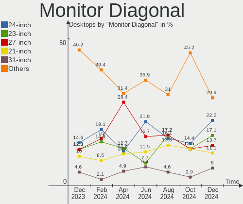
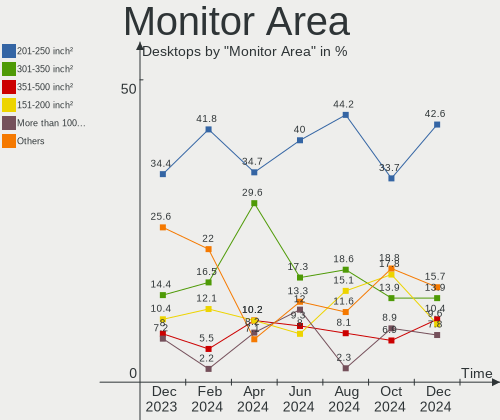
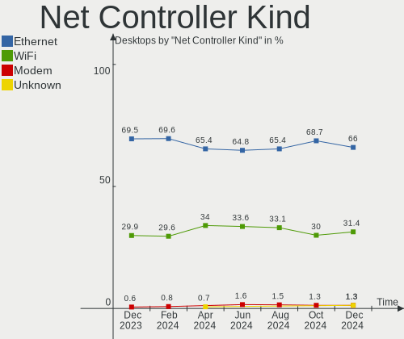
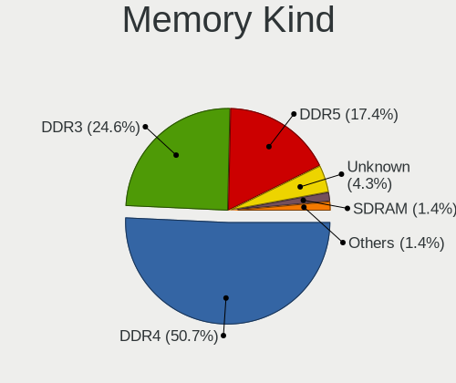

Linux in France - Hardware Trends (Desktops)
--------------------------------------------

A project to identify most popular hardware characteristics and track their change
over time based on data collected by Linux users at https://Linux-Hardware.org.

Anyone can contribute to this report by the [hw-probe](https://github.com/linuxhw/hw-probe) tool:

    sudo -E hw-probe -all -upload

Period: Jul, 2022.

Contents
--------

* [ System ](#system)
  - [ OS                       ](#os)
  - [ OS Family                ](#os-family)
  - [ Kernel                   ](#kernel)
  - [ Kernel Family            ](#kernel-family)
  - [ Kernel Major Ver.        ](#kernel-major-ver)
  - [ Arch                     ](#arch)
  - [ DE                       ](#de)
  - [ Display Server           ](#display-server)
  - [ Display Manager          ](#display-manager)
  - [ OS Lang                  ](#os-lang)
  - [ Boot Mode                ](#boot-mode)
  - [ Filesystem               ](#filesystem)
  - [ Part. scheme             ](#part-scheme)
  - [ Dual Boot with Linux/BSD ](#dual-boot-with-linuxbsd)
  - [ Dual Boot (Win)          ](#dual-boot-win)

* [ Board ](#board)
  - [ Vendor                   ](#vendor)
  - [ Model                    ](#model)
  - [ Model Family             ](#model-family)
  - [ MFG Year                 ](#mfg-year)
  - [ Form Factor              ](#form-factor)
  - [ Secure Boot              ](#secure-boot)
  - [ Coreboot                 ](#coreboot)
  - [ RAM Size                 ](#ram-size)
  - [ RAM Used                 ](#ram-used)
  - [ Total Drives             ](#total-drives)
  - [ Has CD-ROM               ](#has-cd-rom)
  - [ Has Ethernet             ](#has-ethernet)
  - [ Has WiFi                 ](#has-wifi)
  - [ Has Bluetooth            ](#has-bluetooth)

* [ Location ](#location)
  - [ Country                  ](#country)
  - [ City                     ](#city)

* [ Drives ](#drives)
  - [ Drive Vendor             ](#drive-vendor)
  - [ Drive Model              ](#drive-model)
  - [ HDD Vendor               ](#hdd-vendor)
  - [ SSD Vendor               ](#ssd-vendor)
  - [ Drive Kind               ](#drive-kind)
  - [ Drive Connector          ](#drive-connector)
  - [ Drive Size               ](#drive-size)
  - [ Space Total              ](#space-total)
  - [ Space Used               ](#space-used)
  - [ Malfunc. Drives          ](#malfunc-drives)
  - [ Malfunc. Drive Vendor    ](#malfunc-drive-vendor)
  - [ Malfunc. HDD Vendor      ](#malfunc-hdd-vendor)
  - [ Malfunc. Drive Kind      ](#malfunc-drive-kind)
  - [ Failed Drives            ](#failed-drives)
  - [ Failed Drive Vendor      ](#failed-drive-vendor)
  - [ Drive Status             ](#drive-status)

* [ Storage controller ](#storage-controller)
  - [ Storage Vendor           ](#storage-vendor)
  - [ Storage Model            ](#storage-model)
  - [ Storage Kind             ](#storage-kind)

* [ Processor ](#processor)
  - [ CPU Vendor               ](#cpu-vendor)
  - [ CPU Model                ](#cpu-model)
  - [ CPU Model Family         ](#cpu-model-family)
  - [ CPU Cores                ](#cpu-cores)
  - [ CPU Sockets              ](#cpu-sockets)
  - [ CPU Threads              ](#cpu-threads)
  - [ CPU Op-Modes             ](#cpu-op-modes)
  - [ CPU Microcode            ](#cpu-microcode)
  - [ CPU Microarch            ](#cpu-microarch)

* [ Graphics ](#graphics)
  - [ GPU Vendor               ](#gpu-vendor)
  - [ GPU Model                ](#gpu-model)
  - [ GPU Combo                ](#gpu-combo)
  - [ GPU Driver               ](#gpu-driver)
  - [ GPU Memory               ](#gpu-memory)

* [ Monitor ](#monitor)
  - [ Monitor Vendor           ](#monitor-vendor)
  - [ Monitor Model            ](#monitor-model)
  - [ Monitor Resolution       ](#monitor-resolution)
  - [ Monitor Diagonal         ](#monitor-diagonal)
  - [ Monitor Width            ](#monitor-width)
  - [ Aspect Ratio             ](#aspect-ratio)
  - [ Monitor Area             ](#monitor-area)
  - [ Pixel Density            ](#pixel-density)
  - [ Multiple Monitors        ](#multiple-monitors)

* [ Network ](#network)
  - [ Net Controller Vendor    ](#net-controller-vendor)
  - [ Net Controller Model     ](#net-controller-model)
  - [ Wireless Vendor          ](#wireless-vendor)
  - [ Wireless Model           ](#wireless-model)
  - [ Ethernet Vendor          ](#ethernet-vendor)
  - [ Ethernet Model           ](#ethernet-model)
  - [ Net Controller Kind      ](#net-controller-kind)
  - [ Used Controller          ](#used-controller)
  - [ NICs                     ](#nics)
  - [ IPv6                     ](#ipv6)

* [ Bluetooth ](#bluetooth)
  - [ Bluetooth Vendor         ](#bluetooth-vendor)
  - [ Bluetooth Model          ](#bluetooth-model)

* [ Sound ](#sound)
  - [ Sound Vendor             ](#sound-vendor)
  - [ Sound Model              ](#sound-model)

* [ Memory ](#memory)
  - [ Memory Vendor            ](#memory-vendor)
  - [ Memory Model             ](#memory-model)
  - [ Memory Kind              ](#memory-kind)
  - [ Memory Form Factor       ](#memory-form-factor)
  - [ Memory Size              ](#memory-size)
  - [ Memory Speed             ](#memory-speed)

* [ Printers & scanners ](#printers--scanners)
  - [ Printer Vendor           ](#printer-vendor)
  - [ Printer Model            ](#printer-model)
  - [ Scanner Vendor           ](#scanner-vendor)
  - [ Scanner Model            ](#scanner-model)

* [ Camera ](#camera)
  - [ Camera Vendor            ](#camera-vendor)
  - [ Camera Model             ](#camera-model)

* [ Security ](#security)
  - [ Fingerprint Vendor       ](#fingerprint-vendor)
  - [ Fingerprint Model        ](#fingerprint-model)
  - [ Chipcard Vendor          ](#chipcard-vendor)
  - [ Chipcard Model           ](#chipcard-model)

* [ Unsupported ](#unsupported)
  - [ Unsupported Devices      ](#unsupported-devices)
  - [ Unsupported Device Types ](#unsupported-device-types)

System
------

OS
--

Installed operating systems

| Name                         | Desktops | Percent |
|------------------------------|----------|---------|
| OpenMandriva 4.3             | 10       | 11.11%  |
| Ubuntu 22.04                 | 9        | 10%     |
| Linux Mint 20.3              | 9        | 10%     |
| Ubuntu 20.04                 | 8        | 8.89%   |
| Debian 11                    | 8        | 8.89%   |
| OpenMandriva 4.90            | 6        | 6.67%   |
| Xubuntu 20.04                | 4        | 4.44%   |
| Fedora 36                    | 3        | 3.33%   |
| Debian Unstable              | 3        | 3.33%   |
| Debian Testing               | 3        | 3.33%   |
| Arch Rolling                 | 3        | 3.33%   |
| Zorin 16                     | 2        | 2.22%   |
| Xubuntu 22.04                | 2        | 2.22%   |
| Pop!_OS 22.04                | 2        | 2.22%   |
| Kubuntu 22.04                | 2        | 2.22%   |
| Kubuntu 20.04                | 2        | 2.22%   |
| CentOS 7                     | 2        | 2.22%   |
| Xubuntu 20.10                | 1        | 1.11%   |
| Void Linux Rolling           | 1        | 1.11%   |
| Pop!_OS 21.10                | 1        | 1.11%   |
| openSUSE Tumbleweed-XXXXXXXX | 1        | 1.11%   |
| Manjaro                      | 1        | 1.11%   |
| Linux Mint 21                | 1        | 1.11%   |
| KDE neon 20.04               | 1        | 1.11%   |
| Kali 2022.3                  | 1        | 1.11%   |
| Fedora 35                    | 1        | 1.11%   |
| Elementary 6.1               | 1        | 1.11%   |
| Debian 10                    | 1        | 1.11%   |
| Arch                         | 1        | 1.11%   |

OS Family
---------

OS without a version

| Name         | Desktops | Percent |
|--------------|----------|---------|
| Ubuntu       | 17       | 18.89%  |
| OpenMandriva | 16       | 17.78%  |
| Debian       | 15       | 16.67%  |
| Linux Mint   | 10       | 11.11%  |
| Xubuntu      | 7        | 7.78%   |
| Kubuntu      | 4        | 4.44%   |
| Fedora       | 4        | 4.44%   |
| Arch         | 4        | 4.44%   |
| Pop!_OS      | 3        | 3.33%   |
| Zorin        | 2        | 2.22%   |
| CentOS       | 2        | 2.22%   |
| Void Linux   | 1        | 1.11%   |
| openSUSE     | 1        | 1.11%   |
| Manjaro      | 1        | 1.11%   |
| KDE neon     | 1        | 1.11%   |
| Kali         | 1        | 1.11%   |
| Elementary   | 1        | 1.11%   |

Kernel
------

Version of the Linux kernel

| Version                     | Desktops | Percent |
|-----------------------------|----------|---------|
| 5.15.0-41-generic           | 11       | 12.22%  |
| 5.16.7-desktop-1omv4003     | 10       | 11.11%  |
| 5.4.0-122-generic           | 7        | 7.78%   |
| 5.18.12-desktop-3omv4090    | 6        | 6.67%   |
| 5.13.0-52-generic           | 6        | 6.67%   |
| 5.4.0-121-generic           | 5        | 5.56%   |
| 5.15.0-40-generic           | 5        | 5.56%   |
| 5.10.0-16-amd64             | 4        | 4.44%   |
| 5.18.0-2-amd64              | 3        | 3.33%   |
| 5.17.15-76051715-generic    | 3        | 3.33%   |
| 5.18.9-arch1-1              | 2        | 2.22%   |
| 5.18.12-arch1-1             | 2        | 2.22%   |
| 5.18.10-200.fc36.x86_64     | 2        | 2.22%   |
| 5.15.0-43-generic           | 2        | 2.22%   |
| 5.10.0-15-amd64             | 2        | 2.22%   |
| 5.8.0-63-generic            | 1        | 1.11%   |
| 5.4.0-42-generic            | 1        | 1.11%   |
| 5.4.0-117-generic           | 1        | 1.11%   |
| 5.4.0-104-generic           | 1        | 1.11%   |
| 5.18.7-100.fc35.x86_64      | 1        | 1.11%   |
| 5.18.13-200.fc36.x86_64     | 1        | 1.11%   |
| 5.18.0-kali5-amd64          | 1        | 1.11%   |
| 5.18.0-3-amd64              | 1        | 1.11%   |
| 5.18.0-2-rt-amd64           | 1        | 1.11%   |
| 5.17.9-1-default            | 1        | 1.11%   |
| 5.17.15-1-MANJARO           | 1        | 1.11%   |
| 5.16.0-3-amd64              | 1        | 1.11%   |
| 5.15.50_1                   | 1        | 1.11%   |
| 5.15.30-2-pve               | 1        | 1.11%   |
| 5.13.0-44-generic           | 1        | 1.11%   |
| 5.13.0-28-generic           | 1        | 1.11%   |
| 5.10.0-13-amd64             | 1        | 1.11%   |
| 4.19.0-12-amd64             | 1        | 1.11%   |
| 3.10.0-957.10.1.el7.x86_64  | 1        | 1.11%   |
| 3.10.0-1160.66.1.el7.x86_64 | 1        | 1.11%   |

Kernel Family
-------------

Linux kernel without a distro release

| Version | Desktops | Percent |
|---------|----------|---------|
| 5.15.0  | 18       | 20%     |
| 5.4.0   | 15       | 16.67%  |
| 5.16.7  | 10       | 11.11%  |
| 5.18.12 | 8        | 8.89%   |
| 5.13.0  | 8        | 8.89%   |
| 5.10.0  | 7        | 7.78%   |
| 5.18.0  | 6        | 6.67%   |
| 5.17.15 | 4        | 4.44%   |
| 5.18.9  | 2        | 2.22%   |
| 5.18.10 | 2        | 2.22%   |
| 3.10.0  | 2        | 2.22%   |
| 5.8.0   | 1        | 1.11%   |
| 5.18.7  | 1        | 1.11%   |
| 5.18.13 | 1        | 1.11%   |
| 5.17.9  | 1        | 1.11%   |
| 5.16.0  | 1        | 1.11%   |
| 5.15.50 | 1        | 1.11%   |
| 5.15.30 | 1        | 1.11%   |
| 4.19.0  | 1        | 1.11%   |

Kernel Major Ver.
-----------------

Linux kernel major version

| Version | Desktops | Percent |
|---------|----------|---------|
| 5.18    | 20       | 22.22%  |
| 5.15    | 20       | 22.22%  |
| 5.4     | 15       | 16.67%  |
| 5.16    | 11       | 12.22%  |
| 5.13    | 8        | 8.89%   |
| 5.10    | 7        | 7.78%   |
| 5.17    | 5        | 5.56%   |
| 3.10    | 2        | 2.22%   |
| 5.8     | 1        | 1.11%   |
| 4.19    | 1        | 1.11%   |

Arch
----

OS architecture (x86_64, i586, etc.)

| Name   | Desktops | Percent |
|--------|----------|---------|
| x86_64 | 90       | 100%    |

DE
--

Desktop Environment

| Name       | Desktops | Percent |
|------------|----------|---------|
| KDE5       | 28       | 31.11%  |
| GNOME      | 25       | 27.78%  |
| XFCE       | 11       | 12.22%  |
| X-Cinnamon | 9        | 10%     |
| Unknown    | 5        | 5.56%   |
| MATE       | 3        | 3.33%   |
| Cinnamon   | 3        | 3.33%   |
| Unity      | 2        | 2.22%   |
| Pantheon   | 1        | 1.11%   |
| LXDE       | 1        | 1.11%   |
| KDE4       | 1        | 1.11%   |
| KDE        | 1        | 1.11%   |

Display Server
--------------

X11 or Wayland

| Name    | Desktops | Percent |
|---------|----------|---------|
| X11     | 72       | 80%     |
| Wayland | 10       | 11.11%  |
| Tty     | 6        | 6.67%   |
| Unknown | 2        | 2.22%   |

Display Manager
---------------

SDDM, LightDM, etc.

| Name    | Desktops | Percent |
|---------|----------|---------|
| LightDM | 28       | 31.11%  |
| SDDM    | 24       | 26.67%  |
| Unknown | 18       | 20%     |
| GDM3    | 11       | 12.22%  |
| GDM     | 9        | 10%     |

OS Lang
-------

Language

| Lang  | Desktops | Percent |
|-------|----------|---------|
| fr_FR | 68       | 75.56%  |
| en_US | 18       | 20%     |
| en_GB | 2        | 2.22%   |
| ru_RU | 1        | 1.11%   |
| nl_NL | 1        | 1.11%   |

Boot Mode
---------

EFI or BIOS

| Mode | Desktops | Percent |
|------|----------|---------|
| BIOS | 46       | 51.11%  |
| EFI  | 44       | 48.89%  |

Filesystem
----------

Type of filesystem

| Type    | Desktops | Percent |
|---------|----------|---------|
| Ext4    | 63       | 70%     |
| Overlay | 16       | 17.78%  |
| Btrfs   | 9        | 10%     |
| Xfs     | 2        | 2.22%   |

Part. scheme
------------

Scheme of partitioning

| Type    | Desktops | Percent |
|---------|----------|---------|
| GPT     | 50       | 55.56%  |
| MBR     | 21       | 23.33%  |
| Unknown | 19       | 21.11%  |

Dual Boot with Linux/BSD
------------------------

Hosting more than one Linux/BSD

| Dual boot | Desktops | Percent |
|-----------|----------|---------|
| No        | 61       | 67.78%  |
| Yes       | 29       | 32.22%  |

Dual Boot (Win)
---------------

Hosting Linux and Windows

| Dual boot | Desktops | Percent |
|-----------|----------|---------|
| No        | 67       | 74.44%  |
| Yes       | 23       | 25.56%  |

Board
-----

Vendor
------

Motherboard manufacturer

| Name                | Desktops | Percent |
|---------------------|----------|---------|
| Gigabyte Technology | 23       | 25.56%  |
| ASUSTek Computer    | 19       | 21.11%  |
| MSI                 | 17       | 18.89%  |
| Hewlett-Packard     | 10       | 11.11%  |
| Dell                | 8        | 8.89%   |
| Intel               | 4        | 4.44%   |
| ASRock              | 4        | 4.44%   |
| Lenovo              | 3        | 3.33%   |
| Pegatron            | 1        | 1.11%   |
| Acer                | 1        | 1.11%   |

Model
-----

Motherboard model

| Name                                     | Desktops | Percent |
|------------------------------------------|----------|---------|
| ASUS All Series                          | 3        | 3.33%   |
| MSI MS-7D43                              | 2        | 2.22%   |
| MSI MS-7C92                              | 2        | 2.22%   |
| ASUS TUF Gaming X570-PLUS                | 2        | 2.22%   |
| ASUS CUSTOM                              | 2        | 2.22%   |
| Pegatron Pro 3010 Microtower PC          | 1        | 1.11%   |
| MSI MS-7D54                              | 1        | 1.11%   |
| MSI MS-7D53                              | 1        | 1.11%   |
| MSI MS-7D09                              | 1        | 1.11%   |
| MSI MS-7C75                              | 1        | 1.11%   |
| MSI MS-7B84                              | 1        | 1.11%   |
| MSI MS-7A70                              | 1        | 1.11%   |
| MSI MS-7A33                              | 1        | 1.11%   |
| MSI MS-7995                              | 1        | 1.11%   |
| MSI MS-7977                              | 1        | 1.11%   |
| MSI MS-7924                              | 1        | 1.11%   |
| MSI MS-7798                              | 1        | 1.11%   |
| MSI MS-7721                              | 1        | 1.11%   |
| MSI MS-7592                              | 1        | 1.11%   |
| Lenovo ThinkCentre A61 9144A23           | 1        | 1.11%   |
| Lenovo IdeaCentre G5 14IMB05 90N900CTFR  | 1        | 1.11%   |
| Lenovo 7033EW4                           | 1        | 1.11%   |
| Intel SHARKBAY                           | 1        | 1.11%   |
| Intel DP55KG AAE47218-404                | 1        | 1.11%   |
| Intel DH61AG AAG23736-505                | 1        | 1.11%   |
| Intel DH55TC AAE70932-303                | 1        | 1.11%   |
| HP Z440 Workstation                      | 1        | 1.11%   |
| HP Z400 Workstation                      | 1        | 1.11%   |
| HP xw4400 Workstation                    | 1        | 1.11%   |
| HP ProLiant MicroServer                  | 1        | 1.11%   |
| HP ProDesk 490 G2 MT                     | 1        | 1.11%   |
| HP Pavilion Desktop TP01-2xxx            | 1        | 1.11%   |
| HP EliteDesk 800 G6 Small Form Factor PC | 1        | 1.11%   |
| HP Compaq Pro 6300 SFF                   | 1        | 1.11%   |
| HP Compaq 8200 Elite SFF PC              | 1        | 1.11%   |
| HP Compaq 6000 Pro MT PC                 | 1        | 1.11%   |
| Gigabyte Z77-D3H                         | 1        | 1.11%   |
| Gigabyte Z590M                           | 1        | 1.11%   |
| Gigabyte Z170XP-SLI                      | 1        | 1.11%   |
| Gigabyte X570 AORUS ULTRA                | 1        | 1.11%   |
| Gigabyte X470 AORUS ULTRA GAMING         | 1        | 1.11%   |
| Gigabyte M68M-S2P                        | 1        | 1.11%   |
| Gigabyte H81M-S2PH                       | 1        | 1.11%   |
| Gigabyte H77N-WIFI                       | 1        | 1.11%   |
| Gigabyte H61M-S2PV                       | 1        | 1.11%   |
| Gigabyte H470M DS3H                      | 1        | 1.11%   |
| Gigabyte H370AORUSGAMING3WIFI            | 1        | 1.11%   |
| Gigabyte H110M-S2H-CF                    | 1        | 1.11%   |
| Gigabyte GA-MA785GM-US2H                 | 1        | 1.11%   |
| Gigabyte GA-A75-UD4H                     | 1        | 1.11%   |
| Gigabyte G41M-ES2L                       | 1        | 1.11%   |
| Gigabyte G41M-Combo                      | 1        | 1.11%   |
| Gigabyte F2A78M-DS2                      | 1        | 1.11%   |
| Gigabyte EP45-UD3                        | 1        | 1.11%   |
| Gigabyte B75M-D3H                        | 1        | 1.11%   |
| Gigabyte B550 AORUS ELITE V2             | 1        | 1.11%   |
| Gigabyte B150M-D3H-CF                    | 1        | 1.11%   |
| Gigabyte AB350-Gaming 3                  | 1        | 1.11%   |
| Gigabyte A520M DS3H                      | 1        | 1.11%   |
| Dell Precision WorkStation T3500         | 1        | 1.11%   |

Model Family
------------

Motherboard model prefix

| Name                          | Desktops | Percent |
|-------------------------------|----------|---------|
| Dell OptiPlex                 | 4        | 4.44%   |
| ASUS TUF                      | 4        | 4.44%   |
| HP Compaq                     | 3        | 3.33%   |
| Dell Precision                | 3        | 3.33%   |
| ASUS All                      | 3        | 3.33%   |
| MSI MS-7D43                   | 2        | 2.22%   |
| MSI MS-7C92                   | 2        | 2.22%   |
| ASUS CUSTOM                   | 2        | 2.22%   |
| Pegatron Pro                  | 1        | 1.11%   |
| MSI MS-7D54                   | 1        | 1.11%   |
| MSI MS-7D53                   | 1        | 1.11%   |
| MSI MS-7D09                   | 1        | 1.11%   |
| MSI MS-7C75                   | 1        | 1.11%   |
| MSI MS-7B84                   | 1        | 1.11%   |
| MSI MS-7A70                   | 1        | 1.11%   |
| MSI MS-7A33                   | 1        | 1.11%   |
| MSI MS-7995                   | 1        | 1.11%   |
| MSI MS-7977                   | 1        | 1.11%   |
| MSI MS-7924                   | 1        | 1.11%   |
| MSI MS-7798                   | 1        | 1.11%   |
| MSI MS-7721                   | 1        | 1.11%   |
| MSI MS-7592                   | 1        | 1.11%   |
| Lenovo ThinkCentre            | 1        | 1.11%   |
| Lenovo IdeaCentre             | 1        | 1.11%   |
| Lenovo 7033EW4                | 1        | 1.11%   |
| Intel SHARKBAY                | 1        | 1.11%   |
| Intel DP55KG                  | 1        | 1.11%   |
| Intel DH61AG                  | 1        | 1.11%   |
| Intel DH55TC                  | 1        | 1.11%   |
| HP Z440                       | 1        | 1.11%   |
| HP Z400                       | 1        | 1.11%   |
| HP xw4400                     | 1        | 1.11%   |
| HP ProLiant                   | 1        | 1.11%   |
| HP ProDesk                    | 1        | 1.11%   |
| HP Pavilion                   | 1        | 1.11%   |
| HP EliteDesk                  | 1        | 1.11%   |
| Gigabyte Z77-D3H              | 1        | 1.11%   |
| Gigabyte Z590M                | 1        | 1.11%   |
| Gigabyte Z170XP-SLI           | 1        | 1.11%   |
| Gigabyte X570                 | 1        | 1.11%   |
| Gigabyte X470                 | 1        | 1.11%   |
| Gigabyte M68M-S2P             | 1        | 1.11%   |
| Gigabyte H81M-S2PH            | 1        | 1.11%   |
| Gigabyte H77N-WIFI            | 1        | 1.11%   |
| Gigabyte H61M-S2PV            | 1        | 1.11%   |
| Gigabyte H470M                | 1        | 1.11%   |
| Gigabyte H370AORUSGAMING3WIFI | 1        | 1.11%   |
| Gigabyte H110M-S2H-CF         | 1        | 1.11%   |
| Gigabyte GA-MA785GM-US2H      | 1        | 1.11%   |
| Gigabyte GA-A75-UD4H          | 1        | 1.11%   |
| Gigabyte G41M-ES2L            | 1        | 1.11%   |
| Gigabyte G41M-Combo           | 1        | 1.11%   |
| Gigabyte F2A78M-DS2           | 1        | 1.11%   |
| Gigabyte EP45-UD3             | 1        | 1.11%   |
| Gigabyte B75M-D3H             | 1        | 1.11%   |
| Gigabyte B550                 | 1        | 1.11%   |
| Gigabyte B150M-D3H-CF         | 1        | 1.11%   |
| Gigabyte AB350-Gaming         | 1        | 1.11%   |
| Gigabyte A520M                | 1        | 1.11%   |
| Dell Inspiron                 | 1        | 1.11%   |

MFG Year
--------

Motherboard manufacture year

| Year | Desktops | Percent |
|------|----------|---------|
| 2021 | 13       | 14.44%  |
| 2011 | 10       | 11.11%  |
| 2009 | 10       | 11.11%  |
| 2020 | 9        | 10%     |
| 2015 | 8        | 8.89%   |
| 2013 | 8        | 8.89%   |
| 2012 | 7        | 7.78%   |
| 2018 | 5        | 5.56%   |
| 2019 | 4        | 4.44%   |
| 2017 | 4        | 4.44%   |
| 2010 | 4        | 4.44%   |
| 2016 | 3        | 3.33%   |
| 2014 | 2        | 2.22%   |
| 2007 | 2        | 2.22%   |
| 2006 | 1        | 1.11%   |

Form Factor
-----------

Physical design of the computer

| Name    | Desktops | Percent |
|---------|----------|---------|
| Desktop | 90       | 100%    |

Secure Boot
-----------

Enabled or disabled

| State    | Desktops | Percent |
|----------|----------|---------|
| Disabled | 86       | 95.56%  |
| Enabled  | 4        | 4.44%   |

Coreboot
--------

Have coreboot on board

| Used | Desktops | Percent |
|------|----------|---------|
| No   | 90       | 100%    |

RAM Size
--------

Total RAM memory

| Size in GB  | Desktops | Percent |
|-------------|----------|---------|
| 16.01-24.0  | 27       | 30%     |
| 4.01-8.0    | 19       | 21.11%  |
| 8.01-16.0   | 18       | 20%     |
| 32.01-64.0  | 9        | 10%     |
| 3.01-4.0    | 7        | 7.78%   |
| 24.01-32.0  | 4        | 4.44%   |
| 64.01-256.0 | 4        | 4.44%   |
| 2.01-3.0    | 1        | 1.11%   |
| 1.01-2.0    | 1        | 1.11%   |

RAM Used
--------

Used RAM memory

| Used GB    | Desktops | Percent |
|------------|----------|---------|
| 1.01-2.0   | 33       | 36.67%  |
| 2.01-3.0   | 18       | 20%     |
| 4.01-8.0   | 14       | 15.56%  |
| 3.01-4.0   | 14       | 15.56%  |
| 8.01-16.0  | 5        | 5.56%   |
| 0.51-1.0   | 4        | 4.44%   |
| 16.01-24.0 | 1        | 1.11%   |
| 0.01-0.5   | 1        | 1.11%   |

Total Drives
------------

Number of drives on board

| Drives | Desktops | Percent |
|--------|----------|---------|
| 2      | 32       | 35.56%  |
| 1      | 24       | 26.67%  |
| 3      | 12       | 13.33%  |
| 4      | 11       | 12.22%  |
| 5      | 4        | 4.44%   |
| 6      | 2        | 2.22%   |
| 14     | 1        | 1.11%   |
| 9      | 1        | 1.11%   |
| 8      | 1        | 1.11%   |
| 7      | 1        | 1.11%   |
| 0      | 1        | 1.11%   |

Has CD-ROM
----------

Has CD-ROM on board

| Presented | Desktops | Percent |
|-----------|----------|---------|
| Yes       | 52       | 57.78%  |
| No        | 38       | 42.22%  |

Has Ethernet
------------

Has Ethernet on board

| Presented | Desktops | Percent |
|-----------|----------|---------|
| Yes       | 90       | 100%    |

Has WiFi
--------

Has WiFi module

| Presented | Desktops | Percent |
|-----------|----------|---------|
| No        | 60       | 66.67%  |
| Yes       | 30       | 33.33%  |

Has Bluetooth
-------------

Has Bluetooth module

| Presented | Desktops | Percent |
|-----------|----------|---------|
| No        | 64       | 71.11%  |
| Yes       | 26       | 28.89%  |

Location
--------

Country
-------

Geographic location (country)

| Country | Desktops | Percent |
|---------|----------|---------|
| France  | 90       | 100%    |

City
----

Geographic location (city)

| City                      | Desktops | Percent |
|---------------------------|----------|---------|
| Paris                     | 7        | 7.78%   |
| Roubaix                   | 3        | 3.33%   |
| Grenoble                  | 3        | 3.33%   |
| Villeneuve-d'Ascq         | 2        | 2.22%   |
| Nîmes                    | 2        | 2.22%   |
| Guilherand-Granges        | 2        | 2.22%   |
| Clichy-sous-Bois          | 2        | 2.22%   |
| Clermont-Ferrand          | 2        | 2.22%   |
| Chambéry                 | 2        | 2.22%   |
| Bougival                  | 2        | 2.22%   |
| Blanzy-la-Salonnaise      | 2        | 2.22%   |
| Vitry-sur-Seine           | 1        | 1.11%   |
| Vitré                    | 1        | 1.11%   |
| Versailles                | 1        | 1.11%   |
| Verfeil                   | 1        | 1.11%   |
| Vélizy-Villacoublay      | 1        | 1.11%   |
| Vallauris                 | 1        | 1.11%   |
| Valenciennes              | 1        | 1.11%   |
| Trets                     | 1        | 1.11%   |
| Toulon                    | 1        | 1.11%   |
| Toul                      | 1        | 1.11%   |
| Strasbourg                | 1        | 1.11%   |
| Septemes-les-Vallons      | 1        | 1.11%   |
| Seclin                    | 1        | 1.11%   |
| Sautron                   | 1        | 1.11%   |
| Sarre-Union               | 1        | 1.11%   |
| Saint-Raphaël            | 1        | 1.11%   |
| Saint-Paul-les-Dax        | 1        | 1.11%   |
| Saint-Julien-de-Concelles | 1        | 1.11%   |
| Rouen                     | 1        | 1.11%   |
| Roche-la-Moliere          | 1        | 1.11%   |
| Rixheim                   | 1        | 1.11%   |
| Riscle                    | 1        | 1.11%   |
| Rancy                     | 1        | 1.11%   |
| Plaisir                   | 1        | 1.11%   |
| Peronne                   | 1        | 1.11%   |
| Orsay                     | 1        | 1.11%   |
| Niort                     | 1        | 1.11%   |
| Mouries                   | 1        | 1.11%   |
| Montereau-Fault-Yonne     | 1        | 1.11%   |
| Montauban                 | 1        | 1.11%   |
| Monistrol-sur-Loire       | 1        | 1.11%   |
| Miramas                   | 1        | 1.11%   |
| Mieuxce                   | 1        | 1.11%   |
| Mespaul                   | 1        | 1.11%   |
| Meaux                     | 1        | 1.11%   |
| Marseille                 | 1        | 1.11%   |
| Lyon                      | 1        | 1.11%   |
| Lille                     | 1        | 1.11%   |
| Lautenbach                | 1        | 1.11%   |
| La Rochelle               | 1        | 1.11%   |
| La Roche-sur-Yon          | 1        | 1.11%   |
| Gennevilliers             | 1        | 1.11%   |
| Gennes                    | 1        | 1.11%   |
| Gap                       | 1        | 1.11%   |
| Frouzins                  | 1        | 1.11%   |
| Creutzwald                | 1        | 1.11%   |
| Cleder                    | 1        | 1.11%   |
| Chartres                  | 1        | 1.11%   |
| Charleville-Mézières    | 1        | 1.11%   |

Drives
------

Drive Vendor
------------

Hard drive vendors

| Vendor              | Desktops | Drives | Percent |
|---------------------|----------|--------|---------|
| WDC                 | 36       | 47     | 20.11%  |
| Samsung Electronics | 36       | 50     | 20.11%  |
| Seagate             | 30       | 53     | 16.76%  |
| Crucial             | 19       | 22     | 10.61%  |
| Kingston            | 10       | 10     | 5.59%   |
| Toshiba             | 8        | 16     | 4.47%   |
| SanDisk             | 6        | 6      | 3.35%   |
| Hitachi             | 5        | 5      | 2.79%   |
| TEXTORM             | 4        | 4      | 2.23%   |
| PNY                 | 2        | 2      | 1.12%   |
| OCZ                 | 2        | 2      | 1.12%   |
| Maxtor              | 2        | 2      | 1.12%   |
| KIOXIA              | 2        | 2      | 1.12%   |
| HGST                | 2        | 2      | 1.12%   |
| China               | 2        | 2      | 1.12%   |
| UMIS                | 1        | 1      | 0.56%   |
| Transcend           | 1        | 1      | 0.56%   |
| SSD 32GB            | 1        | 1      | 0.56%   |
| RSH-319             | 1        | 1      | 0.56%   |
| Plextor             | 1        | 1      | 0.56%   |
| Phison              | 1        | 1      | 0.56%   |
| LDLC                | 1        | 1      | 0.56%   |
| Intenso             | 1        | 1      | 0.56%   |
| Intel               | 1        | 1      | 0.56%   |
| GALAX               | 1        | 1      | 0.56%   |
| Apple               | 1        | 1      | 0.56%   |
| A-DATA Technology   | 1        | 1      | 0.56%   |
| Unknown             | 1        | 1      | 0.56%   |

Drive Model
-----------

Hard drive models

| Model                            | Desktops | Percent |
|----------------------------------|----------|---------|
| Crucial CT500MX500SSD1 500GB     | 6        | 2.79%   |
| Toshiba HDWD130 3TB              | 3        | 1.4%    |
| TEXTORM BM5 240GB SSD            | 3        | 1.4%    |
| Seagate ST3500418AS 500GB        | 3        | 1.4%    |
| Seagate ST1000DM003-1SB10C 1TB   | 3        | 1.4%    |
| Seagate ST1000DM003-1SB102 1TB   | 3        | 1.4%    |
| Samsung SSD 860 EVO 500GB        | 3        | 1.4%    |
| Samsung HD103UJ 1TB              | 3        | 1.4%    |
| Samsung HD103SI 1TB              | 3        | 1.4%    |
| Kingston SV300S37A60G 64GB SSD   | 3        | 1.4%    |
| Crucial CT240BX500SSD1 240GB     | 3        | 1.4%    |
| WDC WD5000AADS-00S9B0 500GB      | 2        | 0.93%   |
| WDC WD20EZRZ-00Z5HB0 2TB         | 2        | 0.93%   |
| WDC WD10EZEX-08WN4A0 1TB         | 2        | 0.93%   |
| WDC WD10EZEX-08M2NA0 1TB         | 2        | 0.93%   |
| WDC WD10EZEX-00BBHA0 1TB         | 2        | 0.93%   |
| Seagate ST8000VN0022-2EL112 8TB  | 2        | 0.93%   |
| Seagate ST2000DM008-2FR102 2TB   | 2        | 0.93%   |
| Seagate ST2000DM001-1CH164 2TB   | 2        | 0.93%   |
| Seagate ST1000LM049-2GH172 1TB   | 2        | 0.93%   |
| Samsung SSD 980 PRO 500GB        | 2        | 0.93%   |
| Samsung SSD 970 EVO Plus 500GB   | 2        | 0.93%   |
| Samsung SSD 970 EVO Plus 2TB     | 2        | 0.93%   |
| Samsung SSD 970 EVO Plus 1TB     | 2        | 0.93%   |
| Samsung SSD 850 PRO 512GB        | 2        | 0.93%   |
| Samsung SSD 850 EVO 250GB        | 2        | 0.93%   |
| Samsung SSD 840 PRO Series 128GB | 2        | 0.93%   |
| Kingston SV300S37A120G 120GB SSD | 2        | 0.93%   |
| Kingston SA400S37240G 240GB SSD  | 2        | 0.93%   |
| Crucial CT480BX500SSD1 480GB     | 2        | 0.93%   |
| Crucial CT275MX300SSD1 275GB     | 2        | 0.93%   |
| Crucial CT1000MX500SSD1 1TB      | 2        | 0.93%   |
| WDC WDS240G2G0A-00JH30 240GB SSD | 1        | 0.47%   |
| WDC WDS200T2B0A 2TB SSD          | 1        | 0.47%   |
| WDC WD82PURZ-85TEUY0 8TB         | 1        | 0.47%   |
| WDC WD740GD-00FLA0 74GB          | 1        | 0.47%   |
| WDC WD60EZAZ-00ZGHB0 6TB         | 1        | 0.47%   |
| WDC WD60EZAZ-00SF3B0 6TB         | 1        | 0.47%   |
| WDC WD5000LPVT-22G33T0 500GB     | 1        | 0.47%   |
| WDC WD5000AAKX-22ERMA0 500GB     | 1        | 0.47%   |
| WDC WD5000AAKX-00ERMA0 500GB     | 1        | 0.47%   |
| WDC WD5000AAKS-00A7B0 500GB      | 1        | 0.47%   |
| WDC WD5000AADS-00M2B0 500GB      | 1        | 0.47%   |
| WDC WD40EZRZ-00WN9B0 4TB         | 1        | 0.47%   |
| WDC WD40EFRX-68N32N0 4TB         | 1        | 0.47%   |
| WDC WD3200BPVT-22ZEST0 320GB     | 1        | 0.47%   |
| WDC WD3200AAKS-00L9A0 320GB      | 1        | 0.47%   |
| WDC WD30EZRZ-22Z5HB0 3TB         | 1        | 0.47%   |
| WDC WD30EZRX-00SPEB0 3TB         | 1        | 0.47%   |
| WDC WD30EFRX-68EUZN0 3TB         | 1        | 0.47%   |
| WDC WD30EFRX-68AX9N0 3TB         | 1        | 0.47%   |
| WDC WD3003FZEX-00Z4SA0 3TB       | 1        | 0.47%   |
| WDC WD3000HLHX-60JJPV0 304GB     | 1        | 0.47%   |
| WDC WD20EZRX-00DC0B0 2TB         | 1        | 0.47%   |
| WDC WD20EZBX-00AYRA0 2TB         | 1        | 0.47%   |
| WDC WD20EARX-00PASB0 2TB         | 1        | 0.47%   |
| WDC WD1600AAJS-08L7A0 160GB      | 1        | 0.47%   |
| WDC WD10EZRX-00D8PB0 1TB         | 1        | 0.47%   |
| WDC WD10EZEX-00MFCA0 1TB         | 1        | 0.47%   |
| WDC WD10EARX-00N0YB0 1TB         | 1        | 0.47%   |

HDD Vendor
----------

Hard disk drive vendors

| Vendor              | Desktops | Drives | Percent |
|---------------------|----------|--------|---------|
| WDC                 | 35       | 45     | 37.63%  |
| Seagate             | 29       | 51     | 31.18%  |
| Samsung Electronics | 11       | 13     | 11.83%  |
| Toshiba             | 7        | 15     | 7.53%   |
| Hitachi             | 5        | 5      | 5.38%   |
| Maxtor              | 2        | 2      | 2.15%   |
| HGST                | 2        | 2      | 2.15%   |
| RSH-319             | 1        | 1      | 1.08%   |
| Apple               | 1        | 1      | 1.08%   |

SSD Vendor
----------

Solid state drive vendors

| Vendor              | Desktops | Drives | Percent |
|---------------------|----------|--------|---------|
| Crucial             | 17       | 20     | 26.15%  |
| Samsung Electronics | 15       | 18     | 23.08%  |
| Kingston            | 10       | 10     | 15.38%  |
| SanDisk             | 5        | 5      | 7.69%   |
| TEXTORM             | 4        | 4      | 6.15%   |
| WDC                 | 2        | 2      | 3.08%   |
| PNY                 | 2        | 2      | 3.08%   |
| OCZ                 | 2        | 2      | 3.08%   |
| China               | 2        | 2      | 3.08%   |
| Transcend           | 1        | 1      | 1.54%   |
| Toshiba             | 1        | 1      | 1.54%   |
| Plextor             | 1        | 1      | 1.54%   |
| LDLC                | 1        | 1      | 1.54%   |
| Intenso             | 1        | 1      | 1.54%   |
| Unknown             | 1        | 1      | 1.54%   |

Drive Kind
----------

HDD or SSD

| Kind    | Desktops | Drives | Percent |
|---------|----------|--------|---------|
| HDD     | 63       | 135    | 44.06%  |
| SSD     | 55       | 71     | 38.46%  |
| NVMe    | 22       | 29     | 15.38%  |
| Unknown | 3        | 3      | 2.1%    |

Drive Connector
---------------

SATA, SAS, NVMe, etc.

| Type | Desktops | Drives | Percent |
|------|----------|--------|---------|
| SATA | 83       | 206    | 76.85%  |
| NVMe | 22       | 29     | 20.37%  |
| SAS  | 3        | 3      | 2.78%   |

Drive Size
----------

Size of hard drive

| Size in TB | Desktops | Drives | Percent |
|------------|----------|--------|---------|
| 0.01-0.5   | 62       | 91     | 43.06%  |
| 0.51-1.0   | 42       | 51     | 29.17%  |
| 1.01-2.0   | 17       | 20     | 11.81%  |
| 4.01-10.0  | 9        | 18     | 6.25%   |
| 2.01-3.0   | 8        | 14     | 5.56%   |
| 3.01-4.0   | 5        | 11     | 3.47%   |
| 10.01-20.0 | 1        | 1      | 0.69%   |

Space Total
-----------

Amount of disk space available on the file system

| Size in GB     | Desktops | Percent |
|----------------|----------|---------|
| More than 3000 | 14       | 15.56%  |
| 1001-2000      | 14       | 15.56%  |
| 501-1000       | 14       | 15.56%  |
| 101-250        | 13       | 14.44%  |
| 251-500        | 12       | 13.33%  |
| 1-20           | 11       | 12.22%  |
| 2001-3000      | 7        | 7.78%   |
| Unknown        | 3        | 3.33%   |
| 21-50          | 2        | 2.22%   |

Space Used
----------

Amount of used disk space

| Used GB        | Desktops | Percent |
|----------------|----------|---------|
| 501-1000       | 18       | 20%     |
| 1-20           | 17       | 18.89%  |
| 101-250        | 12       | 13.33%  |
| More than 3000 | 8        | 8.89%   |
| 251-500        | 8        | 8.89%   |
| 21-50          | 7        | 7.78%   |
| 51-100         | 7        | 7.78%   |
| 2001-3000      | 5        | 5.56%   |
| 1001-2000      | 5        | 5.56%   |
| Unknown        | 3        | 3.33%   |

Malfunc. Drives
---------------

Drive models with a malfunction

| Model                                   | Desktops | Drives | Percent |
|-----------------------------------------|----------|--------|---------|
| Samsung Electronics HD103SI 1TB         | 2        | 2      | 9.52%   |
| WDC WD5000LPVT-22G33T0 500GB            | 1        | 1      | 4.76%   |
| WDC WD5000AAKX-22ERMA0 500GB            | 1        | 1      | 4.76%   |
| WDC WD5000AADS-00S9B0 500GB             | 1        | 1      | 4.76%   |
| WDC WD10EZEX-08M2NA0 1TB                | 1        | 1      | 4.76%   |
| WDC WD10EARX-00N0YB0 1TB                | 1        | 1      | 4.76%   |
| Toshiba HDWE140 4TB                     | 1        | 1      | 4.76%   |
| Toshiba HDWD130 3TB                     | 1        | 6      | 4.76%   |
| TEXTORM B5 120GB SSD                    | 1        | 1      | 4.76%   |
| Seagate ST4000VX000-2AG166 4TB          | 1        | 2      | 4.76%   |
| Seagate ST3250410AS 250GB               | 1        | 1      | 4.76%   |
| Seagate ST2000DM001-1CH164 2TB          | 1        | 1      | 4.76%   |
| SanDisk SDSSDXPS240G 240GB              | 1        | 1      | 4.76%   |
| Samsung Electronics SSD 850 PRO 512GB   | 1        | 1      | 4.76%   |
| Samsung Electronics HD040GJ/ 40GB       | 1        | 1      | 4.76%   |
| Maxtor 6Y160P0 164GB                    | 1        | 1      | 4.76%   |
| Kingston SV300S37A60G 64GB SSD          | 1        | 1      | 4.76%   |
| Hitachi HTS545050B9A300 500GB           | 1        | 1      | 4.76%   |
| Hitachi HDS728080PLA380 40Y9028LEN 80GB | 1        | 1      | 4.76%   |
| HGST HCC545050A7E380 500GB              | 1        | 1      | 4.76%   |

Malfunc. Drive Vendor
---------------------

Vendors of faulty drives

| Vendor              | Desktops | Drives | Percent |
|---------------------|----------|--------|---------|
| WDC                 | 5        | 5      | 23.81%  |
| Samsung Electronics | 4        | 4      | 19.05%  |
| Seagate             | 3        | 4      | 14.29%  |
| Toshiba             | 2        | 7      | 9.52%   |
| Hitachi             | 2        | 2      | 9.52%   |
| TEXTORM             | 1        | 1      | 4.76%   |
| SanDisk             | 1        | 1      | 4.76%   |
| Maxtor              | 1        | 1      | 4.76%   |
| Kingston            | 1        | 1      | 4.76%   |
| HGST                | 1        | 1      | 4.76%   |

Malfunc. HDD Vendor
-------------------

Vendors of faulty HDD drives

| Vendor              | Desktops | Drives | Percent |
|---------------------|----------|--------|---------|
| WDC                 | 5        | 5      | 29.41%  |
| Seagate             | 3        | 4      | 17.65%  |
| Samsung Electronics | 3        | 3      | 17.65%  |
| Toshiba             | 2        | 7      | 11.76%  |
| Hitachi             | 2        | 2      | 11.76%  |
| Maxtor              | 1        | 1      | 5.88%   |
| HGST                | 1        | 1      | 5.88%   |

Malfunc. Drive Kind
-------------------

Kinds of faulty drives

| Kind | Desktops | Drives | Percent |
|------|----------|--------|---------|
| HDD  | 14       | 23     | 77.78%  |
| SSD  | 4        | 4      | 22.22%  |

Failed Drives
-------------

Failed drive models

Zero info for selected period =(

Failed Drive Vendor
-------------------

Failed drive vendors

Zero info for selected period =(

Drive Status
------------

Number of failed and malfunc. drives

| Status   | Desktops | Drives | Percent |
|----------|----------|--------|---------|
| Works    | 67       | 161    | 63.21%  |
| Detected | 23       | 50     | 21.7%   |
| Malfunc  | 16       | 27     | 15.09%  |

Storage controller
------------------

Storage Vendor
--------------

Storage controller vendors

| Vendor                    | Desktops | Percent |
|---------------------------|----------|---------|
| Intel                     | 64       | 51.61%  |
| AMD                       | 25       | 20.16%  |
| Samsung Electronics       | 15       | 12.1%   |
| JMicron Technology        | 5        | 4.03%   |
| ASMedia Technology        | 3        | 2.42%   |
| Micron/Crucial Technology | 2        | 1.61%   |
| KIOXIA                    | 2        | 1.61%   |
| Union Memory (Shenzhen)   | 1        | 0.81%   |
| Silicon Image             | 1        | 0.81%   |
| Seagate Technology        | 1        | 0.81%   |
| SanDisk                   | 1        | 0.81%   |
| Phison Electronics        | 1        | 0.81%   |
| Nvidia                    | 1        | 0.81%   |
| Marvell Technology Group  | 1        | 0.81%   |
| ADATA Technology          | 1        | 0.81%   |

Storage Model
-------------

Storage controller models

| Model                                                                          | Desktops | Percent |
|--------------------------------------------------------------------------------|----------|---------|
| AMD FCH SATA Controller [AHCI mode]                                            | 14       | 9.46%   |
| Intel 6 Series/C200 Series Chipset Family 6 port Desktop SATA AHCI Controller  | 8        | 5.41%   |
| Samsung NVMe SSD Controller SM981/PM981/PM983                                  | 7        | 4.73%   |
| AMD 500 Series Chipset SATA Controller                                         | 7        | 4.73%   |
| Intel SATA Controller [RAID mode]                                              | 6        | 4.05%   |
| Intel Q170/Q150/B150/H170/H110/Z170/CM236 Chipset SATA Controller [AHCI Mode]  | 5        | 3.38%   |
| Intel 8 Series/C220 Series Chipset Family 6-port SATA Controller 1 [AHCI mode] | 5        | 3.38%   |
| Intel 500 Series Chipset Family SATA AHCI Controller                           | 5        | 3.38%   |
| Intel 7 Series/C210 Series Chipset Family 6-port SATA Controller [AHCI mode]   | 4        | 2.7%    |
| Samsung NVMe SSD Controller SM961/PM961/SM963                                  | 3        | 2.03%   |
| Samsung NVMe SSD Controller PM9A1/PM9A3/980PRO                                 | 3        | 2.03%   |
| Intel NM10/ICH7 Family SATA Controller [IDE mode]                              | 3        | 2.03%   |
| Intel Comet Lake SATA AHCI Controller                                          | 3        | 2.03%   |
| Intel Alder Lake-S PCH SATA Controller [AHCI Mode]                             | 3        | 2.03%   |
| Intel 9 Series Chipset Family SATA Controller [AHCI Mode]                      | 3        | 2.03%   |
| AMD SB7x0/SB8x0/SB9x0 SATA Controller [AHCI mode]                              | 3        | 2.03%   |
| AMD 400 Series Chipset SATA Controller                                         | 3        | 2.03%   |
| Samsung NVMe SSD Controller 980                                                | 2        | 1.35%   |
| Micron/Crucial P2 NVMe PCIe SSD                                                | 2        | 1.35%   |
| KIOXIA NVMe SSD Controller BG4                                                 | 2        | 1.35%   |
| JMicron JMB363 SATA/IDE Controller                                             | 2        | 1.35%   |
| Intel NM10/ICH7 Family SATA Controller [AHCI mode]                             | 2        | 1.35%   |
| Intel Cannon Lake PCH SATA AHCI Controller                                     | 2        | 1.35%   |
| Intel C600/X79 series chipset SATA RAID Controller                             | 2        | 1.35%   |
| Intel 82801JI (ICH10 Family) 4 port SATA IDE Controller #1                     | 2        | 1.35%   |
| Intel 82801JI (ICH10 Family) 2 port SATA IDE Controller #2                     | 2        | 1.35%   |
| Intel 82801G (ICH7 Family) IDE Controller                                      | 2        | 1.35%   |
| Intel 5 Series/3400 Series Chipset 4 port SATA IDE Controller                  | 2        | 1.35%   |
| Intel 5 Series/3400 Series Chipset 2 port SATA IDE Controller                  | 2        | 1.35%   |
| Intel 200 Series PCH SATA controller [AHCI mode]                               | 2        | 1.35%   |
| ASMedia SATA controller                                                        | 2        | 1.35%   |
| Union Memory (Shenzhen) Non-Volatile memory controller                         | 1        | 0.68%   |
| Silicon Image SiI 3512 [SATALink/SATARaid] Serial ATA Controller               | 1        | 0.68%   |
| Seagate FireCuda 530 SSD                                                       | 1        | 0.68%   |
| SanDisk Non-Volatile memory controller                                         | 1        | 0.68%   |
| Phison E12 NVMe Controller                                                     | 1        | 0.68%   |
| Nvidia MCP61 SATA Controller                                                   | 1        | 0.68%   |
| Nvidia MCP61 IDE                                                               | 1        | 0.68%   |
| Marvell Group 88SE6145 SATA II PCI-E controller                                | 1        | 0.68%   |
| JMicron JMB368 IDE controller                                                  | 1        | 0.68%   |
| JMicron JMB362 SATA Controller                                                 | 1        | 0.68%   |
| JMicron JMB361 AHCI/IDE                                                        | 1        | 0.68%   |
| Intel Volume Management Device NVMe RAID Controller                            | 1        | 0.68%   |
| Intel SSD 660P Series                                                          | 1        | 0.68%   |
| Intel C610/X99 series chipset sSATA Controller [RAID mode]                     | 1        | 0.68%   |
| Intel C610/X99 series chipset sSATA Controller [AHCI mode]                     | 1        | 0.68%   |
| Intel 82801JI (ICH10 Family) SATA AHCI Controller                              | 1        | 0.68%   |
| Intel 82801JD/DO (ICH10 Family) SATA AHCI Controller                           | 1        | 0.68%   |
| Intel 82801IB (ICH9) 2 port SATA Controller [IDE mode]                         | 1        | 0.68%   |
| Intel 82801I (ICH9 Family) 2 port SATA Controller [IDE mode]                   | 1        | 0.68%   |
| Intel 8 Series SATA Controller 1 [AHCI mode]                                   | 1        | 0.68%   |
| Intel 7 Series/C210 Series Chipset Family 4-port SATA Controller [IDE mode]    | 1        | 0.68%   |
| Intel 7 Series/C210 Series Chipset Family 2-port SATA Controller [IDE mode]    | 1        | 0.68%   |
| Intel 6 Series/C200 Series Chipset Family IDE-r Controller                     | 1        | 0.68%   |
| Intel 5 Series/3400 Series Chipset PT IDER Controller                          | 1        | 0.68%   |
| Intel 5 Series/3400 Series Chipset 6 port SATA AHCI Controller                 | 1        | 0.68%   |
| Intel 400 Series Chipset Family SATA AHCI Controller                           | 1        | 0.68%   |
| Intel 4 Series Chipset PT IDER Controller                                      | 1        | 0.68%   |
| ASMedia ASM1166 Serial ATA Controller                                          | 1        | 0.68%   |
| ASMedia ASM1062 Serial ATA Controller                                          | 1        | 0.68%   |

Storage Kind
------------

Kind of storage controller (IDE, SATA, NVMe, SAS, ...)

| Kind | Desktops | Percent |
|------|----------|---------|
| SATA | 74       | 60.66%  |
| NVMe | 22       | 18.03%  |
| IDE  | 16       | 13.11%  |
| RAID | 10       | 8.2%    |

Processor
---------

CPU Vendor
----------

Processor vendors

| Vendor | Desktops | Percent |
|--------|----------|---------|
| Intel  | 64       | 71.11%  |
| AMD    | 26       | 28.89%  |

CPU Model
---------

Processor models

| Model                                       | Desktops | Percent |
|---------------------------------------------|----------|---------|
| Intel Core i5-6500 CPU @ 3.20GHz            | 3        | 3.33%   |
| AMD Ryzen 5 5600X 6-Core Processor          | 3        | 3.33%   |
| Intel Core i7-6700K CPU @ 4.00GHz           | 2        | 2.22%   |
| Intel Core i5-4690 CPU @ 3.50GHz            | 2        | 2.22%   |
| Intel Core i5-4460 CPU @ 3.20GHz            | 2        | 2.22%   |
| Intel Core i5-3570 CPU @ 3.40GHz            | 2        | 2.22%   |
| Intel Core i5-2400 CPU @ 3.10GHz            | 2        | 2.22%   |
| Intel Core i3-6100 CPU @ 3.70GHz            | 2        | 2.22%   |
| Intel Core 2 Quad CPU Q6600 @ 2.40GHz       | 2        | 2.22%   |
| Intel Core 2 Duo CPU E8400 @ 3.00GHz        | 2        | 2.22%   |
| Intel 12th Gen Core i7-12700                | 2        | 2.22%   |
| AMD Ryzen 7 5800X 8-Core Processor          | 2        | 2.22%   |
| AMD Ryzen 7 5700G with Radeon Graphics      | 2        | 2.22%   |
| AMD Ryzen 5 3600 6-Core Processor           | 2        | 2.22%   |
| Intel Xeon CPU W3680 @ 3.33GHz              | 1        | 1.11%   |
| Intel Xeon CPU W3530 @ 2.80GHz              | 1        | 1.11%   |
| Intel Xeon CPU E5-2620 v4 @ 2.10GHz         | 1        | 1.11%   |
| Intel Xeon CPU E5-1620 v3 @ 3.50GHz         | 1        | 1.11%   |
| Intel Xeon CPU E31225 @ 3.10GHz             | 1        | 1.11%   |
| Intel Pentium Gold G6400 CPU @ 4.00GHz      | 1        | 1.11%   |
| Intel Pentium Dual-Core CPU E5300 @ 2.60GHz | 1        | 1.11%   |
| Intel Core i7-4771 CPU @ 3.50GHz            | 1        | 1.11%   |
| Intel Core i7-3770 CPU @ 3.40GHz            | 1        | 1.11%   |
| Intel Core i7-2700K CPU @ 3.50GHz           | 1        | 1.11%   |
| Intel Core i7-2600K CPU @ 3.40GHz           | 1        | 1.11%   |
| Intel Core i7-10700 CPU @ 2.90GHz           | 1        | 1.11%   |
| Intel Core i7 CPU 860 @ 2.80GHz             | 1        | 1.11%   |
| Intel Core i5-9500 CPU @ 3.00GHz            | 1        | 1.11%   |
| Intel Core i5-8400 CPU @ 2.80GHz            | 1        | 1.11%   |
| Intel Core i5-7400 CPU @ 3.00GHz            | 1        | 1.11%   |
| Intel Core i5-6600K CPU @ 3.50GHz           | 1        | 1.11%   |
| Intel Core i5-4590 CPU @ 3.30GHz            | 1        | 1.11%   |
| Intel Core i5-3570K CPU @ 3.40GHz           | 1        | 1.11%   |
| Intel Core i5-2500 CPU @ 3.30GHz            | 1        | 1.11%   |
| Intel Core i5-2320 CPU @ 3.00GHz            | 1        | 1.11%   |
| Intel Core i5-10500 CPU @ 3.10GHz           | 1        | 1.11%   |
| Intel Core i5-10400F CPU @ 2.90GHz          | 1        | 1.11%   |
| Intel Core i5-10400 CPU @ 2.90GHz           | 1        | 1.11%   |
| Intel Core i5 CPU 760 @ 2.80GHz             | 1        | 1.11%   |
| Intel Core i3-4160 CPU @ 3.60GHz            | 1        | 1.11%   |
| Intel Core i3-4020Y CPU @ 1.50GHz           | 1        | 1.11%   |
| Intel Core i3-3240 CPU @ 3.40GHz            | 1        | 1.11%   |
| Intel Core i3-2130 CPU @ 3.40GHz            | 1        | 1.11%   |
| Intel Core i3 CPU 540 @ 3.07GHz             | 1        | 1.11%   |
| Intel Core 2 Duo CPU E7500 @ 2.93GHz        | 1        | 1.11%   |
| Intel Core 2 Duo CPU E7400 @ 2.80GHz        | 1        | 1.11%   |
| Intel Core 2 Duo CPU E7300 @ 2.66GHz        | 1        | 1.11%   |
| Intel Core 2 CPU 6700 @ 2.66GHz             | 1        | 1.11%   |
| Intel Celeron CPU G1840 @ 2.80GHz           | 1        | 1.11%   |
| Intel Celeron CPU G1610 @ 2.60GHz           | 1        | 1.11%   |
| Intel Celeron CPU E3300 @ 2.50GHz           | 1        | 1.11%   |
| Intel Atom CPU D525 @ 1.80GHz               | 1        | 1.11%   |
| Intel 12th Gen Core i5-12400                | 1        | 1.11%   |
| Intel 11th Gen Core i7-11700K @ 3.60GHz     | 1        | 1.11%   |
| Intel 11th Gen Core i5-11600KF @ 3.90GHz    | 1        | 1.11%   |
| Intel 11th Gen Core i5-11600 @ 2.80GHz      | 1        | 1.11%   |
| Intel 11th Gen Core i5-11400 @ 2.60GHz      | 1        | 1.11%   |
| AMD Turion II Neo N40L Dual-Core Processor  | 1        | 1.11%   |
| AMD Ryzen 9 5950X 16-Core Processor         | 1        | 1.11%   |
| AMD Ryzen 9 3900XT 12-Core Processor        | 1        | 1.11%   |

CPU Model Family
----------------

Processor model prefix

| Model                   | Desktops | Percent |
|-------------------------|----------|---------|
| Intel Core i5           | 23       | 25.56%  |
| Intel Core i7           | 8        | 8.89%   |
| AMD Ryzen 5             | 8        | 8.89%   |
| Other                   | 7        | 7.78%   |
| Intel Core i3           | 7        | 7.78%   |
| AMD Ryzen 7             | 7        | 7.78%   |
| Intel Xeon              | 5        | 5.56%   |
| Intel Core 2 Duo        | 5        | 5.56%   |
| Intel Celeron           | 3        | 3.33%   |
| AMD Ryzen 9             | 3        | 3.33%   |
| Intel Core 2 Quad       | 2        | 2.22%   |
| AMD Athlon II X2        | 2        | 2.22%   |
| Intel Pentium Gold      | 1        | 1.11%   |
| Intel Pentium Dual-Core | 1        | 1.11%   |
| Intel Core 2            | 1        | 1.11%   |
| Intel Atom              | 1        | 1.11%   |
| AMD Turion II Neo       | 1        | 1.11%   |
| AMD Athlon Neo X2       | 1        | 1.11%   |
| AMD Athlon 64           | 1        | 1.11%   |
| AMD A8                  | 1        | 1.11%   |
| AMD A6                  | 1        | 1.11%   |
| AMD A4                  | 1        | 1.11%   |

CPU Cores
---------

Number of processor cores

| Number | Desktops | Percent |
|--------|----------|---------|
| 4      | 31       | 34.44%  |
| 2      | 23       | 25.56%  |
| 6      | 18       | 20%     |
| 8      | 9        | 10%     |
| 12     | 4        | 4.44%   |
| 1      | 3        | 3.33%   |
| 16     | 2        | 2.22%   |

CPU Sockets
-----------

Number of sockets

| Number | Desktops | Percent |
|--------|----------|---------|
| 1      | 89       | 98.89%  |
| 2      | 1        | 1.11%   |

CPU Threads
-----------

Threads per core (Hyper-Threading)

| Number | Desktops | Percent |
|--------|----------|---------|
| 2      | 49       | 54.44%  |
| 1      | 41       | 45.56%  |

CPU Op-Modes
------------

CPU Operation Modes (32-bit, 64-bit)

| Op mode        | Desktops | Percent |
|----------------|----------|---------|
| 32-bit, 64-bit | 90       | 100%    |

CPU Microcode
-------------

Microcode number

| Number     | Desktops | Percent |
|------------|----------|---------|
| Unknown    | 14       | 15.56%  |
| 0x306c3    | 7        | 7.78%   |
| 0x206a7    | 7        | 7.78%   |
| 0x506e3    | 6        | 6.67%   |
| 0x306a9    | 6        | 6.67%   |
| 0x1067a    | 6        | 6.67%   |
| 0x08701021 | 4        | 4.44%   |
| 0xa0671    | 3        | 3.33%   |
| 0xa0653    | 3        | 3.33%   |
| 0x0a201204 | 3        | 3.33%   |
| 0x0a201016 | 3        | 3.33%   |
| 0x906ea    | 2        | 2.22%   |
| 0x90672    | 2        | 2.22%   |
| 0x0a50000c | 2        | 2.22%   |
| 0x0800820d | 2        | 2.22%   |
| 0xa0655    | 1        | 1.11%   |
| 0x906e9    | 1        | 1.11%   |
| 0x90675    | 1        | 1.11%   |
| 0x6fb      | 1        | 1.11%   |
| 0x6f6      | 1        | 1.11%   |
| 0x406f1    | 1        | 1.11%   |
| 0x40651    | 1        | 1.11%   |
| 0x306f2    | 1        | 1.11%   |
| 0x206c2    | 1        | 1.11%   |
| 0x20655    | 1        | 1.11%   |
| 0x106e5    | 1        | 1.11%   |
| 0x106a5    | 1        | 1.11%   |
| 0x10676    | 1        | 1.11%   |
| 0x0a50000d | 1        | 1.11%   |
| 0x08001126 | 1        | 1.11%   |
| 0x0600611a | 1        | 1.11%   |
| 0x06001119 | 1        | 1.11%   |
| 0x03000027 | 1        | 1.11%   |
| 0x010000c8 | 1        | 1.11%   |
| 0x010000c7 | 1        | 1.11%   |

CPU Microarch
-------------

Microarchitecture

| Name             | Desktops | Percent |
|------------------|----------|---------|
| Haswell          | 10       | 11.11%  |
| Zen 3            | 9        | 10%     |
| Skylake          | 8        | 8.89%   |
| SandyBridge      | 8        | 8.89%   |
| Penryn           | 7        | 7.78%   |
| IvyBridge        | 6        | 6.67%   |
| Zen 2            | 5        | 5.56%   |
| CometLake        | 5        | 5.56%   |
| Nehalem          | 3        | 3.33%   |
| KabyLake         | 3        | 3.33%   |
| K10              | 3        | 3.33%   |
| Core             | 3        | 3.33%   |
| Alderlake Hybrid | 3        | 3.33%   |
| Zen+             | 2        | 2.22%   |
| Zen              | 2        | 2.22%   |
| Westmere         | 2        | 2.22%   |
| K8 Hammer        | 2        | 2.22%   |
| Icelake          | 2        | 2.22%   |
| Unknown          | 2        | 2.22%   |
| Piledriver       | 1        | 1.11%   |
| K10 Llano        | 1        | 1.11%   |
| Excavator        | 1        | 1.11%   |
| Broadwell        | 1        | 1.11%   |
| Bonnell          | 1        | 1.11%   |

Graphics
--------

GPU Vendor
----------

Vendors of graphics cards

| Vendor | Desktops | Percent |
|--------|----------|---------|
| Nvidia | 39       | 41.05%  |
| Intel  | 34       | 35.79%  |
| AMD    | 22       | 23.16%  |

GPU Model
---------

Graphics card models

| Model                                                                       | Desktops | Percent |
|-----------------------------------------------------------------------------|----------|---------|
| Intel Xeon E3-1200 v3/4th Gen Core Processor Integrated Graphics Controller | 5        | 5.26%   |
| Intel 4 Series Chipset Integrated Graphics Controller                       | 5        | 5.26%   |
| Intel HD Graphics 530                                                       | 4        | 4.21%   |
| Nvidia GP107 [GeForce GTX 1050 Ti]                                          | 3        | 3.16%   |
| Nvidia GP104 [GeForce GTX 1070 Ti]                                          | 3        | 3.16%   |
| Nvidia GM206 [GeForce GTX 960]                                              | 3        | 3.16%   |
| Intel CometLake-S GT2 [UHD Graphics 630]                                    | 3        | 3.16%   |
| Intel 2nd Generation Core Processor Family Integrated Graphics Controller   | 3        | 3.16%   |
| AMD Ellesmere [Radeon RX 470/480/570/570X/580/580X/590]                     | 3        | 3.16%   |
| AMD Cezanne                                                                 | 3        | 3.16%   |
| Nvidia GT218 [GeForce 210]                                                  | 2        | 2.11%   |
| Nvidia GT216 [GeForce GT 220]                                               | 2        | 2.11%   |
| Nvidia GM204 [GeForce GTX 970]                                              | 2        | 2.11%   |
| Nvidia GM107 [GeForce GTX 750 Ti]                                           | 2        | 2.11%   |
| Nvidia GK208B [GeForce GT 710]                                              | 2        | 2.11%   |
| Intel RocketLake-S GT1 [UHD Graphics 750]                                   | 2        | 2.11%   |
| Intel AlderLake-S GT1                                                       | 2        | 2.11%   |
| Nvidia TU117 [GeForce GTX 1650]                                             | 1        | 1.05%   |
| Nvidia TU116 [GeForce GTX 1660]                                             | 1        | 1.05%   |
| Nvidia TU116 [GeForce GTX 1650 SUPER]                                       | 1        | 1.05%   |
| Nvidia TU104 [GeForce RTX 2070 SUPER]                                       | 1        | 1.05%   |
| Nvidia TU102 [GeForce RTX 2080 Ti Rev. A]                                   | 1        | 1.05%   |
| Nvidia GT218 [GeForce 405]                                                  | 1        | 1.05%   |
| Nvidia GP108 [GeForce GT 1030]                                              | 1        | 1.05%   |
| Nvidia GP107 [GeForce GTX 1050]                                             | 1        | 1.05%   |
| Nvidia GM107GL [Quadro K2200]                                               | 1        | 1.05%   |
| Nvidia GK208B [GeForce GT 720]                                              | 1        | 1.05%   |
| Nvidia GF119 [NVS 315]                                                      | 1        | 1.05%   |
| Nvidia GF119 [NVS 310]                                                      | 1        | 1.05%   |
| Nvidia GF119 [GeForce GT 610]                                               | 1        | 1.05%   |
| Nvidia GF108GL [Quadro 600]                                                 | 1        | 1.05%   |
| Nvidia GF108 [GeForce GT 630]                                               | 1        | 1.05%   |
| Nvidia GA106 [GeForce RTX 3060 Lite Hash Rate]                              | 1        | 1.05%   |
| Nvidia GA106 [Geforce RTX 3050]                                             | 1        | 1.05%   |
| Nvidia GA104 [GeForce RTX 3070 Lite Hash Rate]                              | 1        | 1.05%   |
| Nvidia GA104 [GeForce RTX 3060]                                             | 1        | 1.05%   |
| Nvidia G84GL [Quadro FX 1700]                                               | 1        | 1.05%   |
| Intel Xeon E3-1200 v2/3rd Gen Core processor Graphics Controller            | 1        | 1.05%   |
| Intel Xeon E3-1200 Processor Family Integrated Graphics Controller          | 1        | 1.05%   |
| Intel RocketLake-S GT1 [UHD Graphics 730]                                   | 1        | 1.05%   |
| Intel IvyBridge GT2 [HD Graphics 4000]                                      | 1        | 1.05%   |
| Intel HD Graphics 630                                                       | 1        | 1.05%   |
| Intel Haswell-ULT High Definition Audio Controller [HD Graphics]            | 1        | 1.05%   |
| Intel CometLake-S GT1 [UHD Graphics 610]                                    | 1        | 1.05%   |
| Intel CoffeeLake-S GT2 [UHD Graphics 630]                                   | 1        | 1.05%   |
| Intel Atom Processor D4xx/D5xx/N4xx/N5xx Integrated Graphics Controller     | 1        | 1.05%   |
| Intel 4th Generation Core Processor Family Integrated Graphics Controller   | 1        | 1.05%   |
| AMD Wani [Radeon R5/R6/R7 Graphics]                                         | 1        | 1.05%   |
| AMD Vega 10 XL/XT [Radeon RX Vega 56/64]                                    | 1        | 1.05%   |
| AMD RV770 [Radeon HD 4850]                                                  | 1        | 1.05%   |
| AMD RV770 LE [Radeon HD 4830]                                               | 1        | 1.05%   |
| AMD RV710/M92 [Mobility Radeon HD 4330/4350/4550]                           | 1        | 1.05%   |
| AMD RV710 [Radeon HD 4550]                                                  | 1        | 1.05%   |
| AMD RV710 [Radeon HD 4350/4550]                                             | 1        | 1.05%   |
| AMD RS880M [Mobility Radeon HD 4225/4250]                                   | 1        | 1.05%   |
| AMD RS880 [Radeon HD 4200]                                                  | 1        | 1.05%   |
| AMD RS690 [Radeon X1200]                                                    | 1        | 1.05%   |
| AMD Richland [Radeon HD 8370D]                                              | 1        | 1.05%   |
| AMD Navi 23 [Radeon RX 6600/6600 XT/6600M]                                  | 1        | 1.05%   |
| AMD Juniper PRO [Radeon HD 5750]                                            | 1        | 1.05%   |

GPU Combo
---------

Combinations of graphics cards

| Name           | Desktops | Percent |
|----------------|----------|---------|
| 1 x Nvidia     | 38       | 42.22%  |
| 1 x Intel      | 27       | 30%     |
| 1 x AMD        | 22       | 24.44%  |
| 2 x Intel      | 2        | 2.22%   |
| Intel + Nvidia | 1        | 1.11%   |

GPU Driver
----------

Free vs proprietary

| Driver      | Desktops | Percent |
|-------------|----------|---------|
| Free        | 60       | 66.67%  |
| Proprietary | 23       | 25.56%  |
| Unknown     | 7        | 7.78%   |

GPU Memory
----------

Total video memory

| Size in GB | Desktops | Percent |
|------------|----------|---------|
| Unknown    | 39       | 43.33%  |
| 0.01-0.5   | 11       | 12.22%  |
| 3.01-4.0   | 10       | 11.11%  |
| 0.51-1.0   | 9        | 10%     |
| 7.01-8.0   | 8        | 8.89%   |
| 1.01-2.0   | 8        | 8.89%   |
| 8.01-16.0  | 4        | 4.44%   |
| 5.01-6.0   | 1        | 1.11%   |

Monitor
-------

Monitor Vendor
--------------

Monitor vendors

| Vendor               | Desktops | Percent |
|----------------------|----------|---------|
| Samsung Electronics  | 19       | 20.21%  |
| Dell                 | 13       | 13.83%  |
| Iiyama               | 9        | 9.57%   |
| Philips              | 8        | 8.51%   |
| Goldstar             | 7        | 7.45%   |
| Hewlett-Packard      | 6        | 6.38%   |
| AOC                  | 6        | 6.38%   |
| Acer                 | 6        | 6.38%   |
| BenQ                 | 3        | 3.19%   |
| Ancor Communications | 3        | 3.19%   |
| ViewSonic            | 2        | 2.13%   |
| Toshiba              | 2        | 2.13%   |
| ASUSTek Computer     | 2        | 2.13%   |
| Unknown              | 1        | 1.06%   |
| Sun                  | 1        | 1.06%   |
| Sony                 | 1        | 1.06%   |
| SNC                  | 1        | 1.06%   |
| NEC Computers        | 1        | 1.06%   |
| Mi                   | 1        | 1.06%   |
| Lenovo               | 1        | 1.06%   |
| Hitachi              | 1        | 1.06%   |

Monitor Model
-------------

Monitor models

| Model                                                                  | Desktops | Percent |
|------------------------------------------------------------------------|----------|---------|
| Toshiba TV TSB0108 1920x1080 1594x900mm 72.1-inch                      | 2        | 2.06%   |
| Iiyama PL2595W IVM6144 1920x1200 540x340mm 25.1-inch                   | 2        | 2.06%   |
| Hewlett-Packard 2309 HWP2821 1920x1080 510x287mm 23.0-inch             | 2        | 2.06%   |
| Dell U2412M DELA07A 1920x1200 518x324mm 24.1-inch                      | 2        | 2.06%   |
| Ancor Communications ASUS VS228 ACI22FD 1920x1080 476x268mm 21.5-inch  | 2        | 2.06%   |
| ViewSonic LCD Monitor VSC692F 1920x1080 480x270mm 21.7-inch            | 1        | 1.03%   |
| ViewSonic LCD Monitor VA2261 Series 1920x1080                          | 1        | 1.03%   |
| Unknown LCD Monitor FFFF 2288x1287 2550x2550mm 142.0-inch              | 1        | 1.03%   |
| Sun SUNPLUS SUN0038 1440x900 410x257mm 19.1-inch                       | 1        | 1.03%   |
| Sony TV SNYB800 1280x768 690x390mm 31.2-inch                           | 1        | 1.03%   |
| SNC SKP_E20-32 SNC3200 1920x1080 854x480mm 38.6-inch                   | 1        | 1.03%   |
| Samsung Electronics SyncMaster SAM0529 1920x1080 510x287mm 23.0-inch   | 1        | 1.03%   |
| Samsung Electronics SyncMaster SAM0521 1600x900 443x249mm 20.0-inch    | 1        | 1.03%   |
| Samsung Electronics SyncMaster SAM0422 1920x1200 518x324mm 24.1-inch   | 1        | 1.03%   |
| Samsung Electronics SyncMaster SAM03E5 1680x1050 470x300mm 22.0-inch   | 1        | 1.03%   |
| Samsung Electronics SyncMaster SAM0304 1680x1050 494x320mm 23.2-inch   | 1        | 1.03%   |
| Samsung Electronics SyncMaster SAM0255 1680x1050 474x296mm 22.0-inch   | 1        | 1.03%   |
| Samsung Electronics SyncMaster SAM0021 1280x1024 340x270mm 17.1-inch   | 1        | 1.03%   |
| Samsung Electronics SMS19A200 SAM0830 1440x900 408x255mm 18.9-inch     | 1        | 1.03%   |
| Samsung Electronics S34J55x SAM0F70 3440x1440 800x330mm 34.1-inch      | 1        | 1.03%   |
| Samsung Electronics S27C450 SAM09D1 1920x1080 598x336mm 27.0-inch      | 1        | 1.03%   |
| Samsung Electronics S24F350 SAM0D20 1920x1080 521x293mm 23.5-inch      | 1        | 1.03%   |
| Samsung Electronics S24D332 SAM0F5E 1920x1080 531x299mm 24.0-inch      | 1        | 1.03%   |
| Samsung Electronics S24C650 SAM0B13 1920x1200 518x324mm 24.1-inch      | 1        | 1.03%   |
| Samsung Electronics S24C550 SAM0A4C 1920x1080 521x293mm 23.5-inch      | 1        | 1.03%   |
| Samsung Electronics Q80A SAM713C 3840x2160 1872x1053mm 84.6-inch       | 1        | 1.03%   |
| Samsung Electronics LCD Monitor SyncMaster 1440x900                    | 1        | 1.03%   |
| Samsung Electronics LCD Monitor SAM0DF6 3840x2160 1020x570mm 46.0-inch | 1        | 1.03%   |
| Samsung Electronics LCD Monitor SAM0902 1920x1080 890x500mm 40.2-inch  | 1        | 1.03%   |
| Samsung Electronics C27F390 SAM0D32 1920x1080 598x336mm 27.0-inch      | 1        | 1.03%   |
| Philips PHL 276E7 PHLC108 1920x1080 598x336mm 27.0-inch                | 1        | 1.03%   |
| Philips PHL 273V7 PHLC156 1920x1080 598x336mm 27.0-inch                | 1        | 1.03%   |
| Philips PHL 243V7 PHLC155 1920x1080 527x296mm 23.8-inch                | 1        | 1.03%   |
| Philips PHL 240V5A PHLC10C 1920x1080 527x296mm 23.8-inch               | 1        | 1.03%   |
| Philips LCD Monitor 191V 1366x768                                      | 1        | 1.03%   |
| Philips 170S PHL086A 1280x1024 337x270mm 17.0-inch                     | 1        | 1.03%   |
| Philips 170C PHLC011 1280x1024 338x270mm 17.0-inch                     | 1        | 1.03%   |
| Philips 150S PHL080B 1024x768 300x230mm 14.9-inch                      | 1        | 1.03%   |
| NEC Computers EA192M NEC680D 1280x1024 376x301mm 19.0-inch             | 1        | 1.03%   |
| Mi Monitor XMI23C3 1920x1080 527x293mm 23.7-inch                       | 1        | 1.03%   |
| Lenovo LEN L27i-28 LEN65E0 1920x1080 598x336mm 27.0-inch               | 1        | 1.03%   |
| Iiyama X2483/2481 IVM6128 1920x1080 530x300mm 24.0-inch                | 1        | 1.03%   |
| Iiyama PLX2783H IVM6648 1920x1080 598x336mm 27.0-inch                  | 1        | 1.03%   |
| Iiyama PLX2783H IVM6611 1920x1080 598x336mm 27.0-inch                  | 1        | 1.03%   |
| Iiyama PL2530H IVM6133 1920x1080 540x300mm 24.3-inch                   | 1        | 1.03%   |
| Iiyama PL2530H IVM6132 1920x1080 544x303mm 24.5-inch                   | 1        | 1.03%   |
| Iiyama PL2483H IVM6138 1920x1080 531x299mm 24.0-inch                   | 1        | 1.03%   |
| Iiyama PL2474H IVM6137 1920x1080 520x290mm 23.4-inch                   | 1        | 1.03%   |
| Iiyama PL2252MT IVM5627 1920x1080 477x268mm 21.5-inch                  | 1        | 1.03%   |
| Iiyama PL2083H IVM53A1 1600x900 434x236mm 19.4-inch                    | 1        | 1.03%   |
| Hitachi W240D DVI HIT7D03 1920x1200 520x320mm 24.0-inch                | 1        | 1.03%   |
| Hewlett-Packard vs19b HWP264C 1280x1024 376x301mm 19.0-inch            | 1        | 1.03%   |
| Hewlett-Packard S270c HWP319A 1920x1080 598x336mm 27.0-inch            | 1        | 1.03%   |
| Hewlett-Packard P201 HWP3055 1600x900 443x249mm 20.0-inch              | 1        | 1.03%   |
| Hewlett-Packard E221c HWP3094 1920x1080 497x292mm 22.7-inch            | 1        | 1.03%   |
| Goldstar W2443 GSM571B 1920x1080 474x296mm 22.0-inch                   | 1        | 1.03%   |
| Goldstar ULTRAWIDE GSM7770 2560x1080 798x334mm 34.1-inch               | 1        | 1.03%   |
| Goldstar ULTRAWIDE GSM59F1 2560x1080 673x284mm 28.8-inch               | 1        | 1.03%   |
| Goldstar StudioWorks 7 75E GSM42E7 1280x1024 310x230mm 15.2-inch       | 1        | 1.03%   |
| Goldstar L1920P GSM4A7C 1280x1024 376x301mm 19.0-inch                  | 1        | 1.03%   |

Monitor Resolution
------------------

Monitor screen resolution

| Resolution         | Desktops | Percent |
|--------------------|----------|---------|
| 1920x1080 (FHD)    | 41       | 46.07%  |
| 1920x1200 (WUXGA)  | 9        | 10.11%  |
| 2560x1440 (QHD)    | 6        | 6.74%   |
| 1280x1024 (SXGA)   | 6        | 6.74%   |
| 3840x2160 (4K)     | 4        | 4.49%   |
| 1680x1050 (WSXGA+) | 4        | 4.49%   |
| 1440x900 (WXGA+)   | 4        | 4.49%   |
| 1600x900 (HD+)     | 3        | 3.37%   |
| 2560x1080          | 2        | 2.25%   |
| 1920x540           | 2        | 2.25%   |
| 1600x1200          | 2        | 2.25%   |
| 1024x768 (XGA)     | 2        | 2.25%   |
| 3440x1440          | 1        | 1.12%   |
| 2288x1287          | 1        | 1.12%   |
| 1366x768 (WXGA)    | 1        | 1.12%   |
| 1280x768           | 1        | 1.12%   |

Monitor Diagonal
----------------

Diagonal size in inches

| Inches  | Desktops | Percent |
|---------|----------|---------|
| 24      | 21       | 22.58%  |
| 23      | 15       | 16.13%  |
| 27      | 14       | 15.05%  |
| 22      | 5        | 5.38%   |
| 19      | 5        | 5.38%   |
| 21      | 4        | 4.3%    |
| 20      | 4        | 4.3%    |
| Unknown | 4        | 4.3%    |
| 34      | 3        | 3.23%   |
| 17      | 3        | 3.23%   |
| 84      | 2        | 2.15%   |
| 72      | 2        | 2.15%   |
| 31      | 2        | 2.15%   |
| 25      | 2        | 2.15%   |
| 15      | 2        | 2.15%   |
| 142     | 1        | 1.08%   |
| 54      | 1        | 1.08%   |
| 38      | 1        | 1.08%   |
| 32      | 1        | 1.08%   |
| 18      | 1        | 1.08%   |

Monitor Width
-------------

Physical width

| Width in mm    | Desktops | Percent |
|----------------|----------|---------|
| 501-600        | 46       | 51.69%  |
| 401-500        | 17       | 19.1%   |
| 301-350        | 5        | 5.62%   |
| 701-800        | 4        | 4.49%   |
| 1501-2000      | 4        | 4.49%   |
| Unknown        | 4        | 4.49%   |
| 601-700        | 3        | 3.37%   |
| 351-400        | 3        | 3.37%   |
| More than 2000 | 1        | 1.12%   |
| 801-900        | 1        | 1.12%   |
| 1001-1500      | 1        | 1.12%   |

Aspect Ratio
------------

Proportional relationship between the width and the height

| Ratio   | Desktops | Percent |
|---------|----------|---------|
| 16/9    | 52       | 60.47%  |
| 16/10   | 15       | 17.44%  |
| 5/4     | 6        | 6.98%   |
| 4/3     | 4        | 4.65%   |
| Unknown | 4        | 4.65%   |
| 21/9    | 3        | 3.49%   |
| 3/2     | 1        | 1.16%   |
| 1.00    | 1        | 1.16%   |

Monitor Area
------------

Area in inch²

| Area in inch² | Desktops | Percent |
|----------------|----------|---------|
| 201-250        | 33       | 36.26%  |
| 301-350        | 14       | 15.38%  |
| 251-300        | 11       | 12.09%  |
| 151-200        | 11       | 12.09%  |
| More than 1000 | 6        | 6.59%   |
| 351-500        | 6        | 6.59%   |
| Unknown        | 4        | 4.4%    |
| 141-150        | 3        | 3.3%    |
| 111-120        | 1        | 1.1%    |
| 101-110        | 1        | 1.1%    |
| 501-1000       | 1        | 1.1%    |

Pixel Density
-------------

Pixels per inch

| Density | Desktops | Percent |
|---------|----------|---------|
| 51-100  | 65       | 76.47%  |
| 101-120 | 9        | 10.59%  |
| 1-50    | 5        | 5.88%   |
| Unknown | 4        | 4.71%   |
| 121-160 | 2        | 2.35%   |

Multiple Monitors
-----------------

Total monitors connected

| Total | Desktops | Percent |
|-------|----------|---------|
| 1     | 66       | 73.33%  |
| 2     | 16       | 17.78%  |
| 0     | 7        | 7.78%   |
| 3     | 1        | 1.11%   |

Network
-------

Net Controller Vendor
---------------------

Controller vendors

| Vendor                   | Desktops | Percent |
|--------------------------|----------|---------|
| Realtek Semiconductor    | 51       | 43.97%  |
| Intel                    | 40       | 34.48%  |
| Qualcomm Atheros         | 10       | 8.62%   |
| Broadcom                 | 6        | 5.17%   |
| Ralink Technology        | 3        | 2.59%   |
| Marvell Technology Group | 2        | 1.72%   |
| Nvidia                   | 1        | 0.86%   |
| D-Link                   | 1        | 0.86%   |
| Broadcom Limited         | 1        | 0.86%   |
| ASIX Electronics         | 1        | 0.86%   |

Net Controller Model
--------------------

Controller models

| Model                                                             | Desktops | Percent |
|-------------------------------------------------------------------|----------|---------|
| Realtek RTL8111/8168/8411 PCI Express Gigabit Ethernet Controller | 39       | 30.23%  |
| Realtek RTL8125 2.5GbE Controller                                 | 12       | 9.3%    |
| Intel Wi-Fi 6 AX200                                               | 6        | 4.65%   |
| Intel 82579LM Gigabit Network Connection (Lewisville)             | 5        | 3.88%   |
| Intel I211 Gigabit Network Connection                             | 4        | 3.1%    |
| Intel Wireless-AC 9260                                            | 3        | 2.33%   |
| Intel Ethernet Connection (2) I219-V                              | 3        | 2.33%   |
| Realtek RTL8192EU 802.11b/g/n WLAN Adapter                        | 2        | 1.55%   |
| Realtek RTL8192EE PCIe Wireless Network Adapter                   | 2        | 1.55%   |
| Ralink MT7601U Wireless Adapter                                   | 2        | 1.55%   |
| Qualcomm Atheros AR8151 v2.0 Gigabit Ethernet                     | 2        | 1.55%   |
| Qualcomm Atheros AR5212/5213/2414 Wireless Network Adapter        | 2        | 1.55%   |
| Intel Ethernet Controller I225-V                                  | 2        | 1.55%   |
| Intel Ethernet Connection (14) I219-V                             | 2        | 1.55%   |
| Intel 82578DC Gigabit Network Connection                          | 2        | 1.55%   |
| Intel 82567LM-3 Gigabit Network Connection                        | 2        | 1.55%   |
| Realtek RTL8821CE 802.11ac PCIe Wireless Network Adapter          | 1        | 0.78%   |
| Realtek RTL8811AU 802.11a/b/g/n/ac WLAN Adapter                   | 1        | 0.78%   |
| Realtek RTL8191SU 802.11n WLAN Adapter                            | 1        | 0.78%   |
| Realtek RTL8188EUS 802.11n Wireless Network Adapter               | 1        | 0.78%   |
| Ralink RT2501/RT2573 Wireless Adapter                             | 1        | 0.78%   |
| Qualcomm Atheros Killer E2400 Gigabit Ethernet Controller         | 1        | 0.78%   |
| Qualcomm Atheros AR9462 Wireless Network Adapter                  | 1        | 0.78%   |
| Qualcomm Atheros AR9287 Wireless Network Adapter (PCI-Express)    | 1        | 0.78%   |
| Qualcomm Atheros AR9227 Wireless Network Adapter                  | 1        | 0.78%   |
| Qualcomm Atheros AR8161 Gigabit Ethernet                          | 1        | 0.78%   |
| Qualcomm Atheros AR8131 Gigabit Ethernet                          | 1        | 0.78%   |
| Qualcomm Atheros AR8121/AR8113/AR8114 Gigabit or Fast Ethernet    | 1        | 0.78%   |
| Nvidia MCP61 Ethernet                                             | 1        | 0.78%   |
| Marvell Group 88E8071 PCI-E Gigabit Ethernet Controller           | 1        | 0.78%   |
| Marvell Group 88E8056 PCI-E Gigabit Ethernet Controller           | 1        | 0.78%   |
| Intel Wireless 7260                                               | 1        | 0.78%   |
| Intel Wi-Fi 6 AX210/AX211/AX411 160MHz                            | 1        | 0.78%   |
| Intel Tiger Lake PCH CNVi WiFi                                    | 1        | 0.78%   |
| Intel I210 Gigabit Network Connection                             | 1        | 0.78%   |
| Intel Ethernet Connection I217-V                                  | 1        | 0.78%   |
| Intel Ethernet Connection I217-LM                                 | 1        | 0.78%   |
| Intel Ethernet Connection (7) I219-V                              | 1        | 0.78%   |
| Intel Ethernet Connection (7) I219-LM                             | 1        | 0.78%   |
| Intel Ethernet Connection (2) I219-LM                             | 1        | 0.78%   |
| Intel Ethernet Connection (2) I218-LM                             | 1        | 0.78%   |
| Intel Ethernet Connection (11) I219-V                             | 1        | 0.78%   |
| Intel Ethernet Connection (11) I219-LM                            | 1        | 0.78%   |
| Intel Centrino Wireless-N 2230                                    | 1        | 0.78%   |
| Intel 82579V Gigabit Network Connection                           | 1        | 0.78%   |
| Intel 82574L Gigabit Network Connection                           | 1        | 0.78%   |
| D-Link DWA-123 Wireless N 150 Adapter (rev.D1)                    | 1        | 0.78%   |
| Broadcom NetXtreme BCM5764M Gigabit Ethernet PCIe                 | 1        | 0.78%   |
| Broadcom NetXtreme BCM5761 Gigabit Ethernet PCIe                  | 1        | 0.78%   |
| Broadcom NetXtreme BCM5755 Gigabit Ethernet PCI Express           | 1        | 0.78%   |
| Broadcom NetXtreme BCM5723 Gigabit Ethernet PCIe                  | 1        | 0.78%   |
| Broadcom NetLink BCM57780 Gigabit Ethernet PCIe                   | 1        | 0.78%   |
| Broadcom Limited BCM4312 802.11b/g LP-PHY                         | 1        | 0.78%   |
| Broadcom BCM4360 802.11ac Wireless Network Adapter                | 1        | 0.78%   |
| ASIX AX88772                                                      | 1        | 0.78%   |

Wireless Vendor
---------------

Wireless vendors

| Vendor                | Desktops | Percent |
|-----------------------|----------|---------|
| Intel                 | 13       | 40.63%  |
| Realtek Semiconductor | 8        | 25%     |
| Qualcomm Atheros      | 5        | 15.63%  |
| Ralink Technology     | 3        | 9.38%   |
| D-Link                | 1        | 3.13%   |
| Broadcom Limited      | 1        | 3.13%   |
| Broadcom              | 1        | 3.13%   |

Wireless Model
--------------

Wireless models

| Model                                                          | Desktops | Percent |
|----------------------------------------------------------------|----------|---------|
| Intel Wi-Fi 6 AX200                                            | 6        | 18.75%  |
| Intel Wireless-AC 9260                                         | 3        | 9.38%   |
| Realtek RTL8192EU 802.11b/g/n WLAN Adapter                     | 2        | 6.25%   |
| Realtek RTL8192EE PCIe Wireless Network Adapter                | 2        | 6.25%   |
| Ralink MT7601U Wireless Adapter                                | 2        | 6.25%   |
| Qualcomm Atheros AR5212/5213/2414 Wireless Network Adapter     | 2        | 6.25%   |
| Realtek RTL8821CE 802.11ac PCIe Wireless Network Adapter       | 1        | 3.13%   |
| Realtek RTL8811AU 802.11a/b/g/n/ac WLAN Adapter                | 1        | 3.13%   |
| Realtek RTL8191SU 802.11n WLAN Adapter                         | 1        | 3.13%   |
| Realtek RTL8188EUS 802.11n Wireless Network Adapter            | 1        | 3.13%   |
| Ralink RT2501/RT2573 Wireless Adapter                          | 1        | 3.13%   |
| Qualcomm Atheros AR9462 Wireless Network Adapter               | 1        | 3.13%   |
| Qualcomm Atheros AR9287 Wireless Network Adapter (PCI-Express) | 1        | 3.13%   |
| Qualcomm Atheros AR9227 Wireless Network Adapter               | 1        | 3.13%   |
| Intel Wireless 7260                                            | 1        | 3.13%   |
| Intel Wi-Fi 6 AX210/AX211/AX411 160MHz                         | 1        | 3.13%   |
| Intel Tiger Lake PCH CNVi WiFi                                 | 1        | 3.13%   |
| Intel Centrino Wireless-N 2230                                 | 1        | 3.13%   |
| D-Link DWA-123 Wireless N 150 Adapter (rev.D1)                 | 1        | 3.13%   |
| Broadcom Limited BCM4312 802.11b/g LP-PHY                      | 1        | 3.13%   |
| Broadcom BCM4360 802.11ac Wireless Network Adapter             | 1        | 3.13%   |

Ethernet Vendor
---------------

Ethernet vendors

| Vendor                   | Desktops | Percent |
|--------------------------|----------|---------|
| Realtek Semiconductor    | 49       | 52.13%  |
| Intel                    | 30       | 31.91%  |
| Qualcomm Atheros         | 6        | 6.38%   |
| Broadcom                 | 5        | 5.32%   |
| Marvell Technology Group | 2        | 2.13%   |
| Nvidia                   | 1        | 1.06%   |
| ASIX Electronics         | 1        | 1.06%   |

Ethernet Model
--------------

Ethernet models

| Model                                                             | Desktops | Percent |
|-------------------------------------------------------------------|----------|---------|
| Realtek RTL8111/8168/8411 PCI Express Gigabit Ethernet Controller | 39       | 40.21%  |
| Realtek RTL8125 2.5GbE Controller                                 | 12       | 12.37%  |
| Intel 82579LM Gigabit Network Connection (Lewisville)             | 5        | 5.15%   |
| Intel I211 Gigabit Network Connection                             | 4        | 4.12%   |
| Intel Ethernet Connection (2) I219-V                              | 3        | 3.09%   |
| Qualcomm Atheros AR8151 v2.0 Gigabit Ethernet                     | 2        | 2.06%   |
| Intel Ethernet Controller I225-V                                  | 2        | 2.06%   |
| Intel Ethernet Connection (14) I219-V                             | 2        | 2.06%   |
| Intel 82578DC Gigabit Network Connection                          | 2        | 2.06%   |
| Intel 82567LM-3 Gigabit Network Connection                        | 2        | 2.06%   |
| Qualcomm Atheros Killer E2400 Gigabit Ethernet Controller         | 1        | 1.03%   |
| Qualcomm Atheros AR8161 Gigabit Ethernet                          | 1        | 1.03%   |
| Qualcomm Atheros AR8131 Gigabit Ethernet                          | 1        | 1.03%   |
| Qualcomm Atheros AR8121/AR8113/AR8114 Gigabit or Fast Ethernet    | 1        | 1.03%   |
| Nvidia MCP61 Ethernet                                             | 1        | 1.03%   |
| Marvell Group 88E8071 PCI-E Gigabit Ethernet Controller           | 1        | 1.03%   |
| Marvell Group 88E8056 PCI-E Gigabit Ethernet Controller           | 1        | 1.03%   |
| Intel I210 Gigabit Network Connection                             | 1        | 1.03%   |
| Intel Ethernet Connection I217-V                                  | 1        | 1.03%   |
| Intel Ethernet Connection I217-LM                                 | 1        | 1.03%   |
| Intel Ethernet Connection (7) I219-V                              | 1        | 1.03%   |
| Intel Ethernet Connection (7) I219-LM                             | 1        | 1.03%   |
| Intel Ethernet Connection (2) I219-LM                             | 1        | 1.03%   |
| Intel Ethernet Connection (2) I218-LM                             | 1        | 1.03%   |
| Intel Ethernet Connection (11) I219-V                             | 1        | 1.03%   |
| Intel Ethernet Connection (11) I219-LM                            | 1        | 1.03%   |
| Intel 82579V Gigabit Network Connection                           | 1        | 1.03%   |
| Intel 82574L Gigabit Network Connection                           | 1        | 1.03%   |
| Broadcom NetXtreme BCM5764M Gigabit Ethernet PCIe                 | 1        | 1.03%   |
| Broadcom NetXtreme BCM5761 Gigabit Ethernet PCIe                  | 1        | 1.03%   |
| Broadcom NetXtreme BCM5755 Gigabit Ethernet PCI Express           | 1        | 1.03%   |
| Broadcom NetXtreme BCM5723 Gigabit Ethernet PCIe                  | 1        | 1.03%   |
| Broadcom NetLink BCM57780 Gigabit Ethernet PCIe                   | 1        | 1.03%   |
| ASIX AX88772                                                      | 1        | 1.03%   |

Net Controller Kind
-------------------

Ethernet, WiFi or modem

| Kind     | Desktops | Percent |
|----------|----------|---------|
| Ethernet | 90       | 75%     |
| WiFi     | 30       | 25%     |

Used Controller
---------------

Currently used network controller

| Kind     | Desktops | Percent |
|----------|----------|---------|
| Ethernet | 81       | 81.82%  |
| WiFi     | 18       | 18.18%  |

NICs
----

Total network controllers on board

| Total | Desktops | Percent |
|-------|----------|---------|
| 1     | 60       | 66.67%  |
| 2     | 29       | 32.22%  |
| 3     | 1        | 1.11%   |

IPv6
----

IPv6 vs IPv4

| Used | Desktops | Percent |
|------|----------|---------|
| Yes  | 51       | 56.67%  |
| No   | 39       | 43.33%  |

Bluetooth
---------

Bluetooth Vendor
----------------

Controller vendors

| Vendor                  | Desktops | Percent |
|-------------------------|----------|---------|
| Intel                   | 12       | 46.15%  |
| Cambridge Silicon Radio | 6        | 23.08%  |
| TP-Link                 | 2        | 7.69%   |
| Realtek Semiconductor   | 2        | 7.69%   |
| ASUSTek Computer        | 2        | 7.69%   |
| Fujitsu                 | 1        | 3.85%   |
| Broadcom                | 1        | 3.85%   |

Bluetooth Model
---------------

Controller models

| Model                                               | Desktops | Percent |
|-----------------------------------------------------|----------|---------|
| Cambridge Silicon Radio Bluetooth Dongle (HCI mode) | 6        | 23.08%  |
| Intel AX200 Bluetooth                               | 5        | 19.23%  |
| Intel Bluetooth Device                              | 3        | 11.54%  |
| TP-Link TP-hink UB500 Adapter                       | 2        | 7.69%   |
| Realtek Bluetooth Radio                             | 2        | 7.69%   |
| Intel Centrino Bluetooth Wireless Transceiver       | 1        | 3.85%   |
| Intel Bluetooth wireless interface                  | 1        | 3.85%   |
| Intel AX210 Bluetooth                               | 1        | 3.85%   |
| Intel AX201 Bluetooth                               | 1        | 3.85%   |
| Fujitsu Bluetooth Device                            | 1        | 3.85%   |
| Broadcom BCM20702A0 Bluetooth 4.0                   | 1        | 3.85%   |
| ASUS Broadcom BCM20702A0 Bluetooth                  | 1        | 3.85%   |
| ASUS ASUS USB-BT500                                 | 1        | 3.85%   |

Sound
-----

Sound Vendor
------------

Sound card vendors

| Vendor                             | Desktops | Percent |
|------------------------------------|----------|---------|
| Intel                              | 61       | 39.61%  |
| Nvidia                             | 39       | 25.32%  |
| AMD                                | 32       | 20.78%  |
| Logitech                           | 3        | 1.95%   |
| Micro Star International           | 2        | 1.3%    |
| Creative Technology                | 2        | 1.3%    |
| Creative Labs                      | 2        | 1.3%    |
| VIA Technologies                   | 1        | 0.65%   |
| Razer USA                          | 1        | 0.65%   |
| Orbbec 3D Technology International | 1        | 0.65%   |
| OLKB                               | 1        | 0.65%   |
| Native Instruments                 | 1        | 0.65%   |
| Medeli Electronics                 | 1        | 0.65%   |
| KORG                               | 1        | 0.65%   |
| GYROCOM C&C                        | 1        | 0.65%   |
| Generalplus Technology             | 1        | 0.65%   |
| DSEA A/S                           | 1        | 0.65%   |
| C-Media Electronics                | 1        | 0.65%   |
| Barco Display Systems              | 1        | 0.65%   |
| Audio-Technica                     | 1        | 0.65%   |

Sound Model
-----------

Sound card models

| Model                                                                      | Desktops | Percent |
|----------------------------------------------------------------------------|----------|---------|
| AMD Starship/Matisse HD Audio Controller                                   | 11       | 6.4%    |
| Intel 6 Series/C200 Series Chipset Family High Definition Audio Controller | 8        | 4.65%   |
| Intel Xeon E3-1200 v3/4th Gen Core Processor HD Audio Controller           | 6        | 3.49%   |
| Intel 100 Series/C230 Series Chipset Family HD Audio Controller            | 6        | 3.49%   |
| Intel 82801JI (ICH10 Family) HD Audio Controller                           | 5        | 2.91%   |
| Intel 8 Series/C220 Series Chipset High Definition Audio Controller        | 5        | 2.91%   |
| Intel 7 Series/C216 Chipset Family High Definition Audio Controller        | 5        | 2.91%   |
| Nvidia GP107GL High Definition Audio Controller                            | 4        | 2.33%   |
| Intel Tiger Lake-H HD Audio Controller                                     | 4        | 2.33%   |
| Intel NM10/ICH7 Family High Definition Audio Controller                    | 4        | 2.33%   |
| AMD Family 17h (Models 00h-0fh) HD Audio Controller                        | 4        | 2.33%   |
| Nvidia High Definition Audio Controller                                    | 3        | 1.74%   |
| Nvidia GP104 High Definition Audio Controller                              | 3        | 1.74%   |
| Nvidia GM206 High Definition Audio Controller                              | 3        | 1.74%   |
| Nvidia GM107 High Definition Audio Controller [GeForce 940MX]              | 3        | 1.74%   |
| Nvidia GK208 HDMI/DP Audio Controller                                      | 3        | 1.74%   |
| Nvidia GF119 HDMI Audio Controller                                         | 3        | 1.74%   |
| Intel Comet Lake PCH cAVS                                                  | 3        | 1.74%   |
| Intel 9 Series Chipset Family HD Audio Controller                          | 3        | 1.74%   |
| Intel 5 Series/3400 Series Chipset High Definition Audio                   | 3        | 1.74%   |
| Intel 200 Series PCH HD Audio                                              | 3        | 1.74%   |
| AMD SBx00 Azalia (Intel HDA)                                               | 3        | 1.74%   |
| AMD RV710/730 HDMI Audio [Radeon HD 4000 series]                           | 3        | 1.74%   |
| AMD Renoir Radeon High Definition Audio Controller                         | 3        | 1.74%   |
| AMD FCH Azalia Controller                                                  | 3        | 1.74%   |
| AMD Family 17h/19h HD Audio Controller                                     | 3        | 1.74%   |
| AMD Ellesmere HDMI Audio [Radeon RX 470/480 / 570/580/590]                 | 3        | 1.74%   |
| Nvidia TU116 High Definition Audio Controller                              | 2        | 1.16%   |
| Nvidia GT216 HDMI Audio Controller                                         | 2        | 1.16%   |
| Nvidia GM204 High Definition Audio Controller                              | 2        | 1.16%   |
| Nvidia GF108 High Definition Audio Controller                              | 2        | 1.16%   |
| Nvidia GA106 High Definition Audio Controller                              | 2        | 1.16%   |
| Nvidia GA104 High Definition Audio Controller                              | 2        | 1.16%   |
| Micro Star International USB Audio                                         | 2        | 1.16%   |
| Intel Cannon Lake PCH cAVS                                                 | 2        | 1.16%   |
| Intel C610/X99 series chipset HD Audio Controller                          | 2        | 1.16%   |
| Intel Alder Lake-S HD Audio Controller                                     | 2        | 1.16%   |
| Intel 82801JD/DO (ICH10 Family) HD Audio Controller                        | 2        | 1.16%   |
| AMD RV770 HDMI Audio [Radeon HD 4850/4870]                                 | 2        | 1.16%   |
| AMD Baffin HDMI/DP Audio [Radeon RX 550 640SP / RX 560/560X]               | 2        | 1.16%   |
| VIA Technologies Audio-gd                                                  | 1        | 0.58%   |
| Razer USA Megalodon                                                        | 1        | 0.58%   |
| Orbbec 3D Technology International Astra                                   | 1        | 0.58%   |
| OLKB Planck                                                                | 1        | 0.58%   |
| Nvidia TU107 GeForce GTX 1650 High Definition Audio Controller             | 1        | 0.58%   |
| Nvidia TU104 HD Audio Controller                                           | 1        | 0.58%   |
| Nvidia TU102 High Definition Audio Controller                              | 1        | 0.58%   |
| Nvidia MCP61 High Definition Audio                                         | 1        | 0.58%   |
| Nvidia GP108 High Definition Audio Controller                              | 1        | 0.58%   |
| Native Instruments Komplete Audio 6                                        | 1        | 0.58%   |
| Medeli Electronics USB AUDIO                                               | 1        | 0.58%   |
| Logitech PRO X                                                             | 1        | 0.58%   |
| Logitech H570e Stereo                                                      | 1        | 0.58%   |
| Logitech G733 Gaming Headset                                               | 1        | 0.58%   |
| KORG microKEY-25                                                           | 1        | 0.58%   |
| Intel Haswell-ULT HD Audio Controller                                      | 1        | 0.58%   |
| Intel Comet Lake PCH-V cAVS                                                | 1        | 0.58%   |
| Intel Audio device                                                         | 1        | 0.58%   |
| Intel 82801I (ICH9 Family) HD Audio Controller                             | 1        | 0.58%   |
| Intel 8 Series HD Audio Controller                                         | 1        | 0.58%   |

Memory
------

Memory Vendor
-------------

Memory module vendors

| Vendor              | Desktops | Percent |
|---------------------|----------|---------|
| Kingston            | 15       | 17.05%  |
| Unknown             | 13       | 14.77%  |
| Corsair             | 13       | 14.77%  |
| G.Skill             | 10       | 11.36%  |
| Samsung Electronics | 9        | 10.23%  |
| SK hynix            | 8        | 9.09%   |
| Crucial             | 8        | 9.09%   |
| Micron Technology   | 4        | 4.55%   |
| A-DATA Technology   | 2        | 2.27%   |
| Unknown (0x0C97)    | 1        | 1.14%   |
| Transcend           | 1        | 1.14%   |
| Nanya Technology    | 1        | 1.14%   |
| Kllisre             | 1        | 1.14%   |
| Exceleram           | 1        | 1.14%   |
| Elpida              | 1        | 1.14%   |

Memory Model
------------

Memory module models

| Model                                                          | Desktops | Percent |
|----------------------------------------------------------------|----------|---------|
| Unknown RAM Module 2GB DIMM 800MT/s                            | 3        | 3.09%   |
| Unknown RAM Module 1GB DIMM 800MT/s                            | 2        | 2.06%   |
| SK hynix RAM HMA81GU6AFR8N-UH 8GB DIMM DDR4 2400MT/s           | 2        | 2.06%   |
| Kingston RAM 9905713-026.A00G 4GB DIMM DDR4 2667MT/s           | 2        | 2.06%   |
| Corsair RAM CMK32GX4M2Z3600C18 16GB DIMM DDR4 3800MT/s         | 2        | 2.06%   |
| Corsair RAM CMK16GX4M2B3000C15 8GB DIMM DDR4 3000MT/s          | 2        | 2.06%   |
| Unknown RAM Module 4GB SODIMM DDR3 800MT/s                     | 1        | 1.03%   |
| Unknown RAM Module 4GB DIMM SDRAM 1066MT/s                     | 1        | 1.03%   |
| Unknown RAM Module 4GB DIMM DDR3 1333MT/s                      | 1        | 1.03%   |
| Unknown RAM Module 4GB DIMM DDR3 1066MT/s                      | 1        | 1.03%   |
| Unknown RAM Module 4GB DIMM 1333MT/s                           | 1        | 1.03%   |
| Unknown RAM Module 2GB DIMM SDRAM 1066MT/s                     | 1        | 1.03%   |
| Unknown RAM Module 2GB DIMM DDR 1066MT/s                       | 1        | 1.03%   |
| Unknown RAM Module 2GB DIMM 1333MT/s                           | 1        | 1.03%   |
| Unknown RAM Module 2048MB DIMM 1066MT/s                        | 1        | 1.03%   |
| Unknown RAM Module 1GB DIMM DDR2 800MT/s                       | 1        | 1.03%   |
| Unknown RAM Module 1GB DIMM DDR2 333MT/s                       | 1        | 1.03%   |
| Unknown (0x0C97) RAM TXU8G1M3200C16X 8192MB DIMM DDR4 2133MT/s | 1        | 1.03%   |
| Transcend RAM TS256MLQ72V6U 2GB DIMM DDR2 667MT/s              | 1        | 1.03%   |
| SK hynix RAM Module 4GB DIMM DDR3 1333MT/s                     | 1        | 1.03%   |
| SK hynix RAM HMT451U7AFR8C-RD 4GB DIMM DDR3 1866MT/s           | 1        | 1.03%   |
| SK hynix RAM HMT325U6BFR8C-H9 2GB DIMM DDR3 1333MT/s           | 1        | 1.03%   |
| SK hynix RAM HMA851U6DJR6N-WM 4GB DIMM DDR4 2933MT/s           | 1        | 1.03%   |
| SK hynix RAM HMA81GR7MFR8N-UH 8192MB RIMM DDR4 2400MT/s        | 1        | 1.03%   |
| SK hynix RAM HMA41GR7MFR4N-TF 8GB DIMM DDR4 2133MT/s           | 1        | 1.03%   |
| Samsung RAM Module 8192MB DIMM DDR4 3200MT/s                   | 1        | 1.03%   |
| Samsung RAM Module 4GB DIMM DDR3 1333MT/s                      | 1        | 1.03%   |
| Samsung RAM Module 16GB DIMM DDR4 3200MT/s                     | 1        | 1.03%   |
| Samsung RAM M391B5273CH0-CH9 4096MB DIMM DDR3 1333MT/s         | 1        | 1.03%   |
| Samsung RAM M378B5773DH0-CH9 2GB DIMM DDR3 1333MT/s            | 1        | 1.03%   |
| Samsung RAM M378B5773CH0-CH9 2GB DIMM DDR3 1867MT/s            | 1        | 1.03%   |
| Samsung RAM M378B5273CH0-CK0 4GB DIMM DDR3 2000MT/s            | 1        | 1.03%   |
| Samsung RAM M378B5173QH0-YK0 4096MB DIMM DDR3 1600MT/s         | 1        | 1.03%   |
| Samsung RAM M378A1K43CB2-CTD 8GB DIMM DDR4 3200MT/s            | 1        | 1.03%   |
| Nanya RAM M2F8G64CB8HD5N-DI 8GB DIMM DDR3 1600MT/s             | 1        | 1.03%   |
| Micron RAM Module 4GB DIMM DDR3 1333MT/s                       | 1        | 1.03%   |
| Micron RAM 8JTF12864AZ-1G4F1 1GB DIMM 1333MT/s                 | 1        | 1.03%   |
| Micron RAM 16JTF51264AZ-1G6M1 4GB DIMM DDR3 1600MT/s           | 1        | 1.03%   |
| Micron RAM 16JTF1G64AZ-1G6E1 8192MB DIMM DDR3 1600MT/s         | 1        | 1.03%   |
| Kllisre RAM KRE-D3U1600M/8G 8GB DIMM DDR3 1600MT/s             | 1        | 1.03%   |
| Kllisre RAM KRE-D3U1600M/4G 4096MB DIMM DDR3 1600MT/s          | 1        | 1.03%   |
| Kingston RAM KHX316C10FW/4G 4GB DIMM DDR3 1600MT/s             | 1        | 1.03%   |
| Kingston RAM KHX2666C16/16G 16GB DIMM DDR4 3200MT/s            | 1        | 1.03%   |
| Kingston RAM KHX1600C10D3/8G 4096MB DIMM DDR3 1600MT/s         | 1        | 1.03%   |
| Kingston RAM KF3600C16D4/16GX 16GB DIMM DDR4 3600MT/s          | 1        | 1.03%   |
| Kingston RAM KF3200C16D4/8GX 8GB DIMM DDR4 3600MT/s            | 1        | 1.03%   |
| Kingston RAM KF2666C16D4/8G 8192MB DIMM DDR4 2667MT/s          | 1        | 1.03%   |
| Kingston RAM HX316C10FW/4 4GB DIMM DDR3 1600MT/s               | 1        | 1.03%   |
| Kingston RAM ACR256X64D3U1333C9 2GB DIMM DDR3 1333MT/s         | 1        | 1.03%   |
| Kingston RAM 99U5584-017.A00LF 4GB DIMM DDR3 1600MT/s          | 1        | 1.03%   |
| Kingston RAM 99U5471-012.A00LF 4GB DIMM DDR3 1600MT/s          | 1        | 1.03%   |
| Kingston RAM 99U5428-058.A00LF 8192MB DIMM DDR3 1333MT/s       | 1        | 1.03%   |
| Kingston RAM 9965662-018.A00G 32GB RIMM DDR4 2400MT/s          | 1        | 1.03%   |
| Kingston RAM 9965589-013.A00G 8GB DIMM DDR4 2133MT/s           | 1        | 1.03%   |
| Kingston RAM 9905622-057.A00G 4096MB DIMM DDR4 2133MT/s        | 1        | 1.03%   |
| G.Skill RAM Module 4GB DIMM DDR3 1333MT/s                      | 1        | 1.03%   |
| G.Skill RAM Module 2GB DIMM DDR3 1333MT/s                      | 1        | 1.03%   |
| G.Skill RAM F4-3600C18-8GVK 8GB DIMM DDR4 3600MT/s             | 1        | 1.03%   |
| G.Skill RAM F4-3200C16-16GIS 16GB DIMM DDR4 3600MT/s           | 1        | 1.03%   |
| G.Skill RAM F4-3000C16-16GISB 16384MB DIMM DDR4 3000MT/s       | 1        | 1.03%   |

Memory Kind
-----------

Memory module kinds

| Kind    | Desktops | Percent |
|---------|----------|---------|
| DDR4    | 36       | 49.32%  |
| DDR3    | 23       | 31.51%  |
| Unknown | 6        | 8.22%   |
| SDRAM   | 4        | 5.48%   |
| DDR2    | 3        | 4.11%   |
| DDR     | 1        | 1.37%   |

Memory Form Factor
------------------

Physical design of the memory module

| Name   | Desktops | Percent |
|--------|----------|---------|
| DIMM   | 69       | 97.18%  |
| SODIMM | 1        | 1.41%   |
| RIMM   | 1        | 1.41%   |

Memory Size
-----------

Memory module size

| Size  | Desktops | Percent |
|-------|----------|---------|
| 8192  | 31       | 36.47%  |
| 4096  | 25       | 29.41%  |
| 2048  | 12       | 14.12%  |
| 16384 | 11       | 12.94%  |
| 1024  | 5        | 5.88%   |
| 32768 | 1        | 1.18%   |

Memory Speed
------------

Memory module speed

| Speed | Desktops | Percent |
|-------|----------|---------|
| 1333  | 14       | 17.28%  |
| 1600  | 11       | 13.58%  |
| 3200  | 9        | 11.11%  |
| 3600  | 6        | 7.41%   |
| 2400  | 6        | 7.41%   |
| 2667  | 5        | 6.17%   |
| 800   | 5        | 6.17%   |
| 2133  | 4        | 4.94%   |
| 1066  | 4        | 4.94%   |
| 3466  | 3        | 3.7%    |
| 3000  | 3        | 3.7%    |
| 3800  | 2        | 2.47%   |
| 2933  | 2        | 2.47%   |
| 1867  | 2        | 2.47%   |
| 2800  | 1        | 1.23%   |
| 2000  | 1        | 1.23%   |
| 1866  | 1        | 1.23%   |
| 667   | 1        | 1.23%   |
| 333   | 1        | 1.23%   |

Printers & scanners
-------------------

Printer Vendor
--------------

Printer device vendors

| Vendor             | Desktops | Percent |
|--------------------|----------|---------|
| Brother Industries | 2        | 50%     |
| Hewlett-Packard    | 1        | 25%     |
| Canon              | 1        | 25%     |

Printer Model
-------------

Printer device models

| Model                      | Desktops | Percent |
|----------------------------|----------|---------|
| HP LaserJet 400 M401dne    | 1        | 25%     |
| Canon PIXMA MX530 Series   | 1        | 25%     |
| Brother MFC-L2710DW series | 1        | 25%     |
| Brother HL-5250DN Printer  | 1        | 25%     |

Scanner Vendor
--------------

Scanner device vendors

| Vendor      | Desktops | Percent |
|-------------|----------|---------|
| Canon       | 2        | 66.67%  |
| Seiko Epson | 1        | 33.33%  |

Scanner Model
-------------

Scanner device models

| Model                                 | Desktops | Percent |
|---------------------------------------|----------|---------|
| Seiko Epson GT-X770 [Perfection V500] | 1        | 33.33%  |
| Canon CanoScan LiDE 60                | 1        | 33.33%  |
| Canon CanoScan LIDE 25                | 1        | 33.33%  |

Camera
------

Camera Vendor
-------------

Camera device vendors

| Vendor              | Desktops | Percent |
|---------------------|----------|---------|
| Logitech            | 10       | 47.62%  |
| Microsoft           | 3        | 14.29%  |
| Creative Technology | 2        | 9.52%   |
| Chicony Electronics | 2        | 9.52%   |
| Sonix Technology    | 1        | 4.76%   |
| Novatel Wireless    | 1        | 4.76%   |
| Hewlett-Packard     | 1        | 4.76%   |
| ARC International   | 1        | 4.76%   |

Camera Model
------------

Camera device models

| Model                                       | Desktops | Percent |
|---------------------------------------------|----------|---------|
| Logitech Webcam C270                        | 5        | 23.81%  |
| Sonix USB Camera                            | 1        | 4.76%   |
| Novatel Wireless Merlin U740 (non-Vodafone) | 1        | 4.76%   |
| Microsoft LifeCam VX-500 [1357]             | 1        | 4.76%   |
| Microsoft LifeCam HD-3000                   | 1        | 4.76%   |
| Microsoft LifeCam Cinema                    | 1        | 4.76%   |
| Logitech Webcam C170                        | 1        | 4.76%   |
| Logitech StreamCam                          | 1        | 4.76%   |
| Logitech Logi 4K Stream Edition             | 1        | 4.76%   |
| Logitech HD Webcam C525                     | 1        | 4.76%   |
| Logitech HD Pro Webcam C920                 | 1        | 4.76%   |
| HP Webcam HD 2300                           | 1        | 4.76%   |
| Creative Live! Cam Optia AF                 | 1        | 4.76%   |
| Creative Live! Cam inPerson HD VF0720       | 1        | 4.76%   |
| Chicony HP 720p HD Monitor Webcam           | 1        | 4.76%   |
| Chicony Front Camera                        | 1        | 4.76%   |
| ARC International Camera                    | 1        | 4.76%   |

Security
--------

Fingerprint Vendor
------------------

Fingerprint sensor vendors

Zero info for selected period =(

Fingerprint Model
-----------------

Fingerprint sensor models

Zero info for selected period =(

Chipcard Vendor
---------------

Chipcard module vendors

| Vendor     | Desktops | Percent |
|------------|----------|---------|
| Yubico.com | 1        | 100%    |

Chipcard Model
--------------

Chipcard module models

| Model                           | Desktops | Percent |
|---------------------------------|----------|---------|
| Yubico.com Yubikey 4/5 U2F+CCID | 1        | 100%    |

Unsupported
-----------

Unsupported Devices
-------------------

Total unsupported devices on board

| Total | Desktops | Percent |
|-------|----------|---------|
| 0     | 73       | 81.11%  |
| 1     | 13       | 14.44%  |
| 2     | 4        | 4.44%   |

Unsupported Device Types
------------------------

Types of unsupported devices

| Type                     | Desktops | Percent |
|--------------------------|----------|---------|
| Graphics card            | 12       | 60%     |
| Multimedia controller    | 4        | 20%     |
| Unassigned class         | 2        | 10%     |
| Net/wireless             | 1        | 5%      |
| Communication controller | 1        | 5%      |

