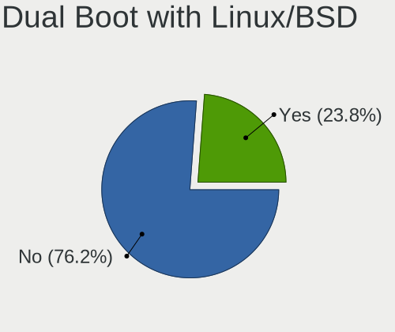
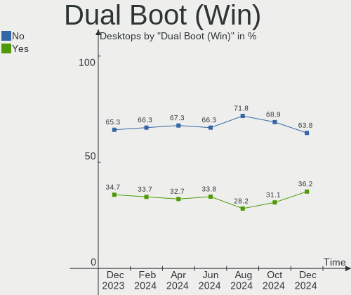
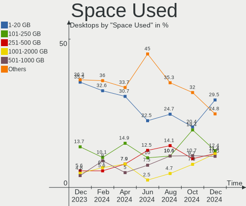
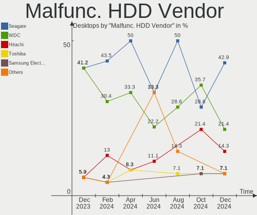
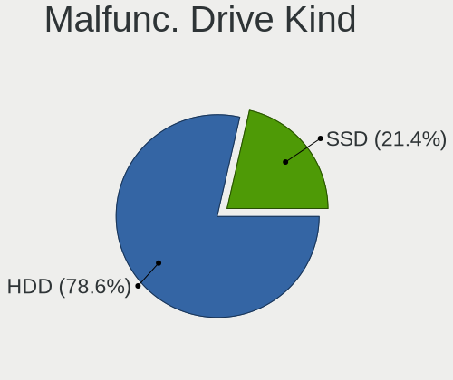
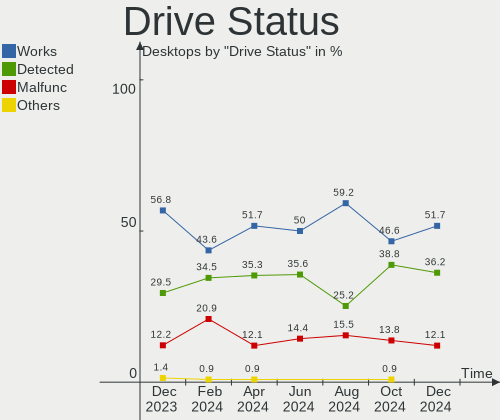
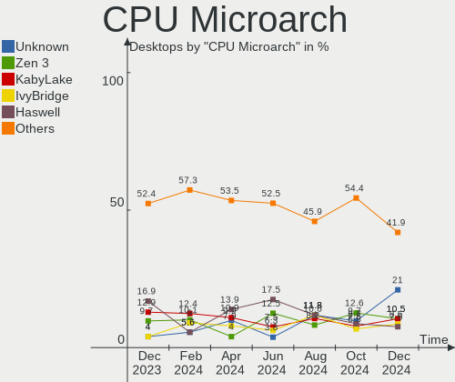
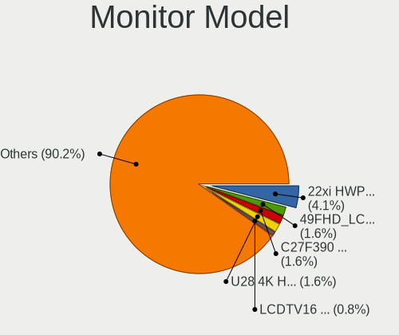
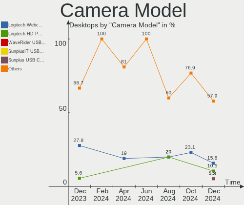

Linux in France - Hardware Trends (Desktops)
--------------------------------------------

A project to identify most popular hardware characteristics and track their change
over time based on data collected by Linux users at https://Linux-Hardware.org.

Anyone can contribute to this report by the [hw-probe](https://github.com/linuxhw/hw-probe) tool:

    sudo -E hw-probe -all -upload

Period: Oct, 2023.

Contents
--------

* [ System ](#system)
  - [ OS                       ](#os)
  - [ OS Family                ](#os-family)
  - [ Kernel                   ](#kernel)
  - [ Kernel Family            ](#kernel-family)
  - [ Kernel Major Ver.        ](#kernel-major-ver)
  - [ Arch                     ](#arch)
  - [ DE                       ](#de)
  - [ Display Server           ](#display-server)
  - [ Display Manager          ](#display-manager)
  - [ OS Lang                  ](#os-lang)
  - [ Boot Mode                ](#boot-mode)
  - [ Filesystem               ](#filesystem)
  - [ Part. scheme             ](#part-scheme)
  - [ Dual Boot with Linux/BSD ](#dual-boot-with-linuxbsd)
  - [ Dual Boot (Win)          ](#dual-boot-win)

* [ Board ](#board)
  - [ Vendor                   ](#vendor)
  - [ Model                    ](#model)
  - [ Model Family             ](#model-family)
  - [ MFG Year                 ](#mfg-year)
  - [ Form Factor              ](#form-factor)
  - [ Secure Boot              ](#secure-boot)
  - [ Coreboot                 ](#coreboot)
  - [ RAM Size                 ](#ram-size)
  - [ RAM Used                 ](#ram-used)
  - [ Total Drives             ](#total-drives)
  - [ Has CD-ROM               ](#has-cd-rom)
  - [ Has Ethernet             ](#has-ethernet)
  - [ Has WiFi                 ](#has-wifi)
  - [ Has Bluetooth            ](#has-bluetooth)

* [ Location ](#location)
  - [ Country                  ](#country)
  - [ City                     ](#city)

* [ Drives ](#drives)
  - [ Drive Vendor             ](#drive-vendor)
  - [ Drive Model              ](#drive-model)
  - [ HDD Vendor               ](#hdd-vendor)
  - [ SSD Vendor               ](#ssd-vendor)
  - [ Drive Kind               ](#drive-kind)
  - [ Drive Connector          ](#drive-connector)
  - [ Drive Size               ](#drive-size)
  - [ Space Total              ](#space-total)
  - [ Space Used               ](#space-used)
  - [ Malfunc. Drives          ](#malfunc-drives)
  - [ Malfunc. Drive Vendor    ](#malfunc-drive-vendor)
  - [ Malfunc. HDD Vendor      ](#malfunc-hdd-vendor)
  - [ Malfunc. Drive Kind      ](#malfunc-drive-kind)
  - [ Failed Drives            ](#failed-drives)
  - [ Failed Drive Vendor      ](#failed-drive-vendor)
  - [ Drive Status             ](#drive-status)

* [ Storage controller ](#storage-controller)
  - [ Storage Vendor           ](#storage-vendor)
  - [ Storage Model            ](#storage-model)
  - [ Storage Kind             ](#storage-kind)

* [ Processor ](#processor)
  - [ CPU Vendor               ](#cpu-vendor)
  - [ CPU Model                ](#cpu-model)
  - [ CPU Model Family         ](#cpu-model-family)
  - [ CPU Cores                ](#cpu-cores)
  - [ CPU Sockets              ](#cpu-sockets)
  - [ CPU Threads              ](#cpu-threads)
  - [ CPU Op-Modes             ](#cpu-op-modes)
  - [ CPU Microcode            ](#cpu-microcode)
  - [ CPU Microarch            ](#cpu-microarch)

* [ Graphics ](#graphics)
  - [ GPU Vendor               ](#gpu-vendor)
  - [ GPU Model                ](#gpu-model)
  - [ GPU Combo                ](#gpu-combo)
  - [ GPU Driver               ](#gpu-driver)
  - [ GPU Memory               ](#gpu-memory)

* [ Monitor ](#monitor)
  - [ Monitor Vendor           ](#monitor-vendor)
  - [ Monitor Model            ](#monitor-model)
  - [ Monitor Resolution       ](#monitor-resolution)
  - [ Monitor Diagonal         ](#monitor-diagonal)
  - [ Monitor Width            ](#monitor-width)
  - [ Aspect Ratio             ](#aspect-ratio)
  - [ Monitor Area             ](#monitor-area)
  - [ Pixel Density            ](#pixel-density)
  - [ Multiple Monitors        ](#multiple-monitors)

* [ Network ](#network)
  - [ Net Controller Vendor    ](#net-controller-vendor)
  - [ Net Controller Model     ](#net-controller-model)
  - [ Wireless Vendor          ](#wireless-vendor)
  - [ Wireless Model           ](#wireless-model)
  - [ Ethernet Vendor          ](#ethernet-vendor)
  - [ Ethernet Model           ](#ethernet-model)
  - [ Net Controller Kind      ](#net-controller-kind)
  - [ Used Controller          ](#used-controller)
  - [ NICs                     ](#nics)
  - [ IPv6                     ](#ipv6)

* [ Bluetooth ](#bluetooth)
  - [ Bluetooth Vendor         ](#bluetooth-vendor)
  - [ Bluetooth Model          ](#bluetooth-model)

* [ Sound ](#sound)
  - [ Sound Vendor             ](#sound-vendor)
  - [ Sound Model              ](#sound-model)

* [ Memory ](#memory)
  - [ Memory Vendor            ](#memory-vendor)
  - [ Memory Model             ](#memory-model)
  - [ Memory Kind              ](#memory-kind)
  - [ Memory Form Factor       ](#memory-form-factor)
  - [ Memory Size              ](#memory-size)
  - [ Memory Speed             ](#memory-speed)

* [ Printers & scanners ](#printers--scanners)
  - [ Printer Vendor           ](#printer-vendor)
  - [ Printer Model            ](#printer-model)
  - [ Scanner Vendor           ](#scanner-vendor)
  - [ Scanner Model            ](#scanner-model)

* [ Camera ](#camera)
  - [ Camera Vendor            ](#camera-vendor)
  - [ Camera Model             ](#camera-model)

* [ Security ](#security)
  - [ Fingerprint Vendor       ](#fingerprint-vendor)
  - [ Fingerprint Model        ](#fingerprint-model)
  - [ Chipcard Vendor          ](#chipcard-vendor)
  - [ Chipcard Model           ](#chipcard-model)

* [ Unsupported ](#unsupported)
  - [ Unsupported Devices      ](#unsupported-devices)
  - [ Unsupported Device Types ](#unsupported-device-types)

System
------

OS
--

Installed operating systems

| Name               | Desktops | Percent |
|--------------------|----------|---------|
| Ubuntu 22.04       | 25       | 22.73%  |
| Linux Mint 21.2    | 7        | 6.36%   |
| Zorin 16           | 6        | 5.45%   |
| OpenMandriva 23.10 | 6        | 5.45%   |
| OpenMandriva 23.08 | 6        | 5.45%   |
| Debian 12          | 6        | 5.45%   |
| Ubuntu 23.10       | 5        | 4.55%   |
| Ubuntu 23.04       | 5        | 4.55%   |
| Ubuntu 20.04       | 4        | 3.64%   |
| Gentoo 2.14        | 3        | 2.73%   |
| Fedora 38          | 3        | 2.73%   |
| Xubuntu 22.04      | 2        | 1.82%   |
| Pop!_OS 22.04      | 2        | 1.82%   |
| OpenMandriva 23.03 | 2        | 1.82%   |
| Mageia 9           | 2        | 1.82%   |
| Kubuntu 23.10      | 2        | 1.82%   |
| Kubuntu 23.04      | 2        | 1.82%   |
| ArcoLinux Rolling  | 2        | 1.82%   |
| Xubuntu 23.10      | 1        | 0.91%   |
| Ubuntu Unity 20.04 | 1        | 0.91%   |
| Ubuntu MATE 22.04  | 1        | 0.91%   |
| SteamOS 4          | 1        | 0.91%   |
| Solus 4.4          | 1        | 0.91%   |
| openSUSE Leap-15.4 | 1        | 0.91%   |
| OpenMandriva 4.3   | 1        | 0.91%   |
| Nobara 38          | 1        | 0.91%   |
| NixOS 23.05        | 1        | 0.91%   |
| MX 23              | 1        | 0.91%   |
| Manjaro            | 1        | 0.91%   |
| Lubuntu 22.04      | 1        | 0.91%   |
| Linux Mint 20.2    | 1        | 0.91%   |
| Kubuntu 22.04      | 1        | 0.91%   |
| KDE neon 22.04     | 1        | 0.91%   |
| Gentoo 2.9         | 1        | 0.91%   |
| ChimeraOS 44-1     | 1        | 0.91%   |
| BlackPanther 18.1  | 1        | 0.91%   |
| Arch Rolling       | 1        | 0.91%   |
| AlmaLinux 9.2      | 1        | 0.91%   |

OS Family
---------

OS without a version

| Name         | Desktops | Percent |
|--------------|----------|---------|
| Ubuntu       | 39       | 35.45%  |
| OpenMandriva | 15       | 13.64%  |
| Linux Mint   | 8        | 7.27%   |
| Zorin        | 6        | 5.45%   |
| Debian       | 6        | 5.45%   |
| Kubuntu      | 5        | 4.55%   |
| Gentoo       | 4        | 3.64%   |
| Xubuntu      | 3        | 2.73%   |
| Fedora       | 3        | 2.73%   |
| Pop!_OS      | 2        | 1.82%   |
| Mageia       | 2        | 1.82%   |
| ArcoLinux    | 2        | 1.82%   |
| Ubuntu Unity | 1        | 0.91%   |
| Ubuntu MATE  | 1        | 0.91%   |
| SteamOS      | 1        | 0.91%   |
| Solus        | 1        | 0.91%   |
| openSUSE     | 1        | 0.91%   |
| Nobara       | 1        | 0.91%   |
| NixOS        | 1        | 0.91%   |
| MX           | 1        | 0.91%   |
| Manjaro      | 1        | 0.91%   |
| Lubuntu      | 1        | 0.91%   |
| KDE neon     | 1        | 0.91%   |
| ChimeraOS    | 1        | 0.91%   |
| BlackPanther | 1        | 0.91%   |
| Arch         | 1        | 0.91%   |
| AlmaLinux    | 1        | 0.91%   |

Kernel
------

Version of the Linux kernel

| Version                     | Desktops | Percent |
|-----------------------------|----------|---------|
| 6.2.0-34-generic            | 13       | 11.82%  |
| 6.2.0-35-generic            | 12       | 10.91%  |
| 5.15.0-86-generic           | 10       | 9.09%   |
| 6.4.11-desktop-1omv2390     | 7        | 6.36%   |
| 6.5.5-desktop-1omv2390      | 5        | 4.55%   |
| 6.5.0-9-generic             | 4        | 3.64%   |
| 6.1.0-13-amd64              | 4        | 3.64%   |
| 6.5.0-10-generic            | 3        | 2.73%   |
| 6.2.0-33-generic            | 3        | 2.73%   |
| 5.15.0-84-generic           | 3        | 2.73%   |
| 6.5.8-200.fc38.x86_64       | 2        | 1.82%   |
| 6.5.4-76060504-generic      | 2        | 1.82%   |
| 6.2.6-desktop-1omv2390      | 2        | 1.82%   |
| 5.4.0-52-generic            | 2        | 1.82%   |
| 5.4.0-164-generic           | 2        | 1.82%   |
| 5.15.0-87-generic           | 2        | 1.82%   |
| 5.15.0-76-generic           | 2        | 1.82%   |
| 6.5.8-arch1-1               | 1        | 0.91%   |
| 6.5.7-gentoo                | 1        | 0.91%   |
| 6.5.6-gentoo                | 1        | 0.91%   |
| 6.5.6-chos1-chimeraos-1     | 1        | 0.91%   |
| 6.5.5-zen1-1-zen            | 1        | 0.91%   |
| 6.5.5-258.current           | 1        | 0.91%   |
| 6.5.5-201.fsync.fc38.x86_64 | 1        | 0.91%   |
| 6.5.5-1-MANJARO             | 1        | 0.91%   |
| 6.5.3-x64v2-xanmod1-1       | 1        | 0.91%   |
| 6.5.0-5-generic             | 1        | 0.91%   |
| 6.4.9-desktop-4.mga9        | 1        | 0.91%   |
| 6.4.3-gentoo                | 1        | 0.91%   |
| 6.4.16-desktop-3.mga9       | 1        | 0.91%   |
| 6.4.15-200.fc38.x86_64      | 1        | 0.91%   |
| 6.4.12-zen1-1-zen           | 1        | 0.91%   |
| 6.2.16-15-pve               | 1        | 0.91%   |
| 6.2.0-26-generic            | 1        | 0.91%   |
| 6.2.0-1007-lowlatency       | 1        | 0.91%   |
| 6.1.37                      | 1        | 0.91%   |
| 6.1.19-gentoo               | 1        | 0.91%   |
| 6.1.0-9-amd64               | 1        | 0.91%   |
| 6.1.0-12-amd64              | 1        | 0.91%   |
| 5.16.7-desktop-1omv4003     | 1        | 0.91%   |

Kernel Family
-------------

Linux kernel without a distro release

| Version | Desktops | Percent |
|---------|----------|---------|
| 6.2.0   | 30       | 27.27%  |
| 5.15.0  | 22       | 20%     |
| 6.5.5   | 9        | 8.18%   |
| 6.5.0   | 8        | 7.27%   |
| 6.4.11  | 7        | 6.36%   |
| 6.1.0   | 6        | 5.45%   |
| 5.4.0   | 4        | 3.64%   |
| 6.5.8   | 3        | 2.73%   |
| 6.5.6   | 2        | 1.82%   |
| 6.5.4   | 2        | 1.82%   |
| 6.2.6   | 2        | 1.82%   |
| 6.5.7   | 1        | 0.91%   |
| 6.5.3   | 1        | 0.91%   |
| 6.4.9   | 1        | 0.91%   |
| 6.4.3   | 1        | 0.91%   |
| 6.4.16  | 1        | 0.91%   |
| 6.4.15  | 1        | 0.91%   |
| 6.4.12  | 1        | 0.91%   |
| 6.2.16  | 1        | 0.91%   |
| 6.1.37  | 1        | 0.91%   |
| 6.1.19  | 1        | 0.91%   |
| 5.16.7  | 1        | 0.91%   |
| 5.14.21 | 1        | 0.91%   |
| 5.14.0  | 1        | 0.91%   |
| 4.18.16 | 1        | 0.91%   |
| 4.15.0  | 1        | 0.91%   |

Kernel Major Ver.
-----------------

Linux kernel major version

| Version | Desktops | Percent |
|---------|----------|---------|
| 6.2     | 33       | 30%     |
| 6.5     | 26       | 23.64%  |
| 5.15    | 22       | 20%     |
| 6.4     | 12       | 10.91%  |
| 6.1     | 8        | 7.27%   |
| 5.4     | 4        | 3.64%   |
| 5.14    | 2        | 1.82%   |
| 5.16    | 1        | 0.91%   |
| 4.18    | 1        | 0.91%   |
| 4.15    | 1        | 0.91%   |

Arch
----

OS architecture (x86_64, i586, etc.)

| Name   | Desktops | Percent |
|--------|----------|---------|
| x86_64 | 110      | 100%    |

DE
--

Desktop Environment

| Name          | Desktops | Percent |
|---------------|----------|---------|
| GNOME         | 48       | 43.64%  |
| KDE5          | 30       | 27.27%  |
| Unknown       | 9        | 8.18%   |
| XFCE          | 8        | 7.27%   |
| X-Cinnamon    | 8        | 7.27%   |
| MATE          | 3        | 2.73%   |
| Unity         | 1        | 0.91%   |
| KDE           | 1        | 0.91%   |
| GNOME Classic | 1        | 0.91%   |
| Cinnamon      | 1        | 0.91%   |

Display Server
--------------

X11 or Wayland

| Name    | Desktops | Percent |
|---------|----------|---------|
| X11     | 52       | 47.27%  |
| Wayland | 44       | 40%     |
| Tty     | 10       | 9.09%   |
| Unknown | 4        | 3.64%   |

Display Manager
---------------

SDDM, LightDM, etc.

| Name    | Desktops | Percent |
|---------|----------|---------|
| GDM3    | 33       | 30%     |
| SDDM    | 29       | 26.36%  |
| Unknown | 29       | 26.36%  |
| LightDM | 14       | 12.73%  |
| GDM     | 5        | 4.55%   |

OS Lang
-------

Language

| Lang       | Desktops | Percent |
|------------|----------|---------|
| fr_FR      | 85       | 77.27%  |
| en_US      | 17       | 15.45%  |
| C          | 2        | 1.82%   |
| it_IT      | 1        | 0.91%   |
| en_IE@euro | 1        | 0.91%   |
| en         | 1        | 0.91%   |
| de_DE      | 1        | 0.91%   |
| C.UTF8     | 1        | 0.91%   |
| Unknown    | 1        | 0.91%   |

Boot Mode
---------

EFI or BIOS

| Mode | Desktops | Percent |
|------|----------|---------|
| EFI  | 56       | 50.91%  |
| BIOS | 54       | 49.09%  |

Filesystem
----------

Type of filesystem

| Type    | Desktops | Percent |
|---------|----------|---------|
| Ext4    | 72       | 65.45%  |
| Tmpfs   | 18       | 16.36%  |
| Btrfs   | 9        | 8.18%   |
| Overlay | 7        | 6.36%   |
| Ext3    | 2        | 1.82%   |
| Xfs     | 1        | 0.91%   |
| F2fs    | 1        | 0.91%   |

Part. scheme
------------

Scheme of partitioning

| Type    | Desktops | Percent |
|---------|----------|---------|
| GPT     | 72       | 65.45%  |
| Unknown | 25       | 22.73%  |
| MBR     | 13       | 11.82%  |

Dual Boot with Linux/BSD
------------------------

Hosting more than one Linux/BSD

| Dual boot | Desktops | Percent |
|-----------|----------|---------|
| No        | 91       | 82.73%  |
| Yes       | 19       | 17.27%  |

Dual Boot (Win)
---------------

Hosting Linux and Windows

| Dual boot | Desktops | Percent |
|-----------|----------|---------|
| No        | 73       | 66.36%  |
| Yes       | 37       | 33.64%  |

Board
-----

Vendor
------

Motherboard manufacturer

| Name                | Desktops | Percent |
|---------------------|----------|---------|
| ASUSTek Computer    | 19       | 17.27%  |
| Gigabyte Technology | 15       | 13.64%  |
| Dell                | 15       | 13.64%  |
| MSI                 | 14       | 12.73%  |
| Hewlett-Packard     | 12       | 10.91%  |
| Lenovo              | 9        | 8.18%   |
| ASRock              | 7        | 6.36%   |
| Pegatron            | 2        | 1.82%   |
| MACHINIST           | 2        | 1.82%   |
| Intel               | 2        | 1.82%   |
| Foxconn             | 2        | 1.82%   |
| Acer                | 2        | 1.82%   |
| Unknown             | 2        | 1.82%   |
| Trigkey             | 1        | 0.91%   |
| Shuttle             | 1        | 0.91%   |
| Online Labs         | 1        | 0.91%   |
| LattePanda          | 1        | 0.91%   |
| Fujitsu             | 1        | 0.91%   |
| BESSTAR Tech        | 1        | 0.91%   |
| AZW                 | 1        | 0.91%   |

Model
-----

Motherboard model

| Name                                    | Desktops | Percent |
|-----------------------------------------|----------|---------|
| MSI MS-7816                             | 2        | 1.82%   |
| Gigabyte B450M DS3H                     | 2        | 1.82%   |
| Dell OptiPlex 7020                      | 2        | 1.82%   |
| Dell OptiPlex 380                       | 2        | 1.82%   |
| ASUS PRIME Z370-P                       | 2        | 1.82%   |
| ASUS PRIME B660-PLUS D4                 | 2        | 1.82%   |
| Unknown                                 | 2        | 1.82%   |
| Trigkey Green G5                        | 1        | 0.91%   |
| Shuttle DH110                           | 1        | 0.91%   |
| Pegatron WE277AA-ABF p6352fr            | 1        | 0.91%   |
| Pegatron VD049AA-ABF p6141fr            | 1        | 0.91%   |
| Online Labs SR                          | 1        | 0.91%   |
| MSI MS-7D09                             | 1        | 0.91%   |
| MSI MS-7C92                             | 1        | 0.91%   |
| MSI MS-7C82                             | 1        | 0.91%   |
| MSI MS-7C37                             | 1        | 0.91%   |
| MSI MS-7C02                             | 1        | 0.91%   |
| MSI MS-7B84                             | 1        | 0.91%   |
| MSI MS-7B22                             | 1        | 0.91%   |
| MSI MS-7B18                             | 1        | 0.91%   |
| MSI MS-7B05                             | 1        | 0.91%   |
| MSI MS-7916                             | 1        | 0.91%   |
| MSI MS-7756                             | 1        | 0.91%   |
| MSI dx5150 MT(PE679AV)                  | 1        | 0.91%   |
| MACHINIST X99-RS9 V2.0                  | 1        | 0.91%   |
| MACHINIST X99-MR9A PRO MAX V1.2         | 1        | 0.91%   |
| Lenovo ThinkStation E32 30A0S0D601      | 1        | 0.91%   |
| Lenovo ThinkCentre xxx 7090A17          | 1        | 0.91%   |
| Lenovo ThinkCentre M93p 10A7003AUK      | 1        | 0.91%   |
| Lenovo ThinkCentre M93 10A4A05QGE       | 1        | 0.91%   |
| Lenovo ThinkCentre M83 10AHS2TG00       | 1        | 0.91%   |
| Lenovo ThinkCentre M73 10AXS1UY00       | 1        | 0.91%   |
| Lenovo ThinkCentre M715q 10M2S09W00     | 1        | 0.91%   |
| Lenovo IdeaCentre 300S-11IBR 90DQ004YFR | 1        | 0.91%   |
| Lenovo IdeaCentre 3 07ADA05 90MV00LTFR  | 1        | 0.91%   |
| LattePanda Sigma                        | 1        | 0.91%   |
| Intel Jasper Lake Client Platform       | 1        | 0.91%   |
| Intel DN2820FYK H24582-204              | 1        | 0.91%   |
| HP Z440 Workstation                     | 1        | 0.91%   |
| HP Z400 Workstation                     | 1        | 0.91%   |

Model Family
------------

Motherboard model prefix

| Name                 | Desktops | Percent |
|----------------------|----------|---------|
| Dell OptiPlex        | 10       | 9.09%   |
| Lenovo ThinkCentre   | 6        | 5.45%   |
| HP Compaq            | 5        | 4.55%   |
| Dell Precision       | 5        | 4.55%   |
| ASUS PRIME           | 5        | 4.55%   |
| HP EliteDesk         | 3        | 2.73%   |
| MSI MS-7816          | 2        | 1.82%   |
| Lenovo IdeaCentre    | 2        | 1.82%   |
| Gigabyte B550M       | 2        | 1.82%   |
| Gigabyte B550        | 2        | 1.82%   |
| Gigabyte B450M       | 2        | 1.82%   |
| Foxconn Pro          | 2        | 1.82%   |
| ASUS ROG             | 2        | 1.82%   |
| ASUS P5Q             | 2        | 1.82%   |
| Unknown              | 2        | 1.82%   |
| Trigkey Green        | 1        | 0.91%   |
| Shuttle DH110        | 1        | 0.91%   |
| Pegatron WE277AA-ABF | 1        | 0.91%   |
| Pegatron VD049AA-ABF | 1        | 0.91%   |
| Online Labs SR       | 1        | 0.91%   |
| MSI MS-7D09          | 1        | 0.91%   |
| MSI MS-7C92          | 1        | 0.91%   |
| MSI MS-7C82          | 1        | 0.91%   |
| MSI MS-7C37          | 1        | 0.91%   |
| MSI MS-7C02          | 1        | 0.91%   |
| MSI MS-7B84          | 1        | 0.91%   |
| MSI MS-7B22          | 1        | 0.91%   |
| MSI MS-7B18          | 1        | 0.91%   |
| MSI MS-7B05          | 1        | 0.91%   |
| MSI MS-7916          | 1        | 0.91%   |
| MSI MS-7756          | 1        | 0.91%   |
| MSI dx5150           | 1        | 0.91%   |
| MACHINIST X99-RS9    | 1        | 0.91%   |
| MACHINIST X99-MR9A   | 1        | 0.91%   |
| Lenovo ThinkStation  | 1        | 0.91%   |
| LattePanda Sigma     | 1        | 0.91%   |
| Intel Jasper         | 1        | 0.91%   |
| Intel DN2820FYK      | 1        | 0.91%   |
| HP Z440              | 1        | 0.91%   |
| HP Z400              | 1        | 0.91%   |

MFG Year
--------

Motherboard manufacture year

| Year | Desktops | Percent |
|------|----------|---------|
| 2023 | 11       | 10%     |
| 2021 | 11       | 10%     |
| 2018 | 11       | 10%     |
| 2017 | 8        | 7.27%   |
| 2011 | 8        | 7.27%   |
| 2009 | 8        | 7.27%   |
| 2020 | 7        | 6.36%   |
| 2014 | 7        | 6.36%   |
| 2013 | 7        | 6.36%   |
| 2016 | 6        | 5.45%   |
| 2015 | 6        | 5.45%   |
| 2010 | 6        | 5.45%   |
| 2012 | 5        | 4.55%   |
| 2022 | 3        | 2.73%   |
| 2019 | 3        | 2.73%   |
| 2008 | 1        | 0.91%   |
| 2006 | 1        | 0.91%   |
| 2005 | 1        | 0.91%   |

Form Factor
-----------

Physical design of the computer

| Name    | Desktops | Percent |
|---------|----------|---------|
| Desktop | 110      | 100%    |

Secure Boot
-----------

Enabled or disabled

| State    | Desktops | Percent |
|----------|----------|---------|
| Disabled | 108      | 98.18%  |
| Enabled  | 2        | 1.82%   |

Coreboot
--------

Have coreboot on board

| Used | Desktops | Percent |
|------|----------|---------|
| No   | 110      | 100%    |

RAM Size
--------

Total RAM memory

| Size in GB  | Desktops | Percent |
|-------------|----------|---------|
| 16.01-24.0  | 26       | 23.64%  |
| 4.01-8.0    | 22       | 20%     |
| 8.01-16.0   | 19       | 17.27%  |
| 32.01-64.0  | 13       | 11.82%  |
| 3.01-4.0    | 13       | 11.82%  |
| 64.01-256.0 | 8        | 7.27%   |
| 24.01-32.0  | 7        | 6.36%   |
| 2.01-3.0    | 1        | 0.91%   |
| 1.01-2.0    | 1        | 0.91%   |

RAM Used
--------

Used RAM memory

| Used GB     | Desktops | Percent |
|-------------|----------|---------|
| 1.01-2.0    | 42       | 38.18%  |
| 2.01-3.0    | 26       | 23.64%  |
| 3.01-4.0    | 15       | 13.64%  |
| 4.01-8.0    | 13       | 11.82%  |
| 8.01-16.0   | 9        | 8.18%   |
| 0.01-0.5    | 2        | 1.82%   |
| 64.01-256.0 | 1        | 0.91%   |
| 16.01-24.0  | 1        | 0.91%   |
| 0.51-1.0    | 1        | 0.91%   |

Total Drives
------------

Number of drives on board

| Drives | Desktops | Percent |
|--------|----------|---------|
| 1      | 54       | 49.09%  |
| 2      | 27       | 24.55%  |
| 3      | 13       | 11.82%  |
| 4      | 6        | 5.45%   |
| 5      | 4        | 3.64%   |
| 6      | 3        | 2.73%   |
| 7      | 2        | 1.82%   |
| 9      | 1        | 0.91%   |

Has CD-ROM
----------

Has CD-ROM on board

| Presented | Desktops | Percent |
|-----------|----------|---------|
| Yes       | 55       | 50%     |
| No        | 55       | 50%     |

Has Ethernet
------------

Has Ethernet on board

| Presented | Desktops | Percent |
|-----------|----------|---------|
| Yes       | 109      | 99.09%  |
| No        | 1        | 0.91%   |

Has WiFi
--------

Has WiFi module

| Presented | Desktops | Percent |
|-----------|----------|---------|
| No        | 59       | 53.64%  |
| Yes       | 51       | 46.36%  |

Has Bluetooth
-------------

Has Bluetooth module

| Presented | Desktops | Percent |
|-----------|----------|---------|
| No        | 71       | 64.55%  |
| Yes       | 39       | 35.45%  |

Location
--------

Country
-------

Geographic location (country)

| Country | Desktops | Percent |
|---------|----------|---------|
| France  | 110      | 100%    |

City
----

Geographic location (city)

| City                    | Desktops | Percent |
|-------------------------|----------|---------|
| Paris                   | 15       | 13.64%  |
| Caen                    | 4        | 3.64%   |
| Nantes                  | 3        | 2.73%   |
| Limoges                 | 3        | 2.73%   |
| Trappes                 | 2        | 1.82%   |
| Sarreguemines           | 2        | 1.82%   |
| Rennes                  | 2        | 1.82%   |
| Lille                   | 2        | 1.82%   |
| Lezoux                  | 2        | 1.82%   |
| Le Boulou               | 2        | 1.82%   |
| Champs-sur-Marne        | 2        | 1.82%   |
| Wasquehal               | 1        | 0.91%   |
| Vitry-sur-Seine         | 1        | 0.91%   |
| Viry-Châtillon         | 1        | 0.91%   |
| Villeneuve-d'Ascq       | 1        | 0.91%   |
| Velaux                  | 1        | 0.91%   |
| Vaulx-en-Velin          | 1        | 0.91%   |
| Vanves                  | 1        | 0.91%   |
| Valenciennes            | 1        | 0.91%   |
| Tulette                 | 1        | 0.91%   |
| Tours                   | 1        | 0.91%   |
| Tourcoing               | 1        | 0.91%   |
| Talence                 | 1        | 0.91%   |
| Saumur                  | 1        | 0.91%   |
| Saintes                 | 1        | 0.91%   |
| Saint-Nazaire           | 1        | 0.91%   |
| Saint-Julien-de-l'Escap | 1        | 0.91%   |
| Saint-Cloud             | 1        | 0.91%   |
| Rivesaltes              | 1        | 0.91%   |
| Rezé                   | 1        | 0.91%   |
| Reims                   | 1        | 0.91%   |
| Reffuveille             | 1        | 0.91%   |
| Poitiers                | 1        | 0.91%   |
| Plourhan                | 1        | 0.91%   |
| Plaisir                 | 1        | 0.91%   |
| Pende                   | 1        | 0.91%   |
| Nogent-sur-Marne        | 1        | 0.91%   |
| Nîmes                  | 1        | 0.91%   |
| Nancy                   | 1        | 0.91%   |
| Montauban               | 1        | 0.91%   |

Drives
------

Drive Vendor
------------

Hard drive vendors

| Vendor                      | Desktops | Drives | Percent |
|-----------------------------|----------|--------|---------|
| Samsung Electronics         | 36       | 59     | 18.65%  |
| Seagate                     | 30       | 40     | 15.54%  |
| WDC                         | 24       | 28     | 12.44%  |
| Crucial                     | 17       | 18     | 8.81%   |
| Kingston                    | 13       | 13     | 6.74%   |
| Toshiba                     | 8        | 10     | 4.15%   |
| Hitachi                     | 7        | 7      | 3.63%   |
| SanDisk                     | 6        | 7      | 3.11%   |
| HGST                        | 6        | 9      | 3.11%   |
| Phison Electronics          | 4        | 5      | 2.07%   |
| Micron/Crucial Technology   | 3        | 3      | 1.55%   |
| Maxtor                      | 3        | 3      | 1.55%   |
| China                       | 3        | 3      | 1.55%   |
| Unknown                     | 2        | 4      | 1.04%   |
| Silicon Motion              | 2        | 2      | 1.04%   |
| PNY                         | 2        | 2      | 1.04%   |
| Micron Technology           | 2        | 2      | 1.04%   |
| LDLC                        | 2        | 2      | 1.04%   |
| Emtec                       | 2        | 2      | 1.04%   |
| Verbatim                    | 1        | 1      | 0.52%   |
| UMIS                        | 1        | 1      | 0.52%   |
| SPCC                        | 1        | 1      | 0.52%   |
| ROG                         | 1        | 1      | 0.52%   |
| Realtek Semiconductor       | 1        | 1      | 0.52%   |
| Patriot                     | 1        | 1      | 0.52%   |
| OCZ                         | 1        | 1      | 0.52%   |
| MAXIO Technology (Hangzhou) | 1        | 1      | 0.52%   |
| Magnetic Data               | 1        | 1      | 0.52%   |
| KIOXIA                      | 1        | 1      | 0.52%   |
| KingSpec                    | 1        | 1      | 0.52%   |
| KingFast                    | 1        | 1      | 0.52%   |
| KingDian                    | 1        | 1      | 0.52%   |
| Kimtigo                     | 1        | 1      | 0.52%   |
| JMicron Technology          | 1        | 1      | 0.52%   |
| Intenso                     | 1        | 1      | 0.52%   |
| Intel                       | 1        | 1      | 0.52%   |
| EXRAM                       | 1        | 1      | 0.52%   |
| Corsair                     | 1        | 1      | 0.52%   |
| Apacer                      | 1        | 1      | 0.52%   |
| Unknown                     | 1        | 1      | 0.52%   |

Drive Model
-----------

Hard drive models

| Model                                                 | Desktops | Percent |
|-------------------------------------------------------|----------|---------|
| Samsung NVMe SSD Controller SM981/PM981/PM983 1TB     | 8        | 3.54%   |
| Samsung SSD 860 EVO 500GB                             | 5        | 2.21%   |
| Samsung NVMe SSD Controller PM9A1/PM9A3/980PRO 1TB    | 5        | 2.21%   |
| WDC WD10EZEX-08WN4A0 1TB                              | 4        | 1.77%   |
| Toshiba MQ01ABD100 1TB                                | 3        | 1.33%   |
| Seagate ST2000DM008-2FR102 2TB                        | 3        | 1.33%   |
| Seagate ST2000DM006-2DM164 2TB                        | 3        | 1.33%   |
| Samsung SSD 850 EVO 250GB                             | 3        | 1.33%   |
| Kingston SA400S37240G 240GB SSD                       | 3        | 1.33%   |
| WDC WD5000AAKX-60U6AA0 500GB                          | 2        | 0.88%   |
| WDC WD10EZRX-00L4HB0 1TB                              | 2        | 0.88%   |
| Silicon Motion SM2263EN/SM2263XT SSD Controller 256GB | 2        | 0.88%   |
| Seagate ST3500413AS 500GB                             | 2        | 0.88%   |
| Seagate ST2000DM008-2UB102 2TB                        | 2        | 0.88%   |
| Samsung SSD 980 PRO 500GB                             | 2        | 0.88%   |
| Samsung SSD 980 500GB                                 | 2        | 0.88%   |
| Samsung SSD 980 1TB                                   | 2        | 0.88%   |
| Samsung SSD 870 QVO 1TB                               | 2        | 0.88%   |
| Samsung SSD 870 EVO 500GB                             | 2        | 0.88%   |
| Samsung SSD 860 EVO 1TB                               | 2        | 0.88%   |
| Samsung SSD 850 PRO 512GB                             | 2        | 0.88%   |
| Samsung SSD 840 EVO 250GB                             | 2        | 0.88%   |
| Phison E12 NVMe Controller 1TB                        | 2        | 0.88%   |
| LDLC F8+M.2 480 480GB                                 | 2        | 0.88%   |
| Kingston SV300S37A120G 120GB SSD                      | 2        | 0.88%   |
| Kingston SH103S3120G 120GB SSD                        | 2        | 0.88%   |
| Emtec X150 480GB                                      | 2        | 0.88%   |
| Crucial CT500MX500SSD1 500GB                          | 2        | 0.88%   |
| Crucial CT480BX500SSD1 480GB                          | 2        | 0.88%   |
| Crucial CT240BX500SSD1 240GB                          | 2        | 0.88%   |
| WDC WDS250G2B0C-00PXH0 250GB                          | 1        | 0.44%   |
| WDC WDS240G2G0B-00EPW0 240GB SSD                      | 1        | 0.44%   |
| WDC WDS120G2G0B-00EPW0 120GB SSD                      | 1        | 0.44%   |
| WDC WD800JD-60LSA5 80GB                               | 1        | 0.44%   |
| WDC WD7500BPVT-80HXZT3 752GB                          | 1        | 0.44%   |
| WDC WD5000LUCT-62C26Y0 500GB                          | 1        | 0.44%   |
| WDC WD5000LPSX-75A6WT0 500GB                          | 1        | 0.44%   |
| WDC WD5000AAKX-001CA0 500GB                           | 1        | 0.44%   |
| WDC WD3200BPVT-22ZEST0 320GB                          | 1        | 0.44%   |
| WDC WD30EZRX-00D8PB0 3TB                              | 1        | 0.44%   |

HDD Vendor
----------

Hard disk drive vendors

| Vendor              | Desktops | Drives | Percent |
|---------------------|----------|--------|---------|
| Seagate             | 27       | 37     | 34.62%  |
| WDC                 | 23       | 25     | 29.49%  |
| Toshiba             | 8        | 10     | 10.26%  |
| Hitachi             | 7        | 7      | 8.97%   |
| HGST                | 6        | 9      | 7.69%   |
| Samsung Electronics | 3        | 3      | 3.85%   |
| Maxtor              | 3        | 3      | 3.85%   |
| Magnetic Data       | 1        | 1      | 1.28%   |

SSD Vendor
----------

Solid state drive vendors

| Vendor              | Desktops | Drives | Percent |
|---------------------|----------|--------|---------|
| Samsung Electronics | 22       | 32     | 28.57%  |
| Crucial             | 16       | 17     | 20.78%  |
| Kingston            | 10       | 10     | 12.99%  |
| SanDisk             | 4        | 5      | 5.19%   |
| China               | 3        | 3      | 3.9%    |
| WDC                 | 2        | 2      | 2.6%    |
| PNY                 | 2        | 2      | 2.6%    |
| Micron Technology   | 2        | 2      | 2.6%    |
| Emtec               | 2        | 2      | 2.6%    |
| Verbatim            | 1        | 1      | 1.3%    |
| SPCC                | 1        | 1      | 1.3%    |
| ROG                 | 1        | 1      | 1.3%    |
| Patriot             | 1        | 1      | 1.3%    |
| OCZ                 | 1        | 1      | 1.3%    |
| KingSpec            | 1        | 1      | 1.3%    |
| KingFast            | 1        | 1      | 1.3%    |
| KingDian            | 1        | 1      | 1.3%    |
| Kimtigo             | 1        | 1      | 1.3%    |
| Intenso             | 1        | 1      | 1.3%    |
| Intel               | 1        | 1      | 1.3%    |
| EXRAM               | 1        | 1      | 1.3%    |
| Apacer              | 1        | 1      | 1.3%    |
| Unknown             | 1        | 1      | 1.3%    |

Drive Kind
----------

HDD or SSD

| Kind    | Desktops | Drives | Percent |
|---------|----------|--------|---------|
| SSD     | 69       | 89     | 41.32%  |
| HDD     | 60       | 95     | 35.93%  |
| NVMe    | 34       | 50     | 20.36%  |
| Unknown | 4        | 6      | 2.4%    |

Drive Connector
---------------

SATA, SAS, NVMe, etc.

| Type | Desktops | Drives | Percent |
|------|----------|--------|---------|
| SATA | 97       | 178    | 69.78%  |
| NVMe | 34       | 50     | 24.46%  |
| SAS  | 8        | 12     | 5.76%   |

Drive Size
----------

Size of hard drive

| Size in TB | Desktops | Drives | Percent |
|------------|----------|--------|---------|
| 0.01-0.5   | 71       | 107    | 53.79%  |
| 0.51-1.0   | 40       | 46     | 30.3%   |
| 1.01-2.0   | 15       | 20     | 11.36%  |
| 3.01-4.0   | 3        | 3      | 2.27%   |
| 2.01-3.0   | 3        | 8      | 2.27%   |

Space Total
-----------

Amount of disk space available on the file system

| Size in GB     | Desktops | Percent |
|----------------|----------|---------|
| 101-250        | 26       | 23.64%  |
| 251-500        | 23       | 20.91%  |
| 501-1000       | 16       | 14.55%  |
| 1001-2000      | 14       | 12.73%  |
| More than 3000 | 11       | 10%     |
| 21-50          | 6        | 5.45%   |
| 2001-3000      | 5        | 4.55%   |
| Unknown        | 4        | 3.64%   |
| 51-100         | 3        | 2.73%   |
| 1-20           | 2        | 1.82%   |

Space Used
----------

Amount of used disk space

| Used GB        | Desktops | Percent |
|----------------|----------|---------|
| 1-20           | 31       | 28.18%  |
| 21-50          | 24       | 21.82%  |
| 51-100         | 12       | 10.91%  |
| 251-500        | 10       | 9.09%   |
| 501-1000       | 10       | 9.09%   |
| 101-250        | 8        | 7.27%   |
| More than 3000 | 5        | 4.55%   |
| 1001-2000      | 4        | 3.64%   |
| Unknown        | 4        | 3.64%   |
| 2001-3000      | 2        | 1.82%   |

Malfunc. Drives
---------------

Drive models with a malfunction

| Model                                            | Desktops | Drives | Percent |
|--------------------------------------------------|----------|--------|---------|
| WDC WD2500BEKT-60PVMT0 250GB                     | 1        | 1      | 5.56%   |
| WDC WD10EZEX-00WN4A0 1TB                         | 1        | 1      | 5.56%   |
| WDC WD1003FZEX-00MK2A0 1TB                       | 1        | 1      | 5.56%   |
| Toshiba MK1655GSX 160GB                          | 1        | 1      | 5.56%   |
| Seagate ST500LM000-SSHD-8GB                      | 1        | 1      | 5.56%   |
| Seagate ST3500418AS 500GB                        | 1        | 1      | 5.56%   |
| Seagate ST31000528AS 1TB                         | 1        | 1      | 5.56%   |
| Seagate ST31000524AS 1TB                         | 1        | 1      | 5.56%   |
| Seagate ST2000DM008-2FR102 2TB                   | 1        | 2      | 5.56%   |
| Seagate ST2000DM001-1ER164 2TB                   | 1        | 2      | 5.56%   |
| Samsung Electronics SSD 980 PRO 500GB            | 1        | 1      | 5.56%   |
| Samsung Electronics MZ7LN256HMJP-000H1 256GB SSD | 1        | 1      | 5.56%   |
| OCZ VERTEX3 120GB SSD                            | 1        | 1      | 5.56%   |
| Maxtor 6B200M0 208GB                             | 1        | 1      | 5.56%   |
| Magnetic Data MD02500-AVDW-RO 250GB              | 1        | 1      | 5.56%   |
| JMicron Technology Tech 250GB                    | 1        | 1      | 5.56%   |
| HGST HCC545050A7E380 500GB                       | 1        | 1      | 5.56%   |
| EXRAM SSD 512GB                                  | 1        | 1      | 5.56%   |

Malfunc. Drive Vendor
---------------------

Vendors of faulty drives

| Vendor              | Desktops | Drives | Percent |
|---------------------|----------|--------|---------|
| Seagate             | 6        | 8      | 33.33%  |
| WDC                 | 3        | 3      | 16.67%  |
| Samsung Electronics | 2        | 2      | 11.11%  |
| Toshiba             | 1        | 1      | 5.56%   |
| OCZ                 | 1        | 1      | 5.56%   |
| Maxtor              | 1        | 1      | 5.56%   |
| Magnetic Data       | 1        | 1      | 5.56%   |
| JMicron Technology  | 1        | 1      | 5.56%   |
| HGST                | 1        | 1      | 5.56%   |
| EXRAM               | 1        | 1      | 5.56%   |

Malfunc. HDD Vendor
-------------------

Vendors of faulty HDD drives

| Vendor        | Desktops | Drives | Percent |
|---------------|----------|--------|---------|
| Seagate       | 6        | 8      | 46.15%  |
| WDC           | 3        | 3      | 23.08%  |
| Toshiba       | 1        | 1      | 7.69%   |
| Maxtor        | 1        | 1      | 7.69%   |
| Magnetic Data | 1        | 1      | 7.69%   |
| HGST          | 1        | 1      | 7.69%   |

Malfunc. Drive Kind
-------------------

Kinds of faulty drives

| Kind    | Desktops | Drives | Percent |
|---------|----------|--------|---------|
| HDD     | 12       | 15     | 70.59%  |
| SSD     | 3        | 3      | 17.65%  |
| NVMe    | 1        | 1      | 5.88%   |
| Unknown | 1        | 1      | 5.88%   |

Failed Drives
-------------

Failed drive models

Zero info for selected period =(

Failed Drive Vendor
-------------------

Failed drive vendors

Zero info for selected period =(

Drive Status
------------

Number of failed and malfunc. drives

| Status   | Desktops | Drives | Percent |
|----------|----------|--------|---------|
| Works    | 66       | 123    | 51.56%  |
| Detected | 46       | 97     | 35.94%  |
| Malfunc  | 16       | 20     | 12.5%   |

Storage controller
------------------

Storage Vendor
--------------

Storage controller vendors

| Vendor                      | Desktops | Percent |
|-----------------------------|----------|---------|
| Intel                       | 80       | 47.62%  |
| AMD                         | 28       | 16.67%  |
| Samsung Electronics         | 16       | 9.52%   |
| Phison Electronics          | 5        | 2.98%   |
| JMicron Technology          | 5        | 2.98%   |
| ASMedia Technology          | 5        | 2.98%   |
| Micron/Crucial Technology   | 4        | 2.38%   |
| VIA Technologies            | 3        | 1.79%   |
| Silicon Motion              | 3        | 1.79%   |
| SanDisk                     | 3        | 1.79%   |
| Marvell Technology Group    | 3        | 1.79%   |
| Kingston Technology Company | 3        | 1.79%   |
| Union Memory (Shenzhen)     | 1        | 0.6%    |
| Silicon Image               | 1        | 0.6%    |
| Seagate Technology          | 1        | 0.6%    |
| Realtek Semiconductor       | 1        | 0.6%    |
| Nvidia                      | 1        | 0.6%    |
| MAXIO Technology (Hangzhou) | 1        | 0.6%    |
| LSI Logic / Symbios Logic   | 1        | 0.6%    |
| KIOXIA                      | 1        | 0.6%    |
| Hosin Global Electronics    | 1        | 0.6%    |
| Broadcom / LSI              | 1        | 0.6%    |

Storage Model
-------------

Storage controller models

| Model                                                                                   | Desktops | Percent |
|-----------------------------------------------------------------------------------------|----------|---------|
| AMD FCH SATA Controller [AHCI mode]                                                     | 14       | 7.11%   |
| Intel 8 Series/C220 Series Chipset Family 6-port SATA Controller 1 [AHCI mode]          | 12       | 6.09%   |
| Samsung NVMe SSD Controller SM981/PM981/PM983                                           | 9        | 4.57%   |
| Intel SATA Controller [RAID mode]                                                       | 7        | 3.55%   |
| AMD 500 Series Chipset SATA Controller                                                  | 7        | 3.55%   |
| Samsung NVMe SSD Controller PM9A1/PM9A3/980PRO                                          | 6        | 3.05%   |
| Intel 6 Series/C200 Series Chipset Family 6 port Desktop SATA AHCI Controller           | 6        | 3.05%   |
| Samsung NVMe SSD Controller 980 (DRAM-less)                                             | 5        | 2.54%   |
| Intel Q170/Q150/B150/H170/H110/Z170/CM236 Chipset SATA Controller [AHCI Mode]           | 5        | 2.54%   |
| Intel Cannon Lake PCH SATA AHCI Controller                                              | 5        | 2.54%   |
| Intel 200 Series PCH SATA controller [AHCI mode]                                        | 5        | 2.54%   |
| ASMedia ASM1062 Serial ATA Controller                                                   | 5        | 2.54%   |
| Intel NM10/ICH7 Family SATA Controller [IDE mode]                                       | 4        | 2.03%   |
| Intel 7 Series/C210 Series Chipset Family 6-port SATA Controller [AHCI mode]            | 4        | 2.03%   |
| Intel 500 Series Chipset Family SATA AHCI Controller                                    | 4        | 2.03%   |
| AMD FCH SATA Controller D                                                               | 4        | 2.03%   |
| AMD 400 Series Chipset SATA Controller                                                  | 4        | 2.03%   |
| Silicon Motion SM2263EN/SM2263XT (DRAM-less) NVMe SSD Controllers                       | 3        | 1.52%   |
| Phison E12 NVMe Controller                                                              | 3        | 1.52%   |
| JMicron JMB368 IDE controller                                                           | 3        | 1.52%   |
| Intel Alder Lake-S PCH SATA Controller [AHCI Mode]                                      | 3        | 1.52%   |
| Intel 82801G (ICH7 Family) IDE Controller                                               | 3        | 1.52%   |
| VIA VT6415 PATA IDE Host Controller                                                     | 2        | 1.02%   |
| SanDisk Ultra 3D / WD Blue SN550 NVMe SSD                                               | 2        | 1.02%   |
| Micron/Crucial P5 Plus NVMe PCIe SSD                                                    | 2        | 1.02%   |
| Kingston Company A2000 NVMe SSD SM2263EN                                                | 2        | 1.02%   |
| JMicron JMB363 SATA/IDE Controller                                                      | 2        | 1.02%   |
| Intel Celeron/Pentium Silver Processor SATA Controller                                  | 2        | 1.02%   |
| Intel C600/X79 series chipset SATA RAID Controller                                      | 2        | 1.02%   |
| Intel 9 Series Chipset Family SATA Controller [AHCI Mode]                               | 2        | 1.02%   |
| Intel 82801JI (ICH10 Family) 4 port SATA IDE Controller #1                              | 2        | 1.02%   |
| Intel 82801JI (ICH10 Family) 2 port SATA IDE Controller #2                              | 2        | 1.02%   |
| Intel 6 Series/C200 Series Chipset Family Desktop SATA Controller (IDE mode, ports 4-5) | 2        | 1.02%   |
| Intel 6 Series/C200 Series Chipset Family Desktop SATA Controller (IDE mode, ports 0-3) | 2        | 1.02%   |
| AMD SB7x0/SB8x0/SB9x0 SATA Controller [IDE mode]                                        | 2        | 1.02%   |
| AMD SB7x0/SB8x0/SB9x0 IDE Controller                                                    | 2        | 1.02%   |
| AMD FCH IDE Controller                                                                  | 2        | 1.02%   |
| VIA VT6421 IDE/SATA Controller                                                          | 1        | 0.51%   |
| Union Memory (Shenzhen) AM620 PCIe 3.0 NVMe SSD 256GB                                   | 1        | 0.51%   |
| Silicon Image SiI 3114 [SATALink/SATARaid] Serial ATA Controller                        | 1        | 0.51%   |

Storage Kind
------------

Kind of storage controller (IDE, SATA, NVMe, SAS, ...)

| Kind | Desktops | Percent |
|------|----------|---------|
| SATA | 87       | 56.13%  |
| NVMe | 34       | 21.94%  |
| IDE  | 21       | 13.55%  |
| RAID | 12       | 7.74%   |
| SAS  | 1        | 0.65%   |

Processor
---------

CPU Vendor
----------

Processor vendors

| Vendor | Desktops | Percent |
|--------|----------|---------|
| Intel  | 80       | 72.73%  |
| AMD    | 30       | 27.27%  |

CPU Model
---------

Processor models

| Model                                       | Desktops | Percent |
|---------------------------------------------|----------|---------|
| Intel Pentium Dual-Core CPU E5300 @ 2.60GHz | 2        | 1.82%   |
| Intel Core i7-8700K CPU @ 3.70GHz           | 2        | 1.82%   |
| Intel Core i7-8700 CPU @ 3.20GHz            | 2        | 1.82%   |
| Intel Core i7-4790 CPU @ 3.60GHz            | 2        | 1.82%   |
| Intel Core i5-6500 CPU @ 3.20GHz            | 2        | 1.82%   |
| Intel Core i5-4460 CPU @ 3.20GHz            | 2        | 1.82%   |
| Intel Core i5-2400 CPU @ 3.10GHz            | 2        | 1.82%   |
| Intel Core i5-10400F CPU @ 2.90GHz          | 2        | 1.82%   |
| Intel Core i3-3220 CPU @ 3.30GHz            | 2        | 1.82%   |
| Intel Core 2 Quad CPU Q8200 @ 2.33GHz       | 2        | 1.82%   |
| Intel 12th Gen Core i5-12400                | 2        | 1.82%   |
| AMD Ryzen 9 5950X 16-Core Processor         | 2        | 1.82%   |
| AMD Ryzen 5 3600X 6-Core Processor          | 2        | 1.82%   |
| AMD Ryzen 5 2400G with Radeon Vega Graphics | 2        | 1.82%   |
| AMD Ryzen 3 3200G with Radeon Vega Graphics | 2        | 1.82%   |
| Intel Xeon W-2223 CPU @ 3.60GHz             | 1        | 0.91%   |
| Intel Xeon W-2104 CPU @ 3.20GHz             | 1        | 0.91%   |
| Intel Xeon CPU X5650 @ 2.67GHz              | 1        | 0.91%   |
| Intel Xeon CPU W3520 @ 2.67GHz              | 1        | 0.91%   |
| Intel Xeon CPU E5-2683 v4 @ 2.10GHz         | 1        | 0.91%   |
| Intel Xeon CPU E5-2680 v4 @ 2.40GHz         | 1        | 0.91%   |
| Intel Xeon CPU E5-2643 v4 @ 3.40GHz         | 1        | 0.91%   |
| Intel Xeon CPU E5-1620 v4 @ 3.50GHz         | 1        | 0.91%   |
| Intel Pentium CPU G645 @ 2.90GHz            | 1        | 0.91%   |
| Intel Pentium CPU G630 @ 2.70GHz            | 1        | 0.91%   |
| Intel Pentium CPU G620 @ 2.60GHz            | 1        | 0.91%   |
| Intel Pentium 4 CPU 3.40GHz                 | 1        | 0.91%   |
| Intel N100                                  | 1        | 0.91%   |
| Intel Core i9-10900K CPU @ 3.70GHz          | 1        | 0.91%   |
| Intel Core i7-7820X CPU @ 3.60GHz           | 1        | 0.91%   |
| Intel Core i7-7700 CPU @ 3.60GHz            | 1        | 0.91%   |
| Intel Core i7-4790K CPU @ 4.00GHz           | 1        | 0.91%   |
| Intel Core i7-4770 CPU @ 3.40GHz            | 1        | 0.91%   |
| Intel Core i7-3820 CPU @ 3.60GHz            | 1        | 0.91%   |
| Intel Core i7-2600K CPU @ 3.40GHz           | 1        | 0.91%   |
| Intel Core i5-9500 CPU @ 3.00GHz            | 1        | 0.91%   |
| Intel Core i5-9400T CPU @ 1.80GHz           | 1        | 0.91%   |
| Intel Core i5-8500T CPU @ 2.10GHz           | 1        | 0.91%   |
| Intel Core i5-6600T CPU @ 2.70GHz           | 1        | 0.91%   |
| Intel Core i5-6400 CPU @ 2.70GHz            | 1        | 0.91%   |

CPU Model Family
----------------

Processor model prefix

| Model                   | Desktops | Percent |
|-------------------------|----------|---------|
| Intel Core i5           | 21       | 19.09%  |
| Intel Core i7           | 12       | 10.91%  |
| Other                   | 10       | 9.09%   |
| Intel Celeron           | 9        | 8.18%   |
| Intel Xeon              | 8        | 7.27%   |
| Intel Core i3           | 8        | 7.27%   |
| AMD Ryzen 5             | 6        | 5.45%   |
| AMD Ryzen 9             | 4        | 3.64%   |
| AMD Ryzen 7             | 4        | 3.64%   |
| AMD Ryzen 3             | 4        | 3.64%   |
| Intel Pentium           | 3        | 2.73%   |
| Intel Core 2 Quad       | 3        | 2.73%   |
| AMD Ryzen 5 PRO         | 3        | 2.73%   |
| Intel Pentium Dual-Core | 2        | 1.82%   |
| Intel Core 2 Duo        | 2        | 1.82%   |
| Intel Pentium 4         | 1        | 0.91%   |
| Intel Core i9           | 1        | 0.91%   |
| Intel Atom              | 1        | 0.91%   |
| AMD Phenom II X6        | 1        | 0.91%   |
| AMD FX                  | 1        | 0.91%   |
| AMD Athlon X4           | 1        | 0.91%   |
| AMD Athlon II X2        | 1        | 0.91%   |
| AMD Athlon Dual Core    | 1        | 0.91%   |
| AMD Athlon 64           | 1        | 0.91%   |
| AMD A6                  | 1        | 0.91%   |
| AMD A10                 | 1        | 0.91%   |

CPU Cores
---------

Number of processor cores

| Number | Desktops | Percent |
|--------|----------|---------|
| 4      | 40       | 36.36%  |
| 2      | 27       | 24.55%  |
| 6      | 20       | 18.18%  |
| 8      | 9        | 8.18%   |
| 12     | 5        | 4.55%   |
| 1      | 4        | 3.64%   |
| 16     | 3        | 2.73%   |
| 14     | 1        | 0.91%   |
| 10     | 1        | 0.91%   |

CPU Sockets
-----------

Number of sockets

| Number | Desktops | Percent |
|--------|----------|---------|
| 1      | 108      | 98.18%  |
| 2      | 2        | 1.82%   |

CPU Threads
-----------

Threads per core (Hyper-Threading)

| Number | Desktops | Percent |
|--------|----------|---------|
| 2      | 60       | 54.55%  |
| 1      | 50       | 45.45%  |

CPU Op-Modes
------------

CPU Operation Modes (32-bit, 64-bit)

| Op mode        | Desktops | Percent |
|----------------|----------|---------|
| 32-bit, 64-bit | 110      | 100%    |

CPU Microcode
-------------

Microcode number

| Number     | Desktops | Percent |
|------------|----------|---------|
| Unknown    | 66       | 60%     |
| 0x306c3    | 4        | 3.64%   |
| 0x08701030 | 3        | 2.73%   |
| 0x906ea    | 2        | 1.82%   |
| 0x506e3    | 2        | 1.82%   |
| 0x406f1    | 2        | 1.82%   |
| 0x306a9    | 2        | 1.82%   |
| 0x206a7    | 2        | 1.82%   |
| 0x1067a    | 2        | 1.82%   |
| 0x0a601203 | 2        | 1.82%   |
| 0x08108109 | 2        | 1.82%   |
| 0x08101016 | 2        | 1.82%   |
| 0x0810100b | 2        | 1.82%   |
| 0xb06a2    | 1        | 0.91%   |
| 0xa0671    | 1        | 0.91%   |
| 0x706a8    | 1        | 0.91%   |
| 0x50657    | 1        | 0.91%   |
| 0x406d8    | 1        | 0.91%   |
| 0x406c4    | 1        | 0.91%   |
| 0x40651    | 1        | 0.91%   |
| 0x0a704101 | 1        | 0.91%   |
| 0x0a50000d | 1        | 0.91%   |
| 0x0a50000c | 1        | 0.91%   |
| 0x0a20120a | 1        | 0.91%   |
| 0x0a201025 | 1        | 0.91%   |
| 0x06006118 | 1        | 0.91%   |
| 0x06003104 | 1        | 0.91%   |
| 0x06001119 | 1        | 0.91%   |
| 0x010000dc | 1        | 0.91%   |
| 0x010000c8 | 1        | 0.91%   |

CPU Microarch
-------------

Microarchitecture

| Name             | Desktops | Percent |
|------------------|----------|---------|
| Haswell          | 14       | 12.73%  |
| SandyBridge      | 10       | 9.09%   |
| Skylake          | 9        | 8.18%   |
| KabyLake         | 9        | 8.18%   |
| Penryn           | 8        | 7.27%   |
| Zen 2            | 6        | 5.45%   |
| Unknown          | 6        | 5.45%   |
| Zen 3            | 5        | 4.55%   |
| Zen              | 4        | 3.64%   |
| IvyBridge        | 4        | 3.64%   |
| Broadwell        | 4        | 3.64%   |
| Zen+             | 3        | 2.73%   |
| Silvermont       | 3        | 2.73%   |
| Icelake          | 3        | 2.73%   |
| CometLake        | 3        | 2.73%   |
| Alderlake Hybrid | 3        | 2.73%   |
| Westmere         | 2        | 1.82%   |
| K8 Hammer        | 2        | 1.82%   |
| K10              | 2        | 1.82%   |
| Goldmont plus    | 2        | 1.82%   |
| Excavator        | 2        | 1.82%   |
| Tremont          | 1        | 0.91%   |
| Steamroller      | 1        | 0.91%   |
| Piledriver       | 1        | 0.91%   |
| NetBurst         | 1        | 0.91%   |
| Nehalem          | 1        | 0.91%   |
| Bulldozer        | 1        | 0.91%   |

Graphics
--------

GPU Vendor
----------

Vendors of graphics cards

| Vendor | Desktops | Percent |
|--------|----------|---------|
| Intel  | 41       | 36.28%  |
| Nvidia | 38       | 33.63%  |
| AMD    | 34       | 30.09%  |

GPU Model
---------

Graphics card models

| Model                                                                       | Desktops | Percent |
|-----------------------------------------------------------------------------|----------|---------|
| Intel Xeon E3-1200 v3/4th Gen Core Processor Integrated Graphics Controller | 8        | 6.84%   |
| Intel CoffeeLake-S GT2 [UHD Graphics 630]                                   | 5        | 4.27%   |
| Intel 2nd Generation Core Processor Family Integrated Graphics Controller   | 5        | 4.27%   |
| Intel HD Graphics 530                                                       | 4        | 3.42%   |
| AMD Raven Ridge [Radeon Vega Series / Radeon Vega Mobile Series]            | 4        | 3.42%   |
| Nvidia GP107 [GeForce GTX 1050 Ti]                                          | 3        | 2.56%   |
| Nvidia GK208B [GeForce GT 710]                                              | 3        | 2.56%   |
| Intel Xeon E3-1200 v2/3rd Gen Core processor Graphics Controller            | 3        | 2.56%   |
| Intel 4 Series Chipset Integrated Graphics Controller                       | 3        | 2.56%   |
| Nvidia TU104 [GeForce RTX 2060]                                             | 2        | 1.71%   |
| Nvidia GP107GL [Quadro P620]                                                | 2        | 1.71%   |
| Intel GeminiLake [UHD Graphics 600]                                         | 2        | 1.71%   |
| AMD Wani [Radeon R5/R6/R7 Graphics]                                         | 2        | 1.71%   |
| AMD RV710 [Radeon HD 4350/4550]                                             | 2        | 1.71%   |
| AMD RV370 [Radeon X300]                                                     | 2        | 1.71%   |
| AMD RV370 [Radeon X300 SE]                                                  | 2        | 1.71%   |
| AMD Raphael                                                                 | 2        | 1.71%   |
| AMD Picasso/Raven 2 [Radeon Vega Series / Radeon Vega Mobile Series]        | 2        | 1.71%   |
| AMD Navi 22 [Radeon RX 6700/6700 XT/6750 XT / 6800M/6850M XT]               | 2        | 1.71%   |
| AMD Navi 21 [Radeon RX 6800/6800 XT / 6900 XT]                              | 2        | 1.71%   |
| Nvidia TU117GLM [Quadro T400 Mobile]                                        | 1        | 0.85%   |
| Nvidia TU117 [GeForce GTX 1650]                                             | 1        | 0.85%   |
| Nvidia TU116 [GeForce GTX 1660 Ti]                                          | 1        | 0.85%   |
| Nvidia GT218 [GeForce 405]                                                  | 1        | 0.85%   |
| Nvidia GT218 [GeForce 210]                                                  | 1        | 0.85%   |
| Nvidia GP108 [GeForce GT 1030]                                              | 1        | 0.85%   |
| Nvidia GP106GL [Quadro P2000]                                               | 1        | 0.85%   |
| Nvidia GP106 [GeForce GTX 1060 6GB]                                         | 1        | 0.85%   |
| Nvidia GP106 [GeForce GTX 1060 3GB]                                         | 1        | 0.85%   |
| Nvidia GP104GL [Quadro P4000]                                               | 1        | 0.85%   |
| Nvidia GP104 [GeForce GTX 1070]                                             | 1        | 0.85%   |
| Nvidia GM107 [GeForce GTX 745]                                              | 1        | 0.85%   |
| Nvidia GK208B [GeForce GT 730]                                              | 1        | 0.85%   |
| Nvidia GK208 [GeForce GT 630 Rev. 2]                                        | 1        | 0.85%   |
| Nvidia GK107GL [Quadro K420]                                                | 1        | 0.85%   |
| Nvidia GK104 [GeForce GTX 770]                                              | 1        | 0.85%   |
| Nvidia GF119 [GeForce GT 610]                                               | 1        | 0.85%   |
| Nvidia GF116 [GeForce GTX 550 Ti]                                           | 1        | 0.85%   |
| Nvidia GF108 [GeForce GT 730]                                               | 1        | 0.85%   |
| Nvidia GF108 [GeForce GT 630]                                               | 1        | 0.85%   |

GPU Combo
---------

Combinations of graphics cards

| Name           | Desktops | Percent |
|----------------|----------|---------|
| 1 x Intel      | 36       | 32.73%  |
| 1 x Nvidia     | 34       | 30.91%  |
| 1 x AMD        | 30       | 27.27%  |
| 2 x AMD        | 3        | 2.73%   |
| Other          | 2        | 1.82%   |
| Intel + Nvidia | 2        | 1.82%   |
| 2 x Nvidia     | 1        | 0.91%   |
| 2 x Intel      | 1        | 0.91%   |
| AMD + Nvidia   | 1        | 0.91%   |

GPU Driver
----------

Free vs proprietary

| Driver      | Desktops | Percent |
|-------------|----------|---------|
| Free        | 82       | 74.55%  |
| Proprietary | 21       | 19.09%  |
| Unknown     | 7        | 6.36%   |

GPU Memory
----------

Total video memory

| Size in GB | Desktops | Percent |
|------------|----------|---------|
| Unknown    | 60       | 54.55%  |
| 1.01-2.0   | 11       | 10%     |
| 0.51-1.0   | 10       | 9.09%   |
| 0.01-0.5   | 10       | 9.09%   |
| 3.01-4.0   | 6        | 5.45%   |
| 7.01-8.0   | 5        | 4.55%   |
| 5.01-6.0   | 3        | 2.73%   |
| 8.01-16.0  | 3        | 2.73%   |
| 4.01-5.0   | 1        | 0.91%   |
| 16.01-24.0 | 1        | 0.91%   |

Monitor
-------

Monitor Vendor
--------------

Monitor vendors

| Vendor               | Desktops | Percent |
|----------------------|----------|---------|
| Samsung Electronics  | 21       | 18.58%  |
| Dell                 | 12       | 10.62%  |
| Ancor Communications | 11       | 9.73%   |
| Iiyama               | 9        | 7.96%   |
| Goldstar             | 8        | 7.08%   |
| Acer                 | 8        | 7.08%   |
| Philips              | 7        | 6.19%   |
| Hewlett-Packard      | 7        | 6.19%   |
| AOC                  | 7        | 6.19%   |
| ASUSTek Computer     | 5        | 4.42%   |
| ViewSonic            | 3        | 2.65%   |
| Hyundai ImageQuest   | 2        | 1.77%   |
| HKC                  | 2        | 1.77%   |
| Vestel Elektronik    | 1        | 0.88%   |
| Unknown              | 1        | 0.88%   |
| Sony                 | 1        | 0.88%   |
| Seiko/Epson          | 1        | 0.88%   |
| NTS                  | 1        | 0.88%   |
| NECCI                | 1        | 0.88%   |
| Medion               | 1        | 0.88%   |
| HUAWEI               | 1        | 0.88%   |
| Gigabyte Technology  | 1        | 0.88%   |
| DLP                  | 1        | 0.88%   |
| BenQ                 | 1        | 0.88%   |

Monitor Model
-------------

Monitor models

| Model                                                                   | Desktops | Percent |
|-------------------------------------------------------------------------|----------|---------|
| Philips 17S PHL0877 1280x1024 337x270mm 17.0-inch                       | 2        | 1.67%   |
| Hewlett-Packard S230tm HWP3115 1920x1080 509x286mm 23.0-inch            | 2        | 1.67%   |
| Hewlett-Packard LA2206 HWP2946 1920x1080 476x268mm 21.5-inch            | 2        | 1.67%   |
| Dell U2412M DELA07A 1920x1200 518x324mm 24.1-inch                       | 2        | 1.67%   |
| ASUSTek Computer VA24E AUS24D1 1920x1080 527x296mm 23.8-inch            | 2        | 1.67%   |
| Ancor Communications VS278 ACI27A1 1920x1080 598x336mm 27.0-inch        | 2        | 1.67%   |
| ViewSonic XG2730 SERIES VSC0835 2560x1440 597x336mm 27.0-inch           | 1        | 0.83%   |
| ViewSonic VX2858Sml VSCD02F 1920x1080 621x341mm 27.9-inch               | 1        | 0.83%   |
| ViewSonic TD2230 Series VSC9A32 1920x1080 477x268mm 21.5-inch           | 1        | 0.83%   |
| Vestel Elektronik 42 FHD_LCD-TV VES3700 1920x540                        | 1        | 0.83%   |
| Unknown LCD Monitor FFFF 2288x1287 2550x2550mm 142.0-inch               | 1        | 0.83%   |
| Sony TV SNYD301 1360x768                                                | 1        | 0.83%   |
| Seiko/Epson LCD Monitor EPSON PJ 1920x1080                              | 1        | 0.83%   |
| Samsung Electronics U28E590 SAM0C4C 3840x2160 608x345mm 27.5-inch       | 1        | 0.83%   |
| Samsung Electronics SyncMaster SAM05F9 1920x1080                        | 1        | 0.83%   |
| Samsung Electronics SyncMaster SAM05E7 1920x1080 510x290mm 23.1-inch    | 1        | 0.83%   |
| Samsung Electronics SyncMaster SAM05C4 1920x1080 510x290mm 23.1-inch    | 1        | 0.83%   |
| Samsung Electronics SyncMaster SAM04D3 1920x1080 531x298mm 24.0-inch    | 1        | 0.83%   |
| Samsung Electronics SyncMaster SAM0473 2048x1152 510x287mm 23.0-inch    | 1        | 0.83%   |
| Samsung Electronics SyncMaster SAM03E4 1680x1050 474x296mm 22.0-inch    | 1        | 0.83%   |
| Samsung Electronics SyncMaster SAM0302 1680x1050 459x296mm 21.5-inch    | 1        | 0.83%   |
| Samsung Electronics SMS19A200 SAM0830 1440x900 408x255mm 18.9-inch      | 1        | 0.83%   |
| Samsung Electronics S34J55x SAM0F72 3440x1440 797x333mm 34.0-inch       | 1        | 0.83%   |
| Samsung Electronics S27F350 SAM0D22 1920x1080 598x336mm 27.0-inch       | 1        | 0.83%   |
| Samsung Electronics S24D330 SAM0D92 1920x1080 530x300mm 24.0-inch       | 1        | 0.83%   |
| Samsung Electronics S24C350 SAM0A39 1920x1080 531x299mm 24.0-inch       | 1        | 0.83%   |
| Samsung Electronics LS49AG95 SAM71AC 2560x1440 1193x336mm 48.8-inch     | 1        | 0.83%   |
| Samsung Electronics LS49AG95 SAM71AA 2560x1440 1193x336mm 48.8-inch     | 1        | 0.83%   |
| Samsung Electronics LF24T35 SAM707D 1920x1080 528x297mm 23.9-inch       | 1        | 0.83%   |
| Samsung Electronics LCD Monitor SAM7074 1920x1080 640x360mm 28.9-inch   | 1        | 0.83%   |
| Samsung Electronics LCD Monitor SAM7016 3840x2160 950x540mm 43.0-inch   | 1        | 0.83%   |
| Samsung Electronics LCD Monitor SAM0C44 3840x2160 1872x1053mm 84.6-inch | 1        | 0.83%   |
| Samsung Electronics LCD Monitor SAM0992 1920x1080 890x500mm 40.2-inch   | 1        | 0.83%   |
| Samsung Electronics LC49G95T SAM7053 3840x1080 1193x336mm 48.8-inch     | 1        | 0.83%   |
| Samsung Electronics C24F390 SAM0D2C 1920x1080 521x293mm 23.5-inch       | 1        | 0.83%   |
| Philips PHL 243V7 PHLC155 1920x1080 530x300mm 24.0-inch                 | 1        | 0.83%   |
| Philips PHL 243V5 PHLC0D1 1920x1080 521x293mm 23.5-inch                 | 1        | 0.83%   |
| Philips 247E4 PHLC0C0 1920x1080 521x293mm 23.5-inch                     | 1        | 0.83%   |
| Philips 19PFL3403DEU PHLD056 1600x1200 410x260mm 19.1-inch              | 1        | 0.83%   |
| Philips 190B PHL081A 1280x1024 376x301mm 19.0-inch                      | 1        | 0.83%   |

Monitor Resolution
------------------

Monitor screen resolution

| Resolution         | Desktops | Percent |
|--------------------|----------|---------|
| 1920x1080 (FHD)    | 58       | 54.72%  |
| 1280x1024 (SXGA)   | 9        | 8.49%   |
| 3840x2160 (4K)     | 8        | 7.55%   |
| 2560x1440 (QHD)    | 8        | 7.55%   |
| 1680x1050 (WSXGA+) | 8        | 7.55%   |
| 3440x1440          | 3        | 2.83%   |
| 3840x1080          | 2        | 1.89%   |
| 1920x1200 (WUXGA)  | 2        | 1.89%   |
| 2560x1080          | 1        | 0.94%   |
| 2288x1287          | 1        | 0.94%   |
| 2048x1152          | 1        | 0.94%   |
| 1600x900 (HD+)     | 1        | 0.94%   |
| 1600x1200          | 1        | 0.94%   |
| 1440x900 (WXGA+)   | 1        | 0.94%   |
| 1366x768 (WXGA)    | 1        | 0.94%   |
| 1360x768           | 1        | 0.94%   |

Monitor Diagonal
----------------

Diagonal size in inches

| Inches  | Desktops | Percent |
|---------|----------|---------|
| 23      | 22       | 19.3%   |
| 27      | 19       | 16.67%  |
| 24      | 19       | 16.67%  |
| 21      | 14       | 12.28%  |
| 17      | 6        | 5.26%   |
| 22      | 5        | 4.39%   |
| 34      | 4        | 3.51%   |
| 19      | 4        | 3.51%   |
| Unknown | 4        | 3.51%   |
| 84      | 3        | 2.63%   |
| 31      | 3        | 2.63%   |
| 48      | 2        | 1.75%   |
| 18      | 2        | 1.75%   |
| 142     | 1        | 0.88%   |
| 72      | 1        | 0.88%   |
| 52      | 1        | 0.88%   |
| 46      | 1        | 0.88%   |
| 33      | 1        | 0.88%   |
| 28      | 1        | 0.88%   |
| 20      | 1        | 0.88%   |

Monitor Width
-------------

Physical width

| Width in mm    | Desktops | Percent |
|----------------|----------|---------|
| 501-600        | 52       | 48.15%  |
| 401-500        | 22       | 20.37%  |
| 601-700        | 7        | 6.48%   |
| 301-350        | 6        | 5.56%   |
| 701-800        | 5        | 4.63%   |
| 1501-2000      | 4        | 3.7%    |
| 1001-1500      | 4        | 3.7%    |
| Unknown        | 4        | 3.7%    |
| 351-400        | 3        | 2.78%   |
| More than 2000 | 1        | 0.93%   |

Aspect Ratio
------------

Proportional relationship between the width and the height

| Ratio   | Desktops | Percent |
|---------|----------|---------|
| 16/9    | 74       | 71.15%  |
| 16/10   | 10       | 9.62%   |
| 5/4     | 7        | 6.73%   |
| 21/9    | 4        | 3.85%   |
| Unknown | 3        | 2.88%   |
| 32/9    | 2        | 1.92%   |
| 6/5     | 1        | 0.96%   |
| 4/3     | 1        | 0.96%   |
| 3/2     | 1        | 0.96%   |
| 1.00    | 1        | 0.96%   |

Monitor Area
------------

Area in inch²

| Area in inch² | Desktops | Percent |
|----------------|----------|---------|
| 201-250        | 46       | 43.4%   |
| 301-350        | 19       | 17.92%  |
| 151-200        | 11       | 10.38%  |
| 351-500        | 9        | 8.49%   |
| More than 1000 | 6        | 5.66%   |
| 141-150        | 6        | 5.66%   |
| Unknown        | 4        | 3.77%   |
| 501-1000       | 3        | 2.83%   |
| 251-300        | 2        | 1.89%   |

Pixel Density
-------------

Pixels per inch

| Density | Desktops | Percent |
|---------|----------|---------|
| 51-100  | 66       | 64.71%  |
| 101-120 | 24       | 23.53%  |
| 1-50    | 4        | 3.92%   |
| 121-160 | 4        | 3.92%   |
| Unknown | 4        | 3.92%   |

Multiple Monitors
-----------------

Total monitors connected

| Total | Desktops | Percent |
|-------|----------|---------|
| 1     | 83       | 75.45%  |
| 2     | 11       | 10%     |
| 0     | 10       | 9.09%   |
| 3     | 4        | 3.64%   |
| 4     | 2        | 1.82%   |

Network
-------

Net Controller Vendor
---------------------

Controller vendors

| Vendor                   | Desktops | Percent |
|--------------------------|----------|---------|
| Realtek Semiconductor    | 61       | 39.61%  |
| Intel                    | 56       | 36.36%  |
| Qualcomm Atheros         | 9        | 5.84%   |
| Broadcom                 | 5        | 3.25%   |
| TP-Link                  | 3        | 1.95%   |
| NetGear                  | 3        | 1.95%   |
| Belkin Components        | 3        | 1.95%   |
| Aquantia                 | 3        | 1.95%   |
| Xiaomi                   | 1        | 0.65%   |
| Samsung Electronics      | 1        | 0.65%   |
| Ralink                   | 1        | 0.65%   |
| Qualcomm                 | 1        | 0.65%   |
| Nvidia                   | 1        | 0.65%   |
| MediaTek                 | 1        | 0.65%   |
| Marvell Technology Group | 1        | 0.65%   |
| Google                   | 1        | 0.65%   |
| D-Link System            | 1        | 0.65%   |
| Broadcom Limited         | 1        | 0.65%   |
| ASIX Electronics         | 1        | 0.65%   |

Net Controller Model
--------------------

Controller models

| Model                                                                                         | Desktops | Percent |
|-----------------------------------------------------------------------------------------------|----------|---------|
| Realtek RTL8111/8168/8411 PCI Express Gigabit Ethernet Controller                             | 42       | 23.2%   |
| Realtek RTL8125 2.5GbE Controller                                                             | 11       | 6.08%   |
| Intel Wi-Fi 6 AX200                                                                           | 9        | 4.97%   |
| Intel Ethernet Connection I217-LM                                                             | 8        | 4.42%   |
| Intel 82579LM Gigabit Network Connection (Lewisville)                                         | 6        | 3.31%   |
| Intel Ethernet Controller I225-V                                                              | 5        | 2.76%   |
| Intel I211 Gigabit Network Connection                                                         | 4        | 2.21%   |
| Intel Ethernet Connection (2) I219-V                                                          | 4        | 2.21%   |
| Intel Ethernet Connection (2) I219-LM                                                         | 4        | 2.21%   |
| Qualcomm Atheros Killer E220x Gigabit Ethernet Controller                                     | 3        | 1.66%   |
| Intel I210 Gigabit Network Connection                                                         | 3        | 1.66%   |
| Intel Ethernet Connection (7) I219-V                                                          | 3        | 1.66%   |
| Aquantia AQC107 NBase-T/IEEE 802.3bz Ethernet Controller [AQtion]                             | 3        | 1.66%   |
| TP-Link 802.11ac NIC                                                                          | 2        | 1.1%    |
| Realtek RTL8821CE 802.11ac PCIe Wireless Network Adapter                                      | 2        | 1.1%    |
| Realtek RTL8821AE 802.11ac PCIe Wireless Network Adapter                                      | 2        | 1.1%    |
| Realtek RTL8812AE 802.11ac PCIe Wireless Network Adapter                                      | 2        | 1.1%    |
| Realtek RTL8188EUS 802.11n Wireless Network Adapter                                           | 2        | 1.1%    |
| Realtek RTL8188EE Wireless Network Adapter                                                    | 2        | 1.1%    |
| Realtek RTL8188CUS 802.11n WLAN Adapter                                                       | 2        | 1.1%    |
| Qualcomm Atheros AR9287 Wireless Network Adapter (PCI-Express)                                | 2        | 1.1%    |
| Qualcomm Atheros AR922X Wireless Network Adapter                                              | 2        | 1.1%    |
| Intel Wireless 8260                                                                           | 2        | 1.1%    |
| Intel Ethernet Connection I217-V                                                              | 2        | 1.1%    |
| Intel Ethernet Connection (14) I219-LM                                                        | 2        | 1.1%    |
| Intel 82579V Gigabit Network Connection                                                       | 2        | 1.1%    |
| Broadcom NetLink BCM57780 Gigabit Ethernet PCIe                                               | 2        | 1.1%    |
| Belkin Components F5D8053 N Wireless USB Adapter v6000 [Realtek RTL8192SU]                    | 2        | 1.1%    |
| Xiaomi Mi/Redmi series (RNDIS)                                                                | 1        | 0.55%   |
| TP-Link TL-WN823N v2/v3 [Realtek RTL8192EU]                                                   | 1        | 0.55%   |
| Samsung Galaxy series, misc. (tethering mode)                                                 | 1        | 0.55%   |
| Realtek RTL88x2bu [AC1200 Techkey]                                                            | 1        | 0.55%   |
| Realtek RTL8852BE PCIe 802.11ax Wireless Network Controller                                   | 1        | 0.55%   |
| Realtek RTL8822CE 802.11ac PCIe Wireless Network Adapter                                      | 1        | 0.55%   |
| Realtek RTL8723BE PCIe Wireless Network Adapter                                               | 1        | 0.55%   |
| Realtek RTL8192CE PCIe Wireless Network Adapter                                               | 1        | 0.55%   |
| Realtek RTL8187B Wireless 802.11g 54Mbps Network Adapter                                      | 1        | 0.55%   |
| Realtek RTL810xE PCI Express Fast Ethernet controller                                         | 1        | 0.55%   |
| Realtek RTL-8100/8101L/8139 PCI Fast Ethernet Adapter                                         | 1        | 0.55%   |
| Realtek Realtek 8812AU/8821AU 802.11ac WLAN Adapter [USB Wireless Dual-Band Adapter 2.4/5Ghz] | 1        | 0.55%   |

Wireless Vendor
---------------

Wireless vendors

| Vendor                | Desktops | Percent |
|-----------------------|----------|---------|
| Realtek Semiconductor | 20       | 36.36%  |
| Intel                 | 17       | 30.91%  |
| Qualcomm Atheros      | 6        | 10.91%  |
| TP-Link               | 3        | 5.45%   |
| NetGear               | 3        | 5.45%   |
| Belkin Components     | 3        | 5.45%   |
| Ralink                | 1        | 1.82%   |
| MediaTek              | 1        | 1.82%   |
| D-Link System         | 1        | 1.82%   |

Wireless Model
--------------

Wireless models

| Model                                                                                         | Desktops | Percent |
|-----------------------------------------------------------------------------------------------|----------|---------|
| Intel Wi-Fi 6 AX200                                                                           | 9        | 16.36%  |
| TP-Link 802.11ac NIC                                                                          | 2        | 3.64%   |
| Realtek RTL8821CE 802.11ac PCIe Wireless Network Adapter                                      | 2        | 3.64%   |
| Realtek RTL8821AE 802.11ac PCIe Wireless Network Adapter                                      | 2        | 3.64%   |
| Realtek RTL8812AE 802.11ac PCIe Wireless Network Adapter                                      | 2        | 3.64%   |
| Realtek RTL8188EUS 802.11n Wireless Network Adapter                                           | 2        | 3.64%   |
| Realtek RTL8188EE Wireless Network Adapter                                                    | 2        | 3.64%   |
| Realtek RTL8188CUS 802.11n WLAN Adapter                                                       | 2        | 3.64%   |
| Qualcomm Atheros AR9287 Wireless Network Adapter (PCI-Express)                                | 2        | 3.64%   |
| Qualcomm Atheros AR922X Wireless Network Adapter                                              | 2        | 3.64%   |
| Intel Wireless 8260                                                                           | 2        | 3.64%   |
| Belkin Components F5D8053 N Wireless USB Adapter v6000 [Realtek RTL8192SU]                    | 2        | 3.64%   |
| TP-Link TL-WN823N v2/v3 [Realtek RTL8192EU]                                                   | 1        | 1.82%   |
| Realtek RTL88x2bu [AC1200 Techkey]                                                            | 1        | 1.82%   |
| Realtek RTL8852BE PCIe 802.11ax Wireless Network Controller                                   | 1        | 1.82%   |
| Realtek RTL8822CE 802.11ac PCIe Wireless Network Adapter                                      | 1        | 1.82%   |
| Realtek RTL8723BE PCIe Wireless Network Adapter                                               | 1        | 1.82%   |
| Realtek RTL8192CE PCIe Wireless Network Adapter                                               | 1        | 1.82%   |
| Realtek RTL8187B Wireless 802.11g 54Mbps Network Adapter                                      | 1        | 1.82%   |
| Realtek Realtek 8812AU/8821AU 802.11ac WLAN Adapter [USB Wireless Dual-Band Adapter 2.4/5Ghz] | 1        | 1.82%   |
| Realtek 802.11ac NIC                                                                          | 1        | 1.82%   |
| Ralink RT3062 Wireless 802.11n 2T/2R                                                          | 1        | 1.82%   |
| Qualcomm Atheros QCA9377 802.11ac Wireless Network Adapter                                    | 1        | 1.82%   |
| Qualcomm Atheros AR93xx Wireless Network Adapter                                              | 1        | 1.82%   |
| NetGear WNA3100M(v1) Wireless-N 300 [Realtek RTL8192CU]                                       | 1        | 1.82%   |
| NetGear WG111T                                                                                | 1        | 1.82%   |
| NetGear A6150                                                                                 | 1        | 1.82%   |
| MediaTek Wi-Fi 6E MT7902 Wireless Network Adapter                                             | 1        | 1.82%   |
| Intel Wireless 8265 / 8275                                                                    | 1        | 1.82%   |
| Intel Wireless 7260                                                                           | 1        | 1.82%   |
| Intel Raptor Lake PCH CNVi WiFi                                                               | 1        | 1.82%   |
| Intel Dual Band Wireless-AC 3168NGW [Stone Peak]                                              | 1        | 1.82%   |
| Intel CNVi: Wi-Fi                                                                             | 1        | 1.82%   |
| Intel Alder Lake-S PCH CNVi WiFi                                                              | 1        | 1.82%   |
| D-Link System DWA-110 Wireless G Adapter(rev.A1) [Ralink RT2571W]                             | 1        | 1.82%   |
| Belkin Components F7D2101 802.11n Surf & Share Wireless Adapter v1000 [Realtek RTL8192SU]     | 1        | 1.82%   |

Ethernet Vendor
---------------

Ethernet vendors

| Vendor                   | Desktops | Percent |
|--------------------------|----------|---------|
| Realtek Semiconductor    | 53       | 44.92%  |
| Intel                    | 45       | 38.14%  |
| Broadcom                 | 5        | 4.24%   |
| Qualcomm Atheros         | 4        | 3.39%   |
| Aquantia                 | 3        | 2.54%   |
| Xiaomi                   | 1        | 0.85%   |
| Samsung Electronics      | 1        | 0.85%   |
| Qualcomm                 | 1        | 0.85%   |
| Nvidia                   | 1        | 0.85%   |
| Marvell Technology Group | 1        | 0.85%   |
| Google                   | 1        | 0.85%   |
| Broadcom Limited         | 1        | 0.85%   |
| ASIX Electronics         | 1        | 0.85%   |

Ethernet Model
--------------

Ethernet models

| Model                                                                         | Desktops | Percent |
|-------------------------------------------------------------------------------|----------|---------|
| Realtek RTL8111/8168/8411 PCI Express Gigabit Ethernet Controller             | 42       | 33.33%  |
| Realtek RTL8125 2.5GbE Controller                                             | 11       | 8.73%   |
| Intel Ethernet Connection I217-LM                                             | 8        | 6.35%   |
| Intel 82579LM Gigabit Network Connection (Lewisville)                         | 6        | 4.76%   |
| Intel Ethernet Controller I225-V                                              | 5        | 3.97%   |
| Intel I211 Gigabit Network Connection                                         | 4        | 3.17%   |
| Intel Ethernet Connection (2) I219-V                                          | 4        | 3.17%   |
| Intel Ethernet Connection (2) I219-LM                                         | 4        | 3.17%   |
| Qualcomm Atheros Killer E220x Gigabit Ethernet Controller                     | 3        | 2.38%   |
| Intel I210 Gigabit Network Connection                                         | 3        | 2.38%   |
| Intel Ethernet Connection (7) I219-V                                          | 3        | 2.38%   |
| Aquantia AQC107 NBase-T/IEEE 802.3bz Ethernet Controller [AQtion]             | 3        | 2.38%   |
| Intel Ethernet Connection I217-V                                              | 2        | 1.59%   |
| Intel Ethernet Connection (14) I219-LM                                        | 2        | 1.59%   |
| Intel 82579V Gigabit Network Connection                                       | 2        | 1.59%   |
| Broadcom NetLink BCM57780 Gigabit Ethernet PCIe                               | 2        | 1.59%   |
| Xiaomi Mi/Redmi series (RNDIS)                                                | 1        | 0.79%   |
| Samsung Galaxy series, misc. (tethering mode)                                 | 1        | 0.79%   |
| Realtek RTL810xE PCI Express Fast Ethernet controller                         | 1        | 0.79%   |
| Realtek RTL-8100/8101L/8139 PCI Fast Ethernet Adapter                         | 1        | 0.79%   |
| Qualcomm SDM630-MTP _SN:0B9EB96E                                              | 1        | 0.79%   |
| Qualcomm Atheros AR8121/AR8113/AR8114 Gigabit or Fast Ethernet                | 1        | 0.79%   |
| Nvidia MCP61 Ethernet                                                         | 1        | 0.79%   |
| Marvell Group 88E8070 based Ethernet Controller                               | 1        | 0.79%   |
| Intel Ethernet Connection I354 2.5 GbE Backplane                              | 1        | 0.79%   |
| Intel Ethernet Connection (7) I219-LM                                         | 1        | 0.79%   |
| Intel Ethernet Connection (5) I219-LM                                         | 1        | 0.79%   |
| Intel Ethernet Connection (2) I218-LM                                         | 1        | 0.79%   |
| Intel Ethernet Connection (11) I219-V                                         | 1        | 0.79%   |
| Intel 82571EB/82571GB Gigabit Ethernet Controller D0/D1 (copper applications) | 1        | 0.79%   |
| Intel 82567V-2 Gigabit Network Connection                                     | 1        | 0.79%   |
| Intel 82567LM-3 Gigabit Network Connection                                    | 1        | 0.79%   |
| Google Nexus/Pixel Device (tether)                                            | 1        | 0.79%   |
| Broadcom NetXtreme BCM5764M Gigabit Ethernet PCIe                             | 1        | 0.79%   |
| Broadcom NetXtreme BCM5761 Gigabit Ethernet PCIe                              | 1        | 0.79%   |
| Broadcom NetXtreme BCM5751 Gigabit Ethernet PCI Express                       | 1        | 0.79%   |
| Broadcom Limited NetXtreme BCM5752 Gigabit Ethernet PCI Express               | 1        | 0.79%   |
| ASIX AX88772                                                                  | 1        | 0.79%   |

Net Controller Kind
-------------------

Ethernet, WiFi or modem

| Kind     | Desktops | Percent |
|----------|----------|---------|
| Ethernet | 109      | 68.13%  |
| WiFi     | 51       | 31.88%  |

Used Controller
---------------

Currently used network controller

| Kind     | Desktops | Percent |
|----------|----------|---------|
| Ethernet | 86       | 76.11%  |
| WiFi     | 27       | 23.89%  |

NICs
----

Total network controllers on board

| Total | Desktops | Percent |
|-------|----------|---------|
| 1     | 64       | 58.18%  |
| 2     | 38       | 34.55%  |
| 3     | 6        | 5.45%   |
| 4     | 2        | 1.82%   |

IPv6
----

IPv6 vs IPv4

| Used | Desktops | Percent |
|------|----------|---------|
| Yes  | 66       | 60%     |
| No   | 44       | 40%     |

Bluetooth
---------

Bluetooth Vendor
----------------

Controller vendors

| Vendor                  | Desktops | Percent |
|-------------------------|----------|---------|
| Intel                   | 17       | 42.5%   |
| Cambridge Silicon Radio | 7        | 17.5%   |
| Realtek Semiconductor   | 5        | 12.5%   |
| IMC Networks            | 3        | 7.5%    |
| TP-Link                 | 2        | 5%      |
| Realtek                 | 2        | 5%      |
| ASUSTek Computer        | 2        | 5%      |
| Kensington              | 1        | 2.5%    |
| Belkin Components       | 1        | 2.5%    |

Bluetooth Model
---------------

Controller models

| Model                                               | Desktops | Percent |
|-----------------------------------------------------|----------|---------|
| Intel AX200 Bluetooth                               | 9        | 22.5%   |
| Cambridge Silicon Radio Bluetooth Dongle (HCI mode) | 7        | 17.5%   |
| Realtek Bluetooth Radio                             | 5        | 12.5%   |
| Intel Bluetooth wireless interface                  | 4        | 10%     |
| TP-Link UB500 Adapter                               | 2        | 5%      |
| Realtek Bluetooth Radio                             | 2        | 5%      |
| IMC Networks Bluetooth Radio                        | 2        | 5%      |
| Kensington Bluetooth EDR Dongle                     | 1        | 2.5%    |
| Intel Wireless-AC 3168 Bluetooth                    | 1        | 2.5%    |
| Intel Bluetooth Device                              | 1        | 2.5%    |
| Intel Bluetooth 9460/9560 Jefferson Peak (JfP)      | 1        | 2.5%    |
| Intel AX201 Bluetooth                               | 1        | 2.5%    |
| IMC Networks Wireless_Device                        | 1        | 2.5%    |
| Belkin Components Bluetooth Mini Dongle             | 1        | 2.5%    |
| ASUS Broadcom BCM20702A0 Bluetooth                  | 1        | 2.5%    |
| ASUS Bluetooth Adapter                              | 1        | 2.5%    |

Sound
-----

Sound Vendor
------------

Sound card vendors

| Vendor                                       | Desktops | Percent |
|----------------------------------------------|----------|---------|
| Intel                                        | 75       | 43.1%   |
| AMD                                          | 39       | 22.41%  |
| Nvidia                                       | 37       | 21.26%  |
| Creative Labs                                | 3        | 1.72%   |
| Texas Instruments                            | 2        | 1.15%   |
| Kingston Technology                          | 2        | 1.15%   |
| C-Media Electronics                          | 2        | 1.15%   |
| Zoran Co. Personal Media Division (Nogatech) | 1        | 0.57%   |
| Yamaha                                       | 1        | 0.57%   |
| SteelSeries ApS                              | 1        | 0.57%   |
| Razer USA                                    | 1        | 0.57%   |
| Ploopy                                       | 1        | 0.57%   |
| Plantronics                                  | 1        | 0.57%   |
| Logitech                                     | 1        | 0.57%   |
| Ensoniq                                      | 1        | 0.57%   |
| DSEA A/S                                     | 1        | 0.57%   |
| Drop                                         | 1        | 0.57%   |
| DigiTech                                     | 1        | 0.57%   |
| Dell                                         | 1        | 0.57%   |
| Creative Technology                          | 1        | 0.57%   |
| A-DATA Technology                            | 1        | 0.57%   |

Sound Model
-----------

Sound card models

| Model                                                                             | Desktops | Percent |
|-----------------------------------------------------------------------------------|----------|---------|
| AMD Family 17h/19h HD Audio Controller                                            | 14       | 6.67%   |
| Intel 8 Series/C220 Series Chipset High Definition Audio Controller               | 13       | 6.19%   |
| Intel Xeon E3-1200 v3/4th Gen Core Processor HD Audio Controller                  | 9        | 4.29%   |
| Intel 6 Series/C200 Series Chipset Family High Definition Audio Controller        | 9        | 4.29%   |
| Intel 200 Series PCH HD Audio                                                     | 7        | 3.33%   |
| AMD Starship/Matisse HD Audio Controller                                          | 6        | 2.86%   |
| AMD Raven/Raven2/Fenghuang HDMI/DP Audio Controller                               | 6        | 2.86%   |
| Nvidia GP107GL High Definition Audio Controller                                   | 5        | 2.38%   |
| Nvidia GK208 HDMI/DP Audio Controller                                             | 5        | 2.38%   |
| Intel 100 Series/C230 Series Chipset Family HD Audio Controller                   | 5        | 2.38%   |
| Intel Cannon Lake PCH cAVS                                                        | 4        | 1.9%    |
| Intel 82801JI (ICH10 Family) HD Audio Controller                                  | 4        | 1.9%    |
| Intel 7 Series/C216 Chipset Family High Definition Audio Controller               | 4        | 1.9%    |
| AMD Renoir Radeon High Definition Audio Controller                                | 4        | 1.9%    |
| AMD Navi 21/23 HDMI/DP Audio Controller                                           | 4        | 1.9%    |
| Nvidia GP106 High Definition Audio Controller                                     | 3        | 1.43%   |
| Nvidia GF108 High Definition Audio Controller                                     | 3        | 1.43%   |
| Nvidia GA102 High Definition Audio Controller                                     | 3        | 1.43%   |
| Intel Tiger Lake-H HD Audio Controller                                            | 3        | 1.43%   |
| Intel NM10/ICH7 Family High Definition Audio Controller                           | 3        | 1.43%   |
| Intel Alder Lake-S HD Audio Controller                                            | 3        | 1.43%   |
| AMD SBx00 Azalia (Intel HDA)                                                      | 3        | 1.43%   |
| AMD RV710/730 HDMI Audio [Radeon HD 4000 series]                                  | 3        | 1.43%   |
| AMD Rembrandt Radeon High Definition Audio Controller                             | 3        | 1.43%   |
| Nvidia TU107 GeForce GTX 1650 High Definition Audio Controller                    | 2        | 0.95%   |
| Nvidia TU104 HD Audio Controller                                                  | 2        | 0.95%   |
| Nvidia High Definition Audio Controller                                           | 2        | 0.95%   |
| Nvidia GP104 High Definition Audio Controller                                     | 2        | 0.95%   |
| Nvidia GF106 High Definition Audio Controller                                     | 2        | 0.95%   |
| Intel Smart Sound Technology (SST) Audio Controller                               | 2        | 0.95%   |
| Intel Celeron/Pentium Silver Processor High Definition Audio                      | 2        | 0.95%   |
| Intel C610/X99 series chipset HD Audio Controller                                 | 2        | 0.95%   |
| Intel 9 Series Chipset Family HD Audio Controller                                 | 2        | 0.95%   |
| AMD Oland/Hainan/Cape Verde/Pitcairn HDMI Audio [Radeon HD 7000 Series]           | 2        | 0.95%   |
| AMD Kabini HDMI/DP Audio                                                          | 2        | 0.95%   |
| AMD FCH Azalia Controller                                                         | 2        | 0.95%   |
| AMD Family 15h (Models 60h-6fh) Audio Controller                                  | 2        | 0.95%   |
| AMD Ellesmere HDMI Audio [Radeon RX 470/480 / 570/580/590]                        | 2        | 0.95%   |
| AMD Caicos HDMI Audio [Radeon HD 6450 / 7450/8450/8490 OEM / R5 230/235/235X OEM] | 2        | 0.95%   |
| AMD Baffin HDMI/DP Audio [Radeon RX 550 640SP / RX 560/560X]                      | 2        | 0.95%   |

Memory
------

Memory Vendor
-------------

Memory module vendors

| Vendor              | Desktops | Percent |
|---------------------|----------|---------|
| Samsung Electronics | 16       | 17.78%  |
| SK hynix            | 13       | 14.44%  |
| Kingston            | 13       | 14.44%  |
| Unknown             | 11       | 12.22%  |
| G.Skill             | 10       | 11.11%  |
| Corsair             | 8        | 8.89%   |
| Crucial             | 7        | 7.78%   |
| Micron Technology   | 5        | 5.56%   |
| Transcend           | 2        | 2.22%   |
| Nanya Technology    | 2        | 2.22%   |
| Unknown             | 2        | 2.22%   |
| Apacer              | 1        | 1.11%   |

Memory Model
------------

Memory module models

| Model                                                    | Desktops | Percent |
|----------------------------------------------------------|----------|---------|
| Samsung RAM M378B5173QH0-CK0 4GB DIMM DDR3 1600MT/s      | 3        | 3%      |
| Corsair RAM CMK16GX4M2B3200C16 8GB DIMM DDR4 3600MT/s    | 3        | 3%      |
| Unknown                                                  | 2        | 2%      |
| Unknown RAM Module 8GB DIMM DDR4 2667MT/s                | 1        | 1%      |
| Unknown RAM Module 8GB DIMM DDR3 1600MT/s                | 1        | 1%      |
| Unknown RAM Module 8GB DIMM DDR3 1333MT/s                | 1        | 1%      |
| Unknown RAM Module 512MB DIMM DDR 400MT/s                | 1        | 1%      |
| Unknown RAM Module 4GB DIMM DDR 1333MT/s                 | 1        | 1%      |
| Unknown RAM Module 2GB DIMM DDR2 800MT/s                 | 1        | 1%      |
| Unknown RAM Module 2GB DIMM DDR2 400MT/s                 | 1        | 1%      |
| Unknown RAM Module 2GB DIMM 533MT/s                      | 1        | 1%      |
| Unknown RAM Module 2GB DIMM 1333MT/s                     | 1        | 1%      |
| Unknown RAM Module 16GB DIMM DDR4 2667MT/s               | 1        | 1%      |
| Unknown RAM DDR3 1600 8G 8192MB DIMM DDR3 1600MT/s       | 1        | 1%      |
| Transcend RAM TS512MLK64V6H 4GB DIMM DDR3 1600MT/s       | 1        | 1%      |
| Transcend RAM JM2666HLE-16G 16GB DIMM DDR4 2666MT/s      | 1        | 1%      |
| SK hynix RAM Module 6GB Row Of Chips LPDDR4 3733MT/s     | 1        | 1%      |
| SK hynix RAM HYMP532U64BP6-C4 256MB DIMM DDR2 533MT/s    | 1        | 1%      |
| SK hynix RAM HMT451U6BFR8A-PB 4GB DIMM DDR3 1600MT/s     | 1        | 1%      |
| SK hynix RAM HMT451S6BFR8A-PB 4GB SODIMM DDR3 1600MT/s   | 1        | 1%      |
| SK hynix RAM HMT41GU6MFR8C-PB 8GB DIMM DDR3 1600MT/s     | 1        | 1%      |
| SK hynix RAM HMT125U6DFR8C-H9 2GB DIMM DDR3 1333MT/s     | 1        | 1%      |
| SK hynix RAM HMT125U6BFR8C-H9 2GB DIMM DDR3 1333MT/s     | 1        | 1%      |
| SK hynix RAM HMT125U6BFR8C-G7 2GB DIMM DDR3 1066MT/s     | 1        | 1%      |
| SK hynix RAM HMA82GR7AFR8N-UH 16384MB RIMM DDR4 2400MT/s | 1        | 1%      |
| SK hynix RAM HMA81GU6JJR8N-VK 8GB DIMM DDR4 2667MT/s     | 1        | 1%      |
| SK hynix RAM HMA81GS6DJR8N-XN 8GB SODIMM DDR4 3200MT/s   | 1        | 1%      |
| SK hynix RAM HMA81GR7AFR8N-VK 8GB DIMM DDR4 2666MT/s     | 1        | 1%      |
| SK hynix RAM HMA451S6AFR8N-TF 4GB SODIMM DDR4 2133MT/s   | 1        | 1%      |
| SK hynix RAM HMA42GR7MFR4N-TF 16384MB DIMM DDR4 2133MT/s | 1        | 1%      |
| Samsung RAM Module 8GB SODIMM DDR4 2133MT/s              | 1        | 1%      |
| Samsung RAM Module 4GB Row Of Chips LPDDR5 6400MT/s      | 1        | 1%      |
| Samsung RAM Module 2GB DIMM DDR3 1333MT/s                | 1        | 1%      |
| Samsung RAM Module 1GB DIMM DDR3 1333MT/s                | 1        | 1%      |
| Samsung RAM M471B1G73QH0-YK0 8GB SODIMM DDR3 1867MT/s    | 1        | 1%      |
| Samsung RAM M471A5143EB0-CPB 4GB SODIMM DDR4 2133MT/s    | 1        | 1%      |
| Samsung RAM M471A1K43CB1-CTD 8GB SODIMM DDR4 2667MT/s    | 1        | 1%      |
| Samsung RAM M393B5673FH0-CH9 2GB DIMM DDR3 1333MT/s      | 1        | 1%      |
| Samsung RAM M393B5170FHD-CH9 4GB DIMM DDR3 1333MT/s      | 1        | 1%      |
| Samsung RAM M393A1K43DB1-CVF 8GB DIMM DDR4 2933MT/s      | 1        | 1%      |

Memory Kind
-----------

Memory module kinds

| Kind    | Desktops | Percent |
|---------|----------|---------|
| DDR4    | 35       | 45.45%  |
| DDR3    | 26       | 33.77%  |
| DDR2    | 4        | 5.19%   |
| SDRAM   | 3        | 3.9%    |
| DDR5    | 3        | 3.9%    |
| DDR     | 2        | 2.6%    |
| Unknown | 2        | 2.6%    |
| LPDDR5  | 1        | 1.3%    |
| LPDDR4  | 1        | 1.3%    |

Memory Form Factor
------------------

Physical design of the memory module

| Name         | Desktops | Percent |
|--------------|----------|---------|
| DIMM         | 61       | 82.43%  |
| SODIMM       | 10       | 13.51%  |
| Row Of Chips | 2        | 2.7%    |
| RIMM         | 1        | 1.35%   |

Memory Size
-----------

Memory module size

| Size  | Desktops | Percent |
|-------|----------|---------|
| 8192  | 31       | 35.63%  |
| 4096  | 24       | 27.59%  |
| 16384 | 12       | 13.79%  |
| 2048  | 12       | 13.79%  |
| 32768 | 3        | 3.45%   |
| 512   | 2        | 2.3%    |
| 6144  | 1        | 1.15%   |
| 1024  | 1        | 1.15%   |
| 256   | 1        | 1.15%   |

Memory Speed
------------

Memory module speed

| Speed | Desktops | Percent |
|-------|----------|---------|
| 1600  | 15       | 16.85%  |
| 1333  | 10       | 11.24%  |
| 3200  | 9        | 10.11%  |
| 2667  | 6        | 6.74%   |
| 2400  | 5        | 5.62%   |
| 2133  | 5        | 5.62%   |
| 3600  | 4        | 4.49%   |
| 2666  | 3        | 3.37%   |
| 1867  | 3        | 3.37%   |
| 1866  | 3        | 3.37%   |
| 3733  | 2        | 2.25%   |
| 3400  | 2        | 2.25%   |
| 2933  | 2        | 2.25%   |
| 667   | 2        | 2.25%   |
| 533   | 2        | 2.25%   |
| 400   | 2        | 2.25%   |
| 6400  | 1        | 1.12%   |
| 6000  | 1        | 1.12%   |
| 5600  | 1        | 1.12%   |
| 5200  | 1        | 1.12%   |
| 4000  | 1        | 1.12%   |
| 3800  | 1        | 1.12%   |
| 3533  | 1        | 1.12%   |
| 3466  | 1        | 1.12%   |
| 3334  | 1        | 1.12%   |
| 2733  | 1        | 1.12%   |
| 1648  | 1        | 1.12%   |
| 1639  | 1        | 1.12%   |
| 1066  | 1        | 1.12%   |
| 800   | 1        | 1.12%   |

Printers & scanners
-------------------

Printer Vendor
--------------

Printer device vendors

| Vendor             | Desktops | Percent |
|--------------------|----------|---------|
| Canon              | 3        | 50%     |
| Hewlett-Packard    | 2        | 33.33%  |
| Brother Industries | 1        | 16.67%  |

Printer Model
-------------

Printer device models

| Model                      | Desktops | Percent |
|----------------------------|----------|---------|
| HP LaserJet 1320           | 1        | 16.67%  |
| HP Deskjet 3050A           | 1        | 16.67%  |
| Canon TS3400 series        | 1        | 16.67%  |
| Canon TS3300 series        | 1        | 16.67%  |
| Canon PIXMA MG3600 Series  | 1        | 16.67%  |
| Brother DCP-L2530DW series | 1        | 16.67%  |

Scanner Vendor
--------------

Scanner device vendors

| Vendor          | Desktops | Percent |
|-----------------|----------|---------|
| Seiko Epson     | 1        | 50%     |
| Hewlett-Packard | 1        | 50%     |

Scanner Model
-------------

Scanner device models

| Model                                 | Desktops | Percent |
|---------------------------------------|----------|---------|
| Seiko Epson GT-X770 [Perfection V500] | 1        | 50%     |
| HP ScanJet G4050                      | 1        | 50%     |

Camera
------

Camera Vendor
-------------

Camera device vendors

| Vendor                        | Desktops | Percent |
|-------------------------------|----------|---------|
| Logitech                      | 5        | 29.41%  |
| Microsoft                     | 2        | 11.76%  |
| Chicony Electronics           | 2        | 11.76%  |
| Z-Star Microelectronics       | 1        | 5.88%   |
| Sunplus Innovation Technology | 1        | 5.88%   |
| Microdia                      | 1        | 5.88%   |
| HD 2MP WEBCAM                 | 1        | 5.88%   |
| Elgato Systems                | 1        | 5.88%   |
| AVerMedia Technologies        | 1        | 5.88%   |
| ARC International             | 1        | 5.88%   |
| Apple                         | 1        | 5.88%   |

Camera Model
------------

Camera device models

| Model                             | Desktops | Percent |
|-----------------------------------|----------|---------|
| Logitech Webcam C930e             | 2        | 11.76%  |
| Chicony HP 720p HD Monitor Webcam | 2        | 11.76%  |
| Z-Star Venus USB2.0 Camera        | 1        | 5.88%   |
| Sunplus ASUS Webcam               | 1        | 5.88%   |
| Microsoft LifeCam Studio          | 1        | 5.88%   |
| Microsoft LifeCam HD-3000         | 1        | 5.88%   |
| Microdia Webcam Vitade AF         | 1        | 5.88%   |
| Logitech Webcam C270              | 1        | 5.88%   |
| Logitech HD Webcam C615           | 1        | 5.88%   |
| Logitech BRIO 4K Stream Edition   | 1        | 5.88%   |
| HD 2MP WEBCAM HD 2MP WEBCAM       | 1        | 5.88%   |
| Elgato Systems Elgato Facecam     | 1        | 5.88%   |
| AVerMedia PW310O Webcam           | 1        | 5.88%   |
| ARC International Camera          | 1        | 5.88%   |
| Apple iPhone 5/5C/5S/6/SE/7/8/X   | 1        | 5.88%   |

Security
--------

Fingerprint Vendor
------------------

Fingerprint sensor vendors

Zero info for selected period =(

Fingerprint Model
-----------------

Fingerprint sensor models

Zero info for selected period =(

Chipcard Vendor
---------------

Chipcard module vendors

Zero info for selected period =(

Chipcard Model
--------------

Chipcard module models

Zero info for selected period =(

Unsupported
-----------

Unsupported Devices
-------------------

Total unsupported devices on board

| Total | Desktops | Percent |
|-------|----------|---------|
| 0     | 96       | 87.27%  |
| 1     | 13       | 11.82%  |
| 2     | 1        | 0.91%   |

Unsupported Device Types
------------------------

Types of unsupported devices

| Type             | Desktops | Percent |
|------------------|----------|---------|
| Graphics card    | 8        | 53.33%  |
| Net/wireless     | 3        | 20%     |
| Unassigned class | 2        | 13.33%  |
| Sound            | 1        | 6.67%   |
| Net/ethernet     | 1        | 6.67%   |

