Linux in France - Hardware Trends (Notebooks)
---------------------------------------------

A project to identify most popular hardware characteristics and track their change
over time based on data collected by Linux users at https://Linux-Hardware.org.

Anyone can contribute to this report by the [hw-probe](https://github.com/linuxhw/hw-probe) tool:

    sudo -E hw-probe -all -upload

Period: Dec, 2025.

Contents
--------

* [ System ](#system)
  - [ OS                       ](#os)
  - [ OS Family                ](#os-family)
  - [ Kernel                   ](#kernel)
  - [ Kernel Family            ](#kernel-family)
  - [ Kernel Major Ver.        ](#kernel-major-ver)
  - [ Arch                     ](#arch)
  - [ DE                       ](#de)
  - [ Display Server           ](#display-server)
  - [ Display Manager          ](#display-manager)
  - [ OS Lang                  ](#os-lang)
  - [ Boot Mode                ](#boot-mode)
  - [ Filesystem               ](#filesystem)
  - [ Part. scheme             ](#part-scheme)
  - [ Dual Boot with Linux/BSD ](#dual-boot-with-linuxbsd)
  - [ Dual Boot (Win)          ](#dual-boot-win)

* [ Board ](#board)
  - [ Vendor                   ](#vendor)
  - [ Model                    ](#model)
  - [ Model Family             ](#model-family)
  - [ MFG Year                 ](#mfg-year)
  - [ Form Factor              ](#form-factor)
  - [ Secure Boot              ](#secure-boot)
  - [ Coreboot                 ](#coreboot)
  - [ RAM Size                 ](#ram-size)
  - [ RAM Used                 ](#ram-used)
  - [ Total Drives             ](#total-drives)
  - [ Has CD-ROM               ](#has-cd-rom)
  - [ Has Ethernet             ](#has-ethernet)
  - [ Has WiFi                 ](#has-wifi)
  - [ Has Bluetooth            ](#has-bluetooth)

* [ Location ](#location)
  - [ Country                  ](#country)
  - [ City                     ](#city)

* [ Drives ](#drives)
  - [ Drive Vendor             ](#drive-vendor)
  - [ Drive Model              ](#drive-model)
  - [ HDD Vendor               ](#hdd-vendor)
  - [ SSD Vendor               ](#ssd-vendor)
  - [ Drive Kind               ](#drive-kind)
  - [ Drive Connector          ](#drive-connector)
  - [ Drive Size               ](#drive-size)
  - [ Space Total              ](#space-total)
  - [ Space Used               ](#space-used)
  - [ Malfunc. Drives          ](#malfunc-drives)
  - [ Malfunc. Drive Vendor    ](#malfunc-drive-vendor)
  - [ Malfunc. HDD Vendor      ](#malfunc-hdd-vendor)
  - [ Malfunc. Drive Kind      ](#malfunc-drive-kind)
  - [ Failed Drives            ](#failed-drives)
  - [ Failed Drive Vendor      ](#failed-drive-vendor)
  - [ Drive Status             ](#drive-status)

* [ Storage controller ](#storage-controller)
  - [ Storage Vendor           ](#storage-vendor)
  - [ Storage Model            ](#storage-model)
  - [ Storage Kind             ](#storage-kind)

* [ Processor ](#processor)
  - [ CPU Vendor               ](#cpu-vendor)
  - [ CPU Model                ](#cpu-model)
  - [ CPU Model Family         ](#cpu-model-family)
  - [ CPU Cores                ](#cpu-cores)
  - [ CPU Sockets              ](#cpu-sockets)
  - [ CPU Threads              ](#cpu-threads)
  - [ CPU Op-Modes             ](#cpu-op-modes)
  - [ CPU Microcode            ](#cpu-microcode)
  - [ CPU Microarch            ](#cpu-microarch)

* [ Graphics ](#graphics)
  - [ GPU Vendor               ](#gpu-vendor)
  - [ GPU Model                ](#gpu-model)
  - [ GPU Combo                ](#gpu-combo)
  - [ GPU Driver               ](#gpu-driver)
  - [ GPU Memory               ](#gpu-memory)

* [ Monitor ](#monitor)
  - [ Monitor Vendor           ](#monitor-vendor)
  - [ Monitor Model            ](#monitor-model)
  - [ Monitor Resolution       ](#monitor-resolution)
  - [ Monitor Diagonal         ](#monitor-diagonal)
  - [ Monitor Width            ](#monitor-width)
  - [ Aspect Ratio             ](#aspect-ratio)
  - [ Monitor Area             ](#monitor-area)
  - [ Pixel Density            ](#pixel-density)
  - [ Multiple Monitors        ](#multiple-monitors)

* [ Network ](#network)
  - [ Net Controller Vendor    ](#net-controller-vendor)
  - [ Net Controller Model     ](#net-controller-model)
  - [ Wireless Vendor          ](#wireless-vendor)
  - [ Wireless Model           ](#wireless-model)
  - [ Ethernet Vendor          ](#ethernet-vendor)
  - [ Ethernet Model           ](#ethernet-model)
  - [ Net Controller Kind      ](#net-controller-kind)
  - [ Used Controller          ](#used-controller)
  - [ NICs                     ](#nics)
  - [ IPv6                     ](#ipv6)

* [ Bluetooth ](#bluetooth)
  - [ Bluetooth Vendor         ](#bluetooth-vendor)
  - [ Bluetooth Model          ](#bluetooth-model)

* [ Sound ](#sound)
  - [ Sound Vendor             ](#sound-vendor)
  - [ Sound Model              ](#sound-model)

* [ Memory ](#memory)
  - [ Memory Vendor            ](#memory-vendor)
  - [ Memory Model             ](#memory-model)
  - [ Memory Kind              ](#memory-kind)
  - [ Memory Form Factor       ](#memory-form-factor)
  - [ Memory Size              ](#memory-size)
  - [ Memory Speed             ](#memory-speed)

* [ Printers & scanners ](#printers--scanners)
  - [ Printer Vendor           ](#printer-vendor)
  - [ Printer Model            ](#printer-model)
  - [ Scanner Vendor           ](#scanner-vendor)
  - [ Scanner Model            ](#scanner-model)

* [ Camera ](#camera)
  - [ Camera Vendor            ](#camera-vendor)
  - [ Camera Model             ](#camera-model)

* [ Security ](#security)
  - [ Fingerprint Vendor       ](#fingerprint-vendor)
  - [ Fingerprint Model        ](#fingerprint-model)
  - [ Chipcard Vendor          ](#chipcard-vendor)
  - [ Chipcard Model           ](#chipcard-model)

* [ Unsupported ](#unsupported)
  - [ Unsupported Devices      ](#unsupported-devices)
  - [ Unsupported Device Types ](#unsupported-device-types)

System
------

OS
--

Installed operating systems

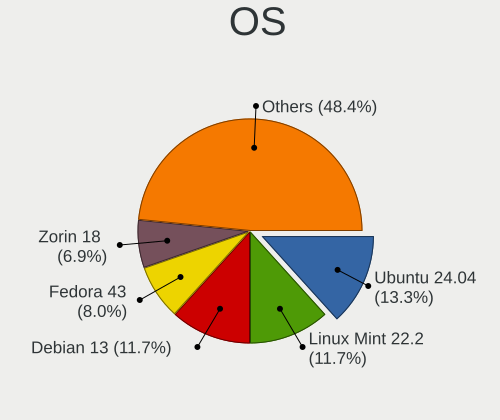

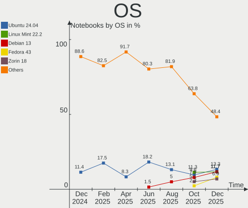

| Name                         | Notebooks | Percent |
|------------------------------|-----------|---------|
| Ubuntu 24.04                 | 25        | 13.3%   |
| Linux Mint 22.2              | 22        | 11.7%   |
| Debian 13                    | 22        | 11.7%   |
| Fedora 43                    | 15        | 7.98%   |
| Zorin 18                     | 13        | 6.91%   |
| OpenMandriva 6.0             | 7         | 3.72%   |
| OpenMandriva 25.90           | 6         | 3.19%   |
| Bazzite 43                   | 6         | 3.19%   |
| Linux Mint 22.1              | 5         | 2.66%   |
| Ubuntu 25.10                 | 4         | 2.13%   |
| Pop!_OS 24.04                | 4         | 2.13%   |
| OpenMandriva 25.11           | 4         | 2.13%   |
| Arch Rolling                 | 4         | 2.13%   |
| Xubuntu 24.04                | 3         | 1.6%    |
| Ubuntu 20.04                 | 3         | 1.6%    |
| OpenMandriva 24.07           | 3         | 1.6%    |
| Xubuntu 25.10                | 2         | 1.06%   |
| Pop!_OS 22.04                | 2         | 1.06%   |
| openSUSE Tumbleweed-XXXXXXXX | 2         | 1.06%   |
| Linux Mint 21.3              | 2         | 1.06%   |
| KDE neon 24.04               | 2         | 1.06%   |
| Elementary 8                 | 2         | 1.06%   |
| Elementary 7.1               | 2         | 1.06%   |
| Debian 12                    | 2         | 1.06%   |
| Debian                       | 2         | 1.06%   |
| CachyOS Rolling              | 2         | 1.06%   |
| Anduinos 1.4.1               | 2         | 1.06%   |
| Zorin 17                     | 1         | 0.53%   |
| Zorin 16                     | 1         | 0.53%   |
| Xubuntu 18.04                | 1         | 0.53%   |
| Ubuntu Budgie 24.04          | 1         | 0.53%   |
| Ubuntu 22.04                 | 1         | 0.53%   |
| Trisquel 12.0                | 1         | 0.53%   |
| PostmarketOS Edge            | 1         | 0.53%   |
| NixOS 25.11                  | 1         | 0.53%   |
| MX 25                        | 1         | 0.53%   |
| MX 23                        | 1         | 0.53%   |
| Manjaro 25.1.0               | 1         | 0.53%   |
| Manjaro                      | 1         | 0.53%   |
| Mageia 10                    | 1         | 0.53%   |

OS Family
---------

OS without a version

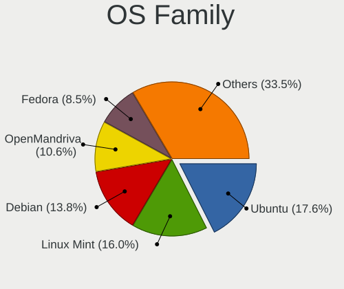

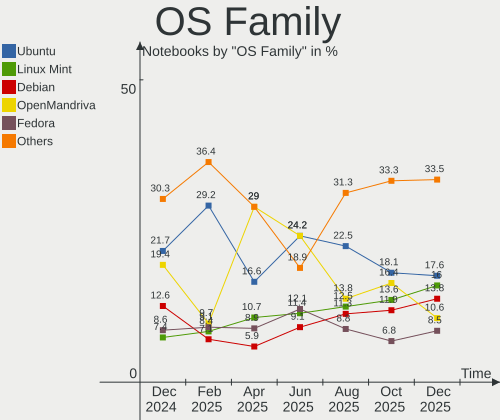

| Name          | Notebooks | Percent |
|---------------|-----------|---------|
| Ubuntu        | 33        | 17.55%  |
| Linux Mint    | 30        | 15.96%  |
| Debian        | 26        | 13.83%  |
| OpenMandriva  | 20        | 10.64%  |
| Fedora        | 16        | 8.51%   |
| Zorin         | 15        | 7.98%   |
| Xubuntu       | 6         | 3.19%   |
| Pop!_OS       | 6         | 3.19%   |
| Bazzite       | 6         | 3.19%   |
| Elementary    | 4         | 2.13%   |
| Arch          | 4         | 2.13%   |
| openSUSE      | 2         | 1.06%   |
| MX            | 2         | 1.06%   |
| Manjaro       | 2         | 1.06%   |
| KDE neon      | 2         | 1.06%   |
| CachyOS       | 2         | 1.06%   |
| Anduinos      | 2         | 1.06%   |
| Ubuntu Budgie | 1         | 0.53%   |
| Trisquel      | 1         | 0.53%   |
| PostmarketOS  | 1         | 0.53%   |
| NixOS         | 1         | 0.53%   |
| Mageia        | 1         | 0.53%   |
| Lubuntu       | 1         | 0.53%   |
| LMDE          | 1         | 0.53%   |
| EndeavourOS   | 1         | 0.53%   |
| Dts-distro    | 1         | 0.53%   |
| Alpine        | 1         | 0.53%   |

Kernel
------

Version of the Linux kernel

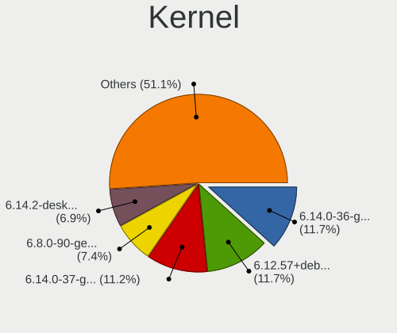

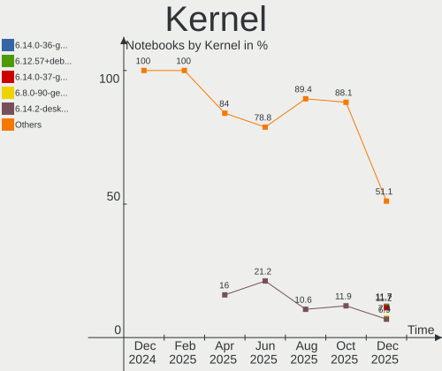

| Version                 | Notebooks | Percent |
|-------------------------|-----------|---------|
| 6.14.0-36-generic       | 22        | 11.7%   |
| 6.12.57+deb13-amd64     | 22        | 11.7%   |
| 6.14.0-37-generic       | 21        | 11.17%  |
| 6.8.0-90-generic        | 14        | 7.45%   |
| 6.14.2-desktop-3omv2590 | 13        | 6.91%   |
| 6.8.0-88-generic        | 8         | 4.26%   |
| 6.17.7-ba20.fc43.x86_64 | 6         | 3.19%   |
| 6.17.12-300.fc43.x86_64 | 6         | 3.19%   |
| 6.17.0-7-generic        | 5         | 2.66%   |
| 6.17.9-76061709-generic | 4         | 2.13%   |
| 6.18.0-desktop-1omv2590 | 3         | 1.6%    |
| 6.17.10-300.fc43.x86_64 | 3         | 1.6%    |
| 6.17.0-8-generic        | 3         | 1.6%    |
| 6.14.0-29-generic       | 3         | 1.6%    |
| 6.10.0-desktop-1omv2490 | 3         | 1.6%    |
| 5.15.0-139-generic      | 3         | 1.6%    |
| 6.18.1-arch1-2          | 2         | 1.06%   |
| 6.17.1-300.fc43.x86_64  | 2         | 1.06%   |
| 6.12.48+deb13-amd64     | 2         | 1.06%   |
| 6.1.0-40-amd64          | 2         | 1.06%   |
| 6.8.0-87-generic        | 1         | 0.53%   |
| 6.8.0-78-generic        | 1         | 0.53%   |
| 6.8.0-71-generic        | 1         | 0.53%   |
| 6.8.0-40-generic        | 1         | 0.53%   |
| 6.6.21-yocto-standard   | 1         | 0.53%   |
| 6.5.0-15-generic        | 1         | 0.53%   |
| 6.18.2-1-MANJARO        | 1         | 0.53%   |
| 6.18.2-1-default        | 1         | 0.53%   |
| 6.18.2-0-stable         | 1         | 0.53%   |
| 6.18.1-200.fc43.x86_64  | 1         | 0.53%   |
| 6.18.1-061801-generic   | 1         | 0.53%   |
| 6.18.0-4-cachyos        | 1         | 0.53%   |
| 6.18.0-3-lts            | 1         | 0.53%   |
| 6.18.0-1-default        | 1         | 0.53%   |
| 6.18.0-061800-generic   | 1         | 0.53%   |
| 6.17.9-arch1-1          | 1         | 0.53%   |
| 6.17.9-300.fc43.x86_64  | 1         | 0.53%   |
| 6.17.9+deb14-amd64      | 1         | 0.53%   |
| 6.17.8-arch1-1          | 1         | 0.53%   |
| 6.17.8-300.fc43.x86_64  | 1         | 0.53%   |

Kernel Family
-------------

Linux kernel without a distro release

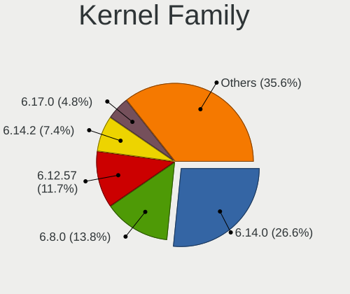

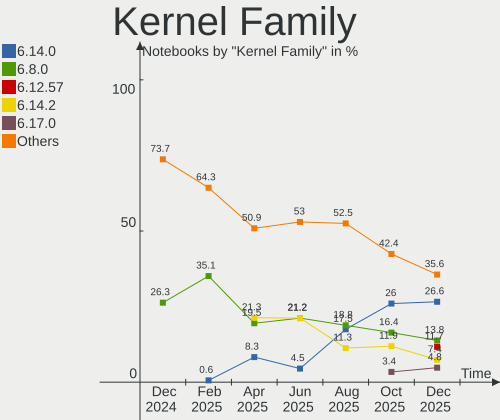

| Version | Notebooks | Percent |
|---------|-----------|---------|
| 6.14.0  | 50        | 26.6%   |
| 6.8.0   | 26        | 13.83%  |
| 6.12.57 | 22        | 11.7%   |
| 6.14.2  | 14        | 7.45%   |
| 6.17.0  | 9         | 4.79%   |
| 6.18.0  | 7         | 3.72%   |
| 6.17.9  | 7         | 3.72%   |
| 6.17.7  | 7         | 3.72%   |
| 6.17.12 | 7         | 3.72%   |
| 5.15.0  | 6         | 3.19%   |
| 6.18.1  | 4         | 2.13%   |
| 6.17.10 | 4         | 2.13%   |
| 6.18.2  | 3         | 1.6%    |
| 6.17.8  | 3         | 1.6%    |
| 6.10.0  | 3         | 1.6%    |
| 6.17.1  | 2         | 1.06%   |
| 6.12.48 | 2         | 1.06%   |
| 6.1.0   | 2         | 1.06%   |
| 6.6.21  | 1         | 0.53%   |
| 6.5.0   | 1         | 0.53%   |
| 6.17.6  | 1         | 0.53%   |
| 6.17.13 | 1         | 0.53%   |
| 6.17.11 | 1         | 0.53%   |
| 6.12.62 | 1         | 0.53%   |
| 6.11.4  | 1         | 0.53%   |
| 6.11.0  | 1         | 0.53%   |
| 6.0.12  | 1         | 0.53%   |
| 4.15.0  | 1         | 0.53%   |

Kernel Major Ver.
-----------------

Linux kernel major version

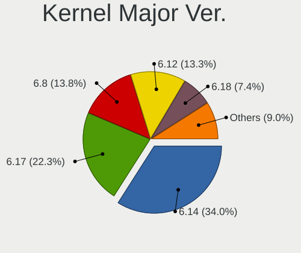

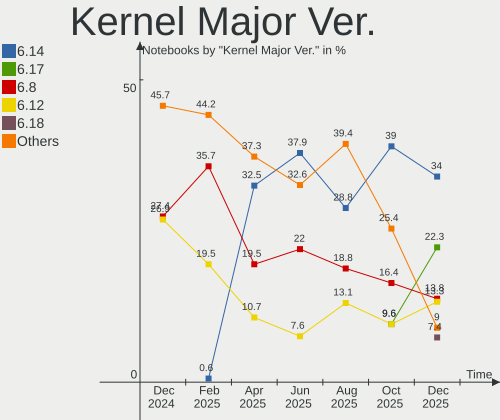

| Version | Notebooks | Percent |
|---------|-----------|---------|
| 6.14    | 64        | 34.04%  |
| 6.17    | 42        | 22.34%  |
| 6.8     | 26        | 13.83%  |
| 6.12    | 25        | 13.3%   |
| 6.18    | 14        | 7.45%   |
| 5.15    | 6         | 3.19%   |
| 6.10    | 3         | 1.6%    |
| 6.11    | 2         | 1.06%   |
| 6.1     | 2         | 1.06%   |
| 6.6     | 1         | 0.53%   |
| 6.5     | 1         | 0.53%   |
| 6.0     | 1         | 0.53%   |
| 4.15    | 1         | 0.53%   |

Arch
----

OS architecture (x86_64, i586, etc.)

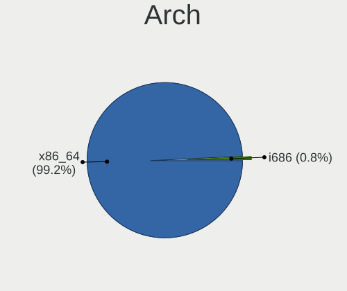

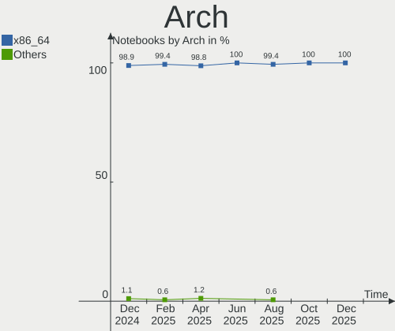

| Name   | Notebooks | Percent |
|--------|-----------|---------|
| x86_64 | 188       | 100%    |

DE
--

Desktop Environment

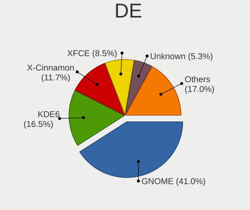

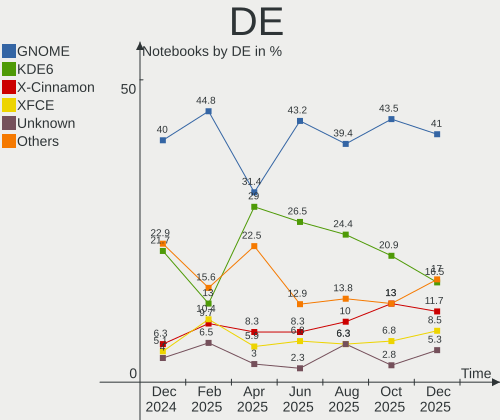

| Name            | Notebooks | Percent |
|-----------------|-----------|---------|
| GNOME           | 77        | 40.96%  |
| KDE6            | 31        | 16.49%  |
| X-Cinnamon      | 22        | 11.7%   |
| XFCE            | 16        | 8.51%   |
| Unknown         | 10        | 5.32%   |
| LXQt            | 5         | 2.66%   |
| KDE5            | 5         | 2.66%   |
| Pantheon        | 4         | 2.13%   |
| MATE            | 4         | 2.13%   |
| KDE             | 3         | 1.6%    |
| COSMIC          | 3         | 1.6%    |
| Hyprland        | 2         | 1.06%   |
| wlroots         | 1         | 0.53%   |
| sway            | 1         | 0.53%   |
| niri            | 1         | 0.53%   |
| i3              | 1         | 0.53%   |
| GNOME Flashback | 1         | 0.53%   |
| Budgie          | 1         | 0.53%   |

Display Server
--------------

X11 or Wayland

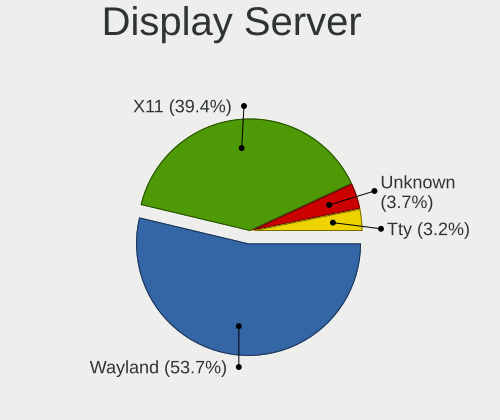

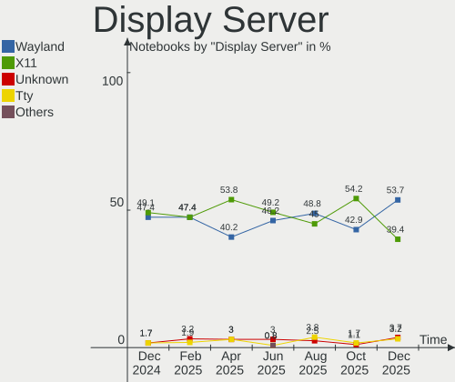

| Name    | Notebooks | Percent |
|---------|-----------|---------|
| Wayland | 101       | 53.72%  |
| X11     | 74        | 39.36%  |
| Unknown | 7         | 3.72%   |
| Tty     | 6         | 3.19%   |

Display Manager
---------------

SDDM, LightDM, etc.

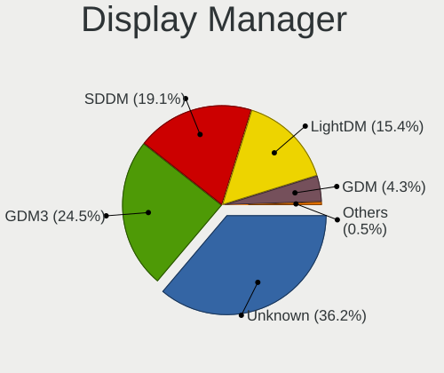

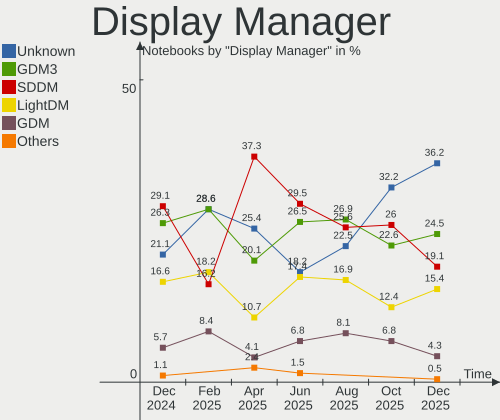

| Name           | Notebooks | Percent |
|----------------|-----------|---------|
| Unknown        | 68        | 36.17%  |
| GDM3           | 46        | 24.47%  |
| SDDM           | 36        | 19.15%  |
| LightDM        | 29        | 15.43%  |
| GDM            | 8         | 4.26%   |
| COSMIC-GREETER | 1         | 0.53%   |

OS Lang
-------

Language

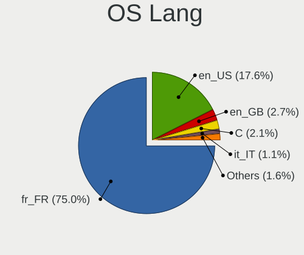

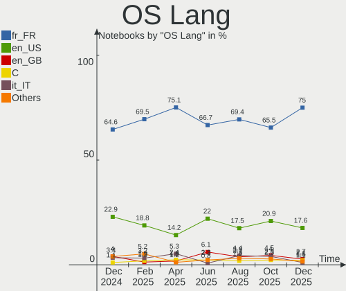

| Lang    | Notebooks | Percent |
|---------|-----------|---------|
| fr_FR   | 141       | 75%     |
| en_US   | 33        | 17.55%  |
| en_GB   | 5         | 2.66%   |
| C       | 4         | 2.13%   |
| it_IT   | 2         | 1.06%   |
| Unknown | 2         | 1.06%   |
| es_ES   | 1         | 0.53%   |

Boot Mode
---------

EFI or BIOS

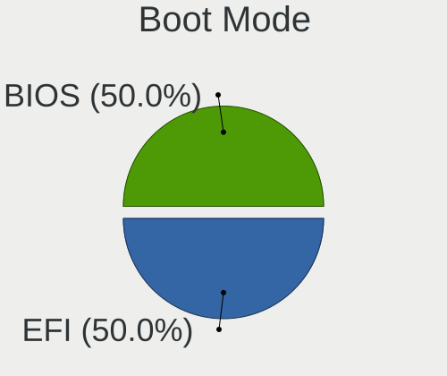

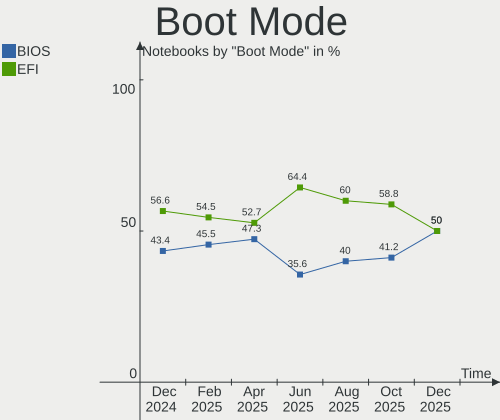

| Mode | Notebooks | Percent |
|------|-----------|---------|
| BIOS | 94        | 50%     |
| EFI  | 94        | 50%     |

Filesystem
----------

Type of filesystem

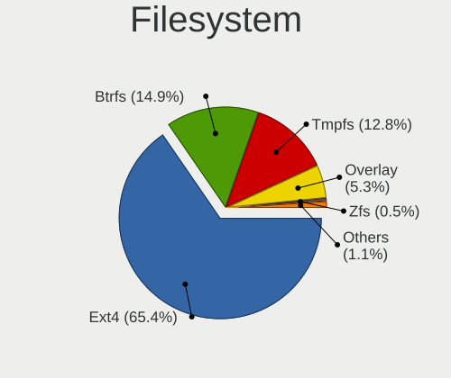

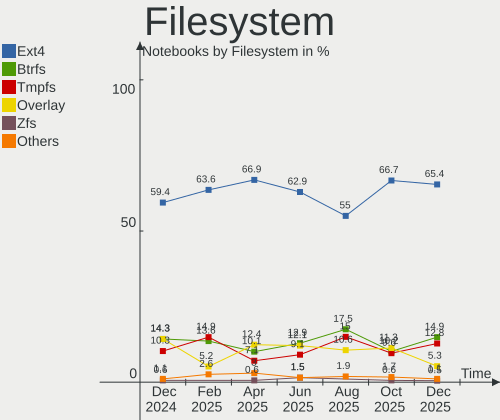

| Type    | Notebooks | Percent |
|---------|-----------|---------|
| Ext4    | 123       | 65.43%  |
| Btrfs   | 28        | 14.89%  |
| Tmpfs   | 24        | 12.77%  |
| Overlay | 10        | 5.32%   |
| Zfs     | 1         | 0.53%   |
| Rootfs  | 1         | 0.53%   |
| F2fs    | 1         | 0.53%   |

Part. scheme
------------

Scheme of partitioning

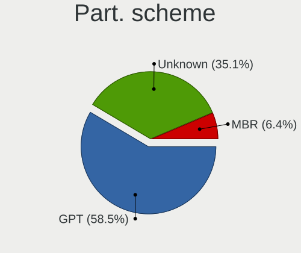

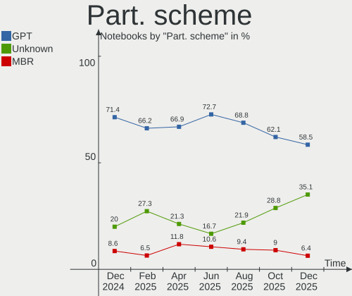

| Type    | Notebooks | Percent |
|---------|-----------|---------|
| GPT     | 110       | 58.51%  |
| Unknown | 66        | 35.11%  |
| MBR     | 12        | 6.38%   |

Dual Boot with Linux/BSD
------------------------

Hosting more than one Linux/BSD

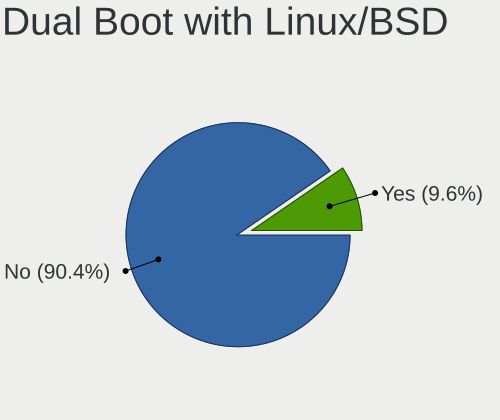

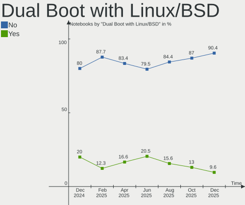

| Dual boot | Notebooks | Percent |
|-----------|-----------|---------|
| No        | 170       | 90.43%  |
| Yes       | 18        | 9.57%   |

Dual Boot (Win)
---------------

Hosting Linux and Windows

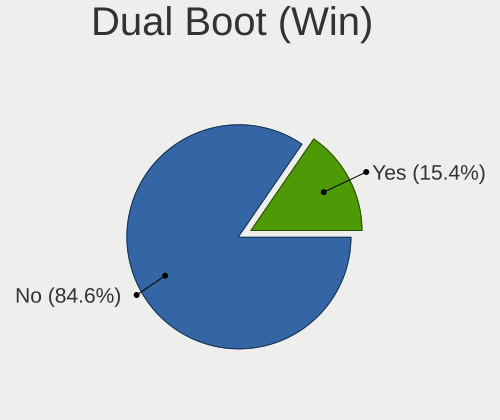

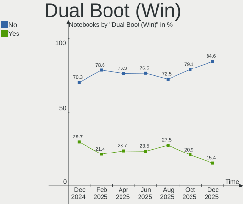

| Dual boot | Notebooks | Percent |
|-----------|-----------|---------|
| No        | 159       | 84.57%  |
| Yes       | 29        | 15.43%  |

Board
-----

Vendor
------

Motherboard manufacturer

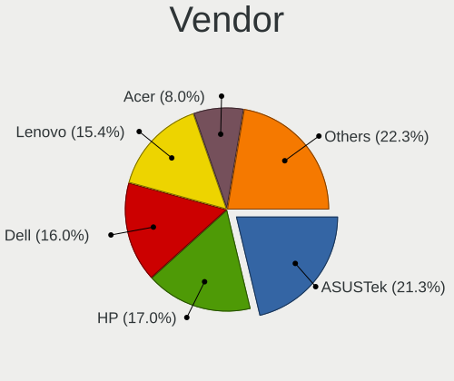

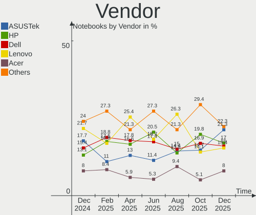

| Name                | Notebooks | Percent |
|---------------------|-----------|---------|
| ASUSTek Computer    | 40        | 21.28%  |
| Hewlett-Packard     | 32        | 17.02%  |
| Dell                | 30        | 15.96%  |
| Lenovo              | 29        | 15.43%  |
| Acer                | 15        | 7.98%   |
| Toshiba             | 11        | 5.85%   |
| MSI                 | 6         | 3.19%   |
| Apple               | 5         | 2.66%   |
| Framework           | 3         | 1.6%    |
| TUXEDO              | 2         | 1.06%   |
| UNIQCELL            | 1         | 0.53%   |
| TongFang            | 1         | 0.53%   |
| Teclast             | 1         | 0.53%   |
| Sony                | 1         | 0.53%   |
| SLIMBOOK            | 1         | 0.53%   |
| Schenker            | 1         | 0.53%   |
| PC Specialist       | 1         | 0.53%   |
| Notebook            | 1         | 0.53%   |
| Medion              | 1         | 0.53%   |
| Hampoo              | 1         | 0.53%   |
| Google              | 1         | 0.53%   |
| Gigabyte Technology | 1         | 0.53%   |
| Fujitsu             | 1         | 0.53%   |
| Corsair             | 1         | 0.53%   |
| Alienware           | 1         | 0.53%   |

Model
-----

Motherboard model

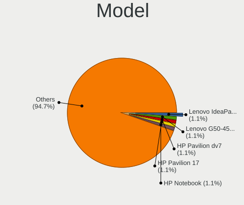

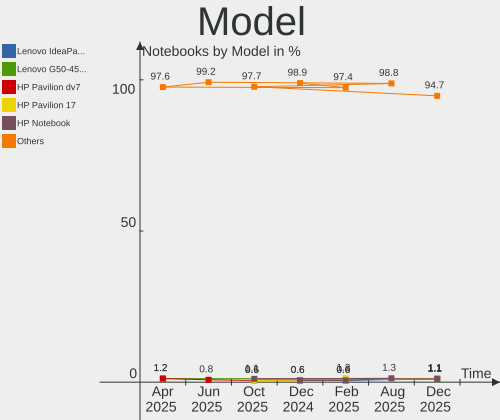

| Name                                       | Notebooks | Percent |
|--------------------------------------------|-----------|---------|
| Lenovo IdeaPad 1 15ALC7 82R4               | 2         | 1.06%   |
| Lenovo G50-45 80E3                         | 2         | 1.06%   |
| HP Pavilion dv7                            | 2         | 1.06%   |
| HP Pavilion 17                             | 2         | 1.06%   |
| HP Notebook                                | 2         | 1.06%   |
| Dell Latitude E6230                        | 2         | 1.06%   |
| Dell Latitude 7490                         | 2         | 1.06%   |
| Dell Latitude 5480                         | 2         | 1.06%   |
| UNIQCELL Q15.6                             | 1         | 0.53%   |
| TUXEDO InfinityBook S 15/17 Gen7           | 1         | 0.53%   |
| TUXEDO InfinityBook Pro AMD Gen9           | 1         | 0.53%   |
| Toshiba TECRA Z50-A                        | 1         | 0.53%   |
| Toshiba Satellite Pro L870-14G             | 1         | 0.53%   |
| Toshiba Satellite Pro L500                 | 1         | 0.53%   |
| Toshiba Satellite P200                     | 1         | 0.53%   |
| Toshiba Satellite L300                     | 1         | 0.53%   |
| Toshiba Satellite C70-B                    | 1         | 0.53%   |
| Toshiba Satellite C55D-A-14U               | 1         | 0.53%   |
| Toshiba QOSMIO X70-A                       | 1         | 0.53%   |
| Toshiba PORTEGE R930                       | 1         | 0.53%   |
| Toshiba PORTEGE M780                       | 1         | 0.53%   |
| Toshiba NB520                              | 1         | 0.53%   |
| TongFang GX5HRXL                           | 1         | 0.53%   |
| Teclast Cherry Trail CR                    | 1         | 0.53%   |
| Sony VPCF11C5E                             | 1         | 0.53%   |
| SLIMBOOK Executive                         | 1         | 0.53%   |
| Schenker XMG APEX (Mid 2021)               | 1         | 0.53%   |
| PC Specialist Lafite Pro IV 14             | 1         | 0.53%   |
| Notebook NV4xPZ                            | 1         | 0.53%   |
| MSI Stealth GS77 12UGS                     | 1         | 0.53%   |
| MSI MS-7A12                                | 1         | 0.53%   |
| MSI MS-16G7                                | 1         | 0.53%   |
| MSI Katana GF76 11UD                       | 1         | 0.53%   |
| MSI GT72S 6QD                              | 1         | 0.53%   |
| MSI GF63 Thin 11UC                         | 1         | 0.53%   |
| Medion NPxxRNA                             | 1         | 0.53%   |
| Lenovo ThinkPad X270 20HMS3GP00            | 1         | 0.53%   |
| Lenovo ThinkPad X270 20HMS2C003            | 1         | 0.53%   |
| Lenovo ThinkPad X220 4291CF3               | 1         | 0.53%   |
| Lenovo ThinkPad X1 Carbon Gen 9 20XWCTO1WW | 1         | 0.53%   |

Model Family
------------

Motherboard model prefix

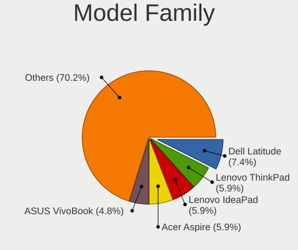

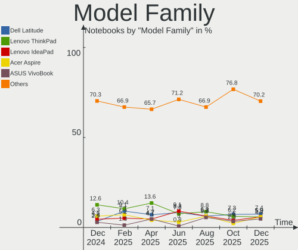

| Name                 | Notebooks | Percent |
|----------------------|-----------|---------|
| Dell Latitude        | 14        | 7.45%   |
| Lenovo ThinkPad      | 11        | 5.85%   |
| Lenovo IdeaPad       | 11        | 5.85%   |
| Acer Aspire          | 11        | 5.85%   |
| ASUS VivoBook        | 9         | 4.79%   |
| HP ProBook           | 7         | 3.72%   |
| ASUS ASUS            | 7         | 3.72%   |
| Toshiba Satellite    | 6         | 3.19%   |
| HP Pavilion          | 5         | 2.66%   |
| Dell Inspiron        | 5         | 2.66%   |
| Lenovo G50-45        | 3         | 1.6%    |
| HP OMEN              | 3         | 1.6%    |
| HP Laptop            | 3         | 1.6%    |
| HP ENVY              | 3         | 1.6%    |
| Framework Laptop     | 3         | 1.6%    |
| Dell XPS             | 3         | 1.6%    |
| Dell Precision       | 3         | 1.6%    |
| ASUS Zenbook         | 3         | 1.6%    |
| TUXEDO InfinityBook  | 2         | 1.06%   |
| Toshiba PORTEGE      | 2         | 1.06%   |
| Lenovo Legion        | 2         | 1.06%   |
| HP ZBook             | 2         | 1.06%   |
| HP Notebook          | 2         | 1.06%   |
| HP EliteBook         | 2         | 1.06%   |
| Dell Pro             | 2         | 1.06%   |
| ASUS ROG             | 2         | 1.06%   |
| Acer Nitro           | 2         | 1.06%   |
| UNIQCELL Q15.6       | 1         | 0.53%   |
| Toshiba TECRA        | 1         | 0.53%   |
| Toshiba QOSMIO       | 1         | 0.53%   |
| Toshiba NB520        | 1         | 0.53%   |
| TongFang GX5HRXL     | 1         | 0.53%   |
| Teclast Cherry       | 1         | 0.53%   |
| Sony VPCF11C5E       | 1         | 0.53%   |
| SLIMBOOK Executive   | 1         | 0.53%   |
| Schenker XMG         | 1         | 0.53%   |
| PC Specialist Lafite | 1         | 0.53%   |
| Notebook NV4xPZ      | 1         | 0.53%   |
| MSI Stealth          | 1         | 0.53%   |
| MSI MS-7A12          | 1         | 0.53%   |

MFG Year
--------

Motherboard manufacture year

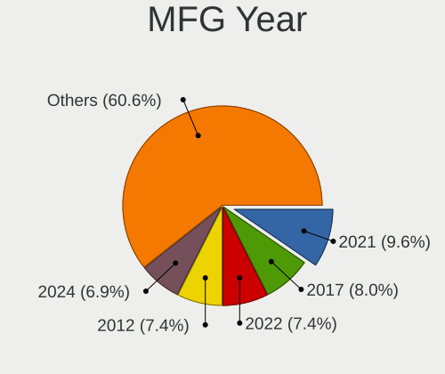

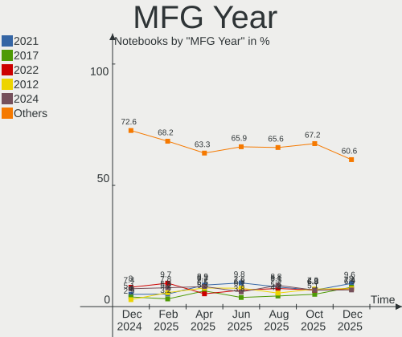

| Year | Notebooks | Percent |
|------|-----------|---------|
| 2021 | 18        | 9.57%   |
| 2017 | 15        | 7.98%   |
| 2022 | 14        | 7.45%   |
| 2012 | 14        | 7.45%   |
| 2024 | 13        | 6.91%   |
| 2020 | 12        | 6.38%   |
| 2013 | 11        | 5.85%   |
| 2025 | 10        | 5.32%   |
| 2023 | 10        | 5.32%   |
| 2018 | 10        | 5.32%   |
| 2016 | 10        | 5.32%   |
| 2014 | 10        | 5.32%   |
| 2015 | 9         | 4.79%   |
| 2010 | 9         | 4.79%   |
| 2011 | 8         | 4.26%   |
| 2019 | 5         | 2.66%   |
| 2009 | 4         | 2.13%   |
| 2008 | 4         | 2.13%   |
| 2007 | 2         | 1.06%   |

Form Factor
-----------

Physical design of the computer

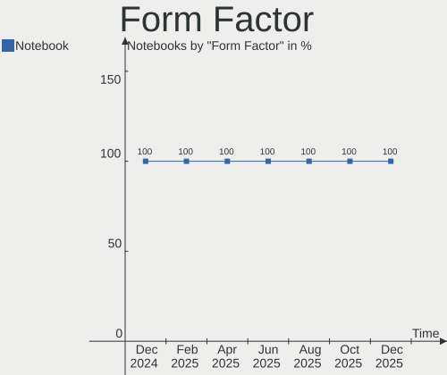

| Name     | Notebooks | Percent |
|----------|-----------|---------|
| Notebook | 188       | 100%    |

Secure Boot
-----------

Enabled or disabled

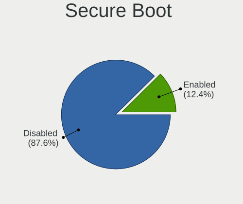

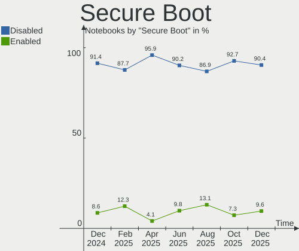

| State    | Notebooks | Percent |
|----------|-----------|---------|
| Disabled | 170       | 90.43%  |
| Enabled  | 18        | 9.57%   |

Coreboot
--------

Have coreboot on board

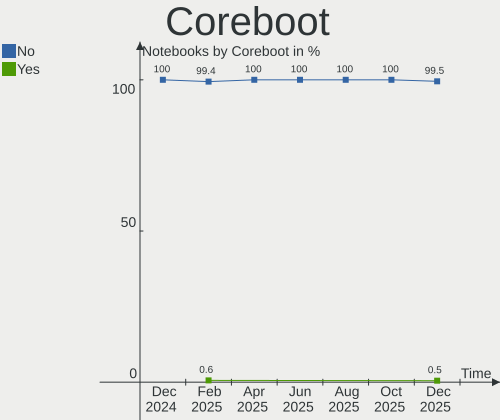

| Used | Notebooks | Percent |
|------|-----------|---------|
| No   | 187       | 99.47%  |
| Yes  | 1         | 0.53%   |

RAM Size
--------

Total RAM memory

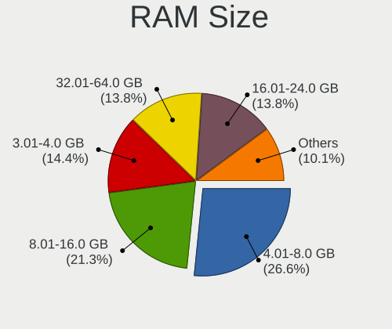

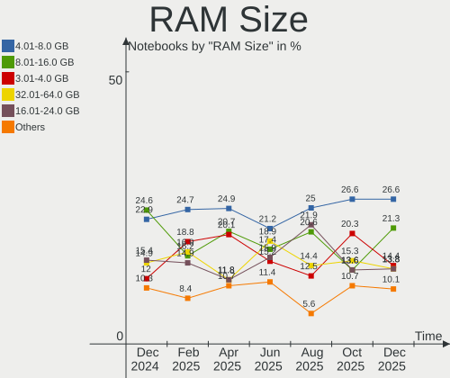

| Size in GB  | Notebooks | Percent |
|-------------|-----------|---------|
| 4.01-8.0    | 50        | 26.6%   |
| 8.01-16.0   | 40        | 21.28%  |
| 3.01-4.0    | 27        | 14.36%  |
| 32.01-64.0  | 26        | 13.83%  |
| 16.01-24.0  | 26        | 13.83%  |
| 24.01-32.0  | 7         | 3.72%   |
| 2.01-3.0    | 5         | 2.66%   |
| 64.01-256.0 | 5         | 2.66%   |
| 1.01-2.0    | 2         | 1.06%   |

RAM Used
--------

Used RAM memory

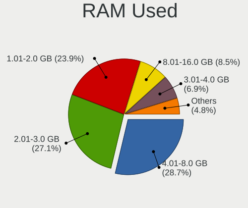

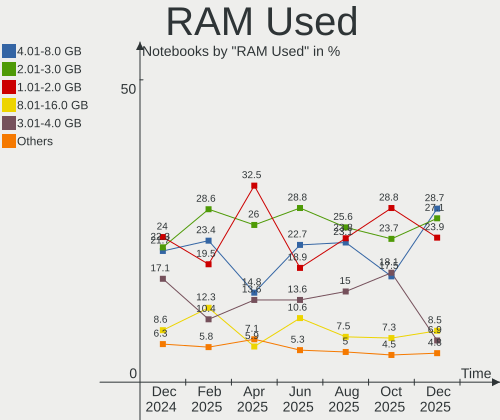

| Used GB    | Notebooks | Percent |
|------------|-----------|---------|
| 4.01-8.0   | 54        | 28.72%  |
| 2.01-3.0   | 51        | 27.13%  |
| 1.01-2.0   | 45        | 23.94%  |
| 8.01-16.0  | 16        | 8.51%   |
| 3.01-4.0   | 13        | 6.91%   |
| 0.51-1.0   | 7         | 3.72%   |
| 16.01-24.0 | 2         | 1.06%   |

Total Drives
------------

Number of drives on board

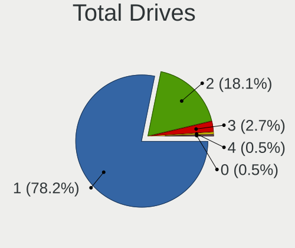

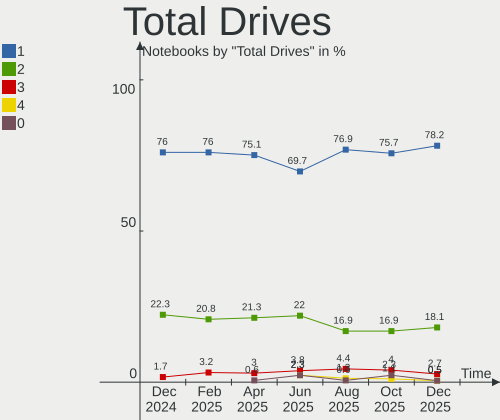

| Drives | Notebooks | Percent |
|--------|-----------|---------|
| 1      | 147       | 78.19%  |
| 2      | 34        | 18.09%  |
| 3      | 5         | 2.66%   |
| 4      | 1         | 0.53%   |
| 0      | 1         | 0.53%   |

Has CD-ROM
----------

Has CD-ROM on board

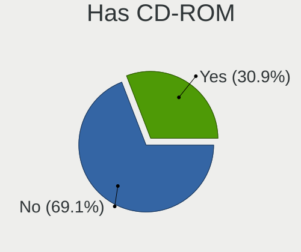

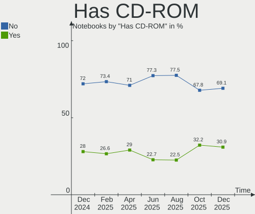

| Presented | Notebooks | Percent |
|-----------|-----------|---------|
| No        | 130       | 69.15%  |
| Yes       | 58        | 30.85%  |

Has Ethernet
------------

Has Ethernet on board

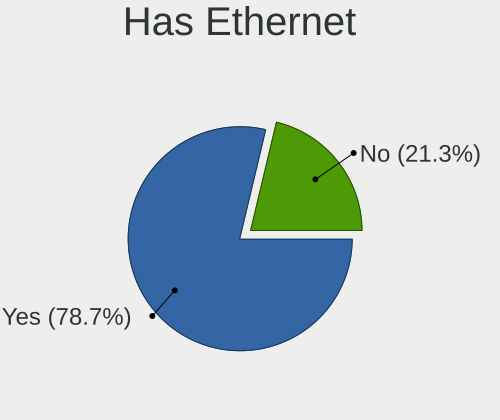

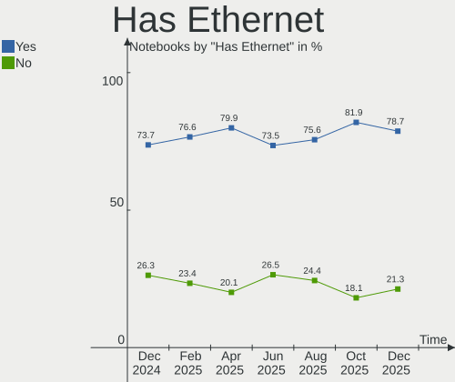

| Presented | Notebooks | Percent |
|-----------|-----------|---------|
| Yes       | 148       | 78.72%  |
| No        | 40        | 21.28%  |

Has WiFi
--------

Has WiFi module

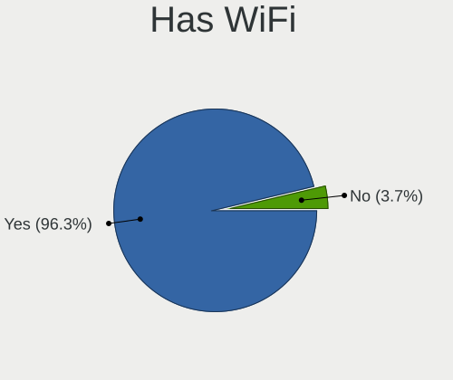

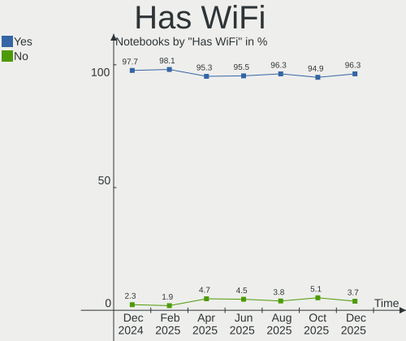

| Presented | Notebooks | Percent |
|-----------|-----------|---------|
| Yes       | 181       | 96.28%  |
| No        | 7         | 3.72%   |

Has Bluetooth
-------------

Has Bluetooth module

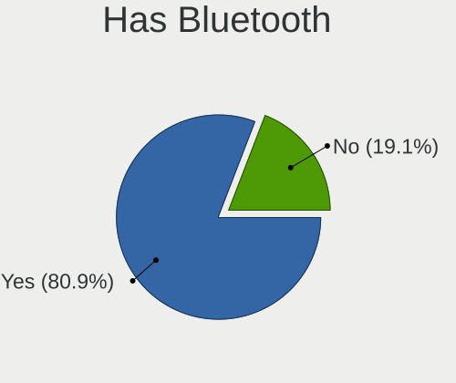

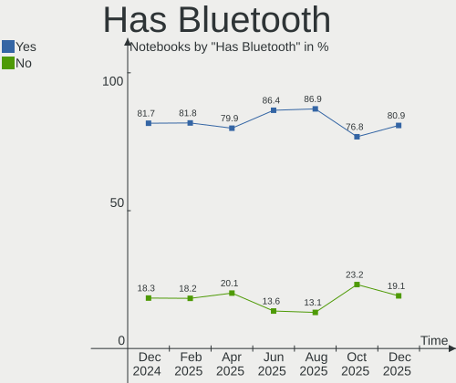

| Presented | Notebooks | Percent |
|-----------|-----------|---------|
| Yes       | 152       | 80.85%  |
| No        | 36        | 19.15%  |

Location
--------

Country
-------

Geographic location (country)

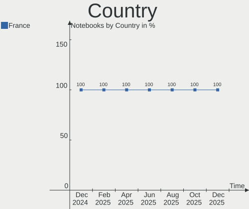

| Country | Notebooks | Percent |
|---------|-----------|---------|
| France  | 188       | 100%    |

City
----

Geographic location (city)

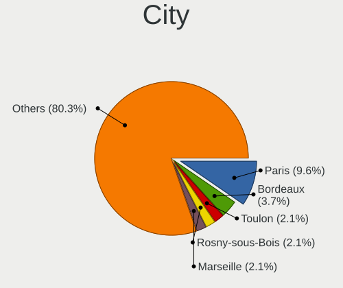

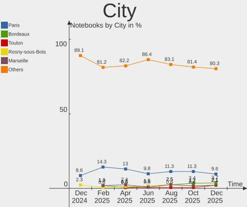

| City                    | Notebooks | Percent |
|-------------------------|-----------|---------|
| Paris                   | 18        | 9.57%   |
| Bordeaux                | 7         | 3.72%   |
| Toulon                  | 4         | 2.13%   |
| Rosny-sous-Bois         | 4         | 2.13%   |
| Marseille               | 4         | 2.13%   |
| Lille                   | 4         | 2.13%   |
| Toulouse                | 3         | 1.6%    |
| Rennes                  | 3         | 1.6%    |
| Guyancourt              | 3         | 1.6%    |
| Bayonne                 | 3         | 1.6%    |
| Verton                  | 2         | 1.06%   |
| Tournefeuille           | 2         | 1.06%   |
| Nanterre                | 2         | 1.06%   |
| Montpellier             | 2         | 1.06%   |
| Maisons-Laffitte        | 2         | 1.06%   |
| Le Mans                 | 2         | 1.06%   |
| Évry                   | 2         | 1.06%   |
| Burgnac                 | 2         | 1.06%   |
| Azay-sur-Cher           | 2         | 1.06%   |
| Voiron                  | 1         | 0.53%   |
| Vitry-sur-Seine         | 1         | 0.53%   |
| Villepinte              | 1         | 0.53%   |
| Versailles              | 1         | 0.53%   |
| Thonon-les-Bains        | 1         | 0.53%   |
| Tarbes                  | 1         | 0.53%   |
| Talence                 | 1         | 0.53%   |
| Strasbourg              | 1         | 0.53%   |
| Souillac                | 1         | 0.53%   |
| Sotteville-lès-Rouen   | 1         | 0.53%   |
| Sérignan-du-Comtat     | 1         | 0.53%   |
| Sérézin-du-Rhône     | 1         | 0.53%   |
| Savignies               | 1         | 0.53%   |
| Saverdun                | 1         | 0.53%   |
| Saulxures-les-Nancy     | 1         | 0.53%   |
| Salon-de-Provence       | 1         | 0.53%   |
| Sainte-Luce-sur-Loire   | 1         | 0.53%   |
| Sainte-Foy-les-Lyon     | 1         | 0.53%   |
| Saint-Quentin-le-Verger | 1         | 0.53%   |
| Saint-Paul-les-Dax      | 1         | 0.53%   |
| Saint-Michel            | 1         | 0.53%   |

Drives
------

Drive Vendor
------------

Hard drive vendors

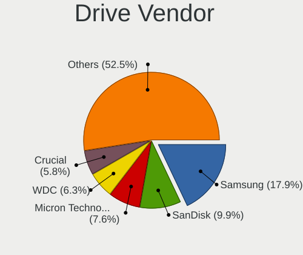

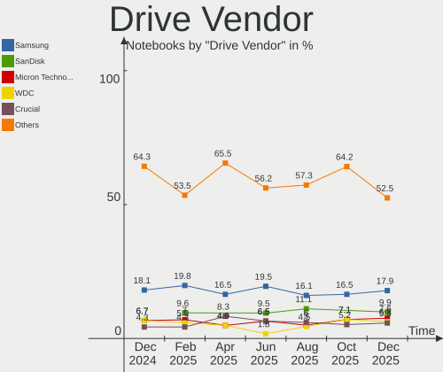

| Vendor                      | Notebooks | Drives  | Percent |
|-----------------------------|-----------|---------|---------|
| Samsung Electronics         | 40        | 43      | 17.94%  |
| SanDisk                     | 22        | 22      | 9.87%   |
| Micron Technology           | 17        | 17      | 7.62%   |
| WDC                         | 14        | 14      | 6.28%   |
| Crucial                     | 13        | 13      | 5.83%   |
| SK hynix                    | 11        | 11      | 4.93%   |
| Seagate                     | 11        | 11      | 4.93%   |
| Toshiba                     | 10        | 10      | 4.48%   |
| Unknown                     | 9         | 9       | 4.04%   |
| Kingston                    | 9         | 10      | 4.04%   |
| Hitachi                     | 8         | 9       | 3.59%   |
| HGST                        | 8         | 8       | 3.59%   |
| KIOXIA                      | 7         | 7       | 3.14%   |
| Intel                       | 6         | 7       | 2.69%   |
| SPCC                        | 4         | 5       | 1.79%   |
| PNY                         | 4         | 4       | 1.79%   |
| Kingston Technology Company | 4         | 4       | 1.79%   |
| Micron/Crucial Technology   | 3         | 4       | 1.35%   |
| Apple                       | 3         | 3       | 1.35%   |
| Transcend                   | 2         | 2       | 0.9%    |
| LITEON                      | 2         | 2       | 0.9%    |
| China                       | 2         | 2       | 0.9%    |
| SABRENT                     | 1         | 1       | 0.45%   |
| PC Specialist               | 1         | 1       | 0.45%   |
| MAXIO Technology (Hangzhou) | 1         | 1       | 0.45%   |
| LITEONIT                    | 1         | 2       | 0.45%   |
| Lexar                       | 1         | 1       | 0.45%   |
| KingSpec                    | 1         | 1       | 0.45%   |
| Intenso                     | 1         | 1       | 0.45%   |
| Integral                    | 1         | 1       | 0.45%   |
| Hewlett-Packard             | 1         | Unknown | 0.45%   |
| FORESEE                     | 1         | 1       | 0.45%   |
| Fanxiang                    | 1         | 1       | 0.45%   |
| Emtec                       | 1         | 1       | 0.45%   |
| BAITITON                    | 1         | 1       | 0.45%   |
| Unknown                     | 1         | 1       | 0.45%   |

Drive Model
-----------

Hard drive models

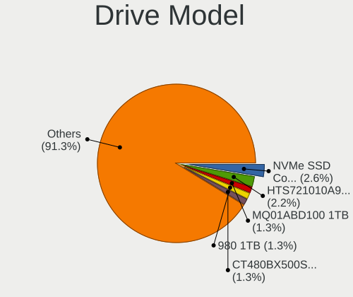

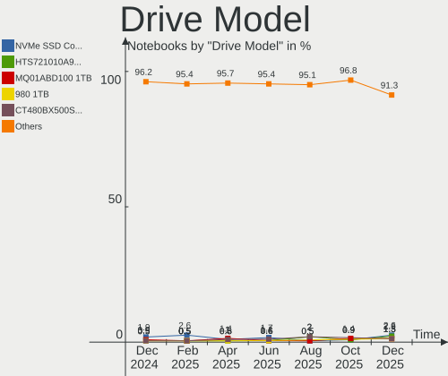

| Model                                              | Notebooks | Percent |
|----------------------------------------------------|-----------|---------|
| Samsung NVMe SSD Controller PM9A1/PM9A3/980PRO 1TB | 6         | 2.62%   |
| HGST HTS721010A9E630 1TB                           | 5         | 2.18%   |
| Toshiba MQ01ABD100 1TB                             | 3         | 1.31%   |
| Samsung SSD 980 1TB                                | 3         | 1.31%   |
| Crucial CT480BX500SSD1 480GB                       | 3         | 1.31%   |
| Crucial CT1000BX500SSD1 1TB                        | 3         | 1.31%   |
| WDC WD10JPCX-24UE4T0 1TB                           | 2         | 0.87%   |
| WDC WD Blue SA510 2.5 500GB                        | 2         | 0.87%   |
| Unknown MMC Card  64GB                             | 2         | 0.87%   |
| SPCC Solid State Disk 256GB                        | 2         | 0.87%   |
| SK hynix HFS256G39TND-N210A 256GB SSD              | 2         | 0.87%   |
| Seagate ST1000LM035-1RK172 1TB                     | 2         | 0.87%   |
| Seagate ST1000LM024 HN-M101MBB 1TB                 | 2         | 0.87%   |
| Sandisk WD_BLACK SN850X 2000GB                     | 2         | 0.87%   |
| Samsung SSD 870 QVO 2TB                            | 2         | 0.87%   |
| Samsung NVMe SSD Controller SM981/PM981/PM983 1TB  | 2         | 0.87%   |
| Samsung NVMe SSD Controller 980 (DRAM-less) 256GB  | 2         | 0.87%   |
| PNY CS900 240GB SSD                                | 2         | 0.87%   |
| PNY 1TB SATA SSD                                   | 2         | 0.87%   |
| Kingston Company OM8PGP41024Q-AA 1024GB            | 2         | 0.87%   |
| Kingston SA400S37480G 480GB SSD                    | 2         | 0.87%   |
| HGST HTS725050A7E630 500GB                         | 2         | 0.87%   |
| Crucial CT240BX500SSD1 240GB                       | 2         | 0.87%   |
| WDC WDS100T2B0C-00PXH0 1TB                         | 1         | 0.44%   |
| WDC WD7500BPKX-80HPJT0 752GB                       | 1         | 0.44%   |
| WDC WD5000LPCX-24C6HT0 500GB                       | 1         | 0.44%   |
| WDC WD5000LPCX-21VHAT0 500GB                       | 1         | 0.44%   |
| WDC WD3200BEVT-26ZCT0 320GB                        | 1         | 0.44%   |
| WDC WD3200BEVT-26A23T0 320GB                       | 1         | 0.44%   |
| WDC WD10EZEX-22BN5A0 1TB                           | 1         | 0.44%   |
| WDC WD Green 2.5 240GB                             | 1         | 0.44%   |
| WDC PC SN810 NVMe 512GB                            | 1         | 0.44%   |
| WDC PC SN540 SDDPNPF-512G-1032 512GB               | 1         | 0.44%   |
| Unknown SD/MMC/MS PRO 2GB                          | 1         | 0.44%   |
| Unknown NVMe SSD Drive 1TB                         | 1         | 0.44%   |
| Unknown MMC Card  7GB                              | 1         | 0.44%   |
| Unknown MMC Card  32GB                             | 1         | 0.44%   |
| Unknown MMC Card  249GB                            | 1         | 0.44%   |
| Unknown EB1QT  32GB                                | 1         | 0.44%   |
| Unknown 00000  4GB                                 | 1         | 0.44%   |

HDD Vendor
----------

Hard disk drive vendors

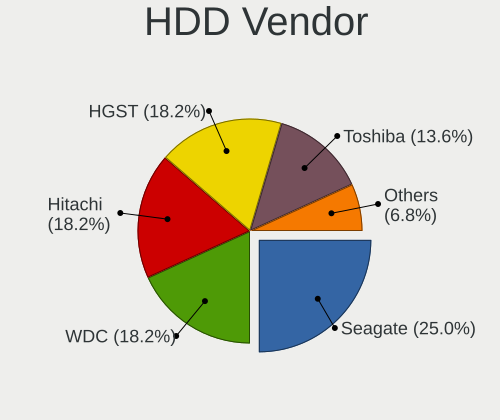

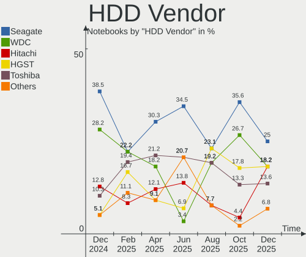

| Vendor              | Notebooks | Drives | Percent |
|---------------------|-----------|--------|---------|
| Seagate             | 11        | 11     | 25%     |
| WDC                 | 8         | 8      | 18.18%  |
| Hitachi             | 8         | 9      | 18.18%  |
| HGST                | 8         | 8      | 18.18%  |
| Toshiba             | 6         | 6      | 13.64%  |
| Unknown             | 1         | 1      | 2.27%   |
| Samsung Electronics | 1         | 1      | 2.27%   |
| Apple               | 1         | 1      | 2.27%   |

SSD Vendor
----------

Solid state drive vendors

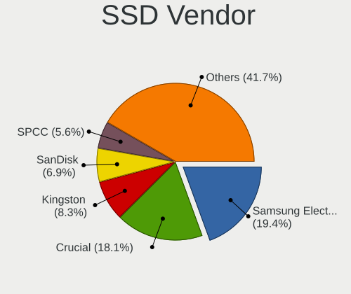

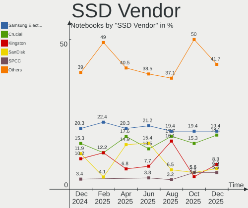

| Vendor              | Notebooks | Drives | Percent |
|---------------------|-----------|--------|---------|
| Samsung Electronics | 14        | 15     | 19.44%  |
| Crucial             | 13        | 13     | 18.06%  |
| Kingston            | 6         | 7      | 8.33%   |
| SanDisk             | 5         | 5      | 6.94%   |
| SPCC                | 4         | 5      | 5.56%   |
| SK hynix            | 4         | 4      | 5.56%   |
| PNY                 | 4         | 4      | 5.56%   |
| WDC                 | 3         | 3      | 4.17%   |
| Toshiba             | 3         | 3      | 4.17%   |
| Transcend           | 2         | 2      | 2.78%   |
| Micron Technology   | 2         | 2      | 2.78%   |
| LITEON              | 2         | 2      | 2.78%   |
| China               | 2         | 2      | 2.78%   |
| Apple               | 2         | 2      | 2.78%   |
| SABRENT             | 1         | 1      | 1.39%   |
| LITEONIT            | 1         | 2      | 1.39%   |
| Lexar               | 1         | 1      | 1.39%   |
| Intenso             | 1         | 1      | 1.39%   |
| Emtec               | 1         | 1      | 1.39%   |
| BAITITON            | 1         | 1      | 1.39%   |

Drive Kind
----------

HDD or SSD

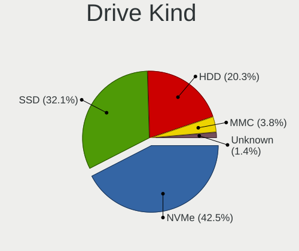

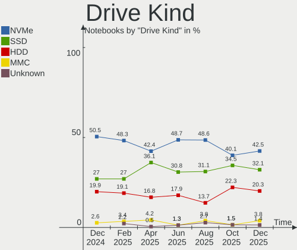

| Kind    | Notebooks | Drives | Percent |
|---------|-----------|--------|---------|
| NVMe    | 90        | 100    | 42.45%  |
| SSD     | 68        | 76     | 32.08%  |
| HDD     | 43        | 45     | 20.28%  |
| MMC     | 8         | 8      | 3.77%   |
| Unknown | 3         | 2      | 1.42%   |

Drive Connector
---------------

SATA, SAS, NVMe, etc.

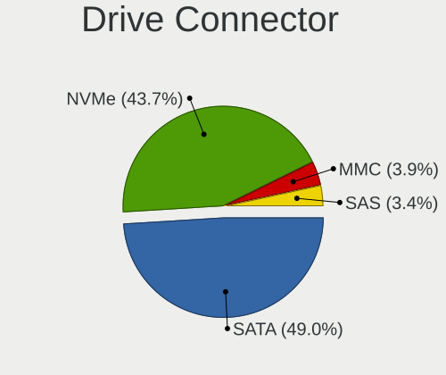

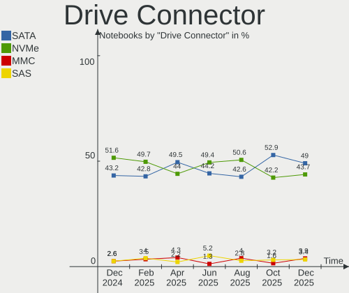

| Type | Notebooks | Drives | Percent |
|------|-----------|--------|---------|
| SATA | 101       | 118    | 49.03%  |
| NVMe | 90        | 99     | 43.69%  |
| MMC  | 8         | 8      | 3.88%   |
| SAS  | 7         | 6      | 3.4%    |

Drive Size
----------

Size of hard drive

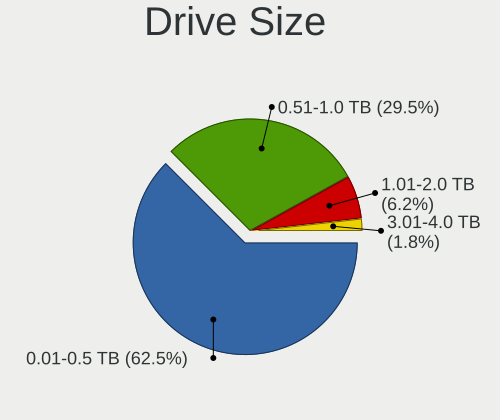

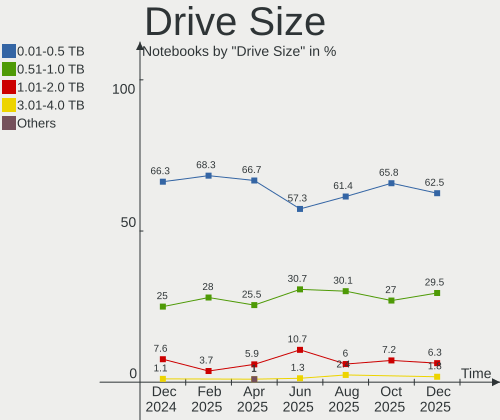

| Size in TB | Notebooks | Drives | Percent |
|------------|-----------|--------|---------|
| 0.01-0.5   | 70        | 79     | 62.5%   |
| 0.51-1.0   | 33        | 33     | 29.46%  |
| 1.01-2.0   | 7         | 7      | 6.25%   |
| 3.01-4.0   | 2         | 2      | 1.79%   |

Space Total
-----------

Amount of disk space available on the file system

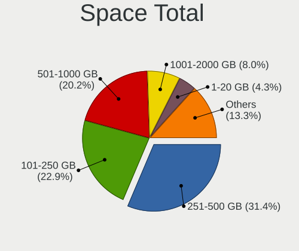

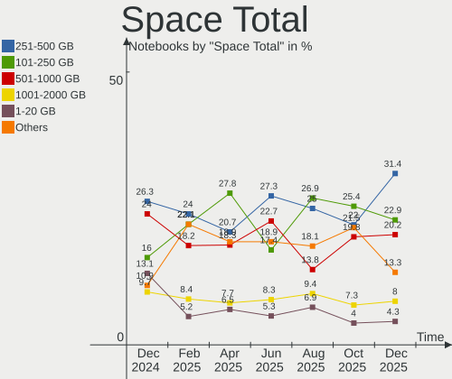

| Size in GB     | Notebooks | Percent |
|----------------|-----------|---------|
| 251-500        | 59        | 31.38%  |
| 101-250        | 43        | 22.87%  |
| 501-1000       | 38        | 20.21%  |
| 1001-2000      | 15        | 7.98%   |
| 1-20           | 8         | 4.26%   |
| Unknown        | 8         | 4.26%   |
| More than 3000 | 6         | 3.19%   |
| 2001-3000      | 4         | 2.13%   |
| 51-100         | 4         | 2.13%   |
| 21-50          | 3         | 1.6%    |

Space Used
----------

Amount of used disk space

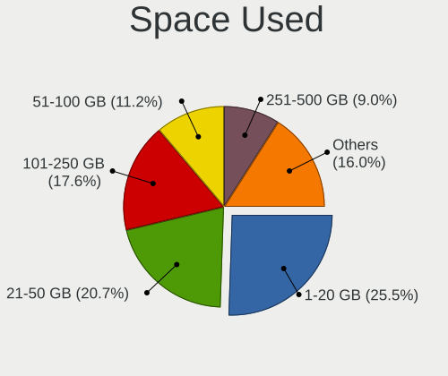

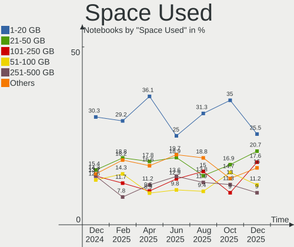

| Used GB   | Notebooks | Percent |
|-----------|-----------|---------|
| 1-20      | 48        | 25.53%  |
| 21-50     | 39        | 20.74%  |
| 101-250   | 33        | 17.55%  |
| 51-100    | 21        | 11.17%  |
| 251-500   | 17        | 9.04%   |
| 501-1000  | 15        | 7.98%   |
| Unknown   | 8         | 4.26%   |
| 1001-2000 | 4         | 2.13%   |
| 0         | 2         | 1.06%   |
| 2001-3000 | 1         | 0.53%   |

Malfunc. Drives
---------------

Drive models with a malfunction

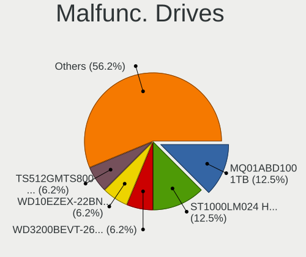

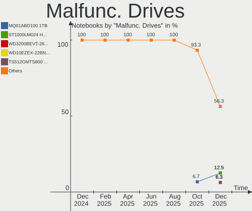

| Model                                   | Notebooks | Drives | Percent |
|-----------------------------------------|-----------|--------|---------|
| Toshiba MQ01ABD100 1TB                  | 2         | 2      | 12.5%   |
| Seagate ST1000LM024 HN-M101MBB 1TB      | 2         | 2      | 12.5%   |
| WDC WD3200BEVT-26A23T0 320GB            | 1         | 1      | 6.25%   |
| WDC WD10EZEX-22BN5A0 1TB                | 1         | 1      | 6.25%   |
| Transcend TS512GMTS800 512GB SSD        | 1         | 1      | 6.25%   |
| Toshiba MQ01ACF050 500GB                | 1         | 1      | 6.25%   |
| Toshiba KSG60ZMV512G M.2 2280 512GB SSD | 1         | 1      | 6.25%   |
| SK hynix HFS128G39TND-N210A 128GB SSD   | 1         | 1      | 6.25%   |
| Seagate ST95005620AS 500GB              | 1         | 1      | 6.25%   |
| LITEONIT CMT-128L3M 128GB SSD           | 1         | 2      | 6.25%   |
| Hitachi HTS723225A7A364 250GB           | 1         | 1      | 6.25%   |
| Hitachi HTS545032B9A300 320GB           | 1         | 1      | 6.25%   |
| Hitachi HTS542516K9SA00 160GB           | 1         | 1      | 6.25%   |
| HGST HTS725050A7E630 500GB              | 1         | 1      | 6.25%   |

Malfunc. Drive Vendor
---------------------

Vendors of faulty drives

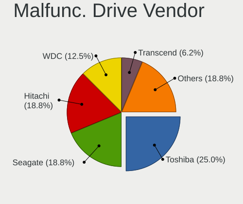

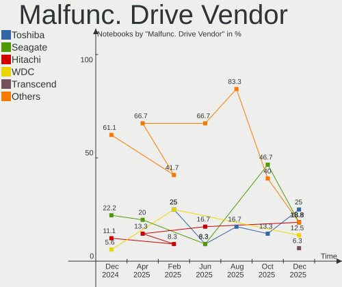

| Vendor    | Notebooks | Drives | Percent |
|-----------|-----------|--------|---------|
| Toshiba   | 4         | 4      | 25%     |
| Seagate   | 3         | 3      | 18.75%  |
| Hitachi   | 3         | 3      | 18.75%  |
| WDC       | 2         | 2      | 12.5%   |
| Transcend | 1         | 1      | 6.25%   |
| SK hynix  | 1         | 1      | 6.25%   |
| LITEONIT  | 1         | 2      | 6.25%   |
| HGST      | 1         | 1      | 6.25%   |

Malfunc. HDD Vendor
-------------------

Vendors of faulty HDD drives

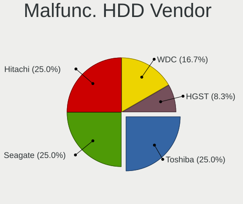

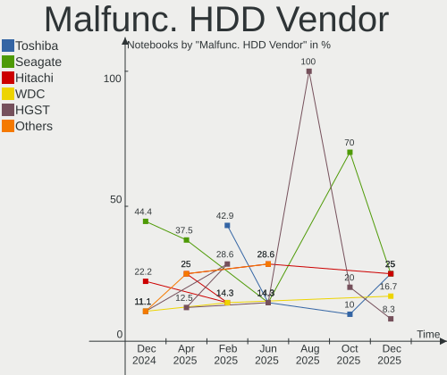

| Vendor  | Notebooks | Drives | Percent |
|---------|-----------|--------|---------|
| Toshiba | 3         | 3      | 25%     |
| Seagate | 3         | 3      | 25%     |
| Hitachi | 3         | 3      | 25%     |
| WDC     | 2         | 2      | 16.67%  |
| HGST    | 1         | 1      | 8.33%   |

Malfunc. Drive Kind
-------------------

Kinds of faulty drives

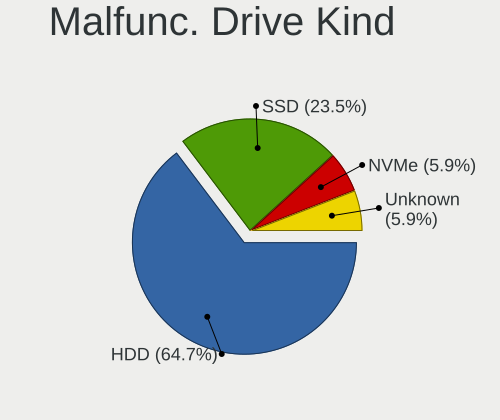

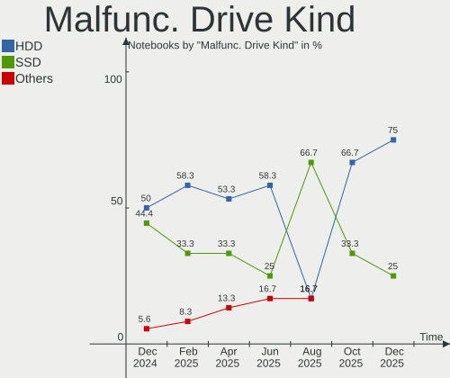

| Kind | Notebooks | Drives | Percent |
|------|-----------|--------|---------|
| HDD  | 12        | 12     | 75%     |
| SSD  | 4         | 5      | 25%     |

Failed Drives
-------------

Failed drive models

Zero info for selected period =(

Failed Drive Vendor
-------------------

Failed drive vendors

Zero info for selected period =(

Drive Status
------------

Number of failed and malfunc. drives

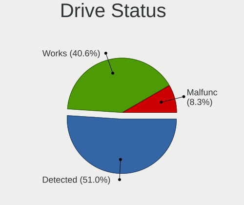

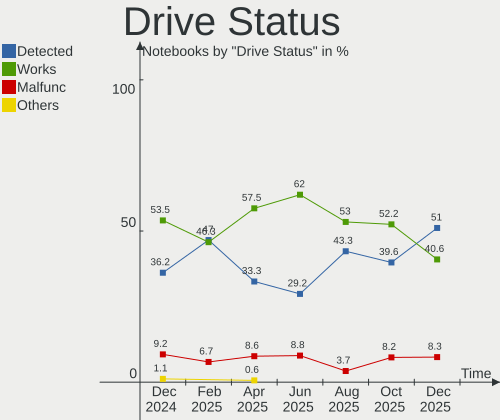

| Status   | Notebooks | Drives | Percent |
|----------|-----------|--------|---------|
| Detected | 98        | 124    | 51.04%  |
| Works    | 78        | 90     | 40.63%  |
| Malfunc  | 16        | 17     | 8.33%   |

Storage controller
------------------

Storage Vendor
--------------

Storage controller vendors

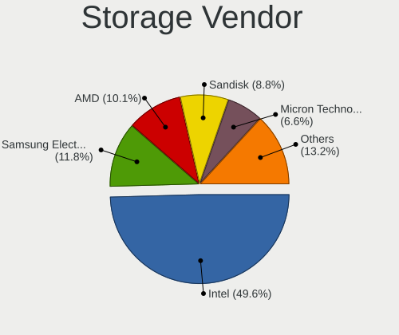

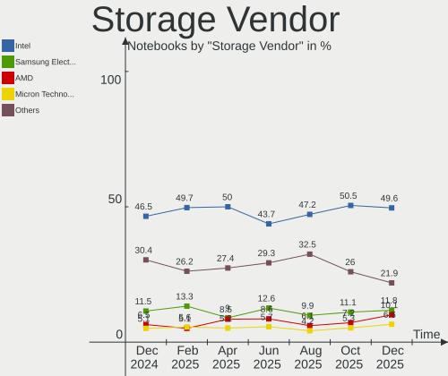

| Vendor                       | Notebooks | Percent |
|------------------------------|-----------|---------|
| Intel                        | 113       | 49.56%  |
| Samsung Electronics          | 27        | 11.84%  |
| AMD                          | 23        | 10.09%  |
| Sandisk                      | 20        | 8.77%   |
| Micron Technology            | 15        | 6.58%   |
| SK hynix                     | 7         | 3.07%   |
| KIOXIA                       | 7         | 3.07%   |
| Kingston Technology Company  | 7         | 3.07%   |
| Micron/Crucial Technology    | 3         | 1.32%   |
| MAXIO Technology (Hangzhou)  | 3         | 1.32%   |
| Toshiba America Info Systems | 1         | 0.44%   |
| Shenzhen Longsys Electronics | 1         | 0.44%   |
| JMicron Technology           | 1         | 0.44%   |

Storage Model
-------------

Storage controller models

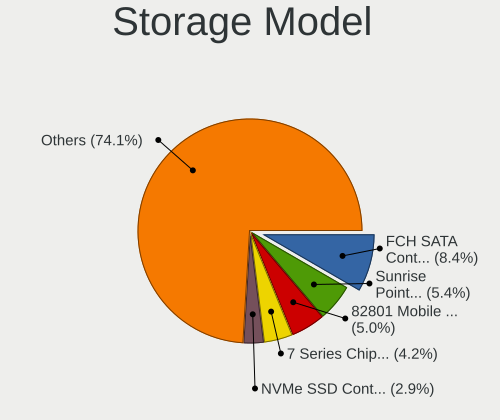

| Model                                                                            | Notebooks | Percent |
|----------------------------------------------------------------------------------|-----------|---------|
| AMD FCH SATA Controller [AHCI mode]                                              | 20        | 8.37%   |
| Intel Sunrise Point-LP SATA Controller [AHCI mode]                               | 13        | 5.44%   |
| Intel 82801 Mobile SATA Controller [RAID mode]                                   | 12        | 5.02%   |
| Intel 7 Series Chipset Family 6-port SATA Controller [AHCI mode]                 | 10        | 4.18%   |
| Samsung NVMe SSD Controller PM9A1/PM9A3/980PRO                                   | 7         | 2.93%   |
| Intel Volume Management Device NVMe RAID Controller                              | 7         | 2.93%   |
| Samsung NVMe SSD Controller PM9C1a (DRAM-less)                                   | 6         | 2.51%   |
| Samsung NVMe SSD Controller 980 (DRAM-less)                                      | 6         | 2.51%   |
| Intel 82801IBM/IEM (ICH9M/ICH9M-E) 4 port SATA Controller [AHCI mode]            | 6         | 2.51%   |
| Intel 8 Series SATA Controller 1 [AHCI mode]                                     | 6         | 2.51%   |
| KIOXIA NVMe SSD Controller BG4 (DRAM-less)                                       | 5         | 2.09%   |
| Intel HM170/QM170 Chipset SATA Controller [AHCI Mode]                            | 5         | 2.09%   |
| Intel 8 Series/C220 Series Chipset Family 6-port SATA Controller 1 [AHCI mode]   | 5         | 2.09%   |
| Intel 6 Series/C200 Series Chipset Family 6 port Mobile SATA AHCI Controller     | 5         | 2.09%   |
| SanDisk WD SN560/SN740/SN770/SN5000 NVMe SSD                                     | 4         | 1.67%   |
| Sandisk WD PC SN5000S M.2 2280 NVMe SSD (DRAM-less)                              | 4         | 1.67%   |
| Kingston Company OM8PGP4 NVMe PCIe SSD (DRAM-less)                               | 4         | 1.67%   |
| Intel RST Volume Management Device Controller                                    | 4         | 1.67%   |
| Intel 5 Series/3400 Series Chipset 4 port SATA AHCI Controller                   | 4         | 1.67%   |
| Sandisk WD Black SN850X NVMe SSD                                                 | 3         | 1.26%   |
| Micron 2500 NVMe SSD (DRAM-less)                                                 | 3         | 1.26%   |
| Intel Wildcat Point-LP SATA Controller [AHCI Mode]                               | 3         | 1.26%   |
| Intel Tiger Lake-LP SATA Controller                                              | 3         | 1.26%   |
| Intel Celeron N3350/Pentium N4200/Atom E3900 Series SATA AHCI Controller         | 3         | 1.26%   |
| Intel Cannon Lake Mobile PCH SATA AHCI Controller                                | 3         | 1.26%   |
| Samsung NVMe SSD Controller SM981/PM981/PM983                                    | 2         | 0.84%   |
| Samsung NVMe SSD Controller SM961/PM961/SM963                                    | 2         | 0.84%   |
| Samsung NVMe SSD Controller S4LV008[Pascal]                                      | 2         | 0.84%   |
| Micron 3400 NVMe SSD [Hendrix]                                                   | 2         | 0.84%   |
| Micron 2550 NVMe SSD (DRAM-less)                                                 | 2         | 0.84%   |
| Micron 2400 NVMe SSD (DRAM-less)                                                 | 2         | 0.84%   |
| Micron 2300 NVMe SSD [Santana]                                                   | 2         | 0.84%   |
| MAXIO (Hangzhou) NVMe SSD Controller MAP1202 (DRAM-less)                         | 2         | 0.84%   |
| Intel Volume Management Device NVMe RAID Controller Intel Corporation            | 2         | 0.84%   |
| Intel Tiger Lake SATA AHCI Controller                                            | 2         | 0.84%   |
| Intel SSD DC P4101/Pro 7600p/760p/E 6100p Series                                 | 2         | 0.84%   |
| Intel Q170/Q150/B150/H170/H110/Z170/CM236 Chipset SATA Controller [AHCI Mode]    | 2         | 0.84%   |
| Intel Atom/Celeron/Pentium Processor x5-E8000/J3xxx/N3xxx Series SATA Controller | 2         | 0.84%   |
| Intel Atom Processor E3800 Series SATA AHCI Controller                           | 2         | 0.84%   |
| Intel 82801HM/HEM (ICH8M/ICH8M-E) SATA Controller [AHCI mode]                    | 2         | 0.84%   |

Storage Kind
------------

Kind of storage controller (IDE, SATA, NVMe, SAS, ...)

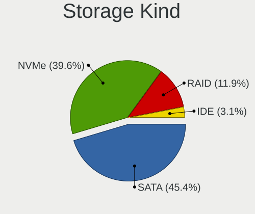

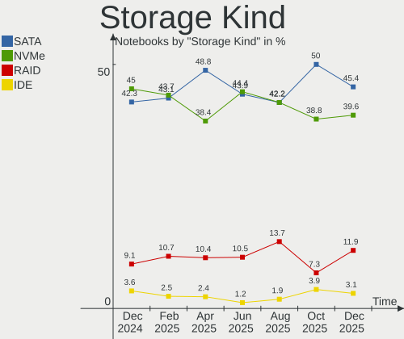

| Kind | Notebooks | Percent |
|------|-----------|---------|
| SATA | 103       | 45.37%  |
| NVMe | 90        | 39.65%  |
| RAID | 27        | 11.89%  |
| IDE  | 7         | 3.08%   |

Processor
---------

CPU Vendor
----------

Processor vendors

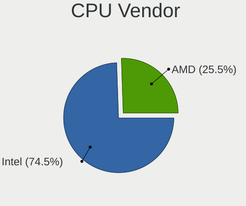

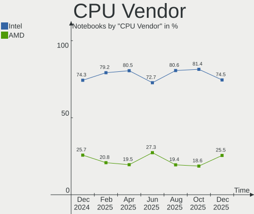

| Vendor | Notebooks | Percent |
|--------|-----------|---------|
| Intel  | 140       | 74.47%  |
| AMD    | 48        | 25.53%  |

CPU Model
---------

Processor models

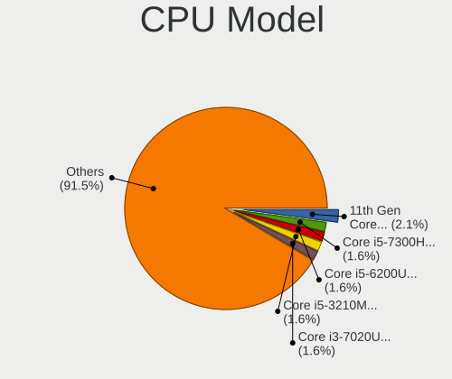

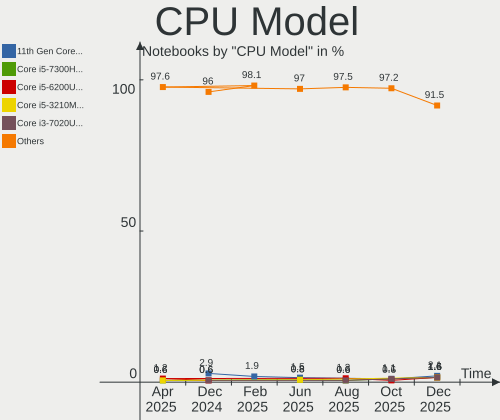

| Model                                         | Notebooks | Percent |
|-----------------------------------------------|-----------|---------|
| Intel 11th Gen Core i7-1165G7 @ 2.80GHz       | 4         | 2.13%   |
| Intel Core i5-7300HQ CPU @ 2.50GHz            | 3         | 1.6%    |
| Intel Core i5-6200U CPU @ 2.30GHz             | 3         | 1.6%    |
| Intel Core i5-3210M CPU @ 2.50GHz             | 3         | 1.6%    |
| Intel Core i3-7020U CPU @ 2.30GHz             | 3         | 1.6%    |
| Intel 12th Gen Core i7-1260P                  | 3         | 1.6%    |
| Intel 11th Gen Core i7-11800H @ 2.30GHz       | 3         | 1.6%    |
| AMD Ryzen 7 260 w/ Radeon 780M Graphics       | 3         | 1.6%    |
| AMD Ryzen 5 5600H with Radeon Graphics        | 3         | 1.6%    |
| Intel Pentium Dual-Core CPU T4200 @ 2.00GHz   | 2         | 1.06%   |
| Intel Pentium CPU N3540 @ 2.16GHz             | 2         | 1.06%   |
| Intel Core i7-8650U CPU @ 1.90GHz             | 2         | 1.06%   |
| Intel Core i7-8550U CPU @ 1.80GHz             | 2         | 1.06%   |
| Intel Core i7-7600U CPU @ 2.80GHz             | 2         | 1.06%   |
| Intel Core i7-2670QM CPU @ 2.20GHz            | 2         | 1.06%   |
| Intel Core i5-8250U CPU @ 1.60GHz             | 2         | 1.06%   |
| Intel Core i5-6300HQ CPU @ 2.30GHz            | 2         | 1.06%   |
| Intel Core i5 CPU M 520 @ 2.40GHz             | 2         | 1.06%   |
| Intel Core i3-6006U CPU @ 2.00GHz             | 2         | 1.06%   |
| Intel Core i3-3110M CPU @ 2.40GHz             | 2         | 1.06%   |
| Intel Core i3 CPU M 370 @ 2.40GHz             | 2         | 1.06%   |
| Intel Celeron CPU N3450 @ 1.10GHz             | 2         | 1.06%   |
| Intel Celeron CPU N3060 @ 1.60GHz             | 2         | 1.06%   |
| Intel 13th Gen Core i9-13900H                 | 2         | 1.06%   |
| Intel 13th Gen Core i7-13700H                 | 2         | 1.06%   |
| Intel 11th Gen Core i5-1135G7 @ 2.40GHz       | 2         | 1.06%   |
| AMD Ryzen AI 9 HX 370 w/ Radeon 890M          | 2         | 1.06%   |
| AMD Ryzen 7 8845HS w/ Radeon 780M Graphics    | 2         | 1.06%   |
| AMD Ryzen 7 5825U with Radeon Graphics        | 2         | 1.06%   |
| AMD Ryzen 7 5800H with Radeon Graphics        | 2         | 1.06%   |
| AMD Ryzen 7 3700U with Radeon Vega Mobile Gfx | 2         | 1.06%   |
| AMD Ryzen 5 5500U with Radeon Graphics        | 2         | 1.06%   |
| AMD Ryzen 5 4600H with Radeon Graphics        | 2         | 1.06%   |
| AMD E1-6010 APU with AMD Radeon R2 Graphics   | 2         | 1.06%   |
| AMD A6-5200 APU with Radeon HD Graphics       | 2         | 1.06%   |
| Intel Xeon E-2276M CPU @ 2.80GHz              | 1         | 0.53%   |
| Intel Pentium Dual-Core CPU T4500 @ 2.30GHz   | 1         | 0.53%   |
| Intel Pentium CPU P6100 @ 2.00GHz             | 1         | 0.53%   |
| Intel Pentium CPU N4200 @ 1.10GHz             | 1         | 0.53%   |
| Intel Genuine CPU U7300 @ 1.30GHz             | 1         | 0.53%   |

CPU Model Family
----------------

Processor model prefix

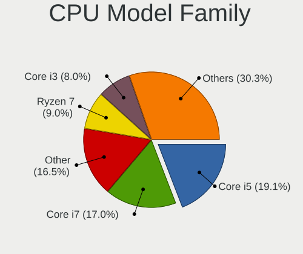

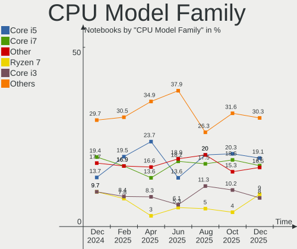

| Model                   | Notebooks | Percent |
|-------------------------|-----------|---------|
| Intel Core i5           | 36        | 19.15%  |
| Intel Core i7           | 32        | 17.02%  |
| Other                   | 31        | 16.49%  |
| AMD Ryzen 7             | 17        | 9.04%   |
| Intel Core i3           | 15        | 7.98%   |
| AMD Ryzen 5             | 12        | 6.38%   |
| Intel Core              | 9         | 4.79%   |
| Intel Celeron           | 6         | 3.19%   |
| Intel Pentium           | 4         | 2.13%   |
| Intel Core 2 Duo        | 4         | 2.13%   |
| Intel Pentium Dual-Core | 3         | 1.6%    |
| AMD E1                  | 3         | 1.6%    |
| AMD A6                  | 3         | 1.6%    |
| Intel Atom              | 2         | 1.06%   |
| AMD Ryzen 3             | 2         | 1.06%   |
| AMD Phenom II           | 2         | 1.06%   |
| Intel Xeon              | 1         | 0.53%   |
| Intel Genuine           | 1         | 0.53%   |
| AMD Ryzen 9             | 1         | 0.53%   |
| AMD Ryzen 7 PRO         | 1         | 0.53%   |
| AMD QC                  | 1         | 0.53%   |
| AMD E2                  | 1         | 0.53%   |
| AMD Athlon              | 1         | 0.53%   |

CPU Cores
---------

Number of processor cores

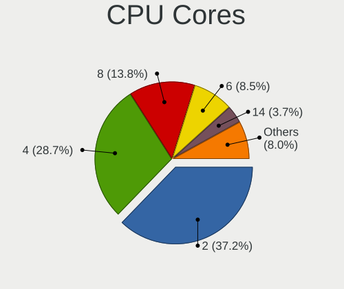

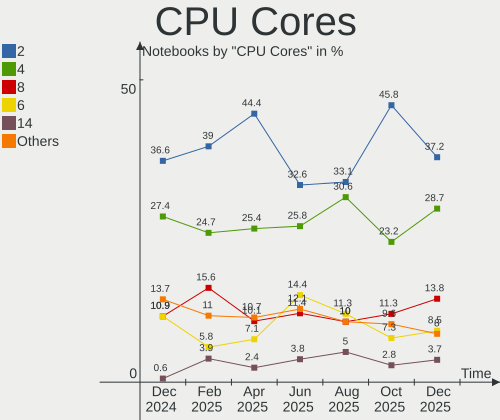

| Number | Notebooks | Percent |
|--------|-----------|---------|
| 2      | 70        | 37.23%  |
| 4      | 54        | 28.72%  |
| 8      | 26        | 13.83%  |
| 6      | 16        | 8.51%   |
| 14     | 7         | 3.72%   |
| 12     | 7         | 3.72%   |
| 10     | 5         | 2.66%   |
| 16     | 2         | 1.06%   |
| 1      | 1         | 0.53%   |

CPU Sockets
-----------

Number of sockets

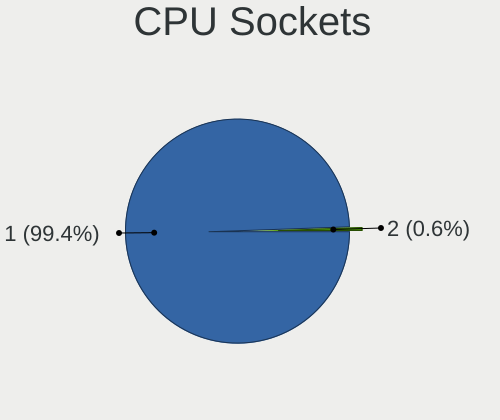

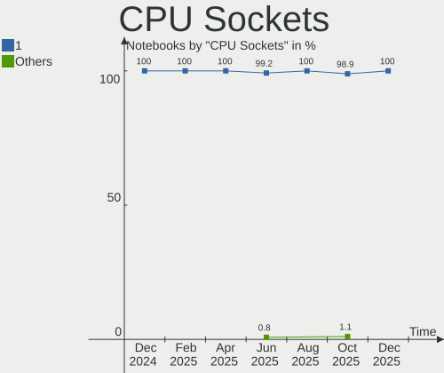

| Number | Notebooks | Percent |
|--------|-----------|---------|
| 1      | 188       | 100%    |

CPU Threads
-----------

Threads per core (Hyper-Threading)

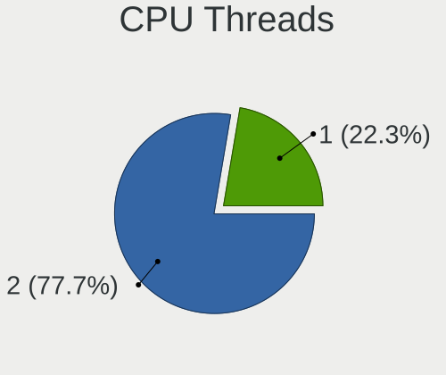

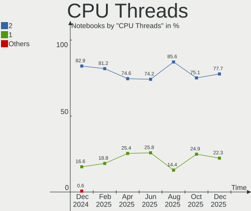

| Number | Notebooks | Percent |
|--------|-----------|---------|
| 2      | 146       | 77.66%  |
| 1      | 42        | 22.34%  |

CPU Op-Modes
------------

CPU Operation Modes (32-bit, 64-bit)

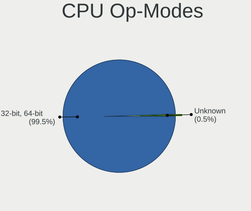

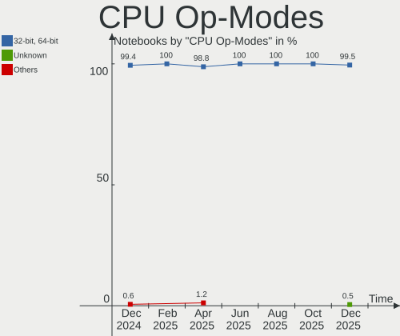

| Op mode        | Notebooks | Percent |
|----------------|-----------|---------|
| 32-bit, 64-bit | 187       | 99.47%  |
| Unknown        | 1         | 0.53%   |

CPU Microcode
-------------

Microcode number

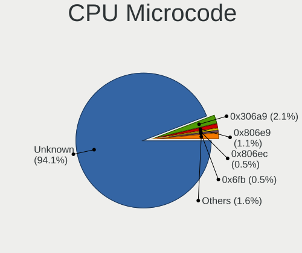

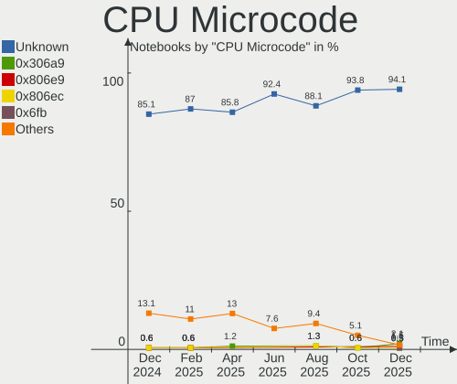

| Number     | Notebooks | Percent |
|------------|-----------|---------|
| Unknown    | 177       | 94.15%  |
| 0x306a9    | 4         | 2.13%   |
| 0x806e9    | 2         | 1.06%   |
| 0x806ec    | 1         | 0.53%   |
| 0x6fb      | 1         | 0.53%   |
| 0x40651    | 1         | 0.53%   |
| 0x1067a    | 1         | 0.53%   |
| 0x0b600037 | 1         | 0.53%   |

CPU Microarch
-------------

Microarchitecture

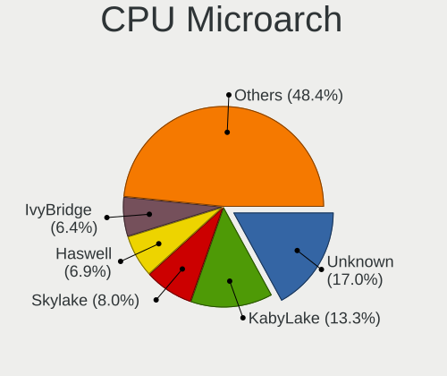

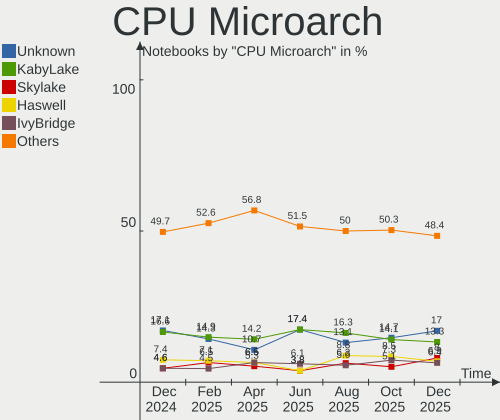

| Name              | Notebooks | Percent |
|-------------------|-----------|---------|
| Unknown           | 32        | 17.02%  |
| KabyLake          | 25        | 13.3%   |
| Skylake           | 15        | 7.98%   |
| Haswell           | 13        | 6.91%   |
| IvyBridge         | 12        | 6.38%   |
| Alderlake Hybrid  | 11        | 5.85%   |
| Zen 3             | 9         | 4.79%   |
| TigerLake         | 8         | 4.26%   |
| Westmere          | 6         | 3.19%   |
| SandyBridge       | 6         | 3.19%   |
| Penryn            | 6         | 3.19%   |
| Silvermont        | 5         | 2.66%   |
| Zen+              | 4         | 2.13%   |
| Zen 2             | 4         | 2.13%   |
| Icelake           | 4         | 2.13%   |
| Puma              | 3         | 1.6%    |
| Jaguar            | 3         | 1.6%    |
| Goldmont          | 3         | 1.6%    |
| Core              | 3         | 1.6%    |
| Broadwell         | 3         | 1.6%    |
| Nehalem           | 2         | 1.06%   |
| K10               | 2         | 1.06%   |
| CometLake         | 2         | 1.06%   |
| Bobcat            | 2         | 1.06%   |
| Zen               | 1         | 0.53%   |
| Meteorlake Hybrid | 1         | 0.53%   |
| Lunarlake Hybrid  | 1         | 0.53%   |
| Goldmont plus     | 1         | 0.53%   |
| Bonnell           | 1         | 0.53%   |

Graphics
--------

GPU Vendor
----------

Vendors of graphics cards

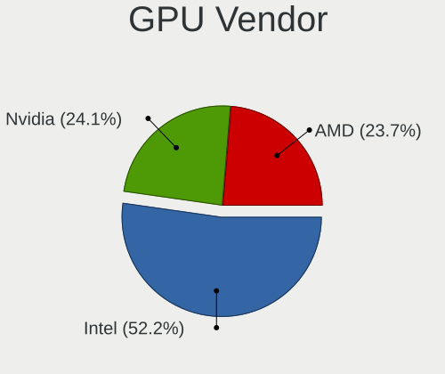

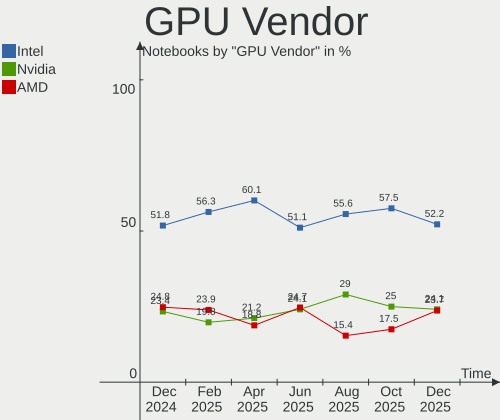

| Vendor | Notebooks | Percent |
|--------|-----------|---------|
| Intel  | 128       | 52.24%  |
| Nvidia | 59        | 24.08%  |
| AMD    | 58        | 23.67%  |

GPU Model
---------

Graphics card models

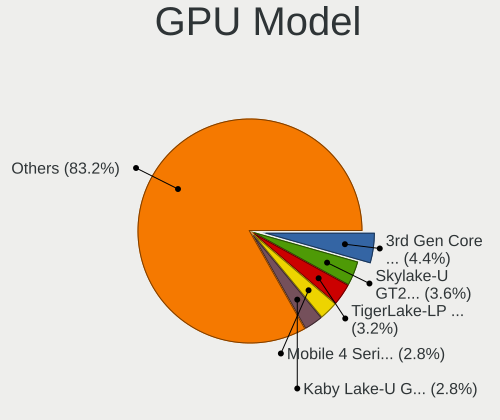

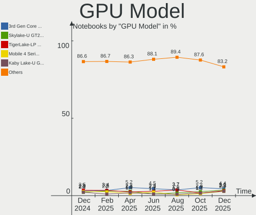

| Model                                                                                    | Notebooks | Percent |
|------------------------------------------------------------------------------------------|-----------|---------|
| Intel 3rd Gen Core processor Graphics Controller                                         | 11        | 4.4%    |
| Intel Skylake-U GT2 [HD Graphics 520]                                                    | 9         | 3.6%    |
| Intel TigerLake-LP GT2 [Iris Xe Graphics]                                                | 8         | 3.2%    |
| Intel Mobile 4 Series Chipset Integrated Graphics Controller                             | 7         | 2.8%    |
| Intel Kaby Lake-U GT2 [HD Graphics 620]                                                  | 7         | 2.8%    |
| Intel Haswell-ULT Integrated Graphics Controller                                         | 7         | 2.8%    |
| Intel Raptor Lake-P [Iris Xe Graphics]                                                   | 6         | 2.4%    |
| Intel Kaby Lake-R GT2 [UHD Graphics 620]                                                 | 6         | 2.4%    |
| AMD HawkPoint1                                                                           | 6         | 2.4%    |
| AMD Cezanne [Radeon Vega Series / Radeon Vega Mobile Series]                             | 6         | 2.4%    |
| Intel TigerLake-H GT1 [UHD Graphics]                                                     | 5         | 2%      |
| Intel 4th Gen Core Processor Integrated Graphics Controller                              | 5         | 2%      |
| Intel 2nd Generation Core Processor Family Integrated Graphics Controller                | 5         | 2%      |
| AMD Picasso/Raven 2 [Radeon Vega Series / Radeon Vega Mobile Series]                     | 5         | 2%      |
| Nvidia TU117M [GeForce GTX 1650 Mobile / Max-Q]                                          | 4         | 1.6%    |
| Nvidia GP107M [GeForce GTX 1050 Mobile]                                                  | 4         | 1.6%    |
| Nvidia GA107M [GeForce RTX 3050 Mobile]                                                  | 4         | 1.6%    |
| Intel Kaby Lake-H GT2 [HD Graphics 630]                                                  | 4         | 1.6%    |
| Intel Core Processor Integrated Graphics Controller                                      | 4         | 1.6%    |
| Intel Alder Lake-P GT2 [Iris Xe Graphics]                                                | 4         | 1.6%    |
| AMD Renoir [Radeon Vega Series / Radeon Vega Mobile Series]                              | 4         | 1.6%    |
| Intel Skylake-H GT2 [HD Graphics 530]                                                    | 3         | 1.2%    |
| Intel CoffeeLake-H GT2 [UHD Graphics 630]                                                | 3         | 1.2%    |
| Intel Broadwell-U GT2 [HD Graphics 5500]                                                 | 3         | 1.2%    |
| Intel Atom/Celeron/Pentium Processor x5-E8000/J3xxx/N3xxx Integrated Graphics Controller | 3         | 1.2%    |
| AMD Rembrandt [Radeon 680M]                                                              | 3         | 1.2%    |
| AMD Phoenix1                                                                             | 3         | 1.2%    |
| AMD Lucienne                                                                             | 3         | 1.2%    |
| AMD Barcelo                                                                              | 3         | 1.2%    |
| Nvidia TU106M [GeForce RTX 2060 Mobile]                                                  | 2         | 0.8%    |
| Nvidia GF117M [GeForce 610M/710M/810M/820M / GT 620M/625M/630M/720M]                     | 2         | 0.8%    |
| Nvidia GB207M [GeForce RTX 5050 Max-Q / Mobile]                                          | 2         | 0.8%    |
| Nvidia GA107 [GeForce RTX 2050]                                                          | 2         | 0.8%    |
| Nvidia GA106M [GeForce RTX 3060 Mobile / Max-Q]                                          | 2         | 0.8%    |
| Nvidia GA104M [GeForce RTX 3070 Mobile / Max-Q]                                          | 2         | 0.8%    |
| Nvidia AD107M [GeForce RTX 4060 Max-Q / Mobile]                                          | 2         | 0.8%    |
| Intel Meteor Lake-P [Intel Graphics]                                                     | 2         | 0.8%    |
| Intel Meteor Lake-P [Intel Arc Graphics]                                                 | 2         | 0.8%    |
| Intel Lunar Lake [Intel Arc Graphics 130V / 140V]                                        | 2         | 0.8%    |
| Intel CometLake-U GT2 [UHD Graphics]                                                     | 2         | 0.8%    |

GPU Combo
---------

Combinations of graphics cards

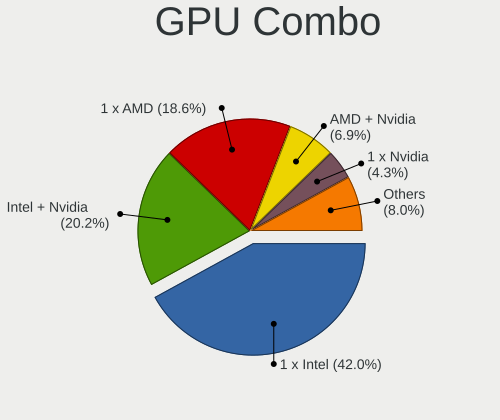

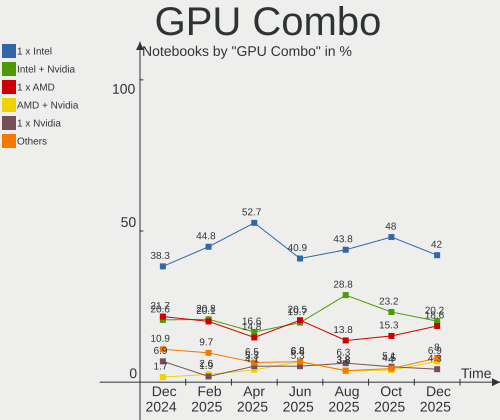

| Name           | Notebooks | Percent |
|----------------|-----------|---------|
| 1 x Intel      | 79        | 42.02%  |
| Intel + Nvidia | 38        | 20.21%  |
| 1 x AMD        | 35        | 18.62%  |
| AMD + Nvidia   | 13        | 6.91%   |
| 1 x Nvidia     | 8         | 4.26%   |
| Intel + AMD    | 6         | 3.19%   |
| 2 x Intel      | 4         | 2.13%   |
| 2 x AMD        | 4         | 2.13%   |
| Other          | 1         | 0.53%   |

GPU Driver
----------

Free vs proprietary

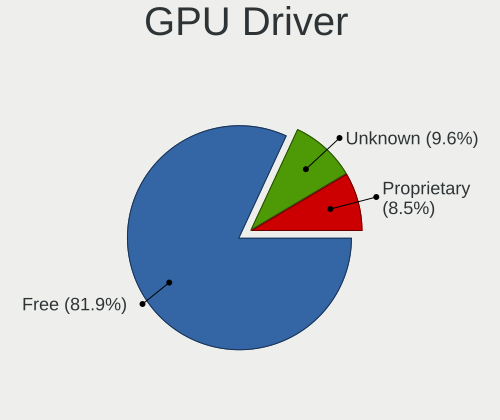

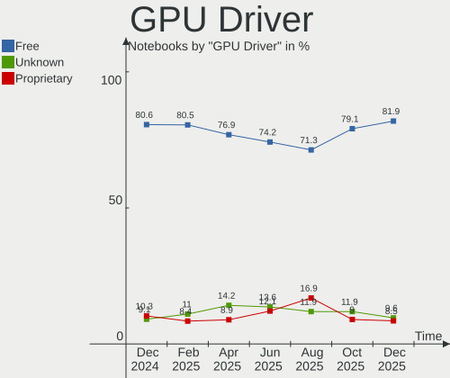

| Driver      | Notebooks | Percent |
|-------------|-----------|---------|
| Free        | 154       | 81.91%  |
| Unknown     | 18        | 9.57%   |
| Proprietary | 16        | 8.51%   |

GPU Memory
----------

Total video memory

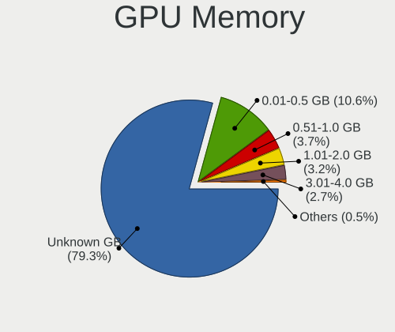

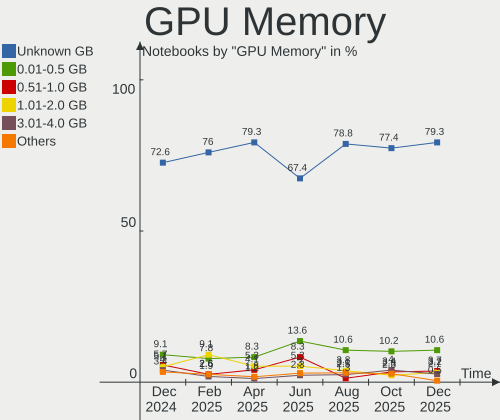

| Size in GB | Notebooks | Percent |
|------------|-----------|---------|
| Unknown    | 149       | 79.26%  |
| 0.01-0.5   | 20        | 10.64%  |
| 0.51-1.0   | 7         | 3.72%   |
| 1.01-2.0   | 6         | 3.19%   |
| 3.01-4.0   | 5         | 2.66%   |
| 2.01-3.0   | 1         | 0.53%   |

Monitor
-------

Monitor Vendor
--------------

Monitor vendors

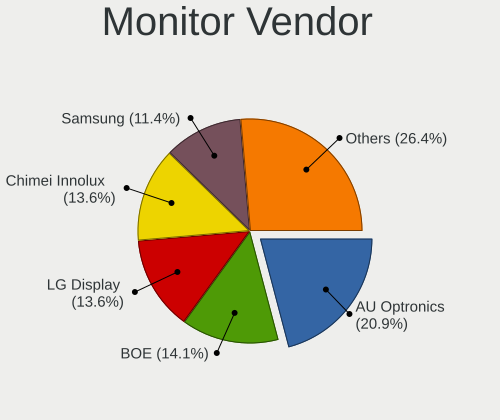

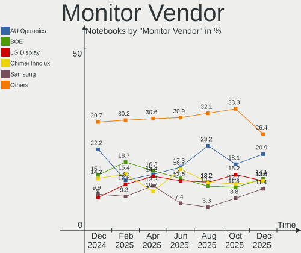

| Vendor                  | Notebooks | Percent |
|-------------------------|-----------|---------|
| AU Optronics            | 46        | 20.91%  |
| BOE                     | 31        | 14.09%  |
| LG Display              | 30        | 13.64%  |
| Chimei Innolux          | 30        | 13.64%  |
| Samsung Electronics     | 25        | 11.36%  |
| Dell                    | 9         | 4.09%   |
| Lenovo                  | 5         | 2.27%   |
| Apple                   | 5         | 2.27%   |
| Hewlett-Packard         | 4         | 1.82%   |
| Chi Mei Optoelectronics | 4         | 1.82%   |
| Sharp                   | 3         | 1.36%   |
| CSW                     | 3         | 1.36%   |
| Philips                 | 2         | 0.91%   |
| InfoVision              | 2         | 0.91%   |
| HKC                     | 2         | 0.91%   |
| Goldstar                | 2         | 0.91%   |
| Acer                    | 2         | 0.91%   |
| Sony                    | 1         | 0.45%   |
| PANDA                   | 1         | 0.45%   |
| MSI                     | 1         | 0.45%   |
| Mi                      | 1         | 0.45%   |
| LG Philips              | 1         | 0.45%   |
| Iiyama                  | 1         | 0.45%   |
| Hyundai ImageQuest      | 1         | 0.45%   |
| Fujitsu Siemens         | 1         | 0.45%   |
| Eizo                    | 1         | 0.45%   |
| Denver                  | 1         | 0.45%   |
| CSOT                    | 1         | 0.45%   |
| BenQ                    | 1         | 0.45%   |
| ASUSTek Computer        | 1         | 0.45%   |
| AOC                     | 1         | 0.45%   |
| Ancor Communications    | 1         | 0.45%   |

Monitor Model
-------------

Monitor models

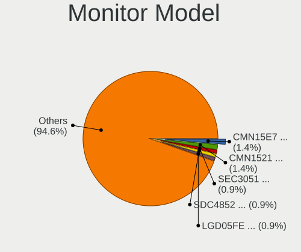

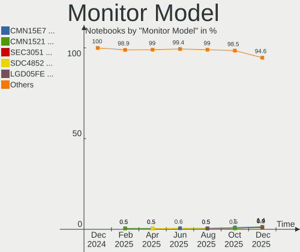

| Model                                                                  | Notebooks | Percent |
|------------------------------------------------------------------------|-----------|---------|
| Chimei Innolux LCD Monitor CMN15E7 1920x1080 344x193mm 15.5-inch       | 3         | 1.35%   |
| Chimei Innolux LCD Monitor CMN1521 1920x1080 344x193mm 15.5-inch       | 3         | 1.35%   |
| Samsung Electronics LCD Monitor SEC3051 1366x768 344x194mm 15.5-inch   | 2         | 0.9%    |
| Samsung Electronics LCD Monitor SDC4852 1366x768 344x194mm 15.5-inch   | 2         | 0.9%    |
| LG Display LCD Monitor LGD05FE 1920x1080 344x194mm 15.5-inch           | 2         | 0.9%    |
| LG Display LCD Monitor LGD036C 1366x768 277x156mm 12.5-inch            | 2         | 0.9%    |
| Dell U2412M DELA07B 1920x1200 518x324mm 24.1-inch                      | 2         | 0.9%    |
| Chimei Innolux LCD Monitor CMN1745 1600x900 382x214mm 17.2-inch        | 2         | 0.9%    |
| Chimei Innolux LCD Monitor CMN15DC 1366x768 344x193mm 15.5-inch        | 2         | 0.9%    |
| Chimei Innolux LCD Monitor CMN14C3 1366x768 309x173mm 13.9-inch        | 2         | 0.9%    |
| AU Optronics LCD Monitor AUOD291 1920x1200 301x188mm 14.0-inch         | 2         | 0.9%    |
| AU Optronics LCD Monitor AUO219E 1600x900 382x214mm 17.2-inch          | 2         | 0.9%    |
| AU Optronics LCD Monitor AUO106C 1366x768 276x155mm 12.5-inch          | 2         | 0.9%    |
| Sony TV SNYEE01 1920x1080                                              | 1         | 0.45%   |
| Sharp LQ156M1JW17 SHP14FC 1920x1080 344x194mm 15.5-inch                | 1         | 0.45%   |
| Sharp LCD Monitor SHP14BA 1920x1080 344x194mm 15.5-inch                | 1         | 0.45%   |
| Sharp LCD Monitor SHP1484 1920x1080 294x165mm 13.3-inch                | 1         | 0.45%   |
| Samsung Electronics SyncMaster SAM03C2 1680x1050 459x296mm 21.5-inch   | 1         | 0.45%   |
| Samsung Electronics S34J55x SAM0F72 3440x1440 797x333mm 34.0-inch      | 1         | 0.45%   |
| Samsung Electronics S24R35xFZ SAM71A8 1920x1080 521x293mm 23.5-inch    | 1         | 0.45%   |
| Samsung Electronics S24C650 SAM09E9 1920x1080 520x290mm 23.4-inch      | 1         | 0.45%   |
| Samsung Electronics S22C450 SAM09C6 1680x1050 473x291mm 21.9-inch      | 1         | 0.45%   |
| Samsung Electronics LS34A650U SAM7145 3440x1440 798x334mm 34.1-inch    | 1         | 0.45%   |
| Samsung Electronics LCD Monitor SEC5443 1920x1200 367x230mm 17.1-inch  | 1         | 0.45%   |
| Samsung Electronics LCD Monitor SEC4141 1366x768 344x193mm 15.5-inch   | 1         | 0.45%   |
| Samsung Electronics LCD Monitor SEC3847 1440x900 367x230mm 17.1-inch   | 1         | 0.45%   |
| Samsung Electronics LCD Monitor SEC334A 1366x768 344x194mm 15.5-inch   | 1         | 0.45%   |
| Samsung Electronics LCD Monitor SDC4C48 1920x1080 293x165mm 13.2-inch  | 1         | 0.45%   |
| Samsung Electronics LCD Monitor SDC4188 2880x1800 312x195mm 14.5-inch  | 1         | 0.45%   |
| Samsung Electronics LCD Monitor SDC4180 2880x1620 344x194mm 15.5-inch  | 1         | 0.45%   |
| Samsung Electronics LCD Monitor SDC4171 2880x1800 302x189mm 14.0-inch  | 1         | 0.45%   |
| Samsung Electronics LCD Monitor SDC4161 1920x1080 344x194mm 15.5-inch  | 1         | 0.45%   |
| Samsung Electronics LCD Monitor SDC415F 3840x2160 344x194mm 15.5-inch  | 1         | 0.45%   |
| Samsung Electronics LCD Monitor SDC4154 2880x1800 302x189mm 14.0-inch  | 1         | 0.45%   |
| Samsung Electronics LCD Monitor SDC324C 1920x1080 344x194mm 15.5-inch  | 1         | 0.45%   |
| Samsung Electronics CF791 SAM0DC4 3440x1440 797x333mm 34.0-inch        | 1         | 0.45%   |
| Samsung Electronics C49RG9x SAM0F9C 3360x1440 1193x336mm 48.8-inch     | 1         | 0.45%   |
| Samsung Electronics C49RG9x SAM0F99 3840x1080 1193x336mm 48.8-inch     | 1         | 0.45%   |
| Samsung Electronics ATNA60CL10-0 SDC41AF 2880x1800 344x215mm 16.0-inch | 1         | 0.45%   |
| Philips UHDTV PHL228D 3840x2160 941x529mm 42.5-inch                    | 1         | 0.45%   |

Monitor Resolution
------------------

Monitor screen resolution

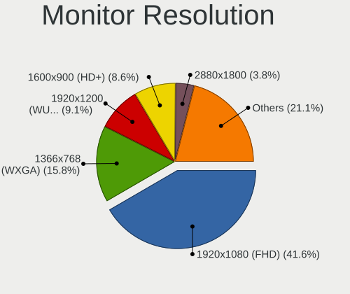

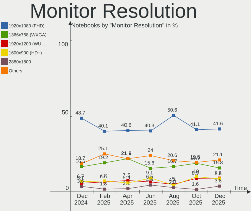

| Resolution         | Notebooks | Percent |
|--------------------|-----------|---------|
| 1920x1080 (FHD)    | 87        | 41.63%  |
| 1366x768 (WXGA)    | 33        | 15.79%  |
| 1920x1200 (WUXGA)  | 19        | 9.09%   |
| 1600x900 (HD+)     | 18        | 8.61%   |
| 2880x1800          | 8         | 3.83%   |
| 2560x1600          | 8         | 3.83%   |
| 3840x2160 (4K)     | 7         | 3.35%   |
| 2560x1440 (QHD)    | 6         | 2.87%   |
| 1440x900 (WXGA+)   | 4         | 1.91%   |
| 3440x1440          | 3         | 1.44%   |
| 1280x800 (WXGA)    | 3         | 1.44%   |
| 1680x1050 (WSXGA+) | 2         | 0.96%   |
| 3840x1100          | 1         | 0.48%   |
| 3840x1080          | 1         | 0.48%   |
| 3072x1920          | 1         | 0.48%   |
| 2880x1920          | 1         | 0.48%   |
| 2880x1620          | 1         | 0.48%   |
| 2256x1504          | 1         | 0.48%   |
| 2048x1152          | 1         | 0.48%   |
| 1920x1280          | 1         | 0.48%   |
| 1280x1024 (SXGA)   | 1         | 0.48%   |
| 1024x600           | 1         | 0.48%   |
| Unknown            | 1         | 0.48%   |

Monitor Diagonal
----------------

Diagonal size in inches

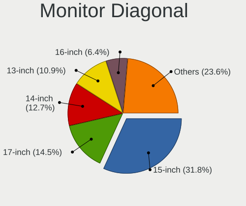

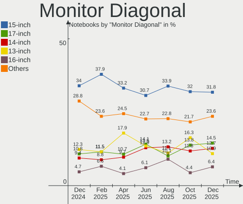

| Inches  | Notebooks | Percent |
|---------|-----------|---------|
| 15      | 70        | 31.82%  |
| 17      | 32        | 14.55%  |
| 14      | 28        | 12.73%  |
| 13      | 24        | 10.91%  |
| 16      | 14        | 6.36%   |
| 24      | 12        | 5.45%   |
| 27      | 7         | 3.18%   |
| 18      | 5         | 2.27%   |
| 12      | 5         | 2.27%   |
| 23      | 4         | 1.82%   |
| 21      | 4         | 1.82%   |
| 34      | 3         | 1.36%   |
| 31      | 2         | 0.91%   |
| 22      | 2         | 0.91%   |
| 72      | 1         | 0.45%   |
| 49      | 1         | 0.45%   |
| 48      | 1         | 0.45%   |
| 42      | 1         | 0.45%   |
| 33      | 1         | 0.45%   |
| 19      | 1         | 0.45%   |
| 10      | 1         | 0.45%   |
| Unknown | 1         | 0.45%   |

Monitor Width
-------------

Physical width

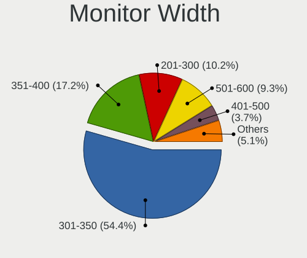

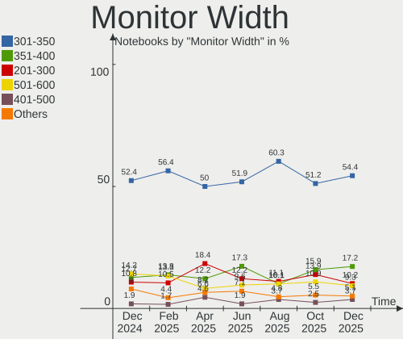

| Width in mm | Notebooks | Percent |
|-------------|-----------|---------|
| 301-350     | 117       | 54.42%  |
| 351-400     | 37        | 17.21%  |
| 201-300     | 22        | 10.23%  |
| 501-600     | 20        | 9.3%    |
| 401-500     | 8         | 3.72%   |
| 701-800     | 4         | 1.86%   |
| 601-700     | 2         | 0.93%   |
| 1001-1500   | 2         | 0.93%   |
| 1501-2000   | 1         | 0.47%   |
| 901-1000    | 1         | 0.47%   |
| Unknown     | 1         | 0.47%   |

Aspect Ratio
------------

Proportional relationship between the width and the height

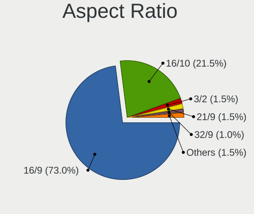

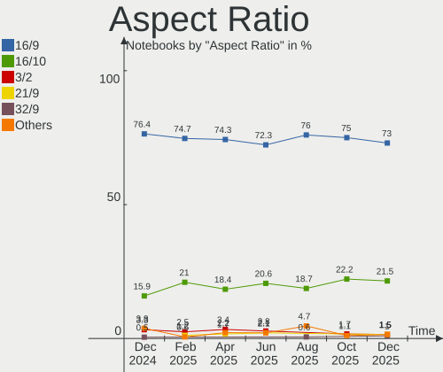

| Ratio   | Notebooks | Percent |
|---------|-----------|---------|
| 16/9    | 146       | 73%     |
| 16/10   | 43        | 21.5%   |
| 3/2     | 3         | 1.5%    |
| 21/9    | 3         | 1.5%    |
| 32/9    | 2         | 1%      |
| 6/5     | 1         | 0.5%    |
| 3.40    | 1         | 0.5%    |
| Unknown | 1         | 0.5%    |

Monitor Area
------------

Area in inch²

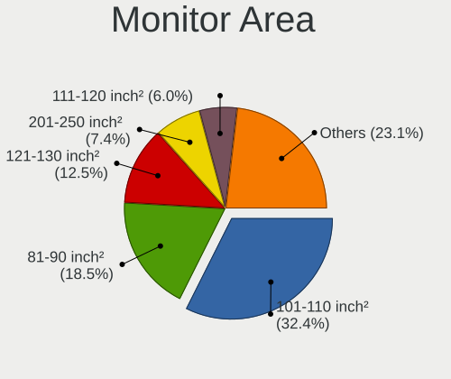

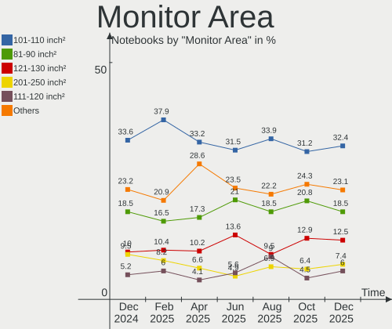

| Area in inch² | Notebooks | Percent |
|----------------|-----------|---------|
| 101-110        | 70        | 32.41%  |
| 81-90          | 40        | 18.52%  |
| 121-130        | 27        | 12.5%   |
| 201-250        | 16        | 7.41%   |
| 111-120        | 13        | 6.02%   |
| 71-80          | 11        | 5.09%   |
| 301-350        | 7         | 3.24%   |
| 351-500        | 6         | 2.78%   |
| 131-140        | 6         | 2.78%   |
| 61-70          | 5         | 2.31%   |
| 141-150        | 5         | 2.31%   |
| 501-1000       | 3         | 1.39%   |
| 251-300        | 2         | 0.93%   |
| More than 1000 | 1         | 0.46%   |
| 51-60          | 1         | 0.46%   |
| 41-50          | 1         | 0.46%   |
| 151-200        | 1         | 0.46%   |
| Unknown        | 1         | 0.46%   |

Pixel Density
-------------

Pixels per inch

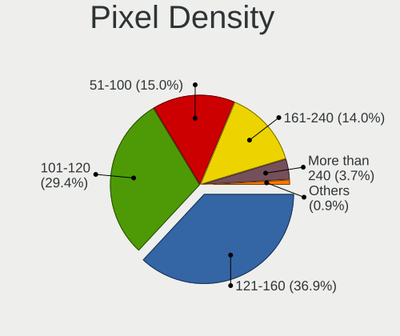

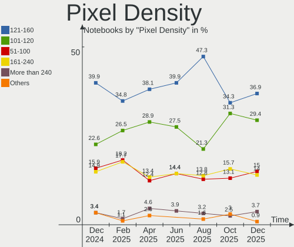

| Density       | Notebooks | Percent |
|---------------|-----------|---------|
| 121-160       | 79        | 36.92%  |
| 101-120       | 63        | 29.44%  |
| 51-100        | 32        | 14.95%  |
| 161-240       | 30        | 14.02%  |
| More than 240 | 8         | 3.74%   |
| 1-50          | 1         | 0.47%   |
| Unknown       | 1         | 0.47%   |

Multiple Monitors
-----------------

Total monitors connected

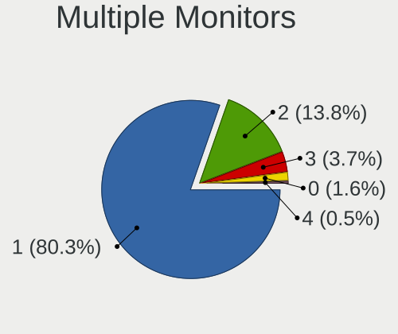

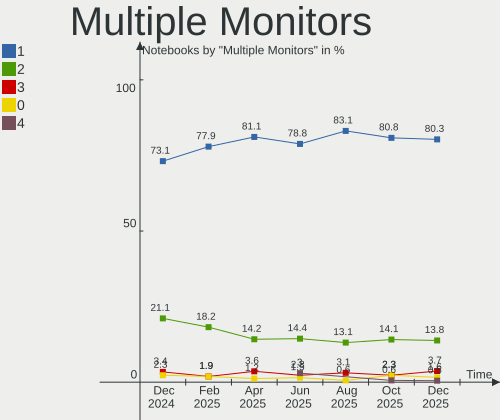

| Total | Notebooks | Percent |
|-------|-----------|---------|
| 1     | 151       | 80.32%  |
| 2     | 26        | 13.83%  |
| 3     | 7         | 3.72%   |
| 0     | 3         | 1.6%    |
| 4     | 1         | 0.53%   |

Network
-------

Net Controller Vendor
---------------------

Controller vendors

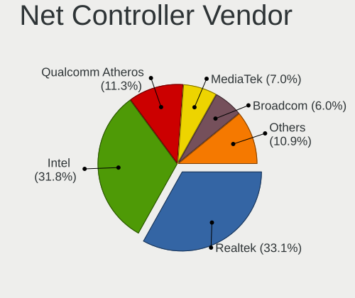

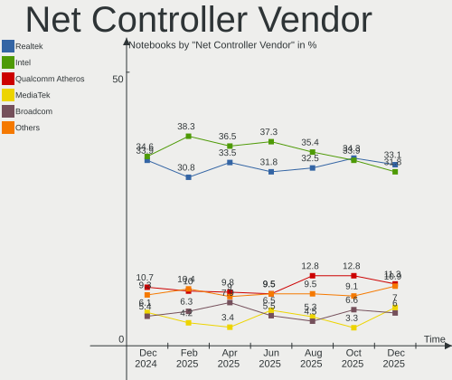

| Vendor                                 | Notebooks | Percent |
|----------------------------------------|-----------|---------|
| Realtek Semiconductor                  | 100       | 33.11%  |
| Intel                                  | 96        | 31.79%  |
| Qualcomm Atheros                       | 34        | 11.26%  |
| MediaTek                               | 21        | 6.95%   |
| Broadcom                               | 18        | 5.96%   |
| ASIX Electronics                       | 5         | 1.66%   |
| Broadcom Limited                       | 4         | 1.32%   |
| Suzhou Motorcomm Electronic Technology | 3         | 0.99%   |
| Samsung Electronics                    | 2         | 0.66%   |
| Ralink                                 | 2         | 0.66%   |
| Qualcomm                               | 2         | 0.66%   |
| Toshiba                                | 1         | 0.33%   |
| Sierra Wireless                        | 1         | 0.33%   |
| Shenzhen Goodix Technology             | 1         | 0.33%   |
| Realtek                                | 1         | 0.33%   |
| Ralink Technology                      | 1         | 0.33%   |
| Qualcomm Atheros Communications        | 1         | 0.33%   |
| QinHeng Electronics                    | 1         | 0.33%   |
| NetGear                                | 1         | 0.33%   |
| Marvell Technology Group               | 1         | 0.33%   |
| JMicron Technology                     | 1         | 0.33%   |
| Google                                 | 1         | 0.33%   |
| DisplayLink                            | 1         | 0.33%   |
| Dell                                   | 1         | 0.33%   |
| D-Link System                          | 1         | 0.33%   |
| Cypress Semiconductor                  | 1         | 0.33%   |

Net Controller Model
--------------------

Controller models

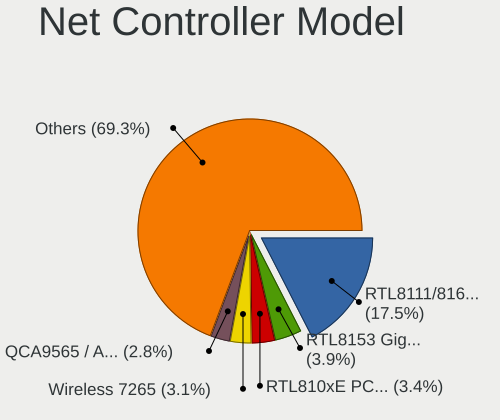

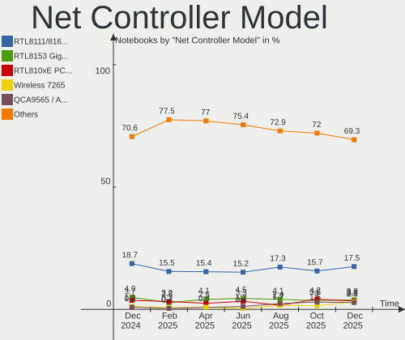

| Model                                                                  | Notebooks | Percent |
|------------------------------------------------------------------------|-----------|---------|
| Realtek RTL8111/8168/8211/8411 PCI Express Gigabit Ethernet Controller | 62        | 17.46%  |
| Realtek RTL8153 Gigabit Ethernet Adapter                               | 14        | 3.94%   |
| Realtek RTL810xE PCI Express Fast Ethernet controller                  | 12        | 3.38%   |
| Intel Wireless 7265                                                    | 11        | 3.1%    |
| Qualcomm Atheros QCA9565 / AR9565 Wireless Network Adapter             | 10        | 2.82%   |
| MediaTek MT7921 802.11ax PCIe Wireless Network Adapter [Filogic 330]   | 10        | 2.82%   |
| Intel Wireless 8265 / 8275                                             | 10        | 2.82%   |
| Intel Ethernet Connection (4) I219-LM                                  | 9         | 2.54%   |
| Realtek RTL8821CE 802.11ac PCIe Wireless Network Adapter               | 6         | 1.69%   |
| Intel Wi-Fi 6E(802.11ax) AX210/AX1675* 2x2 [Typhoon Peak]              | 6         | 1.69%   |
| Intel Wi-Fi 6 AX201                                                    | 6         | 1.69%   |
| Broadcom BCM4313 802.11bgn Wireless Network Adapter                    | 6         | 1.69%   |
| Intel Tiger Lake PCH CNVi WiFi                                         | 5         | 1.41%   |
| Intel Alder Lake-P PCH CNVi WiFi                                       | 5         | 1.41%   |
| ASIX AX88179 Gigabit Ethernet                                          | 5         | 1.41%   |
| Realtek RTL8822CE 802.11ac PCIe Wireless Network Adapter               | 4         | 1.13%   |
| Qualcomm Atheros AR9462 Wireless Network Adapter                       | 4         | 1.13%   |
| Qualcomm Atheros AR9285 Wireless Network Adapter (PCI-Express)         | 4         | 1.13%   |
| MediaTek MT7922 802.11ax PCI Express Wireless Network Adapter          | 4         | 1.13%   |
| Intel Wi-Fi 6 AX200                                                    | 4         | 1.13%   |
| Intel Raptor Lake PCH CNVi WiFi                                        | 4         | 1.13%   |
| Intel Centrino Wireless-N 1000 [Condor Peak]                           | 4         | 1.13%   |
| Suzhou Motorcomm Electronic YT6801 Gigabit Ethernet Controller         | 3         | 0.85%   |
| Realtek RTL8723BE PCIe Wireless Network Adapter                        | 3         | 0.85%   |
| Qualcomm Atheros QCA9377 802.11ac Wireless Network Adapter             | 3         | 0.85%   |
| Qualcomm Atheros QCA6174 802.11ac Wireless Network Adapter             | 3         | 0.85%   |
| MediaTek MT7902 802.11ax PCIe Wireless Network Adapter [Filogic 310]   | 3         | 0.85%   |
| Intel Wireless 8260                                                    | 3         | 0.85%   |
| Intel Wireless 7260                                                    | 3         | 0.85%   |
| Intel Wireless 3165                                                    | 3         | 0.85%   |
| Intel Wi-Fi 7(802.11be) AX1775*/AX1790*/BE20*/BE401/BE1750* 2x2        | 3         | 0.85%   |
| Intel 82579V Gigabit Network Connection                                | 3         | 0.85%   |
| Intel 82579LM Gigabit Network Connection (Lewisville)                  | 3         | 0.85%   |
| Samsung Galaxy series, misc. (tethering mode)                          | 2         | 0.56%   |
| Realtek USB 10/100/1G/2.5G/5G LAN                                      | 2         | 0.56%   |
| Realtek RTL8852CE PCIe 802.11ax Wireless Network Controller            | 2         | 0.56%   |
| Qualcomm QCNFA765 Wireless Network Adapter                             | 2         | 0.56%   |
| Qualcomm Atheros AR9485 Wireless Network Adapter                       | 2         | 0.56%   |
| Qualcomm Atheros AR928X Wireless Network Adapter (PCI-Express)         | 2         | 0.56%   |
| Qualcomm Atheros AR9287 Wireless Network Adapter (PCI-Express)         | 2         | 0.56%   |

Wireless Vendor
---------------

Wireless vendors

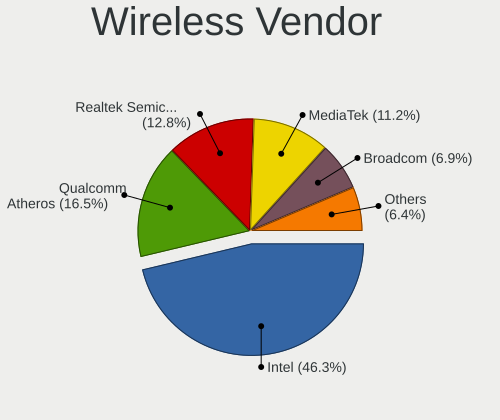

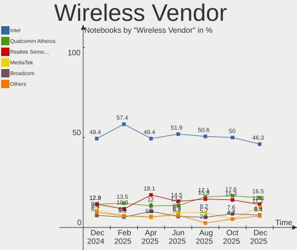

| Vendor                          | Notebooks | Percent |
|---------------------------------|-----------|---------|
| Intel                           | 87        | 46.28%  |
| Qualcomm Atheros                | 31        | 16.49%  |
| Realtek Semiconductor           | 24        | 12.77%  |
| MediaTek                        | 21        | 11.17%  |
| Broadcom                        | 13        | 6.91%   |
| Ralink                          | 2         | 1.06%   |
| Broadcom Limited                | 2         | 1.06%   |
| Sierra Wireless                 | 1         | 0.53%   |
| Realtek                         | 1         | 0.53%   |
| Ralink Technology               | 1         | 0.53%   |
| Qualcomm Atheros Communications | 1         | 0.53%   |
| Qualcomm                        | 1         | 0.53%   |
| NetGear                         | 1         | 0.53%   |
| Dell                            | 1         | 0.53%   |
| D-Link System                   | 1         | 0.53%   |

Wireless Model
--------------

Wireless models

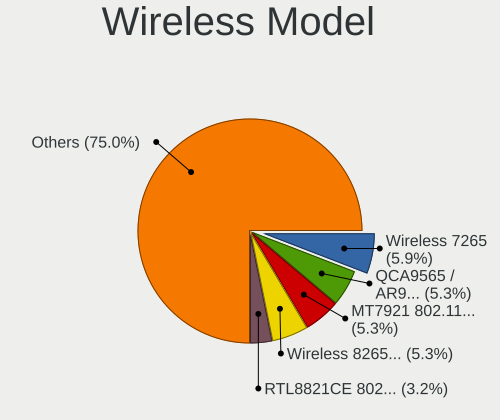

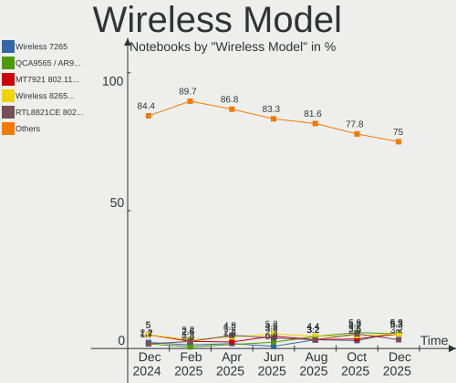

| Model                                                                           | Notebooks | Percent |
|---------------------------------------------------------------------------------|-----------|---------|
| Intel Wireless 7265                                                             | 11        | 5.85%   |
| Qualcomm Atheros QCA9565 / AR9565 Wireless Network Adapter                      | 10        | 5.32%   |
| MediaTek MT7921 802.11ax PCIe Wireless Network Adapter [Filogic 330]            | 10        | 5.32%   |
| Intel Wireless 8265 / 8275                                                      | 10        | 5.32%   |
| Realtek RTL8821CE 802.11ac PCIe Wireless Network Adapter                        | 6         | 3.19%   |
| Intel Wi-Fi 6E(802.11ax) AX210/AX1675* 2x2 [Typhoon Peak]                       | 6         | 3.19%   |
| Intel Wi-Fi 6 AX201                                                             | 6         | 3.19%   |
| Broadcom BCM4313 802.11bgn Wireless Network Adapter                             | 6         | 3.19%   |
| Intel Tiger Lake PCH CNVi WiFi                                                  | 5         | 2.66%   |
| Realtek RTL8822CE 802.11ac PCIe Wireless Network Adapter                        | 4         | 2.13%   |
| Qualcomm Atheros AR9462 Wireless Network Adapter                                | 4         | 2.13%   |
| Qualcomm Atheros AR9285 Wireless Network Adapter (PCI-Express)                  | 4         | 2.13%   |
| MediaTek MT7922 802.11ax PCI Express Wireless Network Adapter                   | 4         | 2.13%   |
| Intel Wi-Fi 6 AX200                                                             | 4         | 2.13%   |
| Intel Raptor Lake PCH CNVi WiFi                                                 | 4         | 2.13%   |
| Intel Centrino Wireless-N 1000 [Condor Peak]                                    | 4         | 2.13%   |
| Realtek RTL8723BE PCIe Wireless Network Adapter                                 | 3         | 1.6%    |
| Qualcomm Atheros QCA9377 802.11ac Wireless Network Adapter                      | 3         | 1.6%    |
| Qualcomm Atheros QCA6174 802.11ac Wireless Network Adapter                      | 3         | 1.6%    |
| MediaTek MT7902 802.11ax PCIe Wireless Network Adapter [Filogic 310]            | 3         | 1.6%    |
| Intel Wireless 8260                                                             | 3         | 1.6%    |
| Intel Wireless 7260                                                             | 3         | 1.6%    |
| Intel Wireless 3165                                                             | 3         | 1.6%    |
| Intel Wi-Fi 7(802.11be) AX1775*/AX1790*/BE20*/BE401/BE1750* 2x2                 | 3         | 1.6%    |
| Intel Alder Lake-P PCH CNVi WiFi                                                | 3         | 1.6%    |
| Realtek RTL8852CE PCIe 802.11ax Wireless Network Controller                     | 2         | 1.06%   |
| Qualcomm Atheros AR9485 Wireless Network Adapter                                | 2         | 1.06%   |
| Qualcomm Atheros AR928X Wireless Network Adapter (PCI-Express)                  | 2         | 1.06%   |
| Qualcomm Atheros AR9287 Wireless Network Adapter (PCI-Express)                  | 2         | 1.06%   |
| MediaTek MT7925 802.11be 160MHz 2x2 PCIe Wireless Network Adapter [Filogic 360] | 2         | 1.06%   |
| Intel Meteor Lake PCH CNVi WiFi                                                 | 2         | 1.06%   |
| Intel Comet Lake PCH-LP CNVi WiFi                                               | 2         | 1.06%   |
| Intel Comet Lake PCH CNVi WiFi                                                  | 2         | 1.06%   |
| Intel Centrino Advanced-N 6235                                                  | 2         | 1.06%   |
| Intel Centrino Advanced-N 6200                                                  | 2         | 1.06%   |
| Intel Cannon Lake PCH CNVi WiFi                                                 | 2         | 1.06%   |
| Intel BE201 320MHz                                                              | 2         | 1.06%   |
| Broadcom BCM4331 802.11a/b/g/n                                                  | 2         | 1.06%   |
| Broadcom BCM43142 802.11b/g/n                                                   | 2         | 1.06%   |
| Sierra Wireless EM7305                                                          | 1         | 0.53%   |

Ethernet Vendor
---------------

Ethernet vendors

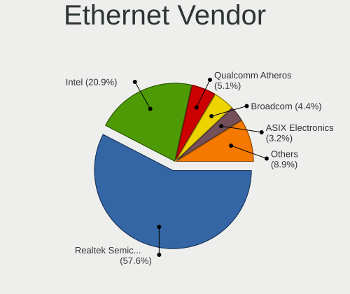

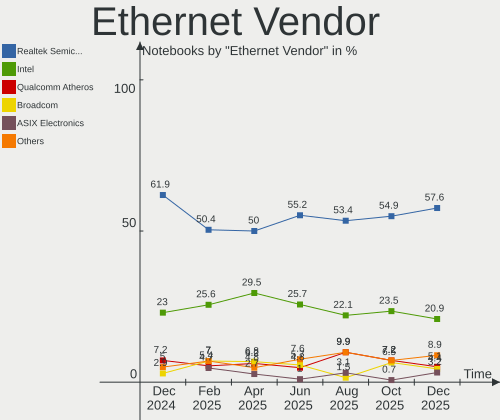

| Vendor                                 | Notebooks | Percent |
|----------------------------------------|-----------|---------|
| Realtek Semiconductor                  | 91        | 57.59%  |
| Intel                                  | 33        | 20.89%  |
| Qualcomm Atheros                       | 8         | 5.06%   |
| Broadcom                               | 7         | 4.43%   |
| ASIX Electronics                       | 5         | 3.16%   |
| Suzhou Motorcomm Electronic Technology | 3         | 1.9%    |
| Samsung Electronics                    | 2         | 1.27%   |
| Broadcom Limited                       | 2         | 1.27%   |
| Qualcomm                               | 1         | 0.63%   |
| QinHeng Electronics                    | 1         | 0.63%   |
| Marvell Technology Group               | 1         | 0.63%   |
| JMicron Technology                     | 1         | 0.63%   |
| Google                                 | 1         | 0.63%   |
| DisplayLink                            | 1         | 0.63%   |
| Cypress Semiconductor                  | 1         | 0.63%   |

Ethernet Model
--------------

Ethernet models

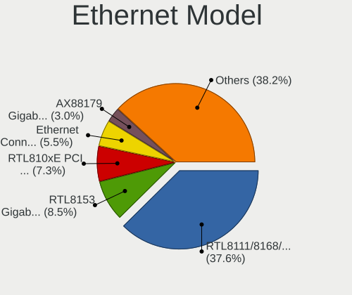

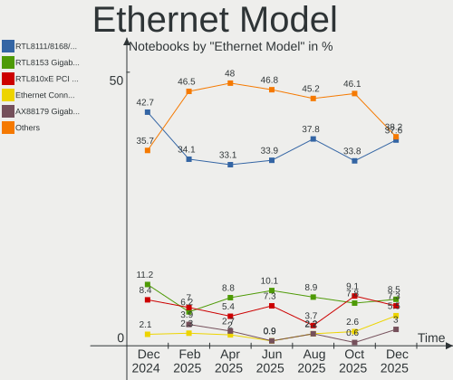

| Model                                                                  | Notebooks | Percent |
|------------------------------------------------------------------------|-----------|---------|
| Realtek RTL8111/8168/8211/8411 PCI Express Gigabit Ethernet Controller | 62        | 37.58%  |
| Realtek RTL8153 Gigabit Ethernet Adapter                               | 14        | 8.48%   |
| Realtek RTL810xE PCI Express Fast Ethernet controller                  | 12        | 7.27%   |
| Intel Ethernet Connection (4) I219-LM                                  | 9         | 5.45%   |
| ASIX AX88179 Gigabit Ethernet                                          | 5         | 3.03%   |
| Suzhou Motorcomm Electronic YT6801 Gigabit Ethernet Controller         | 3         | 1.82%   |
| Intel 82579V Gigabit Network Connection                                | 3         | 1.82%   |
| Intel 82579LM Gigabit Network Connection (Lewisville)                  | 3         | 1.82%   |
| Samsung Galaxy series, misc. (tethering mode)                          | 2         | 1.21%   |
| Realtek USB 10/100/1G/2.5G/5G LAN                                      | 2         | 1.21%   |
| Intel Ethernet Connection (24) I219-LM                                 | 2         | 1.21%   |
| Intel Ethernet Connection (13) I219-LM                                 | 2         | 1.21%   |
| Intel Arrow Lake CNVi WiFi                                             | 2         | 1.21%   |
| Intel Alder Lake-P PCH CNVi WiFi                                       | 2         | 1.21%   |
| Broadcom NetXtreme BCM57765 Gigabit Ethernet PCIe                      | 2         | 1.21%   |
| Broadcom NetLink BCM57780 Gigabit Ethernet PCIe                        | 2         | 1.21%   |
| Realtek USB 10/100/1G/2.5 LAN                                          | 1         | 0.61%   |
| Realtek RTL8152 Fast Ethernet Adapter                                  | 1         | 0.61%   |
| Realtek RTL8125 2.5GbE Controller                                      | 1         | 0.61%   |
| Realtek RTL-8110SC/8169SC Gigabit Ethernet                             | 1         | 0.61%   |
| Realtek Killer E3000 2.5GbE Controller                                 | 1         | 0.61%   |
| Realtek Killer E2600 GbE Controller                                    | 1         | 0.61%   |
| Qualcomm QCNFA765 Wireless Network Adapter                             | 1         | 0.61%   |
| Qualcomm Atheros QCA8172 Fast Ethernet                                 | 1         | 0.61%   |
| Qualcomm Atheros QCA8171 Gigabit Ethernet                              | 1         | 0.61%   |
| Qualcomm Atheros Killer E2400 Gigabit Ethernet Controller              | 1         | 0.61%   |
| Qualcomm Atheros Killer E220x Gigabit Ethernet Controller              | 1         | 0.61%   |
| Qualcomm Atheros AR8161 Gigabit Ethernet                               | 1         | 0.61%   |
| Qualcomm Atheros AR8151 v1.0 Gigabit Ethernet                          | 1         | 0.61%   |
| Qualcomm Atheros AR8132 Fast Ethernet                                  | 1         | 0.61%   |
| Qualcomm Atheros AR8131 Gigabit Ethernet                               | 1         | 0.61%   |
| QinHeng USB 10/100 LAN                                                 | 1         | 0.61%   |
| Marvell Group 88E8057 PCI-E Gigabit Ethernet Controller                | 1         | 0.61%   |
| JMicron JMC250 PCI Express Gigabit Ethernet Controller                 | 1         | 0.61%   |
| Intel Ethernet Controller (2) I225-LMvP                                | 1         | 0.61%   |
| Intel Ethernet Connection I219-LM                                      | 1         | 0.61%   |
| Intel Ethernet Connection I218-LM                                      | 1         | 0.61%   |
| Intel Ethernet Connection I217-V                                       | 1         | 0.61%   |
| Intel Ethernet Connection (7) I219-LM                                  | 1         | 0.61%   |
| Intel Ethernet Connection (4) I219-V                                   | 1         | 0.61%   |

Net Controller Kind
-------------------

Ethernet, WiFi or modem

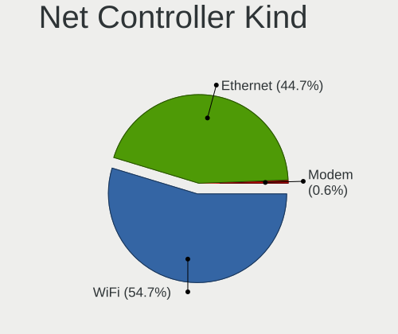

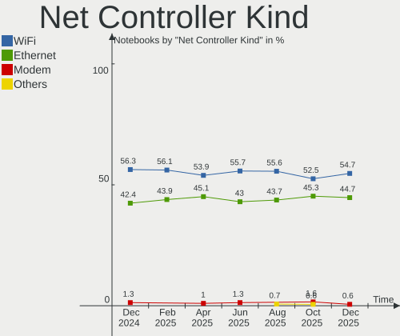

| Kind     | Notebooks | Percent |
|----------|-----------|---------|
| WiFi     | 181       | 54.68%  |
| Ethernet | 148       | 44.71%  |
| Modem    | 2         | 0.6%    |

Used Controller
---------------

Currently used network controller

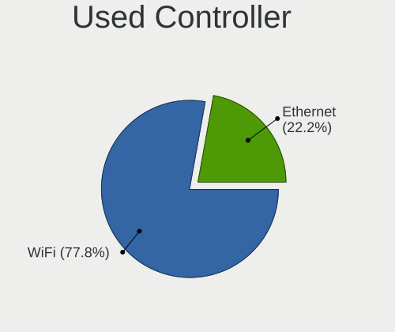

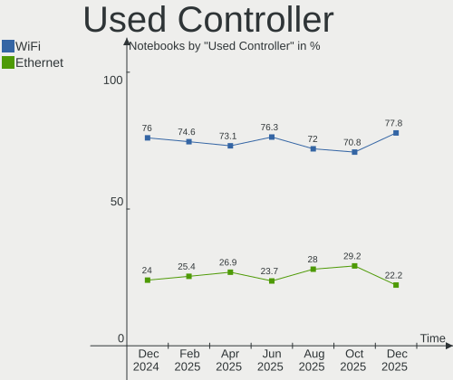

| Kind     | Notebooks | Percent |
|----------|-----------|---------|
| WiFi     | 151       | 77.84%  |
| Ethernet | 43        | 22.16%  |

NICs
----

Total network controllers on board

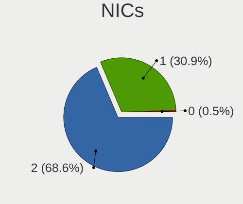

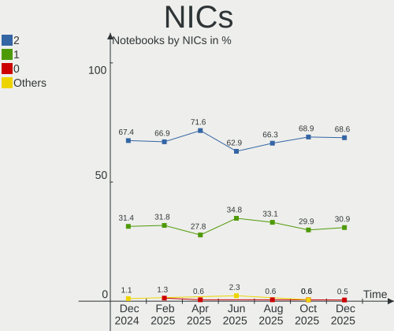

| Total | Notebooks | Percent |
|-------|-----------|---------|
| 2     | 129       | 68.62%  |
| 1     | 58        | 30.85%  |
| 0     | 1         | 0.53%   |

IPv6
----

IPv6 vs IPv4

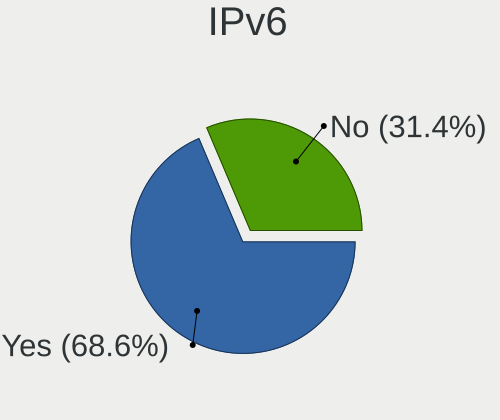

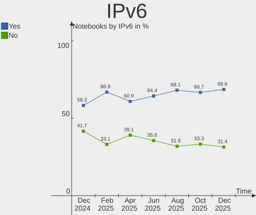

| Used | Notebooks | Percent |
|------|-----------|---------|
| Yes  | 129       | 68.62%  |
| No   | 59        | 31.38%  |

Bluetooth
---------

Bluetooth Vendor
----------------

Controller vendors

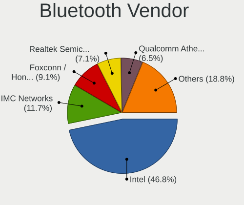

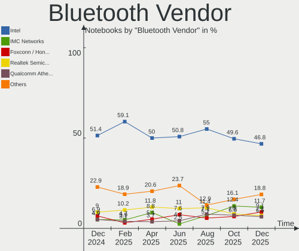

| Vendor                          | Notebooks | Percent |
|---------------------------------|-----------|---------|
| Intel                           | 72        | 46.75%  |
| IMC Networks                    | 18        | 11.69%  |
| Foxconn / Hon Hai               | 14        | 9.09%   |
| Realtek Semiconductor           | 11        | 7.14%   |
| Qualcomm Atheros Communications | 10        | 6.49%   |
| Lite-On Technology              | 6         | 3.9%    |
| Broadcom                        | 5         | 3.25%   |
| MediaTek                        | 4         | 2.6%    |
| Apple                           | 4         | 2.6%    |
| Toshiba                         | 3         | 1.95%   |
| USI                             | 1         | 0.65%   |
| Ralink                          | 1         | 0.65%   |
| Hewlett-Packard                 | 1         | 0.65%   |
| Dell                            | 1         | 0.65%   |
| Chicony Electronics             | 1         | 0.65%   |
| Cambridge Silicon Radio         | 1         | 0.65%   |
| ASUSTek Computer                | 1         | 0.65%   |

Bluetooth Model
---------------

Controller models

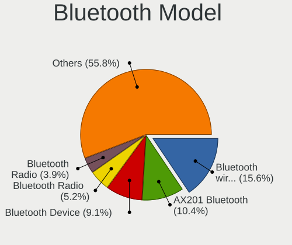

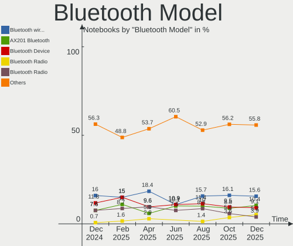

| Model                                          | Notebooks | Percent |
|------------------------------------------------|-----------|---------|
| Intel Bluetooth wireless interface             | 24        | 15.58%  |
| Intel AX201 Bluetooth                          | 16        | 10.39%  |
| Intel Bluetooth Device                         | 14        | 9.09%   |
| IMC Networks Bluetooth Radio                   | 8         | 5.19%   |
| Realtek Bluetooth Radio                        | 6         | 3.9%    |
| Intel AX210 Bluetooth                          | 6         | 3.9%    |
| IMC Networks Wireless_Device                   | 6         | 3.9%    |
| Foxconn / Hon Hai MediaTek Bluetooth Adapter   | 6         | 3.9%    |
| Qualcomm Atheros  Bluetooth Device             | 4         | 2.6%    |
| Qualcomm Atheros AR3012 Bluetooth 4.0          | 4         | 2.6%    |
| MediaTek Wireless_Device                       | 4         | 2.6%    |
| Intel AX200 Bluetooth                          | 4         | 2.6%    |
| Intel Centrino Bluetooth Wireless Transceiver  | 3         | 1.95%   |
| Intel Bluetooth 9460/9560 Jefferson Peak (JfP) | 3         | 1.95%   |
| Foxconn / Hon Hai Wireless_Device              | 3         | 1.95%   |
| Foxconn / Hon Hai Bluetooth Device             | 3         | 1.95%   |
| Apple Bluetooth Host Controller                | 3         | 1.95%   |
| Realtek  Bluetooth 4.2 Adapter                 | 2         | 1.3%    |
| Lite-On Qualcomm Atheros QCA9377 Bluetooth     | 2         | 1.3%    |
| IMC Networks Bluetooth Device                  | 2         | 1.3%    |
| Broadcom BCM2070 Bluetooth 2.1 + EDR           | 2         | 1.3%    |
| USI Bluetooth Device                           | 1         | 0.65%   |
| Toshiba Integrated Bluetooth HCI               | 1         | 0.65%   |
| Toshiba Bluetooth USB Host Controller          | 1         | 0.65%   |
| Toshiba Bluetooth Device                       | 1         | 0.65%   |
| Realtek RTL8821A Bluetooth                     | 1         | 0.65%   |
| Realtek RTL8723B Bluetooth                     | 1         | 0.65%   |
| Realtek Bluetooth 5.4 Radio                    | 1         | 0.65%   |
| Ralink RT3290 Bluetooth                        | 1         | 0.65%   |
| Qualcomm Atheros QCA61x4 Bluetooth 4.0         | 1         | 0.65%   |
| Qualcomm Atheros AR3011 Bluetooth              | 1         | 0.65%   |
| Lite-On Wireless_Device                        | 1         | 0.65%   |
| Lite-On Qualcomm Atheros Bluetooth             | 1         | 0.65%   |
| Lite-On Bluetooth Radio                        | 1         | 0.65%   |
| Lite-On Bluetooth Device                       | 1         | 0.65%   |
| Intel Wireless-AC 9260 Bluetooth Adapter       | 1         | 0.65%   |
| Intel Bluetooth                                | 1         | 0.65%   |
| IMC Networks BCM20702A0                        | 1         | 0.65%   |
| IMC Networks Atheros AR3012 Bluetooth          | 1         | 0.65%   |
| HP Broadcom 2070 Bluetooth Combo               | 1         | 0.65%   |

Sound
-----

Sound Vendor
------------

Sound card vendors

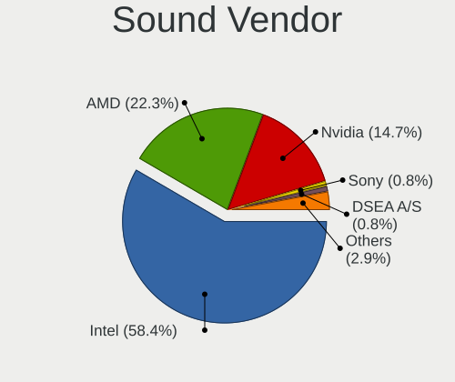

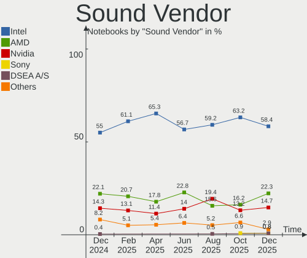

| Vendor                | Notebooks | Percent |
|-----------------------|-----------|---------|
| Intel                 | 139       | 58.4%   |
| AMD                   | 53        | 22.27%  |
| Nvidia                | 35        | 14.71%  |
| Sony                  | 2         | 0.84%   |
| DSEA A/S              | 2         | 0.84%   |
| Turtle Beach          | 1         | 0.42%   |
| Texas Instruments     | 1         | 0.42%   |
| Realtek Semiconductor | 1         | 0.42%   |
| Logitech              | 1         | 0.42%   |
| KTMICRO               | 1         | 0.42%   |
| Kingston Technology   | 1         | 0.42%   |
| ASUSTek Computer      | 1         | 0.42%   |

Sound Model
-----------

Sound card models

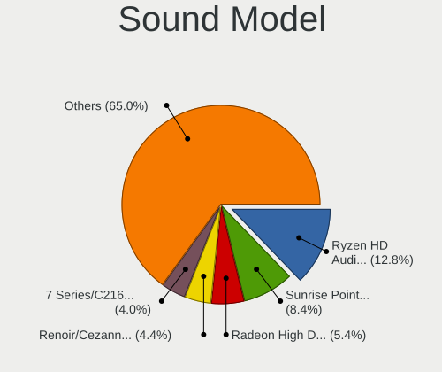

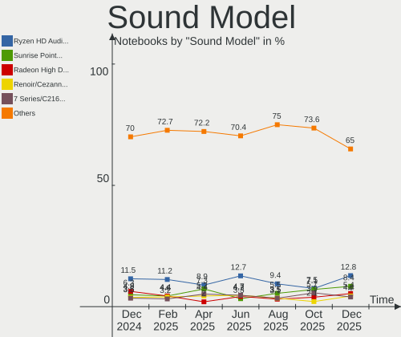

| Model                                                                                             | Notebooks | Percent |
|---------------------------------------------------------------------------------------------------|-----------|---------|
| AMD Ryzen HD Audio Controller                                                                     | 38        | 12.79%  |
| Intel Sunrise Point-LP HD Audio                                                                   | 25        | 8.42%   |
| AMD Radeon High Definition Audio Controller                                                       | 16        | 5.39%   |
| AMD Renoir/Cezanne HDMI/DP Audio Controller                                                       | 13        | 4.38%   |
| Intel 7 Series/C216 Chipset Family High Definition Audio Controller                               | 12        | 4.04%   |
| Intel Tiger Lake-LP Smart Sound Technology Audio Controller                                       | 8         | 2.69%   |
| Intel Raptor Lake-P/U/H cAVS                                                                      | 8         | 2.69%   |
| Intel 5 Series/3400 Series Chipset High Definition Audio                                          | 8         | 2.69%   |
| AMD FCH Azalia Controller                                                                         | 8         | 2.69%   |
| Intel Haswell-ULT HD Audio Controller                                                             | 7         | 2.36%   |
| Intel Alder Lake PCH-P High Definition Audio Controller                                           | 7         | 2.36%   |
| Intel 82801I (ICH9 Family) HD Audio Controller                                                    | 7         | 2.36%   |
| Intel 8 Series HD Audio Controller                                                                | 7         | 2.36%   |
| Intel 8 Series/C220 Series Chipset High Definition Audio Controller                               | 6         | 2.02%   |
| Intel 6 Series/C200 Series Chipset Family High Definition Audio Controller                        | 6         | 2.02%   |
| AMD Kabini HDMI/DP Audio                                                                          | 6         | 2.02%   |
| Intel Xeon E3-1200 v3/4th Gen Core Processor HD Audio Controller                                  | 5         | 1.68%   |
| Intel Tiger Lake-H HD Audio Controller                                                            | 5         | 1.68%   |
| Intel 100 Series/C230 Series Chipset Family HD Audio Controller                                   | 5         | 1.68%   |
| Nvidia GA104 High Definition Audio Controller                                                     | 4         | 1.35%   |
| Intel Meteor Lake-P HD Audio Controller                                                           | 4         | 1.35%   |
| Intel CM238 HD Audio Controller                                                                   | 4         | 1.35%   |
| Intel Cannon Lake PCH cAVS                                                                        | 4         | 1.35%   |
| AMD Raven/Raven2/Fenghuang HDMI/DP Audio Controller                                               | 4         | 1.35%   |
| Nvidia GP107GL High Definition Audio Controller                                                   | 3         | 1.01%   |
| Nvidia GA107 High Definition Audio Controller                                                     | 3         | 1.01%   |
| Intel Celeron N3350/Pentium N4200/Atom E3900 Series Audio Cluster                                 | 3         | 1.01%   |
| Intel Broadwell-U Audio Controller                                                                | 3         | 1.01%   |
| Nvidia TU107 GeForce GTX 1650 High Definition Audio Controller                                    | 2         | 0.67%   |
| Nvidia TU106 High Definition Audio Controller                                                     | 2         | 0.67%   |
| Nvidia GK104 HDMI Audio Controller                                                                | 2         | 0.67%   |
| Nvidia GB207 High Definition Audio Controller                                                     | 2         | 0.67%   |
| Nvidia GB206 High Definition Audio Controller                                                     | 2         | 0.67%   |
| Nvidia GA106 High Definition Audio Controller                                                     | 2         | 0.67%   |
| Nvidia AD107 High Definition Audio Controller                                                     | 2         | 0.67%   |
| Intel Wildcat Point-LP High Definition Audio Controller                                           | 2         | 0.67%   |
| Intel Lunar Lake-M HD Audio Controller                                                            | 2         | 0.67%   |
| Intel Comet Lake PCH-LP cAVS                                                                      | 2         | 0.67%   |
| Intel Comet Lake PCH cAVS                                                                         | 2         | 0.67%   |
| Intel Atom/Celeron/Pentium Processor x5-E8000/J3xxx/N3xxx Series High Definition Audio Controller | 2         | 0.67%   |

Memory
------

Memory Vendor
-------------

Memory module vendors

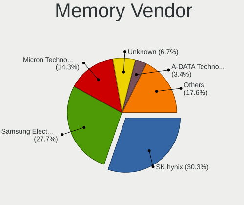

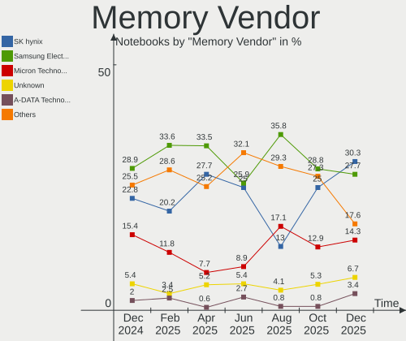

| Vendor                       | Notebooks | Percent |
|------------------------------|-----------|---------|
| SK hynix                     | 36        | 30.25%  |
| Samsung Electronics          | 33        | 27.73%  |
| Micron Technology            | 17        | 14.29%  |
| Unknown                      | 8         | 6.72%   |
| A-DATA Technology            | 4         | 3.36%   |
| Kingston                     | 3         | 2.52%   |
| Elpida                       | 3         | 2.52%   |
| Crucial                      | 3         | 2.52%   |
| Ramaxel Technology           | 2         | 1.68%   |
| Corsair                      | 2         | 1.68%   |
| Unknown                      | 2         | 1.68%   |
| Unknown (FFFF000080AD)       | 1         | 0.84%   |
| Unknown (ABCD)               | 1         | 0.84%   |
| Transcend                    | 1         | 0.84%   |
| Team                         | 1         | 0.84%   |
| Patriot Memory (PDP Systems) | 1         | 0.84%   |
| Nanya Technology             | 1         | 0.84%   |

Memory Model
------------

Memory module models

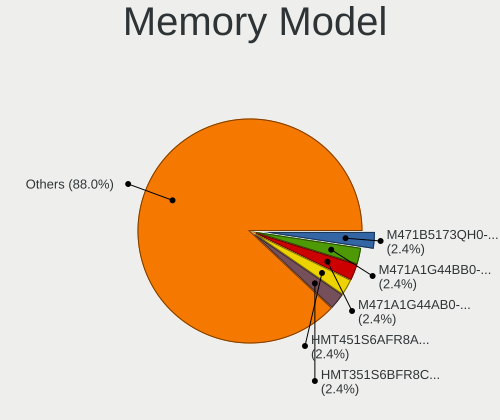

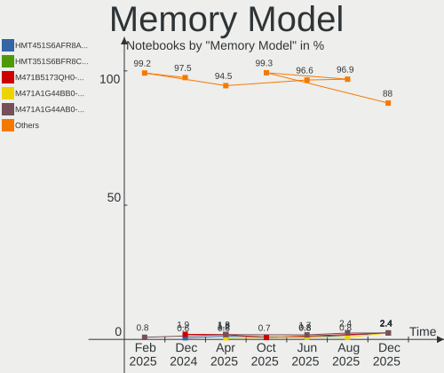

| Model                                                          | Notebooks | Percent |
|----------------------------------------------------------------|-----------|---------|
| SK hynix RAM HMT451S6AFR8A-PB 4GB SODIMM DDR3 1600MT/s         | 3         | 2.4%    |
| SK hynix RAM HMT351S6BFR8C-H9 4GB SODIMM 1334MT/s              | 3         | 2.4%    |
| Samsung RAM M471B5173QH0-YK0 4GB SODIMM DDR3 1600MT/s          | 3         | 2.4%    |
| Samsung RAM M471A1G44BB0-CWE 8GB SODIMM DDR4 3200MT/s          | 3         | 2.4%    |
| Samsung RAM M471A1G44AB0-CWE 8GiB SODIMM DDR4 3200MT/s         | 3         | 2.4%    |
| Unknown RAM Module 2GB SODIMM 800MT/s                          | 2         | 1.6%    |
| SK hynix RAM HMT451S6BFR8A-PB 4GB SODIMM DDR3 1600MT/s         | 2         | 1.6%    |
| SK hynix RAM HMA81GS6DJR8N-XN 8GB SODIMM DDR4 3200MT/s         | 2         | 1.6%    |
| SK hynix RAM HMA81GS6AFR8N-UH 8GB SODIMM DDR4 2667MT/s         | 2         | 1.6%    |
| Samsung RAM M471A5244CB0-CRC 4GB SODIMM DDR4 2667MT/s          | 2         | 1.6%    |
| Samsung RAM M471A2K43CB1-CRC 16GB SODIMM DDR4 2667MT/s         | 2         | 1.6%    |
| Corsair RAM CMSX32GX4M2A3200C22 16GB SODIMM DDR4 3200MT/s      | 2         | 1.6%    |
| Unknown                                                        | 2         | 1.6%    |
| Unknown RAM Module 8GB SODIMM DDR4 2400MT/s                    | 1         | 0.8%    |
| Unknown RAM Module 4GB SODIMM DDR3 1333MT/s                    | 1         | 0.8%    |
| Unknown RAM Module 4GB SODIMM 667MT/s                          | 1         | 0.8%    |
| Unknown RAM Module 2GB SODIMM DDR3                             | 1         | 0.8%    |
| Unknown RAM Module 2GB SODIMM DDR2 667MT/s                     | 1         | 0.8%    |
| Unknown RAM Module 2GB SODIMM 667MT/s                          | 1         | 0.8%    |
| Unknown RAM Module 1GB SODIMM 800MT/s                          | 1         | 0.8%    |
| Unknown (FFFF000080AD) RAM Module 16GB SODIMM DDR4 2667MT/s    | 1         | 0.8%    |
| Unknown (ABCD) RAM 123456789012345678 2GB DIMM LPDDR4 2133MT/s | 1         | 0.8%    |
| Transcend RAM JM4800ASE-16G 16GB SODIMM DDR5 4800MT/s          | 1         | 0.8%    |
| Team RAM SD5-5600 16GB SODIMM DDR5 5600MT/s                    | 1         | 0.8%    |
| SK hynix RAM Module 8GB SODIMM DDR4 3200MT/s                   | 1         | 0.8%    |
| SK hynix RAM Module 4GB SODIMM DDR3 1600MT/s                   | 1         | 0.8%    |
| SK hynix RAM Module 4GB Row Of Chips LPDDR5 6400MT/s           | 1         | 0.8%    |
| SK hynix RAM Module 2GB DIMM DDR3 1600MT/s                     | 1         | 0.8%    |
| SK hynix RAM HMT451S6DFR8A-PB 4GB SODIMM DDR3 1600MT/s         | 1         | 0.8%    |
| SK hynix RAM HMT425S6AFR6A-PB 2GB SODIMM DDR3 3200MT/s         | 1         | 0.8%    |
| SK hynix RAM HMT41GS6DFR8A-PB 8GB SODIMM DDR3 1600MT/s         | 1         | 0.8%    |
| SK hynix RAM HMT351S6BFR8C-H9 4GB SODIMM DDR3 1333MT/s         | 1         | 0.8%    |
| SK hynix RAM HMT125S6BFR8C-H9 2GB SODIMM DDR3 1334MT/s         | 1         | 0.8%    |
| SK hynix RAM HMCG78AGBSA092N 16GB SODIMM DDR5 5600MT/s         | 1         | 0.8%    |
| SK hynix RAM HMCG66MEBSA095N 8GiB SODIMM DDR5 4800MT/s         | 1         | 0.8%    |
| SK hynix RAM HMAG68EXNSA051N 8GB SODIMM DDR4 3200MT/s          | 1         | 0.8%    |
| SK hynix RAM HMAA2GS6AJR8N-XN 16GB SODIMM DDR4 3200MT/s        | 1         | 0.8%    |
| SK hynix RAM HMAA1GS6CMR6N-VK 8GB SODIMM DDR4 2667MT/s         | 1         | 0.8%    |
| SK hynix RAM HMAA1GS6CJR6N-XN 8GB SODIMM DDR4 3200MT/s         | 1         | 0.8%    |
| SK hynix RAM HMAA1GS6CJR6N-XN 8GB Row Of Chips DDR4 3200MT/s   | 1         | 0.8%    |

Memory Kind
-----------

Memory module kinds

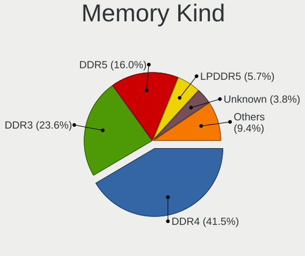

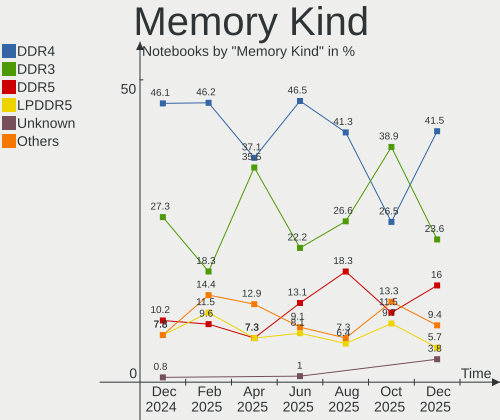

| Kind    | Notebooks | Percent |
|---------|-----------|---------|
| DDR4    | 44        | 41.51%  |
| DDR3    | 25        | 23.58%  |
| DDR5    | 17        | 16.04%  |
| LPDDR5  | 6         | 5.66%   |
| Unknown | 4         | 3.77%   |
| LPDDR4  | 3         | 2.83%   |
| LPDDR3  | 3         | 2.83%   |
| SDRAM   | 2         | 1.89%   |
| DDR2    | 2         | 1.89%   |

Memory Form Factor
------------------

Physical design of the memory module

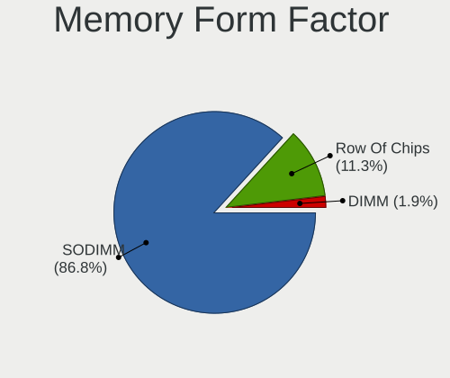

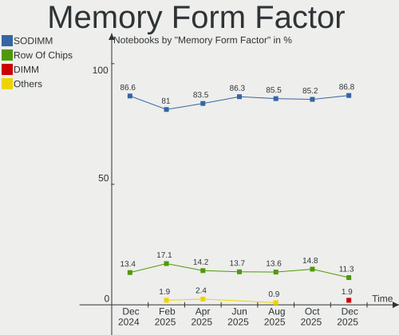

| Name         | Notebooks | Percent |
|--------------|-----------|---------|
| SODIMM       | 92        | 86.79%  |
| Row Of Chips | 12        | 11.32%  |
| DIMM         | 2         | 1.89%   |

Memory Size
-----------

Memory module size

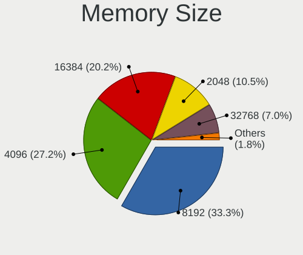

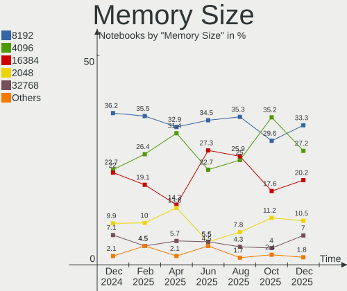

| Size  | Notebooks | Percent |
|-------|-----------|---------|
| 8192  | 38        | 33.33%  |
| 4096  | 31        | 27.19%  |
| 16384 | 23        | 20.18%  |
| 2048  | 12        | 10.53%  |
| 32768 | 8         | 7.02%   |
| 1024  | 2         | 1.75%   |

Memory Speed
------------

Memory module speed

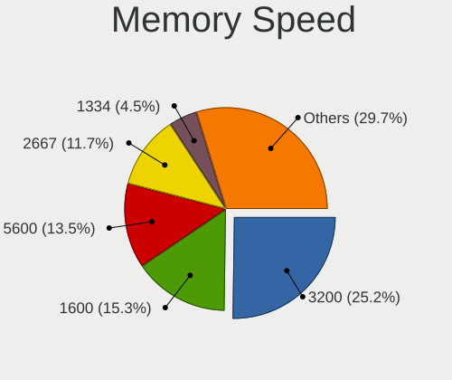

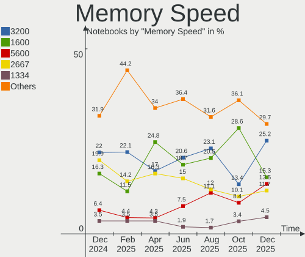

| Speed   | Notebooks | Percent |
|---------|-----------|---------|
| 3200    | 28        | 25.23%  |
| 1600    | 17        | 15.32%  |
| 5600    | 15        | 13.51%  |
| 2667    | 13        | 11.71%  |
| 1334    | 5         | 4.5%    |
| 2400    | 4         | 3.6%    |
| 2133    | 4         | 3.6%    |
| 667     | 4         | 3.6%    |
| 6400    | 3         | 2.7%    |
| 4800    | 3         | 2.7%    |
| 1333    | 3         | 2.7%    |
| 8533    | 2         | 1.8%    |
| 4267    | 2         | 1.8%    |
| 800     | 2         | 1.8%    |
| 8400    | 1         | 0.9%    |
| 7467    | 1         | 0.9%    |
| 4199    | 1         | 0.9%    |
| 1867    | 1         | 0.9%    |
| 1639    | 1         | 0.9%    |
| Unknown | 1         | 0.9%    |

Printers & scanners
-------------------

Printer Vendor
--------------

Printer device vendors

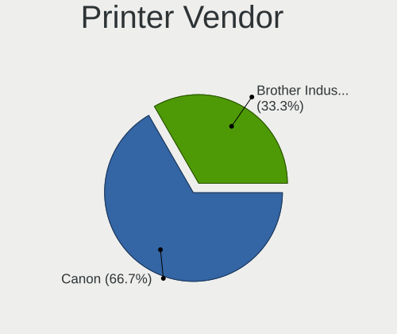

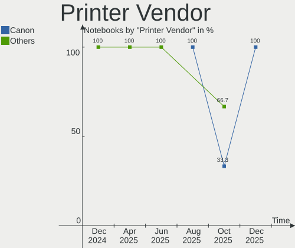

| Vendor | Notebooks | Percent |
|--------|-----------|---------|
| Canon  | 1         | 100%    |

Printer Model
-------------

Printer device models

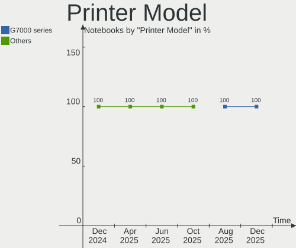

| Model              | Notebooks | Percent |
|--------------------|-----------|---------|
| Canon G7000 series | 1         | 100%    |

Scanner Vendor
--------------

Scanner device vendors

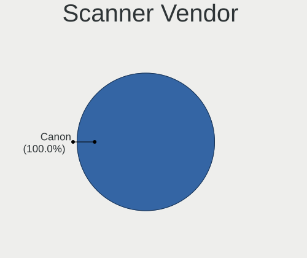

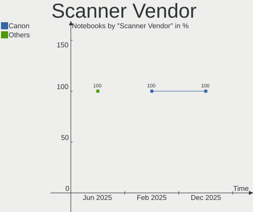

| Vendor | Notebooks | Percent |
|--------|-----------|---------|
| Canon  | 1         | 100%    |

Scanner Model
-------------

Scanner device models

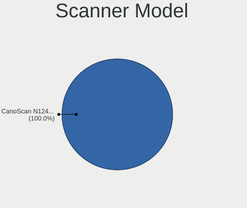

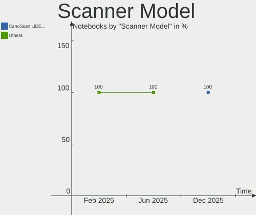

| Model                   | Notebooks | Percent |
|-------------------------|-----------|---------|
| Canon CanoScan LiDE 110 | 1         | 100%    |

Camera
------

Camera Vendor
-------------

Camera device vendors

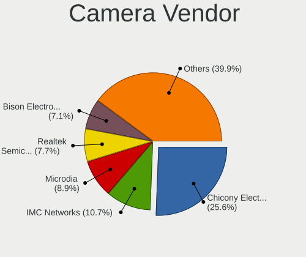

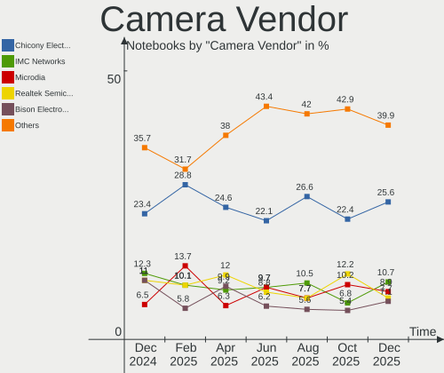

| Vendor                                 | Notebooks | Percent |
|----------------------------------------|-----------|---------|
| Chicony Electronics                    | 43        | 25.6%   |
| IMC Networks                           | 18        | 10.71%  |
| Microdia                               | 15        | 8.93%   |
| Realtek Semiconductor                  | 13        | 7.74%   |
| Bison Electronics                      | 12        | 7.14%   |
| Luxvisions Innotech Limited            | 9         | 5.36%   |
| Sunplus Innovation Technology          | 7         | 4.17%   |
| Shinetech                              | 6         | 3.57%   |
| Syntek                                 | 5         | 2.98%   |
| Quanta                                 | 5         | 2.98%   |
| Lite-On Technology                     | 5         | 2.98%   |
| Cheng Uei Precision Industry (Foxlink) | 5         | 2.98%   |
| Suyin                                  | 3         | 1.79%   |
| kingcome                               | 3         | 1.79%   |
| Apple                                  | 3         | 1.79%   |
| Sonix Technology                       | 2         | 1.19%   |
| SunplusIT                              | 1         | 0.6%    |
| Shine-optics                           | 1         | 0.6%    |
| Samsung Electronics                    | 1         | 0.6%    |
| Ricoh                                  | 1         | 0.6%    |
| Primax Electronics                     | 1         | 0.6%    |
| OmniVision Technologies                | 1         | 0.6%    |
| Logitech                               | 1         | 0.6%    |
| Google                                 | 1         | 0.6%    |
| Generalplus Technology                 | 1         | 0.6%    |
| GEMBIRD                                | 1         | 0.6%    |
| Framework                              | 1         | 0.6%    |
| ALi                                    | 1         | 0.6%    |
| Alcor Micro                            | 1         | 0.6%    |
| Unknown                                | 1         | 0.6%    |

Camera Model
------------

Camera device models

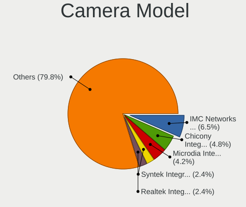

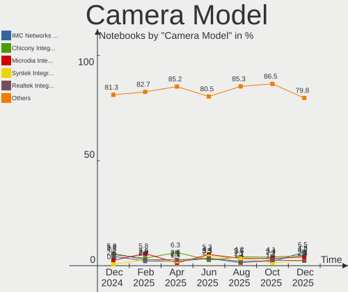

| Model                                         | Notebooks | Percent |
|-----------------------------------------------|-----------|---------|
| IMC Networks USB2.0 HD UVC WebCam             | 11        | 6.55%   |
| Chicony Integrated Camera                     | 8         | 4.76%   |
| Microdia Integrated_Webcam_HD                 | 7         | 4.17%   |
| Syntek Integrated Camera                      | 4         | 2.38%   |
| Realtek Integrated_Webcam_HD                  | 4         | 2.38%   |
| Chicony HD WebCam                             | 4         | 2.38%   |
| Bison Integrated Camera                       | 4         | 2.38%   |
| Sunplus Integrated_Webcam_HD                  | 3         | 1.79%   |
| Shinetech ASUS FHD webcam                     | 3         | 1.79%   |
| Luxvisions Innotech Limited Integrated Camera | 3         | 1.79%   |
| Lite-On HP HD Webcam                          | 3         | 1.79%   |
| kingcome FHD WebCam                           | 3         | 1.79%   |
| Chicony Chicony USB2.0 Camera                 | 3         | 1.79%   |
| ShineTech USB2.0 HD UVC WebCam                | 2         | 1.19%   |
| Realtek USB2.0 HD UVC WebCam                  | 2         | 1.19%   |
| Realtek Integrated_Webcam_FHD                 | 2         | 1.19%   |
| Quanta HD Webcam                              | 2         | 1.19%   |
| Quanta ACER HD User Facing                    | 2         | 1.19%   |
| Microdia Integrated Webcam                    | 2         | 1.19%   |
| Luxvisions Innotech Limited HP HD Camera      | 2         | 1.19%   |
| IMC Networks USB2.0 VGA UVC WebCam            | 2         | 1.19%   |
| IMC Networks USB2.0 UVC HD Webcam             | 2         | 1.19%   |
| IMC Networks Integrated Webcam                | 2         | 1.19%   |
| Chicony TOSHIBA Web Camera - HD               | 2         | 1.19%   |
| Chicony HP Wide Vision HD                     | 2         | 1.19%   |
| Chicony HP Truevision HD                      | 2         | 1.19%   |
| Bison Lenovo EasyCamera                       | 2         | 1.19%   |
| Apple FaceTime HD Camera                      | 2         | 1.19%   |
| Syntek Lenovo EasyCamera                      | 1         | 0.6%    |
| Suyin Sony Visual Communication Camera        | 1         | 0.6%    |
| Suyin HP Truevision HD                        | 1         | 0.6%    |
| Suyin Asus Integrated Webcam [CN031B]         | 1         | 0.6%    |
| SunplusIT FHD Webcam                          | 1         | 0.6%    |
| Sunplus TOSHIBA Web Camera - HD               | 1         | 0.6%    |
| Sunplus Laptop_Integrated_Webcam_FHD          | 1         | 0.6%    |
| Sunplus Integrated Webcam                     | 1         | 0.6%    |
| Sunplus HP Truevision Full HD                 | 1         | 0.6%    |
| Sonix USB2.0 HD UVC WebCam                    | 1         | 0.6%    |
| Sonix GIGABYTE FHD CAMERA                     | 1         | 0.6%    |
| Shinetech USB2.0 FHD UVC WebCam               | 1         | 0.6%    |

Security
--------

Fingerprint Vendor
------------------

Fingerprint sensor vendors

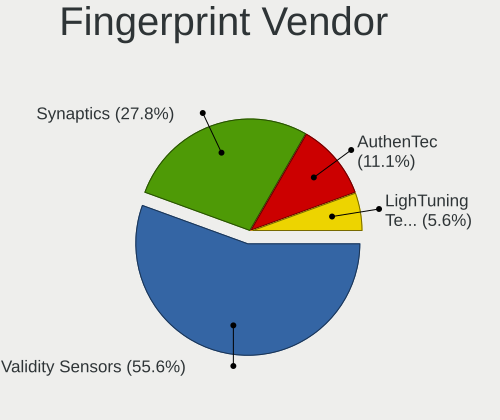

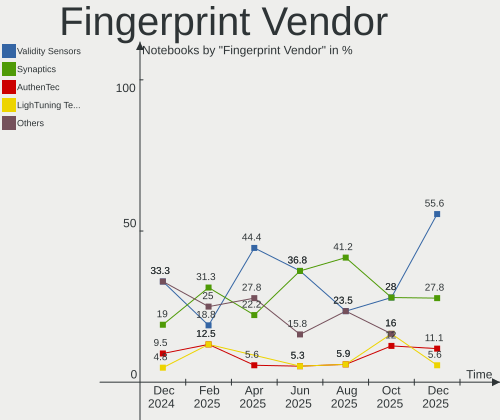

| Vendor                | Notebooks | Percent |
|-----------------------|-----------|---------|
| Validity Sensors      | 10        | 55.56%  |
| Synaptics             | 5         | 27.78%  |
| AuthenTec             | 2         | 11.11%  |
| LighTuning Technology | 1         | 5.56%   |

Fingerprint Model
-----------------

Fingerprint sensor models

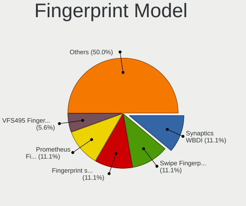

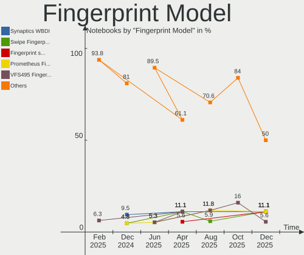

| Model                                                     | Notebooks | Percent |
|-----------------------------------------------------------|-----------|---------|
| Validity Sensors Synaptics WBDI                           | 2         | 11.11%  |
| Validity Sensors Swipe Fingerprint Sensor                 | 2         | 11.11%  |
| Validity Sensors Fingerprint scanner                      | 2         | 11.11%  |
| Synaptics Prometheus Fingerprint Reader                   | 2         | 11.11%  |
| Validity Sensors VFS495 Fingerprint Reader                | 1         | 5.56%   |
| Validity Sensors VFS491                                   | 1         | 5.56%   |
| Validity Sensors VFS471 Fingerprint Reader                | 1         | 5.56%   |
| Validity Sensors VFS Fingerprint sensor                   | 1         | 5.56%   |
| Synaptics  FS7604 Touch Fingerprint Sensor with PurePrint | 1         | 5.56%   |
| Synaptics Prometheus MIS Touch Fingerprint Reader         | 1         | 5.56%   |
| Synaptics FS7604 Touch Fingerprint Sensor with PurePrint  | 1         | 5.56%   |
| LighTuning EgisTec Touch Fingerprint Sensor               | 1         | 5.56%   |
| AuthenTec Fingerprint Sensor                              | 1         | 5.56%   |
| AuthenTec AES1600                                         | 1         | 5.56%   |

Chipcard Vendor
---------------

Chipcard module vendors

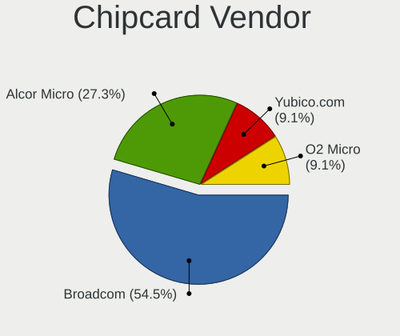

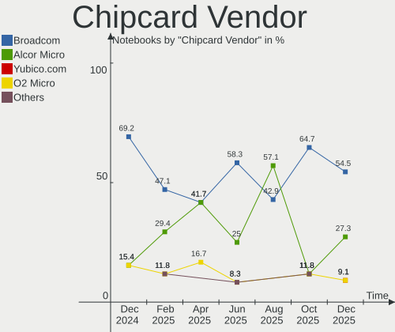

| Vendor      | Notebooks | Percent |
|-------------|-----------|---------|
| Broadcom    | 6         | 54.55%  |
| Alcor Micro | 3         | 27.27%  |
| Yubico.com  | 1         | 9.09%   |
| O2 Micro    | 1         | 9.09%   |

Chipcard Model
--------------

Chipcard module models

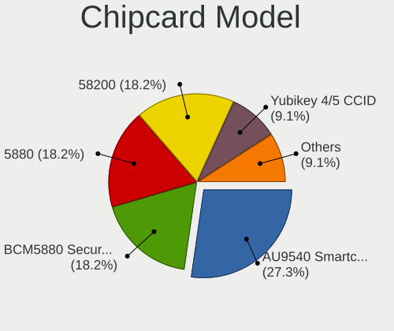

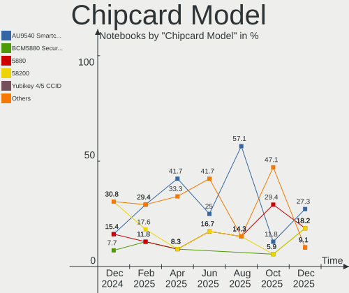

| Model                                          | Notebooks | Percent |
|------------------------------------------------|-----------|---------|
| Alcor Micro AU9540 Smartcard Reader            | 3         | 27.27%  |
| Broadcom BCM5880 Secure Applications Processor | 2         | 18.18%  |
| Broadcom 5880                                  | 2         | 18.18%  |
| Broadcom 58200                                 | 2         | 18.18%  |
| Yubico.com Yubikey 4/5 CCID                    | 1         | 9.09%   |
| O2 Micro OZ776 CCID Smartcard Reader           | 1         | 9.09%   |

Unsupported
-----------

Unsupported Devices
-------------------

Total unsupported devices on board

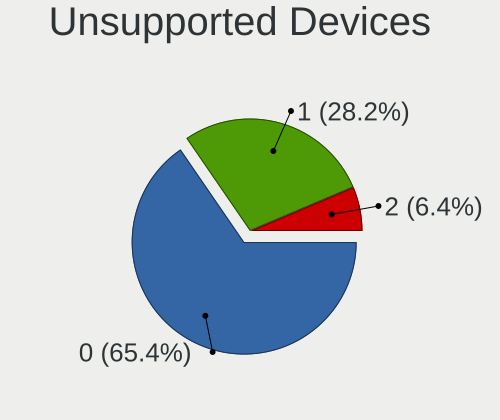

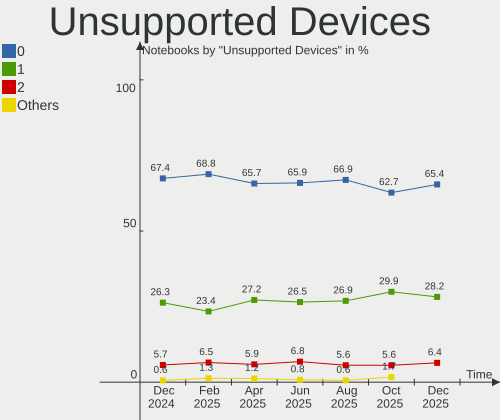

| Total | Notebooks | Percent |
|-------|-----------|---------|
| 0     | 123       | 65.43%  |
| 1     | 53        | 28.19%  |
| 2     | 12        | 6.38%   |

Unsupported Device Types
------------------------

Types of unsupported devices

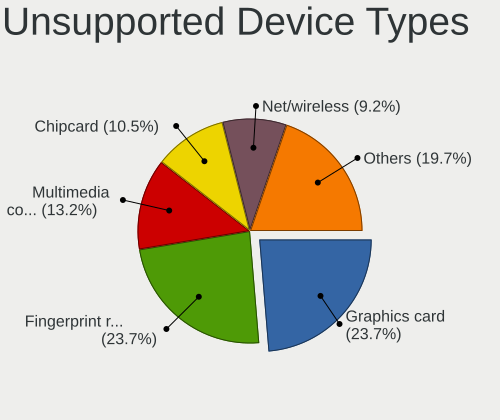

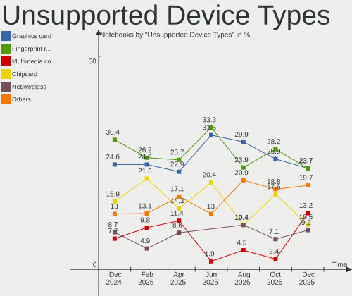

| Type                     | Notebooks | Percent |
|--------------------------|-----------|---------|
| Graphics card            | 18        | 23.68%  |
| Fingerprint reader       | 18        | 23.68%  |
| Multimedia controller    | 10        | 13.16%  |
| Chipcard                 | 8         | 10.53%  |
| Net/wireless             | 7         | 9.21%   |
| Camera                   | 4         | 5.26%   |
| Net/ethernet             | 3         | 3.95%   |
| Communication controller | 3         | 3.95%   |
| Bluetooth                | 3         | 3.95%   |
| Sound                    | 1         | 1.32%   |
| Card reader              | 1         | 1.32%   |

