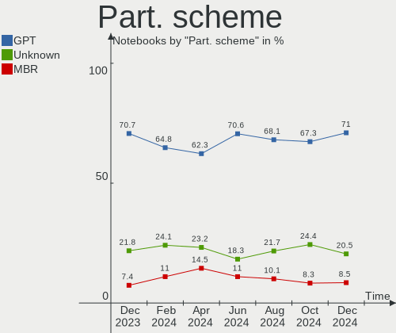
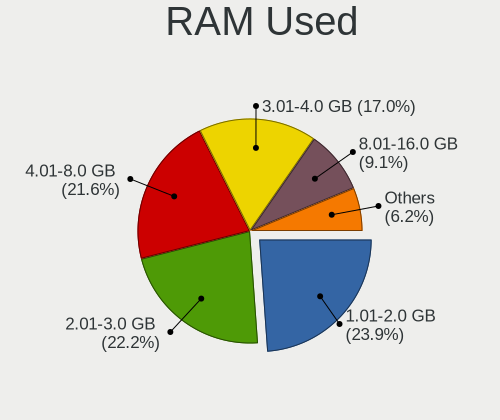
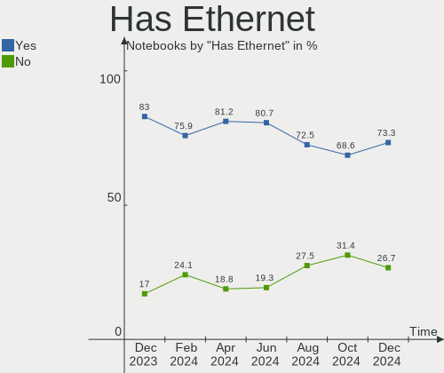
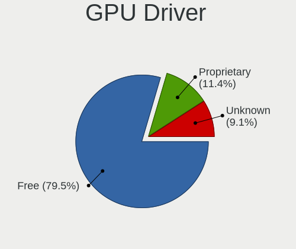
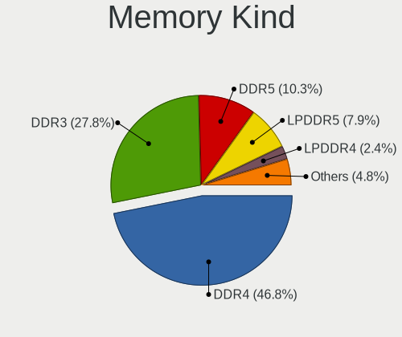
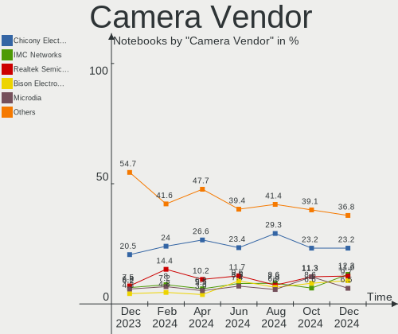

Linux in France - Hardware Trends (Notebooks)
---------------------------------------------

A project to identify most popular hardware characteristics and track their change
over time based on data collected by Linux users at https://Linux-Hardware.org.

Anyone can contribute to this report by the [hw-probe](https://github.com/linuxhw/hw-probe) tool:

    sudo -E hw-probe -all -upload

Period: Oct, 2022.

Contents
--------

* [ System ](#system)
  - [ OS                       ](#os)
  - [ OS Family                ](#os-family)
  - [ Kernel                   ](#kernel)
  - [ Kernel Family            ](#kernel-family)
  - [ Kernel Major Ver.        ](#kernel-major-ver)
  - [ Arch                     ](#arch)
  - [ DE                       ](#de)
  - [ Display Server           ](#display-server)
  - [ Display Manager          ](#display-manager)
  - [ OS Lang                  ](#os-lang)
  - [ Boot Mode                ](#boot-mode)
  - [ Filesystem               ](#filesystem)
  - [ Part. scheme             ](#part-scheme)
  - [ Dual Boot with Linux/BSD ](#dual-boot-with-linuxbsd)
  - [ Dual Boot (Win)          ](#dual-boot-win)

* [ Board ](#board)
  - [ Vendor                   ](#vendor)
  - [ Model                    ](#model)
  - [ Model Family             ](#model-family)
  - [ MFG Year                 ](#mfg-year)
  - [ Form Factor              ](#form-factor)
  - [ Secure Boot              ](#secure-boot)
  - [ Coreboot                 ](#coreboot)
  - [ RAM Size                 ](#ram-size)
  - [ RAM Used                 ](#ram-used)
  - [ Total Drives             ](#total-drives)
  - [ Has CD-ROM               ](#has-cd-rom)
  - [ Has Ethernet             ](#has-ethernet)
  - [ Has WiFi                 ](#has-wifi)
  - [ Has Bluetooth            ](#has-bluetooth)

* [ Location ](#location)
  - [ Country                  ](#country)
  - [ City                     ](#city)

* [ Drives ](#drives)
  - [ Drive Vendor             ](#drive-vendor)
  - [ Drive Model              ](#drive-model)
  - [ HDD Vendor               ](#hdd-vendor)
  - [ SSD Vendor               ](#ssd-vendor)
  - [ Drive Kind               ](#drive-kind)
  - [ Drive Connector          ](#drive-connector)
  - [ Drive Size               ](#drive-size)
  - [ Space Total              ](#space-total)
  - [ Space Used               ](#space-used)
  - [ Malfunc. Drives          ](#malfunc-drives)
  - [ Malfunc. Drive Vendor    ](#malfunc-drive-vendor)
  - [ Malfunc. HDD Vendor      ](#malfunc-hdd-vendor)
  - [ Malfunc. Drive Kind      ](#malfunc-drive-kind)
  - [ Failed Drives            ](#failed-drives)
  - [ Failed Drive Vendor      ](#failed-drive-vendor)
  - [ Drive Status             ](#drive-status)

* [ Storage controller ](#storage-controller)
  - [ Storage Vendor           ](#storage-vendor)
  - [ Storage Model            ](#storage-model)
  - [ Storage Kind             ](#storage-kind)

* [ Processor ](#processor)
  - [ CPU Vendor               ](#cpu-vendor)
  - [ CPU Model                ](#cpu-model)
  - [ CPU Model Family         ](#cpu-model-family)
  - [ CPU Cores                ](#cpu-cores)
  - [ CPU Sockets              ](#cpu-sockets)
  - [ CPU Threads              ](#cpu-threads)
  - [ CPU Op-Modes             ](#cpu-op-modes)
  - [ CPU Microcode            ](#cpu-microcode)
  - [ CPU Microarch            ](#cpu-microarch)

* [ Graphics ](#graphics)
  - [ GPU Vendor               ](#gpu-vendor)
  - [ GPU Model                ](#gpu-model)
  - [ GPU Combo                ](#gpu-combo)
  - [ GPU Driver               ](#gpu-driver)
  - [ GPU Memory               ](#gpu-memory)

* [ Monitor ](#monitor)
  - [ Monitor Vendor           ](#monitor-vendor)
  - [ Monitor Model            ](#monitor-model)
  - [ Monitor Resolution       ](#monitor-resolution)
  - [ Monitor Diagonal         ](#monitor-diagonal)
  - [ Monitor Width            ](#monitor-width)
  - [ Aspect Ratio             ](#aspect-ratio)
  - [ Monitor Area             ](#monitor-area)
  - [ Pixel Density            ](#pixel-density)
  - [ Multiple Monitors        ](#multiple-monitors)

* [ Network ](#network)
  - [ Net Controller Vendor    ](#net-controller-vendor)
  - [ Net Controller Model     ](#net-controller-model)
  - [ Wireless Vendor          ](#wireless-vendor)
  - [ Wireless Model           ](#wireless-model)
  - [ Ethernet Vendor          ](#ethernet-vendor)
  - [ Ethernet Model           ](#ethernet-model)
  - [ Net Controller Kind      ](#net-controller-kind)
  - [ Used Controller          ](#used-controller)
  - [ NICs                     ](#nics)
  - [ IPv6                     ](#ipv6)

* [ Bluetooth ](#bluetooth)
  - [ Bluetooth Vendor         ](#bluetooth-vendor)
  - [ Bluetooth Model          ](#bluetooth-model)

* [ Sound ](#sound)
  - [ Sound Vendor             ](#sound-vendor)
  - [ Sound Model              ](#sound-model)

* [ Memory ](#memory)
  - [ Memory Vendor            ](#memory-vendor)
  - [ Memory Model             ](#memory-model)
  - [ Memory Kind              ](#memory-kind)
  - [ Memory Form Factor       ](#memory-form-factor)
  - [ Memory Size              ](#memory-size)
  - [ Memory Speed             ](#memory-speed)

* [ Printers & scanners ](#printers--scanners)
  - [ Printer Vendor           ](#printer-vendor)
  - [ Printer Model            ](#printer-model)
  - [ Scanner Vendor           ](#scanner-vendor)
  - [ Scanner Model            ](#scanner-model)

* [ Camera ](#camera)
  - [ Camera Vendor            ](#camera-vendor)
  - [ Camera Model             ](#camera-model)

* [ Security ](#security)
  - [ Fingerprint Vendor       ](#fingerprint-vendor)
  - [ Fingerprint Model        ](#fingerprint-model)
  - [ Chipcard Vendor          ](#chipcard-vendor)
  - [ Chipcard Model           ](#chipcard-model)

* [ Unsupported ](#unsupported)
  - [ Unsupported Devices      ](#unsupported-devices)
  - [ Unsupported Device Types ](#unsupported-device-types)

System
------

OS
--

Installed operating systems

| Name                 | Notebooks | Percent |
|----------------------|-----------|---------|
| Ubuntu 22.04         | 35        | 20.23%  |
| Ubuntu 20.04         | 12        | 6.94%   |
| Debian 11            | 12        | 6.94%   |
| OpenMandriva 4.3     | 11        | 6.36%   |
| Linux Mint 21        | 11        | 6.36%   |
| Linux Mint 20.3      | 8         | 4.62%   |
| Fedora 36            | 8         | 4.62%   |
| OpenMandriva 4.50    | 6         | 3.47%   |
| Zorin 16             | 5         | 2.89%   |
| Ubuntu 18.04         | 5         | 2.89%   |
| SteamOS 3.3.2        | 5         | 2.89%   |
| Ubuntu 22.10         | 4         | 2.31%   |
| Kubuntu 22.04        | 4         | 2.31%   |
| Arch Rolling         | 4         | 2.31%   |
| Ubuntu MATE 22.04    | 3         | 1.73%   |
| Ubuntu Budgie 22.04  | 3         | 1.73%   |
| Gentoo 2.8           | 3         | 1.73%   |
| Fedora 37            | 3         | 1.73%   |
| Debian Testing       | 3         | 1.73%   |
| Xubuntu 22.04        | 2         | 1.16%   |
| Ubuntu MATE 20.04    | 2         | 1.16%   |
| ROSA 12.2            | 2         | 1.16%   |
| Pop!_OS 22.04        | 2         | 1.16%   |
| Manjaro 22.0.0       | 2         | 1.16%   |
| Elementary 6.1       | 2         | 1.16%   |
| Xero Rolling         | 1         | 0.58%   |
| Ubuntu 21.10         | 1         | 0.58%   |
| Parrot 5.1           | 1         | 0.58%   |
| OpenMandriva 4.2     | 1         | 0.58%   |
| MX 21                | 1         | 0.58%   |
| Lubuntu 22.10        | 1         | 0.58%   |
| Linux Mint 20.1      | 1         | 0.58%   |
| Linux Mint 19.2      | 1         | 0.58%   |
| Kubuntu 18.04        | 1         | 0.58%   |
| KDE neon 20.04       | 1         | 0.58%   |
| Garuda Linux Soaring | 1         | 0.58%   |
| EndeavourOS Rolling  | 1         | 0.58%   |
| Debian 10            | 1         | 0.58%   |
| Debian               | 1         | 0.58%   |
| ArcoLinux Rolling    | 1         | 0.58%   |

OS Family
---------

OS without a version

| Name          | Notebooks | Percent |
|---------------|-----------|---------|
| Ubuntu        | 57        | 32.95%  |
| Linux Mint    | 21        | 12.14%  |
| OpenMandriva  | 18        | 10.4%   |
| Debian        | 17        | 9.83%   |
| Fedora        | 11        | 6.36%   |
| Zorin         | 5         | 2.89%   |
| Ubuntu MATE   | 5         | 2.89%   |
| SteamOS       | 5         | 2.89%   |
| Kubuntu       | 5         | 2.89%   |
| Arch          | 4         | 2.31%   |
| Ubuntu Budgie | 3         | 1.73%   |
| Gentoo        | 3         | 1.73%   |
| Xubuntu       | 2         | 1.16%   |
| ROSA          | 2         | 1.16%   |
| Pop!_OS       | 2         | 1.16%   |
| Manjaro       | 2         | 1.16%   |
| Elementary    | 2         | 1.16%   |
| Xero          | 1         | 0.58%   |
| Parrot        | 1         | 0.58%   |
| MX            | 1         | 0.58%   |
| Lubuntu       | 1         | 0.58%   |
| KDE neon      | 1         | 0.58%   |
| Garuda Linux  | 1         | 0.58%   |
| EndeavourOS   | 1         | 0.58%   |
| ArcoLinux     | 1         | 0.58%   |
| ALT Linux     | 1         | 0.58%   |

Kernel
------

Version of the Linux kernel

| Version                            | Notebooks | Percent |
|------------------------------------|-----------|---------|
| 5.15.0-48-generic                  | 30        | 17.34%  |
| 5.15.0-52-generic                  | 19        | 10.98%  |
| 5.15.0-50-generic                  | 14        | 8.09%   |
| 5.16.7-desktop-1omv4003            | 10        | 5.78%   |
| 5.4.0-131-generic                  | 5         | 2.89%   |
| 5.13.0-valve21.3-1-neptune         | 5         | 2.89%   |
| 5.4.0-126-generic                  | 4         | 2.31%   |
| 5.19.5-desktop-1omv4090            | 4         | 2.31%   |
| 5.19.0-23-generic                  | 4         | 2.31%   |
| 5.15.0-47-generic                  | 4         | 2.31%   |
| 5.10.0-18-amd64                    | 4         | 2.31%   |
| 5.4.0-128-generic                  | 3         | 1.73%   |
| 5.19.0-2-amd64                     | 3         | 1.73%   |
| 5.15.0-43-generic                  | 3         | 1.73%   |
| 5.10.0-19-amd64                    | 3         | 1.73%   |
| 6.0.2-zen1-1-zen                   | 2         | 1.16%   |
| 5.19.14-200.fc36.x86_64            | 2         | 1.16%   |
| 5.19.13-arch1-1                    | 2         | 1.16%   |
| 5.19.12-desktop-2omv4090           | 2         | 1.16%   |
| 5.19.12-200.fc36.x86_64            | 2         | 1.16%   |
| 5.15.74-3-MANJARO                  | 2         | 1.16%   |
| 5.10.74-generic-2rosa2021.1-x86_64 | 2         | 1.16%   |
| 6.0.2-arch1-1                      | 1         | 0.58%   |
| 6.0.2-76060002-generic             | 1         | 0.58%   |
| 6.0.0-2-amd64                      | 1         | 0.58%   |
| 5.8.0-45-generic                   | 1         | 0.58%   |
| 5.4.209-rt77                       | 1         | 0.58%   |
| 5.4.0-84-generic                   | 1         | 0.58%   |
| 5.4.0-81-generic                   | 1         | 0.58%   |
| 5.4.0-79-generic                   | 1         | 0.58%   |
| 5.4.0-125-generic                  | 1         | 0.58%   |
| 5.4.0-113-generic                  | 1         | 0.58%   |
| 5.19.8-200.fc36.x86_64             | 1         | 0.58%   |
| 5.19.7-300.fc37.x86_64             | 1         | 0.58%   |
| 5.19.16-301.fc37.x86_64            | 1         | 0.58%   |
| 5.19.15-602.inttf.fc36.x86_64      | 1         | 0.58%   |
| 5.19.15-201.fc36.x86_64            | 1         | 0.58%   |
| 5.19.13-200.fc36.x86_64            | 1         | 0.58%   |
| 5.19.12-arch1-1                    | 1         | 0.58%   |
| 5.19.12-300.fc37.x86_64            | 1         | 0.58%   |

Kernel Family
-------------

Linux kernel without a distro release

| Version | Notebooks | Percent |
|---------|-----------|---------|
| 5.15.0  | 73        | 42.2%   |
| 5.4.0   | 17        | 9.83%   |
| 5.10.0  | 11        | 6.36%   |
| 5.16.7  | 10        | 5.78%   |
| 5.19.0  | 9         | 5.2%    |
| 5.19.12 | 6         | 3.47%   |
| 5.13.0  | 6         | 3.47%   |
| 6.0.2   | 4         | 2.31%   |
| 5.19.5  | 4         | 2.31%   |
| 5.19.13 | 3         | 1.73%   |
| 5.15.74 | 3         | 1.73%   |
| 5.19.15 | 2         | 1.16%   |
| 5.19.14 | 2         | 1.16%   |
| 5.18.0  | 2         | 1.16%   |
| 5.10.74 | 2         | 1.16%   |
| 4.15.0  | 2         | 1.16%   |
| 6.0.0   | 1         | 0.58%   |
| 5.8.0   | 1         | 0.58%   |
| 5.4.209 | 1         | 0.58%   |
| 5.19.8  | 1         | 0.58%   |
| 5.19.7  | 1         | 0.58%   |
| 5.19.16 | 1         | 0.58%   |
| 5.19.11 | 1         | 0.58%   |
| 5.18.12 | 1         | 0.58%   |
| 5.17.0  | 1         | 0.58%   |
| 5.16.13 | 1         | 0.58%   |
| 5.15.73 | 1         | 0.58%   |
| 5.15.71 | 1         | 0.58%   |
| 5.15.52 | 1         | 0.58%   |
| 5.11.0  | 1         | 0.58%   |
| 5.10.82 | 1         | 0.58%   |
| 5.10.14 | 1         | 0.58%   |
| 4.19.0  | 1         | 0.58%   |

Kernel Major Ver.
-----------------

Linux kernel major version

| Version | Notebooks | Percent |
|---------|-----------|---------|
| 5.15    | 79        | 45.66%  |
| 5.19    | 30        | 17.34%  |
| 5.4     | 18        | 10.4%   |
| 5.10    | 15        | 8.67%   |
| 5.16    | 11        | 6.36%   |
| 5.13    | 6         | 3.47%   |
| 6.0     | 5         | 2.89%   |
| 5.18    | 3         | 1.73%   |
| 4.15    | 2         | 1.16%   |
| 5.8     | 1         | 0.58%   |
| 5.17    | 1         | 0.58%   |
| 5.11    | 1         | 0.58%   |
| 4.19    | 1         | 0.58%   |

Arch
----

OS architecture (x86_64, i586, etc.)

| Name   | Notebooks | Percent |
|--------|-----------|---------|
| x86_64 | 172       | 99.42%  |
| i686   | 1         | 0.58%   |

DE
--

Desktop Environment

| Name       | Notebooks | Percent |
|------------|-----------|---------|
| GNOME      | 73        | 42.2%   |
| KDE5       | 39        | 22.54%  |
| X-Cinnamon | 14        | 8.09%   |
| XFCE       | 13        | 7.51%   |
| Unknown    | 13        | 7.51%   |
| MATE       | 9         | 5.2%    |
| Cinnamon   | 3         | 1.73%   |
| Budgie     | 3         | 1.73%   |
| Pantheon   | 2         | 1.16%   |
| LXQt       | 1         | 0.58%   |
| Lubuntu    | 1         | 0.58%   |
| i3         | 1         | 0.58%   |
| Deepin     | 1         | 0.58%   |

Display Server
--------------

X11 or Wayland

| Name    | Notebooks | Percent |
|---------|-----------|---------|
| X11     | 126       | 72.83%  |
| Wayland | 43        | 24.86%  |
| Unknown | 3         | 1.73%   |
| Tty     | 1         | 0.58%   |

Display Manager
---------------

SDDM, LightDM, etc.

| Name    | Notebooks | Percent |
|---------|-----------|---------|
| GDM3    | 47        | 27.17%  |
| LightDM | 37        | 21.39%  |
| Unknown | 36        | 20.81%  |
| SDDM    | 35        | 20.23%  |
| GDM     | 18        | 10.4%   |

OS Lang
-------

Language

| Lang  | Notebooks | Percent |
|-------|-----------|---------|
| fr_FR | 127       | 73.41%  |
| en_US | 34        | 19.65%  |
| en_GB | 6         | 3.47%   |
| C     | 3         | 1.73%   |
| ru_RU | 1         | 0.58%   |
| pl_PL | 1         | 0.58%   |
| en_IN | 1         | 0.58%   |

Boot Mode
---------

EFI or BIOS

| Mode | Notebooks | Percent |
|------|-----------|---------|
| EFI  | 99        | 57.23%  |
| BIOS | 74        | 42.77%  |

Filesystem
----------

Type of filesystem

| Type    | Notebooks | Percent |
|---------|-----------|---------|
| Ext4    | 134       | 77.46%  |
| Overlay | 19        | 10.98%  |
| Btrfs   | 17        | 9.83%   |
| Xfs     | 2         | 1.16%   |
| Ext3    | 1         | 0.58%   |

Part. scheme
------------

Scheme of partitioning

| Type    | Notebooks | Percent |
|---------|-----------|---------|
| GPT     | 106       | 61.27%  |
| Unknown | 40        | 23.12%  |
| MBR     | 27        | 15.61%  |

Dual Boot with Linux/BSD
------------------------

Hosting more than one Linux/BSD

| Dual boot | Notebooks | Percent |
|-----------|-----------|---------|
| No        | 152       | 87.86%  |
| Yes       | 21        | 12.14%  |

Dual Boot (Win)
---------------

Hosting Linux and Windows

| Dual boot | Notebooks | Percent |
|-----------|-----------|---------|
| No        | 121       | 69.94%  |
| Yes       | 52        | 30.06%  |

Board
-----

Vendor
------

Motherboard manufacturer

| Name                | Notebooks | Percent |
|---------------------|-----------|---------|
| Dell                | 36        | 20.81%  |
| Lenovo              | 32        | 18.5%   |
| Hewlett-Packard     | 26        | 15.03%  |
| ASUSTek Computer    | 23        | 13.29%  |
| Acer                | 12        | 6.94%   |
| Valve               | 5         | 2.89%   |
| MSI                 | 5         | 2.89%   |
| UNOWHY              | 4         | 2.31%   |
| Notebook            | 4         | 2.31%   |
| Toshiba             | 3         | 1.73%   |
| Sony                | 3         | 1.73%   |
| Alienware           | 3         | 1.73%   |
| Packard Bell        | 2         | 1.16%   |
| Apple               | 2         | 1.16%   |
| Thomson             | 1         | 0.58%   |
| Samsung Electronics | 1         | 0.58%   |
| Radxa               | 1         | 0.58%   |
| PC Specialist       | 1         | 0.58%   |
| Medion              | 1         | 0.58%   |
| MAXDATA             | 1         | 0.58%   |
| Letni               | 1         | 0.58%   |
| IP3 Tech            | 1         | 0.58%   |
| Insyde              | 1         | 0.58%   |
| HUAWEI              | 1         | 0.58%   |
| Gigabyte Technology | 1         | 0.58%   |
| Clevo               | 1         | 0.58%   |
| Chuwi               | 1         | 0.58%   |

Model
-----

Motherboard model

| Name                                     | Notebooks | Percent |
|------------------------------------------|-----------|---------|
| Valve Jupiter                            | 5         | 2.89%   |
| UNOWHY Y13G011S4EI                       | 2         | 1.16%   |
| HP Pavilion dv7                          | 2         | 1.16%   |
| Dell Precision 7750                      | 2         | 1.16%   |
| Dell Latitude E6410                      | 2         | 1.16%   |
| Dell Latitude 7300                       | 2         | 1.16%   |
| Dell Latitude 5420                       | 2         | 1.16%   |
| Dell Latitude 5400                       | 2         | 1.16%   |
| ASUS S551LN                              | 2         | 1.16%   |
| UNOWHY Y13G012S4EI                       | 1         | 0.58%   |
| UNOWHY Y13G010S4EI                       | 1         | 0.58%   |
| Toshiba Satellite NB10t-A-102            | 1         | 0.58%   |
| Toshiba Satellite C660                   | 1         | 0.58%   |
| Toshiba Satellite A505                   | 1         | 0.58%   |
| Thomson N14C4WH64                        | 1         | 0.58%   |
| Sony VPCSB1S1E                           | 1         | 0.58%   |
| Sony VPCEH3U1E                           | 1         | 0.58%   |
| Sony VGN-SZ3XP_C                         | 1         | 0.58%   |
| Samsung RV410/RV510/S3510/E3510          | 1         | 0.58%   |
| Radxa ROCK Pi X                          | 1         | 0.58%   |
| PC Specialist PCX0DX                     | 1         | 0.58%   |
| Packard Bell H17HV                       | 1         | 0.58%   |
| Packard Bell EasyNote ENTE70BH           | 1         | 0.58%   |
| Notebook W54_55SU1,SUW                   | 1         | 0.58%   |
| Notebook NV4xPZ                          | 1         | 0.58%   |
| Notebook NS50_70MU                       | 1         | 0.58%   |
| Notebook NLx0MU                          | 1         | 0.58%   |
| MSI Pulse GL76 12UEK                     | 1         | 0.58%   |
| MSI Modern 14 A10M                       | 1         | 0.58%   |
| MSI GF65 Thin 9SEXR                      | 1         | 0.58%   |
| MSI GE70 2QE                             | 1         | 0.58%   |
| MSI CR61 3M                              | 1         | 0.58%   |
| Medion E7214                             | 1         | 0.58%   |
| MAXDATA obook2-1                         | 1         | 0.58%   |
| Letni Z156                               | 1         | 0.58%   |
| Lenovo Yoga S740-15IRH 81NX              | 1         | 0.58%   |
| Lenovo V145-15AST 81MT                   | 1         | 0.58%   |
| Lenovo ThinkPad X270 20HN0014FR          | 1         | 0.58%   |
| Lenovo ThinkPad X240 20AMS01M00          | 1         | 0.58%   |
| Lenovo ThinkPad X1 Carbon 7th 20QDCTO1WW | 1         | 0.58%   |

Model Family
------------

Motherboard model prefix

| Name                  | Notebooks | Percent |
|-----------------------|-----------|---------|
| Dell Latitude         | 20        | 11.56%  |
| Lenovo ThinkPad       | 17        | 9.83%   |
| HP EliteBook          | 7         | 4.05%   |
| Lenovo IdeaPad        | 6         | 3.47%   |
| Dell Precision        | 6         | 3.47%   |
| Valve Jupiter         | 5         | 2.89%   |
| HP Pavilion           | 4         | 2.31%   |
| HP Compaq             | 4         | 2.31%   |
| Dell XPS              | 4         | 2.31%   |
| Dell Inspiron         | 4         | 2.31%   |
| Acer Swift            | 4         | 2.31%   |
| Acer Aspire           | 4         | 2.31%   |
| Toshiba Satellite     | 3         | 1.73%   |
| ASUS ZenBook          | 3         | 1.73%   |
| ASUS VivoBook         | 3         | 1.73%   |
| UNOWHY Y13G011S4EI    | 2         | 1.16%   |
| Lenovo ThinkBook      | 2         | 1.16%   |
| HP ZBook              | 2         | 1.16%   |
| HP Stream             | 2         | 1.16%   |
| ASUS S551LN           | 2         | 1.16%   |
| ASUS ASUS             | 2         | 1.16%   |
| Acer Extensa          | 2         | 1.16%   |
| UNOWHY Y13G012S4EI    | 1         | 0.58%   |
| UNOWHY Y13G010S4EI    | 1         | 0.58%   |
| Thomson N14C4WH64     | 1         | 0.58%   |
| Sony VPCSB1S1E        | 1         | 0.58%   |
| Sony VPCEH3U1E        | 1         | 0.58%   |
| Sony VGN-SZ3XP        | 1         | 0.58%   |
| Samsung RV410         | 1         | 0.58%   |
| Radxa ROCK            | 1         | 0.58%   |
| PC Specialist PCX0DX  | 1         | 0.58%   |
| Packard Bell H17HV    | 1         | 0.58%   |
| Packard Bell EasyNote | 1         | 0.58%   |
| Notebook W54          | 1         | 0.58%   |
| Notebook NV4xPZ       | 1         | 0.58%   |
| Notebook NS50         | 1         | 0.58%   |
| Notebook NLx0MU       | 1         | 0.58%   |
| MSI Pulse             | 1         | 0.58%   |
| MSI Modern            | 1         | 0.58%   |
| MSI GF65              | 1         | 0.58%   |

MFG Year
--------

Motherboard manufacture year

| Year | Notebooks | Percent |
|------|-----------|---------|
| 2021 | 23        | 13.29%  |
| 2022 | 19        | 10.98%  |
| 2020 | 18        | 10.4%   |
| 2019 | 11        | 6.36%   |
| 2016 | 10        | 5.78%   |
| 2015 | 10        | 5.78%   |
| 2014 | 10        | 5.78%   |
| 2010 | 10        | 5.78%   |
| 2018 | 9         | 5.2%    |
| 2013 | 9         | 5.2%    |
| 2011 | 9         | 5.2%    |
| 2012 | 8         | 4.62%   |
| 2008 | 8         | 4.62%   |
| 2017 | 7         | 4.05%   |
| 2009 | 7         | 4.05%   |
| 2007 | 3         | 1.73%   |
| 2006 | 2         | 1.16%   |

Form Factor
-----------

Physical design of the computer

| Name     | Notebooks | Percent |
|----------|-----------|---------|
| Notebook | 173       | 100%    |

Secure Boot
-----------

Enabled or disabled

| State    | Notebooks | Percent |
|----------|-----------|---------|
| Disabled | 159       | 91.91%  |
| Enabled  | 14        | 8.09%   |

Coreboot
--------

Have coreboot on board

| Used | Notebooks | Percent |
|------|-----------|---------|
| No   | 173       | 100%    |

RAM Size
--------

Total RAM memory

| Size in GB  | Notebooks | Percent |
|-------------|-----------|---------|
| 4.01-8.0    | 47        | 27.17%  |
| 3.01-4.0    | 41        | 23.7%   |
| 8.01-16.0   | 29        | 16.76%  |
| 16.01-24.0  | 25        | 14.45%  |
| 32.01-64.0  | 13        | 7.51%   |
| 1.01-2.0    | 9         | 5.2%    |
| 24.01-32.0  | 4         | 2.31%   |
| 64.01-256.0 | 3         | 1.73%   |
| 2.01-3.0    | 2         | 1.16%   |

RAM Used
--------

Used RAM memory

| Used GB   | Notebooks | Percent |
|-----------|-----------|---------|
| 1.01-2.0  | 52        | 30.06%  |
| 2.01-3.0  | 49        | 28.32%  |
| 4.01-8.0  | 25        | 14.45%  |
| 3.01-4.0  | 23        | 13.29%  |
| 8.01-16.0 | 12        | 6.94%   |
| 0.51-1.0  | 11        | 6.36%   |
| 0.01-0.5  | 1         | 0.58%   |

Total Drives
------------

Number of drives on board

| Drives | Notebooks | Percent |
|--------|-----------|---------|
| 1      | 131       | 75.72%  |
| 2      | 35        | 20.23%  |
| 3      | 6         | 3.47%   |
| 0      | 1         | 0.58%   |

Has CD-ROM
----------

Has CD-ROM on board

| Presented | Notebooks | Percent |
|-----------|-----------|---------|
| No        | 111       | 64.16%  |
| Yes       | 62        | 35.84%  |

Has Ethernet
------------

Has Ethernet on board

| Presented | Notebooks | Percent |
|-----------|-----------|---------|
| Yes       | 137       | 79.19%  |
| No        | 36        | 20.81%  |

Has WiFi
--------

Has WiFi module

| Presented | Notebooks | Percent |
|-----------|-----------|---------|
| Yes       | 171       | 98.84%  |
| No        | 2         | 1.16%   |

Has Bluetooth
-------------

Has Bluetooth module

| Presented | Notebooks | Percent |
|-----------|-----------|---------|
| Yes       | 142       | 82.08%  |
| No        | 31        | 17.92%  |

Location
--------

Country
-------

Geographic location (country)

| Country | Notebooks | Percent |
|---------|-----------|---------|
| France  | 173       | 100%    |

City
----

Geographic location (city)

| City                       | Notebooks | Percent |
|----------------------------|-----------|---------|
| Paris                      | 14        | 8.09%   |
| Valenciennes               | 7         | 4.05%   |
| Montpellier                | 7         | 4.05%   |
| Marseille                  | 4         | 2.31%   |
| Lyon                       | 4         | 2.31%   |
| Limoges                    | 4         | 2.31%   |
| Toulouse                   | 3         | 1.73%   |
| Nice                       | 3         | 1.73%   |
| Aix-en-Provence            | 3         | 1.73%   |
| Yerres                     | 2         | 1.16%   |
| Villeurbanne               | 2         | 1.16%   |
| Rouen                      | 2         | 1.16%   |
| Roubaix                    | 2         | 1.16%   |
| Nantes                     | 2         | 1.16%   |
| Lille                      | 2         | 1.16%   |
| Le Havre                   | 2         | 1.16%   |
| Haulchin                   | 2         | 1.16%   |
| Gurs                       | 2         | 1.16%   |
| Grasse                     | 2         | 1.16%   |
| Fontaine-les-Luxeuil       | 2         | 1.16%   |
| Champs-sur-Marne           | 2         | 1.16%   |
| Cenon                      | 2         | 1.16%   |
| Brest                      | 2         | 1.16%   |
| Bordeaux                   | 2         | 1.16%   |
| Annecy                     | 2         | 1.16%   |
| Yenne                      | 1         | 0.58%   |
| Walbach                    | 1         | 0.58%   |
| Villetaneuse               | 1         | 0.58%   |
| Vélizy-Villacoublay       | 1         | 0.58%   |
| Tremblay-en-France         | 1         | 0.58%   |
| Tours                      | 1         | 0.58%   |
| Torreilles                 | 1         | 0.58%   |
| Strasbourg                 | 1         | 0.58%   |
| Servian                    | 1         | 0.58%   |
| Savigny-sur-Orge           | 1         | 0.58%   |
| Saulx-les-Chartreux        | 1         | 0.58%   |
| Sartrouville               | 1         | 0.58%   |
| Sarrebourg                 | 1         | 0.58%   |
| Sainte-Geneviève-des-Bois | 1         | 0.58%   |
| Saint-Lieux-lès-Lavaur    | 1         | 0.58%   |

Drives
------

Drive Vendor
------------

Hard drive vendors

| Vendor                      | Notebooks | Drives | Percent |
|-----------------------------|-----------|--------|---------|
| Samsung Electronics         | 37        | 40     | 17.87%  |
| Seagate                     | 18        | 19     | 8.7%    |
| WDC                         | 17        | 18     | 8.21%   |
| Unknown                     | 16        | 19     | 7.73%   |
| Crucial                     | 16        | 17     | 7.73%   |
| Toshiba                     | 15        | 15     | 7.25%   |
| SanDisk                     | 13        | 15     | 6.28%   |
| SK hynix                    | 10        | 10     | 4.83%   |
| Intel                       | 10        | 12     | 4.83%   |
| Micron Technology           | 8         | 8      | 3.86%   |
| KIOXIA                      | 6         | 6      | 2.9%    |
| Kingston                    | 6         | 6      | 2.9%    |
| Hitachi                     | 4         | 4      | 1.93%   |
| HGST                        | 4         | 4      | 1.93%   |
| Unknown                     | 3         | 3      | 1.45%   |
| SPCC                        | 2         | 2      | 0.97%   |
| Kingston Technology Company | 2         | 2      | 0.97%   |
| JMicron Technology          | 2         | 2      | 0.97%   |
| TYPEC 1T                    | 1         | 1      | 0.48%   |
| Transcend                   | 1         | 1      | 0.48%   |
| SSSTC                       | 1         | 1      | 0.48%   |
| Plextor                     | 1         | 1      | 0.48%   |
| Phison Electronics          | 1         | 1      | 0.48%   |
| Phison                      | 1         | 1      | 0.48%   |
| O2 Micro                    | 1         | 1      | 0.48%   |
| Netac                       | 1         | 1      | 0.48%   |
| Micron/Crucial Technology   | 1         | 1      | 0.48%   |
| LITEONIT                    | 1         | 1      | 0.48%   |
| LaCie                       | 1         | 1      | 0.48%   |
| KingSpec                    | 1         | 1      | 0.48%   |
| Fanxiang                    | 1         | 1      | 0.48%   |
| Dell                        | 1         | 1      | 0.48%   |
| China                       | 1         | 1      | 0.48%   |
| BHT                         | 1         | 1      | 0.48%   |
| Apple                       | 1         | 1      | 0.48%   |
| A-DATA Technology           | 1         | 1      | 0.48%   |

Drive Model
-----------

Hard drive models

| Model                                                | Notebooks | Percent |
|------------------------------------------------------|-----------|---------|
| Crucial CT500MX500SSD1 500GB                         | 7         | 3.23%   |
| Unknown MMC Card  32GB                               | 5         | 2.3%    |
| Crucial CT240BX500SSD1 240GB                         | 5         | 2.3%    |
| Unknown MMC Card  64GB                               | 4         | 1.84%   |
| Kingston SA400S37240G 240GB SSD                      | 4         | 1.84%   |
| Seagate ST500LT012-1DG142 500GB                      | 3         | 1.38%   |
| Seagate ST1000LM035-1RK172 1TB                       | 3         | 1.38%   |
| Samsung NVMe SSD Controller SM981/PM981/PM983 500GB  | 3         | 1.38%   |
| Samsung NVMe SSD Controller PM9A1/PM9A3/980PRO 250GB | 3         | 1.38%   |
| KIOXIA KBG40ZNS512G NVMe 512GB                       | 3         | 1.38%   |
| HGST HTS721010A9E630 1TB                             | 3         | 1.38%   |
| Unknown                                              | 3         | 1.38%   |
| WDC WD10JPCX-24UE4T0 1TB                             | 2         | 0.92%   |
| Toshiba MQ01ABF050 500GB                             | 2         | 0.92%   |
| Toshiba KXG50ZNV512G NVMe 512GB                      | 2         | 0.92%   |
| Toshiba BG3 NVMe SSD Controller 128GB                | 2         | 0.92%   |
| Seagate ST1000LM024 HN-M101MBB 1TB                   | 2         | 0.92%   |
| Samsung SSD 980 1TB                                  | 2         | 0.92%   |
| Samsung SSD 860 QVO 1TB                              | 2         | 0.92%   |
| Micron 2450_MTFDKBA512TFK 512GB                      | 2         | 0.92%   |
| Intel SSDPEKNW512GZL 512GB                           | 2         | 0.92%   |
| Crucial CT2000MX500SSD1 2TB                          | 2         | 0.92%   |
| WDC WDS500G2B0B-00YS70 500GB SSD                     | 1         | 0.46%   |
| WDC WDS240G2G0A-00JH30 240GB SSD                     | 1         | 0.46%   |
| WDC WD7500BPVX-22JC3T0 752GB                         | 1         | 0.46%   |
| WDC WD5000LPLX-60ZNTT1 500GB                         | 1         | 0.46%   |
| WDC WD3200LPVX-08V0TT5 320GB                         | 1         | 0.46%   |
| WDC WD3200BEVT-60ZCT1 320GB                          | 1         | 0.46%   |
| WDC WD2500BPVT-22ZEST0 250GB                         | 1         | 0.46%   |
| WDC WD1600BEVT-22ZCT0 160GB                          | 1         | 0.46%   |
| WDC WD1200BEVT-75ZCT2 120GB                          | 1         | 0.46%   |
| WDC WD10SPZX-24Z10 1TB                               | 1         | 0.46%   |
| WDC WD10JPVX-22JC3T0 1TB                             | 1         | 0.46%   |
| WDC PC SN810 NVMe 512GB                              | 1         | 0.46%   |
| WDC PC SN810 NVMe 1024GB                             | 1         | 0.46%   |
| WDC PC SN530 SDBPNPZ-512G-1002 512GB                 | 1         | 0.46%   |
| WDC PC SN530 SDBPNPZ-256G-1002 256GB                 | 1         | 0.46%   |
| Unknown SA08G  8GB                                   | 1         | 0.46%   |
| Unknown MMC64G  64GB                                 | 1         | 0.46%   |
| Unknown MMC Card  536GB                              | 1         | 0.46%   |

HDD Vendor
----------

Hard disk drive vendors

| Vendor              | Notebooks | Drives | Percent |
|---------------------|-----------|--------|---------|
| Seagate             | 18        | 19     | 39.13%  |
| WDC                 | 11        | 11     | 23.91%  |
| Toshiba             | 8         | 8      | 17.39%  |
| Hitachi             | 4         | 4      | 8.7%    |
| HGST                | 4         | 4      | 8.7%    |
| Samsung Electronics | 1         | 1      | 2.17%   |

SSD Vendor
----------

Solid state drive vendors

| Vendor              | Notebooks | Drives | Percent |
|---------------------|-----------|--------|---------|
| Crucial             | 16        | 17     | 24.24%  |
| Samsung Electronics | 13        | 13     | 19.7%   |
| SanDisk             | 8         | 9      | 12.12%  |
| Kingston            | 6         | 6      | 9.09%   |
| Intel               | 3         | 3      | 4.55%   |
| WDC                 | 2         | 2      | 3.03%   |
| SPCC                | 2         | 2      | 3.03%   |
| SK hynix            | 2         | 2      | 3.03%   |
| TYPEC 1T            | 1         | 1      | 1.52%   |
| Transcend           | 1         | 1      | 1.52%   |
| Toshiba             | 1         | 1      | 1.52%   |
| Plextor             | 1         | 1      | 1.52%   |
| Netac               | 1         | 1      | 1.52%   |
| LITEONIT            | 1         | 1      | 1.52%   |
| KingSpec            | 1         | 1      | 1.52%   |
| JMicron Technology  | 1         | 1      | 1.52%   |
| Fanxiang            | 1         | 1      | 1.52%   |
| China               | 1         | 1      | 1.52%   |
| BHT                 | 1         | 1      | 1.52%   |
| Apple               | 1         | 1      | 1.52%   |
| A-DATA Technology   | 1         | 1      | 1.52%   |
| Unknown             | 1         | 1      | 1.52%   |

Drive Kind
----------

HDD or SSD

| Kind    | Notebooks | Drives | Percent |
|---------|-----------|--------|---------|
| NVMe    | 72        | 80     | 36.92%  |
| SSD     | 57        | 68     | 29.23%  |
| HDD     | 45        | 47     | 23.08%  |
| MMC     | 18        | 22     | 9.23%   |
| Unknown | 3         | 3      | 1.54%   |

Drive Connector
---------------

SATA, SAS, NVMe, etc.

| Type | Notebooks | Drives | Percent |
|------|-----------|--------|---------|
| SATA | 97        | 111    | 50%     |
| NVMe | 72        | 80     | 37.11%  |
| MMC  | 18        | 22     | 9.28%   |
| SAS  | 7         | 7      | 3.61%   |

Drive Size
----------

Size of hard drive

| Size in TB | Notebooks | Drives | Percent |
|------------|-----------|--------|---------|
| 0.01-0.5   | 72        | 79     | 67.29%  |
| 0.51-1.0   | 28        | 29     | 26.17%  |
| 1.01-2.0   | 6         | 6      | 5.61%   |
| 3.01-4.0   | 1         | 1      | 0.93%   |

Space Total
-----------

Amount of disk space available on the file system

| Size in GB     | Notebooks | Percent |
|----------------|-----------|---------|
| 251-500        | 50        | 28.9%   |
| 101-250        | 43        | 24.86%  |
| 501-1000       | 30        | 17.34%  |
| 1-20           | 15        | 8.67%   |
| 21-50          | 11        | 6.36%   |
| 51-100         | 9         | 5.2%    |
| More than 3000 | 5         | 2.89%   |
| 1001-2000      | 5         | 2.89%   |
| Unknown        | 4         | 2.31%   |
| 2001-3000      | 1         | 0.58%   |

Space Used
----------

Amount of used disk space

| Used GB        | Notebooks | Percent |
|----------------|-----------|---------|
| 1-20           | 53        | 30.64%  |
| 21-50          | 31        | 17.92%  |
| 101-250        | 31        | 17.92%  |
| 51-100         | 30        | 17.34%  |
| 251-500        | 16        | 9.25%   |
| 501-1000       | 4         | 2.31%   |
| Unknown        | 4         | 2.31%   |
| 1001-2000      | 2         | 1.16%   |
| More than 3000 | 1         | 0.58%   |
| 2001-3000      | 1         | 0.58%   |

Malfunc. Drives
---------------

Drive models with a malfunction

| Model                                 | Notebooks | Drives | Percent |
|---------------------------------------|-----------|--------|---------|
| HGST HTS721010A9E630 1TB              | 2         | 2      | 11.76%  |
| WDC WD3200BEVT-60ZCT1 320GB           | 1         | 1      | 5.88%   |
| WDC WD10JPCX-24UE4T0 1TB              | 1         | 1      | 5.88%   |
| Toshiba THNSNK256GCS8 SATA 256GB SSD  | 1         | 1      | 5.88%   |
| Toshiba MQ01ABF050 500GB              | 1         | 1      | 5.88%   |
| Toshiba BG3 NVMe SSD Controller 128GB | 1         | 1      | 5.88%   |
| SK hynix HFS256G39MND-2300A 256GB SSD | 1         | 1      | 5.88%   |
| Seagate ST9250827AS 250GB             | 1         | 1      | 5.88%   |
| Seagate ST9250410AS 250GB             | 1         | 1      | 5.88%   |
| Seagate ST500LT012-1DG142 500GB       | 1         | 1      | 5.88%   |
| Seagate ST1000LM035-1RK172 1TB        | 1         | 1      | 5.88%   |
| Netac SSD 256GB                       | 1         | 1      | 5.88%   |
| LITEONIT LAT-256M3S 256GB SSD         | 1         | 1      | 5.88%   |
| JMicron Technology Tech 250GB         | 1         | 1      | 5.88%   |
| Hitachi HTS727575A9E364 752GB         | 1         | 1      | 5.88%   |
| Hitachi HTS723216L9A360 160GB         | 1         | 1      | 5.88%   |

Malfunc. Drive Vendor
---------------------

Vendors of faulty drives

| Vendor             | Notebooks | Drives | Percent |
|--------------------|-----------|--------|---------|
| Seagate            | 4         | 4      | 23.53%  |
| Toshiba            | 3         | 3      | 17.65%  |
| WDC                | 2         | 2      | 11.76%  |
| Hitachi            | 2         | 2      | 11.76%  |
| HGST               | 2         | 2      | 11.76%  |
| SK hynix           | 1         | 1      | 5.88%   |
| Netac              | 1         | 1      | 5.88%   |
| LITEONIT           | 1         | 1      | 5.88%   |
| JMicron Technology | 1         | 1      | 5.88%   |

Malfunc. HDD Vendor
-------------------

Vendors of faulty HDD drives

| Vendor  | Notebooks | Drives | Percent |
|---------|-----------|--------|---------|
| Seagate | 4         | 4      | 36.36%  |
| WDC     | 2         | 2      | 18.18%  |
| Hitachi | 2         | 2      | 18.18%  |
| HGST    | 2         | 2      | 18.18%  |
| Toshiba | 1         | 1      | 9.09%   |

Malfunc. Drive Kind
-------------------

Kinds of faulty drives

| Kind    | Notebooks | Drives | Percent |
|---------|-----------|--------|---------|
| HDD     | 11        | 11     | 64.71%  |
| SSD     | 4         | 4      | 23.53%  |
| NVMe    | 1         | 1      | 5.88%   |
| Unknown | 1         | 1      | 5.88%   |

Failed Drives
-------------

Failed drive models

Zero info for selected period =(

Failed Drive Vendor
-------------------

Failed drive vendors

Zero info for selected period =(

Drive Status
------------

Number of failed and malfunc. drives

| Status   | Notebooks | Drives | Percent |
|----------|-----------|--------|---------|
| Works    | 92        | 110    | 50.83%  |
| Detected | 74        | 93     | 40.88%  |
| Malfunc  | 15        | 17     | 8.29%   |

Storage controller
------------------

Storage Vendor
--------------

Storage controller vendors

| Vendor                         | Notebooks | Percent |
|--------------------------------|-----------|---------|
| Intel                          | 118       | 58.13%  |
| Samsung Electronics            | 23        | 11.33%  |
| AMD                            | 14        | 6.9%    |
| SanDisk                        | 9         | 4.43%   |
| SK hynix                       | 8         | 3.94%   |
| Micron Technology              | 8         | 3.94%   |
| Toshiba America Info Systems   | 7         | 3.45%   |
| KIOXIA                         | 5         | 2.46%   |
| Phison Electronics             | 2         | 0.99%   |
| Marvell Technology Group       | 2         | 0.99%   |
| Kingston Technology Company    | 2         | 0.99%   |
| Solid State Storage Technology | 1         | 0.49%   |
| O2 Micro                       | 1         | 0.49%   |
| Nvidia                         | 1         | 0.49%   |
| Micron/Crucial Technology      | 1         | 0.49%   |
| ASMedia Technology             | 1         | 0.49%   |

Storage Model
-------------

Storage controller models

| Model                                                                            | Notebooks | Percent |
|----------------------------------------------------------------------------------|-----------|---------|
| Intel Volume Management Device NVMe RAID Controller                              | 14        | 6.48%   |
| Samsung NVMe SSD Controller 980                                                  | 11        | 5.09%   |
| Intel 82801IBM/IEM (ICH9M/ICH9M-E) 4 port SATA Controller [AHCI mode]            | 11        | 5.09%   |
| Intel 8 Series SATA Controller 1 [AHCI mode]                                     | 10        | 4.63%   |
| AMD FCH SATA Controller [AHCI mode]                                              | 10        | 4.63%   |
| Intel 6 Series/C200 Series Chipset Family 6 port Mobile SATA AHCI Controller     | 9         | 4.17%   |
| Micron Non-Volatile memory controller                                            | 8         | 3.7%    |
| Intel Sunrise Point-LP SATA Controller [AHCI mode]                               | 8         | 3.7%    |
| Intel 82801 Mobile SATA Controller [RAID mode]                                   | 8         | 3.7%    |
| Samsung NVMe SSD Controller SM981/PM981/PM983                                    | 7         | 3.24%   |
| Intel 7 Series Chipset Family 6-port SATA Controller [AHCI mode]                 | 7         | 3.24%   |
| Samsung NVMe SSD Controller PM9A1/PM9A3/980PRO                                   | 6         | 2.78%   |
| KIOXIA NVMe SSD Controller BG4                                                   | 5         | 2.31%   |
| Intel Celeron/Pentium Silver Processor SATA Controller                           | 5         | 2.31%   |
| Intel 5 Series/3400 Series Chipset 4 port SATA AHCI Controller                   | 5         | 2.31%   |
| SK hynix Gold P31 SSD                                                            | 4         | 1.85%   |
| Intel Tiger Lake-LP SATA Controller                                              | 4         | 1.85%   |
| Intel Non-Volatile memory controller                                             | 4         | 1.85%   |
| Intel Celeron N3350/Pentium N4200/Atom E3900 Series SATA AHCI Controller         | 4         | 1.85%   |
| Toshiba America Info Systems Toshiba America Info Non-Volatile memory controller | 3         | 1.39%   |
| SK hynix Non-Volatile memory controller                                          | 3         | 1.39%   |
| SanDisk WD Blue SN550 NVMe SSD                                                   | 3         | 1.39%   |
| Intel Wildcat Point-LP SATA Controller [AHCI Mode]                               | 3         | 1.39%   |
| Intel Atom Processor E3800 Series SATA AHCI Controller                           | 3         | 1.39%   |
| Intel 8 Series/C220 Series Chipset Family 6-port SATA Controller 1 [AHCI mode]   | 3         | 1.39%   |
| Intel 400 Series Chipset Family SATA AHCI Controller                             | 3         | 1.39%   |
| Toshiba America Info Systems XG6 NVMe SSD Controller                             | 2         | 0.93%   |
| Toshiba America Info Systems BG3 NVMe SSD Controller                             | 2         | 0.93%   |
| SanDisk WD PC SN810 / Black SN850 NVMe SSD                                       | 2         | 0.93%   |
| SanDisk Non-Volatile memory controller                                           | 2         | 0.93%   |
| Marvell Group 88SS9183 PCIe SSD Controller                                       | 2         | 0.93%   |
| Intel Q170/Q150/B150/H170/H110/Z170/CM236 Chipset SATA Controller [AHCI Mode]    | 2         | 0.93%   |
| Intel Jasper Lake SATA AHCI Controller                                           | 2         | 0.93%   |
| Intel HM170/QM170 Chipset SATA Controller [AHCI Mode]                            | 2         | 0.93%   |
| Intel Cannon Point-LP SATA Controller [AHCI Mode]                                | 2         | 0.93%   |
| Intel Cannon Lake Mobile PCH SATA AHCI Controller                                | 2         | 0.93%   |
| Intel 82801G (ICH7 Family) IDE Controller                                        | 2         | 0.93%   |
| AMD SB7x0/SB8x0/SB9x0 SATA Controller [AHCI mode]                                | 2         | 0.93%   |
| Solid State Storage Non-Volatile memory controller                               | 1         | 0.46%   |
| SK hynix BC501 NVMe Solid State Drive                                            | 1         | 0.46%   |

Storage Kind
------------

Kind of storage controller (IDE, SATA, NVMe, SAS, ...)

| Kind | Notebooks | Percent |
|------|-----------|---------|
| SATA | 108       | 51.67%  |
| NVMe | 72        | 34.45%  |
| RAID | 22        | 10.53%  |
| IDE  | 7         | 3.35%   |

Processor
---------

CPU Vendor
----------

Processor vendors

| Vendor | Notebooks | Percent |
|--------|-----------|---------|
| Intel  | 148       | 85.55%  |
| AMD    | 25        | 14.45%  |

CPU Model
---------

Processor models

| Model                                         | Notebooks | Percent |
|-----------------------------------------------|-----------|---------|
| AMD Custom APU 0405                           | 5         | 2.89%   |
| Intel 11th Gen Core i5-1135G7 @ 2.40GHz       | 4         | 2.31%   |
| Intel Core i7-8565U CPU @ 1.80GHz             | 3         | 1.73%   |
| Intel Core i5-2520M CPU @ 2.50GHz             | 3         | 1.73%   |
| Intel Celeron N4120 CPU @ 1.10GHz             | 3         | 1.73%   |
| Intel 11th Gen Core i7-11850H @ 2.50GHz       | 3         | 1.73%   |
| Intel 11th Gen Core i7-1165G7 @ 2.80GHz       | 3         | 1.73%   |
| Intel Xeon W-10885M CPU @ 2.40GHz             | 2         | 1.16%   |
| Intel Pentium Dual-Core CPU T4500 @ 2.30GHz   | 2         | 1.16%   |
| Intel Pentium Dual-Core CPU T4300 @ 2.10GHz   | 2         | 1.16%   |
| Intel Pentium Dual CPU T3400 @ 2.16GHz        | 2         | 1.16%   |
| Intel Pentium CPU N4200 @ 1.10GHz             | 2         | 1.16%   |
| Intel Core i7-8750H CPU @ 2.20GHz             | 2         | 1.16%   |
| Intel Core i7-8665U CPU @ 1.90GHz             | 2         | 1.16%   |
| Intel Core i7-7500U CPU @ 2.70GHz             | 2         | 1.16%   |
| Intel Core i7-6820HQ CPU @ 2.70GHz            | 2         | 1.16%   |
| Intel Core i7-6500U CPU @ 2.50GHz             | 2         | 1.16%   |
| Intel Core i7-4510U CPU @ 2.00GHz             | 2         | 1.16%   |
| Intel Core i5-9300H CPU @ 2.40GHz             | 2         | 1.16%   |
| Intel Core i5-8265U CPU @ 1.60GHz             | 2         | 1.16%   |
| Intel Core i5-6200U CPU @ 2.30GHz             | 2         | 1.16%   |
| Intel Core i5-4210U CPU @ 1.70GHz             | 2         | 1.16%   |
| Intel Core i5-3340M CPU @ 2.70GHz             | 2         | 1.16%   |
| Intel Core i5-2430M CPU @ 2.40GHz             | 2         | 1.16%   |
| Intel Core i5 CPU M 560 @ 2.67GHz             | 2         | 1.16%   |
| Intel Core i5 CPU M 480 @ 2.67GHz             | 2         | 1.16%   |
| Intel Core i3-4030U CPU @ 1.90GHz             | 2         | 1.16%   |
| Intel Celeron 2957U @ 1.40GHz                 | 2         | 1.16%   |
| Intel Atom x5-Z8350 CPU @ 1.44GHz             | 2         | 1.16%   |
| Intel 12th Gen Core i7-12700H                 | 2         | 1.16%   |
| Intel 11th Gen Core i7-1185G7 @ 3.00GHz       | 2         | 1.16%   |
| Intel 11th Gen Core i7-11800H @ 2.30GHz       | 2         | 1.16%   |
| Intel 11th Gen Core i5-1145G7 @ 2.60GHz       | 2         | 1.16%   |
| Intel 11th Gen Core i3-1115G4 @ 3.00GHz       | 2         | 1.16%   |
| AMD Ryzen 7 PRO 6850U with Radeon Graphics    | 2         | 1.16%   |
| AMD Ryzen 7 5800H with Radeon Graphics        | 2         | 1.16%   |
| AMD Ryzen 7 5700U with Radeon Graphics        | 2         | 1.16%   |
| AMD Ryzen 5 3500U with Radeon Vega Mobile Gfx | 2         | 1.16%   |
| AMD E1-2100 APU with Radeon HD Graphics       | 2         | 1.16%   |
| Intel Pentium Silver N5030 CPU @ 1.10GHz      | 1         | 0.58%   |

CPU Model Family
----------------

Processor model prefix

| Model                   | Notebooks | Percent |
|-------------------------|-----------|---------|
| Intel Core i5           | 38        | 21.97%  |
| Intel Core i7           | 35        | 20.23%  |
| Other                   | 30        | 17.34%  |
| Intel Celeron           | 15        | 8.67%   |
| Intel Core i3           | 9         | 5.2%    |
| Intel Core 2 Duo        | 7         | 4.05%   |
| AMD Ryzen 7             | 5         | 2.89%   |
| Intel Pentium Dual-Core | 4         | 2.31%   |
| Intel Pentium           | 4         | 2.31%   |
| Intel Atom              | 4         | 2.31%   |
| AMD Ryzen 5             | 3         | 1.73%   |
| Intel Xeon              | 2         | 1.16%   |
| Intel Pentium Dual      | 2         | 1.16%   |
| AMD Ryzen 7 PRO         | 2         | 1.16%   |
| AMD E1                  | 2         | 1.16%   |
| Intel Pentium Silver    | 1         | 0.58%   |
| Intel Genuine           | 1         | 0.58%   |
| Intel Core 2            | 1         | 0.58%   |
| AMD Turion 64 X2 Mobile | 1         | 0.58%   |
| AMD Ryzen 3             | 1         | 0.58%   |
| AMD QC                  | 1         | 0.58%   |
| AMD E2                  | 1         | 0.58%   |
| AMD Athlon X2           | 1         | 0.58%   |
| AMD Athlon II Dual-Core | 1         | 0.58%   |
| AMD A8                  | 1         | 0.58%   |
| AMD A4                  | 1         | 0.58%   |

CPU Cores
---------

Number of processor cores

| Number | Notebooks | Percent |
|--------|-----------|---------|
| 2      | 79        | 45.66%  |
| 4      | 67        | 38.73%  |
| 8      | 16        | 9.25%   |
| 12     | 4         | 2.31%   |
| 6      | 3         | 1.73%   |
| 14     | 2         | 1.16%   |
| 10     | 1         | 0.58%   |
| 1      | 1         | 0.58%   |

CPU Sockets
-----------

Number of sockets

| Number | Notebooks | Percent |
|--------|-----------|---------|
| 1      | 173       | 100%    |

CPU Threads
-----------

Threads per core (Hyper-Threading)

| Number | Notebooks | Percent |
|--------|-----------|---------|
| 2      | 123       | 71.1%   |
| 1      | 50        | 28.9%   |

CPU Op-Modes
------------

CPU Operation Modes (32-bit, 64-bit)

| Op mode        | Notebooks | Percent |
|----------------|-----------|---------|
| 32-bit, 64-bit | 172       | 99.42%  |
| 32-bit         | 1         | 0.58%   |

CPU Microcode
-------------

Microcode number

| Number     | Notebooks | Percent |
|------------|-----------|---------|
| Unknown    | 43        | 24.86%  |
| 0x806c1    | 11        | 6.36%   |
| 0x206a7    | 10        | 5.78%   |
| 0x40651    | 8         | 4.62%   |
| 0x306a9    | 8         | 4.62%   |
| 0x806ec    | 7         | 4.05%   |
| 0x906a3    | 5         | 2.89%   |
| 0x1067a    | 5         | 2.89%   |
| 0xa0652    | 4         | 2.31%   |
| 0x806ea    | 4         | 2.31%   |
| 0x406e3    | 4         | 2.31%   |
| 0x20655    | 4         | 2.31%   |
| 0x906ea    | 3         | 1.73%   |
| 0x806d1    | 3         | 1.73%   |
| 0x706a8    | 3         | 1.73%   |
| 0x506e3    | 3         | 1.73%   |
| 0x306c3    | 3         | 1.73%   |
| 0x0a50000c | 3         | 1.73%   |
| 0x906c0    | 2         | 1.16%   |
| 0x506c9    | 2         | 1.16%   |
| 0x306d4    | 2         | 1.16%   |
| 0x30678    | 2         | 1.16%   |
| 0x30673    | 2         | 1.16%   |
| 0x20652    | 2         | 1.16%   |
| 0x106e5    | 2         | 1.16%   |
| 0x10676    | 2         | 1.16%   |
| 0x0a404102 | 2         | 1.16%   |
| 0x08108109 | 2         | 1.16%   |
| 0x0700010b | 2         | 1.16%   |
| 0x906ed    | 1         | 0.58%   |
| 0x906a4    | 1         | 0.58%   |
| 0x806eb    | 1         | 0.58%   |
| 0x806e9    | 1         | 0.58%   |
| 0x706a1    | 1         | 0.58%   |
| 0x6fd      | 1         | 0.58%   |
| 0x6fb      | 1         | 0.58%   |
| 0x6f6      | 1         | 0.58%   |
| 0x6e8      | 1         | 0.58%   |
| 0x506ca    | 1         | 0.58%   |
| 0x406c4    | 1         | 0.58%   |

CPU Microarch
-------------

Microarchitecture

| Name             | Notebooks | Percent |
|------------------|-----------|---------|
| KabyLake         | 27        | 15.61%  |
| Haswell          | 14        | 8.09%   |
| Unknown          | 14        | 8.09%   |
| TigerLake        | 13        | 7.51%   |
| SandyBridge      | 11        | 6.36%   |
| Penryn           | 10        | 5.78%   |
| Skylake          | 8         | 4.62%   |
| Silvermont       | 8         | 4.62%   |
| IvyBridge        | 8         | 4.62%   |
| Westmere         | 7         | 4.05%   |
| Alderlake Hybrid | 6         | 3.47%   |
| Goldmont plus    | 5         | 2.89%   |
| Core             | 5         | 2.89%   |
| CometLake        | 5         | 2.89%   |
| Icelake          | 4         | 2.31%   |
| Goldmont         | 4         | 2.31%   |
| Broadwell        | 4         | 2.31%   |
| Zen 3            | 3         | 1.73%   |
| Jaguar           | 3         | 1.73%   |
| Zen+             | 2         | 1.16%   |
| Puma             | 2         | 1.16%   |
| Nehalem          | 2         | 1.16%   |
| Zen 2            | 1         | 0.58%   |
| Tremont          | 1         | 0.58%   |
| P6               | 1         | 0.58%   |
| K8 Hammer        | 1         | 0.58%   |
| K8 & K10 hybrid  | 1         | 0.58%   |
| K10              | 1         | 0.58%   |
| Excavator        | 1         | 0.58%   |
| Bonnell          | 1         | 0.58%   |

Graphics
--------

GPU Vendor
----------

Vendors of graphics cards

| Vendor | Notebooks | Percent |
|--------|-----------|---------|
| Intel  | 131       | 60.65%  |
| Nvidia | 52        | 24.07%  |
| AMD    | 33        | 15.28%  |

GPU Model
---------

Graphics card models

| Model                                                                                    | Notebooks | Percent |
|------------------------------------------------------------------------------------------|-----------|---------|
| Intel TigerLake-LP GT2 [Iris Xe Graphics]                                                | 11        | 4.98%   |
| Intel Haswell-ULT Integrated Graphics Controller                                         | 11        | 4.98%   |
| Intel WhiskeyLake-U GT2 [UHD Graphics 620]                                               | 8         | 3.62%   |
| Intel Mobile 4 Series Chipset Integrated Graphics Controller                             | 8         | 3.62%   |
| Intel 3rd Gen Core processor Graphics Controller                                         | 7         | 3.17%   |
| Intel 2nd Generation Core Processor Family Integrated Graphics Controller                | 7         | 3.17%   |
| Intel Core Processor Integrated Graphics Controller                                      | 6         | 2.71%   |
| Intel Alder Lake-P Integrated Graphics Controller                                        | 6         | 2.71%   |
| Intel TigerLake-H GT1 [UHD Graphics]                                                     | 5         | 2.26%   |
| Intel Skylake GT2 [HD Graphics 520]                                                      | 5         | 2.26%   |
| AMD VanGogh [AMD Custom GPU 0405]                                                        | 5         | 2.26%   |
| Intel UHD Graphics 620                                                                   | 4         | 1.81%   |
| Intel HD Graphics 620                                                                    | 4         | 1.81%   |
| Intel HD Graphics 5500                                                                   | 4         | 1.81%   |
| Intel GeminiLake [UHD Graphics 600]                                                      | 4         | 1.81%   |
| Intel CometLake-U GT2 [UHD Graphics]                                                     | 4         | 1.81%   |
| Intel Atom/Celeron/Pentium Processor x5-E8000/J3xxx/N3xxx Integrated Graphics Controller | 4         | 1.81%   |
| Intel Atom Processor Z36xxx/Z37xxx Series Graphics & Display                             | 4         | 1.81%   |
| Nvidia TU106M [GeForce RTX 2060 Mobile]                                                  | 3         | 1.36%   |
| Nvidia GA106M [GeForce RTX 3060 Mobile / Max-Q]                                          | 3         | 1.36%   |
| Intel CometLake-H GT2 [UHD Graphics]                                                     | 3         | 1.36%   |
| Intel CoffeeLake-H GT2 [UHD Graphics 630]                                                | 3         | 1.36%   |
| Intel 4th Gen Core Processor Integrated Graphics Controller                              | 3         | 1.36%   |
| AMD Rembrandt [Radeon 680M]                                                              | 3         | 1.36%   |
| AMD Cezanne                                                                              | 3         | 1.36%   |
| Nvidia TU117M [GeForce GTX 1650 Mobile / Max-Q]                                          | 2         | 0.9%    |
| Nvidia GP108M [GeForce MX150]                                                            | 2         | 0.9%    |
| Nvidia GP104BM [GeForce GTX 1070 Mobile]                                                 | 2         | 0.9%    |
| Nvidia GM108M [GeForce 920MX]                                                            | 2         | 0.9%    |
| Nvidia GM108M [GeForce 840M]                                                             | 2         | 0.9%    |
| Nvidia GM107M [GeForce GTX 960M]                                                         | 2         | 0.9%    |
| Nvidia GK208BM [GeForce 920M]                                                            | 2         | 0.9%    |
| Nvidia GA107GLM [RTX A2000 Mobile]                                                       | 2         | 0.9%    |
| Intel Tiger Lake UHD Graphics                                                            | 2         | 0.9%    |
| Intel Mobile 945GM/GMS/GME, 943/940GML Express Integrated Graphics Controller            | 2         | 0.9%    |
| Intel Mobile 945GM/GMS, 943/940GML Express Integrated Graphics Controller                | 2         | 0.9%    |
| Intel JasperLake [UHD Graphics]                                                          | 2         | 0.9%    |
| Intel HD Graphics 530                                                                    | 2         | 0.9%    |
| Intel HD Graphics 500                                                                    | 2         | 0.9%    |
| Intel Comet Lake-H WS GT2 Integrated UHD Graphics Controller                             | 2         | 0.9%    |

GPU Combo
---------

Combinations of graphics cards

| Name           | Notebooks | Percent |
|----------------|-----------|---------|
| 1 x Intel      | 89        | 51.45%  |
| Intel + Nvidia | 35        | 20.23%  |
| 1 x AMD        | 24        | 13.87%  |
| 1 x Nvidia     | 15        | 8.67%   |
| Intel + AMD    | 5         | 2.89%   |
| 2 x AMD        | 2         | 1.16%   |
| AMD + Nvidia   | 2         | 1.16%   |
| 2 x Intel      | 1         | 0.58%   |

GPU Driver
----------

Free vs proprietary

| Driver      | Notebooks | Percent |
|-------------|-----------|---------|
| Free        | 145       | 83.82%  |
| Proprietary | 24        | 13.87%  |
| Unknown     | 4         | 2.31%   |

GPU Memory
----------

Total video memory

| Size in GB | Notebooks | Percent |
|------------|-----------|---------|
| Unknown    | 122       | 70.52%  |
| 0.01-0.5   | 17        | 9.83%   |
| 0.51-1.0   | 11        | 6.36%   |
| 1.01-2.0   | 9         | 5.2%    |
| 3.01-4.0   | 7         | 4.05%   |
| 5.01-6.0   | 3         | 1.73%   |
| 7.01-8.0   | 2         | 1.16%   |
| 2.01-3.0   | 2         | 1.16%   |

Monitor
-------

Monitor Vendor
--------------

Monitor vendors

| Vendor                  | Notebooks | Percent |
|-------------------------|-----------|---------|
| AU Optronics            | 49        | 24.14%  |
| BOE                     | 31        | 15.27%  |
| LG Display              | 19        | 9.36%   |
| Chimei Innolux          | 18        | 8.87%   |
| Samsung Electronics     | 16        | 7.88%   |
| Dell                    | 8         | 3.94%   |
| Chi Mei Optoelectronics | 8         | 3.94%   |
| Analogix                | 5         | 2.46%   |
| InfoVision              | 4         | 1.97%   |
| ViewSonic               | 3         | 1.48%   |
| Sharp                   | 3         | 1.48%   |
| LG Philips              | 3         | 1.48%   |
| Iiyama                  | 3         | 1.48%   |
| Hewlett-Packard         | 3         | 1.48%   |
| Vestel Elektronik       | 2         | 0.99%   |
| Philips                 | 2         | 0.99%   |
| Lenovo                  | 2         | 0.99%   |
| JDZ                     | 2         | 0.99%   |
| Goldstar                | 2         | 0.99%   |
| Apple                   | 2         | 0.99%   |
| Acer                    | 2         | 0.99%   |
| Toshiba                 | 1         | 0.49%   |
| PANDA                   | 1         | 0.49%   |
| Panasonic               | 1         | 0.49%   |
| Packard Bell            | 1         | 0.49%   |
| Olevia                  | 1         | 0.49%   |
| MiTAC                   | 1         | 0.49%   |
| LGD                     | 1         | 0.49%   |
| InnoLux Display         | 1         | 0.49%   |
| HYO                     | 1         | 0.49%   |
| HUAWEI                  | 1         | 0.49%   |
| Haier                   | 1         | 0.49%   |
| Fujitsu Siemens         | 1         | 0.49%   |
| CS_                     | 1         | 0.49%   |
| CPT                     | 1         | 0.49%   |
| AOC                     | 1         | 0.49%   |
| Ancor Communications    | 1         | 0.49%   |

Monitor Model
-------------

Monitor models

| Model                                                                     | Notebooks | Percent |
|---------------------------------------------------------------------------|-----------|---------|
| Analogix ANX7530 U ANX7539 800x1280                                       | 5         | 2.44%   |
| Chimei Innolux LCD Monitor CMN14D4 1920x1080 309x173mm 13.9-inch          | 3         | 1.46%   |
| Chi Mei Optoelectronics LCD Monitor CMO1720 1920x1080 382x215mm 17.3-inch | 3         | 1.46%   |
| BOE LCD Monitor BOE0AA7 2560x1600 345x215mm 16.0-inch                     | 3         | 1.46%   |
| AU Optronics LCD Monitor AUO139E 1600x900 382x214mm 17.2-inch             | 3         | 1.46%   |
| Vestel Elektronik 50UHD_LCD_TV VES3700 3840x2160 1872x1053mm 84.6-inch    | 2         | 0.98%   |
| Samsung Electronics LCD Monitor SEC5441 1366x768 344x194mm 15.5-inch      | 2         | 0.98%   |
| LG Philips LCD Monitor LPLA101 1440x900 367x230mm 17.1-inch               | 2         | 0.98%   |
| Lenovo LCD Monitor LEN4050 1280x800 331x207mm 15.4-inch                   | 2         | 0.98%   |
| JDZ LCD Monitor JDZ002D 1920x1080 294x165mm 13.3-inch                     | 2         | 0.98%   |
| InfoVision LCD Monitor IVO8C78 1920x1080 309x174mm 14.0-inch              | 2         | 0.98%   |
| BOE LCD Monitor BOE091D 1920x1080 309x174mm 14.0-inch                     | 2         | 0.98%   |
| BOE LCD Monitor BOE07D8 1920x1080 344x194mm 15.5-inch                     | 2         | 0.98%   |
| AU Optronics LCD Monitor AUO6287 1440x900 367x229mm 17.0-inch             | 2         | 0.98%   |
| AU Optronics LCD Monitor AUO41EC 1366x768 344x193mm 15.5-inch             | 2         | 0.98%   |
| AU Optronics LCD Monitor AUO36ED 1920x1080 344x193mm 15.5-inch            | 2         | 0.98%   |
| AU Optronics LCD Monitor AUO312C 1366x768 293x164mm 13.2-inch             | 2         | 0.98%   |
| AU Optronics LCD Monitor AUO193C 1366x768 309x173mm 13.9-inch             | 2         | 0.98%   |
| AU Optronics LCD Monitor AUO109E 1600x900 382x214mm 17.2-inch             | 2         | 0.98%   |
| ViewSonic VX2410 SERIES VSCEF2D 1920x1080 521x293mm 23.5-inch             | 1         | 0.49%   |
| ViewSonic VP2768 Series VSC2034 2560x1440 597x336mm 27.0-inch             | 1         | 0.49%   |
| ViewSonic VP2765 SERIES VSC9F28 1920x1080 598x336mm 27.0-inch             | 1         | 0.49%   |
| Toshiba ScreenXpert TSB8888 1080x2160                                     | 1         | 0.49%   |
| Sharp LCD Monitor SHP1517 3840x2400 366x229mm 17.0-inch                   | 1         | 0.49%   |
| Sharp LCD Monitor SHP14CB 1920x1200 288x180mm 13.4-inch                   | 1         | 0.49%   |
| Sharp LCD Monitor SHP1453 1920x1080 346x194mm 15.6-inch                   | 1         | 0.49%   |
| Samsung Electronics S22E450 SAM0C79 1920x1080 477x268mm 21.5-inch         | 1         | 0.49%   |
| Samsung Electronics LCD Monitor SEC5541 1366x768 344x193mm 15.5-inch      | 1         | 0.49%   |
| Samsung Electronics LCD Monitor SEC5448 1920x1080 344x194mm 15.5-inch     | 1         | 0.49%   |
| Samsung Electronics LCD Monitor SEC5442 1440x900 331x207mm 15.4-inch      | 1         | 0.49%   |
| Samsung Electronics LCD Monitor SEC4351 1366x768 344x194mm 15.5-inch      | 1         | 0.49%   |
| Samsung Electronics LCD Monitor SEC324C 1600x900 310x174mm 14.0-inch      | 1         | 0.49%   |
| Samsung Electronics LCD Monitor SEC3041 1366x768 353x198mm 15.9-inch      | 1         | 0.49%   |
| Samsung Electronics LCD Monitor SDC4951 1366x768 344x194mm 15.5-inch      | 1         | 0.49%   |
| Samsung Electronics LCD Monitor SDC4852 1366x768 344x194mm 15.5-inch      | 1         | 0.49%   |
| Samsung Electronics LCD Monitor SDC484E 1600x900 309x174mm 14.0-inch      | 1         | 0.49%   |
| Samsung Electronics LCD Monitor SDC4172 2880x1800 289x186mm 13.5-inch     | 1         | 0.49%   |
| Samsung Electronics LCD Monitor SDC4154 2880x1800 302x189mm 14.0-inch     | 1         | 0.49%   |
| Samsung Electronics LCD Monitor SDC324C 1920x1080 344x194mm 15.5-inch     | 1         | 0.49%   |
| Samsung Electronics C27F591 SAM0D37 1920x1080 598x336mm 27.0-inch         | 1         | 0.49%   |

Monitor Resolution
------------------

Monitor screen resolution

| Resolution         | Notebooks | Percent |
|--------------------|-----------|---------|
| 1920x1080 (FHD)    | 80        | 43.01%  |
| 1366x768 (WXGA)    | 40        | 21.51%  |
| 1600x900 (HD+)     | 15        | 8.06%   |
| 1440x900 (WXGA+)   | 8         | 4.3%    |
| 3840x2160 (4K)     | 7         | 3.76%   |
| 2560x1440 (QHD)    | 7         | 3.76%   |
| 1280x800 (WXGA)    | 6         | 3.23%   |
| 800x1280           | 5         | 2.69%   |
| 2560x1600          | 3         | 1.61%   |
| 2880x1800          | 2         | 1.08%   |
| 1920x1200 (WUXGA)  | 2         | 1.08%   |
| 1680x1050 (WSXGA+) | 2         | 1.08%   |
| 3840x2400          | 1         | 0.54%   |
| 3840x1200          | 1         | 0.54%   |
| 3072x1920          | 1         | 0.54%   |
| 2160x1440          | 1         | 0.54%   |
| 1920x540           | 1         | 0.54%   |
| 1600x1200          | 1         | 0.54%   |
| 1400x1050          | 1         | 0.54%   |
| 1280x1024 (SXGA)   | 1         | 0.54%   |
| 1024x600           | 1         | 0.54%   |

Monitor Diagonal
----------------

Diagonal size in inches

| Inches  | Notebooks | Percent |
|---------|-----------|---------|
| 15      | 62        | 30.54%  |
| 17      | 31        | 15.27%  |
| 13      | 31        | 15.27%  |
| 14      | 21        | 10.34%  |
| 23      | 9         | 4.43%   |
| 27      | 7         | 3.45%   |
| 24      | 7         | 3.45%   |
| Unknown | 6         | 2.96%   |
| 16      | 5         | 2.46%   |
| 12      | 4         | 1.97%   |
| 21      | 3         | 1.48%   |
| 20      | 3         | 1.48%   |
| 11      | 3         | 1.48%   |
| 84      | 2         | 0.99%   |
| 18      | 2         | 0.99%   |
| 52      | 1         | 0.49%   |
| 43      | 1         | 0.49%   |
| 32      | 1         | 0.49%   |
| 26      | 1         | 0.49%   |
| 22      | 1         | 0.49%   |
| 19      | 1         | 0.49%   |
| 10      | 1         | 0.49%   |

Monitor Width
-------------

Physical width

| Width in mm | Notebooks | Percent |
|-------------|-----------|---------|
| 301-350     | 96        | 48%     |
| 351-400     | 36        | 18%     |
| 201-300     | 26        | 13%     |
| 501-600     | 21        | 10.5%   |
| 401-500     | 10        | 5%      |
| Unknown     | 6         | 3%      |
| 1501-2000   | 2         | 1%      |
| 1001-1500   | 2         | 1%      |
| 701-800     | 1         | 0.5%    |

Aspect Ratio
------------

Proportional relationship between the width and the height

| Ratio   | Notebooks | Percent |
|---------|-----------|---------|
| 16/9    | 135       | 78.95%  |
| 16/10   | 25        | 14.62%  |
| 0.62    | 5         | 2.92%   |
| 4/3     | 3         | 1.75%   |
| 3/2     | 1         | 0.58%   |
| 3.20    | 1         | 0.58%   |
| Unknown | 1         | 0.58%   |

Monitor Area
------------

Area in inch²

| Area in inch² | Notebooks | Percent |
|----------------|-----------|---------|
| 101-110        | 63        | 31.03%  |
| 81-90          | 36        | 17.73%  |
| 121-130        | 25        | 12.32%  |
| 71-80          | 16        | 7.88%   |
| 201-250        | 15        | 7.39%   |
| 301-350        | 8         | 3.94%   |
| 151-200        | 6         | 2.96%   |
| 131-140        | 6         | 2.96%   |
| Unknown        | 6         | 2.96%   |
| 61-70          | 4         | 1.97%   |
| 111-120        | 4         | 1.97%   |
| More than 1000 | 3         | 1.48%   |
| 51-60          | 3         | 1.48%   |
| 251-300        | 3         | 1.48%   |
| 141-150        | 2         | 0.99%   |
| 351-500        | 1         | 0.49%   |
| 41-50          | 1         | 0.49%   |
| 501-1000       | 1         | 0.49%   |

Pixel Density
-------------

Pixels per inch

| Density       | Notebooks | Percent |
|---------------|-----------|---------|
| 121-160       | 71        | 35.68%  |
| 101-120       | 48        | 24.12%  |
| 51-100        | 45        | 22.61%  |
| 161-240       | 21        | 10.55%  |
| More than 240 | 7         | 3.52%   |
| Unknown       | 6         | 3.02%   |
| 1-50          | 1         | 0.5%    |

Multiple Monitors
-----------------

Total monitors connected

| Total | Notebooks | Percent |
|-------|-----------|---------|
| 1     | 135       | 78.03%  |
| 2     | 29        | 16.76%  |
| 3     | 4         | 2.31%   |
| 0     | 4         | 2.31%   |
| 4     | 1         | 0.58%   |

Network
-------

Net Controller Vendor
---------------------

Controller vendors

| Vendor                            | Notebooks | Percent |
|-----------------------------------|-----------|---------|
| Intel                             | 101       | 37.69%  |
| Realtek Semiconductor             | 88        | 32.84%  |
| Qualcomm Atheros                  | 28        | 10.45%  |
| Broadcom                          | 18        | 6.72%   |
| Broadcom Limited                  | 4         | 1.49%   |
| Ralink                            | 3         | 1.12%   |
| MediaTek                          | 3         | 1.12%   |
| Marvell Technology Group          | 3         | 1.12%   |
| ASIX Electronics                  | 3         | 1.12%   |
| TP-Link                           | 2         | 0.75%   |
| Sierra Wireless                   | 2         | 0.75%   |
| Qualcomm                          | 2         | 0.75%   |
| DisplayLink                       | 2         | 0.75%   |
| Ralink Technology                 | 1         | 0.37%   |
| OPPO Electronics                  | 1         | 0.37%   |
| Nvidia                            | 1         | 0.37%   |
| Microchip Technology              | 1         | 0.37%   |
| ICS Advent                        | 1         | 0.37%   |
| Ericsson Business Mobile Networks | 1         | 0.37%   |
| Dell                              | 1         | 0.37%   |
| D-Link System                     | 1         | 0.37%   |
| Aquantia                          | 1         | 0.37%   |

Net Controller Model
--------------------

Controller models

| Model                                                             | Notebooks | Percent |
|-------------------------------------------------------------------|-----------|---------|
| Realtek RTL8111/8168/8411 PCI Express Gigabit Ethernet Controller | 49        | 15.22%  |
| Realtek RTL8153 Gigabit Ethernet Adapter                          | 12        | 3.73%   |
| Realtek RTL810xE PCI Express Fast Ethernet controller             | 11        | 3.42%   |
| Realtek RTL8822CE 802.11ac PCIe Wireless Network Adapter          | 9         | 2.8%    |
| Intel Wi-Fi 6 AX201                                               | 9         | 2.8%    |
| Intel Cannon Point-LP CNVi [Wireless-AC]                          | 8         | 2.48%   |
| Intel Wireless 7265                                               | 7         | 2.17%   |
| Intel Alder Lake-P PCH CNVi WiFi                                  | 7         | 2.17%   |
| Intel Wireless 8260                                               | 6         | 1.86%   |
| Intel Wi-Fi 6 AX200                                               | 6         | 1.86%   |
| Qualcomm Atheros QCA9377 802.11ac Wireless Network Adapter        | 5         | 1.55%   |
| Qualcomm Atheros AR928X Wireless Network Adapter (PCI-Express)    | 5         | 1.55%   |
| Qualcomm Atheros AR9285 Wireless Network Adapter (PCI-Express)    | 5         | 1.55%   |
| Intel Wireless 3165                                               | 5         | 1.55%   |
| Broadcom BCM43142 802.11b/g/n                                     | 5         | 1.55%   |
| Realtek RTL8188CE 802.11b/g/n WiFi Adapter                        | 4         | 1.24%   |
| Qualcomm Atheros QCA9565 / AR9565 Wireless Network Adapter        | 4         | 1.24%   |
| Intel Wireless 8265 / 8275                                        | 4         | 1.24%   |
| Intel Ethernet Connection (6) I219-V                              | 4         | 1.24%   |
| Intel Comet Lake PCH-LP CNVi WiFi                                 | 4         | 1.24%   |
| Intel Cannon Lake PCH CNVi WiFi                                   | 4         | 1.24%   |
| Intel 82579LM Gigabit Network Connection (Lewisville)             | 4         | 1.24%   |
| Realtek RTL8821CE 802.11ac PCIe Wireless Network Adapter          | 3         | 0.93%   |
| Qualcomm Atheros AR8131 Gigabit Ethernet                          | 3         | 0.93%   |
| Intel Wireless 7260                                               | 3         | 0.93%   |
| Intel Wireless 3160                                               | 3         | 0.93%   |
| Intel Wi-Fi 6 AX210/AX211/AX411 160MHz                            | 3         | 0.93%   |
| Intel Tiger Lake PCH CNVi WiFi                                    | 3         | 0.93%   |
| Intel PRO/Wireless 3945ABG [Golan] Network Connection             | 3         | 0.93%   |
| Intel Ethernet Connection (4) I219-LM                             | 3         | 0.93%   |
| Intel Ethernet Connection (3) I218-LM                             | 3         | 0.93%   |
| Intel Ethernet Connection (13) I219-V                             | 3         | 0.93%   |
| Intel Comet Lake PCH CNVi WiFi                                    | 3         | 0.93%   |
| Intel Centrino Advanced-N 6205 [Taylor Peak]                      | 3         | 0.93%   |
| Intel Centrino Advanced-N 6200                                    | 3         | 0.93%   |
| Intel 82577LM Gigabit Network Connection                          | 3         | 0.93%   |
| ASIX AX88179 Gigabit Ethernet                                     | 3         | 0.93%   |
| Sierra Wireless EM7455 Qualcomm Snapdragon X7 LTE-A               | 2         | 0.62%   |
| Realtek RTL8852AE 802.11ax PCIe Wireless Network Adapter          | 2         | 0.62%   |
| Realtek RTL8191SEvB Wireless LAN Controller                       | 2         | 0.62%   |

Wireless Vendor
---------------

Wireless vendors

| Vendor                | Notebooks | Percent |
|-----------------------|-----------|---------|
| Intel                 | 97        | 54.8%   |
| Realtek Semiconductor | 27        | 15.25%  |
| Qualcomm Atheros      | 24        | 13.56%  |
| Broadcom              | 12        | 6.78%   |
| Ralink                | 3         | 1.69%   |
| MediaTek              | 3         | 1.69%   |
| TP-Link               | 2         | 1.13%   |
| Sierra Wireless       | 2         | 1.13%   |
| Qualcomm              | 2         | 1.13%   |
| Broadcom Limited      | 2         | 1.13%   |
| Ralink Technology     | 1         | 0.56%   |
| Dell                  | 1         | 0.56%   |
| D-Link System         | 1         | 0.56%   |

Wireless Model
--------------

Wireless models

| Model                                                          | Notebooks | Percent |
|----------------------------------------------------------------|-----------|---------|
| Realtek RTL8822CE 802.11ac PCIe Wireless Network Adapter       | 9         | 5.06%   |
| Intel Wi-Fi 6 AX201                                            | 9         | 5.06%   |
| Intel Cannon Point-LP CNVi [Wireless-AC]                       | 8         | 4.49%   |
| Intel Wireless 7265                                            | 7         | 3.93%   |
| Intel Alder Lake-P PCH CNVi WiFi                               | 7         | 3.93%   |
| Intel Wireless 8260                                            | 6         | 3.37%   |
| Intel Wi-Fi 6 AX200                                            | 6         | 3.37%   |
| Qualcomm Atheros QCA9377 802.11ac Wireless Network Adapter     | 5         | 2.81%   |
| Qualcomm Atheros AR928X Wireless Network Adapter (PCI-Express) | 5         | 2.81%   |
| Qualcomm Atheros AR9285 Wireless Network Adapter (PCI-Express) | 5         | 2.81%   |
| Intel Wireless 3165                                            | 5         | 2.81%   |
| Broadcom BCM43142 802.11b/g/n                                  | 5         | 2.81%   |
| Realtek RTL8188CE 802.11b/g/n WiFi Adapter                     | 4         | 2.25%   |
| Qualcomm Atheros QCA9565 / AR9565 Wireless Network Adapter     | 4         | 2.25%   |
| Intel Wireless 8265 / 8275                                     | 4         | 2.25%   |
| Intel Comet Lake PCH-LP CNVi WiFi                              | 4         | 2.25%   |
| Intel Cannon Lake PCH CNVi WiFi                                | 4         | 2.25%   |
| Realtek RTL8821CE 802.11ac PCIe Wireless Network Adapter       | 3         | 1.69%   |
| Intel Wireless 7260                                            | 3         | 1.69%   |
| Intel Wireless 3160                                            | 3         | 1.69%   |
| Intel Wi-Fi 6 AX210/AX211/AX411 160MHz                         | 3         | 1.69%   |
| Intel Tiger Lake PCH CNVi WiFi                                 | 3         | 1.69%   |
| Intel PRO/Wireless 3945ABG [Golan] Network Connection          | 3         | 1.69%   |
| Intel Comet Lake PCH CNVi WiFi                                 | 3         | 1.69%   |
| Intel Centrino Advanced-N 6205 [Taylor Peak]                   | 3         | 1.69%   |
| Intel Centrino Advanced-N 6200                                 | 3         | 1.69%   |
| Sierra Wireless EM7455 Qualcomm Snapdragon X7 LTE-A            | 2         | 1.12%   |
| Realtek RTL8852AE 802.11ax PCIe Wireless Network Adapter       | 2         | 1.12%   |
| Realtek RTL8191SEvB Wireless LAN Controller                    | 2         | 1.12%   |
| Qualcomm QCNFA765 Wireless Network Adapter                     | 2         | 1.12%   |
| Qualcomm Atheros QCA6174 802.11ac Wireless Network Adapter     | 2         | 1.12%   |
| Qualcomm Atheros AR9485 Wireless Network Adapter               | 2         | 1.12%   |
| MediaTek MT7921 802.11ax PCI Express Wireless Network Adapter  | 2         | 1.12%   |
| Intel WiFi Link 5100                                           | 2         | 1.12%   |
| Intel Centrino Wireless-N 1000 [Condor Peak]                   | 2         | 1.12%   |
| Intel Centrino Advanced-N 6235                                 | 2         | 1.12%   |
| Broadcom BCM4313 802.11bgn Wireless Network Adapter            | 2         | 1.12%   |
| TP-Link TL-WN823N v2/v3 [Realtek RTL8192EU]                    | 1         | 0.56%   |
| TP-Link AC600 wireless Realtek RTL8811AU [Archer T2U Nano]     | 1         | 0.56%   |
| Realtek RTL8822BE 802.11a/b/g/n/ac WiFi adapter                | 1         | 0.56%   |

Ethernet Vendor
---------------

Ethernet vendors

| Vendor                   | Notebooks | Percent |
|--------------------------|-----------|---------|
| Realtek Semiconductor    | 73        | 51.77%  |
| Intel                    | 38        | 26.95%  |
| Qualcomm Atheros         | 8         | 5.67%   |
| Broadcom                 | 6         | 4.26%   |
| Marvell Technology Group | 3         | 2.13%   |
| Broadcom Limited         | 3         | 2.13%   |
| ASIX Electronics         | 3         | 2.13%   |
| DisplayLink              | 2         | 1.42%   |
| OPPO Electronics         | 1         | 0.71%   |
| Nvidia                   | 1         | 0.71%   |
| Microchip Technology     | 1         | 0.71%   |
| ICS Advent               | 1         | 0.71%   |
| Aquantia                 | 1         | 0.71%   |

Ethernet Model
--------------

Ethernet models

| Model                                                             | Notebooks | Percent |
|-------------------------------------------------------------------|-----------|---------|
| Realtek RTL8111/8168/8411 PCI Express Gigabit Ethernet Controller | 49        | 34.27%  |
| Realtek RTL8153 Gigabit Ethernet Adapter                          | 12        | 8.39%   |
| Realtek RTL810xE PCI Express Fast Ethernet controller             | 11        | 7.69%   |
| Intel Ethernet Connection (6) I219-V                              | 4         | 2.8%    |
| Intel 82579LM Gigabit Network Connection (Lewisville)             | 4         | 2.8%    |
| Qualcomm Atheros AR8131 Gigabit Ethernet                          | 3         | 2.1%    |
| Intel Ethernet Connection (4) I219-LM                             | 3         | 2.1%    |
| Intel Ethernet Connection (3) I218-LM                             | 3         | 2.1%    |
| Intel Ethernet Connection (13) I219-V                             | 3         | 2.1%    |
| Intel 82577LM Gigabit Network Connection                          | 3         | 2.1%    |
| ASIX AX88179 Gigabit Ethernet                                     | 3         | 2.1%    |
| Realtek RTL8152 Fast Ethernet Adapter                             | 2         | 1.4%    |
| Qualcomm Atheros AR8151 v2.0 Gigabit Ethernet                     | 2         | 1.4%    |
| Intel Ethernet Connection I219-V                                  | 2         | 1.4%    |
| Intel Ethernet Connection I218-LM                                 | 2         | 1.4%    |
| Intel Ethernet Connection (16) I219-LM                            | 2         | 1.4%    |
| Intel Ethernet Connection (13) I219-LM                            | 2         | 1.4%    |
| Intel Ethernet Connection (11) I219-LM                            | 2         | 1.4%    |
| Broadcom NetLink BCM5787M Gigabit Ethernet PCI Express            | 2         | 1.4%    |
| Realtek Killer E3000 2.5GbE Controller                            | 1         | 0.7%    |
| Qualcomm Atheros Killer E2500 Gigabit Ethernet Controller         | 1         | 0.7%    |
| Qualcomm Atheros Killer E220x Gigabit Ethernet Controller         | 1         | 0.7%    |
| Qualcomm Atheros AR8161 Gigabit Ethernet                          | 1         | 0.7%    |
| OPPO RMX2180                                                      | 1         | 0.7%    |
| Nvidia MCP79 Ethernet                                             | 1         | 0.7%    |
| Microchip LAN7500 Ethernet 10/100/1000 Adapter                    | 1         | 0.7%    |
| Marvell Group 88E8042 PCI-E Fast Ethernet Controller              | 1         | 0.7%    |
| Marvell Group 88E8040 PCI-E Fast Ethernet Controller              | 1         | 0.7%    |
| Marvell Group 88E8036 PCI-E Fast Ethernet Controller              | 1         | 0.7%    |
| Intel Ethernet Controller I225-LM                                 | 1         | 0.7%    |
| Intel Ethernet controller                                         | 1         | 0.7%    |
| Intel Ethernet Connection I219-LM                                 | 1         | 0.7%    |
| Intel Ethernet Connection (4) I219-V                              | 1         | 0.7%    |
| Intel Ethernet Connection (2) I219-LM                             | 1         | 0.7%    |
| Intel Ethernet Connection (14) I219-LM                            | 1         | 0.7%    |
| Intel Ethernet Connection (10) I219-LM                            | 1         | 0.7%    |
| Intel 82577LC Gigabit Network Connection                          | 1         | 0.7%    |
| ICS Advent 10/100M LAN                                            | 1         | 0.7%    |
| DisplayLink Dell Universal Dock D6000                             | 1         | 0.7%    |
| DisplayLink Dell D3100 Docking Station                            | 1         | 0.7%    |

Net Controller Kind
-------------------

Ethernet, WiFi or modem

| Kind     | Notebooks | Percent |
|----------|-----------|---------|
| WiFi     | 171       | 55.34%  |
| Ethernet | 137       | 44.34%  |
| Modem    | 1         | 0.32%   |

Used Controller
---------------

Currently used network controller

| Kind     | Notebooks | Percent |
|----------|-----------|---------|
| WiFi     | 135       | 73.77%  |
| Ethernet | 48        | 26.23%  |

NICs
----

Total network controllers on board

| Total | Notebooks | Percent |
|-------|-----------|---------|
| 2     | 113       | 65.32%  |
| 1     | 55        | 31.79%  |
| 3     | 3         | 1.73%   |
| 0     | 2         | 1.16%   |

IPv6
----

IPv6 vs IPv4

| Used | Notebooks | Percent |
|------|-----------|---------|
| Yes  | 101       | 58.38%  |
| No   | 72        | 41.62%  |

Bluetooth
---------

Bluetooth Vendor
----------------

Controller vendors

| Vendor                          | Notebooks | Percent |
|---------------------------------|-----------|---------|
| Intel                           | 80        | 55.56%  |
| IMC Networks                    | 13        | 9.03%   |
| Realtek Semiconductor           | 9         | 6.25%   |
| Qualcomm Atheros Communications | 6         | 4.17%   |
| Broadcom                        | 6         | 4.17%   |
| Dell                            | 5         | 3.47%   |
| Foxconn / Hon Hai               | 4         | 2.78%   |
| ASUSTek Computer                | 4         | 2.78%   |
| Cambridge Silicon Radio         | 3         | 2.08%   |
| Ralink Technology               | 2         | 1.39%   |
| Lite-On Technology              | 2         | 1.39%   |
| Foxconn International           | 2         | 1.39%   |
| Apple                           | 2         | 1.39%   |
| USI                             | 1         | 0.69%   |
| Toshiba                         | 1         | 0.69%   |
| Realtek                         | 1         | 0.69%   |
| Ralink                          | 1         | 0.69%   |
| Hewlett-Packard                 | 1         | 0.69%   |
| Alps Electric                   | 1         | 0.69%   |

Bluetooth Model
---------------

Controller models

| Model                                               | Notebooks | Percent |
|-----------------------------------------------------|-----------|---------|
| Intel Bluetooth wireless interface                  | 28        | 19.44%  |
| Intel AX201 Bluetooth                               | 20        | 13.89%  |
| Intel Bluetooth 9460/9560 Jefferson Peak (JfP)      | 16        | 11.11%  |
| Realtek Bluetooth Radio                             | 7         | 4.86%   |
| IMC Networks Bluetooth Radio                        | 7         | 4.86%   |
| Intel AX200 Bluetooth                               | 6         | 4.17%   |
| Intel Bluetooth Device                              | 4         | 2.78%   |
| Qualcomm Atheros  Bluetooth Device                  | 3         | 2.08%   |
| Intel Centrino Bluetooth Wireless Transceiver       | 3         | 2.08%   |
| Intel AX210 Bluetooth                               | 3         | 2.08%   |
| IMC Networks Bluetooth Device                       | 3         | 2.08%   |
| Dell DW375 Bluetooth Module                         | 3         | 2.08%   |
| Cambridge Silicon Radio Bluetooth Dongle (HCI mode) | 3         | 2.08%   |
| Qualcomm Atheros AR3011 Bluetooth                   | 2         | 1.39%   |
| Foxconn International BCM43142A0 Bluetooth module   | 2         | 1.39%   |
| Foxconn / Hon Hai Wireless_Device                   | 2         | 1.39%   |
| Foxconn / Hon Hai Bluetooth Device                  | 2         | 1.39%   |
| Dell BCM20702A0 Bluetooth Module                    | 2         | 1.39%   |
| Broadcom BCM43142A0 Bluetooth 4.0                   | 2         | 1.39%   |
| USI Bluetooth Device                                | 1         | 0.69%   |
| Toshiba Bluetooth Device                            | 1         | 0.69%   |
| Realtek RTL8723B Bluetooth                          | 1         | 0.69%   |
| Realtek  Bluetooth 4.2 Adapter                      | 1         | 0.69%   |
| Realtek Bluetooth Radio                             | 1         | 0.69%   |
| Ralink Motorola BC4 Bluetooth 3.0+HS Adapter        | 1         | 0.69%   |
| Ralink CSR BS8510                                   | 1         | 0.69%   |
| Ralink RT3290 Bluetooth                             | 1         | 0.69%   |
| Qualcomm Atheros QCA61x4 Bluetooth 4.0              | 1         | 0.69%   |
| Lite-On Qualcomm Atheros QCA9377 Bluetooth          | 1         | 0.69%   |
| Lite-On Atheros AR3012 Bluetooth                    | 1         | 0.69%   |
| IMC Networks Wireless_Device                        | 1         | 0.69%   |
| IMC Networks Bluetooth                              | 1         | 0.69%   |
| IMC Networks Atheros AR3012 Bluetooth 4.0 Adapter   | 1         | 0.69%   |
| HP Broadcom 2070 Bluetooth Combo                    | 1         | 0.69%   |
| Broadcom BCM43142A0 Bluetooth Device                | 1         | 0.69%   |
| Broadcom BCM20702 Bluetooth 4.0 [ThinkPad]          | 1         | 0.69%   |
| Broadcom BCM2045B (BDC-2.1) [Bluetooth Controller]  | 1         | 0.69%   |
| Broadcom BCM2045B (BDC-2.1)                         | 1         | 0.69%   |
| ASUS BT-270 Bluetooth Adapter                       | 1         | 0.69%   |
| ASUS BT-183 Bluetooth 2.0+EDR adapter               | 1         | 0.69%   |

Sound
-----

Sound Vendor
------------

Sound card vendors

| Vendor                                       | Notebooks | Percent |
|----------------------------------------------|-----------|---------|
| Intel                                        | 143       | 67.45%  |
| Nvidia                                       | 28        | 13.21%  |
| AMD                                          | 27        | 12.74%  |
| GN Netcom                                    | 3         | 1.42%   |
| Realtek Semiconductor                        | 2         | 0.94%   |
| Corsair                                      | 2         | 0.94%   |
| C-Media Electronics                          | 2         | 0.94%   |
| Zoran Co. Personal Media Division (Nogatech) | 1         | 0.47%   |
| Lenovo                                       | 1         | 0.47%   |
| Hewlett-Packard                              | 1         | 0.47%   |
| Focusrite-Novation                           | 1         | 0.47%   |
| Conexant Systems                             | 1         | 0.47%   |

Sound Model
-----------

Sound card models

| Model                                                                      | Notebooks | Percent |
|----------------------------------------------------------------------------|-----------|---------|
| Intel Sunrise Point-LP HD Audio                                            | 13        | 5.2%    |
| Intel Tiger Lake-LP Smart Sound Technology Audio Controller                | 12        | 4.8%    |
| Intel Haswell-ULT HD Audio Controller                                      | 11        | 4.4%    |
| Intel 82801I (ICH9 Family) HD Audio Controller                             | 11        | 4.4%    |
| Intel 8 Series HD Audio Controller                                         | 11        | 4.4%    |
| Intel 6 Series/C200 Series Chipset Family High Definition Audio Controller | 11        | 4.4%    |
| AMD Family 17h/19h HD Audio Controller                                     | 11        | 4.4%    |
| Intel 5 Series/3400 Series Chipset High Definition Audio                   | 9         | 3.6%    |
| Intel Cannon Point-LP High Definition Audio Controller                     | 8         | 3.2%    |
| Intel 7 Series/C216 Chipset Family High Definition Audio Controller        | 8         | 3.2%    |
| AMD Rembrandt Radeon High Definition Audio Controller                      | 8         | 3.2%    |
| Intel Alder Lake PCH-P High Definition Audio Controller                    | 7         | 2.8%    |
| AMD Renoir Radeon High Definition Audio Controller                         | 6         | 2.4%    |
| Intel Tiger Lake-H HD Audio Controller                                     | 5         | 2%      |
| Intel Comet Lake PCH cAVS                                                  | 5         | 2%      |
| Intel Celeron/Pentium Silver Processor High Definition Audio               | 5         | 2%      |
| Intel Cannon Lake PCH cAVS                                                 | 5         | 2%      |
| AMD Kabini HDMI/DP Audio                                                   | 5         | 2%      |
| AMD FCH Azalia Controller                                                  | 5         | 2%      |
| Nvidia TU106 High Definition Audio Controller                              | 4         | 1.6%    |
| Intel Wildcat Point-LP High Definition Audio Controller                    | 4         | 1.6%    |
| Intel Comet Lake PCH-LP cAVS                                               | 4         | 1.6%    |
| Intel Celeron N3350/Pentium N4200/Atom E3900 Series Audio Cluster          | 4         | 1.6%    |
| Intel Broadwell-U Audio Controller                                         | 4         | 1.6%    |
| Intel Atom Processor Z36xxx/Z37xxx Series High Definition Audio Controller | 4         | 1.6%    |
| Nvidia GA106 High Definition Audio Controller                              | 3         | 1.2%    |
| Intel Xeon E3-1200 v3/4th Gen Core Processor HD Audio Controller           | 3         | 1.2%    |
| Intel NM10/ICH7 Family High Definition Audio Controller                    | 3         | 1.2%    |
| Intel 8 Series/C220 Series Chipset High Definition Audio Controller        | 3         | 1.2%    |
| Intel 100 Series/C230 Series Chipset Family HD Audio Controller            | 3         | 1.2%    |
| Realtek Semiconductor USB Audio                                            | 2         | 0.8%    |
| Nvidia High Definition Audio Controller                                    | 2         | 0.8%    |
| Nvidia GP104 High Definition Audio Controller                              | 2         | 0.8%    |
| Nvidia GK208 HDMI/DP Audio Controller                                      | 2         | 0.8%    |
| Nvidia GF119 HDMI Audio Controller                                         | 2         | 0.8%    |
| Nvidia GF108 High Definition Audio Controller                              | 2         | 0.8%    |
| Nvidia GA104 High Definition Audio Controller                              | 2         | 0.8%    |
| Nvidia Audio device                                                        | 2         | 0.8%    |
| Intel Jasper Lake HD Audio                                                 | 2         | 0.8%    |
| Intel CM238 HD Audio Controller                                            | 2         | 0.8%    |

Memory
------

Memory Vendor
-------------

Memory module vendors

| Vendor              | Notebooks | Percent |
|---------------------|-----------|---------|
| SK hynix            | 36        | 26.87%  |
| Samsung Electronics | 33        | 24.63%  |
| Micron Technology   | 21        | 15.67%  |
| Unknown             | 11        | 8.21%   |
| Kingston            | 6         | 4.48%   |
| Crucial             | 4         | 2.99%   |
| Unknown (ABCD)      | 3         | 2.24%   |
| G.Skill             | 3         | 2.24%   |
| Corsair             | 3         | 2.24%   |
| Ramaxel Technology  | 2         | 1.49%   |
| Nanya Technology    | 2         | 1.49%   |
| Elpida              | 2         | 1.49%   |
| A-DATA Technology   | 2         | 1.49%   |
| Unknown (01F3)      | 1         | 0.75%   |
| Qimonda             | 1         | 0.75%   |
| Patriot             | 1         | 0.75%   |
| Atermiter           | 1         | 0.75%   |
| ASint Technology    | 1         | 0.75%   |
| Unknown             | 1         | 0.75%   |

Memory Model
------------

Memory module models

| Model                                                            | Notebooks | Percent |
|------------------------------------------------------------------|-----------|---------|
| Samsung RAM M471A5244CB0-CTD 4GB SODIMM DDR4 3266MT/s            | 4         | 2.82%   |
| Unknown (ABCD) RAM 123456789012345678 2GB SODIMM LPDDR4 2400MT/s | 3         | 2.11%   |
| SK hynix RAM HYMP125S64CP8-S6 2GB SODIMM DDR2 800MT/s            | 3         | 2.11%   |
| Samsung RAM M471B5173EB0-YK0 4GB SODIMM DDR3 1600MT/s            | 3         | 2.11%   |
| Samsung RAM M471B5173DB0-YK0 4GB SODIMM DDR3 1600MT/s            | 3         | 2.11%   |
| Unknown RAM Module 4GB SODIMM DDR3                               | 2         | 1.41%   |
| SK hynix RAM HMT41GS6BFR8A-PB 8GB SODIMM DDR3 1600MT/s           | 2         | 1.41%   |
| SK hynix RAM HMAA1GS6CJR6N-XN 8GB SODIMM DDR4 3200MT/s           | 2         | 1.41%   |
| SK hynix RAM HMA82GS6CJR8N-VK 16GB SODIMM DDR4 2667MT/s          | 2         | 1.41%   |
| SK hynix RAM HMA81GS6AFR8N-UH 8GB SODIMM DDR4 2667MT/s           | 2         | 1.41%   |
| Samsung RAM M471A1K43EB1-CWE 8GB SODIMM DDR4 3200MT/s            | 2         | 1.41%   |
| Samsung RAM M471A1G44AB0-CWE 8GB Row Of Chips DDR4 3200MT/s      | 2         | 1.41%   |
| Micron RAM MT62F2G32D8DR-031 WT 8GB SODIMM LPDDR5 6400MT/s       | 2         | 1.41%   |
| Micron RAM 8ATF2G64HZ-3G2E2 16GB SODIMM DDR4 3200MT/s            | 2         | 1.41%   |
| Micron RAM 8ATF1G64HZ-2G6D1 8192MB SODIMM DDR4 2667MT/s          | 2         | 1.41%   |
| G.Skill RAM F3-10666CL9-4GBSQ 4096MB SODIMM DDR3 1333MT/s        | 2         | 1.41%   |
| Unknown RAM Module 8GB SODIMM DDR3 800MT/s                       | 1         | 0.7%    |
| Unknown RAM Module 8GB SODIMM DDR3                               | 1         | 0.7%    |
| Unknown RAM Module 4GB SODIMM DDR3 1600MT/s                      | 1         | 0.7%    |
| Unknown RAM Module 4GB SODIMM 800MT/s                            | 1         | 0.7%    |
| Unknown RAM Module 4GB Row Of Chips LPDDR4 4267MT/s              | 1         | 0.7%    |
| Unknown RAM Module 2GB SODIMM DDR2 533MT/s                       | 1         | 0.7%    |
| Unknown RAM Module 2GB Row Of Chips LPDDR4 4267MT/s              | 1         | 0.7%    |
| Unknown RAM Module 2GB DIMM DDR3 1600MT/s                        | 1         | 0.7%    |
| Unknown RAM Module 1GB SODIMM DDR2 667MT/s                       | 1         | 0.7%    |
| Unknown RAM Module 1GB SODIMM DDR2 533MT/s                       | 1         | 0.7%    |
| Unknown RAM Module 1GB SODIMM DDR                                | 1         | 0.7%    |
| Unknown (01F3) RAM Module 16384MB SODIMM DDR4 2667MT/s           | 1         | 0.7%    |
| SK hynix RAM Module 32GB SODIMM DDR4 3200MT/s                    | 1         | 0.7%    |
| SK hynix RAM Module 2GB Row Of Chips DDR3 1600MT/s               | 1         | 0.7%    |
| SK hynix RAM Module 16GB SODIMM DDR4 2400MT/s                    | 1         | 0.7%    |
| SK hynix RAM HT5SMRAP 4GB SODIMM DDR3 1600MT/s                   | 1         | 0.7%    |
| SK hynix RAM HMT851S6AMR6R-PB N0 4GB Chip DDR3 1600MT/s          | 1         | 0.7%    |
| SK hynix RAM HMT451S6BFR8A-PB 4096MB SODIMM DDR3 1600MT/s        | 1         | 0.7%    |
| SK hynix RAM HMT451S6AFR8A-PB 4GB SODIMM DDR3 1600MT/s           | 1         | 0.7%    |
| SK hynix RAM HMT425S6AFR6A-PB 2GB SODIMM DDR3 3200MT/s           | 1         | 0.7%    |
| SK hynix RAM HMT41GS6MFR8C-PB 8GB SODIMM DDR3 1600MT/s           | 1         | 0.7%    |
| SK hynix RAM HMT41GS6BFR8A-PB 8GB Chip DDR3 1600MT/s             | 1         | 0.7%    |
| SK hynix RAM HMT351S6EFR8C-PB 4GB SODIMM DDR3 1600MT/s           | 1         | 0.7%    |
| SK hynix RAM HMT351S6CFR8C-H9 4GB SODIMM DDR3 1333MT/s           | 1         | 0.7%    |

Memory Kind
-----------

Memory module kinds

| Kind    | Notebooks | Percent |
|---------|-----------|---------|
| DDR4    | 47        | 39.5%   |
| DDR3    | 42        | 35.29%  |
| LPDDR4  | 10        | 8.4%    |
| DDR2    | 7         | 5.88%   |
| LPDDR5  | 4         | 3.36%   |
| LPDDR3  | 3         | 2.52%   |
| SDRAM   | 2         | 1.68%   |
| DDR5    | 2         | 1.68%   |
| DDR     | 1         | 0.84%   |
| Unknown | 1         | 0.84%   |

Memory Form Factor
------------------

Physical design of the memory module

| Name         | Notebooks | Percent |
|--------------|-----------|---------|
| SODIMM       | 102       | 85%     |
| Row Of Chips | 14        | 11.67%  |
| Chip         | 3         | 2.5%    |
| DIMM         | 1         | 0.83%   |

Memory Size
-----------

Memory module size

| Size  | Notebooks | Percent |
|-------|-----------|---------|
| 8192  | 42        | 32.81%  |
| 4096  | 41        | 32.03%  |
| 16384 | 19        | 14.84%  |
| 2048  | 17        | 13.28%  |
| 1024  | 5         | 3.91%   |
| 32768 | 4         | 3.13%   |

Memory Speed
------------

Memory module speed

| Speed   | Notebooks | Percent |
|---------|-----------|---------|
| 3200    | 28        | 21.71%  |
| 1600    | 28        | 21.71%  |
| 2667    | 12        | 9.3%    |
| 2400    | 11        | 8.53%   |
| 2133    | 5         | 3.88%   |
| 1334    | 5         | 3.88%   |
| 1333    | 5         | 3.88%   |
| 6400    | 4         | 3.1%    |
| 4267    | 4         | 3.1%    |
| 3266    | 4         | 3.1%    |
| 975     | 4         | 3.1%    |
| 800     | 4         | 3.1%    |
| 1067    | 3         | 2.33%   |
| Unknown | 3         | 2.33%   |
| 4800    | 2         | 1.55%   |
| 667     | 2         | 1.55%   |
| 4266    | 1         | 0.78%   |
| 4199    | 1         | 0.78%   |
| 2048    | 1         | 0.78%   |
| 1066    | 1         | 0.78%   |
| 533     | 1         | 0.78%   |

Printers & scanners
-------------------

Printer Vendor
--------------

Printer device vendors

Zero info for selected period =(

Printer Model
-------------

Printer device models

Zero info for selected period =(

Scanner Vendor
--------------

Scanner device vendors

Zero info for selected period =(

Scanner Model
-------------

Scanner device models

Zero info for selected period =(

Camera
------

Camera Vendor
-------------

Camera device vendors

| Vendor                                 | Notebooks | Percent |
|----------------------------------------|-----------|---------|
| Chicony Electronics                    | 35        | 23.49%  |
| Realtek Semiconductor                  | 20        | 13.42%  |
| Microdia                               | 18        | 12.08%  |
| IMC Networks                           | 18        | 12.08%  |
| Sunplus Innovation Technology          | 10        | 6.71%   |
| Acer                                   | 10        | 6.71%   |
| Syntek                                 | 6         | 4.03%   |
| Ricoh                                  | 4         | 2.68%   |
| Quanta                                 | 4         | 2.68%   |
| Lite-On Technology                     | 4         | 2.68%   |
| Cheng Uei Precision Industry (Foxlink) | 4         | 2.68%   |
| Suyin                                  | 3         | 2.01%   |
| Luxvisions Innotech Limited            | 2         | 1.34%   |
| Logitech                               | 2         | 1.34%   |
| Alcor Micro                            | 2         | 1.34%   |
| Y Media                                | 1         | 0.67%   |
| Xiaomi                                 | 1         | 0.67%   |
| Silicon Motion                         | 1         | 0.67%   |
| Lenovo                                 | 1         | 0.67%   |
| icSpring                               | 1         | 0.67%   |
| Apple                                  | 1         | 0.67%   |
| ALi                                    | 1         | 0.67%   |

Camera Model
------------

Camera device models

| Model                                               | Notebooks | Percent |
|-----------------------------------------------------|-----------|---------|
| Realtek Integrated_Webcam_HD                        | 9         | 6.04%   |
| Microdia Integrated_Webcam_HD                       | 9         | 6.04%   |
| Chicony Integrated Camera                           | 9         | 6.04%   |
| IMC Networks USB2.0 HD UVC WebCam                   | 5         | 3.36%   |
| Syntek Integrated Camera                            | 4         | 2.68%   |
| Acer Integrated Camera                              | 4         | 2.68%   |
| Realtek MTD camera                                  | 3         | 2.01%   |
| IMC Networks Integrated Camera                      | 3         | 2.01%   |
| Chicony USB2.0 Camera                               | 3         | 2.01%   |
| Chicony HP HD Camera                                | 3         | 2.01%   |
| Sunplus Laptop_Integrated_Webcam_FHD                | 2         | 1.34%   |
| Sunplus Integrated_Webcam_HD                        | 2         | 1.34%   |
| Sunplus HD WebCam                                   | 2         | 1.34%   |
| Ricoh HD Webcam                                     | 2         | 1.34%   |
| Realtek USB Camera                                  | 2         | 1.34%   |
| Realtek HP Truevision HD                            | 2         | 1.34%   |
| Quanta HP HD Camera                                 | 2         | 1.34%   |
| Microdia USB 2.0 Camera                             | 2         | 1.34%   |
| IMC Networks USB2.0 VGA UVC WebCam                  | 2         | 1.34%   |
| IMC Networks USB2.0 HD IR UVC WebCam                | 2         | 1.34%   |
| IMC Networks Lenovo EasyCamera                      | 2         | 1.34%   |
| Chicony USB2.0 VGA UVC WebCam                       | 2         | 1.34%   |
| Chicony HD WebCam                                   | 2         | 1.34%   |
| Cheng Uei Precision Industry (Foxlink) Webcam       | 2         | 1.34%   |
| Acer HD Webcam                                      | 2         | 1.34%   |
| Y Media USB Camera                                  | 1         | 0.67%   |
| Xiaomi MI 9                                         | 1         | 0.67%   |
| Syntek Web Cam - Asus F3SA, F9J, F9S                | 1         | 0.67%   |
| Syntek EasyCamera                                   | 1         | 0.67%   |
| Suyin USB 2.0 Webcam Device                         | 1         | 0.67%   |
| Suyin Acer/HP Integrated Webcam [CN0314]            | 1         | 0.67%   |
| Suyin 1.3M HD WebCam                                | 1         | 0.67%   |
| Sunplus Laptop Integrated WebCam HD                 | 1         | 0.67%   |
| Sunplus Integrated Webcam                           | 1         | 0.67%   |
| Sunplus FHD Camera Microphone                       | 1         | 0.67%   |
| Sunplus ASUS Webcam                                 | 1         | 0.67%   |
| Silicon Motion WebCam SCB-0355N                     | 1         | 0.67%   |
| Ricoh Visual Communication Camera VGP-VCC2 [R5U870] | 1         | 0.67%   |
| Ricoh Integrated Webcam                             | 1         | 0.67%   |
| Realtek USB2.0 VGA UVC WebCam                       | 1         | 0.67%   |

Security
--------

Fingerprint Vendor
------------------

Fingerprint sensor vendors

| Vendor                     | Notebooks | Percent |
|----------------------------|-----------|---------|
| Validity Sensors           | 9         | 27.27%  |
| Synaptics                  | 7         | 21.21%  |
| Shenzhen Goodix Technology | 5         | 15.15%  |
| AuthenTec                  | 5         | 15.15%  |
| Upek                       | 4         | 12.12%  |
| LighTuning Technology      | 2         | 6.06%   |
| STMicroelectronics         | 1         | 3.03%   |

Fingerprint Model
-----------------

Fingerprint sensor models

| Model                                                      | Notebooks | Percent |
|------------------------------------------------------------|-----------|---------|
| Upek Biometric Touchchip/Touchstrip Fingerprint Sensor     | 4         | 12.12%  |
| Shenzhen Goodix  Fingerprint Device                        | 4         | 12.12%  |
| Unknown                                                    | 4         | 12.12%  |
| Validity Sensors VFS7500 Touch Fingerprint Sensor          | 2         | 6.06%   |
| Validity Sensors VFS 5011 fingerprint sensor               | 2         | 6.06%   |
| Synaptics Prometheus MIS Touch Fingerprint Reader          | 2         | 6.06%   |
| LighTuning EgisTec Touch Fingerprint Sensor                | 2         | 6.06%   |
| AuthenTec AES2810                                          | 2         | 6.06%   |
| AuthenTec AES1600                                          | 2         | 6.06%   |
| Validity Sensors VFS495 Fingerprint Reader                 | 1         | 3.03%   |
| Validity Sensors VFS451 Fingerprint Reader                 | 1         | 3.03%   |
| Validity Sensors Synaptics WBDI                            | 1         | 3.03%   |
| Validity Sensors Swipe Fingerprint Sensor                  | 1         | 3.03%   |
| Validity Sensors Fingerprint scanner                       | 1         | 3.03%   |
| Synaptics  VFS7552 Touch Fingerprint Sensor with PurePrint | 1         | 3.03%   |
| STMicroelectronics Fingerprint Reader                      | 1         | 3.03%   |
| Shenzhen Goodix FingerPrint                                | 1         | 3.03%   |
| AuthenTec AES2501 Fingerprint Sensor                       | 1         | 3.03%   |

Chipcard Vendor
---------------

Chipcard module vendors

| Vendor      | Notebooks | Percent |
|-------------|-----------|---------|
| Broadcom    | 11        | 57.89%  |
| Alcor Micro | 5         | 26.32%  |
| Lenovo      | 2         | 10.53%  |
| Upek        | 1         | 5.26%   |

Chipcard Model
--------------

Chipcard module models

| Model                                                      | Notebooks | Percent |
|------------------------------------------------------------|-----------|---------|
| Broadcom BCM5880 Secure Applications Processor             | 6         | 31.58%  |
| Alcor Micro AU9540 Smartcard Reader                        | 5         | 26.32%  |
| Broadcom 58200                                             | 4         | 21.05%  |
| Lenovo Integrated Smart Card Reader                        | 2         | 10.53%  |
| Upek TouchChip Fingerprint Coprocessor (WBF advanced mode) | 1         | 5.26%   |
| Broadcom 5880                                              | 1         | 5.26%   |

Unsupported
-----------

Unsupported Devices
-------------------

Total unsupported devices on board

| Total | Notebooks | Percent |
|-------|-----------|---------|
| 0     | 103       | 59.54%  |
| 1     | 51        | 29.48%  |
| 2     | 19        | 10.98%  |

Unsupported Device Types
------------------------

Types of unsupported devices

| Type                     | Notebooks | Percent |
|--------------------------|-----------|---------|
| Fingerprint reader       | 32        | 36.78%  |
| Chipcard                 | 19        | 21.84%  |
| Graphics card            | 11        | 12.64%  |
| Camera                   | 6         | 6.9%    |
| Net/wireless             | 4         | 4.6%    |
| Multimedia controller    | 3         | 3.45%   |
| Communication controller | 3         | 3.45%   |
| Storage                  | 2         | 2.3%    |
| Sound                    | 2         | 2.3%    |
| Card reader              | 2         | 2.3%    |
| Bluetooth                | 2         | 2.3%    |
| Net/ethernet             | 1         | 1.15%   |

