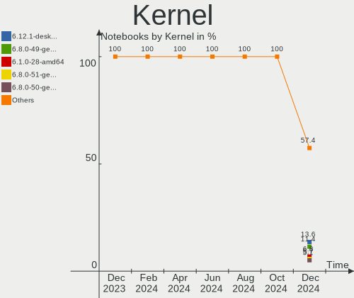
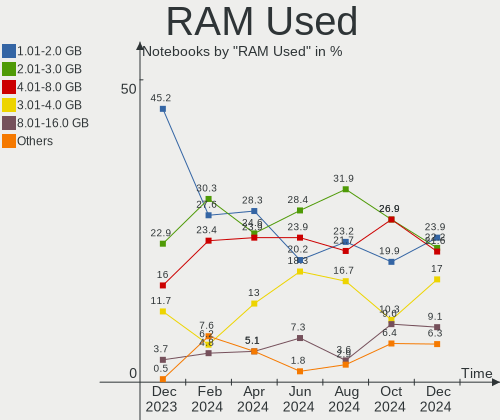
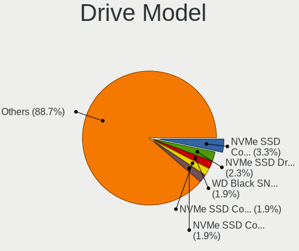
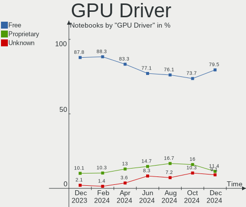
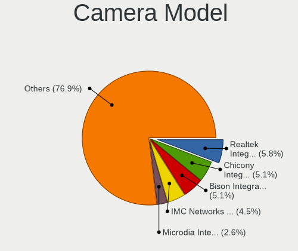

Linux in France - Hardware Trends (Notebooks)
---------------------------------------------

A project to identify most popular hardware characteristics and track their change
over time based on data collected by Linux users at https://Linux-Hardware.org.

Anyone can contribute to this report by the [hw-probe](https://github.com/linuxhw/hw-probe) tool:

    sudo -E hw-probe -all -upload

Period: Aug, 2023.

Contents
--------

* [ System ](#system)
  - [ OS                       ](#os)
  - [ OS Family                ](#os-family)
  - [ Kernel                   ](#kernel)
  - [ Kernel Family            ](#kernel-family)
  - [ Kernel Major Ver.        ](#kernel-major-ver)
  - [ Arch                     ](#arch)
  - [ DE                       ](#de)
  - [ Display Server           ](#display-server)
  - [ Display Manager          ](#display-manager)
  - [ OS Lang                  ](#os-lang)
  - [ Boot Mode                ](#boot-mode)
  - [ Filesystem               ](#filesystem)
  - [ Part. scheme             ](#part-scheme)
  - [ Dual Boot with Linux/BSD ](#dual-boot-with-linuxbsd)
  - [ Dual Boot (Win)          ](#dual-boot-win)

* [ Board ](#board)
  - [ Vendor                   ](#vendor)
  - [ Model                    ](#model)
  - [ Model Family             ](#model-family)
  - [ MFG Year                 ](#mfg-year)
  - [ Form Factor              ](#form-factor)
  - [ Secure Boot              ](#secure-boot)
  - [ Coreboot                 ](#coreboot)
  - [ RAM Size                 ](#ram-size)
  - [ RAM Used                 ](#ram-used)
  - [ Total Drives             ](#total-drives)
  - [ Has CD-ROM               ](#has-cd-rom)
  - [ Has Ethernet             ](#has-ethernet)
  - [ Has WiFi                 ](#has-wifi)
  - [ Has Bluetooth            ](#has-bluetooth)

* [ Location ](#location)
  - [ Country                  ](#country)
  - [ City                     ](#city)

* [ Drives ](#drives)
  - [ Drive Vendor             ](#drive-vendor)
  - [ Drive Model              ](#drive-model)
  - [ HDD Vendor               ](#hdd-vendor)
  - [ SSD Vendor               ](#ssd-vendor)
  - [ Drive Kind               ](#drive-kind)
  - [ Drive Connector          ](#drive-connector)
  - [ Drive Size               ](#drive-size)
  - [ Space Total              ](#space-total)
  - [ Space Used               ](#space-used)
  - [ Malfunc. Drives          ](#malfunc-drives)
  - [ Malfunc. Drive Vendor    ](#malfunc-drive-vendor)
  - [ Malfunc. HDD Vendor      ](#malfunc-hdd-vendor)
  - [ Malfunc. Drive Kind      ](#malfunc-drive-kind)
  - [ Failed Drives            ](#failed-drives)
  - [ Failed Drive Vendor      ](#failed-drive-vendor)
  - [ Drive Status             ](#drive-status)

* [ Storage controller ](#storage-controller)
  - [ Storage Vendor           ](#storage-vendor)
  - [ Storage Model            ](#storage-model)
  - [ Storage Kind             ](#storage-kind)

* [ Processor ](#processor)
  - [ CPU Vendor               ](#cpu-vendor)
  - [ CPU Model                ](#cpu-model)
  - [ CPU Model Family         ](#cpu-model-family)
  - [ CPU Cores                ](#cpu-cores)
  - [ CPU Sockets              ](#cpu-sockets)
  - [ CPU Threads              ](#cpu-threads)
  - [ CPU Op-Modes             ](#cpu-op-modes)
  - [ CPU Microcode            ](#cpu-microcode)
  - [ CPU Microarch            ](#cpu-microarch)

* [ Graphics ](#graphics)
  - [ GPU Vendor               ](#gpu-vendor)
  - [ GPU Model                ](#gpu-model)
  - [ GPU Combo                ](#gpu-combo)
  - [ GPU Driver               ](#gpu-driver)
  - [ GPU Memory               ](#gpu-memory)

* [ Monitor ](#monitor)
  - [ Monitor Vendor           ](#monitor-vendor)
  - [ Monitor Model            ](#monitor-model)
  - [ Monitor Resolution       ](#monitor-resolution)
  - [ Monitor Diagonal         ](#monitor-diagonal)
  - [ Monitor Width            ](#monitor-width)
  - [ Aspect Ratio             ](#aspect-ratio)
  - [ Monitor Area             ](#monitor-area)
  - [ Pixel Density            ](#pixel-density)
  - [ Multiple Monitors        ](#multiple-monitors)

* [ Network ](#network)
  - [ Net Controller Vendor    ](#net-controller-vendor)
  - [ Net Controller Model     ](#net-controller-model)
  - [ Wireless Vendor          ](#wireless-vendor)
  - [ Wireless Model           ](#wireless-model)
  - [ Ethernet Vendor          ](#ethernet-vendor)
  - [ Ethernet Model           ](#ethernet-model)
  - [ Net Controller Kind      ](#net-controller-kind)
  - [ Used Controller          ](#used-controller)
  - [ NICs                     ](#nics)
  - [ IPv6                     ](#ipv6)

* [ Bluetooth ](#bluetooth)
  - [ Bluetooth Vendor         ](#bluetooth-vendor)
  - [ Bluetooth Model          ](#bluetooth-model)

* [ Sound ](#sound)
  - [ Sound Vendor             ](#sound-vendor)
  - [ Sound Model              ](#sound-model)

* [ Memory ](#memory)
  - [ Memory Vendor            ](#memory-vendor)
  - [ Memory Model             ](#memory-model)
  - [ Memory Kind              ](#memory-kind)
  - [ Memory Form Factor       ](#memory-form-factor)
  - [ Memory Size              ](#memory-size)
  - [ Memory Speed             ](#memory-speed)

* [ Printers & scanners ](#printers--scanners)
  - [ Printer Vendor           ](#printer-vendor)
  - [ Printer Model            ](#printer-model)
  - [ Scanner Vendor           ](#scanner-vendor)
  - [ Scanner Model            ](#scanner-model)

* [ Camera ](#camera)
  - [ Camera Vendor            ](#camera-vendor)
  - [ Camera Model             ](#camera-model)

* [ Security ](#security)
  - [ Fingerprint Vendor       ](#fingerprint-vendor)
  - [ Fingerprint Model        ](#fingerprint-model)
  - [ Chipcard Vendor          ](#chipcard-vendor)
  - [ Chipcard Model           ](#chipcard-model)

* [ Unsupported ](#unsupported)
  - [ Unsupported Devices      ](#unsupported-devices)
  - [ Unsupported Device Types ](#unsupported-device-types)

System
------

OS
--

Installed operating systems

| Name                | Notebooks | Percent |
|---------------------|-----------|---------|
| Ubuntu 22.04        | 33        | 21.15%  |
| OpenMandriva 23.08  | 14        | 8.97%   |
| Ubuntu 20.04        | 11        | 7.05%   |
| Fedora 38           | 10        | 6.41%   |
| Arch Rolling        | 10        | 6.41%   |
| Ubuntu 23.04        | 9         | 5.77%   |
| OpenMandriva 23.03  | 7         | 4.49%   |
| Pop!_OS 22.04       | 5         | 3.21%   |
| OpenMandriva 4.3    | 4         | 2.56%   |
| Lubuntu 22.04       | 4         | 2.56%   |
| Linux Mint 21.2     | 4         | 2.56%   |
| Xubuntu 22.04       | 3         | 1.92%   |
| OpenMandriva 23.07  | 3         | 1.92%   |
| Debian 12           | 3         | 1.92%   |
| ArcoLinux Rolling   | 3         | 1.92%   |
| Zorin 16            | 2         | 1.28%   |
| Ubuntu Budgie 22.04 | 2         | 1.28%   |
| Ubuntu 18.04        | 2         | 1.28%   |
| Linux Mint 21.1     | 2         | 1.28%   |
| Kali 2023.3         | 2         | 1.28%   |
| Elementary 7        | 2         | 1.28%   |
| Zorin 15            | 1         | 0.64%   |
| Xubuntu 23.04       | 1         | 0.64%   |
| Ubuntu Unity 22.04  | 1         | 0.64%   |
| Ubuntu Unity 16.04  | 1         | 0.64%   |
| Ubuntu Studio 22.04 | 1         | 0.64%   |
| Ubuntu MATE 22.04   | 1         | 0.64%   |
| openSUSE Leap-15.5  | 1         | 0.64%   |
| OpenMandriva 4.2    | 1         | 0.64%   |
| Nobara 38           | 1         | 0.64%   |
| Manjaro 23.0.0      | 1         | 0.64%   |
| LMDE 5              | 1         | 0.64%   |
| Linux Mint 21       | 1         | 0.64%   |
| Kubuntu 23.04       | 1         | 0.64%   |
| Gentoo 2.14         | 1         | 0.64%   |
| Endless 5.0.5       | 1         | 0.64%   |
| EndeavourOS Rolling | 1         | 0.64%   |
| Elementary 6.1      | 1         | 0.64%   |
| Debian 11           | 1         | 0.64%   |
| Debian              | 1         | 0.64%   |

OS Family
---------

OS without a version

| Name          | Notebooks | Percent |
|---------------|-----------|---------|
| Ubuntu        | 55        | 35.26%  |
| OpenMandriva  | 29        | 18.59%  |
| Fedora        | 10        | 6.41%   |
| Arch          | 10        | 6.41%   |
| Linux Mint    | 7         | 4.49%   |
| Pop!_OS       | 5         | 3.21%   |
| Debian        | 5         | 3.21%   |
| Xubuntu       | 4         | 2.56%   |
| Lubuntu       | 4         | 2.56%   |
| Zorin         | 3         | 1.92%   |
| Elementary    | 3         | 1.92%   |
| ArcoLinux     | 3         | 1.92%   |
| Ubuntu Unity  | 2         | 1.28%   |
| Ubuntu Budgie | 2         | 1.28%   |
| Kali          | 2         | 1.28%   |
| Ubuntu Studio | 1         | 0.64%   |
| Ubuntu MATE   | 1         | 0.64%   |
| openSUSE      | 1         | 0.64%   |
| Nobara        | 1         | 0.64%   |
| Manjaro       | 1         | 0.64%   |
| LMDE          | 1         | 0.64%   |
| Kubuntu       | 1         | 0.64%   |
| Gentoo        | 1         | 0.64%   |
| Endless       | 1         | 0.64%   |
| EndeavourOS   | 1         | 0.64%   |
| Clear Linux   | 1         | 0.64%   |
| CentOS        | 1         | 0.64%   |

Kernel
------

Version of the Linux kernel

| Version                      | Notebooks | Percent |
|------------------------------|-----------|---------|
| 6.2.0-26-generic             | 28        | 17.95%  |
| 5.15.0-79-generic            | 10        | 6.41%   |
| 6.4.8-desktop-2omv2390       | 9         | 5.77%   |
| 5.15.0-78-generic            | 8         | 5.13%   |
| 6.2.6-desktop-1omv2390       | 7         | 4.49%   |
| 6.4.11-desktop-1omv2390      | 5         | 3.21%   |
| 6.4.12-arch1-1               | 4         | 2.56%   |
| 6.4.11-200.fc38.x86_64       | 4         | 2.56%   |
| 6.2.0-31-generic             | 4         | 2.56%   |
| 6.2.0-27-generic             | 4         | 2.56%   |
| 5.16.7-desktop-1omv4003      | 4         | 2.56%   |
| 6.4.9-200.fc38.x86_64        | 3         | 1.92%   |
| 6.4.6-76060406-generic       | 3         | 1.92%   |
| 6.4.10-arch1-1               | 3         | 1.92%   |
| 5.4.0-156-generic            | 3         | 1.92%   |
| 5.19.0-50-generic            | 3         | 1.92%   |
| 6.4.9-arch1-1                | 2         | 1.28%   |
| 6.4.7-arch1-2                | 2         | 1.28%   |
| 6.4.10-200.fc38.x86_64       | 2         | 1.28%   |
| 6.3.5-desktop-3omv2390       | 2         | 1.28%   |
| 6.3.0-kali1-amd64            | 2         | 1.28%   |
| 6.2.6-76060206-generic       | 2         | 1.28%   |
| 6.1.0-11-amd64               | 2         | 1.28%   |
| 5.4.0-150-generic            | 2         | 1.28%   |
| 5.15.0-47-generic            | 2         | 1.28%   |
| 6.4.6-3-rt8-MANJARO          | 1         | 0.64%   |
| 6.4.6-200.fc38.x86_64        | 1         | 0.64%   |
| 6.4.5-arch1-1                | 1         | 0.64%   |
| 6.4.12-1350.native           | 1         | 0.64%   |
| 6.4.10-060410-generic        | 1         | 0.64%   |
| 6.4.0-2-amd64                | 1         | 0.64%   |
| 6.3.12-205.fsync.fc38.x86_64 | 1         | 0.64%   |
| 6.2.1-060201-generic         | 1         | 0.64%   |
| 6.2.0-25-generic             | 1         | 0.64%   |
| 6.1.46-gentoo-x86_64         | 1         | 0.64%   |
| 6.1.45-1-lts                 | 1         | 0.64%   |
| 6.1.27-1-lts                 | 1         | 0.64%   |
| 6.1.0-10-amd64               | 1         | 0.64%   |
| 6.0.0-1020-oem               | 1         | 0.64%   |
| 6.0.0-1017-oem               | 1         | 0.64%   |

Kernel Family
-------------

Linux kernel without a distro release

| Version | Notebooks | Percent |
|---------|-----------|---------|
| 6.2.0   | 37        | 23.72%  |
| 5.15.0  | 28        | 17.95%  |
| 6.4.8   | 9         | 5.77%   |
| 6.4.11  | 9         | 5.77%   |
| 6.2.6   | 9         | 5.77%   |
| 6.4.10  | 6         | 3.85%   |
| 5.4.0   | 6         | 3.85%   |
| 6.4.9   | 5         | 3.21%   |
| 6.4.6   | 5         | 3.21%   |
| 6.4.12  | 5         | 3.21%   |
| 5.19.0  | 4         | 2.56%   |
| 5.16.7  | 4         | 2.56%   |
| 6.1.0   | 3         | 1.92%   |
| 6.4.7   | 2         | 1.28%   |
| 6.3.5   | 2         | 1.28%   |
| 6.3.0   | 2         | 1.28%   |
| 6.0.0   | 2         | 1.28%   |
| 5.10.0  | 2         | 1.28%   |
| 6.4.5   | 1         | 0.64%   |
| 6.4.0   | 1         | 0.64%   |
| 6.3.12  | 1         | 0.64%   |
| 6.2.1   | 1         | 0.64%   |
| 6.1.46  | 1         | 0.64%   |
| 6.1.45  | 1         | 0.64%   |
| 6.1.27  | 1         | 0.64%   |
| 5.8.0   | 1         | 0.64%   |
| 5.4.225 | 1         | 0.64%   |
| 5.17.0  | 1         | 0.64%   |
| 5.16.5  | 1         | 0.64%   |
| 5.14.21 | 1         | 0.64%   |
| 5.13.0  | 1         | 0.64%   |
| 5.10.14 | 1         | 0.64%   |
| 4.4.0   | 1         | 0.64%   |
| 4.15.0  | 1         | 0.64%   |

Kernel Major Ver.
-----------------

Linux kernel major version

| Version | Notebooks | Percent |
|---------|-----------|---------|
| 6.2     | 47        | 30.13%  |
| 6.4     | 43        | 27.56%  |
| 5.15    | 28        | 17.95%  |
| 5.4     | 7         | 4.49%   |
| 6.1     | 6         | 3.85%   |
| 6.3     | 5         | 3.21%   |
| 5.16    | 5         | 3.21%   |
| 5.19    | 4         | 2.56%   |
| 5.10    | 3         | 1.92%   |
| 6.0     | 2         | 1.28%   |
| 5.8     | 1         | 0.64%   |
| 5.17    | 1         | 0.64%   |
| 5.14    | 1         | 0.64%   |
| 5.13    | 1         | 0.64%   |
| 4.4     | 1         | 0.64%   |
| 4.15    | 1         | 0.64%   |

Arch
----

OS architecture (x86_64, i586, etc.)

| Name   | Notebooks | Percent |
|--------|-----------|---------|
| x86_64 | 156       | 100%    |

DE
--

Desktop Environment

| Name       | Notebooks | Percent |
|------------|-----------|---------|
| GNOME      | 77        | 49.36%  |
| KDE5       | 36        | 23.08%  |
| Unknown    | 11        | 7.05%   |
| X-Cinnamon | 9         | 5.77%   |
| XFCE       | 6         | 3.85%   |
| LXQt       | 4         | 2.56%   |
| Pantheon   | 3         | 1.92%   |
| Unity      | 2         | 1.28%   |
| MATE       | 2         | 1.28%   |
| i3         | 2         | 1.28%   |
| Budgie     | 2         | 1.28%   |
| Hyprland   | 1         | 0.64%   |
| Cinnamon   | 1         | 0.64%   |

Display Server
--------------

X11 or Wayland

| Name    | Notebooks | Percent |
|---------|-----------|---------|
| X11     | 86        | 55.13%  |
| Wayland | 62        | 39.74%  |
| Unknown | 8         | 5.13%   |

Display Manager
---------------

SDDM, LightDM, etc.

| Name    | Notebooks | Percent |
|---------|-----------|---------|
| GDM3    | 51        | 32.69%  |
| SDDM    | 40        | 25.64%  |
| Unknown | 25        | 16.03%  |
| LightDM | 24        | 15.38%  |
| GDM     | 16        | 10.26%  |

OS Lang
-------

Language

| Lang    | Notebooks | Percent |
|---------|-----------|---------|
| fr_FR   | 120       | 76.92%  |
| en_US   | 25        | 16.03%  |
| en_GB   | 3         | 1.92%   |
| Unknown | 3         | 1.92%   |
| fr_LU   | 1         | 0.64%   |
| es_ES   | 1         | 0.64%   |
| en_IE   | 1         | 0.64%   |
| de_DE   | 1         | 0.64%   |
| C       | 1         | 0.64%   |

Boot Mode
---------

EFI or BIOS

| Mode | Notebooks | Percent |
|------|-----------|---------|
| EFI  | 93        | 59.62%  |
| BIOS | 63        | 40.38%  |

Filesystem
----------

Type of filesystem

| Type    | Notebooks | Percent |
|---------|-----------|---------|
| Ext4    | 98        | 62.82%  |
| Tmpfs   | 23        | 14.74%  |
| Btrfs   | 17        | 10.9%   |
| Overlay | 14        | 8.97%   |
| Xfs     | 1         | 0.64%   |
| F2fs    | 1         | 0.64%   |
| Ext3    | 1         | 0.64%   |
| Unknown | 1         | 0.64%   |

Part. scheme
------------

Scheme of partitioning

| Type    | Notebooks | Percent |
|---------|-----------|---------|
| GPT     | 106       | 67.95%  |
| Unknown | 28        | 17.95%  |
| MBR     | 22        | 14.1%   |

Dual Boot with Linux/BSD
------------------------

Hosting more than one Linux/BSD

| Dual boot | Notebooks | Percent |
|-----------|-----------|---------|
| No        | 129       | 82.69%  |
| Yes       | 27        | 17.31%  |

Dual Boot (Win)
---------------

Hosting Linux and Windows

| Dual boot | Notebooks | Percent |
|-----------|-----------|---------|
| No        | 105       | 67.31%  |
| Yes       | 51        | 32.69%  |

Board
-----

Vendor
------

Motherboard manufacturer

| Name                             | Notebooks | Percent |
|----------------------------------|-----------|---------|
| Lenovo                           | 36        | 23.08%  |
| Dell                             | 29        | 18.59%  |
| Hewlett-Packard                  | 27        | 17.31%  |
| ASUSTek Computer                 | 19        | 12.18%  |
| Acer                             | 9         | 5.77%   |
| Toshiba                          | 6         | 3.85%   |
| Notebook                         | 5         | 3.21%   |
| MSI                              | 4         | 2.56%   |
| Sony                             | 3         | 1.92%   |
| Packard Bell                     | 3         | 1.92%   |
| HUAWEI                           | 2         | 1.28%   |
| Apple                            | 2         | 1.28%   |
| TUXEDO                           | 1         | 0.64%   |
| Thomson                          | 1         | 0.64%   |
| Tactus                           | 1         | 0.64%   |
| Samsung Electronics              | 1         | 0.64%   |
| Micro Computer (HK) Tech Limited | 1         | 0.64%   |
| LDLC                             | 1         | 0.64%   |
| Google                           | 1         | 0.64%   |
| Framework                        | 1         | 0.64%   |
| Danew                            | 1         | 0.64%   |
| Corsair                          | 1         | 0.64%   |
| Unknown                          | 1         | 0.64%   |

Model
-----

Motherboard model

| Name                                   | Notebooks | Percent |
|----------------------------------------|-----------|---------|
| Lenovo ThinkPad L13 Gen 3 21BAS0X700   | 6         | 3.85%   |
| HP EliteBook 840 G3                    | 3         | 1.92%   |
| Dell Latitude 7310                     | 3         | 1.92%   |
| HP ZBook 14 G2                         | 2         | 1.28%   |
| HP Pavilion 17                         | 2         | 1.28%   |
| HP Notebook                            | 2         | 1.28%   |
| HP Laptop 17-cp0xxx                    | 2         | 1.28%   |
| HP Laptop 15-db0xxx                    | 2         | 1.28%   |
| HP Dragonfly 13.5 inch G4 Notebook PC  | 2         | 1.28%   |
| Dell XPS 13 9310                       | 2         | 1.28%   |
| Dell Latitude 5400                     | 2         | 1.28%   |
| ASUS X75VD                             | 2         | 1.28%   |
| ASUS VivoBook_ASUSLaptop X515EA_X515EA | 2         | 1.28%   |
| Acer Aspire ES1-431                    | 2         | 1.28%   |
| TUXEDO Book XA15 / XA17 Gen10          | 1         | 0.64%   |
| Toshiba Satellite Pro C850-10N         | 1         | 0.64%   |
| Toshiba Satellite P500                 | 1         | 0.64%   |
| Toshiba Satellite P50-B-113            | 1         | 0.64%   |
| Toshiba Satellite L670                 | 1         | 0.64%   |
| Toshiba Satellite C70-B                | 1         | 0.64%   |
| Toshiba PORTEGE Z930                   | 1         | 0.64%   |
| Thomson X6-4.32GR                      | 1         | 0.64%   |
| Tactus GeoBook 110                     | 1         | 0.64%   |
| Sony VGN-NS38E_S                       | 1         | 0.64%   |
| Sony SVE1513I4E                        | 1         | 0.64%   |
| Sony SVE1112M1EW                       | 1         | 0.64%   |
| Samsung 350V5C/351V5C/3540VC/3440VC    | 1         | 0.64%   |
| Packard Bell EasyNote TSX66HR          | 1         | 0.64%   |
| Packard Bell EasyNote TJ65             | 1         | 0.64%   |
| Packard Bell EasyNote LE69KB           | 1         | 0.64%   |
| Notebook W65_W67RZ1                    | 1         | 0.64%   |
| Notebook NP5x_NP6x_NP7xRNJ_RNH         | 1         | 0.64%   |
| Notebook NLx0MU                        | 1         | 0.64%   |
| Notebook NHxxRZQ                       | 1         | 0.64%   |
| Notebook N9x0TD_TF                     | 1         | 0.64%   |
| MSI Titan GT77HX 13VH                  | 1         | 0.64%   |
| MSI Stealth 17Studio A13VF             | 1         | 0.64%   |
| MSI Modern 15 A5M                      | 1         | 0.64%   |
| MSI GL72 7QF                           | 1         | 0.64%   |
| Micro (HK) Tech Limited NUCXI7         | 1         | 0.64%   |

Model Family
------------

Motherboard model prefix

| Name                           | Notebooks | Percent |
|--------------------------------|-----------|---------|
| Lenovo ThinkPad                | 25        | 16.03%  |
| Dell Latitude                  | 15        | 9.62%   |
| Acer Aspire                    | 7         | 4.49%   |
| HP EliteBook                   | 6         | 3.85%   |
| Toshiba Satellite              | 5         | 3.21%   |
| HP Laptop                      | 5         | 3.21%   |
| Dell Inspiron                  | 5         | 3.21%   |
| ASUS VivoBook                  | 5         | 3.21%   |
| Lenovo IdeaPad                 | 4         | 2.56%   |
| HP ZBook                       | 4         | 2.56%   |
| HP Pavilion                    | 4         | 2.56%   |
| Dell XPS                       | 4         | 2.56%   |
| Dell Precision                 | 4         | 2.56%   |
| Packard Bell EasyNote          | 3         | 1.92%   |
| ASUS ZenBook                   | 3         | 1.92%   |
| Lenovo Legion                  | 2         | 1.28%   |
| HP ProBook                     | 2         | 1.28%   |
| HP Notebook                    | 2         | 1.28%   |
| HP Dragonfly                   | 2         | 1.28%   |
| ASUS X75VD                     | 2         | 1.28%   |
| ASUS ASUS                      | 2         | 1.28%   |
| TUXEDO Book                    | 1         | 0.64%   |
| Toshiba PORTEGE                | 1         | 0.64%   |
| Thomson X6-4.32GR              | 1         | 0.64%   |
| Tactus GeoBook                 | 1         | 0.64%   |
| Sony VGN-NS38E                 | 1         | 0.64%   |
| Sony SVE1513I4E                | 1         | 0.64%   |
| Sony SVE1112M1EW               | 1         | 0.64%   |
| Samsung 350V5C                 | 1         | 0.64%   |
| Notebook W65                   | 1         | 0.64%   |
| Notebook NP5x                  | 1         | 0.64%   |
| Notebook NLx0MU                | 1         | 0.64%   |
| Notebook NHxxRZQ               | 1         | 0.64%   |
| Notebook N9x0TD                | 1         | 0.64%   |
| MSI Titan                      | 1         | 0.64%   |
| MSI Stealth                    | 1         | 0.64%   |
| MSI Modern                     | 1         | 0.64%   |
| MSI GL72                       | 1         | 0.64%   |
| Micro (HK) Tech Limited NUCXI7 | 1         | 0.64%   |
| Lenovo Yoga710-14ISK           | 1         | 0.64%   |

MFG Year
--------

Motherboard manufacture year

| Year | Notebooks | Percent |
|------|-----------|---------|
| 2022 | 19        | 12.18%  |
| 2021 | 18        | 11.54%  |
| 2017 | 13        | 8.33%   |
| 2012 | 13        | 8.33%   |
| 2020 | 12        | 7.69%   |
| 2019 | 11        | 7.05%   |
| 2023 | 10        | 6.41%   |
| 2016 | 10        | 6.41%   |
| 2013 | 10        | 6.41%   |
| 2018 | 9         | 5.77%   |
| 2015 | 9         | 5.77%   |
| 2011 | 7         | 4.49%   |
| 2014 | 4         | 2.56%   |
| 2010 | 4         | 2.56%   |
| 2008 | 4         | 2.56%   |
| 2009 | 3         | 1.92%   |

Form Factor
-----------

Physical design of the computer

| Name     | Notebooks | Percent |
|----------|-----------|---------|
| Notebook | 156       | 100%    |

Secure Boot
-----------

Enabled or disabled

| State    | Notebooks | Percent |
|----------|-----------|---------|
| Disabled | 146       | 93.59%  |
| Enabled  | 10        | 6.41%   |

Coreboot
--------

Have coreboot on board

| Used | Notebooks | Percent |
|------|-----------|---------|
| No   | 155       | 99.36%  |
| Yes  | 1         | 0.64%   |

RAM Size
--------

Total RAM memory

| Size in GB  | Notebooks | Percent |
|-------------|-----------|---------|
| 4.01-8.0    | 39        | 25%     |
| 8.01-16.0   | 34        | 21.79%  |
| 3.01-4.0    | 27        | 17.31%  |
| 16.01-24.0  | 26        | 16.67%  |
| 32.01-64.0  | 22        | 14.1%   |
| 64.01-256.0 | 5         | 3.21%   |
| 24.01-32.0  | 3         | 1.92%   |

RAM Used
--------

Used RAM memory

| Used GB    | Notebooks | Percent |
|------------|-----------|---------|
| 1.01-2.0   | 40        | 25.64%  |
| 2.01-3.0   | 38        | 24.36%  |
| 4.01-8.0   | 32        | 20.51%  |
| 3.01-4.0   | 24        | 15.38%  |
| 8.01-16.0  | 17        | 10.9%   |
| 0.51-1.0   | 4         | 2.56%   |
| 16.01-24.0 | 1         | 0.64%   |

Total Drives
------------

Number of drives on board

| Drives | Notebooks | Percent |
|--------|-----------|---------|
| 1      | 116       | 74.36%  |
| 2      | 34        | 21.79%  |
| 3      | 5         | 3.21%   |
| 0      | 1         | 0.64%   |

Has CD-ROM
----------

Has CD-ROM on board

| Presented | Notebooks | Percent |
|-----------|-----------|---------|
| No        | 111       | 71.15%  |
| Yes       | 45        | 28.85%  |

Has Ethernet
------------

Has Ethernet on board

| Presented | Notebooks | Percent |
|-----------|-----------|---------|
| Yes       | 130       | 83.33%  |
| No        | 26        | 16.67%  |

Has WiFi
--------

Has WiFi module

| Presented | Notebooks | Percent |
|-----------|-----------|---------|
| Yes       | 156       | 100%    |

Has Bluetooth
-------------

Has Bluetooth module

| Presented | Notebooks | Percent |
|-----------|-----------|---------|
| Yes       | 122       | 78.21%  |
| No        | 34        | 21.79%  |

Location
--------

Country
-------

Geographic location (country)

| Country | Notebooks | Percent |
|---------|-----------|---------|
| France  | 156       | 100%    |

City
----

Geographic location (city)

| City                      | Notebooks | Percent |
|---------------------------|-----------|---------|
| Paris                     | 20        | 12.82%  |
| Champs-sur-Marne          | 8         | 5.13%   |
| Villeurbanne              | 4         | 2.56%   |
| Rosny-sous-Bois           | 4         | 2.56%   |
| La Baule-Escoublac        | 4         | 2.56%   |
| Toulouse                  | 3         | 1.92%   |
| Rouen                     | 3         | 1.92%   |
| Nantes                    | 3         | 1.92%   |
| Grenoble                  | 3         | 1.92%   |
| Wattignies-la-Victoire    | 2         | 1.28%   |
| Rennes                    | 2         | 1.28%   |
| Pau                       | 2         | 1.28%   |
| Marseille                 | 2         | 1.28%   |
| Lille                     | 2         | 1.28%   |
| Castelnaudary             | 2         | 1.28%   |
| Brest                     | 2         | 1.28%   |
| Begles                    | 2         | 1.28%   |
| Amiens                    | 2         | 1.28%   |
| Weckolsheim               | 1         | 0.64%   |
| Villefranche-sur-Saône   | 1         | 0.64%   |
| Vichy                     | 1         | 0.64%   |
| Vic-la-Gardiole           | 1         | 0.64%   |
| Vernon                    | 1         | 0.64%   |
| Vaureal                   | 1         | 0.64%   |
| Valenciennes              | 1         | 0.64%   |
| Urcel                     | 1         | 0.64%   |
| Trappes                   | 1         | 0.64%   |
| Tonneins                  | 1         | 0.64%   |
| Thonon-les-Bains          | 1         | 0.64%   |
| Talence                   | 1         | 0.64%   |
| Sucy-en-Brie              | 1         | 0.64%   |
| Strasbourg                | 1         | 0.64%   |
| St-Malo                   | 1         | 0.64%   |
| Schiltigheim              | 1         | 0.64%   |
| Saint-Sever               | 1         | 0.64%   |
| Saint-Remy-les-Chevreuse  | 1         | 0.64%   |
| Saint-Pierre-du-Perray    | 1         | 0.64%   |
| Saint-Maur-des-Fossés    | 1         | 0.64%   |
| Saint-Gilles-Croix-de-Vie | 1         | 0.64%   |
| Saint-Gely-du-Fesc        | 1         | 0.64%   |

Drives
------

Drive Vendor
------------

Hard drive vendors

| Vendor                       | Notebooks | Drives | Percent |
|------------------------------|-----------|--------|---------|
| Samsung Electronics          | 39        | 44     | 21.08%  |
| Toshiba                      | 18        | 18     | 9.73%   |
| WDC                          | 16        | 16     | 8.65%   |
| SK hynix                     | 15        | 15     | 8.11%   |
| SanDisk                      | 14        | 16     | 7.57%   |
| Seagate                      | 11        | 11     | 5.95%   |
| Crucial                      | 11        | 11     | 5.95%   |
| Micron Technology            | 8         | 8      | 4.32%   |
| Intel                        | 8         | 8      | 4.32%   |
| Kingston                     | 7         | 8      | 3.78%   |
| Unknown                      | 6         | 7      | 3.24%   |
| PNY                          | 3         | 3      | 1.62%   |
| KIOXIA                       | 3         | 3      | 1.62%   |
| Hitachi                      | 3         | 3      | 1.62%   |
| Micron/Crucial Technology    | 2         | 2      | 1.08%   |
| LDLC                         | 2         | 2      | 1.08%   |
| China                        | 2         | 2      | 1.08%   |
| Apple                        | 2         | 3      | 1.08%   |
| Unknown                      | 2         | 2      | 1.08%   |
| SSSTC                        | 1         | 1      | 0.54%   |
| SPCC                         | 1         | 1      | 0.54%   |
| Shenzhen Longsys Electronics | 1         | 1      | 0.54%   |
| Realtek                      | 1         | 1      | 0.54%   |
| Plextor                      | 1         | 1      | 0.54%   |
| Phison Electronics           | 1         | 1      | 0.54%   |
| Lexar                        | 1         | 1      | 0.54%   |
| KIOXIA-EXCERIA               | 1         | 1      | 0.54%   |
| Kingston Technology Company  | 1         | 1      | 0.54%   |
| HGST HTS                     | 1         | 1      | 0.54%   |
| HGST                         | 1         | 1      | 0.54%   |
| Fanxiang                     | 1         | 1      | 0.54%   |
| Emtec                        | 1         | 1      | 0.54%   |

Drive Model
-----------

Hard drive models

| Model                                                 | Notebooks | Percent |
|-------------------------------------------------------|-----------|---------|
| Intel SSDPEKNU512GZ 512GB                             | 4         | 2.08%   |
| Unknown MMC Card  64GB                                | 3         | 1.56%   |
| Samsung SSD 970 EVO Plus 2TB S6P1NS0W312579L          | 3         | 1.56%   |
| Samsung SSD 970 EVO Plus 2TB                          | 3         | 1.56%   |
| Samsung SSD 870 QVO 1TB                               | 3         | 1.56%   |
| Samsung NVMe SSD Controller PM9A1/PM9A3/980PRO 1024GB | 3         | 1.56%   |
| WDC WD10SPZX-24Z10T0 1TB                              | 2         | 1.04%   |
| Toshiba XG6 NVMe SSD Controller 1024GB                | 2         | 1.04%   |
| Toshiba MQ04ABF100 1TB                                | 2         | 1.04%   |
| SK hynix PC611 NVMe 1TB                               | 2         | 1.04%   |
| SK hynix HFM512GD3JX013N 512GB                        | 2         | 1.04%   |
| SK hynix HBG4e  32GB                                  | 2         | 1.04%   |
| Seagate ST2000LM015-2E8174 2TB                        | 2         | 1.04%   |
| Seagate ST1000LM048-2E7172 1TB                        | 2         | 1.04%   |
| SanDisk SDSSDA240G 240GB                              | 2         | 1.04%   |
| SanDisk SD7TB3Q-256G-1006 256GB SSD                   | 2         | 1.04%   |
| SanDisk SD6PP4M-256G-1006 256GB SSD                   | 2         | 1.04%   |
| Sandisk PC SN520 NVMe SSD 256GB                       | 2         | 1.04%   |
| Samsung PSSD T7 1TB                                   | 2         | 1.04%   |
| Samsung NVMe SSD Controller SM981/PM981/PM983 500GB   | 2         | 1.04%   |
| PNY CS900 240GB SSD                                   | 2         | 1.04%   |
| Micron/Crucial P2 NVMe PCIe SSD 1TB                   | 2         | 1.04%   |
| Kingston SA400S37240G 240GB SSD                       | 2         | 1.04%   |
| Crucial CT1000MX500SSD1 1TB                           | 2         | 1.04%   |
| Crucial CT1000BX500SSD1 1TB                           | 2         | 1.04%   |
| Unknown                                               | 2         | 1.04%   |
| WDC WD7500BPVT-80HXZT3 752GB                          | 1         | 0.52%   |
| WDC WD6400BEVT-22A0RT0 640GB                          | 1         | 0.52%   |
| WDC WD5000LPLX-60ZNTT1 500GB                          | 1         | 0.52%   |
| WDC WD5000LPCX-21VHAT0 500GB                          | 1         | 0.52%   |
| WDC WD5000BPVT-22A1YT0 500GB                          | 1         | 0.52%   |
| WDC WD5000BEVT-00A0RT0 500GB                          | 1         | 0.52%   |
| WDC WD2500BUDT-63DPZY0 250GB                          | 1         | 0.52%   |
| WDC WD10SPZX-00Z10T0 1TB                              | 1         | 0.52%   |
| WDC WD10JPVX-60JC3T0 1TB                              | 1         | 0.52%   |
| WDC WD10JPVX-22JC3T0 1TB                              | 1         | 0.52%   |
| WDC WD10JPVT-80A1YT0 1TB                              | 1         | 0.52%   |
| WDC WD10JPCX-24UE4T0 1TB                              | 1         | 0.52%   |
| WDC PC SN810 NVMe 512GB                               | 1         | 0.52%   |
| WDC PC SN530 SDBPMPZ-512G-1101 512GB                  | 1         | 0.52%   |

HDD Vendor
----------

Hard disk drive vendors

| Vendor   | Notebooks | Drives | Percent |
|----------|-----------|--------|---------|
| WDC      | 14        | 14     | 34.15%  |
| Toshiba  | 11        | 11     | 26.83%  |
| Seagate  | 11        | 11     | 26.83%  |
| Hitachi  | 3         | 3      | 7.32%   |
| HGST HTS | 1         | 1      | 2.44%   |
| HGST     | 1         | 1      | 2.44%   |

SSD Vendor
----------

Solid state drive vendors

| Vendor              | Notebooks | Drives | Percent |
|---------------------|-----------|--------|---------|
| Samsung Electronics | 15        | 16     | 27.78%  |
| SanDisk             | 9         | 11     | 16.67%  |
| Crucial             | 9         | 9      | 16.67%  |
| Kingston            | 5         | 5      | 9.26%   |
| SK hynix            | 3         | 3      | 5.56%   |
| PNY                 | 2         | 2      | 3.7%    |
| China               | 2         | 2      | 3.7%    |
| Toshiba             | 1         | 1      | 1.85%   |
| SPCC                | 1         | 1      | 1.85%   |
| Plextor             | 1         | 1      | 1.85%   |
| LDLC                | 1         | 1      | 1.85%   |
| KIOXIA-EXCERIA      | 1         | 1      | 1.85%   |
| Fanxiang            | 1         | 1      | 1.85%   |
| Emtec               | 1         | 1      | 1.85%   |
| Apple               | 1         | 1      | 1.85%   |
| Unknown             | 1         | 1      | 1.85%   |

Drive Kind
----------

HDD or SSD

| Kind    | Notebooks | Drives | Percent |
|---------|-----------|--------|---------|
| NVMe    | 77        | 86     | 42.78%  |
| SSD     | 52        | 57     | 28.89%  |
| HDD     | 41        | 41     | 22.78%  |
| MMC     | 9         | 10     | 5%      |
| Unknown | 1         | 1      | 0.56%   |

Drive Connector
---------------

SATA, SAS, NVMe, etc.

| Type | Notebooks | Drives | Percent |
|------|-----------|--------|---------|
| SATA | 81        | 93     | 46.82%  |
| NVMe | 77        | 85     | 44.51%  |
| MMC  | 9         | 10     | 5.2%    |
| SAS  | 6         | 7      | 3.47%   |

Drive Size
----------

Size of hard drive

| Size in TB | Notebooks | Drives | Percent |
|------------|-----------|--------|---------|
| 0.01-0.5   | 48        | 53     | 52.75%  |
| 0.51-1.0   | 36        | 38     | 39.56%  |
| 1.01-2.0   | 6         | 6      | 6.59%   |
| 3.01-4.0   | 1         | 1      | 1.1%    |

Space Total
-----------

Amount of disk space available on the file system

| Size in GB     | Notebooks | Percent |
|----------------|-----------|---------|
| 101-250        | 40        | 25.64%  |
| 501-1000       | 39        | 25%     |
| 251-500        | 30        | 19.23%  |
| 1-20           | 14        | 8.97%   |
| 1001-2000      | 10        | 6.41%   |
| 21-50          | 6         | 3.85%   |
| Unknown        | 6         | 3.85%   |
| 2001-3000      | 5         | 3.21%   |
| 51-100         | 4         | 2.56%   |
| More than 3000 | 2         | 1.28%   |

Space Used
----------

Amount of used disk space

| Used GB   | Notebooks | Percent |
|-----------|-----------|---------|
| 1-20      | 52        | 33.33%  |
| 21-50     | 30        | 19.23%  |
| 101-250   | 23        | 14.74%  |
| 251-500   | 20        | 12.82%  |
| 51-100    | 13        | 8.33%   |
| 501-1000  | 10        | 6.41%   |
| Unknown   | 6         | 3.85%   |
| 1001-2000 | 2         | 1.28%   |

Malfunc. Drives
---------------

Drive models with a malfunction

| Model                                 | Notebooks | Drives | Percent |
|---------------------------------------|-----------|--------|---------|
| WDC WD5000BEVT-00A0RT0 500GB          | 1         | 1      | 10%     |
| WDC WD2500BUDT-63DPZY0 250GB          | 1         | 1      | 10%     |
| Toshiba MQ01ACF032 320GB              | 1         | 1      | 10%     |
| Toshiba MQ01ABD100 1TB                | 1         | 1      | 10%     |
| Toshiba MQ01ABD050 500GB              | 1         | 1      | 10%     |
| SK hynix SC308 SATA 256GB SSD         | 1         | 1      | 10%     |
| SK hynix HFS128G39TND-N210A 128GB SSD | 1         | 1      | 10%     |
| SanDisk SD8TN8U-256G-1006 256GB SSD   | 1         | 1      | 10%     |
| SanDisk SD8SN8U-512G-1006 512GB SSD   | 1         | 1      | 10%     |
| HGST HTS541010A7E630 1TB              | 1         | 1      | 10%     |

Malfunc. Drive Vendor
---------------------

Vendors of faulty drives

| Vendor   | Notebooks | Drives | Percent |
|----------|-----------|--------|---------|
| Toshiba  | 3         | 3      | 30%     |
| WDC      | 2         | 2      | 20%     |
| SK hynix | 2         | 2      | 20%     |
| SanDisk  | 2         | 2      | 20%     |
| HGST     | 1         | 1      | 10%     |

Malfunc. HDD Vendor
-------------------

Vendors of faulty HDD drives

| Vendor  | Notebooks | Drives | Percent |
|---------|-----------|--------|---------|
| Toshiba | 3         | 3      | 50%     |
| WDC     | 2         | 2      | 33.33%  |
| HGST    | 1         | 1      | 16.67%  |

Malfunc. Drive Kind
-------------------

Kinds of faulty drives

| Kind | Notebooks | Drives | Percent |
|------|-----------|--------|---------|
| HDD  | 6         | 6      | 60%     |
| SSD  | 4         | 4      | 40%     |

Failed Drives
-------------

Failed drive models

Zero info for selected period =(

Failed Drive Vendor
-------------------

Failed drive vendors

Zero info for selected period =(

Drive Status
------------

Number of failed and malfunc. drives

| Status   | Notebooks | Drives | Percent |
|----------|-----------|--------|---------|
| Works    | 100       | 128    | 62.89%  |
| Detected | 50        | 57     | 31.45%  |
| Malfunc  | 9         | 10     | 5.66%   |

Storage controller
------------------

Storage Vendor
--------------

Storage controller vendors

| Vendor                         | Notebooks | Percent |
|--------------------------------|-----------|---------|
| Intel                          | 104       | 53.61%  |
| Samsung Electronics            | 26        | 13.4%   |
| AMD                            | 15        | 7.73%   |
| SK hynix                       | 10        | 5.15%   |
| Micron Technology              | 8         | 4.12%   |
| Toshiba America Info Systems   | 7         | 3.61%   |
| SanDisk                        | 7         | 3.61%   |
| Micron/Crucial Technology      | 4         | 2.06%   |
| Kingston Technology Company    | 3         | 1.55%   |
| Phison Electronics             | 2         | 1.03%   |
| Marvell Technology Group       | 2         | 1.03%   |
| KIOXIA                         | 2         | 1.03%   |
| Solid State Storage Technology | 1         | 0.52%   |
| Silicon Motion                 | 1         | 0.52%   |
| Shenzhen Longsys Electronics   | 1         | 0.52%   |
| Apple                          | 1         | 0.52%   |

Storage Model
-------------

Storage controller models

| Model                                                                          | Notebooks | Percent |
|--------------------------------------------------------------------------------|-----------|---------|
| Intel 7 Series Chipset Family 6-port SATA Controller [AHCI mode]               | 16        | 7.84%   |
| AMD FCH SATA Controller [AHCI mode]                                            | 15        | 7.35%   |
| Intel Sunrise Point-LP SATA Controller [AHCI mode]                             | 13        | 6.37%   |
| Samsung NVMe SSD Controller SM981/PM981/PM983                                  | 12        | 5.88%   |
| Intel Volume Management Device NVMe RAID Controller                            | 11        | 5.39%   |
| Samsung NVMe SSD Controller PM9A1/PM9A3/980PRO                                 | 7         | 3.43%   |
| Intel SSD 670p Series [Keystone Harbor]                                        | 6         | 2.94%   |
| Intel 6 Series/C200 Series Chipset Family 6 port Mobile SATA AHCI Controller   | 6         | 2.94%   |
| Samsung NVMe SSD Controller 980                                                | 5         | 2.45%   |
| Intel Tiger Lake-LP SATA Controller                                            | 5         | 2.45%   |
| Intel Cannon Lake Mobile PCH SATA AHCI Controller                              | 5         | 2.45%   |
| Intel 82801 Mobile SATA Controller [RAID mode]                                 | 5         | 2.45%   |
| Intel 5 Series/3400 Series Chipset 4 port SATA AHCI Controller                 | 5         | 2.45%   |
| Toshiba America Info Systems XG6 NVMe SSD Controller                           | 4         | 1.96%   |
| Micron/Crucial P2 [Nick P2] / P3 / P3 Plus NVMe PCIe SSD (DRAM-less)           | 4         | 1.96%   |
| Intel Wildcat Point-LP SATA Controller [AHCI Mode]                             | 4         | 1.96%   |
| Intel Volume Management Device NVMe RAID Controller Intel Corporation          | 4         | 1.96%   |
| Intel Q170/Q150/B150/H170/H110/Z170/CM236 Chipset SATA Controller [AHCI Mode]  | 4         | 1.96%   |
| Intel HM170/QM170 Chipset SATA Controller [AHCI Mode]                          | 4         | 1.96%   |
| Intel 82801IBM/IEM (ICH9M/ICH9M-E) 4 port SATA Controller [AHCI mode]          | 4         | 1.96%   |
| SK hynix PC611 NVMe Solid State Drive                                          | 3         | 1.47%   |
| SK hynix Gold P31/BC711/PC711 NVMe Solid State Drive                           | 3         | 1.47%   |
| Micron 3400 NVMe SSD [Hendrix]                                                 | 3         | 1.47%   |
| Intel Cannon Point-LP SATA Controller [AHCI Mode]                              | 3         | 1.47%   |
| Toshiba America Info Systems BG3 NVMe SSD Controller                           | 2         | 0.98%   |
| SanDisk WD PC SN810 / Black SN850 NVMe SSD                                     | 2         | 0.98%   |
| SanDisk PC SN520 NVMe SSD                                                      | 2         | 0.98%   |
| Phison E12 NVMe Controller                                                     | 2         | 0.98%   |
| Micron 2300 NVMe SSD [Santana]                                                 | 2         | 0.98%   |
| Micron 2200S NVMe SSD [Cassandra]                                              | 2         | 0.98%   |
| Marvell Group 88SS9183 PCIe SSD Controller                                     | 2         | 0.98%   |
| Intel Celeron/Pentium Silver Processor SATA Controller                         | 2         | 0.98%   |
| Intel Celeron N3350/Pentium N4200/Atom E3900 Series SATA AHCI Controller       | 2         | 0.98%   |
| Intel Alder Lake-P SATA AHCI Controller                                        | 2         | 0.98%   |
| Intel 82801IBM/IEM (ICH9M/ICH9M-E) 2 port SATA Controller [IDE mode]           | 2         | 0.98%   |
| Intel 8 Series/C220 Series Chipset Family 6-port SATA Controller 1 [AHCI mode] | 2         | 0.98%   |
| Toshiba America Info Systems XG5 NVMe SSD Controller                           | 1         | 0.49%   |
| Solid State Storage CL1-3D256-Q11 NVMe SSD M.2                                 | 1         | 0.49%   |
| SK hynix Platinum P41/PC801 NVMe Solid State Drive                             | 1         | 0.49%   |
| SK hynix PC601 NVMe Solid State Drive                                          | 1         | 0.49%   |

Storage Kind
------------

Kind of storage controller (IDE, SATA, NVMe, SAS, ...)

| Kind | Notebooks | Percent |
|------|-----------|---------|
| SATA | 96        | 48.98%  |
| NVMe | 77        | 39.29%  |
| RAID | 21        | 10.71%  |
| IDE  | 2         | 1.02%   |

Processor
---------

CPU Vendor
----------

Processor vendors

| Vendor | Notebooks | Percent |
|--------|-----------|---------|
| Intel  | 124       | 79.49%  |
| AMD    | 32        | 20.51%  |

CPU Model
---------

Processor models

| Model                                         | Notebooks | Percent |
|-----------------------------------------------|-----------|---------|
| AMD Ryzen 5 PRO 5675U with Radeon Graphics    | 6         | 3.85%   |
| Intel Core i7-6820HQ CPU @ 2.70GHz            | 4         | 2.56%   |
| Intel Core i5-6200U CPU @ 2.30GHz             | 4         | 2.56%   |
| Intel 12th Gen Core i7-12700H                 | 4         | 2.56%   |
| Intel Core i7-6600U CPU @ 2.60GHz             | 3         | 1.92%   |
| Intel Core i7-10610U CPU @ 1.80GHz            | 3         | 1.92%   |
| Intel Core i5-3230M CPU @ 2.60GHz             | 3         | 1.92%   |
| Intel Core i3-2350M CPU @ 2.30GHz             | 3         | 1.92%   |
| Intel 11th Gen Core i7-1185G7 @ 3.00GHz       | 3         | 1.92%   |
| Intel 11th Gen Core i7-11800H @ 2.30GHz       | 3         | 1.92%   |
| Intel 11th Gen Core i7-1165G7 @ 2.80GHz       | 3         | 1.92%   |
| Intel 11th Gen Core i5-1135G7 @ 2.40GHz       | 3         | 1.92%   |
| AMD Ryzen 7 5800H with Radeon Graphics        | 3         | 1.92%   |
| AMD Ryzen 7 5700U with Radeon Graphics        | 3         | 1.92%   |
| Intel Pentium Dual-Core CPU T4200 @ 2.00GHz   | 2         | 1.28%   |
| Intel Pentium CPU N4200 @ 1.10GHz             | 2         | 1.28%   |
| Intel Core i7-9750H CPU @ 2.60GHz             | 2         | 1.28%   |
| Intel Core i7-8550U CPU @ 1.80GHz             | 2         | 1.28%   |
| Intel Core i7-6500U CPU @ 2.50GHz             | 2         | 1.28%   |
| Intel Core i7-5500U CPU @ 2.40GHz             | 2         | 1.28%   |
| Intel Core i5-8365U CPU @ 1.60GHz             | 2         | 1.28%   |
| Intel Core i5-8265U CPU @ 1.60GHz             | 2         | 1.28%   |
| Intel Core i5-7300HQ CPU @ 2.50GHz            | 2         | 1.28%   |
| Intel Core i5-6300U CPU @ 2.40GHz             | 2         | 1.28%   |
| Intel Core i5-5200U CPU @ 2.20GHz             | 2         | 1.28%   |
| Intel Core i5-3320M CPU @ 2.60GHz             | 2         | 1.28%   |
| Intel Core i5-2430M CPU @ 2.40GHz             | 2         | 1.28%   |
| Intel Core i3-3217U CPU @ 1.80GHz             | 2         | 1.28%   |
| Intel Celeron N4020 CPU @ 1.10GHz             | 2         | 1.28%   |
| Intel 13th Gen Core i7-13700H                 | 2         | 1.28%   |
| Intel 13th Gen Core i7-1365U                  | 2         | 1.28%   |
| AMD Ryzen 7 3700U with Radeon Vega Mobile Gfx | 2         | 1.28%   |
| AMD A4-9125 RADEON R3, 4 COMPUTE CORES 2C+2G  | 2         | 1.28%   |
| Intel Pentium Dual-Core CPU T4400 @ 2.20GHz   | 1         | 0.64%   |
| Intel Pentium Dual-Core CPU T4300 @ 2.10GHz   | 1         | 0.64%   |
| Intel Pentium CPU P6200 @ 2.13GHz             | 1         | 0.64%   |
| Intel Pentium CPU P6000 @ 1.87GHz             | 1         | 0.64%   |
| Intel Pentium CPU B980 @ 2.40GHz              | 1         | 0.64%   |
| Intel Pentium CPU 2020M @ 2.40GHz             | 1         | 0.64%   |
| Intel Core i7-9700 CPU @ 3.00GHz              | 1         | 0.64%   |

CPU Model Family
----------------

Processor model prefix

| Model                   | Notebooks | Percent |
|-------------------------|-----------|---------|
| Intel Core i5           | 33        | 21.15%  |
| Intel Core i7           | 32        | 20.51%  |
| Other                   | 31        | 19.87%  |
| AMD Ryzen 7             | 11        | 7.05%   |
| Intel Core i3           | 10        | 6.41%   |
| AMD Ryzen 5 PRO         | 8         | 5.13%   |
| Intel Celeron           | 7         | 4.49%   |
| Intel Pentium           | 6         | 3.85%   |
| Intel Pentium Dual-Core | 4         | 2.56%   |
| AMD Ryzen 5             | 3         | 1.92%   |
| Intel Core 2 Duo        | 2         | 1.28%   |
| AMD Ryzen 9             | 2         | 1.28%   |
| AMD E1                  | 2         | 1.28%   |
| AMD A8                  | 2         | 1.28%   |
| AMD A4                  | 2         | 1.28%   |
| AMD E2                  | 1         | 0.64%   |

CPU Cores
---------

Number of processor cores

| Number | Notebooks | Percent |
|--------|-----------|---------|
| 2      | 68        | 43.59%  |
| 4      | 42        | 26.92%  |
| 8      | 16        | 10.26%  |
| 6      | 15        | 9.62%   |
| 14     | 8         | 5.13%   |
| 10     | 4         | 2.56%   |
| 12     | 2         | 1.28%   |
| 24     | 1         | 0.64%   |

CPU Sockets
-----------

Number of sockets

| Number | Notebooks | Percent |
|--------|-----------|---------|
| 1      | 156       | 100%    |

CPU Threads
-----------

Threads per core (Hyper-Threading)

| Number | Notebooks | Percent |
|--------|-----------|---------|
| 2      | 124       | 79.49%  |
| 1      | 32        | 20.51%  |

CPU Op-Modes
------------

CPU Operation Modes (32-bit, 64-bit)

| Op mode        | Notebooks | Percent |
|----------------|-----------|---------|
| 32-bit, 64-bit | 156       | 100%    |

CPU Microcode
-------------

Microcode number

| Number     | Notebooks | Percent |
|------------|-----------|---------|
| Unknown    | 82        | 52.56%  |
| 0x306a9    | 9         | 5.77%   |
| 0x0a50000d | 7         | 4.49%   |
| 0x406e3    | 5         | 3.21%   |
| 0x806c1    | 4         | 2.56%   |
| 0x08608103 | 4         | 2.56%   |
| 0xb06a2    | 3         | 1.92%   |
| 0x20655    | 3         | 1.92%   |
| 0x1067a    | 3         | 1.92%   |
| 0x0a50000c | 3         | 1.92%   |
| 0x0a404102 | 3         | 1.92%   |
| 0x06006705 | 3         | 1.92%   |
| 0x506e3    | 2         | 1.28%   |
| 0x506c9    | 2         | 1.28%   |
| 0x306d4    | 2         | 1.28%   |
| 0x08108109 | 2         | 1.28%   |
| 0x07030105 | 2         | 1.28%   |
| 0x906ed    | 1         | 0.64%   |
| 0x906ea    | 1         | 0.64%   |
| 0x906e9    | 1         | 0.64%   |
| 0x906a4    | 1         | 0.64%   |
| 0x806ec    | 1         | 0.64%   |
| 0x706e5    | 1         | 0.64%   |
| 0x706a8    | 1         | 0.64%   |
| 0x406c4    | 1         | 0.64%   |
| 0x40651    | 1         | 0.64%   |
| 0x306c3    | 1         | 0.64%   |
| 0x206a7    | 1         | 0.64%   |
| 0x20652    | 1         | 0.64%   |
| 0x0a404101 | 1         | 0.64%   |
| 0x08701013 | 1         | 0.64%   |
| 0x0810100b | 1         | 0.64%   |
| 0x07000106 | 1         | 0.64%   |
| 0x0500010d | 1         | 0.64%   |

CPU Microarch
-------------

Microarchitecture

| Name             | Notebooks | Percent |
|------------------|-----------|---------|
| KabyLake         | 21        | 13.46%  |
| Skylake          | 20        | 12.82%  |
| Unknown          | 14        | 8.97%   |
| IvyBridge        | 13        | 8.33%   |
| Zen 3            | 12        | 7.69%   |
| TigerLake        | 11        | 7.05%   |
| SandyBridge      | 10        | 6.41%   |
| Alderlake Hybrid | 10        | 6.41%   |
| Westmere         | 6         | 3.85%   |
| Penryn           | 6         | 3.85%   |
| Haswell          | 5         | 3.21%   |
| Icelake          | 4         | 2.56%   |
| Broadwell        | 4         | 2.56%   |
| Puma             | 3         | 1.92%   |
| Goldmont         | 3         | 1.92%   |
| Excavator        | 3         | 1.92%   |
| Zen+             | 2         | 1.28%   |
| Silvermont       | 2         | 1.28%   |
| Goldmont plus    | 2         | 1.28%   |
| Zen 2            | 1         | 0.64%   |
| Zen              | 1         | 0.64%   |
| Jaguar           | 1         | 0.64%   |
| CometLake        | 1         | 0.64%   |
| Bobcat           | 1         | 0.64%   |

Graphics
--------

GPU Vendor
----------

Vendors of graphics cards

| Vendor | Notebooks | Percent |
|--------|-----------|---------|
| Intel  | 113       | 55.94%  |
| AMD    | 45        | 22.28%  |
| Nvidia | 44        | 21.78%  |

GPU Model
---------

Graphics card models

| Model                                                                                    | Notebooks | Percent |
|------------------------------------------------------------------------------------------|-----------|---------|
| Intel Skylake GT2 [HD Graphics 520]                                                      | 12        | 5.85%   |
| Intel 3rd Gen Core processor Graphics Controller                                         | 12        | 5.85%   |
| Intel TigerLake-LP GT2 [Iris Xe Graphics]                                                | 10        | 4.88%   |
| Intel 2nd Generation Core Processor Family Integrated Graphics Controller                | 9         | 4.39%   |
| Intel Raptor Lake-P [Iris Xe Graphics]                                                   | 7         | 3.41%   |
| AMD Barcelo                                                                              | 7         | 3.41%   |
| Intel HD Graphics 530                                                                    | 6         | 2.93%   |
| Nvidia GA107M [GeForce RTX 3050 Mobile]                                                  | 5         | 2.44%   |
| Intel WhiskeyLake-U GT2 [UHD Graphics 620]                                               | 5         | 2.44%   |
| Intel Alder Lake-P Integrated Graphics Controller                                        | 5         | 2.44%   |
| AMD Sun XT [Radeon HD 8670A/8670M/8690M / R5 M330 / M430 / Radeon 520 Mobile]            | 5         | 2.44%   |
| AMD Cezanne [Radeon Vega Series / Radeon Vega Mobile Series]                             | 5         | 2.44%   |
| Intel HD Graphics 5500                                                                   | 4         | 1.95%   |
| Intel Core Processor Integrated Graphics Controller                                      | 4         | 1.95%   |
| Intel CometLake-U GT2 [UHD Graphics]                                                     | 4         | 1.95%   |
| Intel CoffeeLake-H GT2 [UHD Graphics 630]                                                | 4         | 1.95%   |
| AMD Rembrandt [Radeon 680M]                                                              | 4         | 1.95%   |
| AMD Lucienne                                                                             | 4         | 1.95%   |
| Nvidia GF119M [GeForce 610M]                                                             | 3         | 1.46%   |
| Nvidia GA107M [GeForce RTX 3050 Ti Mobile]                                               | 3         | 1.46%   |
| Intel UHD Graphics 620                                                                   | 3         | 1.46%   |
| Intel TigerLake-H GT1 [UHD Graphics]                                                     | 3         | 1.46%   |
| Intel Mobile 4 Series Chipset Integrated Graphics Controller                             | 3         | 1.46%   |
| Intel Haswell-ULT Integrated Graphics Controller                                         | 3         | 1.46%   |
| AMD Stoney [Radeon R2/R3/R4/R5 Graphics]                                                 | 3         | 1.46%   |
| Nvidia GM108M [GeForce 940MX]                                                            | 2         | 0.98%   |
| Nvidia GA104M [GeForce RTX 3070 Mobile / Max-Q]                                          | 2         | 0.98%   |
| Nvidia AD107M [GeForce RTX 4060 Max-Q / Mobile]                                          | 2         | 0.98%   |
| Intel HD Graphics 630                                                                    | 2         | 0.98%   |
| Intel GeminiLake [UHD Graphics 600]                                                      | 2         | 0.98%   |
| Intel Atom/Celeron/Pentium Processor x5-E8000/J3xxx/N3xxx Integrated Graphics Controller | 2         | 0.98%   |
| Intel Apollo Lake [HD Graphics 505]                                                      | 2         | 0.98%   |
| AMD Topaz XT [Radeon R7 M260/M265 / M340/M360 / M440/M445 / 530/535 / 620/625 Mobile]    | 2         | 0.98%   |
| AMD Picasso/Raven 2 [Radeon Vega Series / Radeon Vega Mobile Series]                     | 2         | 0.98%   |
| AMD Mullins [Radeon R4/R5 Graphics]                                                      | 2         | 0.98%   |
| Nvidia TU117M [GeForce GTX 1650 Ti Mobile]                                               | 1         | 0.49%   |
| Nvidia TU117M [GeForce GTX 1650 Mobile / Max-Q]                                          | 1         | 0.49%   |
| Nvidia TU117GLM [T1200 Laptop GPU]                                                       | 1         | 0.49%   |
| Nvidia TU117GLM [Quadro T500 Mobile]                                                     | 1         | 0.49%   |
| Nvidia TU116M [GeForce GTX 1660 Ti Mobile]                                               | 1         | 0.49%   |

GPU Combo
---------

Combinations of graphics cards

| Name           | Notebooks | Percent |
|----------------|-----------|---------|
| 1 x Intel      | 71        | 45.51%  |
| Intel + Nvidia | 32        | 20.51%  |
| 1 x AMD        | 28        | 17.95%  |
| Intel + AMD    | 10        | 6.41%   |
| 1 x Nvidia     | 8         | 5.13%   |
| AMD + Nvidia   | 4         | 2.56%   |
| 2 x AMD        | 3         | 1.92%   |

GPU Driver
----------

Free vs proprietary

| Driver      | Notebooks | Percent |
|-------------|-----------|---------|
| Free        | 131       | 83.97%  |
| Proprietary | 21        | 13.46%  |
| Unknown     | 4         | 2.56%   |

GPU Memory
----------

Total video memory

| Size in GB | Notebooks | Percent |
|------------|-----------|---------|
| Unknown    | 105       | 67.31%  |
| 0.51-1.0   | 15        | 9.62%   |
| 0.01-0.5   | 14        | 8.97%   |
| 1.01-2.0   | 11        | 7.05%   |
| 3.01-4.0   | 5         | 3.21%   |
| 5.01-6.0   | 4         | 2.56%   |
| 7.01-8.0   | 2         | 1.28%   |

Monitor
-------

Monitor Vendor
--------------

Monitor vendors

| Vendor                  | Notebooks | Percent |
|-------------------------|-----------|---------|
| BOE                     | 34        | 17.62%  |
| AU Optronics            | 34        | 17.62%  |
| LG Display              | 25        | 12.95%  |
| Chimei Innolux          | 20        | 10.36%  |
| Samsung Electronics     | 15        | 7.77%   |
| Dell                    | 7         | 3.63%   |
| Sharp                   | 6         | 3.11%   |
| InfoVision              | 5         | 2.59%   |
| Iiyama                  | 5         | 2.59%   |
| Chi Mei Optoelectronics | 5         | 2.59%   |
| ViewSonic               | 4         | 2.07%   |
| CHI                     | 4         | 2.07%   |
| PANDA                   | 3         | 1.55%   |
| Hewlett-Packard         | 3         | 1.55%   |
| AOC                     | 3         | 1.55%   |
| Acer                    | 3         | 1.55%   |
| Lenovo                  | 2         | 1.04%   |
| Goldstar                | 2         | 1.04%   |
| BenQ                    | 2         | 1.04%   |
| Apple                   | 2         | 1.04%   |
| XUE                     | 1         | 0.52%   |
| Unknown                 | 1         | 0.52%   |
| Philips                 | 1         | 0.52%   |
| Panasonic               | 1         | 0.52%   |
| NEC Computers           | 1         | 0.52%   |
| GJX                     | 1         | 0.52%   |
| Daewoo                  | 1         | 0.52%   |
| ASUSTek Computer        | 1         | 0.52%   |
| Ancor Communications    | 1         | 0.52%   |

Monitor Model
-------------

Monitor models

| Model                                                                 | Notebooks | Percent |
|-----------------------------------------------------------------------|-----------|---------|
| BOE LCD Monitor BOE0A84 1920x1200 286x179mm 13.3-inch                 | 6         | 3.05%   |
| CHI VGA DISPLAY CHIBD1B 1920x1080 880x500mm 39.8-inch                 | 4         | 2.03%   |
| Chimei Innolux LCD Monitor CMN15E7 1920x1080 344x193mm 15.5-inch      | 3         | 1.52%   |
| ViewSonic E70-3 VSC2301 1280x1024 300x225mm 14.8-inch                 | 2         | 1.02%   |
| Sharp LCD Monitor SHP14F9 1920x1200 288x180mm 13.4-inch               | 2         | 1.02%   |
| Sharp LCD Monitor SHP14AB 1920x1080 294x165mm 13.3-inch               | 2         | 1.02%   |
| Samsung Electronics S24D330 SAM0D92 1920x1080 531x299mm 24.0-inch     | 2         | 1.02%   |
| LG Display LCD Monitor LGD02D1 1600x900 382x215mm 17.3-inch           | 2         | 1.02%   |
| Goldstar HDR 4K GSM7706 3840x2160 600x340mm 27.2-inch                 | 2         | 1.02%   |
| Dell U2412M DELA07B 1920x1200 518x324mm 24.1-inch                     | 2         | 1.02%   |
| Chimei Innolux LCD Monitor CMN15DB 1366x768 344x193mm 15.5-inch       | 2         | 1.02%   |
| BOE LCD Monitor BOE08D7 1920x1080 309x174mm 14.0-inch                 | 2         | 1.02%   |
| BOE LCD Monitor BOE0700 1920x1080 344x194mm 15.5-inch                 | 2         | 1.02%   |
| BOE LCD Monitor BOE06A4 1366x768 344x194mm 15.5-inch                  | 2         | 1.02%   |
| AU Optronics LCD Monitor AUOF992 1920x1080 382x215mm 17.3-inch        | 2         | 1.02%   |
| AU Optronics LCD Monitor AUO70EC 1366x768 344x193mm 15.5-inch         | 2         | 1.02%   |
| AU Optronics LCD Monitor AUO4B9D 1920x1080 382x215mm 17.3-inch        | 2         | 1.02%   |
| AU Optronics LCD Monitor AUO403D 1920x1080 309x173mm 13.9-inch        | 2         | 1.02%   |
| AU Optronics LCD Monitor AUO38ED 1920x1080 344x193mm 15.5-inch        | 2         | 1.02%   |
| AU Optronics LCD Monitor AUO26EC 1366x768 344x193mm 15.5-inch         | 2         | 1.02%   |
| AU Optronics LCD Monitor AUO133D 1920x1080 309x173mm 13.9-inch        | 2         | 1.02%   |
| AOC 24G2W1G4 AOC2402 1920x1080 527x296mm 23.8-inch                    | 2         | 1.02%   |
| XUE HDMI XUE1600 1920x1200 360x190mm 16.0-inch                        | 1         | 0.51%   |
| ViewSonic VP2765 SERIES VSC9F28 1920x1080 598x336mm 27.0-inch         | 1         | 0.51%   |
| ViewSonic VG2719-2K VSC1935 2560x1440 597x336mm 27.0-inch             | 1         | 0.51%   |
| Unknown LCD Monitor FFFF 2288x1287 2550x2550mm 142.0-inch             | 1         | 0.51%   |
| Sharp LCD Monitor SHP14D1 1920x1200 336x210mm 15.6-inch               | 1         | 0.51%   |
| Sharp LCD Monitor SHP1430 3840x2160 350x190mm 15.7-inch               | 1         | 0.51%   |
| Samsung Electronics SyncMaster SAM03E0 1440x900 410x257mm 19.1-inch   | 1         | 0.51%   |
| Samsung Electronics S24F350 SAM0D20 1920x1080 521x293mm 23.5-inch     | 1         | 0.51%   |
| Samsung Electronics LF32TU87 SAM706D 3840x2160 698x393mm 31.5-inch    | 1         | 0.51%   |
| Samsung Electronics LCD Monitor SEC5441 1280x800 331x207mm 15.4-inch  | 1         | 0.51%   |
| Samsung Electronics LCD Monitor SEC504B 1600x900 382x215mm 17.3-inch  | 1         | 0.51%   |
| Samsung Electronics LCD Monitor SEC3659 1600x900 344x194mm 15.5-inch  | 1         | 0.51%   |
| Samsung Electronics LCD Monitor SEC324C 1600x900 310x174mm 14.0-inch  | 1         | 0.51%   |
| Samsung Electronics LCD Monitor SEC324B 1680x945 409x230mm 18.5-inch  | 1         | 0.51%   |
| Samsung Electronics LCD Monitor SEC3152 1366x768 344x194mm 15.5-inch  | 1         | 0.51%   |
| Samsung Electronics LCD Monitor SEC314F 1600x900 382x215mm 17.3-inch  | 1         | 0.51%   |
| Samsung Electronics LCD Monitor SDC4190 2880x1800 312x195mm 14.5-inch | 1         | 0.51%   |
| Samsung Electronics LCD Monitor SDC4180 2880x1620 344x194mm 15.5-inch | 1         | 0.51%   |

Monitor Resolution
------------------

Monitor screen resolution

| Resolution         | Notebooks | Percent |
|--------------------|-----------|---------|
| 1920x1080 (FHD)    | 76        | 43.18%  |
| 1366x768 (WXGA)    | 40        | 22.73%  |
| 1920x1200 (WUXGA)  | 17        | 9.66%   |
| 1600x900 (HD+)     | 11        | 6.25%   |
| 2560x1440 (QHD)    | 7         | 3.98%   |
| 3840x2160 (4K)     | 6         | 3.41%   |
| 2560x1600          | 4         | 2.27%   |
| 2880x1800          | 2         | 1.14%   |
| 1920x1280          | 2         | 1.14%   |
| 1152x864           | 2         | 1.14%   |
| 2880x1620          | 1         | 0.57%   |
| 2520x1680          | 1         | 0.57%   |
| 2288x1287          | 1         | 0.57%   |
| 2256x1504          | 1         | 0.57%   |
| 2240x1400          | 1         | 0.57%   |
| 1680x945           | 1         | 0.57%   |
| 1680x1050 (WSXGA+) | 1         | 0.57%   |
| 1440x900 (WXGA+)   | 1         | 0.57%   |
| 1280x800 (WXGA)    | 1         | 0.57%   |

Monitor Diagonal
----------------

Diagonal size in inches

| Inches | Notebooks | Percent |
|--------|-----------|---------|
| 15     | 64        | 32.99%  |
| 13     | 32        | 16.49%  |
| 17     | 20        | 10.31%  |
| 14     | 20        | 10.31%  |
| 24     | 13        | 6.7%    |
| 27     | 12        | 6.19%   |
| 23     | 7         | 3.61%   |
| 16     | 7         | 3.61%   |
| 39     | 4         | 2.06%   |
| 11     | 4         | 2.06%   |
| 21     | 2         | 1.03%   |
| 12     | 2         | 1.03%   |
| 142    | 1         | 0.52%   |
| 31     | 1         | 0.52%   |
| 26     | 1         | 0.52%   |
| 25     | 1         | 0.52%   |
| 22     | 1         | 0.52%   |
| 19     | 1         | 0.52%   |
| 18     | 1         | 0.52%   |

Monitor Width
-------------

Physical width

| Width in mm    | Notebooks | Percent |
|----------------|-----------|---------|
| 301-350        | 96        | 50.79%  |
| 501-600        | 30        | 15.87%  |
| 201-300        | 26        | 13.76%  |
| 351-400        | 25        | 13.23%  |
| 401-500        | 5         | 2.65%   |
| 801-900        | 4         | 2.12%   |
| 601-700        | 2         | 1.06%   |
| More than 2000 | 1         | 0.53%   |

Aspect Ratio
------------

Proportional relationship between the width and the height

| Ratio | Notebooks | Percent |
|-------|-----------|---------|
| 16/9  | 134       | 79.29%  |
| 16/10 | 28        | 16.57%  |
| 3/2   | 4         | 2.37%   |
| 4/3   | 2         | 1.18%   |
| 1.00  | 1         | 0.59%   |

Monitor Area
------------

Area in inch²

| Area in inch² | Notebooks | Percent |
|----------------|-----------|---------|
| 101-110        | 67        | 34.54%  |
| 81-90          | 33        | 17.01%  |
| 121-130        | 19        | 9.79%   |
| 71-80          | 16        | 8.25%   |
| 201-250        | 16        | 8.25%   |
| 301-350        | 13        | 6.7%    |
| 251-300        | 8         | 4.12%   |
| 111-120        | 6         | 3.09%   |
| 51-60          | 4         | 2.06%   |
| 501-1000       | 4         | 2.06%   |
| 61-70          | 2         | 1.03%   |
| More than 1000 | 1         | 0.52%   |
| 351-500        | 1         | 0.52%   |
| 151-200        | 1         | 0.52%   |
| 141-150        | 1         | 0.52%   |
| 131-140        | 1         | 0.52%   |
| 91-100         | 1         | 0.52%   |

Pixel Density
-------------

Pixels per inch

| Density       | Notebooks | Percent |
|---------------|-----------|---------|
| 121-160       | 67        | 35.45%  |
| 101-120       | 46        | 24.34%  |
| 51-100        | 39        | 20.63%  |
| 161-240       | 32        | 16.93%  |
| More than 240 | 4         | 2.12%   |
| 1-50          | 1         | 0.53%   |

Multiple Monitors
-----------------

Total monitors connected

| Total | Notebooks | Percent |
|-------|-----------|---------|
| 1     | 112       | 71.79%  |
| 2     | 32        | 20.51%  |
| 3     | 8         | 5.13%   |
| 0     | 4         | 2.56%   |

Network
-------

Net Controller Vendor
---------------------

Controller vendors

| Vendor                | Notebooks | Percent |
|-----------------------|-----------|---------|
| Intel                 | 93        | 38.91%  |
| Realtek Semiconductor | 74        | 30.96%  |
| Qualcomm Atheros      | 25        | 10.46%  |
| Broadcom              | 16        | 6.69%   |
| MediaTek              | 8         | 3.35%   |
| ASIX Electronics      | 8         | 3.35%   |
| Qualcomm              | 2         | 0.84%   |
| Broadcom Limited      | 2         | 0.84%   |
| Toshiba               | 1         | 0.42%   |
| Sierra Wireless       | 1         | 0.42%   |
| Samsung Electronics   | 1         | 0.42%   |
| Ralink                | 1         | 0.42%   |
| OPPO Electronics      | 1         | 0.42%   |
| Microsoft             | 1         | 0.42%   |
| JMicron Technology    | 1         | 0.42%   |
| Hewlett-Packard       | 1         | 0.42%   |
| Guillemot             | 1         | 0.42%   |
| Google                | 1         | 0.42%   |
| Dell                  | 1         | 0.42%   |

Net Controller Model
--------------------

Controller models

| Model                                                             | Notebooks | Percent |
|-------------------------------------------------------------------|-----------|---------|
| Realtek RTL8111/8168/8411 PCI Express Gigabit Ethernet Controller | 36        | 12%     |
| Realtek RTL8153 Gigabit Ethernet Adapter                          | 22        | 7.33%   |
| Intel Wireless 8260                                               | 12        | 4%      |
| Realtek RTL810xE PCI Express Fast Ethernet controller             | 9         | 3%      |
| Intel Wi-Fi 6 AX201                                               | 8         | 2.67%   |
| ASIX AX88179 Gigabit Ethernet                                     | 8         | 2.67%   |
| Qualcomm Atheros AR9485 Wireless Network Adapter                  | 7         | 2.33%   |
| MediaTek MT7922 802.11ax PCI Express Wireless Network Adapter     | 7         | 2.33%   |
| Intel Wi-Fi 6 AX200                                               | 7         | 2.33%   |
| Intel Wi-Fi 6 AX210/AX211/AX411 160MHz                            | 6         | 2%      |
| Intel Raptor Lake PCH CNVi WiFi                                   | 6         | 2%      |
| Intel Centrino Advanced-N 6205 [Taylor Peak]                      | 6         | 2%      |
| Intel Alder Lake-P PCH CNVi WiFi                                  | 6         | 2%      |
| Intel 82579LM Gigabit Network Connection (Lewisville)             | 6         | 2%      |
| Realtek RTL8821CE 802.11ac PCIe Wireless Network Adapter          | 5         | 1.67%   |
| Qualcomm Atheros QCA9565 / AR9565 Wireless Network Adapter        | 5         | 1.67%   |
| Intel Wireless 8265 / 8275                                        | 5         | 1.67%   |
| Intel Wireless 7265                                               | 5         | 1.67%   |
| Intel Ethernet Connection I219-LM                                 | 4         | 1.33%   |
| Intel Ethernet Connection (2) I219-LM                             | 4         | 1.33%   |
| Intel Comet Lake PCH-LP CNVi WiFi                                 | 4         | 1.33%   |
| Intel Cannon Point-LP CNVi [Wireless-AC]                          | 4         | 1.33%   |
| Intel Cannon Lake PCH CNVi WiFi                                   | 4         | 1.33%   |
| Realtek RTL8723DE Wireless Network Adapter                        | 3         | 1%      |
| Realtek RTL8723BE PCIe Wireless Network Adapter                   | 3         | 1%      |
| Intel Ethernet Connection I219-V                                  | 3         | 1%      |
| Realtek RTL8822CE 802.11ac PCIe Wireless Network Adapter          | 2         | 0.67%   |
| Realtek RTL8821AE 802.11ac PCIe Wireless Network Adapter          | 2         | 0.67%   |
| Realtek RTL8191SEvB Wireless LAN Controller                       | 2         | 0.67%   |
| Realtek RTL8188EE Wireless Network Adapter                        | 2         | 0.67%   |
| Realtek Killer E3000 2.5GbE Controller                            | 2         | 0.67%   |
| Qualcomm QCNFA765 Wireless Network Adapter                        | 2         | 0.67%   |
| Qualcomm Atheros QCA9377 802.11ac Wireless Network Adapter        | 2         | 0.67%   |
| Qualcomm Atheros AR928X Wireless Network Adapter (PCI-Express)    | 2         | 0.67%   |
| Qualcomm Atheros AR9285 Wireless Network Adapter (PCI-Express)    | 2         | 0.67%   |
| Qualcomm Atheros AR8161 Gigabit Ethernet                          | 2         | 0.67%   |
| Intel Wireless 7260                                               | 2         | 0.67%   |
| Intel Wireless 3165                                               | 2         | 0.67%   |
| Intel Ethernet Controller I225-V                                  | 2         | 0.67%   |
| Intel Ethernet Connection (6) I219-LM                             | 2         | 0.67%   |

Wireless Vendor
---------------

Wireless vendors

| Vendor                | Notebooks | Percent |
|-----------------------|-----------|---------|
| Intel                 | 93        | 58.13%  |
| Realtek Semiconductor | 24        | 15%     |
| Qualcomm Atheros      | 20        | 12.5%   |
| MediaTek              | 8         | 5%      |
| Broadcom              | 7         | 4.38%   |
| Qualcomm              | 2         | 1.25%   |
| Sierra Wireless       | 1         | 0.63%   |
| Ralink                | 1         | 0.63%   |
| Microsoft             | 1         | 0.63%   |
| Guillemot             | 1         | 0.63%   |
| Dell                  | 1         | 0.63%   |
| Broadcom Limited      | 1         | 0.63%   |

Wireless Model
--------------

Wireless models

| Model                                                          | Notebooks | Percent |
|----------------------------------------------------------------|-----------|---------|
| Intel Wireless 8260                                            | 12        | 7.5%    |
| Intel Wi-Fi 6 AX201                                            | 8         | 5%      |
| Qualcomm Atheros AR9485 Wireless Network Adapter               | 7         | 4.38%   |
| MediaTek MT7922 802.11ax PCI Express Wireless Network Adapter  | 7         | 4.38%   |
| Intel Wi-Fi 6 AX200                                            | 7         | 4.38%   |
| Intel Wi-Fi 6 AX210/AX211/AX411 160MHz                         | 6         | 3.75%   |
| Intel Raptor Lake PCH CNVi WiFi                                | 6         | 3.75%   |
| Intel Centrino Advanced-N 6205 [Taylor Peak]                   | 6         | 3.75%   |
| Intel Alder Lake-P PCH CNVi WiFi                               | 6         | 3.75%   |
| Realtek RTL8821CE 802.11ac PCIe Wireless Network Adapter       | 5         | 3.13%   |
| Qualcomm Atheros QCA9565 / AR9565 Wireless Network Adapter     | 5         | 3.13%   |
| Intel Wireless 8265 / 8275                                     | 5         | 3.13%   |
| Intel Wireless 7265                                            | 5         | 3.13%   |
| Intel Comet Lake PCH-LP CNVi WiFi                              | 4         | 2.5%    |
| Intel Cannon Point-LP CNVi [Wireless-AC]                       | 4         | 2.5%    |
| Intel Cannon Lake PCH CNVi WiFi                                | 4         | 2.5%    |
| Realtek RTL8723DE Wireless Network Adapter                     | 3         | 1.88%   |
| Realtek RTL8723BE PCIe Wireless Network Adapter                | 3         | 1.88%   |
| Realtek RTL8822CE 802.11ac PCIe Wireless Network Adapter       | 2         | 1.25%   |
| Realtek RTL8821AE 802.11ac PCIe Wireless Network Adapter       | 2         | 1.25%   |
| Realtek RTL8191SEvB Wireless LAN Controller                    | 2         | 1.25%   |
| Realtek RTL8188EE Wireless Network Adapter                     | 2         | 1.25%   |
| Qualcomm QCNFA765 Wireless Network Adapter                     | 2         | 1.25%   |
| Qualcomm Atheros QCA9377 802.11ac Wireless Network Adapter     | 2         | 1.25%   |
| Qualcomm Atheros AR928X Wireless Network Adapter (PCI-Express) | 2         | 1.25%   |
| Qualcomm Atheros AR9285 Wireless Network Adapter (PCI-Express) | 2         | 1.25%   |
| Intel Wireless 7260                                            | 2         | 1.25%   |
| Intel Wireless 3165                                            | 2         | 1.25%   |
| Intel Dual Band Wireless-AC 3165 Plus Bluetooth                | 2         | 1.25%   |
| Intel Centrino Advanced-N 6200                                 | 2         | 1.25%   |
| Broadcom BCM4350 802.11ac Wireless Network Adapter             | 2         | 1.25%   |
| Broadcom BCM43142 802.11b/g/n                                  | 2         | 1.25%   |
| Sierra Wireless EM7455                                         | 1         | 0.63%   |
| Realtek RTL8852BE PCIe 802.11ax Wireless Network Controller    | 1         | 0.63%   |
| Realtek RTL8852AE 802.11ax PCIe Wireless Network Adapter       | 1         | 0.63%   |
| Realtek RTL8723AE PCIe Wireless Network Adapter                | 1         | 0.63%   |
| Realtek RTL8188CE 802.11b/g/n WiFi Adapter                     | 1         | 0.63%   |
| Realtek 802.11n WLAN Adapter                                   | 1         | 0.63%   |
| Ralink RT5390 Wireless 802.11n 1T/1R PCIe                      | 1         | 0.63%   |
| Qualcomm Atheros AR9462 Wireless Network Adapter               | 1         | 0.63%   |

Ethernet Vendor
---------------

Ethernet vendors

| Vendor                | Notebooks | Percent |
|-----------------------|-----------|---------|
| Realtek Semiconductor | 69        | 50.36%  |
| Intel                 | 39        | 28.47%  |
| Broadcom              | 10        | 7.3%    |
| ASIX Electronics      | 8         | 5.84%   |
| Qualcomm Atheros      | 6         | 4.38%   |
| Samsung Electronics   | 1         | 0.73%   |
| OPPO Electronics      | 1         | 0.73%   |
| JMicron Technology    | 1         | 0.73%   |
| Google                | 1         | 0.73%   |
| Broadcom Limited      | 1         | 0.73%   |

Ethernet Model
--------------

Ethernet models

| Model                                                             | Notebooks | Percent |
|-------------------------------------------------------------------|-----------|---------|
| Realtek RTL8111/8168/8411 PCI Express Gigabit Ethernet Controller | 36        | 26.09%  |
| Realtek RTL8153 Gigabit Ethernet Adapter                          | 22        | 15.94%  |
| Realtek RTL810xE PCI Express Fast Ethernet controller             | 9         | 6.52%   |
| ASIX AX88179 Gigabit Ethernet                                     | 8         | 5.8%    |
| Intel 82579LM Gigabit Network Connection (Lewisville)             | 6         | 4.35%   |
| Intel Ethernet Connection I219-LM                                 | 4         | 2.9%    |
| Intel Ethernet Connection (2) I219-LM                             | 4         | 2.9%    |
| Intel Ethernet Connection I219-V                                  | 3         | 2.17%   |
| Realtek Killer E3000 2.5GbE Controller                            | 2         | 1.45%   |
| Qualcomm Atheros AR8161 Gigabit Ethernet                          | 2         | 1.45%   |
| Intel Ethernet Controller I225-V                                  | 2         | 1.45%   |
| Intel Ethernet Connection (6) I219-LM                             | 2         | 1.45%   |
| Intel Ethernet Connection (5) I219-LM                             | 2         | 1.45%   |
| Intel Ethernet Connection (4) I219-V                              | 2         | 1.45%   |
| Intel Ethernet Connection (3) I218-LM                             | 2         | 1.45%   |
| Intel Ethernet Connection (13) I219-V                             | 2         | 1.45%   |
| Broadcom NetXtreme BCM5761 Gigabit Ethernet PCIe                  | 2         | 1.45%   |
| Broadcom NetLink BCM5784M Gigabit Ethernet PCIe                   | 2         | 1.45%   |
| Broadcom NetLink BCM57785 Gigabit Ethernet PCIe                   | 2         | 1.45%   |
| Broadcom NetLink BCM57780 Gigabit Ethernet PCIe                   | 2         | 1.45%   |
| Samsung Galaxy series, misc. (tethering mode)                     | 1         | 0.72%   |
| Realtek USB 10/100/1G/2.5G LAN                                    | 1         | 0.72%   |
| Qualcomm Atheros QCA8171 Gigabit Ethernet                         | 1         | 0.72%   |
| Qualcomm Atheros Killer E2400 Gigabit Ethernet Controller         | 1         | 0.72%   |
| Qualcomm Atheros AR8151 v2.0 Gigabit Ethernet                     | 1         | 0.72%   |
| Qualcomm Atheros AR8131 Gigabit Ethernet                          | 1         | 0.72%   |
| OPPO OnePlus Nord                                                 | 1         | 0.72%   |
| JMicron JMC250 PCI Express Gigabit Ethernet Controller            | 1         | 0.72%   |
| Intel Ethernet Controller I225-LM                                 | 1         | 0.72%   |
| Intel Ethernet Connection I218-LM                                 | 1         | 0.72%   |
| Intel Ethernet Connection I217-V                                  | 1         | 0.72%   |
| Intel Ethernet Connection (7) I219-LM                             | 1         | 0.72%   |
| Intel Ethernet Connection (6) I219-V                              | 1         | 0.72%   |
| Intel Ethernet Connection (4) I219-LM                             | 1         | 0.72%   |
| Intel Ethernet Connection (16) I219-LM                            | 1         | 0.72%   |
| Intel Ethernet Connection (13) I219-LM                            | 1         | 0.72%   |
| Intel 82577LM Gigabit Network Connection                          | 1         | 0.72%   |
| Intel 82567LM Gigabit Network Connection                          | 1         | 0.72%   |
| Google Pixel 6 Pro                                                | 1         | 0.72%   |
| Broadcom NetXtreme BCM57786 Gigabit Ethernet PCIe                 | 1         | 0.72%   |

Net Controller Kind
-------------------

Ethernet, WiFi or modem

| Kind     | Notebooks | Percent |
|----------|-----------|---------|
| WiFi     | 156       | 54.17%  |
| Ethernet | 130       | 45.14%  |
| Modem    | 2         | 0.69%   |

Used Controller
---------------

Currently used network controller

| Kind     | Notebooks | Percent |
|----------|-----------|---------|
| WiFi     | 118       | 70.24%  |
| Ethernet | 50        | 29.76%  |

NICs
----

Total network controllers on board

| Total | Notebooks | Percent |
|-------|-----------|---------|
| 2     | 103       | 66.03%  |
| 1     | 51        | 32.69%  |
| 3     | 1         | 0.64%   |
| 0     | 1         | 0.64%   |

IPv6
----

IPv6 vs IPv4

| Used | Notebooks | Percent |
|------|-----------|---------|
| Yes  | 87        | 55.77%  |
| No   | 69        | 44.23%  |

Bluetooth
---------

Bluetooth Vendor
----------------

Controller vendors

| Vendor                          | Notebooks | Percent |
|---------------------------------|-----------|---------|
| Intel                           | 76        | 61.79%  |
| Realtek Semiconductor           | 14        | 11.38%  |
| Foxconn / Hon Hai               | 10        | 8.13%   |
| IMC Networks                    | 6         | 4.88%   |
| Broadcom                        | 5         | 4.07%   |
| Lite-On Technology              | 3         | 2.44%   |
| Qualcomm Atheros Communications | 2         | 1.63%   |
| Cambridge Silicon Radio         | 2         | 1.63%   |
| USI                             | 1         | 0.81%   |
| Toshiba                         | 1         | 0.81%   |
| Realtek                         | 1         | 0.81%   |
| Dell                            | 1         | 0.81%   |
| Apple                           | 1         | 0.81%   |

Bluetooth Model
---------------

Controller models

| Model                                               | Notebooks | Percent |
|-----------------------------------------------------|-----------|---------|
| Intel Bluetooth wireless interface                  | 24        | 19.51%  |
| Intel AX201 Bluetooth                               | 13        | 10.57%  |
| Intel Bluetooth Device                              | 12        | 9.76%   |
| Intel Bluetooth 9460/9560 Jefferson Peak (JfP)      | 12        | 9.76%   |
| Realtek Bluetooth Radio                             | 9         | 7.32%   |
| Intel AX200 Bluetooth                               | 7         | 5.69%   |
| Foxconn / Hon Hai Wireless_Device                   | 7         | 5.69%   |
| Intel AX210 Bluetooth                               | 6         | 4.88%   |
| Realtek  Bluetooth 4.2 Adapter                      | 3         | 2.44%   |
| Realtek RTL8821A Bluetooth                          | 2         | 1.63%   |
| Qualcomm Atheros AR3012 Bluetooth 4.0               | 2         | 1.63%   |
| Lite-On Atheros AR3012 Bluetooth                    | 2         | 1.63%   |
| IMC Networks Bluetooth Radio                        | 2         | 1.63%   |
| IMC Networks Bluetooth Device                       | 2         | 1.63%   |
| Foxconn / Hon Hai Bluetooth Device                  | 2         | 1.63%   |
| Cambridge Silicon Radio Bluetooth Dongle (HCI mode) | 2         | 1.63%   |
| USI Bluetooth Device                                | 1         | 0.81%   |
| Toshiba RT Bluetooth Radio                          | 1         | 0.81%   |
| Realtek 802.11ac WLAN Adapter                       | 1         | 0.81%   |
| Lite-On Qualcomm Atheros Bluetooth                  | 1         | 0.81%   |
| Intel Wireless-AC 9260 Bluetooth Adapter            | 1         | 0.81%   |
| Intel Centrino Bluetooth Wireless Transceiver       | 1         | 0.81%   |
| IMC Networks Wireless_Device                        | 1         | 0.81%   |
| IMC Networks Atheros AR3012 Bluetooth               | 1         | 0.81%   |
| Foxconn / Hon Hai Bluetooth USB Host Controller     | 1         | 0.81%   |
| Dell BCM20702A0 Bluetooth Module                    | 1         | 0.81%   |
| Broadcom HP Portable SoftSailing                    | 1         | 0.81%   |
| Broadcom Bluetooth dongle                           | 1         | 0.81%   |
| Broadcom BCM43142A0 Bluetooth Device                | 1         | 0.81%   |
| Broadcom BCM2045B (BDC-2.1) [Bluetooth Controller]  | 1         | 0.81%   |
| Broadcom BCM2045B (BDC-2.1)                         | 1         | 0.81%   |
| Apple Bluetooth USB Host Controller                 | 1         | 0.81%   |

Sound
-----

Sound Vendor
------------

Sound card vendors

| Vendor                 | Notebooks | Percent |
|------------------------|-----------|---------|
| Intel                  | 124       | 59.05%  |
| AMD                    | 35        | 16.67%  |
| Nvidia                 | 23        | 10.95%  |
| Realtek Semiconductor  | 8         | 3.81%   |
| Logitech               | 3         | 1.43%   |
| ASUSTek Computer       | 3         | 1.43%   |
| GN Netcom              | 2         | 0.95%   |
| C-Media Electronics    | 2         | 0.95%   |
| Yamaha                 | 1         | 0.48%   |
| Sony                   | 1         | 0.48%   |
| ROCCAT                 | 1         | 0.48%   |
| Native Instruments     | 1         | 0.48%   |
| NanosIC                | 1         | 0.48%   |
| Focusrite-Novation     | 1         | 0.48%   |
| DASAN ELECTRON         | 1         | 0.48%   |
| Creative Technology    | 1         | 0.48%   |
| Arturia                | 1         | 0.48%   |
| AKAI Professional M.I. | 1         | 0.48%   |

Sound Model
-----------

Sound card models

| Model                                                                                             | Notebooks | Percent |
|---------------------------------------------------------------------------------------------------|-----------|---------|
| AMD Family 17h/19h HD Audio Controller                                                            | 22        | 8.8%    |
| Intel 7 Series/C216 Chipset Family High Definition Audio Controller                               | 17        | 6.8%    |
| Intel Sunrise Point-LP HD Audio                                                                   | 16        | 6.4%    |
| AMD Renoir Radeon High Definition Audio Controller                                                | 15        | 6%      |
| Intel Tiger Lake-LP Smart Sound Technology Audio Controller                                       | 11        | 4.4%    |
| Realtek Semiconductor USB Audio                                                                   | 8         | 3.2%    |
| Intel Raptor Lake-P/U/H cAVS                                                                      | 8         | 3.2%    |
| Nvidia Audio device                                                                               | 6         | 2.4%    |
| Intel Cannon Lake PCH cAVS                                                                        | 6         | 2.4%    |
| Intel Alder Lake PCH-P High Definition Audio Controller                                           | 6         | 2.4%    |
| Intel 82801I (ICH9 Family) HD Audio Controller                                                    | 6         | 2.4%    |
| Intel 6 Series/C200 Series Chipset Family High Definition Audio Controller                        | 6         | 2.4%    |
| Intel 5 Series/3400 Series Chipset High Definition Audio                                          | 6         | 2.4%    |
| Intel CM238 HD Audio Controller                                                                   | 5         | 2%      |
| Intel Cannon Point-LP High Definition Audio Controller                                            | 5         | 2%      |
| Intel 100 Series/C230 Series Chipset Family HD Audio Controller                                   | 5         | 2%      |
| AMD FCH Azalia Controller                                                                         | 5         | 2%      |
| Intel Wildcat Point-LP High Definition Audio Controller                                           | 4         | 1.6%    |
| Intel Tiger Lake-H HD Audio Controller                                                            | 4         | 1.6%    |
| Intel Comet Lake PCH-LP cAVS                                                                      | 4         | 1.6%    |
| Intel Broadwell-U Audio Controller                                                                | 4         | 1.6%    |
| AMD Kabini HDMI/DP Audio                                                                          | 4         | 1.6%    |
| Intel Haswell-ULT HD Audio Controller                                                             | 3         | 1.2%    |
| Intel Celeron N3350/Pentium N4200/Atom E3900 Series Audio Cluster                                 | 3         | 1.2%    |
| Intel 8 Series HD Audio Controller                                                                | 3         | 1.2%    |
| AMD Rembrandt Radeon High Definition Audio Controller                                             | 3         | 1.2%    |
| AMD Raven/Raven2/Fenghuang HDMI/DP Audio Controller                                               | 3         | 1.2%    |
| AMD High Definition Audio Controller                                                              | 3         | 1.2%    |
| AMD Family 15h (Models 60h-6fh) Audio Controller                                                  | 3         | 1.2%    |
| Nvidia TU106 High Definition Audio Controller                                                     | 2         | 0.8%    |
| Nvidia GP104 High Definition Audio Controller                                                     | 2         | 0.8%    |
| Nvidia GM107 High Definition Audio Controller [GeForce 940MX]                                     | 2         | 0.8%    |
| Nvidia GA104 High Definition Audio Controller                                                     | 2         | 0.8%    |
| Logitech H390 headset with microphone                                                             | 2         | 0.8%    |
| Intel Xeon E3-1200 v3/4th Gen Core Processor HD Audio Controller                                  | 2         | 0.8%    |
| Intel Celeron/Pentium Silver Processor High Definition Audio                                      | 2         | 0.8%    |
| Intel Atom/Celeron/Pentium Processor x5-E8000/J3xxx/N3xxx Series High Definition Audio Controller | 2         | 0.8%    |
| Intel 8 Series/C220 Series Chipset High Definition Audio Controller                               | 2         | 0.8%    |
| ASUSTek Computer C-Media Audio                                                                    | 2         | 0.8%    |
| AMD Turks HDMI Audio [Radeon HD 6500/6600 / 6700M Series]                                         | 2         | 0.8%    |

Memory
------

Memory Vendor
-------------

Memory module vendors

| Vendor              | Notebooks | Percent |
|---------------------|-----------|---------|
| Samsung Electronics | 42        | 31.11%  |
| SK hynix            | 34        | 25.19%  |
| Micron Technology   | 15        | 11.11%  |
| Kingston            | 9         | 6.67%   |
| Crucial             | 8         | 5.93%   |
| Unknown             | 4         | 2.96%   |
| Ramaxel Technology  | 4         | 2.96%   |
| Corsair             | 4         | 2.96%   |
| Unknown             | 4         | 2.96%   |
| Unknown (ABCD)      | 2         | 1.48%   |
| Nanya Technology    | 2         | 1.48%   |
| G.Skill             | 2         | 1.48%   |
| Elpida              | 2         | 1.48%   |
| Timetec             | 1         | 0.74%   |
| ASint Technology    | 1         | 0.74%   |
| A-DATA Technology   | 1         | 0.74%   |

Memory Model
------------

Memory module models

| Model                                                            | Notebooks | Percent |
|------------------------------------------------------------------|-----------|---------|
| Samsung RAM M471A1G44BB0-CWE 8GB SODIMM DDR4 3200MT/s            | 6         | 4.23%   |
| Micron RAM 4ATF1G64HZ-3G2E1 8GB SODIMM DDR4 3200MT/s             | 4         | 2.82%   |
| Unknown                                                          | 4         | 2.82%   |
| SK hynix RAM HMT451S6BFR8A-PB 4GB SODIMM DDR3 1600MT/s           | 3         | 2.11%   |
| Samsung RAM M471A5244CB0-CTD 4GB SODIMM DDR4 3266MT/s            | 3         | 2.11%   |
| Samsung RAM M471A1K43DB1-CWE 8GB SODIMM DDR4 3200MT/s            | 3         | 2.11%   |
| Unknown (ABCD) RAM 123456789012345678 4GB SODIMM LPDDR4 2400MT/s | 2         | 1.41%   |
| SK hynix RAM Module 4GB Row Of Chips LPDDR5 6400MT/s             | 2         | 1.41%   |
| SK hynix RAM HMT351S6CFR8C-PB 4GB SODIMM DDR3 1600MT/s           | 2         | 1.41%   |
| SK hynix RAM HMCG66MEBSA095N 8GB SODIMM DDR5 4800MT/s            | 2         | 1.41%   |
| SK hynix RAM HMAA1GS6CMR8N-VK 8192MB Row Of Chips DDR4 2667MT/s  | 2         | 1.41%   |
| SK hynix RAM HMA81GS6JJR8N-VK 8GB SODIMM DDR4 2667MT/s           | 2         | 1.41%   |
| SK hynix RAM HMA81GS6DJR8N-XN 8GB SODIMM DDR4 3200MT/s           | 2         | 1.41%   |
| SK hynix RAM HMA81GS6AFR8N-UH 8GB SODIMM DDR4 2667MT/s           | 2         | 1.41%   |
| Samsung RAM M471B5773CHS-CH9 2048MB SODIMM DDR3 4199MT/s         | 2         | 1.41%   |
| Samsung RAM M471B5673FH0-CF8 2GB SODIMM DDR3 1067MT/s            | 2         | 1.41%   |
| Samsung RAM M471B5273DH0-CH9 4GB SODIMM DDR3 1334MT/s            | 2         | 1.41%   |
| Samsung RAM M471B1G73EB0-YK0 8GB SODIMM DDR3 1600MT/s            | 2         | 1.41%   |
| Samsung RAM M471A4G43AB1-CWE 32GB SODIMM DDR4 3200MT/s           | 2         | 1.41%   |
| Samsung RAM M471A1G44AB0-CWE 8GB SODIMM DDR4 3200MT/s            | 2         | 1.41%   |
| Ramaxel RAM RMSA3270ME86H9F-2666 4GB SODIMM DDR4 2667MT/s        | 2         | 1.41%   |
| Micron RAM 8ATF1G64HZ-2G6E1 8GB SODIMM DDR4 2667MT/s             | 2         | 1.41%   |
| Unknown RAM Module 8GB SODIMM DDR4 2133MT/s                      | 1         | 0.7%    |
| Unknown RAM Module 8GB SODIMM DDR3                               | 1         | 0.7%    |
| Unknown RAM Module 4GB SODIMM DDR3                               | 1         | 0.7%    |
| Unknown RAM Module 2GB Row Of Chips LPDDR4 4267MT/s              | 1         | 0.7%    |
| Timetec RAM S8G-1600 8GB SODIMM DDR3 1600MT/s                    | 1         | 0.7%    |
| SK hynix RAM Module 4GB SODIMM LPDDR3 1867MT/s                   | 1         | 0.7%    |
| SK hynix RAM Module 32GB SODIMM DDR4 3200MT/s                    | 1         | 0.7%    |
| SK hynix RAM Module 16384MB SODIMM DDR4 2133MT/s                 | 1         | 0.7%    |
| SK hynix RAM HMT451S6CFR6A-PB 4096MB SODIMM DDR3 1600MT/s        | 1         | 0.7%    |
| SK hynix RAM HMT451S6AFR8C-PB 4GB SODIMM DDR3 1600MT/s           | 1         | 0.7%    |
| SK hynix RAM HMT451S6AFR8A-PB 4GB SODIMM DDR3 1600MT/s           | 1         | 0.7%    |
| SK hynix RAM HMT41GS6BFR8A-PB 8GB SODIMM DDR3 1600MT/s           | 1         | 0.7%    |
| SK hynix RAM HMT41GS6BFR8A-PB 8192MB SODIMM DDR3 1600MT/s        | 1         | 0.7%    |
| SK hynix RAM HMT351S6EFR8C-PB 4GB SODIMM DDR3 1600MT/s           | 1         | 0.7%    |
| SK hynix RAM HMT351S6CFR8C-H9 4GB SODIMM DDR3 1334MT/s           | 1         | 0.7%    |
| SK hynix RAM HMT325S6BFR8C-H9 2GB SODIMM DDR3 1333MT/s           | 1         | 0.7%    |
| SK hynix RAM HMT125S6TFR8C-G7 2GB SODIMM DDR3 1067MT/s           | 1         | 0.7%    |
| SK hynix RAM HMCG78AGBSA095N 16GB SODIMM DDR5 5600MT/s           | 1         | 0.7%    |

Memory Kind
-----------

Memory module kinds

| Kind    | Notebooks | Percent |
|---------|-----------|---------|
| DDR4    | 61        | 51.26%  |
| DDR3    | 35        | 29.41%  |
| DDR5    | 9         | 7.56%   |
| LPDDR5  | 5         | 4.2%    |
| LPDDR4  | 5         | 4.2%    |
| SDRAM   | 2         | 1.68%   |
| LPDDR3  | 1         | 0.84%   |
| Unknown | 1         | 0.84%   |

Memory Form Factor
------------------

Physical design of the memory module

| Name         | Notebooks | Percent |
|--------------|-----------|---------|
| SODIMM       | 104       | 88.14%  |
| Row Of Chips | 13        | 11.02%  |
| Unknown      | 1         | 0.85%   |

Memory Size
-----------

Memory module size

| Size  | Notebooks | Percent |
|-------|-----------|---------|
| 8192  | 61        | 49.19%  |
| 4096  | 30        | 24.19%  |
| 16384 | 18        | 14.52%  |
| 2048  | 10        | 8.06%   |
| 32768 | 5         | 4.03%   |

Memory Speed
------------

Memory module speed

| Speed   | Notebooks | Percent |
|---------|-----------|---------|
| 3200    | 29        | 23.39%  |
| 2667    | 25        | 20.16%  |
| 1600    | 21        | 16.94%  |
| 4800    | 8         | 6.45%   |
| 2133    | 7         | 5.65%   |
| 6400    | 6         | 4.84%   |
| 1334    | 5         | 4.03%   |
| 1333    | 4         | 3.23%   |
| 1067    | 4         | 3.23%   |
| 3266    | 3         | 2.42%   |
| 2400    | 3         | 2.42%   |
| 4267    | 2         | 1.61%   |
| 4199    | 2         | 1.61%   |
| 1867    | 2         | 1.61%   |
| Unknown | 2         | 1.61%   |
| 5600    | 1         | 0.81%   |

Printers & scanners
-------------------

Printer Vendor
--------------

Printer device vendors

Zero info for selected period =(

Printer Model
-------------

Printer device models

Zero info for selected period =(

Scanner Vendor
--------------

Scanner device vendors

Zero info for selected period =(

Scanner Model
-------------

Scanner device models

Zero info for selected period =(

Camera
------

Camera Vendor
-------------

Camera device vendors

| Vendor                                 | Notebooks | Percent |
|----------------------------------------|-----------|---------|
| Chicony Electronics                    | 41        | 27.7%   |
| Realtek Semiconductor                  | 17        | 11.49%  |
| IMC Networks                           | 13        | 8.78%   |
| Bison Electronics                      | 13        | 8.78%   |
| Microdia                               | 12        | 8.11%   |
| Sunplus Innovation Technology          | 9         | 6.08%   |
| Lite-On Technology                     | 7         | 4.73%   |
| Suyin                                  | 5         | 3.38%   |
| Logitech                               | 4         | 2.7%    |
| Acer                                   | 4         | 2.7%    |
| Sonix Technology                       | 3         | 2.03%   |
| Quanta                                 | 3         | 2.03%   |
| Luxvisions Innotech Limited            | 3         | 2.03%   |
| Shinetech                              | 2         | 1.35%   |
| Samsung Electronics                    | 2         | 1.35%   |
| Primax Electronics                     | 2         | 1.35%   |
| Apple                                  | 2         | 1.35%   |
| SunplusIT                              | 1         | 0.68%   |
| Silicon Motion                         | 1         | 0.68%   |
| Ricoh                                  | 1         | 0.68%   |
| Importek                               | 1         | 0.68%   |
| Cheng Uei Precision Industry (Foxlink) | 1         | 0.68%   |
| Alcor Micro                            | 1         | 0.68%   |

Camera Model
------------

Camera device models

| Model                                    | Notebooks | Percent |
|------------------------------------------|-----------|---------|
| Chicony Integrated Camera                | 13        | 8.78%   |
| Realtek Integrated_Webcam_HD             | 9         | 6.08%   |
| Microdia Integrated_Webcam_HD            | 6         | 4.05%   |
| Chicony HP TrueVision HD Camera          | 5         | 3.38%   |
| Microdia Integrated_Webcam_FHD           | 4         | 2.7%    |
| Lite-On HP HD Webcam                     | 4         | 2.7%    |
| Bison Integrated Camera                  | 4         | 2.7%    |
| IMC Networks USB2.0 VGA UVC WebCam       | 3         | 2.03%   |
| IMC Networks USB2.0 HD UVC WebCam        | 3         | 2.03%   |
| IMC Networks Integrated Camera           | 3         | 2.03%   |
| Bison BisonCam,NB Pro                    | 3         | 2.03%   |
| Suyin HD WebCam                          | 2         | 1.35%   |
| Sunplus Integrated_Webcam_HD             | 2         | 1.35%   |
| Sunplus Asus Webcam                      | 2         | 1.35%   |
| Sonix USB2.0 HD UVC WebCam               | 2         | 1.35%   |
| Shinetech USB2.0 FHD UVC WebCam          | 2         | 1.35%   |
| Samsung Galaxy series, misc. (MTP mode)  | 2         | 1.35%   |
| Realtek Acer 640 x 480 laptop camera     | 2         | 1.35%   |
| Quanta USB2.0 HD UVC WebCam              | 2         | 1.35%   |
| Luxvisions Innotech Limited HP HD Camera | 2         | 1.35%   |
| Logitech C505e HD Webcam                 | 2         | 1.35%   |
| Chicony USB2.0 Camera                    | 2         | 1.35%   |
| Chicony thinkpad t430s camera            | 2         | 1.35%   |
| Chicony Integrated Camera (1280x720@30)  | 2         | 1.35%   |
| Chicony HP Truevision HD                 | 2         | 1.35%   |
| Chicony HP HD Camera                     | 2         | 1.35%   |
| Chicony EasyCamera                       | 2         | 1.35%   |
| Bison EasyCamera                         | 2         | 1.35%   |
| Apple iPhone 5/5C/5S/6/SE/7/8/X          | 2         | 1.35%   |
| Acer ThinkPad P50 Integrated Camera      | 2         | 1.35%   |
| Suyin UVC HD Webcam                      | 1         | 0.68%   |
| Suyin Acer/HP Integrated Webcam [CN0314] | 1         | 0.68%   |
| Suyin 1.3M Front                         | 1         | 0.68%   |
| SunplusIT USB camera                     | 1         | 0.68%   |
| Sunplus Laptop_Integrated_Webcam_FHD     | 1         | 0.68%   |
| Sunplus HD WebCam                        | 1         | 0.68%   |
| Sunplus FHD Camera Microphone            | 1         | 0.68%   |
| Sunplus Camera                           | 1         | 0.68%   |
| Sunplus 1.3M HD WebCam                   | 1         | 0.68%   |
| Sonix HP Webcam-101                      | 1         | 0.68%   |

Security
--------

Fingerprint Vendor
------------------

Fingerprint sensor vendors

| Vendor                     | Notebooks | Percent |
|----------------------------|-----------|---------|
| Validity Sensors           | 12        | 42.86%  |
| Synaptics                  | 7         | 25%     |
| Shenzhen Goodix Technology | 5         | 17.86%  |
| Upek                       | 2         | 7.14%   |
| LighTuning Technology      | 1         | 3.57%   |
| AuthenTec                  | 1         | 3.57%   |

Fingerprint Model
-----------------

Fingerprint sensor models

| Model                                                    | Notebooks | Percent |
|----------------------------------------------------------|-----------|---------|
| Validity Sensors VFS495 Fingerprint Reader               | 6         | 21.43%  |
| Shenzhen Goodix FingerPrint                              | 3         | 10.71%  |
| Validity Sensors VFS7500 Touch Fingerprint Sensor        | 2         | 7.14%   |
| Upek Biometric Touchchip/Touchstrip Fingerprint Sensor   | 2         | 7.14%   |
| Synaptics Prometheus MIS Touch Fingerprint Reader        | 2         | 7.14%   |
| Synaptics FS7604 Touch Fingerprint Sensor with PurePrint | 2         | 7.14%   |
| Shenzhen Goodix  Fingerprint Device                      | 2         | 7.14%   |
| Validity Sensors VFS491                                  | 1         | 3.57%   |
| Validity Sensors VFS471 Fingerprint Reader               | 1         | 3.57%   |
| Validity Sensors VFS 5011 fingerprint sensor             | 1         | 3.57%   |
| Validity Sensors Synaptics WBDI                          | 1         | 3.57%   |
| Synaptics Metallica MIS Touch Fingerprint Reader         | 1         | 3.57%   |
| Synaptics Fingerprint reader [HP G6]                     | 1         | 3.57%   |
| LighTuning EgisTec Touch Fingerprint Sensor              | 1         | 3.57%   |
| AuthenTec Fingerprint Sensor                             | 1         | 3.57%   |
| Unknown                                                  | 1         | 3.57%   |

Chipcard Vendor
---------------

Chipcard module vendors

| Vendor      | Notebooks | Percent |
|-------------|-----------|---------|
| Broadcom    | 8         | 53.33%  |
| Alcor Micro | 4         | 26.67%  |
| O2 Micro    | 2         | 13.33%  |
| Lenovo      | 1         | 6.67%   |

Chipcard Model
--------------

Chipcard module models

| Model                                          | Notebooks | Percent |
|------------------------------------------------|-----------|---------|
| Broadcom 5880                                  | 4         | 26.67%  |
| Alcor Micro AU9540 Smartcard Reader            | 4         | 26.67%  |
| Broadcom 58200                                 | 3         | 20%     |
| O2 Micro OZ776 CCID Smartcard Reader           | 2         | 13.33%  |
| Lenovo Integrated Smart Card Reader            | 1         | 6.67%   |
| Broadcom BCM5880 Secure Applications Processor | 1         | 6.67%   |

Unsupported
-----------

Unsupported Devices
-------------------

Total unsupported devices on board

| Total | Notebooks | Percent |
|-------|-----------|---------|
| 0     | 93        | 59.62%  |
| 1     | 54        | 34.62%  |
| 2     | 7         | 4.49%   |
| 3     | 2         | 1.28%   |

Unsupported Device Types
------------------------

Types of unsupported devices

| Type                     | Notebooks | Percent |
|--------------------------|-----------|---------|
| Fingerprint reader       | 28        | 39.44%  |
| Graphics card            | 14        | 19.72%  |
| Chipcard                 | 14        | 19.72%  |
| Multimedia controller    | 6         | 8.45%   |
| Camera                   | 4         | 5.63%   |
| Storage                  | 2         | 2.82%   |
| Net/wireless             | 1         | 1.41%   |
| Net/ethernet             | 1         | 1.41%   |
| Communication controller | 1         | 1.41%   |

