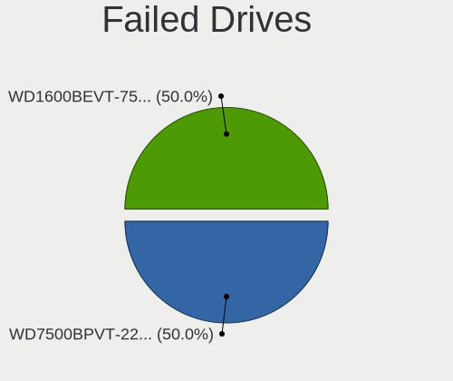
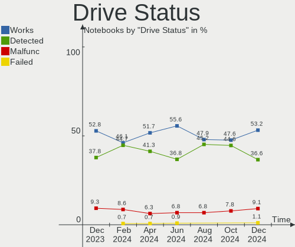
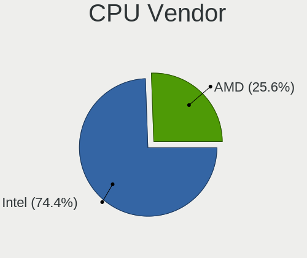
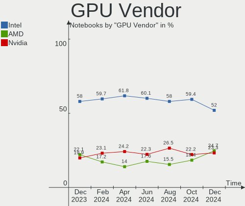
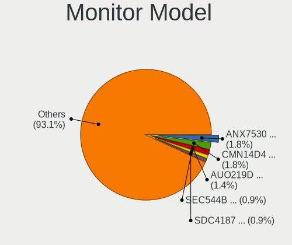
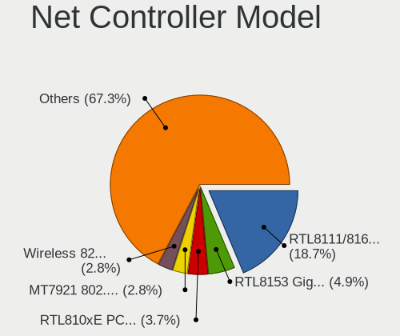
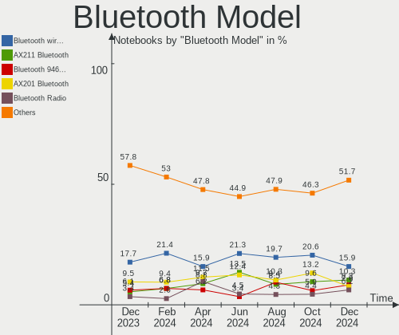
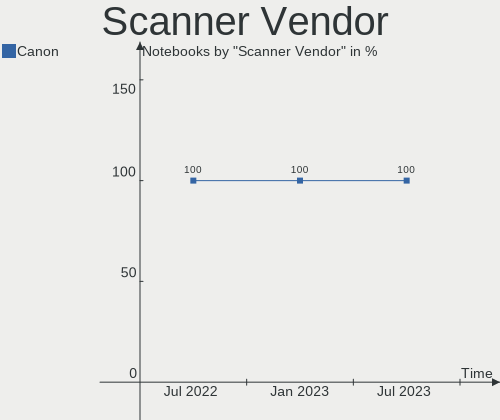
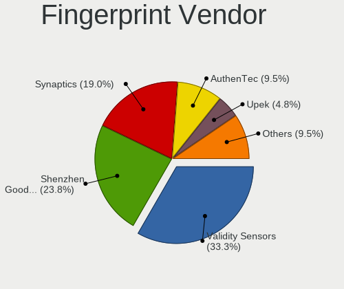

Linux in France - Hardware Trends (Notebooks)
---------------------------------------------

A project to identify most popular hardware characteristics and track their change
over time based on data collected by Linux users at https://Linux-Hardware.org.

Anyone can contribute to this report by the [hw-probe](https://github.com/linuxhw/hw-probe) tool:

    sudo -E hw-probe -all -upload

Period: Jul, 2022.

Contents
--------

* [ System ](#system)
  - [ OS                       ](#os)
  - [ OS Family                ](#os-family)
  - [ Kernel                   ](#kernel)
  - [ Kernel Family            ](#kernel-family)
  - [ Kernel Major Ver.        ](#kernel-major-ver)
  - [ Arch                     ](#arch)
  - [ DE                       ](#de)
  - [ Display Server           ](#display-server)
  - [ Display Manager          ](#display-manager)
  - [ OS Lang                  ](#os-lang)
  - [ Boot Mode                ](#boot-mode)
  - [ Filesystem               ](#filesystem)
  - [ Part. scheme             ](#part-scheme)
  - [ Dual Boot with Linux/BSD ](#dual-boot-with-linuxbsd)
  - [ Dual Boot (Win)          ](#dual-boot-win)

* [ Board ](#board)
  - [ Vendor                   ](#vendor)
  - [ Model                    ](#model)
  - [ Model Family             ](#model-family)
  - [ MFG Year                 ](#mfg-year)
  - [ Form Factor              ](#form-factor)
  - [ Secure Boot              ](#secure-boot)
  - [ Coreboot                 ](#coreboot)
  - [ RAM Size                 ](#ram-size)
  - [ RAM Used                 ](#ram-used)
  - [ Total Drives             ](#total-drives)
  - [ Has CD-ROM               ](#has-cd-rom)
  - [ Has Ethernet             ](#has-ethernet)
  - [ Has WiFi                 ](#has-wifi)
  - [ Has Bluetooth            ](#has-bluetooth)

* [ Location ](#location)
  - [ Country                  ](#country)
  - [ City                     ](#city)

* [ Drives ](#drives)
  - [ Drive Vendor             ](#drive-vendor)
  - [ Drive Model              ](#drive-model)
  - [ HDD Vendor               ](#hdd-vendor)
  - [ SSD Vendor               ](#ssd-vendor)
  - [ Drive Kind               ](#drive-kind)
  - [ Drive Connector          ](#drive-connector)
  - [ Drive Size               ](#drive-size)
  - [ Space Total              ](#space-total)
  - [ Space Used               ](#space-used)
  - [ Malfunc. Drives          ](#malfunc-drives)
  - [ Malfunc. Drive Vendor    ](#malfunc-drive-vendor)
  - [ Malfunc. HDD Vendor      ](#malfunc-hdd-vendor)
  - [ Malfunc. Drive Kind      ](#malfunc-drive-kind)
  - [ Failed Drives            ](#failed-drives)
  - [ Failed Drive Vendor      ](#failed-drive-vendor)
  - [ Drive Status             ](#drive-status)

* [ Storage controller ](#storage-controller)
  - [ Storage Vendor           ](#storage-vendor)
  - [ Storage Model            ](#storage-model)
  - [ Storage Kind             ](#storage-kind)

* [ Processor ](#processor)
  - [ CPU Vendor               ](#cpu-vendor)
  - [ CPU Model                ](#cpu-model)
  - [ CPU Model Family         ](#cpu-model-family)
  - [ CPU Cores                ](#cpu-cores)
  - [ CPU Sockets              ](#cpu-sockets)
  - [ CPU Threads              ](#cpu-threads)
  - [ CPU Op-Modes             ](#cpu-op-modes)
  - [ CPU Microcode            ](#cpu-microcode)
  - [ CPU Microarch            ](#cpu-microarch)

* [ Graphics ](#graphics)
  - [ GPU Vendor               ](#gpu-vendor)
  - [ GPU Model                ](#gpu-model)
  - [ GPU Combo                ](#gpu-combo)
  - [ GPU Driver               ](#gpu-driver)
  - [ GPU Memory               ](#gpu-memory)

* [ Monitor ](#monitor)
  - [ Monitor Vendor           ](#monitor-vendor)
  - [ Monitor Model            ](#monitor-model)
  - [ Monitor Resolution       ](#monitor-resolution)
  - [ Monitor Diagonal         ](#monitor-diagonal)
  - [ Monitor Width            ](#monitor-width)
  - [ Aspect Ratio             ](#aspect-ratio)
  - [ Monitor Area             ](#monitor-area)
  - [ Pixel Density            ](#pixel-density)
  - [ Multiple Monitors        ](#multiple-monitors)

* [ Network ](#network)
  - [ Net Controller Vendor    ](#net-controller-vendor)
  - [ Net Controller Model     ](#net-controller-model)
  - [ Wireless Vendor          ](#wireless-vendor)
  - [ Wireless Model           ](#wireless-model)
  - [ Ethernet Vendor          ](#ethernet-vendor)
  - [ Ethernet Model           ](#ethernet-model)
  - [ Net Controller Kind      ](#net-controller-kind)
  - [ Used Controller          ](#used-controller)
  - [ NICs                     ](#nics)
  - [ IPv6                     ](#ipv6)

* [ Bluetooth ](#bluetooth)
  - [ Bluetooth Vendor         ](#bluetooth-vendor)
  - [ Bluetooth Model          ](#bluetooth-model)

* [ Sound ](#sound)
  - [ Sound Vendor             ](#sound-vendor)
  - [ Sound Model              ](#sound-model)

* [ Memory ](#memory)
  - [ Memory Vendor            ](#memory-vendor)
  - [ Memory Model             ](#memory-model)
  - [ Memory Kind              ](#memory-kind)
  - [ Memory Form Factor       ](#memory-form-factor)
  - [ Memory Size              ](#memory-size)
  - [ Memory Speed             ](#memory-speed)

* [ Printers & scanners ](#printers--scanners)
  - [ Printer Vendor           ](#printer-vendor)
  - [ Printer Model            ](#printer-model)
  - [ Scanner Vendor           ](#scanner-vendor)
  - [ Scanner Model            ](#scanner-model)

* [ Camera ](#camera)
  - [ Camera Vendor            ](#camera-vendor)
  - [ Camera Model             ](#camera-model)

* [ Security ](#security)
  - [ Fingerprint Vendor       ](#fingerprint-vendor)
  - [ Fingerprint Model        ](#fingerprint-model)
  - [ Chipcard Vendor          ](#chipcard-vendor)
  - [ Chipcard Model           ](#chipcard-model)

* [ Unsupported ](#unsupported)
  - [ Unsupported Devices      ](#unsupported-devices)
  - [ Unsupported Device Types ](#unsupported-device-types)

System
------

OS
--

Installed operating systems

| Name                         | Notebooks | Percent |
|------------------------------|-----------|---------|
| Linux Mint 20.3              | 27        | 20.15%  |
| Ubuntu 22.04                 | 19        | 14.18%  |
| Ubuntu 20.04                 | 14        | 10.45%  |
| OpenMandriva 4.3             | 14        | 10.45%  |
| OpenMandriva 4.90            | 8         | 5.97%   |
| Zorin 16                     | 6         | 4.48%   |
| Fedora 36                    | 6         | 4.48%   |
| Linux Mint 20.2              | 3         | 2.24%   |
| Kubuntu 20.04                | 3         | 2.24%   |
| Debian 11                    | 3         | 2.24%   |
| Xubuntu 20.04                | 2         | 1.49%   |
| Pop!_OS 22.04                | 2         | 1.49%   |
| LMDE 5                       | 2         | 1.49%   |
| Xubuntu 22.04                | 1         | 0.75%   |
| Xubuntu 21.10                | 1         | 0.75%   |
| Ubuntu Budgie 22.04          | 1         | 0.75%   |
| Ubuntu 18.04                 | 1         | 0.75%   |
| SteamOS 3.2                  | 1         | 0.75%   |
| Solus 4.3                    | 1         | 0.75%   |
| Slackware 15.0               | 1         | 0.75%   |
| openSUSE Tumbleweed-XXXXXXXX | 1         | 0.75%   |
| openSUSE Leap-15.4           | 1         | 0.75%   |
| Manjaro 21.3.5               | 1         | 0.75%   |
| Manjaro 21.3.4               | 1         | 0.75%   |
| Manjaro 21.3.3               | 1         | 0.75%   |
| Lubuntu 20.04                | 1         | 0.75%   |
| Linux Mint 20.1              | 1         | 0.75%   |
| Kubuntu 22.04                | 1         | 0.75%   |
| KDE neon 20.04               | 1         | 0.75%   |
| Kali 2022.3                  | 1         | 0.75%   |
| Kali 2022.2                  | 1         | 0.75%   |
| Gentoo 2.8                   | 1         | 0.75%   |
| Endless 4.0.7                | 1         | 0.75%   |
| Endless 3.8.1                | 1         | 0.75%   |
| Debian Testing               | 1         | 0.75%   |
| Debian 11-updates            | 1         | 0.75%   |
| Arch Rolling                 | 1         | 0.75%   |
| AlmaLinux 9.0                | 1         | 0.75%   |

OS Family
---------

OS without a version

| Name          | Notebooks | Percent |
|---------------|-----------|---------|
| Ubuntu        | 34        | 25.37%  |
| Linux Mint    | 31        | 23.13%  |
| OpenMandriva  | 22        | 16.42%  |
| Zorin         | 6         | 4.48%   |
| Fedora        | 6         | 4.48%   |
| Debian        | 5         | 3.73%   |
| Xubuntu       | 4         | 2.99%   |
| Kubuntu       | 4         | 2.99%   |
| Manjaro       | 3         | 2.24%   |
| Pop!_OS       | 2         | 1.49%   |
| openSUSE      | 2         | 1.49%   |
| LMDE          | 2         | 1.49%   |
| Kali          | 2         | 1.49%   |
| Endless       | 2         | 1.49%   |
| Ubuntu Budgie | 1         | 0.75%   |
| SteamOS       | 1         | 0.75%   |
| Solus         | 1         | 0.75%   |
| Slackware     | 1         | 0.75%   |
| Lubuntu       | 1         | 0.75%   |
| KDE neon      | 1         | 0.75%   |
| Gentoo        | 1         | 0.75%   |
| Arch          | 1         | 0.75%   |
| AlmaLinux     | 1         | 0.75%   |

Kernel
------

Version of the Linux kernel

| Version                                      | Notebooks | Percent |
|----------------------------------------------|-----------|---------|
| 5.15.0-41-generic                            | 19        | 14.18%  |
| 5.4.0-122-generic                            | 17        | 12.69%  |
| 5.16.7-desktop-1omv4003                      | 14        | 10.45%  |
| 5.15.0-40-generic                            | 10        | 7.46%   |
| 5.13.0-52-generic                            | 8         | 5.97%   |
| 5.4.0-121-generic                            | 7         | 5.22%   |
| 5.18.12-desktop-3omv4090                     | 7         | 5.22%   |
| 5.17.15-76051715-generic                     | 3         | 2.24%   |
| 5.10.0-16-amd64                              | 3         | 2.24%   |
| 5.4.0-91-generic                             | 2         | 1.49%   |
| 5.4.0-117-generic                            | 2         | 1.49%   |
| 5.18.0-2-amd64                               | 2         | 1.49%   |
| 5.15.55-1-MANJARO                            | 2         | 1.49%   |
| 5.15.0-43-generic                            | 2         | 1.49%   |
| 5.14.0-1045-oem                              | 2         | 1.49%   |
| 5.13.0-51-generic                            | 2         | 1.49%   |
| 5.10.0-15-amd64                              | 2         | 1.49%   |
| 5.4.0-70-generic                             | 1         | 0.75%   |
| 5.4.0-19-generic                             | 1         | 0.75%   |
| 5.4.0-109-generic                            | 1         | 0.75%   |
| 5.19.0-rc2-p+                                | 1         | 0.75%   |
| 5.18.9-200.fc36.x86_64                       | 1         | 0.75%   |
| 5.18.7-200.fc36.x86_64                       | 1         | 0.75%   |
| 5.18.6-1-default                             | 1         | 0.75%   |
| 5.18.14-arch1-1                              | 1         | 0.75%   |
| 5.18.13-200.fc36.x86_64                      | 1         | 0.75%   |
| 5.18.11-desktop-3omv4090                     | 1         | 0.75%   |
| 5.18.11-200.fc36.x86_64                      | 1         | 0.75%   |
| 5.18.10-200.fc36.x86_64                      | 1         | 0.75%   |
| 5.18.0-kali5-amd64                           | 1         | 0.75%   |
| 5.18.0-kali4-amd64                           | 1         | 0.75%   |
| 5.17.13-300.fc36.x86_64                      | 1         | 0.75%   |
| 5.17.0-1012-oem                              | 1         | 0.75%   |
| 5.15.53-1-MANJARO                            | 1         | 0.75%   |
| 5.15.50-216.current                          | 1         | 0.75%   |
| 5.15.19                                      | 1         | 0.75%   |
| 5.15.0-33-generic                            | 1         | 0.75%   |
| 5.15.0-25-generic                            | 1         | 0.75%   |
| 5.14.21-150400.22-default                    | 1         | 0.75%   |
| 5.14.0-70.17.1.el9_0.x86_64                  | 1         | 0.75%   |
| 5.14.0-1042-oem                              | 1         | 0.75%   |
| 5.13.0-valve15-1-neptune-02197-gf6ec7ad3762a | 1         | 0.75%   |
| 5.13.0-48-generic                            | 1         | 0.75%   |
| 5.13.0-44-generic                            | 1         | 0.75%   |
| 5.13.0-40-generic                            | 1         | 0.75%   |
| 5.13.0-25-generic                            | 1         | 0.75%   |
| 5.11.0-35-generic                            | 1         | 0.75%   |

Kernel Family
-------------

Linux kernel without a distro release

| Version | Notebooks | Percent |
|---------|-----------|---------|
| 5.15.0  | 33        | 24.63%  |
| 5.4.0   | 31        | 23.13%  |
| 5.13.0  | 15        | 11.19%  |
| 5.16.7  | 14        | 10.45%  |
| 5.18.12 | 7         | 5.22%   |
| 5.10.0  | 5         | 3.73%   |
| 5.18.0  | 4         | 2.99%   |
| 5.14.0  | 4         | 2.99%   |
| 5.17.15 | 3         | 2.24%   |
| 5.18.11 | 2         | 1.49%   |
| 5.15.55 | 2         | 1.49%   |
| 5.19.0  | 1         | 0.75%   |
| 5.18.9  | 1         | 0.75%   |
| 5.18.7  | 1         | 0.75%   |
| 5.18.6  | 1         | 0.75%   |
| 5.18.14 | 1         | 0.75%   |
| 5.18.13 | 1         | 0.75%   |
| 5.18.10 | 1         | 0.75%   |
| 5.17.13 | 1         | 0.75%   |
| 5.17.0  | 1         | 0.75%   |
| 5.15.53 | 1         | 0.75%   |
| 5.15.50 | 1         | 0.75%   |
| 5.15.19 | 1         | 0.75%   |
| 5.14.21 | 1         | 0.75%   |
| 5.11.0  | 1         | 0.75%   |

Kernel Major Ver.
-----------------

Linux kernel major version

| Version | Notebooks | Percent |
|---------|-----------|---------|
| 5.15    | 38        | 28.36%  |
| 5.4     | 31        | 23.13%  |
| 5.18    | 19        | 14.18%  |
| 5.13    | 15        | 11.19%  |
| 5.16    | 14        | 10.45%  |
| 5.17    | 5         | 3.73%   |
| 5.14    | 5         | 3.73%   |
| 5.10    | 5         | 3.73%   |
| 5.19    | 1         | 0.75%   |
| 5.11    | 1         | 0.75%   |

Arch
----

OS architecture (x86_64, i586, etc.)

| Name   | Notebooks | Percent |
|--------|-----------|---------|
| x86_64 | 134       | 100%    |

DE
--

Desktop Environment

| Name            | Notebooks | Percent |
|-----------------|-----------|---------|
| GNOME           | 54        | 40.3%   |
| KDE5            | 32        | 23.88%  |
| X-Cinnamon      | 18        | 13.43%  |
| XFCE            | 13        | 9.7%    |
| MATE            | 7         | 5.22%   |
| Cinnamon        | 3         | 2.24%   |
| LXQt            | 2         | 1.49%   |
| Unknown         | 2         | 1.49%   |
| KDE             | 1         | 0.75%   |
| GNOME Flashback | 1         | 0.75%   |
| Budgie          | 1         | 0.75%   |

Display Server
--------------

X11 or Wayland

| Name    | Notebooks | Percent |
|---------|-----------|---------|
| X11     | 107       | 79.85%  |
| Wayland | 23        | 17.16%  |
| Tty     | 4         | 2.99%   |

Display Manager
---------------

SDDM, LightDM, etc.

| Name    | Notebooks | Percent |
|---------|-----------|---------|
| SDDM    | 34        | 25.37%  |
| LightDM | 32        | 23.88%  |
| GDM3    | 26        | 19.4%   |
| Unknown | 24        | 17.91%  |
| GDM     | 18        | 13.43%  |

OS Lang
-------

Language

| Lang  | Notebooks | Percent |
|-------|-----------|---------|
| fr_FR | 100       | 74.63%  |
| en_US | 25        | 18.66%  |
| C     | 3         | 2.24%   |
| pl_PL | 2         | 1.49%   |
| es_ES | 2         | 1.49%   |
| de_DE | 2         | 1.49%   |

Boot Mode
---------

EFI or BIOS

| Mode | Notebooks | Percent |
|------|-----------|---------|
| EFI  | 88        | 65.67%  |
| BIOS | 46        | 34.33%  |

Filesystem
----------

Type of filesystem

| Type    | Notebooks | Percent |
|---------|-----------|---------|
| Ext4    | 97        | 72.39%  |
| Overlay | 21        | 15.67%  |
| Btrfs   | 14        | 10.45%  |
| Zfs     | 1         | 0.75%   |
| Xfs     | 1         | 0.75%   |

Part. scheme
------------

Scheme of partitioning

| Type    | Notebooks | Percent |
|---------|-----------|---------|
| GPT     | 75        | 55.97%  |
| Unknown | 37        | 27.61%  |
| MBR     | 22        | 16.42%  |

Dual Boot with Linux/BSD
------------------------

Hosting more than one Linux/BSD

| Dual boot | Notebooks | Percent |
|-----------|-----------|---------|
| No        | 109       | 81.34%  |
| Yes       | 25        | 18.66%  |

Dual Boot (Win)
---------------

Hosting Linux and Windows

| Dual boot | Notebooks | Percent |
|-----------|-----------|---------|
| No        | 83        | 61.94%  |
| Yes       | 51        | 38.06%  |

Board
-----

Vendor
------

Motherboard manufacturer

| Name                | Notebooks | Percent |
|---------------------|-----------|---------|
| Hewlett-Packard     | 34        | 25.37%  |
| Lenovo              | 24        | 17.91%  |
| ASUSTek Computer    | 21        | 15.67%  |
| Dell                | 18        | 13.43%  |
| Acer                | 9         | 6.72%   |
| Toshiba             | 7         | 5.22%   |
| Notebook            | 5         | 3.73%   |
| Thomson             | 2         | 1.49%   |
| Packard Bell        | 2         | 1.49%   |
| MSI                 | 2         | 1.49%   |
| Valve               | 1         | 0.75%   |
| Sony                | 1         | 0.75%   |
| Samsung Electronics | 1         | 0.75%   |
| Jumper              | 1         | 0.75%   |
| HUAWEI              | 1         | 0.75%   |
| Google              | 1         | 0.75%   |
| Framework           | 1         | 0.75%   |
| Chuwi               | 1         | 0.75%   |
| Apple               | 1         | 0.75%   |
| Alienware           | 1         | 0.75%   |

Model
-----

Motherboard model

| Name                                        | Notebooks | Percent |
|---------------------------------------------|-----------|---------|
| HP ProBook 6570b                            | 2         | 1.49%   |
| HP Pavilion Notebook                        | 2         | 1.49%   |
| HP Notebook                                 | 2         | 1.49%   |
| HP Laptop 17-cp0xxx                         | 2         | 1.49%   |
| HP Laptop 17-ca1xxx                         | 2         | 1.49%   |
| Dell Latitude 5420                          | 2         | 1.49%   |
| Valve Jupiter                               | 1         | 0.75%   |
| Toshiba TECRA S11                           | 1         | 0.75%   |
| Toshiba Satellite Pro R50-C                 | 1         | 0.75%   |
| Toshiba Satellite Pro L500                  | 1         | 0.75%   |
| Toshiba Satellite Pro C660                  | 1         | 0.75%   |
| Toshiba Satellite L655                      | 1         | 0.75%   |
| Toshiba Satellite C850D-11K                 | 1         | 0.75%   |
| Toshiba PORTEGE R930                        | 1         | 0.75%   |
| Thomson N17V3C8WH512                        | 1         | 0.75%   |
| Thomson N17CSL512                           | 1         | 0.75%   |
| Sony SVE1511Y1ESI                           | 1         | 0.75%   |
| Samsung RV411/RV511/E3511/S3511/RV711/E3411 | 1         | 0.75%   |
| Packard Bell H17HV                          | 1         | 0.75%   |
| Packard Bell EasyNote TS44HR                | 1         | 0.75%   |
| Notebook P7xxDM(-G)                         | 1         | 0.75%   |
| Notebook NLx0MU                             | 1         | 0.75%   |
| Notebook NL4x_NL5xLU                        | 1         | 0.75%   |
| Notebook NL40_50GU                          | 1         | 0.75%   |
| Notebook N150ZU                             | 1         | 0.75%   |
| MSI Modern 14 B10MW                         | 1         | 0.75%   |
| MSI GE72 6QL                                | 1         | 0.75%   |
| Lenovo Yoga Slim 7 15ITL05 82AC             | 1         | 0.75%   |
| Lenovo Yoga 500-15IBD 80N6                  | 1         | 0.75%   |
| Lenovo V15-ADA 82C7                         | 1         | 0.75%   |
| Lenovo V145-15AST 81MT                      | 1         | 0.75%   |
| Lenovo ThinkPad X1 Carbon Gen 8 20U90006FR  | 1         | 0.75%   |
| Lenovo ThinkPad T420 4236C92                | 1         | 0.75%   |
| Lenovo ThinkPad S5 Yoga 15 20DRS02000       | 1         | 0.75%   |
| Lenovo ThinkPad P15 Gen 2i 20YQ0014FR       | 1         | 0.75%   |
| Lenovo ThinkPad Edge E320 1298AAG           | 1         | 0.75%   |
| Lenovo ThinkPad Edge 0328A11                | 1         | 0.75%   |
| Lenovo ThinkPad E570 20H5006TFR             | 1         | 0.75%   |
| Lenovo ThinkBook 15 G2 ITL 20VE             | 1         | 0.75%   |
| Lenovo Legion Y540-17IRH 81Q4               | 1         | 0.75%   |
| Lenovo Legion 7 16ACHg6 82N6                | 1         | 0.75%   |
| Lenovo IdeaPad S340-15API 81NC              | 1         | 0.75%   |
| Lenovo IdeaPad C340-14API 81N6              | 1         | 0.75%   |
| Lenovo IdeaPad 700-15ISK 80RU               | 1         | 0.75%   |
| Lenovo IdeaPad 330-15IKB 81DC               | 1         | 0.75%   |
| Lenovo IdeaPad 320S-14IKB 80X4              | 1         | 0.75%   |
| Lenovo IdeaPad 320-15IAP 80XR               | 1         | 0.75%   |
| Lenovo IdeaPad 3 17ADA05 81W2               | 1         | 0.75%   |
| Lenovo IdeaPad 3 15ITL6 82H8                | 1         | 0.75%   |
| Lenovo G50-45 80E3                          | 1         | 0.75%   |
| Lenovo G50-30 80G0                          | 1         | 0.75%   |
| Jumper EZbook                               | 1         | 0.75%   |
| HUAWEI HVY-WXX9                             | 1         | 0.75%   |
| HP ZBook 15 G3                              | 1         | 0.75%   |
| HP ProBook 640 G1                           | 1         | 0.75%   |
| HP ProBook 470 G2                           | 1         | 0.75%   |
| HP ProBook 455 G7                           | 1         | 0.75%   |
| HP ProBook 4510s                            | 1         | 0.75%   |
| HP ProBook 450 G8 Notebook PC               | 1         | 0.75%   |
| HP Pavilion Laptop 14-ce0xxx                | 1         | 0.75%   |

Model Family
------------

Motherboard model prefix

| Name                  | Notebooks | Percent |
|-----------------------|-----------|---------|
| HP Pavilion           | 10        | 7.46%   |
| Dell Latitude         | 10        | 7.46%   |
| Lenovo IdeaPad        | 8         | 5.97%   |
| Lenovo ThinkPad       | 7         | 5.22%   |
| HP ProBook            | 7         | 5.22%   |
| Acer Aspire           | 7         | 5.22%   |
| Toshiba Satellite     | 5         | 3.73%   |
| HP EliteBook          | 5         | 3.73%   |
| HP Laptop             | 4         | 2.99%   |
| ASUS VivoBook         | 3         | 2.24%   |
| Lenovo Yoga           | 2         | 1.49%   |
| Lenovo Legion         | 2         | 1.49%   |
| HP Notebook           | 2         | 1.49%   |
| Dell XPS              | 2         | 1.49%   |
| Dell Vostro           | 2         | 1.49%   |
| Dell Inspiron         | 2         | 1.49%   |
| ASUS ROG              | 2         | 1.49%   |
| Valve Jupiter         | 1         | 0.75%   |
| Toshiba TECRA         | 1         | 0.75%   |
| Toshiba PORTEGE       | 1         | 0.75%   |
| Thomson N17V3C8WH512  | 1         | 0.75%   |
| Thomson N17CSL512     | 1         | 0.75%   |
| Sony SVE1511Y1ESI     | 1         | 0.75%   |
| Samsung RV411         | 1         | 0.75%   |
| Packard Bell H17HV    | 1         | 0.75%   |
| Packard Bell EasyNote | 1         | 0.75%   |
| Notebook P7xxDM(-G)   | 1         | 0.75%   |
| Notebook NLx0MU       | 1         | 0.75%   |
| Notebook NL4x         | 1         | 0.75%   |
| Notebook NL40         | 1         | 0.75%   |
| Notebook N150ZU       | 1         | 0.75%   |
| MSI Modern            | 1         | 0.75%   |
| MSI GE72              | 1         | 0.75%   |
| Lenovo V15-ADA        | 1         | 0.75%   |
| Lenovo V145-15AST     | 1         | 0.75%   |
| Lenovo ThinkBook      | 1         | 0.75%   |
| Lenovo G50-45         | 1         | 0.75%   |
| Lenovo G50-30         | 1         | 0.75%   |
| Jumper EZbook         | 1         | 0.75%   |
| HUAWEI HVY-WXX9       | 1         | 0.75%   |
| HP ZBook              | 1         | 0.75%   |
| HP Compaq             | 1         | 0.75%   |
| HP 470                | 1         | 0.75%   |
| HP 350                | 1         | 0.75%   |
| HP 250                | 1         | 0.75%   |
| HP 245                | 1         | 0.75%   |
| Google Coral          | 1         | 0.75%   |
| Framework Laptop      | 1         | 0.75%   |
| Dell Venue            | 1         | 0.75%   |
| Dell System           | 1         | 0.75%   |
| Chuwi LarkBook        | 1         | 0.75%   |
| ASUS X75A             | 1         | 0.75%   |
| ASUS X751MA           | 1         | 0.75%   |
| ASUS X751LD           | 1         | 0.75%   |
| ASUS X705UAP          | 1         | 0.75%   |
| ASUS X550CC           | 1         | 0.75%   |
| ASUS UX310UAK         | 1         | 0.75%   |
| ASUS T100TAM          | 1         | 0.75%   |
| ASUS S551LN           | 1         | 0.75%   |
| ASUS N73SV            | 1         | 0.75%   |

MFG Year
--------

Motherboard manufacture year

| Year | Notebooks | Percent |
|------|-----------|---------|
| 2021 | 20        | 14.93%  |
| 2020 | 15        | 11.19%  |
| 2012 | 13        | 9.7%    |
| 2019 | 12        | 8.96%   |
| 2017 | 10        | 7.46%   |
| 2014 | 9         | 6.72%   |
| 2015 | 8         | 5.97%   |
| 2011 | 8         | 5.97%   |
| 2010 | 8         | 5.97%   |
| 2018 | 7         | 5.22%   |
| 2016 | 6         | 4.48%   |
| 2022 | 5         | 3.73%   |
| 2013 | 5         | 3.73%   |
| 2009 | 5         | 3.73%   |
| 2008 | 3         | 2.24%   |

Form Factor
-----------

Physical design of the computer

| Name     | Notebooks | Percent |
|----------|-----------|---------|
| Notebook | 134       | 100%    |

Secure Boot
-----------

Enabled or disabled

| State    | Notebooks | Percent |
|----------|-----------|---------|
| Disabled | 116       | 86.57%  |
| Enabled  | 18        | 13.43%  |

Coreboot
--------

Have coreboot on board

| Used | Notebooks | Percent |
|------|-----------|---------|
| No   | 133       | 99.25%  |
| Yes  | 1         | 0.75%   |

RAM Size
--------

Total RAM memory

| Size in GB  | Notebooks | Percent |
|-------------|-----------|---------|
| 4.01-8.0    | 44        | 32.84%  |
| 3.01-4.0    | 29        | 21.64%  |
| 8.01-16.0   | 27        | 20.15%  |
| 16.01-24.0  | 18        | 13.43%  |
| 32.01-64.0  | 7         | 5.22%   |
| 1.01-2.0    | 5         | 3.73%   |
| 2.01-3.0    | 2         | 1.49%   |
| 64.01-256.0 | 2         | 1.49%   |

RAM Used
--------

Used RAM memory

| Used GB   | Notebooks | Percent |
|-----------|-----------|---------|
| 1.01-2.0  | 60        | 44.78%  |
| 2.01-3.0  | 37        | 27.61%  |
| 3.01-4.0  | 17        | 12.69%  |
| 4.01-8.0  | 14        | 10.45%  |
| 8.01-16.0 | 5         | 3.73%   |
| 0.51-1.0  | 1         | 0.75%   |

Total Drives
------------

Number of drives on board

| Drives | Notebooks | Percent |
|--------|-----------|---------|
| 1      | 101       | 75.37%  |
| 2      | 28        | 20.9%   |
| 3      | 4         | 2.99%   |
| 0      | 1         | 0.75%   |

Has CD-ROM
----------

Has CD-ROM on board

| Presented | Notebooks | Percent |
|-----------|-----------|---------|
| No        | 84        | 62.69%  |
| Yes       | 50        | 37.31%  |

Has Ethernet
------------

Has Ethernet on board

| Presented | Notebooks | Percent |
|-----------|-----------|---------|
| Yes       | 105       | 78.36%  |
| No        | 29        | 21.64%  |

Has WiFi
--------

Has WiFi module

| Presented | Notebooks | Percent |
|-----------|-----------|---------|
| Yes       | 132       | 98.51%  |
| No        | 2         | 1.49%   |

Has Bluetooth
-------------

Has Bluetooth module

| Presented | Notebooks | Percent |
|-----------|-----------|---------|
| Yes       | 107       | 79.85%  |
| No        | 27        | 20.15%  |

Location
--------

Country
-------

Geographic location (country)

| Country | Notebooks | Percent |
|---------|-----------|---------|
| France  | 134       | 100%    |

City
----

Geographic location (city)

| City                       | Notebooks | Percent |
|----------------------------|-----------|---------|
| Paris                      | 18        | 13.43%  |
| Lyon                       | 4         | 2.99%   |
| Marseille                  | 3         | 2.24%   |
| Tours                      | 2         | 1.49%   |
| Toulouse                   | 2         | 1.49%   |
| Rouvray-Saint-Denis        | 2         | 1.49%   |
| Perassay                   | 2         | 1.49%   |
| Chenove                    | 2         | 1.49%   |
| Arnage                     | 2         | 1.49%   |
| Villars                    | 1         | 0.75%   |
| Vence                      | 1         | 0.75%   |
| Ugine                      | 1         | 0.75%   |
| Trets                      | 1         | 0.75%   |
| Toulon                     | 1         | 0.75%   |
| Tavaux                     | 1         | 0.75%   |
| Tarbes                     | 1         | 0.75%   |
| Sury-le-Comtal             | 1         | 0.75%   |
| Stains                     | 1         | 0.75%   |
| Souchez                    | 1         | 0.75%   |
| Sisteron                   | 1         | 0.75%   |
| Sevran                     | 1         | 0.75%   |
| Saujon                     | 1         | 0.75%   |
| Sartrouville               | 1         | 0.75%   |
| Saint-Savin                | 1         | 0.75%   |
| Saint-Saturnin-les-Avignon | 1         | 0.75%   |
| Saint-Pierre-de-Semilly    | 1         | 0.75%   |
| Saint-Nazaire              | 1         | 0.75%   |
| Saint-Michel-sur-Orge      | 1         | 0.75%   |
| Saint-Just-Saint-Rambert   | 1         | 0.75%   |
| Saint-Julien-en-Genevois   | 1         | 0.75%   |
| Saint-Hilaire-sur-Benaize  | 1         | 0.75%   |
| Saint Egreve               | 1         | 0.75%   |
| Rouen                      | 1         | 0.75%   |
| Roeulx                     | 1         | 0.75%   |
| Rochejean                  | 1         | 0.75%   |
| Quimper                    | 1         | 0.75%   |
| Puilboreau                 | 1         | 0.75%   |
| Porto-Vecchio              | 1         | 0.75%   |
| Poitiers                   | 1         | 0.75%   |
| Peymeinade                 | 1         | 0.75%   |
| Périgueux                 | 1         | 0.75%   |
| Palaiseau                  | 1         | 0.75%   |
| Orsay                      | 1         | 0.75%   |
| Ordonnac                   | 1         | 0.75%   |
| Noisy-le-Grand             | 1         | 0.75%   |
| Namps-Maisnil              | 1         | 0.75%   |
| Mortagne-au-Perche         | 1         | 0.75%   |
| Mornas                     | 1         | 0.75%   |
| Montrabe                   | 1         | 0.75%   |
| Montpellier                | 1         | 0.75%   |
| Montluçon                 | 1         | 0.75%   |
| Montigny-le-Bretonneux     | 1         | 0.75%   |
| Montevrain                 | 1         | 0.75%   |
| Mieuxce                    | 1         | 0.75%   |
| Meylan                     | 1         | 0.75%   |
| Messas                     | 1         | 0.75%   |
| Melun                      | 1         | 0.75%   |
| Marcoussis                 | 1         | 0.75%   |
| Mansle                     | 1         | 0.75%   |
| Maisons-Alfort             | 1         | 0.75%   |

Drives
------

Drive Vendor
------------

Hard drive vendors

| Vendor              | Notebooks | Drives | Percent |
|---------------------|-----------|--------|---------|
| Samsung Electronics | 28        | 30     | 17.61%  |
| WDC                 | 19        | 19     | 11.95%  |
| Seagate             | 17        | 19     | 10.69%  |
| Toshiba             | 13        | 13     | 8.18%   |
| Crucial             | 11        | 11     | 6.92%   |
| Kingston            | 10        | 10     | 6.29%   |
| SK hynix            | 9         | 9      | 5.66%   |
| SanDisk             | 8         | 8      | 5.03%   |
| HGST                | 6         | 6      | 3.77%   |
| PNY                 | 5         | 5      | 3.14%   |
| Micron Technology   | 5         | 5      | 3.14%   |
| Unknown             | 4         | 4      | 2.52%   |
| Unknown             | 3         | 3      | 1.89%   |
| LITEON              | 2         | 2      | 1.26%   |
| LDLC                | 2         | 3      | 1.26%   |
| KIOXIA              | 2         | 2      | 1.26%   |
| Hitachi             | 2         | 2      | 1.26%   |
| XPG                 | 1         | 1      | 0.63%   |
| UMIS                | 1         | 1      | 0.63%   |
| SPCC                | 1         | 1      | 0.63%   |
| Phison              | 1         | 1      | 0.63%   |
| OCZ                 | 1         | 1      | 0.63%   |
| N600                | 1         | 1      | 0.63%   |
| JMicron Technology  | 1         | 1      | 0.63%   |
| Intel               | 1         | 1      | 0.63%   |
| Hewlett-Packard     | 1         | 1      | 0.63%   |
| Dogfish             | 1         | 1      | 0.63%   |
| Corsair             | 1         | 1      | 0.63%   |
| ASMedia             | 1         | 1      | 0.63%   |
| Apple               | 1         | 1      | 0.63%   |

Drive Model
-----------

Hard drive models

| Model                                   | Notebooks | Percent |
|-----------------------------------------|-----------|---------|
| Seagate ST1000LM035-1RK172 1TB          | 5         | 3.09%   |
| Toshiba MQ01ABD100 1TB                  | 3         | 1.85%   |
| Seagate ST1000LM024 HN-M101MBB 1TB      | 3         | 1.85%   |
| PNY CS900 240GB SSD                     | 3         | 1.85%   |
| HGST HTS721010A9E630 1TB                | 3         | 1.85%   |
| Unknown                                 | 3         | 1.85%   |
| Toshiba MQ04ABF100 1TB                  | 2         | 1.23%   |
| Toshiba MQ01ABF050 500GB                | 2         | 1.23%   |
| SK hynix BC711 NVMe 512GB               | 2         | 1.23%   |
| Seagate ST9640320AS 640GB               | 2         | 1.23%   |
| Samsung SSD 870 QVO 1TB                 | 2         | 1.23%   |
| Samsung MZVLQ512HALU-000H1 512GB        | 2         | 1.23%   |
| Samsung MZVLB1T0HBLR-000L2 1TB          | 2         | 1.23%   |
| Micron 3400_MTFDKBA1T0TFH 1TB           | 2         | 1.23%   |
| Kingston SA400S37480G 480GB SSD         | 2         | 1.23%   |
| Kingston SA400S37120G 120GB SSD         | 2         | 1.23%   |
| Crucial CT1000MX500SSD1 1TB             | 2         | 1.23%   |
| XPG NVMe SSD Drive 1024GB               | 1         | 0.62%   |
| WDC WD7500BPVT-22HXZT1 752GB            | 1         | 0.62%   |
| WDC WD5000LPVX-80V0TT0 500GB            | 1         | 0.62%   |
| WDC WD5000LPCX-00VHAT0 500GB            | 1         | 0.62%   |
| WDC WD3200BEVT-26ZCT0 320GB             | 1         | 0.62%   |
| WDC WD3200BEVT-11ZCT0 320GB             | 1         | 0.62%   |
| WDC WD3200BEKT-75PVMT1 320GB            | 1         | 0.62%   |
| WDC WD10TPVT-00U4RT1 1TB                | 1         | 0.62%   |
| WDC WD10SPZX-60Z10T1 1TB                | 1         | 0.62%   |
| WDC WD10SPZX-60Z10T0 1TB                | 1         | 0.62%   |
| WDC WD10SPZX-24Z10T0 1TB                | 1         | 0.62%   |
| WDC WD10SPZX-24Z10 1TB                  | 1         | 0.62%   |
| WDC WD10SPCX-24HWST1 1TB                | 1         | 0.62%   |
| WDC WD10JPVX-60JC3T0 1TB                | 1         | 0.62%   |
| WDC WD10JPVX-22JC3T0 1TB                | 1         | 0.62%   |
| WDC PC SN730 SDBPNTY-512G-1027 512GB    | 1         | 0.62%   |
| WDC PC SN530 SDBPNPZ-512G-1006 512GB    | 1         | 0.62%   |
| WDC PC SN530 SDBPNPZ-256G-1114 256GB    | 1         | 0.62%   |
| WDC PC SN530 SDBPNPZ-1T00-1002 1TB      | 1         | 0.62%   |
| WDC PC SN530 NVMe 512GB                 | 1         | 0.62%   |
| Unknown TA2964  64GB                    | 1         | 0.62%   |
| Unknown SC64G  64GB                     | 1         | 0.62%   |
| Unknown BGND3R  32GB                    | 1         | 0.62%   |
| Unknown 00000  129GB                    | 1         | 0.62%   |
| UMIS RPJTJ256MEE1OWX 256GB              | 1         | 0.62%   |
| Toshiba THNSNF128GMCS 128GB SSD         | 1         | 0.62%   |
| Toshiba THNSF5256GPUK 256GB             | 1         | 0.62%   |
| Toshiba MQ01ABD075 752GB                | 1         | 0.62%   |
| Toshiba MK5075GSX 500GB                 | 1         | 0.62%   |
| Toshiba MK2556GSY 250GB                 | 1         | 0.62%   |
| Toshiba KXG6AZNV512G 512GB              | 1         | 0.62%   |
| SPCC Solid State Disk 512GB             | 1         | 0.62%   |
| SK hynix NVMe SSD Drive 512GB           | 1         | 0.62%   |
| SK hynix NVMe SSD Drive 128GB           | 1         | 0.62%   |
| SK hynix HFS256G39TND-N210A 256GB SSD   | 1         | 0.62%   |
| SK hynix HFS256G32TNH-73A0A 256GB SSD   | 1         | 0.62%   |
| SK hynix HCG8e  64GB                    | 1         | 0.62%   |
| SK hynix HBG4e  32GB                    | 1         | 0.62%   |
| SK hynix BC501 HFM256GDJTNG-8310A 256GB | 1         | 0.62%   |
| Seagate ST9500325AS 500GB               | 1         | 0.62%   |
| Seagate ST9320325AS 320GB               | 1         | 0.62%   |
| Seagate ST9250410AS 250GB               | 1         | 0.62%   |
| Seagate ST500LM000-1EJ162 500GB         | 1         | 0.62%   |

HDD Vendor
----------

Hard disk drive vendors

| Vendor  | Notebooks | Drives | Percent |
|---------|-----------|--------|---------|
| Seagate | 17        | 19     | 33.33%  |
| WDC     | 14        | 14     | 27.45%  |
| Toshiba | 10        | 10     | 19.61%  |
| HGST    | 6         | 6      | 11.76%  |
| Hitachi | 2         | 2      | 3.92%   |
| ASMedia | 1         | 1      | 1.96%   |
| Apple   | 1         | 1      | 1.96%   |

SSD Vendor
----------

Solid state drive vendors

| Vendor              | Notebooks | Drives | Percent |
|---------------------|-----------|--------|---------|
| Samsung Electronics | 10        | 10     | 17.24%  |
| Kingston            | 10        | 10     | 17.24%  |
| Crucial             | 10        | 10     | 17.24%  |
| SanDisk             | 7         | 7      | 12.07%  |
| PNY                 | 4         | 4      | 6.9%    |
| SK hynix            | 2         | 2      | 3.45%   |
| Micron Technology   | 2         | 2      | 3.45%   |
| LDLC                | 2         | 3      | 3.45%   |
| Unknown             | 2         | 2      | 3.45%   |
| Toshiba             | 1         | 1      | 1.72%   |
| SPCC                | 1         | 1      | 1.72%   |
| OCZ                 | 1         | 1      | 1.72%   |
| N600                | 1         | 1      | 1.72%   |
| LITEON              | 1         | 1      | 1.72%   |
| JMicron Technology  | 1         | 1      | 1.72%   |
| Hewlett-Packard     | 1         | 1      | 1.72%   |
| Dogfish             | 1         | 1      | 1.72%   |
| Corsair             | 1         | 1      | 1.72%   |

Drive Kind
----------

HDD or SSD

| Kind | Notebooks | Drives | Percent |
|------|-----------|--------|---------|
| SSD  | 55        | 59     | 35.48%  |
| HDD  | 51        | 53     | 32.9%   |
| NVMe | 43        | 45     | 27.74%  |
| MMC  | 6         | 7      | 3.87%   |

Drive Connector
---------------

SATA, SAS, NVMe, etc.

| Type | Notebooks | Drives | Percent |
|------|-----------|--------|---------|
| SATA | 95        | 110    | 65.07%  |
| NVMe | 43        | 45     | 29.45%  |
| MMC  | 6         | 7      | 4.11%   |
| SAS  | 2         | 2      | 1.37%   |

Drive Size
----------

Size of hard drive

| Size in TB | Notebooks | Drives | Percent |
|------------|-----------|--------|---------|
| 0.01-0.5   | 56        | 61     | 53.85%  |
| 0.51-1.0   | 45        | 47     | 43.27%  |
| 1.01-2.0   | 3         | 4      | 2.88%   |

Space Total
-----------

Amount of disk space available on the file system

| Size in GB     | Notebooks | Percent |
|----------------|-----------|---------|
| 101-250        | 34        | 25.37%  |
| 251-500        | 32        | 23.88%  |
| 501-1000       | 24        | 17.91%  |
| 1-20           | 20        | 14.93%  |
| 1001-2000      | 9         | 6.72%   |
| 21-50          | 6         | 4.48%   |
| 2001-3000      | 3         | 2.24%   |
| 51-100         | 3         | 2.24%   |
| More than 3000 | 2         | 1.49%   |
| Unknown        | 1         | 0.75%   |

Space Used
----------

Amount of used disk space

| Used GB        | Notebooks | Percent |
|----------------|-----------|---------|
| 1-20           | 58        | 43.28%  |
| 21-50          | 23        | 17.16%  |
| 101-250        | 19        | 14.18%  |
| 251-500        | 16        | 11.94%  |
| 51-100         | 11        | 8.21%   |
| 501-1000       | 3         | 2.24%   |
| 1001-2000      | 2         | 1.49%   |
| More than 3000 | 1         | 0.75%   |
| Unknown        | 1         | 0.75%   |

Malfunc. Drives
---------------

Drive models with a malfunction

| Model                                            | Notebooks | Drives | Percent |
|--------------------------------------------------|-----------|--------|---------|
| HGST HTS721010A9E630 1TB                         | 2         | 2      | 12.5%   |
| WDC WD5000LPCX-00VHAT0 500GB                     | 1         | 1      | 6.25%   |
| SK hynix HFS256G39TND-N210A 256GB SSD            | 1         | 1      | 6.25%   |
| Seagate ST9250410AS 250GB                        | 1         | 1      | 6.25%   |
| Seagate ST320LT007-9ZV142 320GB                  | 1         | 1      | 6.25%   |
| Seagate ST2000LM015-2E8174 2TB                   | 1         | 2      | 6.25%   |
| Seagate ST1000LM024 HN-M101MBB 1TB               | 1         | 1      | 6.25%   |
| Samsung Electronics MZNLH128HBHQ-000H1 128GB SSD | 1         | 1      | 6.25%   |
| OCZ VERTEX4 256GB SSD                            | 1         | 1      | 6.25%   |
| LITEON CV8-8E128-HP 128GB SSD                    | 1         | 1      | 6.25%   |
| Kingston SV300S37A120G 120GB SSD                 | 1         | 1      | 6.25%   |
| HGST HTS545050A7E680 500GB                       | 1         | 1      | 6.25%   |
| HGST HTS541075A9E680 752GB                       | 1         | 1      | 6.25%   |
| HGST HTS541010A9E680 1TB                         | 1         | 1      | 6.25%   |
| Dogfish SSD 250GB                                | 1         | 1      | 6.25%   |

Malfunc. Drive Vendor
---------------------

Vendors of faulty drives

| Vendor              | Notebooks | Drives | Percent |
|---------------------|-----------|--------|---------|
| HGST                | 5         | 5      | 31.25%  |
| Seagate             | 4         | 5      | 25%     |
| WDC                 | 1         | 1      | 6.25%   |
| SK hynix            | 1         | 1      | 6.25%   |
| Samsung Electronics | 1         | 1      | 6.25%   |
| OCZ                 | 1         | 1      | 6.25%   |
| LITEON              | 1         | 1      | 6.25%   |
| Kingston            | 1         | 1      | 6.25%   |
| Dogfish             | 1         | 1      | 6.25%   |

Malfunc. HDD Vendor
-------------------

Vendors of faulty HDD drives

| Vendor  | Notebooks | Drives | Percent |
|---------|-----------|--------|---------|
| HGST    | 5         | 5      | 50%     |
| Seagate | 4         | 5      | 40%     |
| WDC     | 1         | 1      | 10%     |

Malfunc. Drive Kind
-------------------

Kinds of faulty drives

| Kind | Notebooks | Drives | Percent |
|------|-----------|--------|---------|
| HDD  | 10        | 11     | 62.5%   |
| SSD  | 6         | 6      | 37.5%   |

Failed Drives
-------------

Failed drive models

| Model                       | Notebooks | Drives | Percent |
|-----------------------------|-----------|--------|---------|
| WDC WD3200BEVT-11ZCT0 320GB | 1         | 1      | 100%    |

Failed Drive Vendor
-------------------

Failed drive vendors

| Vendor | Notebooks | Drives | Percent |
|--------|-----------|--------|---------|
| WDC    | 1         | 1      | 100%    |

Drive Status
------------

Number of failed and malfunc. drives

| Status   | Notebooks | Drives | Percent |
|----------|-----------|--------|---------|
| Works    | 81        | 98     | 57.45%  |
| Detected | 43        | 48     | 30.5%   |
| Malfunc  | 16        | 17     | 11.35%  |
| Failed   | 1         | 1      | 0.71%   |

Storage controller
------------------

Storage Vendor
--------------

Storage controller vendors

| Vendor                       | Notebooks | Percent |
|------------------------------|-----------|---------|
| Intel                        | 93        | 59.24%  |
| AMD                          | 21        | 13.38%  |
| Samsung Electronics          | 19        | 12.1%   |
| SanDisk                      | 6         | 3.82%   |
| SK hynix                     | 5         | 3.18%   |
| Micron Technology            | 3         | 1.91%   |
| Toshiba America Info Systems | 2         | 1.27%   |
| Phison Electronics           | 2         | 1.27%   |
| KIOXIA                       | 2         | 1.27%   |
| Union Memory (Shenzhen)      | 1         | 0.64%   |
| Micron/Crucial Technology    | 1         | 0.64%   |
| Lite-On Technology           | 1         | 0.64%   |
| ADATA Technology             | 1         | 0.64%   |

Storage Model
-------------

Storage controller models

| Model                                                                            | Notebooks | Percent |
|----------------------------------------------------------------------------------|-----------|---------|
| AMD FCH SATA Controller [AHCI mode]                                              | 20        | 11.98%  |
| Samsung NVMe SSD Controller 980                                                  | 10        | 5.99%   |
| Intel 7 Series Chipset Family 6-port SATA Controller [AHCI mode]                 | 10        | 5.99%   |
| Intel Volume Management Device NVMe RAID Controller                              | 9         | 5.39%   |
| Intel 6 Series/C200 Series Chipset Family 6 port Mobile SATA AHCI Controller     | 9         | 5.39%   |
| Intel Sunrise Point-LP SATA Controller [AHCI mode]                               | 8         | 4.79%   |
| Intel Wildcat Point-LP SATA Controller [AHCI Mode]                               | 7         | 4.19%   |
| Intel 82801 Mobile SATA Controller [RAID mode]                                   | 7         | 4.19%   |
| Samsung NVMe SSD Controller PM9A1/PM9A3/980PRO                                   | 5         | 2.99%   |
| Intel 82801IBM/IEM (ICH9M/ICH9M-E) 4 port SATA Controller [AHCI mode]            | 5         | 2.99%   |
| Intel 8 Series SATA Controller 1 [AHCI mode]                                     | 5         | 2.99%   |
| Intel 5 Series/3400 Series Chipset 4 port SATA AHCI Controller                   | 5         | 2.99%   |
| Samsung NVMe SSD Controller SM981/PM981/PM983                                    | 4         | 2.4%    |
| Intel Tiger Lake-LP SATA Controller                                              | 4         | 2.4%    |
| Intel HM170/QM170 Chipset SATA Controller [AHCI Mode]                            | 4         | 2.4%    |
| Intel Celeron/Pentium Silver Processor SATA Controller                           | 4         | 2.4%    |
| SK hynix Gold P31 SSD                                                            | 3         | 1.8%    |
| SanDisk WD Blue SN550 NVMe SSD                                                   | 3         | 1.8%    |
| Micron Non-Volatile memory controller                                            | 3         | 1.8%    |
| Intel Celeron N3350/Pentium N4200/Atom E3900 Series SATA AHCI Controller         | 3         | 1.8%    |
| Intel 5 Series/3400 Series Chipset 4 port SATA IDE Controller                    | 3         | 1.8%    |
| Intel 5 Series/3400 Series Chipset 2 port SATA IDE Controller                    | 3         | 1.8%    |
| SK hynix BC501 NVMe Solid State Drive                                            | 2         | 1.2%    |
| SanDisk Non-Volatile memory controller                                           | 2         | 1.2%    |
| KIOXIA NVMe SSD Controller BG4                                                   | 2         | 1.2%    |
| Intel Q170/Q150/B150/H170/H110/Z170/CM236 Chipset SATA Controller [AHCI Mode]    | 2         | 1.2%    |
| Intel Atom Processor E3800 Series SATA AHCI Controller                           | 2         | 1.2%    |
| Intel 8 Series/C220 Series Chipset Family 6-port SATA Controller 1 [AHCI mode]   | 2         | 1.2%    |
| Intel 5 Series/3400 Series Chipset 6 port SATA AHCI Controller                   | 2         | 1.2%    |
| Union Memory (Shenzhen) Non-Volatile memory controller                           | 1         | 0.6%    |
| Toshiba America Info Systems XG6 NVMe SSD Controller                             | 1         | 0.6%    |
| Toshiba America Info Systems XG4 NVMe SSD Controller                             | 1         | 0.6%    |
| SanDisk WD Black SN750 / PC SN730 NVMe SSD                                       | 1         | 0.6%    |
| Samsung NVMe SSD Controller SM961/PM961/SM963                                    | 1         | 0.6%    |
| Phison PS5013 E13 NVMe Controller                                                | 1         | 0.6%    |
| Phison E12 NVMe Controller                                                       | 1         | 0.6%    |
| Micron/Crucial P2 NVMe PCIe SSD                                                  | 1         | 0.6%    |
| Lite-On Non-Volatile memory controller                                           | 1         | 0.6%    |
| Intel SSD 660P Series                                                            | 1         | 0.6%    |
| Intel Ice Lake-LP SATA Controller [AHCI mode]                                    | 1         | 0.6%    |
| Intel Cannon Point-LP SATA Controller [AHCI Mode]                                | 1         | 0.6%    |
| Intel Cannon Lake Mobile PCH SATA AHCI Controller                                | 1         | 0.6%    |
| Intel Atom/Celeron/Pentium Processor x5-E8000/J3xxx/N3xxx Series SATA Controller | 1         | 0.6%    |
| Intel Alder Lake-P SATA AHCI Controller                                          | 1         | 0.6%    |
| Intel 400 Series Chipset Family SATA AHCI Controller                             | 1         | 0.6%    |
| AMD SB7x0/SB8x0/SB9x0 SATA Controller [AHCI mode]                                | 1         | 0.6%    |
| AMD SB7x0/SB8x0/SB9x0 IDE Controller                                             | 1         | 0.6%    |
| ADATA XPG SX8200 Pro PCIe Gen3x4 M.2 2280 Solid State Drive                      | 1         | 0.6%    |

Storage Kind
------------

Kind of storage controller (IDE, SATA, NVMe, SAS, ...)

| Kind | Notebooks | Percent |
|------|-----------|---------|
| SATA | 99        | 61.11%  |
| NVMe | 43        | 26.54%  |
| RAID | 16        | 9.88%   |
| IDE  | 4         | 2.47%   |

Processor
---------

CPU Vendor
----------

Processor vendors

| Vendor | Notebooks | Percent |
|--------|-----------|---------|
| Intel  | 106       | 79.1%   |
| AMD    | 28        | 20.9%   |

CPU Model
---------

Processor models

| Model                                         | Notebooks | Percent |
|-----------------------------------------------|-----------|---------|
| Intel 11th Gen Core i7-1165G7 @ 2.80GHz       | 4         | 2.99%   |
| Intel Core i7-7700HQ CPU @ 2.80GHz            | 3         | 2.24%   |
| Intel Core i5-7200U CPU @ 2.50GHz             | 3         | 2.24%   |
| Intel Core i5-5200U CPU @ 2.20GHz             | 3         | 2.24%   |
| Intel 11th Gen Core i5-1135G7 @ 2.40GHz       | 3         | 2.24%   |
| AMD Ryzen 7 5700U with Radeon Graphics        | 3         | 2.24%   |
| Intel Core i7-8550U CPU @ 1.80GHz             | 2         | 1.49%   |
| Intel Core i7-10510U CPU @ 1.80GHz            | 2         | 1.49%   |
| Intel Core i5-6300HQ CPU @ 2.30GHz            | 2         | 1.49%   |
| Intel Core i5-4310M CPU @ 2.70GHz             | 2         | 1.49%   |
| Intel Core i5-3320M CPU @ 2.60GHz             | 2         | 1.49%   |
| Intel Core i5-3210M CPU @ 2.50GHz             | 2         | 1.49%   |
| Intel Core i5-2520M CPU @ 2.50GHz             | 2         | 1.49%   |
| Intel Core i5-2430M CPU @ 2.40GHz             | 2         | 1.49%   |
| Intel Core i5-2410M CPU @ 2.30GHz             | 2         | 1.49%   |
| Intel Core i5 CPU M 520 @ 2.40GHz             | 2         | 1.49%   |
| Intel Core i3-6006U CPU @ 2.00GHz             | 2         | 1.49%   |
| Intel Core i3-5005U CPU @ 2.00GHz             | 2         | 1.49%   |
| Intel Core i3-2350M CPU @ 2.30GHz             | 2         | 1.49%   |
| Intel Core i3 CPU M 380 @ 2.53GHz             | 2         | 1.49%   |
| Intel Celeron N4120 CPU @ 1.10GHz             | 2         | 1.49%   |
| Intel 12th Gen Core i9-12900H                 | 2         | 1.49%   |
| Intel 11th Gen Core i7-11800H @ 2.30GHz       | 2         | 1.49%   |
| Intel 11th Gen Core i5-1145G7 @ 2.60GHz       | 2         | 1.49%   |
| AMD Ryzen 7 3700U with Radeon Vega Mobile Gfx | 2         | 1.49%   |
| AMD Ryzen 5 4600H with Radeon Graphics        | 2         | 1.49%   |
| AMD E1-1200 APU with Radeon HD Graphics       | 2         | 1.49%   |
| AMD Athlon Silver 3050U with Radeon Graphics  | 2         | 1.49%   |
| Intel Pentium Silver N5030 CPU @ 1.10GHz      | 1         | 0.75%   |
| Intel Pentium CPU N4200 @ 1.10GHz             | 1         | 0.75%   |
| Intel Pentium CPU N3710 @ 1.60GHz             | 1         | 0.75%   |
| Intel Pentium CPU N3540 @ 2.16GHz             | 1         | 0.75%   |
| Intel Pentium CPU B960 @ 2.20GHz              | 1         | 0.75%   |
| Intel Pentium CPU 4405U @ 2.10GHz             | 1         | 0.75%   |
| Intel Pentium CPU 3825U @ 1.90GHz             | 1         | 0.75%   |
| Intel Core i7-9750H CPU @ 2.60GHz             | 1         | 0.75%   |
| Intel Core i7-7600U CPU @ 2.80GHz             | 1         | 0.75%   |
| Intel Core i7-6700K CPU @ 4.00GHz             | 1         | 0.75%   |
| Intel Core i7-6700HQ CPU @ 2.60GHz            | 1         | 0.75%   |
| Intel Core i7-5600U CPU @ 2.60GHz             | 1         | 0.75%   |
| Intel Core i7-4600U CPU @ 2.10GHz             | 1         | 0.75%   |
| Intel Core i7-4510U CPU @ 2.00GHz             | 1         | 0.75%   |
| Intel Core i7-3630QM CPU @ 2.40GHz            | 1         | 0.75%   |
| Intel Core i7-3615QM CPU @ 2.30GHz            | 1         | 0.75%   |
| Intel Core i7-3612QM CPU @ 2.10GHz            | 1         | 0.75%   |
| Intel Core i7-3610QM CPU @ 2.30GHz            | 1         | 0.75%   |
| Intel Core i7-2630QM CPU @ 2.00GHz            | 1         | 0.75%   |
| Intel Core i5-8365U CPU @ 1.60GHz             | 1         | 0.75%   |
| Intel Core i5-8265U CPU @ 1.60GHz             | 1         | 0.75%   |
| Intel Core i5-8250U CPU @ 1.60GHz             | 1         | 0.75%   |
| Intel Core i5-7300HQ CPU @ 2.50GHz            | 1         | 0.75%   |
| Intel Core i5-4210U CPU @ 1.70GHz             | 1         | 0.75%   |
| Intel Core i5-4200U CPU @ 1.60GHz             | 1         | 0.75%   |
| Intel Core i5-3340M CPU @ 2.70GHz             | 1         | 0.75%   |
| Intel Core i5-2450M CPU @ 2.50GHz             | 1         | 0.75%   |
| Intel Core i5-1035G1 CPU @ 1.00GHz            | 1         | 0.75%   |
| Intel Core i5-10300H CPU @ 2.50GHz            | 1         | 0.75%   |
| Intel Core i5-10210U CPU @ 1.60GHz            | 1         | 0.75%   |
| Intel Core i5 CPU M 480 @ 2.67GHz             | 1         | 0.75%   |
| Intel Core i5 CPU M 460 @ 2.53GHz             | 1         | 0.75%   |

CPU Model Family
----------------

Processor model prefix

| Model                   | Notebooks | Percent |
|-------------------------|-----------|---------|
| Intel Core i5           | 36        | 26.87%  |
| Intel Core i7           | 19        | 14.18%  |
| Other                   | 17        | 12.69%  |
| Intel Core i3           | 13        | 9.7%    |
| Intel Celeron           | 9         | 6.72%   |
| AMD Ryzen 7             | 7         | 5.22%   |
| Intel Pentium           | 6         | 4.48%   |
| AMD Ryzen 5             | 6         | 4.48%   |
| Intel Core 2 Duo        | 3         | 2.24%   |
| Intel Atom              | 3         | 2.24%   |
| AMD E1                  | 3         | 2.24%   |
| AMD Ryzen 3             | 2         | 1.49%   |
| AMD Athlon              | 2         | 1.49%   |
| AMD A8                  | 2         | 1.49%   |
| Intel Pentium Silver    | 1         | 0.75%   |
| Intel Celeron Dual-Core | 1         | 0.75%   |
| AMD Ryzen 9             | 1         | 0.75%   |
| AMD Athlon X2           | 1         | 0.75%   |
| AMD A4                  | 1         | 0.75%   |
| AMD A12                 | 1         | 0.75%   |

CPU Cores
---------

Number of processor cores

| Number | Notebooks | Percent |
|--------|-----------|---------|
| 2      | 65        | 48.51%  |
| 4      | 52        | 38.81%  |
| 8      | 8         | 5.97%   |
| 6      | 5         | 3.73%   |
| 14     | 3         | 2.24%   |
| 1      | 1         | 0.75%   |

CPU Sockets
-----------

Number of sockets

| Number | Notebooks | Percent |
|--------|-----------|---------|
| 1      | 134       | 100%    |

CPU Threads
-----------

Threads per core (Hyper-Threading)

| Number | Notebooks | Percent |
|--------|-----------|---------|
| 2      | 99        | 73.88%  |
| 1      | 35        | 26.12%  |

CPU Op-Modes
------------

CPU Operation Modes (32-bit, 64-bit)

| Op mode        | Notebooks | Percent |
|----------------|-----------|---------|
| 32-bit, 64-bit | 134       | 100%    |

CPU Microcode
-------------

Microcode number

| Number     | Notebooks | Percent |
|------------|-----------|---------|
| Unknown    | 19        | 14.18%  |
| 0x806c1    | 9         | 6.72%   |
| 0x306a9    | 9         | 6.72%   |
| 0x206a7    | 8         | 5.97%   |
| 0x306d4    | 7         | 5.22%   |
| 0x40651    | 5         | 3.73%   |
| 0x20655    | 5         | 3.73%   |
| 0x08108109 | 5         | 3.73%   |
| 0x806e9    | 4         | 2.99%   |
| 0x506e3    | 4         | 2.99%   |
| 0x08608103 | 4         | 2.99%   |
| 0x906e9    | 3         | 2.24%   |
| 0x906a3    | 3         | 2.24%   |
| 0x806ec    | 3         | 2.24%   |
| 0x806ea    | 3         | 2.24%   |
| 0x706a8    | 3         | 2.24%   |
| 0x506c9    | 3         | 2.24%   |
| 0x406e3    | 3         | 2.24%   |
| 0x30678    | 3         | 2.24%   |
| 0x20652    | 3         | 2.24%   |
| 0x0a50000c | 3         | 2.24%   |
| 0x08600106 | 3         | 2.24%   |
| 0x406c3    | 2         | 1.49%   |
| 0x306c3    | 2         | 1.49%   |
| 0x1067a    | 2         | 1.49%   |
| 0xa0652    | 1         | 0.75%   |
| 0x906ea    | 1         | 0.75%   |
| 0x806d1    | 1         | 0.75%   |
| 0x706e5    | 1         | 0.75%   |
| 0x6fd      | 1         | 0.75%   |
| 0x406c4    | 1         | 0.75%   |
| 0x10676    | 1         | 0.75%   |
| 0x08200103 | 1         | 0.75%   |
| 0x08108102 | 1         | 0.75%   |
| 0x07030105 | 1         | 0.75%   |
| 0x07030104 | 1         | 0.75%   |
| 0x0700010f | 1         | 0.75%   |
| 0x0600611a | 1         | 0.75%   |
| 0x05000119 | 1         | 0.75%   |
| 0x0500010d | 1         | 0.75%   |
| 0x02000032 | 1         | 0.75%   |

CPU Microarch
-------------

Microarchitecture

| Name             | Notebooks | Percent |
|------------------|-----------|---------|
| KabyLake         | 18        | 13.43%  |
| SandyBridge      | 11        | 8.21%   |
| TigerLake        | 10        | 7.46%   |
| IvyBridge        | 10        | 7.46%   |
| Westmere         | 9         | 6.72%   |
| Haswell          | 8         | 5.97%   |
| Zen+             | 7         | 5.22%   |
| Skylake          | 7         | 5.22%   |
| Broadwell        | 7         | 5.22%   |
| Silvermont       | 6         | 4.48%   |
| Unknown          | 6         | 4.48%   |
| Zen 3            | 4         | 2.99%   |
| Goldmont plus    | 4         | 2.99%   |
| Goldmont         | 4         | 2.99%   |
| Zen 2            | 3         | 2.24%   |
| Penryn           | 3         | 2.24%   |
| Alderlake Hybrid | 3         | 2.24%   |
| Puma             | 2         | 1.49%   |
| IceLake          | 2         | 1.49%   |
| Excavator        | 2         | 1.49%   |
| Core             | 2         | 1.49%   |
| Bobcat           | 2         | 1.49%   |
| Zen              | 1         | 0.75%   |
| K8 & K10 hybrid  | 1         | 0.75%   |
| Jaguar           | 1         | 0.75%   |
| CometLake        | 1         | 0.75%   |

Graphics
--------

GPU Vendor
----------

Vendors of graphics cards

| Vendor | Notebooks | Percent |
|--------|-----------|---------|
| Intel  | 94        | 56.29%  |
| AMD    | 37        | 22.16%  |
| Nvidia | 36        | 21.56%  |

GPU Model
---------

Graphics card models

| Model                                                                                    | Notebooks | Percent |
|------------------------------------------------------------------------------------------|-----------|---------|
| Intel TigerLake-LP GT2 [Iris Xe Graphics]                                                | 10        | 5.95%   |
| Intel 2nd Generation Core Processor Family Integrated Graphics Controller                | 10        | 5.95%   |
| Intel 3rd Gen Core processor Graphics Controller                                         | 8         | 4.76%   |
| AMD Picasso/Raven 2 [Radeon Vega Series / Radeon Vega Mobile Series]                     | 8         | 4.76%   |
| Intel HD Graphics 5500                                                                   | 6         | 3.57%   |
| Intel Haswell-ULT Integrated Graphics Controller                                         | 6         | 3.57%   |
| Intel Mobile 4 Series Chipset Integrated Graphics Controller                             | 5         | 2.98%   |
| Intel HD Graphics 620                                                                    | 5         | 2.98%   |
| Intel Core Processor Integrated Graphics Controller                                      | 4         | 2.38%   |
| AMD Lucienne                                                                             | 4         | 2.38%   |
| Nvidia GF117M [GeForce 610M/710M/810M/820M / GT 620M/625M/630M/720M]                     | 3         | 1.79%   |
| Intel UHD Graphics 620                                                                   | 3         | 1.79%   |
| Intel HD Graphics 530                                                                    | 3         | 1.79%   |
| Intel HD Graphics 500                                                                    | 3         | 1.79%   |
| Intel GeminiLake [UHD Graphics 600]                                                      | 3         | 1.79%   |
| Intel CometLake-U GT2 [UHD Graphics]                                                     | 3         | 1.79%   |
| Intel Atom/Celeron/Pentium Processor x5-E8000/J3xxx/N3xxx Integrated Graphics Controller | 3         | 1.79%   |
| Intel Atom Processor Z36xxx/Z37xxx Series Graphics & Display                             | 3         | 1.79%   |
| Intel Alder Lake-P Integrated Graphics Controller                                        | 3         | 1.79%   |
| AMD Renoir                                                                               | 3         | 1.79%   |
| Nvidia GT218M [GeForce 315M]                                                             | 2         | 1.19%   |
| Nvidia GP107M [GeForce GTX 1050 Mobile]                                                  | 2         | 1.19%   |
| Nvidia GP106M [GeForce GTX 1060 Mobile]                                                  | 2         | 1.19%   |
| Nvidia GM108M [GeForce 940M]                                                             | 2         | 1.19%   |
| Nvidia GM107M [GeForce GTX 950M]                                                         | 2         | 1.19%   |
| Nvidia GF108M [GeForce GT 540M]                                                          | 2         | 1.19%   |
| Nvidia GA107M [GeForce RTX 3050 Ti Mobile]                                               | 2         | 1.19%   |
| Intel WhiskeyLake-U GT2 [UHD Graphics 620]                                               | 2         | 1.19%   |
| Intel TigerLake-H GT1 [UHD Graphics]                                                     | 2         | 1.19%   |
| Intel Skylake GT2 [HD Graphics 520]                                                      | 2         | 1.19%   |
| Intel HD Graphics 630                                                                    | 2         | 1.19%   |
| Intel 4th Gen Core Processor Integrated Graphics Controller                              | 2         | 1.19%   |
| AMD Wrestler [Radeon HD 7310]                                                            | 2         | 1.19%   |
| AMD Topaz XT [Radeon R7 M260/M265 / M340/M360 / M440/M445 / 530/535 / 620/625 Mobile]    | 2         | 1.19%   |
| AMD Robson CE [Radeon HD 6370M/7370M]                                                    | 2         | 1.19%   |
| AMD Mullins [Radeon R4/R5 Graphics]                                                      | 2         | 1.19%   |
| AMD Cezanne                                                                              | 2         | 1.19%   |
| Nvidia TU117M [GeForce GTX 1650 Mobile / Max-Q]                                          | 1         | 0.6%    |
| Nvidia TU117M                                                                            | 1         | 0.6%    |
| Nvidia TU117GLM [T1200 Laptop GPU]                                                       | 1         | 0.6%    |
| Nvidia TU106M [GeForce RTX 2060 Mobile]                                                  | 1         | 0.6%    |
| Nvidia GT218M [NVS 2100M]                                                                | 1         | 0.6%    |
| Nvidia GM204M [GeForce GTX 980M]                                                         | 1         | 0.6%    |
| Nvidia GM108M [GeForce MX110]                                                            | 1         | 0.6%    |
| Nvidia GM108M [GeForce 940MX]                                                            | 1         | 0.6%    |
| Nvidia GM108M [GeForce 930MX]                                                            | 1         | 0.6%    |
| Nvidia GM108M [GeForce 840M]                                                             | 1         | 0.6%    |
| Nvidia GK107M [GeForce GT 650M Mac Edition]                                              | 1         | 0.6%    |
| Nvidia GF119M [GeForce GT 520M]                                                          | 1         | 0.6%    |
| Nvidia GF108M [GeForce GT 635M]                                                          | 1         | 0.6%    |
| Nvidia GF108GLM [NVS 5200M]                                                              | 1         | 0.6%    |
| Nvidia GA106M [GeForce RTX 3060 Mobile / Max-Q]                                          | 1         | 0.6%    |
| Nvidia GA104M [GeForce RTX 3080 Mobile / Max-Q 8GB/16GB]                                 | 1         | 0.6%    |
| Nvidia GA104M [Geforce RTX 3070 Ti Laptop GPU]                                           | 1         | 0.6%    |
| Nvidia GA104M [GeForce RTX 3070 Mobile / Max-Q]                                          | 1         | 0.6%    |
| Nvidia GA103M [GeForce RTX 3080 Ti Laptop GPU]                                           | 1         | 0.6%    |
| Intel Iris Plus Graphics G1 (Ice Lake)                                                   | 1         | 0.6%    |
| Intel HD Graphics 510                                                                    | 1         | 0.6%    |
| Intel HD Graphics                                                                        | 1         | 0.6%    |
| Intel GeminiLake [UHD Graphics 605]                                                      | 1         | 0.6%    |

GPU Combo
---------

Combinations of graphics cards

| Name           | Notebooks | Percent |
|----------------|-----------|---------|
| 1 x Intel      | 64        | 47.76%  |
| 1 x AMD        | 27        | 20.15%  |
| Intel + Nvidia | 24        | 17.91%  |
| 1 x Nvidia     | 9         | 6.72%   |
| Intel + AMD    | 6         | 4.48%   |
| AMD + Nvidia   | 3         | 2.24%   |
| 2 x AMD        | 1         | 0.75%   |

GPU Driver
----------

Free vs proprietary

| Driver      | Notebooks | Percent |
|-------------|-----------|---------|
| Free        | 121       | 90.3%   |
| Proprietary | 12        | 8.96%   |
| Unknown     | 1         | 0.75%   |

GPU Memory
----------

Total video memory

| Size in GB | Notebooks | Percent |
|------------|-----------|---------|
| Unknown    | 83        | 61.94%  |
| 0.01-0.5   | 18        | 13.43%  |
| 1.01-2.0   | 15        | 11.19%  |
| 0.51-1.0   | 10        | 7.46%   |
| 7.01-8.0   | 3         | 2.24%   |
| 5.01-6.0   | 2         | 1.49%   |
| 3.01-4.0   | 2         | 1.49%   |
| 2.01-3.0   | 1         | 0.75%   |

Monitor
-------

Monitor Vendor
--------------

Monitor vendors

| Vendor                  | Notebooks | Percent |
|-------------------------|-----------|---------|
| BOE                     | 28        | 20%     |
| AU Optronics            | 27        | 19.29%  |
| Chimei Innolux          | 26        | 18.57%  |
| LG Display              | 19        | 13.57%  |
| Samsung Electronics     | 13        | 9.29%   |
| Dell                    | 3         | 2.14%   |
| Chi Mei Optoelectronics | 3         | 2.14%   |
| Acer                    | 3         | 2.14%   |
| Sharp                   | 2         | 1.43%   |
| PANDA                   | 2         | 1.43%   |
| Lenovo                  | 2         | 1.43%   |
| Iiyama                  | 2         | 1.43%   |
| ViewSonic               | 1         | 0.71%   |
| Sony                    | 1         | 0.71%   |
| Philips                 | 1         | 0.71%   |
| LGD                     | 1         | 0.71%   |
| Goldstar                | 1         | 0.71%   |
| CSO                     | 1         | 0.71%   |
| CPT                     | 1         | 0.71%   |
| Apple                   | 1         | 0.71%   |
| ANX                     | 1         | 0.71%   |
| Ancor Communications    | 1         | 0.71%   |

Monitor Model
-------------

Monitor models

| Model                                                                    | Notebooks | Percent |
|--------------------------------------------------------------------------|-----------|---------|
| BOE LCD Monitor BOE0687 1920x1080 344x193mm 15.5-inch                    | 3         | 2.14%   |
| Samsung Electronics LCD Monitor SEC5441 1366x768 344x194mm 15.5-inch     | 2         | 1.43%   |
| Samsung Electronics LCD Monitor SDC4852 1366x768 344x194mm 15.5-inch     | 2         | 1.43%   |
| Samsung Electronics LCD Monitor SDC3654 1600x900 382x215mm 17.3-inch     | 2         | 1.43%   |
| Chimei Innolux LCD Monitor CMN175E 1920x1080 381x214mm 17.2-inch         | 2         | 1.43%   |
| Chimei Innolux LCD Monitor CMN1728 1600x900 382x215mm 17.3-inch          | 2         | 1.43%   |
| Chimei Innolux LCD Monitor CMN15F5 1920x1080 344x193mm 15.5-inch         | 2         | 1.43%   |
| Chimei Innolux LCD Monitor CMN15DB 1366x768 344x193mm 15.5-inch          | 2         | 1.43%   |
| Chimei Innolux LCD Monitor CMN14FF 1920x1080 309x173mm 13.9-inch         | 2         | 1.43%   |
| Chi Mei Optoelectronics LCD Monitor CMO1592 1366x768 344x193mm 15.5-inch | 2         | 1.43%   |
| BOE LCD Monitor BOE08E4 1600x900 382x215mm 17.3-inch                     | 2         | 1.43%   |
| BOE LCD Monitor BOE069B 1600x900 382x215mm 17.3-inch                     | 2         | 1.43%   |
| AU Optronics LCD Monitor AUO61ED 1920x1080 344x193mm 15.5-inch           | 2         | 1.43%   |
| ViewSonic VX3218-PC-mhd VSCEB3A 1920x1080 609x348mm 27.6-inch            | 1         | 0.71%   |
| Sony TV XV SNY5C01 1920x1080                                             | 1         | 0.71%   |
| Sharp LQ134N1JW52 SHP151E 1920x1200 288x180mm 13.4-inch                  | 1         | 0.71%   |
| Sharp LCD Monitor SHP148B 3840x2160 294x165mm 13.3-inch                  | 1         | 0.71%   |
| Samsung Electronics SME1920N SAM06A3 1366x768 410x230mm 18.5-inch        | 1         | 0.71%   |
| Samsung Electronics S27E332 SAM0F60 1920x1080 600x340mm 27.2-inch        | 1         | 0.71%   |
| Samsung Electronics LCD Monitor SEC544B 1600x900 310x174mm 14.0-inch     | 1         | 0.71%   |
| Samsung Electronics LCD Monitor SEC3551 1366x768 344x194mm 15.5-inch     | 1         | 0.71%   |
| Samsung Electronics LCD Monitor SDC544B 1600x900 309x174mm 14.0-inch     | 1         | 0.71%   |
| Samsung Electronics LCD Monitor SDC4161 1920x1080 344x194mm 15.5-inch    | 1         | 0.71%   |
| Samsung Electronics LCD Monitor SAM03D4 1360x768                         | 1         | 0.71%   |
| Philips 19S PHL0878 1280x1024 376x301mm 19.0-inch                        | 1         | 0.71%   |
| PANDA LCD Monitor NCP002D 1920x1080 344x194mm 15.5-inch                  | 1         | 0.71%   |
| PANDA LCD Monitor NCP0025 1920x1080 344x194mm 15.5-inch                  | 1         | 0.71%   |
| LGD LCD Monitor 3286x1080                                                | 1         | 0.71%   |
| LG Display LCD Monitor LGD6302 1366x768 344x194mm 15.5-inch              | 1         | 0.71%   |
| LG Display LCD Monitor LGD06B3 1920x1200 336x210mm 15.6-inch             | 1         | 0.71%   |
| LG Display LCD Monitor LGD062E 1920x1080 344x194mm 15.5-inch             | 1         | 0.71%   |
| LG Display LCD Monitor LGD060F 1920x1080 309x174mm 14.0-inch             | 1         | 0.71%   |
| LG Display LCD Monitor LGD0484 1366x768 344x194mm 15.5-inch              | 1         | 0.71%   |
| LG Display LCD Monitor LGD0470 1920x1080 345x194mm 15.6-inch             | 1         | 0.71%   |
| LG Display LCD Monitor LGD046C 1920x1080 380x210mm 17.1-inch             | 1         | 0.71%   |
| LG Display LCD Monitor LGD045E 1366x768 309x174mm 14.0-inch              | 1         | 0.71%   |
| LG Display LCD Monitor LGD044F 1920x1080 344x194mm 15.5-inch             | 1         | 0.71%   |
| LG Display LCD Monitor LGD03FB 1920x1080 382x215mm 17.3-inch             | 1         | 0.71%   |
| LG Display LCD Monitor LGD03EE 1366x768 277x156mm 12.5-inch              | 1         | 0.71%   |
| LG Display LCD Monitor LGD0395 1366x768 344x194mm 15.5-inch              | 1         | 0.71%   |
| LG Display LCD Monitor LGD0384 1366x768 344x194mm 15.5-inch              | 1         | 0.71%   |
| LG Display LCD Monitor LGD033E 1366x768 309x174mm 14.0-inch              | 1         | 0.71%   |
| LG Display LCD Monitor LGD033A 1366x768 344x194mm 15.5-inch              | 1         | 0.71%   |
| LG Display LCD Monitor LGD02D1 1600x900 382x215mm 17.3-inch              | 1         | 0.71%   |
| LG Display LCD Monitor LGD0288 1600x900 382x215mm 17.3-inch              | 1         | 0.71%   |
| LG Display LCD Monitor LGD027A 1600x900 382x215mm 17.3-inch              | 1         | 0.71%   |
| LG Display LCD Monitor LGD0258 1600x900 345x194mm 15.6-inch              | 1         | 0.71%   |
| Lenovo LCD Monitor LEN40D1 1366x768 256x144mm 11.6-inch                  | 1         | 0.71%   |
| Lenovo LCD Monitor LEN40B1 1600x900 344x193mm 15.5-inch                  | 1         | 0.71%   |
| Iiyama PLE2483H IVM6113 1920x1080 531x299mm 24.0-inch                    | 1         | 0.71%   |
| Iiyama PL2474H IVM6137 1920x1080 520x290mm 23.4-inch                     | 1         | 0.71%   |
| Goldstar 34GP950G GSM776A 3440x1440 809x354mm 34.8-inch                  | 1         | 0.71%   |
| Dell U2515H DELD072 2560x1440 553x311mm 25.0-inch                        | 1         | 0.71%   |
| Dell P2418HZm DELD0C5 1920x1080 527x296mm 23.8-inch                      | 1         | 0.71%   |
| Dell P2415Q DELA0C1 3840x2160 527x296mm 23.8-inch                        | 1         | 0.71%   |
| CSO LCD Monitor CSO1600 2560x1600 345x215mm 16.0-inch                    | 1         | 0.71%   |
| CPT LCD Monitor CPT14BF 1366x768 344x193mm 15.5-inch                     | 1         | 0.71%   |
| Chimei Innolux LCD Monitor CMN175C 1920x1080 380x210mm 17.1-inch         | 1         | 0.71%   |
| Chimei Innolux LCD Monitor CMN1746 1600x900 382x214mm 17.2-inch          | 1         | 0.71%   |
| Chimei Innolux LCD Monitor CMN1745 1600x900 382x214mm 17.2-inch          | 1         | 0.71%   |

Monitor Resolution
------------------

Monitor screen resolution

| Resolution         | Notebooks | Percent |
|--------------------|-----------|---------|
| 1920x1080 (FHD)    | 54        | 39.71%  |
| 1366x768 (WXGA)    | 36        | 26.47%  |
| 1600x900 (HD+)     | 21        | 15.44%  |
| 3840x2160 (4K)     | 6         | 4.41%   |
| 1920x1200 (WUXGA)  | 4         | 2.94%   |
| 2560x1600          | 3         | 2.21%   |
| 2560x1440 (QHD)    | 2         | 1.47%   |
| 1680x1050 (WSXGA+) | 2         | 1.47%   |
| 800x1280           | 1         | 0.74%   |
| 3440x1440          | 1         | 0.74%   |
| 3286x1080          | 1         | 0.74%   |
| 2256x1504          | 1         | 0.74%   |
| 1440x900 (WXGA+)   | 1         | 0.74%   |
| 1360x768           | 1         | 0.74%   |
| 1280x800 (WXGA)    | 1         | 0.74%   |
| 1280x1024 (SXGA)   | 1         | 0.74%   |

Monitor Diagonal
----------------

Diagonal size in inches

| Inches  | Notebooks | Percent |
|---------|-----------|---------|
| 15      | 60        | 42.86%  |
| 17      | 28        | 20%     |
| 13      | 15        | 10.71%  |
| 14      | 11        | 7.86%   |
| 16      | 4         | 2.86%   |
| 23      | 3         | 2.14%   |
| Unknown | 3         | 2.14%   |
| 27      | 2         | 1.43%   |
| 24      | 2         | 1.43%   |
| 18      | 2         | 1.43%   |
| 12      | 2         | 1.43%   |
| 11      | 2         | 1.43%   |
| 72      | 1         | 0.71%   |
| 34      | 1         | 0.71%   |
| 25      | 1         | 0.71%   |
| 22      | 1         | 0.71%   |
| 21      | 1         | 0.71%   |
| 19      | 1         | 0.71%   |

Monitor Width
-------------

Physical width

| Width in mm | Notebooks | Percent |
|-------------|-----------|---------|
| 301-350     | 79        | 56.43%  |
| 351-400     | 32        | 22.86%  |
| 201-300     | 12        | 8.57%   |
| 501-600     | 7         | 5%      |
| 401-500     | 4         | 2.86%   |
| Unknown     | 3         | 2.14%   |
| 801-900     | 1         | 0.71%   |
| 601-700     | 1         | 0.71%   |
| 1501-2000   | 1         | 0.71%   |

Aspect Ratio
------------

Proportional relationship between the width and the height

| Ratio   | Notebooks | Percent |
|---------|-----------|---------|
| 16/9    | 112       | 87.5%   |
| 16/10   | 11        | 8.59%   |
| 5/4     | 1         | 0.78%   |
| 3/2     | 1         | 0.78%   |
| 21/9    | 1         | 0.78%   |
| 0.62    | 1         | 0.78%   |
| Unknown | 1         | 0.78%   |

Monitor Area
------------

Area in inch²

| Area in inch² | Notebooks | Percent |
|----------------|-----------|---------|
| 101-110        | 61        | 43.57%  |
| 121-130        | 25        | 17.86%  |
| 81-90          | 19        | 13.57%  |
| 71-80          | 7         | 5%      |
| 201-250        | 7         | 5%      |
| 131-140        | 3         | 2.14%   |
| 111-120        | 3         | 2.14%   |
| Unknown        | 3         | 2.14%   |
| 61-70          | 2         | 1.43%   |
| 51-60          | 2         | 1.43%   |
| 301-350        | 2         | 1.43%   |
| 141-150        | 2         | 1.43%   |
| More than 1000 | 1         | 0.71%   |
| 351-500        | 1         | 0.71%   |
| 251-300        | 1         | 0.71%   |
| 151-200        | 1         | 0.71%   |

Pixel Density
-------------

Pixels per inch

| Density       | Notebooks | Percent |
|---------------|-----------|---------|
| 121-160       | 57        | 41.01%  |
| 101-120       | 49        | 35.25%  |
| 51-100        | 17        | 12.23%  |
| 161-240       | 9         | 6.47%   |
| More than 240 | 3         | 2.16%   |
| Unknown       | 3         | 2.16%   |
| 1-50          | 1         | 0.72%   |

Multiple Monitors
-----------------

Total monitors connected

| Total | Notebooks | Percent |
|-------|-----------|---------|
| 1     | 116       | 86.57%  |
| 2     | 16        | 11.94%  |
| 0     | 2         | 1.49%   |

Network
-------

Net Controller Vendor
---------------------

Controller vendors

| Vendor                     | Notebooks | Percent |
|----------------------------|-----------|---------|
| Realtek Semiconductor      | 74        | 37%     |
| Intel                      | 62        | 31%     |
| Qualcomm Atheros           | 30        | 15%     |
| Broadcom                   | 19        | 9.5%    |
| Ralink                     | 3         | 1.5%    |
| MediaTek                   | 2         | 1%      |
| Hewlett-Packard            | 2         | 1%      |
| Broadcom Limited           | 2         | 1%      |
| Toshiba                    | 1         | 0.5%    |
| Shenzhen Goodix Technology | 1         | 0.5%    |
| Samsung Electronics        | 1         | 0.5%    |
| Ralink Technology          | 1         | 0.5%    |
| Marvell Technology Group   | 1         | 0.5%    |
| DisplayLink                | 1         | 0.5%    |

Net Controller Model
--------------------

Controller models

| Model                                                                   | Notebooks | Percent |
|-------------------------------------------------------------------------|-----------|---------|
| Realtek RTL8111/8168/8411 PCI Express Gigabit Ethernet Controller       | 48        | 19.51%  |
| Realtek RTL810xE PCI Express Fast Ethernet controller                   | 11        | 4.47%   |
| Qualcomm Atheros QCA9377 802.11ac Wireless Network Adapter              | 9         | 3.66%   |
| Realtek RTL8821CE 802.11ac PCIe Wireless Network Adapter                | 8         | 3.25%   |
| Intel Wi-Fi 6 AX200                                                     | 7         | 2.85%   |
| Realtek RTL8822CE 802.11ac PCIe Wireless Network Adapter                | 6         | 2.44%   |
| Intel Wireless 7265                                                     | 6         | 2.44%   |
| Intel Wi-Fi 6 AX201                                                     | 6         | 2.44%   |
| Intel 82579LM Gigabit Network Connection (Lewisville)                   | 6         | 2.44%   |
| Intel Wireless 8260                                                     | 5         | 2.03%   |
| Realtek RTL8723BE PCIe Wireless Network Adapter                         | 4         | 1.63%   |
| Qualcomm Atheros AR9485 Wireless Network Adapter                        | 4         | 1.63%   |
| Qualcomm Atheros AR9285 Wireless Network Adapter (PCI-Express)          | 4         | 1.63%   |
| Intel Wireless 8265 / 8275                                              | 4         | 1.63%   |
| Intel Centrino Advanced-N 6205 [Taylor Peak]                            | 4         | 1.63%   |
| Broadcom BCM4313 802.11bgn Wireless Network Adapter                     | 4         | 1.63%   |
| Realtek RTL8153 Gigabit Ethernet Adapter                                | 3         | 1.22%   |
| Intel Wi-Fi 6 AX210/AX211/AX411 160MHz                                  | 3         | 1.22%   |
| Intel Comet Lake PCH-LP CNVi WiFi                                       | 3         | 1.22%   |
| Intel Alder Lake-P PCH CNVi WiFi                                        | 3         | 1.22%   |
| Broadcom NetLink BCM57785 Gigabit Ethernet PCIe                         | 3         | 1.22%   |
| Broadcom BCM43224 802.11a/b/g/n                                         | 3         | 1.22%   |
| Realtek RTL8723DE Wireless Network Adapter                              | 2         | 0.81%   |
| Realtek RTL8191SEvB Wireless LAN Controller                             | 2         | 0.81%   |
| Realtek Killer E3000 2.5GbE Controller                                  | 2         | 0.81%   |
| Realtek 802.11ac NIC                                                    | 2         | 0.81%   |
| Qualcomm Atheros QCA9565 / AR9565 Wireless Network Adapter              | 2         | 0.81%   |
| Qualcomm Atheros QCA6174 802.11ac Wireless Network Adapter              | 2         | 0.81%   |
| Qualcomm Atheros Killer E2400 Gigabit Ethernet Controller               | 2         | 0.81%   |
| Qualcomm Atheros AR8151 v2.0 Gigabit Ethernet                           | 2         | 0.81%   |
| Intel Wireless 3165                                                     | 2         | 0.81%   |
| Intel Ethernet Connection (13) I219-LM                                  | 2         | 0.81%   |
| Intel Dual Band Wireless-AC 3165 Plus Bluetooth                         | 2         | 0.81%   |
| Intel Centrino Advanced-N 6235                                          | 2         | 0.81%   |
| Intel 82579V Gigabit Network Connection                                 | 2         | 0.81%   |
| Intel 82577LM Gigabit Network Connection                                | 2         | 0.81%   |
| Broadcom NetLink BCM57780 Gigabit Ethernet PCIe                         | 2         | 0.81%   |
| Broadcom BCM43142 802.11b/g/n                                           | 2         | 0.81%   |
| Toshiba H5321 gw                                                        | 1         | 0.41%   |
| Shenzhen Goodix Unknow device                                           | 1         | 0.41%   |
| Samsung Galaxy series, misc. (tethering mode)                           | 1         | 0.41%   |
| Realtek RTL88x2bu [AC1200 Techkey]                                      | 1         | 0.41%   |
| Realtek RTL8188EE Wireless Network Adapter                              | 1         | 0.41%   |
| Realtek RTL8188CE 802.11b/g/n WiFi Adapter                              | 1         | 0.41%   |
| Realtek RTL8152 Fast Ethernet Adapter                                   | 1         | 0.41%   |
| Realtek RTL8125 2.5GbE Controller                                       | 1         | 0.41%   |
| Realtek Realtek Network controller                                      | 1         | 0.41%   |
| Realtek Killer E2600 Gigabit Ethernet Controller                        | 1         | 0.41%   |
| Realtek 802.11n WLAN Adapter                                            | 1         | 0.41%   |
| Ralink MT7610U ("Archer T2U" 2.4G+5G WLAN Adapter                       | 1         | 0.41%   |
| Ralink RT5390 [802.11 b/g/n 1T1R G-band PCI Express Single Chip]        | 1         | 0.41%   |
| Ralink RT5390 Wireless 802.11n 1T/1R PCIe                               | 1         | 0.41%   |
| Ralink RT3290 Wireless 802.11n 1T/1R PCIe                               | 1         | 0.41%   |
| Qualcomm Atheros AR9462 Wireless Network Adapter                        | 1         | 0.41%   |
| Qualcomm Atheros AR928X Wireless Network Adapter (PCI-Express)          | 1         | 0.41%   |
| Qualcomm Atheros AR9287 Wireless Network Adapter (PCI-Express)          | 1         | 0.41%   |
| Qualcomm Atheros AR8161 Gigabit Ethernet                                | 1         | 0.41%   |
| Qualcomm Atheros AR8152 v1.1 Fast Ethernet                              | 1         | 0.41%   |
| Qualcomm Atheros AR8121/AR8113/AR8114 Gigabit or Fast Ethernet          | 1         | 0.41%   |
| Qualcomm Atheros AR242x / AR542x Wireless Network Adapter (PCI-Express) | 1         | 0.41%   |

Wireless Vendor
---------------

Wireless vendors

| Vendor                | Notebooks | Percent |
|-----------------------|-----------|---------|
| Intel                 | 58        | 42.96%  |
| Realtek Semiconductor | 29        | 21.48%  |
| Qualcomm Atheros      | 25        | 18.52%  |
| Broadcom              | 14        | 10.37%  |
| Ralink                | 3         | 2.22%   |
| MediaTek              | 2         | 1.48%   |
| Broadcom Limited      | 2         | 1.48%   |
| Ralink Technology     | 1         | 0.74%   |
| Hewlett-Packard       | 1         | 0.74%   |

Wireless Model
--------------

Wireless models

| Model                                                                   | Notebooks | Percent |
|-------------------------------------------------------------------------|-----------|---------|
| Qualcomm Atheros QCA9377 802.11ac Wireless Network Adapter              | 9         | 6.67%   |
| Realtek RTL8821CE 802.11ac PCIe Wireless Network Adapter                | 8         | 5.93%   |
| Intel Wi-Fi 6 AX200                                                     | 7         | 5.19%   |
| Realtek RTL8822CE 802.11ac PCIe Wireless Network Adapter                | 6         | 4.44%   |
| Intel Wireless 7265                                                     | 6         | 4.44%   |
| Intel Wi-Fi 6 AX201                                                     | 6         | 4.44%   |
| Intel Wireless 8260                                                     | 5         | 3.7%    |
| Realtek RTL8723BE PCIe Wireless Network Adapter                         | 4         | 2.96%   |
| Qualcomm Atheros AR9485 Wireless Network Adapter                        | 4         | 2.96%   |
| Qualcomm Atheros AR9285 Wireless Network Adapter (PCI-Express)          | 4         | 2.96%   |
| Intel Wireless 8265 / 8275                                              | 4         | 2.96%   |
| Intel Centrino Advanced-N 6205 [Taylor Peak]                            | 4         | 2.96%   |
| Broadcom BCM4313 802.11bgn Wireless Network Adapter                     | 4         | 2.96%   |
| Intel Wi-Fi 6 AX210/AX211/AX411 160MHz                                  | 3         | 2.22%   |
| Intel Comet Lake PCH-LP CNVi WiFi                                       | 3         | 2.22%   |
| Intel Alder Lake-P PCH CNVi WiFi                                        | 3         | 2.22%   |
| Broadcom BCM43224 802.11a/b/g/n                                         | 3         | 2.22%   |
| Realtek RTL8723DE Wireless Network Adapter                              | 2         | 1.48%   |
| Realtek RTL8191SEvB Wireless LAN Controller                             | 2         | 1.48%   |
| Realtek 802.11ac NIC                                                    | 2         | 1.48%   |
| Qualcomm Atheros QCA9565 / AR9565 Wireless Network Adapter              | 2         | 1.48%   |
| Qualcomm Atheros QCA6174 802.11ac Wireless Network Adapter              | 2         | 1.48%   |
| Intel Wireless 3165                                                     | 2         | 1.48%   |
| Intel Dual Band Wireless-AC 3165 Plus Bluetooth                         | 2         | 1.48%   |
| Intel Centrino Advanced-N 6235                                          | 2         | 1.48%   |
| Broadcom BCM43142 802.11b/g/n                                           | 2         | 1.48%   |
| Realtek RTL88x2bu [AC1200 Techkey]                                      | 1         | 0.74%   |
| Realtek RTL8188EE Wireless Network Adapter                              | 1         | 0.74%   |
| Realtek RTL8188CE 802.11b/g/n WiFi Adapter                              | 1         | 0.74%   |
| Realtek Realtek Network controller                                      | 1         | 0.74%   |
| Realtek 802.11n WLAN Adapter                                            | 1         | 0.74%   |
| Ralink MT7610U ("Archer T2U" 2.4G+5G WLAN Adapter                       | 1         | 0.74%   |
| Ralink RT5390 [802.11 b/g/n 1T1R G-band PCI Express Single Chip]        | 1         | 0.74%   |
| Ralink RT5390 Wireless 802.11n 1T/1R PCIe                               | 1         | 0.74%   |
| Ralink RT3290 Wireless 802.11n 1T/1R PCIe                               | 1         | 0.74%   |
| Qualcomm Atheros AR9462 Wireless Network Adapter                        | 1         | 0.74%   |
| Qualcomm Atheros AR928X Wireless Network Adapter (PCI-Express)          | 1         | 0.74%   |
| Qualcomm Atheros AR9287 Wireless Network Adapter (PCI-Express)          | 1         | 0.74%   |
| Qualcomm Atheros AR242x / AR542x Wireless Network Adapter (PCI-Express) | 1         | 0.74%   |
| MediaTek MT7921 802.11ax PCI Express Wireless Network Adapter           | 1         | 0.74%   |
| MediaTek MT7630e 802.11bgn Wireless Network Adapter                     | 1         | 0.74%   |
| Intel Wireless 7260                                                     | 1         | 0.74%   |
| Intel Wireless 3160                                                     | 1         | 0.74%   |
| Intel WiFi Link 5100                                                    | 1         | 0.74%   |
| Intel Tiger Lake PCH CNVi WiFi                                          | 1         | 0.74%   |
| Intel Gemini Lake PCH CNVi WiFi                                         | 1         | 0.74%   |
| Intel Dual Band Wireless-AC 3168NGW [Stone Peak]                        | 1         | 0.74%   |
| Intel Comet Lake PCH CNVi WiFi                                          | 1         | 0.74%   |
| Intel Centrino Ultimate-N 6300                                          | 1         | 0.74%   |
| Intel Centrino Advanced-N 6200                                          | 1         | 0.74%   |
| Intel Cannon Point-LP CNVi [Wireless-AC]                                | 1         | 0.74%   |
| Intel Cannon Lake PCH CNVi WiFi                                         | 1         | 0.74%   |
| HP lt4112 Gobi 4G Module Network Device                                 | 1         | 0.74%   |
| Broadcom Limited BCM43225 802.11b/g/n                                   | 1         | 0.74%   |
| Broadcom Limited BCM4312 802.11b/g LP-PHY                               | 1         | 0.74%   |
| Broadcom BCM4331 802.11a/b/g/n                                          | 1         | 0.74%   |
| Broadcom BCM43228 802.11a/b/g/n                                         | 1         | 0.74%   |
| Broadcom BCM43227 802.11b/g/n                                           | 1         | 0.74%   |
| Broadcom BCM43162 802.11ac Wireless Network Adapter                     | 1         | 0.74%   |
| Broadcom BCM4312 802.11b/g LP-PHY                                       | 1         | 0.74%   |

Ethernet Vendor
---------------

Ethernet vendors

| Vendor                   | Notebooks | Percent |
|--------------------------|-----------|---------|
| Realtek Semiconductor    | 66        | 61.68%  |
| Intel                    | 24        | 22.43%  |
| Qualcomm Atheros         | 7         | 6.54%   |
| Broadcom                 | 7         | 6.54%   |
| Samsung Electronics      | 1         | 0.93%   |
| Marvell Technology Group | 1         | 0.93%   |
| DisplayLink              | 1         | 0.93%   |

Ethernet Model
--------------

Ethernet models

| Model                                                             | Notebooks | Percent |
|-------------------------------------------------------------------|-----------|---------|
| Realtek RTL8111/8168/8411 PCI Express Gigabit Ethernet Controller | 48        | 44.44%  |
| Realtek RTL810xE PCI Express Fast Ethernet controller             | 11        | 10.19%  |
| Intel 82579LM Gigabit Network Connection (Lewisville)             | 6         | 5.56%   |
| Realtek RTL8153 Gigabit Ethernet Adapter                          | 3         | 2.78%   |
| Broadcom NetLink BCM57785 Gigabit Ethernet PCIe                   | 3         | 2.78%   |
| Realtek Killer E3000 2.5GbE Controller                            | 2         | 1.85%   |
| Qualcomm Atheros Killer E2400 Gigabit Ethernet Controller         | 2         | 1.85%   |
| Qualcomm Atheros AR8151 v2.0 Gigabit Ethernet                     | 2         | 1.85%   |
| Intel Ethernet Connection (13) I219-LM                            | 2         | 1.85%   |
| Intel 82579V Gigabit Network Connection                           | 2         | 1.85%   |
| Intel 82577LM Gigabit Network Connection                          | 2         | 1.85%   |
| Broadcom NetLink BCM57780 Gigabit Ethernet PCIe                   | 2         | 1.85%   |
| Samsung Galaxy series, misc. (tethering mode)                     | 1         | 0.93%   |
| Realtek RTL8152 Fast Ethernet Adapter                             | 1         | 0.93%   |
| Realtek RTL8125 2.5GbE Controller                                 | 1         | 0.93%   |
| Realtek Killer E2600 Gigabit Ethernet Controller                  | 1         | 0.93%   |
| Qualcomm Atheros AR8161 Gigabit Ethernet                          | 1         | 0.93%   |
| Qualcomm Atheros AR8152 v1.1 Fast Ethernet                        | 1         | 0.93%   |
| Qualcomm Atheros AR8121/AR8113/AR8114 Gigabit or Fast Ethernet    | 1         | 0.93%   |
| Marvell Group 88E8072 PCI-E Gigabit Ethernet Controller           | 1         | 0.93%   |
| Intel Ethernet Controller I225-V                                  | 1         | 0.93%   |
| Intel Ethernet Connection I219-V                                  | 1         | 0.93%   |
| Intel Ethernet Connection I218-LM                                 | 1         | 0.93%   |
| Intel Ethernet Connection I217-V                                  | 1         | 0.93%   |
| Intel Ethernet Connection I217-LM                                 | 1         | 0.93%   |
| Intel Ethernet Connection (6) I219-LM                             | 1         | 0.93%   |
| Intel Ethernet Connection (4) I219-V                              | 1         | 0.93%   |
| Intel Ethernet Connection (4) I219-LM                             | 1         | 0.93%   |
| Intel Ethernet Connection (3) I218-LM                             | 1         | 0.93%   |
| Intel Ethernet Connection (2) I219-LM                             | 1         | 0.93%   |
| Intel Ethernet Connection (13) I219-V                             | 1         | 0.93%   |
| Intel Ethernet Connection (10) I219-V                             | 1         | 0.93%   |
| DisplayLink ThinkPad USB 3.0 Pro Dock                             | 1         | 0.93%   |
| Broadcom NetXtreme BCM57765 Gigabit Ethernet PCIe                 | 1         | 0.93%   |
| Broadcom NetXtreme BCM5761e Gigabit Ethernet PCIe                 | 1         | 0.93%   |

Net Controller Kind
-------------------

Ethernet, WiFi or modem

| Kind     | Notebooks | Percent |
|----------|-----------|---------|
| WiFi     | 132       | 55%     |
| Ethernet | 105       | 43.75%  |
| Modem    | 2         | 0.83%   |
| Unknown  | 1         | 0.42%   |

Used Controller
---------------

Currently used network controller

| Kind     | Notebooks | Percent |
|----------|-----------|---------|
| WiFi     | 104       | 75.91%  |
| Ethernet | 33        | 24.09%  |

NICs
----

Total network controllers on board

| Total | Notebooks | Percent |
|-------|-----------|---------|
| 2     | 100       | 74.63%  |
| 1     | 31        | 23.13%  |
| 0     | 3         | 2.24%   |

IPv6
----

IPv6 vs IPv4

| Used | Notebooks | Percent |
|------|-----------|---------|
| Yes  | 85        | 63.43%  |
| No   | 49        | 36.57%  |

Bluetooth
---------

Bluetooth Vendor
----------------

Controller vendors

| Vendor                          | Notebooks | Percent |
|---------------------------------|-----------|---------|
| Intel                           | 50        | 46.3%   |
| Realtek Semiconductor           | 15        | 13.89%  |
| Qualcomm Atheros Communications | 9         | 8.33%   |
| IMC Networks                    | 9         | 8.33%   |
| Foxconn / Hon Hai               | 6         | 5.56%   |
| Broadcom                        | 6         | 5.56%   |
| Cambridge Silicon Radio         | 4         | 3.7%    |
| Lite-On Technology              | 2         | 1.85%   |
| Hewlett-Packard                 | 2         | 1.85%   |
| Toshiba                         | 1         | 0.93%   |
| Ralink Technology               | 1         | 0.93%   |
| Ralink                          | 1         | 0.93%   |
| Dell                            | 1         | 0.93%   |
| Apple                           | 1         | 0.93%   |

Bluetooth Model
---------------

Controller models

| Model                                               | Notebooks | Percent |
|-----------------------------------------------------|-----------|---------|
| Intel Bluetooth wireless interface                  | 21        | 19.44%  |
| Realtek Bluetooth Radio                             | 12        | 11.11%  |
| Intel AX201 Bluetooth                               | 9         | 8.33%   |
| Intel AX200 Bluetooth                               | 7         | 6.48%   |
| Qualcomm Atheros  Bluetooth Device                  | 6         | 5.56%   |
| IMC Networks Bluetooth Radio                        | 5         | 4.63%   |
| Intel Bluetooth 9460/9560 Jefferson Peak (JfP)      | 4         | 3.7%    |
| Cambridge Silicon Radio Bluetooth Dongle (HCI mode) | 4         | 3.7%    |
| Intel Bluetooth Device                              | 3         | 2.78%   |
| Intel AX210 Bluetooth                               | 3         | 2.78%   |
| IMC Networks Bluetooth Device                       | 3         | 2.78%   |
| Realtek  Bluetooth 4.2 Adapter                      | 2         | 1.85%   |
| Qualcomm Atheros AR3011 Bluetooth                   | 2         | 1.85%   |
| Lite-On Qualcomm Atheros QCA9377 Bluetooth          | 2         | 1.85%   |
| Intel Centrino Bluetooth Wireless Transceiver       | 2         | 1.85%   |
| HP Broadcom 2070 Bluetooth Combo                    | 2         | 1.85%   |
| Foxconn / Hon Hai Bluetooth Device                  | 2         | 1.85%   |
| Broadcom BCM43142A0 Bluetooth 4.0                   | 2         | 1.85%   |
| Broadcom BCM2045B (BDC-2.1)                         | 2         | 1.85%   |
| Toshiba Integrated Bluetooth HCI                    | 1         | 0.93%   |
| Realtek RTL8723B Bluetooth                          | 1         | 0.93%   |
| Ralink CSR BS8510                                   | 1         | 0.93%   |
| Ralink RT3290 Bluetooth                             | 1         | 0.93%   |
| Qualcomm Atheros AR3012 Bluetooth 4.0               | 1         | 0.93%   |
| Intel Wireless-AC 3168 Bluetooth                    | 1         | 0.93%   |
| IMC Networks Atheros AR3012 Bluetooth 4.0 Adapter   | 1         | 0.93%   |
| Foxconn / Hon Hai Wireless_Device                   | 1         | 0.93%   |
| Foxconn / Hon Hai BT                                | 1         | 0.93%   |
| Foxconn / Hon Hai Bluetooth USB Host Controller     | 1         | 0.93%   |
| Foxconn / Hon Hai BCM2045A0                         | 1         | 0.93%   |
| Dell Wireless 365 Bluetooth                         | 1         | 0.93%   |
| Broadcom HP Portable SoftSailing                    | 1         | 0.93%   |
| Broadcom BCM2070 Bluetooth 2.1 + EDR                | 1         | 0.93%   |
| Apple Bluetooth USB Host Controller                 | 1         | 0.93%   |

Sound
-----

Sound Vendor
------------

Sound card vendors

| Vendor                | Notebooks | Percent |
|-----------------------|-----------|---------|
| Intel                 | 103       | 62.05%  |
| AMD                   | 33        | 19.88%  |
| Nvidia                | 22        | 13.25%  |
| Realtek Semiconductor | 1         | 0.6%    |
| M-Audio               | 1         | 0.6%    |
| Logitech              | 1         | 0.6%    |
| Linux Foundation      | 1         | 0.6%    |
| JMTek                 | 1         | 0.6%    |
| GN Netcom             | 1         | 0.6%    |
| Conexant Systems      | 1         | 0.6%    |
| C-Media Electronics   | 1         | 0.6%    |

Sound Model
-----------

Sound card models

| Model                                                                                             | Notebooks | Percent |
|---------------------------------------------------------------------------------------------------|-----------|---------|
| AMD Family 17h/19h HD Audio Controller                                                            | 19        | 9.27%   |
| Intel 7 Series/C216 Chipset Family High Definition Audio Controller                               | 12        | 5.85%   |
| Intel Sunrise Point-LP HD Audio                                                                   | 11        | 5.37%   |
| Intel Tiger Lake-LP Smart Sound Technology Audio Controller                                       | 10        | 4.88%   |
| Intel 6 Series/C200 Series Chipset Family High Definition Audio Controller                        | 9         | 4.39%   |
| Intel 5 Series/3400 Series Chipset High Definition Audio                                          | 9         | 4.39%   |
| AMD Renoir Radeon High Definition Audio Controller                                                | 9         | 4.39%   |
| Intel Wildcat Point-LP High Definition Audio Controller                                           | 7         | 3.41%   |
| Intel Broadwell-U Audio Controller                                                                | 7         | 3.41%   |
| AMD Raven/Raven2/Fenghuang HDMI/DP Audio Controller                                               | 7         | 3.41%   |
| Intel Haswell-ULT HD Audio Controller                                                             | 6         | 2.93%   |
| Intel 8 Series HD Audio Controller                                                                | 6         | 2.93%   |
| Intel 82801I (ICH9 Family) HD Audio Controller                                                    | 5         | 2.44%   |
| AMD FCH Azalia Controller                                                                         | 5         | 2.44%   |
| Nvidia GF108 High Definition Audio Controller                                                     | 4         | 1.95%   |
| Intel CM238 HD Audio Controller                                                                   | 4         | 1.95%   |
| Intel Celeron/Pentium Silver Processor High Definition Audio                                      | 4         | 1.95%   |
| Intel Celeron N3350/Pentium N4200/Atom E3900 Series Audio Cluster                                 | 4         | 1.95%   |
| Intel 100 Series/C230 Series Chipset Family HD Audio Controller                                   | 4         | 1.95%   |
| AMD Kabini HDMI/DP Audio                                                                          | 4         | 1.95%   |
| Nvidia TU107 GeForce GTX 1650 High Definition Audio Controller                                    | 3         | 1.46%   |
| Nvidia High Definition Audio Controller                                                           | 3         | 1.46%   |
| Nvidia GA104 High Definition Audio Controller                                                     | 3         | 1.46%   |
| Intel Comet Lake PCH-LP cAVS                                                                      | 3         | 1.46%   |
| Intel Alder Lake PCH-P High Definition Audio Controller                                           | 3         | 1.46%   |
| AMD Cedar HDMI Audio [Radeon HD 5400/6300/7300 Series]                                            | 3         | 1.46%   |
| Nvidia GP106 High Definition Audio Controller                                                     | 2         | 0.98%   |
| Intel Xeon E3-1200 v3/4th Gen Core Processor HD Audio Controller                                  | 2         | 0.98%   |
| Intel Tiger Lake-H HD Audio Controller                                                            | 2         | 0.98%   |
| Intel Cannon Point-LP High Definition Audio Controller                                            | 2         | 0.98%   |
| Intel Atom Processor Z36xxx/Z37xxx Series High Definition Audio Controller                        | 2         | 0.98%   |
| Intel 8 Series/C220 Series Chipset High Definition Audio Controller                               | 2         | 0.98%   |
| AMD Wrestler HDMI Audio                                                                           | 2         | 0.98%   |
| AMD Family 15h (Models 60h-6fh) Audio Controller                                                  | 2         | 0.98%   |
| Realtek Semiconductor USB Audio                                                                   | 1         | 0.49%   |
| Nvidia TU106 High Definition Audio Controller                                                     | 1         | 0.49%   |
| Nvidia GM204 High Definition Audio Controller                                                     | 1         | 0.49%   |
| Nvidia GM107 High Definition Audio Controller [GeForce 940MX]                                     | 1         | 0.49%   |
| Nvidia GK107 HDMI Audio Controller                                                                | 1         | 0.49%   |
| Nvidia GF119 HDMI Audio Controller                                                                | 1         | 0.49%   |
| Nvidia GA106 High Definition Audio Controller                                                     | 1         | 0.49%   |
| Nvidia Audio device                                                                               | 1         | 0.49%   |
| M-Audio M-Audio Fast Track MKII                                                                   | 1         | 0.49%   |
| Logitech G435 Wireless Gaming Headset                                                             | 1         | 0.49%   |
| Linux Foundation Audio Gadget                                                                     | 1         | 0.49%   |
| JMTek USB PnP Audio Device                                                                        | 1         | 0.49%   |
| Intel Ice Lake-LP Smart Sound Technology Audio Controller                                         | 1         | 0.49%   |
| Intel Comet Lake PCH cAVS                                                                         | 1         | 0.49%   |
| Intel Cannon Lake PCH cAVS                                                                        | 1         | 0.49%   |
| Intel Atom/Celeron/Pentium Processor x5-E8000/J3xxx/N3xxx Series High Definition Audio Controller | 1         | 0.49%   |
| GN Netcom Jabra BIZ 2300                                                                          | 1         | 0.49%   |
| Conexant Systems P2418HZm                                                                         | 1         | 0.49%   |
| C-Media Electronics USB Advanced Audio Device                                                     | 1         | 0.49%   |
| AMD Turks HDMI Audio [Radeon HD 6500/6600 / 6700M Series]                                         | 1         | 0.49%   |
| AMD SBx00 Azalia (Intel HDA)                                                                      | 1         | 0.49%   |
| AMD RV620 HDMI Audio [Radeon HD 3450/3470/3550/3570]                                              | 1         | 0.49%   |
| AMD Rembrandt Radeon High Definition Audio Controller                                             | 1         | 0.49%   |
| AMD Redwood HDMI Audio [Radeon HD 5000 Series]                                                    | 1         | 0.49%   |
| AMD High Definition Audio Controller                                                              | 1         | 0.49%   |

Memory
------

Memory Vendor
-------------

Memory module vendors

| Vendor              | Notebooks | Percent |
|---------------------|-----------|---------|
| SK hynix            | 35        | 30.97%  |
| Samsung Electronics | 32        | 28.32%  |
| Kingston            | 12        | 10.62%  |
| Micron Technology   | 10        | 8.85%   |
| Crucial             | 7         | 6.19%   |
| Unknown             | 5         | 4.42%   |
| Unknown (ABCD)      | 3         | 2.65%   |
| G.Skill             | 2         | 1.77%   |
| Team                | 1         | 0.88%   |
| Ramaxel Technology  | 1         | 0.88%   |
| Patriot             | 1         | 0.88%   |
| Nanya Technology    | 1         | 0.88%   |
| Essencore           | 1         | 0.88%   |
| Elpida              | 1         | 0.88%   |
| Corsair             | 1         | 0.88%   |

Memory Model
------------

Memory module models

| Model                                                               | Notebooks | Percent |
|---------------------------------------------------------------------|-----------|---------|
| SK hynix RAM HMA81GS6DJR8N-XN 8GB SODIMM DDR4 3200MT/s              | 4         | 3.42%   |
| Unknown (ABCD) RAM 123456789012345678 4GB SODIMM LPDDR4 2400MT/s    | 3         | 2.56%   |
| SK hynix RAM HMT451S6BFR8A-PB 4GB SODIMM DDR3 1600MT/s              | 3         | 2.56%   |
| SK hynix RAM HMA81GS6AFR8N-UH 8GB SODIMM DDR4 2667MT/s              | 3         | 2.56%   |
| Samsung RAM M471B5273DH0-CH9 4GB SODIMM DDR3 1334MT/s               | 3         | 2.56%   |
| Samsung RAM M471A1K43CB1-CRC 8GB SODIMM DDR4 2667MT/s               | 3         | 2.56%   |
| SK hynix RAM HMT425S6CFR6A-PB 2GB SODIMM DDR3 1600MT/s              | 2         | 1.71%   |
| SK hynix RAM HMT41GS6BFR8A-PB 8GB SODIMM DDR3 1600MT/s              | 2         | 1.71%   |
| SK hynix RAM HMAA2GS6CJR8N-XN 16GB SODIMM DDR4 3200MT/s             | 2         | 1.71%   |
| Samsung RAM M471B5773DH0-CH9 2GB SODIMM DDR3 1600MT/s               | 2         | 1.71%   |
| Samsung RAM M471B5173DB0-YK0 4GB SODIMM DDR3 1600MT/s               | 2         | 1.71%   |
| Samsung RAM M471A1K43DB1-CTD 8192MB SODIMM DDR4 2667MT/s            | 2         | 1.71%   |
| Samsung RAM M471A1G44AB0-CWE 8192MB SODIMM DDR4 3200MT/s            | 2         | 1.71%   |
| Micron RAM 4ATF51264HZ-3G2J1 4GB SODIMM DDR4 3200MT/s               | 2         | 1.71%   |
| Crucial RAM CT51264BF160B.C16F 4GB SODIMM DDR3 1600MT/s             | 2         | 1.71%   |
| Unknown RAM Module 4GB SODIMM DDR4 2400MT/s                         | 1         | 0.85%   |
| Unknown RAM Module 4096MB SODIMM DDR3                               | 1         | 0.85%   |
| Unknown RAM Module 2GB SODIMM DDR3 1600MT/s                         | 1         | 0.85%   |
| Unknown RAM Module 2048MB SODIMM DDR3 1600MT/s                      | 1         | 0.85%   |
| Unknown RAM Module 2048MB SODIMM DDR3                               | 1         | 0.85%   |
| Unknown RAM Module 1024MB SODIMM DDR3 1066MT/s                      | 1         | 0.85%   |
| Team RAM TEAMGROUP-SD4-2666 8GB SODIMM DDR4 2667MT/s                | 1         | 0.85%   |
| SK hynix RAM Module 4096MB SODIMM DDR3 1600MT/s                     | 1         | 0.85%   |
| SK hynix RAM Module 2048MB SODIMM DDR3 1600MT/s                     | 1         | 0.85%   |
| SK hynix RAM HYMP125S64CP8-S6 2GB SODIMM DDR 800MT/s                | 1         | 0.85%   |
| SK hynix RAM HMT451S6AFR8A-PB 4GB SODIMM DDR3 1600MT/s              | 1         | 0.85%   |
| SK hynix RAM HMT425S6AFR6A-PB 2GB SODIMM DDR3 1600MT/s              | 1         | 0.85%   |
| SK hynix RAM HMT41GS6DFR8A-PB 8GB SODIMM DDR3 1600MT/s              | 1         | 0.85%   |
| SK hynix RAM HMT41GS6AFR8A-PB 8GB SODIMM DDR3 1600MT/s              | 1         | 0.85%   |
| SK hynix RAM HMT351S6CFR8C-PB 4GB SODIMM DDR3 1600MT/s              | 1         | 0.85%   |
| SK hynix RAM HMT351S6CFR8C-H9 4096MB SODIMM DDR3 1334MT/s           | 1         | 0.85%   |
| SK hynix RAM HMT351S6CFR8A-PB 4GB SODIMM DDR3 1600MT/s              | 1         | 0.85%   |
| SK hynix RAM HMT351S6BFR8C-H9 4096MB SODIMM DDR3 1333MT/s           | 1         | 0.85%   |
| SK hynix RAM HMCG88MEBSA095N 32GB SODIMM 4800MT/s                   | 1         | 0.85%   |
| SK hynix RAM HMAA1GS6CJR6N-XN 8GB SODIMM DDR4 3200MT/s              | 1         | 0.85%   |
| SK hynix RAM HMAA1GS6CJR6N-XN 8GB Row Of Chips DDR4 3200MT/s        | 1         | 0.85%   |
| SK hynix RAM HMA851S6DJR6N-XN 4GB SODIMM DDR4 3200MT/s              | 1         | 0.85%   |
| SK hynix RAM HMA851S6CJR6N-VK 4GB SODIMM DDR4 2667MT/s              | 1         | 0.85%   |
| SK hynix RAM HMA851S6AFR6N-UH 4GB SODIMM DDR4 2667MT/s              | 1         | 0.85%   |
| SK hynix RAM HMA82GS6AFR8N-UH 16GB SODIMM DDR4 2667MT/s             | 1         | 0.85%   |
| SK hynix RAM HMA81GS6JJR8N-VK 8GB SODIMM DDR4 2667MT/s              | 1         | 0.85%   |
| SK hynix RAM HCNNNFAMMLXR-NEE 4096MB Row Of Chips LPDDR4 4267MT/s   | 1         | 0.85%   |
| SK hynix RAM H9CCNNNCLGALAR-NVD 8192MB Row Of Chips LPDDR3 2133MT/s | 1         | 0.85%   |
| Samsung RAM Module 8192MB SODIMM DDR4 2400MT/s                      | 1         | 0.85%   |
| Samsung RAM Module 8192MB Row Of Chips LPDDR3 2133MT/s              | 1         | 0.85%   |
| Samsung RAM Module 16GB SODIMM DDR4 3200MT/s                        | 1         | 0.85%   |
| Samsung RAM M471B5773CHS-CH9 2GB SODIMM DDR3 4199MT/s               | 1         | 0.85%   |
| Samsung RAM M471B5673FH0-CF8 2GB SODIMM DDR3 1067MT/s               | 1         | 0.85%   |
| Samsung RAM M471B5273EB0-CK0 4GB SODIMM DDR3 4199MT/s               | 1         | 0.85%   |
| Samsung RAM M471B5273CH0-CH9 4GB SODIMM DDR3 1334MT/s               | 1         | 0.85%   |
| Samsung RAM M471B5173EB0-YK0 4GB SODIMM DDR3 1600MT/s               | 1         | 0.85%   |
| Samsung RAM M471B1G73DB0-YK0 8GB SODIMM DDR3 1600MT/s               | 1         | 0.85%   |
| Samsung RAM M471A5244CB0-CWE 4096MB Row Of Chips DDR4 3200MT/s      | 1         | 0.85%   |
| Samsung RAM M471A5244CB0-CTD 4096MB SODIMM DDR4 3266MT/s            | 1         | 0.85%   |
| Samsung RAM M471A5143SB1-CRC 4096MB SODIMM DDR4 2400MT/s            | 1         | 0.85%   |
| Samsung RAM M471A5143EB0-CPB 4GB SODIMM DDR4 2133MT/s               | 1         | 0.85%   |
| Samsung RAM M471A1K43EB1-CWE 8192MB SODIMM DDR4 3200MT/s            | 1         | 0.85%   |
| Samsung RAM M471A1K43DB1-CWE 8GB SODIMM DDR4 3200MT/s               | 1         | 0.85%   |
| Samsung RAM M471A1K43CB1-CTD 8GB SODIMM DDR4 2667MT/s               | 1         | 0.85%   |
| Samsung RAM M471A1G44AB0-CWE 8GB Row Of Chips DDR4 3200MT/s         | 1         | 0.85%   |

Memory Kind
-----------

Memory module kinds

| Kind    | Notebooks | Percent |
|---------|-----------|---------|
| DDR4    | 48        | 50%     |
| DDR3    | 34        | 35.42%  |
| LPDDR4  | 5         | 5.21%   |
| SDRAM   | 3         | 3.13%   |
| LPDDR3  | 2         | 2.08%   |
| Unknown | 2         | 2.08%   |
| DDR5    | 1         | 1.04%   |
| DDR2    | 1         | 1.04%   |

Memory Form Factor
------------------

Physical design of the memory module

| Name         | Notebooks | Percent |
|--------------|-----------|---------|
| SODIMM       | 89        | 90.82%  |
| Row Of Chips | 9         | 9.18%   |

Memory Size
-----------

Memory module size

| Size  | Notebooks | Percent |
|-------|-----------|---------|
| 8192  | 41        | 39.42%  |
| 4096  | 36        | 34.62%  |
| 2048  | 14        | 13.46%  |
| 16384 | 10        | 9.62%   |
| 32768 | 2         | 1.92%   |
| 1024  | 1         | 0.96%   |

Memory Speed
------------

Memory module speed

| Speed   | Notebooks | Percent |
|---------|-----------|---------|
| 1600    | 25        | 24.51%  |
| 3200    | 21        | 20.59%  |
| 2667    | 18        | 17.65%  |
| 2400    | 11        | 10.78%  |
| 1334    | 5         | 4.9%    |
| 2133    | 4         | 3.92%   |
| 1067    | 3         | 2.94%   |
| 4800    | 2         | 1.96%   |
| 4199    | 2         | 1.96%   |
| 1333    | 2         | 1.96%   |
| 6400    | 1         | 0.98%   |
| 4267    | 1         | 0.98%   |
| 3266    | 1         | 0.98%   |
| 1867    | 1         | 0.98%   |
| 1639    | 1         | 0.98%   |
| 1066    | 1         | 0.98%   |
| 975     | 1         | 0.98%   |
| 667     | 1         | 0.98%   |
| Unknown | 1         | 0.98%   |

Printers & scanners
-------------------

Printer Vendor
--------------

Printer device vendors

Zero info for selected period =(

Printer Model
-------------

Printer device models

Zero info for selected period =(

Scanner Vendor
--------------

Scanner device vendors

| Vendor | Notebooks | Percent |
|--------|-----------|---------|
| Canon  | 1         | 100%    |

Scanner Model
-------------

Scanner device models

| Model                         | Notebooks | Percent |
|-------------------------------|-----------|---------|
| Canon CanoScan N1240U/LiDE 30 | 1         | 100%    |

Camera
------

Camera Vendor
-------------

Camera device vendors

| Vendor                                 | Notebooks | Percent |
|----------------------------------------|-----------|---------|
| Chicony Electronics                    | 24        | 19.51%  |
| Cheng Uei Precision Industry (Foxlink) | 13        | 10.57%  |
| Realtek Semiconductor                  | 12        | 9.76%   |
| Microdia                               | 11        | 8.94%   |
| IMC Networks                           | 11        | 8.94%   |
| Acer                                   | 11        | 8.94%   |
| Syntek                                 | 7         | 5.69%   |
| Sunplus Innovation Technology          | 7         | 5.69%   |
| Quanta                                 | 7         | 5.69%   |
| Suyin                                  | 4         | 3.25%   |
| Ricoh                                  | 2         | 1.63%   |
| Importek                               | 2         | 1.63%   |
| Y Media                                | 1         | 0.81%   |
| WCM_USB                                | 1         | 0.81%   |
| Silicon Motion                         | 1         | 0.81%   |
| Samsung Electronics                    | 1         | 0.81%   |
| Primax Electronics                     | 1         | 0.81%   |
| Nebraska Furniture Mart                | 1         | 0.81%   |
| Luxvisions Innotech Limited            | 1         | 0.81%   |
| Logitech                               | 1         | 0.81%   |
| Lite-On Technology                     | 1         | 0.81%   |
| Denron                                 | 1         | 0.81%   |
| Apple                                  | 1         | 0.81%   |
| Alcor Micro                            | 1         | 0.81%   |

Camera Model
------------

Camera device models

| Model                                                                      | Notebooks | Percent |
|----------------------------------------------------------------------------|-----------|---------|
| Microdia Integrated_Webcam_HD                                              | 5         | 4.07%   |
| Syntek Integrated Camera                                                   | 4         | 3.25%   |
| Realtek USB2.0 HD UVC WebCam                                               | 3         | 2.44%   |
| IMC Networks USB2.0 VGA UVC WebCam                                         | 3         | 2.44%   |
| IMC Networks USB2.0 HD UVC WebCam                                          | 3         | 2.44%   |
| IMC Networks Integrated Camera                                             | 3         | 2.44%   |
| Chicony TOSHIBA Web Camera - HD                                            | 3         | 2.44%   |
| Acer Integrated Camera                                                     | 3         | 2.44%   |
| Acer BisonCam,NB Pro                                                       | 3         | 2.44%   |
| Syntek EasyCamera                                                          | 2         | 1.63%   |
| Suyin HP TrueVision HD                                                     | 2         | 1.63%   |
| Suyin 1.3M HD WebCam                                                       | 2         | 1.63%   |
| Sunplus ASUS USB2.0 Webcam                                                 | 2         | 1.63%   |
| Realtek USB Camera                                                         | 2         | 1.63%   |
| Realtek Integrated_Webcam_HD                                               | 2         | 1.63%   |
| Quanta USB2.0 HD UVC WebCam                                                | 2         | 1.63%   |
| Chicony USB2.0 HD UVC WebCam                                               | 2         | 1.63%   |
| Chicony Integrated Camera                                                  | 2         | 1.63%   |
| Chicony HP Truevision HD                                                   | 2         | 1.63%   |
| Chicony HP HD Webcam                                                       | 2         | 1.63%   |
| Chicony HD WebCam                                                          | 2         | 1.63%   |
| Cheng Uei Precision Industry (Foxlink) HP Wide Vision HD Integrated Webcam | 2         | 1.63%   |
| Cheng Uei Precision Industry (Foxlink) HP Webcam                           | 2         | 1.63%   |
| Cheng Uei Precision Industry (Foxlink) HP Truevision HD                    | 2         | 1.63%   |
| Cheng Uei Precision Industry (Foxlink) HP True Vision HD Camera            | 2         | 1.63%   |
| Y Media USB Camera                                                         | 1         | 0.81%   |
| WCM_USB WEB CAM                                                            | 1         | 0.81%   |
| Syntek Lenovo EasyCamera                                                   | 1         | 0.81%   |
| Sunplus Laptop_Integrated_Webcam_FHD                                       | 1         | 0.81%   |
| Sunplus Integrated Camera                                                  | 1         | 0.81%   |
| Sunplus HP TrueVision HD Camera                                            | 1         | 0.81%   |
| Sunplus HP HD Webcam [Fixed]                                               | 1         | 0.81%   |
| Sunplus HD Webcam                                                          | 1         | 0.81%   |
| Silicon Motion WebCam SCB-0385N                                            | 1         | 0.81%   |
| Samsung Galaxy A5 (MTP)                                                    | 1         | 0.81%   |
| Ricoh USB2.0 Camera                                                        | 1         | 0.81%   |
| Ricoh HD Webcam                                                            | 1         | 0.81%   |
| Realtek USB2.0 VGA UVC WebCam                                              | 1         | 0.81%   |
| Realtek MTD Camera                                                         | 1         | 0.81%   |
| Realtek Lenovo EasyCamera                                                  | 1         | 0.81%   |
| Realtek HP Truevision HD                                                   | 1         | 0.81%   |
| Realtek Dell_Monitor_IR_Webcam                                             | 1         | 0.81%   |
| Quanta HP Webcam                                                           | 1         | 0.81%   |
| Quanta HP TrueVision HD Camera                                             | 1         | 0.81%   |
| Quanta HP HD Camera                                                        | 1         | 0.81%   |
| Quanta HD User Facing                                                      | 1         | 0.81%   |
| Quanta Acer FHD User Facing                                                | 1         | 0.81%   |
| Primax HP HD Webcam [Fixed]                                                | 1         | 0.81%   |
| Nebraska Furniture Mart USB 2.0 PC cam                                     | 1         | 0.81%   |
| Microdia Lenovo EasyCamera                                                 | 1         | 0.81%   |
| Microdia Laptop_Integrated_Webcam_HD                                       | 1         | 0.81%   |
| Microdia Laptop_Integrated_Webcam_2M                                       | 1         | 0.81%   |
| Microdia Integrated_Webcam_FHD                                             | 1         | 0.81%   |
| Microdia Integrated Webcam                                                 | 1         | 0.81%   |
| Microdia Dell Integrated HD Webcam                                         | 1         | 0.81%   |
| Luxvisions Innotech Limited HP TrueVision HD Camera                        | 1         | 0.81%   |
| Logitech HD Webcam C525                                                    | 1         | 0.81%   |
| Lite-On HP Webcam                                                          | 1         | 0.81%   |
| Importek Laptop Integrated Webcam                                          | 1         | 0.81%   |
| Importek HP Webcam                                                         | 1         | 0.81%   |

Security
--------

Fingerprint Vendor
------------------

Fingerprint sensor vendors

| Vendor                     | Notebooks | Percent |
|----------------------------|-----------|---------|
| Validity Sensors           | 9         | 56.25%  |
| Synaptics                  | 2         | 12.5%   |
| AuthenTec                  | 2         | 12.5%   |
| Shenzhen Goodix Technology | 1         | 6.25%   |
| LighTuning Technology      | 1         | 6.25%   |
| Elan Microelectronics      | 1         | 6.25%   |

Fingerprint Model
-----------------

Fingerprint sensor models

| Model                                                                      | Notebooks | Percent |
|----------------------------------------------------------------------------|-----------|---------|
| Validity Sensors VFS495 Fingerprint Reader                                 | 3         | 18.75%  |
| Validity Sensors VFS5011 Fingerprint Reader                                | 2         | 12.5%   |
| Synaptics Prometheus MIS Touch Fingerprint Reader                          | 2         | 12.5%   |
| AuthenTec Fingerprint Sensor                                               | 2         | 12.5%   |
| Validity Sensors VFS491                                                    | 1         | 6.25%   |
| Validity Sensors VFS301 Fingerprint Reader                                 | 1         | 6.25%   |
| Validity Sensors Synaptics VFS7552 Touch Fingerprint Sensor with PurePrint | 1         | 6.25%   |
| Validity Sensors Fingerprint scanner                                       | 1         | 6.25%   |
| Shenzhen Goodix  FingerPrint Device                                        | 1         | 6.25%   |
| LighTuning ES603 Swipe Fingerprint Sensor                                  | 1         | 6.25%   |
| Elan ELAN:ARM-M4                                                           | 1         | 6.25%   |

Chipcard Vendor
---------------

Chipcard module vendors

| Vendor      | Notebooks | Percent |
|-------------|-----------|---------|
| Broadcom    | 5         | 62.5%   |
| O2 Micro    | 2         | 25%     |
| Alcor Micro | 1         | 12.5%   |

Chipcard Model
--------------

Chipcard module models

| Model                                                                        | Notebooks | Percent |
|------------------------------------------------------------------------------|-----------|---------|
| O2 Micro OZ776 CCID Smartcard Reader                                         | 2         | 25%     |
| Broadcom 58200                                                               | 2         | 25%     |
| Broadcom BCM5880 Secure Applications Processor with fingerprint swipe sensor | 1         | 12.5%   |
| Broadcom BCM5880 Secure Applications Processor                               | 1         | 12.5%   |
| Broadcom 5880                                                                | 1         | 12.5%   |
| Alcor Micro AU9540 Smartcard Reader                                          | 1         | 12.5%   |

Unsupported
-----------

Unsupported Devices
-------------------

Total unsupported devices on board

| Total | Notebooks | Percent |
|-------|-----------|---------|
| 0     | 93        | 69.4%   |
| 1     | 33        | 24.63%  |
| 2     | 7         | 5.22%   |
| 6     | 1         | 0.75%   |

Unsupported Device Types
------------------------

Types of unsupported devices

| Type                     | Notebooks | Percent |
|--------------------------|-----------|---------|
| Fingerprint reader       | 16        | 30.77%  |
| Graphics card            | 10        | 19.23%  |
| Chipcard                 | 8         | 15.38%  |
| Net/wireless             | 6         | 11.54%  |
| Multimedia controller    | 4         | 7.69%   |
| Bluetooth                | 4         | 7.69%   |
| Sound                    | 1         | 1.92%   |
| Network                  | 1         | 1.92%   |
| Communication controller | 1         | 1.92%   |
| Camera                   | 1         | 1.92%   |

