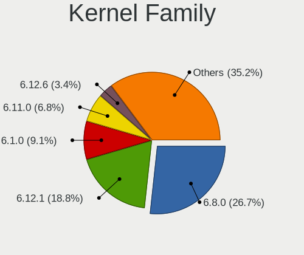
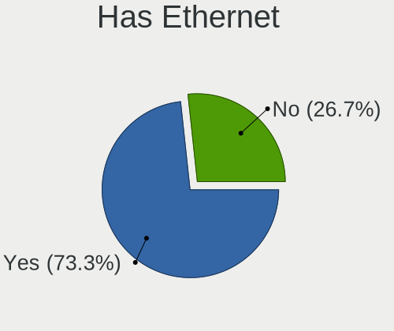
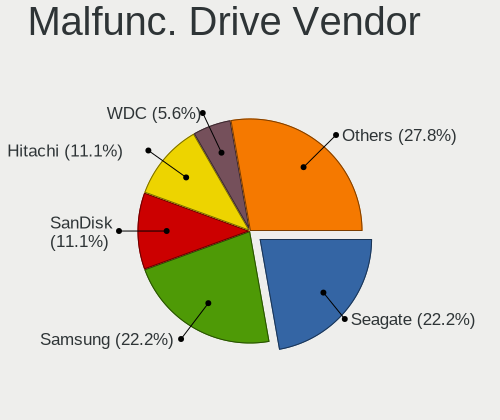
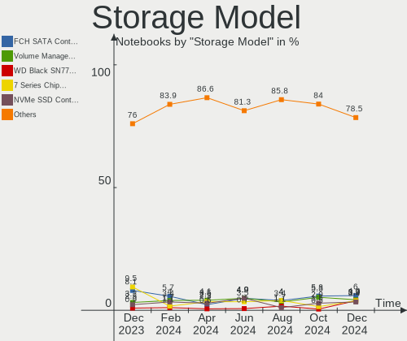
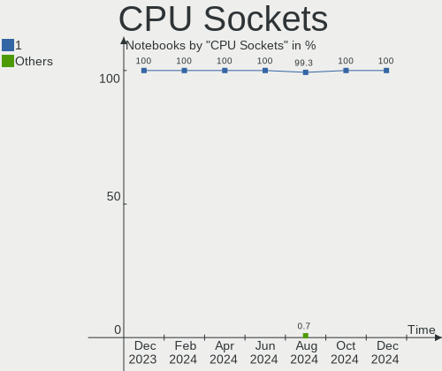
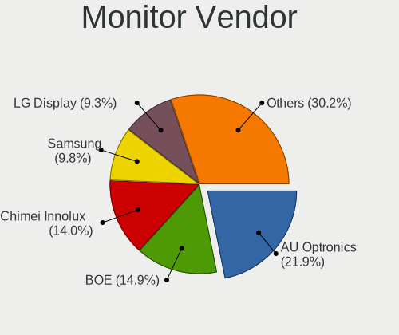
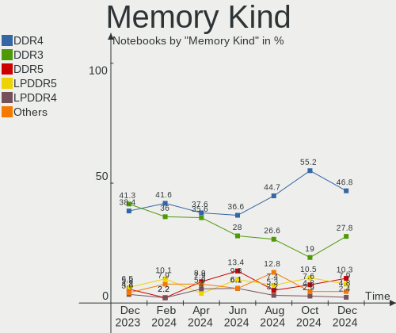
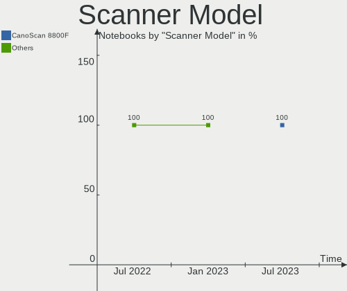

Linux in France - Hardware Trends (Notebooks)
---------------------------------------------

A project to identify most popular hardware characteristics and track their change
over time based on data collected by Linux users at https://Linux-Hardware.org.

Anyone can contribute to this report by the [hw-probe](https://github.com/linuxhw/hw-probe) tool:

    sudo -E hw-probe -all -upload

Period: Jan, 2023.

Contents
--------

* [ System ](#system)
  - [ OS                       ](#os)
  - [ OS Family                ](#os-family)
  - [ Kernel                   ](#kernel)
  - [ Kernel Family            ](#kernel-family)
  - [ Kernel Major Ver.        ](#kernel-major-ver)
  - [ Arch                     ](#arch)
  - [ DE                       ](#de)
  - [ Display Server           ](#display-server)
  - [ Display Manager          ](#display-manager)
  - [ OS Lang                  ](#os-lang)
  - [ Boot Mode                ](#boot-mode)
  - [ Filesystem               ](#filesystem)
  - [ Part. scheme             ](#part-scheme)
  - [ Dual Boot with Linux/BSD ](#dual-boot-with-linuxbsd)
  - [ Dual Boot (Win)          ](#dual-boot-win)

* [ Board ](#board)
  - [ Vendor                   ](#vendor)
  - [ Model                    ](#model)
  - [ Model Family             ](#model-family)
  - [ MFG Year                 ](#mfg-year)
  - [ Form Factor              ](#form-factor)
  - [ Secure Boot              ](#secure-boot)
  - [ Coreboot                 ](#coreboot)
  - [ RAM Size                 ](#ram-size)
  - [ RAM Used                 ](#ram-used)
  - [ Total Drives             ](#total-drives)
  - [ Has CD-ROM               ](#has-cd-rom)
  - [ Has Ethernet             ](#has-ethernet)
  - [ Has WiFi                 ](#has-wifi)
  - [ Has Bluetooth            ](#has-bluetooth)

* [ Location ](#location)
  - [ Country                  ](#country)
  - [ City                     ](#city)

* [ Drives ](#drives)
  - [ Drive Vendor             ](#drive-vendor)
  - [ Drive Model              ](#drive-model)
  - [ HDD Vendor               ](#hdd-vendor)
  - [ SSD Vendor               ](#ssd-vendor)
  - [ Drive Kind               ](#drive-kind)
  - [ Drive Connector          ](#drive-connector)
  - [ Drive Size               ](#drive-size)
  - [ Space Total              ](#space-total)
  - [ Space Used               ](#space-used)
  - [ Malfunc. Drives          ](#malfunc-drives)
  - [ Malfunc. Drive Vendor    ](#malfunc-drive-vendor)
  - [ Malfunc. HDD Vendor      ](#malfunc-hdd-vendor)
  - [ Malfunc. Drive Kind      ](#malfunc-drive-kind)
  - [ Failed Drives            ](#failed-drives)
  - [ Failed Drive Vendor      ](#failed-drive-vendor)
  - [ Drive Status             ](#drive-status)

* [ Storage controller ](#storage-controller)
  - [ Storage Vendor           ](#storage-vendor)
  - [ Storage Model            ](#storage-model)
  - [ Storage Kind             ](#storage-kind)

* [ Processor ](#processor)
  - [ CPU Vendor               ](#cpu-vendor)
  - [ CPU Model                ](#cpu-model)
  - [ CPU Model Family         ](#cpu-model-family)
  - [ CPU Cores                ](#cpu-cores)
  - [ CPU Sockets              ](#cpu-sockets)
  - [ CPU Threads              ](#cpu-threads)
  - [ CPU Op-Modes             ](#cpu-op-modes)
  - [ CPU Microcode            ](#cpu-microcode)
  - [ CPU Microarch            ](#cpu-microarch)

* [ Graphics ](#graphics)
  - [ GPU Vendor               ](#gpu-vendor)
  - [ GPU Model                ](#gpu-model)
  - [ GPU Combo                ](#gpu-combo)
  - [ GPU Driver               ](#gpu-driver)
  - [ GPU Memory               ](#gpu-memory)

* [ Monitor ](#monitor)
  - [ Monitor Vendor           ](#monitor-vendor)
  - [ Monitor Model            ](#monitor-model)
  - [ Monitor Resolution       ](#monitor-resolution)
  - [ Monitor Diagonal         ](#monitor-diagonal)
  - [ Monitor Width            ](#monitor-width)
  - [ Aspect Ratio             ](#aspect-ratio)
  - [ Monitor Area             ](#monitor-area)
  - [ Pixel Density            ](#pixel-density)
  - [ Multiple Monitors        ](#multiple-monitors)

* [ Network ](#network)
  - [ Net Controller Vendor    ](#net-controller-vendor)
  - [ Net Controller Model     ](#net-controller-model)
  - [ Wireless Vendor          ](#wireless-vendor)
  - [ Wireless Model           ](#wireless-model)
  - [ Ethernet Vendor          ](#ethernet-vendor)
  - [ Ethernet Model           ](#ethernet-model)
  - [ Net Controller Kind      ](#net-controller-kind)
  - [ Used Controller          ](#used-controller)
  - [ NICs                     ](#nics)
  - [ IPv6                     ](#ipv6)

* [ Bluetooth ](#bluetooth)
  - [ Bluetooth Vendor         ](#bluetooth-vendor)
  - [ Bluetooth Model          ](#bluetooth-model)

* [ Sound ](#sound)
  - [ Sound Vendor             ](#sound-vendor)
  - [ Sound Model              ](#sound-model)

* [ Memory ](#memory)
  - [ Memory Vendor            ](#memory-vendor)
  - [ Memory Model             ](#memory-model)
  - [ Memory Kind              ](#memory-kind)
  - [ Memory Form Factor       ](#memory-form-factor)
  - [ Memory Size              ](#memory-size)
  - [ Memory Speed             ](#memory-speed)

* [ Printers & scanners ](#printers--scanners)
  - [ Printer Vendor           ](#printer-vendor)
  - [ Printer Model            ](#printer-model)
  - [ Scanner Vendor           ](#scanner-vendor)
  - [ Scanner Model            ](#scanner-model)

* [ Camera ](#camera)
  - [ Camera Vendor            ](#camera-vendor)
  - [ Camera Model             ](#camera-model)

* [ Security ](#security)
  - [ Fingerprint Vendor       ](#fingerprint-vendor)
  - [ Fingerprint Model        ](#fingerprint-model)
  - [ Chipcard Vendor          ](#chipcard-vendor)
  - [ Chipcard Model           ](#chipcard-model)

* [ Unsupported ](#unsupported)
  - [ Unsupported Devices      ](#unsupported-devices)
  - [ Unsupported Device Types ](#unsupported-device-types)

System
------

OS
--

Installed operating systems

| Name                         | Notebooks | Percent |
|------------------------------|-----------|---------|
| OpenMandriva 23.01           | 41        | 19.07%  |
| Ubuntu 22.04                 | 36        | 16.74%  |
| Debian 11                    | 13        | 6.05%   |
| Linux Mint 21.1              | 12        | 5.58%   |
| Fedora 37                    | 10        | 4.65%   |
| Ubuntu 22.10                 | 9         | 4.19%   |
| Ubuntu 20.04                 | 8         | 3.72%   |
| Zorin 16                     | 6         | 2.79%   |
| Manjaro 22.0.0               | 6         | 2.79%   |
| Linux Mint 20.3              | 5         | 2.33%   |
| Pop!_OS 22.04                | 4         | 1.86%   |
| Arch Rolling                 | 4         | 1.86%   |
| Xubuntu 22.04                | 3         | 1.4%    |
| Xubuntu 20.04                | 3         | 1.4%    |
| Ubuntu MATE 22.04            | 3         | 1.4%    |
| Ubuntu 18.04                 | 3         | 1.4%    |
| OpenMandriva 4.3             | 3         | 1.4%    |
| Lubuntu 22.04                | 3         | 1.4%    |
| Linux Mint 21                | 3         | 1.4%    |
| SteamOS 3.4.4                | 2         | 0.93%   |
| Manjaro                      | 2         | 0.93%   |
| Linux Mint 20.1              | 2         | 0.93%   |
| Kubuntu 22.04                | 2         | 0.93%   |
| KDE neon 22.04               | 2         | 0.93%   |
| Fedora 36                    | 2         | 0.93%   |
| Zorin 15                     | 1         | 0.47%   |
| Ubuntu MATE 20.04            | 1         | 0.47%   |
| Ubuntu Budgie 22.10          | 1         | 0.47%   |
| TUXEDO OS 22.04              | 1         | 0.47%   |
| Peppermint 11.5              | 1         | 0.47%   |
| Parrot 5.1                   | 1         | 0.47%   |
| openSUSE Tumbleweed-XXXXXXXX | 1         | 0.47%   |
| OpenMandriva 4.90            | 1         | 0.47%   |
| OpenMandriva 4.50            | 1         | 0.47%   |
| OpenMandriva 4.2             | 1         | 0.47%   |
| Nobara 36                    | 1         | 0.47%   |
| Manjaro 22.0.1               | 1         | 0.47%   |
| Lubuntu 21.04                | 1         | 0.47%   |
| Lubuntu 20.10                | 1         | 0.47%   |
| LMDE 5                       | 1         | 0.47%   |

OS Family
---------

OS without a version

| Name          | Notebooks | Percent |
|---------------|-----------|---------|
| Ubuntu        | 56        | 26.05%  |
| OpenMandriva  | 47        | 21.86%  |
| Linux Mint    | 25        | 11.63%  |
| Debian        | 14        | 6.51%   |
| Fedora        | 12        | 5.58%   |
| Manjaro       | 9         | 4.19%   |
| Zorin         | 7         | 3.26%   |
| Xubuntu       | 6         | 2.79%   |
| Lubuntu       | 5         | 2.33%   |
| Ubuntu MATE   | 4         | 1.86%   |
| Pop!_OS       | 4         | 1.86%   |
| Arch          | 4         | 1.86%   |
| Kubuntu       | 3         | 1.4%    |
| SteamOS       | 2         | 0.93%   |
| KDE neon      | 2         | 0.93%   |
| Endless       | 2         | 0.93%   |
| CentOS        | 2         | 0.93%   |
| Ubuntu Budgie | 1         | 0.47%   |
| TUXEDO OS     | 1         | 0.47%   |
| Peppermint    | 1         | 0.47%   |
| Parrot        | 1         | 0.47%   |
| openSUSE      | 1         | 0.47%   |
| Nobara        | 1         | 0.47%   |
| LMDE          | 1         | 0.47%   |
| Kali          | 1         | 0.47%   |
| Gentoo        | 1         | 0.47%   |
| EndeavourOS   | 1         | 0.47%   |
| Elementary    | 1         | 0.47%   |

Kernel
------

Version of the Linux kernel

| Version                  | Notebooks | Percent |
|--------------------------|-----------|---------|
| 6.1.1-desktop-1omv2290   | 40        | 18.6%   |
| 5.15.0-58-generic        | 37        | 17.21%  |
| 5.15.0-56-generic        | 21        | 9.77%   |
| 5.15.0-57-generic        | 13        | 6.05%   |
| 5.10.0-20-amd64          | 10        | 4.65%   |
| 5.4.0-137-generic        | 9         | 4.19%   |
| 6.1.1-1-MANJARO          | 5         | 2.33%   |
| 5.19.0-26-generic        | 5         | 2.33%   |
| 6.0.12-76060006-generic  | 4         | 1.86%   |
| 5.4.0-136-generic        | 4         | 1.86%   |
| 6.0.15-300.fc37.x86_64   | 3         | 1.4%    |
| 5.19.0-29-generic        | 3         | 1.4%    |
| 5.16.7-desktop-1omv4003  | 3         | 1.4%    |
| 6.0.16-300.fc37.x86_64   | 2         | 0.93%   |
| 6.0.0-6-amd64            | 2         | 0.93%   |
| 5.13.0-valve36-1-neptune | 2         | 0.93%   |
| 5.11.0-35-generic        | 2         | 0.93%   |
| 5.10.0-21-amd64          | 2         | 0.93%   |
| 6.1.8-arch1-1            | 1         | 0.47%   |
| 6.1.8-200.fc37.x86_64    | 1         | 0.47%   |
| 6.1.7-100.fc36.x86_64    | 1         | 0.47%   |
| 6.1.7-1-MANJARO          | 1         | 0.47%   |
| 6.1.6-200.fc37.x86_64    | 1         | 0.47%   |
| 6.1.5-200.fc37.x86_64    | 1         | 0.47%   |
| 6.1.4-desktop-1omv2301   | 1         | 0.47%   |
| 6.1.3-gentoo-dist        | 1         | 0.47%   |
| 6.1.3-arch1-1            | 1         | 0.47%   |
| 6.1.2-arch1-1            | 1         | 0.47%   |
| 6.1.1-arch1-1            | 1         | 0.47%   |
| 6.0.17-300.fc37.x86_64   | 1         | 0.47%   |
| 6.0.15-200.fc36.x86_64   | 1         | 0.47%   |
| 6.0.15-1-MANJARO         | 1         | 0.47%   |
| 6.0.13-300.fc37.x86_64   | 1         | 0.47%   |
| 6.0.10-201.fc36.x86_64   | 1         | 0.47%   |
| 6.0.10-1-default         | 1         | 0.47%   |
| 6.0.0-kali5-amd64        | 1         | 0.47%   |
| 6.0.0-2parrot1-amd64     | 1         | 0.47%   |
| 6.0.0-1010-oem           | 1         | 0.47%   |
| 6.0.0-1009-oem           | 1         | 0.47%   |
| 5.8.0-25-generic         | 1         | 0.47%   |

Kernel Family
-------------

Linux kernel without a distro release

| Version | Notebooks | Percent |
|---------|-----------|---------|
| 5.15.0  | 74        | 34.42%  |
| 6.1.1   | 46        | 21.4%   |
| 5.4.0   | 17        | 7.91%   |
| 5.10.0  | 13        | 6.05%   |
| 5.19.0  | 12        | 5.58%   |
| 6.0.0   | 6         | 2.79%   |
| 6.0.15  | 5         | 2.33%   |
| 6.0.12  | 4         | 1.86%   |
| 5.16.7  | 3         | 1.4%    |
| 5.11.0  | 3         | 1.4%    |
| 4.15.0  | 3         | 1.4%    |
| 6.1.8   | 2         | 0.93%   |
| 6.1.7   | 2         | 0.93%   |
| 6.1.3   | 2         | 0.93%   |
| 6.0.16  | 2         | 0.93%   |
| 6.0.10  | 2         | 0.93%   |
| 5.14.0  | 2         | 0.93%   |
| 5.13.0  | 2         | 0.93%   |
| 6.1.6   | 1         | 0.47%   |
| 6.1.5   | 1         | 0.47%   |
| 6.1.4   | 1         | 0.47%   |
| 6.1.2   | 1         | 0.47%   |
| 6.0.17  | 1         | 0.47%   |
| 6.0.13  | 1         | 0.47%   |
| 5.8.0   | 1         | 0.47%   |
| 5.4.225 | 1         | 0.47%   |
| 5.19.5  | 1         | 0.47%   |
| 5.18.12 | 1         | 0.47%   |
| 5.17.0  | 1         | 0.47%   |
| 5.15.90 | 1         | 0.47%   |
| 5.14.21 | 1         | 0.47%   |
| 5.14.15 | 1         | 0.47%   |
| 5.10.14 | 1         | 0.47%   |

Kernel Major Ver.
-----------------

Linux kernel major version

| Version | Notebooks | Percent |
|---------|-----------|---------|
| 5.15    | 75        | 34.88%  |
| 6.1     | 56        | 26.05%  |
| 6.0     | 21        | 9.77%   |
| 5.4     | 18        | 8.37%   |
| 5.10    | 14        | 6.51%   |
| 5.19    | 13        | 6.05%   |
| 5.14    | 4         | 1.86%   |
| 5.16    | 3         | 1.4%    |
| 5.11    | 3         | 1.4%    |
| 4.15    | 3         | 1.4%    |
| 5.13    | 2         | 0.93%   |
| 5.8     | 1         | 0.47%   |
| 5.18    | 1         | 0.47%   |
| 5.17    | 1         | 0.47%   |

Arch
----

OS architecture (x86_64, i586, etc.)

| Name   | Notebooks | Percent |
|--------|-----------|---------|
| x86_64 | 212       | 98.6%   |
| i686   | 3         | 1.4%    |

DE
--

Desktop Environment

| Name            | Notebooks | Percent |
|-----------------|-----------|---------|
| GNOME           | 94        | 43.72%  |
| KDE5            | 61        | 28.37%  |
| X-Cinnamon      | 19        | 8.84%   |
| XFCE            | 16        | 7.44%   |
| MATE            | 9         | 4.19%   |
| LXQt            | 5         | 2.33%   |
| Unknown         | 5         | 2.33%   |
| Cinnamon        | 2         | 0.93%   |
| Pantheon        | 1         | 0.47%   |
| i3              | 1         | 0.47%   |
| GNOME Flashback | 1         | 0.47%   |
| Budgie          | 1         | 0.47%   |

Display Server
--------------

X11 or Wayland

| Name    | Notebooks | Percent |
|---------|-----------|---------|
| X11     | 155       | 72.09%  |
| Wayland | 56        | 26.05%  |
| Tty     | 2         | 0.93%   |
| Unknown | 2         | 0.93%   |

Display Manager
---------------

SDDM, LightDM, etc.

| Name    | Notebooks | Percent |
|---------|-----------|---------|
| SDDM    | 59        | 27.44%  |
| GDM3    | 51        | 23.72%  |
| Unknown | 43        | 20%     |
| LightDM | 36        | 16.74%  |
| GDM     | 25        | 11.63%  |
| NODM    | 1         | 0.47%   |

OS Lang
-------

Language

| Lang    | Notebooks | Percent |
|---------|-----------|---------|
| fr_FR   | 155       | 72.09%  |
| en_US   | 49        | 22.79%  |
| en_GB   | 4         | 1.86%   |
| ru_RU   | 2         | 0.93%   |
| C       | 2         | 0.93%   |
| ru_UA   | 1         | 0.47%   |
| de_DE   | 1         | 0.47%   |
| Unknown | 1         | 0.47%   |

Boot Mode
---------

EFI or BIOS

| Mode | Notebooks | Percent |
|------|-----------|---------|
| EFI  | 131       | 60.93%  |
| BIOS | 84        | 39.07%  |

Filesystem
----------

Type of filesystem

| Type    | Notebooks | Percent |
|---------|-----------|---------|
| Ext4    | 155       | 72.09%  |
| Overlay | 39        | 18.14%  |
| Btrfs   | 18        | 8.37%   |
| Xfs     | 1         | 0.47%   |
| F2fs    | 1         | 0.47%   |
| Ext3    | 1         | 0.47%   |

Part. scheme
------------

Scheme of partitioning

| Type    | Notebooks | Percent |
|---------|-----------|---------|
| GPT     | 137       | 63.72%  |
| Unknown | 44        | 20.47%  |
| MBR     | 34        | 15.81%  |

Dual Boot with Linux/BSD
------------------------

Hosting more than one Linux/BSD

| Dual boot | Notebooks | Percent |
|-----------|-----------|---------|
| No        | 181       | 84.19%  |
| Yes       | 34        | 15.81%  |

Dual Boot (Win)
---------------

Hosting Linux and Windows

| Dual boot | Notebooks | Percent |
|-----------|-----------|---------|
| No        | 157       | 73.02%  |
| Yes       | 58        | 26.98%  |

Board
-----

Vendor
------

Motherboard manufacturer

| Name                | Notebooks | Percent |
|---------------------|-----------|---------|
| Lenovo              | 44        | 20.47%  |
| Dell                | 38        | 17.67%  |
| Hewlett-Packard     | 36        | 16.74%  |
| ASUSTek Computer    | 34        | 15.81%  |
| Acer                | 18        | 8.37%   |
| MSI                 | 9         | 4.19%   |
| Toshiba             | 7         | 3.26%   |
| Samsung Electronics | 4         | 1.86%   |
| TUXEDO              | 3         | 1.4%    |
| Apple               | 3         | 1.4%    |
| Valve               | 2         | 0.93%   |
| Sony                | 2         | 0.93%   |
| Packard Bell        | 2         | 0.93%   |
| HUAWEI              | 2         | 0.93%   |
| UNOWHY              | 1         | 0.47%   |
| TrekStor            | 1         | 0.47%   |
| Thomson             | 1         | 0.47%   |
| Teclast             | 1         | 0.47%   |
| Schenker            | 1         | 0.47%   |
| Notebook            | 1         | 0.47%   |
| Intel               | 1         | 0.47%   |
| Google              | 1         | 0.47%   |
| Gigabyte Technology | 1         | 0.47%   |
| Framework           | 1         | 0.47%   |
| Danew               | 1         | 0.47%   |

Model
-----

Motherboard model

| Name                                | Notebooks | Percent |
|-------------------------------------|-----------|---------|
| HP Notebook                         | 4         | 1.86%   |
| Valve Jupiter                       | 2         | 0.93%   |
| Lenovo Y520-15IKBN 80WK             | 2         | 0.93%   |
| Lenovo IdeaPad Gaming 3 15ACH6 82K2 | 2         | 0.93%   |
| Lenovo G505 20240                   | 2         | 0.93%   |
| HP EliteBook 820 G3                 | 2         | 0.93%   |
| Dell XPS 15 9500                    | 2         | 0.93%   |
| Dell Latitude E6420                 | 2         | 0.93%   |
| Dell Latitude 7410                  | 2         | 0.93%   |
| Dell G3 3500                        | 2         | 0.93%   |
| ASUS T100TA                         | 2         | 0.93%   |
| Acer Aspire E5-575G                 | 2         | 0.93%   |
| UNOWHY Y13G011S4EI                  | 1         | 0.47%   |
| TUXEDO InfinityBook S 15 Gen6       | 1         | 0.47%   |
| TUXEDO InfinityBook Pro Gen7 (MK1)  | 1         | 0.47%   |
| TUXEDO Book XA15 / XA17 Gen10       | 1         | 0.47%   |
| TrekStor Surfbook A13B              | 1         | 0.47%   |
| Toshiba TECRA A11                   | 1         | 0.47%   |
| Toshiba Satellite Pro R50-B         | 1         | 0.47%   |
| Toshiba Satellite Pro C850-10N      | 1         | 0.47%   |
| Toshiba Satellite L655D             | 1         | 0.47%   |
| Toshiba Satellite C70-A             | 1         | 0.47%   |
| Toshiba Satellite A200              | 1         | 0.47%   |
| Toshiba PORTEGE Z30-B               | 1         | 0.47%   |
| Thomson N14C4WH64                   | 1         | 0.47%   |
| Teclast F6 Plus                     | 1         | 0.47%   |
| Sony VGN-NW21MF_W                   | 1         | 0.47%   |
| Sony SVE1513U1ESI                   | 1         | 0.47%   |
| Schenker XMG FUSION 15 (XFU15L19)   | 1         | 0.47%   |
| Samsung RV410/RV510/S3510/E3510     | 1         | 0.47%   |
| Samsung R530/R730/P530              | 1         | 0.47%   |
| Samsung N150/N210/N220              | 1         | 0.47%   |
| Samsung 350V5C/351V5C/3540VC/3440VC | 1         | 0.47%   |
| Packard Bell EasyNote ML65          | 1         | 0.47%   |
| Packard Bell EasyNote LE69KB        | 1         | 0.47%   |
| Notebook NJx0MU                     | 1         | 0.47%   |
| MSI Stealth GS66 12UH               | 1         | 0.47%   |
| MSI PX60 6QE                        | 1         | 0.47%   |
| MSI PS42 Modern 8MO                 | 1         | 0.47%   |
| MSI Katana GF66 12UC                | 1         | 0.47%   |

Model Family
------------

Motherboard model prefix

| Name                  | Notebooks | Percent |
|-----------------------|-----------|---------|
| Lenovo ThinkPad       | 23        | 10.7%   |
| Dell Latitude         | 14        | 6.51%   |
| HP EliteBook          | 13        | 6.05%   |
| Acer Aspire           | 13        | 6.05%   |
| Lenovo IdeaPad        | 10        | 4.65%   |
| Dell Inspiron         | 9         | 4.19%   |
| Toshiba Satellite     | 5         | 2.33%   |
| HP ProBook            | 5         | 2.33%   |
| HP Notebook           | 4         | 1.86%   |
| Dell XPS              | 4         | 1.86%   |
| Lenovo Legion         | 3         | 1.4%    |
| HP ZBook              | 3         | 1.4%    |
| Dell Precision        | 3         | 1.4%    |
| ASUS VivoBook         | 3         | 1.4%    |
| Valve Jupiter         | 2         | 0.93%   |
| TUXEDO InfinityBook   | 2         | 0.93%   |
| Packard Bell EasyNote | 2         | 0.93%   |
| Lenovo Y520-15IKBN    | 2         | 0.93%   |
| Lenovo G505           | 2         | 0.93%   |
| HP Pavilion           | 2         | 0.93%   |
| HP Laptop             | 2         | 0.93%   |
| HP Compaq             | 2         | 0.93%   |
| Dell System           | 2         | 0.93%   |
| Dell G3               | 2         | 0.93%   |
| ASUS TUF              | 2         | 0.93%   |
| ASUS T100TA           | 2         | 0.93%   |
| ASUS ROG              | 2         | 0.93%   |
| ASUS ASUS             | 2         | 0.93%   |
| Acer Swift            | 2         | 0.93%   |
| Acer Nitro            | 2         | 0.93%   |
| UNOWHY Y13G011S4EI    | 1         | 0.47%   |
| TUXEDO Book           | 1         | 0.47%   |
| TrekStor Surfbook     | 1         | 0.47%   |
| Toshiba TECRA         | 1         | 0.47%   |
| Toshiba PORTEGE       | 1         | 0.47%   |
| Thomson N14C4WH64     | 1         | 0.47%   |
| Teclast F6            | 1         | 0.47%   |
| Sony VGN-NW21MF       | 1         | 0.47%   |
| Sony SVE1513U1ESI     | 1         | 0.47%   |
| Schenker XMG          | 1         | 0.47%   |

MFG Year
--------

Motherboard manufacture year

| Year | Notebooks | Percent |
|------|-----------|---------|
| 2020 | 24        | 11.16%  |
| 2021 | 22        | 10.23%  |
| 2013 | 19        | 8.84%   |
| 2018 | 18        | 8.37%   |
| 2011 | 15        | 6.98%   |
| 2022 | 14        | 6.51%   |
| 2015 | 14        | 6.51%   |
| 2019 | 12        | 5.58%   |
| 2017 | 12        | 5.58%   |
| 2016 | 12        | 5.58%   |
| 2012 | 12        | 5.58%   |
| 2014 | 11        | 5.12%   |
| 2010 | 10        | 4.65%   |
| 2009 | 9         | 4.19%   |
| 2007 | 6         | 2.79%   |
| 2008 | 4         | 1.86%   |
| 2005 | 1         | 0.47%   |

Form Factor
-----------

Physical design of the computer

| Name     | Notebooks | Percent |
|----------|-----------|---------|
| Notebook | 215       | 100%    |

Secure Boot
-----------

Enabled or disabled

| State    | Notebooks | Percent |
|----------|-----------|---------|
| Disabled | 189       | 87.91%  |
| Enabled  | 26        | 12.09%  |

Coreboot
--------

Have coreboot on board

| Used | Notebooks | Percent |
|------|-----------|---------|
| No   | 214       | 99.53%  |
| Yes  | 1         | 0.47%   |

RAM Size
--------

Total RAM memory

| Size in GB | Notebooks | Percent |
|------------|-----------|---------|
| 3.01-4.0   | 62        | 28.84%  |
| 4.01-8.0   | 51        | 23.72%  |
| 16.01-24.0 | 36        | 16.74%  |
| 8.01-16.0  | 29        | 13.49%  |
| 32.01-64.0 | 20        | 9.3%    |
| 1.01-2.0   | 7         | 3.26%   |
| 24.01-32.0 | 5         | 2.33%   |
| 2.01-3.0   | 5         | 2.33%   |

RAM Used
--------

Used RAM memory

| Used GB    | Notebooks | Percent |
|------------|-----------|---------|
| 1.01-2.0   | 78        | 36.28%  |
| 2.01-3.0   | 51        | 23.72%  |
| 4.01-8.0   | 39        | 18.14%  |
| 3.01-4.0   | 24        | 11.16%  |
| 8.01-16.0  | 12        | 5.58%   |
| 0.51-1.0   | 9         | 4.19%   |
| 16.01-24.0 | 1         | 0.47%   |
| 0.01-0.5   | 1         | 0.47%   |

Total Drives
------------

Number of drives on board

| Drives | Notebooks | Percent |
|--------|-----------|---------|
| 1      | 150       | 69.77%  |
| 2      | 62        | 28.84%  |
| 3      | 2         | 0.93%   |
| 0      | 1         | 0.47%   |

Has CD-ROM
----------

Has CD-ROM on board

| Presented | Notebooks | Percent |
|-----------|-----------|---------|
| No        | 136       | 63.26%  |
| Yes       | 79        | 36.74%  |

Has Ethernet
------------

Has Ethernet on board

| Presented | Notebooks | Percent |
|-----------|-----------|---------|
| Yes       | 176       | 81.86%  |
| No        | 39        | 18.14%  |

Has WiFi
--------

Has WiFi module

| Presented | Notebooks | Percent |
|-----------|-----------|---------|
| Yes       | 209       | 97.21%  |
| No        | 6         | 2.79%   |

Has Bluetooth
-------------

Has Bluetooth module

| Presented | Notebooks | Percent |
|-----------|-----------|---------|
| Yes       | 161       | 74.88%  |
| No        | 54        | 25.12%  |

Location
--------

Country
-------

Geographic location (country)

| Country | Notebooks | Percent |
|---------|-----------|---------|
| France  | 215       | 100%    |

City
----

Geographic location (city)

| City                  | Notebooks | Percent |
|-----------------------|-----------|---------|
| Paris                 | 23        | 10.7%   |
| Toulouse              | 4         | 1.86%   |
| Limoges               | 4         | 1.86%   |
| Bordeaux              | 4         | 1.86%   |
| Chatres               | 3         | 1.4%    |
| Vélizy-Villacoublay  | 2         | 0.93%   |
| Strasbourg            | 2         | 0.93%   |
| Sélestat             | 2         | 0.93%   |
| Saint-Germain-en-Laye | 2         | 0.93%   |
| Peumerit              | 2         | 0.93%   |
| Narbonne              | 2         | 0.93%   |
| Nantes                | 2         | 0.93%   |
| Montpellier           | 2         | 0.93%   |
| Montauban             | 2         | 0.93%   |
| Marseille             | 2         | 0.93%   |
| Mantes-la-Jolie       | 2         | 0.93%   |
| La Rochelle           | 2         | 0.93%   |
| Champigny-sur-Marne   | 2         | 0.93%   |
| Chambéry             | 2         | 0.93%   |
| Briançon             | 2         | 0.93%   |
| Bourg-en-Bresse       | 2         | 0.93%   |
| Bellerive-sur-Allier  | 2         | 0.93%   |
| Argenteuil            | 2         | 0.93%   |
| Ambazac               | 2         | 0.93%   |
| Wissous               | 1         | 0.47%   |
| Wattrelos             | 1         | 0.47%   |
| Walincourt-Selvigny   | 1         | 0.47%   |
| Viviez                | 1         | 0.47%   |
| Viriville             | 1         | 0.47%   |
| Villeurbanne          | 1         | 0.47%   |
| Villeneuve-d'Ascq     | 1         | 0.47%   |
| Villemomble           | 1         | 0.47%   |
| Vienne                | 1         | 0.47%   |
| Verny                 | 1         | 0.47%   |
| Veigne                | 1         | 0.47%   |
| Vaudoy-en-Brie        | 1         | 0.47%   |
| Vannes                | 1         | 0.47%   |
| Vandoeuvre-les-Nancy  | 1         | 0.47%   |
| Valenciennes          | 1         | 0.47%   |
| Vaison-la-Romaine     | 1         | 0.47%   |

Drives
------

Drive Vendor
------------

Hard drive vendors

| Vendor                      | Notebooks | Drives | Percent |
|-----------------------------|-----------|--------|---------|
| Samsung Electronics         | 39        | 41     | 14.72%  |
| WDC                         | 27        | 28     | 10.19%  |
| Seagate                     | 26        | 29     | 9.81%   |
| Toshiba                     | 18        | 18     | 6.79%   |
| Unknown                     | 17        | 18     | 6.42%   |
| Crucial                     | 17        | 17     | 6.42%   |
| SanDisk                     | 16        | 19     | 6.04%   |
| SK hynix                    | 14        | 14     | 5.28%   |
| Micron Technology           | 14        | 14     | 5.28%   |
| Kingston                    | 11        | 11     | 4.15%   |
| HGST                        | 11        | 11     | 4.15%   |
| KIOXIA                      | 9         | 9      | 3.4%    |
| Hitachi                     | 6         | 6      | 2.26%   |
| Intel                       | 5         | 5      | 1.89%   |
| PNY                         | 4         | 4      | 1.51%   |
| China                       | 3         | 3      | 1.13%   |
| SPCC                        | 2         | 2      | 0.75%   |
| JMicron Technology          | 2         | 2      | 0.75%   |
| Unknown                     | 2         | 2      | 0.75%   |
| XrayDisk                    | 1         | 1      | 0.38%   |
| Transcend                   | 1         | 1      | 0.38%   |
| Teclast                     | 1         | 1      | 0.38%   |
| SSSTC                       | 1         | 2      | 0.38%   |
| SP                          | 1         | 1      | 0.38%   |
| ShanDianZhe                 | 1         | 1      | 0.38%   |
| R580                        | 1         | 1      | 0.38%   |
| O2 Micro                    | 1         | 1      | 0.38%   |
| LITEONIT                    | 1         | 1      | 0.38%   |
| LITEON                      | 1         | 1      | 0.38%   |
| Lite-On Technology          | 1         | 1      | 0.38%   |
| Lenovo                      | 1         | 1      | 0.38%   |
| Kingston Technology Company | 1         | 1      | 0.38%   |
| KingSpec                    | 1         | 1      | 0.38%   |
| HS-SSD-E100                 | 1         | 1      | 0.38%   |
| HGST HTS                    | 1         | 1      | 0.38%   |
| GOODRAM                     | 1         | 1      | 0.38%   |
| Fujitsu                     | 1         | 1      | 0.38%   |
| Emtec                       | 1         | 1      | 0.38%   |
| Corsair                     | 1         | 1      | 0.38%   |
| BW-PSSD1                    | 1         | 1      | 0.38%   |

Drive Model
-----------

Hard drive models

| Model                                               | Notebooks | Percent |
|-----------------------------------------------------|-----------|---------|
| Crucial CT240BX500SSD1 240GB                        | 6         | 2.21%   |
| Toshiba MQ01ABD100 1TB                              | 5         | 1.84%   |
| Seagate ST9500325AS 500GB                           | 4         | 1.47%   |
| Seagate ST1000LM024 HN-M101MBB 1TB                  | 4         | 1.47%   |
| KIOXIA KBG40ZNS512G NVMe 512GB                      | 4         | 1.47%   |
| Toshiba MQ04ABF100 1TB                              | 3         | 1.1%    |
| Seagate ST500LT012-1DG142 500GB                     | 3         | 1.1%    |
| Samsung NVMe SSD Controller SM981/PM981/PM983 500GB | 3         | 1.1%    |
| Kingston SA400S37240G 240GB SSD                     | 3         | 1.1%    |
| HGST HTS721010A9E630 1TB                            | 3         | 1.1%    |
| WDC WD10SPZX-24Z10T0 1TB                            | 2         | 0.74%   |
| Unknown SD/MMC/MS PRO 2GB                           | 2         | 0.74%   |
| Unknown N/A  32GB                                   | 2         | 0.74%   |
| Unknown MMC Card  64GB                              | 2         | 0.74%   |
| Unknown MMC Card  32GB                              | 2         | 0.74%   |
| Toshiba BG3 NVMe SSD Controller 256GB               | 2         | 0.74%   |
| Seagate ST1000LM048-2E7172 1TB                      | 2         | 0.74%   |
| SanDisk SSD PLUS 480 GB                             | 2         | 0.74%   |
| Samsung SSD 860 EVO 1TB                             | 2         | 0.74%   |
| Samsung SSD 850 EVO 500GB                           | 2         | 0.74%   |
| Samsung MZVLQ512HBLU-00B00 512GB                    | 2         | 0.74%   |
| Samsung MZALQ512HALU-000L2 512GB                    | 2         | 0.74%   |
| Samsung HM500JI 500GB                               | 2         | 0.74%   |
| Micron MTFDDAV256TBN-1AR15ABHA 256GB SSD            | 2         | 0.74%   |
| Micron 2200V_MTFDHBA512TCK  512GB                   | 2         | 0.74%   |
| Kingston SA400S37480G 480GB SSD                     | 2         | 0.74%   |
| Intel SSDPEKKF256G8L 256GB                          | 2         | 0.74%   |
| Hitachi HTS547575A9E384 752GB                       | 2         | 0.74%   |
| HGST HTS545050A7E680 500GB                          | 2         | 0.74%   |
| HGST HTS541010A9E680 1TB                            | 2         | 0.74%   |
| Unknown                                             | 2         | 0.74%   |
| XrayDisk 512GB SSD                                  | 1         | 0.37%   |
| WDC WDS240G2G0A-00JH30 240GB SSD                    | 1         | 0.37%   |
| WDC WDS200T2B0A-00SM50 2TB SSD                      | 1         | 0.37%   |
| WDC WDS100T3X0C-00SJG0 1TB                          | 1         | 0.37%   |
| WDC WD800UE-22HCT0 80GB                             | 1         | 0.37%   |
| WDC WD800BEVT-75ZCT2 80GB                           | 1         | 0.37%   |
| WDC WD7500BPVT-55HXZT4 752GB                        | 1         | 0.37%   |
| WDC WD7500BPKT-80PK4T0 752GB                        | 1         | 0.37%   |
| WDC WD7500BPKT-22PK4T0 752GB                        | 1         | 0.37%   |

HDD Vendor
----------

Hard disk drive vendors

| Vendor              | Notebooks | Drives | Percent |
|---------------------|-----------|--------|---------|
| Seagate             | 25        | 27     | 32.05%  |
| WDC                 | 18        | 18     | 23.08%  |
| Toshiba             | 12        | 12     | 15.38%  |
| HGST                | 11        | 11     | 14.1%   |
| Hitachi             | 6         | 6      | 7.69%   |
| Unknown             | 2         | 2      | 2.56%   |
| Samsung Electronics | 2         | 2      | 2.56%   |
| HGST HTS            | 1         | 1      | 1.28%   |
| Fujitsu             | 1         | 1      | 1.28%   |

SSD Vendor
----------

Solid state drive vendors

| Vendor              | Notebooks | Drives | Percent |
|---------------------|-----------|--------|---------|
| Crucial             | 15        | 15     | 18.99%  |
| Samsung Electronics | 12        | 12     | 15.19%  |
| SanDisk             | 11        | 12     | 13.92%  |
| Kingston            | 8         | 8      | 10.13%  |
| Micron Technology   | 5         | 5      | 6.33%   |
| SK hynix            | 4         | 4      | 5.06%   |
| WDC                 | 3         | 3      | 3.8%    |
| PNY                 | 3         | 3      | 3.8%    |
| China               | 3         | 3      | 3.8%    |
| Toshiba             | 2         | 2      | 2.53%   |
| XrayDisk            | 1         | 1      | 1.27%   |
| Transcend           | 1         | 1      | 1.27%   |
| Teclast             | 1         | 1      | 1.27%   |
| SPCC                | 1         | 1      | 1.27%   |
| LITEONIT            | 1         | 1      | 1.27%   |
| LITEON              | 1         | 1      | 1.27%   |
| KingSpec            | 1         | 1      | 1.27%   |
| JMicron Technology  | 1         | 1      | 1.27%   |
| Intel               | 1         | 1      | 1.27%   |
| HS-SSD-E100         | 1         | 1      | 1.27%   |
| GOODRAM             | 1         | 1      | 1.27%   |
| Emtec               | 1         | 1      | 1.27%   |
| BHT                 | 1         | 1      | 1.27%   |

Drive Kind
----------

HDD or SSD

| Kind    | Notebooks | Drives | Percent |
|---------|-----------|--------|---------|
| NVMe    | 79        | 90     | 31.23%  |
| HDD     | 77        | 80     | 30.43%  |
| SSD     | 73        | 80     | 28.85%  |
| MMC     | 16        | 18     | 6.32%   |
| Unknown | 8         | 8      | 3.16%   |

Drive Connector
---------------

SATA, SAS, NVMe, etc.

| Type | Notebooks | Drives | Percent |
|------|-----------|--------|---------|
| SATA | 139       | 158    | 56.97%  |
| NVMe | 79        | 90     | 32.38%  |
| MMC  | 16        | 18     | 6.56%   |
| SAS  | 10        | 10     | 4.1%    |

Drive Size
----------

Size of hard drive

| Size in TB | Notebooks | Drives | Percent |
|------------|-----------|--------|---------|
| 0.01-0.5   | 101       | 108    | 66.89%  |
| 0.51-1.0   | 46        | 48     | 30.46%  |
| 1.01-2.0   | 3         | 3      | 1.99%   |
| 4.01-10.0  | 1         | 1      | 0.66%   |

Space Total
-----------

Amount of disk space available on the file system

| Size in GB     | Notebooks | Percent |
|----------------|-----------|---------|
| 101-250        | 62        | 28.84%  |
| 251-500        | 60        | 27.91%  |
| 501-1000       | 27        | 12.56%  |
| 1-20           | 23        | 10.7%   |
| 1001-2000      | 17        | 7.91%   |
| 51-100         | 12        | 5.58%   |
| 21-50          | 7         | 3.26%   |
| Unknown        | 4         | 1.86%   |
| 2001-3000      | 2         | 0.93%   |
| More than 3000 | 1         | 0.47%   |

Space Used
----------

Amount of used disk space

| Used GB   | Notebooks | Percent |
|-----------|-----------|---------|
| 1-20      | 79        | 36.74%  |
| 21-50     | 34        | 15.81%  |
| 101-250   | 33        | 15.35%  |
| 51-100    | 28        | 13.02%  |
| 251-500   | 20        | 9.3%    |
| 501-1000  | 12        | 5.58%   |
| 1001-2000 | 4         | 1.86%   |
| Unknown   | 4         | 1.86%   |
| 2001-3000 | 1         | 0.47%   |

Malfunc. Drives
---------------

Drive models with a malfunction

| Model                              | Notebooks | Drives | Percent |
|------------------------------------|-----------|--------|---------|
| Seagate ST500LT012-1DG142 500GB    | 3         | 3      | 12.5%   |
| Seagate ST1000LM024 HN-M101MBB 1TB | 3         | 3      | 12.5%   |
| Toshiba MQ04ABF100 1TB             | 2         | 2      | 8.33%   |
| HGST HTS545050A7E680 500GB         | 2         | 2      | 8.33%   |
| WDC WD2500BEKT-75PVMT1 250GB       | 1         | 1      | 4.17%   |
| WDC WD10JPVX-60JC3T1 1TB           | 1         | 1      | 4.17%   |
| WDC WD Green M.2 2280 240GB SSD    | 1         | 1      | 4.17%   |
| Toshiba MQ01ABF050 500GB           | 1         | 1      | 4.17%   |
| Toshiba MQ01ABD100 1TB             | 1         | 1      | 4.17%   |
| Toshiba MK5061GSY 500GB            | 1         | 1      | 4.17%   |
| Seagate ST9500325AS 500GB          | 1         | 1      | 4.17%   |
| Seagate ST320LT007-9ZV142 320GB    | 1         | 1      | 4.17%   |
| Intel SSDSA2M160G2GC 160GB         | 1         | 1      | 4.17%   |
| Hitachi HTS547575A9E384 752GB      | 1         | 1      | 4.17%   |
| Hitachi HTS542525K9SA00 250GB      | 1         | 1      | 4.17%   |
| HGST HTS721010A9E630 1TB           | 1         | 1      | 4.17%   |
| HGST HTS545050A7E380 500GB         | 1         | 1      | 4.17%   |
| Crucial CT275MX300SSD4 275GB       | 1         | 1      | 4.17%   |

Malfunc. Drive Vendor
---------------------

Vendors of faulty drives

| Vendor  | Notebooks | Drives | Percent |
|---------|-----------|--------|---------|
| Seagate | 8         | 8      | 33.33%  |
| Toshiba | 5         | 5      | 20.83%  |
| HGST    | 4         | 4      | 16.67%  |
| WDC     | 3         | 3      | 12.5%   |
| Hitachi | 2         | 2      | 8.33%   |
| Intel   | 1         | 1      | 4.17%   |
| Crucial | 1         | 1      | 4.17%   |

Malfunc. HDD Vendor
-------------------

Vendors of faulty HDD drives

| Vendor  | Notebooks | Drives | Percent |
|---------|-----------|--------|---------|
| Seagate | 8         | 8      | 38.1%   |
| Toshiba | 5         | 5      | 23.81%  |
| HGST    | 4         | 4      | 19.05%  |
| WDC     | 2         | 2      | 9.52%   |
| Hitachi | 2         | 2      | 9.52%   |

Malfunc. Drive Kind
-------------------

Kinds of faulty drives

| Kind | Notebooks | Drives | Percent |
|------|-----------|--------|---------|
| HDD  | 21        | 21     | 87.5%   |
| SSD  | 3         | 3      | 12.5%   |

Failed Drives
-------------

Failed drive models

Zero info for selected period =(

Failed Drive Vendor
-------------------

Failed drive vendors

Zero info for selected period =(

Drive Status
------------

Number of failed and malfunc. drives

| Status   | Notebooks | Drives | Percent |
|----------|-----------|--------|---------|
| Works    | 117       | 138    | 50.87%  |
| Detected | 89        | 114    | 38.7%   |
| Malfunc  | 24        | 24     | 10.43%  |

Storage controller
------------------

Storage Vendor
--------------

Storage controller vendors

| Vendor                           | Notebooks | Percent |
|----------------------------------|-----------|---------|
| Intel                            | 145       | 56.42%  |
| AMD                              | 27        | 10.51%  |
| Samsung Electronics              | 25        | 9.73%   |
| Sandisk                          | 10        | 3.89%   |
| SK hynix                         | 9         | 3.5%    |
| Micron Technology                | 9         | 3.5%    |
| KIOXIA                           | 8         | 3.11%   |
| Toshiba America Info Systems     | 5         | 1.95%   |
| Kingston Technology Company      | 4         | 1.56%   |
| Silicon Integrated Systems [SiS] | 2         | 0.78%   |
| Phison Electronics               | 2         | 0.78%   |
| Nvidia                           | 2         | 0.78%   |
| Micron/Crucial Technology        | 2         | 0.78%   |
| Solid State Storage Technology   | 1         | 0.39%   |
| Silicon Motion                   | 1         | 0.39%   |
| O2 Micro                         | 1         | 0.39%   |
| Marvell Technology Group         | 1         | 0.39%   |
| Lite-On Technology               | 1         | 0.39%   |
| Lenovo                           | 1         | 0.39%   |
| JMicron Technology               | 1         | 0.39%   |

Storage Model
-------------

Storage controller models

| Model                                                                          | Notebooks | Percent |
|--------------------------------------------------------------------------------|-----------|---------|
| AMD FCH SATA Controller [AHCI mode]                                            | 21        | 7.66%   |
| Intel 7 Series Chipset Family 6-port SATA Controller [AHCI mode]               | 16        | 5.84%   |
| Intel Sunrise Point-LP SATA Controller [AHCI mode]                             | 15        | 5.47%   |
| Intel Volume Management Device NVMe RAID Controller                            | 12        | 4.38%   |
| Samsung NVMe SSD Controller 980                                                | 10        | 3.65%   |
| Intel Wildcat Point-LP SATA Controller [AHCI Mode]                             | 10        | 3.65%   |
| Intel 8 Series SATA Controller 1 [AHCI mode]                                   | 10        | 3.65%   |
| Samsung NVMe SSD Controller SM981/PM981/PM983                                  | 9         | 3.28%   |
| Micron Non-Volatile memory controller                                          | 9         | 3.28%   |
| Intel 82801 Mobile SATA Controller [RAID mode]                                 | 9         | 3.28%   |
| Intel 6 Series/C200 Series Chipset Family 6 port Mobile SATA AHCI Controller   | 9         | 3.28%   |
| Intel 82801IBM/IEM (ICH9M/ICH9M-E) 4 port SATA Controller [AHCI mode]          | 8         | 2.92%   |
| Intel 8 Series/C220 Series Chipset Family 6-port SATA Controller 1 [AHCI mode] | 7         | 2.55%   |
| KIOXIA NVMe SSD Controller BG4                                                 | 6         | 2.19%   |
| Intel 82801HM/HEM (ICH8M/ICH8M-E) SATA Controller [AHCI mode]                  | 5         | 1.82%   |
| Intel 400 Series Chipset Family SATA AHCI Controller                           | 5         | 1.82%   |
| AMD SB7x0/SB8x0/SB9x0 SATA Controller [AHCI mode]                              | 5         | 1.82%   |
| Intel Celeron/Pentium Silver Processor SATA Controller                         | 4         | 1.46%   |
| Intel Cannon Lake Mobile PCH SATA AHCI Controller                              | 4         | 1.46%   |
| SK hynix BC511                                                                 | 3         | 1.09%   |
| SanDisk Non-Volatile memory controller                                         | 3         | 1.09%   |
| Samsung NVMe SSD Controller PM9A1/PM9A3/980PRO                                 | 3         | 1.09%   |
| Intel Tiger Lake-LP SATA Controller                                            | 3         | 1.09%   |
| Intel Q170/Q150/B150/H170/H110/Z170/CM236 Chipset SATA Controller [AHCI Mode]  | 3         | 1.09%   |
| Intel HM170/QM170 Chipset SATA Controller [AHCI Mode]                          | 3         | 1.09%   |
| Intel Cannon Point-LP SATA Controller [AHCI Mode]                              | 3         | 1.09%   |
| Intel 82801HM/HEM (ICH8M/ICH8M-E) IDE Controller                               | 3         | 1.09%   |
| Intel 5 Series/3400 Series Chipset 4 port SATA AHCI Controller                 | 3         | 1.09%   |
| Toshiba America Info Systems XG6 NVMe SSD Controller                           | 2         | 0.73%   |
| Toshiba America Info Systems BG3 NVMe SSD Controller                           | 2         | 0.73%   |
| SK hynix Non-Volatile memory controller                                        | 2         | 0.73%   |
| SK hynix Gold P31/PC711 NVMe Solid State Drive                                 | 2         | 0.73%   |
| Silicon Integrated Systems [SiS] SATA Controller / IDE mode                    | 2         | 0.73%   |
| Silicon Integrated Systems [SiS] 5513 IDE Controller                           | 2         | 0.73%   |
| SanDisk WD Blue SN550 NVMe SSD                                                 | 2         | 0.73%   |
| SanDisk PC SN520 NVMe SSD                                                      | 2         | 0.73%   |
| Samsung NVMe SSD Controller SM961/PM961/SM963                                  | 2         | 0.73%   |
| Samsung NVMe SSD Controller PM9B1                                              | 2         | 0.73%   |
| Phison E12 NVMe Controller                                                     | 2         | 0.73%   |
| Nvidia MCP79 AHCI Controller                                                   | 2         | 0.73%   |

Storage Kind
------------

Kind of storage controller (IDE, SATA, NVMe, SAS, ...)

| Kind | Notebooks | Percent |
|------|-----------|---------|
| SATA | 149       | 56.87%  |
| NVMe | 79        | 30.15%  |
| RAID | 22        | 8.4%    |
| IDE  | 12        | 4.58%   |

Processor
---------

CPU Vendor
----------

Processor vendors

| Vendor | Notebooks | Percent |
|--------|-----------|---------|
| Intel  | 182       | 84.65%  |
| AMD    | 33        | 15.35%  |

CPU Model
---------

Processor models

| Model                                   | Notebooks | Percent |
|-----------------------------------------|-----------|---------|
| Intel 11th Gen Core i7-1165G7 @ 2.80GHz | 8         | 3.72%   |
| Intel Core i5-6300U CPU @ 2.40GHz       | 5         | 2.33%   |
| Intel Core i5-8250U CPU @ 1.60GHz       | 4         | 1.86%   |
| Intel 12th Gen Core i7-12700H           | 4         | 1.86%   |
| Intel Core i7-9750H CPU @ 2.60GHz       | 3         | 1.4%    |
| Intel Core i7-8550U CPU @ 1.80GHz       | 3         | 1.4%    |
| Intel Core i7-4700HQ CPU @ 2.40GHz      | 3         | 1.4%    |
| Intel Core i5-7200U CPU @ 2.50GHz       | 3         | 1.4%    |
| Intel Core i5-5200U CPU @ 2.20GHz       | 3         | 1.4%    |
| Intel Core i5-4310U CPU @ 2.00GHz       | 3         | 1.4%    |
| Intel Core i5-2540M CPU @ 2.60GHz       | 3         | 1.4%    |
| Intel Core i5-2520M CPU @ 2.50GHz       | 3         | 1.4%    |
| Intel Core i5-10300H CPU @ 2.50GHz      | 3         | 1.4%    |
| Intel Core i5-10210U CPU @ 1.60GHz      | 3         | 1.4%    |
| Intel Core i3-7020U CPU @ 2.30GHz       | 3         | 1.4%    |
| Intel Core i3-5005U CPU @ 2.00GHz       | 3         | 1.4%    |
| Intel 11th Gen Core i5-1135G7 @ 2.40GHz | 3         | 1.4%    |
| AMD Ryzen 5 4600H with Radeon Graphics  | 3         | 1.4%    |
| Intel Pentium CPU B970 @ 2.30GHz        | 2         | 0.93%   |
| Intel Core i7-8565U CPU @ 1.80GHz       | 2         | 0.93%   |
| Intel Core i7-6700HQ CPU @ 2.60GHz      | 2         | 0.93%   |
| Intel Core i7-5500U CPU @ 2.40GHz       | 2         | 0.93%   |
| Intel Core i7-10750H CPU @ 2.60GHz      | 2         | 0.93%   |
| Intel Core i7-10610U CPU @ 1.80GHz      | 2         | 0.93%   |
| Intel Core i5-8350U CPU @ 1.70GHz       | 2         | 0.93%   |
| Intel Core i5-7300HQ CPU @ 2.50GHz      | 2         | 0.93%   |
| Intel Core i5-3320M CPU @ 2.60GHz       | 2         | 0.93%   |
| Intel Core i3-4030U CPU @ 1.90GHz       | 2         | 0.93%   |
| Intel Core i3-2350M CPU @ 2.30GHz       | 2         | 0.93%   |
| Intel Core 2 Duo CPU T7300 @ 2.00GHz    | 2         | 0.93%   |
| Intel Celeron CPU N2840 @ 2.16GHz       | 2         | 0.93%   |
| Intel 11th Gen Core i7-11800H @ 2.30GHz | 2         | 0.93%   |
| AMD Ryzen 7 5825U with Radeon Graphics  | 2         | 0.93%   |
| AMD Ryzen 5 5600H with Radeon Graphics  | 2         | 0.93%   |
| AMD E1-2100 APU with Radeon HD Graphics | 2         | 0.93%   |
| AMD Custom APU 0405                     | 2         | 0.93%   |
| AMD Athlon II P360 Dual-Core Processor  | 2         | 0.93%   |
| Intel Xeon CPU E3-1505M v6 @ 3.00GHz    | 1         | 0.47%   |
| Intel Xeon CPU E3-1505M v5 @ 2.80GHz    | 1         | 0.47%   |
| Intel Pentium M processor 1.73GHz       | 1         | 0.47%   |

CPU Model Family
----------------

Processor model prefix

| Model                   | Notebooks | Percent |
|-------------------------|-----------|---------|
| Intel Core i5           | 56        | 26.05%  |
| Intel Core i7           | 36        | 16.74%  |
| Other                   | 30        | 13.95%  |
| Intel Core i3           | 18        | 8.37%   |
| Intel Core 2 Duo        | 15        | 6.98%   |
| Intel Celeron           | 13        | 6.05%   |
| AMD Ryzen 5             | 7         | 3.26%   |
| Intel Pentium           | 6         | 2.79%   |
| AMD Ryzen 7             | 6         | 2.79%   |
| Intel Atom              | 5         | 2.33%   |
| AMD E1                  | 4         | 1.86%   |
| AMD E2                  | 3         | 1.4%    |
| Intel Xeon              | 2         | 0.93%   |
| AMD Ryzen 9             | 2         | 0.93%   |
| AMD Athlon II           | 2         | 0.93%   |
| Intel Pentium M         | 1         | 0.47%   |
| Intel Pentium Dual-Core | 1         | 0.47%   |
| Intel Core M            | 1         | 0.47%   |
| Intel Core i9           | 1         | 0.47%   |
| Intel Celeron Dual-Core | 1         | 0.47%   |
| AMD Turion 64 X2 Mobile | 1         | 0.47%   |
| AMD Phenom II           | 1         | 0.47%   |
| AMD E                   | 1         | 0.47%   |
| AMD A8                  | 1         | 0.47%   |
| AMD A6                  | 1         | 0.47%   |

CPU Cores
---------

Number of processor cores

| Number | Notebooks | Percent |
|--------|-----------|---------|
| 2      | 105       | 48.84%  |
| 4      | 72        | 33.49%  |
| 6      | 13        | 6.05%   |
| 8      | 11        | 5.12%   |
| 1      | 5         | 2.33%   |
| 14     | 4         | 1.86%   |
| 12     | 2         | 0.93%   |
| 10     | 2         | 0.93%   |
| 3      | 1         | 0.47%   |

CPU Sockets
-----------

Number of sockets

| Number | Notebooks | Percent |
|--------|-----------|---------|
| 1      | 215       | 100%    |

CPU Threads
-----------

Threads per core (Hyper-Threading)

| Number | Notebooks | Percent |
|--------|-----------|---------|
| 2      | 151       | 70.23%  |
| 1      | 63        | 29.3%   |
| 4      | 1         | 0.47%   |

CPU Op-Modes
------------

CPU Operation Modes (32-bit, 64-bit)

| Op mode        | Notebooks | Percent |
|----------------|-----------|---------|
| 32-bit, 64-bit | 214       | 99.53%  |
| 32-bit         | 1         | 0.47%   |

CPU Microcode
-------------

Microcode number

| Number     | Notebooks | Percent |
|------------|-----------|---------|
| Unknown    | 49        | 22.79%  |
| 0x806c1    | 13        | 6.05%   |
| 0x206a7    | 12        | 5.58%   |
| 0x806ea    | 10        | 4.65%   |
| 0x40651    | 9         | 4.19%   |
| 0x306d4    | 9         | 4.19%   |
| 0x1067a    | 9         | 4.19%   |
| 0xa0652    | 8         | 3.72%   |
| 0x806ec    | 8         | 3.72%   |
| 0x306a9    | 7         | 3.26%   |
| 0x906a3    | 5         | 2.33%   |
| 0x806e9    | 5         | 2.33%   |
| 0x506e3    | 4         | 1.86%   |
| 0x30678    | 4         | 1.86%   |
| 0x906ea    | 3         | 1.4%    |
| 0x906e9    | 3         | 1.4%    |
| 0x806d1    | 3         | 1.4%    |
| 0x306c3    | 3         | 1.4%    |
| 0x20655    | 3         | 1.4%    |
| 0x0a50000c | 3         | 1.4%    |
| 0x906a4    | 2         | 0.93%   |
| 0x706a8    | 2         | 0.93%   |
| 0x706a1    | 2         | 0.93%   |
| 0x6fa      | 2         | 0.93%   |
| 0x406e3    | 2         | 0.93%   |
| 0x406c3    | 2         | 0.93%   |
| 0x10661    | 2         | 0.93%   |
| 0x08600104 | 2         | 0.93%   |
| 0x0700010b | 2         | 0.93%   |
| 0x010000c8 | 2         | 0.93%   |
| 0x906ed    | 1         | 0.47%   |
| 0x806eb    | 1         | 0.47%   |
| 0x706e5    | 1         | 0.47%   |
| 0x6fd      | 1         | 0.47%   |
| 0x6fb      | 1         | 0.47%   |
| 0x6d8      | 1         | 0.47%   |
| 0x506c9    | 1         | 0.47%   |
| 0x30673    | 1         | 0.47%   |
| 0x20652    | 1         | 0.47%   |
| 0x106ca    | 1         | 0.47%   |

CPU Microarch
-------------

Microarchitecture

| Name             | Notebooks | Percent |
|------------------|-----------|---------|
| KabyLake         | 38        | 17.67%  |
| Haswell          | 18        | 8.37%   |
| SandyBridge      | 17        | 7.91%   |
| TigerLake        | 15        | 6.98%   |
| Penryn           | 13        | 6.05%   |
| Skylake          | 11        | 5.12%   |
| IvyBridge        | 11        | 5.12%   |
| Broadwell        | 10        | 4.65%   |
| Silvermont       | 8         | 3.72%   |
| CometLake        | 8         | 3.72%   |
| Alderlake Hybrid | 7         | 3.26%   |
| Zen 3            | 6         | 2.79%   |
| Westmere         | 6         | 2.79%   |
| Core             | 6         | 2.79%   |
| Zen 2            | 5         | 2.33%   |
| IceLake          | 5         | 2.33%   |
| Puma             | 4         | 1.86%   |
| Jaguar           | 4         | 1.86%   |
| Goldmont plus    | 4         | 1.86%   |
| Unknown          | 4         | 1.86%   |
| K10              | 3         | 1.4%    |
| Zen+             | 2         | 0.93%   |
| Goldmont         | 2         | 0.93%   |
| Excavator        | 2         | 0.93%   |
| Bobcat           | 2         | 0.93%   |
| Zen              | 1         | 0.47%   |
| P6               | 1         | 0.47%   |
| K8 Hammer        | 1         | 0.47%   |
| Bonnell          | 1         | 0.47%   |

Graphics
--------

GPU Vendor
----------

Vendors of graphics cards

| Vendor                           | Notebooks | Percent |
|----------------------------------|-----------|---------|
| Intel                            | 167       | 58.39%  |
| Nvidia                           | 71        | 24.83%  |
| AMD                              | 47        | 16.43%  |
| Silicon Integrated Systems [SiS] | 1         | 0.35%   |

GPU Model
---------

Graphics card models

| Model                                                                     | Notebooks | Percent |
|---------------------------------------------------------------------------|-----------|---------|
| Intel 2nd Generation Core Processor Family Integrated Graphics Controller | 17        | 5.78%   |
| Intel TigerLake-LP GT2 [Iris Xe Graphics]                                 | 15        | 5.1%    |
| Intel UHD Graphics 620                                                    | 11        | 3.74%   |
| Intel Haswell-ULT Integrated Graphics Controller                          | 11        | 3.74%   |
| Intel 3rd Gen Core processor Graphics Controller                          | 9         | 3.06%   |
| Intel HD Graphics 620                                                     | 8         | 2.72%   |
| Intel HD Graphics 5500                                                    | 8         | 2.72%   |
| Intel CometLake-H GT2 [UHD Graphics]                                      | 8         | 2.72%   |
| Intel Skylake GT2 [HD Graphics 520]                                       | 6         | 2.04%   |
| Intel Mobile 4 Series Chipset Integrated Graphics Controller              | 6         | 2.04%   |
| Intel CometLake-U GT2 [UHD Graphics]                                      | 6         | 2.04%   |
| Intel Atom Processor Z36xxx/Z37xxx Series Graphics & Display              | 6         | 2.04%   |
| Nvidia TU117M                                                             | 5         | 1.7%    |
| Intel WhiskeyLake-U GT2 [UHD Graphics 620]                                | 5         | 1.7%    |
| Intel Alder Lake-P Integrated Graphics Controller                         | 5         | 1.7%    |
| Intel 4th Gen Core Processor Integrated Graphics Controller               | 5         | 1.7%    |
| Nvidia GA106M [GeForce RTX 3060 Mobile / Max-Q]                           | 4         | 1.36%   |
| Intel TigerLake-H GT1 [UHD Graphics]                                      | 4         | 1.36%   |
| Intel Mobile GM965/GL960 Integrated Graphics Controller (secondary)       | 4         | 1.36%   |
| Intel Mobile GM965/GL960 Integrated Graphics Controller (primary)         | 4         | 1.36%   |
| Intel HD Graphics 530                                                     | 4         | 1.36%   |
| Intel GeminiLake [UHD Graphics 600]                                       | 4         | 1.36%   |
| Intel Core Processor Integrated Graphics Controller                       | 4         | 1.36%   |
| AMD Renoir                                                                | 4         | 1.36%   |
| AMD Cezanne [Radeon Vega Series / Radeon Vega Mobile Series]              | 4         | 1.36%   |
| Nvidia TU116M [GeForce GTX 1660 Ti Mobile]                                | 3         | 1.02%   |
| Nvidia GP108M [GeForce MX150]                                             | 3         | 1.02%   |
| Nvidia GM107M [GeForce GTX 950M]                                          | 3         | 1.02%   |
| Nvidia GK208BM [GeForce 920M]                                             | 3         | 1.02%   |
| Nvidia GA107M [GeForce RTX 3050 Mobile]                                   | 3         | 1.02%   |
| Intel HD Graphics 630                                                     | 3         | 1.02%   |
| Intel CoffeeLake-H GT2 [UHD Graphics 630]                                 | 3         | 1.02%   |
| Nvidia TU117M [GeForce GTX 1650 Ti Mobile]                                | 2         | 0.68%   |
| Nvidia TU106M [GeForce RTX 2060 Mobile]                                   | 2         | 0.68%   |
| Nvidia GP107M [GeForce GTX 1050 Mobile]                                   | 2         | 0.68%   |
| Nvidia GM206GLM [Quadro M2200 Mobile]                                     | 2         | 0.68%   |
| Nvidia GM107M [GeForce GTX 850M]                                          | 2         | 0.68%   |
| Nvidia GK208M [GeForce GT 740M]                                           | 2         | 0.68%   |
| Nvidia GF117M [GeForce 610M/710M/810M/820M / GT 620M/625M/630M/720M]      | 2         | 0.68%   |
| Nvidia GA104M [GeForce RTX 3080 Mobile / Max-Q 8GB/16GB]                  | 2         | 0.68%   |

GPU Combo
---------

Combinations of graphics cards

| Name           | Notebooks | Percent |
|----------------|-----------|---------|
| 1 x Intel      | 100       | 46.51%  |
| Intel + Nvidia | 54        | 25.12%  |
| 1 x AMD        | 26        | 12.09%  |
| 1 x Nvidia     | 9         | 4.19%   |
| Intel + AMD    | 9         | 4.19%   |
| AMD + Nvidia   | 8         | 3.72%   |
| 2 x Intel      | 4         | 1.86%   |
| 2 x AMD        | 4         | 1.86%   |
| 1 x SiS        | 1         | 0.47%   |

GPU Driver
----------

Free vs proprietary

| Driver      | Notebooks | Percent |
|-------------|-----------|---------|
| Free        | 187       | 86.98%  |
| Proprietary | 25        | 11.63%  |
| Unknown     | 3         | 1.4%    |

GPU Memory
----------

Total video memory

| Size in GB | Notebooks | Percent |
|------------|-----------|---------|
| Unknown    | 146       | 67.91%  |
| 0.01-0.5   | 24        | 11.16%  |
| 1.01-2.0   | 18        | 8.37%   |
| 0.51-1.0   | 12        | 5.58%   |
| 3.01-4.0   | 9         | 4.19%   |
| 5.01-6.0   | 3         | 1.4%    |
| 7.01-8.0   | 2         | 0.93%   |
| 2.01-3.0   | 1         | 0.47%   |

Monitor
-------

Monitor Vendor
--------------

Monitor vendors

| Vendor                  | Notebooks | Percent |
|-------------------------|-----------|---------|
| AU Optronics            | 52        | 22.32%  |
| LG Display              | 35        | 15.02%  |
| Chimei Innolux          | 29        | 12.45%  |
| BOE                     | 29        | 12.45%  |
| Samsung Electronics     | 19        | 8.15%   |
| Lenovo                  | 9         | 3.86%   |
| Chi Mei Optoelectronics | 7         | 3%      |
| PANDA                   | 6         | 2.58%   |
| Dell                    | 6         | 2.58%   |
| Sharp                   | 5         | 2.15%   |
| InfoVision              | 4         | 1.72%   |
| Hewlett-Packard         | 4         | 1.72%   |
| CSO                     | 3         | 1.29%   |
| Apple                   | 3         | 1.29%   |
| Valve                   | 2         | 0.86%   |
| LG Philips              | 2         | 0.86%   |
| Goldstar                | 2         | 0.86%   |
| BenQ                    | 2         | 0.86%   |
| ASUSTek Computer        | 2         | 0.86%   |
| Ancor Communications    | 2         | 0.86%   |
| Acer                    | 2         | 0.86%   |
| ViewSonic               | 1         | 0.43%   |
| Seiko/Epson             | 1         | 0.43%   |
| Quanta Display          | 1         | 0.43%   |
| JDZ                     | 1         | 0.43%   |
| Iiyama                  | 1         | 0.43%   |
| CS_                     | 1         | 0.43%   |
| CHD                     | 1         | 0.43%   |
| AOC                     | 1         | 0.43%   |

Monitor Model
-------------

Monitor models

| Model                                                                    | Notebooks | Percent |
|--------------------------------------------------------------------------|-----------|---------|
| LG Display LCD Monitor LGD0590 1920x1080 344x194mm 15.5-inch             | 3         | 1.28%   |
| Chimei Innolux LCD Monitor CMN14D5 1920x1080 309x173mm 13.9-inch         | 3         | 1.28%   |
| AU Optronics LCD Monitor AUO219E 1600x900 382x214mm 17.2-inch            | 3         | 1.28%   |
| Valve ANX7530 U VLV3001 800x1280 100x150mm 7.1-inch                      | 2         | 0.85%   |
| Sharp LCD Monitor SHP14D1 1920x1200 336x210mm 15.6-inch                  | 2         | 0.85%   |
| Samsung Electronics LCD Monitor SEC544B 1600x900 310x174mm 14.0-inch     | 2         | 0.85%   |
| Samsung Electronics LCD Monitor SEC5441 1366x768 344x194mm 15.5-inch     | 2         | 0.85%   |
| Samsung Electronics LCD Monitor SDC4752 1366x768 344x194mm 15.5-inch     | 2         | 0.85%   |
| PANDA LCD Monitor NCP004D 1920x1080 344x194mm 15.5-inch                  | 2         | 0.85%   |
| LG Display LCD Monitor LGD06B3 1920x1200 336x210mm 15.6-inch             | 2         | 0.85%   |
| LG Display LCD Monitor LGD0258 1600x900 345x194mm 15.6-inch              | 2         | 0.85%   |
| Lenovo LCD Monitor LEN4010 1280x800 261x163mm 12.1-inch                  | 2         | 0.85%   |
| Chimei Innolux LCD Monitor CMN15E7 1920x1080 344x193mm 15.5-inch         | 2         | 0.85%   |
| Chimei Innolux LCD Monitor CMN15DC 1366x768 344x193mm 15.5-inch          | 2         | 0.85%   |
| Chimei Innolux LCD Monitor CMN1522 1920x1080 344x193mm 15.5-inch         | 2         | 0.85%   |
| Chi Mei Optoelectronics LCD Monitor CMO1721 1600x900 382x215mm 17.3-inch | 2         | 0.85%   |
| BOE LCD Monitor BOE0691 1920x1080 280x165mm 12.8-inch                    | 2         | 0.85%   |
| AU Optronics LCD Monitor AUOD1ED 1920x1080 344x193mm 15.5-inch           | 2         | 0.85%   |
| AU Optronics LCD Monitor AUO423D 1920x1080 309x173mm 13.9-inch           | 2         | 0.85%   |
| AU Optronics LCD Monitor AUO38ED 1920x1080 344x193mm 15.5-inch           | 2         | 0.85%   |
| AU Optronics LCD Monitor AUO23EC 1366x768 344x193mm 15.5-inch            | 2         | 0.85%   |
| AU Optronics LCD Monitor AUO149E 1600x900 382x214mm 17.2-inch            | 2         | 0.85%   |
| AU Optronics LCD Monitor AUO139E 1600x900 380x210mm 17.1-inch            | 2         | 0.85%   |
| AU Optronics LCD Monitor AUO119E 1600x900 382x214mm 17.2-inch            | 2         | 0.85%   |
| AU Optronics LCD Monitor AUO103D 1920x1080 309x173mm 13.9-inch           | 2         | 0.85%   |
| ViewSonic VP2765 SERIES VSC9F28 1920x1080 598x336mm 27.0-inch            | 1         | 0.43%   |
| Sharp LQ156T1JW04 SHP153C 2560x1440 344x194mm 15.5-inch                  | 1         | 0.43%   |
| Sharp LQ156M1JW25 SHP152C 1920x1080 344x194mm 15.5-inch                  | 1         | 0.43%   |
| Sharp LQ133M1JW02 SHP141A 1920x1080 294x165mm 13.3-inch                  | 1         | 0.43%   |
| Seiko/Epson LCD Monitor 1920x1080                                        | 1         | 0.43%   |
| Samsung Electronics SMT22A350 SAM07A7 1920x1080 477x268mm 21.5-inch      | 1         | 0.43%   |
| Samsung Electronics SME1920N SAM06A3 1366x768 410x230mm 18.5-inch        | 1         | 0.43%   |
| Samsung Electronics S27F350 SAM0D22 1920x1080 600x340mm 27.2-inch        | 1         | 0.43%   |
| Samsung Electronics S24F350 SAM0D20 1920x1080 521x293mm 23.5-inch        | 1         | 0.43%   |
| Samsung Electronics LCD Monitor SEC414A 1366x768 293x165mm 13.2-inch     | 1         | 0.43%   |
| Samsung Electronics LCD Monitor SEC3651 1366x768 340x190mm 15.3-inch     | 1         | 0.43%   |
| Samsung Electronics LCD Monitor SDC4A52 1366x768 344x194mm 15.5-inch     | 1         | 0.43%   |
| Samsung Electronics LCD Monitor SDC4852 3840x2160 340x190mm 15.3-inch    | 1         | 0.43%   |
| Samsung Electronics LCD Monitor SDC4161 1920x1080 344x194mm 15.5-inch    | 1         | 0.43%   |
| Samsung Electronics LCD Monitor SDC324C 1920x1080 344x194mm 15.5-inch    | 1         | 0.43%   |

Monitor Resolution
------------------

Monitor screen resolution

| Resolution         | Notebooks | Percent |
|--------------------|-----------|---------|
| 1920x1080 (FHD)    | 105       | 47.51%  |
| 1366x768 (WXGA)    | 44        | 19.91%  |
| 1600x900 (HD+)     | 26        | 11.76%  |
| 1280x800 (WXGA)    | 11        | 4.98%   |
| 2560x1440 (QHD)    | 7         | 3.17%   |
| 1920x1200 (WUXGA)  | 4         | 1.81%   |
| 2560x1600          | 3         | 1.36%   |
| 2560x1080          | 3         | 1.36%   |
| 1440x900 (WXGA+)   | 3         | 1.36%   |
| 800x1280           | 2         | 0.9%    |
| 3840x2160 (4K)     | 2         | 0.9%    |
| 3440x1440          | 2         | 0.9%    |
| 3000x2000          | 1         | 0.45%   |
| 2880x1800          | 1         | 0.45%   |
| 2256x1504          | 1         | 0.45%   |
| 2160x1440          | 1         | 0.45%   |
| 1920x550           | 1         | 0.45%   |
| 1680x1050 (WSXGA+) | 1         | 0.45%   |
| 1280x1024 (SXGA)   | 1         | 0.45%   |
| 1024x768 (XGA)     | 1         | 0.45%   |
| 1024x600           | 1         | 0.45%   |

Monitor Diagonal
----------------

Diagonal size in inches

| Inches  | Notebooks | Percent |
|---------|-----------|---------|
| 15      | 88        | 37.61%  |
| 13      | 41        | 17.52%  |
| 17      | 29        | 12.39%  |
| 14      | 22        | 9.4%    |
| 12      | 12        | 5.13%   |
| 24      | 10        | 4.27%   |
| 27      | 7         | 2.99%   |
| 23      | 6         | 2.56%   |
| 34      | 4         | 1.71%   |
| 18      | 2         | 0.85%   |
| 16      | 2         | 0.85%   |
| 7       | 2         | 0.85%   |
| Unknown | 2         | 0.85%   |
| 84      | 1         | 0.43%   |
| 40      | 1         | 0.43%   |
| 28      | 1         | 0.43%   |
| 25      | 1         | 0.43%   |
| 19      | 1         | 0.43%   |
| 11      | 1         | 0.43%   |
| 10      | 1         | 0.43%   |

Monitor Width
-------------

Physical width

| Width in mm | Notebooks | Percent |
|-------------|-----------|---------|
| 301-350     | 129       | 56.09%  |
| 201-300     | 36        | 15.65%  |
| 351-400     | 31        | 13.48%  |
| 501-600     | 21        | 9.13%   |
| 701-800     | 4         | 1.74%   |
| 401-500     | 2         | 0.87%   |
| 1-100       | 2         | 0.87%   |
| Unknown     | 2         | 0.87%   |
| 801-900     | 1         | 0.43%   |
| 601-700     | 1         | 0.43%   |
| 1501-2000   | 1         | 0.43%   |

Aspect Ratio
------------

Proportional relationship between the width and the height

| Ratio   | Notebooks | Percent |
|---------|-----------|---------|
| 16/9    | 174       | 81.31%  |
| 16/10   | 25        | 11.68%  |
| 21/9    | 5         | 2.34%   |
| 3/2     | 4         | 1.87%   |
| 0.67    | 2         | 0.93%   |
| 5/4     | 1         | 0.47%   |
| 4/3     | 1         | 0.47%   |
| 32/9    | 1         | 0.47%   |
| Unknown | 1         | 0.47%   |

Monitor Area
------------

Area in inch²

| Area in inch² | Notebooks | Percent |
|----------------|-----------|---------|
| 101-110        | 88        | 37.93%  |
| 81-90          | 43        | 18.53%  |
| 121-130        | 27        | 11.64%  |
| 71-80          | 22        | 9.48%   |
| 201-250        | 12        | 5.17%   |
| 61-70          | 9         | 3.88%   |
| 301-350        | 7         | 3.02%   |
| 351-500        | 4         | 1.72%   |
| 251-300        | 4         | 1.72%   |
| 1-40           | 2         | 0.86%   |
| 141-150        | 2         | 0.86%   |
| 131-140        | 2         | 0.86%   |
| 111-120        | 2         | 0.86%   |
| Unknown        | 2         | 0.86%   |
| More than 1000 | 1         | 0.43%   |
| 51-60          | 1         | 0.43%   |
| 41-50          | 1         | 0.43%   |
| 151-200        | 1         | 0.43%   |
| 501-1000       | 1         | 0.43%   |
| 91-100         | 1         | 0.43%   |

Pixel Density
-------------

Pixels per inch

| Density       | Notebooks | Percent |
|---------------|-----------|---------|
| 121-160       | 97        | 42.17%  |
| 101-120       | 70        | 30.43%  |
| 51-100        | 34        | 14.78%  |
| 161-240       | 25        | 10.87%  |
| More than 240 | 2         | 0.87%   |
| Unknown       | 2         | 0.87%   |

Multiple Monitors
-----------------

Total monitors connected

| Total | Notebooks | Percent |
|-------|-----------|---------|
| 1     | 184       | 85.58%  |
| 2     | 25        | 11.63%  |
| 3     | 3         | 1.4%    |
| 0     | 2         | 0.93%   |
| 4     | 1         | 0.47%   |

Network
-------

Net Controller Vendor
---------------------

Controller vendors

| Vendor                            | Notebooks | Percent |
|-----------------------------------|-----------|---------|
| Intel                             | 118       | 35.76%  |
| Realtek Semiconductor             | 109       | 33.03%  |
| Qualcomm Atheros                  | 45        | 13.64%  |
| Broadcom                          | 22        | 6.67%   |
| MediaTek                          | 8         | 2.42%   |
| Marvell Technology Group          | 4         | 1.21%   |
| Broadcom Limited                  | 3         | 0.91%   |
| Xiaomi                            | 2         | 0.61%   |
| Ralink                            | 2         | 0.61%   |
| Nvidia                            | 2         | 0.61%   |
| NetGear                           | 2         | 0.61%   |
| Dell                              | 2         | 0.61%   |
| TP-Link                           | 1         | 0.3%    |
| Sierra Wireless                   | 1         | 0.3%    |
| Samsung Electronics               | 1         | 0.3%    |
| Ralink Technology                 | 1         | 0.3%    |
| Qualcomm                          | 1         | 0.3%    |
| Linksys                           | 1         | 0.3%    |
| Google                            | 1         | 0.3%    |
| Fibocom                           | 1         | 0.3%    |
| Ericsson Business Mobile Networks | 1         | 0.3%    |
| ASIX Electronics                  | 1         | 0.3%    |
| Apple                             | 1         | 0.3%    |

Net Controller Model
--------------------

Controller models

| Model                                                             | Notebooks | Percent |
|-------------------------------------------------------------------|-----------|---------|
| Realtek RTL8111/8168/8411 PCI Express Gigabit Ethernet Controller | 56        | 13.69%  |
| Realtek RTL810xE PCI Express Fast Ethernet controller             | 16        | 3.91%   |
| Realtek RTL8153 Gigabit Ethernet Adapter                          | 14        | 3.42%   |
| Intel Wi-Fi 6 AX201                                               | 12        | 2.93%   |
| Intel Wireless 8265 / 8275                                        | 11        | 2.69%   |
| Qualcomm Atheros AR9485 Wireless Network Adapter                  | 10        | 2.44%   |
| Intel Wireless 8260                                               | 9         | 2.2%    |
| Qualcomm Atheros QCA9565 / AR9565 Wireless Network Adapter        | 8         | 1.96%   |
| Intel Wi-Fi 6 AX200                                               | 8         | 1.96%   |
| Intel 82579LM Gigabit Network Connection (Lewisville)             | 8         | 1.96%   |
| MediaTek MT7921 802.11ax PCI Express Wireless Network Adapter     | 7         | 1.71%   |
| Intel Wireless 7260                                               | 7         | 1.71%   |
| Intel Wireless 3165                                               | 7         | 1.71%   |
| Qualcomm Atheros QCA9377 802.11ac Wireless Network Adapter        | 6         | 1.47%   |
| Qualcomm Atheros AR9285 Wireless Network Adapter (PCI-Express)    | 6         | 1.47%   |
| Intel Ethernet Connection I219-LM                                 | 6         | 1.47%   |
| Intel Comet Lake PCH-LP CNVi WiFi                                 | 6         | 1.47%   |
| Intel Comet Lake PCH CNVi WiFi                                    | 6         | 1.47%   |
| Intel Alder Lake-P PCH CNVi WiFi                                  | 6         | 1.47%   |
| Intel Centrino Advanced-N 6205 [Taylor Peak]                      | 5         | 1.22%   |
| Broadcom BCM43142 802.11b/g/n                                     | 5         | 1.22%   |
| Realtek RTL8822CE 802.11ac PCIe Wireless Network Adapter          | 4         | 0.98%   |
| Realtek RTL8821CE 802.11ac PCIe Wireless Network Adapter          | 4         | 0.98%   |
| Qualcomm Atheros QCA8171 Gigabit Ethernet                         | 4         | 0.98%   |
| Intel Wireless 7265                                               | 4         | 0.98%   |
| Intel Ethernet Connection (4) I219-LM                             | 4         | 0.98%   |
| Broadcom NetLink BCM57780 Gigabit Ethernet PCIe                   | 4         | 0.98%   |
| Broadcom BCM43228 802.11a/b/g/n                                   | 4         | 0.98%   |
| Realtek RTL8821AE 802.11ac PCIe Wireless Network Adapter          | 3         | 0.73%   |
| Realtek RTL8191SEvB Wireless LAN Controller                       | 3         | 0.73%   |
| Realtek RTL8188EE Wireless Network Adapter                        | 3         | 0.73%   |
| Realtek RTL8152 Fast Ethernet Adapter                             | 3         | 0.73%   |
| Qualcomm Atheros QCA8172 Fast Ethernet                            | 3         | 0.73%   |
| Qualcomm Atheros AR928X Wireless Network Adapter (PCI-Express)    | 3         | 0.73%   |
| Intel Tiger Lake PCH CNVi WiFi                                    | 3         | 0.73%   |
| Intel PRO/Wireless 3945ABG [Golan] Network Connection             | 3         | 0.73%   |
| Intel Ethernet Connection I218-LM                                 | 3         | 0.73%   |
| Intel Ethernet Connection (4) I219-V                              | 3         | 0.73%   |
| Intel Centrino Advanced-N 6200                                    | 3         | 0.73%   |
| Intel Cannon Point-LP CNVi [Wireless-AC]                          | 3         | 0.73%   |

Wireless Vendor
---------------

Wireless vendors

| Vendor                | Notebooks | Percent |
|-----------------------|-----------|---------|
| Intel                 | 113       | 51.6%   |
| Qualcomm Atheros      | 36        | 16.44%  |
| Realtek Semiconductor | 35        | 15.98%  |
| Broadcom              | 16        | 7.31%   |
| MediaTek              | 8         | 3.65%   |
| Ralink                | 2         | 0.91%   |
| NetGear               | 2         | 0.91%   |
| Broadcom Limited      | 2         | 0.91%   |
| TP-Link               | 1         | 0.46%   |
| Sierra Wireless       | 1         | 0.46%   |
| Ralink Technology     | 1         | 0.46%   |
| Qualcomm              | 1         | 0.46%   |
| Fibocom               | 1         | 0.46%   |

Wireless Model
--------------

Wireless models

| Model                                                          | Notebooks | Percent |
|----------------------------------------------------------------|-----------|---------|
| Intel Wi-Fi 6 AX201                                            | 12        | 5.45%   |
| Intel Wireless 8265 / 8275                                     | 11        | 5%      |
| Qualcomm Atheros AR9485 Wireless Network Adapter               | 10        | 4.55%   |
| Intel Wireless 8260                                            | 9         | 4.09%   |
| Qualcomm Atheros QCA9565 / AR9565 Wireless Network Adapter     | 8         | 3.64%   |
| Intel Wi-Fi 6 AX200                                            | 8         | 3.64%   |
| MediaTek MT7921 802.11ax PCI Express Wireless Network Adapter  | 7         | 3.18%   |
| Intel Wireless 7260                                            | 7         | 3.18%   |
| Intel Wireless 3165                                            | 7         | 3.18%   |
| Qualcomm Atheros QCA9377 802.11ac Wireless Network Adapter     | 6         | 2.73%   |
| Qualcomm Atheros AR9285 Wireless Network Adapter (PCI-Express) | 6         | 2.73%   |
| Intel Comet Lake PCH-LP CNVi WiFi                              | 6         | 2.73%   |
| Intel Comet Lake PCH CNVi WiFi                                 | 6         | 2.73%   |
| Intel Alder Lake-P PCH CNVi WiFi                               | 6         | 2.73%   |
| Intel Centrino Advanced-N 6205 [Taylor Peak]                   | 5         | 2.27%   |
| Broadcom BCM43142 802.11b/g/n                                  | 5         | 2.27%   |
| Realtek RTL8822CE 802.11ac PCIe Wireless Network Adapter       | 4         | 1.82%   |
| Realtek RTL8821CE 802.11ac PCIe Wireless Network Adapter       | 4         | 1.82%   |
| Intel Wireless 7265                                            | 4         | 1.82%   |
| Broadcom BCM43228 802.11a/b/g/n                                | 4         | 1.82%   |
| Realtek RTL8821AE 802.11ac PCIe Wireless Network Adapter       | 3         | 1.36%   |
| Realtek RTL8191SEvB Wireless LAN Controller                    | 3         | 1.36%   |
| Realtek RTL8188EE Wireless Network Adapter                     | 3         | 1.36%   |
| Qualcomm Atheros AR928X Wireless Network Adapter (PCI-Express) | 3         | 1.36%   |
| Intel Tiger Lake PCH CNVi WiFi                                 | 3         | 1.36%   |
| Intel PRO/Wireless 3945ABG [Golan] Network Connection          | 3         | 1.36%   |
| Intel Centrino Advanced-N 6200                                 | 3         | 1.36%   |
| Intel Cannon Point-LP CNVi [Wireless-AC]                       | 3         | 1.36%   |
| Intel Cannon Lake PCH CNVi WiFi                                | 3         | 1.36%   |
| Realtek RTL8811AU 802.11a/b/g/n/ac WLAN Adapter                | 2         | 0.91%   |
| Realtek RTL8723BE PCIe Wireless Network Adapter                | 2         | 0.91%   |
| Realtek RTL8723AE PCIe Wireless Network Adapter                | 2         | 0.91%   |
| Realtek RTL8188CE 802.11b/g/n WiFi Adapter                     | 2         | 0.91%   |
| Realtek Realtek Network controller                             | 2         | 0.91%   |
| Qualcomm Atheros QCA6174 802.11ac Wireless Network Adapter     | 2         | 0.91%   |
| Intel Wireless 3160                                            | 2         | 0.91%   |
| Intel WiFi Link 5100                                           | 2         | 0.91%   |
| Intel PRO/Wireless 4965 AG or AGN [Kedron] Network Connection  | 2         | 0.91%   |
| Intel Centrino Wireless-N 2230                                 | 2         | 0.91%   |
| Intel Centrino Ultimate-N 6300                                 | 2         | 0.91%   |

Ethernet Vendor
---------------

Ethernet vendors

| Vendor                   | Notebooks | Percent |
|--------------------------|-----------|---------|
| Realtek Semiconductor    | 94        | 50.81%  |
| Intel                    | 51        | 27.57%  |
| Qualcomm Atheros         | 16        | 8.65%   |
| Broadcom                 | 10        | 5.41%   |
| Marvell Technology Group | 4         | 2.16%   |
| Xiaomi                   | 2         | 1.08%   |
| Nvidia                   | 2         | 1.08%   |
| Samsung Electronics      | 1         | 0.54%   |
| Linksys                  | 1         | 0.54%   |
| Google                   | 1         | 0.54%   |
| Broadcom Limited         | 1         | 0.54%   |
| ASIX Electronics         | 1         | 0.54%   |
| Apple                    | 1         | 0.54%   |

Ethernet Model
--------------

Ethernet models

| Model                                                                          | Notebooks | Percent |
|--------------------------------------------------------------------------------|-----------|---------|
| Realtek RTL8111/8168/8411 PCI Express Gigabit Ethernet Controller              | 56        | 30.11%  |
| Realtek RTL810xE PCI Express Fast Ethernet controller                          | 16        | 8.6%    |
| Realtek RTL8153 Gigabit Ethernet Adapter                                       | 14        | 7.53%   |
| Intel 82579LM Gigabit Network Connection (Lewisville)                          | 8         | 4.3%    |
| Intel Ethernet Connection I219-LM                                              | 6         | 3.23%   |
| Qualcomm Atheros QCA8171 Gigabit Ethernet                                      | 4         | 2.15%   |
| Intel Ethernet Connection (4) I219-LM                                          | 4         | 2.15%   |
| Broadcom NetLink BCM57780 Gigabit Ethernet PCIe                                | 4         | 2.15%   |
| Realtek RTL8152 Fast Ethernet Adapter                                          | 3         | 1.61%   |
| Qualcomm Atheros QCA8172 Fast Ethernet                                         | 3         | 1.61%   |
| Intel Ethernet Connection I218-LM                                              | 3         | 1.61%   |
| Intel Ethernet Connection (4) I219-V                                           | 3         | 1.61%   |
| Intel 82577LM Gigabit Network Connection                                       | 3         | 1.61%   |
| Intel 82566MM Gigabit Network Connection                                       | 3         | 1.61%   |
| Xiaomi Mi/Redmi series (RNDIS)                                                 | 2         | 1.08%   |
| Realtek Killer E2600 Gigabit Ethernet Controller                               | 2         | 1.08%   |
| Qualcomm Atheros AR8152 v2.0 Fast Ethernet                                     | 2         | 1.08%   |
| Qualcomm Atheros AR8151 v2.0 Gigabit Ethernet                                  | 2         | 1.08%   |
| Nvidia MCP79 Ethernet                                                          | 2         | 1.08%   |
| Marvell Group 88E8040 PCI-E Fast Ethernet Controller                           | 2         | 1.08%   |
| Intel Ethernet Connection (6) I219-LM                                          | 2         | 1.08%   |
| Intel Ethernet Connection (5) I219-LM                                          | 2         | 1.08%   |
| Intel Ethernet Connection (3) I218-LM                                          | 2         | 1.08%   |
| Intel Ethernet Connection (2) I219-LM                                          | 2         | 1.08%   |
| Intel Ethernet Connection (10) I219-V                                          | 2         | 1.08%   |
| Intel 82567LM Gigabit Network Connection                                       | 2         | 1.08%   |
| Broadcom NetXtreme BCM57765 Gigabit Ethernet PCIe                              | 2         | 1.08%   |
| Samsung Galaxy series, misc. (tethering mode)                                  | 1         | 0.54%   |
| Realtek RTL-8110SC/8169SC Gigabit Ethernet                                     | 1         | 0.54%   |
| Realtek RTL-8100/8101L/8139 PCI Fast Ethernet Adapter                          | 1         | 0.54%   |
| Realtek Killer E3000 2.5GbE Controller                                         | 1         | 0.54%   |
| Realtek Killer E2500 Gigabit Ethernet Controller                               | 1         | 0.54%   |
| Qualcomm Atheros Killer E2500 Gigabit Ethernet Controller                      | 1         | 0.54%   |
| Qualcomm Atheros Killer E2400 Gigabit Ethernet Controller                      | 1         | 0.54%   |
| Qualcomm Atheros AR8162 Fast Ethernet                                          | 1         | 0.54%   |
| Qualcomm Atheros AR8161 Gigabit Ethernet                                       | 1         | 0.54%   |
| Qualcomm Atheros AR8152 v1.1 Fast Ethernet                                     | 1         | 0.54%   |
| Marvell Group Yukon Optima 88E8059 [PCIe Gigabit Ethernet Controller with AVB] | 1         | 0.54%   |
| Marvell Group 88E8057 PCI-E Gigabit Ethernet Controller                        | 1         | 0.54%   |
| Linksys Gigabit Ethernet Adapter                                               | 1         | 0.54%   |

Net Controller Kind
-------------------

Ethernet, WiFi or modem

| Kind     | Notebooks | Percent |
|----------|-----------|---------|
| WiFi     | 209       | 53.87%  |
| Ethernet | 176       | 45.36%  |
| Modem    | 3         | 0.77%   |

Used Controller
---------------

Currently used network controller

| Kind     | Notebooks | Percent |
|----------|-----------|---------|
| WiFi     | 160       | 72.73%  |
| Ethernet | 60        | 27.27%  |

NICs
----

Total network controllers on board

| Total | Notebooks | Percent |
|-------|-----------|---------|
| 2     | 159       | 73.95%  |
| 1     | 47        | 21.86%  |
| 0     | 8         | 3.72%   |
| 3     | 1         | 0.47%   |

IPv6
----

IPv6 vs IPv4

| Used | Notebooks | Percent |
|------|-----------|---------|
| Yes  | 139       | 64.65%  |
| No   | 76        | 35.35%  |

Bluetooth
---------

Bluetooth Vendor
----------------

Controller vendors

| Vendor                          | Notebooks | Percent |
|---------------------------------|-----------|---------|
| Intel                           | 85        | 52.47%  |
| IMC Networks                    | 15        | 9.26%   |
| Broadcom                        | 13        | 8.02%   |
| Realtek Semiconductor           | 11        | 6.79%   |
| Qualcomm Atheros Communications | 10        | 6.17%   |
| Lite-On Technology              | 8         | 4.94%   |
| Foxconn / Hon Hai               | 7         | 4.32%   |
| Cambridge Silicon Radio         | 3         | 1.85%   |
| Apple                           | 3         | 1.85%   |
| Toshiba                         | 2         | 1.23%   |
| Dell                            | 2         | 1.23%   |
| Ralink                          | 1         | 0.62%   |
| Hewlett-Packard                 | 1         | 0.62%   |
| Foxconn International           | 1         | 0.62%   |

Bluetooth Model
---------------

Controller models

| Model                                               | Notebooks | Percent |
|-----------------------------------------------------|-----------|---------|
| Intel Bluetooth wireless interface                  | 37        | 22.84%  |
| Intel Bluetooth Device                              | 31        | 19.14%  |
| Intel Bluetooth 9460/9560 Jefferson Peak (JfP)      | 7         | 4.32%   |
| Intel AX200 Bluetooth                               | 7         | 4.32%   |
| Realtek Bluetooth Radio                             | 6         | 3.7%    |
| IMC Networks Bluetooth Radio                        | 6         | 3.7%    |
| Lite-On Bluetooth Device                            | 5         | 3.09%   |
| Qualcomm Atheros  Bluetooth Device                  | 4         | 2.47%   |
| Realtek RTL8821A Bluetooth                          | 3         | 1.85%   |
| Qualcomm Atheros AR3012 Bluetooth 4.0               | 3         | 1.85%   |
| IMC Networks Wireless_Device                        | 3         | 1.85%   |
| Foxconn / Hon Hai Wireless_Device                   | 3         | 1.85%   |
| Cambridge Silicon Radio Bluetooth Dongle (HCI mode) | 3         | 1.85%   |
| Broadcom BCM43142A0 Bluetooth 4.0                   | 3         | 1.85%   |
| Realtek  Bluetooth 4.2 Adapter                      | 2         | 1.23%   |
| Lite-On Atheros AR3012 Bluetooth                    | 2         | 1.23%   |
| Intel Centrino Bluetooth Wireless Transceiver       | 2         | 1.23%   |
| IMC Networks Bluetooth Device                       | 2         | 1.23%   |
| IMC Networks BCM20702A0                             | 2         | 1.23%   |
| Dell DW375 Bluetooth Module                         | 2         | 1.23%   |
| Broadcom BCM2045B (BDC-2.1) [Bluetooth Controller]  | 2         | 1.23%   |
| Apple Bluetooth Host Controller                     | 2         | 1.23%   |
| Toshiba RT Bluetooth Radio                          | 1         | 0.62%   |
| Toshiba Bluetooth Device                            | 1         | 0.62%   |
| Ralink RT3290 Bluetooth                             | 1         | 0.62%   |
| Qualcomm Atheros Bluetooth                          | 1         | 0.62%   |
| Qualcomm Atheros AR9462 Bluetooth                   | 1         | 0.62%   |
| Qualcomm Atheros AR3011 Bluetooth                   | 1         | 0.62%   |
| Lite-On Wireless_Device                             | 1         | 0.62%   |
| Intel AX210 Bluetooth                               | 1         | 0.62%   |
| IMC Networks Bluetooth                              | 1         | 0.62%   |
| IMC Networks Atheros AR3012 Bluetooth 4.0 Adapter   | 1         | 0.62%   |
| HP Broadcom 2070 Bluetooth Combo                    | 1         | 0.62%   |
| Foxconn International BCM43142A0 Bluetooth module   | 1         | 0.62%   |
| Foxconn / Hon Hai BT                                | 1         | 0.62%   |
| Foxconn / Hon Hai Bluetooth USB Host Controller     | 1         | 0.62%   |
| Foxconn / Hon Hai Bluetooth Device                  | 1         | 0.62%   |
| Foxconn / Hon Hai BCM20702A0                        | 1         | 0.62%   |
| Broadcom HP Portable SoftSailing                    | 1         | 0.62%   |
| Broadcom Bluetooth 2.1 Device                       | 1         | 0.62%   |

Sound
-----

Sound Vendor
------------

Sound card vendors

| Vendor                            | Notebooks | Percent |
|-----------------------------------|-----------|---------|
| Intel                             | 174       | 65.41%  |
| Nvidia                            | 39        | 14.66%  |
| AMD                               | 39        | 14.66%  |
| Hewlett-Packard                   | 2         | 0.75%   |
| Silicon Integrated Systems [SiS]  | 1         | 0.38%   |
| RODE Microphones                  | 1         | 0.38%   |
| Razer USA                         | 1         | 0.38%   |
| QinHeng Electronics               | 1         | 0.38%   |
| Logitech                          | 1         | 0.38%   |
| Lenovo                            | 1         | 0.38%   |
| JMTek                             | 1         | 0.38%   |
| GN Netcom                         | 1         | 0.38%   |
| Elitegroup Computer Systems (ECS) | 1         | 0.38%   |
| Corsair                           | 1         | 0.38%   |
| C-Media Electronics               | 1         | 0.38%   |
| Apogee Electronics                | 1         | 0.38%   |

Sound Model
-----------

Sound card models

| Model                                                                      | Notebooks | Percent |
|----------------------------------------------------------------------------|-----------|---------|
| Intel Sunrise Point-LP HD Audio                                            | 25        | 7.84%   |
| Intel 7 Series/C216 Chipset Family High Definition Audio Controller        | 16        | 5.02%   |
| Intel Tiger Lake-LP Smart Sound Technology Audio Controller                | 15        | 4.7%    |
| AMD Family 17h/19h HD Audio Controller                                     | 14        | 4.39%   |
| Intel 6 Series/C200 Series Chipset Family High Definition Audio Controller | 12        | 3.76%   |
| Intel Haswell-ULT HD Audio Controller                                      | 11        | 3.45%   |
| Intel 8 Series HD Audio Controller                                         | 11        | 3.45%   |
| Intel Wildcat Point-LP High Definition Audio Controller                    | 10        | 3.13%   |
| Intel Broadwell-U Audio Controller                                         | 10        | 3.13%   |
| Intel 82801I (ICH9 Family) HD Audio Controller                             | 9         | 2.82%   |
| Intel Comet Lake PCH cAVS                                                  | 8         | 2.51%   |
| AMD Kabini HDMI/DP Audio                                                   | 8         | 2.51%   |
| AMD FCH Azalia Controller                                                  | 8         | 2.51%   |
| Intel Alder Lake PCH-P High Definition Audio Controller                    | 7         | 2.19%   |
| Intel 8 Series/C220 Series Chipset High Definition Audio Controller        | 7         | 2.19%   |
| AMD Renoir Radeon High Definition Audio Controller                         | 7         | 2.19%   |
| Nvidia TU107 GeForce GTX 1650 High Definition Audio Controller             | 6         | 1.88%   |
| Intel Xeon E3-1200 v3/4th Gen Core Processor HD Audio Controller           | 6         | 1.88%   |
| Intel Comet Lake PCH-LP cAVS                                               | 6         | 1.88%   |
| Intel 82801H (ICH8 Family) HD Audio Controller                             | 6         | 1.88%   |
| Intel 5 Series/3400 Series Chipset High Definition Audio                   | 6         | 1.88%   |
| AMD SBx00 Azalia (Intel HDA)                                               | 6         | 1.88%   |
| Intel Cannon Point-LP High Definition Audio Controller                     | 5         | 1.57%   |
| Intel 100 Series/C230 Series Chipset Family HD Audio Controller            | 5         | 1.57%   |
| Nvidia GF108 High Definition Audio Controller                              | 4         | 1.25%   |
| Nvidia GA106 High Definition Audio Controller                              | 4         | 1.25%   |
| Nvidia GA104 High Definition Audio Controller                              | 4         | 1.25%   |
| Intel Tiger Lake-H HD Audio Controller                                     | 4         | 1.25%   |
| Intel CM238 HD Audio Controller                                            | 4         | 1.25%   |
| Intel Celeron/Pentium Silver Processor High Definition Audio               | 4         | 1.25%   |
| Intel Cannon Lake PCH cAVS                                                 | 4         | 1.25%   |
| Nvidia TU116 High Definition Audio Controller                              | 3         | 0.94%   |
| Nvidia TU106 High Definition Audio Controller                              | 3         | 0.94%   |
| Nvidia GK208 HDMI/DP Audio Controller                                      | 3         | 0.94%   |
| Intel Atom Processor Z36xxx/Z37xxx Series High Definition Audio Controller | 3         | 0.94%   |
| Nvidia MCP79 High Definition Audio                                         | 2         | 0.63%   |
| Nvidia GM206 High Definition Audio Controller                              | 2         | 0.63%   |
| Nvidia GM107 High Definition Audio Controller [GeForce 940MX]              | 2         | 0.63%   |
| Intel Ice Lake-LP Smart Sound Technology Audio Controller                  | 2         | 0.63%   |
| Intel Celeron N3350/Pentium N4200/Atom E3900 Series Audio Cluster          | 2         | 0.63%   |

Memory
------

Memory Vendor
-------------

Memory module vendors

| Vendor              | Notebooks | Percent |
|---------------------|-----------|---------|
| Samsung Electronics | 50        | 28.25%  |
| SK hynix            | 41        | 23.16%  |
| Micron Technology   | 18        | 10.17%  |
| Kingston            | 15        | 8.47%   |
| Unknown             | 13        | 7.34%   |
| Ramaxel Technology  | 9         | 5.08%   |
| Crucial             | 8         | 4.52%   |
| Nanya Technology    | 6         | 3.39%   |
| Unknown (ABCD)      | 4         | 2.26%   |
| G.Skill             | 3         | 1.69%   |
| A-DATA Technology   | 3         | 1.69%   |
| Elpida              | 2         | 1.13%   |
| Corsair             | 2         | 1.13%   |
| Team                | 1         | 0.56%   |
| 48spaces            | 1         | 0.56%   |
| Unknown             | 1         | 0.56%   |

Memory Model
------------

Memory module models

| Model                                                            | Notebooks | Percent |
|------------------------------------------------------------------|-----------|---------|
| Unknown (ABCD) RAM 123456789012345678 2GB SODIMM LPDDR4 2400MT/s | 4         | 2.16%   |
| SK hynix RAM HMT451S6BFR8A-PB 4096MB SODIMM DDR3 1600MT/s        | 4         | 2.16%   |
| Samsung RAM M471A1K43DB1-CWE 8GB SODIMM DDR4 3200MT/s            | 4         | 2.16%   |
| SK hynix RAM HMA851S6DJR6N-XN 4GB SODIMM DDR4 3200MT/s           | 3         | 1.62%   |
| Samsung RAM Module 8GB SODIMM DDR4 2133MT/s                      | 3         | 1.62%   |
| Ramaxel RAM RMT3170EB68F9W1600 4GB SODIMM DDR3 1600MT/s          | 3         | 1.62%   |
| Unknown RAM Module 2GB SODIMM DDR2 667MT/s                       | 2         | 1.08%   |
| Unknown RAM Module 1GB SODIMM DDR3 1066MT/s                      | 2         | 1.08%   |
| SK hynix RAM Module 8GB SODIMM DDR4 2133MT/s                     | 2         | 1.08%   |
| SK hynix RAM HMT41GS6BFR8A-PB 8GB SODIMM DDR3 1600MT/s           | 2         | 1.08%   |
| SK hynix RAM HMT351S6BFR8C-H9 4096MB SODIMM DDR3 1334MT/s        | 2         | 1.08%   |
| SK hynix RAM HMA81GS6AFR8N-UH 8192MB SODIMM DDR4 2667MT/s        | 2         | 1.08%   |
| Samsung RAM M471B5773CHS-CH9 2GB SODIMM DDR3 4199MT/s            | 2         | 1.08%   |
| Samsung RAM M471B5273DH0-CH9 4GB SODIMM DDR3 1334MT/s            | 2         | 1.08%   |
| Samsung RAM M471B1G73QH0-YK0 8GB SODIMM DDR3 1867MT/s            | 2         | 1.08%   |
| Samsung RAM M471B1G73EB0-YK0 8GB SODIMM DDR3 1600MT/s            | 2         | 1.08%   |
| Samsung RAM M471A5244CB0-CTD 4GB SODIMM DDR4 3266MT/s            | 2         | 1.08%   |
| Samsung RAM M471A4G43AB1-CWE 32GB SODIMM DDR4 3200MT/s           | 2         | 1.08%   |
| Samsung RAM M471A2G43AB2-CWE 16GB SODIMM DDR4 3200MT/s           | 2         | 1.08%   |
| Samsung RAM M471A1K43EB1-CWE 8GB SODIMM DDR4 3200MT/s            | 2         | 1.08%   |
| Samsung RAM M471A1K43CB1-CRC 8GB SODIMM DDR4 2667MT/s            | 2         | 1.08%   |
| Samsung RAM M471A1K43BB1-CRC 8GB SODIMM DDR4 2667MT/s            | 2         | 1.08%   |
| Nanya RAM NT4GC64B8HG0NS-DI 4GB SODIMM DDR3 1600MT/s             | 2         | 1.08%   |
| Micron RAM 4ATF51264HZ-2G6E1 4GB SODIMM DDR4 2667MT/s            | 2         | 1.08%   |
| Micron RAM 16ATF2G64HZ-3G2J1 16GB SODIMM DDR4 3200MT/s           | 2         | 1.08%   |
| Crucial RAM CT51264BF160BJ.M8F 4GB SODIMM DDR3 1600MT/s          | 2         | 1.08%   |
| Unknown RAM Module 4GB SODIMM DDR3 1600MT/s                      | 1         | 0.54%   |
| Unknown RAM Module 4096MB SODIMM LPDDR3 1600MT/s                 | 1         | 0.54%   |
| Unknown RAM Module 4096MB SODIMM DDR3 1333MT/s                   | 1         | 0.54%   |
| Unknown RAM Module 2GB SODIMM DDR2 533MT/s                       | 1         | 0.54%   |
| Unknown RAM Module 2GB SODIMM DDR2 333MT/s                       | 1         | 0.54%   |
| Unknown RAM Module 2GB SODIMM DDR2                               | 1         | 0.54%   |
| Unknown RAM Module 2GB SODIMM 1067MT/s                           | 1         | 0.54%   |
| Unknown RAM Module 2048MB SODIMM SDRAM                           | 1         | 0.54%   |
| Unknown RAM Module 2048MB SODIMM DDR2 667MT/s                    | 1         | 0.54%   |
| Unknown RAM Module 1GB SODIMM DDR2 667MT/s                       | 1         | 0.54%   |
| Unknown RAM Module 1GB SODIMM DDR2 533MT/s                       | 1         | 0.54%   |
| Unknown RAM Module 1GB SODIMM DDR2 333MT/s                       | 1         | 0.54%   |
| Unknown RAM Module 1GB SODIMM DDR2                               | 1         | 0.54%   |
| Team RAM TEAMGROUP-SD4-3200 16GB SODIMM DDR4 3200MT/s            | 1         | 0.54%   |

Memory Kind
-----------

Memory module kinds

| Kind    | Notebooks | Percent |
|---------|-----------|---------|
| DDR4    | 71        | 46.71%  |
| DDR3    | 53        | 34.87%  |
| SDRAM   | 7         | 4.61%   |
| DDR2    | 7         | 4.61%   |
| LPDDR4  | 6         | 3.95%   |
| LPDDR3  | 4         | 2.63%   |
| DDR5    | 3         | 1.97%   |
| Unknown | 1         | 0.66%   |

Memory Form Factor
------------------

Physical design of the memory module

| Name         | Notebooks | Percent |
|--------------|-----------|---------|
| SODIMM       | 140       | 93.33%  |
| Row Of Chips | 9         | 6%      |
| Unknown      | 1         | 0.67%   |

Memory Size
-----------

Memory module size

| Size  | Notebooks | Percent |
|-------|-----------|---------|
| 8192  | 57        | 34.97%  |
| 4096  | 46        | 28.22%  |
| 16384 | 27        | 16.56%  |
| 2048  | 24        | 14.72%  |
| 1024  | 6         | 3.68%   |
| 32768 | 3         | 1.84%   |

Memory Speed
------------

Memory module speed

| Speed   | Notebooks | Percent |
|---------|-----------|---------|
| 3200    | 37        | 22.98%  |
| 1600    | 35        | 21.74%  |
| 2667    | 23        | 14.29%  |
| 2400    | 11        | 6.83%   |
| 1334    | 9         | 5.59%   |
| 2133    | 8         | 4.97%   |
| 1333    | 6         | 3.73%   |
| 4199    | 5         | 3.11%   |
| 1067    | 5         | 3.11%   |
| 667     | 4         | 2.48%   |
| 4800    | 3         | 1.86%   |
| 4267    | 2         | 1.24%   |
| 3266    | 2         | 1.24%   |
| 1066    | 2         | 1.24%   |
| Unknown | 2         | 1.24%   |
| 3000    | 1         | 0.62%   |
| 2933    | 1         | 0.62%   |
| 2048    | 1         | 0.62%   |
| 1639    | 1         | 0.62%   |
| 975     | 1         | 0.62%   |
| 533     | 1         | 0.62%   |
| 333     | 1         | 0.62%   |

Printers & scanners
-------------------

Printer Vendor
--------------

Printer device vendors

| Vendor | Notebooks | Percent |
|--------|-----------|---------|
| Canon  | 1         | 100%    |

Printer Model
-------------

Printer device models

| Model                     | Notebooks | Percent |
|---------------------------|-----------|---------|
| Canon PIXMA MG2500 Series | 1         | 100%    |

Scanner Vendor
--------------

Scanner device vendors

| Vendor | Notebooks | Percent |
|--------|-----------|---------|
| Canon  | 1         | 100%    |

Scanner Model
-------------

Scanner device models

| Model                   | Notebooks | Percent |
|-------------------------|-----------|---------|
| Canon CanoScan LiDE 110 | 1         | 100%    |

Camera
------

Camera Vendor
-------------

Camera device vendors

| Vendor                                 | Notebooks | Percent |
|----------------------------------------|-----------|---------|
| Chicony Electronics                    | 47        | 24.87%  |
| Realtek Semiconductor                  | 23        | 12.17%  |
| IMC Networks                           | 19        | 10.05%  |
| Sunplus Innovation Technology          | 14        | 7.41%   |
| Microdia                               | 14        | 7.41%   |
| Syntek                                 | 12        | 6.35%   |
| Acer                                   | 12        | 6.35%   |
| Cheng Uei Precision Industry (Foxlink) | 9         | 4.76%   |
| Suyin                                  | 5         | 2.65%   |
| Luxvisions Innotech Limited            | 4         | 2.12%   |
| Lite-On Technology                     | 4         | 2.12%   |
| Quanta                                 | 3         | 1.59%   |
| Logitech                               | 3         | 1.59%   |
| Apple                                  | 3         | 1.59%   |
| Alcor Micro                            | 3         | 1.59%   |
| Sonix Technology                       | 2         | 1.06%   |
| Silicon Motion                         | 2         | 1.06%   |
| Primax Electronics                     | 2         | 1.06%   |
| Z-Star Microelectronics                | 1         | 0.53%   |
| Y Media                                | 1         | 0.53%   |
| Xiaomi                                 | 1         | 0.53%   |
| Trust                                  | 1         | 0.53%   |
| Mustek Systems                         | 1         | 0.53%   |
| Importek                               | 1         | 0.53%   |
| DigiTech                               | 1         | 0.53%   |
| ARC International                      | 1         | 0.53%   |

Camera Model
------------

Camera device models

| Model                                                                    | Notebooks | Percent |
|--------------------------------------------------------------------------|-----------|---------|
| Realtek Integrated_Webcam_HD                                             | 12        | 6.28%   |
| Microdia Integrated_Webcam_HD                                            | 8         | 4.19%   |
| Chicony Integrated Camera                                                | 8         | 4.19%   |
| Sunplus Integrated_Webcam_HD                                             | 6         | 3.14%   |
| Chicony HD WebCam                                                        | 6         | 3.14%   |
| Syntek Integrated Camera                                                 | 5         | 2.62%   |
| Syntek EasyCamera                                                        | 4         | 2.09%   |
| Syntek Lenovo EasyCamera                                                 | 3         | 1.57%   |
| Sunplus HD WebCam                                                        | 3         | 1.57%   |
| Realtek USB Camera                                                       | 3         | 1.57%   |
| IMC Networks USB2.0 VGA UVC WebCam                                       | 3         | 1.57%   |
| IMC Networks USB2.0 HD UVC WebCam                                        | 3         | 1.57%   |
| Chicony USB2.0 Camera                                                    | 3         | 1.57%   |
| Cheng Uei Precision Industry (Foxlink) HP HD Camera                      | 3         | 1.57%   |
| Suyin HD Video WebCam                                                    | 2         | 1.05%   |
| Sunplus Laptop_Integrated_Webcam_FHD                                     | 2         | 1.05%   |
| Sonix USB2.0 HD UVC WebCam                                               | 2         | 1.05%   |
| Realtek USB2.0 HD UVC WebCam                                             | 2         | 1.05%   |
| Microdia Integrated Webcam                                               | 2         | 1.05%   |
| Luxvisions Innotech Limited HP Wide Vision HD Camera                     | 2         | 1.05%   |
| Luxvisions Innotech Limited HP HD Camera                                 | 2         | 1.05%   |
| Lite-On HP HD Webcam                                                     | 2         | 1.05%   |
| Lite-On HP HD Camera                                                     | 2         | 1.05%   |
| IMC Networks VGA UVC WebCam                                              | 2         | 1.05%   |
| IMC Networks USB2.0 UVC HD Webcam                                        | 2         | 1.05%   |
| Chicony USB 2.0 Camera                                                   | 2         | 1.05%   |
| Chicony Integrated HP HD Webcam                                          | 2         | 1.05%   |
| Chicony HP Webcam                                                        | 2         | 1.05%   |
| Chicony HP Truevision HD camera                                          | 2         | 1.05%   |
| Chicony HP HD Camera                                                     | 2         | 1.05%   |
| Cheng Uei Precision Industry (Foxlink) HP TrueVision HD                  | 2         | 1.05%   |
| Cheng Uei Precision Industry (Foxlink) HP EliteBook integrated HD Webcam | 2         | 1.05%   |
| Apple FaceTime HD Camera                                                 | 2         | 1.05%   |
| Acer SunplusIT Integrated Camera                                         | 2         | 1.05%   |
| Acer Integrated Camera                                                   | 2         | 1.05%   |
| Z-Star Webcam                                                            | 1         | 0.52%   |
| Y Media USB Camera                                                       | 1         | 0.52%   |
| Xiaomi Mi 10 Lite 5G                                                     | 1         | 0.52%   |
| Trust HD Webcam                                                          | 1         | 0.52%   |
| Suyin HP Truevision HD                                                   | 1         | 0.52%   |

Security
--------

Fingerprint Vendor
------------------

Fingerprint sensor vendors

| Vendor                     | Notebooks | Percent |
|----------------------------|-----------|---------|
| Validity Sensors           | 19        | 50%     |
| Synaptics                  | 5         | 13.16%  |
| Shenzhen Goodix Technology | 3         | 7.89%   |
| LighTuning Technology      | 3         | 7.89%   |
| AuthenTec                  | 3         | 7.89%   |
| Upek                       | 2         | 5.26%   |
| STMicroelectronics         | 2         | 5.26%   |
| Elan Microelectronics      | 1         | 2.63%   |

Fingerprint Model
-----------------

Fingerprint sensor models

| Model                                                                      | Notebooks | Percent |
|----------------------------------------------------------------------------|-----------|---------|
| Validity Sensors VFS495 Fingerprint Reader                                 | 5         | 13.16%  |
| Validity Sensors VFS491                                                    | 4         | 10.53%  |
| Validity Sensors VFS471 Fingerprint Reader                                 | 3         | 7.89%   |
| Unknown                                                                    | 3         | 7.89%   |
| Validity Sensors VFS7500 Touch Fingerprint Sensor                          | 2         | 5.26%   |
| Validity Sensors Synaptics WBDI                                            | 2         | 5.26%   |
| Upek Biometric Touchchip/Touchstrip Fingerprint Sensor                     | 2         | 5.26%   |
| STMicroelectronics Fingerprint Reader                                      | 2         | 5.26%   |
| Shenzhen Goodix FingerPrint                                                | 2         | 5.26%   |
| LighTuning EgisTec Touch Fingerprint Sensor                                | 2         | 5.26%   |
| Validity Sensors VFS5011 Fingerprint Reader                                | 1         | 2.63%   |
| Validity Sensors VFS Fingerprint sensor                                    | 1         | 2.63%   |
| Validity Sensors Synaptics VFS7552 Touch Fingerprint Sensor with PurePrint | 1         | 2.63%   |
| Synaptics  VFS7552 Touch Fingerprint Sensor with PurePrint                 | 1         | 2.63%   |
| Synaptics Metallica MIS Touch Fingerprint Reader                           | 1         | 2.63%   |
| Shenzhen Goodix  FingerPrint Device                                        | 1         | 2.63%   |
| LighTuning Fingerprint Reader                                              | 1         | 2.63%   |
| Elan ELAN:ARM-M4                                                           | 1         | 2.63%   |
| AuthenTec Fingerprint Sensor                                               | 1         | 2.63%   |
| AuthenTec AES2810                                                          | 1         | 2.63%   |
| AuthenTec AES2501 Fingerprint Sensor                                       | 1         | 2.63%   |

Chipcard Vendor
---------------

Chipcard module vendors

| Vendor      | Notebooks | Percent |
|-------------|-----------|---------|
| Broadcom    | 13        | 59.09%  |
| Lenovo      | 3         | 13.64%  |
| Alcor Micro | 3         | 13.64%  |
| O2 Micro    | 2         | 9.09%   |
| Upek        | 1         | 4.55%   |

Chipcard Model
--------------

Chipcard module models

| Model                                                                        | Notebooks | Percent |
|------------------------------------------------------------------------------|-----------|---------|
| Broadcom 58200                                                               | 6         | 27.27%  |
| Lenovo Integrated Smart Card Reader                                          | 3         | 13.64%  |
| Broadcom BCM5880 Secure Applications Processor                               | 3         | 13.64%  |
| Broadcom 5880                                                                | 3         | 13.64%  |
| Alcor Micro AU9540 Smartcard Reader                                          | 3         | 13.64%  |
| O2 Micro OZ776 CCID Smartcard Reader                                         | 2         | 9.09%   |
| Upek TouchChip Fingerprint Coprocessor (WBF advanced mode)                   | 1         | 4.55%   |
| Broadcom BCM5880 Secure Applications Processor with fingerprint swipe sensor | 1         | 4.55%   |

Unsupported
-----------

Unsupported Devices
-------------------

Total unsupported devices on board

| Total | Notebooks | Percent |
|-------|-----------|---------|
| 0     | 126       | 58.6%   |
| 1     | 73        | 33.95%  |
| 2     | 13        | 6.05%   |
| 3     | 2         | 0.93%   |
| 4     | 1         | 0.47%   |

Unsupported Device Types
------------------------

Types of unsupported devices

| Type                  | Notebooks | Percent |
|-----------------------|-----------|---------|
| Fingerprint reader    | 37        | 33.64%  |
| Graphics card         | 28        | 25.45%  |
| Chipcard              | 20        | 18.18%  |
| Net/wireless          | 12        | 10.91%  |
| Storage               | 4         | 3.64%   |
| Multimedia controller | 3         | 2.73%   |
| Bluetooth             | 3         | 2.73%   |
| Camera                | 2         | 1.82%   |
| Sound                 | 1         | 0.91%   |

