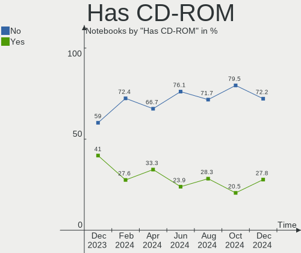
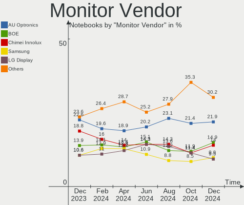
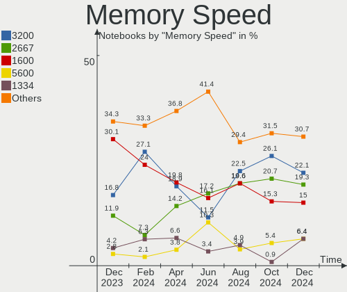
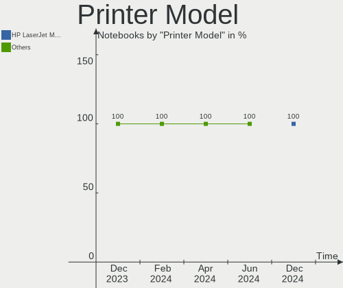
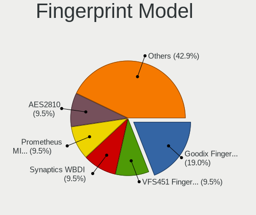

Linux in France - Hardware Trends (Notebooks)
---------------------------------------------

A project to identify most popular hardware characteristics and track their change
over time based on data collected by Linux users at https://Linux-Hardware.org.

Anyone can contribute to this report by the [hw-probe](https://github.com/linuxhw/hw-probe) tool:

    sudo -E hw-probe -all -upload

Period: Sep, 2023.

Contents
--------

* [ System ](#system)
  - [ OS                       ](#os)
  - [ OS Family                ](#os-family)
  - [ Kernel                   ](#kernel)
  - [ Kernel Family            ](#kernel-family)
  - [ Kernel Major Ver.        ](#kernel-major-ver)
  - [ Arch                     ](#arch)
  - [ DE                       ](#de)
  - [ Display Server           ](#display-server)
  - [ Display Manager          ](#display-manager)
  - [ OS Lang                  ](#os-lang)
  - [ Boot Mode                ](#boot-mode)
  - [ Filesystem               ](#filesystem)
  - [ Part. scheme             ](#part-scheme)
  - [ Dual Boot with Linux/BSD ](#dual-boot-with-linuxbsd)
  - [ Dual Boot (Win)          ](#dual-boot-win)

* [ Board ](#board)
  - [ Vendor                   ](#vendor)
  - [ Model                    ](#model)
  - [ Model Family             ](#model-family)
  - [ MFG Year                 ](#mfg-year)
  - [ Form Factor              ](#form-factor)
  - [ Secure Boot              ](#secure-boot)
  - [ Coreboot                 ](#coreboot)
  - [ RAM Size                 ](#ram-size)
  - [ RAM Used                 ](#ram-used)
  - [ Total Drives             ](#total-drives)
  - [ Has CD-ROM               ](#has-cd-rom)
  - [ Has Ethernet             ](#has-ethernet)
  - [ Has WiFi                 ](#has-wifi)
  - [ Has Bluetooth            ](#has-bluetooth)

* [ Location ](#location)
  - [ Country                  ](#country)
  - [ City                     ](#city)

* [ Drives ](#drives)
  - [ Drive Vendor             ](#drive-vendor)
  - [ Drive Model              ](#drive-model)
  - [ HDD Vendor               ](#hdd-vendor)
  - [ SSD Vendor               ](#ssd-vendor)
  - [ Drive Kind               ](#drive-kind)
  - [ Drive Connector          ](#drive-connector)
  - [ Drive Size               ](#drive-size)
  - [ Space Total              ](#space-total)
  - [ Space Used               ](#space-used)
  - [ Malfunc. Drives          ](#malfunc-drives)
  - [ Malfunc. Drive Vendor    ](#malfunc-drive-vendor)
  - [ Malfunc. HDD Vendor      ](#malfunc-hdd-vendor)
  - [ Malfunc. Drive Kind      ](#malfunc-drive-kind)
  - [ Failed Drives            ](#failed-drives)
  - [ Failed Drive Vendor      ](#failed-drive-vendor)
  - [ Drive Status             ](#drive-status)

* [ Storage controller ](#storage-controller)
  - [ Storage Vendor           ](#storage-vendor)
  - [ Storage Model            ](#storage-model)
  - [ Storage Kind             ](#storage-kind)

* [ Processor ](#processor)
  - [ CPU Vendor               ](#cpu-vendor)
  - [ CPU Model                ](#cpu-model)
  - [ CPU Model Family         ](#cpu-model-family)
  - [ CPU Cores                ](#cpu-cores)
  - [ CPU Sockets              ](#cpu-sockets)
  - [ CPU Threads              ](#cpu-threads)
  - [ CPU Op-Modes             ](#cpu-op-modes)
  - [ CPU Microcode            ](#cpu-microcode)
  - [ CPU Microarch            ](#cpu-microarch)

* [ Graphics ](#graphics)
  - [ GPU Vendor               ](#gpu-vendor)
  - [ GPU Model                ](#gpu-model)
  - [ GPU Combo                ](#gpu-combo)
  - [ GPU Driver               ](#gpu-driver)
  - [ GPU Memory               ](#gpu-memory)

* [ Monitor ](#monitor)
  - [ Monitor Vendor           ](#monitor-vendor)
  - [ Monitor Model            ](#monitor-model)
  - [ Monitor Resolution       ](#monitor-resolution)
  - [ Monitor Diagonal         ](#monitor-diagonal)
  - [ Monitor Width            ](#monitor-width)
  - [ Aspect Ratio             ](#aspect-ratio)
  - [ Monitor Area             ](#monitor-area)
  - [ Pixel Density            ](#pixel-density)
  - [ Multiple Monitors        ](#multiple-monitors)

* [ Network ](#network)
  - [ Net Controller Vendor    ](#net-controller-vendor)
  - [ Net Controller Model     ](#net-controller-model)
  - [ Wireless Vendor          ](#wireless-vendor)
  - [ Wireless Model           ](#wireless-model)
  - [ Ethernet Vendor          ](#ethernet-vendor)
  - [ Ethernet Model           ](#ethernet-model)
  - [ Net Controller Kind      ](#net-controller-kind)
  - [ Used Controller          ](#used-controller)
  - [ NICs                     ](#nics)
  - [ IPv6                     ](#ipv6)

* [ Bluetooth ](#bluetooth)
  - [ Bluetooth Vendor         ](#bluetooth-vendor)
  - [ Bluetooth Model          ](#bluetooth-model)

* [ Sound ](#sound)
  - [ Sound Vendor             ](#sound-vendor)
  - [ Sound Model              ](#sound-model)

* [ Memory ](#memory)
  - [ Memory Vendor            ](#memory-vendor)
  - [ Memory Model             ](#memory-model)
  - [ Memory Kind              ](#memory-kind)
  - [ Memory Form Factor       ](#memory-form-factor)
  - [ Memory Size              ](#memory-size)
  - [ Memory Speed             ](#memory-speed)

* [ Printers & scanners ](#printers--scanners)
  - [ Printer Vendor           ](#printer-vendor)
  - [ Printer Model            ](#printer-model)
  - [ Scanner Vendor           ](#scanner-vendor)
  - [ Scanner Model            ](#scanner-model)

* [ Camera ](#camera)
  - [ Camera Vendor            ](#camera-vendor)
  - [ Camera Model             ](#camera-model)

* [ Security ](#security)
  - [ Fingerprint Vendor       ](#fingerprint-vendor)
  - [ Fingerprint Model        ](#fingerprint-model)
  - [ Chipcard Vendor          ](#chipcard-vendor)
  - [ Chipcard Model           ](#chipcard-model)

* [ Unsupported ](#unsupported)
  - [ Unsupported Devices      ](#unsupported-devices)
  - [ Unsupported Device Types ](#unsupported-device-types)

System
------

OS
--

Installed operating systems

| Name                 | Notebooks | Percent |
|----------------------|-----------|---------|
| Ubuntu 22.04         | 45        | 29.61%  |
| Ubuntu 23.04         | 11        | 7.24%   |
| Fedora 38            | 10        | 6.58%   |
| Ubuntu 20.04         | 7         | 4.61%   |
| Linux Mint 21.2      | 7         | 4.61%   |
| OpenMandriva 23.09   | 6         | 3.95%   |
| Arch Rolling         | 6         | 3.95%   |
| OpenMandriva 23.08   | 5         | 3.29%   |
| Pop!_OS 22.04        | 4         | 2.63%   |
| Debian 12            | 4         | 2.63%   |
| OpenMandriva 4.3     | 3         | 1.97%   |
| Linux Mint 21.1      | 3         | 1.97%   |
| KDE neon 22.04       | 3         | 1.97%   |
| Zorin 16             | 2         | 1.32%   |
| Ubuntu MATE 22.04    | 2         | 1.32%   |
| Ubuntu 18.04         | 2         | 1.32%   |
| Manjaro              | 2         | 1.32%   |
| Kali 2023.3          | 2         | 1.32%   |
| Gentoo 2.14          | 2         | 1.32%   |
| Xubuntu 22.04        | 1         | 0.66%   |
| Xubuntu 16.04        | 1         | 0.66%   |
| Xero Rolling         | 1         | 0.66%   |
| Ubuntu Unity 18.04   | 1         | 0.66%   |
| Ubuntu Studio 22.04  | 1         | 0.66%   |
| Ubuntu Budgie 22.04  | 1         | 0.66%   |
| Ubuntu Budgie 18.04  | 1         | 0.66%   |
| SystemRescue 10.01   | 1         | 0.66%   |
| SteamOS 3.4.10       | 1         | 0.66%   |
| OpenMandriva 23.01   | 1         | 0.66%   |
| MX 23                | 1         | 0.66%   |
| Linux Mint 20.2      | 1         | 0.66%   |
| Linux Mint 19.3      | 1         | 0.66%   |
| Kubuntu 23.04        | 1         | 0.66%   |
| Kubuntu 22.04        | 1         | 0.66%   |
| KDE neon 20.04       | 1         | 0.66%   |
| Garuda Linux Soaring | 1         | 0.66%   |
| Fedora 39            | 1         | 0.66%   |
| Fedora 37            | 1         | 0.66%   |
| Endless 5.0.5        | 1         | 0.66%   |
| Debian 11            | 1         | 0.66%   |

OS Family
---------

OS without a version

| Name          | Notebooks | Percent |
|---------------|-----------|---------|
| Ubuntu        | 65        | 42.76%  |
| OpenMandriva  | 15        | 9.87%   |
| Linux Mint    | 12        | 7.89%   |
| Fedora        | 12        | 7.89%   |
| Debian        | 6         | 3.95%   |
| Arch          | 6         | 3.95%   |
| Pop!_OS       | 4         | 2.63%   |
| KDE neon      | 4         | 2.63%   |
| Zorin         | 2         | 1.32%   |
| Xubuntu       | 2         | 1.32%   |
| Ubuntu MATE   | 2         | 1.32%   |
| Ubuntu Budgie | 2         | 1.32%   |
| Manjaro       | 2         | 1.32%   |
| Kubuntu       | 2         | 1.32%   |
| Kali          | 2         | 1.32%   |
| Gentoo        | 2         | 1.32%   |
| Xero          | 1         | 0.66%   |
| Ubuntu Unity  | 1         | 0.66%   |
| Ubuntu Studio | 1         | 0.66%   |
| SystemRescue  | 1         | 0.66%   |
| SteamOS       | 1         | 0.66%   |
| MX            | 1         | 0.66%   |
| Garuda Linux  | 1         | 0.66%   |
| Endless       | 1         | 0.66%   |
| BunsenLabs    | 1         | 0.66%   |
| BuildRoot     | 1         | 0.66%   |
| blendOS       | 1         | 0.66%   |
| BlackPanther  | 1         | 0.66%   |

Kernel
------

Version of the Linux kernel

| Version                  | Notebooks | Percent |
|--------------------------|-----------|---------|
| 6.2.0-32-generic         | 21        | 13.82%  |
| 6.2.0-33-generic         | 16        | 10.53%  |
| 6.2.0-31-generic         | 10        | 6.58%   |
| 5.15.0-83-generic        | 8         | 5.26%   |
| 6.2.0-26-generic         | 5         | 3.29%   |
| 5.15.0-84-generic        | 5         | 3.29%   |
| 6.5.3-desktop-1omv2390   | 4         | 2.63%   |
| 6.4.11-desktop-1omv2390  | 4         | 2.63%   |
| 6.4.6-76060406-generic   | 3         | 1.97%   |
| 6.4.15-200.fc38.x86_64   | 3         | 1.97%   |
| 6.2.9-300.fc38.x86_64    | 3         | 1.97%   |
| 5.15.0-82-generic        | 3         | 1.97%   |
| 4.15.0-213-generic       | 3         | 1.97%   |
| 6.4.12-arch1-1           | 2         | 1.32%   |
| 6.4.12-200.fc38.x86_64   | 2         | 1.32%   |
| 6.4.0-kali3-amd64        | 2         | 1.32%   |
| 6.1.0-12-amd64           | 2         | 1.32%   |
| 6.1.0-11-amd64           | 2         | 1.32%   |
| 5.16.13-desktop-1omv4003 | 2         | 1.32%   |
| 5.15.0-47-generic        | 2         | 1.32%   |
| 6.5.5-desktop-1omv2390   | 1         | 0.66%   |
| 6.5.5-300.fc39.x86_64    | 1         | 0.66%   |
| 6.5.4-arch2-1            | 1         | 0.66%   |
| 6.5.3-zen1-1-zen         | 1         | 0.66%   |
| 6.5.2-arch1-1            | 1         | 0.66%   |
| 6.5.1-desktop-1omv2390   | 1         | 0.66%   |
| 6.5.1-1-MANJARO          | 1         | 0.66%   |
| 6.5.0-1-amd64            | 1         | 0.66%   |
| 6.4.8-desktop-2omv2390   | 1         | 0.66%   |
| 6.4.15-100.fc37.x86_64   | 1         | 0.66%   |
| 6.4.14-200.fc38.x86_64   | 1         | 0.66%   |
| 6.4.12-060412-generic    | 1         | 0.66%   |
| 6.4.11-200.fc38.x86_64   | 1         | 0.66%   |
| 6.4.10-arch1-1           | 1         | 0.66%   |
| 6.4.0-1mx-ahs-amd64      | 1         | 0.66%   |
| 6.3.9-zen1-1-zen         | 1         | 0.66%   |
| 6.3.6                    | 1         | 0.66%   |
| 6.2.10                   | 1         | 0.66%   |
| 6.2.0-34-generic         | 1         | 0.66%   |
| 6.2.0-1009-lowlatency    | 1         | 0.66%   |

Kernel Family
-------------

Linux kernel without a distro release

| Version  | Notebooks | Percent |
|----------|-----------|---------|
| 6.2.0    | 55        | 36.18%  |
| 5.15.0   | 23        | 15.13%  |
| 6.5.3    | 5         | 3.29%   |
| 6.4.12   | 5         | 3.29%   |
| 6.4.11   | 5         | 3.29%   |
| 6.4.15   | 4         | 2.63%   |
| 6.1.0    | 4         | 2.63%   |
| 5.4.0    | 4         | 2.63%   |
| 4.15.0   | 4         | 2.63%   |
| 6.4.6    | 3         | 1.97%   |
| 6.4.0    | 3         | 1.97%   |
| 6.2.9    | 3         | 1.97%   |
| 6.5.5    | 2         | 1.32%   |
| 6.5.1    | 2         | 1.32%   |
| 6.1.46   | 2         | 1.32%   |
| 5.17.0   | 2         | 1.32%   |
| 5.16.13  | 2         | 1.32%   |
| 5.13.0   | 2         | 1.32%   |
| 5.10.0   | 2         | 1.32%   |
| 6.5.4    | 1         | 0.66%   |
| 6.5.2    | 1         | 0.66%   |
| 6.5.0    | 1         | 0.66%   |
| 6.4.8    | 1         | 0.66%   |
| 6.4.14   | 1         | 0.66%   |
| 6.4.10   | 1         | 0.66%   |
| 6.3.9    | 1         | 0.66%   |
| 6.3.6    | 1         | 0.66%   |
| 6.2.10   | 1         | 0.66%   |
| 6.1.55   | 1         | 0.66%   |
| 6.1.51   | 1         | 0.66%   |
| 6.1.50   | 1         | 0.66%   |
| 6.1.1    | 1         | 0.66%   |
| 5.19.0   | 1         | 0.66%   |
| 5.16.7   | 1         | 0.66%   |
| 5.16.19  | 1         | 0.66%   |
| 5.15.125 | 1         | 0.66%   |
| 5.14.0   | 1         | 0.66%   |
| 4.4.0    | 1         | 0.66%   |
| 4.18.16  | 1         | 0.66%   |

Kernel Major Ver.
-----------------

Linux kernel major version

| Version | Notebooks | Percent |
|---------|-----------|---------|
| 6.2     | 59        | 38.82%  |
| 5.15    | 24        | 15.79%  |
| 6.4     | 23        | 15.13%  |
| 6.5     | 12        | 7.89%   |
| 6.1     | 10        | 6.58%   |
| 5.4     | 4         | 2.63%   |
| 5.16    | 4         | 2.63%   |
| 4.15    | 4         | 2.63%   |
| 6.3     | 2         | 1.32%   |
| 5.17    | 2         | 1.32%   |
| 5.13    | 2         | 1.32%   |
| 5.10    | 2         | 1.32%   |
| 5.19    | 1         | 0.66%   |
| 5.14    | 1         | 0.66%   |
| 4.4     | 1         | 0.66%   |
| 4.18    | 1         | 0.66%   |

Arch
----

OS architecture (x86_64, i586, etc.)

| Name   | Notebooks | Percent |
|--------|-----------|---------|
| x86_64 | 151       | 99.34%  |
| i686   | 1         | 0.66%   |

DE
--

Desktop Environment

| Name          | Notebooks | Percent |
|---------------|-----------|---------|
| GNOME         | 80        | 52.63%  |
| KDE5          | 30        | 19.74%  |
| XFCE          | 11        | 7.24%   |
| Unknown       | 11        | 7.24%   |
| X-Cinnamon    | 7         | 4.61%   |
| MATE          | 4         | 2.63%   |
| Budgie        | 4         | 2.63%   |
| Unity         | 1         | 0.66%   |
| KDE           | 1         | 0.66%   |
| i3            | 1         | 0.66%   |
| Enlightenment | 1         | 0.66%   |
| BunsenLabs    | 1         | 0.66%   |

Display Server
--------------

X11 or Wayland

| Name    | Notebooks | Percent |
|---------|-----------|---------|
| X11     | 75        | 49.34%  |
| Wayland | 68        | 44.74%  |
| Unknown | 8         | 5.26%   |
| Tty     | 1         | 0.66%   |

Display Manager
---------------

SDDM, LightDM, etc.

| Name    | Notebooks | Percent |
|---------|-----------|---------|
| GDM3    | 59        | 38.82%  |
| Unknown | 29        | 19.08%  |
| SDDM    | 26        | 17.11%  |
| LightDM | 25        | 16.45%  |
| GDM     | 12        | 7.89%   |
| SLiM    | 1         | 0.66%   |

OS Lang
-------

Language

| Lang    | Notebooks | Percent |
|---------|-----------|---------|
| fr_FR   | 112       | 73.68%  |
| en_US   | 32        | 21.05%  |
| C       | 3         | 1.97%   |
| Unknown | 2         | 1.32%   |
| en_GB   | 1         | 0.66%   |
| en_DK   | 1         | 0.66%   |
| en_CA   | 1         | 0.66%   |

Boot Mode
---------

EFI or BIOS

| Mode | Notebooks | Percent |
|------|-----------|---------|
| EFI  | 101       | 66.45%  |
| BIOS | 51        | 33.55%  |

Filesystem
----------

Type of filesystem

| Type    | Notebooks | Percent |
|---------|-----------|---------|
| Ext4    | 105       | 69.08%  |
| Tmpfs   | 21        | 13.82%  |
| Btrfs   | 18        | 11.84%  |
| Overlay | 5         | 3.29%   |
| Zfs     | 3         | 1.97%   |

Part. scheme
------------

Scheme of partitioning

| Type    | Notebooks | Percent |
|---------|-----------|---------|
| GPT     | 108       | 71.05%  |
| Unknown | 28        | 18.42%  |
| MBR     | 16        | 10.53%  |

Dual Boot with Linux/BSD
------------------------

Hosting more than one Linux/BSD

| Dual boot | Notebooks | Percent |
|-----------|-----------|---------|
| No        | 134       | 88.16%  |
| Yes       | 18        | 11.84%  |

Dual Boot (Win)
---------------

Hosting Linux and Windows

| Dual boot | Notebooks | Percent |
|-----------|-----------|---------|
| No        | 104       | 68.42%  |
| Yes       | 48        | 31.58%  |

Board
-----

Vendor
------

Motherboard manufacturer

| Name                | Notebooks | Percent |
|---------------------|-----------|---------|
| Dell                | 40        | 26.32%  |
| ASUSTek Computer    | 21        | 13.82%  |
| Hewlett-Packard     | 20        | 13.16%  |
| Lenovo              | 18        | 11.84%  |
| Acer                | 12        | 7.89%   |
| MSI                 | 4         | 2.63%   |
| Apple               | 4         | 2.63%   |
| Samsung Electronics | 3         | 1.97%   |
| Notebook            | 3         | 1.97%   |
| HUAWEI              | 3         | 1.97%   |
| UNOWHY              | 2         | 1.32%   |
| Toshiba             | 2         | 1.32%   |
| Timi                | 2         | 1.32%   |
| Sony                | 2         | 1.32%   |
| Valve               | 1         | 0.66%   |
| TUXEDO              | 1         | 0.66%   |
| Thomson             | 1         | 0.66%   |
| SLIMBOOK            | 1         | 0.66%   |
| Schenker            | 1         | 0.66%   |
| PC Specialist       | 1         | 0.66%   |
| Medion              | 1         | 0.66%   |
| KUU                 | 1         | 0.66%   |
| Google              | 1         | 0.66%   |
| Fujitsu             | 1         | 0.66%   |
| Framework           | 1         | 0.66%   |
| EUROCOM             | 1         | 0.66%   |
| eMachines           | 1         | 0.66%   |
| Clevo               | 1         | 0.66%   |
| Chuwi               | 1         | 0.66%   |
| Unknown             | 1         | 0.66%   |

Model
-----

Motherboard model

| Name                                  | Notebooks | Percent |
|---------------------------------------|-----------|---------|
| Dell Latitude E6400                   | 3         | 1.97%   |
| Dell Precision 3571                   | 2         | 1.32%   |
| ASUS X550CC                           | 2         | 1.32%   |
| Acer Swift SF314-42                   | 2         | 1.32%   |
| Acer Nitro AN515-57                   | 2         | 1.32%   |
| Valve Jupiter                         | 1         | 0.66%   |
| UNOWHY Y13G012S4EI                    | 1         | 0.66%   |
| UNOWHY Y13G002S4EI                    | 1         | 0.66%   |
| TUXEDO InfinityBook Pro Gen7 (MK1)    | 1         | 0.66%   |
| Toshiba Satellite L875-11M            | 1         | 0.66%   |
| Toshiba Satellite C50-B               | 1         | 0.66%   |
| Timi Xiaomi Book Pro 16 2022          | 1         | 0.66%   |
| Timi TM1612                           | 1         | 0.66%   |
| Thomson N14C4WH64                     | 1         | 0.66%   |
| Sony VPCEB1E1E                        | 1         | 0.66%   |
| Sony SVE1513I4E                       | 1         | 0.66%   |
| SLIMBOOK PROX-AMD5                    | 1         | 0.66%   |
| Schenker VIA 15 Pro                   | 1         | 0.66%   |
| Samsung R510/P510                     | 1         | 0.66%   |
| Samsung 950XED                        | 1         | 0.66%   |
| Samsung 305E4A/305E5A/305E7A          | 1         | 0.66%   |
| PC Specialist PCX0DX                  | 1         | 0.66%   |
| Notebook PCx0Dx                       | 1         | 0.66%   |
| Notebook NV4XMB,ME,MZ                 | 1         | 0.66%   |
| Notebook N2x0WU                       | 1         | 0.66%   |
| MSI Stealth 14Studio A13VE            | 1         | 0.66%   |
| MSI GS60 2PC Ghost                    | 1         | 0.66%   |
| MSI GP70 2OD                          | 1         | 0.66%   |
| MSI GF63 Thin 9SC                     | 1         | 0.66%   |
| Medion Deputy P40                     | 1         | 0.66%   |
| Lenovo Yoga S740-15IRH 81NX           | 1         | 0.66%   |
| Lenovo Yoga 2 13 20344                | 1         | 0.66%   |
| Lenovo ThinkPad X250 20CLS2TQ0E       | 1         | 0.66%   |
| Lenovo ThinkPad X230 23259T0          | 1         | 0.66%   |
| Lenovo ThinkPad X200 74595FG          | 1         | 0.66%   |
| Lenovo ThinkPad W550s 20E1S0VW02      | 1         | 0.66%   |
| Lenovo ThinkPad T61 7661AU5           | 1         | 0.66%   |
| Lenovo ThinkPad T470 W10DG 20JNS1A000 | 1         | 0.66%   |
| Lenovo ThinkPad T430 2349S6S          | 1         | 0.66%   |
| Lenovo ThinkPad P50 20EQS3FS00        | 1         | 0.66%   |

Model Family
------------

Motherboard model prefix

| Name                 | Notebooks | Percent |
|----------------------|-----------|---------|
| Dell Latitude        | 19        | 12.5%   |
| Lenovo ThinkPad      | 11        | 7.24%   |
| HP EliteBook         | 10        | 6.58%   |
| Dell Precision       | 7         | 4.61%   |
| Acer Aspire          | 6         | 3.95%   |
| Dell XPS             | 5         | 3.29%   |
| Dell Inspiron        | 5         | 3.29%   |
| ASUS ZenBook         | 5         | 3.29%   |
| Lenovo IdeaPad       | 4         | 2.63%   |
| Acer Swift           | 4         | 2.63%   |
| HP Laptop            | 3         | 1.97%   |
| ASUS VivoBook        | 3         | 1.97%   |
| Toshiba Satellite    | 2         | 1.32%   |
| Lenovo Yoga          | 2         | 1.32%   |
| HP ProBook           | 2         | 1.32%   |
| Dell Vostro          | 2         | 1.32%   |
| ASUS X550CC          | 2         | 1.32%   |
| ASUS ROG             | 2         | 1.32%   |
| ASUS ASUS            | 2         | 1.32%   |
| Apple MacBookPro11   | 2         | 1.32%   |
| Acer Nitro           | 2         | 1.32%   |
| Valve Jupiter        | 1         | 0.66%   |
| UNOWHY Y13G012S4EI   | 1         | 0.66%   |
| UNOWHY Y13G002S4EI   | 1         | 0.66%   |
| TUXEDO InfinityBook  | 1         | 0.66%   |
| Timi Xiaomi          | 1         | 0.66%   |
| Timi TM1612          | 1         | 0.66%   |
| Thomson N14C4WH64    | 1         | 0.66%   |
| Sony VPCEB1E1E       | 1         | 0.66%   |
| Sony SVE1513I4E      | 1         | 0.66%   |
| SLIMBOOK PROX-AMD5   | 1         | 0.66%   |
| Schenker VIA         | 1         | 0.66%   |
| Samsung R510         | 1         | 0.66%   |
| Samsung 950XED       | 1         | 0.66%   |
| Samsung 305E4A       | 1         | 0.66%   |
| PC Specialist PCX0DX | 1         | 0.66%   |
| Notebook PCx0Dx      | 1         | 0.66%   |
| Notebook NV4XMB      | 1         | 0.66%   |
| Notebook N2x0WU      | 1         | 0.66%   |
| MSI Stealth          | 1         | 0.66%   |

MFG Year
--------

Motherboard manufacture year

| Year | Notebooks | Percent |
|------|-----------|---------|
| 2020 | 18        | 11.84%  |
| 2022 | 17        | 11.18%  |
| 2019 | 16        | 10.53%  |
| 2021 | 15        | 9.87%   |
| 2023 | 11        | 7.24%   |
| 2015 | 11        | 7.24%   |
| 2017 | 10        | 6.58%   |
| 2013 | 10        | 6.58%   |
| 2012 | 8         | 5.26%   |
| 2014 | 7         | 4.61%   |
| 2008 | 7         | 4.61%   |
| 2011 | 6         | 3.95%   |
| 2016 | 5         | 3.29%   |
| 2018 | 4         | 2.63%   |
| 2009 | 3         | 1.97%   |
| 2010 | 2         | 1.32%   |
| 2007 | 1         | 0.66%   |
| 2005 | 1         | 0.66%   |

Form Factor
-----------

Physical design of the computer

| Name     | Notebooks | Percent |
|----------|-----------|---------|
| Notebook | 152       | 100%    |

Secure Boot
-----------

Enabled or disabled

| State    | Notebooks | Percent |
|----------|-----------|---------|
| Disabled | 140       | 92.11%  |
| Enabled  | 12        | 7.89%   |

Coreboot
--------

Have coreboot on board

| Used | Notebooks | Percent |
|------|-----------|---------|
| No   | 151       | 99.34%  |
| Yes  | 1         | 0.66%   |

RAM Size
--------

Total RAM memory

| Size in GB  | Notebooks | Percent |
|-------------|-----------|---------|
| 4.01-8.0    | 40        | 26.32%  |
| 8.01-16.0   | 29        | 19.08%  |
| 16.01-24.0  | 25        | 16.45%  |
| 3.01-4.0    | 23        | 15.13%  |
| 32.01-64.0  | 22        | 14.47%  |
| 2.01-3.0    | 4         | 2.63%   |
| 64.01-256.0 | 4         | 2.63%   |
| 24.01-32.0  | 2         | 1.32%   |
| 1.01-2.0    | 2         | 1.32%   |
| 0.51-1.0    | 1         | 0.66%   |

RAM Used
--------

Used RAM memory

| Used GB    | Notebooks | Percent |
|------------|-----------|---------|
| 2.01-3.0   | 43        | 28.29%  |
| 1.01-2.0   | 36        | 23.68%  |
| 4.01-8.0   | 32        | 21.05%  |
| 3.01-4.0   | 23        | 15.13%  |
| 8.01-16.0  | 7         | 4.61%   |
| 16.01-24.0 | 6         | 3.95%   |
| 0.51-1.0   | 4         | 2.63%   |
| 24.01-32.0 | 1         | 0.66%   |

Total Drives
------------

Number of drives on board

| Drives | Notebooks | Percent |
|--------|-----------|---------|
| 1      | 106       | 69.74%  |
| 2      | 41        | 26.97%  |
| 3      | 3         | 1.97%   |
| 0      | 2         | 1.32%   |

Has CD-ROM
----------

Has CD-ROM on board

| Presented | Notebooks | Percent |
|-----------|-----------|---------|
| No        | 118       | 77.63%  |
| Yes       | 34        | 22.37%  |

Has Ethernet
------------

Has Ethernet on board

| Presented | Notebooks | Percent |
|-----------|-----------|---------|
| Yes       | 115       | 75.66%  |
| No        | 37        | 24.34%  |

Has WiFi
--------

Has WiFi module

| Presented | Notebooks | Percent |
|-----------|-----------|---------|
| Yes       | 150       | 98.68%  |
| No        | 2         | 1.32%   |

Has Bluetooth
-------------

Has Bluetooth module

| Presented | Notebooks | Percent |
|-----------|-----------|---------|
| Yes       | 131       | 86.18%  |
| No        | 21        | 13.82%  |

Location
--------

Country
-------

Geographic location (country)

| Country | Notebooks | Percent |
|---------|-----------|---------|
| France  | 152       | 100%    |

City
----

Geographic location (city)

| City                          | Notebooks | Percent |
|-------------------------------|-----------|---------|
| Paris                         | 18        | 11.84%  |
| Toulouse                      | 7         | 4.61%   |
| Marseille                     | 5         | 3.29%   |
| Champs-sur-Marne              | 5         | 3.29%   |
| Valenciennes                  | 4         | 2.63%   |
| Poitiers                      | 3         | 1.97%   |
| Les Hogues                    | 3         | 1.97%   |
| Bordeaux                      | 3         | 1.97%   |
| Vitry-sur-Seine               | 2         | 1.32%   |
| Rennes                        | 2         | 1.32%   |
| Nice                          | 2         | 1.32%   |
| La Courneuve                  | 2         | 1.32%   |
| La Baule-Escoublac            | 2         | 1.32%   |
| Arcueil                       | 2         | 1.32%   |
| Vincennes                     | 1         | 0.66%   |
| Villeparisis                  | 1         | 0.66%   |
| Villejuif                     | 1         | 0.66%   |
| Versailles                    | 1         | 0.66%   |
| Vercel-Villedieu-le-Camp      | 1         | 0.66%   |
| Vaureal                       | 1         | 0.66%   |
| Varreddes                     | 1         | 0.66%   |
| Vaas                          | 1         | 0.66%   |
| Tours                         | 1         | 0.66%   |
| Toulon                        | 1         | 0.66%   |
| Thonon-les-Bains              | 1         | 0.66%   |
| Sucy-en-Brie                  | 1         | 0.66%   |
| Somain                        | 1         | 0.66%   |
| Sillingy                      | 1         | 0.66%   |
| Servian                       | 1         | 0.66%   |
| Savigny-sur-Orge              | 1         | 0.66%   |
| Sainte-Luce-sur-Loire         | 1         | 0.66%   |
| Saint-Sébastien-sur-Loire    | 1         | 0.66%   |
| Saint-Pierre-dAllevard        | 1         | 0.66%   |
| Saint-Nazaire                 | 1         | 0.66%   |
| Saint-Maximin-la-Sainte-Baume | 1         | 0.66%   |
| Saint-Mars-d'Outille          | 1         | 0.66%   |
| Saint-Etienne                 | 1         | 0.66%   |
| Roussillon                    | 1         | 0.66%   |
| Roubaix                       | 1         | 0.66%   |
| Rosny-sous-Bois               | 1         | 0.66%   |

Drives
------

Drive Vendor
------------

Hard drive vendors

| Vendor                      | Notebooks | Drives | Percent |
|-----------------------------|-----------|--------|---------|
| Samsung Electronics         | 40        | 44     | 21.98%  |
| WDC                         | 17        | 18     | 9.34%   |
| Seagate                     | 13        | 13     | 7.14%   |
| SK hynix                    | 10        | 10     | 5.49%   |
| SanDisk                     | 10        | 12     | 5.49%   |
| Crucial                     | 10        | 11     | 5.49%   |
| Unknown                     | 9         | 9      | 4.95%   |
| Toshiba                     | 8         | 8      | 4.4%    |
| KIOXIA                      | 8         | 8      | 4.4%    |
| Intel                       | 8         | 11     | 4.4%    |
| Micron Technology           | 6         | 6      | 3.3%    |
| HGST                        | 5         | 5      | 2.75%   |
| Kingston                    | 4         | 4      | 2.2%    |
| Phison                      | 3         | 4      | 1.65%   |
| Hitachi                     | 3         | 3      | 1.65%   |
| Transcend                   | 2         | 2      | 1.1%    |
| Phison Electronics          | 2         | 2      | 1.1%    |
| Micron/Crucial Technology   | 2         | 2      | 1.1%    |
| Apple                       | 2         | 2      | 1.1%    |
| A-DATA Technology           | 2         | 2      | 1.1%    |
| Union Memory                | 1         | 1      | 0.55%   |
| UMIS                        | 1         | 1      | 0.55%   |
| PNY                         | 1         | 1      | 0.55%   |
| Patriot                     | 1         | 1      | 0.55%   |
| O2 Micro                    | 1         | 1      | 0.55%   |
| Netac                       | 1         | 1      | 0.55%   |
| MAXIO Technology (Hangzhou) | 1         | 1      | 0.55%   |
| LITEON                      | 1         | 1      | 0.55%   |
| Kingston Technology Company | 1         | 1      | 0.55%   |
| KingSpec                    | 1         | 1      | 0.55%   |
| JMicron Technology          | 1         | 1      | 0.55%   |
| Hjwdz                       | 1         | 1      | 0.55%   |
| Emtec                       | 1         | 1      | 0.55%   |
| Dogfish                     | 1         | 1      | 0.55%   |
| China                       | 1         | 1      | 0.55%   |
| ASMedia                     | 1         | 1      | 0.55%   |
| ASL                         | 1         | 1      | 0.55%   |
| Unknown                     | 1         | 1      | 0.55%   |

Drive Model
-----------

Hard drive models

| Model                                               | Notebooks | Percent |
|-----------------------------------------------------|-----------|---------|
| SanDisk NVMe SSD Drive 1TB                          | 3         | 1.56%   |
| Samsung MZVLQ512HBLU-00B00 512GB                    | 3         | 1.56%   |
| Intel SSDPEKNW512G8 512GB                           | 3         | 1.56%   |
| HGST HTS721010A9E630 1TB                            | 3         | 1.56%   |
| Crucial CT500MX500SSD1 500GB                        | 3         | 1.56%   |
| Crucial CT1000MX500SSD1 1TB                         | 3         | 1.56%   |
| Toshiba MQ01ABD100 1TB                              | 2         | 1.04%   |
| SK hynix PC711 HFS001TDE9X073N 1TB                  | 2         | 1.04%   |
| Seagate ST500LX012-1LM162-SSHD 500GB                | 2         | 1.04%   |
| Seagate ST1000LM035-1RK172 1TB                      | 2         | 1.04%   |
| Seagate Expansion HDD 16TB                          | 2         | 1.04%   |
| Sandisk WD_BLACK SN850X 2000GB                      | 2         | 1.04%   |
| Samsung SSD 980 1TB                                 | 2         | 1.04%   |
| Samsung SSD 860 EVO 500GB                           | 2         | 1.04%   |
| Samsung SSD 850 EVO 500GB                           | 2         | 1.04%   |
| Samsung NVMe SSD Controller SM981/PM981/PM983 256GB | 2         | 1.04%   |
| Samsung NVMe SSD Controller PM9A1/PM9A3/980PRO 1TB  | 2         | 1.04%   |
| Samsung MZVLQ512HBLU-00BTW 512GB                    | 2         | 1.04%   |
| Samsung MZVLQ512HALU-00000 512GB                    | 2         | 1.04%   |
| Intel SSDPEKNU512GZ 512GB                           | 2         | 1.04%   |
| WDC WDS500G2B0C-00PXH0 500GB                        | 1         | 0.52%   |
| WDC WD7500BPKT-22PK4T0 752GB                        | 1         | 0.52%   |
| WDC WD5000LPCX-24VHAT0 500GB                        | 1         | 0.52%   |
| WDC WD5000BPKT-75PK4T0 500GB                        | 1         | 0.52%   |
| WDC WD5000BEVT-22ZAT0 500GB                         | 1         | 0.52%   |
| WDC WD50 00AZLX-60K2TA0 500GB                       | 1         | 0.52%   |
| WDC WD3200LPVT-00G33T0 320GB                        | 1         | 0.52%   |
| WDC WD3200BPVT-75JJ5T0 320GB                        | 1         | 0.52%   |
| WDC WD3200BEKT-60V5T1 320GB                         | 1         | 0.52%   |
| WDC WD2500BJKT-75F4T0 250GB                         | 1         | 0.52%   |
| WDC WD2500BEVT-35ZCT0 250GB                         | 1         | 0.52%   |
| WDC WD10JPVX-80JC3T0 1TB                            | 1         | 0.52%   |
| WDC WD10JPVX-00JC3T0 1TB                            | 1         | 0.52%   |
| WDC WD10JPCX-24UE4T0 1TB                            | 1         | 0.52%   |
| WDC PC SN730 SDBPNTY-1T00-1006 1TB                  | 1         | 0.52%   |
| WDC PC SN730 NVMe 1024GB                            | 1         | 0.52%   |
| WDC PC SN520 SDAPNUW-512G-1014 512GB                | 1         | 0.52%   |
| WDC PC SN520 NVMe 512GB                             | 1         | 0.52%   |
| Unknown USD00  128GB                                | 1         | 0.52%   |
| Unknown SL64G  64GB                                 | 1         | 0.52%   |

HDD Vendor
----------

Hard disk drive vendors

| Vendor  | Notebooks | Drives | Percent |
|---------|-----------|--------|---------|
| Seagate | 13        | 13     | 34.21%  |
| WDC     | 12        | 13     | 31.58%  |
| Toshiba | 5         | 5      | 13.16%  |
| HGST    | 5         | 5      | 13.16%  |
| Hitachi | 3         | 3      | 7.89%   |

SSD Vendor
----------

Solid state drive vendors

| Vendor              | Notebooks | Drives | Percent |
|---------------------|-----------|--------|---------|
| Samsung Electronics | 15        | 16     | 31.25%  |
| Crucial             | 9         | 10     | 18.75%  |
| SanDisk             | 4         | 6      | 8.33%   |
| Micron Technology   | 3         | 3      | 6.25%   |
| Kingston            | 3         | 3      | 6.25%   |
| Transcend           | 2         | 2      | 4.17%   |
| Apple               | 2         | 2      | 4.17%   |
| PNY                 | 1         | 1      | 2.08%   |
| Patriot             | 1         | 1      | 2.08%   |
| Netac               | 1         | 1      | 2.08%   |
| LITEON              | 1         | 1      | 2.08%   |
| KingSpec            | 1         | 1      | 2.08%   |
| Dogfish             | 1         | 1      | 2.08%   |
| China               | 1         | 1      | 2.08%   |
| ASMedia             | 1         | 1      | 2.08%   |
| ASL                 | 1         | 1      | 2.08%   |
| Unknown             | 1         | 1      | 2.08%   |

Drive Kind
----------

HDD or SSD

| Kind    | Notebooks | Drives | Percent |
|---------|-----------|--------|---------|
| NVMe    | 79        | 90     | 44.63%  |
| SSD     | 47        | 52     | 26.55%  |
| HDD     | 38        | 39     | 21.47%  |
| MMC     | 10        | 10     | 5.65%   |
| Unknown | 3         | 3      | 1.69%   |

Drive Connector
---------------

SATA, SAS, NVMe, etc.

| Type | Notebooks | Drives | Percent |
|------|-----------|--------|---------|
| NVMe | 79        | 90     | 45.66%  |
| SATA | 72        | 82     | 41.62%  |
| SAS  | 12        | 12     | 6.94%   |
| MMC  | 10        | 10     | 5.78%   |

Drive Size
----------

Size of hard drive

| Size in TB | Notebooks | Drives | Percent |
|------------|-----------|--------|---------|
| 0.01-0.5   | 54        | 60     | 63.53%  |
| 0.51-1.0   | 27        | 27     | 31.76%  |
| 10.01-20.0 | 2         | 2      | 2.35%   |
| 3.01-4.0   | 1         | 1      | 1.18%   |
| 1.01-2.0   | 1         | 1      | 1.18%   |

Space Total
-----------

Amount of disk space available on the file system

| Size in GB     | Notebooks | Percent |
|----------------|-----------|---------|
| 251-500        | 47        | 30.92%  |
| 101-250        | 36        | 23.68%  |
| 501-1000       | 33        | 21.71%  |
| 1-20           | 7         | 4.61%   |
| 1001-2000      | 6         | 3.95%   |
| 51-100         | 6         | 3.95%   |
| Unknown        | 6         | 3.95%   |
| 21-50          | 5         | 3.29%   |
| More than 3000 | 3         | 1.97%   |
| 2001-3000      | 3         | 1.97%   |

Space Used
----------

Amount of used disk space

| Used GB   | Notebooks | Percent |
|-----------|-----------|---------|
| 1-20      | 46        | 30.26%  |
| 21-50     | 31        | 20.39%  |
| 101-250   | 25        | 16.45%  |
| 251-500   | 18        | 11.84%  |
| 51-100    | 16        | 10.53%  |
| 501-1000  | 7         | 4.61%   |
| Unknown   | 6         | 3.95%   |
| 1001-2000 | 2         | 1.32%   |
| 2001-3000 | 1         | 0.66%   |

Malfunc. Drives
---------------

Drive models with a malfunction

| Model                                  | Notebooks | Drives | Percent |
|----------------------------------------|-----------|--------|---------|
| WDC WD5000BPKT-75PK4T0 500GB           | 1         | 1      | 16.67%  |
| WDC WD3200BEKT-60V5T1 320GB            | 1         | 1      | 16.67%  |
| Seagate ST9500325AS 500GB              | 1         | 1      | 16.67%  |
| HGST HTS721010A9E630 1TB               | 1         | 1      | 16.67%  |
| Apple SSD TS128E 121GB                 | 1         | 1      | 16.67%  |
| A-DATA Technology IM2P33F3 NVMe 512GB  | 1         | 1      | 16.67%  |

Malfunc. Drive Vendor
---------------------

Vendors of faulty drives

| Vendor            | Notebooks | Drives | Percent |
|-------------------|-----------|--------|---------|
| WDC               | 2         | 2      | 33.33%  |
| Seagate           | 1         | 1      | 16.67%  |
| HGST              | 1         | 1      | 16.67%  |
| Apple             | 1         | 1      | 16.67%  |
| A-DATA Technology | 1         | 1      | 16.67%  |

Malfunc. HDD Vendor
-------------------

Vendors of faulty HDD drives

| Vendor  | Notebooks | Drives | Percent |
|---------|-----------|--------|---------|
| WDC     | 2         | 2      | 50%     |
| Seagate | 1         | 1      | 25%     |
| HGST    | 1         | 1      | 25%     |

Malfunc. Drive Kind
-------------------

Kinds of faulty drives

| Kind | Notebooks | Drives | Percent |
|------|-----------|--------|---------|
| HDD  | 4         | 4      | 66.67%  |
| NVMe | 1         | 1      | 16.67%  |
| SSD  | 1         | 1      | 16.67%  |

Failed Drives
-------------

Failed drive models

| Model                             | Notebooks | Drives | Percent |
|-----------------------------------|-----------|--------|---------|
| Samsung Electronics SSD 980 500GB | 1         | 1      | 100%    |

Failed Drive Vendor
-------------------

Failed drive vendors

| Vendor              | Notebooks | Drives | Percent |
|---------------------|-----------|--------|---------|
| Samsung Electronics | 1         | 1      | 100%    |

Drive Status
------------

Number of failed and malfunc. drives

| Status   | Notebooks | Drives | Percent |
|----------|-----------|--------|---------|
| Works    | 90        | 106    | 55.21%  |
| Detected | 66        | 81     | 40.49%  |
| Malfunc  | 6         | 6      | 3.68%   |
| Failed   | 1         | 1      | 0.61%   |

Storage controller
------------------

Storage Vendor
--------------

Storage controller vendors

| Vendor                       | Notebooks | Percent |
|------------------------------|-----------|---------|
| Intel                        | 98        | 52.41%  |
| Samsung Electronics          | 27        | 14.44%  |
| SanDisk                      | 11        | 5.88%   |
| SK hynix                     | 9         | 4.81%   |
| AMD                          | 9         | 4.81%   |
| KIOXIA                       | 7         | 3.74%   |
| Phison Electronics           | 5         | 2.67%   |
| Toshiba America Info Systems | 4         | 2.14%   |
| Micron/Crucial Technology    | 3         | 1.6%    |
| Micron Technology            | 3         | 1.6%    |
| Union Memory (Shenzhen)      | 2         | 1.07%   |
| Nvidia                       | 2         | 1.07%   |
| Kingston Technology Company  | 2         | 1.07%   |
| ADATA Technology             | 2         | 1.07%   |
| O2 Micro                     | 1         | 0.53%   |
| MAXIO Technology (Hangzhou)  | 1         | 0.53%   |
| Marvell Technology Group     | 1         | 0.53%   |

Storage Model
-------------

Storage controller models

| Model                                                                          | Notebooks | Percent |
|--------------------------------------------------------------------------------|-----------|---------|
| Intel Volume Management Device NVMe RAID Controller                            | 13        | 6.5%    |
| Samsung NVMe SSD Controller 980                                                | 12        | 6%      |
| Intel 82801 Mobile SATA Controller [RAID mode]                                 | 9         | 4.5%    |
| Intel 7 Series Chipset Family 6-port SATA Controller [AHCI mode]               | 9         | 4.5%    |
| AMD FCH SATA Controller [AHCI mode]                                            | 9         | 4.5%    |
| Samsung NVMe SSD Controller SM981/PM981/PM983                                  | 7         | 3.5%    |
| Intel Sunrise Point-LP SATA Controller [AHCI mode]                             | 7         | 3.5%    |
| Intel 8 Series/C220 Series Chipset Family 6-port SATA Controller 1 [AHCI mode] | 7         | 3.5%    |
| Samsung NVMe SSD Controller PM9A1/PM9A3/980PRO                                 | 5         | 2.5%    |
| Intel 6 Series/C200 Series Chipset Family 6 port Mobile SATA AHCI Controller   | 5         | 2.5%    |
| KIOXIA NVMe SSD Controller BG4 (DRAM-less)                                     | 4         | 2%      |
| Intel Wildcat Point-LP SATA Controller [AHCI Mode]                             | 4         | 2%      |
| Intel Cannon Lake Mobile PCH SATA AHCI Controller                              | 4         | 2%      |
| Intel 8 Series SATA Controller 1 [AHCI mode]                                   | 4         | 2%      |
| Intel SSD 670p Series [Keystone Harbor]                                        | 3         | 1.5%    |
| Intel SSD 660P Series                                                          | 3         | 1.5%    |
| Intel HM170/QM170 Chipset SATA Controller [AHCI Mode]                          | 3         | 1.5%    |
| Intel Cannon Point-LP SATA Controller [AHCI Mode]                              | 3         | 1.5%    |
| Intel Alder Lake-P SATA AHCI Controller                                        | 3         | 1.5%    |
| Intel 82801IBM/IEM (ICH9M/ICH9M-E) 4 port SATA Controller [AHCI mode]          | 3         | 1.5%    |
| Toshiba America Info Systems XG5 NVMe SSD Controller                           | 2         | 1%      |
| SK hynix PC601 NVMe Solid State Drive                                          | 2         | 1%      |
| SK hynix Gold P31/BC711/PC711 NVMe Solid State Drive                           | 2         | 1%      |
| SK hynix BC901 NVMe Solid State Drive (DRAM-less)                              | 2         | 1%      |
| Sandisk Western Digital WD Black SN850X NVMe SSD                               | 2         | 1%      |
| SanDisk WD Black SN750 / PC SN730 NVMe SSD                                     | 2         | 1%      |
| Phison E12 NVMe Controller                                                     | 2         | 1%      |
| Micron/Crucial P2 [Nick P2] / P3 / P3 Plus NVMe PCIe SSD (DRAM-less)           | 2         | 1%      |
| KIOXIA NVMe SSD Controller BG5 (DRAM-less)                                     | 2         | 1%      |
| Kingston Company OM3PDP3 NVMe SSD                                              | 2         | 1%      |
| Intel Volume Management Device NVMe RAID Controller Intel Corporation          | 2         | 1%      |
| Intel Tiger Lake SATA AHCI Controller                                          | 2         | 1%      |
| Intel Q170/Q150/B150/H170/H110/Z170/CM236 Chipset SATA Controller [AHCI Mode]  | 2         | 1%      |
| Intel Celeron/Pentium Silver Processor SATA Controller                         | 2         | 1%      |
| Intel Celeron N3350/Pentium N4200/Atom E3900 Series SATA AHCI Controller       | 2         | 1%      |
| Intel 82801IBM/IEM (ICH9M/ICH9M-E) 2 port SATA Controller [IDE mode]           | 2         | 1%      |
| Intel 82801HM/HEM (ICH8M/ICH8M-E) SATA Controller [AHCI mode]                  | 2         | 1%      |
| Intel 82801HM/HEM (ICH8M/ICH8M-E) IDE Controller                               | 2         | 1%      |
| Intel 5 Series/3400 Series Chipset 4 port SATA AHCI Controller                 | 2         | 1%      |
| Intel 400 Series Chipset Family SATA AHCI Controller                           | 2         | 1%      |

Storage Kind
------------

Kind of storage controller (IDE, SATA, NVMe, SAS, ...)

| Kind | Notebooks | Percent |
|------|-----------|---------|
| SATA | 83        | 43.23%  |
| NVMe | 79        | 41.15%  |
| RAID | 24        | 12.5%   |
| IDE  | 6         | 3.13%   |

Processor
---------

CPU Vendor
----------

Processor vendors

| Vendor | Notebooks | Percent |
|--------|-----------|---------|
| Intel  | 128       | 84.21%  |
| AMD    | 24        | 15.79%  |

CPU Model
---------

Processor models

| Model                                         | Notebooks | Percent |
|-----------------------------------------------|-----------|---------|
| Intel 11th Gen Core i7-1185G7 @ 3.00GHz       | 5         | 3.29%   |
| Intel 11th Gen Core i5-1135G7 @ 2.40GHz       | 5         | 3.29%   |
| Intel Core i5-9300H CPU @ 2.40GHz             | 4         | 2.63%   |
| Intel Core i5-8250U CPU @ 1.60GHz             | 3         | 1.97%   |
| Intel Core i5-6300U CPU @ 2.40GHz             | 3         | 1.97%   |
| Intel Core i5-3320M CPU @ 2.60GHz             | 3         | 1.97%   |
| Intel Core i5-2520M CPU @ 2.50GHz             | 3         | 1.97%   |
| Intel 12th Gen Core i7-12700H                 | 3         | 1.97%   |
| Intel 11th Gen Core i7-1165G7 @ 2.80GHz       | 3         | 1.97%   |
| Intel 11th Gen Core i5-11400H @ 2.70GHz       | 3         | 1.97%   |
| Intel Core i7-9750H CPU @ 2.60GHz             | 2         | 1.32%   |
| Intel Core i7-8665U CPU @ 1.90GHz             | 2         | 1.32%   |
| Intel Core i7-4810MQ CPU @ 2.80GHz            | 2         | 1.32%   |
| Intel Core i7-4700HQ CPU @ 2.40GHz            | 2         | 1.32%   |
| Intel Core i7-10875H CPU @ 2.30GHz            | 2         | 1.32%   |
| Intel Core i5-8265U CPU @ 1.60GHz             | 2         | 1.32%   |
| Intel Core i5-5300U CPU @ 2.30GHz             | 2         | 1.32%   |
| Intel Core i3 CPU M 350 @ 2.27GHz             | 2         | 1.32%   |
| Intel Core 2 Duo CPU P8700 @ 2.53GHz          | 2         | 1.32%   |
| Intel Core 2 Duo CPU P8600 @ 2.40GHz          | 2         | 1.32%   |
| Intel 13th Gen Core i7-1370P                  | 2         | 1.32%   |
| Intel 12th Gen Core i5-12450H                 | 2         | 1.32%   |
| AMD Ryzen 7 4800H with Radeon Graphics        | 2         | 1.32%   |
| AMD Ryzen 7 4700U with Radeon Graphics        | 2         | 1.32%   |
| AMD Ryzen 5 5500U with Radeon Graphics        | 2         | 1.32%   |
| AMD Ryzen 5 3500U with Radeon Vega Mobile Gfx | 2         | 1.32%   |
| Intel Pentium M processor 1300MHz             | 1         | 0.66%   |
| Intel Pentium Dual-Core CPU T4400 @ 2.20GHz   | 1         | 0.66%   |
| Intel Pentium Dual CPU T3400 @ 2.16GHz        | 1         | 0.66%   |
| Intel Pentium CPU 2020M @ 2.40GHz             | 1         | 0.66%   |
| Intel Genuine CPU T1400 @ 1.73GHz             | 1         | 0.66%   |
| Intel Core m3-6Y30 CPU @ 0.90GHz              | 1         | 0.66%   |
| Intel Core i7-8750H CPU @ 2.20GHz             | 1         | 0.66%   |
| Intel Core i7-8565U CPU @ 1.80GHz             | 1         | 0.66%   |
| Intel Core i7-7820HQ CPU @ 2.90GHz            | 1         | 0.66%   |
| Intel Core i7-7700HQ CPU @ 2.80GHz            | 1         | 0.66%   |
| Intel Core i7-7600U CPU @ 2.80GHz             | 1         | 0.66%   |
| Intel Core i7-6820HQ CPU @ 2.70GHz            | 1         | 0.66%   |
| Intel Core i7-6700HQ CPU @ 2.60GHz            | 1         | 0.66%   |
| Intel Core i7-6600U CPU @ 2.60GHz             | 1         | 0.66%   |

CPU Model Family
----------------

Processor model prefix

| Model                          | Notebooks | Percent |
|--------------------------------|-----------|---------|
| Other                          | 35        | 23.03%  |
| Intel Core i7                  | 33        | 21.71%  |
| Intel Core i5                  | 30        | 19.74%  |
| Intel Core i3                  | 9         | 5.92%   |
| Intel Celeron                  | 8         | 5.26%   |
| AMD Ryzen 7                    | 8         | 5.26%   |
| AMD Ryzen 5                    | 7         | 4.61%   |
| Intel Core 2 Duo               | 6         | 3.95%   |
| Intel Atom                     | 2         | 1.32%   |
| Intel Pentium M                | 1         | 0.66%   |
| Intel Pentium Dual-Core        | 1         | 0.66%   |
| Intel Pentium Dual             | 1         | 0.66%   |
| Intel Pentium                  | 1         | 0.66%   |
| Intel Genuine                  | 1         | 0.66%   |
| Intel Core m3                  | 1         | 0.66%   |
| AMD Turion X2 Dual-Core Mobile | 1         | 0.66%   |
| AMD Ryzen 9                    | 1         | 0.66%   |
| AMD Ryzen 7 PRO                | 1         | 0.66%   |
| AMD Ryzen 5 PRO                | 1         | 0.66%   |
| AMD Ryzen 3                    | 1         | 0.66%   |
| AMD PRO A8                     | 1         | 0.66%   |
| AMD E2                         | 1         | 0.66%   |
| AMD A6                         | 1         | 0.66%   |

CPU Cores
---------

Number of processor cores

| Number | Notebooks | Percent |
|--------|-----------|---------|
| 2      | 55        | 36.18%  |
| 4      | 54        | 35.53%  |
| 8      | 14        | 9.21%   |
| 6      | 13        | 8.55%   |
| 14     | 7         | 4.61%   |
| 10     | 5         | 3.29%   |
| 12     | 2         | 1.32%   |
| 24     | 1         | 0.66%   |
| 1      | 1         | 0.66%   |

CPU Sockets
-----------

Number of sockets

| Number | Notebooks | Percent |
|--------|-----------|---------|
| 1      | 152       | 100%    |

CPU Threads
-----------

Threads per core (Hyper-Threading)

| Number | Notebooks | Percent |
|--------|-----------|---------|
| 2      | 122       | 80.26%  |
| 1      | 30        | 19.74%  |

CPU Op-Modes
------------

CPU Operation Modes (32-bit, 64-bit)

| Op mode        | Notebooks | Percent |
|----------------|-----------|---------|
| 32-bit, 64-bit | 151       | 99.34%  |
| 32-bit         | 1         | 0.66%   |

CPU Microcode
-------------

Microcode number

| Number     | Notebooks | Percent |
|------------|-----------|---------|
| Unknown    | 89        | 58.55%  |
| 0x306a9    | 5         | 3.29%   |
| 0x0a50000c | 5         | 3.29%   |
| 0x806ec    | 4         | 2.63%   |
| 0x806c1    | 4         | 2.63%   |
| 0x206a7    | 4         | 2.63%   |
| 0x906a3    | 3         | 1.97%   |
| 0x806e9    | 2         | 1.32%   |
| 0x40651    | 2         | 1.32%   |
| 0x306d4    | 2         | 1.32%   |
| 0x20652    | 2         | 1.32%   |
| 0x1067a    | 2         | 1.32%   |
| 0x08608103 | 2         | 1.32%   |
| 0x08600106 | 2         | 1.32%   |
| 0x08108109 | 2         | 1.32%   |
| 0x08108102 | 2         | 1.32%   |
| 0xb06a3    | 1         | 0.66%   |
| 0xb06a2    | 1         | 0.66%   |
| 0xa0652    | 1         | 0.66%   |
| 0x906ea    | 1         | 0.66%   |
| 0x906e9    | 1         | 0.66%   |
| 0x806eb    | 1         | 0.66%   |
| 0x706a8    | 1         | 0.66%   |
| 0x6fd      | 1         | 0.66%   |
| 0x695      | 1         | 0.66%   |
| 0x506e3    | 1         | 0.66%   |
| 0x406c4    | 1         | 0.66%   |
| 0x406c3    | 1         | 0.66%   |
| 0x306c3    | 1         | 0.66%   |
| 0x0a50000d | 1         | 0.66%   |
| 0x0a404102 | 1         | 0.66%   |
| 0x08600104 | 1         | 0.66%   |
| 0x08600103 | 1         | 0.66%   |
| 0x06006704 | 1         | 0.66%   |
| 0x0600611a | 1         | 0.66%   |
| 0x02000032 | 1         | 0.66%   |

CPU Microarch
-------------

Microarchitecture

| Name             | Notebooks | Percent |
|------------------|-----------|---------|
| KabyLake         | 23        | 15.13%  |
| Haswell          | 15        | 9.87%   |
| TigerLake        | 14        | 9.21%   |
| Alderlake Hybrid | 13        | 8.55%   |
| Unknown          | 11        | 7.24%   |
| IvyBridge        | 10        | 6.58%   |
| Skylake          | 7         | 4.61%   |
| SandyBridge      | 7         | 4.61%   |
| Zen 3            | 6         | 3.95%   |
| Penryn           | 6         | 3.95%   |
| Zen 2            | 5         | 3.29%   |
| Broadwell        | 5         | 3.29%   |
| Zen+             | 4         | 2.63%   |
| Silvermont       | 4         | 2.63%   |
| CometLake        | 4         | 2.63%   |
| Westmere         | 3         | 1.97%   |
| Goldmont plus    | 3         | 1.97%   |
| Core             | 3         | 1.97%   |
| Icelake          | 2         | 1.32%   |
| Goldmont         | 2         | 1.32%   |
| Excavator        | 2         | 1.32%   |
| P6               | 1         | 0.66%   |
| K8 & K10 hybrid  | 1         | 0.66%   |
| K10 Llano        | 1         | 0.66%   |

Graphics
--------

GPU Vendor
----------

Vendors of graphics cards

| Vendor | Notebooks | Percent |
|--------|-----------|---------|
| Intel  | 123       | 62.44%  |
| Nvidia | 46        | 23.35%  |
| AMD    | 28        | 14.21%  |

GPU Model
---------

Graphics card models

| Model                                                                                    | Notebooks | Percent |
|------------------------------------------------------------------------------------------|-----------|---------|
| Intel TigerLake-LP GT2 [Iris Xe Graphics]                                                | 14        | 6.97%   |
| Intel 3rd Gen Core processor Graphics Controller                                         | 9         | 4.48%   |
| Intel 4th Gen Core Processor Integrated Graphics Controller                              | 8         | 3.98%   |
| Intel CoffeeLake-H GT2 [UHD Graphics 630]                                                | 7         | 3.48%   |
| Intel 2nd Generation Core Processor Family Integrated Graphics Controller                | 7         | 3.48%   |
| Intel Haswell-ULT Integrated Graphics Controller                                         | 6         | 2.99%   |
| Intel Alder Lake-P Integrated Graphics Controller                                        | 6         | 2.99%   |
| Nvidia GA106M [GeForce RTX 3060 Mobile / Max-Q]                                          | 5         | 2.49%   |
| Intel WhiskeyLake-U GT2 [UHD Graphics 620]                                               | 5         | 2.49%   |
| Intel Raptor Lake-P [Iris Xe Graphics]                                                   | 5         | 2.49%   |
| Intel Mobile 4 Series Chipset Integrated Graphics Controller                             | 5         | 2.49%   |
| AMD Renoir                                                                               | 5         | 2.49%   |
| Nvidia TU117M [GeForce GTX 1650 Mobile / Max-Q]                                          | 4         | 1.99%   |
| Intel Skylake GT2 [HD Graphics 520]                                                      | 4         | 1.99%   |
| Intel HD Graphics 5500                                                                   | 4         | 1.99%   |
| Intel CometLake-H GT2 [UHD Graphics]                                                     | 4         | 1.99%   |
| AMD Picasso/Raven 2 [Radeon Vega Series / Radeon Vega Mobile Series]                     | 4         | 1.99%   |
| Nvidia GA107M [GeForce RTX 3050 Mobile]                                                  | 3         | 1.49%   |
| Intel UHD Graphics 620                                                                   | 3         | 1.49%   |
| Intel TigerLake-H GT1 [UHD Graphics]                                                     | 3         | 1.49%   |
| Intel HD Graphics 630                                                                    | 3         | 1.49%   |
| Intel HD Graphics 620                                                                    | 3         | 1.49%   |
| Intel GeminiLake [UHD Graphics 600]                                                      | 3         | 1.49%   |
| Intel Atom/Celeron/Pentium Processor x5-E8000/J3xxx/N3xxx Integrated Graphics Controller | 3         | 1.49%   |
| AMD Lucienne                                                                             | 3         | 1.49%   |
| AMD Cezanne [Radeon Vega Series / Radeon Vega Mobile Series]                             | 3         | 1.49%   |
| AMD Barcelo                                                                              | 3         | 1.49%   |
| Nvidia TU117GLM [T600 Laptop GPU]                                                        | 2         | 1%      |
| Nvidia TU106M [GeForce RTX 2060 Mobile]                                                  | 2         | 1%      |
| Nvidia GP108M [GeForce MX250]                                                            | 2         | 1%      |
| Nvidia GK208M [GeForce GT 740M]                                                          | 2         | 1%      |
| Nvidia GF117M [GeForce 610M/710M/810M/820M / GT 620M/625M/630M/720M]                     | 2         | 1%      |
| Intel Mobile GM965/GL960 Integrated Graphics Controller (secondary)                      | 2         | 1%      |
| Intel Mobile GM965/GL960 Integrated Graphics Controller (primary)                        | 2         | 1%      |
| Intel HD Graphics 530                                                                    | 2         | 1%      |
| Intel HD Graphics 500                                                                    | 2         | 1%      |
| Intel CometLake-U GT2 [UHD Graphics]                                                     | 2         | 1%      |
| Intel Alder Lake-P GT1 [UHD Graphics]                                                    | 2         | 1%      |
| AMD Park [Mobility Radeon HD 5430/5450/5470]                                             | 2         | 1%      |
| Nvidia TU117GLM [Quadro T2000 Mobile / Max-Q]                                            | 1         | 0.5%    |

GPU Combo
---------

Combinations of graphics cards

| Name           | Notebooks | Percent |
|----------------|-----------|---------|
| 1 x Intel      | 76        | 50%     |
| Intel + Nvidia | 40        | 26.32%  |
| 1 x AMD        | 23        | 15.13%  |
| 2 x Intel      | 3         | 1.97%   |
| AMD + Nvidia   | 3         | 1.97%   |
| Other          | 2         | 1.32%   |
| 2 x Nvidia     | 2         | 1.32%   |
| Intel + AMD    | 2         | 1.32%   |
| 1 x Nvidia     | 1         | 0.66%   |

GPU Driver
----------

Free vs proprietary

| Driver      | Notebooks | Percent |
|-------------|-----------|---------|
| Free        | 131       | 86.18%  |
| Proprietary | 20        | 13.16%  |
| Unknown     | 1         | 0.66%   |

GPU Memory
----------

Total video memory

| Size in GB | Notebooks | Percent |
|------------|-----------|---------|
| Unknown    | 110       | 72.37%  |
| 0.01-0.5   | 17        | 11.18%  |
| 1.01-2.0   | 12        | 7.89%   |
| 3.01-4.0   | 6         | 3.95%   |
| 0.51-1.0   | 4         | 2.63%   |
| 5.01-6.0   | 3         | 1.97%   |

Monitor
-------

Monitor Vendor
--------------

Monitor vendors

| Vendor                  | Notebooks | Percent |
|-------------------------|-----------|---------|
| BOE                     | 29        | 15.1%   |
| AU Optronics            | 29        | 15.1%   |
| Chimei Innolux          | 24        | 12.5%   |
| LG Display              | 22        | 11.46%  |
| Samsung Electronics     | 21        | 10.94%  |
| Dell                    | 10        | 5.21%   |
| Sharp                   | 9         | 4.69%   |
| Goldstar                | 7         | 3.65%   |
| Iiyama                  | 6         | 3.13%   |
| Hewlett-Packard         | 4         | 2.08%   |
| Apple                   | 4         | 2.08%   |
| PANDA                   | 2         | 1.04%   |
| LG Philips              | 2         | 1.04%   |
| Lenovo                  | 2         | 1.04%   |
| InfoVision              | 2         | 1.04%   |
| ASUSTek Computer        | 2         | 1.04%   |
| Acer                    | 2         | 1.04%   |
| ViewSonic               | 1         | 0.52%   |
| Valve                   | 1         | 0.52%   |
| Toshiba                 | 1         | 0.52%   |
| Sony                    | 1         | 0.52%   |
| Panasonic               | 1         | 0.52%   |
| Mi                      | 1         | 0.52%   |
| JDZ                     | 1         | 0.52%   |
| HUAWEI                  | 1         | 0.52%   |
| HannStar                | 1         | 0.52%   |
| GreenWood               | 1         | 0.52%   |
| Eizo                    | 1         | 0.52%   |
| CSO                     | 1         | 0.52%   |
| Chi Mei Optoelectronics | 1         | 0.52%   |
| AOC                     | 1         | 0.52%   |
| Ancor Communications    | 1         | 0.52%   |

Monitor Model
-------------

Monitor models

| Model                                                                 | Notebooks | Percent |
|-----------------------------------------------------------------------|-----------|---------|
| Chimei Innolux LCD Monitor CMN1521 1920x1080 344x193mm 15.5-inch      | 3         | 1.55%   |
| AU Optronics LCD Monitor AUO38ED 1920x1080 344x193mm 15.5-inch        | 3         | 1.55%   |
| Samsung Electronics LCD Monitor SDC324C 1920x1080 344x194mm 15.5-inch | 2         | 1.03%   |
| Iiyama PLB2712HDS IVM6602 1920x1080 598x336mm 27.0-inch               | 2         | 1.03%   |
| Goldstar HDR 4K GSM7706 3840x2160 600x340mm 27.2-inch                 | 2         | 1.03%   |
| Chimei Innolux LCD Monitor CMN14D4 1920x1080 309x173mm 13.9-inch      | 2         | 1.03%   |
| Chimei Innolux LCD Monitor CMN14C3 1366x768 309x173mm 13.9-inch       | 2         | 1.03%   |
| BOE LCD Monitor BOE0877 1920x1080 309x173mm 13.9-inch                 | 2         | 1.03%   |
| AU Optronics LCD Monitor AUO229E 1600x900 382x214mm 17.2-inch         | 2         | 1.03%   |
| AU Optronics LCD Monitor AUO21ED 1920x1080 344x194mm 15.5-inch        | 2         | 1.03%   |
| ViewSonic VP2765 SERIES VSC9F28 1920x1080 598x336mm 27.0-inch         | 1         | 0.52%   |
| Valve ANX7530 U VLV3001 800x1280 100x150mm 7.1-inch                   | 1         | 0.52%   |
| Toshiba TV TSB0108 1920x540                                           | 1         | 0.52%   |
| Sony LCD Monitor SNY05FA 1366x768 340x190mm 15.3-inch                 | 1         | 0.52%   |
| Sharp LQ156M1JW03 SHP14C5 1920x1080 344x194mm 15.5-inch               | 1         | 0.52%   |
| Sharp LQ133M1JW08 SHP1425 1920x1080 294x165mm 13.3-inch               | 1         | 0.52%   |
| Sharp LCD Monitor SHP1547 1920x1200 288x180mm 13.4-inch               | 1         | 0.52%   |
| Sharp LCD Monitor SHP1516 3840x2400 336x210mm 15.6-inch               | 1         | 0.52%   |
| Sharp LCD Monitor SHP14F9 1920x1200 288x180mm 13.4-inch               | 1         | 0.52%   |
| Sharp LCD Monitor SHP14D6 3840x2400 366x229mm 17.0-inch               | 1         | 0.52%   |
| Sharp LCD Monitor SHP14D0 3840x2400 336x210mm 15.6-inch               | 1         | 0.52%   |
| Sharp LCD Monitor SHP148D 3840x2160 344x194mm 15.5-inch               | 1         | 0.52%   |
| Sharp LCD Monitor SHP143E 3840x2160 346x194mm 15.6-inch               | 1         | 0.52%   |
| Samsung Electronics U32R59x SAM0F94 3840x2160 697x392mm 31.5-inch     | 1         | 0.52%   |
| Samsung Electronics SyncMaster SAM0523 1920x1080 477x268mm 21.5-inch  | 1         | 0.52%   |
| Samsung Electronics SyncMaster SAM0427 1920x1200                      | 1         | 0.52%   |
| Samsung Electronics SyncMaster SAM011F 1280x1024 376x301mm 19.0-inch  | 1         | 0.52%   |
| Samsung Electronics S22E450 SAM0C79 1920x1080 480x270mm 21.7-inch     | 1         | 0.52%   |
| Samsung Electronics S22C300 SAM0A20 1920x1080 477x268mm 21.5-inch     | 1         | 0.52%   |
| Samsung Electronics LCD Monitor SEC5441 1366x768 344x194mm 15.5-inch  | 1         | 0.52%   |
| Samsung Electronics LCD Monitor SEC4258 1024x768 286x214mm 14.1-inch  | 1         | 0.52%   |
| Samsung Electronics LCD Monitor SEC4149 1366x768 292x174mm 13.4-inch  | 1         | 0.52%   |
| Samsung Electronics LCD Monitor SEC384A 1366x768 344x194mm 15.5-inch  | 1         | 0.52%   |
| Samsung Electronics LCD Monitor SEC334A 1366x768 344x194mm 15.5-inch  | 1         | 0.52%   |
| Samsung Electronics LCD Monitor SEC3245 1280x800 331x207mm 15.4-inch  | 1         | 0.52%   |
| Samsung Electronics LCD Monitor SDC4D42 1366x768 309x174mm 14.0-inch  | 1         | 0.52%   |
| Samsung Electronics LCD Monitor SDC4180 2880x1620 344x194mm 15.5-inch | 1         | 0.52%   |
| Samsung Electronics LCD Monitor SDC4173 3840x2400 344x215mm 16.0-inch | 1         | 0.52%   |
| Samsung Electronics LCD Monitor SDC4171 2880x1800 302x189mm 14.0-inch | 1         | 0.52%   |
| Samsung Electronics LCD Monitor SDC4159 1920x1080 344x194mm 15.5-inch | 1         | 0.52%   |

Monitor Resolution
------------------

Monitor screen resolution

| Resolution         | Notebooks | Percent |
|--------------------|-----------|---------|
| 1920x1080 (FHD)    | 81        | 47.09%  |
| 1366x768 (WXGA)    | 29        | 16.86%  |
| 3840x2160 (4K)     | 10        | 5.81%   |
| 2560x1440 (QHD)    | 7         | 4.07%   |
| 1920x1200 (WUXGA)  | 6         | 3.49%   |
| 3440x1440          | 5         | 2.91%   |
| 1600x900 (HD+)     | 5         | 2.91%   |
| 1280x800 (WXGA)    | 5         | 2.91%   |
| 3840x2400          | 4         | 2.33%   |
| 2880x1800          | 3         | 1.74%   |
| 1680x1050 (WSXGA+) | 3         | 1.74%   |
| 1440x900 (WXGA+)   | 3         | 1.74%   |
| 800x1280           | 1         | 0.58%   |
| 3300x2200          | 1         | 0.58%   |
| 2880x1920          | 1         | 0.58%   |
| 2880x1620          | 1         | 0.58%   |
| 2560x1600          | 1         | 0.58%   |
| 2256x1504          | 1         | 0.58%   |
| 2160x1440          | 1         | 0.58%   |
| 1920x540           | 1         | 0.58%   |
| 1920x1280          | 1         | 0.58%   |
| 1280x1024 (SXGA)   | 1         | 0.58%   |
| 1024x768 (XGA)     | 1         | 0.58%   |

Monitor Diagonal
----------------

Diagonal size in inches

| Inches  | Notebooks | Percent |
|---------|-----------|---------|
| 15      | 62        | 32.29%  |
| 13      | 33        | 17.19%  |
| 14      | 23        | 11.98%  |
| 17      | 15        | 7.81%   |
| 27      | 13        | 6.77%   |
| 24      | 11        | 5.73%   |
| 12      | 7         | 3.65%   |
| 34      | 5         | 2.6%    |
| 21      | 5         | 2.6%    |
| 31      | 4         | 2.08%   |
| 23      | 4         | 2.08%   |
| 22      | 2         | 1.04%   |
| 72      | 1         | 0.52%   |
| 26      | 1         | 0.52%   |
| 19      | 1         | 0.52%   |
| 16      | 1         | 0.52%   |
| 11      | 1         | 0.52%   |
| 10      | 1         | 0.52%   |
| 7       | 1         | 0.52%   |
| Unknown | 1         | 0.52%   |

Monitor Width
-------------

Physical width

| Width in mm | Notebooks | Percent |
|-------------|-----------|---------|
| 301-350     | 100       | 53.19%  |
| 201-300     | 26        | 13.83%  |
| 501-600     | 25        | 13.3%   |
| 351-400     | 17        | 9.04%   |
| 401-500     | 7         | 3.72%   |
| 701-800     | 5         | 2.66%   |
| 601-700     | 5         | 2.66%   |
| 1501-2000   | 1         | 0.53%   |
| 1-100       | 1         | 0.53%   |
| Unknown     | 1         | 0.53%   |

Aspect Ratio
------------

Proportional relationship between the width and the height

| Ratio | Notebooks | Percent |
|-------|-----------|---------|
| 16/9  | 122       | 75.78%  |
| 16/10 | 27        | 16.77%  |
| 21/9  | 5         | 3.11%   |
| 3/2   | 4         | 2.48%   |
| 5/4   | 1         | 0.62%   |
| 4/3   | 1         | 0.62%   |
| 0.67  | 1         | 0.62%   |

Monitor Area
------------

Area in inch²

| Area in inch² | Notebooks | Percent |
|----------------|-----------|---------|
| 101-110        | 60        | 31.58%  |
| 81-90          | 43        | 22.63%  |
| 201-250        | 16        | 8.42%   |
| 301-350        | 14        | 7.37%   |
| 71-80          | 13        | 6.84%   |
| 121-130        | 12        | 6.32%   |
| 351-500        | 9         | 4.74%   |
| 61-70          | 6         | 3.16%   |
| 151-200        | 3         | 1.58%   |
| 131-140        | 3         | 1.58%   |
| 251-300        | 2         | 1.05%   |
| 111-120        | 2         | 1.05%   |
| 91-100         | 2         | 1.05%   |
| More than 1000 | 1         | 0.53%   |
| 51-60          | 1         | 0.53%   |
| 41-50          | 1         | 0.53%   |
| 1-40           | 1         | 0.53%   |
| Unknown        | 1         | 0.53%   |

Pixel Density
-------------

Pixels per inch

| Density       | Notebooks | Percent |
|---------------|-----------|---------|
| 121-160       | 80        | 43.72%  |
| 101-120       | 38        | 20.77%  |
| 51-100        | 29        | 15.85%  |
| 161-240       | 24        | 13.11%  |
| More than 240 | 10        | 5.46%   |
| 1-50          | 1         | 0.55%   |
| Unknown       | 1         | 0.55%   |

Multiple Monitors
-----------------

Total monitors connected

| Total | Notebooks | Percent |
|-------|-----------|---------|
| 1     | 112       | 73.68%  |
| 2     | 31        | 20.39%  |
| 3     | 5         | 3.29%   |
| 4     | 2         | 1.32%   |
| 0     | 2         | 1.32%   |

Network
-------

Net Controller Vendor
---------------------

Controller vendors

| Vendor                          | Notebooks | Percent |
|---------------------------------|-----------|---------|
| Intel                           | 103       | 43.28%  |
| Realtek Semiconductor           | 72        | 30.25%  |
| Qualcomm Atheros                | 26        | 10.92%  |
| Broadcom                        | 12        | 5.04%   |
| MediaTek                        | 6         | 2.52%   |
| ASIX Electronics                | 5         | 2.1%    |
| Broadcom Limited                | 3         | 1.26%   |
| Xiaomi                          | 2         | 0.84%   |
| Marvell Technology Group        | 2         | 0.84%   |
| TP-Link                         | 1         | 0.42%   |
| Samsung Electronics             | 1         | 0.42%   |
| Qualcomm Atheros Communications | 1         | 0.42%   |
| Nvidia                          | 1         | 0.42%   |
| NetGear                         | 1         | 0.42%   |
| DisplayLink                     | 1         | 0.42%   |
| Dell                            | 1         | 0.42%   |

Net Controller Model
--------------------

Controller models

| Model                                                             | Notebooks | Percent |
|-------------------------------------------------------------------|-----------|---------|
| Realtek RTL8111/8168/8411 PCI Express Gigabit Ethernet Controller | 41        | 14.39%  |
| Realtek RTL8153 Gigabit Ethernet Adapter                          | 14        | 4.91%   |
| Intel Wi-Fi 6 AX201                                               | 11        | 3.86%   |
| Intel Alder Lake-P PCH CNVi WiFi                                  | 9         | 3.16%   |
| Intel Wireless 7260                                               | 7         | 2.46%   |
| Qualcomm Atheros AR9485 Wireless Network Adapter                  | 6         | 2.11%   |
| Intel Wireless 8260                                               | 6         | 2.11%   |
| Intel Wireless 7265                                               | 6         | 2.11%   |
| Intel Wi-Fi 6 AX200                                               | 6         | 2.11%   |
| Intel 82579LM Gigabit Network Connection (Lewisville)             | 6         | 2.11%   |
| Realtek RTL8821CE 802.11ac PCIe Wireless Network Adapter          | 5         | 1.75%   |
| Qualcomm Atheros QCA9377 802.11ac Wireless Network Adapter        | 5         | 1.75%   |
| Intel Wireless 8265 / 8275                                        | 5         | 1.75%   |
| Intel Raptor Lake PCH CNVi WiFi                                   | 5         | 1.75%   |
| Intel Centrino Advanced-N 6205 [Taylor Peak]                      | 5         | 1.75%   |
| ASIX AX88179 Gigabit Ethernet                                     | 5         | 1.75%   |
| Realtek RTL8822CE 802.11ac PCIe Wireless Network Adapter          | 4         | 1.4%    |
| Qualcomm Atheros QCA6174 802.11ac Wireless Network Adapter        | 4         | 1.4%    |
| Intel Wireless 3165                                               | 4         | 1.4%    |
| Intel Ethernet Connection I219-LM                                 | 4         | 1.4%    |
| Intel Ethernet Connection (3) I218-LM                             | 4         | 1.4%    |
| Intel Cannon Point-LP CNVi [Wireless-AC]                          | 4         | 1.4%    |
| Intel Cannon Lake PCH CNVi WiFi                                   | 4         | 1.4%    |
| Intel 82567LM Gigabit Network Connection                          | 4         | 1.4%    |
| Realtek USB 10/100/1G/2.5G LAN                                    | 3         | 1.05%   |
| MediaTek MT7922 802.11ax PCI Express Wireless Network Adapter     | 3         | 1.05%   |
| MediaTek MT7921 802.11ax PCI Express Wireless Network Adapter     | 3         | 1.05%   |
| Intel Wireless-AC 9260                                            | 3         | 1.05%   |
| Intel WiFi Link 5100                                              | 3         | 1.05%   |
| Intel Tiger Lake PCH CNVi WiFi                                    | 3         | 1.05%   |
| Intel Ethernet Controller I219-LM                                 | 3         | 1.05%   |
| Intel Comet Lake PCH CNVi WiFi                                    | 3         | 1.05%   |
| Broadcom BCM4313 802.11bgn Wireless Network Adapter               | 3         | 1.05%   |
| Xiaomi Mi/Redmi series (RNDIS)                                    | 2         | 0.7%    |
| Realtek RTL8852BE PCIe 802.11ax Wireless Network Controller       | 2         | 0.7%    |
| Realtek RTL8723AE PCIe Wireless Network Adapter                   | 2         | 0.7%    |
| Realtek RTL810xE PCI Express Fast Ethernet controller             | 2         | 0.7%    |
| Realtek Killer E2600 Gigabit Ethernet Controller                  | 2         | 0.7%    |
| Qualcomm Atheros AR928X Wireless Network Adapter (PCI-Express)    | 2         | 0.7%    |
| Qualcomm Atheros AR9285 Wireless Network Adapter (PCI-Express)    | 2         | 0.7%    |

Wireless Vendor
---------------

Wireless vendors

| Vendor                          | Notebooks | Percent |
|---------------------------------|-----------|---------|
| Intel                           | 97        | 62.18%  |
| Qualcomm Atheros                | 23        | 14.74%  |
| Realtek Semiconductor           | 16        | 10.26%  |
| Broadcom                        | 9         | 5.77%   |
| MediaTek                        | 6         | 3.85%   |
| Broadcom Limited                | 2         | 1.28%   |
| TP-Link                         | 1         | 0.64%   |
| Qualcomm Atheros Communications | 1         | 0.64%   |
| NetGear                         | 1         | 0.64%   |

Wireless Model
--------------

Wireless models

| Model                                                                   | Notebooks | Percent |
|-------------------------------------------------------------------------|-----------|---------|
| Intel Wi-Fi 6 AX201                                                     | 11        | 7.05%   |
| Intel Alder Lake-P PCH CNVi WiFi                                        | 9         | 5.77%   |
| Intel Wireless 7260                                                     | 7         | 4.49%   |
| Qualcomm Atheros AR9485 Wireless Network Adapter                        | 6         | 3.85%   |
| Intel Wireless 8260                                                     | 6         | 3.85%   |
| Intel Wireless 7265                                                     | 6         | 3.85%   |
| Intel Wi-Fi 6 AX200                                                     | 6         | 3.85%   |
| Realtek RTL8821CE 802.11ac PCIe Wireless Network Adapter                | 5         | 3.21%   |
| Qualcomm Atheros QCA9377 802.11ac Wireless Network Adapter              | 5         | 3.21%   |
| Intel Wireless 8265 / 8275                                              | 5         | 3.21%   |
| Intel Centrino Advanced-N 6205 [Taylor Peak]                            | 5         | 3.21%   |
| Realtek RTL8822CE 802.11ac PCIe Wireless Network Adapter                | 4         | 2.56%   |
| Qualcomm Atheros QCA6174 802.11ac Wireless Network Adapter              | 4         | 2.56%   |
| Intel Wireless 3165                                                     | 4         | 2.56%   |
| Intel Raptor Lake PCH CNVi WiFi                                         | 4         | 2.56%   |
| Intel Cannon Point-LP CNVi [Wireless-AC]                                | 4         | 2.56%   |
| Intel Cannon Lake PCH CNVi WiFi                                         | 4         | 2.56%   |
| MediaTek MT7922 802.11ax PCI Express Wireless Network Adapter           | 3         | 1.92%   |
| MediaTek MT7921 802.11ax PCI Express Wireless Network Adapter           | 3         | 1.92%   |
| Intel Wireless-AC 9260                                                  | 3         | 1.92%   |
| Intel WiFi Link 5100                                                    | 3         | 1.92%   |
| Intel Tiger Lake PCH CNVi WiFi                                          | 3         | 1.92%   |
| Intel Comet Lake PCH CNVi WiFi                                          | 3         | 1.92%   |
| Broadcom BCM4313 802.11bgn Wireless Network Adapter                     | 3         | 1.92%   |
| Realtek RTL8852BE PCIe 802.11ax Wireless Network Controller             | 2         | 1.28%   |
| Realtek RTL8723AE PCIe Wireless Network Adapter                         | 2         | 1.28%   |
| Qualcomm Atheros AR928X Wireless Network Adapter (PCI-Express)          | 2         | 1.28%   |
| Qualcomm Atheros AR9285 Wireless Network Adapter (PCI-Express)          | 2         | 1.28%   |
| Qualcomm Atheros AR242x / AR542x Wireless Network Adapter (PCI-Express) | 2         | 1.28%   |
| Intel Gemini Lake PCH CNVi WiFi                                         | 2         | 1.28%   |
| Intel Comet Lake PCH-LP CNVi WiFi                                       | 2         | 1.28%   |
| Intel Centrino Advanced-N 6235                                          | 2         | 1.28%   |
| Broadcom Limited BCM4360 802.11ac Wireless Network Adapter              | 2         | 1.28%   |
| Broadcom BCM43602 802.11ac Wireless LAN SoC                             | 2         | 1.28%   |
| Broadcom BCM43142 802.11b/g/n                                           | 2         | 1.28%   |
| TP-Link Archer T3U [Realtek RTL8812BU]                                  | 1         | 0.64%   |
| Realtek RTL8814AU 802.11a/b/g/n/ac Wireless Adapter                     | 1         | 0.64%   |
| Realtek RTL8723DE Wireless Network Adapter                              | 1         | 0.64%   |
| Realtek RTL8192CU 802.11n WLAN Adapter                                  | 1         | 0.64%   |
| Qualcomm Atheros QCA9565 / AR9565 Wireless Network Adapter              | 1         | 0.64%   |

Ethernet Vendor
---------------

Ethernet vendors

| Vendor                   | Notebooks | Percent |
|--------------------------|-----------|---------|
| Realtek Semiconductor    | 62        | 49.6%   |
| Intel                    | 42        | 33.6%   |
| Qualcomm Atheros         | 5         | 4%      |
| ASIX Electronics         | 5         | 4%      |
| Broadcom                 | 3         | 2.4%    |
| Xiaomi                   | 2         | 1.6%    |
| Marvell Technology Group | 2         | 1.6%    |
| Samsung Electronics      | 1         | 0.8%    |
| Nvidia                   | 1         | 0.8%    |
| DisplayLink              | 1         | 0.8%    |
| Broadcom Limited         | 1         | 0.8%    |

Ethernet Model
--------------

Ethernet models

| Model                                                                          | Notebooks | Percent |
|--------------------------------------------------------------------------------|-----------|---------|
| Realtek RTL8111/8168/8411 PCI Express Gigabit Ethernet Controller              | 41        | 32.28%  |
| Realtek RTL8153 Gigabit Ethernet Adapter                                       | 14        | 11.02%  |
| Intel 82579LM Gigabit Network Connection (Lewisville)                          | 6         | 4.72%   |
| ASIX AX88179 Gigabit Ethernet                                                  | 5         | 3.94%   |
| Intel Ethernet Connection I219-LM                                              | 4         | 3.15%   |
| Intel Ethernet Connection (3) I218-LM                                          | 4         | 3.15%   |
| Intel 82567LM Gigabit Network Connection                                       | 4         | 3.15%   |
| Realtek USB 10/100/1G/2.5G LAN                                                 | 3         | 2.36%   |
| Intel Ethernet Controller I219-LM                                              | 3         | 2.36%   |
| Xiaomi Mi/Redmi series (RNDIS)                                                 | 2         | 1.57%   |
| Realtek RTL810xE PCI Express Fast Ethernet controller                          | 2         | 1.57%   |
| Realtek Killer E2600 Gigabit Ethernet Controller                               | 2         | 1.57%   |
| Intel Ethernet Connection I218-LM                                              | 2         | 1.57%   |
| Intel Ethernet Connection I217-LM                                              | 2         | 1.57%   |
| Intel Ethernet Connection (6) I219-LM                                          | 2         | 1.57%   |
| Intel Ethernet Connection (16) I219-LM                                         | 2         | 1.57%   |
| Samsung Galaxy series, misc. (tethering mode)                                  | 1         | 0.79%   |
| Realtek RTL8152 Fast Ethernet Adapter                                          | 1         | 0.79%   |
| Realtek Killer E2500 Gigabit Ethernet Controller                               | 1         | 0.79%   |
| Qualcomm Atheros Killer E220x Gigabit Ethernet Controller                      | 1         | 0.79%   |
| Qualcomm Atheros AR8161 Gigabit Ethernet                                       | 1         | 0.79%   |
| Qualcomm Atheros AR8151 v2.0 Gigabit Ethernet                                  | 1         | 0.79%   |
| Qualcomm Atheros AR8132 Fast Ethernet                                          | 1         | 0.79%   |
| Qualcomm Atheros AR8131 Gigabit Ethernet                                       | 1         | 0.79%   |
| Nvidia MCP79 Ethernet                                                          | 1         | 0.79%   |
| Marvell Group Yukon Optima 88E8059 [PCIe Gigabit Ethernet Controller with AVB] | 1         | 0.79%   |
| Marvell Group 88E8055 PCI-E Gigabit Ethernet Controller                        | 1         | 0.79%   |
| Intel Raptor Lake PCH CNVi WiFi                                                | 1         | 0.79%   |
| Intel Killer E3100X 2.5 Gigabit Ethernet Controller (3)                        | 1         | 0.79%   |
| Intel Ethernet Controller I219-V                                               | 1         | 0.79%   |
| Intel Ethernet Connection I217-V                                               | 1         | 0.79%   |
| Intel Ethernet Connection (5) I219-LM                                          | 1         | 0.79%   |
| Intel Ethernet Connection (4) I219-V                                           | 1         | 0.79%   |
| Intel Ethernet Connection (4) I219-LM                                          | 1         | 0.79%   |
| Intel Ethernet Connection (2) I219-LM                                          | 1         | 0.79%   |
| Intel Ethernet Connection (13) I219-V                                          | 1         | 0.79%   |
| Intel Ethernet Connection (13) I219-LM                                         | 1         | 0.79%   |
| Intel 82801DB PRO/100 VE (MOB) Ethernet Controller                             | 1         | 0.79%   |
| Intel 82577LM Gigabit Network Connection                                       | 1         | 0.79%   |
| Intel 82566MM Gigabit Network Connection                                       | 1         | 0.79%   |

Net Controller Kind
-------------------

Ethernet, WiFi or modem

| Kind     | Notebooks | Percent |
|----------|-----------|---------|
| WiFi     | 150       | 56.39%  |
| Ethernet | 114       | 42.86%  |
| Modem    | 2         | 0.75%   |

Used Controller
---------------

Currently used network controller

| Kind     | Notebooks | Percent |
|----------|-----------|---------|
| WiFi     | 118       | 71.95%  |
| Ethernet | 46        | 28.05%  |

NICs
----

Total network controllers on board

| Total | Notebooks | Percent |
|-------|-----------|---------|
| 2     | 96        | 63.16%  |
| 1     | 52        | 34.21%  |
| 3     | 3         | 1.97%   |
| 0     | 1         | 0.66%   |

IPv6
----

IPv6 vs IPv4

| Used | Notebooks | Percent |
|------|-----------|---------|
| Yes  | 91        | 59.87%  |
| No   | 61        | 40.13%  |

Bluetooth
---------

Bluetooth Vendor
----------------

Controller vendors

| Vendor                          | Notebooks | Percent |
|---------------------------------|-----------|---------|
| Intel                           | 83        | 62.88%  |
| IMC Networks                    | 9         | 6.82%   |
| Qualcomm Atheros Communications | 8         | 6.06%   |
| Realtek Semiconductor           | 7         | 5.3%    |
| Lite-On Technology              | 6         | 4.55%   |
| Dell                            | 5         | 3.79%   |
| Apple                           | 5         | 3.79%   |
| Foxconn / Hon Hai               | 3         | 2.27%   |
| Toshiba                         | 2         | 1.52%   |
| Broadcom                        | 2         | 1.52%   |
| Realtek                         | 1         | 0.76%   |
| Cambridge Silicon Radio         | 1         | 0.76%   |

Bluetooth Model
---------------

Controller models

| Model                                               | Notebooks | Percent |
|-----------------------------------------------------|-----------|---------|
| Intel Bluetooth wireless interface                  | 28        | 21.21%  |
| Intel AX201 Bluetooth                               | 18        | 13.64%  |
| Intel Bluetooth Device                              | 13        | 9.85%   |
| Intel Bluetooth 9460/9560 Jefferson Peak (JfP)      | 12        | 9.09%   |
| Intel AX200 Bluetooth                               | 6         | 4.55%   |
| Realtek Bluetooth Radio                             | 5         | 3.79%   |
| Qualcomm Atheros  Bluetooth Device                  | 4         | 3.03%   |
| IMC Networks Wireless_Device                        | 4         | 3.03%   |
| IMC Networks Bluetooth Radio                        | 4         | 3.03%   |
| Intel Wireless-AC 9260 Bluetooth Adapter            | 3         | 2.27%   |
| Intel Centrino Bluetooth Wireless Transceiver       | 3         | 2.27%   |
| Dell DW375 Bluetooth Module                         | 3         | 2.27%   |
| Apple Bluetooth Host Controller                     | 3         | 2.27%   |
| Realtek  Bluetooth 4.2 Adapter                      | 2         | 1.52%   |
| Lite-On Qualcomm Atheros QCA9377 Bluetooth          | 2         | 1.52%   |
| Lite-On Broadcom BCM43142A0 Bluetooth Device        | 2         | 1.52%   |
| Lite-On Bluetooth Device                            | 2         | 1.52%   |
| Foxconn / Hon Hai Wireless_Device                   | 2         | 1.52%   |
| Dell Wireless 370 Bluetooth Mini-card               | 2         | 1.52%   |
| Toshiba RT Bluetooth Radio                          | 1         | 0.76%   |
| Toshiba Bluetooth Device                            | 1         | 0.76%   |
| Realtek Bluetooth Radio                             | 1         | 0.76%   |
| Qualcomm Atheros QCA61x4 Bluetooth 4.0              | 1         | 0.76%   |
| Qualcomm Atheros Bluetooth                          | 1         | 0.76%   |
| Qualcomm Atheros AR3012 Bluetooth 4.0               | 1         | 0.76%   |
| Qualcomm Atheros AR3011 Bluetooth                   | 1         | 0.76%   |
| IMC Networks Bluetooth                              | 1         | 0.76%   |
| Foxconn / Hon Hai Bluetooth USB Host Controller     | 1         | 0.76%   |
| Cambridge Silicon Radio Bluetooth Dongle (HCI mode) | 1         | 0.76%   |
| Broadcom BCM20703A1 Bluetooth 4.1 + LE              | 1         | 0.76%   |
| Broadcom BCM2045B (BDC-2.1) [Bluetooth Controller]  | 1         | 0.76%   |
| Apple Built-in Bluetooth 2.0+EDR HCI                | 1         | 0.76%   |
| Apple Bluetooth USB Host Controller                 | 1         | 0.76%   |

Sound
-----

Sound Vendor
------------

Sound card vendors

| Vendor                  | Notebooks | Percent |
|-------------------------|-----------|---------|
| Intel                   | 125       | 64.77%  |
| AMD                     | 26        | 13.47%  |
| Nvidia                  | 21        | 10.88%  |
| Realtek Semiconductor   | 4         | 2.07%   |
| Hewlett-Packard         | 4         | 2.07%   |
| Logitech                | 3         | 1.55%   |
| Generalplus Technology  | 2         | 1.04%   |
| Xiamen VBeT Electronics | 1         | 0.52%   |
| JMTek                   | 1         | 0.52%   |
| JBL                     | 1         | 0.52%   |
| GN Netcom               | 1         | 0.52%   |
| Creative Technology     | 1         | 0.52%   |
| Audio-Technica          | 1         | 0.52%   |
| ASUSTek Computer        | 1         | 0.52%   |
| Apple                   | 1         | 0.52%   |

Sound Model
-----------

Sound card models

| Model                                                                                             | Notebooks | Percent |
|---------------------------------------------------------------------------------------------------|-----------|---------|
| AMD Family 17h/19h HD Audio Controller                                                            | 19        | 8.09%   |
| Intel Tiger Lake-LP Smart Sound Technology Audio Controller                                       | 14        | 5.96%   |
| AMD Renoir Radeon High Definition Audio Controller                                                | 14        | 5.96%   |
| Intel 7 Series/C216 Chipset Family High Definition Audio Controller                               | 12        | 5.11%   |
| Intel Sunrise Point-LP HD Audio                                                                   | 11        | 4.68%   |
| Intel Alder Lake PCH-P High Definition Audio Controller                                           | 9         | 3.83%   |
| Intel 8 Series/C220 Series Chipset High Definition Audio Controller                               | 9         | 3.83%   |
| Intel Xeon E3-1200 v3/4th Gen Core Processor HD Audio Controller                                  | 8         | 3.4%    |
| Intel Cannon Lake PCH cAVS                                                                        | 7         | 2.98%   |
| Intel Haswell-ULT HD Audio Controller                                                             | 6         | 2.55%   |
| Intel 82801I (ICH9 Family) HD Audio Controller                                                    | 6         | 2.55%   |
| Intel 8 Series HD Audio Controller                                                                | 6         | 2.55%   |
| Nvidia GA106 High Definition Audio Controller                                                     | 5         | 2.13%   |
| Intel Wildcat Point-LP High Definition Audio Controller                                           | 5         | 2.13%   |
| Intel Raptor Lake-P/U/H cAVS                                                                      | 5         | 2.13%   |
| Intel Cannon Point-LP High Definition Audio Controller                                            | 5         | 2.13%   |
| Intel Broadwell-U Audio Controller                                                                | 5         | 2.13%   |
| Intel 6 Series/C200 Series Chipset Family High Definition Audio Controller                        | 5         | 2.13%   |
| Realtek Semiconductor USB Audio                                                                   | 4         | 1.7%    |
| Nvidia Audio device                                                                               | 4         | 1.7%    |
| Intel Comet Lake PCH cAVS                                                                         | 4         | 1.7%    |
| AMD Raven/Raven2/Fenghuang HDMI/DP Audio Controller                                               | 4         | 1.7%    |
| Nvidia TU106 High Definition Audio Controller                                                     | 3         | 1.28%   |
| Intel Tiger Lake-H HD Audio Controller                                                            | 3         | 1.28%   |
| Intel CM238 HD Audio Controller                                                                   | 3         | 1.28%   |
| Intel Celeron/Pentium Silver Processor High Definition Audio                                      | 3         | 1.28%   |
| Intel 5 Series/3400 Series Chipset High Definition Audio                                          | 3         | 1.28%   |
| Hewlett-Packard USB Audio                                                                         | 3         | 1.28%   |
| Nvidia GM107 High Definition Audio Controller [GeForce 940MX]                                     | 2         | 0.85%   |
| Logitech H390 headset with microphone                                                             | 2         | 0.85%   |
| Intel Comet Lake PCH-LP cAVS                                                                      | 2         | 0.85%   |
| Intel Celeron N3350/Pentium N4200/Atom E3900 Series Audio Cluster                                 | 2         | 0.85%   |
| Intel Atom/Celeron/Pentium Processor x5-E8000/J3xxx/N3xxx Series High Definition Audio Controller | 2         | 0.85%   |
| Intel 82801H (ICH8 Family) HD Audio Controller                                                    | 2         | 0.85%   |
| Intel 100 Series/C230 Series Chipset Family HD Audio Controller                                   | 2         | 0.85%   |
| Generalplus Technology USB Audio Device                                                           | 2         | 0.85%   |
| AMD Rembrandt Radeon High Definition Audio Controller                                             | 2         | 0.85%   |
| AMD Family 15h (Models 60h-6fh) Audio Controller                                                  | 2         | 0.85%   |
| AMD Cedar HDMI Audio [Radeon HD 5400/6300/7300 Series]                                            | 2         | 0.85%   |
| Xiamen VBeT Electronics ODHC95USB                                                                 | 1         | 0.43%   |

Memory
------

Memory Vendor
-------------

Memory module vendors

| Vendor              | Notebooks | Percent |
|---------------------|-----------|---------|
| Samsung Electronics | 38        | 29.23%  |
| SK hynix            | 29        | 22.31%  |
| Micron Technology   | 17        | 13.08%  |
| Kingston            | 12        | 9.23%   |
| Crucial             | 11        | 8.46%   |
| Unknown             | 6         | 4.62%   |
| Corsair             | 6         | 4.62%   |
| Unknown (ABCD)      | 4         | 3.08%   |
| Elpida              | 3         | 2.31%   |
| Nanya Technology    | 2         | 1.54%   |
| G.Skill             | 1         | 0.77%   |
| Apacer              | 1         | 0.77%   |

Memory Model
------------

Memory module models

| Model                                                            | Notebooks | Percent |
|------------------------------------------------------------------|-----------|---------|
| Samsung RAM M471B5173QH0-YK0 4GB SODIMM DDR3 1600MT/s            | 5         | 3.73%   |
| Samsung RAM M471A1G44AB0-CWE 8GB SODIMM DDR4 3200MT/s            | 5         | 3.73%   |
| SK hynix RAM HMT41GS6BFR8A-PB 8GB SODIMM DDR3 1600MT/s           | 3         | 2.24%   |
| Samsung RAM M471B1G73DB0-YK0 8GB SODIMM DDR3 1600MT/s            | 3         | 2.24%   |
| Unknown (ABCD) RAM 123456789012345678 4GB DIMM LPDDR4 2400MT/s   | 2         | 1.49%   |
| Unknown (ABCD) RAM 123456789012345678 1GB SODIMM LPDDR4 2400MT/s | 2         | 1.49%   |
| SK hynix RAM HMAA2GS6CJR8N-XN 16GB SODIMM DDR4 3200MT/s          | 2         | 1.49%   |
| Samsung RAM M471B5273DH0-CH9 4GB SODIMM DDR3 1334MT/s            | 2         | 1.49%   |
| Samsung RAM M471B1G73EB0-YK0 8GB SODIMM DDR3 1600MT/s            | 2         | 1.49%   |
| Samsung RAM M471A1K43EB1-CWE 8GB SODIMM DDR4 3200MT/s            | 2         | 1.49%   |
| Samsung RAM M425R2GA3BB0-CQKOL 16GB SODIMM DDR5 4800MT/s         | 2         | 1.49%   |
| Micron RAM 8ATF1G64HZ-2G6J1 8GB SODIMM DDR4 2667MT/s             | 2         | 1.49%   |
| Kingston RAM K1CXP8-MIE 16GB SODIMM DDR4 3200MT/s                | 2         | 1.49%   |
| Elpida RAM EBJ40UG8EFU0 4GB SODIMM DDR3 1600MT/s                 | 2         | 1.49%   |
| Unknown RAM Module 8GB SODIMM LPDDR4 4266MT/s                    | 1         | 0.75%   |
| Unknown RAM Module 8GB SODIMM DDR3                               | 1         | 0.75%   |
| Unknown RAM Module 2GB SODIMM DDR2                               | 1         | 0.75%   |
| Unknown RAM Module 2GB SODIMM 800MT/s                            | 1         | 0.75%   |
| Unknown RAM Module 2GB Row Of Chips LPDDR4 4267MT/s              | 1         | 0.75%   |
| Unknown RAM Module 1GB SODIMM DDR 266MT/s                        | 1         | 0.75%   |
| SK hynix RAM Module 8GB SODIMM DDR4 2133MT/s                     | 1         | 0.75%   |
| SK hynix RAM Module 4GB Row Of Chips LPDDR5 6400MT/s             | 1         | 0.75%   |
| SK hynix RAM Module 32GB SODIMM DDR4 3200MT/s                    | 1         | 0.75%   |
| SK hynix RAM HMT451S6BFR8A-PB 4GB SODIMM DDR3 1600MT/s           | 1         | 0.75%   |
| SK hynix RAM HMT451S6AFR8A-PB 4GB SODIMM DDR3 1600MT/s           | 1         | 0.75%   |
| SK hynix RAM HMT41GS6AFR8A-PB 8192MB SODIMM DDR3 1600MT/s        | 1         | 0.75%   |
| SK hynix RAM HMT351S6EFR8C-PB 4GB SODIMM DDR3 1600MT/s           | 1         | 0.75%   |
| SK hynix RAM HMT351S6CFR8C-PB 4GB SODIMM DDR3 1600MT/s           | 1         | 0.75%   |
| SK hynix RAM HMCG88MEBSA092N 32GB SODIMM DDR5 4800MT/s           | 1         | 0.75%   |
| SK hynix RAM HMCG78MEBSA095N 16GB SODIMM DDR5 4800MT/s           | 1         | 0.75%   |
| SK hynix RAM HMCG66AGBSA092N 8GB SODIMM DDR5 5600MT/s            | 1         | 0.75%   |
| SK hynix RAM HMAG68EXNSA051N 8GB SODIMM DDR4 3200MT/s            | 1         | 0.75%   |
| SK hynix RAM HMAA1GS6CMR8N-VK 8GB SODIMM DDR4 2667MT/s           | 1         | 0.75%   |
| SK hynix RAM HMAA1GS6CMR8N-VK 8192MB Row Of Chips DDR4 2667MT/s  | 1         | 0.75%   |
| SK hynix RAM HMAA1GS6CJR6N-XN 8GB SODIMM DDR4 3200MT/s           | 1         | 0.75%   |
| SK hynix RAM HMA851S6CJR6N-VK 4GB SODIMM DDR4 2667MT/s           | 1         | 0.75%   |
| SK hynix RAM HMA851S6AFR6N-UH 4GB SODIMM DDR4 2667MT/s           | 1         | 0.75%   |
| SK hynix RAM HMA82GS6AFR8N-UH 16GB SODIMM DDR4 2667MT/s          | 1         | 0.75%   |
| SK hynix RAM HMA81GS6JJR8N-VK 8GB SODIMM DDR4 2667MT/s           | 1         | 0.75%   |
| SK hynix RAM HMA81GS6DJR8N-VK 8GB SODIMM DDR4 2667MT/s           | 1         | 0.75%   |

Memory Kind
-----------

Memory module kinds

| Kind    | Notebooks | Percent |
|---------|-----------|---------|
| DDR4    | 51        | 43.59%  |
| DDR3    | 35        | 29.91%  |
| LPDDR4  | 13        | 11.11%  |
| DDR5    | 7         | 5.98%   |
| SDRAM   | 3         | 2.56%   |
| LPDDR5  | 3         | 2.56%   |
| DDR2    | 2         | 1.71%   |
| LPDDR3  | 1         | 0.85%   |
| DDR     | 1         | 0.85%   |
| Unknown | 1         | 0.85%   |

Memory Form Factor
------------------

Physical design of the memory module

| Name         | Notebooks | Percent |
|--------------|-----------|---------|
| SODIMM       | 99        | 86.09%  |
| Row Of Chips | 12        | 10.43%  |
| DIMM         | 3         | 2.61%   |
| Unknown      | 1         | 0.87%   |

Memory Size
-----------

Memory module size

| Size  | Notebooks | Percent |
|-------|-----------|---------|
| 8192  | 58        | 45.67%  |
| 16384 | 24        | 18.9%   |
| 4096  | 23        | 18.11%  |
| 2048  | 13        | 10.24%  |
| 32768 | 5         | 3.94%   |
| 1024  | 4         | 3.15%   |

Memory Speed
------------

Memory module speed

| Speed   | Notebooks | Percent |
|---------|-----------|---------|
| 1600    | 29        | 23.58%  |
| 3200    | 25        | 20.33%  |
| 2667    | 22        | 17.89%  |
| 2400    | 10        | 8.13%   |
| 4800    | 5         | 4.07%   |
| 4267    | 4         | 3.25%   |
| 1334    | 4         | 3.25%   |
| 6400    | 3         | 2.44%   |
| 4266    | 3         | 2.44%   |
| 2133    | 3         | 2.44%   |
| 5600    | 2         | 1.63%   |
| 2048    | 2         | 1.63%   |
| 1067    | 2         | 1.63%   |
| Unknown | 2         | 1.63%   |
| 4199    | 1         | 0.81%   |
| 2933    | 1         | 0.81%   |
| 1866    | 1         | 0.81%   |
| 1776    | 1         | 0.81%   |
| 800     | 1         | 0.81%   |
| 533     | 1         | 0.81%   |
| 266     | 1         | 0.81%   |

Printers & scanners
-------------------

Printer Vendor
--------------

Printer device vendors

| Vendor          | Notebooks | Percent |
|-----------------|-----------|---------|
| Hewlett-Packard | 1         | 100%    |

Printer Model
-------------

Printer device models

| Model                  | Notebooks | Percent |
|------------------------|-----------|---------|
| HP DeskJet 2700 series | 1         | 100%    |

Scanner Vendor
--------------

Scanner device vendors

Zero info for selected period =(

Scanner Model
-------------

Scanner device models

Zero info for selected period =(

Camera
------

Camera Vendor
-------------

Camera device vendors

| Vendor                                 | Notebooks | Percent |
|----------------------------------------|-----------|---------|
| Chicony Electronics                    | 32        | 23.19%  |
| Microdia                               | 22        | 15.94%  |
| Realtek Semiconductor                  | 12        | 8.7%    |
| IMC Networks                           | 10        | 7.25%   |
| Quanta                                 | 8         | 5.8%    |
| Acer                                   | 7         | 5.07%   |
| Sunplus Innovation Technology          | 5         | 3.62%   |
| Logitech                               | 5         | 3.62%   |
| Sonix Technology                       | 4         | 2.9%    |
| Cheng Uei Precision Industry (Foxlink) | 4         | 2.9%    |
| Luxvisions Innotech Limited            | 3         | 2.17%   |
| Bison Electronics                      | 3         | 2.17%   |
| Apple                                  | 3         | 2.17%   |
| Z-Star Microelectronics                | 2         | 1.45%   |
| Suyin                                  | 2         | 1.45%   |
| Samsung Electronics                    | 2         | 1.45%   |
| Ricoh                                  | 2         | 1.45%   |
| Lite-On Technology                     | 2         | 1.45%   |
| Alcor Micro                            | 2         | 1.45%   |
| Syntek                                 | 1         | 0.72%   |
| SunplusIT                              | 1         | 0.72%   |
| Shinetech                              | 1         | 0.72%   |
| Pixart Imaging                         | 1         | 0.72%   |
| Microsoft                              | 1         | 0.72%   |
| Intel                                  | 1         | 0.72%   |
| Google                                 | 1         | 0.72%   |
| Unknown                                | 1         | 0.72%   |

Camera Model
------------

Camera device models

| Model                                    | Notebooks | Percent |
|------------------------------------------|-----------|---------|
| Microdia Integrated_Webcam_HD            | 12        | 8.63%   |
| Realtek Integrated_Webcam_HD             | 5         | 3.6%    |
| Chicony USB2.0 Camera                    | 5         | 3.6%    |
| Quanta HD User Facing                    | 4         | 2.88%   |
| Microdia Integrated Webcam               | 4         | 2.88%   |
| Acer Integrated Camera                   | 4         | 2.88%   |
| Sonix USB2.0 HD UVC WebCam               | 3         | 2.16%   |
| Luxvisions Innotech Limited HP HD Camera | 3         | 2.16%   |
| IMC Networks USB2.0 HD UVC WebCam        | 3         | 2.16%   |
| Chicony Integrated Camera                | 3         | 2.16%   |
| Chicony HD WebCam                        | 3         | 2.16%   |
| Suyin Acer/HP Integrated Webcam [CN0314] | 2         | 1.44%   |
| Sunplus Integrated_Webcam_FHD            | 2         | 1.44%   |
| Samsung Galaxy series, misc. (MTP mode)  | 2         | 1.44%   |
| Microdia Integrated_Webcam_FHD           | 2         | 1.44%   |
| Logitech Webcam C170                     | 2         | 1.44%   |
| IMC Networks USB2.0 HD IR UVC WebCam     | 2         | 1.44%   |
| Chicony USB2.0 HD UVC WebCam             | 2         | 1.44%   |
| Chicony Integrated IR Camera             | 2         | 1.44%   |
| Chicony HP TrueVision HD Camera          | 2         | 1.44%   |
| Chicony HP HD Camera                     | 2         | 1.44%   |
| Chicony HD User Facing                   | 2         | 1.44%   |
| Z-Star WebCam SC-03FFL11739P             | 1         | 0.72%   |
| Z-Star Namuga 1.3M Webcam                | 1         | 0.72%   |
| Syntek Integrated Camera                 | 1         | 0.72%   |
| SunplusIT 1080p FHD Camera               | 1         | 0.72%   |
| Sunplus XiaoMi WebCam                    | 1         | 0.72%   |
| Sunplus Laptop Integrated Webcam HD      | 1         | 0.72%   |
| Sunplus Integrated_Webcam_HD             | 1         | 0.72%   |
| Sonix USB Camera                         | 1         | 0.72%   |
| Shinetech USB2.0 FHD UVC WebCam          | 1         | 0.72%   |
| Ricoh Integrated Camera                  | 1         | 0.72%   |
| Ricoh HD Webcam                          | 1         | 0.72%   |
| Realtek USB2.0 camera                    | 1         | 0.72%   |
| Realtek USB Camera                       | 1         | 0.72%   |
| Realtek Rear Camera                      | 1         | 0.72%   |
| Realtek Lenovo EasyCamera                | 1         | 0.72%   |
| Realtek Laptop Camera                    | 1         | 0.72%   |
| Realtek Integrated Webcam HD             | 1         | 0.72%   |
| Realtek Integrated Webcam                | 1         | 0.72%   |

Security
--------

Fingerprint Vendor
------------------

Fingerprint sensor vendors

| Vendor                     | Notebooks | Percent |
|----------------------------|-----------|---------|
| Synaptics                  | 8         | 34.78%  |
| Validity Sensors           | 6         | 26.09%  |
| Shenzhen Goodix Technology | 6         | 26.09%  |
| Upek                       | 1         | 4.35%   |
| LighTuning Technology      | 1         | 4.35%   |
| AuthenTec                  | 1         | 4.35%   |

Fingerprint Model
-----------------

Fingerprint sensor models

| Model                                                    | Notebooks | Percent |
|----------------------------------------------------------|-----------|---------|
| Validity Sensors VFS495 Fingerprint Reader               | 3         | 13.04%  |
| Shenzhen Goodix FingerPrint                              | 3         | 13.04%  |
| Synaptics FS7604 Touch Fingerprint Sensor with PurePrint | 2         | 8.7%    |
| Shenzhen Goodix  Fingerprint Device                      | 2         | 8.7%    |
| Validity Sensors VFS7500 Touch Fingerprint Sensor        | 1         | 4.35%   |
| Validity Sensors VFS491                                  | 1         | 4.35%   |
| Validity Sensors VFS471 Fingerprint Reader               | 1         | 4.35%   |
| Upek Biometric Touchchip/Touchstrip Fingerprint Sensor   | 1         | 4.35%   |
| Synaptics WBDI                                           | 1         | 4.35%   |
| Synaptics UWP WBDI                                       | 1         | 4.35%   |
| Synaptics Prometheus MIS Touch Fingerprint Reader        | 1         | 4.35%   |
| Synaptics Metallica MIS Touch Fingerprint Reader         | 1         | 4.35%   |
| Synaptics Fingerprint reader [HP G6]                     | 1         | 4.35%   |
| Shenzhen Goodix Fingerprint Reader                       | 1         | 4.35%   |
| LighTuning EgisTec Touch Fingerprint Sensor              | 1         | 4.35%   |
| AuthenTec AES1600                                        | 1         | 4.35%   |
| Unknown                                                  | 1         | 4.35%   |

Chipcard Vendor
---------------

Chipcard module vendors

| Vendor      | Notebooks | Percent |
|-------------|-----------|---------|
| Broadcom    | 9         | 69.23%  |
| Alcor Micro | 3         | 23.08%  |
| Lenovo      | 1         | 7.69%   |

Chipcard Model
--------------

Chipcard module models

| Model                                                                        | Notebooks | Percent |
|------------------------------------------------------------------------------|-----------|---------|
| Broadcom BCM5880 Secure Applications Processor                               | 5         | 38.46%  |
| Alcor Micro AU9540 Smartcard Reader                                          | 3         | 23.08%  |
| Broadcom 5880                                                                | 2         | 15.38%  |
| Lenovo Integrated Smart Card Reader                                          | 1         | 7.69%   |
| Broadcom BCM5880 Secure Applications Processor with fingerprint swipe sensor | 1         | 7.69%   |
| Broadcom 58200                                                               | 1         | 7.69%   |

Unsupported
-----------

Unsupported Devices
-------------------

Total unsupported devices on board

| Total | Notebooks | Percent |
|-------|-----------|---------|
| 0     | 87        | 57.24%  |
| 1     | 48        | 31.58%  |
| 2     | 16        | 10.53%  |
| 3     | 1         | 0.66%   |

Unsupported Device Types
------------------------

Types of unsupported devices

| Type                     | Notebooks | Percent |
|--------------------------|-----------|---------|
| Fingerprint reader       | 23        | 27.71%  |
| Graphics card            | 21        | 25.3%   |
| Chipcard                 | 13        | 15.66%  |
| Multimedia controller    | 7         | 8.43%   |
| Net/wireless             | 6         | 7.23%   |
| Camera                   | 4         | 4.82%   |
| Storage                  | 2         | 2.41%   |
| Communication controller | 2         | 2.41%   |
| Storage/raid             | 1         | 1.2%    |
| Sound                    | 1         | 1.2%    |
| Network                  | 1         | 1.2%    |
| Net/ethernet             | 1         | 1.2%    |
| Modem                    | 1         | 1.2%    |

