Linux in France - Hardware Trends (Notebooks)
---------------------------------------------

A project to identify most popular hardware characteristics and track their change
over time based on data collected by Linux users at https://Linux-Hardware.org.

Anyone can contribute to this report by the [hw-probe](https://github.com/linuxhw/hw-probe) tool:

    sudo -E hw-probe -all -upload

Period: Nov, 2022.

Contents
--------

* [ System ](#system)
  - [ OS                       ](#os)
  - [ OS Family                ](#os-family)
  - [ Kernel                   ](#kernel)
  - [ Kernel Family            ](#kernel-family)
  - [ Kernel Major Ver.        ](#kernel-major-ver)
  - [ Arch                     ](#arch)
  - [ DE                       ](#de)
  - [ Display Server           ](#display-server)
  - [ Display Manager          ](#display-manager)
  - [ OS Lang                  ](#os-lang)
  - [ Boot Mode                ](#boot-mode)
  - [ Filesystem               ](#filesystem)
  - [ Part. scheme             ](#part-scheme)
  - [ Dual Boot with Linux/BSD ](#dual-boot-with-linuxbsd)
  - [ Dual Boot (Win)          ](#dual-boot-win)

* [ Board ](#board)
  - [ Vendor                   ](#vendor)
  - [ Model                    ](#model)
  - [ Model Family             ](#model-family)
  - [ MFG Year                 ](#mfg-year)
  - [ Form Factor              ](#form-factor)
  - [ Secure Boot              ](#secure-boot)
  - [ Coreboot                 ](#coreboot)
  - [ RAM Size                 ](#ram-size)
  - [ RAM Used                 ](#ram-used)
  - [ Total Drives             ](#total-drives)
  - [ Has CD-ROM               ](#has-cd-rom)
  - [ Has Ethernet             ](#has-ethernet)
  - [ Has WiFi                 ](#has-wifi)
  - [ Has Bluetooth            ](#has-bluetooth)

* [ Location ](#location)
  - [ Country                  ](#country)
  - [ City                     ](#city)

* [ Drives ](#drives)
  - [ Drive Vendor             ](#drive-vendor)
  - [ Drive Model              ](#drive-model)
  - [ HDD Vendor               ](#hdd-vendor)
  - [ SSD Vendor               ](#ssd-vendor)
  - [ Drive Kind               ](#drive-kind)
  - [ Drive Connector          ](#drive-connector)
  - [ Drive Size               ](#drive-size)
  - [ Space Total              ](#space-total)
  - [ Space Used               ](#space-used)
  - [ Malfunc. Drives          ](#malfunc-drives)
  - [ Malfunc. Drive Vendor    ](#malfunc-drive-vendor)
  - [ Malfunc. HDD Vendor      ](#malfunc-hdd-vendor)
  - [ Malfunc. Drive Kind      ](#malfunc-drive-kind)
  - [ Failed Drives            ](#failed-drives)
  - [ Failed Drive Vendor      ](#failed-drive-vendor)
  - [ Drive Status             ](#drive-status)

* [ Storage controller ](#storage-controller)
  - [ Storage Vendor           ](#storage-vendor)
  - [ Storage Model            ](#storage-model)
  - [ Storage Kind             ](#storage-kind)

* [ Processor ](#processor)
  - [ CPU Vendor               ](#cpu-vendor)
  - [ CPU Model                ](#cpu-model)
  - [ CPU Model Family         ](#cpu-model-family)
  - [ CPU Cores                ](#cpu-cores)
  - [ CPU Sockets              ](#cpu-sockets)
  - [ CPU Threads              ](#cpu-threads)
  - [ CPU Op-Modes             ](#cpu-op-modes)
  - [ CPU Microcode            ](#cpu-microcode)
  - [ CPU Microarch            ](#cpu-microarch)

* [ Graphics ](#graphics)
  - [ GPU Vendor               ](#gpu-vendor)
  - [ GPU Model                ](#gpu-model)
  - [ GPU Combo                ](#gpu-combo)
  - [ GPU Driver               ](#gpu-driver)
  - [ GPU Memory               ](#gpu-memory)

* [ Monitor ](#monitor)
  - [ Monitor Vendor           ](#monitor-vendor)
  - [ Monitor Model            ](#monitor-model)
  - [ Monitor Resolution       ](#monitor-resolution)
  - [ Monitor Diagonal         ](#monitor-diagonal)
  - [ Monitor Width            ](#monitor-width)
  - [ Aspect Ratio             ](#aspect-ratio)
  - [ Monitor Area             ](#monitor-area)
  - [ Pixel Density            ](#pixel-density)
  - [ Multiple Monitors        ](#multiple-monitors)

* [ Network ](#network)
  - [ Net Controller Vendor    ](#net-controller-vendor)
  - [ Net Controller Model     ](#net-controller-model)
  - [ Wireless Vendor          ](#wireless-vendor)
  - [ Wireless Model           ](#wireless-model)
  - [ Ethernet Vendor          ](#ethernet-vendor)
  - [ Ethernet Model           ](#ethernet-model)
  - [ Net Controller Kind      ](#net-controller-kind)
  - [ Used Controller          ](#used-controller)
  - [ NICs                     ](#nics)
  - [ IPv6                     ](#ipv6)

* [ Bluetooth ](#bluetooth)
  - [ Bluetooth Vendor         ](#bluetooth-vendor)
  - [ Bluetooth Model          ](#bluetooth-model)

* [ Sound ](#sound)
  - [ Sound Vendor             ](#sound-vendor)
  - [ Sound Model              ](#sound-model)

* [ Memory ](#memory)
  - [ Memory Vendor            ](#memory-vendor)
  - [ Memory Model             ](#memory-model)
  - [ Memory Kind              ](#memory-kind)
  - [ Memory Form Factor       ](#memory-form-factor)
  - [ Memory Size              ](#memory-size)
  - [ Memory Speed             ](#memory-speed)

* [ Printers & scanners ](#printers--scanners)
  - [ Printer Vendor           ](#printer-vendor)
  - [ Printer Model            ](#printer-model)
  - [ Scanner Vendor           ](#scanner-vendor)
  - [ Scanner Model            ](#scanner-model)

* [ Camera ](#camera)
  - [ Camera Vendor            ](#camera-vendor)
  - [ Camera Model             ](#camera-model)

* [ Security ](#security)
  - [ Fingerprint Vendor       ](#fingerprint-vendor)
  - [ Fingerprint Model        ](#fingerprint-model)
  - [ Chipcard Vendor          ](#chipcard-vendor)
  - [ Chipcard Model           ](#chipcard-model)

* [ Unsupported ](#unsupported)
  - [ Unsupported Devices      ](#unsupported-devices)
  - [ Unsupported Device Types ](#unsupported-device-types)

System
------

OS
--

Installed operating systems

| Name                         | Notebooks | Percent |
|------------------------------|-----------|---------|
| Ubuntu 22.04                 | 36        | 23.08%  |
| Ubuntu 20.04                 | 17        | 10.9%   |
| Debian 11                    | 12        | 7.69%   |
| Linux Mint 21                | 7         | 4.49%   |
| Ubuntu 22.10                 | 6         | 3.85%   |
| Pop!_OS 22.04                | 5         | 3.21%   |
| OpenMandriva 4.3             | 4         | 2.56%   |
| Linux Mint 20.3              | 4         | 2.56%   |
| Kubuntu 22.10                | 4         | 2.56%   |
| Fedora 37                    | 4         | 2.56%   |
| Zorin 16                     | 3         | 1.92%   |
| Xubuntu 22.04                | 3         | 1.92%   |
| Xubuntu 20.04                | 3         | 1.92%   |
| Ubuntu 18.04                 | 3         | 1.92%   |
| OpenMandriva 4.50            | 3         | 1.92%   |
| Manjaro                      | 3         | 1.92%   |
| KDE neon 22.04               | 3         | 1.92%   |
| Fedora 36                    | 3         | 1.92%   |
| openSUSE Tumbleweed-XXXXXXXX | 2         | 1.28%   |
| OpenMandriva 4.2             | 2         | 1.28%   |
| NixOS 22.11                  | 2         | 1.28%   |
| LMDE 5                       | 2         | 1.28%   |
| Linux Mint 20.2              | 2         | 1.28%   |
| Gentoo 2.8                   | 2         | 1.28%   |
| Xubuntu 18.04                | 1         | 0.64%   |
| Ubuntu Unity 16.04           | 1         | 0.64%   |
| Ubuntu Studio 20.04          | 1         | 0.64%   |
| Ubuntu MATE 22.04            | 1         | 0.64%   |
| Ubuntu Budgie 22.10          | 1         | 0.64%   |
| Ubuntu Budgie 20.04          | 1         | 0.64%   |
| SteamOS 3.3.2                | 1         | 0.64%   |
| ROSA 12.3                    | 1         | 0.64%   |
| PureOS 10.0                  | 1         | 0.64%   |
| Parrot 5.1                   | 1         | 0.64%   |
| Manjaro 22.0.0               | 1         | 0.64%   |
| Lubuntu 22.04                | 1         | 0.64%   |
| Lubuntu 21.04                | 1         | 0.64%   |
| Kali 2022.4                  | 1         | 0.64%   |
| Gentoo                       | 1         | 0.64%   |
| Fedora 34                    | 1         | 0.64%   |

OS Family
---------

OS without a version

| Name          | Notebooks | Percent |
|---------------|-----------|---------|
| Ubuntu        | 62        | 39.74%  |
| Linux Mint    | 13        | 8.33%   |
| Debian        | 13        | 8.33%   |
| OpenMandriva  | 9         | 5.77%   |
| Fedora        | 8         | 5.13%   |
| Xubuntu       | 7         | 4.49%   |
| Pop!_OS       | 5         | 3.21%   |
| Manjaro       | 4         | 2.56%   |
| Kubuntu       | 4         | 2.56%   |
| Zorin         | 3         | 1.92%   |
| KDE neon      | 3         | 1.92%   |
| Gentoo        | 3         | 1.92%   |
| Ubuntu Budgie | 2         | 1.28%   |
| openSUSE      | 2         | 1.28%   |
| NixOS         | 2         | 1.28%   |
| Lubuntu       | 2         | 1.28%   |
| LMDE          | 2         | 1.28%   |
| Elementary    | 2         | 1.28%   |
| Ubuntu Unity  | 1         | 0.64%   |
| Ubuntu Studio | 1         | 0.64%   |
| Ubuntu MATE   | 1         | 0.64%   |
| SteamOS       | 1         | 0.64%   |
| ROSA          | 1         | 0.64%   |
| PureOS        | 1         | 0.64%   |
| Parrot        | 1         | 0.64%   |
| Kali          | 1         | 0.64%   |
| EndeavourOS   | 1         | 0.64%   |
| Arch          | 1         | 0.64%   |

Kernel
------

Version of the Linux kernel

| Version                     | Notebooks | Percent |
|-----------------------------|-----------|---------|
| 5.15.0-52-generic           | 33        | 21.15%  |
| 5.15.0-53-generic           | 20        | 12.82%  |
| 5.10.0-19-amd64             | 13        | 8.33%   |
| 5.19.0-23-generic           | 9         | 5.77%   |
| 6.0.6-76060006-generic      | 5         | 3.21%   |
| 5.4.0-131-generic           | 5         | 3.21%   |
| 5.15.0-25-generic           | 5         | 3.21%   |
| 5.4.0-132-generic           | 4         | 2.56%   |
| 5.16.7-desktop-1omv4003     | 4         | 2.56%   |
| 5.19.16-301.fc37.x86_64     | 3         | 1.92%   |
| 6.0.9-060009-generic        | 2         | 1.28%   |
| 6.0.8-1-default             | 2         | 1.28%   |
| 5.19.12-desktop-2omv4090    | 2         | 1.28%   |
| 5.15.0-43-generic           | 2         | 1.28%   |
| 5.10.14-desktop-1omv4002    | 2         | 1.28%   |
| 6.0.9-tereszkiewicz         | 1         | 0.64%   |
| 6.0.9-arch1-1               | 1         | 0.64%   |
| 6.0.9-602.inttf.fc36.x86_64 | 1         | 0.64%   |
| 6.0.9-200.fc36.x86_64       | 1         | 0.64%   |
| 6.0.8-zen1-1-zen            | 1         | 0.64%   |
| 6.0.8-1-MANJARO             | 1         | 0.64%   |
| 6.0.7-301.fc37.x86_64       | 1         | 0.64%   |
| 6.0.7-060007-generic        | 1         | 0.64%   |
| 6.0.6-gentoo-x86_64         | 1         | 0.64%   |
| 6.0.5-200.fc36.x86_64       | 1         | 0.64%   |
| 6.0.2-2-MANJARO             | 1         | 0.64%   |
| 6.0.0-kali3-amd64           | 1         | 0.64%   |
| 6.0.0-2parrot1-amd64        | 1         | 0.64%   |
| 5.8.0-53-generic            | 1         | 0.64%   |
| 5.4.0-70-generic            | 1         | 0.64%   |
| 5.4.0-53-generic            | 1         | 0.64%   |
| 5.4.0-132-lowlatency        | 1         | 0.64%   |
| 5.4.0-117-generic           | 1         | 0.64%   |
| 5.19.2                      | 1         | 0.64%   |
| 5.19.17-2-MANJARO           | 1         | 0.64%   |
| 5.18.0-zourssiflette        | 1         | 0.64%   |
| 5.17.12-100.fc34.x86_64     | 1         | 0.64%   |
| 5.17.0-1021-oem             | 1         | 0.64%   |
| 5.17.0-051700-generic       | 1         | 0.64%   |
| 5.16.13-desktop-1omv4003    | 1         | 0.64%   |

Kernel Family
-------------

Linux kernel without a distro release

| Version | Notebooks | Percent |
|---------|-----------|---------|
| 5.15.0  | 64        | 41.03%  |
| 5.10.0  | 14        | 8.97%   |
| 5.4.0   | 13        | 8.33%   |
| 5.19.0  | 9         | 5.77%   |
| 6.0.9   | 6         | 3.85%   |
| 6.0.6   | 6         | 3.85%   |
| 6.0.8   | 4         | 2.56%   |
| 5.16.7  | 4         | 2.56%   |
| 4.15.0  | 4         | 2.56%   |
| 5.19.16 | 3         | 1.92%   |
| 5.11.0  | 3         | 1.92%   |
| 6.0.7   | 2         | 1.28%   |
| 6.0.0   | 2         | 1.28%   |
| 5.19.12 | 2         | 1.28%   |
| 5.17.0  | 2         | 1.28%   |
| 5.13.0  | 2         | 1.28%   |
| 5.10.14 | 2         | 1.28%   |
| 6.0.5   | 1         | 0.64%   |
| 6.0.2   | 1         | 0.64%   |
| 5.8.0   | 1         | 0.64%   |
| 5.19.2  | 1         | 0.64%   |
| 5.19.17 | 1         | 0.64%   |
| 5.18.0  | 1         | 0.64%   |
| 5.17.12 | 1         | 0.64%   |
| 5.16.13 | 1         | 0.64%   |
| 5.15.78 | 1         | 0.64%   |
| 5.15.75 | 1         | 0.64%   |
| 5.15.74 | 1         | 0.64%   |
| 5.15.52 | 1         | 0.64%   |
| 5.15.39 | 1         | 0.64%   |
| 5.14.0  | 1         | 0.64%   |

Kernel Major Ver.
-----------------

Linux kernel major version

| Version | Notebooks | Percent |
|---------|-----------|---------|
| 5.15    | 69        | 44.23%  |
| 6.0     | 22        | 14.1%   |
| 5.19    | 16        | 10.26%  |
| 5.10    | 16        | 10.26%  |
| 5.4     | 13        | 8.33%   |
| 5.16    | 5         | 3.21%   |
| 4.15    | 4         | 2.56%   |
| 5.17    | 3         | 1.92%   |
| 5.11    | 3         | 1.92%   |
| 5.13    | 2         | 1.28%   |
| 5.8     | 1         | 0.64%   |
| 5.18    | 1         | 0.64%   |
| 5.14    | 1         | 0.64%   |

Arch
----

OS architecture (x86_64, i586, etc.)

| Name   | Notebooks | Percent |
|--------|-----------|---------|
| x86_64 | 155       | 99.36%  |
| i686   | 1         | 0.64%   |

DE
--

Desktop Environment

| Name            | Notebooks | Percent |
|-----------------|-----------|---------|
| GNOME           | 73        | 46.79%  |
| KDE5            | 25        | 16.03%  |
| XFCE            | 13        | 8.33%   |
| Unknown         | 13        | 8.33%   |
| X-Cinnamon      | 10        | 6.41%   |
| MATE            | 8         | 5.13%   |
| Cinnamon        | 3         | 1.92%   |
| Pantheon        | 2         | 1.28%   |
| LXQt            | 2         | 1.28%   |
| LXDE            | 2         | 1.28%   |
| Budgie          | 2         | 1.28%   |
| Unity           | 1         | 0.64%   |
| i3              | 1         | 0.64%   |
| GNOME Flashback | 1         | 0.64%   |

Display Server
--------------

X11 or Wayland

| Name    | Notebooks | Percent |
|---------|-----------|---------|
| X11     | 103       | 66.03%  |
| Wayland | 42        | 26.92%  |
| Unknown | 6         | 3.85%   |
| Tty     | 5         | 3.21%   |

Display Manager
---------------

SDDM, LightDM, etc.

| Name    | Notebooks | Percent |
|---------|-----------|---------|
| GDM3    | 47        | 30.13%  |
| LightDM | 33        | 21.15%  |
| Unknown | 32        | 20.51%  |
| SDDM    | 24        | 15.38%  |
| GDM     | 20        | 12.82%  |

OS Lang
-------

Language

| Lang    | Notebooks | Percent |
|---------|-----------|---------|
| fr_FR   | 108       | 69.23%  |
| en_US   | 37        | 23.72%  |
| en_GB   | 2         | 1.28%   |
| de_DE   | 2         | 1.28%   |
| Unknown | 2         | 1.28%   |
| ru_UA   | 1         | 0.64%   |
| fr_CA   | 1         | 0.64%   |
| es_ES   | 1         | 0.64%   |
| en_AU   | 1         | 0.64%   |
| en_AG   | 1         | 0.64%   |

Boot Mode
---------

EFI or BIOS

| Mode | Notebooks | Percent |
|------|-----------|---------|
| EFI  | 96        | 61.54%  |
| BIOS | 60        | 38.46%  |

Filesystem
----------

Type of filesystem

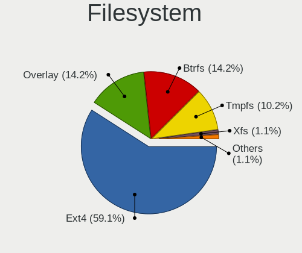

| Type    | Notebooks | Percent |
|---------|-----------|---------|
| Ext4    | 128       | 82.05%  |
| Btrfs   | 14        | 8.97%   |
| Overlay | 9         | 5.77%   |
| Zfs     | 3         | 1.92%   |
| Xfs     | 2         | 1.28%   |

Part. scheme
------------

Scheme of partitioning

| Type    | Notebooks | Percent |
|---------|-----------|---------|
| GPT     | 104       | 66.67%  |
| Unknown | 35        | 22.44%  |
| MBR     | 17        | 10.9%   |

Dual Boot with Linux/BSD
------------------------

Hosting more than one Linux/BSD

| Dual boot | Notebooks | Percent |
|-----------|-----------|---------|
| No        | 138       | 88.46%  |
| Yes       | 18        | 11.54%  |

Dual Boot (Win)
---------------

Hosting Linux and Windows

| Dual boot | Notebooks | Percent |
|-----------|-----------|---------|
| No        | 109       | 69.87%  |
| Yes       | 47        | 30.13%  |

Board
-----

Vendor
------

Motherboard manufacturer

| Name                        | Notebooks | Percent |
|-----------------------------|-----------|---------|
| Dell                        | 32        | 20.51%  |
| Hewlett-Packard             | 31        | 19.87%  |
| Lenovo                      | 22        | 14.1%   |
| ASUSTek Computer            | 22        | 14.1%   |
| Acer                        | 9         | 5.77%   |
| MSI                         | 6         | 3.85%   |
| HUAWEI                      | 4         | 2.56%   |
| TUXEDO                      | 3         | 1.92%   |
| Thomson                     | 3         | 1.92%   |
| UNOWHY                      | 2         | 1.28%   |
| Toshiba                     | 2         | 1.28%   |
| Timi                        | 2         | 1.28%   |
| Unknown                     | 2         | 1.28%   |
| Valve                       | 1         | 0.64%   |
| SHENZHEN YOUDISI E-COMMERCE | 1         | 0.64%   |
| Samsung Electronics         | 1         | 0.64%   |
| Razer                       | 1         | 0.64%   |
| Panasonic                   | 1         | 0.64%   |
| Packard Bell                | 1         | 0.64%   |
| Notebook                    | 1         | 0.64%   |
| LDLC                        | 1         | 0.64%   |
| Jumper                      | 1         | 0.64%   |
| Google                      | 1         | 0.64%   |
| Gigabyte Technology         | 1         | 0.64%   |
| Fujitsu Siemens             | 1         | 0.64%   |
| Dynabook Europe             | 1         | 0.64%   |
| Dynabook                    | 1         | 0.64%   |
| Apple                       | 1         | 0.64%   |
| Alienware                   | 1         | 0.64%   |

Model
-----

Motherboard model

| Name                                     | Notebooks | Percent |
|------------------------------------------|-----------|---------|
| HP Pavilion 17                           | 3         | 1.92%   |
| Dell Latitude 7310                       | 3         | 1.92%   |
| Unknown                                  | 3         | 1.92%   |
| Thomson N17V3C8WH512                     | 2         | 1.28%   |
| Lenovo ThinkPad P14s Gen 1 20Y1CTO1WW    | 2         | 1.28%   |
| HP EliteBook 840 G3                      | 2         | 1.28%   |
| HP EliteBook 840 G2                      | 2         | 1.28%   |
| Dell Latitude E6520                      | 2         | 1.28%   |
| Dell Latitude 7300                       | 2         | 1.28%   |
| Dell Latitude 5420                       | 2         | 1.28%   |
| ASUS UX303UA                             | 2         | 1.28%   |
| Valve Jupiter                            | 1         | 0.64%   |
| UNOWHY Y13G012S4EI                       | 1         | 0.64%   |
| UNOWHY Y13G011S4EI                       | 1         | 0.64%   |
| TUXEDO Pulse 15 Gen2                     | 1         | 0.64%   |
| TUXEDO Pulse 15 Gen1                     | 1         | 0.64%   |
| TUXEDO InfinityBook Pro 14 Gen6          | 1         | 0.64%   |
| Toshiba Satellite C70D-B                 | 1         | 0.64%   |
| Toshiba Satellite C70D-A                 | 1         | 0.64%   |
| Timi Xiaomi Book Pro 16 2022             | 1         | 0.64%   |
| Timi TM1612                              | 1         | 0.64%   |
| Thomson NEO14A-4SL128                    | 1         | 0.64%   |
| SHENZHEN YOUDISI E-COMMERCE A8S PRO      | 1         | 0.64%   |
| Samsung 350V5C/351V5C/3540VC/3440VC      | 1         | 0.64%   |
| Razer Blade Stealth                      | 1         | 0.64%   |
| Panasonic CF-19AHN3BFF                   | 1         | 0.64%   |
| Packard Bell EasyNote TE69CXP            | 1         | 0.64%   |
| Notebook NL40_50GU                       | 1         | 0.64%   |
| MSI Prestige 14 A12SC                    | 1         | 0.64%   |
| MSI Modern 14 C12M                       | 1         | 0.64%   |
| MSI Katana GF76 11UC                     | 1         | 0.64%   |
| MSI GT60                                 | 1         | 0.64%   |
| MSI GS75 Stealth 10SE                    | 1         | 0.64%   |
| MSI GL62M 7RDX                           | 1         | 0.64%   |
| Lenovo Yoga 2 13 20344                   | 1         | 0.64%   |
| Lenovo ThinkPad X270 20HN0014FR          | 1         | 0.64%   |
| Lenovo ThinkPad X1 Nano Gen 2 21E80020FR | 1         | 0.64%   |
| Lenovo ThinkPad X1 Carbon 4th 20FCS2L300 | 1         | 0.64%   |
| Lenovo ThinkPad T470s W10DG 20JTS2QA00   | 1         | 0.64%   |
| Lenovo ThinkPad T460 20FMS06V00          | 1         | 0.64%   |

Model Family
------------

Motherboard model prefix

| Name                            | Notebooks | Percent |
|---------------------------------|-----------|---------|
| Dell Latitude                   | 21        | 13.46%  |
| Lenovo ThinkPad                 | 12        | 7.69%   |
| HP Pavilion                     | 9         | 5.77%   |
| HP EliteBook                    | 8         | 5.13%   |
| Acer Aspire                     | 6         | 3.85%   |
| Lenovo IdeaPad                  | 5         | 3.21%   |
| Dell Inspiron                   | 4         | 2.56%   |
| ASUS ZenBook                    | 4         | 2.56%   |
| HP ProBook                      | 3         | 1.92%   |
| ASUS VivoBook                   | 3         | 1.92%   |
| ASUS ASUS                       | 3         | 1.92%   |
| Unknown                         | 3         | 1.92%   |
| TUXEDO Pulse                    | 2         | 1.28%   |
| Toshiba Satellite               | 2         | 1.28%   |
| Thomson N17V3C8WH512            | 2         | 1.28%   |
| Lenovo ThinkBook                | 2         | 1.28%   |
| HP ZBook                        | 2         | 1.28%   |
| HP Laptop                       | 2         | 1.28%   |
| Dell Precision                  | 2         | 1.28%   |
| ASUS UX303UA                    | 2         | 1.28%   |
| Acer Swift                      | 2         | 1.28%   |
| Valve Jupiter                   | 1         | 0.64%   |
| UNOWHY Y13G012S4EI              | 1         | 0.64%   |
| UNOWHY Y13G011S4EI              | 1         | 0.64%   |
| TUXEDO InfinityBook             | 1         | 0.64%   |
| Timi Xiaomi                     | 1         | 0.64%   |
| Timi TM1612                     | 1         | 0.64%   |
| Thomson NEO14A-4SL128           | 1         | 0.64%   |
| SHENZHEN YOUDISI E-COMMERCE A8S | 1         | 0.64%   |
| Samsung 350V5C                  | 1         | 0.64%   |
| Razer Blade                     | 1         | 0.64%   |
| Panasonic CF-19AHN3BFF          | 1         | 0.64%   |
| Packard Bell EasyNote           | 1         | 0.64%   |
| Notebook NL40                   | 1         | 0.64%   |
| MSI Prestige                    | 1         | 0.64%   |
| MSI Modern                      | 1         | 0.64%   |
| MSI Katana                      | 1         | 0.64%   |
| MSI GT60                        | 1         | 0.64%   |
| MSI GS75                        | 1         | 0.64%   |
| MSI GL62M                       | 1         | 0.64%   |

MFG Year
--------

Motherboard manufacture year

| Year | Notebooks | Percent |
|------|-----------|---------|
| 2020 | 23        | 14.74%  |
| 2021 | 20        | 12.82%  |
| 2022 | 15        | 9.62%   |
| 2015 | 15        | 9.62%   |
| 2016 | 14        | 8.97%   |
| 2019 | 13        | 8.33%   |
| 2013 | 10        | 6.41%   |
| 2018 | 8         | 5.13%   |
| 2017 | 8         | 5.13%   |
| 2012 | 7         | 4.49%   |
| 2014 | 6         | 3.85%   |
| 2011 | 6         | 3.85%   |
| 2008 | 4         | 2.56%   |
| 2009 | 3         | 1.92%   |
| 2010 | 2         | 1.28%   |
| 2007 | 1         | 0.64%   |
| 2005 | 1         | 0.64%   |

Form Factor
-----------

Physical design of the computer

| Name     | Notebooks | Percent |
|----------|-----------|---------|
| Notebook | 156       | 100%    |

Secure Boot
-----------

Enabled or disabled

| State    | Notebooks | Percent |
|----------|-----------|---------|
| Disabled | 140       | 89.74%  |
| Enabled  | 16        | 10.26%  |

Coreboot
--------

Have coreboot on board

| Used | Notebooks | Percent |
|------|-----------|---------|
| No   | 155       | 99.36%  |
| Yes  | 1         | 0.64%   |

RAM Size
--------

Total RAM memory

| Size in GB | Notebooks | Percent |
|------------|-----------|---------|
| 4.01-8.0   | 53        | 33.97%  |
| 3.01-4.0   | 38        | 24.36%  |
| 16.01-24.0 | 29        | 18.59%  |
| 8.01-16.0  | 22        | 14.1%   |
| 32.01-64.0 | 10        | 6.41%   |
| 24.01-32.0 | 2         | 1.28%   |
| 2.01-3.0   | 1         | 0.64%   |
| 1.01-2.0   | 1         | 0.64%   |

RAM Used
--------

Used RAM memory

| Used GB    | Notebooks | Percent |
|------------|-----------|---------|
| 2.01-3.0   | 44        | 28.21%  |
| 1.01-2.0   | 44        | 28.21%  |
| 4.01-8.0   | 26        | 16.67%  |
| 3.01-4.0   | 22        | 14.1%   |
| 8.01-16.0  | 13        | 8.33%   |
| 0.51-1.0   | 5         | 3.21%   |
| 24.01-32.0 | 1         | 0.64%   |
| 16.01-24.0 | 1         | 0.64%   |

Total Drives
------------

Number of drives on board

| Drives | Notebooks | Percent |
|--------|-----------|---------|
| 1      | 125       | 80.13%  |
| 2      | 30        | 19.23%  |
| 6      | 1         | 0.64%   |

Has CD-ROM
----------

Has CD-ROM on board

| Presented | Notebooks | Percent |
|-----------|-----------|---------|
| No        | 112       | 71.79%  |
| Yes       | 44        | 28.21%  |

Has Ethernet
------------

Has Ethernet on board

| Presented | Notebooks | Percent |
|-----------|-----------|---------|
| Yes       | 123       | 78.85%  |
| No        | 33        | 21.15%  |

Has WiFi
--------

Has WiFi module

| Presented | Notebooks | Percent |
|-----------|-----------|---------|
| Yes       | 154       | 98.72%  |
| No        | 2         | 1.28%   |

Has Bluetooth
-------------

Has Bluetooth module

| Presented | Notebooks | Percent |
|-----------|-----------|---------|
| Yes       | 130       | 83.33%  |
| No        | 26        | 16.67%  |

Location
--------

Country
-------

Geographic location (country)

| Country | Notebooks | Percent |
|---------|-----------|---------|
| France  | 156       | 100%    |

City
----

Geographic location (city)

| City                      | Notebooks | Percent |
|---------------------------|-----------|---------|
| Paris                     | 25        | 16.03%  |
| Champs-sur-Marne          | 6         | 3.85%   |
| Valenciennes              | 4         | 2.56%   |
| Lyon                      | 4         | 2.56%   |
| Pau                       | 3         | 1.92%   |
| Montpellier               | 3         | 1.92%   |
| Toulon                    | 2         | 1.28%   |
| Seynod                    | 2         | 1.28%   |
| Meudon                    | 2         | 1.28%   |
| Évreux                   | 2         | 1.28%   |
| Dijon                     | 2         | 1.28%   |
| Courbevoie                | 2         | 1.28%   |
| Clamart                   | 2         | 1.28%   |
| Châtenay-Malabry         | 2         | 1.28%   |
| Cenon                     | 2         | 1.28%   |
| Brest                     | 2         | 1.28%   |
| Bordeaux                  | 2         | 1.28%   |
| Aubervilliers             | 2         | 1.28%   |
| Villeurbanne              | 1         | 0.64%   |
| Villejuif                 | 1         | 0.64%   |
| Villefranche-de-Lauragais | 1         | 0.64%   |
| Villars                   | 1         | 0.64%   |
| Versailles                | 1         | 0.64%   |
| Vendays-Montalivet        | 1         | 0.64%   |
| Vence                     | 1         | 0.64%   |
| Vannes                    | 1         | 0.64%   |
| Tournan-en-Brie           | 1         | 0.64%   |
| Toulouse                  | 1         | 0.64%   |
| Souillac                  | 1         | 0.64%   |
| Soues                     | 1         | 0.64%   |
| Soissons                  | 1         | 0.64%   |
| Six-Fours-les-Plages      | 1         | 0.64%   |
| Sevran                    | 1         | 0.64%   |
| Seez                      | 1         | 0.64%   |
| Sassenage                 | 1         | 0.64%   |
| Sartrouville              | 1         | 0.64%   |
| Saint-Quentin             | 1         | 0.64%   |
| Saint-Julien-les-Villas   | 1         | 0.64%   |
| Saint-Hilaire-sur-Benaize | 1         | 0.64%   |
| Saint-Georges-Montcocq    | 1         | 0.64%   |

Drives
------

Drive Vendor
------------

Hard drive vendors

| Vendor                      | Notebooks | Drives | Percent |
|-----------------------------|-----------|--------|---------|
| Samsung Electronics         | 39        | 41     | 21.08%  |
| SK hynix                    | 16        | 16     | 8.65%   |
| WDC                         | 15        | 15     | 8.11%   |
| Unknown                     | 15        | 16     | 8.11%   |
| Seagate                     | 13        | 13     | 7.03%   |
| SanDisk                     | 12        | 13     | 6.49%   |
| Crucial                     | 11        | 11     | 5.95%   |
| Toshiba                     | 10        | 10     | 5.41%   |
| Intel                       | 7         | 7      | 3.78%   |
| HGST                        | 6         | 6      | 3.24%   |
| KIOXIA                      | 4         | 4      | 2.16%   |
| Kingston Technology Company | 3         | 3      | 1.62%   |
| Unknown                     | 3         | 3      | 1.62%   |
| Phison Electronics          | 2         | 2      | 1.08%   |
| Phison                      | 2         | 2      | 1.08%   |
| Micron/Crucial Technology   | 2         | 2      | 1.08%   |
| Micron Technology           | 2         | 2      | 1.08%   |
| LDLC                        | 2         | 2      | 1.08%   |
| Hitachi                     | 2         | 2      | 1.08%   |
| China                       | 2         | 2      | 1.08%   |
| UMIS                        | 1         | 1      | 0.54%   |
| SSSTC                       | 1         | 1      | 0.54%   |
| PNY                         | 1         | 1      | 0.54%   |
| Netac                       | 1         | 1      | 0.54%   |
| LITEONIT                    | 1         | 1      | 0.54%   |
| LITEON                      | 1         | 1      | 0.54%   |
| Lexar                       | 1         | 1      | 0.54%   |
| Jumper                      | 1         | 1      | 0.54%   |
| JMicron Technology          | 1         | 1      | 0.54%   |
| Intenso                     | 1         | 1      | 0.54%   |
| Hoodisk                     | 1         | 1      | 0.54%   |
| Freecom                     | 1         | 1      | 0.54%   |
| FORESEE                     | 1         | 1      | 0.54%   |
| BHT                         | 1         | 1      | 0.54%   |
| ASMT109x                    | 1         | 1      | 0.54%   |
| ASMT                        | 1         | 1      | 0.54%   |
| Apple                       | 1         | 1      | 0.54%   |

Drive Model
-----------

Hard drive models

| Model                                             | Notebooks | Percent |
|---------------------------------------------------|-----------|---------|
| Samsung SSD 870 QVO 1TB                           | 4         | 2.13%   |
| Samsung SSD 850 EVO 500GB                         | 4         | 2.13%   |
| Unknown MMC Card  64GB                            | 3         | 1.6%    |
| Unknown MMC Card  128GB                           | 3         | 1.6%    |
| Toshiba MQ01ABD100 1TB                            | 3         | 1.6%    |
| SK hynix BC711 NVMe 512GB                         | 3         | 1.6%    |
| Seagate ST1000LM024 HN-M101MBB 1TB                | 3         | 1.6%    |
| Sandisk WD Blue SN500 / PC SN520 NVMe SSD 512GB   | 3         | 1.6%    |
| HGST HTS721010A9E630 1TB                          | 3         | 1.6%    |
| Unknown                                           | 3         | 1.6%    |
| Unknown MMC Card  32GB                            | 2         | 1.06%   |
| Toshiba MQ01ABF050 500GB                          | 2         | 1.06%   |
| SK hynix PC611 NVMe 1TB                           | 2         | 1.06%   |
| Samsung NVMe SSD Controller SM981/PM981/PM983 1TB | 2         | 1.06%   |
| Samsung MZVLQ512HBLU-00B00 512GB                  | 2         | 1.06%   |
| Phison E12 NVMe Controller 2TB                    | 2         | 1.06%   |
| Micron/Crucial P2 NVMe PCIe SSD 250GB             | 2         | 1.06%   |
| KIOXIA KBG40ZNS512G NVMe 512GB                    | 2         | 1.06%   |
| Intel SSD 660P Series 512GB                       | 2         | 1.06%   |
| HGST HTS541010A9E680 1TB                          | 2         | 1.06%   |
| Crucial CT500MX500SSD1 500GB                      | 2         | 1.06%   |
| WDC WDS500G2B0B-00YS70 500GB SSD                  | 1         | 0.53%   |
| WDC WDS240G2G0B-00EPW0 240GB SSD                  | 1         | 0.53%   |
| WDC WD7500BPKX-00HPJT0 752GB                      | 1         | 0.53%   |
| WDC WD6400BEVT-22A0RT0 640GB                      | 1         | 0.53%   |
| WDC WD5000LPVX-22V0TT0 500GB                      | 1         | 0.53%   |
| WDC WD5000LPLX-60ZNTT1 500GB                      | 1         | 0.53%   |
| WDC WD5000LPCX-60VHAT1 500GB                      | 1         | 0.53%   |
| WDC WD2500BEVS-22UST0 250GB                       | 1         | 0.53%   |
| WDC WD16 00BEVT-60ZCT 160GB                       | 1         | 0.53%   |
| WDC WD10SPZX-24Z10T0 1TB                          | 1         | 0.53%   |
| WDC WD10SPSX-00A6WT0 1TB                          | 1         | 0.53%   |
| WDC WD10JPVX-22JC3T0 1TB                          | 1         | 0.53%   |
| WDC WD10JPCX-24UE4T0 1TB                          | 1         | 0.53%   |
| WDC PC SN730 SDBPNTY-512G-1027 512GB              | 1         | 0.53%   |
| WDC PC SN540 SDDPNPF-1T00-1032 1TB                | 1         | 0.53%   |
| Unknown TA2964  64GB                              | 1         | 0.53%   |
| Unknown SR128  128GB                              | 1         | 0.53%   |
| Unknown SL16G  16GB                               | 1         | 0.53%   |
| Unknown SEM64G  64GB                              | 1         | 0.53%   |

HDD Vendor
----------

Hard disk drive vendors

| Vendor              | Notebooks | Drives | Percent |
|---------------------|-----------|--------|---------|
| Seagate             | 13        | 13     | 31.71%  |
| WDC                 | 11        | 11     | 26.83%  |
| Toshiba             | 8         | 8      | 19.51%  |
| HGST                | 6         | 6      | 14.63%  |
| Hitachi             | 2         | 2      | 4.88%   |
| Samsung Electronics | 1         | 1      | 2.44%   |

SSD Vendor
----------

Solid state drive vendors

| Vendor              | Notebooks | Drives | Percent |
|---------------------|-----------|--------|---------|
| Samsung Electronics | 21        | 21     | 33.87%  |
| Crucial             | 9         | 9      | 14.52%  |
| SanDisk             | 6         | 7      | 9.68%   |
| WDC                 | 2         | 2      | 3.23%   |
| SK hynix            | 2         | 2      | 3.23%   |
| LDLC                | 2         | 2      | 3.23%   |
| Intel               | 2         | 2      | 3.23%   |
| China               | 2         | 2      | 3.23%   |
| Unknown             | 2         | 2      | 3.23%   |
| PNY                 | 1         | 1      | 1.61%   |
| Netac               | 1         | 1      | 1.61%   |
| LITEONIT            | 1         | 1      | 1.61%   |
| LITEON              | 1         | 1      | 1.61%   |
| Lexar               | 1         | 1      | 1.61%   |
| Jumper              | 1         | 1      | 1.61%   |
| JMicron Technology  | 1         | 1      | 1.61%   |
| Intenso             | 1         | 1      | 1.61%   |
| Hoodisk             | 1         | 1      | 1.61%   |
| Freecom             | 1         | 1      | 1.61%   |
| FORESEE             | 1         | 1      | 1.61%   |
| BHT                 | 1         | 1      | 1.61%   |
| ASMT                | 1         | 1      | 1.61%   |
| Apple               | 1         | 1      | 1.61%   |

Drive Kind
----------

HDD or SSD

| Kind    | Notebooks | Drives | Percent |
|---------|-----------|--------|---------|
| NVMe    | 63        | 67     | 34.81%  |
| SSD     | 61        | 63     | 33.7%   |
| HDD     | 40        | 41     | 22.1%   |
| MMC     | 16        | 17     | 8.84%   |
| Unknown | 1         | 1      | 0.55%   |

Drive Connector
---------------

SATA, SAS, NVMe, etc.

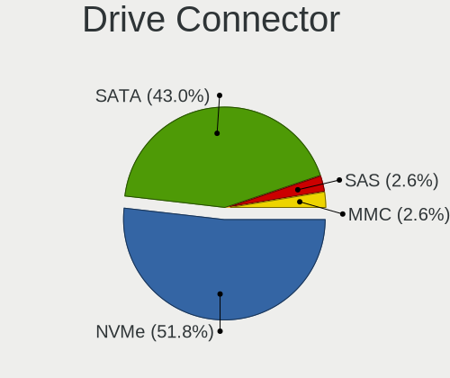

| Type | Notebooks | Drives | Percent |
|------|-----------|--------|---------|
| SATA | 92        | 99     | 52.27%  |
| NVMe | 63        | 67     | 35.8%   |
| MMC  | 16        | 17     | 9.09%   |
| SAS  | 5         | 6      | 2.84%   |

Drive Size
----------

Size of hard drive

| Size in TB | Notebooks | Drives | Percent |
|------------|-----------|--------|---------|
| 0.01-0.5   | 56        | 62     | 57.73%  |
| 0.51-1.0   | 40        | 41     | 41.24%  |
| 1.01-2.0   | 1         | 1      | 1.03%   |

Space Total
-----------

Amount of disk space available on the file system

| Size in GB     | Notebooks | Percent |
|----------------|-----------|---------|
| 251-500        | 40        | 25.64%  |
| 501-1000       | 37        | 23.72%  |
| 101-250        | 36        | 23.08%  |
| 1-20           | 10        | 6.41%   |
| 51-100         | 10        | 6.41%   |
| 21-50          | 8         | 5.13%   |
| Unknown        | 6         | 3.85%   |
| 1001-2000      | 4         | 2.56%   |
| 2001-3000      | 3         | 1.92%   |
| More than 3000 | 2         | 1.28%   |

Space Used
----------

Amount of used disk space

| Used GB        | Notebooks | Percent |
|----------------|-----------|---------|
| 1-20           | 47        | 30.13%  |
| 21-50          | 33        | 21.15%  |
| 101-250        | 25        | 16.03%  |
| 251-500        | 18        | 11.54%  |
| 51-100         | 18        | 11.54%  |
| 501-1000       | 7         | 4.49%   |
| Unknown        | 6         | 3.85%   |
| More than 3000 | 1         | 0.64%   |
| 1001-2000      | 1         | 0.64%   |

Malfunc. Drives
---------------

Drive models with a malfunction

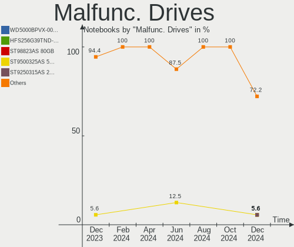

| Model                                            | Notebooks | Drives | Percent |
|--------------------------------------------------|-----------|--------|---------|
| WDC WD6400BEVT-22A0RT0 640GB                     | 1         | 1      | 6.25%   |
| Toshiba MQ01ABD100 1TB                           | 1         | 1      | 6.25%   |
| Toshiba MQ01ABD075 752GB                         | 1         | 1      | 6.25%   |
| Toshiba MK2552GSX 250GB                          | 1         | 1      | 6.25%   |
| SK hynix HFS256G32MND-2200A 256GB SSD            | 1         | 1      | 6.25%   |
| Seagate ST9320325AS 320GB                        | 1         | 1      | 6.25%   |
| Seagate ST500LM021-1KJ152 500GB                  | 1         | 1      | 6.25%   |
| Seagate ST1000LM024 HN-M101MBB 1TB               | 1         | 1      | 6.25%   |
| Seagate ST1000LM014-1EJ164 1TB                   | 1         | 1      | 6.25%   |
| SanDisk SD8TN8U-256G-1006 256GB SSD              | 1         | 1      | 6.25%   |
| SanDisk SD8SN8U-512G-1006 512GB SSD              | 1         | 1      | 6.25%   |
| Samsung Electronics SSD 850 EVO 500GB            | 1         | 1      | 6.25%   |
| Samsung Electronics MZNLH128HBHQ-000H1 128GB SSD | 1         | 1      | 6.25%   |
| Intel SSDSCKKF256G8H 256GB                       | 1         | 1      | 6.25%   |
| HGST HTS541010A7E630 1TB                         | 1         | 1      | 6.25%   |
| Crucial CT525MX300SSD1 528GB                     | 1         | 1      | 6.25%   |

Malfunc. Drive Vendor
---------------------

Vendors of faulty drives

| Vendor              | Notebooks | Drives | Percent |
|---------------------|-----------|--------|---------|
| Seagate             | 4         | 4      | 25%     |
| Toshiba             | 3         | 3      | 18.75%  |
| SanDisk             | 2         | 2      | 12.5%   |
| Samsung Electronics | 2         | 2      | 12.5%   |
| WDC                 | 1         | 1      | 6.25%   |
| SK hynix            | 1         | 1      | 6.25%   |
| Intel               | 1         | 1      | 6.25%   |
| HGST                | 1         | 1      | 6.25%   |
| Crucial             | 1         | 1      | 6.25%   |

Malfunc. HDD Vendor
-------------------

Vendors of faulty HDD drives

| Vendor  | Notebooks | Drives | Percent |
|---------|-----------|--------|---------|
| Seagate | 4         | 4      | 44.44%  |
| Toshiba | 3         | 3      | 33.33%  |
| WDC     | 1         | 1      | 11.11%  |
| HGST    | 1         | 1      | 11.11%  |

Malfunc. Drive Kind
-------------------

Kinds of faulty drives

| Kind | Notebooks | Drives | Percent |
|------|-----------|--------|---------|
| HDD  | 9         | 9      | 56.25%  |
| SSD  | 7         | 7      | 43.75%  |

Failed Drives
-------------

Failed drive models

| Model                    | Notebooks | Drives | Percent |
|--------------------------|-----------|--------|---------|
| HGST HTS721010A9E630 1TB | 1         | 1      | 100%    |

Failed Drive Vendor
-------------------

Failed drive vendors

| Vendor | Notebooks | Drives | Percent |
|--------|-----------|--------|---------|
| HGST   | 1         | 1      | 100%    |

Drive Status
------------

Number of failed and malfunc. drives

| Status   | Notebooks | Drives | Percent |
|----------|-----------|--------|---------|
| Works    | 87        | 93     | 51.79%  |
| Detected | 65        | 79     | 38.69%  |
| Malfunc  | 15        | 16     | 8.93%   |
| Failed   | 1         | 1      | 0.6%    |

Storage controller
------------------

Storage Vendor
--------------

Storage controller vendors

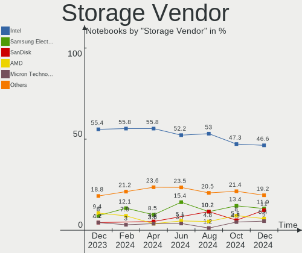

| Vendor                         | Notebooks | Percent |
|--------------------------------|-----------|---------|
| Intel                          | 98        | 54.75%  |
| Samsung Electronics            | 19        | 10.61%  |
| AMD                            | 18        | 10.06%  |
| SK hynix                       | 14        | 7.82%   |
| SanDisk                        | 8         | 4.47%   |
| KIOXIA                         | 4         | 2.23%   |
| Phison Electronics             | 3         | 1.68%   |
| Micron/Crucial Technology      | 3         | 1.68%   |
| Kingston Technology Company    | 3         | 1.68%   |
| Toshiba America Info Systems   | 2         | 1.12%   |
| Nvidia                         | 2         | 1.12%   |
| Micron Technology              | 2         | 1.12%   |
| Union Memory (Shenzhen)        | 1         | 0.56%   |
| Solid State Storage Technology | 1         | 0.56%   |
| Marvell Technology Group       | 1         | 0.56%   |

Storage Model
-------------

Storage controller models

| Model                                                                          | Notebooks | Percent |
|--------------------------------------------------------------------------------|-----------|---------|
| AMD FCH SATA Controller [AHCI mode]                                            | 17        | 8.95%   |
| Intel Sunrise Point-LP SATA Controller [AHCI mode]                             | 14        | 7.37%   |
| Samsung NVMe SSD Controller 980                                                | 11        | 5.79%   |
| Intel Volume Management Device NVMe RAID Controller                            | 11        | 5.79%   |
| Intel 82801 Mobile SATA Controller [RAID mode]                                 | 11        | 5.79%   |
| SK hynix Gold P31/PC711 NVMe Solid State Drive                                 | 8         | 4.21%   |
| Intel Wildcat Point-LP SATA Controller [AHCI Mode]                             | 8         | 4.21%   |
| Intel Celeron/Pentium Silver Processor SATA Controller                         | 8         | 4.21%   |
| Intel 7 Series Chipset Family 6-port SATA Controller [AHCI mode]               | 7         | 3.68%   |
| SK hynix Non-Volatile memory controller                                        | 5         | 2.63%   |
| Samsung NVMe SSD Controller SM981/PM981/PM983                                  | 5         | 2.63%   |
| Intel Celeron N3350/Pentium N4200/Atom E3900 Series SATA AHCI Controller       | 5         | 2.63%   |
| Intel 8 Series SATA Controller 1 [AHCI mode]                                   | 5         | 2.63%   |
| Intel 6 Series/C200 Series Chipset Family 6 port Mobile SATA AHCI Controller   | 4         | 2.11%   |
| SanDisk WD Blue SN500 / PC SN520 NVMe SSD                                      | 3         | 1.58%   |
| SanDisk Non-Volatile memory controller                                         | 3         | 1.58%   |
| Micron/Crucial P2 NVMe PCIe SSD                                                | 3         | 1.58%   |
| KIOXIA NVMe SSD Controller BG4                                                 | 3         | 1.58%   |
| Intel Tiger Lake-LP SATA Controller                                            | 3         | 1.58%   |
| Intel HM170/QM170 Chipset SATA Controller [AHCI Mode]                          | 3         | 1.58%   |
| Intel Cannon Lake Mobile PCH SATA AHCI Controller                              | 3         | 1.58%   |
| SanDisk WD Black SN750 / PC SN730 NVMe SSD                                     | 2         | 1.05%   |
| Samsung NVMe SSD Controller PM9A1/PM9A3/980PRO                                 | 2         | 1.05%   |
| Phison E12 NVMe Controller                                                     | 2         | 1.05%   |
| Micron Non-Volatile memory controller                                          | 2         | 1.05%   |
| Intel SSD Pro 7600p/760p/E 6100p Series                                        | 2         | 1.05%   |
| Intel SSD 660P Series                                                          | 2         | 1.05%   |
| Intel 82801IBM/IEM (ICH9M/ICH9M-E) 4 port SATA Controller [AHCI mode]          | 2         | 1.05%   |
| Intel 82801GBM/GHM (ICH7-M Family) SATA Controller [IDE mode]                  | 2         | 1.05%   |
| Intel 8 Series/C220 Series Chipset Family 6-port SATA Controller 1 [AHCI mode] | 2         | 1.05%   |
| Intel 500 Series Chipset Family SATA AHCI Controller                           | 2         | 1.05%   |
| Intel 400 Series Chipset Family SATA AHCI Controller                           | 2         | 1.05%   |
| Union Memory (Shenzhen) AM630 PCIe 4.0 x4 NVMe SSD Controller                  | 1         | 0.53%   |
| Toshiba America Info Systems XG6 NVMe SSD Controller                           | 1         | 0.53%   |
| Toshiba America Info Systems XG5 NVMe SSD Controller                           | 1         | 0.53%   |
| Solid State Storage Non-Volatile memory controller                             | 1         | 0.53%   |
| SK hynix BC501 NVMe Solid State Drive                                          | 1         | 0.53%   |
| Samsung Electronics SATA controller                                            | 1         | 0.53%   |
| Phison PS5013 E13 NVMe Controller                                              | 1         | 0.53%   |
| Nvidia MCP79 AHCI Controller                                                   | 1         | 0.53%   |

Storage Kind
------------

Kind of storage controller (IDE, SATA, NVMe, SAS, ...)

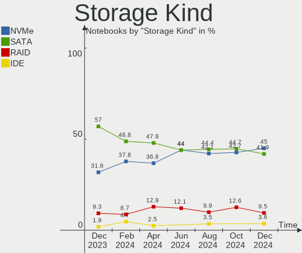

| Kind | Notebooks | Percent |
|------|-----------|---------|
| SATA | 96        | 51.61%  |
| NVMe | 62        | 33.33%  |
| RAID | 22        | 11.83%  |
| IDE  | 6         | 3.23%   |

Processor
---------

CPU Vendor
----------

Processor vendors

| Vendor | Notebooks | Percent |
|--------|-----------|---------|
| Intel  | 127       | 81.41%  |
| AMD    | 29        | 18.59%  |

CPU Model
---------

Processor models

| Model                                       | Notebooks | Percent |
|---------------------------------------------|-----------|---------|
| Intel Core i5-7200U CPU @ 2.50GHz           | 4         | 2.56%   |
| Intel Core i5-6300U CPU @ 2.40GHz           | 4         | 2.56%   |
| Intel 11th Gen Core i7-1165G7 @ 2.80GHz     | 4         | 2.56%   |
| Intel Core i7-6600U CPU @ 2.60GHz           | 3         | 1.92%   |
| Intel Core i7-10610U CPU @ 1.80GHz          | 3         | 1.92%   |
| Intel Core i5-5200U CPU @ 2.20GHz           | 3         | 1.92%   |
| Intel 11th Gen Core i7-11800H @ 2.30GHz     | 3         | 1.92%   |
| AMD Ryzen 7 4800H with Radeon Graphics      | 3         | 1.92%   |
| Intel Pentium CPU N3710 @ 1.60GHz           | 2         | 1.28%   |
| Intel Core i7-8665U CPU @ 1.90GHz           | 2         | 1.28%   |
| Intel Core i7-8565U CPU @ 1.80GHz           | 2         | 1.28%   |
| Intel Core i7-5500U CPU @ 2.40GHz           | 2         | 1.28%   |
| Intel Core i7-4600U CPU @ 2.10GHz           | 2         | 1.28%   |
| Intel Core i7-3630QM CPU @ 2.40GHz          | 2         | 1.28%   |
| Intel Core i7-3610QM CPU @ 2.30GHz          | 2         | 1.28%   |
| Intel Core i5-6200U CPU @ 2.30GHz           | 2         | 1.28%   |
| Intel Core i5-3320M CPU @ 2.60GHz           | 2         | 1.28%   |
| Intel Core i3-5005U CPU @ 2.00GHz           | 2         | 1.28%   |
| Intel Core i3-2310M CPU @ 2.10GHz           | 2         | 1.28%   |
| Intel Celeron N4120 CPU @ 1.10GHz           | 2         | 1.28%   |
| Intel Celeron CPU N3350 @ 1.10GHz           | 2         | 1.28%   |
| Intel Celeron CPU J3455 @ 1.50GHz           | 2         | 1.28%   |
| Intel 12th Gen Core i7-1260P                | 2         | 1.28%   |
| Intel 12th Gen Core i5-1235U                | 2         | 1.28%   |
| Intel 11th Gen Core i5-1145G7 @ 2.60GHz     | 2         | 1.28%   |
| Intel 11th Gen Core i5-1135G7 @ 2.40GHz     | 2         | 1.28%   |
| Intel 11th Gen Core i3-1115G4 @ 3.00GHz     | 2         | 1.28%   |
| AMD Ryzen 7 PRO 4750U with Radeon Graphics  | 2         | 1.28%   |
| AMD Ryzen 5 4600H with Radeon Graphics      | 2         | 1.28%   |
| Intel Pentium Silver N5030 CPU @ 1.10GHz    | 1         | 0.64%   |
| Intel Pentium Dual-Core CPU T4200 @ 2.00GHz | 1         | 0.64%   |
| Intel Pentium Dual CPU T3400 @ 2.16GHz      | 1         | 0.64%   |
| Intel Pentium CPU N4200 @ 1.10GHz           | 1         | 0.64%   |
| Intel Pentium CPU N3540 @ 2.16GHz           | 1         | 0.64%   |
| Intel Core m3-8100Y CPU @ 1.10GHz           | 1         | 0.64%   |
| Intel Core m3-6Y30 CPU @ 0.90GHz            | 1         | 0.64%   |
| Intel Core i7-9850H CPU @ 2.60GHz           | 1         | 0.64%   |
| Intel Core i7-9750H CPU @ 2.60GHz           | 1         | 0.64%   |
| Intel Core i7-8750H CPU @ 2.20GHz           | 1         | 0.64%   |
| Intel Core i7-8650U CPU @ 1.90GHz           | 1         | 0.64%   |

CPU Model Family
----------------

Processor model prefix

| Model                                | Notebooks | Percent |
|--------------------------------------|-----------|---------|
| Intel Core i7                        | 33        | 21.15%  |
| Intel Core i5                        | 31        | 19.87%  |
| Other                                | 27        | 17.31%  |
| Intel Celeron                        | 12        | 7.69%   |
| Intel Core i3                        | 10        | 6.41%   |
| AMD Ryzen 7                          | 6         | 3.85%   |
| Intel Pentium                        | 4         | 2.56%   |
| AMD E1                               | 4         | 2.56%   |
| Intel Atom                           | 3         | 1.92%   |
| AMD Ryzen 5                          | 3         | 1.92%   |
| AMD A6                               | 3         | 1.92%   |
| Intel Core m3                        | 2         | 1.28%   |
| Intel Core 2 Duo                     | 2         | 1.28%   |
| Intel Core 2                         | 2         | 1.28%   |
| AMD Ryzen 7 PRO                      | 2         | 1.28%   |
| AMD Athlon                           | 2         | 1.28%   |
| AMD A4                               | 2         | 1.28%   |
| Intel Pentium Silver                 | 1         | 0.64%   |
| Intel Pentium Dual-Core              | 1         | 0.64%   |
| Intel Pentium Dual                   | 1         | 0.64%   |
| AMD Turion X2 Ultra Dual-Core Mobile | 1         | 0.64%   |
| AMD Ryzen 5 PRO                      | 1         | 0.64%   |
| AMD Ryzen 3                          | 1         | 0.64%   |
| AMD E2                               | 1         | 0.64%   |
| AMD A8                               | 1         | 0.64%   |

CPU Cores
---------

Number of processor cores

| Number | Notebooks | Percent |
|--------|-----------|---------|
| 2      | 72        | 46.15%  |
| 4      | 57        | 36.54%  |
| 8      | 11        | 7.05%   |
| 6      | 8         | 5.13%   |
| 12     | 3         | 1.92%   |
| 10     | 3         | 1.92%   |
| 14     | 1         | 0.64%   |
| 1      | 1         | 0.64%   |

CPU Sockets
-----------

Number of sockets

| Number | Notebooks | Percent |
|--------|-----------|---------|
| 1      | 156       | 100%    |

CPU Threads
-----------

Threads per core (Hyper-Threading)

| Number | Notebooks | Percent |
|--------|-----------|---------|
| 2      | 113       | 72.44%  |
| 1      | 43        | 27.56%  |

CPU Op-Modes
------------

CPU Operation Modes (32-bit, 64-bit)

| Op mode        | Notebooks | Percent |
|----------------|-----------|---------|
| 32-bit, 64-bit | 155       | 99.36%  |
| 32-bit         | 1         | 0.64%   |

CPU Microcode
-------------

Microcode number

| Number     | Notebooks | Percent |
|------------|-----------|---------|
| Unknown    | 39        | 25%     |
| 0x806c1    | 11        | 7.05%   |
| 0x406e3    | 8         | 5.13%   |
| 0x306a9    | 7         | 4.49%   |
| 0x206a7    | 7         | 4.49%   |
| 0x40651    | 6         | 3.85%   |
| 0x08600106 | 5         | 3.21%   |
| 0x906a3    | 4         | 2.56%   |
| 0x806ec    | 4         | 2.56%   |
| 0x806e9    | 4         | 2.56%   |
| 0x806d1    | 4         | 2.56%   |
| 0x506c9    | 4         | 2.56%   |
| 0x306d4    | 4         | 2.56%   |
| 0x07030105 | 4         | 2.56%   |
| 0x906a4    | 3         | 1.92%   |
| 0x706a8    | 3         | 1.92%   |
| 0x0700010f | 3         | 1.92%   |
| 0x906ed    | 2         | 1.28%   |
| 0x906ea    | 2         | 1.28%   |
| 0x806ea    | 2         | 1.28%   |
| 0x6f6      | 2         | 1.28%   |
| 0x506e3    | 2         | 1.28%   |
| 0x406c4    | 2         | 1.28%   |
| 0x1067a    | 2         | 1.28%   |
| 0x08108109 | 2         | 1.28%   |
| 0x06006705 | 2         | 1.28%   |
| 0xa0652    | 1         | 0.64%   |
| 0x906e9    | 1         | 0.64%   |
| 0x706e5    | 1         | 0.64%   |
| 0x706a1    | 1         | 0.64%   |
| 0x6fd      | 1         | 0.64%   |
| 0x306c3    | 1         | 0.64%   |
| 0x30678    | 1         | 0.64%   |
| 0x20655    | 1         | 0.64%   |
| 0x106c2    | 1         | 0.64%   |
| 0x10676    | 1         | 0.64%   |
| 0x0a50000c | 1         | 0.64%   |
| 0x0a404101 | 1         | 0.64%   |
| 0x08600104 | 1         | 0.64%   |
| 0x08600103 | 1         | 0.64%   |

CPU Microarch
-------------

Microarchitecture

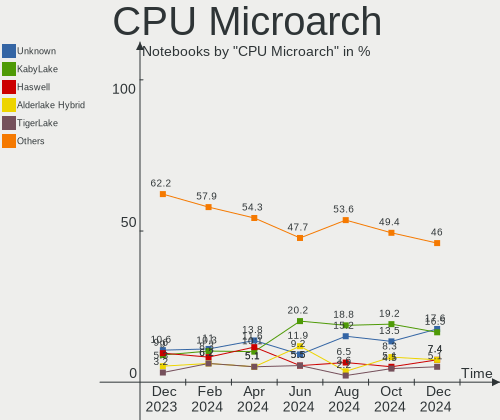

| Name             | Notebooks | Percent |
|------------------|-----------|---------|
| KabyLake         | 26        | 16.67%  |
| TigerLake        | 14        | 8.97%   |
| Skylake          | 13        | 8.33%   |
| IvyBridge        | 9         | 5.77%   |
| Broadwell        | 9         | 5.77%   |
| Zen 2            | 8         | 5.13%   |
| Haswell          | 8         | 5.13%   |
| Goldmont plus    | 8         | 5.13%   |
| SandyBridge      | 7         | 4.49%   |
| Puma             | 6         | 3.85%   |
| Alderlake Hybrid | 6         | 3.85%   |
| Silvermont       | 5         | 3.21%   |
| Icelake          | 5         | 3.21%   |
| Goldmont         | 5         | 3.21%   |
| Unknown          | 4         | 2.56%   |
| Penryn           | 3         | 1.92%   |
| Jaguar           | 3         | 1.92%   |
| Excavator        | 3         | 1.92%   |
| Core             | 3         | 1.92%   |
| Zen+             | 2         | 1.28%   |
| Zen 3            | 2         | 1.28%   |
| Westmere         | 2         | 1.28%   |
| K8 & K10 hybrid  | 2         | 1.28%   |
| CometLake        | 2         | 1.28%   |
| Bonnell          | 1         | 0.64%   |

Graphics
--------

GPU Vendor
----------

Vendors of graphics cards

| Vendor | Notebooks | Percent |
|--------|-----------|---------|
| Intel  | 124       | 64.25%  |
| AMD    | 35        | 18.13%  |
| Nvidia | 34        | 17.62%  |

GPU Model
---------

Graphics card models

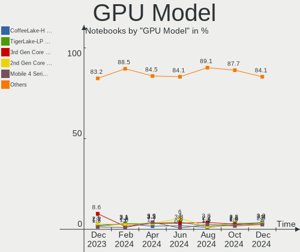

| Model                                                                                    | Notebooks | Percent |
|------------------------------------------------------------------------------------------|-----------|---------|
| Intel TigerLake-LP GT2 [Iris Xe Graphics]                                                | 11        | 5.61%   |
| Intel Skylake GT2 [HD Graphics 520]                                                      | 10        | 5.1%    |
| Intel 3rd Gen Core processor Graphics Controller                                         | 9         | 4.59%   |
| Intel HD Graphics 5500                                                                   | 8         | 4.08%   |
| AMD Renoir                                                                               | 8         | 4.08%   |
| Intel HD Graphics 620                                                                    | 7         | 3.57%   |
| Intel GeminiLake [UHD Graphics 600]                                                      | 7         | 3.57%   |
| Intel 2nd Generation Core Processor Family Integrated Graphics Controller                | 7         | 3.57%   |
| Intel Haswell-ULT Integrated Graphics Controller                                         | 6         | 3.06%   |
| Intel CometLake-U GT2 [UHD Graphics]                                                     | 5         | 2.55%   |
| Nvidia GA107M [GeForce RTX 3050 Mobile]                                                  | 4         | 2.04%   |
| Intel WhiskeyLake-U GT2 [UHD Graphics 620]                                               | 4         | 2.04%   |
| Intel TigerLake-H GT1 [UHD Graphics]                                                     | 4         | 2.04%   |
| Intel HD Graphics 500                                                                    | 4         | 2.04%   |
| Intel CoffeeLake-H GT2 [UHD Graphics 630]                                                | 4         | 2.04%   |
| Intel Alder Lake-P Integrated Graphics Controller                                        | 4         | 2.04%   |
| Nvidia GP107M [GeForce GTX 1050 Mobile]                                                  | 3         | 1.53%   |
| Intel UHD Graphics 620                                                                   | 3         | 1.53%   |
| Intel Tiger Lake-LP GT2 [UHD Graphics G4]                                                | 3         | 1.53%   |
| Intel Mobile 4 Series Chipset Integrated Graphics Controller                             | 3         | 1.53%   |
| Intel Atom/Celeron/Pentium Processor x5-E8000/J3xxx/N3xxx Integrated Graphics Controller | 3         | 1.53%   |
| Intel Alder Lake-UP3 GT2 [Iris Xe Graphics]                                              | 3         | 1.53%   |
| AMD Stoney [Radeon R2/R3/R4/R5 Graphics]                                                 | 3         | 1.53%   |
| AMD Mullins [Radeon R2 Graphics]                                                         | 3         | 1.53%   |
| Nvidia TU117M                                                                            | 2         | 1.02%   |
| Nvidia TU106M [GeForce RTX 2060 Mobile]                                                  | 2         | 1.02%   |
| Nvidia GM107M [GeForce GTX 960M]                                                         | 2         | 1.02%   |
| Intel Mobile 945GM/GMS/GME, 943/940GML Express Integrated Graphics Controller            | 2         | 1.02%   |
| Intel HD Graphics 630                                                                    | 2         | 1.02%   |
| Intel HD Graphics 530                                                                    | 2         | 1.02%   |
| Intel CometLake-H GT2 [UHD Graphics]                                                     | 2         | 1.02%   |
| Intel Atom Processor Z36xxx/Z37xxx Series Graphics & Display                             | 2         | 1.02%   |
| Intel 4th Gen Core Processor Integrated Graphics Controller                              | 2         | 1.02%   |
| AMD Picasso/Raven 2 [Radeon Vega Series / Radeon Vega Mobile Series]                     | 2         | 1.02%   |
| AMD Mullins [Radeon R4/R5 Graphics]                                                      | 2         | 1.02%   |
| AMD Jet PRO [Radeon R5 M230 / R7 M260DX / Radeon 520 Mobile]                             | 2         | 1.02%   |
| Nvidia TU117M [GeForce GTX 1650 Mobile / Max-Q]                                          | 1         | 0.51%   |
| Nvidia TU117GLM [T550 Laptop GPU]                                                        | 1         | 0.51%   |
| Nvidia TU117GLM [Quadro T2000 Mobile / Max-Q]                                            | 1         | 0.51%   |
| Nvidia GP108M [GeForce MX150]                                                            | 1         | 0.51%   |

GPU Combo
---------

Combinations of graphics cards

| Name           | Notebooks | Percent |
|----------------|-----------|---------|
| 1 x Intel      | 89        | 57.05%  |
| Intel + Nvidia | 29        | 18.59%  |
| 1 x AMD        | 27        | 17.31%  |
| Intel + AMD    | 5         | 3.21%   |
| 1 x Nvidia     | 2         | 1.28%   |
| AMD + Nvidia   | 2         | 1.28%   |
| 2 x Intel      | 1         | 0.64%   |
| 2 x AMD        | 1         | 0.64%   |

GPU Driver
----------

Free vs proprietary

| Driver      | Notebooks | Percent |
|-------------|-----------|---------|
| Free        | 137       | 87.82%  |
| Proprietary | 16        | 10.26%  |
| Unknown     | 3         | 1.92%   |

GPU Memory
----------

Total video memory

| Size in GB | Notebooks | Percent |
|------------|-----------|---------|
| Unknown    | 115       | 73.72%  |
| 0.01-0.5   | 19        | 12.18%  |
| 1.01-2.0   | 9         | 5.77%   |
| 0.51-1.0   | 7         | 4.49%   |
| 3.01-4.0   | 4         | 2.56%   |
| 5.01-6.0   | 1         | 0.64%   |
| 2.01-3.0   | 1         | 0.64%   |

Monitor
-------

Monitor Vendor
--------------

Monitor vendors

| Vendor                  | Notebooks | Percent |
|-------------------------|-----------|---------|
| AU Optronics            | 38        | 19.79%  |
| BOE                     | 32        | 16.67%  |
| Chimei Innolux          | 29        | 15.1%   |
| LG Display              | 20        | 10.42%  |
| Samsung Electronics     | 15        | 7.81%   |
| Dell                    | 10        | 5.21%   |
| Sharp                   | 8         | 4.17%   |
| Acer                    | 4         | 2.08%   |
| ViewSonic               | 3         | 1.56%   |
| InfoVision              | 3         | 1.56%   |
| ASUSTek Computer        | 3         | 1.56%   |
| Philips                 | 2         | 1.04%   |
| Lenovo                  | 2         | 1.04%   |
| Iiyama                  | 2         | 1.04%   |
| Hewlett-Packard         | 2         | 1.04%   |
| Goldstar                | 2         | 1.04%   |
| CSO                     | 2         | 1.04%   |
| Ancor Communications    | 2         | 1.04%   |
| Unknown                 | 1         | 0.52%   |
| TR_                     | 1         | 0.52%   |
| SAC                     | 1         | 0.52%   |
| PANDA                   | 1         | 0.52%   |
| LG Philips              | 1         | 0.52%   |
| HannStar                | 1         | 0.52%   |
| Gigabyte Technology     | 1         | 0.52%   |
| Fujitsu Siemens         | 1         | 0.52%   |
| Daewoo                  | 1         | 0.52%   |
| Chi Mei Optoelectronics | 1         | 0.52%   |
| BenQ                    | 1         | 0.52%   |
| Apple                   | 1         | 0.52%   |
| Analogix                | 1         | 0.52%   |

Monitor Model
-------------

Monitor models

| Model                                                                   | Notebooks | Percent |
|-------------------------------------------------------------------------|-----------|---------|
| Dell U2412M DELA07B 1920x1200 518x324mm 24.1-inch                       | 3         | 1.52%   |
| Chimei Innolux LCD Monitor CMN14D4 1920x1080 309x173mm 13.9-inch        | 3         | 1.52%   |
| Sharp LQ156M1JW01 SHP14C3 1920x1080 344x194mm 15.5-inch                 | 2         | 1.02%   |
| Sharp LCD Monitor SHP14AB 1920x1080 294x165mm 13.3-inch                 | 2         | 1.02%   |
| Samsung Electronics LCD Monitor SDC3654 1600x900 382x215mm 17.3-inch    | 2         | 1.02%   |
| Dell U2419H DEL4148 1920x1080 527x296mm 23.8-inch                       | 2         | 1.02%   |
| Chimei Innolux LCD Monitor CMN1734 1600x900 382x214mm 17.2-inch         | 2         | 1.02%   |
| Chimei Innolux LCD Monitor CMN1361 1920x1080 293x165mm 13.2-inch        | 2         | 1.02%   |
| BOE LCD Monitor BOE069B 1600x900 382x215mm 17.3-inch                    | 2         | 1.02%   |
| AU Optronics LCD Monitor AUO573D 1920x1080 309x174mm 14.0-inch          | 2         | 1.02%   |
| AU Optronics LCD Monitor AUO403D 1920x1080 309x173mm 13.9-inch          | 2         | 1.02%   |
| AU Optronics LCD Monitor AUO38ED 1920x1080 344x193mm 15.5-inch          | 2         | 1.02%   |
| AU Optronics LCD Monitor AUO313C 1366x768 309x173mm 13.9-inch           | 2         | 1.02%   |
| AU Optronics LCD Monitor AUO149E 1600x900 382x214mm 17.2-inch           | 2         | 1.02%   |
| AU Optronics LCD Monitor AUO119E 1600x900 382x214mm 17.2-inch           | 2         | 1.02%   |
| AU Optronics LCD Monitor AUO109E 1600x900 382x214mm 17.2-inch           | 2         | 1.02%   |
| ASUSTek Computer VG34V AUS3435 3440x1440 797x334mm 34.0-inch            | 2         | 1.02%   |
| ViewSonic VX3276-QHD VSCE636 2560x1440 698x393mm 31.5-inch              | 1         | 0.51%   |
| ViewSonic VX2457 VSCB931 1920x1080 521x293mm 23.5-inch                  | 1         | 0.51%   |
| ViewSonic VP2765 SERIES VSC9F28 1920x1080 598x336mm 27.0-inch           | 1         | 0.51%   |
| Unknown SMART TV 0563 1920x1080 1209x680mm 54.6-inch                    | 1         | 0.51%   |
| TR_ LCD Monitor TR_5511 1366x768 518x333mm 24.2-inch                    | 1         | 0.51%   |
| Sharp LQ173M1JW05 SHP14EC 1920x1080 382x215mm 17.3-inch                 | 1         | 0.51%   |
| Sharp LQ125T1JW02 SHP142F 2560x1440 277x155mm 12.5-inch                 | 1         | 0.51%   |
| Sharp LCD Monitor SHP14BA 1920x1080 344x194mm 15.5-inch                 | 1         | 0.51%   |
| Sharp LCD Monitor SHP1453 1920x1080 346x194mm 15.6-inch                 | 1         | 0.51%   |
| Samsung Electronics U28E590 SAM0C4D 3840x2160 610x350mm 27.7-inch       | 1         | 0.51%   |
| Samsung Electronics SyncMaster SAM0593 1920x1080 477x268mm 21.5-inch    | 1         | 0.51%   |
| Samsung Electronics SMS24A350H SAM07D5 1920x1080 531x299mm 24.0-inch    | 1         | 0.51%   |
| Samsung Electronics S27B350 SAM08DC 1920x1080 598x336mm 27.0-inch       | 1         | 0.51%   |
| Samsung Electronics S24E450 SAM0CA3 1920x1080 531x299mm 24.0-inch       | 1         | 0.51%   |
| Samsung Electronics LCD Monitor SEC4E41 1366x768 353x198mm 15.9-inch    | 1         | 0.51%   |
| Samsung Electronics LCD Monitor SDC4852 1366x768 344x194mm 15.5-inch    | 1         | 0.51%   |
| Samsung Electronics LCD Monitor SDC4751 1366x768 344x194mm 15.5-inch    | 1         | 0.51%   |
| Samsung Electronics LCD Monitor SDC4173 3840x2400 344x215mm 16.0-inch   | 1         | 0.51%   |
| Samsung Electronics LCD Monitor SDC4172 2880x1800 289x186mm 13.5-inch   | 1         | 0.51%   |
| Samsung Electronics LCD Monitor SDC4158 1920x1080 294x165mm 13.3-inch   | 1         | 0.51%   |
| Samsung Electronics LCD Monitor SAM712D 3840x2160 1872x1053mm 84.6-inch | 1         | 0.51%   |
| Samsung Electronics EPSON PJ SECA609 1920x1080                          | 1         | 0.51%   |
| SAC LED MONITOR SACE324 1600x900 477x268mm 21.5-inch                    | 1         | 0.51%   |

Monitor Resolution
------------------

Monitor screen resolution

| Resolution        | Notebooks | Percent |
|-------------------|-----------|---------|
| 1920x1080 (FHD)   | 81        | 46.82%  |
| 1366x768 (WXGA)   | 36        | 20.81%  |
| 1600x900 (HD+)    | 22        | 12.72%  |
| 2560x1440 (QHD)   | 6         | 3.47%   |
| 1920x1200 (WUXGA) | 6         | 3.47%   |
| 3840x2160 (4K)    | 5         | 2.89%   |
| 1440x900 (WXGA+)  | 4         | 2.31%   |
| 3440x1440         | 3         | 1.73%   |
| 2880x1800         | 2         | 1.16%   |
| 1280x800 (WXGA)   | 2         | 1.16%   |
| 800x1280          | 1         | 0.58%   |
| 3840x2400         | 1         | 0.58%   |
| 2160x1440         | 1         | 0.58%   |
| 2160x1350         | 1         | 0.58%   |
| 1360x768          | 1         | 0.58%   |
| 1024x600          | 1         | 0.58%   |

Monitor Diagonal
----------------

Diagonal size in inches

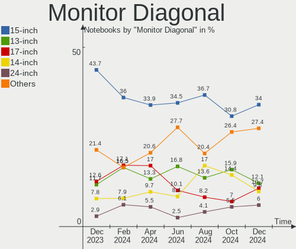

| Inches  | Notebooks | Percent |
|---------|-----------|---------|
| 15      | 44        | 22.68%  |
| 13      | 36        | 18.56%  |
| 14      | 30        | 15.46%  |
| 17      | 24        | 12.37%  |
| 24      | 15        | 7.73%   |
| 27      | 10        | 5.15%   |
| 23      | 5         | 2.58%   |
| 21      | 5         | 2.58%   |
| 12      | 5         | 2.58%   |
| 19      | 3         | 1.55%   |
| 16      | 3         | 1.55%   |
| 34      | 2         | 1.03%   |
| 18      | 2         | 1.03%   |
| 11      | 2         | 1.03%   |
| Unknown | 2         | 1.03%   |
| 84      | 1         | 0.52%   |
| 54      | 1         | 0.52%   |
| 40      | 1         | 0.52%   |
| 31      | 1         | 0.52%   |
| 26      | 1         | 0.52%   |
| 10      | 1         | 0.52%   |

Monitor Width
-------------

Physical width

| Width in mm | Notebooks | Percent |
|-------------|-----------|---------|
| 301-350     | 93        | 48.69%  |
| 501-600     | 26        | 13.61%  |
| 351-400     | 26        | 13.61%  |
| 201-300     | 26        | 13.61%  |
| 401-500     | 10        | 5.24%   |
| 601-700     | 3         | 1.57%   |
| 701-800     | 2         | 1.05%   |
| Unknown     | 2         | 1.05%   |
| 801-900     | 1         | 0.52%   |
| 1501-2000   | 1         | 0.52%   |
| 1001-1500   | 1         | 0.52%   |

Aspect Ratio
------------

Proportional relationship between the width and the height

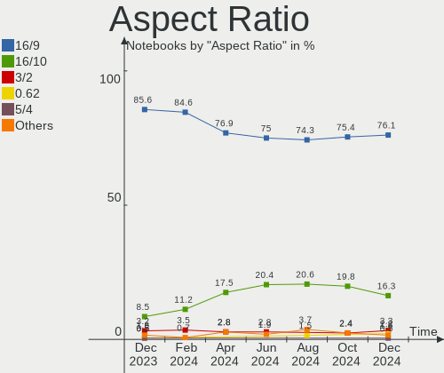

| Ratio | Notebooks | Percent |
|-------|-----------|---------|
| 16/9  | 139       | 86.34%  |
| 16/10 | 18        | 11.18%  |
| 21/9  | 2         | 1.24%   |
| 3/2   | 1         | 0.62%   |
| 0.62  | 1         | 0.62%   |

Monitor Area
------------

Area in inch²

| Area in inch² | Notebooks | Percent |
|----------------|-----------|---------|
| 81-90          | 50        | 25.91%  |
| 101-110        | 45        | 23.32%  |
| 121-130        | 23        | 11.92%  |
| 71-80          | 17        | 8.81%   |
| 201-250        | 16        | 8.29%   |
| 301-350        | 11        | 5.7%    |
| 251-300        | 6         | 3.11%   |
| 151-200        | 5         | 2.59%   |
| 61-70          | 4         | 2.07%   |
| 351-500        | 3         | 1.55%   |
| More than 1000 | 2         | 1.04%   |
| 51-60          | 2         | 1.04%   |
| 141-150        | 2         | 1.04%   |
| 111-120        | 2         | 1.04%   |
| Unknown        | 2         | 1.04%   |
| 41-50          | 1         | 0.52%   |
| 131-140        | 1         | 0.52%   |
| 501-1000       | 1         | 0.52%   |

Pixel Density
-------------

Pixels per inch

| Density       | Notebooks | Percent |
|---------------|-----------|---------|
| 121-160       | 67        | 36.02%  |
| 101-120       | 58        | 31.18%  |
| 51-100        | 33        | 17.74%  |
| 161-240       | 22        | 11.83%  |
| More than 240 | 3         | 1.61%   |
| Unknown       | 2         | 1.08%   |
| 1-50          | 1         | 0.54%   |

Multiple Monitors
-----------------

Total monitors connected

| Total | Notebooks | Percent |
|-------|-----------|---------|
| 1     | 112       | 71.79%  |
| 2     | 33        | 21.15%  |
| 3     | 8         | 5.13%   |
| 0     | 3         | 1.92%   |

Network
-------

Net Controller Vendor
---------------------

Controller vendors

| Vendor                            | Notebooks | Percent |
|-----------------------------------|-----------|---------|
| Intel                             | 94        | 37.9%   |
| Realtek Semiconductor             | 85        | 34.27%  |
| Qualcomm Atheros                  | 28        | 11.29%  |
| Broadcom                          | 8         | 3.23%   |
| MediaTek                          | 7         | 2.82%   |
| Lenovo                            | 4         | 1.61%   |
| Broadcom Limited                  | 3         | 1.21%   |
| Xiaomi                            | 2         | 0.81%   |
| Ralink                            | 2         | 0.81%   |
| OPPO Electronics                  | 2         | 0.81%   |
| DisplayLink                       | 2         | 0.81%   |
| Dell                              | 2         | 0.81%   |
| Samsung Electronics               | 1         | 0.4%    |
| Ralink Technology                 | 1         | 0.4%    |
| Nvidia                            | 1         | 0.4%    |
| NetGear                           | 1         | 0.4%    |
| Manta                             | 1         | 0.4%    |
| Hewlett-Packard                   | 1         | 0.4%    |
| Ericsson Business Mobile Networks | 1         | 0.4%    |
| D-Link                            | 1         | 0.4%    |
| ASIX Electronics                  | 1         | 0.4%    |

Net Controller Model
--------------------

Controller models

| Model                                                                   | Notebooks | Percent |
|-------------------------------------------------------------------------|-----------|---------|
| Realtek RTL8111/8168/8411 PCI Express Gigabit Ethernet Controller       | 46        | 15.38%  |
| Realtek RTL8153 Gigabit Ethernet Adapter                                | 14        | 4.68%   |
| Realtek RTL810xE PCI Express Fast Ethernet controller                   | 12        | 4.01%   |
| Intel Wi-Fi 6 AX201                                                     | 12        | 4.01%   |
| Qualcomm Atheros QCA9377 802.11ac Wireless Network Adapter              | 10        | 3.34%   |
| Intel Wireless 8260                                                     | 8         | 2.68%   |
| Intel Wireless 7265                                                     | 8         | 2.68%   |
| Realtek RTL8822CE 802.11ac PCIe Wireless Network Adapter                | 6         | 2.01%   |
| MediaTek MT7921 802.11ax PCI Express Wireless Network Adapter           | 6         | 2.01%   |
| Intel Ethernet Connection I219-LM                                       | 6         | 2.01%   |
| Intel Alder Lake-P PCH CNVi WiFi                                        | 6         | 2.01%   |
| Intel 82579LM Gigabit Network Connection (Lewisville)                   | 6         | 2.01%   |
| Realtek RTL8152 Fast Ethernet Adapter                                   | 5         | 1.67%   |
| Qualcomm Atheros QCA9565 / AR9565 Wireless Network Adapter              | 5         | 1.67%   |
| Intel Wireless 8265 / 8275                                              | 5         | 1.67%   |
| Intel Wireless 7260                                                     | 5         | 1.67%   |
| Intel Wi-Fi 6 AX200                                                     | 5         | 1.67%   |
| Intel Comet Lake PCH-LP CNVi WiFi                                       | 5         | 1.67%   |
| Realtek RTL8188EE Wireless Network Adapter                              | 4         | 1.34%   |
| Intel Ethernet Connection (3) I218-LM                                   | 4         | 1.34%   |
| Intel Centrino Advanced-N 6205 [Taylor Peak]                            | 4         | 1.34%   |
| Intel Cannon Point-LP CNVi [Wireless-AC]                                | 4         | 1.34%   |
| Realtek RTL8821CE 802.11ac PCIe Wireless Network Adapter                | 3         | 1%      |
| Realtek 802.11ac NIC                                                    | 3         | 1%      |
| Qualcomm Atheros AR9285 Wireless Network Adapter (PCI-Express)          | 3         | 1%      |
| Lenovo ThinkPad Lan                                                     | 3         | 1%      |
| Intel Gemini Lake PCH CNVi WiFi                                         | 3         | 1%      |
| Intel Ethernet Connection I218-LM                                       | 3         | 1%      |
| Intel Ethernet Connection (4) I219-LM                                   | 3         | 1%      |
| Intel Ethernet Connection (13) I219-LM                                  | 3         | 1%      |
| Intel Dual Band Wireless-AC 3168NGW [Stone Peak]                        | 3         | 1%      |
| Intel Centrino Wireless-N 2230                                          | 3         | 1%      |
| Intel Cannon Lake PCH CNVi WiFi                                         | 3         | 1%      |
| Broadcom BCM43142 802.11b/g/n                                           | 3         | 1%      |
| Xiaomi Mi/Redmi series (RNDIS)                                          | 2         | 0.67%   |
| Realtek RTL8723DE Wireless Network Adapter                              | 2         | 0.67%   |
| Qualcomm Atheros QCA6174 802.11ac Wireless Network Adapter              | 2         | 0.67%   |
| Qualcomm Atheros AR8121/AR8113/AR8114 Gigabit or Fast Ethernet          | 2         | 0.67%   |
| Qualcomm Atheros AR242x / AR542x Wireless Network Adapter (PCI-Express) | 2         | 0.67%   |
| OPPO SDM665-IDP _SN:18689828                                            | 2         | 0.67%   |

Wireless Vendor
---------------

Wireless vendors

| Vendor                | Notebooks | Percent |
|-----------------------|-----------|---------|
| Intel                 | 91        | 56.52%  |
| Qualcomm Atheros      | 25        | 15.53%  |
| Realtek Semiconductor | 22        | 13.66%  |
| MediaTek              | 7         | 4.35%   |
| Broadcom              | 6         | 3.73%   |
| Ralink                | 2         | 1.24%   |
| Dell                  | 2         | 1.24%   |
| Broadcom Limited      | 2         | 1.24%   |
| Ralink Technology     | 1         | 0.62%   |
| NetGear               | 1         | 0.62%   |
| Hewlett-Packard       | 1         | 0.62%   |
| D-Link                | 1         | 0.62%   |

Wireless Model
--------------

Wireless models

| Model                                                                   | Notebooks | Percent |
|-------------------------------------------------------------------------|-----------|---------|
| Intel Wi-Fi 6 AX201                                                     | 12        | 7.41%   |
| Qualcomm Atheros QCA9377 802.11ac Wireless Network Adapter              | 10        | 6.17%   |
| Intel Wireless 8260                                                     | 8         | 4.94%   |
| Intel Wireless 7265                                                     | 8         | 4.94%   |
| Realtek RTL8822CE 802.11ac PCIe Wireless Network Adapter                | 6         | 3.7%    |
| MediaTek MT7921 802.11ax PCI Express Wireless Network Adapter           | 6         | 3.7%    |
| Intel Alder Lake-P PCH CNVi WiFi                                        | 6         | 3.7%    |
| Qualcomm Atheros QCA9565 / AR9565 Wireless Network Adapter              | 5         | 3.09%   |
| Intel Wireless 8265 / 8275                                              | 5         | 3.09%   |
| Intel Wireless 7260                                                     | 5         | 3.09%   |
| Intel Wi-Fi 6 AX200                                                     | 5         | 3.09%   |
| Intel Comet Lake PCH-LP CNVi WiFi                                       | 5         | 3.09%   |
| Realtek RTL8188EE Wireless Network Adapter                              | 4         | 2.47%   |
| Intel Centrino Advanced-N 6205 [Taylor Peak]                            | 4         | 2.47%   |
| Intel Cannon Point-LP CNVi [Wireless-AC]                                | 4         | 2.47%   |
| Realtek RTL8821CE 802.11ac PCIe Wireless Network Adapter                | 3         | 1.85%   |
| Realtek 802.11ac NIC                                                    | 3         | 1.85%   |
| Qualcomm Atheros AR9285 Wireless Network Adapter (PCI-Express)          | 3         | 1.85%   |
| Intel Gemini Lake PCH CNVi WiFi                                         | 3         | 1.85%   |
| Intel Dual Band Wireless-AC 3168NGW [Stone Peak]                        | 3         | 1.85%   |
| Intel Centrino Wireless-N 2230                                          | 3         | 1.85%   |
| Intel Cannon Lake PCH CNVi WiFi                                         | 3         | 1.85%   |
| Broadcom BCM43142 802.11b/g/n                                           | 3         | 1.85%   |
| Realtek RTL8723DE Wireless Network Adapter                              | 2         | 1.23%   |
| Qualcomm Atheros QCA6174 802.11ac Wireless Network Adapter              | 2         | 1.23%   |
| Qualcomm Atheros AR242x / AR542x Wireless Network Adapter (PCI-Express) | 2         | 1.23%   |
| Intel Wireless 3165                                                     | 2         | 1.23%   |
| Intel Wireless 3160                                                     | 2         | 1.23%   |
| Intel Tiger Lake PCH CNVi WiFi                                          | 2         | 1.23%   |
| Intel PRO/Wireless 3945ABG [Golan] Network Connection                   | 2         | 1.23%   |
| Intel Dual Band Wireless-AC 3165 Plus Bluetooth                         | 2         | 1.23%   |
| Intel Comet Lake PCH CNVi WiFi                                          | 2         | 1.23%   |
| Broadcom BCM4313 802.11bgn Wireless Network Adapter                     | 2         | 1.23%   |
| Realtek RTL8821AE 802.11ac PCIe Wireless Network Adapter                | 1         | 0.62%   |
| Realtek RTL8723BE PCIe Wireless Network Adapter                         | 1         | 0.62%   |
| Realtek RTL8187B Wireless 802.11g 54Mbps Network Adapter                | 1         | 0.62%   |
| Realtek Realtek Network controller                                      | 1         | 0.62%   |
| Ralink RT2870/RT3070 Wireless Adapter                                   | 1         | 0.62%   |
| Ralink RT5390 Wireless 802.11n 1T/1R PCIe                               | 1         | 0.62%   |
| Ralink RT3290 Wireless 802.11n 1T/1R PCIe                               | 1         | 0.62%   |

Ethernet Vendor
---------------

Ethernet vendors

| Vendor                | Notebooks | Percent |
|-----------------------|-----------|---------|
| Realtek Semiconductor | 76        | 57.14%  |
| Intel                 | 35        | 26.32%  |
| Qualcomm Atheros      | 6         | 4.51%   |
| Lenovo                | 4         | 3.01%   |
| Xiaomi                | 2         | 1.5%    |
| OPPO Electronics      | 2         | 1.5%    |
| DisplayLink           | 2         | 1.5%    |
| Broadcom              | 2         | 1.5%    |
| Samsung Electronics   | 1         | 0.75%   |
| Nvidia                | 1         | 0.75%   |
| Broadcom Limited      | 1         | 0.75%   |
| ASIX Electronics      | 1         | 0.75%   |

Ethernet Model
--------------

Ethernet models

| Model                                                             | Notebooks | Percent |
|-------------------------------------------------------------------|-----------|---------|
| Realtek RTL8111/8168/8411 PCI Express Gigabit Ethernet Controller | 46        | 34.07%  |
| Realtek RTL8153 Gigabit Ethernet Adapter                          | 14        | 10.37%  |
| Realtek RTL810xE PCI Express Fast Ethernet controller             | 12        | 8.89%   |
| Intel Ethernet Connection I219-LM                                 | 6         | 4.44%   |
| Intel 82579LM Gigabit Network Connection (Lewisville)             | 6         | 4.44%   |
| Realtek RTL8152 Fast Ethernet Adapter                             | 5         | 3.7%    |
| Intel Ethernet Connection (3) I218-LM                             | 4         | 2.96%   |
| Lenovo ThinkPad Lan                                               | 3         | 2.22%   |
| Intel Ethernet Connection I218-LM                                 | 3         | 2.22%   |
| Intel Ethernet Connection (4) I219-LM                             | 3         | 2.22%   |
| Intel Ethernet Connection (13) I219-LM                            | 3         | 2.22%   |
| Xiaomi Mi/Redmi series (RNDIS)                                    | 2         | 1.48%   |
| Qualcomm Atheros AR8121/AR8113/AR8114 Gigabit or Fast Ethernet    | 2         | 1.48%   |
| OPPO SDM665-IDP _SN:18689828                                      | 2         | 1.48%   |
| Intel Ethernet Connection (4) I219-V                              | 2         | 1.48%   |
| Intel Ethernet Connection (13) I219-V                             | 2         | 1.48%   |
| Samsung Galaxy series, misc. (tethering mode)                     | 1         | 0.74%   |
| Realtek Realtek Ethernet controller                               | 1         | 0.74%   |
| Qualcomm Atheros QCA8171 Gigabit Ethernet                         | 1         | 0.74%   |
| Qualcomm Atheros Killer E220x Gigabit Ethernet Controller         | 1         | 0.74%   |
| Qualcomm Atheros AR8162 Fast Ethernet                             | 1         | 0.74%   |
| Qualcomm Atheros AR8151 v2.0 Gigabit Ethernet                     | 1         | 0.74%   |
| Nvidia MCP77 Ethernet                                             | 1         | 0.74%   |
| Lenovo Powered Hub                                                | 1         | 0.74%   |
| Intel Ethernet controller                                         | 1         | 0.74%   |
| Intel Ethernet Connection (7) I219-LM                             | 1         | 0.74%   |
| Intel Ethernet Connection (16) I219-V                             | 1         | 0.74%   |
| Intel 82579V Gigabit Network Connection                           | 1         | 0.74%   |
| Intel 82577LM Gigabit Network Connection                          | 1         | 0.74%   |
| Intel 82567LM Gigabit Network Connection                          | 1         | 0.74%   |
| DisplayLink Targus USB3.0 DV Dock with Power                      | 1         | 0.74%   |
| DisplayLink Dell Universal Dock D6000                             | 1         | 0.74%   |
| Broadcom NetXtreme BCM57786 Gigabit Ethernet PCIe                 | 1         | 0.74%   |
| Broadcom NetXtreme BCM5753M Gigabit Ethernet PCI Express          | 1         | 0.74%   |
| Broadcom Limited BCM4401-B0 100Base-TX                            | 1         | 0.74%   |
| ASIX AX88179 Gigabit Ethernet                                     | 1         | 0.74%   |

Net Controller Kind
-------------------

Ethernet, WiFi or modem

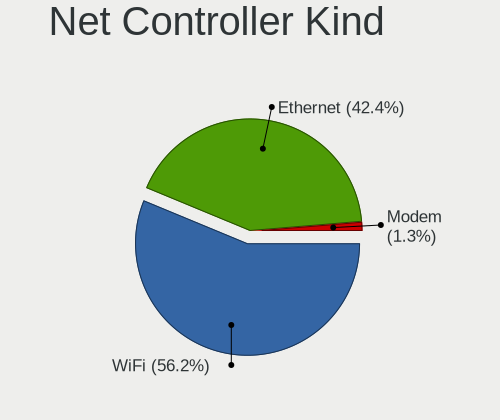

| Kind     | Notebooks | Percent |
|----------|-----------|---------|
| WiFi     | 154       | 55.2%   |
| Ethernet | 123       | 44.09%  |
| Modem    | 1         | 0.36%   |
| Unknown  | 1         | 0.36%   |

Used Controller
---------------

Currently used network controller

| Kind     | Notebooks | Percent |
|----------|-----------|---------|
| WiFi     | 126       | 73.68%  |
| Ethernet | 45        | 26.32%  |

NICs
----

Total network controllers on board

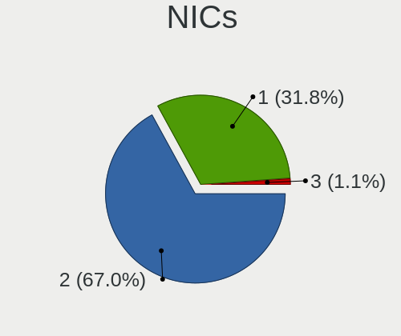

| Total | Notebooks | Percent |
|-------|-----------|---------|
| 2     | 99        | 63.46%  |
| 1     | 49        | 31.41%  |
| 3     | 4         | 2.56%   |
| 0     | 4         | 2.56%   |

IPv6
----

IPv6 vs IPv4

| Used | Notebooks | Percent |
|------|-----------|---------|
| Yes  | 80        | 51.28%  |
| No   | 76        | 48.72%  |

Bluetooth
---------

Bluetooth Vendor
----------------

Controller vendors

| Vendor                          | Notebooks | Percent |
|---------------------------------|-----------|---------|
| Intel                           | 76        | 58.02%  |
| IMC Networks                    | 10        | 7.63%   |
| Realtek Semiconductor           | 9         | 6.87%   |
| Qualcomm Atheros Communications | 7         | 5.34%   |
| Lite-On Technology              | 5         | 3.82%   |
| Foxconn / Hon Hai               | 4         | 3.05%   |
| Cambridge Silicon Radio         | 4         | 3.05%   |
| Realtek                         | 3         | 2.29%   |
| Dell                            | 3         | 2.29%   |
| Broadcom                        | 3         | 2.29%   |
| Toshiba                         | 2         | 1.53%   |
| Ralink                          | 1         | 0.76%   |
| Hewlett-Packard                 | 1         | 0.76%   |
| ASUSTek Computer                | 1         | 0.76%   |
| Apple                           | 1         | 0.76%   |
| Alps Electric                   | 1         | 0.76%   |

Bluetooth Model
---------------

Controller models

| Model                                               | Notebooks | Percent |
|-----------------------------------------------------|-----------|---------|
| Intel Bluetooth wireless interface                  | 29        | 22.14%  |
| Intel AX201 Bluetooth                               | 22        | 16.79%  |
| Intel Bluetooth 9460/9560 Jefferson Peak (JfP)      | 11        | 8.4%    |
| Realtek Bluetooth Radio                             | 6         | 4.58%   |
| Intel Bluetooth Device                              | 5         | 3.82%   |
| Qualcomm Atheros  Bluetooth Device                  | 4         | 3.05%   |
| IMC Networks Wireless_Device                        | 4         | 3.05%   |
| IMC Networks Bluetooth Device                       | 4         | 3.05%   |
| Cambridge Silicon Radio Bluetooth Dongle (HCI mode) | 4         | 3.05%   |
| Realtek Bluetooth Radio                             | 3         | 2.29%   |
| Lite-On Qualcomm Atheros QCA9377 Bluetooth          | 3         | 2.29%   |
| Intel Wireless-AC 3168 Bluetooth                    | 3         | 2.29%   |
| Intel AX200 Bluetooth                               | 3         | 2.29%   |
| IMC Networks Bluetooth Radio                        | 2         | 1.53%   |
| Foxconn / Hon Hai Wireless_Device                   | 2         | 1.53%   |
| Foxconn / Hon Hai Bluetooth Device                  | 2         | 1.53%   |
| Dell DW375 Bluetooth Module                         | 2         | 1.53%   |
| Toshiba Bluetooth Device                            | 1         | 0.76%   |
| Toshiba BCM43142A0                                  | 1         | 0.76%   |
| Realtek RTL8821A Bluetooth                          | 1         | 0.76%   |
| Realtek  Bluetooth 4.2 Adapter                      | 1         | 0.76%   |
| Realtek 802.11n WLAN Adapter                        | 1         | 0.76%   |
| Ralink RT3290 Bluetooth                             | 1         | 0.76%   |
| Qualcomm Atheros QCA61x4 Bluetooth 4.0              | 1         | 0.76%   |
| Qualcomm Atheros AR3012 Bluetooth 4.0               | 1         | 0.76%   |
| Qualcomm Atheros AR3012 Bluetooth                   | 1         | 0.76%   |
| Lite-On Wireless_Device                             | 1         | 0.76%   |
| Lite-On Bluetooth Device                            | 1         | 0.76%   |
| Intel Wireless-AC 9260 Bluetooth Adapter            | 1         | 0.76%   |
| Intel Centrino Bluetooth Wireless Transceiver       | 1         | 0.76%   |
| Intel Centrino Advanced-N 6230 Bluetooth adapter    | 1         | 0.76%   |
| HP Broadcom 2070 Bluetooth Combo                    | 1         | 0.76%   |
| Dell BCM20702A0 Bluetooth Module                    | 1         | 0.76%   |
| Broadcom HP Portable SoftSailing                    | 1         | 0.76%   |
| Broadcom BCM43142A0 Bluetooth Device                | 1         | 0.76%   |
| Broadcom BCM43142 Bluetooth 4.0                     | 1         | 0.76%   |
| ASUS Broadcom Bluetooth 2.1                         | 1         | 0.76%   |
| Apple Bluetooth USB Host Controller                 | 1         | 0.76%   |
| Alps Electric Integrated Bluetooth Device           | 1         | 0.76%   |

Sound
-----

Sound Vendor
------------

Sound card vendors

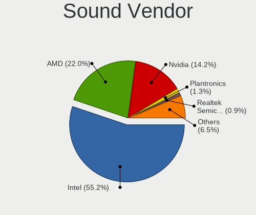

| Vendor                | Notebooks | Percent |
|-----------------------|-----------|---------|
| Intel                 | 124       | 64.92%  |
| AMD                   | 29        | 15.18%  |
| Nvidia                | 19        | 9.95%   |
| Realtek Semiconductor | 7         | 3.66%   |
| Plantronics           | 2         | 1.05%   |
| Logitech              | 2         | 1.05%   |
| Yamaha                | 1         | 0.52%   |
| Razer USA             | 1         | 0.52%   |
| Lenovo                | 1         | 0.52%   |
| JMTek                 | 1         | 0.52%   |
| Hewlett-Packard       | 1         | 0.52%   |
| Focusrite-Novation    | 1         | 0.52%   |
| Corsair               | 1         | 0.52%   |
| C-Media Electronics   | 1         | 0.52%   |

Sound Model
-----------

Sound card models

| Model                                                                                             | Notebooks | Percent |
|---------------------------------------------------------------------------------------------------|-----------|---------|
| Intel Sunrise Point-LP HD Audio                                                                   | 22        | 9.44%   |
| Intel Tiger Lake-LP Smart Sound Technology Audio Controller                                       | 14        | 6.01%   |
| AMD Family 17h/19h HD Audio Controller                                                            | 13        | 5.58%   |
| Intel 7 Series/C216 Chipset Family High Definition Audio Controller                               | 10        | 4.29%   |
| AMD Renoir Radeon High Definition Audio Controller                                                | 10        | 4.29%   |
| Intel Wildcat Point-LP High Definition Audio Controller                                           | 9         | 3.86%   |
| Intel Broadwell-U Audio Controller                                                                | 9         | 3.86%   |
| AMD Kabini HDMI/DP Audio                                                                          | 9         | 3.86%   |
| AMD FCH Azalia Controller                                                                         | 9         | 3.86%   |
| Intel Celeron/Pentium Silver Processor High Definition Audio                                      | 8         | 3.43%   |
| Realtek Semiconductor USB Audio                                                                   | 7         | 3%      |
| Intel Alder Lake PCH-P High Definition Audio Controller                                           | 7         | 3%      |
| Intel Haswell-ULT HD Audio Controller                                                             | 6         | 2.58%   |
| Intel 8 Series HD Audio Controller                                                                | 6         | 2.58%   |
| Intel 6 Series/C200 Series Chipset Family High Definition Audio Controller                        | 6         | 2.58%   |
| Intel Comet Lake PCH-LP cAVS                                                                      | 5         | 2.15%   |
| Intel Celeron N3350/Pentium N4200/Atom E3900 Series Audio Cluster                                 | 5         | 2.15%   |
| Nvidia GP107GL High Definition Audio Controller                                                   | 4         | 1.72%   |
| Intel Tiger Lake-H HD Audio Controller                                                            | 4         | 1.72%   |
| Intel Cannon Point-LP High Definition Audio Controller                                            | 4         | 1.72%   |
| Intel Cannon Lake PCH cAVS                                                                        | 4         | 1.72%   |
| Intel NM10/ICH7 Family High Definition Audio Controller                                           | 3         | 1.29%   |
| Intel 82801I (ICH9 Family) HD Audio Controller                                                    | 3         | 1.29%   |
| AMD High Definition Audio Controller                                                              | 3         | 1.29%   |
| AMD Family 15h (Models 60h-6fh) Audio Controller                                                  | 3         | 1.29%   |
| Nvidia TU107 GeForce GTX 1650 High Definition Audio Controller                                    | 2         | 0.86%   |
| Nvidia TU106 High Definition Audio Controller                                                     | 2         | 0.86%   |
| Nvidia GF108 High Definition Audio Controller                                                     | 2         | 0.86%   |
| Nvidia Audio device                                                                               | 2         | 0.86%   |
| Logitech H390 headset with microphone                                                             | 2         | 0.86%   |
| Intel Xeon E3-1200 v3/4th Gen Core Processor HD Audio Controller                                  | 2         | 0.86%   |
| Intel Comet Lake PCH cAVS                                                                         | 2         | 0.86%   |
| Intel CM238 HD Audio Controller                                                                   | 2         | 0.86%   |
| Intel Atom/Celeron/Pentium Processor x5-E8000/J3xxx/N3xxx Series High Definition Audio Controller | 2         | 0.86%   |
| Intel 8 Series/C220 Series Chipset High Definition Audio Controller                               | 2         | 0.86%   |
| Intel 5 Series/3400 Series Chipset High Definition Audio                                          | 2         | 0.86%   |
| Intel 100 Series/C230 Series Chipset Family HD Audio Controller                                   | 2         | 0.86%   |
| AMD Rembrandt Radeon High Definition Audio Controller                                             | 2         | 0.86%   |
| AMD Raven/Raven2/Fenghuang HDMI/DP Audio Controller                                               | 2         | 0.86%   |
| Yamaha P-105                                                                                      | 1         | 0.43%   |

Memory
------

Memory Vendor
-------------

Memory module vendors

| Vendor              | Notebooks | Percent |
|---------------------|-----------|---------|
| Samsung Electronics | 43        | 33.59%  |
| SK hynix            | 26        | 20.31%  |
| Micron Technology   | 15        | 11.72%  |
| Kingston            | 13        | 10.16%  |
| Unknown             | 9         | 7.03%   |
| Unknown (ABCD)      | 4         | 3.13%   |
| Ramaxel Technology  | 3         | 2.34%   |
| Nanya Technology    | 3         | 2.34%   |
| Crucial             | 3         | 2.34%   |
| Timetec             | 2         | 1.56%   |
| Unknown             | 2         | 1.56%   |
| Patriot             | 1         | 0.78%   |
| Elpida              | 1         | 0.78%   |
| Corsair             | 1         | 0.78%   |
| ChangXin Memory     | 1         | 0.78%   |
| A-DATA Technology   | 1         | 0.78%   |

Memory Model
------------

Memory module models

| Model                                                            | Notebooks | Percent |
|------------------------------------------------------------------|-----------|---------|
| Unknown (ABCD) RAM 123456789012345678 2GB SODIMM LPDDR4 2400MT/s | 4         | 3.01%   |
| Samsung RAM M471B5173QH0-YK0 4GB SODIMM DDR3 1600MT/s            | 3         | 2.26%   |
| Samsung RAM M471B5173EB0-YK0 4GB SODIMM DDR3 1600MT/s            | 3         | 2.26%   |
| Samsung RAM M471B5173DB0-YK0 4096MB SODIMM DDR3 1600MT/s         | 3         | 2.26%   |
| Samsung RAM M471B1G73EB0-YK0 8GB SODIMM DDR3 1600MT/s            | 3         | 2.26%   |
| Unknown RAM Module 2GB SODIMM DDR2 667MT/s                       | 2         | 1.5%    |
| Timetec RAM SD3-1600 8192MB SODIMM DDR3                          | 2         | 1.5%    |
| SK hynix RAM HMT451S6AFR8A-PB 4GB SODIMM DDR3 1600MT/s           | 2         | 1.5%    |
| SK hynix RAM HMAA2GS6AJR8N-XN 16GB SODIMM DDR4 3200MT/s          | 2         | 1.5%    |
| SK hynix RAM HMAA1GS6CMR8N-VK 8192MB Row Of Chips DDR4 2667MT/s  | 2         | 1.5%    |
| SK hynix RAM HMA82GS6CJR8N-VK 16GB SODIMM DDR4 2667MT/s          | 2         | 1.5%    |
| Samsung RAM M471A5244CB0-CRC 4GB SODIMM DDR4 2667MT/s            | 2         | 1.5%    |
| Samsung RAM M471A2K43DB1-CWE 16GB SODIMM DDR4 3200MT/s           | 2         | 1.5%    |
| Samsung RAM M471A2G44AM0-CWE 16GB SODIMM DDR4 3200MT/s           | 2         | 1.5%    |
| Samsung RAM M471A1K43BB1-CTD 8192MB Row Of Chips DDR4 2667MT/s   | 2         | 1.5%    |
| Micron RAM 8KTF51264HZ-1G6E1 4GB SODIMM DDR3 1600MT/s            | 2         | 1.5%    |
| Micron RAM 4ATF1G64HZ-3G2E2 8GB SODIMM DDR4 3200MT/s             | 2         | 1.5%    |
| Unknown                                                          | 2         | 1.5%    |
| Unknown RAM Module 8GB Row Of Chips LPDDR4 4267MT/s              | 1         | 0.75%   |
| Unknown RAM Module 4GB SODIMM DDR4 2400MT/s                      | 1         | 0.75%   |
| Unknown RAM Module 4GB SODIMM DDR3 1333MT/s                      | 1         | 0.75%   |
| Unknown RAM Module 2GB SODIMM DRAM 667MT/s                       | 1         | 0.75%   |
| Unknown RAM Module 2GB SODIMM DDR3 1600MT/s                      | 1         | 0.75%   |
| Unknown RAM Module 2GB SODIMM DDR3 1333MT/s                      | 1         | 0.75%   |
| Unknown RAM Module 1GB SODIMM DDR3 1066MT/s                      | 1         | 0.75%   |
| Unknown RAM DDR3 1600 8G 8GB SODIMM DDR3 1333MT/s                | 1         | 0.75%   |
| SK hynix RAM Module 4GB DIMM DDR3 1066MT/s                       | 1         | 0.75%   |
| SK hynix RAM Module 16384MB SODIMM DDR4 2133MT/s                 | 1         | 0.75%   |
| SK hynix RAM HYMP325S64AMP8-Y5 2GB SODIMM DDR2 667MT/s           | 1         | 0.75%   |
| SK hynix RAM HYMP125S64CP8-Y5 2GB SODIMM DDR2 667MT/s            | 1         | 0.75%   |
| SK hynix RAM HMT451S6CFR6A-PB 4GB SODIMM DDR3 1600MT/s           | 1         | 0.75%   |
| SK hynix RAM HMT451S6BFR8A-PB 4GB SODIMM DDR3 1600MT/s           | 1         | 0.75%   |
| SK hynix RAM HMT41GS6DFR8A-PB 8GB SODIMM DDR3 1600MT/s           | 1         | 0.75%   |
| SK hynix RAM HMT41GS6BFR8A-PB 8192MB SODIMM DDR3 1600MT/s        | 1         | 0.75%   |
| SK hynix RAM HMT351S6EFR8A-PB 4096MB SODIMM DDR3 1600MT/s        | 1         | 0.75%   |
| SK hynix RAM HMT351S6CFR8C-PB 4GB SODIMM DDR3 1600MT/s           | 1         | 0.75%   |
| SK hynix RAM HMT351S6CFR8C-H9 4GB SODIMM DDR3 1333MT/s           | 1         | 0.75%   |
| SK hynix RAM HMT125S6TFR8C-H9 2048MB SODIMM DDR3 1334MT/s        | 1         | 0.75%   |
| SK hynix RAM HMP125S6EFR8C-S6 2GB SODIMM DDR2 800MT/s            | 1         | 0.75%   |
| SK hynix RAM HMAA1GS6CJR6N-XN 8GB Row Of Chips DDR4 3200MT/s     | 1         | 0.75%   |

Memory Kind
-----------

Memory module kinds

| Kind   | Notebooks | Percent |
|--------|-----------|---------|
| DDR4   | 50        | 45.05%  |
| DDR3   | 39        | 35.14%  |
| LPDDR4 | 11        | 9.91%   |
| DDR2   | 5         | 4.5%    |
| LPDDR5 | 3         | 2.7%    |
| SDRAM  | 1         | 0.9%    |
| LPDDR3 | 1         | 0.9%    |
| DRAM   | 1         | 0.9%    |

Memory Form Factor
------------------

Physical design of the memory module

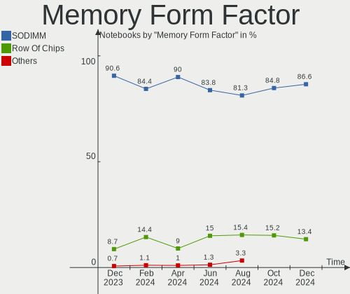

| Name         | Notebooks | Percent |
|--------------|-----------|---------|
| SODIMM       | 94        | 83.93%  |
| Row Of Chips | 17        | 15.18%  |
| DIMM         | 1         | 0.89%   |

Memory Size
-----------

Memory module size

| Size  | Notebooks | Percent |
|-------|-----------|---------|
| 4096  | 45        | 38.14%  |
| 8192  | 35        | 29.66%  |
| 16384 | 19        | 16.1%   |
| 2048  | 16        | 13.56%  |
| 1024  | 2         | 1.69%   |
| 32768 | 1         | 0.85%   |

Memory Speed
------------

Memory module speed

| Speed | Notebooks | Percent |
|-------|-----------|---------|
| 1600  | 35        | 30.43%  |
| 3200  | 25        | 21.74%  |
| 2667  | 16        | 13.91%  |
| 2400  | 10        | 8.7%    |
| 667   | 6         | 5.22%   |
| 4267  | 4         | 3.48%   |
| 6400  | 3         | 2.61%   |
| 2133  | 3         | 2.61%   |
| 1334  | 3         | 2.61%   |
| 1333  | 2         | 1.74%   |
| 1066  | 2         | 1.74%   |
| 4266  | 1         | 0.87%   |
| 3733  | 1         | 0.87%   |
| 3266  | 1         | 0.87%   |
| 2048  | 1         | 0.87%   |
| 1866  | 1         | 0.87%   |
| 800   | 1         | 0.87%   |

Printers & scanners
-------------------

Printer Vendor
--------------

Printer device vendors

| Vendor             | Notebooks | Percent |
|--------------------|-----------|---------|
| Hewlett-Packard    | 1         | 50%     |
| Brother Industries | 1         | 50%     |

Printer Model
-------------

Printer device models

| Model                       | Notebooks | Percent |
|-----------------------------|-----------|---------|
| HP ENVY Photo 6200 series   | 1         | 50%     |
| Brother MFC-L8690CDW series | 1         | 50%     |

Scanner Vendor
--------------

Scanner device vendors

Zero info for selected period =(

Scanner Model
-------------

Scanner device models

Zero info for selected period =(

Camera
------

Camera Vendor
-------------

Camera device vendors

| Vendor                                 | Notebooks | Percent |
|----------------------------------------|-----------|---------|
| Chicony Electronics                    | 34        | 23.94%  |
| Realtek Semiconductor                  | 18        | 12.68%  |
| Sunplus Innovation Technology          | 13        | 9.15%   |
| Microdia                               | 13        | 9.15%   |
| IMC Networks                           | 10        | 7.04%   |
| Quanta                                 | 8         | 5.63%   |
| Suyin                                  | 7         | 4.93%   |
| Cheng Uei Precision Industry (Foxlink) | 7         | 4.93%   |
| Acer                                   | 7         | 4.93%   |
| Lite-On Technology                     | 4         | 2.82%   |
| Syntek                                 | 3         | 2.11%   |
| Sonix Technology                       | 3         | 2.11%   |
| USB Camera                             | 2         | 1.41%   |
| Ricoh                                  | 2         | 1.41%   |
| Luxvisions Innotech Limited            | 2         | 1.41%   |
| Logitech                               | 2         | 1.41%   |
| Denron                                 | 2         | 1.41%   |
| Y Media                                | 1         | 0.7%    |
| S1F0009330LB620L4100030N               | 1         | 0.7%    |
| Primax Electronics                     | 1         | 0.7%    |
| Microsoft                              | 1         | 0.7%    |
| Alcor Micro                            | 1         | 0.7%    |

Camera Model
------------

Camera device models

| Model                                                                    | Notebooks | Percent |
|--------------------------------------------------------------------------|-----------|---------|
| Realtek Integrated_Webcam_HD                                             | 7         | 4.9%    |
| Sunplus Integrated_Webcam_HD                                             | 6         | 4.2%    |
| Chicony Integrated Camera                                                | 6         | 4.2%    |
| Chicony HD WebCam                                                        | 6         | 4.2%    |
| Microdia Integrated_Webcam_HD                                            | 5         | 3.5%    |
| IMC Networks USB2.0 HD UVC WebCam                                        | 4         | 2.8%    |
| Realtek USB Camera                                                       | 3         | 2.1%    |
| Chicony USB2.0 VGA UVC WebCam                                            | 3         | 2.1%    |
| Chicony HP HD Camera                                                     | 3         | 2.1%    |
| USB Camera USB Camera                                                    | 2         | 1.4%    |
| Suyin HP Truevision HD                                                   | 2         | 1.4%    |
| Sunplus Laptop_Integrated_Webcam_FHD                                     | 2         | 1.4%    |
| Sonix USB2.0 HD UVC WebCam                                               | 2         | 1.4%    |
| Quanta ov9734_techfront_camera                                           | 2         | 1.4%    |
| Quanta HP Webcam                                                         | 2         | 1.4%    |
| Microdia Integrated Webcam                                               | 2         | 1.4%    |
| Luxvisions Innotech Limited HP TrueVision HD Camera                      | 2         | 1.4%    |
| Logitech C505e HD Webcam                                                 | 2         | 1.4%    |
| IMC Networks USB2.0 VGA UVC WebCam                                       | 2         | 1.4%    |
| IMC Networks USB2.0 HD IR UVC WebCam                                     | 2         | 1.4%    |
| Denron USB 2.0 Camera                                                    | 2         | 1.4%    |
| Chicony VGA Webcam                                                       | 2         | 1.4%    |
| Chicony HP HD Webcam                                                     | 2         | 1.4%    |
| Chicony 2.0M UVC Webcam / CNF7129                                        | 2         | 1.4%    |
| Cheng Uei Precision Industry (Foxlink) HP EliteBook integrated HD Webcam | 2         | 1.4%    |
| Y Media USB Camera                                                       | 1         | 0.7%    |
| Syntek Lenovo EasyCamera                                                 | 1         | 0.7%    |
| Syntek Integrated Camera                                                 | 1         | 0.7%    |
| Syntek EasyCamera                                                        | 1         | 0.7%    |
| Suyin UVC 1.3MPixel WebCam                                               | 1         | 0.7%    |
| Suyin Laptop_Integrated_Webcam_FHD                                       | 1         | 0.7%    |
| Suyin HP Webcam                                                          | 1         | 0.7%    |
| Suyin Asus Integrated Webcam                                             | 1         | 0.7%    |
| Suyin Acer/HP Integrated Webcam [CN0314]                                 | 1         | 0.7%    |
| Sunplus XiaoMi WebCam                                                    | 1         | 0.7%    |
| Sunplus HP TrueVision HD Camera                                          | 1         | 0.7%    |
| Sunplus FHD Camera Microphone                                            | 1         | 0.7%    |
| Sunplus Camera                                                           | 1         | 0.7%    |
| Sunplus Asus Webcam                                                      | 1         | 0.7%    |
| Sonix USB2.0 VGAUVC WebCam                                               | 1         | 0.7%    |

Security
--------

Fingerprint Vendor
------------------

Fingerprint sensor vendors

| Vendor                     | Notebooks | Percent |
|----------------------------|-----------|---------|
| Validity Sensors           | 14        | 50%     |
| Shenzhen Goodix Technology | 7         | 25%     |
| Synaptics                  | 4         | 14.29%  |
| LighTuning Technology      | 1         | 3.57%   |
| Elan Microelectronics      | 1         | 3.57%   |
| AuthenTec                  | 1         | 3.57%   |

Fingerprint Model
-----------------

Fingerprint sensor models

| Model                                                                      | Notebooks | Percent |
|----------------------------------------------------------------------------|-----------|---------|
| Shenzhen Goodix  Fingerprint Device                                        | 6         | 21.43%  |
| Validity Sensors VFS495 Fingerprint Reader                                 | 5         | 17.86%  |
| Synaptics Prometheus MIS Touch Fingerprint Reader                          | 3         | 10.71%  |
| Validity Sensors VFS5011 Fingerprint Reader                                | 2         | 7.14%   |
| Validity Sensors Synaptics VFS7552 Touch Fingerprint Sensor with PurePrint | 2         | 7.14%   |
| Validity Sensors VFS7500 Touch Fingerprint Sensor                          | 1         | 3.57%   |
| Validity Sensors VFS471 Fingerprint Reader                                 | 1         | 3.57%   |
| Validity Sensors VFS 5011 fingerprint sensor                               | 1         | 3.57%   |
| Validity Sensors Synaptics WBDI                                            | 1         | 3.57%   |
| Validity Sensors Fingerprint scanner                                       | 1         | 3.57%   |
| Shenzhen Goodix Fingerprint Reader                                         | 1         | 3.57%   |
| LighTuning EgisTec Touch Fingerprint Sensor                                | 1         | 3.57%   |
| Elan ELAN:Fingerprint                                                      | 1         | 3.57%   |
| AuthenTec AES2501 Fingerprint Sensor                                       | 1         | 3.57%   |
| Unknown                                                                    | 1         | 3.57%   |

Chipcard Vendor
---------------

Chipcard module vendors

| Vendor      | Notebooks | Percent |
|-------------|-----------|---------|
| Broadcom    | 9         | 64.29%  |
| Alcor Micro | 5         | 35.71%  |

Chipcard Model
--------------

Chipcard module models

| Model                                                                        | Notebooks | Percent |
|------------------------------------------------------------------------------|-----------|---------|
| Alcor Micro AU9540 Smartcard Reader                                          | 5         | 35.71%  |
| Broadcom 58200                                                               | 4         | 28.57%  |
| Broadcom BCM5880 Secure Applications Processor with fingerprint swipe sensor | 2         | 14.29%  |
| Broadcom 5880                                                                | 2         | 14.29%  |
| Broadcom BCM5880 Secure Applications Processor                               | 1         | 7.14%   |

Unsupported
-----------

Unsupported Devices
-------------------

Total unsupported devices on board

| Total | Notebooks | Percent |
|-------|-----------|---------|
| 0     | 96        | 61.54%  |
| 1     | 46        | 29.49%  |
| 2     | 13        | 8.33%   |
| 3     | 1         | 0.64%   |

Unsupported Device Types
------------------------

Types of unsupported devices

| Type                     | Notebooks | Percent |
|--------------------------|-----------|---------|
| Fingerprint reader       | 28        | 37.84%  |
| Graphics card            | 12        | 16.22%  |
| Chipcard                 | 12        | 16.22%  |
| Net/wireless             | 4         | 5.41%   |
| Card reader              | 4         | 5.41%   |
| Camera                   | 4         | 5.41%   |
| Multimedia controller    | 3         | 4.05%   |
| Storage                  | 2         | 2.7%    |
| Communication controller | 2         | 2.7%    |
| Bluetooth                | 2         | 2.7%    |
| Modem                    | 1         | 1.35%   |

