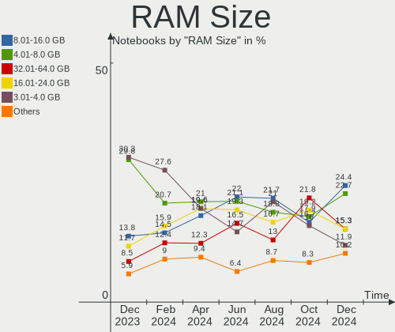
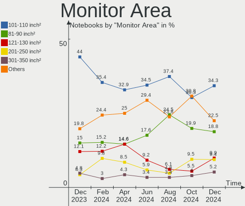
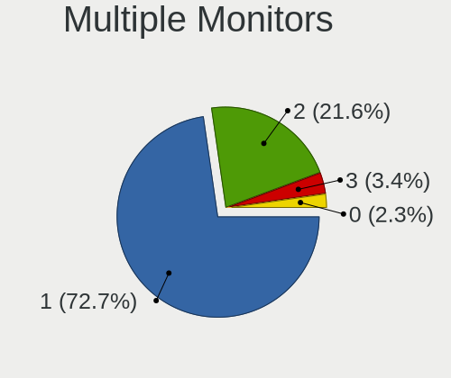
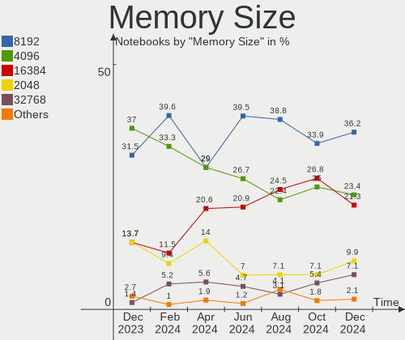

Linux in France - Hardware Trends (Notebooks)
---------------------------------------------

A project to identify most popular hardware characteristics and track their change
over time based on data collected by Linux users at https://Linux-Hardware.org.

Anyone can contribute to this report by the [hw-probe](https://github.com/linuxhw/hw-probe) tool:

    sudo -E hw-probe -all -upload

Period: Apr, 2024.

Contents
--------

* [ System ](#system)
  - [ OS                       ](#os)
  - [ OS Family                ](#os-family)
  - [ Kernel                   ](#kernel)
  - [ Kernel Family            ](#kernel-family)
  - [ Kernel Major Ver.        ](#kernel-major-ver)
  - [ Arch                     ](#arch)
  - [ DE                       ](#de)
  - [ Display Server           ](#display-server)
  - [ Display Manager          ](#display-manager)
  - [ OS Lang                  ](#os-lang)
  - [ Boot Mode                ](#boot-mode)
  - [ Filesystem               ](#filesystem)
  - [ Part. scheme             ](#part-scheme)
  - [ Dual Boot with Linux/BSD ](#dual-boot-with-linuxbsd)
  - [ Dual Boot (Win)          ](#dual-boot-win)

* [ Board ](#board)
  - [ Vendor                   ](#vendor)
  - [ Model                    ](#model)
  - [ Model Family             ](#model-family)
  - [ MFG Year                 ](#mfg-year)
  - [ Form Factor              ](#form-factor)
  - [ Secure Boot              ](#secure-boot)
  - [ Coreboot                 ](#coreboot)
  - [ RAM Size                 ](#ram-size)
  - [ RAM Used                 ](#ram-used)
  - [ Total Drives             ](#total-drives)
  - [ Has CD-ROM               ](#has-cd-rom)
  - [ Has Ethernet             ](#has-ethernet)
  - [ Has WiFi                 ](#has-wifi)
  - [ Has Bluetooth            ](#has-bluetooth)

* [ Location ](#location)
  - [ Country                  ](#country)
  - [ City                     ](#city)

* [ Drives ](#drives)
  - [ Drive Vendor             ](#drive-vendor)
  - [ Drive Model              ](#drive-model)
  - [ HDD Vendor               ](#hdd-vendor)
  - [ SSD Vendor               ](#ssd-vendor)
  - [ Drive Kind               ](#drive-kind)
  - [ Drive Connector          ](#drive-connector)
  - [ Drive Size               ](#drive-size)
  - [ Space Total              ](#space-total)
  - [ Space Used               ](#space-used)
  - [ Malfunc. Drives          ](#malfunc-drives)
  - [ Malfunc. Drive Vendor    ](#malfunc-drive-vendor)
  - [ Malfunc. HDD Vendor      ](#malfunc-hdd-vendor)
  - [ Malfunc. Drive Kind      ](#malfunc-drive-kind)
  - [ Failed Drives            ](#failed-drives)
  - [ Failed Drive Vendor      ](#failed-drive-vendor)
  - [ Drive Status             ](#drive-status)

* [ Storage controller ](#storage-controller)
  - [ Storage Vendor           ](#storage-vendor)
  - [ Storage Model            ](#storage-model)
  - [ Storage Kind             ](#storage-kind)

* [ Processor ](#processor)
  - [ CPU Vendor               ](#cpu-vendor)
  - [ CPU Model                ](#cpu-model)
  - [ CPU Model Family         ](#cpu-model-family)
  - [ CPU Cores                ](#cpu-cores)
  - [ CPU Sockets              ](#cpu-sockets)
  - [ CPU Threads              ](#cpu-threads)
  - [ CPU Op-Modes             ](#cpu-op-modes)
  - [ CPU Microcode            ](#cpu-microcode)
  - [ CPU Microarch            ](#cpu-microarch)

* [ Graphics ](#graphics)
  - [ GPU Vendor               ](#gpu-vendor)
  - [ GPU Model                ](#gpu-model)
  - [ GPU Combo                ](#gpu-combo)
  - [ GPU Driver               ](#gpu-driver)
  - [ GPU Memory               ](#gpu-memory)

* [ Monitor ](#monitor)
  - [ Monitor Vendor           ](#monitor-vendor)
  - [ Monitor Model            ](#monitor-model)
  - [ Monitor Resolution       ](#monitor-resolution)
  - [ Monitor Diagonal         ](#monitor-diagonal)
  - [ Monitor Width            ](#monitor-width)
  - [ Aspect Ratio             ](#aspect-ratio)
  - [ Monitor Area             ](#monitor-area)
  - [ Pixel Density            ](#pixel-density)
  - [ Multiple Monitors        ](#multiple-monitors)

* [ Network ](#network)
  - [ Net Controller Vendor    ](#net-controller-vendor)
  - [ Net Controller Model     ](#net-controller-model)
  - [ Wireless Vendor          ](#wireless-vendor)
  - [ Wireless Model           ](#wireless-model)
  - [ Ethernet Vendor          ](#ethernet-vendor)
  - [ Ethernet Model           ](#ethernet-model)
  - [ Net Controller Kind      ](#net-controller-kind)
  - [ Used Controller          ](#used-controller)
  - [ NICs                     ](#nics)
  - [ IPv6                     ](#ipv6)

* [ Bluetooth ](#bluetooth)
  - [ Bluetooth Vendor         ](#bluetooth-vendor)
  - [ Bluetooth Model          ](#bluetooth-model)

* [ Sound ](#sound)
  - [ Sound Vendor             ](#sound-vendor)
  - [ Sound Model              ](#sound-model)

* [ Memory ](#memory)
  - [ Memory Vendor            ](#memory-vendor)
  - [ Memory Model             ](#memory-model)
  - [ Memory Kind              ](#memory-kind)
  - [ Memory Form Factor       ](#memory-form-factor)
  - [ Memory Size              ](#memory-size)
  - [ Memory Speed             ](#memory-speed)

* [ Printers & scanners ](#printers--scanners)
  - [ Printer Vendor           ](#printer-vendor)
  - [ Printer Model            ](#printer-model)
  - [ Scanner Vendor           ](#scanner-vendor)
  - [ Scanner Model            ](#scanner-model)

* [ Camera ](#camera)
  - [ Camera Vendor            ](#camera-vendor)
  - [ Camera Model             ](#camera-model)

* [ Security ](#security)
  - [ Fingerprint Vendor       ](#fingerprint-vendor)
  - [ Fingerprint Model        ](#fingerprint-model)
  - [ Chipcard Vendor          ](#chipcard-vendor)
  - [ Chipcard Model           ](#chipcard-model)

* [ Unsupported ](#unsupported)
  - [ Unsupported Devices      ](#unsupported-devices)
  - [ Unsupported Device Types ](#unsupported-device-types)

System
------

OS
--

Installed operating systems

| Name                         | Notebooks | Percent |
|------------------------------|-----------|---------|
| Ubuntu 22.04                 | 30        | 21.74%  |
| Debian 12                    | 12        | 8.7%    |
| Fedora 40                    | 9         | 6.52%   |
| Linux Mint 21.3              | 7         | 5.07%   |
| Ubuntu 24.04                 | 6         | 4.35%   |
| OpenMandriva 5.0             | 6         | 4.35%   |
| Fedora 39                    | 6         | 4.35%   |
| Zorin 17                     | 4         | 2.9%    |
| OpenMandriva 23.08           | 4         | 2.9%    |
| Lubuntu 22.04                | 4         | 2.9%    |
| Arch Rolling                 | 4         | 2.9%    |
| Ubuntu 20.04                 | 3         | 2.17%   |
| Pop!_OS 22.04                | 3         | 2.17%   |
| openSUSE Tumbleweed-XXXXXXXX | 3         | 2.17%   |
| Debian 11                    | 3         | 2.17%   |
| Zorin 16                     | 2         | 1.45%   |
| Xubuntu 22.04                | 2         | 1.45%   |
| Ubuntu 23.10                 | 2         | 1.45%   |
| ROSA 12.5                    | 2         | 1.45%   |
| OpenMandriva 24.03           | 2         | 1.45%   |
| OpenMandriva 23.01           | 2         | 1.45%   |
| Kubuntu 23.10                | 2         | 1.45%   |
| Debian                       | 2         | 1.45%   |
| Xubuntu 23.10                | 1         | 0.72%   |
| Ubuntu 23.04                 | 1         | 0.72%   |
| Ubuntu 18.04                 | 1         | 0.72%   |
| SteamOS 3.5.17               | 1         | 0.72%   |
| Parrot 6.0                   | 1         | 0.72%   |
| MX 23                        | 1         | 0.72%   |
| Manjaro 23.1.4               | 1         | 0.72%   |
| Mageia 9                     | 1         | 0.72%   |
| Linux Mint 21.2              | 1         | 0.72%   |
| Linux Mint 21.1              | 1         | 0.72%   |
| Kubuntu 24.04                | 1         | 0.72%   |
| KDE neon 22.04               | 1         | 0.72%   |
| Io Unstable                  | 1         | 0.72%   |
| Gentoo 2.14                  | 1         | 0.72%   |
| Fedora 38                    | 1         | 0.72%   |
| Clear Linux 41540            | 1         | 0.72%   |
| ArcoLinux Rolling            | 1         | 0.72%   |

OS Family
---------

OS without a version

| Name         | Notebooks | Percent |
|--------------|-----------|---------|
| Ubuntu       | 43        | 31.16%  |
| Debian       | 17        | 12.32%  |
| Fedora       | 16        | 11.59%  |
| OpenMandriva | 14        | 10.14%  |
| Linux Mint   | 9         | 6.52%   |
| Zorin        | 6         | 4.35%   |
| Lubuntu      | 4         | 2.9%    |
| Arch         | 4         | 2.9%    |
| Xubuntu      | 3         | 2.17%   |
| Pop!_OS      | 3         | 2.17%   |
| openSUSE     | 3         | 2.17%   |
| Kubuntu      | 3         | 2.17%   |
| ROSA         | 2         | 1.45%   |
| SteamOS      | 1         | 0.72%   |
| Parrot       | 1         | 0.72%   |
| MX           | 1         | 0.72%   |
| Manjaro      | 1         | 0.72%   |
| Mageia       | 1         | 0.72%   |
| KDE neon     | 1         | 0.72%   |
| Io           | 1         | 0.72%   |
| Gentoo       | 1         | 0.72%   |
| Clear Linux  | 1         | 0.72%   |
| ArcoLinux    | 1         | 0.72%   |
| antiX        | 1         | 0.72%   |

Kernel
------

Version of the Linux kernel

| Version                             | Notebooks | Percent |
|-------------------------------------|-----------|---------|
| 6.5.0-27-generic                    | 13        | 9.42%   |
| 6.5.0-26-generic                    | 13        | 9.42%   |
| 6.5.0-28-generic                    | 12        | 8.7%    |
| 6.1.0-18-amd64                      | 8         | 5.8%    |
| 6.8.7-300.fc40.x86_64               | 7         | 5.07%   |
| 6.6.2-desktop-1omv2390              | 7         | 5.07%   |
| 6.8.0-31-generic                    | 5         | 3.62%   |
| 6.4.11-desktop-1omv2390             | 4         | 2.9%    |
| 5.15.0-101-generic                  | 4         | 2.9%    |
| 6.8.0-76060800daily20240311-generic | 3         | 2.17%   |
| 5.15.0-105-generic                  | 3         | 2.17%   |
| 6.8.5-arch1-1                       | 2         | 1.45%   |
| 6.8.0-11-generic                    | 2         | 1.45%   |
| 6.6.21-generic-8rosa2021.1-x86_64   | 2         | 1.45%   |
| 6.1.1-desktop-1omv2290              | 2         | 1.45%   |
| 6.1.0-20-amd64                      | 2         | 1.45%   |
| 5.10.0-28-amd64                     | 2         | 1.45%   |
| 6.8.7-arch1-1                       | 1         | 0.72%   |
| 6.8.7-100.fc38.x86_64               | 1         | 0.72%   |
| 6.8.7-1-default                     | 1         | 0.72%   |
| 6.8.6-200.fc39.x86_64               | 1         | 0.72%   |
| 6.8.6-1426.native                   | 1         | 0.72%   |
| 6.8.5-201.fc39.x86_64               | 1         | 0.72%   |
| 6.8.4-rc1-1-default                 | 1         | 0.72%   |
| 6.8.4-300.fc40.x86_64               | 1         | 0.72%   |
| 6.8.4-300.es83xx.fc40.x86_64        | 1         | 0.72%   |
| 6.8.4-200.fc39.x86_64               | 1         | 0.72%   |
| 6.8.2-arch2-1                       | 1         | 0.72%   |
| 6.8.1-desktop-3omv2490              | 1         | 0.72%   |
| 6.8.1-1-default                     | 1         | 0.72%   |
| 6.8.1-060801-generic                | 1         | 0.72%   |
| 6.7.9-amd64                         | 1         | 0.72%   |
| 6.7.12-1-liquorix-amd64             | 1         | 0.72%   |
| 6.7.11-200.fc39.x86_64              | 1         | 0.72%   |
| 6.7.10-200.fc39.x86_64              | 1         | 0.72%   |
| 6.6.8-100.fc38.x86_64               | 1         | 0.72%   |
| 6.6.22-rt27-x64v3-xanmod1           | 1         | 0.72%   |
| 6.6.15-amd64                        | 1         | 0.72%   |
| 6.6.1-arch1-1                       | 1         | 0.72%   |
| 6.5.3-1-MANJARO                     | 1         | 0.72%   |

Kernel Family
-------------

Linux kernel without a distro release

| Version | Notebooks | Percent |
|---------|-----------|---------|
| 6.5.0   | 43        | 31.16%  |
| 6.1.0   | 15        | 10.87%  |
| 5.15.0  | 11        | 7.97%   |
| 6.8.7   | 10        | 7.25%   |
| 6.8.0   | 10        | 7.25%   |
| 6.6.2   | 7         | 5.07%   |
| 6.8.4   | 4         | 2.9%    |
| 6.4.11  | 4         | 2.9%    |
| 6.8.5   | 3         | 2.17%   |
| 6.8.1   | 3         | 2.17%   |
| 6.8.6   | 2         | 1.45%   |
| 6.6.21  | 2         | 1.45%   |
| 6.2.0   | 2         | 1.45%   |
| 6.1.1   | 2         | 1.45%   |
| 5.13.0  | 2         | 1.45%   |
| 5.10.0  | 2         | 1.45%   |
| 6.8.2   | 1         | 0.72%   |
| 6.7.9   | 1         | 0.72%   |
| 6.7.12  | 1         | 0.72%   |
| 6.7.11  | 1         | 0.72%   |
| 6.7.10  | 1         | 0.72%   |
| 6.6.8   | 1         | 0.72%   |
| 6.6.22  | 1         | 0.72%   |
| 6.6.15  | 1         | 0.72%   |
| 6.6.1   | 1         | 0.72%   |
| 6.5.3   | 1         | 0.72%   |
| 6.4.9   | 1         | 0.72%   |
| 6.1.67  | 1         | 0.72%   |
| 6.1.52  | 1         | 0.72%   |
| 6.1.42  | 1         | 0.72%   |
| 5.4.0   | 1         | 0.72%   |
| 4.15.0  | 1         | 0.72%   |

Kernel Major Ver.
-----------------

Linux kernel major version

| Version | Notebooks | Percent |
|---------|-----------|---------|
| 6.5     | 44        | 31.88%  |
| 6.8     | 33        | 23.91%  |
| 6.1     | 20        | 14.49%  |
| 6.6     | 13        | 9.42%   |
| 5.15    | 11        | 7.97%   |
| 6.4     | 5         | 3.62%   |
| 6.7     | 4         | 2.9%    |
| 6.2     | 2         | 1.45%   |
| 5.13    | 2         | 1.45%   |
| 5.10    | 2         | 1.45%   |
| 5.4     | 1         | 0.72%   |
| 4.15    | 1         | 0.72%   |

Arch
----

OS architecture (x86_64, i586, etc.)

| Name   | Notebooks | Percent |
|--------|-----------|---------|
| x86_64 | 138       | 100%    |

DE
--

Desktop Environment

| Name          | Notebooks | Percent |
|---------------|-----------|---------|
| GNOME         | 68        | 49.28%  |
| KDE5          | 21        | 15.22%  |
| X-Cinnamon    | 10        | 7.25%   |
| XFCE          | 9         | 6.52%   |
| Unknown       | 7         | 5.07%   |
| LXQt          | 5         | 3.62%   |
| KDE6          | 5         | 3.62%   |
| Cinnamon      | 3         | 2.17%   |
| MATE          | 2         | 1.45%   |
| LXDE          | 2         | 1.45%   |
| KDE           | 1         | 0.72%   |
| icewm         | 1         | 0.72%   |
| i3            | 1         | 0.72%   |
| Hyprland      | 1         | 0.72%   |
| GNOME Classic | 1         | 0.72%   |
| Enlightenment | 1         | 0.72%   |

Display Server
--------------

X11 or Wayland

| Name    | Notebooks | Percent |
|---------|-----------|---------|
| X11     | 74        | 53.62%  |
| Wayland | 58        | 42.03%  |
| Tty     | 6         | 4.35%   |

Display Manager
---------------

SDDM, LightDM, etc.

| Name    | Notebooks | Percent |
|---------|-----------|---------|
| GDM3    | 43        | 31.16%  |
| Unknown | 32        | 23.19%  |
| SDDM    | 29        | 21.01%  |
| LightDM | 23        | 16.67%  |
| GDM     | 9         | 6.52%   |
| SLIMSKI | 1         | 0.72%   |
| LXDM    | 1         | 0.72%   |

OS Lang
-------

Language

| Lang    | Notebooks | Percent |
|---------|-----------|---------|
| fr_FR   | 99        | 71.74%  |
| en_US   | 25        | 18.12%  |
| C       | 6         | 4.35%   |
| it_IT   | 4         | 2.9%    |
| es_CU   | 1         | 0.72%   |
| en_GB   | 1         | 0.72%   |
| de_DE   | 1         | 0.72%   |
| Unknown | 1         | 0.72%   |

Boot Mode
---------

EFI or BIOS

| Mode | Notebooks | Percent |
|------|-----------|---------|
| EFI  | 76        | 55.07%  |
| BIOS | 62        | 44.93%  |

Filesystem
----------

Type of filesystem

| Type    | Notebooks | Percent |
|---------|-----------|---------|
| Ext4    | 80        | 57.97%  |
| Btrfs   | 23        | 16.67%  |
| Tmpfs   | 20        | 14.49%  |
| Overlay | 13        | 9.42%   |
| Zfs     | 2         | 1.45%   |

Part. scheme
------------

Scheme of partitioning

| Type    | Notebooks | Percent |
|---------|-----------|---------|
| GPT     | 86        | 62.32%  |
| Unknown | 32        | 23.19%  |
| MBR     | 20        | 14.49%  |

Dual Boot with Linux/BSD
------------------------

Hosting more than one Linux/BSD

| Dual boot | Notebooks | Percent |
|-----------|-----------|---------|
| No        | 117       | 84.78%  |
| Yes       | 21        | 15.22%  |

Dual Boot (Win)
---------------

Hosting Linux and Windows

| Dual boot | Notebooks | Percent |
|-----------|-----------|---------|
| No        | 104       | 75.36%  |
| Yes       | 34        | 24.64%  |

Board
-----

Vendor
------

Motherboard manufacturer

| Name                | Notebooks | Percent |
|---------------------|-----------|---------|
| Hewlett-Packard     | 28        | 20.29%  |
| Dell                | 22        | 15.94%  |
| Lenovo              | 20        | 14.49%  |
| ASUSTek Computer    | 19        | 13.77%  |
| Acer                | 9         | 6.52%   |
| Toshiba             | 4         | 2.9%    |
| Notebook            | 4         | 2.9%    |
| MSI                 | 4         | 2.9%    |
| Apple               | 4         | 2.9%    |
| Samsung Electronics | 3         | 2.17%   |
| Medion              | 3         | 2.17%   |
| Google              | 2         | 1.45%   |
| Unknown             | 2         | 1.45%   |
| Valve               | 1         | 0.72%   |
| VALE                | 1         | 0.72%   |
| UNOWHY              | 1         | 0.72%   |
| SCHNEIDER           | 1         | 0.72%   |
| Panasonic           | 1         | 0.72%   |
| Packard Bell        | 1         | 0.72%   |
| N-one               | 1         | 0.72%   |
| HUAWEI              | 1         | 0.72%   |
| Gigabyte Technology | 1         | 0.72%   |
| Fujitsu Siemens     | 1         | 0.72%   |
| Fujitsu             | 1         | 0.72%   |
| Framework           | 1         | 0.72%   |
| eMachines           | 1         | 0.72%   |
| Chuwi               | 1         | 0.72%   |

Model
-----

Motherboard model

| Name                                      | Notebooks | Percent |
|-------------------------------------------|-----------|---------|
| HP Notebook                               | 2         | 1.45%   |
| HP EliteBook 840 G8 Notebook PC           | 2         | 1.45%   |
| Unknown                                   | 2         | 1.45%   |
| Valve Jupiter                             | 1         | 0.72%   |
| VALE Notebook Classic C151V               | 1         | 0.72%   |
| UNOWHY Y13G002S4EI                        | 1         | 0.72%   |
| Toshiba Satellite U500                    | 1         | 0.72%   |
| Toshiba Satellite Pro L630                | 1         | 0.72%   |
| Toshiba Satellite Pro C50-A-154           | 1         | 0.72%   |
| Toshiba Satellite C870-192                | 1         | 0.72%   |
| SCHNEIDER SCL141CTP                       | 1         | 0.72%   |
| Samsung RV415/RV515/E3415                 | 1         | 0.72%   |
| Samsung RV410/RV510/S3510/E3510           | 1         | 0.72%   |
| Samsung 950XED                            | 1         | 0.72%   |
| Panasonic CF-C1BTCREFF                    | 1         | 0.72%   |
| Packard Bell EasyNote LJ61                | 1         | 0.72%   |
| Notebook W230ST                           | 1         | 0.72%   |
| Notebook NS5x_NS7xPU                      | 1         | 0.72%   |
| Notebook NS5x_NS7xAU                      | 1         | 0.72%   |
| Notebook NP50D5                           | 1         | 0.72%   |
| N-one Nbook Ultra                         | 1         | 0.72%   |
| MSI Raider GE78HX SmartTP 13VG            | 1         | 0.72%   |
| MSI GS65 Stealth Thin 8RE                 | 1         | 0.72%   |
| MSI GE62 2QC                              | 1         | 0.72%   |
| MSI CR70 2M/CX70 2OC/CX70 2OD             | 1         | 0.72%   |
| Medion E14223                             | 1         | 0.72%   |
| Medion Defender P30                       | 1         | 0.72%   |
| Medion Akoya P7818                        | 1         | 0.72%   |
| Lenovo ThinkPad X280 20KESA5000           | 1         | 0.72%   |
| Lenovo ThinkPad X240 20AMS1PT06           | 1         | 0.72%   |
| Lenovo ThinkPad X1 Extreme 2nd 20QVCTO1WW | 1         | 0.72%   |
| Lenovo ThinkPad X1 Carbon 7th 20QDCTO1WW  | 1         | 0.72%   |
| Lenovo ThinkPad W541 20EGS03W15           | 1         | 0.72%   |
| Lenovo ThinkPad T440p 20AWS17N00          | 1         | 0.72%   |
| Lenovo ThinkPad T420 4236MA3              | 1         | 0.72%   |
| Lenovo ThinkPad S1 Yoga 12 20DKS13V00     | 1         | 0.72%   |
| Lenovo ThinkPad P70 20ESS2J700            | 1         | 0.72%   |
| Lenovo ThinkPad P52 20M9CTO1WW            | 1         | 0.72%   |
| Lenovo ThinkPad P14s Gen 2a 21A00000FR    | 1         | 0.72%   |
| Lenovo ThinkPad L560 20F2S0TB00           | 1         | 0.72%   |

Model Family
------------

Motherboard model prefix

| Name                   | Notebooks | Percent |
|------------------------|-----------|---------|
| Lenovo ThinkPad        | 15        | 10.87%  |
| Dell Latitude          | 12        | 8.7%    |
| HP EliteBook           | 8         | 5.8%    |
| Acer Aspire            | 8         | 5.8%    |
| HP Pavilion            | 6         | 4.35%   |
| Toshiba Satellite      | 4         | 2.9%    |
| HP Laptop              | 4         | 2.9%    |
| Dell Precision         | 4         | 2.9%    |
| HP ZBook               | 3         | 2.17%   |
| Dell XPS               | 3         | 2.17%   |
| ASUS ROG               | 3         | 2.17%   |
| ASUS ASUS              | 3         | 2.17%   |
| Notebook NS5x          | 2         | 1.45%   |
| Lenovo Legion          | 2         | 1.45%   |
| Lenovo IdeaPad         | 2         | 1.45%   |
| HP ProBook             | 2         | 1.45%   |
| HP Notebook            | 2         | 1.45%   |
| HP Compaq              | 2         | 1.45%   |
| ASUS TUF               | 2         | 1.45%   |
| Unknown                | 2         | 1.45%   |
| Valve Jupiter          | 1         | 0.72%   |
| VALE Notebook          | 1         | 0.72%   |
| UNOWHY Y13G002S4EI     | 1         | 0.72%   |
| SCHNEIDER SCL141CTP    | 1         | 0.72%   |
| Samsung RV415          | 1         | 0.72%   |
| Samsung RV410          | 1         | 0.72%   |
| Samsung 950XED         | 1         | 0.72%   |
| Panasonic CF-C1BTCREFF | 1         | 0.72%   |
| Packard Bell EasyNote  | 1         | 0.72%   |
| Notebook W230ST        | 1         | 0.72%   |
| Notebook NP50D5        | 1         | 0.72%   |
| N-one Nbook            | 1         | 0.72%   |
| MSI Raider             | 1         | 0.72%   |
| MSI GS65               | 1         | 0.72%   |
| MSI GE62               | 1         | 0.72%   |
| MSI CR70               | 1         | 0.72%   |
| Medion E14223          | 1         | 0.72%   |
| Medion Defender        | 1         | 0.72%   |
| Medion Akoya           | 1         | 0.72%   |
| Lenovo IdeaPadFlex     | 1         | 0.72%   |

MFG Year
--------

Motherboard manufacture year

| Year | Notebooks | Percent |
|------|-----------|---------|
| 2023 | 18        | 13.04%  |
| 2021 | 16        | 11.59%  |
| 2020 | 13        | 9.42%   |
| 2013 | 13        | 9.42%   |
| 2015 | 12        | 8.7%    |
| 2018 | 8         | 5.8%    |
| 2010 | 8         | 5.8%    |
| 2022 | 7         | 5.07%   |
| 2019 | 7         | 5.07%   |
| 2014 | 7         | 5.07%   |
| 2011 | 6         | 4.35%   |
| 2012 | 4         | 2.9%    |
| 2009 | 4         | 2.9%    |
| 2008 | 4         | 2.9%    |
| 2017 | 3         | 2.17%   |
| 2016 | 3         | 2.17%   |
| 2007 | 3         | 2.17%   |
| 2024 | 2         | 1.45%   |

Form Factor
-----------

Physical design of the computer

| Name     | Notebooks | Percent |
|----------|-----------|---------|
| Notebook | 138       | 100%    |

Secure Boot
-----------

Enabled or disabled

| State    | Notebooks | Percent |
|----------|-----------|---------|
| Disabled | 126       | 91.3%   |
| Enabled  | 12        | 8.7%    |

Coreboot
--------

Have coreboot on board

| Used | Notebooks | Percent |
|------|-----------|---------|
| No   | 135       | 97.83%  |
| Yes  | 3         | 2.17%   |

RAM Size
--------

Total RAM memory

| Size in GB  | Notebooks | Percent |
|-------------|-----------|---------|
| 4.01-8.0    | 29        | 21.01%  |
| 3.01-4.0    | 27        | 19.57%  |
| 16.01-24.0  | 27        | 19.57%  |
| 8.01-16.0   | 25        | 18.12%  |
| 32.01-64.0  | 17        | 12.32%  |
| 1.01-2.0    | 6         | 4.35%   |
| 64.01-256.0 | 5         | 3.62%   |
| 24.01-32.0  | 2         | 1.45%   |

RAM Used
--------

Used RAM memory

| Used GB    | Notebooks | Percent |
|------------|-----------|---------|
| 1.01-2.0   | 39        | 28.26%  |
| 2.01-3.0   | 34        | 24.64%  |
| 4.01-8.0   | 33        | 23.91%  |
| 3.01-4.0   | 18        | 13.04%  |
| 8.01-16.0  | 7         | 5.07%   |
| 0.51-1.0   | 6         | 4.35%   |
| 16.01-24.0 | 1         | 0.72%   |

Total Drives
------------

Number of drives on board

| Drives | Notebooks | Percent |
|--------|-----------|---------|
| 1      | 99        | 71.74%  |
| 2      | 32        | 23.19%  |
| 3      | 5         | 3.62%   |
| 7      | 1         | 0.72%   |
| 4      | 1         | 0.72%   |

Has CD-ROM
----------

Has CD-ROM on board

| Presented | Notebooks | Percent |
|-----------|-----------|---------|
| No        | 92        | 66.67%  |
| Yes       | 46        | 33.33%  |

Has Ethernet
------------

Has Ethernet on board

| Presented | Notebooks | Percent |
|-----------|-----------|---------|
| Yes       | 112       | 81.16%  |
| No        | 26        | 18.84%  |

Has WiFi
--------

Has WiFi module

| Presented | Notebooks | Percent |
|-----------|-----------|---------|
| Yes       | 134       | 97.1%   |
| No        | 4         | 2.9%    |

Has Bluetooth
-------------

Has Bluetooth module

| Presented | Notebooks | Percent |
|-----------|-----------|---------|
| Yes       | 109       | 78.99%  |
| No        | 29        | 21.01%  |

Location
--------

Country
-------

Geographic location (country)

| Country | Notebooks | Percent |
|---------|-----------|---------|
| France  | 138       | 100%    |

City
----

Geographic location (city)

| City                     | Notebooks | Percent |
|--------------------------|-----------|---------|
| Paris                    | 16        | 11.59%  |
| Lyon                     | 5         | 3.62%   |
| Le Haillan               | 5         | 3.62%   |
| Argenteuil               | 5         | 3.62%   |
| Toulouse                 | 3         | 2.17%   |
| Rosny-sous-Bois          | 3         | 2.17%   |
| Marseille                | 3         | 2.17%   |
| Valenciennes             | 2         | 1.45%   |
| Strasbourg               | 2         | 1.45%   |
| Saint-Just-Saint-Rambert | 2         | 1.45%   |
| Saint-Etienne            | 2         | 1.45%   |
| Pasly                    | 2         | 1.45%   |
| Champs-sur-Marne         | 2         | 1.45%   |
| Vitry-sur-Seine          | 1         | 0.72%   |
| Villedieu-la-Blouere     | 1         | 0.72%   |
| Versailles               | 1         | 0.72%   |
| Vernoux-en-Vivarais      | 1         | 0.72%   |
| Verdun                   | 1         | 0.72%   |
| Tulette                  | 1         | 0.72%   |
| Tourcoing                | 1         | 0.72%   |
| Thann                    | 1         | 0.72%   |
| Talence                  | 1         | 0.72%   |
| Sainte-Sigolene          | 1         | 0.72%   |
| Sainte-Luce-sur-Loire    | 1         | 0.72%   |
| Saint-Renan              | 1         | 0.72%   |
| Saint-Pol-sur-Mer        | 1         | 0.72%   |
| Saint-Michel-sur-Orge    | 1         | 0.72%   |
| Saint-Maur-des-Fossés   | 1         | 0.72%   |
| Saint-Martin-d'Hères    | 1         | 0.72%   |
| Saint-Julien-en-Genevois | 1         | 0.72%   |
| Saint-Hilarion           | 1         | 0.72%   |
| Saint-Estephe            | 1         | 0.72%   |
| Saint-Denis              | 1         | 0.72%   |
| Saint-Alban-du-Rhone     | 1         | 0.72%   |
| Royan                    | 1         | 0.72%   |
| Roscanvel                | 1         | 0.72%   |
| Rombas                   | 1         | 0.72%   |
| Rennes                   | 1         | 0.72%   |
| Remiremont               | 1         | 0.72%   |
| Porto-Vecchio            | 1         | 0.72%   |

Drives
------

Drive Vendor
------------

Hard drive vendors

| Vendor                      | Notebooks | Drives | Percent |
|-----------------------------|-----------|--------|---------|
| Samsung Electronics         | 26        | 29     | 14.94%  |
| WDC                         | 14        | 14     | 8.05%   |
| SK hynix                    | 13        | 13     | 7.47%   |
| Seagate                     | 12        | 12     | 6.9%    |
| SanDisk                     | 11        | 12     | 6.32%   |
| Unknown                     | 10        | 11     | 5.75%   |
| Toshiba                     | 10        | 10     | 5.75%   |
| Crucial                     | 9         | 11     | 5.17%   |
| Micron Technology           | 8         | 8      | 4.6%    |
| Phison Electronics          | 6         | 6      | 3.45%   |
| Kingston                    | 6         | 6      | 3.45%   |
| Intel                       | 5         | 5      | 2.87%   |
| Hitachi                     | 5         | 5      | 2.87%   |
| HGST                        | 4         | 4      | 2.3%    |
| Fanxiang                    | 4         | 4      | 2.3%    |
| KIOXIA                      | 3         | 3      | 1.72%   |
| Kingston Technology Company | 3         | 3      | 1.72%   |
| Fujitsu                     | 3         | 3      | 1.72%   |
| Apple                       | 3         | 4      | 1.72%   |
| Micron/Crucial Technology   | 2         | 2      | 1.15%   |
| HS-SSD-E100                 | 2         | 2      | 1.15%   |
| Emtec                       | 2         | 2      | 1.15%   |
| WALRAM                      | 1         | 1      | 0.57%   |
| StoreJet                    | 1         | 1      | 0.57%   |
| SSSTC                       | 1         | 1      | 0.57%   |
| SPCC                        | 1         | 1      | 0.57%   |
| NGFF                        | 1         | 1      | 0.57%   |
| MAXIO Technology (Hangzhou) | 1         | 1      | 0.57%   |
| KingSpec                    | 1         | 1      | 0.57%   |
| GLOWAY                      | 1         | 1      | 0.57%   |
| Gigabyte Technology         | 1         | 1      | 0.57%   |
| Dogfish                     | 1         | 1      | 0.57%   |
| Biwin Storage Technology    | 1         | 1      | 0.57%   |
| A-DATA Technology           | 1         | 1      | 0.57%   |
| Unknown                     | 1         | 1      | 0.57%   |

Drive Model
-----------

Hard drive models

| Model                                             | Notebooks | Percent |
|---------------------------------------------------|-----------|---------|
| Toshiba MQ01ABD100 1TB                            | 4         | 2.27%   |
| WDC WD5000LPVX-22V0TT0 500GB                      | 3         | 1.7%    |
| Unknown MMC Card  32GB                            | 3         | 1.7%    |
| Samsung SSD 850 EVO 250GB                         | 3         | 1.7%    |
| Samsung NVMe SSD Controller SM981/PM981/PM983 1TB | 3         | 1.7%    |
| Crucial CT500MX500SSD1 500GB                      | 3         | 1.7%    |
| WDC WD10SPZX-24Z10T0 1TB                          | 2         | 1.14%   |
| SK hynix PC611 NVMe 512GB                         | 2         | 1.14%   |
| SK hynix BC711 NVMe 512GB                         | 2         | 1.14%   |
| Seagate ST1000LM024 HN-M101MBB 1TB                | 2         | 1.14%   |
| Seagate Expansion HDD 12TB                        | 2         | 1.14%   |
| SanDisk NVMe SSD Drive 1TB                        | 2         | 1.14%   |
| Samsung SSD 870 EVO 500GB                         | 2         | 1.14%   |
| Samsung MZ7LN256HCHP-000L7 256GB SSD              | 2         | 1.14%   |
| Phison PS5013 E13 NVMe Controller 512GB           | 2         | 1.14%   |
| Hitachi HTS547575A9E384 752GB                     | 2         | 1.14%   |
| HGST HTS725050A7E630 500GB                        | 2         | 1.14%   |
| HGST HTS721010A9E630 1TB                          | 2         | 1.14%   |
| Fanxiang S101 1TB SSD                             | 2         | 1.14%   |
| Crucial CT1000P3PSSD8 1TB                         | 2         | 1.14%   |
| WDC WDS500G3X0C-00SJG0 500GB                      | 1         | 0.57%   |
| WDC WD5000LPVX-08V0TT5 500GB                      | 1         | 0.57%   |
| WDC WD5000LPLX-08ZNTT0 500GB                      | 1         | 0.57%   |
| WDC WD20SPZX-22UA7T0 2TB                          | 1         | 0.57%   |
| WDC WD1600BEVT-22ZCT0 160GB                       | 1         | 0.57%   |
| WDC WD16 00BEVT-60ZCT0 160GB                      | 1         | 0.57%   |
| WDC WD10SPZX-60Z10T0 1TB                          | 1         | 0.57%   |
| WDC WD1001X06X-00SJVT0 1TB                        | 1         | 0.57%   |
| WDC PC SN730 SDBQNTY-512G-1001 512GB              | 1         | 0.57%   |
| WALRAM SSD 512GB                                  | 1         | 0.57%   |
| Unknown SN64G  64GB                               | 1         | 0.57%   |
| Unknown SD/MMC/MS PRO 128GB                       | 1         | 0.57%   |
| Unknown NVMe SSD Drive 512GB                      | 1         | 0.57%   |
| Unknown MMC128  128GB                             | 1         | 0.57%   |
| Unknown MMC Card  64GB                            | 1         | 0.57%   |
| Unknown MMC Card  512GB                           | 1         | 0.57%   |
| Unknown MMC Card  128GB                           | 1         | 0.57%   |
| Toshiba MQ01ABF050 500GB                          | 1         | 0.57%   |
| Toshiba MQ01ABD100V 1TB                           | 1         | 0.57%   |
| Toshiba MK5061GSYN 500GB                          | 1         | 0.57%   |

HDD Vendor
----------

Hard disk drive vendors

| Vendor              | Notebooks | Drives | Percent |
|---------------------|-----------|--------|---------|
| WDC                 | 12        | 12     | 25.53%  |
| Seagate             | 11        | 11     | 23.4%   |
| Toshiba             | 10        | 10     | 21.28%  |
| Hitachi             | 5         | 5      | 10.64%  |
| HGST                | 4         | 4      | 8.51%   |
| Fujitsu             | 3         | 3      | 6.38%   |
| Unknown             | 1         | 1      | 2.13%   |
| Samsung Electronics | 1         | 1      | 2.13%   |

SSD Vendor
----------

Solid state drive vendors

| Vendor              | Notebooks | Drives | Percent |
|---------------------|-----------|--------|---------|
| Samsung Electronics | 13        | 13     | 27.66%  |
| Crucial             | 6         | 7      | 12.77%  |
| SanDisk             | 4         | 5      | 8.51%   |
| Kingston            | 3         | 3      | 6.38%   |
| Intel               | 3         | 3      | 6.38%   |
| Fanxiang            | 3         | 3      | 6.38%   |
| Micron Technology   | 2         | 2      | 4.26%   |
| Emtec               | 2         | 2      | 4.26%   |
| Apple               | 2         | 2      | 4.26%   |
| WALRAM              | 1         | 1      | 2.13%   |
| StoreJet            | 1         | 1      | 2.13%   |
| SSSTC               | 1         | 1      | 2.13%   |
| SPCC                | 1         | 1      | 2.13%   |
| NGFF                | 1         | 1      | 2.13%   |
| KingSpec            | 1         | 1      | 2.13%   |
| HS-SSD-E100         | 1         | 1      | 2.13%   |
| Dogfish             | 1         | 1      | 2.13%   |
| A-DATA Technology   | 1         | 1      | 2.13%   |

Drive Kind
----------

HDD or SSD

| Kind    | Notebooks | Drives | Percent |
|---------|-----------|--------|---------|
| NVMe    | 60        | 72     | 37.5%   |
| SSD     | 44        | 49     | 27.5%   |
| HDD     | 43        | 47     | 26.88%  |
| MMC     | 9         | 10     | 5.63%   |
| Unknown | 4         | 4      | 2.5%    |

Drive Connector
---------------

SATA, SAS, NVMe, etc.

| Type | Notebooks | Drives | Percent |
|------|-----------|--------|---------|
| SATA | 78        | 93     | 51.32%  |
| NVMe | 60        | 71     | 39.47%  |
| MMC  | 9         | 10     | 5.92%   |
| SAS  | 5         | 8      | 3.29%   |

Drive Size
----------

Size of hard drive

| Size in TB | Notebooks | Drives | Percent |
|------------|-----------|--------|---------|
| 0.01-0.5   | 55        | 60     | 60.44%  |
| 0.51-1.0   | 31        | 31     | 34.07%  |
| 1.01-2.0   | 3         | 3      | 3.3%    |
| 10.01-20.0 | 2         | 2      | 2.2%    |

Space Total
-----------

Amount of disk space available on the file system

| Size in GB     | Notebooks | Percent |
|----------------|-----------|---------|
| 251-500        | 42        | 30.43%  |
| 101-250        | 29        | 21.01%  |
| 501-1000       | 25        | 18.12%  |
| 1-20           | 12        | 8.7%    |
| 51-100         | 11        | 7.97%   |
| 1001-2000      | 8         | 5.8%    |
| More than 3000 | 4         | 2.9%    |
| 21-50          | 4         | 2.9%    |
| 2001-3000      | 3         | 2.17%   |

Space Used
----------

Amount of used disk space

| Used GB   | Notebooks | Percent |
|-----------|-----------|---------|
| 1-20      | 54        | 39.13%  |
| 101-250   | 27        | 19.57%  |
| 21-50     | 24        | 17.39%  |
| 251-500   | 13        | 9.42%   |
| 51-100    | 10        | 7.25%   |
| 1001-2000 | 4         | 2.9%    |
| 501-1000  | 4         | 2.9%    |
| 2001-3000 | 2         | 1.45%   |

Malfunc. Drives
---------------

Drive models with a malfunction

| Model                        | Notebooks | Drives | Percent |
|------------------------------|-----------|--------|---------|
| Toshiba MQ01ABD100 1TB       | 2         | 2      | 20%     |
| WDC WD5000LPVX-22V0TT0 500GB | 1         | 1      | 10%     |
| WDC WD5000LPLX-08ZNTT0 500GB | 1         | 1      | 10%     |
| WDC WD1600BEVT-22ZCT0 160GB  | 1         | 1      | 10%     |
| WDC WD10SPZX-60Z10T0 1TB     | 1         | 1      | 10%     |
| Toshiba MK3263GSX 320GB      | 1         | 1      | 10%     |
| SSSTC CV8-8E128-HP 128GB     | 1         | 1      | 10%     |
| Seagate ST9500420AS 500GB    | 1         | 1      | 10%     |
| Intel SSDSCKJF180A5L 180GB   | 1         | 1      | 10%     |

Malfunc. Drive Vendor
---------------------

Vendors of faulty drives

| Vendor  | Notebooks | Drives | Percent |
|---------|-----------|--------|---------|
| WDC     | 4         | 4      | 40%     |
| Toshiba | 3         | 3      | 30%     |
| SSSTC   | 1         | 1      | 10%     |
| Seagate | 1         | 1      | 10%     |
| Intel   | 1         | 1      | 10%     |

Malfunc. HDD Vendor
-------------------

Vendors of faulty HDD drives

| Vendor  | Notebooks | Drives | Percent |
|---------|-----------|--------|---------|
| WDC     | 4         | 4      | 50%     |
| Toshiba | 3         | 3      | 37.5%   |
| Seagate | 1         | 1      | 12.5%   |

Malfunc. Drive Kind
-------------------

Kinds of faulty drives

| Kind | Notebooks | Drives | Percent |
|------|-----------|--------|---------|
| HDD  | 8         | 8      | 80%     |
| SSD  | 2         | 2      | 20%     |

Failed Drives
-------------

Failed drive models

| Model                                   | Notebooks | Drives | Percent |
|-----------------------------------------|-----------|--------|---------|
| SK hynix BC501 HFM256GDJTNG-8310A 256GB | 1         | 1      | 100%    |

Failed Drive Vendor
-------------------

Failed drive vendors

| Vendor   | Notebooks | Drives | Percent |
|----------|-----------|--------|---------|
| SK hynix | 1         | 1      | 100%    |

Drive Status
------------

Number of failed and malfunc. drives

| Status   | Notebooks | Drives | Percent |
|----------|-----------|--------|---------|
| Works    | 74        | 91     | 51.75%  |
| Detected | 59        | 80     | 41.26%  |
| Malfunc  | 9         | 10     | 6.29%   |
| Failed   | 1         | 1      | 0.7%    |

Storage controller
------------------

Storage Vendor
--------------

Storage controller vendors

| Vendor                      | Notebooks | Percent |
|-----------------------------|-----------|---------|
| Intel                       | 92        | 55.76%  |
| Samsung Electronics         | 14        | 8.48%   |
| SK hynix                    | 13        | 7.88%   |
| SanDisk                     | 8         | 4.85%   |
| Phison Electronics          | 6         | 3.64%   |
| Micron Technology           | 6         | 3.64%   |
| Kingston Technology Company | 6         | 3.64%   |
| AMD                         | 6         | 3.64%   |
| Micron/Crucial Technology   | 5         | 3.03%   |
| KIOXIA                      | 3         | 1.82%   |
| Solidigm                    | 1         | 0.61%   |
| Nvidia                      | 1         | 0.61%   |
| MAXIO Technology (Hangzhou) | 1         | 0.61%   |
| Marvell Technology Group    | 1         | 0.61%   |
| Biwin Storage Technology    | 1         | 0.61%   |
| Apple                       | 1         | 0.61%   |

Storage Model
-------------

Storage controller models

| Model                                                                          | Notebooks | Percent |
|--------------------------------------------------------------------------------|-----------|---------|
| Intel Sunrise Point-LP SATA Controller [AHCI mode]                             | 10        | 5.81%   |
| Intel 82801 Mobile SATA Controller [RAID mode]                                 | 9         | 5.23%   |
| Intel Volume Management Device NVMe RAID Controller                            | 7         | 4.07%   |
| SK hynix Gold P31/BC711/PC711 NVMe Solid State Drive                           | 6         | 3.49%   |
| Intel 82801IBM/IEM (ICH9M/ICH9M-E) 4 port SATA Controller [AHCI mode]          | 6         | 3.49%   |
| Intel 8 Series/C220 Series Chipset Family 6-port SATA Controller 1 [AHCI mode] | 6         | 3.49%   |
| Intel 8 Series SATA Controller 1 [AHCI mode]                                   | 6         | 3.49%   |
| Intel 7 Series Chipset Family 6-port SATA Controller [AHCI mode]               | 6         | 3.49%   |
| Intel 6 Series/C200 Series Chipset Family 6 port Mobile SATA AHCI Controller   | 6         | 3.49%   |
| Samsung NVMe SSD Controller SM981/PM981/PM983                                  | 5         | 2.91%   |
| Intel Volume Management Device NVMe RAID Controller Intel Corporation          | 5         | 2.91%   |
| Micron/Crucial P2 [Nick P2] / P3 / P3 Plus NVMe PCIe SSD (DRAM-less)           | 4         | 2.33%   |
| AMD FCH SATA Controller [AHCI mode]                                            | 4         | 2.33%   |
| SK hynix PC611 NVMe Solid State Drive                                          | 3         | 1.74%   |
| Samsung NVMe SSD Controller PM9A1/PM9A3/980PRO                                 | 3         | 1.74%   |
| Samsung NVMe SSD Controller 980 (DRAM-less)                                    | 3         | 1.74%   |
| Intel 82801HM/HEM (ICH8M/ICH8M-E) SATA Controller [AHCI mode]                  | 3         | 1.74%   |
| Intel 82801HM/HEM (ICH8M/ICH8M-E) IDE Controller                               | 3         | 1.74%   |
| Intel 5 Series/3400 Series Chipset 4 port SATA AHCI Controller                 | 3         | 1.74%   |
| SK hynix BC511 NVMe SSD                                                        | 2         | 1.16%   |
| SanDisk WD PC SN810 / Black SN850 NVMe SSD                                     | 2         | 1.16%   |
| SanDisk Extreme Pro / WD Black SN750 / PC SN730 / Red SN700 NVMe SSD           | 2         | 1.16%   |
| Phison PS5019-E19 PCIe4 NVMe Controller (DRAM-less)                            | 2         | 1.16%   |
| Phison PS5013-E13 PCIe3 NVMe Controller (DRAM-less)                            | 2         | 1.16%   |
| Micron 3400 NVMe SSD [Hendrix]                                                 | 2         | 1.16%   |
| Kingston Company OM3PDP3 NVMe SSD                                              | 2         | 1.16%   |
| Intel Wildcat Point-LP SATA Controller [AHCI Mode]                             | 2         | 1.16%   |
| Intel Q170/Q150/B150/H170/H110/Z170/CM236 Chipset SATA Controller [AHCI Mode]  | 2         | 1.16%   |
| Intel Mobile PM965/GM965 PT IDER Controller                                    | 2         | 1.16%   |
| Intel HM170/QM170 Chipset SATA Controller [AHCI Mode]                          | 2         | 1.16%   |
| Intel Celeron/Pentium Silver Processor SATA Controller                         | 2         | 1.16%   |
| Intel Cannon Lake Mobile PCH SATA AHCI Controller                              | 2         | 1.16%   |
| Intel Atom Processor E3800 Series SATA AHCI Controller                         | 2         | 1.16%   |
| Intel 5 Series/3400 Series Chipset 6 port SATA AHCI Controller                 | 2         | 1.16%   |
| Intel 400 Series Chipset Family SATA AHCI Controller                           | 2         | 1.16%   |
| Solidigm P41 Plus NVMe SSD (DRAM-less) [Echo Harbor]                           | 1         | 0.58%   |
| SK hynix BC901 NVMe Solid State Drive (DRAM-less)                              | 1         | 0.58%   |
| SK hynix BC501 NVMe Solid State Drive                                          | 1         | 0.58%   |
| Sandisk WD Black SN850X NVMe SSD                                               | 1         | 0.58%   |
| SanDisk WD Black SN770 / PC SN740 256GB / PC SN560 (DRAM-less) NVMe SSD        | 1         | 0.58%   |

Storage Kind
------------

Kind of storage controller (IDE, SATA, NVMe, SAS, ...)

| Kind | Notebooks | Percent |
|------|-----------|---------|
| SATA | 78        | 47.85%  |
| NVMe | 60        | 36.81%  |
| RAID | 21        | 12.88%  |
| IDE  | 4         | 2.45%   |

Processor
---------

CPU Vendor
----------

Processor vendors

| Vendor | Notebooks | Percent |
|--------|-----------|---------|
| Intel  | 117       | 84.78%  |
| AMD    | 21        | 15.22%  |

CPU Model
---------

Processor models

| Model                                       | Notebooks | Percent |
|---------------------------------------------|-----------|---------|
| AMD Ryzen 5 5500U with Radeon Graphics      | 4         | 2.9%    |
| Intel Core Ultra 7 155H                     | 3         | 2.17%   |
| Intel Core i5-6200U CPU @ 2.30GHz           | 3         | 2.17%   |
| Intel 11th Gen Core i7-1165G7 @ 2.80GHz     | 3         | 2.17%   |
| Intel Pentium Dual-Core CPU T4200 @ 2.00GHz | 2         | 1.45%   |
| Intel Core i7-8550U CPU @ 1.80GHz           | 2         | 1.45%   |
| Intel Core i7-6820HQ CPU @ 2.70GHz          | 2         | 1.45%   |
| Intel Core i5-2430M CPU @ 2.40GHz           | 2         | 1.45%   |
| Intel Core i5-1035G1 CPU @ 1.00GHz          | 2         | 1.45%   |
| Intel Core i5-10300H CPU @ 2.50GHz          | 2         | 1.45%   |
| Intel Core i5 CPU M 560 @ 2.67GHz           | 2         | 1.45%   |
| Intel Core i3-4010U CPU @ 1.70GHz           | 2         | 1.45%   |
| Intel Core i3-3110M CPU @ 2.40GHz           | 2         | 1.45%   |
| Intel Core i3 CPU M 370 @ 2.40GHz           | 2         | 1.45%   |
| Intel 13th Gen Core i5-1345U                | 2         | 1.45%   |
| Intel 11th Gen Core i7-1185G7 @ 3.00GHz     | 2         | 1.45%   |
| AMD Ryzen 7 PRO 5850U with Radeon Graphics  | 2         | 1.45%   |
| Intel Xeon E-2176M CPU @ 2.70GHz            | 1         | 0.72%   |
| Intel Pentium Silver N6000 @ 1.10GHz        | 1         | 0.72%   |
| Intel Pentium Silver N5030 CPU @ 1.10GHz    | 1         | 0.72%   |
| Intel Pentium Dual-Core CPU T4500 @ 2.30GHz | 1         | 0.72%   |
| Intel Pentium CPU N3540 @ 2.16GHz           | 1         | 0.72%   |
| Intel Pentium CPU 3560M @ 2.40GHz           | 1         | 0.72%   |
| Intel N100                                  | 1         | 0.72%   |
| Intel Core i9-9880H CPU @ 2.30GHz           | 1         | 0.72%   |
| Intel Core i7-8750H CPU @ 2.20GHz           | 1         | 0.72%   |
| Intel Core i7-8665U CPU @ 1.90GHz           | 1         | 0.72%   |
| Intel Core i7-8650U CPU @ 1.90GHz           | 1         | 0.72%   |
| Intel Core i7-8565U CPU @ 1.80GHz           | 1         | 0.72%   |
| Intel Core i7-6700HQ CPU @ 2.60GHz          | 1         | 0.72%   |
| Intel Core i7-5500U CPU @ 2.40GHz           | 1         | 0.72%   |
| Intel Core i7-4980HQ CPU @ 2.80GHz          | 1         | 0.72%   |
| Intel Core i7-4810MQ CPU @ 2.80GHz          | 1         | 0.72%   |
| Intel Core i7-4800MQ CPU @ 2.70GHz          | 1         | 0.72%   |
| Intel Core i7-4600M CPU @ 2.90GHz           | 1         | 0.72%   |
| Intel Core i7-3940XM CPU @ 3.00GHz          | 1         | 0.72%   |
| Intel Core i7-3610QM CPU @ 2.30GHz          | 1         | 0.72%   |
| Intel Core i7-3537U CPU @ 2.00GHz           | 1         | 0.72%   |
| Intel Core i7-10850H CPU @ 2.70GHz          | 1         | 0.72%   |
| Intel Core i7-10750H CPU @ 2.60GHz          | 1         | 0.72%   |

CPU Model Family
----------------

Processor model prefix

| Model                   | Notebooks | Percent |
|-------------------------|-----------|---------|
| Intel Core i5           | 32        | 23.19%  |
| Other                   | 25        | 18.12%  |
| Intel Core i7           | 20        | 14.49%  |
| Intel Core i3           | 13        | 9.42%   |
| Intel Core 2 Duo        | 8         | 5.8%    |
| AMD Ryzen 5             | 6         | 4.35%   |
| Intel Celeron           | 5         | 3.62%   |
| AMD Ryzen 7             | 5         | 3.62%   |
| Intel Pentium Dual-Core | 3         | 2.17%   |
| Intel Core              | 3         | 2.17%   |
| Intel Atom              | 3         | 2.17%   |
| Intel Pentium Silver    | 2         | 1.45%   |
| Intel Pentium           | 2         | 1.45%   |
| AMD Ryzen 7 PRO         | 2         | 1.45%   |
| Intel Xeon              | 1         | 0.72%   |
| Intel Core i9           | 1         | 0.72%   |
| AMD Ryzen 9             | 1         | 0.72%   |
| AMD Ryzen 5 PRO         | 1         | 0.72%   |
| AMD Ryzen 3             | 1         | 0.72%   |
| AMD E1                  | 1         | 0.72%   |
| AMD E                   | 1         | 0.72%   |
| AMD Athlon X2           | 1         | 0.72%   |
| AMD A8                  | 1         | 0.72%   |

CPU Cores
---------

Number of processor cores

| Number | Notebooks | Percent |
|--------|-----------|---------|
| 2      | 58        | 42.03%  |
| 4      | 42        | 30.43%  |
| 8      | 11        | 7.97%   |
| 6      | 11        | 7.97%   |
| 10     | 6         | 4.35%   |
| 12     | 4         | 2.9%    |
| 16     | 3         | 2.17%   |
| 24     | 1         | 0.72%   |
| 20     | 1         | 0.72%   |
| 14     | 1         | 0.72%   |

CPU Sockets
-----------

Number of sockets

| Number | Notebooks | Percent |
|--------|-----------|---------|
| 1      | 138       | 100%    |

CPU Threads
-----------

Threads per core (Hyper-Threading)

| Number | Notebooks | Percent |
|--------|-----------|---------|
| 2      | 107       | 77.54%  |
| 1      | 31        | 22.46%  |

CPU Op-Modes
------------

CPU Operation Modes (32-bit, 64-bit)

| Op mode        | Notebooks | Percent |
|----------------|-----------|---------|
| 32-bit, 64-bit | 138       | 100%    |

CPU Microcode
-------------

Microcode number

| Number     | Notebooks | Percent |
|------------|-----------|---------|
| Unknown    | 100       | 72.46%  |
| 0x306c3    | 4         | 2.9%    |
| 0x40651    | 3         | 2.17%   |
| 0x306a9    | 3         | 2.17%   |
| 0xb06a3    | 2         | 1.45%   |
| 0x806ec    | 2         | 1.45%   |
| 0x806c1    | 2         | 1.45%   |
| 0x206a7    | 2         | 1.45%   |
| 0xb06a2    | 1         | 0.72%   |
| 0x906c0    | 1         | 0.72%   |
| 0x806ea    | 1         | 0.72%   |
| 0x706e5    | 1         | 0.72%   |
| 0x6fd      | 1         | 0.72%   |
| 0x506e3    | 1         | 0.72%   |
| 0x406e3    | 1         | 0.72%   |
| 0x306d4    | 1         | 0.72%   |
| 0x30678    | 1         | 0.72%   |
| 0x1067a    | 1         | 0.72%   |
| 0x10676    | 1         | 0.72%   |
| 0x0a704103 | 1         | 0.72%   |
| 0x0a50000d | 1         | 0.72%   |
| 0x0a50000c | 1         | 0.72%   |
| 0x0a404102 | 1         | 0.72%   |
| 0x08608104 | 1         | 0.72%   |
| 0x08608103 | 1         | 0.72%   |
| 0x08600104 | 1         | 0.72%   |
| 0x08108109 | 1         | 0.72%   |
| 0x05000101 | 1         | 0.72%   |

CPU Microarch
-------------

Microarchitecture

| Name              | Notebooks | Percent |
|-------------------|-----------|---------|
| Unknown           | 19        | 13.77%  |
| Haswell           | 16        | 11.59%  |
| KabyLake          | 14        | 10.14%  |
| Skylake           | 11        | 7.97%   |
| Penryn            | 9         | 6.52%   |
| Westmere          | 7         | 5.07%   |
| TigerLake         | 7         | 5.07%   |
| IvyBridge         | 7         | 5.07%   |
| Alderlake Hybrid  | 7         | 5.07%   |
| SandyBridge       | 6         | 4.35%   |
| Silvermont        | 5         | 3.62%   |
| Zen 3             | 4         | 2.9%    |
| IceLake           | 4         | 2.9%    |
| CometLake         | 4         | 2.9%    |
| Meteorlake Hybrid | 2         | 1.45%   |
| Goldmont plus     | 2         | 1.45%   |
| Core              | 2         | 1.45%   |
| Broadwell         | 2         | 1.45%   |
| Zen+              | 1         | 0.72%   |
| Zen 2             | 1         | 0.72%   |
| Zen               | 1         | 0.72%   |
| Tremont           | 1         | 0.72%   |
| Puma              | 1         | 0.72%   |
| K8 & K10 hybrid   | 1         | 0.72%   |
| Jaguar            | 1         | 0.72%   |
| Gracemont         | 1         | 0.72%   |
| Goldmont          | 1         | 0.72%   |
| Bobcat            | 1         | 0.72%   |

Graphics
--------

GPU Vendor
----------

Vendors of graphics cards

| Vendor | Notebooks | Percent |
|--------|-----------|---------|
| Intel  | 110       | 61.8%   |
| Nvidia | 43        | 24.16%  |
| AMD    | 25        | 14.04%  |

GPU Model
---------

Graphics card models

| Model                                                                     | Notebooks | Percent |
|---------------------------------------------------------------------------|-----------|---------|
| Intel Mobile 4 Series Chipset Integrated Graphics Controller              | 7         | 3.87%   |
| Intel Haswell-ULT Integrated Graphics Controller                          | 7         | 3.87%   |
| Intel 4th Gen Core Processor Integrated Graphics Controller               | 7         | 3.87%   |
| Intel TigerLake-LP GT2 [Iris Xe Graphics]                                 | 6         | 3.31%   |
| Intel Core Processor Integrated Graphics Controller                       | 6         | 3.31%   |
| Intel 3rd Gen Core processor Graphics Controller                          | 6         | 3.31%   |
| Intel 2nd Generation Core Processor Family Integrated Graphics Controller | 6         | 3.31%   |
| Intel UHD Graphics 620                                                    | 5         | 2.76%   |
| Intel Skylake GT2 [HD Graphics 520]                                       | 5         | 2.76%   |
| Intel Raptor Lake-P [Iris Xe Graphics]                                    | 5         | 2.76%   |
| Intel WhiskeyLake-U GT2 [UHD Graphics 620]                                | 4         | 2.21%   |
| Intel HD Graphics 530                                                     | 4         | 2.21%   |
| Intel Atom Processor Z36xxx/Z37xxx Series Graphics & Display              | 4         | 2.21%   |
| AMD Lucienne                                                              | 4         | 2.21%   |
| Nvidia GM107M [GeForce GTX 960M]                                          | 3         | 1.66%   |
| Intel Meteor Lake-P [Intel Arc Graphics]                                  | 3         | 1.66%   |
| Intel Iris Plus Graphics G1 (Ice Lake)                                    | 3         | 1.66%   |
| Intel CometLake-H GT2 [UHD Graphics]                                      | 3         | 1.66%   |
| Intel CoffeeLake-H GT2 [UHD Graphics 630]                                 | 3         | 1.66%   |
| AMD Rembrandt [Radeon 680M]                                               | 3         | 1.66%   |
| AMD Cezanne [Radeon Vega Series / Radeon Vega Mobile Series]              | 3         | 1.66%   |
| Nvidia TU117M [GeForce GTX 1650 Ti Mobile]                                | 2         | 1.1%    |
| Nvidia GK208BM [GeForce 920M]                                             | 2         | 1.1%    |
| Nvidia GF108M [GeForce GT 620M/630M/635M/640M LE]                         | 2         | 1.1%    |
| Nvidia AD107M [GeForce RTX 4060 Max-Q / Mobile]                           | 2         | 1.1%    |
| Nvidia AD107M [GeForce RTX 4050 Max-Q / Mobile]                           | 2         | 1.1%    |
| Intel TigerLake-H GT1 [UHD Graphics]                                      | 2         | 1.1%    |
| Intel Raptor Lake-S UHD Graphics                                          | 2         | 1.1%    |
| Intel HD Graphics 5500                                                    | 2         | 1.1%    |
| Intel Alder Lake-P GT2 [Iris Xe Graphics]                                 | 2         | 1.1%    |
| AMD Seymour [Radeon HD 6400M/7400M Series]                                | 2         | 1.1%    |
| AMD Picasso/Raven 2 [Radeon Vega Series / Radeon Vega Mobile Series]      | 2         | 1.1%    |
| Nvidia TU117M [GeForce GTX 1650 Mobile / Max-Q]                           | 1         | 0.55%   |
| Nvidia TU117GLM [T550 Laptop GPU]                                         | 1         | 0.55%   |
| Nvidia TU117GLM [Quadro T2000 Mobile / Max-Q]                             | 1         | 0.55%   |
| Nvidia TU106M [GeForce RTX 2060 Mobile]                                   | 1         | 0.55%   |
| Nvidia GT216M [GeForce GT 320M]                                           | 1         | 0.55%   |
| Nvidia GP108M [GeForce MX150]                                             | 1         | 0.55%   |
| Nvidia GP107M [GeForce MX350]                                             | 1         | 0.55%   |
| Nvidia GP107M [GeForce GTX 1050 Mobile]                                   | 1         | 0.55%   |

GPU Combo
---------

Combinations of graphics cards

| Name                     | Notebooks | Percent |
|--------------------------|-----------|---------|
| 1 x Intel                | 76        | 55.07%  |
| Intel + Nvidia           | 30        | 21.74%  |
| 1 x AMD                  | 15        | 10.87%  |
| AMD + Nvidia             | 6         | 4.35%   |
| 1 x Nvidia               | 5         | 3.62%   |
| Intel + AMD              | 2         | 1.45%   |
| 2 x Nvidia               | 1         | 0.72%   |
| 2 x Intel                | 1         | 0.72%   |
| 2 x AMD                  | 1         | 0.72%   |
| Intel + AMD + 1 x Nvidia | 1         | 0.72%   |

GPU Driver
----------

Free vs proprietary

| Driver      | Notebooks | Percent |
|-------------|-----------|---------|
| Free        | 115       | 83.33%  |
| Proprietary | 18        | 13.04%  |
| Unknown     | 5         | 3.62%   |

GPU Memory
----------

Total video memory

| Size in GB | Notebooks | Percent |
|------------|-----------|---------|
| Unknown    | 106       | 76.81%  |
| 1.01-2.0   | 13        | 9.42%   |
| 0.01-0.5   | 9         | 6.52%   |
| 0.51-1.0   | 4         | 2.9%    |
| 7.01-8.0   | 2         | 1.45%   |
| 3.01-4.0   | 2         | 1.45%   |
| 8.01-16.0  | 2         | 1.45%   |

Monitor
-------

Monitor Vendor
--------------

Monitor vendors

| Vendor                  | Notebooks | Percent |
|-------------------------|-----------|---------|
| AU Optronics            | 31        | 18.9%   |
| Chimei Innolux          | 23        | 14.02%  |
| BOE                     | 22        | 13.41%  |
| Samsung Electronics     | 21        | 12.8%   |
| LG Display              | 20        | 12.2%   |
| Dell                    | 7         | 4.27%   |
| Sharp                   | 5         | 3.05%   |
| Apple                   | 4         | 2.44%   |
| Iiyama                  | 3         | 1.83%   |
| Goldstar                | 3         | 1.83%   |
| Toshiba                 | 2         | 1.22%   |
| InfoVision              | 2         | 1.22%   |
| CSO                     | 2         | 1.22%   |
| Chi Mei Optoelectronics | 2         | 1.22%   |
| AOC                     | 2         | 1.22%   |
| Valve                   | 1         | 0.61%   |
| STA                     | 1         | 0.61%   |
| Sony                    | 1         | 0.61%   |
| Philips                 | 1         | 0.61%   |
| NEC Computers           | 1         | 0.61%   |
| Lenovo                  | 1         | 0.61%   |
| JVC                     | 1         | 0.61%   |
| JDZ                     | 1         | 0.61%   |
| HUAWEI                  | 1         | 0.61%   |
| Hewlett-Packard         | 1         | 0.61%   |
| GreenWood               | 1         | 0.61%   |
| BenQ                    | 1         | 0.61%   |
| ASUSTek Computer        | 1         | 0.61%   |
| Ancor Communications    | 1         | 0.61%   |
| Acer                    | 1         | 0.61%   |

Monitor Model
-------------

Monitor models

| Model                                                                 | Notebooks | Percent |
|-----------------------------------------------------------------------|-----------|---------|
| Samsung Electronics LCD Monitor SEC5441 1366x768 344x194mm 15.5-inch  | 3         | 1.78%   |
| Goldstar W2242 GSM5677 1680x1050 474x296mm 22.0-inch                  | 2         | 1.18%   |
| Dell U2419H DEL4148 1920x1080 530x300mm 24.0-inch                     | 2         | 1.18%   |
| Dell U2211H DEL405F 1920x1080 480x270mm 21.7-inch                     | 2         | 1.18%   |
| Chimei Innolux LCD Monitor CMN15D2 1920x1080 344x193mm 15.5-inch      | 2         | 1.18%   |
| Chimei Innolux LCD Monitor CMN15CA 1366x768 344x193mm 15.5-inch       | 2         | 1.18%   |
| Chimei Innolux LCD Monitor CMN1406 1920x1080 309x173mm 13.9-inch      | 2         | 1.18%   |
| Chimei Innolux LCD Monitor CMN1390 1920x1080 293x165mm 13.2-inch      | 2         | 1.18%   |
| BOE LCD Monitor BOE084E 1920x1080 382x215mm 17.3-inch                 | 2         | 1.18%   |
| Valve ANX7530 U VLV3001 800x1280 100x150mm 7.1-inch                   | 1         | 0.59%   |
| Toshiba TMDISPLAY LCD0825 1280x800 287x180mm 13.3-inch                | 1         | 0.59%   |
| Toshiba LCD Monitor LCD2207 1280x800 287x180mm 13.3-inch              | 1         | 0.59%   |
| STA LCD Monitor STAAFC9 1920x1080 344x194mm 15.5-inch                 | 1         | 0.59%   |
| Sony TV SNYA401 1920x1080                                             | 1         | 0.59%   |
| Sharp LQ156M1JW25 SHP152C 1920x1080 344x194mm 15.5-inch               | 1         | 0.59%   |
| Sharp LQ133M1JW08 SHP1425 1920x1080 294x165mm 13.3-inch               | 1         | 0.59%   |
| Sharp LCD Monitor SHP1593 1920x1200 288x180mm 13.4-inch               | 1         | 0.59%   |
| Sharp LCD Monitor SHP14D1 1920x1200 336x210mm 15.6-inch               | 1         | 0.59%   |
| Sharp LCD Monitor SHP1453 1920x1080 346x194mm 15.6-inch               | 1         | 0.59%   |
| Samsung Electronics SyncMaster SAM05E8 1920x1080                      | 1         | 0.59%   |
| Samsung Electronics S34J55x SAM0F72 3440x1440 797x333mm 34.0-inch     | 1         | 0.59%   |
| Samsung Electronics S27B350 SAM08DB 1920x1080 598x336mm 27.0-inch     | 1         | 0.59%   |
| Samsung Electronics LF27T35 SAM707F 1920x1080 598x337mm 27.0-inch     | 1         | 0.59%   |
| Samsung Electronics LCD Monitor SEC544B 1600x900 310x174mm 14.0-inch  | 1         | 0.59%   |
| Samsung Electronics LCD Monitor SEC5442 1440x900 303x190mm 14.1-inch  | 1         | 0.59%   |
| Samsung Electronics LCD Monitor SEC4C42 1280x800 303x190mm 14.1-inch  | 1         | 0.59%   |
| Samsung Electronics LCD Monitor SEC4346 1920x1200 331x207mm 15.4-inch | 1         | 0.59%   |
| Samsung Electronics LCD Monitor SEC364A 1366x768 344x194mm 15.5-inch  | 1         | 0.59%   |
| Samsung Electronics LCD Monitor SEC3551 1366x768 344x194mm 15.5-inch  | 1         | 0.59%   |
| Samsung Electronics LCD Monitor SDC5441 1366x768 293x165mm 13.2-inch  | 1         | 0.59%   |
| Samsung Electronics LCD Monitor SDC4447 1366x768 344x193mm 15.5-inch  | 1         | 0.59%   |
| Samsung Electronics LCD Monitor SDC419D 2880x1800 302x189mm 14.0-inch | 1         | 0.59%   |
| Samsung Electronics LCD Monitor SDC4159 1920x1080 344x194mm 15.5-inch | 1         | 0.59%   |
| Samsung Electronics LCD Monitor SDC4141 1366x768 344x194mm 15.5-inch  | 1         | 0.59%   |
| Samsung Electronics LCD Monitor SDC3147 1920x1080 276x155mm 12.5-inch | 1         | 0.59%   |
| Samsung Electronics LC27G5xT SAM7127 2560x1440 597x336mm 27.0-inch    | 1         | 0.59%   |
| Samsung Electronics LC27G5xT SAM7079 2560x1440 597x336mm 27.0-inch    | 1         | 0.59%   |
| Philips 236VL PHLC082 1920x1080 509x286mm 23.0-inch                   | 1         | 0.59%   |
| NEC Computers EA234WMi NEC6920 1920x1080 509x286mm 23.0-inch          | 1         | 0.59%   |
| NEC Computers EA234WMi NEC691F 1920x1080 509x286mm 23.0-inch          | 1         | 0.59%   |

Monitor Resolution
------------------

Monitor screen resolution

| Resolution         | Notebooks | Percent |
|--------------------|-----------|---------|
| 1920x1080 (FHD)    | 65        | 42.76%  |
| 1366x768 (WXGA)    | 31        | 20.39%  |
| 1600x900 (HD+)     | 15        | 9.87%   |
| 1920x1200 (WUXGA)  | 9         | 5.92%   |
| 2560x1440 (QHD)    | 6         | 3.95%   |
| 1280x800 (WXGA)    | 5         | 3.29%   |
| 3840x2160 (4K)     | 4         | 2.63%   |
| 2880x1800          | 3         | 1.97%   |
| 2560x1600          | 3         | 1.97%   |
| 1680x1050 (WSXGA+) | 2         | 1.32%   |
| 1440x900 (WXGA+)   | 2         | 1.32%   |
| 800x1280           | 1         | 0.66%   |
| 3840x2400          | 1         | 0.66%   |
| 3840x1100          | 1         | 0.66%   |
| 3440x1440          | 1         | 0.66%   |
| 2256x1504          | 1         | 0.66%   |
| 2160x1440          | 1         | 0.66%   |
| 1920x540           | 1         | 0.66%   |

Monitor Diagonal
----------------

Diagonal size in inches

| Inches  | Notebooks | Percent |
|---------|-----------|---------|
| 15      | 56        | 33.94%  |
| 17      | 28        | 16.97%  |
| 13      | 22        | 13.33%  |
| 14      | 16        | 9.7%    |
| 24      | 9         | 5.45%   |
| 27      | 7         | 4.24%   |
| 23      | 5         | 3.03%   |
| 21      | 4         | 2.42%   |
| 12      | 4         | 2.42%   |
| 31      | 3         | 1.82%   |
| 16      | 3         | 1.82%   |
| 10      | 2         | 1.21%   |
| Unknown | 2         | 1.21%   |
| 72      | 1         | 0.61%   |
| 34      | 1         | 0.61%   |
| 18      | 1         | 0.61%   |
| 7       | 1         | 0.61%   |

Monitor Width
-------------

Physical width

| Width in mm | Notebooks | Percent |
|-------------|-----------|---------|
| 301-350     | 76        | 47.5%   |
| 351-400     | 31        | 19.38%  |
| 201-300     | 23        | 14.38%  |
| 501-600     | 17        | 10.63%  |
| 401-500     | 5         | 3.13%   |
| 601-700     | 3         | 1.88%   |
| Unknown     | 2         | 1.25%   |
| 701-800     | 1         | 0.63%   |
| 1501-2000   | 1         | 0.63%   |
| 1-100       | 1         | 0.63%   |

Aspect Ratio
------------

Proportional relationship between the width and the height

| Ratio | Notebooks | Percent |
|-------|-----------|---------|
| 16/9  | 110       | 76.92%  |
| 16/10 | 25        | 17.48%  |
| 3/2   | 4         | 2.8%    |
| 32/9  | 1         | 0.7%    |
| 3.40  | 1         | 0.7%    |
| 21/9  | 1         | 0.7%    |
| 0.67  | 1         | 0.7%    |

Monitor Area
------------

Area in inch²

| Area in inch² | Notebooks | Percent |
|----------------|-----------|---------|
| 101-110        | 54        | 32.93%  |
| 121-130        | 25        | 15.24%  |
| 81-90          | 24        | 14.63%  |
| 71-80          | 15        | 9.15%   |
| 201-250        | 14        | 8.54%   |
| 301-350        | 7         | 4.27%   |
| 111-120        | 5         | 3.05%   |
| 351-500        | 4         | 2.44%   |
| 61-70          | 3         | 1.83%   |
| 131-140        | 3         | 1.83%   |
| 41-50          | 2         | 1.22%   |
| 251-300        | 2         | 1.22%   |
| Unknown        | 2         | 1.22%   |
| More than 1000 | 1         | 0.61%   |
| 51-60          | 1         | 0.61%   |
| 1-40           | 1         | 0.61%   |
| 141-150        | 1         | 0.61%   |

Pixel Density
-------------

Pixels per inch

| Density       | Notebooks | Percent |
|---------------|-----------|---------|
| 121-160       | 58        | 36.94%  |
| 101-120       | 50        | 31.85%  |
| 161-240       | 21        | 13.38%  |
| 51-100        | 20        | 12.74%  |
| More than 240 | 5         | 3.18%   |
| Unknown       | 2         | 1.27%   |
| 1-50          | 1         | 0.64%   |

Multiple Monitors
-----------------

Total monitors connected

| Total | Notebooks | Percent |
|-------|-----------|---------|
| 1     | 108       | 78.26%  |
| 2     | 19        | 13.77%  |
| 3     | 5         | 3.62%   |
| 4     | 3         | 2.17%   |
| 0     | 3         | 2.17%   |

Network
-------

Net Controller Vendor
---------------------

Controller vendors

| Vendor                            | Notebooks | Percent |
|-----------------------------------|-----------|---------|
| Intel                             | 75        | 34.88%  |
| Realtek Semiconductor             | 71        | 33.02%  |
| Qualcomm Atheros                  | 23        | 10.7%   |
| Broadcom                          | 10        | 4.65%   |
| MediaTek                          | 7         | 3.26%   |
| Broadcom Limited                  | 5         | 2.33%   |
| Ralink                            | 4         | 1.86%   |
| ASIX Electronics                  | 4         | 1.86%   |
| Marvell Technology Group          | 2         | 0.93%   |
| DisplayLink                       | 2         | 0.93%   |
| D-Link                            | 2         | 0.93%   |
| Xiaomi                            | 1         | 0.47%   |
| TP-Link                           | 1         | 0.47%   |
| Nvidia                            | 1         | 0.47%   |
| NetGear                           | 1         | 0.47%   |
| Lenovo                            | 1         | 0.47%   |
| JMicron Technology                | 1         | 0.47%   |
| Google                            | 1         | 0.47%   |
| FIBOCOM                           | 1         | 0.47%   |
| Ericsson Business Mobile Networks | 1         | 0.47%   |
| Edimax Technology                 | 1         | 0.47%   |

Net Controller Model
--------------------

Controller models

| Model                                                                  | Notebooks | Percent |
|------------------------------------------------------------------------|-----------|---------|
| Realtek RTL8111/8168/8211/8411 PCI Express Gigabit Ethernet Controller | 41        | 15.89%  |
| Realtek RTL8821CE 802.11ac PCIe Wireless Network Adapter               | 8         | 3.1%    |
| Realtek RTL8822CE 802.11ac PCIe Wireless Network Adapter               | 6         | 2.33%   |
| Realtek RTL8153 Gigabit Ethernet Adapter                               | 6         | 2.33%   |
| Intel Alder Lake-P PCH CNVi WiFi                                       | 6         | 2.33%   |
| Realtek RTL810xE PCI Express Fast Ethernet controller                  | 5         | 1.94%   |
| Intel Wireless 7265                                                    | 5         | 1.94%   |
| Intel Wi-Fi 6 AX201                                                    | 5         | 1.94%   |
| Qualcomm Atheros AR928X Wireless Network Adapter (PCI-Express)         | 4         | 1.55%   |
| MediaTek MT7922 802.11ax PCI Express Wireless Network Adapter          | 4         | 1.55%   |
| Intel Wireless 8265 / 8275                                             | 4         | 1.55%   |
| Intel Wi-Fi 6 AX200                                                    | 4         | 1.55%   |
| Intel Raptor Lake PCH CNVi WiFi                                        | 4         | 1.55%   |
| Intel Ethernet Connection I217-LM                                      | 4         | 1.55%   |
| ASIX AX88179 Gigabit Ethernet                                          | 4         | 1.55%   |
| Qualcomm Atheros QCA9565 / AR9565 Wireless Network Adapter             | 3         | 1.16%   |
| Qualcomm Atheros AR9485 Wireless Network Adapter                       | 3         | 1.16%   |
| Qualcomm Atheros AR9285 Wireless Network Adapter (PCI-Express)         | 3         | 1.16%   |
| Intel Wireless 8260                                                    | 3         | 1.16%   |
| Intel Wireless 7260                                                    | 3         | 1.16%   |
| Intel Wi-Fi 6E(802.11ax) AX210/AX1675* 2x2 [Typhoon Peak]              | 3         | 1.16%   |
| Intel Comet Lake PCH CNVi WiFi                                         | 3         | 1.16%   |
| Intel Centrino Advanced-N 6235                                         | 3         | 1.16%   |
| Intel Cannon Point-LP CNVi [Wireless-AC]                               | 3         | 1.16%   |
| Intel 82579LM Gigabit Network Connection (Lewisville)                  | 3         | 1.16%   |
| Realtek USB 10/100/1G/2.5G LAN                                         | 2         | 0.78%   |
| Realtek RTL88x2bu [AC1200 Techkey]                                     | 2         | 0.78%   |
| Realtek RTL8852BE PCIe 802.11ax Wireless Network Controller            | 2         | 0.78%   |
| Realtek RTL8723BE PCIe Wireless Network Adapter                        | 2         | 0.78%   |
| Realtek RTL8125 2.5GbE Controller                                      | 2         | 0.78%   |
| Ralink RT5390 Wireless 802.11n 1T/1R PCIe                              | 2         | 0.78%   |
| Ralink RT3090 Wireless 802.11n 1T/1R PCIe                              | 2         | 0.78%   |
| Qualcomm Atheros QCA6174 802.11ac Wireless Network Adapter             | 2         | 0.78%   |
| MediaTek MT7921 802.11ax PCI Express Wireless Network Adapter          | 2         | 0.78%   |
| Intel Wireless-AC                                                      | 2         | 0.78%   |
| Intel Wireless 3165                                                    | 2         | 0.78%   |
| Intel Raptor Lake-S PCH CNVi WiFi                                      | 2         | 0.78%   |
| Intel PRO/Wireless 4965 AG or AGN [Kedron] Network Connection          | 2         | 0.78%   |
| Intel Ethernet Connection (7) I219-LM                                  | 2         | 0.78%   |
| Intel Ethernet Connection (6) I219-V                                   | 2         | 0.78%   |

Wireless Vendor
---------------

Wireless vendors

| Vendor                | Notebooks | Percent |
|-----------------------|-----------|---------|
| Intel                 | 69        | 48.94%  |
| Realtek Semiconductor | 25        | 17.73%  |
| Qualcomm Atheros      | 19        | 13.48%  |
| MediaTek              | 7         | 4.96%   |
| Broadcom              | 7         | 4.96%   |
| Ralink                | 4         | 2.84%   |
| Broadcom Limited      | 4         | 2.84%   |
| D-Link                | 2         | 1.42%   |
| TP-Link               | 1         | 0.71%   |
| NetGear               | 1         | 0.71%   |
| FIBOCOM               | 1         | 0.71%   |
| Edimax Technology     | 1         | 0.71%   |

Wireless Model
--------------

Wireless models

| Model                                                          | Notebooks | Percent |
|----------------------------------------------------------------|-----------|---------|
| Realtek RTL8821CE 802.11ac PCIe Wireless Network Adapter       | 8         | 5.63%   |
| Realtek RTL8822CE 802.11ac PCIe Wireless Network Adapter       | 6         | 4.23%   |
| Intel Alder Lake-P PCH CNVi WiFi                               | 6         | 4.23%   |
| Intel Wireless 7265                                            | 5         | 3.52%   |
| Intel Wi-Fi 6 AX201                                            | 5         | 3.52%   |
| Qualcomm Atheros AR928X Wireless Network Adapter (PCI-Express) | 4         | 2.82%   |
| MediaTek MT7922 802.11ax PCI Express Wireless Network Adapter  | 4         | 2.82%   |
| Intel Wireless 8265 / 8275                                     | 4         | 2.82%   |
| Intel Wi-Fi 6 AX200                                            | 4         | 2.82%   |
| Intel Raptor Lake PCH CNVi WiFi                                | 4         | 2.82%   |
| Qualcomm Atheros QCA9565 / AR9565 Wireless Network Adapter     | 3         | 2.11%   |
| Qualcomm Atheros AR9485 Wireless Network Adapter               | 3         | 2.11%   |
| Qualcomm Atheros AR9285 Wireless Network Adapter (PCI-Express) | 3         | 2.11%   |
| Intel Wireless 8260                                            | 3         | 2.11%   |
| Intel Wireless 7260                                            | 3         | 2.11%   |
| Intel Wi-Fi 6E(802.11ax) AX210/AX1675* 2x2 [Typhoon Peak]      | 3         | 2.11%   |
| Intel Comet Lake PCH CNVi WiFi                                 | 3         | 2.11%   |
| Intel Centrino Advanced-N 6235                                 | 3         | 2.11%   |
| Intel Cannon Point-LP CNVi [Wireless-AC]                       | 3         | 2.11%   |
| Realtek RTL88x2bu [AC1200 Techkey]                             | 2         | 1.41%   |
| Realtek RTL8852BE PCIe 802.11ax Wireless Network Controller    | 2         | 1.41%   |
| Realtek RTL8723BE PCIe Wireless Network Adapter                | 2         | 1.41%   |
| Ralink RT5390 Wireless 802.11n 1T/1R PCIe                      | 2         | 1.41%   |
| Ralink RT3090 Wireless 802.11n 1T/1R PCIe                      | 2         | 1.41%   |
| Qualcomm Atheros QCA6174 802.11ac Wireless Network Adapter     | 2         | 1.41%   |
| MediaTek MT7921 802.11ax PCI Express Wireless Network Adapter  | 2         | 1.41%   |
| Intel Wireless-AC                                              | 2         | 1.41%   |
| Intel Wireless 3165                                            | 2         | 1.41%   |
| Intel Raptor Lake-S PCH CNVi WiFi                              | 2         | 1.41%   |
| Intel PRO/Wireless 4965 AG or AGN [Kedron] Network Connection  | 2         | 1.41%   |
| Intel Centrino Wireless-N 2230                                 | 2         | 1.41%   |
| Intel Centrino Advanced-N 6205 [Taylor Peak]                   | 2         | 1.41%   |
| Intel Cannon Lake PCH CNVi WiFi                                | 2         | 1.41%   |
| Broadcom BCM4322 802.11a/b/g/n Wireless LAN Controller         | 2         | 1.41%   |
| Broadcom BCM4313 802.11bgn Wireless Network Adapter            | 2         | 1.41%   |
| TP-Link TL-WN823N v2/v3 [Realtek RTL8192EU]                    | 1         | 0.7%    |
| Realtek RTL8852AE 802.11ax PCIe Wireless Network Adapter       | 1         | 0.7%    |
| Realtek RTL8821AE 802.11ac PCIe Wireless Network Adapter       | 1         | 0.7%    |
| Realtek RTL8723AE PCIe Wireless Network Adapter                | 1         | 0.7%    |
| Realtek RTL8191SEvB Wireless LAN Controller                    | 1         | 0.7%    |

Ethernet Vendor
---------------

Ethernet vendors

| Vendor                   | Notebooks | Percent |
|--------------------------|-----------|---------|
| Realtek Semiconductor    | 59        | 51.75%  |
| Intel                    | 32        | 28.07%  |
| Qualcomm Atheros         | 6         | 5.26%   |
| ASIX Electronics         | 4         | 3.51%   |
| Broadcom                 | 3         | 2.63%   |
| Marvell Technology Group | 2         | 1.75%   |
| DisplayLink              | 2         | 1.75%   |
| Xiaomi                   | 1         | 0.88%   |
| Nvidia                   | 1         | 0.88%   |
| Lenovo                   | 1         | 0.88%   |
| JMicron Technology       | 1         | 0.88%   |
| Google                   | 1         | 0.88%   |
| Broadcom Limited         | 1         | 0.88%   |

Ethernet Model
--------------

Ethernet models

| Model                                                                  | Notebooks | Percent |
|------------------------------------------------------------------------|-----------|---------|
| Realtek RTL8111/8168/8211/8411 PCI Express Gigabit Ethernet Controller | 41        | 35.65%  |
| Realtek RTL8153 Gigabit Ethernet Adapter                               | 6         | 5.22%   |
| Realtek RTL810xE PCI Express Fast Ethernet controller                  | 5         | 4.35%   |
| Intel Ethernet Connection I217-LM                                      | 4         | 3.48%   |
| ASIX AX88179 Gigabit Ethernet                                          | 4         | 3.48%   |
| Intel 82579LM Gigabit Network Connection (Lewisville)                  | 3         | 2.61%   |
| Realtek USB 10/100/1G/2.5G LAN                                         | 2         | 1.74%   |
| Realtek RTL8125 2.5GbE Controller                                      | 2         | 1.74%   |
| Intel Ethernet Connection (7) I219-LM                                  | 2         | 1.74%   |
| Intel Ethernet Connection (6) I219-V                                   | 2         | 1.74%   |
| Intel Ethernet Connection (4) I219-LM                                  | 2         | 1.74%   |
| Intel Ethernet Connection (23) I219-LM                                 | 2         | 1.74%   |
| Intel 82577LM Gigabit Network Connection                               | 2         | 1.74%   |
| Intel 82567LM Gigabit Network Connection                               | 2         | 1.74%   |
| Intel 82566MM Gigabit Network Connection                               | 2         | 1.74%   |
| DisplayLink Dell Universal Dock D6000                                  | 2         | 1.74%   |
| Xiaomi Mi/Redmi series (RNDIS)                                         | 1         | 0.87%   |
| Realtek RTL8152 Fast Ethernet Adapter                                  | 1         | 0.87%   |
| Realtek PCIe GbE Family Controller                                     | 1         | 0.87%   |
| Realtek Killer E3000 2.5GbE Controller                                 | 1         | 0.87%   |
| Realtek Killer E2600 GbE Controller                                    | 1         | 0.87%   |
| Qualcomm Atheros QCA8171 Gigabit Ethernet                              | 1         | 0.87%   |
| Qualcomm Atheros Killer E2500 Gigabit Ethernet Controller              | 1         | 0.87%   |
| Qualcomm Atheros Killer E220x Gigabit Ethernet Controller              | 1         | 0.87%   |
| Qualcomm Atheros AR8161 Gigabit Ethernet                               | 1         | 0.87%   |
| Qualcomm Atheros AR8151 v1.0 Gigabit Ethernet                          | 1         | 0.87%   |
| Qualcomm Atheros AR8131 Gigabit Ethernet                               | 1         | 0.87%   |
| Nvidia MCP79 Ethernet                                                  | 1         | 0.87%   |
| Marvell Group 88E8055 PCI-E Gigabit Ethernet Controller                | 1         | 0.87%   |
| Marvell Group 88E8040 PCI-E Fast Ethernet Controller                   | 1         | 0.87%   |
| Lenovo USB-C Dock Ethernet                                             | 1         | 0.87%   |
| JMicron JMC250 PCI Express Gigabit Ethernet Controller                 | 1         | 0.87%   |
| Intel Wi-Fi 7(802.11be) AX1775*/AX1790*/BE20*/BE401/BE1750* 2x2        | 1         | 0.87%   |
| Intel Ethernet Controller I219-LM                                      | 1         | 0.87%   |
| Intel Ethernet Connection I219-V                                       | 1         | 0.87%   |
| Intel Ethernet Connection I219-LM                                      | 1         | 0.87%   |
| Intel Ethernet Connection I218-LM                                      | 1         | 0.87%   |
| Intel Ethernet Connection (4) I219-V                                   | 1         | 0.87%   |
| Intel Ethernet Connection (3) I218-LM                                  | 1         | 0.87%   |
| Intel Ethernet Connection (23) I219-V                                  | 1         | 0.87%   |

Net Controller Kind
-------------------

Ethernet, WiFi or modem

| Kind     | Notebooks | Percent |
|----------|-----------|---------|
| WiFi     | 134       | 54.69%  |
| Ethernet | 110       | 44.9%   |
| Modem    | 1         | 0.41%   |

Used Controller
---------------

Currently used network controller

| Kind     | Notebooks | Percent |
|----------|-----------|---------|
| WiFi     | 106       | 73.61%  |
| Ethernet | 38        | 26.39%  |

NICs
----

Total network controllers on board

| Total | Notebooks | Percent |
|-------|-----------|---------|
| 2     | 94        | 68.12%  |
| 1     | 40        | 28.99%  |
| 0     | 3         | 2.17%   |
| 3     | 1         | 0.72%   |

IPv6
----

IPv6 vs IPv4

| Used | Notebooks | Percent |
|------|-----------|---------|
| Yes  | 89        | 64.49%  |
| No   | 49        | 35.51%  |

Bluetooth
---------

Bluetooth Vendor
----------------

Controller vendors

| Vendor                          | Notebooks | Percent |
|---------------------------------|-----------|---------|
| Intel                           | 58        | 51.33%  |
| Realtek Semiconductor           | 13        | 11.5%   |
| IMC Networks                    | 13        | 11.5%   |
| Foxconn / Hon Hai               | 6         | 5.31%   |
| Dell                            | 4         | 3.54%   |
| Hewlett-Packard                 | 3         | 2.65%   |
| Apple                           | 3         | 2.65%   |
| Qualcomm Atheros Communications | 2         | 1.77%   |
| Cambridge Silicon Radio         | 2         | 1.77%   |
| Toshiba                         | 1         | 0.88%   |
| Taiyo Yuden                     | 1         | 0.88%   |
| Realtek                         | 1         | 0.88%   |
| Ralink Technology               | 1         | 0.88%   |
| MediaTek                        | 1         | 0.88%   |
| Lite-On Technology              | 1         | 0.88%   |
| Broadcom                        | 1         | 0.88%   |
| ASUSTek Computer                | 1         | 0.88%   |
| Alps Electric                   | 1         | 0.88%   |

Bluetooth Model
---------------

Controller models

| Model                                                                                                     | Notebooks | Percent |
|-----------------------------------------------------------------------------------------------------------|-----------|---------|
| Intel AX201 Bluetooth                                                                                     | 13        | 11.5%   |
| Intel Bluetooth wireless interface                                                                        | 11        | 9.73%   |
| Intel AX211 Bluetooth                                                                                     | 10        | 8.85%   |
| Realtek Bluetooth Radio                                                                                   | 9         | 7.96%   |
| Intel Bluetooth Device                                                                                    | 8         | 7.08%   |
| Intel Bluetooth 9460/9560 Jefferson Peak (JfP)                                                            | 7         | 6.19%   |
| IMC Networks Bluetooth Radio                                                                              | 6         | 5.31%   |
| Intel AX200 Bluetooth                                                                                     | 4         | 3.54%   |
| IMC Networks Wireless_Device                                                                              | 4         | 3.54%   |
| Intel Centrino Bluetooth Wireless Transceiver                                                             | 3         | 2.65%   |
| HP Bluetooth 2.0 Interface [Broadcom BCM2045]                                                             | 3         | 2.65%   |
| Foxconn / Hon Hai Bluetooth Device                                                                        | 3         | 2.65%   |
| Realtek 802.11ac WLAN Adapter                                                                             | 2         | 1.77%   |
| Intel AX210 Bluetooth                                                                                     | 2         | 1.77%   |
| IMC Networks Bluetooth Device                                                                             | 2         | 1.77%   |
| Foxconn / Hon Hai Wireless_Device                                                                         | 2         | 1.77%   |
| Dell DW375 Bluetooth Module                                                                               | 2         | 1.77%   |
| Cambridge Silicon Radio Bluetooth Dongle (HCI mode)                                                       | 2         | 1.77%   |
| Apple Bluetooth USB Host Controller                                                                       | 2         | 1.77%   |
| Toshiba Askey Bluetooth Module                                                                            | 1         | 0.88%   |
| Taiyo Yuden Bluetooth Device (V2.0+EDR)                                                                   | 1         | 0.88%   |
| Realtek  Bluetooth 4.2 Adapter                                                                            | 1         | 0.88%   |
| Realtek Bluetooth 5.3 Radio                                                                               | 1         | 0.88%   |
| Realtek Bluetooth Radio                                                                                   | 1         | 0.88%   |
| Ralink Motorola BC4 Bluetooth 3.0+HS Adapter                                                              | 1         | 0.88%   |
| Qualcomm Atheros QCA61x4 Bluetooth 4.0                                                                    | 1         | 0.88%   |
| Qualcomm Atheros AR3012 Bluetooth 4.0                                                                     | 1         | 0.88%   |
| MediaTek MT7668 2x2 Dual Band Dual Concurrent 802.11a/b/g/n/ac WiFi with MU-MIMO and Bluetooth 5.0 Radios | 1         | 0.88%   |
| Lite-On Qualcomm Atheros QCA9377 Bluetooth                                                                | 1         | 0.88%   |
| IMC Networks Bluetooth                                                                                    | 1         | 0.88%   |
| Foxconn / Hon Hai BT                                                                                      | 1         | 0.88%   |
| Dell Wireless 365 Bluetooth                                                                               | 1         | 0.88%   |
| Dell Broadcom BCM20702A0 Bluetooth                                                                        | 1         | 0.88%   |
| Broadcom BCM2045B (BDC-2.1)                                                                               | 1         | 0.88%   |
| ASUS Broadcom BCM20702A0 Bluetooth                                                                        | 1         | 0.88%   |
| Apple Bluetooth Host Controller                                                                           | 1         | 0.88%   |
| Alps Electric UGTZ4 Bluetooth                                                                             | 1         | 0.88%   |

Sound
-----

Sound Vendor
------------

Sound card vendors

| Vendor                    | Notebooks | Percent |
|---------------------------|-----------|---------|
| Intel                     | 113       | 62.78%  |
| Nvidia                    | 30        | 16.67%  |
| AMD                       | 24        | 13.33%  |
| Hewlett-Packard           | 3         | 1.67%   |
| Realtek Semiconductor     | 2         | 1.11%   |
| Sennheiser Communications | 1         | 0.56%   |
| Microsoft                 | 1         | 0.56%   |
| Logitech                  | 1         | 0.56%   |
| Lenovo                    | 1         | 0.56%   |
| Generalplus Technology    | 1         | 0.56%   |
| Creative Technology       | 1         | 0.56%   |
| Corsair                   | 1         | 0.56%   |
| Bose                      | 1         | 0.56%   |

Sound Model
-----------

Sound card models

| Model                                                                      | Notebooks | Percent |
|----------------------------------------------------------------------------|-----------|---------|
| AMD Family 17h/19h HD Audio Controller                                     | 14        | 6.54%   |
| Intel Sunrise Point-LP HD Audio                                            | 12        | 5.61%   |
| Intel 8 Series/C220 Series Chipset High Definition Audio Controller        | 9         | 4.21%   |
| AMD Renoir Radeon High Definition Audio Controller                         | 9         | 4.21%   |
| Nvidia Audio device                                                        | 8         | 3.74%   |
| Intel Xeon E3-1200 v3/4th Gen Core Processor HD Audio Controller           | 7         | 3.27%   |
| Intel Tiger Lake-LP Smart Sound Technology Audio Controller                | 7         | 3.27%   |
| Intel Haswell-ULT HD Audio Controller                                      | 7         | 3.27%   |
| Intel 82801I (ICH9 Family) HD Audio Controller                             | 7         | 3.27%   |
| Intel 8 Series HD Audio Controller                                         | 7         | 3.27%   |
| Intel 7 Series/C216 Chipset Family High Definition Audio Controller        | 7         | 3.27%   |
| Intel 5 Series/3400 Series Chipset High Definition Audio                   | 7         | 3.27%   |
| Intel Alder Lake PCH-P High Definition Audio Controller                    | 6         | 2.8%    |
| Intel 6 Series/C200 Series Chipset Family High Definition Audio Controller | 6         | 2.8%    |
| AMD Rembrandt Radeon High Definition Audio Controller                      | 6         | 2.8%    |
| Intel Raptor Lake-P/U/H cAVS                                               | 5         | 2.34%   |
| Intel Comet Lake PCH cAVS                                                  | 4         | 1.87%   |
| Intel Cannon Point-LP High Definition Audio Controller                     | 4         | 1.87%   |
| Intel Cannon Lake PCH cAVS                                                 | 4         | 1.87%   |
| Intel 100 Series/C230 Series Chipset Family HD Audio Controller            | 4         | 1.87%   |
| Nvidia GM107 High Definition Audio Controller [GeForce 940MX]              | 3         | 1.4%    |
| Nvidia GK107 HDMI Audio Controller                                         | 3         | 1.4%    |
| Nvidia GF108 High Definition Audio Controller                              | 3         | 1.4%    |
| Intel Meteor Lake-P HD Audio Controller                                    | 3         | 1.4%    |
| Intel Ice Lake-LP Smart Sound Technology Audio Controller                  | 3         | 1.4%    |
| Intel 82801H (ICH8 Family) HD Audio Controller                             | 3         | 1.4%    |
| Realtek Semiconductor USB Audio                                            | 2         | 0.93%   |
| Nvidia TU107 GeForce GTX 1650 High Definition Audio Controller             | 2         | 0.93%   |
| Nvidia GK208 HDMI/DP Audio Controller                                      | 2         | 0.93%   |
| Nvidia GA104 High Definition Audio Controller                              | 2         | 0.93%   |
| Intel Wildcat Point-LP High Definition Audio Controller                    | 2         | 0.93%   |
| Intel Tiger Lake-H HD Audio Controller                                     | 2         | 0.93%   |
| Intel Raptor Lake High Definition Audio Controller                         | 2         | 0.93%   |
| Intel Celeron/Pentium Silver Processor High Definition Audio               | 2         | 0.93%   |
| Intel Broadwell-U Audio Controller                                         | 2         | 0.93%   |
| Intel Atom Processor Z36xxx/Z37xxx Series High Definition Audio Controller | 2         | 0.93%   |
| Hewlett-Packard USB Audio                                                  | 2         | 0.93%   |
| AMD SBx00 Azalia (Intel HDA)                                               | 2         | 0.93%   |
| AMD Raven/Raven2/Fenghuang HDMI/DP Audio Controller                        | 2         | 0.93%   |
| AMD Kabini HDMI/DP Audio                                                   | 2         | 0.93%   |

Memory
------

Memory Vendor
-------------

Memory module vendors

| Vendor              | Notebooks | Percent |
|---------------------|-----------|---------|
| Samsung Electronics | 37        | 31.62%  |
| SK hynix            | 31        | 26.5%   |
| Micron Technology   | 17        | 14.53%  |
| Unknown             | 6         | 5.13%   |
| Kingston            | 6         | 5.13%   |
| Crucial             | 5         | 4.27%   |
| A-DATA Technology   | 4         | 3.42%   |
| Unknown             | 3         | 2.56%   |
| Unknown (ABCD)      | 2         | 1.71%   |
| Nanya Technology    | 2         | 1.71%   |
| Elpida              | 2         | 1.71%   |
| Ramaxel Technology  | 1         | 0.85%   |
| Goldenmars          | 1         | 0.85%   |

Memory Model
------------

Memory module models

| Model                                                            | Notebooks | Percent |
|------------------------------------------------------------------|-----------|---------|
| Samsung RAM M471B5173DB0-YK0 4GB SODIMM DDR3 1600MT/s            | 3         | 2.5%    |
| Unknown                                                          | 3         | 2.5%    |
| Unknown (ABCD) RAM 123456789012345678 2GB SODIMM LPDDR4 2400MT/s | 2         | 1.67%   |
| SK hynix RAM HYMP125S64CP8-S6 2GB SODIMM DDR2 975MT/s            | 2         | 1.67%   |
| SK hynix RAM HMT451S6BFR8A-PB 4GB SODIMM DDR3 1600MT/s           | 2         | 1.67%   |
| SK hynix RAM HMT41GS6AFR8A-PB 8GB SODIMM DDR3 1600MT/s           | 2         | 1.67%   |
| SK hynix RAM HMT351S6CFR8C-PB 4GB SODIMM DDR3 1600MT/s           | 2         | 1.67%   |
| SK hynix RAM HMA82GS6DJR8N-VK 16GB SODIMM DDR4 2667MT/s          | 2         | 1.67%   |
| Samsung RAM M471B5273DH0-CH9 4GB SODIMM DDR3 1334MT/s            | 2         | 1.67%   |
| Samsung RAM M471B5173EB0-YK0 4GB SODIMM DDR3 1600MT/s            | 2         | 1.67%   |
| Samsung RAM M471A5244CB0-CTD 4GB SODIMM DDR4 3266MT/s            | 2         | 1.67%   |
| Samsung RAM M471A1K43EB1-CWE 8GB SODIMM DDR4 3200MT/s            | 2         | 1.67%   |
| Samsung RAM M471A1K43CB1-CTD 8GB SODIMM DDR4 2667MT/s            | 2         | 1.67%   |
| A-DATA RAM AD73I1C1674EV 4GB SODIMM DDR3 1334MT/s                | 2         | 1.67%   |
| Unknown RAM Module 8GB SODIMM DDR4 2400MT/s                      | 1         | 0.83%   |
| Unknown RAM Module 8GB SODIMM DDR3 1600MT/s                      | 1         | 0.83%   |
| Unknown RAM Module 4GB SODIMM DDR3 1333MT/s                      | 1         | 0.83%   |
| Unknown RAM Module 4096MB SODIMM DDR3 1333MT/s                   | 1         | 0.83%   |
| Unknown RAM Module 2GB SODIMM DDR2 333MT/s                       | 1         | 0.83%   |
| Unknown RAM Module 2GB Row Of Chips LPDDR4 4267MT/s              | 1         | 0.83%   |
| Unknown RAM Module 1GB SODIMM DDR3 1066MT/s                      | 1         | 0.83%   |
| SK hynix RAM Module 8GB SODIMM DDR3 1600MT/s                     | 1         | 0.83%   |
| SK hynix RAM Module 8GB Row Of Chips LPDDR3 2133MT/s             | 1         | 0.83%   |
| SK hynix RAM Module 4GB SODIMM DDR4 2400MT/s                     | 1         | 0.83%   |
| SK hynix RAM Module 16GB SODIMM DDR4 3200MT/s                    | 1         | 0.83%   |
| SK hynix RAM Module 16GB SODIMM DDR4 2400MT/s                    | 1         | 0.83%   |
| SK hynix RAM HYMP125S64CP8-Y5 2GB SODIMM DDR2 667MT/s            | 1         | 0.83%   |
| SK hynix RAM HMT425S6AFR6A-PB 2GB SODIMM DDR3 3200MT/s           | 1         | 0.83%   |
| SK hynix RAM HMT41GS6BFR8A-PB 8GB SODIMM DDR3 1600MT/s           | 1         | 0.83%   |
| SK hynix RAM HMT351S6CFR8C-H9 4GB SODIMM DDR3 1333MT/s           | 1         | 0.83%   |
| SK hynix RAM HMT325S6BFR8C-H9 2GB SODIMM DDR3 1600MT/s           | 1         | 0.83%   |
| SK hynix RAM HMT125S6BFR8C-G7 2GB SODIMM DDR3 1067MT/s           | 1         | 0.83%   |
| SK hynix RAM HMCG78AGBSA095N 16GB SODIMM DDR5 5600MT/s           | 1         | 0.83%   |
| SK hynix RAM HMCG78AGBSA092N 16GB SODIMM DDR5 5600MT/s           | 1         | 0.83%   |
| SK hynix RAM HMAA2GS6CJR8N-XN 16GB SODIMM DDR4 3200MT/s          | 1         | 0.83%   |
| SK hynix RAM HMAA1GS6CMR8N-VK 8GB Row Of Chips DDR4 2667MT/s     | 1         | 0.83%   |
| SK hynix RAM HMAA1GS6CJR6N-XN 8GB SODIMM DDR4 3200MT/s           | 1         | 0.83%   |
| SK hynix RAM HMA851S6AFR6N-UH 4GB SODIMM DDR4 2667MT/s           | 1         | 0.83%   |
| SK hynix RAM HMA81GS6DJR8N-XN 8GB SODIMM DDR4 3200MT/s           | 1         | 0.83%   |
| SK hynix RAM HMA81GS6AFR8N-UH 8GB SODIMM DDR4 2667MT/s           | 1         | 0.83%   |

Memory Kind
-----------

Memory module kinds

| Kind   | Notebooks | Percent |
|--------|-----------|---------|
| DDR4   | 38        | 37.62%  |
| DDR3   | 36        | 35.64%  |
| DDR5   | 9         | 8.91%   |
| LPDDR4 | 6         | 5.94%   |
| DDR2   | 5         | 4.95%   |
| LPDDR5 | 4         | 3.96%   |
| LPDDR3 | 2         | 1.98%   |
| SDRAM  | 1         | 0.99%   |

Memory Form Factor
------------------

Physical design of the memory module

| Name         | Notebooks | Percent |
|--------------|-----------|---------|
| SODIMM       | 90        | 90%     |
| Row Of Chips | 9         | 9%      |
| Unknown      | 1         | 1%      |

Memory Size
-----------

Memory module size

| Size  | Notebooks | Percent |
|-------|-----------|---------|
| 8192  | 32        | 30.19%  |
| 4096  | 31        | 29.25%  |
| 16384 | 20        | 18.87%  |
| 2048  | 15        | 14.15%  |
| 32768 | 6         | 5.66%   |
| 3072  | 1         | 0.94%   |
| 1024  | 1         | 0.94%   |

Memory Speed
------------

Memory module speed

| Speed | Notebooks | Percent |
|-------|-----------|---------|
| 1600  | 23        | 21.7%   |
| 3200  | 20        | 18.87%  |
| 2667  | 13        | 12.26%  |
| 2400  | 7         | 6.6%    |
| 1334  | 7         | 6.6%    |
| 4800  | 5         | 4.72%   |
| 5600  | 4         | 3.77%   |
| 2133  | 3         | 2.83%   |
| 1333  | 3         | 2.83%   |
| 7467  | 2         | 1.89%   |
| 6400  | 2         | 1.89%   |
| 4267  | 2         | 1.89%   |
| 3266  | 2         | 1.89%   |
| 1867  | 2         | 1.89%   |
| 1067  | 2         | 1.89%   |
| 975   | 2         | 1.89%   |
| 667   | 2         | 1.89%   |
| 8400  | 1         | 0.94%   |
| 4199  | 1         | 0.94%   |
| 2933  | 1         | 0.94%   |
| 1066  | 1         | 0.94%   |
| 333   | 1         | 0.94%   |

Printers & scanners
-------------------

Printer Vendor
--------------

Printer device vendors

| Vendor              | Notebooks | Percent |
|---------------------|-----------|---------|
| Hewlett-Packard     | 3         | 60%     |
| Samsung Electronics | 1         | 20%     |
| Canon               | 1         | 20%     |

Printer Model
-------------

Printer device models

| Model                    | Notebooks | Percent |
|--------------------------|-----------|---------|
| Samsung C460 Series      | 1         | 20%     |
| HP Printing Support      | 1         | 20%     |
| HP LaserJet P2055 series | 1         | 20%     |
| HP DeskJet 2700 series   | 1         | 20%     |
| Canon LiDE 400           | 1         | 20%     |

Scanner Vendor
--------------

Scanner device vendors

Zero info for selected period =(

Scanner Model
-------------

Scanner device models

Zero info for selected period =(

Camera
------

Camera Vendor
-------------

Camera device vendors

| Vendor                                 | Notebooks | Percent |
|----------------------------------------|-----------|---------|
| Chicony Electronics                    | 34        | 26.56%  |
| Realtek Semiconductor                  | 13        | 10.16%  |
| IMC Networks                           | 8         | 6.25%   |
| Sunplus Innovation Technology          | 7         | 5.47%   |
| Quanta                                 | 7         | 5.47%   |
| Microdia                               | 7         | 5.47%   |
| Suyin                                  | 6         | 4.69%   |
| Luxvisions Innotech Limited            | 6         | 4.69%   |
| Cheng Uei Precision Industry (Foxlink) | 6         | 4.69%   |
| Logitech                               | 4         | 3.13%   |
| Apple                                  | 4         | 3.13%   |
| Alcor Micro                            | 4         | 3.13%   |
| Lite-On Technology                     | 3         | 2.34%   |
| Bison Electronics                      | 3         | 2.34%   |
| Acer                                   | 3         | 2.34%   |
| Silicon Motion                         | 2         | 1.56%   |
| Trust                                  | 1         | 0.78%   |
| SunplusIT                              | 1         | 0.78%   |
| Sunplus Technology                     | 1         | 0.78%   |
| Sonix Technology                       | 1         | 0.78%   |
| Shinetech                              | 1         | 0.78%   |
| SHENZHEN AONI ELECTRONIC               | 1         | 0.78%   |
| Ricoh                                  | 1         | 0.78%   |
| Primax Electronics                     | 1         | 0.78%   |
| Omnivision                             | 1         | 0.78%   |
| icSpring                               | 1         | 0.78%   |
| HRY                                    | 1         | 0.78%   |

Camera Model
------------

Camera device models

| Model                                                                      | Notebooks | Percent |
|----------------------------------------------------------------------------|-----------|---------|
| Chicony integrated camera                                                  | 10        | 7.69%   |
| Realtek Integrated_Webcam_HD                                               | 5         | 3.85%   |
| Chicony HP HD Camera                                                       | 5         | 3.85%   |
| Chicony USB2.0 Camera                                                      | 4         | 3.08%   |
| Suyin Acer/HP Integrated Webcam [CN0314]                                   | 3         | 2.31%   |
| Realtek USB Camera                                                         | 3         | 2.31%   |
| Quanta USB2.0 HD UVC WebCam                                                | 3         | 2.31%   |
| Microdia Integrated_Webcam_FHD                                             | 3         | 2.31%   |
| IMC Networks USB2.0 HD UVC WebCam                                          | 3         | 2.31%   |
| Chicony HD WebCam                                                          | 3         | 2.31%   |
| Apple iPhone 5/5C/5S/6/SE/7/8/X                                            | 3         | 2.31%   |
| Sunplus HesTongCamera                                                      | 2         | 1.54%   |
| Microdia Integrated_Webcam_HD                                              | 2         | 1.54%   |
| Lite-On Integrated Camera                                                  | 2         | 1.54%   |
| IMC Networks USB2.0 UVC HD Webcam                                          | 2         | 1.54%   |
| Cheng Uei Precision Industry (Foxlink) HP Wide Vision HD Integrated Webcam | 2         | 1.54%   |
| Acer Integrated Camera                                                     | 2         | 1.54%   |
| Trust HD Webcam                                                            | 1         | 0.77%   |
| Suyin USB 2.0 Camera                                                       | 1         | 0.77%   |
| Suyin Integrated_Webcam_1.3M                                               | 1         | 0.77%   |
| Suyin HP Webcam                                                            | 1         | 0.77%   |
| SunplusIT 1080p FHD Camera                                                 | 1         | 0.77%   |
| Sunplus Siri A9 UVC chipset                                                | 1         | 0.77%   |
| Sunplus MTD camera                                                         | 1         | 0.77%   |
| Sunplus Laptop Integrated Webcam FHD                                       | 1         | 0.77%   |
| Sunplus Integrated_Webcam_FHD                                              | 1         | 0.77%   |
| Sunplus Integrated Camera                                                  | 1         | 0.77%   |
| Sunplus HP Wide Vision HD                                                  | 1         | 0.77%   |
| Sonix USB2.0 HD UVC WebCam                                                 | 1         | 0.77%   |
| Silicon Motion WebCam SCB-0355N                                            | 1         | 0.77%   |
| Silicon Motion WebCam SC-0311139N                                          | 1         | 0.77%   |
| Shinetech USB2.0 FHD UVC WebCam                                            | 1         | 0.77%   |
| SHENZHEN AONI ELECTRONIC NexiGo N930AF FHD Webcam                          | 1         | 0.77%   |
| Ricoh HD Webcam                                                            | 1         | 0.77%   |
| Realtek USB2.0 HD UVC WebCam                                               | 1         | 0.77%   |
| Realtek Laptop Camera                                                      | 1         | 0.77%   |
| Realtek Integrated_Webcam_FHD                                              | 1         | 0.77%   |
| Realtek Auto Focus Camera                                                  | 1         | 0.77%   |
| Realtek Acer 640 x 480 laptop camera                                       | 1         | 0.77%   |
| Quanta VGA WebCam                                                          | 1         | 0.77%   |

Security
--------

Fingerprint Vendor
------------------

Fingerprint sensor vendors

| Vendor                     | Notebooks | Percent |
|----------------------------|-----------|---------|
| Synaptics                  | 7         | 38.89%  |
| Validity Sensors           | 4         | 22.22%  |
| Shenzhen Goodix Technology | 3         | 16.67%  |
| AuthenTec                  | 3         | 16.67%  |
| Elan Microelectronics      | 1         | 5.56%   |

Fingerprint Model
-----------------

Fingerprint sensor models

| Model                                                                      | Notebooks | Percent |
|----------------------------------------------------------------------------|-----------|---------|
| Synaptics Prometheus MIS Touch Fingerprint Reader                          | 3         | 16.67%  |
| Synaptics FS7604 Touch Fingerprint Sensor with PurePrint                   | 3         | 16.67%  |
| Shenzhen Goodix  Fingerprint Device                                        | 2         | 11.11%  |
| AuthenTec AES2501 Fingerprint Sensor                                       | 2         | 11.11%  |
| Validity Sensors VFS7500 Touch Fingerprint Sensor                          | 1         | 5.56%   |
| Validity Sensors VFS495 Fingerprint Reader                                 | 1         | 5.56%   |
| Validity Sensors VFS451 Fingerprint Reader                                 | 1         | 5.56%   |
| Validity Sensors Synaptics VFS7552 Touch Fingerprint Sensor with PurePrint | 1         | 5.56%   |
| Synaptics Metallica MIS Touch Fingerprint Reader                           | 1         | 5.56%   |
| Shenzhen Goodix FingerPrint                                                | 1         | 5.56%   |
| Elan ELAN:ARM-M4                                                           | 1         | 5.56%   |
| AuthenTec AES2810                                                          | 1         | 5.56%   |

Chipcard Vendor
---------------

Chipcard module vendors

| Vendor      | Notebooks | Percent |
|-------------|-----------|---------|
| Broadcom    | 8         | 66.67%  |
| Alcor Micro | 4         | 33.33%  |

Chipcard Model
--------------

Chipcard module models

| Model                                          | Notebooks | Percent |
|------------------------------------------------|-----------|---------|
| Broadcom BCM5880 Secure Applications Processor | 4         | 33.33%  |
| Broadcom 58200                                 | 4         | 33.33%  |
| Alcor Micro AU9540 Smartcard Reader            | 4         | 33.33%  |

Unsupported
-----------

Unsupported Devices
-------------------

Total unsupported devices on board

| Total | Notebooks | Percent |
|-------|-----------|---------|
| 0     | 84        | 60.87%  |
| 1     | 43        | 31.16%  |
| 2     | 10        | 7.25%   |
| 3     | 1         | 0.72%   |

Unsupported Device Types
------------------------

Types of unsupported devices

| Type                  | Notebooks | Percent |
|-----------------------|-----------|---------|
| Graphics card         | 17        | 25.76%  |
| Fingerprint reader    | 17        | 25.76%  |
| Chipcard              | 11        | 16.67%  |
| Multimedia controller | 6         | 9.09%   |
| Net/wireless          | 4         | 6.06%   |
| Storage               | 3         | 4.55%   |
| Net/ethernet          | 2         | 3.03%   |
| Camera                | 2         | 3.03%   |
| Network               | 1         | 1.52%   |
| Modem                 | 1         | 1.52%   |
| Card reader           | 1         | 1.52%   |
| Bluetooth             | 1         | 1.52%   |

