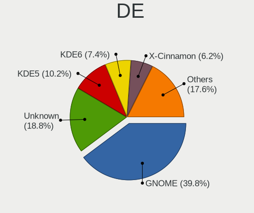
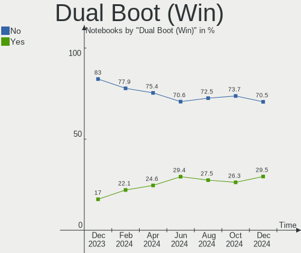
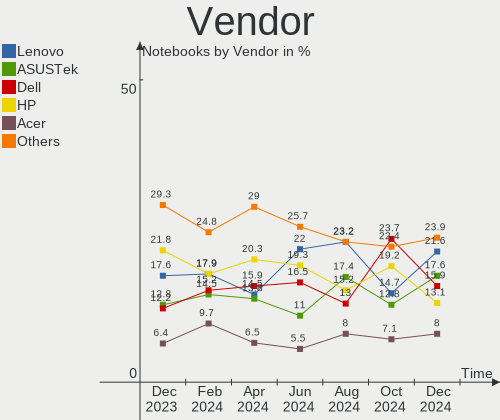
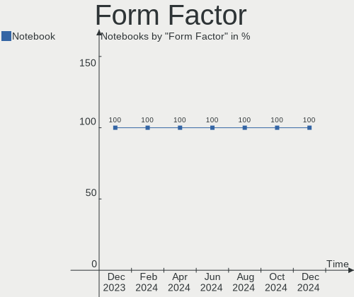
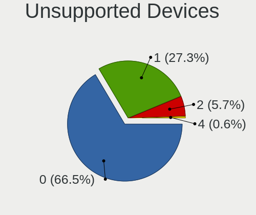

Linux in France - Hardware Trends (Notebooks)
---------------------------------------------

A project to identify most popular hardware characteristics and track their change
over time based on data collected by Linux users at https://Linux-Hardware.org.

Anyone can contribute to this report by the [hw-probe](https://github.com/linuxhw/hw-probe) tool:

    sudo -E hw-probe -all -upload

Period: Aug, 2022.

Contents
--------

* [ System ](#system)
  - [ OS                       ](#os)
  - [ OS Family                ](#os-family)
  - [ Kernel                   ](#kernel)
  - [ Kernel Family            ](#kernel-family)
  - [ Kernel Major Ver.        ](#kernel-major-ver)
  - [ Arch                     ](#arch)
  - [ DE                       ](#de)
  - [ Display Server           ](#display-server)
  - [ Display Manager          ](#display-manager)
  - [ OS Lang                  ](#os-lang)
  - [ Boot Mode                ](#boot-mode)
  - [ Filesystem               ](#filesystem)
  - [ Part. scheme             ](#part-scheme)
  - [ Dual Boot with Linux/BSD ](#dual-boot-with-linuxbsd)
  - [ Dual Boot (Win)          ](#dual-boot-win)

* [ Board ](#board)
  - [ Vendor                   ](#vendor)
  - [ Model                    ](#model)
  - [ Model Family             ](#model-family)
  - [ MFG Year                 ](#mfg-year)
  - [ Form Factor              ](#form-factor)
  - [ Secure Boot              ](#secure-boot)
  - [ Coreboot                 ](#coreboot)
  - [ RAM Size                 ](#ram-size)
  - [ RAM Used                 ](#ram-used)
  - [ Total Drives             ](#total-drives)
  - [ Has CD-ROM               ](#has-cd-rom)
  - [ Has Ethernet             ](#has-ethernet)
  - [ Has WiFi                 ](#has-wifi)
  - [ Has Bluetooth            ](#has-bluetooth)

* [ Location ](#location)
  - [ Country                  ](#country)
  - [ City                     ](#city)

* [ Drives ](#drives)
  - [ Drive Vendor             ](#drive-vendor)
  - [ Drive Model              ](#drive-model)
  - [ HDD Vendor               ](#hdd-vendor)
  - [ SSD Vendor               ](#ssd-vendor)
  - [ Drive Kind               ](#drive-kind)
  - [ Drive Connector          ](#drive-connector)
  - [ Drive Size               ](#drive-size)
  - [ Space Total              ](#space-total)
  - [ Space Used               ](#space-used)
  - [ Malfunc. Drives          ](#malfunc-drives)
  - [ Malfunc. Drive Vendor    ](#malfunc-drive-vendor)
  - [ Malfunc. HDD Vendor      ](#malfunc-hdd-vendor)
  - [ Malfunc. Drive Kind      ](#malfunc-drive-kind)
  - [ Failed Drives            ](#failed-drives)
  - [ Failed Drive Vendor      ](#failed-drive-vendor)
  - [ Drive Status             ](#drive-status)

* [ Storage controller ](#storage-controller)
  - [ Storage Vendor           ](#storage-vendor)
  - [ Storage Model            ](#storage-model)
  - [ Storage Kind             ](#storage-kind)

* [ Processor ](#processor)
  - [ CPU Vendor               ](#cpu-vendor)
  - [ CPU Model                ](#cpu-model)
  - [ CPU Model Family         ](#cpu-model-family)
  - [ CPU Cores                ](#cpu-cores)
  - [ CPU Sockets              ](#cpu-sockets)
  - [ CPU Threads              ](#cpu-threads)
  - [ CPU Op-Modes             ](#cpu-op-modes)
  - [ CPU Microcode            ](#cpu-microcode)
  - [ CPU Microarch            ](#cpu-microarch)

* [ Graphics ](#graphics)
  - [ GPU Vendor               ](#gpu-vendor)
  - [ GPU Model                ](#gpu-model)
  - [ GPU Combo                ](#gpu-combo)
  - [ GPU Driver               ](#gpu-driver)
  - [ GPU Memory               ](#gpu-memory)

* [ Monitor ](#monitor)
  - [ Monitor Vendor           ](#monitor-vendor)
  - [ Monitor Model            ](#monitor-model)
  - [ Monitor Resolution       ](#monitor-resolution)
  - [ Monitor Diagonal         ](#monitor-diagonal)
  - [ Monitor Width            ](#monitor-width)
  - [ Aspect Ratio             ](#aspect-ratio)
  - [ Monitor Area             ](#monitor-area)
  - [ Pixel Density            ](#pixel-density)
  - [ Multiple Monitors        ](#multiple-monitors)

* [ Network ](#network)
  - [ Net Controller Vendor    ](#net-controller-vendor)
  - [ Net Controller Model     ](#net-controller-model)
  - [ Wireless Vendor          ](#wireless-vendor)
  - [ Wireless Model           ](#wireless-model)
  - [ Ethernet Vendor          ](#ethernet-vendor)
  - [ Ethernet Model           ](#ethernet-model)
  - [ Net Controller Kind      ](#net-controller-kind)
  - [ Used Controller          ](#used-controller)
  - [ NICs                     ](#nics)
  - [ IPv6                     ](#ipv6)

* [ Bluetooth ](#bluetooth)
  - [ Bluetooth Vendor         ](#bluetooth-vendor)
  - [ Bluetooth Model          ](#bluetooth-model)

* [ Sound ](#sound)
  - [ Sound Vendor             ](#sound-vendor)
  - [ Sound Model              ](#sound-model)

* [ Memory ](#memory)
  - [ Memory Vendor            ](#memory-vendor)
  - [ Memory Model             ](#memory-model)
  - [ Memory Kind              ](#memory-kind)
  - [ Memory Form Factor       ](#memory-form-factor)
  - [ Memory Size              ](#memory-size)
  - [ Memory Speed             ](#memory-speed)

* [ Printers & scanners ](#printers--scanners)
  - [ Printer Vendor           ](#printer-vendor)
  - [ Printer Model            ](#printer-model)
  - [ Scanner Vendor           ](#scanner-vendor)
  - [ Scanner Model            ](#scanner-model)

* [ Camera ](#camera)
  - [ Camera Vendor            ](#camera-vendor)
  - [ Camera Model             ](#camera-model)

* [ Security ](#security)
  - [ Fingerprint Vendor       ](#fingerprint-vendor)
  - [ Fingerprint Model        ](#fingerprint-model)
  - [ Chipcard Vendor          ](#chipcard-vendor)
  - [ Chipcard Model           ](#chipcard-model)

* [ Unsupported ](#unsupported)
  - [ Unsupported Devices      ](#unsupported-devices)
  - [ Unsupported Device Types ](#unsupported-device-types)

System
------

OS
--

Installed operating systems

| Name                | Notebooks | Percent |
|---------------------|-----------|---------|
| Ubuntu 22.04        | 31        | 24.03%  |
| Debian 11           | 14        | 10.85%  |
| Ubuntu 20.04        | 11        | 8.53%   |
| OpenMandriva 4.3    | 8         | 6.2%    |
| Linux Mint 20.3     | 7         | 5.43%   |
| OpenMandriva 4.90   | 6         | 4.65%   |
| Fedora 36           | 6         | 4.65%   |
| Linux Mint 21       | 5         | 3.88%   |
| Arch                | 4         | 3.1%    |
| Gentoo 2.8          | 3         | 2.33%   |
| Zorin 16            | 2         | 1.55%   |
| Xubuntu 22.04       | 2         | 1.55%   |
| Xubuntu 20.04       | 2         | 1.55%   |
| Ubuntu MATE 22.04   | 2         | 1.55%   |
| Linux Mint 20.1     | 2         | 1.55%   |
| KDE neon 20.04      | 2         | 1.55%   |
| Kali 2022.3         | 2         | 1.55%   |
| Debian Unstable     | 2         | 1.55%   |
| Xubuntu 18.04       | 1         | 0.78%   |
| Pop!_OS 22.04       | 1         | 0.78%   |
| openSUSE Leap-15.4  | 1         | 0.78%   |
| OpenMandriva 4.2    | 1         | 0.78%   |
| MX 21               | 1         | 0.78%   |
| Manjaro 21.3.6      | 1         | 0.78%   |
| Mageia 8            | 1         | 0.78%   |
| Lubuntu 22.04       | 1         | 0.78%   |
| LMDE 5              | 1         | 0.78%   |
| Linux Mint 20.2     | 1         | 0.78%   |
| Linux Mint 19.3     | 1         | 0.78%   |
| Linux Lite 5.8      | 1         | 0.78%   |
| Kubuntu 22.04       | 1         | 0.78%   |
| Kubuntu 20.04       | 1         | 0.78%   |
| EndeavourOS Rolling | 1         | 0.78%   |
| Elementary 6.1      | 1         | 0.78%   |
| Debian 11-updates   | 1         | 0.78%   |
| Archcraft Rolling   | 1         | 0.78%   |

OS Family
---------

OS without a version

| Name         | Notebooks | Percent |
|--------------|-----------|---------|
| Ubuntu       | 42        | 32.56%  |
| Debian       | 17        | 13.18%  |
| Linux Mint   | 16        | 12.4%   |
| OpenMandriva | 15        | 11.63%  |
| Fedora       | 6         | 4.65%   |
| Xubuntu      | 5         | 3.88%   |
| Arch         | 4         | 3.1%    |
| Gentoo       | 3         | 2.33%   |
| Zorin        | 2         | 1.55%   |
| Ubuntu MATE  | 2         | 1.55%   |
| Kubuntu      | 2         | 1.55%   |
| KDE neon     | 2         | 1.55%   |
| Kali         | 2         | 1.55%   |
| Pop!_OS      | 1         | 0.78%   |
| openSUSE     | 1         | 0.78%   |
| MX           | 1         | 0.78%   |
| Manjaro      | 1         | 0.78%   |
| Mageia       | 1         | 0.78%   |
| Lubuntu      | 1         | 0.78%   |
| LMDE         | 1         | 0.78%   |
| Linux Lite   | 1         | 0.78%   |
| EndeavourOS  | 1         | 0.78%   |
| Elementary   | 1         | 0.78%   |
| Archcraft    | 1         | 0.78%   |

Kernel
------

Version of the Linux kernel

| Version                       | Notebooks | Percent |
|-------------------------------|-----------|---------|
| 5.15.0-46-generic             | 27        | 20.93%  |
| 5.15.0-43-generic             | 16        | 12.4%   |
| 5.16.7-desktop-1omv4003       | 8         | 6.2%    |
| 5.4.0-122-generic             | 7         | 5.43%   |
| 5.18.12-desktop-3omv4090      | 6         | 4.65%   |
| 5.15.0-41-generic             | 6         | 4.65%   |
| 5.10.0-17-amd64               | 6         | 4.65%   |
| 5.10.0-16-amd64               | 5         | 3.88%   |
| 5.4.0-124-generic             | 4         | 3.1%    |
| 5.18.16-arch1-1               | 3         | 2.33%   |
| 5.18.16-200.fc36.x86_64       | 3         | 2.33%   |
| 5.4.0-125-generic             | 2         | 1.55%   |
| 5.18.0-kali5-amd64            | 2         | 1.55%   |
| 5.15.0-47-generic             | 2         | 1.55%   |
| 5.15.0-25-generic             | 2         | 1.55%   |
| 5.10.0-12-amd64               | 2         | 1.55%   |
| 5.4.0-71-generic              | 1         | 0.78%   |
| 5.4.0-124-lowlatency          | 1         | 0.78%   |
| 5.4.0-113-generic             | 1         | 0.78%   |
| 5.19.3-051903-generic         | 1         | 0.78%   |
| 5.19.0-xm2.0.fc36.x86_64      | 1         | 0.78%   |
| 5.19.0-rc6-amd64              | 1         | 0.78%   |
| 5.19.0-gentoo                 | 1         | 0.78%   |
| 5.19.0-1.1-liquorix-amd64     | 1         | 0.78%   |
| 5.18.18-200.fc36.x86_64       | 1         | 0.78%   |
| 5.18.17-1-MANJARO             | 1         | 0.78%   |
| 5.18.16-602.inttf.fc36.x86_64 | 1         | 0.78%   |
| 5.18.15-desktop-1.mga8        | 1         | 0.78%   |
| 5.18.15-arch1-1               | 1         | 0.78%   |
| 5.18.10-76051810-generic      | 1         | 0.78%   |
| 5.18.0-4-amd64                | 1         | 0.78%   |
| 5.18.0-3-amd64                | 1         | 0.78%   |
| 5.18.0-0.deb11.3-amd64        | 1         | 0.78%   |
| 5.15.62-1-lts                 | 1         | 0.78%   |
| 5.15.59-gentoo-dist           | 1         | 0.78%   |
| 5.15.58-2-lts                 | 1         | 0.78%   |
| 5.15.52-gentoo                | 1         | 0.78%   |
| 5.15.0-40-generic             | 1         | 0.78%   |
| 5.15.0-37-generic             | 1         | 0.78%   |
| 5.14.21-150400.24.18-default  | 1         | 0.78%   |
| 5.10.14-desktop-1omv4002      | 1         | 0.78%   |
| 5.10.0-9-amd64                | 1         | 0.78%   |
| 5.10.0-17-686-pae             | 1         | 0.78%   |
| 4.15.0-191-lowlatency         | 1         | 0.78%   |

Kernel Family
-------------

Linux kernel without a distro release

| Version | Notebooks | Percent |
|---------|-----------|---------|
| 5.15.0  | 55        | 42.64%  |
| 5.4.0   | 16        | 12.4%   |
| 5.10.0  | 15        | 11.63%  |
| 5.16.7  | 8         | 6.2%    |
| 5.18.16 | 7         | 5.43%   |
| 5.18.12 | 6         | 4.65%   |
| 5.18.0  | 5         | 3.88%   |
| 5.19.0  | 4         | 3.1%    |
| 5.18.15 | 2         | 1.55%   |
| 5.19.3  | 1         | 0.78%   |
| 5.18.18 | 1         | 0.78%   |
| 5.18.17 | 1         | 0.78%   |
| 5.18.10 | 1         | 0.78%   |
| 5.15.62 | 1         | 0.78%   |
| 5.15.59 | 1         | 0.78%   |
| 5.15.58 | 1         | 0.78%   |
| 5.15.52 | 1         | 0.78%   |
| 5.14.21 | 1         | 0.78%   |
| 5.10.14 | 1         | 0.78%   |
| 4.15.0  | 1         | 0.78%   |

Kernel Major Ver.
-----------------

Linux kernel major version

| Version | Notebooks | Percent |
|---------|-----------|---------|
| 5.15    | 59        | 45.74%  |
| 5.18    | 23        | 17.83%  |
| 5.4     | 16        | 12.4%   |
| 5.10    | 16        | 12.4%   |
| 5.16    | 8         | 6.2%    |
| 5.19    | 5         | 3.88%   |
| 5.14    | 1         | 0.78%   |
| 4.15    | 1         | 0.78%   |

Arch
----

OS architecture (x86_64, i586, etc.)

| Name   | Notebooks | Percent |
|--------|-----------|---------|
| x86_64 | 128       | 99.22%  |
| i686   | 1         | 0.78%   |

DE
--

Desktop Environment

| Name       | Notebooks | Percent |
|------------|-----------|---------|
| GNOME      | 56        | 43.41%  |
| KDE5       | 28        | 21.71%  |
| XFCE       | 14        | 10.85%  |
| X-Cinnamon | 11        | 8.53%   |
| MATE       | 8         | 6.2%    |
| Unknown    | 5         | 3.88%   |
| Cinnamon   | 4         | 3.1%    |
| Pantheon   | 1         | 0.78%   |
| LXQt       | 1         | 0.78%   |
| LXDE       | 1         | 0.78%   |

Display Server
--------------

X11 or Wayland

| Name    | Notebooks | Percent |
|---------|-----------|---------|
| X11     | 84        | 65.12%  |
| Wayland | 39        | 30.23%  |
| Tty     | 4         | 3.1%    |
| Unknown | 2         | 1.55%   |

Display Manager
---------------

SDDM, LightDM, etc.

| Name    | Notebooks | Percent |
|---------|-----------|---------|
| GDM3    | 37        | 28.68%  |
| Unknown | 27        | 20.93%  |
| SDDM    | 26        | 20.16%  |
| LightDM | 23        | 17.83%  |
| GDM     | 16        | 12.4%   |

OS Lang
-------

Language

| Lang  | Notebooks | Percent |
|-------|-----------|---------|
| fr_FR | 100       | 77.52%  |
| en_US | 24        | 18.6%   |
| en_GB | 3         | 2.33%   |
| it_IT | 1         | 0.78%   |
| de_CH | 1         | 0.78%   |

Boot Mode
---------

EFI or BIOS

| Mode | Notebooks | Percent |
|------|-----------|---------|
| EFI  | 72        | 55.81%  |
| BIOS | 57        | 44.19%  |

Filesystem
----------

Type of filesystem

| Type    | Notebooks | Percent |
|---------|-----------|---------|
| Ext4    | 105       | 81.4%   |
| Overlay | 15        | 11.63%  |
| Btrfs   | 8         | 6.2%    |
| Zfs     | 1         | 0.78%   |

Part. scheme
------------

Scheme of partitioning

| Type    | Notebooks | Percent |
|---------|-----------|---------|
| GPT     | 65        | 50.39%  |
| Unknown | 42        | 32.56%  |
| MBR     | 22        | 17.05%  |

Dual Boot with Linux/BSD
------------------------

Hosting more than one Linux/BSD

| Dual boot | Notebooks | Percent |
|-----------|-----------|---------|
| No        | 110       | 85.27%  |
| Yes       | 19        | 14.73%  |

Dual Boot (Win)
---------------

Hosting Linux and Windows

| Dual boot | Notebooks | Percent |
|-----------|-----------|---------|
| No        | 92        | 71.32%  |
| Yes       | 37        | 28.68%  |

Board
-----

Vendor
------

Motherboard manufacturer

| Name                | Notebooks | Percent |
|---------------------|-----------|---------|
| ASUSTek Computer    | 26        | 20.16%  |
| Lenovo              | 24        | 18.6%   |
| Hewlett-Packard     | 21        | 16.28%  |
| Dell                | 19        | 14.73%  |
| Notebook            | 6         | 4.65%   |
| Toshiba             | 5         | 3.88%   |
| Acer                | 5         | 3.88%   |
| HUAWEI              | 4         | 3.1%    |
| Packard Bell        | 3         | 2.33%   |
| MSI                 | 3         | 2.33%   |
| Apple               | 3         | 2.33%   |
| Panasonic           | 2         | 1.55%   |
| UNOWHY              | 1         | 0.78%   |
| Sony                | 1         | 0.78%   |
| SLIMBOOK            | 1         | 0.78%   |
| Samsung Electronics | 1         | 0.78%   |
| OEM                 | 1         | 0.78%   |
| Intel               | 1         | 0.78%   |
| Fujitsu             | 1         | 0.78%   |
| Acidanthera         | 1         | 0.78%   |

Model
-----

Motherboard model

| Name                                     | Notebooks | Percent |
|------------------------------------------|-----------|---------|
| Lenovo ThinkPad T440p 20AWS17N00         | 2         | 1.55%   |
| Lenovo IdeaPad 3 15ALC6 82KU             | 2         | 1.55%   |
| HUAWEI NBLBZ-WAX9N                       | 2         | 1.55%   |
| HP Notebook                              | 2         | 1.55%   |
| HP EliteBook 840 G8 Notebook PC          | 2         | 1.55%   |
| UNOWHY Y13G010S4EI                       | 1         | 0.78%   |
| Toshiba Satellite Pro L500               | 1         | 0.78%   |
| Toshiba Satellite L875-11M               | 1         | 0.78%   |
| Toshiba Satellite C870-1F3               | 1         | 0.78%   |
| Toshiba Satellite C55-C                  | 1         | 0.78%   |
| Toshiba PORTEGE R30-A                    | 1         | 0.78%   |
| Sony VPCYB3V1E                           | 1         | 0.78%   |
| SLIMBOOK PROX15-AMD                      | 1         | 0.78%   |
| Samsung RV410/RV510/S3510/E3510          | 1         | 0.78%   |
| Panasonic CF-53JSWZGFF                   | 1         | 0.78%   |
| Panasonic CF-31XEUAXMF                   | 1         | 0.78%   |
| Packard Bell EasyNote TK37               | 1         | 0.78%   |
| Packard Bell EasyNote TJ66               | 1         | 0.78%   |
| Packard Bell EasyNote TJ65               | 1         | 0.78%   |
| Notebook W65_67SZ                        | 1         | 0.78%   |
| Notebook NLx0MU                          | 1         | 0.78%   |
| Notebook NJ50_70CU                       | 1         | 0.78%   |
| Notebook N230WU                          | 1         | 0.78%   |
| Notebook N15_17RD                        | 1         | 0.78%   |
| Notebook N141CU                          | 1         | 0.78%   |
| MSI PS63 Modern 8RD                      | 1         | 0.78%   |
| MSI GE75 Raider 10SF                     | 1         | 0.78%   |
| MSI GE60 0NC/GE60 0ND                    | 1         | 0.78%   |
| Lenovo Yoga S740-15IRH 81NX              | 1         | 0.78%   |
| Lenovo Yoga 300-11IBY 80M0               | 1         | 0.78%   |
| Lenovo V110-15ISK 80TL                   | 1         | 0.78%   |
| Lenovo ThinkPad X230 23259T0             | 1         | 0.78%   |
| Lenovo ThinkPad X200 7458VL3             | 1         | 0.78%   |
| Lenovo ThinkPad X1 Carbon 4th 20FCS2L300 | 1         | 0.78%   |
| Lenovo ThinkPad W540 20BHS0F206          | 1         | 0.78%   |
| Lenovo ThinkPad T61 64665DG              | 1         | 0.78%   |
| Lenovo ThinkPad T520 4239CTO             | 1         | 0.78%   |
| Lenovo ThinkPad T460p 20FWCTO1WW         | 1         | 0.78%   |
| Lenovo ThinkPad T400 2768BM2             | 1         | 0.78%   |
| Lenovo ThinkPad SL510 28477NG            | 1         | 0.78%   |
| Lenovo ThinkPad R500 27148UG             | 1         | 0.78%   |
| Lenovo ThinkPad P70 20ERCTO1WW           | 1         | 0.78%   |
| Lenovo ThinkPad P14s Gen 2i 20VX0015FR   | 1         | 0.78%   |
| Lenovo ThinkPad E15 Gen 2 20TD001JFR     | 1         | 0.78%   |
| Lenovo ThinkPad E14 Gen 2 20TACTO1WW     | 1         | 0.78%   |
| Lenovo ThinkBook 14 G2 ITL 20VD          | 1         | 0.78%   |
| Lenovo IdeaPad 330s-15ARR 81FB           | 1         | 0.78%   |
| Lenovo IdeaPad 3 17ADA05 81W2            | 1         | 0.78%   |
| Intel Aspire 1830T                       | 1         | 0.78%   |
| HUAWEI KLVC-WXX9                         | 1         | 0.78%   |
| HUAWEI HVY-WXX9                          | 1         | 0.78%   |
| HP ZBook 15 G6                           | 1         | 0.78%   |
| HP ZBook 15 G3                           | 1         | 0.78%   |
| HP Victus by Laptop 16-e0xxx             | 1         | 0.78%   |
| HP ProBook 6570b                         | 1         | 0.78%   |
| HP ProBook 4540s                         | 1         | 0.78%   |
| HP Pavilion 17                           | 1         | 0.78%   |
| HP OMEN Laptop 15-ek0xxx                 | 1         | 0.78%   |
| HP Laptop 17-ca1xxx                      | 1         | 0.78%   |
| HP Laptop 14s-fq1xxx                     | 1         | 0.78%   |

Model Family
------------

Motherboard model prefix

| Name                   | Notebooks | Percent |
|------------------------|-----------|---------|
| Lenovo ThinkPad        | 16        | 12.4%   |
| Dell Latitude          | 6         | 4.65%   |
| ASUS VivoBook          | 5         | 3.88%   |
| Toshiba Satellite      | 4         | 3.1%    |
| Lenovo IdeaPad         | 4         | 3.1%    |
| Dell Precision         | 4         | 3.1%    |
| Dell Inspiron          | 4         | 3.1%    |
| Packard Bell EasyNote  | 3         | 2.33%   |
| HP Laptop              | 3         | 2.33%   |
| HP EliteBook           | 3         | 2.33%   |
| HP Compaq              | 3         | 2.33%   |
| Dell XPS               | 3         | 2.33%   |
| Lenovo Yoga            | 2         | 1.55%   |
| HUAWEI NBLBZ-WAX9N     | 2         | 1.55%   |
| HP ZBook               | 2         | 1.55%   |
| HP ProBook             | 2         | 1.55%   |
| HP Notebook            | 2         | 1.55%   |
| ASUS ZenBook           | 2         | 1.55%   |
| Acer Aspire            | 2         | 1.55%   |
| UNOWHY Y13G010S4EI     | 1         | 0.78%   |
| Toshiba PORTEGE        | 1         | 0.78%   |
| Sony VPCYB3V1E         | 1         | 0.78%   |
| SLIMBOOK PROX15-AMD    | 1         | 0.78%   |
| Samsung RV410          | 1         | 0.78%   |
| Panasonic CF-53JSWZGFF | 1         | 0.78%   |
| Panasonic CF-31XEUAXMF | 1         | 0.78%   |
| Notebook W65           | 1         | 0.78%   |
| Notebook NLx0MU        | 1         | 0.78%   |
| Notebook NJ50          | 1         | 0.78%   |
| Notebook N230WU        | 1         | 0.78%   |
| Notebook N15           | 1         | 0.78%   |
| Notebook N141CU        | 1         | 0.78%   |
| MSI PS63               | 1         | 0.78%   |
| MSI GE75               | 1         | 0.78%   |
| MSI GE60               | 1         | 0.78%   |
| Lenovo V110-15ISK      | 1         | 0.78%   |
| Lenovo ThinkBook       | 1         | 0.78%   |
| Intel Aspire           | 1         | 0.78%   |
| HUAWEI KLVC-WXX9       | 1         | 0.78%   |
| HUAWEI HVY-WXX9        | 1         | 0.78%   |
| HP Victus              | 1         | 0.78%   |
| HP Pavilion            | 1         | 0.78%   |
| HP OMEN                | 1         | 0.78%   |
| HP 470                 | 1         | 0.78%   |
| HP 250                 | 1         | 0.78%   |
| HP 15                  | 1         | 0.78%   |
| Fujitsu LIFEBOOK       | 1         | 0.78%   |
| Dell System            | 1         | 0.78%   |
| Dell G3                | 1         | 0.78%   |
| ASUS X75VC             | 1         | 0.78%   |
| ASUS X751LN            | 1         | 0.78%   |
| ASUS X751LJC           | 1         | 0.78%   |
| ASUS X751LJ            | 1         | 0.78%   |
| ASUS X751LD            | 1         | 0.78%   |
| ASUS X556UQ            | 1         | 0.78%   |
| ASUS X550CC            | 1         | 0.78%   |
| ASUS X541UV            | 1         | 0.78%   |
| ASUS UX303LN           | 1         | 0.78%   |
| ASUS ROG               | 1         | 0.78%   |
| ASUS N71Jv             | 1         | 0.78%   |

MFG Year
--------

Motherboard manufacture year

| Year | Notebooks | Percent |
|------|-----------|---------|
| 2020 | 18        | 13.95%  |
| 2013 | 14        | 10.85%  |
| 2012 | 14        | 10.85%  |
| 2021 | 13        | 10.08%  |
| 2016 | 10        | 7.75%   |
| 2019 | 8         | 6.2%    |
| 2015 | 8         | 6.2%    |
| 2011 | 7         | 5.43%   |
| 2018 | 6         | 4.65%   |
| 2014 | 6         | 4.65%   |
| 2010 | 6         | 4.65%   |
| 2022 | 5         | 3.88%   |
| 2009 | 5         | 3.88%   |
| 2017 | 4         | 3.1%    |
| 2008 | 3         | 2.33%   |
| 2007 | 2         | 1.55%   |

Form Factor
-----------

Physical design of the computer

| Name     | Notebooks | Percent |
|----------|-----------|---------|
| Notebook | 129       | 100%    |

Secure Boot
-----------

Enabled or disabled

| State    | Notebooks | Percent |
|----------|-----------|---------|
| Disabled | 113       | 87.6%   |
| Enabled  | 16        | 12.4%   |

Coreboot
--------

Have coreboot on board

| Used | Notebooks | Percent |
|------|-----------|---------|
| No   | 129       | 100%    |

RAM Size
--------

Total RAM memory

| Size in GB  | Notebooks | Percent |
|-------------|-----------|---------|
| 4.01-8.0    | 44        | 34.11%  |
| 3.01-4.0    | 27        | 20.93%  |
| 16.01-24.0  | 23        | 17.83%  |
| 8.01-16.0   | 19        | 14.73%  |
| 32.01-64.0  | 9         | 6.98%   |
| 1.01-2.0    | 3         | 2.33%   |
| 2.01-3.0    | 2         | 1.55%   |
| 64.01-256.0 | 1         | 0.78%   |
| 0.51-1.0    | 1         | 0.78%   |

RAM Used
--------

Used RAM memory

| Used GB   | Notebooks | Percent |
|-----------|-----------|---------|
| 1.01-2.0  | 46        | 35.66%  |
| 2.01-3.0  | 36        | 27.91%  |
| 4.01-8.0  | 23        | 17.83%  |
| 3.01-4.0  | 10        | 7.75%   |
| 0.51-1.0  | 7         | 5.43%   |
| 8.01-16.0 | 5         | 3.88%   |
| 0.01-0.5  | 2         | 1.55%   |

Total Drives
------------

Number of drives on board

| Drives | Notebooks | Percent |
|--------|-----------|---------|
| 1      | 90        | 69.77%  |
| 2      | 37        | 28.68%  |
| 5      | 1         | 0.78%   |
| 3      | 1         | 0.78%   |

Has CD-ROM
----------

Has CD-ROM on board

| Presented | Notebooks | Percent |
|-----------|-----------|---------|
| No        | 76        | 58.91%  |
| Yes       | 53        | 41.09%  |

Has Ethernet
------------

Has Ethernet on board

| Presented | Notebooks | Percent |
|-----------|-----------|---------|
| Yes       | 109       | 84.5%   |
| No        | 20        | 15.5%   |

Has WiFi
--------

Has WiFi module

| Presented | Notebooks | Percent |
|-----------|-----------|---------|
| Yes       | 128       | 99.22%  |
| No        | 1         | 0.78%   |

Has Bluetooth
-------------

Has Bluetooth module

| Presented | Notebooks | Percent |
|-----------|-----------|---------|
| Yes       | 100       | 77.52%  |
| No        | 29        | 22.48%  |

Location
--------

Country
-------

Geographic location (country)

| Country | Notebooks | Percent |
|---------|-----------|---------|
| France  | 129       | 100%    |

City
----

Geographic location (city)

| City                     | Notebooks | Percent |
|--------------------------|-----------|---------|
| Paris                    | 18        | 13.95%  |
| Marseille                | 4         | 3.1%    |
| Thiers                   | 3         | 2.33%   |
| Monistrol-sur-Loire      | 3         | 2.33%   |
| Nantes                   | 2         | 1.55%   |
| Lyon                     | 2         | 1.55%   |
| Lens                     | 2         | 1.55%   |
| Châtellerault           | 2         | 1.55%   |
| Chartres-de-Bretagne     | 2         | 1.55%   |
| Charleville-Mézières   | 2         | 1.55%   |
| Bordeaux                 | 2         | 1.55%   |
| Villemomble              | 1         | 0.78%   |
| Vermand                  | 1         | 0.78%   |
| Vaux-sur-Mer             | 1         | 0.78%   |
| Vallauris                | 1         | 0.78%   |
| Triel-sur-Seine          | 1         | 0.78%   |
| Toulouse                 | 1         | 0.78%   |
| Tosse                    | 1         | 0.78%   |
| Tavaux                   | 1         | 0.78%   |
| Tarbes                   | 1         | 0.78%   |
| Talant                   | 1         | 0.78%   |
| Suresnes                 | 1         | 0.78%   |
| Sarge-les-le-Mans        | 1         | 0.78%   |
| Saint-Nazaire            | 1         | 0.78%   |
| Saint-Mitre-les-Remparts | 1         | 0.78%   |
| Saint-Julien-en-Genevois | 1         | 0.78%   |
| Saint-Denis              | 1         | 0.78%   |
| Saint-Brice-sous-Foret   | 1         | 0.78%   |
| Rumilly-en-Cambresis     | 1         | 0.78%   |
| Rennes                   | 1         | 0.78%   |
| Pontault-Combault        | 1         | 0.78%   |
| Pomarede                 | 1         | 0.78%   |
| Plourhan                 | 1         | 0.78%   |
| Plaisir                  | 1         | 0.78%   |
| Perpignan                | 1         | 0.78%   |
| Olivet                   | 1         | 0.78%   |
| Oberhausbergen           | 1         | 0.78%   |
| Noisy-le-Sec             | 1         | 0.78%   |
| Noisy-le-Grand           | 1         | 0.78%   |
| Nogent-le-Rotrou         | 1         | 0.78%   |
| Namps-Maisnil            | 1         | 0.78%   |
| Montreuil                | 1         | 0.78%   |
| Monteynard               | 1         | 0.78%   |
| Molsheim                 | 1         | 0.78%   |
| Mansle                   | 1         | 0.78%   |
| Lons-le-Saunier          | 1         | 0.78%   |
| Limours                  | 1         | 0.78%   |
| Limoges                  | 1         | 0.78%   |
| Le Poinconnet            | 1         | 0.78%   |
| Le Château-d’Oléron  | 1         | 0.78%   |
| Le Blanc-Mesnil          | 1         | 0.78%   |
| Lannion                  | 1         | 0.78%   |
| La Verdiere              | 1         | 0.78%   |
| La Rochelle              | 1         | 0.78%   |
| La Pommeraye             | 1         | 0.78%   |
| La Flotte                | 1         | 0.78%   |
| La Baule-Escoublac       | 1         | 0.78%   |
| Jegun                    | 1         | 0.78%   |
| Hettange-Grande          | 1         | 0.78%   |
| Hennebont                | 1         | 0.78%   |

Drives
------

Drive Vendor
------------

Hard drive vendors

| Vendor                    | Notebooks | Drives | Percent |
|---------------------------|-----------|--------|---------|
| Samsung Electronics       | 31        | 33     | 19.14%  |
| Crucial                   | 15        | 16     | 9.26%   |
| WDC                       | 14        | 14     | 8.64%   |
| Seagate                   | 12        | 12     | 7.41%   |
| Kingston                  | 12        | 12     | 7.41%   |
| Unknown                   | 10        | 11     | 6.17%   |
| Toshiba                   | 10        | 10     | 6.17%   |
| SanDisk                   | 9         | 9      | 5.56%   |
| HGST                      | 8         | 8      | 4.94%   |
| SK hynix                  | 6         | 6      | 3.7%    |
| Intel                     | 6         | 7      | 3.7%    |
| Micron Technology         | 5         | 5      | 3.09%   |
| Hitachi                   | 3         | 3      | 1.85%   |
| PNY                       | 2         | 2      | 1.23%   |
| LDLC                      | 2         | 2      | 1.23%   |
| KIOXIA                    | 2         | 2      | 1.23%   |
| StoreJet                  | 1         | 1      | 0.62%   |
| SPCC                      | 1         | 1      | 0.62%   |
| Silicon Motion            | 1         | 1      | 0.62%   |
| Realtek                   | 1         | 1      | 0.62%   |
| Phison Electronics        | 1         | 1      | 0.62%   |
| Micron/Crucial Technology | 1         | 1      | 0.62%   |
| Magnetic Data             | 1         | 1      | 0.62%   |
| LITEONIT                  | 1         | 1      | 0.62%   |
| KINGPOWER                 | 1         | 1      | 0.62%   |
| Gigabyte Technology       | 1         | 1      | 0.62%   |
| GALAX                     | 1         | 1      | 0.62%   |
| Fujitsu                   | 1         | 1      | 0.62%   |
| Emtec                     | 1         | 1      | 0.62%   |
| Dogfish                   | 1         | 1      | 0.62%   |
| Apple                     | 1         | 1      | 0.62%   |

Drive Model
-----------

Hard drive models

| Model                                       | Notebooks | Percent |
|---------------------------------------------|-----------|---------|
| Crucial CT500MX500SSD1 500GB                | 5         | 3.01%   |
| Samsung NVMe SSD Drive 512GB                | 4         | 2.41%   |
| Seagate ST1000LM048-2E7172 1TB              | 3         | 1.81%   |
| Seagate ST1000LM024 HN-M101MBB 1TB          | 3         | 1.81%   |
| SanDisk NVMe SSD Drive 512GB                | 3         | 1.81%   |
| Kingston SA400S37120G 120GB SSD             | 3         | 1.81%   |
| Intel SSDPEKNW512G8 512GB                   | 3         | 1.81%   |
| HGST HTS721010A9E630 1TB                    | 3         | 1.81%   |
| Crucial CT240BX500SSD1 240GB                | 3         | 1.81%   |
| Crucial CT1000MX500SSD1 1TB                 | 3         | 1.81%   |
| Seagate ST2000LM015-2E8174 2TB              | 2         | 1.2%    |
| Samsung SSD 870 EVO 500GB                   | 2         | 1.2%    |
| Samsung MZVLB512HBJQ-00000 512GB            | 2         | 1.2%    |
| Kingston SV300S37A120G 120GB SSD            | 2         | 1.2%    |
| Intel NVMe SSD Drive 512GB                  | 2         | 1.2%    |
| HGST HTS541010A7E630 1TB                    | 2         | 1.2%    |
| Crucial CT480BX500SSD1 480GB                | 2         | 1.2%    |
| WDC WDS500G2B0C-00PXH0 500GB                | 1         | 0.6%    |
| WDC WD7500BPKT-22PK4T0 752GB                | 1         | 0.6%    |
| WDC WD5000LPCX-24C6HT0 500GB                | 1         | 0.6%    |
| WDC WD5000BEVT-00A0RT0 500GB                | 1         | 0.6%    |
| WDC WD3200BUCT-63TWBY0 320GB                | 1         | 0.6%    |
| WDC WD3200BPVT-22ZEST0 320GB                | 1         | 0.6%    |
| WDC WD3200BEVT-63ZCT0 320GB                 | 1         | 0.6%    |
| WDC WD3200BEVT-26ZCT0 320GB                 | 1         | 0.6%    |
| WDC WD16 00BEVT-60ZCT 160GB                 | 1         | 0.6%    |
| WDC WD10SPZX-24Z10 1TB                      | 1         | 0.6%    |
| WDC PC SN810 NVMe 512GB                     | 1         | 0.6%    |
| WDC PC SN730 SDBPNTY-512G                   | 1         | 0.6%    |
| WDC PC SN520 SDAPNUW-512G-1202 512GB        | 1         | 0.6%    |
| WDC PC SN520 NVMe 512GB                     | 1         | 0.6%    |
| Unknown SR128  128GB                        | 1         | 0.6%    |
| Unknown SD128  128GB                        | 1         | 0.6%    |
| Unknown SC128  128GB                        | 1         | 0.6%    |
| Unknown MMC Card  8GB                       | 1         | 0.6%    |
| Unknown MMC Card  64GB                      | 1         | 0.6%    |
| Unknown MMC Card  32GB                      | 1         | 0.6%    |
| Unknown MMC Card  128GB                     | 1         | 0.6%    |
| Unknown Essentiel B 500GB                   | 1         | 0.6%    |
| Unknown ED4QT  128GB                        | 1         | 0.6%    |
| Unknown DA4064  64GB                        | 1         | 0.6%    |
| Unknown 00000  32GB                         | 1         | 0.6%    |
| Toshiba THNSN5512GPU7 512GB                 | 1         | 0.6%    |
| Toshiba Q300 120GB SSD                      | 1         | 0.6%    |
| Toshiba NVMe SSD Drive 512GB                | 1         | 0.6%    |
| Toshiba MQ04ABF100 1TB                      | 1         | 0.6%    |
| Toshiba MQ02ABF100 1TB                      | 1         | 0.6%    |
| Toshiba MQ01ABD100 1TB                      | 1         | 0.6%    |
| Toshiba MQ01ABD075 752GB                    | 1         | 0.6%    |
| Toshiba MQ01ABD050 500GB                    | 1         | 0.6%    |
| Toshiba MK5061GSYN 500GB                    | 1         | 0.6%    |
| Toshiba KBG40ZNT256G MEMORY 256GB           | 1         | 0.6%    |
| StoreJet Transcend 1TB                      | 1         | 0.6%    |
| SPCC Solid State Disk 256GB                 | 1         | 0.6%    |
| SK hynix SKHynix_HFS512GDE9X081N 512GB      | 1         | 0.6%    |
| SK hynix SC308 SATA 128GB SSD               | 1         | 0.6%    |
| SK hynix NVMe SSD Drive 1024GB              | 1         | 0.6%    |
| SK hynix HFS128G39TND-N210A 128GB SSD       | 1         | 0.6%    |
| SK hynix HFM512GDJTNI-82A0A 512GB           | 1         | 0.6%    |
| SK hynix BC501 NVMe Solid State Drive 512GB | 1         | 0.6%    |

HDD Vendor
----------

Hard disk drive vendors

| Vendor              | Notebooks | Drives | Percent |
|---------------------|-----------|--------|---------|
| Seagate             | 12        | 12     | 27.27%  |
| WDC                 | 9         | 9      | 20.45%  |
| HGST                | 8         | 8      | 18.18%  |
| Toshiba             | 6         | 6      | 13.64%  |
| Samsung Electronics | 3         | 3      | 6.82%   |
| Hitachi             | 3         | 3      | 6.82%   |
| Unknown             | 1         | 1      | 2.27%   |
| Magnetic Data       | 1         | 1      | 2.27%   |
| Fujitsu             | 1         | 1      | 2.27%   |

SSD Vendor
----------

Solid state drive vendors

| Vendor              | Notebooks | Drives | Percent |
|---------------------|-----------|--------|---------|
| Crucial             | 15        | 16     | 25%     |
| Samsung Electronics | 11        | 11     | 18.33%  |
| Kingston            | 10        | 10     | 16.67%  |
| SanDisk             | 5         | 5      | 8.33%   |
| Micron Technology   | 4         | 4      | 6.67%   |
| SK hynix            | 2         | 2      | 3.33%   |
| PNY                 | 2         | 2      | 3.33%   |
| LDLC                | 2         | 2      | 3.33%   |
| Toshiba             | 1         | 1      | 1.67%   |
| StoreJet            | 1         | 1      | 1.67%   |
| SPCC                | 1         | 1      | 1.67%   |
| LITEONIT            | 1         | 1      | 1.67%   |
| KINGPOWER           | 1         | 1      | 1.67%   |
| GALAX               | 1         | 1      | 1.67%   |
| Emtec               | 1         | 1      | 1.67%   |
| Dogfish             | 1         | 1      | 1.67%   |
| Apple               | 1         | 1      | 1.67%   |

Drive Kind
----------

HDD or SSD

| Kind | Notebooks | Drives | Percent |
|------|-----------|--------|---------|
| SSD  | 55        | 61     | 35.71%  |
| NVMe | 47        | 52     | 30.52%  |
| HDD  | 43        | 44     | 27.92%  |
| MMC  | 9         | 10     | 5.84%   |

Drive Connector
---------------

SATA, SAS, NVMe, etc.

| Type | Notebooks | Drives | Percent |
|------|-----------|--------|---------|
| SATA | 89        | 101    | 59.73%  |
| NVMe | 47        | 51     | 31.54%  |
| MMC  | 9         | 10     | 6.04%   |
| SAS  | 4         | 5      | 2.68%   |

Drive Size
----------

Size of hard drive

| Size in TB | Notebooks | Drives | Percent |
|------------|-----------|--------|---------|
| 0.01-0.5   | 69        | 75     | 69.7%   |
| 0.51-1.0   | 28        | 28     | 28.28%  |
| 1.01-2.0   | 2         | 2      | 2.02%   |

Space Total
-----------

Amount of disk space available on the file system

| Size in GB | Notebooks | Percent |
|------------|-----------|---------|
| 251-500    | 41        | 31.78%  |
| 101-250    | 39        | 30.23%  |
| 501-1000   | 18        | 13.95%  |
| 1-20       | 13        | 10.08%  |
| 51-100     | 6         | 4.65%   |
| 1001-2000  | 5         | 3.88%   |
| 21-50      | 3         | 2.33%   |
| 2001-3000  | 2         | 1.55%   |
| Unknown    | 2         | 1.55%   |

Space Used
----------

Amount of used disk space

| Used GB   | Notebooks | Percent |
|-----------|-----------|---------|
| 1-20      | 43        | 33.33%  |
| 21-50     | 27        | 20.93%  |
| 101-250   | 20        | 15.5%   |
| 51-100    | 18        | 13.95%  |
| 251-500   | 13        | 10.08%  |
| 501-1000  | 5         | 3.88%   |
| Unknown   | 2         | 1.55%   |
| 1001-2000 | 1         | 0.78%   |

Malfunc. Drives
---------------

Drive models with a malfunction

| Model                                               | Notebooks | Drives | Percent |
|-----------------------------------------------------|-----------|--------|---------|
| WDC WD7500BPKT-22PK4T0 752GB                        | 1         | 1      | 10%     |
| WDC WD3200BPVT-22ZEST0 320GB                        | 1         | 1      | 10%     |
| Seagate ST9250827AS 250GB                           | 1         | 1      | 10%     |
| Seagate ST1000LM048-2E7172 1TB                      | 1         | 1      | 10%     |
| Samsung Electronics HM320JI 320GB                   | 1         | 1      | 10%     |
| Micron Technology MTFDDAV256TDL-1AW1ZABHA 256GB SSD | 1         | 1      | 10%     |
| Magnetic Data MD01600-AVDW-RO 160GB                 | 1         | 1      | 10%     |
| Hitachi HTS543212L9A300 120GB                       | 1         | 1      | 10%     |
| HGST HTS541010A7E630 1TB                            | 1         | 1      | 10%     |
| Crucial CT240BX500SSD1 240GB                        | 1         | 1      | 10%     |

Malfunc. Drive Vendor
---------------------

Vendors of faulty drives

| Vendor              | Notebooks | Drives | Percent |
|---------------------|-----------|--------|---------|
| WDC                 | 2         | 2      | 20%     |
| Seagate             | 2         | 2      | 20%     |
| Samsung Electronics | 1         | 1      | 10%     |
| Micron Technology   | 1         | 1      | 10%     |
| Magnetic Data       | 1         | 1      | 10%     |
| Hitachi             | 1         | 1      | 10%     |
| HGST                | 1         | 1      | 10%     |
| Crucial             | 1         | 1      | 10%     |

Malfunc. HDD Vendor
-------------------

Vendors of faulty HDD drives

| Vendor              | Notebooks | Drives | Percent |
|---------------------|-----------|--------|---------|
| WDC                 | 2         | 2      | 25%     |
| Seagate             | 2         | 2      | 25%     |
| Samsung Electronics | 1         | 1      | 12.5%   |
| Magnetic Data       | 1         | 1      | 12.5%   |
| Hitachi             | 1         | 1      | 12.5%   |
| HGST                | 1         | 1      | 12.5%   |

Malfunc. Drive Kind
-------------------

Kinds of faulty drives

| Kind | Notebooks | Drives | Percent |
|------|-----------|--------|---------|
| HDD  | 8         | 8      | 80%     |
| SSD  | 2         | 2      | 20%     |

Failed Drives
-------------

Failed drive models

| Model                             | Notebooks | Drives | Percent |
|-----------------------------------|-----------|--------|---------|
| Samsung Electronics HM251JI 250GB | 1         | 1      | 100%    |

Failed Drive Vendor
-------------------

Failed drive vendors

| Vendor              | Notebooks | Drives | Percent |
|---------------------|-----------|--------|---------|
| Samsung Electronics | 1         | 1      | 100%    |

Drive Status
------------

Number of failed and malfunc. drives

| Status   | Notebooks | Drives | Percent |
|----------|-----------|--------|---------|
| Works    | 74        | 89     | 54.41%  |
| Detected | 51        | 67     | 37.5%   |
| Malfunc  | 10        | 10     | 7.35%   |
| Failed   | 1         | 1      | 0.74%   |

Storage controller
------------------

Storage Vendor
--------------

Storage controller vendors

| Vendor                       | Notebooks | Percent |
|------------------------------|-----------|---------|
| Intel                        | 103       | 64.38%  |
| Samsung Electronics          | 17        | 10.63%  |
| AMD                          | 13        | 8.13%   |
| SanDisk                      | 9         | 5.63%   |
| SK hynix                     | 4         | 2.5%    |
| KIOXIA                       | 3         | 1.88%   |
| Toshiba America Info Systems | 2         | 1.25%   |
| Phison Electronics           | 2         | 1.25%   |
| Kingston Technology Company  | 2         | 1.25%   |
| Silicon Motion               | 1         | 0.63%   |
| Nvidia                       | 1         | 0.63%   |
| Micron/Crucial Technology    | 1         | 0.63%   |
| Micron Technology            | 1         | 0.63%   |
| Marvell Technology Group     | 1         | 0.63%   |

Storage Model
-------------

Storage controller models

| Model                                                                            | Notebooks | Percent |
|----------------------------------------------------------------------------------|-----------|---------|
| Intel 7 Series Chipset Family 6-port SATA Controller [AHCI mode]                 | 15        | 8.93%   |
| AMD FCH SATA Controller [AHCI mode]                                              | 11        | 6.55%   |
| Intel 82801IBM/IEM (ICH9M/ICH9M-E) 4 port SATA Controller [AHCI mode]            | 9         | 5.36%   |
| Samsung NVMe SSD Controller 980                                                  | 8         | 4.76%   |
| Intel 82801 Mobile SATA Controller [RAID mode]                                   | 8         | 4.76%   |
| Intel Sunrise Point-LP SATA Controller [AHCI mode]                               | 7         | 4.17%   |
| Samsung NVMe SSD Controller SM981/PM981/PM983                                    | 6         | 3.57%   |
| Intel Wildcat Point-LP SATA Controller [AHCI Mode]                               | 6         | 3.57%   |
| Intel Volume Management Device NVMe RAID Controller                              | 6         | 3.57%   |
| Intel 8 Series/C220 Series Chipset Family 6-port SATA Controller 1 [AHCI mode]   | 6         | 3.57%   |
| Intel SSD 660P Series                                                            | 5         | 2.98%   |
| Intel Comet Lake SATA AHCI Controller                                            | 5         | 2.98%   |
| Intel HM170/QM170 Chipset SATA Controller [AHCI Mode]                            | 4         | 2.38%   |
| Intel Cannon Point-LP SATA Controller [AHCI Mode]                                | 4         | 2.38%   |
| Intel 8 Series SATA Controller 1 [AHCI mode]                                     | 4         | 2.38%   |
| Intel 6 Series/C200 Series Chipset Family 6 port Mobile SATA AHCI Controller     | 4         | 2.38%   |
| SanDisk WD Black SN750 / PC SN730 NVMe SSD                                       | 3         | 1.79%   |
| KIOXIA NVMe SSD Controller BG4                                                   | 3         | 1.79%   |
| Intel Tiger Lake-LP SATA Controller                                              | 3         | 1.79%   |
| Intel Q170/Q150/B150/H170/H110/Z170/CM236 Chipset SATA Controller [AHCI Mode]    | 3         | 1.79%   |
| Intel 5 Series/3400 Series Chipset 4 port SATA AHCI Controller                   | 3         | 1.79%   |
| SK hynix Gold P31 SSD                                                            | 2         | 1.19%   |
| SanDisk WD Blue SN550 NVMe SSD                                                   | 2         | 1.19%   |
| Samsung NVMe SSD Controller PM9A1/PM9A3/980PRO                                   | 2         | 1.19%   |
| Kingston Company U-SNS8154P3 NVMe SSD                                            | 2         | 1.19%   |
| Intel Celeron/Pentium Silver Processor SATA Controller                           | 2         | 1.19%   |
| Intel 400 Series Chipset Family SATA AHCI Controller                             | 2         | 1.19%   |
| AMD SB7x0/SB8x0/SB9x0 SATA Controller [AHCI mode]                                | 2         | 1.19%   |
| Toshiba America Info Systems Toshiba America Info Non-Volatile memory controller | 1         | 0.6%    |
| Toshiba America Info Systems NVMe Controller                                     | 1         | 0.6%    |
| SK hynix BC511                                                                   | 1         | 0.6%    |
| SK hynix BC501 NVMe Solid State Drive                                            | 1         | 0.6%    |
| Silicon Motion Non-Volatile memory controller                                    | 1         | 0.6%    |
| SanDisk WD PC SN810 / Black SN850 NVMe SSD                                       | 1         | 0.6%    |
| SanDisk WD Blue SN500 / PC SN520 NVMe SSD                                        | 1         | 0.6%    |
| SanDisk PC SN520 NVMe SSD                                                        | 1         | 0.6%    |
| SanDisk Non-Volatile memory controller                                           | 1         | 0.6%    |
| Samsung NVMe SSD Controller SM951/PM951                                          | 1         | 0.6%    |
| Phison PS5013 E13 NVMe Controller                                                | 1         | 0.6%    |
| Phison E12 NVMe Controller                                                       | 1         | 0.6%    |
| Nvidia MCP79 AHCI Controller                                                     | 1         | 0.6%    |
| Micron/Crucial P1 NVMe PCIe SSD                                                  | 1         | 0.6%    |
| Micron Non-Volatile memory controller                                            | 1         | 0.6%    |
| Marvell Group 88SS9183 PCIe SSD Controller                                       | 1         | 0.6%    |
| Intel SSD Pro 7600p/760p/E 6100p Series                                          | 1         | 0.6%    |
| Intel NM10/ICH7 Family SATA Controller [AHCI mode]                               | 1         | 0.6%    |
| Intel Mobile 4 Series Chipset PT IDER Controller                                 | 1         | 0.6%    |
| Intel Comet Lake PCH-LP SATA RAID Premium Controller                             | 1         | 0.6%    |
| Intel Comet Lake PCH-H RAID                                                      | 1         | 0.6%    |
| Intel Celeron N3350/Pentium N4200/Atom E3900 Series SATA AHCI Controller         | 1         | 0.6%    |
| Intel Cannon Lake Mobile PCH SATA AHCI Controller                                | 1         | 0.6%    |
| Intel Atom Processor E3800 Series SATA AHCI Controller                           | 1         | 0.6%    |
| Intel 82801IBM/IEM (ICH9M/ICH9M-E) 2 port SATA Controller [IDE mode]             | 1         | 0.6%    |
| Intel 82801HM/HEM (ICH8M/ICH8M-E) SATA Controller [IDE mode]                     | 1         | 0.6%    |
| Intel 82801GBM/GHM (ICH7-M Family) SATA Controller [AHCI mode]                   | 1         | 0.6%    |
| Intel 82801G (ICH7 Family) IDE Controller                                        | 1         | 0.6%    |
| Intel 7 Series Chipset Family 4-port SATA Controller [IDE mode]                  | 1         | 0.6%    |
| Intel 7 Series Chipset Family 2-port SATA Controller [IDE mode]                  | 1         | 0.6%    |
| Intel 5 Series/3400 Series Chipset 6 port SATA AHCI Controller                   | 1         | 0.6%    |

Storage Kind
------------

Kind of storage controller (IDE, SATA, NVMe, SAS, ...)

| Kind | Notebooks | Percent |
|------|-----------|---------|
| SATA | 98        | 59.04%  |
| NVMe | 47        | 28.31%  |
| RAID | 16        | 9.64%   |
| IDE  | 5         | 3.01%   |

Processor
---------

CPU Vendor
----------

Processor vendors

| Vendor | Notebooks | Percent |
|--------|-----------|---------|
| Intel  | 111       | 86.05%  |
| AMD    | 18        | 13.95%  |

CPU Model
---------

Processor models

| Model                                       | Notebooks | Percent |
|---------------------------------------------|-----------|---------|
| Intel 11th Gen Core i7-1165G7 @ 2.80GHz     | 7         | 5.43%   |
| Intel Core i7-6700HQ CPU @ 2.60GHz          | 4         | 3.1%    |
| Intel Core i7-10510U CPU @ 1.80GHz          | 4         | 3.1%    |
| Intel Core i5-3320M CPU @ 2.60GHz           | 4         | 3.1%    |
| Intel Core i5-10210U CPU @ 1.60GHz          | 4         | 3.1%    |
| Intel Core i7-8565U CPU @ 1.80GHz           | 3         | 2.33%   |
| Intel Core i5-3210M CPU @ 2.50GHz           | 3         | 2.33%   |
| Intel Core 2 Duo CPU T6570 @ 2.10GHz        | 3         | 2.33%   |
| Intel Pentium Dual-Core CPU T4500 @ 2.30GHz | 2         | 1.55%   |
| Intel Core i7-5500U CPU @ 2.40GHz           | 2         | 1.55%   |
| Intel Core i7-4510U CPU @ 2.00GHz           | 2         | 1.55%   |
| Intel Core i7-3610QM CPU @ 2.30GHz          | 2         | 1.55%   |
| Intel Core i7-3537U CPU @ 2.00GHz           | 2         | 1.55%   |
| Intel Core i5-6200U CPU @ 2.30GHz           | 2         | 1.55%   |
| Intel Core i5-5200U CPU @ 2.20GHz           | 2         | 1.55%   |
| Intel Core i5-4300M CPU @ 2.60GHz           | 2         | 1.55%   |
| Intel Core i5-4210U CPU @ 1.70GHz           | 2         | 1.55%   |
| Intel Core i5-10300H CPU @ 2.50GHz          | 2         | 1.55%   |
| Intel Core i3-6100U CPU @ 2.30GHz           | 2         | 1.55%   |
| AMD Ryzen 7 5700U with Radeon Graphics      | 2         | 1.55%   |
| AMD Ryzen 5 5600H with Radeon Graphics      | 2         | 1.55%   |
| AMD C-60 APU with Radeon HD Graphics        | 2         | 1.55%   |
| Intel Xeon CPU E3-1505M v5 @ 2.80GHz        | 1         | 0.78%   |
| Intel Pentium Dual-Core CPU T4300 @ 2.10GHz | 1         | 0.78%   |
| Intel Pentium Dual-Core CPU T4200 @ 2.00GHz | 1         | 0.78%   |
| Intel Pentium CPU P6000 @ 1.87GHz           | 1         | 0.78%   |
| Intel Pentium CPU N4200 @ 1.10GHz           | 1         | 0.78%   |
| Intel Pentium CPU B960 @ 2.20GHz            | 1         | 0.78%   |
| Intel Pentium CPU 5405U @ 2.30GHz           | 1         | 0.78%   |
| Intel Core i7-9750H CPU @ 2.60GHz           | 1         | 0.78%   |
| Intel Core i7-6600U CPU @ 2.60GHz           | 1         | 0.78%   |
| Intel Core i7-4900MQ CPU @ 2.80GHz          | 1         | 0.78%   |
| Intel Core i7-4800MQ CPU @ 2.70GHz          | 1         | 0.78%   |
| Intel Core i7-4650U CPU @ 1.70GHz           | 1         | 0.78%   |
| Intel Core i7-4600U CPU @ 2.10GHz           | 1         | 0.78%   |
| Intel Core i7-3630QM CPU @ 2.40GHz          | 1         | 0.78%   |
| Intel Core i7-2720QM CPU @ 2.20GHz          | 1         | 0.78%   |
| Intel Core i7-2670QM CPU @ 2.20GHz          | 1         | 0.78%   |
| Intel Core i7-2640M CPU @ 2.80GHz           | 1         | 0.78%   |
| Intel Core i7-10850H CPU @ 2.70GHz          | 1         | 0.78%   |
| Intel Core i7-10750H CPU @ 2.60GHz          | 1         | 0.78%   |
| Intel Core i5-9300H CPU @ 2.40GHz           | 1         | 0.78%   |
| Intel Core i5-8365U CPU @ 1.60GHz           | 1         | 0.78%   |
| Intel Core i5-8265U CPU @ 1.60GHz           | 1         | 0.78%   |
| Intel Core i5-8250U CPU @ 1.60GHz           | 1         | 0.78%   |
| Intel Core i5-7300HQ CPU @ 2.50GHz          | 1         | 0.78%   |
| Intel Core i5-6300U CPU @ 2.40GHz           | 1         | 0.78%   |
| Intel Core i5-6300HQ CPU @ 2.30GHz          | 1         | 0.78%   |
| Intel Core i5-4210M CPU @ 2.60GHz           | 1         | 0.78%   |
| Intel Core i5-4200U CPU @ 1.60GHz           | 1         | 0.78%   |
| Intel Core i5-3427U CPU @ 1.80GHz           | 1         | 0.78%   |
| Intel Core i5-3380M CPU @ 2.90GHz           | 1         | 0.78%   |
| Intel Core i5-3317U CPU @ 1.70GHz           | 1         | 0.78%   |
| Intel Core i5-3230M CPU @ 2.60GHz           | 1         | 0.78%   |
| Intel Core i5 CPU U 470 @ 1.33GHz           | 1         | 0.78%   |
| Intel Core i5 CPU M 540 @ 2.53GHz           | 1         | 0.78%   |
| Intel Core i5 CPU M 460 @ 2.53GHz           | 1         | 0.78%   |
| Intel Core i3-7020U CPU @ 2.30GHz           | 1         | 0.78%   |
| Intel Core i3-6006U CPU @ 2.00GHz           | 1         | 0.78%   |
| Intel Core i3-5015U CPU @ 2.10GHz           | 1         | 0.78%   |

CPU Model Family
----------------

Processor model prefix

| Model                   | Notebooks | Percent |
|-------------------------|-----------|---------|
| Intel Core i5           | 37        | 28.68%  |
| Intel Core i7           | 31        | 24.03%  |
| Other                   | 11        | 8.53%   |
| Intel Core i3           | 10        | 7.75%   |
| Intel Core 2 Duo        | 7         | 5.43%   |
| AMD Ryzen 7             | 5         | 3.88%   |
| AMD Ryzen 5             | 5         | 3.88%   |
| Intel Pentium Dual-Core | 4         | 3.1%    |
| Intel Pentium           | 4         | 3.1%    |
| Intel Celeron           | 4         | 3.1%    |
| AMD E1                  | 2         | 1.55%   |
| AMD C-60                | 2         | 1.55%   |
| Intel Xeon              | 1         | 0.78%   |
| Intel Core 2            | 1         | 0.78%   |
| Intel Atom              | 1         | 0.78%   |
| AMD Ryzen 3             | 1         | 0.78%   |
| AMD E                   | 1         | 0.78%   |
| AMD Athlon              | 1         | 0.78%   |
| AMD A8                  | 1         | 0.78%   |

CPU Cores
---------

Number of processor cores

| Number | Notebooks | Percent |
|--------|-----------|---------|
| 2      | 68        | 52.71%  |
| 4      | 45        | 34.88%  |
| 6      | 6         | 4.65%   |
| 8      | 5         | 3.88%   |
| 1      | 3         | 2.33%   |
| 14     | 1         | 0.78%   |
| 12     | 1         | 0.78%   |

CPU Sockets
-----------

Number of sockets

| Number | Notebooks | Percent |
|--------|-----------|---------|
| 1      | 129       | 100%    |

CPU Threads
-----------

Threads per core (Hyper-Threading)

| Number | Notebooks | Percent |
|--------|-----------|---------|
| 2      | 100       | 77.52%  |
| 1      | 29        | 22.48%  |

CPU Op-Modes
------------

CPU Operation Modes (32-bit, 64-bit)

| Op mode        | Notebooks | Percent |
|----------------|-----------|---------|
| 32-bit, 64-bit | 129       | 100%    |

CPU Microcode
-------------

Microcode number

| Number     | Notebooks | Percent |
|------------|-----------|---------|
| Unknown    | 28        | 21.71%  |
| 0x306a9    | 14        | 10.85%  |
| 0x806ec    | 9         | 6.98%   |
| 0x806c1    | 7         | 5.43%   |
| 0x40651    | 7         | 5.43%   |
| 0x1067a    | 7         | 5.43%   |
| 0x506e3    | 5         | 3.88%   |
| 0x306c3    | 5         | 3.88%   |
| 0xa0652    | 4         | 3.1%    |
| 0x406e3    | 4         | 3.1%    |
| 0x306d4    | 4         | 3.1%    |
| 0x206a7    | 3         | 2.33%   |
| 0x906a3    | 2         | 1.55%   |
| 0x806eb    | 2         | 1.55%   |
| 0x20655    | 2         | 1.55%   |
| 0x08608103 | 2         | 1.55%   |
| 0x08600106 | 2         | 1.55%   |
| 0x08108109 | 2         | 1.55%   |
| 0x0500010d | 2         | 1.55%   |
| 0x906ea    | 1         | 0.78%   |
| 0x906e9    | 1         | 0.78%   |
| 0x806ea    | 1         | 0.78%   |
| 0x806e9    | 1         | 0.78%   |
| 0x706a8    | 1         | 0.78%   |
| 0x706a1    | 1         | 0.78%   |
| 0x6fd      | 1         | 0.78%   |
| 0x6f6      | 1         | 0.78%   |
| 0x506c9    | 1         | 0.78%   |
| 0x30678    | 1         | 0.78%   |
| 0x20652    | 1         | 0.78%   |
| 0x106ca    | 1         | 0.78%   |
| 0x0a50000c | 1         | 0.78%   |
| 0x08600103 | 1         | 0.78%   |
| 0x07030105 | 1         | 0.78%   |
| 0x0700010f | 1         | 0.78%   |
| 0x05000119 | 1         | 0.78%   |
| 0x05000101 | 1         | 0.78%   |

CPU Microarch
-------------

Microarchitecture

| Name             | Notebooks | Percent |
|------------------|-----------|---------|
| KabyLake         | 19        | 14.73%  |
| IvyBridge        | 18        | 13.95%  |
| Skylake          | 13        | 10.08%  |
| Haswell          | 13        | 10.08%  |
| Penryn           | 10        | 7.75%   |
| TigerLake        | 9         | 6.98%   |
| Broadwell        | 6         | 4.65%   |
| SandyBridge      | 5         | 3.88%   |
| Unknown          | 5         | 3.88%   |
| Westmere         | 4         | 3.1%    |
| CometLake        | 4         | 3.1%    |
| Bobcat           | 4         | 3.1%    |
| Zen 2            | 3         | 2.33%   |
| Core             | 3         | 2.33%   |
| Zen+             | 2         | 1.55%   |
| Zen 3            | 2         | 1.55%   |
| Goldmont plus    | 2         | 1.55%   |
| Zen              | 1         | 0.78%   |
| Silvermont       | 1         | 0.78%   |
| Puma             | 1         | 0.78%   |
| Jaguar           | 1         | 0.78%   |
| Goldmont         | 1         | 0.78%   |
| Bonnell          | 1         | 0.78%   |
| Alderlake Hybrid | 1         | 0.78%   |

Graphics
--------

GPU Vendor
----------

Vendors of graphics cards

| Vendor | Notebooks | Percent |
|--------|-----------|---------|
| Intel  | 104       | 61.18%  |
| Nvidia | 40        | 23.53%  |
| AMD    | 26        | 15.29%  |

GPU Model
---------

Graphics card models

| Model                                                                                 | Notebooks | Percent |
|---------------------------------------------------------------------------------------|-----------|---------|
| Intel 3rd Gen Core processor Graphics Controller                                      | 16        | 9.3%    |
| Intel Mobile 4 Series Chipset Integrated Graphics Controller                          | 9         | 5.23%   |
| Intel TigerLake-LP GT2 [Iris Xe Graphics]                                             | 8         | 4.65%   |
| Intel CometLake-U GT2 [UHD Graphics]                                                  | 8         | 4.65%   |
| Intel Haswell-ULT Integrated Graphics Controller                                      | 7         | 4.07%   |
| Intel Skylake GT2 [HD Graphics 520]                                                   | 6         | 3.49%   |
| Intel HD Graphics 5500                                                                | 6         | 3.49%   |
| Intel WhiskeyLake-U GT2 [UHD Graphics 620]                                            | 5         | 2.91%   |
| Intel HD Graphics 530                                                                 | 5         | 2.91%   |
| Intel 4th Gen Core Processor Integrated Graphics Controller                           | 5         | 2.91%   |
| Intel 2nd Generation Core Processor Family Integrated Graphics Controller             | 5         | 2.91%   |
| Nvidia GF117M [GeForce 610M/710M/810M/820M / GT 620M/625M/630M/720M]                  | 4         | 2.33%   |
| Intel CometLake-H GT2 [UHD Graphics]                                                  | 4         | 2.33%   |
| Nvidia GK208BM [GeForce 920M]                                                         | 3         | 1.74%   |
| Intel Core Processor Integrated Graphics Controller                                   | 3         | 1.74%   |
| AMD Renoir                                                                            | 3         | 1.74%   |
| AMD Lucienne                                                                          | 3         | 1.74%   |
| Nvidia GM108M [GeForce 840M]                                                          | 2         | 1.16%   |
| Intel GeminiLake [UHD Graphics 600]                                                   | 2         | 1.16%   |
| Intel CoffeeLake-H GT2 [UHD Graphics 630]                                             | 2         | 1.16%   |
| Intel Alder Lake-P Integrated Graphics Controller                                     | 2         | 1.16%   |
| AMD Wrestler [Radeon HD 6290]                                                         | 2         | 1.16%   |
| AMD Topaz XT [Radeon R7 M260/M265 / M340/M360 / M440/M445 / 530/535 / 620/625 Mobile] | 2         | 1.16%   |
| AMD Picasso/Raven 2 [Radeon Vega Series / Radeon Vega Mobile Series]                  | 2         | 1.16%   |
| AMD Cezanne                                                                           | 2         | 1.16%   |
| Nvidia TU117M [GeForce GTX 1650 Mobile / Max-Q]                                       | 1         | 0.58%   |
| Nvidia TU117M                                                                         | 1         | 0.58%   |
| Nvidia TU117GLM [Quadro T500 Mobile]                                                  | 1         | 0.58%   |
| Nvidia TU117GLM [Quadro T1000 Mobile]                                                 | 1         | 0.58%   |
| Nvidia TU106M [GeForce RTX 2070 Mobile / Max-Q Refresh]                               | 1         | 0.58%   |
| Nvidia TU106M [GeForce RTX 2060 Mobile]                                               | 1         | 0.58%   |
| Nvidia GT218M [GeForce 310M]                                                          | 1         | 0.58%   |
| Nvidia GT216M [GeForce GT 330M]                                                       | 1         | 0.58%   |
| Nvidia GT216M [GeForce GT 325M]                                                       | 1         | 0.58%   |
| Nvidia GT216M [GeForce GT 240M]                                                       | 1         | 0.58%   |
| Nvidia GP107M [GeForce MX350]                                                         | 1         | 0.58%   |
| Nvidia GP107M [GeForce GTX 1050 Ti Mobile]                                            | 1         | 0.58%   |
| Nvidia GP107M [GeForce GTX 1050 Ti Max-Q]                                             | 1         | 0.58%   |
| Nvidia GP107GLM [Quadro P620]                                                         | 1         | 0.58%   |
| Nvidia GM204M [GeForce GTX 970M]                                                      | 1         | 0.58%   |
| Nvidia GM204GLM [Quadro M4000M]                                                       | 1         | 0.58%   |
| Nvidia GM108M [GeForce MX110]                                                         | 1         | 0.58%   |
| Nvidia GM108M [GeForce 940MX]                                                         | 1         | 0.58%   |
| Nvidia GM108M [GeForce 920MX]                                                         | 1         | 0.58%   |
| Nvidia GM107M [GeForce GTX 960M]                                                      | 1         | 0.58%   |
| Nvidia GM107M [GeForce GTX 950M]                                                      | 1         | 0.58%   |
| Nvidia GM107GLM [Quadro M1000M]                                                       | 1         | 0.58%   |
| Nvidia GK208M [GeForce GT 720M]                                                       | 1         | 0.58%   |
| Nvidia GK107M [GeForce GTX 660M]                                                      | 1         | 0.58%   |
| Nvidia GK107M [GeForce GT 650M]                                                       | 1         | 0.58%   |
| Nvidia GK107M [GeForce GT 640M]                                                       | 1         | 0.58%   |
| Nvidia GK107GLM [Quadro K1100M]                                                       | 1         | 0.58%   |
| Nvidia GK106GLM [Quadro K2100M]                                                       | 1         | 0.58%   |
| Nvidia GF119M [GeForce 610M]                                                          | 1         | 0.58%   |
| Nvidia GF108M [GeForce GT 525M]                                                       | 1         | 0.58%   |
| Nvidia GA106M [GeForce RTX 3060 Mobile / Max-Q]                                       | 1         | 0.58%   |
| Intel UHD Graphics 620                                                                | 1         | 0.58%   |
| Intel Tiger Lake UHD Graphics                                                         | 1         | 0.58%   |
| Intel Mobile GM965/GL960 Integrated Graphics Controller (secondary)                   | 1         | 0.58%   |
| Intel Mobile GM965/GL960 Integrated Graphics Controller (primary)                     | 1         | 0.58%   |

GPU Combo
---------

Combinations of graphics cards

| Name           | Notebooks | Percent |
|----------------|-----------|---------|
| 1 x Intel      | 63        | 48.84%  |
| Intel + Nvidia | 35        | 27.13%  |
| 1 x AMD        | 19        | 14.73%  |
| Intel + AMD    | 5         | 3.88%   |
| 1 x Nvidia     | 4         | 3.1%    |
| 2 x Intel      | 1         | 0.78%   |
| 2 x AMD        | 1         | 0.78%   |
| AMD + Nvidia   | 1         | 0.78%   |

GPU Driver
----------

Free vs proprietary

| Driver      | Notebooks | Percent |
|-------------|-----------|---------|
| Free        | 110       | 85.27%  |
| Proprietary | 16        | 12.4%   |
| Unknown     | 3         | 2.33%   |

GPU Memory
----------

Total video memory

| Size in GB | Notebooks | Percent |
|------------|-----------|---------|
| Unknown    | 88        | 68.22%  |
| 1.01-2.0   | 15        | 11.63%  |
| 0.01-0.5   | 14        | 10.85%  |
| 0.51-1.0   | 6         | 4.65%   |
| 3.01-4.0   | 4         | 3.1%    |
| 5.01-6.0   | 1         | 0.78%   |
| 2.01-3.0   | 1         | 0.78%   |

Monitor
-------

Monitor Vendor
--------------

Monitor vendors

| Vendor                  | Notebooks | Percent |
|-------------------------|-----------|---------|
| AU Optronics            | 25        | 18.12%  |
| LG Display              | 22        | 15.94%  |
| BOE                     | 22        | 15.94%  |
| Chimei Innolux          | 21        | 15.22%  |
| Samsung Electronics     | 15        | 10.87%  |
| Lenovo                  | 5         | 3.62%   |
| Apple                   | 4         | 2.9%    |
| Sharp                   | 3         | 2.17%   |
| PANDA                   | 3         | 2.17%   |
| Goldstar                | 3         | 2.17%   |
| Chi Mei Optoelectronics | 3         | 2.17%   |
| Iiyama                  | 2         | 1.45%   |
| ViewSonic               | 1         | 0.72%   |
| Sony                    | 1         | 0.72%   |
| Philips                 | 1         | 0.72%   |
| Panasonic               | 1         | 0.72%   |
| MXL                     | 1         | 0.72%   |
| IOC                     | 1         | 0.72%   |
| InfoVision              | 1         | 0.72%   |
| Fujitsu Siemens         | 1         | 0.72%   |
| ASUSTek Computer        | 1         | 0.72%   |
| AOC                     | 1         | 0.72%   |

Monitor Model
-------------

Monitor models

| Model                                                                 | Notebooks | Percent |
|-----------------------------------------------------------------------|-----------|---------|
| Samsung Electronics LCD Monitor SEC5441 1366x768 344x194mm 15.5-inch  | 3         | 2.17%   |
| Samsung Electronics LCD Monitor SDC4951 1366x768 344x194mm 15.5-inch  | 2         | 1.45%   |
| LG Display LCD Monitor LGD0456 1366x768 344x194mm 15.5-inch           | 2         | 1.45%   |
| Chimei Innolux LCD Monitor CMN1734 1600x900 382x214mm 17.2-inch       | 2         | 1.45%   |
| Chimei Innolux LCD Monitor CMN1728 1600x900 382x215mm 17.3-inch       | 2         | 1.45%   |
| BOE LCD Monitor BOE0877 1920x1080 309x173mm 13.9-inch                 | 2         | 1.45%   |
| AU Optronics LCD Monitor AUO26EC 1366x768 344x193mm 15.5-inch         | 2         | 1.45%   |
| ViewSonic VX2457 VSCB931 1920x1080 521x293mm 23.5-inch                | 1         | 0.72%   |
| Sony TV XV SNY5C01 1920x1080                                          | 1         | 0.72%   |
| Sharp LQ156M1JW01 SHP14C3 1920x1080 344x194mm 15.5-inch               | 1         | 0.72%   |
| Sharp LCD Monitor SHP1548 1920x1200 288x180mm 13.4-inch               | 1         | 0.72%   |
| Sharp LCD Monitor SHP13F9 3200x1800 350x190mm 15.7-inch               | 1         | 0.72%   |
| Samsung Electronics SyncMaster SAM05E8 1920x1080                      | 1         | 0.72%   |
| Samsung Electronics LCD Monitor SEC504B 1600x900 382x215mm 17.3-inch  | 1         | 0.72%   |
| Samsung Electronics LCD Monitor SEC5044 1920x1080 382x215mm 17.3-inch | 1         | 0.72%   |
| Samsung Electronics LCD Monitor SEC5042 1440x900 303x190mm 14.1-inch  | 1         | 0.72%   |
| Samsung Electronics LCD Monitor SEC3142 1366x768 256x144mm 11.6-inch  | 1         | 0.72%   |
| Samsung Electronics LCD Monitor SDC4154 2880x1800 302x189mm 14.0-inch | 1         | 0.72%   |
| Samsung Electronics LCD Monitor SDC354A 1366x768 344x194mm 15.5-inch  | 1         | 0.72%   |
| Samsung Electronics LCD Monitor SDC324C 1920x1080 344x194mm 15.5-inch | 1         | 0.72%   |
| Samsung Electronics C49RG9x SAM0F9C 3840x1080 1193x336mm 48.8-inch    | 1         | 0.72%   |
| Samsung Electronics C27JG5x SAM0F57 1680x1050 600x340mm 27.2-inch     | 1         | 0.72%   |
| Philips 221E PHLC055 1920x1080 477x268mm 21.5-inch                    | 1         | 0.72%   |
| PANDA LM156LF1L03 NCP001C 1920x1080 344x194mm 15.5-inch               | 1         | 0.72%   |
| PANDA LM133LF5L01 NCP0020 1920x1080 294x165mm 13.3-inch               | 1         | 0.72%   |
| PANDA LC133LF2L03 NCP0015 1920x1080 294x165mm 13.3-inch               | 1         | 0.72%   |
| Panasonic LCD Monitor MEI96A2 3840x2160 382x215mm 17.3-inch           | 1         | 0.72%   |
| MXL Projector MXL6786 1920x1080 1600x1000mm 74.3-inch                 | 1         | 0.72%   |
| LG Display LP156WH2-TLE1 LGDCF01 1366x768 344x194mm 15.5-inch         | 1         | 0.72%   |
| LG Display LCD Monitor LGD6302 1366x768 344x194mm 15.5-inch           | 1         | 0.72%   |
| LG Display LCD Monitor LGD069C 1920x1080 309x174mm 14.0-inch          | 1         | 0.72%   |
| LG Display LCD Monitor LGD05FE 1920x1080 344x194mm 15.5-inch          | 1         | 0.72%   |
| LG Display LCD Monitor LGD0502 2560x1440 310x174mm 14.0-inch          | 1         | 0.72%   |
| LG Display LCD Monitor LGD04E2 1366x768 344x194mm 15.5-inch           | 1         | 0.72%   |
| LG Display LCD Monitor LGD04CB 1920x1080 294x165mm 13.3-inch          | 1         | 0.72%   |
| LG Display LCD Monitor LGD04A7 1920x1080 344x194mm 15.5-inch          | 1         | 0.72%   |
| LG Display LCD Monitor LGD049A 2560x1440 310x170mm 13.9-inch          | 1         | 0.72%   |
| LG Display LCD Monitor LGD0490 1920x1080 309x174mm 14.0-inch          | 1         | 0.72%   |
| LG Display LCD Monitor LGD03FC 1600x900 309x174mm 14.0-inch           | 1         | 0.72%   |
| LG Display LCD Monitor LGD03A3 1366x768 277x156mm 12.5-inch           | 1         | 0.72%   |
| LG Display LCD Monitor LGD0395 1366x768 344x194mm 15.5-inch           | 1         | 0.72%   |
| LG Display LCD Monitor LGD0384 1366x768 344x194mm 15.5-inch           | 1         | 0.72%   |
| LG Display LCD Monitor LGD0371 1366x768 293x165mm 13.2-inch           | 1         | 0.72%   |
| LG Display LCD Monitor LGD02DA 1920x1080 382x215mm 17.3-inch          | 1         | 0.72%   |
| LG Display LCD Monitor LGD0259 1920x1080 345x194mm 15.6-inch          | 1         | 0.72%   |
| LG Display LCD Monitor LGD0258 1600x900 345x194mm 15.6-inch           | 1         | 0.72%   |
| LG Display LCD Monitor LGD0250 1366x768 345x194mm 15.6-inch           | 1         | 0.72%   |
| LG Display LCD Monitor LGD01DD 1600x900 382x215mm 17.3-inch           | 1         | 0.72%   |
| Lenovo LCD Monitor LEN40B2 1920x1080 344x193mm 15.5-inch              | 1         | 0.72%   |
| Lenovo LCD Monitor LEN40B0 1366x768 344x193mm 15.5-inch               | 1         | 0.72%   |
| Lenovo LCD Monitor LEN4050 1280x800 331x207mm 15.4-inch               | 1         | 0.72%   |
| Lenovo LCD Monitor LEN4036 1440x900 304x190mm 14.1-inch               | 1         | 0.72%   |
| Lenovo LCD Monitor LEN4010 1280x800 261x163mm 12.1-inch               | 1         | 0.72%   |
| IOC 15A1F IOC1560 1920x1080 344x193mm 15.5-inch                       | 1         | 0.72%   |
| InfoVision LCD Monitor IVO0489 1366x768 344x193mm 15.5-inch           | 1         | 0.72%   |
| Iiyama PLX2783H IVM6611 1920x1080 598x336mm 27.0-inch                 | 1         | 0.72%   |
| Iiyama PL2783Q IVM661E 2560x1440 597x336mm 27.0-inch                  | 1         | 0.72%   |
| Goldstar HDR WFHD GSM7714 2560x1080 798x334mm 34.1-inch               | 1         | 0.72%   |
| Goldstar HDR 4K GSM7706 3840x2160 600x340mm 27.2-inch                 | 1         | 0.72%   |
| Goldstar 22MB65 GSM5A2E 1680x1050 480x300mm 22.3-inch                 | 1         | 0.72%   |

Monitor Resolution
------------------

Monitor screen resolution

| Resolution         | Notebooks | Percent |
|--------------------|-----------|---------|
| 1920x1080 (FHD)    | 56        | 43.08%  |
| 1366x768 (WXGA)    | 37        | 28.46%  |
| 1600x900 (HD+)     | 14        | 10.77%  |
| 1440x900 (WXGA+)   | 4         | 3.08%   |
| 1280x800 (WXGA)    | 4         | 3.08%   |
| 2560x1440 (QHD)    | 3         | 2.31%   |
| 3840x2160 (4K)     | 2         | 1.54%   |
| 1920x1200 (WUXGA)  | 2         | 1.54%   |
| 3840x1080          | 1         | 0.77%   |
| 3200x1800 (QHD+)   | 1         | 0.77%   |
| 2880x1800          | 1         | 0.77%   |
| 2560x1080          | 1         | 0.77%   |
| 2160x1440          | 1         | 0.77%   |
| 1680x1050 (WSXGA+) | 1         | 0.77%   |
| 1600x1200          | 1         | 0.77%   |
| 1528x1222          | 1         | 0.77%   |

Monitor Diagonal
----------------

Diagonal size in inches

| Inches  | Notebooks | Percent |
|---------|-----------|---------|
| 15      | 56        | 41.18%  |
| 17      | 20        | 14.71%  |
| 13      | 20        | 14.71%  |
| 14      | 17        | 12.5%   |
| 27      | 4         | 2.94%   |
| 12      | 4         | 2.94%   |
| 16      | 2         | 1.47%   |
| 11      | 2         | 1.47%   |
| 74      | 1         | 0.74%   |
| 72      | 1         | 0.74%   |
| 48      | 1         | 0.74%   |
| 34      | 1         | 0.74%   |
| 24      | 1         | 0.74%   |
| 23      | 1         | 0.74%   |
| 22      | 1         | 0.74%   |
| 21      | 1         | 0.74%   |
| 19      | 1         | 0.74%   |
| 9       | 1         | 0.74%   |
| Unknown | 1         | 0.74%   |

Monitor Width
-------------

Physical width

| Width in mm | Notebooks | Percent |
|-------------|-----------|---------|
| 301-350     | 76        | 56.72%  |
| 351-400     | 25        | 18.66%  |
| 201-300     | 19        | 14.18%  |
| 501-600     | 5         | 3.73%   |
| 401-500     | 3         | 2.24%   |
| 1501-2000   | 2         | 1.49%   |
| 701-800     | 1         | 0.75%   |
| 101-200     | 1         | 0.75%   |
| 1001-1500   | 1         | 0.75%   |
| Unknown     | 1         | 0.75%   |

Aspect Ratio
------------

Proportional relationship between the width and the height

| Ratio | Notebooks | Percent |
|-------|-----------|---------|
| 16/9  | 109       | 85.83%  |
| 16/10 | 14        | 11.02%  |
| 4/3   | 1         | 0.79%   |
| 32/9  | 1         | 0.79%   |
| 3/2   | 1         | 0.79%   |
| 21/9  | 1         | 0.79%   |

Monitor Area
------------

Area in inch²

| Area in inch² | Notebooks | Percent |
|----------------|-----------|---------|
| 101-110        | 58        | 42.34%  |
| 81-90          | 26        | 18.98%  |
| 121-130        | 17        | 12.41%  |
| 71-80          | 11        | 8.03%   |
| 61-70          | 4         | 2.92%   |
| 301-350        | 4         | 2.92%   |
| 201-250        | 3         | 2.19%   |
| 131-140        | 3         | 2.19%   |
| More than 1000 | 2         | 1.46%   |
| 51-60          | 2         | 1.46%   |
| 351-500        | 1         | 0.73%   |
| 41-50          | 1         | 0.73%   |
| 251-300        | 1         | 0.73%   |
| 151-200        | 1         | 0.73%   |
| 501-1000       | 1         | 0.73%   |
| 91-100         | 1         | 0.73%   |
| Unknown        | 1         | 0.73%   |

Pixel Density
-------------

Pixels per inch

| Density       | Notebooks | Percent |
|---------------|-----------|---------|
| 121-160       | 59        | 43.7%   |
| 101-120       | 41        | 30.37%  |
| 51-100        | 16        | 11.85%  |
| 161-240       | 14        | 10.37%  |
| More than 240 | 2         | 1.48%   |
| 1-50          | 2         | 1.48%   |
| Unknown       | 1         | 0.74%   |

Multiple Monitors
-----------------

Total monitors connected

| Total | Notebooks | Percent |
|-------|-----------|---------|
| 1     | 113       | 87.6%   |
| 2     | 12        | 9.3%    |
| 3     | 2         | 1.55%   |
| 0     | 2         | 1.55%   |

Network
-------

Net Controller Vendor
---------------------

Controller vendors

| Vendor                            | Notebooks | Percent |
|-----------------------------------|-----------|---------|
| Intel                             | 73        | 35.1%   |
| Realtek Semiconductor             | 70        | 33.65%  |
| Qualcomm Atheros                  | 30        | 14.42%  |
| Broadcom                          | 14        | 6.73%   |
| MediaTek                          | 3         | 1.44%   |
| Ralink Technology                 | 2         | 0.96%   |
| Ralink                            | 2         | 0.96%   |
| Huawei Technologies               | 2         | 0.96%   |
| DisplayLink                       | 2         | 0.96%   |
| Broadcom Limited                  | 2         | 0.96%   |
| Xiaomi                            | 1         | 0.48%   |
| Sierra Wireless                   | 1         | 0.48%   |
| NetGear                           | 1         | 0.48%   |
| Marvell Technology Group          | 1         | 0.48%   |
| ICS Advent                        | 1         | 0.48%   |
| Ericsson Business Mobile Networks | 1         | 0.48%   |
| Dell                              | 1         | 0.48%   |
| ASIX Electronics                  | 1         | 0.48%   |

Net Controller Model
--------------------

Controller models

| Model                                                             | Notebooks | Percent |
|-------------------------------------------------------------------|-----------|---------|
| Realtek RTL8111/8168/8411 PCI Express Gigabit Ethernet Controller | 37        | 14.74%  |
| Realtek RTL810xE PCI Express Fast Ethernet controller             | 14        | 5.58%   |
| Intel Wireless 8260                                               | 8         | 3.19%   |
| Realtek RTL8821CE 802.11ac PCIe Wireless Network Adapter          | 7         | 2.79%   |
| Realtek RTL8153 Gigabit Ethernet Adapter                          | 6         | 2.39%   |
| Qualcomm Atheros AR9285 Wireless Network Adapter (PCI-Express)    | 6         | 2.39%   |
| Intel Wi-Fi 6 AX201                                               | 6         | 2.39%   |
| Intel Comet Lake PCH-LP CNVi WiFi                                 | 6         | 2.39%   |
| Qualcomm Atheros QCA9565 / AR9565 Wireless Network Adapter        | 5         | 1.99%   |
| Qualcomm Atheros QCA6174 802.11ac Wireless Network Adapter        | 5         | 1.99%   |
| Qualcomm Atheros AR9485 Wireless Network Adapter                  | 5         | 1.99%   |
| Intel Wireless 7260                                               | 5         | 1.99%   |
| Intel Wi-Fi 6 AX200                                               | 5         | 1.99%   |
| Realtek RTL8723BE PCIe Wireless Network Adapter                   | 4         | 1.59%   |
| Intel Ethernet Connection I217-LM                                 | 4         | 1.59%   |
| Intel Comet Lake PCH CNVi WiFi                                    | 4         | 1.59%   |
| Intel Centrino Advanced-N 6235                                    | 4         | 1.59%   |
| Intel Centrino Advanced-N 6205 [Taylor Peak]                      | 4         | 1.59%   |
| Intel 82579LM Gigabit Network Connection (Lewisville)             | 4         | 1.59%   |
| Intel Wireless 3160                                               | 3         | 1.2%    |
| Intel Ethernet Connection (2) I219-LM                             | 3         | 1.2%    |
| Intel Centrino Wireless-N 2230                                    | 3         | 1.2%    |
| Intel Cannon Point-LP CNVi [Wireless-AC]                          | 3         | 1.2%    |
| Realtek RTL8191SEvB Wireless LAN Controller                       | 2         | 0.8%    |
| Ralink MT7610U ("Archer T2U" 2.4G+5G WLAN Adapter                 | 2         | 0.8%    |
| Ralink RT3290 Wireless 802.11n 1T/1R PCIe                         | 2         | 0.8%    |
| Qualcomm Atheros AR9462 Wireless Network Adapter                  | 2         | 0.8%    |
| Qualcomm Atheros AR8161 Gigabit Ethernet                          | 2         | 0.8%    |
| Qualcomm Atheros AR8151 v2.0 Gigabit Ethernet                     | 2         | 0.8%    |
| Qualcomm Atheros AR8131 Gigabit Ethernet                          | 2         | 0.8%    |
| MediaTek MT7921 802.11ax PCI Express Wireless Network Adapter     | 2         | 0.8%    |
| Intel Wireless 7265                                               | 2         | 0.8%    |
| Intel Wi-Fi 6 AX210/AX211/AX411 160MHz                            | 2         | 0.8%    |
| Intel PRO/Wireless 3945ABG [Golan] Network Connection             | 2         | 0.8%    |
| Intel Ethernet Connection I219-LM                                 | 2         | 0.8%    |
| Intel Ethernet Connection I218-LM                                 | 2         | 0.8%    |
| Intel Ethernet Connection (13) I219-V                             | 2         | 0.8%    |
| Intel Alder Lake-P PCH CNVi WiFi                                  | 2         | 0.8%    |
| Broadcom NetXtreme BCM5761 Gigabit Ethernet PCIe                  | 2         | 0.8%    |
| Broadcom NetLink BCM5784M Gigabit Ethernet PCIe                   | 2         | 0.8%    |
| Broadcom BCM43228 802.11a/b/g/n                                   | 2         | 0.8%    |
| Broadcom BCM43225 802.11b/g/n                                     | 2         | 0.8%    |
| Xiaomi Mi/Redmi series (RNDIS)                                    | 1         | 0.4%    |
| Sierra Wireless MC7700                                            | 1         | 0.4%    |
| Realtek RTL8852AE 802.11ax PCIe Wireless Network Adapter          | 1         | 0.4%    |
| Realtek RTL8822CE 802.11ac PCIe Wireless Network Adapter          | 1         | 0.4%    |
| Realtek RTL8723DE Wireless Network Adapter                        | 1         | 0.4%    |
| Realtek RTL8192SE Wireless LAN Controller                         | 1         | 0.4%    |
| Realtek RTL8192EU 802.11b/g/n WLAN Adapter                        | 1         | 0.4%    |
| Realtek RTL8188EUS 802.11n Wireless Network Adapter               | 1         | 0.4%    |
| Realtek RTL8188CE 802.11b/g/n WiFi Adapter                        | 1         | 0.4%    |
| Realtek RTL8169 PCI Gigabit Ethernet Controller                   | 1         | 0.4%    |
| Realtek RTL8152 Fast Ethernet Adapter                             | 1         | 0.4%    |
| Realtek RTL8125 2.5GbE Controller                                 | 1         | 0.4%    |
| Realtek 802.11ac NIC                                              | 1         | 0.4%    |
| Qualcomm Atheros Killer E2500 Gigabit Ethernet Controller         | 1         | 0.4%    |
| Qualcomm Atheros Killer E220x Gigabit Ethernet Controller         | 1         | 0.4%    |
| Qualcomm Atheros AR928X Wireless Network Adapter (PCI-Express)    | 1         | 0.4%    |
| Qualcomm Atheros AR8151 v1.0 Gigabit Ethernet                     | 1         | 0.4%    |
| Qualcomm Atheros AR8121/AR8113/AR8114 Gigabit or Fast Ethernet    | 1         | 0.4%    |

Wireless Vendor
---------------

Wireless vendors

| Vendor                | Notebooks | Percent |
|-----------------------|-----------|---------|
| Intel                 | 70        | 52.24%  |
| Qualcomm Atheros      | 24        | 17.91%  |
| Realtek Semiconductor | 21        | 15.67%  |
| Broadcom              | 8         | 5.97%   |
| MediaTek              | 3         | 2.24%   |
| Ralink Technology     | 2         | 1.49%   |
| Ralink                | 2         | 1.49%   |
| Sierra Wireless       | 1         | 0.75%   |
| NetGear               | 1         | 0.75%   |
| Dell                  | 1         | 0.75%   |
| Broadcom Limited      | 1         | 0.75%   |

Wireless Model
--------------

Wireless models

| Model                                                          | Notebooks | Percent |
|----------------------------------------------------------------|-----------|---------|
| Intel Wireless 8260                                            | 8         | 5.93%   |
| Realtek RTL8821CE 802.11ac PCIe Wireless Network Adapter       | 7         | 5.19%   |
| Qualcomm Atheros AR9285 Wireless Network Adapter (PCI-Express) | 6         | 4.44%   |
| Intel Wi-Fi 6 AX201                                            | 6         | 4.44%   |
| Intel Comet Lake PCH-LP CNVi WiFi                              | 6         | 4.44%   |
| Qualcomm Atheros QCA9565 / AR9565 Wireless Network Adapter     | 5         | 3.7%    |
| Qualcomm Atheros QCA6174 802.11ac Wireless Network Adapter     | 5         | 3.7%    |
| Qualcomm Atheros AR9485 Wireless Network Adapter               | 5         | 3.7%    |
| Intel Wireless 7260                                            | 5         | 3.7%    |
| Intel Wi-Fi 6 AX200                                            | 5         | 3.7%    |
| Realtek RTL8723BE PCIe Wireless Network Adapter                | 4         | 2.96%   |
| Intel Comet Lake PCH CNVi WiFi                                 | 4         | 2.96%   |
| Intel Centrino Advanced-N 6235                                 | 4         | 2.96%   |
| Intel Centrino Advanced-N 6205 [Taylor Peak]                   | 4         | 2.96%   |
| Intel Wireless 3160                                            | 3         | 2.22%   |
| Intel Centrino Wireless-N 2230                                 | 3         | 2.22%   |
| Intel Cannon Point-LP CNVi [Wireless-AC]                       | 3         | 2.22%   |
| Realtek RTL8191SEvB Wireless LAN Controller                    | 2         | 1.48%   |
| Ralink MT7610U ("Archer T2U" 2.4G+5G WLAN Adapter              | 2         | 1.48%   |
| Ralink RT3290 Wireless 802.11n 1T/1R PCIe                      | 2         | 1.48%   |
| Qualcomm Atheros AR9462 Wireless Network Adapter               | 2         | 1.48%   |
| MediaTek MT7921 802.11ax PCI Express Wireless Network Adapter  | 2         | 1.48%   |
| Intel Wireless 7265                                            | 2         | 1.48%   |
| Intel Wi-Fi 6 AX210/AX211/AX411 160MHz                         | 2         | 1.48%   |
| Intel PRO/Wireless 3945ABG [Golan] Network Connection          | 2         | 1.48%   |
| Intel Alder Lake-P PCH CNVi WiFi                               | 2         | 1.48%   |
| Broadcom BCM43228 802.11a/b/g/n                                | 2         | 1.48%   |
| Broadcom BCM43225 802.11b/g/n                                  | 2         | 1.48%   |
| Sierra Wireless MC7700                                         | 1         | 0.74%   |
| Realtek RTL8852AE 802.11ax PCIe Wireless Network Adapter       | 1         | 0.74%   |
| Realtek RTL8822CE 802.11ac PCIe Wireless Network Adapter       | 1         | 0.74%   |
| Realtek RTL8723DE Wireless Network Adapter                     | 1         | 0.74%   |
| Realtek RTL8192SE Wireless LAN Controller                      | 1         | 0.74%   |
| Realtek RTL8192EU 802.11b/g/n WLAN Adapter                     | 1         | 0.74%   |
| Realtek RTL8188EUS 802.11n Wireless Network Adapter            | 1         | 0.74%   |
| Realtek RTL8188CE 802.11b/g/n WiFi Adapter                     | 1         | 0.74%   |
| Realtek 802.11ac NIC                                           | 1         | 0.74%   |
| Qualcomm Atheros AR928X Wireless Network Adapter (PCI-Express) | 1         | 0.74%   |
| NetGear A6100 AC600 DB Wireless Adapter [Realtek RTL8811AU]    | 1         | 0.74%   |
| MediaTek MT7922 802.11ax PCI Express Wireless Network Adapter  | 1         | 0.74%   |
| Intel Wireless-AC 9260                                         | 1         | 0.74%   |
| Intel Wireless Gigabit 17265                                   | 1         | 0.74%   |
| Intel Wireless 3165                                            | 1         | 0.74%   |
| Intel Ultimate N WiFi Link 5300                                | 1         | 0.74%   |
| Intel PRO/Wireless 5100 AGN [Shiloh] Network Connection        | 1         | 0.74%   |
| Intel Dual Band Wireless-AC 3165 Plus Bluetooth                | 1         | 0.74%   |
| Intel Centrino Wireless-N 135                                  | 1         | 0.74%   |
| Intel Centrino Wireless-N 1000 [Condor Peak]                   | 1         | 0.74%   |
| Intel Centrino Wireless-N 100                                  | 1         | 0.74%   |
| Intel Centrino Advanced-N 6230 [Rainbow Peak]                  | 1         | 0.74%   |
| Intel Centrino Advanced-N + WiMAX 6250 [Kilmer Peak]           | 1         | 0.74%   |
| Intel Cannon Lake PCH CNVi WiFi                                | 1         | 0.74%   |
| Dell DW5811e Snapdragon™ X7 LTE                           | 1         | 0.74%   |
| Broadcom Limited BCM4360 802.11ac Wireless Network Adapter     | 1         | 0.74%   |
| Broadcom BCM4331 802.11a/b/g/n                                 | 1         | 0.74%   |
| Broadcom BCM43224 802.11a/b/g/n                                | 1         | 0.74%   |
| Broadcom BCM43142 802.11b/g/n                                  | 1         | 0.74%   |
| Broadcom BCM4313 802.11bgn Wireless Network Adapter            | 1         | 0.74%   |

Ethernet Vendor
---------------

Ethernet vendors

| Vendor                   | Notebooks | Percent |
|--------------------------|-----------|---------|
| Realtek Semiconductor    | 60        | 52.17%  |
| Intel                    | 27        | 23.48%  |
| Qualcomm Atheros         | 10        | 8.7%    |
| Broadcom                 | 9         | 7.83%   |
| Huawei Technologies      | 2         | 1.74%   |
| DisplayLink              | 2         | 1.74%   |
| Xiaomi                   | 1         | 0.87%   |
| Marvell Technology Group | 1         | 0.87%   |
| ICS Advent               | 1         | 0.87%   |
| Broadcom Limited         | 1         | 0.87%   |
| ASIX Electronics         | 1         | 0.87%   |

Ethernet Model
--------------

Ethernet models

| Model                                                             | Notebooks | Percent |
|-------------------------------------------------------------------|-----------|---------|
| Realtek RTL8111/8168/8411 PCI Express Gigabit Ethernet Controller | 37        | 32.17%  |
| Realtek RTL810xE PCI Express Fast Ethernet controller             | 14        | 12.17%  |
| Realtek RTL8153 Gigabit Ethernet Adapter                          | 6         | 5.22%   |
| Intel Ethernet Connection I217-LM                                 | 4         | 3.48%   |
| Intel 82579LM Gigabit Network Connection (Lewisville)             | 4         | 3.48%   |
| Intel Ethernet Connection (2) I219-LM                             | 3         | 2.61%   |
| Qualcomm Atheros AR8161 Gigabit Ethernet                          | 2         | 1.74%   |
| Qualcomm Atheros AR8151 v2.0 Gigabit Ethernet                     | 2         | 1.74%   |
| Qualcomm Atheros AR8131 Gigabit Ethernet                          | 2         | 1.74%   |
| Intel Ethernet Connection I219-LM                                 | 2         | 1.74%   |
| Intel Ethernet Connection I218-LM                                 | 2         | 1.74%   |
| Intel Ethernet Connection (13) I219-V                             | 2         | 1.74%   |
| Broadcom NetXtreme BCM5761 Gigabit Ethernet PCIe                  | 2         | 1.74%   |
| Broadcom NetLink BCM5784M Gigabit Ethernet PCIe                   | 2         | 1.74%   |
| Xiaomi Mi/Redmi series (RNDIS)                                    | 1         | 0.87%   |
| Realtek RTL8169 PCI Gigabit Ethernet Controller                   | 1         | 0.87%   |
| Realtek RTL8152 Fast Ethernet Adapter                             | 1         | 0.87%   |
| Realtek RTL8125 2.5GbE Controller                                 | 1         | 0.87%   |
| Qualcomm Atheros Killer E2500 Gigabit Ethernet Controller         | 1         | 0.87%   |
| Qualcomm Atheros Killer E220x Gigabit Ethernet Controller         | 1         | 0.87%   |
| Qualcomm Atheros AR8151 v1.0 Gigabit Ethernet                     | 1         | 0.87%   |
| Qualcomm Atheros AR8121/AR8113/AR8114 Gigabit or Fast Ethernet    | 1         | 0.87%   |
| Marvell Group 88E8040 PCI-E Fast Ethernet Controller              | 1         | 0.87%   |
| Intel Ethernet Connection I219-V                                  | 1         | 0.87%   |
| Intel Ethernet Connection I217-V                                  | 1         | 0.87%   |
| Intel Ethernet Connection (7) I219-LM                             | 1         | 0.87%   |
| Intel Ethernet Connection (6) I219-LM                             | 1         | 0.87%   |
| Intel Ethernet Connection (16) I219-LM                            | 1         | 0.87%   |
| Intel Ethernet Connection (11) I219-LM                            | 1         | 0.87%   |
| Intel 82579V Gigabit Network Connection                           | 1         | 0.87%   |
| Intel 82567LM Gigabit Network Connection                          | 1         | 0.87%   |
| Intel 82567LF Gigabit Network Connection                          | 1         | 0.87%   |
| Intel 82566MM Gigabit Network Connection                          | 1         | 0.87%   |
| ICS Advent DM9601 Fast Ethernet Adapter                           | 1         | 0.87%   |
| Huawei JNY-LX1                                                    | 1         | 0.87%   |
| Huawei E353/E3131                                                 | 1         | 0.87%   |
| DisplayLink Kensington SD3600 Dual Video Dock                     | 1         | 0.87%   |
| DisplayLink Dell Universal Dock D6000                             | 1         | 0.87%   |
| Broadcom NetXtreme BCM57765 Gigabit Ethernet PCIe                 | 1         | 0.87%   |
| Broadcom NetXtreme BCM5764M Gigabit Ethernet PCIe                 | 1         | 0.87%   |
| Broadcom NetLink BCM5787M Gigabit Ethernet PCI Express            | 1         | 0.87%   |
| Broadcom NetLink BCM57785 Gigabit Ethernet PCIe                   | 1         | 0.87%   |
| Broadcom NetLink BCM57780 Gigabit Ethernet PCIe                   | 1         | 0.87%   |
| Broadcom Limited NetXtreme BCM5753M Gigabit Ethernet PCI Express  | 1         | 0.87%   |
| ASIX AX88179 Gigabit Ethernet                                     | 1         | 0.87%   |

Net Controller Kind
-------------------

Ethernet, WiFi or modem

| Kind     | Notebooks | Percent |
|----------|-----------|---------|
| WiFi     | 128       | 53.78%  |
| Ethernet | 109       | 45.8%   |
| Modem    | 1         | 0.42%   |

Used Controller
---------------

Currently used network controller

| Kind     | Notebooks | Percent |
|----------|-----------|---------|
| WiFi     | 95        | 69.34%  |
| Ethernet | 42        | 30.66%  |

NICs
----

Total network controllers on board

| Total | Notebooks | Percent |
|-------|-----------|---------|
| 2     | 96        | 74.42%  |
| 1     | 30        | 23.26%  |
| 3     | 2         | 1.55%   |
| 0     | 1         | 0.78%   |

IPv6
----

IPv6 vs IPv4

| Used | Notebooks | Percent |
|------|-----------|---------|
| Yes  | 71        | 55.04%  |
| No   | 58        | 44.96%  |

Bluetooth
---------

Bluetooth Vendor
----------------

Controller vendors

| Vendor                          | Notebooks | Percent |
|---------------------------------|-----------|---------|
| Intel                           | 52        | 50.98%  |
| IMC Networks                    | 12        | 11.76%  |
| Realtek Semiconductor           | 10        | 9.8%    |
| Foxconn / Hon Hai               | 6         | 5.88%   |
| Broadcom                        | 5         | 4.9%    |
| Qualcomm Atheros Communications | 3         | 2.94%   |
| Cambridge Silicon Radio         | 3         | 2.94%   |
| Apple                           | 3         | 2.94%   |
| Ralink                          | 2         | 1.96%   |
| Dell                            | 2         | 1.96%   |
| Syntek                          | 1         | 0.98%   |
| Lite-On Technology              | 1         | 0.98%   |
| Hewlett-Packard                 | 1         | 0.98%   |
| Alps Electric                   | 1         | 0.98%   |

Bluetooth Model
---------------

Controller models

| Model                                                                               | Notebooks | Percent |
|-------------------------------------------------------------------------------------|-----------|---------|
| Intel Bluetooth wireless interface                                                  | 17        | 16.67%  |
| Intel AX201 Bluetooth                                                               | 12        | 11.76%  |
| Realtek Bluetooth Radio                                                             | 9         | 8.82%   |
| Intel Bluetooth 9460/9560 Jefferson Peak (JfP)                                      | 7         | 6.86%   |
| Intel Centrino Bluetooth Wireless Transceiver                                       | 6         | 5.88%   |
| Intel AX200 Bluetooth                                                               | 5         | 4.9%    |
| IMC Networks Bluetooth Device                                                       | 5         | 4.9%    |
| IMC Networks Bluetooth Radio                                                        | 4         | 3.92%   |
| Cambridge Silicon Radio Bluetooth Dongle (HCI mode)                                 | 3         | 2.94%   |
| Broadcom BCM2045B (BDC-2.1) [Bluetooth Controller]                                  | 3         | 2.94%   |
| Ralink RT3290 Bluetooth                                                             | 2         | 1.96%   |
| Qualcomm Atheros QCA61x4 Bluetooth 4.0                                              | 2         | 1.96%   |
| Intel Bluetooth Device                                                              | 2         | 1.96%   |
| Foxconn / Hon Hai Wireless_Device                                                   | 2         | 1.96%   |
| Foxconn / Hon Hai Bluetooth Device                                                  | 2         | 1.96%   |
| Apple Bluetooth USB Host Controller                                                 | 2         | 1.96%   |
| Syntek 802.11g + Bluetooth Wireless Adapter                                         | 1         | 0.98%   |
| Realtek  Bluetooth 4.2 Adapter                                                      | 1         | 0.98%   |
| Qualcomm Atheros  Bluetooth Device                                                  | 1         | 0.98%   |
| Lite-On Bluetooth Device                                                            | 1         | 0.98%   |
| Intel Wireless-AC 9260 Bluetooth Adapter                                            | 1         | 0.98%   |
| Intel Centrino Advanced-N 6230 Bluetooth adapter                                    | 1         | 0.98%   |
| Intel AX210 Bluetooth                                                               | 1         | 0.98%   |
| IMC Networks Wireless_Device                                                        | 1         | 0.98%   |
| IMC Networks Atheros AR3012 Bluetooth 4.0 Adapter                                   | 1         | 0.98%   |
| IMC Networks Atheros AR3012 Bluetooth                                               | 1         | 0.98%   |
| HP Bluetooth 2.0 Interface [Broadcom BCM2045]                                       | 1         | 0.98%   |
| Foxconn / Hon Hai Foxconn T77H114 BCM2070 [Single-Chip Bluetooth 2.1 + EDR Adapter] | 1         | 0.98%   |
| Foxconn / Hon Hai BCM20702A0                                                        | 1         | 0.98%   |
| Dell DW375 Bluetooth Module                                                         | 1         | 0.98%   |
| Dell BCM20702A0 Bluetooth Module                                                    | 1         | 0.98%   |
| Broadcom Bluetooth Device                                                           | 1         | 0.98%   |
| Broadcom BCM2045B (BDC-2.1)                                                         | 1         | 0.98%   |
| Apple Bluetooth Host Controller                                                     | 1         | 0.98%   |
| Alps Electric UGNZG                                                                 | 1         | 0.98%   |

Sound
-----

Sound Vendor
------------

Sound card vendors

| Vendor              | Notebooks | Percent |
|---------------------|-----------|---------|
| Intel               | 110       | 70.97%  |
| AMD                 | 20        | 12.9%   |
| Nvidia              | 19        | 12.26%  |
| OPPO Electronics    | 1         | 0.65%   |
| Kingston Technology | 1         | 0.65%   |
| Hewlett-Packard     | 1         | 0.65%   |
| Corsair             | 1         | 0.65%   |
| C-Media Electronics | 1         | 0.65%   |
| Blue Microphones    | 1         | 0.65%   |

Sound Model
-----------

Sound card models

| Model                                                                      | Notebooks | Percent |
|----------------------------------------------------------------------------|-----------|---------|
| Intel 7 Series/C216 Chipset Family High Definition Audio Controller        | 19        | 9.9%    |
| AMD Family 17h/19h HD Audio Controller                                     | 11        | 5.73%   |
| Intel 82801I (ICH9 Family) HD Audio Controller                             | 10        | 5.21%   |
| Intel Tiger Lake-LP Smart Sound Technology Audio Controller                | 9         | 4.69%   |
| Intel Sunrise Point-LP HD Audio                                            | 9         | 4.69%   |
| Intel Comet Lake PCH-LP cAVS                                               | 8         | 4.17%   |
| AMD Renoir Radeon High Definition Audio Controller                         | 8         | 4.17%   |
| Intel Haswell-ULT HD Audio Controller                                      | 7         | 3.65%   |
| Intel 8 Series HD Audio Controller                                         | 7         | 3.65%   |
| Intel Wildcat Point-LP High Definition Audio Controller                    | 6         | 3.13%   |
| Intel Cannon Point-LP High Definition Audio Controller                     | 6         | 3.13%   |
| Intel Broadwell-U Audio Controller                                         | 6         | 3.13%   |
| Intel 8 Series/C220 Series Chipset High Definition Audio Controller        | 6         | 3.13%   |
| Intel 100 Series/C230 Series Chipset Family HD Audio Controller            | 6         | 3.13%   |
| Intel Xeon E3-1200 v3/4th Gen Core Processor HD Audio Controller           | 5         | 2.6%    |
| Nvidia GK208 HDMI/DP Audio Controller                                      | 4         | 2.08%   |
| Intel Comet Lake PCH cAVS                                                  | 4         | 2.08%   |
| Intel 6 Series/C200 Series Chipset Family High Definition Audio Controller | 4         | 2.08%   |
| Intel 5 Series/3400 Series Chipset High Definition Audio                   | 4         | 2.08%   |
| AMD Wrestler HDMI Audio                                                    | 4         | 2.08%   |
| AMD FCH Azalia Controller                                                  | 4         | 2.08%   |
| Nvidia GT216 HDMI Audio Controller                                         | 3         | 1.56%   |
| AMD Raven/Raven2/Fenghuang HDMI/DP Audio Controller                        | 3         | 1.56%   |
| Nvidia TU107 GeForce GTX 1650 High Definition Audio Controller             | 2         | 1.04%   |
| Nvidia TU106 High Definition Audio Controller                              | 2         | 1.04%   |
| Nvidia GK107 HDMI Audio Controller                                         | 2         | 1.04%   |
| Intel NM10/ICH7 Family High Definition Audio Controller                    | 2         | 1.04%   |
| Intel Celeron/Pentium Silver Processor High Definition Audio               | 2         | 1.04%   |
| Intel Cannon Lake PCH cAVS                                                 | 2         | 1.04%   |
| Intel Alder Lake PCH-P High Definition Audio Controller                    | 2         | 1.04%   |
| AMD SBx00 Azalia (Intel HDA)                                               | 2         | 1.04%   |
| AMD Kabini HDMI/DP Audio                                                   | 2         | 1.04%   |
| OPPO Electronics HA-2 USB AUDIO 2.0 DAC                                    | 1         | 0.52%   |
| Nvidia stereo controller                                                   | 1         | 0.52%   |
| Nvidia MCP79 High Definition Audio                                         | 1         | 0.52%   |
| Nvidia High Definition Audio Controller                                    | 1         | 0.52%   |
| Nvidia GM204 High Definition Audio Controller                              | 1         | 0.52%   |
| Nvidia GM107 High Definition Audio Controller [GeForce 940MX]              | 1         | 0.52%   |
| Nvidia GK106 HDMI Audio Controller                                         | 1         | 0.52%   |
| Nvidia GF108 High Definition Audio Controller                              | 1         | 0.52%   |
| Nvidia GA106 High Definition Audio Controller                              | 1         | 0.52%   |
| Kingston Technology HyperX 7.1 Audio                                       | 1         | 0.52%   |
| Intel CM238 HD Audio Controller                                            | 1         | 0.52%   |
| Intel Celeron N3350/Pentium N4200/Atom E3900 Series Audio Cluster          | 1         | 0.52%   |
| Intel Atom Processor Z36xxx/Z37xxx Series High Definition Audio Controller | 1         | 0.52%   |
| Intel 82801H (ICH8 Family) HD Audio Controller                             | 1         | 0.52%   |
| Hewlett-Packard USB Audio                                                  | 1         | 0.52%   |
| Corsair VOID PRO Wireless Gaming Headset                                   | 1         | 0.52%   |
| C-Media Electronics USB Advanced Audio Device                              | 1         | 0.52%   |
| Blue Microphones Yeti Nano                                                 | 1         | 0.52%   |
| AMD Turks HDMI Audio [Radeon HD 6500/6600 / 6700M Series]                  | 1         | 0.52%   |
| AMD Navi 10 HDMI Audio                                                     | 1         | 0.52%   |
| AMD Cedar HDMI Audio [Radeon HD 5400/6300/7300 Series]                     | 1         | 0.52%   |

Memory
------

Memory Vendor
-------------

Memory module vendors

| Vendor              | Notebooks | Percent |
|---------------------|-----------|---------|
| SK hynix            | 31        | 28.44%  |
| Samsung Electronics | 24        | 22.02%  |
| Micron Technology   | 13        | 11.93%  |
| Kingston            | 9         | 8.26%   |
| Crucial             | 9         | 8.26%   |
| Unknown             | 6         | 5.5%    |
| Nanya Technology    | 3         | 2.75%   |
| G.Skill             | 3         | 2.75%   |
| Elpida              | 3         | 2.75%   |
| A-DATA Technology   | 2         | 1.83%   |
| Unknown (ABCD)      | 1         | 0.92%   |
| Team                | 1         | 0.92%   |
| Ramaxel Technology  | 1         | 0.92%   |
| GeIL                | 1         | 0.92%   |
| Corsair             | 1         | 0.92%   |
| Unknown             | 1         | 0.92%   |

Memory Model
------------

Memory module models

| Model                                                               | Notebooks | Percent |
|---------------------------------------------------------------------|-----------|---------|
| SK hynix RAM HMT451S6BFR8A-PB 4GB SODIMM DDR3 1600MT/s              | 3         | 2.68%   |
| Unknown RAM Module 2GB SODIMM DDR2 667MT/s                          | 2         | 1.79%   |
| SK hynix RAM Module 16GB SODIMM DDR4 3200MT/s                       | 2         | 1.79%   |
| SK hynix RAM HMT451S6AFR8A-PB 4096MB SODIMM DDR3 1600MT/s           | 2         | 1.79%   |
| SK hynix RAM HMT351S6CFR8C-PB 4GB SODIMM DDR3 1600MT/s              | 2         | 1.79%   |
| SK hynix RAM HMT351S6CFR8C-H9 4GB SODIMM DDR3 1333MT/s              | 2         | 1.79%   |
| SK hynix RAM HMA81GS6DJR8N-XN 8GB SODIMM DDR4 3200MT/s              | 2         | 1.79%   |
| SK hynix RAM HMA81GS6DJR8N-VK 8GB SODIMM DDR4 2667MT/s              | 2         | 1.79%   |
| Samsung RAM M471B5673EH1-CF8 2048MB SODIMM DDR3 4199MT/s            | 2         | 1.79%   |
| Samsung RAM M471A5244CB0-CTD 4096MB SODIMM DDR4 3266MT/s            | 2         | 1.79%   |
| Samsung RAM K4A8G165WC-BCTD 4GB SODIMM DDR4 2667MT/s                | 2         | 1.79%   |
| Crucial RAM CT51264BF160B.C16F 4GB SODIMM DDR3 1600MT/s             | 2         | 1.79%   |
| Unknown RAM Module 8GB SODIMM DDR4 3200MT/s                         | 1         | 0.89%   |
| Unknown RAM Module 4GB SODIMM DDR3 1600MT/s                         | 1         | 0.89%   |
| Unknown RAM Module 2GB SODIMM DDR3 667MT/s                          | 1         | 0.89%   |
| Unknown RAM Module 2GB SODIMM 800MT/s                               | 1         | 0.89%   |
| Unknown RAM Module 1GB SODIMM 800MT/s                               | 1         | 0.89%   |
| Unknown (ABCD) RAM 123456789012345678 2048MB SODIMM LPDDR4 2400MT/s | 1         | 0.89%   |
| Team RAM TEAMGROUP-SD4-2666 8GB SODIMM DDR4 2667MT/s                | 1         | 0.89%   |
| SK hynix RAM Module 4GB SODIMM DDR3 1600MT/s                        | 1         | 0.89%   |
| SK hynix RAM Module 4096MB SODIMM DDR3 1600MT/s                     | 1         | 0.89%   |
| SK hynix RAM HYMP512S64CP8-Y5 1GB SODIMM DDR2 667MT/s               | 1         | 0.89%   |
| SK hynix RAM HMT451S6MFR8C-H9 4GB SODIMM DDR3 1333MT/s              | 1         | 0.89%   |
| SK hynix RAM HMT451S6DFR8A-PB 4GB SODIMM DDR3 1600MT/s              | 1         | 0.89%   |
| SK hynix RAM HMT41GS6BFR8A-PB 8GB SODIMM DDR3 1600MT/s              | 1         | 0.89%   |
| SK hynix RAM HMT41GS6AFR8A-PB 8GB SODIMM DDR3 1600MT/s              | 1         | 0.89%   |
| SK hynix RAM HMT351S6CFR8C-H9 4GB SODIMM DDR3 1334MT/s              | 1         | 0.89%   |
| SK hynix RAM HMT325S6CFR8C-H9 2GB SODIMM DDR3 1334MT/s              | 1         | 0.89%   |
| SK hynix RAM HMCG88MEBSA095N 32GB SODIMM 4800MT/s                   | 1         | 0.89%   |
| SK hynix RAM HMAA2GS6AJR8N-XN 16GB SODIMM DDR4 3200MT/s             | 1         | 0.89%   |
| SK hynix RAM HMAA1GS6CJR6N-XN 8192MB Row Of Chips DDR4 3200MT/s     | 1         | 0.89%   |
| SK hynix RAM HMA851S6JJR6N-VK 4GB SODIMM DDR4 2667MT/s              | 1         | 0.89%   |
| SK hynix RAM HMA82GS7MFR8N-TF 16GB SODIMM DDR4 2133MT/s             | 1         | 0.89%   |
| SK hynix RAM HMA81GS6CJR8N-VK 8GB SODIMM DDR4 2667MT/s              | 1         | 0.89%   |
| SK hynix RAM HMA425S6AFR6N-TF 2GB SODIMM DDR4 2133MT/s              | 1         | 0.89%   |
| SK hynix RAM H9CCNNNCLGALAR-NVD 8GB Row Of Chips LPDDR3 2133MT/s    | 1         | 0.89%   |
| SK hynix RAM H9CCNNNBJTALAR-NVD 4GB Row Of Chips LPDDR3 2133MT/s    | 1         | 0.89%   |
| Samsung RAM Module 16GB SODIMM DDR4 2133MT/s                        | 1         | 0.89%   |
| Samsung RAM M471B5773DH0-CH9 2048MB SODIMM DDR3 1600MT/s            | 1         | 0.89%   |
| Samsung RAM M471B5673FH0-CH9 2GB SODIMM DDR3 1334MT/s               | 1         | 0.89%   |
| Samsung RAM M471B5273DH0-CH9 4096MB SODIMM DDR3 1334MT/s            | 1         | 0.89%   |
| Samsung RAM M471B5273CH0-CK0 4GB SODIMM DDR3 1600MT/s               | 1         | 0.89%   |
| Samsung RAM M471B5173QH0-YK0 4GB SODIMM DDR3 1600MT/s               | 1         | 0.89%   |
| Samsung RAM M471B5173EB0-YK0 4GB SODIMM DDR3 1600MT/s               | 1         | 0.89%   |
| Samsung RAM M471B5173DB0-YK0 4096MB SODIMM DDR3 1600MT/s            | 1         | 0.89%   |
| Samsung RAM M471B1G73QH0-YK0 8GB SODIMM DDR3 1600MT/s               | 1         | 0.89%   |
| Samsung RAM M471A5244CB0-CWE 4GB SODIMM DDR4 3200MT/s               | 1         | 0.89%   |
| Samsung RAM M471A5244CB0-CRC 4GB SODIMM DDR4 2667MT/s               | 1         | 0.89%   |
| Samsung RAM M471A2K43DB1-CTD 16GB SODIMM DDR4 2667MT/s              | 1         | 0.89%   |
| Samsung RAM M471A2K43CB1-CTD 16GB SODIMM DDR4 8400MT/s              | 1         | 0.89%   |
| Samsung RAM M471A2K43BB1-CPB 16GB SODIMM DDR4 2133MT/s              | 1         | 0.89%   |
| Samsung RAM M471A2G44AM0-CWE 16GB SODIMM DDR4 3200MT/s              | 1         | 0.89%   |
| Samsung RAM M471A1K43DB1-CWE 8GB SODIMM DDR4 3200MT/s               | 1         | 0.89%   |
| Samsung RAM M471A1K43BB0-CPB 8GB SODIMM DDR4 2133MT/s               | 1         | 0.89%   |
| Samsung RAM K4E6E304EC-EGCG 4GB Row Of Chips LPDDR3 2133MT/s        | 1         | 0.89%   |
| Ramaxel RAM RMSA3330MJ78HBF-3200 16GB SODIMM DDR4 3200MT/s          | 1         | 0.89%   |
| Nanya RAM NT8GA64D88CX3S-JR 8GB SODIMM DDR4 3200MT/s                | 1         | 0.89%   |
| Nanya RAM NT2GC64B8HC0NS-CG 2GB SODIMM DDR3 1334MT/s                | 1         | 0.89%   |
| Nanya RAM M2S4G64CB8HG5N-DI 4GB SODIMM DDR3 1600MT/s                | 1         | 0.89%   |
| Micron RAM MT52L512M32D2PF-09 4GB Row Of Chips LPDDR3 2133MT/s      | 1         | 0.89%   |

Memory Kind
-----------

Memory module kinds

| Kind    | Notebooks | Percent |
|---------|-----------|---------|
| DDR3    | 38        | 42.22%  |
| DDR4    | 37        | 41.11%  |
| LPDDR3  | 4         | 4.44%   |
| DDR2    | 4         | 4.44%   |
| SDRAM   | 3         | 3.33%   |
| Unknown | 3         | 3.33%   |
| LPDDR4  | 1         | 1.11%   |

Memory Form Factor
------------------

Physical design of the memory module

| Name         | Notebooks | Percent |
|--------------|-----------|---------|
| SODIMM       | 84        | 91.3%   |
| Row Of Chips | 8         | 8.7%    |

Memory Size
-----------

Memory module size

| Size  | Notebooks | Percent |
|-------|-----------|---------|
| 4096  | 40        | 42.11%  |
| 8192  | 22        | 23.16%  |
| 16384 | 14        | 14.74%  |
| 2048  | 14        | 14.74%  |
| 32768 | 3         | 3.16%   |
| 1024  | 2         | 2.11%   |

Memory Speed
------------

Memory module speed

| Speed | Notebooks | Percent |
|-------|-----------|---------|
| 1600  | 27        | 27.55%  |
| 3200  | 16        | 16.33%  |
| 2667  | 13        | 13.27%  |
| 2133  | 11        | 11.22%  |
| 1333  | 6         | 6.12%   |
| 1334  | 5         | 5.1%    |
| 667   | 5         | 5.1%    |
| 2400  | 4         | 4.08%   |
| 4199  | 3         | 3.06%   |
| 3266  | 2         | 2.04%   |
| 8400  | 1         | 1.02%   |
| 6400  | 1         | 1.02%   |
| 4800  | 1         | 1.02%   |
| 1866  | 1         | 1.02%   |
| 1067  | 1         | 1.02%   |
| 800   | 1         | 1.02%   |

Printers & scanners
-------------------

Printer Vendor
--------------

Printer device vendors

Zero info for selected period =(

Printer Model
-------------

Printer device models

Zero info for selected period =(

Scanner Vendor
--------------

Scanner device vendors

Zero info for selected period =(

Scanner Model
-------------

Scanner device models

Zero info for selected period =(

Camera
------

Camera Vendor
-------------

Camera device vendors

| Vendor                                 | Notebooks | Percent |
|----------------------------------------|-----------|---------|
| Chicony Electronics                    | 29        | 25.89%  |
| IMC Networks                           | 15        | 13.39%  |
| Realtek Semiconductor                  | 9         | 8.04%   |
| Sunplus Innovation Technology          | 7         | 6.25%   |
| Quanta                                 | 7         | 6.25%   |
| Microdia                               | 7         | 6.25%   |
| Acer                                   | 6         | 5.36%   |
| Syntek                                 | 5         | 4.46%   |
| Cheng Uei Precision Industry (Foxlink) | 5         | 4.46%   |
| Suyin                                  | 4         | 3.57%   |
| Lite-On Technology                     | 3         | 2.68%   |
| Apple                                  | 3         | 2.68%   |
| Luxvisions Innotech Limited            | 2         | 1.79%   |
| Lenovo                                 | 2         | 1.79%   |
| Alcor Micro                            | 2         | 1.79%   |
| Silicon Motion                         | 1         | 0.89%   |
| Ricoh                                  | 1         | 0.89%   |
| Primax Electronics                     | 1         | 0.89%   |
| Intel                                  | 1         | 0.89%   |
| Importek                               | 1         | 0.89%   |
| Cubeternet                             | 1         | 0.89%   |

Camera Model
------------

Camera device models

| Model                                                          | Notebooks | Percent |
|----------------------------------------------------------------|-----------|---------|
| Chicony Integrated Camera                                      | 8         | 7.14%   |
| Syntek Integrated Camera                                       | 4         | 3.57%   |
| IMC Networks USB2.0 HD UVC WebCam                              | 4         | 3.57%   |
| IMC Networks HD Camera                                         | 4         | 3.57%   |
| Realtek USB2.0 HD UVC WebCam                                   | 3         | 2.68%   |
| Microdia Integrated_Webcam_HD                                  | 3         | 2.68%   |
| Chicony HD Webcam                                              | 3         | 2.68%   |
| Sunplus HP HD Webcam [Fixed]                                   | 2         | 1.79%   |
| Realtek USB Camera                                             | 2         | 1.79%   |
| Quanta HP Wide Vision HD Camera                                | 2         | 1.79%   |
| Quanta HP HD Camera                                            | 2         | 1.79%   |
| Luxvisions Innotech Limited HP TrueVision HD Camera            | 2         | 1.79%   |
| Lite-On HP HD Webcam                                           | 2         | 1.79%   |
| Lenovo Integrated Webcam                                       | 2         | 1.79%   |
| IMC Networks USB2.0 VGA UVC WebCam                             | 2         | 1.79%   |
| IMC Networks USB2.0 HD IR UVC WebCam                           | 2         | 1.79%   |
| Chicony USB2.0 VGA UVC WebCam                                  | 2         | 1.79%   |
| Chicony USB2.0 HD UVC WebCam                                   | 2         | 1.79%   |
| Chicony TOSHIBA Web Camera - HD                                | 2         | 1.79%   |
| Chicony HP Truevision HD                                       | 2         | 1.79%   |
| Chicony Acer CrystalEye Webcam                                 | 2         | 1.79%   |
| Cheng Uei Precision Industry (Foxlink) Webcam                  | 2         | 1.79%   |
| Cheng Uei Precision Industry (Foxlink) HP TrueVision HD Camera | 2         | 1.79%   |
| Apple FaceTime HD Camera                                       | 2         | 1.79%   |
| Acer BisonCam,NB Pro                                           | 2         | 1.79%   |
| Syntek EasyCamera                                              | 1         | 0.89%   |
| Suyin UVC 1.3MPixel WebCam                                     | 1         | 0.89%   |
| Suyin USB2.0 RGBIR Camera                                      | 1         | 0.89%   |
| Suyin Integrated_Webcam_HD                                     | 1         | 0.89%   |
| Suyin HD WebCam                                                | 1         | 0.89%   |
| Sunplus Laptop_Integrated_Webcam_HD                            | 1         | 0.89%   |
| Sunplus Laptop_Integrated_Webcam_1.3M                          | 1         | 0.89%   |
| Sunplus Laptop Integrated Webcam HD                            | 1         | 0.89%   |
| Sunplus Dell E5570 integrated webcam                           | 1         | 0.89%   |
| Sunplus ASUS USB2.0 Webcam                                     | 1         | 0.89%   |
| Silicon Motion WebCam SCB-0355N                                | 1         | 0.89%   |
| Ricoh Laptop_Integrated_Webcam_FHD                             | 1         | 0.89%   |
| Realtek USB2.0 VGA UVC WebCam                                  | 1         | 0.89%   |
| Realtek Lenovo EasyCamera                                      | 1         | 0.89%   |
| Realtek Integrated_Webcam_HD                                   | 1         | 0.89%   |
| Realtek HP Truevision HD                                       | 1         | 0.89%   |
| Quanta HP TrueVision HD Camera                                 | 1         | 0.89%   |
| Quanta HP Full-HD Camera                                       | 1         | 0.89%   |
| Quanta HD User Facing                                          | 1         | 0.89%   |
| Primax HP HD Webcam [Fixed]                                    | 1         | 0.89%   |
| Microdia Laptop_Integrated_Webcam_E4HD                         | 1         | 0.89%   |
| Microdia Laptop_Integrated_Webcam_2HDM                         | 1         | 0.89%   |
| Microdia Integrated Webcam                                     | 1         | 0.89%   |
| Microdia 1.3 MPixel Integrated Webcam                          | 1         | 0.89%   |
| Lite-On Integrated Camera                                      | 1         | 0.89%   |
| Intel RealSense 3D Camera (Front F200)                         | 1         | 0.89%   |
| Importek FJ Camera                                             | 1         | 0.89%   |
| IMC Networks UVC VGA Webcam                                    | 1         | 0.89%   |
| IMC Networks Integrated Camera                                 | 1         | 0.89%   |
| IMC Networks 2M Integrated Webcam                              | 1         | 0.89%   |
| Cubeternet GL-UPC822 UVC WebCam                                | 1         | 0.89%   |
| Chicony USB2.0 UVC WebCam                                      | 1         | 0.89%   |
| Chicony USB2.0 Camera                                          | 1         | 0.89%   |
| Chicony USB 2.0 Camera                                         | 1         | 0.89%   |
| Chicony TOSHIBA Web Camera - FHD                               | 1         | 0.89%   |

Security
--------

Fingerprint Vendor
------------------

Fingerprint sensor vendors

| Vendor                     | Notebooks | Percent |
|----------------------------|-----------|---------|
| Validity Sensors           | 8         | 38.1%   |
| Synaptics                  | 5         | 23.81%  |
| Shenzhen Goodix Technology | 2         | 9.52%   |
| LighTuning Technology      | 2         | 9.52%   |
| AuthenTec                  | 2         | 9.52%   |
| STMicroelectronics         | 1         | 4.76%   |
| Elan Microelectronics      | 1         | 4.76%   |

Fingerprint Model
-----------------

Fingerprint sensor models

| Model                                                      | Notebooks | Percent |
|------------------------------------------------------------|-----------|---------|
| Validity Sensors VFS7500 Touch Fingerprint Sensor          | 3         | 14.29%  |
| Validity Sensors VFS491                                    | 3         | 14.29%  |
| Unknown                                                    | 3         | 14.29%  |
| Shenzhen Goodix  Fingerprint Device                        | 2         | 9.52%   |
| Validity Sensors VFS495 Fingerprint Reader                 | 1         | 4.76%   |
| Validity Sensors VFS 5011 fingerprint sensor               | 1         | 4.76%   |
| Synaptics  VFS7552 Touch Fingerprint Sensor with PurePrint | 1         | 4.76%   |
| Synaptics Prometheus MIS Touch Fingerprint Reader          | 1         | 4.76%   |
| STMicroelectronics Fingerprint Reader                      | 1         | 4.76%   |
| LighTuning ES603 Swipe Fingerprint Sensor                  | 1         | 4.76%   |
| LighTuning EgisTec Touch Fingerprint Sensor                | 1         | 4.76%   |
| Elan ELAN:ARM-M4                                           | 1         | 4.76%   |
| AuthenTec AES2810                                          | 1         | 4.76%   |
| AuthenTec AES2501 Fingerprint Sensor                       | 1         | 4.76%   |

Chipcard Vendor
---------------

Chipcard module vendors

| Vendor      | Notebooks | Percent |
|-------------|-----------|---------|
| Broadcom    | 6         | 66.67%  |
| Alcor Micro | 2         | 22.22%  |
| O2 Micro    | 1         | 11.11%  |

Chipcard Model
--------------

Chipcard module models

| Model                                                                        | Notebooks | Percent |
|------------------------------------------------------------------------------|-----------|---------|
| Broadcom 58200                                                               | 3         | 33.33%  |
| Alcor Micro AU9540 Smartcard Reader                                          | 2         | 22.22%  |
| O2 Micro OZ776 CCID Smartcard Reader                                         | 1         | 11.11%  |
| Broadcom BCM5880 Secure Applications Processor with fingerprint swipe sensor | 1         | 11.11%  |
| Broadcom BCM5880 Secure Applications Processor                               | 1         | 11.11%  |
| Broadcom 5880                                                                | 1         | 11.11%  |

Unsupported
-----------

Unsupported Devices
-------------------

Total unsupported devices on board

| Total | Notebooks | Percent |
|-------|-----------|---------|
| 0     | 79        | 61.24%  |
| 1     | 38        | 29.46%  |
| 2     | 11        | 8.53%   |
| 3     | 1         | 0.78%   |

Unsupported Device Types
------------------------

Types of unsupported devices

| Type                     | Notebooks | Percent |
|--------------------------|-----------|---------|
| Fingerprint reader       | 21        | 33.33%  |
| Graphics card            | 14        | 22.22%  |
| Chipcard                 | 9         | 14.29%  |
| Net/wireless             | 5         | 7.94%   |
| Bluetooth                | 5         | 7.94%   |
| Multimedia controller    | 3         | 4.76%   |
| Camera                   | 3         | 4.76%   |
| Communication controller | 2         | 3.17%   |
| Storage                  | 1         | 1.59%   |

