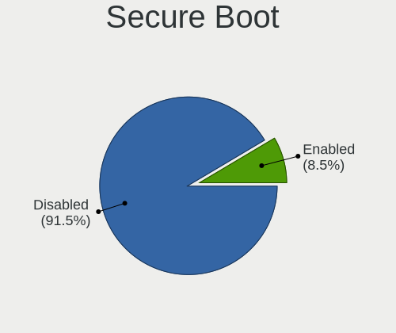
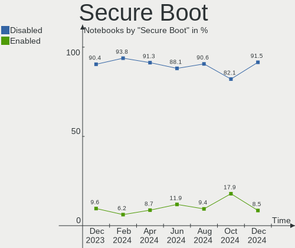
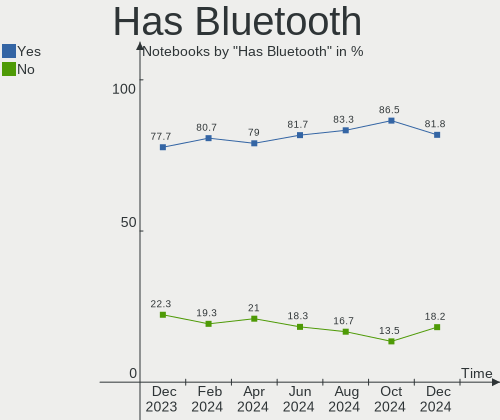
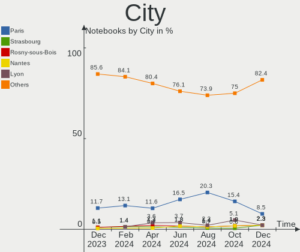
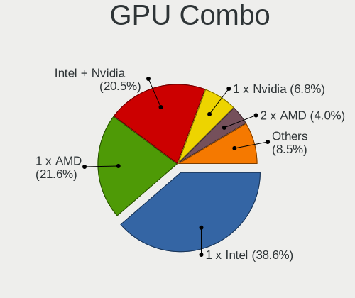
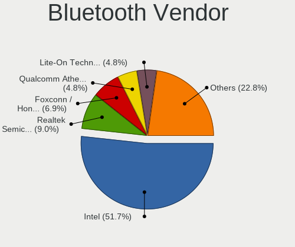
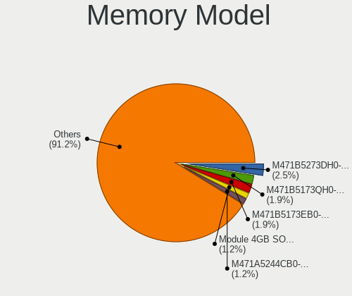

Linux in France - Hardware Trends (Notebooks)
---------------------------------------------

A project to identify most popular hardware characteristics and track their change
over time based on data collected by Linux users at https://Linux-Hardware.org.

Anyone can contribute to this report by the [hw-probe](https://github.com/linuxhw/hw-probe) tool:

    sudo -E hw-probe -all -upload

Period: Dec, 2023.

Contents
--------

* [ System ](#system)
  - [ OS                       ](#os)
  - [ OS Family                ](#os-family)
  - [ Kernel                   ](#kernel)
  - [ Kernel Family            ](#kernel-family)
  - [ Kernel Major Ver.        ](#kernel-major-ver)
  - [ Arch                     ](#arch)
  - [ DE                       ](#de)
  - [ Display Server           ](#display-server)
  - [ Display Manager          ](#display-manager)
  - [ OS Lang                  ](#os-lang)
  - [ Boot Mode                ](#boot-mode)
  - [ Filesystem               ](#filesystem)
  - [ Part. scheme             ](#part-scheme)
  - [ Dual Boot with Linux/BSD ](#dual-boot-with-linuxbsd)
  - [ Dual Boot (Win)          ](#dual-boot-win)

* [ Board ](#board)
  - [ Vendor                   ](#vendor)
  - [ Model                    ](#model)
  - [ Model Family             ](#model-family)
  - [ MFG Year                 ](#mfg-year)
  - [ Form Factor              ](#form-factor)
  - [ Secure Boot              ](#secure-boot)
  - [ Coreboot                 ](#coreboot)
  - [ RAM Size                 ](#ram-size)
  - [ RAM Used                 ](#ram-used)
  - [ Total Drives             ](#total-drives)
  - [ Has CD-ROM               ](#has-cd-rom)
  - [ Has Ethernet             ](#has-ethernet)
  - [ Has WiFi                 ](#has-wifi)
  - [ Has Bluetooth            ](#has-bluetooth)

* [ Location ](#location)
  - [ Country                  ](#country)
  - [ City                     ](#city)

* [ Drives ](#drives)
  - [ Drive Vendor             ](#drive-vendor)
  - [ Drive Model              ](#drive-model)
  - [ HDD Vendor               ](#hdd-vendor)
  - [ SSD Vendor               ](#ssd-vendor)
  - [ Drive Kind               ](#drive-kind)
  - [ Drive Connector          ](#drive-connector)
  - [ Drive Size               ](#drive-size)
  - [ Space Total              ](#space-total)
  - [ Space Used               ](#space-used)
  - [ Malfunc. Drives          ](#malfunc-drives)
  - [ Malfunc. Drive Vendor    ](#malfunc-drive-vendor)
  - [ Malfunc. HDD Vendor      ](#malfunc-hdd-vendor)
  - [ Malfunc. Drive Kind      ](#malfunc-drive-kind)
  - [ Failed Drives            ](#failed-drives)
  - [ Failed Drive Vendor      ](#failed-drive-vendor)
  - [ Drive Status             ](#drive-status)

* [ Storage controller ](#storage-controller)
  - [ Storage Vendor           ](#storage-vendor)
  - [ Storage Model            ](#storage-model)
  - [ Storage Kind             ](#storage-kind)

* [ Processor ](#processor)
  - [ CPU Vendor               ](#cpu-vendor)
  - [ CPU Model                ](#cpu-model)
  - [ CPU Model Family         ](#cpu-model-family)
  - [ CPU Cores                ](#cpu-cores)
  - [ CPU Sockets              ](#cpu-sockets)
  - [ CPU Threads              ](#cpu-threads)
  - [ CPU Op-Modes             ](#cpu-op-modes)
  - [ CPU Microcode            ](#cpu-microcode)
  - [ CPU Microarch            ](#cpu-microarch)

* [ Graphics ](#graphics)
  - [ GPU Vendor               ](#gpu-vendor)
  - [ GPU Model                ](#gpu-model)
  - [ GPU Combo                ](#gpu-combo)
  - [ GPU Driver               ](#gpu-driver)
  - [ GPU Memory               ](#gpu-memory)

* [ Monitor ](#monitor)
  - [ Monitor Vendor           ](#monitor-vendor)
  - [ Monitor Model            ](#monitor-model)
  - [ Monitor Resolution       ](#monitor-resolution)
  - [ Monitor Diagonal         ](#monitor-diagonal)
  - [ Monitor Width            ](#monitor-width)
  - [ Aspect Ratio             ](#aspect-ratio)
  - [ Monitor Area             ](#monitor-area)
  - [ Pixel Density            ](#pixel-density)
  - [ Multiple Monitors        ](#multiple-monitors)

* [ Network ](#network)
  - [ Net Controller Vendor    ](#net-controller-vendor)
  - [ Net Controller Model     ](#net-controller-model)
  - [ Wireless Vendor          ](#wireless-vendor)
  - [ Wireless Model           ](#wireless-model)
  - [ Ethernet Vendor          ](#ethernet-vendor)
  - [ Ethernet Model           ](#ethernet-model)
  - [ Net Controller Kind      ](#net-controller-kind)
  - [ Used Controller          ](#used-controller)
  - [ NICs                     ](#nics)
  - [ IPv6                     ](#ipv6)

* [ Bluetooth ](#bluetooth)
  - [ Bluetooth Vendor         ](#bluetooth-vendor)
  - [ Bluetooth Model          ](#bluetooth-model)

* [ Sound ](#sound)
  - [ Sound Vendor             ](#sound-vendor)
  - [ Sound Model              ](#sound-model)

* [ Memory ](#memory)
  - [ Memory Vendor            ](#memory-vendor)
  - [ Memory Model             ](#memory-model)
  - [ Memory Kind              ](#memory-kind)
  - [ Memory Form Factor       ](#memory-form-factor)
  - [ Memory Size              ](#memory-size)
  - [ Memory Speed             ](#memory-speed)

* [ Printers & scanners ](#printers--scanners)
  - [ Printer Vendor           ](#printer-vendor)
  - [ Printer Model            ](#printer-model)
  - [ Scanner Vendor           ](#scanner-vendor)
  - [ Scanner Model            ](#scanner-model)

* [ Camera ](#camera)
  - [ Camera Vendor            ](#camera-vendor)
  - [ Camera Model             ](#camera-model)

* [ Security ](#security)
  - [ Fingerprint Vendor       ](#fingerprint-vendor)
  - [ Fingerprint Model        ](#fingerprint-model)
  - [ Chipcard Vendor          ](#chipcard-vendor)
  - [ Chipcard Model           ](#chipcard-model)

* [ Unsupported ](#unsupported)
  - [ Unsupported Devices      ](#unsupported-devices)
  - [ Unsupported Device Types ](#unsupported-device-types)

System
------

OS
--

Installed operating systems

| Name                         | Notebooks | Percent |
|------------------------------|-----------|---------|
| Debian 12                    | 41        | 21.81%  |
| Ubuntu 22.04                 | 32        | 17.02%  |
| Linux Mint 21.2              | 12        | 6.38%   |
| Fedora 39                    | 11        | 5.85%   |
| Arch Rolling                 | 8         | 4.26%   |
| Ubuntu 23.10                 | 7         | 3.72%   |
| Pop!_OS 22.04                | 7         | 3.72%   |
| OpenMandriva 5.0             | 7         | 3.72%   |
| OpenMandriva 23.08           | 7         | 3.72%   |
| Xubuntu 22.04                | 5         | 2.66%   |
| Ubuntu 20.04                 | 5         | 2.66%   |
| Zorin 16                     | 3         | 1.6%    |
| Fedora 38                    | 3         | 1.6%    |
| EndeavourOS Rolling          | 3         | 1.6%    |
| Ubuntu 23.04                 | 2         | 1.06%   |
| SteamOS 3.5.7                | 2         | 1.06%   |
| OpenMandriva 4.2             | 2         | 1.06%   |
| OpenMandriva 23.11           | 2         | 1.06%   |
| Lubuntu 22.04                | 2         | 1.06%   |
| Kubuntu 22.04                | 2         | 1.06%   |
| Kali 2023.4                  | 2         | 1.06%   |
| Zorin 17                     | 1         | 0.53%   |
| Xero Rolling                 | 1         | 0.53%   |
| Ubuntu Unity 16.04           | 1         | 0.53%   |
| Ubuntu Studio 22.04          | 1         | 0.53%   |
| Ubuntu MATE 23.10            | 1         | 0.53%   |
| Ubuntu MATE 22.04            | 1         | 0.53%   |
| Ubuntu Budgie 22.04          | 1         | 0.53%   |
| Ubuntu 18.04                 | 1         | 0.53%   |
| TUXEDO OS 22.04              | 1         | 0.53%   |
| openSUSE Tumbleweed-XXXXXXXX | 1         | 0.53%   |
| MX 23                        | 1         | 0.53%   |
| Manjaro 23.1.1               | 1         | 0.53%   |
| Manjaro 23.1.0               | 1         | 0.53%   |
| Manjaro                      | 1         | 0.53%   |
| Lubuntu 20.04                | 1         | 0.53%   |
| Linux Mint 21.1              | 1         | 0.53%   |
| Linux Mint 21                | 1         | 0.53%   |
| Linux Mint 19.3              | 1         | 0.53%   |
| KDE neon 22.04               | 1         | 0.53%   |

OS Family
---------

OS without a version

| Name          | Notebooks | Percent |
|---------------|-----------|---------|
| Ubuntu        | 47        | 25%     |
| Debian        | 41        | 21.81%  |
| OpenMandriva  | 18        | 9.57%   |
| Linux Mint    | 15        | 7.98%   |
| Fedora        | 15        | 7.98%   |
| Arch          | 8         | 4.26%   |
| Pop!_OS       | 7         | 3.72%   |
| Xubuntu       | 5         | 2.66%   |
| Zorin         | 4         | 2.13%   |
| Manjaro       | 3         | 1.6%    |
| Lubuntu       | 3         | 1.6%    |
| EndeavourOS   | 3         | 1.6%    |
| Ubuntu MATE   | 2         | 1.06%   |
| SteamOS       | 2         | 1.06%   |
| Kubuntu       | 2         | 1.06%   |
| Kali          | 2         | 1.06%   |
| Xero          | 1         | 0.53%   |
| Ubuntu Unity  | 1         | 0.53%   |
| Ubuntu Studio | 1         | 0.53%   |
| Ubuntu Budgie | 1         | 0.53%   |
| TUXEDO OS     | 1         | 0.53%   |
| openSUSE      | 1         | 0.53%   |
| MX            | 1         | 0.53%   |
| KDE neon      | 1         | 0.53%   |
| Gentoo        | 1         | 0.53%   |
| Emperor OS    | 1         | 0.53%   |
| blendOS       | 1         | 0.53%   |

Kernel
------

Version of the Linux kernel

| Version                    | Notebooks | Percent |
|----------------------------|-----------|---------|
| 6.1.0-16-amd64             | 32        | 17.02%  |
| 6.2.0-39-generic           | 22        | 11.7%   |
| 6.2.0-37-generic           | 13        | 6.91%   |
| 5.15.0-91-generic          | 12        | 6.38%   |
| 6.6.2-desktop-1omv2390     | 9         | 4.79%   |
| 6.4.11-desktop-1omv2390    | 7         | 3.72%   |
| 5.15.0-89-generic          | 7         | 3.72%   |
| 6.6.6-76060606-generic     | 5         | 2.66%   |
| 6.5.0-14-generic           | 4         | 2.13%   |
| 6.1.0-13-amd64             | 4         | 2.13%   |
| 6.6.3-200.fc39.x86_64      | 3         | 1.6%    |
| 6.6.8-200.fc39.x86_64      | 2         | 1.06%   |
| 6.6.7-arch1-1              | 2         | 1.06%   |
| 6.6.7-200.fc39.x86_64      | 2         | 1.06%   |
| 6.6.6-arch1-1              | 2         | 1.06%   |
| 6.6.4-200.fc39.x86_64      | 2         | 1.06%   |
| 6.5.6-76060506-generic     | 2         | 1.06%   |
| 6.5.13-1-MANJARO           | 2         | 1.06%   |
| 6.5.0-kali3-amd64          | 2         | 1.06%   |
| 6.5.0-9-generic            | 2         | 1.06%   |
| 6.5.0-13-generic           | 2         | 1.06%   |
| 6.2.0-26-generic           | 2         | 1.06%   |
| 6.1.52-valve9-1-neptune-61 | 2         | 1.06%   |
| 6.1.0-15-amd64             | 2         | 1.06%   |
| 6.1.0-1027-oem             | 2         | 1.06%   |
| 5.15.0-88-generic          | 2         | 1.06%   |
| 5.10.14-desktop-1omv4002   | 2         | 1.06%   |
| 6.7.0-rc5-273-tkg-eevdf    | 1         | 0.53%   |
| 6.6.8-zen1-1-zen           | 1         | 0.53%   |
| 6.6.8-arch1-1              | 1         | 0.53%   |
| 6.6.8-2-MANJARO            | 1         | 0.53%   |
| 6.6.8-100.fc38.x86_64      | 1         | 0.53%   |
| 6.6.7-100.fc38.x86_64      | 1         | 0.53%   |
| 6.6.6-200.fc39.x86_64      | 1         | 0.53%   |
| 6.6.6-100.fc38.x86_64      | 1         | 0.53%   |
| 6.6.5-arch1-1              | 1         | 0.53%   |
| 6.6.4-arch1-1              | 1         | 0.53%   |
| 6.6.4-060604-generic       | 1         | 0.53%   |
| 6.6.3-arch1-1              | 1         | 0.53%   |
| 6.6.2-201.fc39.x86_64      | 1         | 0.53%   |

Kernel Family
-------------

Linux kernel without a distro release

| Version | Notebooks | Percent |
|---------|-----------|---------|
| 6.1.0   | 41        | 21.81%  |
| 6.2.0   | 38        | 20.21%  |
| 5.15.0  | 24        | 12.77%  |
| 6.5.0   | 13        | 6.91%   |
| 6.6.2   | 10        | 5.32%   |
| 6.6.6   | 9         | 4.79%   |
| 6.4.11  | 7         | 3.72%   |
| 6.6.8   | 6         | 3.19%   |
| 6.6.7   | 5         | 2.66%   |
| 6.6.4   | 4         | 2.13%   |
| 6.6.3   | 4         | 2.13%   |
| 6.5.6   | 2         | 1.06%   |
| 6.5.13  | 2         | 1.06%   |
| 6.1.52  | 2         | 1.06%   |
| 5.4.0   | 2         | 1.06%   |
| 5.10.14 | 2         | 1.06%   |
| 4.15.0  | 2         | 1.06%   |
| 6.7.0   | 1         | 0.53%   |
| 6.6.5   | 1         | 0.53%   |
| 6.6.0   | 1         | 0.53%   |
| 6.5.9   | 1         | 0.53%   |
| 6.4.6   | 1         | 0.53%   |
| 6.4.0   | 1         | 0.53%   |
| 6.3.9   | 1         | 0.53%   |
| 6.1.69  | 1         | 0.53%   |
| 6.1.67  | 1         | 0.53%   |
| 6.1.65  | 1         | 0.53%   |
| 5.8.0   | 1         | 0.53%   |
| 5.19.0  | 1         | 0.53%   |
| 5.17.5  | 1         | 0.53%   |
| 5.15.54 | 1         | 0.53%   |
| 5.13.0  | 1         | 0.53%   |

Kernel Major Ver.
-----------------

Linux kernel major version

| Version | Notebooks | Percent |
|---------|-----------|---------|
| 6.1     | 46        | 24.47%  |
| 6.6     | 40        | 21.28%  |
| 6.2     | 38        | 20.21%  |
| 5.15    | 25        | 13.3%   |
| 6.5     | 18        | 9.57%   |
| 6.4     | 9         | 4.79%   |
| 5.4     | 2         | 1.06%   |
| 5.10    | 2         | 1.06%   |
| 4.15    | 2         | 1.06%   |
| 6.7     | 1         | 0.53%   |
| 6.3     | 1         | 0.53%   |
| 5.8     | 1         | 0.53%   |
| 5.19    | 1         | 0.53%   |
| 5.17    | 1         | 0.53%   |
| 5.13    | 1         | 0.53%   |

Arch
----

OS architecture (x86_64, i586, etc.)

| Name   | Notebooks | Percent |
|--------|-----------|---------|
| x86_64 | 186       | 98.94%  |
| i686   | 2         | 1.06%   |

DE
--

Desktop Environment

| Name          | Notebooks | Percent |
|---------------|-----------|---------|
| GNOME         | 104       | 55.32%  |
| KDE5          | 35        | 18.62%  |
| X-Cinnamon    | 15        | 7.98%   |
| XFCE          | 12        | 6.38%   |
| Unknown       | 7         | 3.72%   |
| MATE          | 4         | 2.13%   |
| LXQt          | 4         | 2.13%   |
| Unity         | 1         | 0.53%   |
| KDE6          | 1         | 0.53%   |
| i3            | 1         | 0.53%   |
| GNOME-Classic | 1         | 0.53%   |
| Enlightenment | 1         | 0.53%   |
| Deepin        | 1         | 0.53%   |
| Budgie        | 1         | 0.53%   |

Display Server
--------------

X11 or Wayland

| Name    | Notebooks | Percent |
|---------|-----------|---------|
| Wayland | 100       | 53.19%  |
| X11     | 84        | 44.68%  |
| Tty     | 2         | 1.06%   |
| Unknown | 2         | 1.06%   |

Display Manager
---------------

SDDM, LightDM, etc.

| Name    | Notebooks | Percent |
|---------|-----------|---------|
| GDM3    | 77        | 40.96%  |
| Unknown | 45        | 23.94%  |
| SDDM    | 30        | 15.96%  |
| LightDM | 27        | 14.36%  |
| GDM     | 9         | 4.79%   |

OS Lang
-------

Language

| Lang    | Notebooks | Percent |
|---------|-----------|---------|
| fr_FR   | 155       | 82.45%  |
| en_US   | 25        | 13.3%   |
| C       | 3         | 1.6%    |
| en_GB   | 2         | 1.06%   |
| sv_SE   | 1         | 0.53%   |
| it_IT   | 1         | 0.53%   |
| Unknown | 1         | 0.53%   |

Boot Mode
---------

EFI or BIOS

| Mode | Notebooks | Percent |
|------|-----------|---------|
| EFI  | 130       | 69.15%  |
| BIOS | 58        | 30.85%  |

Filesystem
----------

Type of filesystem

| Type    | Notebooks | Percent |
|---------|-----------|---------|
| Ext4    | 136       | 72.34%  |
| Btrfs   | 20        | 10.64%  |
| Tmpfs   | 16        | 8.51%   |
| Overlay | 14        | 7.45%   |
| Zfs     | 1         | 0.53%   |
| F2fs    | 1         | 0.53%   |

Part. scheme
------------

Scheme of partitioning

| Type    | Notebooks | Percent |
|---------|-----------|---------|
| GPT     | 132       | 70.21%  |
| Unknown | 42        | 22.34%  |
| MBR     | 14        | 7.45%   |

Dual Boot with Linux/BSD
------------------------

Hosting more than one Linux/BSD

| Dual boot | Notebooks | Percent |
|-----------|-----------|---------|
| No        | 167       | 88.83%  |
| Yes       | 21        | 11.17%  |

Dual Boot (Win)
---------------

Hosting Linux and Windows

| Dual boot | Notebooks | Percent |
|-----------|-----------|---------|
| No        | 156       | 82.98%  |
| Yes       | 32        | 17.02%  |

Board
-----

Vendor
------

Motherboard manufacturer

| Name                | Notebooks | Percent |
|---------------------|-----------|---------|
| Hewlett-Packard     | 41        | 21.81%  |
| Lenovo              | 33        | 17.55%  |
| ASUSTek Computer    | 24        | 12.77%  |
| Dell                | 23        | 12.23%  |
| Acer                | 12        | 6.38%   |
| MSI                 | 8         | 4.26%   |
| Toshiba             | 7         | 3.72%   |
| Framework           | 5         | 2.66%   |
| Apple               | 4         | 2.13%   |
| Samsung Electronics | 3         | 1.6%    |
| GPD                 | 3         | 1.6%    |
| Google              | 3         | 1.6%    |
| Valve               | 2         | 1.06%   |
| UNOWHY              | 2         | 1.06%   |
| Sony                | 2         | 1.06%   |
| Notebook            | 2         | 1.06%   |
| HUAWEI              | 2         | 1.06%   |
| HONOR               | 2         | 1.06%   |
| eMachines           | 2         | 1.06%   |
| Timi                | 1         | 0.53%   |
| Star Labs           | 1         | 0.53%   |
| Packard Bell        | 1         | 0.53%   |
| Fujitsu             | 1         | 0.53%   |
| DellInc.            | 1         | 0.53%   |
| Clevo               | 1         | 0.53%   |
| Alienware           | 1         | 0.53%   |
| Unknown             | 1         | 0.53%   |

Model
-----

Motherboard model

| Name                                       | Notebooks | Percent |
|--------------------------------------------|-----------|---------|
| Lenovo ThinkPad X230 2325V2Y               | 8         | 4.26%   |
| HP ProBook 650 G2                          | 5         | 2.66%   |
| HP ProBook 650 G1                          | 5         | 2.66%   |
| HP ProBook 450 G3                          | 4         | 2.13%   |
| ASUS Zenbook 15 UM3504DA_UM3504DA          | 4         | 2.13%   |
| HP ProBook 655 G2                          | 3         | 1.6%    |
| HP Pavilion 17                             | 3         | 1.6%    |
| Framework Laptop 13 (AMD Ryzen 7040Series) | 3         | 1.6%    |
| Unknown                                    | 3         | 1.6%    |
| Dell Latitude 5590                         | 2         | 1.06%   |
| Valve Jupiter                              | 1         | 0.53%   |
| Valve Galileo                              | 1         | 0.53%   |
| UNOWHY Y13G012S4EI                         | 1         | 0.53%   |
| UNOWHY Y13G002S4EI                         | 1         | 0.53%   |
| Toshiba Satellite Pro C660                 | 1         | 0.53%   |
| Toshiba Satellite L655                     | 1         | 0.53%   |
| Toshiba Satellite C870D-116                | 1         | 0.53%   |
| Toshiba Satellite C870-1F3                 | 1         | 0.53%   |
| Toshiba Satellite C70-B                    | 1         | 0.53%   |
| Toshiba Satellite C660D                    | 1         | 0.53%   |
| Toshiba Satellite C50D-A-138               | 1         | 0.53%   |
| Timi TM1604                                | 1         | 0.53%   |
| Star Labs StarBook                         | 1         | 0.53%   |
| Sony VPCEA1S1E                             | 1         | 0.53%   |
| Sony SVF1521G6EW                           | 1         | 0.53%   |
| Samsung R610                               | 1         | 0.53%   |
| Samsung R530/R730                          | 1         | 0.53%   |
| Samsung 900X3C/900X3D/900X4C/900X4D        | 1         | 0.53%   |
| Packard Bell EasyNote LM85                 | 1         | 0.53%   |
| Notebook NL40_50CU                         | 1         | 0.53%   |
| Notebook NJ50_70CU                         | 1         | 0.53%   |
| MSI PS63 Modern 8RC                        | 1         | 0.53%   |
| MSI Prestige 15 A10SC                      | 1         | 0.53%   |
| MSI Katana GF66 11SC                       | 1         | 0.53%   |
| MSI GX70 3CC                               | 1         | 0.53%   |
| MSI GX60 1AC/GX60 3AE/GX60 3BE             | 1         | 0.53%   |
| MSI GF63 Thin 11UC                         | 1         | 0.53%   |
| MSI GE62 2QF                               | 1         | 0.53%   |
| MSI Bravo 15 B5DD                          | 1         | 0.53%   |
| Lenovo Yoga S740-15IRH 81NX                | 1         | 0.53%   |

Model Family
------------

Motherboard model prefix

| Name                  | Notebooks | Percent |
|-----------------------|-----------|---------|
| Lenovo ThinkPad       | 23        | 12.23%  |
| HP ProBook            | 20        | 10.64%  |
| Dell Latitude         | 10        | 5.32%   |
| Acer Aspire           | 8         | 4.26%   |
| Toshiba Satellite     | 7         | 3.72%   |
| HP Pavilion           | 7         | 3.72%   |
| Framework Laptop      | 5         | 2.66%   |
| ASUS ASUS             | 5         | 2.66%   |
| Lenovo IdeaPad        | 4         | 2.13%   |
| HP ZBook              | 4         | 2.13%   |
| HP EliteBook          | 4         | 2.13%   |
| Dell Inspiron         | 4         | 2.13%   |
| ASUS Zenbook          | 4         | 2.13%   |
| Dell Precision        | 3         | 1.6%    |
| ASUS VivoBook         | 3         | 1.6%    |
| Acer Swift            | 3         | 1.6%    |
| Unknown               | 3         | 1.6%    |
| Lenovo Legion         | 2         | 1.06%   |
| Apple MacBookPro5     | 2         | 1.06%   |
| Valve Jupiter         | 1         | 0.53%   |
| Valve Galileo         | 1         | 0.53%   |
| UNOWHY Y13G012S4EI    | 1         | 0.53%   |
| UNOWHY Y13G002S4EI    | 1         | 0.53%   |
| Timi TM1604           | 1         | 0.53%   |
| Star Labs StarBook    | 1         | 0.53%   |
| Sony VPCEA1S1E        | 1         | 0.53%   |
| Sony SVF1521G6EW      | 1         | 0.53%   |
| Samsung R610          | 1         | 0.53%   |
| Samsung R530          | 1         | 0.53%   |
| Samsung 900X3C        | 1         | 0.53%   |
| Packard Bell EasyNote | 1         | 0.53%   |
| Notebook NL40         | 1         | 0.53%   |
| Notebook NJ50         | 1         | 0.53%   |
| MSI PS63              | 1         | 0.53%   |
| MSI Prestige          | 1         | 0.53%   |
| MSI Katana            | 1         | 0.53%   |
| MSI GX70              | 1         | 0.53%   |
| MSI GX60              | 1         | 0.53%   |
| MSI GF63              | 1         | 0.53%   |
| MSI GE62              | 1         | 0.53%   |

MFG Year
--------

Motherboard manufacture year

| Year | Notebooks | Percent |
|------|-----------|---------|
| 2013 | 24        | 12.77%  |
| 2023 | 23        | 12.23%  |
| 2012 | 19        | 10.11%  |
| 2016 | 17        | 9.04%   |
| 2015 | 16        | 8.51%   |
| 2021 | 15        | 7.98%   |
| 2022 | 13        | 6.91%   |
| 2019 | 12        | 6.38%   |
| 2018 | 10        | 5.32%   |
| 2014 | 10        | 5.32%   |
| 2010 | 9         | 4.79%   |
| 2020 | 7         | 3.72%   |
| 2011 | 5         | 2.66%   |
| 2008 | 4         | 2.13%   |
| 2009 | 3         | 1.6%    |
| 2017 | 1         | 0.53%   |

Form Factor
-----------

Physical design of the computer

| Name     | Notebooks | Percent |
|----------|-----------|---------|
| Notebook | 188       | 100%    |

Secure Boot
-----------

Enabled or disabled

| State    | Notebooks | Percent |
|----------|-----------|---------|
| Disabled | 170       | 90.43%  |
| Enabled  | 18        | 9.57%   |

Coreboot
--------

Have coreboot on board

| Used | Notebooks | Percent |
|------|-----------|---------|
| No   | 184       | 97.87%  |
| Yes  | 4         | 2.13%   |

RAM Size
--------

Total RAM memory

| Size in GB | Notebooks | Percent |
|------------|-----------|---------|
| 3.01-4.0   | 57        | 30.32%  |
| 4.01-8.0   | 56        | 29.79%  |
| 8.01-16.0  | 26        | 13.83%  |
| 16.01-24.0 | 22        | 11.7%   |
| 32.01-64.0 | 16        | 8.51%   |
| 24.01-32.0 | 4         | 2.13%   |
| 2.01-3.0   | 4         | 2.13%   |
| 1.01-2.0   | 3         | 1.6%    |

RAM Used
--------

Used RAM memory

| Used GB   | Notebooks | Percent |
|-----------|-----------|---------|
| 1.01-2.0  | 84        | 44.68%  |
| 2.01-3.0  | 42        | 22.34%  |
| 4.01-8.0  | 31        | 16.49%  |
| 3.01-4.0  | 23        | 12.23%  |
| 8.01-16.0 | 7         | 3.72%   |
| 0.51-1.0  | 1         | 0.53%   |

Total Drives
------------

Number of drives on board

| Drives | Notebooks | Percent |
|--------|-----------|---------|
| 1      | 147       | 78.19%  |
| 2      | 35        | 18.62%  |
| 3      | 4         | 2.13%   |
| 7      | 1         | 0.53%   |
| 4      | 1         | 0.53%   |

Has CD-ROM
----------

Has CD-ROM on board

| Presented | Notebooks | Percent |
|-----------|-----------|---------|
| No        | 112       | 59.57%  |
| Yes       | 76        | 40.43%  |

Has Ethernet
------------

Has Ethernet on board

| Presented | Notebooks | Percent |
|-----------|-----------|---------|
| Yes       | 154       | 81.91%  |
| No        | 34        | 18.09%  |

Has WiFi
--------

Has WiFi module

| Presented | Notebooks | Percent |
|-----------|-----------|---------|
| Yes       | 184       | 97.87%  |
| No        | 4         | 2.13%   |

Has Bluetooth
-------------

Has Bluetooth module

| Presented | Notebooks | Percent |
|-----------|-----------|---------|
| Yes       | 146       | 77.66%  |
| No        | 42        | 22.34%  |

Location
--------

Country
-------

Geographic location (country)

| Country | Notebooks | Percent |
|---------|-----------|---------|
| France  | 188       | 100%    |

City
----

Geographic location (city)

| City                  | Notebooks | Percent |
|-----------------------|-----------|---------|
| Roubaix               | 28        | 14.89%  |
| Paris                 | 23        | 12.23%  |
| Valenciennes          | 3         | 1.6%    |
| Le Haillan            | 3         | 1.6%    |
| Dijon                 | 3         | 1.6%    |
| Bagneux               | 3         | 1.6%    |
| Toulouse              | 2         | 1.06%   |
| Strasbourg            | 2         | 1.06%   |
| Rosny-sous-Bois       | 2         | 1.06%   |
| Quimper               | 2         | 1.06%   |
| Fréjus               | 2         | 1.06%   |
| Épinal               | 2         | 1.06%   |
| Caen                  | 2         | 1.06%   |
| Aix-en-Provence       | 2         | 1.06%   |
| Wissembourg           | 1         | 0.53%   |
| Voiron                | 1         | 0.53%   |
| Villeurbanne          | 1         | 0.53%   |
| Vignoc                | 1         | 0.53%   |
| Vesoul                | 1         | 0.53%   |
| Versailles            | 1         | 0.53%   |
| Verny                 | 1         | 0.53%   |
| Vernaison             | 1         | 0.53%   |
| Vanves                | 1         | 0.53%   |
| Valence               | 1         | 0.53%   |
| Vailhauques           | 1         | 0.53%   |
| Tullins               | 1         | 0.53%   |
| Trelissac             | 1         | 0.53%   |
| Treal                 | 1         | 0.53%   |
| Toulon                | 1         | 0.53%   |
| Taponas               | 1         | 0.53%   |
| Sotteville-lès-Rouen | 1         | 0.53%   |
| Soissons              | 1         | 0.53%   |
| Sene                  | 1         | 0.53%   |
| Savenay               | 1         | 0.53%   |
| Sannois               | 1         | 0.53%   |
| Sallertaine           | 1         | 0.53%   |
| Sainville             | 1         | 0.53%   |
| Saintines             | 1         | 0.53%   |
| Saint-Thibaud-de-Couz | 1         | 0.53%   |
| Saint-Omer-Capelle    | 1         | 0.53%   |

Drives
------

Drive Vendor
------------

Hard drive vendors

| Vendor                      | Notebooks | Drives | Percent |
|-----------------------------|-----------|--------|---------|
| Samsung Electronics         | 31        | 35     | 13.9%   |
| WDC                         | 24        | 24     | 10.76%  |
| Unknown                     | 16        | 20     | 7.17%   |
| Toshiba                     | 13        | 13     | 5.83%   |
| SanDisk                     | 13        | 13     | 5.83%   |
| Kingston                    | 13        | 15     | 5.83%   |
| Crucial                     | 13        | 13     | 5.83%   |
| Seagate                     | 12        | 12     | 5.38%   |
| HGST                        | 12        | 12     | 5.38%   |
| SK hynix                    | 11        | 11     | 4.93%   |
| Micron Technology           | 9         | 9      | 4.04%   |
| Hitachi                     | 9         | 9      | 4.04%   |
| Transcend                   | 5         | 5      | 2.24%   |
| PNY                         | 3         | 3      | 1.35%   |
| Intel                       | 3         | 3      | 1.35%   |
| SPCC                        | 2         | 2      | 0.9%    |
| Phison Electronics          | 2         | 2      | 0.9%    |
| Micron/Crucial Technology   | 2         | 2      | 0.9%    |
| KingSpec                    | 2         | 2      | 0.9%    |
| China                       | 2         | 2      | 0.9%    |
| Apple                       | 2         | 2      | 0.9%    |
| Unknown                     | 2         | 2      | 0.9%    |
| Union Memory                | 1         | 1      | 0.45%   |
| TEXTORM                     | 1         | 1      | 0.45%   |
| Star                        | 1         | 1      | 0.45%   |
| Silicon Motion              | 1         | 1      | 0.45%   |
| SC550                       | 1         | 1      | 0.45%   |
| SATA SSD                    | 1         | 1      | 0.45%   |
| Plextor                     | 1         | 1      | 0.45%   |
| Phison                      | 1         | 1      | 0.45%   |
| MAXIO Technology (Hangzhou) | 1         | 1      | 0.45%   |
| Mass                        | 1         | 1      | 0.45%   |
| LDLC                        | 1         | 1      | 0.45%   |
| KIOXIA                      | 1         | 1      | 0.45%   |
| Kingston Technology Company | 1         | 1      | 0.45%   |
| Hikvision                   | 1         | 1      | 0.45%   |
| Hewlett-Packard             | 1         | 1      | 0.45%   |
| Gigabyte Technology         | 1         | 1      | 0.45%   |
| Fujitsu                     | 1         | 1      | 0.45%   |
| Emtec                       | 1         | 1      | 0.45%   |

Drive Model
-----------

Hard drive models

| Model                                               | Notebooks | Percent |
|-----------------------------------------------------|-----------|---------|
| WDC WD5000LPLX-60ZNTT1 500GB                        | 10        | 4.35%   |
| Hitachi HTS543232A7A384 320GB                       | 4         | 1.74%   |
| Unknown NVMe SSD Drive 512GB                        | 3         | 1.3%    |
| Unknown MMC Card  64GB                              | 3         | 1.3%    |
| Unknown MMC Card  32GB                              | 3         | 1.3%    |
| Toshiba MQ01ACF032 320GB                            | 3         | 1.3%    |
| Seagate ST9500325AS 500GB                           | 3         | 1.3%    |
| Samsung NVMe SSD Controller SM981/PM981/PM983 512GB | 3         | 1.3%    |
| Micron 2400_MTFDKBA512QFM 512GB                     | 3         | 1.3%    |
| HGST HTS725050A7E630 500GB                          | 3         | 1.3%    |
| HGST HTS545050A7E680 500GB                          | 3         | 1.3%    |
| HGST HTS541010A9E680 1TB                            | 3         | 1.3%    |
| WDC WD10JPVX-22JC3T0 1TB                            | 2         | 0.87%   |
| Toshiba XG6 NVMe SSD Controller 512GB               | 2         | 0.87%   |
| Seagate ST500LM021-1KJ152 500GB                     | 2         | 0.87%   |
| Seagate ST160LM003 HN-M160MBB 160GB                 | 2         | 0.87%   |
| Sandisk WD Blue SN550 NVMe SSD 1TB                  | 2         | 0.87%   |
| SanDisk NVMe SSD Drive 1TB                          | 2         | 0.87%   |
| Samsung SSD CM871a 2.5 7mm 128GB                    | 2         | 0.87%   |
| Samsung SSD 980 PRO 2TB                             | 2         | 0.87%   |
| Samsung SSD 980 1TB                                 | 2         | 0.87%   |
| Samsung SSD 870 EVO 500GB                           | 2         | 0.87%   |
| Micron/Crucial P2 NVMe PCIe SSD 4TB                 | 2         | 0.87%   |
| Micron MTFDHBA512QFD 512GB                          | 2         | 0.87%   |
| Kingston SA400S37240G 240GB SSD                     | 2         | 0.87%   |
| HGST HTS721010A9E630 1TB                            | 2         | 0.87%   |
| Crucial CT480BX500SSD1 480GB                        | 2         | 0.87%   |
| Unknown                                             | 2         | 0.87%   |
| WDC WDS500G2B0A 500GB SSD                           | 1         | 0.43%   |
| WDC WDS100T2B0B 1TB SSD                             | 1         | 0.43%   |
| WDC WD5000LPCX-24VHAT0 500GB                        | 1         | 0.43%   |
| WDC WD5000BEVT-22A0RT0 500GB                        | 1         | 0.43%   |
| WDC WD3200BEKT-75PVMT1 320GB                        | 1         | 0.43%   |
| WDC WD2500BEVT-75A23T0 250GB                        | 1         | 0.43%   |
| WDC WD2500BEVT-08A23T1 250GB                        | 1         | 0.43%   |
| WDC WD16 00BEVT-60ZCT0 160GB                        | 1         | 0.43%   |
| WDC WD10SPCX-21KHST0 1TB                            | 1         | 0.43%   |
| WDC PC SN810 NVMe 512GB                             | 1         | 0.43%   |
| WDC PC SN540 SDDPNPF-512G-1032 512GB                | 1         | 0.43%   |
| WDC PC SN530 SDBPNPZ-256G-1027 256GB                | 1         | 0.43%   |

HDD Vendor
----------

Hard disk drive vendors

| Vendor  | Notebooks | Drives | Percent |
|---------|-----------|--------|---------|
| WDC     | 19        | 19     | 30.16%  |
| Seagate | 12        | 12     | 19.05%  |
| HGST    | 12        | 12     | 19.05%  |
| Toshiba | 10        | 10     | 15.87%  |
| Hitachi | 9         | 9      | 14.29%  |
| Fujitsu | 1         | 1      | 1.59%   |

SSD Vendor
----------

Solid state drive vendors

| Vendor              | Notebooks | Drives | Percent |
|---------------------|-----------|--------|---------|
| Samsung Electronics | 15        | 16     | 21.74%  |
| Crucial             | 9         | 9      | 13.04%  |
| SanDisk             | 7         | 7      | 10.14%  |
| Kingston            | 6         | 7      | 8.7%    |
| Transcend           | 5         | 5      | 7.25%   |
| PNY                 | 3         | 3      | 4.35%   |
| WDC                 | 2         | 2      | 2.9%    |
| SPCC                | 2         | 2      | 2.9%    |
| SK hynix            | 2         | 2      | 2.9%    |
| KingSpec            | 2         | 2      | 2.9%    |
| China               | 2         | 2      | 2.9%    |
| Apple               | 2         | 2      | 2.9%    |
| Toshiba             | 1         | 1      | 1.45%   |
| TEXTORM             | 1         | 1      | 1.45%   |
| Star                | 1         | 1      | 1.45%   |
| SC550               | 1         | 1      | 1.45%   |
| Plextor             | 1         | 1      | 1.45%   |
| LDLC                | 1         | 1      | 1.45%   |
| Intel               | 1         | 1      | 1.45%   |
| Hewlett-Packard     | 1         | 1      | 1.45%   |
| Emtec               | 1         | 1      | 1.45%   |
| ASMT                | 1         | 1      | 1.45%   |
| Apacer              | 1         | 1      | 1.45%   |
| Unknown             | 1         | 1      | 1.45%   |

Drive Kind
----------

HDD or SSD

| Kind    | Notebooks | Drives | Percent |
|---------|-----------|--------|---------|
| NVMe    | 68        | 76     | 31.92%  |
| SSD     | 66        | 71     | 30.99%  |
| HDD     | 61        | 63     | 28.64%  |
| MMC     | 14        | 18     | 6.57%   |
| Unknown | 4         | 5      | 1.88%   |

Drive Connector
---------------

SATA, SAS, NVMe, etc.

| Type | Notebooks | Drives | Percent |
|------|-----------|--------|---------|
| SATA | 120       | 128    | 57.42%  |
| NVMe | 68        | 75     | 32.54%  |
| MMC  | 14        | 18     | 6.7%    |
| SAS  | 7         | 12     | 3.35%   |

Drive Size
----------

Size of hard drive

| Size in TB | Notebooks | Drives | Percent |
|------------|-----------|--------|---------|
| 0.01-0.5   | 95        | 101    | 74.22%  |
| 0.51-1.0   | 30        | 30     | 23.44%  |
| 1.01-2.0   | 3         | 3      | 2.34%   |

Space Total
-----------

Amount of disk space available on the file system

| Size in GB     | Notebooks | Percent |
|----------------|-----------|---------|
| 251-500        | 78        | 41.49%  |
| 101-250        | 42        | 22.34%  |
| 501-1000       | 22        | 11.7%   |
| 1-20           | 14        | 7.45%   |
| 1001-2000      | 9         | 4.79%   |
| 51-100         | 9         | 4.79%   |
| More than 3000 | 4         | 2.13%   |
| 21-50          | 4         | 2.13%   |
| Unknown        | 4         | 2.13%   |
| 2001-3000      | 2         | 1.06%   |

Space Used
----------

Amount of used disk space

| Used GB   | Notebooks | Percent |
|-----------|-----------|---------|
| 1-20      | 77        | 40.96%  |
| 21-50     | 33        | 17.55%  |
| 101-250   | 32        | 17.02%  |
| 51-100    | 19        | 10.11%  |
| 251-500   | 12        | 6.38%   |
| 1001-2000 | 4         | 2.13%   |
| 501-1000  | 4         | 2.13%   |
| Unknown   | 4         | 2.13%   |
| 2001-3000 | 2         | 1.06%   |
| 0         | 1         | 0.53%   |

Malfunc. Drives
---------------

Drive models with a malfunction

| Model                            | Notebooks | Drives | Percent |
|----------------------------------|-----------|--------|---------|
| WDC WD5000LPLX-60ZNTT1 500GB     | 2         | 2      | 11.11%  |
| HGST HTS725050A7E630 500GB       | 2         | 2      | 11.11%  |
| HGST HTS541010A9E680 1TB         | 2         | 2      | 11.11%  |
| WDC WD2500BEVT-75A23T0 250GB     | 1         | 1      | 5.56%   |
| WDC WD10SPCX-21KHST0 1TB         | 1         | 1      | 5.56%   |
| Toshiba MQ01ACF050 500GB         | 1         | 1      | 5.56%   |
| Seagate ST9500325AS 500GB        | 1         | 1      | 5.56%   |
| Seagate ST9250311CS 250GB        | 1         | 1      | 5.56%   |
| Seagate ST500LM021-1KJ152 500GB  | 1         | 1      | 5.56%   |
| SanDisk SSD PLUS 480GB           | 1         | 1      | 5.56%   |
| SanDisk SDSSDA-1T00 1TB          | 1         | 1      | 5.56%   |
| Kingston SV300S37A240G 240GB SSD | 1         | 1      | 5.56%   |
| Hitachi HTS727575A9E364 752GB    | 1         | 1      | 5.56%   |
| HGST HTS545050A7E680 500GB       | 1         | 1      | 5.56%   |
| Apacer 16GB SATA Flash Drive SSD | 1         | 1      | 5.56%   |

Malfunc. Drive Vendor
---------------------

Vendors of faulty drives

| Vendor   | Notebooks | Drives | Percent |
|----------|-----------|--------|---------|
| HGST     | 5         | 5      | 27.78%  |
| WDC      | 4         | 4      | 22.22%  |
| Seagate  | 3         | 3      | 16.67%  |
| SanDisk  | 2         | 2      | 11.11%  |
| Toshiba  | 1         | 1      | 5.56%   |
| Kingston | 1         | 1      | 5.56%   |
| Hitachi  | 1         | 1      | 5.56%   |
| Apacer   | 1         | 1      | 5.56%   |

Malfunc. HDD Vendor
-------------------

Vendors of faulty HDD drives

| Vendor  | Notebooks | Drives | Percent |
|---------|-----------|--------|---------|
| HGST    | 5         | 5      | 35.71%  |
| WDC     | 4         | 4      | 28.57%  |
| Seagate | 3         | 3      | 21.43%  |
| Toshiba | 1         | 1      | 7.14%   |
| Hitachi | 1         | 1      | 7.14%   |

Malfunc. Drive Kind
-------------------

Kinds of faulty drives

| Kind | Notebooks | Drives | Percent |
|------|-----------|--------|---------|
| HDD  | 14        | 14     | 77.78%  |
| SSD  | 4         | 4      | 22.22%  |

Failed Drives
-------------

Failed drive models

Zero info for selected period =(

Failed Drive Vendor
-------------------

Failed drive vendors

Zero info for selected period =(

Drive Status
------------

Number of failed and malfunc. drives

| Status   | Notebooks | Drives | Percent |
|----------|-----------|--------|---------|
| Works    | 102       | 116    | 52.85%  |
| Detected | 73        | 99     | 37.82%  |
| Malfunc  | 18        | 18     | 9.33%   |

Storage controller
------------------

Storage Vendor
--------------

Storage controller vendors

| Vendor                       | Notebooks | Percent |
|------------------------------|-----------|---------|
| Intel                        | 118       | 55.4%   |
| AMD                          | 20        | 9.39%   |
| Samsung Electronics          | 17        | 7.98%   |
| SanDisk                      | 9         | 4.23%   |
| Micron Technology            | 9         | 4.23%   |
| SK hynix                     | 8         | 3.76%   |
| Kingston Technology Company  | 8         | 3.76%   |
| Micron/Crucial Technology    | 6         | 2.82%   |
| Solidigm                     | 4         | 1.88%   |
| Phison Electronics           | 3         | 1.41%   |
| Toshiba America Info Systems | 2         | 0.94%   |
| Nvidia                       | 2         | 0.94%   |
| Biwin Storage Technology     | 2         | 0.94%   |
| Union Memory (Shenzhen)      | 1         | 0.47%   |
| Silicon Motion               | 1         | 0.47%   |
| MAXIO Technology (Hangzhou)  | 1         | 0.47%   |
| Marvell Technology Group     | 1         | 0.47%   |
| KIOXIA                       | 1         | 0.47%   |

Storage Model
-------------

Storage controller models

| Model                                                                          | Notebooks | Percent |
|--------------------------------------------------------------------------------|-----------|---------|
| Intel Sunrise Point-LP SATA Controller [AHCI mode]                             | 22        | 9.95%   |
| Intel 7 Series Chipset Family 6-port SATA Controller [AHCI mode]               | 21        | 9.5%    |
| AMD FCH SATA Controller [AHCI mode]                                            | 18        | 8.14%   |
| Intel 82801 Mobile SATA Controller [RAID mode]                                 | 12        | 5.43%   |
| Intel 8 Series/C220 Series Chipset Family 6-port SATA Controller 1 [AHCI mode] | 12        | 5.43%   |
| Intel Wildcat Point-LP SATA Controller [AHCI Mode]                             | 8         | 3.62%   |
| Intel Volume Management Device NVMe RAID Controller                            | 7         | 3.17%   |
| Intel 82801IBM/IEM (ICH9M/ICH9M-E) 4 port SATA Controller [AHCI mode]          | 6         | 2.71%   |
| Samsung NVMe SSD Controller SM981/PM981/PM983                                  | 5         | 2.26%   |
| Samsung NVMe SSD Controller PM9A1/PM9A3/980PRO                                 | 5         | 2.26%   |
| Samsung NVMe SSD Controller 980 (DRAM-less)                                    | 5         | 2.26%   |
| Micron/Crucial P2 [Nick P2] / P3 / P3 Plus NVMe PCIe SSD (DRAM-less)           | 5         | 2.26%   |
| Micron 2400 NVMe SSD (DRAM-less)                                               | 5         | 2.26%   |
| Intel 6 Series/C200 Series Chipset Family 6 port Mobile SATA AHCI Controller   | 5         | 2.26%   |
| Intel 5 Series/3400 Series Chipset 4 port SATA AHCI Controller                 | 4         | 1.81%   |
| Solidigm P41 Plus NVMe SSD (DRAM-less) [Echo Harbor]                           | 3         | 1.36%   |
| SanDisk Ultra 3D / WD Blue SN550 NVMe SSD                                      | 3         | 1.36%   |
| Kingston Company OM8PCP Design-In PCIe 3 NVMe SSD (DRAM-less)                  | 3         | 1.36%   |
| Kingston Company A1000/U-SNS8154P3 x2 NVMe SSD                                 | 3         | 1.36%   |
| Intel Tiger Lake SATA AHCI Controller                                          | 3         | 1.36%   |
| AMD FCH IDE Controller                                                         | 3         | 1.36%   |
| Toshiba America Info Systems XG6 NVMe SSD Controller                           | 2         | 0.9%    |
| SK hynix Gold P31/BC711/PC711 NVMe Solid State Drive                           | 2         | 0.9%    |
| SK hynix BC901 NVMe Solid State Drive (DRAM-less)                              | 2         | 0.9%    |
| SK hynix BC501 NVMe Solid State Drive                                          | 2         | 0.9%    |
| SanDisk WD Black SN770 / PC SN740 256GB / PC SN560 (DRAM-less) NVMe SSD        | 2         | 0.9%    |
| Samsung NVMe SSD Controller PM9B1 (DRAM-less)                                  | 2         | 0.9%    |
| Nvidia MCP79 AHCI Controller                                                   | 2         | 0.9%    |
| Micron 3400 NVMe SSD [Hendrix]                                                 | 2         | 0.9%    |
| Micron 2210 NVMe SSD [Cobain]                                                  | 2         | 0.9%    |
| Intel SSD 670p Series [Keystone Harbor]                                        | 2         | 0.9%    |
| Intel Q170/Q150/B150/H170/H110/Z170/CM236 Chipset SATA Controller [AHCI Mode]  | 2         | 0.9%    |
| Intel Comet Lake SATA AHCI Controller                                          | 2         | 0.9%    |
| Intel Celeron/Pentium Silver Processor SATA Controller                         | 2         | 0.9%    |
| Intel Celeron N3350/Pentium N4200/Atom E3900 Series SATA AHCI Controller       | 2         | 0.9%    |
| Intel Cannon Lake Mobile PCH SATA AHCI Controller                              | 2         | 0.9%    |
| Intel 8 Series SATA Controller 1 [AHCI mode]                                   | 2         | 0.9%    |
| Intel 5 Series/3400 Series Chipset 6 port SATA AHCI Controller                 | 2         | 0.9%    |
| Biwin Storage EX900 NVMe SSD (DRAM-less)                                       | 2         | 0.9%    |
| AMD SB7x0/SB8x0/SB9x0 SATA Controller [AHCI mode]                              | 2         | 0.9%    |

Storage Kind
------------

Kind of storage controller (IDE, SATA, NVMe, SAS, ...)

| Kind | Notebooks | Percent |
|------|-----------|---------|
| SATA | 122       | 57.01%  |
| NVMe | 68        | 31.78%  |
| RAID | 20        | 9.35%   |
| IDE  | 4         | 1.87%   |

Processor
---------

CPU Vendor
----------

Processor vendors

| Vendor | Notebooks | Percent |
|--------|-----------|---------|
| Intel  | 144       | 76.6%   |
| AMD    | 44        | 23.4%   |

CPU Model
---------

Processor models

| Model                                         | Notebooks | Percent |
|-----------------------------------------------|-----------|---------|
| Intel Core i5-3230M CPU @ 2.60GHz             | 10        | 5.32%   |
| Intel Core i3-6100U CPU @ 2.30GHz             | 6         | 3.19%   |
| Intel Core i3-4000M CPU @ 2.40GHz             | 4         | 2.13%   |
| AMD Ryzen 7 7735U with Radeon Graphics        | 4         | 2.13%   |
| Intel Core i7-8750H CPU @ 2.20GHz             | 3         | 1.6%    |
| Intel Core i5-6300U CPU @ 2.40GHz             | 3         | 1.6%    |
| Intel Core i5-5300U CPU @ 2.30GHz             | 3         | 1.6%    |
| Intel Core i3-3110M CPU @ 2.40GHz             | 3         | 1.6%    |
| Intel Celeron CPU 3855U @ 1.60GHz             | 3         | 1.6%    |
| Intel 11th Gen Core i5-11400H @ 2.70GHz       | 3         | 1.6%    |
| AMD Ryzen 7 7840U w/ Radeon 780M Graphics     | 3         | 1.6%    |
| AMD Ryzen 5 3500U with Radeon Vega Mobile Gfx | 3         | 1.6%    |
| AMD PRO A10-8700B R6, 10 Compute Cores 4C+6G  | 3         | 1.6%    |
| Intel Pentium Silver N6000 @ 1.10GHz          | 2         | 1.06%   |
| Intel Pentium Dual-Core CPU T4400 @ 2.20GHz   | 2         | 1.06%   |
| Intel Core i7-8650U CPU @ 1.90GHz             | 2         | 1.06%   |
| Intel Core i7-6820HQ CPU @ 2.70GHz            | 2         | 1.06%   |
| Intel Core i7-6500U CPU @ 2.50GHz             | 2         | 1.06%   |
| Intel Core i7-4700MQ CPU @ 2.40GHz            | 2         | 1.06%   |
| Intel Core i5-8265U CPU @ 1.60GHz             | 2         | 1.06%   |
| Intel Core i5-6200U CPU @ 2.30GHz             | 2         | 1.06%   |
| Intel Core i5-5200U CPU @ 2.20GHz             | 2         | 1.06%   |
| Intel Core i5-4310U CPU @ 2.00GHz             | 2         | 1.06%   |
| Intel Core i5-4200M CPU @ 2.50GHz             | 2         | 1.06%   |
| Intel Core i5 CPU M 480 @ 2.67GHz             | 2         | 1.06%   |
| Intel Core i3-6006U CPU @ 2.00GHz             | 2         | 1.06%   |
| Intel Core i3-5005U CPU @ 2.00GHz             | 2         | 1.06%   |
| Intel Core 2 Duo CPU P8600 @ 2.40GHz          | 2         | 1.06%   |
| Intel Celeron CPU N3060 @ 1.60GHz             | 2         | 1.06%   |
| Intel 12th Gen Core i7-1255U                  | 2         | 1.06%   |
| Intel 12th Gen Core i5-1235U                  | 2         | 1.06%   |
| Intel 11th Gen Core i3-1115G4 @ 3.00GHz       | 2         | 1.06%   |
| AMD Ryzen 7 5800H with Radeon Graphics        | 2         | 1.06%   |
| AMD Ryzen 5 5600H with Radeon Graphics        | 2         | 1.06%   |
| AMD Ryzen 5 5500U with Radeon Graphics        | 2         | 1.06%   |
| AMD Custom APU 0405                           | 2         | 1.06%   |
| AMD A10-5750M APU with Radeon HD Graphics     | 2         | 1.06%   |
| Intel Pentium CPU P6100 @ 2.00GHz             | 1         | 0.53%   |
| Intel Pentium CPU B960 @ 2.20GHz              | 1         | 0.53%   |
| Intel Pentium CPU 2020M @ 2.40GHz             | 1         | 0.53%   |

CPU Model Family
----------------

Processor model prefix

| Model                   | Notebooks | Percent |
|-------------------------|-----------|---------|
| Intel Core i5           | 49        | 26.06%  |
| Other                   | 29        | 15.43%  |
| Intel Core i3           | 25        | 13.3%   |
| Intel Core i7           | 20        | 10.64%  |
| AMD Ryzen 7             | 14        | 7.45%   |
| Intel Celeron           | 10        | 5.32%   |
| AMD Ryzen 5             | 9         | 4.79%   |
| Intel Core 2 Duo        | 4         | 2.13%   |
| AMD E1                  | 4         | 2.13%   |
| Intel Pentium           | 3         | 1.6%    |
| Intel Atom              | 3         | 1.6%    |
| AMD PRO A10             | 3         | 1.6%    |
| Intel Pentium Silver    | 2         | 1.06%   |
| Intel Pentium Dual-Core | 2         | 1.06%   |
| AMD Ryzen 9             | 2         | 1.06%   |
| AMD E                   | 2         | 1.06%   |
| AMD A10                 | 2         | 1.06%   |
| Intel Genuine           | 1         | 0.53%   |
| AMD Ryzen 3             | 1         | 0.53%   |
| AMD E2                  | 1         | 0.53%   |
| AMD A6                  | 1         | 0.53%   |
| AMD A4                  | 1         | 0.53%   |

CPU Cores
---------

Number of processor cores

| Number | Notebooks | Percent |
|--------|-----------|---------|
| 2      | 105       | 55.85%  |
| 4      | 37        | 19.68%  |
| 8      | 17        | 9.04%   |
| 6      | 15        | 7.98%   |
| 10     | 7         | 3.72%   |
| 14     | 3         | 1.6%    |
| 12     | 2         | 1.06%   |
| 5      | 1         | 0.53%   |
| 1      | 1         | 0.53%   |

CPU Sockets
-----------

Number of sockets

| Number | Notebooks | Percent |
|--------|-----------|---------|
| 1      | 188       | 100%    |

CPU Threads
-----------

Threads per core (Hyper-Threading)

| Number | Notebooks | Percent |
|--------|-----------|---------|
| 2      | 150       | 79.79%  |
| 1      | 38        | 20.21%  |

CPU Op-Modes
------------

CPU Operation Modes (32-bit, 64-bit)

| Op mode        | Notebooks | Percent |
|----------------|-----------|---------|
| 32-bit, 64-bit | 188       | 100%    |

CPU Microcode
-------------

Microcode number

| Number     | Notebooks | Percent |
|------------|-----------|---------|
| Unknown    | 90        | 47.87%  |
| 0x406e3    | 14        | 7.45%   |
| 0x306a9    | 12        | 6.38%   |
| 0x306c3    | 8         | 4.26%   |
| 0x0a404102 | 6         | 3.19%   |
| 0x0a704103 | 4         | 2.13%   |
| 0x0a50000c | 4         | 2.13%   |
| 0x05000119 | 4         | 2.13%   |
| 0x08108109 | 3         | 1.6%    |
| 0xb06a2    | 2         | 1.06%   |
| 0x906ea    | 2         | 1.06%   |
| 0x806c1    | 2         | 1.06%   |
| 0x6fd      | 2         | 1.06%   |
| 0x40651    | 2         | 1.06%   |
| 0x306d4    | 2         | 1.06%   |
| 0x206a7    | 2         | 1.06%   |
| 0x1067a    | 2         | 1.06%   |
| 0x0700010f | 2         | 1.06%   |
| 0x06006705 | 2         | 1.06%   |
| 0x06006112 | 2         | 1.06%   |
| 0x06001119 | 2         | 1.06%   |
| 0x906c0    | 1         | 0.53%   |
| 0x906a4    | 1         | 0.53%   |
| 0x806ea    | 1         | 0.53%   |
| 0x806c2    | 1         | 0.53%   |
| 0x706a8    | 1         | 0.53%   |
| 0x706a1    | 1         | 0.53%   |
| 0x406c4    | 1         | 0.53%   |
| 0x30678    | 1         | 0.53%   |
| 0x30673    | 1         | 0.53%   |
| 0x0a601203 | 1         | 0.53%   |
| 0x0a50000f | 1         | 0.53%   |
| 0x0a50000d | 1         | 0.53%   |
| 0x0a50000b | 1         | 0.53%   |
| 0x08608103 | 1         | 0.53%   |
| 0x08200103 | 1         | 0.53%   |
| 0x07030105 | 1         | 0.53%   |
| 0x07030104 | 1         | 0.53%   |
| 0x0700010b | 1         | 0.53%   |
| 0x06006110 | 1         | 0.53%   |

CPU Microarch
-------------

Microarchitecture

| Name             | Notebooks | Percent |
|------------------|-----------|---------|
| IvyBridge        | 21        | 11.17%  |
| Skylake          | 20        | 10.64%  |
| Unknown          | 20        | 10.64%  |
| Haswell          | 18        | 9.57%   |
| KabyLake         | 17        | 9.04%   |
| Alderlake Hybrid | 10        | 5.32%   |
| Broadwell        | 8         | 4.26%   |
| Zen 3            | 7         | 3.72%   |
| SandyBridge      | 7         | 3.72%   |
| Westmere         | 6         | 3.19%   |
| TigerLake        | 6         | 3.19%   |
| Penryn           | 6         | 3.19%   |
| Silvermont       | 5         | 2.66%   |
| Icelake          | 5         | 2.66%   |
| Excavator        | 5         | 2.66%   |
| Zen+             | 4         | 2.13%   |
| Bobcat           | 4         | 2.13%   |
| Jaguar           | 3         | 1.6%    |
| Tremont          | 2         | 1.06%   |
| Puma             | 2         | 1.06%   |
| Piledriver       | 2         | 1.06%   |
| Goldmont plus    | 2         | 1.06%   |
| Goldmont         | 2         | 1.06%   |
| Core             | 2         | 1.06%   |
| CometLake        | 2         | 1.06%   |
| Zen              | 1         | 0.53%   |
| Gracemont        | 1         | 0.53%   |

Graphics
--------

GPU Vendor
----------

Vendors of graphics cards

| Vendor | Notebooks | Percent |
|--------|-----------|---------|
| Intel  | 131       | 57.96%  |
| AMD    | 50        | 22.12%  |
| Nvidia | 45        | 19.91%  |

GPU Model
---------

Graphics card models

| Model                                                                     | Notebooks | Percent |
|---------------------------------------------------------------------------|-----------|---------|
| Intel 3rd Gen Core processor Graphics Controller                          | 20        | 8.62%   |
| Intel Skylake GT2 [HD Graphics 520]                                       | 15        | 6.47%   |
| Intel 4th Gen Core Processor Integrated Graphics Controller               | 14        | 6.03%   |
| Intel HD Graphics 5500                                                    | 8         | 3.45%   |
| Intel 2nd Generation Core Processor Family Integrated Graphics Controller | 7         | 3.02%   |
| AMD Rembrandt [Radeon 680M]                                               | 6         | 2.59%   |
| Intel TigerLake-H GT1 [UHD Graphics]                                      | 5         | 2.16%   |
| Intel Raptor Lake-P [Iris Xe Graphics]                                    | 5         | 2.16%   |
| Intel CoffeeLake-H GT2 [UHD Graphics 630]                                 | 5         | 2.16%   |
| AMD Picasso/Raven 2 [Radeon Vega Series / Radeon Vega Mobile Series]      | 5         | 2.16%   |
| AMD Phoenix1                                                              | 5         | 2.16%   |
| AMD Cezanne [Radeon Vega Series / Radeon Vega Mobile Series]              | 5         | 2.16%   |
| Nvidia GA104M [GeForce RTX 3070 Mobile / Max-Q]                           | 4         | 1.72%   |
| Intel TigerLake-LP GT2 [Iris Xe Graphics]                                 | 4         | 1.72%   |
| Intel Haswell-ULT Integrated Graphics Controller                          | 4         | 1.72%   |
| Intel Alder Lake-UP3 GT2 [Iris Xe Graphics]                               | 4         | 1.72%   |
| Nvidia TU117M [GeForce GTX 1650 Mobile / Max-Q]                           | 3         | 1.29%   |
| Intel UHD Graphics 620                                                    | 3         | 1.29%   |
| Intel Mobile 4 Series Chipset Integrated Graphics Controller              | 3         | 1.29%   |
| Intel HD Graphics 510                                                     | 3         | 1.29%   |
| Intel CometLake-U GT2 [UHD Graphics]                                      | 3         | 1.29%   |
| Intel Atom Processor Z36xxx/Z37xxx Series Graphics & Display              | 3         | 1.29%   |
| AMD Wani [Radeon R5/R6/R7 Graphics]                                       | 3         | 1.29%   |
| AMD Seymour [Radeon HD 6400M/7400M Series]                                | 3         | 1.29%   |
| Nvidia GM108M [GeForce 940M]                                              | 2         | 0.86%   |
| Nvidia GM107GLM [Quadro M1000M]                                           | 2         | 0.86%   |
| Nvidia GK208GLM [Quadro K610M]                                            | 2         | 0.86%   |
| Nvidia GF117M [GeForce 610M/710M/810M/820M / GT 620M/625M/630M/720M]      | 2         | 0.86%   |
| Nvidia GA107M [GeForce RTX 3050 Mobile]                                   | 2         | 0.86%   |
| Nvidia GA106M [GeForce RTX 3060 Mobile / Max-Q]                           | 2         | 0.86%   |
| Nvidia C79 [GeForce 9400M]                                                | 2         | 0.86%   |
| Nvidia AD106M [GeForce RTX 4070 Max-Q / Mobile]                           | 2         | 0.86%   |
| Intel WhiskeyLake-U GT2 [UHD Graphics 620]                                | 2         | 0.86%   |
| Intel Tiger Lake-LP GT2 [UHD Graphics G4]                                 | 2         | 0.86%   |
| Intel JasperLake [UHD Graphics]                                           | 2         | 0.86%   |
| Intel HD Graphics 620                                                     | 2         | 0.86%   |
| Intel HD Graphics 530                                                     | 2         | 0.86%   |
| Intel HD Graphics 500                                                     | 2         | 0.86%   |
| Intel GeminiLake [UHD Graphics 600]                                       | 2         | 0.86%   |
| Intel Core Processor Integrated Graphics Controller                       | 2         | 0.86%   |

GPU Combo
---------

Combinations of graphics cards

| Name           | Notebooks | Percent |
|----------------|-----------|---------|
| 1 x Intel      | 96        | 51.06%  |
| 1 x AMD        | 36        | 19.15%  |
| Intel + Nvidia | 29        | 15.43%  |
| 1 x Nvidia     | 10        | 5.32%   |
| 2 x AMD        | 5         | 2.66%   |
| AMD + Nvidia   | 5         | 2.66%   |
| Intel + AMD    | 4         | 2.13%   |
| 2 x Intel      | 2         | 1.06%   |
| 2 x Nvidia     | 1         | 0.53%   |

GPU Driver
----------

Free vs proprietary

| Driver      | Notebooks | Percent |
|-------------|-----------|---------|
| Free        | 165       | 87.77%  |
| Proprietary | 19        | 10.11%  |
| Unknown     | 4         | 2.13%   |

GPU Memory
----------

Total video memory

| Size in GB | Notebooks | Percent |
|------------|-----------|---------|
| Unknown    | 122       | 64.89%  |
| 0.01-0.5   | 29        | 15.43%  |
| 0.51-1.0   | 15        | 7.98%   |
| 1.01-2.0   | 10        | 5.32%   |
| 3.01-4.0   | 7         | 3.72%   |
| 7.01-8.0   | 2         | 1.06%   |
| 5.01-6.0   | 2         | 1.06%   |
| 2.01-3.0   | 1         | 0.53%   |

Monitor
-------

Monitor Vendor
--------------

Monitor vendors

| Vendor                  | Notebooks | Percent |
|-------------------------|-----------|---------|
| AU Optronics            | 47        | 22.6%   |
| Chimei Innolux          | 39        | 18.75%  |
| BOE                     | 29        | 13.94%  |
| Samsung Electronics     | 22        | 10.58%  |
| LG Display              | 22        | 10.58%  |
| Dell                    | 6         | 2.88%   |
| Sharp                   | 5         | 2.4%    |
| Philips                 | 4         | 1.92%   |
| Apple                   | 4         | 1.92%   |
| Goldstar                | 3         | 1.44%   |
| Chi Mei Optoelectronics | 3         | 1.44%   |
| ViewSonic               | 2         | 0.96%   |
| Valve                   | 2         | 0.96%   |
| Iiyama                  | 2         | 0.96%   |
| BenQ                    | 2         | 0.96%   |
| ASUSTek Computer        | 2         | 0.96%   |
| ___                     | 1         | 0.48%   |
| Unknown                 | 1         | 0.48%   |
| Sony                    | 1         | 0.48%   |
| SNC                     | 1         | 0.48%   |
| RTK                     | 1         | 0.48%   |
| OEM                     | 1         | 0.48%   |
| LG Philips              | 1         | 0.48%   |
| JDZ                     | 1         | 0.48%   |
| JDI                     | 1         | 0.48%   |
| InnoLux Display         | 1         | 0.48%   |
| Hewlett-Packard         | 1         | 0.48%   |
| CSO                     | 1         | 0.48%   |
| AGO                     | 1         | 0.48%   |
| Acer                    | 1         | 0.48%   |

Monitor Model
-------------

Monitor models

| Model                                                                 | Notebooks | Percent |
|-----------------------------------------------------------------------|-----------|---------|
| AU Optronics LCD Monitor AUO106C 1366x768 277x156mm 12.5-inch         | 8         | 3.85%   |
| Chimei Innolux LCD Monitor CMN15C9 1366x768 344x193mm 15.5-inch       | 5         | 2.4%    |
| Samsung Electronics LCD Monitor SDC4180 2880x1620 344x194mm 15.5-inch | 4         | 1.92%   |
| BOE LCD Monitor BOE0BCA 2256x1504 285x190mm 13.5-inch                 | 4         | 1.92%   |
| Samsung Electronics LCD Monitor SEC504B 1600x900 382x215mm 17.3-inch  | 3         | 1.44%   |
| LG Display LCD Monitor LGD0465 1366x768 344x194mm 15.5-inch           | 3         | 1.44%   |
| Chimei Innolux LCD Monitor CMN15DB 1366x768 344x193mm 15.5-inch       | 3         | 1.44%   |
| Chimei Innolux LCD Monitor CMN15C3 1920x1080 344x193mm 15.5-inch      | 3         | 1.44%   |
| AU Optronics LCD Monitor AUO333C 1366x768 309x173mm 13.9-inch         | 3         | 1.44%   |
| LG Display LCD Monitor LGD0372 1600x900 382x215mm 17.3-inch           | 2         | 0.96%   |
| LG Display LCD Monitor LGD02DC 1366x768 344x194mm 15.5-inch           | 2         | 0.96%   |
| Chimei Innolux LCD Monitor CMN15E8 1920x1080 344x193mm 15.5-inch      | 2         | 0.96%   |
| Chimei Innolux LCD Monitor CMN15DC 1366x768 344x193mm 15.5-inch       | 2         | 0.96%   |
| Chimei Innolux LCD Monitor CMN1521 1920x1080 344x193mm 15.5-inch      | 2         | 0.96%   |
| Chimei Innolux LCD Monitor CMN1490 1366x768 309x173mm 13.9-inch       | 2         | 0.96%   |
| BOE LCD Monitor BOE084E 1920x1080 382x215mm 17.3-inch                 | 2         | 0.96%   |
| BOE LCD Monitor BOE06CB 1920x1080 344x194mm 15.5-inch                 | 2         | 0.96%   |
| BOE LCD Monitor BOE06A4 1366x768 344x194mm 15.5-inch                  | 2         | 0.96%   |
| AU Optronics LCD Monitor AUO71EC 1366x768 344x193mm 15.5-inch         | 2         | 0.96%   |
| AU Optronics LCD Monitor AUO63ED 1920x1080 344x193mm 15.5-inch        | 2         | 0.96%   |
| AU Optronics LCD Monitor AUO26EC 1366x768 344x193mm 15.5-inch         | 2         | 0.96%   |
| AU Optronics LCD Monitor AUO159E 1600x900 382x214mm 17.2-inch         | 2         | 0.96%   |
| AU Optronics LCD Monitor AUO109D 1920x1080 381x214mm 17.2-inch        | 2         | 0.96%   |
| AU Optronics B173HAN04.9 AUODDA7 1920x1080 382x215mm 17.3-inch        | 2         | 0.96%   |
| ___ LCDTV16 ___9000 1360x768                                          | 1         | 0.48%   |
| ViewSonic VX2025wm VSCE51D 1680x1050 433x271mm 20.1-inch              | 1         | 0.48%   |
| ViewSonic VA2201-FHD VSC683B 1920x1080 479x260mm 21.5-inch            | 1         | 0.48%   |
| Valve ANX7530 U VLV3003 800x1280 100x160mm 7.4-inch                   | 1         | 0.48%   |
| Valve ANX7530 U VLV3001 800x1280 100x150mm 7.1-inch                   | 1         | 0.48%   |
| Unknown LCD TV 9000 1360x768 1600x900mm 72.3-inch                     | 1         | 0.48%   |
| Sony LCD Monitor MS_0025 1920x1080 380x210mm 17.1-inch                | 1         | 0.48%   |
| SNC SKP_E5-24 SNC2360 1920x1080 521x293mm 23.5-inch                   | 1         | 0.48%   |
| Sharp LQ133M1JW08 SHP1425 1920x1080 294x165mm 13.3-inch               | 1         | 0.48%   |
| Sharp LCD Monitor SHP1556 1920x1080 344x194mm 15.5-inch               | 1         | 0.48%   |
| Sharp LCD Monitor SHP1479 1920x1280 259x173mm 12.3-inch               | 1         | 0.48%   |
| Sharp LCD Monitor SHP1453 1920x1080 346x194mm 15.6-inch               | 1         | 0.48%   |
| Sharp LCD Monitor SHP140B 1920x1080 239x134mm 10.8-inch               | 1         | 0.48%   |
| Samsung Electronics SyncMaster SAM0528 1600x900 443x250mm 20.0-inch   | 1         | 0.48%   |
| Samsung Electronics LCD Monitor SEC544B 1600x900 382x215mm 17.3-inch  | 1         | 0.48%   |
| Samsung Electronics LCD Monitor SEC5441 1366x768 344x194mm 15.5-inch  | 1         | 0.48%   |

Monitor Resolution
------------------

Monitor screen resolution

| Resolution         | Notebooks | Percent |
|--------------------|-----------|---------|
| 1920x1080 (FHD)    | 73        | 37.06%  |
| 1366x768 (WXGA)    | 63        | 31.98%  |
| 1600x900 (HD+)     | 18        | 9.14%   |
| 1920x1200 (WUXGA)  | 7         | 3.55%   |
| 2256x1504          | 5         | 2.54%   |
| 3840x2160 (4K)     | 4         | 2.03%   |
| 2880x1620          | 4         | 2.03%   |
| 2560x1440 (QHD)    | 4         | 2.03%   |
| 2560x1600          | 3         | 1.52%   |
| 1440x900 (WXGA+)   | 3         | 1.52%   |
| 800x1280           | 2         | 1.02%   |
| 1280x800 (WXGA)    | 2         | 1.02%   |
| 3840x1080          | 1         | 0.51%   |
| 2880x1800          | 1         | 0.51%   |
| 2240x1400          | 1         | 0.51%   |
| 1920x540           | 1         | 0.51%   |
| 1920x1280          | 1         | 0.51%   |
| 1680x1050 (WSXGA+) | 1         | 0.51%   |
| 1600x1200          | 1         | 0.51%   |
| 1360x768           | 1         | 0.51%   |
| 1280x1024 (SXGA)   | 1         | 0.51%   |

Monitor Diagonal
----------------

Diagonal size in inches

| Inches  | Notebooks | Percent |
|---------|-----------|---------|
| 15      | 90        | 43.69%  |
| 17      | 26        | 12.62%  |
| 13      | 24        | 11.65%  |
| 14      | 16        | 7.77%   |
| 12      | 12        | 5.83%   |
| 27      | 10        | 4.85%   |
| 24      | 6         | 2.91%   |
| 16      | 4         | 1.94%   |
| 21      | 3         | 1.46%   |
| 31      | 2         | 0.97%   |
| 23      | 2         | 0.97%   |
| 20      | 2         | 0.97%   |
| 7       | 2         | 0.97%   |
| 72      | 1         | 0.49%   |
| 49      | 1         | 0.49%   |
| 41      | 1         | 0.49%   |
| 40      | 1         | 0.49%   |
| 32      | 1         | 0.49%   |
| 10      | 1         | 0.49%   |
| Unknown | 1         | 0.49%   |

Monitor Width
-------------

Physical width

| Width in mm | Notebooks | Percent |
|-------------|-----------|---------|
| 301-350     | 116       | 56.04%  |
| 351-400     | 29        | 14.01%  |
| 201-300     | 29        | 14.01%  |
| 501-600     | 17        | 8.21%   |
| 401-500     | 5         | 2.42%   |
| 601-700     | 3         | 1.45%   |
| 1-100       | 2         | 0.97%   |
| 801-900     | 1         | 0.48%   |
| 701-800     | 1         | 0.48%   |
| 1501-2000   | 1         | 0.48%   |
| 1001-1500   | 1         | 0.48%   |
| 901-1000    | 1         | 0.48%   |
| Unknown     | 1         | 0.48%   |

Aspect Ratio
------------

Proportional relationship between the width and the height

| Ratio | Notebooks | Percent |
|-------|-----------|---------|
| 16/9  | 161       | 85.64%  |
| 16/10 | 16        | 8.51%   |
| 3/2   | 6         | 3.19%   |
| 5/4   | 1         | 0.53%   |
| 4/3   | 1         | 0.53%   |
| 32/9  | 1         | 0.53%   |
| 0.67  | 1         | 0.53%   |
| 0.62  | 1         | 0.53%   |

Monitor Area
------------

Area in inch²

| Area in inch² | Notebooks | Percent |
|----------------|-----------|---------|
| 101-110        | 90        | 43.48%  |
| 81-90          | 30        | 14.49%  |
| 121-130        | 25        | 12.08%  |
| 71-80          | 12        | 5.8%    |
| 61-70          | 10        | 4.83%   |
| 301-350        | 10        | 4.83%   |
| 201-250        | 9         | 4.35%   |
| 351-500        | 3         | 1.45%   |
| 151-200        | 3         | 1.45%   |
| 111-120        | 3         | 1.45%   |
| 501-1000       | 3         | 1.45%   |
| 1-40           | 2         | 0.97%   |
| More than 1000 | 1         | 0.48%   |
| 41-50          | 1         | 0.48%   |
| 251-300        | 1         | 0.48%   |
| 141-150        | 1         | 0.48%   |
| 131-140        | 1         | 0.48%   |
| 91-100         | 1         | 0.48%   |
| Unknown        | 1         | 0.48%   |

Pixel Density
-------------

Pixels per inch

| Density | Notebooks | Percent |
|---------|-----------|---------|
| 121-160 | 73        | 35.61%  |
| 101-120 | 73        | 35.61%  |
| 161-240 | 32        | 15.61%  |
| 51-100  | 23        | 11.22%  |
| 1-50    | 3         | 1.46%   |
| Unknown | 1         | 0.49%   |

Multiple Monitors
-----------------

Total monitors connected

| Total | Notebooks | Percent |
|-------|-----------|---------|
| 1     | 151       | 80.32%  |
| 2     | 28        | 14.89%  |
| 0     | 8         | 4.26%   |
| 3     | 1         | 0.53%   |

Network
-------

Net Controller Vendor
---------------------

Controller vendors

| Vendor                            | Notebooks | Percent |
|-----------------------------------|-----------|---------|
| Intel                             | 104       | 34.21%  |
| Realtek Semiconductor             | 96        | 31.58%  |
| Qualcomm Atheros                  | 31        | 10.2%   |
| MediaTek                          | 14        | 4.61%   |
| Broadcom                          | 10        | 3.29%   |
| Ericsson Business Mobile Networks | 8         | 2.63%   |
| ASIX Electronics                  | 8         | 2.63%   |
| Broadcom Limited                  | 5         | 1.64%   |
| Marvell Technology Group          | 4         | 1.32%   |
| Dell                              | 4         | 1.32%   |
| Xiaomi                            | 3         | 0.99%   |
| Ralink                            | 3         | 0.99%   |
| Qualcomm                          | 3         | 0.99%   |
| OPPO Electronics                  | 2         | 0.66%   |
| Nvidia                            | 2         | 0.66%   |
| DisplayLink                       | 2         | 0.66%   |
| Sierra Wireless                   | 1         | 0.33%   |
| Samsung Electronics               | 1         | 0.33%   |
| Motorola PCS                      | 1         | 0.33%   |
| Lenovo                            | 1         | 0.33%   |
| Google                            | 1         | 0.33%   |

Net Controller Model
--------------------

Controller models

| Model                                                              | Notebooks | Percent |
|--------------------------------------------------------------------|-----------|---------|
| Realtek RTL8111/8168/8411 PCI Express Gigabit Ethernet Controller  | 50        | 13.62%  |
| Realtek RTL8153 Gigabit Ethernet Adapter                           | 12        | 3.27%   |
| Realtek RTL8188CE 802.11b/g/n WiFi Adapter                         | 11        | 3%      |
| Intel 82579LM Gigabit Network Connection (Lewisville)              | 11        | 3%      |
| Realtek RTL810xE PCI Express Fast Ethernet controller              | 10        | 2.72%   |
| Intel Wireless 7265                                                | 9         | 2.45%   |
| MediaTek MT7922 802.11ax PCI Express Wireless Network Adapter      | 8         | 2.18%   |
| Ericsson Business Mobile Networks H5321 gw Mobile Broadband Module | 8         | 2.18%   |
| Qualcomm Atheros AR9485 Wireless Network Adapter                   | 7         | 1.91%   |
| Intel Ethernet Connection I217-V                                   | 7         | 1.91%   |
| ASIX AX88179 Gigabit Ethernet                                      | 7         | 1.91%   |
| Realtek RTL8188EE Wireless Network Adapter                         | 6         | 1.63%   |
| Intel Wireless 7260                                                | 6         | 1.63%   |
| Intel Wireless 3165                                                | 6         | 1.63%   |
| Intel Wi-Fi 6 AX210/AX211/AX411 160MHz                             | 6         | 1.63%   |
| Intel Ethernet Connection I219-V                                   | 6         | 1.63%   |
| Realtek RTL8822CE 802.11ac PCIe Wireless Network Adapter           | 5         | 1.36%   |
| Realtek RTL8723BE PCIe Wireless Network Adapter                    | 5         | 1.36%   |
| Qualcomm Atheros QCA9565 / AR9565 Wireless Network Adapter         | 5         | 1.36%   |
| MediaTek MT7921 802.11ax PCI Express Wireless Network Adapter      | 5         | 1.36%   |
| Intel Wireless 8265 / 8275                                         | 5         | 1.36%   |
| Intel Wireless 8260                                                | 5         | 1.36%   |
| Intel Raptor Lake PCH CNVi WiFi                                    | 5         | 1.36%   |
| Intel Ethernet Connection I217-LM                                  | 5         | 1.36%   |
| Intel Alder Lake-P PCH CNVi WiFi                                   | 5         | 1.36%   |
| Qualcomm Atheros QCA9377 802.11ac Wireless Network Adapter         | 4         | 1.09%   |
| Qualcomm Atheros AR9462 Wireless Network Adapter                   | 4         | 1.09%   |
| Qualcomm Atheros AR9285 Wireless Network Adapter (PCI-Express)     | 4         | 1.09%   |
| Intel Wi-Fi 6 AX201                                                | 4         | 1.09%   |
| Intel Wi-Fi 6 AX200                                                | 4         | 1.09%   |
| Intel Tiger Lake PCH CNVi WiFi                                     | 4         | 1.09%   |
| Intel Cannon Lake PCH CNVi WiFi                                    | 4         | 1.09%   |
| Xiaomi Mi/Redmi series (RNDIS)                                     | 3         | 0.82%   |
| Realtek RTL8821CE 802.11ac PCIe Wireless Network Adapter           | 3         | 0.82%   |
| Qualcomm QCNFA765 Wireless Network Adapter                         | 3         | 0.82%   |
| Qualcomm Atheros Killer E220x Gigabit Ethernet Controller          | 3         | 0.82%   |
| Intel Ethernet Connection I219-LM                                  | 3         | 0.82%   |
| Intel Ethernet Connection (3) I218-LM                              | 3         | 0.82%   |
| Intel Comet Lake PCH-LP CNVi WiFi                                  | 3         | 0.82%   |
| Intel Centrino Wireless-N 2230                                     | 3         | 0.82%   |

Wireless Vendor
---------------

Wireless vendors

| Vendor                | Notebooks | Percent |
|-----------------------|-----------|---------|
| Intel                 | 90        | 47.62%  |
| Realtek Semiconductor | 36        | 19.05%  |
| Qualcomm Atheros      | 27        | 14.29%  |
| MediaTek              | 14        | 7.41%   |
| Broadcom              | 8         | 4.23%   |
| Broadcom Limited      | 4         | 2.12%   |
| Ralink                | 3         | 1.59%   |
| Qualcomm              | 3         | 1.59%   |
| Dell                  | 3         | 1.59%   |
| Sierra Wireless       | 1         | 0.53%   |

Wireless Model
--------------

Wireless models

| Model                                                          | Notebooks | Percent |
|----------------------------------------------------------------|-----------|---------|
| Realtek RTL8188CE 802.11b/g/n WiFi Adapter                     | 11        | 5.79%   |
| Intel Wireless 7265                                            | 9         | 4.74%   |
| MediaTek MT7922 802.11ax PCI Express Wireless Network Adapter  | 8         | 4.21%   |
| Qualcomm Atheros AR9485 Wireless Network Adapter               | 7         | 3.68%   |
| Realtek RTL8188EE Wireless Network Adapter                     | 6         | 3.16%   |
| Intel Wireless 7260                                            | 6         | 3.16%   |
| Intel Wireless 3165                                            | 6         | 3.16%   |
| Intel Wi-Fi 6 AX210/AX211/AX411 160MHz                         | 6         | 3.16%   |
| Realtek RTL8822CE 802.11ac PCIe Wireless Network Adapter       | 5         | 2.63%   |
| Realtek RTL8723BE PCIe Wireless Network Adapter                | 5         | 2.63%   |
| Qualcomm Atheros QCA9565 / AR9565 Wireless Network Adapter     | 5         | 2.63%   |
| MediaTek MT7921 802.11ax PCI Express Wireless Network Adapter  | 5         | 2.63%   |
| Intel Wireless 8265 / 8275                                     | 5         | 2.63%   |
| Intel Wireless 8260                                            | 5         | 2.63%   |
| Intel Raptor Lake PCH CNVi WiFi                                | 5         | 2.63%   |
| Intel Alder Lake-P PCH CNVi WiFi                               | 5         | 2.63%   |
| Qualcomm Atheros QCA9377 802.11ac Wireless Network Adapter     | 4         | 2.11%   |
| Qualcomm Atheros AR9462 Wireless Network Adapter               | 4         | 2.11%   |
| Qualcomm Atheros AR9285 Wireless Network Adapter (PCI-Express) | 4         | 2.11%   |
| Intel Wi-Fi 6 AX201                                            | 4         | 2.11%   |
| Intel Wi-Fi 6 AX200                                            | 4         | 2.11%   |
| Intel Tiger Lake PCH CNVi WiFi                                 | 4         | 2.11%   |
| Intel Cannon Lake PCH CNVi WiFi                                | 4         | 2.11%   |
| Realtek RTL8821CE 802.11ac PCIe Wireless Network Adapter       | 3         | 1.58%   |
| Qualcomm QCNFA765 Wireless Network Adapter                     | 3         | 1.58%   |
| Intel Comet Lake PCH-LP CNVi WiFi                              | 3         | 1.58%   |
| Intel Centrino Wireless-N 2230                                 | 3         | 1.58%   |
| Intel Centrino Advanced-N 6235                                 | 3         | 1.58%   |
| Intel Centrino Advanced-N 6205 [Taylor Peak]                   | 3         | 1.58%   |
| Broadcom BCM43142 802.11b/g/n                                  | 3         | 1.58%   |
| Realtek RTL8723AE PCIe Wireless Network Adapter                | 2         | 1.05%   |
| Intel Wireless-AC 9260                                         | 2         | 1.05%   |
| Intel Wi-Fi 6 AX201 160MHz                                     | 2         | 1.05%   |
| Intel Centrino Advanced-N 6200                                 | 2         | 1.05%   |
| Intel Cannon Point-LP CNVi [Wireless-AC]                       | 2         | 1.05%   |
| Broadcom Limited BCM4312 802.11b/g LP-PHY                      | 2         | 1.05%   |
| Broadcom BCM43228 802.11a/b/g/n                                | 2         | 1.05%   |
| Broadcom BCM4322 802.11a/b/g/n Wireless LAN Controller         | 2         | 1.05%   |
| Sierra Wireless EM7345 4G LTE                                  | 1         | 0.53%   |
| Realtek RTL8852BE PCIe 802.11ax Wireless Network Controller    | 1         | 0.53%   |

Ethernet Vendor
---------------

Ethernet vendors

| Vendor                   | Notebooks | Percent |
|--------------------------|-----------|---------|
| Realtek Semiconductor    | 77        | 46.67%  |
| Intel                    | 49        | 29.7%   |
| Qualcomm Atheros         | 9         | 5.45%   |
| ASIX Electronics         | 8         | 4.85%   |
| Marvell Technology Group | 4         | 2.42%   |
| Broadcom                 | 4         | 2.42%   |
| Xiaomi                   | 3         | 1.82%   |
| OPPO Electronics         | 2         | 1.21%   |
| Nvidia                   | 2         | 1.21%   |
| DisplayLink              | 2         | 1.21%   |
| Samsung Electronics      | 1         | 0.61%   |
| Motorola PCS             | 1         | 0.61%   |
| Lenovo                   | 1         | 0.61%   |
| Google                   | 1         | 0.61%   |
| Broadcom Limited         | 1         | 0.61%   |

Ethernet Model
--------------

Ethernet models

| Model                                                                          | Notebooks | Percent |
|--------------------------------------------------------------------------------|-----------|---------|
| Realtek RTL8111/8168/8411 PCI Express Gigabit Ethernet Controller              | 50        | 29.76%  |
| Realtek RTL8153 Gigabit Ethernet Adapter                                       | 12        | 7.14%   |
| Intel 82579LM Gigabit Network Connection (Lewisville)                          | 11        | 6.55%   |
| Realtek RTL810xE PCI Express Fast Ethernet controller                          | 10        | 5.95%   |
| Intel Ethernet Connection I217-V                                               | 7         | 4.17%   |
| ASIX AX88179 Gigabit Ethernet                                                  | 7         | 4.17%   |
| Intel Ethernet Connection I219-V                                               | 6         | 3.57%   |
| Intel Ethernet Connection I217-LM                                              | 5         | 2.98%   |
| Xiaomi Mi/Redmi series (RNDIS)                                                 | 3         | 1.79%   |
| Qualcomm Atheros Killer E220x Gigabit Ethernet Controller                      | 3         | 1.79%   |
| Intel Ethernet Connection I219-LM                                              | 3         | 1.79%   |
| Intel Ethernet Connection (3) I218-LM                                          | 3         | 1.79%   |
| Realtek USB 10/100/1G/2.5G LAN                                                 | 2         | 1.19%   |
| Realtek RTL8125 2.5GbE Controller                                              | 2         | 1.19%   |
| Qualcomm Atheros AR8132 Fast Ethernet                                          | 2         | 1.19%   |
| OPPO SM8350-IDP _SN:27BAACC8                                                   | 2         | 1.19%   |
| Nvidia MCP79 Ethernet                                                          | 2         | 1.19%   |
| Intel Ethernet Connection I218-LM                                              | 2         | 1.19%   |
| Intel Ethernet Connection (7) I219-LM                                          | 2         | 1.19%   |
| Intel Ethernet Connection (4) I219-LM                                          | 2         | 1.19%   |
| Intel Ethernet Connection (16) I219-V                                          | 2         | 1.19%   |
| Intel 82577LM Gigabit Network Connection                                       | 2         | 1.19%   |
| Samsung Galaxy series, misc. (tethering mode)                                  | 1         | 0.6%    |
| Realtek RTL8152 Fast Ethernet Adapter                                          | 1         | 0.6%    |
| Realtek PCIe GbE Family Controller                                             | 1         | 0.6%    |
| Realtek Killer E2600 Gigabit Ethernet Controller                               | 1         | 0.6%    |
| Realtek Killer E2500 Gigabit Ethernet Controller                               | 1         | 0.6%    |
| Qualcomm Atheros QCA8172 Fast Ethernet                                         | 1         | 0.6%    |
| Qualcomm Atheros Killer E2400 Gigabit Ethernet Controller                      | 1         | 0.6%    |
| Qualcomm Atheros AR8152 v1.1 Fast Ethernet                                     | 1         | 0.6%    |
| Qualcomm Atheros AR8151 v2.0 Gigabit Ethernet                                  | 1         | 0.6%    |
| Motorola PCS motorola edge 40                                                  | 1         | 0.6%    |
| Marvell Group Yukon Optima 88E8059 [PCIe Gigabit Ethernet Controller with AVB] | 1         | 0.6%    |
| Marvell Group 88E8055 PCI-E Gigabit Ethernet Controller                        | 1         | 0.6%    |
| Marvell Group 88E8042 PCI-E Fast Ethernet Controller                           | 1         | 0.6%    |
| Marvell Group 88E8040 PCI-E Fast Ethernet Controller                           | 1         | 0.6%    |
| Lenovo ThinkPad TBT 3 Dock                                                     | 1         | 0.6%    |
| Intel Ethernet Connection (23) I219-LM                                         | 1         | 0.6%    |
| Intel Ethernet Connection (2) I219-LM                                          | 1         | 0.6%    |
| Intel Ethernet Connection (14) I219-LM                                         | 1         | 0.6%    |

Net Controller Kind
-------------------

Ethernet, WiFi or modem

| Kind     | Notebooks | Percent |
|----------|-----------|---------|
| WiFi     | 184       | 53.03%  |
| Ethernet | 154       | 44.38%  |
| Modem    | 9         | 2.59%   |

Used Controller
---------------

Currently used network controller

| Kind     | Notebooks | Percent |
|----------|-----------|---------|
| WiFi     | 151       | 80.32%  |
| Ethernet | 37        | 19.68%  |

NICs
----

Total network controllers on board

| Total | Notebooks | Percent |
|-------|-----------|---------|
| 2     | 133       | 70.74%  |
| 1     | 52        | 27.66%  |
| 0     | 3         | 1.6%    |

IPv6
----

IPv6 vs IPv4

| Used | Notebooks | Percent |
|------|-----------|---------|
| Yes  | 123       | 65.43%  |
| No   | 65        | 34.57%  |

Bluetooth
---------

Bluetooth Vendor
----------------

Controller vendors

| Vendor                          | Notebooks | Percent |
|---------------------------------|-----------|---------|
| Intel                           | 76        | 51.7%   |
| IMC Networks                    | 17        | 11.56%  |
| Foxconn / Hon Hai               | 12        | 8.16%   |
| Realtek Semiconductor           | 11        | 7.48%   |
| Broadcom                        | 11        | 7.48%   |
| MediaTek                        | 4         | 2.72%   |
| Apple                           | 4         | 2.72%   |
| Qualcomm Atheros Communications | 3         | 2.04%   |
| Toshiba                         | 2         | 1.36%   |
| Dell                            | 2         | 1.36%   |
| Realtek                         | 1         | 0.68%   |
| Ralink Technology               | 1         | 0.68%   |
| Ralink                          | 1         | 0.68%   |
| Lite-On Technology              | 1         | 0.68%   |
| Cambridge Silicon Radio         | 1         | 0.68%   |

Bluetooth Model
---------------

Controller models

| Model                                                                               | Notebooks | Percent |
|-------------------------------------------------------------------------------------|-----------|---------|
| Intel Bluetooth wireless interface                                                  | 26        | 17.69%  |
| Intel Bluetooth Device                                                              | 22        | 14.97%  |
| Intel Bluetooth 9460/9560 Jefferson Peak (JfP)                                      | 9         | 6.12%   |
| Broadcom BCM20702 Bluetooth 4.0 [ThinkPad]                                          | 9         | 6.12%   |
| Realtek Bluetooth Radio                                                             | 7         | 4.76%   |
| Intel AX210 Bluetooth                                                               | 6         | 4.08%   |
| Intel Centrino Bluetooth Wireless Transceiver                                       | 5         | 3.4%    |
| IMC Networks Wireless_Device                                                        | 5         | 3.4%    |
| MediaTek Wireless_Device                                                            | 4         | 2.72%   |
| Intel AX200 Bluetooth                                                               | 4         | 2.72%   |
| IMC Networks Bluetooth Device                                                       | 4         | 2.72%   |
| Foxconn / Hon Hai Bluetooth Device                                                  | 4         | 2.72%   |
| Realtek RTL8723B Bluetooth                                                          | 3         | 2.04%   |
| IMC Networks Bluetooth Radio                                                        | 3         | 2.04%   |
| Foxconn / Hon Hai Wireless_Device                                                   | 3         | 2.04%   |
| Apple Bluetooth Host Controller                                                     | 3         | 2.04%   |
| Intel Wireless-AC 9260 Bluetooth Adapter                                            | 2         | 1.36%   |
| IMC Networks Atheros AR3012 Bluetooth                                               | 2         | 1.36%   |
| Dell DW375 Bluetooth Module                                                         | 2         | 1.36%   |
| Toshiba RT Bluetooth Radio                                                          | 1         | 0.68%   |
| Toshiba Bluetooth Device                                                            | 1         | 0.68%   |
| Realtek  Bluetooth 4.2 Adapter                                                      | 1         | 0.68%   |
| Realtek Bluetooth Radio                                                             | 1         | 0.68%   |
| Ralink CSR BS8510                                                                   | 1         | 0.68%   |
| Ralink RT3290 Bluetooth                                                             | 1         | 0.68%   |
| Qualcomm Atheros  Bluetooth Device                                                  | 1         | 0.68%   |
| Qualcomm Atheros AR3012 Bluetooth 4.0                                               | 1         | 0.68%   |
| Qualcomm Atheros AR3011 Bluetooth                                                   | 1         | 0.68%   |
| Lite-On Qualcomm Atheros QCA9377 Bluetooth                                          | 1         | 0.68%   |
| Intel Wireless-AC 3168 Bluetooth                                                    | 1         | 0.68%   |
| Intel Centrino Advanced-N 6230 Bluetooth adapter                                    | 1         | 0.68%   |
| IMC Networks Bluetooth                                                              | 1         | 0.68%   |
| IMC Networks Atheros AR3012 Bluetooth 4.0 Adapter                                   | 1         | 0.68%   |
| IMC Networks 802.11ac WLAN Adapter                                                  | 1         | 0.68%   |
| Foxconn / Hon Hai MediaTek MT7921 Bluetooth                                         | 1         | 0.68%   |
| Foxconn / Hon Hai Foxconn T77H114 BCM2070 [Single-Chip Bluetooth 2.1 + EDR Adapter] | 1         | 0.68%   |
| Foxconn / Hon Hai Bluetooth Adapter                                                 | 1         | 0.68%   |
| Foxconn / Hon Hai BCM43142A0                                                        | 1         | 0.68%   |
| Foxconn / Hon Hai BCM20702A0                                                        | 1         | 0.68%   |
| Cambridge Silicon Radio Bluetooth Dongle (HCI mode)                                 | 1         | 0.68%   |

Sound
-----

Sound Vendor
------------

Sound card vendors

| Vendor              | Notebooks | Percent |
|---------------------|-----------|---------|
| Intel               | 139       | 62.05%  |
| AMD                 | 48        | 21.43%  |
| Nvidia              | 27        | 12.05%  |
| Texas Instruments   | 1         | 0.45%   |
| SteelSeries ApS     | 1         | 0.45%   |
| Plantronics         | 1         | 0.45%   |
| Mark of the Unicorn | 1         | 0.45%   |
| Logitech            | 1         | 0.45%   |
| Lenovo              | 1         | 0.45%   |
| JBL                 | 1         | 0.45%   |
| ESS Technology      | 1         | 0.45%   |
| C-Media Electronics | 1         | 0.45%   |
| BR23                | 1         | 0.45%   |

Sound Model
-----------

Sound card models

| Model                                                                                             | Notebooks | Percent |
|---------------------------------------------------------------------------------------------------|-----------|---------|
| AMD Family 17h/19h HD Audio Controller                                                            | 25        | 8.74%   |
| Intel Sunrise Point-LP HD Audio                                                                   | 23        | 8.04%   |
| Intel 7 Series/C216 Chipset Family High Definition Audio Controller                               | 22        | 7.69%   |
| Intel 8 Series/C220 Series Chipset High Definition Audio Controller                               | 14        | 4.9%    |
| AMD Rembrandt Radeon High Definition Audio Controller                                             | 13        | 4.55%   |
| Intel Xeon E3-1200 v3/4th Gen Core Processor HD Audio Controller                                  | 12        | 4.2%    |
| AMD FCH Azalia Controller                                                                         | 9         | 3.15%   |
| Intel Wildcat Point-LP High Definition Audio Controller                                           | 8         | 2.8%    |
| Intel Broadwell-U Audio Controller                                                                | 8         | 2.8%    |
| AMD Renoir Radeon High Definition Audio Controller                                                | 8         | 2.8%    |
| AMD Kabini HDMI/DP Audio                                                                          | 8         | 2.8%    |
| Intel Alder Lake PCH-P High Definition Audio Controller                                           | 7         | 2.45%   |
| Intel Tiger Lake-LP Smart Sound Technology Audio Controller                                       | 6         | 2.1%    |
| Intel Raptor Lake-P/U/H cAVS                                                                      | 6         | 2.1%    |
| Intel Cannon Lake PCH cAVS                                                                        | 6         | 2.1%    |
| Intel 82801I (ICH9 Family) HD Audio Controller                                                    | 6         | 2.1%    |
| Intel 6 Series/C200 Series Chipset Family High Definition Audio Controller                        | 6         | 2.1%    |
| Intel 5 Series/3400 Series Chipset High Definition Audio                                          | 6         | 2.1%    |
| Nvidia Audio device                                                                               | 5         | 1.75%   |
| Intel Tiger Lake-H HD Audio Controller                                                            | 5         | 1.75%   |
| AMD Raven/Raven2/Fenghuang HDMI/DP Audio Controller                                               | 5         | 1.75%   |
| AMD Family 15h (Models 60h-6fh) Audio Controller                                                  | 5         | 1.75%   |
| Nvidia GA104 High Definition Audio Controller                                                     | 4         | 1.4%    |
| Intel Haswell-ULT HD Audio Controller                                                             | 4         | 1.4%    |
| Intel Comet Lake PCH-LP cAVS                                                                      | 4         | 1.4%    |
| Intel 8 Series HD Audio Controller                                                                | 4         | 1.4%    |
| Nvidia GK208 HDMI/DP Audio Controller                                                             | 3         | 1.05%   |
| Nvidia MCP79 High Definition Audio                                                                | 2         | 0.7%    |
| Nvidia High Definition Audio Controller                                                           | 2         | 0.7%    |
| Nvidia GP107GL High Definition Audio Controller                                                   | 2         | 0.7%    |
| Nvidia GK107 HDMI Audio Controller                                                                | 2         | 0.7%    |
| Nvidia GF108 High Definition Audio Controller                                                     | 2         | 0.7%    |
| Nvidia GA106 High Definition Audio Controller                                                     | 2         | 0.7%    |
| Intel Jasper Lake HD Audio                                                                        | 2         | 0.7%    |
| Intel Celeron/Pentium Silver Processor High Definition Audio                                      | 2         | 0.7%    |
| Intel Celeron N3350/Pentium N4200/Atom E3900 Series Audio Cluster                                 | 2         | 0.7%    |
| Intel Cannon Point-LP High Definition Audio Controller                                            | 2         | 0.7%    |
| Intel Atom/Celeron/Pentium Processor x5-E8000/J3xxx/N3xxx Series High Definition Audio Controller | 2         | 0.7%    |
| Intel 100 Series/C230 Series Chipset Family HD Audio Controller                                   | 2         | 0.7%    |
| AMD Wrestler HDMI Audio                                                                           | 2         | 0.7%    |

Memory
------

Memory Vendor
-------------

Memory module vendors

| Vendor              | Notebooks | Percent |
|---------------------|-----------|---------|
| SK hynix            | 54        | 34.39%  |
| Samsung Electronics | 40        | 25.48%  |
| Micron Technology   | 17        | 10.83%  |
| Unknown             | 14        | 8.92%   |
| Crucial             | 6         | 3.82%   |
| Kingston            | 4         | 2.55%   |
| Ramaxel Technology  | 3         | 1.91%   |
| Nanya Technology    | 3         | 1.91%   |
| G.Skill             | 3         | 1.91%   |
| A-DATA Technology   | 3         | 1.91%   |
| Elpida              | 2         | 1.27%   |
| Corsair             | 2         | 1.27%   |
| Unknown             | 2         | 1.27%   |
| Unknown (0x0E9D)    | 1         | 0.64%   |
| Qimonda             | 1         | 0.64%   |
| Goldkey             | 1         | 0.64%   |
| 268c                | 1         | 0.64%   |

Memory Model
------------

Memory module models

| Model                                                              | Notebooks | Percent |
|--------------------------------------------------------------------|-----------|---------|
| Unknown RAM Module 2GB SODIMM DDR3 1600MT/s                        | 8         | 4.71%   |
| SK hynix RAM HMT325S6CFR8C-PB 2GB SODIMM DDR3 1600MT/s             | 8         | 4.71%   |
| SK hynix RAM Module 4GB SODIMM DDR4 2133MT/s                       | 4         | 2.35%   |
| Samsung RAM Module 4GB SODIMM DDR4 2133MT/s                        | 4         | 2.35%   |
| Samsung RAM M471B5173QH0-YK0 4GB SODIMM DDR3 1600MT/s              | 4         | 2.35%   |
| SK hynix RAM HMT451S6BFR8A-PB 4GB SODIMM DDR3 1600MT/s             | 3         | 1.76%   |
| SK hynix RAM HMA851S6CJR6N-VK 4GB SODIMM DDR4 2667MT/s             | 3         | 1.76%   |
| SK hynix RAM H9JCNNNCP3MLYR-N6E 4GB SODIMM LPDDR5 6400MT/s         | 3         | 1.76%   |
| Samsung RAM Module 8GB SODIMM DDR4 2133MT/s                        | 3         | 1.76%   |
| Samsung RAM M471B5173DB0-YK0 4GB SODIMM DDR3 1600MT/s              | 3         | 1.76%   |
| Ramaxel RAM RMT3170MN68F9F1600 4096MB SODIMM DDR3 1600MT/s         | 3         | 1.76%   |
| Unknown RAM Module 2GB SODIMM 800MT/s                              | 2         | 1.18%   |
| Unknown RAM Module 1GB SODIMM 800MT/s                              | 2         | 1.18%   |
| SK hynix RAM HMT41GS6BFR8A-PB 8GB SODIMM DDR3 1600MT/s             | 2         | 1.18%   |
| SK hynix RAM HMT41GS6AFR8A-PB 8GB SODIMM DDR3 1600MT/s             | 2         | 1.18%   |
| SK hynix RAM HMAA1GS6CJR6N-XN 8GB SODIMM DDR4 3200MT/s             | 2         | 1.18%   |
| SK hynix RAM HMA851S6AFR6N-UH 4096MB SODIMM DDR4 2667MT/s          | 2         | 1.18%   |
| SK hynix RAM HMA81GS6AFR8N-UH 8GB SODIMM DDR4 2667MT/s             | 2         | 1.18%   |
| Samsung RAM Module 8192MB SODIMM DDR4 2133MT/s                     | 2         | 1.18%   |
| Samsung RAM Module 4GB SODIMM DDR3 1600MT/s                        | 2         | 1.18%   |
| Samsung RAM M471B5273DH0-CH9 4096MB SODIMM DDR3 1334MT/s           | 2         | 1.18%   |
| Samsung RAM M471A5244CB0-CWE 4GB Row Of Chips DDR4 3200MT/s        | 2         | 1.18%   |
| Samsung RAM M471A2K43CB1-CTD 16GB SODIMM DDR4 8400MT/s             | 2         | 1.18%   |
| Samsung RAM M471A1G44AB0-CWE 8GB SODIMM DDR4 3200MT/s              | 2         | 1.18%   |
| Unknown                                                            | 2         | 1.18%   |
| Unknown RAM Module 8GB Row Of Chips LPDDR3 2133MT/s                | 1         | 0.59%   |
| Unknown RAM Module 4GB SODIMM DDR3 1067MT/s                        | 1         | 0.59%   |
| Unknown RAM Module 4GB SODIMM DDR3                                 | 1         | 0.59%   |
| Unknown RAM Module 2GB SODIMM DDR3 1333MT/s                        | 1         | 0.59%   |
| Unknown (0x0E9D) RAM KINSOTIN16GB2666MHZ 16GB SODIMM DDR4 2667MT/s | 1         | 0.59%   |
| SK hynix RAM Module 8GB SODIMM DDR5 5600MT/s                       | 1         | 0.59%   |
| SK hynix RAM Module 4GB SODIMM DDR3 1600MT/s                       | 1         | 0.59%   |
| SK hynix RAM Module 16GB SODIMM DDR4 3200MT/s                      | 1         | 0.59%   |
| SK hynix RAM HYMP125S64CP8-S6 2GB SODIMM DDR2 975MT/s              | 1         | 0.59%   |
| SK hynix RAM HMT851S6AMR6R-PB 4GB SODIMM DDR3 1600MT/s             | 1         | 0.59%   |
| SK hynix RAM HMT451S6AFR8A-PB 4GB SODIMM DDR3 1600MT/s             | 1         | 0.59%   |
| SK hynix RAM HMT451S6AFR8A-PB 4096MB SODIMM DDR3 1600MT/s          | 1         | 0.59%   |
| SK hynix RAM HMT425S6MFR6A-H9 2GB SODIMM DDR3 1333MT/s             | 1         | 0.59%   |
| SK hynix RAM HMT425S6CFR6A-PB 2GB SODIMM DDR3 1600MT/s             | 1         | 0.59%   |
| SK hynix RAM HMT425S6AFR6A-PB 2048MB SODIMM 1600MT/s               | 1         | 0.59%   |

Memory Kind
-----------

Memory module kinds

| Kind    | Notebooks | Percent |
|---------|-----------|---------|
| DDR3    | 57        | 41.3%   |
| DDR4    | 53        | 38.41%  |
| LPDDR5  | 9         | 6.52%   |
| DDR5    | 8         | 5.8%    |
| LPDDR4  | 5         | 3.62%   |
| DDR2    | 2         | 1.45%   |
| Unknown | 2         | 1.45%   |
| SDRAM   | 1         | 0.72%   |
| LPDDR3  | 1         | 0.72%   |

Memory Form Factor
------------------

Physical design of the memory module

| Name         | Notebooks | Percent |
|--------------|-----------|---------|
| SODIMM       | 125       | 90.58%  |
| Row Of Chips | 12        | 8.7%    |
| Unknown      | 1         | 0.72%   |

Memory Size
-----------

Memory module size

| Size  | Notebooks | Percent |
|-------|-----------|---------|
| 4096  | 54        | 36.99%  |
| 8192  | 48        | 32.88%  |
| 2048  | 20        | 13.7%   |
| 16384 | 19        | 13.01%  |
| 1024  | 3         | 2.05%   |
| 32768 | 2         | 1.37%   |

Memory Speed
------------

Memory module speed

| Speed   | Notebooks | Percent |
|---------|-----------|---------|
| 1600    | 44        | 30.77%  |
| 3200    | 24        | 16.78%  |
| 2667    | 16        | 11.19%  |
| 2133    | 14        | 9.79%   |
| 6400    | 8         | 5.59%   |
| 1334    | 6         | 4.2%    |
| 5600    | 4         | 2.8%    |
| 4800    | 4         | 2.8%    |
| 800     | 4         | 2.8%    |
| 2400    | 3         | 2.1%    |
| 1333    | 3         | 2.1%    |
| 8400    | 2         | 1.4%    |
| 4267    | 2         | 1.4%    |
| 1067    | 2         | 1.4%    |
| 7500    | 1         | 0.7%    |
| 3266    | 1         | 0.7%    |
| 2933    | 1         | 0.7%    |
| 2048    | 1         | 0.7%    |
| 1867    | 1         | 0.7%    |
| 975     | 1         | 0.7%    |
| Unknown | 1         | 0.7%    |

Printers & scanners
-------------------

Printer Vendor
--------------

Printer device vendors

| Vendor              | Notebooks | Percent |
|---------------------|-----------|---------|
| Samsung Electronics | 1         | 50%     |
| Canon               | 1         | 50%     |

Printer Model
-------------

Printer device models

| Model                   | Notebooks | Percent |
|-------------------------|-----------|---------|
| Samsung CLX-3180 Series | 1         | 50%     |
| Canon LBP6020           | 1         | 50%     |

Scanner Vendor
--------------

Scanner device vendors

Zero info for selected period =(

Scanner Model
-------------

Scanner device models

Zero info for selected period =(

Camera
------

Camera Vendor
-------------

Camera device vendors

| Vendor                                 | Notebooks | Percent |
|----------------------------------------|-----------|---------|
| Chicony Electronics                    | 33        | 20.5%   |
| Realtek Semiconductor                  | 12        | 7.45%   |
| Cheng Uei Precision Industry (Foxlink) | 12        | 7.45%   |
| IMC Networks                           | 11        | 6.83%   |
| Microdia                               | 10        | 6.21%   |
| Lite-On Technology                     | 10        | 6.21%   |
| Quanta                                 | 9         | 5.59%   |
| Sunplus Innovation Technology          | 8         | 4.97%   |
| Bison Electronics                      | 7         | 4.35%   |
| Shinetech                              | 5         | 3.11%   |
| Apple                                  | 5         | 3.11%   |
| Alcor Micro                            | 5         | 3.11%   |
| Sonix Technology                       | 4         | 2.48%   |
| Luxvisions Innotech Limited            | 4         | 2.48%   |
| Acer                                   | 4         | 2.48%   |
| Suyin                                  | 3         | 1.86%   |
| Samsung Electronics                    | 2         | 1.24%   |
| Ricoh                                  | 2         | 1.24%   |
| Logitech                               | 2         | 1.24%   |
| Importek                               | 2         | 1.24%   |
| ALi                                    | 2         | 1.24%   |
| Z-Star Microelectronics                | 1         | 0.62%   |
| Tripath Technology                     | 1         | 0.62%   |
| Syntek                                 | 1         | 0.62%   |
| SunplusIT                              | 1         | 0.62%   |
| Silicon Motion                         | 1         | 0.62%   |
| Primax Electronics                     | 1         | 0.62%   |
| OmniVision Technologies                | 1         | 0.62%   |
| DigiTech                               | 1         | 0.62%   |
| 8SSC21D67422V1SR28902JL                | 1         | 0.62%   |

Camera Model
------------

Camera device models

| Model                                                                    | Notebooks | Percent |
|--------------------------------------------------------------------------|-----------|---------|
| Chicony Integrated Camera                                                | 7         | 4.35%   |
| Lite-On HP HD Camera                                                     | 6         | 3.73%   |
| Cheng Uei Precision Industry (Foxlink) HP HD Camera                      | 6         | 3.73%   |
| Chicony HD Webcam                                                        | 5         | 3.11%   |
| Sunplus Integrated_Webcam_HD                                             | 4         | 2.48%   |
| Shinetech USB2.0 FHD UVC WebCam                                          | 4         | 2.48%   |
| Realtek USB Camera                                                       | 4         | 2.48%   |
| Microdia Integrated_Webcam_HD                                            | 4         | 2.48%   |
| Sonix USB2.0 HD UVC WebCam                                               | 3         | 1.86%   |
| Realtek Laptop Camera                                                    | 3         | 1.86%   |
| IMC Networks USB2.0 HD UVC WebCam                                        | 3         | 1.86%   |
| IMC Networks Integrated Camera                                           | 3         | 1.86%   |
| Chicony USB2.0 VGA UVC WebCam                                            | 3         | 1.86%   |
| Chicony HP HD Camera                                                     | 3         | 1.86%   |
| Sunplus HD WebCam                                                        | 2         | 1.24%   |
| Samsung Galaxy series, misc. (MTP mode)                                  | 2         | 1.24%   |
| Realtek Integrated_Webcam_HD                                             | 2         | 1.24%   |
| Quanta HD User Facing                                                    | 2         | 1.24%   |
| Microdia Integrated_Webcam_FHD                                           | 2         | 1.24%   |
| Luxvisions Innotech Limited HP HD Camera                                 | 2         | 1.24%   |
| Lite-On Integrated Camera                                                | 2         | 1.24%   |
| Lite-On HP HD Webcam                                                     | 2         | 1.24%   |
| IMC Networks USB2.0 UVC HD Webcam                                        | 2         | 1.24%   |
| Chicony TOSHIBA Web Camera - HD                                          | 2         | 1.24%   |
| Chicony HP Truevision HD camera                                          | 2         | 1.24%   |
| Cheng Uei Precision Industry (Foxlink) HP EliteBook integrated HD Webcam | 2         | 1.24%   |
| Bison HD Webcam                                                          | 2         | 1.24%   |
| Apple iPhone 5/5C/5S/6/SE                                                | 2         | 1.24%   |
| Apple Built-in iSight                                                    | 2         | 1.24%   |
| Alcor Micro USB 2.0 Camera                                               | 2         | 1.24%   |
| Acer BisonCam,NB Pro                                                     | 2         | 1.24%   |
| Z-Star Vega USB 2.0 Camera                                               | 1         | 0.62%   |
| Tripath USB Camera                                                       | 1         | 0.62%   |
| Syntek Integrated Camera                                                 | 1         | 0.62%   |
| Suyin USB 2.0 Camera                                                     | 1         | 0.62%   |
| Suyin HP Truevision HD                                                   | 1         | 0.62%   |
| Suyin 1.3M HD WebCam                                                     | 1         | 0.62%   |
| SunplusIT HD Camera                                                      | 1         | 0.62%   |
| Sunplus Laptop_Integrated_Webcam_HD                                      | 1         | 0.62%   |
| Sunplus Laptop Integrated Webcam HD                                      | 1         | 0.62%   |

Security
--------

Fingerprint Vendor
------------------

Fingerprint sensor vendors

| Vendor                     | Notebooks | Percent |
|----------------------------|-----------|---------|
| Validity Sensors           | 9         | 39.13%  |
| Shenzhen Goodix Technology | 5         | 21.74%  |
| Synaptics                  | 4         | 17.39%  |
| Upek                       | 2         | 8.7%    |
| LighTuning Technology      | 2         | 8.7%    |
| Elan Microelectronics      | 1         | 4.35%   |

Fingerprint Model
-----------------

Fingerprint sensor models

| Model                                                  | Notebooks | Percent |
|--------------------------------------------------------|-----------|---------|
| Validity Sensors VFS495 Fingerprint Reader             | 4         | 17.39%  |
| Shenzhen Goodix  Fingerprint Device                    | 4         | 17.39%  |
| Validity Sensors VFS5011 Fingerprint Reader            | 2         | 8.7%    |
| Upek Biometric Touchchip/Touchstrip Fingerprint Sensor | 2         | 8.7%    |
| Synaptics WBDI Fingerprint Reader USB 086              | 2         | 8.7%    |
| LighTuning EgisTec Touch Fingerprint Sensor            | 2         | 8.7%    |
| Validity Sensors VFS7500 Touch Fingerprint Sensor      | 1         | 4.35%   |
| Validity Sensors VFS Fingerprint sensor                | 1         | 4.35%   |
| Validity Sensors VFS 5011 fingerprint sensor           | 1         | 4.35%   |
| Synaptics WBDI                                         | 1         | 4.35%   |
| Synaptics Prometheus MIS Touch Fingerprint Reader      | 1         | 4.35%   |
| Shenzhen Goodix Fingerprint Reader                     | 1         | 4.35%   |
| Elan ELAN:Fingerprint                                  | 1         | 4.35%   |

Chipcard Vendor
---------------

Chipcard module vendors

| Vendor                            | Notebooks | Percent |
|-----------------------------------|-----------|---------|
| Broadcom                          | 8         | 50%     |
| Alcor Micro                       | 5         | 31.25%  |
| VASCO Data Security International | 1         | 6.25%   |
| Upek                              | 1         | 6.25%   |
| Lenovo                            | 1         | 6.25%   |

Chipcard Model
--------------

Chipcard module models

| Model                                                                        | Notebooks | Percent |
|------------------------------------------------------------------------------|-----------|---------|
| Alcor Micro AU9540 Smartcard Reader                                          | 5         | 31.25%  |
| Broadcom BCM5880 Secure Applications Processor                               | 3         | 18.75%  |
| Broadcom BCM5880 Secure Applications Processor with fingerprint swipe sensor | 2         | 12.5%   |
| Broadcom 5880                                                                | 2         | 12.5%   |
| VASCO Data Security International Digipass 905 SmartCard Reader              | 1         | 6.25%   |
| Upek TouchChip Fingerprint Coprocessor (WBF advanced mode)                   | 1         | 6.25%   |
| Lenovo Integrated Smart Card Reader                                          | 1         | 6.25%   |
| Broadcom 58200                                                               | 1         | 6.25%   |

Unsupported
-----------

Unsupported Devices
-------------------

Total unsupported devices on board

| Total | Notebooks | Percent |
|-------|-----------|---------|
| 0     | 119       | 63.3%   |
| 1     | 60        | 31.91%  |
| 2     | 9         | 4.79%   |

Unsupported Device Types
------------------------

Types of unsupported devices

| Type                  | Notebooks | Percent |
|-----------------------|-----------|---------|
| Fingerprint reader    | 23        | 29.87%  |
| Graphics card         | 18        | 23.38%  |
| Chipcard              | 13        | 16.88%  |
| Modem                 | 6         | 7.79%   |
| Net/wireless          | 4         | 5.19%   |
| Multimedia controller | 4         | 5.19%   |
| Camera                | 4         | 5.19%   |
| Net/ethernet          | 2         | 2.6%    |
| Network               | 1         | 1.3%    |
| Dvb card              | 1         | 1.3%    |
| Bluetooth             | 1         | 1.3%    |

