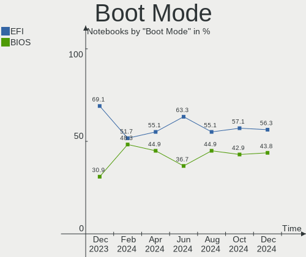
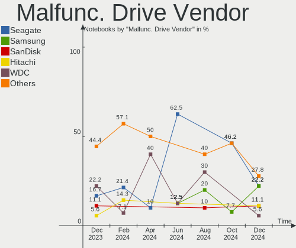
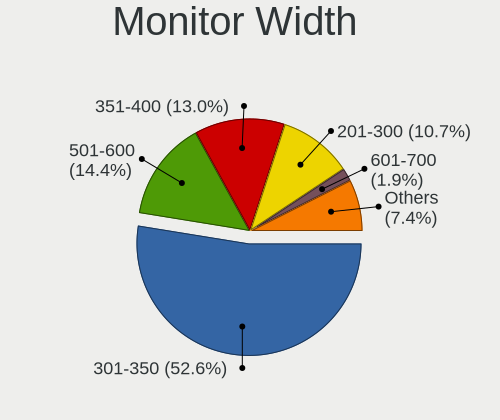
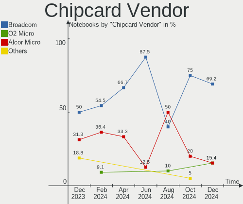
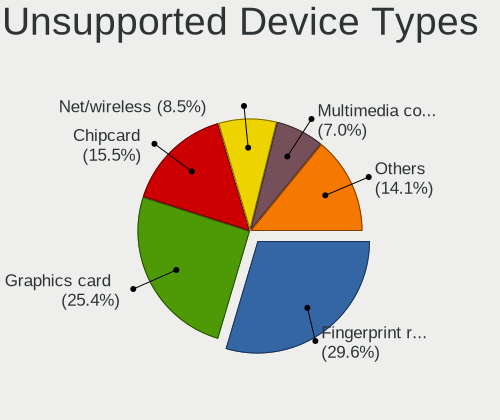

Linux in France - Hardware Trends (Notebooks)
---------------------------------------------

A project to identify most popular hardware characteristics and track their change
over time based on data collected by Linux users at https://Linux-Hardware.org.

Anyone can contribute to this report by the [hw-probe](https://github.com/linuxhw/hw-probe) tool:

    sudo -E hw-probe -all -upload

Period: Jun, 2023.

Contents
--------

* [ System ](#system)
  - [ OS                       ](#os)
  - [ OS Family                ](#os-family)
  - [ Kernel                   ](#kernel)
  - [ Kernel Family            ](#kernel-family)
  - [ Kernel Major Ver.        ](#kernel-major-ver)
  - [ Arch                     ](#arch)
  - [ DE                       ](#de)
  - [ Display Server           ](#display-server)
  - [ Display Manager          ](#display-manager)
  - [ OS Lang                  ](#os-lang)
  - [ Boot Mode                ](#boot-mode)
  - [ Filesystem               ](#filesystem)
  - [ Part. scheme             ](#part-scheme)
  - [ Dual Boot with Linux/BSD ](#dual-boot-with-linuxbsd)
  - [ Dual Boot (Win)          ](#dual-boot-win)

* [ Board ](#board)
  - [ Vendor                   ](#vendor)
  - [ Model                    ](#model)
  - [ Model Family             ](#model-family)
  - [ MFG Year                 ](#mfg-year)
  - [ Form Factor              ](#form-factor)
  - [ Secure Boot              ](#secure-boot)
  - [ Coreboot                 ](#coreboot)
  - [ RAM Size                 ](#ram-size)
  - [ RAM Used                 ](#ram-used)
  - [ Total Drives             ](#total-drives)
  - [ Has CD-ROM               ](#has-cd-rom)
  - [ Has Ethernet             ](#has-ethernet)
  - [ Has WiFi                 ](#has-wifi)
  - [ Has Bluetooth            ](#has-bluetooth)

* [ Location ](#location)
  - [ Country                  ](#country)
  - [ City                     ](#city)

* [ Drives ](#drives)
  - [ Drive Vendor             ](#drive-vendor)
  - [ Drive Model              ](#drive-model)
  - [ HDD Vendor               ](#hdd-vendor)
  - [ SSD Vendor               ](#ssd-vendor)
  - [ Drive Kind               ](#drive-kind)
  - [ Drive Connector          ](#drive-connector)
  - [ Drive Size               ](#drive-size)
  - [ Space Total              ](#space-total)
  - [ Space Used               ](#space-used)
  - [ Malfunc. Drives          ](#malfunc-drives)
  - [ Malfunc. Drive Vendor    ](#malfunc-drive-vendor)
  - [ Malfunc. HDD Vendor      ](#malfunc-hdd-vendor)
  - [ Malfunc. Drive Kind      ](#malfunc-drive-kind)
  - [ Failed Drives            ](#failed-drives)
  - [ Failed Drive Vendor      ](#failed-drive-vendor)
  - [ Drive Status             ](#drive-status)

* [ Storage controller ](#storage-controller)
  - [ Storage Vendor           ](#storage-vendor)
  - [ Storage Model            ](#storage-model)
  - [ Storage Kind             ](#storage-kind)

* [ Processor ](#processor)
  - [ CPU Vendor               ](#cpu-vendor)
  - [ CPU Model                ](#cpu-model)
  - [ CPU Model Family         ](#cpu-model-family)
  - [ CPU Cores                ](#cpu-cores)
  - [ CPU Sockets              ](#cpu-sockets)
  - [ CPU Threads              ](#cpu-threads)
  - [ CPU Op-Modes             ](#cpu-op-modes)
  - [ CPU Microcode            ](#cpu-microcode)
  - [ CPU Microarch            ](#cpu-microarch)

* [ Graphics ](#graphics)
  - [ GPU Vendor               ](#gpu-vendor)
  - [ GPU Model                ](#gpu-model)
  - [ GPU Combo                ](#gpu-combo)
  - [ GPU Driver               ](#gpu-driver)
  - [ GPU Memory               ](#gpu-memory)

* [ Monitor ](#monitor)
  - [ Monitor Vendor           ](#monitor-vendor)
  - [ Monitor Model            ](#monitor-model)
  - [ Monitor Resolution       ](#monitor-resolution)
  - [ Monitor Diagonal         ](#monitor-diagonal)
  - [ Monitor Width            ](#monitor-width)
  - [ Aspect Ratio             ](#aspect-ratio)
  - [ Monitor Area             ](#monitor-area)
  - [ Pixel Density            ](#pixel-density)
  - [ Multiple Monitors        ](#multiple-monitors)

* [ Network ](#network)
  - [ Net Controller Vendor    ](#net-controller-vendor)
  - [ Net Controller Model     ](#net-controller-model)
  - [ Wireless Vendor          ](#wireless-vendor)
  - [ Wireless Model           ](#wireless-model)
  - [ Ethernet Vendor          ](#ethernet-vendor)
  - [ Ethernet Model           ](#ethernet-model)
  - [ Net Controller Kind      ](#net-controller-kind)
  - [ Used Controller          ](#used-controller)
  - [ NICs                     ](#nics)
  - [ IPv6                     ](#ipv6)

* [ Bluetooth ](#bluetooth)
  - [ Bluetooth Vendor         ](#bluetooth-vendor)
  - [ Bluetooth Model          ](#bluetooth-model)

* [ Sound ](#sound)
  - [ Sound Vendor             ](#sound-vendor)
  - [ Sound Model              ](#sound-model)

* [ Memory ](#memory)
  - [ Memory Vendor            ](#memory-vendor)
  - [ Memory Model             ](#memory-model)
  - [ Memory Kind              ](#memory-kind)
  - [ Memory Form Factor       ](#memory-form-factor)
  - [ Memory Size              ](#memory-size)
  - [ Memory Speed             ](#memory-speed)

* [ Printers & scanners ](#printers--scanners)
  - [ Printer Vendor           ](#printer-vendor)
  - [ Printer Model            ](#printer-model)
  - [ Scanner Vendor           ](#scanner-vendor)
  - [ Scanner Model            ](#scanner-model)

* [ Camera ](#camera)
  - [ Camera Vendor            ](#camera-vendor)
  - [ Camera Model             ](#camera-model)

* [ Security ](#security)
  - [ Fingerprint Vendor       ](#fingerprint-vendor)
  - [ Fingerprint Model        ](#fingerprint-model)
  - [ Chipcard Vendor          ](#chipcard-vendor)
  - [ Chipcard Model           ](#chipcard-model)

* [ Unsupported ](#unsupported)
  - [ Unsupported Devices      ](#unsupported-devices)
  - [ Unsupported Device Types ](#unsupported-device-types)

System
------

OS
--

Installed operating systems

| Name                         | Notebooks | Percent |
|------------------------------|-----------|---------|
| Ubuntu 22.04                 | 31        | 22.46%  |
| Linux Mint 21.1              | 11        | 7.97%   |
| Arch Rolling                 | 10        | 7.25%   |
| Ubuntu 23.04                 | 9         | 6.52%   |
| Fedora 38                    | 9         | 6.52%   |
| Debian 11                    | 6         | 4.35%   |
| Debian 12                    | 5         | 3.62%   |
| Xubuntu 22.04                | 4         | 2.9%    |
| Zorin 16                     | 3         | 2.17%   |
| Ubuntu 22.10                 | 3         | 2.17%   |
| openSUSE Tumbleweed-XXXXXXXX | 3         | 2.17%   |
| OpenMandriva 23.03           | 3         | 2.17%   |
| Ubuntu 20.04                 | 2         | 1.45%   |
| openSUSE Leap-15.5           | 2         | 1.45%   |
| OpenMandriva 23.06           | 2         | 1.45%   |
| Manjaro 23.0.0               | 2         | 1.45%   |
| Manjaro                      | 2         | 1.45%   |
| Linux Mint 21                | 2         | 1.45%   |
| Linux Mint 20.3              | 2         | 1.45%   |
| Gentoo 2.13                  | 2         | 1.45%   |
| Ubuntu Unity 23.04           | 1         | 0.72%   |
| Ubuntu MATE 22.04            | 1         | 0.72%   |
| Ubuntu Budgie 23.04          | 1         | 0.72%   |
| Ubuntu Budgie 22.04          | 1         | 0.72%   |
| TUXEDO OS 22.04              | 1         | 0.72%   |
| SteamOS 3.4.8                | 1         | 0.72%   |
| ROSA 12.4                    | 1         | 0.72%   |
| Pop!_OS 22.04                | 1         | 0.72%   |
| Pikaos 23.04                 | 1         | 0.72%   |
| OpenMandriva 4.50            | 1         | 0.72%   |
| OpenMandriva 4.3             | 1         | 0.72%   |
| OpenMandriva 4.2             | 1         | 0.72%   |
| OpenMandriva 23.01           | 1         | 0.72%   |
| Nitrux 2.8.0 build.300423.tf | 1         | 0.72%   |
| Lubuntu 20.04                | 1         | 0.72%   |
| Linux Lite 5.8               | 1         | 0.72%   |
| Kubuntu 23.04                | 1         | 0.72%   |
| Kubuntu 22.04                | 1         | 0.72%   |
| KDE neon 22.04               | 1         | 0.72%   |
| Kali 2023.2                  | 1         | 0.72%   |

OS Family
---------

OS without a version

| Name          | Notebooks | Percent |
|---------------|-----------|---------|
| Ubuntu        | 45        | 32.61%  |
| Linux Mint    | 15        | 10.87%  |
| Debian        | 11        | 7.97%   |
| Arch          | 10        | 7.25%   |
| OpenMandriva  | 9         | 6.52%   |
| Fedora        | 9         | 6.52%   |
| openSUSE      | 5         | 3.62%   |
| Xubuntu       | 4         | 2.9%    |
| Manjaro       | 4         | 2.9%    |
| Zorin         | 3         | 2.17%   |
| Ubuntu Budgie | 2         | 1.45%   |
| Kubuntu       | 2         | 1.45%   |
| Gentoo        | 2         | 1.45%   |
| Ubuntu Unity  | 1         | 0.72%   |
| Ubuntu MATE   | 1         | 0.72%   |
| TUXEDO OS     | 1         | 0.72%   |
| SteamOS       | 1         | 0.72%   |
| ROSA          | 1         | 0.72%   |
| Pop!_OS       | 1         | 0.72%   |
| Pikaos        | 1         | 0.72%   |
| Nitrux        | 1         | 0.72%   |
| Lubuntu       | 1         | 0.72%   |
| Linux Lite    | 1         | 0.72%   |
| KDE neon      | 1         | 0.72%   |
| Kali          | 1         | 0.72%   |
| EndeavourOS   | 1         | 0.72%   |
| Drauger OS    | 1         | 0.72%   |
| Devuan        | 1         | 0.72%   |
| CachyOS       | 1         | 0.72%   |
| ArcoLinux     | 1         | 0.72%   |

Kernel
------

Version of the Linux kernel

| Version                      | Notebooks | Percent |
|------------------------------|-----------|---------|
| 5.19.0-43-generic            | 21        | 15.22%  |
| 6.2.0-20-generic             | 10        | 7.25%   |
| 5.15.0-73-generic            | 10        | 7.25%   |
| 5.19.0-45-generic            | 9         | 6.52%   |
| 5.15.0-75-generic            | 8         | 5.8%    |
| 6.1.0-9-amd64                | 4         | 2.9%    |
| 6.3.7-arch1-1                | 3         | 2.17%   |
| 6.2.6-desktop-1omv2390       | 3         | 2.17%   |
| 5.4.0-152-generic            | 3         | 2.17%   |
| 5.19.0-42-generic            | 3         | 2.17%   |
| 5.10.0-23-amd64              | 3         | 2.17%   |
| 6.3.8-arch1-1                | 2         | 1.45%   |
| 6.3.7-200.fc38.x86_64        | 2         | 1.45%   |
| 6.3.5-desktop-3omv2390       | 2         | 1.45%   |
| 6.3.5-arch1-1                | 2         | 1.45%   |
| 6.3.4-1-default              | 2         | 1.45%   |
| 6.1.31-2-MANJARO             | 2         | 1.45%   |
| 5.14.21-150500.53-default    | 2         | 1.45%   |
| 6.4.0-pikaos                 | 1         | 0.72%   |
| 6.3.9-arch1-1                | 1         | 0.72%   |
| 6.3.9-1-default              | 1         | 0.72%   |
| 6.3.8-gentoo-dist            | 1         | 0.72%   |
| 6.3.8-200.fc38.x86_64        | 1         | 0.72%   |
| 6.3.8-1-cachyos              | 1         | 0.72%   |
| 6.3.7                        | 1         | 0.72%   |
| 6.3.6-arch1-1                | 1         | 0.72%   |
| 6.3.6-200.fc38.x86_64        | 1         | 0.72%   |
| 6.3.5-200.fc38.x86_64        | 1         | 0.72%   |
| 6.3.5-2-MANJARO              | 1         | 0.72%   |
| 6.3.4-arch1-1                | 1         | 0.72%   |
| 6.3.4-201.fc38.x86_64        | 1         | 0.72%   |
| 6.3.0-pf5                    | 1         | 0.72%   |
| 6.2.8-safran                 | 1         | 0.72%   |
| 6.2.6-76060206-generic       | 1         | 0.72%   |
| 6.2.16-dell-latitude-e5510   | 1         | 0.72%   |
| 6.2.15-703.inttf.fc38.x86_64 | 1         | 0.72%   |
| 6.2.15-300.fc38.x86_64       | 1         | 0.72%   |
| 6.2.13-300.fc38.x86_64       | 1         | 0.72%   |
| 6.2.13-1-liquorix-amd64      | 1         | 0.72%   |
| 6.2.0-23-generic             | 1         | 0.72%   |

Kernel Family
-------------

Linux kernel without a distro release

| Version | Notebooks | Percent |
|---------|-----------|---------|
| 5.19.0  | 36        | 26.09%  |
| 5.15.0  | 21        | 15.22%  |
| 6.2.0   | 12        | 8.7%    |
| 6.3.7   | 6         | 4.35%   |
| 6.3.5   | 6         | 4.35%   |
| 6.1.0   | 6         | 4.35%   |
| 6.3.8   | 5         | 3.62%   |
| 5.10.0  | 5         | 3.62%   |
| 6.3.4   | 4         | 2.9%    |
| 6.2.6   | 4         | 2.9%    |
| 6.1.31  | 4         | 2.9%    |
| 5.4.0   | 3         | 2.17%   |
| 6.3.9   | 2         | 1.45%   |
| 6.3.6   | 2         | 1.45%   |
| 6.2.15  | 2         | 1.45%   |
| 6.2.13  | 2         | 1.45%   |
| 5.14.21 | 2         | 1.45%   |
| 5.14.0  | 2         | 1.45%   |
| 6.4.0   | 1         | 0.72%   |
| 6.3.0   | 1         | 0.72%   |
| 6.2.8   | 1         | 0.72%   |
| 6.2.16  | 1         | 0.72%   |
| 6.1.34  | 1         | 0.72%   |
| 6.1.20  | 1         | 0.72%   |
| 6.1.19  | 1         | 0.72%   |
| 6.1.1   | 1         | 0.72%   |
| 5.19.12 | 1         | 0.72%   |
| 5.17.0  | 1         | 0.72%   |
| 5.16.13 | 1         | 0.72%   |
| 5.13.0  | 1         | 0.72%   |
| 5.11.0  | 1         | 0.72%   |
| 5.10.14 | 1         | 0.72%   |

Kernel Major Ver.
-----------------

Linux kernel major version

| Version | Notebooks | Percent |
|---------|-----------|---------|
| 5.19    | 37        | 26.81%  |
| 6.3     | 26        | 18.84%  |
| 6.2     | 22        | 15.94%  |
| 5.15    | 21        | 15.22%  |
| 6.1     | 14        | 10.14%  |
| 5.10    | 6         | 4.35%   |
| 5.14    | 4         | 2.9%    |
| 5.4     | 3         | 2.17%   |
| 6.4     | 1         | 0.72%   |
| 5.17    | 1         | 0.72%   |
| 5.16    | 1         | 0.72%   |
| 5.13    | 1         | 0.72%   |
| 5.11    | 1         | 0.72%   |

Arch
----

OS architecture (x86_64, i586, etc.)

| Name   | Notebooks | Percent |
|--------|-----------|---------|
| x86_64 | 138       | 100%    |

DE
--

Desktop Environment

| Name              | Notebooks | Percent |
|-------------------|-----------|---------|
| GNOME             | 64        | 46.38%  |
| KDE5              | 30        | 21.74%  |
| XFCE              | 12        | 8.7%    |
| X-Cinnamon        | 11        | 7.97%   |
| MATE              | 8         | 5.8%    |
| Budgie            | 3         | 2.17%   |
| Unknown           | 3         | 2.17%   |
| i3                | 2         | 1.45%   |
| Unity             | 1         | 0.72%   |
| ubuntu:pika:GNOME | 1         | 0.72%   |
| sway              | 1         | 0.72%   |
| LXQt              | 1         | 0.72%   |
| GNOME Flashback   | 1         | 0.72%   |

Display Server
--------------

X11 or Wayland

| Name    | Notebooks | Percent |
|---------|-----------|---------|
| X11     | 84        | 60.87%  |
| Wayland | 49        | 35.51%  |
| Tty     | 3         | 2.17%   |
| Unknown | 2         | 1.45%   |

Display Manager
---------------

SDDM, LightDM, etc.

| Name    | Notebooks | Percent |
|---------|-----------|---------|
| GDM3    | 44        | 31.88%  |
| Unknown | 32        | 23.19%  |
| LightDM | 30        | 21.74%  |
| SDDM    | 23        | 16.67%  |
| GDM     | 7         | 5.07%   |
| SLiM    | 1         | 0.72%   |
| GREETD  | 1         | 0.72%   |

OS Lang
-------

Language

| Lang       | Notebooks | Percent |
|------------|-----------|---------|
| fr_FR      | 99        | 71.74%  |
| en_US      | 25        | 18.12%  |
| en_GB      | 3         | 2.17%   |
| C          | 3         | 2.17%   |
| Unknown    | 3         | 2.17%   |
| ru_RU      | 1         | 0.72%   |
| fr_FR@euro | 1         | 0.72%   |
| es_ES      | 1         | 0.72%   |
| en_DK      | 1         | 0.72%   |
| C.UTF8     | 1         | 0.72%   |

Boot Mode
---------

EFI or BIOS

| Mode | Notebooks | Percent |
|------|-----------|---------|
| EFI  | 87        | 63.04%  |
| BIOS | 51        | 36.96%  |

Filesystem
----------

Type of filesystem

| Type    | Notebooks | Percent |
|---------|-----------|---------|
| Ext4    | 92        | 66.67%  |
| Tmpfs   | 20        | 14.49%  |
| Btrfs   | 12        | 8.7%    |
| Overlay | 6         | 4.35%   |
| Xfs     | 4         | 2.9%    |
| Zfs     | 1         | 0.72%   |
| F2fs    | 1         | 0.72%   |
| Ext3    | 1         | 0.72%   |
| Ext2    | 1         | 0.72%   |

Part. scheme
------------

Scheme of partitioning

| Type    | Notebooks | Percent |
|---------|-----------|---------|
| GPT     | 99        | 71.74%  |
| Unknown | 27        | 19.57%  |
| MBR     | 12        | 8.7%    |

Dual Boot with Linux/BSD
------------------------

Hosting more than one Linux/BSD

| Dual boot | Notebooks | Percent |
|-----------|-----------|---------|
| No        | 126       | 91.3%   |
| Yes       | 12        | 8.7%    |

Dual Boot (Win)
---------------

Hosting Linux and Windows

| Dual boot | Notebooks | Percent |
|-----------|-----------|---------|
| No        | 104       | 75.36%  |
| Yes       | 34        | 24.64%  |

Board
-----

Vendor
------

Motherboard manufacturer

| Name                | Notebooks | Percent |
|---------------------|-----------|---------|
| Dell                | 26        | 18.84%  |
| Lenovo              | 24        | 17.39%  |
| Hewlett-Packard     | 19        | 13.77%  |
| ASUSTek Computer    | 18        | 13.04%  |
| Toshiba             | 7         | 5.07%   |
| Acer                | 6         | 4.35%   |
| MSI                 | 5         | 3.62%   |
| Samsung Electronics | 4         | 2.9%    |
| UNOWHY              | 3         | 2.17%   |
| Notebook            | 3         | 2.17%   |
| HUAWEI              | 3         | 2.17%   |
| Timi                | 2         | 1.45%   |
| Sony                | 2         | 1.45%   |
| Gigabyte Technology | 2         | 1.45%   |
| Apple               | 2         | 1.45%   |
| Alienware           | 2         | 1.45%   |
| Valve               | 1         | 0.72%   |
| Schenker            | 1         | 0.72%   |
| Packard Bell        | 1         | 0.72%   |
| NEC Computers       | 1         | 0.72%   |
| LG Electronics      | 1         | 0.72%   |
| Jumper              | 1         | 0.72%   |
| IP3 Tech            | 1         | 0.72%   |
| HONOR               | 1         | 0.72%   |
| Fujitsu             | 1         | 0.72%   |
| eMachines           | 1         | 0.72%   |

Model
-----

Motherboard model

| Name                                       | Notebooks | Percent |
|--------------------------------------------|-----------|---------|
| UNOWHY Y13G002S4EI                         | 2         | 1.45%   |
| Toshiba Satellite Pro L500                 | 2         | 1.45%   |
| Lenovo Legion 5 15ACH6H 82JU               | 2         | 1.45%   |
| Lenovo IdeaPad 3 15ABA7 82RN               | 2         | 1.45%   |
| HP Pavilion 17                             | 2         | 1.45%   |
| Dell Precision 5570                        | 2         | 1.45%   |
| Dell Latitude 5530                         | 2         | 1.45%   |
| Valve Jupiter                              | 1         | 0.72%   |
| UNOWHY Y13G010S4EI                         | 1         | 0.72%   |
| Toshiba Satellite Pro L300                 | 1         | 0.72%   |
| Toshiba Satellite P200                     | 1         | 0.72%   |
| Toshiba Satellite L655                     | 1         | 0.72%   |
| Toshiba Satellite L300                     | 1         | 0.72%   |
| Toshiba Satellite C870-199                 | 1         | 0.72%   |
| Timi TM1613                                | 1         | 0.72%   |
| Timi RedmiBook Pro 14S                     | 1         | 0.72%   |
| Sony VGN-NS38E_S                           | 1         | 0.72%   |
| Sony SVS1312J3EW                           | 1         | 0.72%   |
| Schenker XMG FOCUS (M22)                   | 1         | 0.72%   |
| Samsung R540/R538/SA41/E452                | 1         | 0.72%   |
| Samsung 950XED                             | 1         | 0.72%   |
| Samsung 350V5C/351V5C/3540VC/3440VC        | 1         | 0.72%   |
| Samsung 300E4A/300E5A/300E7A/3430EA/3530EA | 1         | 0.72%   |
| Packard Bell EN Butterfly m                | 1         | 0.72%   |
| Notebook W54_55SU1,SUW                     | 1         | 0.72%   |
| Notebook PCX0DX                            | 1         | 0.72%   |
| Notebook NLx0MU                            | 1         | 0.72%   |
| NEC Computers PC-LM550LS6R                 | 1         | 0.72%   |
| MSI Modern 14 B10MW                        | 1         | 0.72%   |
| MSI GT75 Titan 8RG                         | 1         | 0.72%   |
| MSI GT70                                   | 1         | 0.72%   |
| MSI Crosshair 15 C12VF                     | 1         | 0.72%   |
| MSI CreatorPro X17 A12UKS                  | 1         | 0.72%   |
| LG 17Z90R-G.AD79F                          | 1         | 0.72%   |
| Lenovo Yoga S740-15IRH 81NX                | 1         | 0.72%   |
| Lenovo V15 G2 ALC 82KD                     | 1         | 0.72%   |
| Lenovo ThinkPad Z13 Gen 1 21D2CTO1WW       | 1         | 0.72%   |
| Lenovo ThinkPad X240 20AMS5XY00            | 1         | 0.72%   |
| Lenovo ThinkPad X13 Gen 1 20UGS11Q00       | 1         | 0.72%   |
| Lenovo ThinkPad T550 20CJS1XB00            | 1         | 0.72%   |

Model Family
------------

Motherboard model prefix

| Name                       | Notebooks | Percent |
|----------------------------|-----------|---------|
| Lenovo ThinkPad            | 14        | 10.14%  |
| Dell Latitude              | 10        | 7.25%   |
| Dell Precision             | 8         | 5.8%    |
| Toshiba Satellite          | 7         | 5.07%   |
| HP EliteBook               | 6         | 4.35%   |
| Acer Aspire                | 5         | 3.62%   |
| Lenovo IdeaPad             | 4         | 2.9%    |
| HP Pavilion                | 4         | 2.9%    |
| Dell XPS                   | 4         | 2.9%    |
| Lenovo Legion              | 3         | 2.17%   |
| HP ProBook                 | 3         | 2.17%   |
| HP Laptop                  | 3         | 2.17%   |
| UNOWHY Y13G002S4EI         | 2         | 1.45%   |
| HP ENVY                    | 2         | 1.45%   |
| Dell Inspiron              | 2         | 1.45%   |
| ASUS VivoBook              | 2         | 1.45%   |
| ASUS ROG                   | 2         | 1.45%   |
| Valve Jupiter              | 1         | 0.72%   |
| UNOWHY Y13G010S4EI         | 1         | 0.72%   |
| Timi TM1613                | 1         | 0.72%   |
| Timi RedmiBook             | 1         | 0.72%   |
| Sony VGN-NS38E             | 1         | 0.72%   |
| Sony SVS1312J3EW           | 1         | 0.72%   |
| Schenker XMG               | 1         | 0.72%   |
| Samsung R540               | 1         | 0.72%   |
| Samsung 950XED             | 1         | 0.72%   |
| Samsung 350V5C             | 1         | 0.72%   |
| Samsung 300E4A             | 1         | 0.72%   |
| Packard Bell EN            | 1         | 0.72%   |
| Notebook W54               | 1         | 0.72%   |
| Notebook PCX0DX            | 1         | 0.72%   |
| Notebook NLx0MU            | 1         | 0.72%   |
| NEC Computers PC-LM550LS6R | 1         | 0.72%   |
| MSI Modern                 | 1         | 0.72%   |
| MSI GT75                   | 1         | 0.72%   |
| MSI GT70                   | 1         | 0.72%   |
| MSI Crosshair              | 1         | 0.72%   |
| MSI CreatorPro             | 1         | 0.72%   |
| LG 17Z90R-G.AD79F          | 1         | 0.72%   |
| Lenovo Yoga                | 1         | 0.72%   |

MFG Year
--------

Motherboard manufacture year

| Year | Notebooks | Percent |
|------|-----------|---------|
| 2022 | 21        | 15.22%  |
| 2021 | 21        | 15.22%  |
| 2020 | 10        | 7.25%   |
| 2013 | 9         | 6.52%   |
| 2019 | 8         | 5.8%    |
| 2016 | 8         | 5.8%    |
| 2015 | 8         | 5.8%    |
| 2014 | 8         | 5.8%    |
| 2011 | 8         | 5.8%    |
| 2018 | 6         | 4.35%   |
| 2012 | 6         | 4.35%   |
| 2010 | 6         | 4.35%   |
| 2023 | 5         | 3.62%   |
| 2008 | 5         | 3.62%   |
| 2017 | 4         | 2.9%    |
| 2009 | 4         | 2.9%    |
| 2007 | 1         | 0.72%   |

Form Factor
-----------

Physical design of the computer

| Name     | Notebooks | Percent |
|----------|-----------|---------|
| Notebook | 138       | 100%    |

Secure Boot
-----------

Enabled or disabled

| State    | Notebooks | Percent |
|----------|-----------|---------|
| Disabled | 122       | 88.41%  |
| Enabled  | 16        | 11.59%  |

Coreboot
--------

Have coreboot on board

| Used | Notebooks | Percent |
|------|-----------|---------|
| No   | 138       | 100%    |

RAM Size
--------

Total RAM memory

| Size in GB  | Notebooks | Percent |
|-------------|-----------|---------|
| 4.01-8.0    | 35        | 25.36%  |
| 8.01-16.0   | 30        | 21.74%  |
| 16.01-24.0  | 26        | 18.84%  |
| 3.01-4.0    | 22        | 15.94%  |
| 32.01-64.0  | 16        | 11.59%  |
| 2.01-3.0    | 4         | 2.9%    |
| 24.01-32.0  | 2         | 1.45%   |
| 64.01-256.0 | 2         | 1.45%   |
| 1.01-2.0    | 1         | 0.72%   |

RAM Used
--------

Used RAM memory

| Used GB    | Notebooks | Percent |
|------------|-----------|---------|
| 4.01-8.0   | 42        | 30.43%  |
| 2.01-3.0   | 33        | 23.91%  |
| 1.01-2.0   | 31        | 22.46%  |
| 3.01-4.0   | 21        | 15.22%  |
| 8.01-16.0  | 6         | 4.35%   |
| 0.51-1.0   | 3         | 2.17%   |
| 24.01-32.0 | 1         | 0.72%   |
| 16.01-24.0 | 1         | 0.72%   |

Total Drives
------------

Number of drives on board

| Drives | Notebooks | Percent |
|--------|-----------|---------|
| 1      | 103       | 74.64%  |
| 2      | 27        | 19.57%  |
| 3      | 4         | 2.9%    |
| 4      | 2         | 1.45%   |
| 9      | 1         | 0.72%   |
| 8      | 1         | 0.72%   |

Has CD-ROM
----------

Has CD-ROM on board

| Presented | Notebooks | Percent |
|-----------|-----------|---------|
| No        | 96        | 69.57%  |
| Yes       | 42        | 30.43%  |

Has Ethernet
------------

Has Ethernet on board

| Presented | Notebooks | Percent |
|-----------|-----------|---------|
| Yes       | 107       | 77.54%  |
| No        | 31        | 22.46%  |

Has WiFi
--------

Has WiFi module

| Presented | Notebooks | Percent |
|-----------|-----------|---------|
| Yes       | 136       | 98.55%  |
| No        | 2         | 1.45%   |

Has Bluetooth
-------------

Has Bluetooth module

| Presented | Notebooks | Percent |
|-----------|-----------|---------|
| Yes       | 108       | 78.26%  |
| No        | 30        | 21.74%  |

Location
--------

Country
-------

Geographic location (country)

| Country | Notebooks | Percent |
|---------|-----------|---------|
| France  | 138       | 100%    |

City
----

Geographic location (city)

| City                  | Notebooks | Percent |
|-----------------------|-----------|---------|
| Paris                 | 19        | 13.77%  |
| Toulouse              | 4         | 2.9%    |
| Rennes                | 4         | 2.9%    |
| Marseille             | 4         | 2.9%    |
| La Fleche             | 3         | 2.17%   |
| Bordeaux              | 3         | 2.17%   |
| Maule                 | 2         | 1.45%   |
| Lyon                  | 2         | 1.45%   |
| Gravelines            | 2         | 1.45%   |
| Dijon                 | 2         | 1.45%   |
| Colmar                | 2         | 1.45%   |
| Brest                 | 2         | 1.45%   |
| Vouille               | 1         | 0.72%   |
| Vitrolles             | 1         | 0.72%   |
| Villeneuve-Loubet     | 1         | 0.72%   |
| Vanves                | 1         | 0.72%   |
| Vannes                | 1         | 0.72%   |
| Valenciennes          | 1         | 0.72%   |
| Valence               | 1         | 0.72%   |
| Valbonne              | 1         | 0.72%   |
| Troyes                | 1         | 0.72%   |
| Trappes               | 1         | 0.72%   |
| Tourlaville           | 1         | 0.72%   |
| Touget                | 1         | 0.72%   |
| Strasbourg            | 1         | 0.72%   |
| Sene                  | 1         | 0.72%   |
| Sarzeau               | 1         | 0.72%   |
| Sallanches            | 1         | 0.72%   |
| Sainte-Luce-sur-Loire | 1         | 0.72%   |
| Sainte-Foy-les-Lyon   | 1         | 0.72%   |
| Saint-Germain-en-Laye | 1         | 0.72%   |
| Saint-Etienne         | 1         | 0.72%   |
| Saint-Denis           | 1         | 0.72%   |
| Saint-Brieuc          | 1         | 0.72%   |
| Rouen                 | 1         | 0.72%   |
| Rosny-sous-Bois       | 1         | 0.72%   |
| Ronchamp              | 1         | 0.72%   |
| Roche-la-Moliere      | 1         | 0.72%   |
| Rezé                 | 1         | 0.72%   |
| Realmont              | 1         | 0.72%   |

Drives
------

Drive Vendor
------------

Hard drive vendors

| Vendor                       | Notebooks | Drives | Percent |
|------------------------------|-----------|--------|---------|
| Samsung Electronics          | 34        | 39     | 18.99%  |
| SK hynix                     | 16        | 16     | 8.94%   |
| WDC                          | 15        | 15     | 8.38%   |
| SanDisk                      | 14        | 14     | 7.82%   |
| Unknown                      | 11        | 11     | 6.15%   |
| Seagate                      | 10        | 14     | 5.59%   |
| Crucial                      | 9         | 13     | 5.03%   |
| Intel                        | 8         | 8      | 4.47%   |
| Toshiba                      | 6         | 7      | 3.35%   |
| KIOXIA                       | 6         | 6      | 3.35%   |
| Kingston                     | 6         | 6      | 3.35%   |
| Hitachi                      | 5         | 5      | 2.79%   |
| HGST                         | 5         | 5      | 2.79%   |
| Micron Technology            | 4         | 4      | 2.23%   |
| China                        | 3         | 3      | 1.68%   |
| Realtek                      | 2         | 2      | 1.12%   |
| Phison Electronics           | 2         | 2      | 1.12%   |
| Phison                       | 2         | 2      | 1.12%   |
| Unknown                      | 2         | 2      | 1.12%   |
| Verbatim                     | 1         | 1      | 0.56%   |
| TYPEC 1T                     | 1         | 1      | 0.56%   |
| Transcend                    | 1         | 1      | 0.56%   |
| Shenzhen Longsys Electronics | 1         | 1      | 0.56%   |
| SABRENT                      | 1         | 1      | 0.56%   |
| PNY                          | 1         | 1      | 0.56%   |
| OCZ                          | 1         | 1      | 0.56%   |
| Micron/Crucial Technology    | 1         | 1      | 0.56%   |
| MAXIO Technology (Hangzhou)  | 1         | 1      | 0.56%   |
| LITEONIT                     | 1         | 1      | 0.56%   |
| Kingston Technology Company  | 1         | 1      | 0.56%   |
| Hewlett-Packard              | 1         | 2      | 0.56%   |
| Gigabyte Technology          | 1         | 1      | 0.56%   |
| Fujitsu                      | 1         | 1      | 0.56%   |
| Emtec                        | 1         | 1      | 0.56%   |
| ASMT                         | 1         | 1      | 0.56%   |
| Apple                        | 1         | 1      | 0.56%   |
| A-DATA Technology            | 1         | 1      | 0.56%   |
| 2.5"                         | 1         | 2      | 0.56%   |

Drive Model
-----------

Hard drive models

| Model                                               | Notebooks | Percent |
|-----------------------------------------------------|-----------|---------|
| Crucial CT1000MX500SSD1 1TB                         | 5         | 2.6%    |
| Samsung SSD 870 QVO 1TB                             | 4         | 2.08%   |
| Samsung NVMe SSD Controller PM9A1/PM9A3/980PRO 2TB  | 4         | 2.08%   |
| Unknown MMC Card  64GB                              | 3         | 1.56%   |
| SK hynix PC801 NVMe 1TB                             | 3         | 1.56%   |
| Samsung SSD 980 1TB                                 | 3         | 1.56%   |
| Samsung NVMe SSD Controller SM981/PM981/PM983 250GB | 3         | 1.56%   |
| WDC WD7500BPKT-75PK4T0 752GB                        | 2         | 1.04%   |
| Unknown MMC Card  32GB                              | 2         | 1.04%   |
| Unknown MMC Card  128GB                             | 2         | 1.04%   |
| SK hynix PC711 NVMe 1TB                             | 2         | 1.04%   |
| Seagate ST500LM021-1KJ152 500GB                     | 2         | 1.04%   |
| Seagate ST1000LM035-1RK172 1TB                      | 2         | 1.04%   |
| Sandisk WD Black SN750 / PC SN730 NVMe SSD 500GB    | 2         | 1.04%   |
| SanDisk NVMe SSD Drive 512GB                        | 2         | 1.04%   |
| Phison MSI M390 500GB                               | 2         | 1.04%   |
| KIOXIA KBG50ZNS256G NVMe 256GB                      | 2         | 1.04%   |
| Kingston SA400S37120G 120GB SSD                     | 2         | 1.04%   |
| Intel SSDPEKNW512G8 512GB                           | 2         | 1.04%   |
| Intel SSDPEKNW010TZL 1TB                            | 2         | 1.04%   |
| Hitachi HTS547564A9E384 640GB                       | 2         | 1.04%   |
| HGST HTS725050A7E630 500GB                          | 2         | 1.04%   |
| Unknown                                             | 2         | 1.04%   |
| WDC WDS200T2B0B 2TB SSD                             | 1         | 0.52%   |
| WDC WD5000LPCX-22VHAT1 500GB                        | 1         | 0.52%   |
| WDC WD3200BPVT-22JJ5T0 320GB                        | 1         | 0.52%   |
| WDC WD3200BEVT-26ZCT0 320GB                         | 1         | 0.52%   |
| WDC WD1600BEVT-22ZCT0 160GB                         | 1         | 0.52%   |
| WDC WD16 00BEVT-60ZCT0 160GB                        | 1         | 0.52%   |
| WDC WD10SPZX-08Z10 1TB                              | 1         | 0.52%   |
| WDC WD10SPZX-00Z10T0 1TB                            | 1         | 0.52%   |
| WDC WD10JPVX-60JC3T0 1TB                            | 1         | 0.52%   |
| WDC WD10JPVX-22JC3T0 1TB                            | 1         | 0.52%   |
| WDC WD10JPVX-11JC3T0 1TB                            | 1         | 0.52%   |
| WDC PC SN810 NVMe 1024GB                            | 1         | 0.52%   |
| WDC PC SN530 SDBPNPZ-512G-1027 512GB                | 1         | 0.52%   |
| Verbatim Vi500 S3 240GB SSD                         | 1         | 0.52%   |
| Unknown SD/MMC/MS PRO 250GB                         | 1         | 0.52%   |
| Unknown EE8QT  256GB                                | 1         | 0.52%   |
| Unknown EC2QT  64GB                                 | 1         | 0.52%   |

HDD Vendor
----------

Hard disk drive vendors

| Vendor              | Notebooks | Drives | Percent |
|---------------------|-----------|--------|---------|
| WDC                 | 12        | 12     | 30%     |
| Seagate             | 10        | 14     | 25%     |
| Hitachi             | 5         | 5      | 12.5%   |
| HGST                | 5         | 5      | 12.5%   |
| Toshiba             | 4         | 5      | 10%     |
| Unknown             | 1         | 1      | 2.5%    |
| Samsung Electronics | 1         | 1      | 2.5%    |
| Fujitsu             | 1         | 1      | 2.5%    |
| ASMT                | 1         | 1      | 2.5%    |

SSD Vendor
----------

Solid state drive vendors

| Vendor              | Notebooks | Drives | Percent |
|---------------------|-----------|--------|---------|
| Samsung Electronics | 13        | 13     | 26%     |
| Crucial             | 8         | 9      | 16%     |
| SanDisk             | 5         | 5      | 10%     |
| Kingston            | 5         | 5      | 10%     |
| China               | 3         | 3      | 6%      |
| SK hynix            | 2         | 2      | 4%      |
| WDC                 | 1         | 1      | 2%      |
| Verbatim            | 1         | 1      | 2%      |
| TYPEC 1T            | 1         | 1      | 2%      |
| Transcend           | 1         | 1      | 2%      |
| PNY                 | 1         | 1      | 2%      |
| OCZ                 | 1         | 1      | 2%      |
| Micron Technology   | 1         | 1      | 2%      |
| LITEONIT            | 1         | 1      | 2%      |
| Intel               | 1         | 1      | 2%      |
| Hewlett-Packard     | 1         | 2      | 2%      |
| Emtec               | 1         | 1      | 2%      |
| Apple               | 1         | 1      | 2%      |
| A-DATA Technology   | 1         | 1      | 2%      |
| 2.5"                | 1         | 2      | 2%      |

Drive Kind
----------

HDD or SSD

| Kind    | Notebooks | Drives | Percent |
|---------|-----------|--------|---------|
| NVMe    | 71        | 82     | 42.77%  |
| SSD     | 44        | 53     | 26.51%  |
| HDD     | 37        | 45     | 22.29%  |
| MMC     | 12        | 13     | 7.23%   |
| Unknown | 2         | 2      | 1.2%    |

Drive Connector
---------------

SATA, SAS, NVMe, etc.

| Type | Notebooks | Drives | Percent |
|------|-----------|--------|---------|
| NVMe | 71        | 80     | 44.1%   |
| SATA | 69        | 90     | 42.86%  |
| MMC  | 12        | 13     | 7.45%   |
| SAS  | 9         | 12     | 5.59%   |

Drive Size
----------

Size of hard drive

| Size in TB | Notebooks | Drives | Percent |
|------------|-----------|--------|---------|
| 0.01-0.5   | 46        | 54     | 54.76%  |
| 0.51-1.0   | 31        | 35     | 36.9%   |
| 1.01-2.0   | 4         | 6      | 4.76%   |
| 3.01-4.0   | 2         | 2      | 2.38%   |
| 4.01-10.0  | 1         | 1      | 1.19%   |

Space Total
-----------

Amount of disk space available on the file system

| Size in GB     | Notebooks | Percent |
|----------------|-----------|---------|
| 251-500        | 48        | 34.78%  |
| 101-250        | 27        | 19.57%  |
| 501-1000       | 26        | 18.84%  |
| 51-100         | 10        | 7.25%   |
| 2001-3000      | 8         | 5.8%    |
| More than 3000 | 5         | 3.62%   |
| 1-20           | 5         | 3.62%   |
| 1001-2000      | 4         | 2.9%    |
| Unknown        | 3         | 2.17%   |
| 21-50          | 2         | 1.45%   |

Space Used
----------

Amount of used disk space

| Used GB        | Notebooks | Percent |
|----------------|-----------|---------|
| 21-50          | 34        | 24.64%  |
| 1-20           | 30        | 21.74%  |
| 101-250        | 29        | 21.01%  |
| 251-500        | 16        | 11.59%  |
| 51-100         | 16        | 11.59%  |
| 501-1000       | 5         | 3.62%   |
| 1001-2000      | 3         | 2.17%   |
| Unknown        | 3         | 2.17%   |
| More than 3000 | 2         | 1.45%   |

Malfunc. Drives
---------------

Drive models with a malfunction

| Model                                 | Notebooks | Drives | Percent |
|---------------------------------------|-----------|--------|---------|
| WDC WDS200T2B0B 2TB SSD               | 1         | 1      | 5.56%   |
| SK hynix PC711 HFS512GDE9X073N 512GB  | 1         | 1      | 5.56%   |
| SK hynix HFS128G32TND-N210A 128GB SSD | 1         | 1      | 5.56%   |
| Seagate ST9320320AS 320GB             | 1         | 1      | 5.56%   |
| Seagate ST500LM021-1KJ152 500GB       | 1         | 1      | 5.56%   |
| Seagate ST2000DM001-1ER164 2TB        | 1         | 1      | 5.56%   |
| Seagate ST1000DM003-9YN162 1TB        | 1         | 1      | 5.56%   |
| SanDisk SSD PLUS 480GB                | 1         | 1      | 5.56%   |
| SanDisk SD7SB3Q128G1001 128GB SSD     | 1         | 1      | 5.56%   |
| Samsung Electronics SSD 970 EVO 2TB   | 1         | 1      | 5.56%   |
| Kingston OM8S1S3128K-AH 128GB SSD     | 1         | 1      | 5.56%   |
| Hitachi HTS725032A9A364 320GB         | 1         | 1      | 5.56%   |
| Hitachi HTS723232A7A364 320GB         | 1         | 1      | 5.56%   |
| HGST HTS541010A9E680 1TB              | 1         | 1      | 5.56%   |
| Fujitsu MHY2160BH 160GB               | 1         | 1      | 5.56%   |
| China SH00R120GB SSD                  | 1         | 1      | 5.56%   |
| ASMT 2235 128GB                       | 1         | 1      | 5.56%   |
| 2.5" SATA SSD 3TG6-P 2TB              | 1         | 2      | 5.56%   |

Malfunc. Drive Vendor
---------------------

Vendors of faulty drives

| Vendor              | Notebooks | Drives | Percent |
|---------------------|-----------|--------|---------|
| Seagate             | 4         | 4      | 22.22%  |
| SK hynix            | 2         | 2      | 11.11%  |
| SanDisk             | 2         | 2      | 11.11%  |
| Hitachi             | 2         | 2      | 11.11%  |
| WDC                 | 1         | 1      | 5.56%   |
| Samsung Electronics | 1         | 1      | 5.56%   |
| Kingston            | 1         | 1      | 5.56%   |
| HGST                | 1         | 1      | 5.56%   |
| Fujitsu             | 1         | 1      | 5.56%   |
| China               | 1         | 1      | 5.56%   |
| ASMT                | 1         | 1      | 5.56%   |
| 2.5"                | 1         | 2      | 5.56%   |

Malfunc. HDD Vendor
-------------------

Vendors of faulty HDD drives

| Vendor  | Notebooks | Drives | Percent |
|---------|-----------|--------|---------|
| Seagate | 4         | 4      | 44.44%  |
| Hitachi | 2         | 2      | 22.22%  |
| HGST    | 1         | 1      | 11.11%  |
| Fujitsu | 1         | 1      | 11.11%  |
| ASMT    | 1         | 1      | 11.11%  |

Malfunc. Drive Kind
-------------------

Kinds of faulty drives

| Kind | Notebooks | Drives | Percent |
|------|-----------|--------|---------|
| HDD  | 9         | 9      | 50%     |
| SSD  | 7         | 8      | 38.89%  |
| NVMe | 2         | 2      | 11.11%  |

Failed Drives
-------------

Failed drive models

Zero info for selected period =(

Failed Drive Vendor
-------------------

Failed drive vendors

Zero info for selected period =(

Drive Status
------------

Number of failed and malfunc. drives

| Status   | Notebooks | Drives | Percent |
|----------|-----------|--------|---------|
| Works    | 72        | 92     | 48.65%  |
| Detected | 61        | 84     | 41.22%  |
| Malfunc  | 15        | 19     | 10.14%  |

Storage controller
------------------

Storage Vendor
--------------

Storage controller vendors

| Vendor                       | Notebooks | Percent |
|------------------------------|-----------|---------|
| Intel                        | 93        | 52.54%  |
| Samsung Electronics          | 22        | 12.43%  |
| SK hynix                     | 14        | 7.91%   |
| AMD                          | 14        | 7.91%   |
| SanDisk                      | 11        | 6.21%   |
| KIOXIA                       | 6         | 3.39%   |
| Micron/Crucial Technology    | 4         | 2.26%   |
| Phison Electronics           | 3         | 1.69%   |
| Micron Technology            | 3         | 1.69%   |
| Toshiba America Info Systems | 2         | 1.13%   |
| Kingston Technology Company  | 2         | 1.13%   |
| Shenzhen Longsys Electronics | 1         | 0.56%   |
| MAXIO Technology (Hangzhou)  | 1         | 0.56%   |
| Marvell Technology Group     | 1         | 0.56%   |

Storage Model
-------------

Storage controller models

| Model                                                                          | Notebooks | Percent |
|--------------------------------------------------------------------------------|-----------|---------|
| Intel Volume Management Device NVMe RAID Controller                            | 13        | 6.88%   |
| Samsung NVMe SSD Controller 980                                                | 11        | 5.82%   |
| Intel Sunrise Point-LP SATA Controller [AHCI mode]                             | 11        | 5.82%   |
| AMD FCH SATA Controller [AHCI mode]                                            | 11        | 5.82%   |
| SK hynix Gold P31/BC711/PC711 NVMe Solid State Drive                           | 8         | 4.23%   |
| Intel 7 Series Chipset Family 6-port SATA Controller [AHCI mode]               | 8         | 4.23%   |
| Samsung NVMe SSD Controller SM981/PM981/PM983                                  | 7         | 3.7%    |
| Intel 82801IBM/IEM (ICH9M/ICH9M-E) 4 port SATA Controller [AHCI mode]          | 7         | 3.7%    |
| Intel 6 Series/C200 Series Chipset Family 6 port Mobile SATA AHCI Controller   | 7         | 3.7%    |
| Intel 82801 Mobile SATA Controller [RAID mode]                                 | 5         | 2.65%   |
| Intel 8 Series/C220 Series Chipset Family 6-port SATA Controller 1 [AHCI mode] | 5         | 2.65%   |
| Intel 8 Series SATA Controller 1 [AHCI mode]                                   | 5         | 2.65%   |
| Intel 5 Series/3400 Series Chipset 4 port SATA AHCI Controller                 | 5         | 2.65%   |
| SK hynix Platinum P41/PC801 NVMe Solid State Drive                             | 4         | 2.12%   |
| Samsung NVMe SSD Controller PM9A1/PM9A3/980PRO                                 | 4         | 2.12%   |
| Intel SSD 660P Series                                                          | 4         | 2.12%   |
| SanDisk Non-Volatile memory controller                                         | 3         | 1.59%   |
| KIOXIA NVMe SSD Controller BG4                                                 | 3         | 1.59%   |
| KIOXIA Non-Volatile memory controller                                          | 3         | 1.59%   |
| Intel Wildcat Point-LP SATA Controller [AHCI Mode]                             | 3         | 1.59%   |
| Intel Tiger Lake-LP SATA Controller                                            | 3         | 1.59%   |
| Intel Non-Volatile memory controller                                           | 3         | 1.59%   |
| Intel Celeron/Pentium Silver Processor SATA Controller                         | 3         | 1.59%   |
| Intel Celeron N3350/Pentium N4200/Atom E3900 Series SATA AHCI Controller       | 3         | 1.59%   |
| Intel Cannon Lake Mobile PCH SATA AHCI Controller                              | 3         | 1.59%   |
| SanDisk WD Black SN750 / PC SN730 NVMe SSD                                     | 2         | 1.06%   |
| Phison Electronics Non-Volatile memory controller                              | 2         | 1.06%   |
| Micron/Crucial P5 Plus NVMe PCIe SSD                                           | 2         | 1.06%   |
| Micron/Crucial P2 NVMe PCIe SSD                                                | 2         | 1.06%   |
| Micron NVMe Storage Controller                                                 | 2         | 1.06%   |
| Intel Q170/Q150/B150/H170/H110/Z170/CM236 Chipset SATA Controller [AHCI Mode]  | 2         | 1.06%   |
| Intel Atom Processor E3800 Series SATA AHCI Controller                         | 2         | 1.06%   |
| Intel 400 Series Chipset Family SATA AHCI Controller                           | 2         | 1.06%   |
| AMD SB7x0/SB8x0/SB9x0 SATA Controller [AHCI mode]                              | 2         | 1.06%   |
| Toshiba America Info Systems XG6 NVMe SSD Controller                           | 1         | 0.53%   |
| Toshiba America Info Systems BG3 NVMe SSD Controller                           | 1         | 0.53%   |
| SK hynix PC401 NVMe Solid State Drive 256GB                                    | 1         | 0.53%   |
| SK hynix BC901 NVMe Solid State Drive (DRAM-less)                              | 1         | 0.53%   |
| Shenzhen Longsys Non-Volatile memory controller                                | 1         | 0.53%   |
| SanDisk WD PC SN810 / Black SN850 NVMe SSD                                     | 1         | 0.53%   |

Storage Kind
------------

Kind of storage controller (IDE, SATA, NVMe, SAS, ...)

| Kind | Notebooks | Percent |
|------|-----------|---------|
| SATA | 89        | 49.17%  |
| NVMe | 71        | 39.23%  |
| RAID | 19        | 10.5%   |
| IDE  | 2         | 1.1%    |

Processor
---------

CPU Vendor
----------

Processor vendors

| Vendor | Notebooks | Percent |
|--------|-----------|---------|
| Intel  | 117       | 84.78%  |
| AMD    | 21        | 15.22%  |

CPU Model
---------

Processor models

| Model                                       | Notebooks | Percent |
|---------------------------------------------|-----------|---------|
| Intel Core i5-6200U CPU @ 2.30GHz           | 5         | 3.62%   |
| Intel 12th Gen Core i7-12700H               | 4         | 2.9%    |
| Intel Core i5-3210M CPU @ 2.50GHz           | 3         | 2.17%   |
| Intel Core i3-2350M CPU @ 2.30GHz           | 3         | 2.17%   |
| Intel Celeron CPU N3450 @ 1.10GHz           | 3         | 2.17%   |
| Intel 11th Gen Core i7-1185G7 @ 3.00GHz     | 3         | 2.17%   |
| AMD Ryzen 5 5600H with Radeon Graphics      | 3         | 2.17%   |
| AMD Ryzen 5 5500U with Radeon Graphics      | 3         | 2.17%   |
| Intel Genuine CPU T1600 @ 1.66GHz           | 2         | 1.45%   |
| Intel Core i7-8650U CPU @ 1.90GHz           | 2         | 1.45%   |
| Intel Core i7-6820HQ CPU @ 2.70GHz          | 2         | 1.45%   |
| Intel Core i7-10850H CPU @ 2.70GHz          | 2         | 1.45%   |
| Intel Core i7-10750H CPU @ 2.60GHz          | 2         | 1.45%   |
| Intel Core i5-9300H CPU @ 2.40GHz           | 2         | 1.45%   |
| Intel Core i5-6300U CPU @ 2.40GHz           | 2         | 1.45%   |
| Intel Core i5-4210U CPU @ 1.70GHz           | 2         | 1.45%   |
| Intel Core i5-3337U CPU @ 1.80GHz           | 2         | 1.45%   |
| Intel Core i5-10210U CPU @ 1.60GHz          | 2         | 1.45%   |
| Intel Core i3-6006U CPU @ 2.00GHz           | 2         | 1.45%   |
| Intel 13th Gen Core i7-1360P                | 2         | 1.45%   |
| Intel 12th Gen Core i7-1265U                | 2         | 1.45%   |
| Intel 11th Gen Core i7-1165G7 @ 2.80GHz     | 2         | 1.45%   |
| Intel 11th Gen Core i5-1135G7 @ 2.40GHz     | 2         | 1.45%   |
| AMD Ryzen 7 5825U with Radeon Graphics      | 2         | 1.45%   |
| AMD Ryzen 7 5700U with Radeon Graphics      | 2         | 1.45%   |
| Intel Pentium Dual-Core CPU T4200 @ 2.00GHz | 1         | 0.72%   |
| Intel Pentium Dual CPU T3200 @ 2.00GHz      | 1         | 0.72%   |
| Intel Pentium Dual CPU T2310 @ 1.46GHz      | 1         | 0.72%   |
| Intel Pentium CPU N3540 @ 2.16GHz           | 1         | 0.72%   |
| Intel Pentium CPU B970 @ 2.30GHz            | 1         | 0.72%   |
| Intel Genuine CPU U4100 @ 1.30GHz           | 1         | 0.72%   |
| Intel Core m7-6Y75 CPU @ 1.20GHz            | 1         | 0.72%   |
| Intel Core i9-8950HK CPU @ 2.90GHz          | 1         | 0.72%   |
| Intel Core i7-8750H CPU @ 2.20GHz           | 1         | 0.72%   |
| Intel Core i7-8550U CPU @ 1.80GHz           | 1         | 0.72%   |
| Intel Core i7-7600U CPU @ 2.80GHz           | 1         | 0.72%   |
| Intel Core i7-6500U CPU @ 2.50GHz           | 1         | 0.72%   |
| Intel Core i7-5600U CPU @ 2.60GHz           | 1         | 0.72%   |
| Intel Core i7-4800MQ CPU @ 2.70GHz          | 1         | 0.72%   |
| Intel Core i7-4702MQ CPU @ 2.20GHz          | 1         | 0.72%   |

CPU Model Family
----------------

Processor model prefix

| Model                   | Notebooks | Percent |
|-------------------------|-----------|---------|
| Intel Core i5           | 33        | 23.91%  |
| Other                   | 30        | 21.74%  |
| Intel Core i7           | 25        | 18.12%  |
| Intel Core i3           | 9         | 6.52%   |
| Intel Celeron           | 7         | 5.07%   |
| AMD Ryzen 5             | 7         | 5.07%   |
| AMD Ryzen 7             | 6         | 4.35%   |
| Intel Genuine           | 3         | 2.17%   |
| AMD Ryzen 5 PRO         | 3         | 2.17%   |
| Intel Pentium Dual      | 2         | 1.45%   |
| Intel Pentium           | 2         | 1.45%   |
| Intel Core 2 Duo        | 2         | 1.45%   |
| Intel Pentium Dual-Core | 1         | 0.72%   |
| Intel Core m7           | 1         | 0.72%   |
| Intel Core i9           | 1         | 0.72%   |
| Intel Celeron Dual-Core | 1         | 0.72%   |
| Intel Atom              | 1         | 0.72%   |
| AMD Ryzen 9             | 1         | 0.72%   |
| AMD Ryzen 7 PRO         | 1         | 0.72%   |
| AMD Phenom II           | 1         | 0.72%   |
| AMD Athlon II           | 1         | 0.72%   |

CPU Cores
---------

Number of processor cores

| Number | Notebooks | Percent |
|--------|-----------|---------|
| 2      | 56        | 40.58%  |
| 4      | 38        | 27.54%  |
| 6      | 16        | 11.59%  |
| 8      | 11        | 7.97%   |
| 14     | 6         | 4.35%   |
| 12     | 5         | 3.62%   |
| 10     | 5         | 3.62%   |
| 16     | 1         | 0.72%   |

CPU Sockets
-----------

Number of sockets

| Number | Notebooks | Percent |
|--------|-----------|---------|
| 1      | 138       | 100%    |

CPU Threads
-----------

Threads per core (Hyper-Threading)

| Number | Notebooks | Percent |
|--------|-----------|---------|
| 2      | 112       | 81.16%  |
| 1      | 26        | 18.84%  |

CPU Op-Modes
------------

CPU Operation Modes (32-bit, 64-bit)

| Op mode        | Notebooks | Percent |
|----------------|-----------|---------|
| 32-bit, 64-bit | 138       | 100%    |

CPU Microcode
-------------

Microcode number

| Number     | Notebooks | Percent |
|------------|-----------|---------|
| Unknown    | 73        | 52.9%   |
| 0x406e3    | 6         | 4.35%   |
| 0x906a3    | 4         | 2.9%    |
| 0x40651    | 4         | 2.9%    |
| 0x0a50000c | 4         | 2.9%    |
| 0x906a4    | 3         | 2.17%   |
| 0x806c1    | 3         | 2.17%   |
| 0x6fd      | 3         | 2.17%   |
| 0x306c3    | 3         | 2.17%   |
| 0x30678    | 3         | 2.17%   |
| 0x1067a    | 3         | 2.17%   |
| 0x08608103 | 3         | 2.17%   |
| 0x906ea    | 2         | 1.45%   |
| 0x806ec    | 2         | 1.45%   |
| 0x706a1    | 2         | 1.45%   |
| 0x306a9    | 2         | 1.45%   |
| 0x206a7    | 2         | 1.45%   |
| 0x20652    | 2         | 1.45%   |
| 0x0a404102 | 2         | 1.45%   |
| 0x08600106 | 2         | 1.45%   |
| 0xb06a2    | 1         | 0.72%   |
| 0xa0652    | 1         | 0.72%   |
| 0x806ea    | 1         | 0.72%   |
| 0x806e9    | 1         | 0.72%   |
| 0x806d1    | 1         | 0.72%   |
| 0x706a8    | 1         | 0.72%   |
| 0x20655    | 1         | 0.72%   |
| 0x08701030 | 1         | 0.72%   |
| 0x0810100b | 1         | 0.72%   |
| 0x010000c8 | 1         | 0.72%   |

CPU Microarch
-------------

Microarchitecture

| Name             | Notebooks | Percent |
|------------------|-----------|---------|
| KabyLake         | 15        | 10.87%  |
| Alderlake Hybrid | 14        | 10.14%  |
| Skylake          | 13        | 9.42%   |
| Unknown          | 13        | 9.42%   |
| Haswell          | 11        | 7.97%   |
| TigerLake        | 9         | 6.52%   |
| SandyBridge      | 8         | 5.8%    |
| IvyBridge        | 8         | 5.8%    |
| Zen 3            | 6         | 4.35%   |
| Westmere         | 5         | 3.62%   |
| Core             | 5         | 3.62%   |
| CometLake        | 5         | 3.62%   |
| Penryn           | 4         | 2.9%    |
| Broadwell        | 4         | 2.9%    |
| Zen 2            | 3         | 2.17%   |
| Silvermont       | 3         | 2.17%   |
| Goldmont plus    | 3         | 2.17%   |
| Goldmont         | 3         | 2.17%   |
| K10              | 2         | 1.45%   |
| Icelake          | 2         | 1.45%   |
| Zen              | 1         | 0.72%   |
| Nehalem          | 1         | 0.72%   |

Graphics
--------

GPU Vendor
----------

Vendors of graphics cards

| Vendor | Notebooks | Percent |
|--------|-----------|---------|
| Intel  | 108       | 57.75%  |
| Nvidia | 49        | 26.2%   |
| AMD    | 30        | 16.04%  |

GPU Model
---------

Graphics card models

| Model                                                                                 | Notebooks | Percent |
|---------------------------------------------------------------------------------------|-----------|---------|
| Intel Skylake GT2 [HD Graphics 520]                                                   | 10        | 5.26%   |
| Intel 2nd Generation Core Processor Family Integrated Graphics Controller             | 8         | 4.21%   |
| Intel TigerLake-LP GT2 [Iris Xe Graphics]                                             | 7         | 3.68%   |
| Intel Mobile 4 Series Chipset Integrated Graphics Controller                          | 7         | 3.68%   |
| Intel Alder Lake-P Integrated Graphics Controller                                     | 7         | 3.68%   |
| Intel Haswell-ULT Integrated Graphics Controller                                      | 6         | 3.16%   |
| Intel 3rd Gen Core processor Graphics Controller                                      | 6         | 3.16%   |
| Nvidia GA106M [GeForce RTX 3060 Mobile / Max-Q]                                       | 5         | 2.63%   |
| Intel 4th Gen Core Processor Integrated Graphics Controller                           | 5         | 2.63%   |
| AMD Lucienne                                                                          | 5         | 2.63%   |
| Intel CometLake-H GT2 [UHD Graphics]                                                  | 4         | 2.11%   |
| Intel Alder Lake-UP3 GT2 [UHD Graphics]                                               | 4         | 2.11%   |
| Intel UHD Graphics 620                                                                | 3         | 1.58%   |
| Intel TigerLake-H GT1 [UHD Graphics]                                                  | 3         | 1.58%   |
| Intel Raptor Lake-P [Iris Xe Graphics]                                                | 3         | 1.58%   |
| Intel HD Graphics 5500                                                                | 3         | 1.58%   |
| Intel HD Graphics 500                                                                 | 3         | 1.58%   |
| Intel GeminiLake [UHD Graphics 600]                                                   | 3         | 1.58%   |
| Intel Core Processor Integrated Graphics Controller                                   | 3         | 1.58%   |
| Intel CometLake-U GT2 [UHD Graphics]                                                  | 3         | 1.58%   |
| Intel CoffeeLake-H GT2 [UHD Graphics 630]                                             | 3         | 1.58%   |
| Intel Atom Processor Z36xxx/Z37xxx Series Graphics & Display                          | 3         | 1.58%   |
| AMD Rembrandt [Radeon 680M]                                                           | 3         | 1.58%   |
| AMD Park [Mobility Radeon HD 5430/5450/5470]                                          | 3         | 1.58%   |
| AMD Cezanne [Radeon Vega Series / Radeon Vega Mobile Series]                          | 3         | 1.58%   |
| Nvidia TU117M [GeForce GTX 1650 Mobile / Max-Q]                                       | 2         | 1.05%   |
| Nvidia TU117GLM [Quadro T500 Mobile]                                                  | 2         | 1.05%   |
| Nvidia GM108M [GeForce 940MX]                                                         | 2         | 1.05%   |
| Nvidia GM107GLM [Quadro M1000M]                                                       | 2         | 1.05%   |
| Nvidia GA107M [GeForce RTX 3050 Mobile]                                               | 2         | 1.05%   |
| Nvidia GA107GLM [RTX A1000 Laptop GPU]                                                | 2         | 1.05%   |
| Intel WhiskeyLake-U GT2 [UHD Graphics 620]                                            | 2         | 1.05%   |
| Intel Tiger Lake-LP GT2 [UHD Graphics G4]                                             | 2         | 1.05%   |
| Intel HD Graphics 620                                                                 | 2         | 1.05%   |
| Intel HD Graphics 530                                                                 | 2         | 1.05%   |
| AMD Topaz XT [Radeon R7 M260/M265 / M340/M360 / M440/M445 / 530/535 / 620/625 Mobile] | 2         | 1.05%   |
| AMD Sun XT [Radeon HD 8670A/8670M/8690M / R5 M330 / M430 / Radeon 520 Mobile]         | 2         | 1.05%   |
| AMD Renoir                                                                            | 2         | 1.05%   |
| AMD Barcelo                                                                           | 2         | 1.05%   |
| Nvidia TU117M [GeForce MX550]                                                         | 1         | 0.53%   |

GPU Combo
---------

Combinations of graphics cards

| Name           | Notebooks | Percent |
|----------------|-----------|---------|
| 1 x Intel      | 63        | 45.65%  |
| Intel + Nvidia | 38        | 27.54%  |
| 1 x AMD        | 18        | 13.04%  |
| 1 x Nvidia     | 7         | 5.07%   |
| Intel + AMD    | 7         | 5.07%   |
| AMD + Nvidia   | 3         | 2.17%   |
| 2 x AMD        | 2         | 1.45%   |

GPU Driver
----------

Free vs proprietary

| Driver      | Notebooks | Percent |
|-------------|-----------|---------|
| Free        | 109       | 78.99%  |
| Proprietary | 28        | 20.29%  |
| Unknown     | 1         | 0.72%   |

GPU Memory
----------

Total video memory

| Size in GB | Notebooks | Percent |
|------------|-----------|---------|
| Unknown    | 102       | 73.91%  |
| 1.01-2.0   | 9         | 6.52%   |
| 3.01-4.0   | 8         | 5.8%    |
| 0.01-0.5   | 7         | 5.07%   |
| 0.51-1.0   | 6         | 4.35%   |
| 7.01-8.0   | 2         | 1.45%   |
| 5.01-6.0   | 2         | 1.45%   |
| 2.01-3.0   | 1         | 0.72%   |
| 8.01-16.0  | 1         | 0.72%   |

Monitor
-------

Monitor Vendor
--------------

Monitor vendors

| Vendor                  | Notebooks | Percent |
|-------------------------|-----------|---------|
| AU Optronics            | 32        | 18.71%  |
| Chimei Innolux          | 23        | 13.45%  |
| BOE                     | 20        | 11.7%   |
| LG Display              | 17        | 9.94%   |
| Samsung Electronics     | 14        | 8.19%   |
| Sharp                   | 8         | 4.68%   |
| Dell                    | 7         | 4.09%   |
| Chi Mei Optoelectronics | 5         | 2.92%   |
| InfoVision              | 4         | 2.34%   |
| Iiyama                  | 4         | 2.34%   |
| Goldstar                | 4         | 2.34%   |
| PANDA                   | 3         | 1.75%   |
| Hewlett-Packard         | 3         | 1.75%   |
| Ancor Communications    | 3         | 1.75%   |
| Philips                 | 2         | 1.17%   |
| GreenWood               | 2         | 1.17%   |
| CSO                     | 2         | 1.17%   |
| BenQ                    | 2         | 1.17%   |
| Apple                   | 2         | 1.17%   |
| Vestel Elektronik       | 1         | 0.58%   |
| Valve                   | 1         | 0.58%   |
| Unknown (XXX)           | 1         | 0.58%   |
| TMX                     | 1         | 0.58%   |
| RTK                     | 1         | 0.58%   |
| Panasonic               | 1         | 0.58%   |
| Olevia                  | 1         | 0.58%   |
| HYO                     | 1         | 0.58%   |
| Gigabyte Technology     | 1         | 0.58%   |
| Fujitsu Siemens         | 1         | 0.58%   |
| Daewoo                  | 1         | 0.58%   |
| BOE Technology Group    | 1         | 0.58%   |
| AOC                     | 1         | 0.58%   |
| Acer                    | 1         | 0.58%   |

Monitor Model
-------------

Monitor models

| Model                                                                 | Notebooks | Percent |
|-----------------------------------------------------------------------|-----------|---------|
| LG Display LCD Monitor LGD06B3 1920x1200 336x210mm 15.6-inch          | 3         | 1.75%   |
| BOE LCD Monitor BOE0A85 1920x1080 344x194mm 15.5-inch                 | 3         | 1.75%   |
| AU Optronics LCD Monitor AUO61ED 1920x1080 344x194mm 15.5-inch        | 3         | 1.75%   |
| Sharp LQ133M1JW08 SHP1425 1920x1080 294x165mm 13.3-inch               | 2         | 1.17%   |
| Samsung Electronics LCD Monitor SEC544B 1600x900 382x215mm 17.3-inch  | 2         | 1.17%   |
| Samsung Electronics LCD Monitor SEC5441 1366x768 293x165mm 13.2-inch  | 2         | 1.17%   |
| Samsung Electronics LCD Monitor SEC3245 1366x768 344x194mm 15.5-inch  | 2         | 1.17%   |
| Iiyama PLX2783H IVM6648 1920x1080 598x336mm 27.0-inch                 | 2         | 1.17%   |
| GreenWood ARZOPA GWD1580 1920x1080 350x200mm 15.9-inch                | 2         | 1.17%   |
| AU Optronics LCD Monitor AUOD1ED 1920x1080 344x193mm 15.5-inch        | 2         | 1.17%   |
| AU Optronics LCD Monitor AUO408D 1920x1080 310x170mm 13.9-inch        | 2         | 1.17%   |
| Vestel Elektronik 32FHD_LCD_TV VES3700 1920x1080 700x400mm 31.7-inch  | 1         | 0.58%   |
| Valve ANX7530 U VLV3001 800x1280 100x150mm 7.1-inch                   | 1         | 0.58%   |
| Unknown (XXX) SMART TV XXX6586 3840x2160 708x398mm 32.0-inch          | 1         | 0.58%   |
| TMX TL142GDXP02-0 TMX1420 2520x1680 300x200mm 14.2-inch               | 1         | 0.58%   |
| Sharp LQ156M1JW26 SHP1532 1920x1080 344x194mm 15.5-inch               | 1         | 0.58%   |
| Sharp LCD Monitor SHP14D1 1920x1200 336x210mm 15.6-inch               | 1         | 0.58%   |
| Sharp LCD Monitor SHP1484 1920x1080 294x165mm 13.3-inch               | 1         | 0.58%   |
| Sharp LCD Monitor SHP1461 3200x1800 294x165mm 13.3-inch               | 1         | 0.58%   |
| Sharp LCD Monitor SHP1453 1920x1080 346x194mm 15.6-inch               | 1         | 0.58%   |
| Sharp LCD Monitor SHP1447 1920x1080 294x165mm 13.3-inch               | 1         | 0.58%   |
| Samsung Electronics S34J55x SAM0F71 3440x1440 797x333mm 34.0-inch     | 1         | 0.58%   |
| Samsung Electronics LCD Monitor SEC3847 1440x900 367x230mm 17.1-inch  | 1         | 0.58%   |
| Samsung Electronics LCD Monitor SEC3741 1280x800 331x207mm 15.4-inch  | 1         | 0.58%   |
| Samsung Electronics LCD Monitor SEC364D 1600x900 382x214mm 17.2-inch  | 1         | 0.58%   |
| Samsung Electronics LCD Monitor SDC4C48 1920x1080 409x230mm 18.5-inch | 1         | 0.58%   |
| Samsung Electronics LCD Monitor SDC4A51 1366x768 344x194mm 15.5-inch  | 1         | 0.58%   |
| Samsung Electronics LCD Monitor SDC4163 3456x2160 288x180mm 13.4-inch | 1         | 0.58%   |
| Samsung Electronics LCD Monitor SDC4159 1920x1080 344x194mm 15.5-inch | 1         | 0.58%   |
| RTK MONITOR RTK4A4B 3840x2160 596x335mm 26.9-inch                     | 1         | 0.58%   |
| Philips PHL 349X7 PHLC149 3440x1440 797x334mm 34.0-inch               | 1         | 0.58%   |
| Philips PHL 243V7 PHLC155 1920x1080 527x296mm 23.8-inch               | 1         | 0.58%   |
| PANDA LCD Monitor NCP006A 2560x1600 302x189mm 14.0-inch               | 1         | 0.58%   |
| PANDA LCD Monitor NCP004B 1920x1080 344x194mm 15.5-inch               | 1         | 0.58%   |
| PANDA LC133LF2L03 NCP0015 1920x1080 294x165mm 13.3-inch               | 1         | 0.58%   |
| Panasonic VVX14T092N00 MEI96A2 2256x1504 285x190mm 13.5-inch          | 1         | 0.58%   |
| Olevia Non-PnP SYN3000 1920x1080 530x290mm 23.8-inch                  | 1         | 0.58%   |
| LG Display LCD Monitor LGD6302 1366x768 344x194mm 15.5-inch           | 1         | 0.58%   |
| LG Display LCD Monitor LGD06EA 2560x1600 366x229mm 17.0-inch          | 1         | 0.58%   |
| LG Display LCD Monitor LGD06E2 1920x1080 344x194mm 15.5-inch          | 1         | 0.58%   |

Monitor Resolution
------------------

Monitor screen resolution

| Resolution        | Notebooks | Percent |
|-------------------|-----------|---------|
| 1920x1080 (FHD)   | 81        | 52.26%  |
| 1366x768 (WXGA)   | 22        | 14.19%  |
| 1600x900 (HD+)    | 16        | 10.32%  |
| 3840x2160 (4K)    | 7         | 4.52%   |
| 2560x1440 (QHD)   | 6         | 3.87%   |
| 1920x1200 (WUXGA) | 6         | 3.87%   |
| 1440x900 (WXGA+)  | 5         | 3.23%   |
| 2560x1600         | 3         | 1.94%   |
| 3440x1440         | 2         | 1.29%   |
| 2520x1680         | 2         | 1.29%   |
| 800x1280          | 1         | 0.65%   |
| 3456x2160         | 1         | 0.65%   |
| 3200x1800 (QHD+)  | 1         | 0.65%   |
| 3000x2000         | 1         | 0.65%   |
| 2560x1080         | 1         | 0.65%   |

Monitor Diagonal
----------------

Diagonal size in inches

| Inches  | Notebooks | Percent |
|---------|-----------|---------|
| 15      | 57        | 33.93%  |
| 17      | 30        | 17.86%  |
| 13      | 21        | 12.5%   |
| 14      | 15        | 8.93%   |
| 27      | 12        | 7.14%   |
| 23      | 8         | 4.76%   |
| 24      | 7         | 4.17%   |
| 34      | 3         | 1.79%   |
| 16      | 3         | 1.79%   |
| 18      | 2         | 1.19%   |
| 12      | 2         | 1.19%   |
| 84      | 1         | 0.6%    |
| 32      | 1         | 0.6%    |
| 26      | 1         | 0.6%    |
| 21      | 1         | 0.6%    |
| 19      | 1         | 0.6%    |
| 11      | 1         | 0.6%    |
| 7       | 1         | 0.6%    |
| Unknown | 1         | 0.6%    |

Monitor Width
-------------

Physical width

| Width in mm | Notebooks | Percent |
|-------------|-----------|---------|
| 301-350     | 73        | 44.79%  |
| 351-400     | 33        | 20.25%  |
| 501-600     | 25        | 15.34%  |
| 201-300     | 21        | 12.88%  |
| 701-800     | 4         | 2.45%   |
| 401-500     | 4         | 2.45%   |
| 1501-2000   | 1         | 0.61%   |
| 1-100       | 1         | 0.61%   |
| Unknown     | 1         | 0.61%   |

Aspect Ratio
------------

Proportional relationship between the width and the height

| Ratio   | Notebooks | Percent |
|---------|-----------|---------|
| 16/9    | 117       | 82.39%  |
| 16/10   | 17        | 11.97%  |
| 3/2     | 3         | 2.11%   |
| 21/9    | 3         | 2.11%   |
| 0.67    | 1         | 0.7%    |
| Unknown | 1         | 0.7%    |

Monitor Area
------------

Area in inch²

| Area in inch² | Notebooks | Percent |
|----------------|-----------|---------|
| 101-110        | 57        | 33.73%  |
| 121-130        | 26        | 15.38%  |
| 81-90          | 21        | 12.43%  |
| 201-250        | 16        | 9.47%   |
| 71-80          | 14        | 8.28%   |
| 301-350        | 13        | 7.69%   |
| 351-500        | 4         | 2.37%   |
| 131-140        | 4         | 2.37%   |
| 111-120        | 3         | 1.78%   |
| 61-70          | 2         | 1.18%   |
| 141-150        | 2         | 1.18%   |
| More than 1000 | 1         | 0.59%   |
| 51-60          | 1         | 0.59%   |
| 1-40           | 1         | 0.59%   |
| 251-300        | 1         | 0.59%   |
| 151-200        | 1         | 0.59%   |
| 91-100         | 1         | 0.59%   |
| Unknown        | 1         | 0.59%   |

Pixel Density
-------------

Pixels per inch

| Density       | Notebooks | Percent |
|---------------|-----------|---------|
| 121-160       | 66        | 40.99%  |
| 101-120       | 42        | 26.09%  |
| 51-100        | 28        | 17.39%  |
| 161-240       | 19        | 11.8%   |
| More than 240 | 5         | 3.11%   |
| Unknown       | 1         | 0.62%   |

Multiple Monitors
-----------------

Total monitors connected

| Total | Notebooks | Percent |
|-------|-----------|---------|
| 1     | 106       | 76.81%  |
| 2     | 27        | 19.57%  |
| 4     | 2         | 1.45%   |
| 3     | 2         | 1.45%   |
| 0     | 1         | 0.72%   |

Network
-------

Net Controller Vendor
---------------------

Controller vendors

| Vendor                            | Notebooks | Percent |
|-----------------------------------|-----------|---------|
| Intel                             | 79        | 36.07%  |
| Realtek Semiconductor             | 73        | 33.33%  |
| Qualcomm Atheros                  | 23        | 10.5%   |
| Broadcom                          | 11        | 5.02%   |
| MediaTek                          | 5         | 2.28%   |
| Broadcom Limited                  | 4         | 1.83%   |
| Ralink                            | 3         | 1.37%   |
| Qualcomm                          | 3         | 1.37%   |
| ZyXEL Communications              | 1         | 0.46%   |
| Xiaomi                            | 1         | 0.46%   |
| Sierra Wireless                   | 1         | 0.46%   |
| Samsung Electronics               | 1         | 0.46%   |
| Ralink Technology                 | 1         | 0.46%   |
| OPPO Electronics                  | 1         | 0.46%   |
| OpenMoko                          | 1         | 0.46%   |
| NetGear                           | 1         | 0.46%   |
| Marvell Technology Group          | 1         | 0.46%   |
| JMicron Technology                | 1         | 0.46%   |
| Guillemot                         | 1         | 0.46%   |
| Google                            | 1         | 0.46%   |
| Ericsson Business Mobile Networks | 1         | 0.46%   |
| DisplayLink                       | 1         | 0.46%   |
| Dell                              | 1         | 0.46%   |
| ASUSTek Computer                  | 1         | 0.46%   |
| ASIX Electronics                  | 1         | 0.46%   |
| Aquantia                          | 1         | 0.46%   |

Net Controller Model
--------------------

Controller models

| Model                                                             | Notebooks | Percent |
|-------------------------------------------------------------------|-----------|---------|
| Realtek RTL8111/8168/8411 PCI Express Gigabit Ethernet Controller | 34        | 12.83%  |
| Realtek RTL8153 Gigabit Ethernet Adapter                          | 14        | 5.28%   |
| Intel Alder Lake-P PCH CNVi WiFi                                  | 12        | 4.53%   |
| Realtek RTL810xE PCI Express Fast Ethernet controller             | 11        | 4.15%   |
| Intel Wireless 3165                                               | 7         | 2.64%   |
| Intel Wi-Fi 6 AX210/AX211/AX411 160MHz                            | 7         | 2.64%   |
| Qualcomm Atheros AR9285 Wireless Network Adapter (PCI-Express)    | 5         | 1.89%   |
| Intel Wireless 8260                                               | 5         | 1.89%   |
| Realtek RTL8822CE 802.11ac PCIe Wireless Network Adapter          | 4         | 1.51%   |
| Realtek RTL8821CE 802.11ac PCIe Wireless Network Adapter          | 4         | 1.51%   |
| Qualcomm Atheros QCA9565 / AR9565 Wireless Network Adapter        | 4         | 1.51%   |
| MediaTek MT7921 802.11ax PCI Express Wireless Network Adapter     | 4         | 1.51%   |
| Intel Wireless 8265 / 8275                                        | 4         | 1.51%   |
| Intel Wi-Fi 6 AX200                                               | 4         | 1.51%   |
| Intel Comet Lake PCH CNVi WiFi                                    | 4         | 1.51%   |
| Realtek RTL8191SEvB Wireless LAN Controller                       | 3         | 1.13%   |
| Qualcomm Atheros QCA6174 802.11ac Wireless Network Adapter        | 3         | 1.13%   |
| Qualcomm Atheros AR8151 v2.0 Gigabit Ethernet                     | 3         | 1.13%   |
| Intel Wireless 7260                                               | 3         | 1.13%   |
| Intel Wi-Fi 6 AX201                                               | 3         | 1.13%   |
| Intel Ethernet Connection (4) I219-LM                             | 3         | 1.13%   |
| Intel Ethernet Connection (16) I219-V                             | 3         | 1.13%   |
| Intel Ethernet Connection (16) I219-LM                            | 3         | 1.13%   |
| Intel Ethernet Connection (13) I219-LM                            | 3         | 1.13%   |
| Intel Comet Lake PCH-LP CNVi WiFi                                 | 3         | 1.13%   |
| Intel Cannon Lake PCH CNVi WiFi                                   | 3         | 1.13%   |
| Intel Alder Lake-U CNVi: Wireless-AC                              | 3         | 1.13%   |
| Broadcom BCM4313 802.11bgn Wireless Network Adapter               | 3         | 1.13%   |
| Realtek RTL8852BE PCIe 802.11ax Wireless Network Controller       | 2         | 0.75%   |
| Realtek RTL8723BE PCIe Wireless Network Adapter                   | 2         | 0.75%   |
| Realtek RTL8187B Wireless Adapter                                 | 2         | 0.75%   |
| Realtek RTL8125 2.5GbE Controller                                 | 2         | 0.75%   |
| Realtek Killer E3000 2.5GbE Controller                            | 2         | 0.75%   |
| Qualcomm QCNFA765 Wireless Network Adapter                        | 2         | 0.75%   |
| Qualcomm Atheros Killer E220x Gigabit Ethernet Controller         | 2         | 0.75%   |
| Qualcomm Atheros AR9485 Wireless Network Adapter                  | 2         | 0.75%   |
| Intel Wireless 7265                                               | 2         | 0.75%   |
| Intel Tiger Lake PCH CNVi WiFi                                    | 2         | 0.75%   |
| Intel Ethernet Connection I219-V                                  | 2         | 0.75%   |
| Intel Ethernet Connection I219-LM                                 | 2         | 0.75%   |

Wireless Vendor
---------------

Wireless vendors

| Vendor                | Notebooks | Percent |
|-----------------------|-----------|---------|
| Intel                 | 74        | 51.03%  |
| Realtek Semiconductor | 24        | 16.55%  |
| Qualcomm Atheros      | 18        | 12.41%  |
| Broadcom              | 9         | 6.21%   |
| MediaTek              | 5         | 3.45%   |
| Ralink                | 3         | 2.07%   |
| Broadcom Limited      | 3         | 2.07%   |
| Qualcomm              | 2         | 1.38%   |
| ZyXEL Communications  | 1         | 0.69%   |
| Sierra Wireless       | 1         | 0.69%   |
| Ralink Technology     | 1         | 0.69%   |
| NetGear               | 1         | 0.69%   |
| Guillemot             | 1         | 0.69%   |
| Dell                  | 1         | 0.69%   |
| ASUSTek Computer      | 1         | 0.69%   |

Wireless Model
--------------

Wireless models

| Model                                                          | Notebooks | Percent |
|----------------------------------------------------------------|-----------|---------|
| Intel Alder Lake-P PCH CNVi WiFi                               | 12        | 8.28%   |
| Intel Wireless 3165                                            | 7         | 4.83%   |
| Intel Wi-Fi 6 AX210/AX211/AX411 160MHz                         | 7         | 4.83%   |
| Qualcomm Atheros AR9285 Wireless Network Adapter (PCI-Express) | 5         | 3.45%   |
| Intel Wireless 8260                                            | 5         | 3.45%   |
| Realtek RTL8822CE 802.11ac PCIe Wireless Network Adapter       | 4         | 2.76%   |
| Realtek RTL8821CE 802.11ac PCIe Wireless Network Adapter       | 4         | 2.76%   |
| Qualcomm Atheros QCA9565 / AR9565 Wireless Network Adapter     | 4         | 2.76%   |
| MediaTek MT7921 802.11ax PCI Express Wireless Network Adapter  | 4         | 2.76%   |
| Intel Wireless 8265 / 8275                                     | 4         | 2.76%   |
| Intel Wi-Fi 6 AX200                                            | 4         | 2.76%   |
| Intel Comet Lake PCH CNVi WiFi                                 | 4         | 2.76%   |
| Realtek RTL8191SEvB Wireless LAN Controller                    | 3         | 2.07%   |
| Qualcomm Atheros QCA6174 802.11ac Wireless Network Adapter     | 3         | 2.07%   |
| Intel Wireless 7260                                            | 3         | 2.07%   |
| Intel Wi-Fi 6 AX201                                            | 3         | 2.07%   |
| Intel Comet Lake PCH-LP CNVi WiFi                              | 3         | 2.07%   |
| Intel Cannon Lake PCH CNVi WiFi                                | 3         | 2.07%   |
| Intel Alder Lake-U CNVi: Wireless-AC                           | 3         | 2.07%   |
| Broadcom BCM4313 802.11bgn Wireless Network Adapter            | 3         | 2.07%   |
| Realtek RTL8852BE PCIe 802.11ax Wireless Network Controller    | 2         | 1.38%   |
| Realtek RTL8723BE PCIe Wireless Network Adapter                | 2         | 1.38%   |
| Realtek RTL8187B Wireless Adapter                              | 2         | 1.38%   |
| Qualcomm QCNFA765 Wireless Network Adapter                     | 2         | 1.38%   |
| Qualcomm Atheros AR9485 Wireless Network Adapter               | 2         | 1.38%   |
| Intel Wireless 7265                                            | 2         | 1.38%   |
| Intel Tiger Lake PCH CNVi WiFi                                 | 2         | 1.38%   |
| Intel Centrino Advanced-N 6205 [Taylor Peak]                   | 2         | 1.38%   |
| Broadcom Limited BCM4312 802.11b/g LP-PHY                      | 2         | 1.38%   |
| Broadcom BCM43142 802.11b/g/n                                  | 2         | 1.38%   |
| ZyXEL ZyXEL Dual-Band Wireless AC USB Adapter                  | 1         | 0.69%   |
| Sierra Wireless EM7305 Modem                                   | 1         | 0.69%   |
| Realtek RTL88x2bu [AC1200 Techkey]                             | 1         | 0.69%   |
| Realtek RTL8852AE 802.11ax PCIe Wireless Network Adapter       | 1         | 0.69%   |
| Realtek RTL8812AU 802.11a/b/g/n/ac 2T2R DB WLAN Adapter        | 1         | 0.69%   |
| Realtek RTL8723DE Wireless Network Adapter                     | 1         | 0.69%   |
| Realtek RTL8723AE PCIe Wireless Network Adapter                | 1         | 0.69%   |
| Realtek RTL8192EE PCIe Wireless Network Adapter                | 1         | 0.69%   |
| Realtek RTL8188CUS 802.11n WLAN Adapter                        | 1         | 0.69%   |
| Ralink MT7601U Wireless Adapter                                | 1         | 0.69%   |

Ethernet Vendor
---------------

Ethernet vendors

| Vendor                   | Notebooks | Percent |
|--------------------------|-----------|---------|
| Realtek Semiconductor    | 64        | 55.17%  |
| Intel                    | 31        | 26.72%  |
| Qualcomm Atheros         | 9         | 7.76%   |
| Broadcom                 | 2         | 1.72%   |
| Xiaomi                   | 1         | 0.86%   |
| Qualcomm                 | 1         | 0.86%   |
| OPPO Electronics         | 1         | 0.86%   |
| Marvell Technology Group | 1         | 0.86%   |
| JMicron Technology       | 1         | 0.86%   |
| Google                   | 1         | 0.86%   |
| DisplayLink              | 1         | 0.86%   |
| Broadcom Limited         | 1         | 0.86%   |
| ASIX Electronics         | 1         | 0.86%   |
| Aquantia                 | 1         | 0.86%   |

Ethernet Model
--------------

Ethernet models

| Model                                                             | Notebooks | Percent |
|-------------------------------------------------------------------|-----------|---------|
| Realtek RTL8111/8168/8411 PCI Express Gigabit Ethernet Controller | 34        | 29.06%  |
| Realtek RTL8153 Gigabit Ethernet Adapter                          | 14        | 11.97%  |
| Realtek RTL810xE PCI Express Fast Ethernet controller             | 11        | 9.4%    |
| Qualcomm Atheros AR8151 v2.0 Gigabit Ethernet                     | 3         | 2.56%   |
| Intel Ethernet Connection (4) I219-LM                             | 3         | 2.56%   |
| Intel Ethernet Connection (16) I219-V                             | 3         | 2.56%   |
| Intel Ethernet Connection (16) I219-LM                            | 3         | 2.56%   |
| Intel Ethernet Connection (13) I219-LM                            | 3         | 2.56%   |
| Realtek RTL8125 2.5GbE Controller                                 | 2         | 1.71%   |
| Realtek Killer E3000 2.5GbE Controller                            | 2         | 1.71%   |
| Qualcomm Atheros Killer E220x Gigabit Ethernet Controller         | 2         | 1.71%   |
| Intel Ethernet Connection I219-V                                  | 2         | 1.71%   |
| Intel Ethernet Connection I219-LM                                 | 2         | 1.71%   |
| Intel Ethernet Connection I218-LM                                 | 2         | 1.71%   |
| Intel Ethernet Connection (11) I219-LM                            | 2         | 1.71%   |
| Xiaomi Mi/Redmi series (RNDIS)                                    | 1         | 0.85%   |
| Realtek RTL8152 Fast Ethernet Adapter                             | 1         | 0.85%   |
| Realtek Killer E2600 Gigabit Ethernet Controller                  | 1         | 0.85%   |
| Qualcomm Atheros QCA8171 Gigabit Ethernet                         | 1         | 0.85%   |
| Qualcomm Atheros AR8152 v1.1 Fast Ethernet                        | 1         | 0.85%   |
| Qualcomm Atheros AR8151 v1.0 Gigabit Ethernet                     | 1         | 0.85%   |
| Qualcomm Atheros AR8131 Gigabit Ethernet                          | 1         | 0.85%   |
| Qualcomm Android                                                  | 1         | 0.85%   |
| OPPO realme GT Neo2 5G                                            | 1         | 0.85%   |
| Marvell Group 88E8040 PCI-E Fast Ethernet Controller              | 1         | 0.85%   |
| JMicron JMC250 PCI Express Gigabit Ethernet Controller            | 1         | 0.85%   |
| Intel I211 Gigabit Network Connection                             | 1         | 0.85%   |
| Intel Ethernet Controller I219-LM                                 | 1         | 0.85%   |
| Intel Ethernet Connection I217-V                                  | 1         | 0.85%   |
| Intel Ethernet Connection I217-LM                                 | 1         | 0.85%   |
| Intel Ethernet Connection (6) I219-LM                             | 1         | 0.85%   |
| Intel Ethernet Connection (3) I218-LM                             | 1         | 0.85%   |
| Intel Ethernet Connection (2) I219-LM                             | 1         | 0.85%   |
| Intel Ethernet Connection (14) I219-LM                            | 1         | 0.85%   |
| Intel Ethernet Connection (13) I219-V                             | 1         | 0.85%   |
| Intel 82579LM Gigabit Network Connection (Lewisville)             | 1         | 0.85%   |
| Intel 82577LM Gigabit Network Connection                          | 1         | 0.85%   |
| Google Nexus/Pixel Device (tether)                                | 1         | 0.85%   |
| DisplayLink Dell Universal Dock D6000                             | 1         | 0.85%   |
| Broadcom NetXtreme BCM5764M Gigabit Ethernet PCIe                 | 1         | 0.85%   |

Net Controller Kind
-------------------

Ethernet, WiFi or modem

| Kind     | Notebooks | Percent |
|----------|-----------|---------|
| WiFi     | 137       | 55.47%  |
| Ethernet | 107       | 43.32%  |
| Modem    | 3         | 1.21%   |

Used Controller
---------------

Currently used network controller

| Kind     | Notebooks | Percent |
|----------|-----------|---------|
| WiFi     | 105       | 73.94%  |
| Ethernet | 37        | 26.06%  |

NICs
----

Total network controllers on board

| Total | Notebooks | Percent |
|-------|-----------|---------|
| 2     | 91        | 65.94%  |
| 1     | 44        | 31.88%  |
| 0     | 2         | 1.45%   |
| 3     | 1         | 0.72%   |

IPv6
----

IPv6 vs IPv4

| Used | Notebooks | Percent |
|------|-----------|---------|
| Yes  | 80        | 57.97%  |
| No   | 58        | 42.03%  |

Bluetooth
---------

Bluetooth Vendor
----------------

Controller vendors

| Vendor                          | Notebooks | Percent |
|---------------------------------|-----------|---------|
| Intel                           | 66        | 60.55%  |
| Realtek Semiconductor           | 11        | 10.09%  |
| IMC Networks                    | 6         | 5.5%    |
| Foxconn / Hon Hai               | 4         | 3.67%   |
| Broadcom                        | 4         | 3.67%   |
| Qualcomm Atheros Communications | 3         | 2.75%   |
| Lite-On Technology              | 3         | 2.75%   |
| Ralink Technology               | 2         | 1.83%   |
| Dell                            | 2         | 1.83%   |
| Cambridge Silicon Radio         | 2         | 1.83%   |
| Apple                           | 2         | 1.83%   |
| USI                             | 1         | 0.92%   |
| TP-Link                         | 1         | 0.92%   |
| Ralink                          | 1         | 0.92%   |
| ASUSTek Computer                | 1         | 0.92%   |

Bluetooth Model
---------------

Controller models

| Model                                               | Notebooks | Percent |
|-----------------------------------------------------|-----------|---------|
| Intel Bluetooth wireless interface                  | 21        | 19.27%  |
| Intel Bluetooth Device                              | 13        | 11.93%  |
| Intel AX201 Bluetooth                               | 12        | 11.01%  |
| Realtek Bluetooth Radio                             | 9         | 8.26%   |
| Intel Bluetooth 9460/9560 Jefferson Peak (JfP)      | 6         | 5.5%    |
| Intel AX210 Bluetooth                               | 5         | 4.59%   |
| Intel AX200 Bluetooth                               | 4         | 3.67%   |
| Realtek  Bluetooth 4.2 Adapter                      | 2         | 1.83%   |
| Intel Wireless-AC 9260 Bluetooth Adapter            | 2         | 1.83%   |
| Intel Centrino Bluetooth Wireless Transceiver       | 2         | 1.83%   |
| IMC Networks Bluetooth Radio                        | 2         | 1.83%   |
| IMC Networks Bluetooth Device                       | 2         | 1.83%   |
| Foxconn / Hon Hai MediaTek Bluetooth Adapter        | 2         | 1.83%   |
| Cambridge Silicon Radio Bluetooth Dongle (HCI mode) | 2         | 1.83%   |
| USI Bluetooth Device                                | 1         | 0.92%   |
| TP-Link UB500 Adapter                               | 1         | 0.92%   |
| Ralink Motorola BC4 Bluetooth 3.0+HS Adapter        | 1         | 0.92%   |
| Ralink CSR BS8510                                   | 1         | 0.92%   |
| Ralink RT3290 Bluetooth                             | 1         | 0.92%   |
| Qualcomm Atheros AR9462 Bluetooth                   | 1         | 0.92%   |
| Qualcomm Atheros AR3012 Bluetooth 4.0               | 1         | 0.92%   |
| Qualcomm Atheros AR3011 Bluetooth                   | 1         | 0.92%   |
| Lite-On Wireless_Device                             | 1         | 0.92%   |
| Lite-On Qualcomm Atheros QCA9377 Bluetooth          | 1         | 0.92%   |
| Lite-On Atheros AR3012 Bluetooth                    | 1         | 0.92%   |
| Intel Centrino Advanced-N 6230 Bluetooth adapter    | 1         | 0.92%   |
| IMC Networks Wireless_Device                        | 1         | 0.92%   |
| IMC Networks BCM20702A0                             | 1         | 0.92%   |
| Foxconn / Hon Hai Wireless_Device                   | 1         | 0.92%   |
| Foxconn / Hon Hai Bluetooth Device                  | 1         | 0.92%   |
| Dell Wireless 355 Bluetooth                         | 1         | 0.92%   |
| Dell DW375 Bluetooth Module                         | 1         | 0.92%   |
| Broadcom HP Portable Bumble Bee                     | 1         | 0.92%   |
| Broadcom BCM43142A0 Bluetooth Device                | 1         | 0.92%   |
| Broadcom BCM43142A0 Bluetooth 4.0                   | 1         | 0.92%   |
| Broadcom BCM2070 Bluetooth 2.1 + EDR                | 1         | 0.92%   |
| ASUS Qualcomm Bluetooth 4.1                         | 1         | 0.92%   |
| Apple Bluetooth USB Host Controller                 | 1         | 0.92%   |
| Apple Bluetooth Host Controller                     | 1         | 0.92%   |

Sound
-----

Sound Vendor
------------

Sound card vendors

| Vendor                | Notebooks | Percent |
|-----------------------|-----------|---------|
| Intel                 | 116       | 66.29%  |
| Nvidia                | 25        | 14.29%  |
| AMD                   | 25        | 14.29%  |
| Plantronics           | 2         | 1.14%   |
| Logitech              | 2         | 1.14%   |
| Realtek Semiconductor | 1         | 0.57%   |
| Lenovo                | 1         | 0.57%   |
| Fujitsu               | 1         | 0.57%   |
| EDFIER                | 1         | 0.57%   |
| C-Media Electronics   | 1         | 0.57%   |

Sound Model
-----------

Sound card models

| Model                                                                      | Notebooks | Percent |
|----------------------------------------------------------------------------|-----------|---------|
| AMD Family 17h/19h HD Audio Controller                                     | 17        | 8.17%   |
| Intel Sunrise Point-LP HD Audio                                            | 16        | 7.69%   |
| Intel Alder Lake PCH-P High Definition Audio Controller                    | 13        | 6.25%   |
| AMD Renoir Radeon High Definition Audio Controller                         | 11        | 5.29%   |
| Intel Tiger Lake-LP Smart Sound Technology Audio Controller                | 9         | 4.33%   |
| Intel 7 Series/C216 Chipset Family High Definition Audio Controller        | 9         | 4.33%   |
| Intel 82801I (ICH9 Family) HD Audio Controller                             | 8         | 3.85%   |
| Intel 6 Series/C200 Series Chipset Family High Definition Audio Controller | 7         | 3.37%   |
| Intel Haswell-ULT HD Audio Controller                                      | 6         | 2.88%   |
| Intel 8 Series HD Audio Controller                                         | 6         | 2.88%   |
| Intel 5 Series/3400 Series Chipset High Definition Audio                   | 6         | 2.88%   |
| Nvidia GA106 High Definition Audio Controller                              | 5         | 2.4%    |
| Intel Xeon E3-1200 v3/4th Gen Core Processor HD Audio Controller           | 5         | 2.4%    |
| Intel Comet Lake PCH cAVS                                                  | 5         | 2.4%    |
| Intel Cannon Lake PCH cAVS                                                 | 5         | 2.4%    |
| Intel 8 Series/C220 Series Chipset High Definition Audio Controller        | 5         | 2.4%    |
| Nvidia GA104 High Definition Audio Controller                              | 4         | 1.92%   |
| Intel Wildcat Point-LP High Definition Audio Controller                    | 4         | 1.92%   |
| Intel Broadwell-U Audio Controller                                         | 4         | 1.92%   |
| Nvidia GF108 High Definition Audio Controller                              | 3         | 1.44%   |
| Intel Tiger Lake-H HD Audio Controller                                     | 3         | 1.44%   |
| Intel Comet Lake PCH-LP cAVS                                               | 3         | 1.44%   |
| Intel Celeron/Pentium Silver Processor High Definition Audio               | 3         | 1.44%   |
| Intel Celeron N3350/Pentium N4200/Atom E3900 Series Audio Cluster          | 3         | 1.44%   |
| Intel Alder Lake-U cAVS (Audio, Voice, Speech)                             | 3         | 1.44%   |
| AMD Rembrandt Radeon High Definition Audio Controller                      | 3         | 1.44%   |
| AMD Cedar HDMI Audio [Radeon HD 5400/6300/7300 Series]                     | 3         | 1.44%   |
| Nvidia TU107 GeForce GTX 1650 High Definition Audio Controller             | 2         | 0.96%   |
| Nvidia TU106 High Definition Audio Controller                              | 2         | 0.96%   |
| Nvidia GP104 High Definition Audio Controller                              | 2         | 0.96%   |
| Nvidia Audio device                                                        | 2         | 0.96%   |
| Intel Cannon Point-LP High Definition Audio Controller                     | 2         | 0.96%   |
| Intel Atom Processor Z36xxx/Z37xxx Series High Definition Audio Controller | 2         | 0.96%   |
| Intel 100 Series/C230 Series Chipset Family HD Audio Controller            | 2         | 0.96%   |
| AMD SBx00 Azalia (Intel HDA)                                               | 2         | 0.96%   |
| Realtek Semiconductor USB Audio                                            | 1         | 0.48%   |
| Plantronics Poly Voyager Focus 2 Series                                    | 1         | 0.48%   |
| Plantronics BT600                                                          | 1         | 0.48%   |
| Plantronics Blackwire 5220 Series                                          | 1         | 0.48%   |
| Nvidia GM107 High Definition Audio Controller [GeForce 940MX]              | 1         | 0.48%   |

Memory
------

Memory Vendor
-------------

Memory module vendors

| Vendor              | Notebooks | Percent |
|---------------------|-----------|---------|
| SK hynix            | 29        | 26.61%  |
| Samsung Electronics | 28        | 25.69%  |
| Micron Technology   | 18        | 16.51%  |
| Kingston            | 6         | 5.5%    |
| Crucial             | 6         | 5.5%    |
| Unknown             | 4         | 3.67%   |
| Nanya Technology    | 4         | 3.67%   |
| Ramaxel Technology  | 2         | 1.83%   |
| Corsair             | 2         | 1.83%   |
| Unknown (ABCD)      | 1         | 0.92%   |
| Toshiba             | 1         | 0.92%   |
| Timetec             | 1         | 0.92%   |
| Team                | 1         | 0.92%   |
| TakeMS              | 1         | 0.92%   |
| G.Skill             | 1         | 0.92%   |
| Elpida              | 1         | 0.92%   |
| A-DATA Technology   | 1         | 0.92%   |
| A Force             | 1         | 0.92%   |
| Unknown             | 1         | 0.92%   |

Memory Model
------------

Memory module models

| Model                                                            | Notebooks | Percent |
|------------------------------------------------------------------|-----------|---------|
| SK hynix RAM HMAA2GS6CJR8N-XN 16GB SODIMM DDR4 3200MT/s          | 4         | 3.54%   |
| Samsung RAM M471B5273DH0-CH9 4GB SODIMM DDR3 1334MT/s            | 3         | 2.65%   |
| SK hynix RAM Module 16GB SODIMM DDR4 3200MT/s                    | 2         | 1.77%   |
| SK hynix RAM HMT451S6BFR8A-PB 4GB SODIMM DDR3 1600MT/s           | 2         | 1.77%   |
| SK hynix RAM HMT351S6CFR8C-PB 4GB SODIMM DDR3 1600MT/s           | 2         | 1.77%   |
| SK hynix RAM HMAA1GS6CJR6N-XN 8GB SODIMM DDR4 3200MT/s           | 2         | 1.77%   |
| Samsung RAM Module 4GB SODIMM DDR3 1600MT/s                      | 2         | 1.77%   |
| Samsung RAM M471A4G43AB1-CWE 32GB SODIMM DDR4 3200MT/s           | 2         | 1.77%   |
| Samsung RAM M425R1GB4BB0-CQKOL 8GB SODIMM DDR5 4800MT/s          | 2         | 1.77%   |
| Nanya RAM NT2GC64B88B0NS-CG 2GB SODIMM DDR3 1334MT/s             | 2         | 1.77%   |
| Micron RAM MTC4C10163S1SC48BA1 8GB SODIMM DDR5 4800MT/s          | 2         | 1.77%   |
| Micron RAM MT62F2G32D8DR-031 WT 8GB SODIMM LPDDR5 6400MT/s       | 2         | 1.77%   |
| Micron RAM MT40A1G16RC-062E:B 8GB Row Of Chips DDR4 3200MT/s     | 2         | 1.77%   |
| Unknown RAM Module 4GB SODIMM DDR3                               | 1         | 0.88%   |
| Unknown RAM Module 2GB SODIMM DDR2 667MT/s                       | 1         | 0.88%   |
| Unknown RAM Module 2GB DIMM DDR3 1600MT/s                        | 1         | 0.88%   |
| Unknown RAM Module 1GB SODIMM DDR2 667MT/s                       | 1         | 0.88%   |
| Unknown RAM Module 1024MB SODIMM DDR2 533MT/s                    | 1         | 0.88%   |
| Unknown (ABCD) RAM 123456789012345678 3GB SODIMM LPDDR4 2400MT/s | 1         | 0.88%   |
| Toshiba RAM 8HTF12864HDY-800G1 2GB SODIMM 1066MT/s               | 1         | 0.88%   |
| Toshiba RAM 64T128020EDL2.5C2 1GB SODIMM 1066MT/s                | 1         | 0.88%   |
| Timetec RAM S8G-1600 8GB SODIMM DDR3 1600MT/s                    | 1         | 0.88%   |
| Team RAM TEAMGROUP-SD4-2666 16GB SODIMM DDR4 2667MT/s            | 1         | 0.88%   |
| TakeMS RAM Module 2GB SODIMM DDR2 667MT/s                        | 1         | 0.88%   |
| SK hynix RAM Module 8GB SODIMM DDR3 1600MT/s                     | 1         | 0.88%   |
| SK hynix RAM Module 16GB SODIMM DDR4 2667MT/s                    | 1         | 0.88%   |
| SK hynix RAM HYMP125S64CP8-S6 2GB SODIMM DDR 800MT/s             | 1         | 0.88%   |
| SK hynix RAM HMT451S6AFR8A-PB 4GB SODIMM DDR3 1600MT/s           | 1         | 0.88%   |
| SK hynix RAM HMT41GS6BFR8A-PB 8GB SODIMM DDR3 1600MT/s           | 1         | 0.88%   |
| SK hynix RAM HMT41GS6AFR8A-PB 8192MB SODIMM DDR3 1600MT/s        | 1         | 0.88%   |
| SK hynix RAM HMT351S6EFR8A-PB 4GB SODIMM DDR3 1600MT/s           | 1         | 0.88%   |
| SK hynix RAM HMT112S6BFR6C-G7 1GB SODIMM 1067MT/s                | 1         | 0.88%   |
| SK hynix RAM HMCG78MEBSA095N 16GB SODIMM DDR5 4800MT/s           | 1         | 0.88%   |
| SK hynix RAM HMAA1GS6CJR6N-XN 8GB Row Of Chips DDR4 3200MT/s     | 1         | 0.88%   |
| SK hynix RAM HMA81GS6MFR8N-TF 8GB SODIMM DDR4 2133MT/s           | 1         | 0.88%   |
| SK hynix RAM HMA81GS6JJR8N-VK 8GB SODIMM DDR4 2667MT/s           | 1         | 0.88%   |
| SK hynix RAM HMA81GS6DJR8N-XN 8GB SODIMM DDR4 3200MT/s           | 1         | 0.88%   |
| SK hynix RAM HMA81GS6CJR8N-XN 8GB SODIMM DDR4 3200MT/s           | 1         | 0.88%   |
| SK hynix RAM HMA81GS6AFR8N-UH 8GB SODIMM DDR4 2667MT/s           | 1         | 0.88%   |
| SK hynix RAM H9JCNNNFA5MLYR-N6E 4GB Row Of Chips LPDDR5 6400MT/s | 1         | 0.88%   |

Memory Kind
-----------

Memory module kinds

| Kind   | Notebooks | Percent |
|--------|-----------|---------|
| DDR4   | 41        | 42.71%  |
| DDR3   | 32        | 33.33%  |
| DDR5   | 7         | 7.29%   |
| DDR2   | 6         | 6.25%   |
| LPDDR5 | 5         | 5.21%   |
| LPDDR4 | 3         | 3.13%   |
| SDRAM  | 2         | 2.08%   |

Memory Form Factor
------------------

Physical design of the memory module

| Name         | Notebooks | Percent |
|--------------|-----------|---------|
| SODIMM       | 83        | 85.57%  |
| Row Of Chips | 11        | 11.34%  |
| DIMM         | 2         | 2.06%   |
| Chip         | 1         | 1.03%   |

Memory Size
-----------

Memory module size

| Size  | Notebooks | Percent |
|-------|-----------|---------|
| 8192  | 39        | 37.86%  |
| 4096  | 27        | 26.21%  |
| 16384 | 17        | 16.5%   |
| 2048  | 12        | 11.65%  |
| 32768 | 5         | 4.85%   |
| 1024  | 3         | 2.91%   |

Memory Speed
------------

Memory module speed

| Speed   | Notebooks | Percent |
|---------|-----------|---------|
| 3200    | 27        | 27.27%  |
| 1600    | 22        | 22.22%  |
| 1334    | 8         | 8.08%   |
| 4800    | 7         | 7.07%   |
| 2667    | 7         | 7.07%   |
| 6400    | 5         | 5.05%   |
| 2400    | 4         | 4.04%   |
| 2133    | 4         | 4.04%   |
| 667     | 3         | 3.03%   |
| 4267    | 2         | 2.02%   |
| 1067    | 2         | 2.02%   |
| 8400    | 1         | 1.01%   |
| 4199    | 1         | 1.01%   |
| 3600    | 1         | 1.01%   |
| 2048    | 1         | 1.01%   |
| 1066    | 1         | 1.01%   |
| 975     | 1         | 1.01%   |
| 533     | 1         | 1.01%   |
| Unknown | 1         | 1.01%   |

Printers & scanners
-------------------

Printer Vendor
--------------

Printer device vendors

| Vendor | Notebooks | Percent |
|--------|-----------|---------|
| Canon  | 1         | 100%    |

Printer Model
-------------

Printer device models

| Model               | Notebooks | Percent |
|---------------------|-----------|---------|
| Canon TS3100 series | 1         | 100%    |

Scanner Vendor
--------------

Scanner device vendors

Zero info for selected period =(

Scanner Model
-------------

Scanner device models

Zero info for selected period =(

Camera
------

Camera Vendor
-------------

Camera device vendors

| Vendor                                 | Notebooks | Percent |
|----------------------------------------|-----------|---------|
| Chicony Electronics                    | 28        | 22.22%  |
| Microdia                               | 13        | 10.32%  |
| IMC Networks                           | 12        | 9.52%   |
| Realtek Semiconductor                  | 9         | 7.14%   |
| Suyin                                  | 7         | 5.56%   |
| Quanta                                 | 6         | 4.76%   |
| Bison Electronics                      | 6         | 4.76%   |
| Acer                                   | 6         | 4.76%   |
| Sunplus Innovation Technology          | 5         | 3.97%   |
| Cheng Uei Precision Industry (Foxlink) | 5         | 3.97%   |
| Lite-On Technology                     | 4         | 3.17%   |
| Syntek                                 | 3         | 2.38%   |
| Luxvisions Innotech Limited            | 3         | 2.38%   |
| Logitech                               | 3         | 2.38%   |
| Alcor Micro                            | 3         | 2.38%   |
| Sonix Technology                       | 2         | 1.59%   |
| Silicon Motion                         | 2         | 1.59%   |
| Ricoh                                  | 2         | 1.59%   |
| Y Media                                | 1         | 0.79%   |
| SunplusIT                              | 1         | 0.79%   |
| ShineTech                              | 1         | 0.79%   |
| Samsung Electronics                    | 1         | 0.79%   |
| Importek                               | 1         | 0.79%   |
| Foxconn / Hon Hai                      | 1         | 0.79%   |
| DigiTech                               | 1         | 0.79%   |

Camera Model
------------

Camera device models

| Model                                                       | Notebooks | Percent |
|-------------------------------------------------------------|-----------|---------|
| Chicony Integrated Camera                                   | 8         | 6.3%    |
| Microdia Integrated_Webcam_HD                               | 7         | 5.51%   |
| Realtek Integrated_Webcam_HD                                | 6         | 4.72%   |
| IMC Networks USB2.0 HD UVC WebCam                           | 4         | 3.15%   |
| Chicony HP HD Camera                                        | 4         | 3.15%   |
| Syntek Integrated Camera                                    | 3         | 2.36%   |
| Microdia Integrated_Webcam_FHD                              | 3         | 2.36%   |
| Lite-On Integrated Camera                                   | 3         | 2.36%   |
| Bison BisonCam,NB Pro                                       | 3         | 2.36%   |
| Alcor Micro USB 2.0 Camera                                  | 3         | 2.36%   |
| Suyin UVC HD Webcam                                         | 2         | 1.57%   |
| Sonix USB2.0 HD UVC WebCam                                  | 2         | 1.57%   |
| Realtek USB Camera                                          | 2         | 1.57%   |
| Quanta HP HD Camera                                         | 2         | 1.57%   |
| Quanta HD User Facing                                       | 2         | 1.57%   |
| Microdia Integrated Webcam                                  | 2         | 1.57%   |
| Logitech Webcam C270                                        | 2         | 1.57%   |
| IMC Networks Integrated Camera                              | 2         | 1.57%   |
| Chicony HP Truevision HD camera                             | 2         | 1.57%   |
| Acer Integrated Camera                                      | 2         | 1.57%   |
| Acer HD Webcam                                              | 2         | 1.57%   |
| Y Media USB Camera                                          | 1         | 0.79%   |
| Suyin USB 2.0 Camera                                        | 1         | 0.79%   |
| Suyin Laptop_Integrated_Webcam_HD                           | 1         | 0.79%   |
| Suyin HP Truevision HD                                      | 1         | 0.79%   |
| Suyin Acer/HP Integrated Webcam [CN0314]                    | 1         | 0.79%   |
| Suyin 1.3M WebCam (notebook emachines E730, Acer sub-brand) | 1         | 0.79%   |
| SunplusIT 1080p FHD Camera                                  | 1         | 0.79%   |
| Sunplus XiaoMi USB 2.0 Webcam                               | 1         | 0.79%   |
| Sunplus Laptop_Integrated_Webcam_FHD                        | 1         | 0.79%   |
| Sunplus HP Universal Camera                                 | 1         | 0.79%   |
| Sunplus HD WebCam                                           | 1         | 0.79%   |
| Sunplus Dell E5570 integrated webcam                        | 1         | 0.79%   |
| Silicon Motion WebCam SC-13HDL11939N                        | 1         | 0.79%   |
| Silicon Motion WebCam SC-0311139N                           | 1         | 0.79%   |
| ShineTech HD Camera                                         | 1         | 0.79%   |
| Samsung Galaxy A5 (MTP)                                     | 1         | 0.79%   |
| Ricoh Laptop_Integrated_Webcam_FHD                          | 1         | 0.79%   |
| Ricoh HD Webcam                                             | 1         | 0.79%   |
| Realtek USB2.0 HD UVC WebCam                                | 1         | 0.79%   |

Security
--------

Fingerprint Vendor
------------------

Fingerprint sensor vendors

| Vendor                     | Notebooks | Percent |
|----------------------------|-----------|---------|
| Validity Sensors           | 8         | 47.06%  |
| Synaptics                  | 5         | 29.41%  |
| Shenzhen Goodix Technology | 3         | 17.65%  |
| Upek                       | 1         | 5.88%   |

Fingerprint Model
-----------------

Fingerprint sensor models

| Model                                                                      | Notebooks | Percent |
|----------------------------------------------------------------------------|-----------|---------|
| Validity Sensors VFS495 Fingerprint Reader                                 | 3         | 17.65%  |
| Validity Sensors Swipe Fingerprint Sensor                                  | 2         | 11.76%  |
| Synaptics UWP WBDI                                                         | 2         | 11.76%  |
| Shenzhen Goodix  FingerPrint Device                                        | 2         | 11.76%  |
| Validity Sensors VFS7500 Touch Fingerprint Sensor                          | 1         | 5.88%   |
| Validity Sensors VFS471 Fingerprint Reader                                 | 1         | 5.88%   |
| Validity Sensors Synaptics VFS7552 Touch Fingerprint Sensor with PurePrint | 1         | 5.88%   |
| Upek Biometric Touchchip/Touchstrip Fingerprint Sensor                     | 1         | 5.88%   |
| Synaptics WBDI                                                             | 1         | 5.88%   |
| Synaptics Prometheus MIS Touch Fingerprint Reader                          | 1         | 5.88%   |
| Synaptics Metallica MIS Touch Fingerprint Reader                           | 1         | 5.88%   |
| Shenzhen Goodix FingerPrint                                                | 1         | 5.88%   |

Chipcard Vendor
---------------

Chipcard module vendors

| Vendor      | Notebooks | Percent |
|-------------|-----------|---------|
| Broadcom    | 10        | 90.91%  |
| Alcor Micro | 1         | 9.09%   |

Chipcard Model
--------------

Chipcard module models

| Model                                                                        | Notebooks | Percent |
|------------------------------------------------------------------------------|-----------|---------|
| Broadcom 58200                                                               | 6         | 54.55%  |
| Broadcom 5880                                                                | 2         | 18.18%  |
| Broadcom BCM5880 Secure Applications Processor with fingerprint swipe sensor | 1         | 9.09%   |
| Broadcom BCM5880 Secure Applications Processor                               | 1         | 9.09%   |
| Alcor Micro AU9540 Smartcard Reader                                          | 1         | 9.09%   |

Unsupported
-----------

Unsupported Devices
-------------------

Total unsupported devices on board

| Total | Notebooks | Percent |
|-------|-----------|---------|
| 0     | 87        | 63.04%  |
| 1     | 40        | 28.99%  |
| 2     | 10        | 7.25%   |
| 3     | 1         | 0.72%   |

Unsupported Device Types
------------------------

Types of unsupported devices

| Type                  | Notebooks | Percent |
|-----------------------|-----------|---------|
| Fingerprint reader    | 17        | 26.56%  |
| Chipcard              | 10        | 15.63%  |
| Multimedia controller | 9         | 14.06%  |
| Graphics card         | 7         | 10.94%  |
| Camera                | 6         | 9.38%   |
| Net/wireless          | 5         | 7.81%   |
| Bluetooth             | 3         | 4.69%   |
| Sound                 | 2         | 3.13%   |
| Card reader           | 2         | 3.13%   |
| Storage               | 1         | 1.56%   |
| Network               | 1         | 1.56%   |
| Net/ethernet          | 1         | 1.56%   |

