Linux in France - Hardware Trends (Notebooks)
---------------------------------------------

A project to identify most popular hardware characteristics and track their change
over time based on data collected by Linux users at https://Linux-Hardware.org.

Anyone can contribute to this report by the [hw-probe](https://github.com/linuxhw/hw-probe) tool:

    sudo -E hw-probe -all -upload

Period: Dec, 2024.

Contents
--------

* [ System ](#system)
  - [ OS                       ](#os)
  - [ OS Family                ](#os-family)
  - [ Kernel                   ](#kernel)
  - [ Kernel Family            ](#kernel-family)
  - [ Kernel Major Ver.        ](#kernel-major-ver)
  - [ Arch                     ](#arch)
  - [ DE                       ](#de)
  - [ Display Server           ](#display-server)
  - [ Display Manager          ](#display-manager)
  - [ OS Lang                  ](#os-lang)
  - [ Boot Mode                ](#boot-mode)
  - [ Filesystem               ](#filesystem)
  - [ Part. scheme             ](#part-scheme)
  - [ Dual Boot with Linux/BSD ](#dual-boot-with-linuxbsd)
  - [ Dual Boot (Win)          ](#dual-boot-win)

* [ Board ](#board)
  - [ Vendor                   ](#vendor)
  - [ Model                    ](#model)
  - [ Model Family             ](#model-family)
  - [ MFG Year                 ](#mfg-year)
  - [ Form Factor              ](#form-factor)
  - [ Secure Boot              ](#secure-boot)
  - [ Coreboot                 ](#coreboot)
  - [ RAM Size                 ](#ram-size)
  - [ RAM Used                 ](#ram-used)
  - [ Total Drives             ](#total-drives)
  - [ Has CD-ROM               ](#has-cd-rom)
  - [ Has Ethernet             ](#has-ethernet)
  - [ Has WiFi                 ](#has-wifi)
  - [ Has Bluetooth            ](#has-bluetooth)

* [ Location ](#location)
  - [ Country                  ](#country)
  - [ City                     ](#city)

* [ Drives ](#drives)
  - [ Drive Vendor             ](#drive-vendor)
  - [ Drive Model              ](#drive-model)
  - [ HDD Vendor               ](#hdd-vendor)
  - [ SSD Vendor               ](#ssd-vendor)
  - [ Drive Kind               ](#drive-kind)
  - [ Drive Connector          ](#drive-connector)
  - [ Drive Size               ](#drive-size)
  - [ Space Total              ](#space-total)
  - [ Space Used               ](#space-used)
  - [ Malfunc. Drives          ](#malfunc-drives)
  - [ Malfunc. Drive Vendor    ](#malfunc-drive-vendor)
  - [ Malfunc. HDD Vendor      ](#malfunc-hdd-vendor)
  - [ Malfunc. Drive Kind      ](#malfunc-drive-kind)
  - [ Failed Drives            ](#failed-drives)
  - [ Failed Drive Vendor      ](#failed-drive-vendor)
  - [ Drive Status             ](#drive-status)

* [ Storage controller ](#storage-controller)
  - [ Storage Vendor           ](#storage-vendor)
  - [ Storage Model            ](#storage-model)
  - [ Storage Kind             ](#storage-kind)

* [ Processor ](#processor)
  - [ CPU Vendor               ](#cpu-vendor)
  - [ CPU Model                ](#cpu-model)
  - [ CPU Model Family         ](#cpu-model-family)
  - [ CPU Cores                ](#cpu-cores)
  - [ CPU Sockets              ](#cpu-sockets)
  - [ CPU Threads              ](#cpu-threads)
  - [ CPU Op-Modes             ](#cpu-op-modes)
  - [ CPU Microcode            ](#cpu-microcode)
  - [ CPU Microarch            ](#cpu-microarch)

* [ Graphics ](#graphics)
  - [ GPU Vendor               ](#gpu-vendor)
  - [ GPU Model                ](#gpu-model)
  - [ GPU Combo                ](#gpu-combo)
  - [ GPU Driver               ](#gpu-driver)
  - [ GPU Memory               ](#gpu-memory)

* [ Monitor ](#monitor)
  - [ Monitor Vendor           ](#monitor-vendor)
  - [ Monitor Model            ](#monitor-model)
  - [ Monitor Resolution       ](#monitor-resolution)
  - [ Monitor Diagonal         ](#monitor-diagonal)
  - [ Monitor Width            ](#monitor-width)
  - [ Aspect Ratio             ](#aspect-ratio)
  - [ Monitor Area             ](#monitor-area)
  - [ Pixel Density            ](#pixel-density)
  - [ Multiple Monitors        ](#multiple-monitors)

* [ Network ](#network)
  - [ Net Controller Vendor    ](#net-controller-vendor)
  - [ Net Controller Model     ](#net-controller-model)
  - [ Wireless Vendor          ](#wireless-vendor)
  - [ Wireless Model           ](#wireless-model)
  - [ Ethernet Vendor          ](#ethernet-vendor)
  - [ Ethernet Model           ](#ethernet-model)
  - [ Net Controller Kind      ](#net-controller-kind)
  - [ Used Controller          ](#used-controller)
  - [ NICs                     ](#nics)
  - [ IPv6                     ](#ipv6)

* [ Bluetooth ](#bluetooth)
  - [ Bluetooth Vendor         ](#bluetooth-vendor)
  - [ Bluetooth Model          ](#bluetooth-model)

* [ Sound ](#sound)
  - [ Sound Vendor             ](#sound-vendor)
  - [ Sound Model              ](#sound-model)

* [ Memory ](#memory)
  - [ Memory Vendor            ](#memory-vendor)
  - [ Memory Model             ](#memory-model)
  - [ Memory Kind              ](#memory-kind)
  - [ Memory Form Factor       ](#memory-form-factor)
  - [ Memory Size              ](#memory-size)
  - [ Memory Speed             ](#memory-speed)

* [ Printers & scanners ](#printers--scanners)
  - [ Printer Vendor           ](#printer-vendor)
  - [ Printer Model            ](#printer-model)
  - [ Scanner Vendor           ](#scanner-vendor)
  - [ Scanner Model            ](#scanner-model)

* [ Camera ](#camera)
  - [ Camera Vendor            ](#camera-vendor)
  - [ Camera Model             ](#camera-model)

* [ Security ](#security)
  - [ Fingerprint Vendor       ](#fingerprint-vendor)
  - [ Fingerprint Model        ](#fingerprint-model)
  - [ Chipcard Vendor          ](#chipcard-vendor)
  - [ Chipcard Model           ](#chipcard-model)

* [ Unsupported ](#unsupported)
  - [ Unsupported Devices      ](#unsupported-devices)
  - [ Unsupported Device Types ](#unsupported-device-types)

System
------

OS
--

Installed operating systems

| Name                | Notebooks | Percent |
|---------------------|-----------|---------|
| OpenMandriva 24.12  | 27        | 15.34%  |
| Ubuntu 24.04        | 20        | 11.36%  |
| Debian 12           | 18        | 10.23%  |
| Fedora 41           | 15        | 8.52%   |
| Arch Rolling        | 12        | 6.82%   |
| Ubuntu 22.04        | 9         | 5.11%   |
| Ubuntu 24.10        | 8         | 4.55%   |
| Linux Mint 22       | 8         | 4.55%   |
| Pop!_OS 22.04       | 5         | 2.84%   |
| Zorin 17            | 3         | 1.7%    |
| SteamOS 3.6.20      | 3         | 1.7%    |
| OpenMandriva 24.07  | 3         | 1.7%    |
| Linux Mint 21.3     | 3         | 1.7%    |
| Debian              | 3         | 1.7%    |
| Xubuntu 22.04       | 2         | 1.14%   |
| NixOS 24.11         | 2         | 1.14%   |
| Manjaro 24.2.0      | 2         | 1.14%   |
| Kubuntu 24.04       | 2         | 1.14%   |
| KDE neon 24.04      | 2         | 1.14%   |
| Xubuntu 20.04       | 1         | 0.57%   |
| Void Linux Rolling  | 1         | 0.57%   |
| Vanilla 2.0         | 1         | 0.57%   |
| Ubuntu Unity 18.04  | 1         | 0.57%   |
| Ubuntu Studio 24.04 | 1         | 0.57%   |
| Ubuntu Studio 22.04 | 1         | 0.57%   |
| Ubuntu 18.04        | 1         | 0.57%   |
| SteamOS 3.7         | 1         | 0.57%   |
| Qubes 4.2           | 1         | 0.57%   |
| Parrot 6.2          | 1         | 0.57%   |
| openSUSE Leap-15.6  | 1         | 0.57%   |
| OpenMandriva 5.0    | 1         | 0.57%   |
| OpenMandriva 4.2    | 1         | 0.57%   |
| OpenMandriva 24.09  | 1         | 0.57%   |
| OpenMandriva 23.08  | 1         | 0.57%   |
| MX 23               | 1         | 0.57%   |
| Manjaro 23.1.2      | 1         | 0.57%   |
| Lubuntu 24.10       | 1         | 0.57%   |
| Lubuntu 24.04       | 1         | 0.57%   |
| Linux Mint 22.1     | 1         | 0.57%   |
| Linux Mint 20.2     | 1         | 0.57%   |

OS Family
---------

OS without a version

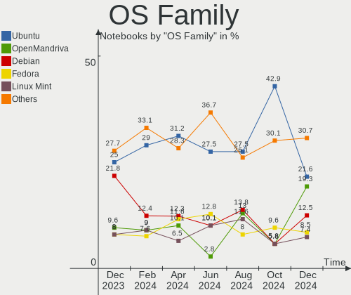

| Name          | Notebooks | Percent |
|---------------|-----------|---------|
| Ubuntu        | 38        | 21.59%  |
| OpenMandriva  | 34        | 19.32%  |
| Debian        | 22        | 12.5%   |
| Fedora        | 15        | 8.52%   |
| Linux Mint    | 13        | 7.39%   |
| Arch          | 12        | 6.82%   |
| Pop!_OS       | 5         | 2.84%   |
| SteamOS       | 4         | 2.27%   |
| Zorin         | 3         | 1.7%    |
| Xubuntu       | 3         | 1.7%    |
| Manjaro       | 3         | 1.7%    |
| Kubuntu       | 3         | 1.7%    |
| Ubuntu Studio | 2         | 1.14%   |
| NixOS         | 2         | 1.14%   |
| Lubuntu       | 2         | 1.14%   |
| KDE neon      | 2         | 1.14%   |
| Void Linux    | 1         | 0.57%   |
| Vanilla       | 1         | 0.57%   |
| Ubuntu Unity  | 1         | 0.57%   |
| Qubes         | 1         | 0.57%   |
| Parrot        | 1         | 0.57%   |
| openSUSE      | 1         | 0.57%   |
| MX            | 1         | 0.57%   |
| Elementary    | 1         | 0.57%   |
| Dts-distro    | 1         | 0.57%   |
| Drauger OS    | 1         | 0.57%   |
| CachyOS       | 1         | 0.57%   |
| Bazzite       | 1         | 0.57%   |
| Alpine        | 1         | 0.57%   |

Kernel
------

Version of the Linux kernel

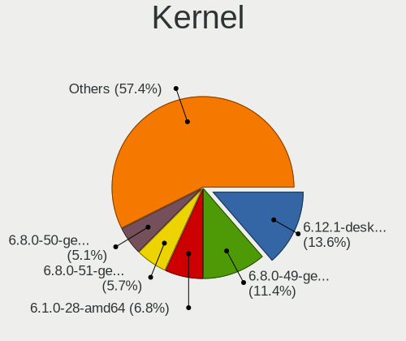

| Version                                  | Notebooks | Percent |
|------------------------------------------|-----------|---------|
| 6.12.1-desktop-1omv2490                  | 24        | 13.64%  |
| 6.8.0-49-generic                         | 20        | 11.36%  |
| 6.1.0-28-amd64                           | 12        | 6.82%   |
| 6.8.0-51-generic                         | 10        | 5.68%   |
| 6.8.0-50-generic                         | 9         | 5.11%   |
| 6.12.1-arch1-1                           | 6         | 3.41%   |
| 6.9.3-76060903-generic                   | 5         | 2.84%   |
| 6.11.11-300.fc41.x86_64                  | 5         | 2.84%   |
| 6.11.0-9-generic                         | 4         | 2.27%   |
| 6.5.0-valve22-1-neptune-65-g9a338ed8a75e | 3         | 1.7%    |
| 6.12.6-desktop-1omv2490                  | 3         | 1.7%    |
| 6.12.5-200.fc41.x86_64                   | 3         | 1.7%    |
| 6.11.10-300.fc41.x86_64                  | 3         | 1.7%    |
| 6.10.0-desktop-1omv2490                  | 3         | 1.7%    |
| 5.15.0-126-generic                       | 3         | 1.7%    |
| 6.8.0-41-generic                         | 2         | 1.14%   |
| 6.12.4-arch1-1                           | 2         | 1.14%   |
| 6.12.4-200.fc41.x86_64                   | 2         | 1.14%   |
| 6.12.1-zen1-1-zen                        | 2         | 1.14%   |
| 6.11.5+bpo-amd64                         | 2         | 1.14%   |
| 6.11.10-1-liquorix-amd64                 | 2         | 1.14%   |
| 6.11.0-8-generic                         | 2         | 1.14%   |
| 6.11.0-13-generic                        | 2         | 1.14%   |
| 6.1.0-27-amd64                           | 2         | 1.14%   |
| 6.8.4-2-pve                              | 1         | 0.57%   |
| 6.8.12-valve7-1-neptune-68-g8c3c3d4f5307 | 1         | 0.57%   |
| 6.8.0-50-lowlatency                      | 1         | 0.57%   |
| 6.8.0-47-generic                         | 1         | 0.57%   |
| 6.8.0-45-generic                         | 1         | 0.57%   |
| 6.8.0-41-lowlatency                      | 1         | 0.57%   |
| 6.8.0-38-generic                         | 1         | 0.57%   |
| 6.8.0-109049-tuxedo                      | 1         | 0.57%   |
| 6.6.8-2-MANJARO                          | 1         | 0.57%   |
| 6.6.67                                   | 1         | 0.57%   |
| 6.6.63_1                                 | 1         | 0.57%   |
| 6.6.63-1-MANJARO                         | 1         | 0.57%   |
| 6.6.63-1-lts                             | 1         | 0.57%   |
| 6.6.54-1.qubes.fc37.x86_64               | 1         | 0.57%   |
| 6.6.21-yocto-standard                    | 1         | 0.57%   |
| 6.6.2-desktop-1omv2390                   | 1         | 0.57%   |

Kernel Family
-------------

Linux kernel without a distro release

| Version | Notebooks | Percent |
|---------|-----------|---------|
| 6.8.0   | 47        | 26.7%   |
| 6.12.1  | 33        | 18.75%  |
| 6.1.0   | 16        | 9.09%   |
| 6.11.0  | 12        | 6.82%   |
| 6.12.6  | 6         | 3.41%   |
| 6.11.11 | 6         | 3.41%   |
| 6.11.10 | 6         | 3.41%   |
| 6.9.3   | 5         | 2.84%   |
| 6.5.0   | 5         | 2.84%   |
| 6.12.4  | 5         | 2.84%   |
| 5.15.0  | 4         | 2.27%   |
| 6.6.63  | 3         | 1.7%    |
| 6.12.5  | 3         | 1.7%    |
| 6.10.0  | 3         | 1.7%    |
| 5.4.0   | 3         | 1.7%    |
| 6.11.5  | 2         | 1.14%   |
| 6.8.4   | 1         | 0.57%   |
| 6.8.12  | 1         | 0.57%   |
| 6.6.8   | 1         | 0.57%   |
| 6.6.67  | 1         | 0.57%   |
| 6.6.54  | 1         | 0.57%   |
| 6.6.21  | 1         | 0.57%   |
| 6.6.2   | 1         | 0.57%   |
| 6.4.11  | 1         | 0.57%   |
| 6.4.0   | 1         | 0.57%   |
| 6.11.9  | 1         | 0.57%   |
| 6.11.8  | 1         | 0.57%   |
| 6.11.6  | 1         | 0.57%   |
| 6.10.13 | 1         | 0.57%   |
| 6.10.10 | 1         | 0.57%   |
| 5.10.14 | 1         | 0.57%   |
| 5.10.0  | 1         | 0.57%   |
| 4.15.0  | 1         | 0.57%   |

Kernel Major Ver.
-----------------

Linux kernel major version

| Version | Notebooks | Percent |
|---------|-----------|---------|
| 6.8     | 49        | 27.84%  |
| 6.12    | 47        | 26.7%   |
| 6.11    | 29        | 16.48%  |
| 6.1     | 16        | 9.09%   |
| 6.6     | 8         | 4.55%   |
| 6.9     | 5         | 2.84%   |
| 6.5     | 5         | 2.84%   |
| 6.10    | 5         | 2.84%   |
| 5.15    | 4         | 2.27%   |
| 5.4     | 3         | 1.7%    |
| 6.4     | 2         | 1.14%   |
| 5.10    | 2         | 1.14%   |
| 4.15    | 1         | 0.57%   |

Arch
----

OS architecture (x86_64, i586, etc.)

| Name   | Notebooks | Percent |
|--------|-----------|---------|
| x86_64 | 174       | 98.86%  |
| i686   | 2         | 1.14%   |

DE
--

Desktop Environment

| Name       | Notebooks | Percent |
|------------|-----------|---------|
| GNOME      | 70        | 39.77%  |
| Unknown    | 33        | 18.75%  |
| KDE5       | 18        | 10.23%  |
| KDE6       | 13        | 7.39%   |
| X-Cinnamon | 11        | 6.25%   |
| XFCE       | 9         | 5.11%   |
| LXQt       | 7         | 3.98%   |
| MATE       | 5         | 2.84%   |
| KDE        | 2         | 1.14%   |
| i3         | 2         | 1.14%   |
| Unity      | 1         | 0.57%   |
| sway       | 1         | 0.57%   |
| Pantheon   | 1         | 0.57%   |
| Hyprland   | 1         | 0.57%   |
| COSMIC     | 1         | 0.57%   |
| awesome    | 1         | 0.57%   |

Display Server
--------------

X11 or Wayland

| Name    | Notebooks | Percent |
|---------|-----------|---------|
| X11     | 86        | 48.86%  |
| Wayland | 83        | 47.16%  |
| Unknown | 4         | 2.27%   |
| Tty     | 3         | 1.7%    |

Display Manager
---------------

SDDM, LightDM, etc.

| Name    | Notebooks | Percent |
|---------|-----------|---------|
| SDDM    | 51        | 28.98%  |
| GDM3    | 46        | 26.14%  |
| Unknown | 38        | 21.59%  |
| LightDM | 29        | 16.48%  |
| GDM     | 10        | 5.68%   |
| XDM     | 1         | 0.57%   |
| GREETD  | 1         | 0.57%   |

OS Lang
-------

Language

| Lang    | Notebooks | Percent |
|---------|-----------|---------|
| fr_FR   | 113       | 64.2%   |
| en_US   | 40        | 22.73%  |
| en_GB   | 7         | 3.98%   |
| it_IT   | 6         | 3.41%   |
| ru_RU   | 2         | 1.14%   |
| de_DE   | 2         | 1.14%   |
| C       | 2         | 1.14%   |
| Unknown | 2         | 1.14%   |
| fr_BE   | 1         | 0.57%   |
| en_AU   | 1         | 0.57%   |

Boot Mode
---------

EFI or BIOS

| Mode | Notebooks | Percent |
|------|-----------|---------|
| EFI  | 99        | 56.25%  |
| BIOS | 77        | 43.75%  |

Filesystem
----------

Type of filesystem

| Type    | Notebooks | Percent |
|---------|-----------|---------|
| Ext4    | 104       | 59.09%  |
| Overlay | 25        | 14.2%   |
| Btrfs   | 25        | 14.2%   |
| Tmpfs   | 18        | 10.23%  |
| Xfs     | 2         | 1.14%   |
| Zfs     | 1         | 0.57%   |
| Unknown | 1         | 0.57%   |

Part. scheme
------------

Scheme of partitioning

| Type    | Notebooks | Percent |
|---------|-----------|---------|
| GPT     | 125       | 71.02%  |
| Unknown | 36        | 20.45%  |
| MBR     | 15        | 8.52%   |

Dual Boot with Linux/BSD
------------------------

Hosting more than one Linux/BSD

| Dual boot | Notebooks | Percent |
|-----------|-----------|---------|
| No        | 141       | 80.11%  |
| Yes       | 35        | 19.89%  |

Dual Boot (Win)
---------------

Hosting Linux and Windows

| Dual boot | Notebooks | Percent |
|-----------|-----------|---------|
| No        | 124       | 70.45%  |
| Yes       | 52        | 29.55%  |

Board
-----

Vendor
------

Motherboard manufacturer

| Name                | Notebooks | Percent |
|---------------------|-----------|---------|
| Lenovo              | 38        | 21.59%  |
| ASUSTek Computer    | 31        | 17.61%  |
| Dell                | 28        | 15.91%  |
| Hewlett-Packard     | 23        | 13.07%  |
| Acer                | 14        | 7.95%   |
| MSI                 | 6         | 3.41%   |
| Toshiba             | 5         | 2.84%   |
| Valve               | 4         | 2.27%   |
| Framework           | 4         | 2.27%   |
| TUXEDO              | 3         | 1.7%    |
| Notebook            | 3         | 1.7%    |
| HUAWEI              | 3         | 1.7%    |
| Sony                | 2         | 1.14%   |
| Fujitsu Siemens     | 2         | 1.14%   |
| Apple               | 2         | 1.14%   |
| SKIKK               | 1         | 0.57%   |
| Shuttle             | 1         | 0.57%   |
| Samsung Electronics | 1         | 0.57%   |
| Packard Bell        | 1         | 0.57%   |
| Medion              | 1         | 0.57%   |
| Gigabyte Technology | 1         | 0.57%   |
| Fujitsu             | 1         | 0.57%   |
| Unknown             | 1         | 0.57%   |

Model
-----

Motherboard model

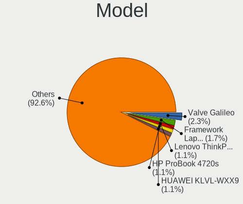

| Name                                        | Notebooks | Percent |
|---------------------------------------------|-----------|---------|
| Valve Galileo                               | 4         | 2.27%   |
| Framework Laptop 13 (AMD Ryzen 7040Series)  | 3         | 1.7%    |
| Lenovo ThinkPad X1 Carbon Gen 12 21KCCTO1WW | 2         | 1.14%   |
| HUAWEI KLVL-WXX9                            | 2         | 1.14%   |
| HP ProBook 4720s                            | 2         | 1.14%   |
| TUXEDO Sirius 16 Gen2                       | 1         | 0.57%   |
| TUXEDO InfinityBook S 15 Gen6               | 1         | 0.57%   |
| TUXEDO Aura 15 Gen1                         | 1         | 0.57%   |
| Toshiba Satellite Pro L630                  | 1         | 0.57%   |
| Toshiba Satellite Pro A50-C                 | 1         | 0.57%   |
| Toshiba Satellite P200                      | 1         | 0.57%   |
| Toshiba Satellite C70-B                     | 1         | 0.57%   |
| Toshiba Satellite C50D-A-12M                | 1         | 0.57%   |
| Sony SVP1321C5E                             | 1         | 0.57%   |
| Sony SVF1521A1EW                            | 1         | 0.57%   |
| SKIKK Midgard                               | 1         | 0.57%   |
| Shuttle NC03U                               | 1         | 0.57%   |
| Samsung R530/R730/P530                      | 1         | 0.57%   |
| Packard Bell EasyNote MH36                  | 1         | 0.57%   |
| Notebook W65_W67RZ1                         | 1         | 0.57%   |
| Notebook W65_67SZ                           | 1         | 0.57%   |
| Notebook NS50_70MU                          | 1         | 0.57%   |
| MSI MS-16F1                                 | 1         | 0.57%   |
| MSI Modern 15 A11M                          | 1         | 0.57%   |
| MSI GT70                                    | 1         | 0.57%   |
| MSI GS65 Stealth Thin 8RE                   | 1         | 0.57%   |
| MSI GP73 Leopard 8RE                        | 1         | 0.57%   |
| MSI CR61 2M/CX61 2OC/CX61 2OD               | 1         | 0.57%   |
| Medion Crawler E30e                         | 1         | 0.57%   |
| Lenovo Yoga Slim 7 Pro 14ACH5 82MS          | 1         | 0.57%   |
| Lenovo Yoga Slim 6 14IRH8 83E0              | 1         | 0.57%   |
| Lenovo ThinkPad X390 20Q0CTO1WW             | 1         | 0.57%   |
| Lenovo ThinkPad X270 20HMS2C003             | 1         | 0.57%   |
| Lenovo ThinkPad X121e 3045CTO               | 1         | 0.57%   |
| Lenovo ThinkPad X1 Carbon Gen 10 21CB00G3FR | 1         | 0.57%   |
| Lenovo ThinkPad W541 20EGS1FB00             | 1         | 0.57%   |
| Lenovo ThinkPad W530 2441AG6                | 1         | 0.57%   |
| Lenovo ThinkPad T495s 20QKS12J1G            | 1         | 0.57%   |
| Lenovo ThinkPad T495 20NJCTO1WW             | 1         | 0.57%   |
| Lenovo ThinkPad T490 20N3S2XL00             | 1         | 0.57%   |

Model Family
------------

Motherboard model prefix

| Name                    | Notebooks | Percent |
|-------------------------|-----------|---------|
| Lenovo ThinkPad         | 22        | 12.5%   |
| Acer Aspire             | 11        | 6.25%   |
| Lenovo IdeaPad          | 8         | 4.55%   |
| Dell Precision          | 8         | 4.55%   |
| Dell Inspiron           | 7         | 3.98%   |
| Dell Latitude           | 6         | 3.41%   |
| Toshiba Satellite       | 5         | 2.84%   |
| HP ProBook              | 5         | 2.84%   |
| HP Pavilion             | 5         | 2.84%   |
| HP EliteBook            | 5         | 2.84%   |
| ASUS VivoBook           | 5         | 2.84%   |
| ASUS ASUS               | 5         | 2.84%   |
| Valve Galileo           | 4         | 2.27%   |
| Framework Laptop        | 4         | 2.27%   |
| Dell XPS                | 4         | 2.27%   |
| Lenovo Legion           | 3         | 1.7%    |
| Notebook W65            | 2         | 1.14%   |
| Lenovo Yoga             | 2         | 1.14%   |
| Lenovo ThinkBook        | 2         | 1.14%   |
| HUAWEI KLVL-WXX9        | 2         | 1.14%   |
| HP Laptop               | 2         | 1.14%   |
| Fujitsu Siemens ESPRIMO | 2         | 1.14%   |
| ASUS Zenbook            | 2         | 1.14%   |
| TUXEDO Sirius           | 1         | 0.57%   |
| TUXEDO InfinityBook     | 1         | 0.57%   |
| TUXEDO Aura             | 1         | 0.57%   |
| Sony SVP1321C5E         | 1         | 0.57%   |
| Sony SVF1521A1EW        | 1         | 0.57%   |
| SKIKK Midgard           | 1         | 0.57%   |
| Shuttle NC03U           | 1         | 0.57%   |
| Samsung R530            | 1         | 0.57%   |
| Packard Bell EasyNote   | 1         | 0.57%   |
| Notebook NS50           | 1         | 0.57%   |
| MSI MS-16F1             | 1         | 0.57%   |
| MSI Modern              | 1         | 0.57%   |
| MSI GT70                | 1         | 0.57%   |
| MSI GS65                | 1         | 0.57%   |
| MSI GP73                | 1         | 0.57%   |
| MSI CR61                | 1         | 0.57%   |
| Medion Crawler          | 1         | 0.57%   |

MFG Year
--------

Motherboard manufacture year

| Year | Notebooks | Percent |
|------|-----------|---------|
| 2023 | 19        | 10.8%   |
| 2019 | 17        | 9.66%   |
| 2020 | 15        | 8.52%   |
| 2024 | 14        | 7.95%   |
| 2022 | 14        | 7.95%   |
| 2018 | 13        | 7.39%   |
| 2013 | 13        | 7.39%   |
| 2021 | 9         | 5.11%   |
| 2016 | 9         | 5.11%   |
| 2010 | 9         | 5.11%   |
| 2014 | 8         | 4.55%   |
| 2011 | 8         | 4.55%   |
| 2017 | 7         | 3.98%   |
| 2012 | 6         | 3.41%   |
| 2008 | 5         | 2.84%   |
| 2015 | 4         | 2.27%   |
| 2009 | 4         | 2.27%   |
| 2007 | 2         | 1.14%   |

Form Factor
-----------

Physical design of the computer

| Name     | Notebooks | Percent |
|----------|-----------|---------|
| Notebook | 176       | 100%    |

Secure Boot
-----------

Enabled or disabled

| State    | Notebooks | Percent |
|----------|-----------|---------|
| Disabled | 161       | 91.48%  |
| Enabled  | 15        | 8.52%   |

Coreboot
--------

Have coreboot on board

| Used | Notebooks | Percent |
|------|-----------|---------|
| No   | 176       | 100%    |

RAM Size
--------

Total RAM memory

| Size in GB  | Notebooks | Percent |
|-------------|-----------|---------|
| 8.01-16.0   | 43        | 24.43%  |
| 4.01-8.0    | 40        | 22.73%  |
| 32.01-64.0  | 27        | 15.34%  |
| 16.01-24.0  | 27        | 15.34%  |
| 3.01-4.0    | 21        | 11.93%  |
| 24.01-32.0  | 7         | 3.98%   |
| 64.01-256.0 | 5         | 2.84%   |
| 2.01-3.0    | 3         | 1.7%    |
| 1.01-2.0    | 3         | 1.7%    |

RAM Used
--------

Used RAM memory

| Used GB    | Notebooks | Percent |
|------------|-----------|---------|
| 1.01-2.0   | 42        | 23.86%  |
| 2.01-3.0   | 39        | 22.16%  |
| 4.01-8.0   | 38        | 21.59%  |
| 3.01-4.0   | 30        | 17.05%  |
| 8.01-16.0  | 16        | 9.09%   |
| 0.51-1.0   | 8         | 4.55%   |
| 16.01-24.0 | 2         | 1.14%   |
| 0.01-0.5   | 1         | 0.57%   |

Total Drives
------------

Number of drives on board

| Drives | Notebooks | Percent |
|--------|-----------|---------|
| 1      | 134       | 76.14%  |
| 2      | 39        | 22.16%  |
| 3      | 3         | 1.7%    |

Has CD-ROM
----------

Has CD-ROM on board

| Presented | Notebooks | Percent |
|-----------|-----------|---------|
| No        | 127       | 72.16%  |
| Yes       | 49        | 27.84%  |

Has Ethernet
------------

Has Ethernet on board

| Presented | Notebooks | Percent |
|-----------|-----------|---------|
| Yes       | 129       | 73.3%   |
| No        | 47        | 26.7%   |

Has WiFi
--------

Has WiFi module

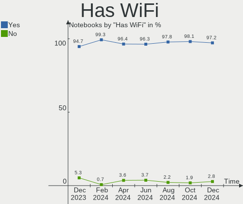

| Presented | Notebooks | Percent |
|-----------|-----------|---------|
| Yes       | 171       | 97.16%  |
| No        | 5         | 2.84%   |

Has Bluetooth
-------------

Has Bluetooth module

| Presented | Notebooks | Percent |
|-----------|-----------|---------|
| Yes       | 144       | 81.82%  |
| No        | 32        | 18.18%  |

Location
--------

Country
-------

Geographic location (country)

| Country | Notebooks | Percent |
|---------|-----------|---------|
| France  | 176       | 100%    |

City
----

Geographic location (city)

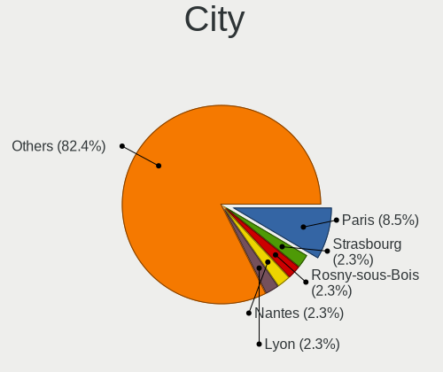

| City                          | Notebooks | Percent |
|-------------------------------|-----------|---------|
| Paris                         | 15        | 8.52%   |
| Strasbourg                    | 4         | 2.27%   |
| Rosny-sous-Bois               | 4         | 2.27%   |
| Nantes                        | 4         | 2.27%   |
| Lyon                          | 4         | 2.27%   |
| Toulouse                      | 3         | 1.7%    |
| Nice                          | 3         | 1.7%    |
| Grenoble                      | 3         | 1.7%    |
| Verton                        | 2         | 1.14%   |
| Troyes                        | 2         | 1.14%   |
| Roques                        | 2         | 1.14%   |
| Rezé                         | 2         | 1.14%   |
| Rennes                        | 2         | 1.14%   |
| Périgueux                    | 2         | 1.14%   |
| Jardin                        | 2         | 1.14%   |
| Chartres-de-Bretagne          | 2         | 1.14%   |
| Chambéry                     | 2         | 1.14%   |
| Cergy                         | 2         | 1.14%   |
| Besançon                     | 2         | 1.14%   |
| Argenteuil                    | 2         | 1.14%   |
| Aix-les-Bains                 | 2         | 1.14%   |
| Vitry-en-Artois               | 1         | 0.57%   |
| Vincennes                     | 1         | 0.57%   |
| Versailles                    | 1         | 0.57%   |
| Vélizy-Villacoublay          | 1         | 0.57%   |
| Vaureal                       | 1         | 0.57%   |
| Torreilles                    | 1         | 0.57%   |
| Thise                         | 1         | 0.57%   |
| Thaon-les-Vosges              | 1         | 0.57%   |
| Sotteville-lès-Rouen         | 1         | 0.57%   |
| Sochaux                       | 1         | 0.57%   |
| Segoufielle                   | 1         | 0.57%   |
| Sarlat-la-Canéda             | 1         | 0.57%   |
| Saint-Ouen-le-Houx            | 1         | 0.57%   |
| Saint-Martin-de-Saint-Maixent | 1         | 0.57%   |
| Saint-Lys                     | 1         | 0.57%   |
| Saint-Laurent-du-Var          | 1         | 0.57%   |
| Saint-Georges-Haute-Ville     | 1         | 0.57%   |
| Saint-Etienne                 | 1         | 0.57%   |
| Saint-Denis                   | 1         | 0.57%   |

Drives
------

Drive Vendor
------------

Hard drive vendors

| Vendor                       | Notebooks | Drives | Percent |
|------------------------------|-----------|--------|---------|
| Samsung Electronics          | 39        | 42     | 18.48%  |
| SanDisk                      | 28        | 28     | 13.27%  |
| Seagate                      | 15        | 16     | 7.11%   |
| WDC                          | 14        | 14     | 6.64%   |
| Micron Technology            | 14        | 14     | 6.64%   |
| SK hynix                     | 10        | 10     | 4.74%   |
| Crucial                      | 9         | 9      | 4.27%   |
| Kingston                     | 8         | 8      | 3.79%   |
| Intel                        | 7         | 7      | 3.32%   |
| Micron/Crucial Technology    | 6         | 6      | 2.84%   |
| Unknown                      | 5         | 5      | 2.37%   |
| Toshiba                      | 5         | 5      | 2.37%   |
| Kingston Technology Company  | 5         | 5      | 2.37%   |
| Hitachi                      | 5         | 5      | 2.37%   |
| Phison Electronics           | 4         | 4      | 1.9%    |
| PNY                          | 3         | 3      | 1.42%   |
| KIOXIA                       | 3         | 3      | 1.42%   |
| Verbatim                     | 2         | 2      | 0.95%   |
| SPCC                         | 2         | 2      | 0.95%   |
| Realtek Semiconductor        | 2         | 2      | 0.95%   |
| MAXIO Technology (Hangzhou)  | 2         | 2      | 0.95%   |
| Lenovo                       | 2         | 2      | 0.95%   |
| KIOXIA-EXCERIA               | 2         | 2      | 0.95%   |
| HGST                         | 2         | 2      | 0.95%   |
| Fanxiang                     | 2         | 2      | 0.95%   |
| XrayDisk                     | 1         | 1      | 0.47%   |
| Union Memory (Shenzhen)      | 1         | 1      | 0.47%   |
| Union Memory                 | 1         | 1      | 0.47%   |
| Transcend                    | 1         | 1      | 0.47%   |
| Shenzhen Longsys Electronics | 1         | 1      | 0.47%   |
| Plextor                      | 1         | 1      | 0.47%   |
| Phison                       | 1         | 1      | 0.47%   |
| LITEONIT                     | 1         | 1      | 0.47%   |
| LITEON                       | 1         | 1      | 0.47%   |
| LDLC                         | 1         | 1      | 0.47%   |
| KingSpec                     | 1         | 1      | 0.47%   |
| JMicron Technology           | 1         | 1      | 0.47%   |
| EAGET                        | 1         | 1      | 0.47%   |
| Dogfish                      | 1         | 1      | 0.47%   |
| ANKEJE                       | 1         | 1      | 0.47%   |

Drive Model
-----------

Hard drive models

| Model                                                | Notebooks | Percent |
|------------------------------------------------------|-----------|---------|
| Samsung NVMe SSD Controller SM981/PM981/PM983 512GB  | 7         | 3.29%   |
| SanDisk NVMe SSD Drive 1TB                           | 5         | 2.35%   |
| Sandisk WD Black SN850 2TB                           | 4         | 1.88%   |
| Samsung NVMe SSD Controller SM961/PM961/SM963 256GB  | 4         | 1.88%   |
| Samsung NVMe SSD Controller PM9A1/PM9A3/980PRO 512GB | 4         | 1.88%   |
| Kingston Company OM3PDP3 NVMe SSD 512GB              | 3         | 1.41%   |
| Intel SSDPEKNU512GZ 512GB                            | 3         | 1.41%   |
| Crucial CT500BX500SSD1 500GB                         | 3         | 1.41%   |
| Toshiba MQ01ABD100 1TB                               | 2         | 0.94%   |
| SPCC Solid State Disk 256GB                          | 2         | 0.94%   |
| Seagate ST9500420AS 500GB                            | 2         | 0.94%   |
| SanDisk NVMe SSD Drive 512GB                         | 2         | 0.94%   |
| Samsung SSD 990 PRO 2TB                              | 2         | 0.94%   |
| Micron/Crucial P2 NVMe PCIe SSD 500GB                | 2         | 0.94%   |
| Fanxiang S101 1TB SSD                                | 2         | 0.94%   |
| XrayDisk 1TB SSD                                     | 1         | 0.47%   |
| WDC WD7500BPVT-22HXZT1 752GB                         | 1         | 0.47%   |
| WDC WD7500BPKT-80PK4T0 752GB                         | 1         | 0.47%   |
| WDC WD5000LPLX-60ZNTT1 500GB                         | 1         | 0.47%   |
| WDC WD5000BPVX-00JC3T0 500GB                         | 1         | 0.47%   |
| WDC WD5000BEVT-22ZAT0 500GB                          | 1         | 0.47%   |
| WDC WD1600BEVT-75ZCT1 160GB                          | 1         | 0.47%   |
| WDC WD1600BEVT-22ZCT0 160GB                          | 1         | 0.47%   |
| WDC WD1600BEVS-08RST2 160GB                          | 1         | 0.47%   |
| WDC WD10SPZX-60Z10T0 1TB                             | 1         | 0.47%   |
| WDC WD10JPVX-80JC3T0 1TB                             | 1         | 0.47%   |
| WDC WD10JFCX-68N6GN0 1TB                             | 1         | 0.47%   |
| WDC PC SN810 NVMe 512GB                              | 1         | 0.47%   |
| WDC PC SN810 NVMe 1024GB                             | 1         | 0.47%   |
| WDC PC SN530 SDBPNPZ-256G-1114 256GB                 | 1         | 0.47%   |
| Verbatim Vi560 1024GB                                | 1         | 0.47%   |
| Verbatim Vi550 S3 1TB SSD                            | 1         | 0.47%   |
| Unknown NVMe SSD Drive 1TB                           | 1         | 0.47%   |
| Unknown MMC Card  64GB                               | 1         | 0.47%   |
| Unknown MMC Card  32GB                               | 1         | 0.47%   |
| Unknown MMC Card  128GB                              | 1         | 0.47%   |
| Unknown 00000  32GB                                  | 1         | 0.47%   |
| Union Memory UMIS RPJTJ512MEE1OWX 512GB              | 1         | 0.47%   |
| Union Memory (Shenzhen) UMIS RPEYJ1T24MKN2QWY 1TB    | 1         | 0.47%   |
| Transcend TS256GSSD370 256GB                         | 1         | 0.47%   |

HDD Vendor
----------

Hard disk drive vendors

| Vendor              | Notebooks | Drives | Percent |
|---------------------|-----------|--------|---------|
| Seagate             | 15        | 16     | 38.46%  |
| WDC                 | 11        | 11     | 28.21%  |
| Hitachi             | 5         | 5      | 12.82%  |
| Toshiba             | 4         | 4      | 10.26%  |
| HGST                | 2         | 2      | 5.13%   |
| Samsung Electronics | 1         | 1      | 2.56%   |
| JMicron Technology  | 1         | 1      | 2.56%   |

SSD Vendor
----------

Solid state drive vendors

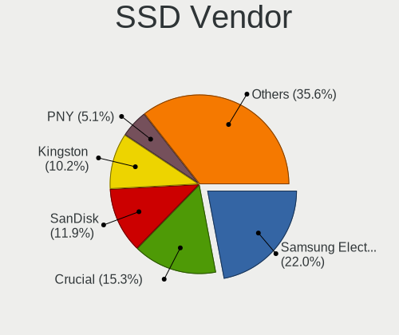

| Vendor              | Notebooks | Drives | Percent |
|---------------------|-----------|--------|---------|
| Samsung Electronics | 13        | 13     | 22.03%  |
| Crucial             | 9         | 9      | 15.25%  |
| SanDisk             | 7         | 7      | 11.86%  |
| Kingston            | 6         | 6      | 10.17%  |
| PNY                 | 3         | 3      | 5.08%   |
| Micron Technology   | 3         | 3      | 5.08%   |
| Verbatim            | 2         | 2      | 3.39%   |
| SPCC                | 2         | 2      | 3.39%   |
| SK hynix            | 2         | 2      | 3.39%   |
| Fanxiang            | 2         | 2      | 3.39%   |
| XrayDisk            | 1         | 1      | 1.69%   |
| Transcend           | 1         | 1      | 1.69%   |
| Plextor             | 1         | 1      | 1.69%   |
| LITEONIT            | 1         | 1      | 1.69%   |
| LITEON              | 1         | 1      | 1.69%   |
| LDLC                | 1         | 1      | 1.69%   |
| KIOXIA-EXCERIA      | 1         | 1      | 1.69%   |
| KingSpec            | 1         | 1      | 1.69%   |
| EAGET               | 1         | 1      | 1.69%   |
| Dogfish             | 1         | 1      | 1.69%   |

Drive Kind
----------

HDD or SSD

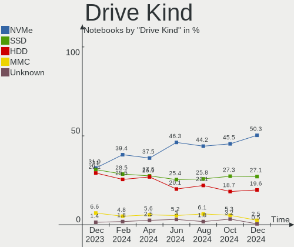

| Kind    | Notebooks | Drives | Percent |
|---------|-----------|--------|---------|
| NVMe    | 100       | 110    | 50.25%  |
| SSD     | 54        | 59     | 27.14%  |
| HDD     | 39        | 40     | 19.6%   |
| MMC     | 5         | 5      | 2.51%   |
| Unknown | 1         | 1      | 0.5%    |

Drive Connector
---------------

SATA, SAS, NVMe, etc.

| Type | Notebooks | Drives | Percent |
|------|-----------|--------|---------|
| NVMe | 100       | 109    | 51.81%  |
| SATA | 83        | 96     | 43.01%  |
| SAS  | 5         | 5      | 2.59%   |
| MMC  | 5         | 5      | 2.59%   |

Drive Size
----------

Size of hard drive

| Size in TB | Notebooks | Drives | Percent |
|------------|-----------|--------|---------|
| 0.01-0.5   | 61        | 66     | 66.3%   |
| 0.51-1.0   | 26        | 28     | 28.26%  |
| 1.01-2.0   | 4         | 4      | 4.35%   |
| 3.01-4.0   | 1         | 1      | 1.09%   |

Space Total
-----------

Amount of disk space available on the file system

| Size in GB     | Notebooks | Percent |
|----------------|-----------|---------|
| 251-500        | 46        | 26.14%  |
| 501-1000       | 42        | 23.86%  |
| 101-250        | 28        | 15.91%  |
| 1-20           | 23        | 13.07%  |
| 1001-2000      | 17        | 9.66%   |
| More than 3000 | 7         | 3.98%   |
| 21-50          | 5         | 2.84%   |
| Unknown        | 4         | 2.27%   |
| 2001-3000      | 2         | 1.14%   |
| 51-100         | 2         | 1.14%   |

Space Used
----------

Amount of used disk space

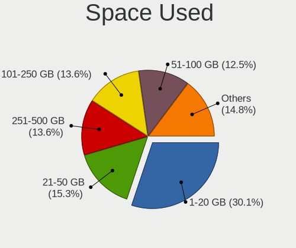

| Used GB        | Notebooks | Percent |
|----------------|-----------|---------|
| 1-20           | 53        | 30.11%  |
| 21-50          | 27        | 15.34%  |
| 251-500        | 24        | 13.64%  |
| 101-250        | 24        | 13.64%  |
| 51-100         | 22        | 12.5%   |
| 501-1000       | 14        | 7.95%   |
| Unknown        | 4         | 2.27%   |
| More than 3000 | 2         | 1.14%   |
| 2001-3000      | 2         | 1.14%   |
| 1001-2000      | 2         | 1.14%   |
| 0              | 2         | 1.14%   |

Malfunc. Drives
---------------

Drive models with a malfunction

| Model                                            | Notebooks | Drives | Percent |
|--------------------------------------------------|-----------|--------|---------|
| WDC WD5000BPVX-00JC3T0 500GB                     | 1         | 1      | 5.56%   |
| SK hynix HFS256G39TND-N210A 256GB SSD            | 1         | 1      | 5.56%   |
| Seagate ST98823AS 80GB                           | 1         | 1      | 5.56%   |
| Seagate ST9500325AS 500GB                        | 1         | 1      | 5.56%   |
| Seagate ST9250315AS 250GB                        | 1         | 1      | 5.56%   |
| Seagate ST500LM000-1EJ162 500GB                  | 1         | 1      | 5.56%   |
| SanDisk SSD U100 24GB                            | 1         | 1      | 5.56%   |
| SanDisk SD8SN8U512G1002 512GB SSD                | 1         | 1      | 5.56%   |
| Samsung Electronics SSD 980 1TB                  | 1         | 1      | 5.56%   |
| Samsung Electronics SSD 830 Series 128GB         | 1         | 1      | 5.56%   |
| Samsung Electronics MZ5PA128HMCD-01000 128GB SSD | 1         | 1      | 5.56%   |
| Samsung Electronics HM641JI 640GB                | 1         | 1      | 5.56%   |
| Micron Technology MTFDDAV256TBN 256GB SSD        | 1         | 1      | 5.56%   |
| Kingston SV300S37A120G 120GB SSD                 | 1         | 1      | 5.56%   |
| Hitachi HTS725050A9A364 500GB                    | 1         | 1      | 5.56%   |
| Hitachi HTS545016B9A300 160GB                    | 1         | 1      | 5.56%   |
| HGST HTS545050A7E680 500GB                       | 1         | 1      | 5.56%   |
| Dogfish SSD 250GB                                | 1         | 1      | 5.56%   |

Malfunc. Drive Vendor
---------------------

Vendors of faulty drives

| Vendor              | Notebooks | Drives | Percent |
|---------------------|-----------|--------|---------|
| Seagate             | 4         | 4      | 22.22%  |
| Samsung Electronics | 4         | 4      | 22.22%  |
| SanDisk             | 2         | 2      | 11.11%  |
| Hitachi             | 2         | 2      | 11.11%  |
| WDC                 | 1         | 1      | 5.56%   |
| SK hynix            | 1         | 1      | 5.56%   |
| Micron Technology   | 1         | 1      | 5.56%   |
| Kingston            | 1         | 1      | 5.56%   |
| HGST                | 1         | 1      | 5.56%   |
| Dogfish             | 1         | 1      | 5.56%   |

Malfunc. HDD Vendor
-------------------

Vendors of faulty HDD drives

| Vendor              | Notebooks | Drives | Percent |
|---------------------|-----------|--------|---------|
| Seagate             | 4         | 4      | 44.44%  |
| Hitachi             | 2         | 2      | 22.22%  |
| WDC                 | 1         | 1      | 11.11%  |
| Samsung Electronics | 1         | 1      | 11.11%  |
| HGST                | 1         | 1      | 11.11%  |

Malfunc. Drive Kind
-------------------

Kinds of faulty drives

| Kind | Notebooks | Drives | Percent |
|------|-----------|--------|---------|
| HDD  | 9         | 9      | 50%     |
| SSD  | 8         | 8      | 44.44%  |
| NVMe | 1         | 1      | 5.56%   |

Failed Drives
-------------

Failed drive models

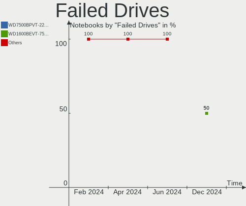

| Model                        | Notebooks | Drives | Percent |
|------------------------------|-----------|--------|---------|
| WDC WD7500BPVT-22HXZT1 752GB | 1         | 1      | 50%     |
| WDC WD1600BEVT-75ZCT1 160GB  | 1         | 1      | 50%     |

Failed Drive Vendor
-------------------

Failed drive vendors

| Vendor | Notebooks | Drives | Percent |
|--------|-----------|--------|---------|
| WDC    | 2         | 2      | 100%    |

Drive Status
------------

Number of failed and malfunc. drives

| Status   | Notebooks | Drives | Percent |
|----------|-----------|--------|---------|
| Works    | 99        | 112    | 53.23%  |
| Detected | 68        | 83     | 36.56%  |
| Malfunc  | 17        | 18     | 9.14%   |
| Failed   | 2         | 2      | 1.08%   |

Storage controller
------------------

Storage Vendor
--------------

Storage controller vendors

| Vendor                                  | Notebooks | Percent |
|-----------------------------------------|-----------|---------|
| Intel                                   | 102       | 46.58%  |
| Samsung Electronics                     | 26        | 11.87%  |
| SanDisk                                 | 24        | 10.96%  |
| AMD                                     | 14        | 6.39%   |
| Micron Technology                       | 11        | 5.02%   |
| SK hynix                                | 7         | 3.2%    |
| Kingston Technology Company             | 7         | 3.2%    |
| Micron/Crucial Technology               | 6         | 2.74%   |
| Phison Electronics                      | 5         | 2.28%   |
| KIOXIA                                  | 4         | 1.83%   |
| Nvidia                                  | 3         | 1.37%   |
| Realtek Semiconductor                   | 2         | 0.91%   |
| MAXIO Technology (Hangzhou)             | 2         | 0.91%   |
| Lenovo                                  | 2         | 0.91%   |
| Union Memory (Shenzhen)                 | 1         | 0.46%   |
| Toshiba America Info Systems            | 1         | 0.46%   |
| Shenzhen Unionmemory Information System | 1         | 0.46%   |
| Shenzhen Longsys Electronics            | 1         | 0.46%   |

Storage Model
-------------

Storage controller models

| Model                                                                          | Notebooks | Percent |
|--------------------------------------------------------------------------------|-----------|---------|
| AMD FCH SATA Controller [AHCI mode]                                            | 14        | 6.01%   |
| Intel Volume Management Device NVMe RAID Controller                            | 10        | 4.29%   |
| SanDisk WD Black SN770 / PC SN740 256GB / PC SN560 (DRAM-less) NVMe SSD        | 9         | 3.86%   |
| Intel 7 Series Chipset Family 6-port SATA Controller [AHCI mode]               | 9         | 3.86%   |
| Samsung NVMe SSD Controller SM981/PM981/PM983                                  | 8         | 3.43%   |
| Intel Sunrise Point-LP SATA Controller [AHCI mode]                             | 8         | 3.43%   |
| Intel Volume Management Device NVMe RAID Controller Intel Corporation          | 7         | 3%      |
| Intel 8 Series/C220 Series Chipset Family 6-port SATA Controller 1 [AHCI mode] | 7         | 3%      |
| SanDisk WD PC SN810 / Black SN850 NVMe SSD                                     | 6         | 2.58%   |
| Intel Cannon Lake Mobile PCH SATA AHCI Controller                              | 6         | 2.58%   |
| Intel 8 Series SATA Controller 1 [AHCI mode]                                   | 6         | 2.58%   |
| Samsung NVMe SSD Controller SM961/PM961/SM963                                  | 5         | 2.15%   |
| Intel SSD 670p Series [Keystone Harbor]                                        | 5         | 2.15%   |
| Intel HM170/QM170 Chipset SATA Controller [AHCI Mode]                          | 5         | 2.15%   |
| Intel 82801IBM/IEM (ICH9M/ICH9M-E) 4 port SATA Controller [AHCI mode]          | 5         | 2.15%   |
| Intel 5 Series/3400 Series Chipset 4 port SATA AHCI Controller                 | 5         | 2.15%   |
| Samsung NVMe SSD Controller S4LV008[Pascal]                                    | 4         | 1.72%   |
| Samsung NVMe SSD Controller PM9A1/PM9A3/980PRO                                 | 4         | 1.72%   |
| Intel Wildcat Point-LP SATA Controller [AHCI Mode]                             | 4         | 1.72%   |
| Intel 82801 Mobile SATA Controller [RAID mode]                                 | 4         | 1.72%   |
| Intel 6 Series/C200 Series Chipset Family 6 port Mobile SATA AHCI Controller   | 4         | 1.72%   |
| Samsung NVMe SSD Controller 980 (DRAM-less)                                    | 3         | 1.29%   |
| Micron/Crucial T500 NVMe PCIe SSD                                              | 3         | 1.29%   |
| Micron 2450 NVMe SSD [HendrixV] (DRAM-less)                                    | 3         | 1.29%   |
| Micron 2400 NVMe SSD (DRAM-less)                                               | 3         | 1.29%   |
| Kingston Company OM3PDP3 NVMe SSD                                              | 3         | 1.29%   |
| Intel Ice Lake-LP SATA Controller [AHCI mode]                                  | 3         | 1.29%   |
| Intel Alder Lake-P SATA AHCI Controller                                        | 3         | 1.29%   |
| SK hynix PC611 NVMe Solid State Drive                                          | 2         | 0.86%   |
| SK hynix Gold P31/BC711/PC711 NVMe Solid State Drive                           | 2         | 0.86%   |
| Sandisk WD PC SN740 NVMe SSD 512GB (DRAM-less)                                 | 2         | 0.86%   |
| Sandisk WD Black SN850X NVMe SSD                                               | 2         | 0.86%   |
| Samsung NVMe SSD Controller PM9B1 (DRAM-less)                                  | 2         | 0.86%   |
| Phison PS5019-E19 PCIe4 NVMe Controller (DRAM-less)                            | 2         | 0.86%   |
| Phison PS5013-E13 PCIe3 NVMe Controller (DRAM-less)                            | 2         | 0.86%   |
| Micron/Crucial P2 [Nick P2] / P3 / P3 Plus NVMe PCIe SSD (DRAM-less)           | 2         | 0.86%   |
| Micron 2300 NVMe SSD [Santana]                                                 | 2         | 0.86%   |
| Micron 2210 NVMe SSD [Cobain]                                                  | 2         | 0.86%   |
| Kingston Company OM8PCP Design-In PCIe 3 NVMe SSD (DRAM-less)                  | 2         | 0.86%   |
| Intel Tiger Lake-LP SATA Controller                                            | 2         | 0.86%   |

Storage Kind
------------

Kind of storage controller (IDE, SATA, NVMe, SAS, ...)

| Kind | Notebooks | Percent |
|------|-----------|---------|
| NVMe | 100       | 45.05%  |
| SATA | 93        | 41.89%  |
| RAID | 21        | 9.46%   |
| IDE  | 8         | 3.6%    |

Processor
---------

CPU Vendor
----------

Processor vendors

| Vendor | Notebooks | Percent |
|--------|-----------|---------|
| Intel  | 131       | 74.43%  |
| AMD    | 45        | 25.57%  |

CPU Model
---------

Processor models

| Model                                       | Notebooks | Percent |
|---------------------------------------------|-----------|---------|
| Intel 11th Gen Core i7-1165G7 @ 2.80GHz     | 5         | 2.84%   |
| AMD Custom APU 0932                         | 4         | 2.27%   |
| Intel Core Ultra 7 155H                     | 3         | 1.7%    |
| Intel Core i7-8750H CPU @ 2.20GHz           | 3         | 1.7%    |
| Intel Core i7-8665U CPU @ 1.90GHz           | 3         | 1.7%    |
| Intel Core i7-1065G7 CPU @ 1.30GHz          | 3         | 1.7%    |
| Intel Core i3-6006U CPU @ 2.00GHz           | 3         | 1.7%    |
| Intel Core i3-3217U CPU @ 1.80GHz           | 3         | 1.7%    |
| AMD Ryzen 7 7840U w/ Radeon 780M Graphics   | 3         | 1.7%    |
| Intel Core Ultra 9 185H                     | 2         | 1.14%   |
| Intel Core i7-8850H CPU @ 2.60GHz           | 2         | 1.14%   |
| Intel Core i7-7820HQ CPU @ 2.90GHz          | 2         | 1.14%   |
| Intel Core i7-7700HQ CPU @ 2.80GHz          | 2         | 1.14%   |
| Intel Core i7-7500U CPU @ 2.70GHz           | 2         | 1.14%   |
| Intel Core i7-6700HQ CPU @ 2.60GHz          | 2         | 1.14%   |
| Intel Core i7-4500U CPU @ 1.80GHz           | 2         | 1.14%   |
| Intel Core i7-10510U CPU @ 1.80GHz          | 2         | 1.14%   |
| Intel Core i5-8300H CPU @ 2.30GHz           | 2         | 1.14%   |
| Intel Core i5-7300U CPU @ 2.60GHz           | 2         | 1.14%   |
| Intel Core i5-3320M CPU @ 2.60GHz           | 2         | 1.14%   |
| Intel Core i3-4030U CPU @ 1.90GHz           | 2         | 1.14%   |
| Intel Core i3 CPU M 370 @ 2.40GHz           | 2         | 1.14%   |
| Intel Core 2 Duo CPU P8600 @ 2.40GHz        | 2         | 1.14%   |
| Intel 13th Gen Core i5-13500H               | 2         | 1.14%   |
| Intel 12th Gen Core i5-1235U                | 2         | 1.14%   |
| Intel 11th Gen Core i5-1135G7 @ 2.40GHz     | 2         | 1.14%   |
| AMD Ryzen 7 8845HS w/ Radeon 780M Graphics  | 2         | 1.14%   |
| AMD Ryzen 7 5700U with Radeon Graphics      | 2         | 1.14%   |
| AMD Ryzen 5 7520U with Radeon Graphics      | 2         | 1.14%   |
| AMD Ryzen 5 5500U with Radeon Graphics      | 2         | 1.14%   |
| Intel Pentium Dual-Core CPU T4500 @ 2.30GHz | 1         | 0.57%   |
| Intel Pentium Dual-Core CPU T4200 @ 2.00GHz | 1         | 0.57%   |
| Intel Pentium Dual CPU T2310 @ 1.46GHz      | 1         | 0.57%   |
| Intel Pentium CPU P6100 @ 2.00GHz           | 1         | 0.57%   |
| Intel Pentium CPU B960 @ 2.20GHz            | 1         | 0.57%   |
| Intel Pentium CPU 987 @ 1.50GHz             | 1         | 0.57%   |
| Intel Pentium CPU 3560M @ 2.40GHz           | 1         | 0.57%   |
| Intel Pentium CPU 3550M @ 2.30GHz           | 1         | 0.57%   |
| Intel Core Ultra 7 165H                     | 1         | 0.57%   |
| Intel Core M-5Y10c CPU @ 0.80GHz            | 1         | 0.57%   |

CPU Model Family
----------------

Processor model prefix

| Model                   | Notebooks | Percent |
|-------------------------|-----------|---------|
| Intel Core i7           | 34        | 19.32%  |
| Other                   | 31        | 17.61%  |
| Intel Core i5           | 24        | 13.64%  |
| Intel Core i3           | 17        | 9.66%   |
| AMD Ryzen 7             | 17        | 9.66%   |
| AMD Ryzen 5             | 11        | 6.25%   |
| Intel Core 2 Duo        | 6         | 3.41%   |
| Intel Core              | 6         | 3.41%   |
| Intel Pentium           | 5         | 2.84%   |
| Intel Celeron           | 5         | 2.84%   |
| AMD Ryzen 5 PRO         | 3         | 1.7%    |
| Intel Pentium Dual-Core | 2         | 1.14%   |
| Intel Core i9           | 2         | 1.14%   |
| AMD A6                  | 2         | 1.14%   |
| Intel Pentium Dual      | 1         | 0.57%   |
| Intel Core M            | 1         | 0.57%   |
| Intel Atom              | 1         | 0.57%   |
| AMD Ryzen 9             | 1         | 0.57%   |
| AMD Ryzen 7 PRO         | 1         | 0.57%   |
| AMD Ryzen 3             | 1         | 0.57%   |
| AMD E2                  | 1         | 0.57%   |
| AMD E1                  | 1         | 0.57%   |
| AMD Athlon              | 1         | 0.57%   |
| AMD A8                  | 1         | 0.57%   |
| AMD A12                 | 1         | 0.57%   |

CPU Cores
---------

Number of processor cores

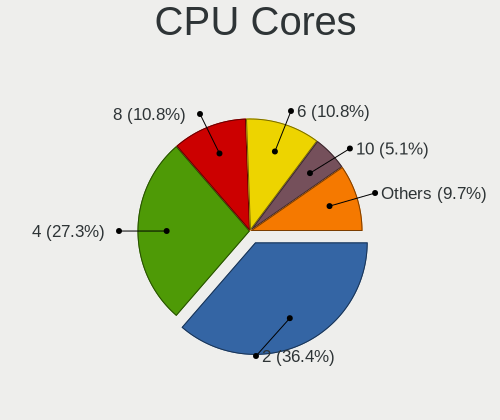

| Number | Notebooks | Percent |
|--------|-----------|---------|
| 2      | 64        | 36.36%  |
| 4      | 48        | 27.27%  |
| 8      | 19        | 10.8%   |
| 6      | 19        | 10.8%   |
| 10     | 9         | 5.11%   |
| 16     | 7         | 3.98%   |
| 12     | 4         | 2.27%   |
| 1      | 3         | 1.7%    |
| 24     | 2         | 1.14%   |
| 14     | 1         | 0.57%   |

CPU Sockets
-----------

Number of sockets

| Number | Notebooks | Percent |
|--------|-----------|---------|
| 1      | 176       | 100%    |

CPU Threads
-----------

Threads per core (Hyper-Threading)

| Number | Notebooks | Percent |
|--------|-----------|---------|
| 2      | 146       | 82.95%  |
| 1      | 29        | 16.48%  |
| 4      | 1         | 0.57%   |

CPU Op-Modes
------------

CPU Operation Modes (32-bit, 64-bit)

| Op mode        | Notebooks | Percent |
|----------------|-----------|---------|
| 32-bit, 64-bit | 175       | 99.43%  |
| 32-bit         | 1         | 0.57%   |

CPU Microcode
-------------

Microcode number

| Number     | Notebooks | Percent |
|------------|-----------|---------|
| Unknown    | 150       | 85.23%  |
| 0x506e3    | 2         | 1.14%   |
| 0x08608103 | 2         | 1.14%   |
| 0x08600106 | 2         | 1.14%   |
| 0x03000027 | 2         | 1.14%   |
| 0xb06a3    | 1         | 0.57%   |
| 0xb06a2    | 1         | 0.57%   |
| 0x906ea    | 1         | 0.57%   |
| 0x906a4    | 1         | 0.57%   |
| 0x806ec    | 1         | 0.57%   |
| 0x806e9    | 1         | 0.57%   |
| 0x706e5    | 1         | 0.57%   |
| 0x506c9    | 1         | 0.57%   |
| 0x40651    | 1         | 0.57%   |
| 0x306c3    | 1         | 0.57%   |
| 0x306a9    | 1         | 0.57%   |
| 0x206a7    | 1         | 0.57%   |
| 0x20655    | 1         | 0.57%   |
| 0x106e5    | 1         | 0.57%   |
| 0x106c2    | 1         | 0.57%   |
| 0x10676    | 1         | 0.57%   |
| 0x0a704107 | 1         | 0.57%   |
| 0x06006118 | 1         | 0.57%   |

CPU Microarch
-------------

Microarchitecture

| Name              | Notebooks | Percent |
|-------------------|-----------|---------|
| Unknown           | 31        | 17.61%  |
| KabyLake          | 29        | 16.48%  |
| Haswell           | 13        | 7.39%   |
| Alderlake Hybrid  | 13        | 7.39%   |
| TigerLake         | 9         | 5.11%   |
| Skylake           | 8         | 4.55%   |
| SandyBridge       | 8         | 4.55%   |
| IvyBridge         | 8         | 4.55%   |
| Westmere          | 7         | 3.98%   |
| Penryn            | 7         | 3.98%   |
| Zen 3             | 5         | 2.84%   |
| Icelake           | 5         | 2.84%   |
| Zen+              | 4         | 2.27%   |
| Meteorlake Hybrid | 4         | 2.27%   |
| Broadwell         | 4         | 2.27%   |
| Zen 2             | 3         | 1.7%    |
| Zen               | 3         | 1.7%    |
| Core              | 3         | 1.7%    |
| CometLake         | 3         | 1.7%    |
| Puma              | 2         | 1.14%   |
| K10 Llano         | 2         | 1.14%   |
| Nehalem           | 1         | 0.57%   |
| Goldmont          | 1         | 0.57%   |
| Excavator         | 1         | 0.57%   |
| Bonnell           | 1         | 0.57%   |
| Bobcat            | 1         | 0.57%   |

Graphics
--------

GPU Vendor
----------

Vendors of graphics cards

| Vendor | Notebooks | Percent |
|--------|-----------|---------|
| Intel  | 116       | 52.02%  |
| AMD    | 55        | 24.66%  |
| Nvidia | 52        | 23.32%  |

GPU Model
---------

Graphics card models

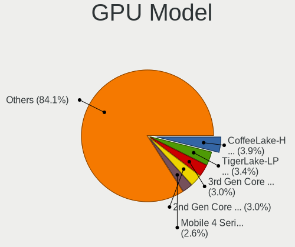

| Model                                                                         | Notebooks | Percent |
|-------------------------------------------------------------------------------|-----------|---------|
| Intel CoffeeLake-H GT2 [UHD Graphics 630]                                     | 9         | 3.88%   |
| Intel TigerLake-LP GT2 [Iris Xe Graphics]                                     | 8         | 3.45%   |
| Intel 3rd Gen Core processor Graphics Controller                              | 7         | 3.02%   |
| Intel 2nd Generation Core Processor Family Integrated Graphics Controller     | 7         | 3.02%   |
| Intel Mobile 4 Series Chipset Integrated Graphics Controller                  | 6         | 2.59%   |
| Intel Skylake GT2 [HD Graphics 520]                                           | 5         | 2.16%   |
| Intel Raptor Lake-P [Iris Xe Graphics]                                        | 5         | 2.16%   |
| Intel Meteor Lake-P [Intel Arc Graphics]                                      | 5         | 2.16%   |
| Intel HD Graphics 620                                                         | 5         | 2.16%   |
| Intel Haswell-ULT Integrated Graphics Controller                              | 5         | 2.16%   |
| Intel 4th Gen Core Processor Integrated Graphics Controller                   | 5         | 2.16%   |
| AMD Rembrandt [Radeon 680M]                                                   | 5         | 2.16%   |
| Nvidia GP106M [GeForce GTX 1060 Mobile]                                       | 4         | 1.72%   |
| Intel WhiskeyLake-U GT2 [UHD Graphics 620]                                    | 4         | 1.72%   |
| Intel Alder Lake-UP3 GT2 [Iris Xe Graphics]                                   | 4         | 1.72%   |
| AMD Sephiroth [AMD Custom GPU 0405]                                           | 4         | 1.72%   |
| AMD Picasso/Raven 2 [Radeon Vega Series / Radeon Vega Mobile Series]          | 4         | 1.72%   |
| AMD Phoenix3                                                                  | 4         | 1.72%   |
| AMD Phoenix1                                                                  | 4         | 1.72%   |
| AMD Lucienne                                                                  | 4         | 1.72%   |
| Intel UHD Graphics 620                                                        | 3         | 1.29%   |
| Intel Iris Plus Graphics G7                                                   | 3         | 1.29%   |
| Intel HD Graphics 630                                                         | 3         | 1.29%   |
| Intel HD Graphics 5500                                                        | 3         | 1.29%   |
| Intel Core Processor Integrated Graphics Controller                           | 3         | 1.29%   |
| Intel Alder Lake-P GT2 [Iris Xe Graphics]                                     | 3         | 1.29%   |
| AMD Sun XT [Radeon HD 8670A/8670M/8690M / R5 M330 / M430 / Radeon 520 Mobile] | 3         | 1.29%   |
| AMD Renoir [Radeon Vega Series / Radeon Vega Mobile Series]                   | 3         | 1.29%   |
| AMD Raven Ridge [Radeon Vega Series / Radeon Vega Mobile Series]              | 3         | 1.29%   |
| Nvidia TU117M [GeForce GTX 1650 Mobile / Max-Q]                               | 2         | 0.86%   |
| Nvidia GP107M [GeForce GTX 1050 Mobile]                                       | 2         | 0.86%   |
| Nvidia GF117M [GeForce 610M/710M/810M/820M / GT 620M/625M/630M/720M]          | 2         | 0.86%   |
| Nvidia GA107M [GeForce RTX 3050 Mobile]                                       | 2         | 0.86%   |
| Nvidia GA104M [GeForce RTX 3070 Mobile / Max-Q]                               | 2         | 0.86%   |
| Nvidia AD106M [GeForce RTX 4070 Max-Q / Mobile]                               | 2         | 0.86%   |
| Intel Raptor Lake-S UHD Graphics                                              | 2         | 0.86%   |
| Intel HD Graphics 530                                                         | 2         | 0.86%   |
| Intel Haswell Integrated Graphics Controller                                  | 2         | 0.86%   |
| Intel CometLake-U GT2 [UHD Graphics]                                          | 2         | 0.86%   |
| Intel CometLake-H GT2 [UHD Graphics]                                          | 2         | 0.86%   |

GPU Combo
---------

Combinations of graphics cards

| Name           | Notebooks | Percent |
|----------------|-----------|---------|
| 1 x Intel      | 68        | 38.64%  |
| 1 x AMD        | 38        | 21.59%  |
| Intel + Nvidia | 36        | 20.45%  |
| 1 x Nvidia     | 12        | 6.82%   |
| 2 x AMD        | 7         | 3.98%   |
| Intel + AMD    | 7         | 3.98%   |
| 2 x Intel      | 5         | 2.84%   |
| AMD + Nvidia   | 3         | 1.7%    |

GPU Driver
----------

Free vs proprietary

| Driver      | Notebooks | Percent |
|-------------|-----------|---------|
| Free        | 140       | 79.55%  |
| Proprietary | 20        | 11.36%  |
| Unknown     | 16        | 9.09%   |

GPU Memory
----------

Total video memory

| Size in GB | Notebooks | Percent |
|------------|-----------|---------|
| Unknown    | 128       | 72.73%  |
| 0.01-0.5   | 16        | 9.09%   |
| 0.51-1.0   | 10        | 5.68%   |
| 1.01-2.0   | 9         | 5.11%   |
| 3.01-4.0   | 7         | 3.98%   |
| 7.01-8.0   | 3         | 1.7%    |
| 5.01-6.0   | 1         | 0.57%   |
| 2.01-3.0   | 1         | 0.57%   |
| 8.01-16.0  | 1         | 0.57%   |

Monitor
-------

Monitor Vendor
--------------

Monitor vendors

| Vendor                  | Notebooks | Percent |
|-------------------------|-----------|---------|
| AU Optronics            | 47        | 21.86%  |
| BOE                     | 32        | 14.88%  |
| Chimei Innolux          | 30        | 13.95%  |
| Samsung Electronics     | 21        | 9.77%   |
| LG Display              | 20        | 9.3%    |
| Dell                    | 9         | 4.19%   |
| Iiyama                  | 5         | 2.33%   |
| Valve                   | 4         | 1.86%   |
| Sharp                   | 4         | 1.86%   |
| Lenovo                  | 4         | 1.86%   |
| Chi Mei Optoelectronics | 4         | 1.86%   |
| InfoVision              | 3         | 1.4%    |
| Goldstar                | 3         | 1.4%    |
| Toshiba                 | 2         | 0.93%   |
| SNC                     | 2         | 0.93%   |
| Philips                 | 2         | 0.93%   |
| PANDA                   | 2         | 0.93%   |
| MSI                     | 2         | 0.93%   |
| Hewlett-Packard         | 2         | 0.93%   |
| Gigabyte Technology     | 2         | 0.93%   |
| Apple                   | 2         | 0.93%   |
| Acer                    | 2         | 0.93%   |
| XVision                 | 1         | 0.47%   |
| ViewSonic               | 1         | 0.47%   |
| Unknown                 | 1         | 0.47%   |
| Panasonic               | 1         | 0.47%   |
| NEC Computers           | 1         | 0.47%   |
| MStar                   | 1         | 0.47%   |
| HKC                     | 1         | 0.47%   |
| GreenWood               | 1         | 0.47%   |
| BenQ                    | 1         | 0.47%   |
| ASUSTek Computer        | 1         | 0.47%   |
| Ancor Communications    | 1         | 0.47%   |

Monitor Model
-------------

Monitor models

| Model                                                                     | Notebooks | Percent |
|---------------------------------------------------------------------------|-----------|---------|
| Valve ANX7530 U VLV3003 800x1280 100x160mm 7.4-inch                       | 4         | 1.83%   |
| Chimei Innolux LCD Monitor CMN14D4 1920x1080 309x173mm 13.9-inch          | 4         | 1.83%   |
| AU Optronics LCD Monitor AUO219D 1920x1080 381x214mm 17.2-inch            | 3         | 1.38%   |
| SNC SKP_E5-24 SNC2360 1920x1080 521x293mm 23.5-inch                       | 2         | 0.92%   |
| Samsung Electronics LCD Monitor SEC544B 1600x900 382x215mm 17.3-inch      | 2         | 0.92%   |
| Samsung Electronics LCD Monitor SDC4187 1920x1200 302x189mm 14.0-inch     | 2         | 0.92%   |
| LG Display LCD Monitor LGD046F 1920x1080 344x194mm 15.5-inch              | 2         | 0.92%   |
| Iiyama PL2492H IVM612F 1920x1080 527x296mm 23.8-inch                      | 2         | 0.92%   |
| Chimei Innolux LCD Monitor CMN15F5 1920x1080 344x193mm 15.5-inch          | 2         | 0.92%   |
| Chimei Innolux LCD Monitor CMN15E8 1920x1080 344x193mm 15.5-inch          | 2         | 0.92%   |
| Chimei Innolux LCD Monitor CMN15CA 1366x768 344x193mm 15.5-inch           | 2         | 0.92%   |
| Chimei Innolux LCD Monitor CMN14E5 1920x1080 309x173mm 13.9-inch          | 2         | 0.92%   |
| Chimei Innolux LCD Monitor CMN14C9 1920x1080 309x173mm 13.9-inch          | 2         | 0.92%   |
| Chi Mei Optoelectronics LCD Monitor CMO1720 1920x1080 382x215mm 17.3-inch | 2         | 0.92%   |
| BOE LCD Monitor BOE0BCA 2256x1504 285x190mm 13.5-inch                     | 2         | 0.92%   |
| BOE LCD Monitor BOE091A 1600x900 382x215mm 17.3-inch                      | 2         | 0.92%   |
| BOE LCD Monitor BOE084E 1920x1080 382x215mm 17.3-inch                     | 2         | 0.92%   |
| AU Optronics LCD Monitor AUO61ED 1920x1080 344x194mm 15.5-inch            | 2         | 0.92%   |
| AU Optronics LCD Monitor AUO45EC 1366x768 344x193mm 15.5-inch             | 2         | 0.92%   |
| AU Optronics LCD Monitor AUO403D 1920x1080 309x174mm 14.0-inch            | 2         | 0.92%   |
| AU Optronics LCD Monitor AUO119D 1920x1080 381x214mm 17.2-inch            | 2         | 0.92%   |
| XVision 32XS510 XVS3393 1920x1080 380x300mm 19.1-inch                     | 1         | 0.46%   |
| ViewSonic VX2458 series VSC0437 1920x1080 521x293mm 23.5-inch             | 1         | 0.46%   |
| Unknown LCD Monitor FFFF 2288x1287 2550x2550mm 142.0-inch                 | 1         | 0.46%   |
| Toshiba ScreenXpert TSB8888 1080x2160                                     | 1         | 0.46%   |
| Toshiba LCD Monitor LCD58E1 1280x800 261x163mm 12.1-inch                  | 1         | 0.46%   |
| Sharp LCD Monitor SHP1516 3840x2400 336x210mm 15.6-inch                   | 1         | 0.46%   |
| Sharp LCD Monitor SHP14CB 1920x1200 288x180mm 13.4-inch                   | 1         | 0.46%   |
| Sharp LCD Monitor SHP14BA 1920x1080 344x194mm 15.5-inch                   | 1         | 0.46%   |
| Sharp LCD Monitor SHP13FA 2560x1440 257x145mm 11.6-inch                   | 1         | 0.46%   |
| Samsung Electronics U28E590 SAM0C4C 3840x2160 608x345mm 27.5-inch         | 1         | 0.46%   |
| Samsung Electronics SyncMaster SAM0610 1920x1080                          | 1         | 0.46%   |
| Samsung Electronics SyncMaster SAM05E8 1920x1080                          | 1         | 0.46%   |
| Samsung Electronics SyncMaster SAM0423 1920x1080                          | 1         | 0.46%   |
| Samsung Electronics S24D330 SAM0D92 1920x1080 531x299mm 24.0-inch         | 1         | 0.46%   |
| Samsung Electronics S24C300 SAM0A28 1920x1080 531x299mm 24.0-inch         | 1         | 0.46%   |
| Samsung Electronics LF24T35 SAM707D 1920x1080 528x297mm 23.9-inch         | 1         | 0.46%   |
| Samsung Electronics LCD Monitor SEC5244 1600x900 360x210mm 16.4-inch      | 1         | 0.46%   |
| Samsung Electronics LCD Monitor SEC504B 1600x900 382x215mm 17.3-inch      | 1         | 0.46%   |
| Samsung Electronics LCD Monitor SEC324C 1600x900 310x174mm 14.0-inch      | 1         | 0.46%   |

Monitor Resolution
------------------

Monitor screen resolution

| Resolution        | Notebooks | Percent |
|-------------------|-----------|---------|
| 1920x1080 (FHD)   | 95        | 48.47%  |
| 1366x768 (WXGA)   | 32        | 16.33%  |
| 1600x900 (HD+)    | 13        | 6.63%   |
| 1920x1200 (WUXGA) | 11        | 5.61%   |
| 2560x1440 (QHD)   | 9         | 4.59%   |
| 2880x1800         | 8         | 4.08%   |
| 1280x800 (WXGA)   | 5         | 2.55%   |
| 800x1280          | 4         | 2.04%   |
| 3840x2160 (4K)    | 4         | 2.04%   |
| 2560x1600         | 4         | 2.04%   |
| 2256x1504         | 3         | 1.53%   |
| 2160x1440         | 2         | 1.02%   |
| 3840x2400         | 1         | 0.51%   |
| 3840x1080         | 1         | 0.51%   |
| 3200x2000         | 1         | 0.51%   |
| 2880x1920         | 1         | 0.51%   |
| 2288x1287         | 1         | 0.51%   |
| 2240x1400         | 1         | 0.51%   |

Monitor Diagonal
----------------

Diagonal size in inches

| Inches  | Notebooks | Percent |
|---------|-----------|---------|
| 15      | 73        | 33.95%  |
| 13      | 26        | 12.09%  |
| 17      | 23        | 10.7%   |
| 14      | 21        | 9.77%   |
| 24      | 13        | 6.05%   |
| 27      | 11        | 5.12%   |
| 16      | 11        | 5.12%   |
| 23      | 7         | 3.26%   |
| 12      | 6         | 2.79%   |
| 7       | 4         | 1.86%   |
| 31      | 3         | 1.4%    |
| 21      | 3         | 1.4%    |
| 11      | 3         | 1.4%    |
| Unknown | 3         | 1.4%    |
| 142     | 1         | 0.47%   |
| 86      | 1         | 0.47%   |
| 52      | 1         | 0.47%   |
| 49      | 1         | 0.47%   |
| 40      | 1         | 0.47%   |
| 25      | 1         | 0.47%   |
| 20      | 1         | 0.47%   |
| 19      | 1         | 0.47%   |

Monitor Width
-------------

Physical width

| Width in mm    | Notebooks | Percent |
|----------------|-----------|---------|
| 301-350        | 113       | 52.56%  |
| 501-600        | 31        | 14.42%  |
| 351-400        | 28        | 13.02%  |
| 201-300        | 23        | 10.7%   |
| 601-700        | 4         | 1.86%   |
| 401-500        | 4         | 1.86%   |
| 1-100          | 4         | 1.86%   |
| 1001-1500      | 3         | 1.4%    |
| Unknown        | 3         | 1.4%    |
| More than 2000 | 1         | 0.47%   |
| 801-900        | 1         | 0.47%   |

Aspect Ratio
------------

Proportional relationship between the width and the height

| Ratio | Notebooks | Percent |
|-------|-----------|---------|
| 16/9  | 140       | 76.09%  |
| 16/10 | 30        | 16.3%   |
| 3/2   | 6         | 3.26%   |
| 0.62  | 4         | 2.17%   |
| 5/4   | 1         | 0.54%   |
| 32/9  | 1         | 0.54%   |
| 1.00  | 1         | 0.54%   |
| 0.56  | 1         | 0.54%   |

Monitor Area
------------

Area in inch²

| Area in inch² | Notebooks | Percent |
|----------------|-----------|---------|
| 101-110        | 73        | 34.27%  |
| 81-90          | 40        | 18.78%  |
| 121-130        | 21        | 9.86%   |
| 201-250        | 20        | 9.39%   |
| 301-350        | 11        | 5.16%   |
| 111-120        | 10        | 4.69%   |
| 71-80          | 7         | 3.29%   |
| 61-70          | 6         | 2.82%   |
| 1-40           | 4         | 1.88%   |
| More than 1000 | 3         | 1.41%   |
| 51-60          | 3         | 1.41%   |
| 351-500        | 3         | 1.41%   |
| 251-300        | 3         | 1.41%   |
| Unknown        | 3         | 1.41%   |
| 151-200        | 2         | 0.94%   |
| 131-140        | 2         | 0.94%   |
| 501-1000       | 2         | 0.94%   |

Pixel Density
-------------

Pixels per inch

| Density       | Notebooks | Percent |
|---------------|-----------|---------|
| 121-160       | 84        | 40.19%  |
| 101-120       | 47        | 22.49%  |
| 51-100        | 33        | 15.79%  |
| 161-240       | 31        | 14.83%  |
| More than 240 | 8         | 3.83%   |
| 1-50          | 3         | 1.44%   |
| Unknown       | 3         | 1.44%   |

Multiple Monitors
-----------------

Total monitors connected

| Total | Notebooks | Percent |
|-------|-----------|---------|
| 1     | 128       | 72.73%  |
| 2     | 38        | 21.59%  |
| 3     | 6         | 3.41%   |
| 0     | 4         | 2.27%   |

Network
-------

Net Controller Vendor
---------------------

Controller vendors

| Vendor                                 | Notebooks | Percent |
|----------------------------------------|-----------|---------|
| Intel                                  | 98        | 34.88%  |
| Realtek Semiconductor                  | 95        | 33.81%  |
| Qualcomm Atheros                       | 30        | 10.68%  |
| MediaTek                               | 17        | 6.05%   |
| Broadcom                               | 15        | 5.34%   |
| Qualcomm                               | 4         | 1.42%   |
| Broadcom Limited                       | 4         | 1.42%   |
| Ralink                                 | 2         | 0.71%   |
| Nvidia                                 | 2         | 0.71%   |
| NetGear                                | 2         | 0.71%   |
| Marvell Technology Group               | 2         | 0.71%   |
| Dell                                   | 2         | 0.71%   |
| TP-Link                                | 1         | 0.36%   |
| T & A Mobile Phones                    | 1         | 0.36%   |
| Suzhou Motorcomm Electronic Technology | 1         | 0.36%   |
| Realtek                                | 1         | 0.36%   |
| QinHeng Electronics                    | 1         | 0.36%   |
| Lenovo                                 | 1         | 0.36%   |
| Huawei Technologies                    | 1         | 0.36%   |
| Ericsson Business Mobile Networks      | 1         | 0.36%   |

Net Controller Model
--------------------

Controller models

| Model                                                                   | Notebooks | Percent |
|-------------------------------------------------------------------------|-----------|---------|
| Realtek RTL8111/8168/8211/8411 PCI Express Gigabit Ethernet Controller  | 61        | 18.65%  |
| Realtek RTL8153 Gigabit Ethernet Adapter                                | 16        | 4.89%   |
| Realtek RTL810xE PCI Express Fast Ethernet controller                   | 12        | 3.67%   |
| MediaTek MT7921 802.11ax PCI Express Wireless Network Adapter           | 9         | 2.75%   |
| Intel Wireless 8265 / 8275                                              | 9         | 2.75%   |
| Intel Alder Lake-P PCH CNVi WiFi                                        | 9         | 2.75%   |
| Qualcomm Atheros AR9285 Wireless Network Adapter (PCI-Express)          | 7         | 2.14%   |
| MediaTek MT7922 802.11ax PCI Express Wireless Network Adapter           | 7         | 2.14%   |
| Intel Wireless 7260                                                     | 7         | 2.14%   |
| Realtek RTL8822CE 802.11ac PCIe Wireless Network Adapter                | 6         | 1.83%   |
| Intel Raptor Lake PCH CNVi WiFi                                         | 6         | 1.83%   |
| Intel Cannon Lake PCH CNVi WiFi                                         | 6         | 1.83%   |
| Intel Wi-Fi 6 AX201                                                     | 5         | 1.53%   |
| Intel Wi-Fi 6 AX200                                                     | 5         | 1.53%   |
| Broadcom BCM4313 802.11bgn Wireless Network Adapter                     | 5         | 1.53%   |
| Realtek RTL8852BE PCIe 802.11ax Wireless Network Controller             | 4         | 1.22%   |
| Qualcomm QCNFA765 Wireless Network Adapter                              | 4         | 1.22%   |
| Intel Wireless 8260                                                     | 4         | 1.22%   |
| Intel Wireless 7265                                                     | 4         | 1.22%   |
| Intel Wi-Fi 7(802.11be) AX1775*/AX1790*/BE20*/BE401/BE1750* 2x2         | 4         | 1.22%   |
| Intel Wi-Fi 6E(802.11ax) AX210/AX1675* 2x2 [Typhoon Peak]               | 4         | 1.22%   |
| Intel Wi-Fi 5(802.11ac) Wireless-AC 9x6x [Thunder Peak]                 | 4         | 1.22%   |
| Broadcom BCM43142 802.11b/g/n                                           | 4         | 1.22%   |
| Realtek RTL8821CE 802.11ac PCIe Wireless Network Adapter                | 3         | 0.92%   |
| Qualcomm Atheros QCA9565 / AR9565 Wireless Network Adapter              | 3         | 0.92%   |
| Qualcomm Atheros QCA9377 802.11ac Wireless Network Adapter              | 3         | 0.92%   |
| Qualcomm Atheros AR9485 Wireless Network Adapter                        | 3         | 0.92%   |
| Qualcomm Atheros AR8151 v2.0 Gigabit Ethernet                           | 3         | 0.92%   |
| Qualcomm Atheros AR242x / AR542x Wireless Network Adapter (PCI-Express) | 3         | 0.92%   |
| Intel Meteor Lake PCH CNVi WiFi                                         | 3         | 0.92%   |
| Intel Ethernet Connection (7) I219-LM                                   | 3         | 0.92%   |
| Intel Ethernet Connection (6) I219-LM                                   | 3         | 0.92%   |
| Intel Ethernet Connection (4) I219-LM                                   | 3         | 0.92%   |
| Intel Comet Lake PCH CNVi WiFi                                          | 3         | 0.92%   |
| Intel 82579LM Gigabit Network Connection (Lewisville)                   | 3         | 0.92%   |
| Realtek RTL8723BE PCIe Wireless Network Adapter                         | 2         | 0.61%   |
| Realtek RTL8188EUS 802.11n Wireless Network Adapter                     | 2         | 0.61%   |
| Qualcomm Atheros QCA6174 802.11ac Wireless Network Adapter              | 2         | 0.61%   |
| Qualcomm Atheros AR9462 Wireless Network Adapter                        | 2         | 0.61%   |
| Nvidia MCP79 Ethernet                                                   | 2         | 0.61%   |

Wireless Vendor
---------------

Wireless vendors

| Vendor                | Notebooks | Percent |
|-----------------------|-----------|---------|
| Intel                 | 91        | 51.12%  |
| Qualcomm Atheros      | 23        | 12.92%  |
| Realtek Semiconductor | 22        | 12.36%  |
| MediaTek              | 15        | 8.43%   |
| Broadcom              | 12        | 6.74%   |
| Qualcomm              | 4         | 2.25%   |
| Broadcom Limited      | 4         | 2.25%   |
| Ralink                | 2         | 1.12%   |
| NetGear               | 2         | 1.12%   |
| TP-Link               | 1         | 0.56%   |
| Realtek               | 1         | 0.56%   |
| Dell                  | 1         | 0.56%   |

Wireless Model
--------------

Wireless models

| Model                                                                   | Notebooks | Percent |
|-------------------------------------------------------------------------|-----------|---------|
| MediaTek MT7921 802.11ax PCI Express Wireless Network Adapter           | 9         | 5.03%   |
| Intel Wireless 8265 / 8275                                              | 9         | 5.03%   |
| Intel Alder Lake-P PCH CNVi WiFi                                        | 9         | 5.03%   |
| Qualcomm Atheros AR9285 Wireless Network Adapter (PCI-Express)          | 7         | 3.91%   |
| Intel Wireless 7260                                                     | 7         | 3.91%   |
| Realtek RTL8822CE 802.11ac PCIe Wireless Network Adapter                | 6         | 3.35%   |
| Intel Raptor Lake PCH CNVi WiFi                                         | 6         | 3.35%   |
| Intel Cannon Lake PCH CNVi WiFi                                         | 6         | 3.35%   |
| MediaTek MT7922 802.11ax PCI Express Wireless Network Adapter           | 5         | 2.79%   |
| Intel Wi-Fi 6 AX201                                                     | 5         | 2.79%   |
| Intel Wi-Fi 6 AX200                                                     | 5         | 2.79%   |
| Broadcom BCM4313 802.11bgn Wireless Network Adapter                     | 5         | 2.79%   |
| Qualcomm QCNFA765 Wireless Network Adapter                              | 4         | 2.23%   |
| Intel Wireless 8260                                                     | 4         | 2.23%   |
| Intel Wireless 7265                                                     | 4         | 2.23%   |
| Intel Wi-Fi 6E(802.11ax) AX210/AX1675* 2x2 [Typhoon Peak]               | 4         | 2.23%   |
| Intel Wi-Fi 5(802.11ac) Wireless-AC 9x6x [Thunder Peak]                 | 4         | 2.23%   |
| Broadcom BCM43142 802.11b/g/n                                           | 4         | 2.23%   |
| Realtek RTL8852BE PCIe 802.11ax Wireless Network Controller             | 3         | 1.68%   |
| Realtek RTL8821CE 802.11ac PCIe Wireless Network Adapter                | 3         | 1.68%   |
| Qualcomm Atheros QCA9565 / AR9565 Wireless Network Adapter              | 3         | 1.68%   |
| Qualcomm Atheros QCA9377 802.11ac Wireless Network Adapter              | 3         | 1.68%   |
| Qualcomm Atheros AR9485 Wireless Network Adapter                        | 3         | 1.68%   |
| Qualcomm Atheros AR242x / AR542x Wireless Network Adapter (PCI-Express) | 3         | 1.68%   |
| Intel Wi-Fi 7(802.11be) AX1775*/AX1790*/BE20*/BE401/BE1750* 2x2         | 3         | 1.68%   |
| Intel Meteor Lake PCH CNVi WiFi                                         | 3         | 1.68%   |
| Intel Comet Lake PCH CNVi WiFi                                          | 3         | 1.68%   |
| Realtek RTL8723BE PCIe Wireless Network Adapter                         | 2         | 1.12%   |
| Realtek RTL8188EUS 802.11n Wireless Network Adapter                     | 2         | 1.12%   |
| Qualcomm Atheros QCA6174 802.11ac Wireless Network Adapter              | 2         | 1.12%   |
| Qualcomm Atheros AR9462 Wireless Network Adapter                        | 2         | 1.12%   |
| Intel PRO/Wireless 5100 AGN [Shiloh] Network Connection                 | 2         | 1.12%   |
| Intel Ice Lake-LP PCH CNVi WiFi                                         | 2         | 1.12%   |
| Intel Dual Band Wireless-AC 3165 Plus Bluetooth                         | 2         | 1.12%   |
| Intel Comet Lake PCH-LP CNVi WiFi                                       | 2         | 1.12%   |
| Intel Centrino Wireless-N 2230                                          | 2         | 1.12%   |
| Intel Centrino Wireless-N 1000 [Condor Peak]                            | 2         | 1.12%   |
| Intel Centrino Advanced-N 6205 [Taylor Peak]                            | 2         | 1.12%   |
| Intel Cannon Point-LP CNVi [Wireless-AC]                                | 2         | 1.12%   |
| Broadcom Limited BCM4312 802.11b/g LP-PHY                               | 2         | 1.12%   |

Ethernet Vendor
---------------

Ethernet vendors

| Vendor                                 | Notebooks | Percent |
|----------------------------------------|-----------|---------|
| Realtek Semiconductor                  | 86        | 61.87%  |
| Intel                                  | 30        | 21.58%  |
| Qualcomm Atheros                       | 10        | 7.19%   |
| Broadcom                               | 4         | 2.88%   |
| Nvidia                                 | 2         | 1.44%   |
| MediaTek                               | 2         | 1.44%   |
| Marvell Technology Group               | 2         | 1.44%   |
| T & A Mobile Phones                    | 1         | 0.72%   |
| Suzhou Motorcomm Electronic Technology | 1         | 0.72%   |
| Lenovo                                 | 1         | 0.72%   |

Ethernet Model
--------------

Ethernet models

| Model                                                                          | Notebooks | Percent |
|--------------------------------------------------------------------------------|-----------|---------|
| Realtek RTL8111/8168/8211/8411 PCI Express Gigabit Ethernet Controller         | 61        | 42.36%  |
| Realtek RTL8153 Gigabit Ethernet Adapter                                       | 16        | 11.11%  |
| Realtek RTL810xE PCI Express Fast Ethernet controller                          | 12        | 8.33%   |
| Qualcomm Atheros AR8151 v2.0 Gigabit Ethernet                                  | 3         | 2.08%   |
| Intel Ethernet Connection (7) I219-LM                                          | 3         | 2.08%   |
| Intel Ethernet Connection (6) I219-LM                                          | 3         | 2.08%   |
| Intel Ethernet Connection (4) I219-LM                                          | 3         | 2.08%   |
| Intel 82579LM Gigabit Network Connection (Lewisville)                          | 3         | 2.08%   |
| Nvidia MCP79 Ethernet                                                          | 2         | 1.39%   |
| MediaTek MT7922 802.11ax PCI Express Wireless Network Adapter                  | 2         | 1.39%   |
| Intel Ethernet Controller I219-LM                                              | 2         | 1.39%   |
| Intel Ethernet Connection I217-LM                                              | 2         | 1.39%   |
| Broadcom NetLink BCM5787M Gigabit Ethernet PCI Express                         | 2         | 1.39%   |
| T & A Mobile Phones TCL 50 NXTPAPER 5G                                         | 1         | 0.69%   |
| Suzhou Motorcomm Electronic YT6801 Gigabit Ethernet Controller                 | 1         | 0.69%   |
| Realtek RTL8852BE PCIe 802.11ax Wireless Network Controller                    | 1         | 0.69%   |
| Realtek Killer E3000 2.5GbE Controller                                         | 1         | 0.69%   |
| Qualcomm Atheros QCA8172 Fast Ethernet                                         | 1         | 0.69%   |
| Qualcomm Atheros Killer E2500 Gigabit Ethernet Controller                      | 1         | 0.69%   |
| Qualcomm Atheros Killer E2400 Gigabit Ethernet Controller                      | 1         | 0.69%   |
| Qualcomm Atheros Killer E220x Gigabit Ethernet Controller                      | 1         | 0.69%   |
| Qualcomm Atheros AR8161 Gigabit Ethernet                                       | 1         | 0.69%   |
| Qualcomm Atheros AR8151 v1.0 Gigabit Ethernet                                  | 1         | 0.69%   |
| Qualcomm Atheros AR8131 Gigabit Ethernet                                       | 1         | 0.69%   |
| Marvell Group Yukon Optima 88E8059 [PCIe Gigabit Ethernet Controller with AVB] | 1         | 0.69%   |
| Marvell Group 88E8040 PCI-E Fast Ethernet Controller                           | 1         | 0.69%   |
| Lenovo USB-C Hub                                                               | 1         | 0.69%   |
| Intel Wi-Fi 7(802.11be) AX1775*/AX1790*/BE20*/BE401/BE1750* 2x2                | 1         | 0.69%   |
| Intel I211 Gigabit Network Connection                                          | 1         | 0.69%   |
| Intel Ethernet Connection I219-V                                               | 1         | 0.69%   |
| Intel Ethernet Connection I217-V                                               | 1         | 0.69%   |
| Intel Ethernet Connection (5) I219-LM                                          | 1         | 0.69%   |
| Intel Ethernet Connection (4) I219-V                                           | 1         | 0.69%   |
| Intel Ethernet Connection (23) I219-LM                                         | 1         | 0.69%   |
| Intel Ethernet Connection (16) I219-V                                          | 1         | 0.69%   |
| Intel Ethernet Connection (16) I219-LM                                         | 1         | 0.69%   |
| Intel Ethernet Connection (11) I219-V                                          | 1         | 0.69%   |
| Intel Ethernet Connection (11) I219-LM                                         | 1         | 0.69%   |
| Intel 82579V Gigabit Network Connection                                        | 1         | 0.69%   |
| Intel 82567LM Gigabit Network Connection                                       | 1         | 0.69%   |

Net Controller Kind
-------------------

Ethernet, WiFi or modem

| Kind     | Notebooks | Percent |
|----------|-----------|---------|
| WiFi     | 171       | 56.25%  |
| Ethernet | 129       | 42.43%  |
| Modem    | 4         | 1.32%   |

Used Controller
---------------

Currently used network controller

| Kind     | Notebooks | Percent |
|----------|-----------|---------|
| WiFi     | 139       | 75.54%  |
| Ethernet | 45        | 24.46%  |

NICs
----

Total network controllers on board

| Total | Notebooks | Percent |
|-------|-----------|---------|
| 2     | 118       | 67.05%  |
| 1     | 56        | 31.82%  |
| 3     | 2         | 1.14%   |

IPv6
----

IPv6 vs IPv4

| Used | Notebooks | Percent |
|------|-----------|---------|
| Yes  | 102       | 57.95%  |
| No   | 74        | 42.05%  |

Bluetooth
---------

Bluetooth Vendor
----------------

Controller vendors

| Vendor                          | Notebooks | Percent |
|---------------------------------|-----------|---------|
| Intel                           | 75        | 51.72%  |
| Realtek Semiconductor           | 13        | 8.97%   |
| Foxconn / Hon Hai               | 10        | 6.9%    |
| Qualcomm Atheros Communications | 7         | 4.83%   |
| Lite-On Technology              | 7         | 4.83%   |
| IMC Networks                    | 7         | 4.83%   |
| Broadcom                        | 7         | 4.83%   |
| MediaTek                        | 4         | 2.76%   |
| Toshiba                         | 3         | 2.07%   |
| Hewlett-Packard                 | 3         | 2.07%   |
| Realtek                         | 2         | 1.38%   |
| Cambridge Silicon Radio         | 2         | 1.38%   |
| Ralink Technology               | 1         | 0.69%   |
| Ralink                          | 1         | 0.69%   |
| Foxconn International           | 1         | 0.69%   |
| Dell                            | 1         | 0.69%   |
| Apple                           | 1         | 0.69%   |

Bluetooth Model
---------------

Controller models

| Model                                                       | Notebooks | Percent |
|-------------------------------------------------------------|-----------|---------|
| Intel Bluetooth wireless interface                          | 23        | 15.86%  |
| Intel AX211 Bluetooth                                       | 15        | 10.34%  |
| Intel Bluetooth 9460/9560 Jefferson Peak (JfP)              | 12        | 8.28%   |
| Intel AX201 Bluetooth                                       | 11        | 7.59%   |
| Realtek Bluetooth Radio                                     | 9         | 6.21%   |
| Intel AX200 Bluetooth                                       | 5         | 3.45%   |
| Qualcomm Atheros  Bluetooth Device                          | 4         | 2.76%   |
| MediaTek Wireless_Device                                    | 4         | 2.76%   |
| Foxconn / Hon Hai MediaTek Bluetooth Adapter                | 4         | 2.76%   |
| Lite-On Wireless_Device                                     | 3         | 2.07%   |
| Intel Bluetooth Device                                      | 3         | 2.07%   |
| Intel AX210 Bluetooth                                       | 3         | 2.07%   |
| Foxconn / Hon Hai Wireless_Device                           | 3         | 2.07%   |
| Realtek  Bluetooth 4.2 Adapter                              | 2         | 1.38%   |
| Realtek 802.11ac WLAN Adapter                               | 2         | 1.38%   |
| Realtek Bluetooth Radio                                     | 2         | 1.38%   |
| Qualcomm Atheros AR3011 Bluetooth                           | 2         | 1.38%   |
| Lite-On Bluetooth Device                                    | 2         | 1.38%   |
| Intel Centrino Bluetooth Wireless Transceiver               | 2         | 1.38%   |
| IMC Networks Wireless_Device                                | 2         | 1.38%   |
| HP Broadcom 2070 Bluetooth Combo                            | 2         | 1.38%   |
| Cambridge Silicon Radio Bluetooth Dongle (HCI mode)         | 2         | 1.38%   |
| Broadcom BCM2070 Bluetooth 2.1 + EDR                        | 2         | 1.38%   |
| Toshiba Bluetooth Device                                    | 1         | 0.69%   |
| Toshiba BCM43142A0                                          | 1         | 0.69%   |
| Toshiba Askey Bluetooth Module                              | 1         | 0.69%   |
| Ralink Motorola BC4 Bluetooth 3.0+HS Adapter                | 1         | 0.69%   |
| Ralink RT3290 Bluetooth                                     | 1         | 0.69%   |
| Qualcomm Atheros AR3012 Bluetooth 4.0                       | 1         | 0.69%   |
| Lite-On Qualcomm Atheros QCA9377 Bluetooth                  | 1         | 0.69%   |
| Lite-On Bluetooth Radio                                     | 1         | 0.69%   |
| Intel Wireless-AC 9260 Bluetooth Adapter                    | 1         | 0.69%   |
| IMC Networks Bluetooth USB Host Controller                  | 1         | 0.69%   |
| IMC Networks Bluetooth Radio                                | 1         | 0.69%   |
| IMC Networks Bluetooth Device                               | 1         | 0.69%   |
| IMC Networks Bluetooth                                      | 1         | 0.69%   |
| IMC Networks Asus Integrated Bluetooth module [AR3011]      | 1         | 0.69%   |
| HP Integrated Module with Bluetooth 2.1 Wireless technology | 1         | 0.69%   |
| Foxconn International BCM43142A0 Bluetooth module           | 1         | 0.69%   |
| Foxconn / Hon Hai BT                                        | 1         | 0.69%   |

Sound
-----

Sound Vendor
------------

Sound card vendors

| Vendor                 | Notebooks | Percent |
|------------------------|-----------|---------|
| Intel                  | 128       | 55.17%  |
| AMD                    | 51        | 21.98%  |
| Nvidia                 | 33        | 14.22%  |
| Plantronics            | 3         | 1.29%   |
| Realtek Semiconductor  | 2         | 0.86%   |
| Logitech               | 2         | 0.86%   |
| C-Media Electronics    | 2         | 0.86%   |
| Texas Instruments      | 1         | 0.43%   |
| RODE Microphones       | 1         | 0.43%   |
| Mackie Designs         | 1         | 0.43%   |
| Lenovo                 | 1         | 0.43%   |
| Kingston Technology    | 1         | 0.43%   |
| Hewlett-Packard        | 1         | 0.43%   |
| Generalplus Technology | 1         | 0.43%   |
| DSEA A/S               | 1         | 0.43%   |
| Conexant Systems       | 1         | 0.43%   |
| Comtrue                | 1         | 0.43%   |
| ASUSTek Computer       | 1         | 0.43%   |

Sound Model
-----------

Sound card models

| Model                                                                      | Notebooks | Percent |
|----------------------------------------------------------------------------|-----------|---------|
| AMD Family 17h/19h/1ah HD Audio Controller                                 | 33        | 11.46%  |
| AMD Rembrandt Radeon High Definition Audio Controller                      | 18        | 6.25%   |
| Intel Sunrise Point-LP HD Audio                                            | 14        | 4.86%   |
| AMD Renoir Radeon High Definition Audio Controller                         | 11        | 3.82%   |
| Intel Cannon Lake PCH cAVS                                                 | 10        | 3.47%   |
| Intel Alder Lake PCH-P High Definition Audio Controller                    | 10        | 3.47%   |
| Intel 7 Series/C216 Chipset Family High Definition Audio Controller        | 10        | 3.47%   |
| Intel Tiger Lake-LP Smart Sound Technology Audio Controller                | 9         | 3.13%   |
| Intel 5 Series/3400 Series Chipset High Definition Audio                   | 8         | 2.78%   |
| Intel Xeon E3-1200 v3/4th Gen Core Processor HD Audio Controller           | 7         | 2.43%   |
| Intel 8 Series/C220 Series Chipset High Definition Audio Controller        | 7         | 2.43%   |
| Intel Raptor Lake-P/U/H cAVS                                               | 6         | 2.08%   |
| Intel Meteor Lake-P HD Audio Controller                                    | 6         | 2.08%   |
| Intel 82801I (ICH9 Family) HD Audio Controller                             | 6         | 2.08%   |
| Intel 8 Series HD Audio Controller                                         | 6         | 2.08%   |
| Intel 6 Series/C200 Series Chipset Family High Definition Audio Controller | 6         | 2.08%   |
| AMD Raven/Raven2/Fenghuang HDMI/DP Audio Controller                        | 6         | 2.08%   |
| Nvidia GP106 High Definition Audio Controller                              | 5         | 1.74%   |
| Intel Haswell-ULT HD Audio Controller                                      | 5         | 1.74%   |
| AMD FCH Azalia Controller                                                  | 5         | 1.74%   |
| Intel Wildcat Point-LP High Definition Audio Controller                    | 4         | 1.39%   |
| Intel Ice Lake-LP Smart Sound Technology Audio Controller                  | 4         | 1.39%   |
| Intel Cannon Point-LP High Definition Audio Controller                     | 4         | 1.39%   |
| Intel Broadwell-U Audio Controller                                         | 4         | 1.39%   |
| Intel 100 Series/C230 Series Chipset Family HD Audio Controller            | 4         | 1.39%   |
| Nvidia GA107 High Definition Audio Controller                              | 3         | 1.04%   |
| Intel Comet Lake PCH cAVS                                                  | 3         | 1.04%   |
| Intel CM238 HD Audio Controller                                            | 3         | 1.04%   |
| AMD Kabini HDMI/DP Audio                                                   | 3         | 1.04%   |
| Realtek Semiconductor USB Audio                                            | 2         | 0.69%   |
| Nvidia TU106 High Definition Audio Controller                              | 2         | 0.69%   |
| Nvidia TU104 HD Audio Controller                                           | 2         | 0.69%   |
| Nvidia MCP79 High Definition Audio                                         | 2         | 0.69%   |
| Nvidia GP107GL High Definition Audio Controller                            | 2         | 0.69%   |
| Nvidia GK107 HDMI Audio Controller                                         | 2         | 0.69%   |
| Nvidia GA104 High Definition Audio Controller                              | 2         | 0.69%   |
| Nvidia AD106M High Definition Audio Controller                             | 2         | 0.69%   |
| Intel Raptor Lake High Definition Audio Controller                         | 2         | 0.69%   |
| Intel Comet Lake PCH-LP cAVS                                               | 2         | 0.69%   |
| Intel 82801H (ICH8 Family) HD Audio Controller                             | 2         | 0.69%   |

Memory
------

Memory Vendor
-------------

Memory module vendors

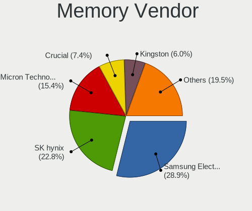

| Vendor              | Notebooks | Percent |
|---------------------|-----------|---------|
| Samsung Electronics | 43        | 28.86%  |
| SK hynix            | 34        | 22.82%  |
| Micron Technology   | 23        | 15.44%  |
| Crucial             | 11        | 7.38%   |
| Kingston            | 9         | 6.04%   |
| Unknown             | 8         | 5.37%   |
| Elpida              | 6         | 4.03%   |
| A-DATA Technology   | 3         | 2.01%   |
| Ramaxel Technology  | 2         | 1.34%   |
| Nanya Technology    | 2         | 1.34%   |
| G.Skill             | 2         | 1.34%   |
| Corsair             | 2         | 1.34%   |
| Unknown (268C)      | 1         | 0.67%   |
| Timetec             | 1         | 0.67%   |
| Lexar               | 1         | 0.67%   |
| Unknown             | 1         | 0.67%   |

Memory Model
------------

Memory module models

| Model                                                        | Notebooks | Percent |
|--------------------------------------------------------------|-----------|---------|
| Samsung RAM M471B5273DH0-CH9 4GB SODIMM DDR3 1334MT/s        | 4         | 2.5%    |
| Samsung RAM M471B5173QH0-YK0 4GB SODIMM DDR3 1600MT/s        | 3         | 1.88%   |
| Samsung RAM M471B5173EB0-YK0 4GB SODIMM DDR3 1600MT/s        | 3         | 1.88%   |
| Unknown RAM Module 4GB SODIMM DDR3                           | 2         | 1.25%   |
| SK hynix RAM Module 16GB SODIMM DDR4 3200MT/s                | 2         | 1.25%   |
| SK hynix RAM HMT41GS6AFR8A-PB 8GB SODIMM DDR3 2667MT/s       | 2         | 1.25%   |
| SK hynix RAM HMT351S6CFR8C-PB 4GB SODIMM DDR3 1600MT/s       | 2         | 1.25%   |
| SK hynix RAM HMAA1GS6CJR6N-XN 8GB Row Of Chips DDR4 3200MT/s | 2         | 1.25%   |
| SK hynix RAM HMA81GS6AFR8N-UH 8GB SODIMM DDR4 2667MT/s       | 2         | 1.25%   |
| Samsung RAM M471A5244CB0-CWE 4096MB SODIMM DDR4 3200MT/s     | 2         | 1.25%   |
| Samsung RAM M471A5244CB0-CTD 4GB SODIMM DDR4 3266MT/s        | 2         | 1.25%   |
| Samsung RAM M471A4G43AB1-CWE 32GB SODIMM DDR4 3200MT/s       | 2         | 1.25%   |
| Samsung RAM M471A2K43DB1-CWE 16GB SODIMM DDR4 3200MT/s       | 2         | 1.25%   |
| Samsung RAM M471A2K43CB1-CRC 16GB SODIMM DDR4 2667MT/s       | 2         | 1.25%   |
| Micron RAM MTC4C10163S1SC48BA1 8GB SODIMM DDR5 4800MT/s      | 2         | 1.25%   |
| Micron RAM 4ATF51264HZ-2G6E1 4GB SODIMM DDR4 2667MT/s        | 2         | 1.25%   |
| Elpida RAM EBJ40UG8EFU0 4GB SODIMM DDR3 1600MT/s             | 2         | 1.25%   |
| Crucial RAM CT51264BF160B.C16F 4GB SODIMM DDR3 1600MT/s      | 2         | 1.25%   |
| A-DATA RAM AD5S560032G-SFW 32GB SODIMM DDR5 5600MT/s         | 2         | 1.25%   |
| Unknown RAM Module 8GB SODIMM DDR4 2400MT/s                  | 1         | 0.63%   |
| Unknown RAM Module 8GB Row Of Chips LPDDR4 4267MT/s          | 1         | 0.63%   |
| Unknown RAM Module 2GB SODIMM DDR2 667MT/s                   | 1         | 0.63%   |
| Unknown RAM Module 2GB SODIMM DDR2 533MT/s                   | 1         | 0.63%   |
| Unknown RAM Module 2GB SODIMM 667MT/s                        | 1         | 0.63%   |
| Unknown RAM Module 1GB SODIMM DDR2 667MT/s                   | 1         | 0.63%   |
| Unknown (268C) RAM Module 16GB SODIMM DDR4 3200MT/s          | 1         | 0.63%   |
| Timetec RAM S8G-1600 8GB SODIMM DDR3 1600MT/s                | 1         | 0.63%   |
| SK hynix RAM HMT451S6CFR6A-PB 4GB SODIMM DDR3 1600MT/s       | 1         | 0.63%   |
| SK hynix RAM HMT451S6BFR8A-PB 4GB SODIMM DDR3 1600MT/s       | 1         | 0.63%   |
| SK hynix RAM HMT451S6AFR8A-PB 4GB SODIMM DDR3 1600MT/s       | 1         | 0.63%   |
| SK hynix RAM HMT425S6AFR6R-PB 2GB SODIMM DDR3 1600MT/s       | 1         | 0.63%   |
| SK hynix RAM HMT41GS6BFR8A-PB 8GB SODIMM DDR3 1600MT/s       | 1         | 0.63%   |
| SK hynix RAM HMT351S6EFR8A-PB 4GB SODIMM DDR3 1600MT/s       | 1         | 0.63%   |
| SK hynix RAM HMT351S6CFR8C-H9 4GB SODIMM DDR3 1333MT/s       | 1         | 0.63%   |
| SK hynix RAM HMT351S6CFR8A-PB 4GB SODIMM DDR3 1600MT/s       | 1         | 0.63%   |
| SK hynix RAM HMT351S6BFR8C-H9 4GB SODIMM DDR3 1333MT/s       | 1         | 0.63%   |
| SK hynix RAM HMT125S6BFR8C-G7 2GB SODIMM DDR3 1333MT/s       | 1         | 0.63%   |
| SK hynix RAM HMCG88AGBSA092N 32GB SODIMM DDR5 5600MT/s       | 1         | 0.63%   |
| SK hynix RAM HMCG66MEBSA095N 8GB SODIMM DDR5 4800MT/s        | 1         | 0.63%   |
| SK hynix RAM HMAA2GS6CJR8N-XN 16GB SODIMM DDR4 3200MT/s      | 1         | 0.63%   |

Memory Kind
-----------

Memory module kinds

| Kind    | Notebooks | Percent |
|---------|-----------|---------|
| DDR4    | 59        | 46.83%  |
| DDR3    | 35        | 27.78%  |
| DDR5    | 13        | 10.32%  |
| LPDDR5  | 10        | 7.94%   |
| LPDDR4  | 3         | 2.38%   |
| DDR2    | 3         | 2.38%   |
| SDRAM   | 1         | 0.79%   |
| LPDDR3  | 1         | 0.79%   |
| Unknown | 1         | 0.79%   |

Memory Form Factor
------------------

Physical design of the memory module

| Name         | Notebooks | Percent |
|--------------|-----------|---------|
| SODIMM       | 110       | 86.61%  |
| Row Of Chips | 17        | 13.39%  |

Memory Size
-----------

Memory module size

| Size  | Notebooks | Percent |
|-------|-----------|---------|
| 8192  | 51        | 36.17%  |
| 4096  | 33        | 23.4%   |
| 16384 | 30        | 21.28%  |
| 2048  | 14        | 9.93%   |
| 32768 | 10        | 7.09%   |
| 1024  | 3         | 2.13%   |

Memory Speed
------------

Memory module speed

| Speed   | Notebooks | Percent |
|---------|-----------|---------|
| 3200    | 31        | 22.14%  |
| 2667    | 27        | 19.29%  |
| 1600    | 21        | 15%     |
| 5600    | 9         | 6.43%   |
| 1334    | 9         | 6.43%   |
| 2400    | 6         | 4.29%   |
| 2133    | 5         | 3.57%   |
| 1333    | 5         | 3.57%   |
| 7500    | 4         | 2.86%   |
| 4800    | 4         | 2.86%   |
| 6400    | 3         | 2.14%   |
| 667     | 3         | 2.14%   |
| 7467    | 2         | 1.43%   |
| 4267    | 2         | 1.43%   |
| 3266    | 2         | 1.43%   |
| Unknown | 2         | 1.43%   |
| 8533    | 1         | 0.71%   |
| 4199    | 1         | 0.71%   |
| 1067    | 1         | 0.71%   |
| 1066    | 1         | 0.71%   |
| 533     | 1         | 0.71%   |

Printers & scanners
-------------------

Printer Vendor
--------------

Printer device vendors

| Vendor          | Notebooks | Percent |
|-----------------|-----------|---------|
| Hewlett-Packard | 1         | 100%    |

Printer Model
-------------

Printer device models

| Model                  | Notebooks | Percent |
|------------------------|-----------|---------|
| HP HP LaserJet M14-M17 | 1         | 100%    |

Scanner Vendor
--------------

Scanner device vendors

Zero info for selected period =(

Scanner Model
-------------

Scanner device models

Zero info for selected period =(

Camera
------

Camera Vendor
-------------

Camera device vendors

| Vendor                                 | Notebooks | Percent |
|----------------------------------------|-----------|---------|
| Chicony Electronics                    | 36        | 23.23%  |
| IMC Networks                           | 19        | 12.26%  |
| Realtek Semiconductor                  | 18        | 11.61%  |
| Bison Electronics                      | 15        | 9.68%   |
| Microdia                               | 10        | 6.45%   |
| Quanta                                 | 8         | 5.16%   |
| Sunplus Innovation Technology          | 6         | 3.87%   |
| Cheng Uei Precision Industry (Foxlink) | 6         | 3.87%   |
| Sonix Technology                       | 5         | 3.23%   |
| Luxvisions Innotech Limited            | 5         | 3.23%   |
| Logitech                               | 5         | 3.23%   |
| Importek                               | 4         | 2.58%   |
| Acer                                   | 3         | 1.94%   |
| Syntek                                 | 2         | 1.29%   |
| Suyin                                  | 2         | 1.29%   |
| ShineTech                              | 2         | 1.29%   |
| Lite-On Technology                     | 2         | 1.29%   |
| Primax Electronics                     | 1         | 0.65%   |
| Microsoft                              | 1         | 0.65%   |
| Lenovo                                 | 1         | 0.65%   |
| kingcome                               | 1         | 0.65%   |
| DigiTech                               | 1         | 0.65%   |
| Apple                                  | 1         | 0.65%   |
| Alcor Micro                            | 1         | 0.65%   |

Camera Model
------------

Camera device models

| Model                                         | Notebooks | Percent |
|-----------------------------------------------|-----------|---------|
| Realtek Integrated_Webcam_HD                  | 9         | 5.77%   |
| Chicony Integrated Camera                     | 8         | 5.13%   |
| Bison Integrated Camera                       | 8         | 5.13%   |
| IMC Networks USB2.0 HD UVC WebCam             | 7         | 4.49%   |
| Microdia Integrated_Webcam_HD                 | 4         | 2.56%   |
| IMC Networks Integrated Camera                | 4         | 2.56%   |
| Sonix USB2.0 HD UVC WebCam                    | 3         | 1.92%   |
| Realtek Integrated_Webcam_FHD                 | 3         | 1.92%   |
| Chicony USB2.0 HD UVC WebCam                  | 3         | 1.92%   |
| Chicony HD WebCam                             | 3         | 1.92%   |
| Cheng Uei Precision Industry (Foxlink) Webcam | 3         | 1.92%   |
| Sunplus Integrated Webcam                     | 2         | 1.28%   |
| Sonix USB2.0 FHD UVC WebCam                   | 2         | 1.28%   |
| Realtek USB Camera                            | 2         | 1.28%   |
| Realtek Laptop Camera                         | 2         | 1.28%   |
| Quanta HP HD Camera                           | 2         | 1.28%   |
| Quanta ACER HD User Facing                    | 2         | 1.28%   |
| Microdia Integrated Webcam                    | 2         | 1.28%   |
| Luxvisions Innotech Limited Integrated Camera | 2         | 1.28%   |
| IMC Networks USB2.0 VGA UVC WebCam            | 2         | 1.28%   |
| IMC Networks USB2.0 UVC HD Webcam             | 2         | 1.28%   |
| Chicony USB 2.0 Camera                        | 2         | 1.28%   |
| Chicony HD User Facing                        | 2         | 1.28%   |
| Chicony Chicony USB2.0 Camera                 | 2         | 1.28%   |
| Chicony ACER HD User Facing                   | 2         | 1.28%   |
| Bison Lenovo Integrated Webcam                | 2         | 1.28%   |
| Bison HD Webcam                               | 2         | 1.28%   |
| Syntek Integrated Camera                      | 1         | 0.64%   |
| Syntek EasyCamera                             | 1         | 0.64%   |
| Suyin Asus Integrated Webcam                  | 1         | 0.64%   |
| Suyin Acer CrystalEye Webcam                  | 1         | 0.64%   |
| Sunplus Laptop_Integrated_Webcam_HD           | 1         | 0.64%   |
| Sunplus Integrated_Webcam_HD                  | 1         | 0.64%   |
| Sunplus Integrated_Webcam_FHD                 | 1         | 0.64%   |
| Sunplus HP HD Webcam [Fixed]                  | 1         | 0.64%   |
| ShineTech USB2.0 HD UVC WebCam                | 1         | 0.64%   |
| Shinetech USB2.0 FHD UVC WebCam               | 1         | 0.64%   |
| Realtek USB Webcam                            | 1         | 0.64%   |
| Realtek EasyCamera                            | 1         | 0.64%   |
| Quanta VGA WebCam                             | 1         | 0.64%   |

Security
--------

Fingerprint Vendor
------------------

Fingerprint sensor vendors

| Vendor                     | Notebooks | Percent |
|----------------------------|-----------|---------|
| Validity Sensors           | 7         | 33.33%  |
| Shenzhen Goodix Technology | 5         | 23.81%  |
| Synaptics                  | 4         | 19.05%  |
| AuthenTec                  | 2         | 9.52%   |
| Upek                       | 1         | 4.76%   |
| LighTuning Technology      | 1         | 4.76%   |
| Elan Microelectronics      | 1         | 4.76%   |

Fingerprint Model
-----------------

Fingerprint sensor models

| Model                                                  | Notebooks | Percent |
|--------------------------------------------------------|-----------|---------|
| Shenzhen Goodix  Fingerprint Device                    | 4         | 19.05%  |
| Validity Sensors VFS451 Fingerprint Reader             | 2         | 9.52%   |
| Validity Sensors Synaptics WBDI                        | 2         | 9.52%   |
| Synaptics Prometheus MIS Touch Fingerprint Reader      | 2         | 9.52%   |
| AuthenTec AES2810                                      | 2         | 9.52%   |
| Validity Sensors VFS471 Fingerprint Reader             | 1         | 4.76%   |
| Validity Sensors VFS301 Fingerprint Reader             | 1         | 4.76%   |
| Validity Sensors Swipe Fingerprint Sensor              | 1         | 4.76%   |
| Upek Biometric Touchchip/Touchstrip Fingerprint Sensor | 1         | 4.76%   |
| Synaptics Prometheus Fingerprint Reader                | 1         | 4.76%   |
| Synaptics Metallica MIS Touch Fingerprint Reader       | 1         | 4.76%   |
| Shenzhen Goodix FingerPrint                            | 1         | 4.76%   |
| LighTuning EgisTec Touch Fingerprint Sensor            | 1         | 4.76%   |
| Elan ELAN:Fingerprint                                  | 1         | 4.76%   |

Chipcard Vendor
---------------

Chipcard module vendors

| Vendor      | Notebooks | Percent |
|-------------|-----------|---------|
| Broadcom    | 9         | 69.23%  |
| O2 Micro    | 2         | 15.38%  |
| Alcor Micro | 2         | 15.38%  |

Chipcard Model
--------------

Chipcard module models

| Model                                          | Notebooks | Percent |
|------------------------------------------------|-----------|---------|
| Broadcom 58200                                 | 6         | 46.15%  |
| O2 Micro OZ776 CCID Smartcard Reader           | 2         | 15.38%  |
| Broadcom 5880                                  | 2         | 15.38%  |
| Alcor Micro AU9540 Smartcard Reader            | 2         | 15.38%  |
| Broadcom BCM5880 Secure Applications Processor | 1         | 7.69%   |

Unsupported
-----------

Unsupported Devices
-------------------

Total unsupported devices on board

| Total | Notebooks | Percent |
|-------|-----------|---------|
| 0     | 117       | 66.48%  |
| 1     | 48        | 27.27%  |
| 2     | 10        | 5.68%   |
| 4     | 1         | 0.57%   |

Unsupported Device Types
------------------------

Types of unsupported devices

| Type                     | Notebooks | Percent |
|--------------------------|-----------|---------|
| Fingerprint reader       | 21        | 29.58%  |
| Graphics card            | 18        | 25.35%  |
| Chipcard                 | 11        | 15.49%  |
| Net/wireless             | 6         | 8.45%   |
| Multimedia controller    | 5         | 7.04%   |
| Camera                   | 3         | 4.23%   |
| Bluetooth                | 3         | 4.23%   |
| Net/ethernet             | 1         | 1.41%   |
| Flash memory             | 1         | 1.41%   |
| Communication controller | 1         | 1.41%   |
| Card reader              | 1         | 1.41%   |

