Linux in France - Hardware Trends (Notebooks)
---------------------------------------------

A project to identify most popular hardware characteristics and track their change
over time based on data collected by Linux users at https://Linux-Hardware.org.

Anyone can contribute to this report by the [hw-probe](https://github.com/linuxhw/hw-probe) tool:

    sudo -E hw-probe -all -upload

Period: Apr, 2023.

Contents
--------

* [ System ](#system)
  - [ OS                       ](#os)
  - [ OS Family                ](#os-family)
  - [ Kernel                   ](#kernel)
  - [ Kernel Family            ](#kernel-family)
  - [ Kernel Major Ver.        ](#kernel-major-ver)
  - [ Arch                     ](#arch)
  - [ DE                       ](#de)
  - [ Display Server           ](#display-server)
  - [ Display Manager          ](#display-manager)
  - [ OS Lang                  ](#os-lang)
  - [ Boot Mode                ](#boot-mode)
  - [ Filesystem               ](#filesystem)
  - [ Part. scheme             ](#part-scheme)
  - [ Dual Boot with Linux/BSD ](#dual-boot-with-linuxbsd)
  - [ Dual Boot (Win)          ](#dual-boot-win)

* [ Board ](#board)
  - [ Vendor                   ](#vendor)
  - [ Model                    ](#model)
  - [ Model Family             ](#model-family)
  - [ MFG Year                 ](#mfg-year)
  - [ Form Factor              ](#form-factor)
  - [ Secure Boot              ](#secure-boot)
  - [ Coreboot                 ](#coreboot)
  - [ RAM Size                 ](#ram-size)
  - [ RAM Used                 ](#ram-used)
  - [ Total Drives             ](#total-drives)
  - [ Has CD-ROM               ](#has-cd-rom)
  - [ Has Ethernet             ](#has-ethernet)
  - [ Has WiFi                 ](#has-wifi)
  - [ Has Bluetooth            ](#has-bluetooth)

* [ Location ](#location)
  - [ Country                  ](#country)
  - [ City                     ](#city)

* [ Drives ](#drives)
  - [ Drive Vendor             ](#drive-vendor)
  - [ Drive Model              ](#drive-model)
  - [ HDD Vendor               ](#hdd-vendor)
  - [ SSD Vendor               ](#ssd-vendor)
  - [ Drive Kind               ](#drive-kind)
  - [ Drive Connector          ](#drive-connector)
  - [ Drive Size               ](#drive-size)
  - [ Space Total              ](#space-total)
  - [ Space Used               ](#space-used)
  - [ Malfunc. Drives          ](#malfunc-drives)
  - [ Malfunc. Drive Vendor    ](#malfunc-drive-vendor)
  - [ Malfunc. HDD Vendor      ](#malfunc-hdd-vendor)
  - [ Malfunc. Drive Kind      ](#malfunc-drive-kind)
  - [ Failed Drives            ](#failed-drives)
  - [ Failed Drive Vendor      ](#failed-drive-vendor)
  - [ Drive Status             ](#drive-status)

* [ Storage controller ](#storage-controller)
  - [ Storage Vendor           ](#storage-vendor)
  - [ Storage Model            ](#storage-model)
  - [ Storage Kind             ](#storage-kind)

* [ Processor ](#processor)
  - [ CPU Vendor               ](#cpu-vendor)
  - [ CPU Model                ](#cpu-model)
  - [ CPU Model Family         ](#cpu-model-family)
  - [ CPU Cores                ](#cpu-cores)
  - [ CPU Sockets              ](#cpu-sockets)
  - [ CPU Threads              ](#cpu-threads)
  - [ CPU Op-Modes             ](#cpu-op-modes)
  - [ CPU Microcode            ](#cpu-microcode)
  - [ CPU Microarch            ](#cpu-microarch)

* [ Graphics ](#graphics)
  - [ GPU Vendor               ](#gpu-vendor)
  - [ GPU Model                ](#gpu-model)
  - [ GPU Combo                ](#gpu-combo)
  - [ GPU Driver               ](#gpu-driver)
  - [ GPU Memory               ](#gpu-memory)

* [ Monitor ](#monitor)
  - [ Monitor Vendor           ](#monitor-vendor)
  - [ Monitor Model            ](#monitor-model)
  - [ Monitor Resolution       ](#monitor-resolution)
  - [ Monitor Diagonal         ](#monitor-diagonal)
  - [ Monitor Width            ](#monitor-width)
  - [ Aspect Ratio             ](#aspect-ratio)
  - [ Monitor Area             ](#monitor-area)
  - [ Pixel Density            ](#pixel-density)
  - [ Multiple Monitors        ](#multiple-monitors)

* [ Network ](#network)
  - [ Net Controller Vendor    ](#net-controller-vendor)
  - [ Net Controller Model     ](#net-controller-model)
  - [ Wireless Vendor          ](#wireless-vendor)
  - [ Wireless Model           ](#wireless-model)
  - [ Ethernet Vendor          ](#ethernet-vendor)
  - [ Ethernet Model           ](#ethernet-model)
  - [ Net Controller Kind      ](#net-controller-kind)
  - [ Used Controller          ](#used-controller)
  - [ NICs                     ](#nics)
  - [ IPv6                     ](#ipv6)

* [ Bluetooth ](#bluetooth)
  - [ Bluetooth Vendor         ](#bluetooth-vendor)
  - [ Bluetooth Model          ](#bluetooth-model)

* [ Sound ](#sound)
  - [ Sound Vendor             ](#sound-vendor)
  - [ Sound Model              ](#sound-model)

* [ Memory ](#memory)
  - [ Memory Vendor            ](#memory-vendor)
  - [ Memory Model             ](#memory-model)
  - [ Memory Kind              ](#memory-kind)
  - [ Memory Form Factor       ](#memory-form-factor)
  - [ Memory Size              ](#memory-size)
  - [ Memory Speed             ](#memory-speed)

* [ Printers & scanners ](#printers--scanners)
  - [ Printer Vendor           ](#printer-vendor)
  - [ Printer Model            ](#printer-model)
  - [ Scanner Vendor           ](#scanner-vendor)
  - [ Scanner Model            ](#scanner-model)

* [ Camera ](#camera)
  - [ Camera Vendor            ](#camera-vendor)
  - [ Camera Model             ](#camera-model)

* [ Security ](#security)
  - [ Fingerprint Vendor       ](#fingerprint-vendor)
  - [ Fingerprint Model        ](#fingerprint-model)
  - [ Chipcard Vendor          ](#chipcard-vendor)
  - [ Chipcard Model           ](#chipcard-model)

* [ Unsupported ](#unsupported)
  - [ Unsupported Devices      ](#unsupported-devices)
  - [ Unsupported Device Types ](#unsupported-device-types)

System
------

OS
--

Installed operating systems

| Name                         | Notebooks | Percent |
|------------------------------|-----------|---------|
| Ubuntu 22.04                 | 34        | 18.48%  |
| OpenMandriva 23.03           | 26        | 14.13%  |
| Linux Mint 21.1              | 22        | 11.96%  |
| Debian 11                    | 12        | 6.52%   |
| Fedora 38                    | 8         | 4.35%   |
| Ubuntu 23.04                 | 5         | 2.72%   |
| Fedora 37                    | 5         | 2.72%   |
| Debian 12                    | 5         | 2.72%   |
| Zorin 16                     | 4         | 2.17%   |
| Ubuntu 20.04                 | 4         | 2.17%   |
| SteamOS 3.4.6                | 4         | 2.17%   |
| Xubuntu 22.04                | 3         | 1.63%   |
| Ubuntu 22.10                 | 3         | 1.63%   |
| Manjaro 22.1.0               | 3         | 1.63%   |
| Lubuntu 22.04                | 3         | 1.63%   |
| Arch Rolling                 | 3         | 1.63%   |
| ROSA 12.4                    | 2         | 1.09%   |
| OpenMandriva 4.3             | 2         | 1.09%   |
| MX 21                        | 2         | 1.09%   |
| Lubuntu 20.04                | 2         | 1.09%   |
| Linux Mint 20.3              | 2         | 1.09%   |
| Kubuntu 22.04                | 2         | 1.09%   |
| Kali 2023.1                  | 2         | 1.09%   |
| Gentoo 2.13                  | 2         | 1.09%   |
| Xubuntu 18.04                | 1         | 0.54%   |
| Xero Rolling                 | 1         | 0.54%   |
| Ubuntu MATE 22.04            | 1         | 0.54%   |
| Ubuntu Budgie 22.10          | 1         | 0.54%   |
| Ubuntu Budgie 22.04          | 1         | 0.54%   |
| Trisquel 11.0                | 1         | 0.54%   |
| Pop!_OS 22.04                | 1         | 0.54%   |
| openSUSE Tumbleweed-XXXXXXXX | 1         | 0.54%   |
| OpenMandriva 4.50            | 1         | 0.54%   |
| OpenMandriva 23.90           | 1         | 0.54%   |
| OpenMandriva 23.01           | 1         | 0.54%   |
| Manjaro                      | 1         | 0.54%   |
| Linux Mint 21                | 1         | 0.54%   |
| Linux Mint 20.2              | 1         | 0.54%   |
| Linux Mint 20                | 1         | 0.54%   |
| Linux Mint 19                | 1         | 0.54%   |

OS Family
---------

OS without a version

| Name          | Notebooks | Percent |
|---------------|-----------|---------|
| Ubuntu        | 46        | 25%     |
| OpenMandriva  | 31        | 16.85%  |
| Linux Mint    | 28        | 15.22%  |
| Debian        | 17        | 9.24%   |
| Fedora        | 14        | 7.61%   |
| Lubuntu       | 5         | 2.72%   |
| Kubuntu       | 5         | 2.72%   |
| Zorin         | 4         | 2.17%   |
| Xubuntu       | 4         | 2.17%   |
| SteamOS       | 4         | 2.17%   |
| Manjaro       | 4         | 2.17%   |
| Arch          | 3         | 1.63%   |
| Ubuntu Budgie | 2         | 1.09%   |
| ROSA          | 2         | 1.09%   |
| MX            | 2         | 1.09%   |
| Kali          | 2         | 1.09%   |
| Gentoo        | 2         | 1.09%   |
| Xero          | 1         | 0.54%   |
| Ubuntu MATE   | 1         | 0.54%   |
| Trisquel      | 1         | 0.54%   |
| Pop!_OS       | 1         | 0.54%   |
| openSUSE      | 1         | 0.54%   |
| KDE neon      | 1         | 0.54%   |
| Endless       | 1         | 0.54%   |
| CRUX          | 1         | 0.54%   |
| AlmaLinux     | 1         | 0.54%   |

Kernel
------

Version of the Linux kernel

| Version                           | Notebooks | Percent |
|-----------------------------------|-----------|---------|
| 6.2.6-desktop-1omv2390            | 26        | 14.13%  |
| 5.19.0-38-generic                 | 24        | 13.04%  |
| 5.15.0-69-generic                 | 19        | 10.33%  |
| 5.19.0-40-generic                 | 10        | 5.43%   |
| 5.10.0-21-amd64                   | 8         | 4.35%   |
| 5.15.0-70-generic                 | 7         | 3.8%    |
| 5.15.0-71-generic                 | 6         | 3.26%   |
| 6.2.8-200.fc37.x86_64             | 4         | 2.17%   |
| 6.1.0-7-amd64                     | 4         | 2.17%   |
| 5.13.0-valve36-1-neptune          | 4         | 2.17%   |
| 5.10.0-20-amd64                   | 4         | 2.17%   |
| 6.2.11-300.fc38.x86_64            | 3         | 1.63%   |
| 6.2.0-20-generic                  | 3         | 1.63%   |
| 5.19.0-41-generic                 | 3         | 1.63%   |
| 5.15.0-56-generic                 | 3         | 1.63%   |
| 6.2.9-300.fc38.x86_64             | 2         | 1.09%   |
| 6.2.8-arch1-1                     | 2         | 1.09%   |
| 6.1.20-generic-2rosa2021.1-x86_64 | 2         | 1.09%   |
| 5.4.0-146-generic                 | 2         | 1.09%   |
| 5.19.0-35-generic                 | 2         | 1.09%   |
| 5.19.0-32-generic                 | 2         | 1.09%   |
| 5.16.13-desktop-1omv4003          | 2         | 1.09%   |
| 5.15.0-67-generic                 | 2         | 1.09%   |
| 5.15.0-60-generic                 | 2         | 1.09%   |
| 4.15.0-208-generic                | 2         | 1.09%   |
| 6.2.9-200.fc37.x86_64             | 1         | 0.54%   |
| 6.2.9-1-default                   | 1         | 0.54%   |
| 6.2.8-gentoo-x86_64               | 1         | 0.54%   |
| 6.2.8-100.fc36.x86_64             | 1         | 0.54%   |
| 6.2.8-060208-generic              | 1         | 0.54%   |
| 6.2.6-76060206-generic            | 1         | 0.54%   |
| 6.2.13-300.fc38.x86_64            | 1         | 0.54%   |
| 6.2.12-300.fc38.x86_64            | 1         | 0.54%   |
| 6.2.12-1-MANJARO                  | 1         | 0.54%   |
| 6.2.11-zen1                       | 1         | 0.54%   |
| 6.2.11-arch1-1                    | 1         | 0.54%   |
| 6.2.11-703.inttf.fc38.x86_64      | 1         | 0.54%   |
| 6.2.0-21-generic                  | 1         | 0.54%   |
| 6.2.0-18-generic                  | 1         | 0.54%   |
| 6.1.25-1-MANJARO                  | 1         | 0.54%   |

Kernel Family
-------------

Linux kernel without a distro release

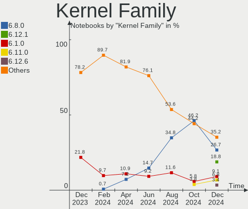

| Version  | Notebooks | Percent |
|----------|-----------|---------|
| 5.19.0   | 42        | 22.83%  |
| 5.15.0   | 41        | 22.28%  |
| 6.2.6    | 27        | 14.67%  |
| 5.10.0   | 14        | 7.61%   |
| 6.2.8    | 9         | 4.89%   |
| 6.1.0    | 7         | 3.8%    |
| 6.2.11   | 6         | 3.26%   |
| 6.2.0    | 5         | 2.72%   |
| 5.4.0    | 5         | 2.72%   |
| 5.13.0   | 5         | 2.72%   |
| 6.2.9    | 4         | 2.17%   |
| 6.2.12   | 2         | 1.09%   |
| 6.1.25   | 2         | 1.09%   |
| 6.1.20   | 2         | 1.09%   |
| 5.16.13  | 2         | 1.09%   |
| 4.15.0   | 2         | 1.09%   |
| 6.2.13   | 1         | 0.54%   |
| 6.1.22   | 1         | 0.54%   |
| 6.1.15   | 1         | 0.54%   |
| 6.1.1    | 1         | 0.54%   |
| 5.19.5   | 1         | 0.54%   |
| 5.18.0   | 1         | 0.54%   |
| 5.16.7   | 1         | 0.54%   |
| 5.15.106 | 1         | 0.54%   |
| 5.14.0   | 1         | 0.54%   |

Kernel Major Ver.
-----------------

Linux kernel major version

| Version | Notebooks | Percent |
|---------|-----------|---------|
| 6.2     | 54        | 29.35%  |
| 5.19    | 43        | 23.37%  |
| 5.15    | 42        | 22.83%  |
| 6.1     | 14        | 7.61%   |
| 5.10    | 14        | 7.61%   |
| 5.4     | 5         | 2.72%   |
| 5.13    | 5         | 2.72%   |
| 5.16    | 3         | 1.63%   |
| 4.15    | 2         | 1.09%   |
| 5.18    | 1         | 0.54%   |
| 5.14    | 1         | 0.54%   |

Arch
----

OS architecture (x86_64, i586, etc.)

| Name   | Notebooks | Percent |
|--------|-----------|---------|
| x86_64 | 182       | 98.91%  |
| i686   | 2         | 1.09%   |

DE
--

Desktop Environment

| Name            | Notebooks | Percent |
|-----------------|-----------|---------|
| GNOME           | 74        | 40.22%  |
| KDE5            | 43        | 23.37%  |
| XFCE            | 19        | 10.33%  |
| X-Cinnamon      | 17        | 9.24%   |
| MATE            | 12        | 6.52%   |
| LXQt            | 7         | 3.8%    |
| Unknown         | 4         | 2.17%   |
| Budgie          | 3         | 1.63%   |
| i3              | 2         | 1.09%   |
| KDE             | 1         | 0.54%   |
| GNOME Flashback | 1         | 0.54%   |
| Deepin          | 1         | 0.54%   |

Display Server
--------------

X11 or Wayland

| Name    | Notebooks | Percent |
|---------|-----------|---------|
| X11     | 136       | 73.91%  |
| Wayland | 46        | 25%     |
| Tty     | 1         | 0.54%   |
| Unknown | 1         | 0.54%   |

Display Manager
---------------

SDDM, LightDM, etc.

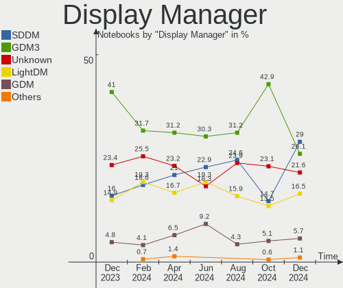

| Name    | Notebooks | Percent |
|---------|-----------|---------|
| GDM3    | 47        | 25.54%  |
| SDDM    | 41        | 22.28%  |
| Unknown | 38        | 20.65%  |
| LightDM | 35        | 19.02%  |
| GDM     | 21        | 11.41%  |
| SLiM    | 2         | 1.09%   |

OS Lang
-------

Language

| Lang    | Notebooks | Percent |
|---------|-----------|---------|
| fr_FR   | 133       | 72.28%  |
| en_US   | 40        | 21.74%  |
| C       | 4         | 2.17%   |
| UTF-8   | 1         | 0.54%   |
| sv_SE   | 1         | 0.54%   |
| es_ES   | 1         | 0.54%   |
| en_IE   | 1         | 0.54%   |
| en_GB   | 1         | 0.54%   |
| de_DE   | 1         | 0.54%   |
| Unknown | 1         | 0.54%   |

Boot Mode
---------

EFI or BIOS

| Mode | Notebooks | Percent |
|------|-----------|---------|
| EFI  | 115       | 62.5%   |
| BIOS | 69        | 37.5%   |

Filesystem
----------

Type of filesystem

| Type    | Notebooks | Percent |
|---------|-----------|---------|
| Ext4    | 144       | 78.26%  |
| Btrfs   | 20        | 10.87%  |
| Overlay | 12        | 6.52%   |
| Tmpfs   | 5         | 2.72%   |
| Xfs     | 2         | 1.09%   |
| F2fs    | 1         | 0.54%   |

Part. scheme
------------

Scheme of partitioning

| Type    | Notebooks | Percent |
|---------|-----------|---------|
| GPT     | 129       | 70.11%  |
| Unknown | 38        | 20.65%  |
| MBR     | 17        | 9.24%   |

Dual Boot with Linux/BSD
------------------------

Hosting more than one Linux/BSD

| Dual boot | Notebooks | Percent |
|-----------|-----------|---------|
| No        | 160       | 86.96%  |
| Yes       | 24        | 13.04%  |

Dual Boot (Win)
---------------

Hosting Linux and Windows

| Dual boot | Notebooks | Percent |
|-----------|-----------|---------|
| No        | 143       | 77.72%  |
| Yes       | 41        | 22.28%  |

Board
-----

Vendor
------

Motherboard manufacturer

| Name                   | Notebooks | Percent |
|------------------------|-----------|---------|
| ASUSTek Computer       | 43        | 23.37%  |
| Hewlett-Packard        | 31        | 16.85%  |
| Dell                   | 26        | 14.13%  |
| Lenovo                 | 25        | 13.59%  |
| Acer                   | 13        | 7.07%   |
| MSI                    | 10        | 5.43%   |
| Valve                  | 5         | 2.72%   |
| Toshiba                | 5         | 2.72%   |
| Sony                   | 4         | 2.17%   |
| Apple                  | 4         | 2.17%   |
| HUAWEI                 | 3         | 1.63%   |
| PC Specialist          | 2         | 1.09%   |
| Timi                   | 1         | 0.54%   |
| System76               | 1         | 0.54%   |
| Samsung Electronics    | 1         | 0.54%   |
| Packard Bell           | 1         | 0.54%   |
| LG Electronics         | 1         | 0.54%   |
| LDLC                   | 1         | 0.54%   |
| HONOR                  | 1         | 0.54%   |
| Google                 | 1         | 0.54%   |
| Gigabyte Technology    | 1         | 0.54%   |
| Fujitsu Siemens        | 1         | 0.54%   |
| eMachines              | 1         | 0.54%   |
| COPELION INTERNATIONAL | 1         | 0.54%   |
| Compal                 | 1         | 0.54%   |

Model
-----

Motherboard model

| Name                               | Notebooks | Percent |
|------------------------------------|-----------|---------|
| ASUS S551LN                        | 6         | 3.26%   |
| Valve Jupiter                      | 5         | 2.72%   |
| HP Pavilion Laptop 15-eg0xxx       | 2         | 1.09%   |
| HP Pavilion g6                     | 2         | 1.09%   |
| HP Pavilion dv6                    | 2         | 1.09%   |
| HP Pavilion 17                     | 2         | 1.09%   |
| HP Notebook                        | 2         | 1.09%   |
| HP Laptop 17-cp0xxx                | 2         | 1.09%   |
| Dell XPS 15 9500                   | 2         | 1.09%   |
| Dell Vostro 1520                   | 2         | 1.09%   |
| Dell Precision 3571                | 2         | 1.09%   |
| Dell G3 3500                       | 2         | 1.09%   |
| Toshiba TECRA Z40-C                | 1         | 0.54%   |
| Toshiba Satellite L655             | 1         | 0.54%   |
| Toshiba Satellite C855D-12J        | 1         | 0.54%   |
| Toshiba Satellite C660             | 1         | 0.54%   |
| Toshiba PORTEGE Z20t-C             | 1         | 0.54%   |
| Timi TM1703                        | 1         | 0.54%   |
| System76 Lemur Pro                 | 1         | 0.54%   |
| Sony VPCF11M1E                     | 1         | 0.54%   |
| Sony VPCEH3U1E                     | 1         | 0.54%   |
| Sony VPCEB1M1E                     | 1         | 0.54%   |
| Sony SVF1521A6EW                   | 1         | 0.54%   |
| Samsung 950XED                     | 1         | 0.54%   |
| PC Specialist TN1-156M             | 1         | 0.54%   |
| PC Specialist NV4XMB,ME,MZ         | 1         | 0.54%   |
| Packard Bell EasyNote ENTF71BM     | 1         | 0.54%   |
| MSI PS42 Modern 8MO                | 1         | 0.54%   |
| MSI Prestige 15 A10SC              | 1         | 0.54%   |
| MSI Prestige 14Evo B13M            | 1         | 0.54%   |
| MSI P65 Creator 9SF                | 1         | 0.54%   |
| MSI GS73VR 7RF                     | 1         | 0.54%   |
| MSI GS65 Stealth 8SE               | 1         | 0.54%   |
| MSI GP72MVR 7RFX                   | 1         | 0.54%   |
| MSI GL73 8RC                       | 1         | 0.54%   |
| MSI CR61 3M                        | 1         | 0.54%   |
| MSI CR61 2M/CX61 2OC/CX61 2OD      | 1         | 0.54%   |
| LG 16Z90Q-G.AD78F                  | 1         | 0.54%   |
| Lenovo Yoga Slim 7 Pro 14ACH5 82MS | 1         | 0.54%   |
| Lenovo ThinkPad X250 20CMCTO1WW    | 1         | 0.54%   |

Model Family
------------

Motherboard model prefix

| Name                   | Notebooks | Percent |
|------------------------|-----------|---------|
| Lenovo ThinkPad        | 14        | 7.61%   |
| HP Pavilion            | 12        | 6.52%   |
| Lenovo IdeaPad         | 8         | 4.35%   |
| Acer Aspire            | 7         | 3.8%    |
| Dell XPS               | 6         | 3.26%   |
| Dell Precision         | 6         | 3.26%   |
| Dell Latitude          | 6         | 3.26%   |
| ASUS VivoBook          | 6         | 3.26%   |
| ASUS S551LN            | 6         | 3.26%   |
| Valve Jupiter          | 5         | 2.72%   |
| ASUS ASUS              | 5         | 2.72%   |
| HP ProBook             | 4         | 2.17%   |
| HP Laptop              | 4         | 2.17%   |
| Toshiba Satellite      | 3         | 1.63%   |
| Dell Vostro            | 3         | 1.63%   |
| ASUS ZenBook           | 3         | 1.63%   |
| MSI Prestige           | 2         | 1.09%   |
| MSI CR61               | 2         | 1.09%   |
| Lenovo Legion          | 2         | 1.09%   |
| HP Notebook            | 2         | 1.09%   |
| HP EliteBook           | 2         | 1.09%   |
| Dell Inspiron          | 2         | 1.09%   |
| Dell G3                | 2         | 1.09%   |
| ASUS ROG               | 2         | 1.09%   |
| Acer Swift             | 2         | 1.09%   |
| Acer Nitro             | 2         | 1.09%   |
| Toshiba TECRA          | 1         | 0.54%   |
| Toshiba PORTEGE        | 1         | 0.54%   |
| Timi TM1703            | 1         | 0.54%   |
| System76 Lemur         | 1         | 0.54%   |
| Sony VPCF11M1E         | 1         | 0.54%   |
| Sony VPCEH3U1E         | 1         | 0.54%   |
| Sony VPCEB1M1E         | 1         | 0.54%   |
| Sony SVF1521A6EW       | 1         | 0.54%   |
| Samsung 950XED         | 1         | 0.54%   |
| PC Specialist TN1-156M | 1         | 0.54%   |
| PC Specialist NV4XMB   | 1         | 0.54%   |
| Packard Bell EasyNote  | 1         | 0.54%   |
| MSI PS42               | 1         | 0.54%   |
| MSI P65                | 1         | 0.54%   |

MFG Year
--------

Motherboard manufacture year

| Year | Notebooks | Percent |
|------|-----------|---------|
| 2022 | 23        | 12.5%   |
| 2021 | 23        | 12.5%   |
| 2020 | 20        | 10.87%  |
| 2013 | 14        | 7.61%   |
| 2014 | 13        | 7.07%   |
| 2016 | 12        | 6.52%   |
| 2015 | 11        | 5.98%   |
| 2019 | 9         | 4.89%   |
| 2017 | 9         | 4.89%   |
| 2011 | 9         | 4.89%   |
| 2018 | 8         | 4.35%   |
| 2012 | 7         | 3.8%    |
| 2010 | 7         | 3.8%    |
| 2008 | 7         | 3.8%    |
| 2009 | 6         | 3.26%   |
| 2023 | 4         | 2.17%   |
| 2007 | 1         | 0.54%   |
| 2006 | 1         | 0.54%   |

Form Factor
-----------

Physical design of the computer

| Name     | Notebooks | Percent |
|----------|-----------|---------|
| Notebook | 184       | 100%    |

Secure Boot
-----------

Enabled or disabled

| State    | Notebooks | Percent |
|----------|-----------|---------|
| Disabled | 161       | 87.5%   |
| Enabled  | 23        | 12.5%   |

Coreboot
--------

Have coreboot on board

| Used | Notebooks | Percent |
|------|-----------|---------|
| No   | 181       | 98.37%  |
| Yes  | 3         | 1.63%   |

RAM Size
--------

Total RAM memory

| Size in GB  | Notebooks | Percent |
|-------------|-----------|---------|
| 4.01-8.0    | 54        | 29.35%  |
| 8.01-16.0   | 41        | 22.28%  |
| 3.01-4.0    | 34        | 18.48%  |
| 16.01-24.0  | 28        | 15.22%  |
| 32.01-64.0  | 13        | 7.07%   |
| 24.01-32.0  | 6         | 3.26%   |
| 1.01-2.0    | 4         | 2.17%   |
| 2.01-3.0    | 2         | 1.09%   |
| 64.01-256.0 | 2         | 1.09%   |

RAM Used
--------

Used RAM memory

| Used GB    | Notebooks | Percent |
|------------|-----------|---------|
| 1.01-2.0   | 59        | 32.07%  |
| 2.01-3.0   | 45        | 24.46%  |
| 4.01-8.0   | 34        | 18.48%  |
| 3.01-4.0   | 31        | 16.85%  |
| 8.01-16.0  | 7         | 3.8%    |
| 0.51-1.0   | 6         | 3.26%   |
| 16.01-24.0 | 1         | 0.54%   |
| 0.01-0.5   | 1         | 0.54%   |

Total Drives
------------

Number of drives on board

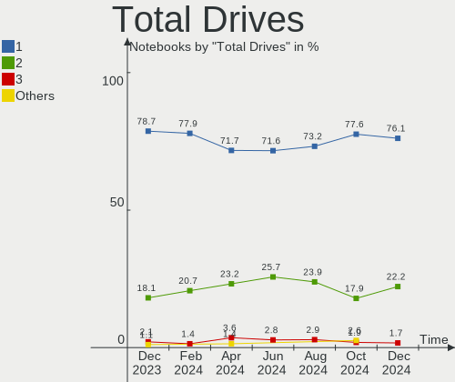

| Drives | Notebooks | Percent |
|--------|-----------|---------|
| 1      | 129       | 70.11%  |
| 2      | 49        | 26.63%  |
| 3      | 5         | 2.72%   |
| 5      | 1         | 0.54%   |

Has CD-ROM
----------

Has CD-ROM on board

| Presented | Notebooks | Percent |
|-----------|-----------|---------|
| No        | 118       | 64.13%  |
| Yes       | 66        | 35.87%  |

Has Ethernet
------------

Has Ethernet on board

| Presented | Notebooks | Percent |
|-----------|-----------|---------|
| Yes       | 139       | 75.54%  |
| No        | 45        | 24.46%  |

Has WiFi
--------

Has WiFi module

| Presented | Notebooks | Percent |
|-----------|-----------|---------|
| Yes       | 183       | 99.46%  |
| No        | 1         | 0.54%   |

Has Bluetooth
-------------

Has Bluetooth module

| Presented | Notebooks | Percent |
|-----------|-----------|---------|
| Yes       | 157       | 85.33%  |
| No        | 27        | 14.67%  |

Location
--------

Country
-------

Geographic location (country)

| Country | Notebooks | Percent |
|---------|-----------|---------|
| France  | 184       | 100%    |

City
----

Geographic location (city)

| City                      | Notebooks | Percent |
|---------------------------|-----------|---------|
| Paris                     | 23        | 12.5%   |
| Istres                    | 7         | 3.8%    |
| Lyon                      | 6         | 3.26%   |
| Bordeaux                  | 5         | 2.72%   |
| Marseille                 | 4         | 2.17%   |
| Caen                      | 4         | 2.17%   |
| Boulogne-Billancourt      | 4         | 2.17%   |
| Toulouse                  | 3         | 1.63%   |
| Orléans                  | 3         | 1.63%   |
| Grenoble                  | 3         | 1.63%   |
| Strasbourg                | 2         | 1.09%   |
| Nantes                    | 2         | 1.09%   |
| Montpellier               | 2         | 1.09%   |
| Laon                      | 2         | 1.09%   |
| Châtenay-Malabry         | 2         | 1.09%   |
| Angers                    | 2         | 1.09%   |
| Voiron                    | 1         | 0.54%   |
| Villeurbanne              | 1         | 0.54%   |
| Vertheuil                 | 1         | 0.54%   |
| Vertaizon                 | 1         | 0.54%   |
| Versailles                | 1         | 0.54%   |
| Vernouillet               | 1         | 0.54%   |
| Valenciennes              | 1         | 0.54%   |
| Urvillers                 | 1         | 0.54%   |
| Urcel                     | 1         | 0.54%   |
| Trausse                   | 1         | 0.54%   |
| Talence                   | 1         | 0.54%   |
| Soisy-sous-Montmorency    | 1         | 0.54%   |
| Schiltigheim              | 1         | 0.54%   |
| Sainte-Foy-les-Lyon       | 1         | 0.54%   |
| Saint-Ouen-l'Aumone       | 1         | 0.54%   |
| Saint-Mars-sur-la-Futaie  | 1         | 0.54%   |
| Saint-Julien-de-Concelles | 1         | 0.54%   |
| Saint-Georges-Haute-Ville | 1         | 0.54%   |
| Saint-Gely-du-Fesc        | 1         | 0.54%   |
| Saint-Chamond             | 1         | 0.54%   |
| Saint-Brieuc              | 1         | 0.54%   |
| Saint-Apollinaire         | 1         | 0.54%   |
| Sadirac                   | 1         | 0.54%   |
| Rumilly-en-Cambresis      | 1         | 0.54%   |

Drives
------

Drive Vendor
------------

Hard drive vendors

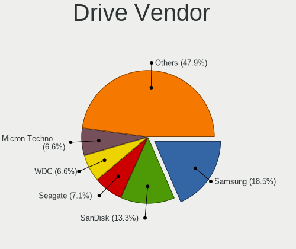

| Vendor                       | Notebooks | Drives | Percent |
|------------------------------|-----------|--------|---------|
| Samsung Electronics          | 44        | 51     | 19.3%   |
| WDC                          | 20        | 21     | 8.77%   |
| Seagate                      | 17        | 17     | 7.46%   |
| Unknown                      | 16        | 17     | 7.02%   |
| Sandisk                      | 14        | 15     | 6.14%   |
| Crucial                      | 11        | 13     | 4.82%   |
| Intel                        | 10        | 10     | 4.39%   |
| Kingston                     | 9         | 9      | 3.95%   |
| Toshiba                      | 8         | 9      | 3.51%   |
| SPCC                         | 8         | 8      | 3.51%   |
| SK hynix                     | 8         | 8      | 3.51%   |
| HGST                         | 8         | 8      | 3.51%   |
| KIOXIA                       | 7         | 7      | 3.07%   |
| Hitachi                      | 6         | 6      | 2.63%   |
| Micron Technology            | 5         | 5      | 2.19%   |
| PNY                          | 4         | 4      | 1.75%   |
| JMicron Technology           | 4         | 4      | 1.75%   |
| Kingston Technology Company  | 3         | 3      | 1.32%   |
| Phison                       | 2         | 2      | 0.88%   |
| LITEON                       | 2         | 2      | 0.88%   |
| YMTC                         | 1         | 1      | 0.44%   |
| USB3.0                       | 1         | 1      | 0.44%   |
| UMIS                         | 1         | 1      | 0.44%   |
| Transcend                    | 1         | 1      | 0.44%   |
| Silicon Motion               | 1         | 1      | 0.44%   |
| Shenzhen Longsys Electronics | 1         | 1      | 0.44%   |
| Realtek Semiconductor        | 1         | 1      | 0.44%   |
| Plextor                      | 1         | 1      | 0.44%   |
| Phison Electronics           | 1         | 1      | 0.44%   |
| Micron/Crucial Technology    | 1         | 1      | 0.44%   |
| LVCARDS                      | 1         | 1      | 0.44%   |
| Lite-On Technology           | 1         | 1      | 0.44%   |
| LDLC                         | 1         | 1      | 0.44%   |
| LaCie                        | 1         | 1      | 0.44%   |
| Intenso                      | 1         | 1      | 0.44%   |
| HGST HTS                     | 1         | 1      | 0.44%   |
| Hewlett-Packard              | 1         | 1      | 0.44%   |
| G-TECH                       | 1         | 1      | 0.44%   |
| Fanxiang                     | 1         | 1      | 0.44%   |
| Emtec                        | 1         | 1      | 0.44%   |

Drive Model
-----------

Hard drive models

| Model                                                 | Notebooks | Percent |
|-------------------------------------------------------|-----------|---------|
| SPCC Solid State Disk 512GB                           | 7         | 2.94%   |
| Samsung NVMe SSD Controller PM9A1/PM9A3/980PRO 2TB    | 4         | 1.68%   |
| JMicron H/W JBOD 512GB SSD                            | 4         | 1.68%   |
| Unknown MMC Card  64GB                                | 3         | 1.26%   |
| Unknown MMC Card  128GB                               | 3         | 1.26%   |
| Unknown 00000  16GB                                   | 3         | 1.26%   |
| Seagate ST500LT012-1DG142 500GB                       | 3         | 1.26%   |
| Seagate ST1000LM035-1RK172 970GB                      | 3         | 1.26%   |
| Samsung MZVL21T0HCLR-00B00 1TB                        | 3         | 1.26%   |
| Crucial CT1000MX500SSD1 1TB                           | 3         | 1.26%   |
| WDC PC SN730 NVMe 1024GB                              | 2         | 0.84%   |
| Unknown MMC Card  32GB                                | 2         | 0.84%   |
| Seagate ST1000LM024 HN-M101MBB 1TB                    | 2         | 0.84%   |
| Sandisk WD Black 2018/SN750 / PC SN720 NVMe SSD 500GB | 2         | 0.84%   |
| Samsung SSD 980 1TB                                   | 2         | 0.84%   |
| Samsung SSD 870 QVO 1TB                               | 2         | 0.84%   |
| Samsung SSD 850 EVO 500GB                             | 2         | 0.84%   |
| Samsung SSD 850 EVO 250GB                             | 2         | 0.84%   |
| Samsung MZVLQ512HBLU-00BTW 512GB                      | 2         | 0.84%   |
| Samsung MZVLQ1T0HALB-00000 1TB                        | 2         | 0.84%   |
| PNY CS900 240GB SSD                                   | 2         | 0.84%   |
| HGST HTS721010A9E630 1TB                              | 2         | 0.84%   |
| HGST HTS545050A7E680 500GB                            | 2         | 0.84%   |
| HGST HTS541010A9E680 1TB                              | 2         | 0.84%   |
| Crucial CT500MX500SSD1 500GB                          | 2         | 0.84%   |
| Crucial CT240BX500SSD1 240GB                          | 2         | 0.84%   |
| YMTC PC005 512GB                                      | 1         | 0.42%   |
| WDC WDS250G3X0C-00SJG0 250GB                          | 1         | 0.42%   |
| WDC WDS100T2B0C 1TB                                   | 1         | 0.42%   |
| WDC WDS100T2B0B 1TB SSD                               | 1         | 0.42%   |
| WDC WD5000LPVX-22V0TT0 500GB                          | 1         | 0.42%   |
| WDC WD5000BEVT-26A0RT0 500GB                          | 1         | 0.42%   |
| WDC WD5000BEVT-22ZAT0 500GB                           | 1         | 0.42%   |
| WDC WD3200BPVT-22ZEST0 320GB                          | 1         | 0.42%   |
| WDC WD3200BPVT-22JJ5T0 320GB                          | 1         | 0.42%   |
| WDC WD16 00BEVT-60ZCT 160GB                           | 1         | 0.42%   |
| WDC WD10SPZX-60Z10T1 1TB                              | 1         | 0.42%   |
| WDC WD10SPZX-17Z10T1 1TB                              | 1         | 0.42%   |
| WDC WD10JPVX-22JC3T0 1TB                              | 1         | 0.42%   |
| WDC WD Green M.2 2280 480GB                           | 1         | 0.42%   |

HDD Vendor
----------

Hard disk drive vendors

| Vendor              | Notebooks | Drives | Percent |
|---------------------|-----------|--------|---------|
| Seagate             | 17        | 17     | 34.69%  |
| WDC                 | 9         | 9      | 18.37%  |
| HGST                | 8         | 8      | 16.33%  |
| Toshiba             | 6         | 6      | 12.24%  |
| Hitachi             | 6         | 6      | 12.24%  |
| USB3.0              | 1         | 1      | 2.04%   |
| Samsung Electronics | 1         | 1      | 2.04%   |
| HGST HTS            | 1         | 1      | 2.04%   |

SSD Vendor
----------

Solid state drive vendors

| Vendor              | Notebooks | Drives | Percent |
|---------------------|-----------|--------|---------|
| Samsung Electronics | 18        | 19     | 26.09%  |
| Crucial             | 10        | 12     | 14.49%  |
| SPCC                | 8         | 8      | 11.59%  |
| Kingston            | 4         | 4      | 5.8%    |
| JMicron Technology  | 4         | 4      | 5.8%    |
| SanDisk             | 3         | 3      | 4.35%   |
| PNY                 | 3         | 3      | 4.35%   |
| Intel               | 3         | 3      | 4.35%   |
| WDC                 | 2         | 2      | 2.9%    |
| Toshiba             | 2         | 2      | 2.9%    |
| Micron Technology   | 2         | 2      | 2.9%    |
| Transcend           | 1         | 1      | 1.45%   |
| Plextor             | 1         | 1      | 1.45%   |
| LVCARDS             | 1         | 1      | 1.45%   |
| LITEON              | 1         | 1      | 1.45%   |
| Intenso             | 1         | 1      | 1.45%   |
| Hewlett-Packard     | 1         | 1      | 1.45%   |
| Fanxiang            | 1         | 1      | 1.45%   |
| Emtec               | 1         | 1      | 1.45%   |
| China               | 1         | 1      | 1.45%   |
| Apple               | 1         | 1      | 1.45%   |

Drive Kind
----------

HDD or SSD

| Kind    | Notebooks | Drives | Percent |
|---------|-----------|--------|---------|
| NVMe    | 88        | 99     | 40%     |
| SSD     | 64        | 72     | 29.09%  |
| HDD     | 48        | 49     | 21.82%  |
| MMC     | 17        | 18     | 7.73%   |
| Unknown | 3         | 3      | 1.36%   |

Drive Connector
---------------

SATA, SAS, NVMe, etc.

| Type | Notebooks | Drives | Percent |
|------|-----------|--------|---------|
| SATA | 104       | 118    | 48.6%   |
| NVMe | 88        | 99     | 41.12%  |
| MMC  | 17        | 18     | 7.94%   |
| SAS  | 5         | 6      | 2.34%   |

Drive Size
----------

Size of hard drive

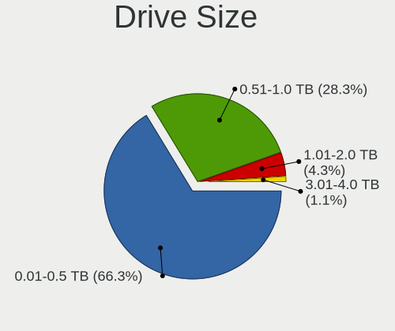

| Size in TB | Notebooks | Drives | Percent |
|------------|-----------|--------|---------|
| 0.01-0.5   | 65        | 71     | 58.56%  |
| 0.51-1.0   | 44        | 48     | 39.64%  |
| 1.01-2.0   | 2         | 2      | 1.8%    |

Space Total
-----------

Amount of disk space available on the file system

| Size in GB     | Notebooks | Percent |
|----------------|-----------|---------|
| 251-500        | 60        | 32.61%  |
| 501-1000       | 43        | 23.37%  |
| 101-250        | 40        | 21.74%  |
| 1-20           | 12        | 6.52%   |
| 51-100         | 9         | 4.89%   |
| 1001-2000      | 8         | 4.35%   |
| 21-50          | 7         | 3.8%    |
| Unknown        | 3         | 1.63%   |
| More than 3000 | 1         | 0.54%   |
| 2001-3000      | 1         | 0.54%   |

Space Used
----------

Amount of used disk space

| Used GB   | Notebooks | Percent |
|-----------|-----------|---------|
| 1-20      | 67        | 36.41%  |
| 21-50     | 35        | 19.02%  |
| 51-100    | 26        | 14.13%  |
| 101-250   | 23        | 12.5%   |
| 251-500   | 19        | 10.33%  |
| 501-1000  | 9         | 4.89%   |
| Unknown   | 3         | 1.63%   |
| 1001-2000 | 2         | 1.09%   |

Malfunc. Drives
---------------

Drive models with a malfunction

| Model                               | Notebooks | Drives | Percent |
|-------------------------------------|-----------|--------|---------|
| WDC WD5000BEVT-26A0RT0 500GB        | 1         | 1      | 7.69%   |
| WDC WD3200BPVT-22ZEST0 320GB        | 1         | 1      | 7.69%   |
| Toshiba MK5075GSX 500GB             | 1         | 1      | 7.69%   |
| Toshiba MK3259GSXP 320GB            | 1         | 1      | 7.69%   |
| SPCC Solid State Disk 512GB         | 1         | 1      | 7.69%   |
| Seagate ST500LT012-1DG142 500GB     | 1         | 1      | 7.69%   |
| Samsung Electronics HM080HC 80GB    | 1         | 1      | 7.69%   |
| Kingston RBU-SMSM151S324GD 24GB SSD | 1         | 1      | 7.69%   |
| Hitachi HTS545050A7E380 500GB       | 1         | 1      | 7.69%   |
| Hitachi HTS543216L9A300 160GB       | 1         | 1      | 7.69%   |
| HGST HTS725050A7E630 500GB          | 1         | 1      | 7.69%   |
| HGST HTS721010A9E630 1TB            | 1         | 1      | 7.69%   |
| HGST HTS541010A9E680 1TB            | 1         | 1      | 7.69%   |

Malfunc. Drive Vendor
---------------------

Vendors of faulty drives

| Vendor              | Notebooks | Drives | Percent |
|---------------------|-----------|--------|---------|
| HGST                | 3         | 3      | 23.08%  |
| WDC                 | 2         | 2      | 15.38%  |
| Toshiba             | 2         | 2      | 15.38%  |
| Hitachi             | 2         | 2      | 15.38%  |
| SPCC                | 1         | 1      | 7.69%   |
| Seagate             | 1         | 1      | 7.69%   |
| Samsung Electronics | 1         | 1      | 7.69%   |
| Kingston            | 1         | 1      | 7.69%   |

Malfunc. HDD Vendor
-------------------

Vendors of faulty HDD drives

| Vendor              | Notebooks | Drives | Percent |
|---------------------|-----------|--------|---------|
| HGST                | 3         | 3      | 27.27%  |
| WDC                 | 2         | 2      | 18.18%  |
| Toshiba             | 2         | 2      | 18.18%  |
| Hitachi             | 2         | 2      | 18.18%  |
| Seagate             | 1         | 1      | 9.09%   |
| Samsung Electronics | 1         | 1      | 9.09%   |

Malfunc. Drive Kind
-------------------

Kinds of faulty drives

| Kind | Notebooks | Drives | Percent |
|------|-----------|--------|---------|
| HDD  | 11        | 11     | 84.62%  |
| SSD  | 2         | 2      | 15.38%  |

Failed Drives
-------------

Failed drive models

Zero info for selected period =(

Failed Drive Vendor
-------------------

Failed drive vendors

Zero info for selected period =(

Drive Status
------------

Number of failed and malfunc. drives

| Status   | Notebooks | Drives | Percent |
|----------|-----------|--------|---------|
| Works    | 109       | 132    | 55.05%  |
| Detected | 76        | 96     | 38.38%  |
| Malfunc  | 13        | 13     | 6.57%   |

Storage controller
------------------

Storage Vendor
--------------

Storage controller vendors

| Vendor                       | Notebooks | Percent |
|------------------------------|-----------|---------|
| Intel                        | 114       | 49.57%  |
| Samsung Electronics          | 28        | 12.17%  |
| AMD                          | 25        | 10.87%  |
| Sandisk                      | 19        | 8.26%   |
| SK hynix                     | 8         | 3.48%   |
| Kingston Technology Company  | 8         | 3.48%   |
| KIOXIA                       | 6         | 2.61%   |
| Phison Electronics           | 4         | 1.74%   |
| Micron Technology            | 3         | 1.3%    |
| Toshiba America Info Systems | 2         | 0.87%   |
| Nvidia                       | 2         | 0.87%   |
| Micron/Crucial Technology    | 2         | 0.87%   |
| Lite-On Technology           | 2         | 0.87%   |
| Yangtze Memory Technologies  | 1         | 0.43%   |
| Union Memory (Shenzhen)      | 1         | 0.43%   |
| Silicon Motion               | 1         | 0.43%   |
| Shenzhen Longsys Electronics | 1         | 0.43%   |
| Realtek Semiconductor        | 1         | 0.43%   |
| Marvell Technology Group     | 1         | 0.43%   |
| ASMedia Technology           | 1         | 0.43%   |

Storage Model
-------------

Storage controller models

| Model                                                                          | Notebooks | Percent |
|--------------------------------------------------------------------------------|-----------|---------|
| AMD FCH SATA Controller [AHCI mode]                                            | 22        | 8.87%   |
| Intel Volume Management Device NVMe RAID Controller                            | 14        | 5.65%   |
| Samsung NVMe SSD Controller 980                                                | 12        | 4.84%   |
| Intel 8 Series SATA Controller 1 [AHCI mode]                                   | 11        | 4.44%   |
| Intel 6 Series/C200 Series Chipset Family 6 port Mobile SATA AHCI Controller   | 10        | 4.03%   |
| Intel 7 Series Chipset Family 6-port SATA Controller [AHCI mode]               | 9         | 3.63%   |
| Samsung NVMe SSD Controller PM9A1/PM9A3/980PRO                                 | 8         | 3.23%   |
| Intel Sunrise Point-LP SATA Controller [AHCI mode]                             | 7         | 2.82%   |
| Intel HM170/QM170 Chipset SATA Controller [AHCI Mode]                          | 7         | 2.82%   |
| Intel 8 Series/C220 Series Chipset Family 6-port SATA Controller 1 [AHCI mode] | 7         | 2.82%   |
| Intel 82801IBM/IEM (ICH9M/ICH9M-E) 4 port SATA Controller [AHCI mode]          | 6         | 2.42%   |
| SK hynix Gold P31/PC711 NVMe Solid State Drive                                 | 5         | 2.02%   |
| Samsung NVMe SSD Controller SM981/PM981/PM983                                  | 5         | 2.02%   |
| Intel Wildcat Point-LP SATA Controller [AHCI Mode]                             | 5         | 2.02%   |
| Intel Tiger Lake-LP SATA Controller                                            | 5         | 2.02%   |
| Intel Atom Processor E3800 Series SATA AHCI Controller                         | 5         | 2.02%   |
| Intel 5 Series/3400 Series Chipset 4 port SATA AHCI Controller                 | 5         | 2.02%   |
| SanDisk WD Blue SN550 NVMe SSD                                                 | 4         | 1.61%   |
| SanDisk WD Black SN750 / PC SN730 NVMe SSD                                     | 4         | 1.61%   |
| KIOXIA NVMe SSD Controller BG4                                                 | 4         | 1.61%   |
| Intel SSD 660P Series                                                          | 4         | 1.61%   |
| Intel Cannon Lake Mobile PCH SATA AHCI Controller                              | 4         | 1.61%   |
| Intel 82801 Mobile SATA Controller [RAID mode]                                 | 4         | 1.61%   |
| SanDisk WD Black 2018/SN750 / PC SN720 NVMe SSD                                | 3         | 1.21%   |
| Micron NVMe Storage Controller                                                 | 3         | 1.21%   |
| Kingston Company U-SNS8154P3 NVMe SSD                                          | 3         | 1.21%   |
| Intel Non-Volatile memory controller                                           | 3         | 1.21%   |
| Intel 400 Series Chipset Family SATA AHCI Controller                           | 3         | 1.21%   |
| AMD SB7x0/SB8x0/SB9x0 SATA Controller [AHCI mode]                              | 3         | 1.21%   |
| Toshiba America Info Systems XG6 NVMe SSD Controller                           | 2         | 0.81%   |
| SK hynix Non-Volatile memory controller                                        | 2         | 0.81%   |
| SanDisk WD Blue SN570 NVMe SSD 1TB                                             | 2         | 0.81%   |
| SanDisk NVMe Controller                                                        | 2         | 0.81%   |
| Phison E12 NVMe Controller                                                     | 2         | 0.81%   |
| Nvidia MCP79 AHCI Controller                                                   | 2         | 0.81%   |
| KIOXIA Non-Volatile memory controller                                          | 2         | 0.81%   |
| Kingston Company Company Non-Volatile memory controller                        | 2         | 0.81%   |
| Kingston Company OM3PDP3 NVMe SSD                                              | 2         | 0.81%   |
| Intel Q170/Q150/B150/H170/H110/Z170/CM236 Chipset SATA Controller [AHCI Mode]  | 2         | 0.81%   |
| Intel Celeron/Pentium Silver Processor SATA Controller                         | 2         | 0.81%   |

Storage Kind
------------

Kind of storage controller (IDE, SATA, NVMe, SAS, ...)

| Kind | Notebooks | Percent |
|------|-----------|---------|
| SATA | 126       | 52.72%  |
| NVMe | 88        | 36.82%  |
| RAID | 19        | 7.95%   |
| IDE  | 6         | 2.51%   |

Processor
---------

CPU Vendor
----------

Processor vendors

| Vendor | Notebooks | Percent |
|--------|-----------|---------|
| Intel  | 143       | 77.72%  |
| AMD    | 41        | 22.28%  |

CPU Model
---------

Processor models

| Model                                       | Notebooks | Percent |
|---------------------------------------------|-----------|---------|
| Intel Core i3-4030U CPU @ 1.90GHz           | 7         | 3.8%    |
| Intel 11th Gen Core i7-1165G7 @ 2.80GHz     | 6         | 3.26%   |
| Intel 12th Gen Core i7-1260P                | 5         | 2.72%   |
| AMD Custom APU 0405                         | 5         | 2.72%   |
| Intel Core i7-7700HQ CPU @ 2.80GHz          | 4         | 2.17%   |
| Intel Core i7-10750H CPU @ 2.60GHz          | 4         | 2.17%   |
| Intel 12th Gen Core i7-12700H               | 4         | 2.17%   |
| Intel 11th Gen Core i5-1135G7 @ 2.40GHz     | 4         | 2.17%   |
| Intel Core i5-6200U CPU @ 2.30GHz           | 3         | 1.63%   |
| Intel Core i3-5005U CPU @ 2.00GHz           | 3         | 1.63%   |
| Intel Core i3-2330M CPU @ 2.20GHz           | 3         | 1.63%   |
| AMD Ryzen 7 5700U with Radeon Graphics      | 3         | 1.63%   |
| AMD Ryzen 7 4700U with Radeon Graphics      | 3         | 1.63%   |
| AMD Ryzen 5 4600H with Radeon Graphics      | 3         | 1.63%   |
| Intel Core i7-9750H CPU @ 2.60GHz           | 2         | 1.09%   |
| Intel Core i7-8550U CPU @ 1.80GHz           | 2         | 1.09%   |
| Intel Core i7-10510U CPU @ 1.80GHz          | 2         | 1.09%   |
| Intel Core i5-3317U CPU @ 1.70GHz           | 2         | 1.09%   |
| Intel Core i5-2450M CPU @ 2.50GHz           | 2         | 1.09%   |
| Intel Core i5 CPU M 520 @ 2.40GHz           | 2         | 1.09%   |
| Intel Core i3-3217U CPU @ 1.80GHz           | 2         | 1.09%   |
| Intel Core i3 CPU M 330 @ 2.13GHz           | 2         | 1.09%   |
| Intel Core 2 Duo CPU P8700 @ 2.53GHz        | 2         | 1.09%   |
| Intel Core 2 Duo CPU P8600 @ 2.40GHz        | 2         | 1.09%   |
| Intel Celeron CPU N2840 @ 2.16GHz           | 2         | 1.09%   |
| Intel Celeron CPU N2830 @ 2.16GHz           | 2         | 1.09%   |
| Intel Celeron CPU B815 @ 1.60GHz            | 2         | 1.09%   |
| Intel 12th Gen Core i7-1265U                | 2         | 1.09%   |
| Intel 11th Gen Core i7-1185G7 @ 3.00GHz     | 2         | 1.09%   |
| Intel 11th Gen Core i5-11400H @ 2.70GHz     | 2         | 1.09%   |
| AMD Ryzen 5 5600H with Radeon Graphics      | 2         | 1.09%   |
| AMD Ryzen 5 5500U with Radeon Graphics      | 2         | 1.09%   |
| AMD E2-1800 APU with Radeon HD Graphics     | 2         | 1.09%   |
| AMD E-350 Processor                         | 2         | 1.09%   |
| AMD A8-7410 APU with AMD Radeon R5 Graphics | 2         | 1.09%   |
| Intel Pentium Silver N5030 CPU @ 1.10GHz    | 1         | 0.54%   |
| Intel Pentium Silver N5000 CPU @ 1.10GHz    | 1         | 0.54%   |
| Intel Pentium Dual-Core CPU T4200 @ 2.00GHz | 1         | 0.54%   |
| Intel Pentium Dual CPU T3400 @ 2.16GHz      | 1         | 0.54%   |
| Intel Pentium CPU N3540 @ 2.16GHz           | 1         | 0.54%   |

CPU Model Family
----------------

Processor model prefix

| Model                   | Notebooks | Percent |
|-------------------------|-----------|---------|
| Other                   | 38        | 20.65%  |
| Intel Core i7           | 35        | 19.02%  |
| Intel Core i5           | 27        | 14.67%  |
| Intel Core i3           | 22        | 11.96%  |
| AMD Ryzen 7             | 11        | 5.98%   |
| Intel Celeron           | 10        | 5.43%   |
| AMD Ryzen 5             | 8         | 4.35%   |
| Intel Core 2 Duo        | 7         | 3.8%    |
| AMD E2                  | 3         | 1.63%   |
| AMD E                   | 3         | 1.63%   |
| Intel Pentium Silver    | 2         | 1.09%   |
| Intel Pentium           | 2         | 1.09%   |
| AMD A8                  | 2         | 1.09%   |
| AMD A6                  | 2         | 1.09%   |
| AMD A4                  | 2         | 1.09%   |
| Intel Pentium Dual-Core | 1         | 0.54%   |
| Intel Pentium Dual      | 1         | 0.54%   |
| Intel Core m7           | 1         | 0.54%   |
| Intel Core 2            | 1         | 0.54%   |
| Intel Atom              | 1         | 0.54%   |
| AMD Ryzen 9             | 1         | 0.54%   |
| AMD Ryzen 7 PRO         | 1         | 0.54%   |
| AMD Ryzen 5 PRO         | 1         | 0.54%   |
| AMD Ryzen 3 PRO         | 1         | 0.54%   |
| AMD E1                  | 1         | 0.54%   |

CPU Cores
---------

Number of processor cores

| Number | Notebooks | Percent |
|--------|-----------|---------|
| 2      | 78        | 42.39%  |
| 4      | 55        | 29.89%  |
| 6      | 21        | 11.41%  |
| 8      | 13        | 7.07%   |
| 12     | 6         | 3.26%   |
| 14     | 4         | 2.17%   |
| 10     | 4         | 2.17%   |
| 1      | 2         | 1.09%   |
| 16     | 1         | 0.54%   |

CPU Sockets
-----------

Number of sockets

| Number | Notebooks | Percent |
|--------|-----------|---------|
| 1      | 184       | 100%    |

CPU Threads
-----------

Threads per core (Hyper-Threading)

| Number | Notebooks | Percent |
|--------|-----------|---------|
| 2      | 139       | 75.54%  |
| 1      | 45        | 24.46%  |

CPU Op-Modes
------------

CPU Operation Modes (32-bit, 64-bit)

| Op mode        | Notebooks | Percent |
|----------------|-----------|---------|
| 32-bit, 64-bit | 184       | 100%    |

CPU Microcode
-------------

Microcode number

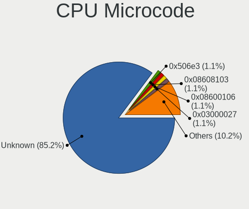

| Number     | Notebooks | Percent |
|------------|-----------|---------|
| Unknown    | 81        | 44.02%  |
| 0x806c1    | 8         | 4.35%   |
| 0x306a9    | 6         | 3.26%   |
| 0x206a7    | 6         | 3.26%   |
| 0xa0652    | 5         | 2.72%   |
| 0x406e3    | 5         | 2.72%   |
| 0x1067a    | 5         | 2.72%   |
| 0x906e9    | 4         | 2.17%   |
| 0x30678    | 4         | 2.17%   |
| 0x08608103 | 4         | 2.17%   |
| 0x906a3    | 3         | 1.63%   |
| 0x806ec    | 3         | 1.63%   |
| 0x07030105 | 3         | 1.63%   |
| 0x06006705 | 3         | 1.63%   |
| 0x05000119 | 3         | 1.63%   |
| 0x906ea    | 2         | 1.09%   |
| 0x906a4    | 2         | 1.09%   |
| 0x806d1    | 2         | 1.09%   |
| 0x40651    | 2         | 1.09%   |
| 0x306d4    | 2         | 1.09%   |
| 0x306c3    | 2         | 1.09%   |
| 0x0a50000c | 2         | 1.09%   |
| 0x08600104 | 2         | 1.09%   |
| 0x05000029 | 2         | 1.09%   |
| 0xb06a2    | 1         | 0.54%   |
| 0x806ea    | 1         | 0.54%   |
| 0x706a8    | 1         | 0.54%   |
| 0x6fd      | 1         | 0.54%   |
| 0x6fb      | 1         | 0.54%   |
| 0x6f6      | 1         | 0.54%   |
| 0x20655    | 1         | 0.54%   |
| 0x20652    | 1         | 0.54%   |
| 0x10661    | 1         | 0.54%   |
| 0x0a601203 | 1         | 0.54%   |
| 0x0a50000d | 1         | 0.54%   |
| 0x0a50000b | 1         | 0.54%   |
| 0x0a404102 | 1         | 0.54%   |
| 0x0a404101 | 1         | 0.54%   |
| 0x08900201 | 1         | 0.54%   |
| 0x08608102 | 1         | 0.54%   |

CPU Microarch
-------------

Microarchitecture

| Name             | Notebooks | Percent |
|------------------|-----------|---------|
| KabyLake         | 20        | 10.87%  |
| Haswell          | 19        | 10.33%  |
| Unknown          | 19        | 10.33%  |
| TigerLake        | 15        | 8.15%   |
| Skylake          | 11        | 5.98%   |
| SandyBridge      | 11        | 5.98%   |
| Alderlake Hybrid | 10        | 5.43%   |
| IvyBridge        | 9         | 4.89%   |
| CometLake        | 8         | 4.35%   |
| Zen 2            | 7         | 3.8%    |
| Westmere         | 7         | 3.8%    |
| Silvermont       | 6         | 3.26%   |
| Penryn           | 6         | 3.26%   |
| Zen 3            | 5         | 2.72%   |
| Core             | 5         | 2.72%   |
| Broadwell        | 5         | 2.72%   |
| Bobcat           | 5         | 2.72%   |
| Puma             | 4         | 2.17%   |
| Excavator        | 3         | 1.63%   |
| Zen+             | 2         | 1.09%   |
| Icelake          | 2         | 1.09%   |
| Goldmont plus    | 2         | 1.09%   |
| Zen              | 1         | 0.54%   |
| Jaguar           | 1         | 0.54%   |
| Goldmont         | 1         | 0.54%   |

Graphics
--------

GPU Vendor
----------

Vendors of graphics cards

| Vendor | Notebooks | Percent |
|--------|-----------|---------|
| Intel  | 128       | 52.89%  |
| Nvidia | 60        | 24.79%  |
| AMD    | 54        | 22.31%  |

GPU Model
---------

Graphics card models

| Model                                                                         | Notebooks | Percent |
|-------------------------------------------------------------------------------|-----------|---------|
| Intel TigerLake-LP GT2 [Iris Xe Graphics]                                     | 14        | 5.62%   |
| Intel Haswell-ULT Integrated Graphics Controller                              | 11        | 4.42%   |
| Intel Alder Lake-P Integrated Graphics Controller                             | 9         | 3.61%   |
| Intel 3rd Gen Core processor Graphics Controller                              | 9         | 3.61%   |
| Intel 2nd Generation Core Processor Family Integrated Graphics Controller     | 9         | 3.61%   |
| Nvidia GM108M [GeForce 840M]                                                  | 7         | 2.81%   |
| Intel Skylake GT2 [HD Graphics 520]                                           | 7         | 2.81%   |
| Intel CometLake-H GT2 [UHD Graphics]                                          | 7         | 2.81%   |
| AMD Renoir                                                                    | 7         | 2.81%   |
| Intel HD Graphics 630                                                         | 6         | 2.41%   |
| Intel Atom Processor Z36xxx/Z37xxx Series Graphics & Display                  | 6         | 2.41%   |
| AMD Seymour [Radeon HD 6400M/7400M Series]                                    | 6         | 2.41%   |
| Intel HD Graphics 5500                                                        | 5         | 2.01%   |
| Intel CoffeeLake-H GT2 [UHD Graphics 630]                                     | 5         | 2.01%   |
| Intel 4th Gen Core Processor Integrated Graphics Controller                   | 5         | 2.01%   |
| AMD VanGogh [AMD Custom GPU 0405]                                             | 5         | 2.01%   |
| AMD Lucienne                                                                  | 5         | 2.01%   |
| Nvidia TU117M [GeForce GTX 1650 Mobile / Max-Q]                               | 4         | 1.61%   |
| Nvidia GA106M [GeForce RTX 3060 Mobile / Max-Q]                               | 4         | 1.61%   |
| Intel TigerLake-H GT1 [UHD Graphics]                                          | 4         | 1.61%   |
| Intel Mobile 4 Series Chipset Integrated Graphics Controller                  | 4         | 1.61%   |
| Intel Alder Lake-UP3 GT2 [Iris Xe Graphics]                                   | 4         | 1.61%   |
| AMD Cezanne [Radeon Vega Series / Radeon Vega Mobile Series]                  | 4         | 1.61%   |
| Nvidia TU106M [GeForce RTX 2060 Mobile]                                       | 3         | 1.2%    |
| Nvidia GP107M [GeForce GTX 1050 Mobile]                                       | 3         | 1.2%    |
| Intel UHD Graphics 620                                                        | 3         | 1.2%    |
| Intel HD Graphics 530                                                         | 3         | 1.2%    |
| AMD Sun XT [Radeon HD 8670A/8670M/8690M / R5 M330 / M430 / Radeon 520 Mobile] | 3         | 1.2%    |
| AMD Stoney [Radeon R2/R3/R4/R5 Graphics]                                      | 3         | 1.2%    |
| AMD Mullins [Radeon R4/R5 Graphics]                                           | 3         | 1.2%    |
| Nvidia TU117M [GeForce GTX 1650 Ti Mobile]                                    | 2         | 0.8%    |
| Nvidia TU117GLM [T600 Laptop GPU]                                             | 2         | 0.8%    |
| Nvidia GT216M [GeForce GT 330M]                                               | 2         | 0.8%    |
| Nvidia GP106M [GeForce GTX 1060 Mobile]                                       | 2         | 0.8%    |
| Nvidia GA107M [GeForce RTX 3050 Ti Mobile]                                    | 2         | 0.8%    |
| Intel WhiskeyLake-U GT2 [UHD Graphics 620]                                    | 2         | 0.8%    |
| Intel Mobile GM965/GL960 Integrated Graphics Controller (secondary)           | 2         | 0.8%    |
| Intel Mobile GM965/GL960 Integrated Graphics Controller (primary)             | 2         | 0.8%    |
| Intel GeminiLake [UHD Graphics 605]                                           | 2         | 0.8%    |
| Intel Core Processor Integrated Graphics Controller                           | 2         | 0.8%    |

GPU Combo
---------

Combinations of graphics cards

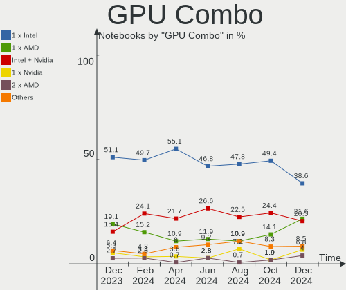

| Name           | Notebooks | Percent |
|----------------|-----------|---------|
| 1 x Intel      | 74        | 40.22%  |
| Intel + Nvidia | 44        | 23.91%  |
| 1 x AMD        | 36        | 19.57%  |
| 1 x Nvidia     | 11        | 5.98%   |
| Intel + AMD    | 9         | 4.89%   |
| AMD + Nvidia   | 5         | 2.72%   |
| 2 x AMD        | 4         | 2.17%   |
| 2 x Intel      | 1         | 0.54%   |

GPU Driver
----------

Free vs proprietary

| Driver      | Notebooks | Percent |
|-------------|-----------|---------|
| Free        | 157       | 85.33%  |
| Proprietary | 23        | 12.5%   |
| Unknown     | 4         | 2.17%   |

GPU Memory
----------

Total video memory

| Size in GB | Notebooks | Percent |
|------------|-----------|---------|
| Unknown    | 110       | 59.78%  |
| 1.01-2.0   | 21        | 11.41%  |
| 0.01-0.5   | 21        | 11.41%  |
| 0.51-1.0   | 15        | 8.15%   |
| 3.01-4.0   | 11        | 5.98%   |
| 5.01-6.0   | 5         | 2.72%   |
| 7.01-8.0   | 1         | 0.54%   |

Monitor
-------

Monitor Vendor
--------------

Monitor vendors

| Vendor                  | Notebooks | Percent |
|-------------------------|-----------|---------|
| Chimei Innolux          | 38        | 17.59%  |
| AU Optronics            | 34        | 15.74%  |
| BOE                     | 31        | 14.35%  |
| LG Display              | 28        | 12.96%  |
| Samsung Electronics     | 21        | 9.72%   |
| Dell                    | 8         | 3.7%    |
| Iiyama                  | 6         | 2.78%   |
| Valve                   | 5         | 2.31%   |
| Sharp                   | 5         | 2.31%   |
| Chi Mei Optoelectronics | 4         | 1.85%   |
| Sony                    | 3         | 1.39%   |
| Philips                 | 3         | 1.39%   |
| Apple                   | 3         | 1.39%   |
| ViewSonic               | 2         | 0.93%   |
| PANDA                   | 2         | 0.93%   |
| LG Philips              | 2         | 0.93%   |
| InfoVision              | 2         | 0.93%   |
| Goldstar                | 2         | 0.93%   |
| Toshiba                 | 1         | 0.46%   |
| RIS                     | 1         | 0.46%   |
| LGD                     | 1         | 0.46%   |
| Lenovo                  | 1         | 0.46%   |
| HannStar Display        | 1         | 0.46%   |
| HannStar                | 1         | 0.46%   |
| Gigabyte Technology     | 1         | 0.46%   |
| Fujitsu Siemens         | 1         | 0.46%   |
| Daewoo                  | 1         | 0.46%   |
| CTO                     | 1         | 0.46%   |
| CRM                     | 1         | 0.46%   |
| BOE Technology Group    | 1         | 0.46%   |
| BenQ                    | 1         | 0.46%   |
| ASUSTek Computer        | 1         | 0.46%   |
| AOC                     | 1         | 0.46%   |
| Ancor Communications    | 1         | 0.46%   |
| Acer                    | 1         | 0.46%   |

Monitor Model
-------------

Monitor models

| Model                                                                 | Notebooks | Percent |
|-----------------------------------------------------------------------|-----------|---------|
| AU Optronics LCD Monitor AUO36ED 1920x1080 344x193mm 15.5-inch        | 7         | 3.2%    |
| Valve ANX7530 U VLV3001 800x1280 100x150mm 7.1-inch                   | 5         | 2.28%   |
| Chimei Innolux LCD Monitor CMN1747 1920x1080 381x214mm 17.2-inch      | 3         | 1.37%   |
| Chimei Innolux LCD Monitor CMN1734 1600x900 382x214mm 17.2-inch       | 3         | 1.37%   |
| Chimei Innolux LCD Monitor CMN15F5 1920x1080 344x193mm 15.5-inch      | 3         | 1.37%   |
| Sharp LCD Monitor SHP14D1 1920x1200 336x210mm 15.6-inch               | 2         | 0.91%   |
| Samsung Electronics LCD Monitor SDC3654 1600x900 382x215mm 17.3-inch  | 2         | 0.91%   |
| LG Display LCD Monitor LGD046C 1920x1080 382x215mm 17.3-inch          | 2         | 0.91%   |
| LG Display LCD Monitor LGD0395 1366x768 344x194mm 15.5-inch           | 2         | 0.91%   |
| LG Display LCD Monitor LGD02DC 1366x768 344x194mm 15.5-inch           | 2         | 0.91%   |
| Iiyama PL2409HD IVM560C 1920x1080 521x293mm 23.5-inch                 | 2         | 0.91%   |
| Dell P2417H DELA0DC 1920x1080 527x296mm 23.8-inch                     | 2         | 0.91%   |
| Chimei Innolux LCD Monitor CMN1614 1920x1200 344x215mm 16.0-inch      | 2         | 0.91%   |
| Chimei Innolux LCD Monitor CMN15E8 1920x1080 344x193mm 15.5-inch      | 2         | 0.91%   |
| Chimei Innolux LCD Monitor CMN1512 1920x1080 344x193mm 15.5-inch      | 2         | 0.91%   |
| Chimei Innolux LCD Monitor CMN14D5 1920x1080 309x173mm 13.9-inch      | 2         | 0.91%   |
| Chimei Innolux LCD Monitor CMN14D4 1920x1080 309x173mm 13.9-inch      | 2         | 0.91%   |
| Chimei Innolux LCD Monitor CMN1361 1920x1080 293x165mm 13.2-inch      | 2         | 0.91%   |
| BOE LCD Monitor BOE09DE 1920x1080 309x174mm 14.0-inch                 | 2         | 0.91%   |
| AU Optronics LCD Monitor AUO6287 1440x900 367x229mm 17.0-inch         | 2         | 0.91%   |
| AU Optronics LCD Monitor AUO403D 1920x1080 309x174mm 14.0-inch        | 2         | 0.91%   |
| ViewSonic VX2457 VSCB931 1920x1080 521x293mm 23.5-inch                | 1         | 0.46%   |
| ViewSonic VA2419 Series VSC7B32 1920x1080 527x296mm 23.8-inch         | 1         | 0.46%   |
| Toshiba TV TSB0108 1360x768 576x324mm 26.0-inch                       | 1         | 0.46%   |
| Sony NvidiaDefault SNY05FA 1366x768 290x170mm 13.2-inch               | 1         | 0.46%   |
| Sony Nvidia Defaul t Flat Panel MS_0025 1920x1080 360x200mm 16.2-inch | 1         | 0.46%   |
| Sony AVAMP SNYF400 1920x1080 1440x810mm 65.0-inch                     | 1         | 0.46%   |
| Sharp LCD Monitor SHP14F9 1920x1200 288x180mm 13.4-inch               | 1         | 0.46%   |
| Sharp LCD Monitor SHP1453 1920x1080 346x194mm 15.6-inch               | 1         | 0.46%   |
| Sharp LCD Monitor SHP1447 1920x1080 294x165mm 13.3-inch               | 1         | 0.46%   |
| Samsung Electronics S24B300 SAM08CC 1920x1080 521x293mm 23.5-inch     | 1         | 0.46%   |
| Samsung Electronics LS24AG30x SAM7178 1920x1080 527x296mm 23.8-inch   | 1         | 0.46%   |
| Samsung Electronics LS24A600N SAM7148 2560x1440 527x297mm 23.8-inch   | 1         | 0.46%   |
| Samsung Electronics LF24T35 SAM707D 1920x1080 528x297mm 23.9-inch     | 1         | 0.46%   |
| Samsung Electronics LCD Monitor SEC5541 1366x768 344x193mm 15.5-inch  | 1         | 0.46%   |
| Samsung Electronics LCD Monitor SEC4251 1366x768 344x194mm 15.5-inch  | 1         | 0.46%   |
| Samsung Electronics LCD Monitor SEC315A 1366x768 344x194mm 15.5-inch  | 1         | 0.46%   |
| Samsung Electronics LCD Monitor SEC3152 1366x768 344x194mm 15.5-inch  | 1         | 0.46%   |
| Samsung Electronics LCD Monitor SDC4951 1366x768 344x194mm 15.5-inch  | 1         | 0.46%   |
| Samsung Electronics LCD Monitor SDC4350 1920x1080 276x156mm 12.5-inch | 1         | 0.46%   |

Monitor Resolution
------------------

Monitor screen resolution

| Resolution         | Notebooks | Percent |
|--------------------|-----------|---------|
| 1920x1080 (FHD)    | 94        | 47.72%  |
| 1366x768 (WXGA)    | 40        | 20.3%   |
| 1600x900 (HD+)     | 14        | 7.11%   |
| 1920x1200 (WUXGA)  | 10        | 5.08%   |
| 2560x1440 (QHD)    | 8         | 4.06%   |
| 1280x800 (WXGA)    | 6         | 3.05%   |
| 800x1280           | 5         | 2.54%   |
| 1440x900 (WXGA+)   | 4         | 2.03%   |
| 3840x2160 (4K)     | 3         | 1.52%   |
| 2880x1800          | 3         | 1.52%   |
| 3840x1080          | 2         | 1.02%   |
| 3440x1440          | 1         | 0.51%   |
| 2560x1600          | 1         | 0.51%   |
| 2520x1680          | 1         | 0.51%   |
| 2240x1400          | 1         | 0.51%   |
| 1920x540           | 1         | 0.51%   |
| 1920x1280          | 1         | 0.51%   |
| 1680x1050 (WSXGA+) | 1         | 0.51%   |
| Unknown            | 1         | 0.51%   |

Monitor Diagonal
----------------

Diagonal size in inches

| Inches  | Notebooks | Percent |
|---------|-----------|---------|
| 15      | 81        | 37.5%   |
| 17      | 26        | 12.04%  |
| 13      | 23        | 10.65%  |
| 14      | 20        | 9.26%   |
| 23      | 11        | 5.09%   |
| 27      | 9         | 4.17%   |
| 24      | 9         | 4.17%   |
| 16      | 7         | 3.24%   |
| 7       | 5         | 2.31%   |
| Unknown | 4         | 1.85%   |
| 31      | 3         | 1.39%   |
| 21      | 3         | 1.39%   |
| 12      | 3         | 1.39%   |
| 65      | 2         | 0.93%   |
| 11      | 2         | 0.93%   |
| 72      | 1         | 0.46%   |
| 54      | 1         | 0.46%   |
| 49      | 1         | 0.46%   |
| 48      | 1         | 0.46%   |
| 34      | 1         | 0.46%   |
| 32      | 1         | 0.46%   |
| 22      | 1         | 0.46%   |
| 19      | 1         | 0.46%   |

Monitor Width
-------------

Physical width

| Width in mm | Notebooks | Percent |
|-------------|-----------|---------|
| 301-350     | 116       | 53.95%  |
| 351-400     | 28        | 13.02%  |
| 501-600     | 27        | 12.56%  |
| 201-300     | 18        | 8.37%   |
| 401-500     | 5         | 2.33%   |
| 1001-1500   | 5         | 2.33%   |
| 1-100       | 5         | 2.33%   |
| 601-700     | 4         | 1.86%   |
| Unknown     | 4         | 1.86%   |
| 701-800     | 2         | 0.93%   |
| 1501-2000   | 1         | 0.47%   |

Aspect Ratio
------------

Proportional relationship between the width and the height

| Ratio   | Notebooks | Percent |
|---------|-----------|---------|
| 16/9    | 148       | 80%     |
| 16/10   | 24        | 12.97%  |
| 0.67    | 5         | 2.7%    |
| Unknown | 4         | 2.16%   |
| 3/2     | 2         | 1.08%   |
| 32/9    | 1         | 0.54%   |
| 21/9    | 1         | 0.54%   |

Monitor Area
------------

Area in inch²

| Area in inch² | Notebooks | Percent |
|----------------|-----------|---------|
| 101-110        | 82        | 38.14%  |
| 81-90          | 33        | 15.35%  |
| 121-130        | 23        | 10.7%   |
| 201-250        | 19        | 8.84%   |
| 71-80          | 10        | 4.65%   |
| 301-350        | 9         | 4.19%   |
| More than 1000 | 5         | 2.33%   |
| 351-500        | 5         | 2.33%   |
| 1-40           | 5         | 2.33%   |
| 111-120        | 5         | 2.33%   |
| Unknown        | 4         | 1.86%   |
| 61-70          | 3         | 1.4%    |
| 151-200        | 3         | 1.4%    |
| 131-140        | 3         | 1.4%    |
| 51-60          | 2         | 0.93%   |
| 251-300        | 2         | 0.93%   |
| 501-1000       | 1         | 0.47%   |
| 91-100         | 1         | 0.47%   |

Pixel Density
-------------

Pixels per inch

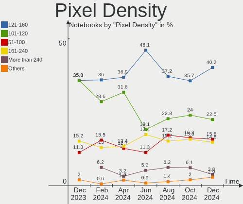

| Density       | Notebooks | Percent |
|---------------|-----------|---------|
| 121-160       | 88        | 41.71%  |
| 101-120       | 51        | 24.17%  |
| 51-100        | 38        | 18.01%  |
| 161-240       | 23        | 10.9%   |
| 1-50          | 5         | 2.37%   |
| Unknown       | 4         | 1.9%    |
| More than 240 | 2         | 0.95%   |

Multiple Monitors
-----------------

Total monitors connected

| Total | Notebooks | Percent |
|-------|-----------|---------|
| 1     | 139       | 75.54%  |
| 2     | 34        | 18.48%  |
| 3     | 6         | 3.26%   |
| 0     | 5         | 2.72%   |

Network
-------

Net Controller Vendor
---------------------

Controller vendors

| Vendor                                | Notebooks | Percent |
|---------------------------------------|-----------|---------|
| Intel                                 | 99        | 34.49%  |
| Realtek Semiconductor                 | 97        | 33.8%   |
| Qualcomm Atheros                      | 31        | 10.8%   |
| Broadcom                              | 17        | 5.92%   |
| MediaTek                              | 8         | 2.79%   |
| ASIX Electronics                      | 8         | 2.79%   |
| Ralink                                | 3         | 1.05%   |
| NetGear                               | 3         | 1.05%   |
| Marvell Technology Group              | 3         | 1.05%   |
| Samsung Electronics                   | 2         | 0.7%    |
| Ralink Technology                     | 2         | 0.7%    |
| Qualcomm                              | 2         | 0.7%    |
| DisplayLink                           | 2         | 0.7%    |
| D-Link                                | 2         | 0.7%    |
| Broadcom Limited                      | 2         | 0.7%    |
| Xiaomi                                | 1         | 0.35%   |
| TP-Link                               | 1         | 0.35%   |
| Sierra Wireless                       | 1         | 0.35%   |
| Nvidia                                | 1         | 0.35%   |
| ASUSTek Computer                      | 1         | 0.35%   |
| 802.11g Adapter [Linksys WUSB54GC v3] | 1         | 0.35%   |

Net Controller Model
--------------------

Controller models

| Model                                                             | Notebooks | Percent |
|-------------------------------------------------------------------|-----------|---------|
| Realtek RTL8111/8168/8411 PCI Express Gigabit Ethernet Controller | 50        | 14.53%  |
| Realtek RTL810xE PCI Express Fast Ethernet controller             | 15        | 4.36%   |
| Intel Wi-Fi 6 AX201                                               | 12        | 3.49%   |
| Intel Alder Lake-P PCH CNVi WiFi                                  | 12        | 3.49%   |
| Intel Wireless 8260                                               | 11        | 3.2%    |
| Realtek RTL8822CE 802.11ac PCIe Wireless Network Adapter          | 10        | 2.91%   |
| Realtek RTL8153 Gigabit Ethernet Adapter                          | 9         | 2.62%   |
| Intel Wireless 7265                                               | 8         | 2.33%   |
| ASIX AX88179 Gigabit Ethernet                                     | 8         | 2.33%   |
| Qualcomm Atheros QCA9565 / AR9565 Wireless Network Adapter        | 7         | 2.03%   |
| Intel Comet Lake PCH CNVi WiFi                                    | 7         | 2.03%   |
| Realtek RTL8821CE 802.11ac PCIe Wireless Network Adapter          | 6         | 1.74%   |
| MediaTek MT7921 802.11ax PCI Express Wireless Network Adapter     | 6         | 1.74%   |
| Intel Wireless 8265 / 8275                                        | 6         | 1.74%   |
| Intel Wireless 7260                                               | 6         | 1.74%   |
| Intel Cannon Lake PCH CNVi WiFi                                   | 6         | 1.74%   |
| Realtek RTL8723BE PCIe Wireless Network Adapter                   | 5         | 1.45%   |
| Realtek RTL8188CE 802.11b/g/n WiFi Adapter                        | 5         | 1.45%   |
| Qualcomm Atheros AR9485 Wireless Network Adapter                  | 5         | 1.45%   |
| Qualcomm Atheros AR9285 Wireless Network Adapter (PCI-Express)    | 5         | 1.45%   |
| Intel Wi-Fi 6 AX200                                               | 4         | 1.16%   |
| Intel Ethernet Connection I219-LM                                 | 4         | 1.16%   |
| Intel Ethernet Connection (16) I219-LM                            | 4         | 1.16%   |
| Broadcom BCM43142 802.11b/g/n                                     | 4         | 1.16%   |
| Qualcomm Atheros QCA6174 802.11ac Wireless Network Adapter        | 3         | 0.87%   |
| Qualcomm Atheros Killer E2500 Gigabit Ethernet Controller         | 3         | 0.87%   |
| Intel Tiger Lake PCH CNVi WiFi                                    | 3         | 0.87%   |
| Intel Ethernet Connection (13) I219-V                             | 3         | 0.87%   |
| Samsung Galaxy series, misc. (tethering mode)                     | 2         | 0.58%   |
| Realtek RTL88x2bu [AC1200 Techkey]                                | 2         | 0.58%   |
| Realtek RTL8814AU 802.11a/b/g/n/ac Wireless Adapter               | 2         | 0.58%   |
| Realtek RTL8723AE PCIe Wireless Network Adapter                   | 2         | 0.58%   |
| Realtek Killer E2600 Gigabit Ethernet Controller                  | 2         | 0.58%   |
| Ralink RT2501/RT2573 Wireless Adapter                             | 2         | 0.58%   |
| Qualcomm QCNFA765 Wireless Network Adapter                        | 2         | 0.58%   |
| Qualcomm Atheros QCA8171 Gigabit Ethernet                         | 2         | 0.58%   |
| Qualcomm Atheros AR928X Wireless Network Adapter (PCI-Express)    | 2         | 0.58%   |
| Qualcomm Atheros AR8161 Gigabit Ethernet                          | 2         | 0.58%   |
| Qualcomm Atheros AR8152 v2.0 Fast Ethernet                        | 2         | 0.58%   |
| MediaTek MT7922 802.11ax PCI Express Wireless Network Adapter     | 2         | 0.58%   |

Wireless Vendor
---------------

Wireless vendors

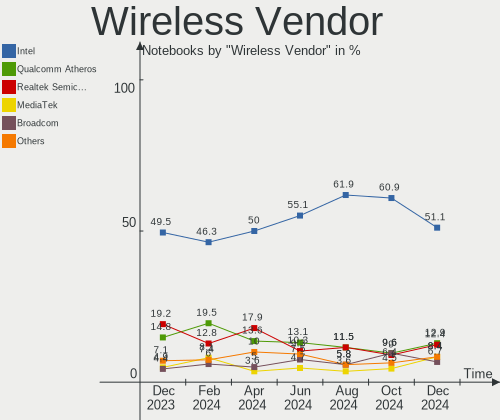

| Vendor                                | Notebooks | Percent |
|---------------------------------------|-----------|---------|
| Intel                                 | 95        | 47.5%   |
| Realtek Semiconductor                 | 41        | 20.5%   |
| Qualcomm Atheros                      | 24        | 12%     |
| Broadcom                              | 14        | 7%      |
| MediaTek                              | 8         | 4%      |
| Ralink                                | 3         | 1.5%    |
| NetGear                               | 3         | 1.5%    |
| Ralink Technology                     | 2         | 1%      |
| Qualcomm                              | 2         | 1%      |
| D-Link                                | 2         | 1%      |
| Broadcom Limited                      | 2         | 1%      |
| TP-Link                               | 1         | 0.5%    |
| Sierra Wireless                       | 1         | 0.5%    |
| ASUSTek Computer                      | 1         | 0.5%    |
| 802.11g Adapter [Linksys WUSB54GC v3] | 1         | 0.5%    |

Wireless Model
--------------

Wireless models

| Model                                                              | Notebooks | Percent |
|--------------------------------------------------------------------|-----------|---------|
| Intel Wi-Fi 6 AX201                                                | 12        | 6%      |
| Intel Alder Lake-P PCH CNVi WiFi                                   | 12        | 6%      |
| Intel Wireless 8260                                                | 11        | 5.5%    |
| Realtek RTL8822CE 802.11ac PCIe Wireless Network Adapter           | 10        | 5%      |
| Intel Wireless 7265                                                | 8         | 4%      |
| Qualcomm Atheros QCA9565 / AR9565 Wireless Network Adapter         | 7         | 3.5%    |
| Intel Comet Lake PCH CNVi WiFi                                     | 7         | 3.5%    |
| Realtek RTL8821CE 802.11ac PCIe Wireless Network Adapter           | 6         | 3%      |
| MediaTek MT7921 802.11ax PCI Express Wireless Network Adapter      | 6         | 3%      |
| Intel Wireless 8265 / 8275                                         | 6         | 3%      |
| Intel Wireless 7260                                                | 6         | 3%      |
| Intel Cannon Lake PCH CNVi WiFi                                    | 6         | 3%      |
| Realtek RTL8723BE PCIe Wireless Network Adapter                    | 5         | 2.5%    |
| Realtek RTL8188CE 802.11b/g/n WiFi Adapter                         | 5         | 2.5%    |
| Qualcomm Atheros AR9485 Wireless Network Adapter                   | 5         | 2.5%    |
| Qualcomm Atheros AR9285 Wireless Network Adapter (PCI-Express)     | 5         | 2.5%    |
| Intel Wi-Fi 6 AX200                                                | 4         | 2%      |
| Broadcom BCM43142 802.11b/g/n                                      | 4         | 2%      |
| Qualcomm Atheros QCA6174 802.11ac Wireless Network Adapter         | 3         | 1.5%    |
| Intel Tiger Lake PCH CNVi WiFi                                     | 3         | 1.5%    |
| Realtek RTL88x2bu [AC1200 Techkey]                                 | 2         | 1%      |
| Realtek RTL8814AU 802.11a/b/g/n/ac Wireless Adapter                | 2         | 1%      |
| Realtek RTL8723AE PCIe Wireless Network Adapter                    | 2         | 1%      |
| Ralink RT2501/RT2573 Wireless Adapter                              | 2         | 1%      |
| Qualcomm QCNFA765 Wireless Network Adapter                         | 2         | 1%      |
| Qualcomm Atheros AR928X Wireless Network Adapter (PCI-Express)     | 2         | 1%      |
| MediaTek MT7922 802.11ax PCI Express Wireless Network Adapter      | 2         | 1%      |
| Intel Wi-Fi 6 AX210/AX211/AX411 160MHz                             | 2         | 1%      |
| Intel Comet Lake PCH-LP CNVi WiFi                                  | 2         | 1%      |
| Intel Centrino Advanced-N 6235                                     | 2         | 1%      |
| Intel Centrino Advanced-N 6205 [Taylor Peak]                       | 2         | 1%      |
| Intel Cannon Point-LP CNVi [Wireless-AC]                           | 2         | 1%      |
| Broadcom BCM43224 802.11a/b/g/n                                    | 2         | 1%      |
| Broadcom BCM4322 802.11a/b/g/n Wireless LAN Controller             | 2         | 1%      |
| TP-Link Archer T3U [Realtek RTL8812BU]                             | 1         | 0.5%    |
| Sierra Wireless EM7305                                             | 1         | 0.5%    |
| Realtek RTL8852BE PCIe 802.11ax Wireless Network Controller [1T1R] | 1         | 0.5%    |
| Realtek RTL8821AE 802.11ac PCIe Wireless Network Adapter           | 1         | 0.5%    |
| Realtek RTL8723DE Wireless Network Adapter                         | 1         | 0.5%    |
| Realtek RTL8723AU 802.11n WLAN Adapter                             | 1         | 0.5%    |

Ethernet Vendor
---------------

Ethernet vendors

| Vendor                   | Notebooks | Percent |
|--------------------------|-----------|---------|
| Realtek Semiconductor    | 78        | 54.55%  |
| Intel                    | 30        | 20.98%  |
| Qualcomm Atheros         | 12        | 8.39%   |
| ASIX Electronics         | 8         | 5.59%   |
| Broadcom                 | 6         | 4.2%    |
| Marvell Technology Group | 3         | 2.1%    |
| Samsung Electronics      | 2         | 1.4%    |
| DisplayLink              | 2         | 1.4%    |
| Xiaomi                   | 1         | 0.7%    |
| Nvidia                   | 1         | 0.7%    |

Ethernet Model
--------------

Ethernet models

| Model                                                                          | Notebooks | Percent |
|--------------------------------------------------------------------------------|-----------|---------|
| Realtek RTL8111/8168/8411 PCI Express Gigabit Ethernet Controller              | 50        | 34.72%  |
| Realtek RTL810xE PCI Express Fast Ethernet controller                          | 15        | 10.42%  |
| Realtek RTL8153 Gigabit Ethernet Adapter                                       | 9         | 6.25%   |
| ASIX AX88179 Gigabit Ethernet                                                  | 8         | 5.56%   |
| Intel Ethernet Connection I219-LM                                              | 4         | 2.78%   |
| Intel Ethernet Connection (16) I219-LM                                         | 4         | 2.78%   |
| Qualcomm Atheros Killer E2500 Gigabit Ethernet Controller                      | 3         | 2.08%   |
| Intel Ethernet Connection (13) I219-V                                          | 3         | 2.08%   |
| Samsung Galaxy series, misc. (tethering mode)                                  | 2         | 1.39%   |
| Realtek Killer E2600 Gigabit Ethernet Controller                               | 2         | 1.39%   |
| Qualcomm Atheros QCA8171 Gigabit Ethernet                                      | 2         | 1.39%   |
| Qualcomm Atheros AR8161 Gigabit Ethernet                                       | 2         | 1.39%   |
| Qualcomm Atheros AR8152 v2.0 Fast Ethernet                                     | 2         | 1.39%   |
| Intel Ethernet Connection I219-V                                               | 2         | 1.39%   |
| Intel Ethernet Connection I217-LM                                              | 2         | 1.39%   |
| Intel Ethernet Connection (13) I219-LM                                         | 2         | 1.39%   |
| DisplayLink Dell Universal Dock D6000                                          | 2         | 1.39%   |
| Xiaomi Mi/Redmi series (RNDIS)                                                 | 1         | 0.69%   |
| Realtek RTL8152 Fast Ethernet Adapter                                          | 1         | 0.69%   |
| Realtek RTL8125 2.5GbE Controller                                              | 1         | 0.69%   |
| Realtek Killer E2500 Gigabit Ethernet Controller                               | 1         | 0.69%   |
| Qualcomm Atheros Killer E2400 Gigabit Ethernet Controller                      | 1         | 0.69%   |
| Qualcomm Atheros AR8152 v1.1 Fast Ethernet                                     | 1         | 0.69%   |
| Qualcomm Atheros AR8151 v1.0 Gigabit Ethernet                                  | 1         | 0.69%   |
| Nvidia MCP79 Ethernet                                                          | 1         | 0.69%   |
| Marvell Group Yukon Optima 88E8059 [PCIe Gigabit Ethernet Controller with AVB] | 1         | 0.69%   |
| Marvell Group 88E8058 PCI-E Gigabit Ethernet Controller                        | 1         | 0.69%   |
| Marvell Group 88E8057 PCI-E Gigabit Ethernet Controller                        | 1         | 0.69%   |
| Intel Ethernet Connection I218-LM                                              | 1         | 0.69%   |
| Intel Ethernet Connection I217-V                                               | 1         | 0.69%   |
| Intel Ethernet Connection (7) I219-LM                                          | 1         | 0.69%   |
| Intel Ethernet Connection (6) I219-V                                           | 1         | 0.69%   |
| Intel Ethernet Connection (5) I219-LM                                          | 1         | 0.69%   |
| Intel Ethernet Connection (3) I218-LM                                          | 1         | 0.69%   |
| Intel Ethernet Connection (14) I219-LM                                         | 1         | 0.69%   |
| Intel Ethernet Connection (11) I219-V                                          | 1         | 0.69%   |
| Intel Ethernet Connection (11) I219-LM                                         | 1         | 0.69%   |
| Intel Ethernet Connection (10) I219-V                                          | 1         | 0.69%   |
| Intel 82579V Gigabit Network Connection                                        | 1         | 0.69%   |
| Intel 82579LM Gigabit Network Connection (Lewisville)                          | 1         | 0.69%   |

Net Controller Kind
-------------------

Ethernet, WiFi or modem

| Kind     | Notebooks | Percent |
|----------|-----------|---------|
| WiFi     | 183       | 56.83%  |
| Ethernet | 139       | 43.17%  |

Used Controller
---------------

Currently used network controller

| Kind     | Notebooks | Percent |
|----------|-----------|---------|
| WiFi     | 145       | 76.32%  |
| Ethernet | 45        | 23.68%  |

NICs
----

Total network controllers on board

| Total | Notebooks | Percent |
|-------|-----------|---------|
| 2     | 120       | 65.22%  |
| 1     | 60        | 32.61%  |
| 0     | 3         | 1.63%   |
| 3     | 1         | 0.54%   |

IPv6
----

IPv6 vs IPv4

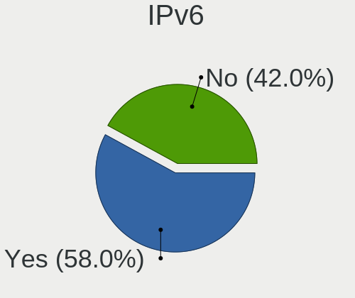

| Used | Notebooks | Percent |
|------|-----------|---------|
| Yes  | 110       | 59.78%  |
| No   | 74        | 40.22%  |

Bluetooth
---------

Bluetooth Vendor
----------------

Controller vendors

| Vendor                          | Notebooks | Percent |
|---------------------------------|-----------|---------|
| Intel                           | 86        | 54.43%  |
| IMC Networks                    | 16        | 10.13%  |
| Realtek Semiconductor           | 12        | 7.59%   |
| Foxconn / Hon Hai               | 10        | 6.33%   |
| Lite-On Technology              | 7         | 4.43%   |
| Broadcom                        | 7         | 4.43%   |
| Qualcomm Atheros Communications | 5         | 3.16%   |
| Apple                           | 4         | 2.53%   |
| Dell                            | 2         | 1.27%   |
| ASUSTek Computer                | 2         | 1.27%   |
| USI                             | 1         | 0.63%   |
| TP-Link                         | 1         | 0.63%   |
| Realtek                         | 1         | 0.63%   |
| Ralink Technology               | 1         | 0.63%   |
| Ralink                          | 1         | 0.63%   |
| Hewlett-Packard                 | 1         | 0.63%   |
| Chicony Electronics             | 1         | 0.63%   |

Bluetooth Model
---------------

Controller models

| Model                                                                               | Notebooks | Percent |
|-------------------------------------------------------------------------------------|-----------|---------|
| Intel Bluetooth wireless interface                                                  | 31        | 19.62%  |
| Intel AX201 Bluetooth                                                               | 20        | 12.66%  |
| Intel Bluetooth 9460/9560 Jefferson Peak (JfP)                                      | 13        | 8.23%   |
| Intel Bluetooth Device                                                              | 12        | 7.59%   |
| Realtek Bluetooth Radio                                                             | 9         | 5.7%    |
| IMC Networks Bluetooth Radio                                                        | 8         | 5.06%   |
| Foxconn / Hon Hai Wireless_Device                                                   | 6         | 3.8%    |
| Intel AX200 Bluetooth                                                               | 4         | 2.53%   |
| Qualcomm Atheros  Bluetooth Device                                                  | 3         | 1.9%    |
| Lite-On Atheros AR3012 Bluetooth                                                    | 3         | 1.9%    |
| Intel Centrino Bluetooth Wireless Transceiver                                       | 3         | 1.9%    |
| IMC Networks Bluetooth Device                                                       | 3         | 1.9%    |
| Apple Bluetooth Host Controller                                                     | 3         | 1.9%    |
| Lite-On Broadcom BCM43142A0 Bluetooth Device                                        | 2         | 1.27%   |
| Intel AX210 Bluetooth                                                               | 2         | 1.27%   |
| IMC Networks Wireless_Device                                                        | 2         | 1.27%   |
| IMC Networks Bluetooth                                                              | 2         | 1.27%   |
| Foxconn / Hon Hai Bluetooth Device                                                  | 2         | 1.27%   |
| Broadcom BCM43142A0 Bluetooth Device                                                | 2         | 1.27%   |
| Broadcom BCM2045B (BDC-2.1)                                                         | 2         | 1.27%   |
| USI Bluetooth Device                                                                | 1         | 0.63%   |
| TP-Link UB500 Adapter                                                               | 1         | 0.63%   |
| Realtek RTL8821A Bluetooth                                                          | 1         | 0.63%   |
| Realtek RTL8723B Bluetooth                                                          | 1         | 0.63%   |
| Realtek  Bluetooth 4.2 Adapter                                                      | 1         | 0.63%   |
| Realtek 802.11ac WLAN Adapter                                                       | 1         | 0.63%   |
| Ralink CSR BS8510                                                                   | 1         | 0.63%   |
| Ralink RT3290 Bluetooth                                                             | 1         | 0.63%   |
| Qualcomm Atheros Bluetooth                                                          | 1         | 0.63%   |
| Qualcomm Atheros AR3011 Bluetooth                                                   | 1         | 0.63%   |
| Lite-On Qualcomm Atheros QCA9377 Bluetooth                                          | 1         | 0.63%   |
| Lite-On Bluetooth Radio                                                             | 1         | 0.63%   |
| Intel Wireless-AC 3168 Bluetooth                                                    | 1         | 0.63%   |
| IMC Networks Atheros AR3012 Bluetooth 4.0 Adapter                                   | 1         | 0.63%   |
| HP Broadcom 2070 Bluetooth Combo                                                    | 1         | 0.63%   |
| Foxconn / Hon Hai Foxconn T77H114 BCM2070 [Single-Chip Bluetooth 2.1 + EDR Adapter] | 1         | 0.63%   |
| Foxconn / Hon Hai BCM43142A0                                                        | 1         | 0.63%   |
| Dell Wireless 355 Bluetooth                                                         | 1         | 0.63%   |
| Dell DW375 Bluetooth Module                                                         | 1         | 0.63%   |
| Chicony Bluetooth (RTL8723BE)                                                       | 1         | 0.63%   |

Sound
-----

Sound Vendor
------------

Sound card vendors

| Vendor                     | Notebooks | Percent |
|----------------------------|-----------|---------|
| Intel                      | 140       | 57.61%  |
| AMD                        | 48        | 19.75%  |
| Nvidia                     | 33        | 13.58%  |
| Realtek Semiconductor      | 3         | 1.23%   |
| Generalplus Technology     | 3         | 1.23%   |
| Razer USA                  | 2         | 0.82%   |
| GN Netcom                  | 2         | 0.82%   |
| VIA Technologies           | 1         | 0.41%   |
| Turtle Beach               | 1         | 0.41%   |
| Superlux digit             | 1         | 0.41%   |
| Sony                       | 1         | 0.41%   |
| PreSonus Audio Electronics | 1         | 0.41%   |
| Plantronics                | 1         | 0.41%   |
| Lenovo                     | 1         | 0.41%   |
| Hewlett-Packard            | 1         | 0.41%   |
| Focusrite-Novation         | 1         | 0.41%   |
| C-Media Electronics        | 1         | 0.41%   |
| BEHRINGER International    | 1         | 0.41%   |
| ASUSTek Computer           | 1         | 0.41%   |

Sound Model
-----------

Sound card models

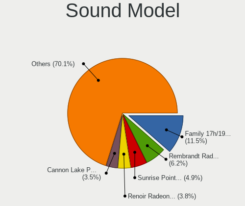

| Model                                                                      | Notebooks | Percent |
|----------------------------------------------------------------------------|-----------|---------|
| AMD Family 17h/19h HD Audio Controller                                     | 22        | 7.43%   |
| AMD Renoir Radeon High Definition Audio Controller                         | 16        | 5.41%   |
| Intel Tiger Lake-LP Smart Sound Technology Audio Controller                | 15        | 5.07%   |
| Intel Alder Lake PCH-P High Definition Audio Controller                    | 13        | 4.39%   |
| Intel Sunrise Point-LP HD Audio                                            | 11        | 3.72%   |
| Intel Haswell-ULT HD Audio Controller                                      | 11        | 3.72%   |
| Intel 8 Series HD Audio Controller                                         | 11        | 3.72%   |
| Intel 7 Series/C216 Chipset Family High Definition Audio Controller        | 10        | 3.38%   |
| Intel 6 Series/C200 Series Chipset Family High Definition Audio Controller | 10        | 3.38%   |
| Intel 8 Series/C220 Series Chipset High Definition Audio Controller        | 8         | 2.7%    |
| Intel Comet Lake PCH cAVS                                                  | 7         | 2.36%   |
| Intel CM238 HD Audio Controller                                            | 7         | 2.36%   |
| Intel 5 Series/3400 Series Chipset High Definition Audio                   | 7         | 2.36%   |
| AMD Rembrandt Radeon High Definition Audio Controller                      | 7         | 2.36%   |
| AMD FCH Azalia Controller                                                  | 7         | 2.36%   |
| Intel Cannon Lake PCH cAVS                                                 | 6         | 2.03%   |
| Intel 82801I (ICH9 Family) HD Audio Controller                             | 6         | 2.03%   |
| Nvidia TU107 GeForce GTX 1650 High Definition Audio Controller             | 5         | 1.69%   |
| Intel Xeon E3-1200 v3/4th Gen Core Processor HD Audio Controller           | 5         | 1.69%   |
| Intel Wildcat Point-LP High Definition Audio Controller                    | 5         | 1.69%   |
| Intel Broadwell-U Audio Controller                                         | 5         | 1.69%   |
| Intel Atom Processor Z36xxx/Z37xxx Series High Definition Audio Controller | 5         | 1.69%   |
| AMD Kabini HDMI/DP Audio                                                   | 5         | 1.69%   |
| Nvidia TU106 High Definition Audio Controller                              | 4         | 1.35%   |
| Nvidia GA106 High Definition Audio Controller                              | 4         | 1.35%   |
| Intel Tiger Lake-H HD Audio Controller                                     | 4         | 1.35%   |
| Realtek Semiconductor USB Audio                                            | 3         | 1.01%   |
| Nvidia GT216 HDMI Audio Controller                                         | 3         | 1.01%   |
| Intel Comet Lake PCH-LP cAVS                                               | 3         | 1.01%   |
| Intel 100 Series/C230 Series Chipset Family HD Audio Controller            | 3         | 1.01%   |
| Generalplus Technology USB Audio Device                                    | 3         | 1.01%   |
| AMD Wrestler HDMI Audio                                                    | 3         | 1.01%   |
| AMD SBx00 Azalia (Intel HDA)                                               | 3         | 1.01%   |
| AMD High Definition Audio Controller                                       | 3         | 1.01%   |
| AMD Family 15h (Models 60h-6fh) Audio Controller                           | 3         | 1.01%   |
| AMD Cedar HDMI Audio [Radeon HD 5400/6300/7300 Series]                     | 3         | 1.01%   |
| Razer USA Razer Barracuda 2.4                                              | 2         | 0.68%   |
| Nvidia MCP79 High Definition Audio                                         | 2         | 0.68%   |
| Nvidia GP106 High Definition Audio Controller                              | 2         | 0.68%   |
| Nvidia Audio device                                                        | 2         | 0.68%   |

Memory
------

Memory Vendor
-------------

Memory module vendors

| Vendor              | Notebooks | Percent |
|---------------------|-----------|---------|
| Samsung Electronics | 46        | 29.3%   |
| SK hynix            | 43        | 27.39%  |
| Micron Technology   | 24        | 15.29%  |
| Unknown             | 10        | 6.37%   |
| Kingston            | 10        | 6.37%   |
| Crucial             | 8         | 5.1%    |
| Nanya Technology    | 3         | 1.91%   |
| Unknown             | 3         | 1.91%   |
| Ramaxel Technology  | 2         | 1.27%   |
| A-DATA Technology   | 2         | 1.27%   |
| Transcend           | 1         | 0.64%   |
| Timetec             | 1         | 0.64%   |
| Neo Forza           | 1         | 0.64%   |
| G.Skill             | 1         | 0.64%   |
| Corsair             | 1         | 0.64%   |
| Avant               | 1         | 0.64%   |

Memory Model
------------

Memory module models

| Model                                                       | Notebooks | Percent |
|-------------------------------------------------------------|-----------|---------|
| SK hynix RAM HMT425S6AFR6A-PB 2GB SODIMM DDR3 3200MT/s      | 7         | 4.27%   |
| Micron RAM Module 4GB SODIMM DDR3 1600MT/s                  | 7         | 4.27%   |
| SK hynix RAM HMT451S6BFR8A-PB 4GB SODIMM DDR3 1600MT/s      | 4         | 2.44%   |
| Samsung RAM M471A1K43EB1-CWE 8GB SODIMM DDR4 3200MT/s       | 4         | 2.44%   |
| SK hynix RAM HMA81GS6DJR8N-XN 8GB SODIMM DDR4 3200MT/s      | 3         | 1.83%   |
| Samsung RAM M471B5173DB0-YK0 4GB SODIMM DDR3 1600MT/s       | 3         | 1.83%   |
| Samsung RAM M471A1G44AB0-CWE 8GB SODIMM DDR4 3200MT/s       | 3         | 1.83%   |
| Unknown                                                     | 3         | 1.83%   |
| SK hynix RAM HMT351S6CFR8C-PB 4GB SODIMM DDR3 1600MT/s      | 2         | 1.22%   |
| SK hynix RAM HMAB2GS6AMR6N-XN 16GB SODIMM DDR4 3200MT/s     | 2         | 1.22%   |
| Samsung RAM M471B5173QH0-YK0 4GB SODIMM DDR3 1600MT/s       | 2         | 1.22%   |
| Samsung RAM M471B5173EB0-YK0 4GB SODIMM DDR3 1600MT/s       | 2         | 1.22%   |
| Samsung RAM M471B1G73EB0-YK0 8GB SODIMM DDR3 1600MT/s       | 2         | 1.22%   |
| Samsung RAM M471B1G73DB0-YK0 8GB SODIMM DDR3 1600MT/s       | 2         | 1.22%   |
| Samsung RAM M471A5244CB0-CWE 4GB Row Of Chips DDR4 3200MT/s | 2         | 1.22%   |
| Samsung RAM M471A2K43CB1-CRC 16GB SODIMM DDR4 2667MT/s      | 2         | 1.22%   |
| Samsung RAM M471A1K43DB1-CWE 8GB SODIMM DDR4 3200MT/s       | 2         | 1.22%   |
| Samsung RAM M471A1K43CB1-CTD 8GB SODIMM DDR4 2667MT/s       | 2         | 1.22%   |
| Micron RAM 4ATF1G64HZ-3G2E2 8GB SODIMM DDR4 3200MT/s        | 2         | 1.22%   |
| Micron RAM 4ATF1G64HZ-3G2E1 8GB Row Of Chips DDR4 3200MT/s  | 2         | 1.22%   |
| Crucial RAM CT102464BF160B.M16 8GB SODIMM DDR3 1600MT/s     | 2         | 1.22%   |
| Unknown RAM Module 8GB SODIMM LPDDR4 4266MT/s               | 1         | 0.61%   |
| Unknown RAM Module 8GB SODIMM DDR4 3200MT/s                 | 1         | 0.61%   |
| Unknown RAM Module 4GB SODIMM DDR4 2400MT/s                 | 1         | 0.61%   |
| Unknown RAM Module 4096MB SODIMM DDR3 1067MT/s              | 1         | 0.61%   |
| Unknown RAM Module 2GB SODIMM DDR3 1066MT/s                 | 1         | 0.61%   |
| Unknown RAM Module 2GB SODIMM DDR3                          | 1         | 0.61%   |
| Unknown RAM Module 2GB SODIMM DDR2 667MT/s                  | 1         | 0.61%   |
| Unknown RAM Module 2GB SODIMM DDR2 533MT/s                  | 1         | 0.61%   |
| Unknown RAM Module 2GB Row Of Chips LPDDR4 4267MT/s         | 1         | 0.61%   |
| Unknown RAM Module 1GB SODIMM DDR                           | 1         | 0.61%   |
| Transcend RAM TS256MSK64W6N 2GB SODIMM DDR3 1600MT/s        | 1         | 0.61%   |
| Timetec RAM SD3-1600 8GB SODIMM DDR3 1600MT/s               | 1         | 0.61%   |
| SK hynix RAM Module 16GB SODIMM DDR4 3200MT/s               | 1         | 0.61%   |
| SK hynix RAM HYMP125S64CP8-S6 2GB SODIMM DDR 800MT/s        | 1         | 0.61%   |
| SK hynix RAM HT5SMRAP 4GB SODIMM DDR3 1600MT/s              | 1         | 0.61%   |
| SK hynix RAM HMT451S6MFR8A-PB 4GB SODIMM DDR3 1600MT/s      | 1         | 0.61%   |
| SK hynix RAM HMT451S6AFR8A-PB 4GB SODIMM DDR3 1600MT/s      | 1         | 0.61%   |
| SK hynix RAM HMT425S6AFR6A-PB 2GB DDR3 1600MT/s             | 1         | 0.61%   |
| SK hynix RAM HMT41GS6BFR8A-PB 8GB SODIMM DDR3 1600MT/s      | 1         | 0.61%   |

Memory Kind
-----------

Memory module kinds

| Kind    | Notebooks | Percent |
|---------|-----------|---------|
| DDR4    | 59        | 45.38%  |
| DDR3    | 46        | 35.38%  |
| LPDDR5  | 8         | 6.15%   |
| LPDDR4  | 4         | 3.08%   |
| DDR5    | 4         | 3.08%   |
| DDR2    | 4         | 3.08%   |
| LPDDR3  | 2         | 1.54%   |
| SDRAM   | 1         | 0.77%   |
| DDR     | 1         | 0.77%   |
| Unknown | 1         | 0.77%   |

Memory Form Factor
------------------

Physical design of the memory module

| Name         | Notebooks | Percent |
|--------------|-----------|---------|
| SODIMM       | 115       | 89.15%  |
| Row Of Chips | 13        | 10.08%  |
| Unknown      | 1         | 0.78%   |

Memory Size
-----------

Memory module size

| Size  | Notebooks | Percent |
|-------|-----------|---------|
| 8192  | 50        | 34.01%  |
| 4096  | 47        | 31.97%  |
| 16384 | 21        | 14.29%  |
| 2048  | 21        | 14.29%  |
| 32768 | 4         | 2.72%   |
| 1024  | 4         | 2.72%   |

Memory Speed
------------

Memory module speed

| Speed   | Notebooks | Percent |
|---------|-----------|---------|
| 3200    | 48        | 32.88%  |
| 1600    | 40        | 27.4%   |
| 2667    | 13        | 8.9%    |
| 6400    | 7         | 4.79%   |
| 2400    | 7         | 4.79%   |
| 1334    | 6         | 4.11%   |
| 4800    | 4         | 2.74%   |
| 2133    | 4         | 2.74%   |
| 4266    | 3         | 2.05%   |
| 1333    | 2         | 1.37%   |
| 1066    | 2         | 1.37%   |
| 667     | 2         | 1.37%   |
| Unknown | 2         | 1.37%   |
| 4267    | 1         | 0.68%   |
| 2048    | 1         | 0.68%   |
| 1866    | 1         | 0.68%   |
| 1067    | 1         | 0.68%   |
| 975     | 1         | 0.68%   |
| 533     | 1         | 0.68%   |

Printers & scanners
-------------------

Printer Vendor
--------------

Printer device vendors

Zero info for selected period =(

Printer Model
-------------

Printer device models

Zero info for selected period =(

Scanner Vendor
--------------

Scanner device vendors

Zero info for selected period =(

Scanner Model
-------------

Scanner device models

Zero info for selected period =(

Camera
------

Camera Vendor
-------------

Camera device vendors

| Vendor                                 | Notebooks | Percent |
|----------------------------------------|-----------|---------|
| Chicony Electronics                    | 42        | 25%     |
| IMC Networks                           | 20        | 11.9%   |
| Realtek Semiconductor                  | 18        | 10.71%  |
| Microdia                               | 15        | 8.93%   |
| Quanta                                 | 10        | 5.95%   |
| Cheng Uei Precision Industry (Foxlink) | 9         | 5.36%   |
| Bison Electronics                      | 9         | 5.36%   |
| Suyin                                  | 8         | 4.76%   |
| Sunplus Innovation Technology          | 8         | 4.76%   |
| Syntek                                 | 3         | 1.79%   |
| Logitech                               | 3         | 1.79%   |
| Lite-On Technology                     | 3         | 1.79%   |
| Apple                                  | 3         | 1.79%   |
| Sonix Technology                       | 2         | 1.19%   |
| Samsung Electronics                    | 2         | 1.19%   |
| Microsoft                              | 2         | 1.19%   |
| Luxvisions Innotech Limited            | 2         | 1.19%   |
| Acer                                   | 2         | 1.19%   |
| SunplusIT                              | 1         | 0.6%    |
| Silicon Motion                         | 1         | 0.6%    |
| ShineTech                              | 1         | 0.6%    |
| Ricoh                                  | 1         | 0.6%    |
| MacroSilicon                           | 1         | 0.6%    |
| Importek                               | 1         | 0.6%    |
| ALi                                    | 1         | 0.6%    |

Camera Model
------------

Camera device models

| Model                                                       | Notebooks | Percent |
|-------------------------------------------------------------|-----------|---------|
| IMC Networks USB2.0 HD UVC WebCam                           | 11        | 6.51%   |
| Realtek USB Camera                                          | 10        | 5.92%   |
| Microdia Integrated_Webcam_HD                               | 8         | 4.73%   |
| Realtek Integrated_Webcam_HD                                | 6         | 3.55%   |
| Sunplus Integrated_Webcam_HD                                | 5         | 2.96%   |
| IMC Networks Integrated Camera                              | 5         | 2.96%   |
| Quanta HD User Facing                                       | 4         | 2.37%   |
| Chicony USB2.0 VGA UVC WebCam                               | 4         | 2.37%   |
| Chicony Integrated Camera                                   | 4         | 2.37%   |
| Bison HD Webcam                                             | 4         | 2.37%   |
| Chicony HP TrueVision HD                                    | 3         | 1.78%   |
| Syntek Integrated Camera                                    | 2         | 1.18%   |
| Samsung Galaxy series, misc. (MTP mode)                     | 2         | 1.18%   |
| Quanta ov9734_techfront_camera                              | 2         | 1.18%   |
| Microdia Sonix Integrated Webcam                            | 2         | 1.18%   |
| Microdia Integrated_Webcam_FHD                              | 2         | 1.18%   |
| IMC Networks USB2.0 UVC HD Webcam                           | 2         | 1.18%   |
| Chicony VGA Webcam                                          | 2         | 1.18%   |
| Chicony TOSHIBA Web Camera - FHD                            | 2         | 1.18%   |
| Chicony Lenovo EasyCamera                                   | 2         | 1.18%   |
| Chicony HP Wide Vision HD Camera                            | 2         | 1.18%   |
| Chicony HP Truevision HD camera                             | 2         | 1.18%   |
| Chicony HD WebCam (Asus N-series)                           | 2         | 1.18%   |
| Cheng Uei Precision Industry (Foxlink) Webcam               | 2         | 1.18%   |
| Apple Built-in iSight                                       | 2         | 1.18%   |
| Syntek Lenovo EasyCamera                                    | 1         | 0.59%   |
| Suyin WebCam                                                | 1         | 0.59%   |
| Suyin UVC 1.3MPixel WebCam                                  | 1         | 0.59%   |
| Suyin TOSHIBA Web Camera                                    | 1         | 0.59%   |
| Suyin Sony Visual Communication Camera                      | 1         | 0.59%   |
| Suyin HP TrueVision HD Integrated Webcam                    | 1         | 0.59%   |
| Suyin HP Truevision HD                                      | 1         | 0.59%   |
| Suyin Asus Integrated Webcam                                | 1         | 0.59%   |
| Suyin 1.3M WebCam (notebook emachines E730, Acer sub-brand) | 1         | 0.59%   |
| SunplusIT 1080p FHD Camera                                  | 1         | 0.59%   |
| Sunplus FHD Camera Microphone                               | 1         | 0.59%   |
| Sunplus Dell E5570 integrated webcam                        | 1         | 0.59%   |
| Sunplus Camera                                              | 1         | 0.59%   |
| Sonix USB2.0 HD UVC WebCam                                  | 1         | 0.59%   |
| Sonix USB2.0 FHD UVC WebCam                                 | 1         | 0.59%   |

Security
--------

Fingerprint Vendor
------------------

Fingerprint sensor vendors

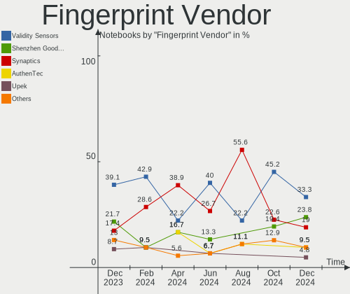

| Vendor                     | Notebooks | Percent |
|----------------------------|-----------|---------|
| Shenzhen Goodix Technology | 9         | 31.03%  |
| Validity Sensors           | 8         | 27.59%  |
| Synaptics                  | 7         | 24.14%  |
| Elan Microelectronics      | 4         | 13.79%  |
| LighTuning Technology      | 1         | 3.45%   |

Fingerprint Model
-----------------

Fingerprint sensor models

| Model                                             | Notebooks | Percent |
|---------------------------------------------------|-----------|---------|
| Synaptics Prometheus MIS Touch Fingerprint Reader | 4         | 13.79%  |
| Validity Sensors Fingerprint scanner              | 3         | 10.34%  |
| Synaptics WBDI Fingerprint Reader USB 086         | 3         | 10.34%  |
| Shenzhen Goodix  FingerPrint Device               | 3         | 10.34%  |
| Shenzhen Goodix Fingerprint Reader                | 3         | 10.34%  |
| Shenzhen Goodix FingerPrint                       | 3         | 10.34%  |
| Elan ELAN:ARM-M4                                  | 3         | 10.34%  |
| Validity Sensors VFS495 Fingerprint Reader        | 2         | 6.9%    |
| Validity Sensors VFS Fingerprint sensor           | 2         | 6.9%    |
| Validity Sensors VFS451 Fingerprint Reader        | 1         | 3.45%   |
| LighTuning EgisTec Touch Fingerprint Sensor       | 1         | 3.45%   |
| Elan ELAN:Fingerprint                             | 1         | 3.45%   |

Chipcard Vendor
---------------

Chipcard module vendors

| Vendor      | Notebooks | Percent |
|-------------|-----------|---------|
| Broadcom    | 7         | 50%     |
| Alcor Micro | 4         | 28.57%  |
| Yubico.com  | 1         | 7.14%   |
| O2 Micro    | 1         | 7.14%   |
| Lenovo      | 1         | 7.14%   |

Chipcard Model
--------------

Chipcard module models

| Model                                | Notebooks | Percent |
|--------------------------------------|-----------|---------|
| Broadcom 58200                       | 4         | 28.57%  |
| Alcor Micro AU9540 Smartcard Reader  | 4         | 28.57%  |
| Broadcom 5880                        | 3         | 21.43%  |
| Yubico.com Yubikey 4 U2F+CCID        | 1         | 7.14%   |
| O2 Micro OZ776 CCID Smartcard Reader | 1         | 7.14%   |
| Lenovo Integrated Smart Card Reader  | 1         | 7.14%   |

Unsupported
-----------

Unsupported Devices
-------------------

Total unsupported devices on board

| Total | Notebooks | Percent |
|-------|-----------|---------|
| 0     | 113       | 61.41%  |
| 1     | 55        | 29.89%  |
| 2     | 14        | 7.61%   |
| 3     | 2         | 1.09%   |

Unsupported Device Types
------------------------

Types of unsupported devices

| Type                  | Notebooks | Percent |
|-----------------------|-----------|---------|
| Fingerprint reader    | 28        | 31.82%  |
| Graphics card         | 18        | 20.45%  |
| Net/wireless          | 11        | 12.5%   |
| Chipcard              | 10        | 11.36%  |
| Camera                | 6         | 6.82%   |
| Multimedia controller | 5         | 5.68%   |
| Storage               | 3         | 3.41%   |
| Card reader           | 3         | 3.41%   |
| Bluetooth             | 2         | 2.27%   |
| Sound                 | 1         | 1.14%   |
| Flash memory          | 1         | 1.14%   |

