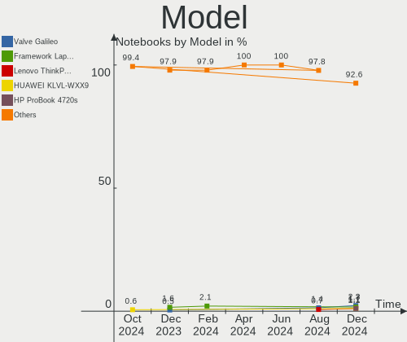
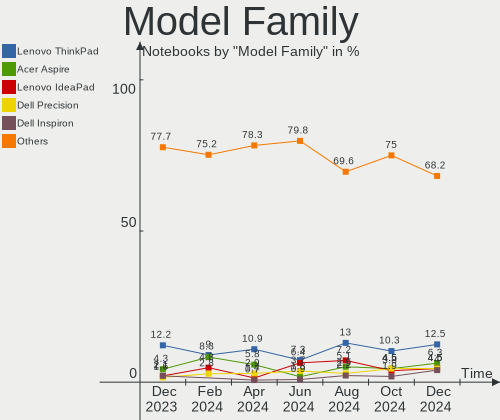
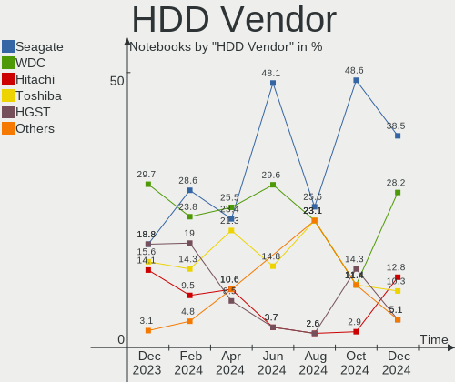
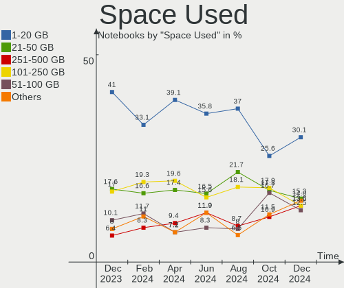
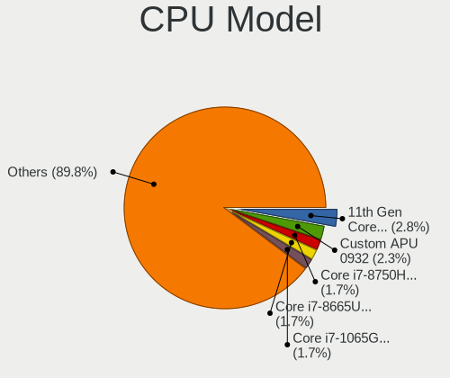
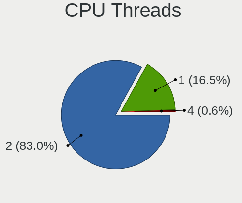
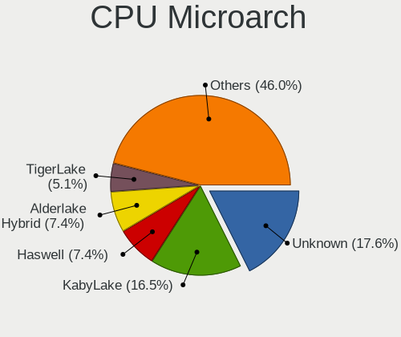
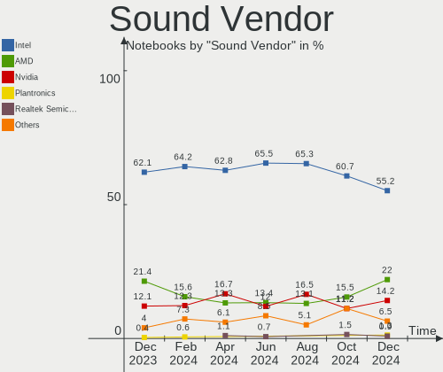
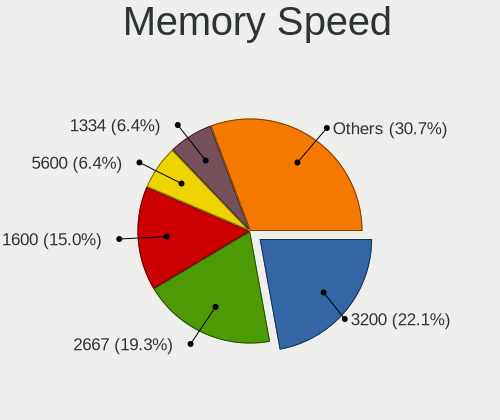
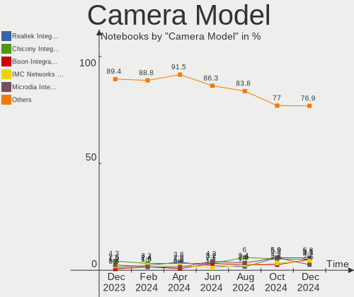

Linux in France - Hardware Trends (Notebooks)
---------------------------------------------

A project to identify most popular hardware characteristics and track their change
over time based on data collected by Linux users at https://Linux-Hardware.org.

Anyone can contribute to this report by the [hw-probe](https://github.com/linuxhw/hw-probe) tool:

    sudo -E hw-probe -all -upload

Contents
--------

* [ System ](#system)
  - [ OS                       ](#os)
  - [ OS Family                ](#os-family)
  - [ Kernel                   ](#kernel)
  - [ Kernel Family            ](#kernel-family)
  - [ Kernel Major Ver.        ](#kernel-major-ver)
  - [ Arch                     ](#arch)
  - [ DE                       ](#de)
  - [ Display Server           ](#display-server)
  - [ Display Manager          ](#display-manager)
  - [ OS Lang                  ](#os-lang)
  - [ Boot Mode                ](#boot-mode)
  - [ Filesystem               ](#filesystem)
  - [ Part. scheme             ](#part-scheme)
  - [ Dual Boot with Linux/BSD ](#dual-boot-with-linuxbsd)
  - [ Dual Boot (Win)          ](#dual-boot-win)

* [ Board ](#board)
  - [ Vendor                   ](#vendor)
  - [ Model                    ](#model)
  - [ Model Family             ](#model-family)
  - [ MFG Year                 ](#mfg-year)
  - [ Form Factor              ](#form-factor)
  - [ Secure Boot              ](#secure-boot)
  - [ Coreboot                 ](#coreboot)
  - [ RAM Size                 ](#ram-size)
  - [ RAM Used                 ](#ram-used)
  - [ Total Drives             ](#total-drives)
  - [ Has CD-ROM               ](#has-cd-rom)
  - [ Has Ethernet             ](#has-ethernet)
  - [ Has WiFi                 ](#has-wifi)
  - [ Has Bluetooth            ](#has-bluetooth)

* [ Location ](#location)
  - [ Country                  ](#country)
  - [ City                     ](#city)

* [ Drives ](#drives)
  - [ Drive Vendor             ](#drive-vendor)
  - [ Drive Model              ](#drive-model)
  - [ HDD Vendor               ](#hdd-vendor)
  - [ SSD Vendor               ](#ssd-vendor)
  - [ Drive Kind               ](#drive-kind)
  - [ Drive Connector          ](#drive-connector)
  - [ Drive Size               ](#drive-size)
  - [ Space Total              ](#space-total)
  - [ Space Used               ](#space-used)
  - [ Malfunc. Drives          ](#malfunc-drives)
  - [ Malfunc. Drive Vendor    ](#malfunc-drive-vendor)
  - [ Malfunc. HDD Vendor      ](#malfunc-hdd-vendor)
  - [ Malfunc. Drive Kind      ](#malfunc-drive-kind)
  - [ Failed Drives            ](#failed-drives)
  - [ Failed Drive Vendor      ](#failed-drive-vendor)
  - [ Drive Status             ](#drive-status)

* [ Storage controller ](#storage-controller)
  - [ Storage Vendor           ](#storage-vendor)
  - [ Storage Model            ](#storage-model)
  - [ Storage Kind             ](#storage-kind)

* [ Processor ](#processor)
  - [ CPU Vendor               ](#cpu-vendor)
  - [ CPU Model                ](#cpu-model)
  - [ CPU Model Family         ](#cpu-model-family)
  - [ CPU Cores                ](#cpu-cores)
  - [ CPU Sockets              ](#cpu-sockets)
  - [ CPU Threads              ](#cpu-threads)
  - [ CPU Op-Modes             ](#cpu-op-modes)
  - [ CPU Microcode            ](#cpu-microcode)
  - [ CPU Microarch            ](#cpu-microarch)

* [ Graphics ](#graphics)
  - [ GPU Vendor               ](#gpu-vendor)
  - [ GPU Model                ](#gpu-model)
  - [ GPU Combo                ](#gpu-combo)
  - [ GPU Driver               ](#gpu-driver)
  - [ GPU Memory               ](#gpu-memory)

* [ Monitor ](#monitor)
  - [ Monitor Vendor           ](#monitor-vendor)
  - [ Monitor Model            ](#monitor-model)
  - [ Monitor Resolution       ](#monitor-resolution)
  - [ Monitor Diagonal         ](#monitor-diagonal)
  - [ Monitor Width            ](#monitor-width)
  - [ Aspect Ratio             ](#aspect-ratio)
  - [ Monitor Area             ](#monitor-area)
  - [ Pixel Density            ](#pixel-density)
  - [ Multiple Monitors        ](#multiple-monitors)

* [ Network ](#network)
  - [ Net Controller Vendor    ](#net-controller-vendor)
  - [ Net Controller Model     ](#net-controller-model)
  - [ Wireless Vendor          ](#wireless-vendor)
  - [ Wireless Model           ](#wireless-model)
  - [ Ethernet Vendor          ](#ethernet-vendor)
  - [ Ethernet Model           ](#ethernet-model)
  - [ Net Controller Kind      ](#net-controller-kind)
  - [ Used Controller          ](#used-controller)
  - [ NICs                     ](#nics)
  - [ IPv6                     ](#ipv6)

* [ Bluetooth ](#bluetooth)
  - [ Bluetooth Vendor         ](#bluetooth-vendor)
  - [ Bluetooth Model          ](#bluetooth-model)

* [ Sound ](#sound)
  - [ Sound Vendor             ](#sound-vendor)
  - [ Sound Model              ](#sound-model)

* [ Memory ](#memory)
  - [ Memory Vendor            ](#memory-vendor)
  - [ Memory Model             ](#memory-model)
  - [ Memory Kind              ](#memory-kind)
  - [ Memory Form Factor       ](#memory-form-factor)
  - [ Memory Size              ](#memory-size)
  - [ Memory Speed             ](#memory-speed)

* [ Printers & scanners ](#printers--scanners)
  - [ Printer Vendor           ](#printer-vendor)
  - [ Printer Model            ](#printer-model)
  - [ Scanner Vendor           ](#scanner-vendor)
  - [ Scanner Model            ](#scanner-model)

* [ Camera ](#camera)
  - [ Camera Vendor            ](#camera-vendor)
  - [ Camera Model             ](#camera-model)

* [ Security ](#security)
  - [ Fingerprint Vendor       ](#fingerprint-vendor)
  - [ Fingerprint Model        ](#fingerprint-model)
  - [ Chipcard Vendor          ](#chipcard-vendor)
  - [ Chipcard Model           ](#chipcard-model)

* [ Unsupported ](#unsupported)
  - [ Unsupported Devices      ](#unsupported-devices)
  - [ Unsupported Device Types ](#unsupported-device-types)

System
------

OS
--

Installed operating systems

| Name                         | Notebooks | Percent |
|------------------------------|-----------|---------|
| Ubuntu 20.04                 | 21        | 15.79%  |
| Ubuntu 22.04                 | 14        | 10.53%  |
| OpenMandriva 4.3             | 10        | 7.52%   |
| Pop!_OS 22.04                | 8         | 6.02%   |
| Linux Mint 20.3              | 8         | 6.02%   |
| KDE neon 20.04               | 7         | 5.26%   |
| Lubuntu 20.04                | 6         | 4.51%   |
| Kali 2022.2                  | 4         | 3.01%   |
| Debian 11                    | 4         | 3.01%   |
| Arch                         | 4         | 3.01%   |
| Zorin 16                     | 3         | 2.26%   |
| Xubuntu 20.04                | 3         | 2.26%   |
| Fedora 36                    | 3         | 2.26%   |
| Fedora 35                    | 3         | 2.26%   |
| Elementary 6.1               | 3         | 2.26%   |
| Xubuntu 18.04                | 2         | 1.5%    |
| Manjaro                      | 2         | 1.5%    |
| Linux Mint 20.2              | 2         | 1.5%    |
| Gentoo 2.6                   | 2         | 1.5%    |
| Xubuntu 22.04                | 1         | 0.75%   |
| Ubuntu Core 18               | 1         | 0.75%   |
| Ubuntu Budgie 22.04          | 1         | 0.75%   |
| Ubuntu 18.04                 | 1         | 0.75%   |
| SteamOS 3.2                  | 1         | 0.75%   |
| Pop!_OS 20.04                | 1         | 0.75%   |
| Parrot 5.0                   | 1         | 0.75%   |
| openSUSE Tumbleweed-XXXXXXXX | 1         | 0.75%   |
| OpenMandriva 4.2             | 1         | 0.75%   |
| Manjaro 21.2.6               | 1         | 0.75%   |
| Mageia 8                     | 1         | 0.75%   |
| Linux Lite 6.0               | 1         | 0.75%   |
| Kubuntu 20.04                | 1         | 0.75%   |
| Kali 2022.1                  | 1         | 0.75%   |
| Kaisen 2.0                   | 1         | 0.75%   |
| Fedora 34                    | 1         | 0.75%   |
| Endless 4.0.6                | 1         | 0.75%   |
| EndeavourOS Rolling          | 1         | 0.75%   |
| Debian Unstable              | 1         | 0.75%   |
| Debian 11-updates            | 1         | 0.75%   |
| Debian 10                    | 1         | 0.75%   |
| Clear Linux 36270            | 1         | 0.75%   |
| ArcoLinux Rolling            | 1         | 0.75%   |
| Arch Rolling                 | 1         | 0.75%   |

OS Family
---------

OS without a version

| Name          | Notebooks | Percent |
|---------------|-----------|---------|
| Ubuntu        | 37        | 27.82%  |
| OpenMandriva  | 11        | 8.27%   |
| Linux Mint    | 10        | 7.52%   |
| Pop!_OS       | 9         | 6.77%   |
| KDE neon      | 7         | 5.26%   |
| Fedora        | 7         | 5.26%   |
| Debian        | 7         | 5.26%   |
| Xubuntu       | 6         | 4.51%   |
| Lubuntu       | 6         | 4.51%   |
| Kali          | 5         | 3.76%   |
| Arch          | 5         | 3.76%   |
| Zorin         | 3         | 2.26%   |
| Manjaro       | 3         | 2.26%   |
| Elementary    | 3         | 2.26%   |
| Gentoo        | 2         | 1.5%    |
| Ubuntu Budgie | 1         | 0.75%   |
| SteamOS       | 1         | 0.75%   |
| Parrot        | 1         | 0.75%   |
| openSUSE      | 1         | 0.75%   |
| Mageia        | 1         | 0.75%   |
| Linux Lite    | 1         | 0.75%   |
| Kubuntu       | 1         | 0.75%   |
| Kaisen        | 1         | 0.75%   |
| Endless       | 1         | 0.75%   |
| EndeavourOS   | 1         | 0.75%   |
| Clear Linux   | 1         | 0.75%   |
| ArcoLinux     | 1         | 0.75%   |

Kernel
------

Version of the Linux kernel

| Version                                      | Notebooks | Percent |
|----------------------------------------------|-----------|---------|
| 5.13.0-40-generic                            | 13        | 9.77%   |
| 5.15.0-27-generic                            | 10        | 7.52%   |
| 5.13.0-41-generic                            | 10        | 7.52%   |
| 5.16.7-desktop-1omv4003                      | 9         | 6.77%   |
| 5.17.5-76051705-generic                      | 7         | 5.26%   |
| 5.13.0-44-generic                            | 7         | 5.26%   |
| 5.4.0-113-generic                            | 6         | 4.51%   |
| 5.4.0-109-generic                            | 5         | 3.76%   |
| 5.4.0-110-generic                            | 4         | 3.01%   |
| 5.17.5-arch1-1                               | 4         | 3.01%   |
| 5.16.0-kali7-amd64                           | 4         | 3.01%   |
| 5.15.0-33-generic                            | 3         | 2.26%   |
| 5.15.0-30-generic                            | 3         | 2.26%   |
| 5.13.0-39-generic                            | 3         | 2.26%   |
| 5.17.7-300.fc36.x86_64                       | 2         | 1.5%    |
| 5.17.5-200.fc35.x86_64                       | 2         | 1.5%    |
| 5.17.0-1-amd64                               | 2         | 1.5%    |
| 5.16.19-76051619-generic                     | 2         | 1.5%    |
| 5.15.32-gentoo-r1-x86_64                     | 2         | 1.5%    |
| 5.10.0-14-amd64                              | 2         | 1.5%    |
| 5.6.0-1036-oem                               | 1         | 0.75%   |
| 5.4.0-99-generic                             | 1         | 0.75%   |
| 5.4.0-42-generic                             | 1         | 0.75%   |
| 5.4.0-40-generic                             | 1         | 0.75%   |
| 5.4.0-100-generic                            | 1         | 0.75%   |
| 5.17.9-arch1-1                               | 1         | 0.75%   |
| 5.17.5-300.fc36.x86_64                       | 1         | 0.75%   |
| 5.17.5-1-default                             | 1         | 0.75%   |
| 5.17.5-051705-generic                        | 1         | 0.75%   |
| 5.17.4-100.fc34.x86_64                       | 1         | 0.75%   |
| 5.17.1-desktop-2omv4050                      | 1         | 0.75%   |
| 5.17.1-3-MANJARO                             | 1         | 0.75%   |
| 5.17.0-2-amd64                               | 1         | 0.75%   |
| 5.16.4-1119.native                           | 1         | 0.75%   |
| 5.16.12-200.fc35.x86_64                      | 1         | 0.75%   |
| 5.16.10-desktop-2.mga8                       | 1         | 0.75%   |
| 5.16.0-12parrot1-amd64                       | 1         | 0.75%   |
| 5.16.0-0.bpo.4-amd64                         | 1         | 0.75%   |
| 5.15.41-1-MANJARO                            | 1         | 0.75%   |
| 5.15.37-1-lts                                | 1         | 0.75%   |
| 5.15.32-1-MANJARO                            | 1         | 0.75%   |
| 5.15.0-kaisen1-amd64                         | 1         | 0.75%   |
| 5.15.0-10025-tuxedo                          | 1         | 0.75%   |
| 5.14.0-1036-oem                              | 1         | 0.75%   |
| 5.14.0-1034-oem                              | 1         | 0.75%   |
| 5.13.0-valve14-1-neptune-02195-g5b0f749d00fa | 1         | 0.75%   |
| 5.11.0-38-generic                            | 1         | 0.75%   |
| 5.11.0-35-generic                            | 1         | 0.75%   |
| 5.10.14-desktop-1omv4002                     | 1         | 0.75%   |
| 5.10.11-arch1-1                              | 1         | 0.75%   |
| 5.10.0-13-amd64                              | 1         | 0.75%   |
| 4.19.0-20-amd64                              | 1         | 0.75%   |
| 4.15.0-176-lowlatency                        | 1         | 0.75%   |

Kernel Family
-------------

Linux kernel without a distro release

| Version | Notebooks | Percent |
|---------|-----------|---------|
| 5.13.0  | 34        | 25.56%  |
| 5.4.0   | 19        | 14.29%  |
| 5.15.0  | 18        | 13.53%  |
| 5.17.5  | 16        | 12.03%  |
| 5.16.7  | 9         | 6.77%   |
| 5.16.0  | 6         | 4.51%   |
| 5.17.0  | 3         | 2.26%   |
| 5.15.32 | 3         | 2.26%   |
| 5.10.0  | 3         | 2.26%   |
| 5.17.7  | 2         | 1.5%    |
| 5.17.1  | 2         | 1.5%    |
| 5.16.19 | 2         | 1.5%    |
| 5.14.0  | 2         | 1.5%    |
| 5.11.0  | 2         | 1.5%    |
| 5.6.0   | 1         | 0.75%   |
| 5.17.9  | 1         | 0.75%   |
| 5.17.4  | 1         | 0.75%   |
| 5.16.4  | 1         | 0.75%   |
| 5.16.12 | 1         | 0.75%   |
| 5.16.10 | 1         | 0.75%   |
| 5.15.41 | 1         | 0.75%   |
| 5.15.37 | 1         | 0.75%   |
| 5.10.14 | 1         | 0.75%   |
| 5.10.11 | 1         | 0.75%   |
| 4.19.0  | 1         | 0.75%   |
| 4.15.0  | 1         | 0.75%   |

Kernel Major Ver.
-----------------

Linux kernel major version

| Version | Notebooks | Percent |
|---------|-----------|---------|
| 5.13    | 34        | 25.56%  |
| 5.17    | 25        | 18.8%   |
| 5.15    | 23        | 17.29%  |
| 5.16    | 20        | 15.04%  |
| 5.4     | 19        | 14.29%  |
| 5.10    | 5         | 3.76%   |
| 5.14    | 2         | 1.5%    |
| 5.11    | 2         | 1.5%    |
| 5.6     | 1         | 0.75%   |
| 4.19    | 1         | 0.75%   |
| 4.15    | 1         | 0.75%   |

Arch
----

OS architecture (x86_64, i586, etc.)

| Name   | Notebooks | Percent |
|--------|-----------|---------|
| x86_64 | 131       | 98.5%   |
| i686   | 2         | 1.5%    |

DE
--

Desktop Environment

| Name       | Notebooks | Percent |
|------------|-----------|---------|
| GNOME      | 62        | 46.62%  |
| KDE5       | 27        | 20.3%   |
| XFCE       | 15        | 11.28%  |
| Unknown    | 9         | 6.77%   |
| LXQt       | 6         | 4.51%   |
| X-Cinnamon | 5         | 3.76%   |
| Pantheon   | 3         | 2.26%   |
| Cinnamon   | 3         | 2.26%   |
| MATE       | 1         | 0.75%   |
| i3         | 1         | 0.75%   |
| Budgie     | 1         | 0.75%   |

Display Server
--------------

X11 or Wayland

| Name    | Notebooks | Percent |
|---------|-----------|---------|
| X11     | 102       | 76.69%  |
| Wayland | 25        | 18.8%   |
| Unknown | 4         | 3.01%   |
| Tty     | 2         | 1.5%    |

Display Manager
---------------

SDDM, LightDM, etc.

| Name    | Notebooks | Percent |
|---------|-----------|---------|
| Unknown | 35        | 26.32%  |
| GDM3    | 32        | 24.06%  |
| SDDM    | 24        | 18.05%  |
| LightDM | 22        | 16.54%  |
| GDM     | 19        | 14.29%  |
| XDM     | 1         | 0.75%   |

OS Lang
-------

Language

| Lang    | Notebooks | Percent |
|---------|-----------|---------|
| fr_FR   | 100       | 75.19%  |
| en_US   | 26        | 19.55%  |
| en_GB   | 2         | 1.5%    |
| Unknown | 2         | 1.5%    |
| fr_LU   | 1         | 0.75%   |
| fr_CH   | 1         | 0.75%   |
| es_ES   | 1         | 0.75%   |

Boot Mode
---------

EFI or BIOS

| Mode | Notebooks | Percent |
|------|-----------|---------|
| EFI  | 76        | 57.14%  |
| BIOS | 57        | 42.86%  |

Filesystem
----------

Type of filesystem

| Type    | Notebooks | Percent |
|---------|-----------|---------|
| Ext4    | 118       | 88.72%  |
| Overlay | 9         | 6.77%   |
| Btrfs   | 6         | 4.51%   |

Part. scheme
------------

Scheme of partitioning

| Type    | Notebooks | Percent |
|---------|-----------|---------|
| GPT     | 64        | 48.12%  |
| Unknown | 50        | 37.59%  |
| MBR     | 19        | 14.29%  |

Dual Boot with Linux/BSD
------------------------

Hosting more than one Linux/BSD

| Dual boot | Notebooks | Percent |
|-----------|-----------|---------|
| No        | 114       | 85.71%  |
| Yes       | 19        | 14.29%  |

Dual Boot (Win)
---------------

Hosting Linux and Windows

| Dual boot | Notebooks | Percent |
|-----------|-----------|---------|
| No        | 99        | 74.44%  |
| Yes       | 34        | 25.56%  |

Board
-----

Vendor
------

Motherboard manufacturer

| Name                | Notebooks | Percent |
|---------------------|-----------|---------|
| Dell                | 28        | 21.05%  |
| Lenovo              | 24        | 18.05%  |
| ASUSTek Computer    | 21        | 15.79%  |
| Hewlett-Packard     | 15        | 11.28%  |
| Acer                | 9         | 6.77%   |
| MSI                 | 6         | 4.51%   |
| Toshiba             | 5         | 3.76%   |
| Timi                | 3         | 2.26%   |
| HUAWEI              | 3         | 2.26%   |
| Apple               | 3         | 2.26%   |
| Samsung Electronics | 2         | 1.5%    |
| Packard Bell        | 2         | 1.5%    |
| Valve               | 1         | 0.75%   |
| TUXEDO              | 1         | 0.75%   |
| Thomson             | 1         | 0.75%   |
| Teclast             | 1         | 0.75%   |
| Sony                | 1         | 0.75%   |
| PC Specialist       | 1         | 0.75%   |
| Notebook            | 1         | 0.75%   |
| Fujitsu             | 1         | 0.75%   |
| eMachines           | 1         | 0.75%   |
| Clevo               | 1         | 0.75%   |
| Chuwi               | 1         | 0.75%   |
| Unknown             | 1         | 0.75%   |

Model
-----

Motherboard model

| Name                                     | Notebooks | Percent |
|------------------------------------------|-----------|---------|
| Timi TM1604                              | 2         | 1.5%    |
| Lenovo Legion Y540-15IRH 81SX            | 2         | 1.5%    |
| HP EliteBook 2560p                       | 2         | 1.5%    |
| Dell XPS 13 9310                         | 2         | 1.5%    |
| Acer Aspire A317-32                      | 2         | 1.5%    |
| Valve Jupiter                            | 1         | 0.75%   |
| TUXEDO Pulse 15 Gen1                     | 1         | 0.75%   |
| Toshiba Satellite L655                   | 1         | 0.75%   |
| Toshiba Satellite C850D-115              | 1         | 0.75%   |
| Toshiba Satellite C70D-B                 | 1         | 0.75%   |
| Toshiba Satellite C670D-12N              | 1         | 0.75%   |
| Toshiba Satellite C55-A-1N0              | 1         | 0.75%   |
| Timi TM1612                              | 1         | 0.75%   |
| Thomson NEO14SBK                         | 1         | 0.75%   |
| Teclast F7 Plus                          | 1         | 0.75%   |
| Sony VPCS13V9E                           | 1         | 0.75%   |
| Samsung RV410/RV510/S3510/E3510          | 1         | 0.75%   |
| Samsung 350V5C/351V5C/3540VC/3440VC      | 1         | 0.75%   |
| PC Specialist NP5x_NP6x_NP7xPNK_PNH_PNJ  | 1         | 0.75%   |
| Packard Bell EasyNote TSX66HR            | 1         | 0.75%   |
| Packard Bell EasyNote TE11HC             | 1         | 0.75%   |
| Notebook NL40_50CU                       | 1         | 0.75%   |
| MSI Modern 15 A11M                       | 1         | 0.75%   |
| MSI Modern 15 A10M                       | 1         | 0.75%   |
| MSI Modern 14 A10M                       | 1         | 0.75%   |
| MSI Katana GF76 12UEK                    | 1         | 0.75%   |
| MSI GT60 2OC/2OD                         | 1         | 0.75%   |
| MSI GF63 Thin 10SCXR                     | 1         | 0.75%   |
| Lenovo Yoga 2 13 20344                   | 1         | 0.75%   |
| Lenovo ThinkPad X250 20CLS2TQ22          | 1         | 0.75%   |
| Lenovo ThinkPad X1 Carbon 7th 20QDCTO1WW | 1         | 0.75%   |
| Lenovo ThinkPad X1 Carbon 4th 20FCS2L300 | 1         | 0.75%   |
| Lenovo ThinkPad W510 431963G             | 1         | 0.75%   |
| Lenovo ThinkPad T490 20N2CTO1WW          | 1         | 0.75%   |
| Lenovo ThinkPad T440p 20AWS17N00         | 1         | 0.75%   |
| Lenovo ThinkPad T420 4236JV8             | 1         | 0.75%   |
| Lenovo ThinkPad T400 276521G             | 1         | 0.75%   |
| Lenovo ThinkPad T14 Gen 1 20UDCTO1WW     | 1         | 0.75%   |
| Lenovo ThinkPad P14s Gen 1 20Y1002UFR    | 1         | 0.75%   |
| Lenovo ThinkPad L540 20AUS39X00          | 1         | 0.75%   |
| Lenovo ThinkPad L540 20AUA27UFR          | 1         | 0.75%   |
| Lenovo ThinkPad L520 5017W5C             | 1         | 0.75%   |
| Lenovo ThinkPad L14 Gen 2 20X1006BFR     | 1         | 0.75%   |
| Lenovo ThinkPad E595 20NFS05500          | 1         | 0.75%   |
| Lenovo ThinkPad E14 Gen 2 20TA000BFR     | 1         | 0.75%   |
| Lenovo Legion 5 Pro 16ACH6H 82JQ         | 1         | 0.75%   |
| Lenovo IdeaPad 5 15ALC05 82LN            | 1         | 0.75%   |
| Lenovo IdeaPad 320S-14IKB 80X4           | 1         | 0.75%   |
| Lenovo G50-70 20351                      | 1         | 0.75%   |
| Lenovo Flex 2-14 20404                   | 1         | 0.75%   |
| HUAWEI WRTB-WXX9                         | 1         | 0.75%   |
| HUAWEI NBLK-WAX9X                        | 1         | 0.75%   |
| HUAWEI BOHB-WAX9                         | 1         | 0.75%   |
| HP ZBook 15 G5                           | 1         | 0.75%   |
| HP ZBook 15 G2                           | 1         | 0.75%   |
| HP ProBook 470 G0                        | 1         | 0.75%   |
| HP ProBook 4510s                         | 1         | 0.75%   |
| HP ProBook 450 G5                        | 1         | 0.75%   |
| HP ProBook 4330s                         | 1         | 0.75%   |
| HP Pavilion Notebook                     | 1         | 0.75%   |

Model Family
------------

Motherboard model prefix

| Name                  | Notebooks | Percent |
|-----------------------|-----------|---------|
| Lenovo ThinkPad       | 16        | 12.03%  |
| Dell Latitude         | 9         | 6.77%   |
| Dell Inspiron         | 8         | 6.02%   |
| Acer Aspire           | 7         | 5.26%   |
| Dell XPS              | 6         | 4.51%   |
| Toshiba Satellite     | 5         | 3.76%   |
| HP EliteBook          | 5         | 3.76%   |
| HP ProBook            | 4         | 3.01%   |
| MSI Modern            | 3         | 2.26%   |
| Lenovo Legion         | 3         | 2.26%   |
| Dell Precision        | 3         | 2.26%   |
| Timi TM1604           | 2         | 1.5%    |
| Packard Bell EasyNote | 2         | 1.5%    |
| Lenovo IdeaPad        | 2         | 1.5%    |
| HP ZBook              | 2         | 1.5%    |
| ASUS VivoBook         | 2         | 1.5%    |
| Valve Jupiter         | 1         | 0.75%   |
| TUXEDO Pulse          | 1         | 0.75%   |
| Timi TM1612           | 1         | 0.75%   |
| Thomson NEO14SBK      | 1         | 0.75%   |
| Teclast F7            | 1         | 0.75%   |
| Sony VPCS13V9E        | 1         | 0.75%   |
| Samsung RV410         | 1         | 0.75%   |
| Samsung 350V5C        | 1         | 0.75%   |
| PC Specialist NP5x    | 1         | 0.75%   |
| Notebook NL40         | 1         | 0.75%   |
| MSI Katana            | 1         | 0.75%   |
| MSI GT60              | 1         | 0.75%   |
| MSI GF63              | 1         | 0.75%   |
| Lenovo Yoga           | 1         | 0.75%   |
| Lenovo G50-70         | 1         | 0.75%   |
| Lenovo Flex           | 1         | 0.75%   |
| HUAWEI WRTB-WXX9      | 1         | 0.75%   |
| HUAWEI NBLK-WAX9X     | 1         | 0.75%   |
| HUAWEI BOHB-WAX9      | 1         | 0.75%   |
| HP Pavilion           | 1         | 0.75%   |
| HP Notebook           | 1         | 0.75%   |
| HP Laptop             | 1         | 0.75%   |
| HP ENVY               | 1         | 0.75%   |
| Fujitsu LIFEBOOK      | 1         | 0.75%   |
| eMachines E525        | 1         | 0.75%   |
| Dell Vostro           | 1         | 0.75%   |
| Dell G3               | 1         | 0.75%   |
| Clevo W55xEU          | 1         | 0.75%   |
| Chuwi GemiBook        | 1         | 0.75%   |
| ASUS ZenBook          | 1         | 0.75%   |
| ASUS X705UAP          | 1         | 0.75%   |
| ASUS X556URK          | 1         | 0.75%   |
| ASUS X540LJ           | 1         | 0.75%   |
| ASUS X540LA           | 1         | 0.75%   |
| ASUS X510UA           | 1         | 0.75%   |
| ASUS X205TA           | 1         | 0.75%   |
| ASUS UX305FA          | 1         | 0.75%   |
| ASUS ROG              | 1         | 0.75%   |
| ASUS K95VJ            | 1         | 0.75%   |
| ASUS K73SD            | 1         | 0.75%   |
| ASUS K55VD            | 1         | 0.75%   |
| ASUS GL552VX          | 1         | 0.75%   |
| ASUS GL552VW          | 1         | 0.75%   |
| ASUS F7L              | 1         | 0.75%   |

MFG Year
--------

Motherboard manufacture year

| Year | Notebooks | Percent |
|------|-----------|---------|
| 2020 | 16        | 12.03%  |
| 2019 | 16        | 12.03%  |
| 2021 | 11        | 8.27%   |
| 2017 | 10        | 7.52%   |
| 2011 | 10        | 7.52%   |
| 2015 | 9         | 6.77%   |
| 2014 | 9         | 6.77%   |
| 2013 | 8         | 6.02%   |
| 2012 | 8         | 6.02%   |
| 2016 | 7         | 5.26%   |
| 2010 | 7         | 5.26%   |
| 2022 | 6         | 4.51%   |
| 2018 | 6         | 4.51%   |
| 2009 | 5         | 3.76%   |
| 2008 | 3         | 2.26%   |
| 2007 | 1         | 0.75%   |
| 2005 | 1         | 0.75%   |

Form Factor
-----------

Physical design of the computer

| Name     | Notebooks | Percent |
|----------|-----------|---------|
| Notebook | 133       | 100%    |

Secure Boot
-----------

Enabled or disabled

| State    | Notebooks | Percent |
|----------|-----------|---------|
| Disabled | 114       | 85.71%  |
| Enabled  | 19        | 14.29%  |

Coreboot
--------

Have coreboot on board

| Used | Notebooks | Percent |
|------|-----------|---------|
| No   | 133       | 100%    |

RAM Size
--------

Total RAM memory

| Size in GB  | Notebooks | Percent |
|-------------|-----------|---------|
| 4.01-8.0    | 50        | 37.59%  |
| 16.01-24.0  | 31        | 23.31%  |
| 3.01-4.0    | 19        | 14.29%  |
| 8.01-16.0   | 13        | 9.77%   |
| 32.01-64.0  | 7         | 5.26%   |
| 1.01-2.0    | 6         | 4.51%   |
| 24.01-32.0  | 2         | 1.5%    |
| 2.01-3.0    | 2         | 1.5%    |
| 64.01-256.0 | 2         | 1.5%    |
| 0.51-1.0    | 1         | 0.75%   |

RAM Used
--------

Used RAM memory

| Used GB    | Notebooks | Percent |
|------------|-----------|---------|
| 1.01-2.0   | 45        | 33.83%  |
| 2.01-3.0   | 41        | 30.83%  |
| 3.01-4.0   | 21        | 15.79%  |
| 4.01-8.0   | 14        | 10.53%  |
| 0.51-1.0   | 6         | 4.51%   |
| 16.01-24.0 | 2         | 1.5%    |
| 8.01-16.0  | 2         | 1.5%    |
| 0.01-0.5   | 2         | 1.5%    |

Total Drives
------------

Number of drives on board

| Drives | Notebooks | Percent |
|--------|-----------|---------|
| 1      | 94        | 70.68%  |
| 2      | 38        | 28.57%  |
| 4      | 1         | 0.75%   |

Has CD-ROM
----------

Has CD-ROM on board

| Presented | Notebooks | Percent |
|-----------|-----------|---------|
| No        | 86        | 64.66%  |
| Yes       | 47        | 35.34%  |

Has Ethernet
------------

Has Ethernet on board

| Presented | Notebooks | Percent |
|-----------|-----------|---------|
| Yes       | 101       | 75.94%  |
| No        | 32        | 24.06%  |

Has WiFi
--------

Has WiFi module

| Presented | Notebooks | Percent |
|-----------|-----------|---------|
| Yes       | 131       | 98.5%   |
| No        | 2         | 1.5%    |

Has Bluetooth
-------------

Has Bluetooth module

| Presented | Notebooks | Percent |
|-----------|-----------|---------|
| Yes       | 105       | 78.95%  |
| No        | 28        | 21.05%  |

Location
--------

Country
-------

Geographic location (country)

| Country | Notebooks | Percent |
|---------|-----------|---------|
| France  | 133       | 100%    |

City
----

Geographic location (city)

| City                      | Notebooks | Percent |
|---------------------------|-----------|---------|
| Paris                     | 14        | 10.53%  |
| Toulouse                  | 4         | 3.01%   |
| Strasbourg                | 4         | 3.01%   |
| Brest                     | 3         | 2.26%   |
| Saint-Denis               | 2         | 1.5%    |
| Rennes                    | 2         | 1.5%    |
| Reims                     | 2         | 1.5%    |
| Poitiers                  | 2         | 1.5%    |
| Nancy                     | 2         | 1.5%    |
| Mulhouse                  | 2         | 1.5%    |
| Marseille                 | 2         | 1.5%    |
| Le Mans                   | 2         | 1.5%    |
| Dijon                     | 2         | 1.5%    |
| Clichy-sous-Bois          | 2         | 1.5%    |
| Châtillon                | 2         | 1.5%    |
| Besançon                 | 2         | 1.5%    |
| Ajaccio                   | 2         | 1.5%    |
| Voisins-le-Bretonneux     | 1         | 0.75%   |
| Villejuif                 | 1         | 0.75%   |
| Vernouillet               | 1         | 0.75%   |
| Veigne                    | 1         | 0.75%   |
| Tarbes                    | 1         | 0.75%   |
| Suresnes                  | 1         | 0.75%   |
| Sauteyrargues             | 1         | 0.75%   |
| Saint-Verand              | 1         | 0.75%   |
| Saint-Ismier              | 1         | 0.75%   |
| Saint-Hilaire-sur-Benaize | 1         | 0.75%   |
| Saint-Genest-Lerpt        | 1         | 0.75%   |
| Saint-Didier-de-la-Tour   | 1         | 0.75%   |
| Saint-Andre-les-Vergers   | 1         | 0.75%   |
| Rueil-Malmaison           | 1         | 0.75%   |
| Puteaux                   | 1         | 0.75%   |
| Pont-de-Salars            | 1         | 0.75%   |
| Plouay                    | 1         | 0.75%   |
| Pantin                    | 1         | 0.75%   |
| Palaiseau                 | 1         | 0.75%   |
| Oyonnax                   | 1         | 0.75%   |
| Orléans                  | 1         | 0.75%   |
| Noisy-le-Grand            | 1         | 0.75%   |
| Namps-Maisnil             | 1         | 0.75%   |
| Montigny-le-Bretonneux    | 1         | 0.75%   |
| Montevrain                | 1         | 0.75%   |
| Mittainville              | 1         | 0.75%   |
| Meximieux                 | 1         | 0.75%   |
| Metz                      | 1         | 0.75%   |
| Marcq-en-Baroeul          | 1         | 0.75%   |
| Mâcon                    | 1         | 0.75%   |
| Lyon                      | 1         | 0.75%   |
| Lorient                   | 1         | 0.75%   |
| Limoges                   | 1         | 0.75%   |
| Lille                     | 1         | 0.75%   |
| Les Clayes-sous-Bois      | 1         | 0.75%   |
| Le Plessis-Robinson       | 1         | 0.75%   |
| Laverune                  | 1         | 0.75%   |
| Landrevarzec              | 1         | 0.75%   |
| La Teste-de-Buch          | 1         | 0.75%   |
| La Roche-sur-Yon          | 1         | 0.75%   |
| La Bourboule              | 1         | 0.75%   |
| Hyères                   | 1         | 0.75%   |
| Gurgy                     | 1         | 0.75%   |

Drives
------

Drive Vendor
------------

Hard drive vendors

| Vendor              | Notebooks | Drives | Percent |
|---------------------|-----------|--------|---------|
| Samsung Electronics | 23        | 23     | 14.02%  |
| WDC                 | 21        | 23     | 12.8%   |
| Toshiba             | 15        | 16     | 9.15%   |
| Seagate             | 13        | 13     | 7.93%   |
| Crucial             | 12        | 12     | 7.32%   |
| SK Hynix            | 11        | 13     | 6.71%   |
| SanDisk             | 9         | 11     | 5.49%   |
| HGST                | 8         | 8      | 4.88%   |
| Kingston            | 7         | 7      | 4.27%   |
| Micron Technology   | 6         | 6      | 3.66%   |
| Unknown             | 5         | 6      | 3.05%   |
| Intel               | 4         | 4      | 2.44%   |
| KIOXIA              | 3         | 3      | 1.83%   |
| Hitachi             | 3         | 3      | 1.83%   |
| Transcend           | 2         | 2      | 1.22%   |
| Silicon Motion      | 2         | 2      | 1.22%   |
| JMicron             | 2         | 2      | 1.22%   |
| Gigabyte Technology | 2         | 2      | 1.22%   |
| China               | 2         | 3      | 1.22%   |
| Apple               | 2         | 2      | 1.22%   |
| Verbatim            | 1         | 1      | 0.61%   |
| sobetter            | 1         | 1      | 0.61%   |
| Phison              | 1         | 1      | 0.61%   |
| OCZ                 | 1         | 1      | 0.61%   |
| Netac               | 1         | 1      | 0.61%   |
| LITEONIT            | 1         | 1      | 0.61%   |
| KingSpec            | 1         | 1      | 0.61%   |
| Hewlett-Packard     | 1         | 1      | 0.61%   |
| DOGFISH             | 1         | 1      | 0.61%   |
| Corsair             | 1         | 1      | 0.61%   |
| BHT                 | 1         | 1      | 0.61%   |
| A-DATA Technology   | 1         | 1      | 0.61%   |

Drive Model
-----------

Hard drive models

| Model                                     | Notebooks | Percent |
|-------------------------------------------|-----------|---------|
| Crucial CT500MX500SSD1 500GB              | 5         | 2.96%   |
| Toshiba MQ01ABD100 1TB                    | 3         | 1.78%   |
| WDC WD10SPZX-21Z10T0 1TB                  | 2         | 1.18%   |
| Toshiba NVMe SSD Drive 512GB              | 2         | 1.18%   |
| Toshiba MQ01ABF050 500GB                  | 2         | 1.18%   |
| SK Hynix NVMe SSD Drive 512GB             | 2         | 1.18%   |
| SK Hynix NVMe SSD Drive 256GB             | 2         | 1.18%   |
| Seagate ST500LT012-1DG142 500GB           | 2         | 1.18%   |
| Sandisk NVMe SSD Drive 2TB                | 2         | 1.18%   |
| Sandisk NVMe SSD Drive 1TB                | 2         | 1.18%   |
| Samsung SSD 860 EVO 500GB                 | 2         | 1.18%   |
| Micron 2450_MTFDKBA512TFK 512GB           | 2         | 1.18%   |
| Micron 2300 NVMe 512GB                    | 2         | 1.18%   |
| Kingston SNVS1000G 1TB                    | 2         | 1.18%   |
| Crucial CT1000P2SSD8 1TB                  | 2         | 1.18%   |
| Crucial CT1000MX500SSD1 1TB               | 2         | 1.18%   |
| WDC WDS500G2B0C-00PXH0 500GB              | 1         | 0.59%   |
| WDC WDS500G2B0B-00YS70 500GB SSD          | 1         | 0.59%   |
| WDC WDS240G2G0B-00EPW0 240GB SSD          | 1         | 0.59%   |
| WDC WDS120G2G0A-00JH30 120GB SSD          | 1         | 0.59%   |
| WDC WDS100T3X0C-00SJG0 1TB                | 1         | 0.59%   |
| WDC WDS100T2B0C-00PXH0 1TB                | 1         | 0.59%   |
| WDC WDS100T1B0A-00H9H0 1TB SSD            | 1         | 0.59%   |
| WDC WD7500BPKT-00PK4T0 752GB              | 1         | 0.59%   |
| WDC WD5000LUCT-62C26Y0 500GB              | 1         | 0.59%   |
| WDC WD5000LPVX-22V0TT0 500GB              | 1         | 0.59%   |
| WDC WD3200BUCT-62TWBY0 320GB              | 1         | 0.59%   |
| WDC WD3200BPVT-80JJ5T0 320GB              | 1         | 0.59%   |
| WDC WD3200BEKT-08PVMT1 320GB              | 1         | 0.59%   |
| WDC WD2500LPCX-24C6HT0 250GB              | 1         | 0.59%   |
| WDC WD10SPZX-17Z10T1 1TB                  | 1         | 0.59%   |
| WDC PC SN730 SDBQNTY-512G-1001 512GB      | 1         | 0.59%   |
| WDC PC SN520 SDAPNUW-256G-1102 256GB      | 1         | 0.59%   |
| WDC PC SN520 SDAPMUW-512G-1101 512GB      | 1         | 0.59%   |
| WDC PC SN520 NVMe 256GB                   | 1         | 0.59%   |
| Verbatim Vi500 S3 480GB SSD               | 1         | 0.59%   |
| Unknown SDW32G  32GB                      | 1         | 0.59%   |
| Unknown SD32G  32GB                       | 1         | 0.59%   |
| Unknown MMC Card  512GB                   | 1         | 0.59%   |
| Unknown MMC Card  32GB                    | 1         | 0.59%   |
| Unknown MMC Card  16GB                    | 1         | 0.59%   |
| Unknown MMC Card  128GB                   | 1         | 0.59%   |
| Transcend TS128GSSD370S 128GB             | 1         | 0.59%   |
| Transcend TS120GSSD220S 120GB             | 1         | 0.59%   |
| Toshiba THNSNK128GVN8 128GB SSD           | 1         | 0.59%   |
| Toshiba MK5065GSX 500GB                   | 1         | 0.59%   |
| Toshiba MK5059GSXP 500GB                  | 1         | 0.59%   |
| Toshiba MK3263GSX 320GB                   | 1         | 0.59%   |
| Toshiba KXG60ZNV256G 256GB                | 1         | 0.59%   |
| Toshiba KXG50ZNV256G NVMe 256GB           | 1         | 0.59%   |
| Toshiba KSG60ZMV256G M.2 2280 256GB SSD   | 1         | 0.59%   |
| Toshiba KBG30ZMV256G 256GB                | 1         | 0.59%   |
| Toshiba KBG30ZMS128G 128GB NVMe SSD       | 1         | 0.59%   |
| sobetter EXT 1TB                          | 1         | 0.59%   |
| SK Hynix SKHynix_HFS512GDE9X084N 512GB    | 1         | 0.59%   |
| SK Hynix SKHynix_HFS512GD9TNI-L2B0B 512GB | 1         | 0.59%   |
| SK Hynix SKHynix_HFS256GD9TNI-L2B0B 256GB | 1         | 0.59%   |
| SK Hynix SKHynix_HFM256GD3HX015N 256GB    | 1         | 0.59%   |
| SK Hynix SC401 SATA 256GB SSD             | 1         | 0.59%   |
| SK Hynix NVMe SSD Drive 1024GB            | 1         | 0.59%   |

HDD Vendor
----------

Hard disk drive vendors

| Vendor              | Notebooks | Drives | Percent |
|---------------------|-----------|--------|---------|
| Seagate             | 13        | 13     | 28.89%  |
| WDC                 | 10        | 11     | 22.22%  |
| Toshiba             | 8         | 8      | 17.78%  |
| HGST                | 8         | 8      | 17.78%  |
| Samsung Electronics | 3         | 3      | 6.67%   |
| Hitachi             | 3         | 3      | 6.67%   |

SSD Vendor
----------

Solid state drive vendors

| Vendor              | Notebooks | Drives | Percent |
|---------------------|-----------|--------|---------|
| Samsung Electronics | 10        | 10     | 18.52%  |
| Crucial             | 10        | 10     | 18.52%  |
| WDC                 | 4         | 4      | 7.41%   |
| SanDisk             | 4         | 4      | 7.41%   |
| Kingston            | 3         | 3      | 5.56%   |
| Transcend           | 2         | 2      | 3.7%    |
| Toshiba             | 2         | 2      | 3.7%    |
| SK Hynix            | 2         | 2      | 3.7%    |
| JMicron             | 2         | 2      | 3.7%    |
| China               | 2         | 3      | 3.7%    |
| Apple               | 2         | 2      | 3.7%    |
| Verbatim            | 1         | 1      | 1.85%   |
| OCZ                 | 1         | 1      | 1.85%   |
| Netac               | 1         | 1      | 1.85%   |
| Micron Technology   | 1         | 1      | 1.85%   |
| LITEONIT            | 1         | 1      | 1.85%   |
| KingSpec            | 1         | 1      | 1.85%   |
| Intel               | 1         | 1      | 1.85%   |
| Hewlett-Packard     | 1         | 1      | 1.85%   |
| Gigabyte Technology | 1         | 1      | 1.85%   |
| DOGFISH             | 1         | 1      | 1.85%   |
| BHT                 | 1         | 1      | 1.85%   |

Drive Kind
----------

HDD or SSD

| Kind    | Notebooks | Drives | Percent |
|---------|-----------|--------|---------|
| NVMe    | 53        | 64     | 34.87%  |
| SSD     | 48        | 55     | 31.58%  |
| HDD     | 44        | 46     | 28.95%  |
| MMC     | 6         | 7      | 3.95%   |
| Unknown | 1         | 1      | 0.66%   |

Drive Connector
---------------

SATA, SAS, NVMe, etc.

| Type | Notebooks | Drives | Percent |
|------|-----------|--------|---------|
| SATA | 84        | 98     | 57.14%  |
| NVMe | 53        | 64     | 36.05%  |
| MMC  | 6         | 7      | 4.08%   |
| SAS  | 4         | 4      | 2.72%   |

Drive Size
----------

Size of hard drive

| Size in TB | Notebooks | Drives | Percent |
|------------|-----------|--------|---------|
| 0.01-0.5   | 63        | 73     | 71.59%  |
| 0.51-1.0   | 25        | 28     | 28.41%  |

Space Total
-----------

Amount of disk space available on the file system

| Size in GB | Notebooks | Percent |
|------------|-----------|---------|
| 251-500    | 38        | 28.57%  |
| 101-250    | 37        | 27.82%  |
| 501-1000   | 21        | 15.79%  |
| 1-20       | 11        | 8.27%   |
| 51-100     | 8         | 6.02%   |
| 1001-2000  | 7         | 5.26%   |
| 21-50      | 6         | 4.51%   |
| Unknown    | 5         | 3.76%   |

Space Used
----------

Amount of used disk space

| Used GB  | Notebooks | Percent |
|----------|-----------|---------|
| 1-20     | 49        | 36.84%  |
| 21-50    | 24        | 18.05%  |
| 101-250  | 20        | 15.04%  |
| 51-100   | 16        | 12.03%  |
| 251-500  | 12        | 9.02%   |
| 501-1000 | 7         | 5.26%   |
| Unknown  | 5         | 3.76%   |

Malfunc. Drives
---------------

Drive models with a malfunction

| Model                              | Notebooks | Drives | Percent |
|------------------------------------|-----------|--------|---------|
| WDC WD5000LUCT-62C26Y0 500GB       | 1         | 1      | 10%     |
| Toshiba MQ01ABF050 500GB           | 1         | 1      | 10%     |
| Toshiba MK5065GSX 500GB            | 1         | 1      | 10%     |
| Toshiba MK5059GSXP 500GB           | 1         | 1      | 10%     |
| Seagate ST500LT012-1DG142 500GB    | 1         | 1      | 10%     |
| Seagate ST500LM000-1EJ162 500GB    | 1         | 1      | 10%     |
| Seagate ST1000LM024 HN-M101MBB 1TB | 1         | 1      | 10%     |
| KingSpec V-32 32GB SSD             | 1         | 1      | 10%     |
| Intel SSDMCEAC120B3 120GB          | 1         | 1      | 10%     |
| HGST HTS545050A7E380 500GB         | 1         | 1      | 10%     |

Malfunc. Drive Vendor
---------------------

Vendors of faulty drives

| Vendor   | Notebooks | Drives | Percent |
|----------|-----------|--------|---------|
| Toshiba  | 3         | 3      | 30%     |
| Seagate  | 3         | 3      | 30%     |
| WDC      | 1         | 1      | 10%     |
| KingSpec | 1         | 1      | 10%     |
| Intel    | 1         | 1      | 10%     |
| HGST     | 1         | 1      | 10%     |

Malfunc. HDD Vendor
-------------------

Vendors of faulty HDD drives

| Vendor  | Notebooks | Drives | Percent |
|---------|-----------|--------|---------|
| Toshiba | 3         | 3      | 37.5%   |
| Seagate | 3         | 3      | 37.5%   |
| WDC     | 1         | 1      | 12.5%   |
| HGST    | 1         | 1      | 12.5%   |

Malfunc. Drive Kind
-------------------

Kinds of faulty drives

| Kind | Notebooks | Drives | Percent |
|------|-----------|--------|---------|
| HDD  | 8         | 8      | 80%     |
| SSD  | 2         | 2      | 20%     |

Failed Drives
-------------

Failed drive models

Zero info for selected period =(

Failed Drive Vendor
-------------------

Failed drive vendors

Zero info for selected period =(

Drive Status
------------

Number of failed and malfunc. drives

| Status   | Notebooks | Drives | Percent |
|----------|-----------|--------|---------|
| Works    | 75        | 90     | 53.19%  |
| Detected | 57        | 73     | 40.43%  |
| Malfunc  | 9         | 10     | 6.38%   |

Storage controller
------------------

Storage Vendor
--------------

Storage controller vendors

| Vendor                       | Notebooks | Percent |
|------------------------------|-----------|---------|
| Intel                        | 93        | 56.02%  |
| AMD                          | 14        | 8.43%   |
| Sandisk                      | 10        | 6.02%   |
| Samsung Electronics          | 10        | 6.02%   |
| SK Hynix                     | 9         | 5.42%   |
| Toshiba America Info Systems | 8         | 4.82%   |
| Micron Technology            | 5         | 3.01%   |
| Kingston Technology Company  | 4         | 2.41%   |
| Phison Electronics           | 3         | 1.81%   |
| Silicon Motion               | 2         | 1.2%    |
| Nvidia                       | 2         | 1.2%    |
| Micron/Crucial Technology    | 2         | 1.2%    |
| Marvell Technology Group     | 1         | 0.6%    |
| KIOXIA                       | 1         | 0.6%    |
| JMicron Technology           | 1         | 0.6%    |
| ADATA Technology             | 1         | 0.6%    |

Storage Model
-------------

Storage controller models

| Model                                                                                  | Notebooks | Percent |
|----------------------------------------------------------------------------------------|-----------|---------|
| Intel Sunrise Point-LP SATA Controller [AHCI mode]                                     | 12        | 6.74%   |
| AMD FCH SATA Controller [AHCI mode]                                                    | 10        | 5.62%   |
| Intel Wildcat Point-LP SATA Controller [AHCI Mode]                                     | 6         | 3.37%   |
| Intel Volume Management Device NVMe RAID Controller                                    | 6         | 3.37%   |
| Intel 8 Series/C220 Series Chipset Family 6-port SATA Controller 1 [AHCI mode]         | 6         | 3.37%   |
| Toshiba America Info Systems XG6 NVMe SSD Controller                                   | 5         | 2.81%   |
| Micron Non-Volatile memory controller                                                  | 5         | 2.81%   |
| Intel 82801IBM/IEM (ICH9M/ICH9M-E) 4 port SATA Controller [AHCI mode]                  | 5         | 2.81%   |
| Intel 82801 Mobile SATA Controller [RAID mode]                                         | 5         | 2.81%   |
| Intel 8 Series SATA Controller 1 [AHCI mode]                                           | 5         | 2.81%   |
| Intel 7 Series Chipset Family 6-port SATA Controller [AHCI mode]                       | 5         | 2.81%   |
| Intel 6 Series/C200 Series Chipset Family 6 port Mobile SATA AHCI Controller           | 5         | 2.81%   |
| SK Hynix Gold P31 SSD                                                                  | 4         | 2.25%   |
| Samsung NVMe SSD Controller 980                                                        | 4         | 2.25%   |
| Intel Cannon Lake Mobile PCH SATA AHCI Controller                                      | 4         | 2.25%   |
| SK Hynix Non-Volatile memory controller                                                | 3         | 1.69%   |
| Samsung NVMe SSD Controller SM981/PM981/PM983                                          | 3         | 1.69%   |
| Kingston Company Company Non-Volatile memory controller                                | 3         | 1.69%   |
| Intel HM170/QM170 Chipset SATA Controller [AHCI Mode]                                  | 3         | 1.69%   |
| Intel Comet Lake SATA AHCI Controller                                                  | 3         | 1.69%   |
| Intel Celeron/Pentium Silver Processor SATA Controller                                 | 3         | 1.69%   |
| Intel 7 Series Chipset Family 4-port SATA Controller [IDE mode]                        | 3         | 1.69%   |
| Intel 7 Series Chipset Family 2-port SATA Controller [IDE mode]                        | 3         | 1.69%   |
| Intel 6 Series/C200 Series Chipset Family Mobile SATA Controller (IDE mode, ports 4-5) | 3         | 1.69%   |
| Intel 6 Series/C200 Series Chipset Family Mobile SATA Controller (IDE mode, ports 0-3) | 3         | 1.69%   |
| Intel 5 Series/3400 Series Chipset 4 port SATA AHCI Controller                         | 3         | 1.69%   |
| Toshiba America Info Systems Toshiba America Info Non-Volatile memory controller       | 2         | 1.12%   |
| Silicon Motion SM2263EN/SM2263XT SSD Controller                                        | 2         | 1.12%   |
| Sandisk WD Blue SN550 NVMe SSD                                                         | 2         | 1.12%   |
| Sandisk WD Black SN750 / PC SN730 NVMe SSD                                             | 2         | 1.12%   |
| Sandisk PC SN520 NVMe SSD                                                              | 2         | 1.12%   |
| Sandisk Non-Volatile memory controller                                                 | 2         | 1.12%   |
| Samsung NVMe SSD Controller SM961/PM961/SM963                                          | 2         | 1.12%   |
| Micron/Crucial P2 NVMe PCIe SSD                                                        | 2         | 1.12%   |
| Intel Q170/Q150/B150/H170/H110/Z170/CM236 Chipset SATA Controller [AHCI Mode]          | 2         | 1.12%   |
| Intel Cannon Point-LP SATA Controller [AHCI Mode]                                      | 2         | 1.12%   |
| Intel Alder Lake-P SATA AHCI Controller                                                | 2         | 1.12%   |
| Intel 500 Series Chipset Family SATA AHCI Controller                                   | 2         | 1.12%   |
| Intel 400 Series Chipset Family SATA AHCI Controller                                   | 2         | 1.12%   |
| Toshiba America Info Systems BG3 NVMe SSD Controller                                   | 1         | 0.56%   |
| SK Hynix BC511                                                                         | 1         | 0.56%   |
| SK Hynix BC501 NVMe Solid State Drive                                                  | 1         | 0.56%   |
| Sandisk WD PC SN810 / Black SN850 NVMe SSD                                             | 1         | 0.56%   |
| Sandisk WD Blue SN500 / PC SN520 NVMe SSD                                              | 1         | 0.56%   |
| Sandisk WD Black 2018/SN750 / PC SN720 NVMe SSD                                        | 1         | 0.56%   |
| Samsung NVMe SSD Controller PM9A1/PM9A3/980PRO                                         | 1         | 0.56%   |
| Phison PS5013 E13 NVMe Controller                                                      | 1         | 0.56%   |
| Phison E18 PCIe4 NVMe Controller                                                       | 1         | 0.56%   |
| Phison E12 NVMe Controller                                                             | 1         | 0.56%   |
| Nvidia MCP89 SATA Controller (AHCI mode)                                               | 1         | 0.56%   |
| Nvidia MCP79 AHCI Controller                                                           | 1         | 0.56%   |
| Marvell Group 88SS9183 PCIe SSD Controller                                             | 1         | 0.56%   |
| KIOXIA Non-Volatile memory controller                                                  | 1         | 0.56%   |
| Kingston Company OM3PDP3 NVMe SSD                                                      | 1         | 0.56%   |
| JMicron JMB360 AHCI Controller                                                         | 1         | 0.56%   |
| Intel SSD Pro 7600p/760p/E 6100p Series                                                | 1         | 0.56%   |
| Intel SSD 660P Series                                                                  | 1         | 0.56%   |
| Intel NVMe Optane Memory Series                                                        | 1         | 0.56%   |
| Intel NM10/ICH7 Family SATA Controller [AHCI mode]                                     | 1         | 0.56%   |
| Intel Jasper Lake SATA AHCI Controller                                                 | 1         | 0.56%   |

Storage Kind
------------

Kind of storage controller (IDE, SATA, NVMe, SAS, ...)

| Kind | Notebooks | Percent |
|------|-----------|---------|
| SATA | 91        | 55.15%  |
| NVMe | 53        | 32.12%  |
| RAID | 11        | 6.67%   |
| IDE  | 10        | 6.06%   |

Processor
---------

CPU Vendor
----------

Processor vendors

| Vendor | Notebooks | Percent |
|--------|-----------|---------|
| Intel  | 114       | 85.71%  |
| AMD    | 19        | 14.29%  |

CPU Model
---------

Processor models

| Model                                         | Notebooks | Percent |
|-----------------------------------------------|-----------|---------|
| Intel 11th Gen Core i7-1165G7 @ 2.80GHz       | 6         | 4.51%   |
| Intel Core i5-7200U CPU @ 2.50GHz             | 3         | 2.26%   |
| Intel Core i5-2520M CPU @ 2.50GHz             | 3         | 2.26%   |
| Intel Core i5-10210U CPU @ 1.60GHz            | 3         | 2.26%   |
| Intel Core i3-5005U CPU @ 2.00GHz             | 3         | 2.26%   |
| AMD Ryzen 5 3500U with Radeon Vega Mobile Gfx | 3         | 2.26%   |
| Intel Pentium Dual-Core CPU T4500 @ 2.30GHz   | 2         | 1.5%    |
| Intel Core i7-8850H CPU @ 2.60GHz             | 2         | 1.5%    |
| Intel Core i7-8565U CPU @ 1.80GHz             | 2         | 1.5%    |
| Intel Core i7-6700HQ CPU @ 2.60GHz            | 2         | 1.5%    |
| Intel Core i7-4810MQ CPU @ 2.80GHz            | 2         | 1.5%    |
| Intel Core i7-10750H CPU @ 2.60GHz            | 2         | 1.5%    |
| Intel Core i5-8265U CPU @ 1.60GHz             | 2         | 1.5%    |
| Intel Core i5-6440HQ CPU @ 2.60GHz            | 2         | 1.5%    |
| Intel Core i5-4300M CPU @ 2.60GHz             | 2         | 1.5%    |
| Intel Core i5-4200M CPU @ 2.50GHz             | 2         | 1.5%    |
| Intel Core i5-3210M CPU @ 2.50GHz             | 2         | 1.5%    |
| Intel Core i3-2350M CPU @ 2.30GHz             | 2         | 1.5%    |
| Intel Core i3-2310M CPU @ 2.10GHz             | 2         | 1.5%    |
| Intel Core i3-10110U CPU @ 2.10GHz            | 2         | 1.5%    |
| Intel Core 2 Duo CPU T9600 @ 2.80GHz          | 2         | 1.5%    |
| Intel 12th Gen Core i7-12700H                 | 2         | 1.5%    |
| Intel 12th Gen Core i7-1255U                  | 2         | 1.5%    |
| AMD Ryzen 7 PRO 4750U with Radeon Graphics    | 2         | 1.5%    |
| Intel Pentium M processor 2.00GHz             | 1         | 0.75%   |
| Intel Pentium Dual CPU T3400 @ 2.16GHz        | 1         | 0.75%   |
| Intel Pentium Dual CPU T2390 @ 1.86GHz        | 1         | 0.75%   |
| Intel Pentium CPU N3710 @ 1.60GHz             | 1         | 0.75%   |
| Intel Pentium CPU 4415U @ 2.30GHz             | 1         | 0.75%   |
| Intel Pentium CPU 4405U @ 2.10GHz             | 1         | 0.75%   |
| Intel Pentium 3558U @ 1.70GHz                 | 1         | 0.75%   |
| Intel Core m3-6Y30 CPU @ 0.90GHz              | 1         | 0.75%   |
| Intel Core M-5Y10c CPU @ 0.80GHz              | 1         | 0.75%   |
| Intel Core i7-9750H CPU @ 2.60GHz             | 1         | 0.75%   |
| Intel Core i7-8750H CPU @ 2.20GHz             | 1         | 0.75%   |
| Intel Core i7-8665U CPU @ 1.90GHz             | 1         | 0.75%   |
| Intel Core i7-8550U CPU @ 1.80GHz             | 1         | 0.75%   |
| Intel Core i7-7700HQ CPU @ 2.80GHz            | 1         | 0.75%   |
| Intel Core i7-7500U CPU @ 2.70GHz             | 1         | 0.75%   |
| Intel Core i7-6600U CPU @ 2.60GHz             | 1         | 0.75%   |
| Intel Core i7-4510U CPU @ 2.00GHz             | 1         | 0.75%   |
| Intel Core i7-3632QM CPU @ 2.20GHz            | 1         | 0.75%   |
| Intel Core i7-3630QM CPU @ 2.40GHz            | 1         | 0.75%   |
| Intel Core i7-3540M CPU @ 3.00GHz             | 1         | 0.75%   |
| Intel Core i7-2670QM CPU @ 2.20GHz            | 1         | 0.75%   |
| Intel Core i7-10510U CPU @ 1.80GHz            | 1         | 0.75%   |
| Intel Core i7 CPU M 620 @ 2.67GHz             | 1         | 0.75%   |
| Intel Core i5-9300HF CPU @ 2.40GHz            | 1         | 0.75%   |
| Intel Core i5-8350U CPU @ 1.70GHz             | 1         | 0.75%   |
| Intel Core i5-8250U CPU @ 1.60GHz             | 1         | 0.75%   |
| Intel Core i5-6200U CPU @ 2.30GHz             | 1         | 0.75%   |
| Intel Core i5-5300U CPU @ 2.30GHz             | 1         | 0.75%   |
| Intel Core i5-5200U CPU @ 2.20GHz             | 1         | 0.75%   |
| Intel Core i5-4258U CPU @ 2.40GHz             | 1         | 0.75%   |
| Intel Core i5-4250U CPU @ 1.30GHz             | 1         | 0.75%   |
| Intel Core i5-4210U CPU @ 1.70GHz             | 1         | 0.75%   |
| Intel Core i5-3360M CPU @ 2.80GHz             | 1         | 0.75%   |
| Intel Core i5-2450M CPU @ 2.50GHz             | 1         | 0.75%   |
| Intel Core i5-10300H CPU @ 2.50GHz            | 1         | 0.75%   |
| Intel Core i5 CPU M 480 @ 2.67GHz             | 1         | 0.75%   |

CPU Model Family
----------------

Processor model prefix

| Model                   | Notebooks | Percent |
|-------------------------|-----------|---------|
| Intel Core i5           | 34        | 25.56%  |
| Intel Core i7           | 24        | 18.05%  |
| Other                   | 18        | 13.53%  |
| Intel Core i3           | 15        | 11.28%  |
| Intel Celeron           | 5         | 3.76%   |
| AMD Ryzen 5             | 5         | 3.76%   |
| Intel Pentium           | 4         | 3.01%   |
| Intel Core 2 Duo        | 4         | 3.01%   |
| Intel Atom              | 3         | 2.26%   |
| AMD Ryzen 7             | 3         | 2.26%   |
| Intel Pentium Dual-Core | 2         | 1.5%    |
| Intel Pentium Dual      | 2         | 1.5%    |
| AMD Ryzen 7 PRO         | 2         | 1.5%    |
| AMD E                   | 2         | 1.5%    |
| Intel Pentium M         | 1         | 0.75%   |
| Intel Core m3           | 1         | 0.75%   |
| Intel Core M            | 1         | 0.75%   |
| Intel Celeron Dual-Core | 1         | 0.75%   |
| AMD Turion 64 X2 Mobile | 1         | 0.75%   |
| AMD E2                  | 1         | 0.75%   |
| AMD E1                  | 1         | 0.75%   |
| AMD Athlon              | 1         | 0.75%   |
| AMD A8                  | 1         | 0.75%   |
| AMD A4                  | 1         | 0.75%   |

CPU Cores
---------

Number of processor cores

| Number | Notebooks | Percent |
|--------|-----------|---------|
| 2      | 65        | 48.87%  |
| 4      | 47        | 35.34%  |
| 6      | 8         | 6.02%   |
| 8      | 7         | 5.26%   |
| 14     | 2         | 1.5%    |
| 10     | 2         | 1.5%    |
| 1      | 2         | 1.5%    |

CPU Sockets
-----------

Number of sockets

| Number | Notebooks | Percent |
|--------|-----------|---------|
| 1      | 133       | 100%    |

CPU Threads
-----------

Threads per core (Hyper-Threading)

| Number | Notebooks | Percent |
|--------|-----------|---------|
| 2      | 103       | 77.44%  |
| 1      | 30        | 22.56%  |

CPU Op-Modes
------------

CPU Operation Modes (32-bit, 64-bit)

| Op mode        | Notebooks | Percent |
|----------------|-----------|---------|
| 32-bit, 64-bit | 132       | 99.25%  |
| 32-bit         | 1         | 0.75%   |

CPU Microcode
-------------

Microcode number

| Number     | Notebooks | Percent |
|------------|-----------|---------|
| Unknown    | 20        | 15.04%  |
| 0x206a7    | 9         | 6.77%   |
| 0x806ec    | 7         | 5.26%   |
| 0x806c1    | 7         | 5.26%   |
| 0x306a9    | 7         | 5.26%   |
| 0x306c3    | 6         | 4.51%   |
| 0x806e9    | 5         | 3.76%   |
| 0x40651    | 5         | 3.76%   |
| 0x306d4    | 5         | 3.76%   |
| 0x906ea    | 4         | 3.01%   |
| 0x806ea    | 4         | 3.01%   |
| 0x506e3    | 4         | 3.01%   |
| 0x406e3    | 3         | 2.26%   |
| 0x1067a    | 3         | 2.26%   |
| 0xa0652    | 2         | 1.5%    |
| 0x906a4    | 2         | 1.5%    |
| 0x906a3    | 2         | 1.5%    |
| 0x806c2    | 2         | 1.5%    |
| 0x706a1    | 2         | 1.5%    |
| 0x6fd      | 2         | 1.5%    |
| 0x406c4    | 2         | 1.5%    |
| 0x20655    | 2         | 1.5%    |
| 0x10676    | 2         | 1.5%    |
| 0x0a50000c | 2         | 1.5%    |
| 0x08600106 | 2         | 1.5%    |
| 0x08108109 | 2         | 1.5%    |
| 0x08108102 | 2         | 1.5%    |
| 0x07030105 | 2         | 1.5%    |
| 0xa0671    | 1         | 0.75%   |
| 0x906ed    | 1         | 0.75%   |
| 0x906e9    | 1         | 0.75%   |
| 0x906c0    | 1         | 0.75%   |
| 0x806eb    | 1         | 0.75%   |
| 0x806d1    | 1         | 0.75%   |
| 0x706a8    | 1         | 0.75%   |
| 0x6d8      | 1         | 0.75%   |
| 0x30678    | 1         | 0.75%   |
| 0x20652    | 1         | 0.75%   |
| 0x106ca    | 1         | 0.75%   |
| 0x0a404101 | 1         | 0.75%   |
| 0x08608102 | 1         | 0.75%   |
| 0x08600103 | 1         | 0.75%   |
| 0x07030106 | 1         | 0.75%   |
| 0x05000119 | 1         | 0.75%   |

CPU Microarch
-------------

Microarchitecture

| Name             | Notebooks | Percent |
|------------------|-----------|---------|
| KabyLake         | 27        | 20.3%   |
| Haswell          | 13        | 9.77%   |
| TigerLake        | 11        | 8.27%   |
| SandyBridge      | 10        | 7.52%   |
| Skylake          | 9         | 6.77%   |
| Penryn           | 7         | 5.26%   |
| IvyBridge        | 7         | 5.26%   |
| Broadwell        | 6         | 4.51%   |
| Zen+             | 4         | 3.01%   |
| Westmere         | 4         | 3.01%   |
| Unknown          | 4         | 3.01%   |
| Zen 2            | 3         | 2.26%   |
| Silvermont       | 3         | 2.26%   |
| Puma             | 3         | 2.26%   |
| Goldmont plus    | 3         | 2.26%   |
| CometLake        | 3         | 2.26%   |
| Bobcat           | 3         | 2.26%   |
| Alderlake Hybrid | 3         | 2.26%   |
| Zen 3            | 2         | 1.5%    |
| Icelake          | 2         | 1.5%    |
| Core             | 2         | 1.5%    |
| Tremont          | 1         | 0.75%   |
| P6               | 1         | 0.75%   |
| K8 Hammer        | 1         | 0.75%   |
| Bonnell          | 1         | 0.75%   |

Graphics
--------

GPU Vendor
----------

Vendors of graphics cards

| Vendor | Notebooks | Percent |
|--------|-----------|---------|
| Intel  | 101       | 60.84%  |
| Nvidia | 34        | 20.48%  |
| AMD    | 31        | 18.67%  |

GPU Model
---------

Graphics card models

| Model                                                                                    | Notebooks | Percent |
|------------------------------------------------------------------------------------------|-----------|---------|
| Intel TigerLake-LP GT2 [Iris Xe Graphics]                                                | 11        | 6.47%   |
| Intel 2nd Generation Core Processor Family Integrated Graphics Controller                | 10        | 5.88%   |
| Intel Haswell-ULT Integrated Graphics Controller                                         | 6         | 3.53%   |
| Intel CometLake-U GT2 [UHD Graphics]                                                     | 6         | 3.53%   |
| Intel 4th Gen Core Processor Integrated Graphics Controller                              | 6         | 3.53%   |
| Intel 3rd Gen Core processor Graphics Controller                                         | 6         | 3.53%   |
| Intel WhiskeyLake-U GT2 [UHD Graphics 620]                                               | 5         | 2.94%   |
| Intel Mobile 4 Series Chipset Integrated Graphics Controller                             | 5         | 2.94%   |
| Intel HD Graphics 620                                                                    | 5         | 2.94%   |
| Intel HD Graphics 5500                                                                   | 5         | 2.94%   |
| Intel UHD Graphics 620                                                                   | 4         | 2.35%   |
| Intel HD Graphics 530                                                                    | 4         | 2.35%   |
| AMD Picasso/Raven 2 [Radeon Vega Series / Radeon Vega Mobile Series]                     | 4         | 2.35%   |
| Nvidia GA106M [GeForce RTX 3060 Mobile / Max-Q]                                          | 3         | 1.76%   |
| Intel Skylake GT2 [HD Graphics 520]                                                      | 3         | 1.76%   |
| Intel GeminiLake [UHD Graphics 600]                                                      | 3         | 1.76%   |
| Intel CometLake-H GT2 [UHD Graphics]                                                     | 3         | 1.76%   |
| AMD Renoir                                                                               | 3         | 1.76%   |
| Nvidia TU117M                                                                            | 2         | 1.18%   |
| Nvidia TU116M [GeForce GTX 1660 Ti Mobile]                                               | 2         | 1.18%   |
| Nvidia GP108M [GeForce MX150]                                                            | 2         | 1.18%   |
| Nvidia GM108M [GeForce 930MX]                                                            | 2         | 1.18%   |
| Nvidia GF119M [GeForce 610M]                                                             | 2         | 1.18%   |
| Intel VGA compatible controller                                                          | 2         | 1.18%   |
| Intel CoffeeLake-H GT2 [UHD Graphics 630]                                                | 2         | 1.18%   |
| Intel Atom/Celeron/Pentium Processor x5-E8000/J3xxx/N3xxx Integrated Graphics Controller | 2         | 1.18%   |
| Intel Alder Lake-P Integrated Graphics Controller                                        | 2         | 1.18%   |
| AMD Wrestler [Radeon HD 6310]                                                            | 2         | 1.18%   |
| AMD Thames [Radeon HD 7500M/7600M Series]                                                | 2         | 1.18%   |
| AMD Sun XT [Radeon HD 8670A/8670M/8690M / R5 M330 / M430 / Radeon 520 Mobile]            | 2         | 1.18%   |
| AMD Cezanne                                                                              | 2         | 1.18%   |
| Nvidia TU117M [GeForce GTX 1650 Ti Mobile]                                               | 1         | 0.59%   |
| Nvidia TU117GLM [T600 Mobile]                                                            | 1         | 0.59%   |
| Nvidia MCP89 [GeForce 320M]                                                              | 1         | 0.59%   |
| Nvidia GT218M [GeForce 310M]                                                             | 1         | 0.59%   |
| Nvidia GT216GLM [Quadro FX 880M]                                                         | 1         | 0.59%   |
| Nvidia GP108M [GeForce MX250]                                                            | 1         | 0.59%   |
| Nvidia GP107M [GeForce GTX 1050 Ti Mobile]                                               | 1         | 0.59%   |
| Nvidia GP107GLM [Quadro P1000 Mobile]                                                    | 1         | 0.59%   |
| Nvidia GP106M [GeForce GTX 1060 Mobile]                                                  | 1         | 0.59%   |
| Nvidia GM107M [GeForce GTX 960M]                                                         | 1         | 0.59%   |
| Nvidia GM107M [GeForce GTX 950M]                                                         | 1         | 0.59%   |
| Nvidia GM107GLM [Quadro M620 Mobile]                                                     | 1         | 0.59%   |
| Nvidia GK208BM [GeForce 920M]                                                            | 1         | 0.59%   |
| Nvidia GK107GLM [Quadro K1100M]                                                          | 1         | 0.59%   |
| Nvidia GK106M [GeForce GTX 770M]                                                         | 1         | 0.59%   |
| Nvidia GF108M [GeForce GT 635M]                                                          | 1         | 0.59%   |
| Nvidia GA107M [GeForce RTX 3050 Ti Mobile]                                               | 1         | 0.59%   |
| Nvidia GA104M [GeForce RTX 3080 Mobile / Max-Q 8GB/16GB]                                 | 1         | 0.59%   |
| Nvidia GA104M [GeForce RTX 3070 Mobile / Max-Q]                                          | 1         | 0.59%   |
| Nvidia G98M [Quadro NVS 160M]                                                            | 1         | 0.59%   |
| Nvidia G96CM [GeForce 9600M GT]                                                          | 1         | 0.59%   |
| Nvidia C79 [GeForce 9400M]                                                               | 1         | 0.59%   |
| Intel TigerLake-H GT1 [UHD Graphics]                                                     | 1         | 0.59%   |
| Intel Mobile GM965/GL960 Integrated Graphics Controller (secondary)                      | 1         | 0.59%   |
| Intel Mobile GM965/GL960 Integrated Graphics Controller (primary)                        | 1         | 0.59%   |
| Intel Mobile 915GM/GMS/910GML Express Graphics Controller                                | 1         | 0.59%   |
| Intel Kaby Lake-U GT1 Integrated Graphics Controller                                     | 1         | 0.59%   |
| Intel JasperLake [UHD Graphics]                                                          | 1         | 0.59%   |
| Intel HD Graphics 630                                                                    | 1         | 0.59%   |

GPU Combo
---------

Combinations of graphics cards

| Name           | Notebooks | Percent |
|----------------|-----------|---------|
| 1 x Intel      | 71        | 53.38%  |
| Intel + Nvidia | 21        | 15.79%  |
| 1 x AMD        | 17        | 12.78%  |
| 1 x Nvidia     | 9         | 6.77%   |
| Intel + AMD    | 9         | 6.77%   |
| AMD + Nvidia   | 3         | 2.26%   |
| 2 x AMD        | 2         | 1.5%    |
| 2 x Nvidia     | 1         | 0.75%   |

GPU Driver
----------

Free vs proprietary

| Driver      | Notebooks | Percent |
|-------------|-----------|---------|
| Free        | 110       | 82.71%  |
| Proprietary | 19        | 14.29%  |
| Unknown     | 4         | 3.01%   |

GPU Memory
----------

Total video memory

| Size in GB | Notebooks | Percent |
|------------|-----------|---------|
| Unknown    | 91        | 68.42%  |
| 1.01-2.0   | 15        | 11.28%  |
| 0.51-1.0   | 10        | 7.52%   |
| 0.01-0.5   | 9         | 6.77%   |
| 3.01-4.0   | 3         | 2.26%   |
| 5.01-6.0   | 2         | 1.5%    |
| 7.01-8.0   | 1         | 0.75%   |
| 2.01-3.0   | 1         | 0.75%   |
| 8.01-16.0  | 1         | 0.75%   |

Monitor
-------

Monitor Vendor
--------------

Monitor vendors

| Vendor                  | Notebooks | Percent |
|-------------------------|-----------|---------|
| AU Optronics            | 42        | 27.1%   |
| Chimei Innolux          | 19        | 12.26%  |
| BOE                     | 19        | 12.26%  |
| Samsung Electronics     | 15        | 9.68%   |
| LG Display              | 15        | 9.68%   |
| Sharp                   | 5         | 3.23%   |
| Iiyama                  | 5         | 3.23%   |
| Chi Mei Optoelectronics | 5         | 3.23%   |
| InfoVision              | 3         | 1.94%   |
| Hewlett-Packard         | 3         | 1.94%   |
| Goldstar                | 3         | 1.94%   |
| Acer                    | 3         | 1.94%   |
| Dell                    | 2         | 1.29%   |
| Apple                   | 2         | 1.29%   |
| Sony                    | 1         | 0.65%   |
| SGT                     | 1         | 0.65%   |
| Pioneer                 | 1         | 0.65%   |
| Philips                 | 1         | 0.65%   |
| LG Philips              | 1         | 0.65%   |
| LG Electronics          | 1         | 0.65%   |
| Lenovo Group Limited    | 1         | 0.65%   |
| Lenovo                  | 1         | 0.65%   |
| Denver                  | 1         | 0.65%   |
| CSO                     | 1         | 0.65%   |
| ASUSTek Computer        | 1         | 0.65%   |
| AOC                     | 1         | 0.65%   |
| ANX                     | 1         | 0.65%   |
| Ancor Communications    | 1         | 0.65%   |

Monitor Model
-------------

Monitor models

| Model                                                                    | Notebooks | Percent |
|--------------------------------------------------------------------------|-----------|---------|
| AU Optronics LCD Monitor AUO26EC 1366x768 344x193mm 15.5-inch            | 4         | 2.53%   |
| AU Optronics LCD Monitor AUO21ED 1920x1080 344x194mm 15.5-inch           | 4         | 2.53%   |
| AU Optronics LCD Monitor AUO38ED 1920x1080 344x193mm 15.5-inch           | 3         | 1.9%    |
| Sharp LCD Monitor SHP14F9 1920x1200 288x180mm 13.4-inch                  | 2         | 1.27%   |
| Goldstar ULTRAWIDE GSM59F1 2560x1080 673x284mm 28.8-inch                 | 2         | 1.27%   |
| Chimei Innolux LCD Monitor CMN14D5 1920x1080 309x173mm 13.9-inch         | 2         | 1.27%   |
| Chi Mei Optoelectronics LCD Monitor CMO1721 1600x900 382x215mm 17.3-inch | 2         | 1.27%   |
| Chi Mei Optoelectronics LCD Monitor CMO1592 1366x768 344x193mm 15.5-inch | 2         | 1.27%   |
| AU Optronics LCD Monitor AUO6287 1440x900 367x229mm 17.0-inch            | 2         | 1.27%   |
| AU Optronics LCD Monitor AUO5B2D 1920x1080 293x162mm 13.2-inch           | 2         | 1.27%   |
| AU Optronics LCD Monitor AUO573D 1920x1080 309x174mm 14.0-inch           | 2         | 1.27%   |
| AU Optronics LCD Monitor AUO229E 1600x900 382x214mm 17.2-inch            | 2         | 1.27%   |
| AU Optronics LCD Monitor AUO206C 1366x768 277x156mm 12.5-inch            | 2         | 1.27%   |
| Sony LCD Monitor SNY05FA 1366x768 310x170mm 13.9-inch                    | 1         | 0.63%   |
| Sharp LCD Monitor SHP14D1 1920x1200 336x210mm 15.6-inch                  | 1         | 0.63%   |
| Sharp LCD Monitor SHP144A 3200x1800 294x165mm 13.3-inch                  | 1         | 0.63%   |
| Sharp LCD Monitor SHP1447 1920x1080 294x165mm 13.3-inch                  | 1         | 0.63%   |
| SGT HS160PC SGTA450 1920x1080 354x199mm 16.0-inch                        | 1         | 0.63%   |
| Samsung Electronics U28E570 SAM0D71 3840x2160 608x345mm 27.5-inch        | 1         | 0.63%   |
| Samsung Electronics SMB2240W SAM0699 1680x1050 459x296mm 21.5-inch       | 1         | 0.63%   |
| Samsung Electronics S27D850 SAM0BC9 2560x1440 600x340mm 27.2-inch        | 1         | 0.63%   |
| Samsung Electronics S24F350 SAM0D21 1920x1080 521x293mm 23.5-inch        | 1         | 0.63%   |
| Samsung Electronics S24C650 SAM09E8 1920x1080 521x293mm 23.5-inch        | 1         | 0.63%   |
| Samsung Electronics S19C450 SAM09C1 1440x900 408x255mm 18.9-inch         | 1         | 0.63%   |
| Samsung Electronics LU28R55 SAM1018 3840x2160 632x360mm 28.6-inch        | 1         | 0.63%   |
| Samsung Electronics LCD Monitor SEC544B 1600x900 310x174mm 14.0-inch     | 1         | 0.63%   |
| Samsung Electronics LCD Monitor SEC5441 1366x768 309x174mm 14.0-inch     | 1         | 0.63%   |
| Samsung Electronics LCD Monitor SEC4258 1024x768 286x214mm 14.1-inch     | 1         | 0.63%   |
| Samsung Electronics LCD Monitor SEC4149 1366x768 292x174mm 13.4-inch     | 1         | 0.63%   |
| Samsung Electronics LCD Monitor SEC3551 1366x768 344x194mm 15.5-inch     | 1         | 0.63%   |
| Samsung Electronics LCD Monitor SEC314C 1920x1080 340x190mm 15.3-inch    | 1         | 0.63%   |
| Samsung Electronics LCD Monitor SEC3052 1366x768 344x194mm 15.5-inch     | 1         | 0.63%   |
| Samsung Electronics LCD Monitor SEC304C 1366x768 350x200mm 15.9-inch     | 1         | 0.63%   |
| Samsung Electronics LCD Monitor SDC4852 1366x768 344x194mm 15.5-inch     | 1         | 0.63%   |
| Samsung Electronics LCD Monitor SDC4347 1366x768 344x193mm 15.5-inch     | 1         | 0.63%   |
| Samsung Electronics C27JG5x SAM0F56 1920x1080 597x336mm 27.0-inch        | 1         | 0.63%   |
| Pioneer VSX-330 PIO1027 2560x1440 597x336mm 27.0-inch                    | 1         | 0.63%   |
| Philips 244E PHLC036 1920x1080 521x293mm 23.5-inch                       | 1         | 0.63%   |
| LG Philips LCD Monitor LPL0140 1440x900 304x190mm 14.1-inch              | 1         | 0.63%   |
| LG Electronics LCD Monitor LG HDR 4K                                     | 1         | 0.63%   |
| LG Display LP156WH1-TLA3 LGD01C2 1366x768 344x194mm 15.5-inch            | 1         | 0.63%   |
| LG Display LCD Monitor LGDD801 1366x768 344x194mm 15.5-inch              | 1         | 0.63%   |
| LG Display LCD Monitor LGD06D6 1920x1080 309x174mm 14.0-inch             | 1         | 0.63%   |
| LG Display LCD Monitor LGD0685 1920x1080 309x174mm 14.0-inch             | 1         | 0.63%   |
| LG Display LCD Monitor LGD05FA 1920x1080 309x174mm 14.0-inch             | 1         | 0.63%   |
| LG Display LCD Monitor LGD05E5 1920x1080 344x194mm 15.5-inch             | 1         | 0.63%   |
| LG Display LCD Monitor LGD053F 1920x1080 340x190mm 15.3-inch             | 1         | 0.63%   |
| LG Display LCD Monitor LGD0502 2560x1440 310x174mm 14.0-inch             | 1         | 0.63%   |
| LG Display LCD Monitor LGD049B 1920x1080 344x194mm 15.5-inch             | 1         | 0.63%   |
| LG Display LCD Monitor LGD046D 1920x1080 309x174mm 14.0-inch             | 1         | 0.63%   |
| LG Display LCD Monitor LGD0396 1600x900 380x210mm 17.1-inch              | 1         | 0.63%   |
| LG Display LCD Monitor LGD037E 1920x1080 345x194mm 15.6-inch             | 1         | 0.63%   |
| LG Display LCD Monitor LGD0259 1920x1080 345x194mm 15.6-inch             | 1         | 0.63%   |
| LG Display LCD Monitor LGD0258 1600x900 345x194mm 15.6-inch              | 1         | 0.63%   |
| LG Display LCD Monitor LGD01DA 1366x768 294x166mm 13.3-inch              | 1         | 0.63%   |
| Lenovo LCD Monitor LEN4033 1440x900 303x190mm 14.1-inch                  | 1         | 0.63%   |
| Lenovo Group Limited LCD Monitor 1600x900                                | 1         | 0.63%   |
| InfoVision LCD Monitor IVO8584 1920x1080 294x165mm 13.3-inch             | 1         | 0.63%   |
| InfoVision LCD Monitor IVO061F 1920x1080 344x194mm 15.5-inch             | 1         | 0.63%   |
| InfoVision LCD Monitor IVO03F4 1024x600 223x125mm 10.1-inch              | 1         | 0.63%   |

Monitor Resolution
------------------

Monitor screen resolution

| Resolution         | Notebooks | Percent |
|--------------------|-----------|---------|
| 1920x1080 (FHD)    | 63        | 42.28%  |
| 1366x768 (WXGA)    | 35        | 23.49%  |
| 1600x900 (HD+)     | 13        | 8.72%   |
| 1440x900 (WXGA+)   | 8         | 5.37%   |
| 2560x1440 (QHD)    | 6         | 4.03%   |
| 3840x2160 (4K)     | 5         | 3.36%   |
| 1920x1200 (WUXGA)  | 5         | 3.36%   |
| 1680x1050 (WSXGA+) | 3         | 2.01%   |
| 2560x1080          | 2         | 1.34%   |
| 2160x1440          | 2         | 1.34%   |
| 800x1280           | 1         | 0.67%   |
| 3440x1440          | 1         | 0.67%   |
| 3200x1800 (QHD+)   | 1         | 0.67%   |
| 2560x1600          | 1         | 0.67%   |
| 1280x1024 (SXGA)   | 1         | 0.67%   |
| 1024x768 (XGA)     | 1         | 0.67%   |
| Unknown            | 1         | 0.67%   |

Monitor Diagonal
----------------

Diagonal size in inches

| Inches  | Notebooks | Percent |
|---------|-----------|---------|
| 15      | 55        | 35.03%  |
| 13      | 25        | 15.92%  |
| 14      | 21        | 13.38%  |
| 17      | 13        | 8.28%   |
| 23      | 7         | 4.46%   |
| 27      | 6         | 3.82%   |
| 12      | 5         | 3.18%   |
| Unknown | 4         | 2.55%   |
| 34      | 3         | 1.91%   |
| 31      | 3         | 1.91%   |
| 24      | 3         | 1.91%   |
| 22      | 3         | 1.91%   |
| 16      | 3         | 1.91%   |
| 18      | 2         | 1.27%   |
| 84      | 1         | 0.64%   |
| 28      | 1         | 0.64%   |
| 19      | 1         | 0.64%   |
| 11      | 1         | 0.64%   |

Monitor Width
-------------

Physical width

| Width in mm | Notebooks | Percent |
|-------------|-----------|---------|
| 301-350     | 83        | 53.55%  |
| 201-300     | 24        | 15.48%  |
| 351-400     | 17        | 10.97%  |
| 501-600     | 13        | 8.39%   |
| 601-700     | 5         | 3.23%   |
| 401-500     | 5         | 3.23%   |
| Unknown     | 4         | 2.58%   |
| 701-800     | 3         | 1.94%   |
| 1501-2000   | 1         | 0.65%   |

Aspect Ratio
------------

Proportional relationship between the width and the height

| Ratio   | Notebooks | Percent |
|---------|-----------|---------|
| 16/9    | 111       | 82.22%  |
| 16/10   | 14        | 10.37%  |
| 21/9    | 3         | 2.22%   |
| 3/2     | 2         | 1.48%   |
| Unknown | 2         | 1.48%   |
| 5/4     | 1         | 0.74%   |
| 4/3     | 1         | 0.74%   |
| 0.62    | 1         | 0.74%   |

Monitor Area
------------

Area in inch²

| Area in inch² | Notebooks | Percent |
|----------------|-----------|---------|
| 101-110        | 54        | 34.62%  |
| 81-90          | 30        | 19.23%  |
| 71-80          | 16        | 10.26%  |
| 201-250        | 11        | 7.05%   |
| 121-130        | 10        | 6.41%   |
| 351-500        | 7         | 4.49%   |
| 301-350        | 6         | 3.85%   |
| 61-70          | 4         | 2.56%   |
| Unknown        | 4         | 2.56%   |
| 131-140        | 3         | 1.92%   |
| 91-100         | 3         | 1.92%   |
| 151-200        | 2         | 1.28%   |
| 111-120        | 2         | 1.28%   |
| More than 1000 | 1         | 0.64%   |
| 51-60          | 1         | 0.64%   |
| 251-300        | 1         | 0.64%   |
| 141-150        | 1         | 0.64%   |

Pixel Density
-------------

Pixels per inch

| Density       | Notebooks | Percent |
|---------------|-----------|---------|
| 121-160       | 60        | 38.96%  |
| 101-120       | 44        | 28.57%  |
| 51-100        | 28        | 18.18%  |
| 161-240       | 17        | 11.04%  |
| Unknown       | 4         | 2.6%    |
| More than 240 | 1         | 0.65%   |

Multiple Monitors
-----------------

Total monitors connected

| Total | Notebooks | Percent |
|-------|-----------|---------|
| 1     | 100       | 75.19%  |
| 2     | 22        | 16.54%  |
| 0     | 6         | 4.51%   |
| 3     | 5         | 3.76%   |

Network
-------

Net Controller Vendor
---------------------

Controller vendors

| Vendor                        | Notebooks | Percent |
|-------------------------------|-----------|---------|
| Intel                         | 82        | 39.61%  |
| Realtek Semiconductor         | 62        | 29.95%  |
| Qualcomm Atheros              | 28        | 13.53%  |
| Broadcom                      | 9         | 4.35%   |
| Dell                          | 4         | 1.93%   |
| MEDIATEK                      | 3         | 1.45%   |
| Hewlett-Packard               | 3         | 1.45%   |
| Broadcom Limited              | 3         | 1.45%   |
| ASIX Electronics              | 3         | 1.45%   |
| Marvell Technology Group      | 2         | 0.97%   |
| U-Blox                        | 1         | 0.48%   |
| Sierra Wireless               | 1         | 0.48%   |
| Samsung Electronics           | 1         | 0.48%   |
| Ralink                        | 1         | 0.48%   |
| OnePlus Technology (Shenzhen) | 1         | 0.48%   |
| Nvidia                        | 1         | 0.48%   |
| Lenovo                        | 1         | 0.48%   |
| Attansic Technology           | 1         | 0.48%   |

Net Controller Model
--------------------

Controller models

| Model                                                             | Notebooks | Percent |
|-------------------------------------------------------------------|-----------|---------|
| Realtek RTL8111/8168/8411 PCI Express Gigabit Ethernet Controller | 36        | 14.4%   |
| Intel Wireless 8265 / 8275                                        | 9         | 3.6%    |
| Intel Wi-Fi 6 AX201                                               | 9         | 3.6%    |
| Realtek RTL810xE PCI Express Fast Ethernet controller             | 7         | 2.8%    |
| Qualcomm Atheros QCA9565 / AR9565 Wireless Network Adapter        | 7         | 2.8%    |
| Intel Wi-Fi 6 AX200                                               | 7         | 2.8%    |
| Realtek RTL8153 Gigabit Ethernet Adapter                          | 6         | 2.4%    |
| Intel 82579LM Gigabit Network Connection (Lewisville)             | 6         | 2.4%    |
| Qualcomm Atheros QCA9377 802.11ac Wireless Network Adapter        | 5         | 2%      |
| Intel Wireless 7265                                               | 5         | 2%      |
| Intel Wireless 8260                                               | 4         | 1.6%    |
| Intel Wireless 7260                                               | 4         | 1.6%    |
| Intel Comet Lake PCH-LP CNVi WiFi                                 | 4         | 1.6%    |
| Intel Centrino Advanced-N 6205 [Taylor Peak]                      | 4         | 1.6%    |
| Intel Cannon Point-LP CNVi [Wireless-AC]                          | 4         | 1.6%    |
| Intel Cannon Lake PCH CNVi WiFi                                   | 4         | 1.6%    |
| Intel Alder Lake-P PCH CNVi WiFi                                  | 4         | 1.6%    |
| Realtek RTL8188CE 802.11b/g/n WiFi Adapter                        | 3         | 1.2%    |
| Qualcomm Atheros AR9287 Wireless Network Adapter (PCI-Express)    | 3         | 1.2%    |
| Qualcomm Atheros AR8151 v2.0 Gigabit Ethernet                     | 3         | 1.2%    |
| Intel Ethernet Connection I217-LM                                 | 3         | 1.2%    |
| Intel Comet Lake PCH CNVi WiFi                                    | 3         | 1.2%    |
| Realtek RTL8822CE 802.11ac PCIe Wireless Network Adapter          | 2         | 0.8%    |
| Realtek RTL8814AU 802.11a/b/g/n/ac Wireless Adapter               | 2         | 0.8%    |
| Realtek RTL8723BE PCIe Wireless Network Adapter                   | 2         | 0.8%    |
| Realtek RTL8192EE PCIe Wireless Network Adapter                   | 2         | 0.8%    |
| Qualcomm Atheros AR9485 Wireless Network Adapter                  | 2         | 0.8%    |
| Qualcomm Atheros AR928X Wireless Network Adapter (PCI-Express)    | 2         | 0.8%    |
| Qualcomm Atheros AR9285 Wireless Network Adapter (PCI-Express)    | 2         | 0.8%    |
| MEDIATEK MT7921 802.11ax PCI Express Wireless Network Adapter     | 2         | 0.8%    |
| Intel Wireless-AC 9260                                            | 2         | 0.8%    |
| Intel Wireless 3165                                               | 2         | 0.8%    |
| Intel Wireless 3160                                               | 2         | 0.8%    |
| Intel Ultimate N WiFi Link 5300                                   | 2         | 0.8%    |
| Intel Ethernet Connection I217-V                                  | 2         | 0.8%    |
| Intel Ethernet Connection (7) I219-LM                             | 2         | 0.8%    |
| Intel Ethernet Connection (6) I219-V                              | 2         | 0.8%    |
| Intel Ethernet Connection (3) I218-LM                             | 2         | 0.8%    |
| Intel Centrino Wireless-N 2230                                    | 2         | 0.8%    |
| Intel Centrino Advanced-N 6200                                    | 2         | 0.8%    |
| Intel 82567LM Gigabit Network Connection                          | 2         | 0.8%    |
| Broadcom NetLink BCM57785 Gigabit Ethernet PCIe                   | 2         | 0.8%    |
| ASIX AX88179 Gigabit Ethernet                                     | 2         | 0.8%    |
| U-Blox [u-blox 8]                                                 | 1         | 0.4%    |
| Sierra Wireless EM7305 Modem                                      | 1         | 0.4%    |
| Samsung GT-I9070 (network tethering, USB debugging enabled)       | 1         | 0.4%    |
| Realtek RTL88x2bu [AC1200 Techkey]                                | 1         | 0.4%    |
| Realtek RTL8852AE 802.11ax PCIe Wireless Network Adapter          | 1         | 0.4%    |
| Realtek RTL8822BE 802.11a/b/g/n/ac WiFi adapter                   | 1         | 0.4%    |
| Realtek RTL8821CE 802.11ac PCIe Wireless Network Adapter          | 1         | 0.4%    |
| Realtek RTL8723DE Wireless Network Adapter                        | 1         | 0.4%    |
| Realtek RTL8192CU 802.11n WLAN Adapter                            | 1         | 0.4%    |
| Realtek RTL8191SEvB Wireless LAN Controller                       | 1         | 0.4%    |
| Realtek RTL8188EUS 802.11n Wireless Network Adapter               | 1         | 0.4%    |
| Realtek RTL8152 Fast Ethernet Adapter                             | 1         | 0.4%    |
| Realtek RTL8125 2.5GbE Controller                                 | 1         | 0.4%    |
| Realtek RTL-8110SC/8169SC Gigabit Ethernet                        | 1         | 0.4%    |
| Realtek Killer E3000 2.5GbE Controller                            | 1         | 0.4%    |
| Realtek Killer E2600 Gigabit Ethernet Controller                  | 1         | 0.4%    |
| Ralink RT3290 Wireless 802.11n 1T/1R PCIe                         | 1         | 0.4%    |

Wireless Vendor
---------------

Wireless vendors

| Vendor                | Notebooks | Percent |
|-----------------------|-----------|---------|
| Intel                 | 79        | 57.66%  |
| Qualcomm Atheros      | 24        | 17.52%  |
| Realtek Semiconductor | 19        | 13.87%  |
| Broadcom              | 7         | 5.11%   |
| MEDIATEK              | 3         | 2.19%   |
| Dell                  | 2         | 1.46%   |
| Sierra Wireless       | 1         | 0.73%   |
| Ralink                | 1         | 0.73%   |
| Broadcom Limited      | 1         | 0.73%   |

Wireless Model
--------------

Wireless models

| Model                                                                   | Notebooks | Percent |
|-------------------------------------------------------------------------|-----------|---------|
| Intel Wireless 8265 / 8275                                              | 9         | 6.52%   |
| Intel Wi-Fi 6 AX201                                                     | 9         | 6.52%   |
| Qualcomm Atheros QCA9565 / AR9565 Wireless Network Adapter              | 7         | 5.07%   |
| Intel Wi-Fi 6 AX200                                                     | 7         | 5.07%   |
| Qualcomm Atheros QCA9377 802.11ac Wireless Network Adapter              | 5         | 3.62%   |
| Intel Wireless 7265                                                     | 5         | 3.62%   |
| Intel Wireless 8260                                                     | 4         | 2.9%    |
| Intel Wireless 7260                                                     | 4         | 2.9%    |
| Intel Comet Lake PCH-LP CNVi WiFi                                       | 4         | 2.9%    |
| Intel Centrino Advanced-N 6205 [Taylor Peak]                            | 4         | 2.9%    |
| Intel Cannon Point-LP CNVi [Wireless-AC]                                | 4         | 2.9%    |
| Intel Cannon Lake PCH CNVi WiFi                                         | 4         | 2.9%    |
| Intel Alder Lake-P PCH CNVi WiFi                                        | 4         | 2.9%    |
| Realtek RTL8188CE 802.11b/g/n WiFi Adapter                              | 3         | 2.17%   |
| Qualcomm Atheros AR9287 Wireless Network Adapter (PCI-Express)          | 3         | 2.17%   |
| Intel Comet Lake PCH CNVi WiFi                                          | 3         | 2.17%   |
| Realtek RTL8822CE 802.11ac PCIe Wireless Network Adapter                | 2         | 1.45%   |
| Realtek RTL8814AU 802.11a/b/g/n/ac Wireless Adapter                     | 2         | 1.45%   |
| Realtek RTL8723BE PCIe Wireless Network Adapter                         | 2         | 1.45%   |
| Realtek RTL8192EE PCIe Wireless Network Adapter                         | 2         | 1.45%   |
| Qualcomm Atheros AR9485 Wireless Network Adapter                        | 2         | 1.45%   |
| Qualcomm Atheros AR928X Wireless Network Adapter (PCI-Express)          | 2         | 1.45%   |
| Qualcomm Atheros AR9285 Wireless Network Adapter (PCI-Express)          | 2         | 1.45%   |
| MEDIATEK MT7921 802.11ax PCI Express Wireless Network Adapter           | 2         | 1.45%   |
| Intel Wireless-AC 9260                                                  | 2         | 1.45%   |
| Intel Wireless 3165                                                     | 2         | 1.45%   |
| Intel Wireless 3160                                                     | 2         | 1.45%   |
| Intel Ultimate N WiFi Link 5300                                         | 2         | 1.45%   |
| Intel Centrino Wireless-N 2230                                          | 2         | 1.45%   |
| Intel Centrino Advanced-N 6200                                          | 2         | 1.45%   |
| Sierra Wireless EM7305 Modem                                            | 1         | 0.72%   |
| Realtek RTL88x2bu [AC1200 Techkey]                                      | 1         | 0.72%   |
| Realtek RTL8852AE 802.11ax PCIe Wireless Network Adapter                | 1         | 0.72%   |
| Realtek RTL8822BE 802.11a/b/g/n/ac WiFi adapter                         | 1         | 0.72%   |
| Realtek RTL8821CE 802.11ac PCIe Wireless Network Adapter                | 1         | 0.72%   |
| Realtek RTL8723DE Wireless Network Adapter                              | 1         | 0.72%   |
| Realtek RTL8192CU 802.11n WLAN Adapter                                  | 1         | 0.72%   |
| Realtek RTL8191SEvB Wireless LAN Controller                             | 1         | 0.72%   |
| Realtek RTL8188EUS 802.11n Wireless Network Adapter                     | 1         | 0.72%   |
| Ralink RT3290 Wireless 802.11n 1T/1R PCIe                               | 1         | 0.72%   |
| Qualcomm Atheros QCA6174 802.11ac Wireless Network Adapter              | 1         | 0.72%   |
| Qualcomm Atheros AR9462 Wireless Network Adapter                        | 1         | 0.72%   |
| Qualcomm Atheros AR242x / AR542x Wireless Network Adapter (PCI-Express) | 1         | 0.72%   |
| MEDIATEK MT7922 802.11ax PCI Express Wireless Network Adapter           | 1         | 0.72%   |
| Intel Wireless Gigabit 17265                                            | 1         | 0.72%   |
| Intel Wi-Fi 6 AX210/AX211/AX411 160MHz                                  | 1         | 0.72%   |
| Intel Tiger Lake PCH CNVi WiFi                                          | 1         | 0.72%   |
| Intel PRO/Wireless 2200BG [Calexico2] Network Connection                | 1         | 0.72%   |
| Intel Centrino Wireless-N 1000 [Condor Peak]                            | 1         | 0.72%   |
| Intel Centrino Ultimate-N 6300                                          | 1         | 0.72%   |
| Intel Centrino Advanced-N 6235                                          | 1         | 0.72%   |
| Dell Wireless 5570 HSPA+ (42Mbps) Mobile Broadband Card                 | 1         | 0.72%   |
| Dell DW5811e Snapdragon™ X7 LTE                                    | 1         | 0.72%   |
| Broadcom Limited BCM4360 802.11ac Wireless Network Adapter              | 1         | 0.72%   |
| Broadcom BCM43225 802.11b/g/n                                           | 1         | 0.72%   |
| Broadcom BCM43224 802.11a/b/g/n                                         | 1         | 0.72%   |
| Broadcom BCM4322 802.11a/b/g/n Wireless LAN Controller                  | 1         | 0.72%   |
| Broadcom BCM4321 802.11a/b/g/n                                          | 1         | 0.72%   |
| Broadcom BCM43142 802.11b/g/n                                           | 1         | 0.72%   |
| Broadcom BCM4313 802.11bgn Wireless Network Adapter                     | 1         | 0.72%   |

Ethernet Vendor
---------------

Ethernet vendors

| Vendor                   | Notebooks | Percent |
|--------------------------|-----------|---------|
| Realtek Semiconductor    | 53        | 51.46%  |
| Intel                    | 28        | 27.18%  |
| Qualcomm Atheros         | 8         | 7.77%   |
| Broadcom                 | 3         | 2.91%   |
| ASIX Electronics         | 3         | 2.91%   |
| Marvell Technology Group | 2         | 1.94%   |
| Broadcom Limited         | 2         | 1.94%   |
| Samsung Electronics      | 1         | 0.97%   |
| Nvidia                   | 1         | 0.97%   |
| Lenovo                   | 1         | 0.97%   |
| Attansic Technology      | 1         | 0.97%   |

Ethernet Model
--------------

Ethernet models

| Model                                                             | Notebooks | Percent |
|-------------------------------------------------------------------|-----------|---------|
| Realtek RTL8111/8168/8411 PCI Express Gigabit Ethernet Controller | 36        | 34.62%  |
| Realtek RTL810xE PCI Express Fast Ethernet controller             | 7         | 6.73%   |
| Realtek RTL8153 Gigabit Ethernet Adapter                          | 6         | 5.77%   |
| Intel 82579LM Gigabit Network Connection (Lewisville)             | 6         | 5.77%   |
| Qualcomm Atheros AR8151 v2.0 Gigabit Ethernet                     | 3         | 2.88%   |
| Intel Ethernet Connection I217-LM                                 | 3         | 2.88%   |
| Intel Ethernet Connection I217-V                                  | 2         | 1.92%   |
| Intel Ethernet Connection (7) I219-LM                             | 2         | 1.92%   |
| Intel Ethernet Connection (6) I219-V                              | 2         | 1.92%   |
| Intel Ethernet Connection (3) I218-LM                             | 2         | 1.92%   |
| Intel 82567LM Gigabit Network Connection                          | 2         | 1.92%   |
| Broadcom NetLink BCM57785 Gigabit Ethernet PCIe                   | 2         | 1.92%   |
| ASIX AX88179 Gigabit Ethernet                                     | 2         | 1.92%   |
| Samsung GT-I9070 (network tethering, USB debugging enabled)       | 1         | 0.96%   |
| Realtek RTL8152 Fast Ethernet Adapter                             | 1         | 0.96%   |
| Realtek RTL8125 2.5GbE Controller                                 | 1         | 0.96%   |
| Realtek RTL-8110SC/8169SC Gigabit Ethernet                        | 1         | 0.96%   |
| Realtek Killer E3000 2.5GbE Controller                            | 1         | 0.96%   |
| Realtek Killer E2600 Gigabit Ethernet Controller                  | 1         | 0.96%   |
| Qualcomm Atheros QCA8172 Fast Ethernet                            | 1         | 0.96%   |
| Qualcomm Atheros Killer E220x Gigabit Ethernet Controller         | 1         | 0.96%   |
| Qualcomm Atheros AR8152 v1.1 Fast Ethernet                        | 1         | 0.96%   |
| Qualcomm Atheros AR8132 Fast Ethernet                             | 1         | 0.96%   |
| Qualcomm Atheros AR8131 Gigabit Ethernet                          | 1         | 0.96%   |
| Nvidia MCP79 Ethernet                                             | 1         | 0.96%   |
| Marvell Group 88E8072 PCI-E Gigabit Ethernet Controller           | 1         | 0.96%   |
| Marvell Group 88E8040 PCI-E Fast Ethernet Controller              | 1         | 0.96%   |
| Lenovo ThinkPad Lan                                               | 1         | 0.96%   |
| Intel Ethernet Connection I219-V                                  | 1         | 0.96%   |
| Intel Ethernet Connection I219-LM                                 | 1         | 0.96%   |
| Intel Ethernet Connection (6) I219-LM                             | 1         | 0.96%   |
| Intel Ethernet Connection (5) I219-LM                             | 1         | 0.96%   |
| Intel Ethernet Connection (4) I219-LM                             | 1         | 0.96%   |
| Intel Ethernet Connection (2) I219-LM                             | 1         | 0.96%   |
| Intel Ethernet Connection (14) I219-LM                            | 1         | 0.96%   |
| Intel Ethernet Connection (13) I219-V                             | 1         | 0.96%   |
| Intel 82577LM Gigabit Network Connection                          | 1         | 0.96%   |
| Broadcom NetLink BCM57780 Gigabit Ethernet PCIe                   | 1         | 0.96%   |
| Broadcom Limited NetXtreme BCM5751 Gigabit Ethernet PCI Express   | 1         | 0.96%   |
| Broadcom Limited NetLink BCM57780 Gigabit Ethernet PCIe           | 1         | 0.96%   |
| Attansic AR8152 v2.0 Fast Ethernet                                | 1         | 0.96%   |
| ASIX AX88772B Fast Ethernet Controller                            | 1         | 0.96%   |

Net Controller Kind
-------------------

Ethernet, WiFi or modem

| Kind     | Notebooks | Percent |
|----------|-----------|---------|
| WiFi     | 131       | 54.81%  |
| Ethernet | 100       | 41.84%  |
| Modem    | 7         | 2.93%   |
| Unknown  | 1         | 0.42%   |

Used Controller
---------------

Currently used network controller

| Kind     | Notebooks | Percent |
|----------|-----------|---------|
| WiFi     | 95        | 71.43%  |
| Ethernet | 38        | 28.57%  |

NICs
----

Total network controllers on board

| Total | Notebooks | Percent |
|-------|-----------|---------|
| 2     | 87        | 65.41%  |
| 1     | 41        | 30.83%  |
| 3     | 3         | 2.26%   |
| 0     | 2         | 1.5%    |

IPv6
----

IPv6 vs IPv4

| Used | Notebooks | Percent |
|------|-----------|---------|
| Yes  | 67        | 50.38%  |
| No   | 66        | 49.62%  |

Bluetooth
---------

Bluetooth Vendor
----------------

Controller vendors

| Vendor                          | Notebooks | Percent |
|---------------------------------|-----------|---------|
| Intel                           | 64        | 60.95%  |
| Realtek Semiconductor           | 8         | 7.62%   |
| Qualcomm Atheros Communications | 7         | 6.67%   |
| IMC Networks                    | 6         | 5.71%   |
| Lite-On Technology              | 4         | 3.81%   |
| Broadcom                        | 4         | 3.81%   |
| Cambridge Silicon Radio         | 3         | 2.86%   |
| Apple                           | 3         | 2.86%   |
| Hewlett-Packard                 | 2         | 1.9%    |
| Foxconn / Hon Hai               | 2         | 1.9%    |
| Realtek                         | 1         | 0.95%   |
| Ralink                          | 1         | 0.95%   |

Bluetooth Model
---------------

Controller models

| Model                                               | Notebooks | Percent |
|-----------------------------------------------------|-----------|---------|
| Intel Bluetooth wireless interface                  | 25        | 23.81%  |
| Intel AX201 Bluetooth                               | 14        | 13.33%  |
| Intel Bluetooth 9460/9560 Jefferson Peak (JfP)      | 11        | 10.48%  |
| Intel AX200 Bluetooth                               | 7         | 6.67%   |
| Realtek Bluetooth Radio                             | 5         | 4.76%   |
| IMC Networks Bluetooth Device                       | 4         | 3.81%   |
| Qualcomm Atheros  Bluetooth Device                  | 3         | 2.86%   |
| Qualcomm Atheros AR3012 Bluetooth 4.0               | 3         | 2.86%   |
| Intel Bluetooth Device                              | 3         | 2.86%   |
| Cambridge Silicon Radio Bluetooth Dongle (HCI mode) | 3         | 2.86%   |
| Apple Bluetooth USB Host Controller                 | 3         | 2.86%   |
| Lite-On Qualcomm Atheros QCA9377 Bluetooth          | 2         | 1.9%    |
| Intel Centrino Bluetooth Wireless Transceiver       | 2         | 1.9%    |
| IMC Networks Bluetooth Radio                        | 2         | 1.9%    |
| HP Broadcom 2070 Bluetooth Combo                    | 2         | 1.9%    |
| Foxconn / Hon Hai Wireless_Device                   | 2         | 1.9%    |
| Broadcom HP Portable SoftSailing                    | 2         | 1.9%    |
| Realtek RTL8822BE Bluetooth 4.2 Adapter             | 1         | 0.95%   |
| Realtek  Bluetooth 4.2 Adapter                      | 1         | 0.95%   |
| Realtek CSR BS8510                                  | 1         | 0.95%   |
| Realtek Bluetooth Radio                             | 1         | 0.95%   |
| Ralink RT3290 Bluetooth                             | 1         | 0.95%   |
| Qualcomm Atheros QCA61x4 Bluetooth 4.0              | 1         | 0.95%   |
| Lite-On Wireless_Device                             | 1         | 0.95%   |
| Lite-On Atheros AR3012 Bluetooth                    | 1         | 0.95%   |
| Intel Wireless-AC 9260 Bluetooth Adapter            | 1         | 0.95%   |
| Intel AX210 Bluetooth                               | 1         | 0.95%   |
| Broadcom BCM43142A0 Bluetooth 4.0                   | 1         | 0.95%   |
| Broadcom BCM2045B (BDC-2.1)                         | 1         | 0.95%   |

Sound
-----

Sound Vendor
------------

Sound card vendors

| Vendor                  | Notebooks | Percent |
|-------------------------|-----------|---------|
| Intel                   | 110       | 67.48%  |
| AMD                     | 22        | 13.5%   |
| Nvidia                  | 19        | 11.66%  |
| Realtek Semiconductor   | 3         | 1.84%   |
| GN Netcom               | 2         | 1.23%   |
| SteelSeries ApS         | 1         | 0.61%   |
| Polycom                 | 1         | 0.61%   |
| M-Audio                 | 1         | 0.61%   |
| Kingston Technology     | 1         | 0.61%   |
| JMTek                   | 1         | 0.61%   |
| Jieli Technology        | 1         | 0.61%   |
| Cambridge Silicon Radio | 1         | 0.61%   |

Sound Model
-----------

Sound card models

| Model                                                                                             | Notebooks | Percent |
|---------------------------------------------------------------------------------------------------|-----------|---------|
| Intel Sunrise Point-LP HD Audio                                                                   | 15        | 7.77%   |
| Intel Tiger Lake-LP Smart Sound Technology Audio Controller                                       | 11        | 5.7%    |
| AMD Family 17h/19h HD Audio Controller                                                            | 11        | 5.7%    |
| Intel 6 Series/C200 Series Chipset Family High Definition Audio Controller                        | 9         | 4.66%   |
| Intel 7 Series/C216 Chipset Family High Definition Audio Controller                               | 8         | 4.15%   |
| Intel 8 Series/C220 Series Chipset High Definition Audio Controller                               | 7         | 3.63%   |
| Intel Wildcat Point-LP High Definition Audio Controller                                           | 6         | 3.11%   |
| Intel Comet Lake PCH-LP cAVS                                                                      | 6         | 3.11%   |
| Intel Broadwell-U Audio Controller                                                                | 6         | 3.11%   |
| Intel 82801I (ICH9 Family) HD Audio Controller                                                    | 6         | 3.11%   |
| Intel 8 Series HD Audio Controller                                                                | 6         | 3.11%   |
| Intel Xeon E3-1200 v3/4th Gen Core Processor HD Audio Controller                                  | 5         | 2.59%   |
| Intel Haswell-ULT HD Audio Controller                                                             | 5         | 2.59%   |
| Intel Cannon Point-LP High Definition Audio Controller                                            | 5         | 2.59%   |
| Intel Cannon Lake PCH cAVS                                                                        | 5         | 2.59%   |
| Intel Alder Lake PCH-P High Definition Audio Controller                                           | 4         | 2.07%   |
| Intel 5 Series/3400 Series Chipset High Definition Audio                                          | 4         | 2.07%   |
| AMD Renoir Radeon High Definition Audio Controller                                                | 4         | 2.07%   |
| AMD Raven/Raven2/Fenghuang HDMI/DP Audio Controller                                               | 4         | 2.07%   |
| AMD FCH Azalia Controller                                                                         | 4         | 2.07%   |
| Realtek Semiconductor USB Audio                                                                   | 3         | 1.55%   |
| Nvidia Audio device                                                                               | 3         | 1.55%   |
| Intel Comet Lake PCH cAVS                                                                         | 3         | 1.55%   |
| Intel Celeron/Pentium Silver Processor High Definition Audio                                      | 3         | 1.55%   |
| Intel 100 Series/C230 Series Chipset Family HD Audio Controller                                   | 3         | 1.55%   |
| AMD SBx00 Azalia (Intel HDA)                                                                      | 3         | 1.55%   |
| AMD Kabini HDMI/DP Audio                                                                          | 3         | 1.55%   |
| Nvidia TU116 High Definition Audio Controller                                                     | 2         | 1.04%   |
| Nvidia GP107GL High Definition Audio Controller                                                   | 2         | 1.04%   |
| Nvidia GA104 High Definition Audio Controller                                                     | 2         | 1.04%   |
| Intel Tiger Lake-H HD Audio Controller                                                            | 2         | 1.04%   |
| Intel CM238 HD Audio Controller                                                                   | 2         | 1.04%   |
| AMD Wrestler HDMI Audio                                                                           | 2         | 1.04%   |
| SteelSeries ApS Arctis Pro Wireless                                                               | 1         | 0.52%   |
| Polycom CX100                                                                                     | 1         | 0.52%   |
| Nvidia TU107 GeForce GTX 1650 High Definition Audio Controller                                    | 1         | 0.52%   |
| Nvidia MCP89 High Definition Audio                                                                | 1         | 0.52%   |
| Nvidia MCP79 High Definition Audio                                                                | 1         | 0.52%   |
| Nvidia High Definition Audio Controller                                                           | 1         | 0.52%   |
| Nvidia GT216 HDMI Audio Controller                                                                | 1         | 0.52%   |
| Nvidia GP106 High Definition Audio Controller                                                     | 1         | 0.52%   |
| Nvidia GK208 HDMI/DP Audio Controller                                                             | 1         | 0.52%   |
| Nvidia GK107 HDMI Audio Controller                                                                | 1         | 0.52%   |
| Nvidia GK106 HDMI Audio Controller                                                                | 1         | 0.52%   |
| Nvidia GF108 High Definition Audio Controller                                                     | 1         | 0.52%   |
| M-Audio M-Audio Fast Track MKII                                                                   | 1         | 0.52%   |
| Kingston Technology HyperX 7.1 Audio                                                              | 1         | 0.52%   |
| JMTek LCS USB Audio                                                                               | 1         | 0.52%   |
| Jieli Technology UACDemoV1.0                                                                      | 1         | 0.52%   |
| Intel NM10/ICH7 Family High Definition Audio Controller                                           | 1         | 0.52%   |
| Intel Jasper Lake HD Audio                                                                        | 1         | 0.52%   |
| Intel Atom/Celeron/Pentium Processor x5-E8000/J3xxx/N3xxx Series High Definition Audio Controller | 1         | 0.52%   |
| Intel 82801H (ICH8 Family) HD Audio Controller                                                    | 1         | 0.52%   |
| Intel 82801FB/FBM/FR/FW/FRW (ICH6 Family) AC'97 Audio Controller                                  | 1         | 0.52%   |
| GN Netcom Jabra UC VOICE 550a MS                                                                  | 1         | 0.52%   |
| GN Netcom Jabra Link 370                                                                          | 1         | 0.52%   |
| Cambridge Silicon Radio FiiO BTR3K                                                                | 1         | 0.52%   |
| AMD Turks HDMI Audio [Radeon HD 6500/6600 / 6700M Series]                                         | 1         | 0.52%   |
| AMD RV630 HDMI Audio [Radeon HD 2600 PRO/XT / HD 3610]                                            | 1         | 0.52%   |
| AMD Rembrandt Radeon High Definition Audio Controller                                             | 1         | 0.52%   |

Memory
------

Memory Vendor
-------------

Memory module vendors

| Vendor              | Notebooks | Percent |
|---------------------|-----------|---------|
| Samsung Electronics | 32        | 31.68%  |
| SK Hynix            | 23        | 22.77%  |
| Micron Technology   | 14        | 13.86%  |
| Unknown             | 9         | 8.91%   |
| Kingston            | 9         | 8.91%   |
| Crucial             | 6         | 5.94%   |
| Corsair             | 3         | 2.97%   |
| Ramaxel Technology  | 2         | 1.98%   |
| Patriot             | 1         | 0.99%   |
| Nanya Technology    | 1         | 0.99%   |
| Elpida              | 1         | 0.99%   |

Memory Model
------------

Memory module models

| Model                                                        | Notebooks | Percent |
|--------------------------------------------------------------|-----------|---------|
| Samsung RAM M471B5173DB0-YK0 4GB SODIMM DDR3 1600MT/s        | 4         | 3.74%   |
| Unknown RAM Module 2GB Row Of Chips LPDDR4 4267MT/s          | 3         | 2.8%    |
| SK Hynix RAM HMA81GS6DJR8N-XN 8GB SODIMM DDR4 3200MT/s       | 2         | 1.87%   |
| Samsung RAM M471B5273DH0-CH9 4GB SODIMM DDR3 1334MT/s        | 2         | 1.87%   |
| Samsung RAM M471A1K43BB0-CPB 8GB SODIMM DDR4 2133MT/s        | 2         | 1.87%   |
| Samsung RAM M471A1G44BB0-CWE 8192MB SODIMM DDR4 3200MT/s     | 2         | 1.87%   |
| Unknown RAM Module 4GB SODIMM LPDDR3 1600MT/s                | 1         | 0.93%   |
| Unknown RAM Module 4GB SODIMM DDR3                           | 1         | 0.93%   |
| Unknown RAM Module 2GB SODIMM DDR3 1600MT/s                  | 1         | 0.93%   |
| Unknown RAM Module 2GB SODIMM DDR3                           | 1         | 0.93%   |
| Unknown RAM Module 2GB SODIMM DDR2 533MT/s                   | 1         | 0.93%   |
| Unknown RAM Module 2GB SODIMM 800MT/s                        | 1         | 0.93%   |
| Unknown RAM Module 2048MB SODIMM DDR2 667MT/s                | 1         | 0.93%   |
| SK Hynix RAM Module 8GB Row Of Chips LPDDR3 2133MT/s         | 1         | 0.93%   |
| SK Hynix RAM Module 2GB SODIMM DDR3 1600MT/s                 | 1         | 0.93%   |
| SK Hynix RAM HMT451S6BFR8A-PB 4GB SODIMM DDR3 1600MT/s       | 1         | 0.93%   |
| SK Hynix RAM HMT425S6CFR6A-PB 2GB SODIMM DDR3 1600MT/s       | 1         | 0.93%   |
| SK Hynix RAM HMT425S6AFR6A-PB 2GB SODIMM DDR3 1600MT/s       | 1         | 0.93%   |
| SK Hynix RAM HMT41GS6MFR8C-PB 8GB SODIMM DDR3 1600MT/s       | 1         | 0.93%   |
| SK Hynix RAM HMT41GS6AFR8A-PB 8GB SODIMM DDR3 1600MT/s       | 1         | 0.93%   |
| SK Hynix RAM HMT351S6EFR8A-PB 4096MB SODIMM DDR3 1600MT/s    | 1         | 0.93%   |
| SK Hynix RAM HMT351S6CFR8C-PB 4GB SODIMM DDR3 1600MT/s       | 1         | 0.93%   |
| SK Hynix RAM HMT351S6CFR8C-H9 4096MB SODIMM DDR3 1334MT/s    | 1         | 0.93%   |
| SK Hynix RAM HMAA4GS6AJR8N-XN 32GB SODIMM DDR4 3200MT/s      | 1         | 0.93%   |
| SK Hynix RAM HMAA1GS6CJR6N-XN 8GB SODIMM DDR4 3200MT/s       | 1         | 0.93%   |
| SK Hynix RAM HMAA1GS6CJR6N-XN 8GB Row Of Chips DDR4 3200MT/s | 1         | 0.93%   |
| SK Hynix RAM HMA851S6CJR6N-VK 4GB SODIMM DDR4 2667MT/s       | 1         | 0.93%   |
| SK Hynix RAM HMA851S6AFR6N-UH 4GB SODIMM DDR4 2667MT/s       | 1         | 0.93%   |
| SK Hynix RAM HMA851S6AFR6N-UH 4GB SODIMM DDR4 2400MT/s       | 1         | 0.93%   |
| SK Hynix RAM HMA82GS6CJR8N-VK 16GB SODIMM DDR4 2667MT/s      | 1         | 0.93%   |
| SK Hynix RAM HMA81GS6AFR8N-UH 8GB SODIMM DDR4 2667MT/s       | 1         | 0.93%   |
| SK Hynix RAM HMA41GS6AFR8N-TF 8GB SODIMM DDR4 2667MT/s       | 1         | 0.93%   |
| SK Hynix RAM H5ANAG6NCMR-XNC 8GB SODIMM DDR4 3200MT/s        | 1         | 0.93%   |
| SK Hynix RAM H5AN8G6NCJR-VKC 4GB SODIMM DDR4 2667MT/s        | 1         | 0.93%   |
| SK Hynix RAM 9CCNNNBKTMLBR-NUD 2048MB SODIMM LPDDR3 1867MT/s | 1         | 0.93%   |
| Samsung RAM UBE3D4AA-MGCR 2GB Row Of Chips LPDDR4 4267MT/s   | 1         | 0.93%   |
| Samsung RAM Module 8192MB SODIMM DDR4 2400MT/s               | 1         | 0.93%   |
| Samsung RAM Module 4096MB SODIMM DDR3 1600MT/s               | 1         | 0.93%   |
| Samsung RAM Module 16GB SODIMM DDR4 2667MT/s                 | 1         | 0.93%   |
| Samsung RAM M471B5673EH1-CF8 2GB SODIMM DDR3 4199MT/s        | 1         | 0.93%   |
| Samsung RAM M471B5273DH0-YH9 4GB SODIMM DDR3 1600MT/s        | 1         | 0.93%   |
| Samsung RAM M471B5273CH0-CH9 4GB SODIMM DDR3 1334MT/s        | 1         | 0.93%   |
| Samsung RAM M471B5174EB0-YK0 4GB SODIMM DDR3 1600MT/s        | 1         | 0.93%   |
| Samsung RAM M471B5173QH0-YK0 4GB SODIMM DDR3 1600MT/s        | 1         | 0.93%   |
| Samsung RAM M471B5173EB0-YK0 4GB SODIMM DDR3 1600MT/s        | 1         | 0.93%   |
| Samsung RAM M471B1G73DB0-YK0 8192MB SODIMM DDR3 1600MT/s     | 1         | 0.93%   |
| Samsung RAM M471A5244CB0-CRC 4GB SODIMM DDR4 2667MT/s        | 1         | 0.93%   |
| Samsung RAM M471A2K43DB1-CWE 16GB SODIMM DDR4 3200MT/s       | 1         | 0.93%   |
| Samsung RAM M471A2G43AB2-CWE 16GB SODIMM DDR4 3200MT/s       | 1         | 0.93%   |
| Samsung RAM M471A1K43EB1-CWE 8GB SODIMM DDR4 3200MT/s        | 1         | 0.93%   |
| Samsung RAM M471A1K43DB1-CTD 8GB SODIMM DDR4 2667MT/s        | 1         | 0.93%   |
| Samsung RAM M471A1K43CB1-CTD 8GB SODIMM DDR4 2667MT/s        | 1         | 0.93%   |
| Samsung RAM M471A1K43CB1-CRC 8GB SODIMM DDR4 2667MT/s        | 1         | 0.93%   |
| Samsung RAM M471A1K43BB1-CRC 8GB SODIMM DDR4 2667MT/s        | 1         | 0.93%   |
| Samsung RAM M471A1G44AB0-CWE 8GB SODIMM DDR4 3200MT/s        | 1         | 0.93%   |
| Samsung RAM M471A1G43DB0-CPB 8GB SODIMM DDR4 2400MT/s        | 1         | 0.93%   |
| Samsung RAM M425R1GB4BB0-CQKOL 8GB SODIMM 4800MT/s           | 1         | 0.93%   |
| Samsung RAM K4E6E304EB-EGCG 4GB Row Of Chips LPDDR3 2133MT/s | 1         | 0.93%   |
| Samsung RAM K4A8G165WC-BCTD 4GB SODIMM DDR4 2667MT/s         | 1         | 0.93%   |
| Ramaxel RAM RMT3170ME68F9F1600 4GB SODIMM DDR3 1600MT/s      | 1         | 0.93%   |

Memory Kind
-----------

Memory module kinds

| Kind    | Notebooks | Percent |
|---------|-----------|---------|
| DDR4    | 42        | 48.28%  |
| DDR3    | 28        | 32.18%  |
| LPDDR4  | 6         | 6.9%    |
| LPDDR3  | 5         | 5.75%   |
| DDR2    | 3         | 3.45%   |
| Unknown | 2         | 2.3%    |
| SDRAM   | 1         | 1.15%   |

Memory Form Factor
------------------

Physical design of the memory module

| Name         | Notebooks | Percent |
|--------------|-----------|---------|
| SODIMM       | 77        | 89.53%  |
| Row Of Chips | 9         | 10.47%  |

Memory Size
-----------

Memory module size

| Size  | Notebooks | Percent |
|-------|-----------|---------|
| 8192  | 39        | 41.94%  |
| 4096  | 28        | 30.11%  |
| 2048  | 15        | 16.13%  |
| 16384 | 8         | 8.6%    |
| 32768 | 3         | 3.23%   |

Memory Speed
------------

Memory module speed

| Speed   | Notebooks | Percent |
|---------|-----------|---------|
| 3200    | 20        | 20.83%  |
| 1600    | 20        | 20.83%  |
| 2667    | 19        | 19.79%  |
| 2400    | 7         | 7.29%   |
| 1334    | 7         | 7.29%   |
| 2133    | 5         | 5.21%   |
| 4267    | 4         | 4.17%   |
| 1867    | 4         | 4.17%   |
| 1333    | 2         | 2.08%   |
| 800     | 2         | 2.08%   |
| 667     | 2         | 2.08%   |
| 4800    | 1         | 1.04%   |
| 4199    | 1         | 1.04%   |
| 533     | 1         | 1.04%   |
| Unknown | 1         | 1.04%   |

Printers & scanners
-------------------

Printer Vendor
--------------

Printer device vendors

| Vendor             | Notebooks | Percent |
|--------------------|-----------|---------|
| Canon              | 2         | 66.67%  |
| Brother Industries | 1         | 33.33%  |

Printer Model
-------------

Printer device models

| Model                                | Notebooks | Percent |
|--------------------------------------|-----------|---------|
| Canon PIXMA MP270 All-In-One Printer | 1         | 33.33%  |
| Canon PIXMA MG3600 Series            | 1         | 33.33%  |
| Brother DCP-L3550CDW series          | 1         | 33.33%  |

Scanner Vendor
--------------

Scanner device vendors

Zero info for selected period =(

Scanner Model
-------------

Scanner device models

Zero info for selected period =(

Camera
------

Camera Vendor
-------------

Camera device vendors

| Vendor                                 | Notebooks | Percent |
|----------------------------------------|-----------|---------|
| Chicony Electronics                    | 26        | 21.85%  |
| Microdia                               | 16        | 13.45%  |
| IMC Networks                           | 16        | 13.45%  |
| Acer                                   | 12        | 10.08%  |
| Sunplus Innovation Technology          | 10        | 8.4%    |
| Realtek Semiconductor                  | 9         | 7.56%   |
| Suyin                                  | 4         | 3.36%   |
| Cheng Uei Precision Industry (Foxlink) | 4         | 3.36%   |
| Apple                                  | 4         | 3.36%   |
| Lite-On Technology                     | 3         | 2.52%   |
| Sunplus Technology                     | 2         | 1.68%   |
| Silicon Motion                         | 2         | 1.68%   |
| Samsung Electronics                    | 2         | 1.68%   |
| Ricoh                                  | 2         | 1.68%   |
| Alcor Micro                            | 2         | 1.68%   |
| SunplusIT                              | 1         | 0.84%   |
| Quanta                                 | 1         | 0.84%   |
| Lenovo                                 | 1         | 0.84%   |
| Importek                               | 1         | 0.84%   |
| GEMBIRD                                | 1         | 0.84%   |

Camera Model
------------

Camera device models

| Model                                                        | Notebooks | Percent |
|--------------------------------------------------------------|-----------|---------|
| Microdia Integrated_Webcam_HD                                | 10        | 8.4%    |
| Chicony Integrated Camera                                    | 6         | 5.04%   |
| Realtek Integrated_Webcam_HD                                 | 4         | 3.36%   |
| Sunplus Integrated_Webcam_HD                                 | 3         | 2.52%   |
| IMC Networks USB2.0 VGA UVC WebCam                           | 3         | 2.52%   |
| IMC Networks USB2.0 HD UVC WebCam                            | 3         | 2.52%   |
| IMC Networks Integrated Camera                               | 3         | 2.52%   |
| Chicony HD WebCam                                            | 3         | 2.52%   |
| Acer Integrated Camera                                       | 3         | 2.52%   |
| Acer BisonCam,NB Pro                                         | 3         | 2.52%   |
| Sunplus 1.3M HD WebCam                                       | 2         | 1.68%   |
| Sunplus HP HD Webcam [Fixed]                                 | 2         | 1.68%   |
| Samsung Galaxy A5 (MTP)                                      | 2         | 1.68%   |
| Realtek USB Camera                                           | 2         | 1.68%   |
| Microdia Integrated_Webcam_FHD                               | 2         | 1.68%   |
| Lite-On Integrated Camera                                    | 2         | 1.68%   |
| IMC Networks HD Camera                                       | 2         | 1.68%   |
| Chicony TOSHIBA Web Camera - HD                              | 2         | 1.68%   |
| Cheng Uei Precision Industry (Foxlink) XiaoMi USB 2.0 Webcam | 2         | 1.68%   |
| Apple iPhone 5/5C/5S/6/SE                                    | 2         | 1.68%   |
| Acer Lenovo EasyCamera                                       | 2         | 1.68%   |
| Acer HD Webcam                                               | 2         | 1.68%   |
| Suyin UVC HD Webcam                                          | 1         | 0.84%   |
| Suyin HP TrueVision HD                                       | 1         | 0.84%   |
| Suyin Asus Integrated Webcam                                 | 1         | 0.84%   |
| Suyin Acer/HP Integrated Webcam [CN0314]                     | 1         | 0.84%   |
| SunplusIT USB 2.0 Camera                                     | 1         | 0.84%   |
| Sunplus Integrated_Webcam_FHD                                | 1         | 0.84%   |
| Sunplus HP Universal Camera                                  | 1         | 0.84%   |
| Sunplus HD User Facing                                       | 1         | 0.84%   |
| Sunplus Dell E5570 integrated webcam                         | 1         | 0.84%   |
| Sunplus Asus Webcam                                          | 1         | 0.84%   |
| Silicon Motion WebCam SCB-0355N                              | 1         | 0.84%   |
| Silicon Motion WebCam SC-03FFL11939N                         | 1         | 0.84%   |
| Ricoh Sony Visual Communication Camera                       | 1         | 0.84%   |
| Ricoh Laptop_Integrated_Webcam_FHD                           | 1         | 0.84%   |
| Realtek USB2.0 VGA UVC WebCam                                | 1         | 0.84%   |
| Realtek USB2.0 HD UVC WebCam                                 | 1         | 0.84%   |
| Realtek Integrated Webcam                                    | 1         | 0.84%   |
| Quanta VGA WebCam                                            | 1         | 0.84%   |
| Microdia Webcam Vitade AF                                    | 1         | 0.84%   |
| Microdia Sonix Integrated Webcam                             | 1         | 0.84%   |
| Microdia Laptop_Integrated_Webcam_HD                         | 1         | 0.84%   |
| Microdia Integrated Webcam                                   | 1         | 0.84%   |
| Lite-On HP HD Webcam                                         | 1         | 0.84%   |
| Lenovo Integrated Webcam [R5U877]                            | 1         | 0.84%   |
| Importek Laptop Integrated Webcam                            | 1         | 0.84%   |
| IMC Networks VGA UVC WebCam                                  | 1         | 0.84%   |
| IMC Networks UVC VGA Webcam                                  | 1         | 0.84%   |
| IMC Networks USB 2.0 UVC VGA WebCam                          | 1         | 0.84%   |
| IMC Networks ov9734_azurewave_camera                         | 1         | 0.84%   |
| IMC Networks HP TrueVision HD Camera                         | 1         | 0.84%   |
| GEMBIRD Generic UVC 1.00 camera [AppoTech AX2311]            | 1         | 0.84%   |
| Chicony XiaoMi USB 2.0 Webcam                                | 1         | 0.84%   |
| Chicony VGA WebCam                                           | 1         | 0.84%   |
| Chicony USB2.0 VGA UVC WebCam                                | 1         | 0.84%   |
| Chicony ThinkPad T490 Webcam                                 | 1         | 0.84%   |
| Chicony Lenovo EasyCamera                                    | 1         | 0.84%   |
| Chicony Integrated HP HD Webcam                              | 1         | 0.84%   |
| Chicony HP Truevision HD                                     | 1         | 0.84%   |

Security
--------

Fingerprint Vendor
------------------

Fingerprint sensor vendors

| Vendor                     | Notebooks | Percent |
|----------------------------|-----------|---------|
| Shenzhen Goodix Technology | 9         | 32.14%  |
| Validity Sensors           | 7         | 25%     |
| Synaptics                  | 6         | 21.43%  |
| Upek                       | 2         | 7.14%   |
| Elan Microelectronics      | 2         | 7.14%   |
| LighTuning Technology      | 1         | 3.57%   |
| AuthenTec                  | 1         | 3.57%   |

Fingerprint Model
-----------------

Fingerprint sensor models

| Model                                                                      | Notebooks | Percent |
|----------------------------------------------------------------------------|-----------|---------|
| Synaptics Prometheus MIS Touch Fingerprint Reader                          | 4         | 14.29%  |
| Shenzhen Goodix  Fingerprint Device                                        | 4         | 14.29%  |
| Shenzhen Goodix FingerPrint                                                | 3         | 10.71%  |
| Validity Sensors VFS491                                                    | 2         | 7.14%   |
| Validity Sensors VFS471 Fingerprint Reader                                 | 2         | 7.14%   |
| Shenzhen Goodix Fingerprint Reader                                         | 2         | 7.14%   |
| Elan ELAN:Fingerprint                                                      | 2         | 7.14%   |
| Unknown                                                                    | 2         | 7.14%   |
| Validity Sensors VFS7500 Touch Fingerprint Sensor                          | 1         | 3.57%   |
| Validity Sensors Synaptics VFS7552 Touch Fingerprint Sensor with PurePrint | 1         | 3.57%   |
| Validity Sensors Swipe Fingerprint Sensor                                  | 1         | 3.57%   |
| Upek TCS5B Fingerprint sensor                                              | 1         | 3.57%   |
| Upek Biometric Touchchip/Touchstrip Fingerprint Sensor                     | 1         | 3.57%   |
| LighTuning EgisTec Touch Fingerprint Sensor                                | 1         | 3.57%   |
| AuthenTec AES2810                                                          | 1         | 3.57%   |

Chipcard Vendor
---------------

Chipcard module vendors

| Vendor      | Notebooks | Percent |
|-------------|-----------|---------|
| Broadcom    | 7         | 63.64%  |
| Alcor Micro | 3         | 27.27%  |
| Lenovo      | 1         | 9.09%   |

Chipcard Model
--------------

Chipcard module models

| Model                                          | Notebooks | Percent |
|------------------------------------------------|-----------|---------|
| Broadcom BCM5880 Secure Applications Processor | 3         | 27.27%  |
| Alcor Micro AU9540 Smartcard Reader            | 3         | 27.27%  |
| Broadcom 5880                                  | 2         | 18.18%  |
| Broadcom 58200                                 | 2         | 18.18%  |
| Lenovo Integrated Smart Card Reader            | 1         | 9.09%   |

Unsupported
-----------

Unsupported Devices
-------------------

Total unsupported devices on board

| Total | Notebooks | Percent |
|-------|-----------|---------|
| 0     | 83        | 62.41%  |
| 1     | 38        | 28.57%  |
| 2     | 6         | 4.51%   |
| 3     | 4         | 3.01%   |
| 5     | 2         | 1.5%    |

Unsupported Device Types
------------------------

Types of unsupported devices

| Type                     | Notebooks | Percent |
|--------------------------|-----------|---------|
| Fingerprint reader       | 26        | 36.62%  |
| Graphics card            | 10        | 14.08%  |
| Chipcard                 | 10        | 14.08%  |
| Net/wireless             | 8         | 11.27%  |
| Communication controller | 4         | 5.63%   |
| Multimedia controller    | 3         | 4.23%   |
| Camera                   | 3         | 4.23%   |
| Bluetooth                | 3         | 4.23%   |
| Sound                    | 2         | 2.82%   |
| Storage                  | 1         | 1.41%   |
| Modem                    | 1         | 1.41%   |

