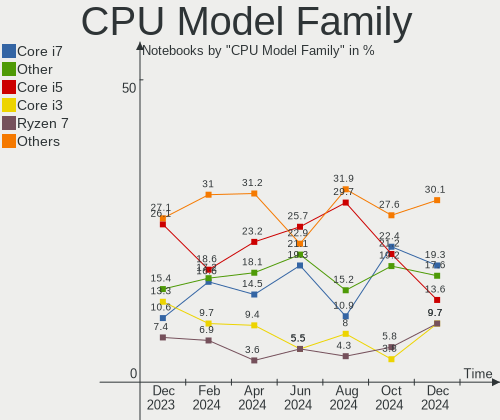
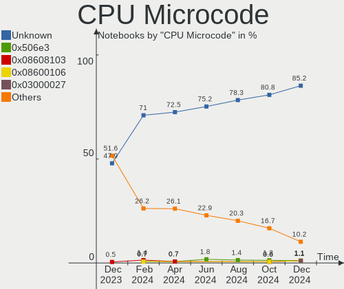
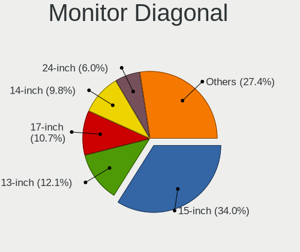
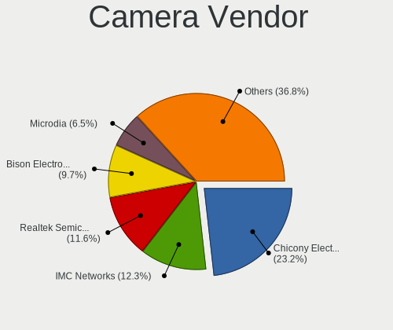
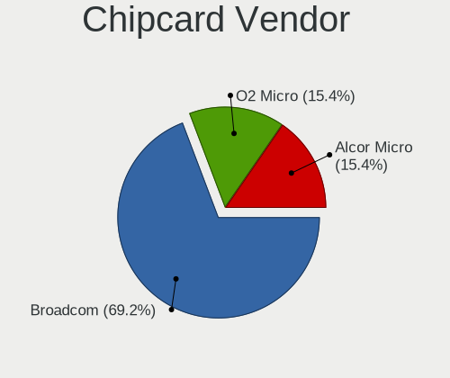

Linux in France - Hardware Trends (Notebooks)
---------------------------------------------

A project to identify most popular hardware characteristics and track their change
over time based on data collected by Linux users at https://Linux-Hardware.org.

Anyone can contribute to this report by the [hw-probe](https://github.com/linuxhw/hw-probe) tool:

    sudo -E hw-probe -all -upload

Period: Jul, 2023.

Contents
--------

* [ System ](#system)
  - [ OS                       ](#os)
  - [ OS Family                ](#os-family)
  - [ Kernel                   ](#kernel)
  - [ Kernel Family            ](#kernel-family)
  - [ Kernel Major Ver.        ](#kernel-major-ver)
  - [ Arch                     ](#arch)
  - [ DE                       ](#de)
  - [ Display Server           ](#display-server)
  - [ Display Manager          ](#display-manager)
  - [ OS Lang                  ](#os-lang)
  - [ Boot Mode                ](#boot-mode)
  - [ Filesystem               ](#filesystem)
  - [ Part. scheme             ](#part-scheme)
  - [ Dual Boot with Linux/BSD ](#dual-boot-with-linuxbsd)
  - [ Dual Boot (Win)          ](#dual-boot-win)

* [ Board ](#board)
  - [ Vendor                   ](#vendor)
  - [ Model                    ](#model)
  - [ Model Family             ](#model-family)
  - [ MFG Year                 ](#mfg-year)
  - [ Form Factor              ](#form-factor)
  - [ Secure Boot              ](#secure-boot)
  - [ Coreboot                 ](#coreboot)
  - [ RAM Size                 ](#ram-size)
  - [ RAM Used                 ](#ram-used)
  - [ Total Drives             ](#total-drives)
  - [ Has CD-ROM               ](#has-cd-rom)
  - [ Has Ethernet             ](#has-ethernet)
  - [ Has WiFi                 ](#has-wifi)
  - [ Has Bluetooth            ](#has-bluetooth)

* [ Location ](#location)
  - [ Country                  ](#country)
  - [ City                     ](#city)

* [ Drives ](#drives)
  - [ Drive Vendor             ](#drive-vendor)
  - [ Drive Model              ](#drive-model)
  - [ HDD Vendor               ](#hdd-vendor)
  - [ SSD Vendor               ](#ssd-vendor)
  - [ Drive Kind               ](#drive-kind)
  - [ Drive Connector          ](#drive-connector)
  - [ Drive Size               ](#drive-size)
  - [ Space Total              ](#space-total)
  - [ Space Used               ](#space-used)
  - [ Malfunc. Drives          ](#malfunc-drives)
  - [ Malfunc. Drive Vendor    ](#malfunc-drive-vendor)
  - [ Malfunc. HDD Vendor      ](#malfunc-hdd-vendor)
  - [ Malfunc. Drive Kind      ](#malfunc-drive-kind)
  - [ Failed Drives            ](#failed-drives)
  - [ Failed Drive Vendor      ](#failed-drive-vendor)
  - [ Drive Status             ](#drive-status)

* [ Storage controller ](#storage-controller)
  - [ Storage Vendor           ](#storage-vendor)
  - [ Storage Model            ](#storage-model)
  - [ Storage Kind             ](#storage-kind)

* [ Processor ](#processor)
  - [ CPU Vendor               ](#cpu-vendor)
  - [ CPU Model                ](#cpu-model)
  - [ CPU Model Family         ](#cpu-model-family)
  - [ CPU Cores                ](#cpu-cores)
  - [ CPU Sockets              ](#cpu-sockets)
  - [ CPU Threads              ](#cpu-threads)
  - [ CPU Op-Modes             ](#cpu-op-modes)
  - [ CPU Microcode            ](#cpu-microcode)
  - [ CPU Microarch            ](#cpu-microarch)

* [ Graphics ](#graphics)
  - [ GPU Vendor               ](#gpu-vendor)
  - [ GPU Model                ](#gpu-model)
  - [ GPU Combo                ](#gpu-combo)
  - [ GPU Driver               ](#gpu-driver)
  - [ GPU Memory               ](#gpu-memory)

* [ Monitor ](#monitor)
  - [ Monitor Vendor           ](#monitor-vendor)
  - [ Monitor Model            ](#monitor-model)
  - [ Monitor Resolution       ](#monitor-resolution)
  - [ Monitor Diagonal         ](#monitor-diagonal)
  - [ Monitor Width            ](#monitor-width)
  - [ Aspect Ratio             ](#aspect-ratio)
  - [ Monitor Area             ](#monitor-area)
  - [ Pixel Density            ](#pixel-density)
  - [ Multiple Monitors        ](#multiple-monitors)

* [ Network ](#network)
  - [ Net Controller Vendor    ](#net-controller-vendor)
  - [ Net Controller Model     ](#net-controller-model)
  - [ Wireless Vendor          ](#wireless-vendor)
  - [ Wireless Model           ](#wireless-model)
  - [ Ethernet Vendor          ](#ethernet-vendor)
  - [ Ethernet Model           ](#ethernet-model)
  - [ Net Controller Kind      ](#net-controller-kind)
  - [ Used Controller          ](#used-controller)
  - [ NICs                     ](#nics)
  - [ IPv6                     ](#ipv6)

* [ Bluetooth ](#bluetooth)
  - [ Bluetooth Vendor         ](#bluetooth-vendor)
  - [ Bluetooth Model          ](#bluetooth-model)

* [ Sound ](#sound)
  - [ Sound Vendor             ](#sound-vendor)
  - [ Sound Model              ](#sound-model)

* [ Memory ](#memory)
  - [ Memory Vendor            ](#memory-vendor)
  - [ Memory Model             ](#memory-model)
  - [ Memory Kind              ](#memory-kind)
  - [ Memory Form Factor       ](#memory-form-factor)
  - [ Memory Size              ](#memory-size)
  - [ Memory Speed             ](#memory-speed)

* [ Printers & scanners ](#printers--scanners)
  - [ Printer Vendor           ](#printer-vendor)
  - [ Printer Model            ](#printer-model)
  - [ Scanner Vendor           ](#scanner-vendor)
  - [ Scanner Model            ](#scanner-model)

* [ Camera ](#camera)
  - [ Camera Vendor            ](#camera-vendor)
  - [ Camera Model             ](#camera-model)

* [ Security ](#security)
  - [ Fingerprint Vendor       ](#fingerprint-vendor)
  - [ Fingerprint Model        ](#fingerprint-model)
  - [ Chipcard Vendor          ](#chipcard-vendor)
  - [ Chipcard Model           ](#chipcard-model)

* [ Unsupported ](#unsupported)
  - [ Unsupported Devices      ](#unsupported-devices)
  - [ Unsupported Device Types ](#unsupported-device-types)

System
------

OS
--

Installed operating systems

| Name                         | Notebooks | Percent |
|------------------------------|-----------|---------|
| Ubuntu 22.04                 | 21        | 16.94%  |
| Linux Mint 21.1              | 10        | 8.06%   |
| Ubuntu 20.04                 | 8         | 6.45%   |
| Debian 12                    | 8         | 6.45%   |
| Ubuntu 23.04                 | 7         | 5.65%   |
| Debian 11                    | 7         | 5.65%   |
| Zorin 16                     | 6         | 4.84%   |
| OpenMandriva 23.03           | 5         | 4.03%   |
| Xubuntu 22.04                | 4         | 3.23%   |
| OpenMandriva 23.07           | 4         | 3.23%   |
| Fedora 38                    | 4         | 3.23%   |
| Linux Mint 21.2              | 3         | 2.42%   |
| KDE neon 22.04               | 3         | 2.42%   |
| Arch Rolling                 | 3         | 2.42%   |
| Ubuntu MATE 22.04            | 2         | 1.61%   |
| Ubuntu Budgie 22.04          | 2         | 1.61%   |
| OpenMandriva 4.3             | 2         | 1.61%   |
| OpenMandriva 4.2             | 2         | 1.61%   |
| Debian                       | 2         | 1.61%   |
| Xubuntu 23.04                | 1         | 0.81%   |
| Xubuntu 22.10                | 1         | 0.81%   |
| Xubuntu 20.04                | 1         | 0.81%   |
| Xubuntu 18.04                | 1         | 0.81%   |
| Xero Rolling                 | 1         | 0.81%   |
| Ubuntu 22.10                 | 1         | 0.81%   |
| SteamOS 3.4.8                | 1         | 0.81%   |
| Pop!_OS 22.04                | 1         | 0.81%   |
| openSUSE Tumbleweed-XXXXXXXX | 1         | 0.81%   |
| openSUSE Leap-15.5           | 1         | 0.81%   |
| OpenMandriva 23.90           | 1         | 0.81%   |
| Manjaro 23.0.0               | 1         | 0.81%   |
| Lubuntu 22.04                | 1         | 0.81%   |
| Lubuntu 18.04                | 1         | 0.81%   |
| Linux Mint 20.2              | 1         | 0.81%   |
| Kali 2023.2                  | 1         | 0.81%   |
| Kali 2023.1                  | 1         | 0.81%   |
| Gentoo 2.13                  | 1         | 0.81%   |
| Fedora 37                    | 1         | 0.81%   |
| Artix 20230710               | 1         | 0.81%   |
| ArcoLinux Rolling            | 1         | 0.81%   |

OS Family
---------

OS without a version

| Name          | Notebooks | Percent |
|---------------|-----------|---------|
| Ubuntu        | 37        | 29.84%  |
| Debian        | 17        | 13.71%  |
| OpenMandriva  | 14        | 11.29%  |
| Linux Mint    | 14        | 11.29%  |
| Xubuntu       | 8         | 6.45%   |
| Zorin         | 6         | 4.84%   |
| Fedora        | 5         | 4.03%   |
| KDE neon      | 3         | 2.42%   |
| Arch          | 3         | 2.42%   |
| Ubuntu MATE   | 2         | 1.61%   |
| Ubuntu Budgie | 2         | 1.61%   |
| openSUSE      | 2         | 1.61%   |
| Lubuntu       | 2         | 1.61%   |
| Kali          | 2         | 1.61%   |
| Xero          | 1         | 0.81%   |
| SteamOS       | 1         | 0.81%   |
| Pop!_OS       | 1         | 0.81%   |
| Manjaro       | 1         | 0.81%   |
| Gentoo        | 1         | 0.81%   |
| Artix         | 1         | 0.81%   |
| ArcoLinux     | 1         | 0.81%   |

Kernel
------

Version of the Linux kernel

| Version                  | Notebooks | Percent |
|--------------------------|-----------|---------|
| 5.19.0-46-generic        | 23        | 18.55%  |
| 5.15.0-76-generic        | 21        | 16.94%  |
| 6.2.6-desktop-1omv2390   | 5         | 4.03%   |
| 6.3.5-desktop-3omv2390   | 4         | 3.23%   |
| 5.19.0-45-generic        | 4         | 3.23%   |
| 5.15.0-78-generic        | 4         | 3.23%   |
| 6.1.0-10-amd64           | 3         | 2.42%   |
| 6.3.0-1-amd64            | 2         | 1.61%   |
| 6.2.0-26-generic         | 2         | 1.61%   |
| 6.2.0-25-generic         | 2         | 1.61%   |
| 6.2.0-24-generic         | 2         | 1.61%   |
| 6.1.0-9-amd64            | 2         | 1.61%   |
| 5.4.0-153-generic        | 2         | 1.61%   |
| 5.19.0-43-generic        | 2         | 1.61%   |
| 5.16.13-desktop-1omv4003 | 2         | 1.61%   |
| 5.15.0-56-generic        | 2         | 1.61%   |
| 5.10.14-desktop-1omv4002 | 2         | 1.61%   |
| 5.10.0-23-amd64          | 2         | 1.61%   |
| 6.4.5-x64v3-xanmod1      | 1         | 0.81%   |
| 6.4.3-zen1-1-zen         | 1         | 0.81%   |
| 6.4.3-desktop-2omv2390   | 1         | 0.81%   |
| 6.4.2-artix1-1           | 1         | 0.81%   |
| 6.4.2-arch1-1            | 1         | 0.81%   |
| 6.4.2-1-default          | 1         | 0.81%   |
| 6.4.1-arch2-1            | 1         | 0.81%   |
| 6.3.9-arch1-1            | 1         | 0.81%   |
| 6.3.8-200.fc38.x86_64    | 1         | 0.81%   |
| 6.3.8-100.fc37.x86_64    | 1         | 0.81%   |
| 6.3.6-200.fc38.x86_64    | 1         | 0.81%   |
| 6.3.4-060304-generic     | 1         | 0.81%   |
| 6.3.3.15.realtime2-1-rt  | 1         | 0.81%   |
| 6.3.12-200.fc38.x86_64   | 1         | 0.81%   |
| 6.3.11-200.fc38.x86_64   | 1         | 0.81%   |
| 6.3.0-kali1-amd64        | 1         | 0.81%   |
| 6.2.0-76060200-generic   | 1         | 0.81%   |
| 6.1.38-gentoo-x86_64     | 1         | 0.81%   |
| 6.1.38-1-MANJARO         | 1         | 0.81%   |
| 6.1.12+                  | 1         | 0.81%   |
| 6.1.0-kali5-amd64        | 1         | 0.81%   |
| 6.1.0-1-amd64            | 1         | 0.81%   |

Kernel Family
-------------

Linux kernel without a distro release

| Version  | Notebooks | Percent |
|----------|-----------|---------|
| 5.15.0   | 32        | 25.81%  |
| 5.19.0   | 29        | 23.39%  |
| 6.2.0    | 7         | 5.65%   |
| 6.1.0    | 7         | 5.65%   |
| 5.10.0   | 7         | 5.65%   |
| 6.2.6    | 5         | 4.03%   |
| 6.3.5    | 4         | 3.23%   |
| 5.4.0    | 4         | 3.23%   |
| 6.4.2    | 3         | 2.42%   |
| 6.3.0    | 3         | 2.42%   |
| 6.4.3    | 2         | 1.61%   |
| 6.3.8    | 2         | 1.61%   |
| 6.1.38   | 2         | 1.61%   |
| 5.16.13  | 2         | 1.61%   |
| 5.10.14  | 2         | 1.61%   |
| 6.4.5    | 1         | 0.81%   |
| 6.4.1    | 1         | 0.81%   |
| 6.3.9    | 1         | 0.81%   |
| 6.3.6    | 1         | 0.81%   |
| 6.3.4    | 1         | 0.81%   |
| 6.3.3.15 | 1         | 0.81%   |
| 6.3.12   | 1         | 0.81%   |
| 6.3.11   | 1         | 0.81%   |
| 6.1.12   | 1         | 0.81%   |
| 6.0.0    | 1         | 0.81%   |
| 5.14.21  | 1         | 0.81%   |
| 5.13.0   | 1         | 0.81%   |
| 4.15.0   | 1         | 0.81%   |

Kernel Major Ver.
-----------------

Linux kernel major version

| Version | Notebooks | Percent |
|---------|-----------|---------|
| 5.15    | 32        | 25.81%  |
| 5.19    | 29        | 23.39%  |
| 6.3     | 14        | 11.29%  |
| 6.2     | 12        | 9.68%   |
| 6.1     | 10        | 8.06%   |
| 5.10    | 9         | 7.26%   |
| 6.4     | 7         | 5.65%   |
| 5.4     | 4         | 3.23%   |
| 5.16    | 2         | 1.61%   |
| 6.3.3   | 1         | 0.81%   |
| 6.0     | 1         | 0.81%   |
| 5.14    | 1         | 0.81%   |
| 5.13    | 1         | 0.81%   |
| 4.15    | 1         | 0.81%   |

Arch
----

OS architecture (x86_64, i586, etc.)

| Name   | Notebooks | Percent |
|--------|-----------|---------|
| x86_64 | 123       | 99.19%  |
| i686   | 1         | 0.81%   |

DE
--

Desktop Environment

| Name       | Notebooks | Percent |
|------------|-----------|---------|
| GNOME      | 56        | 45.16%  |
| KDE5       | 22        | 17.74%  |
| XFCE       | 19        | 15.32%  |
| X-Cinnamon | 11        | 8.87%   |
| LXQt       | 6         | 4.84%   |
| MATE       | 4         | 3.23%   |
| Budgie     | 3         | 2.42%   |
| LXDE       | 1         | 0.81%   |
| i3         | 1         | 0.81%   |
| Cinnamon   | 1         | 0.81%   |

Display Server
--------------

X11 or Wayland

| Name    | Notebooks | Percent |
|---------|-----------|---------|
| X11     | 88        | 70.97%  |
| Wayland | 34        | 27.42%  |
| Tty     | 2         | 1.61%   |

Display Manager
---------------

SDDM, LightDM, etc.

| Name    | Notebooks | Percent |
|---------|-----------|---------|
| LightDM | 33        | 26.61%  |
| GDM3    | 29        | 23.39%  |
| Unknown | 28        | 22.58%  |
| SDDM    | 22        | 17.74%  |
| GDM     | 12        | 9.68%   |

OS Lang
-------

Language

| Lang   | Notebooks | Percent |
|--------|-----------|---------|
| fr_FR  | 99        | 79.84%  |
| en_US  | 19        | 15.32%  |
| en_GB  | 3         | 2.42%   |
| pl_PL  | 1         | 0.81%   |
| it_IT  | 1         | 0.81%   |
| C.UTF8 | 1         | 0.81%   |

Boot Mode
---------

EFI or BIOS

| Mode | Notebooks | Percent |
|------|-----------|---------|
| EFI  | 65        | 52.42%  |
| BIOS | 59        | 47.58%  |

Filesystem
----------

Type of filesystem

| Type    | Notebooks | Percent |
|---------|-----------|---------|
| Ext4    | 87        | 70.16%  |
| Tmpfs   | 19        | 15.32%  |
| Btrfs   | 14        | 11.29%  |
| Overlay | 3         | 2.42%   |
| Xfs     | 1         | 0.81%   |

Part. scheme
------------

Scheme of partitioning

| Type    | Notebooks | Percent |
|---------|-----------|---------|
| GPT     | 77        | 62.1%   |
| Unknown | 30        | 24.19%  |
| MBR     | 17        | 13.71%  |

Dual Boot with Linux/BSD
------------------------

Hosting more than one Linux/BSD

| Dual boot | Notebooks | Percent |
|-----------|-----------|---------|
| No        | 110       | 88.71%  |
| Yes       | 14        | 11.29%  |

Dual Boot (Win)
---------------

Hosting Linux and Windows

| Dual boot | Notebooks | Percent |
|-----------|-----------|---------|
| No        | 92        | 74.19%  |
| Yes       | 32        | 25.81%  |

Board
-----

Vendor
------

Motherboard manufacturer

| Name                        | Notebooks | Percent |
|-----------------------------|-----------|---------|
| Dell                        | 22        | 17.74%  |
| Hewlett-Packard             | 20        | 16.13%  |
| Lenovo                      | 17        | 13.71%  |
| ASUSTek Computer            | 15        | 12.1%   |
| Acer                        | 14        | 11.29%  |
| MSI                         | 7         | 5.65%   |
| Toshiba                     | 5         | 4.03%   |
| Thomson                     | 4         | 3.23%   |
| Samsung Electronics         | 3         | 2.42%   |
| Sony                        | 2         | 1.61%   |
| Notebook                    | 2         | 1.61%   |
| Valve                       | 1         | 0.81%   |
| TR                          | 1         | 0.81%   |
| Timi                        | 1         | 0.81%   |
| Teclast                     | 1         | 0.81%   |
| SLIMBOOK                    | 1         | 0.81%   |
| Packard Bell                | 1         | 0.81%   |
| Medion                      | 1         | 0.81%   |
| Fujitsu Siemens             | 1         | 0.81%   |
| eMachines                   | 1         | 0.81%   |
| Chitech Shenzhen Technology | 1         | 0.81%   |
| BESSTAR Tech                | 1         | 0.81%   |
| Alienware                   | 1         | 0.81%   |
| Unknown                     | 1         | 0.81%   |

Model
-----

Motherboard model

| Name                                        | Notebooks | Percent |
|---------------------------------------------|-----------|---------|
| Thomson N15C4SL128                          | 2         | 1.61%   |
| HP Pavilion 17                              | 2         | 1.61%   |
| Dell Latitude E6320                         | 2         | 1.61%   |
| Acer Nitro AN515-57                         | 2         | 1.61%   |
| Valve Jupiter                               | 1         | 0.81%   |
| TR ST Plus-KN                               | 1         | 0.81%   |
| Toshiba Satellite Pro L500                  | 1         | 0.81%   |
| Toshiba Satellite P500                      | 1         | 0.81%   |
| Toshiba Satellite L670                      | 1         | 0.81%   |
| Toshiba Satellite C870D-108                 | 1         | 0.81%   |
| Toshiba Satellite C70-B                     | 1         | 0.81%   |
| Timi TM1612                                 | 1         | 0.81%   |
| Thomson X15I5-8TU512                        | 1         | 0.81%   |
| Thomson N15C8BK2T                           | 1         | 0.81%   |
| Teclast F6 Plus                             | 1         | 0.81%   |
| Sony VPCEF4E1E                              | 1         | 0.81%   |
| Sony VGN-NS38E_S                            | 1         | 0.81%   |
| SLIMBOOK PROX15-AMD                         | 1         | 0.81%   |
| Samsung RV410/RV510/S3510/E3510             | 1         | 0.81%   |
| Samsung 950XED                              | 1         | 0.81%   |
| Samsung 530U3BI/530U4BI/530U4BH             | 1         | 0.81%   |
| Packard Bell H17HV                          | 1         | 0.81%   |
| Notebook NS5x_NS7xPU                        | 1         | 0.81%   |
| Notebook NLx0MU                             | 1         | 0.81%   |
| MSI Modern 15 A10RBS                        | 1         | 0.81%   |
| MSI Katana GF76 11UE                        | 1         | 0.81%   |
| MSI GT70 2PE                                | 1         | 0.81%   |
| MSI GS73VR 7RF                              | 1         | 0.81%   |
| MSI GF63 Thin 11UC                          | 1         | 0.81%   |
| MSI GF63 Thin 10SCXR                        | 1         | 0.81%   |
| MSI CR700                                   | 1         | 0.81%   |
| Medion Erazer P7643 MD60299                 | 1         | 0.81%   |
| Lenovo Yoga S740-15IRH 81NX                 | 1         | 0.81%   |
| Lenovo ThinkPad X280 20KES73S06             | 1         | 0.81%   |
| Lenovo ThinkPad X260 20F5S4BY00             | 1         | 0.81%   |
| Lenovo ThinkPad X260 20F5S04B00             | 1         | 0.81%   |
| Lenovo ThinkPad X1 Carbon Gen 10 21CBCTO1WW | 1         | 0.81%   |
| Lenovo ThinkPad T540p 20BFA06B0S            | 1         | 0.81%   |
| Lenovo ThinkPad T420s 4174PEG               | 1         | 0.81%   |
| Lenovo ThinkPad P73 20QRCTO1WW              | 1         | 0.81%   |

Model Family
------------

Motherboard model prefix

| Name                 | Notebooks | Percent |
|----------------------|-----------|---------|
| Lenovo ThinkPad      | 13        | 10.48%  |
| Dell Latitude        | 8         | 6.45%   |
| Acer Aspire          | 8         | 6.45%   |
| HP Pavilion          | 6         | 4.84%   |
| Toshiba Satellite    | 5         | 4.03%   |
| HP EliteBook         | 5         | 4.03%   |
| Dell Inspiron        | 5         | 4.03%   |
| Dell Precision       | 4         | 3.23%   |
| ASUS VivoBook        | 4         | 3.23%   |
| Thomson N15C4SL128   | 2         | 1.61%   |
| MSI GF63             | 2         | 1.61%   |
| Lenovo IdeaPad       | 2         | 1.61%   |
| HP ProBook           | 2         | 1.61%   |
| HP Compaq            | 2         | 1.61%   |
| Dell Vostro          | 2         | 1.61%   |
| Acer Swift           | 2         | 1.61%   |
| Acer Nitro           | 2         | 1.61%   |
| Valve Jupiter        | 1         | 0.81%   |
| TR ST                | 1         | 0.81%   |
| Timi TM1612          | 1         | 0.81%   |
| Thomson X15I5-8TU512 | 1         | 0.81%   |
| Thomson N15C8BK2T    | 1         | 0.81%   |
| Teclast F6           | 1         | 0.81%   |
| Sony VPCEF4E1E       | 1         | 0.81%   |
| Sony VGN-NS38E       | 1         | 0.81%   |
| SLIMBOOK PROX15-AMD  | 1         | 0.81%   |
| Samsung RV410        | 1         | 0.81%   |
| Samsung 950XED       | 1         | 0.81%   |
| Samsung 530U3BI      | 1         | 0.81%   |
| Packard Bell H17HV   | 1         | 0.81%   |
| Notebook NS5x        | 1         | 0.81%   |
| Notebook NLx0MU      | 1         | 0.81%   |
| MSI Modern           | 1         | 0.81%   |
| MSI Katana           | 1         | 0.81%   |
| MSI GT70             | 1         | 0.81%   |
| MSI GS73VR           | 1         | 0.81%   |
| MSI CR700            | 1         | 0.81%   |
| Medion Erazer        | 1         | 0.81%   |
| Lenovo Yoga          | 1         | 0.81%   |
| Lenovo G50-45        | 1         | 0.81%   |

MFG Year
--------

Motherboard manufacture year

| Year | Notebooks | Percent |
|------|-----------|---------|
| 2021 | 17        | 13.71%  |
| 2016 | 11        | 8.87%   |
| 2018 | 9         | 7.26%   |
| 2013 | 9         | 7.26%   |
| 2010 | 9         | 7.26%   |
| 2022 | 8         | 6.45%   |
| 2020 | 8         | 6.45%   |
| 2014 | 8         | 6.45%   |
| 2009 | 8         | 6.45%   |
| 2017 | 7         | 5.65%   |
| 2008 | 7         | 5.65%   |
| 2019 | 5         | 4.03%   |
| 2015 | 5         | 4.03%   |
| 2012 | 5         | 4.03%   |
| 2011 | 4         | 3.23%   |
| 2023 | 3         | 2.42%   |
| 2005 | 1         | 0.81%   |

Form Factor
-----------

Physical design of the computer

| Name     | Notebooks | Percent |
|----------|-----------|---------|
| Notebook | 124       | 100%    |

Secure Boot
-----------

Enabled or disabled

| State    | Notebooks | Percent |
|----------|-----------|---------|
| Disabled | 118       | 95.16%  |
| Enabled  | 6         | 4.84%   |

Coreboot
--------

Have coreboot on board

| Used | Notebooks | Percent |
|------|-----------|---------|
| No   | 124       | 100%    |

RAM Size
--------

Total RAM memory

| Size in GB  | Notebooks | Percent |
|-------------|-----------|---------|
| 4.01-8.0    | 40        | 32.26%  |
| 3.01-4.0    | 30        | 24.19%  |
| 16.01-24.0  | 17        | 13.71%  |
| 8.01-16.0   | 16        | 12.9%   |
| 32.01-64.0  | 9         | 7.26%   |
| 2.01-3.0    | 4         | 3.23%   |
| 1.01-2.0    | 4         | 3.23%   |
| 64.01-256.0 | 3         | 2.42%   |
| 24.01-32.0  | 1         | 0.81%   |

RAM Used
--------

Used RAM memory

| Used GB    | Notebooks | Percent |
|------------|-----------|---------|
| 2.01-3.0   | 37        | 29.84%  |
| 1.01-2.0   | 37        | 29.84%  |
| 4.01-8.0   | 18        | 14.52%  |
| 3.01-4.0   | 17        | 13.71%  |
| 0.51-1.0   | 10        | 8.06%   |
| 8.01-16.0  | 4         | 3.23%   |
| 16.01-24.0 | 1         | 0.81%   |

Total Drives
------------

Number of drives on board

| Drives | Notebooks | Percent |
|--------|-----------|---------|
| 1      | 86        | 69.35%  |
| 2      | 34        | 27.42%  |
| 3      | 4         | 3.23%   |

Has CD-ROM
----------

Has CD-ROM on board

| Presented | Notebooks | Percent |
|-----------|-----------|---------|
| No        | 74        | 59.68%  |
| Yes       | 50        | 40.32%  |

Has Ethernet
------------

Has Ethernet on board

| Presented | Notebooks | Percent |
|-----------|-----------|---------|
| Yes       | 102       | 82.26%  |
| No        | 22        | 17.74%  |

Has WiFi
--------

Has WiFi module

| Presented | Notebooks | Percent |
|-----------|-----------|---------|
| Yes       | 124       | 100%    |

Has Bluetooth
-------------

Has Bluetooth module

| Presented | Notebooks | Percent |
|-----------|-----------|---------|
| Yes       | 93        | 75%     |
| No        | 31        | 25%     |

Location
--------

Country
-------

Geographic location (country)

| Country | Notebooks | Percent |
|---------|-----------|---------|
| France  | 124       | 100%    |

City
----

Geographic location (city)

| City                    | Notebooks | Percent |
|-------------------------|-----------|---------|
| Paris                   | 19        | 15.32%  |
| Rennes                  | 3         | 2.42%   |
| Montpellier             | 3         | 2.42%   |
| Marseille               | 3         | 2.42%   |
| Perpignan               | 2         | 1.61%   |
| Obernai                 | 2         | 1.61%   |
| Nantes                  | 2         | 1.61%   |
| Limoges                 | 2         | 1.61%   |
| Liffre                  | 2         | 1.61%   |
| Châtenay-Malabry       | 2         | 1.61%   |
| Capdenac-Gare           | 2         | 1.61%   |
| Angers                  | 2         | 1.61%   |
| Weckolsheim             | 1         | 0.81%   |
| Vichy                   | 1         | 0.81%   |
| Valence                 | 1         | 0.81%   |
| Trans-en-Provence       | 1         | 0.81%   |
| Toulouse                | 1         | 0.81%   |
| Torcy                   | 1         | 0.81%   |
| Strasbourg              | 1         | 0.81%   |
| Servian                 | 1         | 0.81%   |
| Saint-Rémy-de-Provence | 1         | 0.81%   |
| Saint-Michel-sur-Orge   | 1         | 0.81%   |
| Saint-Jean-le-Blanc     | 1         | 0.81%   |
| Saint-Jean-de-Vedas     | 1         | 0.81%   |
| Saint-Jean-de-Monts     | 1         | 0.81%   |
| Saint-Dié              | 1         | 0.81%   |
| Saint-Avertin           | 1         | 0.81%   |
| Roubaix                 | 1         | 0.81%   |
| Roquecor                | 1         | 0.81%   |
| Quimper                 | 1         | 0.81%   |
| Queige                  | 1         | 0.81%   |
| Poitiers                | 1         | 0.81%   |
| Plumeliau               | 1         | 0.81%   |
| Pau                     | 1         | 0.81%   |
| Osny                    | 1         | 0.81%   |
| Oignies                 | 1         | 0.81%   |
| Noisy-le-Grand          | 1         | 0.81%   |
| Montrouge               | 1         | 0.81%   |
| Montlouis-sur-Loire     | 1         | 0.81%   |
| Mions                   | 1         | 0.81%   |

Drives
------

Drive Vendor
------------

Hard drive vendors

| Vendor                    | Notebooks | Drives | Percent |
|---------------------------|-----------|--------|---------|
| Samsung Electronics       | 36        | 41     | 22.5%   |
| WDC                       | 16        | 16     | 10%     |
| Seagate                   | 16        | 16     | 10%     |
| Sandisk                   | 12        | 12     | 7.5%    |
| HGST                      | 8         | 8      | 5%      |
| Crucial                   | 8         | 8      | 5%      |
| Toshiba                   | 7         | 7      | 4.38%   |
| Kingston                  | 7         | 7      | 4.38%   |
| Unknown                   | 6         | 6      | 3.75%   |
| SK hynix                  | 6         | 6      | 3.75%   |
| Intel                     | 5         | 5      | 3.13%   |
| Micron Technology         | 4         | 4      | 2.5%    |
| China                     | 3         | 3      | 1.88%   |
| Unknown                   | 3         | 3      | 1.88%   |
| Transcend                 | 2         | 2      | 1.25%   |
| Plextor                   | 2         | 2      | 1.25%   |
| Phison Electronics        | 2         | 2      | 1.25%   |
| Micron/Crucial Technology | 2         | 2      | 1.25%   |
| Gigabyte Technology       | 2         | 2      | 1.25%   |
| X12                       | 1         | 1      | 0.63%   |
| Teclast                   | 1         | 1      | 0.63%   |
| SSSTC                     | 1         | 1      | 0.63%   |
| SPCC                      | 1         | 1      | 0.63%   |
| Phison                    | 1         | 1      | 0.63%   |
| Lenovo                    | 1         | 1      | 0.63%   |
| LaCie                     | 1         | 1      | 0.63%   |
| KIOXIA                    | 1         | 1      | 0.63%   |
| KingDian                  | 1         | 1      | 0.63%   |
| Inateck                   | 1         | 1      | 0.63%   |
| Hitachi                   | 1         | 1      | 0.63%   |
| Biwin Storage Technology  | 1         | 1      | 0.63%   |
| ADATA Technology          | 1         | 1      | 0.63%   |

Drive Model
-----------

Hard drive models

| Model                                               | Notebooks | Percent |
|-----------------------------------------------------|-----------|---------|
| WDC WD10JPVX-22JC3T0 1TB                            | 3         | 1.82%   |
| Toshiba MQ01ABD100 1TB                              | 3         | 1.82%   |
| Seagate ST500LM021-1KJ152 500GB                     | 3         | 1.82%   |
| Samsung SSD 980 1TB                                 | 3         | 1.82%   |
| Samsung SSD 850 EVO 250GB                           | 3         | 1.82%   |
| Samsung NVMe SSD Controller SM981/PM981/PM983 500GB | 3         | 1.82%   |
| Samsung NVMe SSD Controller PM9A1/PM9A3/980PRO 1TB  | 3         | 1.82%   |
| HGST HTS721010A9E630 1TB                            | 3         | 1.82%   |
| Unknown                                             | 3         | 1.82%   |
| SK hynix SC311 SATA 512GB SSD                       | 2         | 1.21%   |
| Seagate ST1000LM048-2E7172 1TB                      | 2         | 1.21%   |
| Seagate Expansion HDD 4TB                           | 2         | 1.21%   |
| Samsung SSD 850 EVO 500GB                           | 2         | 1.21%   |
| Samsung MZVLQ512HBLU-00BH1 512GB                    | 2         | 1.21%   |
| Samsung MZNTY128HDHP-00000 128GB SSD                | 2         | 1.21%   |
| Phison PS5013 E13 NVMe Controller 256GB             | 2         | 1.21%   |
| Kingston SA400S37480G 480GB SSD                     | 2         | 1.21%   |
| HGST HTS545050A7E680 500GB                          | 2         | 1.21%   |
| X12 SSD 480GB                                       | 1         | 0.61%   |
| WDC WDS500G1B0A-00H9H0 500GB SSD                    | 1         | 0.61%   |
| WDC WDS100T2B0A-00SM50 1TB SSD                      | 1         | 0.61%   |
| WDC WD5000LPVX-22V0TT0 500GB                        | 1         | 0.61%   |
| WDC WD5000BEVT-22A0RT0 500GB                        | 1         | 0.61%   |
| WDC WD3200LPLX-75ZNTT0 320GB                        | 1         | 0.61%   |
| WDC WD3200BEVT-26ZCT0 320GB                         | 1         | 0.61%   |
| WDC WD3200BEVT-22ZCT0 320GB                         | 1         | 0.61%   |
| WDC WD3200BEKT-08PVMT1 320GB                        | 1         | 0.61%   |
| WDC WD2500BEVT-75A23T0 250GB                        | 1         | 0.61%   |
| WDC WD10SPZX-21Z10T0 1TB                            | 1         | 0.61%   |
| WDC PC SN730 SDBPNTY-1T00-1032 1TB                  | 1         | 0.61%   |
| WDC PC SN540 SDDPNPF-512G-1032 512GB                | 1         | 0.61%   |
| WDC PC SN530 SDBPNPZ-512G-1114 512GB                | 1         | 0.61%   |
| Unknown USD00  32GB                                 | 1         | 0.61%   |
| Unknown SD128  128GB                                | 1         | 0.61%   |
| Unknown MMC Card  64GB                              | 1         | 0.61%   |
| Unknown MMC Card  128GB                             | 1         | 0.61%   |
| Unknown 58K722  128GB                               | 1         | 0.61%   |
| Unknown 064G30  64GB                                | 1         | 0.61%   |
| Transcend TS256GMTS430S 256GB SSD                   | 1         | 0.61%   |
| Transcend TS128GMSA230S 128GB SSD                   | 1         | 0.61%   |

HDD Vendor
----------

Hard disk drive vendors

| Vendor              | Notebooks | Drives | Percent |
|---------------------|-----------|--------|---------|
| Seagate             | 16        | 16     | 35.56%  |
| WDC                 | 11        | 11     | 24.44%  |
| HGST                | 8         | 8      | 17.78%  |
| Toshiba             | 7         | 7      | 15.56%  |
| Samsung Electronics | 1         | 1      | 2.22%   |
| Inateck             | 1         | 1      | 2.22%   |
| Hitachi             | 1         | 1      | 2.22%   |

SSD Vendor
----------

Solid state drive vendors

| Vendor              | Notebooks | Drives | Percent |
|---------------------|-----------|--------|---------|
| Samsung Electronics | 19        | 20     | 31.67%  |
| SanDisk             | 7         | 7      | 11.67%  |
| Crucial             | 6         | 6      | 10%     |
| Kingston            | 5         | 5      | 8.33%   |
| SK hynix            | 4         | 4      | 6.67%   |
| China               | 3         | 3      | 5%      |
| WDC                 | 2         | 2      | 3.33%   |
| Transcend           | 2         | 2      | 3.33%   |
| Plextor             | 2         | 2      | 3.33%   |
| Intel               | 2         | 2      | 3.33%   |
| X12                 | 1         | 1      | 1.67%   |
| Teclast             | 1         | 1      | 1.67%   |
| SSSTC               | 1         | 1      | 1.67%   |
| SPCC                | 1         | 1      | 1.67%   |
| Phison              | 1         | 1      | 1.67%   |
| KingDian            | 1         | 1      | 1.67%   |
| Gigabyte Technology | 1         | 1      | 1.67%   |
| Unknown             | 1         | 1      | 1.67%   |

Drive Kind
----------

HDD or SSD

| Kind    | Notebooks | Drives | Percent |
|---------|-----------|--------|---------|
| SSD     | 57        | 61     | 37.25%  |
| HDD     | 45        | 45     | 29.41%  |
| NVMe    | 41        | 49     | 26.8%   |
| MMC     | 9         | 9      | 5.88%   |
| Unknown | 1         | 1      | 0.65%   |

Drive Connector
---------------

SATA, SAS, NVMe, etc.

| Type | Notebooks | Drives | Percent |
|------|-----------|--------|---------|
| SATA | 86        | 101    | 60.56%  |
| NVMe | 41        | 49     | 28.87%  |
| MMC  | 9         | 9      | 6.34%   |
| SAS  | 6         | 6      | 4.23%   |

Drive Size
----------

Size of hard drive

| Size in TB | Notebooks | Drives | Percent |
|------------|-----------|--------|---------|
| 0.01-0.5   | 64        | 70     | 65.31%  |
| 0.51-1.0   | 30        | 32     | 30.61%  |
| 3.01-4.0   | 2         | 2      | 2.04%   |
| 1.01-2.0   | 2         | 2      | 2.04%   |

Space Total
-----------

Amount of disk space available on the file system

| Size in GB     | Notebooks | Percent |
|----------------|-----------|---------|
| 251-500        | 41        | 33.06%  |
| 101-250        | 34        | 27.42%  |
| 501-1000       | 30        | 24.19%  |
| 2001-3000      | 4         | 3.23%   |
| 1001-2000      | 4         | 3.23%   |
| 1-20           | 3         | 2.42%   |
| 51-100         | 3         | 2.42%   |
| More than 3000 | 2         | 1.61%   |
| Unknown        | 2         | 1.61%   |
| 21-50          | 1         | 0.81%   |

Space Used
----------

Amount of used disk space

| Used GB   | Notebooks | Percent |
|-----------|-----------|---------|
| 1-20      | 31        | 25%     |
| 21-50     | 30        | 24.19%  |
| 51-100    | 23        | 18.55%  |
| 101-250   | 17        | 13.71%  |
| 251-500   | 14        | 11.29%  |
| 501-1000  | 5         | 4.03%   |
| 1001-2000 | 2         | 1.61%   |
| Unknown   | 2         | 1.61%   |

Malfunc. Drives
---------------

Drive models with a malfunction

| Model                                 | Notebooks | Drives | Percent |
|---------------------------------------|-----------|--------|---------|
| Seagate ST500LM021-1KJ152 500GB       | 2         | 2      | 22.22%  |
| SSSTC CV8-8E128-HP 128GB SSD          | 1         | 1      | 11.11%  |
| SK hynix HFS128G39TND-N210A 128GB SSD | 1         | 1      | 11.11%  |
| SanDisk SSD PLUS 240GB                | 1         | 1      | 11.11%  |
| SanDisk SSD i100 16GB                 | 1         | 1      | 11.11%  |
| Kingston RBU-SMSM151S324GD 24GB SSD   | 1         | 1      | 11.11%  |
| HGST HTS541075A9E680 752GB            | 1         | 1      | 11.11%  |
| HGST HTS541010A9E680 1TB              | 1         | 1      | 11.11%  |

Malfunc. Drive Vendor
---------------------

Vendors of faulty drives

| Vendor   | Notebooks | Drives | Percent |
|----------|-----------|--------|---------|
| Seagate  | 2         | 2      | 22.22%  |
| SanDisk  | 2         | 2      | 22.22%  |
| HGST     | 2         | 2      | 22.22%  |
| SSSTC    | 1         | 1      | 11.11%  |
| SK hynix | 1         | 1      | 11.11%  |
| Kingston | 1         | 1      | 11.11%  |

Malfunc. HDD Vendor
-------------------

Vendors of faulty HDD drives

| Vendor  | Notebooks | Drives | Percent |
|---------|-----------|--------|---------|
| Seagate | 2         | 2      | 50%     |
| HGST    | 2         | 2      | 50%     |

Malfunc. Drive Kind
-------------------

Kinds of faulty drives

| Kind | Notebooks | Drives | Percent |
|------|-----------|--------|---------|
| SSD  | 5         | 5      | 55.56%  |
| HDD  | 4         | 4      | 44.44%  |

Failed Drives
-------------

Failed drive models

Zero info for selected period =(

Failed Drive Vendor
-------------------

Failed drive vendors

Zero info for selected period =(

Drive Status
------------

Number of failed and malfunc. drives

| Status   | Notebooks | Drives | Percent |
|----------|-----------|--------|---------|
| Works    | 67        | 83     | 48.91%  |
| Detected | 61        | 73     | 44.53%  |
| Malfunc  | 9         | 9      | 6.57%   |

Storage controller
------------------

Storage Vendor
--------------

Storage controller vendors

| Vendor                      | Notebooks | Percent |
|-----------------------------|-----------|---------|
| Intel                       | 90        | 60.81%  |
| Samsung Electronics         | 17        | 11.49%  |
| AMD                         | 13        | 8.78%   |
| SanDisk                     | 6         | 4.05%   |
| Micron/Crucial Technology   | 4         | 2.7%    |
| Micron Technology           | 4         | 2.7%    |
| Phison Electronics          | 3         | 2.03%   |
| SK hynix                    | 2         | 1.35%   |
| Nvidia                      | 2         | 1.35%   |
| Kingston Technology Company | 2         | 1.35%   |
| Lenovo                      | 1         | 0.68%   |
| KIOXIA                      | 1         | 0.68%   |
| Biwin Storage Technology    | 1         | 0.68%   |
| ASMedia Technology          | 1         | 0.68%   |
| ADATA Technology            | 1         | 0.68%   |

Storage Model
-------------

Storage controller models

| Model                                                                          | Notebooks | Percent |
|--------------------------------------------------------------------------------|-----------|---------|
| Intel Sunrise Point-LP SATA Controller [AHCI mode]                             | 11        | 7.05%   |
| AMD FCH SATA Controller [AHCI mode]                                            | 11        | 7.05%   |
| Samsung NVMe SSD Controller 980                                                | 9         | 5.77%   |
| Intel 82801IBM/IEM (ICH9M/ICH9M-E) 4 port SATA Controller [AHCI mode]          | 9         | 5.77%   |
| Intel Wildcat Point-LP SATA Controller [AHCI Mode]                             | 7         | 4.49%   |
| Intel Celeron/Pentium Silver Processor SATA Controller                         | 6         | 3.85%   |
| Intel 8 Series/C220 Series Chipset Family 6-port SATA Controller 1 [AHCI mode] | 6         | 3.85%   |
| Intel Volume Management Device NVMe RAID Controller                            | 5         | 3.21%   |
| Intel Tiger Lake SATA AHCI Controller                                          | 5         | 3.21%   |
| Intel 8 Series SATA Controller 1 [AHCI mode]                                   | 5         | 3.21%   |
| Intel 6 Series/C200 Series Chipset Family 6 port Mobile SATA AHCI Controller   | 5         | 3.21%   |
| Samsung NVMe SSD Controller SM981/PM981/PM983                                  | 4         | 2.56%   |
| Intel HM170/QM170 Chipset SATA Controller [AHCI Mode]                          | 4         | 2.56%   |
| Intel 82801 Mobile SATA Controller [RAID mode]                                 | 4         | 2.56%   |
| Samsung NVMe SSD Controller PM9A1/PM9A3/980PRO                                 | 3         | 1.92%   |
| Phison PS5013 E13 NVMe Controller                                              | 3         | 1.92%   |
| Micron/Crucial P2 [Nick P2] / P3 / P3 Plus NVMe PCIe SSD (DRAM-less)           | 3         | 1.92%   |
| Intel Q170/Q150/B150/H170/H110/Z170/CM236 Chipset SATA Controller [AHCI Mode]  | 3         | 1.92%   |
| Intel 82801IBM/IEM (ICH9M/ICH9M-E) 2 port SATA Controller [IDE mode]           | 3         | 1.92%   |
| Intel 7 Series Chipset Family 6-port SATA Controller [AHCI mode]               | 3         | 1.92%   |
| Intel 5 Series/3400 Series Chipset 4 port SATA AHCI Controller                 | 3         | 1.92%   |
| SanDisk WD Black SN750 / PC SN730 NVMe SSD                                     | 2         | 1.28%   |
| Micron 2210 NVMe SSD [Cobain]                                                  | 2         | 1.28%   |
| Intel Tiger Lake-LP SATA Controller                                            | 2         | 1.28%   |
| AMD SB7x0/SB8x0/SB9x0 SATA Controller [AHCI mode]                              | 2         | 1.28%   |
| SK hynix Gold P31/BC711/PC711 NVMe Solid State Drive                           | 1         | 0.64%   |
| SK hynix BC501 NVMe Solid State Drive                                          | 1         | 0.64%   |
| Sandisk Western Digital WD Black SN850X NVMe SSD                               | 1         | 0.64%   |
| SanDisk WD PC SN810 / Black SN850 NVMe SSD                                     | 1         | 0.64%   |
| SanDisk WD Green SN350 NVMe SSD 1 TB (DRAM-less)                               | 1         | 0.64%   |
| SanDisk WD Blue SN550 NVMe SSD                                                 | 1         | 0.64%   |
| SanDisk PC SN735 NVMe SSD (DRAM-less)                                          | 1         | 0.64%   |
| Samsung NVMe SSD Controller S4LV008[Pascal]                                    | 1         | 0.64%   |
| Samsung NVMe SSD Controller PM9B1                                              | 1         | 0.64%   |
| Nvidia nForce SATA Controller                                                  | 1         | 0.64%   |
| Nvidia MCP79 AHCI Controller                                                   | 1         | 0.64%   |
| Micron/Crucial P1 NVMe PCIe SSD[Frampton]                                      | 1         | 0.64%   |
| Micron 2450 NVMe SSD [HendrixV] (DRAM-less)                                    | 1         | 0.64%   |
| Micron 2400 NVMe SSD (DRAM-less)                                               | 1         | 0.64%   |
| Lenovo LENSE20256GMSP34MEAT2TA                                                 | 1         | 0.64%   |

Storage Kind
------------

Kind of storage controller (IDE, SATA, NVMe, SAS, ...)

| Kind | Notebooks | Percent |
|------|-----------|---------|
| SATA | 89        | 60.14%  |
| NVMe | 41        | 27.7%   |
| RAID | 11        | 7.43%   |
| IDE  | 7         | 4.73%   |

Processor
---------

CPU Vendor
----------

Processor vendors

| Vendor | Notebooks | Percent |
|--------|-----------|---------|
| Intel  | 103       | 83.06%  |
| AMD    | 21        | 16.94%  |

CPU Model
---------

Processor models

| Model                                       | Notebooks | Percent |
|---------------------------------------------|-----------|---------|
| Intel Core i7-5500U CPU @ 2.40GHz           | 4         | 3.23%   |
| Intel Core i5-4300M CPU @ 2.60GHz           | 3         | 2.42%   |
| Intel 11th Gen Core i7-11800H @ 2.30GHz     | 3         | 2.42%   |
| Intel 11th Gen Core i5-11400H @ 2.70GHz     | 3         | 2.42%   |
| Intel Pentium Dual-Core CPU T4500 @ 2.30GHz | 2         | 1.61%   |
| Intel Core i7-8650U CPU @ 1.90GHz           | 2         | 1.61%   |
| Intel Core i7-7700HQ CPU @ 2.80GHz          | 2         | 1.61%   |
| Intel Core i7-6500U CPU @ 2.50GHz           | 2         | 1.61%   |
| Intel Core i5-7200U CPU @ 2.50GHz           | 2         | 1.61%   |
| Intel Core i5-6300U CPU @ 2.40GHz           | 2         | 1.61%   |
| Intel Core i3-6100U CPU @ 2.30GHz           | 2         | 1.61%   |
| Intel Core 2 Duo CPU T5870 @ 2.00GHz        | 2         | 1.61%   |
| Intel Celeron N4020 CPU @ 1.10GHz           | 2         | 1.61%   |
| Intel Celeron CPU N3060 @ 1.60GHz           | 2         | 1.61%   |
| Intel 12th Gen Core i7-1260P                | 2         | 1.61%   |
| AMD Ryzen 9 7845HX with Radeon Graphics     | 2         | 1.61%   |
| Intel Pentium Silver N5000 CPU @ 1.10GHz    | 1         | 0.81%   |
| Intel Pentium Dual-Core CPU T4200 @ 2.00GHz | 1         | 0.81%   |
| Intel Pentium Dual CPU T3400 @ 2.16GHz      | 1         | 0.81%   |
| Intel Genuine CPU U4100 @ 1.30GHz           | 1         | 0.81%   |
| Intel Core m3-6Y30 CPU @ 0.90GHz            | 1         | 0.81%   |
| Intel Core i7-9750H CPU @ 2.60GHz           | 1         | 0.81%   |
| Intel Core i7-8565U CPU @ 1.80GHz           | 1         | 0.81%   |
| Intel Core i7-7820HQ CPU @ 2.90GHz          | 1         | 0.81%   |
| Intel Core i7-6920HQ CPU @ 2.90GHz          | 1         | 0.81%   |
| Intel Core i7-6820HQ CPU @ 2.70GHz          | 1         | 0.81%   |
| Intel Core i7-6700HQ CPU @ 2.60GHz          | 1         | 0.81%   |
| Intel Core i7-4810MQ CPU @ 2.80GHz          | 1         | 0.81%   |
| Intel Core i7-4710HQ CPU @ 2.50GHz          | 1         | 0.81%   |
| Intel Core i7-2640M CPU @ 2.80GHz           | 1         | 0.81%   |
| Intel Core i7-2630QM CPU @ 2.00GHz          | 1         | 0.81%   |
| Intel Core i7-10850H CPU @ 2.70GHz          | 1         | 0.81%   |
| Intel Core i7-10750H CPU @ 2.60GHz          | 1         | 0.81%   |
| Intel Core i7-10510U CPU @ 1.80GHz          | 1         | 0.81%   |
| Intel Core i7 CPU M 620 @ 2.67GHz           | 1         | 0.81%   |
| Intel Core i5-9300H CPU @ 2.40GHz           | 1         | 0.81%   |
| Intel Core i5-8279U CPU @ 2.40GHz           | 1         | 0.81%   |
| Intel Core i5-8250U CPU @ 1.60GHz           | 1         | 0.81%   |
| Intel Core i5-7440HQ CPU @ 2.80GHz          | 1         | 0.81%   |
| Intel Core i5-6300HQ CPU @ 2.30GHz          | 1         | 0.81%   |

CPU Model Family
----------------

Processor model prefix

| Model                   | Notebooks | Percent |
|-------------------------|-----------|---------|
| Intel Core i5           | 28        | 22.58%  |
| Intel Core i7           | 24        | 19.35%  |
| Other                   | 16        | 12.9%   |
| Intel Core i3           | 9         | 7.26%   |
| Intel Celeron           | 9         | 7.26%   |
| Intel Core 2 Duo        | 8         | 6.45%   |
| AMD Ryzen 7             | 4         | 3.23%   |
| Intel Pentium Dual-Core | 3         | 2.42%   |
| AMD A4                  | 3         | 2.42%   |
| AMD Ryzen 9             | 2         | 1.61%   |
| AMD Ryzen 5             | 2         | 1.61%   |
| AMD Athlon II           | 2         | 1.61%   |
| AMD A6                  | 2         | 1.61%   |
| Intel Pentium Silver    | 1         | 0.81%   |
| Intel Pentium Dual      | 1         | 0.81%   |
| Intel Genuine           | 1         | 0.81%   |
| Intel Core m3           | 1         | 0.81%   |
| Intel Core 2            | 1         | 0.81%   |
| Intel Celeron Dual-Core | 1         | 0.81%   |
| Intel Atom              | 1         | 0.81%   |
| AMD Ryzen 7 PRO         | 1         | 0.81%   |
| AMD Ryzen 3             | 1         | 0.81%   |
| AMD E1                  | 1         | 0.81%   |
| AMD Athlon X2           | 1         | 0.81%   |
| AMD A8                  | 1         | 0.81%   |

CPU Cores
---------

Number of processor cores

| Number | Notebooks | Percent |
|--------|-----------|---------|
| 2      | 70        | 56.45%  |
| 4      | 31        | 25%     |
| 8      | 9         | 7.26%   |
| 6      | 7         | 5.65%   |
| 12     | 6         | 4.84%   |
| 1      | 1         | 0.81%   |

CPU Sockets
-----------

Number of sockets

| Number | Notebooks | Percent |
|--------|-----------|---------|
| 1      | 124       | 100%    |

CPU Threads
-----------

Threads per core (Hyper-Threading)

| Number | Notebooks | Percent |
|--------|-----------|---------|
| 2      | 86        | 69.35%  |
| 1      | 38        | 30.65%  |

CPU Op-Modes
------------

CPU Operation Modes (32-bit, 64-bit)

| Op mode        | Notebooks | Percent |
|----------------|-----------|---------|
| 32-bit, 64-bit | 124       | 100%    |

CPU Microcode
-------------

Microcode number

| Number     | Notebooks | Percent |
|------------|-----------|---------|
| Unknown    | 55        | 44.35%  |
| 0x206a7    | 6         | 4.84%   |
| 0x1067a    | 6         | 4.84%   |
| 0x406e3    | 5         | 4.03%   |
| 0x806ea    | 4         | 3.23%   |
| 0x806d1    | 3         | 2.42%   |
| 0x706a8    | 3         | 2.42%   |
| 0x306c3    | 3         | 2.42%   |
| 0x20655    | 3         | 2.42%   |
| 0x08608103 | 3         | 2.42%   |
| 0x906e9    | 2         | 1.61%   |
| 0x806c1    | 2         | 1.61%   |
| 0x6fd      | 2         | 1.61%   |
| 0x506e3    | 2         | 1.61%   |
| 0x40651    | 2         | 1.61%   |
| 0x306d4    | 2         | 1.61%   |
| 0x0a601203 | 2         | 1.61%   |
| 0x07030105 | 2         | 1.61%   |
| 0x06006704 | 2         | 1.61%   |
| 0xa0652    | 1         | 0.81%   |
| 0x906ea    | 1         | 0.81%   |
| 0x806ec    | 1         | 0.81%   |
| 0x806eb    | 1         | 0.81%   |
| 0x6f6      | 1         | 0.81%   |
| 0x506c9    | 1         | 0.81%   |
| 0x306a9    | 1         | 0.81%   |
| 0x10676    | 1         | 0.81%   |
| 0x0a404102 | 1         | 0.81%   |
| 0x0a404101 | 1         | 0.81%   |
| 0x08600103 | 1         | 0.81%   |
| 0x08101007 | 1         | 0.81%   |
| 0x0700010b | 1         | 0.81%   |
| 0x05000119 | 1         | 0.81%   |
| 0x02000032 | 1         | 0.81%   |

CPU Microarch
-------------

Microarchitecture

| Name             | Notebooks | Percent |
|------------------|-----------|---------|
| KabyLake         | 16        | 12.9%   |
| Unknown          | 14        | 11.29%  |
| Skylake          | 12        | 9.68%   |
| Penryn           | 11        | 8.87%   |
| Haswell          | 11        | 8.87%   |
| SandyBridge      | 8         | 6.45%   |
| Broadwell        | 7         | 5.65%   |
| Goldmont plus    | 6         | 4.84%   |
| Westmere         | 4         | 3.23%   |
| TigerLake        | 4         | 3.23%   |
| Icelake          | 4         | 3.23%   |
| Core             | 4         | 3.23%   |
| Puma             | 3         | 2.42%   |
| CometLake        | 3         | 2.42%   |
| Silvermont       | 2         | 1.61%   |
| K10              | 2         | 1.61%   |
| IvyBridge        | 2         | 1.61%   |
| Excavator        | 2         | 1.61%   |
| Zen 3            | 1         | 0.81%   |
| Zen 2            | 1         | 0.81%   |
| Zen              | 1         | 0.81%   |
| K8 & K10 hybrid  | 1         | 0.81%   |
| Jaguar           | 1         | 0.81%   |
| Goldmont         | 1         | 0.81%   |
| Bonnell          | 1         | 0.81%   |
| Bobcat           | 1         | 0.81%   |
| Alderlake Hybrid | 1         | 0.81%   |

Graphics
--------

GPU Vendor
----------

Vendors of graphics cards

| Vendor | Notebooks | Percent |
|--------|-----------|---------|
| Intel  | 93        | 57.76%  |
| Nvidia | 40        | 24.84%  |
| AMD    | 28        | 17.39%  |

GPU Model
---------

Graphics card models

| Model                                                                                    | Notebooks | Percent |
|------------------------------------------------------------------------------------------|-----------|---------|
| Intel Mobile 4 Series Chipset Integrated Graphics Controller                             | 9         | 5.49%   |
| Intel 2nd Generation Core Processor Family Integrated Graphics Controller                | 8         | 4.88%   |
| Intel TigerLake-H GT1 [UHD Graphics]                                                     | 7         | 4.27%   |
| Intel Skylake GT2 [HD Graphics 520]                                                      | 7         | 4.27%   |
| Intel HD Graphics 5500                                                                   | 6         | 3.66%   |
| Intel 4th Gen Core Processor Integrated Graphics Controller                              | 6         | 3.66%   |
| Intel Haswell-ULT Integrated Graphics Controller                                         | 5         | 3.05%   |
| Intel GeminiLake [UHD Graphics 600]                                                      | 5         | 3.05%   |
| Intel UHD Graphics 620                                                                   | 4         | 2.44%   |
| Intel HD Graphics 630                                                                    | 4         | 2.44%   |
| Intel HD Graphics 530                                                                    | 4         | 2.44%   |
| Nvidia GA106M [GeForce RTX 3060 Mobile / Max-Q]                                          | 3         | 1.83%   |
| Intel TigerLake-LP GT2 [Iris Xe Graphics]                                                | 3         | 1.83%   |
| Intel Alder Lake-P Integrated Graphics Controller                                        | 3         | 1.83%   |
| AMD Lucienne                                                                             | 3         | 1.83%   |
| Nvidia TU117M [GeForce GTX 1650 Mobile / Max-Q]                                          | 2         | 1.22%   |
| Nvidia GM206GLM [Quadro M2200 Mobile]                                                    | 2         | 1.22%   |
| Nvidia GM107M [GeForce GTX 950M]                                                         | 2         | 1.22%   |
| Intel HD Graphics 620                                                                    | 2         | 1.22%   |
| Intel CometLake-U GT2 [UHD Graphics]                                                     | 2         | 1.22%   |
| Intel CometLake-H GT2 [UHD Graphics]                                                     | 2         | 1.22%   |
| Intel CoffeeLake-H GT2 [UHD Graphics 630]                                                | 2         | 1.22%   |
| Intel Atom/Celeron/Pentium Processor x5-E8000/J3xxx/N3xxx Integrated Graphics Controller | 2         | 1.22%   |
| Intel 3rd Gen Core processor Graphics Controller                                         | 2         | 1.22%   |
| AMD Sun XT [Radeon HD 8670A/8670M/8690M / R5 M330 / M430 / Radeon 520 Mobile]            | 2         | 1.22%   |
| AMD Stoney [Radeon R2/R3/R4/R5 Graphics]                                                 | 2         | 1.22%   |
| AMD Rembrandt [Radeon 680M]                                                              | 2         | 1.22%   |
| AMD Raphael                                                                              | 2         | 1.22%   |
| AMD Park [Mobility Radeon HD 5430/5450/5470]                                             | 2         | 1.22%   |
| AMD Mullins [Radeon R4/R5 Graphics]                                                      | 2         | 1.22%   |
| Nvidia TU117M                                                                            | 1         | 0.61%   |
| Nvidia TU117GLM [T600 Mobile]                                                            | 1         | 0.61%   |
| Nvidia TU117GLM [T1200 Laptop GPU]                                                       | 1         | 0.61%   |
| Nvidia TU117GLM [Quadro T2000 Mobile / Max-Q]                                            | 1         | 0.61%   |
| Nvidia MCP79 [GeForce 8200M G]                                                           | 1         | 0.61%   |
| Nvidia GT218M [NVS 3100M]                                                                | 1         | 0.61%   |
| Nvidia GT216M [GeForce GT 330M]                                                          | 1         | 0.61%   |
| Nvidia GP108M [GeForce MX150]                                                            | 1         | 0.61%   |
| Nvidia GP107M [GeForce MX350]                                                            | 1         | 0.61%   |
| Nvidia GP107M [GeForce GTX 1050 Ti Mobile]                                               | 1         | 0.61%   |

GPU Combo
---------

Combinations of graphics cards

| Name           | Notebooks | Percent |
|----------------|-----------|---------|
| 1 x Intel      | 55        | 44.35%  |
| Intel + Nvidia | 34        | 27.42%  |
| 1 x AMD        | 22        | 17.74%  |
| 1 x Nvidia     | 5         | 4.03%   |
| 2 x AMD        | 3         | 2.42%   |
| 2 x Intel      | 2         | 1.61%   |
| Intel + AMD    | 2         | 1.61%   |
| AMD + Nvidia   | 1         | 0.81%   |

GPU Driver
----------

Free vs proprietary

| Driver      | Notebooks | Percent |
|-------------|-----------|---------|
| Free        | 104       | 83.87%  |
| Proprietary | 19        | 15.32%  |
| Unknown     | 1         | 0.81%   |

GPU Memory
----------

Total video memory

| Size in GB | Notebooks | Percent |
|------------|-----------|---------|
| Unknown    | 89        | 71.77%  |
| 0.01-0.5   | 18        | 14.52%  |
| 1.01-2.0   | 9         | 7.26%   |
| 0.51-1.0   | 4         | 3.23%   |
| 3.01-4.0   | 3         | 2.42%   |
| 7.01-8.0   | 1         | 0.81%   |

Monitor
-------

Monitor Vendor
--------------

Monitor vendors

| Vendor                  | Notebooks | Percent |
|-------------------------|-----------|---------|
| AU Optronics            | 30        | 21.13%  |
| Chimei Innolux          | 23        | 16.2%   |
| LG Display              | 17        | 11.97%  |
| Samsung Electronics     | 15        | 10.56%  |
| BOE                     | 13        | 9.15%   |
| Chi Mei Optoelectronics | 4         | 2.82%   |
| Acer                    | 4         | 2.82%   |
| PANDA                   | 3         | 2.11%   |
| InfoVision              | 3         | 2.11%   |
| Iiyama                  | 3         | 2.11%   |
| Dell                    | 3         | 2.11%   |
| Sharp                   | 2         | 1.41%   |
| LG Philips              | 2         | 1.41%   |
| Goldstar                | 2         | 1.41%   |
| BenQ                    | 2         | 1.41%   |
| ASUSTek Computer        | 2         | 1.41%   |
| ViewSonic               | 1         | 0.7%    |
| Vestel Elektronik       | 1         | 0.7%    |
| Valve                   | 1         | 0.7%    |
| SNC                     | 1         | 0.7%    |
| MSF                     | 1         | 0.7%    |
| Lenovo                  | 1         | 0.7%    |
| KGS                     | 1         | 0.7%    |
| Hewlett-Packard         | 1         | 0.7%    |
| Denver                  | 1         | 0.7%    |
| CTO                     | 1         | 0.7%    |
| CSO                     | 1         | 0.7%    |
| CHR                     | 1         | 0.7%    |
| BUBALUS                 | 1         | 0.7%    |
| AOC                     | 1         | 0.7%    |

Monitor Model
-------------

Monitor models

| Model                                                                 | Notebooks | Percent |
|-----------------------------------------------------------------------|-----------|---------|
| Samsung Electronics LCD Monitor SEC5441 1366x768 344x194mm 15.5-inch  | 3         | 2.1%    |
| Chimei Innolux LCD Monitor CMN1521 1920x1080 344x193mm 15.5-inch      | 3         | 2.1%    |
| Samsung Electronics LCD Monitor SEC504B 1600x900 382x215mm 17.3-inch  | 2         | 1.4%    |
| Chimei Innolux LCD Monitor CMN1734 1600x900 382x214mm 17.2-inch       | 2         | 1.4%    |
| Chimei Innolux LCD Monitor CMN1520 1920x1080 344x193mm 15.5-inch      | 2         | 1.4%    |
| BOE LCD Monitor BOE0672 1366x768 344x194mm 15.5-inch                  | 2         | 1.4%    |
| AU Optronics LCD Monitor AUO70EC 1366x768 344x193mm 15.5-inch         | 2         | 1.4%    |
| AU Optronics LCD Monitor AUO2E3C 1366x768 309x173mm 13.9-inch         | 2         | 1.4%    |
| AU Optronics LCD Monitor AUO159E 1600x900 382x214mm 17.2-inch         | 2         | 1.4%    |
| ViewSonic VX2458 Series VSC36AF 1920x1080 521x293mm 23.5-inch         | 1         | 0.7%    |
| Vestel Elektronik 42 FHD_LCD-TV VES3700 1920x540                      | 1         | 0.7%    |
| Valve ANX7530 U VLV3001 800x1280 100x150mm 7.1-inch                   | 1         | 0.7%    |
| SNC G24-001 SKP SNC2409 1920x1080 600x330mm 27.0-inch                 | 1         | 0.7%    |
| Sharp LQ156M1JW01 SHP14C3 1920x1080 344x194mm 15.5-inch               | 1         | 0.7%    |
| Sharp LCD Monitor SHP1421 3200x1800 294x165mm 13.3-inch               | 1         | 0.7%    |
| Samsung Electronics SyncMaster SAM0610 1920x1080                      | 1         | 0.7%    |
| Samsung Electronics LS27AG30x SAM717A 1920x1080 597x336mm 27.0-inch   | 1         | 0.7%    |
| Samsung Electronics LCD Monitor SEC4F45 1280x800 331x207mm 15.4-inch  | 1         | 0.7%    |
| Samsung Electronics LCD Monitor SEC324B 1680x945 409x230mm 18.5-inch  | 1         | 0.7%    |
| Samsung Electronics LCD Monitor SDC5844 1920x1080 344x194mm 15.5-inch | 1         | 0.7%    |
| Samsung Electronics LCD Monitor SDC4172 2880x1800 289x186mm 13.5-inch | 1         | 0.7%    |
| Samsung Electronics LCD Monitor SDC4159 1920x1080 344x194mm 15.5-inch | 1         | 0.7%    |
| Samsung Electronics LCD Monitor SDC324C 1920x1080 344x194mm 15.5-inch | 1         | 0.7%    |
| Samsung Electronics LCD Monitor SAM0B30 1920x1080 885x498mm 40.0-inch | 1         | 0.7%    |
| Samsung Electronics LCD Monitor SAM0900 1366x768 410x230mm 18.5-inch  | 1         | 0.7%    |
| PANDA LM156LF1L03 NCP001C 1920x1080 344x194mm 15.5-inch               | 1         | 0.7%    |
| PANDA LM133LF5L01 NCP0020 1920x1080 294x165mm 13.3-inch               | 1         | 0.7%    |
| PANDA LCD Monitor NCP005F 1920x1080 344x194mm 15.5-inch               | 1         | 0.7%    |
| MSF TV080WUM-NL0 MSF1003 1536x2048 113x181mm 8.4-inch                 | 1         | 0.7%    |
| LG Philips LCD Monitor LPLA103 1440x900 367x230mm 17.1-inch           | 1         | 0.7%    |
| LG Philips LCD Monitor LPL1E01 1280x800 331x207mm 15.4-inch           | 1         | 0.7%    |
| LG Display LP156WH2-TLRA LGD026B 1366x768 344x194mm 15.5-inch         | 1         | 0.7%    |
| LG Display LP156WH1-TLA3 LGD01C2 1366x768 344x194mm 15.5-inch         | 1         | 0.7%    |
| LG Display LCD Monitor LGD6302 1366x768 344x194mm 15.5-inch           | 1         | 0.7%    |
| LG Display LCD Monitor LGD05F7 1920x1080 344x194mm 15.5-inch          | 1         | 0.7%    |
| LG Display LCD Monitor LGD05E5 1920x1080 344x194mm 15.5-inch          | 1         | 0.7%    |
| LG Display LCD Monitor LGD0599 1920x1080 309x174mm 14.0-inch          | 1         | 0.7%    |
| LG Display LCD Monitor LGD0508 1366x768 309x174mm 14.0-inch           | 1         | 0.7%    |
| LG Display LCD Monitor LGD0506 1366x768 344x194mm 15.5-inch           | 1         | 0.7%    |
| LG Display LCD Monitor LGD046F 1920x1080 344x194mm 15.5-inch          | 1         | 0.7%    |

Monitor Resolution
------------------

Monitor screen resolution

| Resolution         | Notebooks | Percent |
|--------------------|-----------|---------|
| 1920x1080 (FHD)    | 55        | 42.31%  |
| 1366x768 (WXGA)    | 36        | 27.69%  |
| 1600x900 (HD+)     | 13        | 10%     |
| 3840x2160 (4K)     | 5         | 3.85%   |
| 1440x900 (WXGA+)   | 4         | 3.08%   |
| 1920x1200 (WUXGA)  | 3         | 2.31%   |
| 1280x800 (WXGA)    | 3         | 2.31%   |
| 800x1280           | 1         | 0.77%   |
| 3200x1800 (QHD+)   | 1         | 0.77%   |
| 3072x1920          | 1         | 0.77%   |
| 2880x1800          | 1         | 0.77%   |
| 2560x1600          | 1         | 0.77%   |
| 2560x1440 (QHD)    | 1         | 0.77%   |
| 1680x945           | 1         | 0.77%   |
| 1680x1050 (WSXGA+) | 1         | 0.77%   |
| 1600x2560          | 1         | 0.77%   |
| 1280x1024 (SXGA)   | 1         | 0.77%   |
| 1024x600           | 1         | 0.77%   |

Monitor Diagonal
----------------

Diagonal size in inches

| Inches  | Notebooks | Percent |
|---------|-----------|---------|
| 15      | 49        | 34.51%  |
| 17      | 23        | 16.2%   |
| 13      | 15        | 10.56%  |
| 14      | 13        | 9.15%   |
| 27      | 9         | 6.34%   |
| 24      | 8         | 5.63%   |
| 12      | 4         | 2.82%   |
| 23      | 3         | 2.11%   |
| 16      | 3         | 2.11%   |
| 11      | 2         | 1.41%   |
| 10      | 2         | 1.41%   |
| 84      | 1         | 0.7%    |
| 54      | 1         | 0.7%    |
| 39      | 1         | 0.7%    |
| 31      | 1         | 0.7%    |
| 22      | 1         | 0.7%    |
| 21      | 1         | 0.7%    |
| 19      | 1         | 0.7%    |
| 18      | 1         | 0.7%    |
| 8       | 1         | 0.7%    |
| 7       | 1         | 0.7%    |
| Unknown | 1         | 0.7%    |

Monitor Width
-------------

Physical width

| Width in mm | Notebooks | Percent |
|-------------|-----------|---------|
| 301-350     | 69        | 48.94%  |
| 351-400     | 26        | 18.44%  |
| 501-600     | 19        | 13.48%  |
| 201-300     | 17        | 12.06%  |
| 401-500     | 3         | 2.13%   |
| 801-900     | 1         | 0.71%   |
| 601-700     | 1         | 0.71%   |
| 1501-2000   | 1         | 0.71%   |
| 101-200     | 1         | 0.71%   |
| 1001-1500   | 1         | 0.71%   |
| 1-100       | 1         | 0.71%   |
| Unknown     | 1         | 0.71%   |

Aspect Ratio
------------

Proportional relationship between the width and the height

| Ratio | Notebooks | Percent |
|-------|-----------|---------|
| 16/9  | 104       | 85.95%  |
| 16/10 | 13        | 10.74%  |
| 5/4   | 2         | 1.65%   |
| 0.67  | 1         | 0.83%   |
| 0.58  | 1         | 0.83%   |

Monitor Area
------------

Area in inch²

| Area in inch² | Notebooks | Percent |
|----------------|-----------|---------|
| 101-110        | 49        | 34.75%  |
| 81-90          | 20        | 14.18%  |
| 121-130        | 20        | 14.18%  |
| 201-250        | 11        | 7.8%    |
| 71-80          | 9         | 6.38%   |
| 301-350        | 9         | 6.38%   |
| 61-70          | 3         | 2.13%   |
| 111-120        | 3         | 2.13%   |
| More than 1000 | 2         | 1.42%   |
| 51-60          | 2         | 1.42%   |
| 41-50          | 2         | 1.42%   |
| 1-40           | 2         | 1.42%   |
| 141-150        | 2         | 1.42%   |
| 131-140        | 2         | 1.42%   |
| 351-500        | 1         | 0.71%   |
| 251-300        | 1         | 0.71%   |
| 151-200        | 1         | 0.71%   |
| 501-1000       | 1         | 0.71%   |
| Unknown        | 1         | 0.71%   |

Pixel Density
-------------

Pixels per inch

| Density       | Notebooks | Percent |
|---------------|-----------|---------|
| 121-160       | 52        | 37.96%  |
| 101-120       | 38        | 27.74%  |
| 51-100        | 30        | 21.9%   |
| 161-240       | 12        | 8.76%   |
| More than 240 | 2         | 1.46%   |
| 1-50          | 2         | 1.46%   |
| Unknown       | 1         | 0.73%   |

Multiple Monitors
-----------------

Total monitors connected

| Total | Notebooks | Percent |
|-------|-----------|---------|
| 1     | 98        | 79.03%  |
| 2     | 21        | 16.94%  |
| 3     | 3         | 2.42%   |
| 0     | 2         | 1.61%   |

Network
-------

Net Controller Vendor
---------------------

Controller vendors

| Vendor                            | Notebooks | Percent |
|-----------------------------------|-----------|---------|
| Realtek Semiconductor             | 68        | 34.52%  |
| Intel                             | 68        | 34.52%  |
| Qualcomm Atheros                  | 23        | 11.68%  |
| Broadcom                          | 16        | 8.12%   |
| Broadcom Limited                  | 5         | 2.54%   |
| Marvell Technology Group          | 3         | 1.52%   |
| MediaTek                          | 2         | 1.02%   |
| Dell                              | 2         | 1.02%   |
| Xiaomi                            | 1         | 0.51%   |
| Ralink Technology                 | 1         | 0.51%   |
| Ralink                            | 1         | 0.51%   |
| Qualcomm Technologies             | 1         | 0.51%   |
| OPPO Electronics                  | 1         | 0.51%   |
| Nvidia                            | 1         | 0.51%   |
| NetGear                           | 1         | 0.51%   |
| Guillemot                         | 1         | 0.51%   |
| Ericsson Business Mobile Networks | 1         | 0.51%   |
| DisplayLink                       | 1         | 0.51%   |

Net Controller Model
--------------------

Controller models

| Model                                                             | Notebooks | Percent |
|-------------------------------------------------------------------|-----------|---------|
| Realtek RTL8111/8168/8411 PCI Express Gigabit Ethernet Controller | 35        | 14.52%  |
| Realtek RTL8153 Gigabit Ethernet Adapter                          | 11        | 4.56%   |
| Realtek RTL810xE PCI Express Fast Ethernet controller             | 9         | 3.73%   |
| Intel Wireless 8265 / 8275                                        | 8         | 3.32%   |
| Intel Wireless 7265                                               | 6         | 2.49%   |
| Intel Tiger Lake PCH CNVi WiFi                                    | 6         | 2.49%   |
| Realtek RTL8821CE 802.11ac PCIe Wireless Network Adapter          | 5         | 2.07%   |
| Broadcom BCM43142 802.11b/g/n                                     | 5         | 2.07%   |
| Broadcom BCM4313 802.11bgn Wireless Network Adapter               | 5         | 2.07%   |
| Qualcomm Atheros QCA9565 / AR9565 Wireless Network Adapter        | 4         | 1.66%   |
| Qualcomm Atheros AR9285 Wireless Network Adapter (PCI-Express)    | 4         | 1.66%   |
| Intel Wireless 3165                                               | 4         | 1.66%   |
| Intel Ethernet Connection (5) I219-LM                             | 4         | 1.66%   |
| Realtek 802.11ac NIC                                              | 3         | 1.24%   |
| Qualcomm Atheros QCA9377 802.11ac Wireless Network Adapter        | 3         | 1.24%   |
| Qualcomm Atheros AR9485 Wireless Network Adapter                  | 3         | 1.24%   |
| Qualcomm Atheros AR9462 Wireless Network Adapter                  | 3         | 1.24%   |
| Qualcomm Atheros AR8131 Gigabit Ethernet                          | 3         | 1.24%   |
| Intel Wireless 8260                                               | 3         | 1.24%   |
| Intel Wireless 7260                                               | 3         | 1.24%   |
| Intel Wi-Fi 6 AX200                                               | 3         | 1.24%   |
| Intel Comet Lake PCH CNVi WiFi                                    | 3         | 1.24%   |
| Intel 82579LM Gigabit Network Connection (Lewisville)             | 3         | 1.24%   |
| Broadcom Limited BCM4312 802.11b/g LP-PHY                         | 3         | 1.24%   |
| Realtek RTL8852BE PCIe 802.11ax Wireless Network Controller       | 2         | 0.83%   |
| Realtek RTL8822BE 802.11a/b/g/n/ac WiFi adapter                   | 2         | 0.83%   |
| Realtek RTL8723BU 802.11b/g/n WLAN Adapter                        | 2         | 0.83%   |
| Realtek RTL8723AE PCIe Wireless Network Adapter                   | 2         | 0.83%   |
| Realtek RTL8191SEvB Wireless LAN Controller                       | 2         | 0.83%   |
| Realtek Killer E2600 Gigabit Ethernet Controller                  | 2         | 0.83%   |
| MediaTek MT7922 802.11ax PCI Express Wireless Network Adapter     | 2         | 0.83%   |
| Intel WiFi Link 5100                                              | 2         | 0.83%   |
| Intel Wi-Fi 6 AX210/AX211/AX411 160MHz                            | 2         | 0.83%   |
| Intel Wi-Fi 6 AX201                                               | 2         | 0.83%   |
| Intel PRO/Wireless 5100 AGN [Shiloh] Network Connection           | 2         | 0.83%   |
| Intel Ethernet Controller I225-V                                  | 2         | 0.83%   |
| Intel Ethernet Connection I219-V                                  | 2         | 0.83%   |
| Intel Ethernet Connection I219-LM                                 | 2         | 0.83%   |
| Intel Ethernet Connection I217-V                                  | 2         | 0.83%   |
| Intel Ethernet Connection I217-LM                                 | 2         | 0.83%   |

Wireless Vendor
---------------

Wireless vendors

| Vendor                | Notebooks | Percent |
|-----------------------|-----------|---------|
| Intel                 | 63        | 48.46%  |
| Realtek Semiconductor | 22        | 16.92%  |
| Qualcomm Atheros      | 21        | 16.15%  |
| Broadcom              | 12        | 9.23%   |
| Broadcom Limited      | 4         | 3.08%   |
| MediaTek              | 2         | 1.54%   |
| Ralink Technology     | 1         | 0.77%   |
| Ralink                | 1         | 0.77%   |
| Qualcomm Technologies | 1         | 0.77%   |
| NetGear               | 1         | 0.77%   |
| Guillemot             | 1         | 0.77%   |
| Dell                  | 1         | 0.77%   |

Wireless Model
--------------

Wireless models

| Model                                                          | Notebooks | Percent |
|----------------------------------------------------------------|-----------|---------|
| Intel Wireless 8265 / 8275                                     | 8         | 6.11%   |
| Intel Wireless 7265                                            | 6         | 4.58%   |
| Intel Tiger Lake PCH CNVi WiFi                                 | 6         | 4.58%   |
| Realtek RTL8821CE 802.11ac PCIe Wireless Network Adapter       | 5         | 3.82%   |
| Broadcom BCM43142 802.11b/g/n                                  | 5         | 3.82%   |
| Broadcom BCM4313 802.11bgn Wireless Network Adapter            | 5         | 3.82%   |
| Qualcomm Atheros QCA9565 / AR9565 Wireless Network Adapter     | 4         | 3.05%   |
| Qualcomm Atheros AR9285 Wireless Network Adapter (PCI-Express) | 4         | 3.05%   |
| Intel Wireless 3165                                            | 4         | 3.05%   |
| Realtek 802.11ac NIC                                           | 3         | 2.29%   |
| Qualcomm Atheros QCA9377 802.11ac Wireless Network Adapter     | 3         | 2.29%   |
| Qualcomm Atheros AR9485 Wireless Network Adapter               | 3         | 2.29%   |
| Qualcomm Atheros AR9462 Wireless Network Adapter               | 3         | 2.29%   |
| Intel Wireless 8260                                            | 3         | 2.29%   |
| Intel Wireless 7260                                            | 3         | 2.29%   |
| Intel Wi-Fi 6 AX200                                            | 3         | 2.29%   |
| Intel Comet Lake PCH CNVi WiFi                                 | 3         | 2.29%   |
| Broadcom Limited BCM4312 802.11b/g LP-PHY                      | 3         | 2.29%   |
| Realtek RTL8852BE PCIe 802.11ax Wireless Network Controller    | 2         | 1.53%   |
| Realtek RTL8822BE 802.11a/b/g/n/ac WiFi adapter                | 2         | 1.53%   |
| Realtek RTL8723BU 802.11b/g/n WLAN Adapter                     | 2         | 1.53%   |
| Realtek RTL8723AE PCIe Wireless Network Adapter                | 2         | 1.53%   |
| Realtek RTL8191SEvB Wireless LAN Controller                    | 2         | 1.53%   |
| MediaTek MT7922 802.11ax PCI Express Wireless Network Adapter  | 2         | 1.53%   |
| Intel WiFi Link 5100                                           | 2         | 1.53%   |
| Intel Wi-Fi 6 AX210/AX211/AX411 160MHz                         | 2         | 1.53%   |
| Intel Wi-Fi 6 AX201                                            | 2         | 1.53%   |
| Intel PRO/Wireless 5100 AGN [Shiloh] Network Connection        | 2         | 1.53%   |
| Intel Dual Band Wireless-AC 3168NGW [Stone Peak]               | 2         | 1.53%   |
| Intel Centrino Advanced-N 6235                                 | 2         | 1.53%   |
| Intel Alder Lake-P PCH CNVi WiFi                               | 2         | 1.53%   |
| Broadcom BCM4356 802.11ac Wireless Network Adapter             | 2         | 1.53%   |
| Realtek RTL8852AE 802.11ax PCIe Wireless Network Adapter       | 1         | 0.76%   |
| Realtek RTL8822CE 802.11ac PCIe Wireless Network Adapter       | 1         | 0.76%   |
| Realtek RTL8812AU 802.11a/b/g/n/ac 2T2R DB WLAN Adapter        | 1         | 0.76%   |
| Realtek RTL8723BE PCIe Wireless Network Adapter                | 1         | 0.76%   |
| Realtek RTL8188EUS 802.11n Wireless Network Adapter            | 1         | 0.76%   |
| Ralink MT7601U Wireless Adapter                                | 1         | 0.76%   |
| Ralink RT3090 Wireless 802.11n 1T/1R PCIe                      | 1         | 0.76%   |
| Qualcomm QCNFA765 Wireless Network Adapter                     | 1         | 0.76%   |

Ethernet Vendor
---------------

Ethernet vendors

| Vendor                   | Notebooks | Percent |
|--------------------------|-----------|---------|
| Realtek Semiconductor    | 59        | 54.63%  |
| Intel                    | 29        | 26.85%  |
| Qualcomm Atheros         | 7         | 6.48%   |
| Broadcom                 | 5         | 4.63%   |
| Marvell Technology Group | 3         | 2.78%   |
| Xiaomi                   | 1         | 0.93%   |
| OPPO Electronics         | 1         | 0.93%   |
| Nvidia                   | 1         | 0.93%   |
| DisplayLink              | 1         | 0.93%   |
| Broadcom Limited         | 1         | 0.93%   |

Ethernet Model
--------------

Ethernet models

| Model                                                             | Notebooks | Percent |
|-------------------------------------------------------------------|-----------|---------|
| Realtek RTL8111/8168/8411 PCI Express Gigabit Ethernet Controller | 35        | 32.41%  |
| Realtek RTL8153 Gigabit Ethernet Adapter                          | 11        | 10.19%  |
| Realtek RTL810xE PCI Express Fast Ethernet controller             | 9         | 8.33%   |
| Intel Ethernet Connection (5) I219-LM                             | 4         | 3.7%    |
| Qualcomm Atheros AR8131 Gigabit Ethernet                          | 3         | 2.78%   |
| Intel 82579LM Gigabit Network Connection (Lewisville)             | 3         | 2.78%   |
| Realtek Killer E2600 Gigabit Ethernet Controller                  | 2         | 1.85%   |
| Intel Ethernet Controller I225-V                                  | 2         | 1.85%   |
| Intel Ethernet Connection I219-V                                  | 2         | 1.85%   |
| Intel Ethernet Connection I219-LM                                 | 2         | 1.85%   |
| Intel Ethernet Connection I217-V                                  | 2         | 1.85%   |
| Intel Ethernet Connection I217-LM                                 | 2         | 1.85%   |
| Intel Ethernet Connection (4) I219-LM                             | 2         | 1.85%   |
| Broadcom NetXtreme BCM5764M Gigabit Ethernet PCIe                 | 2         | 1.85%   |
| Xiaomi Mi/Redmi series (RNDIS)                                    | 1         | 0.93%   |
| Realtek RTL8152 Fast Ethernet Adapter                             | 1         | 0.93%   |
| Realtek RTL8125 2.5GbE Controller                                 | 1         | 0.93%   |
| Qualcomm Atheros Killer E2500 Gigabit Ethernet Controller         | 1         | 0.93%   |
| Qualcomm Atheros Killer E220x Gigabit Ethernet Controller         | 1         | 0.93%   |
| Qualcomm Atheros AR8152 v1.1 Fast Ethernet                        | 1         | 0.93%   |
| Qualcomm Atheros AR8151 v2.0 Gigabit Ethernet                     | 1         | 0.93%   |
| OPPO SM6375-QRD _SN:F4A23F05                                      | 1         | 0.93%   |
| Nvidia MCP79 Ethernet                                             | 1         | 0.93%   |
| Marvell Group 88E8072 PCI-E Gigabit Ethernet Controller           | 1         | 0.93%   |
| Marvell Group 88E8042 PCI-E Fast Ethernet Controller              | 1         | 0.93%   |
| Marvell Group 88E8040 PCI-E Fast Ethernet Controller              | 1         | 0.93%   |
| Intel Ethernet Controller I219-V                                  | 1         | 0.93%   |
| Intel Ethernet Connection I218-LM                                 | 1         | 0.93%   |
| Intel Ethernet Connection (7) I219-V                              | 1         | 0.93%   |
| Intel Ethernet Connection (4) I219-V                              | 1         | 0.93%   |
| Intel Ethernet Connection (14) I219-LM                            | 1         | 0.93%   |
| Intel Ethernet Connection (13) I219-V                             | 1         | 0.93%   |
| Intel Ethernet Connection (11) I219-LM                            | 1         | 0.93%   |
| Intel 82577LM Gigabit Network Connection                          | 1         | 0.93%   |
| Intel 82574L Gigabit Network Connection                           | 1         | 0.93%   |
| Intel 82567LM Gigabit Network Connection                          | 1         | 0.93%   |
| DisplayLink Dell Universal Dock D6000                             | 1         | 0.93%   |
| Broadcom NetXtreme BCM5761 Gigabit Ethernet PCIe                  | 1         | 0.93%   |
| Broadcom NetLink BCM5784M Gigabit Ethernet PCIe                   | 1         | 0.93%   |
| Broadcom NetLink BCM57785 Gigabit Ethernet PCIe                   | 1         | 0.93%   |

Net Controller Kind
-------------------

Ethernet, WiFi or modem

| Kind     | Notebooks | Percent |
|----------|-----------|---------|
| WiFi     | 124       | 54.39%  |
| Ethernet | 102       | 44.74%  |
| Modem    | 2         | 0.88%   |

Used Controller
---------------

Currently used network controller

| Kind     | Notebooks | Percent |
|----------|-----------|---------|
| WiFi     | 95        | 73.08%  |
| Ethernet | 35        | 26.92%  |

NICs
----

Total network controllers on board

| Total | Notebooks | Percent |
|-------|-----------|---------|
| 2     | 88        | 70.97%  |
| 1     | 30        | 24.19%  |
| 3     | 3         | 2.42%   |
| 0     | 3         | 2.42%   |

IPv6
----

IPv6 vs IPv4

| Used | Notebooks | Percent |
|------|-----------|---------|
| Yes  | 68        | 54.84%  |
| No   | 56        | 45.16%  |

Bluetooth
---------

Bluetooth Vendor
----------------

Controller vendors

| Vendor                          | Notebooks | Percent |
|---------------------------------|-----------|---------|
| Intel                           | 50        | 53.19%  |
| Realtek Semiconductor           | 9         | 9.57%   |
| Broadcom                        | 7         | 7.45%   |
| IMC Networks                    | 6         | 6.38%   |
| Qualcomm Atheros Communications | 5         | 5.32%   |
| Toshiba                         | 3         | 3.19%   |
| Lite-On Technology              | 3         | 3.19%   |
| Hewlett-Packard                 | 3         | 3.19%   |
| Foxconn / Hon Hai               | 3         | 3.19%   |
| Cambridge Silicon Radio         | 3         | 3.19%   |
| Dell                            | 2         | 2.13%   |

Bluetooth Model
---------------

Controller models

| Model                                               | Notebooks | Percent |
|-----------------------------------------------------|-----------|---------|
| Intel Bluetooth wireless interface                  | 22        | 23.4%   |
| Intel AX201 Bluetooth                               | 11        | 11.7%   |
| Realtek Bluetooth Radio                             | 8         | 8.51%   |
| Intel Bluetooth 9460/9560 Jefferson Peak (JfP)      | 4         | 4.26%   |
| Intel Bluetooth Device                              | 3         | 3.19%   |
| Intel AX200 Bluetooth                               | 3         | 3.19%   |
| IMC Networks Bluetooth Radio                        | 3         | 3.19%   |
| Cambridge Silicon Radio Bluetooth Dongle (HCI mode) | 3         | 3.19%   |
| Broadcom BCM43142A0 Bluetooth Device                | 3         | 3.19%   |
| Qualcomm Atheros AR3012 Bluetooth 4.0               | 2         | 2.13%   |
| Lite-On Qualcomm Atheros QCA9377 Bluetooth          | 2         | 2.13%   |
| Intel Wireless-AC 3168 Bluetooth                    | 2         | 2.13%   |
| Intel Centrino Advanced-N 6230 Bluetooth adapter    | 2         | 2.13%   |
| Intel AX210 Bluetooth                               | 2         | 2.13%   |
| HP Broadcom 2070 Bluetooth Combo                    | 2         | 2.13%   |
| Foxconn / Hon Hai Wireless_Device                   | 2         | 2.13%   |
| Toshiba RT Bluetooth Radio                          | 1         | 1.06%   |
| Toshiba BCM43142A0                                  | 1         | 1.06%   |
| Toshiba Askey Bluetooth Module                      | 1         | 1.06%   |
| Realtek  Bluetooth 4.2 Adapter                      | 1         | 1.06%   |
| Qualcomm Atheros  Bluetooth Device                  | 1         | 1.06%   |
| Qualcomm Atheros QCA61x4 Bluetooth 4.0              | 1         | 1.06%   |
| Qualcomm Atheros AR9462 Bluetooth                   | 1         | 1.06%   |
| Lite-On Atheros AR3012 Bluetooth                    | 1         | 1.06%   |
| Intel Centrino Bluetooth Wireless Transceiver       | 1         | 1.06%   |
| IMC Networks Bluetooth Device                       | 1         | 1.06%   |
| IMC Networks Atheros AR3012 Bluetooth 4.0 Adapter   | 1         | 1.06%   |
| IMC Networks Atheros AR3012 Bluetooth               | 1         | 1.06%   |
| HP Bluetooth 2.0 Interface [Broadcom BCM2045]       | 1         | 1.06%   |
| Foxconn / Hon Hai Bluetooth Device                  | 1         | 1.06%   |
| Dell Wireless 370 Bluetooth Mini-card               | 1         | 1.06%   |
| Dell Wireless 365 Bluetooth                         | 1         | 1.06%   |
| Broadcom BCM43142A0 Bluetooth 4.0                   | 1         | 1.06%   |
| Broadcom BCM20702A0 Bluetooth                       | 1         | 1.06%   |
| Broadcom BCM2070 Bluetooth 2.1 + EDR                | 1         | 1.06%   |
| Broadcom BCM2045B (BDC-2.1)                         | 1         | 1.06%   |

Sound
-----

Sound Vendor
------------

Sound card vendors

| Vendor                     | Notebooks | Percent |
|----------------------------|-----------|---------|
| Intel                      | 102       | 64.15%  |
| AMD                        | 24        | 15.09%  |
| Nvidia                     | 20        | 12.58%  |
| Sony                       | 2         | 1.26%   |
| Realtek Semiconductor      | 2         | 1.26%   |
| Logitech                   | 2         | 1.26%   |
| PreSonus Audio Electronics | 1         | 0.63%   |
| Plantronics                | 1         | 0.63%   |
| Hewlett-Packard            | 1         | 0.63%   |
| GN Netcom                  | 1         | 0.63%   |
| Focusrite-Novation         | 1         | 0.63%   |
| Creative Technology        | 1         | 0.63%   |
| C-Media Electronics        | 1         | 0.63%   |

Sound Model
-----------

Sound card models

| Model                                                                                             | Notebooks | Percent |
|---------------------------------------------------------------------------------------------------|-----------|---------|
| Intel Sunrise Point-LP HD Audio                                                                   | 14        | 7.18%   |
| Intel 82801I (ICH9 Family) HD Audio Controller                                                    | 13        | 6.67%   |
| AMD Family 17h/19h HD Audio Controller                                                            | 10        | 5.13%   |
| Intel Wildcat Point-LP High Definition Audio Controller                                           | 7         | 3.59%   |
| Intel Tiger Lake-H HD Audio Controller                                                            | 7         | 3.59%   |
| Intel Broadwell-U Audio Controller                                                                | 7         | 3.59%   |
| Intel CM238 HD Audio Controller                                                                   | 6         | 3.08%   |
| Intel Celeron/Pentium Silver Processor High Definition Audio                                      | 6         | 3.08%   |
| Intel 8 Series/C220 Series Chipset High Definition Audio Controller                               | 6         | 3.08%   |
| Intel 6 Series/C200 Series Chipset Family High Definition Audio Controller                        | 6         | 3.08%   |
| Intel Xeon E3-1200 v3/4th Gen Core Processor HD Audio Controller                                  | 5         | 2.56%   |
| Intel Haswell-ULT HD Audio Controller                                                             | 5         | 2.56%   |
| Intel 8 Series HD Audio Controller                                                                | 5         | 2.56%   |
| AMD Renoir Radeon High Definition Audio Controller                                                | 5         | 2.56%   |
| AMD FCH Azalia Controller                                                                         | 5         | 2.56%   |
| Intel Tiger Lake-LP Smart Sound Technology Audio Controller                                       | 4         | 2.05%   |
| Intel 7 Series/C216 Chipset Family High Definition Audio Controller                               | 4         | 2.05%   |
| Intel 5 Series/3400 Series Chipset High Definition Audio                                          | 4         | 2.05%   |
| AMD Kabini HDMI/DP Audio                                                                          | 4         | 2.05%   |
| Nvidia TU107 GeForce GTX 1650 High Definition Audio Controller                                    | 3         | 1.54%   |
| Nvidia GA106 High Definition Audio Controller                                                     | 3         | 1.54%   |
| Intel Comet Lake PCH cAVS                                                                         | 3         | 1.54%   |
| Intel Alder Lake PCH-P High Definition Audio Controller                                           | 3         | 1.54%   |
| AMD Rembrandt Radeon High Definition Audio Controller                                             | 3         | 1.54%   |
| Sony DualShock 4 [CUH-ZCT2x]                                                                      | 2         | 1.03%   |
| Realtek Semiconductor USB Audio                                                                   | 2         | 1.03%   |
| Nvidia GP107GL High Definition Audio Controller                                                   | 2         | 1.03%   |
| Nvidia GM206 High Definition Audio Controller                                                     | 2         | 1.03%   |
| Intel NM10/ICH7 Family High Definition Audio Controller                                           | 2         | 1.03%   |
| Intel Comet Lake PCH-LP cAVS                                                                      | 2         | 1.03%   |
| Intel Cannon Point-LP High Definition Audio Controller                                            | 2         | 1.03%   |
| Intel Cannon Lake PCH cAVS                                                                        | 2         | 1.03%   |
| Intel Atom/Celeron/Pentium Processor x5-E8000/J3xxx/N3xxx Series High Definition Audio Controller | 2         | 1.03%   |
| Intel 100 Series/C230 Series Chipset Family HD Audio Controller                                   | 2         | 1.03%   |
| AMD SBx00 Azalia (Intel HDA)                                                                      | 2         | 1.03%   |
| AMD RV710/730 HDMI Audio [Radeon HD 4000 series]                                                  | 2         | 1.03%   |
| AMD High Definition Audio Controller                                                              | 2         | 1.03%   |
| AMD Family 15h (Models 60h-6fh) Audio Controller                                                  | 2         | 1.03%   |
| AMD Cedar HDMI Audio [Radeon HD 5400/6300/7300 Series]                                            | 2         | 1.03%   |
| PreSonus Audio Electronics AudioBox USB 96                                                        | 1         | 0.51%   |

Memory
------

Memory Vendor
-------------

Memory module vendors

| Vendor              | Notebooks | Percent |
|---------------------|-----------|---------|
| Samsung Electronics | 26        | 27.37%  |
| SK hynix            | 19        | 20%     |
| Kingston            | 14        | 14.74%  |
| Micron Technology   | 13        | 13.68%  |
| Crucial             | 6         | 6.32%   |
| Unknown             | 4         | 4.21%   |
| Unknown (ABCD)      | 3         | 3.16%   |
| Ramaxel Technology  | 3         | 3.16%   |
| G.Skill             | 2         | 2.11%   |
| Elpida              | 2         | 2.11%   |
| Unknown             | 2         | 2.11%   |
| Nanya Technology    | 1         | 1.05%   |

Memory Model
------------

Memory module models

| Model                                                            | Notebooks | Percent |
|------------------------------------------------------------------|-----------|---------|
| Unknown (ABCD) RAM 123456789012345678 2GB SODIMM LPDDR4 2400MT/s | 3         | 3.09%   |
| SK hynix RAM HMT351S6EFR8A-PB 4GB SODIMM DDR3 1600MT/s           | 3         | 3.09%   |
| Samsung RAM M471A1K43EB1-CWE 8GB SODIMM DDR4 3200MT/s            | 3         | 3.09%   |
| Samsung RAM M471A1K43BB0-CPB 8GB SODIMM DDR4 2133MT/s            | 3         | 3.09%   |
| SK hynix RAM HMT451S6BFR8A-PB 4GB SODIMM DDR3 1600MT/s           | 2         | 2.06%   |
| SK hynix RAM HMAA1GS6CJR6N-XN 8GB SODIMM DDR4 3200MT/s           | 2         | 2.06%   |
| SK hynix RAM HMA81GS6DJR8N-XN 8GB SODIMM DDR4 3200MT/s           | 2         | 2.06%   |
| Samsung RAM M471B5173QH0-YK0 4096MB SODIMM DDR3 1600MT/s         | 2         | 2.06%   |
| Samsung RAM M471B5173DB0-YK0 4GB SODIMM DDR3 1600MT/s            | 2         | 2.06%   |
| Kingston RAM HP16D3LS1KFG/4G 4GB SODIMM DDR3 1600MT/s            | 2         | 2.06%   |
| Kingston RAM ACR16D3LS1KNG/4G 4GB SODIMM DDR3 1600MT/s           | 2         | 2.06%   |
| Unknown                                                          | 2         | 2.06%   |
| Unknown RAM Module 4GB SODIMM DDR4 2133MT/s                      | 1         | 1.03%   |
| Unknown RAM Module 2GB SODIMM LPDDR4 2400MT/s                    | 1         | 1.03%   |
| Unknown RAM Module 2GB SODIMM DDR2                               | 1         | 1.03%   |
| Unknown RAM Module 2GB DIMM DDR2                                 | 1         | 1.03%   |
| Unknown RAM Module 1GB DIMM DDR2                                 | 1         | 1.03%   |
| SK hynix RAM Module 16384MB SODIMM 4800MT/s                      | 1         | 1.03%   |
| SK hynix RAM HYMP125S64CP8-S6 2GB SODIMM DDR2 800MT/s            | 1         | 1.03%   |
| SK hynix RAM HYMP125S64CP8-S6 2GB SODIMM DDR 975MT/s             | 1         | 1.03%   |
| SK hynix RAM HMT851S6AMR6R-PB 4GB Chip DDR3 1600MT/s             | 1         | 1.03%   |
| SK hynix RAM HMCG78MEBSA092N 16GB SODIMM DDR5 4800MT/s           | 1         | 1.03%   |
| SK hynix RAM HMCG66MEBSA095N 8GB SODIMM 4800MT/s                 | 1         | 1.03%   |
| SK hynix RAM HMAA2GS6CJR8N-XN 16GB SODIMM DDR4 3200MT/s          | 1         | 1.03%   |
| SK hynix RAM HMAA1GS6CJR6N-XN 8GB Row Of Chips DDR4 3200MT/s     | 1         | 1.03%   |
| SK hynix RAM HMA851S6CJR6N-VK 4GB SODIMM DDR4 2667MT/s           | 1         | 1.03%   |
| SK hynix RAM HMA82GS6AFR8N-UH 16GB SODIMM DDR4 2667MT/s          | 1         | 1.03%   |
| SK hynix RAM HMA81GS6CJR8N-XN 8GB SODIMM DDR4 3200MT/s           | 1         | 1.03%   |
| Samsung RAM Module 16GB SODIMM DDR4 3200MT/s                     | 1         | 1.03%   |
| Samsung RAM Module 16384MB SODIMM 4800MT/s                       | 1         | 1.03%   |
| Samsung RAM M471B5673FH0-CH9 2GB SODIMM DDR3 1334MT/s            | 1         | 1.03%   |
| Samsung RAM M471B5273CH0-CH9 4GB SODIMM DDR3 1334MT/s            | 1         | 1.03%   |
| Samsung RAM M471B1G73EB0-YK0 8GB SODIMM DDR3 1600MT/s            | 1         | 1.03%   |
| Samsung RAM M471A5143DB0-CPB 4GB SODIMM DDR4 2133MT/s            | 1         | 1.03%   |
| Samsung RAM M471A4G43MB1-CTD 32GB SODIMM DDR4 2667MT/s           | 1         | 1.03%   |
| Samsung RAM M471A4G43AB1-CWE 32GB SODIMM DDR4 3200MT/s           | 1         | 1.03%   |
| Samsung RAM M471A2K43CB1-CTD 16GB SODIMM DDR4 8400MT/s           | 1         | 1.03%   |
| Samsung RAM M471A2K43CB1-CRC 16GB SODIMM DDR4 2667MT/s           | 1         | 1.03%   |
| Samsung RAM M471A1G44AB0-CWE 8GB SODIMM DDR4 3200MT/s            | 1         | 1.03%   |
| Samsung RAM M4 70T5663QZ3-CE6 2GB SODIMM DDR2 667MT/s            | 1         | 1.03%   |

Memory Kind
-----------

Memory module kinds

| Kind    | Notebooks | Percent |
|---------|-----------|---------|
| DDR4    | 36        | 45.57%  |
| DDR3    | 23        | 29.11%  |
| DDR2    | 6         | 7.59%   |
| SDRAM   | 4         | 5.06%   |
| LPDDR4  | 4         | 5.06%   |
| LPDDR5  | 2         | 2.53%   |
| DDR5    | 2         | 2.53%   |
| Unknown | 2         | 2.53%   |

Memory Form Factor
------------------

Physical design of the memory module

| Name         | Notebooks | Percent |
|--------------|-----------|---------|
| SODIMM       | 74        | 93.67%  |
| Row Of Chips | 3         | 3.8%    |
| DIMM         | 1         | 1.27%   |
| Chip         | 1         | 1.27%   |

Memory Size
-----------

Memory module size

| Size  | Notebooks | Percent |
|-------|-----------|---------|
| 8192  | 34        | 39.53%  |
| 4096  | 25        | 29.07%  |
| 2048  | 12        | 13.95%  |
| 16384 | 8         | 9.3%    |
| 32768 | 4         | 4.65%   |
| 1024  | 3         | 3.49%   |

Memory Speed
------------

Memory module speed

| Speed   | Notebooks | Percent |
|---------|-----------|---------|
| 1600    | 19        | 22.35%  |
| 3200    | 17        | 20%     |
| 2400    | 11        | 12.94%  |
| 2667    | 9         | 10.59%  |
| 2133    | 5         | 5.88%   |
| 800     | 4         | 4.71%   |
| 4800    | 3         | 3.53%   |
| 1334    | 3         | 3.53%   |
| 6400    | 2         | 2.35%   |
| 4199    | 2         | 2.35%   |
| 2048    | 2         | 2.35%   |
| Unknown | 2         | 2.35%   |
| 8400    | 1         | 1.18%   |
| 2933    | 1         | 1.18%   |
| 1867    | 1         | 1.18%   |
| 975     | 1         | 1.18%   |
| 667     | 1         | 1.18%   |
| 666     | 1         | 1.18%   |

Printers & scanners
-------------------

Printer Vendor
--------------

Printer device vendors

Zero info for selected period =(

Printer Model
-------------

Printer device models

Zero info for selected period =(

Scanner Vendor
--------------

Scanner device vendors

| Vendor | Notebooks | Percent |
|--------|-----------|---------|
| Canon  | 1         | 100%    |

Scanner Model
-------------

Scanner device models

| Model                | Notebooks | Percent |
|----------------------|-----------|---------|
| Canon CanoScan 8800F | 1         | 100%    |

Camera
------

Camera Vendor
-------------

Camera device vendors

| Vendor                                 | Notebooks | Percent |
|----------------------------------------|-----------|---------|
| Chicony Electronics                    | 33        | 27.73%  |
| Microdia                               | 15        | 12.61%  |
| IMC Networks                           | 9         | 7.56%   |
| Sunplus Innovation Technology          | 8         | 6.72%   |
| Cheng Uei Precision Industry (Foxlink) | 6         | 5.04%   |
| Bison Electronics                      | 6         | 5.04%   |
| Suyin                                  | 5         | 4.2%    |
| Realtek Semiconductor                  | 5         | 4.2%    |
| Quanta                                 | 4         | 3.36%   |
| Luxvisions Innotech Limited            | 4         | 3.36%   |
| Acer                                   | 4         | 3.36%   |
| Samsung Electronics                    | 3         | 2.52%   |
| Y Media                                | 2         | 1.68%   |
| Silicon Motion                         | 2         | 1.68%   |
| Logitech                               | 2         | 1.68%   |
| Syntek                                 | 1         | 0.84%   |
| SunplusIT                              | 1         | 0.84%   |
| Sony Electronics                       | 1         | 0.84%   |
| Sonix Technology                       | 1         | 0.84%   |
| Primax Electronics                     | 1         | 0.84%   |
| Mustek Systems                         | 1         | 0.84%   |
| Lite-On Technology                     | 1         | 0.84%   |
| Importek                               | 1         | 0.84%   |
| icSpring                               | 1         | 0.84%   |
| Apple                                  | 1         | 0.84%   |
| ALi                                    | 1         | 0.84%   |

Camera Model
------------

Camera device models

| Model                                            | Notebooks | Percent |
|--------------------------------------------------|-----------|---------|
| Chicony Integrated Camera                        | 6         | 5.04%   |
| Chicony HD WebCam                                | 6         | 5.04%   |
| Microdia Integrated_Webcam_HD                    | 5         | 4.2%    |
| Sunplus Integrated_Webcam_HD                     | 3         | 2.52%   |
| Samsung Galaxy series, misc. (MTP mode)          | 3         | 2.52%   |
| Microdia Integrated Webcam                       | 3         | 2.52%   |
| IMC Networks USB2.0 HD UVC WebCam                | 3         | 2.52%   |
| Chicony HP Truevision HD                         | 3         | 2.52%   |
| Bison Integrated Camera                          | 3         | 2.52%   |
| Y Media USB Camera                               | 2         | 1.68%   |
| Suyin Asus Integrated Webcam                     | 2         | 1.68%   |
| Sunplus HD WebCam                                | 2         | 1.68%   |
| Quanta HD User Facing                            | 2         | 1.68%   |
| IMC Networks USB2.0 VGA UVC WebCam               | 2         | 1.68%   |
| Chicony USB2.0 UVC WebCam                        | 2         | 1.68%   |
| Chicony USB2.0 Camera                            | 2         | 1.68%   |
| Chicony CKF7063 Webcam (HP)                      | 2         | 1.68%   |
| Cheng Uei Precision Industry (Foxlink) Webcam    | 2         | 1.68%   |
| Cheng Uei Precision Industry (Foxlink) HP Webcam | 2         | 1.68%   |
| Acer ThinkPad P50 Integrated Camera              | 2         | 1.68%   |
| Syntek Integrated Camera                         | 1         | 0.84%   |
| Suyin HP TrueVision HD Integrated Webcam         | 1         | 0.84%   |
| Suyin HD Video WebCam                            | 1         | 0.84%   |
| Suyin Acer/HP Integrated Webcam [CN0314]         | 1         | 0.84%   |
| SunplusIT 1080p FHD Camera                       | 1         | 0.84%   |
| Sunplus Laptop_Integrated_Webcam_HD              | 1         | 0.84%   |
| Sunplus Dell E5570 integrated webcam             | 1         | 0.84%   |
| Sunplus Asus Webcam                              | 1         | 0.84%   |
| Sony OV5648                                      | 1         | 0.84%   |
| Sonix USB2.0 FHD UVC WebCam                      | 1         | 0.84%   |
| Silicon Motion WebCam SCB-0355N                  | 1         | 0.84%   |
| Silicon Motion WebCam SC-13HDL11431N             | 1         | 0.84%   |
| Realtek USB2.0 HD UVC WebCam                     | 1         | 0.84%   |
| Realtek Integrated_Webcam_FHD                    | 1         | 0.84%   |
| Realtek HD Webcam - Realtek                      | 1         | 0.84%   |
| Realtek Built-In Video Camera                    | 1         | 0.84%   |
| Realtek 2SF022                                   | 1         | 0.84%   |
| Quanta HP HD Camera                              | 1         | 0.84%   |
| Quanta HD WebCam                                 | 1         | 0.84%   |
| Primax Villem                                    | 1         | 0.84%   |

Security
--------

Fingerprint Vendor
------------------

Fingerprint sensor vendors

| Vendor                | Notebooks | Percent |
|-----------------------|-----------|---------|
| Validity Sensors      | 8         | 44.44%  |
| Synaptics             | 6         | 33.33%  |
| LighTuning Technology | 2         | 11.11%  |
| Upek                  | 1         | 5.56%   |
| Elan Microelectronics | 1         | 5.56%   |

Fingerprint Model
-----------------

Fingerprint sensor models

| Model                                                                      | Notebooks | Percent |
|----------------------------------------------------------------------------|-----------|---------|
| Validity Sensors VFS451 Fingerprint Reader                                 | 2         | 11.11%  |
| Synaptics Metallica MIS Touch Fingerprint Reader                           | 2         | 11.11%  |
| Synaptics FS7604 Touch Fingerprint Sensor with PurePrint                   | 2         | 11.11%  |
| LighTuning EgisTec Touch Fingerprint Sensor                                | 2         | 11.11%  |
| Validity Sensors VFS300 Fingerprint Reader                                 | 1         | 5.56%   |
| Validity Sensors VFS 5011 fingerprint sensor                               | 1         | 5.56%   |
| Validity Sensors Synaptics WBDI                                            | 1         | 5.56%   |
| Validity Sensors Synaptics VFS7552 Touch Fingerprint Sensor with PurePrint | 1         | 5.56%   |
| Validity Sensors Swipe Fingerprint Sensor                                  | 1         | 5.56%   |
| Validity Sensors Fingerprint scanner                                       | 1         | 5.56%   |
| Upek Biometric Touchchip/Touchstrip Fingerprint Sensor                     | 1         | 5.56%   |
| Synaptics WBDI                                                             | 1         | 5.56%   |
| Synaptics Prometheus MIS Touch Fingerprint Reader                          | 1         | 5.56%   |
| Elan ELAN:ARM-M4                                                           | 1         | 5.56%   |

Chipcard Vendor
---------------

Chipcard module vendors

| Vendor      | Notebooks | Percent |
|-------------|-----------|---------|
| Broadcom    | 10        | 71.43%  |
| Alcor Micro | 4         | 28.57%  |

Chipcard Model
--------------

Chipcard module models

| Model                                                                        | Notebooks | Percent |
|------------------------------------------------------------------------------|-----------|---------|
| Broadcom 5880                                                                | 4         | 28.57%  |
| Alcor Micro AU9540 Smartcard Reader                                          | 4         | 28.57%  |
| Broadcom BCM5880 Secure Applications Processor with fingerprint swipe sensor | 2         | 14.29%  |
| Broadcom BCM5880 Secure Applications Processor                               | 2         | 14.29%  |
| Broadcom 58200                                                               | 2         | 14.29%  |

Unsupported
-----------

Unsupported Devices
-------------------

Total unsupported devices on board

| Total | Notebooks | Percent |
|-------|-----------|---------|
| 0     | 79        | 63.71%  |
| 1     | 39        | 31.45%  |
| 2     | 6         | 4.84%   |

Unsupported Device Types
------------------------

Types of unsupported devices

| Type                  | Notebooks | Percent |
|-----------------------|-----------|---------|
| Fingerprint reader    | 17        | 34%     |
| Chipcard              | 12        | 24%     |
| Graphics card         | 8         | 16%     |
| Sound                 | 3         | 6%      |
| Net/wireless          | 3         | 6%      |
| Storage               | 2         | 4%      |
| Multimedia controller | 2         | 4%      |
| Bluetooth             | 2         | 4%      |
| Camera                | 1         | 2%      |

